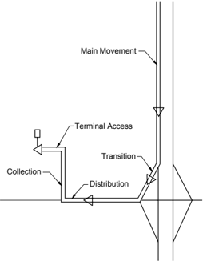
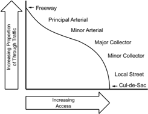
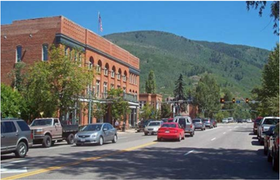
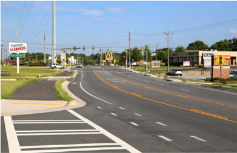

# 1.1  INTRODUCTION

- Source: GreenBook.pdf
- Generated: 2026-01-03T08:11:58+00:00
- Chunk: 9/28
- Estimated tokens: ~25,271
- Total pages: 1048
- Type: chapter

## 1.1  INTRODUCTION

This seventh edition of the A Policy on Geometric Design of Highways and Streets incorporates recent research that provides insight into the effect of specific geometric design elements of roads and streets for all transportation modes. This edition of the policy also introduces the consideration of five specific context classifications as an element of the geometric design process and emphasizes the consideration of multimodal needs in design. Together, context classification and functional classification constitute a new framework for  geometric  design.  The  policy  also  encourages  flexible  design,  which emphasizes the role of the planner and designer in determining appropriate design dimensions based on project-specific conditions and existing and future roadway performance more than on meeting specific nominal design criteria. In the past, designers sought to assure good traffic operational and safety performance for the design of specific projects primarily by meeting the dimensional design criteria in this policy. This  approach  was  appropriate  in  the  past  because  the  relationship  between  design dimensions and future performance was poorly understood. Traditional applications of this policy took the approach that, if the geometric design of a project met or exceeded specific dimensional design criteria, it would be likely to perform well. In some cases, this may have led to overdesign, constructing projects that were more costly than they needed to be or were inappropriate for the roadway context.

Recent research has improved our knowledge of the relationship between geometric design features and traffic operations for all modes of transportation and has developed new knowledge about the relationship of geometric design features to crash frequency and severity. Much of the recently developed information about assessing traffic operations for all transportation modes is presented in the TRB Highway Capacity Manual ( 25 ), while the recently developed information about estimating future crash frequencies and severities is presented in the AASHTO Highway Safety Manual ( 4, 7 ).

This edition of the policy introduces new definitions of project types-new construction, reconstruction, and projects on existing roads-and explains how design flexibility is provided for each project type as part of the project development process.

--',''','',',',','''''',,,,''-'-',,',,',',,'---

Project development is broader than just geometric design and should consider many factors for all transportation modes, including:

- y Project purpose and need
- y Existing and expected future traffic operational efficiency
- y Existing and expected future crash frequency and severity
- y Construction cost
- y Future maintenance cost
- y Context classification
- y Service and ease of use for each transportation mode:
-  automobile
-  bicycle
-  pedestrian
-  transit
-  truck
- y Accessibility for persons with disabilities
- y Available right-of-way
- y Existing and potential future development
- y Operational flexibility during future incidents and maintenance activities
- y Stakeholder input
- y Community goals and plans and potential community impacts
- y Historical structures
- y Impacts on the natural environment:
-  air quality
-  noise
-  wetlands preservation
-  wildlife and endangered species
- y Preservation of archeological artifacts

These factors are not necessarily presented in priority order and, indeed, the priorities placed on them vary from project to project. None of these factors is uniquely important and geometric design should complement other aspects of project development in seeking the appropriate balance among their potential effects.

--',''','',',',','''''',,,,''-'-',,',,',',,'---

A 2016 resolution of the AASHTO Standing Committee on Highways ( 8 ) has directed that geometric design policy and practice should become more flexible and performance-based to more fully address the needs of all transportation modes and the challenges to transportation agencies created by funding and right-of-way constraints. This AASHTO resolution is consistent with the direction set by Federal legislation in the Fixing America's Surface Transportation (FAST) Act ( 14 ). This seventh edition of the policy takes a first step toward implementing a new framework for geometric design to accomplish this goal. There was already substantial flexibility in the geometric design guidance presented in previous editions of this policy, and this seventh edition expands that flexibility. This chapter explains how the flexible, performance-based approach should be applied and describes how Chapters 2 through 10, together with other available resources, can be used in implementing the new framework and the performance-based approach for all transportation modes. The next edition of this policy will more fully incorporate this approach, with full implementation of the new framework and the flexible, performance-based approach in each chapter.

## 1.2  PROJECT PURPOSE AND NEED

The design of every road or street improvement project should begin with an explicit statement developed by the roadway agency that indicates why the project is being undertaken and what the project is intended to accomplish. This statement may be in the form of the purpose and need statement used in National Environmental Policy Act (NEPA) analyses, a formal statement of objectives for the project, or a combination of the two approaches. Either separately or collectively, these statements set out the purpose and need for the project and the objectives that the project should satisfy in fulfilling that purpose and need. In the remainder of this discussion, these two types of documents collectively will be referred to as the purpose and need statement.

The purpose and need statement informs priorities on what will, and what will not, be undertaken in the project. The designer should refer to this purpose and need statement in determining the scope of geometric design changes to include in the project and assessing whether any geometric design changes suggested by others are germane to the project purpose and need.

The purpose and need statement for a project should be built around an assessment of past performance for all transportation modes of the roads and streets within the project limits and a forecast of future performance if no project is undertaken. The purpose and need statement should address the project context and how each transportation mode should be accommodated. The purpose and need statement should also indicate what aspects of performance should be improved and, in some cases, may also set targets for how much performance should be improved. Thus, improvement needs should be based on specific performance issues that are identified by the agency as in need of improvement. Performance, in this context, is broader than traffic operational or safety performance and potentially addresses any of the performance issues listed in Section 1.1. Both quantitative and qualitative performance measures may be used in defining

the purpose and need for projects. The roadway agency should involve other stakeholders in establishing the project purpose and need.

The performance-based approach to establishing the purpose and need for and the objectives of the project enables the designer to focus on addressing the needs of a project without needlessly exceeding them. By limiting a project's scope to focus only on documented performance improvement needs, more resources are available to be spent on other needs throughout the road and street system.

The scope of projects, based on their purpose and need, may range from simple projects on existing roads (addressing a single issue) to new construction projects that create a new road and complex reconstruction projects that may change the character of an existing road. Construction of roads on new alignment and reconstruction projects that change the basic roadway type (see Section 1.7.2) should utilize the design criteria in Chapters 2 through 10, to the extent practical, while seeking the appropriate balance among transportation modes and among the many factors that affect project development. Less complex projects on existing roads that do not change the basic roadway type are typically undertaken primarily to address specific identified performance issues, such as poor infrastructure condition, current or anticipated traffic congestion, or current or anticipated crash patterns. Such projects should focus on addressing the performance issues that prompted the project, as well as any other known performance issues within the project limits that are identified in the purpose and need statement.

Performance issues identified by the purpose and need statement may address any of the many factors listed in Section 1.1, but need not include them all. In fact, when one aspect of performance needs improvement and other aspects do not, good project management should focus on the performance issues that need improvement. The purpose and need statement serves as a tool for agency management to focus the scope of projects to improvements that are expected to have a specific, anticipated effect on project performance. Performance issues also include assessment of the service provided to each transportation mode.

Performance issues are often identified from existing agency databases or field data, but may also be documented with models such as traffic simulation models, crash prediction or systemic safety models, and air quality or noise models. These same models can be used to quantify the effectiveness of candidate design alternatives in improving performance.

It is important to understand that noncompliance with geometric design criteria is not, by itself, a performance issue for a project on an existing road. Noncompliance with geometric design criteria is not sufficient to be identified as an issue in a project purpose and need statement; such noncompliance with geometric design criteria only becomes an issue to be addressed in the project purpose and need if that noncompliance has resulted in (or is forecast to result in) poor performance that is correctable by a geometric design improvement and that the agency chooses to address. If some aspects of the geometric design for a road or street do not fully comply

with the geometric design criteria presented in Chapters 2 through 10, but the road or street is performing satisfactorily, there is no need to change those aspects of the existing geometric design for projects in which the basis roadway type will remain the same. Thus, noncompliance with geometric design criteria should be addressed in projects on existing roads only where it is established that the current design is performing poorly or that a geometric design improvement would be cost-effective. This approach is intended to avoid expenditures that have no impact on performance. Some exceptions, where quantitative performance measures are not available, are addressed below.

It is important to understand that, while great progress has been made in developing performance assessment tools, not every aspect of past and anticipated future performance can be quantified for projects on existing roads. Some issues may need to be assessed qualitatively. For example, there are no performance measures for the effect of pavement cross slope in normal crown sections on safety. Surrogates, such as noting the ponding of water during rainstorms, may need to be applied in the absence of quantitative performance measures; simply applying the applicable design criteria may be the most applicable approach. Similarly, there are no quantitative performance measures for vertical clearance; vertical clearance should generally be addressed by reference to applicable design criteria.

Two types of data may be available for use in establishing the project purpose and need and guiding the design process:

- y past performance data
- y forecasts of future performance

For new construction projects, there are no past performance data, so forecasts of future performance are most relevant to design decisions. For projects on existing roads, past (or present) performance data are available and forecasts of future performance may be developed.

Projects need not address every aspect of poor performance. Designation of the performance issues to be addressed in any given project is an agency management decision, with due consideration of funding availability and the effect that improvements in some aspects of performance may have on other aspects of performance. The purpose and need statement should make clear any limitations on the scope of the project.

## 1.3  OVERVIEW OF THE NEW FRAMEWORK FOR GEOMETRIC DESIGN

This policy incorporates a framework for geometric design based primarily upon:

- y a functional classification system that characterizes roadways by their position in the transportation network and the type of service they provide to motor vehicles

- y a context classification system that characterizes roadways by their surrounding environment and how the roadway fits into the community

The functional classification system considers four general functional classes: freeways, arterials, collectors, and local roads and streets. These functional classes are defined in Section 1.4. The context classification system considers five context classes: rural, rural town, suburban, urban, and urban core. These context classes are defined in Section 1.5.

The first steps in the design process are to prepare a purpose and need and/or objectives statement for the project (see Section 1.2) and to determine where the project falls in the design framework shown in Figure 1-1. The design framework consists of twenty specific combinations of the four functional classes and the five context classes for roadways. Each of the combinations includes roadways that serve a distinct set of user needs. Nineteen of these twenty roadway types (all but freeways in the rural town context) are commonly found on the road and street network; the exception, representing a freeway in a rural town context, is unlikely to occur often.

| Functional Class         | Context Class   | Context Class   | Context Class   | Context Class   | Context Class   |
|--------------------------|-----------------|-----------------|-----------------|-----------------|-----------------|
| Functional Class         | Rural           | Rural Town      | Suburban        | Urban           | Urban Core      |
| Local Road or Street     |                 |                 |                 |                 |                 |
| Collector Road or Street |                 |                 |                 |                 |                 |
| Arterial Road or Street  |                 |                 |                 |                 |                 |
| Freeway                  |                 |                 |                 |                 |                 |

Note: This framework together with an assessment of multimodal needs and performance measures should guide the flexible approach to the design of projects. The shaded cell, representing a freeway in a rural town context, is unlikely to occur often.

Figure 1-1. Framework for Roadway Design Based on Functional Classification and Roadway Context

While the functional and context classes provide general information for the designer about the character of the roadway at any given location, roadway conditions may vary widely within these classes. Thus, merely identifying the functional and context classification for the roadway is not a sufficient basis for design. More specific guidance on the design of individual roadways within given functional and context classes is provided by:

- y a modal classification system so that the needs of all transportation modes are considered in the design of each roadway or project (see Section 1.6)

- y a design process incorporating a project type classification system used to choose the appropriate design approach for each project (see Section 1.7)
- y a flexible design approach to finding the appropriate balance for each project to meeting the needs of all users and transportation modes (see Section 1.8)
- y a performance-based approach for considering the effects of geometric design decisions (see Section 1.9)

## 1.4  FUNCTIONAL CLASSIFICATION FOR MOTOR VEHICLES

Functional classification defines the role of each roadway in serving motor-vehicle movements within the overall transportation system. The functional classification of a roadway suggests its position within the transportation network and its general role in serving automobile, truck, and transit vehicles. This section reviews the approach used to define the functional classification of roadways and the application of functional classification in the design process.

Functional classification has traditionally served as a central organizing criterion for the geometric design process. This seventh edition of the policy, like its predecessors, explicitly presents geometric design criteria for specific functional classes of roadways in separate chapters. Geometric  design  for  local  roads  and  streets,  collector  roads  and  streets,  arterial  roads  and streets, and freeways are presented in Chapters 5 through 8, respectively. However, functional classification, by itself, does not address explicitly fitting the roadway into the community or the needs of other transportation modes including bicyclists and pedestrians. This seventh edition emphasizes context classification and multimodal considerations, as well as functional classification.

Over the years,  functional  classification  has  come  to  assume  additional  significance  beyond its stated purpose as identifying the particular role of a roadway in moving vehicles through a network of roads and streets. Functional classification carries with it expectations about roadway design, including the roadway's speed and capacity. Federal legislation continues to use functional classification in determining eligibility for funding under the Federal-aid program. Transportation  agencies  describe  roadway  system  performance,  benchmarks,  and  targets  by functional classification. As agencies continue to move towards a more performance-based design and management approach, functional classification will continue as an important consideration in setting expectations and measuring outcomes for motor-vehicle mobility. FHWA guidelines for determining the functional classification for roads and streets are presented in Highway Functional Classification Concepts, Criteria and Procedures ( 10 ).

The formal classification of roadways as freeways, arterials, collectors, and local roads and streets serves as a useful starting point for the design process, but the designer should not simply rely on this formal designation as a design control. The roadway type, for design purposes, should be based on the actual role that the roadway plays in the transportation system, as determined

through the  project  development  process.  Section  1.5  on  contexts  for  geometric  design  and Section 1.6 on multimodal considerations in geometric design address these additional design considerations.

## 1.4.1 Hierarchy of Motor Vehicle Movement

Motor vehicle travel involves a series of distinct travel movements. The six recognizable stages in  most trips include main movement, transition, distribution, collection, access, and termination. For example, Figure 1-2 shows a hypothetical highway trip using a freeway, where the main movement of vehicles is uninterrupted, high-speed flow. When approaching destinations from the freeway, vehicles reduce speed on freeway ramps, which act as transition roadways. The vehicles then enter moderate-speed arterials (distributor facilities) that bring them nearer to the vicinity of their destination neighborhoods. They next enter collector roads that penetrate neighborhoods. The vehicles finally enter local access roads that provide direct approaches to individual residences or other terminations. At their destinations, the vehicles are parked at an appropriate terminal facility.

Each of the six stages of this hypothetical trip is handled by a separate facility designed specifically for its function. Because the movement hierarchy is based on the total amount of traffic volume, freeway travel is generally the highest level in the movement hierarchy, below that is arterial travel, and lowest in the movement hierarchy is travel on collectors and local roads and streets.

Figure 1-2. Hierarchy of Movement

Although many trips can be subdivided into all of the six recognizable stages, intermediate facilities  are  not  always  needed.  The  complete  hierarchy  of  circulation  facilities  most  closely applies to conditions of low-density suburban development, where traffic flows are cumulative on successive elements of the system. However, travelers sometimes follow a reduced number of components in the chain. For instance, some local roads and streets connect directly to arterials and some trip origins and destinations are located directly on arterials or collectors. Some large traffic generators may be connected directly to a freeway ramp, so that traffic does not need to use the arterial system. This absence of intermediate facilities for some trips does not eliminate the need for all functional classes of roads and streets in the transportation network.

A prominent cause of highway obsolescence is the failure of a design to recognize and accommodate each of the different trip levels of the movement hierarchy. Conflicts and congestion occur at interfaces between public highways and private traffic-generating facilities when the functional transitions are inadequate. Examples are commercial driveways that connect directly from a relatively high-speed arterial to a parking aisle without intermediate provisions for transition deceleration and arterials, or more seriously, freeway ramps that connect directly to or from large traffic generators such as major shopping centers.

--',''','',',',','''''',,,,''-'-',,',,',',,'---

## 1.4.2  Access Control and Mobility Needs

The two major considerations in classifying highway and street networks functionally are access and mobility. The conflict between providing mobility for through-traffic movements and providing access to a dispersed pattern of trip origins and destinations leads to the differences and gradations in the various functional types.

Freeways are provided almost exclusively  to  enhance  mobility  for  through  traffic.  Access  to freeways is provided only at specific grade-separated interchanges, with no direct access to the freeway from adjacent land except by way of those interchanges. Design of freeways is addressed in Chapter 8.

Selected roads and streets are designated as arterials to recognize that mobility of through traffic is one of their primary functions. However, arterials also connect to both collectors and local roads and streets and many arterials provide direct access to adjacent development. Access management techniques can be used to reduce the conflicts between mobility for through traffic and access to adjacent development. However, such conflicts are unavoidable, especially in urban areas, because access to adjacent development is essential to thriving communities. The extent of adjacent development varies with the context of the road or street, which is a primary reason that context classification (see Section 1.5) has been added to the design framework along with functional classification.  The  demands for nonmotorized travel may also vary widely among arterial roads and streets. Design of arterial roads and streets to meet these multiple demands is addressed in Chapter 7.

Collector roads and streets connect arterials to local roads and streets as well as providing access to adjacent development. Mobility for through traffic is less important on collectors than on arterials because motor vehicles often travel only moderate distances on a collector before reaching an arterial or local road. Collectors generally offer approximately balanced service to both the mobility and access functions but, as with arterials, the context of surrounding development on collectors and the demands for nonmotorized travel may vary widely. Design of collector roads and streets to meet these multiple demands is addressed in Chapter 6.

Local roads and streets exist primarily to serve adjacent development. Mobility for through traffic is of little importance because the distance from the origin or destination of a motor vehicle trip to the nearest collector is usually short. Like arterials and collectors, local roads and streets have a variety  of  surrounding  contexts  and  serve  varying  demands  for  nonmotorized  travel. Design of local roads and streets to meet these multiple demands is addressed in Chapter 5.

Figure 1-3 illustrates the general balance between mobility and access for each functional class. Figure 1-3 is conceptual in nature because the extent and context of development along each road and street varies widely, and some arterials may have more extensive access needs than many collector or local roads. Further discussion of the various degrees of access control appro-

priate to street and highway development is provided in Section 2.5, 'Access Control and Access Management.'

Figure 1-3. Relationship of Functionally Classified Systems Serving Traffic Mobility and Land Access for Motor-Vehicle Traffic

## 1.4.3  Functional System Characteristics

This section explains how roads and streets in rural and urban settings are classified using the traditional approach to functional classification ( 10 ). Section 1.4.4 explains how these functional classifications are adapted for design.

## 1.4.3.1  Definitions Of Urban And Rural Areas

Urban and rural areas have fundamentally different characteristics with regard to density and types of land use, density of street and highway networks, nature of travel patterns, and the way in which these elements are related. Consequently, urban and rural functional systems are classified separately.

Section 101 of Title 23 U.S. Code ( 28 ) defines urban areas as those places within boundaries set by the responsible state and local officials having a population of 5,000 or more. Urban areas are further subdivided into urbanized areas (population of 50,000 and over) and small urban areas (population between 5,000 and 50,000). Rural areas are defined as all areas of a State not included in urban areas. As such, roadways have traditionally been classified as either 'urban' or 'rural.' However, it is important to recognize that a roadway's formal classification as urban or rural may differ from actual site circumstances or prevailing conditions. For this reason, it is important for the designer, working with the community and project reviewers, to determine an appropriate area type or types for a project early in the planning process. The area type classification should be based on actual roadway conditions, not boundaries shown on maps. Thus, the

area type classification (urban or rural) used in design may differ from that used in the roadway's formal functional classification.

## 1.4.3.2  Functional Categories

The roads making up the functional systems differ for urban and rural areas. The hierarchy of the functional systems consists of principal arterials (for main movement), minor arterials (distributors), collectors, and local roads and streets; however, in urban areas there are relatively more arterials with further functional subdivisions of the arterial category whereas in rural areas there are relatively more collectors with further functional subdivisions of the collector category.

## 1.4.3.3  Functional Systems for Rural Areas

Rural roads consist of facilities outside of urban areas, although they may pass through built-up areas and small towns or villages. The functional systems utilized in traditional functional classification for rural roads include principal arterials, minor arterials, major and minor collectors, and local roads.

## 1.4.3.3.1  Rural Principal Arterial System

The rural principal arterial system consists of a network of routes with the following service characteristics:

1. Corridor  movement  with  trip  length  and  density  suitable  for  substantial  statewide  or interstate travel.
2. Movements between all, or virtually all, urban areas with populations over 50,000 and a large majority of those with populations over 25,000.
3. Integrated movement without stub connections except where unusual geographic or traffic flow conditions dictate otherwise (e.g., international boundary connections or connections to coastal cities).

In the more densely populated states, this class of highway includes most (but not all) heavily traveled routes that might warrant multilane improvements in the majority of states; the principal arterial system includes most (if not all) existing rural freeways.

The principal arterial system is stratified into the following three classifications: (1) Interstate highways, (2) other freeways, and (3) other principal arterials.

For design purposes, freeways are treated as a separate functional class from other arterials.

## 1.4.3.3.2  Rural Minor Arterial System

The rural minor arterial road system, in conjunction with the rural principal arterial system, forms a network with the following service characteristics:

1. Linkage of cities, larger towns, and other traffic generators (such as major resort areas) that are capable of attracting travel over similarly long distances.
2. Integrated interstate and intercounty service.
3. Internal spacing consistent with population density, so that all developed areas of the state are within reasonable distances of arterial highways.
4. Corridor  movements  consistent  with  items  (1)  through  (3)  with  trip  lengths  and  travel densities greater than those predominantly served by rural collector or local systems.

Minor arterials therefore constitute routes that should provide for relatively high travel speeds and minimum interference to through movement consistent with the roadway context and considering the range of users to be served.

## 1.4.3.3.3  Rural Collector System

The rural collector routes generally serve travel of primarily intracounty rather than statewide importance and constitute those routes on which (regardless of traffic volume) predominant travel distances are shorter than on arterial routes. Consequently, more moderate speeds may be typical and frequent access to roadside development may be provided, consistent with the roadway context and the range of users to be served. To define rural collectors more clearly, this system is subclassified according to the following criteria:

- y Major Collector Roads-These routes (1) serve county seats not on arterial routes, larger towns not directly served by the higher systems, and other traffic generators of equivalent intracounty  importance,  such  as  consolidated  schools,  shipping  points,  county  parks,  and important mining and agricultural areas; (2) link these places with nearby larger towns or cities, or with routes of higher classifications; and (3) serve the more important intracounty travel corridors.
- y Minor Collector Roads-These routes should (1) be spaced at intervals consistent with population density to accumulate traffic from local roads and bring all developed areas within reasonable distances of collector roads; (2) provide service to the remaining smaller communities; and (3) link the locally important traffic generators with their rural hinterland.

## 1.4.3.3.4  Rural Local Road System

The rural local road system, in comparison to collectors and arterial systems, primarily provides access to land adjacent to the roadway and serves travel over relatively short distances. The local road system constitutes all rural roads not classified as principal arterials, minor arterials, or collector roads. The design of rural local roads should be consistent with the roadway context and the range of users to be served.

--',''','',',',','''''',,,,''-'-',,',,',',,'---

--',''','',',',','''''',,,,''-'-',,',,',',,'---

## 1.4.3.4  Functional Systems for Urban Areas

The four functional highway systems for urban areas used in traditional functional classification are urban principal arterials, minor arterial streets, collector streets, and local streets. The differences in the nature and intensity of development in rural and urban areas warrant corresponding differences in urban system characteristics relative to the correspondingly named rural systems.

## 1.4.3.4.1  Urban Principal Arterial System

In every urban environment, one system of streets and highways can be identified as unusually significant in terms of the nature and composition of travel it serves. In small urban areas (population under 50,000), these facilities may be limited in number and extent, and their importance may be derived primarily from the service provided to through travel. In larger urban areas, their importance also derives from service to rurally oriented traffic, but equally or even more importantly, from service for major circulation movements within these urban areas.

The urban principal arterial system serves the major centers of activity of urban areas, the highest traffic volume corridors, and the longest trip lengths. This system carries a high proportion of the total urban area travel even though it constitutes a relatively small percentage of the total roadway network. Many urban principal arterials serve high volumes of bicycle and pedestrian travel. The system should be integrated both internally and between major rural connections.

The urban principal arterial system carries most of the trips entering and leaving the urban area, as well as most of the through movements bypassing the central city. In addition, significant intra-area travel, such as between central business districts and outlying residential areas, between major inner-city communities, and between major suburban centers, is served by this class of facility.  Frequently,  the  urban  principal arterial system carries important intra-urban as well as intercity bus routes. Finally, in urbanized areas, this system provides continuity for all rural arterials that intercept the urban boundary.

Because of the nature of the travel served by the principal arterial system, almost all fully and partially controlled access facilities are usually part of this functional class. However, this system is not restricted to controlled-access routes. To preserve the identification of controlled-access facilities, the principal arterial system should be stratified as follows: (1) Interstate highways, (2) other freeways, and (3) other principal arterials (with partial or no control of access).

The spacing of urban principal arterials is closely related to the trip-end density characteristics of particular portions of the urban areas. Although no firm spacing rule applies in all or even in most circumstances, the spacing between principal arterials (in larger urban areas) may vary from less than 1 mi [1.6 km] in the highly developed central business areas to 5 mi [8 km] or more in the sparsely developed urban fringes.

For freeways, service to abutting land is subordinate to travel service to major traffic movements. For facilities within the subclass of other principal arterials in urban areas, mobility is often balanced against the need to provide direct access considering the roadway context and the accommodation of pedestrians, bicyclists, and transit users.

For design purposes, freeways are treated as a separate functional class from other arterials.

## 1.4.3.4.2  Urban Minor Arterial Street System

The urban minor arterial street system interconnects with and augments the urban principal arterial system. It accommodates trips of moderate length at a somewhat lower level of travel mobility than principal arterials do. This system distributes travel to geographic areas smaller than those identified with the higher system.

The urban minor arterial  street  system  includes  all  arterials  not  classified  as  principal.  This system places more emphasis on land access, multimodal accommodation, and serving the community context than the higher system does and offers lower traffic mobility. Such a facility may carry local bus routes and provide intracommunity continuity but ideally does not penetrate identifiable neighborhoods. This system includes urban connections to rural collector roads where such connections have not been classified as urban principal arterials for internal reasons. Minor arterials and collectors are increasingly the location for regional bicycle networks.

The spacing of urban minor arterial streets may vary from 0.1 to 0.5 mi [0.2 to 1.0 km] in the central business district to 2 to 3 mi [3 to 5 km] in the suburban fringes but is normally not more than 1 mi [2 km] in fully developed areas.

## 1.4.3.4.3  Urban Collector Street System

The urban collector street system provides both land access service and traffic circulation within residential neighborhoods and commercial and industrial areas. It differs from the urban arterial system in that facilities on the collector system may penetrate residential neighborhoods, distributing trips from the arterials through the area to their ultimate destinations. Conversely, the urban collector street also collects traffic from local streets in residential neighborhoods and channels it into the arterial system. In the central business district, and in other areas of similar development and traffic density, the urban collector system may include the entire street grid. The urban collector street system may also carry local bus routes. The design of urban collector streets should fit the community context and serve a range of bicyclists, pedestrians, and transit users. Minor arterials and collectors are increasingly the location for regional bicycle networks.

## 1.4.3.4.4  Urban Local Street System

The urban local street system comprises all facilities not in one of the higher systems. It primarily permits direct access to abutting lands and connections to the higher order systems. It offers the lowest level of mobility and usually contains no bus routes. Service to through-traffic move-

ment usually is deliberately discouraged. The design of urban local streets should be consistent with the community context. Local urban streets typically serve frequent bicycle and pedestrian movements.

## 1.4.4  Functional Classification as a Design Type

The discussion in this chapter has introduced the functional classification system that will serve as a basis for organizing geometric design criteria in the remainder of this policy. The functional classification of a road or street, together with its context classification, helps designers to anticipate the basic design type(s) that may be appropriate for that facility. The needs of multimodal users also influence the selection of an appropriate design type.

Two modifications to the traditional functional classification system are generally made in applying functional classification in the design process. The first modification involves freeways. A freeway is not a functional class in itself but is normally classified as a principal arterial. It does, however, have unique geometric criteria that demand a separate design designation apart from other arterials. Therefore, Chapter 8 on freeways has been included as a separate chapter along with chapters on arterials, collectors, and local roads and streets. The addition of the universally familiar term 'freeway' to the basic functional classes seems preferable to the adoption of a completely separate system of design types.

The second modification is that the distinctions between principal arterials and minor arterials, and between major collectors and minor collectors, do not necessarily imply any physical differences in the appropriate roadway designs for these facility types. Other factors such as context classes and demand volumes for individual transportation modes provide more relevant information about the appropriate facility design than the distinction between types of arterials or collectors. Therefore, for design purposes, the principal arterial and minor arterial classes and are combined into a single arterial class and the major and minor collector classes are combined into a single collector class.

With these modifications, the four functional classes used in the design framework are: freeways, arterials, collectors, and local roads and streets.

## 1.5  CONTEXT CLASSIFICATION FOR GEOMETRIC DESIGN

Traditionally, geometric design criteria have considered only two contexts-rural and urbanwith additional guidance provided for specific types of rural and urban locations. This seventh edition of the policy begins a transition to a broader set of contexts for geometric design. Five contexts are used, two for rural areas and three for urban areas:

--',''','',',',','''''',,,,''-'-',,',,',',,'---

## Rural areas

- y Rural context
- y Rural town context

## Urban areas

- y Suburban context
- y Urban context
- y Urban core context

These contexts are defined based on development density (existence of structures and structure types), land uses (primarily residential, commercial, industrial, and/or agricultural), and building setbacks (distance of structures to adjacent roadways). These five contexts were initially presented in NCHRP Report 855, An Expanded Functional Classification System for Highways and Streets ( 22 ), which has prepared a guide for classifying contexts and applying the context classes in design.

Figures 1-4 through 1-8 illustrate typical roads and streets in each of the five contexts, respectively, including the rural, rural town, suburban, urban, and urban core contexts. These context classes supplement, but do not replace, the functional classification system used in geometric design (see Section 1.4). The functional classifications represent the appropriate role of specific roads in serving motor vehicles, including passenger cars, trucks, and transit. The context classification and the multimodal considerations discussed below in Section 1.6 help designers in serving community needs and finding an appropriate balance among the transportation modes that use a specific facility. It is intended that the context for a road or street be identified through a  simple  review  of  the  character  of  development  in  the  field  or  using  an  aerial  photograph, without the need for quantitative analysis. The primary factors that define the context classesdevelopment density, land uses, and building setbacks-are easy to identify by observing the landscape adjacent to an existing or planned facility. Other factors including topography, soil type, land value, population density, and building square footage are related to context classification; however, data on these other factors are more quantitative and more difficult to acquire, so the context classification system does not rely on them. Roads in any context classification may also fall within almost any of the functional classes (the only exception is freeways, which rarely, if ever, are designed for a rural town context).

Both the current context classification for roads and streets, as well as possible changes in context classification resulting from future development, should be considered in design. Specific context classes found in both rural and urban areas are described below. These context classes, together with functional classes (described in Section 1.4), provide a framework for design. Just as a wide range of roadway conditions can be found within any given functional class, roadway conditions can vary widely within each context class. Thus, there is no single design type or solution that is applicable to all roads and streets within any given functional class.

Source: Gresham-Smith Partners

Figure 1-4. Typical Road in the Rural Context

Source: Gresham-Smith Partners

Figure 1-5. Typical Street in the Rural Town Context

--',''','',',',','''''',,,,''-'-',,',,',',,'---

Source: Gresham-Smith Partners

Figure 1-6. Typical Street in the Suburban Context

Source: Gresham-Smith Partners

Figure 1-7. Typical Street in the Urban Context

Source: Gresham-Smith Partners

Figure 1-8. Typical Street in the Urban Core Context

## 1.5.1  Context Classes for Roads and Streets in Rural Areas

Roads in rural areas should be designed for either the rural or rural town context. Each of these contexts is discussed below.

## 1.5.1.1  Rural Context

The rural context applies to roads in rural areas that are not within a developed community. These include areas with the lowest development density; few houses or structures; widely dispersed or no residential, commercial, and industrial land uses; and usually large building setbacks. The rural context may include undeveloped land, farms, outdoor recreation areas, or low densities of other types of development. Most roads in rural areas fit the rural context and should be designed in a manner similar to past design criteria for rural facilities.

## 1.5.1.2  Rural Town Context

The rural town context applies to roads in rural areas located within developed communities. Rural towns generally have low development densities with diverse land uses, on-street parking, and sidewalks in some locations, and small building setbacks. Rural towns may include residential neighborhoods, schools, industrial facilities, and commercial main street business districts, each of which present differing design challenges and differing levels of pedestrian and bicycle activity. The rural town context recognizes that rural highways change character where they enter a small town, or other rural community, and that design should meet the needs of not only through travelers, but also the residents of the community. Speed expectations of through travelers change when they enter a rural town. Guidance on the selection of design speeds and

other design elements for the rural town context is presented in Chapters 5, 6, and 7 for local roads and streets, collectors, and arterials, respectively. Additional information on design for the rural town environment can be found in When Main Street is a State Highway ( 17 ) developed by the Maryland Department of Transportation and Main Street… When a Highway Runs Through It ( 19 ), developed by the Oregon Department of Transportation. Guidance on design and speed management for transition zones where a rural highway enters a rural town may be found in and NCHRP Report 737, Design Guidance for High-Speed to Low-Speed Transition Zones for Rural Highways ( 23 ).

## 1.5.2  Context Classes for Roads and Streets in Urban Areas

Roads and streets in urban areas may be designed for the suburban, urban, and urban core contexts. These contexts differ in development density, land use, and building setbacks. Speed expectations of drivers vary markedly as drivers move between (and even within) these contexts, as does the typical level of pedestrian, bicycle, and transit activity. Each of these contexts is discussed below.

## 1.5.2.1  Suburban Context

The suburban context applies to roads and streets, typically  within  the  outlying  portions  of urban areas, with low to medium development density, mixed land uses (with single-family residences, some multi-family residential structures, and nonresidential development including mixed town centers, commercial corridors, big box commercial stores, light industrial development). Building setbacks are varied with mostly off-street parking. The suburban context generally has lower development densities and drivers have higher speed expectations than the urban and urban core contexts. Pedestrians and bicyclist flows are higher than in the rural context, but may not be as high as found in urban and urban core areas.

## 1.5.2.2  Urban Context

The urban context has high-density development, mixed land uses, and prominent destinations. On-street parking and sidewalks are generally more common than in the suburban context, and building setbacks are mixed. Urban locations often include multi-story and low- to medium-rise structures  for  residential,  commercial,  and  educational  uses.  Many  structures  accommodate mixed uses: commercial, residential, and parking. The urban context includes light industrial, and sometimes heavy industrial, land use. The urban context also includes prominent destinations with specialized structures for entertainment, including athletic and social events, as well as conference centers. In small- and medium-sized communities, the central business district may be more an urban context than an urban core context. Driver speed expectations are generally lower and pedestrian and bicyclist flows higher than in suburban areas. The density of transit  routes  is  generally  greater  in  the  urban  context  than  the  suburban  context,  including in-street rail transit in larger communities and transit terminals in small- and medium-sized communities.

## 1.5.2.3  Urban Core Context

The urban core context includes areas of the highest density, with mixed land uses within and among predominantly high-rise structures, and with small building setbacks. The urban core context is found predominantly in the central business districts and adjoining portions of major metropolitan areas. On-street parking is often more limited and time restricted than in the urban context. Substantial parking is in multi-level structures attached to or integrated with other structures. The area is accessible to automobiles, commercial delivery vehicles, and public  transit.  Sidewalks  are  present  nearly  continuously,  with  pedestrian  plazas  and  multi-level pedestrian bridges connecting commercial and parking structures in some locations. Transit corridors, including bus and rail transit, are typically common and major transit terminals may be present. Some government services are available, while other commercial uses predominate, including financial and legal services. Structures may have multiple uses and setbacks are not as generous as in the surrounding urban area. Residences are often apartments or condominiums. Driver speed expectations are low and pedestrian and bicycle flows are high.

## 1.5.3  Design Guidance for Specific Context Classes

Guidance on the selection of design speeds and other design elements for each of the contexts is presented in Chapters 5, 6, 7, and 8 for local roads and streets, collectors, arterials, and freeways, respectively. Intersection designs may also vary by context class, as described in Chapter 9.

The design guidance for the five context classes presented in this edition of the policy is preliminary in nature. More comprehensive guidance on design for each of the contexts in each functional classification is planned for the next edition of this policy.

Where the text of this policy refers to roads or streets 'in rural areas' or 'in urban areas,' the accompanying discussion addresses all contexts within the relevant area type. Where the text of the policy refers to a specific context type (i.e., roads or streets 'in the rural context,' 'in the rural town context,' or 'in the urban context') the accompanying discussion addresses only the specific context class or classes mentioned.

The character of development often varies along a given roadway corridor, so a project may include more than one context class. The portion of the project in each context class should be designed in a manner appropriate to that class, with appropriate transitions, as needed.

## 1.6  MULTIMODAL CONSIDERATIONS

Multimodal considerations are an essential element in the design of every road or street project appropriate to roadway context and community needs. Road and street facilities should be designed to accommodate current and anticipated users. --',''','',',',','''''',,,,''-'-',,',,',',,'---

## 1.6.1  Road and Street User Groups/Transportation Modes

Road  and  street  user  groups  can  be  generally  categorized  into  the  following  transportation modes:

- y Automobiles
- y Bicyclists
- y Pedestrians
- y Transit vehicles
- y Trucks

The following discussion of each user group or transportation mode is provided to explain its role in the transportation system and present some of the geometric design elements important to each mode. Chapters 2 through 10 provide more detailed information on how these transportation modes affect the design of roads and streets.

## 1.6.1.1  Automobiles

Automobiles include all passenger-carrying motor vehicles other than buses. Specifically included within the broad category of automobiles are passenger cars, motorcycles, sports utility vehicles,  light  trucks  (such  as  pickup  trucks),  and  recreational  vehicles.  For  many  roadways, automobiles are the primary mode of travel and transport the largest proportion of road users. In the past, many roadways were designed and built primarily to serve the mobility needs of motor vehicles (automobiles, trucks, and buses), with some consideration of other transportation modes. In recent years, the focus of road design has shifted to consistently consider the needs of all transportation modes, including pedestrians and bicyclists.

## 1.6.1.2  Bicyclists

Bicycle trips have been steadily increasing in many areas of the country. Recreational bicycling has grown, including long-distance bicycle travel in rural areas and, in urban areas, bicycling has become a key mode of transportation from home to work, school, shopping, and entertainment activities. In some cases, the same facilities that serve motor vehicles can adequately serve bicyclists as well, and specific traffic control devices have been developed for the benefit of both motor vehicle drivers and bicyclists. In many other cases, dedicated bicycle facilities on or off the roadway, including marked bicycle lanes and off-road or shared-use bicycle paths, are appropriate. Many communities have planned, and have begun designing and building specific bicycle networks. Segments and intersections along these networks include facilities and accommodations to encourage cyclists to prefer them to other, nearby routes. This helps agencies focus bicycle treatments on specific roadways and provides consistent expectations for roadway operations to both bicyclists and motor-vehicle drivers. Guidance on the design of bicycle facilities is presented in the AASHTO Guide for Development of Bicycle Facilities ( 5 ).

## 1.6.1.3  Pedestrians

Nearly every trip includes a pedestrian portion; even trips taken by passenger vehicles or transit begin with drivers and passengers walking from their origin to the vehicle and end with them walking from the vehicle to their destination. Designing for these short pedestrian trips is especially critical in parking lots, at transit stops, and along roads with on-street parking. The design of these areas should attempt to maximize the visibility of pedestrians to drivers and drivers to pedestrians. Where appropriate, facilities should be designed to encourage pedestrians to complete these initial and final legs of their trip along designated paths and crossings, where drivers expect to encounter them.

In some areas, walking is a mode frequently used by travelers for the entirety of their trip. While central business districts, neighborhood centers, shopping districts, and office complexes in the urban and urban core contexts are often thought of as having the highest rate of pedestrian trips, people often walk to other local destinations or simply for exercise or leisure in suburban and rural contexts as well.

Roadway and intersection designs should consider expected pedestrian usage and provide pedestrian facilities and design elements where appropriate. Such considerations may include a provision of a sidewalk or shared-use path, crosswalks at intersections and appropriate midblock locations,  pedestrian  signals  at  appropriate  pedestrian  crossings,  and  other  geometric  design features that are desirable at locations where pedestrians are present. Appropriate design speeds and geometric design features that encourage slower motor-vehicle speeds should be selected for locations with substantial pedestrian flows. Use of barriers between pedestrian facilities and motor vehicle traffic may be considered. The need to serve pedestrians may, in some cases, conflict with the need to serve other transportation modes. For example, short curb return radii at intersections result in shorter pedestrian crossings, while longer curb return radii permit trucks to make right-turn maneuvers without encroaching on opposing traffic lanes. It is important that designers find an appropriate balance among the needs of all user groups and transportation modes, suitable for conditions at each specific location.

The Americans with Disabilities Act of 1990 ( 29 ), a Federal law referred to as the ADA, requires that a public entity, such as state and local governments, operate each of its services, programs, or activities, including pedestrian facilities in public street rights-of-way, such that, when viewed in its entirety, it is readily accessible to and usable by individuals with disabilities. The ADA requires that a public entity's newly constructed facilities must be made accessible to and usable by individuals with disabilities to the extent that it is not structurally impracticable to do so. The ADA also requires that, when an existing facility is altered, the altered facility must be made accessible to and usable by individuals with disabilities to the maximum extent feasible. Section 504 of the Rehabilitation Act of 1973 ( 21 ), generally referred to as Section 504, includes similar requirements for public entities that receive Federal financial assistance.

--',''','',',',','''''',,,,''-'-',,',,',',,'---

Chapters 2 through 10 of this policy address accessible design of pedestrian facilities, where applicable, but are not the authoritative resource for guidance on accessible design. The 2010 ADA Standards, adopted by the U.S. Department of Justice (DOJ) ( 27 ),  and  the  2006  Standards adopted by the U.S. Department of Transportation (DOT) ( 30 ) have limited applicability in the public right of way. The Proposed Guidelines for Pedestrian Facilities in the Public Right-ofWay ( 26 ) should be consulted when designing features not addressed in the standards. Because the proposed accessibility guidelines ( 26 ) have not yet been finalized by the U.S. Access Board and adopted by the DOJ or the DOT, they are not enforceable standards. However, the proposed guidelines provide a useful framework to help public entities meet their obligations to make their programs, services, and activities in the public rights-of-way readily accessible to and usable by individuals with disabilities. For that reason, Chapters 2 through 10 of this policy reference the proposed accessibility guidelines as a best practice for the design and construction of sidewalks, pedestrian crossings, and other pedestrian facilities in the public rights-of-way. Additional guidance on design of pedestrian facilities is presented in the AASHTO Guidelines for the Planning, Design, and Operation of Pedestrian Facilities ( 3 ).

## 1.6.1.4  Transit

The most common transit vehicle that uses the road and street network are buses, although some communities also provide streetcars, trolleys, or other vehicles that share the traveled way with passenger cars. In addition, light rail transit may frequently cross roads and streets.

Where the traveled way of a street is shared by transit vehicles, adequate lane width should be provided to accommodate the specific vehicles that are present. Special consideration should also be given to locating and designing the stops for these vehicles, recognizing that pedestrians often need to cross the street to access their desired transit stop. Designated transit lanes may be appropriate, especially during specific times of day, to minimize the interruption to traffic flow and decrease the potential for traffic conflicts as transit vehicles stop to pick up or drop off passengers, or merge into and out of traffic to access stops that are set back from travel lanes. Guidance for design of streets served by transit is presented in the AASHTO Guide for Geometric Design of Transit Facilities on Highways and Streets ( 6 ).

## 1.6.1.5  Trucks

Heavy trucks are present, in varying volumes, on many roads and streets. Freeways and arterials generally carry the highest truck volumes. Freeways generally serve long-distance intercity trips and trips from one portion of an urban area to another. Arterials serve long distance intercity trips where freeways are not provided, trips from one portion of an urban area to another, and portions of trips between freeways and the trip origins and destinations (i.e., pickup and delivery locations). Trip origins and destinations for trucks may be located along arterials or be accessed from the arterial using the collector and local road and street network. Intercity buses do not generally stop within urban areas, except at established terminals, and therefore operate much like trucks from the road designer's standpoint.

--',''','',',',','''''',,,,''-'-',,',,',',,'---

Trucks are substantially larger and less maneuverable than automobiles. Communities often designate routes for trucks so that trucks will operate on the roads and streets best suited for them. Wider lanes and larger curb return radii may be appropriate on truck routes to accommodate truck operation. However, trucks still need to leave the designated truck routes to access their origins and destinations. For example, residential streets are typically designed to accommodate fire trucks, garbage trucks, school buses, and snow plows; larger trucks that may be present only occasionally, such as moving vans, are not primary considerations in design.

Guidance about design to accommodate trucks can be found in Chapter 2 and in NCHRP Report 505, Review of Truck Characteristics as Factors in Roadway Design ( 15 ).

## 1.6.2  Consideration of All Transportation Modes in Design

Each of the transportation modes discussed above should be considered in the design of every project on the road and street network. The designer's goal should be a balanced design that serves multiple transportation modes, as appropriate. This does not necessarily mean that facilities for every mode are provided on every road and street. In fact, the appropriate balance among transportation modes may vary widely between specific roads and streets. But the guiding design principle is that the balance among transportation modes selected for each road and street should be a conscious decision arrived at after thorough consideration of the needs of each mode, local and regional transportation agency master plans, and community needs.

Key factors in considering the appropriate facilities to be provided on a roadway or at an intersection are the functional classification and context of the road or street, the expected demand flows for each transportation mode (both current and anticipated), and area-wide or corridor plans established by the community. Assessment of demand flows for motor vehicles has been part of design practice for many years, but assessment of demand flows for pedestrians and bicyclists should also be a key aspect of project design. The facilities provided to serve each transportation mode should be appropriate to the current and anticipated demand flows for that mode. Balanced design recognizes that it may not be practical to provide facilities for every mode on every road and street, but the transportation network as a whole should serve the demands for all modes effectively and conveniently.

In assessing the needs of each transportation mode, planners and designers should consider the current and future demand for travel by each mode, which may not always be reflected in current travel volumes. Where facilities for a transportation mode do not currently exist or where the existing facilities are inadequate to serve the full demand volume, trips may be diverted to other facilities or not made at all. Planning studies can identify appropriate demand volumes for each transportation mode for any given facility or corridor.

Area-wide and corridor plans are an important consideration in project design, because such plans are the means that communities utilize to manage their development and to guide road

--',''','',',',','''''',,,,''-'-',,',,',',,'---

and street design in a manner consistent with the community context. Detailed, formal plans may be most likely to have been developed in urban areas and rural towns, but plans also have been developed for many locations in the rural context. Such plans complement the information provided by the estimates of demand flow by transportation mode. The following types of guidance provided in area-wide or corridor plans will clearly influence the design of specific projects:

- y The functional class of a road or street indicates the emphasis that should be placed on serving through-motor vehicle traffic vs. access to adjacent development.
- y The context class of a road indicates the general development density, land use, and building setbacks along the road or street of interest. This context class has implications for the general speed expectations of motor vehicle drivers, the expectations of pedestrians and bicyclists, the character and constraints of surrounding development.
- y Bicycle network or corridor plans may indicate that some roads and streets are intended as primary bicycle routes that connect to other routes throughout the community. The bicycle facilities provided should be appropriate to the current and anticipated demand volumes and, depending upon those volumes, may include off-road or shared-use paths, on-street bicycle lanes, or widened curb lanes. By contrast, the established plans in urban areas may discourage bicycle usage on some streets that are ill suited to bicycling due to high volumes of motor vehicle traffic, high motor vehicle speeds, or width constraints that make provision of bicycle facilities impractical. This is reasonable where the plans include provision of bicycle facilities on parallel roads and streets within the same corridor to make those other streets more attractive to bicyclists.
- y Pedestrian network or corridor plans, land use plans, and community plans, together with context classification, should assist designers in anticipating the need for pedestrian facilities on particular roads and streets. Needs for facilities should be evident from the potential origins and destinations of pedestrian trips (homes, schools, commercial establishments, workplaces, and activity centers), from the specific development along the road or street in question, and from anticipated future development.
- y Truck network plans often designate some routes as through-truck routes, prohibit or restrict trucks (or trucks of certain sizes) on other routes, and leave the remainder of the network available for trucks to use in accessing their origins and destinations. Existing truck route plans will help designers anticipate where trucks need to be accommodated and the size of trucks likely to use those facilities. Truck network plans also help designers anticipate where trucks are not expected, at least not in substantial volumes.

The stated purpose and need for any given project will provide the designer with a perspective on how best to achieve an appropriate balance among transportation modes for that project. Community and stakeholder input, through the public involvement process, can also help guide the achievement of an appropriate balance. However, in determining the balance among transportation modes, the designer should consistently take a view of the design issues that is broader

--',''','',',',','''''',,,,''-'-',,',,',',,'---

than just a single project, keeping in mind the need for connectivity of the transportation network and the need for the network as a whole to serve all types of users appropriately.

The functional and context classes provide a classification framework (see Figure 1-1) that designers can use to identify and organize many of the needs for specific transportation modes that should be addressed in projects. This framework provides a tool that can be used by the designer to organize information about user needs for various transportation modes and seek an appropriate balance among those needs.

## 1.7  DESIGN PROCESS TO ADDRESS SPECIFIC PROJECT TYPES

Recent research ( 18 ) has developed a revised design process that varies by the purpose and need of the project. Thus, the structure of the design process is problem driven and based on the specific reason the project is being undertaken. This process is being implemented on a preliminary basis in this seventh edition of the policy and will be refined for full implementation in the next edition. --',''','',',',','''''',,,,''-'-',,',,',',,'---

The design process considers three general types of projects:

- y New construction-roads on new alignment
- y Reconstruction-projects on existing alignment that change the basic roadway type
- y Construction on existing roads-projects that maintain the basic roadway type

The definitions of the terms 'new construction' and 'reconstruction' have changed from past practice and the new definitions of these terms are presented below and with design guidance for each type of project. Some major projects may involve a mix of new construction, reconstruction, and construction on existing roads and portions of the project may, therefore, use different design approaches from among those explained below.

## 1.7.1  New Construction Projects

New construction projects are those that construct roads on new alignment where no existing roadway is present. Some new construction, particularly in rural areas, is accomplished at sites with no existing development; other new construction projects-in rural areas and particularly in urban areas-may involve removing existing structures. Projects with minor changes to an existing alignment, as opposed to construction on a new alignment, may be treated as reconstruction projects (see Section 1.7.2) or construction on existing roads (see Section 1.7.3). A project in which the majority of the project length is on new alignment (i.e., not previously a transportation facility) should generally be treated as a new construction project.

New construction projects typically utilize the design criteria presented in Chapters 2 through 10 of this policy. New construction projects can often use traditional design criteria because

there are often fewer constraints in construction on a new alignment than in projects on existing roads. Constraints may be particularly limited for projects in rural areas through undeveloped land; constraints that may directly influence the choice of geometric design criteria are more likely  for  projects  in  urban  areas  where  existing  development  is  present.  The  design  of  new construction projects is not guided by the performance of an existing road, but the forecast performance of the design alternatives in future years may strongly influence design decisions. Thus, a flexible, performance-based approach to design is appropriate even for new construction projects. Like all projects, new construction projects are designed within a framework defined by the functional and context class for the facility and should consider the needs of all transportation modes. The roadway context and the needs of each transportation mode may help the designer identify situations in which departing from the design criteria in this policy may better meet community needs and serve all users.

The design process for new construction projects should be informed by performance measures from analytical tools such the multimodal traffic operational analysis procedures in the TRB Highway Capacity Manual ( 25 ) and the crash prediction methods in the AASHTO Highway Safety Manual ( 4, 7 ). These tools enable the designer to identify situations in which departing from the design criteria in this policy may have specific benefits with little effect on the overall performance of the completed project. This may help the designer in finding an appropriate balance among all transportation modes.

## 1.7.2  Reconstruction Projects

Reconstruction projects are projects that utilize an existing roadway alignment (or make only minor  changes  to  an  existing  alignment),  but  involve  a  change  in  the  basic  roadway  type. Changes in the basic roadway type include widening a road to provide additional through lanes or adding a raised or depressed median where none currently exists, and where these changes cannot be accomplished within the existing roadway width (including shoulders). The change in the basic roadway type means that performance measures for the existing roadway may not be relevant to forecasting the performance of the future reconstructed roadway. However, retaining the existing alignment means that existing constraints in the current roadway environment will influence design decisions. Chapters 2 through 10 of this policy should be consulted for applicable geometric design guidance in reconstruction projects but, even more than for new construction, reconstruction projects need a flexible, performance-based approach to adapt the design to fit the roadway context and meet multimodal needs.

Reconstruction projects often create the most difficult design decisions because a new facility type is being adapted to an existing alignment and needs to fit within the existing community context. While applying the design criteria for new construction in Chapters 2 through 10 of this policy to reconstruction projects is desirable, it may be impractical in many cases because of existing constraints in the corridor and the need to fit the roadway into the community context. Priorities need to be established and decisions made about how best to meet the needs of all

transportation modes. Designers may find that adding some additional geometric elements (e.g., additional lanes or a median) may be feasible only if some design criteria (e.g., lane or shoulder widths) are changed. Such decisions should consider the likely effects of potential changes on future performance.

The multiple considerations in reconstruction project design need a flexible, performance-based approach. The TRB Highway Capacity Manual ( 25 ) and the AASHTO Highway Safety Manual ( 4, 7 ) can be used, together with other tools, to forecast and compare the future performance of design alternatives and to assess the performance effects of changing design criteria. The needs of and potential effects on all transportation models should be considered in design decisions.

Previously, reconstruction was defined to include not only projects that involved a change in the basic roadway type, but also projects on existing alignment where the entire pavement structure, down to the subgrade, was removed and replaced. This aspect of the reconstruction definition has been removed because, even if the entire pavement structure is removed and replaced, performance measures for the existing road can still be a primary guide for forecasting future performance, and the forecast of future performance can inform design decisions. Thus, any project that keeps the existing roadway alignment (except for minor changes) and does not change the basic roadway type is most appropriately treated as construction on an existing road (see Section 1.7.3) and not as reconstruction.

## 1.7.3  Construction Projects on Existing Roads

Construction projects on existing roads are those that keep the existing roadway alignment (except for minor changes) and do not change the basic roadway type. Such projects are classified for design purposes by the primary reason the project is being undertaken or the specific need being addressed. The typical project needs addressed by road and street improvement projects on existing roads include:

- y repair infrastructure condition
- y reduce current or anticipated traffic operational congestion
- y reduce current or anticipated crash patterns

These project needs address all transportation modes. For example, the need for repair of infrastructure condition could be based on the condition of roadways, pedestrian facilities, or bicycle facilities. While some projects may have multiple problems present, there is typically a primary or predominant reason why the project was undertaken and that primary reason should set the overall direction for the design process. The design process is sufficiently flexible to address other documented needs while focusing on the primary need.

It should be noted that lack of compliance with established design criteria such as those in this policy is not listed above as a reason for undertaking a project. Projects should not be undertaken

because design criteria are not met unless there is also poor existing or predicted future performance that is potentially correctable by a design improvement.

The approaches used to address design for projects on existing roads of each specific type include:

- y projects  undertaken  for  reason  of  poor  infrastructure  condition,  where  the  basic  roadway type is not changed, are often implemented in conjunction with pavement resurfacing. Such projects typically consist of resurfacing, restoration, and rehabilitation (3R), plus other improvements for which there is a specific identified need. A guide for design of 3R projects has been recently developed ( 16 ); this guide indicates that 3R projects should retain their existing geometric design features unless one of the following applies:
-  analysis of the crash history of the existing road identifies one or more crash patterns that are potentially correctable by a specific design improvement, or
-  analysis of the traffic operational level of service (LOS) indicates that the LOS is currently lower than the highway agency's target LOS for the facility or will become lower than the target LOS within the service life of the planned pavement resurfacing (typically 7 to 12 years), or
-  design improvement would be expected to reduce sufficient crashes over its service life to be cost effective; i.e., the anticipated crash reduction benefits over the service life of the project should exceed the improvement implementation cost. Examples of such benefitcost analyses are presented in the design guidelines in NCHRP Report 876 ( 16 ), which was developed as a replacement for TRB Special Report 214 ( 24 ).
- y projects undertaken because of current or anticipated traffic operational congestion should be designed based on analyses with the TRB Highway Capacity Manual ( 25 ) to develop solutions that will meet the target LOS for the project. Improvements for other reasons may be incorporated in the project as needed. The existing geometric design of the facility may be retained where it is performing well. There is no reason for geometric design changes except for those that improve traffic operations or that meet another specific identified need.
- y projects  undertaken  to  address  a  current  or  anticipated  crash  pattern  should  be  designed based on analyses with the AASHTO Highway Safety Manual ( 4, 7 ) and other tools to develop solutions that are expected to address the crash pattern. Improvements for other reasons may be incorporated in the project as needed. The existing geometric design of the facility may be retained where it is performing well. There is no reason for geometric design changes except for those that improve traffic operations or that meet another specific identified need.

Definitions of 3R projects may vary between states. All 3R projects would generally fall within the definition of projects on existing roads, but the definition of projects on existing roads is broader than just 3R work and includes any project that does not meet the definition of new construction or reconstruction presented above.

The revised design process described above is intended to encourage greater flexibility in design for all projects, particularly for projects on existing roads, so that the design process is oriented toward addressing identified performance issues, roadway context, and community and multimodal needs, rather than toward improving geometric design features simply because they do not meet today's criteria applicable to new construction. Geometric design improvements should be made where the forecast performance of the existing road indicates that improvement is needed. But improving geometric design features simply for improvement's sake, when the existing  road  is  performing  well  and  anticipated  to  continue  performing  well,  is  a  potential waste of the limited funds available for transportation improvements that could be better spent addressing identified problems on other roads. Every dollar spent on a road that is performing well and anticipated to continue performing well is a dollar that is not available to be spent on a road that is performing poorly. The TRB Highway Capacity Manual ( 25 ), the AASHTO Highway Safety Manual ( 4, 7 ), and other tools provide procedures to identify which roads are performing well and which are performing poorly. Section 1.9 suggests alternative approaches to performance-based design that can be implemented.

## 1.8   DESIGN FLEXIBILITY

Design flexibility is of critical importance because each project has a specific purpose and need, has specific context and constraints, serves a unique set of users, and fills a distinct position in the transportation network. No project is exactly like another; therefore, no single set of design criteria can be applicable to or meet the needs of all, or even most, projects. The range of factors to be addressed in the project development process is too diverse, the needs of individual transportation modes too varied, and the limitations on available funding too great to simply apply the same design approach to every project. Designers typically consider a range of factors when applying design criteria, making trade-offs among many possible design options to best serve the traveling public and the community at large. Design flexibility removes an additional layer of unnecessary constraints to achieving the most appropriate design.

The design criteria in Chapters 2 through 10 of this policy include, and have always included, a great deal of flexibility. Many design dimensions are specified as ranges of values rather than single values, minimum values, or maximum values. The Green Book use  the  words 'should' and 'may' often in the text, indicating that specific design criteria or features may be desirable or permissible, but are not required. The word 'must' is used in this policy only when specific design  criteria  or  practices  are  a  legal  requirement.  For  example,  'must'  is  used  to  describe practices related to the development of pedestrian facilities that are accessible to and usable by individuals with disabilities. It is understood that there are exceptions permitted under applicable laws in limited circumstances (described briefly in Section 1.6), but a full discussion of the circumstances in which these exceptions apply is beyond the scope of this policy. Thus, except in limited cases where legal requirements apply, the design criteria presented in this policy are not fixed requirements, but rather are guidelines that provide a starting point for the exercise of design flexibility. AASHTO has published A Guide for Achieving Flexibility in Highway Design ( 2 )

and FHWA has published Flexibility in Highway Design ( 9 ) and Achieving Multimodal Networks: Applying Design Flexibility and Reducing Conflicts ( 12 ) to illustrate how flexibility can be applied in a practical manner in the design process. The AASHTO Guidelines for Geometric Design of Low-Volume Roads ( 1 ) presents a flexible approach to design of roads and streets with design volume of 2,000 veh/day or less.

Exercise  of  design  flexibility  may,  in  some  cases,  involve  leaving  some  design  elements  unchanged, if they are performing well, even if they do not fully meet the design criteria generally used in new construction. In some cases, it may be desirable to reduce the dimensions of some design elements, so that other aspects of performance can be improved. For example, shoulder widths might be decreased in some cases to provide space for an additional through travel lane or a bicycle lane. The effects of such design changes on all aspects of performance should be assessed as part of the design process.

Design flexibility does not mean that designers can use arbitrary discretion in the design of projects. Flexibility should be exercised in order to better meet specific project goals or to work within defined constraints. Documentation should be provided to explain why the proposed design is an appropriate solution for the project, how it serves the needs of each transportation mode, how it is expected to perform in the future, and how it fits within available funding. This documentation is important to design reviewers, to agency management, and to the public.

Achieving the appropriate design for any project is not an easy process because designers are expected to balance so many competing needs. Simply applying geometric design criteria without regard to the context of the project and the needs of road users would be easier, but this approach would be unlikely to meet the expectations of the traveling public, the needs of the community, and the limitations of available funding.

Performance-based analysis, discussed in Section 1.9, provides a key basis for the exercise of design flexibility.

## 1.9  PERFORMANCE-BASED DESIGN

The geometric design improvements made as part of a project are those appropriate to the project purpose and need, which in turn is developed to address specific aspects of roadway performance identified as in need of improvement. Performance-based design is a design approach in which key design decisions are made with consideration of their anticipated effects on aspects of future project performance that are relevant to the project purpose and need. Thus, performance analysis becomes a tool to inform design decisions. Performance-based analysis enhances the exercise of design flexibility by documenting the anticipated performance effects of design decisions.

Aspects of performance that may be considered in geometric design include any of the issues that affect the project development process and were discussed in the introduction to this chapter:

- y Traffic operational efficiency
- y Existing and expected future crash frequency and severity
- y Construction cost
- y Future maintenance cost
- y Context classification
- y Service and ease of use for each transportation mode:
-  automobile
-  bicycle
-  pedestrian
-  transit
-  truck
- y Accessibility for persons with disabilities
- y Available right-of-way
- y Existing and potential future development
- y Operational flexibility during future incidents and maintenance activities
- y Stakeholder input
- y Community impacts and quality of life
- y Historical structures
- y Impacts on the natural environment:
-  air quality
-  noise
-  wetlands preservation
-  wildlife/endangered species
- y Preservation of archeological artifacts

Quantitative and qualitative measures can be developed and may be relevant to the design of specific projects for each of these aspects of performance. The appropriate aspects of performance and their associated measures should be selected based on the project purpose and need. Performance-based design does not seek to optimize any of these performance measures, but seeks rather to find the appropriate balance among them, and that appropriate balance is site specific and project specific. Performance-based design can help in creating effective projects and can help in avoiding projects that do not improve performance or do not improve it much.

There is no single, preferred approach to performance-based analysis, given the broad range of issues to be addressed and performance measures to be considered. Two alternative approaches to performance-based design that can be employed are:

- y establishing quantitative targets for improvement in specific measures of future performance relative to the no-build condition
- y specifying performance measures that will be improved from the no-build condition (without necessarily specifying how much) and other performance measures that will, at least, remain unchanged in comparison to the no-build condition

The assessment of project effects on performance should be a comparison of projected future performance if the project is built to projected future performance if no project is built. For projects on existing roads, the past performance of the existing condition is a starting point for forecasting future performance, but the effects of likely changes in traffic volume and other potential changes in roadway conditions or surrounding development should also be accounted for. As noted in Section 1.2, forecasts of future performance may be based on existing agency databases or field data, but may also be documented with models such as traffic simulation models, crash prediction or systemic safety models, and air quality or noise models. These same models can be used to quantify the effectiveness of candidate design alternatives in improving performance.

Not all aspects of performance are quantifiable, and not all anticipated effects of geometric design changes are known quantitatively, so performance assessment should consider both quantitative and qualitative measures.

The project development process typically proceeds by formulation of design alternatives and comparison of their projected future performance. The development and comparison of alternatives can help the designer assess what combination of design features may best achieve an appropriate balance of performance measures.

NCHRP Report 785, Performance-Based Analysis of Geometric Design of Highways ( 20 ), provides an example of the first approach to performance-based analysis listed above, involving identification of intended project outcomes as goals for the design. The second approach listed above can be implemented through the performance-based practical design approach being used by highway agencies; FHWA has developed case studies and presented guidance about this approach ( 13 ).

Key analysis tools for performance-based design include the TRB Highway Capacity Manual ( 25 ) for traffic operational analyses and the AASHTO Highway Safety Manual ( 4, 7 ) for quantifying crash reduction effects. The AASHTO Highway Safety Manual is one of the newest performance estimation tools and can provide estimates of the crash reduction likely to result from implementation of specific design alternatives. It should be recognized that no tool can predict exactly how many crashes will occur in a particular year or even a three- to five-year period.

However, the AASHTO Highway Safety Manual can quantify the effect of specific changes in design features on the long-term average number of crashes that would be expected. This allows rational comparison of the performance of design alternatives.

FHWA has published a Guidebook for Developing Pedestrian and Bicycle Performance Measures ( 11 ) that provides resources to help communities develop performance measures that can fully integrate pedestrian and bicycle planning in ongoing performance management activities.

Economic analysis techniques can also be employed as part of performance-based design. For some projects, it may be desirable to include specific features only if the anticipated benefits exceed their anticipated costs. For example, the AASHTO Highway Safety Manual ( 4 ) includes benefit-cost analysis approaches applicable to assessment of geometric design alternatives.

## 1.10  REFERENCES

1. AASHTO. Guidelines for Geometric Design of Low-Volume Roads, First Edition , VLVLR-1. American  Association  of  State  Highway  and  Transportation  Officials,  2001.  Second Edition pending.
2. AASHTO. A Guide for Achieving Flexibility in Highway Design, First Edition ,  FHD-1. American Association of State Highway and Transportation Officials, Washington, DC, 2004.
3. AASHTO. Guide  for  the  Planning,  Design,  and  Operation  of  Pedestrian  Facilities,  First Edition ,  GPF-1. American Association of State Highway and Transportation Officials, Washington, DC, 2004. Second Edition pending.
4. AASHTO. Highway  Safety  Manual,  First  Edition ,  HSM-1.  American  Association  of State Highway and Transportation Officials, Washington, DC, 2010.
5. AASHTO. Guide for the Development of Bicycle Facilities, Fourth Edition ,  GBF-4. American Association of State Highway and Transportation Officials, Washington, DC, 2012.
6. AASHTO. Guide for Geometric Design of Transit Facilities on Highways and Streets, First Edition , TVF-1. American Association of State Highway and Transportation Officials, Washington, DC, 2014.
7. AASHTO. Highway  Safety  Manual:  Supplement ,  HSM-1S.  American  Association  of State Highway and Transportation Officials, Washington, DC, 2014.

8. AASHTO. Direction on Flexibility in Design Standards , Administrative resolution of the AASHTO Standing Committee on Highways, American Association of State Highway and Transportation Officials, Washington, DC, April 2016.
9. FHWA. Flexibility in Highway Design , Federal Highway Administration, U.S. Department of Transportation, updated 2012.
10. FHWA. Highway  Functional  Classification  Concepts,  Criteria  and  Procedures ,  Federal Highway Administration, U. S. Department of Transportation, Washington, DC, 2013. Available at

http://www.fhwa.dot.gov/planning/processes/statewide/related/highway\_functional\_ classifications/

11. FHWA. Guidebook  for  Developing  Pedestrian  and  Bicycle  Performance  Measures ,  Report No.  FHWA-HEP-16-037,  Federal  Highway  Administration,  U.S.  Department  of Transportation, March 2016.
12. FHWA. Achieving Multimodal Networks: Applying Design Flexibility and Reducing Conflicts , Report No. FHWA-HEP-16-055, Federal Highway Administration, U.S. Department of Transportation, August 2016.
13. FHWA. Performance-Based  Practical  Design,  Federal  Highway  Administration , U.S.
4. Department of Transportation. Available at https://www.fhwa.dot.gov/design/pbpd/
14. Fixing America's Surface Transportation (FAST) Act, Pub. L. No. 114-94.
15. Harwood, D. W., D. J. Torbic, K. R. Richard, W. D. Glauz, and L. Elefteriadou. National Cooperative  Highway  Research  Program  Report  505:  Review  of  Truck  Characteristics  as Factors in Roadway Design . NCHRP, Transportation Research Board, National Research Council, Washington, DC, 2003.
16. Harwood, D. W., D. J. Cook, R. Coakley, and C. Polk, National Cooperative Highway Research  Program  Report  876:  Guidelines  for  Integrating  Safety  and  Cost-Effectiveness Into  Resurfacing,  Restoration,  and  Rehabilitation ( 3R ) Projects .  NCHRP, Transportation Research Board, National Research Council, Washington, DC, 2017.
17. Maryland Department of Transportation. When Main Street is a State Highway-Blending Function, Beauty and Identity: A Handbook for Communities and Designers , Maryland State Highway  Administration,  Maryland  Department  of  Transportation,  Baltimore,  MD, 2001.

--',''','',',',','''''',,,,''-'-',,',,',',,'---

18. Neuman, T. R., R. Coakley, S. Panguluri, and D. W. Harwood, National Cooperative Highway Research Program Report 839: An Improved Highway Design Process ,  NCHRP, Transportation Research Board, National Research Council, Washington, DC, 2017.
19. Oregon Department of Transportation. Main Street… When a Highway Runs Through It: A Handbook for Oregon Communities , November 1999.
20. Ray, B. L., E. M. Ferguson, J. K. Knudsen, R. J. Porter, J. M. Mason NCHRP Report 785: Performance-Based  Analysis  of  Geometric  Design  of  Highways  and  Streets ,  Transportation Research Board, National Research Council, Washington, DC, 2014. Available at http://onlinepubs.trb.org/onlinepubs/nchrp/nchrp\_rpt\_785.pdf
21. Rehabilitation Act of 1973, Pub. L. No. 93-112.
22. Stamadiatis, N., A. Kirk, D. Hartman, J. Jasper, S. Wright, M. King, and R. Chellman. National  Cooperative  Highway  Research  Program  Report  855:  An  Expanded  Functional Classification System for Highways and Streets , NCHRP, Transportation Research Board, National Research Council, Washington, DC, 2017.
23. Torbic, D. J., D. K. Gilmore, K. M. Bauer, C. D. Bokenkroger, D. W. Harwood, L. L. Lucas, R. J. Frazier, C. S. Kinzel, D. L. Petree, and M. D. Forsberg. National Cooperative Highway  Research  Program  Report  737:  Design  Guidance  for  High-Speed  to  Low-Speed Transition Zones for Rural Highways . NCHRP, Transportation Research Board, National Research Council, Washington, DC, 2012.
24. TRB. Special Report 214: Designing Safer Roads--Practices for Resurfacing, Restoration, and Rehabilitation . Transportation Research Board, National Research Council, Washington, DC, 1987.
25. TRB. Highway Capacity Manual: A Guide for Multimodal Mobility Analysis, Sixth Edition . Transportation Research Board, National Research Council, Washington, DC, 2016.
26. U.S. Access Board. Proposed Guidelines for Pedestrian Facilities in the Public Right-of-Way , Federal Register, 36 CFR Part 1190, July 26, 2011. Available at
10. http://www.access-board.gov/guidelines-and-standards/streets-sidewalks/public-rights-of-way/ proposed-rights-of-way-guidelines
27. U.S.  Department  of  Justice. 2010  ADA  Standards  for  Accessible  Design ,  September  15, 2010. Available at

https://www.ada.gov/2010ADAstandards\_index.htm

--',''','',',',','''''',,,,''-'-',,',,',',,'---

28. U.S. National Archives and Records Administration. Code of Federal Regulations .  Title 23, Section 101. Definitions and Declarations of Policy.
29. U.S. National Archives and Records Administration. Code of Federal Regulations .  Title 28, Parts 35 and 36. Americans with Disabilities Act of 1990.
30. U.S. National Archives and Records Administration. Code of Federal Regulations . Title 49, Part 37, Subpart H. Modifications for Accessible Facilities.

--',''','',',',','''''',,,,''-'-',,',,',',,'---

## Design Controls and Criteria

This chapter discusses those characteristics of vehicles, pedestrians, bicyclists, and traffic that are considered in establishing criteria to optimize or improve design of the various functional classes and contexts for roads and streets.
