# 2.1  INTRODUCTION: 2.1  INTRODUCTION & 88 more sections

- Source: GreenBook.pdf
- Generated: 2026-01-03T08:11:58+00:00
- Chunk: 10/28
- Estimated tokens: ~49,882
- Total pages: 1048
- Type: sections

## 2.1  INTRODUCTION

The selection of basic design controls and criteria occurs very early in the project development process and should consider the needs of all modes of transportation as well as the community and context in which the project is located. As the project progresses through preliminary and final design, early assumptions may be revised as more detailed  information  becomes  available.  Throughout  the  project  development  process, designers should assess trade-offs and strive to develop a design that is appropriately balanced for all users of the facility, while being sensitive to project constraints. The appropriate balance among transportation modes is generally site specific and project specific. Projects should be developed with intended performance outcomes in mind, and project designers should understand the way geometric design decisions will influence those outcomes. With this understanding, designers can exercise professional judgment and flexibility to implement solutions in financially or physically constrained environments and make project design decisions informed by anticipated geometric design performance.

## 2.2  DRIVER PERFORMANCE AND HUMAN FACTORS

## 2.2.1  Introduction

Consideration of driver performance is essential to proper roadway design and operation. The suitability of a design rests as much on how effectively drivers are able to use the roadway as on any other criterion. When drivers use a roadway designed to be compatible with their capabilities and limitations, their performance is aided. When a design is incompatible with the capabilities of drivers, the chance for driver errors increase, and crashes or inefficient operation may result.

--',''','',',',','''''',,,,''-'-',,',,',',,'---

This section provides information about driver performance that is useful to engineers in designing and operating roadways. It describes drivers in terms of their performance-how they interact with the roadway and its information system and why they make errors.

The material draws extensively from A User's Guide to Positive Guidance ( 12 ), which contains information on driver attributes, driving tasks, and driver information handling. Where positive guidance is applied to design, competent drivers using well-designed roadways with appropriate information displays can perform efficiently, with little likelihood of involvement in a crash. Properly designed and operated roadways, in turn, provide positive guidance to drivers. In addition, NCHRP Report 600, Human Factors Guidelines for Road Systems , Second Edition ( 15 ), provides background information.

## 2.2.2  Older Drivers and Older Pedestrians

At the start of the 20th century, approximately 4 percent of America's population was 65 years of age or older. This group, which currently accounts for nearly 20 percent of the driving population, is expected to continue increasing through 2045.

Older drivers and older pedestrians are a significant and growing segment of the road user population, with a variety of age-related diminished capabilities such as slower reaction times and needing more brightness at night to receive visual information. Older road users deserve mobility and they should be accommodated in the design of road facilities to the extent practical.

Research findings show that enhancements to the highway system to improve its usability for older drivers and pedestrians can also improve the system for everyone. Thus, designers and engineers should be aware of the capabilities and needs of older road users and consider appropriate measures to aid their performance. A Federal Highway Administration report, Handbook for Designing Roadways for the Aging Population ( 14 ), provides information on how geometric design elements and traffic control devices can be modified to better meet the needs and capabilities of older road users. Section 2.2.7 includes a discussion of roadway design and traffic control improvements to ease the driving task for older drivers.

## 2.2.3  The Driving Task

The driving task depends on drivers' receiving and using information correctly. Drivers compare the information received as they travel with the information they already possess, then make decisions based on the information available and take appropriate control actions.

Driving encompasses a number of discrete and interrelated activities. When grouped by performance, the components of the driving task fall into three levels: control, guidance, and navigation. These activities are listed in order of increasing task complexity and in order of decreasing importance for safe driving. Simple steering and speed control are at the basic level of the scale

(control). Road following and path following in response to road and traffic conditions are at midlevel of the scale (guidance). At the more complex level of the scale are trip planning and route following (navigation).

The driving task may be complex and demanding, and several individual activities may need to be performed simultaneously, with smooth and efficient processing and integration of information. Driving often occurs at high speeds, under time pressure, in unfamiliar locations, and under adverse environmental conditions. The driving task may at other times be so simple and undemanding that a driver becomes inattentive. A key to effective driver performance in this broad range of driving situations is error-free information handling.

Driver errors result from many driver, vehicle, roadway, and traffic factors. Some driver errors occur because drivers may not always recognize what actions are appropriate in particular roadway traffic situations, situations may lead to task overload or inattentiveness, and deficient or inconsistent designs or information displays may cause confusion. Driver errors may also result from complexity of decisions, profusion of information, or inadequate time to respond. Control and guidance errors by drivers may also contribute directly to crashes. In addition, navigational errors  by  drivers  cause  delay,  contribute  to  inefficient  operations,  and  may  lead  indirectly  to crashes.

## 2.2.4  The Guidance Task

Roadway designers need an appreciation of the guidance component of the driving task so that their designs can aid driver performance. NCHRP Report 600, Human Factors Guidelines for Road Systems , Second Edition ( 15 ), provides factual information and insight on the characteristics of road users to facilitate appropriate road designs and operational decisions.

## 2.2.4.1  Lane Placement and Road Following

Lane-placement and road-following decisions, including steering and speed control judgments, are basic to vehicle guidance. Drivers use a feedback process to follow alignment and grade within the constraints of road and environmental conditions. Obstacle-avoidance decisions are integrated into lane placement and road-following activities. This portion of the guidance task level is continually performed both when no other traffic is present (singularly) and when it is shared with other activities (integrated).

## 2.2.4.2  Car Following

Car following is the process by which drivers guide their vehicles when following another vehicle.  Car-following  decisions  are  more  complex  than  road-following  decisions  because  they involve speed-control modifications. In car following, drivers need to constantly modify their speed to maintain safe gaps between vehicles. To proceed safely, drivers have to assess the speed

--',''','',',',','''''',,,,''-'-',,',,',',,'--- of the lead vehicle and the speed and position of other vehicles in the traffic stream and continually detect, assess, and respond to changes.

## 2.2.4.3  Passing Maneuvers

The driver decision to initiate, continue, or complete a passing maneuver is even more complex than the decisions involved in lane placement or car following. Passing decisions involve modifications in road- and car-following behavior and in speed control. In passing, drivers must judge the speed and acceleration potential of their own vehicle, the speed of the lead vehicle, the speed and rate of closure of the approaching vehicle, and the presence of an acceptable gap in the traffic stream.

## 2.2.4.4  Other Guidance Activities

Other guidance activities include merging, lane changing, avoidance of pedestrians, and response to traffic control devices. These activities also involve complex decisions, judgments, and predictions.

## 2.2.5  The Information System

Each element that  provides  information  to  drivers  is  part  of  the  information  system  of  the roadway. Formal sources of information are the traffic control devices specifically designed to display information to drivers. Informal sources include such elements as roadway and roadside design features, pavement joints, tree lines, and traffic. Together, the formal and informal sources provide the information drivers need to drive effectively. Formal and informal sources of information are interrelated and should reinforce and augment each other to be most useful.

## 2.2.5.1  Traffic Control Devices

Traffic control devices provide guidance and navigation information that often is not otherwise available or apparent. Such devices include regulatory, warning, and guide signs, and other route guidance information. Other traffic control devices, such as markings and delineation, display additional information that augments particular roadway or environmental features. These devices help drivers perceive information that might otherwise be overlooked or difficult to recognize. Information on the appropriate use of traffic control devices is presented in the Manual on Uniform Traffic Control Devices ( 20 ).

## 2.2.5.2  The Roadway and Its Environment

Selection of speeds and paths is dependent on drivers being able to see the road ahead. Drivers need to see the road directly in front of their vehicles and far enough in advance to perceive the alignment, profile gradeline, and other related aspects of the roadway. The view of the road also includes the environment immediately adjacent to the roadway. Such appurtenances as shoulders and roadside obstacles (including sign supports, bridge piers, abutments, guardrail, and median barriers) affect driving behavior and, therefore, should be clearly visible to the driver. In

the urban environment, drivers are confronted with more stimuli and conflicts, including advertising, traffic control devices, driveways, bicyclists, and pedestrians while they work to navigate to their destination.

## 2.2.6  Information Handling

Drivers use many of their senses to gather information. Most information is received visually by drivers from their view of the roadway alignment, markings, and signs. However, drivers also detect changes in vehicle handling through instinct. They do so, for example, by feeling road surface texture through vibrations in the steering wheel and hearing emergency vehicle sirens.

Throughout the driving task,  drivers  perform  several  functions  almost  simultaneously.  They look at information sources, make numerous decisions, and perform appropriate control actions. Sources of information (some needed, others not) compete for their attention. Needed information should be in the driver's field of view, available when and where needed, available in a usable form, and capable of capturing the driver's attention.

Because drivers can only attend to one visual information source at a time, they integrate the various information inputs and maintain an awareness of the changing environment through an attention-sharing process. Drivers sample visual information obtained in short-duration glances, shifting their attention from one source to another. They make some decisions immediately, and delay others, through reliance on judgment, estimation, and prediction to fill in gaps in available information.

## 2.2.6.1  Reaction Time

Information takes time to process. Drivers' reaction times increase as a function of decision complexity and the amount of information to be processed. Furthermore, the longer the reaction time, the greater the chance for error. Johannson and Rumar ( 30 ) measured brake reaction time for expected and unexpected events. Their results show that when an event is expected, reaction time averages about 0.6 s, with a few drivers taking as long as 2 s. With unexpected events, reaction times increased by 35 percent. Thus, for a simple, unexpected decision and action, some drivers may take as long as 2.7 s to respond. A complex decision with several alternatives may take several seconds longer than a simple decision. Figure 2-1 shows this relationship for median-case drivers, whereas Figure 2-2 shows this relationship for 85th percentile drivers. The figures quantify the amount of information to be processed in bits. Long processing times decrease the time available to attend to other tasks and increase the chance for error.

Roadway designs should take reaction times into account. It should be recognized that drivers vary in their responses to particular events and take longer to respond when decisions are complex or events are unexpected.

--',''','',',',','''''',,,,''-'-',,',,',',,'---

Reaction Time (s)

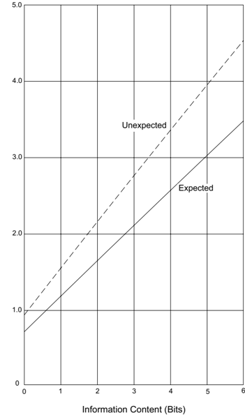

Figure 2-1. Median Driver Reaction Time to Expected and Unexpected Information

Figure 2-2. 85th-Percentile Driver Reaction Time to Expected and Unexpected Information

## 2.2.6.2  Primacy

Primacy indicates the relative importance to safety of competing information. The driver control and guidance information are most important because the related errors may contribute directly to crashes. Navigation information has a lower primacy because driver errors may lead to inefficient traffic flow, but are less likely to lead to crashes. Accordingly, the design should focus the drivers' attention on the design elements and high-priority information sources that provide control and guidance information. This goal may be achieved by providing clear sight lines and good visual quality.

## 2.2.6.3  Expectancy

Driver expectancies are formed by the experience and training of drivers. Situations that generally  occur  in  the  same  way,  and  successful  responses  to  these  situations,  are  incorporated into each driver's store of knowledge. Expectancy relates to the likelihood that a driver will respond to common situations in predictable ways that the driver has found successful in the past. Expectancy affects how drivers perceive and handle information and modify the speed and nature of their responses.

Reinforced expectancies help drivers respond rapidly and correctly. Unusual, unique, or uncommon situations that violate driver expectancies may cause longer response times, inappropriate responses, or errors.

Most roadway design features are sufficiently similar to create driver expectancies related to common geometric, operational, and route characteristics. For example, because most freeway interchanges have exits on the right side of the road, drivers generally expect to exit from the right. This aids performance by enabling rapid and correct responses when exits on the right are to be negotiated. There are, however, instances where expectancies are violated. For example, if an exit ramp is on the left, then the right-exit expectancy is incorrect, and response times may be lengthened or errors committed.

One of the most important ways to aid driver performance is to develop designs in accordance with prevalent driver expectancies with design elements that are applied consistently throughout a roadway segment. Care should also be taken to maintain consistency from one segment to another. When drivers obtain the information they expect from the roadway and its traffic control devices, their performance tends to be error free. Where they do not get what they expect, or get what they do not expect, errors may result.

## 2.2.7  Driver Error

A common characteristic of many high-crash locations is that they place large or unusual demands on the information-processing capabilities of drivers. Inefficient operation and crashes

usually occur where the driver's chances for information-handling errors are high. At locations with high information-processing demands on the driver, the possibility of driver error increases.

## 2.2.7.1  Errors Due to Driver Deficiencies

Many driving errors are caused by deficiencies  in  a  driver's  capabilities  or  temporary  states, which,  in  conjunction  with  inappropriate  designs  or  difficult  traffic  situations,  may  produce a  failure  in  judgment.  For  example, insufficient experience and training may contribute to a driver's inability to recover from a skid. Similarly, inappropriate risk taking by drivers may lead to errors in gap acceptance while passing ( 19 ). In addition, poor glare recovery may cause older drivers to miss information at night ( 37 ).

Adverse psychophysiological states also lead to driver failures. These include decreased performance caused by alcohol and drugs, for which a link to crashes has been clearly established. The effects of fatigue, caused by sleep deprivation from extended periods of driving without rest or prolonged exposure to monotonous environments, or both, also contribute to crashes ( 39 ).

As a matter of guiding philosophy, roadway designs should be as forgiving as practical to lessen the consequences of driver errors and failures. Well-designed and operated roads can reduce the likelihood of errors by drivers in a competent state. Most individuals possess the attributes and skills to drive properly and are neither drunk, drugged, nor fatigued at the start of their trips. When drivers overextend themselves, fail to take proper rest breaks, or drive for prolonged periods, they ultimately reach a less-than-competent state. Fatigued drivers represent a sizable portion of the long-trip driving population and should therefore be considered in freeway design.

## 2.2.7.1.1  Older Drivers

There is general agreement that advancing age has a deleterious effect on an individual's perceptual, mental, and motor skills. These skills are critical factors in vehicular operation. Therefore, it  is  important for the road designer to be aware of the needs of the older driver, and where appropriate, to consider these needs in the roadway design.

Some of the more important information and observations from research studies concerning older drivers ( 38 ) is summarized below:

1. Characteristics of the Older Driver-In comparison to younger drivers, older drivers often exhibit the following operational deficiencies:
2. y slower information processing
3. y slower reaction times
4. y slower decision making
5. y visual deterioration
6. y hearing deterioration

--',''','',',',','''''',,,,''-'-',,',,',',,'---

- y decline in ability to judge time, speed, and distance
- y limited depth perception
- y limited physical mobility
- y side effects from prescription drugs
2. Crash Frequency-Older drivers are involved in a disproportionate number of crashes where there is a higher-than-average demand imposed on driving skills. The driving maneuvers that most often precipitate higher crash frequencies among older drivers include:
- y making left turns across traffic
- y merging with high-speed traffic
- y changing lanes on congested streets in order to make a turn
- y finding a gap to cross a high-volume intersection
- y stopping unexpectedly for queued traffic
- y parking
3. Key  Roadway  Design  and  Traffic  Control  Features-Improvements  to  the  following roadway design and traffic control features may make driving easier for older drivers:
- y assess all guidelines to consider the practicality of designing for the 95th- or 99th-percentile driver, as appropriate, to represent the performance abilities of an older driver
- y improve sight distance by modifying designs and removing obstructions, particularly at intersections and interchanges
- y assess sight triangles for adequacy of sight distance
- y provide decision sight distance in advance of key decision points
- y simplify and redesign intersections and interchanges that involve multiple information reception and processing
- y consider alternate designs to reduce conflicts
- y increase use of protected left-turn signal phases
- y increase vehicular clearance times at signalized intersections
- y provide increased walk times for pedestrians
- y provide wider and brighter pavement markings and paint median noses
- y provide larger and brighter signs
- y reduce sign clutter
- y provide more redundant information such as advance guide signs for street name, indications of upcoming turn lanes, and right-angle arrows ahead of an intersection where a route turns or where directional information is needed

- y provide centerline and shoulder rumble strips and edge line rumble stripes
- y provide intersection channelization
- y reduce intersection skew

In roadway design, perhaps the most practical measure related to better accommodating older drivers is an increase in sight distance, which may be accomplished through increased use of decision sight distance. The gradual aging of the driver population suggests that increased use of decision sight distance may help to reduce future crash frequencies for older drivers. Where provision of decision sight distance is impractical, increased use of advance warning or guide signs may be appropriate.

## 2.2.7.2  Errors Due to Situation Demands

Drivers often commit errors when they have to perform several highly complex tasks simultaneously under extreme time pressure ( 11 ). Errors of this type usually occur at urban area locations with closely spaced decision points, intensive land use, complex design features, and heavy traffic. Information-processing demands beyond the drivers' capabilities may cause information overload or confuse drivers, resulting in an inadequate understanding of the driving situation.

Other locations present the opposite situation and are associated with different types of driver errors. Typically these are rural locations where there may be widely spaced decision points, sparse land use, smooth alignment, and light traffic. Information demands are thus minimal, and rather than being overloaded with information, the lack of information and decision-making demands may result in inattentiveness by drivers. Driving errors may be caused by a state of decreased vigilance in which drivers fail to detect, recognize, or respond to new, infrequently encountered, or unexpected design elements or information sources.

## 2.2.8  Speed and Design

Speed reduces the visual field, restricts peripheral vision, and limits the time available for drivers to  receive  and  process  information.  Highways  built  to  accommodate  high  speeds  help  compensate for these limitations by simplifying control and guidance activities, by aiding drivers with appropriate information, by placing this information within the cone of clear vision, by eliminating much of the need for peripheral vision, and by simplifying necessary decisions and spacing them farther apart to decrease information-processing demands.

An Institute of Traffic Engineers publication ( 32 ) notes that 'longer length and duration of trips results in driver fatigue and slower reaction as well as a reduction in attention and vigilance.' Thus, extended periods of high-speed driving on highways with low demand for information processing may diminish proper information handling by drivers and may therefore lead to driver fatigue. Highway design should take these potential adverse effects into account and seek to lessen their consequences. For example, long sections of flat, tangent roadway should be avoided

by using flat, curving alignment that follows the natural contours of the terrain whenever practical. Opportunities for rest, spaced at intervals of approximately one hour or less of driving time, have also proved beneficial.

On streets in the rural town, urban, and urban core contexts, high speeds should be discouraged and low to moderate speeds encouraged through design and enforcement. The likelihood of pedestrian and bicycle crashes resulting in a fatality or serious injury increases as vehicle speeds increase.

## 2.2.9  Design Assessment

Sections 2.2.1 through 2.2.7 have described the way drivers use information provided by the roadway and its appurtenances. This discussion has shown the interdependence between design and information display. Both should be assessed in the design of roadway projects. Because drivers 'read' the road and the adjacent environment and make decisions based on what they see (even if traffic control devices making up the formal information system indicate inconsistencies with the driver's view), a roadway segment that is inappropriately designed may not operate as intended. Conversely, an adequately designed roadway may not operate properly without the appropriate complement of traffic control devices.

Designers should consider how the roadway will fit into the existing landscape, how the roadway should be signed, and the extent to which the information system will complement and augment the proposed design. The view of the road is very important, especially to the unfamiliar driver. Therefore, consideration should be given to the visual qualities of the road. This can be accomplished through the use of 3-D computer visualization programs.

Locations with potential for information overload should be identified and corrected. The adequacy of the sight lines and sight distances should be assessed, and it should be determined whether unusual vehicle maneuvers are needed and whether likely driver expectancies may be violated.

Potential driver behavior can be anticipated in the design process by using information about the driving tasks and possible driver errors to assess the design. When trade-offs are appropriate, they should be made with the drivers' capabilities in mind so that the resultant design is compatible with those capabilities. Properly designed highways that provide positive guidance to drivers can operate at a high level of efficiency and with relatively few crashes; therefore, designers should seek to incorporate these principles in roadway design.

## 2.3  TRAFFIC CHARACTERISTICS

## 2.3.1  General Considerations

The design of a roadway and its features should explicitly consider traffic volumes, operational performance, and user characteristics for all transportation modes. All information should be considered jointly. Financing, quality of foundations, availability of materials, cost of right-ofway, and other factors all have important bearing on the design; however, the traffic volume and modal mix can indicate the need for the improvement and directly influence the selection of geometric design features, such as number of lanes, widths, alignments, and grades.

Traffic data for a road or section of road are generally available or can be obtained from field studies. The data collected by state or local agencies include traffic volumes for days of the year and time of the day, as well as the distribution of vehicles by type and weight. The data also include information on trends that the designer may use to estimate the traffic to be expected in the future.

## 2.3.2  Volume

The two traffic volume parameters that greatly influence design decisions are the Average Daily Traffic (ADT) and the Design Hourly Volume (DHV). Both are described in greater detail in this section. It is important for a designer to remember that these parameters, while important and useful, do not characterize the performance of the facility during all hours and days of a year. A design that only takes into account the ADT and DHV might overlook conditions that may exist throughout a day or night that conflict with other project goals, such as making walking and biking more convenient and pleasant.

Both current and future traffic volumes are considered in design. Future traffic volumes expected to use a particular facility are project for the design year, which is usually 10 to 20 years in the future.

## 2.3.2.1  Average Daily Traffic

The most basic measure of the vehicular traffic demand for a roadway is the average daily traffic (ADT) volume. The ADT is defined as the total volume during a given time period (in whole days), greater than one day and less than one year, divided by the number of days in that time period. The current ADT volume for a roadway can be readily determined when continuous traffic counts are available. When only periodic counts are taken, the ADT volume can be estimated by adjusting the periodic counts according to such factors as the season, month, or day of week.

Knowledge of the ADT volume is important for many purposes, such as determining annual roadway usage as justification for proposed expenditures or designing the cross-sectional elements of a roadway. However, the direct use of ADT volume in the geometric design of road-

ways is not appropriate, except for local and collector roads with relatively low volumes, because it does not indicate traffic volume variations occurring during the various months of the year, days of the week, and hours of the day. The amount by which the volume of an average day is exceeded on certain days is appreciable and varied. At typical rural locations, the volume on certain days may be significantly higher than the ADT.

## 2.3.2.2  Design Hour Traffic: Rural Areas

Traffic volumes for an interval of time shorter than a day more appropriately reflect the operating conditions that should be used for design. The brief, but frequently repeated, rush-hour periods are significant in this regard. In nearly all cases, a practical and adequate time period is one hour.

The traffic pattern on any roadway shows considerable variation in traffic volumes during the various hours of the day and in hourly volumes throughout the year. A key design decision involves determining which of these hourly traffic volumes should be used as the basis for design. While it would be wasteful to predicate the design on the maximum peak-hour traffic that occurs during the year, the use of the average hourly traffic would result in an inadequate design. The hourly traffic volume used in design should be a value that will not be exceeded very often or by very much. On the other hand, it should not be a value so high that traffic would rarely be sufficient to make full use of the resulting facility. One guide in determining the hourly traffic volume that is best suited for use in design is a curve showing variation in hourly traffic volumes during the year.

Figure 2-3 shows the relationship between the highest hourly volumes and ADT on arterials in rural areas. This figure was produced from an analysis of traffic count data covering a wide range of volumes and geographic conditions. The curves in the chart were prepared by arranging all of the hourly volumes for one year, expressed as a percentage of ADT, in a descending order of magnitude. The middle curve is the average for all locations studied and represents a roadway with average fluctuation in traffic flow.

Based on a review of these curves, it is recommended that the hourly traffic volume that should generally be used in the design of roadways in rural areas is the 30th highest hourly volume of the year, abbreviated as 30 HV. The reasonableness of 30 HV as a design control is indicated by the changes that result from choosing a somewhat higher or lower volume. The curve in Figure 2-3 steepens quickly to the left of the point showing the 30th highest hour volume and indicates only a few more hours with higher volumes. The curve flattens to the right of the 30th highest hour and indicates many hours in which the volume is not much less than the 30 HV.

On roads in rural areas with average fluctuation in traffic flow, the 30 HV is typically about 15 percent of the ADT. Whether or not this hourly volume is too low to be appropriate for design can be judged by the 29 hours during the year when it is exceeded. The maximum hourly volume, which is approximately 25 percent of the ADT on the graph, exceeds 30 HV by about 67 percent.

Whether the 30 HV is too high for practical economy in design can be judged by the trend in the hourly volumes lower than the 30th highest hour. The middle curve in Figure 2-3 indicates that the traffic volume exceeds 11.5 percent of the ADT during 170 hours of the year. The lowest of this range of hourly volumes is about 23 percent less than the 30 HV.

Figure 2-3. Relation between Peak-Hour and Average Daily Traffic Volumes on Arterials in Rural Areas

Another fortunate characteristic of 30 HV is that, as a percentage of ADT, it generally varies only slightly from year to year even though the ADT may change substantially. Increased ADT generally results in a slight decrease in the percentage of ADT during the 30 HV. Thus, the percentage of ADT used for determining the 30 HV from current traffic data for a given facility can generally be used with confidence in computing the 30 HV from an ADT volume determined for some future year. This consistency between current and future may not apply where there is a radical change in the use of the land area served by the highway. In cases where

the character and magnitude of future development can be foreseen, the relationship of 30 HV to ADT may be based on experience with other highways serving areas with similar land-use characteristics.

For highway design purposes, the variation in hourly traffic volumes should be measured and the percentage of ADT during the 30th highest hour determined. Where such measurements are impractical and only the ADT is known, the 30 HV should be estimated from 30th-hour percentage factors for similar highways in the same locality, operating under similar conditions.

On a typical arterial in a rural area, the 30 HV is about 15 percent of ADT, and the maximum hourly volume is about 25 percent of ADT. As indicated in Figure 2-3, the 30 HV at 70 percent of all locations, except those having unusually high or low fluctuation in traffic flow, is in the range of 12 to 18 percent of the ADT. Likewise the range in maximum hourly volumes for the same groups of roads varies approximately from 16 to 32 percent of the ADT. These criteria for design apply to most highways in rural areas. There are highways, however, for which there are unusual or highly seasonal fluctuations in traffic flow, such as resort roads on which weekend traffic during a few months of the year far exceeds the traffic during the rest of the year. Seasonal fluctuations result in high peak-hour volumes relative to ADT, high percentages for high-volume hours, and low percentages for low-volume hours.

Because the percentage represented by the 30 HV for a road with large seasonal fluctuations may not be much different from the percentage represented by the 30 HV on most roads in rural areas, the 30 HV criterion may not be appropriate for such roads. A design that results in somewhat less satisfactory traffic operation during seasonal peaks than on rural roads with normal traffic fluctuations will generally be accepted by the public. On the other hand, design should not be so economical that severe congestion results during peak hours. It may be desirable, therefore, to choose an hourly volume for design that is about 50 percent of the volumes expected to occur during a few highest hours of the design year, whether or not that volume is equal to 30 HV. Some congestion would be experienced by traffic during peak hours but the capacity would not be exceeded. A check should be made to verify that the expected maximum hourly traffic does not exceed the capacity.

The design hourly volume (DHV) for rural area highways, therefore, should generally be the 30 HV of the future year chosen for design. Exceptions may be made on roads with high seasonal traffic fluctuation, where a different hourly volume may need to be used. The 30-HV criterion also applies in general to urban areas; however, where the fluctuation in traffic flow is markedly different from that on rural area highways, other hours of the year should be considered as the basis for design.

## 2.3.2.3  Design Hour Traffic: Urban Areas

In urban areas, an appropriate DHV may be determined from the study of traffic during the normal daily peak periods. Because of the recurring morning and afternoon peak traffic flow,

there is usually little difference between the 30th and the 200th highest hourly volume. For typical urban area conditions, the highest hourly volume is found during the afternoon workto-home travel peak. One approach for determining a suitable DHV is to select the highest afternoon peak traffic flow for each week and then average these values for the 52 weeks of the year. If the morning peak-hour volumes for each week of the year are all less than the afternoon peak volumes, the average of the 52 weekly afternoon peak-hour volumes would have about the same value as the 26th highest hourly volume of the year. If the morning peaks are equal to the afternoon peaks, the average of the afternoon peaks would be about equal to the 50th highest hourly volume.

The volumes represented by the 26th and 50th highest hours of the year are not sufficiently different from the 30 HV value to affect design. Therefore, in urban area design, the 30th highest hourly volume can be a reasonable representation of daily peak hours during the year. Flexibility may be appropriate in those areas or locations where recreational or other travel is concentrated during particular seasons. In such locations, a distribution of traffic volume where the hourly volumes are much greater than the 30 HV may result; the 30 HV in such cases may be inappropriate as the DHV and a higher value should be considered in design. Specific measurements of traffic volumes should be made and evaluated to determine the appropriate DHV.

In  the  usual  case,  future  travel  demand  is  determined  from  the  urban  area  transportation planning process in terms of total daily trips that are assigned to the transportation system. Consideration of the split between public and private transportation is also incorporated into this process. These assigned trips constitute the traffic volumes on links of the future street and road network.

In some instances, these volumes (ADT) are provided directly to roadway designers. In others, they are converted by the operational transportation study staff to directional volumes for the design hour. From a practical standpoint, the latter approach may be the more desirable because the transportation study staff is often in a better position to evaluate the effects that the assumptions inherent in the planning process have on the resulting design volumes.

Two-way DHVs (i.e., the 30 HV, or its equivalent) may be determined by applying a representative percentage (usually 8 to 12 percent in urban areas) to the ADT. In many cases this percentage, based on data obtained in a traffic count program, is developed and applied system-wide; in other cases, factors may be developed for different facility classes or different areas of an urban area, or both. At least one highway agency has developed regression equations representing the relationship between peak flow and ADT; different equations are applied, depending on the number of lanes and the range of the ADT volumes.

--',''','',',',','''''',,,,''-'-',,',,',',,'---

## 2.3.3  Directional Distribution

For two-lane highways in rural areas, the DHV is the total traffic in both directions of travel. In the design of highways with more than two lanes and on two-lane roads where important intersections are encountered or where additional lanes are to be provided later, knowledge of the hourly traffic volume for each direction of travel is essential.

A multilane road or street with a high percentage of traffic in one direction during the peak hours may need more lanes than a road or street having the same ADT but with a lesser percentage of directional traffic. During peak hours on most rural area highways, from 55 to 70 percent of the traffic is traveling in the peak direction, with up to as much as 80 percent occasionally. Directional distributions of traffic vary enough between sites that two multilane roads or streets carrying equal traffic may have peak direction volumes that differ by as much as 60 percent. For example, consider a rural road with a design volume of 4,000 vehicles per hour (veh/h) for both directions of travel combined. If during the design hour, the directional distribution is equally split, or 2,000 veh/h is one direction, two lanes in each direction may be adequate. If 80 percent of the DHV is in one direction, at least three lanes in each direction would be needed for the 3,200 veh/h; and if a 1,000-vehicles-per-lane criterion is applied, four lanes in each direction would be needed.

The peak-hour traffic distribution by direction of travel is generally consistent from day to day and from year to year on a given rural road, except on some roads serving recreational areas. Except for roads and streets in urban areas, the directional distribution of traffic measured for current conditions may generally be assumed to apply to the DHV for the future year for which the facility is designed.

The directional distribution of traffic on multilane facilities during the design hour (DDHV) should be determined by making field measurements on the facility under consideration or on parallel and similar facilities. In the latter case, the parallel facilities should preferably be those from which traffic, for the most part, would be diverted to the new roadway. The DDHV applicable for use on multilane facilities may be computed by multiplying the ADT by the percentage that 30 HV is of the ADT, and then by the percentage of traffic in the peak direction during the design hour. Thus, if the DHV is 15 percent of the ADT and the directional distribution at the peak hour is 60:40, the DDHV is 0.15 × 0.60 × ADT, or 9 percent of the ADT. If the directional ADT is known for only one direction, the ADT is nearly always twice the directional ADT.

In designing intersections and interchanges, the volumes of all movements occurring during the design hour should be known. This information is needed for both the morning and evening peak periods because the traffic pattern may change significantly from one peak hour to the other. Normally, a design is based on the DHV, which is to be accommodated during the morning rush hour in one direction and during the evening rush hour in the other direction. Total (twoway) volumes may be the same during both of these peaks, but the percentage of traffic in the two directions of travel is reversed. At intersections, the percentage of approaching traffic that

--',''','',',',','''''',,,,''-'-',,',,',',,'---

turns to the right and to the left on each intersection leg should be determined separately for the morning and evening peak periods. This information should be determined from actual counts, from origin and destination data, or both.

## 2.3.4  Composition of Traffic

Vehicles of different sizes and weights have different operating characteristics that should be considered in roadway design. Besides being heavier, trucks are generally slower and occupy more roadway space. Consequently, trucks have a greater individual effect on traffic operation than do passenger vehicles. The effect on traffic operation of one truck is often equivalent to several passenger cars. The number of equivalent passenger cars equaling the effect of one truck is dependent on the roadway gradient and, for two-lane highways, on the available passing sight distance. Thus, the larger the proportion of trucks in a traffic stream, the greater the equivalent traffic demand.

For uninterrupted traffic flow, the various sizes and weights of vehicles, as they affect traffic operation, can be grouped into two general classes:

- y Passenger  Cars-all  passenger  cars,  including  minivans,  vans,  pick-up  trucks,  and  sport/ utility vehicles
- y Trucks-all buses, single-unit trucks, combination trucks, and recreational vehicles

For traffic-classification purposes, trucks are normally defined as those vehicles having manufacturer's gross vehicle weight (GVW) ratings of 9,000 lb [4,000 kg] or more and having dual tires on at least one rear axle.

In the passenger-car class, as defined above, most of the vehicles have similar operating characteristics. In the truck class, operating characteristics vary considerably, particularly in size and weight/power ratio. Despite this variation in the operating characteristics of trucks, the average effect of all trucks in a traffic stream is similar on most roadways under comparable conditions. Accordingly, for the geometric design of a roadway, it is essential to have traffic data on vehicles in the truck class. These data generally indicate the major types of trucks and buses as percentages of all traffic expected to use the roadway.

For design purposes, the percentage of truck traffic during the peak hours should be determined. In rural areas, comprehensive data usually are not available on the distribution of traffic by vehicle types during the peak hours; however, the percentage of truck traffic during the peak hours is generally less than the percentage for a 24-hour period. As the peak hour approaches, the volume of passenger-car traffic generally increases at a greater rate than does the volume of truck traffic. Most trucks operate steadily throughout the day, and much over-the-road hauling is done at night and during early morning hours. In the vicinity of major truck and bus terminals, the scheduling of regular truck and bus runs may result in the concentration of trucks

during certain hours of the day. However, because of the delays caused by other traffic during peak hours, such schedules generally are made to avoid these hours.

For design of a particular roadway, data on traffic composition should be determined by traffic studies. Truck traffic should be expressed as a percentage of total traffic during the design hour (in the case of a two-lane highway, as a percentage of total two-way traffic, and in the case of a multilane highway, as a percentage of total traffic in the peak direction of travel).

In urban areas, traffic composition is generally more complex, with the presence of pedestrians, bicyclists, and transit vehicles, in addition to passenger cars and trucks. Designers should develop designs for each facility that strike an appropriate balance among all transportation modes served by the facility considering the functional classification and context of the facility, the volumes to be served for each mode, and the area plan for accommodating each mode. Additional discussion of achieving a balance among transportation modes on urban area facilities is found in Chapter 1. Specific information about effective design to serve pedestrians, bicycles and transit, respectively, may be found in the AASHTO Guide for the Planning, Design, and Operation of Pedestrian Facilities ( 2 ), the AASHTO Guide for the Development of Bicycle Facilities ( 7 ), and the AASHTO Guide for Geometric Design of Transit Facilities on Highways and Streets ( 8 ).

Under interrupted-flow conditions in urban areas, the criteria for determining traffic composition differ from those used elsewhere. At important intersections, the percentage of trucks during the morning and evening peak hours should be determined separately. Variations in truck traffic between the various traffic movements at intersections may be substantial and may influence the appropriate geometric layout. The percentage of trucks may also vary considerably during a particular hour of the day. Therefore, it is advisable to count trucks for the several peak hours that are considered representative of the 30th highest or design hour. A convenient value that appears to be appropriate for design use is the average of the percentages of truck traffic for a number of weekly peak hours. For highway-capacity analysis purposes, local city-transit buses should be considered separately from other trucks and buses. --',''','',',',','''''',,,,''-'-',,',,',',,'---

## 2.3.5  Projection of Future Traffic Demands

Geometric design of new roadways or improvements to existing roadways should not usually be based on current traffic volumes alone, but should consider future traffic volumes expected to use the facility. However, traffic forecasting is not an exact science, and involves many assumptions about development patterns, changes in travel behavior, and technology. To better account for the inherent uncertainties involving traffic forecasts, a designer may consider using a rangebased traffic forecast that has lower and upper bounds. A design may be evaluated for these different traffic volume scenarios to characterize its sensitivity to the differences in the forecasts. Even if the design does not change, the designer will have a better understanding of how the facility may operate in the future.

It is difficult to define the life of a roadway because major segments may have different lengths of physical life. Each segment is subject to variations in estimated life expectancy for reasons not readily subject to analysis, such as obsolescence or unexpected radical changes in land use, with the resulting changes in traffic volumes, patterns, and demands. Right-of-way and grading may be considered to have a physical life expectancy of 100 years; minor drainage structures and base courses, 50 years; bridges, 25 to 100 years; resurfacing, 10 years; and pavement structure, 20 to 30 years, assuming adequate maintenance and no allowance for obsolescence. Bridge life may vary depending on the cumulative frequency of heavy loads. Pavement life can vary widely, depending largely on initial expenditures and the repetition of heavy axle loads.

The assumption of no allowance for functional obsolescence is open to serious debate. The principal  causes  of  obsolescence  are  increases  in  the  number  of  intersections  and  driveways  and increases in traffic demand beyond the design capacity. On non-freeway roadways, obsolescence due to addition of intersections and driveways is much more difficult to forestall; this occurs particularly in urban and suburban areas, but may occur in rural areas as well.

In a practical sense, the design volume should be a value that can be estimated with reasonable accuracy. Many designers believe the maximum design period is in the range of 15 to 24 years. Therefore, a period of 20 years is widely used as a basis for design. Traffic cannot usually be forecast accurately beyond this period on a specific facility because of probable changes in the general regional economy, population, and land development along the roadway, which cannot be predicted with any degree of assurance.

## 2.3.6  Speed

Speed is one of the most important factors considered by travelers in selecting alternative routes or transportation modes. Travelers assess the value of a transportation facility in moving people and goods by its reliability, convenience, and economy, which are generally related to its speed. The attractiveness of a public transportation system or a new roadway are each weighed by the travelers in terms of time, convenience, and money saved. Hence, the desirability of rapid transit may well rest with how rapid it actually is. In addition to driver and vehicle capabilities, the speed of vehicles on a road depends on five general conditions:

- y physical characteristics of the roadway,
- y amount of roadside interference,
- y weather,
- y presence of other vehicles, and
- y speed limitations (established either by law or by traffic control devices).

Although any one of these factors may govern travel speed, the actual travel speed on a facility usually reflects a combination of these factors.

--',''','',',',','''''',,,,''-'-',,',,',',,'---

The objective in design of any engineered facility used by the public is to satisfy the public's demand for service in an economical manner, with efficient traffic operations and with low crash frequency and severity. The facility should, therefore, accommodate nearly all demands with reasonable adequacy and also should only fail under severe or extreme traffic demands. Because only a small percentage of drivers travel at extremely high speed, it is not economically practical to design for them. They can use the roadway, of course, but will be constrained to travel at speeds less than they consider desirable. On the other hand, the speed chosen for design should not be that used by drivers under unfavorable conditions, such as inclement weather, because the roadway would then be inefficient, might result in additional crashes under favorable conditions, and would not satisfy reasonable public expectations for the facility.

There are important differences between design criteria applicable to low- and high-speed designs. To implement these differences, the upper limit for low-speed design is 45 mph [70 km/h] and the lower limit for high-speed design is 50 mph [80 km/h].

## 2.3.6.1  Operating Speed

Operating speed is the speed at which drivers are observed operating their vehicles during freeflow conditions. The 85th percentile of the distribution of observed speeds is the most frequently used measure of the operating speed associated with a particular location or geometric feature. The following geometric design and traffic demand features may have direct impacts on operating speed:

- y horizontal curve radius,
- y grade,
- y access density,
- y median treatments,
- y on-street parking,
- y signal density,
- y vehicular traffic volume, and
- y pedestrian and bicycle activity.

## 2.3.6.2  Running Speed

The speed at which an individual vehicle travels over a highway section is known as its running speed. The running speed is the length of the highway section divided by the time for a typical vehicle to travel through the section. For extended sections of roadway that include multiple roadway types, the average running speed for all vehicles is the most appropriate speed measure for evaluating level of service and road user costs. The average running speed is the sum of the distances traveled by vehicles on a highway section during a specified time period divided by the sum of their travel times.

One means of estimating the average running speed for an existing facility where flow is not interrupted by signals or other traffic control devices is to measure the spot speed at one or more locations. The average spot speed is the arithmetic mean of the speeds of all traffic as measured at a specified point on the roadway. For short sections of roadway, on which speeds do not vary materially, the average spot speed at one location may be considered an approximation of the average running speed. On longer stretches of rural highway, average spot speeds measured at several points, where each point represents the speed characteristics of a selected segment of roadway, may be averaged (taking relative lengths of the roadway segments into account) to provide a better approximation of the average running speed.

The average running speed on a given roadway varies during the day, depending primarily on the traffic volume. Therefore, when reference is made to a running speed, it should be clearly stated whether this speed represents peak hours, off-peak hours, or an average for the day. Peak and off-peak running speeds are used in design and operation; average running speeds for an entire day are used in economic analyses.

The effect of traffic volume on average running speed can be determined using the procedures of the Highway Capacity Manual (HCM) ( 43 ). The HCM shows the following:

- y Freeways and multilane highways in rural areasthere is a substantial range of traffic volumes over which speed is relatively insensitive to the volume; this range extends to fairly high volumes. Then, as the volume per lane approaches capacity, speed decreases substantially with increasing volume.
- y Two-lane highwaysspeed decreases linearly with increasing traffic volume over the entire range of volumes between zero and capacity.
- y Streets in urban areasspeed decreases with increasing traffic volume over the entire range of volumes between zero and capacity; the decrease in speed with increasing volume is nonlinear at higher volumes.

## 2.3.6.3  Design Speed

Design speed is a selected speed used to determine the various geometric design features of the roadway. The selected design speed should be a logical one with respect to the anticipated operating speed, topography, the adjacent land use, modal mix, and the functional classification of the roadway. In selection of design speed, every effort should be made to attain a desired combination of safety, mobility, and efficiency within the constraints of environmental quality, economics, aesthetics, and social or political impacts. Once the design speed is selected, all of the pertinent roadway features should be related to it to obtain a balanced design. On lower-speed facilities, use of above-minimum design criteria may encourage travel at speeds higher than the design speed. Some design features, such as curvature, superelevation, and sight distance, are directly related to, and vary appreciably with, design speed. Other features, such as widths of lanes and shoulders and clearances to walls and rails, are not directly related to design speed but

they do affect vehicle speeds. Thus, when a change is made to design speed, many elements of the roadway design will change accordingly.

The selected design speed should be consistent with the speeds that drivers are likely to travel on a given roadway. Where a reason for limiting speed is obvious, drivers are more apt to accept lower speed operation than where there is no apparent reason. A roadway of higher functional classification may justify a higher design speed than a lesser classified facility in similar topography. A low design speed, however, should not be selected where the topography is such that drivers are likely to travel at high speeds. Drivers do not adjust their speeds to the importance of the roadway, but to their perception of the physical limitations of the highway and its traffic.

Lower speeds are desirable for thoroughfares in walkable, mixed-use urban areas and this desire for lower speeds should influence the selection of the design speed. For design of such streets, a target speed should be selected ( 29 ). The target speed is the highest speed at which vehicles should operate on a thoroughfare in a specific context, consistent with the level of multimodal activity generated by adjacent land uses, to provide both mobility for motor vehicles and a desirable environment for pedestrians, bicyclists, and public transit users. The target speed is intended to be used as the posted speed limit. In some jurisdictions, the speed limit is established based on measured speeds. In these cases, it is important for the design of the thoroughfare to encourage an actual operating speed that equals the target speed ( 16, 35 ).

The selected design speed should reflect the needs of all transportation modes expected to use a particular facility. Where traffic and roadway conditions are such that drivers can travel at their desired speed, there is always a wide range in the speeds at which various individuals will choose to operate their vehicles. A cumulative distribution of free-flow vehicle speeds typically has an S-shape when plotted as the percentage of vehicles versus observed speed. The selected design speed should be a high-percentile value in this speed distribution curve (i.e., inclusive of nearly all of the desired speeds of drivers, wherever practical).

It is desirable that the running speed of a large proportion of drivers be lower than the design speed. Experience indicates that deviations from this desired goal are most evident on sharper horizontal curves. In particular, curves with low design speeds (relative to driver expectation) are frequently overdriven and may have higher crash frequencies. Therefore, it is important that the design speed used for horizontal curve design be a conservative reflection of the expected speed on the constructed facility.

Table 2-1 shows the corresponding design speeds in metric and U.S. customary units in 5-mph [10 km/h] increments. This table should be used in converting the units of measurement of design speeds.

Although the selected design speed establishes the limiting values of curve radius and minimum sight distance that should be used in design, there should be no restriction on the use of flatter

--',''','',',',','''''',,,,''-'-',,',,',',,'---

horizontal curves or greater sight distances where such improvements can be provided as part of an economical design. Even in rugged terrain, an occasional tangent or flat curve may be desirable. Isolated features designed for higher speeds may not encourage drivers to speed up, although a succession of such features might. In such cases, the entire section of highway should be  designed  for  a  higher  speed.  A  substantial  length  of  tangent  between  sections  of  curved alignment is also likely to encourage high-speed operation. In such situations, a higher design speed should be selected for all geometric features, particularly sight distance on crest vertical curves and across the inside of horizontal curves.

Table 2-1. Corresponding Design Speeds in Metric and U.S. Customary Units

| U.S. Customary                   | Metric              |
|----------------------------------|---------------------|
| Corresponding Design Speed (mph) | Design Speed (km/h) |
| 15                               | 20                  |
| 20                               | 30                  |
| 25                               | 40                  |
| 30                               | 50                  |
| 40                               | 60                  |
| 45                               | 70                  |
| 50                               | 80                  |
| 55                               | 90                  |
| 60                               | 100                 |
| 70                               | 110                 |
| 75                               | 120                 |
| 80                               | 130                 |
| 85                               | 140                 |

A pertinent consideration in selecting design speeds is the average trip length. The longer the trip, the greater is the driver's desire to use higher speeds. Therefore, as the average trip length served by a facility increases, higher functional classes of roads with higher design speeds are more appropriate.

In the design of a substantial length of highway, it is desirable to select a uniform design speed. However, changes in terrain and other physical controls may dictate a change in design speed on certain sections. If so, the introduction of a lower design speed should not be done abruptly but should be effected over sufficient distance to permit drivers to gradually change speed before reaching the highway section with the lower design speed.

Where it is appropriate to reduce horizontal and vertical alignment features, many drivers may not perceive the lower speed condition ahead, and therefore, it is important that they be warned well in advance. The changing condition should be indicated by such controls as speed-zone and curve-speed signs.

On highways in rural areas and on high-type facilities in urban areas, a percentage of vehicles is usually able to travel at near the free-flow speed governed by geometric design elements; therefore, the selection of an appropriate design speed is particularly important. However, in many arterial streets, vehicle speeds during several hours of the day are limited or regulated more by the presence of large volumes of vehicles and by traffic control devices, rather than by the physical characteristics of the street. In such cases, the selection of a design speed is less critical to efficient operation and low crash frequencies and severities.

During periods of low-to-moderate volume, speeds on arterial streets are governed by such factors as posted speed limits, midblock turns into and out of driveways, intersectional turns, traffic signal spacing, and signal timing for progression. When arterial street improvements are being planned, factors such as future posted speed limits, physical and economic constraints, and running speeds likely to be attained during off-peak hours should be considered. All of these factors should influence the selection of an appropriate design speed.

Horizontal  alignment  generally  is  not  the  governing  factor  in  restricting  speeds  on  arterial streets. Proposed improvements generally are patterned to the existing street system, and minor horizontal alignment changes are commonly made at intersections. The effect of these alignment changes is usually small because operation through the intersection is regulated by the type of traffic controls needed to handle the volume of cross and turning traffic. Superelevation may be provided at curves on arterial streets in urban areas, but the amount of superelevation needed is determined in a different manner than for open-road conditions in rural areas. Wide pavement areas, proximity of adjacent development, control of cross slope and profile for drainage, and the frequency of cross streets and entrances all contribute to the need for lower superelevation rates on arterial streets in urban areas. The width of lanes, offset to curbs, proximity of poles and trees to the traveled way, presence of pedestrians within the right-of-way, and nearness of business or residential buildings, individually or in combination, often affects speeds. Section 3.3.6 provides guidance on horizontal alignment design for low-speed conditions in urban areas.

Topography can materially affect the choice of design speed on arterial streets. Many cities were developed along watercourses and include areas varying from gently rolling to mountainous terrain. Streets may have been constructed originally with only minor grading to fit the topography. Because an arterial street is usually developed to fit the alignment of an existing street, both through business and residential areas, it generally follows a varying vertical profile. Once the design speed is selected, appropriate sight distance should be provided at all crests and across the inside of horizontal curves. Profiles with long, continuous grades should be designed with proper consideration for the speeds of mass transit and commercial vehicles. Extra lanes on the upgrades may be needed so that the grade can match other portions of the facility in capacity and enable vehicles that can proceed at a reasonable speed to pass slower moving vehicles.

Arterial streets in urban areas should be designed and control devices regulated, where practical, to permit running speeds of 20 to 45 mph [30 to 75 km/h]. Speeds in the lower portion of this

range are applicable to local and collector streets through residential areas and to arterial streets through more crowded business areas, while the speeds in the higher portion of the range apply to high-type arterials in outlying suburban areas. For arterial streets through crowded business areas, coordinated signal control through successive intersections is generally needed to permit attainment of even the lower speeds. Many cities have substantial lengths of signal-controlled streets that operate at speeds of 15 to 25 mph [20 to 40 km/h].

Chapters 5 through 8 of this policy provide further guidance on appropriate design speeds for specific roadway types.

## 2.3.7  Traffic Flow Relationships

Traffic  flow  conditions  on  roadways can be characterized by the volume flow rate expressed in vehicles per hour, the average speed in miles per hour [kilometers per hour], and the traffic density in vehicles per mile [vehicles per kilometer]. These three variables-volume, speed, and density-are interrelated and have predictable relationships. The generalized relationships between volume, speed, and density for uninterrupted flow facilities, as presented in the HCM ( 43 ) are shown in Figure 2-4. The relationships shown in Figure 2-4 are conceptual in nature and do not necessarily correspond to the actual relationships used in specific HCM procedures. For example, the HCM procedures for freeways and multilane highways show that speed does not vary with volume through most of the low and intermediate volume range, as shown in Figure 2-4. The HCM procedures for two-lane highways show that speed varies linearly with volume throughout the entire volume range from zero to capacity.

Density, the number of vehicles per unit length of roadway, increases as vehicles crowd closer together. As Figure 2-4 shows, when speeds decrease, increased crowding can occur and drivers can comfortably follow more closely behind other vehicles. Density is used in the HCM as the measure of quality of traffic service for freeways and multilane highways.

Traffic volumes also vary with density from zero to maximum flow rate, as shown in Figure 2-4. The two points of zero flow in Figure 2-4 represent either no vehicles at all or so many vehicles on the roadway that flow has stopped. The maximum flow is reached at the point of maximum density.

Interference to traffic flow causes speeds to be reduced, vehicles to travel closer together, and density to increase. Interference may be caused by weather conditions, cross traffic, disabled vehicles, crashes, or other conditions. As these conditions cause more interference, the flow rates within certain limits can still be maintained but with reduced speed, closer vehicle spacing, and greater density. When interference becomes so great (despite closer vehicle spacing and greater density) that the average speed drops below that needed to maintain stable flow, there is a rapid decrease in speed and traffic flow, and severe congestion occurs.

Figure 2-4. Generalized Speed-Volume-Density Relationships (43)

When traffic on a highway encounters interference that limits or reduces the roadway capacity in a single area, the result is a 'bottleneck.' If the flow entering this bottleneck does not exceed its capacity, flow remains stable and no significant congestion should occur. However, when the upstream section carries more vehicles than the bottleneck can accommodate, a breakdown in traffic flow results. Speeds are reduced to a crawl and vehicles begin to queue upstream until incoming flow again falls below the outflow capacity. To avoid bottleneck situations, care should be taken to design roadways with consistent volume-carrying capacity. The level-of-service concept discussed in Section 2.4.5 helps in obtaining this consistency.

An intersection is often an unavoidable bottleneck. This reduction in capacity becomes acute when the intersection is controlled by stop signs or traffic signals. At a traffic signal, vehicles that arrive during the red phase encounter a zero-capacity bottleneck. These vehicles form a queue until the green phase begins, removing the restraint, and discharging the queue. If the incoming volume is too high, not all vehicles in the queue can be discharged during the green phase, and there is a continuing buildup of the queue.

Arrivals at the intersection are generally predictable in urban areas where the approaching vehicles are platooned by upstream signals. In the suburban or rural contexts, vehicle arrivals are

often random. This random arrival pattern should be recognized in the design of appropriate cycle times, turn-lane storage lengths, and approach capacity.

At bottlenecks where traffic slows down or stops, each vehicle and its occupants incur delay. Delays increase  fuel  consumption  and  air  pollution,  which  create  undesirable  economic  and environmental effects.

## 2.4  HIGHWAY CAPACITY

## 2.4.1  General Characteristics

The term 'capacity' is used to express the maximum hourly rate at which persons or vehicles can reasonably be expected to traverse a point (i.e., a uniform section of a lane or a roadway) during a given time period under prevailing roadway and traffic conditions. The range of traffic flow on a highway can vary from very light volumes to volumes that equal the capacity of the facility as defined above. In the generic sense, the term also encompasses broader relations between highway characteristics and conditions, traffic composition and flow patterns, and the relative degree of congestion at various traffic volumes. Highway capacity issues in this broad sense are discussed below.

Sections 2.4.2 through 2.4.6 provide a brief overview of the principles and major factors concerning roadway design capacity. To determine the capacity for a particular roadway design, the designer should refer to the Highway Capacity Manual (HCM) ( 43 ) for guidance. The HCM is used as the basic reference for the following discussion, but other tools are available for performing operational analysis and these may be more appropriate depending on the circumstances. The HCM includes procedures for analyzing the level of service for all modes of travel-pedestrian, bicycle, transit, and motorized vehicles ( 43 ).

## 2.4.2  Application

Roadway capacity analysis serves three general purposes, including:

- y Transportation planning studiesRoadway capacity analysis is used in these studies to assess the adequacy or sufficiency of existing roadway networks to service current traffic. In addition, it is used to estimate the time in the future when traffic growth may exceed the capacity of a roadway or perhaps reach a level of congestion below capacity that is considered undesirable.
- y Roadway designA knowledge of roadway capacity is essential to properly fit a planned roadway to traffic demands. Roadway capacity analysis is used both to select the roadway type and to determine dimensions such as the number and types of lanes and the minimum lengths for weaving sections.

- y Traffic operational analysesRoadway capacity analysis is used in these analyses for many purposes, but especially for identifying bottleneck locations (either existing or potential). It is  also  used to estimate operational improvements that may result from prospective traffic control measures or from spot alterations in the roadway geometry.

The data used for roadway capacity analyses varies with the degree of accuracy needed. For traffic-operational analyses, in which the success of minor improvements may be measured in terms of a few vehicles per hour, a high degree of precision is desirable. For roadway design, a much lower order of precision suffices because the traffic volumes and land uses are frequently estimated for a period 10 to 20 years in the future and involve not only approximations of traffic volumes but also approximations of such factors as traffic composition and movement patterns. The discussion below shows the appropriate level of detail to achieve a reasonable balance between the  design  of  the  roadway  and  the  estimated  future  traffic  volume.  Such  an  analysis should verify that future operating conditions will not fall below an acceptable level. If a greater accuracy than is available from the suggested procedures is needed, refer to the HCM ( 43 ) and other reports on traffic operational analysis.

## 2.4.3  Capacity as a Design Control

## 2.4.3.1  Design Service Flow Rate versus Design Volume

The design volume is the volume of traffic projected to use a particular facility during the design year, which is usually 10 to 20 years in the future. Design volumes are estimated in the planning process and are often expressed as the expected traffic volume during a specified design hour. The derivation of the DHV has been discussed in Section 2.3, 'Traffic Characteristics.'

Design service flow rate is the maximum hourly flow rate of traffic that a roadway with particular design features would be able to serve without the degree of congestion falling below a pre-selected level, as described in Section 2.4.3.4, 'Acceptable Degrees of Congestion.'

A major objective in designing a roadway is to create a facility with dimensions and alignment that can serve the design service flow rate, which should be at least as great as the flow rate during the peak 15 minute period of the design hour, but not so great as to represent an extravagance in the design. Where this objective is accomplished, a well-balanced, economical roadway facility will result.

## 2.4.3.2  Measures of Congestion

Three key considerations in geometric design are the roadway design, the traffic using the roadway, and the degree of congestion on the roadway. The first two considerations can be measured in exact units. For example, the roadway either has or does not have full control of access, its cross-section dimensions can be expressed in feet [meters], and the steepness of its grades can be expressed as a percentage. Likewise, traffic flow can be expressed as the number of vehicles per

unit of time, traffic composition can be expressed as the percentage of vehicles of each class, and the peaking characteristics and directional distribution of traffic can also be quantified.

A scale  of  values  for  expressing  the  degree  of  congestion  is,  however,  a  much  more  elusive measure. Numerous measures of the overall service provided by a roadway section have been suggested,  including  crash  frequency  and  severity,  freedom  to  maneuver,  the  ratio  of  traffic volume to capacity (v/c), operating speed, average running speed, and others. In the case of signalized intersections, the stopped delay encountered by motorists is a commonly used measure of congestion.

For uninterrupted traffic flow (i.e., flow not influenced by signalized intersections), traffic operational conditions are defined by using three primary measures: speed, volume (or rate of flow), and density. Density describes the proximity of vehicles to one another and reflects the freedom to  maneuver within the traffic stream. It is a critical parameter describing traffic operations with uninterrupted flow. As density increases from zero, the rate of flow also increases because more vehicles are on the roadway. While this is happening, speed begins to decline (due to the vehicle interactions). This decline is virtually negligible at low densities and flow rates. However, as density continues to increase, a point is reached at which speed declines noticeably. A maximum rate of flow is eventually reached at which the high density of traffic results in markedly decreased speeds and a reduced flow rate. This maximum rate of flow for any given facility is defined as its capacity. As capacity is approached, flow becomes more unstable because available gaps in the traffic stream become fewer and fewer. At capacity, there are no usable gaps in the traffic stream, and any conflict from vehicles entering or leaving the facility, or from internal lane changing maneuvers, creates a disturbance that cannot be effectively damped or dissipated. Thus, operation at or near capacity is difficult to maintain for long periods of time without the formation of upstream queues, and forced or breakdown flow becomes almost unavoidable. For this reason, most facilities are designed to operate at volumes less than their capacity.

For interrupted flow, such as that occurring on streets where traffic is controlled by signals, the roadway user is not as concerned with attaining a high travel speed as with avoiding lengthy stops at intersections or a succession of stops at several intersections. Average stopped-time delay is the principal measure of effectiveness used in evaluating signalized intersections. Stoppedtime delay, which is used because it is reasonably easy to measure and is conceptually simple, is a characteristic of intersection operations that is closely related to motorist perceptions of quality of traffic flow.

## 2.4.3.3  Relation between Congestion and Traffic Flow Rate

Congestion does not necessarily involve a complete stoppage of traffic flow. Rather, it can be thought of as a restriction or interference to normal free flow. For any given class of roadway, congestion increases with an increase in flow rate until the flow rate is almost equal to the facility's capacity, at which point congestion becomes acute. The gradual increase in congestion with increase in flow rate is apparent no matter what measure is used as an index of congestion.

--',''','',',',','''''',,,,''-'-',,',,',',,'---

The relationship between running speed and traffic flow rate for freeways, multilane highways, two-lane highways, and urban streets has been discussed in Section 2.3.6, 'Speed.' As the traffic flow rate approaches a facility's capacity, as defined in the HCM ( 43 ), any minor disruption in the free flow of traffic may cause traffic on a roadway to operate on a stop-and-go basis, with a resulting decrease in traffic flow rate that can be served.

Roadway sections where the paths of traffic merge and diverge within relatively short distances are called 'weaving sections.' Average running speed, and hence the degree of congestion, is a function not only of the volume of traffic involved in the weaving (crossing) movements but also of the distance within which the weaving maneuvers are completed. (Weaving is addressed in Section 2.4.6.1, 'Weaving Sections.')

On arterial streets in urban areas, average running speed varies only slightly with changes in traffic flow rate. However, delay at signalized intersections may increase dramatically as flow rates approach capacity. Therefore, greater degrees of congestion occur, and these result in reduced overall travel speeds, higher average travel times, and traffic spill-backs into upstream intersections.

## 2.4.3.4  Acceptable Degrees of Congestion

From the standpoint of the roadway user, it would be preferable for each user to have an exclusive right to the roadway at the time the motorist finds occasion or need to use it. Moreover, a motorist would prefer that all roadways be of types that would permit speeds far in excess of those normally afforded by surface streets in urban areas. However, users recognize that if others are to share in the costs of transportation facilities, they are also entitled to share in their use. Therefore, they will readily accept a moderate amount of congestion. Just what degree of congestion the motoring public is willing to accept as reasonable remains a matter of conjecture, but it is known to vary with a number of factors.

The average motorist understands in a general sense that corrective measures to alleviate congestion may be more costly in some instances than in others. As a result, motorists will generally accept a higher degree of congestion in those areas where improvements can be made only at a substantial cost. Also, motorists are more willing to accept a higher degree of restraint in short trips than they are in long trips, but they are generally not satisfied with the type of operation that occurs when the volume of traffic approaches the facility's capacity.

From a transportation administrator's point of view, the degree of congestion that roadway users experience is related to the availability of resources. Historically, funds have never been sufficient to meet all needs, causing severe strain in improving roadways rapidly enough to prevent the traffic demand from exceeding the capacity of the facility.

The appropriate degree of congestion that should be used in planning and designing roadway improvements is determined by weighing the desires of the motorists against the resources avail-

--',''','',',',','''''',,,,''-'-',,',,',',,'---

able for satisfying these desires. The degree of congestion that should not be exceeded during the design year on a proposed roadway can be realistically assessed by: (1) determining the operating conditions that the majority of motorists will accept as satisfactory, (2) determining the most extensive roadway improvement that the governmental jurisdiction considers practical, and (3) reconciling the demands of the motorist and the general public with the finances available to meet those demands.

This reconciliation of desires with available resources is an administrative process of high importance. The decision should first be made as to the degree of congestion that should not be exceeded during the design period.

## 2.4.4  Factors Other Than Traffic Volume That Affect Operating Conditions

The ability of a roadway to serve traffic efficiently and effectively is influenced by the characteristics of the traffic and by the design features of the highway.

## 2.4.4.1  Roadway Factors

Few roadways have ideal designs. Although most modern freeways have adequate cross-sectional dimensions, many are not ideal with respect to design speed, weaving section design, and ramp terminal design. Inadequacies in these features will result in inefficient use of the remaining portions of the freeway.

On other classes of multilane highways, intersections, even though unsignalized, often interfere with the free-flow operation of traffic. Development adjacent to the roadway with attendant driveways and interference from traffic entering and leaving the through-traffic lanes cause an increase in congestion and may increase crash frequency even at relatively low volumes. The adverse effect, although readily apparent, can be difficult to quantify ( 13 ).  Sharp curves and steep grades cannot always be avoided, and it is sometimes appropriate to adjust cross-sectional dimensions. These conditions may combine to cause congestion to be perceived at lower traffic volumes than would be the case for level, tangent roads with full access control or effective access management.

For urban area streets with signalized intersections at relatively close intervals, the traffic volumes that could otherwise be served are reduced because a portion of each signal cycle is assigned exclusively to the crossing roadway.

For a traffic stream composed of a mixture of vehicle classes, rather than passenger cars only, compensatory adjustment factors from the HCM ( 43 )  need  to  be  applied  to  the  traffic  flow rates used as design values. These adjustments are needed to determine the volume of mixed traffic that can be served under minimum acceptable operating conditions on the roadway under consideration.

--',''','',',',','''''',,,,''-'-',,',,',',,'---

The HCM ( 43 ) identifies significant roadway features that may have an adverse effect on operating conditions. The HCM provides factors and outlines procedures for determining the traffic volumes that can be served by roadways that are not ideal in all respects. Features that could result in a roadway being less than ideal in its operational characteristics include narrow lanes and shoulders, steep grades, low design speed, and the presence of intersections, ramp terminals, and weaving sections. The HCM should be referred to for a discussion of these features and their effects on operating conditions. However, the HCM discussion concerning horizontal alignment, weaving sections, and ramp terminals is supplemented and amplified below.

## 2.4.4.2  Alignment

For traffic traveling at any given speed, the better the roadway alignment, the more traffic it can carry. It follows that congestion will generally be perceived at lower volumes if the design speed is low. The roadway should be subdivided into sections of consistent geometric design characteristics for analysis using the HCM techniques. A single limiting curve or steep grade in an otherwise gentle alignment will thus be identified as the critical feature limiting roadway capacity.

## 2.4.4.3  Weaving Sections

Weaving sections are roadway segments where the pattern of traffic entering and leaving at contiguous points of access results in vehicle paths crossing each other. Where the distance in which the crossing is accomplished is relatively short in relation to the volume of weaving traffic, operations within the roadway section will be congested. Some reduction in operating efficiency through weaving sections can be tolerated by roadway users if the reduction is minor and the frequency of occurrence is not high. It is generally accepted that a reduction in operating speed of about 5 mph [10 km/h] below that for which the roadway as a whole operates can be considered a tolerable degree of congestion for weaving sections.

Operating conditions within weaving sections are affected by both the length and width of the section as well as by the volume of traffic in the several movements. These relationships are discussed in Section 2.4.6 and in the HCM ( 43 ).

## 2.4.4.4  Ramp Terminals

Ramps and ramp terminals are features that can adversely influence operating conditions on freeways if the demand for their use is excessive or if their design is deficient. When congestion develops at freeway ramp junctions, some through vehicles avoid the outside lane of the freeway, thereby adding to the congestion in the remaining lanes. Thus, if there are only two lanes in one direction, the efficiency per lane is not as high on the average as that for three or more lanes in one direction.

The loss in efficiency is a function of the volume of traffic entering or leaving ramps, the distance between points of entry and exit, and the geometric layout of the terminals. Too little is known of these separate variables to permit a quantitative assessment of their effect when taken individ-

--',''','',',',','''''',,,,''-'-',,',,',',,'---

ually. Their combined effect is accounted for by levying a uniform assessment against the outside lane, regardless of the causes or extent of interference at individual locations.

Apart from the effect on through traffic, traffic that uses ramps is exposed to a different form of congestion that does not lend itself to measurement in terms of travel speed, delay, or driver tension. The degree of congestion for a ramp is related to the total volume of traffic in the outside lane of the freeway in the vicinity of the ramp junction (i.e., the combined volume of through traffic using the outside lane and the volume of traffic using the ramp).

The HCM ( 43 ) provides procedures for estimating volumes of through traffic in the outside lane of a freeway just upstream of an entrance or an exit ramp for various combinations of roadway and traffic conditions.

## 2.4.4.5  Traffic Factors

Traffic streams are usually composed of a mixture of vehicles: passenger cars, trucks, buses, and, occasionally, recreational vehicles and bicycles. Furthermore, traffic does not flow at a uniform rate throughout the hour, day, season, or year. Consideration should be given to these two variables, composition of traffic and fluctuations in flow, in deciding on volumes of traffic that will result in acceptable degrees of congestion (see Section 2.4.5, 'Levels of Service') and also on the period of time over which the flow should extend.

The effect of trucks and buses on roadway congestion is discussed in the HCM ( 43 ). Detailed procedures are provided for converting volumes of mixed traffic to equivalent volumes of passenger cars. These passenger-car equivalency (PCE) factors used in the HCM differ substantially between facility types.

## 2.4.4.6  Peak Hour Factor

The accepted unit of time for expressing flow rate is a one-hour period. Because flow is not uniform throughout an hour, there are certain periods within an hour during which congestion is worse than at other times. The HCM considers operating conditions prevailing during the most congested 15-minute period of the hour to establish the service level for the hour as a whole. Accordingly, the total hourly volume that can be served without exceeding a specified degree of congestion is equal to or less than four times the maximum 15-minute count.

The factor used to convert the rate of flow during the highest 15-minute period to the total hourly volume is the peak hour factor (PHF). The PHF may be described as the ratio of the total hourly volume to the number of vehicles during the highest 15-minute period multiplied by 4. The PHF is never greater than 1.00 and is normally within the range of 0.75 to 0.95. Thus, for example, if the maximum flow rate that can be served by a certain freeway without excessive congestion is 4,200 vehicles per hour during the peak 15-minute period, and further, if the PHF

is 0.80, the total hourly volume that can be accommodated at that service level is 3,360 vehicles, or 80 percent of the traffic flow rate, during the most congested 15 minute period.

## 2.4.5  Levels of Service

Techniques and procedures for adjusting operational and roadway factors to compensate for conditions that are other than ideal are found in the HCM ( 43 ) and are implemented through the level of service concept. It is desirable that the results of these procedures be made adaptable to roadway design.

The HCM defines the quality of traffic service provided by specific roadway facilities under specific traffic demands by means of a level of service. The level of service characterizes the operating conditions on the facility in terms of traffic performance measures related to speed and travel time, freedom to maneuver, traffic interruptions, and comfort and convenience. The levels of service range from Level of Service A (least congested) to Level of Service F (most congested). Table 2-2 shows the general operating conditions represented by these levels of service. The specific definitions of level of service differ by facility type. The HCM presents a more thorough discussion of the level-of-service concept.

Table 2-2. General Definitions of Levels of Service

| Level of Service   | General Operating Conditions   |
|--------------------|--------------------------------|
| A                  | Free flow                      |
| B                  | Reasonably free flow           |
| C                  | Stable flow                    |
| D                  | Approaching unstable flow      |
| E                  | Unstable flow                  |
| F                  | Forced or breakdown flow       |

Note: Specific definitions of Levels of Service A through F vary by facility type and are presented in the HCM (43).

The  division  points  between  Levels  of  Service  A  through  F  were  determined  subjectively. Furthermore, the HCM ( 43 ) contains no recommendations for the applicability of the levels of service in roadway design. Choice of an appropriate level of service for design is properly left to the roadway designer. The guidance in the preceding discussion should enable the designer to link the appropriate degrees of congestion to specific levels of service. Table 2-3 provides general guidance on customary levels of service for roadways in particular functional classes, area types, and terrain types. Choice of appropriate level of service for design should also include consideration of a variety of other factors. These factors include the desires of motorists, community goals, adjacent land use type and development intensity, environmental factors, and aesthetic and historic values.

Table 2-3. Guidelines for Selection of Design Levels of Service

| Functional Class   | Customary Level of Service for Specified Combination of Context and Terrain Type   | Customary Level of Service for Specified Combination of Context and Terrain Type   | Customary Level of Service for Specified Combination of Context and Terrain Type   | Customary Level of Service for Specified Combination of Context and Terrain Type   |
|--------------------|------------------------------------------------------------------------------------|------------------------------------------------------------------------------------|------------------------------------------------------------------------------------|------------------------------------------------------------------------------------|
| Functional Class   | Rural Level                                                                        | Rural Rolling                                                                      | Rural Mountainous                                                                  | Suburban, Urban, Urban Core, and Rural Town                                        |
| Freeway            | B                                                                                  | B                                                                                  | C                                                                                  | C or D                                                                             |
| Arterial           | B                                                                                  | B                                                                                  | C                                                                                  | C or D                                                                             |
| Collector          | C                                                                                  | C                                                                                  | D                                                                                  | D                                                                                  |
| Local              | D                                                                                  | D                                                                                  | D                                                                                  | D                                                                                  |

While level of service for motor vehicles focuses on speed and delay measures, other factors are important for roadway users in urban and suburban areas traveling on foot, by bicycle, or using transit. The HCM level of service model for pedestrians and bicyclists incorporates 'quality of service' by accounting for measures like comfort, crash frequency and severity, and ease of mobility. Using these models can help determine areas where pedestrian and bicycle level of service improvements may be needed.

The HCM ( 43 ) provides detailed instructions on determining level of service for both pedestrians and bicyclists on a variety of system elements, including signalized intersections and street segments in urban areas. Three performance evaluation measures are used for pedestrian level of  service  on  streets  in  urban  areas:  average  pedestrian  space,  average  pedestrian  speed,  and the pedestrian's perception of the travel experience. The latter measure is influenced by factors including the volume and speed of vehicles, the number of motor vehicle lanes on the roadway, and buffer space present between pedestrians and motor vehicles.

Two performance evaluation measures are used for bicyclist level of service on urban area streets: travel speed and bicyclist's perception of the travel experience. The latter measure is influenced by factors including the volume, speed, and composition of motor vehicle traffic; presence of bicycle lanes; presence of a buffer between the bicycle lanes and motor vehicle traffic; presence and occupancy of on-street parking; and pavement condition.

The HCM also provides methodologies for determining the level of service for public transit operating at street level, such as buses and streetcars. The performance evaluation of transit at the facility level includes two measures: transit travel speed and the transit passenger's perception of the travel experience. The latter measure is influenced by factors including pedestrian access to transit, waiting for the transit vehicle, and the transit ride itself.

## 2.4.6  Design Service Flow Rates

The traffic flow rates that can be served at each level of service are termed 'service flow rates.' Once a particular level of service has been identified as applicable for design, the corresponding service flow rate logically becomes the design service flow rate. This implies that if the traffic

--',''','',',',','''''',,,,''-'-',,',,',',,'--- flow rate using the facility exceeds that value, operating conditions will fall below the level of service for which the facility was designed.

Once a level of service has been selected, it is desirable that all elements of the roadway are designed consistent to this level. This consistency of design service flow rate results in near-constant freedom of traffic movement and operating speed, and flow interruptions due to bottlenecks can be avoided.

The HCM ( 43 ) supplies the analytical base for design calculations and decisions, but the designer should use his or her judgment to select the appropriate level of service. Table 2-3 provides guidance that designers may use in selecting an appropriate level of service. For certain recreational routes or for environmental or land use planning reasons, the designer may select a design service flow rate less than the anticipated demand.

Whether designing an intersection, interchange, arterial, or freeway, the selection of the desired level of service should be carefully considered because the traffic operational adequacy of the roadway is dependent on this choice.

## 2.4.6.1  Weaving Sections

Weaving sections occur where one-way traffic streams cross by merging and diverging maneuvers. The principal types of weaving sections are illustrated in Figure 2-5. Weaving sections are designed, checked, and adjusted so that the level of service is consistent with the remaining roadway. The design level of service of a weaving section is dependent on its length, number of lanes, acceptable degree of congestion, and relative volumes of individual movements. Largevolume weaving movements usually result in considerable friction and reduction in speed of all traffic. Further, there is a definite limit to the amount of traffic that can be handled on a given weaving section without undue congestion. This limiting volume is a function of the distribution of traffic between the weaving movements, the length of weaving section, and the number of lanes.

--',''','',',',','''''',,,,''-'-',,',,',',,'---

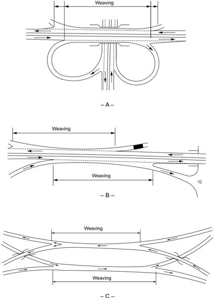

Figure 2-5. Weaving Sections

- C -

Weaving sections may be considered as simple or multiple. Figure 2-6A shows a simple weaving section in which a single entrance is followed by a single exit. A multiple-weaving section consists of two or more overlapping weaving sections. A multiple weave may also be defined as that portion of a one-way roadway that has two consecutive entrances followed closely by one or more exits, or one entrance followed closely by two or more exits, as shown in Figure 2-6B. Multiple weaving sections occur frequently in urban areas where there is need for collection and distribution of high concentrations of traffic. For further information concerning the operation and analysis of simple and multiple weaving sections, refer to the HCM ( 43 ).

The weaving section should have a length and number of lanes based on the appropriate level of service, as given in Table 2-3. The HCM presents an equation for predicting the average running speed of weaving and non-weaving traffic based on roadway and traffic conditions. Levelof-service criteria for weaving sections are based on these average running speeds.

Figure 2-6. Simple and Multiple Weaving Sections

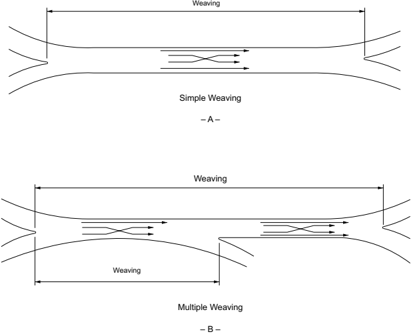

## 2.4.6.2  Multilane Highways without Access Control

Multilane highways may be treated similarly to freeways if major crossroads are infrequent, many of the crossroads are grade separated, adjacent development is sparse so as to generate little interference with traffic flow, or some combination thereof. Even on those highways where such interference is currently only marginal, the designer should anticipate that by the design year the interference may be extensive unless access to the highway is well managed. In most cases, the designer should assume that extensive crossroad and business improvements are likely over the design life of the facility.

Where there are major crossroads or where adjacent development results in more than slight interference, the facility should be treated as a multilane highway without access control.

## 2.4.6.3  Arterial Streets and Highways in Urban Areas

It is often difficult to establish design service flow rates for arterial streets and highways in urban areas because the level of service provided by such facilities does not remain stable with the passage of time and tends to deteriorate in an unpredictable manner. However, if the principles of access management are applied initially to the street or highway, a high level of operations can be maintained over time ( 13, 25, 31, 41 ). The capacity of an arterial is generally dominated by the capacity of its individual signalized intersections. The level of service for a section of an arterial is defined by the average overall travel speed for the section.

## 2.4.6.4  Intersections

Design capacities of intersections are affected by a very large number of variables. To the extent that these variables can be predicted for the design year, design capacities for all modes can be estimated by procedures for signalized and unsignalized intersections given in the HCM ( 43 ). The design and spacing of signalized intersections should also be coordinated with traffic signal design and phasing.

## 2.5  ACCESS CONTROL AND ACCESS MANAGEMENT

## 2.5.1  General Conditions

Regulating access is called 'access control.' It is achieved through the regulation of public access rights to and from properties abutting the roadway facilities. These regulations generally are categorized as full control of access, partial control of access, and driveway/entrance regulations. The principal advantages of controlling access are the preservation or improvement of service and the reduction of crash frequency and severity.

The functional advantage of providing access control on a road or street is the management of the interference with through traffic. This interference is created by vehicles or pedestrians

entering, leaving, and crossing the roadway. Where access to a roadway is managed, entrances and exits are located at points best suited to fit traffic and land-use needs and are designed to enable vehicles to enter and leave the roadway with minimum interference from through traffic. Vehicles are prevented from entering or leaving elsewhere so that, regardless of the type and intensity of development of the roadside areas, a high quality of service is preserved and crash potential is lessened. Conversely, on roads or streets where there is no access management and roadside businesses are allowed to develop haphazardly, interference from the roadside can become a major factor in reducing the capacity, increasing the crash potential, and eroding the mobility function of the facility.

Access management involves providing (or managing) access to land development while simultaneously preserving the flow of traffic on the surrounding road system in terms of capacity, speed, and low crash frequency and severity ( 31 ).  Access management applies to all types of roads and streets. It calls for setting access policies for various types of roadways, keying designs to these policies, having the access policies incorporated into legislation, and having the legislation upheld in the courts.

Roadway designers using access management principles should view the roadway and its surrounding activities as part of a single system. Individual parts of the system include the activity center and its circulation systems, access to and from the center, the availability of public transportation, and the roads serving the center. All parts are important and interact with each other. The goal is to coordinate the planning and design of each activity center to preserve the capacity of the overall system and to allow efficient access to and from the activities.

Access management extends traffic engineering principles to the location, design, and operation of access roads that serve activities along streets and roads. It also includes evaluating the suitability of a site for different types of development from an access standpoint and is, in a sense, a new element of roadway design. Refer to the TRB Access Management Manual ( 42 ) for more information.

Access management techniques can be implemented with two basic legal powers: police power and eminent domain. This first power allows a state to restrict individual actions for the public welfare. Police power provides sufficient authority for most access management techniques associated with roadway operations, driveway location, driveway design, and access denials. The second power allows a state to take property for public use provided an owner is compensated for his loss. A state may need to use eminent domain when building local service roads, buying  abutting  property,  acquiring  additional  right-of-way,  and  taking  access  rights.  However, an agency usually has the power to deny direct access through the use of police power when reasonable alternative access is available.

Generally,  states  have  adequate  power  to  manage  access  to  a  roadway  as  long  as  reasonable access is provided to abutting property. However, providing reasonable access does not neces-

sarily mean providing direct access to the state highway system. Coordinating access policies into a clear and definitive regulation facilitates the use of police power. Because authority and interpretations vary from state to state, each state should evaluate its particular legal powers for controlling access. Certain techniques may not be legally feasible in a state that has neither the policy nor precedent to implement them.

Full control of access means that preference is given to through traffic by providing access connections by means of ramps with only selected public roads and by prohibiting crossings at grade and direct private driveway connections.

With partial control of access, some preference should be given to through traffic. Access connections, which may be at-grade or grade-separated, are provided with selected public roads and private driveways. Generally, full or partial access control is accomplished by legally obtaining the access rights from the abutting property owners (usually at the time of purchase of the rightof-way) or by the use of frontage roads.

Driveway/entrance regulations may be applied even though no control of access is obtained. Each abutting property is permitted access to the street or highway; however, the location, number, and geometric design of the access points are governed by the regulations.

Access management addresses the basic questions of when, where, and how access should be provided or denied, and what legal or institutional changes are needed to enforce these decisions. In a broad context, access management is resource management, since it is a way to anticipate and prevent congestion and to improve traffic flow.

Key elements of access management include defining the allowable access and access spacing for various classes of roadways, providing a mechanism for granting variances when reasonable access cannot otherwise be provided, and establishing means of enforcing policies and decisions. These key elements, along with appropriate design policies, should be implemented through a legal code that provides a systematic and supportable basis for making access decisions. The code should provide a common basis for decisions for both the public and private sectors.

## 2.5.2  Basic Principles of Access Management

The following principles define access management techniques:

- y Classify the road system by the primary function of each roadway. Freeways emphasize movement and provide complete control of access. Local streets emphasize property access rather than traffic movement. Arterial and collector roads serve a combination of both property access and traffic movement.

--',''','',',',','''''',,,,''-'-',,',,',',,'---

- y Limit direct access to roads with higher functional classifications. Direct property access should be denied or limited along higher class roadways whenever reasonable access can be provided to a lower class roadway.
- y Select  intersection  geometry  and  traffic  control  to  facilitate  corridor  progression. Signalized  access  points  should  fit  into  the  overall  signal  coordination  plan  for  traffic progression.
- y Locate driveways and major entrances to minimize interference with traffic operations. Driveways and entrances should be located away from other intersections to minimize crashes, reduce traffic interference, and provide for adequate storage lengths for vehicles turning into entrances.
- y Use curbed medians and locate median openings to manage access movements and minimize conflicts.

The extent of access management depends upon the location, type, and density of development, and the nature of the roadway system. Access management actions involve both the planning and design of new roads and the retrofitting of existing roads and driveways.

## 2.5.3  Access Classifications

Access classification is the foundation of a comprehensive access management program. It defines when, where, and how access can be provided between public roadways and private driveways or entrances.

Access classification relates the allowable access to each type of roadway in conjunction with its purpose, importance, and functional characteristics.

The functional classification system provides the starting point in assigning roadways to different access categories. Modifying factors include existing land development, driveway density, and geometric design features, such as the presence or absence of a raised-curb median.

An access classification system defines the type and spacing of allowable access for each class of road. Direct access may be denied, limited to right turns in and out, or allowed for all or most movements depending upon the specific class and type of road. Spacing of signals  in terms  of  distance  between  signals  or  through  bandwidth  (progression  speed)  is  also  specified.  Examples of access classification schemes are presented in NCHRP Report 348, Access Management Guidelines for Activity Centers ( 31 ). More information can also be found in the TRB Access Management Manual ( 42 ).

--',''','',',',','''''',,,,''-'-',,',,',',,'---

## 2.5.4  Methods of Controlling Access

Public agencies can manage and control access by means of statutes, land-use ordinances, geometric design policies, and driveway regulations.

- y Control by the transportation agencyEvery state and local transportation agency has the basic  statutory  authority  to  control  all  aspects  of  roadway  design  to  protect  public  safety, health, and welfare. The extent to which an agency can apply specific policies for driveways/ entrances, traffic signal locations, land use controls, and denial of direct access is specifically addressed by legislation and, to some degree, by the state courts.
- y Land-use ordinancesLand-use control is normally administered by local governments. Local zoning ordinances and subdivision requirements can specify site design, setback distances, access type, parking restrictions, and other elements that influence the type, volume, and location of generated traffic.
- y Geometric designGeometric design features, such as intersection type, use of raised-curb medians, spacing of median openings, use of frontage roads, closure of median openings, and raised-curb channelization at intersections, all assist in controlling access.
- y Driveway regulationsAgencies may develop detailed access and driveway/entrance policies  by  guidelines, regulations, or ordinances, provided specific statutory authority exists. Guidelines usually need no specific authority, but are weak legally. Cities can pass ordinances implementing access management policies. Likewise, state agencies may develop regulations when authorized by legislation. Regulations can deny direct access to a road if reasonable, alternative access is provided, but they cannot 'take away' access rights.

## 2.5.5  Benefits of Controlling Access

Highways with full access control consistently experience only 25 to 50 percent of the crash rates observed on roadways without access control. These rates are defined in terms of crashes per million vehicle miles [kilometers] of travel. Freeways limit the number and variety of events which drivers encounter and, as a result, crash rates are lower.

The benefits of controlling access to a highway have long been recognized and well documented. As access density increases, there is a corresponding increase in crashes and travel times. Good access management can limit this increase.

A study on congestion by the Texas Transportation Institute has reported a 2- to 3-mph reduction in speed for every added signal per mile [5- to 8-km/h reduction in speed for every added signal per kilometer] ( 33 ).  A research study on the impact of access management found that through vehicles in the curb or right lane comprised approximately 20 percent of the right turns desiring to enter a development ( 25 ).

As shown in Figures 2-7 through 2-9, the frequency of access points, such as driveways or business entrances, substantially affects the crash rate for that particular section of roadway. As the number of business and access points increases along a roadway, there is a corresponding increase in crash rates. This increase contrasts sharply with freeway crash rates which generally remain the same or even decrease slightly over time.

The generalized effects of access spacing on traffic crashes were derived from a literature synthesis and an analysis of 37,500 crashes ( 25 ). This study's analysis shows the relative increase in crash rates that can be expected as the total driveway density increases. Increasing the access frequency from 20 to 50 access points per mile [10 to 30 access points per kilometer] will result in almost doubling the number of crashes. Each additional access point per mile increases the crash rate about 3 percent; thus, each additional access point per kilometer increases the crash rate about 5 percent.

Figures 2-7 and 2-8 show crash rates by access frequency and type of median for urban/suburban and rural roads, respectively. Crash rates rise for each type of median treatment with an increase in access frequency. Non-traversable medians generally have a lower crash rate than two-way left-turn lanes and undivided roadway sections for all access densities. However, as discussed in Section 7.3.3, provision of non-traversable medians will eliminate left-turn movements at some intersections and driveways, but may increase U-turn volumes at other locations on the same road or may divert some traffic to other roads. The effect on crash frequency of increased U-turn volumes or diverted traffic may not be reflected in Figures 2-7 and 2-8.

For urban/suburban roads, representative crash rates for combinations of signalized and unsignalized access density are shown in Figure 2-9. This figure indicates that crash rates rise with increases in either unsignalized or signalized access density.

The procedures in Chapter 12 of the AASHTO Highway Safety Manual ( 5, 9 ) can be used for more detailed analysis of the effects of roadway types, driveway density, and driveway types on crash frequencies and severities on arterials in urban areas.

In summary, some degree of access control or access management should be included in the development of any street or highway, particularly on a new facility where the likelihood of commercial development exists. The type of street or highway to be built should be coordinated with the local land-use plan so that the desired type of access can be maintained through local zoning ordinances or subdivision regulations. The control of access may range from minimal driveway regulations to full control of access. Thus, the extent of access management that is practical is a significant factor in defining the type of street or highway.

--',''','',',',','''''',,,,''-'-',,',,',',,'---

## U.S. CUSTOMARY

Figure 2-7. Estimated Crash Rates by Type of Median-Urban and Suburban Areas (25)

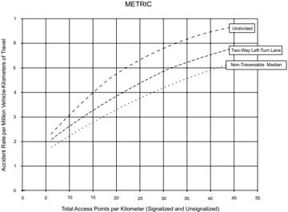

--',''','',',',','''''',,,,''-'-',,',,',',,'---

Figure 2-8. Estimated Crash Rates by Type of Median-Rural Areas (25)

## U.S. CUSTOMARY

Figure 2-9. Estimated Crash Rates by Unsignalized and Signalized Access Density-Urban and Suburban Areas (25)

## 2.6  PEDESTRIANS

## 2.6.1  General Considerations

Appropriate accommodation of pedestrian travel is a major consideration in roadway planning and design. Pedestrians are a part of every roadway environment, and attention should be paid to their presence in rural as well as urban areas. The urban pedestrian, being far more prevalent,  more  often  influences  roadway design features than the rural pedestrian does. Because of the demands of vehicular traffic in congested urban areas, it is often very difficult to make adequate provisions for pedestrians. Yet provisions should be made, because pedestrians are the lifeblood of our urban areas, especially in the downtown and other retail areas. In general, the most successful shopping areas are those that provide the most comfort and pleasure for pedestrians. Some agencies are moving toward an 'outside in' approach to urban area street design, prioritizing the needs of pedestrians early in the allocation of limited right of way. Pedestrian facilities include sidewalks, crosswalks, traffic control features, and curb cuts (depressed curbs and ramped sidewalks) and ramps for the older walkers and persons with mobility disabilities. Pedestrian facilities also include bus stops or other loading areas, sidewalks on grade separations, and the stairs, escalators, or elevators related to these facilities. Where pedestrian facilities are provided, they must be accessible to and usable by individuals with disabilities ( 46, 48 ). For additional guidance on design of pedestrian facilities, consult the Proposed Guidelines for Pedestrian Facilities in the Public Right-of-Way ( 45 ) and the AASHTO Guide for Planning, Development, and Operation of Pedestrian Facilities ( 2 ).

## 2.6.2  General Characteristics

To effectively plan and design pedestrian facilities, an understanding of the typical pedestrian is needed. The typical pedestrian will not walk over 1 mi [1.5 km] to work or over 0.5 mi [1.0 km] to catch a bus, and about 80 percent of the distances traveled by the pedestrian will be less than 0.5 mi [1.0 km] ( 34 ). The typical pedestrian is a shopper about 50 percent of the time that he or she is a pedestrian and a commuter only about 11 percent of the time. As a consequence, pedestrian volumes peak at about noon rather than at the peak commuter times. Pedestrian volumes are influenced by such transient conditions as weather or, in specific locations, advertised sales. Hourly fluctuations in pedestrian volumes on a city street can be found in the AASHTO Guide for the Planning, Design, and Operation of Pedestrian Facilities ( 2 ).

Pedestrian  actions  are  less  predictable  than  those  of  motorists.  Many  pedestrians  will  cross roadways when and where they perceive it is safe to do so. Pedestrians tend to walk in a path representing the shortest distance between two points. Therefore, pedestrian crossings at midblock locations may be appropriate to supplement those at intersections.

Pedestrians also have a basic resistance to changes in grade or elevation when crossing roadways and tend to avoid using special underpass or overpass pedestrian facilities. Also, pedestrian un-

--',''','',',',','''''',,,,''-'-',,',,',',,'---

derpasses may be potential crime areas, lessening their usage. The FHWA publication entitled Informational Report on Lighting Design for Midblock Crosswalks ( 24 )  provides information on nighttime visibility needs for pedestrians crossing roadways at nonintersection locations.

A pedestrian's age is an important factor that may explain behavior that leads to collisions between motor vehicles and pedestrians. Very young pedestrians are often careless in traffic from either inexperience or exuberance, whereas older pedestrians may be affected by limitations in sensory, perceptual, cognitive, or motor skills. Driver behavior, such as turning right on red without coming to a complete stop or parking too close to an intersection, may result in collisions with pedestrians. Pedestrian collisions can also be related to the lack of sidewalks, which may force pedestrians to share the traveled way with motorists. Therefore, sidewalk construction should be considered as part of any street improvement in the suburban, urban, and urban core contexts.

Measures with the potential to reduce vehicle-pedestrian crashes and increase pedestrian comfort in the walking environment:

- y Use simple designs that minimize crossing widths and minimize the use of more complex elements such as channelization and separate turning lanes.
- y Provide curb extensions (bulb-outs) at intersections.
- y Assume lower walking speeds.
- y Provide median refuge islands of sufficient width at wide intersections.
- y Provide lighting and eliminate glare sources at locations that demand multiple information gathering and processing.
- y Consider the traffic control system in the context of the geometric design to provide compatibility and adequate advance warning or guide signs for situations that could surprise older drivers or pedestrians or increase their crash frequencies.
- y Use accessible pedestrian signals to provide audible and vibrotactile information.
- y Consider increasing sign letter size and retroreflectivity to accommodate individuals with decreased visual acuity.
- y Use advance yield/stop signs.
- y Provide enhanced markings and delineation.
- y Use repetition and redundancy in design and in signing.

For  further  information  on  older  pedestrians  and  drivers,  refer  to  the  FHWA  publications, Handbook for Designing Roadways for the Aging Population ( 14 ) and Pedestrian Safety Guide and Countermeasure Selection System ( 22 ).

## 2.6.3  Walking Speeds

Air temperature, time of day, trip purpose, age, gender, ability, grade, and presence of ice and snow all affect pedestrian walking speeds. Typical pedestrian walking speeds range from approximately 3.0 to 4.0 ft/s [0.9 to 1.2 m/s] ( 24 ). Older people will generally walk at speeds in the lower end of this range. To accommodate most pedestrians, a walking speed of 3.5 ft/s [1.1 m/s] is used, with a walking speed of 3.0 ft/s used where older pedestrians are expected.

Intersection design can be directly affected by the assumed walking speed, particularly where pedestrian crossings are controlled by pedestrian signals. The Manual on Uniform Traffic Control Devices (MUTCD) ( 20 ) establishes a two-fold process for calculating pedestrian crossing times and distances. First, the pedestrian clearance time (Flashing Don't Walk) is based on a walking speed of 3.5 ft/s [1.1 m/s] measured from curb to curb. Second, the total pedestrian crossing phase (Walk plus Flashing Don't Walk) is calculated using a walking speed of 3.0 ft/s [0.9 m/s] for a crossing measured from the top of the sidewalk ramp to the far curb. These pedestrian walking speeds used in the MUTCD have implications for geometric design because shortening the crossing distance by using curb bulb-outs or narrower lanes can reduce the time for the pedestrian walk phase, thereby increasing the time available for opposing vehicular travel.

## 2.6.4  Walkway Level of Service

Walking speeds decrease as the pedestrian density of the walkway increases. As with roadway capacities, there is an optimum speed and density under which the walkway will carry the largest volume. The width used for walkway calculations should be reduced where parking meters, hydrants, newsstands, litter barrels, utility poles, or similar obstructions preclude the use of the full walkway. For a more detailed analysis of sidewalk, stairway, and crosswalk design and capacities, see the AASHTO Guide for the Planning, Design, and Operation of Pedestrian Facilities ( 2 ) and the Highway Capacity Manual ( 43 ).

## 2.6.5  Intersections

When pedestrians encounter an intersection, there is a major interruption in pedestrian flow. The sidewalk should provide sufficient storage area for those waiting to cross as well as an area for pedestrian cross traffic to pass.

Once pedestrians are given the walk indication, the crosswalk width and length become important. Crosswalks should be wide enough to accommodate the pedestrian flow in both directions within the duration of the pedestrian signal phase. The wider the street, the longer it takes a pedestrian to cross and proportionately less green signal time will be available for the primary street movements. Additionally, the longer the pedestrian crossing time, the longer the exposure to potential pedestrian-vehicular conflicts.

--',''','',',',','''''',,,,''-'-',,',,',',,'---

If  the  intersection is not signal controlled or if stop signs do not control the through motor vehicular traffic, pedestrians need to wait for suitable gaps in the traffic to cross. The wider the street, the longer the gap that is needed to provide sufficient pedestrian crossing times. Under urban area conditions, pedestrian crossing times may be reduced by using narrower lanes or by providing median refuge areas and two-stage crossings. However, the potential for vehicle-pedestrian collisions and reasonable roadway and intersection capacity needs should be considered when reducing crossing times.

## 2.6.6  Reducing Pedestrian-Vehicular Conflicts

The following measures may help reduce pedestrian-vehicular conflicts and improve operations on roadways in urban areas: (1) eliminate left and/or right turns, (2) prohibit free-flow right-turn movements, (3) prohibit right turn on red, (4) provide separate signal phases for pedestrians or leading pedestrian intervals, and (5) provide for pedestrian grade separations. These and other pedestrian considerations are detailed in subsequent chapters and in the AASHTO Guide for the Planning, Design, and Operation of Pedestrian Facilities ( 2 ).

## 2.6.7  Accommodating Persons with Disabilities

Roadway designs with features for persons with disabilities can greatly enhance their ability to have full, productive, and independent lives. To adequately provide for persons with disabilities, the designer should be aware of the range of disabilities to expect so that the design can appropriately accommodate them. Providing information in multiple formats is helpful to all pedestrians. The designer is cautioned to adequately review all local and national guidelines for proper compliance with applicable rules and regulations. Where pedestrian facilities are provided, they must be accessible to and usable by individuals with disabilities ( 46, 48 ). For additional guidance, see Section 4.17.3, 'Curb Ramps,' as well as the AASHTO Guide for the Planning, Design, and Operation of Pedestrian Facilities ( 2 ) and the Proposed Guidelines for Pedestrian Facilities in the Public Right-of-Way ( 45 ).

## 2.6.7.1  Mobility Disabilities

Some persons with mobility disabilities are able to walk without assistive devices, but slowly and with difficulty. Other persons may need aid from braces, canes, crutches, wheelchairs, scooters, or other devices. Stairs, curbs, and irregular pavement surfaces are the major roadway obstructions to these pedestrians. Design modifications should provide accessible facilities for all pedestrians. The front wheels of a wheelchair are very sensitive to pavement surface irregularities and obstacles; any bump may impair the progress of a wheelchair and may increase the possibility that a user will be propelled out of the wheelchair.

## 2.6.7.2  Vision Disabilities

For pedestrians with vision disabilities intersections are the most complicated transportation element. Sidewalk curb cuts may make it difficult for pedestrians with limited vision to locate the curb line. Adding a 2-ft [600-mm] detectable warning strip at the bottom of the sidewalk ramp that meets the design specifications for pedestrian accessibility ( 46, 48 ) will benefit people with visual disabilities. Because pedestrians with limited vision often rely on the sound of traffic when crossing intersections, caution should be used when considering exclusive turn phases or other unusual traffic movements.

## 2.6.7.3  Cognitive Disabilities

Many people with cognitive disabilities are unable to drive and, therefore, often travel as pedestrians. To help such pedestrians, including young children, pedestrian signals or other pedestrian-related facilities should be simple, straightforward, and consistent in their meaning.

## 2.6.7.4  Hearing Disabilities

For pedestrians with hearing disabilities, clear sight lines relatively free of visual obstructions are important, as they may have difficulty hearing approaching vehicles. Pedestrian signage should be clear and should be placed in conspicuous locations. Where pedestrian signals are provided, communication of the pedestrian signal phase in multiple formats, including a vibrotactile format, is useful to all pedestrians.

## 2.7  BICYCLISTS

Bicycles are an important mode of transportation for consideration in the roadway design process. While many agencies allow bicyclists on partially access controlled facilities, some highway agencies do not allow bicyclists on fully access controlled facilities unless no other alternative route is available.

Providing dedicated operating space for bicyclists reduces conflicts between bicyclists and motor vehicles and may improve traffic operations. Improvements, such as the following, which generally are of low to moderate cost, can improve bicycle operations on a road or street:

- y paved shoulders
- y bicycle lanes
- y bicycle-compatible drainage grates
- y adjusting manhole covers to the grade
- y maintaining a smooth, clean riding surface

At certain locations or in certain corridors, it is appropriate to provide specifically designated bikeways or shared-use paths. To provide adequately for bicycle traffic, the designer should be

--',''','',',',','''''',,,,''-'-',,',,',',,'---

familiar with bicycle dimensions, operating characteristics, and needs. These factors determine acceptable turning radii, grades, and sight distance. In many instances, design features of separate bicycle facilities are controlled by the adjoining roadway and by the design of the roadway itself. For further guidance, refer to the AASHTO Guide for the Development of Bicycle Facilities ( 7 ).

## 2.8  DESIGN VEHICLES

## 2.8.1  General Characteristics

Key controls in geometric highway design are the physical characteristics and the proportions of vehicles of various sizes using the roadway. Therefore, it is appropriate to examine all vehicle types, establish general class groupings, and select vehicles of representative sizes within each class for design use. These selected vehicles, with representative weight, dimensions, and operating characteristics, are used to establish roadway design controls for accommodating designated vehicle classes and are known as design vehicles. For purposes of geometric design, each design vehicle has larger physical dimensions and a larger minimum turning radius than most vehicles in  its  class.  Therefore,  the  design  vehicle  dimensions  represent  a  conservative  approach.  The largest design vehicles are usually accommodated in freeway design.

Four general classes of design vehicles have been established: (1) passenger cars, (2) buses, (3) trucks, and (4) recreational vehicles. The passenger-car class includes passenger cars of all sizes, sport/utility vehicles, minivans, vans, and pick-up trucks. Buses include intercity (motor coaches), city transit, school, and articulated buses. The truck class includes single-unit trucks, truck tractor-semitrailer combinations, and truck tractors with semitrailers in combination with full trailers. Recreational vehicles include motor homes, cars with camper trailers, cars with boat trailers, motor homes with boat trailers, and motor homes pulling cars. In addition, the bicycle should also be considered as a design vehicle where bicycle use is anticipated on a roadway. Refer to the AASHTO Guide for the Development of Bicycle Facilities ( 7 ) for a discussion of bicycle dimensions and bicyclist operating space.

Dimensions for 20 design vehicles representing motor vehicles within these general classes are given in Table 2-4. In the design of any roadway facility, the designer should consider the largest design vehicle that is likely to use that facility with considerable frequency or a design vehicle with special characteristics appropriate to a particular location in determining the design of such critical features as radii at intersections and radii of turning roadways.

--',''','',',',','''''',,,,''-'-',,',,',',,'---

Table 2-4a. Design Vehicle Dimensions (U.S. Customary Units)

| Design Vehicle Type                       | Symbol                | Dimensions (ft)       | Dimensions (ft)       | Dimensions (ft)       | Dimensions (ft)       | Dimensions (ft)       | Dimensions (ft)       | Dimensions (ft)       | Dimensions (ft)       | Dimensions (ft)       | Dimensions (ft)       | Dimensions (ft)       | Dimensions (ft)                               |
|-------------------------------------------|-----------------------|-----------------------|-----------------------|-----------------------|-----------------------|-----------------------|-----------------------|-----------------------|-----------------------|-----------------------|-----------------------|-----------------------|-----------------------------------------------|
| Design Vehicle Type                       | Symbol                | Overall               | Overall               | Overall               | Overhang              | Overhang              | WB 1                  | WB 2                  | S                     | T                     | WB 3                  | WB 4                  | Typical Kingpin to Center of Rear Tandem Axle |
| Design Vehicle Type                       | Symbol                | Height                | Width                 | Length                | Front                 | Rear                  | WB 1                  | WB 2                  | S                     | T                     | WB 3                  | WB 4                  | Typical Kingpin to Center of Rear Tandem Axle |
| Passenger Car                             | P                     | 4.3                   | 7.0                   | 19.0                  | 3.0                   | 5.0                   | 11.0                  | -                     | -                     | -                     | -                     | -                     | -                                             |
| Single-Unit Truck                         | SU-30                 | 11.0-13.5             | 8.0                   | 30.0                  | 4.0                   | 6.0                   | 20.0                  | -                     | -                     | -                     | -                     | -                     | -                                             |
| Single-Unit Truck (three-axle)            | SU-40                 | 11.0-13.5             | 8.0                   | 39.5                  | 4.0                   | 10.5                  | 25.0                  | -                     | -                     | -                     | -                     | -                     | -                                             |
| Buses                                     | Buses                 | Buses                 | Buses                 | Buses                 | Buses                 | Buses                 | Buses                 | Buses                 | Buses                 | Buses                 | Buses                 | Buses                 | Buses                                         |
| Intercity Bus (Motor Coaches)             | BUS-40                | 12.0                  | 8.5                   | 40.5                  | 6.3                   | 9.0a                  | 25.3                  | -                     | -                     | -                     | -                     | -                     | -                                             |
| Intercity Bus (Motor Coaches)             | BUS-45                | 12.0                  | 8.5                   | 45.5                  | 6.2                   | 9.0a                  | 28.5                  | -                     | -                     | -                     | -                     | -                     | -                                             |
| City Transit Bus                          | CITY-BUS              | 10.5                  | 8.5                   | 40.0                  | 7.0                   | 8.0                   | 25.0                  | -                     | -                     | -                     | -                     | -                     | -                                             |
| Conventional School Bus (65 pass.)        | S-BUS 36              | 10.5                  | 8.0                   | 35.8                  | 2.5                   | 12.0                  | 21.3                  | -                     | -                     | -                     | -                     | -                     | -                                             |
| Large School Bus (84 pass.)               | S-BUS 40              | 10.5                  | 8.0                   | 40.0                  | 7.0                   | 13.0                  | 20.0                  | -                     | -                     | -                     | -                     | -                     | -                                             |
| Articulated Bus                           | A-BUS                 | 11.0                  | 8.5                   | 60.0                  | 8.6                   | 10.0                  | 22.0                  | 19.4                  | 6.2 a                 | 13.2 a                | -                     | -                     | -                                             |
| Combination Trucks                        | Combination Trucks    | Combination Trucks    | Combination Trucks    | Combination Trucks    | Combination Trucks    | Combination Trucks    | Combination Trucks    | Combination Trucks    | Combination Trucks    | Combination Trucks    | Combination Trucks    | Combination Trucks    | Combination Trucks                            |
| Intermediate Semitrailer                  | WB-40                 | 13.5                  | 8.0                   | 45.5                  | 3.0                   | 4.5 b                 | 12.5                  | 25.5                  | -                     | -                     | -                     | -                     | 25.5                                          |
| Interstate Semitrailer                    | WB-62*                | 13.5                  | 8.5                   | 69.0                  | 4.0                   | 4.5 b                 | 19.5                  | 41.0                  | -                     | -                     | -                     | -                     | 41.0                                          |
| Interstate Semitrailer                    | WB-67**               | 13.5                  | 8.5                   | 73.5                  | 4.0                   | 4.5 b                 | 19.5                  | 45.5                  | -                     | -                     | -                     | -                     | 45.5                                          |
| 'Double-Bottom' Semitrailer/Trailer       | WB-67D                | 13.5                  | 8.5                   | 72.3                  | 2.3                   | 3.0                   | 11.0                  | 23.0                  | 3.0 c                 | 7.0 c                 | 22.5                  | -                     | 23.0                                          |
| Rocky Mountain Double-Semitrailer/Trailer | WB-92D                | 13.5                  | 8.5                   | 97.3                  | 2.3                   | 3.0                   | 17.5                  | 40.0                  | 4.5                   | 7.0                   | 22.5                  | -                     | 40.5                                          |
| Triple-Semitrailer/Trailers               | WB-100T               | 13.5                  | 8.5                   | 104.8                 | 2.3                   | 3.0                   | 11.0                  | 22.5                  | 3.0 d                 | 7.0 d                 | 22.5                  | 22.5                  | 23.0                                          |
| Turnpike Double-Semitrailer/Trailer       | WB-109D*              | 13.5                  | 8.5                   | 114.0                 | 2.3                   | 4.5 b                 | 12.2                  | 40.0                  | 4.5 e                 | 10.0 e                | 40.0                  | -                     | 40.5                                          |
| Recreational Vehicles                     | Recreational Vehicles | Recreational Vehicles | Recreational Vehicles | Recreational Vehicles | Recreational Vehicles | Recreational Vehicles | Recreational Vehicles | Recreational Vehicles | Recreational Vehicles | Recreational Vehicles | Recreational Vehicles | Recreational Vehicles | Recreational Vehicles                         |
| Motor Home                                | MH                    | 12.0                  | 8.0                   | 30.0                  | 4.0                   | 6.0                   | 20.0                  | -                     | -                     | -                     | -                     | -                     | -                                             |
| Car and Camper Trailer                    | P/T                   | 10.0                  | 8.0                   | 48.7                  | 3.0                   | 12.0                  | 11.0                  | -                     | 5.0                   | 17.7                  | -                     | -                     | -                                             |
| Car and Boat Trailer                      | P/B                   | -                     | 8.0                   | 42.0                  | 3.0                   | 8.0                   | 11.0                  | -                     | 5.0                   | 15.0                  | -                     | -                     | -                                             |
| Motor Home and Boat Trailer               | MH/B                  | 12.0                  | 8.0                   | 53.0                  | 4.0                   | 8.0                   | 20.0                  | -                     | 6.0                   | 15.0                  | -                     | -                     | -                                             |

- a Combined dimension is 19.4 ft and articulating section is 4.0 ft wide.
- b Length of the overhang from the back axle of the tandem axle assembly.
- c Combined dimension is typically 10.0 ft.
- d Combined dimension is typically 10.0 ft.
- e Combined dimension is typically 12.5 ft.
-  WB1, WB2, WB3, and WB4 are the effective vehicle wheelbases, or distances between axle groups, starting at the front and working towards the back of each unit.
-  S is the distance from the rear effective axle to the hitch point or point of articulation.
-  T is the distance from the hitch point or point of articulation measured back to the center of the next axle or the center of the tandem axle assembly.

Table 2-4b. Design Vehicle Dimensions (Metric Units)

| Design Vehicle Type                       | Symbol                | Dimensions (m)        | Dimensions (m)        | Dimensions (m)        | Dimensions (m)        | Dimensions (m)        | Dimensions (m)        | Dimensions (m)        | Dimensions (m)        | Dimensions (m)        | Dimensions (m)        | Dimensions (m)        | Dimensions (m)                                |
|-------------------------------------------|-----------------------|-----------------------|-----------------------|-----------------------|-----------------------|-----------------------|-----------------------|-----------------------|-----------------------|-----------------------|-----------------------|-----------------------|-----------------------------------------------|
| Design Vehicle Type                       | Symbol                | Overall               | Overall               | Overall               | Overhang              | Overhang              | WB 1                  | WB                    | S                     | T                     | WB 3                  | WB 4                  | Typical Kingpin to Center of Rear Tandem Axle |
| Design Vehicle Type                       | Symbol                | Height                | Width                 | Length                | Front                 | Rear                  | WB 1                  | 2                     | S                     | T                     | WB 3                  | WB 4                  | Typical Kingpin to Center of Rear Tandem Axle |
| Passenger Car                             | P                     | 1.30                  | 2.13                  | 5.79                  | 0.91                  | 1.52                  | 3.35                  | -                     | -                     | -                     | -                     | -                     | -                                             |
| Single-Unit Truck                         | SU-9                  | 3.35-4.11             | 2.44                  | 9.14                  | 1.22                  | 1.83                  | 6.10                  | -                     | -                     | -                     | -                     | -                     | -                                             |
| Single-Unit Truck (three-axle)            | SU-12                 | 3.35-4.11             | 2.44                  | 12.04                 | 1.22                  | 3.20                  | 7.62                  | -                     | -                     | -                     | -                     | -                     | -                                             |
| Buses                                     | Buses                 | Buses                 | Buses                 | Buses                 | Buses                 | Buses                 | Buses                 | Buses                 | Buses                 | Buses                 | Buses                 | Buses                 | Buses                                         |
| Intercity Bus (Motor Coaches)             | BUS-12                | 3.66                  | 2.59                  | 12.36                 | 1.93                  | 2.73 a                | 7.70                  | -                     | -                     | -                     | -                     | -                     | -                                             |
|                                           | BUS-14                | 3.66                  | 2.59                  | 13.86                 | 1.89                  | 2.73 b                | 8.69                  | -                     | -                     | -                     | -                     | -                     | -                                             |
| City Transit Bus                          | CITY-BUS              | 3.20                  | 2.59                  | 12.19                 | 2.13                  | 2.44                  | 7.62                  | -                     | -                     | -                     | -                     | -                     | -                                             |
| Conventional School Bus (65 pass.)        | S-BUS 11              | 3.20                  | 2.44                  | 10.91                 | 0.79                  | 3.66                  | 6.49                  | -                     | -                     | -                     | -                     | -                     | -                                             |
| Large School Bus (84 pass.)               | S-BUS 12              | 3.20                  | 2.44                  | 12.19                 | 2.13                  | 3.96                  | 6.10                  | -                     | -                     | -                     | -                     | -                     | -                                             |
| Articulated Bus                           | A-BUS                 | 3.35                  | 2.59                  | 18.29                 | 2.62                  | 3.05                  | 6.71                  | 5.91                  | 1.89 a                | 4.02 a                | -                     | -                     | -                                             |
| Combination Trucks                        | Combination Trucks    | Combination Trucks    | Combination Trucks    | Combination Trucks    | Combination Trucks    | Combination Trucks    | Combination Trucks    | Combination Trucks    | Combination Trucks    | Combination Trucks    | Combination Trucks    | Combination Trucks    | Combination Trucks                            |
| Intermediate Semitrailer                  | WB-12                 | 4.11                  | 2.44                  | 13.87                 | 0.91                  | 1.37 b                | 3.81                  | 7.77                  | -                     | -                     | -                     | -                     | 7.77                                          |
| Interstate Semitrailer                    | WB-19*                | 4.11                  | 2.59                  | 21.03                 | 1.22                  | 1.37 b                | 5.94                  | 12.50                 | -                     | -                     | -                     | -                     | 12.50                                         |
| Interstate Semitrailer                    | WB-20**               | 4.11                  | 2.59                  | 22.40                 | 1.22                  | 1.37 b                | 5.94                  | 13.87                 | -                     | -                     | -                     | -                     | 13.87                                         |
| 'Double-Bottom' Semitrailer/Trailer       | WB-20D                | 4.11                  | 2.59                  | 22.04                 | 0.71                  | 0.91                  | 3.35                  | 7.01                  | 0.91 c                | 2.13 c                | 6.86                  | -                     | 7.01                                          |
| Rocky Mountain Double-Semitrailer/Trailer | WB-28D                | 4.11                  | 2.59                  | 29.67                 | 0.71                  | 0.91                  | 5.33                  | 12.19                 | 1.37                  | 2.13                  | 6.86                  | -                     | 12.34                                         |
| Triple-Semitrailer/Trailers               | WB-30T                | 4.11                  | 2.59                  | 31.94                 | 0.71                  | 0.91                  | 3.35                  | 6.86                  | 0.91d                 | 2.13 d                | 6.86                  | 6.86                  | 7.01                                          |
| Turnpike Double-Semitrailer/Trailer       | WB-33D*               | 4.11                  | 2.59                  | 34.75                 | 0.71                  | 1.37 b                | 3.72                  | 12.19                 | 1.37 e                | 3.05 e                | 12.19                 | -                     | 12.34                                         |
| Recreational Vehicles                     | Recreational Vehicles | Recreational Vehicles | Recreational Vehicles | Recreational Vehicles | Recreational Vehicles | Recreational Vehicles | Recreational Vehicles | Recreational Vehicles | Recreational Vehicles | Recreational Vehicles | Recreational Vehicles | Recreational Vehicles | Recreational Vehicles                         |
| Motor Home                                | MH                    | 3.66                  | 2.44                  | 9.14                  | 1.22                  | 1.83                  | 6.10                  | -                     | -                     | -                     | -                     | -                     | -                                             |
| Car and Camper Trailer                    | P/T                   | 3.05                  | 2.44                  | 14.84                 | 0.91                  | 3.66                  | 3.35                  | -                     | 1.52                  | 5.39                  | -                     | -                     | -                                             |
| Car and Boat Trailer                      | P/B                   | -                     | 2.44                  | 12.80                 | 0.91                  | 2.44                  | 3.35                  | -                     | 1.52                  | 4.57                  | -                     | -                     | -                                             |
| Motor Home and Boat Trailer               | MH/B                  | 3.66                  | 2.44                  | 16.15                 | 1.22                  | 2.44                  | 6.10                  | -                     | 1.83                  | 4.57                  | -                     | -                     | -                                             |

Note: Since vehicles are manufactured using U.S. Customary dimensions, and to provide only one physical size for each design vehicle, the metric values shown in the design vehicle drawings have been soft converted from the values listed in feet and then rounded to the nearest hundredth of a meter.

* Design vehicle with 14.63-m trailer as adopted in 1982 Surface Transportation Assistance Act (STAA).
- **  Design vehicle with 16.15-m trailer as grandfathered in with 1982 Surface Transportation Assistance Act (STAA).
- a Combined dimension is 5.91 m and articulating section is 1.22 m wide.
- b Length of the overhang from the back axle of the tandem axle assembly.
- c Combined dimension is typically 3.05 m.
- d Combined dimension is typically 3.05 m.
- e Combined dimension is typically 3.81 m.
-  WB1, WB2, WB3, and WB4 are the effective vehicle wheelbases, or distances between axle groups, starting at the front and working towards the back of each unit.
-  S is the distance from the rear effective axle to the hitch point or point of articulation.
-  T is the distance from the hitch point or point of articulation measured back to the center of the next axle or the center of the tandem axle assembly.

Depending on expected usage, a large school bus (84 passengers) or a conventional school bus (65 passengers) may be appropriate for the design of intersections of highways with low-volume county roads and township/local roads under 400 ADT. The school bus may also be appropriate for the design of some subdivision street intersections.

The WB-67 [WB-20] truck should generally be the minimum size design vehicle considered for intersections of freeway ramp terminals with arterial crossroads and for other intersections on state  highways and industrialized streets that carry high volumes of truck traffic or that provide local access for large trucks, or both. Where large vehicles make turning maneuvers and pedestrians and/or bicyclists are present, designers should consider strategies to reduce the effect of large corner radii, such as raised channelizing islands or divided center medians with encroachment aprons. In many cases, operators of WB-67 [WB-20] and larger vehicles pull the rear axles of the vehicle forward to maintain a kingpin-to-rear-axle distance of 41 ft [12.5 m], which makes the truck more maneuverable and is required by law in many jurisdictions. Where this practice is prevalent, the WB 62 [WB 19] may be used in design for turning maneuvers, but the WB-67 [WB-20] should be used in design situations where the overall length of the vehicle is considered, such as for sight distance at railroad-highway grade crossings.

Recent research has developed several design vehicles larger than those presented here, with overall lengths up to 129.3 ft [39.41 m]. These larger design vehicles are not generally needed for design to accommodate the current truck fleet. However, if needed to address conditions at specific sites, their dimensions and turning performance can be found in NCHRP Report 505 ( 27 ).

## 2.8.2  Minimum Turning Paths of Design Vehicles

Table 2-5 presents the minimum turning radii and Figures 2-10 through 2-18 and 2-22 through 2-32 present the minimum turning paths for 20 typical design vehicles. The principal dimensions affecting design are the minimum centerline turning radius (CTR), the out-to-out track width, the wheelbase, and the path of the inner rear tire. Effects of driver characteristics (such as the speed at which the driver makes a turn) and of the slip angles of wheels are minimized by assuming that the speed of the vehicle for the minimum turning radius is less than 10 mph [15 km/h].

The boundaries of the turning paths of each design vehicle for its sharpest turns are established by the outer trace of the front overhang and the path of the inner rear wheel. This sharpest turn assumes that the outer front wheel follows the circular arc defining the minimum centerline turning radius as determined by the vehicle steering mechanism. The minimum radii of the outside and inside wheel paths and the centerline turning radii (CTR) for specific design vehicles are given in Table 2-5.

Trucks and buses generally need more generous geometric designs than do passenger vehicles. This is largely because trucks and buses are wider and have longer wheelbases and greater min-

--',''','',',',','''''',,,,''-'-',,',,',',,'---

imum turning radii, which are the principal vehicle dimensions affecting horizontal alignment and cross section. Single-unit trucks and buses have smaller minimum turning radii than most combination vehicles, but because of their greater offtracking, the longer combination vehicles need greater turning path widths.

Table 2-5a. Minimum Turning Radii of Design Vehicles (U.S. Customary Units)

| Design Vehicle Type                      | Passen- ger Car        | Single- Unit Truck     | Single- Unit Truck (Three Axle)   | Intercity (Motor   | Bus Coach)                     | City Transit Bus                       | Conven- tional School Bus (65 pass.)   | Large a School Bus (84 pass.)   | Articu- lated Bus    | Interme- diate Semi- trailer   |
|------------------------------------------|------------------------|------------------------|-----------------------------------|--------------------|--------------------------------|----------------------------------------|----------------------------------------|---------------------------------|----------------------|--------------------------------|
| Symbol                                   | P                      | SU-30                  | SU-40                             | BUS-40             | BUS-45                         | CITY-BUS                               | S-BUS36                                | S-BUS40                         | A-BUS                | WB-40                          |
| Minimum Design Turning Radius (ft)       | 23.8                   | 41.8                   | 51.2                              | 41.7               | 44.0                           | 41.6                                   | 38.6                                   | 39.1                            | 39.4                 | 39.9                           |
| Center- lineb Turning Radius (CTR) (ft)  | 21.0                   | 38.0                   | 47.4                              | 37.8               | 40.2                           | 37.8                                   | 34.9                                   | 35.4                            | 35.5                 | 36.0                           |
| Minimum Inside Radius (ft)               | 14.4                   | 28.4                   | 36.4                              | 24.3               | 24.7                           | 24.5                                   | 23.8                                   | 25.3                            | 21.3                 | 19.3                           |
| Design Vehicle Type                      | Interstate Semitrailer | Interstate Semitrailer | 'Double Bottom' Combi- nation     | Rocky Mtn Double   | Triple Semi- trailer/ Trailers | Turnpike Double Semi- trailer/ Trailer | Motor Home                             | Car and Camper Trailer          | Car and Boat Trailer | Motor Home and Boat Trailer    |
| Symbol                                   | WB-62*                 | WB-67**                | WB-67D                            | WB-92D             | WB-100T                        | WB- 109D*                              | MH                                     | P/T                             | P/B                  | MH/B                           |
| Minimum Design Turning Radius (ft)       | 44.8                   | 44.8                   | 44.8                              | 82.0               | 44.8                           | 59.9                                   | 39.7                                   | 32.9                            | 23.8                 | 49.8                           |
| Cen- terline b Turning Radius (CTR) (ft) | 41.0                   | 41.0                   | 40.9                              | 78.0               | 40.9                           | 55.9                                   | 36.0                                   | 30.0                            | 21.0                 | 46.0                           |
| Minimum Inside Radius (ft)               | 7.4                    | 1.9                    | 19.1                              | 55.6               | 9.7                            | 13.8                                   | 26.0                                   | 18.3                            | 8.0                  | 35.0                           |

* Design vehicle with 48-ft trailer as adopted in 1982 Surface Transportation Assistance Act (STAA).
- ** Design vehicle with 53-ft trailer as grandfathered in with 1982 Surface Transportation Assistance Act (STAA).
- a School buses are manufactured from 42-passenger to 84-passenger sizes. This corresponds to wheelbase lengths of 11.0 to 20.0 ft, respectively. For these different sizes, the minimum design turning radii vary from 28.1 to 39.1 ft and the minimum inside radii vary from 17.7 to 25.3 ft.
- b The turning radius assumed by a designer when investigating possible turning paths is set at the centerline of the front axle of a vehicle. If the minimum turning path is assumed, the CTR approximately equals the minimum design turning radius minus one-half the front width of the vehicle.

Table 2-5b. Minimum Turning Radii of Design Vehicles (Metric Units)

| Design Vehicle Type                     | Passen- ger Car        | Single- Unit Truck     | Single- Unit Truck (Three Axle)   | Intercity (Motor   | Bus Coach)                     | City Transit Bus                       | Conven- tional School Bus (65 pass.)   | Large a School Bus (84 pass.)   | Articulat- ed Bus    | Inter- mediate Semi- trailer   |
|-----------------------------------------|------------------------|------------------------|-----------------------------------|--------------------|--------------------------------|----------------------------------------|----------------------------------------|---------------------------------|----------------------|--------------------------------|
| Symbol                                  | P                      | SU-9                   | SU-12                             | BUS-12             | BUS-14                         | CITY-BUS                               | S-BUS11                                | S-BUS12                         | A-BUS                | WB-12                          |
| Minimum Design Turning Radius (m)       | 7.26                   | 12.73                  | 15.60                             | 12.70              | 13.40                          | 12.80                                  | 11.75                                  | 11.92                           | 12.00                | 12.16                          |
| Center- lineb Turning Radius (CTR) (m)  | 6.40                   | 11.58                  | 14.46                             | 11.53              | 12.25                          | 11.52                                  | 10.64                                  | 10.79                           | 10.82                | 10.97                          |
| Minimum Inside Radius (m)               | 4.39                   | 8.64                   | 11.09                             | 7.41               | 7.54                           | 7.45                                   | 7.25                                   | 7.71                            | 6.49                 | 5.88                           |
| Design Vehicle Type                     | Interstate Semitrailer | Interstate Semitrailer | 'Double Bottom' Combi- nation     | Rocky Mtn Double   | Triple Semi- trailer/ Trailers | Turnpike Double Semi- trailer/ Trailer | Motor Home                             | Car and Camper Trailer          | Car and Boat Trailer | Motor Home and Boat Trailer    |
| Symbol                                  | WB-19*                 | WB-20**                | WB-20D                            | WB-28D             | WB-30T                         | WB-33D*                                | MH                                     | P/T                             | P/B                  | MH/B                           |
| Minimum Design Turning Radius (m)       | 13.66                  | 13.66                  | 13.67                             | 24.98              | 13.67                          | 18.25                                  | 12.11                                  | 10.03                           | 7.26                 | 15.19                          |
| Center- line b Turning Radius (CTR) (m) | 12.50                  | 12.50                  | 12.47                             | 23.77              | 12.47                          | 17.04                                  | 10.97                                  | 9.14                            | 6.40                 | 14.02                          |
| Minimum Inside Radius (m)               | 2.25                   | 0.59                   | 5.83                              | 16.94              | 2.96                           | 4.19                                   | 7.92                                   | 5.58                            | 2.44                 | 10.67                          |

Note: Numbers in table have been rounded to the nearest hundredth of a meter.

* Design vehicle with 14.63-m trailer as adopted in 1982 Surface Transportation Assistance Act (STAA).
- ** Design vehicle with 16.15-m trailer as grandfathered in with 1982 Surface Transportation Assistance Act (STAA).
- a School buses are manufactured from 42-passenger to 84-passenger sizes. This corresponds to wheelbase lengths of 3.35 to 6.10 m, respectively. For these different sizes, the minimum design turning radii vary from 8.58 to 11.92 m and the minimum inside radii vary from 5.38 to 7.1 m.
- b The turning radius assumed by a designer when investigating possible turning paths and is set at the centerline of the front axle of a vehicle. If the minimum turning path is assumed, the CTR approximately equals the minimum design turning radius minus one-half the front width of the vehicle.

A combination truck is a single-unit truck with a full trailer, a truck tractor with a semitrailer, or a truck tractor with a semitrailer and one or more full trailers. Because combination truck sizes and turning characteristics vary widely, there are several combination truck design vehicles.

These combination trucks are identified by the designation WB, together with the wheelbase or another length dimension in both metric and U.S. customary units. The combination truck design vehicles are:

1. WB-62 [WB-12] -representative of intermediate size tractor-semitrailer combinations;
2. WB-19 [WB 40] -representative  of  larger  tractor  semitrailer  combinations  allowed  on selected highways by the Surface Transportation Assistance Act of 1982;
3. WB-67 [WB-20] -representative  of  a  larger  tractor-semitrailer  allowed  to  operate  on selected highways by 'grandfather' rights under the Surface Transportation Assistance Act of 1982;
4. WB-67D [WB-20D] -representative of a tractor-semitrailer/full trailer (doubles or twin trailer) combination commonly in use;
5. WB-92D [WB-28D] -Rocky Mountain double tractor-semitrailer/full trailer combination with one longer and one shorter trailer, used extensively in a number of Western states;
6. WB-100T [WB 30T] -representative of tractor-semitrailer/full trailer/full trailer combinations (triples) selectively in use; and
7. WB-109D [WB-33D] -representative of larger tractor-semitrailer/full trailer combinations (turnpike double) selectively in use.

Although Rocky Mountain doubles, turnpike doubles, and triple trailers are only permitted on some highways, their presence on those highways does warrant inclusion in this publication.

Figure  2-19  defines  the  turning  characteristics  of  a  typical  tractor-semitrailer  combination. Figure 2-20 shows the relationship between maximum steering angle, effective wheelbase of tractor, and centerline turning radius on which the calculation of turning paths for combination trucks is based. Figure 2-21 defines the lengths of tractors commonly used in tractor-semitrailer combinations.

The terminology used in Figures 2-19 and 2-20 is defined below:

1. curb-to-curb turning radius -Circular arc formed by the turning path radius of the front outside tire of a vehicle.
2. wall-to-wall turning radius -Circular arc formed by the turning path radius of the front side of a vehicle (overhang).
3. centerline turning radius ( CTR )-Turning radius of the centerline of the front axle of a vehicle with its steering wheels at the steering lock position.
4. offtracking -Difference in the paths of the front and rear wheels of a tractor-semitrailer as it negotiates a turn. The path of the rear tires of a turning truck does not coincide with that of the front tires, and this effect is shown in Figure 2-19.

5. swept path width -Amount of roadway width that a truck covers in negotiating a turn; equal to the amount of offtracking plus the width of the tractor unit. The most significant dimension affecting the swept path width of a tractor-semitrailer is the distance from the kingpin to the rear trailer axle or axles. The greater this distance is, the greater the swept path width.
6. steering angle -Average of the angles made by the left and right steering wheels with the longitudinal axis of the vehicle when the wheels are turned to their maximum angle. This maximum angle controls the minimum turning radius of the vehicle.
7. tractor-trailer  angle ( articulating  angle )-Angle  between  adjoining  units  of  a  tractorsemitrailer when the combination unit is placed into a turn; this angle is measured between the longitudinal axes of the tractor and trailer as the vehicle turns. The maximum tractortrailer  angle  occurs  when  a  vehicle  makes  a  180-degree  turn  at  the  minimum  turning radius; this angle is reached slightly beyond the point where maximum swept path width is achieved. A combination vehicle with more than one articulating part will have more than one articulating angle. The articulating angles are designated as AA1, AA2, etc., starting from the front to the end of vehicle.

The dimensions of the design vehicles take into account recent trends in motor vehicle sizes manufactured in the United States and represent a composite of vehicles currently in operation. However, the design vehicle dimensions are intended to represent vehicle sizes that are critical to geometric design and thus are larger than nearly all vehicles belonging to their corresponding vehicle classes.

The minimum turning radii and transition lengths shown in the figures are for turns at less than 10 mph [15 km/h]. Longer transition curves and larger curve radii are needed for turning roadways if higher speeds are desired. The turning paths shown in Figures 2-10 through 2-18 and Figures 2-22 through 2-32 were derived based on the vehicle manufacturers' specifications by using commercially available computer programs. The report Comparison of Turning Radius Specifications and Measurements for a 45' Bus ( 44 ) confirms that radii shown in Figure 2-14 are for a bus with a perfect front-end alignment which is performing to its manufacturer's specifications. Typical buses that are in service and have not had a front-end alignment adjustment for some time need larger radii than the values shown here in order to make the right turn.

The P design vehicle, with the dimensions and turning characteristics shown in Figure 2-10, represents a larger passenger car.

The SU-30 [SU-9] design vehicle represents a single-unit truck and the SU-40 [SU-12] design  vehicle  represents  a  larger  single-unit  truck.  The  control  dimensions  indicate  the  minimum turning path for most single-unit trucks now in operation (see Figures 2-11 and 2-12). On long-distance facilities serving large over-the-road truck traffic or intercity buses (motor coaches), the design vehicle should generally be either a combination truck or an intercity bus. --',''','',',',','''''',,,,''-'-',,',,',',,'---

Most metropolitan transit authorities allow buses up to 45 ft [13.7 m] long to be equipped with a front-mounted bicycle rack as long as the bicycle handlebars are not extended more than 3.5 ft [1.07 m] from the front of the bus. (Figures 2-13 through 2-15 show the minimum turning paths of such buses).

Buses serving particular urban areas may not conform to the dimensions shown in Figure 2-15. For example, articulated buses, which are now used in certain cities, are longer than a conventional bus, with a permanent hinge near the vehicle's center that allows more maneuverability. Figure 2-18 displays the critical dimensions for the A-BUS design vehicle. Also, due to the importance of school buses, two design vehicles designated as S-BUS 36 [S-BUS 11] and S-BUS 40 [S-BUS 12] are shown in Figures 2-16 and 2-17, respectively. The larger design vehicle is an 84-passenger bus and the smaller design vehicle is a 65-passenger bus. The highway designer should also be aware that for certain buses the combination of ground clearance, overhang, and vertical curvature of the roadway may make maneuvering difficult in hilly areas.

Figures 2-22 through 2-28 show dimensions and the minimum turning paths of the design vehicles  that  represent  various  combination  trucks.  For  local  roads  and  streets,  the  WB-40 [WB-12] is often considered an appropriate design vehicle. The larger combination trucks are appropriate for design of facilities that serve over-the-road trucks.

Figures 2-29 through 2-32 indicate minimum turning paths for typical recreational vehicles.

In addition to the vehicles shown in Figures 2-10 through 2-18 and Figures 2-22 through 2-32, other vehicles may be used for selected design applications, as appropriate. Commercially available computer programs can be applied to derive turning path plots with which the designer can determine the path characteristics of any selected vehicle if it differs from those shown.

Figure 2-10. Minimum Turning Path for Passenger Car (P) Design Vehicle

--',''','',',',','''''',,,,''-'-',,',,',',,'---

Figure 2-11. Minimum Turning Path for Single-Unit Truck (SU-30 [SU-9]) Design Vehicle

Figure 2-12. Minimum Turning Path for Single-Unit Truck (SU-40 [SU-12]) Design Vehicle

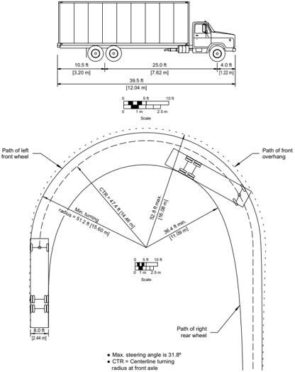

--',''','',',',','''''',,,,''-'-',,',,',',,'---

Figure 2-13. Minimum Turning Path for Intercity Bus (BUS-40 [BUS-12]) Design Vehicle

--',''','',',',','''''',,,,''-'-',,',,',',,'---

--',''','',',',','''''',,,,''-'-',,',,',',,'---

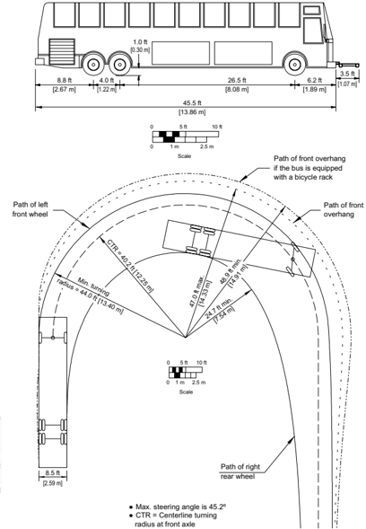

Figure 2-14. Minimum Turning Path for Intercity Bus (BUS-45 [BUS-14]) Design Vehicle

Figure 2-15. Minimum Turning Path for City Transit Bus (CITY-BUS) Design Vehicle

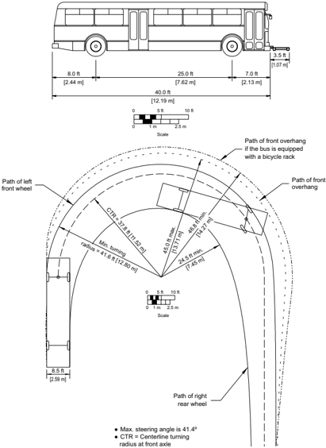

--',''','',',',','''''',,,,''-'-',,',,',',,'---

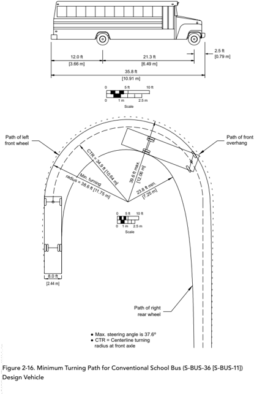

Figure 2-17. Minimum Turning Path for Large School Bus (S-Bus-40 [S-BUS-12]) Design Vehicle

Figure 2-18. Minimum Turning Path for Articulated Bus (A-BUS) Design Vehicle

--',''','',',',','''''',,,,''-'-',,',,',',,'---

--',''','',',',','''''',,,,''-'-',,',,',',,'---

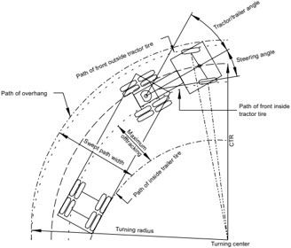

Figure 2-19. Turning Characteristics of a Typical Tractor-Semitrailer Combination Truck

Figure 2-20. Computational Method for Determining the Centerline Turning Radius for Tractor-Semitrailer Combination Trucks

Figure 2-21. Lengths of Commonly Used Truck Tractors

--',''','',',',','''''',,,,''-'-',,',,',',,'---

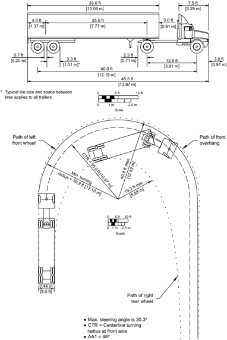

Figure 2-22. Minimum Turning Path for Intermediate Semitrailer (WB-40 [WB-12]) Design Vehicle

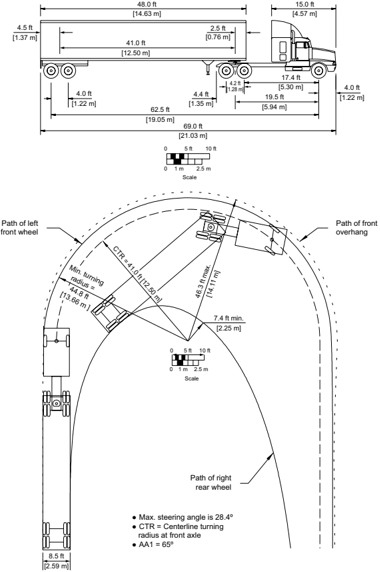

Figure 2-23. Minimum Turning Path for Interstate Semitrailer (WB-62 [WB-19]) Design Vehicle

Figure 2-24. Minimum Turning Path for Interstate Semitrailer (WB-67 [WB-20]) Design Vehicle

Figure 2-25. Minimum Turning Path for Double-Trailer Combination (WB-67D [WB-20D]) Design Vehicle

--',''','',',',','''''',,,,''-'-',,',,',',,'---

Figure 2-26. Minimum Turning Path for Rocky Mountain Double-Trailer Combination (WB92D [WB-28D]) Design Vehicle

--',''','',',',','''''',,,,''-'-',,',,',',,'---

Figure 2-27. Minimum Turning Path for Triple-Trailer Combination (WB-100T [WB-30T]) Design Vehicle

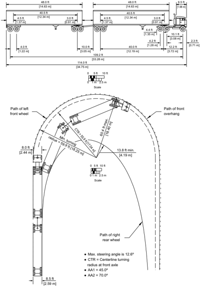

Figure 2-28. Minimum Turning Path for Turnpike-Double Combination (WB-109D [WB-33D]) Design Vehicle

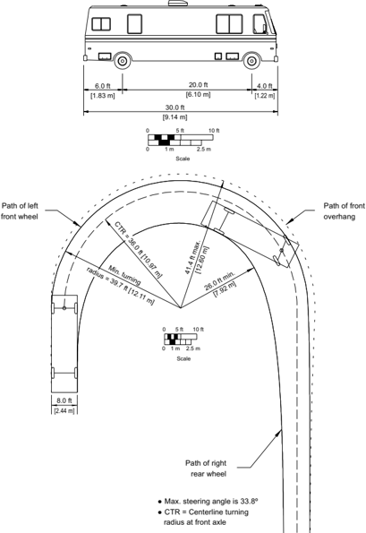

Figure 2-29. Minimum Turning Path for Motor Home (MH) Design Vehicle

Figure 2-30. Minimum Turning Path for Passenger Car and Camper Trailer (P/T) Design Vehicle

--',''','',',',','''''',,,,''-'-',,',,',',,'---

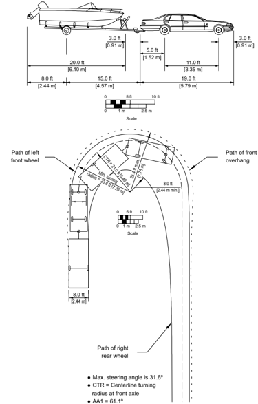

Figure 2-31. Minimum Turning Path for Passenger Car and Boat Trailer (P/B) Design Vehicle

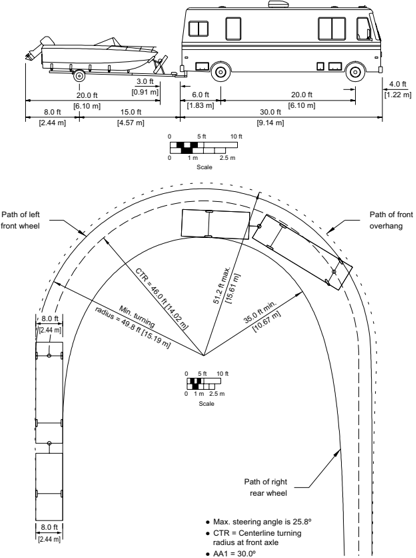

Figure 2-32. Minimum Turning Path for Motor Home and Boat Trailer (MH/B) Design Vehicle

## 2.8.3  Vehicle Performance

Acceleration and deceleration rates of vehicles are often critical parameters in determining highway design. These rates often govern the dimensions of such design features as intersections, freeway ramps, climbing or passing lanes, and turnout bays for buses. The following data are not meant to depict average performance for specific vehicle classes but rather lower performance vehicles suitable for design application, such as a low-powered (compact) car and a loaded truck or bus.

From Figures 2-33 [which is based on NCHRP Report 270 ( 36 )] and 2-34, it is evident that relatively rapid accelerations and decelerations are possible, although they may be uncomfortable for the vehicle's passengers. In addition, refer to the NCHRP Report 400, Determination of Stopping Sight Distances ( 17 ).

When a highway is located in a recreational area, the performance characteristics of recreational vehicles should be considered.

--',''','',',',','''''',,,,''-'-',,',,',',,'---

## U.S. CUSTOMARY

## METRIC

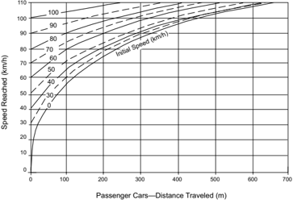

Figure 2-33. Acceleration of Passenger Cars, Level Conditions

## U.S. CUSTOMARY

Figure 2-34. Deceleration Distances for Passenger Vehicles Approaching Intersections

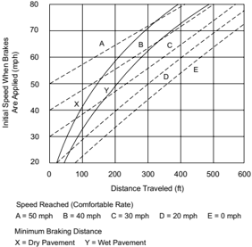

--',''','',',',','''''',,,,''-'-',,',,',',,'---

## 2.8.4  Vehicular Pollution

Pollutants emitted from motor vehicles and their impact on land uses adjacent to highways are factors affecting the highway design process. As each vehicle travels along the highway, it emits pollutants into the atmosphere and transmits noise to the surrounding area. The highway designer should recognize these impacts and evaluate them in selecting appropriate transportation alternatives. Many factors affect the rate of pollutant emission from vehicles, including vehicle mix, vehicle speed, ambient air temperature, vehicle age distribution, and percentage of vehicles operating in a cold mode.

In addition to air pollution, the highway designer should also consider noise pollution. Noise is unwanted sound that intrudes on or interferes with activities such as conversation, thinking, reading, or sleeping. Thus, sound can exist without people-noise cannot.

Motor vehicle noise is generated by the mechanical operation of the vehicle and its equipment, by its aerodynamics, by the action of its tires on the pavement or passing over rumble strips, and, in metropolitan areas, by the sounds of brake squeal, horns, loud stereos, and emergency vehicle sirens.

Trucks and passenger cars are the major noise-producing vehicles on the nation's highways. Motorcycles are also a factor to be considered because of the rapid increase in their numbers in recent years. Modern passenger cars are relatively quiet, particularly at the lower cruising speeds, but exist in such numbers as to make their total noise contribution significant. While noise  produced  by  passenger  cars  increases  dramatically  with  speed,  steep  grades  have  little influence on passenger car noise.

For passenger cars, noise produced under normal operating conditions is primarily from the engine  exhaust  system  and  the  tire-roadway  interaction.  During  travel  at  constant  highway speeds, vehicle noise is principally produced by the tire-roadway interaction with some added wind noise, but the vehicle engine system contributes little additional noise. For conditions of maximum acceleration, the engine system noise may become predominant.

Trucks, particularly heavy diesel-powered trucks, generate the highest noise levels on the highway, and more powerful engines generally produce the most noise. Truck noise levels are not greatly influenced by speed because other factors (including acceleration noise) usually contribute a major portion of the total noise. In contrast, steep grades can cause a substantial increase in noise levels for large trucks.

The quality of noise varies with the number and operating conditions of the vehicles while the directionality and amplitude of the noise vary with highway design features. The highway designer should therefore be concerned with how highway location and design influence the vehi-

cle noise perceived by persons residing or working nearby. The perceived noise level decreases as the distance to the highway from a residence or workplace increases.

## 2.9  SAFETY

Attention to highway safety has been emphasized by the Congress of the United States as well as  other  national  organizations  for  decades.  In  July  1973,  after  hearings  on  highway  safety, design, and operations were conducted by subcommittees of the House Committee on Public Works, the following mandate was published by the Committee:

Whose responsibility is it to see that maximum safety is incorporated into our motor  vehicle  transportation  system?  On  this,  the  subcommittee  is  adamant.  It  is  the responsibility of Government and specifically those agencies that, by law, have been given that mandate. This responsibility begins with the Congress and flows through the  Department  of  Transportation,  its  Federal  Highway  Administration,  the  State Highway Departments and safety agencies, and the street and highway units of counties, townships, cities, and towns. There is no retreating from this mandate, either in letter or in spirit ( 1 ).

This emphasis by Congress on safety has also been evidenced by passage of the Highway Safety Act of 1966 and subsequent renewal of the Federal highway safety program at regular intervals ( 47 ).

## 2.9.1  Key Factors Related to Traffic Crashes

Crashes seldom result from a single cause-usually several influences affect the situation at any given time. These influences can be separated into three groups: human, vehicle, and roadway. Although this policy is primarily concerned with roadway characteristics and design, the role of human factors is ever present. An error in perception or judgment or a faulty action on the driver's part can easily lead to a crash.

The frequency of traffic crashes on particular roadway facilities is very strongly influenced by the traffic volumes present. Crash frequencies generally increase with increasing traffic volumes, but this effect is generally nonlinear. Crash severities generally correlate to collision type and speed, as well as the relative vulnerability of the involved parties.

The severity of traffic crashes is also a factor in crash analysis. While reduction of property-damage-only crashes is desirable, national policy focuses on the reduction of fatalities and serious injuries. However, many roadway improvements that may reduce fatal and serious injury crashes also have the potential to reduce minor injury and property-damage-only crashes as well. As noted in Chapter 1, investments in design improvements should be performance-based. The

funds available for such improvements should be invested based on many performance measures, including crash frequency and severity.

Sections 2.9.1.1 through 2.9.1.3 are intended to provide general guidance to the designer related to highway safety. This guidance may be applicable to all of the functional classes, area types, and contexts addressed by transportation agencies. Tools are available to estimate the effect of project-specific design alternatives and geometric design decisions on expected crash frequency and severity, as described in Section 2.9.2.
