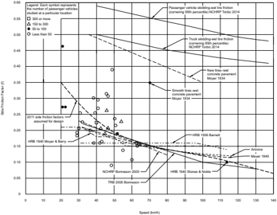
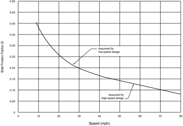
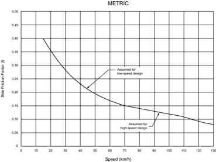
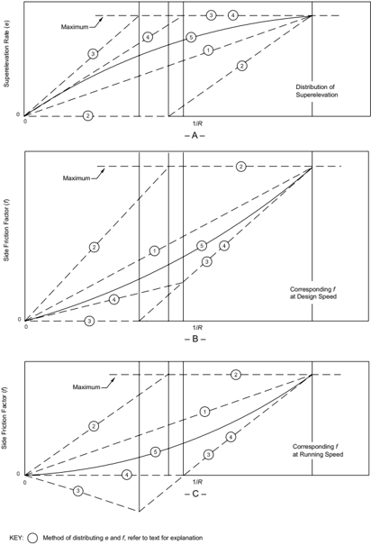
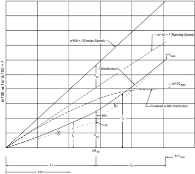

# 3.1  INTRODUCTION: 3.1  INTRODUCTION & 42 more sections

- Source: GreenBook.pdf
- Generated: 2026-01-03T08:11:58+00:00
- Chunk: 12/28
- Estimated tokens: ~33,956
- Total pages: 1048
- Type: sections

## 3.1  INTRODUCTION

The alignment of a highway or street produces a great impact on the environment, the fabric of the community, and the highway user. The alignment consists of a variety of design elements that combine to create a facility that serves traffic safely and efficiently, consistent with the facility's intended function. Each alignment element should complement others to achieve a consistent, safe, and efficient design.

The design of highways and streets within particular functional classes is treated separately in later chapters. Principal elements of design include sight distance, superelevation, traveled way widening, grades, and horizontal and vertical alignment. These design elements are discussed in this chapter, and, as appropriate, in the later chapters pertaining to specific roadway functional classes.

## 3.2  SIGHT DISTANCE

## 3.2.1  General Considerations

A driver's ability to see ahead is needed for safe and efficient operation of a vehicle on a highway. For example, on a railroad, trains are confined to a fixed path, yet a block signal system and trained operators are needed for safe operation. In contrast, the path and speed of motor vehicles on highways and streets are subject to the control of drivers whose ability, training, and experience are quite varied. The designer should provide sight distance of sufficient length that drivers can control the operation of their vehicles to avoid striking an unexpected object in the traveled way. Certain two-lane highways should also have sufficient sight distance to enable drivers to use the opposing traffic lane for passing other vehicles without interfering with oncoming vehicles. Two-lane highways in rural areas should generally provide such passing sight distance at frequent intervals and for substantial portions of their length. On the other hand, it is normally of little practical value to provide passing sight distance on two-lane streets or arterials in urban areas. The proportion of a highway's length with sufficient sight distance to pass another vehicle and interval between passing opportunities should be compatible with the intended function of the highway and the desired level of service. Design

criteria and guidance applicable to specific functional classifications of highways and streets are presented in Chapters 5 through 8.

Four aspects of sight distance are discussed below: (1) the sight distances needed for stopping, which are applicable on all roads and streets; (2) the sight distances needed for the passing of overtaken vehicles, applicable only on two-lane highways; (3) the sight distances needed for decisions at complex locations; and (4) the criteria for measuring these sight distances for use in design. The design of alignment and profile to provide sight distances and to satisfy the applicable design criteria are described later in this chapter. The special conditions related to sight distances at intersections are discussed in Section 9.5.

## 3.2.2  Stopping Sight Distance

Sight distance is the length of the roadway ahead that is visible to the driver. The available sight distance on a roadway should be sufficiently long to enable a vehicle traveling at or near the design speed to stop before reaching a stationary object in its path.

Stopping sight distance is the sum of two distances: (1) the distance traversed by the vehicle from the instant the driver sights an object necessitating a stop to the instant the brakes are applied, and (2) the distance needed to stop the vehicle from the instant brake application begins. These are referred to as brake reaction distance and braking distance, respectively.

## 3.2.2.1  Brake Reaction Time

Brake reaction time is the interval from the instant that the driver recognizes the existence of an obstacle on the roadway ahead that necessitates braking until the instant that the driver actually applies the brakes. Under certain conditions, such as emergency situations denoted by flares or flashing lights, drivers accomplish these tasks almost instantly. Under most other conditions, the driver needs not only to see the object but also to recognize it as a stationary or slowly moving object against the background of the roadway and other objects, such as walls, fences, trees, poles, or bridges. Such determinations take time, and the amount of time needed varies considerably with the distance to the object, the visual acuity of the driver, the driver's reaction time, the atmospheric visibility, the type and the condition of the roadway, and the nature of the obstacle. Vehicle speed and roadway environment probably also influence reaction time. Normally, a driver traveling at or near the design speed is more alert than one traveling at a lesser speed. A driver on a street in an urban area confronted by innumerable potential conflicts with parked vehicles, driveways, and cross streets is also likely to be more alert than the same driver on a limited-access facility where such conditions should be almost nonexistent. However, a driver on an urban street faces a high mental workload in trying to monitor additional conflicts, so there is no assurance that the driver will be able to quickly detect a need for immediate action from among the many potential sources of conflict.

--',''','',',',','''''',,,,''-'-',,',,',',,'---

The study of reaction times by Johansson and Rumar ( 41 ) referred to in Section 2.2.6 was based on data from 321 drivers who expected to apply their brakes. The median reaction-time value for these drivers was 0.66 s, with 10 percent using 1.5 s or longer. These findings correlate with those of earlier studies in which alerted drivers were also evaluated. Another study ( 46 ) found 0.64 s as the average reaction time, while 5 percent of the drivers needed over 1 s. In a third study ( 50 ),  the values of brake reaction time ranged from 0.4 to 1.7 s. In the Johansson and Rumar study ( 41 ),  when the event that prompted application of the brakes was unexpected, drivers' response times were found to increase by approximately 1 s or more; some reaction times were greater than 1.5 s. This increase in reaction time substantiated earlier laboratory and road tests in which the conclusion was drawn that a driver who needed 0.2 to 0.3 s of reaction time under alerted conditions would need 1.5 s of reaction time under normal conditions.

Minimum brake reaction times for drivers could thus be at least 1.64 s, 0.64 s for alerted drivers plus 1 s for the unexpected event. Because the studies discussed above used simple prearranged signals, they represent the least complex of roadway conditions. Even under these simple conditions, it was found that some drivers took over 3.5 s to respond. Because actual conditions on the highway are generally more complex than those of the studies, and because there is wide variation in driver reaction times, it is evident that the criterion adopted for use should be greater than 1.64 s. The brake reaction time used in design should be long enough to include the reaction times needed by nearly all drivers under most highway conditions. Studies documented in the literature ( 19, 41, 46, 50 ) show that a 2.5-s brake reaction time for stopping sight situations encompasses the capabilities of most drivers, including those of older drivers. The recommended design criterion of 2.5 s for brake reaction time exceeds the 90th percentile of reaction time for all drivers and was used in the development of Table 3-1.

A brake reaction time of 2.5 s is considered adequate for conditions that are more complex than the simple conditions used in laboratory and road tests, but it is not adequate for the most complex conditions encountered in actual driving. The need for greater reaction time in the most complex conditions encountered on the roadway, such as those found at multiphase atgrade intersections and at ramp terminals on through roadways, can be found in Section 3.2.3, 'Decision Sight Distance.'

## 3.2.2.2  Braking Distance

The approximate braking distance of a vehicle on a level roadway traveling at the design speed of the roadway may be determined from the following:

--',''','',',',','''''',,,,''-'-',,',,',',,'---

| U.S. Customary                                                                       | Metric                                                                                    |
|--------------------------------------------------------------------------------------|-------------------------------------------------------------------------------------------|
| where: d B = braking distance, ft V = design speed,mph a = deceleration rate, ft/s 2 | where: d B = braking distance,m V = design speed, km/h a = deceleration rate, m/s 2 (3-1) |

Studies documented in the literature ( 19 )  show that most drivers decelerate at a rate greater than 14.8 ft/s 2 [4.5 m/s 2 ] when confronted with the need to stop for an unexpected object in the roadway. Approximately 90 percent of all drivers decelerate at rates greater than 11.2 ft/s 2 [3.4 m/s 2 ]. Such decelerations are within the driver's capability to stay within his or her lane and maintain steering control during the braking maneuver on wet surfaces. Therefore, 11.2 ft/s 2 [3.4 m/s 2 ] (a comfortable deceleration for most drivers) is recommended as the deceleration threshold for determining stopping sight distance. Implicit in the choice of this deceleration threshold is the assessment that most vehicle braking systems and the tire-pavement friction levels of most roadways are capable of providing a deceleration rate of at least 11.2 ft/s 2 [3.4 m/s 2 ]. The friction available on most wet pavement surfaces and the capabilities of most vehicle braking systems can provide braking friction that exceeds this deceleration rate.

Table 3-1. Stopping Sight Distance on Level Roadways

| U.S. Customary     | U.S. Customary               | U.S. Customary                 | U.S. Customary          | U.S. Customary          |
|--------------------|------------------------------|--------------------------------|-------------------------|-------------------------|
| Design Speed (mph) | Brake Reaction Distance (ft) | Braking Distance on Level (ft) | Stopping Sight Distance | Stopping Sight Distance |
| Design Speed (mph) | Brake Reaction Distance (ft) | Braking Distance on Level (ft) | Calculated (ft)         | Design (ft)             |
| 15                 | 55.1                         | 21.6                           | 76.7                    | 80                      |
| 20                 | 73.5                         | 38.4                           | 111.9                   | 115                     |
| 25                 | 91.9                         | 60.0                           | 151.9                   | 155                     |
| 30                 | 110.3                        | 86.4                           | 196.7                   | 200                     |
| 35                 | 128.6                        | 117.6                          | 246.2                   | 250                     |
| 40                 | 147.0                        | 153.6                          | 300.6                   | 305                     |
| 45                 | 165.4                        | 194.4                          | 359.8                   | 360                     |
| 50                 | 183.8                        | 240.0                          | 423.8                   | 425                     |
| 55                 | 202.1                        | 290.3                          | 492.4                   | 495                     |
| 60                 | 220.5                        | 345.5                          | 566.0                   | 570                     |
| 65                 | 238.9                        | 405.5                          | 644.4                   | 645                     |
| 70                 | 257.3                        | 470.3                          | 727.6                   | 730                     |
| 75                 | 275.6                        | 539.9                          | 815.5                   | 820                     |
| 80                 | 294.0                        | 614.3                          | 908.3                   | 910                     |
| 85                 | 313.5                        | 693.5                          | 1007.0                  | 1010                    |

Design

Speed

(km/h)

20

30

40

50

60

70

80

90

100

110

120

130

140

Brake

Reaction

Distance

(m)

13.9

20.9

27.8

34.8

41.7

48.7

55.6

62.6

69.5

76.5

83.4

90.4

97.3

Metric

Braking

Distance on Level

(m)

4.6

10.3

18.4

28.7

41.3

56.2

73.4

92.9

114.7

138.8

165.2

193.8

224.8

Stopping

Sight Distance

Calculated

Design

(m)

18.5

31.2

46.2

63.5

83.0

104.9

129.0

155.5

184.2

215.3

248.6

284.2

322.1

(m)

20

35

50

65

85

105

130

160

185

220

250

285

325

Note: Brake reaction distance predicated on a time of 2.5 s; deceleration rate of 11.2 ft/s 2  [3.4 m/s 2 ] used to determine calculated sight distance.

## 3.2.2.3  Design Values

The stopping sight distance is the sum of the distance traversed during the brake reaction time and the distance to brake the vehicle to a stop. The computed distances for various speeds at the assumed conditions on level roadways are shown in Table 3-1 and were developed from the following equation:

| U.S. Customary                    | Metric                          |
|-----------------------------------|---------------------------------|
| where:                            | where:                          |
| SSD = stopping sight distance, ft | SSD = stopping sight distance,m |
| V = design speed,mph              | V = design speed, km/h          |
| t = brake reaction time, 2.5 s    | t = brake reaction time, 2.5 s  |
| a = deceleration rate, ft/s 2     | a = deceleration rate, m/s 2    |

## 3.2.2.4  Effect of Grade on Stopping

When a highway is on a grade, Equation 3-1 for braking distance is modified as follows:

| U.S. Customary                                                                                                      | Metric                                                                                                                |
|---------------------------------------------------------------------------------------------------------------------|-----------------------------------------------------------------------------------------------------------------------|
| where: d B = braking distance on grade, ft V = design speed,mph a = deceleration, ft/s 2 G = grade, rise/run, ft/ft | where: d B = braking distance on grade,m V = design speed, km/h a = deceleration, m/s 2 G = grade, rise/run,m/m (3-3) |

In this equation, G is the rise in elevation divided by the distance of the run and the percent of grade divided by 100, and the other terms are as previously stated. The stopping distances needed on upgrades are shorter than on level roadways; those on downgrades are longer. The stopping sight distances for various grades shown in Table 3-2 are the values determined by using Equation 3-3 in place of the second term in Equation 3-2. These adjusted sight distance values are computed for wet-pavement conditions using the same design speeds and brake reaction times used for level roadways in Table 3-1.

--',''','',',',','''''',,,,''-'-',,',,',',,'---

Table 3-2. Stopping Sight Distance on Grades

| U.S. Customary     | U.S. Customary               | U.S. Customary               | U.S. Customary               | U.S. Customary               | U.S. Customary               | U.S. Customary               |
|--------------------|------------------------------|------------------------------|------------------------------|------------------------------|------------------------------|------------------------------|
| Design Speed (mph) | Stopping Sight Distance (ft) | Stopping Sight Distance (ft) | Stopping Sight Distance (ft) | Stopping Sight Distance (ft) | Stopping Sight Distance (ft) | Stopping Sight Distance (ft) |
| Design Speed (mph) | Downgrades                   | Downgrades                   | Downgrades                   | Upgrades                     | Upgrades                     | Upgrades                     |
| Design Speed (mph) | 3%                           | 6%                           | 9%                           | 3%                           | 6%                           | 9%                           |
| 15                 | 80                           | 82                           | 85                           | 75                           | 74                           | 73                           |
| 20                 | 116                          | 120                          | 126                          | 109                          | 107                          | 104                          |
| 25                 | 158                          | 165                          | 173                          | 147                          | 143                          | 140                          |
| 30                 | 205                          | 215                          | 227                          | 200                          | 184                          | 179                          |
| 35                 | 257                          | 271                          | 287                          | 237                          | 229                          | 222                          |
| 40                 | 315                          | 333                          | 354                          | 289                          | 278                          | 269                          |
| 45                 | 378                          | 400                          | 427                          | 344                          | 331                          | 320                          |
| 50                 | 446                          | 474                          | 507                          | 405                          | 388                          | 375                          |
| 55                 | 520                          | 553                          | 593                          | 469                          | 450                          | 433                          |
| 60                 | 598                          | 638                          | 686                          | 538                          | 515                          | 495                          |
| 65                 | 682                          | 728                          | 785                          | 612                          | 584                          | 561                          |
| 70                 | 771                          | 825                          | 891                          | 690                          | 658                          | 631                          |
| 75                 | 866                          | 927                          | 1003                         | 772                          | 736                          | 704                          |
| 80                 | 965                          | 1035                         | 1121                         | 859                          | 817                          | 782                          |
| 85                 | 1070                         | 1149                         | 1246                         | 949                          | 902                          | 862                          |

| Metric              | Metric         | Metric         | Metric         | Metric                | Metric                | Metric                |
|---------------------|----------------|----------------|----------------|-----------------------|-----------------------|-----------------------|
| Design Speed (km/h) | Stopping Sight | Stopping Sight | Stopping Sight | Distance (m) Upgrades | Distance (m) Upgrades | Distance (m) Upgrades |
| Design Speed (km/h) | 3%             | 6%             | 9%             | 3%                    | 6%                    | 9%                    |
| 20                  | 20             | 20             | 20             | 19                    | 18                    | 18                    |
| 30                  | 32             | 35             | 35             | 31                    | 30                    | 29                    |
| 40                  | 50             | 50             | 53             | 45                    | 44                    | 43                    |
| 50                  | 66             | 70             | 74             | 61                    | 59                    | 58                    |
| 60                  | 87             | 92             | 97             | 80                    | 77                    | 75                    |
| 70                  | 110            | 116            | 124            | 100                   | 97                    | 93                    |
| 80                  | 136            | 144            | 154            | 123                   | 118                   | 114                   |
| 90                  | 164            | 174            | 187            | 148                   | 141                   | 136                   |
| 100                 | 194            | 207            | 223            | 174                   | 167                   | 160                   |
| 110                 | 227            | 243            | 262            | 203                   | 194                   | 186                   |
| 120                 | 263            | 281            | 304            | 234                   | 223                   | 214                   |
| 130                 | 302            | 323            | 350            | 267                   | 254                   | 243                   |
| 140                 | 341            | 367            | 398            | 302                   | 287                   | 274                   |

On nearly all roads and streets, the grade is traversed by traffic in both directions of travel, but the sight distance at any point on the highway generally is different in each direction, particularly on straight roads in rolling terrain. As a general rule, the sight distance available on downgrades is larger than on upgrades, more or less automatically providing the appropriate corrections for grade. This may explain why some designers do not adjust stopping sight distance because of grade. Exceptions are one-way roadways or streets, as on divided highways with independent profiles. For these separate roadways, adjustments for grade may be needed.

## 3.2.2.5  Variation for Trucks

The recommended stopping sight distances are based on passenger car operation and do not explicitly consider design for truck operation. Trucks as a whole, especially the larger and heavier units, need longer stopping distances for a given speed than passenger vehicles. However, there is one factor that tends to balance the additional braking lengths for trucks with those for passenger cars. The truck driver is able to see substantially farther beyond vertical sight obstructions because of the higher position of the seat in the vehicle. Separate stopping sight distances for trucks and passenger cars, therefore, are not generally used in highway design. --',''','',',',','''''',,,,''-'-',,',,',',,'---

There is one situation in which the goal should be to provide stopping sight distances greater than the design values in Table 3-1. Where horizontal sight restrictions occur on downgrades, particularly at the ends of long downgrades where truck speeds closely approach or exceed those of passenger cars, the greater height of eye of the truck driver is of little value. Although the

average truck driver tends to be more experienced than the average passenger car driver and quicker to recognize potential risks, it is desirable under such conditions to provide stopping sight distance that exceeds the values in Tables 3-1 or 3-2.

## 3.2.2.5.1  New Construction vs. Projects on Existing Roads

The stopping sight distance criteria in Tables 3-1 and 3-2 are appropriate for use in new construction  projects  where  no  constraints  are  present,  since  stopping  sight  distances  that  meet these criteria can typically be readily implemented. Sight distance improvements for projects on existing roads are often very costly. Recent research ( 35 ) has found little or no difference in crash experience between crest vertical curves that meet the stopping sight distance criteria in Tables 3-1 and 3-2 and those that do not, except where a design feature where drivers may need to change direction or speed is hidden from the driver's view. Therefore, in most cases, design elements at which the stopping sight distance is less than shown in Tables 3-1 and 3-2 may be left in place. However, where a roadway feature such as a horizontal curve, an intersection, a driveway, or a ramp terminal is hidden from the driver's view by the sight distance limitation or where a crash history review as part of the project development process finds a documented crash pattern that may be correctable by a sight distance improvement, improvement of stopping sight distance to the criteria presented in Tables 3-1 and 3-2 should be considered.

## 3.2.3  Decision Sight Distance

Stopping sight distances are usually sufficient to allow reasonably competent and alert drivers to come to a hurried stop under ordinary circumstances. However, greater distances may be needed where drivers must make complex or instantaneous decisions, where information is difficult to  perceive,  or  when unexpected or unusual maneuvers are needed. Limiting sight distances to those needed for stopping may preclude drivers from performing evasive maneuvers, which often involve less risk and are otherwise preferable to stopping. Even with an appropriate complement of standard traffic control devices in accordance with the Manual on Uniform Traffic Control Devices (MUTCD) ( 24 ), stopping sight distances may not provide sufficient visibility distances for drivers to corroborate advance warning and to perform the appropriate maneuvers. It is evident that there are many locations where it would be prudent to provide longer sight distances. In these circumstances, decision sight distance provides the greater visibility distance that drivers need.

Decision sight distance is the distance needed for a driver to detect an unexpected or otherwise difficult-to-perceive information source or condition in a roadway environment that may be visually cluttered, recognize the condition or its potential threat, select an appropriate speed and path, and initiate and complete complex maneuvers ( 11 ). Because decision sight distance offers drivers additional margin for error and affords them sufficient length to maneuver their vehicles at the same or reduced speed, rather than to just stop, its values are substantially greater than stopping sight distance.

Drivers need decision sight distances whenever there is likelihood for error in either information reception, decision making, or control actions ( 42 ). Examples of critical locations where these kinds of errors are likely to occur, and where it is desirable to provide decision sight distance include interchange and intersection locations where unusual or unexpected maneuvers are needed, changes in cross section such as toll plazas and lane drops, and areas of concentrated demand where there is apt to be 'visual noise' from competing sources of information, such as roadway elements, traffic, traffic control devices, and advertising signs.

The decision sight distances in Table 3-3 may be used to (1) provide values for sight distances that may be appropriate at critical locations, and (2) serve as criteria in evaluating the suitability of the available sight distances at these locations. Because of the additional maneuvering space provided, decision sight distances should be considered at critical locations or critical decision points should be moved to locations where sufficient decision sight distance is available. If it is not practical to provide decision sight distance because of horizontal or vertical curvature or if relocation of decision points is not practical, special attention should be given to the use of suitable traffic control devices for providing advance warning of the conditions that are likely to be encountered.

Table 3-3. Decision Sight Distance

| U.S. Customary     | U.S. Customary                                  | U.S. Customary                                  | U.S. Customary                                  | U.S. Customary                                  | U.S. Customary                                  |
|--------------------|-------------------------------------------------|-------------------------------------------------|-------------------------------------------------|-------------------------------------------------|-------------------------------------------------|
| Design Speed (mph) | Decision Sight Distance (ft) Avoidance Maneuver | Decision Sight Distance (ft) Avoidance Maneuver | Decision Sight Distance (ft) Avoidance Maneuver | Decision Sight Distance (ft) Avoidance Maneuver | Decision Sight Distance (ft) Avoidance Maneuver |
| Design Speed (mph) | A                                               | B                                               | C                                               | D                                               | E                                               |
| 30                 | 220                                             | 490                                             | 450                                             | 535                                             | 620                                             |
| 35                 | 275                                             | 590                                             | 525                                             | 625                                             | 720                                             |
| 40                 | 330                                             | 690                                             | 600                                             | 715                                             | 825                                             |
| 45                 | 395                                             | 800                                             | 675                                             | 800                                             | 930                                             |
| 50                 | 465                                             | 910                                             | 750                                             | 890                                             | 1030                                            |
| 55                 | 535                                             | 1030                                            | 865                                             | 980                                             | 1135                                            |
| 60                 | 610                                             | 1150                                            | 990                                             | 1125                                            | 1280                                            |
| 65                 | 695                                             | 1275                                            | 1050                                            | 1220                                            | 1365                                            |
| 70                 | 780                                             | 1410                                            | 1105                                            | 1275                                            | 1445                                            |
| 75                 | 875                                             | 1545                                            | 1180                                            | 1365                                            | 1545                                            |
| 80                 | 970                                             | 1685                                            | 1260                                            | 1455                                            | 1650                                            |
| 85                 | 1070                                            | 1830                                            | 1340                                            | 1565                                            | 1785                                            |

| Metric              | Metric                               | Metric                               | Metric                               | Metric                               | Metric                               |
|---------------------|--------------------------------------|--------------------------------------|--------------------------------------|--------------------------------------|--------------------------------------|
| Design Speed (km/h) | Decision Sight Distance (m) Maneuver | Decision Sight Distance (m) Maneuver | Decision Sight Distance (m) Maneuver | Decision Sight Distance (m) Maneuver | Decision Sight Distance (m) Maneuver |
| Design Speed (km/h) | Avoidance A                          | B                                    | C                                    | D                                    | E                                    |
| 50                  | 70                                   | 155                                  | 145                                  | 170                                  | 195                                  |
| 60                  | 95                                   | 195                                  | 170                                  | 205                                  | 235                                  |
| 70                  | 115                                  | 235                                  | 200                                  | 235                                  | 275                                  |
| 80                  | 140                                  | 280                                  | 230                                  | 270                                  | 315                                  |
| 90                  | 170                                  | 325                                  | 270                                  | 315                                  | 360                                  |
| 100                 | 200                                  | 370                                  | 315                                  | 355                                  | 400                                  |
| 110                 | 235                                  | 420                                  | 330                                  | 380                                  | 430                                  |
| 120                 | 265                                  | 470                                  | 360                                  | 415                                  | 470                                  |
| 130                 | 305                                  | 525                                  | 390                                  | 450                                  | 510                                  |
| 140                 | 340                                  | 580                                  | 420                                  | 490                                  | 555                                  |

Avoidance Maneuver A: Stop on road in a rural area-t = 3.0 s

Avoidance Maneuver B: Stop on road in an urban area-t = 9.1 s

Avoidance Maneuver C: Speed/path/direction change on rural road-t varies between 10.2 and 11.2 s

Avoidance Maneuver D: Speed/path/direction change on suburban road or street-t varies between 12.1 and 12.9 s

Avoidance Maneuver E:   Speed/path/direction change on urban, urban, urban core, or rural town road or streett varies between 14.0 and 14.5 s

--',''','',',',','''''',,,,''-'-',,',,',',,'---

Decision sight distance criteria that are applicable to most situations have been developed from empirical data. The decision sight distances vary depending on the rural or urban context of the road and on the type of avoidance maneuver needed to negotiate the location properly. Table 3-3 shows decision sight distance values for various situations rounded for design. As can be seen in the table, shorter distances are generally needed for roads in rural areas and for locations where a stop is the appropriate maneuver.

For the avoidance maneuvers identified in Table 3-3, the pre-maneuver time is greater than the brake reaction time for stopping sight distance to allow the driver additional time to detect and recognize the roadway or traffic situation, identify alternative maneuvers, and initiate a response at critical locations on the highway ( 47 ). The pre-maneuver component of decision sight distance uses a value ranging between 3.0 and 9.1 s ( 53 ).

The braking distance for the design speed is added to the pre-maneuver component for avoidance maneuvers A and B as shown in Equation 3-4. The braking component is replaced in avoidance maneuvers C, D, and E with a maneuver distance based on maneuver times, between 3.5 and 4.5 s, that decrease with increasing speed ( 47 ) in accordance with Equation 3-5.

The decision sight distances for avoidance maneuvers A and B are determined as:

| U.S. Customary                                    | Metric                                            |
|---------------------------------------------------|---------------------------------------------------|
| where:                                            | where:                                            |
| DSD = decision sight distance, ft                 | DSD = decision sight distance,m                   |
| t = pre-maneuver time, s (see notes in Table 3-3) | t = pre-maneuver time, s (see notes in Table 3-3) |
| V = design speed,mph                              | V = design speed, km/h                            |
| a = driver deceleration, ft/s 2                   | a = driver deceleration, m/s 2                    |

The decision sight distances for avoidance maneuvers C, D, and E are determined as:

| U.S. Customary                                                       | Metric                                                               |
|----------------------------------------------------------------------|----------------------------------------------------------------------|
| where:                                                               | where:                                                               |
| DSD = decision sight distance, ft                                    | DSD = decision sight distance,m                                      |
| t = total pre-maneuver and maneuver time, s (see notes in Table 3-3) | t = total pre-maneuver and maneuver time, s (see notes in Table 3-3) |
| V = design speed,mph                                                 | V = design speed, km/h                                               |

--',''','',',',','''''',,,,''-'-',,',,',',,'---

## 3.2.4  Passing Sight Distance for Two-Lane Highways

## 3.2.4.1  Criteria for Design

Most roads in rural areas are two-lane, two-way highways on which vehicles frequently overtake and pass slower moving vehicles using the lanes regularly used by opposing traffic. If passing is to be accomplished without interfering with an opposing vehicle, the passing driver should be able to see a sufficient distance ahead, clear of traffic, so the passing driver can decide whether to initiate and to complete the passing maneuver without cutting off the passed vehicle before meeting an opposing vehicle that appears during the maneuver. When appropriate, the driver can return to the right lane without completing the pass if he or she sees opposing traffic is too close when the maneuver is only partially completed. Many passing maneuvers are accomplished without the driver being able to see any potentially conflicting vehicle at the beginning of the maneuver. An alternative to providing passing sight distance is found in Section 3.4.4.1, 'Passing Lanes.'

Minimum passing sight distances for use in design are based on the minimum sight distances  presented  in  the  MUTCD ( 24 )  as  warrants  for  no-passing  zones  on  two-lane  highways. Design practice should be most effective when it anticipates the traffic controls (i.e., passing and no-passing zone markings) that will be placed on the highways. The potential for conflicts in passing operations on two-lane highways is ultimately determined by the judgments of drivers in initiating and completing passing maneuvers in response to (1) the driver's view of the road ahead as provided by available passing sight distance and (2) the passing and no-passing zone markings. Research has shown that the MUTCD passing sight distance criteria result in twolane highways that experience very few crashes related to passing maneuvers ( 22, 35 ).

## 3.2.4.2  Design Values

The design values for passing sight distance are presented in Table 3-4. A comparison between Tables 3-1 and 3-4 shows that more sight distance is needed to accommodate passing maneuvers on a two-lane highway than to provide stopping sight distance.

Table 3-4. Passing Sight Distance for Design of Two-Lane Highways

| U.S. Customary     | U.S. Customary       | U.S. Customary       | U.S. Customary              |
|--------------------|----------------------|----------------------|-----------------------------|
| Design Speed (mph) | Assumed Speeds (mph) | Assumed Speeds (mph) | Passing Sight Distance (ft) |
| Design Speed (mph) | Passed Vehicle       | Passing Vehicle      | Passing Sight Distance (ft) |
| 20                 | 8                    | 20                   | 400                         |
| 25                 | 13                   | 25                   | 450                         |
| 30                 | 18                   | 30                   | 500                         |
| 35                 | 23                   | 35                   | 550                         |
| 40                 | 28                   | 40                   | 600                         |
| 45                 | 33                   | 45                   | 700                         |
| 50                 | 38                   | 50                   | 800                         |
| 55                 | 43                   | 55                   | 900                         |
| 60                 | 48                   | 60                   | 1000                        |
| 65                 | 53                   | 65                   | 1100                        |
| 70                 | 58                   | 70                   | 1200                        |
| 75                 | 63                   | 75                   | 1300                        |
| 80                 | 68                   | 80                   | 1400                        |

| Metric              | Metric                | Metric                | Metric                     |
|---------------------|-----------------------|-----------------------|----------------------------|
| Design Speed (km/h) | Assumed Speeds (km/h) | Assumed Speeds (km/h) | Passing Sight Distance (m) |
| Design Speed (km/h) | Passed Vehicle        | Passing Vehicle       | Passing Sight Distance (m) |
| 30                  | 11                    | 30                    | 120                        |
| 40                  | 21                    | 40                    | 140                        |
| 50                  | 31                    | 50                    | 160                        |
| 60                  | 41                    | 60                    | 180                        |
| 70                  | 51                    | 70                    | 210                        |
| 80                  | 61                    | 80                    | 245                        |
| 90                  | 71                    | 90                    | 280                        |
| 100                 | 81                    | 100                   | 320                        |
| 110                 | 91                    | 110                   | 355                        |
| 120                 | 101                   | 120                   | 395                        |
| 130                 | 111                   | 130                   | 440                        |

Research has verified that the passing sight distance values in Table 3-4 are consistent with field observation of passing maneuvers ( 35 ). This research used two theoretical models for the sight distance needs of passing drivers; both models were based on the assumption that a passing driver will abort the passing maneuver and return to his or her normal lane behind the passed vehicle if a potentially conflicting vehicle comes into view before reaching a critical position in the passing maneuver beyond which the passing driver is committed to complete the maneuver. The Glennon model ( 28 ) assumes that the critical position occurs where the passing sight distance to complete the maneuver is equal to the sight distance needed to abort the maneuver. The Hassan et al. model ( 37 ) assumes that the critical position occurs where the passing sight distances to complete or abort the maneuver are equal or where the passing and passed vehicles are abreast, whichever occurs first.

Minimum passing sight distances for design of two-lane highways incorporate certain assumptions about driver behavior. Actual driver behavior in passing maneuvers varies widely. To accommodate these variations in driver behavior, the design criteria for passing sight distance should accommodate the behavior of a high percentage of drivers, rather than just the average driver. The assumptions made in applying the Glennon and Hassan et al. models ( 28, 37 ) are as follows:

1. The speeds of the passing and opposing vehicles are equal and represent the design speed of the highway.
2. The passed vehicle travels at uniform speed and speed difference between the passing and passed vehicles is 12 mph [19 km/h].

--',''','',',',','''''',,,,''-'-',,',,',',,'---

3. The  passing  vehicle  has  sufficient  acceleration  capability  to  reach  the  specified  speed difference relative to the passed vehicle by the time it reaches the critical position, which generally occurs about 40 percent of the way through the passing maneuver.
4. The lengths of the passing and passed vehicles are 19 ft [5.8 m], as shown for the P design vehicle in Section 2.8.1.
5. The passing driver's perception-reaction time in deciding to abort passing a vehicle is 1 s.
6. If a passing maneuver is aborted, the passing vehicle will use a deceleration rate of 11.2 ft/s 2 [3.4 m/s 2 ], the same deceleration rate used in stopping sight distance design criteria.
7. For a completed or aborted pass, the space headway between the passing and passed vehicles is 1 s.
8. The minimum clearance between the passing and opposing vehicles at the point at which the passing vehicle returns to its normal lane is 1 s.

The application of the passing sight distance models using these assumptions is presented in NCHRP Report 605 ( 35 ).

Passing sight distance for use in design should be based on a single passenger vehicle passing a single passenger vehicle. While there may be occasions to consider multiple passings, where two or more vehicles pass or are passed, it is not practical to assume such conditions in developing minimum design criteria. Research has shown that longer sight distances are often needed for passing maneuvers when the passed vehicle, the passing vehicle, or both are trucks ( 33 ). Longer sight distances occur in design, and such locations can accommodate an occasional multiple passing maneuver or a passing maneuver involving a truck.

## 3.2.4.3  Effect of Grade on Passing Sight Distance

Grades may affect the sight distance needed for passing. However, if the passing and passed vehicles are on a downgrade, then the opposing vehicle is on an upgrade, or vice versa, and the effects of the grade on the acceleration capabilities of the vehicles may offset. Passing drivers generally exercise good judgment about whether to initiate and complete passing maneuvers. Where frequent slow-moving vehicles are present on a two-lane highway upgrade, a climbing lane may be provided to provide opportunities to pass the slow-moving vehicles without limitations due to sight distance and opposing traffic (see discussion of 'Climbing Lanes' in Section 3.4.3).

## 3.2.4.4  Frequency and Length of Passing Sections

Sight distance adequate for passing should be encountered frequently on two-lane highways. Each passing section along a length of roadway with sight distance ahead equal to or greater than the minimum passing sight distance should be as long as practical. The frequency and length of passing sections for highways depend principally on the topography, the design speed of highway, and the cost.

It is not practical to directly indicate the frequency with which passing sections should be provided on two-lane highways due to the physical constraints and cost limitations. During the course of normal design, passing sections are provided on almost all two-lane highways, but the designer's appreciation of their importance and a studied attempt to provide them can usually enable additional passing sections to be provided at little or no additional cost. In steep mountainous terrain, it may be more economical to build intermittent four-lane sections or passing lanes with stopping sight distance on some two-lane highways, in lieu of two-lane sections with passing sight distance. Alternatives are discussed in Section 3.4.4.1, 'Passing Lanes'.

The passing sight distances shown in Table 3-4 are sufficient for a single or isolated pass only. Designs with infrequent passing sections may not provide enough passing opportunities for efficient  traffic  operations.  Even  on  low-volume  roadways,  a  driver  desiring  to  pass  may,  on reaching the passing section, find vehicles in the opposing lane and thus be unable to use the passing section or at least may not be able to begin to pass at once.

The importance of frequent passing sections is illustrated by their effect on the level of service of a two-lane, two-way highway. The procedures in the Highway Capacity Manual (HCM) ( 67 ) to analyze two-lane, two-way highways base the level-of-service criteria on two measures of effectiveness-percent time spent following and average travel speed. Both of these criteria are affected by the lack of passing opportunities. The HCM procedures show, for example, up to a 19 percent increase in the percent time spent following when the directional split is 50/50 and no-passing zones comprise 40 percent of the analysis length compared to a highway with similar traffic volumes and no sight restrictions. The effect of restricted passing sight distance is even more severe for unbalanced flow and where the no-passing zones comprise more than 40 percent of the length.

There is a similar effect on the average travel speed. As the percent of no-passing zones increases, there is an increased reduction in the average travel speed for the same demand flow rate. For example, a demand flow rate of 800 passenger cars per hour incurs a reduction of 1.9 mph [3.1 km/h] when no-passing zones comprise 40 percent of the analysis length compared to no reduction in speed on a route with unrestricted passing.

The HCM procedures indicate another possible criterion for passing sight distance design on two-lane highways that are several miles or more in length. The available passing sight distances along this length can be summarized to show the percentage of length with greater-than-minimum passing sight  distance.  Analysis  of  capacity  related  to  this  percentage  would  indicate whether or not alignment and profile adjustments are needed to accommodate the design hourly volume (DHV). When highway sight distances are analyzed over the whole range of lengths within which passing maneuvers are made, a new design criterion may be evaluated. Where high traffic volumes are expected on a highway and a high level of service is to be maintained, frequent or nearly continuous passing sight distances should be provided.

The HCM procedures and other traffic models can be used in design to determine the level of service that will be provided by the passing sight distance profile for any proposed design alternative. The level of service provided by the proposed design should be compared to the highway agency's desired level of service for the project and, if the desired level of service is not achieved, the feasibility and practicality of adjustments to the design to provide additional passing sight distance should be considered. Passing sections shorter than 400 to 800 ft [120 to 240 m] have been found to contribute little to improving the traffic operational efficiency of a two-lane highway.  In  determining  the  percentage  of  roadway  length  with  greater-than-minimum  passing sight distance, passing sections shorter than the minimum lengths shown in Table 3-5 should be excluded from consideration.

Table 3-5. Minimum Passing Zone Lengths to Be Included in Traffic Operational Analyses

| U.S. Customary                                                 | U.S. Customary                   |
|----------------------------------------------------------------|----------------------------------|
| 85th Percentile Speed or Posted or Statutory Speed Limit (mph) | Minimum Passing Zone Length (ft) |
| 20                                                             | 400                              |
| 30                                                             | 550                              |
| 35                                                             | 650                              |
| 40                                                             | 750                              |
| 45                                                             | 800                              |
| 50                                                             | 800                              |
| 55                                                             | 800                              |
| 60                                                             | 800                              |
| 65                                                             | 800                              |
| 70                                                             | 800                              |
| 75                                                             | 800                              |

| Metric                                                          | Metric                          |
|-----------------------------------------------------------------|---------------------------------|
| 85th Percentile Speed or Posted or Statutory Speed Limit (km/h) | Minimum Passing Zone Length (m) |
| 40                                                              | 140                             |
| 50                                                              | 180                             |
| 60                                                              | 210                             |
| 70                                                              | 240                             |
| 80                                                              | 240                             |
| 90                                                              | 240                             |
| 100                                                             | 240                             |
| 110                                                             | 240                             |
| 120                                                             | 240                             |

## 3.2.5  Sight Distance for Multilane Highways

There is no need to consider passing sight distance on highways or streets that have two or more traffic lanes in each direction of travel. Passing maneuvers on multilane roadways are expected to occur within the limits of the traveled way for each direction of travel. Thus, passing maneuvers that involve crossing the centerline of four-lane undivided roadways or crossing the median of four-lane roadways should be prohibited.

Multilane  roadways  should  have  continuously  adequate  stopping  sight  distance,  with  greater-than-design sight distances preferred. Design criteria for stopping sight distance vary with vehicle speed and are discussed in detail in Section 3.2.2, 'Stopping Sight Distance.'

--',''','',',',','''''',,,,''-'-',,',,',',,'---

## 3.2.6  Criteria for Measuring Sight Distance

Sight distance is the distance along a roadway throughout which an object of specified height is continuously visible to the driver. This distance is dependent on the height of the driver's eye above the road surface, the specified object height above the road surface, and the height and lateral position of sight obstructions within the driver's line of sight.

## 3.2.6.1  Height of Driver's Eye

For all sight distance calculations for passenger vehicles, the height of the driver's eye is considered to be 3.50 ft [1.08 m] above the road surface. This value is based on a study ( 19 ) that found average vehicle heights have decreased to 4.25 ft [1.30 m] with a comparable decrease in average eye heights to 3.50 ft [1.08 m]. Because of various factors that appear to place practical limits on further decreases in passenger car heights and the relatively small increases in the lengths of vertical curves that would result from further changes that do occur, 3.50 ft [1.08 m] is considered to be the appropriate height of driver's eye for measuring both stopping and passing sight distances. For large trucks, the driver eye height ranges from 3.50 to 7.90 ft [1.80 to 2.40 m]. The recommended value of truck driver eye height for design is 7.60 ft [2.33 m] above the road surface.

## 3.2.6.2  Height of Object

For stopping sight distance and decision sight distance calculations, the height of object is considered to be 2.00 ft [0.60 m] above the road surface. For passing sight distance calculations, the height of object is considered to be 3.50 ft [1.08 m] above the road surface.

Stopping sight distance object -The selection of a 2.00-ft [0.60-m] object height was based on research indicating that objects with heights less than 2.00 ft [0.60 m] are seldom involved in crashes ( 19 ). Therefore, it is considered that an object 2.00 ft [0.60 m] in height is representative of the smallest object that involves risk to drivers. An object height of 2.00 ft [0.60 m] is representative of the height of automobile headlights and taillights. Using object heights of less than 2.00 ft [0.60 m] for stopping sight distance calculations would result in longer crest vertical curves without a documented decrease in the frequency or severity of crashes ( 19 ). Object height of less than 2.00 ft [0.60 m] could substantially increase construction costs because additional excavation would be needed to provide the longer crest vertical curves. It is also doubtful that the driver's ability to perceive situations involving risk of collisions would be increased because recommended stopping sight distances for high-speed design are beyond most drivers' capabilities to detect objects less than 2.00 ft [0.60 m] in height ( 19 ).

Passing sight distance object -An object height of 3.50 ft [1.08 m] is adopted for passing sight distance. This object height is based on a vehicle height of 4.35 ft [1.33 m], which represents the 15th percentile of vehicle heights in the current passenger car population, less an allowance of 0.85 ft [0.25 m], which represents a near-maximum value for the portion of the vehicle height that needs to be visible for another driver to recognize a vehicle as such ( 35 ). Passing sight dis-

tances calculated on this basis are also considered adequate for night conditions because headlight beams of an opposing vehicle generally can be seen from a greater distance than a vehicle can be recognized in the daytime. The choice of an object height equal to the driver eye height makes passing sight distance design reciprocal (i.e., when the driver of the passing vehicle can see the opposing vehicle, the driver of the opposing vehicle can also see the passing vehicle).

Intersection sight distance object -As in the case of passing sight distance, the object to be seen by the driver in an intersection sight distance situation is another vehicle. Therefore, design for intersection sight distance is based on the same object height used in design for passing sight distance, 3.50 ft [1.08 m].

Decision sight distance object -The 2.00-ft [0.60-m] object-height criterion adopted for stopping sight distance is also used for decision sight distance. The rationale for applying this object height for decision sight distance is the same as for stopping sight distance.

## 3.2.6.3  Sight Obstructions

On a tangent roadway, the obstruction that limits the driver's sight distance is the road surface at some point on a crest vertical curve. On horizontal curves, the obstruction that limits the driver's sight distance may be the road surface at some point on a crest vertical curve or it may be some physical feature outside of the traveled way, such as a longitudinal barrier, a bridge-approach fill slope, a tree, foliage, or the backslope of a cut section. Accordingly, all highway construction plans should be checked in both the vertical and horizontal plane for sight distance obstructions.

## 3.2.6.4  Measuring Sight Distance

The design of horizontal alignment and vertical profile using sight distance and other criteria is addressed in Sections 3.3 through 3.5, including the detailed design of horizontal and vertical curves. Sight distance should be considered in the preliminary stages of design when both the horizontal and vertical alignment are still subject to adjustment. Stopping sight distance can easily be determined where plans and profiles are drawn using computer-aided design and drafting (CADD) systems. The line-of-sight that must be clear of obstructions is a straight line for the driver's eye position to an object on the road ahead, with the height of the driver's eye and the object as given above. The vertical component of sight distance is generally measured along the centerline of the roadway. The horizontal component of sight distance is normally measured along the centerline of the inside lane on a horizontal curve. By determining the available sight distances graphically on the plans and recording them at frequent intervals, the designer can review the overall layout and produce a more balanced design by minor adjustments in the plan or profile.

Because the view of the highway ahead may change rapidly in a short travel distance, it is desirable to measure and record sight distance for both directions of travel at each station. Both horizontal and vertical sight distances should be measured and the shorter lengths recorded.

In the case of a two-lane highway, passing sight distance should be measured and recorded in addition to stopping sight distance.

Sight distance information, such as that presented in Figures 3-34 and 3-36 in Section 3.4.6, may be used to establish minimum lengths of vertical curves. Equation 3-37 can be used for determining the radius of horizontal curve or the lateral offset from the traveled way needed to provide the design sight distance. Examining sight distances along the proposed highway may be accomplished by measuring directly from the horizontal alignment and vertical profile in CADD systems. The following discussion presents a method for computing sight distances.

Horizontal sight distance on the inside of a curve is limited by obstructions such as buildings, hedges, wooded areas, high ground, or other topographic features. These are generally plotted on the plans. Horizontal sight distance is measured in CADD along a horizontal roadway alignment. Figure 3-1 illustrates the manual method for measuring sight distance, which is now automated in CADD systems. Preferably, the stopping sight distance should be measured between points on one traffic lane and passing sight distance from the middle of the other lane.

Such refinement on two-lane highways generally is not needed and measurement of sight distance along the centerline or traveled-way edge is suitable. Where there are changes of grade coincident with horizontal curves that have sight-limiting cut slopes on the inside, the line-ofsight intercepts the slope at a level either lower or higher than the assumed average height. In measuring sight distance, the error in use of the assumed 2.75- or 3.50-ft [0.84- or 1.08-m] height usually can be ignored.

## U.S. CUSTOMARY

Figure 3-1. Illustration of the Method for Measuring Sight Distance

Sight distance calculations for two-lane highways may be used effectively to tentatively determine the marking of no-passing zones in accordance with criteria given in the MUTCD ( 24 ). Marking of such zones is an operational rather than a design responsibility. No-passing zones thus established serve as a guide for markings when the highway is completed. The zones so determined should be checked and adjusted by field measurements before actual markings are placed.

--',''','',',',','''''',,,,''-'-',,',,',',,'---

Sight distance calculations also are useful on two-lane highways for determining the percentage of length of highway on which sight distance is restricted to less than the passing minimum, which is important in evaluating capacity.

## 3.3  HORIZONTAL ALIGNMENT

## 3.3.1  Theoretical Considerations

To achieve balance in highway design, all geometric elements should, as far as economically practical, be designed to operate at a speed likely to be observed under the normal conditions for that roadway for a vast majority of motorists. Generally, this can be achieved through the use of design speed as an overall design control. The design of roadway curves should be based on an appropriate relationship between design speed and curvature and on their joint relationships with  superelevation  (roadway  banking)  and  side  friction.  Although  these  relationships  stem from the laws of mechanics, the actual values for use in design depend on practical limits and factors determined more or less empirically. These limits and factors are explained in the following paragraphs. In urban areas, street networks are largely established and geometric elements should be developed based on project constraints and community context, keeping in mind the range of operating speeds that are appropriate when developing streets that serve multiple transportation modes.

When a vehicle moves in a circular path, it undergoes a centripetal acceleration that acts toward the center of curvature. This acceleration is sustained by a component of the vehicle's weight related to the roadway superelevation, by the side friction developed between the vehicle's tires and the pavement surface, or by a combination of the two. Centripetal acceleration is sometimes equated to centrifugal force. However, this is an imaginary force that motorists believe is pushing them outward while cornering when, in fact, they are truly feeling the vehicle being accelerated in an inward direction. In horizontal curve design, 'lateral acceleration' is equivalent to 'centripetal acceleration'; the term 'lateral acceleration' is used in this policy as it is specifically applicable to geometric design.

From the laws of mechanics, the basic equation that governs vehicle operation on a curve is:

| U.S. Customary                                                                                                                                                                                                         | Metric                                                                                                                                                                                                                 |
|------------------------------------------------------------------------------------------------------------------------------------------------------------------------------------------------------------------------|------------------------------------------------------------------------------------------------------------------------------------------------------------------------------------------------------------------------|
| where: e = rate of roadway superelevation, percent f = side friction (demand) factor v = vehicle speed, ft/s g = gravitational constant, 32.2 ft/s 2 V = vehicle speed,mph R = radius of curve measured to a vehicle's | where: e = rate of roadway superelevation, percent f = side friction (demand) factor v = vehicle speed, m/s g = gravitational constant, 9.81 m/s 2 V = vehicle speed, km/h R = radius of curve measured to a vehicle's |

Equation 3-6, which models the moving vehicle as a point mass, is often referred to as the basic curve equation.

When a vehicle travels at constant speed on a curve superelevated so that the f value is zero, the centripetal acceleration is sustained by a component of the vehicle's weight and, theoretically, no steering force is needed. A vehicle traveling faster or slower than the balance speed develops tire friction as steering effort is applied to prevent movement to the outside or to the inside of the curve. On nonsuperelevated curves, travel at different speeds is also possible by utilizing appropriate amounts of side friction to sustain the varying lateral acceleration.

## 3.3.2  General Considerations

From accumulated research and experience, limiting values for superelevation rate ( e max ) and side friction demand ( f max ) have been established for curve design. Using these established limiting values  in  the  basic  curve  formula  permits  determining  a  minimum  curve  radius  for  various design speeds. Use of curves with radii larger than this minimum allows superelevation, side friction, or both to have values below their respective limits. The amount by which each factor is below its respective limit is chosen to provide an equitable contribution of each factor toward sustaining the resultant lateral acceleration. The methods used to achieve this equity for different design situations are discussed below.

## 3.3.2.1  Superelevation

There are practical upper limits to the rate of superelevation on a horizontal curve. These limits relate to considerations of climate, constructability, adjacent land use, and the frequency of slow-moving vehicles. Where snow and ice are a factor, the rate of superelevation should not exceed the rate on which vehicles standing or traveling slowly would slide toward the center of

the curve when the pavement is icy. At higher speeds, the phenomenon of partial hydroplaning can occur on curves with poor drainage that allows water to build up on the pavement surface. Skidding occurs, usually at the rear wheels, when the lubricating effect of the water film reduces the available lateral friction below the friction demand for cornering. When travelling slowly around a curve with high superelevation, negative lateral forces develop and the vehicle is held in the proper path only when the driver steers up the slope or against the direction of the horizontal curve. Steering in this direction seems unnatural to the driver and may explain the difficulty of driving on roads where the superelevation is in excess of that needed for travel at normal speeds. Such high rates of superelevation are generally undesirable on high-volume roads where there are numerous occasions when vehicles may need to slow substantially because of the volume of traffic or other conditions, such as in the suburban, urban, and urban core contexts.

Some vehicles have high centers of gravity and some passenger cars are loosely suspended on their axles. When these vehicles travel slowly on steep cross slopes, the down-slope tires carry a high percentage of the vehicle weight. A vehicle can roll over if this condition becomes extreme.

A discussion of these considerations and the rationale used to establish an appropriate maximum rate of superelevation for design of horizontal curves is provided in Section 3.3.3.2, 'Maximum Superelevation Rates for Streets and Highways.'

## 3.3.2.2  Side Friction Factor

The side friction factor represents the vehicle's need for side friction, also called the side friction demand; it also represents the lateral acceleration a f that acts on the vehicle. This acceleration can be computed as the product of the side friction demand factor f and the gravitational constant g (i.e., a f = f g ). Note that the lateral acceleration actually experienced by vehicle occupants tends to be slightly larger than predicted by the product f g due to vehicle body roll angle.

With the wide variation in vehicle speeds on curves, there usually is an unbalanced force whether the curve is superelevated or not. This force results in tire side thrust, which is counterbalanced by friction between the tires and the pavement surface. This frictional counterforce is developed by distortion of the contact area of the tire.

The coefficient of friction f is the friction force divided by the component of the weight perpendicular to the pavement surface and is expressed as a simplification of the basic curve formula shown as Equation 3-6. The value of the product ef in this formula is always small. As a result, the 1 - 0.01 ef term is nearly equal to 1.0 and is normally omitted in highway design. Omission of this term yields the following basic side friction equation:

<!-- formula-not-decoded -->

This equation is referred to as the simplified curve formula and yields slightly larger (and, thus, more conservative) estimates of friction demand than would be obtained using the basic curve formula.

The coefficient f has been called lateral ratio, cornering ratio, unbalanced centrifugal ratio, friction factor, and side friction factor. Because of its widespread use, the term 'side friction factor' is used in this discussion. The upper limit of the side friction factor is the point at which the tire would begin to skid; this is known as the point of impending skid. Because highway curves are designed so vehicles can avoid skidding with a margin of safety, the f values used in design should be substantially less than the coefficient of friction at impending skid.

The side friction factor at impending skid depends on a number of other factors, among which the most important are the speed of the vehicle, the type and condition of the roadway surface, and  the  type  and  condition  of  the  vehicle  tires.  Different  observers  have  recorded  different maximum side friction factors at the same speeds for pavements of similar composition, and logically so, because of the inherent variability in pavement texture, weather conditions, and tire condition. In general, research studies show that the maximum side friction factors developed between new tires and wet concrete pavements range from about 0.5 at 20 mph [30 km/h] to approximately 0.35 at 60 mph [100 km/h]. For normal wet concrete pavements and smooth tires, the maximum side friction factor at impending skid is about 0.35 at 45 mph [70 km/h]. In all cases, the studies show a decrease in friction values as speeds increase ( 48, 49, 63 ).

Horizontal curves should not be designed directly on the basis of the maximum available side friction factor. Rather, the maximum side friction factor used in design should be that portion of the maximum available side friction that can be used with comfort, and without likelihood of skidding, by the vast majority of drivers. Side friction levels that represent pavements that are glazed, bleeding, or otherwise lacking in reasonable skid-resistant properties should not control design because such conditions are avoidable and geometric design should be based on acceptable surface conditions attainable at reasonable cost.

A key consideration in selecting maximum side friction factors for use in design is the level of lateral acceleration that is sufficient to cause drivers to experience a feeling of discomfort and to react instinctively to avoid higher speed. The speed on a curve at which discomfort due to the lateral acceleration is evident to drivers is used as a design control for the maximum side friction factor on high-speed streets and highways. At low speeds, drivers are more tolerant of discomfort, thus permitting employment of an increased amount of side friction for use in design of horizontal curves.

The ball-bank indicator has been widely used by research groups, local agencies, and highway departments as a uniform measure of lateral acceleration to set speeds on curves that avoid driver discomfort. It consists of a steel ball in a sealed glass tube; except for the damping effect of the liquid in the tube, the ball is free to roll. Its simplicity of construction and operation has led to widespread acceptance as a guide for determination of appropriate curve speeds. With such a device mounted in a vehicle in motion, the ball-bank reading at any time is indicative of the combined effect of body roll, lateral acceleration angle, and superelevation as shown in Figure 3-2.

- α = Ball-bank indicator angle
- φ = Body roll angle
- θ = Superelevation angle
- ρ = Lateral acceleration angle

Figure 3-2. Geometry for Ball-Bank Indicator

The lateral acceleration developed as a vehicle travels at uniform speed on a curve causes the ball to roll out to a fixed angle position as shown in Figure 3-2. A correction should be made for that portion of the force taken up in the small body-roll angle. The indicated side force perceived by the vehicle occupants is thus on the order of F ≈ tan( α -ρ ).

In a series of definitive tests ( 49 ), it was concluded that speeds on curves that avoid driver discomfort are indicated by ball-bank readings of 14 degrees for speeds of 20 mph [30 km/h] or less, 12 degrees for speeds of 25 and 30 mph [40 and 50 km/h], and 10 degrees for speeds of 35 through 50 mph [55 through 80 km/h]. These ball-bank readings are indicative of side friction factors of 0.21, 0.18, and 0.15, respectively, for the test body roll angles and provide ample margin of safety against skidding or vehicle rollover.

From other tests ( 14 ),  a  maximum side friction factor of 0.16 for speeds up to 60 mph [100 km/h] was recommended. For higher speeds, the incremental reduction of this factor was recommended. Speed studies on the Pennsylvania Turnpike ( 63 ) led to a conclusion that the side friction factor should not exceed 0.10 for design speeds of 70 mph [110 km/h] and higher. A recent study ( 16 ) re-examined previously published findings and analyzed new data collected at numerous horizontal curves. The side friction demand factors developed in that study are generally consistent with the side friction factors reported above.

--',''','',',',','''''',,,,''-'-',,',,',',,'---

An electronic accelerometer provides an alternative to the ball-bank indicator for use in determining advisory speeds for horizontal curves and ramps. An accelerometer is a gravity-sensitive electronic device that can measure the lateral forces and accelerations that drivers experience while traversing a highway curve ( 45 ).

It should be recognized that other factors influence driver speed choice under conditions of high friction demand. Swerving becomes perceptible, drift angle increases, and increased steering effort is needed to avoid involuntary lane line violations. Under these conditions, the cone of vision narrows and is accompanied by an increasing sense of concentration and intensity considered undesirable by most drivers. These factors are more apparent to a driver under open road conditions.

Where practical, the maximum side friction factors used in design should be conservative for dry pavements and should provide an ample margin of safety against skidding on pavements that are wet as well as ice or snow covered and against vehicle rollover. The need to provide skid-resistant pavement surfacing for these conditions cannot be overemphasized because superimposed on the frictional demands resulting from roadway geometry are those that result from driving maneuvers such as braking, sudden lane changes, and minor changes in direction within a lane. In these short-term maneuvers, high friction demand can exist but the discomfort threshold may not be perceived in time for the driver to take corrective action.

Figure 3-3 summarizes the findings of the cited tests relating to side friction factors recommended for curve design for both low speeds ( 17, 18, 23 ) and high speeds ( 16 ). Although some variation in the test results is noted, all are in agreement that the side friction factor should be lower for high-speed design than for low-speed design. For travel on sharper curves, superelevation is needed. Recent studies ( 16, 66 ) have reaffirmed the appropriateness of these side friction factors. To illustrate the difference between side friction factors for design and available side friction supply, Figure 3-3 also includes friction supply curves for passenger vehicle and truck tires for the skidding condition on wet pavement during cornering ( 66 ).  Comparisons of the side friction supply and side friction factor curves provide a sense of the margin of safety against skidding based on the side friction factors used for design.

--',''','',',',','''''',,,,''-'-',,',,',',,'---

)

f

Side Friction Factor (

0.60

0.55

0.50

0.45

0.40

0.35

0.30

0.25

0.20

0.15

0.10

0.05

0

0

Legend: Each symbol represents the number of passenger vehicles

studied at a particular location

300 or more

150 to 300

50 to 100

Less than 50

2011 side friction factors assumed for design

HRB 1940 Moyer &amp; Berry

10

20

## U.S. CUSTOMARY

Passenger vehicle skidding-wet tire friction

(cornering 95th percentile) NCHRP Torbic 2014

Truck skidding-wet tire friction

(cornering 95th percentile)

NCHRP Torbic 2014

New tires-wet concrete pavement

Moyer 1934

70

NCHRP Bonneson 2000

TRB 2000 Bonneson

30

40

50

Speed (mph)

METRIC

Figure 3-3. Side Friction Factors for Streets and Highways

Smooth tires-wet concrete pavement

Moyer 1934

HRB 1936 Barnett

60

Arizona

Meyer 1949

HRB 1940 Stonex &amp; Noble

80

90

The side friction factors vary with the design speed from 0.38 at 10 mph [0.40 at 15 km/h] to about 0.15 at 45 mph [70 km/h], with 45 mph [70 km/h] being the upper limit for low speed established in the design speed discussion in Section 2.3.6. Figure 3-4 should be referred to for the values of the side friction factor recommended for use in horizontal curve design. Horizontal curve design criteria are presented in this chapter for speeds up to 80 mph [130 km/h]. In limited cases, highway agencies may wish to design horizontal curves for design speeds of 85 mph [140 km/h]. Horizontal curve design criteria for 85 mph [140 km/h] can be derived using the equations presented in this chapter assuming a side friction factor equal to 0.07.

## 3.3.2.3  Distribution of e and f over a Range of Curves

For a given design speed, there are five methods for sustaining lateral acceleration on curves by use of e or f , or both. These methods are discussed below, and the resulting relationships are illustrated in Figure 3-5:

- y Method 1Superelevation and side friction are directly proportional to the inverse of the radius (i.e., a straight-line relation exists between 1/ R = 0 and 1/ R = 1/ R min ).
- y Method 2Side friction is such that a vehicle traveling at design speed has all lateral acceleration sustained by side friction on curves up to those designed for f max . For sharper curves, f remains equal to f max and superelevation is then used to sustain lateral acceleration until e reaches e max . In this method, first f and then e are increased in inverse proportion to the radius of curvature.
- y Method 3Superelevation is such that a vehicle traveling at the design speed has all lateral acceleration sustained by superelevation on curves up to those designed for e max . For sharper curves, e remains at e max and side friction is then used to sustain lateral acceleration until f reaches f max . In this method, first e and then f are increased in inverse proportion to the radius of curvature.
- y Method 4This method is the same as Method 3, except that it is based on average running speed instead of design speed.
- y Method 5Superelevation and side friction are in a curvilinear relation with the inverse of the radius of the curve, with values between those of Methods 1 and 3.

Figure 3-5A compares the relationship between superelevation and the inverse of the radius of the curve for these five methods. Figure 3-5B shows the corresponding value of side friction for a vehicle traveling at design speed, and Figure 3-5C for a vehicle traveling at the corresponding average running speed.

--',''','',',',','''''',,,,''-'-',,',,',',,'---

## U.S. CUSTOMARY

Figure 3-4. Side Friction Factors Assumed for Design

Figure 3-5. Methods of Distributing Superelevation and Side Friction

The straight-line relationship between superelevation and the inverse of the radius of the curve in Method 1 results in a similar relationship between side friction and the radius for vehicles traveling at either the design or average running speed. This method has considerable merit and logic in addition to its simplicity. On any particular highway, the horizontal alignment consists of tangents and curves of varying radius greater than or equal to the minimum radius appropriate for the design speed ( R min ). Application of superelevation in amounts directly proportional to the inverse of the radius would, for vehicles traveling at uniform speed, result in side friction factors with a straight-line variation from zero on tangents (ignoring cross slope) to the maximum side friction at the minimum radius. This method might appear to be an ideal means of distributing the side friction factor, but its appropriateness depends on travel at a constant speed by each vehicle in the traffic stream, regardless of whether travel is on a tangent, a curve of intermediate degree, or a curve with the minimum radius for that design speed. While uniform speed is the aim of most drivers, and can be obtained on well-designed highways when volumes are not heavy, there is a tendency for some drivers to travel faster on tangents and the flatter curves than on the sharper curves, particularly after being delayed by inability to pass slower moving vehicles. This tendency points to the desirability of providing superelevation rates for intermediate curves in excess of those that result from use of Method 1.

Method 2 uses side friction to sustain all lateral acceleration up to the curvature corresponding to the maximum side friction factor, and this maximum side friction factor is available on all sharper curves. In this method, superelevation is introduced only after the maximum side friction has been used. Therefore, no superelevation is needed on flatter curves that need less than maximum side friction for vehicles traveling at the design speed (see Curve 2 in Figure 3-5A). When superelevation is needed, it increases rapidly as curves with maximum side friction grow sharper. Because this method is completely dependent on available side friction, its use is generally limited to low-speed streets and highways. This method is particularly appropriate on low-speed urban streets where, because of various constraints, superelevation frequently cannot be provided.

In Method 3, which was practiced many years ago, superelevation to sustain all lateral acceleration for a vehicle traveling at the design speed is provided on all curves up to that needing maximum practical superelevation, and this maximum superelevation is provided on all sharper curves. Under this method, no side friction is provided on flat curves with less than maximum superelevation for vehicles traveling at the design speed, as shown by Curve 3 in Figure 3-5B, and the appropriate side friction increases rapidly as curves with maximum superelevation grow sharper. Further, as shown by Curve 3 in Figure 3-5C, for vehicles traveling at average running speed, this superelevation method results in negative friction for curves from very flat radii to about the middle of the range of curve radii; beyond this point, as curves become sharper, the side friction increases rapidly up to a maximum corresponding to the minimum radius of curvature. This marked difference in side friction for different curves is inconsistent and may result in erratic driving, either at the design or average running speed.

--',''','',',',','''''',,,,''-'-',,',,',',,'---

Method 4 is intended to  overcome  the  deficiencies  of  Method  3  by  using  superelevation  at speeds lower than the design speed. This method has been widely used with an average running speed for which all lateral acceleration is sustained by superelevation of curves flatter than that needing the maximum rate of superelevation. This average running speed was an approximation that, as presented in Table 3-6, varies from 80 to 100 [78 to 100] percent of design speed. Curve 4 in Figure 3-5A shows that in using this method the maximum superelevation is reached near the middle of the curvature range. Figure 3-5C shows that at average running speed no side friction is needed up to this curvature, and side friction increases rapidly and in direct proportion for sharper curves. This method has the same disadvantages as Method 3, but they apply to a smaller degree.

Method 5 combines aspects of Methods 1 and 4. To accommodate overdriving that is likely to occur on flat to intermediate curves, it is desirable that the superelevation approximates that obtained by Method 4. Overdriving on such curves involves very little risk that a driver will lose control of the vehicle because superelevation sustains nearly all the lateral acceleration at the average running speed, and considerable side friction is available for greater speeds. On the other hand, Method 1, which avoids use of maximum superelevation for a substantial part of the range of curve radii, is also desirable. In Method 5, a curved line (Curve 5, as shown within the triangular working range between Curves 1 and 4 in Figure 3-5A) represents a superelevation and side friction distribution reasonably retaining the advantages of both Methods 1 and 4. Curve 5 has an asymmetrical parabolic form and represents a practical distribution for superelevation over the range of curvature.

Table 3-6. Average Running Speeds

| U.S. Customary     | U.S. Customary              |
|--------------------|-----------------------------|
| Design Speed (mph) | Average Running Speed (mph) |
| 15                 | 15                          |
| 20                 | 20                          |
| 25                 | 24                          |
| 30                 | 28                          |
| 35                 | 32                          |
| 40                 | 36                          |
| 45                 | 40                          |
| 50                 | 44                          |
| 55                 | 48                          |
| 60                 | 52                          |
| 65                 | 55                          |
| 70                 | 58                          |
| 75                 | 61                          |
| 80                 | 64                          |

| Metric              | Metric                       |
|---------------------|------------------------------|
| Design Speed (km/h) | Average Running Speed (km/h) |
| 20                  | 20                           |
| 30                  | 30                           |
| 40                  | 40                           |
| 50                  | 47                           |
| 60                  | 55                           |
| 70                  | 63                           |
| 80                  | 70                           |
| 90                  | 77                           |
| 100                 | 85                           |
| 110                 | 91                           |
| 120                 | 98                           |
| 130                 | 102                          |

## 3.3.3  Design Considerations

Superelevation rates that are applicable over the range of curvature for each design speed have been determined for use in highway design. One extreme of this range is the maximum superelevation rate established by practical considerations and used to determine the maximum curvature for each design speed. The maximum superelevation may be different for different highway conditions. At the other extreme, no superelevation is needed for tangent highways or highways with extremely long-radius curves. For curvature between these extremes and for a given design speed, the superelevation should be chosen in such a manner that there is a logical relation between the side friction factor and the applied superelevation rate.

## 3.3.3.1  Normal Cross Slope

The minimum rate of cross slope applicable to the traveled way is determined by drainage needs. Consistent with the type of highway and amount of rainfall, snow, and ice, the usually accepted minimum values for cross slope range from 1.5 percent to 2.0 percent (for further information, see Section 4.2.2, 'Cross Slope'. For discussion purposes, a value of 2.0 percent is used in this discussion as a single value representative of the cross slope for paved, uncurbed pavements. Steeper cross slopes are generally needed where curbs are used to minimize ponding of water on the outside through lane.

The shape or form of the normal cross slope varies. Some states and many municipalities use a curved traveled way cross section for two-lane roadways, usually parabolic in form. Others employ a straight-line section for each lane.

## 3.3.3.2  Maximum Superelevation Rates for Streets and Highways

The maximum rates of superelevation used on highways are controlled by four factors: climate conditions (i.e., frequency and amount of snow and ice); terrain conditions (i.e., flat, rolling, or mountainous); area type (i.e., rural or urban); and frequency of very slow-moving vehicles whose operation might be affected by high superelevation rates. Consideration of these factors jointly leads to the conclusion that no single maximum superelevation rate is universally applicable. However, using only one maximum superelevation rate within a region of similar climate and land use is desirable, as such a practice promotes design consistency.

Design consistency represents the uniformity of the highway alignment and its associated design element dimensions. This uniformity allows drivers to improve their perception-reaction skills  by  developing expectancies. Design elements that are not uniform for similar types of roadways may be counter to a driver's expectancy and result in an increase in driver workload. Logically, there is an inherent relationship between design consistency, driver workload, and crash  frequency,  with  'consistent'  designs  being  associated  with  lower  workloads  and  lower crash frequencies.

--',''','',',',','''''',,,,''-'-',,',,',',,'---

The highest superelevation rate for highways in common use is 10 percent, although 12 percent is used in some cases. Superelevation rates above 8 percent are only used in areas without snow and ice. Although higher superelevation rates offer an advantage to those drivers traveling at high speeds, current practice considers that rates in excess of 12 percent are beyond practical limits.  This  practice  recognizes  the  combined  effects  of  construction  processes,  maintenance difficulties, and operation of vehicles at low speeds.

Thus, a superelevation rate of 12 percent appears to represent a practical maximum value where snow and ice do not exist. A superelevation rate of 12 percent may be used on low-volume gravel-surfaced roads to facilitate cross drainage; however, superelevation rates of this magnitude can cause higher speeds, which are conducive to rutting and displacement of gravel. Generally, 8 percent is recognized as a reasonable maximum value for superelevation rate.

Where snow and ice are factors, tests and experience show that a superelevation rate of about 8 percent is a logical maximum to minimize vehicles sliding across a highway when stopping or attempting to start slowly from a stopped position. One series of tests ( 48 ) found coefficients of friction for ice ranging from 0.050 to 0.200, depending on the condition of the ice (i.e., wet, dry, clean, smooth, or rough). Tests on loose or packed snow show coefficients of friction ranging from 0.200 to 0.400. Other tests ( 27 ) have corroborated these values. The lower extreme of this range of coefficients of friction probably occurs only under thin film 'quick freeze' conditions at a temperature of about 30°F [-1°C] in the presence of water on the pavement. Similar low friction values may occur with thin layers of mud on the pavement surface, with oil or flushed spots, and with high speeds and a sufficient depth of water on the pavement surface to permit hydroplaning. For these reasons, some highway agencies have adopted a maximum superelevation rate of 8 percent. Such agencies believe that 8 percent represents a logical maximum superelevation rate, regardless of snow or ice conditions. Such a limit tends to reduce the likelihood that slow drivers will experience negative side friction, which can result in excessive steering effort and erratic operation.

In urban areas, where traffic congestion or extensive roadside development acts to restrict speeds, it is common practice to utilize a lower maximum rate of superelevation, usually 4 to 6 percent. Similarly, either a low maximum rate of superelevation or no superelevation is employed within important intersection areas or where there is a tendency to drive slowly because of turning and crossing movements, warning devices, and signals. In these areas it is difficult to warp crossing pavements for drainage without providing negative superelevation for some turning movements.

In summary, it is recommended that (1) several rates, rather than a single rate, of maximum superelevation should be recognized in establishing design controls for highway curves, (2) a rate of 12 percent should not be exceeded, (3) a rate of 4 or 6 percent is applicable for urban area design in locations with few constraints, and (4) superelevation may be omitted on low-speed streets in urban areas where severe constraints are present. To account for a wide range of agency

practice, five maximum superelevation rates-4, 6, 8, 10, and 12 percent-are presented in this chapter.

## 3.3.3.3  Minimum Radius

The minimum radius is a limiting value of curvature for a given design speed and is determined from the maximum rate of superelevation and the maximum side friction factor selected for design (limiting value of f). Use of sharper curvature for that design speed would call for superelevation beyond the limit considered practical or for operation with tire friction and lateral acceleration beyond what is considered comfortable by many drivers, or both. The minimum radius of curvature is based on a threshold of driver comfort that is sufficient to provide a margin of safety against skidding and vehicle rollover. The minimum radius of curvature is also an important control value for determining superelevation rates for flatter curves.

The minimum radius of curvature, R min ,  can be calculated directly from the simplified curve equation (see Equation 3-7) introduced previously in Section 3.3.2.2, 'Side Friction Factor.' This equation can be recast to determine R min as follows:

| U.S. Customary   | Metric   |
|------------------|----------|
|                  | (3-8)    |

Based on the maximum allowable side friction factors from Figure 3-4, Table 3-7 gives the minimum radius for each of the five maximum superelevation rates calculated using Equation 3-8.

For curve layout purposes, the radius is measured to the horizontal control line, which is often along the centerline of the alignment. However, the horizontal curve equations use a curve radius measured to a vehicle's center of gravity, which is approximately the center of the innermost travel lane. The equations do not consider the width of the roadway or the location of the horizontal control line. For consistency with the radius defined for turning roadways and to consider the motorist operating within the innermost travel lane, the radius used to design horizontal curves should be measured to the inside edge of the innermost travel lane, particularly for wide roadways with sharp horizontal curvature. For two-lane roadways, the difference between the roadway centerline and the center of gravity used in the horizontal curve equations is minor. Therefore, the curve radius for a two-lane roadway may be measured to the centerline of the roadway.

Table 3-7. Minimum Radius Using Limiting Values of e and f

| U.S. Customary     | U.S. Customary   | U.S. Customary   | U.S. Customary       | U.S. Customary           | U.S. Customary        |
|--------------------|------------------|------------------|----------------------|--------------------------|-----------------------|
| Design Speed (mph) | Maxi- mum e (%)  | Maxi- mum f      | Total ( e /100 + f ) | Calcu- lated Radius (ft) | Round- ed Radius (ft) |
| 10                 | 4.0              | 0.38             | 0.42                 | 15.9                     | 16                    |
| 15                 | 4.0              | 0.32             | 0.36                 | 41.7                     | 42                    |
| 20                 | 4.0              | 0.27             | 0.31                 | 86.0                     | 86                    |
| 25                 | 4.0              | 0.23             | 0.27                 | 154.3                    | 154                   |
| 30                 | 4.0              | 0.20             | 0.24                 | 250.0                    | 250                   |
| 35                 | 4.0              | 0.18             | 0.22                 | 371.2                    | 371                   |
| 40                 | 4.0              | 0.16             | 0.20                 | 533.3                    | 533                   |
| 45                 | 4.0              | 0.15             | 0.19                 | 710.5                    | 711                   |
| 50                 | 4.0              | 0.14             | 0.18                 | 925.9                    | 926                   |
| 55                 | 4.0              | 0.13             | 0.17                 | 1186.3                   | 1190                  |
| 60                 | 4.0              | 0.12             | 0.16                 | 1500.0                   | 1500                  |
| 10                 | 6.0              | 0.38             | 0.44                 | 15.2                     | 15                    |
| 15                 | 6.0              | 0.32             | 0.38                 | 39.5                     | 39                    |
| 20                 | 6.0              | 0.27             | 0.33                 | 80.8                     | 81                    |
| 25                 | 6.0              | 0.23             | 0.29                 | 143.7                    | 144                   |
| 30                 | 6.0              | 0.20             | 0.26                 | 230.8                    | 231                   |
| 35                 | 6.0              | 0.18             | 0.24                 | 340.3                    | 340                   |
| 40                 | 6.0              | 0.16             | 0.22                 | 484.8                    | 485                   |
| 45                 | 6.0              | 0.15             | 0.21                 | 642.9                    | 643                   |
| 50                 | 6.0              | 0.14             | 0.20                 | 833.3                    | 833                   |
| 55                 | 6.0              | 0.13             | 0.19                 | 1061.4                   | 1060                  |
| 60                 | 6.0              | 0.12             | 0.18                 | 1333.3                   | 1330                  |
| 65                 | 6.0              | 0.11             | 0.17                 | 1656.9                   | 1660                  |
| 70                 | 6.0              | 0.10             | 0.16                 | 2041.7                   | 2040                  |
| 75                 | 6.0              | 0.09             | 0.15                 | 2500.0                   | 2500                  |
| 80                 | 6.0              | 0.08             | 0.14                 | 3047.6                   | 3050                  |
| 10                 | 8.0              | 0.38             | 0.46                 | 14.5                     | 14                    |
| 15                 | 8.0              | 0.32             | 0.40                 | 37.5                     | 38                    |
| 20                 | 8.0              | 0.27             | 0.35                 | 76.2                     | 76                    |
| 25                 | 8.0              | 0.23             | 0.31                 | 134.4                    | 134                   |
| 30                 | 8.0              | 0.20             | 0.28                 | 214.3                    | 214                   |
| 35                 | 8.0              | 0.18             | 0.26                 | 314.1                    | 314                   |
| 40                 | 8.0              | 0.16             | 0.24                 | 444.4                    | 444                   |
| 45                 | 8.0              | 0.15             | 0.23                 | 587.0                    | 587                   |
| 50                 | 8.0              | 0.14             | 0.22                 | 757.6                    | 758                   |
| 55                 | 8.0              | 0.13             | 0.21                 | 960.3                    | 960                   |
| 60                 | 8.0              | 0.12             | 0.20                 | 1200.0                   | 1200                  |
| 65                 | 8.0              | 0.11             | 0.19                 | 1482.5                   | 1480                  |
| 70                 | 8.0              | 0.10             | 0.18                 | 1814.8                   | 1810                  |
| 75                 | 8.0              | 0.09             | 0.17                 | 2205.9                   | 2210                  |
| 80                 | 8.0              | 0.08             | 0.16                 | 2666.7                   | 2670                  |

| Metric              | Metric          | Metric      | Metric               | Metric                  | Metric               |
|---------------------|-----------------|-------------|----------------------|-------------------------|----------------------|
| Design Speed (km/h) | Maxi- mum e (%) | Maxi- mum f | Total ( e /100 + f ) | Calcu- lated Radius (m) | Round- ed Radius (m) |
| 15                  | 4.0             | 0.40        | 0.44                 | 4.0                     | 4                    |
| 20                  | 4.0             | 0.35        | 0.39                 | 8.1                     | 8                    |
| 30                  | 4.0             | 0.28        | 0.32                 | 22.1                    | 22                   |
| 40                  | 4.0             | 0.23        | 0.27                 | 46.7                    | 47                   |
| 50                  | 4.0             | 0.19        | 0.23                 | 85.6                    | 86                   |
| 60                  | 4.0             | 0.17        | 0.21                 | 135.0                   | 135                  |
| 70                  | 4.0             | 0.15        | 0.19                 | 203.1                   | 203                  |
| 80                  | 4.0             | 0.14        | 0.18                 | 280.0                   | 280                  |
| 90                  | 4.0             | 0.13        | 0.17                 | 375.2                   | 375                  |
| 100                 | 4.0             | 0.12        | 0.16                 | 492.1                   | 492                  |
| 15                  | 6.0             | 0.40        | 0.46                 | 3.9                     | 4                    |
| 20                  | 6.0             | 0.35        | 0.41                 | 7.7                     | 8                    |
| 30                  | 6.0             | 0.28        | 0.34                 | 20.8                    | 21                   |
| 40                  | 6.0             | 0.23        | 0.29                 | 43.4                    | 43                   |
| 50                  | 6.0             | 0.19        | 0.25                 | 78.7                    | 79                   |
| 60                  | 6.0             | 0.17        | 0.23                 | 123.2                   | 123                  |
| 70                  | 6.0             | 0.15        | 0.21                 | 183.7                   | 184                  |
| 80                  | 6.0             | 0.14        | 0.20                 | 252.0                   | 252                  |
| 90                  | 6.0             | 0.13        | 0.19                 | 335.7                   | 336                  |
| 100                 | 6.0             | 0.12        | 0.18                 | 437.4                   | 437                  |
| 110                 | 6.0             | 0.11        | 0.17                 | 560.4                   | 560                  |
| 120                 | 6.0             | 0.09        | 0.15                 | 755.9                   | 756                  |
| 130                 | 6.0             | 0.08        | 0.14                 | 950.5                   | 951                  |
| 15                  | 8.0             | 0.40        | 0.48                 | 3.7                     | 4                    |
| 20                  | 8.0             | 0.35        | 0.43                 | 7.3                     | 7                    |
| 30                  | 8.0             | 0.28        | 0.36                 | 19.7                    | 20                   |
| 40                  | 8.0             | 0.23        | 0.31                 | 40.6                    | 41                   |
| 50                  | 8.0             | 0.19        | 0.27                 | 72.9                    | 73                   |
| 60                  | 8.0             | 0.17        | 0.25                 | 113.4                   | 113                  |
| 70                  | 8.0             | 0.15        | 0.23                 | 167.8                   | 168                  |
| 80                  | 8.0             | 0.14        | 0.22                 | 229.1                   | 229                  |
| 90                  | 8.0             | 0.13        | 0.21                 | 303.7                   | 304                  |
| 100                 | 8.0             | 0.12        | 0.20                 | 393.7                   | 394                  |
| 110                 | 8.0             | 0.11        | 0.19                 | 501.5                   | 501                  |
| 120                 | 8.0             | 0.09        | 0.17                 | 667.0                   | 667                  |
| 130                 | 8.0             | 0.08        | 0.16                 | 831.7                   | 832                  |

Table 3-7. Minimum Radius Using Limiting Values of e and f (Continued)

| U.S. Customary     | U.S. Customary   | U.S. Customary   | U.S. Customary       | U.S. Customary           | U.S. Customary        |
|--------------------|------------------|------------------|----------------------|--------------------------|-----------------------|
| Design Speed (mph) | Maxi- mum e (%)  | Maxi- mum f      | Total ( e /100 + f ) | Calcu- lated Radius (ft) | Round- ed Radius (ft) |
| 10                 | 10.0             | 0.38             | 0.48                 | 13.9                     | 14                    |
| 15                 | 10.0             | 0.32             | 0.42                 | 35.7                     | 36                    |
| 20                 | 10.0             | 0.27             | 0.37                 | 72.1                     | 72                    |
| 25                 | 10.0             | 0.23             | 0.33                 | 126.3                    | 126                   |
| 30                 | 10.0             | 0.20             | 0.30                 | 200.0                    | 200                   |
| 35                 | 10.0             | 0.18             | 0.28                 | 291.7                    | 292                   |
| 40                 | 10.0             | 0.16             | 0.26                 | 410.3                    | 410                   |
| 45                 | 10.0             | 0.15             | 0.25                 | 540.0                    | 540                   |
| 50                 | 10.0             | 0.14             | 0.24                 | 694.4                    | 694                   |
| 55                 | 10.0             | 0.13             | 0.23                 | 876.8                    | 877                   |
| 60                 | 10.0             | 0.12             | 0.22                 | 1090.9                   | 1090                  |
| 65                 | 10.0             | 0.11             | 0.21                 | 1341.3                   | 1340                  |
| 70                 | 10.0             | 0.10             | 0.20                 | 1633.3                   | 1630                  |
| 75                 | 10.0             | 0.09             | 0.19                 | 1973.7                   | 1970                  |
| 80                 | 10.0             | 0.08             | 0.18                 | 2370.4                   | 2370                  |
| 10                 | 12.0             | 0.38             | 0.50                 | 13.3                     | 13                    |
| 15                 | 12.0             | 0.32             | 0.44                 | 34.1                     | 34                    |
| 20                 | 12.0             | 0.27             | 0.39                 | 68.4                     | 68                    |
| 25                 | 12.0             | 0.23             | 0.35                 | 119.0                    | 119                   |
| 30                 | 12.0             | 0.20             | 0.32                 | 187.5                    | 188                   |
| 35                 | 12.0             | 0.18             | 0.30                 | 272.2                    | 272                   |
| 40                 | 12.0             | 0.16             | 0.28                 | 381.0                    | 381                   |
| 45                 | 12.0             | 0.15             | 0.27                 | 500.0                    | 500                   |
| 50                 | 12.0             | 0.14             | 0.26                 | 641.0                    | 641                   |
| 55                 | 12.0             | 0.13             | 0.25                 | 806.7                    | 807                   |
| 60                 | 12.0             | 0.12             | 0.24                 | 1000.0                   | 1000                  |
| 65                 | 12.0             | 0.11             | 0.23                 | 1224.6                   | 1220                  |
| 70                 | 12.0             | 0.10             | 0.22                 | 1484.8                   | 1480                  |
| 75                 | 12.0             | 0.09             | 0.21                 | 1785.7                   | 1790                  |
| 80                 | 12.0             | 0.08             | 0.20                 | 2133.3                   | 2130                  |

| Metric              | Metric          | Metric      | Metric               | Metric                  | Metric               |
|---------------------|-----------------|-------------|----------------------|-------------------------|----------------------|
| Design Speed (km/h) | Maxi- mum e (%) | Maxi- mum f | Total ( e /100 + f ) | Calcu- lated Radius (m) | Round- ed Radius (m) |
| 15                  | 10.0            | 0.40        | 0.50                 | 3.5                     | 4                    |
| 20                  | 10.0            | 0.35        | 0.45                 | 7.0                     | 7                    |
| 30                  | 10.0            | 0.28        | 0.38                 | 18.6                    | 19                   |
| 40                  | 10.0            | 0.23        | 0.33                 | 38.2                    | 38                   |
| 50                  | 10.0            | 0.19        | 0.29                 | 67.9                    | 68                   |
| 60                  | 10.0            | 0.17        | 0.27                 | 105.0                   | 105                  |
| 70                  | 10.0            | 0.15        | 0.25                 | 154.3                   | 154                  |
| 80                  | 10.0            | 0.14        | 0.24                 | 210.0                   | 210                  |
| 90                  | 10.0            | 0.13        | 0.23                 | 277.3                   | 277                  |
| 100                 | 10.0            | 0.12        | 0.22                 | 357.9                   | 358                  |
| 110                 | 10.0            | 0.11        | 0.21                 | 453.7                   | 454                  |
| 120                 | 10.0            | 0.09        | 0.19                 | 596.8                   | 597                  |
| 130                 | 10.0            | 0.08        | 0.18                 | 739.3                   | 739                  |
| 15                  | 12.0            | 0.40        | 0.52                 | 3.4                     | 3                    |
| 20                  | 12.0            | 0.35        | 0.47                 | 6.7                     | 7                    |
| 30                  | 12.0            | 0.28        | 0.40                 | 17.7                    | 18                   |
| 40                  | 12.0            | 0.23        | 0.35                 | 36.0                    | 36                   |
| 50                  | 12.0            | 0.19        | 0.31                 | 63.5                    | 64                   |
| 60                  | 12.0            | 0.17        | 0.29                 | 97.7                    | 98                   |
| 70                  | 12.0            | 0.15        | 0.27                 | 142.9                   | 143                  |
| 80                  | 12.0            | 0.14        | 0.26                 | 193.8                   | 194                  |
| 90                  | 12.0            | 0.13        | 0.25                 | 255.1                   | 255                  |
| 100                 | 12.0            | 0.12        | 0.24                 | 328.1                   | 328                  |
| 110                 | 12.0            | 0.11        | 0.23                 | 414.2                   | 414                  |
| 120                 | 12.0            | 0.09        | 0.21                 | 539.9                   | 540                  |

Note: Use of e max = 4.0% should be limited to urban areas.

## 3.3.3.4  Effects of Grades

On long or fairly steep grades, drivers tend to travel faster in the downgrade than in the upgrade direction. Additionally, research ( 16, 66 )  has  shown that the side friction demand is greater on both downgrades (due to braking forces) and steep upgrades (due to the tractive forces). Research ( 66 ) has also shown that, for simple horizontal curves, the maximum superelevation rate on steep downgrades of 4 percent or more should not exceed 12 percent. If considering a maximum superelevation rate on a horizontal curve in excess of 12 percent, a spiral curve tran-

sition is recommended to increase the margins of safety against skidding or rollover between the approach tangent and horizontal curve. Sharp horizontal curves (or near minimum-radius curves) on downgrades of 4 percent or more should not be designed using low design speeds (i.e., 30 mph [50 km/h] or less). In the event that such situations cannot be avoided, warning signs to reduce speeds well in advance of the start of the horizontal curve should be used.

On upgrades  of  4  percent  or  more,  the  maximum  superelevation  rate  should  be  limited  to 9 percent for minimum-radius curves with design speeds of 55 mph [90 km/h] and higher, to minimize the potential for wheel-lift events on tractor semi-trailer trucks. Alternatively, if it can be verified that the available sight distance is such that deceleration at the rate assumed in stopping sight distance design criteria, 11.2 ft/s 2 [3.4 m/s 2 ], is unlikely to be needed on upgrades of 4 percent or more, e max values up to 12 percent may be used for minimum-radius curves.

Vehicle dynamics simulations have shown ( 66 ) that sharp horizontal curves with near or minimum radii for given design speeds on downgrades of 4 percent or more could lead to skidding or rollover for a range of vehicle types if a driver is simultaneously braking and changing lanes on the curve. For this reason, it may be desirable to provide a 'STAY IN LANE' sign (R4-9) in advance of sharp horizontal curves on steep grades on multilane highways ( 24 ). Consideration may also be given to using single solid white lane line markings to supplement the 'STAY IN LANE' sign and discourage motorists from changing lanes.

## 3.3.4  Design for Highways in Rural Areas, and Freeways and High-Speed Streets in Urban Areas

On highways in rural areas, on freeways in urban areas, and on streets in urban areas, such as in the suburban context, where speed is relatively high and relatively uniform, horizontal curves are generally superelevated and successive curves are generally balanced to provide a smooth-riding transition from one curve to the next. A balanced design for a series of curves of varying radii is provided by the appropriate distribution of e and f values, as discussed above, to select an appropriate superelevation rate in the range from the normal cross slope to maximum superelevation.

## 3.3.4.1  Side Friction Factors

Figure 3-4 shows the recommended side friction factors for highways in rural areas, freeways in urban areas, and high-speed streets and highways in urban areas as a solid line. These side friction factors provide a reasonable margin of safety for the various speeds.

The maximum side friction factors vary directly with design speed from 0.14 at 50 mph [80 km/h] to 0.08 at 80 mph [130 km/h]. The research report Side Friction for Superelevation on Horizontal Curves ( 44 ) confirms the appropriateness of these design values.

## 3.3.4.2  Superelevation

Method 5, described previously, is recommended for the distribution of e and f for all curves with radii greater than the minimum radius of curvature on highways in rural areas, freeways in urban areas, and high-speed streets in urban areas. Use of Method 5 is discussed in the following text and figures.

## 3.3.4.3  Procedure for Development of Method 5 Superelevation Distribution

The side friction factors shown as the solid line on Figure 3-4 represent the maximum f values selected for design for each speed. When these values are used in conjunction with the recommended Method 5, they determine the f distribution curves for the various speeds. Subtracting these computed f values from the computed value of e /100 + f at the design speed, the finalized e distribution is thus obtained (see Figure 3-6).

Figure 3-6. Method 5 Procedure for Development of the Superelevation Distribution

The  e  and f distributions for Method 5 may be derived using the basic curve equation, neglecting the (1 -0.01 ef ) term as discussed earlier in this chapter, using the following sequence of equations:

## U.S. Customary

Metric where:

V = VD =  design speed, mph e = e max =  maximum superelevation, percent

f = f max =    maximum allowable side friction factor

R = R min =  minimum radius, ft then:

and where:

V = V R = running speed, mph

R = R PI = radius at the Point of Intersection, PI, of legs (1) and (2) of the f distribution parabolic curve (= R at the point of intersection of 0.01 e max and (0.01 e + f ) R )

then:

Because (0.01 e + f ) D - (0.01 e + f ) R = h , at point R PI the equations reduce to the following:

where h PI = PI offset from the 1/ R axis. Also:

--',''','',',',','''''',,,,''-'-',,',,',',,'---

where:

V = VD =  design speed, km/h e = e max =  maximum superelevation, percent

f

=

f

max

R

=

R

min

=    maximum allowable side friction factor

=  minimum radius, m then:

and where:

V = V R = running speed, km/h

R

=

R

PI

= radius at the Point of Intersection,

PI, of legs (1) and (2) of the

f

distribution parabolic curve (=

R

at the point of intersec- tion of 0.01

e

max and (0.01

then:

Because (0.01 e + f ) D - (0.01 e + f ) R = h , at point R PI the equations reduce to the following:

where h PI = PI offset from the 1/ R axis.

Also:

e

+

f

)

R

)

<!-- formula-not-decoded -->

<!-- formula-not-decoded -->

<!-- formula-not-decoded -->

<!-- formula-not-decoded -->

<!-- formula-not-decoded -->

## U.S. Customary

where S 1 = slope of leg 1 and:

where S 2 = slope of leg 2.

The equation for the middle ordinate ( MO ) of an unsymmetrical vertical curve is the following:

where: L 1 = 5729.58/ R PI and L 2 = 5729.58(1/ R min - 1/ R PI ).

It follows that:

where MO = middle ordinate of the f distribution curve, and:

in which R = radius at any point.

Use the general vertical curve equation:

with 1/ R measured from the vertical axis. With 1/ R ≤ 1/ R Pl :

where f 1 = f distribution at any point 1/ R ≤ 1/ R PI ; and:

.

## Metric

where S 1 = slope of leg 1 and where S 2 = slope of leg 2.

The equation for the middle ordinate ( MO ) of an unsymmetrical vertical curve is the following:

where: L 1 = 1/ R PI and L 2 = 1/ R min - 1/ R PI . It follows that:

where MO = middle ordinate of the f distribution curve, and:

in which R = radius at any point.

Use the general vertical curve equation:

with 1/ R measured from the vertical axis.

With 1/ R ≤ 1/ R Pl :

where f 1 = f distribution at any point 1/ R ≤ 1/ R PI ; and:

.

--',''','',',',','''''',,,,''-'-',,',,',',,'---

<!-- formula-not-decoded -->

<!-- formula-not-decoded -->

<!-- formula-not-decoded -->

<!-- formula-not-decoded -->

<!-- formula-not-decoded -->

<!-- formula-not-decoded -->

<!-- formula-not-decoded -->

--',''','',',',','''''',,,,''-'-',,',,',',,'---

| U.S. Customary                                                                        | Metric                                                                                       |
|---------------------------------------------------------------------------------------|----------------------------------------------------------------------------------------------|
| where 0.01 e 1 = 0.01 e distribution at any point 1/ R ≤ 1/ R PI For 1/ R > 1/ R PI : | where 0.01 e 1 = 0.01 e distribution at any point 1/ R ≤ 1/ R PI For 1/ R > 1/ R PI : (3-21) |
| where f 2 = f distribution at any point 1/ R > 1/ R PI ; and:                         | where f 2 = f distribution at any point 1/ R > 1/ R PI ; and: (3-22)                         |

Figure 3-6 is a typical layout illustrating the Method 5 procedure for development of the finalized e distribution. The figure depicts how the f value is determined for 1/ R and then subtracted from the value of ( e /100 + f ) to determine e /100.

An example of the procedure to calculate e for a design speed of 50 mph [80 km/h] and an e max of 8 percent is shown below:

| Example                                        | Example                                             | Example                                         | Example                                             |
|------------------------------------------------|-----------------------------------------------------|-------------------------------------------------|-----------------------------------------------------|
| U.S. Customary                                 | U.S. Customary                                      | Metric                                          | Metric                                              |
| Determine e given:                             | V D = 50 mph e max = 8 percent                      | Determine e given:                              | V D = 80 km/h e max = 8 percent                     |
| From Table 3-6:                                | V R = 44 mph                                        | From Table 3-6:                                 | V R = 70 km/h                                       |
| From Table 3-7:                                | f = 0.14 (maximum allow- able side friction factor) | From Table 3-7:                                 | f = 0.14 (maximum allow- able side friction factor) |
| Using the appropriate equations yields:        | Using the appropriate equations yields:             | Using the appropriate equations yields:         | Using the appropriate equations yields:             |
| R min = 757.6, R PI = 1613, and h PI = 0.02331 | R min = 757.6, R PI = 1613, and h PI = 0.02331      | R min = 229.1, R PI = 482.3, and h PI = 0.02449 | R min = 229.1, R PI = 482.3, and h PI = 0.02449     |
| S 1 = 0.006562 and S 2 = 0.02910               | S 1 = 0.006562 and S 2 = 0.02910                    | S 1 = 11.81 and S 2 = 50.41                     | S 1 = 11.81 and S 2 = 50.41                         |
| L 1 = 3.551 and L 2 = 4.012                    | L 1 = 3.551 and L 2 = 4.012                         | L 1 = 0.002073 and L 2 = 0.002292               | L 1 = 0.002073 and L 2 = 0.002292                   |
| The middle ordinate ( MO ) is 0.02122.         | The middle ordinate ( MO ) is 0.02122.              | The middle ordinate ( MO ) is 0.02101.          | The middle ordinate ( MO ) is 0.02101.              |

The e distribution value for any radius is found by taking the (0.01 e + f ) D value minus the f 1 or f 2 value (refer to Figure 3-6). Thus, the e distribution value for an R = R PI would be (0.01 e + f ) D = VD 2 /15 R =  0.1033 minus an f 1 =  0.04452, which results in 0.05878. This value, multiplied by 100 (to convert to percent) and rounded up to the nearest 0.2 percent, corresponds to the e value of 6.0 percent. This e value can be found for R =  1,613 ft at the 50 mph design speed in Table 3-10.
