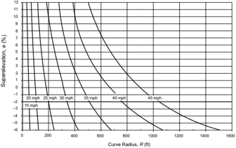
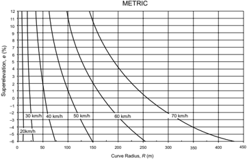
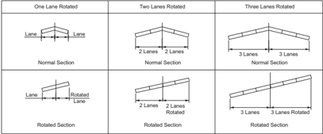

# 3.1  INTRODUCTION: 3.3.5  Design Superelevation Tables & 18 more sections

- Source: GreenBook.pdf
- Generated: 2026-01-03T08:11:58+00:00
- Chunk: 13/28
- Estimated tokens: ~49,935
- Total pages: 1048
- Type: sections

## 3.3.5  Design Superelevation Tables

Tables 3-8 to 3-12 show minimum values of R for various combinations of superelevation and design speeds based on the Method 5 superelevation distribution for each of five values of maximum superelevation rate (i.e., for a full range of common design conditions). For low-speed urban facilities, refer to Table 3-13, which is based on the Method 2 superelevation distribution.

When using one of Tables 3-8 to 3-12 for a given radius, interpolation is not necessary as the superelevation rate should be determined from a radius equal to, or slightly smaller than, the radius provided in the table. The result is a superelevation rate that is rounded up to the nearest 0.2 percent. For example, a 50 mph [80 km/h] curve with a maximum superelevation rate of 8 percent, and a radius of 1,870 ft [570 m], should use the radius of 1,830 ft [549 m] to obtain a superelevation rate of 5.4 percent.

Method 5 was used to distribute e and f for high speeds in calculating the appropriate radius for the range of superelevation rates. A computer program was used to solve Equations 3-9 through 3-22 for the minimum radius using the various combinations of e, f, maximum superelevation, design speed, and running speed (Table 3-6). The minimum radii for each of the five maximum superelevation rates can also be calculated (as shown in Table 3-7) from the simplified curve formula using f values from Figure 3-4.

The e distribution value for any radius is found by taking the (0.01 e + f ) D value minus the f 1 or f 2 value (refer to Figure 3-6). Thus, the e distribution value for an R = R PI would be (0.01 e + f ) D = VD 2 /127 R =  0.1045 minus an f 1 =  0.0455, which results in 0.05899. This value, multiplied by 100 (to convert to percent) and rounded up to the nearest 0.2 percent, corresponds to an e value of 6.0 percent. This e value can be found for R =  482.3 m at the 80 km/h design speed in Table 3-10.

Table 3-8. Minimum Radii for Design Superelevation Rates, Design Speeds, and e max = 4%

| U.S. Customary   | U.S. Customary   | U.S. Customary   | U.S. Customary   | U.S. Customary   | U.S. Customary   | U.S. Customary   | U.S. Customary   | U.S. Customary   | U.S. Customary   | U.S. Customary   |
|------------------|------------------|------------------|------------------|------------------|------------------|------------------|------------------|------------------|------------------|------------------|
| e (%)            | V d = 15 mph     | V d = 20 mph     | V d = 25 mph     | V d = 30 mph     | V d = 35 mph     | V d = 40 mph     | V d = 45 mph     | V d = 50 mph     | V d = 55 mph     | V d = 60 mph     |
| e (%)            | R (ft)           | R (ft)           | R (ft)           | R (ft)           | R (ft)           | R (ft)           | R (ft)           | R (ft)           | R (ft)           | R (ft)           |
| NC               | 796              | 1410             | 2050             | 2830             | 3730             | 4770             | 5930             | 7220             | 8650             | 10300            |
| RC               | 506              | 902              | 1340             | 1880             | 2490             | 3220             | 4040             | 4940             | 5950             | 7080             |
| 2.2              | 399              | 723              | 1110             | 1580             | 2120             | 2760             | 3480             | 4280             | 5180             | 6190             |
| 2.4              | 271              | 513              | 838              | 1270             | 1760             | 2340             | 2980             | 3690             | 4500             | 5410             |
| 2.6              | 201              | 388              | 650              | 1000             | 1420             | 1930             | 2490             | 3130             | 3870             | 4700             |
| 2.8              | 157              | 308              | 524              | 817              | 1170             | 1620             | 2100             | 2660             | 3310             | 4060             |
| 3.0              | 127              | 251              | 433              | 681              | 982              | 1370             | 1800             | 2290             | 2860             | 3530             |
| 3.2              | 105              | 209              | 363              | 576              | 835              | 1180             | 1550             | 1980             | 2490             | 3090             |
| 3.4              | 88               | 175              | 307              | 490              | 714              | 1010             | 1340             | 1720             | 2170             | 2700             |
| 3.6              | 73               | 147              | 259              | 416              | 610              | 865              | 1150             | 1480             | 1880             | 2350             |
| 3.8              | 61               | 122              | 215              | 348              | 512              | 730              | 970              | 1260             | 1600             | 2010             |
| 4.0              | 42               | 86               | 154              | 250              | 371              | 533              | 711              | 926              | 1190             | 1500             |

--',''','',',',','''''',,,,''-'-',,',,',',,'---

Note: Use of e max = 4% should be limited to urban areas. For low-speed (45 mph or less) facilities in urban areas, Method 2 may be used for superelevation distribution; see Table 3-13 for details.

| Metric   | Metric        | Metric        | Metric        | Metric        | Metric        | Metric        | Metric        | Metric        | Metric         |
|----------|---------------|---------------|---------------|---------------|---------------|---------------|---------------|---------------|----------------|
| e (%)    | V d = 20 km/h | V d = 30 km/h | V d = 40 km/h | V d = 50 km/h | V d = 60 km/h | V d = 70 km/h | V d = 80 km/h | V d = 90 km/h | V d = 100 km/h |
| e (%)    | R (m)         | R (m)         | R (m)         | R (m)         | R (m)         | R (m)         | R (m)         | R (m)         | R (m)          |
| NC       | 163           | 371           | 679           | 951           | 1310          | 1740          | 2170          | 2640          | 3250           |
| RC       | 102           | 237           | 441           | 632           | 877           | 1180          | 1490          | 1830          | 2260           |
| 2.2      | 75            | 187           | 363           | 534           | 749           | 1020          | 1290          | 1590          | 1980           |
| 2.4      | 51            | 132           | 273           | 435           | 626           | 865           | 1110          | 1390          | 1730           |
| 2.6      | 38            | 99            | 209           | 345           | 508           | 720           | 944           | 1200          | 1510           |
| 2.8      | 30            | 79            | 167           | 283           | 422           | 605           | 802           | 1030          | 1320           |
| 3.0      | 24            | 64            | 137           | 236           | 356           | 516           | 690           | 893           | 1150           |
| 3.2      | 20            | 54            | 114           | 199           | 303           | 443           | 597           | 779           | 1010           |
| 3.4      | 17            | 45            | 96            | 170           | 260           | 382           | 518           | 680           | 879            |
| 3.6      | 14            | 38            | 81            | 144           | 222           | 329           | 448           | 591           | 767            |
| 3.8      | 12            | 31            | 67            | 121           | 187           | 278           | 381           | 505           | 658            |
| 4.0      | 8             | 22            | 47            | 86            | 135           | 203           | 280           | 375           | 492            |

Note: Use of e max = 4% should be limited to urban areas. For low-speed (70 km/h or less) facilities in urban areas, Method 2 may be used for superelevation distribution; see Table 3-13 for details.

Table 3-9. Minimum Radii for Design Superelevation Rates, Design Speeds, and e max = 6%

| U.S. Customary   | U.S. Customary   | U.S. Customary   | U.S. Customary   | U.S. Customary   | U.S. Customary   | U.S. Customary   | U.S. Customary   | U.S. Customary   | U.S. Customary   | U.S. Customary   | U.S. Customary   | U.S. Customary   | U.S. Customary   | U.S. Customary   |
|------------------|------------------|------------------|------------------|------------------|------------------|------------------|------------------|------------------|------------------|------------------|------------------|------------------|------------------|------------------|
| e (%)            | V d = 15 mph     | V d = 20 mph     | V d = 25 mph     | V d = 30 mph     | V d = 35 mph     | V d = 40 mph     | V d = 45 mph     | V d = 50 mph     | V d = 55 mph     | V d = 60 mph     | V d = 65 mph     | V d = 70 mph     | V d = 75 mph     | V d = 80 mph     |
| e (%)            | R (ft)           | R (ft)           | R (ft)           | R (ft)           | R (ft)           | R (ft)           | R (ft)           | R (ft)           | R (ft)           | R (ft)           | R (ft)           | R (ft)           | R (ft)           | R (ft)           |
| NC               | 868              | 1580             | 2290             | 3130             | 4100             | 5230             | 6480             | 7870             | 9410             | 11100            | 12600            | 14100            | 15700            | 17400            |
| RC               | 614              | 1120             | 1630             | 2240             | 2950             | 3770             | 4680             | 5700             | 6820             | 8060             | 9130             | 10300            | 11500            | 12900            |
| 2.2              | 543              | 991              | 1450             | 2000             | 2630             | 3370             | 4190             | 5100             | 6110             | 7230             | 8200             | 9240             | 10400            | 11600            |
| 2.4              | 482              | 884              | 1300             | 1790             | 2360             | 3030             | 3770             | 4600             | 5520             | 6540             | 7430             | 8380             | 9420             | 10600            |
| 2.6              | 430              | 791              | 1170             | 1610             | 2130             | 2740             | 3420             | 4170             | 5020             | 5950             | 6770             | 7660             | 8620             | 9670             |
| 2.8              | 384              | 709              | 1050             | 1460             | 1930             | 2490             | 3110             | 3800             | 4580             | 5440             | 6200             | 7030             | 7930             | 8910             |
| 3.0              | 341              | 635              | 944              | 1320             | 1760             | 2270             | 2840             | 3480             | 4200             | 4990             | 5710             | 6490             | 7330             | 8260             |
| 3.2              | 300              | 566              | 850              | 1200             | 1600             | 2080             | 2600             | 3200             | 3860             | 4600             | 5280             | 6010             | 6810             | 7680             |
| 3.4              | 256              | 498              | 761              | 1080             | 1460             | 1900             | 2390             | 2940             | 3560             | 4250             | 4890             | 5580             | 6340             | 7180             |
| 3.6              | 209              | 422              | 673              | 972              | 1320             | 1740             | 2190             | 2710             | 3290             | 3940             | 4540             | 5210             | 5930             | 6720             |
| 3.8              | 176              | 358              | 583              | 864              | 1190             | 1590             | 2010             | 2490             | 3040             | 3650             | 4230             | 4860             | 5560             | 6320             |
| 4.0              | 151              | 309              | 511              | 766              | 1070             | 1440             | 1840             | 2300             | 2810             | 3390             | 3950             | 4550             | 5220             | 5950             |
| 4.2              | 131              | 270              | 452              | 684              | 960              | 1310             | 1680             | 2110             | 2590             | 3140             | 3680             | 4270             | 4910             | 5620             |
| 4.4              | 116              | 238              | 402              | 615              | 868              | 1190             | 1540             | 1940             | 2400             | 2920             | 3440             | 4010             | 4630             | 5320             |
| 4.6              | 102              | 212              | 360              | 555              | 788              | 1090             | 1410             | 1780             | 2210             | 2710             | 3220             | 3770             | 4380             | 5040             |
| 4.8              | 91               | 189              | 324              | 502              | 718              | 995              | 1300             | 1640             | 2050             | 2510             | 3000             | 3550             | 4140             | 4790             |
| 5.0              | 82               | 169              | 292              | 456              | 654              | 911              | 1190             | 1510             | 1890             | 2330             | 2800             | 3330             | 3910             | 4550             |
| 5.2              | 73               | 152              | 264              | 413              | 595              | 833              | 1090             | 1390             | 1750             | 2160             | 2610             | 3120             | 3690             | 4320             |
| 5.4              | 65               | 136              | 237              | 373              | 540              | 759              | 995              | 1280             | 1610             | 1990             | 2420             | 2910             | 3460             | 4090             |
| 5.6              | 58               | 121              | 212              | 335              | 487              | 687              | 903              | 1160             | 1470             | 1830             | 2230             | 2700             | 3230             | 3840             |
| 5.8              | 51               | 106              | 186              | 296              | 431              | 611              | 806              | 1040             | 1320             | 1650             | 2020             | 2460             | 2970             | 3560             |
| 6.0              | 39               | 81               | 144              | 231              | 340              | 485              | 643              | 833              | 1060             | 1330             | 1660             | 2040             | 2500             | 3050             |

Table 3-9. Minimum Radii for Design Superelevation Rates, Design Speeds, and e max = 6% (Continued)

| Metric   | Metric        | Metric        | Metric        | Metric        | Metric        | Metric        | Metric        | Metric        | Metric         | Metric         | Metric         | Metric         |
|----------|---------------|---------------|---------------|---------------|---------------|---------------|---------------|---------------|----------------|----------------|----------------|----------------|
| e (%)    | V d = 20 km/h | V d = 30 km/h | V d = 40 km/h | V d = 50 km/h | V d = 60 km/h | V d = 70 km/h | V d = 80 km/h | V d = 90 km/h | V d = 100 km/h | V d = 110 km/h | V d = 120 km/h | V d = 130 km/h |
| e (%)    | R (m)         | R (m)         | R (m)         | R (m)         | R (m)         | R (m)         | R (m)         | R (m)         | R (m)          | R (m)          | R (m)          | R (m)          |
| NC       | 194           | 421           | 738           | 1050          | 1440          | 1910          | 2360          | 2880          | 3510           | 4060           | 4770           | 5240           |
| RC       | 138           | 299           | 525           | 750           | 1030          | 1380          | 1710          | 2090          | 2560           | 2970           | 3510           | 3880           |
| 2.2      | 122           | 265           | 465           | 668           | 919           | 1230          | 1530          | 1880          | 2300           | 2670           | 3160           | 3500           |
| 2.4      | 109           | 236           | 415           | 599           | 825           | 1110          | 1380          | 1700          | 2080           | 2420           | 2870           | 3190           |
| 2.6      | 97            | 212           | 372           | 540           | 746           | 1000          | 1260          | 1540          | 1890           | 2210           | 2630           | 2930           |
| 2.8      | 87            | 190           | 334           | 488           | 676           | 910           | 1150          | 1410          | 1730           | 2020           | 2420           | 2700           |
| 3.0      | 78            | 170           | 300           | 443           | 615           | 831           | 1050          | 1290          | 1590           | 1870           | 2240           | 2510           |
| 3.2      | 70            | 152           | 269           | 402           | 561           | 761           | 959           | 1190          | 1470           | 1730           | 2080           | 2330           |
| 3.4      | 61            | 133           | 239           | 364           | 511           | 697           | 882           | 1100          | 1360           | 1600           | 1940           | 2180           |
| 3.6      | 51            | 113           | 206           | 329           | 465           | 640           | 813           | 1020          | 1260           | 1490           | 1810           | 2050           |
| 3.8      | 42            | 96            | 177           | 294           | 422           | 586           | 749           | 939           | 1170           | 1390           | 1700           | 1930           |
| 4.0      | 36            | 82            | 155           | 261           | 380           | 535           | 690           | 870           | 1090           | 1300           | 1590           | 1820           |
| 4.2      | 31            | 72            | 136           | 234           | 343           | 488           | 635           | 806           | 1010           | 1220           | 1500           | 1720           |
| 4.4      | 27            | 63            | 121           | 210           | 311           | 446           | 584           | 746           | 938            | 1140           | 1410           | 1630           |
| 4.6      | 24            | 56            | 108           | 190           | 283           | 408           | 538           | 692           | 873            | 1070           | 1330           | 1540           |
| 4.8      | 21            | 50            | 97            | 172           | 258           | 374           | 496           | 641           | 812            | 997            | 1260           | 1470           |
| 5.0      | 19            | 45            | 88            | 156           | 235           | 343           | 457           | 594           | 755            | 933            | 1190           | 1400           |
| 5.2      | 17            | 40            | 79            | 142           | 214           | 315           | 421           | 549           | 701            | 871            | 1120           | 1330           |
| 5.4      | 15            | 36            | 71            | 128           | 195           | 287           | 386           | 506           | 648            | 810            | 1060           | 1260           |
| 5.6      | 13            | 32            | 63            | 115           | 176           | 260           | 351           | 463           | 594            | 747            | 980            | 1190           |
| 5.8      | 11            | 28            | 56            | 102           | 156           | 232           | 315           | 416           | 537            | 679            | 900            | 1110           |
| 6.0      | 8             | 21            | 43            | 79            | 123           | 184           | 252           | 336           | 437            | 560            | 756            | 951            |

--',''','',',',','''''',,,,''-'-',,',,',',,'---

Table 3-10. Minimum Radii for Design Superelevation Rates, Design Speeds, and e max = 8%

| U.S. Customary   | U.S. Customary   | U.S. Customary   | U.S. Customary   | U.S. Customary   | U.S. Customary   | U.S. Customary   | U.S. Customary   | U.S. Customary   | U.S. Customary   | U.S. Customary   | U.S. Customary   | U.S. Customary   | U.S. Customary   | U.S. Customary   |
|------------------|------------------|------------------|------------------|------------------|------------------|------------------|------------------|------------------|------------------|------------------|------------------|------------------|------------------|------------------|
| e (%)            | V d = 15 mph     | V d = 20 mph     | V d = 25 mph     | V d = 30 mph     | V d = 35 mph     | V d = 40 mph     | V d = 45 mph     | V d = 50 mph     | V d = 55 mph     | V d = 60 mph     | V d = 65 mph     | V d = 70 mph     | V d = 75 mph     | V d = 80 mph     |
| e (%)            | R (ft)           | R (ft)           | R (ft)           | R (ft)           | R (ft)           | R (ft)           | R (ft)           | R (ft)           | R (ft)           | R (ft)           | R (ft)           | R (ft)           | R (ft)           | R (ft)           |
| NC               | 932              | 1640             | 2370             | 3240             | 4260             | 5410             | 6710             | 8150             | 9720             | 11500            | 12900            | 14500            | 16100            | 17800            |
| RC               | 676              | 1190             | 1720             | 2370             | 3120             | 3970             | 4930             | 5990             | 7150             | 8440             | 9510             | 10700            | 12000            | 13300            |
| 2.2              | 605              | 1070             | 1550             | 2130             | 2800             | 3570             | 4440             | 5400             | 6450             | 7620             | 8600             | 9660             | 10800            | 12000            |
| 2.4              | 546              | 959              | 1400             | 1930             | 2540             | 3240             | 4030             | 4910             | 5870             | 6930             | 7830             | 8810             | 9850             | 11000            |
| 2.6              | 496              | 872              | 1280             | 1760             | 2320             | 2960             | 3690             | 4490             | 5370             | 6350             | 7180             | 8090             | 9050             | 10100            |
| 2.8              | 453              | 796              | 1170             | 1610             | 2130             | 2720             | 3390             | 4130             | 4950             | 5850             | 6630             | 7470             | 8370             | 9340             |
| 3.0              | 415              | 730              | 1070             | 1480             | 1960             | 2510             | 3130             | 3820             | 4580             | 5420             | 6140             | 6930             | 7780             | 8700             |
| 3.2              | 382              | 672              | 985              | 1370             | 1820             | 2330             | 2900             | 3550             | 4250             | 5040             | 5720             | 6460             | 7260             | 8130             |
| 3.4              | 352              | 620              | 911              | 1270             | 1690             | 2170             | 2700             | 3300             | 3970             | 4700             | 5350             | 6050             | 6800             | 7620             |
| 3.6              | 324              | 572              | 845              | 1180             | 1570             | 2020             | 2520             | 3090             | 3710             | 4400             | 5010             | 5680             | 6400             | 7180             |
| 3.8              | 300              | 530              | 784              | 1100             | 1470             | 1890             | 2360             | 2890             | 3480             | 4140             | 4710             | 5350             | 6030             | 6780             |
| 4.0              | 277              | 490              | 729              | 1030             | 1370             | 1770             | 2220             | 2720             | 3270             | 3890             | 4450             | 5050             | 5710             | 6420             |
| 4.2              | 255              | 453              | 678              | 955              | 1280             | 1660             | 2080             | 2560             | 3080             | 3670             | 4200             | 4780             | 5410             | 6090             |
| 4.4              | 235              | 418              | 630              | 893              | 1200             | 1560             | 1960             | 2410             | 2910             | 3470             | 3980             | 4540             | 5140             | 5800             |
| 4.6              | 215              | 384              | 585              | 834              | 1130             | 1470             | 1850             | 2280             | 2750             | 3290             | 3770             | 4310             | 4890             | 5530             |
| 4.8              | 193              | 349              | 542              | 779              | 1060             | 1390             | 1750             | 2160             | 2610             | 3120             | 3590             | 4100             | 4670             | 5280             |
| 5.0              | 172              | 314              | 499              | 727              | 991              | 1310             | 1650             | 2040             | 2470             | 2960             | 3410             | 3910             | 4460             | 5050             |
| 5.2              | 154              | 284              | 457              | 676              | 929              | 1230             | 1560             | 1930             | 2350             | 2820             | 3250             | 3740             | 4260             | 4840             |
| 5.4              | 139              | 258              | 420              | 627              | 870              | 1160             | 1480             | 1830             | 2230             | 2680             | 3110             | 3570             | 4090             | 4640             |
| 5.6              | 126              | 236              | 387              | 582              | 813              | 1090             | 1390             | 1740             | 2120             | 2550             | 2970             | 3420             | 3920             | 4460             |
| 5.8              | 115              | 216              | 358              | 542              | 761              | 1030             | 1320             | 1650             | 2010             | 2430             | 2840             | 3280             | 3760             | 4290             |
| 6.0              | 105              | 199              | 332              | 506              | 713              | 965              | 1250             | 1560             | 1920             | 2320             | 2710             | 3150             | 3620             | 4140             |
| 6.2              | 97               | 184              | 308              | 472              | 669              | 909              | 1180             | 1480             | 1820             | 2210             | 2600             | 3020             | 3480             | 3990             |
| 6.4              | 89               | 170              | 287              | 442              | 628              | 857              | 1110             | 1400             | 1730             | 2110             | 2490             | 2910             | 3360             | 3850             |
| 6.6              | 82               | 157              | 267              | 413              | 590              | 808              | 1050             | 1330             | 1650             | 2010             | 2380             | 2790             | 3240             | 3720             |
| 6.8              | 76               | 146              | 248              | 386              | 553              | 761              | 990              | 1260             | 1560             | 1910             | 2280             | 2690             | 3120             | 3600             |
| 7.0              | 70               | 135              | 231              | 360              | 518              | 716              | 933              | 1190             | 1480             | 1820             | 2180             | 2580             | 3010             | 3480             |
| 7.2              | 64               | 125              | 214              | 336              | 485              | 672              | 878              | 1120             | 1400             | 1720             | 2070             | 2470             | 2900             | 3370             |
| 7.4              | 59               | 115              | 198              | 312              | 451              | 628              | 822              | 1060             | 1320             | 1630             | 1970             | 2350             | 2780             | 3250             |
| 7.6              | 54               | 105              | 182              | 287              | 417              | 583              | 765              | 980              | 1230             | 1530             | 1850             | 2230             | 2650             | 3120             |
| 7.8              | 48               | 94               | 164              | 261              | 380              | 533              | 701              | 901              | 1140             | 1410             | 1720             | 2090             | 2500             | 2970             |
| 8.0              | 38               | 76               | 134              | 214              | 314              | 444              | 587              | 758              | 960              | 1200             | 1480             | 1810             | 2210             | 2670             |

Table 3-10. Minimum Radii for Design Superelevation Rates, Design Speeds, and e max = 8% (Continued)

| Metric   | Metric        | Metric        | Metric        | Metric        | Metric        | Metric        | Metric        | Metric        | Metric         | Metric         | Metric         | Metric         |
|----------|---------------|---------------|---------------|---------------|---------------|---------------|---------------|---------------|----------------|----------------|----------------|----------------|
| e (%)    | V d = 20 km/h | V d = 30 km/h | V d = 40 km/h | V d = 50 km/h | V d = 60 km/h | V d = 70 km/h | V d = 80 km/h | V d = 90 km/h | V d = 100 km/h | V d = 110 km/h | V d = 120 km/h | V d = 130 km/h |
| e (%)    | R (m)         | R (m)         | R (m)         | R (m)         | R (m)         | R (m)         | R (m)         | R (m)         | R (m)          | R (m)          | R (m)          | R (m)          |
| NC       | 184           | 443           | 784           | 1090          | 1490          | 1970          | 2440          | 2970          | 3630           | 4180           | 4900           | 5360           |
| RC       | 133           | 322           | 571           | 791           | 1090          | 1450          | 1790          | 2190          | 2680           | 3090           | 3640           | 4000           |
| 2.2      | 119           | 288           | 512           | 711           | 976           | 1300          | 1620          | 1980          | 2420           | 2790           | 3290           | 3620           |
| 2.4      | 107           | 261           | 463           | 644           | 885           | 1190          | 1470          | 1800          | 2200           | 2550           | 3010           | 3310           |
| 2.6      | 97            | 237           | 421           | 587           | 808           | 1080          | 1350          | 1650          | 2020           | 2340           | 2760           | 3050           |
| 2.8      | 88            | 216           | 385           | 539           | 742           | 992           | 1240          | 1520          | 1860           | 2160           | 2550           | 2830           |
| 3.0      | 81            | 199           | 354           | 496           | 684           | 916           | 1150          | 1410          | 1730           | 2000           | 2370           | 2630           |
| 3.2      | 74            | 183           | 326           | 458           | 633           | 849           | 1060          | 1310          | 1610           | 1870           | 2220           | 2460           |
| 3.4      | 68            | 169           | 302           | 425           | 588           | 790           | 988           | 1220          | 1500           | 1740           | 2080           | 2310           |
| 3.6      | 62            | 156           | 279           | 395           | 548           | 738           | 924           | 1140          | 1410           | 1640           | 1950           | 2180           |
| 3.8      | 57            | 144           | 259           | 368           | 512           | 690           | 866           | 1070          | 1320           | 1540           | 1840           | 2060           |
| 4.0      | 52            | 134           | 241           | 344           | 479           | 648           | 813           | 1010          | 1240           | 1450           | 1740           | 1950           |
| 4.2      | 48            | 124           | 224           | 321           | 449           | 608           | 766           | 948           | 1180           | 1380           | 1650           | 1850           |
| 4.4      | 43            | 115           | 208           | 301           | 421           | 573           | 722           | 895           | 1110           | 1300           | 1570           | 1760           |
| 4.6      | 38            | 106           | 192           | 281           | 395           | 540           | 682           | 847           | 1050           | 1240           | 1490           | 1680           |
| 4.8      | 33            | 96            | 178           | 263           | 371           | 509           | 645           | 803           | 996            | 1180           | 1420           | 1610           |
| 5.0      | 30            | 87            | 163           | 246           | 349           | 480           | 611           | 762           | 947            | 1120           | 1360           | 1540           |
| 5.2      | 27            | 78            | 148           | 229           | 328           | 454           | 579           | 724           | 901            | 1070           | 1300           | 1480           |
| 5.4      | 24            | 71            | 136           | 213           | 307           | 429           | 549           | 689           | 859            | 1020           | 1250           | 1420           |
| 5.6      | 22            | 65            | 125           | 198           | 288           | 405           | 521           | 656           | 819            | 975            | 1200           | 1360           |
| 5.8      | 20            | 59            | 115           | 185           | 270           | 382           | 494           | 625           | 781            | 933            | 1150           | 1310           |
| 6.0      | 19            | 55            | 106           | 172           | 253           | 360           | 469           | 595           | 746            | 894            | 1100           | 1260           |
| 6.2      | 17            | 50            | 98            | 161           | 238           | 340           | 445           | 567           | 713            | 857            | 1060           | 1220           |
| 6.4      | 16            | 46            | 91            | 151           | 224           | 322           | 422           | 540           | 681            | 823            | 1020           | 1180           |
| 6.6      | 15            | 43            | 85            | 141           | 210           | 304           | 400           | 514           | 651            | 789            | 982            | 1140           |
| 6.8      | 14            | 40            | 79            | 132           | 198           | 287           | 379           | 489           | 620            | 757            | 948            | 1100           |
| 7.0      | 13            | 37            | 73            | 123           | 185           | 270           | 358           | 464           | 591            | 724            | 914            | 1070           |
| 7.2      | 12            | 34            | 68            | 115           | 174           | 254           | 338           | 440           | 561            | 691            | 879            | 1040           |
| 7.4      | 11            | 31            | 62            | 107           | 162           | 237           | 318           | 415           | 531            | 657            | 842            | 998            |
| 7.6      | 10            | 29            | 57            | 99            | 150           | 221           | 296           | 389           | 499            | 621            | 803            | 962            |
| 7.8      | 9             | 26            | 52            | 90            | 137           | 202           | 273           | 359           | 462            | 579            | 757            |                |
| 8.0      | 7             | 20            | 41            | 73            | 113           | 168           | 229           | 304           | 394            | 501            | 667            | 919 832        |

Table 3-11. Minimum Radii for Design Superelevation Rates, Design Speeds, and e max = 10%

| U.S. Customary   | U.S. Customary   | U.S. Customary   | U.S. Customary   | U.S. Customary   | U.S. Customary   | U.S. Customary   | U.S. Customary   | U.S. Customary   | U.S. Customary   | U.S. Customary   | U.S. Customary   | U.S. Customary   | U.S. Customary   | U.S. Customary   |
|------------------|------------------|------------------|------------------|------------------|------------------|------------------|------------------|------------------|------------------|------------------|------------------|------------------|------------------|------------------|
| e (%)            | V d = 15 mph     | V d = 20 mph     | V d = 25 mph     | V d = 30 mph     | V d = 35 mph     | V d = 40 mph     | V d = 45 mph     | V d = 50 mph     | V d = 55 mph     | V d = 60 mph     | V d = 65 mph     | V d = 70 mph     | V d = 75 mph     | V d = 80 mph     |
| e (%)            | R (ft)           | R (ft)           | R (ft)           | R (ft)           | R (ft)           | R (ft)           | R (ft)           | R (ft)           | R (ft)           | R (ft)           | R (ft)           | R (ft)           | R (ft)           | R (ft)           |
| NC               | 947              | 1680             | 2420             | 3320             | 4350             | 5520             | 6830             | 8280             | 9890             | 11700            | 13100            | 14700            | 16300            | 18000            |
| RC               | 694              | 1230             | 1780             | 2440             | 3210             | 4080             | 5050             | 6130             | 7330             | 8630             | 9720             | 10900            | 12200            | 13500            |
| 2.2              | 625              | 1110             | 1600             | 2200             | 2900             | 3680             | 4570             | 5540             | 6630             | 7810             | 8800             | 9860             | 11000            | 12200            |
| 2.4              | 567              | 1010             | 1460             | 2000             | 2640             | 3350             | 4160             | 5050             | 6050             | 7130             | 8040             | 9010             | 10100            | 11200            |
| 2.6              | 517              | 916              | 1330             | 1840             | 2420             | 3080             | 3820             | 4640             | 5550             | 6550             | 7390             | 8290             | 9260             | 10300            |
| 2.8              | 475              | 841              | 1230             | 1690             | 2230             | 2840             | 3520             | 4280             | 5130             | 6050             | 6840             | 7680             | 8580             | 9550             |
| 3.0              | 438              | 777              | 1140             | 1570             | 2060             | 2630             | 3270             | 3970             | 4760             | 5620             | 6360             | 7140             | 7990             | 8900             |
| 3.2              | 406              | 720              | 1050             | 1450             | 1920             | 2450             | 3040             | 3700             | 4440             | 5250             | 5930             | 6680             | 7480             | 8330             |
| 3.4              | 377              | 670              | 978              | 1360             | 1790             | 2290             | 2850             | 3470             | 4160             | 4910             | 5560             | 6260             | 7020             | 7830             |
| 3.6              | 352              | 625              | 913              | 1270             | 1680             | 2150             | 2670             | 3250             | 3900             | 4620             | 5230             | 5900             | 6620             | 7390             |
| 3.8              | 329              | 584              | 856              | 1190             | 1580             | 2020             | 2510             | 3060             | 3680             | 4350             | 4940             | 5570             | 6260             | 6990             |
| 4.0              | 308              | 547              | 804              | 1120             | 1490             | 1900             | 2370             | 2890             | 3470             | 4110             | 4670             | 5270             | 5930             | 6630             |
| 4.2              | 289              | 514              | 756              | 1060             | 1400             | 1800             | 2240             | 2740             | 3290             | 3900             | 4430             | 5010             | 5630             | 6300             |
| 4.4              | 271              | 483              | 713              | 994              | 1330             | 1700             | 2120             | 2590             | 3120             | 3700             | 4210             | 4760             | 5370             | 6010             |
| 4.6              | 255              | 455              | 673              | 940              | 1260             | 1610             | 2020             | 2460             | 2970             | 3520             | 4010             | 4540             | 5120             | 5740             |
| 4.8              | 240              | 429              | 636              | 890              | 1190             | 1530             | 1920             | 2340             | 2830             | 3360             | 3830             | 4340             | 4900             | 5490             |
| 5.0              | 226              | 404              | 601              | 844              | 1130             | 1460             | 1830             | 2240             | 2700             | 3200             | 3660             | 4150             | 4690             | 5270             |
| 5.2              | 213              | 381              | 569              | 802              | 1080             | 1390             | 1740             | 2130             | 2580             | 3060             | 3500             | 3980             | 4500             | 5060             |
| 5.4              | 200              | 359              | 539              | 762              | 1030             | 1330             | 1660             | 2040             | 2460             | 2930             | 3360             | 3820             | 4320             | 4860             |
| 5.6              | 188              | 339              | 511              | 724              | 974              | 1270             | 1590             | 1950             | 2360             | 2810             | 3220             | 3670             | 4160             | 4680             |
| 5.8              | 176              | 319              | 484              | 689              | 929              | 1210             | 1520             | 1870             | 2260             | 2700             | 3090             | 3530             | 4000             | 4510             |
| 6.0              | 164              | 299              | 458              | 656              | 886              | 1160             | 1460             | 1790             | 2170             | 2590             | 2980             | 3400             | 3860             | 4360             |
| 6.2              | 152              | 280              | 433              | 624              | 846              | 1110             | 1400             | 1720             | 2090             | 2490             | 2870             | 3280             | 3730             | 4210             |
| 6.4              | 140              | 260              | 409              | 594              | 808              | 1060             | 1340             | 1650             | 2010             | 2400             | 2760             | 3160             | 3600             | 4070             |
| 6.6              | 130              | 242              | 386              | 564              | 772              | 1020             | 1290             | 1590             | 1930             | 2310             | 2670             | 3060             | 3480             | 3940             |
| 6.8              | 120              | 226              | 363              | 536              | 737              | 971              | 1230             | 1530             | 1860             | 2230             | 2570             | 2960             | 3370             | 3820             |
| 7.0              | 112              | 212              | 343              | 509              | 704              | 931              | 1190             | 1470             | 1790             | 2150             | 2490             | 2860             | 3270             | 3710             |
| 7.2              | 105              | 199              | 324              | 483              | 671              | 892              | 1140             | 1410             | 1730             | 2070             | 2410             | 2770             | 3170             | 3600             |
| 7.4              | 98               | 187              | 306              | 460              | 641              | 855              | 1100             | 1360             | 1670             | 2000             | 2330             | 2680             | 3070             | 3500             |
| 7.6              | 92               | 176              | 290              | 437              | 612              | 820              | 1050             | 1310             | 1610             | 1940             | 2250             | 2600             | 2990             | 3400             |
| 7.8              | 86               | 165              | 274              | 416              | 585              | 786              | 1010             | 1260             | 1550             | 1870             | 2180             | 2530             | 2900             | 3310             |
| 8.0              | 81               | 156              | 260              | 396              | 558              | 754              | 968              | 1220             | 1500             | 1810             | 2120             | 2450             | 2820             | 3220             |
| 8.2              | 76               | 147              | 246              | 377              | 533              | 722              | 930              | 1170             | 1440             | 1750             | 2050             | 2380             | 2750             | 3140             |
| 8.4              | 72               | 139              | 234              | 359              | 509              | 692              | 893              | 1130             | 1390             | 1690             | 1990             | 2320             | 2670             | 3060             |
| 8.6              | 68               | 131              | 221              | 341              | 486              | 662              | 856              | 1080             | 1340             | 1630             | 1930             | 2250             | 2600             | 2980             |
| 8.8              | 64 60            | 124 116          | 209 198          | 324 307          | 463              | 633              | 820              | 1040             | 1290             | 1570 1520        | 1870 1810        | 2190 2130        | 2540 2470        | 2910 2840        |
| 9.0 9.2          | 56               | 109              | 186              | 291              | 440 418          | 604 574          | 784 748          | 992 948          | 1240 1190        | 1460             | 1740             | 2060             | 2410             | 2770             |
| 9.4              | 52               | 102 95           | 175 163          | 274              | 395              | 545              | 710 671          | 903              | 1130 1080        | 1390 1320        | 1670 1600        | 1990 1910        | 2340 2260        | 2710 2640        |
| 9.6              | 48               |                  |                  | 256              | 370              | 513              |                  | 854              |                  |                  |                  |                  |                  |                  |
|                  |                  |                  |                  |                  |                  |                  |                  |                  |                  |                  |                  |                  |                  | 2550             |
| 9.8              | 44               | 87               | 150              | 236              | 343              | 477              | 625              | 798              | 1010             | 1250             | 1510             | 1820             | 2160             | 2370             |
| 10.0             | 36               | 72               | 126              | 200              | 292              | 410              | 540              | 694              | 877              | 1090             | 1340             | 1630             | 1970             |                  |

Table 3-11. Minimum Radii for Design Superelevation Rates, Design Speeds, and e max = 10% (Continued)

| Metric   | Metric        | Metric        | Metric        | Metric        | Metric        | Metric        | Metric        | Metric        | Metric         | Metric         | Metric         | Metric         |
|----------|---------------|---------------|---------------|---------------|---------------|---------------|---------------|---------------|----------------|----------------|----------------|----------------|
| e (%)    | V d = 20 km/h | V d = 30 km/h | V d = 40 km/h | V d = 50 km/h | V d = 60 km/h | V d = 70 km/h | V d = 80 km/h | V d = 90 km/h | V d = 100 km/h | V d = 110 km/h | V d = 120 km/h | V d = 130 km/h |
| e (%)    | R (m)         | R (m)         | R (m)         | R (m)         | R (m)         | R (m)         | R (m)         | R (m)         | R (m)          | R (m)          | R (m)          | R (m)          |
| NC       | 197           | 454           | 790           | 1110          | 1520          | 2000          | 2480          | 3010          | 3690           | 4250           | 4960           | 5410           |
| RC       | 145           | 333           | 580           | 815           | 1120          | 1480          | 1840          | 2230          | 2740           | 3160           | 3700           | 4050           |
| 2.2      | 130           | 300           | 522           | 735           | 1020          | 1340          | 1660          | 2020          | 2480           | 2860           | 3360           | 3680           |
| 2.4      | 118           | 272           | 474           | 669           | 920           | 1220          | 1520          | 1840          | 2260           | 2620           | 3070           | 3370           |
| 2.6      | 108           | 249           | 434           | 612           | 844           | 1120          | 1390          | 1700          | 2080           | 2410           | 2830           | 3110           |
| 2.8      | 99            | 229           | 399           | 564           | 778           | 1030          | 1290          | 1570          | 1920           | 2230           | 2620           | 2880           |
| 3.0      | 91            | 211           | 368           | 522           | 720           | 952           | 1190          | 1460          | 1790           | 2070           | 2440           | 2690           |
| 3.2      | 85            | 196           | 342           | 485           | 670           | 887           | 1110          | 1360          | 1670           | 1940           | 2280           | 2520           |
| 3.4      | 79            | 182           | 318           | 453           | 626           | 829           | 1040          | 1270          | 1560           | 1820           | 2140           | 2370           |
| 3.6      | 73            | 170           | 297           | 424           | 586           | 777           | 974           | 1200          | 1470           | 1710           | 2020           | 2230           |
| 3.8      | 68            | 159           | 278           | 398           | 551           | 731           | 917           | 1130          | 1390           | 1610           | 1910           | 2120           |
| 4.0      | 64            | 149           | 261           | 374           | 519           | 690           | 866           | 1060          | 1310           | 1530           | 1810           | 2010           |
| 4.2      | 60            | 140           | 245           | 353           | 490           | 652           | 820           | 1010          | 1240           | 1450           | 1720           | 1910           |
| 4.4      | 56            | 132           | 231           | 333           | 464           | 617           | 777           | 953           | 1180           | 1380           | 1640           | 1820           |
| 4.6      | 53            | 124           | 218           | 315           | 439           | 586           | 738           | 907           | 1120           | 1310           | 1560           | 1740           |
| 4.8      | 50            | 117           | 206           | 299           | 417           | 557           | 703           | 864           | 1070           | 1250           | 1490           | 1670           |
| 5.0      | 47            | 111           | 194           | 283           | 396           | 530           | 670           | 824           | 1020           | 1200           | 1430           | 1600           |
| 5.2      | 44            | 104           | 184           | 269           | 377           | 505           | 640           | 788           | 975            | 1150           | 1370           | 1540           |
| 5.4      | 41            | 98            | 174           | 256           | 359           | 482           | 611           | 754           | 934            | 1100           | 1320           | 1480           |
| 5.6      | 39            | 93            | 164           | 243           | 343           | 461           | 585           | 723           | 896            | 1060           | 1270           | 1420           |
| 5.8      | 36            | 88            | 155           | 232           | 327           | 441           | 561           | 693           | 860            | 1020           | 1220           | 1370           |
| 6.0      | 33            | 82            | 146           | 221           | 312           | 422           | 538           | 666           | 827            | 976            | 1180           | 1330           |
| 6.2      | 31            | 77            | 138           | 210           | 298           | 404           | 516           | 640           | 795            | 941            | 1140           | 1280           |
| 6.4      | 28            | 72            | 130           | 200           | 285           | 387           | 496           | 616           | 766            | 907            | 1100           | 1240           |
| 6.6      | 26            | 67            | 121           | 191           | 273           | 372           | 476           | 593           | 738            | 876            | 1060           | 1200           |
| 6.8      | 24            | 62            | 114           | 181           | 261           | 357           | 458           | 571           | 712            | 846            | 1030           | 1170           |
| 7.0      | 22            | 58            | 107           | 172           | 249           | 342           | 441           | 551           | 688            | 819            | 993            | 1130           |
| 7.2      | 21            | 55            | 101           | 164           | 238           | 329           | 425           | 532           | 664            | 792            | 963            | 1100           |
| 7.4      | 20            | 51            | 95            | 156           | 228           | 315           | 409           | 513           | 642            | 767            | 934            | 1070           |
| 7.6      | 18            | 48            | 90            | 148           | 218           | 303           | 394           | 496           | 621            | 743            | 907            | 1040           |
| 7.8      | 17            | 45            | 85            | 141           | 208           | 291           | 380           | 479           | 601            | 721            | 882            | 1010           |
| 8.0      | 16            | 43            | 80            | 135           | 199           | 279           | 366           | 463           | 582            | 699            | 857            | 981            |
| 8.2      | 15            | 40            | 76            | 128           | 190           | 268           | 353           | 448           | 564            | 679            | 834            | 956            |
| 8.4      | 14            | 38            | 72            | 122           | 182           | 257           | 339           | 432           | 546            | 660            | 812            | 932            |
| 8.6      | 14            | 36            | 68            | 116           | 174           | 246           | 326           | 417           | 528            | 641            | 790            | 910            |
| 8.8      | 13            |               | 64            |               | 166           | 236           | 313           | 402           | 509            | 621            | 770            | 888            |
| 9.0      | 12            | 34 32         | 61            | 110 105       | 158           | 225           | 300           | 386           | 491            | 602            | 751            | 867            |
| 9.2      | 11            | 30            | 57            | 99            | 150           | 215           | 287           | 371           | 472            | 582            | 731            | 847            |
| 9.4      | 11            | 28            | 54            | 94            | 142           | 204           | 274           | 354           | 453            | 560            | 709            | 828            |
|          |               |               |               |               |               |               |               |               |                |                |                | 809            |
| 9.6      | 10            | 26 24         | 50 46         | 88 81         | 133           | 192           | 259 242       | 337 316       | 432 407        | 537 509        | 685 656        | 786            |
| 9.8      | 9             |               |               |               | 124           | 179           | 210           | 277           | 358            | 454            | 597            | 739            |
| 10.0     | 7             | 19            | 38            | 68            | 105           | 154           |               |               |                |                |                |                |

--',''','',',',','''''',,,,''-'-',,',,',',,'---

Table 3-12. Minimum Radii for Design Superelevation Rates, Design Speeds, and e max = 12%

| U.S. Customary   | U.S. Customary   | U.S. Customary   | U.S. Customary   | U.S. Customary   | U.S. Customary   | U.S. Customary   | U.S. Customary   | U.S. Customary   | U.S. Customary   | U.S. Customary   | U.S. Customary   | U.S. Customary   | U.S. Customary   | U.S. Customary   |
|------------------|------------------|------------------|------------------|------------------|------------------|------------------|------------------|------------------|------------------|------------------|------------------|------------------|------------------|------------------|
| e (%)            | V d = 15 mph     | V d = 20 mph     | V d = 25 mph     | V d = 30 mph     | V d = 35 mph     | V d = 40 mph     | V d = 45 mph     | V d = 50 mph     | V d = 55 mph     | V d = 60 mph     | V d = 65 mph     | V d = 70 mph     | V d = 75 mph     | V d = 80 mph     |
| e (%)            | R (ft)           | R (ft)           | R (ft)           | R (ft)           | R (ft)           | R (ft)           | R (ft)           | R (ft)           | R (ft)           | R (ft)           | R (ft)           | R (ft)           | R (ft)           | R (ft)           |
| NC               | 950              | 1690             | 2460             | 3370             | 4390             | 5580             | 6910             | 8370             | 9990             | 11800            | 13200            | 14800            | 16400            | 18100            |
| RC               | 700              | 1250             | 1820             | 2490             | 3260             | 4140             | 5130             | 6220             | 7430             | 8740             | 9840             | 11000            | 12300            | 13600            |
| 2.2              | 631              | 1130             | 1640             | 2250             | 2950             | 3750             | 4640             | 5640             | 6730             | 7930             | 8920             | 9980             | 11200            | 12400            |
| 2.4              | 574              | 1030             | 1500             | 2060             | 2690             | 3420             | 4240             | 5150             | 6150             | 7240             | 8160             | 9130             | 10200            | 11300            |
| 2.6              | 526              | 936              | 1370             | 1890             | 2470             | 3140             | 3900             | 4730             | 5660             | 6670             | 7510             | 8420             | 9380             | 10500            |
| 2.8              | 484              | 863              | 1270             | 1740             | 2280             | 2910             | 3600             | 4380             | 5240             | 6170             | 6960             | 7800             | 8700             | 9660             |
| 3.0              | 448              | 799              | 1170             | 1620             | 2120             | 2700             | 3350             | 4070             | 4870             | 5740             | 6480             | 7270             | 8110             | 9010             |
| 3.2              | 417              | 743              | 1090             | 1510             | 1970             | 2520             | 3130             | 3800             | 4550             | 5370             | 6060             | 6800             | 7600             | 8440             |
| 3.4              | 389              | 693              | 1020             | 1410             | 1850             | 2360             | 2930             | 3560             | 4270             | 5030             | 5690             | 6390             | 7140             | 7940             |
| 3.6              | 364              | 649              | 953              | 1320             | 1730             | 2220             | 2750             | 3350             | 4020             | 4740             | 5360             | 6020             | 6740             | 7500             |
| 3.8              | 341              | 610              | 896              | 1250             | 1630             | 2090             | 2600             | 3160             | 3790             | 4470             | 5060             | 5700             | 6380             | 7100             |
| 4.0              | 321              | 574              | 845              | 1180             | 1540             | 1980             | 2460             | 2990             | 3590             | 4240             | 4800             | 5400             | 6050             | 6740             |
| 4.2              | 303              | 542              | 798              | 1110             | 1460             | 1870             | 2330             | 2840             | 3400             | 4020             | 4560             | 5130             | 5750             | 6420             |
| 4.4              | 286              | 512              | 756              | 1050             | 1390             | 1780             | 2210             | 2700             | 3240             | 3830             | 4340             | 4890             | 5490             | 6120             |
| 4.6              | 271              | 485              | 717              | 997              | 1320             | 1690             | 2110             | 2570             | 3080             | 3650             | 4140             | 4670             | 5240             | 5850             |
| 4.8              | 257              | 460              | 681              | 948              | 1260             | 1610             | 2010             | 2450             | 2940             | 3480             | 3960             | 4470             | 5020             | 5610             |
| 5.0              | 243              | 437              | 648              | 904              | 1200             | 1540             | 1920             | 2340             | 2810             | 3330             | 3790             | 4280             | 4810             | 5380             |
| 5.2              | 231              | 415              | 618              | 862              | 1140             | 1470             | 1840             | 2240             | 2700             | 3190             | 3630             | 4110             | 4620             | 5170             |
| 5.4              | 220              | 395              | 589              | 824              | 1090             | 1410             | 1760             | 2150             | 2590             | 3060             | 3490             | 3950             | 4440             | 4980             |
| 5.6              | 209              | 377              | 563              | 788              | 1050             | 1350             | 1690             | 2060             | 2480             | 2940             | 3360             | 3800             | 4280             | 4800             |
| 5.8              | 199              | 359              | 538              | 754              | 1000             | 1300             | 1920             | 1980             | 2390             | 2830             | 3230             | 3660             | 4130             | 4630             |
| 6.0              | 190              | 343              | 514              | 723              | 960              | 1250             | 1560             | 1910             | 2300             | 2730             | 3110             | 3530             | 3990             | 4470             |
| 6.2              | 181              | 327              | 492              | 694              | 922              | 1200             | 1500             | 1840             | 2210             | 2630             | 3010             | 3410             | 3850             | 4330             |
| 6.4              | 172              | 312              | 471              | 666              | 886              | 1150             | 1440             | 1770             | 2140             | 2540             | 2900             | 3300             | 3730             | 4190             |
| 6.6              | 164              | 298              | 452              | 639              | 852              | 1110             | 1390             | 1710             | 2060             | 2450             | 2810             | 3190             | 3610             | 4060             |
| 6.8              | 156              | 284              | 433              | 615              | 820              | 1070             | 1340             | 1650             | 1990             | 2370             | 2720             | 3090             | 3500             | 3940             |
| 7.0              | 148              | 271              | 415              | 591              | 790              | 1030             | 1300             | 1590             | 1930             | 2290             | 2630             | 3000             | 3400             | 3820             |
| 7.2              | 140              | 258              | 398              | 568              | 762              | 994              | 1250             | 1540             | 1860             | 2220             | 2550             | 2910             | 3300             | 3720             |
| 7.4              | 133              | 246              | 382              | 547              | 734              | 960              | 1210             | 1490             | 1810             | 2150             | 2470             | 2820             | 3200             | 3610             |
| 7.6              | 125              | 234              | 366              | 527              | 708              | 928              | 1170             | 1440             | 1750             | 2090             | 2400             | 2740             | 3120             | 3520             |
| 7.8              | 118              | 222              | 351              | 507              | 684              | 897              | 1130             | 1400             | 1700             | 2020             | 2330             | 2670             | 3030             | 3430             |
| 8.0              | 111              | 210              | 336              | 488              | 660              | 868              | 1100             | 1360             | 1650             | 1970             | 2270             | 2600             | 2950             | 3340             |
| 8.2              | 105              | 199              | 321              | 470              | 637              | 840              | 1070             | 1320             | 1600             | 1910             | 2210             | 2530             | 2880             | 3260             |
| 8.4              | 100              | 190              | 307              | 452              | 615              | 813              | 1030             | 1280             | 1550             | 1860             | 2150             | 2460             | 2800             | 3180             |
| 8.6              | 95               | 180              | 294              | 435              | 594              | 787              | 997              | 1240             | 1510             | 1810             | 2090             | 2400             | 2740             | 3100             |
| 8.8              | 90               | 172              | 281              | 418              | 574              | 762              | 967              | 1200             | 1470             | 1760             | 2040             | 2340             | 2670             | 3030             |
| 9.0              | 85               | 164              | 270              | 403              | 554              | 738              | 938              | 1170             | 1430             | 1710             | 1980             | 2280             | 2610             | 2960             |
| 9.2              | 81               | 156              | 259              | 388              | 535              | 715              | 910              | 1140             | 1390             | 1660             | 1940             | 2230             | 2550             | 2890             |
| 9.4              | 77               | 149              | 248              | 373              | 516              | 693              | 883              | 1100             | 1350             | 1620             | 1890             | 2180             | 2490             | 2830             |

Table 3-12. Minimum Radii for Design Superelevation Rates, Design Speeds, and e max = 12% (Continued)

| U.S. Customary   | U.S. Customary   | U.S. Customary   | U.S. Customary   | U.S. Customary   | U.S. Customary   | U.S. Customary   | U.S. Customary   | U.S. Customary   | U.S. Customary   | U.S. Customary   | U.S. Customary   | U.S. Customary   | U.S. Customary   | U.S. Customary   |
|------------------|------------------|------------------|------------------|------------------|------------------|------------------|------------------|------------------|------------------|------------------|------------------|------------------|------------------|------------------|
| e (%)            | V d = 15 mph     | V d = 20 mph     | V d = 25 mph     | V d = 30 mph     | V d = 35 mph     | V d = 40 mph     | V d = 45 mph     | V d = 50 mph     | V d = 55 mph     | V d = 60 mph     | V d = 65 mph     | V d = 70 mph     | V d = 75 mph     | V d = 80 mph     |
| e (%)            | R (ft)           | R (ft)           | R (ft)           | R (ft)           | R (ft)           | R (ft)           | R (ft)           | R (ft)           | R (ft)           | R (ft)           | R (ft)           | R (ft)           | R (ft)           | R (ft)           |
| 9.6              | 74               | 142              | 238              | 359              | 499              | 671              | 857              | 1070             | 1310             | 1580             | 1840             | 2130             | 2440             | 2770             |
| 9.8              | 70               | 136              | 228              | 346              | 481              | 650              | 832              | 1040             | 1280             | 1540             | 1800             | 2080             | 2380             | 2710             |
| 10.0             | 67               | 130              | 219              | 333              | 465              | 629              | 806              | 1010             | 1250             | 1500             | 1760             | 2030             | 2330             | 2660             |
| 10.2             | 64               | 124              | 210              | 320              | 448              | 608              | 781              | 980              | 1210             | 1460             | 1720             | 1990             | 2280             | 2600             |
| 10.4             | 61               | 118              | 201              | 308              | 432              | 588              | 757              | 951              | 1180             | 1430             | 1680             | 1940             | 2240             | 2550             |
| 10.6             | 58               | 113              | 192              | 296              | 416              | 568              | 732              | 922              | 1140             | 1390             | 1640             | 1900             | 2190             | 2500             |
| 10.8             | 55               | 108              | 184              | 284              | 400              | 548              | 707              | 892              | 1110             | 1350             | 1600             | 1860             | 2150             | 2460             |
| 11.0             | 52               | 102              | 175              | 272              | 384              | 527              | 682              | 862              | 1070             | 1310             | 1560             | 1820             | 2110             | 2410             |
| 11.2             | 49               | 97               | 167              | 259              | 368              | 506              | 656              | 831              | 1040             | 1270             | 1510             | 1780             | 2070             | 2370             |
| 11.4             | 47               | 92               | 158              | 247              | 351              | 485              | 629              | 799              | 995              | 1220             | 1470             | 1730             | 2020             | 2320             |
| 11.6             | 44               | 86               | 149              | 233              | 333              | 461              | 600              | 763              | 953              | 1170             | 1410             | 1680             | 1970             | 2280             |
| 11.8             | 40               | 80               | 139              | 218              | 312              | 434              | 566              | 722              | 904              | 1120             | 1350             | 1620             | 1910             | 2230             |
| 12.0             | 34               | 68               | 119              | 188              | 272              | 381              | 500              | 641              | 807              | 1000             | 1220             | 1480             | 1790             | 2130             |

| Metric   | Metric        | Metric        | Metric        | Metric        | Metric        | Metric        | Metric        | Metric        | Metric         | Metric         | Metric         | Metric         |
|----------|---------------|---------------|---------------|---------------|---------------|---------------|---------------|---------------|----------------|----------------|----------------|----------------|
| e (%)    | V d = 20 km/h | V d = 30 km/h | V d = 40 km/h | V d = 50 km/h | V d = 60 km/h | V d = 70 km/h | V d = 80 km/h | V d = 90 km/h | V d = 100 km/h | V d = 110 km/h | V d = 120 km/h | V d = 130 km/h |
| e (%)    | R (m)         | R (m)         | R (m)         | R (m)         | R (m)         | R (m)         | R (m)         | R (m)         | R (m)          | R (m)          | R (m)          | R (m)          |
| NC       | 210           | 459           | 804           | 1130          | 1540          | 2030          | 2510          | 3040          | 3720           | 4280           | 4990           | 5440           |
| RC       | 155           | 338           | 594           | 835           | 1150          | 1510          | 1870          | 2270          | 2770           | 3190           | 3740           | 4080           |
| 2.2      | 139           | 306           | 536           | 755           | 1040          | 1360          | 1690          | 2050          | 2510           | 2900           | 3390           | 3710           |
| 2.4      | 127           | 278           | 488           | 688           | 942           | 1250          | 1550          | 1880          | 2300           | 2650           | 3110           | 3400           |
| 2.6      | 116           | 255           | 448           | 631           | 865           | 1140          | 1420          | 1730          | 2110           | 2440           | 2860           | 3140           |
| 2.8      | 107           | 235           | 413           | 583           | 799           | 1060          | 1320          | 1600          | 1960           | 2260           | 2660           | 2910           |
| 3.0      | 99            | 218           | 382           | 541           | 742           | 980           | 1220          | 1490          | 1820           | 2110           | 2480           | 2720           |
| 3.2      | 92            | 202           | 356           | 504           | 692           | 914           | 1140          | 1390          | 1700           | 1970           | 2320           | 2550           |
| 3.4      | 86            | 189           | 332           | 472           | 648           | 856           | 1070          | 1300          | 1600           | 1850           | 2180           | 2400           |
| 3.6      | 81            | 177           | 312           | 443           | 609           | 805           | 1010          | 1230          | 1510           | 1750           | 2060           | 2270           |
| 3.8      | 76            | 166           | 293           | 417           | 573           | 759           | 947           | 1160          | 1420           | 1650           | 1950           | 2150           |
| 4.0      | 71            | 157           | 276           | 393           | 542           | 718           | 896           | 1100          | 1350           | 1560           | 1850           | 2040           |
| 4.2      | 67            | 148           | 261           | 372           | 513           | 680           | 850           | 1040          | 1280           | 1490           | 1760           | 1940           |
| 4.4      | 64            | 140           | 247           | 353           | 487           | 646           | 808           | 988           | 1220           | 1420           | 1680           | 1850           |
| 4.6      | 60            | 132           | 234           | 335           | 436           | 615           | 770           | 941           | 1160           | 1350           | 1600           | 1770           |
| 4.8      | 57            | 126           | 222           | 319           | 441           | 586           | 734           | 899           | 1110           | 1290           | 1530           | 1700           |
| 5.0      | 54            | 119           | 211           | 304           | 421           | 560           | 702           | 860           | 1060           | 1240           | 1470           | 1630           |

--',''','',',',','''''',,,,''-'-',,',,',',,'---

Table 3-12. Minimum Radii for Design Superelevation Rates, Design Speeds, and e max = 12% (Continued)

| Metric    | Metric        | Metric        | Metric        | Metric        | Metric        | Metric        | Metric        | Metric        | Metric         | Metric         | Metric         | Metric         |
|-----------|---------------|---------------|---------------|---------------|---------------|---------------|---------------|---------------|----------------|----------------|----------------|----------------|
| e (%)     | V d = 20 km/h | V d = 30 km/h | V d = 40 km/h | V d = 50 km/h | V d = 60 km/h | V d = 70 km/h | V d = 80 km/h | V d = 90 km/h | V d = 100 km/h | V d = 110 km/h | V d = 120 km/h | V d = 130 km/h |
| e (%)     | R (m)         | R (m)         | R (m)         | R (m)         | R (m)         | R (m)         | R (m)         | R (m)         | R (m)          | R (m)          | R (m)          | R (m)          |
| 5.2       | 52            | 114           | 201           | 290           | 402           | 535           | 672           | 824           | 1020           | 1190           | 1410           | 1570           |
| 5.4       | 49            | 108           | 192           | 277           | 384           | 513           | 644           | 790           | 973            | 1140           | 1360           | 1510           |
| 5.6       | 47            | 103           | 183           | 265           | 368           | 492           | 618           | 759           | 936            | 1100           | 1310           | 1460           |
| 5.8       | 45            | 98            | 175           | 254           | 353           | 472           | 594           | 730           | 900            | 1060           | 1260           | 1410           |
| 6.0       | 43            | 94            | 167           | 244           | 339           | 454           | 572           | 703           | 867            | 1020           | 1220           | 1360           |
| 6.2       | 41            | 90            | 159           | 234           | 326           | 436           | 551           | 678           | 837            | 981            | 1180           | 1310           |
| 6.4       | 39            | 86            | 153           | 225           | 313           | 420           | 531           | 654           | 808            | 948            | 1140           | 1270           |
| 6.6       | 37            | 82            | 146           | 216           | 302           | 405           | 512           | 632           | 781            | 917            | 1100           | 1230           |
| 6.8       | 35            | 78            | 140           | 208           | 290           | 391           | 494           | 611           | 755            | 888            | 1070           | 1200           |
| 7.0       | 34            | 75            | 134           | 200           | 280           | 377           | 478           | 591           | 731            | 860            | 1040           | 1160           |
| 7.2       | 32            | 71            | 128           | 192           | 270           | 364           | 462           | 572           | 708            | 834            | 1010           | 1130           |
| 7.4       | 30            | 68            | 122           | 185           | 260           | 352           | 447           | 554           | 686            | 810            | 974            | 1100           |
| 7.6       | 29            | 65            | 117           | 178           | 251           | 340           | 433           | 537           | 666            | 786            | 947            | 1070           |
| 7.8       | 27            | 61            | 112           | 172           | 243           | 329           | 420           | 521           | 646            | 764            | 921            | 1040           |
| 8.0       | 26            | 58            | 107           | 165           | 235           | 319           | 407           | 506           | 628            | 743            | 897            | 1020           |
| 8.2       | 24            | 55            | 102           | 159           | 227           | 309           | 395           | 491           | 610            | 723            | 874            | 989            |
| 8.4       | 23            | 52            | 97            | 154           | 219           | 299           | 383           | 477           | 593            | 704            | 852            | 965            |
| 8.6       | 22            | 50            | 93            | 148           | 212           | 290           | 372           | 464           | 577            | 686            | 831            | 942            |
| 8.8       | 20            | 47            | 88            | 142           | 205           | 281           | 361           | 451           | 562            | 668            | 811            | 921            |
| 9.0       | 19            | 45            | 85            | 137           | 198           | 273           | 351           | 439           | 547            | 652            | 792            | 900            |
| 9.2       | 18            | 43            | 81            | 132           | 191           | 264           | 341           | 428           | 533            | 636            | 774            | 880            |
| 9.4       | 18            | 41            | 77            | 127           | 185           | 256           | 332           | 416           | 520            | 621            | 756            | 861            |
| 9.6       | 17            | 39            | 74            | 123           | 179           | 249           | 323           | 406           | 507            | 606            | 739            | 843            |
| 9.8       | 16            | 37            | 71            | 118           | 173           | 241           | 314           | 395           | 494            | 592            | 723            | 826            |
| 10.0      | 15            | 36            | 68            | 114           | 167           | 234           | 305           | 385           | 482            | 579            | 708            | 809            |
| 10.2      | 14            | 34            | 65            | 110           | 161           | 226           | 296           | 375           | 471            | 566            | 693            | 793            |
| 10.4      | 14            | 33            | 62            | 105           | 155           | 219           | 288           | 365           | 459            | 553            | 679            | 778            |
| 10.6      | 13            | 31            | 59            | 101           | 150           | 212           | 279           | 355           | 448            | 541            | 665            | 763            |
| 10.8 11.0 | 12            | 30            | 57            | 97 93         | 144           | 204           | 270           | 345           | 436            | 529            | 652            | 749            |
|           | 12            | 28            | 54            |               | 139           | 197           | 261           | 335           | 423            | 516            | 639            | 735            |
| 11.2      | 11            | 27            | 51            | 89            | 133           | 189           | 252           | 324           | 411            | 503            | 626            | 722            |
| 11.4      | 11            | 25            | 49            | 85            | 127           | 182           | 242           | 312           | 397            | 488            | 613            | 709            |
| 11.6      | 10            | 24            | 46            | 80            | 120           | 173           | 232           | 300           | 382            | 472            | 598            | 697            |
| 11.8      | 9             | 22            | 43            | 75            | 113           | 163           | 219           | 285           | 364            | 453            | 579            | 685            |
| 12.0      | 7             | 18            | 36            | 64            | 98            | 143           | 194           | 255           | 328            | 414            | 540            | 665            |

Under all but extreme weather conditions, vehicles can travel safely at speeds higher than the design speed on horizontal curves with the superelevation rates indicated in the tables. This is due to the development of a radius/superelevation relationship that uses friction factors that are generally considerably less than can be achieved.

## 3.3.5.1  Minimum Radius of Curve for Section with Normal Crown

Very flat horizontal curves need no superelevation. Traffic on the inside lane of a curve has the benefit of some superelevation provided by the normal cross slope. Traffic on the outside lane of a curve has an adverse or negative superelevation due to the normal cross slope, but with flat curves the side friction needed to sustain the lateral acceleration and counteract the negative superelevation is small. However, on successively sharper curves for the same speed, a point is reached where the combination of lateral acceleration and negative superelevation overcomes the allowable side friction, and a positive slope across the entire pavement is desirable to help sustain the lateral acceleration. This condition is the maximum curvature where a crowned pavement cross section is appropriate.

The maximum curvature for normal crowned sections is determined by setting consistently low friction factor values and considering the effect of normal cross slope and both directions of travel. The result is a decreasing degree of curvature for successively higher design speeds.

The term 'normal crown' (NC) designates a traveled way cross section used on curves that are so flat that the elimination of adverse cross slope is not needed, and thus the normal cross slope sections can be used. The normal cross slope is generally determined by drainage needs. The term 'remove adverse crown' (RC) designates curves where the adverse cross slope should be eliminated by superelevating the entire roadway at the normal cross slope rate.

The usually accepted normal crown rate of cross slope for traveled ways ranges from 1.5 to 2.0 percent. The minimum radius for a normal crown (NC) section for each design speed and maximum superelevation rate is shown in the top row of Tables 3-8 through 3-12. These are curvatures calling for superelevation equal to 1.5 percent-the low range of normal cross slope-and therefore indicate the mathematical limit of a minimally crowned section. Sharper curves should have no adverse cross slopes and be superelevated. For uniformity, these values should be applied to all roadways regardless of the normal cross slope value. The side friction factors developed at these radii because of adverse crown at design speed vary between 0.033 and 0.048. It is evident from their uniform and low value over the range of design speeds and normal cross slopes that these radii are sensible limiting values for normal crown sections.

The 'RC' row in Tables 3-8 through 3-12 presents minimum radii for a computed superelevation rate of 2.0 percent. For curve radii falling between NC and RC, a plane slope across the entire pavement equal to the normal cross slope should typically be used. A transition from the normal crown to a straight-line cross slope will be needed. On a curve sharp enough to need a

superelevation rate in excess of 2.0 percent, superelevation should be applied in accordance with Tables 3-8 through 3-12.

## 3.3.6  Design for Low-Speed Streets in Urban Areas

On low-speed streets in urban areas where speed is relatively low and variable, typically in the urban and urban core contexts, the use of superelevation for horizontal curves can be minimized. Where side friction demand exceeds the assumed available side friction factor for the design speed, superelevation, within the range from the normal cross slope to maximum superelevation, is provided.

## 3.3.6.1  Side Friction Factors

Figure 3-4 shows the recommended side friction factors for low-speed streets and highways as a dashed line. These recommended side friction factors provide a reasonable margin of safety at low speeds and lead to somewhat lower superelevation rates as compared to the high-speed friction factors. The side friction factors vary with the design speed from 0.38 at 10 mph [0.40 at 15 km/h] to 0.15 at 45 mph [0.15 at 70 km/h]. A research report ( 44 ) confirms the appropriateness of these design values.

## 3.3.6.2  Superelevation

Although superelevation is beneficial  for  traffic  operations,  various  factors  often  combine  to make its use impractical on low-speed streets in urban areas. These factors include:

- y wide pavement areas;
- y the need to meet the grade of adjacent property;
- y surface drainage considerations;
- y the desire to maintain low-speed operation; and
- y frequency of intersecting cross streets, alleys, and driveways.

Therefore, horizontal curves on low-speed streets in urban areas are frequently designed without superelevation, sustaining the lateral force solely with side friction. For traffic traveling along curves to the left, the normal cross slope is an adverse or negative superelevation, but with flat curves the resultant friction needed to sustain the lateral force, even given the negative superelevation, is small.

Where superelevation will be applied to low-speed streets in urban areas, Method 2 is recommended for the design of horizontal curves where, through conditioning, drivers have developed a higher threshold of discomfort. By this method, none of the lateral force is counteracted by superelevation so long as the side friction factor is less than the specified maximum assumed for design for the radius of the curve and the design speed. For sharper curves, f remains at the maximum and e is used in direct proportion to the continued increase in curvature until e reaches

e max . The recommended design values for f that are applicable to low-speed streets and highways are shown as a dashed line in Figure 3-4. The radii for the full range of superelevation rates were calculated using Method 2 (i.e., the simplified curve equation) using f values from Figure 3-4 are tabulated in Table 3-13 and graphed in Figure 3-7.

The factors that often make superelevation impractical on low-speed streets in urban areas also make marginal superelevation improvements impractical when reconstructing low-speed streets. Therefore, low-speed streets in urban areas may retain their existing cross slope unless the curve has an unacceptable history of curve-related crashes. In such cases, consideration should be given to providing superelevation meeting Table 3-13 and, if practical, high-friction surface courses should also be provided.

Table 3-13. Minimum Radii and Superelevation for Low-Speed Streets in Urban Areas

| U.S. Customary   | U.S. Customary   | U.S. Customary   | U.S. Customary   | U.S. Customary   | U.S. Customary   | U.S. Customary   | U.S. Customary   |
|------------------|------------------|------------------|------------------|------------------|------------------|------------------|------------------|
| e (%)            | V d = 15 mph     | V d = 20 mph     | V d = 25 mph     | V d = 30 mph     | V d = 35 mph     | V d = 40 mph     | V d = 45 mph     |
|                  | R (ft)           | R (ft)           | R (ft)           | R (ft)           | R (ft)           | R (ft) 1067      | R (ft)           |
| -6.0 -5.0        | 58               | 127              | 245              | 429              | 681              | 970              | 1500             |
|                  | 56               | 121              | 231              | 400              | 628              |                  | 1350             |
| -4.0             | 54               | 116              | 219              | 375              | 583              | 889              | 1227             |
| -3.0             | 52               | 111 110          | 208 206          | 353              | 544 537          | 821 808          | 1125 1107        |
| -2.8             | 51               |                  |                  | 349              |                  |                  |                  |
| -2.6             | 51               | 109              | 204              | 345              | 530              | 796              | 1089             |
| -2.4             | 51               | 108              | 202              | 341              | 524              | 784              | 1071             |
| -2.2             | 50               | 108              | 200              | 337              | 517              | 773              | 1055             |
| -2.0             | 50               | 107              | 198              | 333              | 510              | 762              | 1039             |
| -1.5             | 49               | 105              | 194              | 324              | 495              | 736              | 1000             |
| 0                | 47               | 99               | 181              | 300              | 454              | 667              | 900              |
| 1.5              | 45               | 94               | 170              | 279              | 419              | 610              | 818              |
| 2.0              | 44               | 92               | 167              | 273              | 408              | 593              | 794              |
| 2.2              | 44               | 91               | 165              | 270              | 404              | 586              | 785              |
| 2.4              | 44               | 91               | 164              | 268              | 400              | 580              | 776              |
| 2.6              | 43               | 90               | 163              | 265              | 396              | 573              | 767              |
| 2.8              | 43               | 89               | 161              | 263              | 393              | 567              | 758              |
| 3.0              | 43               | 89               | 160              | 261              | 389              | 561              | 750              |
| 3.2              | 43               | 88               | 159              | 259              | 385              | 556              | 742              |
| 3.4              | 42               | 88               | 158              | 256              | 382              | 550              | 734              |
| 3.6              | 42               | 87               | 157              | 254              | 378              | 544              | 726              |
| 3.8              | 42               | 87               | 155              | 252              | 375              | 539              | 718              |
| 4.0              | 42               | 86               | 154              | 250              | 371              | 533              | 711              |
| 4.2              | 41               | 85               | 153              | 248              | 368              | 528              | 703              |
| 4.4              | 41               | 85               | 152              | 246              | 365              | 523              | 696              |
| 4.6              | 41               | 84               | 151              | 244              | 361              | 518              | 689              |
| 4.8              | 41               | 84               | 150              | 242              | 358              | 513              | 682              |
| 5.0              | 41               | 83               | 149              | 240              | 355              | 508              | 675              |
| 5.2              | 40               | 83               | 148              | 238              | 352              | 503              | 668              |

Table 3-13. Minimum Radii and Superelevation for Low-Speed Streets in Urban Areas (Continued)

| U.S. Customary   | U.S. Customary   | U.S. Customary   | U.S. Customary   | U.S. Customary   | U.S. Customary   | U.S. Customary   | U.S. Customary   |
|------------------|------------------|------------------|------------------|------------------|------------------|------------------|------------------|
| e (%)            | V d = 15 mph     | V d = 20 mph     | V d = 25 mph     | V d = 30 mph     | V d = 35 mph     | V d = 40 mph     | V d = 45 mph     |
| e (%)            | R (ft)           | R (ft)           | R (ft)           | R (ft)           | R (ft)           | R (ft)           | R (ft)           |
| 5.4              | 40               | 82               | 147              | 236              | 349              | 498              | 662              |
| 5.6              | 40               | 82               | 146              | 234              | 346              | 494              | 655              |
| 5.8              | 40               | 81               | 145              | 233              | 343              | 489              | 649              |
| 6.0              | 39               | 81               | 144              | 231              | 340              | 485              | 643              |
| 6.2              | 39               | 80               | 143              | 229              | 337              | 480              | 637              |
| 6.4              | 39               | 80               | 142              | 227              | 335              | 476              | 631              |
| 6.6              | 39               | 79               | 141              | 226              | 332              | 472              | 625              |
| 6.8              | 39               | 79               | 140              | 224              | 329              | 468              | 619              |
| 7.0              | 38               | 78               | 139              | 222              | 327              | 464              | 614              |
| 7.2              | 38               | 78               | 138              | 221              | 324              | 460              | 608              |
| 7.4              | 38               | 78               | 137              | 219              | 322              | 456              | 603              |
| 7.6              | 38               | 77               | 136              | 217              | 319              | 452              | 597              |
| 7.8              | 38               | 77               | 135              | 216              | 317              | 448              | 592              |
| 8.0              | 38               | 76               | 134              | 214              | 314              | 444              | 587              |
| 8.2              | 37               | 76               | 134              | 213              | 312              | 441              | 582              |
| 8.4              | 37               | 75               | 133              | 211              | 309              | 437              | 577              |
| 8.6              | 37               | 75               | 132              | 210              | 307              | 434              | 572              |
| 8.8              | 37               | 74               | 131              | 208              | 305              | 430              | 567              |
| 9.0              | 37               | 74               | 130              | 207              | 302              | 427              | 563              |
| 9.2              | 36               | 74               | 129              | 205              | 300              | 423              | 558              |
| 9.4              | 36               | 73               | 129              | 204              | 298              | 420              | 553              |
| 9.6              | 36               | 73               | 128              | 203              | 296              | 417              | 549              |
| 9.8              | 36               | 72               | 127              | 201              | 294              | 413              | 544              |
| 10.0             | 36               | 72               | 126              | 200              | 292              | 410              | 540              |
| 10.2             | 36               | 72               | 126              | 199              | 290              | 407              | 536              |
| 10.4             | 35               | 71               | 125              | 197              | 288              | 404              | 531              |
| 10.6             | 35               | 71               | 124              | 196              | 286              | 401              | 527              |
| 10.8             | 35               | 71               | 123              | 195              | 284              | 398              | 523              |
| 11.0             | 35               | 70               | 123              | 194              | 282              | 395              | 519              |
| 11.2             | 35               | 70               | 122              | 192              | 280              | 392              | 515              |
| 11.4             | 35               | 69               | 121              | 191              | 278              | 389              | 511              |
| 11.6             | 34               | 69               | 120              | 190              | 276              | 386              | 508              |
| 11.8             | 34               | 69               | 120              | 189              | 274              | 384              | 504              |
| 12.0             | 34               | 68               | 119              | 188              | 272              | 381              | 500              |

## Notes:

1. Computed using Superelevation Distribution Method 2.
2. Superelevation may be optional on low-speed streets in urban areas.
3. Negative superelevation values beyond -2.0 percent should be used for unpaved surfaces such as gravel, crushed stone, and earth. However, a normal cross slope of -2.5 percent may be used on paved surfaces in areas with intense rainfall.

Table 3-13. Minimum Radii and Superelevation for Low-Speed Streets in Urban Areas (Continued)

| Metric   | Metric        | Metric        | Metric        | Metric        | Metric        | Metric        |
|----------|---------------|---------------|---------------|---------------|---------------|---------------|
| e (%)    | V d = 20 km/h | V d = 30 km/h | V d = 40 km/h | V d = 50 km/h | V d = 60 km/h | V d = 70 km/h |
| e (%)    | R (m)         | R (m)         | R (m)         | R (m)         | R (m)         | R (m)         |
| -6.0     | 11            | 32            | 74            | 151           | 258           | 429           |
| -5.0     | 10            | 31            | 70            | 141           | 236           | 386           |
| -4.0     | 10            | 30            | 66            | 131           | 218           | 351           |
| -3.0     | 10            | 28            | 63            | 123           | 202           | 322           |
| -2.8     | 10            | 28            | 62            | 122           | 200           | 316           |
| -2.6     | 10            | 28            | 62            | 120           | 197           | 311           |
| -2.4     | 10            | 28            | 61            | 119           | 194           | 306           |
| -2.2     | 10            | 27            | 61            | 117           | 192           | 301           |
| -2.0     | 10            | 27            | 60            | 116           | 189           | 297           |
| -1.5     | 9             | 27            | 59            | 113           | 183           | 286           |
| 0        | 9             | 25            | 55            | 104           | 167           | 257           |
| 1.5      | 9             | 24            | 51            | 96            | 153           | 234           |
| 2.0      | 9             | 24            | 50            | 94            | 149           | 227           |
| 2.2      | 8             | 23            | 50            | 93            | 148           | 224           |
| 2.4      | 8             | 23            | 50            | 92            | 146           | 222           |
| 2.6      | 8             | 23            | 49            | 91            | 145           | 219           |
| 2.8      | 8             | 23            | 49            | 90            | 143           | 217           |
| 3.0      | 8             | 23            | 48            | 89            | 142           | 214           |
| 3.2      | 8             | 23            | 48            | 89            | 140           | 212           |
| 3.4      | 8             | 23            | 48            | 88            | 139           | 210           |
| 3.6      | 8             | 22            | 47            | 87            | 138           | 207           |
| 3.8      | 8             | 22            | 47            | 86            | 136           | 205           |
| 4.0      | 8             | 22            | 47            | 86            | 135           | 203           |
| 4.2      | 8             | 22            | 46            | 85            | 134           | 201           |
| 4.4      | 8             | 22            | 46            | 84            | 132           | 199           |
| 4.6      | 8             | 22            | 46            | 83            | 131           | 197           |
| 4.8      | 8             | 22            | 45            | 83            | 130           | 195           |
| 5.0      | 8             | 21            | 45            | 82            | 129           | 193           |
| 5.2      | 8             | 21            | 45            | 81            | 128           | 191           |
| 5.4      | 8             | 21            | 44            | 81            | 127           | 189           |
| 5.6      | 8             | 21            | 44            | 80            | 125           | 187           |
| 5.8      | 8             | 21            | 44            | 79            | 124           | 185           |
| 6.0      | 8             | 21            | 43            | 79            | 123           | 184           |
| 6.2      | 8             | 21            | 43            | 78            | 122           | 182           |
| 6.4      | 8             | 21            | 43            | 78            | 121           | 180           |
| 6.6      | 8             | 20            | 43            | 77            | 120           | 179           |

Table 3-13. Minimum Radii and Superelevation for Low-Speed Streets in Urban Areas (Continued)

| Metric   | Metric        | Metric        | Metric        | Metric        | Metric        | Metric        |
|----------|---------------|---------------|---------------|---------------|---------------|---------------|
| e (%)    | V d = 20 km/h | V d = 30 km/h | V d = 40 km/h | V d = 50 km/h | V d = 60 km/h | V d = 70 km/h |
| e (%)    | R (m)         | R (m)         | R (m)         | R (m)         | R (m)         | R (m)         |
| 6.8      | 8             | 20            | 42            | 76            | 119           | 177           |
| 7.0      | 7             | 20            | 42            | 76            | 118           | 175           |
| 7.2      | 7             | 20            | 42            | 75            | 117           | 174           |
| 7.4      | 7             | 20            | 41            | 75            | 116           | 172           |
| 7.6      | 7             | 20            | 41            | 74            | 115           | 171           |
| 7.8      | 7             | 20            | 41            | 73            | 114           | 169           |
| 8.0      | 7             | 20            | 41            | 73            | 113           | 168           |
| 8.2      | 7             | 20            | 40            | 72            | 112           | 166           |
| 8.4      | 7             | 19            | 40            | 72            | 112           | 165           |
| 8.6      | 7             | 19            | 40            | 71            | 111           | 163           |
| 8.8      | 7             | 19            | 40            | 71            | 110           | 162           |
| 9.0      | 7             | 19            | 39            | 70            | 109           | 161           |
| 9.2      | 7             | 19            | 39            | 70            | 108           | 159           |
| 9.4      | 7             | 19            | 39            | 69            | 107           | 158           |
| 9.6      | 7             | 19            | 39            | 69            | 107           | 157           |
| 9.8      | 7             | 19            | 38            | 68            | 106           | 156           |
| 10.0     | 7             | 19            | 38            | 68            | 105           | 154           |
| 10.2     | 7             | 19            | 38            | 67            | 104           | 153           |
| 10.4     | 7             | 18            | 38            | 67            | 103           | 152           |
| 10.6     | 7             | 18            | 37            | 67            | 103           | 151           |
| 10.8     | 7             | 18            | 37            | 66            | 102           | 150           |
| 11.0     | 7             | 18            | 37            | 66            | 101           | 148           |
| 11.2     | 7             | 18            | 37            | 65            | 101           | 147           |
| 11.4     | 7             | 18            | 37            | 65            | 100           | 146           |
| 11.6     | 7             | 18            | 36            | 64            | 99            | 145           |
| 11.8     | 7             | 18            | 36            | 64            | 98            | 144           |
| 12.0     | 7             | 18            | 36            | 64            | 98            | 143           |

## Notes:

1. Computed using Superelevation Distribution Method 2.
2. Superelevation may be optional on low-speed streets in urban areas.
3. Negative superelevation values beyond -2.0 percent should be used for unpaved surfaces such as gravel, crushed stone, and earth. However, a normal cross slope of -2.5 percent may be used on paved surfaces in areas with intense rainfall.

## U.S. CUSTOMARY

Note: Negative superelevation values beyond -2.0 percent should be used for unpaved surfaces such as gravel, crushed stone, and earth. However, areas with intense rainfall may use normal cross slopes of -2.5 percent on paved surfaces.

Note: Negative superelevation values beyond -2.0 percent should be used for unpaved surfaces such as gravel, crushed stone, and earth. However, areas with intense rainfall may use normal cross slopes of -2.5 percent on paved surfaces.

Figure 3-7. Superelevation, Radius, and Design Speed for Low-Speed Street Design in Urban Areas Sharpest Curve without Superelevation Minimum Radius for Section with Normal Crown

The -2.0 percent row in Table 3-13 provides the minimum curve radii for which a normal crown of 2.0 percent should be retained. Likewise, the -1.5 percent row provides the minimum curve radii for which a normal crown of 1.5 percent should be retained. Sharper curves should have no adverse cross slope and should be superelevated in accordance with Table 3-13.

## 3.3.7  Turning Roadways

Turning roadways include interchange ramps and intersection curves for right-turning vehicles. Loop or diamond configurations for turning roadways are commonly used at interchanges and consist of combinations of tangents and curves.

Turning roadways are generally designed for lower speeds than the through travel lanes. On streets in urban areas, the radius has a direct effect on the length of pedestrian crosswalks. The selection of the curve radius should consider all likely users of the intersection and, where both trucks and pedestrians are present, should seek an appropriate balance between their needs. In selecting a minimum radius, it is recognized that sharper curves, having shorter lengths, need wider travel lanes to accommodate the swept path of the turning vehicle and provide less opportunity for developing a large rate of superelevation. This condition applies particularly to intersections where the turning roadway is often close to the intersection proper, where much of its area is adjacent to the through traveled way, and where the complete turn is made through a total angle of about 90 degrees.

Turning roadway design does not apply to the design for turns at intersections without separate turning roadways. Refer to Chapter 9 for the design of intersections, including the use of compound curves to accommodate the inside edge of the design vehicle's swept path.

## 3.3.7.1  Design Speed

As further discussed in Chapter 9, vehicles turning at intersections designed for minimum-radius turns have to operate at low speed, perhaps less than 10 mph [15 km/h]. It is often appropriate for economy of construction and to limit conflicts with other road users for drivers to use lower turning speeds at most intersections. The speeds for which these intersection curves should be designed depend on vehicle speeds on the approach highways, the type of intersection, and the volumes of through and turning traffic.

## 3.3.7.2  Maximum Superelevation for Turning Roadways

Turning roadways are generally designed for lower speeds than the through-travel lanes. For low-speed facilities, the use of Method 2 for distributing superelevation is appropriate. On highspeed interchange ramps, as much superelevation as practical, up to a maximum value based on Method 5, should be developed on ramps to reduce the potential for vehicle skidding and overturning.

--',''','',',',','''''',,,,''-'-',,',,',',,'---

At the terminal of the turning roadway where all traffic comes to a stop, as at stop signs, a lesser amount of superelevation is usually appropriate. Also, where a significant number of large trucks will be using right-turning roadways at intersections, flatter curves that need less superelevation should be provided because large trucks may have trouble negotiating intersection curves with superelevation. This is particularly true where trucks cross over from a roadway or ramp sloping in one direction to one sloping the other way. Superelevation for curves on turning roadways at intersections is further discussed in Section 9.6.4 .

## 3.3.7.3  Use of Compound Curves

When the design speed of the turning roadway is 70 km/h [45 mph] or less, compound curvature can be used to form the entire alignment of the turning roadway. When the design speed exceeds 45 mph [70 km/h], the exclusive use of compound curves is often impractical, as it tends to need a large amount of right-of-way. Thus, high-speed turning roadways follow the interchange ramp design guidelines in Section 10.9.6 and include a mix of tangents and curves. By this approach, the design can be more sensitive to right-of-way impacts as well as to driver comfort and safety.

An important consideration is to avoid compound curve designs that mislead the motorist's expectation of how sharp the curve radius is. For compound curves on turning roadways, it is preferable that the ratio of the flatter radius to the sharper radius not exceed 2:1. This ratio results in a reduction of approximately 6 mph [10 km/h] in average running speeds for the two curves.

Curves that are compounded should not be too short or their effect in enabling a change in speed from the tangent or flat curve to the sharp curve is lost. In a series of curves of decreasing radii, each curve should be long enough to enable the driver to decelerate at a reasonable rate. At intersections, a maximum deceleration rate of 3 mph/s [5 km/h/s] may be used (although 2 mph/s [3 km/h/s] is desirable). The desirable rate represents very light braking, because deceleration in gear alone generally results in overall rates between 1 and 1.5 mph/s [1.5 and 2.5 km/h/s]. Minimum compound curve lengths based on these criteria are presented in Table 3-14.

The compound curve lengths in Table 3-14 are developed on the premise that travel is in the direction of sharper curvature. For the acceleration condition, the 2:1 ratio is not as critical and may be exceeded.

Table 3-14. Lengths of Circular Arcs for Different Compound Curve Radii

| U.S. Customary   | U.S. Customary                      | U.S. Customary                      |
|------------------|-------------------------------------|-------------------------------------|
| Radius (ft)      | Minimum Length of Circular Arc (ft) | Minimum Length of Circular Arc (ft) |
| Radius (ft)      | Acceptable                          | Desirable                           |
| 100              | 40                                  | 60                                  |
| 150              | 50                                  | 70                                  |
| 200              | 60                                  | 90                                  |
| 250              | 80                                  | 120                                 |
| 300              | 100                                 | 140                                 |
| 400              | 120                                 | 180                                 |
| 500 or more      | 140                                 | 200                                 |

## 3.3.8  Transition Design Controls

## 3.3.8.1  General Considerations

The design of transition sections includes consideration of transitions in the roadway cross slope and possible transition curves incorporated in the horizontal alignment. The former consideration is referred to as superelevation transition and the latter is referred to as alignment transition. Where both transition components are used, they occur together over a common section of roadway at the beginning and end of the main line circular curves.

The superelevation transition section consists of the superelevation runoff and tangent runout sections. The superelevation runoff section consists of the length of roadway needed to accomplish a change in outside-lane cross slope from zero (flat) to full superelevation, or vice versa. The tangent runout section consists of the length of roadway needed to accomplish a change in outside-lane cross slope from the normal cross slope rate to zero (flat), or vice versa. To limit lateral acceleration, the pavement rotation in the superelevation transition section should be achieved over a length that is sufficient to make such rotation imperceptible to drivers. To be pleasing in appearance, the pavement edges should not appear distorted to the driver. The combination of vertical alignment and superelevation transitions should be reviewed to reduce the potential for ponding of water on the pavement.

In the alignment transition section, a spiral or compound transition curve may be used to introduce the main circular curve in a natural manner (i.e., one that is consistent with the driver's steered path). Such transition curvature consists of one or more curves aligned and located to provide a gradual change in alignment radius. As a result, an alignment transition gently introduces the lateral acceleration associated with the curve. While such a gradual change in path and lateral acceleration is appealing, there is no definitive evidence that transition curves are essential to the safe operation of the roadway and, as a result, they are not used by many agencies.

| Metric      | Metric                             | Metric                             |
|-------------|------------------------------------|------------------------------------|
| Radius (m)  | Minimum Length of Circular Arc (m) | Minimum Length of Circular Arc (m) |
| Radius (m)  | Acceptable                         | Desirable                          |
| 30          | 12                                 | 20                                 |
| 50          | 15                                 | 20                                 |
| 60          | 20                                 | 30                                 |
| 75          | 25                                 | 35                                 |
| 100         | 30                                 | 45                                 |
| 125         | 35                                 | 55                                 |
| 150 or more | 45                                 | 60                                 |

When a transition curve is not used, the roadway tangent directly adjoins the main circular curve. This type of transition design is referred to as the 'tangent-to-curve' transition.

Some agencies employ spiral curves and use their length to make the appropriate superelevation transition. A spiral curve approximates the natural turning path of a vehicle. One agency believes that the length of spiral should be based on a 4-s minimum maneuver time at the design speed of the highway. Other agencies do not employ spiral curves but empirically designate proportional lengths of tangent and circular curve for the same purpose. In either case, as far as can be determined, the length of roadway to achieve the superelevation runoff should be the same.

Review of current design practice indicates that the length of a superelevation runoff section is largely governed by its appearance. Spiral transition curve lengths determined by other factors are often shorter than those determined for general appearance. Therefore, theoretically derived spiral lengths are replaced with longer empirically derived runoff lengths. A number of agencies have established one or more control runoff lengths within a range of 100 to 650 ft [30 to 200 m], but there is no universally accepted empirical basis for determining runoff length, considering all likely traveled way widths. In one widely used empirical expression, the runoff length is determined as a function of the slope of the outside edge of the traveled way relative to the centerline profile.

## 3.3.8.2  Tangent-to-Curve Transition

## 3.3.8.2.1  Minimum Length of Superelevation Runoff

The length of superelevation runoff is typically computed based on the relative difference in gradient between the axis of rotation and the edge of pavement. The axis of rotation is generally represented by the alignment centerline for undivided roadways; however, other pavement reference lines can be used. These lines and the rationale for their use is discussed in Section 3.3.8.6, 'Methods of Attaining Superelevation.'

For optimal comfort and to avoid an abrupt appearance, the desirable maximum gradient for design speeds of 50 mph [80 km/h] and higher is 0.50 percent, or a longitudinal slope of 1:200. Greater relative slopes are appropriate for low-speed design: 1:175 for 40 mph [70 km/h], 1:150 for 30 mph [50 km/h], and 1:125 for 20 mph [30 km/h] design speeds. Design values may be interpolated for design speeds of 25, 35, and 45 mph [40 and 60 km/h].

Lesser relative slopes (i.e., greater runoff lengths) are commonly used to further improve appearance. For example, past practice established minimum runoff lengths equal to the distance traveled in 2.0 s at the design speed. This criterion tended to determine the runoff lengths of curves with small superelevation rates, high speed, or both. Such criteria may be beneficial but should be applied with discretion due to potential problems with pavement drainage and should be avoided along relatively flat longitudinal grades. Since the design criteria for runoff length

--',''','',',',','''''',,,,''-'-',,',,',',,'---

--',''','',',',','''''',,,,''-'-',,',,',',,'--- are based on aesthetics and comfort, they may be reduced for specific horizontal curves to aid in achieving the design superelevation rate.

On the basis of the preceding discussion, the minimum length of runoff should be determined as:

| U.S. Customary                                      | Metric                                              |
|-----------------------------------------------------|-----------------------------------------------------|
|                                                     | (3-23)                                              |
| where:                                              | where:                                              |
| L r = minimum length of superelevation runoff, ft   | L r = minimum length of superelevation runoff,m     |
| w = width of one traffic lane, ft (typically 12 ft) | w = width of one traffic lane, m(typically 3.6 m)   |
| n 1 = number of lanes rotated                       | n 1 = number of lanes rotated                       |
| e d = design superelevation rate, percent           | e d = design superelevation rate, percent           |
| b w = adjustment factor for number of lanes rotated | b w = adjustment factor for number of lanes rotated |
| ∆ = maximum relative gradient, percent              | ∆ = maximum relative gradient, percent              |

Equation 3-23 can be used directly for undivided streets or highways where the cross section is rotated about the highway centerline and n 1 is equal to one-half the number of lanes in the cross section. More generally, Equation 3-23 can be used for rotation about any pavement reference line provided that the rotated width ( wn 1 ) has a common superelevation rate and is rotated as a plane.

A strict application of the maximum relative gradient criterion provides runoff lengths for fourlane undivided roadways that are double those for two-lane roadways; those for six-lane undivided roadways would be tripled. While lengths of this order may be considered desirable, it is often not practical or conducive to driver comfort to provide such lengths in design. On a purely empirical  basis,  it  is  recommended  that  minimum  superelevation  runoff  lengths  be  adjusted downward to avoid excessive lengths for multilane roadways. The recommended adjustment factors are presented in Table 3-15.

The adjustment factors listed in Table 3-15 are directly applicable to undivided streets and highways. Development of runoff for divided highways is discussed in more detail in Section 3.3.8.8, 'Axis of Rotation with a Median.' The topic of runoff superelevation for turning roadway designs at intersections and through interchanges is discussed in Chapters 9 and 10, respectively.

Table 3-15. Adjustment Factor for Number of Lanes Rotated

| U.S. Customary               | U.S. Customary           | U.S. Customary                                             |
|------------------------------|--------------------------|------------------------------------------------------------|
| Number of Lanes Rotated, n 1 | Adjustment Factor, * b w | Length Increase Relative to One-Lane Rotated, (= n 1 b w ) |
| 1                            | 1.00                     | 1.0                                                        |
| 1.5                          | 0.83                     | 1.25                                                       |
| 2                            | 0.75                     | 1.5                                                        |
| 2.5                          | 0.70                     | 1.75                                                       |
| 3                            | 0.67                     | 2.0                                                        |
| 3.5                          | 0.64                     | 2.25                                                       |

| Metric                       | Metric                   | Metric                                                     |
|------------------------------|--------------------------|------------------------------------------------------------|
| Number of Lanes Rotated, n 1 | Adjustment Factor, * b w | Length Increase Relative to One Lane Rotated, (= n 1 b w ) |
| 1                            | 1.00                     | 1.0                                                        |
| 1.5                          | 0.83                     | 1.25                                                       |
| 2                            | 0.75                     | 1.5                                                        |
| 2.5                          | 0.70                     | 1.75                                                       |
| 3                            | 0.67                     | 2.0                                                        |
| 3.5                          | 0.64                     | 2.25                                                       |

Typical superelevation runoff lengths are presented in Table 3-16. The lengths shown represent cases where one or two lanes are rotated about a pavement edge. The former case is found on two-lane roadways where the pavement is rotated about the centerline or on one-lane interchange ramps where the pavement rotation is about an edge line. The latter case is found on multilane undivided roadways where each direction is separately rotated about an edge line.

Elimination  of  the  2.0-s  travel-time  criterion  previously  discussed  results  in  shorter  runoff lengths for smaller superelevation rates and higher speeds. However, even the shortest runoff lengths (corresponding to a superelevation rate of 2.0 percent) correspond to travel times of 0.6 s, which is sufficient to provide a smooth edge-of-pavement profile.

For high-type alignments, superelevation runoff lengths longer than those shown in Table 3-16 may be desirable. In this case, drainage needs or the desire for smoothness in the traveled-way edge profiles may call for a small increase in runoff length.

--',''','',',',','''''',,,,''-'-',,',,',',,'---

The superelevation runoff lengths given in Table 3-16 are based on 12-ft [3.6-m] lanes. For other lane widths, the appropriate runoff length should vary in proportion to the ratio of the actual lane width to 12 ft [3.6 m]. Shorter lengths could be applied for designs with 10- and 11-ft [3.0- and 3.3-m] lanes, but considerations of consistency and practicality suggest that the runoff lengths for 12-ft [3.6-m] lanes should be used in all cases.

--',''','',',',','''''',,,,''-'-',,',,',',,'---

--',''','',',',','''''',,,,''-'-',,',,',',,'---

Table 3-16a. Superelevation Runoff L r (ft) for Horizontal Curves

| U.S. Customary  e  (%)  V  d  = 15  mph  V  d  = 20  mph  V  d  = 25  mph  V  d  = 30  mph  V  d  = 35  mph  V  d  = 40  mph  Vd = 45  mph  Vd = 50  mph  V  d  = 55  mph  V  d  = 60  mph  V  d  = 65  mph  V  d  = 70  mph  V  d  = 75  mph  V  d  = 80  mph  Number of Lanes Rotated. Note that 1 lane rotated is typical for a 2-lane highway, 2 lanes rotated is typical for a 4-lane highway, etc. (See Table 3-15.)  1  2  1  2  1  2  1  2  1  2  1  2  1  2  1  2  1  2  1  2  1  2  1  2  1  2  1  2  L  r  (ft)  L  r  (ft)  L  r  (ft)  L  r  (ft)  L  r  (ft)  L  r  (ft)  L  r  (ft)  L  r  (ft)  L  r  (ft)  L  r  (ft)  L  r  (ft)  L  r  (ft)  L  r  (ft)  L  r  (ft)  L  r  (ft)  L  r  (ft)  L  r  (ft)  L  r  (ft)  L  r  (ft)  L  r  (ft)  L  r  (ft)  L  r  (ft)  L  r  (ft)  L  r  (ft)  L  r  (ft)  L  r  (ft)  L  r  (ft)  L  r  (ft)  1.5  23  35  24  37  26  39  27  41  29  44  31  47  33  50  36  54  38  58  40  60  42  63  45  68  47  71  52  77  2.0  31  46  32  49  34  51  36  55  39  58  41  62  44  67  48  72  51  77  53  80  56  84  60  90  63  95  69  103  2.2  34  51  36  54  38  57  40  60  43  64  46  68  49  73  53  79  56  84  59  88  61  92  66  99  69  104  75  113  2.4  37  55  39  58  41  62  44  65  46  70  50  74  53  80  58  86  61  92  64  96  67  100  72  108  76  114  82  123  2.6  40  60  42  63  45  67  47  71  50  75  54  81  58  87  62  94  66  100  69  104  73  109  78  117  82  123  89  134  2.8  43  65  45  68  48  72  51  76  54  81  58  87  62  93  67  101  71  107  75  112  78  117  84  126  88  133  96  144  3.0  46  69  49  73  51  77  55  82  58  87  62  93  67  100  72  108  77  115  80  120  84  126  90  135  95  142  103  154  3.2  49  74  52  78  55  82  58  87  62  93  66  99  71  107  77  115  82  123  85  128  89  134  96  144  101  152  110  165  3.4  52  78  55  83  58  87  62  93  66  99  70  106  76  113  82  122  87  130  91  136  95  142  102  153  107  161  117  175  3.6  55  83  58  88  62  93  65  98  70  105  74  112  80  120  86  130  92  138  96  144  100  151  108  162  114  171  123  185  3.8  58  88  62  92  65  98  69  104  74  110  79  118  84  127  91  137  97  146  101  152  106  159  114  171  120  180  130  195  4.0  62  92  65  97  69  103  73  109  77  116  83  124  89  133  96  144  102  153  107  160  112  167  120  180  126  189  137  206  4.2  65  97  68  102  72  108  76  115  81  122  87  130  93  140  101  151  107  161  112  168  117  176  126  189  133  199  144  216  4.4  68  102  71  107  75  113  80  120  85  128  91  137  98  147  106  158  112  169  117  176  123  184  132  198  139  208  151  226  4.6  71  106  75  112  79  118  84  125  89  134  95  143  102  153  110  166  117  176  123  184  128  193  138  207  145  218  158  237  4.8  74  111  78  117  82  123  87  131  93  139  99  149  107  160  115  173  123  184  128  192  134  201  144  216  152  227  165  247  5.0  77  115  81  122  86  129  91  136  97  145  103  155  111  167  120  180  128  191  133  200  140  209  150  225  158  237  171  257  5.2  80  120  84  126  89  134  95  142  101  151  108  161  116  173  125  187  133  199  139  208  145  218  156  234  164  246  178  267  5.4  83  125  88  131  93  139  98  147  105  157  112  168  120  180  130  194  138  207  144  216  151  226  162  243  171  256  185  278  5.6  86  129  91  136  96  144  102  153  108  163  116  174  124  187  134  202  143  214  149  224  156  234  168  252  177  265  192  288  5.8  89  134  94  141  99  149  105  158  112  168  120  180  129  193  139  209  148  222  155  232  162  243  174  261  183  275  199  298  6.0  92  138  97  146  103  154  109  164  116  174  124  186  133  200  144  216  153  230  160  240  167  251  180  270  189  284  206  309  6.2  95  143  101  151  106  159  113  169  120  180  128  192  138  207  149  223  158  237  165  248  173  260  186  279  196  294  213  319  6.4  98  148  104  156  110  165  116  175  124  186  132  199  142  213  154  230  163  245  171  256  179  268  192  288  202  303  219  329  6.6  102  152  107  161  113  170  120  180  128  192  137  205  147  220  158  238  169  253  176  264  184  276  198  297  208  313  226  339  6.8  105  157  110  165  117  175  124  185  132  197  141  211  151  227  163  245  174  260  181  272  190  285  204  306  215  322  233  350   |
|---------------------------------------------------------------------------------------------------------------------------------------------------------------------------------------------------------------------------------------------------------------------------------------------------------------------------------------------------------------------------------------------------------------------------------------------------------------------------------------------------------------------------------------------------------------------------------------------------------------------------------------------------------------------------------------------------------------------------------------------------------------------------------------------------------------------------------------------------------------------------------------------------------------------------------------------------------------------------------------------------------------------------------------------------------------------------------------------------------------------------------------------------------------------------------------------------------------------------------------------------------------------------------------------------------------------------------------------------------------------------------------------------------------------------------------------------------------------------------------------------------------------------------------------------------------------------------------------------------------------------------------------------------------------------------------------------------------------------------------------------------------------------------------------------------------------------------------------------------------------------------------------------------------------------------------------------------------------------------------------------------------------------------------------------------------------------------------------------------------------------------------------------------------------------------------------------------------------------------------------------------------------------------------------------------------------------------------------------------------------------------------------------------------------------------------------------------------------------------------------------------------------------------------------------------------------------------------------------------------------------------------------------------------------------------------------------------------------------------------------------------------------------------------------------------------------------------------------------------------------------------------------------------------------------------------------------------------------------------------------------------------------------------------------------------------------------------------------------------------------------------------------------------------------------------------------------------------------------------------------------------------------------------------------------------------------------------------------------------------------------------------------------------------------------------------------------------------------------------------------------------------------------------------------------------------------------------------------------------------------------------------------------------------------------------------------------------------------------------------------------------------------------------------------------------------------------------------------------------------------------------------------------------------------------------------------------------------------------------------------------------------------------------------------------------------------------------------------------------------------------------------------------------------------------------------------------------------------------------------------------------------------------------------------------------------------------------------------------------------------------------------------------------------------------------------------------------------------------------------------|

Table 3-16a. Superelevation Runoff L r (ft) for Horizontal Curves (Continued)

| U.S. Customary  e  (%)  V  d  = 15  mph  V  d  = 20  mph  V  d  = 25  mph  V  d  = 30  mph  V  d  = 35  mph  V  d  = 40  mph  Vd = 45  mph  Vd = 50  mph  V  d  = 55  mph  V  d  = 60  mph  V  d  = 65  mph  V  d  = 70  mph  V  d  = 75  mph  V  d  = 80  mph  Number of Lanes Rotated. Note that 1 lane rotated is typical for a 2-lane highway, 2 lanes rotated is typical for a 4-lane highway, etc. (See Table 3-15.)  1  2  1  2  1  2  1  2  1  2  1  2  1  2  1  2  1  2  1  2  1  2  1  2  1  2  1  2  L  r  (ft)  L  r  (ft)  L  r  (ft)  L  r  (ft)  L  r  (ft)  L  r  (ft)  L  r  (ft)  L  r  (ft)  L  r  (ft)  L  r  (ft)  L  r  (ft)  L  r  (ft)  L  r  (ft)  L  r  (ft)  L  r  (ft)  L  r  (ft)  L  r  (ft)  L  r  (ft)  L  r  (ft)  L  r  (ft)  L  r  (ft)  L  r  (ft)  L  r  (ft)  L  r  (ft)  L  r  (ft)  L  r  (ft)  L  r  (ft)  L  r  (ft)  7.0  108  162  114  170  120  180  127  191  135  203  145  217  156  233  168  252  179  268  187  280  195  293  210  315  221  332  240  360  7.2  111  166  117  175  123  185  131  196  139  209  149  223  160  240  173  259  184  276  192  288  201  301  216  324  227  341  247  370  7.4  114  171  120  180  127  190  135  202  143  215  153  230  164  247  178  266  189  283  197  296  207  310  222  333  234  351  254  381  7.6  117  175  123  185  130  195  138  207  147  221  157  236  169  253  182  274  194  291  203  304  212  318  228  342  240  360  261  391  7.8  120  180  126  190  134  201  142  213  151  226  161  242  173  260  187  281  199  299  208  312  218  327  234  351  246  369  267  401  8.0  123  185  130  195  137  206  145  218  155  232  166  248  178  267  192  288  204  306  213  320  223  335  240  360  253  379  274  411  8.2  126  189  133  199  141  211  149  224  159  238  170  254  182  273  197  295  209  314  219  328  229  343  246  369  259  388  281  422  8.4  129  194  136  204  144  216  153  229  163  244  174  261  187  280  202  302  214  322  224  336  234  352  252  378  265  398  288  432  8.6  132  198  139  209  147  221  156  235  166  250  178  267  191  287  206  310  220  329  229  344  240  360  258  387  272  407  295  442  8.8  135  203  143  214  151  226  160  240  170  255  182  273  196  293  211  317  225  337  235  352  246  368  264  396  278  417  302  453  9.0  138  208  146  219  154  231  164  245  174  261  186  279  200  300  216  324  230  345  240  360  251  377  270  405  284  426  309  463  9.2  142  212  149  224  158  237  167  251  178  267  190  286  204  307  221  331  235  352  245  368  257  385  276  414  291  436  315  473  9.4  145  217  152  229  161  242  171  256  182  273  194  292  209  313  226  338  240  360  251  376  262  393  282  423  297  445  322  483  9.6  148  222  156  234  165  247  175  262  186  279  199  298  213  320  230  346  245  368  256  384  268  402  288  432  303  455  329  494  9.8  151  226  159  238  168  252  178  267  190  285  203  304  218  327  235  353  250  375  261  392  273  410  294  441  309  464  336  504  10.0  154  231  162  243  171  257  182  273  194  290  207  310  222  333  240  360  255  383  267  400  279  419  300  450  316  474  343  514  10.2  157  235  165  248  175  262  185  278  197  296  211  317  227  340  245  367  260  391  272  408  285  427  306  459  322  483  350  525  10.4  160  240  169  253  178  267  189  284  201  302  215  323  231  347  250  374  266  398  277  416  290  435  312  468  328  493  357  535  10.6  163  245  172  258  182  273  193  289  205  308  219  329  236  353  254  382  271  406  283  424  296  444  318  477  335  502  363  545  10.8  166  249  175  263  185  278  196  295  209  314  223  335  240  360  259  389  276  414  288  432  301  452  324  486  341  512  370  555  11.0  169  254  178  268  189  283  200  300  213  319  228  341  244  367  264  396  281  421  293  440  307  460  330  495  347  521  377  566  11.2  172  258  182  272  192  288  204  305  217  325  232  348  249  373  269  403  286  429  299  448  313  469  336  504  354  531  384  576  11.4  175  263  185  277  195  293  207  311  221  331  236  354  253  380  274  410  291  437  304  456  318  477  342  513  360  540  391  586  11.6  178  268  188  282  199  298  211  316  225  337  240  360  258  387  278  418  296  444  309  464  324  486  348  522  366  549  398  597  11.8  182  272  191  287  202  303  215  322  228  343  244  366  262  393  283  425  301  452  315  472  329  494  354  531  373  559  405  607  12.0  185  277  195  292  206  309  218  327  232  348  248  372  267  400  288  432  306  460  320  480  335  502  360  540  379  568  411  617   |
|-------------------------------------------------------------------------------------------------------------------------------------------------------------------------------------------------------------------------------------------------------------------------------------------------------------------------------------------------------------------------------------------------------------------------------------------------------------------------------------------------------------------------------------------------------------------------------------------------------------------------------------------------------------------------------------------------------------------------------------------------------------------------------------------------------------------------------------------------------------------------------------------------------------------------------------------------------------------------------------------------------------------------------------------------------------------------------------------------------------------------------------------------------------------------------------------------------------------------------------------------------------------------------------------------------------------------------------------------------------------------------------------------------------------------------------------------------------------------------------------------------------------------------------------------------------------------------------------------------------------------------------------------------------------------------------------------------------------------------------------------------------------------------------------------------------------------------------------------------------------------------------------------------------------------------------------------------------------------------------------------------------------------------------------------------------------------------------------------------------------------------------------------------------------------------------------------------------------------------------------------------------------------------------------------------------------------------------------------------------------------------------------------------------------------------------------------------------------------------------------------------------------------------------------------------------------------------------------------------------------------------------------------------------------------------------------------------------------------------------------------------------------------------------------------------------------------------------------------------------------------------------------------------------------------------------------------------------------------------------------------------------------------------------------------------------------------------------------------------------------------------------------------------------------------------------------------------------------------------------------------------------------------------------------------------------------------------------------------------------------------------------------------------------------------------------------------------------------------------------------------------------------------------------------------------------------------------------------------------------------------------------------------------------------------------------------------------------------------------------------------------------------------------------------------------------------------------------------------------------------------------------------------------------------------------------------------------------------------------------------------------------------------------------------------------------------------------------------------------------------------------------------------------------------------------------------------------------------------------------------------------------------------------------------------------------------------------------------------------------------------------------------------------------------------------------------------------------------------------------------------------------------------------------------------------------------------------------------------------------------------------------------------------------------------------------------------------------------------------------------------------------------------------------------------------|

--',''','',',',','''''',,,,''-'-',,',,',',,'---

Table 3-16b. Superelevation Runoff L r (m) for Horizontal Curves

| e (%)   | V d = 20 km/h   | V d = 20 km/h   | V d = 30   | V d = 30   | km/h V d = 40 km/h   | km/h V d = 40 km/h   | V d = 50   | V d = 50   | km/h V d = 60   | km/h V d = 60   | km/h V d = 70   | km/h V d = 70   | km/h V d =   | km/h V d =   | 80 km/h V d = 90   | 80 km/h V d = 90   | V d =   | V d =   | 100 km/h V d = km/h   | 100 km/h V d = km/h   | V d = 120 km/h   | V d = 120 km/h   | Table 3-15.)   | Table 3-15.)   | Table 3-15.)   |
|---------|-----------------|-----------------|------------|------------|----------------------|----------------------|------------|------------|-----------------|-----------------|-----------------|-----------------|--------------|--------------|--------------------|--------------------|---------|---------|-----------------------|-----------------------|------------------|------------------|----------------|----------------|----------------|
| e (%)   | 1               | 2               | 1          | 2          | 1                    | 2                    | 1          | 2          | 1               | 2               | 1               | 2               | 1            | 2            | 1                  | 2                  | 1       | 2       |                       | 1                     | 2                | 1                | 2              | 1              | 2              |
|         | L r (m)         | L r (m)         | L r (m)    | L r (m)    | L r (m)              | L r (m)              | L r (m)    | L r (m)    | L r (m)         | L r (m)         | L r (m)         | L r (m)         | L r (m)      | L r (m)      | L r (m)            | L r (m)            | L r (m) |         | L r (m)               | L r (m)               | L r (m)          | L r (m)          | L r (m) L      | r (m)          | L r (m)        |
| 1.5     | 7               | 10              | 7          | 11         | 8                    | 12                   | 8          | 13         | 9               | 14              | 10              | 15              | 11           | 16           | 12                 | 17                 | 12      |         | 18                    | 13                    | 20 14            | 21               |                | 15             | 23             |
| 2.0     | 9               | 14              | 10         | 14         | 10                   | 15                   | 11         | 17         | 12              | 18              | 13              | 20              | 14           | 22           | 15                 | 23                 | 16      | 25      | 18                    |                       | 26               | 19               | 28             | 21             | 31             |
| 2.2     | 10              | 15              | 11         | 16         | 11                   | 17                   | 12         | 18         | 13              | 20              | 14              | 22              | 16           | 24           | 17                 | 25                 | 18      | 27      | 19                    |                       | 29               | 21               | 31             | 23             | 34             |
| 2.4     | 11              | 16              | 12         | 17         | 12                   | 19                   | 13         | 20         | 14              | 22              | 16              | 24              | 17           | 26           | 18                 | 28                 | 20      | 29      |                       | 21                    | 32               | 23               | 34             | 25             | 37             |
| 2.6     | 12              | 18              | 12         | 19         | 13                   | 20                   | 14         | 22         | 16              | 23              | 17              | 26              | 19           | 28           | 20                 | 30                 | 21      | 32      | 23                    |                       | 34               | 25               | 37             | 27             | 40             |
| 2.8     | 13              | 19              | 13         | 20         | 14                   | 22                   | 16         | 23         | 17              | 25              | 18              | 27              | 20           | 30           | 21                 | 32                 | 23      | 34      |                       | 25                    | 37 27            | 40               |                | 29             | 43             |
| 3.0     | 14              | 20              | 14         | 22         | 15                   | 23                   | 17         | 25         | 18              | 27              | 20              | 29              | 22           | 32           | 23                 | 34                 | 25      |         | 37                    | 26                    | 40               | 28               | 43             | 31             | 46             |
| 3.2     | 14              | 22              | 15         | 23         | 16                   | 25                   | 18         | 27         | 19              | 29              | 21              | 31              | 23           | 35           | 25                 | 37                 |         | 26      | 39                    | 28                    | 42               | 30               | 45             | 33             | 49             |
| 3.4     | 15              | 23              | 16         | 24         | 17 26                |                      | 19         | 28         | 20              | 31              | 22              | 33              | 24           | 37           | 26                 | 39                 | 28      |         | 42                    | 30                    | 45               | 32               | 48             | 35             | 52             |
| 3.6     | 16              | 24              | 17         | 26         | 19                   | 28                   | 20         | 30         | 22              | 32              | 24              | 35              | 26           | 39           | 28                 | 41                 | 29      |         | 44                    | 32                    | 47               | 34               | 51             | 37             | 56             |
| 3.8     | 17              | 26              | 18         | 27         | 20                   | 29                   | 21         | 32         | 23              | 34              | 25              | 37              | 27           | 41           | 29                 | 44                 | 31      |         | 47                    | 33                    | 50 36            |                  | 54             | 39             | 59             |
| 4.0     | 18              | 27              | 19         | 29         | 21                   | 31                   | 22         | 33         | 24              | 36              | 26              | 39              | 29           | 43           | 31                 | 46                 | 33      | 49      |                       | 35                    | 53               | 38               | 57             | 41             | 62             |
| 4.2     | 19              | 28              | 20         | 30         | 22                   | 32                   | 23         | 35         | 25              | 38              | 27              | 41              | 30           | 45           | 32                 | 48                 | 34      | 52      |                       | 37                    | 55               | 40               | 60             | 43             | 65             |
| 4.4     | 20              | 30              | 21         | 32         | 23                   | 34                   | 24         | 37         | 26              | 40              | 29 43           |                 | 32           | 48           | 34                 | 51                 | 36      | 54      |                       | 39                    | 58 42            | 63               |                | 45             | 68             |
| 4.6     | 21              | 31              | 22         | 33         | 24                   | 35                   | 25         | 38         | 28              | 41              | 30              | 45              | 33           | 50           | 35                 | 53                 | 38      | 56      |                       | 40 61                 | 44               |                  | 65             | 47             | 71             |
| 4.8     | 22              | 32              | 23         | 35         | 25                   | 37                   | 27         | 40         | 29              | 43              | 31              | 47              | 35           | 52           | 37                 | 55                 | 39      |         | 59                    | 42                    | 63               | 45               | 68             | 49             | 74             |
| 5.0     | 23              | 34              | 24         | 36         | 26                   | 39                   | 28         | 42         | 30              | 45              | 33              | 49              | 36           | 54           | 38                 | 57                 | 41      |         | 61                    | 44                    | 66 47            |                  | 71             | 51             | 77             |
| 5.2     | 23              | 35              | 25         | 37         | 27                   | 40                   | 29         | 43         | 31              | 47              | 34              | 51              | 37           | 56           | 40                 | 60                 | 43      | 64      |                       | 46                    | 68 49            | 74               |                | 53             | 80             |
| 5.4     | 24              | 36              | 26         | 39         | 28                   | 42                   | 30         | 45         | 32              | 49 35           |                 | 53              | 39           | 58           | 41                 | 62                 | 44      | 66      |                       | 47                    | 71 51            |                  | 77             | 56             | 83             |
| 5.6     | 25              | 38              | 27         | 40         | 29                   | 43                   | 31         | 47         | 34              | 50              | 37              | 55              | 40           | 60           | 43                 | 64                 | 46      | 69      |                       | 49                    | 74               | 53               | 80             | 58             | 86             |
| 5.8     | 26              | 39              | 28         | 42         | 30                   | 45                   | 32         | 48         | 35              | 52              | 38              | 57              | 42           | 63           | 44                 | 67                 | 47      | 71      |                       | 51                    | 76               | 55               | 82             | 60             | 89             |
| 6.0     | 27              | 41              | 29         | 43         | 31                   | 46                   | 33         | 50         | 36              | 54              | 39              | 59              | 43           | 65           | 46                 | 49                 |         | 74      |                       | 53                    | 79               | 57               | 85             | 62             | 93             |
| 6.2     |                 |                 |            |            | 32                   | 48                   | 34         | 52         | 37              | 56              | 41              |                 |              | 67           |                    | 69                 | 51      | 76      | 54                    | 82                    | 59               |                  | 88             | 64             | 96             |
|         | 28 29           | 42 43           | 30 31      | 45 46      | 33                   | 49                   | 35         | 53         | 38              | 58              | 42              | 61 63           | 45 46        | 69           | 47 49              | 71 74              | 52      |         | 79                    | 56                    | 84               | 61               | 91             | 66             | 99 102         |
| 6.6     | 30              | 45              | 32         | 48         | 34                   | 51                   | 37         | 55         | 40              | 59              | 43              | 65              | 48           | 71           | 51                 | 76                 | 54 81   |         | 58                    |                       | 87               | 63               | 94             | 68             | 105            |
| 6.4     |                 |                 | 33         | 49         | 35                   | 52                   |            |            |                 |                 | 45              | 67              | 49           | 73           |                    | 52                 | 56      | 83      | 60                    |                       |                  | 64               |                |                |                |
| 6.8     | 31              | 46              |            |            |                      |                      | 38         | 56         | 41              | 61              |                 |                 |              |              |                    | 78                 |         |         |                       |                       | 90               | 97               | 70             |                |                |

--',''','',',',','''''',,,,''-'-',,',,',',,'---

Table 3-16b. Superelevation Runoff L r (m) for Horizontal Curves (Continued)

| e (%)     | V d = 20   | V d = 20   | km/h V d = 30   | km/h V d = 30   | km/h V d = 40   | km/h V d = 40   | km/h V d = 50   | km/h V d = 50   | km/h V d =   | km/h V d =   | 60 km/h V d =   | 60 km/h V d =   | 70 km/h V d =   | 70 km/h V d =   | 80 km/h V d =   | 80 km/h V d =   | V d =     | V d =   | 100 km/h V d = km/h   | 100 km/h V d = km/h   | V d = 120 km/h   | V d = 120 km/h   | Table 3-15.)   | Table 3-15.)   | Table 3-15.)   |
|-----------|------------|------------|-----------------|-----------------|-----------------|-----------------|-----------------|-----------------|--------------|--------------|-----------------|-----------------|-----------------|-----------------|-----------------|-----------------|-----------|---------|-----------------------|-----------------------|------------------|------------------|----------------|----------------|----------------|
| e (%)     | 1          | 2          | 1               | 2               | 1               | 2               | 1               | 2               | 1            | 2            | 1               | 2               | 1               | 2               | 1               | 2               | 1         | 2       |                       | 1                     | 2                | 1                | 2              | 1              | 2              |
|           | L r (m)    | L r (m)    | L r (m)         | L r (m)         | L r (m)         | L r (m)         | L r (m)         | L r (m)         | L r (m)      | L r (m)      | L r (m)         | L r (m)         | L r (m)         | L r (m)         | L r (m)         | L r (m)         | L r (m)   |         | L r (m)               | L r (m)               | L r (m)          | L r (m)          | L r (m)        | L r (m)        | L r (m)        |
| 7.0       | 31         | 47         | 34              | 50              | 36              | 54              | 39              | 58              | 42           | 63           | 46              | 69              | 50              | 76              | 54              | 80              | 57        |         | 86                    | 61                    | 92               | 66               | 99             | 72             | 108            |
| 7.2       | 32         | 49         | 35              | 52              | 37              | 56              | 40              | 60              | 43           | 65           | 47              | 71              | 52              | 78              | 55              | 83              | 59        | 88      | 63                    |                       | 95               | 68               | 102            | 74             | 111            |
| 7.4       | 33         | 50         | 36              | 53              | 38              | 57              | 41              | 61              | 44           | 67           | 48              | 73              | 53              | 80              | 57              | 85              | 61        | 91      |                       | 65                    | 97               | 70               | 105            | 76             | 114            |
| 7.6       | 34         | 51         | 36              | 55              | 39              | 59              | 42              | 63              | 46           | 68           | 50              | 75              | 55              | 82              | 58              | 87              | 62        | 93      |                       | 67                    | 100              | 72               | 108            | 78             | 117            |
| 7.8       | 35         | 53         | 37              | 56              | 40              | 60              | 43              | 65              | 47           | 70           | 51              | 77              | 56              | 84              | 60              | 90              | 64        | 96      |                       | 68                    | 103              | 74               | 111            | 80             | 120            |
| 8.0       | 36         | 54         | 38              | 58              | 41              | 62              | 44              | 66              | 48           | 72           | 52              | 79              | 58              | 86              | 61              | 92              | 65        | 98      |                       | 70                    | 105 76           |                  | 114            | 82             | 123            |
| 8.2       | 37         | 55         | 39              | 59              | 42              | 63              | 45              | 68              | 49           | 74           | 54              | 81              | 59              | 89              | 63              | 94              | 67        |         | 101                   | 72                    | 108              | 78               | 117            | 84             | 127            |
| 8.4       | 38         | 57         | 40              | 60              | 43              | 65              | 47              | 70              | 50           | 76           | 55              | 82              | 60              | 91              | 64              | 97              | 69        |         | 103                   | 74                    | 111              | 80               | 119            | 86             | 130            |
| 8.6       | 39         | 58         | 41              | 62              | 44              | 66              | 48              | 71              | 52           | 77           | 56              | 84              | 62              | 93              | 66              |                 | 99        | 70      | 106                   | 76                    | 113              | 81               | 122            | 88             | 133            |
| 8.8       | 40         | 59         | 42              | 63              | 45              | 68              | 49              | 73              | 53           | 79           | 58              | 86              | 63              | 95              | 67              | 101             | 72        |         | 108                   | 77                    | 116              | 83               | 125            | 91             | 136            |
| 9.0       | 40         | 61         | 43              | 65              | 46              | 69              | 50              | 75              | 54           | 81           | 59              | 88              | 65              | 97              | 69              | 103             | 74        | 110     |                       | 79                    | 119              | 85               | 128            | 93             | 139            |
| 9.2       | 41         | 62         | 44              | 66              | 47              | 71              | 51              | 76              | 55           | 83           | 60              | 90              | 66              | 99              | 70              | 106             | 75        |         | 113                   | 81                    | 121              | 87               | 131            | 95             | 142            |
| 9.4       | 42         | 63         | 45              | 68              | 48              | 73              | 52              | 78              | 56           | 85           | 62              | 92              | 68              | 102             | 72              | 108             | 77        | 115     |                       | 83                    | 124              | 89               | 134            | 97             | 145            |
| 9.6       | 43         | 65         | 46              | 69              | 49              | 74              | 53              | 80              | 58           | 86           | 63              | 94              | 69              | 104             | 74              | 110             | 79        | 118     |                       | 84                    | 126 91           | 136              |                | 99             | 148            |
| 9.8       | 44         | 66         | 47              | 71              | 50              | 76              | 54              | 81              | 59           | 88           | 64              | 96              | 71              | 106             | 75              | 113             | 80        | 120     |                       | 86 129                | 93               |                  | 139            | 101            | 151            |
| 10.0      | 45         | 68         | 48              | 72              | 51              | 77              | 55              | 83              | 60           | 90           | 65              | 98              | 72              | 108             | 77              | 115             | 82        |         | 123                   | 88                    | 132              | 95               | 142            | 103            | 154            |
| 10.2      | 46         | 69         | 49              | 73              | 52              | 79              | 56              | 85              | 61           | 92           | 67              | 100             | 73              | 110             | 78              | 117             | 83        |         | 125                   | 90                    | 134 97           |                  | 145            | 105            | 157            |
| 10.4      | 47         | 70         | 50              | 75              | 53              | 80              | 58              | 86              | 62           | 94           | 68              | 102             | 75              | 112             | 80              | 119             | 85        | 128     |                       | 91                    | 137 99           | 148              |                | 107            | 160            |
| 10.6      | 48         | 72         | 51              | 76              | 55              | 82              | 59              | 88              | 64           | 95 69        |                 | 104             | 76              | 114             | 81              | 122             | 87        | 130     |                       | 93                    | 140 100          |                  | 151            | 109            | 164            |
| 10.8      | 49         | 73         | 52              | 78              | 56              | 83              | 60              | 90              | 65           | 97           | 71              | 106             | 78              | 117             | 83              | 124             | 88        | 133     |                       | 95                    | 142              | 102              | 153            | 111            | 167            |
| 11.0      | 50         | 74         | 53              | 79              | 57              | 85              | 61              | 91              | 66           | 99           | 72              | 108             | 79              | 119             | 84              | 126             | 90        | 135     |                       | 97                    | 145              | 104              | 156            | 113            | 170            |
| 11.2      | 50         | 76         | 54              | 81              | 58              | 86              | 62              | 93              | 67           | 101          | 73              | 110             | 81              | 121             | 86              | 129 92          | 137       |         |                       | 98                    | 148              | 106              | 159            | 115            | 173            |
| 11.4      | 51         | 77         | 55              | 82              | 59              | 88              | 63              | 95              | 68           | 103          | 75              | 112             | 82              | 123             |                 | 131             | 93        | 140     |                       | 150                   | 108              |                  | 162            |                | 176            |
|           |            |            |                 |                 |                 |                 |                 |                 |              |              |                 |                 |                 |                 | 87              |                 |           |         | 100                   | 102                   | 153              | 110              |                | 117            |                |
| 11.6 11.8 | 52 53      | 78 80      | 56 57           | 84 85           | 60 61           | 89 91           | 64 65           | 96 98           | 70 71        | 104 106      | 76 77           | 114 116         | 84 85           | 125 127         | 89 90           | 133 136         | 95 97 145 |         | 142 104               |                       | 155              | 112              | 165 168        | 119 121        | 179 182        |
|           | 54         | 81         | 58              | 86              | 62              | 93              | 66              | 100             | 72           | 108          | 79              | 118             | 86              | 130             |                 | 92              | 98        | 147     | 105                   |                       |                  |                  | 114            | 171            | 185            |
| 12.0      |            |            |                 |                 |                 |                 |                 |                 |              |              |                 |                 |                 |                 |                 | 138             |           |         |                       |                       | 158              |                  | 123            |                |                |

--',''','',',',','''''',,,,''-'-',,',,',',,'---

## 3.3.8.2.2  Minimum Length of Tangent Runout

The length of tangent runout is determined by the amount of adverse cross slope to be removed and the rate at which it is removed. To achieve a smooth edge of pavement profile, the rate of removal should equal the relative gradient used to define the superelevation runoff length. Based on  this  rationale,  the  following  equation  should  be  used  to  compute  the  minimum  tangent runout length:

| U.S. Customary                                                                                                                                                                    | Metric                                                                                                                                                                               |
|-----------------------------------------------------------------------------------------------------------------------------------------------------------------------------------|--------------------------------------------------------------------------------------------------------------------------------------------------------------------------------------|
| where: Lt = minimum length of tangent runout, ft eNC = normal cross slope rate, percent ed = design superelevation rate, percent Lr = minimum length of superelevation runoff, ft | where: Lt = minimum length of tangent runout,m eNC = normal cross slope rate, percent ed = design superelevation rate, percent Lr = minimum length of superelevation runoff,m (3-24) |

The tangent runout lengths determined with Equation 3-24 are listed in Table 3-16 in the 2.0 percent row.

## 3.3.8.2.3  Location with Respect to End of Curve

In the tangent-to-curve design, the location of the superelevation runoff length with respect to the Point of Curvature (PC) needs to be determined. Normal practice is to divide the runoff length between the tangent and curved sections and to avoid placing the entire runoff length on either the tangent or the curve. With full superelevation attained at the PC, the runoff lies entirely on the approach tangent, where theoretically no superelevation is needed. At the other extreme, placement of the runoff entirely on the circular curve results in the initial portion of the curve having less than the desired amount of superelevation. Both of these extremes tend to be associated with a large peak lateral acceleration.

Experience indicates that locating a portion of the runoff on the tangent, in advance of the PC, is preferable, in order to limit the peak lateral acceleration and the resulting side friction demand. The magnitude of side friction demand incurred during travel through the runoff can vary with the actual vehicle travel path. Observations indicate that a spiral path results from a driver's natural steering behavior during curve entry or exit. This natural spiral can be assumed to be distributed equally around the PC; as a result, the lateral acceleration incurred at the PC should theoretically be equal to 50 percent of the lateral acceleration associated with the circular curve. Most evidence indicates that the length of this natural spiral ranges from 2- to 4-s travel time; however, its length may also be affected by lane width and the presence of other vehicles.

To achieve a balance in lateral acceleration, most agencies locate a portion of the runoff length on the tangent prior to the curve. The proportion of runoff length placed on the tangent varies from 0.5 to 0.8 (i.e., 50 to 80 percent) with a majority of agencies using 0.67 (i.e., 67 percent). Most agencies consistently use a single value of this proportion for all street and highway curves.

The common practice of placing a larger portion of the runoff length on the approach tangent rather than on the circular curve is based on limiting the acceleration acting laterally on the vehicle while it travels through the transition section. An excess of this lateral acceleration can induce a lateral velocity and lane shift that could lead to operational problems. Specifically, a lateral velocity in an outward direction (relative to the curve) can result in a driver making a corrective steering maneuver that produces a path radius sharper than that of the roadway curve, producing an undesirable increase in peak side friction demand. This may be of sufficient magnitude to shift the vehicle into an adjacent lane (without corrective steering).

Likewise, placing too great a proportion of the runoff length on the approach tangent develops excessive superelevation prior to the PC and results in negative side friction through much of the transition. With negative side friction, drivers are required to correctively steer uphill against the developing superelevation in order to maintain position in their lane. This has been observed to cause erratic driving and is especially pronounced where long transitions develop significant superelevation prior to initiation of the steering maneuver.

Consideration of the aforementioned dynamics has led to the conclusion that an appropriate balance of runoff length between the tangent and the curve can minimize the operational problems described. This balance may vary depending on speed and runoff length. In certain situations-especially with long transitions made necessary by multiple lanes of rotation-it may be advisable to check that neither excessive friction demand nor negative side friction result from the combination of runoff length and proportion on tangent/curve. In general, highway agencies should adopt flexible policies on transition rate and proportion that allow tailoring of designs to particular situations to optimize driver comfort and ease of use.

Research that considered minimum-radius horizontal curves on downgrades of 4 percent or more indicates that placement of a majority of superelevation runoff on the approach tangent is acceptable in the design of curves using the maximum rate of superelevation and minimum curve radius for design speeds of 25 mph [40 km/h] or more ( 66 ). However, when designing above-minimum-radius curves for specific design speeds, the curve-radius/design-superelevation-rate combinations shown in Tables 3-8 through 3-12 may produce margins of safety against skidding or rollover that are lower on the approach tangent than within the limits of the simple horizontal curve. This is undesirable and should be checked using the following condition:

| U.S. Customary                                                                                                                                                                                                                                        | Metric                                                                                                                                                                                                                                                      |
|-------------------------------------------------------------------------------------------------------------------------------------------------------------------------------------------------------------------------------------------------------|-------------------------------------------------------------------------------------------------------------------------------------------------------------------------------------------------------------------------------------------------------------|
| where: e = superelevation at PC of horizontal curve p tangent = proportion of the maximum superel- evation attained at the PC of the horizontal curve V = design speed,mph g = gravitational constant, 32.2 ft/s 2 R = radius of horizontal curve, ft | where: e = superelevation at PC of horizontal curve p tangent = proportion of the maximum superel- evation attained at the PC of the horizontal curve V = design speed, km/h g = gravitational constant, 9.81 m/s 2 R = radius of horizontal curve,m (3-25) |

If the condition presented above is met, engineers can proceed with the superelevation transition as designed using the runoff proportion selected. If the condition presented above is not met, designers should reduce the proportion of the maximum superelevation attained at the PC of the horizontal curve, or introduce a spiral transition curve between the approach tangent and simple horizontal curve. Based on theoretical considerations, the condition above is satisfied for maximum-superelevation/minimum-radius curves for all design speeds and with as much as 70 to 90 percent of the runoff on the tangent. However, the condition above may be violated when using design superelevation rates that are approximately 50 percent or less than the maximum superelevation rate for a given design speed-minimum radius combination. In these cases, reducing the proportion of the superelevation runoff prior to the horizontal curve will increase the margins of safety on the approach tangent relative to the simple horizontal curve ( 66 ).

## 3.3.8.2.4  Limiting Superelevation Rates

Theoretical considerations indicate that, when a vehicle is traveling through a tangent-to-curve transition, large superelevation rates are associated with large shifts in the vehicle's lateral position. In general, such shifts in lateral position can be minimized by the proper location of the superelevation runoff section, as described above. However, large lateral shifts must be compensated by the driver through steering action.

In recognition of the potential adverse effect that large shifts in lateral position may have on vehicle control, the threshold superelevation rates associated with a lateral shift of 3.0 ft [1.0 m] are identified in Table 3-17. These limiting superelevation rates do not apply for speeds of 50 mph [80 km/h] or more when combined with superelevation rates of 12 percent or less.

--',''','',',',','''''',,,,''-'-',,',,',',,'---

Table 3-17. Limiting Superelevation Rates

| U.S. Customary     | U.S. Customary                   |
|--------------------|----------------------------------|
| Design Speed (mph) | Limiting Superelevation Rate (%) |
| 15                 | 8                                |
| 20                 | 8                                |
| 25                 | 10                               |
| 30                 | 11                               |
| 35                 | 11                               |
| 40                 | 11                               |
| 45                 | 12                               |

| Metric              | Metric                           |
|---------------------|----------------------------------|
| Design Speed (km/h) | Limiting Superelevation Rate (%) |
| 20                  | 8                                |
| 30                  | 8                                |
| 40                  | 10                               |
| 50                  | 11                               |
| 60                  | 11                               |
| 70                  | 12                               |

Designs that incorporate superelevation in excess of the limiting rates may be associated with excessive lateral shift. Therefore, it is recommended that such superelevation rates be avoided. However, if they are used, consideration should be given to increasing the width of the traveled way along the curve to reduce the potential for vehicle encroachment into the adjacent lane.

On upgrades of 4 percent or more, the maximum superelevation rate should be limited to 9 percent for minimum-radius curves with design speeds of 55 mph [90 km/h] and higher, to minimize the potential for wheel-lift events on tractor semi-trailer trucks. Alternatively, if it can be verified that the available sight distance is such that deceleration at the rate assumed in stopping sight distance design criteria, 11.2 ft/s 2 [3.4 m/s 2 ], is unlikely to be needed on upgrades of 4 percent or more, e max values up to 12 percent may be used for minimum-radius curves ( 66 ).
