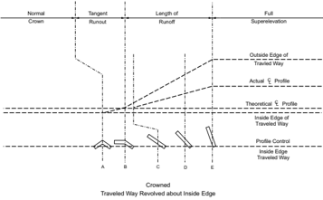
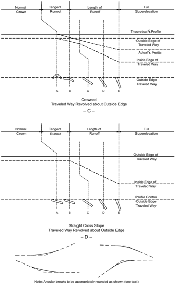
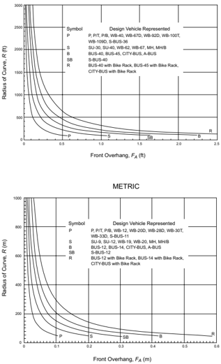
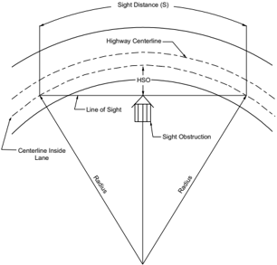
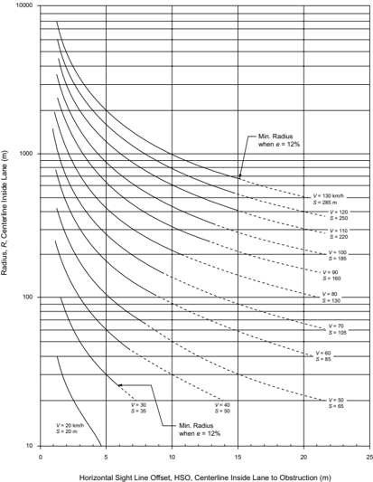

# 3.1  INTRODUCTION: 3.3.8.3  Spiral Curve Transitions & 49 more sections

- Source: GreenBook.pdf
- Generated: 2026-01-03T08:11:58+00:00
- Chunk: 14/28
- Estimated tokens: ~49,246
- Total pages: 1048
- Type: sections

## 3.3.8.3  Spiral Curve Transitions

Any motor vehicle follows a transition path as it enters or leaves a circular horizontal curve. The steering change and the consequent gain or loss of lateral force cannot be achieved instantly. For most curves, the average driver can follow a suitable transition path within the limits of normal lane width. However, combinations of high speed and sharp curvature lead to longer transition paths, which can result in shifts in lateral position and sometimes actual encroachment on adjoining lanes. In such instances, incorporation of transition curves between the tangent and the sharp circular curve, as well as between circular curves of substantially different radii, may be appropriate to make it easier for a driver to keep the vehicle within its own lane.

The principal advantages of transition curves in horizontal alignment are the following:

1. A properly designed transition curve provides a natural, easy-to-follow path for drivers, such that the lateral force increases and decreases gradually as a vehicle enters and leaves a circular curve. Transition curves minimize encroachment on adjoining traffic lanes and tend to promote uniformity in speed. A spiral transition curve simulates the natural turning path of a vehicle.

2. The transition curve length provides a suitable location for the superelevation runoff. The transition from the normal pavement cross slope on the tangent to the fully superelevated section  on  the  curve  can  be  accomplished  along  the  length  of  the  transition  curve  in  a manner that closely fits the speed-radius relationship for vehicles traversing the transition. Where superelevation runoff is introduced without a transition curve, usually partly on the curve and partly on the tangent, the driver approaching the curve may need to steer opposite to the direction of the approaching curve when on the superelevated tangent portion to keep the vehicle within its lane.
3. A spiral transition curve also facilitates the transition in width where the traveled way is widened on a circular curve. Use of spiral transitions provides flexibility in accomplishing the widening of sharp curves.
4. The appearance of the highway or street is enhanced by applying spiral transition curves. The use of spiral transitions avoids noticeable breaks in the alignment as perceived by drivers at  the  beginning  and  end  of  circular  curves.  Such  breaks  are  more  prominent  with  the presence of superelevation runoff.

## 3.3.8.4  Length of Spiral

## 3.3.8.4.1  Length of Spiral

Generally, the Euler spiral, which is also known as the clothoid, is used in the design of spiral transition curves. The radius varies from infinity at the tangent end of the spiral to the radius of the circular arc at the end that adjoins that circular arc. By definition, the radius of curvature at any point on an Euler spiral varies inversely with the distance measured along the spiral. In the case of a spiral transition that connects two circular curves having different radii, there is an initial radius rather than an infinite value.

The following equation, developed in 1909 by Shortt ( 56 ) for gradual attainment of lateral acceleration on railroad track curves, is the basic expression used by some highway agencies for computing minimum length of a spiral transition curve:

| U.S. Customary                                                                                                                  | Metric                                                                                                                              |
|---------------------------------------------------------------------------------------------------------------------------------|-------------------------------------------------------------------------------------------------------------------------------------|
| where: L = minimum length of spiral, ft V = speed,mph R = curve radius, ft C = rate of increase of lateral acceleration, ft/s 3 | where: L = minimum length of spiral,m V = speed, km/h R = curve radius,m C = rate of increase of lateral acceleration, m/s 3 (3-26) |

--',''','',',',','''''',,,,''-'-',,',,',',,'---

The factor C is an empirical value representing the comfort and safety levels provided by the spiral curve. The value of C = 1 ft/s 3 [0.3 m/s 3 ] is generally accepted for railroad operation, but values ranging from 1 to 3 ft/s 3 [0.3 to 0.9 m/s 3 ] have been used for highways. This equation is sometimes modified to take into account the effect of superelevation, which results in much shorter spiral curve lengths. Highways do not appear to need as much precision as is obtained from computing the length of spiral by this equation or its modified form. A more practical control for the length of spiral is that it should equal the length needed for superelevation runoff.

## 3.3.8.4.2  Maximum Radius for Use of a Spiral

A review of guidance on the use of spiral curve transitions indicates a general lack of consistency among highway agencies. In general, much of this guidance suggests that an upper limit on curve radius can be established such that only radii below this maximum are likely to obtain safety and operational benefits from the use of spiral transition curves. Such a limiting radius has been established by several agencies based on a minimum lateral acceleration rate. Such minimum rates have been found to vary from 1.3 to 4.25 ft/s 2 [0.4 to 1.3 m/s 2 ]. The upper end of this range of rates corresponds to the maximum curve radius for which some reduction in crash potential has also been noted. For these reasons, it is recommended that the maximum radius for use of a spiral should be based on a minimum lateral acceleration rate of 4.25 ft/s 2 [1.3 m/s 2 ] ( 16 ). These radii are listed in Table 3-18.

The radii listed in Table 3-18 are intended for use by those highway agencies that desire to use spiral curve transitions. Table 3-18 is not intended to define radii that need the use of a spiral.

Table 3-18. Maximum Radius for Use of a Spiral Curve Transition

| U.S. Customary     | U.S. Customary      |
|--------------------|---------------------|
| Design speed (mph) | Maximum radius (ft) |
| 15                 | 114                 |
| 20                 | 203                 |
| 25                 | 317                 |
| 30                 | 456                 |
| 35                 | 620                 |
| 40                 | 810                 |
| 45                 | 1025                |
| 50                 | 1265                |
| 55                 | 1531                |
| 60                 | 1822                |
| 65                 | 2138                |
| 70                 | 2479                |
| 75                 | 2846                |
| 80                 | 3238                |

| Metric              | Metric             |
|---------------------|--------------------|
| Design speed (km/h) | Maximum radius (m) |
| 20                  | 24                 |
| 30                  | 54                 |
| 40                  | 95                 |
| 50                  | 148                |
| 60                  | 213                |
| 70                  | 290                |
| 80                  | 379                |
| 90                  | 480                |
| 100                 | 592                |
| 110                 | 716                |
| 120                 | 852                |
| 130                 | 1000               |

Note: The effect of spiral curve transitions on lateral acceleration is likely to be negligible for larger radii.

## 3.3.8.4.3  Minimum Length of Spiral

Several agencies define a minimum length of spiral based on consideration of driver comfort and shifts in the lateral position of vehicles. Criteria based on driver comfort are intended to provide a spiral length that allows for a comfortable increase in lateral acceleration as a vehicle enters a curve. The criteria based on lateral shift are intended to provide a spiral curve that is sufficiently long to result in a shift in a vehicle's lateral position within its lane that is consistent with that produced by the vehicle's natural spiral path. It is recommended that these two criteria be used together to determine the minimum length of spiral. Thus, the minimum spiral length can be computed as:

| U.S. Customary                                                                  | Metric                                                                         |
|---------------------------------------------------------------------------------|--------------------------------------------------------------------------------|
| L s, min should be the larger of:                                               | L s, min should be the larger of: (3-27)                                       |
| or                                                                              | or                                                                             |
|                                                                                 | (3-28)                                                                         |
| where:                                                                          | where:                                                                         |
| L s,min = minimum length of spiral, ft                                          | L s,min = minimum length of spiral,m                                           |
| p min = minimum lateral offset between the tangent and circular curve (0.66 ft) | p min = minimum lateral offset between the tangent and circular curve (0.20 m) |
| R = radius of circular curve, ft                                                | R = radius of circular curve, m;                                               |
| V = design speed,mph                                                            | V = design speed, km/h                                                         |
| C = maximum rate of change in lateral acceleration (4 ft/s 3 )                  | C = maximum rate of change in lateral acceleration (1.2 m/s 3 )                |

A value of 0.66 ft [0.20 m] is recommended for p min . This value is consistent with the minimum lateral shift that occurs as a result of the natural steering behavior of most drivers. The recommended minimum value for C is 4.0 ft/s 3 [1.2 m/s 3 ]. The use of lower values will yield longer, more comfortable spiral curve lengths; however, such lengths would not represent the minimum length consistent with driver comfort.

## 3.3.8.4.4  Maximum Length of Spiral

International experience indicates that there is a need to limit the length of spiral transition curves. Spirals should not be so long (relative to the length of the circular curve) that drivers are misled about the sharpness of the approaching curve. A conservative maximum length of spiral that should minimize the likelihood of such concerns can be computed as:

| U.S. Customary                                                                                                                                                | Metric                                                                                                                                                          |
|---------------------------------------------------------------------------------------------------------------------------------------------------------------|-----------------------------------------------------------------------------------------------------------------------------------------------------------------|
| where: L s,max = maximum length of spiral, ft p max = maximum lateral offset between the tangent and circular curve (3.3 ft) R = radius of circular curve, ft | where: L s,max = maximum length of spiral,m p max = maximum lateral offset between the tangent and circular curve (1.0 m) R = radius of circular curve,m (3-29) |

A value of 3.3 ft [1.0 m] is recommended for p max . This value is consistent with the maximum lateral shift that occurs as a result of the natural steering behavior of most drivers. It also provides a reasonable balance between spiral length and curve radius.

## 3.3.8.4.5  Desirable Length of Spiral

A study of the operational effects of spiral curve transitions ( 16 )  found  that  spiral  length  is an important design control. Specifically, the most desirable operating conditions were noted when the spiral curve length was approximately equal to the length of the natural spiral path adopted by drivers.  Differences  between  these  two  lengths  resulted  in  operational  problems associated with large lateral velocities or shifts in lateral position at the end of the transition curve. Specifically, a large lateral velocity in an outward direction (relative to the curve) may lead the driver to make a corrective steering maneuver that results in a path radius sharper than the radius of the circular curve. Such a critical radius produces an undesirable increase in peak side friction demand. Moreover, lateral velocities of sufficient magnitude to shift a vehicle into an adjacent lane (without corrective steering) are also undesirable.

Based on these considerations, desirable lengths of spiral transition curves are shown in Table 3-19. These lengths correspond to 2.0 s of travel time at the design speed of the roadway. This travel time has been found to be representative of the natural spiral path for most drivers ( 16 ).

The spiral lengths listed in Table 3-19 are recommended as desirable values for street and highway design. Theoretical considerations suggest that significant deviations from these lengths tend to increase the shifts in the lateral position of vehicles within a lane that may precipitate encroachment on an adjacent lane or shoulder. The use of longer spiral curve lengths that are less than L s,max is acceptable. However, where such longer spiral curve lengths are used, consideration should be given to increasing the width of the traveled way on the curve to minimize the potential for encroachments into the adjacent lanes.

Spiral curve lengths longer than those shown in Table 3-19 may be needed at turning roadway terminals to adequately develop the desired superelevation. Specifically, spirals twice as long as those shown in Table 3-19 may be needed in such situations. The resulting shift in lateral position may exceed 3.3 ft [1.0 m]; however, such a shift is consistent with driver expectancy at

a turning roadway terminal and can be accommodated by the additional lane width typically provided on such turning roadways.

Finally, if the desirable spiral curve length shown in Table 3-19 is less than the minimum spiral curve length determined from Equations 3-26 and 3-27, the minimum spiral curve length should be used in design.

Table 3-19. Desirable Length of Spiral Curve Transition

| U.S. Customary     | U.S. Customary     |
|--------------------|--------------------|
| Design Speed (mph) | Spiral Length (ft) |
| 15                 | 44                 |
| 20                 | 59                 |
| 25                 | 74                 |
| 30                 | 88                 |
| 35                 | 103                |
| 40                 | 117                |
| 45                 | 132                |
| 50                 | 147                |
| 55                 | 161                |
| 60                 | 176                |
| 65                 | 191                |
| 70                 | 205                |
| 75                 | 220                |
| 80                 | 235                |

| Metric              | Metric            |
|---------------------|-------------------|
| Design Speed (km/h) | Spiral Length (m) |
| 20                  | 11                |
| 30                  | 17                |
| 40                  | 22                |
| 50                  | 28                |
| 60                  | 33                |
| 70                  | 39                |
| 80                  | 44                |
| 90                  | 50                |
| 100                 | 56                |
| 110                 | 61                |
| 120                 | 67                |
| 130                 | 72                |

## 3.3.8.4.6  Length of Superelevation Runoff

In transition design with a spiral curve, it is recommended that the superelevation runoff be accomplished over the length of spiral. For the most part, the calculated values for length of spiral and length of runoff do not differ materially. However, in view of the empirical nature of both, an adjustment in one to avoid having two separate sets of design criteria is desirable. The length of runoff is applicable to all superelevated curves, and it is recommended that this value be used for minimum lengths of spiral. In this manner, the length of spiral should be set equal to the length of runoff. The change in cross slope begins by introducing a tangent runout section just in advance of the spiral curve. Full attainment of superelevation is then accomplished over the length of the spiral. In such a design, the whole of the circular curve has full superelevation.

## 3.3.8.4.7  Limiting Superelevation Rates

One consequence of equating runoff length to spiral length is that the resulting relative gradient of the pavement edge may increase. However, small increases in gradient have not been found to have an adverse effect on comfort or appearance. In this regard, the adjustment factors listed

in Table 3-15 effectively allow for a 50 percent increase in the maximum relative gradient when three lanes are rotated.

The superelevation rates that are associated with a maximum relative gradient that is 50 percent larger than the values used in Section 3.3.8.2, 'Tangent-to-Curve Transition,' are listed in Table 3-20. If the superelevation rate used in design exceeds the rate listed in this table, the maximum relative gradient will be at least 50 percent larger than the maximum relative gradient allowed for a tangent-to-curve design. In this situation, special consideration should be given to the transition's appearance and the abruptness of its edge-of-pavement profile.

Table 3-20. Superelevation Rates Associated with Large Relative Gradients

| U.S. Customary     | U.S. Customary          | U.S. Customary          | U.S. Customary          |
|--------------------|-------------------------|-------------------------|-------------------------|
| Design Speed (mph) | Number of Lanes Rotated | Number of Lanes Rotated | Number of Lanes Rotated |
| Design Speed (mph) | 1                       | 2                       | 3                       |
| 15                 | 4.3                     | 2.2                     | 1.5                     |
| 20                 | 5.5                     | 2.8                     | 1.9                     |
| 25                 | 6.5                     | 3.3                     | 2.2                     |
| 30                 | 7.3                     | 3.7                     | 2.5                     |
| 35                 | 8.0                     | 4.0                     | 2.7                     |
| 40                 | 8.5                     | 4.3                     | 2.9                     |
| 45                 | 8.9                     | 4.5                     | 3.0                     |
| 50                 | 9.2                     | 4.6                     | 3.1                     |
| 55                 | 9.5                     | 4.8                     | 3.2                     |
| 60                 | 9.9                     | 5.0                     | 3.3                     |
| 65                 | 10.3                    | 5.2                     | 3.4                     |
| 70                 | 10.3                    | 5.2                     | 3.5                     |
| 75                 | 10.5                    | 5.3                     | 3.5                     |
| 80                 | 10.5                    | 5.3                     | 3.5                     |

| Metric              | Metric                  | Metric                  | Metric                  |
|---------------------|-------------------------|-------------------------|-------------------------|
| Design Speed (km/h) | Number of Lanes Rotated | Number of Lanes Rotated | Number of Lanes Rotated |
| Design Speed (km/h) | 1                       | 2                       | 3                       |
| 20                  | 3.7                     | 1.9                     | 1.3                     |
| 30                  | 5.2                     | 2.6                     | 1.7                     |
| 40                  | 6.5                     | 3.2                     | 2.2                     |
| 50                  | 7.5                     | 3.8                     | 2.5                     |
| 60                  | 8.3                     | 4.2                     | 2.8                     |
| 70                  | 8.9                     | 4.5                     | 3.0                     |
| 80                  | 9.3                     | 4.6                     | 3.1                     |
| 90                  | 9.8                     | 4.9                     | 3.3                     |
| 100                 | 10.2                    | 5.1                     | 3.4                     |
| 110                 | 10.4                    | 5.2                     | 3.5                     |
| 120                 | 10.6                    | 5.3                     | 3.5                     |
| 130                 | 10.6                    | 5.3                     | 3.5                     |

Note: Based on desirable length of spiral curve transition from Table 3-19.

## 3.3.8.4.8  Length of Tangent Runout

The tangent runout length for a spiral curve transition design is based on the same approach used for the tangent-to-curve transition design. Specifically, a smooth edge of pavement profile is desired so that a common edge slope gradient is maintained throughout the superelevation runout and runoff sections. Based on this rationale, the following equation can be used to compute the tangent runout length:

--',''','',',',','''''',,,,''-'-',,',,',',,'---

| U.S. Customary                                                                                                 | Metric                                                                                                            |
|----------------------------------------------------------------------------------------------------------------|-------------------------------------------------------------------------------------------------------------------|
| where: L t = length of tangent runout, ft L S = length of spiral, ft e d = design superelevation rate, percent | where: L t = length of tangent runout,m L S = length of spiral,m e d = design superelevation rate, percent (3-30) |

The  tangent  runout  lengths  obtained  from  Equation  3-30  are  presented  in  Table  3-21.  The lengths in this table may be longer than desirable for combinations of low superelevation rate and high speed. Such long lengths may not provide adequate surface drainage where there is insufficient profile grade. Such concerns can be avoided when the profile grade criteria described in Section 3.3.8.9, 'Minimum Transition Grades,' are applied to the spiral curve transition.

Table 3-21. Tangent Runout Length for Spiral Curve Transition Design

| U.S. Customary     | U.S. Customary             | U.S. Customary             | U.S. Customary             | U.S. Customary             | U.S. Customary             |
|--------------------|----------------------------|----------------------------|----------------------------|----------------------------|----------------------------|
| Design Speed (mph) | Tangent Runout Length (ft) | Tangent Runout Length (ft) | Tangent Runout Length (ft) | Tangent Runout Length (ft) | Tangent Runout Length (ft) |
| Design Speed (mph) | Superelevation Rate        | Superelevation Rate        | Superelevation Rate        | Superelevation Rate        | Superelevation Rate        |
| Design Speed (mph) | 2                          | 4                          | 6                          | 8                          | 10                         |
| 15                 | 44                         | -                          | -                          | -                          | -                          |
| 20                 | 59                         | 30                         | -                          | -                          | -                          |
| 25                 | 74                         | 37                         | 25                         | -                          | -                          |
| 30                 | 88                         | 44                         | 29                         | -                          | -                          |
| 35                 | 103                        | 52                         | 34                         | 26                         | -                          |
| 40                 | 117                        | 59                         | 39                         | 29                         | -                          |
| 45                 | 132                        | 66                         | 44                         | 33                         | -                          |
| 50                 | 147                        | 74                         | 49                         | 37                         | -                          |
| 55                 | 161                        | 81                         | 54                         | 40                         | -                          |
| 60                 | 176                        | 88                         | 59                         | 44                         | -                          |
| 65                 | 191                        | 96                         | 64                         | 48                         | 38                         |
| 70                 | 205                        | 103                        | 68                         | 51                         | 41                         |
| 75                 | 220                        | 110                        | 73                         | 55                         | 44                         |
| 80                 | 235                        | 118                        | 78                         | 59                         | 47                         |

## Notes:

1.  Based on 2.0 percent normal cross slope.
2.  Superelevation rates above 10 percent and cells with '-' coincide with a pavement edge grade that exceeds the maximum relative gradient presented in Section 3.3.8.2, 'Tangent-to-Curve Transition,' by 50 percent or more. These limits apply to roads where one lane is rotated; lower limits apply when more lanes are rotated (see Table 3-15).

| Metric              | Metric                                        | Metric                                        | Metric                                        | Metric                                        | Metric                                        |
|---------------------|-----------------------------------------------|-----------------------------------------------|-----------------------------------------------|-----------------------------------------------|-----------------------------------------------|
| Design Speed (km/h) | Tangent Runout Length (m) Superelevation Rate | Tangent Runout Length (m) Superelevation Rate | Tangent Runout Length (m) Superelevation Rate | Tangent Runout Length (m) Superelevation Rate | Tangent Runout Length (m) Superelevation Rate |
| Design Speed (km/h) | 2                                             | 4                                             | 6                                             | 8                                             | 10                                            |
| 20                  | 11                                            | -                                             | -                                             | -                                             | -                                             |
| 30                  | 17                                            | 8                                             | -                                             | -                                             | -                                             |
| 40                  | 22                                            | 11                                            | 7                                             | -                                             | -                                             |
| 50                  | 28                                            | 14                                            | 9                                             | -                                             | -                                             |
| 60                  | 33                                            | 17                                            | 11                                            | 8                                             | -                                             |
| 70                  | 39                                            | 19                                            | 13                                            | 10                                            | -                                             |
| 80                  | 44                                            | 22                                            | 15                                            | 11                                            | -                                             |
| 90                  | 50                                            | 25                                            | 17                                            | 13                                            | 10                                            |
| 100                 | 56                                            | 28                                            | 19                                            | 14                                            | 11                                            |
| 110                 | 61                                            | 31                                            | 20                                            | 15                                            | 12                                            |
| 120                 | 67                                            | 33                                            | 22                                            | 17                                            | 13                                            |
| 130                 | 72                                            | 36                                            | 24                                            | 18                                            | 14                                            |

In alignment design with spirals, the superelevation runoff is affected over the whole of the transition curve. The length of the superelevation runoff should be equal to the spiral length for the tangent-to-spiral (TS) transition at the beginning and the spiral-to-curve (SC) transition at the end of the circular curve. The change in cross slope begins by removing the adverse cross slope from the lane or lanes on the outside of the curve on a length of tangent just ahead of TS (the tangent runout) (see Figure 3-8). Between the TS and SC, the spiral curve and the superelevation runoff are coincident and the traveled way is rotated to reach the full superelevation at the SC. This arrangement is reversed on leaving the curve. In this design, the whole of the circular curve has full superelevation.

## 3.3.8.5  Compound Curve Transition

In general, compound curve transitions are most commonly considered for application to lowspeed turning roadways at intersections. In contrast, tangent-to-curve or spiral curve transition designs are more commonly used on street and highway curves.

The runoff length between compound curves is the runoff computed for the difference in the superelevation rates.

Guidance concerning compound curve transition design for turning roadways is provided in Chapters 9 and 10. The guidance in Chapter 9 applies to low-speed turning roadway terminals at intersections while the guidance in Chapter 10 applies to interchange ramp terminals.

## 3.3.8.6  Methods of Attaining Superelevation

Four methods are used to transition the pavement to a superelevated cross section. These methods include: (1) revolving a traveled way with normal cross slopes about the centerline profile, (2) revolving a traveled way with normal cross slopes about the inside-edge profile, (3) revolving a traveled way with normal cross slopes about the outside-edge profile, and (4) revolving a straight cross slope traveled way about the outside-edge profile. Figure 3-8 illustrates these four methods. The methods of changing cross slope are most conveniently shown in the figure in terms of straight line relationships, but it is important that the angular breaks between the straight-line profiles be rounded in the finished design, as shown in the figure.

The profile reference line controls for the roadway's vertical alignment through the horizontal curve. Although shown as a horizontal line in Figure 3-8, the profile reference line may correspond to a tangent, a vertical curve, or a combination of the two. In Figure 3-8A, the profile reference line corresponds to the centerline profile. In Figures 3-8B and 3-8C, the profile reference line is represented as a 'theoretical' centerline profile as it does not coincide with the axis of rotation. In Figure 3-8D, the profile reference line corresponds to the outside edge of traveled way. The cross sections at the bottom of each diagram in Figure 3-15 indicate the traveled way cross slope condition at the lettered points.

The first method, as shown in Figure 3-8A, revolves the traveled way about the centerline profile. This method is the most widely used because the change in elevation of the edge of the traveled way is achieved with less distortion than with the other methods. In this regard, onehalf of the change in elevation is made at each edge.

Normal

Crown

Tangent

Runout

A

A

B

Length of

Runoff

C

C

D

B

D

A

B

C

D

Crowned

Crowned

Traveled Way Revolved about Centerline

Traveled Way Revolved about Centerline

- A -

- A -

- B -

Figure 3-8. Diagrammatic Profiles Showing Methods of Attaining Superelevation for a Curve to the Right

--',''','',',',','''''',,,,''-'-',,',,',',,'---

Full

Superelevation

Outside Edge of

Travled Way

Centerline Profile

Inside Edge of

Traveled Way

Profile Control

Centerline

E

E

E

Note: Angular breaks to be appropriately rounded as shown (see text)

Figure 3-8. Diagrammatic Profiles Showing Methods of Attaining Superelevation for a Curve to the Right (Continued)

--',''','',',',','''''',,,,''-'-',,',,',',,'---

--',''','',',',','''''',,,,''-'-',,',,',',,'---

The second method, as shown in Figure 3-8B, revolves the traveled way about the inside-edge profile. In this case, the inside-edge profile is determined as a line parallel to the profile reference line. One-half of the change in elevation is made by raising the actual centerline profile with respect to the inside-edge profile and the other half by raising the outside-edge profile an equal amount with respect to the actual centerline profile.

The third method, as shown in Figure 3-8C, revolves the traveled way about the outside-edge profile. This method is similar to that shown in Figure 3-8B except that the elevation change is accomplished below the outside-edge profile instead of above the inside-edge profile.

The fourth method, as shown in Figure 3-8D, revolves the traveled way (having a straight cross slope) about the outside-edge profile. This method is often used for two-lane one-way roadways where the axis of rotation coincides with the edge of the traveled way adjacent to the highway median.

The methods for attaining superelevation are nearly the same for all four methods. Cross section A at one end of the tangent runout is a normal (or straight) cross slope section. At cross section B, the other end of the tangent runout and the beginning of the superelevation runoff, the lane or lanes on the outside of the curve are made horizontal (or level) with the actual centerline profile for Figures 3-8A, 3-8B, and 3-8C; there is no change in cross slope for Figure 3-8D.

At cross section C, the traveled way is a plane, superelevated at the normal cross slope rate. Between cross sections B and C for Figures 3-8A, 3-8B, and 3-8C, the outside lane or lanes change from a level condition to one of superelevation at the normal cross slope rate and normal cross slope is retained on the inner lanes. There is no change between cross sections B and C for Figure 3-8D. Between cross sections C and E the pavement section is revolved to the full rate of superelevation. The rate of cross slope at an intermediate point (e.g., cross section D) is proportional to the distance from cross section C.

In an overall sense, the method of rotation about the centerline shown in Figure 3-8A is usually the most adaptable. On the other hand, the method shown in Figure 3-8B is preferable where the lower edge profile is a major control, as for drainage. With uniform profile conditions, its use results in the greatest distortion of the upper edge profile. Where the overall appearance is a high priority, the methods of Figures 3-8C and 3-8D are desirable because the upper edge profile-the edge most noticeable to  drivers-retains  the  smoothness  of  the  control  profile. Thus, the shape and direction of the centerline profile may determine the preferred method for attaining superelevation.

Considering the vast number of profile arrangements that are possible and in recognition of specific issues such as drainage, avoidance of critical grades, aesthetics, and fitting the roadway to the adjacent topography, no general recommendation can be made for adopting any particular axis of rotation. To obtain the most pleasing and functional results, each superelevation transi-

tion section should be considered individually. In practice, any of the pavement reference lines used for the axis of rotation may be best suited for the situation at hand.

## 3.3.8.7  Design of Smooth Profiles for Traveled-Way Edges

In the diagrammatic profiles shown in Figure 3-8, the tangent profile control lines result in angular breaks at cross sections A, C, and E. For general appearance and safety, these breaks should be rounded in final design by insertion of vertical curves. Angular breaks will be particularly noticeable where hard surfaces, such as concrete barrier or retaining wall, follow the edge of pavement profile. Even when the maximum relative gradient is used to define runoff length, the length of vertical curve does not need to be large to conform to the 0.65 [0.66] percent break at the 30-mph [50-km/h] design speed (see Figure 3-8) and 0.38 [0.38] percent break at the 75 mph [120 km/h] design speed need. Where the traveled way is revolved about an edge, these grade breaks are doubled to 1.32 [1.30] percent for the 30-mph [50-km/h] design speed and to 0.76 [0.76] percent for the 75-mph [120-km/h] design speed. Greater lengths of vertical curve are obviously needed in these cases. Specific criteria have not been established for the lengths of vertical curves at the breaks in the diagrammatic profiles. For an approximate guide, however, the minimum vertical curve length in feet [meters] can be used as numerically equal to 0.2 times the design speed in kilometers per hour [equal to the design speed in miles per hour]. Greater lengths should be used where practical as the general profile condition may determine.

A second method uses a graphical approach to define the edge profile. The method essentially is one of spline-line development. In this method, the centerline or other base profile, which usually is computed, is plotted on an appropriate vertical scale. Superelevation control points are in the form of the break points shown in Figure 3-8. Then by means of a spline, curve template, ship curve, or circular curve, smooth-flowing lines are drawn to approximate the straightline controls. The natural bending of the spline nearly always satisfies the need for minimum smoothing. Once the edge profiles are drawn in the proper relation to one another, elevations can be read at the appropriate intervals (as needed for construction control).

An important advantage of the graphical or spline-line method is the study alternatives it affords the designer. Alternate profile solutions can be developed expeditiously. The net result is a design that is well suited to the particular control conditions. The engineering design labor needed for this procedure is minimal. These several advantages make this method preferable to the other methods of developing profile details for runoff sections.

Divided highways warrant a greater refinement in design and greater attention to appearance than do two-lane highways because divided highways usually serve much greater traffic volumes. Moreover, the cost of such refinements is insignificant compared with the construction cost of the divided highway. Accordingly, there should be greater emphasis on the development of smooth-flowing traveled-way edge profiles for divided highways.

## 3.3.8.8  Axis of Rotation with a Median

In the design of divided highways, streets, and parkways, the inclusion of a median in the cross section influences the superelevation transition design. This influence stems from the several possible locations for the axis of rotation. The most appropriate location for this axis depends on the width of the median and its cross section. Common combinations of these factors and the appropriate corresponding axis location are described in the following three cases. The runoff length for each case should be determined using Equation 3-24.

## 3.3.8.8.1  Case I

The whole of the traveled way, including the median, is superelevated as a plane section. Case I  should  be  limited  to  narrow  medians  and  moderate  superelevation  rates  to  avoid  substantial differences in elevation of the extreme edges of the traveled way arising from the median tilt. Specifically, Case I should be applied only to medians with widths of 15 ft [4 m] or less. Superelevation can be attained using a method similar to that shown in Figure 3-8A except for the two median edges, which will appear as profiles only slightly removed from the centerline. For Case I designs, the length of runoff should be based on the total rotated width (including the median width). However, because narrow medians have very little effect on the runoff length, medians widths of up to 10 ft [3 m] may be ignored when determining the runoff length.

## 3.3.8.8.2  Case II

The median is held in a horizontal plane and the two traveled ways are rotated separately around the median edges. Case II can be applied to any width of median but is most appropriate for medians with widths between 15 and 60 ft [4 and 18 m]. By holding the median edges level, the difference in elevation between the extreme traveled-way edges can be limited to that needed to superelevate the roadway. Superelevation transition designs for Case II usually have the roadways rotated about the median-edge of pavement. Superelevation can be attained using any of the methods shown in Figures 3-8B, 3-8C, and 3-8D, with the profile reference line being the same for both traveled ways. Where Case II is used for a narrow median width of 10 ft [3 m] or less held in a horizontal plane, the runoff lengths may be the same as those for a single undivided highway.

## 3.3.8.8.3  Case III

The two traveled ways are treated separately for runoff which results in variable differences in elevations at the median edges. Case III design can be used with wide medians (i.e., median widths of 60 ft [18 m] or more). For this case, the differences in elevation of the extreme edges of the traveled way are minimized by a compensating slope across the median. With a wide median, the profiles and superelevation transition may be designed separately for the two roadways. Accordingly, superelevation can be attained by the method otherwise considered appropriate (i.e., any of the methods in Figure 3-8 can be used).

## 3.3.8.8.4  Divided Highway

Divided highways warrant a greater refinement in design and greater attention to appearance than two-lane highways because they serve much greater traffic volumes and because the cost of such refinements is insignificant compared with the cost of construction. Accordingly, the values for length of runoff previously indicated should be considered minimums, and the use of yet longer values should be considered. Likewise, there should be emphasis on the development of smooth-flowing traveled-way edge profiles of the type obtained by spline-line design methods.

## 3.3.8.9  Minimum Transition Grades and Drainage Considerations

Two potential pavement surface drainage problems are of concern in the superelevation transition section. One problem relates to the potential lack of adequate longitudinal grade. This problem generally occurs when the grade axis of rotation is equal, but of opposite sign, to the effective relative gradient. It results in the edge of pavement having negligible longitudinal grade, which can lead to poor pavement surface drainage, especially on curbed cross sections.

The other potential drainage problem relates to inadequate lateral drainage due to negligible cross slope during pavement rotation. This problem occurs in the transition section where the cross slope of the outside lane varies from an adverse slope at the normal cross slope rate to a superelevated slope at the normal cross slope rate. This length of the transition section includes the tangent runout section and an equal length of the runoff section. Within this length, the pavement cross slope may not be sufficient to adequately drain the pavement laterally.

Two techniques can be used to alleviate these two potential drainage problems. One technique is providing a minimum profile grade in the transition section. The second technique is providing a minimum edge-of-pavement grade in the transition section. Both techniques can be incorporated in the design by use of the following grade criteria:

1. Maintain minimum profile grade of 0.5 percent through the transition section.
2. Maintain minimum edge-of-pavement grade of 0.2 percent (0.5 percent for curbed streets) through the transition section.

The second grade criterion is equivalent to the following series of equations relating profile grade and effective maximum relative gradient:

--',''','',',',','''''',,,,''-'-',,',,',',,'---

| U.S. Customary                                      | U.S. Customary                                      | Metric                                            | Metric                                            |
|-----------------------------------------------------|-----------------------------------------------------|---------------------------------------------------|---------------------------------------------------|
| Uncurbed                                            | Curbed                                              | Uncurbed                                          | Curbed                                            |
| G≤-∆* - 0.2                                         | G≤-∆* - 0.5                                         | G≤-∆* - 0.2                                       | G≤-∆* - 0.5                                       |
| G≥-∆* + 0.2                                         | G≥-∆* + 0.5                                         | G≥-∆* + 0.2                                       | G≥-∆* + 0.5                                       |
| G≤∆* - 0.2                                          | G≤∆* - 0.5                                          | G≤∆* - 0.2                                        | G≤∆* - 0.5                                        |
| G≥∆* + 0.2                                          | G≥∆* + 0.5                                          | G≥∆* + 0.2                                        | G≥∆* + 0.5                                        |
| with                                                | with                                                | with                                              | with                                              |
| where:                                              | where:                                              | where:                                            | where:                                            |
| G = profile grade, percent                          | G = profile grade, percent                          | G = profile grade, percent                        | G = profile grade, percent                        |
| ∆* = effective maximum relative gradient, percent   | ∆* = effective maximum relative gradient, percent   | ∆* = effective maximum relative gradient, percent | ∆* = effective maximum relative gradient, percent |
| w = width of one traffic lane, ft (typically 12 ft) | w = width of one traffic lane, ft (typically 12 ft) | w = width of one traffic lane, m(typically 3.6 m) | w = width of one traffic lane, m(typically 3.6 m) |
| n l = number of lanes rotated                       | n l = number of lanes rotated                       | n l = number of lanes rotated                     | n l = number of lanes rotated                     |
| e d = design superelevation rate, percent           | e d = design superelevation rate, percent           | e d = design superelevation rate, percent         | e d = design superelevation rate, percent         |
| L r = length of superelevation runoff, ft           | L r = length of superelevation runoff, ft           | L r = length of superelevation runoff,m           | L r = length of superelevation runoff,m           |

The value of 0.2 in the grade control ( G ) equation represents the minimum edge-of-pavement grade for uncurbed roadways (expressed as a percentage). If this equation is applied to curbed streets, the value 0.2 should be replaced with 0.5.

To illustrate the combined use of the two grade criteria, consider an uncurbed roadway curve having an effective maximum relative gradient of 0.65 percent in the transition section. The first criterion would exclude grades between -0.50 and +0.50 percent. The second grade criterion would exclude grades in the range of -0.85 to -0.45 percent (via the first two components of the equation) and those in the range of 0.45 to 0.85 percent (via the last two components of the equation). Given the overlap between the ranges for Controls 1 and 2, the profile grade within the transition would have to be outside of the range of -0.85 to +0.85 percent to satisfy both criteria and provide adequate pavement surface drainage.

## 3.3.8.10  Transitions and Compound Curves for Turning Roadways

Drivers turning at at-grade intersections and at interchange ramp terminals naturally follow transitional travel paths just as they do at higher speeds on the open highway. If facilities are not provided for driving in this natural manner, many drivers may deviate from the intended path and develop their own transition, sometimes to the extent of encroaching on other lanes or on the shoulder. The use of natural travel paths by drivers is best achieved by the use of transition or spiral curves that may be inserted between a tangent and a circular arc or between two circular

arcs of different radii. Practical designs that follow transitional paths may also be developed by using compound circular curves. Transitioned roadways have the added advantage of providing a practical means for changing from a normal to a superelevated cross section.

## 3.3.8.11  Length of Spiral for Turning Roadways

Lengths of spirals for use at intersections are determined in the same manner as they are for open highways. On intersection curves, lengths of spirals may be shorter than they are on the open highway curves, because drivers accept a more rapid change in direction of travel under intersection conditions. In other words, C (the rate of change of lateral acceleration on intersection curves) may be higher on intersection curves than on open highway curves, where values of C ranging from 1 to 3 ft/s 3 [0.3 to 1.0 m/s 3 ] generally are accepted. Rates for curves at intersections are assumed to vary from 2.5 ft/s 3 [0.75 m/s 3 ] for a turnout speed of 50 mph [80 km/h] to 4.0 ft/s 3 [1.2 m/s 3 ] for 20 mph [30 km/h]. With the use of these values in the Shortt formula ( 56 ), lengths of spirals for intersection curves are developed in Table 3-22. The minimum lengths of spirals shown are for minimum-radius curves as governed by the design speed. Somewhat lesser spiral lengths are suitable for above-minimum radii.

Spirals also may be desirable between two circular arcs of widely different radii. In this case, the length of spiral can be obtained from Table 3-22 by using a radius that is the difference in the radii of the two arcs. For example, two curves to be connected by a spiral have radii of 820 and 262 ft [250 and 80 m]. This difference of 558 ft [170 m] is very close to the minimum radius of 550 ft [160 m] in Table 3-22 for which the suggested minimum length is about 200 ft [60 m].

Table 3-22. Minimum Lengths of Spiral for Intersection Curves

| U.S. Customary     | U.S. Customary        | U.S. Customary        | U.S. Customary                     | U.S. Customary                         |
|--------------------|-----------------------|-----------------------|------------------------------------|----------------------------------------|
| Design Speed (mph) | Mini- mum Radius (ft) | As- sumed C (ft/s 3 ) | Calcu- lated Length of Spiral (ft) | Design Mini- mum Length of Spiral (ft) |
| 20                 | 90                    | 4.0                   | 70                                 | 70                                     |
| 25                 | 150                   | 3.75                  | 87                                 | 90                                     |
| 30                 | 230                   | 3.5                   | 105                                | 110                                    |
| 35                 | 310                   | 3.25                  | 134                                | 130                                    |
| 40                 | 430                   | 3.0                   | 156                                | 160                                    |
| 45                 | 550                   | 2.75                  | 190                                | 200                                    |

| Metric              | Metric               | Metric               | Metric                            | Metric                                |
|---------------------|----------------------|----------------------|-----------------------------------|---------------------------------------|
| Design Speed (km/h) | Mini- mum Radius (m) | As- sumed C (m/s 3 ) | Calcu- lated Length of Spiral (m) | Design Mini- mum Length of Spiral (m) |
| 30                  | 25                   | 1.2                  | 19                                | 20                                    |
| 40                  | 50                   | 1.1                  | 25                                | 25                                    |
| 50                  | 80                   | 1.0                  | 33                                | 35                                    |
| 60                  | 125                  | 0.9                  | 41                                | 45                                    |
| 70                  | 160                  | 0.8                  | 57                                | 60                                    |

Compound curves at intersections for which the radius of one curve is more than twice the radius of the other should have either a spiral or a circular curve of intermediate radius inserted

between the two. If, in such instances, the calculated length of spiral is less than 100 ft [30 m], using a length of at least 100 ft [30 m] is suggested.

## 3.3.8.12  Compound Circular Curves

Compound circular curves can effectively create desirable shapes of turning roadways for atgrade intersections and for interchange ramps. Where circular arcs of widely different radii are joined, however, the alignment can appear abrupt or forced, and the travel paths of vehicles will need considerable steering effort.

On compound curves for open highways, it is generally accepted that the ratio of the flatter radius to the sharper radius should not exceed 1.5:1. For compound curves at intersections and on turning roadways where drivers accept more rapid changes in direction and speed, the radius of the flatter arc can be as much as 100 percent greater than the radius of the sharper arc, a ratio of 2:1. The ratio of 2:1 for the sharper curves used at intersections results in approximately the same difference (about 6 mph [10 km/h]) in average running speeds for the two curves. Highway agency experience indicates that ramps having differences in radii with a ratio of 2:1 provide satisfactory operation and appearance for intersections.

Where practical, a smaller difference in radii should be used. A desirable maximum ratio is 1.75:1. Where the ratio is greater than 2:1, a suitable length of spiral or a circular arc of intermediate radius should be inserted between the two curves. In the case of very sharp curves designed to accommodate minimum turning paths of vehicles, it is not practical to apply this ratio control. In this case, compound curves should be developed that fit closely to the path of the design vehicle to be accommodated, for which higher ratios may be needed as shown in Chapter 9.

Curves that are compounded should not be too short or their effectiveness in enabling smooth transitions from tangent or flat-curve to sharp-curve operation may be lost. In a series of curves of decreasing radii, each curve should be long enough to enable the driver to decelerate at a reasonable rate, which at intersections is assumed to be not more than 3 mph/s [5 km/h/s], although 2 mph/s [3 km/h/s] is desirable. Minimum curve lengths that meet these criteria based on the running speeds shown in Table 3-6 are indicated in Table 3-23. They are based on a deceleration of 3 mph/s [5 km/h/s], and a desirable minimum deceleration of 2 mph/s [3 km/h/s]. The latter deceleration rate indicates very light braking, because deceleration in gear alone generally results in deceleration rates between 1 and 1.5 mph/s [1.5 and 2.5 km/h/s].

Table 3-23. Length of Circular Arc for a Compound Intersection Curve When Followed by a Curve of One-Half Radius or Preceded by a Curve of Double Radius

| U.S. Customary   | U.S. Customary              | U.S. Customary              |
|------------------|-----------------------------|-----------------------------|
| Radius (ft)      | Length of Circular Arc (ft) | Length of Circular Arc (ft) |
| Radius (ft)      | Minimum                     | Desirable                   |
| 100              | 40                          | 60                          |
| 150              | 50                          | 70                          |
| 200              | 60                          | 90                          |
| 250              | 80                          | 120                         |
| 300              | 100                         | 140                         |
| 400              | 120                         | 180                         |
| 500 or more      | 140                         | 200                         |

| Metric      | Metric                     | Metric                     |
|-------------|----------------------------|----------------------------|
| Radius (m)  | Length of Circular Arc (m) | Length of Circular Arc (m) |
| Radius (m)  | Minimum                    | Desirable                  |
| 30          | 12                         | 20                         |
| 50          | 15                         | 20                         |
| 60          | 20                         | 30                         |
| 75          | 25                         | 35                         |
| 100         | 30                         | 45                         |
| 125         | 35                         | 55                         |
| 150 or more | 45                         | 60                         |

These design guidelines for compound curves are developed on the premise that travel is in the direction of sharper curvature. For the acceleration condition, the 2:1 ratio is not as critical and may be exceeded.

## 3.3.9  Offtracking

Offtracking is the characteristic, common to all vehicles, although much more pronounced with the larger design vehicles, in which the rear wheels do not precisely follow the same path as the front wheels when the vehicle traverses a horizontal curve or makes a turn. When a vehicle traverses a curve without superelevation at low speed, the rear wheels track inside the front wheels. When a vehicle traverses a superelevated curve, the rear wheels may track inside the front wheels more or less than they do for a curve without superelevation. This is because of the slip angle of the tires with respect to the direction of travel, which is induced by the side friction developed between the pavement and rolling tires. The relative position of the wheel tracks depends on the speed and the amount of friction developed to sustain the lateral force not offset by superelevation or, when traveling slowly, by the friction developed to counteract the effect of superelevation not compensated by lateral force. At higher speeds, the rear wheels may even track outside the front wheels.

## 3.3.9.1  Derivation of Design Values for Widening on Horizontal Curves

In each case, the amount of offtracking, and therefore the amount of widening needed on horizontal  curves,  depends  jointly  on  the  length  and  other  characteristics  of  the  design  vehicle and  the  radius  of  curvature  negotiated.  Selection  of  the  design  vehicle  is  based  on  the  size and frequency of the various vehicle types expected at the location in question. The amount of widening that is needed increases with the size of the design vehicle (for single-unit vehicles or vehicles with the same number of trailers or semitrailers) and decreases with the increasing radius of curvature. The width elements of the design vehicle that is used to determine the appropriate roadway widening on curves include: the track width of the design vehicles that may

--',''','',',',','''''',,,,''-'-',,',,',',,'---

meet or pass on the curve, U; the lateral clearance per vehicle, C; the width of front overhang of the vehicle occupying the inner lane or lanes, FA; the width of rear overhang, FB; and a width allowance for the difficulty of driving on curves, Z.

The track width (U) for a vehicle following a curve or making a turn, also known as the swept path width, is the sum of the track width on tangent (u) (8.0 or 8.5 ft [2.44 or 2.59 m] depending on the design vehicle) and the amount of offtracking. The offtracking depends on the radius of the curve or turn, the number and location of articulation points, and the lengths of the wheelbases between axles. The track width on a curve (U) is calculated using the equation:

| U.S. Customary                                                                                                                                                                                                                             | Metric                                                                                                                                                                                                                                    |
|--------------------------------------------------------------------------------------------------------------------------------------------------------------------------------------------------------------------------------------------|-------------------------------------------------------------------------------------------------------------------------------------------------------------------------------------------------------------------------------------------|
| where: U = track width on curve, ft u = track width on tangent (out-to-out of tires), ft R = radius of curve or turn, ft L i = wheelbase of design vehicle between consecutive axles (or sets of tandem axles) and articulation points, ft | where: U = track width on curve,m u = track width on tangent (out-to-out of tires),m R = radius of curve or turn,m L i = wheelbase of design vehicle between consecutive axles (or sets of tandem axles) and articulation points,m (3-32) |

This equation can be used for any combination of radius, number of axles, and length of wheelbases (i.e., spacings between axles). The radius for open highway curves is the path of the midpoint of the front axle; however, for most design purposes on two-lane highways, the radius of the curve at the centerline of the highway may be used for simplicity of calculations. For turning roadways, the radius is the path of the outer front wheel ( 32 ). The wheelbases ( Li ) used in the calculations include the distances between each axle and articulation point on the vehicle. For a single-unit truck, only the distance between the front axle and the drive wheels is considered. For an articulated vehicle, each of the articulation points is used to determine U. For example, a tractor/semitrailer combination truck has three Li values that are considered in determining offtracking: (1) the distance from the front axle to the tractor drive axle(s), (2) the distance from the drive axle(s) to the fifth wheel pivot, and (3) the distance from the fifth wheel pivot to the rear axle(s). In the summation process, some terms may be negative, rather than positive, in two situations: (1) if the articulation point is in front of, rather than behind, the drive axle(s) ( 76 ) or (2) if there is a rear-axle overhang. Rear-axle overhang is the distance between the rear axle(s) and the pintle hook of a towing vehicle ( 32, 76 ) in a multi-trailer combination truck. Representative values for the track width of design vehicles are shown in Figure 3-9 to illustrate the differences in relative widths between groups of design vehicles.

--',''','',',',','''''',,,,''-'-',,',,',',,'---

The lateral clearance allowance, C, provides clearance between the edge of the traveled way and nearest wheel path and for the body clearance between vehicles passing or meeting. Lateral clearance per vehicle is assumed to be 2.0, 2.5, and 3.0 ft [0.6, 0.75, and 0.9 m] for tangent twolane traveled way widths, Wn, equal to 20, 22, and 24 ft [6.0, 6.6, and 7.2 m], respectively.

The width of the front overhang (FA) is the radial distance between the outer edge of the tire path of the outer front wheel and the path of the outer front edge of the vehicle body. For curves and turning roadways, FA depends on the radius of the curve, the extent of the front overhang of the design vehicle, and the wheelbase of the unit itself. In the case of tractor-trailer combinations, only the wheelbase of the tractor unit is used. Figure 3-10 illustrates relative overhang width values for FA determined from:

| U.S. Customary                                        | Metric                                              |
|-------------------------------------------------------|-----------------------------------------------------|
| where:                                                | where: (3-33)                                       |
| F A = width of front overhang, ft                     | F A = width of front overhang,m                     |
| R = radius of curve or turning roadway (two-lane), ft | R = radius of curve or turning roadway (two-lane),m |
| A = front overhang of inner lane vehicle, ft          | A = front overhang of inner lane vehicle,m          |
| L = wheelbase of single unit or tractor, ft           | L = wheelbase of single unit or tractor,m           |

--',''','',',',','''''',,,,''-'-',,',,',',,'---

## U.S. CUSTOMARY

Figure 3-9. Track Width for Widening of Traveled Way on Curves

## U.S. CUSTOMARY

Figure 3-10. Front Overhang for Widening of Traveled Way on Curves

The width of the rear overhang (FB ) is the radial distance between the outer edge of the tire path of the inner rear wheel and the inside edge of the vehicle body. For the passenger car (P) design vehicle, the width of the body is 1 ft [0.3 m] greater than the width of out-to-out width

--',''','',',',','''''',,,,''-'-',,',,',',,'---

of the rear wheels, making FB = 0.5 ft [0.15 m]. In the truck design vehicles, the width of body is the same as the width out-to-out of the rear wheels, and FB = 0.

The extra width allowance (Z) is an additional radial width of pavement to accommodate the difficulty of maneuvering on a curve and the variation in driver operation. This additional width is an empirical value that varies with the speed of traffic and the radius of the curve. The additional width allowance is expressed as:

| U.S. Customary                                        | Metric                                              |
|-------------------------------------------------------|-----------------------------------------------------|
| where:                                                | where:                                              |
| Z = extra width allowance, ft                         | Z = extra width allowance,m                         |
| V = design speed of the highway,mph                   | V = design speed of the highway, km/h               |
| R = radius of curve or turning roadway (two-lane), ft | R = radius of curve or turning roadway (two-lane),m |

This  expression,  used  primarily  for  widening  of  the  traveled  way  on  open  highways,  is  also applicable to intersection curves. For the normal range of curve radii at intersections, the extra width allowance, Z converges to a nearly constant value of 2 ft [0.6 m] by using the speed-curvature relations for radii in the range of 50 to 500 ft [15 to 150 m]. This added width, as shown diagrammatically in Figures 3-12 and 3-13, should be assumed to be evenly distributed over the traveled way width to allow for the inaccuracy in steering on curved paths.

Figure 3-11. Widening Components on Open Highway Curves (Two-Lane Highways, OneWay or Two-Way)

## 3.3.10  Traveled-Way Widening on Horizontal Curves

The traveled way on horizontal curves is sometimes widened to create operating conditions on curves that are comparable to those on tangents. On earlier highways with narrow lanes and sharp curves, there was considerable need for widening on curves, even though speeds were generally low. On modern highways and streets with 12-ft [3.6-m] lanes and high-type alignment, the need for widening has lessened considerably in spite of high speeds, but for some conditions of speed, curvature, and width, it remains appropriate to widen traveled ways.

Widening is needed on certain curves for one of the following reasons: (1) the design vehicle occupies a greater width because the rear wheels generally track inside front wheels (offtracking) in negotiating curves, or (2) drivers experience difficulty in steering their vehicles in the center of the lane. The added width occupied by the vehicle as it traverses the curve as compared with the width of the traveled way on tangent can be computed by geometry for any combination of radius and wheelbase. The effect of variation in lateral placement of the rear wheels with respect to the front wheels and the resultant difficulty of steering should be accommodated by widening on curves, but the appropriate amount of widening cannot be determined as precisely as that for simple offtracking.

The amount of widening of the traveled way on a horizontal curve is the difference between the width needed on the curve and the width used on a tangent:

| U.S. Customary                                                                                                                     | Metric                                                                                                                              |
|------------------------------------------------------------------------------------------------------------------------------------|-------------------------------------------------------------------------------------------------------------------------------------|
| where: w = widening of traveled way on curve, ft W c = width of traveled way on curve, ft W = width of traveled way on tangent, ft | where: w = widening of traveled way on curve,m W c = width of traveled way on curve,m W = width of traveled way on tangent,m (3-35) |

The traveled-way width needed on a curve, W c , has several components related to operation on curves, including the track width of each vehicle meeting or passing, U ; the lateral clearance for each vehicle, C ; width of front overhang of the vehicle occupying the inner lane or lanes, F A ; and a width allowance for the difficulty of driving on curves, Z . The application of these components is illustrated in Figure 3-11. Each of these components is derived in Section 3.3.9.1, 'Derivation of Design Values for Widening on Horizontal Curves.'

To determine width Wc , an appropriate design vehicle should be selected. The design vehicle should usually be a truck because offtracking is much greater for trucks than for passenger cars. The WB-62 [WB-19] design vehicle is considered representative for two-lane open-highway conditions. However, other design vehicles may be selected when they better represent the larger vehicles in the actual traffic on a particular facility.

The traveled-way widening values for the assumed design condition for a WB-62 [WB-19] vehicle on a two-lane highway are presented in Table 3-24. The differences in track widths of the SU-30, SU-40, WB-40 WB-62, WB-67, WB-67D, WB-92D, WB-100T, and WB-109D [SU-9, SU-12, WB-12, WB-19, WB-20, WB-20D, WB-28D, WB-30T, and WB-33D] design trucks are substantial for the sharp curves associated with intersections, but for open highways on which radii are usually larger than 650 ft [200 m], with design speeds over 30 mph [50 km/h], the differences are insignificant (see Figure 3-9). Where both sharper curves (as for a 30 mph [50 km/h] design speed) and large truck combinations are prevalent, the derived widening

values for the WB-62 [WB-19] truck should be adjusted in accordance with Table 3-25. The suggested increases of the tabular values for the ranges of radius of curvature are general and will not necessarily result in a full lateral clearance C or an extra width allowance Z. With the lower speeds and volumes on roads with such curvature, however, slightly smaller clearances may be appropriate.

Table 3-24a. Calculated and Design Values for Traveled Way Widening on Open Highway Curves (Two-Lane Highways, One-Way or Two-Way)

| U.S. Customary  Radius  of  Curve  (ft)  Traveled way width = 24 ft  Traveled way width = 22 ft  Traveled way width = 20 ft  Design Speed (mph)  Design Speed (mph)  Design Speed (mph)  30  35  40  45  50  55  60  30  35  40  45  50  55  60  30  35  40  45  50  55  60  7000  0.0  0.0  0.0  0.0  0.0  0.0  0.0  0.7  0.7  0.8  0.8  0.9  1.0  1.0  1.7  1.7  1.8  1.8  1.9  2.0  2.0  6500  0.0  0.0  0.0  0.0  0.0  0.0  0.1  0.7  0.8  0.8  0.9  1.0  1.0  1.1  1.7  1.8  1.8  1.9  2.0  2.0  2.1  6000  0.0  0.0  0.0  0.0  0.0  0.1  0.1  0.7  0.8  0.9  0.9  1.0  1.1  1.1  1.7  1.8  1.9  1.9  2.0  2.1  2.1  5500  0.0  0.0  0.0  0.0  0.1  0.1  0.2  0.8  0.9  0.9  1.0  1.1  1.1  1.2  1.8  1.9  1.9  2.0  2.1  2.1  2.2  5000  0.0  0.0  0.0  0.1  0.1  0.2  0.3  0.9  0.9  1.0  1.1  1.1  1.2  1.3  1.9  1.9  2.0  2.1  2.1  2.2  2.3  4500  0.0  0.0  0.1  0.1  0.2  0.3  0.4  0.9  1.0  1.1  1.1  1.2  1.3  1.4  1.9  2.0  2.1  2.1  2.2  2.3  2.4  4000  0.0  0.1  0.2  0.2  0.3  0.4  0.5  1.0  1.1  1.2  1.2  1.3  1.4  1.5  2.0  2.1  2.2  2.2  2.3  2.4  2.5  3500  0.1  0.2  0.3  0.4  0.5  0.5  0.6  1.1  1.2  1.3  1.4  1.5  1.5  1.6  2.1  2.2  2.3  2.4  2.5  2.5  2.6  3000  0.3  0.4  0.4  0.5  0.6  0.7  0.8  1.3  1.4  1.4  1.5  1.6  1.7  1.8  2.3  2.4  2.4  2.5  2.6  2.7  2.8  2500  0.5  0.6  0.7  0.8  0.9  1.0  1.1  1.5  1.6  1.7  1.8  1.9  2.0  2.1  2.5  2.6  2.7  2.8  2.9  3.0  3.1  2000  0.7  0.9  1.0  1.1  1.2  1.3  1.4  1.7  1.9  2.0  2.1  2.2  2.3  2.4  2.7  2.9  3.0  3.1  3.2  3.3  3.4  1800  0.9  1.0  1.1  1.3  1.4  1.5  1.6  1.9  2.0  2.1  2.3  2.4  2.5  2.6  2.9  3.0  3.1  3.3  3.4  3.5  3.6  1600  1.1  1.2  1.3  1.5  1.6  1.7  1.8  2.1  2.2  2.3  2.5  2.6  2.7  2.8  3.1  3.2  3.3  3.5  3.6  3.7  3.8  1400  1.3  1.5  1.6  1.7  1.9  2.0  2.1  2.3  2.5  2.6  2.7  2.9  3.0  3.1  3.3  3.5  3.6  3.7  3.9  4.0  4.1  1200  1.7  1.8  1.9  2.1  2.2  2.4  2.5  2.7  2.8  2.9  3.1  3.2  3.4  3.5  3.7  3.8  3.9  4.1  4.2  4.4  4.5  1000  2.1  2.3  2.4  2.6  2.7  2.9  3.0  3.1  3.3  3.4  3.6  3.7  3.9  4.0  4.1  4.3  4.4  4.6  4.7  4.9  5.0  900  2.4  2.6  2.7  2.9  3.1  3.2  3.4  3.6  3.7  3.9  4.1  4.2  4.4  4.6  4.7  4.9  5.1  5.2  800  2.7  2.9  3.1  3.3  3.5  3.6  3.7  3.9  4.1  4.3  4.5  4.6  4.7  4.9  5.1  5.3  5.5  5.6  700  3.2  3.4  3.6  3.8  4.0  4.2  4.4  4.6  4.8  5.0  5.2  5.4  5.6  5.8  6.0  600  3.8  4.0  4.2  4.4  4.6  4.8  5.0  5.2  5.4  5.6  5.8  6.0  6.2  6.4  6.6  500  4.6  4.9  5.1  5.3  5.6  5.9  6.1  6.3  6.6  6.9  7.1  7.3  450  5.2  5.4  5.7  6.2  6.4  6.7  7.2  7.4  7.7  400  5.9  6.1  6.4  6.9  7.1  7.4  7.9  8.1  8.4  350  6.8  7.0  7.3  7.8  8.0  8.3  8.8  9.0  9.3  300  7.9  8.2  8.9  9.2  9.9  10.2  250  9.6  10.6  11.6   |
|------------------------------------------------------------------------------------------------------------------------------------------------------------------------------------------------------------------------------------------------------------------------------------------------------------------------------------------------------------------------------------------------------------------------------------------------------------------------------------------------------------------------------------------------------------------------------------------------------------------------------------------------------------------------------------------------------------------------------------------------------------------------------------------------------------------------------------------------------------------------------------------------------------------------------------------------------------------------------------------------------------------------------------------------------------------------------------------------------------------------------------------------------------------------------------------------------------------------------------------------------------------------------------------------------------------------------------------------------------------------------------------------------------------------------------------------------------------------------------------------------------------------------------------------------------------------------------------------------------------------------------------------------------------------------------------------------------------------------------------------------------------------------------------------------------------------------------------------------------------------------------------------------------------------------------------------------------------------------------------------------------------------------------------------------------------------------------------------------------------------------------------------------------------------------------------------------------------------------------------------------------------------------------------------------------------------------------------------------------------------------------------------------------------------------------------------------------------------------------------------------------------------------------------------------------------------------------------------------------------------------------------------------------------------------------------------------------------------------------------------------------------------------|

## Notes:

Values shown are for WB-62 design vehicle and represent widening in feet. For other design vehicles, use adjustments in Table 3-25.

Values less than 2.0 ft may be disregarded.

For 3-lane roadways, multiply above values by 1.5.

For 4-lane roadways, multiply above values by 2.

Table 3-24b. Calculated and Design Values For Traveled Way Widening on Open Highway Curves (Two-Lane Highways, One-Way or Two-Way)

| Radi- us of Curve (m)   | Traveled            | Traveled            | Traveled            | Traveled            | Traveled            | way width = 7.2m Traveled   | way width = 7.2m Traveled   | way width = 7.2m Traveled   | way width = 7.2m Traveled   | way width = 7.2m Traveled   | width = 6.6m Traveled way width   | width = 6.6m Traveled way width   | width = 6.6m Traveled way width   | width = 6.6m Traveled way width   | width = 6.6m Traveled way width   | width = 6.6m Traveled way width   | width = 6.6m Traveled way width   |
|-------------------------|---------------------|---------------------|---------------------|---------------------|---------------------|-----------------------------|-----------------------------|-----------------------------|-----------------------------|-----------------------------|-----------------------------------|-----------------------------------|-----------------------------------|-----------------------------------|-----------------------------------|-----------------------------------|-----------------------------------|
| Radi- us of Curve (m)   | Design Speed (km/h) | Design Speed (km/h) | Design Speed (km/h) | Design Speed (km/h) | Design Speed (km/h) |                             |                             |                             |                             |                             | Speed (km/h) Design Speed         | Speed (km/h) Design Speed         | Speed (km/h) Design Speed         | Speed (km/h) Design Speed         | Speed (km/h) Design Speed         | Speed (km/h) Design Speed         | Speed (km/h) Design Speed         |
| Radi- us of Curve (m)   | 50 60               | 70                  | 80                  | 90                  | 100                 | 50                          | 60                          |                             | 70 80                       | 90 100                      | 50                                | 60                                | 70                                | 80                                | 90                                | 100                               |                                   |
| 3000 0.0                | 0.0                 | 0.0                 | 0.0                 | 0.0                 | 0.0                 | 0.2                         | 0.3                         | 0.3                         | 0.3                         | 0.3 0.3                     | 0.5                               | 0.6                               | 0.6                               | 0.6                               | 0.6                               | 0.6                               |                                   |
| 2500 0.0                | 0.0                 | 0.0                 | 0.0                 | 0.0                 | 0.1                 | 0.3                         | 0.3                         | 0.3                         | 0.3                         | 0.3 0.4                     | 0.6                               | 0.6                               | 0.6                               | 0.6                               | 0.6                               | 0.7                               |                                   |
| 2000 0.0                | 0.0                 | 0.0                 | 0.1                 | 0.1                 | 0.1                 | 0.3                         | 0.3                         | 0.3                         | 0.4                         | 0.4 0.4                     | 0.6                               | 0.6                               |                                   | 0.6 0.7                           | 0.7                               | 0.7                               |                                   |
| 1500 0.0                | 0.1                 | 0.1                 | 0.1                 | 0.1                 | 0.2                 | 0.3                         | 0.4                         | 0.4                         | 0.4                         | 0.4 0.5                     | 0.6                               | 0.7                               | 0.7                               | 0.7                               | 0.7                               | 0.8                               |                                   |
| 1000 0.1                | 0.2                 | 0.2                 | 0.2                 | 0.3                 | 0.3                 | 0.4                         | 0.5                         | 0.5                         | 0.5                         | 0.6 0.6                     | 0.7                               |                                   | 0.8 0.8                           | 0.8                               | 0.9                               | 0.9                               |                                   |
| 900 0.2                 | 0.2                 | 0.2                 | 0.3                 | 0.3                 | 0.3                 | 0.5                         | 0.5                         | 0.5                         | 0.6                         | 0.6 0.6                     | 0.8                               |                                   | 0.8 0.8                           | 0.9                               | 0.9                               | 0.9                               |                                   |
| 800 0.2                 | 0.2                 | 0.3                 | 0.3                 | 0.3                 | 0.4                 | 0.5                         | 0.5                         | 0.6                         | 0.6                         | 0.6 0.7                     | 0.8                               |                                   | 0.8 0.9                           | 0.9                               | 0.9                               | 1.0                               |                                   |
| 700 0.3                 | 0.3                 | 0.3                 | 0.4                 | 0.4                 | 0.4                 | 0.6                         | 0.6                         | 0.6                         | 0.7                         | 0.7                         | 0.7                               | 0.9                               | 0.9 0.9                           | 1.0                               | 1.0                               | 1.0                               |                                   |
| 600 0.3                 | 0.4                 | 0.4                 | 0.4                 | 0.5                 | 0.5                 | 0.6                         | 0.7                         | 0.7                         | 0.7                         | 0.8 0.8                     | 0.9                               |                                   | 1.0 1.0                           | 1.0                               | 1.1                               | 1.1                               |                                   |
| 500 0.4                 | 0.4                 | 0.5                 | 0.5                 | 0.6                 | 0.6                 | 0.7                         | 0.7                         | 0.8                         | 0.8                         | 0.9                         | 0.9                               | 1.0                               | 1.0 1.1                           | 1.1                               | 1.2                               | 1.2                               |                                   |
| 400 0.5                 | 0.6                 | 0.6                 | 0.7                 | 0.7                 | 0.8                 | 0.8                         | 0.9                         | 0.9                         | 1.0                         | 1.0 1.1                     | 1.1                               | 1.2                               | 1.2                               | 1.3                               | 1.3                               | 1.4                               |                                   |
| 300 0.7                 | 0.8                 | 0.8                 | 0.9                 | 1.0                 | 1.0                 | 1.0                         | 1.1                         | 1.1                         | 1.2                         | 1.3 1.3                     | 1.3                               | 1.4                               | 1.4                               | 1.5                               | 1.6                               | 1.6                               |                                   |
| 250 0.9                 | 1.0                 | 1.0                 | 1.1                 | 1.1                 |                     | 1.2                         | 1.3                         | 1.3                         | 1.4                         | 1.4                         | 1.5                               | 1.6                               | 1.6                               | 1.7                               | 1.7                               |                                   |                                   |
| 200 1.1                 | 1.2                 | 1.3                 | 1.3                 |                     |                     | 1.4                         | 1.5                         | 1.6                         | 1.6                         |                             | 1.7                               | 1.8                               | 1.9                               | 1.9                               |                                   |                                   |                                   |
| 150 1.5                 | 1.6                 | 1.7                 | 1.8                 |                     |                     | 1.8                         | 1.9                         | 2.0                         | 2.1                         |                             | 2.1                               | 2.2                               | 2.3                               | 2.4                               |                                   |                                   |                                   |
| 140 1.6                 | 1.7                 |                     |                     |                     |                     | 1.9                         | 2.0                         |                             |                             |                             | 2.2                               | 2.3                               |                                   |                                   |                                   |                                   |                                   |
| 130 1.8                 | 1.8                 |                     |                     |                     |                     | 2.1                         | 2.1                         |                             |                             |                             | 2.4                               | 2.4                               |                                   |                                   |                                   |                                   |                                   |
| 120 1.9                 | 2.0                 |                     |                     |                     |                     | 2.2                         | 2.3                         |                             |                             |                             | 2.5                               | 2.6                               |                                   |                                   |                                   |                                   |                                   |
| 110 2.1                 | 2.2                 |                     |                     |                     |                     | 2.4                         | 2.5                         |                             |                             |                             | 2.7                               | 2.8                               |                                   |                                   |                                   |                                   |                                   |
| 100 2.3                 | 2.4                 |                     |                     |                     |                     | 2.6                         | 2.7                         |                             |                             |                             | 2.9                               | 3.0                               |                                   |                                   |                                   |                                   |                                   |
| 90                      | 2.5                 |                     |                     |                     |                     | 2.8                         |                             |                             |                             |                             | 3.1                               |                                   |                                   |                                   |                                   |                                   |                                   |
| 80                      | 2.8                 |                     |                     |                     |                     | 3.1                         |                             |                             |                             |                             | 3.4                               |                                   |                                   |                                   |                                   |                                   |                                   |
| 70                      | 3.2                 |                     |                     |                     |                     | 3.5                         |                             |                             |                             |                             | 3.8                               |                                   |                                   |                                   |                                   |                                   |                                   |

## Notes:

Values shown are for WB-19 design vehicle and represent widening in meters. For other design vehicles, use adjustments in Table 3-25.

Values less than 0.6 m may be disregarded.

For 3-lane roadways, multiply above values by 1.5.

For 4-lane roadways, multiply above values by 2.

--',''','',',',','''''',,,,''-'-',,',,',',,'---

## 3.3.10.1  Design Values for Traveled-Way Widening

Widening is costly and very little is actually gained from a small amount of widening. It is suggested that a minimum widening of 2.0 ft [0.6 m] be used and that lower values in Table 3-24 be disregarded. Note that the values in Table 3-24 are for a WB-62 [WB-19] design vehicle. For other design vehicles, an adjustment from Table 3-25 should be applied. Values in Table 3-24 also are applicable to two-lane, one-way traveled ways (i.e., to each roadway of a divided highway or street). Studies show that on tangent alignment somewhat smaller clearances between vehicles are used in passing vehicles traveling in the same direction as compared with meeting vehicles traveling in opposite directions. There is no evidence that these smaller clearances are obtained on curved alignment on one-way roads. Moreover, drivers are not able to judge clearances as well when passing vehicles as when meeting opposing vehicles on a curved two-way highway. For this reason and because all geometric elements on a divided highway are generally well maintained, widening on a two-lane, one-way traveled way of a divided highway should be the same as that on a two-lane, two-way highway, as noted in Table 3-24.

## 3.3.10.2  Application of Widening on Curves

Widening should transition gradually on the approaches to the curve to provide a reasonably smooth alignment of the edge of the traveled way and to fit the paths of vehicles entering or leaving the curve. The principal points of concern in the design of curve widening, which apply to both ends of highway curves, are presented as follows:

- y On simple (unspiraled) curves, widening should be applied on the inside edge of the traveled way only. On curves designed with spirals, widening may be applied on the inside edge or  divided  equally  on  either  side  of  the  centerline.  In  the  latter  method,  extension  of  the outer-edge tangent avoids a slight reverse curve on the outer edge. In either case, the final marked centerline, and preferably any central longitudinal joint, should be placed midway between the edges of the widened traveled way.
- y Curve widening should transition gradually over a length sufficient to make the whole traveled way fully usable. Although a long transition is desirable for traffic operation, it may result in narrow pavement slivers that are difficult and expensive to construct. Preferably, widening should transition over the superelevation runoff length, but shorter lengths are sometimes used. Changes in width normally should be effected over a distance of 100 to 200 ft [30 to 60 m].

Table 3-25. Adjustments for Traveled Way Widening Values on Open Highway Curves (Two-Lane Highways, One-Way or Two-Way)

| U.S. Customary   | U.S. Customary   | U.S. Customary   | U.S. Customary   | U.S. Customary   | U.S. Customary   | U.S. Customary   | U.S. Customary   | U.S. Customary   |
|------------------|------------------|------------------|------------------|------------------|------------------|------------------|------------------|------------------|
| Radius of Curve  | Design Vehicle   | Design Vehicle   | Design Vehicle   | Design Vehicle   | Design Vehicle   | Design Vehicle   | Design Vehicle   | Design Vehicle   |
| (ft)             | SU- 30           | SU- 40           | WB- 40           | WB- 67           | WB- 67D          | WB- 92D          | WB- 100T         | WB- 109D         |
| 7000             | -1.2             | -1.2             | -1.2             | 0.1              | -0.1             | 0.1              | -0.1             | 0.2              |
| 6500             | -1.3             | -1.2             | -1.2             | 0.1              | -0.1             | 0.1              | -0.1             | 0.2              |
| 6000             | -1.3             | -1.2             | -1.2             | 0.1              | -0.1             | 0.1              | -0.1             | 0.2              |
| 5500             | -1.3             | -1.3             | -1.2             | 0.1              | -0.2             | 0.1              | -0.1             | 0.2              |
| 5000             | -1.3             | -1.3             | -1.3             | 0.1              | -0.2             | 0.1              | -0.1             | 0.3              |
| 4500             | -1.4             | -1.3             | -1.3             | 0.1              | -0.2             | 0.1              | -0.1             | 0.3              |
| 4000             | -1.4             | -1.4             | -1.3             | 0.1              | -0.2             | 0.1              | -0.1             | 0.3              |
| 3500             | -1.5             | -1.4             | -1.4             | 0.1              | -0.3             | 0.1              | -0.1             | 0.4              |
| 3000             | -1.6             | -1.5             | -1.4             | 0.1              | -0.3             | 0.1              | -0.1             | 0.5              |
| 2500             | -1.7             | -1.6             | -1.5             | 0.2              | -0.4             | 0.2              | -0.1             | 0.5              |
| 2000             | -1.8             | -1.7             | -1.6             | 0.2              | -0.5             | 0.2              | -0.2             | 0.7              |
| 1800             | -1.9             | -1.8             | -1.7             | 0.2              | -0.5             | 0.2              | -0.2             | 0.8              |
| 1600             | -2.0             | -1.9             | -1.8             | 0.2              | -0.6             | 0.3              | -0.2             | 0.8              |
| 1400             | -2.2             | -2.0             | -1.9             | 0.3              | -0.6             | 0.3              | -0.3             | 1.0              |
| 1200             | -2.4             | -2.2             | -2.1             | 0.3              | -0.8             | 0.3              | -0.3             | 1.1              |
| 1000             | -2.7             | -2.4             | -2.3             | 0.4              | -0.9             | 0.4              | -0.4             | 1.4              |
| 900              | -2.8             | -2.6             | -2.4             | 0.4              | -1.0             | 0.5              | -0.4             | 1.5              |
| 800              | -3.1             | -2.8             | -2.6             | 0.5              | -1.1             | 0.5              | -0.4             | 1.7              |
| 700              | -3.4             | -3.0             | -2.9             | 0.6              | -1.3             | 0.6              | -0.5             | 1.9              |
| 600              | -3.8             | -3.4             | -3.2             | 0.7              | -1.5             | 0.7              | -0.6             | 2.3              |
| 500              | -4.3             | -3.8             | -3.6             | 0.8              | -1.8             | 0.8              | -0.7             | 2.7              |
| 450              | -4.7             | -4.2             | -3.9             | 0.9              | -2.0             | 0.9              | -0.8             | 3.0              |
| 400              | -5.2             | -4.6             | -4.3             | 1.0              | -2.3             | 1.0              | -0.9             | 3.4              |
| 350              | -5.8             | -5.1             | -4.7             | 1.1              | -2.6             | 1.2              | -1.0             | 3.9              |
| 300              | -6.6             | -5.8             | -5.4             | 1.3              | -3.0             | 1.4              | -1.2             | 4.6              |
| 250              | -7.7             | -6.7             | -6.3             | 1.6              | -3.6             | 1.7              | -1.4             | 5.5              |
| 200              | -9.4             | -8.2             | -7.6             | 2.0              | -4.6             | 2.1              | -1.8             | 7.0              |

## Notes:

Adjustments are applied by adding to or subtracting from the values in Table 3-24.

Adjustments depend only on radius and design vehicle; they are independent of roadway width and design speed.

For 3-lane roadways, multiply above values by 1.5.

For 4-lane roadways, multiply above values by 2.0.

--',''','',',',','''''',,,,''-'-',,',,',',,'---

| Metric              | Metric         | Metric         | Metric         | Metric         | Metric         | Metric         | Metric         | Metric         |
|---------------------|----------------|----------------|----------------|----------------|----------------|----------------|----------------|----------------|
| Radius of Curve (m) | Design Vehicle | Design Vehicle | Design Vehicle | Design Vehicle | Design Vehicle | Design Vehicle | Design Vehicle | Design Vehicle |
| Radius of Curve (m) | SU-9           | SU- 12         | WB- 12         | WB- 20         | WB- 20D        | WB- 28D        | WB- 30T        | WB- 33D        |
| 3000                | -0.4           | -0.3           | -0.3           | 0.0            | 0.0            | 0.0            | 0.0            | 0.0            |
| 2500                | -0.4           | -0.4           | -0.3           | 0.0            | 0.0            | 0.0            | 0.0            | 0.1            |
| 2000                | -0.4           | -0.4           | -0.4           | 0.0            | 0.0            | 0.0            | 0.0            | 0.1            |
| 1500                | -0.4           | -0.4           | -0.4           | 0.0            | -0.1           | 0.0            | 0.0            | 0.1            |
| 1000                | -0.5           | -0.4           | -0.4           | 0.0            | -0.1           | 0.0            | 0.0            | 0.1            |
| 900                 | -0.5           | -0.4           | -0.4           | 0.0            | -0.1           | 0.0            | 0.0            | 0.1            |
| 800                 | -0.5           | -0.5           | -0.4           | 0.0            | -0.1           | 0.0            | 0.0            | 0.2            |
| 700                 | -0.5           | -0.5           | -0.5           | 0.1            | -0.1           | 0.1            | 0.0            | 0.2            |
| 600                 | -0.6           | -0.5           | -0.5           | 0.1            | -0.1           | 0.1            | -0.1           | 0.2            |
| 500                 | -0.6           | -0.6           | -0.5           | 0.1            | -0.2           | 0.1            | -0.1           | 0.3            |
| 400                 | -0.7           | -0.6           | -0.6           | 0.1            | -0.2           | 0.1            | -0.1           | 0.3            |
| 300                 | -0.8           | -0.7           | -0.7           | 0.1            | -0.3           | 0.1            | -0.1           | 0.4            |
| 250                 | -0.9           | -0.8           | -0.8           | 0.1            | -0.3           | 0.2            | -0.1           | 0.5            |
| 200                 | -1.1           | -1.0           | -0.9           | 0.2            | -0.4           | 0.2            | -0.2           | 0.6            |
| 150                 | -1.3           | -1.2           | -1.1           | 0.2            | -0.6           | 0.3            | -0.2           | 0.8            |
| 140                 | -1.4           | -1.2           | -1.2           | 0.3            | -0.6           | 0.3            | -0.2           | 0.9            |
| 130                 | -1.5           | -1.3           | -1.2           | 0.3            | -0.6           | 0.3            | -0.2           | 1.0            |
| 120                 | -1.6           | -1.4           | -1.3           | 0.3            | -0.7           | 0.3            | -0.3           | 1.1            |
| 110                 | -1.7           | -1.5           | -1.4           | 0.3            | -0.8           | 0.4            | -0.3           | 1.2            |
| 100                 | -1.8           | -1.6           | -1.5           | 0.4            | -0.8           | 0.4            | -0.3           | 1.3            |
| 90                  | -2.0           | -1.8           | -1.6           | 0.4            | -0.9           | 0.4            | -0.4           | 1.4            |
| 80                  | -2.2           | -1.9           | -1.8           | 0.5            | -1.0           | 0.5            | -0.4           | 1.6            |
| 70                  | -2.5           | -2.2           | -2.0           | 0.5            | -1.2           | 0.6            | -0.5           | 1.9            |

The width W c is calculated by the equation:

| U.S. Customary                                                                                                                                                                            | Metric                                                            |        |
|-------------------------------------------------------------------------------------------------------------------------------------------------------------------------------------------|-------------------------------------------------------------------|--------|
| where: W c = width of traveled way on curve, ft N = number of lanes U = track width of design vehicle out tires) on curves, ft C = lateral clearance, ft F A = width of front overhang of | where:                                                            | (3-36) |
|                                                                                                                                                                                           | W c = width of traveled way on curve,m                            |        |
|                                                                                                                                                                                           | N = number of lanes                                               |        |
| (out-to-                                                                                                                                                                                  | U = track width of design vehicle (out-to- out tires) on curves,m |        |
|                                                                                                                                                                                           | C = lateral clearance,m                                           |        |
| inner-lane vehicle, ft                                                                                                                                                                    | F A = width of front overhang of inner-lane vehicle,m             |        |
| Z = extra width allowance, ft                                                                                                                                                             | Z = extra width allowance,m                                       |        |

- y From the standpoints of usefulness and appearance, the edge of the traveled way through the widening transition should be a smooth, graceful curve. A tangent transition edge should be avoided. On minor highways or in cases where plan details are not available, a curved transition staked by eye generally is satisfactory and better than a tangent transition. In any event, the transition ends should avoid an angular break at the pavement edge.
- y On highway alignment without spirals, smooth and fitting alignment results from attaining widening with one-half to two-thirds of the transition length along the tangent and the balance along the curve. This is consistent with a common method for attaining superelevation. The inside edge of the traveled way may be designed as a modified spiral, with control points determined by either the width/length ratio of a triangular wedge, by calculated values based on a parabolic or cubic curve, or by a larger radius (compound) curve. Otherwise, it may be aligned by eye in the field. On highway alignment with spiral curves, the increase in width is usually distributed along the length of the spiral.
- y Widening areas can be fully detailed on construction plans. Alternatively, general controls can be cited on construction or typical plans with final details left to the field engineer.

## 3.3.11  Widths for Turning Roadways at Intersections

The widths of turning roadways at intersections are governed by the types of vehicles to be accommodated, the radius of curvature, and the expected speed. Turning roadways may be designed for one- or two-way operation, depending on the geometric pattern of the intersection.

Selection of an appropriate design vehicle should be based on the size and frequency of vehicle types using or expected to use the facility. The radius of curvature in combination with the track width of the design vehicle determine the width of a turning roadway. However, where large radii may encourage turning speeds that are higher than desired, or otherwise impact pedestri-

ans, the use of truck aprons may be desirable. The width elements for the turning vehicle, shown diagrammatically in Figure 3-12, are explained in Section 3.3.9.1, 'Derivation of Design Values for Widening on Horizontal Curves.' They ignore the effects of insufficient superelevation and of surfaces with low friction that tend to cause the rear wheels of vehicles traveling at other than low speed to swing outward, developing the appropriate slip angles.

Figure 3-12. Derivation of Turning Roadway Widths on Curves at Intersections

--',''','',',',','''''',,,,''-'-',,',,',',,'---

## 3.3.11.1  Three Cases

Turning roadways are classified for operational purposes as one-lane operation, with or without opportunity for passing a stalled vehicle, and two-lane operation, either one-way or two-way. Three cases are commonly considered in design:

## 3.3.11.1.1  Case I

One-lane, one-way operation with no provision for passing a stalled vehicle is usually appropriate for minor turning movements and moderate turning volumes where the connecting roadway is  relatively short. Under these conditions, the chance of a vehicle breakdown is remote, but one of the edges of the traveled way should preferably have a sloping curb or be flush with the shoulder.

## 3.3.11.1.2  Case II

One-lane, one-way operation with provision for passing a stalled vehicle is used to allow operation at low speed and with sufficient clearance so that other vehicles can pass a stalled vehicle. The use of truck aprons may minimize the impact of wider turn lanes on pedestrians and encourage lower turning speeds. These widths are applicable to all turning movements of moderate to heavy traffic volumes that do not exceed the capacity of a single-lane connection. In the event of a breakdown, traffic flow can be maintained at a somewhat reduced speed. Many ramps and connections at channelized intersections are in this category. However, for Case II, the widths needed for the longer vehicles are very large as shown in Table 3-26. Case I widths for these longer vehicles, including the WB-62, WB-67, WB-67D, WB-92D, WB-100T, and WB-109D [WB-19, WB-20, WB-20D, WB-28D, WB-30T, and WB-33D] design vehicles, may have to be used as the minimum values where they are present in sufficient numbers to be considered the appropriate design vehicle.

## 3.3.11.1.3  Case III

Two-lane operation, either one- or two-way, is applicable where operation is two way or where operation is one way, but two lanes are needed to handle the traffic volume.

Table 3-26a. Derived Traveled Way Widths for Turning Roadways for Different Design Vehicles

| U.S. Customary  Radius  on Inner  Edge of  Pavement,  R (ft)  Case I, One-Lane Operation, No Provision for Passing a Stalled Vehicle  P  SU-  30  SU-  40  BUS-  40  BUS-  45  CITY-  BUS  S-  BUS-  36  S-  BUS-  40  A-  BUS-  11  WB-  40  WB-  62  WB-  67  WB-  67D  WB-  92D  WB-  100T  WB-  109D  MH  P/T  P/B MH/B  50  13  18  21  22  23  21  19  18  22  23  44  57  29  -  37  -  18  19  18  21  75  13  17  18  19  20  19  17  17  19  20  30  33  23  34  27  43  17  17  17  19  100  13  16  17  18  19  18  16  16  18  18  25  28  21  28  24  34  16  16  16  17  150  12  15  16  17  17  17  16  15  17  17  22  23  19  23  21  27  15  16  15  16  200  12  15  16  16  17  16  15  15  16  16  20  21  18  21  19  23  15  15  15  16  300  12  15  15  16  16  16  15  15  16  15  18  19  17  19  17  20  15  15  15  15  400  12  15  15  15  16  15  15  15  15  15  17  18  16  18  17  19  15  15  14  15  500  12  14  15  15  15  15  14  14  15  15  17  17  16  17  16  18  14  14  14  15  Tangent  12  14  14  15  15  15  14  14  15  14  15  15  15  15  15  15  14  14  14  14  Case II, One-Lane, One-Way Operation with Provision for Passing a Stalled Vehicle by Another of the Same Type  50  20  30  36  39  42  38  31  32  40  39  81  109  50  -  67  -  30  30  28  36  75  19  27  30  32  35  32  27  28  34  32  53  59  39  60  47  79  27  27  26  30  100  18  25  27  30  31  29  25  26  30  29  44  48  34  48  40  60  25  25  24  28  150  18  23  25  27  28  27  23  24  27  26  36  38  29  39  33  45  23  23  23  25  200  17  22  24  25  26  25  23  23  26  24  32  34  27  34  30  39  22  22  22  24  300  17  22  22  24  24  24  22  22  24  23  28  30  25  30  27  33  22  22  21  23  400  17  21  22  23  24  23  21  21  23  22  26  27  24  27  25  30  21  21  21  22  500  17  21  21  23  23  23  21  21  23  22  25  26  23  26  25  28  21  21  21  21  Tangent  17  20  20  21  21  21  20  20  21  20  21  21  21  21  21  21  20  20  20  20  Case III, Two-Lane Operation, Either One- or Two-Way (Same Type Vehicle in Both Lanes)  50  26  36  42  45  48  44  37  38  46  45  87  115  56  -  73  -  36  36  34  42  75  25  33  36  38  41  38  33  34  40  38  59  65  45  66  53  85  33  33  32  36  100  24  31  33  36  37  35  31  32  36  35  50  54  40  54  46  66  31  31  30  34  150  24  29  31  33  34  33  29  30  33  32  42  44  35  45  39  51  29  29  29  31  200  23  28  30  31  32  31  29  29  32  30  38  40  33  40  36  45  28  28  28  30  300  23  28  28  30  30  30  28  28  30  29  34  36  31  36  33  39  28  28  27  29  400  23  27  28  29  30  29  27  27  29  28  32  33  30  33  31  36  27  27  27  28  500  23  27  27  29  29  29  27  27  29  28  31  32  29  32  31  34  27  27  27  27  Tangent  23  26  26  27  27  27  26  26  27  26  27  27  27  27  27  27  26  26  26  26   |
|-------------------------------------------------------------------------------------------------------------------------------------------------------------------------------------------------------------------------------------------------------------------------------------------------------------------------------------------------------------------------------------------------------------------------------------------------------------------------------------------------------------------------------------------------------------------------------------------------------------------------------------------------------------------------------------------------------------------------------------------------------------------------------------------------------------------------------------------------------------------------------------------------------------------------------------------------------------------------------------------------------------------------------------------------------------------------------------------------------------------------------------------------------------------------------------------------------------------------------------------------------------------------------------------------------------------------------------------------------------------------------------------------------------------------------------------------------------------------------------------------------------------------------------------------------------------------------------------------------------------------------------------------------------------------------------------------------------------------------------------------------------------------------------------------------------------------------------------------------------------------------------------------------------------------------------------------------------------------------------------------------------------------------------------------------------------------------------------------------------------------------------------------------------------------------------------------------------------------------------------------------------------------------------------------------------------------------------------------------------------------------------------------------------------------------------------------------------------------------------------------------------------------------------------------------------------------------------------------------------------------------------------------------------------------------------------------------------------------------------------------------------------------------------------------------------------------------------------------------------------------------------------------------------------------------|

Table 3-26b. Derived Traveled Way Widths for Turning Roadways for Different Design Vehicles

| Metric  Radius  on Inner  Edge of  Pavement,  R (m)  Case I, One-Lane Operation, No Provision for Passing a Stalled Vehicle  P  SU-  9  SU-  12  BUS-  12  BUS-  14  CITY-  BUS  S-  BUS-  11  S-  BUS-  12  A-  BUS-  11  WB-  12  WB-  19  WB-  20  WB-  20D  WB-  28D  WB-  30T  WB-  33D  MH  P/T  P/B  MH/B  15  4.0  5.5  6.3  6.6  7.2  6.5  5.7  5.5  6.7  7.0  13.5  -  8.8  -  11.6  -  5.5  5.7  5.4  6.5  25  3.9  5.0  5.4  5.7  5.9  5.6  5.1  5.0  5.7  5.8  8.5  9.5  6.8  9.6  7.9  12.0  5.0  5.1  4.9  5.5  30  3.8  4.9  5.2  5.4  5.7  5.4  5.0  4.9  5.5  5.5  7.8  8.5  6.3  8.6  7.3  10.3  4.9  5.0  4.8  5.3  50  3.7  4.6  4.8  5.0  5.2  5.0  4.7  4.6  5.0  5.0  6.3  6.7  5.5  6.8  6.1  7.7  4.6  4.7  4.6  4.9  75  3.7  4.5  4.6  4.8  4.9  4.8  4.5  4.5  4.8  4.7  5.7  5.9  5.1  6.0  5.5  6.6  4.5  4.5  4.5  4.7  100  3.7  4.4  4.5  4.7  4.8  4.7  4.5  4.4  4.7  4.6  5.3  5.5  5.0  5.6  5.2  6.0  4.4  4.5  4.4  4.5  125  3.7  4.4  4.5  4.6  4.7  4.6  4.4  4.4  4.6  4.5  5.2  5.3  4.8  5.3  5.0  5.7  4.4  4.4  4.4  4.5  150  3.7  4.4  4.4  4.6  4.6  4.6  4.4  4.4  4.6  4.5  5.0  5.2  4.8  5.2  4.9  5.5  4.4  4.4  4.4  4.4  Tangent  3.6  4.2  4.2  4.4  4.4  4.4  4.2  4.2  4.4  4.2  4.4  4.4  4.4  4.4  4.4  4.4  4.2  4.2  4.2  4.2  Case II, One-Lane, One-Way Operation with Provision for Passing a Stalled Vehicle by Another of the Same Type  15  6.0  9.2  10.9  11.9  13.1  11.7  9.4  9.7  12.4  11.8  25.2  -  15.4  -  20.9  -  9.2  9.3  8.7  11.0  25  5.6  7.9  8.9  9.6  10.2  9.5  8.0  8.2  9.9  9.3  15.0  16.8  11.2  16.9  13.5  21.7  7.9  7.9  7.6  8.9  30  5.5  7.6  8.4  9.0  9.5  9.0  7.7  7.8  9.3  8.8  13.4  14.8  10.4  14.9  12.2  18.4  7.6  7.6  7.4  8.4  50  5.3  7.0  7.5  8.0  8.3  7.9  7.0  7.1  8.1  7.7  10.4  11.2  8.7  11.2  9.8  13.1  7.0  7.0  6.8  7.5  75  5.2  6.7  7.0  7.4  7.6  7.4  6.7  6.8  7.5  7.1  9.1  9.6  7.9  9.6  8.6  10.8  6.7  6.7  6.6  7.0  100  5.2  6.5  6.8  7.2  7.3  7.1  6.6  6.6  7.2  6.9  8.4  8.8  7.5  8.8  8.1  9.7  6.5  6.5  6.5  6.8  125  5.1  6.4  6.6  7.0  7.1  7.0  6.5  6.5  7.1  6.7  8.0  8.3  7.3  8.3  7.7  9.0  6.4  6.4  6.4  6.6  150  5.1  6.4  6.5  6.9  7.0  6.9  6.4  6.4  7.0  6.6  7.7  8.0  7.2  8.0  7.5  8.6  6.4  6.4  6.3  6.5  Tangent  5.0  6.1  6.1  6.4  6.4  6.4  6.1  6.1  6.4  6.1  6.4  6.4  6.4  6.4  6.4  6.4  6.1  6.1  6.1  6.1  Case III, Two-Lane Operation, Either One- or Two-Way (Same Type Vehicle in Both Lanes)  15  7.8  11.0  12.7  13.7  14.9  13.5  11.2  11.5  14.2  13.6  27.0  -  17.2  -  22.7  -  11.0  11.1  10.5  12.8  25  7.4  9.7  10.7  11.4  12.0  11.3  9.8  10.0  11.7  11.1  16.8  18.6  13.0  18.7  15.3  23.5  9.7  9.7  9.4  10.7  30  7.3  9.4  10.2  10.8  11.3  10.8  9.5  9.6  11.1  10.6  15.2  16.6  12.2  16.7  14.0  20.2  9.4  9.4  9.2  10.2  50  7.1  8.8  9.3  9.8  10.1  9.7  8.8  8.9  9.9  9.5  12.2  13.0  10.5  13.0  11.6  14.9  8.8  8.8  8.6  9.3  75  7.0  8.5  8.8  9.2  9.4  9.2  8.5  8.6  9.3  8.9  10.9  11.4  9.7  11.4  10.4  12.6  8.5  8.5  8.4  8.8  100  7.0  8.3  8.6  9.0  9.1  8.9  8.4  8.4  9.0  8.7  10.2  10.6  9.3  10.6  9.9  11.5  8.3  8.3  8.3  8.6  125  6.9  8.2  8.4  8.8  8.9  8.8  8.3  8.3  8.9  8.5  9.8  10.1  9.1  10.1  9.5  10.8  8.2  8.2  8.2  8.4  150  6.9  8.2  8.3  8.7  8.8  8.7  8.2  8.2  8.8  8.4  9.5  9.8  9.0  9.8  9.3  10.4  8.2  8.2  8.1  8.3  Tangent  6.8  7.9  7.9  8.2  8.2  8.2  7.9  7.9  8.2  7.9  8.2  8.2  8.2  8.2  8.2  8.2  7.9  7.9  7.9  7.9   |
|--------------------------------------------------------------------------------------------------------------------------------------------------------------------------------------------------------------------------------------------------------------------------------------------------------------------------------------------------------------------------------------------------------------------------------------------------------------------------------------------------------------------------------------------------------------------------------------------------------------------------------------------------------------------------------------------------------------------------------------------------------------------------------------------------------------------------------------------------------------------------------------------------------------------------------------------------------------------------------------------------------------------------------------------------------------------------------------------------------------------------------------------------------------------------------------------------------------------------------------------------------------------------------------------------------------------------------------------------------------------------------------------------------------------------------------------------------------------------------------------------------------------------------------------------------------------------------------------------------------------------------------------------------------------------------------------------------------------------------------------------------------------------------------------------------------------------------------------------------------------------------------------------------------------------------------------------------------------------------------------------------------------------------------------------------------------------------------------------------------------------------------------------------------------------------------------------------------------------------------------------------------------------------------------------------------------------------------------------------------------------------------------------------------------------------------------------------------------------------------------------------------------------------------------------------------------------------------------------------------------------------------------------------------------------------------------------------------------------------------------------------------------------------------------------------------------------------------------------------------------------------------------------------------------------------------------------------------------------------------------------------------------------------------------------------------------------------------------------------------------------------------------------------------------------------------------------------------------------------------------------------------------------------------------------------------------------------------------------------------------------------------------------------------------------------------------------------------------------------------------------------------------------------------------------------|

## 3.3.11.2  Design Values

The total width, W, for separate turning roadways at intersections and ramp termini is derived by the summation of the proper width elements. The separate formulas for width and values for lateral clearance, C, and the allowance for difficulty of driving on curves, Z, for each of three cases are shown in Figure 3-12. Values for track width, U, are obtained from Figure 3-9 and values for front overhang, FA, from Figure 3-10. Values of U and FA are read from the figure for the turning radius, RT, which is closely approximated by adding the track width and proper clearances to the radius of the inner edge of the turning roadway.

--',''','',',',','''''',,,,''-'-',,',,',',,'---

When determining the width for Case I, a lateral clearance, C, of 4 ft [1.2 m] is considered appropriate. The allowance for difficulty of driving curves, Z, is constant, equal to about 2 ft [0.6 m] for all radii of 500 ft [150 m] or less. In this case, the front overhang, FA, need not be considered because no passing of another vehicle is involved.

For Case II, the width involves U and C for the stopped vehicle and U and C for the passing vehicle. To this is added extra width for the front overhang, FA, of one vehicle and the rear overhang, FB, (if any) of the other vehicle. The width of rear overhang for a passenger car is considered to be 0.5 ft [0.15 m]. FB for truck design vehicles is zero. A total clearance of onehalf the value of C in the other two cases is assumed (i.e., 2 ft [0.6 m] for the stopped vehicle and 2 ft [0.6 m] for the passing vehicle). Because passing the stalled vehicle is accomplished at low speeds, the extra width allowance, Z, is omitted.

All the width elements apply for Case III. To the values of U and FA obtained from Figures 3-10 and 3-11, respectively, the lateral clearance, C, of 4 ft [1.2 m]; FB of 0.5 ft [0.15 m] for passenger cars; and Z of 2 ft [0.6 m] is added to determine the total width.

The derived widths for various radii for each design vehicle are given in Table 3-26. For general design use, the recommended widths given in Table 3-26 seldom apply directly, because the turning roadways usually accommodate more than one type of vehicle. Even parkways designed primarily for P vehicles are used by buses and maintenance trucks. At the other extreme, few if any public highways are designed to fully accommodate the WB-19 [WB-62] or longer design vehicles. Widths needed for some combination of separate design vehicles become the practical design guide for intersecting roadways. Such design widths are given in Tables 3-27 and 3-28 for three logical conditions of mixed traffic that are defined below. However, where the larger design vehicles such as the WB-19 or WB-33D [WB-62 or WB-109D] will be using a turning roadway or ramp, the facility should accommodate their turning paths for at least the Case I condition. Therefore, Case I widths for the appropriate design vehicle and radius shown in Table 3-26, minus the width of the paved shoulder, should be checked to determine whether they exceed widths shown in Tables 3-27 and 3-28. If they do, consideration should be given to using the widths for Case II shown in Table 3-26 as the minimum combined widths for the traveled way and paved shoulders on the turning roadway or ramp.

Traffic conditions for defining turning roadway widths are described in broad terms because data concerning the traffic volume, or the percentage of the total volume, for each type of vehicle are not available to define these traffic conditions precisely.

Traffic Condition A -This traffic condition consists predominantly of P vehicles, but some consideration is also given to SU-9 [SU-30] trucks; the values in Tables 3-27 and 3-28 are somewhat higher than those for P vehicles in Table 3-26.

Traffic Condition B -This traffic condition includes sufficient SU-9 [SU-30] trucks to govern design, but some consideration is also given to tractor-semitrailer combination trucks; values in Tables 3-27 and 3-28 for Cases I and III are those for SU vehicles in Table 3-28. For Case II, values are reduced as explained later in this section.

Traffic Condition C -This traffic condition includes sufficient tractor-semitrailer combination trucks, WB-12 [WB-40], to govern design; the values in Tables 3-27 and 3-28 for Cases I and III are those for the WB-12 [WB-40] truck in Table 3-26. For Case II, values are reduced.

In general, Traffic Condition A may be assumed to have a small volume of trucks or only an occasional large truck; Traffic Condition B, a moderate volume of trucks (e.g., in the range of 5 to 10 percent of the total traffic); and Traffic Condition C, more and larger trucks.

Table 3-27. Design Widths of the Traveled Way for Turning Roadways

| U.S. Customary                               | U.S. Customary                                                               | U.S. Customary                                                               | U.S. Customary                                                               | U.S. Customary                                                                  | U.S. Customary                                                                  | U.S. Customary                                                                  | U.S. Customary                                                   | U.S. Customary                                                   | U.S. Customary                                                   |
|----------------------------------------------|------------------------------------------------------------------------------|------------------------------------------------------------------------------|------------------------------------------------------------------------------|---------------------------------------------------------------------------------|---------------------------------------------------------------------------------|---------------------------------------------------------------------------------|------------------------------------------------------------------|------------------------------------------------------------------|------------------------------------------------------------------|
|                                              | Traveled Way Width (ft)                                                      | Traveled Way Width (ft)                                                      | Traveled Way Width (ft)                                                      | Traveled Way Width (ft)                                                         | Traveled Way Width (ft)                                                         | Traveled Way Width (ft)                                                         | Traveled Way Width (ft)                                          | Traveled Way Width (ft)                                          | Traveled Way Width (ft)                                          |
| Radius on Inner Edge of Traveled Way, R (ft) | Case I One-Lane, One-Way Operation- no provision for passing stalled vehicle | Case I One-Lane, One-Way Operation- no provision for passing stalled vehicle | Case I One-Lane, One-Way Operation- no provision for passing stalled vehicle | Case II One-Lane, One-Way Operation- with provision for passing stalled vehicle | Case II One-Lane, One-Way Operation- with provision for passing stalled vehicle | Case II One-Lane, One-Way Operation- with provision for passing stalled vehicle | Case III Two-Lane Operation- either one-way or two-way operation | Case III Two-Lane Operation- either one-way or two-way operation | Case III Two-Lane Operation- either one-way or two-way operation |
|                                              | Design Traffic Conditions                                                    | Design Traffic Conditions                                                    | Design Traffic Conditions                                                    | Design Traffic Conditions                                                       | Design Traffic Conditions                                                       | Design Traffic Conditions                                                       | Design Traffic Conditions                                        | Design Traffic Conditions                                        | Design Traffic Conditions                                        |
|                                              | A                                                                            | B                                                                            | C                                                                            | A                                                                               | B                                                                               | C                                                                               | A                                                                | B                                                                | C                                                                |
| 50                                           | 18                                                                           | 18                                                                           | 23                                                                           | 20                                                                              | 26                                                                              | 30                                                                              | 31                                                               | 36                                                               | 45                                                               |
| 75                                           | 16                                                                           | 17                                                                           | 20                                                                           | 19                                                                              | 23                                                                              | 27                                                                              | 29                                                               | 33                                                               | 38                                                               |
| 100                                          | 15                                                                           | 16                                                                           | 18                                                                           | 18                                                                              | 22                                                                              | 25                                                                              | 28                                                               | 31                                                               | 35                                                               |
| 150                                          | 14                                                                           | 15                                                                           | 17                                                                           | 18                                                                              | 21                                                                              | 23                                                                              | 26                                                               | 29                                                               | 32                                                               |
| 200                                          | 13                                                                           | 15                                                                           | 16                                                                           | 17                                                                              | 20                                                                              | 22                                                                              | 26                                                               | 28                                                               | 30                                                               |
| 300                                          | 13                                                                           | 15                                                                           | 15                                                                           | 17                                                                              | 20                                                                              | 22                                                                              | 25                                                               | 28                                                               | 29                                                               |
| 400                                          | 13                                                                           | 15                                                                           | 15                                                                           | 17                                                                              | 19                                                                              | 21                                                                              | 25                                                               | 27                                                               | 28                                                               |
| 500                                          | 12                                                                           | 15                                                                           | 15                                                                           | 17                                                                              | 19                                                                              | 21                                                                              | 25                                                               | 27                                                               | 28                                                               |
| ≥ 600 or tangent                             | 12                                                                           | 14                                                                           | 14                                                                           | 17                                                                              | 18                                                                              | 20                                                                              | 24                                                               | 26                                                               | 26                                                               |

Note:

- A = predominantly P vehicles, but some consideration for SU trucks
- B = sufficient SU-30 vehicles to govern design, but some consideration for semitrailer combination trucks

| Metric                                      | Metric                                                                       | Metric                                                                       | Metric                                                                       | Metric                                                                          | Metric                                                                          | Metric                                                                          | Metric                                                           | Metric                                                           | Metric                                                           |
|---------------------------------------------|------------------------------------------------------------------------------|------------------------------------------------------------------------------|------------------------------------------------------------------------------|---------------------------------------------------------------------------------|---------------------------------------------------------------------------------|---------------------------------------------------------------------------------|------------------------------------------------------------------|------------------------------------------------------------------|------------------------------------------------------------------|
|                                             | Traveled Way Width (m)                                                       | Traveled Way Width (m)                                                       | Traveled Way Width (m)                                                       | Traveled Way Width (m)                                                          | Traveled Way Width (m)                                                          | Traveled Way Width (m)                                                          | Traveled Way Width (m)                                           | Traveled Way Width (m)                                           | Traveled Way Width (m)                                           |
| Radius on Inner Edge of Traveled Way, R (m) | Case I One-Lane, One-Way Operation- no provision for passing stalled vehicle | Case I One-Lane, One-Way Operation- no provision for passing stalled vehicle | Case I One-Lane, One-Way Operation- no provision for passing stalled vehicle | Case II One-Lane, One-Way Operation- with provision for passing stalled vehicle | Case II One-Lane, One-Way Operation- with provision for passing stalled vehicle | Case II One-Lane, One-Way Operation- with provision for passing stalled vehicle | Case III Two-Lane Operation- either one-way or two-way operation | Case III Two-Lane Operation- either one-way or two-way operation | Case III Two-Lane Operation- either one-way or two-way operation |
|                                             | Design Traffic Conditions                                                    | Design Traffic Conditions                                                    | Design Traffic Conditions                                                    | Design Traffic Conditions                                                       | Design Traffic Conditions                                                       | Design Traffic Conditions                                                       | Design Traffic Conditions                                        | Design Traffic Conditions                                        | Design Traffic Conditions                                        |
|                                             | A                                                                            | B                                                                            | C                                                                            | A                                                                               | B                                                                               | C                                                                               | A                                                                | B                                                                | C                                                                |
| 15                                          | 5.4                                                                          | 5.5                                                                          | 7.0                                                                          | 6.0                                                                             | 7.8                                                                             | 9.2                                                                             | 9.4                                                              | 11.0                                                             | 13.6                                                             |
| 25                                          | 4.8                                                                          | 5.0                                                                          | 5.8                                                                          | 5.6                                                                             | 6.9                                                                             | 7.9                                                                             | 8.6                                                              | 9.7                                                              | 11.1                                                             |
| 30                                          | 4.5                                                                          | 4.9                                                                          | 5.5                                                                          | 5.5                                                                             | 6.7                                                                             | 7.6                                                                             | 8.4                                                              | 9.4                                                              | 10.6                                                             |
| 50                                          | 4.2                                                                          | 4.6                                                                          | 5.0                                                                          | 5.3                                                                             | 6.3                                                                             | 7.0                                                                             | 7.9                                                              | 8.8                                                              | 9.5                                                              |
| 75                                          | 3.9                                                                          | 4.5                                                                          | 4.8                                                                          | 5.2                                                                             | 6.1                                                                             | 6.7                                                                             | 7.7                                                              | 8.5                                                              | 8.9                                                              |
| 100                                         | 3.9                                                                          | 4.5                                                                          | 4.8                                                                          | 5.2                                                                             | 5.9                                                                             | 6.5                                                                             | 7.6                                                              | 8.3                                                              | 8.7                                                              |
| 125                                         | 3.9                                                                          | 4.5                                                                          | 4.8                                                                          | 5.1                                                                             | 5.9                                                                             | 6.4                                                                             | 7.6                                                              | 8.2                                                              | 8.5                                                              |
| 150                                         | 3.6                                                                          | 4.5                                                                          | 4.5                                                                          | 5.1                                                                             | 5.8                                                                             | 6.4                                                                             | 7.5                                                              | 8.2                                                              | 8.4                                                              |
| ≥ 175 or tangent                            | 3.6                                                                          | 4.2                                                                          | 4.2                                                                          | 5.0                                                                             | 5.5                                                                             | 6.1                                                                             | 7.3                                                              | 7.9                                                              | 7.9                                                              |

Note:

- A = predominantly P vehicles, but some consideration for SU trucks
- B = sufficient SU-9 vehicles to govern design, but some consideration for semitrailer combination trucks
- C = sufficient bus and combination-trucks to govern design
- C = sufficient bus and combination-trucks to govern design

--',''','',',',','''''',,,,''-'-',,',,',',,'---

Table 3-28. Design Width Modifications for Edge Conditions of the Traveled Way for Turning Roadways

| U.S. Customary                         | U.S. Customary                                                                                       | U.S. Customary                                                       | U.S. Customary                              |
|----------------------------------------|------------------------------------------------------------------------------------------------------|----------------------------------------------------------------------|---------------------------------------------|
| Width Modification for Edge Conditions | Width Modification for Edge Conditions                                                               | Width Modification for Edge Conditions                               | Width Modification for Edge Conditions      |
|                                        | Case I                                                                                               | Case II                                                              | Case III                                    |
| No stabilized shoulder                 | None                                                                                                 | None                                                                 | None                                        |
| Sloping curb                           | None                                                                                                 | None                                                                 | None                                        |
| Vertical curb:                         | Vertical curb:                                                                                       | Vertical curb:                                                       | Vertical curb:                              |
| One side                               | Add 1 ft                                                                                             | None                                                                 | Add 1 ft                                    |
| Two sides                              | Add 2 ft                                                                                             | Add 1 ft                                                             | Add 2 ft                                    |
| Stabilized shoulder, one or both sides | Lane width for condi- tions B & C on tangent may be reduced to 12 ft where shoulder is 4 ft or wider | Deduct shoulder width(s); minimum traveled way width as under Case I | Deduct 2 ft where shoulder is 4 ft or wider |

Note:

- A = predominantly P vehicles, but some consideration for SU trucks
- B = sufficient SU-30 vehicles to govern design, but some consideration for semitrailer combination trucks
- C = sufficient bus and combination-trucks to govern design

| Metric                                 | Metric                                                                                              | Metric                                                               | Metric                                      |
|----------------------------------------|-----------------------------------------------------------------------------------------------------|----------------------------------------------------------------------|---------------------------------------------|
| Width Modification for Edge Conditions | Width Modification for Edge Conditions                                                              | Width Modification for Edge Conditions                               | Width Modification for Edge Conditions      |
|                                        | Case I                                                                                              | Case II                                                              | Case III                                    |
| No stabilized shoulder                 | None                                                                                                | None                                                                 | None                                        |
| Sloping curb                           | None                                                                                                | None                                                                 | None                                        |
| Vertical curb:                         | Vertical curb:                                                                                      | Vertical curb:                                                       | Vertical curb:                              |
| One side                               | Add 0.3m                                                                                            | None                                                                 | Add 0.3m                                    |
| Two sides                              | Add 0.6m                                                                                            | Add 0.3m                                                             | Add 0.6m                                    |
| Stabilized shoulder, one or both sides | Lane width for condi- tions B & C on tangent may be reduced to 3.6m where shoulder is 1.2m or wider | Deduct shoulder width(s); minimum traveled way width as under Case I | Deduct 0.6m where shoulder is 1.2m or wider |

Note:

- A = predominantly P vehicles, but some consideration for SU trucks
- B = sufficient SU-9 vehicles to govern design, but some consideration for semitrailer combination trucks
- C = sufficient bus and combination-trucks to govern design

In  Tables  3-27  and  3-28,  smaller  vehicles  in  combination  are  assumed  for  deriving  Case  II widths than for deriving Case III widths because passing of stalled vehicles in the former is apt to be very infrequent. Moreover, full offtracking need not be assumed for both the stalled and the passing vehicles. Often the stalled vehicles will be adjacent to the inner edge of roadway, thereby providing additional clearance for the passing vehicle.

The design vehicles or combinations of different design vehicles used in determination of values given in Tables 3-27 and 3-28 for the three traffic conditions, assuming full clearance for the design vehicles indicated, are as follows:

Table 3-29. Cases and Traffic Conditions by Design

|      | U.S. Customary           | U.S. Customary           | U.S. Customary           |
|------|--------------------------|--------------------------|--------------------------|
| Case | Design Traffic Condition | Design Traffic Condition | Design Traffic Condition |
|      | A                        | B                        | C                        |
| I    | P                        | SU-30                    | WB-40                    |
| II   | P-P                      | P-SU-30                  | SU-30-SU-30              |
| III  | P-SU-30                  | SU-30-SU-30              | WB-40-WB-40              |

| Metric                   | Metric                   | Metric                   |
|--------------------------|--------------------------|--------------------------|
| Design Traffic Condition | Design Traffic Condition | Design Traffic Condition |
| A                        | B                        | C                        |
| P                        | SU-9                     | WB-12                    |
| P-P                      | P-SU-9                   | SU-9-SU-9                |
| P-SU-9                   | SU-9-SU-9                | WB-12-WB-12              |

The combination of letters, such as P-SU-9 [SU-30] for Case II, means that the design width in this example allows a P design vehicle to pass a stalled SU-9 [SU-30] design truck or vice versa. In assuming full clearance, allowance was made for the values of C as discussed.

In negotiating roadways designed for smaller vehicles, larger vehicles will have less clearance, will need to use lower speeds, and will demand more caution and skill by drivers, but there is a limit to the size of vehicles that can be operated on these narrower roadways. The larger vehicles that can be operated on turning roadways of the widths shown in Tables 3-27 and 3-28, but with partial clearance varying from about one-half the total values of C , as discussed for the sharper curves, to nearly full values for the flatter curves, are as follows:

Table 3-30. Cases and Traffic Conditions for Larger Vehicles

|      | U.S. Customary           | U.S. Customary           | U.S. Customary           |
|------|--------------------------|--------------------------|--------------------------|
| Case | Design Traffic Condition | Design Traffic Condition | Design Traffic Condition |
|      | A                        | B                        | C                        |
| I    | WB-40                    | WB-40                    | WB-62                    |
| II   | P-SU-30                  | P-WB-40                  | SU-30-WB-40              |
| III  | SU-30-WB-40              | WB-40-WB-40              | WB-62-WB-62              |

| Metric                   | Metric                   | Metric                   |
|--------------------------|--------------------------|--------------------------|
| Design Traffic Condition | Design Traffic Condition | Design Traffic Condition |
| A                        | B                        | C                        |
| WB-12                    | WB-12                    | WB-19                    |
| P-SU-9                   | P-WB-12                  | SU-9-WB-12               |
| SU-9-WB-12               | WB-12-WB-12              | WB-19-WB-19              |

The widths in Tables 3-27 and 3-28 are subject to some modification with respect to the treatment at the edge, as shown at the bottom of the table. An occasional large vehicle can pass another on a roadway designed for small vehicles if there is space and stability outside the roadway and there is no barrier to prevent its occasional use. In such cases, the width can be a little narrower than the tabulated dimension. Vertical curbs along the edge of a lane give drivers a sense of restriction, and occasional large vehicles have no additional space in which to maneuver; for this reason, such roadways should be a little wider than the values shown in Tables 3-27 and 3-28.

Where there is an adjacent stabilized shoulder, the widths for Cases II and III and, under certain conditions, for Case I on roadways on tangent may be reduced. Case II values may be reduced by the additional width of stabilized shoulder but not below the widths for Case I, Traffic Condition A. Similarly, Case III values may be reduced by 2 ft [0.6 m]. Case I values for Traffic Conditions B and C may be reduced by the additional width of the stabilized shoulder but not below the widths for Case I, Traffic Condition A. When vertical curbs are used on both sides,

--',''','',',',','''''',,,,''-'-',,',,',',,'---

--',''','',',',','''''',,,,''-'-',,',,',',,'--- the tabulated widths should be increased by 2 ft [0.6 m] for Cases I and III, or by 1 ft [0.3 m] for Case II, because stalled vehicles are passed at low speed. Where such a curb is on only one side of the roadway, the added width may be only 1 ft [0.3 m] for Cases I and III, and no added width is needed for Case II.

The use of Tables 3-27 and 3-28 in design is illustrated by the following example. Assume that the geometric layout and traffic volume for a specific turning movement are such that one-lane, one-way operation with need for passing a stalled vehicle is appropriate (Case II), and that the traffic volume includes 10 to 12 percent trucks with an occasional large semitrailer combination for which Traffic Condition C is deemed applicable. Then, with a radius of 165 ft [50 m] for the inner edge of the traveled way, the width tabulated in Tables 3-27 and 3-28 is 23 ft [7.0 m]. With a 4-ft [1.2-m] stabilized shoulder, the turning roadway width may be reduced to 19 ft [5.8 m] (see Table 3-28). With a vertical curb on each side (and therefore, with no stabilized shoulder present), the turning roadway width should be not less than 24 ft [7.3 m].

## 3.3.11.3  Widths Outside the Traveled Way

The roadway width for a turning roadway includes the shoulders or equivalent lateral clearance outside the traveled way. Over the whole range of intersections, the appropriate shoulder width varies from none, or minimal, on curbed streets in urban areas to the width of an open-highway cross section. The more general cases are discussed in this section.

Within a channelized intersection, shoulders for turning roadways are usually unnecessary. The lanes may be defined by curbs, pavement markings, or islands. The islands may be curbed and the general dimensional controls for islands provide the appropriate lateral clearances outside the edges of the turning roadway. In most instances, the turning roadways are relatively short, and shoulder sections are not needed for the temporary storage of vehicles. A discussion of island dimensions can be found in Section 9.6.3.

Where there is a separate roadway for right turns, its left edge defines one side of the triangular island. If the island is small or especially important in directing movements, it may be defined both by curbs and pavement markings. On the other hand, where the turning radius is large, the side of the island may be defined by guideposts, by delineators, or simply by pavement markings and the edge of the pavement of the turning roadway. In any case, a developed left shoulder is normally unnecessary. However, there should be either an offset, if curbs are used, or a fairly level section of sufficient width on the left to avoid affecting the lateral placement of vehicles.

A shoulder usually is provided on the right side of a right-turning roadway in rural areas. In cross section and general treatment, the right shoulder should be essentially the same as the shoulder of the adjacent open-highway section, possibly somewhat reduced in width because of conditions at the intersections. Because turning vehicles have a tendency to encroach on the shoulder, consideration should be given to providing heavy-duty right shoulders to accommodate the associated wheel loads. Although a curb on the right side might reduce maintenance

operations that result from vehicles hugging the inside of the curve and causing edge depressions or raveling, the introduction of curbing adjacent to high-speed highways should be discouraged. For low-speed conditions in urban areas, curbing of the right edge of a turning roadway is normal practice. Curbs are discussed in greater detail in Chapter 4.

On large-scale channelized layouts and at interchanges, there may be turning roadways of sufficient curvature and length to be well removed from other roadways. Such turning roadways should have a shoulder on both sides. Curbs, when used, should be located at the outside edge of the shoulder and should be sloping.

Some turning roadways, particularly ramps, pass over drainage structures, pass over or under other roadways, or pass adjacent to walls or rock cuts on one or both sides. For such locations, the minimum clearances for structures, as established in later chapters and in the current edition of the AASHTO LRFD Bridge Design Specifications ( 10 ), apply directly. In addition, the design should be evaluated for adequate sight distance, because the sharp curve may need above-minimum lateral clearance.

Table 3-31 is a summary of the range of design values for the general turning roadway conditions previously described. On roadways without curbs or with sloping curbs, the adjacent shoulder should be of the same type and cross section as that on the approach highway. The widths shown are for usable shoulders. Where roadside barriers are provided, the width indicated should be measured to the face of the barrier, and the graded width should be about 2.0 ft [0.6 m] greater. For other than low-volume conditions, it is desirable that right shoulders be surfaced or otherwise stabilized for a width of 4.0 ft [1.2 m] or more.

Table 3-31. Range of Usable Shoulder Widths or Equivalent Lateral Clearances Outside of Turning Roadways, Not on Structure

|                                                       | U.S. Customary                                                             | U.S. Customary   | Metric                               | Metric                               |
|-------------------------------------------------------|----------------------------------------------------------------------------|------------------|--------------------------------------|--------------------------------------|
| Turning Roadway Condition                             | Shoulder Width or Lateral Clearance Outside of Traveled-Way Edge (ft) Left | Right            | Shoulder Clearance Traveled-Way Left | or Lateral Outside of Edge (m) Right |
| Short length, usually within channelized intersection | 2 to 4                                                                     | 2 to 4           | 0.6 to 1.2                           | 0.6 to 1.2                           |
| Intermediate to long length or in cut or on fill      | 4 to 10                                                                    | 6 to 12          | 1.2 to 3.0                           | 1.8 to 3.6                           |

Note: All dimensions should be increased, where appropriate, for sight distance.

## 3.3.12  Sight Distance on Horizontal Curves

Another element of horizontal alignment is the sight distance across the inside of curves. Where there are sight obstructions (such as walls, cut slopes, buildings, and longitudinal barriers) on

the inside of curves or the inside of the median lane on divided highways, and their removal to increase sight distance is impractical, a design may need adjustment in the normal highway cross section or the alignment. Because of the many variables in alignment, in cross section, and in the number, type, and location of potential obstructions, specific study is usually needed for each individual curve. With sight distance for the design speed as a control, the designer should check the actual conditions on each curve and make the appropriate adjustments to provide adequate sight distance.

## 3.3.12.1  Stopping Sight Distance

For general use in design of a horizontal curve, the sight line is a chord of the curve, and the stopping sight distance is measured along the centerline of the inside lane around the curve. The values of horizontal sight line offset ( HSO ) are determined by setting S , as shown in the diagrammatic sketch in Figure 3-13 and in Equation 3-37, equal to the stopping sight distance ( SSD ).  Figure 3-14 shows the derived values of HSO .  Equation 3-37 applies only to circular curves longer than the sight distance for the pertinent design speed. The relationships between R , HSO , and V in this chart can be quickly checked. For example, with a 50-mph [80-km/h] design speed and a curve with a 1,150-ft [350-m] radius, a clear sight area with a horizontal sight line offset of approximately 20 ft [6.0 m] is needed for stopping sight distance. As another example, for a sight obstruction at a distance HSO equal to 20 ft [6.0 m] from the centerline of the inside lane on a curve with a 575-ft [175-m] radius, the sight distance needed is approximately at the upper end of the range for a speed of approximately 40 mph [60 km/h].

--',''','',',',','''''',,,,''-'-',,',,',',,'---

Figure 3-13. Diagram Illustrating Components for Determining Horizontal Sight Distance

| U.S. Customary                         | Metric                               |
|----------------------------------------|--------------------------------------|
|                                        | (3-37)                               |
| where:                                 | where:                               |
| HSO = Horizontal sight line offset, ft | HSO = Horizontal sight line offset,m |
| S = Sight distance, ft                 | S = Sight distance,m                 |
| R = Radius of curve, ft                | R = Radius of curve,m                |

--',''','',',',','''''',,,,''-'-',,',,',',,'---

## U.S. CUSTOMARY

Horizontal Sight Line Offset, HSO, Centerline Inside Lane to Obstruction (ft)

Figure 3-14. Horizontal Sightline Offset (HSO) to Provide Stopping Sight Distance on Horizontal Curves

METRIC

Figure 3-14. Horizontal Sightline Offset (HSO) to Provide Stopping Sight Distance on Horizontal Curves (Continued)

Horizontal sight restrictions may occur where there is a cut slope on the inside of the curve. For the 3.50 ft [1.08 m] eye height and the 2.00-ft [0.60-m] object height used for stopping sight distance, a height of 2.75 ft [0.84 m] may be used as the midpoint of the sight line where the cut slope usually obstructs sight. This assumes that there is little or no vertical curvature. For a highway with a 22 ft [6.6-m] traveled way, 4-ft [1.2-m] shoulders, an allowance of 4 ft [1.2 m] for a ditch section, and 1V:2H cut slopes (1 ft or 1 m vertically for each, 2 ft or 2 m horizontally), the sight obstruction is approximately 19 ft [5.75 m] outside the centerline of the inside lane. This is sufficient for adequate sight distance at 30 mph [50 km/h] when curves have a radius of about 275 ft [90 m] or more and at 50 mph [80 km/h] when curves have a radius of about 1,230 ft  [375 m] or more. Curves sharper than these would need flatter slopes, benching, or other adjustments. At the other extreme, highways with normal lateral dimensions of more than 52 ft [16 m] provide adequate stopping sight distances for horizontal curves over the entire range of design speeds and curves.

In some instances, retaining walls, bridge rails, concrete median barriers, and other similar features constructed on the inside of curves may be sight obstructions and should be checked for stopping sight distance. As an example, an obstruction of this type, located 4 ft [1.2 m] from the inside edge of a 24-ft [7.2-m] traveled way, has a horizontal sight line offset of approximately 10 ft [3.0 m]. At 50 mph [80 km/h], this provides sufficient sight distance when a curve has a radius of about 2,300 ft [700 m] or more. If the obstruction is moved an additional 1 ft [0.3 m] away from the roadway, creating a horizontal sight line offset of 11 ft [3.3 m], a curve with a radius of 2,000 ft [625 m] or more provides sufficient sight distance at the same 50 mph [80 km/h] speed. The same finding would be applicable to existing buildings or similar sight obstructions on the inside of curves.

Where sufficient stopping sight distance is not available because a railing or a longitudinal barrier constitutes a sight obstruction, alternative designs should be considered. The alternatives are: (1) increase the offset to the obstruction, (2) increase the radius, or (3) reduce the design speed. However, the alternative selected should not incorporate shoulder widths on the inside of the curve in excess of 12 ft [3.6 m] because of the concern that drivers will use wider shoulders as a passing or travel lane.

As can be seen from Figure 3-14, the method presented is only exact when both the vehicle and the sight obstruction are located within the limits of the simple horizontal curve. When either the vehicle or the sight obstruction is situated beyond the limits of the simple curve, the values obtained are only approximate. The same is true if either the vehicle, the sight obstruction, or both are situated within the limits of a spiral or a compound curve. In these instances, the value obtained would result in horizontal sight line offset values slightly larger than those needed to satisfy the desired stopping sight distance. In many instances, the resulting additional clearance will not be significant. Whenever Figure 3-14 is not applicable, the design should be checked either by utilizing graphical procedures or by utilizing a computational method. Raymond ( 52 ) provides a computational method for making such checks.

--',''','',',',','''''',,,,''-'-',,',,',',,'---

Figure 3-14 is a design chart showing the horizontal sight line offsets needed for clear sight areas to provide the stopping sight distances presented in Table 3-1 for horizontal curves of various radii on flat grades. Figure 3-14 includes radii for all superelevation rates to a maximum of 12 percent. For the curves shown in Figure 3-14, the end of the solid line on the curve is the minimum radius where the superelevation is equal to 12 percent. The dashed portion of the curve is equal to values less than the standard minimum radius for a maximum superelevation rate of 12 percent.

## 3.3.12.2  Passing Sight Distance

The minimum passing sight distance for a two-lane road is about twice the minimum stopping sight distance at the same design speed. To conform to those greater sight distances, clear sight areas on the inside of curves should have widths in excess of those discussed. Equation 3-37 is directly applicable to passing sight distance but is of limited practical value except on long curves. A chart demonstrating use of this equation would primarily add value for reaching negative conclusions-that it would be difficult to maintain passing sight distance on other than very flat curves.

Passing sight distance is measured between an eye height of 3.50 ft [1.08 m] and an object height of 3.50 ft [1.08 m]. The sight line near the center of the area inside a curve is approximately 0.75 ft [0.24 m] higher than for stopping sight distance. In cut sections, the resultant lateral dimension for normal highway cross sections (1V:2H to 1V:6H backslopes) between the centerline of the inside lane and the midpoint of the sight line is from 1.5 to 4.5 ft [0.5 to 1.5 m] greater than that for stopping sight distance. It is obvious that for many cut sections, design for passing sight distance should, for practical reasons, be limited to tangents and very flat curves. Even in level terrain, provision of passing sight distance would need a clear area inside each curve that would, in some instances, extend beyond the normal right-of-way line.

In general, the designer should use graphical methods to check sight distance on horizontal curves. This method is presented in Figure 3-1 and described in the accompanying discussion.

## 3.3.13  General Controls for Horizontal Alignment

In addition to the specific design elements for horizontal alignment discussed under previous headings, a number of general controls are recognized in practice. These controls are not subject to  theoretical  derivation,  but  they  are  important  for  efficient  and  smooth-flowing  highways. Excessive curvature or poor combinations of curvature limit traffic capacity, cause economic losses from increased travel time and operating costs, and detract from a pleasing appearance. To avoid these issues, the general controls that follow should be used where practical:

- y Alignment should be as directional as practical, but should be consistent with the topography and help preserve developed properties and community values. A flowing line that conforms generally to the natural contours is preferable to one with long tangents that slashes through

the terrain. With curvilinear alignment, construction scars can be kept to a minimum and natural slopes and growth can be preserved. Such design is desirable from a construction and maintenance standpoint. In general, the number of short curves should be kept to a minimum. Winding alignment composed of short curves should be avoided because it usually leads to erratic operation. Although the aesthetic qualities of curving alignment are important, long tangents are needed on two lane highways so that sufficient passing sight distance is available on as much of the highway length as practical.

- y In alignment developed for a given design speed, the minimum radius of curvature for that speed should be avoided wherever practical. The designer should attempt to use generally flat curves, saving the minimum radius for the most critical conditions. In general, the central angle of each curve should be as small as the physical conditions permit, so that the highway will be as directional as practical. This central angle should be absorbed in the longest practical curve, but on two-lane highways, the exception noted in the preceding paragraph applies to preserve passing sight distance.
- y Consistent alignment should always be sought. Sharp curves should not be introduced at the ends of long tangents. Sudden changes from areas of flat curvature to areas of sharp curvature should be avoided. Where sharp curvature is introduced, it should be approached, where practical, by a series of successively sharper curves.
- y For small deflection angles, curves should be sufficiently long to avoid the appearance of a kink. Curves should be at least 500 ft [150 m] long for a central angle of 5 degrees, and the minimum length should be increased 100 ft [30 m] for each 1-degree decrease in the central angle. The minimum length for horizontal curves on main highways, L c min ,  should be 15 times the design speed expressed in mph], or L c min = 3V [15V [three times the design speed expressed  in  km/h].  On  high-speed  controlled-access  facilities  that  use  flat  curvature  for aesthetic reasons, the desirable minimum length for curves should be double the minimum length described above, or L c des = 6V [30V].
- y Sharp curvature should be avoided on long, high fills. In the absence of cut slopes, shrubs, and trees that extend above the level of the roadway, it is difficult for drivers to perceive the extent of curvature and adjust their operation accordingly.
- y Caution should be exercised in the use of compound circular curves. While the use of compound curves affords flexibility in fitting the highway to the terrain and other ground controls,  the  ease  with  which  such  curves  can  be  used  may  tempt  the  designer  to  use  them without restraint. Preferably, their use should be avoided where curves are sharp. Compound curves with large differences in radius introduce the same concerns that arise at tangent approaches to circular curves. Where topography or right-of-way restrictions make their use appropriate, the radius of the flatter circular arc, R 1 ,  should not be more than 50 percent greater than the radius of the sharper circular arc, R 2 (i.e., R 1 should not exceed 1.5 R 2 ). A multiple compound curve (i.e., several curves in sequence) may be suitable as a transition to sharp curves as discussed in Section 3.3.8.12, 'Compound Circular Curves.' A spiral transition between flat curves and sharp curves may be desirable. On one-way roads, such as ramps, the difference in radii of compound curves is not so important if the second curve is flatter

--',''','',',',','''''',,,,''-'-',,',,',',,'---

- than the first. However, the use of compound curves on ramps, with a flat curve between two sharper curves, is not good practice.
- y Abrupt reversals in alignment should be avoided. Such changes in alignment make it difficult for drivers to keep within their own lane. It is also difficult to superelevate both curves adequately,  and  erratic  operation  may  result.  The  distance  between  reverse  curves  should be the sum of the superelevation runoff lengths and the tangent runout lengths or, preferably, an equivalent length with spiral curves, as defined in Section 3.3.8, 'Transition Design Controls.' If sufficient distance (i.e., more than 300 ft [100 m]) is not available to permit the tangent runout lengths or preferably an equivalent length with spiral to return to a normal crown section, there may be a long length where the centerline and the edges of roadway are at the same elevation and poor transverse drainage is likely. In this case, the superelevation runoff lengths should be increased until they adjoin, thus providing one instantaneous level section. For traveled ways with straight cross slopes, there is less difficulty in returning the edges of roadway to a normal section and the 300-ft [100-m] guideline discussed above may be decreased.
- y The 'broken-back' or 'flat-back' arrangement of curves (with a short tangent between two curves in the same direction) should be avoided except where very unusual topographical or right-of-way conditions make other alternatives impractical. Except on circumferential highways, most drivers do not expect successive curves to be in the same direction; the preponderance of successive curves in opposite directions may develop a subconscious expectation among drivers that makes successive curves in the same direction unexpected. Broken-back alignments are also not pleasing in appearance. Use of spiral transitions or compound curve alignments, in which there is some degree of continuous superelevation, is preferable for such situations. The term 'broken-back' usually is not applied when the connecting tangent is of considerable length. Even in this case, the alignment may be unpleasant in appearance when both curves are clearly visible for some distance ahead.
- y To avoid the appearance of inconsistent distortion, the horizontal alignment should be coordinated carefully with the profile design. General controls for this coordination are discussed in Section 3.5, 'Combinations of Horizontal and Vertical Alignment.'
- y Changing median widths on tangent alignments should be avoided, where practical, so as not to introduce a distorted appearance.

## 3.4  VERTICAL ALIGNMENT

## 3.4.1  Terrain

The topography of the land traversed has an influence on the alignment of roads and streets. Topography affects horizontal alignment, but has an even more pronounced effect on vertical alignment. To characterize variations in topography, engineers generally separate it into three classifications according to terrain-level, rolling, and mountainous.

--',''','',',',','''''',,,,''-'-',,',,',',,'---

In level terrain, highway sight distances, as governed by both horizontal and vertical restrictions, are generally long or can be made to be so without construction difficulty or major expense.

In rolling terrain, natural slopes consistently rise above and fall below the road or street grade, and occasional steep slopes offer some restriction to normal horizontal and vertical roadway alignment.

In mountainous terrain, longitudinal and transverse changes in the elevation of the ground with respect to the road or street are abrupt, and benching and side hill excavation are frequently needed to obtain acceptable horizontal and vertical alignment.

Terrain classifications pertain to the general character of a specific route corridor. Routes in valleys, passes, or mountainous areas that have all the characteristics of roads or streets traversing level or rolling terrain should be classified as level or rolling. In general, rolling terrain generates steeper grades than level terrain, causing trucks to reduce speeds below those of passenger cars; mountainous terrain has even greater effects, causing some trucks to operate at crawl speeds.

## 3.4.2  Grades

Highways and streets should be designed to encourage uniform operation throughout. As discussed in Sections 2.3.6, 3.2, and 3.3, design speeds are used as a means toward this end by correlation of various geometric features of the road or street. Design criteria have been determined for many highway features, but little is known about the appropriate relationship of roadway grades to design speed. Vehicle operating characteristics on grades and established relationships of grades and their lengths to design speed are presented in this section.

## 3.4.2.1  Vehicle Operating Characteristics on Grades

## 3.4.2.1.1  Passenger Cars

The practices of passenger car drivers on grades vary greatly, but it is generally accepted that nearly all passenger cars can readily negotiate grades as steep as 4 to 5 percent without an appreciable loss in speed below that normally maintained on level roadways. Speed loss may be more pronounced for cars with high weight/power ratios, including some compact and subcompact cars.

Studies show that, under uncongested conditions, operation on a 3 percent upgrade has only a slight effect on passenger car speeds compared to operations on level terrain. On steeper upgrades, speeds decrease progressively with increases in the grade. On downgrades, passenger car speeds generally are slightly higher than on level sections, but local conditions govern.
