# 3.1  INTRODUCTION: 3.4.2.1.2  Trucks & 58 more sections

- Source: GreenBook.pdf
- Generated: 2026-01-03T08:11:58+00:00
- Chunk: 15/28
- Estimated tokens: ~48,774
- Total pages: 1048
- Type: sections

## 3.4.2.1.2  Trucks

The effect of grades on truck speeds is much more pronounced than on speeds of passenger cars. The average speed of trucks on level sections of highway approximates the average speed of

passenger cars. Trucks generally increase speed by up to 5 percent on downgrades and decrease speed by 7 percent or more on upgrades as compared to their operation on level terrains. On upgrades, the maximum speed that can be maintained by a truck is dependent primarily on the length and steepness of the grade and the truck's weight/power ratio, which is the gross vehicle weight divided by the net engine power. Other factors that affect the average truck speed on a grade are the entering speed, the aerodynamic resistance, and skill of the driver. The last two factors cause only minor variations in the average speed on grade.

Extensive studies  of  truck  performance  have  been  conducted  to  determine  the  separate  and combined effects of roadway grade, tractive effort, and gross vehicle weight ( 20, 27, 38, 39, 54, 64, 77 ). Truck engines have become more powerful, relative to the loads transported, continuously for many years. The average weight/power ratio for heavy trucks decreased from 360 lb/hp [220 kg/kW] in 1949 to 200 lb/hp [120 kg/kW] in 2000 ( 33 ). A weight/power ratio of 140 lb/ hp [85 kg/kW] is more representative of the trucks on the road today ( 66 ).

The effect of rate and length of grade on the speed of a typical heavy truck with a weight/power ratio of 140 lb/hp [85 kg/kW] is shown in Figures 3-16 and 3-17. From Figure 3-15 it can be determined how far a truck, starting its climb from any speed up to approximately 70 mph [110 km/h], travels up various grades or combinations of grades before a certain or uniform speed is reached. For instance, with an entering speed of approximately 70 mph [110 km/h], a truck travels about 5,000 ft [1,500 m] up a 6 percent grade before its speed is reduced to 35 mph [60 km/h]. If the entering speed is 50 mph [80 km/h], the speed at the end of a 3,000-ft [900-m] climb is about 35 mph [60 km/h]. This is determined by starting on the curve for a 6 percent grade corresponding to 50 mph [80 km/h] for which the distance is 2,000 ft [600 m], and proceeding along it to the point where the distance is 3,000 ft [900 m] more, or 5,000 ft [1,500 m], for which the speed is about 35 mph [60 km/h]. Figure 3-16 shows the performance on grade for a truck that approaches the grade at or below crawl speed. The truck is able to accelerate to a speed of 30 mph [50 km/h] or more only on grades of 6 percent or less. Trucks with weight/ power ratios of 140 lb/hp [85 kg/kW] should be able to maintain a minimum speed of 50 mph [80 km/h] on a 3 percent upgrade. These data serve as a valuable guide for design in appraising the effect of trucks on traffic operation for a given set of profile conditions.

Figure 3-15. Speed-Distance Curves for a Typical Heavy Truck of 140 lb/hp [85 kg/kW] for Deceleration on Upgrades

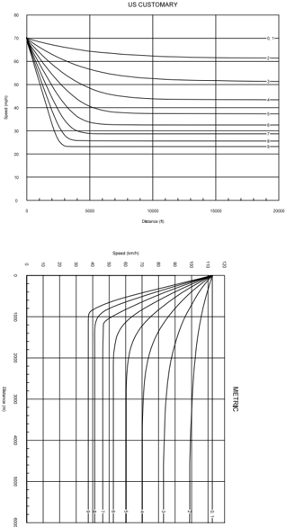

--',''','',',',','''''',,,,''-'-',,',,',',,'---

U.S. CUSTOMARY

Figure 3-16. Speed-Distance Curves for Acceleration of a Typical Heavy Truck of 140 lb/hp [85 kg/kW] on Upgrades and Downgrades

Taking all factors into account, it appears conservative to use a weight/power ratio of 140 lb/hp [85 kg/kW] in determining critical length of grade, as presented in Figures 3-16 and 3-17. In some states, larger and heavier trucks similar to the WB-92D [WB-28D], WB-100T [WB30T], and WB-109D [WB-33D] design vehicles are allowed. Where such trucks present in sufficient volumes to serve as the design vehicle, consideration may be given to using a truck with a weight/power ratio of 200 lb/hp [120 kg/kW] in determining critical length of grade, as shown in Figures 3-18 and 3-19.

## 3.4.2.1.3  Recreational Vehicles

Consideration of recreational vehicles on grades is not as critical as consideration of trucks. However, on certain routes such as designated recreational routes, where a low percentage of trucks may not warrant a truck climbing lane, sufficient recreational vehicle traffic may indicate a need for an additional lane. This can be evaluated by using the design charts in Figure 3-19 in the same manner as for trucks described in Section 3.4.2.1.2. Recreational vehicles include self-contained motor homes, pickup campers, and towed trailers of numerous sizes. Because the characteristics of recreational vehicles vary so much, it is difficult to establish a single design vehicle. However, one study on the speed of vehicles on grades included recreational vehicles ( 75 ). The critical vehicle was considered to be a vehicle pulling a travel trailer, and the charts in Figure 3-19 for a typical recreational vehicle are based on that assumption.

U.S. CUSTOMARY

Figure 3-17. Speed-Distance Curves for a Typical Heavy Truck of 200 lb/hp [120 kg/kW] for Deceleration on Upgrades

--',''','',',',','''''',,,,''-'-',,',,',',,'---

## U.S. CUSTOMARY

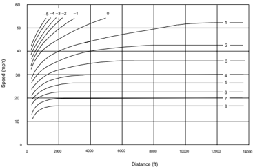

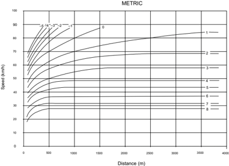

Figure 3-18. Speed-Distance Curves for Acceleration of a Typical Heavy Truck of 200 lb/hp [120 kg/kW] on Upgrades and Downgrades

Figure 3-19. Speed-Distance Curves for a Typical Recreational Vehicle on the Selected Upgrades (75)

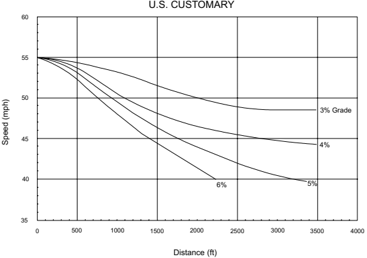

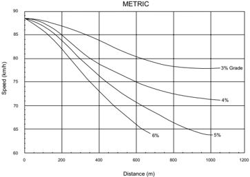

--',''','',',',','''''',,,,''-'-',,',,',',,'---

## 3.4.2.2  Control Grades for Design

## 3.4.2.2.1  Maximum Grades

On the basis of the data in Figures 3-16 through 3-20, and according to the grade controls now in use in a large number of states, reasonable design guidelines for maximum grades can be established. Maximum grades of about 5 percent are considered appropriate for a design speed of 70 mph [110 km/h]. For a design speed of 30 mph [50 km/h], maximum grades generally are in the range of 7 to 12 percent, depending on terrain. If only the more important highways are considered, it appears that maximum grades of 7 or 8 percent are representative of current design practice for a 30-mph [50-km/h] design speed. Control grades for design speeds from 40 to 60 mph [60 to 100 km/h] fall between the above extremes. Maximum grade controls for each functional class of highway and street are presented in Chapters 5 through 8.

The maximum design grade should be used only infrequently; in most cases, grades should be less than the maximum design grade. At the other extreme, for short grades less than 500 ft [150 m] in length and for one-way downgrades, the maximum grade may be about 1 percent steeper than other locations; for low-volume highways in rural areas, the maximum grade may be 2 percent steeper.

## 3.4.2.2.2  Minimum Grades

Flat grades can typically provide proper surface drainage on uncurbed highways where the cross slope is adequate to drain the pavement surface laterally. With curbed highways or streets, longitudinal grades should be provided to facilitate surface drainage. An appropriate minimum grade is typically 0.5 percent, but grades of 0.30 percent may be used where there is a paved surface accurately sloped and supported on firm subgrade. Use of even flatter grades may be justified in special cases as discussed in Chapter 5. Particular attention should be given to the design of stormwater inlets and their spacing to keep the spread of water on the traveled way within tolerable limits. Roadside channels and median swales frequently need grades steeper than the roadway profile for adequate drainage. Drainage channels are discussed in Section 4.8.3. Refer to the AASHTO Drainage Manual (8) for more information.

## 3.4.2.2.3  Pedestrian Considerations

The grade of the roadway becomes the cross slope in the crosswalk at pedestrian crossings, which is limited to provide accessibility for pedestrians with disabilities. Designers should consider such limitations when establishing the grade of streets with pedestrian crosswalks, whether those crosswalks are marked or unmarked.

## 3.4.2.3  Critical Lengths of Grade for Design

Maximum grade in itself is not a complete design control. It is also appropriate to consider the length of a particular grade in relation to desirable vehicle operation. The term 'critical length of grade' is used to indicate the maximum length of a designated upgrade on which a loaded truck

--',''','',',',','''''',,,,''-'-',,',,',',,'--- can operate without an unreasonable reduction in speed. For a given length of grade, lengths less than critical result in acceptable operation in the desired range of speeds. If the desired freedom of operation is to be maintained on grades longer than critical, design adjustments such as changes in location to reduce grades or addition of extra lanes should be considered. The data for critical lengths of grade should be used with other pertinent factors (such as traffic volume in relation to capacity) to determine where added lanes are warranted.

To establish design values for critical lengths of grade for which gradeability of trucks is the determining factor, data or assumptions are needed for the following:

1. Size and power of a representative truck or truck combination to be used as a design vehicle along with the gradeability data for this vehicle:

A typical loaded truck, powered so that the weight/power ratio is about 85 kg/kW [140 lb/ hp], is representative of the size and type of vehicle normally used as a design control for main highways. Data in Figures 3-16 and 3-17 apply to such a vehicle.

2. Speed at entrance to critical length of grade:

The average running speed as related to design speed can be used to approximate the speed of  vehicles  beginning  an  uphill  climb.  This  estimate  is,  of  course,  subject  to  adjustment as  approach conditions may determine. Where vehicles approach on nearly level grades, the running speed can be used directly. For a downhill approach it should be increased somewhat, and for an uphill approach it should be decreased.

3. Minimum speed on the grade below in which interference to following vehicles is considered unreasonable:

No specific  data  are  available  on  which  to  base  minimum  tolerable  speeds  of  trucks  on upgrades. It is logical to assume that such minimum speeds should be in direct relation to the design speed. Minimum truck speeds of about 25 to 40 mph [40 to 60 km/h] for the majority of highways (on which design speeds are about 40 to 60 mph [60 to 100 km/h]) probably are not unreasonably annoying to following drivers unable to pass on two-lane roads, if the time interval during which they are unable to pass is not too long. The time interval  is  less  likely  to  be  annoying  on  two  lane  roads  with  volumes  well  below  their capacities, whereas it is more likely to be annoying on two-lane roads with volumes near capacity. Lower minimum truck speeds can probably be tolerated on multilane highways rather  than  on  two-lane  roads  because  there  is  more  opportunity  for  and  less  difficulty in passing. Highways should be designed so that the speeds of trucks will not be reduced enough to cause intolerable conditions for following drivers.

Studies show that, regardless of the average speed on the highway, the more a vehicle deviates from the average speed, the greater its chances of becoming involved in a crash. One such study ( 25 ) used the speed distribution of vehicles traveling on highways in one state, and related it to the crash involvement rate to obtain the rate for trucks of four or more axles operating on level

grades. The crash involvement rates for truck speed reductions of 5, 10, 15, and 20 mph [10, 15, 25, and 30 km/h] were developed assuming the reduction in the average speed for all vehicles on a grade was 30 percent of the truck speed reduction on the same grade. The results of this analysis are shown in Figure 3-20.

Figure 3-20. Crash Involvement Rate of Trucks for Which Running Speeds Are Reduced below Average Running Speed of All Traffic (25)

--',''','',',',','''''',,,,''-'-',,',,',',,'---

A common basis for determining critical length of grade is based on a reduction in speed of trucks below the average running speed of traffic. The ideal would be for all traffic to operate at the average speed. This, however, is not practical. In the past, the general practice has been to use a reduction in truck speed of 15 mph [25 km/h] below the average running speed of all traffic to identify the critical length of grade. As shown in Figure 3-20, the crash involvement rate increases significantly when the truck speed reduction exceeds 10 mph [15 km/h] with the involvement rate being 2.4 times greater for a 15-mph [25 km/h] reduction than for a 10-mph [15-km/h] reduction. On the basis of these relationships, it is recommended that a 10 mph [15km/h] reduction criterion be used as the general guide for determining critical lengths of grade.

The length of any given grade that will cause the speed of a representative truck (200 lb/hp [120 kg/kW]) entering the grade at 70 mph [110 km/h] to be reduced by various amounts below the average running speed of all traffic is shown graphically in Figure 3-21, which is based on the truck performance data presented in Figure 3-17. The curve showing a 10-mph [15-km/h] speed reduction is used as the general design guide for determining the critical lengths of grade. Similar information on the critical length of grade for recreational vehicles may be found in Figure 3-22, which is based on the recreational vehicle performance data presented in Figure 3-19.

Where the entering speed is less than 70 mph [110 km/h], as may be the case where the approach is on an upgrade, the speed reductions shown in Figures 3-21 and 3-22 will occur over shorter lengths of grade. Conversely, where the approach is on a downgrade, the probable approach speed is greater than 70 mph [110 km/h] and the truck or recreational vehicle will ascend a greater length of grade than shown in the figures before the speed is reduced to the values shown.

The method of using Figure 3-21 to determine critical lengths of grade is demonstrated in the following examples.

Assume that a highway is being designed for 60 mph [100 km/h] and has a fairly level approach to a 4 percent upgrade. The 10-mph [15-km/h] speed reduction curve in Figure 3-21 shows the critical length of grade to be 1,200 ft [350 m]. If, instead, the design speed were 40 mph [60 km/h], the initial and minimum tolerable speeds on the grade would be different, but for the same permissible speed reduction the critical length would still be 1,200 ft [350 m].

In another instance, the critical length of a 5 percent upgrade approached by a 1,650-ft [500-m] length of 2 percent upgrade is unknown. Figure 3-21 shows that a 2 percent upgrade of 1,650 ft [500 m] in length would result in a speed reduction of about 6 mph [9 km/h]. The chart further shows that the remaining tolerable speed reduction of 4 mph [6 km/h] would occur on 325 ft [100 m] of the 5 percent upgrade.

Where an upgrade is approached on a downgrade, heavy trucks often increase speed considerably to begin the climb on the upgrade at as high a speed as practical. This factor can be recognized in design by increasing the tolerable speed reduction. It remains for the designer to judge

to what extent the speed of trucks would increase at the bottom of the momentum grade above that generally found on level approaches. It appears that a speed increase of about 5 mph [10 km/h] can be considered for moderate downgrades and a speed increase of 10 mph [15 km/h] for steeper grades of moderate length or longer. On this basis, the tolerable speed reduction with momentum grades would be 15 or 20 mph [25 or 30 km/h]. For example, where there is a moderate length of 4 percent downgrade in advance of a 6 percent upgrade, a tolerable speed reduction of 15 mph [25 km/h] can be assumed. For this case, the critical length of the 6 percent upgrade is about 1,250 ft [370 m].

METRIC

50 km/h

40

Percent Upgrade (%)

9

8

7

6

5

4

3

2

1

0

100

200

10

300

15

20

400

500

Length of Grade (m)

Figure 3-21. Critical Lengths of Grade for Design, Assumed Typical Heavy Truck of 200 lb/ hp [120 kg/kW], Entering Speed = 70 mph [110 km/h]

25

30

600

Speed Reduction

700

800

900

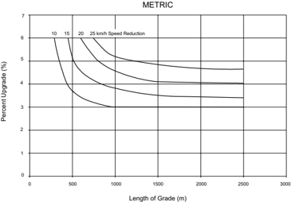

Figure 3-22. Critical Lengths of Grade Using an Approach Speed of 55 mph [90 km/h] for Typical Recreational Vehicle (20)

The critical length of grade in Figure 3-21 is derived as the length of tangent grade. Where a vertical curve is part of a critical length of grade, an approximate equivalent tangent grade length should be used. Where the condition involves vertical curves of Types II and IV shown in Section 3.4.6 in Figure 3-34 and the algebraic difference in grades is not too great, the measurement of critical length of grade may be made between the vertical points of intersection (VPI). Where vertical curves of Types I and III in Figure 3-34 are involved, about one-quarter of the vertical curve length should be regarded as part of the grade under consideration.

In many design situations, Figure 3-21 may not be directly applicable to the determination of the critical length of grade for one of several reasons. First, the truck population for a given site may be such that a weight/power ratio either less than or greater than the value of 200 lb/hp [120 kg/kW] assumed in Figure 3-21 may be appropriate as a design control. Second, for the reasons described above, the truck speed at the entrance to the grade may differ from the 70 mph [110 km/h] assumed in Figure 3-21. Third, the profile may not consist of a constant percent grade. In such situations, a spreadsheet program, known as the Truck Speed Profile Model (TSPM) ( 34 ),  is  available and may be used to generate truck speed profiles for any specified truck weight/power ratio, initial truck speed, and any sequence of grades.

Steep downhill grades on facilities with high traffic volumes and numerous heavy trucks can reduce the traffic capacity and increase crash frequency. Some downgrades are long and steep enough that some heavy vehicles travel at crawl speeds to avoid loss of control on the grade. Slow-moving vehicles of this type may impede other vehicles. Therefore, there are instances where consideration should be given to providing a truck lane for downhill traffic. Procedures have been developed in the HCM ( 67 ) to analyze this situation.

The suggested design criterion for determining the critical length of grade is not intended as a strict control but as a guideline. In some instances, the terrain or other physical controls may preclude shortening or flattening grades to meet these controls. Where a speed reduction greater than the suggested design guide cannot be avoided, undesirable operation may result on roads with numerous trucks, particularly on two-lane roads with volumes approaching capacity and in some instances on multilane highways. Where the length of critical grade is exceeded, consideration should be given to providing an added uphill lane for slow-moving vehicles, particularly where volume is at or near capacity and the truck volume is high. Data in Figure 3-21 can be used along with other key factors, particularly volume data in relation to capacity and volume data for trucks, to determine where such added lanes are warranted.

## 3.4.3  Climbing Lanes

## 3.4.3.1  Climbing Lanes for Two-Lane Highways

## 3.4.3.1.1  General

Freedom and safety of operation on two-lane highways, besides being influenced by the extent and frequency of passing sections, are adversely affected by heavily loaded vehicle traffic operating on grades of sufficient length to result in speeds that could impede following vehicles. In the past, provision of added climbing lanes to improve operations on upgrades has been rather limited because of the additional construction costs. However, because of the increasing amount of delay and the number of serious crashes occurring on grades, such lanes are now more commonly included in original construction plans, and additional lanes on existing highways are being considered as safety improvement projects. The potential crash involvement rate created by this condition is illustrated in Figure 3-20.

A highway section with a climbing lane is not considered a three-lane highway, but a two-lane highway with an added lane for vehicles moving slowly uphill so that other vehicles using the normal lane to the right of the centerline are not delayed. These faster vehicles pass the slower vehicles moving upgrade, but not in the lane for opposing traffic, as on a conventional two-lane road. A separate climbing lane exclusively for slow-moving vehicles is preferred to the addition of an extra lane carrying mixed traffic. Designs of two-lane highways with climbing lanes are illustrated  in  Figures  3-23A  and  3-23B.  Climbing  lanes  are  designed  for  each  direction  independently of the other. Depending on the alignment and profile conditions, they may not overlap, as in Figure 3-23A, or they may overlap, as in Figure 3-23B, where there is a crest with a long grade on each side.

- B -

Figure 3-23. Climbing Lanes on Two-Lane Highways

Adding a climbing lane for an upgrade on a two-lane highway can offset the decline in traffic operations caused by the combined effects of the grade, traffic volume, and heavy vehicles. Climbing lanes are appropriate where the level of service or the speed of trucks is substantially less on an upgrade than on the approach to the upgrade. Where climbing lanes are provided, there has been a high degree of compliance in their use by truck drivers.

On highways with low volumes, only an occasional car is delayed, and climbing lanes, although desirable, may not be justified economically even where the critical length of grade is exceeded. For such cases, slow-moving vehicle turnouts should be considered to reduce delay to occasional passenger cars from slow-moving vehicles. Turnouts are discussed in Section 3.4.4, 'Methods for Increasing Passing Opportunities on Two-Lane Roads.'

The following three criteria, reflecting economic considerations, should be satisfied to justify a climbing lane:

1. Upgrade traffic flow rate in excess of 200 veh/h.
2. Upgrade truck flow rate in excess of 20 veh/h.

3. One of the following conditions exists:
2. y A 10-mph [15-km/h] or greater speed reduction is expected for a typical heavy truck.
3. y Level of service E or F exists on the grade.
4. y A reduction of two or more levels of service is experienced when moving from the approach segment to the grade.

In addition, high crash frequencies may justify the addition of a climbing lane regardless of grade or traffic volumes.

The upgrade flow rate is determined by multiplying the predicted or existing design hour volume by the directional distribution factor for the upgrade direction and dividing the result by the peak hour factor (the peak hour and directional distribution factors are discussed in Section 2.3). The number of upgrade trucks is obtained by multiplying the upgrade flow rate by the percentage of trucks in the upgrade direction.

## 3.4.3.1.2  Trucks

As indicated in the immediately preceding paragraphs, only one of the three conditions specified in Criterion 3 need be met. The critical length of grade to effect a 10-mph [15-km/h] speed reduction for trucks is found using Figure 3-21. This critical length is compared with the length of the particular grade being evaluated. If the critical length of grade is less than the length of the grade being studied, Criterion 3 is satisfied. This evaluation should be done first because, where the critical length of grade is exceeded, no further evaluations under Criterion 3 will be needed.

Justification for climbing lanes where the critical length of grade is not exceeded should be considered from the standpoint of highway capacity. The procedures used are those from the HCM ( 67 ) for analysis of specific grades on two-lane highways. The remaining conditions in Criterion 3 are evaluated using these HCM procedures. The effect of trucks on capacity is primarily a function of the difference between the average speed of the trucks and the average running speed of the passenger cars on the highway. Physical dimensions of heavy trucks and their poorer acceleration characteristics also have a bearing on the space they need in the traffic stream.

On individual grades the effect of trucks is more severe than their average effect over a longer section of highway. Thus, for a given volume of mixed traffic and a fixed roadway cross section, a higher degree of congestion is experienced on individual grades than for the average operation over longer sections that include downgrades as well as upgrades. To determine the design service volume on individual grades, use truck factors derived from the geometrics of the grade and the level of service selected by the highway agency as the basis for design of the highway under consideration.

--',''','',',',','''''',,,,''-'-',,',,',',,'---

If there is no 10-mph [15-km/h] reduction in speed (i.e., if the critical length of grade is not exceeded), the level of service on the grade should be examined to determine if level of service E or F exists. This is done by calculating the limiting service flow rate for level of service D and comparing this rate to the actual flow rate on the grade. The actual flow rate is determined by dividing the hourly volume of traffic by the peak hour factor. If the actual flow rate exceeds the service flow rate at level of service D, Criterion 3 is satisfied. When the actual flow rate is less than the limiting value, a climbing lane is not warranted by this second element of Criterion 3.

The remaining issue to examine if neither of the other elements of Criterion 3 are satisfied is whether there is a two-level reduction in the level of service between the approach and the upgrade. To evaluate this criterion, the level of service for the grade and the approach segment should both be determined. Since this criterion needs consideration in only a very limited number of cases, it is not discussed in detail here.

The HCM ( 67 ) provides additional details and worksheets to perform the computations needed for analysis in the preceding criteria. This procedure is also available in computer software, reducing the need for manual calculations.

Because there are so many variables involved, virtually no given set of conditions can be properly described as typical. Therefore, a detailed analysis such as the one described is recommended wherever climbing lanes are being considered.

The location where an added lane should begin depends on the speeds at which trucks approach the grade and on the extent of sight distance restrictions on the approach. Where there are no sight distance restrictions or other conditions that limit speeds on the approach, the added lane may be introduced on the upgrade beyond its beginning because the speed of trucks will not be reduced beyond the level tolerable to following drivers until they have traveled some distance up the grade. This optimum point for capacity would occur for a reduction in truck speed to 40 mph [60 km/h], but a 10-mph [15-km/h] decrease in truck speed below the average running speed, as discussed in Section 3.4.2.3, 'Critical Lengths of Grade for Design,' is the most practical reduction obtainable from the standpoint of level of service and crash frequency. This 10mph [15-km/h] reduction is the accepted basis for determining the location at which to begin climbing lanes. The distance from the bottom of the grade to the point where truck speeds fall to 10 mph [15 km/h] below the average running speed may be determined from Figures 3-18 or 3-21. Different curves would apply for trucks with other than a weight/power ratio of 200 lb/hp [120 kg/kW]. For example, assuming an approach condition on which trucks with a 200-lb/hp [120-kg/kW] weight/power ratio are traveling within a flow having an average running speed of 70 mph [110 km/h], the resulting 10-mph [15-km/h] speed reduction occurs at distances of approximately 600 to 1,200 ft [175 to 350 m] for grades varying from 7 to 4 percent. With a downgrade approach, these distances would be longer and, with an upgrade approach, they would be shorter. Distances thus determined may be used to establish the point at which a climbing lane should begin. Where restrictions, upgrade approaches, or other conditions indicate the likeli-

--',''','',',',','''''',,,,''-'-',,',,',',,'---

hood of low speeds for approaching trucks, the added lane should be introduced near the foot of the grade. The beginning of the added lane should be preceded by a tapered section with a desirable taper ratio of 25:1 that should be at least 300 ft [90 m] long.

The ideal design is to extend a climbing lane to a point beyond the crest, where a typical truck could attain a speed that is within 10 mph [15 km/h] of the speed of the other vehicles with a desirable speed of at least 40 mph [60 km/h]. This may not be practical in many instances because of the unduly long distance needed for trucks to accelerate to the desired speed. In such situations, a practical point to end the added lane is where trucks can return to the normal lane without undue interference with other traffic-in particular, where the sight distance becomes sufficient to permit passing when there is no oncoming traffic or, preferably, at least 200 ft [60 m] beyond that point. An appropriate taper length should be provided to permit trucks to return smoothly to the normal lane. For example, on a highway where the passing sight distance becomes available 100 ft [30 m] beyond the crest of the grade, the climbing lane should extend 300 ft [90 m] beyond the crest (i.e., 100 ft [30 m] plus 200 ft [60 m]), and an additional tapered section with a desirable taper ratio of 50:1 that should be at least 600 ft [180 m] long.

A climbing lane should desirably be as wide as the through lanes. It should be so constructed that it can immediately be recognized as an added lane for one direction of travel. The centerline of the normal two-lane highway should be clearly marked, including yellow barrier lines for no passing zones. Signs at the beginning of the upgrade such as 'Slower Traffic Keep Right' or  'Trucks  Use  Right  Lane'  may  be  used  to  direct  slow-moving  vehicles  into  the  climbing lane. These and other appropriate signs and markings for climbing lanes are presented in the MUTCD ( 24 ).

The cross slope of a climbing lane is usually handled in the same manner as the addition of a lane to a multilane highway. Depending on agency practice, this design results in either a continuation of the cross slope or a lane with slightly more cross slope than the adjacent through lane. On a superelevated section, the cross slope is generally a continuation of the slope used on the through lane.

Desirably, the shoulder on the outer edge of a climbing lane should be as wide as the shoulder on the normal two-lane cross section, particularly where there is bicycle traffic. However, this may be impractical, particularly when the climbing lane is added to an existing highway. A usable shoulder of 4 ft [1.2 m] in width or greater is acceptable. Although not wide enough for a stalled vehicle to completely clear the climbing lane, a 4-ft [1.2-m] shoulder in combination with the climbing lane generally provides sufficient width for both the stalled vehicle and a slow-speed passing vehicle without need for the latter to encroach on the through lane.

## 3.4.3.1.3  Summary

Climbing lanes offer a comparatively inexpensive means of overcoming reductions in capacity and providing improved operation where congestion on grades is caused by slow trucks in

--',''','',',',','''''',,,,''-'-',,',,',',,'--- combination with high traffic volumes. As discussed earlier in this section, climbing lanes also reduce crashes. On some existing two-lane highways, the addition of climbing lanes could defer reconstruction for many years or indefinitely. In a new design, climbing lanes could make a two-lane highway operate efficiently, whereas a much more costly multilane highway would be needed without them.

## 3.4.3.2  Climbing Lanes on Freeways and Multilane Highways

## 3.4.3.2.1  General

Climbing lanes, although they are becoming more prevalent, have not been used as extensively on freeways and multilane highways as on two-lane highways. This may result from multilane facilities more frequently having sufficient capacity to serve their traffic demands, including the typical percentage of slow-moving vehicles with high weight/power ratios, without being congested. Climbing lanes are generally not as easily justified on multilane facilities as on two-lane highways because, on two-lane facilities, vehicles following other slower moving vehicles on upgrades are frequently prevented from passing in the adjacent traffic lane by opposing traffic. On multilane facilities, there is no such impediment to passing. A slow-moving vehicle in the normal right lane does not impede the following vehicles that can readily move left to the adjacent lane and proceed without difficulty, although there is evidence that crashes are reduced when vehicles in the traffic stream move at the same speed.

Because highways are normally designed for 20 years or more in the future, there is less likelihood that climbing lanes will be justified on multilane facilities than on two-lane roads for several years after construction even though they are deemed desirable for the peak hours of the design year. Where this is the case, there is economic advantage in designing for, but deferring construction of, climbing lanes on multilane facilities. In this situation, grading for the future climbing lane should be provided initially. The additional grading needed for a climbing lane is small when compared to that needed for the overall cross section. If, however, even this additional grading is impractical, it is acceptable, although not desirable, to use a narrower shoulder adjacent to the climbing lane rather than the full shoulder provided on a normal section.

Although primarily applicable in rural areas, there are instances where climbing lanes are needed in urban areas. Climbing lanes are particularly important for freedom of operation on suburban or urban freeways where traffic volumes are high in relation to capacity. On older suburban and urban freeways and arterial streets with appreciable grades and no climbing lanes, it is a common occurrence for heavy traffic, which may otherwise operate well, to platoon on grades.

## 3.4.3.2.2  Trucks

The principal determinants of the need for climbing lanes on multilane highways are critical lengths of grade, effects of trucks on grades in terms of equivalent passenger car flow rates, and service volumes for the desired level of service and the next poorer level of service.

Critical length of grade has been discussed previously in Section 3.4.2. It is the length of a particular upgrade that reduces the speed of low-performance trucks 10 mph [15 km/h] below the average running speed of the remaining traffic. The critical length of grade that results in a 10-mph [15 km/h] reduction of truck speed is found using Figure 3-21 and is then compared to the length of the particular grade being examined. If the critical length of grade is less than the length of grade being evaluated, consideration of a climbing lane is warranted.

In determining service volume, the passenger-car equivalent for trucks is a significant factor. It is generally agreed that trucks on multilane facilities have less effect in deterring following vehicles than on two-lane roads. Comparison of passenger-car equivalents in the HCM ( 67 ) for the same percent of grade, length of grade, and percent of trucks clearly illustrates the difference in passenger-car equivalents of trucks for two-lane and multilane facilities.

To justify the cost of providing a climbing lane, the existence of a low level of service on the grade should be the criterion, as in the case of justifying climbing lanes for two-lane roads, because highway users will accept a higher degree of congestion (i.e., a lower level of service) on individual grades than over long sections of highway. As a matter of practice, the service volume on an individual grade should not exceed that for the next poorer level of service from that used for the basic design. The one exception is that the service volume for level of service D should not be exceeded.

Generally, climbing lanes should not be considered unless the directional traffic volume for the upgrade is equal to or greater than the service volume for level of service D. In most cases when the service volume, including trucks, is greater than 1,700 veh/h per lane and the length of the grade and the percentage of trucks are sufficient to consider climbing lanes, the volume in terms of equivalent passenger cars is likely to approach or even exceed the capacity. In this situation, an increase in the number of lanes throughout the highway section would represent a better investment than the provision of climbing lanes.

Climbing lanes are also not generally warranted on four-lane highways with directional volumes below 1,000 veh/h per lane regardless of the percentage of trucks. Although a truck driver will occasionally pass another truck under such conditions, the inconvenience with this low volume is not sufficient to justify the cost of a climbing lane in the absence of appropriate criteria.

The procedures in the HCM ( 67 ) should be used to consider the traffic operational characteristics on the grade being examined. The maximum service flow rate for the desired level of service, together with the flow rate for the next poorer level of service, should be determined. If the flow rate on the grade exceeds the service flow rate of the next poorer level of service, consideration of a climbing lane is warranted. In order to use the HCM procedures, the free-flow speed should be determined or estimated. The free-flow speed can be determined by measuring the mean speed of passenger cars under low to moderate flow conditions (up to 1,300 passenger cars per hour per lane) on the facility or similar facility.

Data ( 27, 67 ) indicate that the mean free-flow speed under ideal conditions for multilane highways ranges from 1 mph [0.6 km/h] lower than the 85th percentile speed of 40 mph [65 km/h] to 3 mph [5 km/h] lower than the 85th percentile speed of 60 mph [100 km/h]. Speed limit is one factor that affects free-flow speed. Research ( 27, 67 ) suggests that the free-flow speed is approximately 7 mph [11 km/h] higher than the speed limit on facilities with 40- and 45-mph [65- and 70-km/h] speed limits and 5 mph [8 km/h] higher than the speed limit on facilities with 50- and 55-mph [80- and 90-km/h] speed limits. Analysis based on these rules of thumb should be used with caution. Field measurement is the recommended method of determining the free-flow speed, with estimation using the above procedures employed only when field data are not available.

Where the grade being investigated is located on a multilane highway, other factors should sometimes be considered; such factors include median type, lane widths, lateral clearance, and access point density. These factors are accounted for in the capacity analysis procedures by making adjustments in the free-flow speed and are not normally a separate consideration in determining whether a climbing lane would be advantageous.

For freeways, adjustments are made in traffic operational analyses using factors for restricted lane  widths,  lateral  clearances,  recreational  vehicles,  and  unfamiliar  driver  populations.  The HCM ( 67 ) should be used for information on considering these factors in analysis.

Under certain circumstances there should be consideration of additional lanes to accommodate trucks in the downgrade direction. This is accomplished using the same procedure as described above and using the passenger-car equivalents for trucks on downgrades in place of the values for trucks and recreational vehicles on upgrades.

Climbing lanes on multilane roads are usually placed on the outer or right-hand side of the roadway as shown in Figure 3-24. The principles for cross slopes, for locating terminal points, and for designing terminal areas or tapers for climbing lanes are discussed in Section 3.4.3.1, 'Climbing Lanes for Two-Lane Highways;' these principles are equally applicable to climbing lanes on multilane facilities. A primary consideration is that the location of the uphill terminus of the climbing lane should be at the point where a satisfactory speed is attained by trucks, preferably about 10 mph [15 km/h] below the average running speed of the highway. Passing sight distance need not be considered on multilane highways.

Figure 3-24. Climbing Lane on Freeways and Multilane Highways

## 3.4.4  Methods for Increasing Passing Opportunities on Two-Lane Roads

Several highway agencies have pioneered successful methods for providing more passing opportunities along two-lane roads. Some of the more recognized of these methods, including passing lanes, turnouts, shoulder driving, and shoulder use sections are described in the FHWA informational guide Low Cost Methods for Improving Traffic Operations on Two-Lane Roads ( 31 ). An additional design alternative or method known as a 2+1 roadway has been reported in NCHRP Research Results Digest 275, Application of European 2+1 Roadway Designs ( 51 ).  A  synopsis  of portions of material found in these sources is presented in the remainder of this section. More detailed criteria for these methods are found in the referenced documents.

## 3.4.4.1  Passing Lanes

An added lane can be provided in one or both directions of travel to improve traffic operations in sections of lower capacity to at least the same quality of service as adjacent road sections. Passing lanes can also be provided to improve overall traffic operations on two-lane highways by reducing delays caused by inadequate passing opportunities over significant lengths of highways, typically 6 to 60 miles [10 to 100 km]. Where passing lanes are used to improve traffic operations over a length of road, they frequently are provided systematically at regular intervals.

The location of the added lane should appear logical to the driver. The value of a passing lane is more obvious at locations where passing sight distance is restricted than on long tangents that may provide passing opportunities even without passing lanes. On the other hand, the location

--',''','',',',','''''',,,,''-'-',,',,',',,'---

of a passing lane should recognize the need for adequate sight distance at both the lane addition and lane drop tapers. A minimum sight distance of 1,000 ft [300 m] on the approach to each taper is recommended. The selection of an appropriate location also needs to consider the location of intersections and high-volume driveways in order to minimize the volume of turning movements on a road section where passing is encouraged. Furthermore, other physical constraints such as bridges and culverts should be avoided if they restrict provision of a continuous shoulder.

The following is a summary of the design procedure to be followed in providing passing sections on two-lane highways:

1. Horizontal and vertical alignment should be designed to provide as much of the highway as practical with passing sight distance (see Table 3-4).
2. Where the design volume approaches capacity, the effect of lack of passing opportunities in reducing the level of service should be recognized.
3. Where  the  critical  length  of  grade  is  less  than  the  physical  length  of  an  upgrade, consideration should be given to constructing added climbing lanes. The critical length of grade is determined as shown in Figures 3-21 and 3-22.
4. Where the extent and frequency of passing opportunities made available by application of Criteria 1 and 3 are still too few, consideration should be given to the construction of passing-lane sections.

Passing-lane sections, which may be either three or four lanes in width, are constructed on twolane roads to provide the desired frequency of passing zones or to eliminate interference from low-speed heavy vehicles, or both. Where a sufficient number and length of passing sections cannot be obtained in the design of horizontal and vertical alignment alone, an occasional added lane in one or both directions of travel may be introduced as shown in Figure 3-25 to provide more passing opportunities. Such sections are particularly advantageous in rolling terrain, especially where alignment is winding or the profile includes critical lengths of grade.

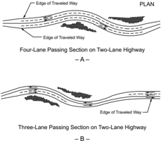

- B -

Figure 3-25. Passing Lane Sections on Two-Lane Roads

In rolling terrain a highway on tangent alignment may have restricted passing conditions even though the grades are below critical length. Use of passing lanes over some of the crests provides added passing sections in both directions where they are most needed. Passing-lane sections should be sufficiently long to permit several vehicles in line behind a slow-moving vehicle to pass before returning to the normal cross section of two-lane highway.

A minimum length of 1,000 ft [300 m], excluding tapers, is needed so that delayed vehicles have an opportunity to complete at least one pass in the added lane. Where such a lane is provided to reduce delays at a specific bottleneck, the needed length is controlled by the extent of the bottleneck. A lane added to improve overall traffic operations should be long enough, over 0.3 mi [0.5 km], to provide a substantial reduction in traffic platooning. The optimal length is usually 0.5 to 2.0 mi [0.8 to 3.2 km], with longer lengths of added lane appropriate where traffic volumes are higher. The HCM ( 67 ) provides guidance in the selection of a passing lane of optimal length. Operational benefits typically result in reduced platooning for 3 to 10 mi [5 to 15 km] downstream depending on volumes and passing opportunities. After that, normal levels of platooning will occur until the next added lane is encountered.

The introduction of a passing-lane section on a two-lane highway does not necessarily involve much additional grading. The width of an added lane should normally be the same as the lane widths of the two-lane highway. It is also desirable for the adjoining shoulder to be at least 1.2 m [4 ft] wide and, whenever practical, the shoulder width in the added section should match that of the adjoining two-lane highway. However, a full shoulder width is not as needed on a passing lane section as on a conventional two-lane highway because the vehicles likely to stop are few and there is little difficulty in passing a vehicle with only two wheels on the shoulder. Thus, if

the normal shoulder width on the two-lane highway is 10 ft [3.0 m], a 6- to 8-ft [1.8- to 2.4-m] widening of the roadbed on each side is all that may be needed.

Four-lane sections introduced explicitly to improve passing opportunities need not be divided because there is no separation of opposing traffic on the two-lane portions of the highway. The use of a median, however, is beneficial and should be considered on highways carrying a total of 500 veh/h or more, particularly on highways to be ultimately converted to a four-lane divided cross section.

The transition tapers at each end of the added-lane section should be designed to encourage efficient operation and reduce crashes. The lane-drop taper length where the posted or statutory speed limit is 45 mph [70 km/h] or greater should be computed with Equation 3-38, based on the MUTCD ( 24 ). Where the posted or statutory speed limit is less than 45 mph [70 km/h], the lane-drop taper length should be computed with Equation 3-39. The recommended length for the lane addition taper is one-half to two-thirds of the lane-drop length. --',''','',',',','''''',,,,''-'-',,',,',',,'---

| U.S. Customary          | Metric                |        |
|-------------------------|-----------------------|--------|
| for S ≥ 45 mph          | for S ≥ 70 km/h       | (3-38) |
| for S < 45 mph where:   | for S < 70 km/h       | (3-39) |
|                         | where:                |        |
| L = Length of taper, ft | L = Length of taper,m |        |
| W = Width, ft           | W = Width,m           |        |
| S = Speed,mph           | S = Speed, km/h       |        |

The transitions between the two- and three- or four-lane pavements should be located where the change in width is in full view of the driver. Sections of four-lane highway, particularly divided sections, longer than about 2 mi [3 km] may cause the driver to lose his sense of awareness that the highway is basically a two-lane facility. It is essential, therefore, that transitions from a three- or four-lane cross section back to two lanes be properly marked and identified with pavement markings and signs to alert the driver of the upcoming section of two lane highway. An advance sign before the end of the passing lane is particularly important to inform drivers of the narrower roadway ahead; for more information, see the MUTCD ( 24 ).

A passing lane should be sufficiently long for a following vehicle to complete at least one passing maneuver. Short passing lanes, with lengths of 0.25 mi [0.4 km] or less are not very effective in reducing traffic platooning. As the length of a passing lane increases above 1.0 mi [1.6 km], a passing lane generally provides diminishing operational benefits, and is generally appropriate only on higher volume facilities with flow rates over 700 veh/h. Table 3-32 presents optimal design lengths for passing lanes.

Table 3-32. Optimal Passing Lane Lengths for Traffic Operational Efficiency (30, 31)

| U.S. Customary            | U.S. Customary           |
|---------------------------|--------------------------|
| One-Way Flow Rate (veh/h) | Passing Lane Length (mi) |
| 100-200                   | 0.50                     |
| 201-400                   | 0.50-0.75                |
| 401-700                   | 0.75-1.00                |
| 701-1200                  | 1.00-2.00                |

## 3.4.4.2  2+1 Roadways

The 2+1 roadway concept has been found to improve operational efficiency and reduce crashes for  selected  two-lane highways ( 51 ).  Figure 3-26 is a schematic of the concept. The concept provides a continuous three-lane cross section and the highway is striped in a manner as to provide for passing lanes in alternating directions throughout the section. This concept can be an attractive alternate to two- or four-lane roads for some highways with higher traffic volumes where continuously alternating passing lanes are needed to obtain the desired level of service.

Figure 3-26. Schematic for 2+1 Roadway

The 2+1 configuration may be a suitable treatment for roadways with traffic volumes higher than can be served by isolated passing lanes, but not high enough to justify a four-lane roadway. The configuration is also potentially applicable for use at locations where environmental or fiscal constraints, or both, make provision of a four-lane facility impractical. A 2+1 road will generally operate at least two levels of service higher than a conventional two-lane highway serving the same traffic volume.

A 2+1 road should not generally be considered where current or projected flow rates exceed 1,200 veh/h in one direction of travel. A four-lane roadway generally is more efficient at such high flow rates. This concept can be used over a broad range of traffic composition to provide passing opportunities as the percentage of heavy vehicles increases.

A 2+1 road should only be used in level or rolling terrain. In mountainous terrain and on isolated steep grades, it is normally more appropriate to introduce climbing lanes on upgrades as discussed in Section 3.4.3.

The location of major intersections and high-volume driveways should be a key consideration when selecting passing lane locations on 2+1 roadways. Proper placement of passing lanes and

| Metric                    | Metric                   |
|---------------------------|--------------------------|
| One-Way Flow Rate (veh/h) | Passing Lane Length (km) |
| 100-200                   | 0.8                      |
| 201-400                   | 0.8-1.2                  |
| 401-700                   | 1.2-1.6                  |
| 701-1200                  | 1.6-3.2                  |

transition sections with respect to higher volume intersections will minimize the number of turning movements within the passing lane sections. Major intersections should be located in the transition area between opposing passing lanes, and the conventional left-turn lanes provided at the intersection, as illustrated in Figures 3-27 and 3-28. As an alternative to left-turn lanes from the passing lane, the techniques described in Section 9.9, 'Indirect Left Turns and U-turns,' may be appropriate. Low-volume intersections and driveways may be accommodated within the passing lane sections.

Figure 3-27. Schematic for Three-Leg Intersection on a 2+1 Roadway

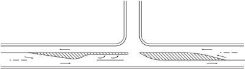

Figure 3-28. Schematic for Four-Leg Intersection on a 2+1 Roadway

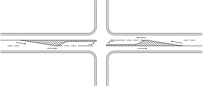

Stopping sight distance should be provided continuously along a 2+1 roadway. Decision sight distance should be considered at intersections and lane drops.

The transition tapers at each end of the added-lane section should be designed to encourage efficient operation and reduce crashes. The lane-drop taper length where the posted or statutory speed limit is 45 mph [70 km/h] or greater should be computed with Equation 3-38, based on the MUTCD ( 24 ). Where the posted or statutory speed limit is less than 45 mph [70 km/h], the

lane-drop taper length should be computed from Equation 3-39. The recommended length for the lane addition taper is one-half to two-thirds of the lane-drop length. Figures 3-29 and 3-30 are schematics for adjacent lane drop and lane addition tapers on a 2+1 roadway.

Figure 3-29. Schematic for Adjacent Lane Drop Tapers on a 2+1 Roadway

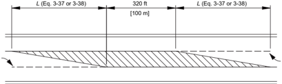

Figure 3-30. Schematic for Adjacent Lane Addition Tapers on a 2+1 Roadway

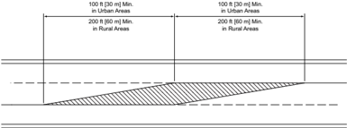

Lane and shoulder widths should be comparable to the widths determined for the volumes and speeds for two-lane highways for specific functional classes in Chapters 5 through 7.

Where existing two-lane highways with a normal crown are converted to 2+1 roadways, the location and transition of the crown is perhaps one of the more complicated design issues. A variety of practices relate to the location of the crown. Where an existing two-lane highway is restriped as a 2+1 road or widened to become a 2+1 road, the placement of the crown within the traveled way may be permitted. An existing highway may also be widened on one side only, with the result that the crown is located at a lane line. There is no indication of any difference in crashes between placing the roadway crown at a lane boundary and placing it within a lane. For newly designed 2+1 highways, the crown should be placed at a lane boundary.

--',''','',',',','''''',,,,''-'-',,',,',',,'---

Horizontal curves should be superelevated in accordance with the provisions of Section 3.3, 'Horizontal Alignment.' Superelevation should be handled no differently on a 2+1 road than on a comparable two-lane or four-lane undivided road.

While separation of the opposing traffic lanes may not be needed on every highway, some separation between lanes in opposing directions is desirable. A flush separation of 4 ft [1.2 m] between the opposing directions may be considered.

## 3.4.4.3  Turnouts

A turnout is a widened, unobstructed shoulder area that allows slow-moving vehicles to pull out of the through lane to give passing opportunities to following vehicles ( 30, 31 ). The driver of the slow-moving vehicle, if there are following vehicles, is expected to pull out of the through lane and remain in the turnout only long enough for the following vehicles to pass before returning to the through lane. When there are only one or two following vehicles, this maneuver can be accomplished without the driver of the vehicle needing to stop in the turnout. However, when this number is exceeded, the driver may need to stop in the turnout in order for all the following vehicles to pass. Turnouts are most frequently used on lower volume roads where long platoons are rare and in difficult terrain with steep grades where construction of an additional lane may not be cost-effective. Such conditions are often found in mountain, coastal, and scenic areas where more than 10 percent of the vehicle volumes are large trucks and recreational vehicles.

The recommended length of turnouts including taper is shown in Table 3-33. Turnouts shorter than 200 ft [60 m] are not recommended even for very low approach speeds. Turnouts longer than 600 ft [185 m] are not recommended for high-speed roads to avoid use of the turnout as a passing lane. The recommended lengths are based on the assumption that slow-moving vehicles enter the turnout at 5 mph [8 km/h] slower than the mean speed of the through traffic. This length allows the entering vehicle to coast to the midpoint of the turnout without braking, and then, if necessary, to brake to a stop using a deceleration rate not exceeding 10 ft/s 2 [3 m/s 2 ]. The recommended lengths for turnouts include entry and exit tapers. Typical entry and exit taper lengths range from 50 to 100 ft [15 to 30 m] ( 30, 31 ).

Table 3-33.  Recommended Lengths of Turnouts Including Taper

| U.S. Customary       | U.S. Customary        |
|----------------------|-----------------------|
| Approach Speed (mph) | Minimum Length (ft) a |
| 20                   | 200                   |
| 30                   | 200                   |
| 40                   | 300                   |
| 45                   | 350                   |
| 50                   | 450                   |
| 55                   | 550                   |
| 60                   | 600                   |

| Metric                | Metric               |
|-----------------------|----------------------|
| Approach Speed (km/h) | Minimum Length (m) a |
| 30                    | 60                   |
| 40                    | 60                   |
| 50                    | 65                   |
| 60                    | 85                   |
| 70                    | 105                  |
| 80                    | 135                  |
| 90                    | 170                  |
| 100                   | 185                  |

The minimum width of the turnout is 12 ft [3.6 m] with widths of 16 ft [5 m] considered desirable. Turnouts wider than 16 ft [5 m] are not recommended.

A turnout should not be located on or adjacent to a horizontal or vertical curve that limits sight distance in either direction. The available sight distance should be at least 1,000 ft [300 m] on the approach to the turnout.

Proper signing and pavement marking are also needed both to maximize turnout usage and reduce crashes. An edge line marking on the right side of the turnout is desirable to guide drivers, especially in wider turnouts.

## 3.4.4.4  Shoulder Driving

In parts of the United States, a long-standing custom has been established for slow-moving vehicles to move to the shoulder when another vehicle approaches from the rear, and then return to the traveled way after that following vehicle has passed. The practice generally occurs where adequate paved shoulders exist and, in effect, these shoulders function as continuous turnouts. This custom is regarded as a courtesy to other drivers needing little or no sacrifice in speed by either driver. While highway agencies may want to permit such use as a means of improving passing opportunities without a major capital investment, they should recognize that in many states shoulder driving is currently prohibited by law. Thus, a highway agency considering shoulder driving as a passing aid may need to propose legislation to authorize such use as well as develop a public education campaign to familiarize drivers with the new law.

Highway agencies should evaluate the mileage of two-lane highways with paved shoulders as well as their structural quality before deciding whether to allow their use as a passing aid. It should be recognized that, where shoulder driving becomes common, it will not be limited to selected sites but rather will occur anywhere on the system where paved shoulders are provided.

--',''','',',',','''''',,,,''-'-',,',,',',,'---

Another consideration is that shoulder widths of at least 10 ft [3.0 m], and preferably 12 ft [3.6 m], are needed. The effect that shoulder driving may have on the use of the highway by bicyclists should also be considered. Because the practice of shoulder driving has evolved through local custom, no special signing to promote such use has been created.

## 3.4.4.5  Shoulder Use Sections

Another approach to providing additional passing opportunities is to permit slow-moving vehicles to use paved shoulders at selected sites designated by specific signing. This is a more limited application  of  shoulder  use  by  slow-moving  vehicles  than  shoulder  driving  described  in  the previous section. Typically, drivers move to the shoulder only long enough for following vehicles to pass and then return to the through lane. Thus, the shoulder-use section functions as an extended turnout. This approach enables a highway agency to promote shoulder use only where the shoulder is adequate to handle anticipated traffic loads and the need for more frequent passing opportunities has been established by the large amount of vehicle platooning.

Shoulder-use sections generally range in length from 0.2 to 3 mi [0.3 to 5 km]. Shoulder use should be allowed only where shoulders are at least 10 ft [3.0 m] and preferably 12 ft [3.6 m] wide. Adequate structural strength to support the anticipated loads along with good surface conditions are needed. Particular attention needs to be placed on the condition of the shoulder because drivers are unlikely to use a shoulder if it is rough, broken, or covered with debris. Signs should be erected at both the beginning and end of the section where shoulder use is allowed. However, since signing of shoulder-use sections is not addressed in the MUTCD ( 24 ), special signing should be used.

## 3.4.5  Emergency Escape Ramps

## 3.4.5.1  General

Where long, descending grades exist or where topographic and location controls indicate a need for such grades on new alignment, the design and construction of an emergency escape ramp at an appropriate location is desirable to provide a location for out-of-control vehicles, particularly trucks, to slow and stop away from the main traffic stream. Out-of-control vehicles are generally the result of a driver losing braking ability either through overheating of the brakes due to mechanical failure or failure to downshift at the appropriate time. Considerable experience with ramps constructed on existing highways has led to the design and installation of effective ramps that save lives and reduce property damage. Reports and evaluations of existing ramps indicate that they provide acceptable deceleration rates and afford good driver control of the vehicle on the ramp ( 78 ).

Forces  that  act  on  every  vehicle  to  affect  the  vehicle's  speed  include  engine-,  braking-,  and tractive-resistance forces. Engine- and braking-resistance forces can be ignored in the design of escape ramps because the ramp should be designed for the worst case, in which the vehicle is out

--',''','',',',','''''',,,,''-'-',,',,',',,'---

of gear and the brake system has failed. The tractive-resistance force contains four subclasses: inertial, aerodynamic, rolling, and gradient. Inertial and negative gradient forces act to maintain motion of the vehicle, while rolling-, positive gradient-, and air-resistance forces act to retard its motion. Figure 3-31 illustrates the action of the various resistance forces on a vehicle.

Figure 3-31. Forces Acting on a Vehicle in Motion

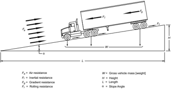

Inertial resistance can be described as a force that resists movement of a vehicle at rest or maintains a vehicle in motion, unless the vehicle is acted on by some external force. Inertial resistance must be overcome to either increase or decrease the speed of a vehicle. Rolling- and positive gradient-resistance forces are available to overcome the inertial resistance. Rolling resistance is a general term used to describe the resistance to motion at the area of contact between a vehicle's tires and the roadway surface and is only applicable when a vehicle is in motion. It is influenced by the type and displacement characteristics of the surfacing material of the roadway. Each surfacing material has a coefficient, expressed in lb/1,000 lb [kg/1 000 kg] of gross vehicle weight (GVM [GVW]), which determines the amount of rolling resistance of a vehicle. The values shown in Table 3-34 for rolling resistance have been obtained from various sources throughout the country and are a best available estimate.

Gradient resistance results from gravity and is expressed as the force needed to move the vehicle through a given vertical distance. For gradient resistance to provide a beneficial force on an escape ramp, the vehicle must be moving upgrade, against gravity. In the case where the vehicle is descending a grade, gradient resistance is negative, thereby reducing the forces available to slow and stop the vehicle. The amount of gradient resistance is influenced by the total weight of the vehicle and the magnitude of the grade. For each percent of grade, the gradient resistance is 10 lb/1,000 lb [10 kg/1 000 kg] whether the grade is positive or negative.

The remaining component of tractive resistance is aerodynamic resistance, the force resulting from the retarding effect of air on the various surfaces of the vehicle. Air causes a significant resistance at speeds above 50 mph [80 km/h], but is negligible under 20 mph [30 km/h]. The effect of aerodynamic resistance has been neglected in determining the length of the arrester bed, thus providing a small additional margin of safety.

Table 3-34. Rolling Resistance of Roadway Surfacing Materials

|                          | U.S. Customary                       | U.S. Customary         |
|--------------------------|--------------------------------------|------------------------|
| Surfacing Material       | Rolling Resistance (lb/1,000 lb GVW) | Equivalent Grade (%) a |
| Portland cement concrete | 10                                   | 1.0                    |
| Asphalt concrete         | 12                                   | 1.2                    |
| Gravel, compacted        | 15                                   | 1.5                    |
| Earth, sandy, loose      | 37                                   | 3.7                    |
| Crushed aggregate, loose | 50                                   | 5.0                    |
| Gravel, loose            | 100                                  | 10.0                   |
| Sand                     | 150                                  | 15.0                   |
| Pea gravel               | 250                                  | 25.0                   |

| Metric                               | Metric                 |
|--------------------------------------|------------------------|
| Rolling Resistance (kg/1,000 kg GVM) | Equivalent Grade (%) a |
| 10                                   | 1.0                    |
| 12                                   | 1.2                    |
| 15                                   | 1.5                    |
| 37                                   | 3.7                    |
| 50                                   | 5.0                    |
| 100                                  | 10.0                   |
| 150                                  | 15.0                   |
| 250                                  | 25.0                   |

## 3.4.5.2  Need and Location for Emergency Escape Ramps

Each grade has its own unique characteristics. Highway alignment, gradient, length, and descent speed contribute to the potential for out-of-control vehicles. For existing highways, operational concerns on a downgrade will often be reported by law enforcement officials, truck drivers, or the general public. A field review of a specific grade may reveal damaged guardrail, gouged pavement surfaces, or spilled oil indicating locations where drivers of heavy vehicles had difficulty negotiating a downgrade. For existing facilities, an escape ramp should be provided as soon as a need is established. Crash experience (or, for new facilities, crash experience on similar facilities) and truck operations on the grade combined with engineering judgment are frequently used to determine the need for a truck escape ramp. Often the impact of a potential runaway truck on adjacent activities or population centers will provide sufficient reason to construct an escape ramp.

Unnecessary escape ramps should be avoided. For example, a second escape ramp should not be needed just beyond the curve that created the need for the initial ramp.

While there are no universal guidelines available for new and existing facilities, a variety of factors should be considered in selecting the specific site for an escape ramp. Each location presents a different array of design needs; factors that should be considered include topography, length and percent of grade, potential speed, economics, environmental impact, and crash experience.

Ramps should be located to intercept the greatest number of runaway vehicles, such as at the bottom of the grade and at intermediate points along the grade where an out-of-control vehicle could cause a catastrophic crash.

A technique for new and existing facilities available for use in analyzing operations on a grade, in addition to crash analysis, is the Grade Severity Rating System ( 21 ). The system uses a predetermined brake temperature limit (500°F [260°C]) to establish a safe descent speed for the grade. It also can be used to determine expected brake temperatures at 0.5-mi [0.8-km] intervals along the downgrade. The location where brake temperatures exceed the limit indicates the point that brake failures can occur, leading to potential runaways.

Escape ramps generally may be built at any practical location where the main road alignment is tangent. They should be built in advance of horizontal curves that cannot be negotiated safely by an out-of-control vehicle without rolling over and in advance of populated areas. Escape ramps should exit to the right of the roadway. On divided multilane highways, where a left exit may appear to be the only practical location, difficulties may be expected by the refusal of vehicles in the left lane to yield to out-of-control vehicles attempting to change lanes.

Although crashes involving runaway trucks can occur at various sites along a grade, locations having multiple crashes should be analyzed in detail. Analysis of crash data pertinent to a prospective escape ramp site should include evaluation of the section of highway immediately uphill, including the amount of curvature traversed and distance to and radius of the adjacent curve.

An integral part of the evaluation should be the determination of the maximum speed that an out-of-control vehicle could attain at the proposed site. This highest obtainable speed can then be used as the minimum design speed for the ramp. The 80- to 90-mph [130- to 140-km/h] entering speed, recommended for design, is intended to represent an extreme condition and therefore should not be used as the basis for selecting locations of escape ramps. Although the variables involved make it impractical to establish a maximum truck speed warrant for location of escape ramps, it is evident that anticipated speeds should be below the range used for design. The principal factor in determining the need for an emergency escape ramp should be the safety of the other traffic on the roadway, the driver of the out-of-control vehicle, and the residents along and at the bottom of the grade. An escape ramp, or ramps if the conditions indicate the need for more than one, should be located wherever grades are of a steepness and length that present a substantial risk of runaway trucks and topographic conditions will permit construction.

## 3.4.5.3  Types of Emergency Escape Ramps

Emergency escape ramps have been classified in a variety of ways. Three broad categories used to classify ramps are gravity, sandpile, and arrester bed. Within these broad categories, four basic emergency escape ramp designs predominate. These designs are the sandpile and three types of arrester beds, classified by grade of the arrester bed: descending grade, horizontal grade, and ascending grade. These four types are illustrated in Figure 3-32.

The gravity  ramp  has  a  paved  or  densely  compacted  aggregate  surface,  relying  primarily  on gravitational forces to slow and stop the runaway. Rolling-resistance forces contribute little to assist in stopping the vehicle. Gravity ramps are usually long, steep, and are constrained by topographic controls and costs. While a gravity ramp stops forward motion, the paved surface cannot prevent the vehicle from rolling back down the ramp grade and jackknifing without a positive capture mechanism. Therefore, the gravity ramp is the least desirable of the escape ramp types.

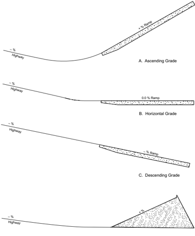

D.  Sandpile

Note: Profile is along the baseline of the ramp.

Figure 3-32. Basic Types of Emergency Escape Ramps

Sandpiles, composed of loose, dry sand dumped at the ramp site, are usually no more than 400 ft [120 m] in length. The influence of gravity is dependent on the slope of the surface. The increase in rolling resistance is supplied by loose sand. Deceleration characteristics of sandpiles are usually severe and the sand can be affected by weather. Because of the deceleration characteristics, the sandpile is less desirable than the arrester bed. However, at locations where inadequate space exists for another type of ramp, the sandpile may be appropriate because of its compact dimensions.

Descending-grade arrester-bed escape ramps are constructed parallel and adjacent to the through lanes of the highway. These ramps use loose aggregate in an arrester bed to increase rolling resistance to slow the vehicle. The gradient resistance acts in the direction of vehicle movement. As a result, the descending-grade ramps can be rather lengthy because the gravitational effect is not acting to help reduce the speed of the vehicle. The ramp should have a clear, obvious return path to the highway so drivers who doubt the effectiveness of the ramp will feel they will be able to return to the highway at a reduced speed.

Where the topography can accommodate, a horizontal-grade arrester-bed escape ramp is another option. Constructed on an essentially flat gradient, the horizontal-grade ramp relies on the increased rolling resistance from the loose aggregate in an arrester bed to slow and stop the out-of-control vehicle, since the effect of gravity is minimal. This type of ramp is longer than the ascending-grade arrester bed.

The most commonly used escape ramp is the ascending-grade arrester bed. Ramp installations of this type use gradient resistance to advantage, supplementing the effects of the aggregate in the arrester bed, and generally, reducing the length of ramp needed to stop the vehicle. The loose material in the arresting bed increases the rolling resistance, as in the other types of ramps, while the gradient resistance acts in a downgrade direction, opposite to the direction of vehicle movement. The loose bedding material also serves to hold the vehicle in place on the ramp grade after it has come to a safe stop.

Each of the ramp types is applicable to a particular situation where an emergency escape ramp is desirable and should be compatible with established location and topographic controls at possible sites. The procedures used for analysis of truck escape ramps are essentially the same for each of the categories or types identified. The rolling-resistance factor for the surfacing material used in determining the length needed to slow and stop the runaway truck safely is the difference in the procedures.

## 3.4.5.4  Design Considerations

The combination of the above external resistance and numerous internal resistance forces not discussed acts to limit the maximum speed of an out-of-control vehicle. Speeds in excess of 80 to 90 mph [130 to 140 km/h] will rarely, if ever, be attained. Therefore, an escape ramp should be designed for a minimum entering speed of 80 mph [130 km/h], with a 90-mph [140-km/h]

design speed being preferred. Several formulas and software programs have been developed to determine the runaway speed at any point on the grade. These methods can be used to establish a design speed for specific grades and horizontal alignments ( 21, 40, 78 ).

The design and construction of effective escape ramps involve a number of considerations as follows:

- y To safely stop an out-of-control vehicle, the length of the ramp should be sufficient to dissipate the kinetic energy of the moving vehicle.
- y The alignment of the escape ramp should be tangent or on very flat curvature to minimize the driver's difficulty in controlling the vehicle.
- y The width of the ramp should be adequate to accommodate more than one vehicle because it is not uncommon for two or more vehicles to have need of the escape ramp within a short time. A minimum width of 26 ft [8 m] may be all that is practical in some areas, though greater widths are preferred. Desirably, a width of 30 to 40 ft [9 to 12 m] would more adequately accommodate two or more out-of-control vehicles. Ramp widths less than indicated above have been used successfully in some locations where it was determined that a wider width was unreasonably costly or not needed. Widths of ramps in use range from 12 to 40 ft [3.6 to 12 m].
- y The surfacing material used in the arrester bed should be clean, not easily compacted, and have a high coefficient of rolling resistance. When aggregate is used, it should be rounded, uncrushed, predominantly a single size, and as free from fine-size material as practical. Such material will maximize the percentage of voids, thereby providing optimum drainage and minimizing interlocking and compaction. A material with a low shear strength is desirable to permit penetration of the tires. The durability of the aggregate should be evaluated using an appropriate crush test. Pea gravel is representative of the material used most frequently, although loose gravel and sand are also used. A gradation with a top size of 1.5 in. [40 mm] has been used with success in several states. Material conforming to the AASHTO gradation No. 57 is effective if the fine-sized material is removed.
- y Arrester  beds  should  be  constructed  with  a  minimum  aggregate  depth  of  3  ft  [1  m]. Contamination of the bed material can reduce the effectiveness of the arrester bed by creating a hard surface layer up to 12 in. [300 mm] thick at the bottom of the bed. Therefore, an aggregate depth up to 42 in. [100 mm] is recommended. As the vehicle enters the arrester bed, the wheels of the vehicle displace the surface, sinking into the bed material, thus increasing the rolling resistance. To assist in decelerating the vehicle smoothly, the depth of the bed should be tapered from a minimum of 3 in. [75 mm] at the entry point to the full depth of aggregate in the initial 100 to 200 ft [30 to 60 m] of the bed.
- y A positive means of draining the arrester bed should be provided to help protect the bed from freezing and avoid contamination of the arrester bed material. This can be accomplished by grading the base to drain, intercepting water prior to entering the bed, underdrain systems with transverse outlets, or edge drains. Geotextiles or paving can be used between the sub-

base and the bed materials to prevent infiltration of fine materials that may trap water. Where toxic contamination from diesel fuel or other material spillage is a concern, the base of the arrester bed may be paved with concrete and holding tanks to retain the spilled contaminants may be provided.

- y The entrance to the ramp should be designed so that a vehicle traveling at a high rate of speed can enter safely. As much sight distance as practical should be provided preceding the ramp so that a driver can enter safely. The full length of the ramp should be visible to the driver. The angle of departure for the ramp should be small, usually 5 degrees or less. An auxiliary lane may be appropriate to assist the driver to prepare to enter the escape ramp. The main roadway surface should be extended to a point at or beyond the exit gore so that both front wheels of the out-of-control vehicle will enter the arrester bed simultaneously; this also provides preparation time for the driver before actual deceleration begins. The arrester bed should be offset laterally  from  the  through  lanes  by  an  amount  sufficient  to  preclude  loose  material  being thrown onto the through lanes.
- y Access to the ramp should be clearly indicated by exit signing to allow the driver of an outof-control vehicle time to react, to minimize the possibility of missing the ramp. Advance signing is needed to inform drivers of the existence of an escape ramp and to prepare drivers well in advance of the decision point so that they will have enough time to decide whether or not to use the escape ramp. Regulatory signs near the entrance should be used to discourage other motorists from entering, stopping, or parking at or on the ramp. The path of the ramp should be delineated to define ramp edges and provide nighttime direction; for more information, see the MUTCD ( 24 ). Illumination of the approach and ramp is desirable.
- y The characteristic that makes a truck escape ramp effective also makes it difficult to retrieve a vehicle captured by the ramp. A service road located adjacent to the arrester bed is needed so tow trucks and maintenance vehicles can use it without becoming trapped in the bedding material. The width of this service road should be at least 10 ft [3 m]. Preferably this service road should be paved but may be surfaced with gravel. The road should be designed in such a way that the driver of an out-of-control vehicle will not mistake the service road for the arrester bed.
- y Anchors, usually located adjacent to the arrester bed at 150- to 300-ft [50- to 100-m] intervals, are needed to secure a tow truck when removing a vehicle from the arrester bed. One anchor should be located about 100 ft [30 m] in advance of the bed to assist the wrecker in returning a captured vehicle to a surfaced roadway. The local tow-truck operators can be very helpful in properly locating the anchors.

As a vehicle rolls upgrade, it loses momentum and will eventually stop because of the effect of gravity. To determine the distance needed to bring the vehicle to a stop with consideration of the rolling resistance and gradient resistance, the following simplified equation may be used ( 64 ):

--',''','',',',','''''',,,,''-'-',,',,',',,'---

| U.S. Customary                                                                                     | Metric                                                                                             |
|----------------------------------------------------------------------------------------------------|----------------------------------------------------------------------------------------------------|
| where:                                                                                             | where:                                                                                             |
| L = length of arrester bed, ft                                                                     | L = length of arrester bed,m                                                                       |
| V = entering velocity,mph                                                                          | V = entering velocity, km/h                                                                        |
| R = rolling resistance, expressed as equiv- alent percent gradient divided by 100 (see Table 3-34) | R = rolling resistance, expressed as equiv- alent percent gradient divided by 100 (see Table 3-34) |
| G = percent grade divided by 100                                                                   | G = percent grade divided by 100                                                                   |

For example, assume that topographic conditions at a site selected for an emergency escape ramp limit the ramp to an upgrade of 10 percent ( G = +0.10). The arrester bed is to be constructed with loose gravel for an entering speed of 90 mph [140 km/h]. Using Table 3-34, R is determined to be 0.10. The length of the arrester bed should be determined using Equation 3-40. For this example, the length of the arrester bed is about 1,350 ft [400 m].

When an arrester bed is constructed using more than one grade along its length, as shown in Figure 3-33, the speed loss occurring on each of the grades as the vehicle traverses the bed should be determined using the following equation:

| U.S. Customary                                                                                                                                                                                                    | Metric                                                                                                                                                                                                                    |
|-------------------------------------------------------------------------------------------------------------------------------------------------------------------------------------------------------------------|---------------------------------------------------------------------------------------------------------------------------------------------------------------------------------------------------------------------------|
| where: V f = speed at end of grade,mph V i = entering speed at beginning of grade, mph L = length of grade, ft R = rolling resistance, expressed as equiv- alent percent gradient divided by 100 (see Table 3-34) | where: V f = speed at end of grade, km/h V i = entering speed at beginning of grade, km/h L = length of grade,m R = rolling resistance, expressed as equiv- alent percent gradient divided by 100 (see Table 3-34) (3-41) |

The final speed for one section of the ramp is subtracted from the entering speed to determine a new entering speed for the next section of the ramp and the calculation repeated at each change in grade on the ramp until sufficient length is provided to reduce the speed of the out-of-control vehicle to zero.

Figure 3-33 shows a plan and profile of an emergency escape ramp with typical appurtenances.

Figure 3-33. Typical Emergency Escape Ramp

Where the only practical location for an escape ramp will not provide sufficient length and grade to completely stop an out-of-control vehicle, it should be supplemented with an acceptable positive attenuation device.

Where a full-length ramp is to be provided with full deceleration capability for the design speed, a 'last-chance' device should be considered when the consequences of leaving the end of the ramp are serious.

Any ramp-end treatment should be designed with care so that its advantages outweigh its disadvantages. The risk to others as the result of an out-of-control truck overrunning the end of an escape ramp may be more important than the harm to the driver or cargo of the truck. The abrupt deceleration of an out-of-control truck may cause shifting of the load, shearing of the fifth wheel, or jackknifing, all with potentially harmful occurrences to the driver and cargo.

Mounds of bedding material between 2 and 5 ft [0.6 and 1.5 m] high with 1V:1.5H slopes (i.e., slopes that change in elevation by one unit of length for each 1 to 1.5 units of horizontal distance) have been used at the end of ramps in several instances as the 'last-chance' device. At least one escape ramp has been constructed with an array of crash cushions installed to prevent an outof-control vehicle from leaving the end of the ramp. Furthermore, at the end of a hard-surfaced gravity ramp, a gravel bed or an attenuator array may sufficiently immobilize a brakeless runaway vehicle to keep it from rolling backward and jackknifing. Where barrels are used, the barrels should be filled with the same material as used in the arrester bed, so that any finer material does not result in contamination of the bed and reduction of the expected rolling resistance.

--',''','',',',','''''',,,,''-'-',,',,',',,'---

## 3.4.5.5  Brake-Check Areas

Turnouts or pulloff areas at the summit of a grade can be used for brake-check areas or mandatory-stop areas to provide an opportunity for a driver to inspect equipment on the vehicle and check that the brakes are not overheated at the beginning of the descent. In addition, information about the grade ahead and the location of escape ramps can be provided by diagrammatic signing or self-service pamphlets. An elaborate design is not needed for these areas. A brakecheck area can be a paved lane behind and separated from the shoulder or a widened shoulder where a truck can stop. Appropriate signing should be used to discourage casual stopping by the public.

## 3.4.5.6  Maintenance

After each use, aggregate arrester beds should be reshaped using power equipment to the extent practical and the aggregate scarified as appropriate. Since aggregate tends to compact over time, the  bedding  material  should  be  cleaned  of  contaminants  and  scarified  periodically  to  retain the retarding characteristics of the bedding material and maintain free drainage. Using power equipment for work in the arrester bed reduces the exposure time for the maintenance workers to the potential that a runaway truck may need to use the facility. Maintenance of the appurtenances should be accomplished as appropriate.

## 3.4.6  Vertical Curves

## 3.4.6.1  General Considerations

Vertical curves to effect gradual changes between tangent grades may be any one of the crest or sag types depicted in Figure 3-34. Vertical curves should be simple in application and should result in a design that enables the driver to see the road ahead, enhances vehicle control, is pleasing in appearance, and is adequate for drainage. The major design control for crest vertical curves is the provision of ample sight distances for the design speed; while research ( 19 ) has shown that vertical curves with limited sight distance do not necessarily experience frequent crashes, it is recommended that all vertical curves be designed to provide at least the stopping sight distances shown in Table 3-1.

For driver comfort, the rate of change of grade should be kept within tolerable limits. This consideration is most important in sag vertical curves where gravitational and vertical centripetal forces act in opposite directions. Appearance also should be considered in designing vertical curves. A long curve has a more pleasing appearance than a short one; short vertical curves may give the appearance of a sudden break in the profile due to the effect of foreshortening.

Figure 3-34. Types of Vertical Curves

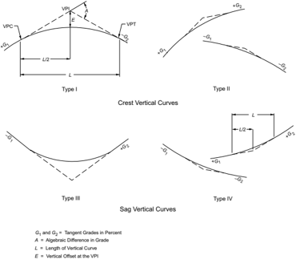

Drainage of curbed roadways on sag vertical curves (Type III in Figure 3-34) needs careful profile design to retain a grade of not less than 0.5 percent or, in some cases, 0.30 percent for the outer edges of the roadway. Refer to the AASHTO Drainage Manual ( 8 ) for more information on drainage considerations.

For simplicity, a parabolic curve with an equivalent vertical axis centered on the Vertical Point of Intersection (VPI) is usually used in roadway profile design. The vertical offsets from the tangent vary as the square of the horizontal distance from the curve end (Point of Tangency). The vertical offset from the tangent grade at any point along the curve is calculated as a proportion of the vertical offset at the VPI, which is AL/800, where the symbols are as shown in Figure 3-34. The rate of change of grade at successive points on the curve is a constant amount for equal increments of horizontal distance, and is equal to the algebraic difference between intersecting tangent grades divided by the length of curve in feet [meters], or A/L in percent per foot [percent per meter]. The reciprocal L/A is the horizontal distance in feet [meters] needed to make a 1 percent change in gradient and is, therefore, a measure of curvature. The quantity L/A , termed ' K ,' is useful in determining the horizontal distance from the Vertical Point of Curvature (VPC) to the high point of Type I curves or to the low point of Type III curves. This point where the slope

--',''','',',',','''''',,,,''-'-',,',,',',,'---

is zero occurs at a distance from the VPC equal to K times the approach gradient. The value of K is also useful in determining minimum lengths of vertical curves for various design speeds. Other details on parabolic vertical curves are found in textbooks on highway engineering.

In certain situations, because of critical clearance or other controls, the use of asymmetrical vertical curves may be appropriate. Because the conditions under which such curves are appropriate are infrequent, the derivation and use of the relevant equations have not been included herein. For use in such limited instances, refer to asymmetrical curve data found in a number of highway engineering texts.

## 3.4.6.2  Crest Vertical Curves

Minimum lengths of crest vertical curves based on sight distance criteria generally are satisfactory from the standpoint of safety, comfort, and appearance. An exception may be at decision areas, such as ramp exit gores, where longer sight distances and, therefore, longer vertical curves should be provided; for further information, refer to Section 3.2.3, 'Decision Sight Distance.'

Figure 3-35 illustrates the parameters used in determining the length of a parabolic crest vertical curve needed to provide any specified value of sight distance. The basic equations for length of a crest vertical curve in terms of algebraic difference in grade and sight distance follow:

| U.S. Customary                                   | Metric                                          |
|--------------------------------------------------|-------------------------------------------------|
| When S is less than L ,                          | When S is less than L , (3-42)                  |
| When S is greater than L ,                       | When S is greater than L ,                      |
| where:                                           | where: (3-43)                                   |
| L = length of vertical curve, ft                 | L = length of vertical curve,m                  |
| A = algebraic difference in grades, percent      | A = algebraic difference in grades, percent     |
| S = sight distance, ft                           | S = sight distance,m                            |
| h 1 = height of eye above roadway surface, ft    | h 1 = height of eye above roadway surface,m     |
| h 2 = height of object above roadway surface, ft | h 2 = height of object above roadway surface, m |

Figure 3-35. Parameters Considered in Determining the Length of a Crest Vertical Curve to Provide Sight Distance

When the height of eye and the height of object are 3.50 ft and 2.00 ft [1.08 and 0.60 m], respectively, as used for stopping sight distance, the equations become:

3.4.6.2.1  Design Controls: Stopping Sight Distance

| U.S. Customary             | Metric                     |
|----------------------------|----------------------------|
| When S is less than L ,    | When S is less than L ,    |
|                            | (3-44)                     |
| When S is greater than L , | When S is greater than L , |
|                            | (3-45)                     |

The minimum lengths of crest vertical curves for different values of A to provide the minimum stopping sight distances for each design speed are shown in Figure 3-36. The solid lines give the minimum vertical curve lengths, on the basis of rounded values of K as determined from Equations 3-44 and 3-45.

--',''','',',',','''''',,,,''-'-',,',,',',,'---

The short dashed curve at the lower left, crossing these lines, indicates where S = L . Note that to the right of the S = L line, the value of K , or length of vertical curve per percent change in A , is a simple and convenient expression of the design control. For each design speed, this single value is a positive whole number that is indicative of the rate of vertical curvature. The design control in terms of K covers all combinations of A and L for any one design speed; thus, A and L need not be indicated separately in a tabulation of design value. The selection of design curves is facilitated because the minimum length of curve in feet [meters] is equal to K times the algebraic difference in grades in percent, L = KA . Conversely, the checking of plans is simplified by comparing all curves with the design value for K .

Table 3-35 shows the computed K values for lengths of vertical curves corresponding to the stopping sight distances shown in Table 3-1 for each design speed. For direct use in design, values of K are rounded as shown in the right column. The rounded values of K are plotted as the solid lines in Figure 3-36. These rounded values of K are higher than computed values, but the differences are not significant.

Where S is greater than L (lower left in Figure 3-36), the computed values plot as a curve (as shown by the dashed line for 45 mph [70 km/h]) that bends to the left, and for small values of A , the vertical curve lengths are zero because the sight line passes over the high point. This relationship does not represent desirable design practice. Most states use a minimum length of vertical curve, expressed as a single value, a range for different design speeds, or a function of A . Values now in use range from about 100 to 325 ft [30 to 100 m]. To recognize the distinction in design speed and to approximate the range of current practice, minimum lengths of vertical curves are expressed as about 0.6 times the design speed in km/h, L min = 0.6V, where V is in kilometers per hour and L is in meters, or about three times the design speed in mph, [ L min = 3 V ], where V is in miles per hour and L is in feet. These terminal adjustments show as the vertical lines at the lower left of Figure 3-36.

## U.S. CUSTOMARY

Figure 3-36. Design Controls for Crest Vertical Curves-Open Road Conditions

Table 3-35. Design Controls for Crest Vertical Curves Based on Stopping Sight Distance

| U.S. Customary   | U.S. Customary   | U.S. Customary                 | U.S. Customary                 |
|------------------|------------------|--------------------------------|--------------------------------|
| Design Speed     | Stopping Sight   | Rate of Vertical Curvature, Ka | Rate of Vertical Curvature, Ka |
| (mph)            | Distance (ft)    | Calculated                     | Design                         |
| 15               | 80               | 3.0                            | 3                              |
| 20               | 115              | 6.1                            | 7                              |
| 25               | 155              | 11.1                           | 12                             |
| 30               | 200              | 18.5                           | 19                             |
| 35               | 250              | 29.0                           | 29                             |
| 40               | 305              | 43.1                           | 44                             |
| 45               | 360              | 60.1                           | 61                             |
| 50               | 425              | 83.7                           | 84                             |
| 55               | 495              | 113.5                          | 114                            |
| 60               | 570              | 150.6                          | 151                            |
| 65               | 645              | 192.8                          | 193                            |
| 70               | 730              | 246.9                          | 247                            |
| 75               | 820              | 311.6                          | 312                            |
| 80               | 910              | 383.7                          | 384                            |

| Metric       | Metric         | Metric                         | Metric                         |
|--------------|----------------|--------------------------------|--------------------------------|
| Design Speed | Stopping Sight | Rate of Vertical Curvature, Ka | Rate of Vertical Curvature, Ka |
| (km/h)       | Distance (m)   | Calculated                     | Design                         |
| 20           | 20             | 0.6                            | 1                              |
| 30           | 35             | 1.9                            | 2                              |
| 40           | 50             | 3.8                            | 4                              |
| 50           | 65             | 6.4                            | 7                              |
| 60           | 85             | 11.0                           | 11                             |
| 70           | 105            | 16.8                           | 17                             |
| 80           | 130            | 25.7                           | 26                             |
| 90           | 160            | 38.9                           | 39                             |
| 100          | 185            | 52.0                           | 52                             |
| 110          | 220            | 73.6                           | 74                             |
| 120          | 250            | 95.0                           | 95                             |
| 130          | 285            | 123.4                          | 124                            |

The values of K derived above when S is less than L also can be used without significant error where S is greater than L . As shown in Figure 3-35, extension of the diagonal lines to meet the vertical lines for minimum lengths of vertical curves results in appreciable differences from the theoretical only where A is small and little or no additional cost is involved in obtaining longer vertical curves.

For night driving on highways without lighting, the length of visible roadway is that roadway that is directly illuminated by the headlights of the vehicle. For certain conditions, the minimum stopping sight distance values used for design exceed the length of visible roadway. First, vehicle headlights have limitations on the distance over which they can project the light intensity levels that are needed for visibility. When headlights are operated on low beams, the reduced candlepower at the source plus the downward projection angle significantly restrict the length of visible roadway surface. Thus, particularly for high-speed conditions, stopping sight distance values exceed road-surface visibility distances afforded by the low-beam headlights regardless of whether the roadway profile is level or curving vertically. Second, for crest vertical curves, the area forward of the headlight beam's point of tangency with the roadway surface is shadowed and receives only indirect illumination.

Since the headlight mounting height (typically about 2.00 ft [0.60 m]) is lower than the driver eye height used for design (3.50 ft [1.08 m]), the sight distance to an illuminated object is con-

trolled by the height of the vehicle headlights rather than by the direct line of sight. Any object within the shadow zone must be high enough to extend into the headlight beam to be directly illuminated. On the basis of Equation 3-41, the bottom of the headlight beam is about 1.30 ft [0.40 m] above the roadway at a distance ahead of the vehicle equal to the stopping sight distance. Although the vehicle headlight system does limit roadway visibility length as previously mentioned, there is some mitigating effect in that other vehicles, whose taillight height typically varies from 1.50 to 2.00 ft [0.45 to 0.60 m], and other sizable objects receive direct lighting from headlights at stopping sight distance values used for design. Furthermore, drivers are aware that visibility at night is less than during the day, regardless of road and street design features, and they may therefore be more attentive and alert.

There is a level point on a crest vertical curve of Type I (see Figure 3-34), but no difficulty with drainage on highways with curbs is typically experienced if the curve is sharp enough so that a minimum grade of 0.30 percent is reached at a point about 50 ft [15 m] from the crest. This corresponds to K of 167 ft [51 m] per percent change in grade, which is plotted in Figure 3-36 as the drainage maximum. All combinations above or to the left of this line satisfy the drainage criterion. The combinations below and to the right of this line involve flatter vertical curves. Special attention is needed in these cases to provide proper pavement drainage near the high point of crest vertical curves. It is not intended that K of 167 ft [51 m] per percent grade be considered a design maximum, but merely a value beyond which drainage should be more carefully designed.

## 3.4.6.2.2  Design Controls: Passing Sight Distance

Design values of crest vertical curves for passing sight distance differ from those for stopping sight  distance  because  of  the  different  sight  distance  and  object  height  criteria.  The  general Equations 3-42 and 3-43 apply. Using the 3.50-ft [1.08-m] height of object results in the following specific formulas with the same terms as shown above:

| U.S. Customary             | Metric                     |
|----------------------------|----------------------------|
| When S is less than L ,    | When S is less than L ,    |
|                            | (3-46)                     |
| When S is greater than L , | When S is greater than L , |

For the minimum passing sight distances shown in Table 3-4, the minimum lengths of crest vertical curves are substantially longer than those for stopping sight distances. The extent of difference is evident by the values of K , or length of vertical curve per percent change in A , for passing sight distances shown in Table 3-36.

--',''','',',',','''''',,,,''-'-',,',,',',,'---

Table 3-36. Design Controls for Crest Vertical Curves Based on Passing Sight Distance

| U.S. Customary     | U.S. Customary              | U.S. Customary                         |
|--------------------|-----------------------------|----------------------------------------|
| Design Speed (mph) | Passing Sight Distance (ft) | Rate of Vertical Curvature, K a Design |
| 20                 | 400                         | 57                                     |
| 25                 | 450                         | 72                                     |
| 30                 | 500                         | 89                                     |
| 35                 | 550                         | 108                                    |
| 40                 | 600                         | 129                                    |
| 45                 | 700                         | 175                                    |
| 50                 | 800                         | 229                                    |
| 55                 | 900                         | 289                                    |
| 60                 | 1000                        | 357                                    |
| 65                 | 1100                        | 432                                    |
| 70                 | 1200                        | 514                                    |
| 75                 | 1300                        | 604                                    |
| 80                 | 1400                        | 700                                    |

| Metric              | Metric                     | Metric                                 |
|---------------------|----------------------------|----------------------------------------|
| Design Speed (km/h) | Passing Sight Distance (m) | Rate of Vertical Curvature, K a Design |
| 30                  | 120                        | 17                                     |
| 40                  | 140                        | 23                                     |
| 50                  | 160                        | 30                                     |
| 60                  | 180                        | 38                                     |
| 70                  | 210                        | 51                                     |
| 80                  | 245                        | 69                                     |
| 90                  | 280                        | 91                                     |
| 100                 | 320                        | 119                                    |
| 110                 | 355                        | 146                                    |
| 120                 | 395                        | 181                                    |
| 130                 | 440                        | 224                                    |

Generally, it is impractical to design crest vertical curves that provide passing sight distance because of high cost where crest cuts are involved and the difficulty of fitting the resulting long vertical curves to the terrain, particularly for high-speed roads. Passing sight distance on crest vertical curves may be practical on roads with unusual combinations of low design speeds and gentle grades or higher design speeds with very small algebraic differences in grades. Ordinarily, passing sight distance is provided only at locations where combinations of alignment and profile do not need significant grading. Table 3-36 shows computed K values for determining lengths of vertical curves corresponding to passing sight distance values shown in Table 3-4.

## 3.4.6.3  Sag Vertical Curves

At least four different criteria for establishing lengths of sag vertical curves are recognized to some extent. These are (1) headlight sight distance, (2) passenger comfort, (3) drainage control, and (4) general appearance.

Headlight sight distance has been used directly by some agencies and for the most part is the basis for determining the desirable length of sag vertical curves. When a vehicle traverses a sag vertical curve at night, the portion of highway lighted ahead is dependent on the position of the headlights and the direction of the light beam. A headlight height of 2 ft [0.60 m] and a 1-degree upward divergence of the light beam from the longitudinal axis of the vehicle is commonly assumed. The upward spread of the light beam above the 1-degree divergence angle provides some additional visible length of roadway. For sag vertical curves without an overhead vertical

--',''','',',',','''''',,,,''-'-',,',,',',,'---

restriction, drivers can utilize high beams, highway lighting, or the lights from other vehicles. The following equations show the relationships between S , L ,  and A ,  using S as the distance between the vehicle and point where the 1-degree upward angle of the light beam intersects the surface of the roadway:

| U.S. Customary                                                                   | Metric                                                                         |
|----------------------------------------------------------------------------------|--------------------------------------------------------------------------------|
| When S is less than L ,                                                          | When S is less than L , (3-48)                                                 |
| or,                                                                              | or,                                                                            |
| When S is greater than L ,                                                       | When S is greater than L , (3-50)                                              |
| or, where:                                                                       | or, (3-51) where:                                                              |
| L = length of sag vertical curve, ft A = algebraic difference in grades, percent | L = length of sag vertical curve,m A = algebraic difference in grades, percent |
| S = light beam distance, ft                                                      | S = light beam distance,m                                                      |

It is desirable that a sag vertical curve be long enough that the light beam distance is approximately the same as the stopping sight distance. Accordingly, it is appropriate to use stopping sight distances for different design speeds as the value of S in the above equations. The resulting lengths of sag vertical curves for the desirable stopping sight distances for each design speed are shown in Figure 3-37 with solid lines using rounded values of K as was done for crest vertical curves.

--',''','',',',','''''',,,,''-'-',,',,',',,'---

## U.S. CUSTOMARY

Figure 3-37. Design Controls for Sag Vertical Curves-Open Road Conditions

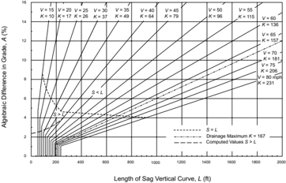

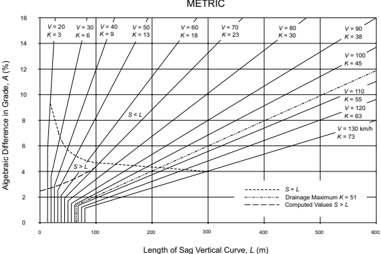

--',''','',',',','''''',,,,''-'-',,',,',',,'---

The effect on passenger comfort of the change in vertical direction is greater on sag than on crest vertical curves because gravitational and centripetal forces are combining rather than opposing forces. Comfort due to change in vertical direction is not easily measured because it is affected appreciably by vehicle body suspension, vehicle body weight, tire flexibility, and other factors. Limited attempts at such measurements have led to the broad conclusion that riding is comfortable on sag vertical curves when the centripetal acceleration does not exceed 1 ft/s 2 [0.3 m/s 2 ]. The general expression for such a criterion is:

| U.S. Customary                                                                                               | Metric                                                                                                              |
|--------------------------------------------------------------------------------------------------------------|---------------------------------------------------------------------------------------------------------------------|
| where: L = length of sag vertical curve, ft A = algebraic difference in grades, percent V = design speed,mph | where: L = length of sag vertical curve,m A = algebraic difference in grades, percent V = design speed, km/h (3-52) |

The length of vertical curve needed to satisfy this comfort factor at the various design speeds is only about 50 percent of that needed to satisfy the headlight sight distance criterion for the normal range of design conditions.

Drainage affects design of vertical curves of Type III (see Figure 3-35) where curbed sections are used. An approximate criterion for sag vertical curves is the same as that expressed for the crest conditions (i.e., a minimum grade of 0.30 percent should be provided within 50 ft [15 m] of the level point). This criterion corresponds to K of 167 ft [51 m] per percent change in grade, which is plotted in Figure 3-37 as the drainage maximum. The drainage criterion differs from other criteria in that the length of sag vertical curve determined for it is a maximum, whereas the length for any other criterion is a minimum. The maximum length of the drainage criterion is greater than the minimum length for other criteria up to 65 mph [100 km/h].

For improved appearance of sag vertical curves, previous guidance used a rule-of-thumb for minimum curve length of 30 A [100 A ] or, in Figure 3-37, K = 100 ft [ K = 30 m] per percent change in grade. This approximation is a generalized control for small or intermediate values of A . Compared with headlight sight distance, it corresponds to a design speed of approximately 50 mph [80 km/h]. On high-type highways, longer curves are appropriate to improve appearance.

From the preceding discussion, it is evident that design controls for sag vertical curves differ from those for crests, and separate design values are needed. The headlight sight distance appears to be the most logical criterion for general use, and the values determined for stopping sight distances are within the limits recognized in current practice. The use of this criterion to establish design values for a range of lengths of sag vertical curves is recommended. As in the case of crest vertical curves, it is convenient to express the design control in terms of the K rate

for all values of A . This entails some deviation from the computed values of K for small values of A , but the differences are not significant. Table 3-37 shows the range of computed values and the rounded values of K selected as design controls. The lengths of sag vertical curves on the basis of the design speed values of K are shown by the solid lines in Figure 3-37. It is to be emphasized that these lengths are minimum values based on design speed; longer curves are desired wherever practical, but special attention to drainage should be exercised where values of K in excess of 167 ft [51 m] per percent change in grade are used.

Minimum lengths of vertical curves for flat gradients also are recognized for sag conditions. The values determined for crest conditions appear to be generally suitable for sags. Lengths of sag vertical curves, shown as vertical lines in Figure 3-37, are equal to three times the design speed in mph [0.6 times the design speed in km/h].

Sag vertical curves shorter than the lengths computed from Table 3-37 may be justified for economic reasons in cases where an existing feature, such as a structure not ready for replacement, controls the vertical profile. In certain cases, ramps may also be designed with shorter sag vertical curves. Fixed-source lighting is desirable in such cases. For street design, some engineers accept design of a sag or crest where A is about 1 percent or less without a length of calculated vertical curve. However, field modifications during construction usually result in constructing the equivalent to a vertical curve, even if short.

Table 3-37. Design Controls for Sag Vertical Curves

| U.S. Customary     | U.S. Customary      | U.S. Customary                  | U.S. Customary                  |
|--------------------|---------------------|---------------------------------|---------------------------------|
| Design Speed (mph) | Stopping Sight Dis- | Rate of Vertical Curvature, K a | Rate of Vertical Curvature, K a |
|                    | tance (ft)          | Calculated                      | Design                          |
| 15                 | 80                  | 9.4                             | 10                              |
| 20                 | 115                 | 16.5                            | 17                              |
| 25                 | 155                 | 25.5                            | 26                              |
| 30                 | 200                 | 36.4                            | 37                              |
| 35                 | 250                 | 49.0                            | 49                              |
| 40                 | 305                 | 63.4                            | 64                              |
| 45                 | 360                 | 78.1                            | 79                              |
| 50                 | 425                 | 95.7                            | 96                              |
| 55                 | 495                 | 114.9                           | 115                             |
| 60                 | 570                 | 135.7                           | 136                             |
| 65                 | 645                 | 156.5                           | 157                             |
| 70                 | 730                 | 180.3                           | 181                             |
| 75                 | 820                 | 205.6                           | 206                             |
| 80                 | 910                 | 231.0                           | 231                             |

| Metric       | Metric              | Metric                          | Metric                          |
|--------------|---------------------|---------------------------------|---------------------------------|
| Design Speed | Stopping Sight Dis- | Rate of Vertical Curvature, K a | Rate of Vertical Curvature, K a |
| (km/h)       | tance (m)           | Calculated                      | Design                          |
| 20           | 20                  | 2.1                             | 3                               |
| 30           | 35                  | 5.1                             | 6                               |
| 40           | 50                  | 8.5                             | 9                               |
| 50           | 65                  | 12.2                            | 13                              |
| 60           | 85                  | 17.3                            | 18                              |
| 70           | 105                 | 22.6                            | 23                              |
| 80           | 130                 | 29.4                            | 30                              |
| 90           | 160                 | 37.6                            | 38                              |
| 100          | 185                 | 44.6                            | 45                              |
| 110          | 220                 | 54.4                            | 55                              |
| 120          | 250                 | 62.8                            | 63                              |
| 130          | 285                 | 72.7                            | 73                              |

## 3.4.6.4  Sight Distance at Undercrossings

Sight distance on the highway through a grade separation should be at least as long as the minimum stopping sight distance and preferably longer. Design of the vertical alignment is the same as at any other point on the highway except in some cases of sag vertical curves underpassing a structure as illustrated in Figure 3-38. While not a frequent concern, the structure fascia may cut the line of sight and limit the sight distance to less than otherwise is attainable. It is generally practical to provide the minimum length of sag vertical curve at grade separation structures, and even where the recommended grades are exceeded, the sight distance should not need to be reduced below the minimum recommended values for stopping sight distance.

For some conditions, the designer may wish to check the available sight distance at an undercrossing,  such  as  at  a  two-lane  undercrossing  without  ramps  where  it  would  be  desirable  to provide passing sight distance. Such checks are best made graphically on the profile, but may be performed through computations.

Figure 3-38. Sight Distance at Undercrossings

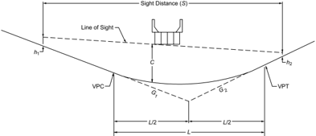

--',''','',',',','''''',,,,''-'-',,',,',',,'---

The general equations for sag vertical curve length at undercrossings are:

Case 1 -Sight distance greater than length of vertical curve ( S &gt; L ):

## U.S. Customary

where:

L =  length of vertical curve, ft

S =  sight distance, ft

C =  vertical clearance, ft h 1 =  height of eye, ft

h 2 =  height of object, ft

A =  algebraic difference in grades, percent where:

L =  length of vertical curve, m

S =  sight distance, m

C =  vertical clearance, m h 1 =  height of eye, m

h 2 =  height of object, m

A =  algebraic difference in grades, percent

Case 2 -Sight distance less than length of vertical curve ( S &lt; L ):

| U.S. Customary                                                                                      | Metric                                                                     |
|-----------------------------------------------------------------------------------------------------|----------------------------------------------------------------------------|
|                                                                                                     | (3-54)                                                                     |
|                                                                                                     | where:                                                                     |
| where:                                                                                              |                                                                            |
| L = length of vertical curve, ft A = algebraic difference in grades, percent S = sight distance, ft | L = length of vertical curve,m A = algebraic difference in grades, percent |
|                                                                                                     | S = sight distance,m                                                       |
| C = vertical clearance, ft                                                                          | C = vertical clearance,m                                                   |
| h 1 = height of eye, ft                                                                             | h 1 = height of eye,m                                                      |
| h 2 = height of object, ft                                                                          | h 2 = height of object,m                                                   |

## Metric

<!-- formula-not-decoded -->

Using an eye height of 8.0 ft [2.4 m] for a truck driver and an object height of 2.0 ft [0.6 m] for the taillights of a vehicle, the following equations can be derived:

Case 1 -Sight distance greater than length of vertical curve ( S &gt; L ):

<!-- formula-not-decoded -->

Case 2 -Sight distance less than length of vertical curve ( S &lt; L ):

| U.S. Customary   | Metric   |
|------------------|----------|
|                  | (3-56)   |

## 3.4.6.5  General Controls for Vertical Alignment

In addition to the specific controls for vertical alignment discussed previously, there are several general controls that should be considered in design:

- y A smooth gradeline with gradual changes, as consistent with the type of highway, road, or street and the character of terrain, should be sought in preference to a line with numerous breaks and short lengths of grades. Specific design criteria are the maximum grade and the critical length of grade, but the manner in which they are applied and fitted to the terrain on a continuous line determines the suitability and appearance of the finished product.
- y The 'roller-coaster' or the 'hidden-dip' type of profile should be avoided. Such profiles generally  occur  on  relatively  straight,  horizontal  alignment  where  the  roadway  profile  closely follows a rolling natural ground line. Examples of such undesirable profiles are evident on many older roads and streets; they are unpleasant aesthetically and difficult to drive. Hidden dips may create difficulties for drivers who wish to pass, because the passing driver may be deceived if the view of the road or street beyond the dip is free of opposing vehicles. Even with shallow dips, this type of profile may be disconcerting, because the driver cannot be sure whether or not there is an oncoming vehicle hidden beyond the rise. This type of profile is avoided by use of horizontal curves or by more gradual grades.
- y Undulating gradelines, involving substantial lengths of momentum grades, should be evaluated for their effect on traffic operation. Such profiles permit heavy trucks to operate at higher overall speeds than where an upgrade is not preceded by a downgrade, but may encourage excessive speeds of trucks with attendant conflicts with other traffic.
- y A 'broken-back' gradeline (two vertical curves in the same direction separated by a short section of tangent grade) generally should be avoided, particularly in sags where the full view of

--',''','',',',','''''',,,,''-'-',,',,',',,'---

- both vertical curves is not pleasing. This effect is particularly noticeable on divided roadways with open median sections.
- y On long grades, it may be preferable to place the steepest grades at the bottom and flatten the grades near the top of the ascent or to break the sustained grade by short intervals of flatter grade instead of providing a uniform sustained grade that is only slightly below the recommended maximum. This is particularly applicable to roads and streets with low design speeds.
- y Where at-grade intersections occur on roadway sections with moderate to steep grades, it is desirable to reduce the grade through the intersection. Such profile changes are beneficial for vehicles making turns and serve to reduce the potential for crashes. Profiles at pedestrian crosswalks must consider limitations on cross slope so that the crosswalk is accessible to and usable by individuals with disabilities ( 71, 73 ).
- y Sag vertical curves should be avoided in cuts unless adequate drainage can be provided.

Sag vertical curves at undercrossings should be designed to provide vertical clearance for the largest legal vehicle that could use the undercrossing without a permit. For example, a WB-67 [WB-20] tractor-trailer will need a longer sag vertical curve than a single-unit truck to avoid the trailer striking the overhead structure as shown in Figure 3-39.

Figure 3-39. Vertical Clearance at Undercrossings

## 3.5  COMBINATIONS OF HORIZONTAL AND VERTICAL ALIGNMENT

## 3.5.1  General Considerations

Horizontal and vertical alignment are permanent design elements for which thorough study is warranted. It is extremely difficult and costly to correct alignment deficiencies after a highway is constructed. On freeways, there are numerous controls such as multilevel structures and costly right-of-way. On most arterial streets, heavy development takes place along the property lines, which makes it impractical to change the alignment in the future. Thus, compromises in the alignment designs should be weighed carefully because any initial savings may be more than offset by the economic loss to the public in the form of crashes and delays.

Horizontal and vertical alignment should not be designed independently. They complement each other, and poorly designed combinations can spoil the good points and aggravate the deficiencies of each. Horizontal alignment and profile are among the more important of the permanent design elements of the highway. Excellence in the design of each and of their combination enhances vehicle control, encourages uniform speed, and improves appearance, nearly always without additional cost ( 1, 12, 43, 57, 58, 68, 71, 72 ).

## 3.5.2  General Design Controls

It is difficult to discuss combinations of horizontal alignment and profile without reference to the broader issue of highway location. These subjects are interrelated and what is said about one is generally applicable to the other. It is assumed in this discussion that the general location of a facility has been fixed and that the remaining task is the development of a specific design harmonizing the vertical and horizontal lines such that the finished highway, road, or street will be an economical, pleasant, and safe facility on which to travel. The physical constraints or influences that act singly or in combination to determine the alignment are: the character of roadway based on the traffic, topography, and subsurface conditions; the existing cultural development; likely future developments; pedestrian crossings; and the location of the roadway's terminals. Design speed is considered in determining the general roadway location, but as design proceeds to the development of more detailed alignment and profile it assumes greater importance. The selected design speed serves to keep all elements of design in balance. Design speed determines limiting values for many elements such as curvature and sight distance and influences many other elements such as width, clearance, and maximum gradient, which are all discussed in the preceding portions of this chapter.

Appropriate combinations of horizontal alignment and profile are obtained through engineering studies and consideration of the following general guidelines:

- y Curvature and grades should be in proper balance. Tangent alignment or flat curvature at the expense of steep or long grades and excessive curvature with flat grades both represent poor design. A logical design that offers the best combination of safety, capacity, ease and uniformity of operation, and pleasing appearance within the practical limits of terrain and area traversed is a compromise between these two extremes.
- y Vertical curvature superimposed on horizontal curvature, or vice versa, generally results in a more pleasing facility, but such combinations should be analyzed for their effect on traffic. Successive changes in profile not in combination with horizontal curvature may result in a series of humps visible to the driver for some distance which represents an undesirable condition.
- y Sharp horizontal curvature should not be introduced at or near the top of a pronounced crest vertical curve. This condition is undesirable because the driver may not perceive the horizontal change in alignment, especially at night. The disadvantages of this arrangement are avoided if the horizontal curvature leads the vertical curvature (i.e., the horizontal curve is

made longer than the vertical curve). Suitable designs can also be developed by using design values well above the appropriate minimum values for the design speed.

- y Somewhat related to the preceding guideline, sharp horizontal curvature should not be introduced near the bottom of a steep grade approaching or near the low point of a pronounced sag vertical curve. Because the view of the road ahead is foreshortened, any horizontal curvature other than a very flat curve assumes an undesirable distorted appearance. Further, vehicle speeds, particularly for trucks, are often high at the bottom of grades, and erratic operations may result, especially at night. Design and traffic control guidance for sharp horizontal curves on steep grades has been presented in Section 3.3.3, which includes a discussion of the effect of grades on horizontal alignment design.
- y On two-lane roads and streets, the need for passing sections at frequent intervals and including an appreciable percentage of the length of the roadway often supersedes the general guidelines for combinations of horizontal and vertical alignment. In such cases, it is appropriate to work toward long tangent sections to assure sufficient passing sight distance in design.
- y Both horizontal curvature and profile should be made as flat as practical  at  intersections where sight distance along either roads or streets is important and vehicles may have to slow or stop.
- y On divided highways and streets, variation in width of median and the use of independent profiles and horizontal alignments for the separate one-way roadways are sometimes desirable. Where traffic justifies provision of four lanes, a superior design without additional cost generally results from such practices.
- y In residential areas, the alignment should be designed to minimize nuisance to the neighborhood. Generally, a depressed facility makes a highway less visible and less noisy to adjacent residents. Minor horizontal adjustments can sometimes be made to increase the buffer zone between the highway and clusters of homes.
- y The alignment should be designed to enhance attractive scenic views of the natural and manmade environment, such as rivers, rock formations, parks, and outstanding structures. The highway should head into, rather than away from, those views that are outstanding; it should fall toward those features of interest at a low elevation, and it should rise toward those features best seen from below or in silhouette against the sky.
- y The alignment must be designed such that pedestrian facilities are accessible to and usable by individuals with disabilities ( 71, 73 ). For additional guidance on design of pedestrian facilities, consult the Proposed Guidelines for Pedestrian Facilities in the Public Right-of Way ( 70 ) and the AASHTO Guidelines for Planning, Design, and Operation of Pedestrian Facilities ( 3 ).

## 3.5.3  Alignment Coordination in Design

Coordination of horizontal alignment and profile should not be left to chance but should begin with preliminary design, at which time adjustments can be readily made. Although a specific

--',''','',',',','''''',,,,''-'-',,',,',',,'---

order of study cannot be stated for all highways, a general procedure applicable to most facilities is described in this section.

The designer should use working drawings of a size, scale, and arrangement so that he or she can study long, continuous stretches of highway in both plan and profile and visualize the whole in three dimensions. Working drawings should be of a small scale, with the profile plotted jointly with the plan. A continuous roll of plan-profile paper usually is suitable for this purpose. To assist in this visualization, there also are programs available for personal computers (PCs) that allow designers to view proposed vertical and horizontal alignments in three dimensions.

After study of the horizontal alignment and profile in preliminary form, adjustments in either, or both, can be made jointly to obtain the desired coordination. At this stage, the designer should not be concerned with line calculations other than known major controls. The study should be made largely on the basis of a graphical or computer analysis. The criteria and elements of design covered in this and the preceding chapter should be kept in mind. For the selected design speed, the values for controlling curvature, gradient, sight distance, and superelevation runoff length should be obtained and checked graphically or with a computer or CADD system. Design speed may have to be adjusted during the process along some sections to conform to likely variations in speeds of operation. This need may occur where noticeable changes in alignment characteristics are needed to accommodate unusual terrain or right-of-way controls. In addition, the general design controls, as enumerated separately for horizontal alignment, vertical alignment, and their combination, should be considered. All aspects of terrain, traffic operations for all transportation modes, and appearance should be considered and the horizontal and vertical lines should be adjusted and coordinated before the costly and time-consuming calculations and the preparation of construction plans to large scale are started.

The coordination of horizontal alignment and profile from the standpoint of appearance usually can be accomplished visually on the preliminary working drawings or with the assistance of computer programs that have been developed for this purpose. Generally, such methods result in a satisfactory product when applied by an experienced designer. This means of analysis may be supplemented by models, sketches, or images projected by a computer at locations where the appearance of certain combinations of line and grade is unclear. For highways with gutters, the effects of superelevation transitions on gutter-line profiles should be examined. This can be particularly significant where flat grades are involved and can result in local depressions. Slight shifts in profile in relation to horizontal curves can sometimes eliminate this concern.

The procedures described above should obviously be modified for the design of typical local roads or streets, as compared to higher type highways. The alignment of any local road or street, whether for a new roadway or for reconstruction of an existing roadway, is governed by the existing or likely future development along it. Where driveways are located on or near a horizontal curve or crest vertical curve, the designer should check the availability of adequate sight distance for major-road drivers approaching from the rear of a stopped or turning vehicle and

--',''','',',',','''''',,,,''-'-',,',,',',,'---

for  major-road  drivers  turning  left  from  the  major  road  into  the  driveway.  In  addition,  the availability of sight distance for left turns from divided highways should be checked because of the possibility of sight obstructions in the median. The horizontal and vertical alignment of intersecting roadways at intersections and driveways are key controls. Although they should be fully considered, they should not override the broader desirable features described above. Even for street design, it is desirable to work out long, flowing alignment and profile sections rather than a connected series of block-by-block sections. Some examples of poor and good practice are illustrated in Figure 3-40.

Figure 3-40. Alignment and Profile Relationships in Roadway Design (43)

Figure 3-40. Alignment and Profile Relationships in Roadway Design (Continued)

Figure 3-40. Alignment and Profile Relationships in Roadway Design (Continued)

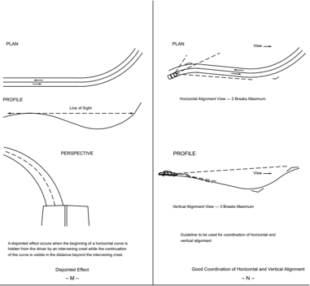

## 3.6  OTHER FEATURES AFFECTING GEOMETRIC DESIGN

In addition to the design elements discussed previously, several other features affect or are affected by the geometric design of a roadway. Each of these features is discussed only to the extent needed to show its relation to geometric design and how it, in turn, is thereby affected. Detailed design of these features is not covered here.

## 3.6.1  Erosion Control and Landscape Development

Erosion prevention is one of the major factors in design, construction, and maintenance of highways. It should be considered early in the location and design stages. Some degree of erosion control can be incorporated into the geometric design, particularly in the cross section elements. Of course, the most direct application of erosion control occurs in drainage design and in the writing of specifications for landscaping and slope planting.

Erosion  and  maintenance  are  minimized  largely  by  using  specific  design  features:  flat  side slopes, rounded and blended with natural terrain; serrated cut slopes; drainage channels designed  with  due  regard  to  width,  depth,  slopes,  alignment,  and  protective  treatment;  inlets located and spaced with erosion control in mind; prevention of erosion at culvert outlets; proper facilities for groundwater interception; dikes, berms, and other protective devices to trap sediment at strategic locations; and protective groundcovers and planting. To the extent practical, these features should be designed and located to minimize the potential crash severity for motorists who unintentionally run off the roadway.

Landscape development should be in keeping with the character of the highway and its environment. Programs include the following general areas of improvement: (1) preservation of existing vegetation, (2) transplanting of existing vegetation where practical, (3) planting of new vegetation, (4) selective clearing and thinning, and (5) regeneration of natural plant species and material.

The objectives in planting or the retention and preservation of natural growth on roadsides are closely related. In essence, they provide vegetation that (1) will be an aid to aesthetics; (2) will aid  in  lowering  construction  and  maintenance  costs;  and  (3)  create  interest,  usefulness,  and beauty for the pleasure and satisfaction of the traveling public without increasing the potential crash severity for motorists who unintentionally run off the roadway.

Landscaping of highways and streets in urban areas assumes additional importance in mitigating the many nuisances associated with urban area traffic. Landscaping can reduce this contribution to urban blight and make the urban highways and streets better neighbors.

Further information concerning landscape development and erosion control is presented in the AASHTO Guide for Transportation Landscape and Environmental Design ( 1 ).

## 3.6.2  Rest Areas, Information Centers, and Scenic Overlooks

Rest areas, information centers, and scenic overlooks are functional and desirable elements of the complete highway facility and are provided to reduce driver fatigue and for the convenience of highway users. A rest area is a roadside area with parking facilities separated from the roadway, provided for the travelers to stop and rest for short periods. The area may provide drinking water, restrooms, tables and benches, telephones, information displays, and other facilities for travelers. A rest area is not intended to be used for social or civic gatherings or for such active forms  of  recreation  as  boating,  swimming,  or  organized  games.  An  information  center  is  a staffed or unstaffed facility at a rest area for the purpose of furnishing travel and other information or services to travelers. A scenic overlook is a roadside area provided for motorists to park their vehicles, beyond the shoulder, primarily for viewing the scenery or for taking photographs in a location removed from through traffic. Scenic overlooks need not provide comfort and convenience facilities.

--',''','',',',','''''',,,,''-'-',,',,',',,'---

Site selection for rest areas, information centers, and scenic overlooks should consider the scenic quality of the area, accessibility, and adaptability to development. Other essential considerations include an adequate source of water and a means to treat and/or properly dispose of sewage. Site plans should be developed through the use of a comprehensive site planning process that should include the location of ramps, parking areas for cars and trucks, buildings, picnic areas, water supply, sewage treatment facilities, and maintenance areas. The objective is to give maximum weight to the appropriateness of the site rather than adherence to uniform distance or driving time between sites.

Facilities should be designed to accommodate the needs of older persons and persons with disabilities. Further information concerning rest area design is presented in the AASHTO Guide for Development of Rest Areas on Major Arterials and Freeways ( 2 ).

## 3.6.3  Lighting

Lighting may reduce nighttime crashes on a highway or street and improve the ease and comfort of operation. Statistics indicate that nighttime crash rates are higher than daytime crash rates. To a large extent, this may be attributed to reduced visibility at night. There is evidence that in the suburban, urban, and urban core contexts, where there are concentrations of pedestrians and roadside intersectional interferences, fixed-source lighting tends to reduce crashes. Lighting of highways in rural areas may be desirable, but the need for it is much less than on streets and highways in urban areas. The general consensus is that lighting of highways in rural areas is seldom justified except in certain critical areas, such as interchanges, intersections, railroad grade crossings, long or narrow bridges, tunnels, sharp curves, and areas where roadside interferences are present. Most modern rural highways should be designed with an open cross section and horizontal and vertical alignment of a fairly high type. Accordingly, they offer an opportunity for near maximum use of vehicle headlights, resulting in reduced justification for fixed highway lighting.

On freeways where there are no pedestrians, roadside entrances, or other intersections at grade, and where rights-of-way are relatively wide, the justification for lighting differs from that of non-controlled streets and highways. The AASHTO Roadway Lighting Design Guide ( 6 ) was prepared to aid in the selection of sections of freeways, highways, and streets for which fixedsource lighting may be warranted, and to present design guide values for their illumination. This guide also contains a section on the lighting of tunnels and underpasses. A primary source of  design  information  for  lighting  are  Illuminating  Engineering  Society  of  North  America (IESNA) publications, including ANSI/IESNA RP-8, American National Standard Practice for Roadway Lighting ( 59 ); ANSI/IESNA RP-22, American National Standard Practice for Tunnel Lighting ( 60 ); IESNA DG-19, Design Guide for Roundabout Lighting ( 61 ); and IESNA DG-23, Design Guide for Toll Plaza Lighting ( 62 ).

Whether or not at-grade intersections in rural areas should be lighted depends on the layout and the traffic volumes involved. Intersections that do not have channelization are frequently left unlighted. On the other hand, intersections with substantial channelization, particularly multiroad layouts and those designed on a broad scale, are often lighted. It is especially desirable to illuminate large-scale channelized intersections and roundabouts. Because of the sharp curvatures, little of such intersections is within the lateral range of headlights, and the headlights of other vehicles are a hindrance rather than an aid because of the variety of directions and turning movements. There is need to obtain a reduction in the speed of vehicles approaching some intersections. The indication of this need should be definite and visible at a distance from the intersection that is beyond the range of headlights. Illumination of the intersection with fixedsource lighting accomplishes this.

At interchanges it also is desirable, and sometimes essential, to provide fixed-source lighting. Drivers should be able to see not only the road ahead, but also the entire turning roadway area to properly discern the paths to be followed. They should also see all other vehicles that may influence their own behavior. Without lighting, there may be a noticeable decrease in the usefulness of the interchange at night; there would be more cars slowing down and moving with uncertainty at night than during daylight hours. Consideration should be given to improving visibility at night by roadway lighting (or reflectorizing devices) the parts of grade separation structures that particularly should be avoided by motorists, such as curbs, piers, and abutments. The greater the volume of traffic, particularly turning traffic, the more important the fixed-source lighting at interchanges becomes. Illumination should also be considered on those sections of major highways where there are turning movements to and from roadside development.

Floodlighting or highway lighting may be desirable at railroad-highway grade crossings when there are nighttime movements of trains. In some cases, such treatments may apply also to crossings operated with flashing signals or gates, or both.

Tunnels, toll plazas, and movable bridges are nearly always lighted, as are bridges of substantial length in urban and suburban areas. It is questionable whether the cost of lighting long bridges in rural areas is justified or desirable.

To minimize the effect of glare and to provide the most economical lighting installation, luminaires are mounted at heights of at least 30 ft [9 m]. Lighting uniformity is improved with higher mounting heights, and in most cases, mounting heights of 35 to 50 ft [10 to 15 m] are usually preferable.  High-mast lighting-special luminaires on masts of 100 ft [30 m] or greater-is used to light large highway areas such as interchanges and rest areas. This lighting furnishes a uniform light distribution over the whole area and may provide alignment guidance. However, it also has a disadvantage in that the visual impact on the surrounding community from scattered light is increased.

Luminaire supports (poles) should be placed outside the roadside clear zones whenever practical. The appropriate clear zone dimensions for the various functional classifications will be found in the discussion of roadside design in Section 4.6. Where poles are located within the clear zone, regardless of distances from the traveled way, they should be designed to have a suitable impact attenuation feature; normally, a breakaway design is used. Breakaway poles should not be used on streets in densely developed areas, particularly with sidewalks. When struck, these poles could interfere with pedestrians and cause damage to adjacent buildings. Because of lower speeds and parked vehicles, there is much less chance of injuries to vehicle occupants from striking fixed poles on a street as compared to a highway. Poles should not be erected along the outside of curves on ramps where they are more susceptible to being struck. Poles located behind longitudinal barriers (installed for other purposes) should be offset sufficiently to allow for deflection of the longitudinal barriers under impact.

On a divided highway or street, luminaire supports may be located either in the median or on the right side of the roadway. Where luminaire supports are located on the right side of the roadway, the light source is usually closer to the more heavily used traffic lanes. However, with median installation, the cost is generally lower and illumination is greater on the high-speed lanes. For median installations, dual-mast arms should be used, for which 40 to 50 ft [12 to 15 m] mounting heights are favored. For further information, refer to the AASHTO Roadside Design Guide ( 7 ).

Where highway lighting is being considered for future installation, considerable savings can be achieved through design and installation of necessary conduits under roadways and curbs as part of initial construction.

Highway lighting for freeways is directly associated with the type and location of highway signs. For full effectiveness, the two should be designed jointly.

## 3.6.4  Utilities

Highway and street improvements, whether upgraded within the existing right-of-way or entirely on new right-of-way, generally entail adjustment of utility facilities. Utilities generally have little effect on the geometric design of the highway or street. However, full consideration, reflecting sound engineering principles and economic factors, should be given to measures needed to preserve and protect the integrity and visual quality of the highway or street, its maintenance efficiency, and the safety of traffic. The costs of utility adjustments vary considerably because of the large number of companies, the type and complexity of the facility, and the degree of involvement with the improvement. Depending on the location of a project, the utilities involved could include (1) sanitary sewers; (2) water supply lines; (3) oil, gas, and petroleum product pipelines; (4) overhead and underground power and communications lines including fiber optic cable; (5) cable television; (6) wireless communication towers; (7) drainage and irrigation lines; (8) heating mains; and (9) special tunnels for building connections.

State departments of transportation (DOTs) handle utility issues in diverse ways. Virtually all state DOTs follow their in-state utility accommodation policies, which may reference FHWA and AASHTO documents. Most of these policies are general in nature and pertain mostly to cost-reimbursement issues.

There is a real need to evaluate and weigh the costs of relocating a utility versus accommodating it in place through design considerations for the benefit of the citizen who is both the ratepayer and the taxpayer. The impacts of relocating utilities are beginning to be measured more accurately and comprehensively, including items such as road-user costs for lane closures. Recently, there has been a significant effort from several DOTs to address utility issues with new technologies, philosophies, and procedures. There is also an increased national emphasis on utility issues that has resulted in significant research efforts, including the development of subsurface utility engineering. More information about subsurface utility engineering is available in NCHRP Synthesis 405 ( 13 ).

## 3.6.4.1  General

Utility lines should be located to minimize need for later adjustment, to accommodate future highway or street improvements, and to permit servicing such lines with minimum interference to traffic.

Longitudinal installation should be located on uniform alignment as near as practical to the right-of-way line so as to not interfere with traffic operation and to preserve space for future highway or street improvements or other utility installations. Underground utilities should be placed to allow above-ground utilities to be as close to the right-of-way line as practical. Also to the extent practical, utilities along freeways should be constructed so they can be serviced from outside the controlled access lines.

To the extent practical, utility line crossings of the highway should cross on a line generally normal to the highway alignment. Those utility crossings that are more likely to need future servicing should be encased or installed in tunnels to permit servicing without disrupting the traffic flow.

The horizontal and vertical location of utility lines within the highway right-of-way limits should conform to the clear roadside policies applicable for the system, type of highway or street, and specific conditions for the particular section involved. Utility facilities on highway and street rights-of-way should be located well away from the traveled way and should be designed so they are not roadside obstacles. The clear roadside dimension to be maintained for a specific functional classification is discussed in Section 4.6, 'Roadside Design.'

Sometimes attachment of utility facilities to highway structures, such as bridges, is a practical arrangement and may be authorized. Where it is practical to locate utility lines elsewhere, attachment to bridge structures should be avoided.

--',''','',',',','''''',,,,''-'-',,',,',',,'---

On new installations or adjustments to existing utility lines, provision should be made for known or planned expansion of the utility facilities, particularly those located underground or attached to bridges.

All utility installations on, over, or under highway or street right-of-way and attached structures should be of durable materials designed for long service-life expectancy, relatively free from routine servicing and maintenance, and meet or exceed the applicable industry codes or specifications.

Utilities that are to cross or otherwise occupy the right-of-way of freeways in rural or urban areas should conform to the AASHTO Policy on the Accommodation of Utilities within Freeway Right-of-Way ( 5 ). Those on non-controlled access highways and streets should conform to the AASHTO Guide for Accommodating Utilities within Highway Right-of-Way ( 4 ).

## 3.6.4.2  Rural Areas

On new construction, no utility should be situated under any part of the roadway, except where the utility crosses the highway.

Normally, no poles should be located in the median of divided highways. Utility poles, vent standpipes, and other above-ground utility appurtenances that may be struck by vehicles that run off the road should not be placed within the highway clear zone as discussed in Section 4.6.1. The AASHTO Roadside Design Guide ( 7 ) discusses clear-zone widths and may be used as a reference to determine appropriate widths for freeways, arterials in rural areas, and high-speed collectors in rural areas. For low-speed collectors and local roads in rural areas, except for very low-volume local roads with ADTs less than or equal to 400 vehicles per day, a minimum clear zone width of 7 to 10 ft [2 to 3 m] is desirable.

## 3.6.4.3  Urban Areas

Because of restricted space in most metropolitan areas, special consideration should be given in the initial design to the potential for joint usage of the right-of-way that is consistent with the primary function of the highway or street.

Appurtenances  to  underground  installations,  such  as  vents,  drains,  markers,  manholes,  and shutoffs, should be located so as not to be a roadside obstacle, not to interfere with highway or street maintenance activities, and not to be concealed by vegetation. Preferably they should be located near the right-of-way line.

Where there are curbed sections, utilities should be located in the border areas between the curb and sidewalk, at least 1.5 ft [0.5 m] behind the face of the curb, and where practical, aboveground utilities should be behind the sidewalk. Where shoulders are provided rather than curbs, a clear zone commensurate with rural area conditions should be provided.

Existing development and limited right-of-way widths may preclude location of some or all utility facilities outside the roadway of the street or highway. Under some conditions, it may be appropriate to reserve the area outside the roadway exclusively for the use of overhead lines with all other utilities located under the roadway, and in some instances the location of all the facilities under the roadway may be appropriate. Location of utilities under the roadway is an exception to the stated policy and as such needs special consideration and treatment. Accommodation of these facilities under the roadway should be accomplished in a manner that will have a minimum adverse effect on traffic as a result of future utility service and maintenance activities.

## 3.6.5  Traffic Control Devices

## 3.6.5.1  Traffic Signs, Pavement Markings, and Traffic Signals

Traffic signs, pavement markings, and traffic signals are directly related to, and complement, the design of highways and streets. They are critical features of traffic control and operation that the designer considers in the geometric layout of such a facility. Traffic control devices should be designed concurrently with the geometrics. The potential for future operational efficiency can be significantly enhanced if signs, markings, and signals are treated as an integral part of design.

The extent to which traffic control devices are used depends on the traffic volume, the type of facility,  and the extent of traffic control appropriate for safe and efficient operation. Arterial highways are usually numbered routes of fairly high type and have relatively high traffic volumes. On such highways, signs and markings are employed extensively and traffic signals are often employed in urban areas. Collector and local roads and streets usually have lower volumes and speeds and therefore typically need fewer traffic control devices. The geometric design of the facility should be supplemented by effective signing, markings, and signals as a means of informing, warning, and controlling users during day and night operations and under a variety of environmental conditions. Signing, marking, and signal plans should be coordinated with horizontal and vertical alignment, sight distance obstructions, operational speeds and maneuvers, and other applicable items before completion of design. For requirements and guidance concerning design, location, and application of signs and markings, refer to the MUTCD ( 24 ).

Traffic control signals for vehicles, pedestrians, and bicycles are devices that control crossing or merging traffic by assigning the right-of-way to various movements for certain intervals of time. They are one of the key elements in the function of many streets in urban areas and some intersections in rural areas. For this reason, the planned traffic signal design and operation for each intersection of a facility should be integrated with the geometric design features to provide optimum operational efficiency. Careful consideration should be given in design to intersection and access locations, horizontal and vertical curvature with respect to signal visibility, pedestrian and bicycle needs (including accommodation of pedestrians with disabilities), and the geometric layout for effective signal operation including signal phasing, timing, and coordination. In addition to the initial installation, potential future signal locations and needs should be considered

in the design process. The design of traffic signal devices and warrants for their use are provided in the MUTCD ( 24 ).

Because supports for highway signs and signals have the potential of being struck by motorists, they should be placed on structures outside the desired clear zone or behind traffic barriers placed for other reasons. If these measures are not practical, the supports should be breakaway or, for overhead sign and signal supports, shielded by appropriate traffic barriers. The AASHTO LRFD Specifications for Structural Supports for Highway Signs, Luminaires, and Traffic Signals (9) provides the criteria for breakaway sign supports. Likewise, supports should not be placed in such a way that they restrict pedestrian traffic on adjacent sidewalks. Sign supports on sidewalks can severely impact pedestrians with vision impairments and are obstacles to all pedestrians. See Section 4.17, 'Pedestrian Facilities,' for details and references.

The number and arrangement of lanes are key to efficient operation of signalized intersections. The crossing distances for both vehicles and pedestrians should normally be kept as short as practical to reduce exposure to conflicting movements. Therefore, the first step in the development of intersection geometric designs should be a complete analysis of current and future traffic demand, including pedestrian, bicycle, and transit users. The need for right- and leftturn lanes to minimize the interference of turning traffic with the movement of through traffic should be evaluated concurrently with the potential need for obtaining any additional right-ofway. Along a highway or street with a number of signalized intersections, the locations where turns will, or will not, be accommodated should also be examined to permit optimal traffic signal coordination.

## 3.6.5.2  Intelligent Transportation Systems

The use of Intelligent Transportation Systems (ITS) on the highway and street system continues to grow in coverage and diversity of technology and applications. In urban areas, traditional ITS applications such as traffic signals and more complex advanced traffic management systems (ATMS) and Advanced Traveler Information Systems (ATIS) are growing in usage and complexity. All of these systems are increasing the number of devices on arterial and sometimes collector  roadways.  These  devices  include  closed-circuit  television  cameras,  traffic  speed  and density detectors, dynamic message signs, ramp control signals, transit priority signals, tolling systems, and other types of advanced monitoring and management devices. The communications system infrastructure that connects, controls, and monitors these systems is also an important element of the ITS infrastructure that should be considered in the geometric design process. It is important that the designer identify the existing and planned applications of ITS technologies and their supporting infrastructure elements within the highway and street network to create geometric designs that allow for their effective operation and appropriate physical placement. Most transportation agencies have developed ITS device and infrastructure standards and specifications that can be used in the design process.

## 3.6.6  Traffic Management Plans for Construction

Maintenance  of  traffic  during  construction  should  be  carefully  planned  and  executed  ( 73 ). Although it is often better to provide detours, this is frequently impractical so traffic flow usually is maintained through the construction area. Sometimes traffic lanes are closed, shifted, or encroached upon in order to undertake construction. When this occurs, designs for traffic control should minimize the effect on traffic operations by minimizing the frequency or duration of interference with normal traffic flow. The development of traffic control plans is an essential part of the overall project design and may affect the design of the facility itself. The traffic control plan depends on the nature and scope of the improvement, volumes of traffic, highway or street pattern, and capacities of available highways or streets. A well-thought-out and carefully developed plan for the movement of traffic through a work zone will contribute significantly to the safe and efficient flow of traffic as well as the reduced potential for injury to the construction forces. It is desirable that such plans have some built-in flexibility to accommodate unforeseen changes in work schedule, delays, or traffic patterns.

The utilization of law enforcement in work zones can have a significant safety benefit to both motorists and highway workers ( 69 ). However, the extent to which enforcement can be effectively utilized is dependent on the design and traffic control characteristics of the work zone itself. Several work zone geometric design features can significantly detract from the ability of enforcement personnel to function either in an active enforcement or in a traffic-calming role within the work zone (or both). The design of the traffic management plan should consider the following key points related to the design of the work zone:

- y Establish realistic design speeds and speed limits;
- y Consider the need, extent, and type of police enforcement to be used;
- y Limit the length of shoulder closures to 3 mi [5 km] or less;
- y Consider the need for enforcement pullout areas at least 0.25 mi [0.4 km] in length with a minimum width of 12 ft [3.6 m] and a desirable width of 14 to 15 ft [4.2 to 4.6 m].

Good illumination is needed for effective performance of nighttime construction. Early in project development, designers should consider whether nighttime construction will be utilized so that illumination needs can be incorporated in the project plan ( 55 ).

The goal of any traffic control plan should be to effectively guide vehicle, bicycle, and pedestrian traffic, including persons with disabilities, through or around construction areas. Worker access to the construction area should also be provided. The traffic control plan should incorporate geometrics and traffic control devices as similar as practical to those for normal operating situations, while providing room for the contractor to work effectively. Policies for the use and application of signs and other traffic control devices when highway construction occurs are set forth in the MUTCD ( 24 ). It cannot be emphasized too strongly that the MUTCD ( 24 ) principles should be applied and a plan developed for the particular type of work performed.

## 3.7  REFERENCES

1. AASHTO. A  Guide  for  Transportation  Landscape  and  Environmental  Design ,  Second Edition, HLED-2. American Association of State Highway and Transportation Officials, Washington, DC, 1991.
2. AASHTO. A  Guide  for  Development  of  Rest  Areas  on  Major  Arterials  and  Freeways. American Association of State Highway and Transportation Officials, Washington, DC, 2001.
3. AASHTO. Guide  for  the  Planning,  Design,  and  Operation  of  Pedestrian  Facilities ,  First Edition, GPF-1. American Association of State Highway and Transportation Officials, Washington, DC, 2004. Second edition pending.
4. AASHTO. A  Guide  for  Accommodating  Utilities  within  Highway  Right-of-Way ,  Fourth Edition, GAU-4. Association of State Highway and Transportation Officials, Washington, DC, 2005.
5. AASHTO. A Policy on the Accommodation of Utilities within Freeway Right-of-Way , Fifth Edition, AU-5. Association of State Highway and Transportation Officials, Washington, DC, 2005.
6. AASHTO. Roadway  Lighting  Design  Guide ,  Sixth  Edition  with  2010  Errata,  GL-6. American Association of State Highway and Transportation Officials, Washington, DC, 2005. Seventh edition pending 2018.
7. AASHTO. Roadside Design Guide ,  Fourth Edition with 2015 Errata, RSDG-4. American Association of State Highway and Transportation Officials, Washington, DC, 2011.
8. AASHTO. AASHTO Drainage Manual , First Edition, ADM-1. American Association of State Highway and Transportation Officials, Washington, DC, 2014.
9. AASHTO. LRFD Specifications  for  Structural  Supports  for  Highway  Signs,  Luminaires, and Traffic Signals , First Edition with 2017 Interim Revisions, LRFDLTS-1. American Association of Highway and Transportation Officials, Washington, DC, 2015.
10. AASHTO. AASHTO LRFD Bridge  Design  Specifications ,  Eighth  Edition  with  2018 Errata, LRFD-8. American Association of State Highway and Transportation Officials, Washington, DC, 2017.
11. Alexander, G. J. and H. Lunenfeld. Positive Guidance in Traffic Control . Federal Highway Administration, U.S. Department of Transportation, Washington, DC, 1975.

--',''','',',',','''''',,,,''-'-',,',,',',,'---

12. ASCE. Practical  Highway Aesthetics .  American  Society  of  Civil  Engineers,  New  York, NY, 1977.
13. Anspach,  J.  H., National  Cooperative  Highway  Research  Program  Synthesis  of  Highway Practice  405:  Utility  Location  and  Highway  Design .  NCHRP,  Transportation  Research Board, National Research Council, Washington, DC, 2010.
14. Barnett, J. Safe Side Friction Factors and Superelevation Design. Proc., HRB ,  Vol. 16. Highway Research Board (currently Transportation Research Board), National Research Council, Washington, DC, 1936, pp. 69-80.
15. Barnett,  J. Transition  Curves  for  Highways .  Federal  Works  Agency,  Public  Roads Administration, Washington, DC, 1940.
16. Bonneson, J. A. National Cooperative Highway Research Program Report 439: Superelevation Distribution Methods and Transition Designs .  NCHRP, Transportation Research Board, National Research Council, Washington, DC, 2000.
17. Bureau of  Public  Roads. Study of  Speed  Curvature  Relations  of  Pentagon  Road  Network Ramps .  Federal Works Agency, Public Roads Administration, Washington, DC, 1954 unpublished data.
18. Cron, F. W. The Art of Fitting the Highway to the Landscape. The Highway and the Landscape . W. B. Snow, ed., Rutgers University Press, New Brunswick, NJ, 1959.
19. Cysewski, G. R. Urban Intersectional Right Turning Movements. Traffic  Engineering , Vol. 20, No. 1, October 1949, pp. 22-37.
20. Fambro, D. B., K. Fitzpatrick, and R. J. Koppa. National Cooperative Highway Research Program Report 400: Determination of Stopping Sight Distances . NCHRP, Transportation Research Board, National Research Council, Washington, DC, 1997.
21. Fancher, Jr., P. S. and T. D. Gillespie. National Cooperative Highway Research Program Synthesis of Highway Practice 241: Truck Operating Characteristics . NCHRP, Transportation Research Board, National Research Council, Washington, DC, 1997.
22. FHWA. Grade Severity Rating System Users Manual ,  FHWA-IP-88-015. Federal Highway Administration, U.S. Department of Transportation, Washington, DC, August 1989.
23. FHWA. The  Magnitude  and  Severity  of  Passing  Accidents  on  Two-Lane  Rural  Roads ( HSIS Summary Report ),  FHWA-RD-94-068. Federal Highway Administration, U.S. Department of Transportation, Washington, DC , November 1994.

24. FHWA. Manual  on  Uniform  Traffic  Control  Devices  for  Streets  and  Highways .  Federal Highway Administration, U.S. Department of Transportation, Washington, DC, 2009. Available at

http://mutcd.fhwa.dot.gov

25. George, L. E. Characteristics of Left-Turning Passenger Vehicles. In Proc., HRB ,  Vol. 31. Highway Research Board, National Research Council, Washington, DC, 1952, pp. 374-385.
26. Gillespie,  T. Methods  for  Predicting  Truck  Speed  Loss  on  Grades .  FHWA/RD-86/059. Federal  Highway  Administration,  U.S.  Department  of  Transportation,  Washington, DC, October 1986.
27. Glennon, J. C. An Evaluation of Design Criteria for Operating Trucks Safely on Grades. In Highway Research Record 312 . Highway Research Board, National Research Council, Washington, DC, 1970, pp. 93-112.
28. Glennon,  J.  C.  New  and  Improved  Model  of  Passing  Sight  Distance  on  Two-Lane Highways.  In Transportation  Research  Record  1195 .  Transportation  Research  Board, National Research Council, Washington, DC, 1998.
29. Hajela, G. P. Compiler, Resume of Tests on Passenger Cars on Winter Driving Surface, 19391966 . National Safety Council, Committee on Winter Driving Hazards, Chicago, IL, 1968.
30. Harwood, D. W. and A. D. St. John. Passing Lanes and Other Operational Improvements on  Two-Lane  Highways ,  FHWA/RD-85/028.  Federal  Highway  Administration,  U.S. Department of Transportation, Washington, DC, December 1985.
31. Harwood, D. W. and C. J. Hoban. Low Cost Methods for Improving Traffic Operations on Two-Lane Roads , FHWA-IP-87-2. Federal Highway Administration, U.S. Department of Transportation, Washington, DC, 1987.
32. Harwood, D. W. and J. C. Glennon. Passing Sight Distance Design for Passenger Cars and  Trucks.  In Transportation  Research  Record  1208 .  Transportation  Research  Board, National Research Council, Washington, DC, 1989.
33. Harwood, D. W., J. M. Mason, W. D. Glauz, B. T. Kulakowski, and K. Fitzpatrick. Truck  Characteristics  for  Use  in  Highway  Design  and  Operation ,  FHWA-RD-89-226. Federal  Highway  Administration,  U.S.  Department  of  Transportation,  Washington, DC, August 1990.

34. Harwood, D. W., D. J. Torbic, K. R. Richard, W. D. Glauz, and L. Elefteriadou. National Cooperative  Highway  Research  Program  Report  505:  Review  of  Truck  Characteristics  as Factors in Roadway Design . NCHRP, Transportation Research Board, National Research Council, Washington DC, 2003.
35. Harwood, D. W., D. K. Gilmore, K. R. Richard, J. M. Dunn, and C. Sun. National Cooperative  Highway  Research  Program  Report  605:  Passing  Sight  Distance  Criteria . NCHRP, Transportation Research Board, National Research Council, Washington DC, 2007.
36. Harwood, D. W., J. M. Hutton, C. Fees, K. M. Bauer, A. Glen, and H. Ouren. National Cooperative Highway Research Program Report 783: Evaluation of the 13 Controlling Criteria for  Geometric  Design .  NCHRP,  Transportation  Research  Board,  National  Research Council, Washington, DC, 2014.
37. Hassan, Y., S. M. Easa, and A. O. Abd El Halim. Passing Sight Distance on Two-Lane Highways: Review and Revision. Transportation Research Part A , Vol. 30, No. 6, 1996.
38. Hayhoe, G. F. and J. G. Grundmann. Review of Vehicle Weight/Horsepower Ratio as Related to Passing Lane Design Criteria . Final Report of NCHRP Project 20-7(10). Pennsylvania State University, University Park, PA, October 1978.
39. Huff, T. S. and F. H. Scrivner. Simplified Climbing-Lane Design Theory and Road-Test Results. Bulletin 104 . Highway Research Board, Washington, DC, 1955, pp. 1-11.
40. ITE. Truck Escape Ramps, Recommended Practice . Institute of Transportation Engineers, Washington, DC, 1989.
41. Johansson, G. and K. Rumar. Drivers' Brake Reaction Times. Human Factors , Vol. 13, No. 1, February 1971, pp. 23-27.
42. King, G. F. and H. Lunenfeld. National Cooperative Highway Research Program Report 123:  Development  of  Information  Requirements  and  Transmission  Techniques  for  Highway Users . NCHRP, Transportation Research Board, Washington, DC, 1971.
43. Leisch, J. E. Application of Human Factors in Highway Design. Unpublished paper presented at AASHTO Region 2 meeting, June 1975.
44. MacAdam, C. C., P. S. Fancher, and L. Segal. Side Friction for Superelevation on Horizontal Curves ,  FHWA-RD-86-024.  Federal  Highway  Administration,  U.S.  Department  of Transportation, Washington, DC, August 1985.

--',''','',',',','''''',,,,''-'-',,',,',',,'---

45. Maryland Department of Transportation. Advisory Speeds on Maryland Roads . Brudis and Associates, Inc., Maryland Department of Transportation, Office of Traffic and Safety, Hanover, MD, August 1999.
46. Massachusetts  Institute  of  Technology. Report  of  the  Massachusetts  Highway  Accident Survey ,  CWA  and  ERA  project.  Massachusetts  Institute  of  Technology,  Cambridge, MA, 1935.
47. McGee, H. W., W. Moore, B. G. Knapp, and J. H. Sanders. Decision Sight Distance for Highway Design and Traffic Control Requirements .  FHWA-RD-78-78. Federal Highway Administration, U.S. Department of Transportation, Washington, DC, February 1978.
48. Moyer, R. A. Skidding Characteristics of Automobile Tires on Roadway Surfaces and Their  Relation  to  Highway  Safety. Bulletin  No.  120 .  Iowa  Engineering  Experiment Station, Ames, IA, 1934.
49. Moyer, R. A. and D. S. Berry. Marking Highway Curves with Safe Speed Indications. In Proc., HRB , Vol. 20. Highway Research Board, Washington, DC, 1940, pp. 399-428.
50. Normann, O. K. Braking Distances of Vehicles from High Speeds. In Proc., HRB , Vol. 22. Highway Research Board, Washington, DC, 1953. pp. 421-436.
51. Potts, I. B. and D. W. Harwood. National Cooperative Highway Research Program Research Results Digest 275: Application of European 2+1 Roadway Designs . NCHRP, Transportation Research Board, National Research Council, Washington, DC, April 2003.
52. Raymond, Jr., W. L. Offsets to Sight Obstructions Near the Ends of Horizontal Curves. Civil Engineering , Vol. 42, No. 1, January 1972, pp.71-72.
53. Robinson, G. H., D. J. Erickson, G. L. Thurston, and R. L. Clark. Visual Search by Automobile Drivers. Human Factors , Vol. 14, No. 4, August 1972, pp. 315-323.
54. Schwender,  H.  C.,  O.  K.  Normann,  and  J.  O.  Granum.  New  Method  of  Capacity Determination for Rural Roads in Mountainous Terrain. Highway Research Board Bulletin 167 . Highway Research Board, Washington, DC, 1957, pp. 10-37.
55. Shane, J. S., A. Kandil, and C. J. Schexnayder. National Cooperative Highway Research Program Report 726: A Guidebook for Nighttime Construction: Impacts on Safety, Quality, and Productivity . NCHRP, Transportation Research Board, National Research Council, Washington, DC, 2012.

56. Shortt,  W.  H.  A  Practical  Method  for  Improvement  of  Existing  Railroad  Curves.  In Proc., Institution of Civil Engineering , Vol. 76. Institution of Civil Engineering, London, UK, 1909, pp. 97-208.
57. SHRP. Design Guidelines for the Control of Blowing and Drifting Snow . Strategic Highway Research Program, National Research Council, 1994.
58. Smith, B. L. and Lamm, R. Coordination of Horizontal and Vertical Alignment with Regard  to  Highway  Aesthetics. Transportation  Research  Record  1445 .  Transportation Research Board, National Research Council, Washington DC, 1994.
59. Standard Practice Committee of the IESNA Roadway Lighting Committee. American Standard Practice for Roadway Lighting ,  ANSI/EISNA RP-8-00. Illuminating Engineering Society of North America, New York, NY, 2000 or most current edition.
60. Standard Practice Committee of the IESNA Roadway Lighting Committee. American Standard Practice for Tunnel Lighting , ANSI/IESNA RP-22-05. Illuminating Engineering Society of North America New York, NY, 2005 or most current edition.
61. Standard Practice Committee of the IESNA Roadway Lighting Committee. Design Guide for Roundabout Lighting , ANSI/IESNA DG-19-08. Illuminating Engineering Society of North America, New York, NY, 2008 or most current edition.
62. Standard Practice Committee of the IESNA Roadway Lighting Committee. Design Guide for Toll Plaza Lighting , ANSI/IESNA DG-23-08. Illuminating Engineering Society of North America, New York, NY, 2008 or most current edition.
63. Stonex, K. A. and C. M. Noble. Curve Design and Tests on the Pennsylvania Turnpike. In Proc., HRB , Vol. 20, Highway Research Board, Washington, DC, 1940, pp. 429-451.
64. Taragin, A. Effect of Length of Grade on Speed of Motor Vehicles. In Proc., HRB , Vol. 25, Highway Research Board, Washington, DC, 1945, pp. 342-353.
65. Torbic, D. J, J. M. Hutton, C. D. Bokenkroger, D. W. Harwood, D. K. Gilmore, M. M. Knoshaug, J. J. Ronchetto, M. A. Brewer, K. Fitzpatrick, S. T. Chrysler, and J. Stanley. National Cooperative Highway Research Program Report 730: Design Guidance for Freeway Mainline Ramp Terminals . NCHRP, Transportation Research Board, National Research Council, Washington, DC, 2012. Available at

http://www.trb.org/Publications/Blurbs/167516.aspx

66. Torbic, D. J., M. O'Laughlin, D. W. Harwood, K. M. Bauer, C. K. Bokenkroger, L. Lucas, J. Ronchetto, S. N. Brennan, E. T. Donnell, A. Brown, and T. Varunjikar, National Highway Research Program Report 774: Superelevation Criteria for Sharp Horizontal Curves on Steep Grades . NCHRP, Transportation Research Board, National Research Council, Washington, DC, 2013.
67. Transportation  Research  Board. Highway  Capacity  Manual:  A  Guide  for  Multimodal Mobility  Analysis .  Sixth  Edition.  Transportation  Research  Board,  National  Research Council, Washington, DC, 2016.
68. Tunnard, C. and B. Pushkarev. Man Made America: Chaos or Control? Yale  University Press, New Haven, CT, 1963.
69. Ullman,  G.  L.,  M.  A.  Brewer,  J.  E.  Bryden,  M.  O.  Corkran,  C.  W.  Hubbs,  A.  K. Chandra, and K. L. Jeannotte. National Cooperative Highway Reseach Program Report 746: Traffic Enforcement Strategies for Work Zones ,  NCHRP, Transportation Research Board, National Research Council, Washington, DC, 2013.
70. U.S. Access Board, Proposed Guidelines for Pedestrian Facilities in the Public Right-of-Way , Federal Register, 36 CFR Part 1190, July 26, 2011. Available at http://www.access-board.gov/guidelines-and-standards/streets-sidewalks/public-rights-of-way/ proposed-rights-of-way-guidelines
71. U.S. Department of Justice, 2010 ADA Standards for Accessible Design , September 15, 2010. Available at https://www.ada.gov/2010ADAstandards\_index.htm
72. U.S. Forest Service. Roads. Chapter 4 in National Forest Landscape Management , Vol. 2, U.S. Forest Service, U.S. Department of Agriculture, March 1977.
73. U.S. National Archives and Records Administration. Code of Federal Regulations .  Title 23, Part 630, Subpart J. Work Zone Safety and Mobility Rule.
74. U.S. National Archives and Records Administration. Code of Federal Regulations . Title 49, Part 27. Nondiscrimination on the Basis of Disability in Programs or Activities Receiving Federal Financial Assistance.
75. Walton, C. M. and C. E. Lee. Speed of Vehicles on Grades , Research Report 20-1F. Center for Highway Research, University of Texas at Austin, Austin, TX, August 1975.

76. Western Highway Institute. Offtracking Characteristics of Trucks and Truck Combinations , Research  Committee  Report  No.  3.  Western  Highway  Institute,  San  Francisco,  CA, February 1970.
77. Willey, W. E. Survey of Uphill Speeds of Trucks on Mountain Grades. In Proc., HRB , Vol. 29. Highway Research Board, Washington, DC, 1949, pp. 304-310.
78. Witheford, D. K. National Cooperative Highway Research Program Synthesis of Highway Practice  178:  Truck  Escape  Ramps .  NCHRP,  Transportation  Research  Board,  National Research Council, Washington, DC, May 1992.

--',''','',',',','''''',,,,''-'-',,',,',',,'---

## 4

## Cross-Section Elements
