# 4.1  GENERAL: 4.1  GENERAL & 65 more sections

- Source: GreenBook.pdf
- Generated: 2026-01-03T08:11:58+00:00
- Chunk: 16/28
- Estimated tokens: ~49,888
- Total pages: 1048
- Type: sections

## 4.1  GENERAL

To assure consistency in this policy, the terms 'border area,' 'cross section,' 'roadway,' and 'traveled way' are defined by AASHTO as follows (see Figures 4-1 and 4-2):

Border Area -The area between the roadway and the right-of-way line that may serve several purposes, including, but not limited to, providing a space for separation between pedestrian, bicyclists, and motor-vehicle traffic; a sidewalk; or an area for underground and aboveground utilities such as traffic signals, parking meters, and fire hydrants. A portion of the border area may be used to accommodate snow storage and may include aesthetic features such as grass or landscaping.

Cross Section -A vertical section of the ground and roadway at right angles to the centerline of the roadway, including all elements of a highway or street from right-ofway line to right-of-way line.

Roadway -The portion of a highway, including shoulders, for vehicular use. A divided highway has two or more roadways.

Traveled Way -The portion of the roadway that allows for the movement of through traffic,  including  vehicles,  transit,  and  freight.  It  does  not  include  such  facilities  as curbs,  shoulders,  turn  lanes,  bicycle  facilities,  sidewalks,  or  parking  lanes.  Divided highways are made up of two separate roadways, each with its own traveled way.

## 4.2  TRAVELED WAY

## 4.2.1  Surface Type

The selection of surface type is determined based on the traffic volume and composition, soil characteristics, climate, performance of pavements in the area, availability of materials, energy conservation, initial cost, and the overall annual maintenance and service-life cost. Important pavement characteristics that are related to geometric design are the effect on driver behavior and the ability of a surface to retain its shape and dimensions, to drain, and to retain adequate skid resistance. The structural design

of  pavements  is  not  included  in  this  policy,  but  is  addressed  in  the  AASHTO MechanisticEmpirical Pavement Design Guide ( 11 ).

## 4.2.2  Cross Slope

Undivided traveled ways on tangents, or on flat curves, have a crown or high point in the middle and a cross slope downward toward both edges. Unidirectional cross slopes across the entire width of the traveled way may be utilized. The downward cross slope may be a plane or rounded section or a combination. With plane cross slopes, there is a cross slope break at the crown line and a uniform slope on each side. Rounded cross sections usually are parabolic, with a slightly rounded surface at the crown line and increasing cross slope toward the edge of the traveled way. Because the rate of cross slope is variable, the parabolic section is described by the crown height (i.e., the vertical drop from the center crown line to the edge of the traveled way). The rounded section is advantageous in that the cross slope steepens toward the edge of the traveled way, thereby facilitating drainage. Disadvantages are that rounded sections are more difficult to construct, the cross slope of the outer lanes may be excessive, providing accessible pedestrian crossings may be more difficult, and warping of pavement areas at intersections may be awkward or difficult to construct.

--',''','',',',','''''',,,,''-'-',,',,',',,'---

- C -

Figure 4-1. Typical Cross Section, Normal Crown

Figure 4-2. Typical Cross Section, Superelevated

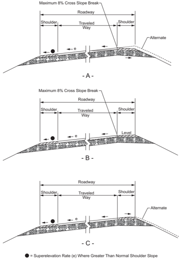

--',''','',',',','''''',,,,''-'-',,',,',',,'---

On divided highways each one-way traveled way may be crowned separately as on two-lane highways, or it may have a unidirectional cross slope across the entire width of the traveled way, which is almost always downward to the outer edge. A cross section with each roadway crowned separately, as shown in Figures 4-3A through 4-3C, has an advantage in rapidly draining the pavement during rainstorms. In addition, the difference between high and low points in the cross section is minimal. Disadvantages are that more inlets and underground drainage lines are needed, and treatment of intersections is more difficult because of the number of high and low points on the cross section. Use of such sections should preferably be limited to regions of high rainfall or where snow and ice are major factors. Sections having no curbs and a wide depressed median are particularly well-suited for these conditions.

Each Pavement Slopes One Way

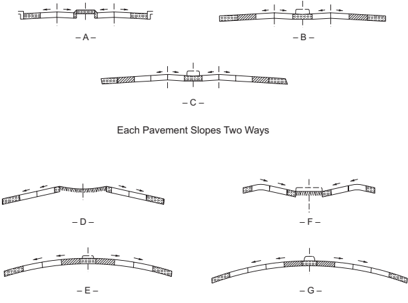

Figure 4-3. Roadway Sections for Divided Highway (Basic Cross Slope Arrangements)

Roadways with unidirectional cross slopes, as shown in Figures 4-3D through 4-3G, tend to provide more comfort to drivers when they change lanes and may either drain away from or toward the median. Drainage away from the median may provide a savings in drainage structures, minimize drainage across the inner, higher-speed lanes, and simplify treatment of intersecting streets. Drainage toward the median is advantageous in that the outer lanes, which are used by most traffic, are generally free of surface water. This surface runoff, however, should then be

collected into a single conduit under the median. Where curbed medians are present, drainage is concentrated next to or on higher speed lanes. Where the median is narrow, this concentration may result in splashing on the windshields of opposing traffic.

## 4.2.2.1  Rate of Cross Slope

The rate of cross slope is an important element in cross-section design. Superelevation on curves is determined by the speed-curvature relationships given in Chapter 3, but cross slope or crown on tangents or on long-radius curves are complicated by two contradictory controls. On one hand, a reasonably steep lateral slope is desirable to minimize ponding of water on pavements with flat profile grades as a result of pavement imperfections or unequal settlement. Horizontal and vertical alignment should also be coordinated to avoid creating flat spots where crest or sag vertical curves and superelevation transitions coincide. A steep cross slope is also desirable on curbed pavements to confine water flow to a narrow width of pavement adjacent to the curb. On the other hand, steep cross slopes are undesirable on tangents because of the tendency of vehicles to drift toward the low edge of the traveled way. This drifting becomes a major concern in areas where snow and ice are common. Cross slopes up to and including 2 percent are barely perceptible in terms of vehicle steering. However, cross slopes steeper than 2 percent are noticeable and may require a conscious effort in steering. Furthermore, steep cross slopes increase the susceptibility to lateral skidding when vehicles brake on icy or wet pavements or when stops are made on dry pavements under emergency conditions.

The prevalence of high winds may significantly alter the effect of cross slope on steering. In rolling or mountainous terrain with alternate cut-and-fill sections or in areas alternately forested and cleared, substantial cross winds produce an intermittent effect on the lateral placement of vehicles moving along the highway and affect their steering. In areas where such conditions are likely, it is desirable to avoid high rates of cross slope.

On paved two-lane roadways, crowned at the center, the accepted rate of cross slope ranges from 1.5 to 2 percent. Use of cross slopes steeper than 2 percent on paved, high-speed highways with a central crown line is not desirable. In passing maneuvers, drivers cross and recross the crown line and negotiate a total rollover or cross slope change of over 4 percent. The reverse curve path of travel of the passing vehicle causes a reversal in the direction of lateral acceleration, which is further exaggerated by the effect of the reversing cross slopes. Trucks with high centers of gravity crossing over the crown line may sway from side to side when traveling at high speed, making it more difficult to maintain control. Figures 4-3A through 4-3C are examples of roadway conditions where this situation would be encountered.

Where three or more lanes are inclined in the same direction on multilane highways, each successive pair of lanes or portion thereof outward from the first two lanes from the crown line should have an increased slope. The two lanes adjacent to the crown line should be pitched at the normal minimum slope, and on each successive pair of lanes or portion thereof outward, the rate may be increased by about 0.5 to 1 percent. However, a cross slope should not normally exceed 3

percent on a tangent alignment unless there are three or more lanes in one direction of travel. In no case should the cross slope of an outer and/or auxiliary lane be less than that of the adjacent lane. As shown in Figure 4-3G, the left side has a continuous sloped pavement while the right has an increased slope on the outer lane.

## 4.2.2.2  Weather Considerations

In areas of intense rainfall, a somewhat steeper cross slope may be needed to facilitate roadway drainage. In such cases, the cross slope on paved surfaces may be increased to 2.5 percent, with a corresponding crown line crossover of 5 percent. Where three or more lanes are provided in each direction, the maximum cross slope should be limited to 4 percent. Use of this increased cross slope should be limited to the condition described in the preceding discussion. For all other conditions, a maximum cross slope of 2 percent should be used for paved surfaces. In locations of intense rainfall and where the maximum cross slope is used, consideration may be given to the use of grooving or pavement surfaces with coarse macrotexture such as open-graded mixes to help water escape more readily from the tire-pavement interface.

## 4.2.2.3  Unpaved Surfaces

The cross slope rates previously discussed pertain largely to paved surfaces. A greater cross slope should be utilized for unpaved surfaces. Table 4-1 shows a range of values applicable to a single lane for each type of surface.

Table 4-1. Normal Traveled-Way Cross Slope

| Surface Type   | Range in Cross Slope Rate for a Single Lane (%)   |
|----------------|---------------------------------------------------|
| Paved          | 1.5-2                                             |
| Unpaved        | 2-6                                               |

Because of the nature of the surfacing materials used and surface irregularities, unpaved surfaces such as earth, gravel, or crushed stone need an even greater cross slope on tangents to prevent the absorption of water into the surface. Therefore, cross slopes greater than 2 percent may be used on these types of surfaces.

Where roadways are designed with outer curbs, the lower values in the ranges of cross slopes in Table 4-1 are not recommended because of the increased likelihood of there being a sheet of water over a substantial part of the traveled way adjacent to the curb. For any rate of rainfall, the width of traveled way that is inundated with water varies with the rate of cross slope, roughness of gutter, frequency of discharge points, and longitudinal grade. In some cases, a cross slope of more than 1.5 percent is needed to limit inundation to about half of the outer traffic lane. A cross slope of 1.5 percent is suggested as a practical minimum for curbed pavements. Curbs with steeper adjacent gutter sections may permit the use of lesser rates of cross slope.

--',''','',',',','''''',,,,''-'-',,',,',',,'---

At most locations, shoulders or travel lanes are not specifically intended for pedestrian travel. However, where a shoulder is intended for pedestrian travel or a crosswalk is present, the shoulder or crosswalk must be accessible to and usable by individuals with disabilities ( 47, 48, 49 ).

## 4.2.3  Skid Resistance

Skidding crashes are an important concern. It is not sufficient to attribute skidding crashes merely to 'driver error' or 'driving too fast for existing conditions.' The roadway should provide a level of skid resistance that will accommodate the braking and steering maneuvers that can reasonably be expected for the particular site.

Research has demonstrated that highway geometrics affect skidding ( 21 ). Therefore, skid resistance should be a consideration in the design of all new construction and major reconstruction projects. Vertical and horizontal alignments can be designed in such a way that the potential for skidding is reduced. Also, improvements to the vertical and horizontal alignments should be considered as a part of any reconstruction project.

Pavement types and textures also affect a roadway's skid resistance. The four main causes of poor skid resistance on wet pavements are rutting, polishing, bleeding, and dirty pavements. Rutting causes water accumulation in the wheel tracks. Polishing reduces the pavement surface microtexture and bleeding can cover it. In both cases, the rough surface features needed for penetrating the thin water film are diminished. Pavement surfaces will lose their skid resistance when contaminated by oil drippings, layers of dust, or organic matter. Measures taken to correct or improve skid resistance should result in the following characteristics: high initial skid resistance durability, the ability to retain skid resistance with time and traffic, and minimum decrease in skid resistance with increasing speed.

The inclusion of transverse tining in a portland cement concrete pavement surface before the concrete has set has proven to be effective in reducing the potential for hydroplaning on roadways. The use of surface courses or overlays constructed with polish-resistant coarse aggregate is  the  most  widespread method for improving the surface texture of bituminous pavements. Overlays of open-graded asphalt friction courses are quite effective because of their frictional and hydraulic properties. For further discussion, refer to the AASHTO Guide for Pavement Friction ( 6 ).

## 4.2.4  Hydroplaning

When a rolling tire encounters a film of water on the roadway, the water is channeled through the tire tread pattern and through the surface roughness of the pavement. Hydroplaning occurs when the drainage capacity of the tire tread pattern and the pavement surface is exceeded and water begins to build up in front of the tire. As the water builds up, a water wedge is created,

and this wedge produces a hydrodynamic force which may provide lift to the rolling tire in some situations.

The circumstances under which hydroplaning will occur are influenced by water depth, roadway geometrics, vehicle speed, tire tread design and depth, tire inflation pressure, pavement surface macrotexture, and the condition of the pavement surface. To reduce the potential for hydroplaning, designers should consider pavement transverse slopes, utilize pavement roughness characteristics, and avoid potential ponding areas during the establishment of horizontal and vertical alignments as well as during the pavement design phase of the project. Also, drivers should be expected to exercise caution in wet conditions in a manner similar to operating a vehicle during ice or snow events. The use of variable speed limits based on changing weather conditions may be appropriate. The AASHTO Drainage Manual ( 9 )  and  other  publications ( 14, 18 )  provide additional design discussion of dynamic hydroplaning.

## 4.3  LANE WIDTHS

The lane width of a roadway influences the comfort of driving, operational characteristics, and, in some situations, the likelihood of crashes. Lane widths of 9 to 12 ft [2.7 to 3.6 m] are generally used, with a 12 ft [3.6-m] lane predominant on most high-speed, high-volume highways. A 12-ft [3.6-m] lane width reduces the cost of shoulder and surface maintenance due to lessened wheel concentrations at the pavement edges. A 12-ft [3.6-m] lane also provides desirable clearances between large commercial vehicles traveling in opposite directions on two-lane, two-way highways in rural areas. Chapters 5 through 8 of this policy provide further guidance on appropriate lane widths for specific roadway types. For further information on lane width selection, see NCHRP Synthesis 432, Recent Roadway Geometric Design Research for Improved Safety and Operations ( 17 ) and NCHRP Report 783, Evaluation of the 13 Controlling Criteria for Geometric Design ( 34 ).

Lane widths also affect roadway level of service. Narrow lanes force drivers to operate their vehicles closer to each other laterally than they would normally desire. Restricted clearances have a similar effect. In a capacity sense, the effective width of traveled way is reduced by adjacent obstructions such as retaining walls, bridge trusses or headwalls, and parked cars that restrict the lateral clearance. Further information on the effect of lane width on capacity and level of service is presented in the Highway Capacity Manual (HCM) ( 45 ).

Where lanes of unequal width are used, locating the wider lane on the outside (right) provides more space for large vehicles that usually occupy that lane, provides more space for bicycles, and allows drivers to keep their vehicles at a greater distance from the right edge. Where a curb is used adjacent to only one edge, the wider lane should be placed adjacent to that curb.

Auxiliary lanes at intersections and interchanges often help to facilitate traffic movements. Such added lanes should be as wide as the through-traffic lanes but not less than 10 ft [3.0 m]. Where

--',''','',',',','''''',,,,''-'-',,',,',',,'---

continuous two-way left-turn lanes are provided, a lane width of 10 to 16 ft [3.0 m to 4.8 m] provides an appropriate design.

It may not be cost-effective to design the lane and shoulder widths of local and collector roads and streets that carry less than 2,000 vehicles per day using the same criteria applicable to higher volume roads or to make extensive operational and safety improvements to such low-volume roads. Alternative design criteria may be considered for local and collector roads and streets that carry less than 2,000 vehicles per day in accordance with the AASHTO Guidelines for Geometric Design of Very Low-Volume Local Roads ( 1 ).

## 4.4  SHOULDERS

## 4.4.1  General Characteristics

A shoulder is the portion of the roadway contiguous with the traveled way that accommodates stopped vehicles, emergency use, and lateral support of subbase, base, and surface courses. In some cases, the shoulder can accommodate bicyclists.

The term 'shoulder' is variously used with a modifying adjective to describe certain functional or physical characteristics. The following meanings apply to the terms used here:

- y The 'graded' width of shoulder is that measured from the edge of the traveled way to the intersection of the shoulder slope and the foreslope planes, as shown in Figure 4-4A.
- y The 'usable' width of shoulder is the actual width that can be used when a driver makes an emergency or parking stop. Where the sideslope is 1V:4H or flatter, the 'usable' width is the same as the 'graded' width since the usual rounding 4 to 6 ft [1.2 to 1.8 m] wide at the shoulder break will not lessen its useful width appreciably. Figures 4-4B and 4-4C illustrate the usable shoulder width.

Shoulders may be surfaced either full or partial width to provide a better all-weather load support than that afforded by native soils. Materials used to surface shoulders include gravel, shell, crushed rock, mineral or chemical additives, bituminous surface treatments, and various forms of asphaltic or concrete pavements.

Well-designed and properly maintained shoulders are needed on highways in rural areas with an appreciable volume of traffic, on freeways, and on high-speed highways in urban areas. Their advantages include:

- y Space is provided away from the traveled way for vehicles to stop because of mechanical difficulties, flat tires, or other emergencies.
- y Space is provided for evasive maneuvers to avoid potential crashes or reduce their severity.
- y Sight distance is improved in cut sections, which may reduce crash frequency at some locations.

- y Highway aesthetics can be enhanced by some types of shoulders.
- y Highway capacity is improved because uniform speed is encouraged.
- y Space is provided for maintenance operations such as snow removal and storage.
- y Lateral offset is provided for signs and guardrails.
- y Stormwater can be discharged farther from the traveled way, and seepage adjacent to the traveled way can be minimized. This may directly reduce pavement breakup.
- y Structural support is given to the pavement.
- y Space is provided for bicycle use, bus stops, occasional encroachment of vehicles, mail delivery vehicles, and traffic detours during construction.

Figure 4-4. Graded and Usable Shoulders

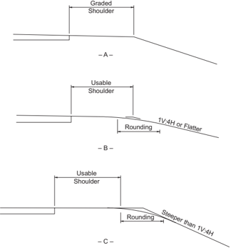

For  further  information  on  other  uses  of  shoulders,  refer  to  NCHRP  Report  254, Shoulder Geometrics and Use Guidelines ( 20 ).

Streets in urban areas generally have curbs along the outer lanes. A stalled vehicle, during peak hours, disturbs traffic flow in all lanes in that direction when the outer lane serves through traffic. Where on-street parking is permitted, the parking lane provides some of the same services listed above for shoulders. Parking lanes are discussed in Section 4.20, 'On-Street Parking.'

## 4.4.2  Shoulder Width

Desirably, a vehicle stopped on the shoulder should clear the edge of the traveled way by at least 1 ft [0.3 m], and preferably by 2 ft [0.6 m]. These dimensions have led to the adoption of 10 ft [3.0 m] as the normal shoulder width that is preferred along higher speed, higher volume facilities. In difficult terrain and on low-volume highways, shoulders of this width may not be practical. A minimum shoulder width of 2 ft [0.6 m] should be considered for low-volume highways, and a 6- to 8-ft [1.8- to 2.4-m] shoulder width is preferable. Heavily traveled, high-speed highways and highways carrying large numbers of trucks should have usable shoulders at least 10 ft [3.0 m] wide and preferably 12 ft [3.6 m] wide; however, widths greater than 10 ft [3.0 m] may encourage unauthorized use of the shoulder as a travel lane. Where bicyclists are to be accommodated on the shoulders, a minimum usable shoulder width (i.e., clear of rumble strips) of 4 ft [1.2 m] should be considered. For additional information on shoulder widths to accommodate bicycles, see the AASHTO Guide for the Development of Bicycle Facilities ( 8 ). Shoulder widths for specific classes of highways are discussed in Chapters 5 through 8.

Where roadside barriers, walls, or other vertical elements are present, it is desirable to provide a graded shoulder wide enough that the vertical elements will be offset a minimum of 2 ft [0.6 m] from the outer edge of the usable shoulder. To provide lateral support for guardrail posts or clear space for lateral dynamic deflection of the particular barrier in use, or both, it may be appropriate to provide a graded shoulder that is wider than the shoulder where no vertical elements are present. On low-volume roads, roadside barriers may be placed at the outer edge of the shoulder; however, a minimum clearance of 4 ft [1.2 m] should be provided from the traveled way to the barrier.

Although it is desirable that a shoulder be wide enough for a vehicle to be driven completely off the traveled way, narrower shoulders are better than none at all. For example, when a vehicle making an emergency stop can pull over onto a narrow shoulder such that it occupies only 1 to 4 ft [0.3 to 1.2 m] of the traveled way, the remaining traveled way width can be used by passing vehicles. Partial shoulders are sometimes used where full shoulders are unduly costly, such as on long (over 200 ft [60 m]) bridges or in mountainous terrain.

Regardless of the width, a shoulder should be continuous. The full benefits of a shoulder may not be realized unless it provides a driver with refuge at any point along the traveled way. A continuous shoulder provides a sense of security such that almost all drivers making emergency stops will leave the traveled way. With intermittent sections of shoulder, however, some drivers will find it necessary to stop on the traveled way, creating an undesirable situation. A continuous

--',''','',',',','''''',,,,''-'-',,',,',',,'---

paved shoulder that is sufficiently wide and free of debris also provides an area for bicyclists to operate without obstructing faster moving motor vehicle traffic. Although continuous shoulders are preferable, narrow shoulders and intermittent shoulders are superior to no shoulders. Intermittent shoulders are briefly discussed below in Section 4.4.6, 'Turnouts.'

Shoulders on structures should normally have the same width as usable shoulders on the approach roadways. Long, high-cost structures may need detailed studies to determine practical dimensions, and reduced shoulder widths may be considered. Discussions of these conditions are provided in Chapters 7 and 10.

## 4.4.3  Shoulder Cross Sections

As important elements in the lateral drainage systems, shoulders should be flush with the roadway surface and abut the edge of the traveled way. All shoulders should be sloped to drain away from the traveled way on divided highways with a depressed median. With a raised narrow median, the median shoulders may slope in the same direction as the traveled way. However, in regions with snowfall, median shoulders should be sloped to drain away from the traveled way to avoid melting snow draining across travel lanes and refreezing. All shoulders should be sloped sufficiently to rapidly drain surface water, but not to the extent that vehicular use would be restricted. Because the type of shoulder construction has a bearing on the cross slope, the two should be determined jointly. Bituminous and concrete-surfaced shoulders should be sloped from 2 to 6 percent, gravel or crushed-rock shoulders from 4 to 6 percent, and turf shoulders from 6 to 8 percent. Where curbs are used on the outside of shoulders, the cross slope should be appropriately designed with the drainage system to prevent ponding on the traveled way.

Where shoulders are intended to be used as pedestrian facilities, the shoulder must be accessible to and usable by individuals with disabilities ( 48, 49 ). For additional guidance, refer to the Proposed Guidelines for Pedestrian Facilities in the Public Right-of-Way ( 46 ).

It  should be noted that rigid adherence to the shoulder cross slope criteria presented in this chapter may reduce traffic operational efficiency if the shoulder cross slope criteria are applied without regard to the cross section of the paved surface. On tangent or long-radius curved alignment with normal crown and turf shoulders, the maximum algebraic difference in the traveled way and shoulder grades should be from 6 to 7 percent. Although this maximum algebraic difference in slopes is not desirable, it is tolerable due to the benefits gained in pavement stability by avoiding stormwater detention at the pavement edge.

Shoulder slopes that drain away from the paved surface on the outside of well-superelevated sections should be designed to avoid too great a cross slope break. For example, use of a 4 percent shoulder cross slope in a section with a traveled way superelevation of 8 percent results in a 12 percent algebraic difference in the traveled way and shoulder grades at the high edge of the traveled way. Grade breaks of this order are not desirable and should not be used (Figure

4-2A). Within a superelevated roadway section, the maximum algebraic difference of cross slope break should not exceed 8 percent between the traveled way and usable shoulder. Edge line or shoulder rumble strips placed on or close to the edge line are desirable to reduce the potential for full traversal departures onto the shoulder (see Section 4.5). It is desirable that all or part of the shoulder should be sloped upward at about the same rate or at a lesser rate than the superelevated traveled way (see the dashed line labeled Alternate in Figure 4-2A). Where this is not desirable because of stormwater or melting snow and ice draining over the paved surface, a compromise might be used in which the grade break at the edge of the paved surface is limited to approximately 8 percent by flattening the shoulder on the outside of the curve (Figure 4-2B).

One means of avoiding too severe of a grade break is the use of a continuously rounded shoulder cross section on the outside of the superelevated traveled way (Figure 4-2C). The shoulder in this case is a convex section continuing from the superelevation slope instead of a sharp grade break at the intersection of the shoulder and traveled way slopes. In this method, some surface water will drain upon the traveled way; however, this disadvantage is offset by the benefit of a smoother transition for vehicles that may accidentally or purposely drive upon the shoulder. It should also be noted that convex shoulders present more difficulties in construction than do planar sections. An alternate method to the convex shoulder consists of a planar shoulder section with multiple breaks in the cross slope. Shoulder cross slopes on the high side of a superelevated section that are substantially less than those discussed above are generally not detrimental to shoulder stability. There is no discharge of stormwater from the traveled way to the shoulder and, therefore, little likelihood of shoulder erosion damage. --',''','',',',','''''',,,,''-'-',,',,',',,'---

In some areas, shoulders are designed with a curb or gutter at the outer edge to confine runoff to the paved shoulder area. Drainage for the entire roadway is handled by these curbs, with the runoff directed to selected outlets. The outer portion of the paved shoulder serves as the longitudinal gutter. Cross slopes should be the same as for shoulders without a curb or gutter, except that the slope may be increased somewhat on the outer portion of the shoulder. This type of shoulder is advantageous in that the curb on the outside of the shoulder does not deter motorists from driving off the traveled way, and the shoulder serves as a gutter in keeping stormwater off the traveled lanes. Proper delineation should adequately distinguish the shoulder from the traveled way.

## 4.4.4  Shoulder Stability

If shoulders are to function effectively, they should be sufficiently stable to support occasional vehicle loads in all kinds of weather without rutting. Evidence of rutting, skidding, or vehicles being mired down, even for a brief seasonal period, may discourage and prevent the shoulder from being used as intended.

All types of shoulders should be constructed and maintained flush with the traveled way pavement if they are to fulfill their intended function. Regular maintenance is needed to provide a

flush shoulder. Unstabilized shoulders generally undergo consolidation with time, and the elevation of the shoulder at the traveled-way edge tends to become lower than the traveled way. The drop-off can adversely affect driver control when driving onto the shoulder at any appreciable speed. In addition, when there is no visible assurance of a flush stable shoulder, the operational advantage of drivers staying close to the pavement edge is reduced.

Paved or stabilized shoulders offer numerous advantages, including:

- y provision of refuge for vehicles during emergency situations,
- y elimination of rutting and drop-off adjacent to the edge of the traveled way,
- y provision of adequate cross slope for drainage of roadway,
- y reduction of maintenance, and
- y provision of lateral support for roadway base and surface course.

Shoulders with turf growth may be appropriate, under favorable climatic and soil conditions, for local roads and some collectors. Turf shoulders are subject to a buildup that may inhibit proper drainage of the traveled way unless adequate cross slope is provided. When wet, the turf may be slippery unless closely mowed and on granular soil. Turf shoulders offer good traveled-way delineation and do not invite use as a traffic lane. Stabilized turf shoulders need little maintenance other than mowing.

Based  on  experience,  drivers  are  wary  of  unstabilized  shoulders,  especially  on  high-volume highways, such as suburban expressways. Such experience has led to the replacement of unstabilized shoulders with some form of stabilized or surfaced shoulders.

In some rural areas, highways are built with surfacing over the entire width, including shoulders. Depending upon the conditions, this surfacing may be from about 28 to 44 ft [8.4 to 13.2 m] wide for two-lane roads. This type of treatment protects shoulders from erosion and also protects the subgrade from moisture penetration, thereby enhancing the strength and durability of the pavement. Edgeline markings are generally used to delineate the edge of the traveled way.

Experience on heavy-volume facilities shows that, on occasion, traffic will use smooth-surfaced shoulders as through-traffic lanes. On moderate-to-steep grades, trucks may pull to the right and encroach upon the shoulder. While such shoulder encroachments are undesirable, this does not warrant the elimination of the surfaced shoulder because of factors such as high-volume traffic and truck usage.

## 4.4.5  Shoulder Contrast

It may be desirable that the color and texture of shoulders be different from those of the traveled way. This contrast serves to clearly define the traveled way at all times, particularly at night

and during inclement weather, while discouraging the use of shoulders as additional through lanes. Bituminous, crushed stone, gravel, and turf shoulders all offer excellent contrast with concrete pavements. Satisfactory contrast with bituminous pavements is more difficult to achieve. Various types of stone aggregates and turf offer good contrast. Several states have attempted to achieve contrast by seal-coating shoulders with lighter color stone chips. Unfortunately, the color distinction may diminish in a few years. The use of edge lines as described in the Manual on Uniform Traffic Control Devices (MUTCD) ( 27 ) reduces the need for shoulder contrast. Edge lines should be applied where shoulder use by bicycles is expected. Some states have provided depressed rumble strips in the shoulder or edgeline to provide an audible alert to the motorists that they have left the traveled way (see Section 4.5, 'Rumble Strips'). This is particularly effective at night and during inclement weather. However, if the shoulders are to be used by bicyclists, care should be taken to maintain a suitable shoulder surface of sufficient width for bicycle travel outside of the rumble strips. Periodic breaks in the rumble strips may be provided for crossing maneuvers.

## 4.4.6  Turnouts

It is not always economically practical to provide wide shoulders continuously along the highway, especially where the alignment passes through deep rock cuts or where other conditions limit the cross-section width. In such cases, consideration should be given to the use of intermittent sections of shoulder or turnouts along the highway. Such turnouts provide an area for emergency stops and also allow slower moving vehicles to pull out of the through lane to permit following vehicles to pass.

Proper design of turnouts should consider turnout length, including entry and exit tapers, turnout width, and the location of the turnout with respect to horizontal and vertical curves where sight distance is limited. Turnouts should be located so that approaching drivers have a clear view of the entire turnout in order to determine whether the turnout is available for use ( 32 ). Where bicycle traffic is expected, turnouts should be paved so bicyclists may move aside to allow faster traffic to pass.

## 4.5  RUMBLE STRIPS

Rumble strips are patterns constructed on, or in, travel lane and shoulder pavements. Rumble strips may also be placed as part of the edge line or centerline markings; these are commonly referred to as rumble stripes. The texture of rumble strips is different from the road surface, such that vehicle tires passing over rumble strips produce a sudden audible sound, cause the vehicle to vibrate, and indicate that the driver needs to take corrective action. For shoulder or edgeline rumble strips, the appropriate corrective action by the driver is to return to the traveled way. Transverse rumble strips used in advance of toll plazas, work zones, horizontal curves, or intersections indicate a need for the motorist to increase attention, slow down, or be prepared to stop.

--',''','',',',','''''',,,,''-'-',,',,',',,'---

There are three common uses of rumble strips. The most common use is the continuous shoulder rumble strip. Shoulder rumble strips should be placed as close to the edgeline as possible to alert drivers to potential roadway departures and, therefore, reduce roadway departure crash likelihood. Centerline rumble strips may be used on undivided highways in rural areas to reduce the potential for head-on collisions. For practical purposes, the benefits of centerline rumble strips are the same for roadways on horizontal curves and on tangent sections. Rumble strips have been found to be effective in reducing crashes by varying degrees depending on the facility type. However, rumble strips may also have limited suitability at some locations. These limits may include complaints from nearby residents about noise levels, bicyclists' and motorcyclists' concerns about potential loss of control, and roadway maintenance issues ( 8, 19, 31, 43 ). To accommodate bicyclists, providing gaps in continuous rumble strips may be appropriate. Reference should be made to FHWA rumble strip guidance ( 28 ) and to the AASHTO Guide for the Development of Bicycle Facilities for a discussion of these situations ( 8 ).

## 4.6  ROADSIDE DESIGN

There are two primary considerations for roadside design along the through traveled way-clear zones and lateral offset.

## 4.6.1  Clear Zones

The term 'clear zone' is used to designate the unobstructed, traversable area provided beyond the edge of the traveled way for the recovery of errant vehicles. The clear zone includes shoulders, bicycle lanes, and auxiliary lanes unless the auxiliary lane functions like a through lane. See the AASHTO Roadside Design Guide ( 7 ) for further guidance.

The AASHTO Roadside Design Guide ( 7 ) discusses appropriate clear zone widths as a function of speed, traffic volume, and embankment slope. The guide also provides a discussion of clear zones in the context of rural and urban applications. Where establishing a full-width clear zone in an urban area is not practical due to right-of-way constraints, consideration should be given to establishing a reduced clear zone or incorporating as many clear-zone concepts as practical, such as removing roadside objects or making them crashworthy. The chapter of the Roadside Design Guide ( 7 ) on 'Roadside Safety in Urban or Restricted Environments' recommends the use of enhanced lateral offsets, which are really clear zones rather than lateral offsets as defined here, for specific scenarios in urban or restricted environments.

One source of alternative clear zone design criteria that may be considered for local and collector roads and streets that carry 2,000 vehicles per day or less is the AASHTO Guidelines for Geometric Design of Very Low-Volume Roads ( 1 ).

--',''','',',',','''''',,,,''-'-',,',,',',,'---

## 4.6.2  Lateral Offset

In an urban environment, right-of-way is often extremely limited and in many cases it is not practical  to  establish  a  full-width  clear  zone  using  the  guidance  in  the  AASHTO Roadside Design Guide ( 7 ). These urban environments are characterized by sidewalks, enclosed drainage, numerous fixed  objects  (e.g.,  signs,  utility  poles,  luminaire  supports,  fire  hydrants,  sidewalk furniture, etc.), and frequent traffic stops. In addition, urban environments typically have lower operating  speeds  and  bicycle  facilities;  on-street  parking  may  also  be  provided.  Therefore,  a lateral offset to vertical obstructions (signs, utility poles, luminaire supports, fire hydrants, etc., including breakaway devices) may be needed to accommodate vehicles operating on the roadway and parked vehicles. This lateral offset to obstructions helps to:

- y Avoid adverse effects on vehicle lane position and encroachments into opposing or adjacent lanes;
- y Improve driveway and horizontal sight distances;
- y Reduce the travel lane encroachments from occasional parked and disabled vehicles;
- y Improve travel lane capacity; and
- y Minimize contact between obstructions and vehicle mirrors, car doors, and trucks that overhang the edge when turning and while parked.

Further discussion and suggested guidance on the application of lateral offsets is provided in the Roadside Design Guide ( 7 ).

Where a curb is present, the lateral offset is measured from the face of curb. The Roadside Design Guide provides a discussion of lateral offsets where curbs are present. Traffic barriers should be located in accordance with the Roadside Design Guide , which may recommend that the barrier should be placed in front of or at the face of the curb.

On curbed facilities located in transition areas between rural and urban areas, there may be opportunity to provide greater lateral offset in the placement of fixed objects. These facilities are generally characterized by higher operating speeds and may have sidewalks separated from the curb by a buffer strip.

On facilities without a curb and where shoulders are present, the Roadside Design Guide provides suggested guidance concerning the provision of lateral offsets.

--',''','',',',','''''',,,,''-'-',,',,',',,'---

## 4.7  CURBS

## 4.7.1  General Considerations

The type and location of curbs affects driver behavior and, in turn, the operation of a highway. Curbs serve any or all of the following purposes: drainage control, roadway edge delineation, right-of-way  reduction,  aesthetics,  delineation  of  pedestrian  walkways,  reduction  of  maintenance operations, and assistance in orderly roadside development. A curb, by definition, incorporates some raised or vertical element.

Curbs are used extensively on all types of low-speed highways in urban areas, as defined in Section 2.3.6, 'Speed.' Although curbs are not considered fixed objects in the context of a clear zone, they may have an effect on the trajectory of an impacting vehicle and may have an effect on a driver's ability to control a vehicle that strikes or overrides one. The magnitude of this effect is to a great extent influenced by vehicle speed, angle of impact on the curb, curb configuration, and vehicle type. Sloping curbs with heights up to 4 in. [100 mm] may be considered for use on high-speed facilities where needed due to drainage considerations or restricted right-of-way. When used under these circumstances, they should be located at the outside edge of shoulder. Sloping curbs with 6-in. [150-mm] heights may be considered for use on high-speed urban/ suburban facilities where there is a need for delineation.

While cement concrete curbs are installed by some highway agencies, granite curbs are used where the local supply makes them economically competitive. Because of its durability, granite is preferred over cement concrete where deicing chemicals are used for snow and ice removal.

Conventional concrete or bituminous curbs offer little visible contrast to normal pavements, particularly  during  fog  or  at  night  when  surfaces  are  wet.  The  visibility  of  channelizing  islands with curbs and of continuous curbs along the edges of the traveled way may be improved through the use of reflectorized markers that are attached to the top of the curb.

In another form of high-visibility treatment, reflectorized paints or other reflectorized surfaces, such as applied thermoplastic, can make curbs more conspicuous. However, to be kept fully effective, reflectorized curbs need periodic cleaning or repainting, which usually involves substantial maintenance costs. Curb markings should be placed in accordance with the MUTCD ( 27 ).

## 4.7.2  Curb Configurations

Curb configurations include both vertical and sloping curbs. Figure 4-5 illustrates several curb configurations that are commonly used. A curb may be designed as a separate unit or integrally with the pavement. Vertical and sloping curb designs may include a gutter, forming a combination curb and gutter section.

Figure 4-5. Typical Highway Curbs

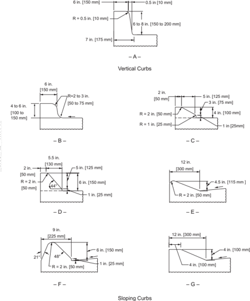

Vertical curbs may be either vertical or nearly vertical and are intended to discourage vehicles from leaving the roadway. As shown in Figure 4-5A, they range from 6 to 8 in. [150 to 200 mm] in height. Vertical curbs should not be used along freeways or other high-speed roadways

because an out-of-control vehicle may overturn or become airborne as a result of an impact with such a curb. Since curbs are not adequate to prevent a vehicle from leaving the roadway, a suitable traffic barrier should be provided where redirection of vehicles is needed.

Vertical curbs and walkways may be desirable along the faces of long walls and tunnels, particularly if full shoulders are not provided. These curbs tend to discourage vehicles from driving close to the wall, and thus the walkway, reducing the risk to persons walking from disabled vehicles.

Sloping curbs are designed so vehicles can cross them readily when the need arises. As shown in Figures 4-5B through 4-5G, sloping curbs are low with flat sloping faces. The curbs shown in Figures 4-5B, 4-5C, and 4-5D are considered to be mountable under emergency conditions although such curbs will scrape the undersides of some vehicles. For ease in crossing, sloping curbs should be well rounded as in Figures 4-5B through 4-5G.

When the slope of the curb face is steeper than 1V:1H, vehicles can mount the curb more readily when the height of the curb is limited to at most 4 in. [100 mm] and preferably less. However, when the face slope is between 1V:1H and 1V:2H, the height should be limited to about 6 in. [150 mm]. Some highway agencies construct a vertical section on the lower face of the curb (Figures 4-5C, 4-5D, and 4-5F) as an allowance for future resurfacing. This vertical portion should not exceed approximately 2 in. [50 mm], and where the total curb height exceeds 6 in. [150 mm], it may be considered a vertical curb rather than a sloping curb.

Sloping curbs can be used at median edges, to outline channelizing islands in intersection areas, or at the outer edge of the shoulder. For example, any of the sloping configurations in Figure 4-5 might be used for a median curb. When curbs are used to outline channelizing islands, an offset should be provided. Offsets to curbed islands are discussed in Section 9.6.3.

Shoulder curbs are placed at the outer edge of the shoulder to control drainage, improve delineation, control access, and reduce erosion. These curbs, combined with a gutter section, may be part of the longitudinal drainage system. If the surfaced shoulders are not wide enough for a vehicle to park, the shoulder curb should appear to be easily mountable to encourage motorists to park clear of the traveled way. Where it is expected that bicyclists will use the roadway, sufficient width from the face of the curb should be provided so bicyclists can avoid conflict with motorists while not having to travel too close to the curb. For further information, see the AASHTO Guide for the Development of Bicycle Facilities ( 8 ).

## 4.7.2.1  Gutters

Gutter sections may be provided on the traveled-way side of a vertical or sloping curb to form the principal drainage system for the roadway. Inlets are provided in the gutter or curb, or both. Gutters are generally 1 to 6 ft [0.3 to 1.8 m] wide, with a cross slope of 5 to 8 percent to increase the hydraulic capacity of the gutter section. In general, the 5 to 8 percent slope should be con-

--',''','',',',','''''',,,,''-'-',,',,',',,'---

fined to the 2 to 3 ft [0.6 to 0.9 m] adjacent to the curb. Shallow gutters without a curb have small flow capacity and thus limited value for drainage. Generally, it is not practical to design gutter sections to contain all of the runoff; some overflow onto the surface can be expected. The spread of water on the traveled way is kept within tolerable limits by the proper size and spacing of inlets. Grate inlets and depressions for curb-opening inlets should not be placed in the lane because of their adverse effect on drivers who veer away from them. Bicycle-compatible grates should be used unless bicyclists are prohibited from using the roadway. Warping of the gutter for curb-opening inlets should be limited to the portion within 2 to 3 ft [0.6 to 0.9 m] of the curb to minimize adverse driving effects.

The width of a vertical or sloping curb is considered a cross-section element entirely outside the traveled way. Also, a gutter of contrasting color and texture should not be considered part of the traveled way. When a gutter has the same surface color and texture as the traveled way, and is not much steeper in cross slope than the adjoining traveled way, it may be considered as part of the traveled way. This arrangement is used frequently in urban areas where restricted rightof-way width does not allow for the provision of a gutter. However, any form of curb has some effect on the lateral position of drivers; drivers tend to move away from a curb, which reduces the effective through-lane width. A gutter with an evident longitudinal joint and somewhat steeper cross slope than the adjacent lane is a greater deterrent to driving or bicycling near the gutter than the situation in which the traveled way and gutter are integral.

## 4.7.3  Curb Placement

Vertical or sloping curbs located at the edge of the traveled way may have some effect on lateral placement of moving vehicles, depending on the curb configuration and appearance. Curbs with low, sloping faces may encourage drivers to operate relatively close to them. Sloping curbs with steeper faces may encourage drivers to shy away from them and, therefore, should incorporate some additional roadway width. Sloping curbs placed at the edge of the traveled way, although considered mountable in emergencies, can be mounted satisfactorily only at reduced speeds. For low-speed street conditions in urban areas, curbs may be placed at the edge of the traveled way, although it is preferable that the curbs be offset 1 to 2 ft [0.3 to 0.6 m].

Vertical curbs introduced intermittently along streets should be offset 2 ft [0.6 m] from the edge of the traveled way. Where a continuous curb is used along a median or channelizing island through an intersection or interchange, curbs should be offset at least 1 ft [0.3 m], and preferably 2 ft [0.6 m], from the traveled way.

Data on the lateral placement of vehicles with respect to high vertical curbs show that drivers will shy away from curbs that are high enough to damage the underbody and fenders of vehicles ( 45 ). The exact relationship is not known precisely, but it has been established that the lateral placement varies with the curb height and steepness and the location of other obstructions outside the curb. The lateral placement with respect to the curb is somewhat greater where the curb

--',''','',',',','''''',,,,''-'-',,',,',',,'---

is first introduced than where the curb is continuous for some distance. The shying away at the beginning of the curb will be lessened if the curb is introduced with the end flared away from the pavement edge.

Vertical curbs should not be used along freeways or other high-speed arterials, but if a curb is needed, it should be of the sloping type and should not be located closer to the traveled way than the outer edge of the shoulder. In addition, sloping-end treatments should be provided. When using curbs in conjunction with traffic barriers, such as on bridges, consideration should be given to the type and height of barrier. Curbs placed in front of traffic barriers can result in unpredictable impact trajectories. For a more detailed discussion on curb usage and location in relation to railings and longitudinal barriers, refer to the AASHTO Roadside Design Guide ( 7 ).

## 4.8  DRAINAGE CHANNELS AND SIDESLOPES

## 4.8.1  General Considerations

Highway drainage design in rural areas should incorporate traversable or recoverable roadsides, good appearance, control of pollutants, and economical maintenance. This may be accomplished with flat sideslopes, broad drainage channels, rain gardens, and liberal warping and rounding. In urban areas, runoff is often captured in enclosed storm drains, and rain gardens may be used to reduce the amount of runoff.

An important part of highway design is consistency, which prevents discontinuities in the highway environment and considers the interrelationship of all highway elements. The interrelationship between the drainage channel and sideslopes is important because good roadside design can reduce the potential severity of crashes that may occur when a vehicle leaves the roadway.

## 4.8.2  Drainage

Highway drainage facilities carry water across the right-of-way and remove stormwater from the roadway itself. Drainage facilities include bridges, culverts, channels, curbs, gutters, and various types of drains. Hydraulic capacities and locations of such structures should be designed to take into consideration damage to upstream and downstream property and to reduce the likelihood of traffic interruption by flooding consistent with the importance of the road, the design traffic service needs, Federal and state regulations, and available funds. While drainage design considerations are an integral part of highway geometric design, specific drainage design criteria are not included in this policy. The AASHTO Highway Drainage Guidelines ( 5 ) should be referred to for a general discussion of drainage, and the AASHTO Drainage Manual ( 9 ) should be referred to for guidelines on major areas of highway hydraulic design.

Many state highway agencies have excellent highway drainage manuals that may be used for reference for hydraulic design procedures. Alternatively, the AASHTO Drainage Manual ( 9 )

and computer software ( 22 ) may be referenced. In addition, other publications on drainage are widely used and are available to highway agencies from FHWA ( 22 ).

The design of culverts and other structures should be in accordance with the current AASHTO LRFD Bridge Design Specifications ( 12 ). The minimum design loading for new culverts should be the HL-93 for design loads. Where an existing road is to be reconstructed, an existing culvert that fits the proposed alignment, gradeline, and lateral offset may remain in place when its structural capacity meets the HS 15 [MS 13.5] for live loads in accordance with the AASHTO LRFD Bridge Design Specifications ( 12 ).

Hydraulic requirements for stream crossings and flood plain encroachments frequently affect highway alignment and profile. The probable effects of a highway encroachment on the risk of flood damage to other property and the risk of flood damage to the highway should be evaluated when a flood plain location is under consideration. Water surface elevations for floods of various return periods will influence decisions regarding the highway profile where an encroachment on the flood plain is considered. Highway profiles at stream crossings will often be determined by hydraulic considerations. To the extent that it is practical, stream crossings and other highway encroachments on flood plains should be located and aligned to preserve the natural flood flow distribution and direction. Stream stability and the stream environment are also important and complex considerations in highway location and design ( 37 ).

Surface channels are used to intercept and remove surface runoff from roadways, wherever practical. They should have adequate capacity for the design runoff and should be properly located and shaped. Channels are usually lined with vegetation, and rock or paved channel linings are used where vegetation will not control erosion. Runoff from roadway surfaces normally drains down grass slopes to roadside or median channels. Curbs or dikes, inlets, and chutes or flumes are used where runoff from the roadway would erode fill slopes. Where storm drains are needed, curbs are usually provided.

Drainage inlets should be designed and located to limit the spread of water on the traveled way to  tolerable  widths.  Because  grates  may  become  blocked  by  trash  accumulation,  curb  openings or combination inlets with both grate and curb openings are advantageous for urban area conditions. Grate inlets and depressions or curb-opening inlets should be located outside the through-traffic lanes to minimize the shifting of vehicles attempting to avoid riding over them. Inlet grates should also be designed to accommodate bicycle and pedestrian traffic where appropriate. Discontinuous sections of curbing, as at the gore of ramps, and variable curb offsets should not be used as expedients to handle pavement drainage where these features could contribute to loss of control by vehicles that run off the road. Inlets should be designed and located to prevent silt and debris carried in suspension from being deposited on the traveled way where the longitudinal gradient is decreased. Extra inlets should be installed near low points of sag vertical curves to take any overflow from blocked inlets. Inlets should be located so that concentrated flow and heavy sheet flow will not cross traffic lanes. In areas where roadway surfaces

are warped, such as at cross streets or ramps, surface water should be intercepted just before the change in cross slope. Also, inlets should be located just upgrade of pedestrian crossings. Storm drains should have adequate capacity to avoid ponding of water on the roadway and bridges, especially in sag vertical curves. The general effect of drainage on the geometry of roadways, shoulder ditches, or gutters and sideslopes is discussed further in the rest of this chapter.

Drainage is usually more difficult and costly for urban than for rural highways because of more rapid rates and larger volumes of runoff, costlier potential flood damage to adjacent property, higher overall costs from more inlets and underground systems, greater restrictions from urban development, lack of natural water body areas to receive flood water, and higher volumes of vehicular and pedestrian traffic. There is greater need to intercept concentrated stormwater before it reaches the highway and to remove over-the-curb flow and surface water without interrupting traffic flow or causing a problem for vehicle occupants or pedestrians. To accommodate such runoff, underground systems and numerous inlets, curbs, and gutters are usually needed. New outfall drains of considerable length are needed because existing stormwater systems often lack capacity for highway surface drainage volumes. A joint-use stormwater system, shared by the highway agency with others, can have economic advantages to both parties because it is normally more economical to build a common system rather than two independent systems. Drainage design for urban roads and streets is discussed in the FHWA Urban Drainage Design Manual ( 18 ).

Reduction of peak flows can be achieved by the temporary storage of stormwater in detention basins,  storm  drainage  pipes,  swales  and  channels,  parking  lots,  rain  gardens,  and  rooftops. Stormwater is released to the downstream conveyance facility or stream at a reduced flow rate. This concept should be considered for use in highway drainage design where existing downstream conveyance facilities are inadequate to handle peak flow rates from highway storm drainage facilities, where the highway would contribute to increased peak flow rates and aggravate downstream flooding problems, and to reduce the construction costs of outfalls from highway storm drainage facilities. Stormwater detention may also be needed to conform to Federal and state water quality regulations. Some states have environmental regulations that require specific pollution/erosion measures.

The cost of drainage is neither incidental nor minor on most roads. Careful attention to needs for adequate drainage and protection of the highway from floods in all phases of location and design will prove to be effective in reducing costs in both construction and maintenance.

## 4.8.3  Drainage Channels

Drainage channels, consisting of a foreslope, ditch bottom, and backslope, perform the vital function of collecting and conveying surface water from the highway right-of-way. Drainage channels, therefore, should have adequate capacity for the design runoff, provide for unusual stormwater with minimum damage to the highway, and be located and shaped to provide a smooth transition from the roadway to the backslope. Channels should be protected from ero-

sion with the least expensive protective lining that will withstand the expected flow velocities. Channels should be kept clean and free of material that would lower the channel's capacity. Channel deterioration can reduce the capacity of the channel, which may result in overflow causing erosion or deposits in the area adjacent to the channel.

Where the construction  of  a  highway  would  have  an  adverse  effect  on  drainage  conditions downstream, drainage channels can be an effective means of flood storage within the highway right-of-way. Drainage channels include:

- y roadside channels in cut sections to remove water from the highway cross section,
- y toe-of-slope channels to convey the water from any cut section and from adjacent slopes to the natural watercourse,
- y intercepting channels placed back of the top of cut slopes to intercept surface water, and
- y flumes to carry collected water down steep cut or fill slopes.

The primary purpose for construction of roadside channels is to control surface drainage. The most economical method of constructing a roadside channel usually entails the formation of open-channel ditches by cutting into the natural roadside terrain to produce a drainage channel. From a standpoint of hydraulic efficiency, the most desirable channel contains steep sides. However,  limitations  on  slope  stability  usually  indicate  a  need  for  somewhat  flatter  slopes. Construction and maintenance factors also impose restrictions on the degree of slope steepness that is practical alongside a highway. The offsetting factor of right-of-way costs should also be considered when selecting combinations of slopes to be used.

The effect of slope combinations on the potential trajectories of vehicles that run off the road is also an important consideration in designing the roadside. In general, the severity of traversal of roadside channels less than 4 to 8 ft [1.2 to 2.4 m] wide is essentially the same for comparable slope combinations regardless of channel shape. Slope combinations forming these narrow channels can be selected to produce cross sections that are traversable.

The use of foreslopes steeper than 1V:4H severely limits the range of backslopes. Flatter foreslopes permit greater flexibility  in  the  selection  of  traversable  backslopes.  The  flatter  foreslope  also provides greater recovery distance for an errant vehicle. For additional information, refer to the AASHTO Roadside Design Guide ( 7 ).

The depth of channel should be sufficient to remove surface water without saturation of the subgrade. The depth of water that can be tolerated, particularly on flat channel slopes, depends upon the soil characteristics. In regions with severe winter climates, channel sideslopes of 1V:5H or 1V:6H are preferable to reduce snow drifts.

A broad, flat, rounded drainage channel also provides a sense of openness. With a channel sideslope of 1V:4H or flatter and a 10-ft [3.0-m] shoulder, the entire roadside channel is visible to

the driver. This increases the driver's comfort level and enhances the driver's willingness to use the shoulder in an emergency.

The minimum desirable grade for channels should be based upon the drainage velocities needed to avoid sedimentation. The maximum desirable grade for unpaved channels should be based upon a tolerable velocity for vegetation and shear on soil types. Refer to the AASHTO Highway Drainage Guidelines ( 5 ) for further guidance in this area. The channel grade does not have to follow that of the roadbed, particularly if the roadbed is flat. Although desirable, it is unnecessary to standardize the design of roadside drainage channels for any length of highway. Not only can the depth and width of the channel be varied to meet different amounts of runoff, slopes of channel, types of lining, and distances between discharge points, but the lateral distance between the channel and the edge of the traveled way can also be varied. Usually, liberal offsets can be obtained where cuts are slight and where cuts end and fills begin. Care should be taken, however, to avoid abrupt major changes in the roadway section that would violate driver expectancy for continuity in the highway environment. Care should also be taken to avoid major breaks in channel grade that would cause unnecessary scour or silt deposition.

Intercepting channels generally have a flat cross section, preferably formed by a dike made with borrow material to avoid disturbing the natural ground surface. Intercepting channels should have ample capacity and should follow the contour as much as practical, except when located on top of a slope that is subject to sliding. In slide areas, stormwater should be intercepted and removed as rapidly as practical. Sections of channels that cross highly permeable soil might need lining with impermeable material.

Median drainage channels are generally shallow depressed areas, or swales, located at or near the center of the median, and formed by the flat sideslopes of the divided roadways. The swale is  sloped  longitudinally  for  drainage  and  water  is  intercepted  at  intervals  by  inlets  or  transverse channels and discharged from the roadway in storm drains or culverts. Flat, traversable drainage dikes are sometimes used to increase the efficiency of the inlets. Refer to Section 4.11, 'Medians,' for further discussion. Safety grates on median drains and cross drains, while reducing the potential for loss of control by errant vehicles, can reduce the hydraulic efficiency of the drainage structures if not properly designed. The inlet capacity may be further reduced by the accumulation of debris on the grates, occasionally resulting in roadway flooding. If the use of grates significantly reduces the hydraulic capacity or causes clogging problems to occur, other methods of drainage, or shielding of the structure, should be considered.

Flumes are used to carry the water collected by intercepting channels' down cut slopes and to discharge the water collected by shoulder curbs. Flumes can either be open channels or pipes. High velocities preclude sharp turns in open flumes and generally need some means of dissipating the energy of flow at the outlet of the flume. Closed flumes or pipes are preferred to avoid failure due to settlement and erosion. Generally in highly erodible soil, watertight joints should

--',''','',',',','''''',,,,''-'-',,',,',',,'--- be provided to prevent failure of the facility. Caution should be exercised to avoid splashing that may cause erosion.

Channel erosion may be prevented with the use of linings that withstand the velocity of storm runoff. The type of linings used in roadside channels depends upon the velocity of flow, type of soil, and grade and geometry of the channel. Grass is usually the most economical channel lining except on steep slopes where the velocity of flow exceeds the permissible velocities for grass protection. Other materials that can be used for channel lining where grass will not provide adequate protection include concrete, asphalt, stone, and nylon. Smooth linings generate higher velocities than rough linings such as stone and grass. Provision should be made to dissipate the energy of the high-velocity flow before it is released to avoid scour at the outlet and damage to the channel lining. If erosive velocities are developed, a special channel design or energy dissipater may be needed.

Refer  to  the  AASHTO Highway  Drainage  Guidelines ( 5 )  and  drainage  design  manuals,  as well as handbooks and publications from the Soil Conservation Service, U. S. Army Corps of Engineers, and Bureau of Reclamation, for details on design and protective treatments, including filter requirements. In addition, FHWA publications, such as Design of Roadside Channels with Flexible Linings ( 23 ), provide excellent references.

## 4.8.4  Sideslopes

For high-speed facilities in rural areas, sideslopes should be designed to enhance roadway stability and to provide a reasonable opportunity for recovery for an errant vehicle.

Three regions of the roadside are important to reducing the potential for loss of control for vehicles that run off the road: the top of the slope (hinge point), the foreslope, and the toe of the slope (intersection of the foreslope with level ground or with a backslope, forming a ditch). Figure 4-6 illustrates these three regions.

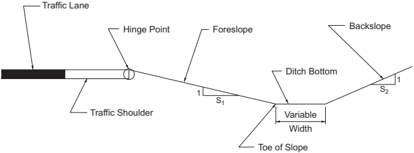

Figure 4-6. Designation of Roadside Regions

The hinge point contributes to loss of steering control because vehicles tend to become airborne in crossing this point. The foreslope region is important in the design of high slopes where a driver could attempt a recovery maneuver or reduce speed before impacting the ditch area. The toe of the slope is often within the roadside clear zone and therefore, the probability that an out-of-control vehicle will reach the ditch is high. In this case, a smooth transition between fore- and backslopes should be provided.

Research on these three regions of the roadside has found that rounding at the hinge point, though not essential to reduce vehicle rollovers, can increase the general traversability of the roadside ( 38 ). Rounded slope transitions reduce the chances of an errant vehicle becoming airborne, thereby reducing the likelihood of further encroachment and affording the driver more control over the vehicle. Foreslopes steeper than 1V:4H are not desirable because their use severely limits the choice of backslopes. Slopes 1V:3H or steeper are recommended only where site conditions do not permit use of flatter slopes. When slopes steeper than 1V:3H are used, consideration should be given to the use of a roadside barrier.

Another important factor for reducing crash severity at intersecting roadways is the angle of break between a sideslope and a transverse slope. Field observations indicate that more consideration should be given in roadway design to carrying the desirable flat sideslopes through intersections, driveway approaches, median openings, and cut sections. Available options to reduce the severity of any crashes that may occur are to provide a flatter slope between the shoulder edge and the ditch bottom, locate the ditch a little farther from the roadway, or even enclose short sections of drainage facilities.

Earth cut and fill slopes should be flattened and liberally rounded as fitting with the topography and consistent with the overall type of highway. Effective erosion control, low-cost maintenance, and adequate drainage of the subgrade are largely dependent upon proper shaping of the sideslopes. Slope and soil data are used in combination to approximate the stability of the slopes and the erosion potential. Overall economy depends not only on the initial construction cost but also on the cost of maintenance, which is dependent on slope stability. Furthermore, flat or rounded natural slopes with good overall appearance are appropriate for any roadside located near developed and populated areas.

Normally, backslopes should be 1V:3H or flatter, to accommodate maintenance equipment. In developed  areas,  sufficient  space  may  not  be  available  to  permit  the  use  of  desirable  slopes. Backslopes steeper than 1V:3H should be evaluated with regard to soil stability and potential crash severity. Retaining walls should be considered where space restrictions would otherwise result in slopes steeper than 1V:2H. On the other hand, soil characteristics may necessitate the use of slopes flatter than 1V:2H or even 1V:3H. If adequate width is not available in such cases, retaining walls may be needed. The type of retaining structure should be compatible with the area  traversed  and  the  grade  separation  structures.  To  minimize  the  feeling  of  constriction, walls should be set back as far as practical from the traveled way. Where retaining walls are used

--',''','',',',','''''',,,,''-'-',,',,',',,'---

in combination with earth slopes, the walls may be located either at the roadway level adjacent to the shoulder or on the outer portion of the separation width above the depressed roadway.

On freeways and other arterials with relatively wide roadsides, sideslopes should be designed to provide a reasonable opportunity for a driver to recover control of an errant vehicle. Where the roadside at the point of departure is reasonably flat, smooth, and clear of fixed objects, many potential crashes can be averted. A rate of slope of 1V:6H or flatter on embankments can be negotiated by a vehicle with a good chance of recovery and should, therefore, be provided where practical.  For  moderate  heights  with  good  roundings, steeper slopes up to about 1V:3H can also be traversable (though not always recoverable). On intermediate-height fills, the cost of a continuous flat slope may be prohibitive, but it may be practical to provide a recovery area that is reasonably flat and rounded adjacent to the roadway. The recovery area should extend well beyond the edge of the shoulder as specific conditions may permit.

Desirably, slope combinations would be selected so that unrestrained occupants could be expected to sustain no injury, or only minor injuries, and the vehicle would not incur major damage during traversal. However, site conditions such as restricted right-of-way or the cost-effectiveness of such design may dictate the use of slope combinations steeper than desirable. If constraints make it impractical to provide the appropriate roadside recovery distance, the need for a roadside barrier should be considered. Where the height and slope of roadway embankments are such that the severity of potential crashes will be reduced by the placement of a roadside barrier, the cross section should be designed to allow adequate slope rounding and to support the barrier.

Flat and well-rounded sideslopes simplify the establishment of turf and its subsequent maintenance. Grasses usually can be readily established on sideslopes as steep as 1V:2H in favorable climates and 1V:3H in semiarid climates. With slopes of 2V:3H and steeper, it is difficult to establish turf, even in areas of abundant rainfall. Because of the greater velocity of runoff, sufficient water for the maintenance of grass does not seep into the soil. Deep-rooted plants that do not depend upon surface water alone may be appropriate where slopes are excessively steep. Slopes of the order of 1V:3H and flatter can be mechanically mowed. Although steeper slopes reduce the mowing area considerably, the slow, time-consuming manual methods needed to mow the area add substantially to maintenance costs.

With some types of soils, it is essential for stability that slopes be reasonably flat. Soils that are predominantly clay or gumbo are particularly susceptible to erosion, and slopes of 1V:3H or flatter should be used. The intersections of slope planes in the highway cross section should complement the earth forms of the terrain being traversed. Some earth forms are well-rounded and others are steeply sloped. The designer should strive to create a natural look that is aesthetically pleasing. Since rounded landforms are the natural result of erosion, such rounded forms are stable; therefore, use of well-rounded forms in the design of the highway cross section is likely to result in greater stability.

To attain a natural appearance along the roadside, flat, well-rounded sideslopes should be provided. A uniform slope through a cut or fill section often results in a formal or stilted appearance. This appearance can be softened and made more natural by flattening the slopes on the ends where the cut or fill  is  minimal  and  by  gradually  steepening  it  toward  the  controlling maximum slope of the cut or fill. This design may be readily accomplished by liberal rounding of the hinge point in the transition area. On short cut or fill sections, the result may be one of continuous longitudinal rounding whereas, on sections of substantial length, the effect will be one of funneling. The transitioning of sideslopes is especially effective at the ends of cuts when combined with an increased lateral offset of the drainage channel and a widened shoulder.

The combination of flat slopes and rounding is frequently referred to as a 'streamlined cross section.' With this shape, the crosswinds sweep along the surface without forming eddies that contribute to the wind erosion and drifting of snow. The streamlined cross section usually results in a minimum expenditure for snow removal because the winds blow the snow off the traveled way instead of drifting it, as happens in cross sections with steep slopes and no rounding. When combined with the design of an elevated roadway on earth embankment to ensure drainage of the subgrade, the streamlined cross section results in a roadway that needs minimal maintenance and operating costs and operates with fewer severe crashes.

In some cases, an irregular slope stake line results from the strict adherence to specified cut or fill slopes. It may be more aesthetically pleasing to vary the slope to yield a neat stake line.

Design slopes for rock vary widely, depending upon the materials. A commonly used slope for rock cuts is 2V:1H. With modern construction methods, such as pre-splitting, slopes ranging as steep as 6V:1H may be used in good-quality rock. Deep cuts in rock often involve the construction of benches in the slopes.

Slope stability as well as appearance may be enhanced in poor-quality rock by the establishment of vegetative cover. In some parts of the country, serrated cut slopes aid in the establishment of vegetative cover on decomposed rock or shale slopes. Serration may be constructed in any material that can be ripped or that will hold a vertical face long enough to establish vegetation ( 39 ).

Desirably, the toe of the rock-cut slope should be located beyond the minimum lateral distance from the edge of the traveled way needed by the driver of an errant vehicle to either regain control and then return to the roadway or to slow the vehicle. Wide shelves at the bottom of rock cuts have advantages in that a landing area is provided for falling boulders and space is available for snow storage in colder climates. This width can also be shaped to provide a clear roadside recovery area.

Rock outcroppings are frequently left in place during construction of new highways for economic or aesthetic purposes. These should be eliminated within the clear roadside recovery area

where removal is practical. Alternatively, if they cannot be removed, they should be shielded by the installation of a roadside barrier.

For additional guidance on sideslope design, refer to the AASHTO Roadside Design Guide ( 7 ).

## 4.9  ILLUSTRATIVE OUTER CROSS SECTIONS

## 4.9.1  Normal Crown Sections

Figure 4-1A shows the most widely used cross section in modern highway practice. The combination of elements is simple and forms a streamlined cross section. Usable shoulder widths are included on both the fill and cut sections. The controlling shoulder slopes range from 2 percent, for a paved or impervious surface, to 8 percent, the maximum slope applicable to a turf surface.

In Figure 4-1A the drainage channel at the right is formed by the foreslope on the roadway side and the cut slope, or backslope, on the outer side. The foreslope and backslope combination should be designed such that it can be traversed by an errant vehicle without overturning. The channel should be wide enough to provide sufficient drainage capacity and deep enough for roadbed stability. A depth of 1 to 4 ft [0.3 to 1.2 m] below the shoulder break is recommended.

In areas where errant vehicles may leave the roadway, it is desirable to provide rounding at the intersection of slope planes. Rounding of all slope intersections also improves appearance and simplifies maintenance. In general, 4 to 6 ft [1.2 to 1.8 m] of rounding is the minimum desirable at the edge of the shoulder. The rounding needed at the top of cut slopes is dependent upon a number of factors, including the type of soil, slope ratio and height, and the natural ground slopes. The rounding may vary from 4 to 15 ft [1.2 to 4.5 m]. Toe-of-slope rounding minimizes slope change and offers an increase in fill stability. Toe-of-slope rounding also varies with slopes and fill heights, and has the same general dimensions as on cut slopes.

Figure 4-1B illustrates a type of curb treatment that can be used for drainage control or to separate roadways and sidewalks. To the extent that it is practical, sidewalks should be separated from the roadway. In areas fully developed with retail stores and offices, it may not be practical to offset the sidewalk from the roadway because of the right-of-way considerations. In such cases, curbs are used to separate the sidewalk from the edge of the roadway. This section is shown on the right side of the figure.

## 4.9.2  Superelevated Sections

For superelevated cross sections, as shown in Figure 4-2, it is desirable from an operational standpoint that the shoulder slope on the low side be the same as the traveled way superelevation slope.

--',''','',',',','''''',,,,''-'-',,',,',',,'---

Copyright American Association of State Highway and Transportation Officials

Provided by IHS Markit under license with AASHTO

In Figure 4-2A the direction of shoulder slope on the high side of the cross section is the same as that for normal crowned traveled ways except that its rate of slope should be limited. To avoid an undesirable rollover effect, the algebraic difference in cross slopes at the edge of the traveled way should not exceed 8 percent. Accordingly, use of this cross section should be reserved for low rates of superelevation and shoulder slope. The shoulder slope on the alternate section of Figure 4-2A is a projection of the superelevated traveled way.

In Figure 4-2B the level shoulder on the high edge of this cross section represents a compromise that prevents the shoulder from draining to the traveled way while complying with the 8 percent rollover control. The use of this cross section should be reserved for stable soils where the percolation, caused by the water falling directly upon the shoulder, is not very great. Where snowfall is prevalent, this cross section would tend to allow snow melt from a windrow on the shoulder to flow across the traveled way, creating a potential icing situation when refreezing occurs.

Figure 4-2C shows the high-side shoulder rolled over in a well-rounded transverse vertical curve so that the water falling upon the shoulder is divided between the traveled way and the side channel or fill slope. On this rounded shoulder, any vehicle would stand nearly level as needed to facilitate tire changes and other repairs. The vertical curve should not be less than 4 ft [1.2 m] long, and at least the inner 2 ft [0.6 m] of the shoulder should be held at the superelevated slope. The shoulder slope on the alternate section of Figure 4-2C is a planar section with multiple breaks.

Superelevation is advantageous for traffic operations on intermediate- to high-speed arterials, as well as for roadways in rural areas and freeways in urban areas. However, superelevation may be impractical or undesirable in built-up areas because of the combination of wide pavements, proximity of adjacent development, control of cross slope and profile for drainage, frequency of cross streets, and other urban area features. Usually, superelevation is not provided on local streets in residential, commercial, or industrial areas. For further information on superelevation, refer to Chapter 3.

## 4.10  TRAFFIC BARRIERS

## 4.10.1  General Considerations

Traffic barriers are used to prevent vehicles that leave the traveled way from colliding with objects that have greater crash severity potential than the barrier itself. Because barriers are themselves a source of crash potential, their use should be carefully considered. For more detailed information regarding traffic barriers, refer to the AASHTO Roadside Design Guide ( 7 ).

Research continues to develop improved and more cost-effective barriers. The criteria discussed herein will undoubtedly be refined and amended in the future. Therefore, the designer should remain current on new barrier concepts and criteria.

Important factors to consider in the selection of a longitudinal system include barrier performance, lateral deflection characteristics, and the space available to accommodate barrier deflection.  Consideration should also be given to the adaptability of the system to operational transitions and end treatments and to the initial and future maintenance cost.

Six options are available for the treatment of roadside obstacles:

- y remove or redesign the obstacle so it is more traversable,
- y relocate the obstacle to a point where it is less likely to be struck,
- y reduce impact severity by using an appropriate breakaway device,
- y redirect a vehicle by shielding the obstacle with a longitudinal traffic barrier and/or crash cushion,
- y delineate the obstacle if the above alternatives are not appropriate, or
- y take no action.

Roadway cross  section  significantly  affects  traffic  barrier  performance.  Curbs,  dikes,  sloped shoulders, and stepped medians can cause errant vehicles to vault or submarine a barrier or to strike a barrier so that the vehicle overturns.

## 4.10.2  Longitudinal Barriers

## 4.10.2.1  Roadside Barriers

A roadside barrier is a longitudinal system used to shield motorists from obstacles or slopes located along either side of a roadway. It may occasionally be used to protect pedestrians, bystanders, and cyclists from vehicular traffic. Elements which may warrant shielding by a roadside barrier include embankment obstacles, roadside obstacles, and sensitive areas such as schools and playgrounds.

Recent studies indicate that rounding at the shoulder and at the toe of an embankment slope can reduce its crash severity potential. Rounded slopes reduce the chances that an errant vehicle will  become airborne, thereby reducing the potential consequences of an encroachment and affording the driver more vehicle control.

The height and slope of an embankment are the key factors in determining barrier need through a fill section. The designer should refer to current design guidelines for determination of barrier needs ( 7 ).

A clear, unobstructed, flat roadside is desirable. When these conditions do not exist, criteria to determine the need for a barrier should be consulted. Roadside obstacles include non-traversable areas and fixed objects. If it is not practical to remove, modify, or relocate an obstacle, then a barrier may be needed. The purpose of a barrier is to reduce crash severity. Therefore, a barrier

should be installed only if it is clear that the barrier will have lower crash severity potential than the roadside obstacle.

Barriers should be located beyond the edge of the shoulder so that the full shoulder width may be used. The fill supporting the barrier should be sufficiently wide to provide lateral support. At bridge locations, roadside barriers should be aligned with the bridge rail and properly secured to the bridge to minimize the possibility of a vehicle striking the barrier and snagging. Proper treatment of the exposed end of the barrier is also important. An untreated or square approach end of a barrier presents a formidable roadside obstacle. The AASHTO Roadside Design Guide ( 7 ) provides more information on crashworthy end treatments.

The need for a barrier in rock cuts and near large boulders is a matter of judgment by the highway designer and depends on the potential severity of a crash and the lateral clearance available.

For additional material on roadside barriers, refer to the AASHTO Roadside Design Guide ( 7 ).

## 4.10.2.2  Median Barriers

A median barrier is a longitudinal system used to minimize the possibility of an errant vehicle crossing into the path of traffic traveling in the opposite direction. When traffic volumes are low, the probability of a vehicle crossing a median and colliding with a vehicle in the opposing direction is relatively low. Likewise, for relatively wide medians the probability of a vehicle crossing the median and colliding with a vehicle in the opposing roadway is also relatively low. In these instances, median barriers are generally recommended only when there has been a history of cross-median collisions or, for new roadways, where an incidence of high crash rates of this type would be expected. Although cross-median collisions may be reduced by median barriers, total crash frequency will generally increase because the space available for return-to-the-road maneuvers is decreased.

Special consideration should be given to barrier needs for medians separating traveled ways at different elevations. The ability of an errant driver to return to the road or stop after leaving the higher roadway diminishes as the difference in elevations increases. Thus, the potential for cross-median head-on collisions increases.

An important consideration in the design of median barriers is reducing the severity of collisions with the exposed end of the barrier. For more information on crashworthy end treatments, refer to the AASHTO Roadside Design Guide ( 7 ).

For all divided highways regardless of median width and traffic volume, the median roadside should also be examined for other factors, such as obstacles and lateral drop-offs, that may indicate that the use of a barrier is appropriate.

Careful consideration should be given to the installation of median barriers on multilane expressways or other highways with partial access control. Even medians that are narrow provide an opportunity for motorists that inadvertently leave the roadway to recover, and they can also include geometric features to accommodate crossing or left-turn traffic. With the addition of a barrier, barrier ends at median openings present formidable obstacles. Crash cushions, although needing maintenance and imposing a high initial cost, may be needed to shield an errant motorist from barrier ends. Consequently, an evaluation of the number of median openings, crash history, alignment, sight distance, design speed, traffic volume, and median width should be conducted prior to installing median barriers on non-freeway facilities.

Barriers should also be considered on outer separations of 50 ft [15 m] or less where the frontage roads carry two-way traffic.

For additional information on median barrier types, refer to the AASHTO Roadside Design Guide ( 7 ).

In selecting the type of median barrier, it is important to match the dynamic lateral deflection characteristics to the site. The maximum deflection should be less than one-half the median width to prevent penetration into the opposing lanes of traffic. The median barrier should be designed to redirect the colliding vehicle in the same direction as the traffic flow. In addition, the design should be aesthetically pleasing.

On heavily traveled facilities, a concrete barrier with a sloping face has many advantages. For example, this type of barrier deflects a vehicle striking it at a slight impact angle. It is aesthetically pleasing and needs little maintenance. The latter is an important consideration on highways with narrow medians since maintenance operations encroach on the high-speed traveled way and may involve closure of one of the traffic lanes during repair time. The designer should also bear in mind that even though a concrete barrier does not deflect, there may be significant intrusion into the space above and beyond the barrier by high-center-of-gravity vehicles that strike the barrier at high speeds or large angles. A bus or tractor-trailer may lean enough to strike objects mounted on top of the barrier or within 10 ft [3.0 m] of the barrier face. While piers and abutments may be able to withstand such impacts, other structures such as sign trusses and luminaire supports may become involved in secondary collisions. These Zones of Intrusion are explained in the AASHTO Roadside Design Guide ( 7 ).

The appropriate types of median barriers are different for stepped median sections (i.e., where the median is between roadways of different elevations). Cable, W-beam on weak and strong posts, and box-beam systems are generally limited to relatively flat medians and may not be appropriate for some stepped median sections. The AASHTO Roadside Design Guide ( 7 ) provides further guidance in this area.

It is important that, during the selection and design of a median barrier, consideration is given to the potential effect of the barrier on sight distance on horizontal curves.

Due to ongoing research and development, the design of median barriers and terminals is continually improving. Reference should be made to the latest developments in median barrier and terminal design.

Precast concrete median barrier can be used for temporary protection of work areas and for guiding traffic during construction. It can also be incorporated permanently as part of the completed facility.

## 4.10.3  Bridge Railings

Bridge railings are designed to redirect an impacting vehicle and minimize the potential for the vehicle to penetrate the railing. Bridge railings also reduce the potential for vehicles, pedestrians, or cyclists to fall from the structure. The AASHTO LRFD Bridge Design Specifications ( 12 ) specifies geometric, design load, railing heights, and maximum allowable material stress requirements for the design of new traffic railings for pedestrians, bicycles, and combination types. Bridge railings are longitudinal traffic barriers that differ from other traffic barriers primarily in their foundations. These railings are a structural extension of a bridge while other traffic barriers are usually set in or on soil. For information related to railings in the context of bicycle facilities, refer to the AASHTO Guide for the Development of Bicycle Facilities ( 8 ).

On the roadway approach to a bridge, the bridge railing may be extended with a roadside barrier,  which  in  turn  should  have  a  crashworthy  terminal.  At  the  approach  juncture  between a bridge railing and roadside barrier, an incompatibility may exist in the stiffness of the two barrier types. This stiffness should be gradually transitioned over a length to prevent the barrier system from pocketing or snagging an impacting vehicle.

Where a roadside  barrier  is  provided  between  the  edge  of  the  traveled  way  and  the  bridge railing so that a sidewalk can be included, special attention should be given to the barrier end treatment. End treatments that are both functional and effective in reducing crash severity are difficult to design. The end treatments should be effective in reducing crash severity, yet not impede pedestrian usage of the walkway.

The recommended lateral clearances between the traveled way and bridge railings usually exceed curb offset distances. The use of a curbed cross section on a bridge approach may be inappropriate in some cases where a flush cross section is used on the bridge. One design method used is to drop the curb at the first intersection away from the end of the bridge. Another option is to reduce the curb to a low, sloping curb with a gently sloped traffic face, well in advance of the introduction of the traffic barrier.

--',''','',',',','''''',,,,''-'-',,',,',',,'---

## 4.10.4  Crash Cushions

Crash cushions are protective systems that prevent errant vehicles from impacting roadside obstacles by decelerating the vehicle to a safe stop when hit head-on or redirecting vehicles away from the obstacle ( 7 ). A common application of a crash cushion is at the end of a bridge rail located in a gore area. Where site conditions permit, a crash cushion should also be considered as an alternative to a roadside barrier to shield rigid objects such as bridge piers, overhead sign supports, abutments, and retaining-wall ends.

Site preparation is important in using crash cushions. Inappropriate site conditions may compromise cushion effectiveness. Crash cushions should be located on a level area free from curbs or other physical obstacles. The design of new highway facilities should consider alternatives to crash cushions where appropriate.

## 4.11  MEDIANS

A median is the portion of a highway separating opposing directions of the traveled way. Medians are highly desirable on roadways carrying four or more lanes. Median width is expressed as the dimension between the edges of the traveled way for the roadways in the opposing directions of travel, including the width of the left shoulders, if any. The principal benefits of medians on high-speed roadways in rural areas and on urban freeways are that they can provide a recovery area for errant vehicles, a stopping area in case of emergencies, a space for auxiliary lanes (including speed-change lanes and left-turn/U-turn lanes), and width for future lanes; separation between opposing traffic; and diminished headlight glare.

Benefits of medians in urban areas include controlling access, providing a refuge area for pedestrians crossing the street, and controlling the location of intersection traffic conflicts. For maximum efficiency, a median should be highly visible both night and day and should contrast with the traveled way. Medians may be depressed, raised, or flush with the traveled way surface. To realize these benefits, medians should be designed to provide sufficient widths for the needs of crossing vehicles, bicyclists, and pedestrians.

In determining median width, consideration should be given to the potential need for median barrier. Where practical, median widths should be such that a median barrier is not needed. Most median widths are in the range from 4 to 80 ft [1.2 to 24 m], with even wider medians being used in some cases. Economic factors often limit the median width that can be provided. Cost of construction and maintenance increases as median width increases, but the additional cost may not be appreciable compared with the total cost of the highway and may be justified in view of the benefits gained.

At unsignalized intersections on divided highways in rural areas, the median should generally be as wide as practical. In urban areas, medians that are intended to serve as a pedestrian refuge

--',''','',',',','''''',,,,''-'-',,',,',',,'---

area should be at least 6 ft [1.8 m], as discussed in Section 4.17. Wider medians may be needed to accommodate turning and crossing maneuvers by larger vehicles ( 33 ). Medians at unsignalized intersections should be wide enough to allow selected design vehicles to make a designated maneuver. The appropriate design vehicle for determining the median width should be chosen based on the actual or anticipated vehicle mix of crossroad and U-turn traffic. A consideration in the use of wider medians on roadways other than freeways is the provision of adequate storage area for vehicles, including bicyclists, crossing the highway at unsignalized intersections and at median openings serving commercial and private driveways. Such median openings may need to be controlled as intersections (see Chapter 9).

If right-of-way is restricted, a wide median may not be justified if provided at the expense of narrowed border areas. A reasonable border width is needed to adequately serve as a buffer between the private development along the road and the traveled way, particularly where zoning is limited or non-existent. Space should be provided on the borders for sidewalks, highway signs, utility lines, parking, drainage channels, structures, proper slopes, clear recovery zones, and any retained native growth. Narrowing the border areas may create obstacles and hindrances similar to those that the median is designed to avoid.

A depressed median is generally preferred on freeways for more efficient drainage and snow removal. Median sideslopes should preferably be 1V:6H, but slopes of 1V:4H may be adequate. Drainage inlets in the median should be designed either with the top of the inlet flush with the ground or with culvert ends provided with traversable safety grates.

Raised medians have application on arterial streets where it is desirable to regulate left-turn movements. They are also frequently used where the median is to be planted, particularly where the width is relatively narrow. Careful consideration should be given to the location and type of plantings. Plantings, particularly in narrow medians, may create problems for maintenance activities.  Also,  plantings  such  as  trees  in  the  median  can  also  cause  visual  obstructions  for turning motorists if not carefully located. Plantings and other landscaping features in median areas may constitute roadside obstacles and should be consistent with the AASHTO Roadside Design Guide ( 7 ).

Flush medians are commonly used on arterials in urban areas. Where used on freeways, a median barrier may be needed. The crowned type is frequently used because it eliminates the need for collecting drainage water in the median. In general, however, the slightly depressed median is preferred either with a cross slope of about 4 percent or with a minor steepening of the roadway cross slope.

The concept of converting flush medians to two-way left-turn lanes on streets in urban areas has become widely accepted to reduce travel time, improve capacity, and reduce crash frequency (particularly for rear-end crashes) ( 16 ). However, two-way left-turn lanes do not provide a midblock pedestrian refuge. Median widths of 10 to 16 ft [3.0 to 4.8 m] provide the optimum design

--',''','',',',','''''',,,,''-'-',,',,',',,'---

--',''','',',',','''''',,,,''-'-',,',,',',,'--- for converting to two-way left-turn lanes. Refer to the MUTCD ( 27 ) for appropriate signing and lane markings and to Chapter 2 for additional discussion and details.

Two-way left-turn lanes may be inappropriate at many locations and conversion of existing twoway left-turn lanes to nontraversable medians should be considered. Two-way left-turn lanes have been widely used to provide access to closely spaced, low-volume commercial driveways along arterial roads. From an access management perspective, they increase rather than control access opportunities. Highway agencies have installed raised-curb or concrete median barriers on existing highways in place of flush medians to better manage highway access and to provide a median refuge for pedestrians. In addition, some median openings for minor streets have been closed, permitting only right turns in and out of these streets. This median treatment can reduce the number and location of conflicts along a section of roadway. It should be recognized that diverted left-turn volumes may increase congestion and collisions at downstream intersections; provisions to accommodate U-turn traffic should also be considered at downstream locations.

Where there is no fixed-source lighting, headlight glare across medians or outer separations can be a nuisance, particularly where the highway has relatively sharp curves or if the profiles of the opposing roadways are uneven. Under these conditions, some form of antiglare treatment should be considered as part of the median barrier installation, provided it does not act as a snow fence and does not create drifting problems.

When medians are 40 ft [12 m] or wider, drivers have a sense of separation from opposing traffic; thus, a desirable ease and freedom of operation is obtained, the noise and air pressure of opposing traffic is not noticeable, and the glare of headlights at night is greatly reduced. With widths of 60 ft [18 m] or more, the median can be pleasingly landscaped in a park-like manner. Plantings used to achieve this park-like appearance need not compromise the roadside recovery area.

There is demonstrated benefit in any separation, raised or flush. Wider medians are desirable at unsignalized intersections in rural areas, but medians as wide as 60 ft [18 m] may not be desirable at urban area intersections or at intersections that are signalized or may need signalization in the foreseeable future. For further guidance in the selection of median widths for divided highways with at-grade intersections, refer to NCHRP Report 375, Median Intersection Design ( 33 ).

Cross-median crashes on high-speed roadways can result in high-severity injuries and fatalities.  All  median-related  incidents  begin  with  median  encroachment.  Reducing  median  encroachments  can  reduce  both  cross-median  crashes  and  fixed-object  crashes  in  the  median. Although installing a barrier often substantially reduces cross-median crashes, it may also increase fixed-object crashes and the crash risk for maintenance personnel. Designers should consider other median-encroachment countermeasures where appropriate. NCHRP Report 790, Factors Contributing to Median Encroachments and Cross-Median Crashes ( 35 ), identifies design

and operational factors that contribute to the frequency and severity of median encroachments and cross-median crashes. Table 4-2 provides guidelines for reducing the frequency and severity of median-related crashes on divided roadways.

## 4.12  FRONTAGE ROADS

Frontage roads serve numerous functions, depending on the type of arterial they serve and the character of the surrounding area. They may be used to control access to the arterial, function as a street facility serving adjoining properties, and maintain circulation of traffic on each side of the arterial. Frontage roads segregate local traffic from the higher speed through traffic and intercept driveways of residences and commercial establishments along the highway. Cross connections provide access between the traveled way and frontage roads and are usually located in the vicinity of the crossroads. Thus, the through character of the highway is preserved and unaffected by subsequent development of the roadsides.

Frontage roads are used on all types of highways. Chapters 7 and 8 include discussions of the use of frontage roads for specific roadway types with which frontage roads are appropriate. Frontage roads are used most frequently on freeways where their primary function is to distribute and collect traffic between local streets and freeway interchanges. In some circumstances, frontage roads are desirable on arterial streets both in the urban core and suburban contexts. Frontage roads not only provide more favorable access for commercial and residential development than the faster moving arterial street but also help to preserve the capacity of and reduce crashes on the latter. In rural areas, development of expressways may need separated frontage roads that are somewhat removed from the right-of-way and serve as access connections between crossroads and adjacent farms or other development.

Despite the advantages of using frontage roads on arterial streets, the use of continuous frontage roads on relatively high-speed arterial streets with intersections may be undesirable. Along cross streets, the various through and turning movements at several closely spaced intersections may greatly increase crash potential. Multiple intersections are also vulnerable to wrong-way entrances. Traffic operations are improved if the frontage roads are located a considerable distance from the main line at the intersecting cross roads in order to lengthen the spacing between successive intersections along the crossroads. In urban areas, a minimum spacing of about 150 ft [50 m] between the arterial and the frontage roads is desirable. For further discussion on frontage roads at intersections, refer to Section 9.11.1, 'Intersection Design Elements with Frontage Roads.'

--',''','',',',','''''',,,,''-'-',,',,',',,'---

Table 4-2. Design Guidelines and Countermeasures to Reduce Median-Related Crashes on High-Speed Roadways (35)

| Objective                                                      | Design Guidance / Countermeasures                                                                                                                                                                                                                                                                                                                                                                    |
|----------------------------------------------------------------|------------------------------------------------------------------------------------------------------------------------------------------------------------------------------------------------------------------------------------------------------------------------------------------------------------------------------------------------------------------------------------------------------|
| Design guidance to reduce consequences of median encroachments | Design guidance to reduce consequences of median encroachments                                                                                                                                                                                                                                                                                                                                       |
| Minimize potential for collision with fixed objects            | Relocate or remove fixed objects in median                                                                                                                                                                                                                                                                                                                                                           |
| Reduce consequences of collision with fixed objects            | Provide barrier to shield objects in median                                                                                                                                                                                                                                                                                                                                                          |
| Reduce likelihood of cross-median collisions                   | Provide wider median Provide continuous median barrier                                                                                                                                                                                                                                                                                                                                               |
| Reduce likelihood of vehicle overturning                       | Flatten median slopes Provide U-shaped (rather than V-shaped) median cross section Provide barrier to shield steep slopes                                                                                                                                                                                                                                                                            |
| Design guidance to reduce likelihood of median encroachments   | Design guidance to reduce likelihood of median encroachments                                                                                                                                                                                                                                                                                                                                         |
| Improve design of geometric elements                           | Provide wider median shoulder Minimize sharp curves with radii less than 3,000 ft Minimize steep grades of 4% or more                                                                                                                                                                                                                                                                                |
| Improve design of mainline ramp terminals                      | Increase separation between on-ramps and off- ramps Minimize left-hand exits Improve design of merge and diverge areas by lengthening speed-change lanes Simplify design of weaving areas                                                                                                                                                                                                            |
| Countermeasures to reduce likelihood of median encroachments   | Countermeasures to reduce likelihood of median encroachments                                                                                                                                                                                                                                                                                                                                         |
| Reduce driver inattention                                      | Provide edgeline or shoulder rumble strips                                                                                                                                                                                                                                                                                                                                                           |
| Decrease side friction demand                                  | Improve/restore superelevation at horizontal curves                                                                                                                                                                                                                                                                                                                                                  |
| Increase pavement friction                                     | Provide high-friction pavement surfaces                                                                                                                                                                                                                                                                                                                                                              |
| Improve drainage                                               | Improve road surface or cross-slope for better drainage                                                                                                                                                                                                                                                                                                                                              |
| Reduce high driver workload                                    | Improve visibility and provide better advance warning for on-ramps Improve visibility and provide better advance warning for curves and grades Improve delineation                                                                                                                                                                                                                                   |
| Encourage drivers to reduce speeds                             | Provide transverse pavement markings                                                                                                                                                                                                                                                                                                                                                                 |
| Minimize weather-related crashes                               | Provide weather-activated speed signs Provide static signs warning of weather condi- tions (e.g., bridge freezes before road surface) Apply sand or other materials to improve road surface friction Apply chemical de-icing or anti-icing as a loca- tion-specific treatment Improve winter maintenance response times Install snow fences Raise the state of preparedness for winter main- tenance |

--',''','',',',','''''',,,,''-'-',,',,',',,'---

In general, frontage roads are parallel to the traveled way, may be provided on one or both sides of the arterial, and may or may not be continuous. Where the highway crosses a grid street system on a diagonal course or where the street pattern is irregular, the frontage roads may be a variable distance from the traveled way. Arrangements and patterns of frontage roads are shown in Figure 4-7. Figure 4-7A illustrates the most common arrangement, which is two frontage roads running parallel and approximately equidistant from a freeway. In urban areas, continuous frontage roads that are parallel to the freeway permit the use of the frontage roads as a backup system in case of an accident on the freeway or other freeway disruption. Figure 4-7B shows a freeway with one frontage road. On the side without the frontage road, the local streets serve to collect and distribute the traffic.

Figure 4-7. Typical Frontage Road Arrangements

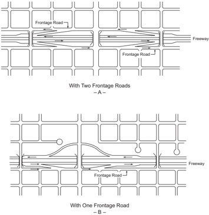

One-way frontage roads are much preferred to two-way frontage roads. While one-way operation inconveniences local traffic to some degree, the reduction in vehicular and pedestrian conflicts at intersecting streets generally compensates for this inconvenience. In addition, the width needed for both roadway and right-of-way is somewhat reduced. Two-way frontage roads

at busy intersections complicate crossing and turning movements. Where off-ramps join a twoway frontage road, the potential for wrong-way entry is increased. This problem is greatest where the ramp joins the frontage road at an acute angle, thus giving the appearance of an onramp to the wrong-way driver.

Connections between the arterial and frontage road are an important element of design. On arterials with slow-moving traffic and one-way frontage roads, slip ramps or simple openings in a narrow outer separation may work reasonably well. Slip ramps from a freeway to two-way frontage roads are generally unsatisfactory because they may induce wrong-way entry to the freeway traveled way and create an increased crash potential at the intersection of the ramp and frontage road. On freeways and other arterials with high operating speeds, the ramps and their terminals should be liberally designed to provide for speed changes and storage. Details of ramp design are addressed in Chapter 10.

Figure 4-8 illustrates an arrangement of frontage roads with entrance and exit ramps that are applicable to freeways and other higher speed arterials. The one-way frontage roads illustrated in Figure 4-8 are designed to minimize conflicts and maintain capacity on both freeways and frontage roads.

Figure 4-8. One-Way Frontage Roads and Entrance and Exit Ramps

The design of a frontage road is influenced by the type of service it is intended to provide. Where a frontage road is continuous and passes through highly developed areas, it assumes the character of an important street, serving both local traffic as well as overflow from the traveled way. Where the frontage roads are not continuous or are only a few blocks in length, follow an irregular pattern, border the rear and sides of buildings, or serve only scattered development, traffic will be light and operation will be local in character. Refer to Chapter 6 for guidelines on the widths of two-lane frontage roads for collectors in rural and urban areas.

--',''','',',',','''''',,,,''-'-',,',,',',,'---

## 4.13  OUTER SEPARATIONS

The area between the traveled way of a through-traffic roadway and a frontage road or street is referred to as the 'outer separation.' Such separations function as buffers between the through traffic on the arterial and the local traffic on the frontage road and provide space for a shoulder for the through roadway and ramp connections to or from the through facility.

The wider the outer separation, the less influence local traffic will have on through traffic. Wide separations lend themselves to landscape treatment and enhance the appearance of both the highway  and  the  adjoining  property.  A  substantial  width  of  outer  separation  is  particularly advantageous at intersections with cross streets because it minimizes vehicle and pedestrian conflicts.

Where ramp connections are provided between the through roadway and the frontage road, the outer separation should be substantially wider than typical. The needed separation width will depend mostly upon the design of the ramp terminals.

Where two-way frontage roads are provided, a driver on the through facility faces opposing frontage-road traffic on the right as well as opposing arterial traffic on the left. Desirably, the outer separation should be sufficiently wide to minimize the effects of the approaching traffic, particularly the potentially confusing and distracting nuisance of headlight glare at night. With one-way frontage roads, the outer separation need not be as wide as with two-way frontage roads.

The cross section and treatment of an outer separation depend largely upon its width and the type of arterial and frontage road. Preferably, the strip should drain away from the through roadway either to a curb and gutter at the frontage road or to a swale within the strip. Typical cross sections of outer separations for various types of arterials are illustrated in Figure 4-9.

The cross section in Figure 4-9A is applicable to low-speed arterial streets in densely developed areas. Figure 4-9B shows a minimal outer separation that may be applicable to ground-level freeways and high-speed arterial streets. This outer separation consists simply of the shoulders of the through roadway and the frontage road, as well as a physical or traffic barrier. Figure 4-9C shows a depressed arterial with a cantilevered frontage road. In this example, the inside edge of the frontage road is located directly over the outside edge of the through roadway. Figure 4-9D illustrates a common type of outer separation along a section of depressed freeway, Figure 4-9E shows a walled section at a depressed arterial with a ramp, and Figure 4-9F shows a typical freeway outer separation with a ramp.

Figure 4-9. Typical Outer Separations for Various Types of Arterials

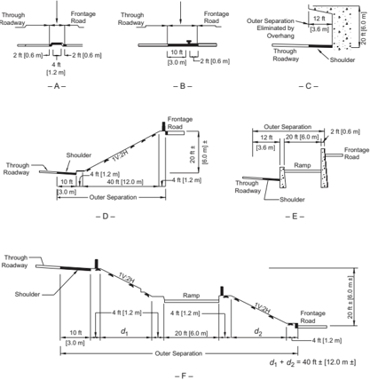

## 4.14  ROADWAY TRAFFIC NOISE ABATEMENT

## 4.14.1  General Considerations

Highway traffic noise is caused by tire-pavement interaction, aerodynamic sources, and the vehicle itself. The generated noise can create adverse effects in nearby communities. In some situations, location and design changes may reduce these effects.

--',''','',',',','''''',,,,''-'-',,',,',',,'---

Generally accepted practices for quantifying highway traffic noise use a worst-hour A-weighted equivalent sound level [ LAeq (1h)] or the sound level exceeded 10 percent of the time during the worst noise hour ( L10 ) ( 26 ). The A-weighted equivalent refers to the amplification or attenuation of the different frequencies of the sound (subjectively, the pitch) to correspond to the way the human ear 'hears' these frequencies. Generally, when the sound level exceeds the mid-60 dBA range, outdoor conversation in normal tones becomes difficult. Other noise metrics include the day-night average sound level ( Ldn or DNL) and the community noise equivalent level ( Lden or CNEL ) for average sound energy over a 24-hour period with penalties for evening ( CNEL ) or nighttime (DNL and CNEL ) sensitivity.

A listener may judge a 9- to 10-dB increase in sound level to be twice as loud as the original sound, whereas a 9- to 10-dB reduction may be judged to be half as loud. Doubling the number of sources (i.e. vehicles) will increase the LAeq (1h) by approximately 3 dB, which is usually the change in noise levels that people can detect without specifically listening for a change.

Several factors affect noise levels in communities adjacent to highways. Distance and ground effects can decrease levels by 3 dB or more per doubling of distance over hard ground (e.g., pavement or water) and more over soft ground (e.g., grass or loose soil). Intervening terrain and buildings can further reduce noise levels. Meteorological conditions (e.g., wind and temperature) also affect sound levels.

The term insertion loss (IL) describes the noise reduction in Leq (1h) at a location provided by a noise abatement measure, such as a noise barrier. For example, if the Leq (1h) at a residence before a noise barrier is constructed is 75 dBA and the Leq (1h) after the barrier is constructed is 65 dBA, then the IL is 10 dB.

## 4.14.2  Noise Evaluation Procedures

Noise studies should be conducted for projects that increase roadway capacity. Noise studies identify  the  noise-sensitive  land  uses  that  will  be  affected  by  the  project  and  evaluate  noise abatement for those affected land uses in accordance with each state's noise policy.

Table 4-3 presents Noise Abatement Criteria (NAC) for various land use activity categories. For example, the NAC for residential land uses is an LAeq (1h) of 67 dBA ( 26 ). Each state defines what constitutes a 'substantial increase' over existing noise levels. Noise impacts occur if predicted worst-hour noise levels in the design year approach or exceed the NAC for a particular land use category or if the project causes a substantial increase in existing noise levels.

Table 4-3. Noise-Abatement Criteria for Various Land Uses (26)

| Activity Category   | L Aeq (1h) dBA   | Evaluation Location   | Activity Description                                                                                                                                                                                                                                                                                                                                                                                |
|---------------------|------------------|-----------------------|-----------------------------------------------------------------------------------------------------------------------------------------------------------------------------------------------------------------------------------------------------------------------------------------------------------------------------------------------------------------------------------------------------|
| A                   | 57               | Exterior              | Lands on which serenity and quiet are of extraordinary significance and serve an important public need and where the preservation of those qualities is essential if the area is to continue to serve its intended purpose.                                                                                                                                                                         |
| B (1)               | 67               | Exterior              | Residential.                                                                                                                                                                                                                                                                                                                                                                                        |
| C (1)               | 67               | Exterior              | Active sport areas, amphitheaters, auditoriums, camp- grounds, cemeteries, day care centers, hospitals, libraries, medical facilities, parks, picnic areas, places of worship, playgrounds, public meeting rooms, public or nonprofit institutional structure, radio stations, recording studios, rec- reation areas, Section 4(f) sites, schools, television studios, trails, and trail crossings. |
| D                   | 52               | Interior              | Auditoriums, day care centers, hospitals, libraries, medical facilities, places of worship, public meeting rooms, public or nonprofit institutional structure, radio studios, recording studios, schools, and television studios.                                                                                                                                                                   |
| E (1)               | 72               | Exterior              | Hotels, motels, offices, restaurants/bars, and other devel- oped lands, properties or activities not included in A-D or F.                                                                                                                                                                                                                                                                          |
| F                   | -                | -                     | Agriculture, airports, bus yards, emergency services, indus- trial, logging, maintenance facilities, manufacturing, mining, rail yards, retail facilities, shipyards, utilities (water resources, water treatment, electrical), and warehousing.                                                                                                                                                    |
| G                   | -                | -                     | Undeveloped lands that are not permitted.                                                                                                                                                                                                                                                                                                                                                           |

## 4.14.3  Noise Reduction

There are several methods for reducing highway traffic noise levels. The most common abatement measure is provision of noise barriers constructed within the highway right-of-way that block the direct line of sight, and therefore the most direct path for noise to travel, between vehicles on the roadway and locations in the community. Blocking the direct line of sight with a noise barrier typically reduces noise levels by 5 dB and is often feasible. Achieving a 10 dB reduction is possible in some cases but requires removing 90 percent of the sound energy (which audibly sounds about half as loud).

Earth berms may also be effective where the road and the adjacent land uses are at grade, if there is adequate space to install them. The practicality of berm construction should be considered as part of the overall grading plan for the roadway. There will be instances in which an effective earth berm can be constructed within normal right-of-way or with a minimal additional rightof-way acquisition. If the right-of-way is insufficient to accommodate a full-height earth berm, a lower earth berm can be constructed in combination with a wall or screen to achieve the desired barrier height.

Careful consideration should be exercised so that the construction and placement of these noise barriers will not increase the severity of crashes that may occur. Every effort should be made to locate noise barriers to allow for sign placement and to provide lateral offsets to obstructions outside the edge of the traveled way. It is recognized, however, that such a setback may sometimes be impractical. In such situations, the largest practical width commensurate with cost-effectiveness considerations should be provided. Stopping sight distance is another important design consideration. Therefore, horizontal clearances should be checked for adequate sight distances. Construction of a noise barrier should be avoided at a given location if it would limit stopping sight distance below the minimum values shown in Table 3-1. This situation could be particularly critical where the location of a noise barrier is along the inside of a curve. Some designs use a concrete safety shape either as an integral part of the noise barrier or as a separate roadside barrier between the edge of the roadway and the noise barrier. On non-tangent alignments, a separate concrete barrier may obstruct sight distance even though the noise barrier does not. In such instances, it may be appropriate to install metal rather than concrete roadside barriers in order to retain adequate sight distance.

Care should be exercised in the location of noise barriers near gore areas. Barriers at these locations should begin or terminate, as the case may be, at least 200 ft [60 m] from the theoretical nose. Other considerations in determining barrier locations include development and assessment of alternative designs, ease and cost of maintenance, and aesthetics.

Potential noise problems should be identified early in the design process. Line, grade, earthwork balance, and right-of-way should all be worked out with noise in mind. Noise attenuation may be inexpensive and practical if built into the design and expensive if not considered until the end of the design process. An effective method of reducing traffic noise from adjacent areas is to design the highway so that some form of solid material blocks the line of sight between the noise source and the receptors. Advantage should be taken of the terrain in forming a natural barrier so that the appearance remains aesthetically pleasing.

A depressed highway section is the most desirable for noise abatement. Depressing the roadway below ground level has the same general effect as erecting barriers (i.e., a shadow zone is created where noise levels are reduced [see Figure 4-10]). Where a highway is constructed on an embankment, the embankment beyond the shoulders will sometimes block the line of sight to receptors near the highway, thus reducing the potential noise effects (see Figure 4-11).

The pavement type also affects vehicle and traffic noise. Quieter pavements can reduce traffic noise.

Figure 4-10. Effects of Depressing the Roadway

--',''','',',',','''''',,,,''-'-',,',,',',,'---

Note: Shadow Zone -Zone of reduced sound levels adjacent to a natural or man-made barrier

Figure 4-11. Effects of Elevating the Roadway

Sound barriers may be justified at certain locations, particularly along ground level or elevated highways through noise-sensitive areas. Concrete, wood, metal, or masonry walls are effective. One of the more aesthetically pleasing barriers is the earth berm that has been graded to achieve a natural form blending with the surrounding topography.

While landscaped earth berms and buffers (e.g., shrubs and trees) may reduce sound levels, they are generally not wide enough or dense enough to provide a substantial noise reduction in adjacent communities. Landscaped earth berms and buffers generally provide a positive aesthetic effect; however, maintenance needs should be considered.

## 4.15  ROADSIDE CONTROL

## 4.15.1  General Considerations

The efficiency and safety of a highway without control of access depend greatly upon the amount and character of roadside interference, characterized by vehicle movements to and from businesses, residences, or other development along the highway. Abutting property owners have rights of access, but it is desirable that the highway authority be empowered to regulate and control the location, design, and operation of access driveways and other roadside elements such as mailboxes. Such access control minimizes interference to through traffic on the highway. Interference resulting from indiscriminate roadside development and uncontrolled driveway connections results in lowered capacity, increased conflict, and early obsolescence of the highway.

## 4.15.2  Driveways

Driveway terminals are, in effect, low-volume intersections; thus, their design and location merit special consideration. The operational effects of driveways are directly related to the functional classification of the roadway to which they provide access. For example, whereas the number or location of driveways might adversely affect traffic operations, they are important links that provide access to residences and commercial establishments.

Driveways used for right turns only are desirable where the cross section includes a curbed median or a flush median and median barrier. Driveways used for both right and left turns offer considerably more interference to through traffic and are undesirable on arterial streets. However, on major streets with numerous motorist-oriented businesses, the elimination of left turns at driveways may worsen traffic operations by forcing large volumes of traffic to make U-turns or travel around the block in order to reach their destination.

The  regulation  and  design  of  driveways  is  intimately  linked  with  the  available  right-of-way and the land use and zoning control of the adjacent property. On new facilities, the needed right-of-way can be obtained to provide the desired degree of driveway regulation and control. To prohibit undesirable access conditions on existing facilities, either additional right-of-way can be acquired or agreements can be made with property owners to improve existing conditions. Often the desired degree of driveway control must be achieved through the use of police powers by requiring permits for all new driveways and adjustment of existing driveways that do not conform to established regulations. The objective of driveway regulations is to preserve efficiency and promote operational efficiency by prescribing desirable spacing and proper layout of driveways. The attainment of these objectives is dependent upon the type and extent of legislative authority granted to the highway agency. Many states and local municipalities have developed design policies for driveways and formed separate units to issue permits for new, or for changes in existing, driveway connections to main highways. For further information on the regulation and design of driveways, refer to the TRB Access Management Manual ( 44 ).

To the extent that it is practical, driveway designs should consider a range of objectives including:

- y maintaining the operations and efficiency on the intersecting roadway;
- y providing reasonable access to property;
- y providing sight distance between vehicles and pedestrians as well as efficient travel for sidewalk users;
- y incorporating design features so that any sidewalk crossing the driveway is accessible to and usable by individuals with disabilities;
- y accommodating bicycle lanes or paths, where present; and
- y maintaining public transportation locations, where present.

See Section 9.11.6, 'Driveways,' for additional discussion.

Driveway regulations generally control right-of-way encroachment, driveway location, driveway design, sight distance, drainage, use of curbs, parking, setback, lighting, and signing. Some of the principles of intersection design can also be applied directly to driveways. An important feature of driveway design is the elimination of large graded or paved areas adjacent to the traveled way upon which drivers can enter and leave the facility at will. Another feature is the provision of adequate driveway widths, throat dimensions, and proper layout to accommodate the anticipated types and volumes of vehicles patronizing the roadside establishment. Design guidance for driveway width is presented in Table 4-4. Additional details and discussion on driveway width and curve radius is presented in NCHRP Guide for Geometric Design of Driveways ( 30 ).

Table 4-4. Driveway Width Guidelines (30)

| Standard Driveways                                                                                                                                             | Standard Driveways                                                                                                                      |
|----------------------------------------------------------------------------------------------------------------------------------------------------------------|-----------------------------------------------------------------------------------------------------------------------------------------|
| Category/Description of Common Application                                                                                                                     | Width *                                                                                                                                 |
| Very high intensity / Urban activity center with almost constant driveway use during hours of operation.                                                       | Many justify two lanes in and two or three lanes out.                                                                                   |
| Higher intensity / Medium-size office or retail (e.g., community shopping center) with frequent driveway use during hours of operation.                        | One entry lane 12-13 ft [3.6- 3.9 m] wide; Two exit lanes 24-26 ft [7.2-7.8 m] total width.                                             |
| Medium intensity / Smaller office or retail, with occasional driveway use during hours of operation. Seldom more than one exiting vehicle at any time.         | Two lanes 24-26 ft [7.2-7.8 m] total width.                                                                                             |
| Lower intensity / Single-family or duplex residential, other types with low use, on lower speed and lower volume roadways. May not apply to rural residential. | May be related to the width of the garage, or driveway parking. Single lane, 9-12 ft [2.7-3.6 m]; Double lane, 16-20 ft [4.9 to 6.1 m]. |
| Special Situation Driveways                                                                                                                                    | Special Situation Driveways                                                                                                             |
| Category / Description of Common Application                                                                                                                   | Width *                                                                                                                                 |
| Central Business District / Building faces are close to the street.                                                                                            | Varies greatly depending on use.                                                                                                        |
| Farm or ranch; field / A mix of design vehicles; volumes may be very low.                                                                                      | 16 ft [4.9 m] minimum, 20 ft [6.1 m] desirable. Affected by widths of field machinery.                                                  |
| Industrial / Driveways are often used by large vehicles.                                                                                                       | Minimum 26 ft [7.9 m].                                                                                                                  |

Vertical alignment elements are also important in driveway design and should allow vehicles to be operated efficiently as they enter or exit the driveway. Profiles should be designed to minimize the possibility of a vehicle dragging or hanging up on the driveway. The vertical alignment of the driveway should reflect limitations on the sidewalk cross slope to accommodate pedestrians with disabilities. In addition, profiles should allow for adequate drainage and they should minimize the potential for ponding of water at the interface between the driveway and the sidewalk, as well as between the driveway and the intersecting roadway. Figure 4-12 shows driveway vertical alignment and profile elements. Design guidance for driveway elements including grade, width, channelization, cross slope, and other geometrics is presented in the Guide for Geometric Design of Driveways ( 30 ).  The ITE Guidelines for Driveway Design and Location ( 36 ) also discusses driveway design features.

Figure 4-12. Driveway Vertical Alignment and Profile Elements

Sight distance, another important design control, can be limited by the presence of unnecessary roadside structures. Therefore, no advertising signs should be permitted in the right-of-way. Billboards or other elements outside the right-of-way that obstruct sight distance should be controlled by statutory authority or by purchase of easements.

For  roadways  without  access  control  but  with  concentrated  business  development  along  the roadside, consideration should be given to the use of a frontage road. This type of control and design is particularly pertinent to a main highway or street on a new location for which sufficient right-of-way can be acquired. In the first stage, intermittent sections of frontage roads are constructed to connect the few driveways initially needed. Then, in succeeding stages, extensions or additional sections of frontage roads are provided to intercept driveways resulting from further development of the roadsides. Thus, serious roadside interference is prevented at all stages, and the through character of the highway or street is preserved by gradual and judicious provision of frontage roads.

## 4.15.3  Mailboxes

Mailboxes and appurtenant newspaper tubes served by carriers in vehicles may constitute a risk to  motorists either directly or indirectly, depending upon the placement of the mailbox, the cross-section dimensions of the highway or street, sight distance conditions in the vicinity of the mailbox, traffic volume, and impact resistance of the mailbox support. The potential for crashes that could involve both the carrier and the motoring public is affected whenever the carrier slows for a stop and then resumes travel along the highway. The risk is greatly increased if the cross section of the highway and the lateral placement of mailboxes are such that the vehicle occupies a portion of the traveled way while the mailbox is being serviced.

The mounting height of the mailbox places the box in a direct line with the windshield on many vehicles.  This  situation  is  more  critical  where  multiple  box  installations  are  encountered.  In many areas, the typical multiple mailbox installation consists of two or more posts supporting a horizontal member, usually a timber plank, which carries the group of mailboxes. The horizontal support element tends to penetrate the windshield and enter the passenger compartment when struck by a vehicle. Such installations are to be avoided where exposed to traffic. In fact,

--',''','',',',','''''',,,,''-'-',,',,',',,'---

the mailbox and support should be, where practical, located in an area not exposed to through traffic.

Mailboxes should be placed for maximum convenience to the patron, consistent with limiting the potential for crashes involving highway traffic, the carrier, and the patron. Consideration should be given to minimum walking distance within the roadway for the patron, available stopping sight distance in advance of the mailbox site (especially on older roads), and potential restriction to corner sight distance at driveway entrances. The placing of mailboxes along highspeed, high-volume highways should be avoided if other practical locations are available. New installations should, where practical, be located on the right side beyond an intersection with a public road or private driveway entrance. Boxes should be placed only on the right-hand side of the highway in the direction of travel of the carrier except on one-way streets where they may also be placed on the left-hand side.

Preferably, a mailbox should be placed so that it is not susceptible to being struck by an out-ofcontrol vehicle. Where this placement is not practical, the supports should be of a type that will yield or break away if struck. The mailbox should be firmly attached to the support to prevent it from breaking loose and flying through the windshield. These same criteria also apply to multiple box installations.

One of the primary considerations is the location of the mailbox in relation to the traveled way. Basically, a vehicle stopped at a mailbox should be clear of the traveled way. The higher the traffic volume or the speed, the greater the clearance should be. An exception to this may be considered on low-volume, low-speed roads and streets.

Most vehicles stopped at a mailbox will be clear of the traveled way if the mailbox is placed outside an 8-ft [2.4-m] wide usable shoulder or turnout. This position is recommended for most highways in rural areas. For high-volume, high-speed highways, it is recommended that the width of shoulder in front of the mailbox or turnout be increased to 10 ft [3.0 m] or even 12 ft [3.6 m] for some conditions. However, it may not be practical to consider even an 8-ft [2.4-m] shoulder or turnout on low-volume, low-speed roads or streets. To provide space for opening the mailbox door, it is recommended that the roadside face of a mailbox be set 8 to 12 in. [200 to 300 mm] outside the shoulder or turnout. Current postal regulations should be consulted for specific set-back criteria. --',''','',',',','''''',,,,''-'-',,',,',',,'---

In areas of heavy or frequent snowfall, mailboxes may be placed at about the customary line of the plowed windrow, but no closer than about 10 ft [3.0 m] to the edge of the traveled way if the shoulder is wider than 10 ft [3.0 m]. Cantilever mailbox supports may prove advantageous for snow-plowing operations. Wherever practical, mailboxes should be located behind existing guardrail.

In some urban and suburban areas, mailboxes are located along selected streets and highways where the local post office has established delivery routes. In these areas when the roadway has a curb and gutter section, mailboxes should be located with the front of the box 6 to 12 in. [150 to 300 mm] back of the face of curb. On residential streets without curbs or shoulder and which carry low traffic volumes operating at low speeds, the roadside face of a mailbox should be offset between 8 and 12 in. [200 and 300 mm] behind the edge of the traveled way.

For guidance on mailbox installations, refer to the AASHTO Roadside Design Guide ( 7 ). Current postal regulations should also be consulted for specific set-back criteria. Mailboxes should not interfere with the accessible passage on adjacent sidewalks, where sidewalks are present.

## 4.15.4  Fencing

Highway agencies use fencing extensively to delineate the control of access acquired for a highway. While provision of fencing is not a duty, fencing may also serve to reduce the likelihood of encroachment onto the highway right-of-way.

Any portion of a highway with full control of access may be fenced except in areas of precipitous slopes, natural barriers, or where it can be established that fencing is not needed to preserve access control. Fencing is usually located at or near the right-of-way line or, where frontage roads are used, in the area between the through highway and the frontage road (outer separation).

Fencing for access control is usually owned by the highway agency so that the agency has control of the type and location of fence. The type of fence that is most cost-effective yet best suited to the specific adjacent land use is generally selected. If fencing is not needed for access control, the fence should be the property of the adjacent landowner.

## 4.16  TUNNELS

## 4.16.1  General Considerations

Development of streets or highways may include sections constructed in tunnels either to carry the streets or highways under or through a natural obstacle or to minimize the effect of the roadway on the community. General conditions under which tunnel construction may be warranted include:

- y Long, narrow terrain ridges where a cut section may either be costly or carry environmental consequences;
- y Narrow rights-of-way where all of the surface area is needed for street purposes;
- y Large intersection areas or a series of adjoining intersections on an irregular or diagonal street pattern;

- y Grade-separated pedestrian and/or bicycle facilities are needed;
- y Railroad yards, airport runways, or similar facilities;
- y Parks or similar land uses, existing or planned; or
- y Locations  where  right-of-way  acquisition  costs  exceed  cost  of  tunnel  construction  and operation.

Although the costs of operation and maintenance of tunnels are beyond the scope of this policy, these costs should nevertheless be considered.

General construction and design features of tunnel sections are discussed in the following sections. It is not intended that these sections be considered comprehensive on the subject of the design of highway tunnels. Specific design issues such as soil conditions, construction phasing, ventilating, lighting, pumping, and other mechanical or electrical considerations require specialized engineering. For further information, see the AASHTO LRFD Road Tunnel Design and Construction Guide Specifications ( 13 ).

## 4.16.2  Types of Tunnels

Tunnels can be classified into two major categories:

- y tunnels constructed by mining methods, and
- y tunnels constructed by cut-and-cover methods.

The first category refers to those tunnels that are constructed without removing the overlying rock or soil. Usually this category is subdivided into two very broad groups according to the appropriate construction method. The two groups are named to reflect the overall character of the material to be excavated: hard rock and soft ground.

Of particular interest to the highway designer are the structural requirements of these construction methods and their relative costs. As a general rule, hard-rock tunneling is less expensive than soft-ground tunneling. A tunnel constructed through solid, intact, and homogeneous rock will normally represent the lower end of the scale with respect to structural demands and construction costs. A tunnel located below water in material that needs immediate and heavy support will involve extremely expensive soft-ground tunneling techniques such as shield and compressed air methods.

The shape of the structural cross section of the tunnel varies with the type and magnitude of loadings. In those cases where the structure will be subjected to roof loads with little or no side pressures, a horseshoe-shaped cross section is used. As side pressures increase, curvature is introduced into the sidewalls and invert struts added. When the loadings approach a distribution

similar to hydrostatic pressures, a full circular section is usually more efficient and economical. All cross sections are dimensioned to provide adequate space for ventilation ducts.

The second category of tunnel classification deals with the two types of tunnels that are constructed from the surface: trench and cut-and-cover tunnels. The latter are used exclusively for subaqueous work. In the trench method, prefabricated tunnel sections are constructed in shipyards or dry docks, floated to the site, sunk into a dredged trench, and joined together underwater. The trench is then backfilled. When conditions are favorable with respect to subsurface soil, amount of river current, volume and character of river traffic, availability of construction facilities, and type of existing waterfront structures, the trench method may prove more economical than alternative methods.

The cut-and-cover method is by far the most common type of tunnel construction for shallow tunnels, which often occurs in urban areas. As the name implies, the method consists of excavating an open cut, building the tunnel within the cut, and backfilling over the completed structure. Under ideal conditions, this method is the most economical for constructing tunnels located at a shallow depth. However, it should be noted that surface disruption and challenges in managing utilities generally make this method very expensive and difficult.

## 4.16.3  General Design Considerations

Tunnels should be as short as practical because the feeling of confinement and magnification of traffic noise can be unpleasant to motorists, and tunnels are the most expensive highway structures. Pedestrian tunnels should be wide enough to let natural light enter and to maximize the sense of security for pedestrians. The horizontal alignment through the tunnel is an important design consideration. Keeping the tunnel length on tangent as much as practical will not only minimize the length but also improve operating efficiency. Tunnels designed with extreme curvature may result in limited stopping sight distance. Therefore, sight distance across the face of the tunnel wall should be carefully examined.

The vertical alignment through the tunnel is another important design consideration. Grades in tunnels should be determined primarily on the basis of driver comfort while striving to reach a point of economic balance between construction costs and operating and maintenance expenses. Many factors have to be considered in tunnel lengths and grades and their effects on tunnel lighting and ventilation. For example, lighting expenses are highest near portals and depend heavily on availability of natural light and the need to make a good light transition. Ventilation costs depend on length, grades, natural and vehicle-induced ventilation, type of system, and air quality constraints.

The overall roadway design should avoid the need for guide signs within tunnels, because normal vertical and lateral clearances are usually insufficient for such signing and additional clearance can be provided only at very great expense. Exit ramps should be located a sufficient distance

downstream from the tunnel portal to allow for any guide signs that may need to be placed between the tunnel and the point of exit. This distance should be a minimum of 1,000 ft [300 m]. It is also highly undesirable that traffic be expected to merge, diverge, or weave within a tunnel, as might be the case if the tunnel is located between two closely spaced interchanges. Therefore, forks and exit or entrance ramps should be avoided within tunnels, where practical.

## 4.16.4  Tunnel Sections

From the standpoint of service to traffic, the design criteria used for tunnels should not differ materially from those used for grade separation structures. The same design criteria for alignment and profile and for vertical and horizontal clearances generally apply to tunnels except that minimum values are typically used because of high cost and restricted right-of-way.

Full left- and right-shoulder widths of the approach freeway desirably should be carried through the tunnel. Actually, the need for added lateral space is greater in tunnels than under separation structures because of the greater likelihood of vehicles becoming disabled in the longer lengths. If shoulders are not provided, intolerable delays may result when vehicles become disabled during periods of heavy traffic. However, the cost of providing shoulders in tunnels may be prohibitive, particularly on long tunnels that are constructed by the boring or shield-drive methods. Thus, the determination of the width of shoulders to be provided in a tunnel should be based on thorough analyses of all factors involved. Where it is not practical to provide shoulders in a tunnel, arrangements should be made for around-the-clock emergency service vehicles that can promptly remove any stalled vehicles.

Figure 4-13 illustrates typical tunnel cross sections for two-lane tunnels. The minimum roadway width between curbs, as shown in Figure 4-13A, should be at least 2 ft [0.6 m] greater than the approach traveled way, but not less than 24 ft [7.2 m]. Where sidewalks are provided for emergency egress by pedestrians, they must be designed to be accessible to and usable by pedestrians with disabilities ( 48, 49 ). For short tunnels, less than 200 ft [60 m] in length, the sidewalk may have a minimum width of 3.5 ft [1.1 m]. In long tunnels, 200 ft [60 m] or more in length, the sidewalk width must be at least 4 ft [1.2 m] with passing sections at least 5-ft [1.5-m] wide every 200 ft [60 m]. Since varying the tunnel cross section to provide passing sections may be impractical, sidewalks with a continuous width of 5 ft [1.5 m] must generally be provided. The total clearance between walls of a two-lane tunnel should be a minimum of 33 ft [10 m] for short tunnels and 34.5 ft [10.5 m] for long tunnels. The roadway width and the curb or sidewalk width can be varied as needed within the total tunnel width; however, each width should not be less than the minimum value stated above.

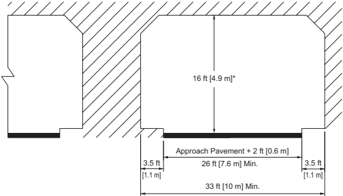

Minimum Cross Section for Short Tunnels (less than 200 ft [60 m] in length)

Desirable Cross Section for Long Tunnels (greater than or equal to 200 ft [60 m] in length)

Figure 4-13. Typical Two-Lane Tunnel Sections

The minimum vertical clearance is 16 ft [4.9 m] for freeways. However, the minimum clear height for all tunnels should not be less than that on the road leading to the tunnel, and it is desirable to provide an allowance for future repaving of the roadways.

Figure 4-13B illustrates the desirable section for long tunnels with two 12-ft [3.6-m] lanes, a 10ft [3.0-m] right shoulder, a 5-ft [1.5-m] left shoulder, and a 5-ft [1.5-m] sidewalk on each side. The roadway width may be distributed to either side in a different manner if needed to better fit the dimensions of the tunnel approaches. The vertical clearance for the desirable section is 16 ft [4.9 m] for freeways plus consideration of an allowance for future repaving. However, the minimum clear height for all tunnels should not be less than that on the road leading to the tunnel

Raised sidewalks are provided for through pedestrian movements in some nonfreeway tunnels. Normally, pedestrians are not permitted in freeway tunnels; however, raised sidewalks should be provided for emergency walking and for access by maintenance personnel. A sidewalk or shoulder area in a tunnel also serves as a buffer that prevents the overhang of vehicles from damaging the wall finish or the tunnel lighting fixtures. The minimum design criteria to provide pedestrian accessibility for sidewalks in tunnels have been addressed above. Separate tunnels may be warranted for pedestrians or other special uses, such as bikeways.

Figure 4-14 shows several tunnel sections as well as a partially covered highway. Directional traffic should be separated to limit the potential for crashes and to relieve the dizzying effect of two-way traffic in a confined space. This separation can be achieved by providing a twin opening as shown in Figure 4-14A, by multilevel sections as shown in Figures 4-14B and 4-14C, or by terraced structures as shown in Figure 4-14D. The terraced roadways are open on the outside for light, view, and ventilation. Figure 4-14E illustrates roadways that are tunneled under hillside buildings. A partially covered section, as shown in Figure 4-14F, provides light and ventilation to the motorist while minimizing freeway intrusion on the community traversed. This type of cross section is covered in Section 8.4.3, 'Depressed Freeways.'

--',''','',',',','''''',,,,''-'-',,',,',',,'---

Figure 4-14. Diagrammatic Tunnel Sections

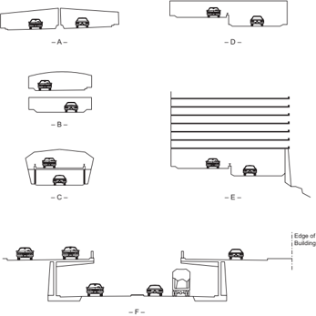

## 4.16.5  Examples of Tunnels

Figure 4-15 shows a freeway tunneling through a hillside. The portals are staggered and attractively designed. The interchange is located a sufficient distance from the tunnel to allow space for effective signing and the necessary traffic maneuvers. Figure 4-16 illustrates the interior of a two-lane directional tunnel.

Source: Kentucky Transportation Cabinet

Figure 4-15. Entrance to a Freeway Tunnel

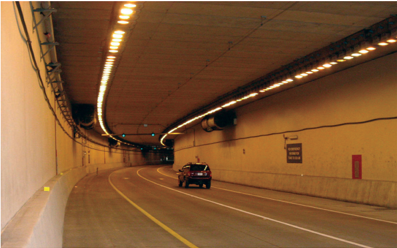

Source: Missouri DOT

Figure 4-16. Interior of a Two-Lane Directional Tunnel

--',''','',',',','''''',,,,''-'-',,',,',',,'---

## 4.17  PEDESTRIAN FACILITIES

## 4.17.1  Sidewalks

Sidewalks are an integral part of city streets and are sometimes also provided in rural areas. However, the potential for collisions with pedestrians is higher in many rural areas due to the higher speeds and general absence of lighting. The limited data available suggest that sidewalks in rural areas are effective in reducing pedestrian collisions.

Sidewalks near or along the highway in the rural and suburban contexts are more often needed at points of development that generate pedestrian concentrations, such as residential areas, schools, businesses, and industrial plants. When suburban residential areas are developed, initial roadway facilities are needed for the community to function, but the construction of sidewalks is sometimes deferred. However, if pedestrian activity is anticipated, sidewalks should be included as part of the initial construction.

In the suburban and urban contexts, a border area generally separates the roadway from a community's homes and businesses. The main function of the border is to provide space for sidewalks and utilities. Other functions are to provide space for streetlights, fire hydrants, street hardware, and aesthetic vegetation, and to serve as a buffer strip. Border width varies considerably, but 8 ft [2.4 m] is considered an appropriate minimum width. Swale ditches may be located in these borders to provide an economical alternative to curb and gutter sections, but additional right of way will often be needed.

Sidewalk widths in residential areas may vary from 4 to 8 ft [1.2 to 2.4 m]. Sidewalks less than 5 ft [1.5 m] in width require the addition of a passing section every 200 ft [60 m] for accessibility. The width of a planted strip between the sidewalk and traveled-way curb, if provided, should be a minimum of 2 ft [0.6 m] to allow for maintenance activities. Sidewalks covering the full border width are often appropriate in commercial areas, adjoining multiple-residential complexes, near schools and other pedestrian generators, and where border width is restricted.

Where sidewalks are placed adjacent to the curb, the widths should be approximately 2 ft [0.6 m] wider than the minimum required width. This additional width provides space for roadside hardware and snow storage outside the width needed by pedestrians. It also allows for the proximity of moving traffic, the opening of doors of parked cars, and bumper overhang on angled parking.

In general, wherever roadside and land development conditions generate pedestrian movement along a roadway, a sidewalk or path area, as suitable to the conditions, should be provided.

As a general practice, sidewalks should be constructed along any street or highway not provided with shoulders, even though pedestrian traffic may be light. Where sidewalks are built along a highspeed highway, buffer areas should be established so as to separate them from the traveled way.

Sidewalks should have all-weather surfaces to serve their intended use. Without them, pedestrians often choose to use the traveled way. Pedestrian crosswalks are regularly marked in urban areas but are rarely marked on highways in rural areas. However, where there are pedestrian concentrations,  appropriate  traffic-control  devices  should  be  used,  together  with  appropriate walkways constructed within the right-of-way.

Where two urban communities are in proximity to one another, consideration should be given to connecting the two communities with sidewalks or shared-use paths, even though pedestrian traffic may be light. This may avoid driver-pedestrian conflicts along the roadway between these communities.

Pedestrian facilities such as sidewalks must be designed to be accessible to and usable by individuals with disabilities. The cross slope on sidewalks should not exceed 2 percent. For additional guidance, refer to the Proposed Guidelines for Pedestrian Facilities in the Public Right-of-Way ( 46 ), the AASHTO Guide for the Planning, Design, and Operation of Pedestrian Facilities ( 4 ), Section 4.17.2, 'Grade-Separated Pedestrian Crossings,' and Section 4.17.3, 'Curb Ramps.'

Generally, the guidelines set forth in this section for the accommodation of pedestrians along roadways are also applicable to bridges. However, because of the high cost of bridges and the operational features that may be unique to bridge sites, pedestrian-way details on a bridge will often differ from those on its approaches. For example, where a planted strip between a sidewalk and the traveled way approaches a bridge, continuation of the offset, affected by the planted strip, will seldom be justified.

Where flush shoulders approach a bridge and pedestrian traffic is anticipated on the shoulders, the shoulder width should be continued across the bridge, and possibly increased, to account for the restriction to pedestrian escape imposed by the bridge rail. Where shoulders are intended for use by pedestrians, the shoulder must be accessible to and usable by individuals with disabilities. A flush roadway shoulder should not be interrupted by a raised walkway on a bridge. Where such installations already exist, and removal is not economically justified, the ends of the walkway should be ramped into the shoulder at a rate of approximately 1:20 with the shoulder grade.

Provisions for pedestrians are often appropriate on street overcrossings and on longer bridge crossings. On lower-speed streets, a vertical curb at the edge of the sidewalk is usually sufficient to separate pedestrians from vehicular traffic. Continuity of curb height should be maintained on the approaches to and over structures. For higher speed roadways on structures, a barrier-type rail of adequate height may be used to separate the walkway and the traveled way. A pedestrian-type rail or screen should be used at the outer edge of the walkway. On bridges of substantial length, a single walkway may be provided, depending on land use, context, and other factors. However, care should be taken so that approach walkways provide well designed and relatively direct access to the bridge walkway.

For a discussion of the potential problems associated with the introduction of a traffic barrier between a roadway and a walkway, see Section 4.10.3, 'Bridge Railings.' For a discussion on providing access between the street and the sidewalk to accommodate individuals with disabilities, see Section 4.17.3, 'Curb Ramps.' Further design guidance for sidewalks and pedestrian crossings that are accessible to and usable by individuals with disabilities, see References 48 and 49, the Proposed Guidelines for Pedestrian Facilities in the Public Right-of-Way ( 46 ), and the AASHTO Guide for the Planning, Design, and Operation of Pedestrian Facilities ( 4 ).

## 4.17.2  Grade-Separated Pedestrian Crossings

A grade-separated pedestrian facility allows pedestrians to cross at either over or under the roadway and provides pedestrians with a path for crossing the roadway without vehicle interference. Pedestrian separations should be provided where pedestrian volume, traffic volume, intersection capacity, and other conditions favor their use, although their specific location and design need individual study. They may be needed to accommodate heavy peak pedestrian movements, such as at central business districts, factories, schools, or athletic fields, in combination with moderate to heavy vehicular traffic or where unusual risk or inconvenience to pedestrians may result.  Pedestrian separations, usually overpasses, may be needed at freeways or expressways where cross streets are terminated. On many freeways, highway overpasses for cross streets may be limited to three- to five-block intervals. Because this situation imposes an extreme inconvenience on pedestrians who desire to cross the freeway at the terminated streets, pedestrian separations may be provided. Local, state, and Federal laws and codes should be consulted for possible additional criteria concerning the need for such pedestrian separations, as well as additional design guidance.

Where there are frontage roads adjacent to the arterial highway, the pedestrian crossing may be designed to span the entire facility or only the through roadway. Separations of both through roadways and frontage roads may not be justified if the frontage roads carry light and relatively slow-moving traffic; however, in some cases the separation should span the frontage roads as well. Fences may be needed to prevent pedestrians from crossing the arterial at locations where a separation is not provided.

Pedestrian crossings or overcrossing structures at arterial streets are not likely to be used unless it is obvious to the pedestrian that it is easier to use such a facility than to cross the traveled way. Pedestrians tend to weigh the perceived reduction in risk of using the grade-separated facility against the extra effort and time needed to cross the roadway ( 4 ). If the grade-separated route adds substantially to the travel time, usage may be limited. For more information, refer to the Proposed Guidelines for Pedestrian Facilities in the Public Right-of-Way ( 46 )  and the AASHTO Guide for the Planning, Design, and Operation of Pedestrian Facilities ( 4 ).

Generally, pedestrians are more reluctant to use undercrossings than overcrossings. This reluctance may be minimized by locating the undercrossing on line with the approach sidewalk and

--',''','',',',','''''',,,,''-'-',,',,',',,'---

ramping the sidewalk gently to permit continuous vision through the undercrossing from the sidewalk. Good sight lines, wide openings, and lighting are needed to enhance a sense of security. Ventilation may be needed for very long undercrossings.

Pedestrian ramps or elevators should be provided at all pedestrian separation structures. Where desired, a stairway can be provided in addition to the ramp. Elevators should be considered where the length of ramp would result in a difficult path of travel for a person with or without a disability.

Walkways for pedestrian separations should have a minimum width of 8 ft [2.4 m]. Greater widths may be needed through tunnels, where overpass screenings create a tunnel effect, and where there are exceptionally high volumes of pedestrian traffic, such as in the downtown areas of large cities and around sports stadiums or arenas.

A  serious  problem  associated  with  both  pedestrian  overcrossings  and  highway  overpasses with sidewalks is vandals dropping objects into the path of traffic moving under the structure. The consequences of objects being thrown from bridges can be very serious. In fact, there are frequent reports of fatalities and major injuries caused by this type of vandalism. There is no practical device or method yet devised that can be universally applied to prevent a determined individual from dropping an object from an overpass. For example, small objects can be dropped through mesh screens. A more effective deterrent is a solid plastic enclosure. However, these are expensive and may be insufferably hot in the summer. They also obscure and darken the pedestrian traveled way, which may be conducive to other forms of criminal activity. Any completely enclosed pedestrian overpass has an added problem that children may walk or play on top of the enclosure. In areas subject to snow and icing conditions, the possibility that melting snow and ice may drop from the roof of a covered overpass and fall onto the roadway below should be considered.

At present it is not practical to establish absolute warrants as to when or where barriers should be installed to discourage the throwing of objects from structures. The general need for economy in design and the desire to preserve the clear lines of a structure unencumbered by screens should be carefully balanced against the need to limit the potential for injury to pedestrians and damage to vehicles.

Overpass locations where screens definitely should be considered at the time of construction include:

- y Near a school, a playground, or elsewhere where it would be expected that the overpass would be frequently used by children unaccompanied by adults;
- y In large urban areas on overpasses used exclusively by pedestrians and not easily kept under surveillance by police; or
- y Where the history of incidents on nearby structures indicates a need for screens.

Screens should also be installed on existing structures where there have been prior incidents of objects being dropped from the overpass and where no deterrence of future incidents is expected from increased surveillance, warning signs, or apprehension of a few individuals involved.

More complete information on the use of protective screens on pedestrian overpasses is available in the AASHTO Roadside Design Guide ( 7 ).

Figure 4-17 illustrates two typical pedestrian overcrossings of major highways.

- A -

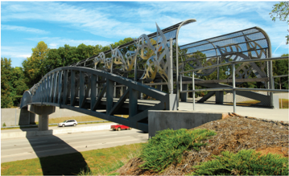

- B -

Sources: A - Arizona DOT, B - North Carolina DOT

Figure 4-17. Typical Pedestrian Overpasses on Major Highways

--',''','',',',','''''',,,,''-'-',,',,',',,'---

## 4.17.3  Curb Ramps

Several  Federal  laws,  including  the  Rehabilitation  Act  of  1973  and  the  Americans  with Disabilities Act of 1990 (ADA), require that facilities for pedestrian use be readily accessible to, and usable by, individuals with disabilities. When designing a project that includes curbs and adjacent sidewalks, proper attention should be given to the needs of persons with disabilities, such as those with mobility or visual impairment. Curb ramps are necessary to provide access between the sidewalk and the street at pedestrian crossings. Detectable warnings are needed where the curb has been removed to alert pedestrians with visual disabilities that they have arrived at the street/sidewalk interface.

Design details of curb ramps will vary in relation to the following factors:

- y Sidewalk width
- y Sidewalk location with respect to the curb
- y Height and width of curb cross section
- y Design turning radius and length of curve along the curb face
- y Angle of street intersections
- y Planned or existing location of sign and signal control devices
- y Stormwater inlets and public service utilities
- y Potential sight obstructions
- y Street width
- y Border width

As a result, basic curb ramp types have been established and used in accordance with the geometric characteristics of each intersection. Based on the Proposed Guidelines for Pedestrian Facilities in the Public Right-of-Way ( 46 ), the minimum curb ramp width should be 4 ft [1.2 m] and the maximum curb ramp grade should be 8.33 percent. Cross slopes on adjacent sidewalks should be no greater than 2 percent. A turning space at the top of each perpendicular curb ramp should be 4 ft by 4 ft [1.2 m by 1.2 m], and larger if adjacent obstructions are present. In addition, a minimum 2-ft [0.6-m] detectable warning strip must be provided at the bottom of curb ramps to improve detectability by pedestrians with vision disabilities ( 49 ). Additional guidance is provided in the Proposed Guidelines for Pedestrian Facilities in the Public Right-of-Way ( 46 ).

Figure 4-18 illustrates various curb ramp designs. Figure 4-18A shows a perpendicular curb ramp where the entire grade differential  is  achieved  outside  the  sidewalk.  This  condition  is desirable since it does not require walking across the ramped area. In this case, a side return curb can be used along the curb ramp if the presence of landscaping or other fixed obstructions constrain walking across the curb ramp. Otherwise, a side flare is required, as shown in Figure 4-18B.

In many areas where sidewalks are needed, the curb ramp will be incorporated into the sidewalk, as shown in Figures 4-18B and 4-18C. Figure 4-18B reflects this design when adequate room for the curb ramp and landing is available. Figure 4-18C shows an example where a width restriction results in the curb ramp being constructed totally within the sidewalk area. This is referred to as a parallel curb ramp. Careful attention to drainage should avoid ponding water and collecting sediment on the lower landing.

A combination curb ramp, such as the one illustrated in Figure 4-18D, combines aspects of the previous two types. A sloped portion with a detectable warning rises to a landing that is lower than full curb height. This keeps the landing from collecting water and debris. The remaining elevation difference is accomplished by continuing the curb ramp from the landing to normal sidewalk elevation.

Although separate curb ramps for each crosswalk are recommended, Figure 4-18E shows a single perpendicular curb ramp, serving two crossing directions, may be located at the apex of a corner. These are referred to as diagonal curb ramps. Diagonal curb ramps should only be utilized in alteration projects if existing physical constraints prevent a curb ramp for each pedestrian crossing. Diagonal curb ramps do not provide for a straight pedestrian crossing and, therefore, have the potential to misdirect pedestrians with vision disabilities into the middle of the intersection.

Where other options are not practical, a built-up curb ramp, such as the one illustrated in Figure 4-18F, may be necessary. However, the curb ramp should not project into the traveled way. Also, drainage may be adversely affected if not properly considered. The curb ramp area should be protected and should only be used at locations that include a parking lane.

The location of the curb ramp should be carefully coordinated with respect to the pedestrian crosswalk lines. The bottom of the curb ramp should be situated within the parallel boundaries of the crosswalk markings and should be perpendicular to the face of the curb, or bottom grade break, without warping in the sidewalk or curb ramp. If the sides of the curb ramp are not the same length, it will be difficult to provide a cross slope that is accessible to and usable by individuals with disabilities ( 48, 49 ) and avoid warping. Curb ramps may be located either within the corner radius or on the tangent section beyond the corner radius.

Curb ramps for persons with disabilities are not limited to intersections and marked crosswalks. Curb ramps should also be provided at other appropriate or designated points of pedestrian concentration, such as loading islands and midblock pedestrian crossings. Because nonintersection pedestrian crossings are generally unexpected by the motorist, warning signs should be installed and parking should be prohibited to provide adequate visibility. For additional design guidance and recommendations with respect to pedestrian crosswalk markings, refer to the MUTCD ( 27 ), the Proposed Guidelines for Pedestrian Facilities in the Public Right-of-Way ( 46 ), and AASHTO's Guide for the Planning, Design, and Operation of Pedestrian Facilities ( 4 ).

--',''','',',',','''''',,,,''-'-',,',,',',,'---

Figure 4-18. Curb Ramp Details

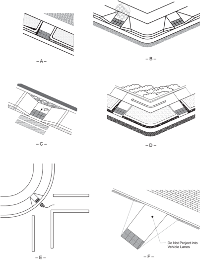

Curb ramps or cut-throughs for persons with disabilities should be provided where a major highway or secondary intersecting road serves pedestrian traffic and the roadway geometrics involve convex islands or median dividers. Median refuge is beneficial for all pedestrians. To

allow for the placement of multiple detectable warnings, median and island crossings of at least 6 ft [1.8 m] are necessary, as shown in Figure 4-19. Medians less than this width must provide accessible passage but do not provide adequate refuge. Median and island cut-throughs should provide, at a minimum, a 5-ft [1.5-m] wide travel path to allow adequate room for pedestrian passage, turning, or platooning.

Each intersection differs with respect to the intersection angles, turning roadway widths, size of islands, drainage inlets, traffic-control devices, and other variables previously described. An appropriate plan should indicate all of the desired geometrics, including vertical profiles at the curb flow line. The plan should then be evaluated to determine convenient and effective locations of the ramps to accommodate persons with disabilities. Drainage inlets should be located on the upstream side of all crosswalks and curb ramps. The plan should indicate the pedestrian crosswalk patterns, stop bar locations, regulatory signs, and, in the case of new construction, establish the most desirable location of signal supports.

Curb  ramps  should  be  provided  at  all  intersections  where  curb  and  sidewalk  are  provided. For further information on sidewalk curb ramps for persons with disabilities, see the current Proposed Guidelines for Pedestrian Facilities in the Public Right-of-Way ( 46 ), the AASHTO Guide for the Planning, Design, and Operation of Pedestrian Facilities ( 4 ), and Designing Sidewalks and Trails for Access, Part I: Review of Existing Guidelines and Practices ( 24 ) and Part II: Best Practices Design Guide ( 25 ). The Public Rights-of-Way Access Advisory Committee document entitled Special Report: Accessible Public Rights-of-Way, Planning and Designing for Alterations ( 47 ) may be helpful in designing retrofit projects.

Figure 4-20 shows examples of sidewalk curb ramps with detectable warnings in place.

Figure 4-19. Median Refuge

Source: Caltrans

Figure 4-20. Examples of Sidewalk Curb Ramps

--',''','',',',','''''',,,,''-'-',,',,',',,'---

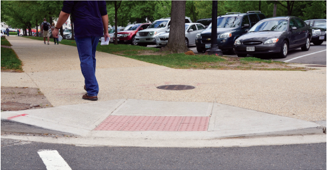

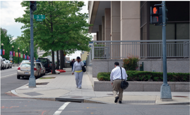

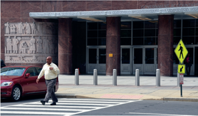

Source: Mario Olivero, AASHTO

Figure 4-20. Examples of Sidewalk Curb Ramps (Continued)

## 4.18  BICYCLE FACILITIES

Bicycling is recognized by transportation officials throughout the United States as an important transportation mode. Nationwide, people are recognizing the convenience, energy efficiency, cost effectiveness, health benefits and environmental advantages of bicycling. Local, state and Federal agencies are responding to the increased use of bicycles by implementing a wide variety of bicycle-related projects and programs. The emphasis being placed on bicycle transportation requires an understanding of bicycles, bicyclists and bicycle facilities to create designs that are sensitive to local context and incorporate the needs of bicyclists, pedestrians and motorists. The AASHTO Guide for the Development of Bicycle Facilities ( 8 ) and the FHWA Separated Bike Lane Planning and Design Guide ( 29 ) address these issues and clarify the elements needed to make bicycling a more efficient and convenient mode of transportation.

The needs of all transportation modes, including bicyclists, should be considered in the design of  each  roadway. In some cases, the same facilities that serve motor vehicles can adequately serve bicyclists as well, and specific traffic control devices have been developed for the benefit of both motor vehicle drivers and bicyclists. In many other cases, dedicated bicycle facilities on or off the roadway, including marked bicycle lanes and off-road or shared-use bicycle paths, are appropriate. Many communities have planned, and have begun designing and building specific bicycle networks. Segments and intersections along these networks include facilities and accommodations to encourage cyclists to prefer them to other, nearby routes. This helps agencies focus bicycle treatments on specific roadways and provides consistent expectations for roadway operations to both bicyclists and motor-vehicle drivers.

All roads and streets, except those where bicyclists are legally prohibited, should be designed and constructed under the assumption that they will be used by bicyclists. Therefore, bicyclists' needs should be addressed in all phases of transportation planning, new roadway design, roadway reconstruction, operational and maintenance activities, capacity improvement, bridge and transit projects, along with other modes of transportation, and integrated into plans and projects at an early stage to ensure they function together effectively.

The provisions for bicycle travel are consistent with, and similar to, highway engineering practices for motorists. Signs, signals and pavement markings for bicycle facilities are presented in the FHWA Manual on Uniform Traffic Control Devices ( 27 ) and should be used in conjunction with this guide.

Section 2.7 provides further discussion on the subject of design for bicyclists.

## 4.19  TRANSIT FACILITIES

Public transportation provides high passenger capacities in heavily-traveled corridors, and allows high employment concentrations in city centers. It permits compact urban developments

that are pedestrian and bicycle friendly, and provides mobility for people that are unable to drive or do not have access to motor vehicles.

Transit vehicles operate in a wide range of environments, both on-street and off-street. Commuter rail and rapid transit operate in exclusive rights-of-way that are frequently grade-separated from intersecting  roadways.  However,  bus  routes  on  public  streets  and  roadways  and  light  rail  or streetcar operations often share or intersect with the street environment.

Streets and roadways often must accommodate transit vehicles as well as motor vehicles, bicyclists, and pedestrians. Transit provisions are best accomplished when incorporated into all phases of street planning, design, and operation. This is essential especially where agencies at the state, county, and municipal level are required to plan, design, or modify streets and roadways to accommodate public transportation vehicles and facilities. --',''','',',',','''''',,,,''-'-',,',,',',,'---

Planning  and  design  guidelines,  standards,  and  practices  for  transit  accommodation  have evolved over the past decade. Most of this guidance, however, encompasses a specific mode, such as buses, rapid transit, and light rail transit (LRT) and are sometimes prepared in response to specific agency needs. Recognizing that situation, AASHTO has developed the Guide for the Geometric Design of Transit Facilities on Streets and Highways ( 10 ) to provide design practitioners with a single, comprehensive resource that documents and builds upon past and present experience in transit design in streets and roadways.

The dominant form of public transportation in most urban areas is bus transit. Most bus transit operates in mixed traffic on streets. Generally, designs that make traffic move faster and more safely will improve bus speeds and service reliability. Roadway geometry should be adequate for bus movement, and pedestrian access to stops should be convenient. There are situations where preferential treatment for transit (dedicated lanes, stations, and priority at traffic signals) may be desirable. In those cases, the benefits to transit riders should typically be balanced with the effects on roadway traffic. Treatments and priorities for bus transit can vary depending upon specific traffic, roadway, and environmental conditions. Regardless of the type of treatment, the geometric design and traffic control features should adequately and safely accommodate all vehicles, pedestrians and bicyclists that would use a street or roadway. Where a street facility will be limited to bus use only, design features can generally be modified easily from those that apply for general traffic use.

This section addresses bus transit turnouts on freeway and arterial facilities. For guidance on other elements of transit facility design, including other types of transit facilities operating in and adjacent to streets and roadways, see AASHTO's Guide for the Geometric Design of Transit Facilities on Streets and Highways ( 10 ). Guidelines for high-occupancy vehicle (HOV) facilities on arterial streets are addressed in NCHRP Report 414, HOV Systems Manual ( 42 ).

## 4.19.1  Bus Turnouts on Freeways

The basic design objective for a freeway bus turnout is for bus deceleration, standing, and acceleration to take place clear of and separated from the traveled way. Other elements in the design of bus turnouts include passenger platforms, ramps, stairs, railings, signs, and markings. Speedchange lanes should be long enough to enable the bus to leave and enter the traveled way at approximately the average running speed of the highway without undue discomfort to passengers. Acceleration lanes from bus turnouts should have above-minimum lengths, as the buses start from a standing position and the loaded bus has a lower acceleration capability than passenger cars. The width of the bus standing area and speed-change lanes, including the shoulders, should be 22 ft [6.7 m] to permit the passing of a stalled bus. The pavement areas of turnouts should contrast in color and texture with the traveled way to discourage through-traffic from encroaching on or entering the bus stop.

The dividing area between the outer edge of freeway shoulder and the edge of bus turnout lane should be as wide as practical, preferably 20 ft [6.0 m] or more. However, in extreme cases, this width could be reduced to a minimum of 4 ft [1.2 m]. A barrier is usually needed in the dividing area, and fencing is desirable to keep pedestrians from entering the freeway. Pedestrian loading platforms should not be less than 10 ft [3 m] wide and preferably 11 to 15 ft [3.4 m to 4.5 m] wide. Some climates may warrant the covering of platforms. Figure 4-21 illustrates typical cross sections of turnouts including a normal section, a section through an underpass, and a section on an elevated structure.

--',''','',',',','''''',,,,''-'-',,',,',',,'---

Figure 4-21. Bus Turnouts

