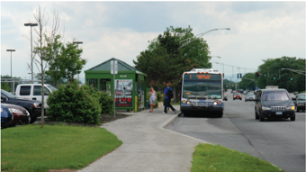
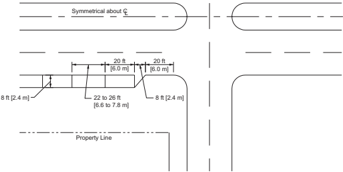

# 4.1  GENERAL: 4.19.2  Bus Turnouts on Arterials & 6 more sections

- Source: GreenBook.pdf
- Generated: 2026-01-03T08:11:58+00:00
- Chunk: 17/28
- Estimated tokens: ~7,991
- Total pages: 1048
- Type: sections

## 4.19.2  Bus Turnouts on Arterials

The interference between buses and other traffic can be considerably reduced by providing turnouts on arterials. On many arterial streets, it is somewhat rare that sufficient right-of-way is available to permit turnouts in the border area, but advantage should be taken of every opportunity to provide such turnouts.

To be fully effective, bus turnouts should incorporate:

- y a deceleration lane or taper to permit easy entrance to the loading area,

- y a standing space long enough to accommodate the maximum number of vehicles expected at one time, and
- y a merging lane to enable easy reentry into the traveled way.

The deceleration lane should be tapered at an angle that is flat enough to encourage the bus operator to pull completely clear of the through lane before stopping. Usually it is not practical to provide a length that permits deceleration from highway speeds clear of the traveled way. A taper of about 5:1, longitudinal to transverse, is a desirable minimum. When the bus stop is on the far side of an intersection, the intersection area may be used as the entry area to the stop.

The loading area should provide about 50 ft [15 m] of length for each bus. The width should be at least 10 ft [3.0 m] and preferably 12 ft [3.6 m]. The merging or reentry taper may be somewhat more abrupt than the deceleration taper but, preferably, should not be sharper than 3:1. Where the turnout is on the near side of an intersection, the width of the cross street is usually enough to provide the needed merging space.

Boarding and alighting areas must have a minimum clear length of 8 ft [2.4 m] measured perpendicular to the curb or roadway edge and a minimum clear width of 5 ft [1.5 m] measured parallel to the roadway to be accessible to and usable by individuals with disabilities ( 48, 49 ). The slope perpendicular to the roadway should be less than 2 percent; the slope parallel to the roadway should be the same as the roadway ( 47, 48 ).

The minimum total length of turnout for a two-bus loading area should be about 200 ft [60 m] for a midblock location, 150 ft [45 m] for a near-side location, and 140 ft [42 m] for a far-side location. These dimensions are based on a loading area width of 10 ft [3.0 m]. The turnout lengths should be increased by 13 to 16 ft [3.9 to 4.8 m] for a loading area width of 12 ft [3.6 m].

Longer bus turnouts expedite bus maneuvers, encourage full compliance on the part of bus drivers, and lessen interference with through traffic.

Figure 4-22 shows a bus turnout at a midblock location. For more information on bus turnouts, see the AASHTO Guide for Design of High-Occupancy Vehicle ( HOV ) Facilities ( 3 ), Guidelines for the Location and Design of Bus Stops ( 41 ), and the AASHTO Guide for the Geometric Design of Transit Facilities on Highways and Streets ( 10 ).

--',''','',',',','''''',,,,''-'-',,',,',',,'---

Source: New York State DOT

Figure 4-22. Midblock Bus Turnout

## 4.19.3  Park-and-Ride Facilities

## 4.19.3.1  Location

Park-and-ride facilities should be located adjacent to the street or highway and be visible enough to attract use by commuters. Preferably, the parking areas should be located at points that precede the bottlenecks or points where there is significant traffic congestion. They should be located as close to residential areas as practical to minimize travel by vehicles with only one occupant and should be located far enough from the center of the city that land costs are not prohibitive. In addition, bicycle and pedestrian access to park-and-ride facilities should be considered.

--',''','',',',','''''',,,,''-'-',,',,',',,'---

Other considerations that affect parking lot location are effects on surrounding land uses, available capacity of the highway connecting roads to the system, terrain, and the land acquisition costs.

## 4.19.3.2  Design

The size of the park-and-ride parking lot is dependent upon the design volume, the available land area, and the size and number of other parking lots in the area.

Each parking area should provide a drop-off facility close to the station entrance, plus a holding or short-term parking area for passenger pickup. This area should be clearly separated from the park-and-ride areas.

Consideration should be given to the location for bus loading and unloading, taxi service, bicycle parking, and special parking for persons with disabilities. Conflicts between pedestrians and vehicles should be minimized. Parking aisles should be located perpendicular to the bus

--',''','',',',','''''',,,,''-'-',,',,',',,'--- roadway so that pedestrians do not need to cross the driveways between parking aisles. All bus roadways should have a minimum width of 20 ft [6.0 m] to permit the passing of standing buses. Facilities should be designed for self-parking. Parking spaces should be 9 ft by 20 ft [2.7 m by 6.0 m] for full-sized cars. Where a special section is provided for subcompact cars, 8 ft by 15 ft [2.4 m by 4.5 m] spaces are sufficient. Parking areas must be accessible to and usable by individuals with disabilities ( 48, 49 ).

Sidewalks should be a minimum of 5 ft [1.5 m] wide and loading areas should be 12 ft [3.6 m] wide. Principal loading areas should be provided with sidewalk curb ramps. Preferably, pedestrians should not need to walk more than 400 ft [120 m], although slightly longer distances may be permitted under some circumstances. Pedestrian paths from parking spaces to loading areas should be as direct as practical. Facilities for locking bicycles should be provided where needed.

Grades of parking areas should be set for effective drainage. Recommended grades along vehicle paths within the parking area are 1 percent minimum and 2 percent desirable with a maximum of 5 percent. Grades of over 8 percent parallel to the length of the parked vehicles should be avoided. Climatic conditions should be considered in establishing the maximum acceptable grade. Curvature, radius of planned vehicular paths within the parking area, and access roads should be sufficiently large to accommodate the vehicles that they are intended to serve.

Access to the lots should be at points where they will disrupt through traffic as little as practical. Access points should be at least 300 ft [90 m] from other intersections, and there should be sufficient sight distance for vehicles to exit and enter the lot. Thus, exits and entrances generally should not be located on crest vertical curves. There should be at least 300 ft [90 m] corner sight distance.

There should be at least one exit and entrance for every 500 spaces in a lot. Exits and entrances should be provided at separate locations and should access different streets, if practical. It is also desirable to provide separate access for public transit vehicles.

Curb returns should be at least 30 ft [9.0 m] in radius, although 15 ft [4.5 m] radii are suitable for access points used exclusively by passenger vehicles.

Principal  passenger-loading  areas  should  be  provided  with  shelters  to  protect  public  transit patrons. Such shelters should, as a minimum, accommodate off-peak passenger volumes but should be larger where practical. To determine the size of the shelter, the number of passengers that the shelter is anticipated to serve should be multiplied by a factor of 3 to 5 ft 2 [0.3 to 0.5 m 2 ]. Because the shelter can be expanded relatively easily at a later date if sufficient platform space is installed initially, it is not critical to provide a shelter that accommodates the ultimate passenger demand at the time of original construction. Accessories that should be provided with the shelter include lighting, benches, route information, trash receptacles, and sometimes telephones.

The bus-loading area can have a parallel or a sawtooth design; the best arrangement depends on the number of buses expected to use the facility. Where more than two buses are expected to be using a facility at one time, the sawtooth arrangement is generally preferable, as it is easier for buses to bypass a standing bus. A recommended design of a sawtooth arrangement is shown in Figure 4-23. The length of space that should be provided for a parallel design is 95 ft [29 m]. This length will permit loading of two buses. For each additional space, 45 ft [14 m] should be allowed. The loading area should be at least 24 ft [7.2 m] wide to permit the passing of a standing bus. The area delineating the passenger refuge area should be curbed to reduce the height between the ground and the first bus step and to reduce encroachment by buses on the passenger areas. Parallel-type loading areas should not be located on curves, because it makes it very difficult for drivers to park with both the front and rear doors close to the curb.

Figure 4-23. Sawtooth Bus Loading Area

Special designs may be needed to accommodate articulated buses, particularly where a sawtooth arrangement is used. A well-designed parking lot includes a buffer area around the lot with appropriate landscaping, often with a fence to separate land areas. The buffer should be at least 10 ft [3.0 m] wide.

Lighting should be provided on all but the smaller lots. A level of 0.2 to 0.5 foot-candles (fc) [2.2 to 5.4 lux (lx)] of average maintained intensity will generally suffice.

Drainage systems should be designed so that parked cars will not be damaged by stormwater. Under some circumstances, minimal ponding of water may be permitted or may even be desirable when the drainage is designed as part of a stormwater management system. The storm intensity that the drainage system should accommodate may depend on the practice of the municipality. Permissible depths of ponding should generally not exceed 3 to 4 in. [75 to 100 mm] in areas where cars are parked, and there should be no ponding on pedestrian and bicycle routes or where persons wait for transit vehicles.

For additional information, refer to the AASHTO Guide for Design of High-Occupancy Vehicle ( HOV ) Facilities ( 3 ); TCRP Report 19, Guidelines for the Location and Design of Bus Stops ( 41 ); and the AASHTO Guide for the Design of Park-and-Ride Facilities ( 2 ).

--',''','',',',','''''',,,,''-'-',,',,',',,'---

--',''','',',',','''''',,,,''-'-',,',,',',,'---

## 4.20  ON-STREET PARKING

A roadway network should be designed and developed to provide for the efficient movement of vehicles operating on the system. Although the movement of vehicles is the primary function of a roadway network, segments of the network may, as a result of land use, also provide on-street parking.

In the design of freeways and access-controlled facilities, as well as on most arterials, collectors, and local streets in rural areas, stopping or parking should be permitted only in emergencies. On-street  parking  generally  decreases  through-traffic  capacity,  impedes  traffic  flow,  and  increases crash potential. Where the primary service of an arterial is the movement of vehicles, it may be desirable to prohibit parking on arterial streets in urban areas and arterial highway sections in rural areas. However, within urban areas and in rural communities located on arterial highway routes, on-street parking should be considered in order to accommodate existing and developing land uses. Often, adequate off-street parking facilities are not available. Therefore, the designer should consider on-street parking so that the proposed street or highway improvement will be compatible with the land use. Wherever on-street parking is provided, accessible on-street parking must be included. Refer to the Proposed Guidelines for Pedestrian Facilities in the Public Right-of-Way ( 46 ) for guidance.

When a proposed roadway improvement is to include on-street parking, parallel parking should be considered. Under certain circumstances, angle parking is an allowable form of street parking.  The  type  of  on-street  parking  selected  should  be  based  on  consideration  of  the  specific function and width of the street, the adjacent land use, and traffic volume, as well as existing and anticipated traffic operations. Angle parking presents special problems because of the varying lengths of vehicles and the sight distance problems associated with vans and recreational vehicles. The extra length of such vehicles may interfere with the traveled way.

Where diagonal parking exists or is planned, consideration may be given to back-in/head-out diagonal parking because of the improved visibility for the driver to see vehicular and bicycle traffic when exiting the parking space. In addition, back-in/head-out diagonal parking is usually a simpler maneuver than parallel parking, the open doors of the vehicle guide children back to the sidewalk, and trunk cargo loading takes place on the sidewalk. Care needs to be taken so that vehicles with longer rear overhangs do not interfere with light poles, parking meters, and other street furniture. An example of back-in/head-out parking is shown in Figure 4-24.

An important part of the parking problem in urban areas is the uneven distribution of off-street parking facilities in urban core locations and the lack of off-street facilities in urban neighborhood commercial areas. As a consequence, there is a demand for on-street parking to provide for the delivery and pick-up of goods. Since alleys and other off-street loading areas are not provided in many communities, short-duration parking for business or shopping should be considered.

© 2018 by the American Association of State Highway and Transportation Officials.

Licensee=Arkansas State Highway &amp; Transportation Dept/5988317001, User=Sichmelle

Not for Resale, 10/09/2018 09:17:18 MDT

All rights reserved. Duplication is a violation of applicable law.

Curb parking on arterial streets in urban areas is acceptable when the available through-traffic lanes can reasonably accommodate traffic demand. On arterials in rural areas, provisions should be made for emergency stopping only. On arterial street reconstruction projects in urban areas or on projects where additional right-of-way is being acquired to upgrade an existing route to arterial status, the elimination of parking should be considered to increase capacity and reduce the potential for crashes. However, the existing effects on abutting land uses should also be carefully considered because the loss of existing on-street parking can reduce the economic well-being of the abutting property.

Source: Mario Olivero, AASHTO

Figure 4-24. Typical Application of Diagonal Back-In/Head-Out Parking

It has been found that most vehicles will parallel park within 6 to 12 in. [150 to 300 mm] of the curb face and on the average will occupy approximately 7 ft [2.1 m] of actual street space. Therefore, the desirable minimum width of a parking lane is 8 ft [2.4 m]. However, to provide better  clearance  from  the  traveled  way  and  to  accommodate  use  of  the  parking  lane  during peak periods as a through-travel lane, a parking lane width of 10 to 12 ft [3.0 to 3.6 m] may be desirable. This width is also sufficient to accommodate delivery vehicles and, on a bicycle route, allows a bicyclist to maneuver around an open door on a motor vehicle.

On collector streets in urban areas, the demands for land access and mobility are equally important. The desirable parking lane width on collectors in urban areas is 8 ft [2.4 m] to accommodate a wide variety of traffic operations and land uses. To provide better clearance and the potential to use the parking lane during peak periods as a through-travel lane, a parking lane width of 10- to 12-ft [3.0- to 3.6-m] is desirable. A 10 to 12 ft [3.0 to 3.6 m] parking lane will also accommodate transit operations in urban areas. On collector streets within residential neighborhoods in the urban and suburban contexts where only passenger vehicles need to be accommodated in the parking lane, 7 ft [2.l-m] parking lanes have been successfully used. In fact, a total width of 36 ft [10.8 m], consisting of two travel lanes of 11 ft [3.3 m] and parking lanes of 7 ft [2.l m] on each side, is frequently used.

On-street parking is generally permitted on local streets. A 26-ft [7.8-m] wide roadway is the typical cross section used in many urban residential areas. This width assures one through lane even where parking occurs on both sides. Specific parking lanes are not usually designated on such local streets. The lack of two moving lanes may be inconvenient to the user in some cases; however, the frequency of such concerns has been found to be remarkably low. Random intermittent parking on both sides of the street usually results in areas where two-way movement can be accommodated.

Construction procedures on new roadways should be planned so as to provide a longitudinal joint at the boundary of the proposed parking lane. It has been found that such joints aid in ensuring that the parked vehicle clears the parallel travel lane. On asphalt-surfaced streets, traffic markings are recommended to identify the parking lane. The marking of parking spaces encourages more orderly and efficient use of parking spaces where parking turnover occurs, and this tends to prevent encroachment on fire hydrant zones, bus stops, loading zones, and approaches to corners.

In urban areas, central business districts, and commercial areas where significant pedestrian crossings are likely to occur, the design of the parking lane/intersection relationship should be considered. When the parking lane is carried up to the intersection, motorists may utilize the parking lane as an additional lane for right-turn movements. Such movements may cause operational inefficiencies and turning vehicles may mount the curb and strike such roadside elements as traffic signals, utility poles, or luminaire supports. One method to address this issue is to end the parking lane at least 20 ft [6.0 m] in advance of the intersection. An example of such treatment is shown in Figure 4-25. A second method is to prohibit parking for such a distance as to create a short turn lane.

Figure 4-25. Parking Lane Transition at Intersection

--',''','',',',','''''',,,,''-'-',,',,',',,'---

## 4.21  REFERENCES

1. AASHTO. Guidelines for Geometric Design of Very Low-Volume Local Roads , First Edition, VLVLR-1.  American  Association  of  State  Highway  and  Transportation  Officials, Washington, DC, 2001. Second edition pending.
2. AASHTO. Guide for the Design of Park-and-Ride Facilities ,  Second Edition, GPRF-2. American Association of State Highway and Transportation Officials, Washington, DC, 2004.
3. AASHTO. Guide for High-Occupancy Vehicle ( HOV ) Facilities , Third Edition, GHOV-3. American Association of State Highway and Transportation Officials, Washington, DC, 2004.
4. AASHTO. Guide  for  the  Planning,  Design,  and  Operation  of  Pedestrian  Facilities ,  First Edition, GPF-1. American Association of State Highway and Transportation Officials, Washington, DC, 2004. Second edition pending.
5. AASHTO. Highway Drainage Guidelines ,  Fourth  Edition,  HDG-4. American Association of State Highway and Transportation Officials, Washington, DC, 2007.
6. AASHTO. Guide for Pavement Friction , First Edition, GPVF-1. American Association of State Highway and Transportation Officials, Washington, DC, 2008.
7. AASHTO. Roadside Design Guide ,  Fourth Edition with 2015 Errata, RSDG-4. American Association of State Highway and Transportation Officials, Washington, DC, 2011.
8. AASHTO. Guide  for  the  Development  of  Bicycle  Facilities ,  Fourth  Edition  with  2017 Errata, GBF-4. American Association of State Highway and Transportation Officials, Washington, DC, 2012.
9. AASHTO. AASHTO Drainage Manual , First Edition, ADM-1. American Association of State Highway and Transportation Officials, Washington, DC, 2014.
10. AASHTO. Guide for the Geometric Design of Transit Facilities on Highways and Streets , First Edition, TVF-1. American Association of State Highway and Transportation Officials, Washington, DC, 2014.
11. AASHTO. Mechanistic-Empirical Pavement Design Guide: A Manual of Practice , Second Edition,  MEPDG-2.  American  Association  of  State  Highway  and  Transportation Officials, Washington, DC, 2015.

--',''','',',',','''''',,,,''-'-',,',,',',,'---

12. AASHTO. AASHTO LRFD Bridge  Design  Specifications ,  Eighth  Edition  with  2018 Errata, LRFD-8. American Association of State Highway and Transportation Officials, Washington, DC, 2017.
13. AASHTO. LRFD Road Tunnel Design and Construction Guide Specifications , First Edition, LRFDTUN-1. American Association of State Highway and Transportation Officials, Washington, DC, 2017.
14. Anderson, D. A., J.  R.  Reed,  R.  S.  Huebner,  J.  J.  Henry,  W.  P.  Kilareski,  and  J.  C. Warner. Improved  Surface  Drainage  of  Pavements. NCHRP Project  I-29,  Pennsylvania Transportation Institute, Pennsylvania State University, Federal Highway Administration, Washington, DC, 1998, p. 42. Available at

https://www.nap.edu/catalog/6357/improved-surface-drainage-of-pavements-final-report

15. Barry, T. M. and J. A. Reagan. FHWA Highway Traffic Noise Prediction Model. FHWARD-77-108.  Federal  Highway  Administration,  U.S.  Department  of  Transportation, McLean, VA, 1978.
16. Bonneson, J. A. and P. T. McCoy. National Cooperative Highway Research Program Report 395: Capacity and Operational Effects of Midblock Left-Turn Lanes. NCHRP, Transportation Research Board, Washington, DC, 1997. Available at

http://onlinepubs.trb.org/onlinepubs/nchrp/nchrp\_rpt\_395.pdf

17. Brewer,  Marcus  A. National  Cooperative  Highway  Research  Program  Synthesis  432: Recent Roadway Geometric Design Research for Improved Safety and Operations. NCHRP, Transportation Research Board, Washington, DC, 2012.
18. Brown, S. A., S. M. Stein, and J. C. Warner. Hydraulic Engineering Circular No. 22 ( HEC 22 ) , Urban Drainage Design Manual, 2009 Edition. FHWA-SA-96-078. Federal Highway Administration, U.S. Department of Transportation, Washington, DC, November 1996, p. 4-4. Available at

https://www.fhwa.dot.gov/engineering/hydraulics/pubs/10009/10009.pdf

19. Bucko, T. R. and A. Khorashadi. Evaluation of Milled-In Rumble Strips, Rolled-In Strips and Proprietary Applications. California Department of Transportation, Sacramento, CA, May 2001.
20. Downs, Jr., H. G., and D. W. Wallace. National Cooperative Highway Research Program Report 254: Shoulder Geometrics and Use Guidelines. NCHRP, Transportation Research Board, Washington, DC, 1982.

21. Dunlap, D. F.,  P.  S.  Fancher,  R.  E.  Scott,  C.  C.  MacAdam,  and  L.  Segal. National Cooperative  Highway  Research  Program  Report  184:  Influence  of  Combined  Highway Grade and Horizontal Alignment on Skidding. NCHRP, Transportation Research Board, Washington, DC, 1978.
22. FHWA. Computer software and related publications are available from McTrans, 512 Weil  Hall,  University  of  Florida,  Gainesville,  Florida  32611-2083.  Telephone  (904) 392-0378 or PC-TRANS, 2011 Learned Hall, University of Kansas, Lawrence, Kansas, 66045. Telephone (913) 864-3199. Available at

http://mctrans.ce.ufl.edu

HY 22. Urban Drainage Design Programs, Version 2.1, 1998.

HY 7. Bridge Waterways Analysis Model, (WSPRO), 2005.

FHWA-SA-98-080. WSPRO Users Manual (Version 061698), 1998.

HY 8. FHWA Culvert Analysis (Version 7.1), 2008. Research Report (Version 1.0), 1987.

HYDRAIN. Drainage Design System (Version 6.1), 1999.

HYDRAIN. Users Manual, 1999.

23. FHWA. Design  of  Roadside  Channels  with  Flexible  Linings ,  3rd  Edition.  Hydraulic Engineering Circular (HEC-15). FHWA NHI-05-114. Office of Engineering, Bridge Division, Federal Highway  Administration, U.S. Department  of Transportation, Washington, DC, 2005. Available at

http://www.fhwa.dot.gov/engineering/hydraulics/pubs/05114/05114.pdf

24. FHWA. Designing Sidewalks and Trails for Access, Part I: Review of Existing Guidelines and Practices. FHWA-HEP-99-006. Federal Highway Administration, U.S. Department of Transportation, Washington, DC, July 1999. Available at

https://www.fhwa.dot.gov/environment/bicycle\_pedestrian/publications/sidewalks/index.cfm

25. FHWA. Designing Sidewalks and Trails for Access, Part II:  Best  Practices  Design  Guide. FHWAEP-01-027.  Federal  Highway  Administration,  U.S.  Department  of  Transportation, Washington, DC, September 2001. Available at

https://www.fhwa.dot.gov/environment/bicycle\_pedestrian/publications/sidewalk2/pdf.cfm

26. FHWA. Highway  Traffic  Noise:  Analysis  and  Abatement  Guide ,  Report  No.  FHWAHEP-10-025, FHWA, Washington, DC, December 2011.

--',''','',',',','''''',,,,''-'-',,',,',',,'---

27. FHWA. Manual  on  Uniform  Traffic  Control  Devices  for  Streets  and  Highways .  Federal Highway Administration, U.S. Department of Transportation, Washington, DC, 2009. Available at

http://mutcd.fhwa.dot.gov

28. FHWA. Rumble  Strips  and  Rumble  Stripes. Federal  Highway  Administration,  U.S. Department of Transportation, Washington, DC, December 2016. Available at

http://safety.fhwa.dot.gov/roadway\_dept/pavement/rumble\_strips/

29. FHWA. Separated Bike Lane Planning and Design Guide. Federal Highway Administration, U.S. Department of Transportation, Washington, DC, May 2015.
30. Gattis, J.,  J.  S.  Gluck,  J.  M.  Barlow,  R.  W.  Eck,  W.  F.  Hecker,  and  H.  S.  Levinson. National  Cooperative  Highway  Research  Program  Report  659:  Guide  for  the  Geometric Design of Driveways. NCHRP, Transportation Research Board, Washington, DC, 2010. Available at

http://onlinepubs.trb.org/onlinepubs/nchrp/nchrp\_rpt\_659.pdf

31. Griffith, M. S. on Freeways.
2. Safety Evaluation of Rolled-In Continuous Shoulder Rumble Strips Installed In Transportation Research Record 1665. TRB, National Research Council, Washington, DC, October 1999, pp. 28-34. Available for purchase at https://trrjournalonline.trb.org/doi/10.3141/1665-05
32. Harwood, D. W. and C. J. Hoban. Low Cost Methods for Improving Traffic Operation on Two-Lane Roads. FHWA IP-87-2. Federal Highway Administration, U.S. Department of Transportation, Washington, DC, 1987.
33. Harwood, D. W., M. T. Pietrucha, M. D. Wooldridge, R. E. Brydia, and K. Fitzpatrick. National Cooperative Highway Research Program Report 375: Median Intersection Design. NCHRP, Transportation Research Board, Washington, DC, 1995.
34. Harwood, D. W., J. M. Hutton, C. Fees, K. M. Bauer, A. Glen, and H. Ouren. National Cooperative Highway Research Program Report 783: Evaluation of the 13 Controlling Criteria for Geometric Design. NCHRP, Transportation Research Board, Washington, DC, 2014.
35. Harwood,  D.  W.,  D.  K.  Gilmore,  J.  L.  Graham,  and  M.  K.  O'Laughlin. National Cooperative  Highway  Research  Program  Report  790:  Factors  Contributing  to  Median Encroachments  and  Cross-Median  Crashes. NCHRP,  Transportation  Research  Board, Washington, DC, 2014.

36. ITE. Guidelines for Driveway Design and Location. Institute of Transportation Engineers, Washington, DC, 1986.
37. Lagasse, P. F., J. D. Schall, and E. V. Richardson. Stream Stability at Highway Structures , 3rd Edition. Hydraulic Engineering Circular (HEC-20). FHWA NHI 01-002. Federal Highway Administration, U.S. Department of Transportation, Washington, DC, March 2001. Available at

http://www.fhwa.dot.gov/engineering/hydraulics/library\_arc.cfm?pub\_number=19&amp;id=43

38. Marquis, E. L., R. M. Olson, and G. D. Weaver. National Cooperative Highway Research Program  Report  158:  Selection  of  Safe  Roadside  Cross  Sections. NCHRP,  Transportation Research Board, Washington, DC, 1975.
39. Richards, D. and D. Ham. Serrated Soft-Rock Cut Slopes. FHWA-RDDP-5-1. Federal Highway Administration, U.S. Department of Transportation, Washington, DC, 1973.
40. Simpson, M. A. Noise Barrier Design Handbook. FHWA-RD-76-58. Federal Highway Administration, U.S. Department of Transportation, McLean, VA, 1976.
41. TCRP. Transit  Cooperative  Research  Program  Report  19:  Guidelines  for  the  Location  and Design  of  Bus  Stops. TCRP,  Transportation  Research  Board,  Washington,  DC,  1996. Available at

http://onlinepubs.trb.org/onlinepubs/tcrp/tcrp\_rpt\_19-a.pdf

42. Texas  Transportation  Institute,  Parsons  Brinckerhoff  Quade  and  Douglas,  Inc.,  and Pacific Rim Resources, Inc. National Cooperative Highway Research Program 414: HOV Systems Manual , NCHRP, TRB, Washington, DC, 1998.
43. Torbic, D. J., J. M. Hutton, C. D. Bokenkroger, K. M. Bauer, D. W. Harwood, D. K. Gilmore, J.  E.  Dunn,  J.  R.  Ronchetto,  E.  T.  Donnell,  H.  J.  Sommer  III,  P.  Garvey, B.  Persaud,  and  C.  Lyon. National Cooperative Highway Research Program Report 641: Guidance for the Design and Application of Shoulder and Centerline Rumble Strips. NCHRP, Transportation Research Board, Washington, DC, 2009. Available at

http://onlinepubs.trb.org/onlinepubs/nchrp/nchrp\_rpt\_641.pdf

44. Transportation  Research  Board. Access  Management  Manual. Transportation  Research Board, Washington, DC, 2015.

45. Transportation  Research  Board. Highway  Capacity  Manual:  A  Guide  for  Multimodal Mobility  Analysis. Sixth  Edition.  Transportation  Research  Board,  National  Research Council, Washington, DC, 2016.
46. U.S. Access Board. Proposed Guidelines for Pedestrian Facilities in the Public Right-of-Way. Federal Register, 36 CFR Part 1190, July 26, 2011. Available at

http://www.access-board.gov/guidelines-and-standards/streets-sidewalks/public-rights-of-way/ proposed-rights-of-way-guidelines

47. U.S. Access Board. Special Report: Accessible Public Rights-of-Way, Planning and Designing for Alterations. Public Rights-of-Way Advisory Committee, U.S. Access Board, Washington, DC, August 2007.
48. U.S.  Department  of  Justice, 2010  ADA  Standards  for  Accessible  Design ,  September  15, 2010. Available at

https://www.ada.gov/2010ADAstandards\_index.htm

49. U.S. National Archives and Records Administration. Code of Federal Regulations. Title 49, Part 27. Nondiscrimination of the Basis of Disability in Programs or Activities Receiving Federal Financial Assistance.
50. Zegeer,  C.  V.,  R.  Stewart,  F.  M.  Council,  and  T.  R.  Neuman. National  Cooperative Highway  Research  Program  Report  362:  Roadway  Widths  for  Low-Traffic  Volume  Roads. NCHRP, Transportation Research Board, Washington, DC, 1994.

## Local Roads and Streets
