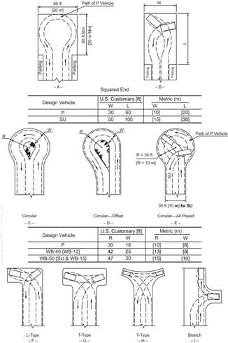
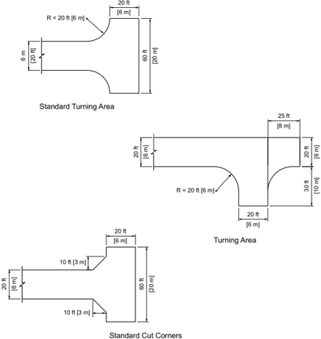
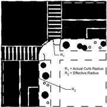
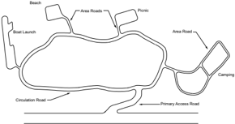
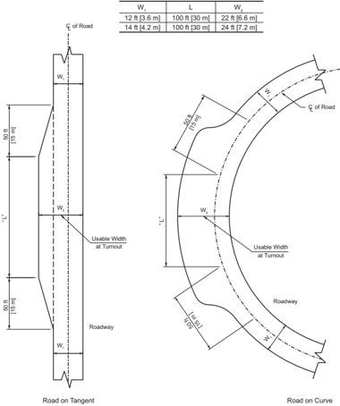

# 5.1  INTRODUCTION

- Source: GreenBook.pdf
- Generated: 2026-01-03T08:11:58+00:00
- Chunk: 18/28
- Estimated tokens: ~35,373
- Total pages: 1048
- Type: chapter

## 5.1  INTRODUCTION

This chapter presents guidance on the application of geometric design criteria to facilities functionally classified as local roads and streets. The chapter is subdivided into sections on rural, urban, and special-purpose local roads.

A local road or street serves primarily to provide access to farms, residences, businesses, or other abutting properties. Although local roads and streets may be planned, constructed, and operated with the predominant function of providing access to adjacent property for a variety of users, some local roads and streets serve a limited amount of through traffic. On these roads, the through traffic is local in nature and extent rather than regional, intrastate, or Interstate. Such roads properly include geometric design and traffic control features more typical of collectors and arterials.

Local roads and streets constitute a high proportion of the roadway mileage in the United States. The traffic volume generated by the abutting land uses are largely short trips or a relatively small part of longer trips where the local road connects with major streets or highways of higher classifications. Because of the relatively low traffic volumes and the extensive roadway mileage, design criteria for local roads and streets are of a comparatively low order as a matter of practicality. However, to provide traffic mobility and safety-together with the essential economy in construction, maintenance, and operation-they should be planned, located, and designed to be suitable for predictable traffic operations and should be consistent with the development and culture abutting the right-of-way.

In constrained or unusual conditions, it may not be practical to meet the design criteria presented in this chapter. In such cases, the goal should be to obtain the best practical alignment, grade, sight distance, and drainage that are consistent with terrain, development (present and anticipated), crash reduction, and available funds.

Drainage, both on the pavement itself and from the sides and subsurface, is an important design consideration. Inadequate drainage can lead to high maintenance costs and adverse operational conditions. In areas of substantial snowfall, roadways should be

designed so that there is sufficient storage space outside the traveled way for plowed snow and proper drainage for melting conditions.

It may not be cost-effective to design local roads and streets that carry less than 2,000 vehicles per day using the same criteria applicable to higher volume roads or to make extensive improvements to such very low-volume roads. Alternate design criteria may be considered for local and minor collector roads and streets that carry 2,000 vehicles per day or less in accordance with the AASHTO Guidelines for Geometric Design of Very Low-Volume Local Roads ( 1 ).

The specific dimensional design criteria presented in this chapter are appropriate as a guide for new construction of local roads and streets. Projects to improve existing roads differ from new construction in that the performance of the existing road is known and can guide the design process. Features of the existing design that are performing well may remain in place, while features that are performing poorly should be improved, where practical. Chapter 1 presents a flexible, performance-based design process that can be applied in developing projects on collector roads and streets.

## 5.2  LOCAL ROADS IN RURAL AREAS

This section presents guidance on the design of local roads and streets in the rural and rural town contexts. The primary differences between geometric design in the rural and rural town contexts are in the choice of design speed and the increased need in the rural town context to provide parking, to serve increased pedestrian and bicyclist flows, and blend in with the community.

## 5.2.1  General Design Considerations

A major part of the road system in rural areas consists of two-lane local roads. These roadways should be designed to accommodate the highest practical criteria compatible with traffic and topography.

## 5.2.1.1  Design Speed

Design speed is a selected speed used to determine the various design features of the roadway. Geometric design features should be appropriate for environmental and terrain conditions and consistent  with  the  selected  design  speed.  Designers  are  encouraged  to  select  design  speeds equal to or greater than the minimum values shown in Table 5-1. Low design speeds are generally applicable to roads with winding alignment in rolling or mountainous terrain or where environmental conditions dictate. High design speeds are generally applicable to roads in level terrain or where other environmental conditions are favorable. Intermediate design speeds would be appropriate where terrain and other environmental conditions are a combination of those described for low and high speed. Table 5-1 lists values for minimum design speeds as appropriate for traffic volumes and types of terrain; terrain types are discussed further in Chapters 2 and 3.

--',''','',',',','''''',,,,''-'-',,',,',',,'---

Table 5-1. Minimum Design Speeds for Local Roads in Rural Areas

| Type of     | U.S. Customary                                           | U.S. Customary                                           | U.S. Customary                                           | U.S. Customary                                           | U.S. Customary                                           |
|-------------|----------------------------------------------------------|----------------------------------------------------------|----------------------------------------------------------|----------------------------------------------------------|----------------------------------------------------------|
| Type of     | Design Speed (mph) for Specified Design Volume (veh/day) | Design Speed (mph) for Specified Design Volume (veh/day) | Design Speed (mph) for Specified Design Volume (veh/day) | Design Speed (mph) for Specified Design Volume (veh/day) | Design Speed (mph) for Specified Design Volume (veh/day) |
| Terrain     | under 50                                                 | 50 to 250                                                | 250 to 400                                               | 400 to 2,000                                             | 2,000 and over                                           |
| Level       | 30                                                       | 30                                                       | 40                                                       | 50                                                       | 50                                                       |
| Rolling     | 20                                                       | 30                                                       | 30                                                       | 40                                                       | 40                                                       |
| Mountainous | 20                                                       | 20                                                       | 20                                                       | 30                                                       | 30                                                       |

## 5.2.1.2  Design Traffic Volume

Roads should be designed for a specific traffic volume and a desired level of service. The average daily traffic (ADT) volume, either for the current year, the projected opening year, or projected to some future design year, should be the basis for design. Usually, the design year is about 20 years into the future, but may range from the current year to 20 years depending on the nature of the improvement.

## 5.2.1.3  Levels of Service

Procedures  for  estimating  the  traffic  operational  performance  of  particular  highway  designs are presented in the Highway Capacity Manual (HCM) ( 17 ),  which also presents a thorough discussion of the level-of-service concept. Although the choice of an appropriate design level of service is left to the highway agency, designers should strive to provide the highest level of service practical and consistent with anticipated conditions. Level-of-service characteristics are discussed in Section 2.4.5 and summarized in Table 2-2.

## 5.2.1.4  Alignment

Alignment between control points should be designed to be as favorable as practical, consistent with the environmental impact, topography, terrain, design traffic volume, and the amount of reasonably obtainable right-of-way. Sudden changes between curves of widely different radii or between long tangents and sharp curves should be avoided. Where practical, the design should include passing opportunities. Where crest vertical curves and horizontal curves occur together, greater-than-minimum sight distance should be provided so that the horizontal curves are visible to approaching drivers.

## 5.2.1.5  Grades

Suggested maximum grades for local roads in rural areas are shown in Table 5-2 as a function of type of terrain and design speed.

--',''','',',',','''''',,,,''-'-',,',,',',,'---

| Metric                                                    | Metric                                                    | Metric                                                    | Metric                                                    | Metric                                                    |
|-----------------------------------------------------------|-----------------------------------------------------------|-----------------------------------------------------------|-----------------------------------------------------------|-----------------------------------------------------------|
| Design Speed (km/h) for Specified Design Volume (veh/day) | Design Speed (km/h) for Specified Design Volume (veh/day) | Design Speed (km/h) for Specified Design Volume (veh/day) | Design Speed (km/h) for Specified Design Volume (veh/day) | Design Speed (km/h) for Specified Design Volume (veh/day) |
| under 50                                                  | 50 to 250                                                 | 250 to 400                                                | 400 to 2,000                                              | 2,000 and over                                            |
| 50                                                        | 50                                                        | 60                                                        | 80                                                        | 80                                                        |
| 30                                                        | 50                                                        | 50                                                        | 60                                                        | 60                                                        |
| 30                                                        | 30                                                        | 30                                                        | 50                                                        | 50                                                        |

Table 5-2. Maximum Grades for Local Roads in Rural Areas

|                 | U.S. Customary                                     | U.S. Customary                                     | U.S. Customary                                     | U.S. Customary                                     | U.S. Customary                                     | U.S. Customary                                     | U.S. Customary                                     | U.S. Customary                                     | U.S. Customary                                     | U.S. Customary                                     | Metric                                              | Metric                                              | Metric                                              | Metric                                              | Metric                                              | Metric                                              | Metric                                              | Metric                                              | Metric                                              |
|-----------------|----------------------------------------------------|----------------------------------------------------|----------------------------------------------------|----------------------------------------------------|----------------------------------------------------|----------------------------------------------------|----------------------------------------------------|----------------------------------------------------|----------------------------------------------------|----------------------------------------------------|-----------------------------------------------------|-----------------------------------------------------|-----------------------------------------------------|-----------------------------------------------------|-----------------------------------------------------|-----------------------------------------------------|-----------------------------------------------------|-----------------------------------------------------|-----------------------------------------------------|
| Type of Terrain | Maximum Grade (%) for Specified Design Speed (mph) | Maximum Grade (%) for Specified Design Speed (mph) | Maximum Grade (%) for Specified Design Speed (mph) | Maximum Grade (%) for Specified Design Speed (mph) | Maximum Grade (%) for Specified Design Speed (mph) | Maximum Grade (%) for Specified Design Speed (mph) | Maximum Grade (%) for Specified Design Speed (mph) | Maximum Grade (%) for Specified Design Speed (mph) | Maximum Grade (%) for Specified Design Speed (mph) | Maximum Grade (%) for Specified Design Speed (mph) | Maximum Grade (%) for Specified Design Speed (km/h) | Maximum Grade (%) for Specified Design Speed (km/h) | Maximum Grade (%) for Specified Design Speed (km/h) | Maximum Grade (%) for Specified Design Speed (km/h) | Maximum Grade (%) for Specified Design Speed (km/h) | Maximum Grade (%) for Specified Design Speed (km/h) | Maximum Grade (%) for Specified Design Speed (km/h) | Maximum Grade (%) for Specified Design Speed (km/h) | Maximum Grade (%) for Specified Design Speed (km/h) |
|                 | 15                                                 | 20                                                 | 25                                                 | 30                                                 | 35                                                 | 40                                                 | 45                                                 | 50                                                 | 55                                                 | 60                                                 | 20                                                  | 30                                                  | 40                                                  | 50                                                  | 60                                                  | 70                                                  | 80                                                  | 90                                                  | 100                                                 |
| Level           | 9                                                  | 8                                                  | 7                                                  | 7                                                  | 7                                                  | 7                                                  | 7                                                  | 6                                                  | 6                                                  | 5                                                  | 9                                                   | 8                                                   | 7                                                   | 7                                                   | 7                                                   | 7                                                   | 6                                                   | 6                                                   | 5                                                   |
| Rolling         | 12                                                 | 11                                                 | 11                                                 | 10                                                 | 10                                                 | 10                                                 | 9                                                  | 8                                                  | 7                                                  | 6                                                  | 12                                                  | 11                                                  | 11                                                  | 10                                                  | 10                                                  | 9                                                   | 8                                                   | 7                                                   | 6                                                   |
| Mountainous     | 17                                                 | 16                                                 | 15                                                 | 14                                                 | 14                                                 | 13                                                 | 12                                                 | 10                                                 | 10                                                 | -                                                  | 17                                                  | 16                                                  | 15                                                  | 14                                                  | 13                                                  | 12                                                  | 10                                                  | 10                                                  | -                                                   |

NOTE:    Short lengths of grade in rural areas, such as grades less than 500 ft [150 m] in length, one-way downgrades, and grades on low-volume roads (AADT less than 2,000 veh/day) may be up to 2 percent steeper than the grades shown in this table.

## 5.2.1.6  Cross Slope

Traveled-way cross slope should be adequate to provide proper drainage. Normally, cross slopes range from 1.5 to 2 percent for paved surfaces and 2 to 6 percent for unpaved surfaces.

For unpaved surfaces, such as stabilized or loose gravel, and for stabilized earth surfaces, a cross slope of at least 3 percent is desirable. For further information on pavement and shoulder cross slopes, see Sections 4.2.2 and 4.4.3.

Superelevation-For roads in rural areas with paved surfaces, superelevation should be not more than 12 percent, except where snow and ice conditions prevail, in which case the superelevation should be not more than 8 percent. For unpaved roads, superelevation should be not more than 12 percent.

Superelevation runoff is the length of roadway needed to accomplish a change in outside-lane cross slope from zero (flat) to full superelevation, or vice versa. Minimum lengths of runoff are  presented  in  Section  3.3.8.2.  Adjustments  in  design  runoff  lengths  may  be  desirable  for smooth riding, surface drainage, and good appearance. For a general discussion on this topic, see Section 3.3.8, 'Transition Design Controls.'

Sight  Distance-Minimum stopping sight distance  and  passing  sight  distance  should  be  as shown in Tables 5-3 and 5-4. Criteria for measuring sight distance, both vertical and horizontal, are as follows: for stopping sight distance, the height of eye is 3.5 ft [1.08 m] and the height of object is 2.00 ft [0.60 m]; for passing sight distance, the height of eye remains the same, but the height of object is 3.50 ft [1.08 m]. Section 3.2 provides a general discussion of sight distance.

Table 5-3. Design Controls for Stopping Sight Distance and for Crest and Sag Vertical Curves

| U.S. Customary      | U.S. Customary                      | U.S. Customary                           | U.S. Customary                           |
|---------------------|-------------------------------------|------------------------------------------|------------------------------------------|
| Initial Speed (mph) | Design Stopping Sight Distance (ft) | Rate of Vertical Cur- vature, K a (ft/%) | Rate of Vertical Cur- vature, K a (ft/%) |
| Initial Speed (mph) | Design Stopping Sight Distance (ft) | Crest                                    | Sag                                      |
| 15                  | 80                                  | 3                                        | 10                                       |
| 20                  | 115                                 | 7                                        | 17                                       |
| 25                  | 155                                 | 12                                       | 26                                       |
| 30                  | 200                                 | 19                                       | 37                                       |
| 35                  | 250                                 | 29                                       | 49                                       |
| 40                  | 305                                 | 44                                       | 64                                       |
| 45                  | 360                                 | 61                                       | 79                                       |
| 50                  | 425                                 | 84                                       | 96                                       |
| 55                  | 495                                 | 114                                      | 115                                      |
| 60                  | 570                                 | 151                                      | 136                                      |
| 65                  | 645                                 | 193                                      | 157                                      |

| Metric               | Metric                             | Metric                                  | Metric                                  |
|----------------------|------------------------------------|-----------------------------------------|-----------------------------------------|
| Initial Speed (km/h) | Design Stopping Sight Distance (m) | Rate of Vertical Cur- vature, K a (m/%) | Rate of Vertical Cur- vature, K a (m/%) |
| Initial Speed (km/h) | Design Stopping Sight Distance (m) | Crest                                   | Sag                                     |
| 20                   | 20                                 | 1                                       | 3                                       |
| 30                   | 35                                 | 2                                       | 6                                       |
| 40                   | 50                                 | 4                                       | 9                                       |
| 50                   | 65                                 | 7                                       | 13                                      |
| 60                   | 85                                 | 11                                      | 18                                      |
| 70                   | 105                                | 17                                      | 23                                      |
| 80                   | 130                                | 26                                      | 30                                      |
| 90                   | 160                                | 39                                      | 38                                      |
| 100                  | 185                                | 52                                      | 45                                      |

Table 5-4. Design Controls for Crest Vertical Curves Based on Passing Sight Distance

| U.S. Customary     | U.S. Customary                     | U.S. Customary                           |
|--------------------|------------------------------------|------------------------------------------|
| Design Speed (mph) | Design Passing Sight Distance (ft) | Rate of Verti- cal Curvature, K a (ft/%) |
| 20                 | 400                                | 57                                       |
| 25                 | 450                                | 72                                       |
| 30                 | 500                                | 89                                       |
| 35                 | 550                                | 108                                      |
| 40                 | 600                                | 129                                      |
| 45                 | 700                                | 175                                      |
| 50                 | 800                                | 229                                      |
| 55                 | 900                                | 289                                      |
| 60                 | 1000                               | 357                                      |
| 65                 | 1100                               | 432                                      |

| Metric              | Metric                            | Metric                                  |
|---------------------|-----------------------------------|-----------------------------------------|
| Design Speed (km/h) | Design Passing Sight Distance (m) | Rate of Verti- cal Curvature, K a (m/%) |
| 30                  | 120                               | 17                                      |
| 40                  | 140                               | 23                                      |
| 50                  | 160                               | 30                                      |
| 60                  | 180                               | 38                                      |
| 70                  | 210                               | 51                                      |
| 80                  | 245                               | 69                                      |
| 90                  | 280                               | 91                                      |
| 100                 | 320                               | 119                                     |

## 5.2.2  Cross-Sectional Elements

## 5.2.2.1  Width of Roadway

The minimum roadway width is the sum of the traveled way and graded shoulder widths given in Table 5-5. Graded shoulder width is measured from the edge of the traveled way to the point of intersection of shoulder slope and foreslope. Where roadside barriers are proposed, it is desirable to provide a minimum offset of 4.0 ft [1.2 m] from the traveled way to the barrier whenever practical. For further information, see Section 4.4, 'Shoulders' and Section 4.10.2, 'Longitudinal Barriers.' For information on roadway widening to accommodate vehicle offtracking, see 'Derivation of Design Values for Widening on Horizontal Curves,' Section 3.3.9.1.

Where bicycle facilities are included as part of or adjacent to the roadway, refer to AASHTO's Guide for the Development of Bicycle Facilities ( 6 ). Where pedestrian facilities are provided, they must be accessible to and usable by individuals with disabilities ( 19, 21 ); consult the AASHTO Guide for Planning, Design, and Operation of Pedestrian Facilities ( 2 ) and the Proposed Guidelines for  Pedestrian  Facilities  in  the  Public  Right-of-Way ( 18 )  for  design  elements  not  addressed  in References 21 and 19.

## 5.2.2.2  Number of Lanes

Two travel lanes usually can accommodate the normal traffic volume on local roads in rural areas. If exceptional traffic volumes occur in specific areas, additional lanes may be provided based on an operational analysis. Provisions for climbing and passing lanes are covered in Section 3.4, 'Vertical Alignment.'

Table 5-5. Minimum Width of Traveled Way and Shoulders for Two-Lane Local Roads in Rural Areas

| U.S. Customary     | U.S. Customary                                                           | U.S. Customary                                                           | U.S. Customary                                                           |
|--------------------|--------------------------------------------------------------------------|--------------------------------------------------------------------------|--------------------------------------------------------------------------|
| Design Speed (mph) | Minimum Width of Traveled Way (ft) for Specified Design Volume (veh/day) | Minimum Width of Traveled Way (ft) for Specified Design Volume (veh/day) | Minimum Width of Traveled Way (ft) for Specified Design Volume (veh/day) |
|                    | under 400                                                                | 400 to 2000                                                              | over 2000                                                                |
| 15                 | 18                                                                       | 20 a                                                                     | 22                                                                       |
| 20                 | 18                                                                       | 20 a                                                                     | 22                                                                       |
| 25                 | 18                                                                       | 20 a                                                                     | 22                                                                       |
| 30                 | 18                                                                       | 20 a                                                                     | 22                                                                       |
| 35                 | 18                                                                       | 20 a                                                                     | 22                                                                       |
| 40                 | 18                                                                       | 20 a                                                                     | 22                                                                       |
| 45                 | 20                                                                       | 22                                                                       | 22                                                                       |
| 50                 | 20                                                                       | 22                                                                       | 22                                                                       |
| 55                 | 22                                                                       | 22                                                                       | 22b                                                                      |
| 60                 | 22                                                                       | 22                                                                       | 22b                                                                      |
| 65                 | 22                                                                       | 22                                                                       | 22b                                                                      |
| All speeds         | Width of graded shoulder on each side of the road (ft)                   | Width of graded shoulder on each side of the road (ft)                   | Width of graded shoulder on each side of the road (ft)                   |
|                    | 2                                                                        | 3                                                                        | 6                                                                        |

| Metric              | Metric                                                                  | Metric                                                                  | Metric                                                                  |
|---------------------|-------------------------------------------------------------------------|-------------------------------------------------------------------------|-------------------------------------------------------------------------|
| Design Speed (km/h) | Minimum Width of Traveled Way (m) for Specified Design Volume (veh/day) | Minimum Width of Traveled Way (m) for Specified Design Volume (veh/day) | Minimum Width of Traveled Way (m) for Specified Design Volume (veh/day) |
|                     | under 400                                                               | 400 to 2000                                                             | over 2000                                                               |
| 20                  | 5.4                                                                     | 6.0 a                                                                   | 6.6                                                                     |
| 30                  | 5.4                                                                     | 6.0 a                                                                   | 6.6                                                                     |
| 40                  | 5.4                                                                     | 6.0 a                                                                   | 6.6                                                                     |
| 50                  | 5.4                                                                     | 6.0 a                                                                   | 6.6                                                                     |
| 60                  | 5.4                                                                     | 6.0 a                                                                   | 6.6                                                                     |
| 70                  | 6.0                                                                     | 6.6                                                                     | 6.6                                                                     |
| 80                  | 6.0                                                                     | 6.6                                                                     | 6.6                                                                     |
| 90                  | 6.6                                                                     | 6.6                                                                     | 6.6 b                                                                   |
| 100                 | 6.6                                                                     | 6.6                                                                     | 6.6 b                                                                   |
| All speeds          | Width of graded shoulder on each side of the road (m)                   | Width of graded shoulder on each side of the road (m)                   | Width of graded shoulder on each side of the road (m)                   |
|                     | 0.6                                                                     | 1.0                                                                     | 1.8                                                                     |

## 5.2.2.3  Right-of-Way Width

Providing right-of-way widths that accommodate construction, adequate drainage, and proper maintenance of a highway is a very important part of the overall design. Wide rights-of-way permit the construction of gentle slopes, resulting in reduced crash severity potential and providing for easier and more economical maintenance. The procurement of sufficient right-of-way at the time of the initial construction permits the widening of the roadway and the widening and strengthening of the pavement at a reasonable cost as traffic volumes increase.

In developed areas, it may be necessary to limit the right-of-way width. However, the right-ofway width should not be less than that needed to accommodate all the elements of the design cross sections, utilities, and appropriate border areas.

## 5.2.2.4  Medians

Medians are generally not provided for local roads in rural areas. For additional information on medians, see Section 5.3, 'Local Streets in Urban Areas.'

## 5.2.2.5  Bicycle and Pedestrian Facilities

Many local roadways are sufficient to accommodate bicycle traffic. Where dedicated facilities for bicycles are desired, they should be in accordance with AASHTO's Guide for the Development of Bicycle Facilities ( 6 ).

Sidewalks are not normally found along local roads in rural areas. However, for areas where the designer desires to accommodate pedestrians, sidewalks should generally have a width of at least 5 ft [1.5.m]. Sidewalks with a 4-ft [1.2 m] width may be provided, but passing areas at least 5 ft [1.5 m] in width and 5 ft [1.5 m] in length must be provided at least every 200 ft [60 m]. Where curbs are present, curb ramps must be provided at crosswalks to accommodate persons with disabilities. All pedestrian facilities must be accessible to and usable by individuals with disabilities ( 19, 21 ). Additional design guidance can be found in Section 4.17.1, 'Sidewalks,' in the AASHTO Guide for the Planning, Design, and Operation of Pedestrian Facilities ( 2 ), and in the Proposed Guidelines for Pedestrian Facilities in the Public Right-of-Way ( 18 ). --',''','',',',','''''',,,,''-'-',,',,',',,'---

## 5.2.2.6  Driveways

A driveway is an access constructed within a public right-of-way, connecting a public roadway with adjacent property and intended to provide vehicular access.

Some of the principles of intersection design apply directly to driveways. In particular, driveways should have well-defined locations. Large graded or paved areas adjacent to the traveled way that allow drivers to enter or leave the street randomly should be discouraged.

Sight distance is an important design control for driveways. Driveway locations where sight distance is limited should be avoided. Vertical obstructions to essential sight distances should be controlled by regulations. Driveway regulations should address width of entrance, spacing, and placement with respect to property lines and intersecting streets, angle of entry, and vertical alignment and pedestrian accessibility where driveways cross sidewalks. Driveways should be situated as far away from intersections as practical, particularly if the driveway is located near an arterial street.

Flared driveways are preferred because they are distinct from intersection delineations and can properly handle turning movements. Design guidance related to driveway elements including grade, width, channelization, cross slope, and other geometrics is presented in Section 4.15.2 and in the Guide for the Geometric Design of Driveways ( 14 ). Further guidance on the design of sidewalk-driveway interfaces can be found in AASHTO's Guide for the Planning, Design, and Operation of Pedestrian Facilities ( 2 )  and  the Proposed Guidelines for Pedestrian Facilities in the Public Right-of-Way ( 18 ).

## 5.2.2.7  Structures

## 5.2.2.7.1  New and Reconstructed Structures

The design of bridges, culverts, walls, tunnels, and other structures should be in accordance with the current AASHTO LRFD Bridge Design Specifications ( 9 ). Except as otherwise indicated in this chapter and in Chapter 4, the dimensional design of structures should also be in accordance with Reference 9.

The minimum design loading for new bridges on local roads in rural areas should be the HL-93 design vehicle live loads.

The minimum clear roadway widths for new and reconstructed bridges should be as given in Table 5-6. For general discussion of structure widths, see Chapter 10.

Table 5-6. Minimum Clear Roadway Widths and Design Loadings for New and Reconstructed Bridges

| U.S. Customary          | U.S. Customary                            | U.S. Customary                     |
|-------------------------|-------------------------------------------|------------------------------------|
| Design Volume (veh/day) | Minimum Clear Roadway Width for Bridges a | Design Loading Structural Capacity |
| under 400               | Traveled way + 2 ft (each side)           | HL-93                              |
| 400 to 2,000            | Traveled way + 3 ft (each side)           | HL-93                              |
| over 2,000              | Approach roadway width b                  | HL-93                              |

| Metric                  | Metric                                    | Metric                             |
|-------------------------|-------------------------------------------|------------------------------------|
| Design Volume (veh/day) | Minimum Clear Roadway Width for Bridges a | Design Loading Structural Capacity |
| under 400               | Traveled way + 0.6m (each side)           | HL-93                              |
| 400 to 2,000            | Traveled way + 1.0m (each side)           | HL-93                              |
| over 2,000              | Approach roadway width b                  | HL-93                              |

## 5.2.2.7.2  Vertical Clearance

Vertical clearance at underpasses should be at least 14 ft [4.3 m] over the entire roadway width, with an allowance for future resurfacing. The vertical clearance to sign supports and to bicycle and pedestrian overpasses should be 1.0 ft [0.3 m] greater than the highway structure clearance.

## 5.2.2.8  Roadside Design

Roadside design has an important role in reducing the severity of crashes that may occur when vehicles run off the road. It may not be practical to provide an obstacle-free roadside on local

--',''','',',',','''''',,,,''-'-',,',,',',,'---

roads and streets. However, every effort should be made to provide as much clear roadside as is practical. This becomes more important as speeds increase. The judicious use of guardrail and flatter slopes helps to reduce crash severity for vehicles that leave the roadway. There are typically two primary considerations for roadside design along the traveled way for local roads in rural areas-clear zone and lateral offset. Foreslope is another important consideration in roadside design with regard to both crash reduction and slope stability.

## 5.2.2.8.1  Clear Zones

A clear zone of 7 to 10 ft [2 to 3 m] or more from the edge of the traveled way, appropriately graded with relatively flat slopes and rounded cross-sectional design, is desirable. An exception may be made where guardrail protection is provided. The clear zone should be clear of all unyielding objects such as trees, sign supports, utility poles, light poles, and any other fixed objects that might increase the potential severity of a crash when a vehicle runs off the road. Further guidance on clear zones can be found in the AASHTO Roadside Design Guide ( 5 ).

A source of alternative clear zone design criteria that may be considered for local roads and streets that carry 2,000 vehicle per day or less is the AASHTO Guidelines for Geometric Design of Very Low-Volume Local Roads ( 1 ).

## 5.2.2.8.2  Lateral Offset

Lateral offset is defined in Section 4.6.2. Further discussion and suggested guidance on the application of lateral offsets is provided in the AASHTO Roadside Design Guide ( 5 ).

The full approach width (traveled way plus shoulders) should be carried along the roadway and across bridges and overpasses where practical. To the extent practical, where another highway or railroad passes over the roadway, the overpass should be designed so that the pier or abutment supports, including barrier protection systems, have a lateral offset equal to or greater than the lateral offset on the approach roadway.

On facilities without a curb and where shoulders are present, the AASHTO Roadside Design Guide ( 5 ) provides suggested guidance concerning the provision of lateral offsets.

## 5.2.2.8.3  Foreslopes

The maximum rate of foreslope depends on the stability of local soils as determined by soil investigation and local experience. Slopes should be as flat as practical, taking into consideration other design constraints. Flat foreslopes reduce potential crash severity for vehicles that run off the road by providing a maneuver area in emergencies. In addition, they are more stable than steep slopes, aid in the establishment of plant growth, and simplify maintenance work. Vehicles that leave the traveled way can often be kept under control if slopes are gentle and drainage ditches are well-rounded. Such recovery areas should be provided where terrain and right-ofway controls permit.

Combinations of rate and height of slope should provide for vehicle recovery. Where controlling conditions (such as high fills, right-of-way restrictions, or the presence of rocks, watercourses, or other roadside features) make this impractical, consideration should be given to the provision of guardrail, in which case the maximum rate of foreslope consistent with slope stability may be used.

Cut sections should be designed with adequate ditches. Preferably, the foreslope should not be steeper than 1V:2H, and the ditch bottom and slopes should be well-rounded. The backslope should not exceed the maximum rate needed for stability.

## 5.2.2.9  Intersection Design

Intersections should be carefully located to avoid steep profile grades and to provide adequate approach sight distance. An intersection should not be situated just beyond a short-crest vertical curve or on a sharp horizontal curve. When there is no practical alternate to locating an intersection on a curve, the approach sight distance on each leg should be checked, and where practical, backslopes should be flattened and horizontal or vertical curves lengthened to provide additional sight distance. The driver of a vehicle approaching an intersection should have an unobstructed view of the entire intersection and sufficient lengths of the intersecting roadways to permit the driver to anticipate and avoid potential collisions. Sight distances at intersections with six different types of traffic control are presented in Section 9.5, 'Intersection Sight Distance.'

Intersections should be designed with corner radii adequate for a selected design vehicle, representing a larger vehicle that is anticipated to use the intersection with some frequency. For information on minimum turning radius, see Section 9.6, 'Turning Roadways and Channelization.' Where turning volumes are significant, auxiliary lanes and channelization should be considered.

Intersection legs that operate under stop control should intersect at right angles, wherever practical, and should not intersect at an angle less than 75 degrees. For more information on intersection angle, see Section 9.4.2, 'Alignment.'

## 5.2.2.10  Railroad-Highway Grade Crossings

Appropriate  grade-crossing  warning  devices  should  be  installed  at  railroad-highway  grade crossings on local roads and streets. Details of the devices to be used are given in the Manual on Uniform Traffic Control Devices (MUTCD) ( 12 ). In some states, the final approval of these devices may be vested in an agency having oversight over railroads.

Sight distance is an important consideration at railroad-highway grade crossings. There should be sufficient sight distance along the road and along the railroad tracks for an approaching driver to recognize the crossing, perceive the warning device, determine whether a train is approaching, and stop if necessary. If crossing gates are not provided, adequate sight distance along the

track is also needed for drivers of stopped vehicles to decide when it is safe to proceed across the tracks. For further information on railroad-highway grade crossings, see Section 9.12.

The roadway width at all railroad crossings should be the same as the width of the approach roadway. Crossings that are located on bicycle routes that are not perpendicular to the railroad may need additional paved shoulder for bicycles to maneuver over the crossing. For further information, see the AASHTO Guide for the Development of Bicycle Facilities ( 6 ).

## 5.2.2.11  Traffic Control Devices

Signs, pavement and other markings, and, where appropriate, traffic signal controls are essential elements for all local roads and streets. Refer to the MUTCD ( 12 ) for details of the devices to be used and, for some conditions, warrants for their use.

## 5.2.2.12  Drainage

Drainage, both on the pavement and from the sides and subsurface, is an important design consideration. Inadequate drainage can lead to high maintenance costs and adverse operational conditions. In areas of significant snowfall, roadways should be designed so that there is sufficient storage space outside the traveled way for plowed snow and proper drainage for melting conditions. Further guidance can be found in the AASHTO Drainage Manual ( 7 ).

## 5.2.2.13  Erosion Control and Landscaping

Consideration should be given to the preservation of the natural groundcover and the growth of shrubs and trees within the right-of-way when designing local roads in rural areas. Shrubs, trees, and other vegetation should be considered in assessing the sight distance available to the driver and the lateral offset to roadside objects. Seeding, mulching, sodding, or other acceptable measures for covering slopes, swales, or other erodible areas should be considered in the local road design in rural areas.

For  further  information  about  erosion  control  and  landscaping,  see  Section  3.6.1,  'Erosion Control and Landscape Development.'

## 5.2.2.14  Design of Local Streets in the Rural Town Context

The design of local streets in the rural town context is similar to the design of local streets in the suburban and urban contexts, which is addressed in Section 5.3.

5.3  LOCAL STREETS IN URBAN AREAS This section presents guidance on the design of local streets in urban areas. Local streets in urban areas are designed with a flexible approach to meet the needs of the suburban, urban, and urban core contexts. Local streets generally have lower traffic volumes than collectors and --',''','',',',','''''',,,,''-'-',,',,',',,'---

arterials and lower speeds are appropriate because the emphasis is on serving the adjacent developments. A flexible and balanced design approach to serve all transportation modes appropriately should be applied. The balance among transportation modes may differ between projects based on the demand flows for each transportation mode and established neighborhood plans. The design guidance given below should be adapted to the context and needs of each individual neighborhood and street.

## 5.3.1  General Design Considerations

A local street in an urban area is a public roadway that serves motor vehicles, transit, pedestrians, and bicyclists. The street includes the entire area within the right-of-way and usually accommodates public utility facilities within the right-of-way. The development or improvement of streets should be based on a functional street classification that is part of a comprehensive community development plan. The design criteria should be appropriate for the ultimately planned development.

Local streets in urban areas fall within three functional classifications: arterials, collectors, and local access routes, which are discussed in Chapter 1. Geometric design guidance is provided for collector streets in Chapter 6 and for arterial streets in Chapter 7. This chapter does not present a complete discussion of all design criteria that apply to local streets. However, where there are substantial differences from the criteria used in design of other functional classes, specific design guidance is given below.

The design features of local streets in urban areas are constrained by practical limitations to a greater extent than those of similar roads in rural areas. The two major design controls are:

- y the type and extent of urban development, which often limit the available right-of-way, and
- y zoning or regulatory restrictions.

Some streets  serve  primarily  to  provide  access  to  adjacent  residential  development  areas.  In such cases, the overriding consideration is to foster a community environment whereas the convenience of the motorist is secondary. Other local streets not only provide access to adjacent development but also serve limited through traffic. Traffic operational performance may be an important concern on such streets.

On streets serving industrial or commercial areas, the vehicle dimensions, traffic volumes, and vehicle  loads  differ  greatly  from  those  on  residential  streets,  and  different  dimensional  and structural design values are appropriate. The major design controls for such streets are intended to provide efficient operations. Where a particular design feature varies depending on the area served (e.g. residential, commercial, or industrial), different design guidelines are presented for each condition. The designer should be apprised of local ordinances and resolutions that affect certain design features.

## 5.3.1.1  Design Speed

Design speed is not a major factor for local streets in urban areas because in the typical street grid, the closely spaced intersections usually limit vehicular speeds. For consistency in design elements, design speeds ranging from 20 to 30 mph [30 to 50 km/h] may be used, depending on available right-of-way, terrain, anticipated use by pedestrians and bicyclists, adjacent development, and other area controls. Since the function of local streets is to provide access to adjacent property, all design elements should be consistent with the character of activity on and adjacent to the street, and should encourage speeds generally not exceeding 30 mph [50 km/h].

## 5.3.1.2  Design Traffic Volume

Traffic volume is not usually a major factor in determining the geometric criteria to be used in designing residential streets. Traditionally, such streets are designed with a standard two-lane cross section, but a four-lane cross section may be appropriate in certain urban areas, as governed by traffic volume, administrative policy, or other community considerations.

Traffic volume is a major factor for streets serving industrial or commercial areas. The ADT projected to some future design year should be the design basis. It usually is difficult and costly to modify the geometric design of an existing street unless provision is made at the time of initial construction. Design traffic volumes in such areas should be forecast for at least 10 years, and preferably 20 years, into the future.

## 5.3.1.3  Levels of Service

Procedures for estimating the traffic operational level of service for particular highway designs are presented in the Highway Capacity Manual (HCM) ( 17 ),  which also presents a thorough discussion of the level-of-service concept. Although the choice of an appropriate design level of service is left to the highway agency, designers should provide the highest level of service practical and consistent with the project context. Level-of-service characteristics are discussed in Section 2.4.5 and summarized in Table 2-2.

## 5.3.1.4  Alignment

Alignment in residential areas should closely fit with the existing topography to minimize the need for cuts or fills. The function of local streets in residential areas is to provide land access, and therefore these streets should be designed to discourage through traffic. Street alignment in commercial and industrial areas should be commensurate with the topography but should be as direct as practical.

The minimum radius for horizontal curves should be the greater of 100 ft [30 m] or the minimum radius for the applicable design speed shown in Table 3-7.

## 5.3.1.5  Grades

Grades for local residential streets should be as level as practical, consistent with the surrounding terrain. Grades for local residential streets should be less than 15 percent. Where grades of 4 percent or steeper are needed, the drainage design may become critical. On such grades, special care should be taken to prevent erosion on slopes and open drainage facilities.

Streets in commercial and industrial areas should have grades less than 8 percent, and flatter grades should be encouraged.

To provide for proper drainage, the desirable minimum grade for streets with outer curbs should be 0.50 percent, but a minimum grade of 0.30 percent may be used. Further guidance can be found in the AASHTO Drainage Manual ( 7 )

## 5.3.1.6  Cross Slope

Pavement cross slope should be sufficient to provide proper drainage. Normally cross slopes range from 1.5 to 2 percent for paved surfaces and 2 to 6 percent for unpaved surfaces where there are flush shoulders. Where there are outer curbs, cross slopes steeper than the guidelines given above by about 0.5 to 1 percent are desirable for the lane adjacent to the curb.

For unpaved surfaces, such as stabilized or loose gravel or stabilized earth surfaces, a cross slope of at least 3 percent is desirable. For further information on pavement cross slope, see Section 4.2.2.

Where shoulders are intended to be used as pedestrian facilities, the shoulder must be accessible to and usable by individuals with disabilities ( 19, 21 ). For additional guidance, refer to the Proposed Guidelines for Pedestrian Facilities in the Public Right-of-Way ( 18 ).

## 5.3.1.7  Superelevation

Superelevation on horizontal curves may be advantageous for local street traffic operations in specific locations, but in built-up areas the combination of wide pavement areas, proximity of adjacent development, control of cross slope, profile for drainage, frequency of cross streets, and other urban features often combine to make the use of superelevation impractical or undesirable. Therefore, superelevation usually is not provided on local streets in residential and commercial areas; it may be considered on local streets in industrial areas to facilitate operation.

If superelevation is used, horizontal curves should be designed for a maximum superelevation rate of 4 percent. If terrain dictates sharp curvature, a maximum superelevation rate of 6 percent may be justified if the curve is long enough to provide an adequate superelevation transition. Minimum lengths of superelevation runoff and a detailed discussion of superelevation are found in Section 3.3.8.2.

--',''','',',',','''''',,,,''-'-',,',,',',,'---

## 5.3.1.8  Sight Distance

Minimum stopping sight distance for local streets should range from 100 to 200 ft [30 to 60 m] depending on the design speed (see Table 3-1). Design for passing sight distance seldom is applicable on local streets.

## 5.3.2  Cross-Sectional Elements

## 5.3.2.1  Width of Traveled Way

Lanes for moving traffic preferably should be 10 to 11 ft [3.0 to 3.3 m] wide, and in industrial areas they should be 12 ft [3.6 m] wide. Where the available or attainable width of right-of-way imposes severe limitations, 9-ft [2.7-m] lanes can be used in residential areas, and 11-ft [3.3-m] lanes can be used in industrial areas. Added turning lanes where used at intersections should be at least 9 ft [2.7 m] wide, and desirably 10 to 12 ft [3.0 to 3.6 m] wide, depending on the percentage of trucks.

Where bicycle facilities are included as part of the design, refer to the AASHTO Guide for the Development of Bicycle Facilities ( 6 ).

## 5.3.2.2  Number of Lanes

On residential streets where the primary function of the street is to provide access to adjacent development and foster a community environment, at least one unobstructed moving lane must be provided even where parking occurs on both sides. The level of user inconvenience occasioned by the lack of two moving lanes is remarkably low in areas where single-family units prevail. Local residential street patterns are such that travel distances are less than 0.5 mi [1 km] from the trip origin to a collector street. In multifamily-unit residential areas, a minimum of two moving traffic  lanes  to  accommodate  opposing  traffic  may  be  desirable.  In  many  residential areas, a minimum roadway width of 26 ft [8 m] is needed where on-street parking is permitted. This curb face-to-curb face width of 26 ft [8 m] provides a 12-ft [3.6-m] center travel lane that provides for the passage of fire trucks and two 7-ft [2.2-m] parking lanes. Opposing conflicting traffic will yield and pause in the parking lane area until there is sufficient width to pass.

In commercial areas where there are midblock left turns, it may be advantageous to provide an additional continuous two-way left-turn lane in the center of the roadway.

## 5.3.2.3  Parking Lanes

Where used in residential areas, a parallel parking lane at least 7 ft [2.1 m] wide should be provided on one or both sides of the street, as appropriate to the conditions of lot size and intensity of development. In commercial and industrial areas, parking lane widths should be at least 8 ft [2.4 m] and are usually provided on both sides of the street.

Parking lane width determination in commercial and industrial areas should consider use of the parking lane for moving traffic during peak periods where industries have high employment concentrations. Where curb and gutter sections are used, the gutter pan width should be considered as part of the parking lane width. Where on-street parking spaces are designated, a portion of spaces should be accessible to persons with disabilities. For more details refer to the Proposed Guidelines for Pedestrian Facilities in the Public Right-of-Way ( 18 ).

## 5.3.2.4  Medians

Local streets in urban areas often do not have medians. However, where medians are provided on local streets in urban areas, they are primarily to enhance the environment and to act as buffer strips. These buffer strips should be designed to minimize interference with access to the land abutting the roadway. A discussion of the various median types appears in Section 4.11.

## 5.3.2.5  Curbs

Local streets in urban areas normally are designed with curbs to allow greater use of available width and for control of drainage, protection of pedestrians, and delineation. The curb should be 4 to 6 in. [100 to 150 mm] high, depending on drainage considerations and traffic control.

On divided streets, the type of median curbs used should be compatible with the width of the median and the type of turning movement control.

Vertical curbs with heights of 6 in. [150 mm] or more adjacent to the traveled way should be offset at least 1 ft [0.3 m]. Where a curb-and-gutter section is provided, the gutter pan width should be used as the offset distance. For additional information regarding curbs, see Section 4.7.

## 5.3.2.6  Right-of-Way Width

The right-of-way width should be sufficient to accommodate the ultimate planned roadway including median (if used), shoulder (if used), landscaping strip, sidewalks, bicycle facilities, onstreet parking, utility strips in the border areas, and outer slopes.

## 5.3.2.7  Provision for Utilities

In addition to the primary purpose of serving vehicular traffic and in accordance with state law or municipal ordinance, streets also often accommodate public utility facilities within the street right-of-way. Use of the rights-of-way by utilities should be planned to minimize interference with traffic using the street. Utilities must be located such that they do not make pedestrian facilities inaccessible. References 3 and 10 provide general principles for location and construction of utilities to minimize conflict between the use of the street right-of-way for vehicular movement and for its secondary purpose of providing space for location of utilities.

## 5.3.2.8  Border Area

A border area should be provided along streets to reduce the potential for collisions involving motorists and pedestrians as well as for aesthetic reasons. The street alignment should be selected to minimize roadside slopes. However, the preservation and enhancement of the environment is important in the design and construction of local streets.

The border area between the roadway and the right-of-way line should be wide enough to serve several purposes, including serving as a buffer space between pedestrians and vehicular traffic, sidewalk space, snow storage, an area for placement of underground and aboveground utilities, and an area for maintainable aesthetic features such as grass or other landscaping. A border area of 10 ft [3.0 m] or wider is desirable.

Where the available right-of-way is limited and in areas of high right-of-way costs, a border width of 2 ft [0.6 m] may be tolerated where there is no sidewalk.

## 5.3.2.9  Bicycle and Pedestrian Facilities

Local roadways and streets are generally sufficient to accommodate bicycle traffic. However, where dedicated facilities are desired, they should be planned and designed in accordance with the AASHTO Guide for the Development of Bicycle Facilities ( 6 ) or the FHWA Separated Bike Lane Planning and Design Guide ( 13 ).

Sidewalks used for pedestrian access to schools, parks, shopping areas, and transit stops and sidewalks in commercial areas should be provided along both sides of the street, where practical. Additional design guidance can be found in Section 4.17.1, 'Sidewalks,' and further guidance on designing for transit can be found in the AASHTO Guide for Geometric Design of Transit Facilities on Highways and Streets ( 8 ).  In residential areas, sidewalks should be provided on at least one side of all local streets and are desirable on both sides of the street. The sidewalks should be located as far as practical from the traveled way and are usually close to the right-ofway lines.

Sidewalk widths of 5 ft [1.5 m] should generally be provided. The minimum sidewalk width is 4 ft [1.2 m]; where sidewalk widths are less than 5 ft [1.5 m], passing areas at least 5 ft [1.5 m] in width must be provided at least every 200 ft [60 m]. Sidewalk widths of 8 ft [2.4 m] or greater may be needed in commercial areas. If roadside appurtenances are situated on the sidewalk adjacent to the curb, additional width may be needed to secure the clear width. Greater sidewalk widths should be considered for higher volume sidewalks and where the sidewalk is against the curb or wall.

Curb ramps must be provided at crosswalks to accommodate persons with disabilities. Further discussion  of  curb  ramps  appears  in  Section  4.17.3.  Where  pedestrian  facilities  are  provided, they must be accessible to and usable by individuals with disabilities ( 19, 21 ); consult the

--',''','',',',','''''',,,,''-'-',,',,',',,'---

AASHTO Guide for Planning, Design, and Operation of Pedestrian Facilities ( 2 ) and the Proposed Guidelines for Pedestrian Facilities in the Public Right-of-Way ( 18 )  for  design  elements  not  addressed in References 19 and 21.

Transit facilities are not generally provided on local streets, but where transit facilities are provided, design guidance can be found in the AASHTO Guide for Geometric Design of Transit Facilities on Highways and Streets ( 8 ).

## 5.3.2.10  Cul-de-Sacs and Turnarounds

A local street open at one end only should have a special turning area at the closed end. This turning area desirably should be circular and have a radius appropriate to the vehicle types expected. Minimum outside radii of 30 ft [10 m] in residential areas and 50 ft [15 m] in commercial and industrial areas are commonly used.

A dead-end street narrower than 40 ft [12 m] usually should be widened to enable passenger vehicles, and preferably delivery trucks, to make U-turns or at least turn around by backing only once. The design commonly used is a circular pavement symmetrical about the centerline of the street sometimes with a central island, as shown in Figure 5-1C, which also shows minimum dimensions for the design vehicles. Although this type of cul-de-sac operates satisfactorily, improved operations may be obtained if the design is offset so that the entrance-half of the pavement is in line with the approach-half of the street, as shown in Figure 5-1D. One steering reversal is avoided on this design. Where a radius of less than 50 ft [15 m] is used, the island should be bordered by sloping curbs to permit the maneuvering of an occasional oversized vehicle.

An all-paved plan, as opposed to an island configuration, with a 30-ft [10-m] outer radius, shown in Figure 5-1E, needs little additional paving. If the approach pavement is at least 30 ft [10 m] wide, the result is a cul-de-sac on which passenger vehicles can make the customary U-turn and SU design trucks can turn by backing only once.

Other variations or shapes of cul-de-sacs that include right-of-way and site controls may be provided to permit vehicles to turn around by backing only once. Several types (Figures 5-1F, 5-1G, 5-1H, and 5-1I) may also be suitable for alleys. The geometry of a cul-de-sac should be altered if adjoining residences also use the area for parking.

Figure 5-1. Types of Cul-de-Sacs and Dead-End Streets

## 5.3.2.11  Alleys

Alleys provide access to the side or rear of individual land parcels. They are characterized by a narrow right-of-way and range in width from 16 to 20 ft [5 to 6 m] in residential areas and up to 30 ft [10 m] in industrial areas.

Alleys should be aligned parallel to, or concentric with, the street property lines. It is desirable to situate alleys so that both ends of the alley are connected either to streets or to other alleys. Where two alleys intersect, a triangular corner cutoff of not less than 10 ft [3 m] along each alley property line should be provided. Dead-end alleys should include a turning area in accordance with Figure 5-2. This dead-end turning area design may be suitable for application on some very low-volume roads.

Curb return radii at street intersections may range from 5 ft [1.5 m] in residentially zoned areas to 10 ft [3 m] in industrial and commercial areas where large numbers of trucks are expected. Alleys should have grades established to meet as closely as practical the existing grades of the abutting land parcels. The longitudinal grade should not be less than 0.2 percent.

Alley cross sections may be V-shaped with transverse slopes of 2.5 percent toward a center V gutter. Runoff is thereby directed to a catch basin in the alley or to connecting street gutters. Where alleys cross sidewalks, accessibility on the sidewalk must be maintained.

## 5.3.2.12  Driveways

A driveway is an access constructed within a public right-of-way, connecting a public roadway with adjacent property and intended to provide vehicular access into that property in a manner that will not cause the blocking of any sidewalk, border area, or street roadway.

Some of the principles of intersection design apply directly to driveways. In particular, driveways should have well-defined locations. Large graded or paved areas adjacent to the traveled way that allow drivers to enter or leave the street randomly should be discouraged.

Sight distance is an important design control for driveways. Driveway locations where sight distance is not sufficient should be avoided. Vertical obstructions to essential sight distances should be controlled by regulations. Driveway regulations should address width of entrance, spacing, and placement with respect to property lines and intersecting streets, angle of entry, vertical alignment, and number of entrances to a single property. This will reduce the likelihood of crashes and provide maximum use of curb space for parking where permitted. Driveways should be situated as far away from intersections as practical, particularly if the driveway is located near an arterial street.

Driveway returns should not be less than 3 ft [1 m] in radius. Flared driveways are preferred because they are distinct from intersection delineations, can properly handle turning movements, and can minimize problems for persons with disabilities. Design guidance related to driveway elements including grade, width, channelization, cross slope, and other geometrics is presented in the Guide for the Geometric Design of Driveways ( 14 ). Further guidance on the design of sidewalk-driveway interfaces can be found in AASHTO's Guide for the Planning, Design, and Operation of Pedestrian Facilities ( 2 )  and  the Proposed Guidelines for Pedestrian Facilities in the Public Right-of-Way ( 18 ).

--',''','',',',','''''',,,,''-'-',,',,',',,'---

Figure 5-2. Alley Turnarounds

## 5.3.3  Structures

## 5.3.3.1  New and Reconstructed Structures

The design of bridges, culverts, walls, tunnels, and other structures should be in accordance with the current AASHTO LRFD Bridge Design Specifications ( 9 ). The clear width for all new bridges on streets with curbed approaches should be the same as the curb-to-curb width of the approaches. For streets with shoulders and no curbs, the clear roadway width preferably should be the same as the approach roadway width and not less than the width shown in Table 5-6.

--',''','',',',','''''',,,,''-'-',,',,',',,'---

Sidewalks on the approaches should be carried across all new structures. There should be at least one sidewalk on all street bridges and desirably on both sides.

## 5.3.3.2  Vertical Clearance

Vertical clearance at underpasses should be at least 14 ft [4.3 m] over the entire roadway width, with an allowance for future resurfacing. The vertical clearance to sign supports and to bicycle and pedestrian overpasses should be 1.0 ft [0.3 m] greater than the highway structure clearance.

## 5.3.4  Roadside Design

## 5.3.4.1  Clear Zones

There is no specific clear zone width applicable to local streets in urban areas. Trees are often located along local streets, preferably on streets with speeds of 40 mph [60 km/h] or less and where adequate sight distance is available at intersecting streets and driveways. Guardrail is not used extensively on local streets except at locations with severe roadside design such as steep foreslopes or approaches to overcrossing structures.

## 5.3.4.2  Lateral Offset

Lateral offset is defined in Section 4.6.2. Further discussion and suggested guidance on the application of lateral offsets is provided in the AASHTO Roadside Design Guide ( 5 ).

On all streets a minimum lateral offset of 1.5 ft [0.5 m] should be provided between the curb face and obstructions such as utility poles, lighting poles, and fire hydrants. In areas of dense pedestrian traffic, the construction of vertical curbing (typically 6 to 9 in. [150 to 225 mm] high) aids in delineating areas with high-volume pedestrian traffic.

On facilities without a curb and with a shoulder width less than 4 ft [1.2 m], a minimum lateral offset of 4 ft [1.2 m] from the edge of the traveled way should be provided.

## 5.3.5  Intersection Design

Intersections, including median openings, should be designed with adequate intersection sight distance, as described in Section 9.5, and the intersection area should be kept free of obstacles. To maintain the minimum sight distance, restrictions on height of embankment, locations of buildings, on-street parking, and screening fences may be appropriate. Any landscaping in the clear-sight triangle should be low growing and should not be higher than 3 ft [1.0 m] above the level of the intersecting street pavements.

Intersecting  streets  should  meet  at  approximately  a  90-degree  angle.  The  alignment  design should be adjusted to avoid an angle of intersection of less than 75 degrees. Closely spaced offset intersections should be avoided, whenever practical.

The intersection and approach areas where vehicles are stored while waiting to enter the intersection should be designed with a relatively flat grade; the maximum grade on the approach leg should not exceed 5 percent where practical. Where ice and snow may create poor driving conditions, the desirable grade on the approach leg should be 0.5 percent with no more than 2 percent wherever practical.

At street intersections, there are two distinct radii that need to be considered-the effective turning radius of the turning vehicle and the radius of the curb return (see Figure 5-3). The effective  turning  radius  is  the  minimum  radius  appropriate  for  turning  from  the  right-hand travel lane on the approach street to the appropriate lane of the receiving street. This radius is determined by the selection of a design vehicle appropriate for the streets being designed and the lane on the receiving street into which that design vehicle will turn. Desirably this radius should be at least 25 ft [8 m].

Figure 5-3. Actual Curb Radius and Effective Radius for Right-Turn Movements at Intersections

The radius of the curb return should be no greater than that needed to accommodate the design turning radius. However, the curb return radius should be at least 5 ft [1.5 m] to enable effective use of street-sweeping equipment.

In industrial areas with no on-street parking and few pedestrians, the radius of the curb return should not be less than 30 ft [10 m]; the use of a three-centered curve with sufficiently large radius to accommodate the largest vehicles expected with some frequency is desirable.

Further information pertaining to intersection design appears in Chapter 9.

--',''','',',',','''''',,,,''-'-',,',,',',,'---

## 5.3.6  Railroad-Highway Grade Crossings

Appropriate grade-crossing warning devices should be installed at all railroad-highway grade crossings on local roads and streets. Details of the devices to be used are given in the MUTCD ( 12 ).  In some states, the final approval of the devices to be used may be vested in an agency having oversight over railroads.

Sight distance is an important consideration at railroad-highway grade crossings. There should be sufficient sight distance along the road and railroad tracks for an approaching driver to recognize the crossing, perceive the warning device, determine whether a train is approaching, and stop if necessary. Sufficient sight distance is also needed along the track for drivers of stopped vehicles to decide when it is safe to proceed across the tracks. (For further information on railroad-highway grade crossings, see Section 9.12.) Signalized intersections adjacent to signalized railroad grade crossings should be designed with railroad preemption.

The roadway width at all railroad crossings should be the same as the width of the approach roadway. Sidewalks should be provided at railroad grade crossings to connect existing or future walkways that approach these crossings. Crossings that are located on bicycle routes that are not perpendicular to the railroad may need additional paved shoulder for bicycles to maneuver over the crossing. For further information, see the AASHTO Guide for the Development of Bicycle Facilities ( 6 ).

## 5.3.7  Traffic Control Devices

Consistent and uniform application of traffic control devices is important. Details of the standard devices and warrants for many conditions are found in the MUTCD ( 12 ).

Geometric design of streets should fully consider the types of traffic control to be used, especially at intersections where multiphase or actuated traffic signals are likely to be needed.

## 5.3.8  Roadway Lighting

Drivers need good visibility under day or night conditions to travel along local streets in urban areas. Properly designed and maintained street lighting will produce comfortable and accurate visibility  at  night,  which  will  facilitate  and  encourage  both  vehicular  and  pedestrian  traffic. Thus, where adequate illumination is provided, existing streets can be efficiently used at night. Determinations of need for lighting should be coordinated with crime prevention programs and other community needs.

Warrants for the justification of street lighting involve more than just identifying the functional classification of the roadway. Pedestrian and vehicular volume, night-to-day crash ratios,

--',''','',',',','''''',,,,''-'-',,',,',',,'---

roadway geometry, merging lanes, curves, and intersections all need careful consideration in establishing illumination levels.

Tables 3.5a (English) and 3.5b (metric) of the AASHTO Roadway Lighting Design Guide ( 4 ) provide recommended minimum levels and uniformity ratios for lighting local roads, alleys, and sidewalks in commercial and residential areas. The ANSI/IESNA RP-8 American National Standard Practice for Roadway Lighting ( 16 )  provides  additional discussion on pedestrian and bikeway design criteria, while the FHWA publication entitled Informational Report on Lighting Design for Midblock Crosswalks ( 15 ) provides additional information on nighttime visibility concerns at nonintersection locations.

Because glare also indicates the quality of lighting, the type of fixtures and the height at which the light sources are mounted are also factors in designing street lighting systems. The objectives of the designer should be to minimize visual discomfort and impairment of driver and pedestrian vision due to glare. Where only intersections are lighted, a gradual lighting transition from dark to light to dark should be provided so that drivers may have time to adapt their vision. More detailed discussion of this topic is contained in the AASHTO Roadway Lighting Design Guide ( 4 ) and ANSI/EISNA RP-8 American National Standard Practice for Roadway Lighting ( 16 ).

## 5.3.9  Drainage

Drainage is an important consideration in urban areas because of high runoff and flood potential. Surface flow from adjacent tributary areas may be intercepted by the street system, where it is collected within the roadway by curbs, gutters, and ditches, and conveyed to an appropriate drainage system. Where drains are available under or near the roadway, the flow is transferred at frequent intervals from the street cross section by gratings or curb-opening inlets to basins and from there by connectors to drainage channels or underground drains.

Economic considerations usually dictate that maximum practical use be made of the street sections for surface drainage. To avoid undesirable flowline conditions, the minimum gutter grade should be 0.30 percent. However, in very flat terrain and where no drainage outlet is available, gutter grades as low as 0.20 percent may be used. Where a drainage system is available, the inlets should be spaced to provide a high level of drainage protection in areas of high pedestrian use or where adjacent property has an unusually important public or community purpose (e.g., schools and churches). For further details, see Section 4.8.2, 'Drainage,' and see also the AASHTO Drainage Manual ( 7 ).

## 5.3.10  Erosion Control

Design of streets  should  consider  preservation  of  natural  groundcover  and  desirable  growth of shrubs and trees within the right-of-way. Seeding, mulching, sodding, or other acceptable measures of covering slopes, swales, and other erodible areas should be incorporated in local

street design in urban areas. For further information, see Section 3.6.1, 'Erosion Control and Landscape Development.'

## 5.3.11  Landscaping

Landscaping in keeping with the character of the street and its environment should be provided for aesthetic and erosion-control purposes. Landscape designs should be arranged to permit a sufficiently wide and clear pedestrian walkway. Individuals with disabilities, bicyclists, and pedestrians should all be considered. Combinations of turf, shrubs, and trees should be considered in continuous border areas along the roadway. However, care should be exercised to observe sight distances and clearance to obstruction guidelines, especially at intersections. The roadside should  be  developed  to  serve  both  the  community  and  the  traveling  motorist.  Landscaping should  also  consider  maintenance  problems  and  costs,  future  sidewalks,  utilities,  additional lanes, and possible bicycle facilities.

## 5.4  RECREATIONAL ROADS

For the purpose of design, highways have been classified in this policy by function with specific design criteria for each functional class. Subsequent chapters discuss the design of collectors, arterials, and freeways. Sections 5.2 and 5.3 discuss the design of typical local roads and streets in rural and urban areas, respectively. Another type of local road, however, is different in purpose and does not fit into any of the classifications identified above. This type of local road is referred to as a special-purpose road and, because of its unique character, separate design criteria are provided. Special-purpose roads include recreational roads, resource recovery roads, and local service roads. Such roads are generally lightly traveled and operate with low traffic speeds and, for these reasons, different design criteria are provided.

## 5.4.1  General Design Considerations

Roads serving recreational sites and areas are unique by also being part of the recreational experience. Design criteria described in this section meet the unusual demands on roads for access to, through, and within recreational sites, areas, and facilities for the complete enjoyment of the recreationist. The criteria are intended to protect and enhance the existing aesthetic, ecological, environmental, and cultural amenities that form the basis for distinguishing each particular recreational site or area.

Visitors to a recreational site need access to the general area, usually by a statewide or principal arterial highway. Secondly, they need access to the specific recreational site. This is the most important link from the statewide road system. For continuity beyond this point, design criteria assume that the visitor is aware of the recreational nature of the area. The design should be accomplished by a multidisciplinary team of varied backgrounds and experience in order to

--',''','',',',','''''',,,,''-'-',,',,',',,'--- ultimately provide a road system that is an integral part of the recreational site. Depending on the conditions, internal roadways will have a variety of lower design features.

The criteria discussed in this section are applicable for public roads within all types of recreational sites and areas. Design criteria for recreational roads are discussed for primary access roads, circulation roads, and area roads. Primary access roads are defined as roads that allow through movement into and between access areas. Circulation roads allow movement between activity sites within an access area, whereas area roads allow direct access to individual activity areas, such as campgrounds, park areas, boat launching ramps, picnic groves, and scenic and historic sites.

Figure 5-4 depicts a potential road system serving a recreational area. Road links are labeled in accordance with the classification system noted.

Figure 5-4. Potential Road Network

## 5.4.1.1  Design Speed

The effect of design speed on various roadway features is considered in its selection; however, the speed is selected primarily on the basis of the character of the terrain and the functional classification of the road. The design speeds should be approximately 40 mph [60 km/h] for primary access roads, 30 mph [50 km/h] for circulation roads, and 20 mph [30 km/h] for area roads. There may be instances where design speeds less than these may be appropriate because of severe terrain conditions or major environmental concerns. Design speeds on one-lane roads are usually less than 30 mph [50 km/h]. If a design speed of greater than 40 mph [60 km/h] is used, Section 5.2, 'Local Roads in Rural Areas,' should be consulted.

Once a design speed is selected, all geometric features should be related to this speed to obtain a balanced design. Changes in terrain and other physical controls may dictate a change in design speed in certain sections. A decrease in design speed along the road should not be introduced

abruptly, but should be extended over a sufficient distance to allow the driver to adjust and make the transition to the slower speed.

## 5.4.1.2  Design Vehicle

The physical dimensions and operating characteristics of vehicles and the percentage of vehicles of various sizes using recreational roads are primary geometric design controls. Existing and anticipated vehicle types should be reviewed to establish representative vehicles for each functional roadway class. Each design vehicle considered should represent a substantial percentage of the vehicles expected to use the facility during its design life.

Three categories of vehicles are common to recreational areas: motor homes, vehicles with trailers, and standard passenger vehicles. Critical physical dimensions for geometric design are the overall length, width, and height of these units. Minimum turning paths of the design vehicles are  influenced by the vehicle steering mechanism, track width, and wheelbase arrangement. Figures in Section 2.8.2 show minimum turn paths for motor homes (MH), passenger cars with 30-ft [9-m] travel trailers (P/T), passenger cars with 20-ft [6.1-m] boats (P/B), and motor homes with 20-ft [6.1-m] boats (MH/B). Turning path dimensions for other vehicle types such as buses and passenger cars are also presented in Section 2.8.2.

## 5.4.1.3  Grades

Grade design for recreational roads differs substantially from that for other rural highways in that  the  weight/power  ratio  of  recreational  vehicles  (RVs)  seldom  exceeds  50  lb/hp  [30  kg/ kW]; thus, the grade climbing ability of RVs approaches that for passenger cars. Furthermore, because vehicle operating speeds on recreational roads are relatively low, large speed reductions on grades are not anticipated.

Where grades are kept within the suggested limits, critical length of grade is not a major concern for most recreational roads. Critical length of grade may be a factor on primary access roads into recreational areas, and critical length of grade should be appropriately considered in the design for these roads.

Table 5-7 identifies suggested maximum grades for given terrain and design speed based primarily on the operational performance of vehicles that use recreational roads. Section 3.4.2 contains more detailed information on the selection of an appropriate maximum grade. The erosion resistance of the soil is a major consideration in selection of a maximum grade for a roadway. In many instances, grades considerably less than those shown in Table 5-7 should be chosen to satisfy this concern. In addition, the surface type should also be a factor in grade selection. Steep grades with dirt or gravel surfaces may cause driving problems in the absence of continued maintenance, whereas a paved surface generally will offer better vehicle performance.

--',''','',',',','''''',,,,''-'-',,',,',',,'---

Table 5-7. Maximum Grades for Recreational Roads

|                 | U.S. Customary                                       | U.S. Customary                                       | U.S. Customary                                       | U.S. Customary                                       | U.S. Customary                                       | U.S. Customary                                       |
|-----------------|------------------------------------------------------|------------------------------------------------------|------------------------------------------------------|------------------------------------------------------|------------------------------------------------------|------------------------------------------------------|
| Type of Terrain | Maximum Grade (%) for a Specified Design Speed (mph) | Maximum Grade (%) for a Specified Design Speed (mph) | Maximum Grade (%) for a Specified Design Speed (mph) | Maximum Grade (%) for a Specified Design Speed (mph) | Maximum Grade (%) for a Specified Design Speed (mph) | Maximum Grade (%) for a Specified Design Speed (mph) |
|                 | 15                                                   | 20                                                   | 25                                                   | 30                                                   | 35                                                   | 40                                                   |
| Level           | 8                                                    | 8                                                    | 7                                                    | 7                                                    | 7                                                    | 7                                                    |
| Rolling         | 12                                                   | 11                                                   | 10                                                   | 10                                                   | 9                                                    | 9                                                    |
| Mountainous     | 18                                                   | 16                                                   | 15                                                   | 14                                                   | 13                                                   | 12                                                   |

## 5.4.1.4  Vertical Alignment

Vertical curves should be comfortable for the driver, pleasing in appearance, and adequate for drainage. Minimum or greater-than-minimum stopping sight distance should be provided. The designer should consider above-minimum vertical curve lengths at driver decision points, where drainage or aesthetic problems exist, or simply to provide additional sight distance.

Vertical curve design for two-lane roads is discussed in Section 3.4.6, which also presents specific design values. Table 5-8 also includes additional information for very low design speeds not tabulated elsewhere. For two-way, single-lane roads, crest vertical curves should be significantly longer than those for two-lane roads. As previously discussed, the stopping sight distance for a two-way, single-lane road should be approximately twice the stopping sight distance for a comparable two-lane road. Table 5-8 includes K values for single-lane roads, from which vertical curve lengths can be determined.

| Metric                                                  | Metric                                                  | Metric                                                  | Metric                                                  | Metric                                                  |
|---------------------------------------------------------|---------------------------------------------------------|---------------------------------------------------------|---------------------------------------------------------|---------------------------------------------------------|
| Maximum Grade (%) for a Speci- fied Design Speed (km/h) | Maximum Grade (%) for a Speci- fied Design Speed (km/h) | Maximum Grade (%) for a Speci- fied Design Speed (km/h) | Maximum Grade (%) for a Speci- fied Design Speed (km/h) | Maximum Grade (%) for a Speci- fied Design Speed (km/h) |
| 20                                                      | 30                                                      | 40                                                      | 50                                                      | 60                                                      |
| 8                                                       | 8                                                       | 7                                                       | 7                                                       | 7                                                       |
| 12                                                      | 11                                                      | 10                                                      | 10                                                      | 9                                                       |
| 18                                                      | 16                                                      | 15                                                      | 14                                                      | 12                                                      |

Table 5-8. Design Controls for Stopping Sight Distance and for Crest and Sag Vertical Curves-Recreational Roads

| U.S. Customary                                | U.S. Customary                                | U.S. Customary                                | U.S. Customary                                |
|-----------------------------------------------|-----------------------------------------------|-----------------------------------------------|-----------------------------------------------|
| Initial Speed (mph)                           | Design Stopping Sight Distance (ft)           | Rate of Vertical Curvature, K a (ft/%)        | Rate of Vertical Curvature, K a (ft/%)        |
| Initial Speed (mph)                           | Design Stopping Sight Distance (ft)           | Crest                                         | Sag                                           |
| Two-lane roads and one-way, single-lane roads | Two-lane roads and one-way, single-lane roads | Two-lane roads and one-way, single-lane roads | Two-lane roads and one-way, single-lane roads |
| 15                                            | 80                                            | 3                                             | 10                                            |
| 20                                            | 115                                           | 7                                             | 17                                            |
| 25                                            | 155                                           | 12                                            | 26                                            |
| 30                                            | 200                                           | 19                                            | 37                                            |
| 35                                            | 250                                           | 29                                            | 49                                            |
| 40                                            | 305                                           | 44                                            | 64                                            |
| Two-way, single-lane roads                    | Two-way, single-lane roads                    | Two-way, single-lane roads                    | Two-way, single-lane roads                    |
| 15                                            | 160                                           | 12                                            | 27                                            |
| 20                                            | 230                                           | 25                                            | 44                                            |
| 25                                            | 310                                           | 45                                            | 65                                            |
| 30                                            | 400                                           | 74                                            | 89                                            |
| 35                                            | 500                                           | 116                                           | 117                                           |
| 40                                            | 610                                           | 172                                           | 147                                           |

| Metric                                        | Metric                                        | Metric                                        | Metric                                        |
|-----------------------------------------------|-----------------------------------------------|-----------------------------------------------|-----------------------------------------------|
| Initial Speed (km/h)                          | Design Stopping Sight Distance                | Rate of Vertical Cur- vature, K a (m/%)       | Rate of Vertical Cur- vature, K a (m/%)       |
|                                               | (m)                                           | Crest                                         | Sag                                           |
| Two-lane roads and one-way, single-lane roads | Two-lane roads and one-way, single-lane roads | Two-lane roads and one-way, single-lane roads | Two-lane roads and one-way, single-lane roads |
| 20                                            | 20                                            | 1                                             | 3                                             |
| 30                                            | 35                                            | 2                                             | 6                                             |
| 40                                            | 50                                            | 4                                             | 9                                             |
| 50                                            | 65                                            | 7                                             | 13                                            |
| 60                                            | 85                                            | 11                                            | 18                                            |

|   Two-way, single-lane roads |   Two-way, single-lane roads |   Two-way, single-lane roads |   Two-way, single-lane roads |
|------------------------------|------------------------------|------------------------------|------------------------------|
|                           20 |                           40 |                            2 |                            6 |
|                           30 |                           70 |                            7 |                           13 |
|                           40 |                          100 |                           15 |                           21 |
|                           50 |                          130 |                           26 |                           29 |
|                           60 |                          170 |                           44 |                           40 |

- a Rate of vertical curvature, K, is the length of curve per percent algebraic difference in the intersecting grades (i.e., K = L/A). (See Sections 3.2.2 and 3.4.6 for details.)

## 5.4.1.5  Horizontal Alignment and Superelevation

Because the use of straight sections of roadway would be physically impractical and aesthetically undesirable for many roadways, horizontal curves are essential elements in the design of recreational roads. The proper relationship between design speed and horizontal curvature and the relationship of both to superelevation are discussed in detail in Section 3.3. The guidance provided in Section 3.3 is generally applicable to paved recreational roads; however, in certain instances variations are appropriate. At locations where there is a tendency to drive slowly, as with local and some circulation roads, a maximum superelevation rate of 6 percent is suggested. On roads with design speeds of 20 mph [30 km/h] or less, superelevation may not be warranted.

The design values for maximum curvature and superelevation discussed in Section 3.3 are based on friction data for paved surfaces. Some lower volume recreational facilities may not be paved, and because friction values for gravel surfaces are less than those for paved surfaces, friction values should be considered in curvature selection. Table 5-9 shows appropriate minimum radii for horizontal curves on gravel-surfaced roads for specific design speeds and traction coefficients.

--',''','',',',','''''',,,,''-'-',,',,',',,'---

Table 5-9. Guidelines for Minimum Radius of Curvature for New Construction of Unpaved Surfaces with No Superelevation [adapted from (20)]

| U.S. Customary     | U.S. Customary                                         | U.S. Customary                                         | U.S. Customary                                         | U.S. Customary                                         | U.S. Customary                                         |
|--------------------|--------------------------------------------------------|--------------------------------------------------------|--------------------------------------------------------|--------------------------------------------------------|--------------------------------------------------------|
| Design speed (mph) | Minimum radius (ft) for specified traction coefficient | Minimum radius (ft) for specified traction coefficient | Minimum radius (ft) for specified traction coefficient | Minimum radius (ft) for specified traction coefficient | Minimum radius (ft) for specified traction coefficient |
| Design speed (mph) | 0.7                                                    | 0.6                                                    | 0.5                                                    | 0.4                                                    | 0.3                                                    |
| 15                 | 50                                                     | 50                                                     | 60                                                     | 75                                                     | 100                                                    |
| 20                 | 75                                                     | 90                                                     | 110                                                    | 135                                                    | 180                                                    |
| 25                 | 120                                                    | 140                                                    | 170                                                    | 210                                                    | 280                                                    |
| 30                 | 170                                                    | 200                                                    | 240                                                    | 300                                                    | 400                                                    |
| 35                 | 235                                                    | 275                                                    | 330                                                    | 410                                                    | 545                                                    |
| 40                 | 305                                                    | 360                                                    | 430                                                    | 535                                                    | 715                                                    |
| 45                 | 390                                                    | 450                                                    | 540                                                    | 675                                                    | 900                                                    |

| Metric              | Metric                                                | Metric                                                | Metric                                                | Metric                                                | Metric                                                |
|---------------------|-------------------------------------------------------|-------------------------------------------------------|-------------------------------------------------------|-------------------------------------------------------|-------------------------------------------------------|
| Design speed (km/h) | Minimum radius (m) for specified traction coefficient | Minimum radius (m) for specified traction coefficient | Minimum radius (m) for specified traction coefficient | Minimum radius (m) for specified traction coefficient | Minimum radius (m) for specified traction coefficient |
| Design speed (km/h) | 0.7                                                   | 0.6                                                   | 0.5                                                   | 0.4                                                   | 0.3                                                   |
| 20                  | 15                                                    | 15                                                    | 15                                                    | 20                                                    | 25                                                    |
| 30                  | 20                                                    | 25                                                    | 30                                                    | 35                                                    | 50                                                    |
| 40                  | 40                                                    | 45                                                    | 50                                                    | 65                                                    | 85                                                    |
| 50                  | 60                                                    | 70                                                    | 80                                                    | 100                                                   | 135                                                   |
| 60                  | 85                                                    | 95                                                    | 115                                                   | 145                                                   | 190                                                   |
| 70                  | 110                                                   | 130                                                   | 155                                                   | 195                                                   | 260                                                   |

## 5.4.1.6  Sight Distance

Minimum stopping sight distance and passing sight distance are a direct function of the design speed. The subject of sight distance for two-lane roads is addressed in Section 3.2; however, sight distance design criteria are not included in Section 3.2 for roads with very low design speeds and for two-way single-lane roads. On two-way single-lane roads, sufficient sight distance should be available wherever two vehicles might approach one another so that one vehicle can reach the turnout or both vehicles can stop before colliding. Stopping sight distance should be measured using an eye height of 3.5 ft [1.08 m] and a height of opposing vehicle of 4.25 ft [1.30 m]. The stopping sight distance for a two-way, single-lane road should be approximately twice the stopping sight distance that would be used in design of a comparable two-lane road. Suggested stopping sight distances for two-way, single-lane roads are given in Table 5-8.

## 5.4.1.7  Passing Sight Distance

Because of low operating speeds and the nature of travel on recreational roads, frequent passing maneuvers are not anticipated. Nevertheless, minimum passing sight distance should be provided as frequently as practical, particularly on primary access roads where users travel considerable distances to reach activity sites. Suggested minimum passing sight distances for two-lane recreational roads are given in Table 5-10. Passing sight distance is not a factor on single-lane

roads. Where a faster vehicle approaches a slower vehicle from behind, it is assumed that, where appropriate, the slower vehicle will pull into a turnout and allow the faster vehicle to pass.

Table 5-10. Design Controls for Passing Sight Distance for Crest Vertical CurvesRecreational Roads

| U.S. Customary     | U.S. Customary                     | U.S. Customary                         |
|--------------------|------------------------------------|----------------------------------------|
| Design Speed (mph) | Design Passing Sight Distance (ft) | Rate of Vertical Curvature, K a (ft/%) |
| 20                 | 400                                | 57                                     |
| 25                 | 450                                | 72                                     |
| 30                 | 500                                | 89                                     |
| 35                 | 550                                | 108                                    |
| 40                 | 600                                | 129                                    |
| 45                 | 700                                | 175                                    |
| 50                 | 800                                | 229                                    |
| 55                 | 900                                | 289                                    |
| 60                 | 1,000                              | 357                                    |
| 65                 | 1,100                              | 432                                    |

| Metric              | Metric                            | Metric                                  |
|---------------------|-----------------------------------|-----------------------------------------|
| Design Speed (km/h) | Design Passing Sight Distance (m) | Rate of Verti- cal Curvature, K a (m/%) |
| 30                  | 120                               | 17                                      |
| 40                  | 140                               | 23                                      |
| 50                  | 160                               | 30                                      |
| 60                  | 180                               | 38                                      |
| 70                  | 210                               | 51                                      |
| 80                  | 245                               | 69                                      |
| 90                  | 280                               | 91                                      |
| 100                 | 320                               | 119                                     |

## 5.4.1.8  Cross Slope

Cross slope is provided on roadways for adequate drainage. However, excessive surface sloping can cause steering difficulties. Cross slope rates given in Section 5.2, 'Local Roads in Rural Areas,' are generally applicable to recreational roads.

## 5.4.2  Cross-Sectional Elements

## 5.4.2.1  Width of Roadway

A roadway is  defined  as  the  portion  of  the  highway  for  vehicular  use,  including  shoulders. Appropriate roadway width is selected based on consideration of numerous factors, including existing and anticipated vehicular and bicycle traffic, crash history, terrain, and design speed. Table 5-11 gives recommended traveled-way widths and shoulder widths for the various types of roadways. The sum of the traveled-way and shoulder widths given in Table 5-11 constitutes the roadway width.

The low operating speeds and relatively low traffic volume on recreational roads do not warrant wide shoulders. In addition, wide shoulders may be aesthetically objectionable. These considerations are reflected in the shoulder width values given in Table 5-11. Under adverse terrain conditions, intermittent shoulder sections or turnouts may be suitable alternatives to continuous

--',''','',',',','''''',,,,''-'-',,',,',',,'---

shoulders, particularly on lower functional roadway classes. Where guardrail is used, the graded width of the shoulder should be increased by about 2 ft [0.6 m].

Table 5-11. Widths of Traveled Way and Shoulders-Recreational Roads

|                                  | U.S. Customary            | U.S. Customary      |
|----------------------------------|---------------------------|---------------------|
| Type of Road                     | Traveled-Way Width (ft) a | Shoulder Width (ft) |
| Primary access roads (two lanes) | 22-24                     | 2                   |
| Circulation roads (two lanes)    | 20-22                     | 2                   |
| Area roads (two lanes)           | 18-20                     | 0-2                 |
| Area roads (one lane) b          | 12                        | 0-1                 |

| Metric                   | Metric             |
|--------------------------|--------------------|
| Traveled-Way Width (m) a | Shoulder Width (m) |
| 6.6-7.2                  | 0.6-1.2            |
| 6.0-6.6                  | 0.6-1.2            |
| 5.4-6.0                  | 0.0-0.6            |
| 3.6                      | 0.0-0.3            |

## 5.4.2.2  Number of Lanes

The number of lanes should be sufficient to accommodate the design traffic volume. For low-volume recreational roads, capacity conditions do not normally govern design, and provision of two travel lanes is appropriate. In some cases where traffic volume is fewer than 100 vehicles per day, it may be practical to use a two-way, single-lane roadway. This type of road is often desirable from economic and environmental standpoints. Where single-lane roadways with two-way traffic are used, turnouts for passing should be provided at intervals. Such turnouts should be provided on all sight-restricted curves, located so that the maximum distance between turnouts is no more than 1,000 ft [300 m], and each turnout should be visible from the adjacent turnouts. For roads that serve substantial proportions of over-wide and extra-long vehicles, the turnout design criteria should be adjusted to accommodate these larger vehicles. Figure 5-5 shows a typical design that may be used for turnouts on tangent and curve sections for two-way, single-lane roads.

| W 1                                                                                                                                       | L                                                                                                                                                                        | W 2                                                                                                                                       |
|-------------------------------------------------------------------------------------------------------------------------------------------|--------------------------------------------------------------------------------------------------------------------------------------------------------------------------|-------------------------------------------------------------------------------------------------------------------------------------------|
| GLYPH<c=20,font=/CXUUPO+ArialMT>GLYPH<c=21,font=/CXUUPO+ArialMT>GLYPH<c=3,font=/CXUUPO+ArialMT>IWGLYPH<c=3,font=/CXUUPO+ArialMT>> 3.6 m @ | GLYPH<c=20,font=/CXUUPO+ArialMT>GLYPH<c=19,font=/CXUUPO+ArialMT>GLYPH<c=19,font=/CXUUPO+ArialMT>GLYPH<c=3,font=/CXUUPO+ArialMT>IWGLYPH<c=3,font=/CXUUPO+ArialMT>> 30 m @ | GLYPH<c=21,font=/CXUUPO+ArialMT>GLYPH<c=21,font=/CXUUPO+ArialMT>GLYPH<c=3,font=/CXUUPO+ArialMT>IWGLYPH<c=3,font=/CXUUPO+ArialMT>> 6.6 m @ |
| GLYPH<c=20,font=/CXUUPO+ArialMT>GLYPH<c=23,font=/CXUUPO+ArialMT>GLYPH<c=3,font=/CXUUPO+ArialMT>IWGLYPH<c=3,font=/CXUUPO+ArialMT>> 4.2 m @ | GLYPH<c=20,font=/CXUUPO+ArialMT>GLYPH<c=19,font=/CXUUPO+ArialMT>GLYPH<c=19,font=/CXUUPO+ArialMT>GLYPH<c=3,font=/CXUUPO+ArialMT>IWGLYPH<c=3,font=/CXUUPO+ArialMT>> 30 m @ | GLYPH<c=21,font=/CXUUPO+ArialMT>GLYPH<c=23,font=/CXUUPO+ArialMT>GLYPH<c=3,font=/CXUUPO+ArialMT>IWGLYPH<c=3,font=/CXUUPO+ArialMT>> 7.2 m @ |

Figure 5-5. Turnout Design

## 5.4.3  Structures

The design of bridges, culverts, walls, tunnels, and other structures should be in accordance with the AASHTO LRFD Bridge Design Specifications ( 9 ). The minimum design loading for new bridges should be HL-93 [HL-93]. Higher design loadings are appropriate for highways carrying other than just recreational traffic. The vertical clearance at underpasses should be at least 14 ft [4.3 m] over the entire roadway width. The clear roadway widths for new and reconstructed

--',''','',',',','''''',,,,''-'-',,',,',',,'---

bridges should be a minimum of the surface width plus 3 ft [1 m]. Where the approach roadway is surfaced for the full crown width, that surfaced width should be carried across structures.

## 5.4.4  Roadside Design

## 5.4.4.1  Clear Zones

Providing a clear zone adjacent to a road involves a tradeoff between crash severity potential and aesthetics. A driver who leaves the road should be provided a reasonable opportunity to regain control and avoid serious injury. On the other hand, the philosophy of recreational roads dictates that natural roadside features should be preserved where practical. Because of the character of the traffic and the relatively low operating speeds on recreational roads, wide clear zones are not as important as on high-speed, high-volume facilities. For these reasons, dimensions smaller than those used on these higher order roads are appropriate. Desirably, 10 ft [3 m] or more of recovery area, measured from the edge of the traveled way, should be provided on the higher order recreational roads, (i.e., the primary access roads). These values are recommended for the general case; however, where economic and environmental concerns are great, even smaller values are appropriate. Clear zone widths on the lower order recreational roads, i.e., circulation and area roads, are even less critical than on primary access roads. In areas where the crash potential is greater than normal, such as on the outside of sharp horizontal curves at the end of long, steep downgrades, additional clear zone widths should be provided.

## 5.4.4.2  Roadside Slopes

Where terrain conditions permit, backslopes, foreslopes, and roadside drainage channels should have gentle well-rounded transitions. Foreslopes of 1V:4H or flatter have lower crash severity potential, are more stable than steeper slopes, and permit establishment and maintenance of turf. The maximum rate of foreslope depends on terrain conditions and the stability of local soils as determined by local experience. Cut sections should be designed with adequate ditches.

The ditch should be deep enough to accommodate the design flow and provide for satisfactory drainage of the pavement base and subbase. While foreslopes of 1V:4H or flatter are preferable, there are other important considerations in ditch design for recreational roads. Surrounding terrain and physical feature preservation may dictate narrow-width ditches. The lower speeds prevailing on recreational roads reduce the chance of personal injury for passengers in vehicles that drive into shallow-sided ditches.

On single-lane roads with low-type surfaces, a crown would not usually be provided. Roads of this type would be inslope graded (toward the cut ditch) or outslope graded (toward the embankment fill), depending on the resistance of the soil to erosion.

--',''','',',',','''''',,,,''-'-',,',,',',,'---

## 5.4.4.3  Roadside Barriers

Roadside barriers should be installed at points of unusual risk, particularly those points that are unusual compared with the overall characteristics of the road. The criteria used in freeway design do not fit the low-volume recreational road situation. The AASHTO Roadside Design Guide ( 5 ) provides some insight into the application of roadside barriers on low-speed, low-volume facilities.

## 5.4.5  Signing and Marking

The geometric design of a road should be supplemented by standard signing and marking to provide information and warning to drivers. The extent to which signs and markings are used depends on the traffic volume, the type of highway, and the frequency and use by drivers unfamiliar with the area. The MUTCD ( 12 ) contains details regarding design, location, and application of highway signs and markings.

## 5.4.6  Bicycle and Pedestrian Facilities

Recreational roads should be reviewed to determine if they are sufficient to accommodate bicycle traffic. Where dedicated bicycle facilities are desired, they should be in accordance with the AASHTO Guide for the Development of Bicycle Facilities ( 6 ).

Where pedestrian facilities are provided, they must be accessible to and usable by individuals with disabilities ( 19, 21 );  consult the AASHTO Guide for Planning, Design, and Operation of Pedestrian Facilities ( 2 ) and the Proposed Guidelines for Pedestrian Facilities in the Public Right-ofWay ( 18 ) for design elements not addressed in References 19 and 21.

## 5.5  RESOURCE RECOVERY AND LOCAL SERVICE ROADS

Resource recovery roads include mining and logging roads. Local service roads are those serving isolated areas that have little or no potential for further development (or to need a higher type facility, if developed) and those serving a minimal number of parcels of land. Most of these roads are not through roads (connected to public roads on both ends), but will dead end at the service to the last parcel of land on the road. Design criteria appropriate for these types of roads in many areas are not significantly different from those for recreational roads. For this reason, the criteria developed for recreational roads should be followed to the extent they are applicable. Several items are unique to this category of road and deserve special attention.

Traffic on resource recovery roads is primarily composed of large, slow-moving, heavily loaded vehicles.  For  this  reason,  particular  attention  should  be  paid  to  superelevation  of  horizontal curves. The center of gravity of trucks is much higher than that of passenger cars, and this increases the tendency of trucks to overturn. When semitrailers are used, only part of the payload

--',''','',',',','''''',,,,''-'-',,',,',',,'---

is on the drive axles. This situation increases the tendency of the drive wheels to spin and sideslip on low-traction surfaces. For these reasons, the maximum superelevation should be limited to 6 percent. On long sustained grades adverse to the direction of haul, the superelevation should be reduced to accommodate slow-moving trucks.

Gradients on this type of facility affect road maintenance costs and costs to users. An economic analysis is usually appropriate to determine the most economical grade for the specific conditions encountered. Such an analysis should consider the increase in culvert installations to prevent ditch erosion on steeper grades and the more frequent surface replacement needs. Adverse grades are a special problem on roads planned for heavy hauling. Sections of adverse grades should not be so long that they slow a loaded truck to crawl speed. Except for short sections that can be overcome largely by momentum, adverse grades merit special analysis. In many instances, failure to use flatter grades may result in additional expenses for transportation during the life of the road that are far in excess of any savings in construction costs.

Geometric design features for resource recovery roads are similar to those for recreational roads in that they should be consistent with the design speed selected. Low design speeds (40 mph [60 km/h] or below) are generally applicable to roads with winding alignment in rolling mountainous terrain. Table 5-12 lists those minimum design speeds for both single-lane and two-lane roads for varying terrain conditions.

Table 5-12. Design Speeds for Resource Recovery and Local Service Roads

| Type of Terrain   | U.S. Customary Design Speed (mph) for Roads with   | U.S. Customary Design Speed (mph) for Roads with   |
|-------------------|----------------------------------------------------|----------------------------------------------------|
| Type of Terrain   | Single Lane                                        | Two Lanes                                          |
| Level             | 30                                                 | 40                                                 |
| Rolling           | 20                                                 | 30                                                 |
| Mountainous       | 10                                                 | 20                                                 |

| Metric                                                       | Metric                                                       |
|--------------------------------------------------------------|--------------------------------------------------------------|
| Design Speed (km/h) for Roads with Specified Number of Lanes | Design Speed (km/h) for Roads with Specified Number of Lanes |
| Single Lane                                                  | Two Lanes                                                    |
| 50                                                           | 60                                                           |
| 30                                                           | 50                                                           |
| 15                                                           | 30                                                           |

Because of the mechanical limitations of many of the vehicles using these roads, special attention should be given to the need for warning signs and markings. On long descending grades, consideration should be given to providing escape lanes for use by heavy vehicles that lose their brakes and run out of control. Deceleration may be artificially induced by using loose material or by providing a combination of sufficient length and upgrade for freewheeling deceleration. Further information is provided in Section 3.4.5, 'Emergency Escape Ramps.'

Many design  considerations  for  resource  recovery  roads  are  based  on  the  economics  of  the equipment operating on the facility. The effects of grades and curvature on operational cost are discussed in considerable detail in the Logging Road Handbook ( 11 ).

In many instances, resource recovery roads are ultimately used for other (e.g., recreational) purposes. In instances such as these, the original design should take into account all the possible ultimate usages.

## 5.6  LOW-VOLUME ROADS

A low-volume local road is a road that is functionally classified as a local or minor collector road and has a design average daily traffic volume of 2,000 vehicles per day or less. Nearly 80 percent of the roads in the United States can be classified as such. These roads are primarily used by motorists who travel them frequently and are familiar with their geometric design features. The unique characteristics of these roads are generally accepted and anticipated by the drivers using them. Additionally, encounters with others vehicles are infrequent and, statistically, opportunities for multiple-vehicle crashes are unusual. The geometric design of low-volume roads presents a unique challenge because the very low traffic volumes and reduced frequency of crashes make designs normally applied on higher volume roads less cost-effective.

The AASHTO Guidelines for Geometric Design of Very Low-Volume Local Roads ( 1 )  addresses the unique needs of such roads and the geometric designs appropriate to meet those needs. The AASHTO Guidelines for Geometric Design of Very Low-Volume Local Roads ( 1 ) may be used in lieu of this publication when designing local roads that fit the applicable criteria. The AASHTO guidelines for low-volume roads address issues for which appropriate geometric design guidance differs from the policies normally applied to higher volume roads. For any geometric design issues not addressed in the AASHTO guidelines for low-volume roads, design professionals should consult Sections 5.2 and 5.3, and Chapter 6.

## 5.7  REFERENCES

1. AASHTO. Guidelines for Geometric Design of Very Low-Volume Local Roads , First Edition, VLVLR-1.  American  Association  of  State  Highway  and  Transportation  Officials, Washington, DC, 2001. Second edition pending.
2. AASHTO. Guide  for  the  Planning,  Design,  and  Operation  of  Pedestrian  Facilities ,  First Edition, GPF-1. American Association of State Highway and Transportation Officials, Washington, DC, 2004. Second edition pending.
3. AASHTO. Guide  for  Accommodating  Utilities  within  Highway  Right-of-Way ,  Fourth Edition, GAU-4. American Association of State Highway and Transportation Officials, Washington, DC, 2005.

--',''','',',',','''''',,,,''-'-',,',,',',,'---

4. AASHTO. Roadway  Lighting  Design  Guide ,  Sixth  Edition  with  2010  Errata,  GL-6. American Association of State Highway and Transportation Officials, Washington, DC, 2005. Seventh edition pending 2018.
5. AASHTO. Roadside Design Guide ,  Fourth Edition with 2015 Errata, RSDG-4. American Association of State Highway and Transportation Officials, Washington, DC, 2011.
6. AASHTO. Guide  for  the  Development  of  Bicycle  Facilities ,  Fourth  Edition  with  2017 Errata, GBF-4. American Association of State Highway and Transportation Officials, Washington, DC, 2012.
7. AASHTO. Drainage Manual ,  First  Edition,  ADM-1.  American  Association  of  State Highway and Transportation Officials, Washington, DC, 2014.
8. AASHTO. Guide for Geometric Design of Transit Facilities on Highways and Streets , First Edition, TVF-1. Association of State Highway and Transportation Officials, Washington, DC, 2014.
9. AASHTO. AASHTO LRFD Bridge  Design  Specifications ,  Eighth  Edition  with  2018 Errata, LRFD-8. American Association of State Highway and Transportation Officials, Washington, DC, 2017.
10. Bert,  K.  E.,  M.  M.  Cohn,  W.  D.  Hurst,  C.  R.  Kuykendall,  and  R.  H.  Sullivan. Accommodation of Utility Plants within the Rights-of-Way of Urban Streets and Highways, Manual of Improved Practice. ASCE Manual No. 14. Joint publication of American Public Works Association, Chicago, and American Society of Civil Engineers, Reston, VA, July 1974.
11. Byrne, J. J., R. L. Nelson, and P. H. Googins. Logging Road Handbook-The Effect of Road Design on Hauling Costs .  Handbook No. 183. U.S. Forest Service, U.S. Department of Agriculture, Washington, DC, 1960.
12. FHWA. Manual  on  Uniform  Traffic  Control  Devices  for  Streets  and  Highways .  Federal Highway Administration, U.S. Department of Transportation, Washington, DC, 2009. Available at

http://mutcd.fhwa.dot.gov

13. FHWA. Separated Bike Lane Planning and Design Guide .  Federal Highway Administration, U.S. Department of Transportation, Washington, DC, May 2015.

14. Gattis, J.,  J.  S.  Gluck,  J.  M.  Barlow,  R.  W.  Eck,  W.  F.  Hecker,  and  H.  S.  Levinson. National  Cooperative  Highway  Research  Program  Report  659:  Guide  for  the  Geometric Design of Driveways . NCHRP, Transportation Research Board, Washington, DC, 2010. Available at

http://www.trb.org/Publications/Blurbs/163868.aspx

15. Gibbons, R. B., C. Edwards, B. Williams, and C. K. Anderson. Informational Report on  Lighting  Design  for  Midblock  Crosswalks .  FHWA-HRT-08-053.  Federal  Highway Administration,  U.S.  Department  of  Transportation,  Washington,  DC,  April  2008. Available at

http://www.fhwa.dot.gov/publications/research/safety/08053

16. Standard Practice Committee of the IESNA Roadway Lighting Committee. American National Standard Practice for Roadway Lighting .  ANSI/EISNA RP-8-14. Illuminating Engineering Society of North America, New York, NY, published by ANSI, Washington, DC, 2014.
17. TRB. Highway Capacity Manual: A Guide for Multimodal Mobility Analysis . Sixth Edition. HCM6. Transportation Research Board, National Research Council, Washington, DC, 2016.
18. U.S. Access Board, Proposed Guidelines for Pedestrian Facilities in the Public Right-of-Way , Federal Register, 36 CFR Part 1190, July 26, 2011. Available at

http://www.access-board.gov/guidelines-and-standards/streets-sidewalks/public-rights-of-way/ proposed-rights-of-way-guidelines

19. U.S.  Department  of  Justice, 2010  ADA  Standards  for  Accessible  Design, September  15, 2010. Available at

https://www.ada.gov/2010ADAstandards\_index.htm

20. U.S.  Forest  Service. Road  Preconstruction  Handbook ,  Publication  FSH  7709.56.  U.S. Department of Agriculture. August 2011.
21. U.S. National Archives and Records Administration. Code of Federal Regulations . Title 49, Part 27. Nondiscrimination of the Basis of Disability in Programs or Activities Receiving Federal Financial Assistance.

## Collector Roads and Streets
