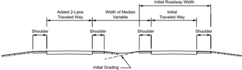
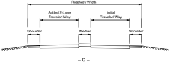
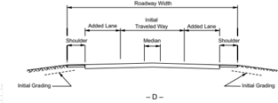
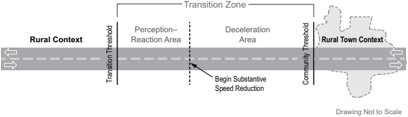
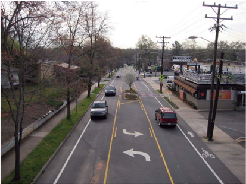
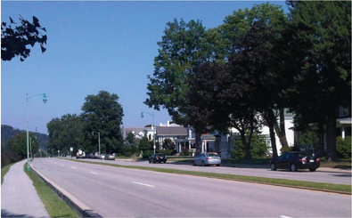
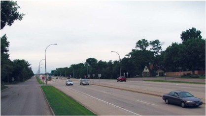

# 7.1  INTRODUCTION: 7.1  INTRODUCTION & 96 more sections

- Source: GreenBook.pdf
- Generated: 2026-01-03T08:11:58+00:00
- Chunk: 20/28
- Estimated tokens: ~49,945
- Total pages: 1048
- Type: sections

## 7.1  INTRODUCTION

The principal and minor arterial road systems provide for travel between major points in both rural and urban areas. Within urban areas, the arterial road system often operates at lower speeds and plays an important role in inter- and intra-urban circulation networks. Chapter 1 discusses extensively the functional purposes of arterials in both rural and urban areas with the exception of grade-separated freeways and expressways, which are covered in Chapter 8. This chapter provides the general information needed to establish the basis of design for arterials in rural and urban areas.

The design of arterials covers a broad range of roadways, from two-lane to multilane, and is the most difficult class of roadway design because of the need to provide both safe and efficient operations; allow varying degrees of accessibility to adjoining properties; often serve pedestrians, bicyclists, and transit service as well as motor vehicles; and perform effectively under sometimes unusual or constrained conditions. Chapter 1 introduces five contexts for design of roads and streets, to supplement the rural and urban area types that have traditionally been considered. Rural areas consist of two context categories-rural and rural town. Urban areas consist of three context categories-suburban, urban, and urban core.

The designer should be thoroughly familiar with the material in all chapters of this policy in order to skillfully apply design flexibility in blending the various types of arterials into the functional network and surrounding context. Although freeways are included within the functional description of an arterial, they have distinctive design criteria and are therefore treated separately in Chapter 8. For the purposes of this chapter, guidance for arterials in urban areas applies to arterials in the suburban, urban, and urban core contexts.

This chapter considers arterials in rural areas separately from arterials in urban areas because each type of arterial has distinctive features. However, the designer should be prepared to use design features from both arterial types to provide for suitable transitions as an arterial transitions between rural and urban areas, as well as between the varying contexts within those areas.

The specific dimensional design criteria presented in this chapter are appropriate as a guide for new construction of arterial roads and streets. Projects to improve existing roads differ from new construction in that the performance of the existing road is known and can guide the design process. Features of the existing design that are performing well may remain in place, while features that are performing poorly should be improved, where practical. Chapter 1 presents a flexible, performance-based design process that can be applied in developing projects on arterial roads and streets.

## 7.2  ARTERIALS IN RURAL AREAS

This section presents guidance on the design of arterials in the rural and rural town contexts. The primary differences between geometric design in the rural and rural town contexts are in the choice of design speed and the increased need in the rural town context to provide parking, to serve increased pedestrian and bicyclist flows, and blend in with the community.

## 7.2.1  General Characteristics

Arterials in rural areas constitute an important part of the rural highway system, including cross sections that range from two-lane roadways to multilane, divided controlled-access highways. The first portion of this chapter relates to the design of arterials in rural areas and the reconstruction of arterials in rural areas. Such roadways are designed on the basis of traffic volume needs and should be constructed to the most favorable design criteria practical.

Principal arterials in rural areas include rural freeways, which are covered in Chapter 8. They also include other multilane roadways and some two-lane highways that connect urban centers and pass through a rural town context. Minor arterials in rural areas link urban centers to larger towns and are spaced to provide a relatively high level of service to developed areas of a state.

For the purposes of this section, an arterial in a rural area that passes through a rural town context will generally have lower speeds along with an increased density of intersections and driveways generating higher levels  of  vehicle  turning  movements.  There  may  also  be  an  increased presence of traffic control (such as stop-controlled or signalized intersections), on-street parking, and pedestrian and/or bicycle activity. Design of arterials for the rural town context is addressed in Section 7.2.20.

The appropriate design geometrics for an arterial may be readily determined from the selected design speed and the design traffic volumes of all modes, with consideration of the type of terrain, the general character of the alignment, the composition of traffic and user modes, and the adjacent land use and context. Operational characteristics, design features, cross sections, and rights-of-way are also discussed in this chapter.

Two-lane arterials constitute the majority of the arterial system in rural areas. They generally have all-weather surfaces and are marked and signed in accordance with the current edition of the Manual on Uniform Traffic Control Devices ( MUTCD ) ( 12 ).

## 7.2.2  General Design Considerations

Basic information needed for the design of rural arterials includes crash history, traffic volumes (both current and projected), terrain, and horizontal and vertical alignment. Design of arterials in rural towns needs additional information such as land use and modal mix that is appropriate to the specific corridor.

## 7.2.2.1  Design Speed

Design speeds for  arterials  in  rural  areas  differ  between  the  two  rural  area  contexts-rural context and rural town context. Design speeds for arterials in the rural context are generally greater than 45 mph [70 km/h] and largely depend on terrain, driver expectancy and, in the case of reconstruction projects, the alignment of the existing facility. Design speeds of 50 to 75 mph [80 to 120 km/h] are normally used in level terrain; design speeds of 50 to 65 mph [80 to 100 km/h] are normally used in rolling terrain; and design speeds of 45 to 60 mph [70 to 80 km/h] are used in mountainous terrain. Design speeds for arterials in the rural town context are lower and generally range from 20 to 45 mph [50 to 70 km/h], depending on the activity levels for transportation modes and other goals of the community.

Considerable attention should be given to the transition of high to low speeds on arterials in rural areas as the adjacent land use changes from a rural context to a rural town context. Arterials in the rural context are designed to facilitate high-speed, longer-distance travel. Arterials in the rural town context typically have lower design speeds, increased traffic control, on-street parking, frequent access points, and more pedestrian activity than arterials in the rural context. Drivers need well-designed transition zones that encourage gradual, smooth reductions in speed as they transition from the rural context to the rural town context. Guidance on designing transition zones is presented in Section 7.2.19.

## 7.2.2.2  Design Traffic Volumes

Before an existing arterial in a rural area is improved or a new arterial in a rural area is constructed, the design traffic volume for motor vehicles should be determined. The first step in determining the design traffic volume is to determine the current average daily traffic (ADT) volume for the roadway; in the case of new construction, the ADT can be estimated. These ADT values should then be projected to the design year, usually 20 years into the future. The design of low-volume arterials in rural areas is typically based on ADT values alone because neither capacity nor intersection operations typically govern the overall operation. Such roadways normally provide free flow under all conditions. By contrast, it is usually appropriate to design high-volume arterials in rural areas using an hourly volume as the design traffic volume. The

design hourly volume (DHV) that should generally be used in design is the 30th highest hourly volume of the year, abbreviated as 30 HV, which is typically about 15 percent of the ADT on rural roads. Where an arterial in a rural area has existing pedestrian or bicycle activity or passes through a rural town context, current and projected design volumes should also be estimated for those other roadway users. For further information on the determination of design traffic volumes, see Section 2.3, 'Traffic Characteristics.'

## 7.2.2.3  Level of Service

Procedures for estimating the traffic operational performance of particular highway designs are presented in the Highway Capacity Manual (HCM) ( 35 ), which also presents a thorough discussion of the level-of-service concept, including level of service for motor vehicles, pedestrians, and bicyclists. Although the choice of an appropriate design level of service is left to the highway agency, designers should strive to provide the highest level of service practical and consistent with anticipated conditions. Level-of-service characteristics are discussed in Section 2.4.5 and summarized in Table 2-2. For acceptable degrees of congestion, arterials in rural areas and their auxiliary  facilities  (e.g.,  turning  lanes,  passing  sections,  weaving  sections,  intersections,  and interchanges) should generally be designed for level of service B, except in mountainous areas where level of service C is acceptable. Where arterials in rural areas pass through a rural town context and nonmotorized roadway users are present, or likely to be present in the future, the motor-vehicle level of service may be reduced to provide a more balanced level of service and better accommodate other modes.

## 7.2.2.4  Sight Distance

Sight distance is directly related to and varies appreciably with design speed. Stopping sight distance should be provided throughout the length of the roadway. Passing and decision sight distances influence roadway operations and should be provided wherever practical. Providing decision sight distance at locations where complex decisions are made greatly enhances the capability for drivers to accomplish maneuvers. Examples of locations where complex decisions are needed include interchanges, high-volume intersections, transitions in roadway width, and transitions in the number of lanes. Providing adequate sight distance on arterials in rural areas, which may combine both high speeds and high traffic volumes, can be complex. Table 7-1 presents the recommended minimum values of stopping and passing sight distance. Refer to Section 3.2 for a comprehensive discussion of sight distance and for tabulated values for decision sight distance.

--',''','',',',','''''',,,,''-'-',,',,',',,'---

Table 7-1. Minimum Sight Distances for Arterials in Rural Areas

| U.S. Customary     | U.S. Customary                         | U.S. Customary                        |
|--------------------|----------------------------------------|---------------------------------------|
| Design Speed (mph) | Minimum Stopping Sight Dis- tance (ft) | Minimum Passing Sight Dis- tance (ft) |
| 20                 | 115                                    | 400                                   |
| 25                 | 155                                    | 450                                   |
| 30                 | 200                                    | 500                                   |
| 35                 | 250                                    | 550                                   |
| 40                 | 305                                    | 600                                   |
| 45                 | 360                                    | 700                                   |
| 50                 | 425                                    | 800                                   |
| 55                 | 495                                    | 900                                   |
| 60                 | 570                                    | 1000                                  |
| 65                 | 645                                    | 1100                                  |
| 70                 | 730                                    | 1200                                  |
| 75                 | 820                                    | 1300                                  |
| 80                 | 910                                    | 1400                                  |

| Metric              | Metric                                | Metric                               |
|---------------------|---------------------------------------|--------------------------------------|
| Design Speed (km/h) | Minimum Stopping Sight Dis- tance (m) | Minimum Passing Sight Dis- tance (m) |
| 30                  | 35                                    | 120                                  |
| 40                  | 50                                    | 140                                  |
| 50                  | 65                                    | 160                                  |
| 60                  | 85                                    | 180                                  |
| 70                  | 105                                   | 210                                  |
| 80                  | 130                                   | 245                                  |
| 90                  | 160                                   | 280                                  |
| 100                 | 185                                   | 320                                  |
| 110                 | 220                                   | 355                                  |
| 120                 | 250                                   | 395                                  |
| 130                 | 285                                   | 440                                  |

Ideally, intersections and railroad crossings should be grade separated or provided with adequate sight distance. Intersections should be placed in sag or tangent locations, where practical, to provide maximum visibility of the roadway, signs, and pavement markings.

## 7.2.2.5  Alignment

A smooth flowing alignment is desirable on an arterial in a rural area. Changes in alignment, both  horizontal  and  vertical,  should  be  sufficiently  gradual  to  avoid  surprising  the  driver. Minimum radii should be used sparingly; short horizontal curves-particularly at the end of long tangents-should be avoided. Roads with consistent alignment usually function more efficiently and with lower crash rates than roads with poor alignment, even where enhanced signing and pavement marking are provided.

## 7.2.2.6  Grades

The length and steepness of grades directly affect the operational characteristics of an arterial in a rural area. Table 7-2 presents recommended maximum grades for arterials in rural areas. When vertical curves for stopping sight distance are considered, there are seldom advantages to using the maximum grade values except when grades are long.

--',''','',',',','''''',,,,''-'-',,',,',',,'---

Table 7-2. Maximum Grades for Arterials in Rural Areas

|                 | U.S. Customary                                     | U.S. Customary                                     | U.S. Customary                                     | U.S. Customary                                     | U.S. Customary                                     | U.S. Customary                                     | U.S. Customary                                     | U.S. Customary                                     | U.S. Customary                                     | U.S. Customary                                     |
|-----------------|----------------------------------------------------|----------------------------------------------------|----------------------------------------------------|----------------------------------------------------|----------------------------------------------------|----------------------------------------------------|----------------------------------------------------|----------------------------------------------------|----------------------------------------------------|----------------------------------------------------|
| Type of Terrain | Maximum Grade (%) for Specified Design Speed (mph) | Maximum Grade (%) for Specified Design Speed (mph) | Maximum Grade (%) for Specified Design Speed (mph) | Maximum Grade (%) for Specified Design Speed (mph) | Maximum Grade (%) for Specified Design Speed (mph) | Maximum Grade (%) for Specified Design Speed (mph) | Maximum Grade (%) for Specified Design Speed (mph) | Maximum Grade (%) for Specified Design Speed (mph) | Maximum Grade (%) for Specified Design Speed (mph) | Maximum Grade (%) for Specified Design Speed (mph) |
|                 | 20                                                 | 25                                                 | 30                                                 | 35                                                 | 40                                                 | 45                                                 | 50                                                 | 55                                                 | 60                                                 | 65 and above                                       |
| Level           | 5                                                  | 5                                                  | 5                                                  | 5                                                  | 5                                                  | 5                                                  | 4                                                  | 4                                                  | 3                                                  | 3                                                  |
| Rolling         | 8                                                  | 8                                                  | 7                                                  | 7                                                  | 6                                                  | 6                                                  | 5                                                  | 5                                                  | 4                                                  | 4                                                  |
| Mountainous     | 10                                                 | 9                                                  | 8                                                  | 8                                                  | 8                                                  | 7                                                  | 7                                                  | 6                                                  | 6                                                  | 5                                                  |

## 7.2.2.7  Cross Slope

Cross slope is provided to enhance roadway drainage. Two-lane rural roadways are normally designed with a centerline crown and traveled-way cross slopes ranging from 1.5 to 2 percent with the higher values being most prevalent.

## 7.2.2.8  Superelevation

Where curves are used on an arterial in a rural area, a superelevation rate based on the design speed should be used. Superelevation rates should not exceed 12 percent; however, where ice and snow conditions are a factor, the maximum superelevation rate should not exceed 8 percent. The maximum cross-slope break between the traveled way and the shoulder should be limited to 8 percent to reduce the risk of vehicle rollover ( 32 ). Superelevation runoff consists of the length of roadway needed to accomplish the change in outside-lane cross slope from zero (flat) to a fully superelevated section, or vice versa. Adjustments in design runoff lengths may be needed for smooth riding, drainage, and appearance. Section 3.3 provides a detailed discussion of superelevation and tables of appropriate superelevation rates and runoff lengths for various design speeds.

## 7.2.3  Cross-Sectional Elements

## 7.2.3.1  Roadway Width

The logical approach to determining appropriate lane and shoulder widths is to provide a width related to the traffic demands. Table 7-3 provides values for the width of traveled way and usable shoulder that should be considered for the motor-vehicle volumes and design speeds indicated. In addition, the types of vehicles being served (such as freight and bicycles), availability of right-of-way, and adjacent land use (or area context) should be considered in lane and shoulder width decisions. Regardless of weather conditions, shoulders should be usable at all times. On high-volume highways, shoulders should preferably be paved, but paved shoulders may not always be practical. As a minimum, 2 ft [0.6 m] of the shoulder width should be paved to provide for pavement support, wide vehicles, and collision avoidance. Where bicycles are to be accommodated on the shoulder, a minimum paved width of 4 ft [1.2 m] should be used. The shoulder

| Metric                                              | Metric                                              | Metric                                              | Metric                                              | Metric                                              | Metric                                              | Metric                                              | Metric                                              | Metric                                              |
|-----------------------------------------------------|-----------------------------------------------------|-----------------------------------------------------|-----------------------------------------------------|-----------------------------------------------------|-----------------------------------------------------|-----------------------------------------------------|-----------------------------------------------------|-----------------------------------------------------|
| Maximum Grade (%) for Specified Design Speed (km/h) | Maximum Grade (%) for Specified Design Speed (km/h) | Maximum Grade (%) for Specified Design Speed (km/h) | Maximum Grade (%) for Specified Design Speed (km/h) | Maximum Grade (%) for Specified Design Speed (km/h) | Maximum Grade (%) for Specified Design Speed (km/h) | Maximum Grade (%) for Specified Design Speed (km/h) | Maximum Grade (%) for Specified Design Speed (km/h) | Maximum Grade (%) for Specified Design Speed (km/h) |
| 30                                                  | 40                                                  | 50                                                  | 60                                                  | 70                                                  | 80                                                  | 90                                                  | 100                                                 | 110 and above                                       |
| 5                                                   | 5                                                   | 5                                                   | 5                                                   | 5                                                   | 4                                                   | 4                                                   | 3                                                   | 3                                                   |
| 8                                                   | 8                                                   | 7                                                   | 6                                                   | 6                                                   | 5                                                   | 5                                                   | 4                                                   | 4                                                   |
| 10                                                  | 9                                                   | 8                                                   | 8                                                   | 7                                                   | 7                                                   | 6                                                   | 6                                                   | 5                                                   |

should be constructed to a uniform width for relatively long stretches of roadway. For additional information concerning shoulders, refer to Section 4.4.

Table 7-3. Minimum Width of Traveled Way and Usable Shoulder for Arterials in Rural Areas

| U.S. Customary     | U.S. Customary                                                             | U.S. Customary                                                             | U.S. Customary                                                             |
|--------------------|----------------------------------------------------------------------------|----------------------------------------------------------------------------|----------------------------------------------------------------------------|
| Design Speed (mph) | Minimum Width of Traveled Way (ft) a for Specified Design Volume (veh/day) | Minimum Width of Traveled Way (ft) a for Specified Design Volume (veh/day) | Minimum Width of Traveled Way (ft) a for Specified Design Volume (veh/day) |
| Design Speed (mph) | under 400 c                                                                | 400 to 2000                                                                | over 2000                                                                  |
| 40                 | 20                                                                         | 22                                                                         | 24                                                                         |
| 45                 | 20                                                                         | 22                                                                         | 24                                                                         |
| 50                 | 22                                                                         | 22                                                                         | 24                                                                         |
| 55                 | 22                                                                         | 24                                                                         | 24                                                                         |
| 60                 | 22                                                                         | 24                                                                         | 24                                                                         |
| 65                 | 22                                                                         | 24                                                                         | 24                                                                         |
| 70                 | 22                                                                         | 24                                                                         | 24                                                                         |
| 75                 | 22                                                                         | 24                                                                         | 24                                                                         |
| All speeds         | Width of Usable Shoulder                                                   |                                                                            | (ft) b                                                                     |
| All speeds         | 4                                                                          | 6                                                                          | 8                                                                          |

| Metric              | Metric                                                                    | Metric                                                                    | Metric                                                                    |
|---------------------|---------------------------------------------------------------------------|---------------------------------------------------------------------------|---------------------------------------------------------------------------|
| Design Speed (km/h) | Minimum Width of Traveled Way (m) a for Specified Design Volume (veh/day) | Minimum Width of Traveled Way (m) a for Specified Design Volume (veh/day) | Minimum Width of Traveled Way (m) a for Specified Design Volume (veh/day) |
| Design Speed (km/h) | under 400 c                                                               | 400 to 2000                                                               | over 2000                                                                 |
| 60                  | 6.0                                                                       | 6.6                                                                       | 7.2                                                                       |
| 70                  | 6.0                                                                       | 6.6                                                                       | 7.2                                                                       |
| 80                  | 6.6                                                                       | 6.6                                                                       | 7.2                                                                       |
| 90                  | 6.6                                                                       | 7.2                                                                       | 7.2                                                                       |
| 100                 | 6.6                                                                       | 7.2                                                                       | 7.2                                                                       |
| 110                 | 6.6                                                                       | 7.2                                                                       | 7.2                                                                       |
| 120                 | 6.6                                                                       | 7.2                                                                       | 7.2                                                                       |
| 130                 | 6.6                                                                       | 7.2                                                                       | 7.2                                                                       |
| All speeds          | Width of Usable Shoulder (m) b                                            | Width of Usable Shoulder (m) b                                            | Width of Usable Shoulder (m) b                                            |
| All speeds          | 1.2                                                                       | 1.8                                                                       | 2.4                                                                       |

- a On roadways to be reconstructed, an existing 22-ft [6.6-m] traveled way may be retained where the alignment is satisfactory and there is no crash pattern suggesting the need for widening.
- b Preferably, usable shoulders on arterials in rural areas should be paved; however, where volumes are low or a narrow section is needed to reduce construction effects, the paved shoulder width may be a minimum of 2 ft [0.6 m] provided that bicycle use is not intended to be accommodated on the shoulder.
- c Where frequent use by trucks is anticipated, additional traveled-way width should be considered.

## 7.2.3.2  Number of Lanes

The number of traffic lanes on an arterial in a rural area should be determined based on consideration of volume, level of service, context category (rural context or rural town context), and capacity conditions. A multilane arterial in a rural area, as discussed in this chapter, refers to an arterial facility with four or more total through lanes.

## 7.2.3.3  Cross Section and Right-of-Way

The type of surfacing and shoulder treatment should fit the volume and composition of motor-vehicle traffic and other modes, present or planned. Two-lane arterials in rural areas are normally crowned to drain away from the centerline except where superelevation is provided. Arterials in rural towns may have curb and gutter with inlet grates connected to underground stormwater collection systems. The treatment of cross slopes, drainage channels and systems, and side slopes is discussed in Chapter 4. The right-of-way is typically configured to accommodate all of the cross-sectional elements throughout the project. This usually precludes a uniform

right-of-way width since there are typically many situations where additional width is advantageous. Such situations occur where off-street pedestrian and bicycle facilities are provided, where the side slopes extend beyond the normal right-of-way, for clear areas at the bottom of traversable slopes, for wide clear areas on the outside of curves, where greater sight distance is desirable, at intersections and junctions with highways, at railroad-highway grade crossings, for environmental considerations, and for maintenance access.

Local conditions, such as drainage, snow storage, presence of utilities, presence of freight, and presence  of  nonmotorized  users  should  be  considered  in  determining  right-of-way  widths. Where the need for additional lanes, shoulders, or roadside facilities is expected in the future for either motor-vehicle or nonmotorized users, the initial right-of-way width should be adequate to provide the wider roadway section. It may be desirable to construct the initial two lanes off center within the right-of-way, so the future construction will cause less interference with traffic and the investment in initial grading and surfacing can be salvaged.

## 7.2.4  Roadside Design

In the absence of roadside facilities for nonmotorized users, there are typically two primary considerations for roadside design along the traveled way for arterials in rural areas-clear zones and lateral offset.

## 7.2.4.1  Clear Zones

A clear unobstructed roadside is highly desirable on high-speed arterials in rural areas. Where fixed objects or non-traversable slopes fall within the clear roadside zones discussed in Section 4.6, 'Roadside Design,' refer to AASHTO's Roadside Design Guide ( 6 ) for guidance in selecting the appropriate treatment. Where practical, fixed objects, including trees that will grow to 4 in. [100 mm] or more in diameter, should be located near the right-of-way line and should be outside the selected clear zone. Where arterials in rural areas pass through a rural town context, the designer may refer to the 'Arterials in Urban Areas' discussion in Section 7.3.4.

## 7.2.4.2  Lateral Offset

The full approach width (traveled way, shoulders, bicycle facilities, and sidewalks, if present) should be carried along the roadway and across bridges and overpasses where practical. To the extent practical, where another highway or railroad passes over the highway, the overpass should be designed so that the piers or abutment supports-including barrier systems-have a lateral offset no less than that of the approach roadway.

On facilities without curbing and with shoulder widths less than 4 ft [1.2 m], a minimum lateral offset of 4 ft [1.2 m] from the edge of the traveled way should be provided. Lateral offset is defined in Section 4.6.2. Further discussion and suggested guidance on the application of lateral offsets is provided in the AASHTO Roadside Design Guide ( 6 ).

--',''','',',',','''''',,,,''-'-',,',,',',,'---

## 7.2.5  Structures

The design of bridges, culverts, walls, tunnels, and other structures should be in accordance with the current AASHTO LRFD Bridge Design Specifications ( 9 ). The design loading should be the HL-93 calibrated live load designation.

The full width for the approach roadways, including shoulders and any space allocated for bicycles  and  pedestrians,  should  normally  be  continued  across  all  new  bridges.  Long  bridges, defined as bridges having an overall length in excess of 200 ft [60 m], may have a lesser width if current or projected bicycle use is very infrequent and no pedestrian facility is needed. On long bridges, shoulders should be at least 4 ft [1.2 m] measured from the edge of the traveled way on both sides of the roadway, and may need to be wider depending on existing and projected bicycle volumes. Where pedestrian facilities are provided, they must be accessible to and usable by individuals with disabilities ( 37, 38 ). See Section 10.8.3 for further information on bridge widths.

## 7.2.5.1  Vertical Clearances

New or reconstructed structures should provide 16-ft [4.9-m] clearance over the entire roadway width including the usable width of shoulders. Additional clearance to allow for future resurfacing should be considered. Existing structures that provide clearance of at least 14 ft [4.3 m], if allowed by local statute, may be retained. The vertical clearance to sign supports and to bicycle and pedestrian overpasses should be 1.0 ft [0.3 m] greater than the highway structure clearance.

## 7.2.6  Traffic Control Devices

Signs, pavement delineation, and pavement marking play an important role in the optimal operation of arterials in rural areas. Placement of these items should be considered early in the design stage while adjustments to the alignment and intersection design can be easily considered. Refer to the current MUTCD ( 12 ) for guidance in signing and marking.

## 7.2.7  Erosion Control

Consideration of erosion control features is important to the proper design of an arterial in a rural area. By controlling erosion, the design of the roadside is maintained and the environment downstream is protected from siltation and other possible harmful effects. Providing adequate ground treatment and cover has the additional benefit of assuring a pleasing roadside appearance.

## 7.2.8  Provision for Passing

In designing two-lane, two-way arterials in rural areas, the alignment and profile should normally provide sections suitable for passing at frequent intervals. Design of the horizontal and vertical alignment should provide adequate passing sight distance over as large a proportion of the highway length as practical. Table 7-1 presents the minimum passing sight distances for

design speeds of 30 mph [50 km/h] and greater. Passing is not typically permitted on roadways with design speeds below 30 mph [50 km/h]. Restrictive cases may exist where passing sight distance is economically difficult to justify. Even in those instances, passing opportunities should be provided with at least the frequency needed to attain the desired level of service. Where achievement of sufficient passing sight distance is not practical, auxiliary lanes such as truck climbing lanes or passing lanes should be considered as a means to obtain the desired level of service.

Although truck climbing lanes are normally provided to prevent unreasonable reductions in operating speeds on upgrades, they also provide opportunities for passing in areas where passing would not otherwise be permitted. Adequately designed and well-marked climbing lanes will usually be used by slow-moving vehicles and allow passing by drivers who prefer to move at normal speeds. Climbing lanes are usually provided to the right of the through-traffic lane and should be the same width as the through lanes with a somewhat reduced shoulder width. A usable shoulder width of 4 ft [1.2 m] or greater is generally acceptable, although the existing or future presence of bicycles or pedestrians should be considered in the selection of narrower shoulders. The design elements and warrants for the use of climbing lanes are discussed in Section 3.4.3. An example of a climbing lane on a two-lane arterial in a rural area is shown in Figure 7-1.

Source: Oregon DOT

Figure 7-1. Climbing Lane on Two-Lane Arterial in a Rural Area

Passing lanes should be considered where climbing lanes are not warranted and where the extent and frequency of passing sections are too few. The use of passing lanes to increase passing opportunities on two-lane highways is addressed in Section 3.4.4.

In summary, the design procedures to be followed in providing passing opportunities on twolane highways include:

- y Design of the horizontal and vertical alignment should provide as great a proportion of the highway length as practical with adequate passing sight distance.
- y For design volumes approaching capacity, the effect of passing opportunities on increasing capacity should be considered.
- y For further information for climbing lane warrants, refer to Section 3.4.3.
- y Where the extent and frequency of passing opportunities made available by application of items 1 and 3 are insufficient, the design should consider provision of passing lanes utilizing a three-lane cross section.

## 7.2.9  Ultimate Development of Multilane Divided Arterials in Rural Areas

Although many arterials in rural areas will adequately serve the traffic demands in the future, there are numerous instances where such arterials in rural areas will ultimately need development into a higher type arterial. Where an arterial in a rural area is being improved and it is anticipated that the DHV for the design year will exceed the service volume of the roadway for its desired level of service, the initial improvement should be consistent with the planned ultimate development, and acquisition of the needed right-of-way should be considered. This is particularly common in growing rural town contexts and emerging urban and suburban context areas, where changes in adjacent land use may significantly increase traffic volumes and presence of nonmotorized users. Ultimate roadway improvements may need enhanced pedestrian facilities, bicycle facilities, bus stops, transit or HOV lanes, interchanges and other features, in addition to travel lanes and shoulders. All of these needs should be considered.

For divided arterials in rural areas, the median should be widened to allow for the planned ultimate development to be added in the median. The initial two-lane arterial should be constructed so that it can eventually become one of the two two-lane, one-way roadways in the ultimate development of a four-lane divided arterial. The advantages of this approach are as follows:

1. There  is  no  loss  of  investment  in  existing  surfacing  and  overcrossings  when  the  second roadway is constructed.
2. Traffic will be subjected to reduced restriction or delay when the additional two lanes are constructed because the original two lanes continue in use as a two-way arterial during construction, no detours are needed, and contact with construction operations is restricted to intersections and turnouts on one side.

3. Acquiring right-of-way with the initial improvement preserves right-of-way for the ultimate development. Acquiring right-of-way at current, rather than future, land values, particularly after the construction or improvement of the arterial, may more than offset the added initial right-of-way cost.
4. By grading the entire roadway for four lanes, future effects on wetlands created by roadside ditches and recharge basins are avoided, as well as erosion and other concerns associated with grading.

Care should be exercised, however, to provide an appropriate clear zone in the initial stage. A similar precaution may be adopted for top-soiling, seeding, planting, and any other work that is done to prevent soil erosion, steps which increase in value with time.

Two-lane arterials in rural areas planned for ultimate conversion to a divided arterial usually have sufficient initial volume to warrant a traveled way of 24 ft [7.2 m] wide and usable shoulders, 8 ft [2.4 m] wide, as shown in Figure 7-2A. These traveled way and shoulder dimensions are  commensurate with those recommended for four-lane divided arterials in rural areas, as discussed in Section 7.2.11. For an arterial in a rural area that will ultimately be developed into a four-lane divided arterial having a wide median and an initial offset to one side of the rightof-way  centerline,  the  roadway  generally  is  crowned  to  drain  both  ways.  Ultimately,  a  wide median should be depressed to be self-draining and may receive surface runoff from one-half of each roadway (Figure 7-2B). Grading for the future development generally is deferred when the median is wide.

Where the right-of-way for the future four-lane arterial in a rural area is restricted, a narrow median, which should be not less than 4 ft [1.2 m] wide, may need to be used. If provision of a median barrier is anticipated for the ultimate improvement, space for a wider median should be provided to accommodate the width of the barrier plus the appropriate clearance between the edge of the traveled way and the face of the barrier. As in the case of a wide median, the initial two-lane construction should be offset so that the ultimate development is centered on the rightof-way. To economize on the cost of drainage structures and simplify construction, the initial and future two-lane roadways may be positioned to drain to the outside (Figure 7-2C). It may be possible to defer future grading, depending on local conditions and on the probable length of time to the full development.

On many older two-lane arterials in rural areas, no provision was originally made for future improvement to a higher roadway type. In such instances, where practical, a new two-lane, oneway roadway should be provided approximately parallel to the first, which is then converted into one-way operation to form a divided arterial in a rural area. Where there is adjacent development, it may be more practical to construct another one-way, two-lane roadway some distance from the initial facility without disturbing the existing development. This method may also be advantageous where topography is not favorable to direct widening of the existing roadway section. If this method cannot be used, it may be practical to achieve a divided section by widening

--',''','',',',','''''',,,,''-'-',,',,',',,'---

--',''','',',',','''''',,,,''-'-',,',,',',,'---

14 ft [4.2 m] on each side of the existing roadway (Figure 7-2D). When none of these methods is  practical, it may be appropriate to find a new location. The old road then becomes a local facility and may also serve as an alternate route. From the standpoint of adequacy and service provided to through traffic, the last method is preferred because the arterial in a rural area on a new location will not be influenced by the old facility and can be built to modern design criteria, preferably with some control of access.

For roadways that will ultimately be developed with narrow medians (Figures 7-2C and 7-2D), all of the cross sections shown in Figure 7-2 have minimum combined widths of roadways and median of 70 ft [20 m]. About 12 ft [3.6 m] or more of additional width should be obtained so that median lanes for left turns may be provided at intersections. Although the cross sections in Figure 7-2 do not show sidewalks, bicycle lanes, and shared-use paths, those facilities may be present in the ultimate development of some rural multilane arterials.

## 7.2.10  Multilane Undivided Arterials in Rural Areas

Research has shown that multilane undivided facilities often have substantially more collisions than  multilane  divided  facilities  with  medians.  Therefore,  in  new  construction  of  multilane arterials, a median or central two-way left-turn lane should normally be provided. Multilane undivided arterials should be provided in new construction in rural areas only where provision of a median or central turn lane is not practical. A multilane undivided arterial in a rural area is the narrowest arterial in a rural area on which each traffic lane is intended to be used by traffic in one direction of travel, and all passing is accomplished on lanes not subject to use by opposing traffic. Because of the generally higher volumes, drivers on multilane arterials in rural areas are confronted with additional traffic friction-from opposing traffic, roadsides, and traffic in the same direction. Frequency of at-grade crossings has appreciable influence on crash frequency and traffic capacity. Turn lanes and adequate intersection sight distance can substantially reduce the frequency of crashes at intersections.

The elements of design discussed in preceding chapters are generally applicable to multilane undivided arterials in rural areas, except that passing sight distance is not essential. The sight distance that should be provided at all points is the stopping sight distance because passing can be accomplished without using an opposing traffic lane. In addition, intersection sight distance, as described in Section 9.5, should be provided at intersections.

If traffic volumes justify the construction of multilane arterials in rural areas where speeds are apt to be high, it is generally advisable to separate opposing traffic by a median. All arterials in rural areas on new locations that need four or more lanes should be designed with a median. Preferably a median should be provided in conjunction with widening of an existing two-lane arterial in a rural area into a multilane facility.

- A -

4-Lane Divided with Wide Median

- B -

Initial Grading - D Figure 7-2. Two-Lane Arterial Cross Section with Ultimate Development to a Four-Lane Arterial --',''','',',',','''''',,,,''-'-',,',,',',,'---

## 7.2.11  Divided Arterials in Rural Areas

## 7.2.11.1  General Features

A divided arterial in a rural area is one with separated lanes for traffic in opposite directions. It may be situated on a single roadbed or may consist of two widely separated roadways. The width of the median may vary and is influenced largely by the type of area, character of terrain, intersection treatment, and economics. An arterial in a rural area is not normally considered divided unless there are two full lanes in each direction of travel and the median has a width of 4 ft [1.2 m] or more and is constructed or marked to preclude its use by moving vehicles (except in emergencies or for left turns). A divided arterial in a rural area should have adequate median width to allow protected left turns, which can substantially reduce the frequency of crashes related to left-turn maneuvers.

The principal advantages of dividing multilane arterials in rural areas are reduced crash frequency, increased ease of operation, and increased comfort. A key reason for providing a median is to reduce head-on collisions, which are usually serious; such collisions may be virtually eliminated on roadways with wide medians or with a median barrier. Where median lanes for left turns are provided, this reduces rear-end collisions and impedance of through traffic resulting from left-turn movements. Pedestrians and bicyclists crossing the divided arterial in a rural area need to watch traffic in only one direction at a time and have a refuge at the median, particularly if a raised island is provided. Where the median is wide enough, crossing and left-turning vehicles can slow down or stop between the one-way roadways to take advantage of breaks in traffic and proceed when the driver decides it is safe to do so. Divided multilane arterials in rural areas provide more relaxed and pleasant travel than undivided arterials in rural areas, particularly in inclement weather and at night when headlight glare is bothersome. Headlight glare is reduced somewhat by addition of a narrow median, but it can almost be eliminated by addition of a wide median or a glare screen on a median barrier.

## 7.2.11.2  Lane Widths

Due to the high speeds and large volumes typically associated with divided arterials in rural areas, they should be designed with lanes 12 ft [3.6 m] wide. On reconstructed arterials in rural areas, it may be acceptable to retain 11ft [3.3-m] lanes if the alignment is satisfactory and there is no crash pattern suggesting the need for widening. In rural town contexts with low-speed conditions and low percentages of trucks, 10-ft lanes may be satisfactory.

## 7.2.11.3  Cross Slope

Each roadway of a divided arterial in a rural area may be sloped to drain to both edges, or each roadway may be sloped to drain to its outer edge, depending on climatic conditions and the width of median. Roadways on divided arterials in rural areas should have a normal cross slope of 1.5 to 2 percent.

When three or more lanes are inclined in the same direction on multilane divided arterials in rural areas, each successive pair of lanes outward from the first two lanes adjacent to the crown line may have an increased slope. A cross slope should not normally exceed 3 percent on tangent alignment, however. In no case should the cross slope of an outer or auxiliary lane, or both, be less than that of the adjacent lane.

For a more complete discussion, see Section 4.2.2, 'Cross Slope.'

## 7.2.11.4  Shoulders

Arterials in rural areas with sufficient traffic volume to justify the provision of four lanes will also justify having full-width shoulders. The width of usable outside shoulders should be at least 8 ft [2.4 m] and be usable during all seasons. Paving of the usable width of shoulder is preferred. Shoulders on arterials in rural areas are also desirable for use by bicyclists and occasional pedestrians. Where bicycles are to be accommodated on the shoulder, a minimum paved shoulder width of 4 ft [1.2 m] should be used with appropriate treatments for any rumble strips that may be added.

The normal roadway section, including usable shoulders, should be extended across all structures where practical. If the normal roadway section includes special accommodations for existing or anticipated pedestrian and bicycle users, then long bridges should also provide those cross section elements across their length. --',''','',',',','''''',,,,''-'-',,',,',',,'---

Shoulder space on the left side of the individual roadways of a four-lane divided arterial in a rural area (i.e., within the median) does not serve the same purpose as the right shoulder. The shoulder on the right, through customary use on undivided arterials in rural areas, is understood by drivers as a suitable refuge space for stops and by nonmotorized users as available for their use. Where the median is flush with the roadway or has sloping curbs, vehicles may encroach or drive on it momentarily if forced to do so to avoid a crash. Only on rare occasions should drivers need to use the median for deliberate stops.

On divided arterials in rural areas with two lanes in each direction, a paved shoulder 4 ft [1.2 m] wide should satisfy the needs for a shoulder within the median. Such a shoulder will preclude rutting at the edge-of-traveled way and will reduce the likelihood of loss of control for vehicles that inadvertently encroach on the median.

On divided arterials in rural areas with three or more lanes in each direction, a driver in distress in  the  lane  nearest  the  median may have difficulty maneuvering to the right-hand shoulder. Consequently, a full-width shoulder within the median is desirable on divided arterials in rural areas having six or more lanes.

Guardrail and median barrier should be considered in accordance with the AASHTO Roadside Design Guide ( 6 ).

In cases where a wall or median barrier is used in the median, the AASHTO Roadside Design Guide ( 6 ) should be consulted for guidance in selecting an appropriate lateral clearance from the normal edge of the traveled way to the base of the wall or barrier and the type of barrier to be used.

## 7.2.11.6  Medians

On arterials in rural areas without at-grade intersections, the median may be as narrow as 4 to 6 ft [1.2 to 1.8 m] under very constrained conditions, but wider medians should be provided, wherever practical. A wide median allows the use of independent profiles. In addition, provision of a wide median may reduce the frequency of cross-median crashes and reduce headlight glare from vehicles in the opposing direction of travel.

Where intersections  are  to  be  provided,  special  concern  should  be  given  to  median  width. NCHRP Report 375 ( 21 ) found that most types of undesirable driving behavior in the median areas  of  divided  highway  intersections  are  associated  with  competition  for  space  by  vehicles traveling through the median in the same direction. The potential for such problems is reduced where crossroad and U-turn volumes are low, but may increase at higher volumes. Types of undesirable driving behavior observed include side-by-side queuing, angle stopping, and encroaching on the through lanes of a divided highway. At rural unsignalized intersections, the frequency of undesirable driving behavior and crashes was observed to decrease as the median width increased; this suggests that medians should be as wide as practical. It was also found that the frequency of undesirable driving behavior increased as the median opening length increased.

While medians as narrow as 4 to 6 ft [1.2 to 1.8 m] may be used under very restricted conditions, medians 12 to 30 ft [3.6 to 9 m] wide provide a protected storage area for left-turning vehicles at intersections. Medians of 4 to 8 ft [1.2 to 2.4 m] wide should be avoided, if practical, where left turns are common. Such widths do not provide sufficient space for turning vehicles and may encourage other motorists to encroach into the adjacent lane to avoid a turning vehicle that is only partially in the median. Where a median may be used as a pedestrian refuge, it should have a minimum width of 6 ft [1.8m].

In many cases, the median width at rural unsignalized intersections is a function of the design vehicle selected for turning and crossing maneuvers. Where a median width of 25 ft [7.5 m] or more is provided, a passenger car making a turning or crossing maneuver will have space to stop in the median area without encroaching on the through lanes. Medians less than 25 ft [7.5 m] wide should be avoided at rural intersections because drivers may be tempted to stop in the median with part of their vehicles unprotected from through traffic. The school bus is often the largest vehicle to use the median roadway frequently. The selection of a school bus as the design vehicle results in a median width of 50 ft [15 m]. Larger design vehicles, including trucks, may be used in the design of intersections where enough turning or crossing trucks are present; me-

dian widths of at least 100 ft [30 m] may be needed to accommodate large tractor-trailer trucks without encroaching on the through lanes of a major road.

For intersections with medians wider than 18 ft [5.4 m], it is desirable to offset any left-turn lanes provided to reduce sight restrictions due to opposing left-turn vehicles. Intersection designs with offset left-turn lanes are discussed in Section 9.7.3.

An intersection with a median so wide that drivers on the crossroad approach cannot readily see the far roadway of the divided highway may mislead some drivers into not recognizing the highway as divided. Such designs should be avoided where practical and, where they are used, signing and visual cues should be provided to discourage wrong-way movements.

Median widths over 60 ft [18 m] are undesirable at intersections that are signalized or may need signalization in the foreseeable future. The efficiency of signal operations decreases as the median width increases, because drivers need more time to traverse the median. Special detectors may be needed to avoid trapping drivers in the median at the end of the green phase for traffic movements across the median. Furthermore, if the median is so wide that separate signals are needed on each roadway of the divided highway, delays to motorists will increase substantially and attention should be given to vehicle storage needs on the median roadway between the two signals.

The discussion of median widths at intersections on arterials in urban areas in Section 7.3.3 indicates that wider medians may increase crashes and lead to undesirable driving behavior at intersections on arterials in urban areas. Therefore, consideration should be given to limiting use of wider medians at rural and rural town intersections that are likely to undergo urban or suburban development in the foreseeable future.

Undesirable driving behavior at rural unsignalized intersections increases as the median opening length increases ( 21 ). The median opening length should be equal to at least that described in Section 9.8, but median openings at rural unsignalized intersections should not be unnecessarily long. For additional guidance, refer to NCHRP Report 633, Impact of Shoulder Width and Median Width on Safety ( 29 ).

Medians should be designed to provide a forgiving roadside. Guardrail or median barrier should be considered in accordance with the AASHTO Roadside Design Guide ( 6 ). Further information on median design is presented in Section 4.11.

## 7.2.11.7  Alignment and Profile

A divided arterial in a rural area generally serves high-volume and high-speed traffic for which a smooth flowing alignment should be provided. Because a divided arterial in a rural area consists of two separated roadways, there may be instances where median widths and roadway elevations can be varied. Special topographic or intersection considerations may make such treatments

--',''','',',',','''''',,,,''-'-',,',,',',,'---

desirable for economic or operational reasons. Precaution should be taken so that such variations do not adversely affect operations. Potential problems associated with sharp reverse curves, headlight glare, roadside design, sight distance, and grades of intersection crossings should be considered.

Profile design is less difficult for multilane arterials than for two-lane arterials in rural areas. With two or more lanes for travel in each direction, the profile grade is generally governed by stopping sight distance, except at intersections. For volumes well below capacity, grades may be steeper and longer on multilane arterials than on two-lane arterials in rural areas, because there is a continuous lane for passing of heavy, slow vehicles on upgrades.

Although vertical  design  controls  may  be  less  restrictive  for  divided  arterials  than  for  twolane arterials because passing sight distance need not be considered, the design of appropriate profiles for divided arterials involves design judgment and careful study. Even though a profile may satisfy all of the design controls, the finished product can appear forced and angular. A smoothly-flowing roadway with gradual changes in horizontal and vertical alignment should be designed to the extent practical. Such design is of primary importance where a median of constant width is used in rolling terrain. The lack of a need to provide passing sight distance may tempt designers to use a roller coaster profile, which appears more displeasing on a divided arterial than on a two-lane arterial in a rural area. With a wide divided arterial of uniform cross section, the driver's longitudinal perspective of distance is compressed and can make the combination of horizontal and vertical alignment appear abrupt and disjointed. The relationship of horizontal and vertical alignment should be studied to obtain a suitable combination. To avoid an undesirable appearance, profile designs should be checked in long continuous plots, wherein the foreshortened aspect can be simulated. Section 3.5, 'Combinations of Horizontal and Vertical Alignment', provides additional guidance on this topic.

## 7.2.11.8  Climbing Lanes on Multilane Arterials in Rural Areas

Multilane arterials in rural areas usually have sufficient capacity to handle their traffic load, including the normal percentage of heavy trucks, without becoming severely congested. Climbing lanes generally are not as easily justified on multilane arterials as on two-lane arterials, because on two-lane arterials drivers following slow-moving trucks on upgrades may be unable to or psychologically discouraged from using an adjacent traffic lane for passing. By contrast, on multilane arterials, drivers have an adjacent lane available to them in which to pass slow-moving vehicles.

In addition, a climbing lane on a two-lane, two-way arterial in a rural area is useful during both peak and non-peak hours, whereas on a multilane arterial in a rural area, a climbing lane is likely to have only limited use during non-peak hours. During periods of lower traffic volumes, a vehicle following a slow-moving truck in the right lane can readily move to the adjacent lane and proceed without difficulty, although there is evidence that slow vehicles on through-traffic lanes may cause crashes.

Because new or reconstructed arterials are designed for 20 years or more in the future, there is little likelihood of climbing lanes being justified on multilane arterials for several years after their initial construction, even though climbing lanes are deemed desirable for the peak hours of the design year. Thus, there may be an economic advantage in designing for, but deferring construction of, climbing lanes on multilane arterials. In this situation, grading for the future climbing lane should be provided initially. Very little additional grading is needed because a full shoulder is likely to be provided where there is no climbing lane; however, only a narrow shoulder is typically used outside of a climbing lane, because the climbing lane itself can serve as an emergency stopping area when needed. A full discussion on the need for climbing lanes is found in Section 3.4.3.

## 7.2.11.9  Superelevated Cross Sections

A divided arterial in a rural area on a curve should typically be superelevated to enhance vehicle control and offer a pleasing appearance. Care should be taken in the superelevation transition to fit site conditions and to meet controls of intersection design.

General methods of attaining superelevated cross sections for divided arterials in rural areas are discussed in Section 3.3.8.6. In the design of arterials in rural areas, the inclusion of a median in the cross section alters the manner in which superelevation is attained. Depending on the width of median and its cross section, there are three general cases for attaining superelevation.

Case I -The whole of the traveled way, including the median, is superelevated as a plane section. Case I should be limited to narrow medians and moderate superelevation rates to avoid substantial differences in elevation of the extreme edges of the traveled way arising from the median tilt. Specifically, Case I should be applied only to medians with widths of 15 ft [4.5 m] or less.

Case II -The median is held in a horizontal plane and the two traveled ways are rotated separately around their median edges. Case II can apply to any width of median but is most appropriate for medians with widths between 15 and 60 ft [4 and 18 m]. By holding the median edges level, the difference in elevation between the extreme traveled-way edges can be limited to that needed to superelevate the roadway. Superelevation transition design for Case II usually has the median-edge profiles as the control. One traveled way is rotated about its lower edge and the other about its higher edge.

Case III -The two traveled ways are treated separately for superelevation with a resulting variable difference in elevation at the median edges. Case III design can be used on wide medians (i.e., those with widths of 60 ft [18 m] or more). For this case, the difference in elevation of the extreme edges of the traveled way is minimized by a compensating slope across the median. With a wide median, it is possible to design the profiles and superelevation transition separately for the two roadways.

Section 3.3.8, particularly Figure 3-8, contains additional guidance concerning methods for attaining superelevation for Cases I, II, and III.

Figure 7-3 shows the treatment of cross sections for superelevated roadways with narrow and wide medians in relation to the width of median for the three cases noted. In the cross sections shown in Figures 7-3A and 7-3D, both roadways lie in the same plane. The roadways are superelevated by rotating them about a profile control on the centerline of the median. The same effect can be obtained by rotation about the edge of the traveled way or any other convenient control line.

Where the cross section shown in Figure 7-3A is used, the median should be graded in accordance with the AASHTO Roadside Design Guide ( 6 ) and designed so that surface water from the higher roadway does not drain across the lower roadway. On tangent alignment, a shallow drainage swale can be provided in a median about 15 ft [4.5 m] wide and a well-rounded drainage channel with a width of about 60 ft [18 m] as shown in Figure 7-3F. On a superelevated section rotated about the median centerline, as in the cross section shown in Figure 7-3A, approximately 30 ft [9 m] of median width is needed for a rounded drainage channel and adequate left shoulders. In a median less than 30 ft [9 m] wide, a channel with flat sideslopes can be provided if the superelevation rate is small, or a paved channel can be used in conjunction with higher rates of superelevation.

The projection of superelevation across wide medians may be fitting in some instances, as in the  cross  section  shown  in  Figure  7-3A,  but  its  general  use  in  conjunction  with  large  rates of superelevation is not satisfactory in appearance and generally not economical. It may fit at highway intersections where the profile of the intersecting road approximates the superelevated slope. Occasionally, it may fit the natural slope of the terrain. However, unless these conditions prevail, the large difference in elevation between the outer shoulder edges is likely to be objectionable. For example, the difference in elevation between the outer shoulder edges of a fourlane divided arterial in a rural area with a median of 40 ft [12 m] and a superelevation rate of 8 percent is about 8 ft [2.4 m].

In level terrain and in terrain where the natural slope of the land is adverse to the cross-sectional slope,  substantial  improvement in appearance and economy in earthwork results if the wide median is level as in the cross section shown in Figure 7-3B, or sloped opposite to the superelevation plane as shown in Figure 7-3C.

Superelevation runoff lengths may vary for each of the three cases (refer to Table 3-16). For Case I designs, the length of runoff should be based on the total rotated width (including the median width). Runoff lengths for Case II designs should be the same as those for undivided highways with a similar number of lanes. Finally, runoff lengths for Case III designs are based on the needs of the separate one-way roadways, as defined by their superelevation rates and rotated widths.

--',''','',',',','''''',,,,''-'-',,',,',',,'---

In the cross sections shown in Figures 7-3B and 7-3E, the edges of the roadways on the median sides are at the same elevation. Designs on this basis are pleasing in appearance and generally operate effectively. With a wide separation between the one-way roadways, the cross section shown in Figure 7-3B has considerable advantage over that shown in Figure 7-3A in the reduction in difference in elevation across the entire roadbed. On roadways having a superelevation rate near 10 percent, the treatment shown in

Figure 7-3B needs a minimum median width of about 30 ft [9 m] to provide fully effective shoulder areas and a well-rounded traversable swale.

In the cross sections shown in Figures 7-3C and 7-3F, the two one-way roadways have a common centerline grade. The difference in elevation of the outer extremities of the superelevated roadways is minimal, being the product of the superelevation rate and the width of one of the one-way roadways. The method of attaining superelevation runoff is directly applicable to each one-way roadway.

Figure 7-3. Methods of Attaining Superelevation on Divided Arterials in Rural Areas

With a wide median, the treatment shown in Figure 7-3C allows the desired appearance to be maintained and permits economy in the wide-graded cross section. The roadway as a whole will appear fairly level to the motorist, who will not readily perceive the difference in elevation of the inside edges of roadway. This cross section generally is not suitable for important at-grade intersections unless the median is very wide. The median should be sufficiently wide in relation to superelevation to provide a smooth S-shaped profile across its width. The width for this shape is somewhat more than that needed for the previous sections. About 40 ft [12 m] is needed, with a superelevation rate of 10 percent and adequate shoulder areas. This width can be reduced to about 30 ft [9 m] when a paved channel is provided.

On a divided arterial in a rural area with variable width of median and difference in elevations for the two roadways, each roadway is designed with a separate profile. With a reasonably wide median, each roadway can be superelevated in any manner suitable for a single roadway with

--',''','',',',','''''',,,,''-'-',,',,',',,'--- little  effect  on  the  median slope. A retaining wall may be needed in a narrow median if an appreciable difference in elevation exists. The manner of superelevating the roadways has some effect on the height of the wall, but this amount is minimal and should have little bearing on design. Figure 7-4 shows various median configurations that may be used on arterials in rural areas. The configurations shown in Figures 7-4A, 7-4F, and 7-4G are appropriate for rural settings, while the configurations shown in Figures 7-4C, 7-4D, and 7-4E are more appropriate for urban situations as described in Section 7.3. The configuration in Figure 7-4B may be used in either setting. Refer to the AASHTO Roadside Design Guide ( 6) for guidance on designing a forgiving roadside.

Figure 7-4. Typical Medians on Divided Arterials

## 7.2.11.10  Cross Section and Right-of-Way Widths

Cross-sectional elements of divided arterials in rural areas-the widths and details of traveled ways, shoulders, medians, sideslopes, clear zones, and drainage channels-have been discussed separately in this and other chapters. The appropriate right-of-way widths, including typical elements in a composite arterial cross section, are presented in Figure 7-5. Nontypical elements and intermittent features such as auxiliary turn lanes may also control right-of-way needs and

should be taken into consideration. As arterials in rural areas approach and pass through a rural town context, the cross section may also need to incorporate elements for other users such as pedestrians, bicyclists, and on-street parking. Refer to Section 7.2.19 for a discussion on transitioning from high-speed to low-speed arterials.

In an ideal situation, the topography, other physical constraints, and economic feasibility permit the design of a well-balanced cross section of desirable dimensions, for which an adequate width of right-of-way is established and procured. On the other hand, the constraints may be so tight that if a divided arterial in a rural area is to be provided at all, it should be designed within a limited width of right-of-way, using minimum or near-minimum dimensions for each element of the arterial cross section. In the first instance, the right-of-way is based on the most favorable design criteria for the cross-sectional elements; in the latter case, the cross section is determined on the basis of the available width of right-of-way.

The widths of cross-sectional elements should be proportioned to provide a well-balanced arterial section. Recommended traveled way and shoulder widths are shown in Table 7-3. The border width is affected directly by the depth of cut or fill. If the right-of-way is restricted, the border area or median width, rather than the lane or shoulder width, should be reduced. The extent to which the border area or median width, or both, is reduced respectively should be carefully decided. Providing a median width greater than that which eliminates the need for a median barrier is generally not warranted if doing so would subsequently involve installing substantial amounts of roadside guardrail that would otherwise not be needed, or if adjacent roadside development is present or anticipated. Consideration should be given to achieving approximately the same clear zone width for both the median and roadside.

Figure 7-5C shows a desirable divided arterial cross section warranted for a high-type facility where liberal width of right-of-way is attainable and bicycle/pedestrian accommodation is desired. Where these wider widths cannot be obtained, providing a right-of-way width that incorporates a median width of 30 ft [9 m] or more and sufficient borders to provide for the appropriate  clear  zone  is  desirable.  For  additional  information  on  clear  zones,  refer  to  the AASHTO Roadside Design Guide ( 6 ).

Sometimes the right-of-way may be so restricted that minimum or near-minimum widths of cross-sectional elements need to be used. If at all practical, the right-of-way should be wide enough to permit the use of median and borders of not less than 15 ft [4.5 m] (see Figure 7-5A). A 15-ft [4.5-m] median is near the minimum median width within which a median lane can be provided at intersections. Figure 7-4 shows some sections with curbs, which are generally not recommended along rural roadways. Sloping curbs may be used in restricted areas where needed to control drainage, or where special treatment is needed at locations such as intersections.

The cross sections and right-of-way widths shown in Figure 7-5 pertain to four-lane facilities. If ultimate conversion to a six- or eight-lane facility is planned, the right-of-way widths should

be increased by the width of lanes to be added. It is preferable to include this additional width in the median.

The cross-sectional arrangements shown in Figure 7-5 indicate generally balanced sections for what are termed 'desirable,' 'minimum,' and 'restricted' rights-of-way. Some variation in these arrangements may be appropriate in individual cases. The right-of-way width need not be uniform and may be varied along the course of the arterial as needed for grading, for appropriate roadside design, and other conditions. Where substantial constraints are present, the two roadways may need to be brought closer together. Where physical conditions are favorable and land is readily available, the roadways of a divided highway may be spread farther apart. Where future  grade  separations  and  ramps  are  envisioned,  consider  initial  acquisition  of  additional rights-of-way.

5GLYPH&lt;c=18,font=/AJUOLN+ArialMT&gt;:

Figure 7-5. Cross Sectional Arrangements on Divided Arterials in Rural Areas

The cross sections depicted in Figure 7-5 represent normally divided facilities in rural areas. Sometimes in rural areas, and particularly in and near urban districts, it is appropriate to sep-

arate through traffic from local traffic. Where such is the case, frontage roads may be provided along the outer limits of the highway cross section (Figure 7-6). Frontage roads serve to collect and distribute local traffic to and from adjacent development and provide parking and service thereto removed from the main traveled way, thus freeing through traffic from the disturbance introduced by local operation. The component parts of a typical cross section with frontage roads in generally flat terrain are shown in Figure 7-6A. The frontage roads are shown within the right-of-way limits, which is the typical arrangement. Frontage roads sometimes are provided outside the right-of-way limits, in which case the right-of-way can be narrower than shown. Where the profile of the through-traveled way passes over or cuts through the natural ground, frontage roads are generally held at the level of the existing development, and the difference in elevation between the main traveled ways and the frontage roads is attained within the outer separations by earth slopes or retaining walls.

Figure 7-6. Cross Sectional Arrangements on Divided Arterials with Frontage Roads

Some crossroads in divided arterials in rural areas may be grade separated from the through-traveled way with local service provided by frontage or other roads. If all crossroads were grade separated in this manner, the facility would be a freeway. However, grade separation on divided arterials in rural areas may be appropriate at some crossroads but not at others. A typical cross section at a separated crossroad with a depressed arterial is depicted in Figure 7-6B. Where frontage roads are provided, the outer separations should be wider on arterials having two-way frontage roads and on arterials with grade separations than on arterials crossing at grade to allow for roadside slopes and ramps. Further discussion on interchanges is presented in Chapter 10.

## 7.2.11.11  Sections with Widely Separated Roadways

Occasionally it is advantageous to widely separate the one-way roadways of a divided arterial in a rural area. Widely separated roadways may be particularly appropriate for certain topographic conditions.  In  valleys  where  drainage  makes  the  location  difficult,  individual  roadways  may be situated on each side of the valley. Drainage of roadways is then simplified, with both sides draining directly to the natural channel. Along ridges or where there is a continual change in ground cross slopes, the separate roadways may be better fitted to the terrain than an arterial on a single roadbed. Such arrangements simplify location problems because only one roadway is considered at a time. With reduced roadway prisms, construction scars are kept to a minimum and more of the natural growth is retained, particularly between the separate roadways. In areas where right-of-way is not restricted, designs involving widely separated roadways often result in lower construction costs.

A wide median design may be appropriate where an existing two-lane arterial in a rural area is improved to a four-lane section but direct widening is not practical because of topography or adjacent development. In such a case, the old roadway is not disturbed but is converted to one-way operation and another, completely separate, one-way roadway is constructed. This action sometimes results in acquisition of two separate rights-of-way to contain the individual roadways of the divided arterial in a rural area.

Intersections between a crossroad and a one-way roadway are simpler in design and operation than intersections between a crossroad and a two-way roadway. If designed properly, crash potential is generally reduced and the capacity of intersections is increased. Moreover, operation on widely separated roadways provides the maximum in driver comfort. Strain is lessened by largely eliminating the view and influence of opposing traffic. Substantial reduction or elimination of headlight glare at night is especially helpful in easing driver tension.

Operational problems of intersections on roadways with very wide medians should be considered. Desirably, a wide median is adequate to store the longest legal vehicles. To determine the number of intersection lanes needed, all movements and their volumes should be considered. The need for turnarounds, connecting roadways, and frontage roads should be considered along with the effect on adjacent property owners. Signing to prevent wrong-way operation should be provided in accordance with the MUTCD ( 12 ), particularly when both roadways of the divided highway are not visible to drivers stopped at the crossroad. Additional discussion on wide medians is also presented in Section 7.2.11.6, 'Medians.'

If arterials of appreciable length have roadways separated so widely that each roadway cannot be seen from the other, drivers may believe that they are on a two-way instead of a one-way roadway and hesitate to pass slow-moving vehicles. This situation can be alleviated by an occasional open view between the two roadways.

--',''','',',',','''''',,,,''-'-',,',,',',,'---

## 7.2.12  Intersections

The liberal use of interchanges and robustly-designed intersections is highly desirable on arterials in rural areas that do not have full control of access. Auxiliary turning lanes and adequate turning widths should generally be provided where arterials intersect with other public roads. Where practical, principal arterials in rural areas that intersect should ideally be served by interchanges, possibly of the free-flow type. A comprehensive study of each intersection is needed for new and reconstruction projects, and a suitable design, consistent with the desired level of service, should be selected.

Rural intersection control by traffic signals is normally not desirable. Drivers generally do not anticipate signals in rural areas or facilities with high operating speeds, especially when traffic volumes are relatively low. Curbed islands present an obstacle to drivers and may become snow traps in regions that receive frequent snowfalls. Therefore, curbs should be used sparingly at intersections in high-speed areas.

If interchanges are intermixed with intersections, adequate merging distances should be provided to allow ramp traffic to operate freely. The merging driver should not have to be concerned with cross traffic at a downstream intersection while making a merging maneuver. Design of intersections and interchanges should be in accordance with Chapters 9 and 10, respectively.

## 7.2.13  Access Management

Arterials in rural areas are designed and built with the intent of providing better traffic service than is available on local and collector roads and streets. Although an arterial in a rural area may not have more traffic lanes, its ability to carry greater volumes is usually related to the amount of crossroad interference or side friction to which it is subjected. One of the most important considerations in arterial development is the amount of access control, full or partial, that can be acquired. Effective control of access on an arterial in a rural area will often reduce the frequency of access-related crashes.

Controlling access is vital to preserving the level of service for which the arterial was initially designed. Access control is usually not too difficult to obtain in a rural area where development is light. Adequate access can normally be provided without great interference to traffic operations. However, rural areas do pose distinct access-related problems. The movement of large, slow-moving farm machinery is not uncommon and numerous field entrances are also requested by landowners. Because of these unique problems, access points should be situated to minimize their detrimental effects to through traffic. If access points are needed on opposite sides of the roadway, they should be situated directly opposite one another to reduce the time needed for vehicles to cross the arterial. Where access is needed for two adjacent properties or where different land uses adjoin one another, providing one driveway to serve both properties will reduce the number of access locations needed. Adequate and uniform spacing between access points

will also help eliminate many conditions where a large vehicle at an intersection hides another vehicle on a nearby approach. Consideration should also be given to the location of access points in relationship to intersection sight distance restrictions and other intersections. High-volume access points can lead to particular operational problems if not properly situated. Short sections of rural frontage roads may be used to combine access points and minimize their operational effect to the arterial in a rural area.

The appropriate degree of access control or access management depends on the type and importance of an arterial in a rural area. Anticipation of future land use is a critical factor in determining the degree of access control. Provision of access management is vital to the concept of an arterial route if it is to provide the service life for which it is designed. For additional guidance on access management techniques for arterials in rural areas, refer to NCHRP Report 420, Impacts of Access-Management Techniques ( 19 ), and the TRB Access Management Manual ( 34 ).

## 7.2.14  Bicycle and Pedestrian Facilities

Arterials in rural areas often provide the only direct connection between populated areas and locations to which the public wishes to travel. Schools, parks, and rural housing developments are usually located to be readily accessible by automobile. However, pedestrians and bicyclists may also wish to travel to the same destination points, especially where arterials in rural areas pass through a rural town context or through a recreational area. Where demand for pedestrian and bicycle travel exists, or is expected due to planned changes in land use, the designer should consider the needs of pedestrians and bicyclists and provide pedestrian and bicycle facilities where appropriate.

On some roads with very low pedestrian and bicycle demand, paved shoulders may be an appropriate treatment. Where frequent pedestrian activity exists or is anticipated, pedestrians may be accommodated by sidewalks on one or both sides of the roadway; sidewalks must be accessible  to  and  usable  by  individuals  with  disabilities  ( 37,  38 ).  Additional  guidance  is  available in the Proposed Guidelines for Pedestrian Facilities in the Public Right-of-Way ( 36 ).  In  addition, the AASHTO Guide for the Planning, Design and Operation of Pedestrian Facilities ( 3 ) presents appropriate methods for accommodating pedestrians, which vary among roadway and facility types, and provides guidance on the planning, design, and operation of pedestrian facilities. If on-street or off-roadway bicycle facilities are considered appropriate to meet current or future demand, they should be designed in accordance with the AASHTO Guide for the Development of Bicycle Facilities ( 7 ).

## 7.2.15  Bus Turnouts

Where bus routes are located on an arterial in a rural area, provision should be made for loading and unloading of passengers. Because of its size, a bus cannot easily leave the roadway unless special provisions are made. A well-marked, widened shoulder or an independent turnout is

--',''','',',',','''''',,,,''-'-',,',,',',,'--- highly desirable and should be provided, if practical. Although it may be impossible or impractical to provide, for example, school bus turnouts for every dwelling, they should be provided at locations where there are known concentrations of passengers. Facilities to provide access to bus stops may also need to be provided from nearby destinations. Appropriate provisions for buses may provide greater capacity and reduced crash frequencies for an arterial in a rural area. For additional guidance concerning bus turnouts and access to bus stops, refer to Section 4.19 and the AASHTO Guide for Geometric Design of Transit Facilities on Highways and Streets ( 8 ).

## 7.2.16  Railroad-Highway Grade Crossings

Desirably, all railroad crossings on the system of arterials in rural areas should be grade separated. However, practical considerations make it likely that many crossings will be at grade. Various treatments can be applied at railroad-highway grade crossings to reduce the likelihood of crashes including adequate signing, lighting, signals, signals with gates, and grade separations. Judgment should be used in selecting appropriate design and traffic control treatments for railroad-highway crossings; factors to be considered include the volume and speed of traffic on both roadways and railroads, the mix of users and modes of travel, the available sight distance, and the anticipated crash reduction benefits of specific treatments. Given the high traffic volumes and speeds on many arterials in rural areas, and the severity of train-vehicle collisions, the designer should strive for the most protection that is practical. For further guidance on traffic control systems for railroad-highway grade crossings, refer to the MUTCD ( 12 ). For further information on design criteria for railroad-highway grade crossings, see Section 9.12.

## 7.2.17  Lighting

Adequate lighting can be important to reduce the potential for crashes on selected arterials in rural areas at night and can also aid older drivers. The higher speeds that are typically found on an arterial in a rural area make it especially challenging for the driver to make correct decisions with adequate time to execute the proper maneuvers without creating undue conflict in the traveled way. Most modern arterials in rural areas are designed with an open cross section and horizontal and vertical alignment of a fairly high type and, therefore, offer an opportunity for near maximum use of vehicle headlights, resulting in reduced justification for fixed highway lighting. In practice, the lighting of arterials in rural areas is seldom applied, except in the rural town context and in certain critical areas, such as interchanges, intersections, railroad grade crossings, long or narrow bridges, tunnels, sharp curves, and areas where roadside interferences are present.

Whether or not at-grade intersections in rural areas should be lighted depends on the adjacent land use, the layout of the intersection, and the traffic volumes involved for all modes. Intersections that do not have channelization are frequently left unlighted. On the other hand, intersections with substantial channelization, particularly multi-road layouts and those designed on a broad scale, are often lighted. It is especially desirable to illuminate large-scale channel-

ized intersections and all roundabouts. The AASHTO Roadway Lighting Design Guide ( 5 ) and ANSI/IESNA RP-8 American National Standard Practice for Roadway Lighting ( 30 ) are recommended as sources of lighting information.

## 7.2.18  Rest Areas

The provision of rest areas on the system of arterials in rural areas is a desirable feature, particularly on principal arterials in rural areas. Rest areas provide the high-speed, long-distance traveler with the opportunity for short periods of relaxation, which relieves driver fatigue. These facilities serve the needs of motorists, as evidenced by public recognition of the issue of driver fatigue, as well as by the extensive use of rest areas.

The location of rest areas should be considered early in development of a multilane arterial in a rural area. Sites of special interest or visual quality provide additional reasons for the motorist to stop and often extend the length of their stay. The spacing of rest areas depends on many considerations. For example, construction and operating costs for rest areas are significant, but benefits to drivers should also be considered. Additional information on rest areas may be found in AASHTO's A Guide for the Development of Rest Areas on Major Arterials and Freeways ( 1 ).

## 7.2.19  Speed Transitions Entering Rural Towns

Rural arterials provide important connections to and through many rural towns. Where a highspeed rural arterial leaves the rural context and enters a rural town or other developed area, there will be a high-speed to low-speed transition zone within which drivers should reduce their speed to a speed consistent with the rural town environment. The transition area should be effectively designed to encourage speed reduction because, if drivers do not appropriately reduce  speeds,  they  may  create  conflicts  with  other  vehicles,  pedestrians,  and  bicyclists  and may adversely affect community livability. Design treatments that may be implemented, where appropriate, so that high-speed to low-speed transition zones function more effectively include: center  islands,  raised  medians,  roundabouts,  roadway  narrowing,  lane  reductions,  transverse pavement markings, colored pavements, and layered landscaping. The treatments, alone or in combination, encourage drivers to reduce speeds by introducing a changed driving environment in which lower speeds appear appropriate to the driver.

A transition area consists of three elements-the rural context, the transition zone, and the rural town context, as shown in Figure 7-7.

--',''','',',',','''''',,,,''-'-',,',,',',,'---

Figure 7-7. Transition Zone Areas (31)

The rural context typically has little roadside development and few access points, and arterials in the rural context are designed to facilitate high-speed, longer-distance travel. The transition zone includes two areas-a perception-reaction area and a deceleration area. It should have elements that differentiate it from its two abutting contexts-rural context and rural town context-and inform and assist drivers in making the appropriate speed reduction. The rural town context typically has lower design speeds, increased traffic control, on-street parking, sidewalks, curbs and gutters, higher land-use intensity, frequent access points, landscaping, street-trees, pedestrian and bicycle activity, narrow lanes, and turn lanes.

Transition zones should be designed to fit the characteristics of the roadway and the community. Guiding principles for the design of transition zones are:

- y More extensive and aggressive treatments tend to produce greater reductions in speed and crash occurrence than less extensive and passive treatments.
- y There needs to be a distinct relationship between the rural town speed limit and a change in the roadway character. Emphasizing a change in the environment increases driver awareness.
- y Physical changes to the roadway and roadside are favored treatments because they have permanent and lasting  effects.  The  effects  of  enforcement  and  education  programs  are  more transient and less effective.
- y Each transition zone and rural town has its own unique characteristics. As such, no particular treatment is appropriate for all situations. Each transition zone and rural town should be assessed on a case by case basis before selecting a treatment or combinations of treatments.
- y Before selecting a treatment, consideration should be given to the two areas that make up the transition zone. In the perception-reaction area, warning and/or psychological treatments are appropriate, while in the deceleration area physical treatments should be installed.
- y Combinations of treatments are more effective at reducing speeds and crashes within a transition zone and through a rural town than a single treatment.
- y To maintain a reduction in speed downstream of the transition zone, additional treatments should be provided within the rural town; otherwise, speeds may increase within the rural town.

--',''','',',',','''''',,,,''-'-',,',,',',,'---

- y Appropriate use of landscaping elements such as grass, shrubs, and trees which change in composition and degree of formality along the length of the transition zone can reinforce the changing characteristics of the environments.
- y Consideration should be given to prohibiting passing within the transition zone.

Transition zone treatments may include:

- y Geometric design changes such as median islands, roundabouts, and roadway narrowing;
- y Traffic control devices such as transverse pavement markings and speed-activated feedback signs;
- y Roadside features such as welcome signs and gateway landscaping; and
- y Surface treatments such as transverse rumble strips and colored pavement.

Additional details concerning design of transition zones can be found in Design Guidance for High-Speed to Low-Speed Transition Zones for Rural Highways ( 31 ).

## 7.2.20  Design of Arterials in the Rural Town Context

As noted in Section 7.2.2, design speeds of 20 to 45 mph [30 to 70 km/h] are generally appropriate for arterials in the rural town context. Design speeds and posted speed limits may be decreased in stages as drivers leave the rural environment and approach the center of a rural town. On-street parking is seldom needed on arterials in the rural context, but may be vital to the economic success of businesses in the central portion of a rural town. On-street parking may also help in creating an appropriate low-speed environment within the rural town. Pedestrian and bicyclist flows may increase within rural towns creating a need for pedestrian and bicycle facilities. Rural towns may differ in their appropriate speed environment and needs for parking, pedestrian, and bicycle facilities, just as the suburban, urban, and urban core contexts in urban areas differ. Flexibility in the development of design features is appropriate to meet these varying needs in rural towns. Alternative design approaches and further guidance may be found in the discussion of arterials in urban areas in Section 7.3 and in two relevant publications that address  the  rural  town  context: When Main Street is a State Highway ( 23 )  developed  by  the Maryland Department of Transportation and Main Street… When a Highway Runs Through It ( 24 ), developed by the Oregon Department of Transportation. Further guidance may be found in FHWA's Small Town and Rural Multimodal Networks Guide ( 11 ).

## 7.3  ARTERIALS IN URBAN AREAS

This section presents guidance on the design of arterial streets in urban areas. Arterials in urban areas are designed with a flexible approach to meet the needs of the suburban, urban, and urban core contexts. As an arterial street moves from the suburban context to the urban context, and then to the urban core context, the emphasis on maintaining higher vehicle operating speeds

--',''','',',',','''''',,,,''-'-',,',,',',,'---

decreases, the importance of providing on-street parking in appropriate locations increases, and the pedestrian, bicycle, and transit flows that need to be served, will likely increase. A flexible and balanced design approach to serve all transportation modes appropriately given the context and community values should be applied. The balance among transportation modes may differ between projects based on the demand flows for each transportation mode, community goals and values, and established areawide and corridor plans. The design guidance given below should be adapted to the context and needs of each individual facility and corridor.

## 7.3.1  General Characteristics

Arterials in urban areas carry large or moderate traffic volumes within and through urban core, urban, and suburban contexts. Their design varies from freeways and expressways with fully controlled access to two-lane streets, although grade-separated facilities are addressed in Chapter 8. The type of arterial selected is closely related to the level and quality of service desired for all users and to the context in which it is located.

A principal objective for an arterial in an urban area should be mobility of all users in an appropriate balance for the context of the facility and the appropriate degree of service to local development. Where full restriction of local access is not practical or preferred, designs that incorporate modern access management principles are desirable. Such designs could include roadways that provide separate turn lanes, pedestrian facilities, bicycle lanes, transit lanes and stops, consolidated driveways, medians, parking bays, or one-way streets. Most arterials in an urban area provide some access to abutting property. Such access service should, however, not unduly hinder the arterial's primary function of serving traffic and other user movements along and across the facility.

Before designing or redesigning an arterial in an urban area, it is important to establish the extent and need for such a facility from the perspective of all legal users of the facility. Once the need is established, steps should then be taken to protect the ability of the arterial to serve all users at the desired level and quality of service from future changes, such as strip development or the unplanned location of a major traffic generator. Development along an arterial in an urban area should be anticipated regardless of the urban area size. However, with proper planning and design, such development may be properly coordinated with the purpose and goals of that portion of the arterial network, including serving through travel, as appropriate. A well-designed arterial can complement such development and meet the needs of all users.

Arterials in urban areas are functionally divided into two classes, principal and minor. These classes are discussed in detail in Chapter 1. The system of arterials in urban areas, which includes arterial streets and freeways, normally serves the major activity centers of a metropolitan area, the highest traffic volume corridors, and the longest trips. The portion of the system of arterials in urban areas, either planned or existing, on which access is not fully controlled is addressed in this section of the chapter. Design of freeways is addressed in Chapter 8.

## 7.3.2  General Design Considerations

In the development of a transportation improvement program, routes selected for improvement as arterials may comprise portions of an existing street system, or they may be anticipated locations on new alignments through relatively undeveloped areas or suburban contexts. Usually, they will be existing streets because, historically, the need for improving existing streets has surpassed the availability of resources. As a consequence, street improvements tend to lag, rather than lead, land-use development.

Major improvement of existing arterials can be extremely costly, particularly where multiple utilities  require  relocation  and  additional  rights-of-way  need  to  be  acquired  through  highly developed areas. Accordingly, it is often appropriate to apply flexibility in selection of design elements, controls, and criteria that are below the values used where sufficient right-of-way is available or can be acquired economically.

## 7.3.2.1  Design Speed

Design speeds for arterials in urban areas vary greatly between the three urban area contextssuburban context, urban context, and urban core context. Design speeds for arterials in the suburban context generally range from 30 to 55 mph [50 to 90 km/h]. Design speeds for arterials in the urban context are generally lower and typically range from 25 to 45 mph [40 to 70 km/h]. Design speeds for arterials in the urban core context are generally 30 mph [50 km/h] or less. Design speed should be selected as described in Section 2.3.6.

## 7.3.2.2  Design Traffic Volumes

The design of arterials in urban areas should be based on motorized and nonmotorized traffic and other user data developed for the design year, normally 20 years into the future. The design hourly volume (DHV) is the most reliable traffic volume measure representing the vehicular traffic demand for use in design of arterials in urban areas. While future estimates of transit and nonmotorized use may not be available from traditional sources, the designer may use available planning and land use documents to assist in determining future levels of nonmotorized demand. Sometimes capacity analysis, which is used to determine whether a particular design can provide a desired level of service for conditions represented by the design traffic volume, is also used as a design tool. The HCM ( 35 ) includes capacity analysis approaches for all roadway users and should be consulted when multiple user modes exist or are expected along a facility. Refer to Sections 2.3 and 2.4 for further information on design traffic volumes and capacity analysis.

Design volumes for nonmotorized users should also be developed for the design of facilities in urban areas. Several guidelines are available that address forecasting pedestrian and bicycle volumes for urban arterial design projects ( 25, 26, 27 ).

## 7.3.2.3  Level of Service

When designing for future design year, arterials in urban areas and their auxiliary vehicle facilities (e.g., turning lanes, intersections, interchanges, and traffic control signals and systems) can be designed for level of service C or D. The choice of the design level and quality of service for a facility involves striking an appropriate balance between the needs of and service levels for motor vehicles, pedestrians, transit, and bicycles; the context, the community; and the degree of confidence in future land use development and trip generation projections. In heavily developed sections of metropolitan areas, the use of level of service D may be appropriate, although it may be impractical to achieve even this level of service in constrained settings. In rapidly developing urban areas, at least providing adequate right-of-way and appropriate drainage and grading for a Level of Service C for all users should be considered. While motor-vehicle level of service is calculated in a quantitative manner using numerical formulas, quality of service for pedestrians and bicycles is often a more qualitative analysis and may be a more appropriate process for analyzing facility performance, including accessibility, potential conflicts with motor vehicles, stress, and overall acceptable accommodation. For additional guidance on determining the level of service for all modes for a specific facility, refer to Sections 2.3 and 2.4, the HCM ( 35 ), and the FHWA Guidebook for Developing Pedestrian and Bicycle Performance Measures ( 14 ).

## 7.3.2.4  Sight Distance

Providing adequate sight distance is important in the design of arterials in urban areas. Sight distance affects normal operational characteristics, particularly where roadways carry high traffic volumes, and are important to the visibility of pedestrians and bicyclists as well. The sight distance values given in Table 7-1 are also applicable to the design of arterials in urban areas. Design values for intersection sight distance are presented in Section 9.5.

## 7.3.2.5  Alignment

The alignment of an arterial in an urban area should be developed in accordance with its design speed, desired operating speed, and context, particularly where a principal arterial is to be constructed on a new location and is not restricted by right-of-way constraints. There are many situations, however, where this is not practical. An example of this is the need to shift (deflect) the alignment of through lanes to accommodate left-turn lanes and other design features in an intersection area. Under such circumstances, the intersection alignment should be consistent with the guidance in Section 9.4. It is desirable to use the best alignment design practical since curves on arterials in urban areas are often not superelevated in the low-speed range (see discussion on superelevation in Section 7.3.2.7 for further explanation).

## 7.3.2.6  Grades

The grades selected for an arterial in an urban area may have a significant effect on its motor-vehicle operational performance and can also effect pedestrian and bicycle operations. For example, steep grades affect truck speeds and stopping distances, as well as the overall capacity

on the facility for all user modes. On arterials in urban areas having large numbers of trucks and operating near capacity, flatter grades should be considered to avoid undesirable speed reductions. Bicyclists will slow substantially on uphill grades, making provision of dedicated bicycle facilities desirable. Steep grades may also result in operational problems at intersections, particularly during adverse weather conditions, and may adversely affect the ability to provide accessible adjacent pedestrian facilities. For these reasons, it is desirable to provide the flattest grades practical while providing 0.3 percent minimum (0.5 percent desirable) gradients to provide adequate longitudinal drainage in curbed sections. The recommended maximum grades for arterials in urban areas are presented in Table 7-4. Where steep grades cannot be flattened, climbing lanes may be considered based on the warrants presented in Section 3.4.3.

Table 7-4a. Maximum Grades for Arterials in Urban Areas, U.S. Customary

| Type of Terrain   |   Maximum Grade (%) for Specified Design Speed (mph) |   Maximum Grade (%) for Specified Design Speed (mph) |   Maximum Grade (%) for Specified Design Speed (mph) |   Maximum Grade (%) for Specified Design Speed (mph) |   Maximum Grade (%) for Specified Design Speed (mph) |   Maximum Grade (%) for Specified Design Speed (mph) |   Maximum Grade (%) for Specified Design Speed (mph) |   Maximum Grade (%) for Specified Design Speed (mph) |   Maximum Grade (%) for Specified Design Speed (mph) |
|-------------------|------------------------------------------------------|------------------------------------------------------|------------------------------------------------------|------------------------------------------------------|------------------------------------------------------|------------------------------------------------------|------------------------------------------------------|------------------------------------------------------|------------------------------------------------------|
| Type of Terrain   |                                                   20 |                                                   25 |                                                   30 |                                                   35 |                                                   40 |                                                   45 |                                                   50 |                                                   55 |                                                   60 |
| Level             |                                                    8 |                                                    7 |                                                    7 |                                                    7 |                                                    7 |                                                    6 |                                                    6 |                                                    5 |                                                    5 |
| Rolling           |                                                   10 |                                                   10 |                                                    9 |                                                    8 |                                                    8 |                                                    7 |                                                    7 |                                                    6 |                                                    6 |
| Mountainous       |                                                   13 |                                                   12 |                                                   11 |                                                   10 |                                                   10 |                                                    9 |                                                    9 |                                                    8 |                                                    8 |

Table 7-4b. Maximum Grades for Arterials in Urban Areas, Metric

| Type of Terrain   |   Maximum Grade (%) for Specified Design Speed (km/h) |   Maximum Grade (%) for Specified Design Speed (km/h) |   Maximum Grade (%) for Specified Design Speed (km/h) |   Maximum Grade (%) for Specified Design Speed (km/h) |   Maximum Grade (%) for Specified Design Speed (km/h) |   Maximum Grade (%) for Specified Design Speed (km/h) |   Maximum Grade (%) for Specified Design Speed (km/h) |   Maximum Grade (%) for Specified Design Speed (km/h) |
|-------------------|-------------------------------------------------------|-------------------------------------------------------|-------------------------------------------------------|-------------------------------------------------------|-------------------------------------------------------|-------------------------------------------------------|-------------------------------------------------------|-------------------------------------------------------|
| Type of Terrain   |                                                    30 |                                                    40 |                                                    50 |                                                    60 |                                                    70 |                                                    80 |                                                    90 |                                                   100 |
| Level             |                                                     8 |                                                     7 |                                                     7 |                                                     7 |                                                     6 |                                                     6 |                                                     5 |                                                     5 |
| Rolling           |                                                    10 |                                                    10 |                                                     9 |                                                     8 |                                                     7 |                                                     7 |                                                     6 |                                                     6 |
| Mountainous       |                                                    11 |                                                    12 |                                                    11 |                                                    10 |                                                     9 |                                                     9 |                                                     8 |                                                     8 |

## 7.3.2.7  Superelevation

Curves on low-speed, curbed arterial streets are usually not superelevated. Difficulties associated with drainage, ice formation, driveways, pedestrian crossings, bicycle accommodation, and the effect on adjacent developed property should be evaluated when superelevation is considered. Section 3.3 on 'Horizontal Alignment' provides a more detailed discussion of superelevation. When little or no superelevation is provided on curves for low-speed arterial streets, the Method 2 distribution of superelevation discussed in Section 3.3.6 is usually used. Supplemental guidance applicable to arterials in both rural and urban areas is presented in the discussion of superelevated cross sections presented in the earlier discussion of arterials in rural areas in Section 7.2.11.9.

## 7.3.2.8  Cross Slope

Sufficient cross slope for adequate pavement drainage is important on arterials in urban areas. The typical problems related to splashing and hydroplaning are compounded by heavy traffic volumes and curbed sections, especially for higher speeds. Cross slopes should range from 1.5

to 3 percent; the lower portion of this range is appropriate where drainage flow is across a single lane and higher values are appropriate where flow is across several lanes. Even higher crossslope rates may be used for parking lanes; however, accessible parking spaces should have the flattest slope possible. The overall cross section should provide a smooth appearance without sharp breaks, especially within pedestrian access routes where specific accessibility guidelines apply ( 36, 37, 38 ). Because arterials in urban areas are often curbed, it is necessary to provide for longitudinal as well as cross-slope drainage. The use of higher cross-slope rates also reduces flow on the roadway and ponding of water due to pavement irregularities and rutting. Section 4.2.2, 'Cross Slopes' provides additional guidance.

## 7.3.3  Cross-Sectional Elements

## 7.3.3.1  Roadway Widths

The roadway width should be adequate to accommodate through-travel lanes and turn lanes, onstreet parking and/or shoulders if provided, bicycle accommodation where appropriate, medians, curbs, and appropriate clearances from curb or barrier face. When parking lanes are provided, consideration may be given to providing a width adequate to allow peak hour or future operation as a travel lane. When future context changes are anticipated along a corridor, consideration may be given to converting through lanes to transit, bicycle, or parking lanes. In many instances at intersections, the parking lane is used to provide a right-turn lane or used as a through-travel lane in order to provide additional width for a left-turn lane.

## 7.3.3.2  Lane Widths

Lane widths on through-travel lanes may vary from 10 to 12 ft [3.0 to 3.6 m]. Lane widths of 10 ft [3.0 m] may be used in more constrained areas where truck and bus volumes are relatively low and speeds are less than 35 mph [60 km/h]. Lane widths of 11 ft [3.3 m] are used quite extensively for urban arterial street designs. The 12-ft [3.6-m] lane widths are desirable, where practical, on high-speed, free-flowing, principal arterials.

Under interrupted-flow operating conditions at low speeds (45 mph [70 km/h] or less), narrower lane widths are normally adequate and have some advantages. For example, reduced lane widths allow more lanes to be provided in areas with restrictive right-of-way, may help in reducing operating speeds, and allow shorter pedestrian crossing times because of reduced crossing distances. Arterials with reduced lane widths are also more economical to construct and produce less stormwater runoff. An 11-ft [3.3-m] lane width is often adequate for through lanes, continuous two-way left-turn lanes, and lanes adjacent to a painted median. Left-turn and combination lanes used for parking during off-peak hours and for traffic during peak hours may be 10 ft [3.0 m] in width. If provision for bicyclists is to be made, see the AASHTO Guide for the Development of Bicycle Facilities ( 7 ).

--',''','',',',','''''',,,,''-'-',,',,',',,'---

If  substantial truck or bus traffic is anticipated, additional lane width may be desirable. The widths needed for all lanes and intersection design controls should be evaluated collectively with consideration of all user modes and the adjacent land use. For instance, a wider right-hand lane that provides for right turns without encroachment on adjacent lanes may be attained by providing a narrower left-turn lane. Local practice and experience regarding lane widths should also be evaluated.

## 7.3.3.3  Curbs and Shoulders

Shoulders may be desirable on high-speed (50 to 60 mph [80 to 100 km/h]) arterials in urban areas. They provide additional maneuvering room and space for immobilized vehicles and/or bicycles.  They may also serve as speed-change lanes for vehicles turning into driveways and intersections and provide storage space for plowed snow.

The use of shoulders on arterial streets is generally limited by restricted right-of-way and the need to use the available right-of-way for travel lanes, parking lanes, transit lanes, bicycle lanes, pedestrian facilities, and other needs. Where the abutting property is used for commercial purposes or consists of high-density residential development, a shoulder, if provided, is subject to such heavy use in serving local traffic that the pavement strength of the shoulder should be about the same as that for the travel lanes. In urban and suburban areas, the outside edges of shoulders are often curbed and a closed drainage system provided to minimize the amount of right-of-way needed. In addition, curbs are often appropriate in heavily developed areas as a means of controlling access.

In those instances where sufficient right-of-way exists to consider shoulders on high-speed arterials, refer to the discussion on shoulders on arterials in rural areas in Section 7.2.3 for guidance. Where providing shoulders is not desired or practical, and curbs are to be used, refer to Section 4.7.3, 'Curb Placement.'

## 7.3.3.4  Number of Lanes

The number of lanes varies, depending on traffic demand, presence and needs of other users, and availability of the right-of-way, but the typical range for arterials in urban areas is four to eight through lanes in both directions of travel combined. Many minor arterials may have two through-travel lanes, one in each direction. A capacity analysis for all users should be performed to determine the proper number of lanes in consideration of the space needed to accommodate all users of the right-of-way. In addition, roadways are sometimes widened through intersections by the addition of one or two auxiliary lanes to accommodate turning vehicles. Section 2.4 presents additional information on capacity analysis.

## 7.3.3.5  Medians

Medians are a desirable feature of arterials in urban areas and should be provided where space permits. Medians and median barriers are discussed in Sections 4.10.2 and 4.11. In urban areas,

--',''','',',',','''''',,,,''-'-',,',,',',,'---

where right-of-way is often limited, it is frequently necessary to determine how best to allocate the available space between border areas, traveled way, and medians. On lower-volume, lower-speed arterials in urban areas, the decision is often resolved in favor of no median at all. However, a median 4 ft [1.2 m] wide is normally better than none for some contexts, and it should be noted that any additional median width may reduce crash severity for vehicles that run off the road and can improve operation between intersections. Medians provide space for landscaping and other enhancement, and can also be a benefit to pedestrians by providing a refuge area, allowing pedestrians to cross one direction of traffic at a time, provided that the median is at least 6 ft [1.9 m] wide and are accessible to and usable by individuals with disabilities.

At intersections in urban and suburban contexts, median widths should be limited, whenever practical, to those widths needed to accommodate pedestrian refuge and appropriate left-turn treatments for current and future traffic volumes. Pedestrian refuge has been shown to reduce crash frequency and is often preferable where arterials have four or more lanes. At intersections where left turns are made, a left-turn lane is desirable to increase capacity and reduce crash frequencies. To accommodate left-turn movements, the median should be at least 10 ft [3.0 m] wide. A minimum 4-ft [1.2-m] medial separator between the turning lane and the opposing traffic lane is desirable. With wider medians, consideration should be given to off-setting the left-turn lanes to provide maximum visibility between left-turning vehicles and opposing traffic flows. Refer to Sections 9.7 and 9.9 for additional guidance concerning provision of dual leftturn lanes and other special intersection treatments.

The median configurations shown in Figures 7-4B, 7-4C, 7-4D, and 7-4E are appropriate for suburban, urban, or urban core settings. The type of median treatment used is usually dependent on context, pedestrian crossing volumes, local practice, and available right-of-way widths. The median type selected should be compatible with the needs of drainage and street hardware.

Median openings  on  high-speed  divided  arterials  with  depressed  or  raised  curbed  medians should be carefully considered. Such openings should only be provided for street intersections, for U-turns, or for major developments. Spacing between median openings should be adequate to allow for introduction of left-turn lanes and anticipated storage needs of left-turn queues.

On higher-speed arterials where intersections are relatively infrequent (e.g., 0.5 mi [1.0 km] or more apart) and there is no existing or expected pedestrian crossing needs, the median width may be varied by using a narrow width between intersections for economy and then gradually widening the median on the intersection approaches to accommodate left-turn lanes. This solution is rarely practical, however, and should generally not be used where intersections are closely spaced because the curved alignment of the lane lines may result in excessive maneuvering by drivers to stay within the through lanes. It is far more desirable that the median be of uniform width. Where a narrow median is provided on a high-speed facility, consideration should be given to inclusion of a median barrier. Refer to the AASHTO Roadside Design Guide ( 6 ) for guidance on use and placement of median barriers.

For a street with an odd number of lanes, typically three or five, the center lane is often used to provide a deceleration and storage lane for left-turning vehicles. Left-turn bays are typically marked in advance of intersections. The center lane between left-turn bays is typically used for vehicles making midblock left turns. In some cases, the center lane is designated for 'Left-Turn Only' from either direction, commonly referred to as two-way left-turn lane (TWLTL) design, without specially marked bays at minor intersections. This type of operation works well where the speed on the arterial highway is relatively low (25 to 45 mph [40 to 70 km/h]) and there are no heavy concentrations of left-turning traffic. Additional guidance is available in NCHRP Report 780, Design Guidance for Intersection Auxiliary Lanes ( 16 ).

Where an arterial in an urban area passes through a developed area having numerous cross streets and commercial or residential driveways, and where it is impractical to limit left turns, the two-way left-turn lane is often the best solution. Because left-turning vehicles are provided a separate space to slow and wait for gaps in traffic, the interference to traffic in through lanes is minimized. Continuous two-way left-turn lanes should be identified by lane and arrow markings placed in accordance with the MUTCD ( 12 ). Figure 7-8 shows an example of a twoway left-turn lane. For further information, see Section 4.11, 'Medians,' and Section 9.11.7, 'Midblock Left Turns on Streets with Flush Medians.'

A raised curbed median is typically used on low-speed (45 mph [70 km/h] and below) arterials in urban areas. This median type is used where it is consistent with the context (urban core, urban, or suburban), and where it is desirable to manage access and stormwater along an arterial street and provide delineation between motorized and nonmotorized users. Raised curbed medians provide a refuge for pedestrians and a good location for landscaping, signs, and other appurtenances. In addition, in snow-belt areas, raised curbed medians provide positive delineation and can provide space for plowed snow.

However, raised curbed medians also present disadvantages that should be considered. On arterials in urban areas serving high-speed (50 mph [80 km/h] and above) traffic, a raised curbed median does not normally prevent pedestrian or cross-median crashes unless a median barrier is  also  provided.  If  accidentally  struck,  the  raised  curb  may  cause  drivers  to  lose  control  of their vehicles. Also, such medians can be difficult to see at night without appropriate fixedsource lighting or proper delineation. In some cases, the prevention of midblock left turns may cause operational problems at intersections because of increased concentrations of left-turning or U-turning traffic.

Source: Charlotte Department of Transportation

Figure 7-8. Continuous Two-Way Left-Turn Lane

Median crossings should be accessible for persons with disabilities at all legal crosswalks, whether marked or unmarked.

The foregoing traffic operational disadvantages of raised curbed medians can be largely eliminated by use of flush medians or low-profile sloped curbs. However, flush medians are difficult to see under wet nighttime conditions, may become indiscernible under the lightest of snowfall conditions, and provide little refuge for pedestrian crossings. Visibility of flush medians can be improved by use of a contrasting pavement texture and by improved delineation, such as the use of reflectorized pavement markers. The use of raised bars or blocks has proven to be an ineffective median treatment and should be avoided.

When a two-lane arterial in a suburban context is proposed for improvement to a multilane facility with a median, access management principles suggest that a raised curbed median is more desirable than a flush median. The limiting of left-turns except at intersections discourages uncontrolled development and access to the highway and promotes improved traffic operations.

Special consideration should be given to the median width where intersections are provided. Research in NCHRP Report 375 ( 21 ) found that most types of undesirable driving behavior in

the median area of divided highway intersections are associated with competition for space by vehicles traveling through the median in the same direction. The potential for such problems is generally greater at urban and suburban rather than at rural intersections, where volumes of turning and crossing traffic are lower. Types of undesirable driving behavior observed include side-by-side queuing, angle stopping, and encroaching on through lanes of a divided highway. At urban and suburban unsignalized intersections, the frequency of crashes and undesirable driving behavior were observed to increase as the median width increased. Thus, medians at urban and suburban unsignalized intersections should not be wider than necessary considering the needs of other user modes.

Urban and suburban unsignalized intersections with median widths from 30 to 50 ft [9 to 15 m] appear to operate quite well, although they may experience slightly higher crash rates than intersections with narrower medians. However, urban and suburban intersections with medians wider than 50 ft [15 m] have more crashes, and intersections with medians wider than 60 ft [18 m] are difficult to signalize properly ( 21 ).

Median widths at urban and suburban signalized intersections should be determined primarily by the space needed in the median for current or future left-turn treatments, and should not be wider than necessary ( 21 ). Median widths of more than 60 ft [18 m] are undesirable at intersections that are signalized or that may need signalization in the foreseeable future. The efficiency of signal operations decreases as the median width increases, because drivers need more time to traverse the median and special detectors may be needed to avoid trapping drivers in the median at the end of the green phase for traffic movements passing through the median. Furthermore, if the median becomes so wide that separate signals are needed on the two roadways of the divided highway, delays to motorists will increase substantially. However, careful attention should be given to vehicle storage needs in the median area between the two signals. At locations with substantial crossing and turning volumes of larger vehicles, such as school buses or trucks, it may be appropriate to provide enough width to store such vehicles in the median without encroaching on the through lanes of the major road.

Uncurbed, unpaved narrow medians often present problems for turning movements at intersections because vehicles tend to run off the roadway edges. To minimize this problem, the provision of edge lines and sufficient paved area beyond the edge lines provides positive guidance and will accommodate the turning paths of passenger cars and occasional large vehicles.

A median barrier may be desirable on some arterial streets with higher speed traffic. A barrier  provides a positive separation of traffic and discourages indiscriminate pedestrian crossings. Where the median barrier is terminated at cross streets and other median openings, it should have a crashworthy terminal or terminal end appropriate for the speed of traffic. Further discussion on treatment of the ends of barriers is presented in the Roadside Design Guide ( 6 ). Additional information on median barriers and median treatments at intersection areas is found in Sections 4.10.2 and 9.8, respectively. The information on medians and median barriers in

Sections 4.10.2 and 4.11 is especially pertinent to arterials in urban areas since they need the most varied application of these features.

## 7.3.3.6  Drainage

An adequate drainage system to accommodate design runoff should be included in the design of every arterial street. Inlets that are bicycle-compatible should be located adjacent to and upstream of intersections and at intermediate locations where needed. Where a shoulder or parking lane is provided, the full width of the shoulder or parking lane may be utilized to conduct surface water to the drainage inlets. Where no shoulder or parking lane is provided, one-half of the outside traffic lane and curb offset may be utilized to conduct surface drainage, provided two or more traffic lanes exist in each direction. Ponding of water at low points in the traveled way on arterial streets is undesirable. The width of water spread on the roadway should not be substantially  greater  than  the  width  of  spread  encountered  on  continuous  grades.  Highways with design speeds greater than 45 mph [70 km/h] will have a higher potential for hydroplaning than highways with lower speeds when the traveled way is covered with water. Additional inlets should be provided in sag locations to avoid ponding of water where the grade flattens to zero percent and to mitigate flooding should an inlet become clogged. Chapter 4 has comprehensive discussions concerning drainage.

## 7.3.3.7  Parking Lanes

Where parking is needed to contribute to an urban context or where adequate off-street parking facilities  are  not  available  or  practical,  parallel  or  angle  parking  may  be  considered  on  lower-speed arterials as long as the capacity provided by the through lanes for motor vehicles and bicycles is considered. However, parking is highly undesirable on higher-speed roadways (50 mph [80 km/h] and above) and generally not used on facilities in the 40- to 45-mph [60- to 70-km/h] range.

Passenger vehicles parked adjacent to a curb will occupy, on the average, approximately 7 ft [2.1 m] of street width. Therefore, the total parking lane width for passenger cars should be 7 to 10 ft [2.1 to 3.0 m]. This width is also adequate for an occasional parked commercial vehicle. To accommodate usage by bicyclists, as well as passenger cars, a combined width of 12 to 14 ft [3.6 to 4.2 m] is desirable, and could be wider if a buffer is provided from the through lanes or parked vehicles or both. Refer to the AASHTO Guide for the Development of Bicycle Facilities ( 7 ) and the FHWA guide on Achieving Multimodal Networks: Applying Design Flexibility and Reducing Conflicts ( 15 ). Where it is unlikely that there will be a future need to use the parking lane as a through lane, a parking lane width as narrow as 7 ft [2.1 m] may be acceptable. On curbed roadways, the width of the parking lane is measured to the face of curb. Where on-street parking is provided, a portion of that parking should be accessible for use by persons with disabilities. Additional width may be needed to provide an access aisle, so accessible parking needs should be assessed early in project design. Further guidance may be found in the Proposed Guidelines for Pedestrian Facilities in the Public Right-of-Way ( 36 ).

A parking lane less than 11 ft [3.3 m] in width measured to the face of curb is usually considered undesirable if future use of the parking lane for through traffic is anticipated. Such a lane can be used as an additional through-traffic lane during peak hours by prohibiting parking during these hours. A parking lane 10 ft [3.0 m] in width is typically acceptable for use as a storage lane for turning vehicles at signalized intersections by prohibiting parking for some distance upstream from the intersection.

The marking of parking spaces on arterial streets encourages more orderly and efficient use where parking turnover is substantial and it also tends to prevent encroachment on fire hydrant zones, bus stops, loading zones, approaches to corners, clearance space for islands, and other zones where parking is prohibited. Typical parking-space markings are shown in the MUTCD ( 12 ).

## 7.3.3.8  Borders and Sidewalks

The border is the area between the roadway and the right-of-way line that separates traffic from adjacent homes and businesses. For a minimum section in a residential area, or any contexts where pedestrians are present or expected in the future, the border area should include a sidewalk and a buffer strip between the sidewalk and curb. Transit stops and multi-use paths for pedestrians and bicycles may also be placed in the border area. Figure 7-9 illustrates an arterial street in a residential area and shows curbs, a parking lane, curb cuts for driveways, and sidewalks. This type of arterial features a turf buffer strip that is provided between the sidewalk and the curb. In addition, vertical-curb and gutter sections are employed on the outside of parking lanes that may also serve as shoulders. In blocks that are fully developed with retail stores and offices, the entire border area is usually devoted to a wider sidewalk that also provides space for light poles, planters, trees, parking and traffic signs, parking meters, fire hydrants, mail boxes, and other types of street furniture.

Source: City of Charleston, WV

Figure 7-9. Arterial Street in a Residential Area

Some factors to be considered in determining border widths are existing and future land use, vehicle operating speed, existing and future volumes of all modes, width of sidewalk for retail activity and pedestrian needs, off-street bicycle facilities, transit stops, snow storage, storm drainage, traffic control devices, roadside appurtenances, and utilities. The minimum border should typically be 8 ft [2.4 m] wide and often 12 ft [3.6 m] or more, depending on context and nonmotorized user needs. Every effort should be made to provide wide borders not only to serve functional needs but also as a matter of aesthetics, reducing crash frequencies for all users, and reducing the nuisance of traffic to adjacent development. Where sidewalks are not included as a part of the initial construction, the border should be sufficiently wide to provide for their future installation. The border can often be graded for future sidewalk installation, and driveways constructed to provide accessible crossings, during initial construction at little additional cost, making the installation of sidewalk in the future less disruptive to adjacent businesses. For further information, see Section 7.3.9, 'Bicycle and Pedestrian Facilities.' Where bicycle traffic is anticipated or is to be served on arterial streets, provisions to accommodate bicycles should be in accordance with the AASHTO Guide for the Development of Bicycle Facilities ( 7 ).

Figure 7-10 illustrates a divided arterial street with a parking lane in a residential area.

--',''','',',',','''''',,,,''-'-',,',,',',,'---

Source: New York State DOT

Figure 7-10. Divided Arterial Street with Parking Lane

## 7.3.3.9  Right-of-Way Width

The width of right-of-way for the complete development of an arterial street is influenced by both vehicular and nonmotorized traffic demands, topography, land use, cost, intersection design, and the extent of ultimate expansion. The width of right-of-way should be the summation of the various cross-sectional elements (existing and planned): through-traveled ways, parking lanes, bicycle lanes, medians, auxiliary lanes, shoulders, borders, sidewalks, and, where appropriate, frontage roads, roadside clear zones, sideslopes, drainage facilities, utility appurtenances, and retaining walls. The width of right-of-way should be based on the dimensions of each element that best accommodate in consideration of desired operating conditions for existing and future contexts. The designer is confronted with the problem of providing an overall cross section that will appropriately serve all modes within a limited width of right-of-way. Right-of-way

widths in urban areas are governed primarily by community goals and context plans, economic considerations, physical obstructions, or environmental concerns. Along any arterial route, conditions of development and terrain vary, and accordingly, the availability of right-of-way varies. For this reason, the right-of-way on a given facility should not be a fixed width predetermined on the basis of the most critical point along the facility. Instead, a desirable right-of-way width should be provided along most, if not all, of the facility.

## 7.3.4  Roadside Design

There are several primary considerations for roadside design along the traveled way for arterials in urban areas. From a motor-vehicle standpoint, clear zones and lateral offset are key design considerations, particularly in higher-speed arterial settings. As design and operating speeds decrease, other considerations become as important, or possibly more important, in order to provide a balanced roadway design for all users. These considerations may include providing access and mobility for nonmotorized modes, facilitating transit operations, enhancing aesthetics, supporting the local economy, and achieving other community goals.

## 7.3.4.1  Clear Zones

While the values provided in the AASHTO Roadside Design Guide ( 6 ) are appropriate for freeways and other controlled-access facilities, in an urban environment the right-of-way is often limited and, in most cases, it is not practical to establish a clear zone using the guidance in the AASHTO Roadside Design Guide .  Urban environments are often characterized by sidewalks beginning at the face of curb, enclosed drainage, numerous fixed objects (signs, utility poles, luminaire supports, fire hydrants, sidewalk furniture, etc.), adjacent retail activity, and frequent traffic stops. These environments typically have lower operating speeds, with frequent signalized intersections, and in many instances on-street parking is provided.

On curbed facilities located in transition areas between rural and urban settings, there may be opportunity to provide greater lateral offset in the location of fixed objects. These facilities are generally characterized by higher operating speeds and have sidewalks separated from the curb by a grass strip. Although establishing a clear zone commensurate with the suggested values in the Roadside Design Guide ( 6 ) may not be practical due to right-of-way constraints, consideration should be given to establishing a reduced clear zone, or incorporating as many clear zone concepts as practical, such as removing roadside objects or making them crashworthy. The location of fixed objects should also be closely coordinated with any existing or planned pedestrian and bicycle facilities in the border areas, paying particular attention to the Proposed Guidelines for Pedestrian Facilities in the Public Right-of-Way ( 36 ).

## 7.3.4.2  Lateral Offset

On arterials in the urban context or urban core context, a lateral offset to vertical obstructions (e.g., signs, utility poles, luminaire supports, and fire hydrants, and including breakaway devic-

--',''','',',',','''''',,,,''-'-',,',,',',,'---

es) is needed to accommodate motorists operating on the highway. The lateral offset to obstructions helps to:

- y Avoid adverse effects on vehicle lane position and encroachments into opposing or adjacent lanes
- y Improve driveway and horizontal sight distances
- y Reduce the travel lane encroachments from occasional parked and disabled vehicles
- y Improve travel lane capacity
- y Minimize contact from vehicle-mounted intrusions (e.g., large mirrors, car doors, and the overhang of turning trucks)

Lateral offset is defined in Section 4.6.2. Further discussion and suggested guidance on the application of lateral offsets is provided in the AASHTO Roadside Design Guide ( 6 ).

Where a curb is used, the lateral offset is measured from the face of the curb. A minimum of 1.5 ft [0.5 m] should be provided from the face of the curb, with 3 ft [1.0 m] at intersections to accommodate turning trucks and improve sight distance. Consideration may be given to providing more than the minimum lateral offset to obstructions where practical by placing fixed objects behind the sidewalk. Traffic barriers, where needed, should be located in accordance with the AASHTO Roadside Design Guide ( 6 ), which may recommend that the barrier should be placed in front of or at the face of the curb.

On facilities with shoulder width less than 4 ft [1.2 m] and without curb, a minimum lateral offset of 4 ft [1.2 m] from the edge of the traveled way should be provided. As noted above, the location of fixed objects should also be closely coordinated with any existing or planned pedestrian, bicycle, and transit facilities in the border areas, paying particular attention to the Proposed Guidelines for Pedestrian Facilities in the Public Right-of-Way ( 36 ).

## 7.3.5  Structures

## 7.3.5.1  New and Reconstructed Structures

The design of bridges, culverts, walls, tunnels, and other structures should be in accordance with the current AASHTO LRFD Bridge Design Specifications ( 9 ). The design loading should be the HL-93 calibrated live load designation.

The minimum clear width for new bridges on arterial streets should be the same as the curbto-curb width of the street including any existing or proposed off-street bicycle paths and onstreet bicycle lanes. In addition, on streets with sidewalks, the sidewalks should also continue across the bridge. Adequate separation from motor-vehicle traffic should be provided to adjacent nonmotorized facilities. Due to the long life expected from structures, providing sidewalks on bridges may eliminate the need for widening in the future as development occurs. On long

--',''','',',',','''''',,,,''-'-',,',,',',,'---

bridges, defined as bridges with overall lengths in excess of 200 ft [60 m], the shoulders may be reduced to 4 ft [1.2 m] where shoulders or parking lanes are provided on the arterial. For further relevant discussion, see Sections 4.7, 'Curbs;' 4.10, 'Traffic Barriers;' and 4.17.1, 'Sidewalks.'

## 7.3.5.2  Vertical Clearances

New or reconstructed structures should provide 16-ft [4.9-m] vertical clearance over the entire roadway width. Existing structures that provide clearance of 14 ft [4.3 m], if allowed by local statute, may be retained. In highly urbanized areas, a minimum clearance of 14 ft [4.3 m] may be provided if there is an alternate route with 16-ft [4.9-m] clearance. Consideration should be given to providing additional clearance for future resurfacing of the underpassing road. The vertical clearance to sign supports and to bicycle and pedestrian overpasses should be 1.0 ft [0.3 m] greater than the highway structure clearance.

## 7.3.6  Traffic Barriers

Traffic barriers are sometimes used in restricted areas, at separations, and in medians of arterials in urban areas. The barrier should be compatible with context and the desired visual quality and should be installed in accordance with accepted practice. Exposed ends should be treated with  crashworthy  designs  or  other  appropriate  means.  For  further  information,  refer  to  the AASHTO Roadside Design Guide ( 6 ).

## 7.3.7  Railroad-Highway Grade Crossings

Railroad-highway  crossings  on  an  arterial  in  an  urban  area  can  often  be  the  most  disruptive feature affecting its operation. Crossings that are frequently occupied or occupied during high-volume traffic periods should be treated by providing a grade separation. Crossings that are occupied only infrequently or during off-peak traffic periods may be operated as an at-grade crossing with high-type traffic control, such as gate-equipped automatic flashing signals.

At-grade crossings that involve pedestrian sidewalks or bicycle routes that are not perpendicular to the railroad may need additional sidewalk width or paved shoulder width to allow pedestrians and bicyclists to maneuver over the crossing. For further information, see the AASHTO Guide for the Development of Bicycle Facilities ( 7 ) and the AASHTO Guide for the Planning, Design, and Operation of Pedestrian Facilities ( 3 ).

## 7.3.8  Access Management

## 7.3.8.1  General Features

Partial  control  of  access  and  the  application  of  access  management  techniques  are  desirable on an arterial in an urban area. Effective access management will not only enhance the initial motor-vehicle level of service of a facility but may also preserve that original level of service as

--',''','',',',','''''',,,,''-'-',,',,',',,'---

further development occurs. While access to abutting property is usually required, it should be carefully regulated to limit the number of access points and their locations. Access management is especially important on intersection approaches on both the arterial and cross streets where auxiliary and storage lanes may be needed.

The location and design of driveways, together with parking and bicycle facilities, may make it difficult for motorists using driveways and approaching pedestrians and bicyclists to see one another. The application of various access management strategies at driveways has direct implications for reducing potential conflicts involving pedestrians and bicyclists at driveway locations. Any access management design effort should address all user modes that are affected by vehicle crossings. NCHRP Report 659, Guide for the Geometric Design of Driveways ( 17 ), provides design guidance for driveways on arterial and other streets including consideration of all users.

Access control and access management may be exercised by statute or through zoning ordinances, driveway regulations, turning and parking regulations, and effective geometric highway design. Implementation of any of these options should involve coordination with the community and adjacent property owners. For additional discussion on access control and access management, refer to Section 2.5.

## 7.3.8.2  Access Control by Statute

Where a high degree of access control is desired, it is usually accomplished by statute. When statutory control is applied to an arterial street, access is usually limited to the cross streets or to other major traffic generators.

## 7.3.8.3  Access Control by Zoning

Zoning can be used effectively to control the type of property development along an arterial and thereby influence the type and volume of traffic generated. In certain cases, it may be desirable to exclude land uses that generate heavy volumes of commercial traffic if, for various reasons, this class of vehicle cannot be accommodated readily by limitations in the highway geometrics.

Zoning regulations should require adequate off-street parking as a condition for approval of a building permit. Also, the internal arrangement of the land-use development should be such that the parking spaces are placed away from the street and with the building frontages closer to the sidewalk. This type of internal design minimizes congestion in the vicinity of the entrance at the street. Vehicles exiting from the parking facility to the arterial (or preferably to a cross street) should not impede traffic entering the parking facility from the arterial.

Subdivision or zoning ordinances should require that the developer of a major traffic generator provide a suitable connection to the arterial street (or preferably to a cross street) comparable to that for a well-designed street intersection serving a similar volume of traffic. If direct access to the arterial is provided, it should be understood that the intersection is subject to the same traffic

--',''','',',',','''''',,,,''-'-',,',,',',,'---

--',''','',',',','''''',,,,''-'-',,',,',',,'--- control measures, including restrictions to turning movements, as are applicable elsewhere on the arterial. In suburban areas, developers may be required to provide an internal connection between adjacent properties or a rear connecting roadway for access to the properties to maintain a high traffic operational level of service and minimize the potential for crashes on the arterial.

## 7.3.8.4  Access Control through Driveway Regulations

Driveway controls can be effective in preserving the functional character of arterial streets. In heavily developed areas and areas with potential for intensive development, permits for driveways and entrances can be controlled to minimize interference with the free flow of traffic on the arterial and pedestrian accessibility along the sidewalk. Cooperatively consolidated and joint use of carefully located driveways is one method of providing property access while maintaining access control. In more sparsely developed areas with little potential for dense development, driveway controls are also desirable so that future driveways are located where there will continue to be minimum interference with the free movement of traffic.

## 7.3.8.5  Access Control through Geometric Design

Left turns in and out of local streets and adjacent properties can have a great effect on the operation of and the frequency of crashes on an arterial. Such movements can be prohibited by constructing a raised curbed median or by installing a median barrier. Left turns can be accommodated by U-turns at intersections, 'jug-handle' configurations, or around-the-block movements. The effects of relocating midblock turns to these alternative locations should be carefully considered to evaluate this option. Additional information concerning the effects of midblock left-turn lanes can be found in NCHRP Report 395, Capacity and Operational Effects of  Midblock  Left-Turn  Lanes ( 10 ).  Right-turn-in  and  right-turnout  arrangements  are  another important geometric design feature to control access to an arterial.

Frontage roads and grade separations provide the most effective access control. Fully developed frontage roads effectively control access to through lanes on an arterial street while providing access to adjoining property, separating local from through traffic, and permitting circulation of traffic along each side of the arterial. When used in conjunction with grade-separation structures at major cross streets, an arterial takes on many of the operating characteristics of a freeway.

Due to right-of-way restrictions, frontage roads are usually located immediately adjacent to the arterial. For this reason, careful attention should be given to proper signing to minimize the potential for wrong-way entry into the through lanes of the arterial. Efforts should be made to provide adequate storage distance for turning vehicles on the crossroad between the frontage road and the arterial, although this is often difficult because of restricted right-of-way width. If signalization is needed at the intersection of the crossroad and the frontage road, the operation of this signal should be coordinated with the signal at the intersection of the crossroad and the arterial.

General features of frontage roads and their design are discussed in Section 4.12. The effect of frontage roads on the design of intersections is addressed in Section 9.11.1, 'Intersection Design Elements with Frontage Roads.' Additional information concerning access management can be found in NCHRP Report 420, Impacts of Access-Management Techniques ( 19 ) and the TRB Access Management Manual ( 34 ).

## 7.3.9  Bicycle and Pedestrian Facilities

## 7.3.9.1  Bicycle Facilities

Bicycle usage can be expected on most arterials in urban areas and should be considered in arterial street design. In the absence of dedicated bicycle facilities, bicycle travel in the motor-vehicle travel lanes should be expected. Separate facilities, such as bike lanes, separated bike lanes, and shared-use paths help preserve capacity for motor vehicles while reducing potential conflicts with bicyclists. The AASHTO Guide for the Development of Bicycle Facilities ( 7 ) should be referenced for appropriate facility selection and design guidance.

Bicycle-vehicle  conflicts  occur  at  many  locations  including  intersections,  driveways,  parallel through lanes, and other locations where bicyclists negotiate across moving lanes of motor-vehicle traffic. On lower classes of arterials with lower motor-vehicle volumes and speeds, these conflicts are important but less challenging to address than on higher-speed, higher-volume arterials. In those settings, the designer should carefully consider the conflict potential between motor vehicles and bicycles and incorporate design and operational elements that address these needs.

At signalized intersections, signal clearance times need to provide time for bicyclists to clear the intersection (see the AASHTO Guide for the Development of Bicycle Facilities ( 7 )) and turn lanes on streets with bicycle lanes should follow the design guidance in the Manual on Uniform Traffic Control Devices ( 12 ).

## 7.3.9.2  Pedestrian Facilities

Most arterial streets need to accommodate both vehicles and pedestrians; therefore, the design should include sidewalks, crosswalks, and sometimes grade separations for pedestrians. Pedestrian facilities and control measures will vary, depending largely on the context, volume of pedestrian traffic, volume of vehicular traffic to be crossed, number of lanes to be crossed, number of vehicles turning at intersections, and location of transit stops.

As a general practice, sidewalks should be provided along arterial streets in urban areas, even though pedestrian traffic may be light. On some sections of arterial streets that traverse relatively undeveloped areas, no initial pedestrian demand may be present, and, therefore, sidewalks may not be needed initially. Because these areas will usually be developed in the future, the design should allow for the ultimate installation of sidewalks.

--',''','',',',','''''',,,,''-'-',,',,',',,'---

The major pedestrian-vehicular conflict usually occurs at roadway intersections and at midblock pedestrian crossings. On lower classes of arterials, especially at intersections with minor cross streets where turning movements are light, pedestrian facilities are usually limited to crosswalk markings. Features that help the pedestrian include fixed-source lighting, high-visibility pavement markings, refuge islands, traffic barriers, flashing beacons, and pedestrian signals. Such features are discussed in Chapter 4.

On higher-volume arterials (i.e., four to eight lanes wide with heavier traffic volumes), the conflicts between pedestrians and vehicles at intersections sometimes present a real challenge for designers. The challenge is especially acute where the arterial traverses a business district and there  are  intersections  with  higher  volume  cross  streets.  Although  grade  separations  for  pedestrians may be justified in some instances, crosswalks are the predominant form of crossing. Conflicts between pedestrians and vehicular traffic can be reduced by shortening pedestrian crossing distances by various means such as curb extension bulbs or narrower lanes, restricting left  or  right  turns,  providing  median  refuge,  and  separate  pedestrian  signal  phases.  The  accommodation of pedestrians can have an effect on the capacity of intersections and should be evaluated during design.

On heavily-traveled arterials in and near developed areas, crosswalks may be provided at intersecting streets and at midblock locations, as appropriate. Enforcement of a ban on pedestrian crossings at an intersection is very difficult. A crossing should not be closed to pedestrians unless the benefits to traffic are sufficient to offset the inconvenience to pedestrians. In addition, indiscriminate closing of pedestrian crossings will lead to illegal crossing maneuvers. Therefore, proper and reasonable design for pedestrians is important.

Pedestrian walk signals should be provided at all signalized intersections where pedestrian facilities are present or planned. On exceptionally wide arterial streets, pedestrian signals may be mounted in the median as well as on the far side of the intersection and, where frontage roads exist, in the outer separators as well. Refer to the current MUTCD ( 12 ) and the AASHTO Guide for the Planning, Design, and Operation of Pedestrian Facilities ( 3 ) for additional information concerning installation and timing of pedestrian signals and the location of pedestrian actuation buttons.

Where intersections are channelized or a median is provided, consideration should be given to the use of curbing for those areas likely to be used by pedestrians for refuge when crossing the roadway. The curb offset should be consistent with the design criteria in Section 4.7.3.

The use of crosswalks at typical curbed-street intersections may be difficult for persons with disabilities.  Curb  ramps  of  appropriate  width  and  slope  that  are  accessible  to  and  usable  by individuals with disabilities ( 37, 38 ) must be provided in curbed areas that have sidewalks. For additional guidance, see the Proposed Guidelines for Pedestrian Facilities in the Public Right-of-Way ( 36 ). Curb ramps are addressed in Section 4.17.3.

--',''','',',',','''''',,,,''-'-',,',,',',,'---

For further guidance on the accommodation of pedestrians, refer to the AASHTO Guide for the  Planning,  Design,  and  Operation  of  Pedestrian  Facilities ( 3 ).  Also,  the  FHWA  publication Informational  Report  on  Lighting  Designs  for  Midblock  Crossings ( 18 )  provides  information  on nighttime visibility concerns at nonintersection locations.

## 7.3.10  Provision for Utilities

The system of arterials in urban areas often serves as a utility corridor. Utilities should desirably be located underground or at the outer edge of the right-of-way. In addition, poles should be located as near the right-of-way lines as practical. Whenever practical, service access openings and covers should not be located in the traveled way but should preferably be placed outside the entire roadway. However, locations in the medians or parking lanes may be acceptable under special  conditions.  Utilities  should  seldom  be  added  to  an  arterial  by  the  open-cut  method. Additional  installations  should  be  bored  or  jacked  to  avoid  interference  with  normal  traffic movements. The AASHTO Guide for Accommodating Utilities within Highway Right-of-Way ( 4 ) presents general principles for utility location and construction to minimize conflicts between the use of the right-of-way for vehicular movements and the secondary objective of providing space for locating utilities.

## 7.3.11  Intersection Design

The design and operation of intersections have a significant effect on the operational quality of an arterial. Intersection and stopping sight distance, pedestrian and bicycle movements, capacity, transit operations, grades, and provision for turning movements all affect intersection operation. Although encroachment of turning movements on adjacent lanes may be necessary in urban areas to avoid excessive corner radii (see the Section 9.6 discussion on effective turning radius design), the effects of such encroachments should be considered. Roundabouts are also becoming an increasingly popular intersection design alternative for many arterial intersections and should be considered in most design processes. It is recommended that each individual intersection be carefully evaluated in the early design phases. Chapter 9 discusses intersection development in detail.

## 7.3.12  Operational Control

The potential of traffic control measures to improve motor-vehicle capacity and level of service for all transportation modes should be exploited to the maximum degree on properly designed arterial streets while also considering context and the effects of these measures on other transportation modes. Improvements to the arterial system may help to relieve congestion on the local street system by diverting traffic to the more efficient and higher capacity arterial.

Where traffic signals are anticipated during the initial planning of an arterial street, intersection design should integrate the ultimate signal operation. The design should consider the reduction of signal phases by providing for concurrent opposing left-turn phases and by constructing leftturn lanes in a manner that will allow their free operation for all modes. Channelization, which provides for single or double left turns and free-flow right turns, often results in better signal control and may assist pedestrian crossings. However, multiple lane shifts to accommodate the installation of turn lanes should be designed in accordance with Sections 9.6.2 and 9.6.3.

Signal  spacing  to  allow  free-flow  timing  at  a  suitable  operating  speed  in  both  directions  of travel is highly desirable and may be achieved by controlling intersection locations during early land use development stages. If this cannot be achieved, suitable time-space diagrams based on traffic forecasts may be used to determine signal timing and spacing for major access points. Such efforts will allow optimum signal progression to provide maximum vehicle capacity and minimum vehicle delay time at speeds appropriate for the adjoining land uses. Driveway locations that unduly affect major through movements or interfere with the operation of an adjacent signalized intersection should be avoided. During the intersection design process, the physical location of signal supports can often be changed to reduce the potential for crashes involving vehicles that run off the road, to increase signal visibility, and to increase pedestrian accessibility.

The ultimate goal of any intersection design should be to serve the traffic demands of all users at a level and quality of service consistent with the overall arterial design and with as few crashes as practical. To accomplish this goal, all intersection elements, including traffic signals, should be integrated into all aspects of the design process. Traffic control devices such as signs, markings, signals, and islands are placed on or adjacent to an arterial to regulate, warn, or guide traffic. Each device is designed to fulfill a specific traffic control need. The need for traffic control devices should be determined by an engineering study conducted in conjunction with the geometric design of the street or highway. To provide uniform design and installation application of the various traffic control devices, refer to the current MUTCD ( 12 ).

Successful operation of an arterial in an urban area depends largely on proper pavement marking, especially on arterials having multiple lanes and particularly when special provision is made for left turns. Pavement marking materials that provide effective long-life markings should be used, even for areas where snow removal often obliterates ordinary markings in very short time periods. Overhead lane signing can be very helpful. Signs enable drivers to plan their maneuvers, and to change lanes where needed, well in advance of an intersection or decision point. Advance signs are especially helpful under adverse weather conditions, such as rain or snow. Adequate pedestrian crossing treatments and effective speed management enhance pedestrian movements on arterials in urban areas.

--',''','',',',','''''',,,,''-'-',,',,',',,'---

## 7.3.12.2  Provision and Management of Curb Parking

Curb parking reduces motor-vehicle capacity and creates friction with free flow of adjacent traffic, but in some contexts those effects are desirable to reduce through speeds and the provision of on-street parking provides an overall benefit. Replacing curb parking with through-travel lanes can increase the capacity of arterials with four- or six-lane curb-to-curb widths by 50 to 80 percent. On the other hand, in built-up areas, curb parking is often needed to sustain the viability of the community. Eliminating curb parking can reduce potential conflicts for pedestrians but can also reduce the livability of both commercial and residential districts.

Where parking provisions are included in the design, cross-sectional dimensions can be arranged such that the entire width can be used by moving traffic when parking is removed. At intersections, there should be a liberal distance from the corner of the intersection to the nearest parking stall. This distance should be at least 20 ft [6.0 m] from a crosswalk. This provides extra maneuvering space for turning traffic, reduces the conflict with through traffic, eliminates the need for parking vehicles to back across crosswalks, and increases sight distance. Where bulbouts, also called curb extensions, are utilized at intersections, the extended curb should extend down the roadway to the point where legal parking is resumed. This practice helps deter motorists from parking too close to the intersection.

While no other single operational control can have as dramatic an effect on traffic flow on arterial streets as the proper regulation of parking, indiscriminant parking bans can adversely affect the community through which the arterial street passes. Therefore, parking controls should be carefully considered, and where applied they should be vigorously enforced, particularly 'No Parking' regulations in loading zones and at bus stops.

## 7.3.13  Speed Management in Design

In urban areas, the land use context and presence of nonmotorized users may suggest that an arterial  be  designed to effectively limit the resultant operating speeds on the facility to best balance the needs of all users. FHWA guidance states that '…in urban areas, the design of the street should generally be such that it limits the maximum speed at which drivers can operate comfortably, as needed to balance the needs of all users.' In those situations, there are several choices in the selection of design elements and criteria for arterials in urban areas that can induce speed reductions and have other operational and crash reduction benefits for all road users.  These  include  reduced  lane  widths,  lane  reductions,  curb  extensions,  center  islands  or medians, on-street parking, and special intersection designs such as roundabouts. All of these speed management design techniques can be implemented on low-speed arterials and some may also be appropriate on high-speed roadways. For additional guidance on management of operating speed through the geometric design process, please refer to Engineering Countermeasure for Reducing Speeds: A Desktop Reference of Potential Effectiveness ( 13 ). --',''','',',',','''''',,,,''-'-',,',,',',,'---

## 7.3.14  Directional Lane Usage

Typically, the conventional arterial street is a multilane two-way facility with an equal number of lanes for traffic in each direction of travel. Often, however, one-way operation is employed where conditions are suitable. Somewhat less frequently, reversible lane operation is used to improve operational efficiency. The conditions under which each form of operation is most suitable depend largely on traffic flow characteristics, street pattern, presence and activity of other modes, and geometric features of the particular street. Where a street system is undergoing expansion or improvement, the ultimate form of directional usage should be anticipated, and the design should be prepared accordingly. Once an arterial street is completed, conversion from one form of directional usage to another may involve considerable expense and disruption to traffic. For existing streets of conventional design, this conversion may be a practical alternative for increasing traffic capacity. For information concerning signing for directional lane usage, refer to the current MUTCD ( 12 ).

## 7.3.14.1  One-Way Operation

An arterial facility consisting of one or more pairs of one-way streets may be generally appropriate where the following conditions exist: (1) a single two-way street does not have adequate capacity  and  does  not  lend  itself  readily  to  improvement  to  accommodate  anticipated  traffic demand, particularly where left-turning movements at numerous intersections are difficult to handle; (2) there are two parallel arterial streets a block or two apart; (3) there are a sufficient number of cross  streets  and  appropriate  spacing  to  permit  circulation  of  traffic;  and  (4)  the amount of traffic recirculation caused by the one-way traffic pattern is not detrimental to the function of the land use context along or near the converted roadways.

One-way streets have the following advantages:

- y Traffic capacity may be increased as a result of reduced midblock and intersection conflicts and more efficient operation of traffic control devices.
- y Travel efficiency is increased as a result of reducing midblock conflicts and delays caused by slowing or stopped left-turning vehicles. The increase in the number of lanes in one direction permits ready passing of slow-moving vehicles. One-way operation permits good progressive timing of traffic signals.
- y The number and severity of crashes is reduced by eliminating head-on crashes and reducing some types of intersection conflicts.
- y Traffic capacity may be increased by providing an additional lane for through traffic. Although a two-way street with only one lane in each direction may not have sufficient width to accommodate two lanes in each direction, it may have sufficient width to accommodate three lanes in one direction when converted to one-way operation.
- y The available street width is used fully through the elimination of need for a median.
- y On-street parking that would otherwise have to be eliminated or curtailed may be retained.

--',''','',',',','''''',,,,''-'-',,',,',',,'---

--',''','',',',','''''',,,,''-'-',,',,',',,'---

Disadvantages to one-way operation are:

- y Travel distances are increased because certain destinations can be reached only by aroundthe-block maneuvers. This disadvantage is more acute if the street grid is composed entirely of one-way streets.
- y One-way streets may be confusing to drivers unfamiliar with the area.
- y Emergency vehicles may be blocked by cars occupying all lanes at intersections while waiting for signals to change.
- y Operating speeds may be higher than desired in comparison to similar two-way operations.

When considering a one-way street system, the operational disadvantages associated with oneway streets  should  also  be  considered.  A  one-way  street  system  often  forces  drivers  to  take out-of-direction routes to their destinations, causing an increase in the volume of turning movements and the number of intersections a vehicle has to travel through. The direct result of this recirculation is an increase in vehicle miles traveled (VMT) and an increase in traffic volumes on a given segment or intersection within a one-way system. One-way systems generally yield 120- to 160-percent more turning movements when compared to a two-way system, and travel distances from a downtown entry point to destination is usually 20- to 50-percent greater in a one-way system when compared to a two-way system ( 39 ).

In summary, there are several possible advantages and disadvantages to one-way operation. The choice of one- or two-way operation depends largely on which type of operation can serve the traffic demands for all users most efficiently and with greatest benefit to the adjacent property and the context of the area. Both types of operation should be considered. In many cases, the proper choice is immediately obvious. In other instances, a thorough study involving all relevant considerations may be needed.

## 7.3.14.2  Reverse-Flow Operation

The familiar imbalance in directional distribution of traffic during peak hours on principal radial streets in large and medium-sized cities often results in congestion in the direction of heavier flow and excess capacity for opposing traffic. Capacity during peak hours can be increased by using more than half of the lanes for the peak direction of travel. In the application of reverse-flow operation, consideration should be given to the presence of other modes and the effect that such operation may have on those other modes.

Reverse-flow operation on undivided streets generally is justified where 65 percent or more of the traffic moves in one direction during peak periods, where the remaining lanes for the lighter flow are adequate for that traffic, where there is continuity in the route and width of street, where there is no median, where left turns and parking can be restricted, and where effects on all users are considered. Refer to the AASHTO Guide for the Design of High Occupancy Vehicle Facilities ( 2 ) for additional guidance concerning the appropriateness of reverse-flow operation.

The conventional undivided street need not be changed appreciably for conversion to reverse-flow operation, and the cost of additional control measures is not great. On a five-lane street, three lanes can be operated in the direction of heavier flow. On a six-lane street with directional distribution of approximately 65 to 35 percent, four lanes can be operated inbound and two lanes outbound during the morning peak. The assignment of the center lanes can be reversed during the evening peak so that two lanes are generated inbound and four lanes outbound. During offpeak periods, traffic is accommodated on three lanes in each direction or on two lanes in each direction with curb parking.

Streets with three or four lanes can also be operated with a reverse flow. However, with only one lane in the direction of lighter flow, a slow vehicle or one picking up or discharging a passenger will delay all traffic in that direction of travel, and a vehicle breakdown blocks traffic in that direction completely. Occasionally, circumstances may be such that such streets can be adapted to complete reverse flow (i.e., one-way inbound in the morning and one-way outbound in the evening). At other times the street may be operated as a two-way street, with or without parking.

Direct left turns by traffic in the off-peak direction on a two-way reversible street should be carefully controlled. Left turns from the predominant flow are subject to the same considerations and regulations as they are for conventional operation with two-way traffic. By contrast, on a one-way reversible street, left turns at all intersections can be readily made.

Reverse-flow operation needs special signing or additional control devices, or both. More policing and staffing are also needed to operate the control devices. Traffic cones or flexible tubes may be used to separate opposing traffic, and 'No Left Turn' and 'Keep Right' signs on pedestals or flexible posts are often used.

Assigning traffic to proper lanes can be accomplished by placing overhead signs indicating lane usage for specific times of day. These signs should be supplemented with traffic control signals located directly over each lane indicating when reversible lanes are open or closed to traffic in the specified direction. This is usually accomplished with a signal head displaying a red 'X' for closed or a green directional down arrow for open. Refer to the MUTCD ( 12 ) for further guidance. This combination of signs and signals will decrease the undesirable potential for motorists to pull out for left turns into a lane that is signed for traffic in the opposite direction. It is better to place separate lane-use control signals at intervals over each lane. This method is particularly adaptable to long bridges and sections of streets without side connections.

Further efficiency, as well as speed management, can be gained for the predominant direction of travel by progressive timing of signals. With an interconnected signal system, signals can be set for proper progression of the major movement in the peak periods. A third setting is used for the traffic flow during off-peak periods. In some cases, the signals for the center lane or lanes are set red in both directions during off-peak hours, thus converting the unused traveled way into

--',''','',',',','''''',,,,''-'-',,',,',',,'---

a median area that separates traffic in opposite directions of travel and may, therefore, reduce crash frequency.

Reverse-flow operation on a divided facility is termed 'contra-flow operation.' While the principle of reverse-flow operation is applicable to divided arterials, the arrangement is more difficult than on an undivided roadway. The difficulty of handling cross and turning traffic, the potential confusion for pedestrians, and the potential for conflicts between opposing vehicles at high volumes may make other arrangements preferable to contra-flow operation. For example, the capacity of an undivided arterial with a reverse-flow lane allocation of three-two-three or three-three-three lanes (equivalent in peak-directional capacity to 10- or 12-lane conventional sections, respectively) may be comparable to the capacity of a six-lane freeway. For these widths, likely volumes would be 3,500 to 4,000 veh/h in one direction, or two-way ADT volumes of 50,000 to 60,000 vehicles per day, for which a freeway is warranted. Furthermore, traffic flows that are currently unbalanced may not remain unbalanced in future years. Reverse-flow operation for at-grade facilities is applicable chiefly as a means of increasing capacity on existing highways.

## 7.3.15  Frontage Roads and Outer Separations

Frontage roads are sometimes used on arterial streets to control access, to provide on-street parking, and to provide a more comfortable location for pedestrian and bicycle travel. Frontage roads are discussed in 'Access Control through Geometric Design', Section 7.3.8.5. Other important functions of frontage roads are minimizing interference with operations on the through-traffic lanes while still providing access to abutting properties. For data on widths and other design features of frontage roads and outer separations, refer to Chapters 4, 9, and 10.

Figure 7-11 is an example of a two-way frontage road along a divided arterial with an appropriate distance from the edge of the arterial to the intersection of the cross street and frontage road in low-volume conditions. In moderate- to high-volume locations, moving the frontage road intersection away from the main intersection can provide additional space for vehicle storage between the intersections. Providing sufficient distance for turn-lane storage on the cross street is an important design feature in frontage road design.

Source: Minnesota DOT

Figure 7-11. Divided Arterial Street with Two-Way Frontage Road

## 7.3.16  Grade Separations and Interchanges

Grade separations and interchanges are addressed in Chapter 10 and many of the principles presented there are applicable to arterial streets. Although grade separations and interchanges are not often used on arterial streets due to high cost, limited right-of-way, increased operational challenges for pedestrians and bicyclists, and effects to frontage properties, they may be the only means available for providing sufficient capacity at some critical intersections.

In some cases, grade separations can be constructed within the existing right-of-way. Locations where grade separations could be considered on arterials in urban areas are:

- y Very high-volume intersections between principal arterials
- y High-volume intersections having more than four approach legs
- y Arterial street intersections where all other principal intersections in the corridor are grade separated
- y All railroad-highway grade crossings
- y Sites where terrain conditions favor separation of grades

Normally, where a grade separation is provided on an arterial in an urban area, it is included as  part  of  a  diamond  interchange. A single-point diamond interchange (SPDI) or diverging diamond interchange (DDI) can provide the benefits of a grade separation while reducing cross-

street delays and right-of-way needs. Other types of interchanges have application where more than four legs are involved. These interchange types are discussed in Section 10.9.

Where a grade separation is proposed, it is desirable to carry the entire approach roadway width, including parking lanes or shoulders, across or under the grade separation. Where pedestrian and/or bicycle facilities are present or planned, the design should carry those facilities through and across the interchange as appropriate. However, in cases with restricted right-of-way, it may be appropriate to reduce the width so long as reasonable, well-designed access is provided to all user modes. Such a reduction is not as objectionable on arterial streets as on freeways because of lower speeds. The reduction in parking-lane or shoulder width should be accomplished with a taper. See Section 10.9.6 for a discussion about taper design elements.

Interchange elements for arterial streets may be designed with lower dimensional values than with freeways. Desirably, loop ramps should have radii no less than 100 ft [30 m]. Diamond ramps may have lengths as short as the minimum distance needed to overcome the difference in elevation between the two roadways at suitable gradients and to accommodate traffic storage queue needs at the ramp terminal. The length of speed-change lanes should be consistent with design speed. Chapter 10 provides criteria for design of interchanges and grade separations.

## 7.3.17  Erosion Control

When an arterial in an urban area is designed with an open-ditch cross section, rural erosion control measures should be applied and water quality effects should be considered. Curbed cross sections  usually  need  more  intensive  treatment  to  prevent  damage  to  adjacent  property  and siltation in sewers and drainage systems. Seeding, mulching, and sodding are usually employed to protect disturbed areas from erosion. Landscaping features, such as groundcover plantings, bushes, and trees also control erosion, enhance beauty, and provide a visual buffer for adjacent properties.

## 7.3.18  Lighting

Adequate lighting can be very important to provide visibility for  all  users  and  reduce  crash frequencies on an arterial in an urban area at night and can also aid older drivers. The higher volumes and speeds that are typically found on arterials make it especially challenging for the driver  to  make  correct  decisions  with  adequate  time  to  execute  the  proper  maneuvers  without creating undue conflict in the traveled way. Pedestrian and bicycle movements, along with transit access, are also made more challenging by higher volumes and speeds on arterial roadways. Where lighting is adequate, sudden braking and swerving are minimized and visibility of nonmotorized users is improved. The visibility of signing and pavement marking also helps to smooth traffic flow. A well-designed, adequate lighting system is more important to optimum operation for all users of an arterial in an urban area than for any other type of city street. The lighting should be continuous and of an energy-saving type. Lighting in an urban area is often

--',''','',',',','''''',,,,''-'-',,',,',',,'---

a matter of civic pride and is a deterrent to crime. In the event that it is impractical to provide continuous lighting, consideration should be given to providing intermittent lighting at such locations as intersections, areas of high pedestrian and/or bicycle activity, and ramp termini. Additional or special lighting may also be needed on roadway borders to illuminate separated sidewalks and bicycle or multi-use paths. The AASHTO Roadway Lighting Design Guide ( 5 ), FHWA Lighting Handbook ( 22 ) and ANSI/IESNA RP-8 American National Standard Practice for Roadway Lighting ( 30 ) are recommended as sources of lighting information.

## 7.3.19  Public Transit Facilities

Wherever there is a demand for arterials to serve passenger car traffic, there is likewise a potential demand for public transportation. With increasing use of fixed-rail transit vehicles in surface streets and the increased use of free-wheeled buses, public transit is often an important consideration in design of arterials in urban areas. Other high-volume passenger vehicles such as the minibus, taxicab, and limousine may merit serious consideration in the overall planning of a high-volume arterial. The transit vehicle is more efficient than the private automobile with respect to street space occupied per passenger carried. With proper recognition of transit needs and provisions for them in the design and operation of arterials, buses can become even more compatible with arterial traffic in the future. The detailed discussion of bus facilities presented below is not intended to limit consideration of other types of mass transit facilities. The more sophisticated public transit modes such as streetcars, trolleys, and fixed rail, present unique and varied challenges that are often difficult to integrate with roadway design. To address this need, AASHTO has developed the Guide for Geometric Design of Transit Facilities on Highways and Streets ( 8 ). The discussion below concentrates on the transit arrangements that most often affect arterial roadway design, namely bus transit.

The vehicle-carrying capacity of through-traffic lanes is typically decreased when a transit vehicle and other traffic use the same lanes. A bus stopping for passenger loading, for example, not only blocks traffic in that particular lane but affects traffic operations in other lanes. It is desirable that such interferences be minimized through careful facility planning, design, and traffic control measures.

The needs of public transit should be considered in the development of an urban highway improvement program. The routings of transit vehicles (including turns and transfer points) and the volumes of buses (i.e., average or minimum headways) and passenger loading/unloading should be considered in highway design. Design and operational features of the highway that are affected by these considerations include: (1) locations of bus stops (spacing and location with respect to intersections and pedestrian crosswalks), (2) design of bus stops and turnouts, (3) reservation of bus lanes, and (4) special traffic control measures. Because some of the design and control measures that are beneficial to bus operation have an adverse effect on other traffic, and vice versa, a compromise that is most favorable to all users is appropriate.

--',''','',',',','''''',,,,''-'-',,',,',',,'---
