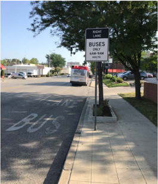

# 7.1  INTRODUCTION: 7.3.19.1  Location of Bus Stops & 5 more sections

- Source: GreenBook.pdf
- Generated: 2026-01-03T08:11:58+00:00
- Chunk: 21/28
- Estimated tokens: ~5,370
- Total pages: 1048
- Type: sections

## 7.3.19.1  Location of Bus Stops

The demand for bus service is largely a function of land-use patterns. The general location of bus stops is largely dictated by patronage and by the locations of intersection bus routes and transfer points. Bus stops should be located primarily for the convenience of patrons. The geometric design process should provide for appropriate pedestrian and bicycle access to those stop locations.

The specific location of a bus stop within the general area where a bus stop is needed is influenced not only by convenience to patrons but also by the design and operational characteristics of the highway. Except where cross streets are widely spaced, bus stops are usually located in the immediate vicinity of intersections. This facilitates crossing of streets by patrons without the need for midblock crosswalks. Midblock locations for bus stops may be appropriate where blocks are exceptionally long, or where bus patrons are concentrated at places of employment or residences that are well removed from intersections. Midblock bus stops will generally need provision for midblock pedestrian crossings.

Bus stops at intersections may be located on the near (approach) or far (departure) side of the intersection. Although there are advantages and disadvantages to both near- and far-side locations, in most cases far-side locations are preferred. However, the specific location for each bus stop should be examined separately to determine the most suitable arrangement. Factors for consideration include service to bus patrons, efficiency of transit operations, and efficiency of traffic operations. Far-side bus stops are advantageous at intersections where (1) other buses may turn left or right from the arterial; (2) turning movements from the arterial by other vehicle types, particularly right turns, are heavy; and (3) approach volumes are heavy, creating a large demand for vehicle storage on the near-side approach. Far-side bus stops have also proven to be effective in reducing collisions involving pedestrians. Sight distance conditions generally favor far-side bus stops, especially at unsignalized intersections; a driver approaching a cross street on the through lanes of an arterial can better see any vehicles approaching from the right if no bus is present. At near-side bus stops, the view of through drivers to their right may be blocked by a stopped bus. If the intersection is signalized, the bus may block the view of one of the signal heads.

Another disadvantage of near-side bus stops is the difficulty encountered by other vehicles in making turns while a bus is loading. Drivers frequently proceed around the bus to turn right, which interferes first with other traffic on the arterial and then with the bus as it leaves the stop. This disadvantage is eliminated if the cross street is one way from right to left. Thus, where the street pattern consists of a one-way grid, there is some advantage in having stops at alternate cross streets in advance of the streets crossing from right to left.

Where buses turn left at an intersection, the bus stop in advance of the intersection should be located at least one block before the turn, and the next bus stop should be located on the inter-

--',''','',',',','''''',,,,''-'-',,',,',',,'---

secting street after the turn is completed. Even with this arrangement, the bus will need to cross all traffic lanes in the direction of travel to reach the left lane for the turn.

On highly developed arterials with ample rights-of-way, bus turnouts, and speed-change lanes, there is a definite traffic advantage to the far-side bus stop. Such stops can be combined with speed-change lanes for turning vehicles entering the arterial. Where the stop is located on the near side of an intersection, vehicles turning right from the through lanes of the arterial cannot use the deceleration lane when it is occupied by a transit vehicle and instead may maneuver around it on the through lanes. Where the bus stop is located on the far side of the intersection, traffic turning right from the arterial does so freely.

On an arterial with frontage roads, buses may leave and return to the arterial by special openings in the outer separation in advance of and beyond the intersection. This arrangement has the advantage that buses stop in a position that is well removed from the through lanes. Rightturning traffic to and from the arterial street may also use these special openings, thereby reducing conflicts at the intersection proper. In an alternate arrangement, no slot in advance of the intersection is provided, and buses can cross to the frontage road at the intersection proper. Both slots may be eliminated where the frontage road is continuous between successive cross streets because buses can leave the through lanes at one intersection and use the frontage road to reenter the arterial at the next intersecting street. This type of operation is fitting where bus stops are widely spaced.

Midblock bus stops, like far-side stops, have an advantage over near-side stops in that the full roadway width on the intersection approach is made available for vehicle storage and turning maneuvers to maintain capacity as high as practical. However, midblock bus stops are not generally suitable for streets where parking is permitted, as is the case on some arterials during offpeak hours. Usually, a crosswalk is needed at midblock bus stops to provide access to the stops from either side of the arterial and to serve as an intermediate crosswalk for other pedestrian traffic. Where the pedestrian crossing demand and traffic volumes are high, signal control may be needed to create crossing opportunities for pedestrians. Midblock signals violate driver expectations and should generally be used only where pedestrian crossing demand indicates a clear need. At a major transit stop with heavy pedestrian movements, a pedestrian grade separation may be warranted.

Additional information concerning the location and design of bus stops is presented in TCRP Report 19, Guidelines for the Location and Design of Bus Stops ( 33 ) and the AASHTO Guide for Geometric Design of Transit Facilities on Highways and Streets ( 8 ).

## 7.3.19.2  Bus Turnouts

The interference between buses and other traffic can be considerably reduced by providing stops clear of the lanes for through traffic. However, since bus operators may not use the turnout if they have difficulty maneuvering back into traffic, the bus turnout should be designed so that

a bus can enter and leave easily. The preceding discussion illustrates methods for reducing interference between buses and through traffic on higher-speed arterials. For geometric details, see Section 4.19 on 'Bus Turnouts' and the AASHTO Guide for Geometric Design of Transit Facilities on Highways and Streets ( 8 ). It is somewhat rare that sufficient right-of-way is available on lower-speed arterial streets to permit turnouts in the border area, but for streets with onstreet parking, judicious use of parking restrictions can provide the same benefits.

## 7.3.19.3  Reserved Bus Lanes

Some improvement in transit service can be realized by excluding other traffic from selected lanes of arterial streets, particularly curb lanes in the urban core context. The success of this regulatory measure is rather limited in most instances, however, because vehicles making right turns occupy this same lane, it is not practical to exclude them, for distances up to a block or two  in  advance  of  the  turn.  Vehicles  preparing  to  turn  right  cannot  be  distinguished  from through traffic, so compliance with the exclusive bus lane regulation is largely on a voluntary basis. Nevertheless, there are certain combinations of conditions under which at least a modest improvement in transit service can be achieved. These conditions are not always apparent or definable, and the only way to determine conclusively that there will be overall benefit is to test the regulation in practice at locations where a preliminary investigation indicates likelihood of success. Figure 7-12 shows a typical reserved bus lane for peak-hour use.

Figure 7-12. Reserved Bus Lane   Source: MRIGlobal

## 7.3.19.4  Traffic Control Measures

Traffic control devices on arterial streets are usually installed with the intent of favoring automobile traffic, with only secondary consideration to transit vehicles. For express-bus or bus rapid transit operation, the control measures that are most favorable for one mode will generally be equally well-suited for the other. However, where local service is provided by buses with frequent stops to pick up and discharge passengers, a signal system that provides for good progressive movement of privately operated vehicles may actually result in reverse progression for buses. The resulting slow travel speed for buses tends to discourage patronage, further increasing the already heavy volume of automobile traffic.

Traffic  control  systems  have  been  developed  that  are  more  favorable  for  bus  service  without serious adverse effects on other traffic. This approach holds some promise of improving average travel speeds for buses and making public transit more attractive. One method of prioritizing bus movements without reducing travel speeds for passenger cars is by extending the green time for an approaching bus so the bus can clear the intersection and then load and unload on the far side while the light is red. Other techniques involve providing an exclusive advanced green signal for transit vehicles so they may proceed through an intersection before regular traffic is released. Development of a suitable signal system operation involves careful investigation by properly skilled personnel and should be a part of an arterial improvement program that involves the joint efforts of traffic specialists, the transit industry, and the design team.

Although the major emphasis in the application of traffic control measures is in minimizing delay, the control measures can facilitate bus operation in other respects, particularly where buses turn from the arterial onto a cross street.

Buses making right turns may create a problem where the cross street is narrow and the adjoining property is developed so intensively that it is not practical to provide a sufficiently long curb return radius. Buses turning right from the curb lane may encroach beyond the centerline of the cross street. At signalized intersections, the space beyond the centerline is normally occupied by vehicles stopped for the red signal. Under such conditions, the stop line on the cross street should be set back to provide sufficient space for turning maneuvers by buses. If needed, an auxiliary signal head could be placed at the relocated stop line to obtain compliance.

## 7.4  REFERENCES

1. AASHTO. A Guide for the Development of Rest Areas on Major Arterials and Freeways , Third  Edition,  SRA-3.  Association  of  State  Highway  and  Transportation  Officials, Washington, DC, 2001.

--',''','',',',','''''',,,,''-'-',,',,',',,'---

2. AASHTO. Guide for High-Occupancy Vehicle ( HOV ) Facilities , Third Edition, GHOV-3. American Association of State Highway and Transportation Officials, Washington, DC, 2004.
3. AASHTO. Guide  for  the  Planning,  Design,  and  Operation  of  Pedestrian  Facilities ,  First Edition, GPF-1. Association of State Highway and Transportation Officials, Washington, DC, 2004. Second edition pending.
4. AASHTO. Guide  for  Accommodating  Utilities  within  Highway  Right-of-Way ,  Fourth Edition, GAU-4. American Association of State Highway and Transportation Officials, Washington, DC, 2005.
5. AASHTO. Roadway  Lighting  Design  Guide ,  Sixth  Edition  with  2005  Errata,  GL-6. Association  of  State  Highway  and  Transportation  Officials,  Washington,  DC,  2005. Seventh edition pending 2018.
6. AASHTO. Roadside Design Guide ,  Fourth Edition with 2015 Errata, RSDG-4. American Association of State Highway and Transportation Officials, Washington, DC, 2011.
7. AASHTO. Guide  for  the  Development  of  Bicycle  Facilities ,  Fourth  Edition  with  2017 Errata, GBF-4. Association of State Highway and Transportation Officials, Washington, DC, 2012.
8. AASHTO. Guide for Geometric Design of Transit Facilities on Highways and Streets , First Edition, TVF-1. Association of State Highway and Transportation Officials, Washington, DC, 2014.
9. AASHTO. AASHTO LRFD Bridge  Design  Specifications ,  Eighth  Edition  with  2018 Errata, LRFD-8. American Association of State Highway and Transportation Officials, Washington, DC, 2017.
10. Bonneson,  J.  A.  and  P.  T.  McCoy. National  Cooperative  Highway  Research  Program Report  395:  Capacity  and  Operational  Effects  of  Midblock  Left-Turn  Lanes .  NCHRP, Transportation  Research  Board,  National  Research  Council,  Washington,  DC,  1997. Available at

http://onlinepubs.trb.org/onlinepubs/nchrp/nchrp\_rpt\_395.pdf

11. Dickman, D., N. Falbo, S. Durrant, J. Gilpin, G. Gastaldi, C. Chesston, P. Morrill, C. Ward, W. Walker, B. Jones, C. Cheng, J. Portelance, D. Kack, R. Gleason, T. Lonsdale, K. Nothstine, J. Morgan, and R. Pressley. Small Town and Rural Multimodal Networks Guide ,

--',''','',',',','''''',,,,''-'-',,',,',',,'---

- Report No. FHWA-HEP017-024. Federal Highway Administration, U.S. Department of Transportation, Washington, DC, December 2016.
12. FHWA. Manual  on  Uniform  Traffic  Control  Devices  for  Streets  and  Highways .  Federal Highway Administration, U.S. Department of Transportation, Washington, DC, 2009. Available at

http://mutcd.fhwa.dot.gov

13. FHWA. Engineering Countermeasure for Reducing Speeds: A Desktop Reference of Potential Effectiveness .  Federal  Highway  Administration,  U.S.  Department  of  Transportation, Washington, DC, May 2009.
14. FHWA. Guidebook  for  Developing  Pedestrian  and  Bicycle  Performance  Measures ,  Report No.  FHWA-HEP-16-037.  Federal  Highway  Administration,  U.S.  Department  of Transportation, March 2016.
15. FHWA. Achieving Multimodal Networks: Applying Design Flexibility and Reducing Conflicts, Report No. FHWA-HEP-16-055. Federal Highway Administration, U.S. Department of Transportation, August 2016.
16. Fitzpatrick, K., M. A. Brewer, P. Dorothy, and E. S. Park. National Cooperative Highway Research Program Report 780: Design Guidance for Intersection Auxiliary Lanes .  NCHRP, Transportation Research Board, National Research Council, Washington, DC, 2014.
17. Gattis, J. L., J. S. Gluck, J. M Barlow, R. W. Eck, W. F. Hecker, and H. S. Levinson. National Cooperative Highway Research Program Report 659: Guide for the Geometric Design of  Driveways .  NCHRP,  Transportation  Research  Board,  National  Research  Council, Washington, DC, 2010.
18. Gibbons, R. B., C. Edwards, B. Williams, and C. K. Anderson. Informational Report on Lighting Design for Midblock Crosswalks ,  Report  No.  FHWA-HRT-08-053. Federal Highway Administration, U.S. Department of Transportation, Washington, DC, April 2008. Available at

http://www.fhwa.dot.gov/publications/research/safety/08053

19. Gluck, J., H. S. Levinson, and V. Stover. National Cooperative Highway Research Program Report 420: Impacts of Access Management Techniques . NCHRP, Transportation Research Board, National Research Council, Washington, DC, 1999. Available at

http://onlinepubs.trb.org/onlinepubs/nchrp/nchrp\_rpt\_420.pdf

--',''','',',',','''''',,,,''-'-',,',,',',,'---

20. Graham, J.L., D.W. Harwood, K.R. Richard, M.K. O'Laughlin, E.T. Donnel, and S.N. Brennan, National Cooperative Highway Research Program Report 794: Median Cross Section Design for Rural Divided Highways. NCHRP, Transportation Research Board, National Research Council, Washington, DC, 2014.
21. Harwood, D. W., M. T. Pietrucha, M. D. Wooldridge, R. E. Brydia, and K. Fitzpatrick. National Cooperative Highway Research Program Report 375: Median Intersection Design . NCHRP,  Transportation  Research  Board,  National  Research  Council,  Washington, DC, 1995.
22. Lutkevich, P., D. Mclean, and J. Cheung, FHWA Lighting Handbook , Report No. FHWASA-11-22.  Federal  Highway  Administration,  U.S.  Department  of  Transportation, Washington, DC, August 2012.
23. Maryland Department of Transportation. When Main Street is a State Highway-Blending Function, Beauty and Identity: A Handbook for Communities and Designers . Maryland State Highway  Administration,  Maryland  Department  of  Transportation,  Baltimore,  MD, 2001.
24. Oregon Department of Transportation. Main Street… When a Highway Runs Through It: A Handbook for Oregon Communities . Oregon Department of Transportation, Salem, OR, November 1999.
25. Ryus,  P.,  E.  Ferguson,  K.M.  Lausten,  R.J.  Schnieder,  F.R.  Proulx,  T.  Hull,  and  L. Miranda-Moreno, National Cooperative Highway Research Program Web-Only Document 205: Methodologies  and  Technologies  for  Pedestrian  and  Bicycle  Volume  Data  Collection . NCHRP, Transportation Research Board, Washington, DC, 2014.
26. Ryus,  P.,  A.  Butsick,  K.M.  Lausten,  R.J.  Schnieder,  F.R.  Proulx,  T.  Hull,  and  L. Miranda-Moreno, National Cooperative Highway Research Program Web-Only Document 229: Methodologies and Technologies for Pedestrian and Bicycle Volume Data Collection, Phase 2. NCHRP, Transportation Research Board, National Research Council, Washington, DC, 2016.
27. Ryus, P., E. Ferguson, F.R. Proulx, R.J. Schnieder, and T. Hull, National Cooperative Highway Research Program Report 797: Guidebook on Pedestrian and Bicycle Volume Data Collection .  NCHRP,  Transportation  Research  Board,  National  Research  Council, Washington, DC, 2014.
28. Semler, C., A. Vest, K. Kingsley, S. Mah, W. Kittelson, C. Sundstrom, and K. Brookshire. Guidebook for Developing Pedestrian and Bicycle Performance Measures , Report No. FHWA-

--',''','',',',','''''',,,,''-'-',,',,',',,'---

- HEP-16-037.  Federal  Highway  Administration,  U.S.  Department  of  Transportation, Washington, DC, March 2016.
29. Stamadiadis, N., J. Pigman, J. Sacksteder, W. Ruff, and D. Lord, National Cooperative Highway Research Program Report 633: Impact of Shoulder Width and Median Width on Safety . NCHRP,  Transportation  Research  Board,  National  Research  Council,  Washington, DC, 2009.
30. Standard Practice Committee of the IESNA Roadway Lighting Committee. American National Standard Practice for Roadway Lighting ,  ANSI/EISNA RP-8-00. Illuminating Engineering Society of North America, New York, NY, published by ANSI, Washington, DC, 2000.
31. Torbic,  D.  J.,  D.  K.  Gilmore,  K.  M.  Bauer,  C.  D.  Bokenkroger,  D.  W.  Harwood, L. L. Lucas, R. J. Frazier, C. S. Kinzel, D. L. Petree, and M. D. Forsberg. National Cooperative Highway Research Program Report 737: Design Guidance for High-Speed to LowSpeed  Transition  Zones  for  Rural  Highways .  NCHRP,  Transportation  Research  Board, Washington, DC, 2012.
32. Torbic, D.J., L.M. Lucas, D.W. Harwood, M.A. Brewer, E.S. Park, R. Avelar, M.P. Pratt, A. Abu-Odeh, E. Depwe, and K. Rau. National Cooperative Highway Research Program Web-Only Document 227: Design of Interchange Loop Ramps and Pavement/Shoulder Cross Slope  Breaks .  NCHRP,  Transportation  Research  Board,  National  Research  Council, March 2016.
33. TRB. Transit  Cooperative  Research  Program  Report  19:  Guidelines  for  the  Location  and Design of Bus Stops . TCRP, Transportation Research Board, National Research Council, Washington, DC, 1996.
34. TRB. Access  Management  Manual .  Transportation  Research  Board,  National  Research Council, Washington, DC, 2015.
35. TRB. Highway Capacity Manual: A Guide for Multimodal Mobility Analysis , Sixth Edition. Transportation Research Board, National Research Council, Washington, DC, 2016.
36. U.S. Access Board, Proposed Guidelines for Pedestrian Facilities in the Public Right-of-Way , Federal Register, 36 CFR Part 1190, July 26, 2011. Available at

http://www.access-board.gov/guidelines-and-standards/streets-sidewalks/public-rights-of-way/ proposed-rights-of-way-guidelines

37. U.S.  Department  of  Justice, 2010  ADA  Standards  for  Accessible  Design, September  15, 2010. Available at

https://www.ada.gov/2010ADAstandards\_index.htm

38. U.S. National Archives and Records Administration. Code of Federal Regulations . Title 49, Part 27. Nondiscrimination on the Basis of Disability in Programs or Activities Receiving Federal Financial Assistance.
39. Walker, G. W., W. M. Kulash, and B. T. McHugh. Downtown Streets: Are We Strangling Ourselves on One-Way Networks? Transportation Research E-Circular, Number E-C019. Transportation Research Board, National Research Council, Washington, DC, 2000.

## 8 Freeways
