# 8.1  INTRODUCTION

- Source: GreenBook.pdf
- Generated: 2026-01-03T08:11:58+00:00
- Chunk: 22/28
- Estimated tokens: ~25,522
- Total pages: 1048
- Type: chapter

## 8.1  INTRODUCTION

Freeways are arterial highways with full control of access. They are intended to provide high levels of safety and efficiency in the movement of large volumes of traffic at high speeds. Control of access refers to the regulation of public access rights to and from properties  abutting  the  highway.  With  full  control  of  access,  preference  is  given  to through traffic by providing access connections with selected public roads only and by prohibiting crossings at grade and direct private driveway connections.

The principal advantages of access control include preservation of highway capacity, higher speeds, and low crash frequencies. Highways with fully controlled access have grade separations at all railroads and either grade separations or interchanges at selected public crossroads. Other crossroads are either interconnected or terminated.

Essential  freeway  elements  include:  roadways;  medians;  grade  separations  at  crossroads; ramps to and from the traveled way at selected locations; and, in some cases, frontage roads. Chapters 2, 3, and 4 describe roadway design elements, controls, and criteria applicable to all highway classes. This chapter identifies the various types of freeways, emphasizes selected features, and discusses other design details unique to freeways. The design of freeway interchanges is discussed in Chapter 10.

Freeways may be provided in both rural and urban areas. All freeways in rural areas are designed for the rural context; the rural town context is generally not applicable to freeways. Freeways in urban areas may be provided to fit all contexts: suburban, urban, and urban core.

The specific dimensional design criteria presented in this chapter are appropriate as a guide for new construction of freeways. Projects to improve existing freeways differ from new construction in that the performance of the existing freeway is known and can guide the design process. Features of the existing design that are performing well may remain in place, while features that are performing poorly should be improved, where practical. In some corridors, highway agencies have found it effective to narrow existing freeway lanes, to provide space for additional travel lanes, including high-occupancy-vehicle lanes, or to convert shoulders to travel lanes, especially during peak

periods, either for transit vehicles or for general traffic. Chapter 1 presents a flexible, performance-based design process that can be applied in developing projects on freeways.

This chapter is organized with an introductory section on the general design considerations for freeways, followed by separate design discussions for freeways in rural and urban areas.

## 8.2  GENERAL DESIGN CONSIDERATIONS

## 8.2.1  Design Speed

As a general consideration, the design speed should be consistent with the anticipated operating speed of the freeway during both peak and non-peak hours, but the design speed should not be so high as to exceed the limits of prudent construction, right-of-way, and socioeconomic costs. The design speed for a freeway should not be less than 50 mph [80 km/h].

Freeways in rural areas are generally designed with design speeds of 50 to 85 mph [80 to 140 km/h], with 70 mph [110 km/h] being the most common design speed. In mountainous terrain, design speeds of 50 to 60 mph [80 to 100 km/h] are consistent with driver expectancy and may be used.

Freeways in the urban and urban core contexts are typically constrained, often necessitating a 50 mph [80 km/h] design speed for practicability and social and environmental sensitivity. A 60 mph [100 km/h] design speed can be appropriate in the urban context where constraints and terrain are favorable. In the suburban context, design speeds of 60 mph [100 km/h] are commonly provided. However, where the freeway corridor is relatively straight, the character of the roadway and spacing of interchanges may be consistent with design speeds higher than 60 mph [100 km/h], which can often be provided with little additional cost.

## 8.2.2  Design Traffic Volumes

Freeways in both rural and urban areas should normally be designed to accommodate traffic projections for a 20 year period into the future, particularly for new construction. However, some elements of freeway reconstruction may be based on a shorter or longer design period. For further guidance on the selection of the appropriate periods for forecasting design traffic volumes, refer to Section 2.3.5. Specific capacity needs should be determined from directional design hourly volumes (DDHV) for the appropriate design period. In large metropolitan areas, the selection of appropriate design traffic volumes and design periods may be influenced by system planning. Segments of freeways may be constructed or reconstructed to be commensurate with either intermediate traffic demands or with traffic based on the completed system, whichever may be more appropriate.

## 8.2.3  Levels of Service

Procedures for traffic operational analyses for freeways, including appropriate adjustments for operational and highway factors, are presented in the Highway Capacity Manual (HCM) ( 10 ), which also  includes  a  thorough  discussion  of  the  level-of-service  concept.  Designers  should strive  to  provide  the  highest  level  of  service  practical,  consistent  with  anticipated  conditions and system constraints. The level of service concept is discussed in Section 2.4.5, and general guidance on customary levels of service for design are summarized in Table 2-3. Freeways and their auxiliary facilities (i.e., ramps, main line weaving sections, and collector-distributor (C-D) roads in the urban and suburban contexts) should generally be designed to provide the highest level of service practical, consistent with a variety of factors including motorist needs, system continuity, community goals, adjacent lane use type and development intensity, social and environmental factors, and aesthetic and historical values.

## 8.2.4  Traveled Way and Shoulders

Freeways  should  have  a  minimum  of  two  through-traffic  lanes  for  each  direction  of  travel. Through-traffic lanes should be 12 ft [3.6 m] wide. Freeway roadways should have a paved surface with adequate skid resistance and structural capacity. Pavement cross slopes should range between 1.5 and 2 percent on tangent sections, with the higher value recommended for areas with moderate rainfall. For areas of heavy rainfall, a pavement cross slope of 2.5 percent may be needed to provide adequate drainage. Appropriate cross-slope rates are discussed in Section 4.2.2. For elevated freeways on viaducts, two-lane pavements usually are sloped to drain the full roadway width toward one side of the roadway. On wider facilities, particularly in areas with heavy rainfall, a crown may be located on the lane line at one-third or one-half the total width from one edge, thus providing two directions for surface drainage. In areas with snowfall, the median and cross slopes of the traveled way should be designed to prevent melting snow stored in  the  median  from  draining  across  the  roadway.  This  is  intended  to  avoid  icing  conditions during subsequent freezing temperatures.

Guidance for ramp traveled-way widths is presented in Section 10.9.6.

Paved shoulders should be continuous on both the right and left sides of all freeway facilities.

On four-lane freeways, the median (or left) shoulder is normally 4 to 8 ft [1.2 to 2.4 m] wide, at least 4 ft [1.2 m] of which should be paved and the remainder stabilized. The paved width of the right shoulder should be at least 10 ft [3.0 m]; where the DDHV for truck traffic exceeds 250 veh/h, a paved right shoulder width of 12 ft [3.6 m] should be considered. On freeways with six or more lanes, the paved width of the right and left shoulder should be 10 ft [3.0 m]; where the DDHV for truck traffic exceeds 250 veh/h, a paved shoulder width of 12 ft [3.6 m] should be considered.

Guidance for ramp shoulder widths is provided in Section 10.9.6. Ramp shoulder widths are usually provided adjacent to acceleration and deceleration lanes with transitions to the freeway shoulder width at the taper ends. To facilitate drainage, shoulder cross slope should range between 2 and 6 percent and can be at least 1 percent greater than the pavement cross slope on tangent sections.

## 8.2.5  Curbs

Caution should be exercised in the use of curbs on freeways; where curbs are provided, they should not be closer to the traveled way than the outer edge of shoulder and should be easily traversable. An example of where shoulder curbs may be used on freeways is at locations where curbs are provided to control drainage and reduce erosion. For more information, refer to the discussion on curb types and their placement in Section 4.7 and the AASHTO Roadside Design Guide ( 4 ).

## 8.2.6  Superelevation

Maximum superelevation rates of 6 to 12 percent are applicable to horizontal curves on freeways. However, where snow and ice conditions are prevalent, a maximum rate of 6 to 8 percent should be considered. In these climates and where congestion or other factors result in recurrent slow-moving traffic, it is common practice to limit the superelevation rate to 6 percent. This may also be considered on viaducts where freezing and thawing conditions are likely, as bridge decks generally freeze more rapidly than other roadway sections. Where freeways are intermittently elevated on viaducts, a uniform maximum superelevation rate should be used throughout for design consistency.

The maximum cross-slope break between the traveled way and the shoulder should be limited to 8 percent to reduce the risk of truck rollover ( 9 ).

## 8.2.7  Grades

Maximum grades for freeways are presented in Table 8-1 for combinations of design speed and terrain type. Grades on freeways in urban areas should be comparable to those on freeways in rural areas of the same design speed. Steeper grades are permitted in urban areas, but the closer spacing of interchanges, the need for frequent speed changes, and the detrimental effect of steep grades on traffic flow make it desirable to use gentle grades wherever practical. On sustained upgrades, the need for climbing lanes should be investigated, as discussed in Section 3.4.3.

Table 8-1. Maximum Grades for Freeways in Rural and Urban Areas

| Type of Terrain   | U.S. Customary Design Speeds (mph)   | U.S. Customary Design Speeds (mph)   | U.S. Customary Design Speeds (mph)   | U.S. Customary Design Speeds (mph)   | U.S. Customary Design Speeds (mph)   | U.S. Customary Design Speeds (mph)   |
|-------------------|--------------------------------------|--------------------------------------|--------------------------------------|--------------------------------------|--------------------------------------|--------------------------------------|
|                   | 50                                   | 55                                   | 60                                   | 65                                   | 70                                   | 75 or more                           |
|                   | Grades (%) a                         | Grades (%) a                         | Grades (%) a                         | Grades (%) a                         | Grades (%) a                         | Grades (%) a                         |
| Level             | 4                                    | 4                                    | 3                                    | 3                                    | 3                                    | 3                                    |
| Rolling           | 5                                    | 5                                    | 4                                    | 4                                    | 4                                    | 4                                    |
| Mountainous       | 6                                    | 6                                    | 6                                    | 5                                    | 5                                    | -                                    |

| Metric       | Metric       | Metric        | Metric        | Metric        |
|--------------|--------------|---------------|---------------|---------------|
| Design       | Design       | Speeds (km/h) | Speeds (km/h) | Speeds (km/h) |
| 80           | 90           | 100           | 110           | 120 or more   |
| Grades (%) a | Grades (%) a | Grades (%) a  | Grades (%) a  | Grades (%) a  |
| 4            | 4            | 3             | 3             | 3             |
| 5            | 5            | 4             | 4             | 4             |
| 6            | 6            | 6             | 5             | -             |

## 8.2.8  Structures

The design of bridges, culverts, walls, tunnels, and other structures should be in accordance with the principles of the current AASHTO LRFD Bridge Design Specifications ( 6 ). Structures carrying freeway traffic should provide a minimum HL 93 design loading structural capacity.

The clear width of bridges carrying freeway traffic should be as wide as the approach roadway, as discussed in Section 10.8.3. Bridges longer than 200 ft [60 m] may have a lesser width and should be analyzed individually. Occasionally, some economy in substructure costs may be gained by building a single structure rather than twin parallel structures.

Structures carrying ramps should provide a clear width equal to the ramp width and paved shoulders. Clear widths for structures carrying auxiliary lanes are discussed in Section 10.8.5.

The structure width and lateral clearance of highways and streets overpassing or underpassing the freeway are dependent on the functional classification of the highway or street as discussed in Chapters 5, 6, and 7.

## 8.2.9  Vertical Clearance

The vertical clearance to structures passing over freeways should be at least 16 ft [4.9 m] over the entire roadway width, including auxiliary lanes, shoulders, and collector-distributor roads, with consideration for future resurfacing. In highly developed urban areas, where attaining a 16-ft [4.9-m] clearance would be unreasonably costly, a minimum clearance of 14 ft [4.3 m] may be used if there is a freeway facility with the minimum 16-ft [4.9-m] clearance that serves as a reasonable alternative through route. The vertical clearance to sign supports and to bicycle and pedestrian overpasses should be 1.0 ft [0.3 m] greater than the highway structure clearance.

## 8.2.10  Roadside Design

Freeways at ground level in urban areas and all freeways in rural areas should have clear zone widths consistent with their operating speed, traffic volume, and roadside geometry. Detailed discussions of clear zones and lateral offsets are included in Section 4.6, 'Roadside Design,' and in the AASHTO Roadside Design Guide ( 4 ).

Freeways in urban areas often have restrictive rights-of-way which may need retaining walls or overhead sign supports to be placed within the clear zone. Such objects preferably should be located at least 2 ft [0.6 m] beyond the outer edge of shoulder. Retaining walls and bridge pier crash walls should incorporate an integral concrete barrier shape, or they should be offset from the shoulder to permit shielding with a separate barrier, as discussed in 'Lateral Offset,' Section 10.8.4. Where walls are located beyond the clear zone or are not needed, backslopes should be traversable and fixed objects within the clear zone should be of a 'breakaway' design or shielded.

Elevated freeways on embankments generally warrant roadside barriers where slopes are steeper than 1V:3H or where the area beyond the toe of slope that remains within the clear zone is not traversable. The tops of retaining walls used in conjunction with embankment sections should be located no closer to the roadway than the outer edge of the shoulder, and the walls should incorporate the concrete barrier shape or be appropriately shielded.

## 8.2.11  Ramps and Terminals

The design of ramps and connections for all freeway types is covered in Section 10.9.6.

## 8.2.12  Outer Separations, Borders, and Frontage Roads

An outer separation is defined as the area between the traveled way of the main lanes and a frontage road or local street. A border is defined as the area between the frontage road or local street and the private development along the road. Where there are no frontage roads or local streets functioning as frontage roads, the area between the traveled way of the main lanes and the right-of-way limit should be referred to as the border. Because of the dense development typically found along freeways in urban areas, frontage roads are often needed to maintain local service and to collect and distribute ramp traffic entering and leaving the freeway. Where the freeway occupies a full block, the adjacent parallel streets are usually retained as frontage roads, which are discussed in detail in Section 4.12.

The outer separation or border provides space for shoulders, sideslopes, drainage, access-control fencing, and, in urban areas, ramps, retaining walls, and noise abatement features. Usually, the outer separation is the most flexible element of a freeway section in an urban area. Adjustment in width of right-of-way, as may be needed through developed areas, ordinarily is made by varying the width of the outer separation.

--',''','',',',','''''',,,,''-'-',,',,',',,'---

The outer separation or border should be as wide as economically practical to provide a buffer zone between the freeway and its adjacent area. The border should extend beyond the construction  limits,  where  practical,  to  facilitate  maintenance  operations  and  encourage  an  effective roadside design. Wide outer separations also permit well-designed ramps between the freeway and the frontage road. The typical range in widths of outer separations is 80 to 150 ft [25 to 45  m],  but  much  narrower  widths  are  commonly  used  in  urban  areas  if  retaining  walls  are employed.

## 8.3  FREEWAYS IN RURAL AREAS

Freeways in rural areas are similar in concept to ground-level freeways in urban areas, but the alignment and cross-sectional elements are more generous in design, which is commensurate with higher design speed, longer travel distance, and greater right-of-way width that generally is available.

Freeways are initially designed to accommodate anticipated traffic growth for a 20-year period and to remain in service for a much longer time. Any cost savings that might potentially be gained by initially constructing for a lesser design period would likely be offset by the high costs, disruption to the environment, and inconvenience to traffic that would accompany later reconstruction of major facilities.

Although level of service B is desirable for freeways in rural areas, level of service C may be appropriate  where  volumes  are  unusually  high.  Freeways  in  rural  areas  generally  have  four through-traffic  lanes,  although  six  or  more  lanes  may  be  provided  where  needed  to  accommodate traffic  demand. Where intersecting highways are classified as collectors and higher, interchanges are usually provided. Local roads may be terminated at the freeway, connected to frontage roads or other local roads for continuity of travel, or carried over or under the freeway by grade separation with or without an interchange.

## 8.3.1  Alignment and Profile

Freeways  in  rural  areas  are  generally  designed  for  high-volume  and  high-speed  operation. They should, therefore, have smooth flowing horizontal and vertical alignments with appropriate combinations of flat curvature and gentle grades. Advantage should be taken of favorable topographic conditions to incorporate wide, variable median widths and independent roadway alignments to enhance the aesthetic appearance of the freeway and to reduce the likelihood of cross-median crashes. Transitioning median widths on tangent alignments should be done very gradually, so as not to introduce a distorted appearance.

Because there are usually fewer physical constraints in constructing the rural road network than its urban counterpart, freeways in rural areas can usually be constructed near ground level with smooth and relatively flat profiles. The profile of a freeway in a rural area is controlled more

by drainage and earthwork considerations and less by the constraints associated with frequent grade separations and interchanges. If elevated or depressed sections are needed, the guidelines for freeways in urban areas are appropriate.

Even though the profile may satisfy all the design controls, the finished vertical alignment may appear forced and angular if minimum criteria are used. The designer should check profile designs in long continuous plots to gauge the roadway's appearance and help avoid an undesirable roller-coaster alignment in rolling terrain. For small grade differences, vertical curves longer than the minimums needed for stopping sight distance can serve to avoid the appearance of a vertical kink from the driver's perspective. Horizontal and vertical alignment should be studied simultaneously to obtain a desirable combination.

Figure 8-1 illustrates a typical ground-level freeway in a rural area with a curvilinear alignment.

Source: Virginia DOT

Figure 8-1. Typical Ground-Level Freeway in a Rural Area

## 8.3.2  Medians

Median width is defined in Section 4.11 as the dimension between edges of the traveled way for  the  roadways  in  opposing  directions  of  travel,  including  the  width  of  the  left  shoulders. Median widths of 50 to 100 ft [15 to 30 m] are common on freeways in rural areas. The 50-ft [15-m] dimension shown in Figure 8-2A provides for 6-ft [1.8-m] graded shoulders and 1V:6H foreslopes with a 3-ft [1.0-m] median ditch depth. Adequate space is provided for vehicle recovery; however, median piers typically need shielding in accordance with the AASHTO Roadside Design Guide ( 4 ). The 100-ft [30-m] dimension shown in Figure 8-2B permits the designer to use independent profiles in rolling terrain to blend the freeway more appropriately with the environment while maintaining recoverable slopes. In level terrain, the 100-ft [30-m] median is also advantageous for construction of additional traffic lanes in the future.

--',''','',',',','''''',,,,''-'-',,',,',',,'---

Figure 8-2. Typical Rural Medians

A wide variable median with an average width of 150 ft [45 m] or more, as shown in Figure 8-2C, may be suitable depending on the terrain features. Such a width permits the use of independent roadway alignment, both horizontally and vertically, to its best advantage in blending the freeway into the natural topography. The wider independent roadways allow medians to be

--',''','',',',','''''',,,,''-'-',,',,',',,'---

left in their natural state of vegetation, trees, and rock outcroppings to reduce maintenance costs and add scenic interest to passing motorists. The combination of independent alignment and a natural park-like median is pleasing to motorists and can reduce the likelihood of cross-median crashes as well as reducing headlight glare from opposing traffic. For driver reassurance, the opposing roadway should be in view at frequent intervals.

Median widths in the range of 10 to 30 ft [3.0 to 9.0 m], as shown in Figure 8-2D, may be needed where right-of-way restrictions dictate or in mountainous terrain. These medians are usually paved, and where roadways are crowned, underground drainage should be provided.

Considering the usual developing-area traffic volumes as well as operational characteristics in mountainous areas, a median barrier may be used. The AASHTO Roadside Design Guide ( 4 ) should be referenced in determining the use of median barriers.

To avoid excessive adverse travel for emergency and law-enforcement vehicles, emergency crossovers on freeways in rural areas may be provided where interchange spacing exceeds 5 mi [8 km]. Emergency crossovers may be spaced at 3- to 4-mi [5- to 6.5-km] intervals or as needed. Crossovers may be useful at one or both ends of interchange facilities for the purpose of snow removal and at other locations to facilitate maintenance operations. Maintenance or emergency crossovers generally should not be located closer than 1,500 ft [450 m] to the end of a speedchange taper of a ramp or to any structure. Crossovers should be located where ample stopping sight distance is available and preferably should not be located on superelevated curves.

The width of the crossover should be sufficient for turning movements and should have a surface capable of supporting maintenance equipment used on it. The crossover may be depressed below shoulder level to be inconspicuous to traffic and should have 1V:10H or flatter sideslopes so that the median is traversable for errant vehicles. Crossovers should be placed only where the median width is sufficient to accommodate the design vehicle length. Where median barriers are employed, each end of the barrier at the median opening may need a crashworthy terminal; for further information, refer to the AASHTO Roadside Design Guide ( 4 ).

## 8.3.3  Sideslopes

Flat, rounded sideslopes, fitting with the topography and consistent with available right-of-way, should be provided on freeways in rural areas. Foreslopes of 1V:6H or flatter are recommended in cut sections and for fills of moderate height, as discussed in Section 4.8.4. Where fill heights are intermediate, a combination of recoverable and non-recoverable slopes may be used to provide the acceptable vehicle recovery area. For high fills, steeper slopes shielded by guardrail may be needed. Where rock or loess deposits are encountered, backslopes may be nearly vertical but should be shielded or located to provide an adequate recovery area for errant vehicles. For additional sideslope design information, refer to the AASHTO Roadside Design Guide ( 4 ).

--',''','',',',','''''',,,,''-'-',,',,',',,'---

## 8.3.4  Frontage Roads

The need for local service across and along freeway corridors in rural areas is usually considerably less than the need along freeways in highly developed urban areas. Therefore, frontage roads along freeways in rural areas are usually intermittent and relatively short. Frontage roads either provide access to one or more severed properties or provide continuity of a local road by connecting it with a grade-separated crossroad.

Because of the lack of continuity and the type of service being provided, newly constructed frontage roads are normally two-way facilities in rural areas. Traffic operations are more complex at two-way frontage road intersections with grade-separated crossroads than at comparable one-way frontage road intersections; therefore, such intersections should generally be located as far as practical from grade-separation structures and interchange ramp terminals. Refer to Section 10.4, 'Access Separations and Control on the Crossroad at Interchanges,' for details and guidance on appropriate distances from ramp terminals.

Rural frontage roads are generally outside the control-of-access line but within the right-of-way limits. Design details for rural frontage roads are similar to those used for local roads, as discussed in Chapters 3 and 5.

## 8.4  FREEWAYS IN URBAN AREAS

## 8.4.1  General Design Characteristics

Freeways in urban areas are classified as depressed, elevated, ground-level, or combination-type. These freeway types are employed as appropriate for conditions.

Freeways in urban areas are capable of carrying high traffic volumes. While freeways may have any number of through-traffic lanes, it is commonly accepted that roadways become less efficient at widths greater than four or five lanes in one direction of travel. When more than four lanes in each direction are needed, consideration should be given to implementing a special freeway design. These include freeways with reverse-flow roadways, dual-divided freeways, and freeways with collector-distributor roads.

This section on freeways in urban areas first discusses the design of freeway medians that is common to all freeway types. Then, separate discussions are presented on depressed, elevated, ground-level, and combination-type freeways, as well as special freeway designs that may be used in urban areas. The accommodation of managed lanes and transit facilities within a freeway is also discussed.

## 8.4.2  Medians

A wider separation between traffic in opposing directions is more comfortable for motorists and can reduce the frequency of cross-median collisions involving vehicles that run off the road into the median; therefore, the median on freeways in urban areas should be as wide and flat as practical. Additional median width may be used for mass transit or to provide additional lanes if more capacity is needed in the future. However, in densely developed areas with expensive rightof-way, the width available for a median is usually restricted. The minimum median width for a four-lane freeway in an urban area should be 10 ft [3.0 m], which provides for two 4-ft [1.2-m] shoulders and a 2-ft [0.6-m] median barrier. For freeways with six or more lanes, the minimum width should be 22 ft [6.6 m], and preferably 26 ft [7.8 m] when the DDHV for truck traffic exceeds 250 veh/h to provide a wider median shoulder to accommodate a truck. The AASHTO Roadside Design Guide ( 4 ) should be referenced in determining the use of median barriers. When a median barrier is used, additional lateral offset may be needed to provide minimum stopping sight distance along the inside lane on sharper curves.

Median crossovers for emergency or maintenance purposes are not generally warranted on freeways in urban areas due to the close spacing of interchange facilities and the extensive development of the abutting street network.

## 8.4.3  Depressed Freeways

## 8.4.3.1  General Characteristics

A depressed freeway may occupy a full-block width and be parallel to the grid street system for most of its length. The roadways of a depressed freeway are typically located at an approximate depth of 16 ft [4.9 m] in addition to the clearance for structural depth below the surface of the adjacent streets. An allowance for future pavement overlays is frequently considered in setting the vertical clearance. In addition, depressed freeways are often flanked on one or both sides by frontage roads at the street level. All major streets pass over the depressed freeway while other minor streets are intercepted by frontage roads or terminated at the right-of-way line. Access to  surface  streets  is  accomplished  by  ramps  that  connect  directly  with  frontage  roads  or  the crossing street where no frontage road exists. For interchange design guidance, see Chapter 10.

Depressed freeways are less conspicuous than ground-level or elevated freeways, permit surface streets  to  cross  at  their  normal  grade,  and  reduce  freeway  noise.  However,  these  advantages have to be balanced against the increased cost of providing for earthwork, drainage, and utilities. While gravity drainage facilities are sometimes feasible to accommodate the design storm without inundating the traveled way, pumping stations may be needed. For design guidance on pumping stations, refer to the AASHTO Drainage Manual ( 3 ).

Fencing should be considered for structures passing over the depressed freeway and for retaining walls located in close proximity to the traveled way to reduce the possibility that objects will be dropped or thrown onto vehicles below.

## 8.4.3.2  Slopes and Walls

Sideslopes of a depressed freeway are designed in the same manner as those for cut slopes, except that the slopes are more likely to be controlled by width restrictions. Foreslopes, if used beyond the shoulder, should be traversable.

Normally foreslopes are not used beyond the shoulder on depressed freeways and, in such cases, backslopes should not be steeper than 1V:3H. In developed areas, space may not be available for desirable slopes, particularly where ramps are present, and full- or partial-height retaining walls may be needed. Various forms of retaining walls are appropriate for depressed freeways, including those constructed of solid masonry, concrete, stone, precast panels, or metal. Wall types include cantilevered, crib or bin, mechanically stabilized, or sheet piling. Where retaining walls are used in combination with earth slopes, the walls may be located either at the roadway level adjacent to the shoulder or on the outer portion of the separation above the depressed roadway.

Retaining walls above the roadway are desirable from the driver's viewpoint because they provide a more open feeling at the roadway level. This arrangement also provides space for storage of snow plowed from the freeway traveled way and shoulders. However, it may be more advantageous for the surrounding neighborhood if the wall is located at the roadway level and a slope is located on the upper portion of the cross section. This arrangement permits effective screening of the surrounding properties through landscaping. Slope maintenance may also be enhanced, and noise abatement may be more effective. Both designs should be evaluated to determine which is best suited for the particular situation.

Retaining walls should be located no closer to the roadway than the outer edge of shoulder and preferably a minimum of 2 ft [0.6 m] beyond, especially in climates where space for snow storage is desirable. Where the wall is located at or near the shoulder edge, bridge columns, light fixtures, and sign supports should not protrude from the face of the wall.

Where the top of the retaining wall is at the level of a frontage road, the face of the parapet or rail should have a width equal to a normal shoulder width or be located at least 4 ft [1.2 m], and preferably 6 ft [1.8 m], from the edge of the traveled way. Where a retaining wall is located adjacent to an auxiliary lane or ramp, normal ramp shoulder widths should be provided.

Sight distance should be checked when designing slopes and retaining walls. On curved alignment, the slopes, walls, and other side obstructions should be sufficiently offset from the pavement edge to provide the design stopping sight distance for a vehicle in the traffic lane nearest to the obstruction.

## 8.4.3.3  Typical Cross Section

Cross  sections  of  depressed  freeways  vary  considerably  through  urban  and  suburban  areas. Whereas these cross sections are influenced primarily by the number of traffic lanes needed, another important factor is availability of right-of-way, which depends on the type and value of urban development, topography, soil and drainage conditions, and the frequency and type of interchanges to be used. The design of a cross section should meet the established design criteria; however, where there are physical or economic constraints, it may be appropriate to vary certain design elements to fit the cross section within a relatively narrow right-of-way. Figures 8-3 through 8-5 illustrate depressed cross sections for various conditions.

Where the freeway is bridged by closely spaced cross streets, a continuous depressed section results. In outlying areas where separated crossroads are widely spaced, it usually is practical and economical to adjust the profile to decrease the depth of cut between structures, resulting in a combination of depressed and ground-level freeways. The benefits of this approach are that ramp design is simplified, excavation quantities are reduced, sideslopes can be flatter, and wider marginal areas at street level may be provided within the right-of-way. Generally, the result is a more pleasing freeway.

Figure 8-3 shows a typical cross section for depressed freeways, providing for a 10- to 22ft [3.0 to6.6m] median, 12-ft [3.6-m] traffic lanes, and 50 ft [15 m] for each frontage road plus border. The minimum median width of 10 to 22 ft [3.0 to 6.6 m] is based on the assumption that for depressed freeways the ultimate section is constructed initially. However, where additional width is needed in the median for future expansion, the median should be widened in multiples of 12 ft [3.6 m] (i.e., the width of a traffic lane). Where ramps are not needed, the uniform-width section should be graded to provide slopes as flat as practical within the available right-of-way.

Figure 8-3. Typical Cross Section for Depressed Freeways

## 8.4.3.4  Restrictive Cross Section

Figure 8-4A presents a typical cross section that enables depressed sections to be constructed with earth slopes at locations without ramps but with retaining walls at ramps. The cross section

in Figure 8-4A includes a 40-ft [12-m] frontage road plus border, 12-ft [3.6-m] traffic lanes, and a 10- to 22-ft [3.0 to 6.6-m] median.

## 8.4.3.5  Walled Cross Section

Walls may be located at various points in the cross section, such as adjacent to the freeway shoulder, adjacent to the ramp shoulder, at the top of slopes, or at various combinations of these locations. Some variations in wall arrangements may be needed on the left and right sides, as shown in Figure 8-4B.

Figure 8-4. Restrictive Cross Sections for Depressed Freeways

Figure 8-5 shows walled cross sections that are appropriate for depressed freeways. In this example, the freeway is continuously walled and the ramps are omitted. Figure 8-5A shows a walled cross section with no cantilevering.

In cases where even less right-of-way is obtainable, the design can be further consolidated by using an overhanging section where part of the frontage road is cantilevered over the freeway shoulder, as shown in Figure 8-5B. While the value of this alternative will vary depending on the restrictions and design selected, a typical overhang distance will range from 10 to 14 ft [3.0 to 4.2 m]. This design type may be applicable in special instances where large buildings or other

--',''','',',',','''''',,,,''-'-',,',,',',,'--- obstructions cannot be avoided. A special benefit of this design is its effectiveness in containing highway noise within the roadway, thereby shielding abutting areas from such noise.

Although the restrictive cross sections shown are acceptable, they should be used only where additional right-of-way would be extremely costly or where this type of cross section is needed to preserve the surrounding environment.

Figure 8-5. Cross Sections with Retaining Walls on Depressed Freeways without Ramps

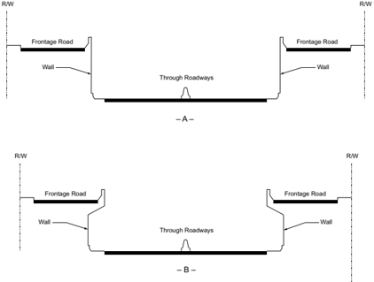

## 8.4.3.6  Example of Depressed Freeway

Figure 8-6A provides a close-up view of a depressed freeway. Figure 8-6B shows a depressed freeway flanked by major surface streets on the upper level. The auxiliary lanes of the surface street on the right side are partially cantilevered over the freeway shoulder. The cross streets overpass the freeway with level grades, thus facilitating traffic operations on the structures and at adjacent intersections.

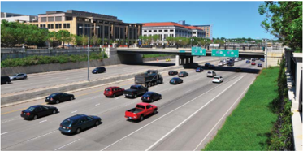

- A -

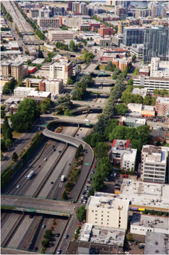

- B -

Sources: (A) Minnesota DOT, (B) Oregon DOT

Figure 8-6. Depressed Freeway

--',''','',',',','''''',,,,''-'-',,',,',',,'---

## 8.4.4  Elevated Freeways

## 8.4.4.1  General Characteristics

An elevated freeway may be constructed on either a viaduct or an embankment. Continuous elevation of the freeway may be appropriate in level terrain where restrictive right-of-way, high water table, extensive underground utilities, close pattern of streets to be retained, or other circumstances make construction of a depressed freeway undesirable and perhaps infeasible.

Several structure types are used for viaducts carrying elevated freeways. Viaduct design is influenced by traffic demands, right-of-way, topography, foundation conditions, character of urban development, interchange needs, availability of materials, and economic considerations. Because of these multiple considerations, viaducts are perhaps the most difficult of all freeway types to fit harmoniously into the environment.

The supporting columns for viaducts are positioned to provide reasonable clearance on each side and to leave much of the ground-level area free for other use. This design has the following advantages:

1. practically all cross streets can be left open with little or no added expense;
2. existing utilities that cross the freeway right-of-way are minimally disturbed; and
3. surface traffic on cross streets usually can be maintained during construction with few, if any, detours.

In addition, the space under the structure can be used for surface-street traffic, for parking, or for a transit line. If this space is not needed for these purposes, the area under the viaduct may have a high potential value to the community for joint development or other use. Such uses may include any of a wide variety of types, ranging from playgrounds to buildings. Conversely, there are disadvantages with this design from high costs of maintaining the structure and its closed drainage system, susceptibility to icing, difficulty in obtaining a pleasant appearance, noise impacts, and potential need for added police attention in the undeveloped space beneath the structure.

An elevated highway on an earth embankment should be of sufficient height to permit intersecting surface roads to pass under it. Freeways on embankments are feasible in suburban areas where crossing streets are widely spaced and where wide right-of-way and fill material are available. Usually, an embankment section occurs on a combination-type freeway in rolling terrain where excavation material from depressed portions is used for the embankment. Where appropriate, the fill may be confined by partial- or full-height walls on one or both sides. In addition, the sloped areas are available for planting to improve the appearance of the freeway.

## 8.4.4.2  Medians

Where a freeway is on a continuous viaduct, the median width should generally be the minimum width needed to accommodate the median shoulders and a barrier on a single structure. Where dual structures are utilized, their median bridge rails should be continuous with upstream median barriers.

## 8.4.4.3  Ramps and Terminals

The design of ramps and connections for all types of freeways is covered in Chapter 10, but details and controls pertaining specifically to elevated sections are discussed below. Freeways on viaducts are generally located in densely developed areas where property values are high and space is limited. However, the various forms of ramp connections, such as loops, diagonal ramps, and semidirect connections, are as adaptable to elevated freeways as to depressed or other freeway types.

Despite the high cost of elevated freeways, the lengths of speed-change lanes should not be reduced, as they are beneficial to main line capacity and traffic operations. The length of acceleration and deceleration lanes should conform to the guidelines presented in Section 10.9.6. Long acceleration lanes are commonly needed because a ramp leading to an elevated structure is often on a relatively steep upgrade.

Gore areas at exits from an elevated structure have a higher than normal crash potential. The design should provide as much space in the gore area as practical, not only for recovery but also, where appropriate, to install an impact-attenuating device.

## 8.4.4.4  Frontage Roads

New frontage roads adjacent to viaduct freeways are not generally needed because the local street network is usually not disturbed. The existing parallel and cross streets are usually adequate to provide local circulation and access; however, frontage roads may be needed for use with embankment freeways to provide adequate local circulation and access. Frontage roads are discussed in Section 4.12, which presents their general features and design criteria.

## 8.4.4.5  Building Offset

The minimum offset between a freeway viaduct and an adjacent building may be a significant cross-sectional element. Major factors where buildings are close to the roadway include working space for maintenance and repairs of structure or buildings, buffer to minimize salt and water spray damage, protective space against possible fire damage, and space for ladders and other fire-fighting equipment to reach upper floors of buildings from the street. Building offsets should be sufficient to provide adequate sight distance where the alignment is curvilinear. An offset of 15 to 20 ft [4.5 to 6.0 m] is recommended to accommodate these space needs.

Roadways directly under the structure are usually needed to accommodate surface traffic, but the cross section elements are not considered as controls where existing right-of-way determines the structure section.

## 8.4.4.6  Typical Cross Section

The total widths of elevated freeway sections, as well as the total right-of-way widths in which they are developed, can vary considerably. For elevated freeways on embankments, the total width needed is about the same as the total width needed for depressed freeways. Elevated freeways on structures may be cantilevered over parallel roadways or sidewalks.

Building the viaduct as low as practical at ramp locations to allow for moderate ramp grades results in lower construction costs and greater ease of operation for vehicles using the ramps. These advantages may justify a rolling freeway profile where it can be developed gracefully; however, a roller-coaster effect should be avoided. Where a viaduct would provide a clearance of less than about 10 ft [3.0 m] from the underside of the structure to the ground, retaining walls or fill are generally recommended unless the space underneath the structure could be used for other purposes.

Figures 8-7 and 8-8 show typical cross sections for elevated freeways. The following dimensions are used for general illustration:

- y Lane width is 12 ft [3.6 m].
- y Parapet width is 2 ft [0.6 m].
- y Shoulder width for four lanes is 10 ft [3.0 m] for the right shoulder and 4 ft [1.2 m] for the left shoulder; for six or more lanes, shoulder width is 10 ft [3.0 m] for both right and left shoulders.
- y Median width is 10 ft [3.0 m] for four lanes and 22 ft [6.6 m] for six or more lanes.
- y Minimum offset between structure and building line is 15 ft [4.5 m]. For Figure 8-7B, the minimum building offset should be 20 ft [6.0 m].

Figure 8-7. Typical Cross Sections for Elevated Freeways on Structures without Ramps

In Figure 8-7A, the overhang enables surface roads to be provided outside the lines of columns, and the area between the columns can be used for vehicular traffic, public transit, or parking.

Where it is impractical to obtain the right-of-way widths needed for a conventional viaduct freeway, it may be practical to convert the normal two-way, one-level structure to a two-level structure. The double-deck design in Figure 8-7B is not a common type, but is adaptable to narrow rights-of-way, particularly where few ramps are needed. Double-deck structures may also be adaptable where it is not practical to continue the freeway as a single-deck structure because of large buildings or for other reasons. Conversion to double-deck construction through such confined areas may be the only practical solution. Double-deck structures have the disadvantage of long ramps on structures to allow vehicles to make the change in elevation from the top roadway to the local city streets.

Sometimes an elevated freeway is constructed on two one-way structures, as shown in Figures 8-7C and 8-7D. These structures may be separated by one or more city blocks. In addition, the structure may be either a two-column section, as in Figure 8-7C, or a single-column, cantilevered section, as in Figure 8-7D, depending on the arrangements of understructure streets and other controls.

--',''','',',',','''''',,,,''-'-',,',,',',,'---

An elevated section on structure has great flexibility in right-of-way arrangements. The most flexible element is the outer separation. In tight locations where ramps are not provided, the frontage roads can be located under a cantilevered section of the structure, as shown in Figure 8-8B. At these locations, the minimum building-line offset may provide sufficient space for frontage roads.

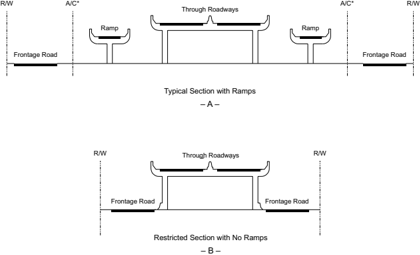

Figure 8-8. Typical and Restricted Cross Sections for Elevated Freeways on Structures with Frontage Roads

## 8.4.4.7  Freeways on Earth Embankment

Elevated freeways may be constructed on earth embankments provided that the embankment is high enough to permit cross streets to pass under the freeway. Such freeways are particularly suitable where the terrain is rolling and the right-of-way is sufficiently wide to allow gentle sideslopes that can be pleasingly landscaped.

Figure 8-9 presents typical and restricted cross sections for elevated freeways on embankments. The left  halves  of  these  sections  illustrate  outer  separations  without  ramps  within  the  same right-of-way width. The difference in elevation between the frontage road and the through roadway is approximately 20 ft [6.0 m]. This section provides for median widths of 10 to 22 ft [3.0 to 6.6 m], lane widths of 12 ft [3.6 m], and right shoulder widths of 10 ft [3.0 m].

Figure 8-9. Typical and Restricted Cross Sections for Elevated Freeways on Embankment

The outer separation may permit the use of earth slopes at locations without ramps, but retaining walls are needed at ramps. In addition, embankment slopes greater than 1V:3H will generally warrant a roadside barrier. By omitting frontage roads and using walled sections, total widths may be reduced to widths that are typical of elevated structures on viaducts. Architectural wall treatments and/or landscaping may make the retaining walls aesthetically pleasing. 8.4.4.8  Examples of Elevated Freeways --',''','',',',','''''',,,,''-'-',,',,',',,'---

Figure 8-10 shows a viaduct freeway on curved alignment located adjacent to an urban core business district. The freeway is situated to minimize the amount of right-of-way needed. Existing cross streets have not been disturbed.

Figure  8-11  shows  a  two-level  viaduct  freeway  in  a  densely  developed  area  of  a  large  city. Continuous frontage roads are not provided along this freeway segment.

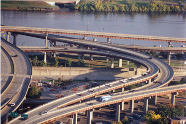

Source: New York State DOT

Figure 8-10. Viaduct Freeway

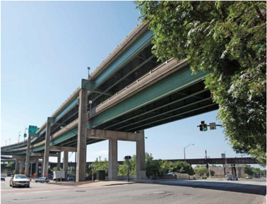

Source: Virginia DOT

Figure 8-11. Two-Level Viaduct Freeway

--',''','',',',','''''',,,,''-'-',,',,',',,'---

## 8.4.5  Ground-Level Freeways

## 8.4.5.1  General Characteristics

Many freeways have long segments that are constructed essentially at ground level. This design is often used in flat terrain and along railroads and water courses. Ground-level freeways are also suitable in suburban areas where cross streets are widely spaced. A major consideration in the design of ground-level freeways is the change in profile of each crossroad as it passes over or under the freeway. However, substantial lengths of ground-level freeways are generally not practical in heavily developed areas because the profiles of crossroads cannot be altered without severe impact on the community. The profile changes of cross streets are further discussed in Section 8.4.6, 'Combination-Type Freeways.'

Where a ground-level freeway follows the grid of a city, it is usually desirable to provide continuous one-way frontage roads that serve as a means of access to and from streets that are not carried across. However, there are situations where two-way frontage roads provide the only means to maintain local service, even though they are less compatible with ramps than one-way frontage roads.

Ground-level freeways usually are employed in outlying sections of metropolitan areas where right-of-way is not as expensive as it is in downtown areas. As a result, the variable width elements of medians, outer separations, and borders are widened to enhance the roadside design and appearance of the freeway.

## 8.4.5.2  Typical Cross Section

Figure 8-12A illustrates a typical cross section for a ground-level freeway with frontage roads, and Figure 8-12B shows a typical cross section without frontage roads. Where additional rightof-way is available, the outer separations and borders should be sufficiently wide to provide aesthetically pleasing green space and to insulate the surrounding area from the freeway. In areas where ramp connections are made to frontage roads, the width of outer separations should be sufficient to allow adequate space for ramps and ramp terminals.

Where only four or six lanes are provided initially, it may be desirable to provide the same rightof-way width as proposed for six- and eight-lane construction. In these situations, the median should be widened by multiples of 12 ft [3.6 m] in anticipation of a need for additional lanes. This step simplifies the construction of additional lanes, with nominal cost and minimal disruption to traffic.

Where fill material is available and the width of cross section is sufficient to construct traversable slopes, an earth berm may be desirable in the median, outer separation, or border. The earth berm shields the freeway from view, abates highway noise in the adjacent areas, and minimizes headlight glare. Adequate provisions should be made for drainage so that ponding of water does not occur on the shoulder area.

Figure 8-12. Typical Cross Sections for Ground-Level Freeways

## 8.4.5.3  Restrictive Cross Section

Figure 8-13 illustrates restrictive cross sections for ground-level freeways. Specifically, Figure 8-13A shows a restrictive cross section with a two-way frontage road while Figure 8-13B presents a restrictive cross section without frontage roads. With restrictive cross sections, both the median and outer separation are normally paved. On these narrow medians, a median barrier is appropriate. With two-way frontage roads, it is also desirable to provide a barrier in the outer separation in lieu of an access control fence. Preferably, this barrier should be located close to the frontage road to allow extra recovery space and snow storage outside freeway shoulders. Where there is no fixed-source lighting, glare screening may also be desirable in the outer separation.

Figure 8-13. Restrictive Cross Sections for Ground-Level Freeways

## 8.4.5.4  Example of a Ground-Level Freeway

Figure 8-1 in Section 8.3.1, 'Alignment and Profile,' shows an example of a typical ground-level freeway. The curvilinear alignment creates an attractive driving environment for motorists.

## 8.4.6  Combination-Type Freeways

## 8.4.6.1  General Characteristics

In  many  cases,  freeways  in  urban  areas  incorporate  some  combination  of  depressed,  elevated, and ground-level designs. Combination-type freeways result from variations in profile or cross section, and the following discussion is organized on the basis of these two controlling conditions.

## 8.4.6.2  Profile Control

## 8.4.6.2.1  Rolling Terrain

The typical plan and profile of a combination-type freeway in rolling terrain are shown in Figure 8-14. The best profile is typically developed by underpassing some cross streets and overpassing others.  The  facility  is  neither  generally  depressed  nor  elevated,  although  for  short  lengths  it embodies the design principles for fully depressed or fully elevated highways. For instance, in Figure 8-14, at A and C the facility is depressed, at B it is elevated on an earth embankment, and at each end of the illustration it is similar to a ground-level section.

Between A and C, the roadway has a fixed cross section with a narrow median because of lateral restrictions and cost of earthwork. Near each end of the illustration, the profile and cross section are varied to fit cross sloping terrain and less rigid controls, with independently designed centerlines and profiles for each one-way roadway. This type of design, which is similar to the character of a freeway in a rural area, should be considered wherever sufficient right-of-way is available.

Figure 8-14. Profile Control-Combination-Type Freeway in Rolling Terrain

## 8.4.6.2.2  Level Terrain

A variation of a combination-type freeway in level terrain is illustrated in Figure 8-15. Between grade separation structures, the highway profile closely follows the existing ground. The freeway also overpasses important cross streets by elevating the gradeline to the appropriate height above the surface streets; where practical, cross streets are carried over the freeway (as at A in Figure 8-15). This combination-type freeway design is suitable for level terrain where soil and groundwater conditions or underground utilities preclude depressing the freeway to any great extent below the existing ground, or where continuous viaduct construction is too costly or is otherwise objectionable. The freeway may be carried over a cross street on an earth embankment with a conventional grade separation structure (as at B in Figure 8-15) or on a relatively long structure (as at C in Figure 8-15). The factors that control the profile design are the availability of fill material and the soil conditions. In addition, this combination-type freeway design permits parallel or diagonal ramps to be provided between the grade separations.

Figure 8-15. Profile Control-Combination-Type Freeway in Level Terrain

One of the disadvantages of this design is that a roller-coaster type of profile results where several successive cross streets are overpassed at close intervals. This situation is more pronounced on horizontal tangents where drivers can see two or more grade separations ahead. A moving vehicle that is ahead of a driver may disappear into dips and reappear again as the grade rises to a crest. Therefore, the profile should be designed to eliminate dips that would limit the recommended sight distance. The profile should provide adequate decision sight distance to exit ramps, where practical. Where truck traffic is heavy, maximum grades of approximately 2 percent are desirable to prevent queuing at the base of the grade.

To minimize the overall rise and fall and make the rolling profile less pronounced, the cross streets may be depressed several feet below the ground surface and the freeway grade raised several feet above the ground level between grade separation structures. The profile may be further improved by raising some cross streets to overpass the freeway. Minimum governing distances for grade separation design are discussed in Section 10.8.6.

8.4.6.3  Cross-Section Control The examples in Figure 8-16 are also considered combination-type freeways, but the primary influence on their design is the cross section. These special designs usually apply to relatively short lengths of roadway to meet specific conditions. --',''','',',',','''''',,,,''-'-',,',,',',,'---

Figure 8-16A illustrates a design in which one roadway of the freeway is located above the other roadway, with one roadway above the existing ground level and the other below the existing

ground. In effect, it is a one-way depressed and a one-way elevated facility separated in elevation to permit the cross streets to pass through on the intermediate (surface) level. This arrangement may be appropriate where the right-of-way is not sufficiently wide for either a two-way elevated or a two-way depressed facility, and where a two-level elevated structure would be objectionable. Wider rights-of-way are needed where ramps are provided.

Figure 8-16. Cross-Section Control-Combination-Type Freeway

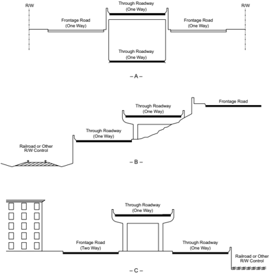

A portion of an urban area left underdeveloped because of extremely steep ground might serve as a practical location for a freeway section. A special design with partly elevated and walled sections at staggered levels can be employed, as shown in Figure 8-16B. A variety of other designs may also be used, including a one-level, two-way deck structure or a one-level, two-way cutand-fill section retained by walls. The design selected would depend on the slope of the ground,

--',''','',',',','''''',,,,''-'-',,',,',',,'---

soil conditions, and right-of-way width. Difficulty may be encountered at cross streets that are likely to have steep grades; however, areas with such topography usually have few cross streets.

Another variation of a combination-type freeway shown in Figure 8-16C consists of one through roadway at surface level and the other on an elevated structure; this design may be appropriate along a waterfront or a railroad where the right-of-way is relatively narrow and there are no cross streets. Access to and from the one-way through roadway at surface level is provided directly to streets that cross the frontage road; by contrast, access to and from the elevated roadway is provided by lateral ramps that overpass the frontage road.

Figure 8-17 shows an eight-lane, combination-type freeway in a densely developed residential area of a large city. The freeway profile changes smoothly from fill to cut sections so that the profile blends with the local street system.

Source: Rhode Island DOT

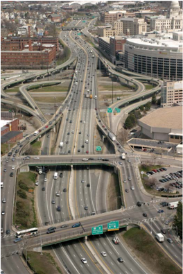

Figure 8-17. Combination-Type Freeway

## 8.4.7  Special Freeway Designs

This section discusses three special freeway designs that may be appropriate in some urban area locations: freeways with reverse-flow roadways, dual-divided freeways, and freeways with collector-distributor roadways.

## 8.4.7.1  Reverse-Flow Roadways

A reverse-flow roadway is a separate roadway-usually between the main roadways of a freeway-that serves traffic for opposite directions of travel at different times of day. This is usually accomplished by situating a separate reversible roadway within the normal median area, as shown in Figure 8-18A. Reverse-flow roadways are advantageous in that they provide an opportunity for better operations for motorists, but are disadvantageous in that they may have unused capacity much of the time because of the limited numbers of access points. The costs of construction, maintenance, and operation of a freeway with a reverse-flow roadway also may differ considerably from those of a conventional freeway.

Figure 8-18. Typical Cross Sections for Reverse-Flow Operation

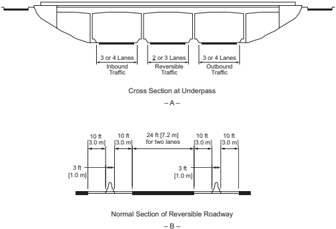

A separate reverse-flow roadway may be considered for these conditions:

- y the directional distribution during peak hours is substantially unbalanced (e.g., a 65:35 percent split) and capacity analysis indicates a need for a conventional facility more than eight lanes wide;
- y design controls and right-of-way limitations are such that providing two or more parallel facilities on separate rights-of-way is not practical; and

--',''','',',',','''''',,,,''-'-',,',,',',,'---

--',''','',',',','''''',,,,''-'-',,',,',',,'---

- y a sizable portion of traffic in the predominant direction during peak hours is destined for an area between the central portion of the city or another area of concentrated development and the outlying area (i.e., a large percentage of peak-hour traffic travels a long distance between principal points of origin and destination with little or no need for intervening interchanges).

In large metropolitan areas, demand may be sufficiently great to justify the use of a reversible roadway exclusively for buses or other high-occupancy vehicles.

The right-of-way width needed for a reverse-flow freeway is not substantially different from that needed for a conventional freeway that serves an equivalent traffic volume. In fact, with the dimensions shown in Figure 8-18B, the right-of-way needed for a three-two-three reversible freeway is the same as that needed for a conventional 10-lane freeway with a 24-ft [7.2-m] median. It should be noted that the cross section in Figure 8-18B uses full right and left shoulders on the reverse-flow roadway, because it carries one-way traffic in different directions at different times.

In the central business district, it may be desirable to provide a separate collection and distribution system for the reversible roadway on radial freeways. The normal directional roadways would serve through traffic and freeway-to-freeway connections. Only the reversible roadway would connect directly to downtown streets. In particular, this arrangement enhances the usefulness of the reversible roadway for express bus operation.

Entrance and exit ramps on the reverse-flow roadway should be well spaced, and the entering traffic volume should be balanced with the capacity of the reverse-flow facility. Where there are major connectors, the design should provide for ramps going to and from the reverse-flow roadway and separated in grade from the outer freeway roadways. In cases to date, very few intermediate crossover connections (slip ramps) between the inner and outer roadways have been provided. Such connections need substantial length and lateral space for proper design, usually in areas where the needed space is not available. Furthermore, the resulting weaving maneuvers and left-side exits or entrances are operationally undesirable on a freeway that warrants a reverse-flow roadway. In reverse-flow operations, there will normally be two intervals daily during which the central roadway is closed to change the direction of flow.

Adequate reverse-flow roadway terminals are needed to transfer traffic between the section of freeway with reverse-flow lanes and the conventional freeway section or the local street system. A reversible roadway section is usually terminated by transitioning the three roadways into two normal directional roadways, as shown in Figure 8-19A.

As illustrated in Figure 8-19A, the end of the reversible roadway is Y-shaped and has the entrance and exit connections on the median side of the normal roadways. The entrance connection leading into the reversing roadway is relatively easy to provide, and there are usually no operational problems at this point. The exit connection from the reversing roadway needs careful consideration to avoid undesirable merging situations and backups during peak flows. As a

minimum, the connections should normally be designed as major forks that are 1,200 to 1,800 ft  [350 to 600 m] long. Preferably, an auxiliary lane or lanes should be provided beyond the junction point to the next exit or for a distance of 2,500 to 3,000 ft [750 to 1,000 m] to provide for adequate merging.

Where there is a prominent exit from through lanes in the vicinity of the reversible roadway's terminal, the reversible roadway should be terminated beyond that exit. Conversely, where there is a prominent entrance near the terminal, the reversible terminal should be located in advance of the entrance. This arrangement minimizes congestion and weaving conflicts.

Note: Dotted lines represent movable barriers.

Figure 8-19. Typical Reverse Roadway Terminals

Where the reversible lanes terminate at a major junction on the freeway, the arrangement shown in Figure 8-19B would involve weaving for traffic entering or exiting from the reversible roadway. This design is not desirable if weaving volumes are heavy, as it may result in considerable traffic  operational  problems.  When  this  arrangement  is  used,  the  reversible  lanes  should  be extended along one leg of the divergence. This design eliminates weaving but denies access from the reversible lanes to the other leg. Where such an arrangement is not compatible with traffic

--',''','',',',','''''',,,,''-'-',,',,',',,'---

--',''','',',',','''''',,,,''-'-',,',,',',,'--- patterns, the weaving can be eliminated by providing another structure and designing the terminal as shown in Figure 8-19C.

The  devices  used  for  controlling  traffic  at  terminals  of  a  reverse-flow  roadway  include  variable  message  signs,  pavement  markings,  in-pavement  lights,  warning  lights,  lane-use  traffic signals, and mechanically and electronically operated barricades placed at each terminal of the reverse-flow roadway and at intermediate ramp terminals.

Figure 8-20 illustrates a reverse-flow freeway in a suburban area. The facility illustrated has a three-two-four-lane configuration, with the center two lanes operating in the peak flow direction during the morning and evening peak demand periods. However, the same concept can be used with a three-two-three or a four-two-four lane configuration. The reverse-flow roadway is  24  ft  [7.2  m]  wide  and  has  10-ft  [3.0-m]  shoulders  on both sides. The normal directional roadway has 12-ft [3.6-m] lanes and has a 10-ft [3.0-m] shoulder on the right and a 6-ft [1.8-m] shoulder on the left. Each separator between the reverse-flow roadway and the normal roadway is 4 ft [1.2 m] wide. Within each separator is a barrier 2 ft [0.6 m] wide.

Source: Missouri DOT

Figure 8-20. Reverse-Flow Freeway

## 8.4.7.2  Dual-Divided Freeways

Where more than eight total through lanes are needed and the directional distribution of traffic is sufficiently balanced so that a reversible roadway is not appropriate, a dual-divided freeway made up of two one-way roadways in each direction of travel may provide the optimum traffic operations. All four roadways lie within the control-of-access lines. This type of cross section is

sometimes referred to as 'dual-dual.' The outer freeway roadways usually serve all interchange traffic,  but  they  may also serve a substantial portion of the through traffic. For example, all trucks might be required to use the outer roadways only. Various arrangements are possible depending on the character of traffic and crossroad conditions. Figure 8-21 provides an example of a dual-divided freeway.

Dual-divided freeways usually function smoothly and carry extremely high volumes of traffic efficiently. Motorists using the inner roadways are insulated from weaving movements at closely spaced interchanges, and disabled vehicles in either the inner or outer roadway can quickly be steered to a shoulder by traversing a minimum number of lanes.

Dual-divided construction may be the most practical solution to widening an existing freeway where the present traffic volumes are so great that the disruption in traffic during complete reconstruction cannot be tolerated. Where the future need can be anticipated and sufficient right-of-way can be reserved, it may be workable to develop a dual-divided facility in two stages.

Dual-divided facilities have great flexibility in their operation and maintenance. For example, during maintenance or reconstruction operations, one of the directional roadways may be temporarily closed during off-peak hours, reducing crash potential by eliminating traffic conflicts with construction or maintenance work. The affected roadway can also be closed in case of a crash or other emergency, thus facilitating investigation and clean-up operations.

Disadvantages of dual-divided facilities include the additional shoulder width needed, increased costs, and increased impact on the surrounding community. The dual-roadway system reduces the flexibility of traffic distribution, resulting in uneven distribution among lanes. Maintenance needs may be greater than those on a normal divided facility with an equal number of lanes. Snow removal from dual-divided facilities is difficult in the inner roadway unless a depressed median is provided between the inner and outer roadways.

Roadway  arrangements  for  a  dual-divided  freeway  include  four-four-four-four,  three-threethree-three, three-two-two-three, two-three-three-two, or other suitable combinations of lanes. Typical cross sections are comparable to those previously described for various types of freeways with frontage roads, except that there are four, rather than two, main roadways. Shoulder width criteria for freeways are applicable to each of the four roadways.

Figure 8-22 shows a typical layout for a dual-divided freeway. All interchange connections are made to the outer roadways, and intermediate slip-ramp connections are provided between the inner and outer roadways so that traffic on the inner roadways can access the interchanges. The number of transfer connections should be kept to a minimum, with one set serving several successive interchanges. Refer to Section 8.4.7.3, 'Freeways with Collector-Distributor Roads,' for design guidance on providing connections between parallel roadways.

Source: Virginia DOT

Figure 8-21. Dual-Divided Freeway

Figure 8-22. Typical Dual-Divided Freeway

## 8.4.7.3  Freeways with Collector-Distributor Roads

An arrangement having cross-sectional elements similar to the dual-divided freeway is a freeway with a collector-distributor (C-D) road system. The purpose of a C-D road is to eliminate weaving on the main line freeway lanes and reduce the number of entrance and exit points on the through roadways while satisfying the demand for access to and from the freeway. C-D roads may be provided within a single interchange (as discussed in Section 10.9.5), through two adjacent interchanges, or continuously through several interchanges of a freeway segment.

The inside through roadways are identified as core roads, and the outside roadways are identified as C-D roads. Usually, the traffic volumes and speeds on the C-D system are less than those encountered on the dual-divided freeway, with fewer lanes. The minimum lane arrangement for a C-D system is two C-D, two core, two core, two C-D; however, other combinations may be developed as capacity needs warrant. Continuous C-D roads should be integrated into a basic lane design to develop an overall system. Capacity analysis and basic lane determination should be performed for the overall system rather than for the separate roadways.

Connections between the core roadways and C-D roads may be made with slip ramps similar to those discussed with dual-divided freeways. These so-called 'transfer roads' may be one or two lanes in width, and the principle of lane balance applies to their design. Both transfer and C-D roads should have shoulders equal in width to those of the core roadways. The outer separation should be as wide as practical with an appropriate barrier. Terminals of C-D and transfer roads should be designed in accordance with guidelines for ramp terminals, as presented in Section 10.9.6. There should be a spacing of 2,500 ft [750 m] or more between the terminal of a transfer connection and an exit ramp. The appropriateness of all weaving lengths to serve the anticipated weaving volumes should be checked.

The design speed of C-D roadways is usually less than that of the core roadways because most of the turbulence caused by weaving occurs on the C-D roadways. A reduction in design speed of no more than 10 mph [20 km/h] is preferable for continuous C-D road systems.

## 8.4.8  Accommodation of Managed Lanes and Transit Facilities

## 8.4.8.1  General Considerations

Managed lanes are defined as highway facilities or a set of lanes where operational strategies are implemented and managed in response to changing conditions to increase freeway efficiency, maximize capacity, manage demand, and generate revenue. Examples of managed lanes include high-occupancy vehicle (HOV) lanes, value-priced lanes, high-occupancy toll (HOT) lanes, and exclusive or special use lanes such as express lanes, bus lanes, transit lanes, and reversible flow lanes. For additional information on managed lanes, refer to NCHRP Report 835, Guidelines for Implementing Managed Lanes ( 8 ).

--',''','',',',','''''',,,,''-'-',,',,',',,'---

Combining mass transit or managed-lane facilities with freeways is a means for providing optimum transportation services in larger cities. This type of improvement can be accomplished by the joint use of right-of-way to include rail transit or separate roadway facilities for managed lanes. The total right-of-way cost not only is less than those for two separate land strips, but the combination also preserves taxable property, reduces the displacement of businesses and residences, and lessens impact on neighborhoods. In some cases, mass transit is incorporated into existing freeway systems. Reverse-flow roadways in the median and reserved lanes work well for exclusive bus and high-occupancy vehicle use during rush hours.

When transit, either bus or rail, is located within the freeway median, access to the transit vehicles is generally obtained from the crossroad at interchange locations. Such an arrangement does not lend itself to intermodal transfer. Transfer to and from buses or passenger cars adds congestion to the interchange area, and off-street parking is usually so remote from interchange areas that it discourages some transit ridership. Reverse-flow roadways, like the one in the median of the freeway shown in Figure 8-23, can also be operated as exclusive bus roadways. Bus roadways within the median essentially restrict operations to the line-haul or express type, because ramps that would permit collection and distribution from the median area are expensive or operationally undesirable. Furthermore, when freeways undergo major repair or reconstruction, it is often desirable to construct crossovers and temporarily shift all traffic onto one roadway. Where transit is located within the median, such temporary crossovers are not practical without disruption of transit operations.

Where the transit facility is parallel to the freeway but located to one side rather than in the median area, these objections are overcome. Figure 8-23 shows a bus roadway located between the freeway and a parallel frontage road. Access to the bus roadway is obtained from the frontage road. The station is removed from the congestion of the interchange area, adequate space is available for auto or bus turnouts, and space for off-street parking may be more readily available. All factors combine to enhance intermodal transfers. Slip ramps from the bus roadway to the frontage road permit collection and distribution, as well as line-haul or express operation, without disruption of freeway operations. A similar arrangement can serve fixed-rail transit except that the slip ramp would be omitted. --',''','',',',','''''',,,,''-'-',,',,',',,'---

Figure 8-23. Bus Roadway Located between a Freeway and a Parallel Frontage Road

## 8.4.8.2  Buses

True rapid transit service by bus has had only limited application, because normal bus service usually combines collection and distribution with suburb-to-city transportation, and most street or highway facilities for such bus routes are not adaptable to high-speed operation. Many metropolitan areas have nonstop freeway express buses that operate on the freeway system between suburban pickup points near the freeway and destinations within the central business district or to other heavy traffic generators. The number of buses operating during peak hours, the spacing of bus stops, and the design of bus turnouts determine the efficiency of bus operation and its effect on highway operations. Buses operating with short headways and frequent pickup and discharge points are likely to accumulate at stops and interfere with through traffic. On the other hand, express bus operation with few, if any, stops along the freeway provides superior transit service for suburban areas and affects freeway operation the least. For additional guidance, refer to the AASHTO Guide for Geometric Design of Transit Facilities ( 5 ).

## 8.4.8.2.1  Exclusive HOV Lanes

In addition to express service, other operational means should be considered to reduce the travel time of the public transportation user when demand warrants. An exclusive HOV roadway is an entire highway facility reserved at all times solely for the use of buses or buses and other HOVs. This facility offers buses and HOVs a high level of service, improves schedule reliability and operating speeds, and decreases travel time for the users. HOV lanes and roadways are discussed

in the AASHTO Guide for High-Occupancy Vehicle (HOV) Facilities ( 1 ). A discussion of the parkand-ride facilities that are often provided with HOV lanes is contained in the AASHTO Guide for Park-and-Ride Facilities ( 2 ).

## 8.4.8.2.2  Bus Stops

The spacing of bus stops largely determines the overall speed of buses. Bus stops on freeways should be spaced to permit buses to operate at or near the prevailing speed of traffic on the highway. To achieve this goal, a spacing of at least 2 mi [3.5 km] between bus stops is normally appropriate.

Bus stops along freeways are usually located at intersecting streets where passengers transfer to or from other lines or passenger cars. These stops may be provided at the freeway level, which passengers reach via stairs, ramps, escalators, or elevators, or at the street level, which involves bus access via interchange ramps. Bus stops should be located where site conditions are favorable and, if practical, where gradients on the acceleration lane are flat or downward. The design of bus turnouts is discussed in Section 4.19.

## 8.4.8.2.3  Bus-Stop Arrangements

The benefit of bus stops located at the freeway level is that buses consume little additional time other than that for stopping, loading, and starting. The disadvantage is that turnouts, stairways, and possibly extra spans at separations may be needed. With bus stops at street level, less special construction is needed and stairs or ramps are avoided. However, buses have to mix with traffic on the ramps and frontage roads and generally must cross the intersecting street at grade. Where traffic on the surface street is light, these disadvantages are lessened; however, where the streets are operating at or near capacity, buses crossing them will experience some delay. Generally, street-level stops are appropriate in and near downtown districts, and either street- or freeway-level stops are appropriate in suburban and outlying areas. Combinations of these two types may be used on any one freeway. Connections between the crossroad and the bus boarding and alighting areas must be accessible to and usable by individuals with disabilities ( 12, 13 ). Refer to the Proposed Guidelines for Pedestrian Facilities in the Public Right-of-Way ( 11 ) for additional guidance.

## 8.4.8.2.4  Bus Stops at Freeway Level

Bus stops logically are located at street crossings where passengers can use the grade-separation structure for access from either side of the freeway. Figure 8-24A shows an arrangement at an overpassing street without an interchange. The turnouts and loading platforms are under the structure and therefore need greater span lengths or additional openings. Access to the crossroad should be located on the side of the cross street used by most passengers. Two additional access points can eliminate any crossings of surface streets by transferring riders.

Figure 8-24B shows an arrangement at an undercrossing street without an interchange. As indicated at the top left of this figure, platform exits and entrances may be connected directly to adjoining developments such as public buildings and department stores.

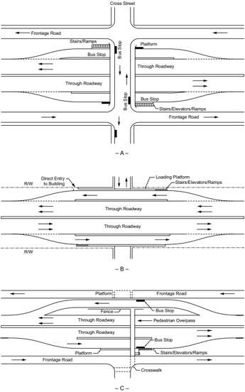

Figure 8-24. Bus Stops at Freeway Level

--',''','',',',','''''',,,,''-'-',,',,',',,'---

Transit stops are sometimes needed at locations other than at overpassing streets, such as in outlying areas or in built-up districts where it is neither practical nor desirable to provide stops at cross-street structures. Such stops preferably should be located opposite cross streets intercepted by frontage roads or major passenger walkways. A pedestrian overpass is needed to make bus stops usable from either side of the freeway. Figure 8-24C illustrates two likely layout plans. In the lower half of the figure, the turnout is located at the freeway level under the pedestrian structure. Pedestrians may reach this structure by stairs, ramps, or elevators. An alternative layout, shown in the upper half of the figure, features a turnout located at the level of the frontage road, eliminating the need for stairs, ramps, or elevators.

Figure 8-25 illustrates bus stops located at freeway level on a depressed section of freeway with diamond-type interchange ramps connecting to one-way frontage roads. The bus stops are located under the cross streets. Connections between the crossroad and the bus boarding and alighting areas must be accessible to and usable by individuals with disabilities. In Figure 8-25A, the entrance to the turnout is located beyond the exit ramp nose, and the exit from the turnout is located in advance of the entrance ramp nose. In Figure 8-25B, buses use the freeway ramp exit to enter the turnout. In this case, the bus stop is usually accessed through a separate structure opening. Such consolidation of access points improves the efficiency of through and ramp traffic. Bus drivers readily adapt themselves to the appropriate route to enter and exit the bus turnout.

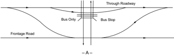

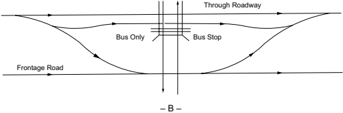

Figure 8-25. Bus Stops at Freeway-Level Diamond Interchange

## 8.4.8.2.5  Bus Stops at Street Level

Street-level bus stops can be provided at interchanges. For example, on diamond ramps, the bus stop may be located adjacent to the ramp roadway or it may be located on a separate roadway. Generally, street-level bus stops adjacent to on-ramps are preferred. Bus boarding and alighting areas and any other facilities for bus patrons must be accessible to and usable by individuals with disabilities.

Figure 8-26 shows several examples of street-level bus stops on diamond interchanges. Figure 8-26A illustrates two possible locations for a bus stop at a simple diamond interchange without frontage roads. The bus stop can be located adjacent to either the on-ramp or off-ramp. An analysis of turning conflicts should be made to determine the feasibility and appropriateness of either option.

Figure 8-26B illustrates a street-level bus stop on a one-way frontage road at diamond interchanges. Buses use the off-ramp to reach the surface level, discharge and load their passengers at the cross street, and proceed via the on-ramp. Added travel distance is minimal, and where traffic on the cross street is light, little delay occurs. However, where cross-street traffic is heavy and buses are numerous, operation may be difficult because buses must weave across the frontage road traffic to reach the sidewalk, cross the cross street, and then weave again on their way to the on-ramp. Therefore, sufficient distance is needed between the ramp termini and the cross street for efficient weaving operations.

Street-level bus stops are difficult to provide effectively within cloverleaf or directional interchanges. Consequently, bus stops should be omitted at such interchanges or be located on the cross street beyond the limits of the interchange.

--',''','',',',','''''',,,,''-'-',,',,',',,'---

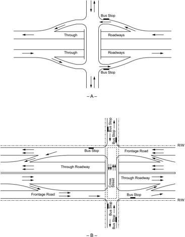

- B -

Figure 8-26. Bus Stops at Street Level on Diamond Interchange

## 8.4.8.2.6  Stairs, Ramps, Escalators, and Elevators

With bus stops at the freeway level, stairs, ramps, escalators, elevators, or combinations of these are needed for passenger access between the freeway and local street levels. Transit facilities must be accessible to and usable by individuals with disabilities; therefore, stair-only access at transit stops is not permitted ( 11 ). Elevators, stairs, and ramps at transit stops should meet accessibility requirements and present an inviting appearance. The provision of ample lighting, both day and night, is recommended. A covering over the stairways, ramps, and platforms may also

be desirable. Where space is available and only buses are to be served, the elevation difference of the pedestrian connection may be reduced by raising the bus roadway under the structure 2 to 4 ft [0.6 to 1.2 m], likewise, reducing vertical clearance to about 12.5 ft [3.8 m]. This is acceptable for bus-only traffic, as most intra-city buses are less than 10 ft [3.0 m] high.

## 8.4.8.3  Rail Transit

Several metropolitan areas have incorporated, or plan to incorporate, rail transit into freeway rights-of-way. Figure 8-27 illustrates various arrangements of the joint freeway-transit use of a right-of-way.

Because rail transit installations are so unique and their design is so highly specialized, discussion of only a few general items is appropriate in this policy. Location and design of a rail transit facility are joint undertakings involving several specialized fields of interest. The location and design of stations, terminals, and parking facilities should be considered from the standpoint of serving these facilities by urban streets and providing accessibility for persons with disabilities. Where rail is contiguous to the freeway traveled way, the entire highway design is affected.

The most common arrangement is to place the transit line within the median of a depressed or ground-level freeway, as shown in Figures 8-27A, 8-28, and 8-30. When a rail transit line is placed in the middle of a freeway, it becomes an island separated from its passengers by lanes of  rapidly  moving  vehicles.  Access  is  generally  provided  by  elevators  or  ramps  connected  to grade-separation structures. Where a rail transit line runs down one side of the freeway, accessibility to the transit is simplified, but the construction of interchange ramps becomes more costly. In some situations an alternate solution may be to stack freeway lanes above the transit line, as shown in Figure 8-27B, using a minimum of right-of-way. An additional level for cross traffic of vehicles and pedestrians may be needed to serve all traffic movements.

Figure 8-27C illustrates an arrangement where a topographic feature, such as the river on the right, presents a natural deterrent to development on one side. The transit line is situated to provide easier access to the community. Where the area has scenic value, this arrangement presents motorists with an open view.

--',''','',',',','''''',,,,''-'-',,',,',',,'---

Figure 8-27. Joint Freeway-Transit Right-of-Way

## 8.4.8.3.1  Typical Sections

Figure 8-28 illustrates typical sections with rail transit provided in the freeway median. The dimensions given are illustrative and should not be considered as guidelines or requirements. The rail transit dimensions and clearances are typical of guide dimensions that provide for general  space  needs.  The American Railway Engineering and Maintenance-of-Way Association (AREMA) Manual for Railway Engineering ( 7 ) is one source of current design criteria for railway dimensions and clearances. Figure 8-28A illustrates a minimum section without piers; by contrast, Figure 8-28B illustrates a minimum section with one median pier. A fence should be mounted on or adjacent to the barrier to prevent pedestrians from entering the rail area. A screen or fence may also be needed to reduce the glare to motorists from the headlights of the mass transit vehicle. If a semi-rigid barrier is utilized at the shoulder edge, the dynamic deflection of the barrier should be added to the dimensions shown.

Where the rail line is placed along the outside of the freeway, reference can be made to Section 8.2.10, 'Roadside Design,' for additional information on clearances.

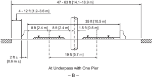

- B -

Figure 8-28. Typical Sections with Rail Transit in Freeway Median

## 8.4.8.3.2  Stations

The transit station location and spacing should be consistent with the environment and passenger  flow.  Frequent  stations  may  be  needed  within  the  central  business  district  and  other heavy traffic generators, but few stations would be needed in the outlying or suburban areas. Downtown stations should be within easy walking distance of the business and working centers or a feeder bus system. Outlying stations should provide ample parking and storage for vehicles waiting to pick up passengers. Access to local buses and taxis also should be available. Two general layouts for a rail transit station at a local cross street or pedestrian overcrossing are shown in Figure 8-29 with typical control dimensions. The dimensions given are illustrative and should not be considered as guidelines or requirements. The station shown in Figure 8-29 improves use of the available space by allowing more separation between the transit passengers and the freeway, while still maintaining ample distance between the train and the traveled way. Transit stations must be accessible to and usable by individuals with disabilities. Accessible connections to the pedestrian network adjoining the station should be provided. Connections to nearby bicycle facilities and bike parking should be provided, where appropriate. Further information on

the accommodation of transit facilities in freeway medians is available in the AASHTO Guide for the Geometric Design of Transit Facilities on Highways and Streets ( 5 ).

Note: Rail transit dimensions and clearances are illustrative and should not be considered standard.

Figure 8-29. Example of Transit Station Layout

8.4.8.3.3  Example of Rail Transit Combined with a Freeway

Figure 8-30 presents an eight-lane freeway with rail rapid transit in the median.

Source: Colorado DOT

Figure 8-30. Freeway with Rail Rapid Transit in the Median

## 8.5  REFERENCES

1. AASHTO. Guide for High-Occupancy Vehicle (HOV) Facilities, Third Edition, GHOV-3 . Association of State Highway and Transportation Officials, Washington, DC, 2004.
2. AASHTO. Guide for Park-and-Ride Facilities, Second Edition, GPRF-2 .  Association of State Highway and Transportation Officials, Washington, DC, 2004.
3. AASHTO. AASHTO Drainage Manual, First Edition, ADM-1 . American Association of State Highway and Transportation Officials, Washington, DC, 2005.
4. AASHTO. Roadside Design Guide, Fourth Edition with 2015 Errata, RSDG-4 . American Association of State Highway and Transportation Officials, Washington, DC, 2011.

5. AASHTO. Guide for Geometric Design of Transit Facilities on Highways and Streets , First Edition, TVF-1 . American Association of State Highway and Transportation Officials, Washington, DC, 2014.
6. AASHTO. AASHTO  LRFD  Bridge  Design  Specifications,  Eighth  Edition  with  2018 Errata, LRFD-8 . American Association of State Highway and Transportation Officials, Washington, DC, 2017.
7. AREMA. Manual  for  Railway  Engineering .  American  Railway  Engineering  and Maintenance-of-Way Association, Hyattsville, MD, 2009.
8. Fitzpatrick, K., M.A. Brewer, S. Chrysler, N. Wood, B. Kuhn, G. Goodin, C. Fuhs, D.  Ungemah,  B.  Perez,  V.  Dewey,  N.  Thompson,  C.  Swenson,  D.  Henderson,  and H.  Levinson. National  Cooperative  Highway  Research  Program  Report  835:  Guidelines for  Implementing  Managed  Lanes .  NCHRP,  Transportation  Research  Board,  National Research Council, Washington, DC, 2016.
9. Torbic, D.J., L.M. Lucas, D.W. Harwood, M.A. Brewer, E.S. Park, R. Avelar, M.P. Pratt, A. Abu-Odeh, E. Depwe. and K. Rau. National Cooperative Highway Research Program Web-Only Document 227: Design of Interchange Loop Ramps and Pavement/Shoulder Cross Slope  Breaks .  NCHRP,  Transportation  Research  Board,  National  Research  Council, March 2016. Available at

http://www.trb.org/NCHRP/Blurbs/175608.aspx

10. TRB. Highway Capacity Manual: A Guide for Multimodal Mobility Analysis , Sixth Edition. Transportation Research Board, National Research Council, Washington, DC, 2016.
11. U.S. Access Board. Proposed Guidelines for Pedestrian Facilities in the Public Right-of-Way ,
3. http://www.access-board.gov/guidelines-and-standards/streets-sidewalks/public-rights-of-way/
4. Federal Register, 36 CFR Part 1190. July 26, 2011. Available at proposed-rights-of-way-guidelines
12. U.S.  Department  of  Justice. 2010  ADA  Standards  for  Accessible  Design. September  15, 2010. Available at
6. https://www.ada.gov/2010ADAstandards\_index.htm
13. U.S. National Archives and Records Administration. Code of Federal Regulations . Title 49, Part 27. Nondiscrimination of the Basis of Disability in Programs or Activities Receiving Federal Financial Assistance.

## 9 Intersections
