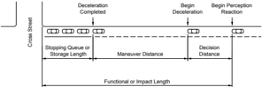
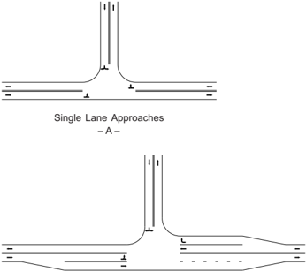
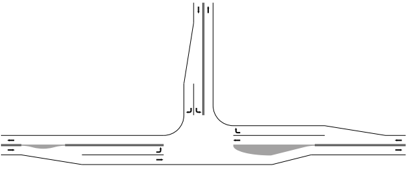
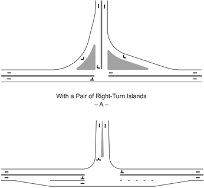
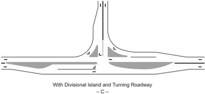
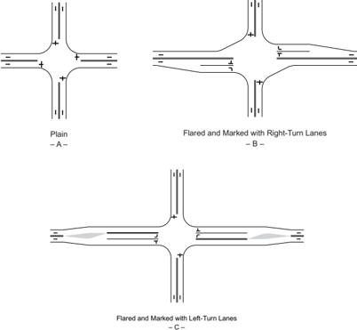
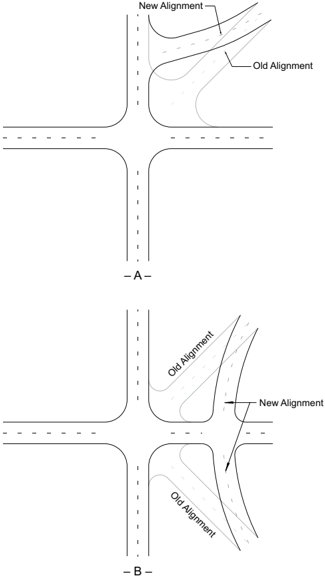
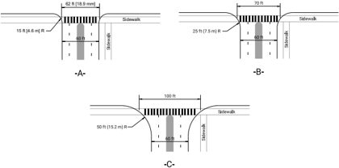

# 9.1  INTRODUCTION: 9.1  INTRODUCTION & 52 more sections

- Source: GreenBook.pdf
- Generated: 2026-01-03T08:11:58+00:00
- Chunk: 23/28
- Estimated tokens: ~49,559
- Total pages: 1048
- Type: sections

## 9.1  INTRODUCTION

An intersection is defined as the general area where two or more roadways join or cross, including the roadway and roadside facilities for traffic movements within the area. Each roadway radiating from an intersection and forming part of it is an intersection leg. The most common intersection configuration is a four-leg intersection at which two roadways cross one another. Three-leg intersections are also common. It is recommended that an intersection have no more than four legs.

The three general types of roadway crossings are at-grade intersections, grade separations without ramps, and interchanges. This chapter deals primarily with the design of intersections at grade; the latter two intersection types are discussed in Chapter 10. Certain intersection design elements, primarily those concerning the accommodation of turning movements, are common and applicable to intersections and to some parts of certain interchanges.

At-grade  intersections  are  among  the  most  complicated  elements  of  a  roadway. Intersections  are  often  the  focus  of  business  and  community  activity  and  the  place where systems users share the same travel space. Traffic control that requires some or all users to slow or stop is uniquely present at intersections. Intersections usually have less capacity than other parts of the roadway and are where most traffic conflicts occur. The design of intersections is important to users of the intersections and owners of land adjacent to the intersection. Therefore, design criteria should be selected that will result in a balanced and cost-effective design that provides anticipated efficient operations and low crash frequencies, and considers the needs of all user groups. Design criteria should also meet mobility, environmental, scenic, aesthetic, cultural, natural resource, and community needs to the extent practicable.

Chapter 1 presents a flexible, performance-based design process that can be applied in developing intersection projects. By contrast, this chapter provides guidance on designing the physical elements of an intersection and its pertinent features, providing for the effective movement of each intersection user. Use of the design elements presented herein is based on design criteria including functional classification, current and anticipated volume of each intersection user group including directions and turning

movements, design speed, appropriate design vehicle (bicycle, passenger car, transit bus, WB-67 truck, recreational vehicle, etc.), intersection geometrics (alignment, profile, intersection form), and desired traffic control (no assigned control, two-way stop, all-way stop, traffic signal, or roundabout). In combination with the design criteria, the safety and operational performance analyses are used to determine the particular configuration of the intersection, such as the number of lanes. This chapter provides guidance for the physical elements of the intersection design.

The specific dimensional design criteria presented in this chapter are appropriate as a guide for new construction of intersections. Projects to improve existing intersections differ from new construction in that the performance of the existing intersection is known and can guide the design process. Features of the existing design that are performing well may remain unchanged, while features that are performing poorly should be improved, where practical.

The figures presented in this chapter that have been provided to illustrate particular aspects of intersection design do not necessarily represent complete designs that comply with every design guideline in the chapter. If every drawing in the chapter addressed every potentially applicable design issue, the drawings might become so detailed as to lose their illustrative value.

## 9.2  GENERAL DESIGN CONSIDERATIONS AND OBJECTIVES

## 9.2.1  Characteristics of Intersections

An intersection includes the areas needed for all modes of travel that use the intersection: automobile, bicycle, pedestrian, truck, and transit. Thus, the intersection design addresses not only the roadway pavement, but the adjacent sidewalks, pedestrian ramps, bicycle facilities, auxiliary lanes, medians, and islands. Intersections are a key feature of roadway design in four respects:

- y Focus of Land Use ActivityThe land near intersections often contains a concentration of travel destinations that are accessed by multiple modes.
- y Conflict PointsPedestrians, bicyclists and motor vehicles often cross paths at intersections where through and turning movements conflict. These crossings are referred to as 'conflict points,' and can be further categorized by movement type and corresponding severity.
- y Traffic ControlMovement of users may be assigned through use of traffic control devices such as yield signs, stop signs, and traffic signals.
- y CapacityTraffic control at intersections often limits the number of users that can be accommodated within a given time period on the intersecting roadways.

Figure  9-1  shows  the  number  and  type  of  motor-vehicle  conflict  points  at  typical  four-leg, three-leg, and roundabout intersections. Conflict points should also be considered when locating driveways along a roadway. Providing separation between driveways reduces the potential for collisions by reducing the number of conflict points and increasing the distance between conflict points.

Figure 9-1. Conflict Points at Various Intersection Types

## 9.2.2  Intersection Functional Area

An intersection is defined by both its functional and physical areas ( 18 ), as illustrated in Figure 9-2. The functional area of an intersection extends both upstream and downstream from the physical intersection area and includes any auxiliary lanes and their associated channelization.

Figure 9-2. Physical and Functional Area of an Intersection

--',''','',',',','''''',,,,''-'-',,',,',',,'---

The functional area on the approach to an intersection or driveway consists of three basic elements: (1) perception-reaction decision distance, (2) maneuver distance, and (3) queue-storage distance. These elements are shown in Figure 9-3. The distance traveled during the perceptionreaction time will depend upon vehicle speed, driver characteristics, and driver familiarity with the location. Where there is a left- or right-turn lane, the maneuver distance includes the length needed for both braking and lane changing. In the absence of turn lanes, it involves braking to a comfortable stop. The storage length should be sufficient to accommodate the longest queue expected most of the time. Ideally, driveways should not be located within the functional area of an intersection, as shown in Figure 9-2, or within the influence area of an adjacent driveway.

Figure 9-3. Elements of the Functional Area of an Intersection

## 9.2.3  Design Objectives

The key to any intersection design is achieving a set of fundamental design principles that includes speed reductions, lane alignments, and human factors needs. The goal of any intersection design, regardless of type or location, should be to implement the following principles:

- y Reduce vehicle speeds through the intersection, as appropriate;
- y Provide the appropriate number of lanes and lane assignment to achieve adequate capacity, lane volume, and lane continuity;
- y Provide channelization that operates smoothly, is intuitive to drivers, and results in vehicles naturally using the intended lanes;
- y Provide adequate accommodation for the design vehicles;
- y Meet the needs of pedestrians and bicyclists; and
- y Provide appropriate sight distance and visibility.

Each element described above influences the operational efficiency and potential for crashes at intersections. When developing a design, the appropriate balance of operational performance for various modes, safety, and cost considerations should be sought throughout the design process. Favoring one component of the design may negatively affect another.

The design of each intersection should achieve an appropriate balance among the competing needs of pedestrians, bicyclists, motor vehicles, and transit with respect to safety, operational efficiency, convenience, ease, and comfort.

Four basic elements should be considered in intersection design:

## 1. Human Factors

- y Driving habits
- y Ability of road and street users to make decisions
- y User expectancy
- y Decision and reaction time
- y Conformance to natural paths of movement
- y Pedestrian behavior
- y Bicyclist behavior

## 2. Traffic Considerations

- y Classification of each intersecting roadway
- y Existing and expected future crash frequency and severity
- y Design and actual capacities for all modes as appropriate to the site
- y Design-hour turning movements
- y Size and operating characteristics of vehicles and modes
- y Potential conflicts between transportation modes
- y Variety of movements of anticipated users (diverging, merging, weaving, and crossing)
- y Vehicle speeds
- y Transit usage and stop locations
- y Railroad crossing accommodation, where applicable

## 3. Physical Elements

- y Character and use of abutting property
- y Available right-of-way
- y Pedestrian and bicyclist facilities
- y Transit facilities
- y Vertical and horizontal alignments at the intersection
- y Sight distance
- y Angle of the intersection

- y Functional area
- y Auxiliary lanes
- y Geometric design features
- y Traffic control devices
- y Lighting equipment
- y Roadside design features
- y Environmental factors (wetlands, conservation areas, etc.)
- y Crosswalks (marked and unmarked)
- y Adjacent driveways within the functional area of the intersection
- y Access management treatments
- y Drainage considerations
- y Provision for utilities
4. Economic Factors
- y Cost of improvements and expected benefits
- y Cost and effectiveness of controlling access points to abutting residential or commercial properties
- y Energy consumption

## 9.2.4  Design Considerations for Intersection User Groups

Intersection designers should utilize performance measures and apply engineering judgment to balance the needs of all roadway users and transportation modes in the design of each intersection. The size and design of physical elements such as roadway width, lane width, and corner radii are selected according to the volume and priority given to each of the intersection user groups. For an intersection in the urban core context, design priority may be given to design for  pedestrians,  bicyclists,  passenger  vehicles,  and  buses  with  basic  accommodation  given  to trucks, except that additional accommodation to trucks may be provided on designated truck routes. Intersections in the suburban or rural contexts near industrial and commercial areas may be designed for automobiles and trucks with basic accommodation for pedestrians, bicyclists, and transit. In the other contexts, an appropriate balance should be found for all transportation modes that use a given facility. Design considerations for users include:

- y Automobiles and Other Motor Vehicles Other Than TrucksKey elements affecting intersection performance for motor vehicles are:
- (1)  the type of traffic control;

--',''','',',',','''''',,,,''-'-',,',,',',,'---

--',''','',',',','''''',,,,''-'-',,',,',',,'---

- (2)  the vehicular capacity of the intersection, determined primarily from the number of lanes and traffic control;
- (3)  the ability and capacity to make turning movements;
- (4)  the visibility of approaching and crossing pedestrians and bicyclists; and
- (5)  the speed and visibility of approaching and crossing motor vehicles.
5. y BicyclistsKey elements affecting intersection performance for bicycles are:
- (1)  the degree to which roadway surface is shared or used exclusively by bicyclists;
- (2)  the relationship between turning and through movements for motor vehicles and bicycles;
- (3)  traffic control for bicyclists;
- (4)  the differential in speed between motor vehicles and bicycles; and
- (5)  conflicts with pedestrian movements.
11. y PedestriansKey elements affecting intersection performance for pedestrians are:
- (1)  the amount of right-of-way provided for pedestrians including both sidewalk and crosswalk width;
- (2)  the  crossing  distance  and  resulting  duration  of  exposure  to  motor  vehicle  and  bicycle traffic;
- (3)  the volume of conflicting traffic;
- (4)  the speed and visibility of approaching traffic;
- (5)  turning speeds;
- (6)  permissive right-turn-on-red;
- (7)  permissive left-turn movements;
- (8)  crosswalk lighting; and
- (9)  accessibility for persons with disabilities.
21. y TransitTransit operations on roadways usually involve the operation of buses, which share the same key characteristics as vehicles previously described. In addition, transit operations may sometimes involve a transit stop in the intersection area, thereby creating potential conflicts with pedestrian, bicycle, and motor vehicle flow. Transit stops should be physically connected to pedestrian facilities to serve arriving and departing transit patrons. Additionally, where light-rail, trolley, or other transit is present, their unique physical and operating features should be taken into account.
22. y TrucksTrucks share many of the same key characteristics as other motor vehicles described above. In addition, trucks may be three to four times the length of other motor vehicles, may

be much slower starting than most motor vehicles, and may need much larger turning radii than most motor vehicles. Therefore, the presence and frequency of trucks affects the capacity of the intersection, the width of the driving surface needed for turning movements, and the radius of turning movements.

Design of intersection elements for one group of users often has consequences for other users. For example, an intersection designed to accommodate trucks with no encroachment into adjacent lanes needs large corner radii, wide turning roadways, and results in greater distances for pedestrians to cross.

Automobile drivers can often negotiate intersection turns at speeds that are too fast to adequately detect and stop for pedestrians crossing the roadway. The turning roadways are sometimes wide enough for automobiles to overtake or pass one another within the turning roadway, and results in pedestrian exposure equivalent to crossing two lanes. Conversely, an intersection designed to accommodate pedestrians with minimum exposure to other traffic often involves encroachment on adjacent lanes by turning trucks both on the intersection approach and departure roadways.

Nonmotorized users span a wide range of ages and abilities that can have a significant effect on the design of the facility. The basic design dimensions for various users are given in Table 9-1.

Table 9-1. Key Dimensions of Specific Types of Nonmotorized Users

| User                    | Characteristic          | Dimension       | Affected Intersection Features                                |
|-------------------------|-------------------------|-----------------|---------------------------------------------------------------|
| Bicyclist               | Length                  | 6.0 ft [1.8 m]  | Island/median width at crosswalk                              |
| Bicyclist               | Minimum operating width | 4.0 ft [1.2 m]  | Bike lane width on approach road- ways; shared use path width |
| Pedestrian              | Width                   | 1.6 ft [0.5 m]  | Sidewalk width, crosswalk width                               |
| Wheelchair user         | Minimum width           | 2.5 ft [0.75 m] | Sidewalk width, crosswalk width                               |
| Wheelchair user         | Operating width         | 3.0 ft [0.9 m]  | Sidewalk width; crosswalk width                               |
| Person pushing stroller | Length                  | 5.6 ft [1.7 m]  | Island/median width at crosswalk                              |
| Skaters                 | Typical operating width | 6.0 ft [1.8 m]  | Sidewalk width                                                |

For pedestrians and off-street bicycle users, the key considerations are to provide adequate pedestrian and bicycle refuge width within islands and/or medians. Design guidelines for accommodating bicyclists and pedestrians are discussed in more detail throughout this chapter and are the focus of Sections 9.11.3 and 9.11.4.

In addition to the users of the street and intersections, owners and users of adjacent land often have a direct interest in the intersection design. This interest can be particularly sensitive where the intersection is surrounded by retail, commercial, historic, or institutional land uses. The primary concerns include: maintenance of vehicular access to private property; turn restrictions;

consumption of private property for right-of-way; and provision of convenient pedestrian and bicyclist access.

## 9.2.5  Intersection Capacity

The capacity of a roadway to serve motor vehicles is determined primarily by constraints that are present at intersections. Vehicles turning to and from the primary roadway at unsignalized intersections cause through vehicles to stop or slow, thereby influencing traffic flow and affecting the level of service. The available green time at signalized intersections for any given traffic movement is substantially less than would be available for free-flow operations. Therefore, it is important to analyze and characterize the combined effects of geometry and traffic control proposed for the design of an intersection. General highway capacity and level of service theory and application, including intersections, are discussed in Section 2.4.

For  motor  vehicles,  intersection  capacity  is  the  maximum  hourly  rate  at  which  vehicles  can reasonably be expected to pass through the intersection under prevailing traffic, roadway, and signalization conditions. Capacity is influenced by traffic and roadway conditions. Traffic conditions include volumes on each approach, the distribution of vehicles by movement (left, through, and right), the vehicle type distribution within each movement, the location and use of bus stops within the intersection area, pedestrian crossing flows, and parking movements on approaches to the intersection. Roadway conditions include the basic geometrics of the intersection, including the number and width of lanes, grades, and lane use allocations (including parking lanes) ( 49 ).

The Highway Capacity Manual (HCM) ( 49 )  presents analysis techniques for comparing motor vehicle operations among different conditions at intersections. The HCM includes analysis techniques for intersections with a stop sign on one or two approaches, stop on all approaches, signalized intersections, roundabout intersections, ramp terminals, restricted crossing U-turn and median U-turn intersections,  and  displaced  left-turn  intersections.  A  number  of  analysis tools by several software developers are available that use the techniques presented in the Highway Capacity Manual . Categories of tools include:

- y Tools to analyze intersections or roadway segments and determine level of service;
- y Tools to develop optimal signal phasing and timing plans for isolated intersections, arterial streets, or signal networks; and
- y Tools to simulate traffic flow in an intersection, arterial street, or street network.

A summary of available tools is presented in Traffic Analysis Toolbox Volume I: Traffic Analysis Tools Primer ( 54 ).

Intersection capacity analysis methodology uses control delay as the primary measure of effectiveness for operational quality of service. Therefore, various forms of control such as all-way

stop, roundabout, and signal can be compared at an intersection using delay. For roadways on which many intersections are controlled by traffic signals, the capacity of the signalized intersections determines the capacity of the roadway to serve motor vehicles. Optimum capacities and levels of service for motor vehicles can be obtained when intersections include auxiliary lanes, appropriate channelization, and traffic control devices.

Intersection levels of service for motor vehicles at signalized intersections are defined to represent reasonable ranges in control delay and intersection conditions shown in Table 9-2. The values presented in Table 9-2 are typically used to characterize peak-hour traffic conditions. Designers may also choose to evaluate intersection level of service for periods adjacent to the peak period, and sometimes during off-peak periods, as well.

While motor vehicle level of service focuses on speed, delay, and space, these factors are not as important for nonmotorized users. The level of service procedures for bicyclists and pedestrians incorporate 'quality of service' by accounting for measures such as comfort, potential for conflicts with motor vehicles, and ease of mobility. This quality of service procedure can help identify areas where bicyclist and pedestrian levels of service may be improved.

The Highway Capacity Manual ( 49 )  also  provides  detailed  procedures  for  calculating  level  of service for both pedestrians and bicyclists on a variety of roadway elements, including signalized intersections and street segments. Refer to HCM Chapter 3 for more information.

Table 9-2-Motor Vehicle Level of Service Definitions for Signalized Intersections (49)

| Level of Service   | Intersection Conditions                                                                                                                                                                           |
|--------------------|---------------------------------------------------------------------------------------------------------------------------------------------------------------------------------------------------|
| A                  | Very short delay and most vehicles do not stop as a result of favorable progression or short cycle length                                                                                         |
| B                  | Short delay and many vehicles do not stop or stop for a short time as a result of short cycle lengths or good progression                                                                         |
| C                  | Moderate delay, many vehicles have to stop; occasional individual cycle failures as a result of insufficient capacity during the cycle                                                            |
| D                  | Longer delays; many vehicles have to stop; and a noticeable number of individual cycle failures as a result of long cycle lengths, high volume to capacity ratios, and/or unfavorable progression |
| E                  | Long delays and frequent individual cycle failures result from one or both of the follow- ing: long cycle lengths or high volume to capacity ratios, which, in turn, result in poor progression   |
| F                  | Delays considered unacceptable to most drivers occur when the vehicle arrival rate is greater than the capacity of the intersection for extended periods of time                                  |

## 9.2.6  Intersection Design Elements

The previous sections have provided an overview of general characteristics of intersections, objectives for intersection design, design considerations for user groups, and determining the size

--',''','',',',','''''',,,,''-'-',,',,',',,'---

and physical features of an intersection. The remainder of this chapter describes types of intersections and provides guidance for each of the following physical elements of intersection design:

- y Alignment and profile,
- y Intersection sight distance,
- y Turning roadways and channelization,
- y Auxiliary lanes,
- y Median openings and pedestrian refuge,
- y Indirect left turns and U-turns,
- y Roundabouts,
- y Crossing distances and pedestrian exposure,
- y Bicyclist treatments,
- y Other intersection design elements, and
- y Railroad-highway grade crossings.

## 9.3  TYPES AND EXAMPLES OF INTERSECTIONS

The basic types of intersections are three-leg (T), four-leg, multileg, and roundabouts. Further classification of the basic intersection types includes such variations as unchannelized, flared, and channelized intersections as shown in Figure 9-4. While this figure depicts only vehicle movements, pedestrian and bicycle accommodation could also be included. Roundabouts are described separately in Section 9.10. Additional variations include offset intersections, which are two adjacent T intersections that function similar to a four-leg intersection, and indirect intersections that provide one or more of the intersection movements at a location away from the primary intersection. At each particular location, the intersection type is determined primarily by the number of intersecting legs; the topography; right-of-way constraints; the needs of all users; the character of the intersecting roadways; the traffic volumes, patterns, and speeds; and the desired type of operation. These characteristics are also related to the type of traffic control (e.g., traffic signal, two-way or all-way stop, or yield on minor approach). Variations of these intersection types to improve capacity by providing indirect left-turn movements are addressed in Section 9.9, 'Indirect Left Turns and U-Turns.'

Figure 9-4. General Types of Intersections

Any of the basic intersection types can vary greatly in scope, shape, flaring of the pavement for auxiliary lanes, and degree of channelization. Channelization is the separation or regulation of conflicting traffic movements into definite paths of travel by traffic islands or pavement markings to facilitate the orderly movements of both motor vehicles, bicycles, and pedestrians.

Once the intersection type is established, the design controls and criteria discussed in Chapter 2 and the elements of intersection design presented in Chapter 3, as well as in this chapter, should be applied to arrive at a suitable geometric plan. In this section, each type of intersection is discussed separately, and likely variations of each are shown. It is not practical to show all possible variations, but those presented are sufficient to illustrate the general application of intersection design. Many other variations of types and treatment may be found in NCHRP Report 279, Intersection  Channelization  Design  Guide ( 30 ),  which  presents  detailed  examples  that  are  not included in this policy.

Although many of the intersection design examples are located in urban areas, the principles involved apply equally to design in rural areas. Intersection design needs a balanced approach to accommodate the modes of transportation that are anticipated while considering the context and community in which the project is located. Some minor design variations occur with different kinds of traffic control, but all of the intersection types shown lend themselves to cautionary or non-stop control, stop control for minor approaches, four-way stop control, and both fixedtime and traffic-actuated signal control. Right-turn roadways without stop or yield control are sometimes provided at channelized intersections. Such channelized right-turn lanes should be used only where an adequate merge is provided. Where motor vehicle conflicts with pedestrians or bicyclists are anticipated, provisions for pedestrians and bicycle movements should be considered in the design. Channelized right-turn lanes have a definite role in improving operations and reducing crashes at intersections. Installation of channelized right-turn lanes in many cases provides opportunities for multi-stage crossings by pedestrians, since raised corner islands are typically provided as part of their implementation. However, pedestrians with vision disabilities may have difficulty at channelized right-turn lanes perceiving the intended pedestrian crossing route. At locations with high pedestrian or bicycle volumes, the use of channelized right-turn lanes should be considered only where traffic capacity limitations or crash patterns may occur without them and where appropriate pedestrian crossings can be provided.

Simple intersections are presented first, followed by more complex types, some of which are special adaptations. In addition, conditions for which each intersection type may be suited are discussed in the following sections. In all cases, the approach roadway may include dedicated bicycle facilities and the designer should consider the need to provide adequate mixing zones so drivers and bicyclists can properly interact.

A brief introduction to each intersection type is presented below. Sections 9.4 through 9.11 then present guidelines to be used in intersection design. Design of roundabouts is described separately in Section 9.10.

--',''','',',',','''''',,,,''-'-',,',,',',,'---

## 9.3.1  Three-Leg Intersections

## 9.3.1.1  Basic Types of Intersections

Basic forms of three-leg or T intersections are illustrated in Figures 9-5 and 9-6. The most common type of three-leg conventional intersection, as shown in Figure 9-5A, has the normal pavement width of both roadways maintained except for the paved corner radii or where widening is needed to accommodate the selected design vehicle. This type of unchannelized intersection is generally suitable for junctions of minor or local roads and junctions of minor roads with more important roadways where the angle of intersection is not generally more than 15 degrees from perpendicular (i.e., from approximately 75 to 105 degrees). In rural areas, this intersection type is  usually  used  in  conjunction  with  two-lane  roadways  carrying  light  traffic.  In  suburban  or urban areas, it may be satisfactory for higher volumes and for multilane roads. Where speeds or turning movements, or both, are high, an additional surface width or flaring may be provided for maneuverability, as shown in Figure 9-5B and 9-5C, but such provision should consider the effects of widening on pedestrian crossing distances.

Right-Turn Lane and Bypass Lane - B -

Figure 9-5. Three-Leg Intersections

Designated Lanes for Each Movement

- C -

Figure 9-5. Three-Leg Intersections (Continued)

The use of auxiliary lanes, such as left- and right-turn lanes, can reduce crash frequency, increase capacity create better operational conditions for turning vehicles, provide a sheltered storage area for queued vehicles, and reduce speed differentials between through and turning traffic . Left turns from the through roadways are particularly difficult because vehicles need to slow down and perhaps stop before completing the turn. Existing intersections can have an auxiliary lane added with minimal difficulties to provide the intersection types shown in Figure 9-5B to allow through vehicles to bypass a vehicle slowing or stopped to turn left. Additional protection for queued vehicles from the risk of rear-end collisions can be gained by marking a separate lane exclusively for left-turning vehicles as shown in Figure 9-5C.

Where the right-turning movement from the through roadway is substantial, a right-turn lane for vehicles turning right from the major roadway can be added as shown in Figure 9-5B.

Where the left-turning movement from the through roadway and the through movement are substantial, a left-turn lane as shown in Figure 9-5C or a right-hand passing lane as shown in Figure 9-5B can be added on the side of the through roadway opposite the intercepted road. The right-hand passing lane affords an opportunity for a through driver to pass to the right of a slower moving or stopped vehicle preparing to turn left.

## 9.3.1.2  Channelized Three-Leg Intersections

Channelization is often desirable for a number of reasons, as described in Section 9.6.2. Where channelization is provided, islands and turning roadways should be designed to accommodate the wheel tracks of each vehicle movement while providing optimum crossing paths and storage for pedestrians within the proposed intersection. The simplest form of channelization is accomplished by increasing the corner radius between the two roadways sufficiently to permit

a separate turning roadway that is separated from the normal traveled ways of the intersecting approaches by an island as shown in Figure 9-6A and 9-6C. The approach roadway may include a separate right-turn lane leading to the turning roadway for the accommodation of right-turn traffic. Often the provision for a separate lane for left turns or for through movements to bypass left-turning traffic is appropriate on two-lane roadways where right-turning roadways are justified. Left-turning traffic can be accommodated by the flaring of the through roadway as shown in Figure 9-6B and 9-6C. The right-turning roadways should be designed to discourage wrongway entry while providing sufficient width for anticipated turning trucks.

With Divisional Island and Right Passing Lane

- B -

Figure 9-6. Channelized Three-leg Intersections

Figure 9-6. Channelized Three-leg Intersections (Continued)

Figure 9-6B depicts a channelized intersection incorporating one divisional island on the crossroad. Space for this island is made by flaring the pavement edges of the crossroad and by using larger-than-minimum pavement edge radii for right-turning movements. Figure 9-6C shows an intersection with a divisional island and right-turning roadways, a desirable configuration for intersections on important two-lane highways carrying intermediate to heavy traffic volumes (e.g.,  peak-hour  volumes greater than 500 vehicles on the through roadway with substantial turning movements). All movements through the intersection are accommodated on separate lanes.

Where the traffic demand at an intersection approaches or exceeds the capacity of a two-lane roadway and where signal control may be needed in rural areas, it may be desirable to convert the two-lane roadway to a divided section through the intersection, as shown in Figure 9-6C. In addition to adding auxiliary lanes on the through roadway, the intersecting road (i.e., the stem of the three-leg intersection) may be widened on one or both sides for better maneuverability and increased capacity on the crossroad. The right-turn lane in the upper right quadrant accommodates a non-restricted exit from the major route.

Figures 9-5B and 9-6B provide examples of bypass lanes, which are added to the outside edge of the approach, allowing through vehicles to pass left-turning vehicles on the right, while Figures 9-5C and 9-6C show traditional left-turn lanes. Regardless of the treatment, consideration of traffic demand, delay savings, crash reduction and construction costs are all key factors in determining whether to install a left-turn lane or a bypass lane.

Dimensions for turning roadways (e.g., lane width, taper length, lane change and deceleration length, and storage length) are provided in Section 9.7. Bypass lanes for through traffic should be designed with the same lane width as the width of the travel lane upstream and downstream of the intersection; the taper rate recommended in Section 9.7.2 for turning roadways can also

be used for bypass lanes. Guidance on installing bypass lanes and left-turn lanes are provided in Section 9.7.3.

The design of roundabouts at three-leg intersections is presented in Section 9.10.

## 9.3.2  Four-Leg Intersections

## 9.3.2.1  Basic Types

The overall design principles, island arrangements, use of auxiliary lanes, and many other aspects of the previous discussion of three-leg intersection design also apply to four-leg intersections. Basic types of four-leg intersections are shown in Figures 9-7 and 9-8.

Figure 9-7. Unchannelized Four-Leg Intersections, Plain and Flared

The simplest form of an unchannelized four-leg intersection suitable for intersections of minor or local roads and often suitable for intersections of minor roads with major roadways is illustrated in Figure 9-7A. A skewed intersection leg should not be more than 15 degrees from perpendicular (i.e., from approximately 75 to 105 degrees). Approach pavements are continued through the intersection, and the corners are rounded to accommodate turning vehicles.

A flared intersection, illustrated in Figures 9-7B and 9-7C, has additional capacity for through and turning movements at the intersection but may create concerns for pedestrians due to higher turning speeds and longer crosswalks. Therefore, provision of raised medians that serve as a pedestrian refuge may be considered. Auxiliary lanes on each side of the normal pavement at the intersection illustrated in Figure 9-7B enable through vehicles to pass slow-moving vehicles preparing to turn right. Depending on the relative volumes of traffic and the type of traffic control  used,  flaring  of  the  intersecting  roadways  can  be  accomplished  by  parallel  auxiliary lanes, as on the roadway shown horizontally, or by pavement tapers, as shown on the crossroad. Flaring generally is similar on opposite legs. Parallel auxiliary lanes are essential where traffic volume on the major roadway is near the uninterrupted-flow capacity of the roadway or where through and cross traffic volumes are sufficiently high to warrant signal control. Auxiliary lanes are also desirable for lower volume high-speed conditions. The length of added pavement should be determined as it is for speed-change lanes, as shown in the subsection on Auxiliary Lanes in Section 9.7, and the length of uniform lane width, exclusive of taper, should normally be greater than 150 ft [45 m] on the approach side of the intersection. The length of the lane-addition and lane-drop tapers needed to accomplish the flaring can be determined from Equations 3-38 and 3-39 in Section 3.4.4.

A flared intersection that makes provision for a median lane for left-turn movements is shown in Figure 9-7C. This configuration incorporates a median lane suitable for two-lane roadways where speeds are high, intersections are infrequent, and the left-turning movements from the roadway could create a conflict.

The configuration in Figure 9-7C affords better protection for vehicles turning left from the major highway than does the arrangement in Figure 9-7B and is better suited for intersections with signal control.

## 9.3.2.2  Channelized Four-Leg Intersections

Typical configurations of four-leg intersections with simple channelization are shown in Figure 9-8. Right-turning roadways as shown in Figure 9-8A are often provided at major intersections for the more important turning movements, where large vehicles are to be accommodated, and at minor intersections in quadrants where the angle of turn is substantially below 90 degrees as shown in Figure 9-9A.

--',''','',',',','''''',,,,''-'-',,',,',',,'---

- C -

Figure 9-8. Channelized Four-Leg Intersections

Figure 9-9. Four-Leg Intersections with Skew

A configuration with right-turn roadways in all four quadrants of the intersection as illustrated in Figure 9-8A is suitable where sufficient space is available and right-turn volumes are high. Where one or more of the right-turning movements need separate turning roadways, additional lanes are generally needed for the complementary left-turning movements.

The intersection with divisional islands on the crossroad illustrated in Figure 9-8B fits a wide range  of  volumes  and  its  capacity  is  governed  by  the  roadway  widths  provided  through  the intersection.

For an intersection on a two-lane roadway operating near capacity or carrying moderate volumes at high speeds, a configuration with channelized left-turn lanes as shown in Figure 9-8C may be considered. The auxiliary lanes are used for speed changes, maneuvering, and storage of turning vehicles. The form of channelization on the crossroad should be determined based on the cross and turning volumes and the sizes of vehicles to be accommodated.

Where roadways cross one another at an angle that is substantially different from 90 degrees, it is desirable to realign one or both roadways to reduce the skew angle. Drivers may have difficulty seeing cross traffic at an intersection with a severe skew because of the added difficulty in turning their heads and the reduced visibility often created by parts of the vehicle. These effects are most pronounced for right-turn-on-red (RTOR) maneuvers at signalized intersections and for any maneuver from a minor road at two-way stop-controlled intersections.

Older drivers in particular have difficulty with skewed intersections, due to restricted range of motion and diminished reaction time. The Highway Design Handbook for Older Drivers and Pedestrians ( 8 ) presents the following guidelines:

- y In the design of new facilities or redesign of existing facilities where right-of-way is not restricted, all intersection roadways should meet at a 90-degree angle.
- y In the design of new facilities or redesign of existing facilities where right-of-way is restricted, intersecting roadways should meet at an angle of not less than 75 degrees.
- y At skewed intersections where the approach leg to the left intersects the driver's approach leg at an angle of less than 75 degrees, the prohibition of RTOR is desirable.

Figure 9-9A shows use of right-turn islands and roadways at an intersection in quadrants where the angle of intersection is substantially below 90 degrees. Figure 9-9B shows an oblique intersection that has been modified to reduce the skew with separate turning roadways in the acute angle quadrants. When realignment cannot be obtained, extensive application of appropriate signing and signal control is recommended. Roundabouts should also be considered for possible application where intersection skew is severe and realignment cannot be obtained.

The simplest form of intersection on a divided roadway has paved areas for right turns and a median opening conforming to designs discussed throughout this chapter. Often the speeds and

--',''','',',',','''''',,,,''-'-',,',,',',,'---

volumes of through and turning traffic justify a higher type of channelization suitable for the predominant traffic movements. Channelization is often used at intersections on divided roadways as shown in Figure 9-10. Pedestrian crossing distances at such intersections may be very long. Therefore, the provision of median refuge is desirable at locations with pedestrian crossings.

--',''','',',',','''''',,,,''-'-',,',,',',,'---

Right-turning roadways with speed-change lanes and median lanes for left turns afford both a high degree of efficiency in operation and high capacity and permit through traffic on the roadway to operate at reasonable speed.

Figure  9-10B  shows  an  intersection  configuration  with  dual  left-turn  lanes  for  each  of  the left-turning movements. This configuration needs traffic signal control with a separate signal phase for the dual left-turn movement. Dual left-turn lanes may be used for any one approach or a combination of approaches for which the left-turn volumes are high. The auxiliary lanes in the median may be separated from the through lanes by pavement markings or by an elongated island, as shown for the east-west (horizontal) direction in Figure 9-10B. Pavement markings, contrasting pavements, and signs should be used to discourage through drivers from entering the median lane inadvertently. Left-turning vehicles typically leave the through lane to enter the median lane in single file but, once within it, are stored in two lanes. On receiving the green signal indication, left-turn maneuvers are accomplished simultaneously from both lanes. The median opening and the crossroad pavement should be sufficiently wide to receive the two sideby-side traffic streams. Where dual left-turn lanes turn onto a roadway with three or more lanes, as shown for the minor road to major road movement in Figure 9-10B, pavement markings are needed through the intersection to direct traffic through the intersection and into the desirable lanes.

The design of roundabouts at four-leg intersections is described in Section 9.10.

## 9.3.3  Multileg Intersections

Multileg intersections-those with five or more intersection legs-should be avoided wherever practical. At locations where multileg intersections are used, roundabouts may be the most appropriate solution. Traffic operational efficiency can also be improved by reconfigurations that remove some minor-roadway conflicting movements from the major intersection. Such reconfigurations are accomplished by realigning one or more of the intersecting legs and combining some of the traffic movements at adjacent subsidiary intersections, as shown in Figure 9-11.

Figure 9-11-Realigning Multileg Intersections

--',''','',',',','''''',,,,''-'-',,',,',',,'---

The simplest application of this principle on an intersection with five approach legs is to realign the diagonal leg to join an adjacent leg at sufficient distance from the main intersection to form two distinct intersections, each of which can be operated simply, as shown in Figure 9-11A. The diagonal leg should be realigned to locate the new intersection on the less important road.

For an intersection with six approach legs, two legs can be realigned in adjacent quadrants to form a simple four-leg intersection at an appropriate distance from the main intersection, which is itself converted to a simple four-leg intersection as illustrated in Figure 9-11B. The new intersection should be created on the less important road. If the roadway between the two diagonal legs is more important, it may be preferable to realign the diagonal legs toward the minor roadway and thereby create three separate intersections along the minor roadway. Separate turning lanes and divisional islands may be used, as appropriate, to fit the particular situation. Enough space should be provided between the new intersection and the principal intersection that the functional area of one does not restrict the operation of the other. Where space is limited, care should be taken that the realignment does not place new delays or restrictions on the major roadway.

## 9.3.4  Roundabouts

A roundabout is an intersection with a central island around which traffic must travel counterclockwise and in which entering traffic must yield to circulating traffic. Not all circular intersections can be classified as roundabouts. In fact, there are at least four distinct types of circular intersections:

1. Roundabouts are circular intersections with specific design and traffic control features that typically include:
2. y Yield control for all entering traffic.
3. y Channelized approaches.
4. y Appropriate curvature designed into the intersection geometry so that travel speeds on the circulatory roadway are typically less than 30 mph [50 km/h].
5. y Splitter islands on each leg of the roundabout to separate entering and exiting traffic, deflect and slow entering traffic, and provide a pedestrian refuge.

Roundabouts designed in this manner are often referred to as modern roundabouts to distinguish their design and operational characteristics from older rotaries or signalized traffic circles. NCHRP Report 672, Roundabouts: An Informational Guide, provides additional information concerning the design features and characteristics of a modern roundabout ( 41 ).

2. Neighborhood  traffic  circles  are  typically  built  at  the  intersections  of  local  streets  for traffic  calming  and/or  aesthetics.  The  intersection  approaches  may  be  yield-controlled, uncontrolled, or stop-controlled, and the intersection diameter is typically between 50 and

100 ft [15 and 30 m]. They do not typically include raised channelization on the entering roadway to guide the approaching driver onto the circulatory roadway.

3. Rotaries are old-style circular intersections common to the United States prior to the 1960s. Rotaries are characterized by large diameter (often in excess of 300 ft [100 m]). This large diameter typically results in travel speeds within the circulatory roadway that exceed 30 mph [50 km/h]. They provide little or no horizontal deflection of the paths of through traffic and may even operate according to the traditional 'yield-to-the-right' rule; that is, circulating traffic yields to entering traffic.
4. Signalized traffic circles are old-style circular intersections in which traffic signals are used to control one or more entry-circulating points and thus have distinctly different operational characteristics from yield-controlled roundabouts.

Current practice focus on the use of modern roundabouts. Neighborhood traffic circles may be used for traffic calming. Rotaries and signalized traffic circles have been found to be ineffective and are no longer constructed. Modern roundabouts can be classified into three basic categories according to size and number of lanes to facilitate the discussion of specific performance and design issues:

- y Mini-roundabouts
- y Single-lane roundabouts
- y Multilane roundabouts

Any of the categories may be appropriate for application in rural, suburban, or urban areas. Roundabouts in urban areas may need smaller inscribed circle diameters due to smaller design vehicles and constraints of existing right-of-way and may include extensive pedestrian and bicycle features. Roundabouts in rural areas typically have higher approach speeds and thus may need special attention to visibility, approach alignment, and cross-sectional details. Roundabouts in the suburban context may combine features of both urban and rural roundabouts.

Table 9-3 summarizes and compares some fundamental design and operational elements for each of the three roundabout categories ( 41 ). The following paragraphs provide a brief discussion of each category. Further guidance on the design of roundabouts is presented in Section 9.10.

--',''','',',',','''''',,,,''-'-',,',,',',,'---

Table 9-3. Comparison of Roundabout Types (41)

| Design Element                                                                                                                                               | Mini-Roundabout              | Single-Lane Roundabout       | Multilane Roundabout                  |
|--------------------------------------------------------------------------------------------------------------------------------------------------------------|------------------------------|------------------------------|---------------------------------------|
| Desirable maximum entry design speed                                                                                                                         | 15 to 20 mph [25 to 30 km/h] | 20 to 25 mph [30 to 40 km/h] | 25 to 30 mph [40 to 50 km/h]          |
| Maximum number of entering lanes per approach                                                                                                                | 1                            | 1                            | 2+                                    |
| Typical inscribed circle diameter a                                                                                                                          | 45 to 90 ft [13 to 27 m]     | 90 to 180 ft [27 to 55 m]    | 150 to 300 ft [46 to 91 m]            |
| Central island treatment                                                                                                                                     | Mountable                    | Raised                       | Raised                                |
| Typical daily service volumes for a four-leg roundabout below which the roundabout may be expected to operate without needing a detailed capacity analysis b | 0 to 15,000                  | 0 to 20,000                  | 0 to 45,000 for a two-lane roundabout |

## 9.3.4.1  Mini-Roundabouts

Mini-roundabouts are small roundabouts with average operating speeds of 30 mph [50 km/h] or less. Figure 9-12 provides an example of a mini-roundabout. They can be useful in low-speed urban environments in cases where conventional roundabout design is precluded by right-ofway constraints. In retrofit applications, mini-roundabouts are relatively inexpensive because they typically need minimal additional pavement at the intersecting roads; for example, minor widening of the corner radii. They are typically recommended where there is insufficient rightof-way for a conventional single-lane roundabout. Because they are small, mini-roundabouts are fairly accommodating to pedestrians with short crossing distances and relatively low vehicle speeds on approaches and exits.

The mini-roundabout is designed to accommodate passenger cars without the need to drive over the central island. To maintain its perceived compactness and low speed characteristics, the entrance lines are positioned just outside the swept path of the largest expected vehicle. However, the central island is mountable, and larger vehicles may cross over the central island, but not to the left of it. Speed control around the mountable central island should be incorporated in the design by providing horizontal deflection.

Figure 9-12. Typical Mini-Roundabout

## 9.3.4.2  Single-Lane Roundabouts

Single-lane roundabouts are characterized as having a single entry lane at all legs and one circulatory lane. Figure 9-13 provides an example of a typical single-lane roundabout in an urban area. They are distinguished from mini-roundabouts by their larger inscribed circle diameters and non-mountable central islands. Their design allows slightly higher speeds at the entry, on the circulatory roadway, and at the exit. The geometric design includes raised splitter islands, a non-mountable central island, and typically a truck apron. The size of the roundabout is largely influenced by the choice of design vehicle.

Figure 9-13. Typical Single-Lane Roundabout

## 9.3.4.3  Multilane Roundabouts

Multilane roundabouts include all roundabouts that have at least one entry with two or more lanes. In some cases, the roundabout may have a different number of lanes on one or more approaches. For example, a roundabout with both two-lane entries and single-lane entries would still be considered a multilane roundabout. They also include roundabouts with entries on one or more approaches that flare from one to two or more lanes. These need wider circulatory roadways to accommodate more than one vehicle travelling side-by-side. Figure 9-14 provides an example of a typical multilane roundabout. The speeds at the entry, on the circulatory roadway, and at the exit are similar to or may be slightly higher than those for the single-lane roundabouts. As with single-lane roundabouts, it is important that the vehicular speeds be consistent throughout the roundabout. The geometric design will include raised splitter islands, a truck apron, a non-mountable central island, and appropriate horizontal deflection.

--',''','',',',','''''',,,,''-'-',,',,',',,'---

Figure 9-14. Typical Multilane Roundabout

## 9.4  ALIGNMENT AND PROFILE

## 9.4.1  General Considerations

Intersections are points of conflict between motor vehicles, pedestrians, and bicycles. The alignment and grade of the intersecting roads should permit users to easily recognize the intersection and vehicles using it and readily perform the maneuvers needed to pass through the intersection with minimum interference. To these ends, the alignment should be as straight and the gradients as flat as practical. The sight distance should be equal to or greater than the minimum values for specific intersection conditions, as discussed in Section 9.5 on 'Intersection Sight Distance.'

Site conditions generally establish definite alignment and grade constraints on the intersecting roads. It may be practical to modify the alignment and grades, however, in order to improve traffic operations.

## 9.4.2  Alignment

To reduce costs and crash frequencies, intersecting roads should generally meet at, or nearly at, right angles, unless roundabouts are utilized. Roads intersecting at acute angles need extensive

turning roadway areas and tend to limit visibility. Acute-angle intersections also increase the exposure time for the vehicles crossing the main traffic flow. The practice of realigning roads intersecting at acute angles in the manner shown in Figure 9-15A and 9-15B has proved to be beneficial. The greatest benefit is obtained when the curves used to realign the roads allow operating speeds nearly equivalent to the major-roadway approach speeds.

The practice of constructing short-radius horizontal curves on side-road approaches to achieve right-angle intersections should be avoided whenever practical. The intersection and traffic control devices at the intersection may be located outside the driver's line of sight, resulting in the need to install advanced signing. Sharp curves may also result in increased lane encroachments.

Figure 9-15. Realignment Variations at Intersections

Another method of realigning a road that originally intersected another road at an acute angle is to make an offset intersection, as shown in Figures 9-15C and 9-15D. A single curve is introduced on each crossroad leg to create two T-intersections such that crossing vehicles turn onto

the major road and then re-enter the minor road. (The terms 'major road' and 'minor road' are used here to indicate the relative importance of the roads that pass through the intersection rather than their functional classification.)

Realignment of the minor road to create two T-intersections at which a vehicle continuing on the minor road first turns left onto the major road and then turns right to re-enter the minor road, as shown in Figure 9-15D, can be accomplished with little effect on the major road. The first turning maneuvers can be completed as a left turn from a stop by waiting for a gap in the stream of through traffic; the subsequent right turn from the major road can usually be completed with little effect on through traffic on the major road. Where the realignment of the minor road creates two T-intersections so that a vehicle continuing on the minor road first turns right onto the major road and then turns left to re-enter the minor road as shown in Figure 9-15C, the potential for a vehicle making a left turn from the major road to slow or stop to wait for an opposing vehicle is introduced on the major road. The major road may need to be widened between the two minor road intersections to provide a left-turn lane to store turning traffic out of the through lanes. Where a large portion of the traffic from the minor road turns onto the major road rather than continuing across the major road, the offset intersection design may be advantageous regardless of the right or left entry.

Once a decision has been made to realign a minor road that intersects a major road at an acute angle,  the  angle  of  the  realigned  intersection  should  be  as  close  to  90  degrees  as  practical. Although a right-angle crossing is normally desired, some deviation from a 90-degree angle is permissible. Reconstructing an intersection to provide an angle of at least 75 degrees provides most of the benefits of a 90-degree intersection angle while reducing the right-of-way takings and construction costs often associated with providing a right-angle intersection. The width of the roadway on the approach curves should be sufficiently wide to reduce the potential for encroachment on adjacent lanes.

Where the major road curves and a minor road is located along a tangent to that curve, it is desirable to realign the minor road to as near perpendicular as practical, as shown in Figure 9-15E, to guide traffic onto the main roadway and improve the visibility at the point of intersection. An intersection on a sharp curve should be avoided or designed to compensate for potential adverse grade and reduced sight distance. Horizontal sight distance is limited because of the roadway curvature at intersections on the inside of sharp curves. Design of an intersection on the outside of a sharp curve may need to address a sight distance restriction due to the gradeline where curves have high superelevation rates and where the minor-road approach has adverse grades.

## 9.4.3  Profile

Combinations of gradelines that make vehicle control difficult should be avoided at intersections. Substantial grade changes should be avoided at intersections, but it is not always practical to do so. Adequate sight distance should be provided along both intersecting roads and across

--',''','',',',','''''',,,,''-'-',,',,',',,'---

their included corners, even where one or both intersecting roads are on vertical curves. The gradients of intersecting roads should be as flat as practical on those sections that are to be used for storage of stopped vehicles, sometimes referred to as 'storage platforms.' The cross slope within both marked and unmarked crosswalks should be limited when establishing roadway profiles at intersections so that the crosswalk is accessible to and usable by individuals with disabilities ( 52 , 53 ). Additional guidance can be found in the Proposed Guidelines for Pedestrian Facilities in the Public Right-of-Way ( 50 ). Specifically, the pavement cross slope within a crosswalk should not exceed 5 percent, except on intersection approaches with stop-sign or yield-sign control, where the cross slope in a crosswalk should not exceed 2 percent.

The calculated stopping and accelerating distances for passenger cars on grades of 3 percent or less differ little from the corresponding distances on level roadways. Grades steeper than 3 percent may need changes in several design elements to sustain operations equivalent to those on level roads. Most drivers are unable to judge the effect of steep grades on stopping or accelerating distances. Their normal deductions and reactions may thus be in error at a critical time. Accordingly, grades in excess of 3 percent should be avoided on the intersecting roads in the vicinity of the intersection. Where conditions make such designs too expensive, grades should not exceed about 6 percent, with a corresponding adjustment in specific geometric design elements.

The minimum design criteria for public rights-of-way, including sidewalks and crosswalks ( 51 , 52 , 53 ) and shared-use paths ( 51 ) specify that the cross slope of a sidewalk should not exceed 2 percent measured perpendicular to the direction of pedestrian travel. To achieve this cross slope, the intersection area may need to be tabled, which will affect the vertical alignment of the roadway and may affect intersection drainage.

The profile gradelines and cross sections on the legs of an intersection should be adjusted for a distance back from the intersection proper to provide a smooth junction and proper drainage. Normally, the gradeline of the major road should be carried through the intersection and that of the minor road should be adjusted to it. This design involves a transition in the crown of the minor road to an inclined cross section at its junction with the major road. For simple unchannelized intersections involving low design speeds and stop or signal control, it may be desirable to warp the crowns of both roads into a plane at the intersection; the appropriate plane depends on the direction of drainage, pedestrian use and other conditions. Changes from one cross slope to another should be gradual. Intersections at which a minor road crosses a multilane divided roadway with a narrow median on a superelevated curve should be avoided whenever practical because of the difficulty in adjusting grades to provide a suitable crossing. Gradelines for separate turning roadways should be designed to fit the cross slopes and longitudinal grades of the intersection legs.

The alignment and grades are subject to greater constraints at or near intersections than on the open road. At or near intersections, the combination of horizontal and vertical alignment should provide traffic lanes that are clearly visible to drivers at all times, clearly understandable for any

--',''','',',',','''''',,,,''-'-',,',,',',,'---

desired direction of travel, free from the potential for conflicts to appear suddenly, and consistent in design with the portions of the roadway just traveled.

The combination of vertical and horizontal curvature should allow adequate sight distance at an intersection. As discussed in Section 3.5, 'Combinations of Horizontal and Vertical Alignment,' a sharp horizontal curve following a crest vertical curve is undesirable, particularly on intersection approaches.

## 9.5  INTERSECTION SIGHT DISTANCE

## 9.5.1  General Considerations

Each intersection has the potential for several different types of vehicular conflicts. The possibility of these conflicts actually occurring can be greatly reduced through the provision of proper sight distances and appropriate traffic controls. The avoidance of conflicts and the efficiency of traffic  operations still depend on the judgment, capabilities, and response of each individual driver.

Stopping sight distance is provided continuously along each roadway so that drivers have a view of the roadway ahead that is sufficient to allow drivers to stop. The provision of stopping sight distance at all locations along each roadway, including intersection approaches, is fundamental to intersection operation.

Vehicles are assigned the right-of-way at intersections by traffic-control devices or, where no traffic-control devices are present, by the rules of the road. A basic rule of the road, at an intersection where no traffic-control devices are present, requires the vehicle on the left to yield to the vehicle on the right if they arrive at approximately the same time. Sight distance is provided at intersections to allow drivers to perceive the presence of potentially conflicting vehicles. This should occur in sufficient time for a motorist to stop or adjust their speed, as appropriate, to avoid colliding in the intersection. The methods for determining the sight distances needed by drivers approaching intersections are based on the same principles as stopping sight distance, but incorporate modified assumptions based on observed driver behavior at intersections.

The driver of a vehicle approaching an intersection should have an unobstructed view of the entire intersection, including any traffic-control devices. At uncontrolled or minor approach stop controlled intersections, sight distance along the intersecting roadway should be sufficient to permit the driver on the minor road to anticipate and avoid potential collisions. If the available sight distance for an entering or crossing vehicle is at least equal to the appropriate stopping sight distance for the major road, then drivers have sufficient sight distance to anticipate and avoid collisions. However, in some cases, a major-road vehicle may need to slow or stop to accommodate the maneuver by a minor-road vehicle. To enhance traffic operations, intersection sight distances that exceed stopping sight distances are desirable along the major road. Specific

policies for intersection sight distance vary by intersection control type and are presented below in Section 9.5.3 for seven specific cases, designated Cases A through G.

Less sight distance may be needed at roundabouts, signalized intersections, or all-way stop controlled intersections. The sight distance needed under various assumptions of physical conditions and driver behavior is directly related to the type of traffic control, to the maneuvers allowed, to the vehicle speeds, and to the resultant distances traversed during perception-reaction time and braking.

## 9.5.2  Sight Triangles

Specified areas along intersection approach legs and across their included corners should be clear of obstructions that might block a driver's view of potentially conflicting vehicles. These specified areas are known as clear sight triangles. The dimensions of the legs of the sight triangles depend on the design speeds of the intersecting roadways and the type of traffic control used at the intersection. These dimensions are based on observed driver behavior and are documented by space-time profiles and speed choices of drivers on intersection approaches ( 21 ). Two types of clear sight triangles are considered in intersection design-approach sight triangles and departure sight triangles.

## 9.5.2.1  Approach Sight Triangles

Each quadrant of an intersection should contain a triangular area free of obstructions that might block an approaching driver's view of potentially conflicting vehicles. The length of the legs of this triangular area, along both intersecting roadways, should be such that the drivers can see any potentially conflicting vehicles in sufficient time to slow or stop before colliding within the intersection. Figure 9-16 shows typical clear sight triangles to the left and to the right for a vehicle approaching an uncontrolled or yield-controlled intersection.

--',''','',',',','''''',,,,''-'-',,',,',',,'---

Figure 9-16-Approach Sight Triangles at Intersections

The vertex of the sight triangle on a minor-road approach (or an uncontrolled approach) represents the decision point for the minor-road driver (see Figure 9-16). This decision point is the location at which the minor-road driver should begin to brake to a stop if another vehicle is present on an intersecting approach. The distance from the major road, along the minor road, is illustrated by the distance a 1 to the left and a 2 to the right as shown in Figure 9-16. Distance a 2 is equal to distance a 1 plus the width of the lane(s) departing from the intersection on the major road to the right. Distance a 2 should also include the width of any median present on the major road unless the median is wide enough to permit a vehicle to stop before entering or crossing the roadway beyond the median.

The geometry of a clear sight triangle is such that when the driver of a vehicle without the rightof-way sees a vehicle that has the right of way on an intersecting approach, the driver of that potentially conflicting vehicle can also see the first vehicle. Distance b illustrates the length of this leg of the sight triangle. Thus, the provision of a clear sight triangle for vehicles without the right-of-way also permits the drivers of vehicles with the right-of-way to slow, stop, or avoid other vehicles, if needed.

Although desirable at higher volume intersections, approach sight triangles like those shown in  Figure  9-16  are  not  needed  for  intersection  approaches  controlled  by  stop  signs  or  traffic signals. In that case, the need for approaching vehicles to stop at the intersection is determined by the traffic control devices and not by the presence or absence of vehicles on the intersecting approaches.

--',''','',',',','''''',,,,''-'-',,',,',',,'---

## 9.5.2.2  Departure Sight Triangles

A second type of clear sight triangle provides sight distance sufficient for a stopped driver on a minor-road approach to depart from the intersection and enter or cross the major road. Figure 9-17 shows typical departure sight triangles to the left and to the right of the location of a stopped vehicle on the minor road. Departure sight triangles should be provided in each quadrant of each intersection approach controlled by stop or yield signs. Departure sight triangles should also be provided for some signalized intersection approaches (see Section 9.5.3.4). Distance a 2 in Figure 9-17 is equal to distance a 1 plus the width of the lane(s) departing from the intersection on the major road to the right. Distance a 2 should also include the width of any median present on the major road unless the median is wide enough to permit a vehicle to stop before entering or crossing the roadway beyond the median. The appropriate measurement of distances a 1 and a 2 for departure sight triangles depends on the placement of any marked stop line that may be present and, thus, may vary with site-specific conditions.

Figure 9-17. Departure Sight Triangles for Intersections

The recommended dimensions of the clear sight triangle for desirable traffic operations where stopped vehicles enter or cross a major road are based on assumptions derived from field observations of driver gap-acceptance behavior ( 21 ). The provision of clear sight triangles like those shown in Figure 9-17 also allows the drivers of vehicles on the major road to see any vehicles stopped on the minor-road approach and to be prepared to slow or stop, if needed.

## 9.5.2.3  Identification of Sight Obstructions within Sight Triangles

The profiles of the intersecting roadways should be designed to provide the recommended sight distances for drivers on the intersection approaches. Within a sight triangle, any object at a height above the elevation of the adjacent roadways that would obstruct the driver's view should

--',''','',',',','''''',,,,''-'-',,',,',',,'--- be removed or lowered, if practical. Such objects may include buildings, parked vehicles, roadway structures, roadside hardware, hedges, trees, bushes, unmowed vegetation, tall crops, walls, fences, and the terrain itself. Particular attention should be given to the evaluation of clear sight triangles  at  interchange  ramp/crossroad  intersections  where  features  such  as  bridge  railings, roadside barriers, piers, and abutments are potential sight obstructions.

The determination of whether an object constitutes a sight obstruction should consider both the horizontal and vertical alignment of both intersecting roadways, as well as the height and position of the object. In making this determination, it should be assumed that the driver's eye is 3.50 ft [1.08 m] above the roadway surface and that the object to be seen is 3.50 ft [1.08 m] above the surface of the intersecting road.

This object height is based on a vehicle height of 4.35 ft [1.33 m], which represents the 15th percentile of vehicle heights in the current passenger car population less an allowance of 10 in. [250 mm]. This allowance represents a near-maximum value for the portion of a passenger car height that needs to be visible for another driver to recognize it as the object. The use of an object height equal to the driver eye height makes intersection sight distances reciprocal (i.e., if one driver can see another vehicle, then the driver of that vehicle can also see the first vehicle).

Where the sight-distance value used in design is based on a single-unit or combination truck as the design vehicle, it is also appropriate to use the eye height of a truck driver in checking sight obstructions. The recommended value of a truck driver's eye height is 7.6 ft [2.33 m] above the roadway surface.

## 9.5.3  Intersection Control

The recommended dimensions of the sight triangles vary with the type of traffic control used at an intersection because different types of control impose different legal constraints on drivers and, therefore, result in different driver behavior. Procedures to determine sight distances at intersections are presented below according to different types of traffic control, as follows:

- y Case A-Intersections with no control (see Section 9.5.3.1)
- y Case B-Intersections with stop control on the minor road (see Section 9.5.3.2)
-  Case B1-Left turn from the minor road (see Section 9.5.3.2.1)
-  Case B2-Right turn from the minor road (see Section 9.5.3.2.2)
-  Case B3-Crossing maneuver from the minor road (see Section 9.5.3.2.3)
- y Case C-Intersections with yield control on the minor road (see Section 9.5.3.3)
-  Case C1-Crossing maneuver from the minor road (see Section 9.5.3.3.1)
-  Case C2-Left or right turn from the minor road (see Section 9.5.3.3.2)
- y Case D-Intersections with traffic signal control (see Section 9.5.3.4)

--',''','',',',','''''',,,,''-'-',,',,',',,'---

- y Case E-Intersections with all-way stop control (see Section 9.5.3.5)
- y Case F-Left turns from the major road (see Section 9.5.3.6)
- y Case G-Roundabouts (see Section 9.5.3.7)

## 9.5.3.1  Case A-Intersections with No Control

For intersections not controlled by yield signs, stop signs, or traffic signals, the driver of a vehicle approaching an intersection should be able to see potentially conflicting vehicles in sufficient time to stop before reaching the intersection. The location of the decision point (driver's eye) of the sight triangles on each approach is determined from a model that is analogous to the stopping sight distance model, with slightly different assumptions.

While some perceptual tasks at intersections may need substantially less time, the detection and recognition of a vehicle that is a substantial distance away on an intersecting approach, and is near the limits of the driver's peripheral vision, may take up to 2.5 s. The distance to brake to a stop can be determined from the same braking coefficients used to determine stopping sight distance in Table 3-1.

Field observations indicate that vehicles approaching uncontrolled intersections typically slow to approximately 50 percent of their midblock running speed. This occurs even when no potentially conflicting vehicles are present ( 21 ). This initial slowing typically occurs at deceleration rates up to 5 ft/s 2 [1.5 m/s 2 ]. Deceleration at this gradual rate has been observed to begin even before a potentially conflicting vehicle comes into view. Braking at greater deceleration rates, which can approach those assumed in stopping sight distance, can begin up to 2.5 s after a vehicle on the intersecting approach comes into view. Thus, approaching vehicles may be traveling at less than their midblock running speed during all or part of the perception-reaction time and can, therefore, where needed, brake to a stop from a speed less than the midblock running speed.

Table 9-4 shows the distance traveled by an approaching vehicle during perception-reaction and braking time as a function of the design speed of the roadway on which the intersection approach is located. These distances should be used as the legs of the sight triangles shown in Figure 9-16 as dimensions a 1 and b . Distance a 2 is longer than distance a 1 , as defined Section 9.5.2.1,  'Approach Sight Triangles.'. Referring to Figure 9-16, roadway A with an assumed design speed of 50 mph [80 km/h] and roadway B with an assumed design speed of 30 mph [50 km/h] need a clear sight triangle with legs extending at least 245 and 140 ft [75 m and 45 m] along roadways A and B, respectively.

Table 9-4. Length of Sight Triangle Leg-Case A, No Traffic Control

| U.S. Customary     | U.S. Customary     |
|--------------------|--------------------|
| Design Speed (mph) | Length of Leg (ft) |
| 15                 | 70                 |
| 20                 | 90                 |
| 25                 | 115                |
| 30                 | 140                |
| 35                 | 165                |
| 40                 | 195                |
| 45                 | 220                |
| 50                 | 245                |
| 55                 | 285                |
| 60                 | 325                |
| 65                 | 365                |
| 70                 | 405                |
| 75                 | 445                |
| 80                 | 485                |

| Metric              | Metric            |
|---------------------|-------------------|
| Design Speed (km/h) | Length of Leg (m) |
| 20                  | 20                |
| 30                  | 25                |
| 40                  | 35                |
| 50                  | 45                |
| 60                  | 55                |
| 70                  | 65                |
| 80                  | 75                |
| 90                  | 90                |
| 100                 | 105               |
| 110                 | 120               |
| 120                 | 135               |
| 130                 | 150               |

Note: For approach grades greater than 3 percent, multiply the sight distance values in this table by the appropriate adjustment factor from Table 9-5.

This clear triangular area will permit the vehicles on either road to stop, if needed, before reaching the intersection. If the design speed of any approach is not known, it can be estimated by using the 85th percentile of the midblock running speeds for that approach.

The distances shown in Table 9-4 are generally less than the corresponding values of stopping sight distance for the same design speed. Where a clear sight triangle has legs that correspond to the stopping sight distances on their respective approaches, an even greater margin of efficient operation is provided. However, since field observations show that motorists slow down to some extent on approaches to uncontrolled intersections, the provision of a clear sight triangle with legs equal to the full stopping sight distance is not essential.

Where the grade along an intersection approach exceeds 3 percent, the leg of the clear sight triangle along that approach should be adjusted by multiplying the appropriate sight distance from Table 9-5 by the appropriate adjustment factor from Table 9-6.

Table 9-5. Adjustment Factors for Intersection Sight Distance Based on Approach Grade

| U.S. Customary     | U.S. Customary     | U.S. Customary     | U.S. Customary     | U.S. Customary     | U.S. Customary     | U.S. Customary     | U.S. Customary     | U.S. Customary     | U.S. Customary     | U.S. Customary     | U.S. Customary     | U.S. Customary     | U.S. Customary     | U.S. Customary     |
|--------------------|--------------------|--------------------|--------------------|--------------------|--------------------|--------------------|--------------------|--------------------|--------------------|--------------------|--------------------|--------------------|--------------------|--------------------|
| Approach Grade (%) | Design Speed (mph) | Design Speed (mph) | Design Speed (mph) | Design Speed (mph) | Design Speed (mph) | Design Speed (mph) | Design Speed (mph) | Design Speed (mph) | Design Speed (mph) | Design Speed (mph) | Design Speed (mph) | Design Speed (mph) | Design Speed (mph) | Design Speed (mph) |
| Approach Grade (%) | 15                 | 20                 | 25                 | 30                 | 35                 | 40                 | 45                 | 50                 | 55                 | 60                 | 65                 | 70                 | 75                 | 80                 |
| -6                 | 1.1                | 1.1                | 1.1                | 1.1                | 1.1                | 1.1                | 1.1                | 1.2                | 1.2                | 1.2                | 1.2                | 1.2                | 1.2                | 1.2                |
| -5                 | 1.0                | 1.0                | 1.1                | 1.1                | 1.1                | 1.1                | 1.1                | 1.1                | 1.1                | 1.1                | 1.2                | 1.2                | 1.2                | 1.2                |
| -4                 | 1.0                | 1.0                | 1.0                | 1.1                | 1.1                | 1.1                | 1.1                | 1.1                | 1.1                | 1.1                | 1.1                | 1.1                | 1.1                | 1.1                |
| -3 to +3           | 1.0                | 1.0                | 1.0                | 1.0                | 1.0                | 1.0                | 1.0                | 1.0                | 1.0                | 1.0                | 1.0                | 1.0                | 1.0                | 1.0                |
| +4                 | 1.0                | 1.0                | 1.0                | 1.0                | 0.9                | 0.9                | 0.9                | 0.9                | 0.9                | 0.9                | 0.9                | 0.9                | 0.9                | 0.9                |
| +5                 | 1.0                | 1.0                | 1.0                | 0.9                | 0.9                | 0.9                | 0.9                | 0.9                | 0.9                | 0.9                | 0.9                | 0.9                | 0.9                | 0.9                |
| +6                 | 1.0                | 1.0                | 0.9                | 0.9                | 0.9                | 0.9                | 0.9                | 0.9                | 0.9                | 0.9                | 0.9                | 0.9                | 0.9                | 0.9                |

| Metric             | Metric              | Metric              | Metric              | Metric              | Metric              | Metric              | Metric              | Metric              | Metric              | Metric              | Metric              | Metric              |
|--------------------|---------------------|---------------------|---------------------|---------------------|---------------------|---------------------|---------------------|---------------------|---------------------|---------------------|---------------------|---------------------|
| Approach Grade (%) | Design Speed (km/h) | Design Speed (km/h) | Design Speed (km/h) | Design Speed (km/h) | Design Speed (km/h) | Design Speed (km/h) | Design Speed (km/h) | Design Speed (km/h) | Design Speed (km/h) | Design Speed (km/h) | Design Speed (km/h) | Design Speed (km/h) |
| Approach Grade (%) | 20                  | 30                  | 40                  | 50                  | 60                  | 70                  | 80                  | 90                  | 100                 | 110                 | 120                 | 130                 |
| -6                 | 1.1                 | 1.1                 | 1.1                 | 1.1                 | 1.1                 | 1.1                 | 1.2                 | 1.2                 | 1.2                 | 1.2                 | 1.2                 | 1.2                 |
| -5                 | 1.0                 | 1.0                 | 1.1                 | 1.1                 | 1.1                 | 1.1                 | 1.1                 | 1.1                 | 1.1                 | 1.2                 | 1.2                 | 1.2                 |
| -4                 | 1.0                 | 1.0                 | 1.0                 | 1.1                 | 1.1                 | 1.1                 | 1.1                 | 1.1                 | 1.1                 | 1.1                 | 1.1                 | 1.1                 |
| -3 to +3           | 1.0                 | 1.0                 | 1.0                 | 1.0                 | 1.0                 | 1.0                 | 1.0                 | 1.0                 | 1.0                 | 1.0                 | 1.0                 | 1.0                 |
| +4                 | 1.0                 | 1.0                 | 1.0                 | 1.0                 | 0.9                 | 0.9                 | 0.9                 | 0.9                 | 0.9                 | 0.9                 | 0.9                 | 0.9                 |
| +5                 | 1.0                 | 1.0                 | 1.0                 | 0.9                 | 0.9                 | 0.9                 | 0.9                 | 0.9                 | 0.9                 | 0.9                 | 0.9                 | 0.9                 |
| +6                 | 1.0                 | 1.0                 | 0.9                 | 0.9                 | 0.9                 | 0.9                 | 0.9                 | 0.9                 | 0.9                 | 0.9                 | 0.9                 | 0.9                 |

Note: Based on ratio of stopping sight distance on specified approach grade to stopping sight distance on level terrain.

Note: This table is used in determining intersection sight distance criteria for Cases A and C.

If the sight distances given in Table 9-4, as adjusted for grades, cannot be provided, consideration should be given to installing regulatory speed signing to reduce speeds or installing stop signs on one or more approaches.

No departure sight triangle like that shown in Figure 9-17 is needed at an uncontrolled intersection because such intersections typically have very low traffic volumes. If a motorist needs to stop at an uncontrolled intersection because of the presence of a conflicting vehicle on an intersecting approach, it is very unlikely another potentially conflicting vehicle will be encountered as the first vehicle departs the intersection.

## 9.5.3.2  Case B-Intersections with Stop Control on the Minor Road

Departure sight triangles for intersections with stop control on the minor road should be considered for three situations:

- y Case B1-Left turns from the minor road;

- y Case B2-Right turns from the minor road; and
- y Case B3-Crossing the major road from a minor-road approach.

Intersection  sight  distance  criteria  for  stop-controlled  intersections  are  longer  than  stopping sight distance to allow the intersection to operate smoothly. Minor-road vehicle operators can wait until they can proceed safely without forcing a major-road vehicle to stop.

## 9.5.3.2.1  Case B1-Left Turn from the Minor Road

Departure sight triangles for traffic approaching from either the right or the left, like those shown in Figure 9-17, should be provided for left turns from the minor road onto the major road for all stop-controlled approaches. The length of the leg of the departure sight triangle along the major road in both directions, shown as distance b in Figure 9-17, is the recommended intersection sight distance for Case B1.

The vertex (decision point) of the departure sight triangle on the minor road should be 14.5 ft [4.4 m] from the edge of the major-road traveled way. This represents the typical position of the minor-road driver's eye when a vehicle is stopped relatively close to the major road. Field observations of vehicle stopping positions found that, where needed, drivers will stop with the front of their vehicle 6.5 ft [2.0 m] or less from the edge of the major-road traveled way. Measurements of passenger cars indicate that the distance from the front of the vehicle to the driver's eye for the current U.S. passenger car population is nearly always 8 ft [2.4 m] or less ( 21 ). Where practical, it is desirable to increase the distance from the edge of the major-road traveled way to the vertex of the clear sight triangle from 14.5 to 18 ft [4.4 m to 5.4 m]. This increase allows 10 ft [3.0 m] from the edge of the major-road traveled way to the front of the stopped vehicle, providing a larger sight triangle. The length of the sight triangle along the minor road (distance a in Figure 9-17) is the sum of the distance from the major road plus 1 / 2 lane width for vehicles approaching from the left, or 1 1 / 2 lane widths for vehicles approaching from the right.

Field observations of the gaps in major-road traffic actually accepted by drivers turning onto the major road have shown that the values in Table 9-6 provide sufficient time for the minor-road vehicle to accelerate from a stop and complete a left turn without unduly interfering with major-road traffic operations. The time gap acceptance time does not vary with approach speed on the major road. Studies have indicated that a constant value of time gap, independent of approach speed, can be used as a basis for intersection sight distance determinations. Observations have also shown that major-road drivers will reduce their speed to some extent when minor-road vehicles  turn  onto  the  major  road.  Where  the  time  gap  acceptance  values  in  Table  9-6  are used to determine the length of the leg of the departure sight triangle, most major-road drivers should not need to reduce speed to less than 70 percent of their initial speed ( 21 ).

The intersection sight distance in each direction should be equal to the distance traveled at the design speed of the major road during a period of time equal to the applicable time gap shown

in Table 9-6. The length of the sight triangle leg to the right needed for a left-turn maneuver by a passenger car onto the major road, shown as dimension b in the drawing on the right in Figure 9-17, is based on a time gap of 7.5 s. A sight triangle to the left is also needed for the left-turning vehicle to cross the near lane(s) of the major road on which traffic approaches from the left; the length of the leg of this sight triangle along the major road is shown as dimension b in the drawing to the left in Figure 9-17. This sight triangle to the left is normally provided by Case B2 for the right-turn maneuver (see below). In the rare case where a right-turn maneuver is not permitted onto a two-way street, Case B2 should still be provided so that sight distance is available for crossing the near lane(s) in a left-turn maneuver. In applying Table 9-6, it can usually be assumed that the minor-road vehicle is a passenger car. However, where substantial volumes of heavy vehicles enter the major road, such as from a ramp terminal, the use of tabulated values for single-unit or combination trucks should be considered.

Table 9-6 includes appropriate adjustments to the gap times for the number of lanes on the major road and for the approach grade of the minor road. The adjustment for the grade of the minor-road approach is needed only if the rear wheels of the design vehicle would be on an upgrade that exceeds 3 percent when the vehicle is at the stop line of the minor-road approach.

Table 9-6. Time Gap for Case B1, Left Turn from Stop

| Design Vehicle    |   Time Gap ( t g )(s) at Design Speed of Major Road |
|-------------------|-----------------------------------------------------|
| Passenger car     |                                                 7.5 |
| Single-unit truck |                                                 9.5 |
| Combination truck |                                                11.5 |

Note: Time gaps are for a stopped vehicle to turn left onto a two-lane highway with no median and with minor-road approach grades of 3 percent or less. The time gaps are applicable to determining sight distance to the right in left-turn maneuvers. The table values should be adjusted as follows:

For multilane roadways or medians-For left turns onto two-way roadways with more than two lanes, including turn lanes, add 0.5 s for passenger cars or 0.7 s for trucks for each additional lane, from the left, in excess of one, to be crossed by the turning vehicle. Median widths should be converted to an equivalent number of lanes in applying the 0.5 and 0.7 s criteria presented above; for example, an 18-ft [5.5-m] median is equivalent to one and a half lanes, and would require an additional 0.75 s for a passenger to cross and an additional 1.05 s for a truck to cross.

For minor-road approach grades-If the approach grade is an upgrade that exceeds 3 percent, add 0.2 s for each percent grade by which the approach grade exceeds zero percent.

--',''','',',',','''''',,,,''-'-',,',,',',,'---

The intersection sight distance along the major road (distance b in Figure 9-17) is determined by:

| U.S. Customary                                                                                    | Metric                                                                                           |
|---------------------------------------------------------------------------------------------------|--------------------------------------------------------------------------------------------------|
|                                                                                                   | ( 9-1 )                                                                                          |
| where:                                                                                            | where:                                                                                           |
| ISD = intersection sight distance (length of the leg of sight triangle along the major road) (ft) | ISD = intersection sight distance (length of the leg of sight triangle along the major road) (m) |
| V major = design speed of major road (mph)                                                        | V major = design speed of major road (km/h)                                                      |
| t g = time gap for minor road vehicle to enter the major road (s)                                 | t g = time gap for minor road vehicle to enter the major road (s)                                |

For example, a passenger car turning left onto a two-lane major road should be provided sight distance equivalent to a time gap of 7.5 s in major-road traffic. If the design speed of the major road is 60 mph [100 km/h], this corresponds to a sight distance of 1.47(60)(7.5) = 661.5 or 665 ft [0.278(100)(7.5) = 208.5 or 210 m], rounded for design.

A passenger car turning left onto a four-lane undivided roadway will need to cross two near lanes, rather than one. This increases the recommended gap in major-road traffic from 7.5 to 8.0 s. The corresponding value of sight distance for this example would be 706 ft [223 m]. If the minor-road approach to such an intersection is located on a 4 percent upgrade, then the time gap selected for intersection sight distance design for left turns should be increased from 8.0 to 8.8 s, equivalent to an increase of 0.2 s for each percent grade.

The design values for intersection sight distance for passenger cars are shown in Table 9-7.

No adjustment of the recommended sight distance values for the major-road grade is generally needed because both the major- and minor-road vehicle will be on the same grade when departing from the intersection. However, if the minor-road design vehicle is a heavy truck and the intersection is located near a sag vertical curve with grades over 3 percent, then an adjustment to extend the recommended sight distance based on the major-road grade should be considered.

--',''','',',',','''''',,,,''-'-',,',,',',,'---

Table 9-7. Design Intersection Sight Distance-Case B1, Left Turn from Stop

| U.S. Customary     | U.S. Customary               | U.S. Customary                                 | U.S. Customary                                 |
|--------------------|------------------------------|------------------------------------------------|------------------------------------------------|
| Design Speed (mph) | Stopping Sight Distance (ft) | Intersection Sight Distance for Passenger Cars | Intersection Sight Distance for Passenger Cars |
| Design Speed (mph) | Stopping Sight Distance (ft) | Calculated (ft)                                | Design (ft)                                    |
| 15                 | 80                           | 165.4                                          | 170                                            |
| 20                 | 115                          | 220.5                                          | 225                                            |
| 25                 | 155                          | 275.6                                          | 280                                            |
| 30                 | 200                          | 330.8                                          | 335                                            |
| 35                 | 250                          | 385.9                                          | 390                                            |
| 40                 | 305                          | 441.0                                          | 445                                            |
| 45                 | 360                          | 496.1                                          | 500                                            |
| 50                 | 425                          | 551.3                                          | 555                                            |
| 55                 | 495                          | 606.4                                          | 610                                            |
| 60                 | 570                          | 661.5                                          | 665                                            |
| 65                 | 645                          | 716.6                                          | 720                                            |
| 70                 | 730                          | 771.8                                          | 775                                            |
| 75                 | 820                          | 826.9                                          | 830                                            |
| 80                 | 910                          | 882.0                                          | 885                                            |

| Metric              | Metric                      | Metric                                         | Metric                                         |
|---------------------|-----------------------------|------------------------------------------------|------------------------------------------------|
| Design Speed (km/h) | Stopping Sight Distance (m) | Intersection Sight Distance for Passenger Cars | Intersection Sight Distance for Passenger Cars |
| Design Speed (km/h) | Stopping Sight Distance (m) | Calculated (m)                                 | Design (m)                                     |
| 20                  | 20                          | 41.7                                           | 45                                             |
| 30                  | 35                          | 62.6                                           | 65                                             |
| 40                  | 50                          | 83.4                                           | 85                                             |
| 50                  | 65                          | 104.3                                          | 105                                            |
| 60                  | 85                          | 125.1                                          | 130                                            |
| 70                  | 105                         | 146.0                                          | 150                                            |
| 80                  | 130                         | 166.8                                          | 170                                            |
| 90                  | 160                         | 187.7                                          | 190                                            |
| 100                 | 185                         | 208.5                                          | 210                                            |
| 110                 | 220                         | 229.4                                          | 230                                            |
| 120                 | 250                         | 250.2                                          | 255                                            |
| 130                 | 285                         | 271.1                                          | 275                                            |

Note: Intersection sight distance shown is for a stopped passenger car to turn left onto a two-lane highway with no median and grades 3 percent or less. For other conditions, the time gap should be adjusted and the sight distance recalculated.

Sight distance design for left turns at intersections on divided roads or streets should consider multiple design vehicles and median width. If the design vehicle used to determine sight distance for an intersection on a divided road or street is larger than a passenger car, then sight distance for left turns should be checked for that selected design vehicle and for a passenger car as well. If the median on a divided road or street is wide enough to store the design vehicle with a clearance to the through lanes of approximately 3 ft [1 m] at both ends of the vehicle, no separate analysis for the departure sight triangle for left turns is needed on the minor-road approach for the near roadway to the left. In most cases, the departure sight triangle for right turns (Case B2) will provide sufficient sight distance for a passenger car to cross the near roadway to reach the median. Possible exceptions are addressed in the discussion of Case B3.

If the design vehicle can be stored in the median with adequate clearance to the through lanes, a departure sight triangle to the right for left turns should be provided for that design vehicle turning left from the median roadway. Where the median is not wide enough to store the design vehicle, a departure sight triangle should be provided for that design vehicle to turn left from the minor-road approach.

--',''','',',',','''''',,,,''-'-',,',,',',,'---

The median width should be considered in determining the number of lanes to be crossed. The median width should be converted to equivalent lanes. For example, an 18-ft [5.5-m] median should be considered as one and a half additional lanes to be crossed in applying the multilane roadway adjustment for time gaps in Table 9-6. Furthermore, a departure sight triangle for left turns from the median roadway should be provided for the largest design vehicle that can be stored on the median roadway with adequate clearance to the through lanes.

If the sight distance along the major road shown in Figure 9-17, including any appropriate adjustments, cannot be provided, then consideration should be given to installing regulatory speed signing on the major-road approaches.

For left-turns onto a one-way roadway, time gaps based on Case B2 (see below) can be applied in determining the sight triangle needed for looking at vehicles approaching from the right.

## 9.5.3.2.2  Case B2-Right Turn from the Minor Road

A departure sight triangle for traffic approaching from the left like that shown in Figure 9-17 should be provided for right turns from the minor road onto the major road. The intersection sight distance for right turns is determined in the same manner as for Case B1, except that the time gaps ( tg ) in Table 9-6 should be adjusted. Field observations indicate that, in making right turns, drivers generally accept gaps that are slightly shorter than those accepted in making left turns ( 21 ). The time gaps in Table 9-6 can be decreased by 1.0 s for right-turn maneuvers without undue interference with major-road traffic. These adjusted time gaps for the right turn from the minor road are shown in Table 9-8. Design values based on these adjusted time gaps are shown in Table 9-9 for passenger cars. This 1.0-s reduction in the time gap applies only where turns are limited to right turns; where left turns are also permitted, the time gaps for Case B1 from Table 9-5 apply. When the minimum recommended sight distance for a right-turn maneuver cannot be provided, even with the reduction of 1.0 s from the values in Table 9-6, consideration should be given to installing regulatory speed signing or other traffic control devices on the major-road approaches.

Table 9-8. Time Gap for Case B2-Right Turn from Stop

| Design Vehicle    |   Time Gap ( t g )(s) at Design Speed of Major Road |
|-------------------|-----------------------------------------------------|
| Passenger car     |                                                 6.5 |
| Single-unit truck |                                                 8.5 |
| Combination truck |                                                10.5 |

Note: Time gaps are for a stopped vehicle to turn right onto or to cross a two-lane roadway with no median and with minor-road approach grades of 3 percent or less. The table values should be adjusted as follows:

For minor-road approach grades-If the approach grade is an upgrade that exceeds 3 percent, add 0.1 s for each percent grade by which the approach grade exceeds zero percent.

Table 9-9. Design Intersection Sight Distance-Case B2, Right Turn from Stop

| U.S. Customary     | U.S. Customary               | U.S. Customary                                 | U.S. Customary                                 |
|--------------------|------------------------------|------------------------------------------------|------------------------------------------------|
| Design Speed (mph) | Stopping Sight Distance (ft) | Intersection Sight Distance for Passenger Cars | Intersection Sight Distance for Passenger Cars |
|                    |                              | Calculated (ft)                                | Design (ft)                                    |
| 15                 | 80                           | 143.3                                          | 145                                            |
| 20                 | 115                          | 191.1                                          | 195                                            |
| 25                 | 155                          | 238.9                                          | 240                                            |
| 30                 | 200                          | 286.7                                          | 290                                            |
| 35                 | 250                          | 334.4                                          | 335                                            |
| 40                 | 305                          | 382.2                                          | 385                                            |
| 45                 | 360                          | 430.0                                          | 430                                            |
| 50                 | 425                          | 477.8                                          | 480                                            |
| 55                 | 495                          | 525.5                                          | 530                                            |
| 60                 | 570                          | 573.3                                          | 575                                            |
| 65                 | 645                          | 621.1                                          | 625                                            |
| 70                 | 730                          | 668.9                                          | 670                                            |
| 75                 | 820                          | 716.6                                          | 720                                            |
| 80                 | 910                          | 764.4                                          | 765                                            |

| Metric              | Metric                      | Metric                                         | Metric                                         |
|---------------------|-----------------------------|------------------------------------------------|------------------------------------------------|
| Design Speed (km/h) | Stopping Sight Distance (m) | Intersection Sight Distance for Passenger Cars | Intersection Sight Distance for Passenger Cars |
| Design Speed (km/h) | Stopping Sight Distance (m) | Calculated (m)                                 | Design (m)                                     |
| 20                  | 20                          | 36.1                                           | 40                                             |
| 30                  | 35                          | 54.2                                           | 55                                             |
| 40                  | 50                          | 72.3                                           | 75                                             |
| 50                  | 65                          | 90.4                                           | 95                                             |
| 60                  | 85                          | 108.4                                          | 110                                            |
| 70                  | 105                         | 126.5                                          | 130                                            |
| 80                  | 130                         | 144.6                                          | 145                                            |
| 90                  | 160                         | 162.6                                          | 165                                            |
| 100                 | 185                         | 180.7                                          | 185                                            |
| 110                 | 220                         | 198.8                                          | 200                                            |
| 120                 | 250                         | 216.8                                          | 220                                            |
| 130                 | 285                         | 234.9                                          | 235                                            |

Note: Intersection sight distance shown is for a stopped passenger car to turn right onto or to cross a two-lane roadway with no median and with grades of 3 percent or less. For other conditions, the time gap should be adjusted and the sight distance recalculated.

## 9.5.3.2.3  Case B3-Crossing Maneuver from the Minor Road

In most cases, the departure sight triangles for left and right turns onto the major road, as described for Cases B1 and B2, will also provide adequate sight distance for minor-road vehicles to cross the major road. However, in the following situations, it is advisable to check the availability of sight distance for crossing maneuvers:

- y where left or right turns or both are not permitted from a particular approach and the crossing maneuver is the only legal maneuver;
- y where the crossing vehicle would cross the equivalent width of more than six lanes; or
- y where substantial volumes of heavy vehicles cross the roadway and steep grades that might slow the vehicle while its back portion is still in the intersection are present on the departure roadway on the far side of the intersection.

The equation for intersection sight distance in Case B1 (see Equation 9-1) is used again for the crossing maneuver except that time gaps ( tg )  are the same as those for the Right Turn from Stop maneuver, which presents time gaps and appropriate adjustment factors to determine the intersection sight distance along the major road to accommodate crossing maneuvers. At divid-

ed roadway intersections, depending on the relative magnitudes of the median width and the length of the design vehicle, intersection sight distance may need to be considered for crossing both roadways of the divided roadway or for crossing the near roadway only and stopping in the median before proceeding. The application of adjustment factors for median width and grade is discussed under Case B1.

The time gaps for use in determining intersection sight distance for crossing maneuvers are shown in Table 9-10. Table 9-11 shows the design values for passenger cars for the crossing maneuver based on the unadjusted time gaps in Table 9-10. For major roads with less than six lanes for both directions of travel combined, the provision of sight triangles for Cases B1 and B2 at an intersection will also provide sufficient sight distance for Case B3.

Table 9-10. Time Gap for Case B3, Crossing Maneuver from the Minor Road

| Design Vehicle    |   Time Gap (tg)(s) at Design Speed of Major Road |
|-------------------|--------------------------------------------------|
| Passenger car     |                                              6.5 |
| Single-unit truck |                                              8.5 |
| Combination truck |                                             10.5 |

Note: Time gaps are for a stopped vehicle to cross a two-lane highway with no median and with minor-road approach grades of 3 percent or less. The table values should be adjusted as follows:

For multilane roadways or medians-For crossing maneuvers that cross roadways with more than two lanes, including turn lanes, add 0.5 s for passenger cars or 0.7 s for trucks for each additional lane, from the left, in excess of two, to be crossed by the turning vehicle. Median widths should be converted to equivalent lanes; for example, an 18 ft [5.5 m] median would be equal to one and a half lanes and would need an additional time gap of 0.75 s for passenger cars and 1.05 s for trucks.

For minor-road approach grades-If the approach grade is an upgrade that exceeds 3 percent, add 0.2 s for each percent grade by which the approach grade exceeds zero percent.

--',''','',',',','''''',,,,''-'-',,',,',',,'---

Table 9-11. Design Intersection Sight Distance-Case B3, Crossing Maneuver

| U.S. Customary     | U.S. Customary               | U.S. Customary                                 | U.S. Customary                                 |
|--------------------|------------------------------|------------------------------------------------|------------------------------------------------|
| Design Speed (mph) | Stopping Sight Distance (ft) | Intersection Sight Distance for Passenger Cars | Intersection Sight Distance for Passenger Cars |
|                    |                              | Calculated (ft)                                | Design (ft)                                    |
| 15                 | 80                           | 143.3                                          | 145                                            |
| 20                 | 115                          | 191.1                                          | 195                                            |
| 25                 | 155                          | 238.9                                          | 240                                            |
| 30                 | 200                          | 286.7                                          | 290                                            |
| 35                 | 250                          | 334.4                                          | 335                                            |
| 40                 | 305                          | 382.2                                          | 385                                            |
| 45                 | 360                          | 430.0                                          | 430                                            |
| 50                 | 425                          | 477.8                                          | 480                                            |
| 55                 | 495                          | 525.5                                          | 530                                            |
| 60                 | 570                          | 573.3                                          | 575                                            |
| 65                 | 645                          | 621.1                                          | 625                                            |
| 70                 | 730                          | 668.9                                          | 670                                            |
| 75                 | 820                          | 716.6                                          | 720                                            |
| 80                 | 910                          | 764.4                                          | 765                                            |

| Metric              | Metric                      | Metric                                         | Metric                                         |
|---------------------|-----------------------------|------------------------------------------------|------------------------------------------------|
| Design Speed (km/h) | Stopping Sight Distance (m) | Intersection Sight Distance for Passenger Cars | Intersection Sight Distance for Passenger Cars |
| Design Speed (km/h) | Stopping Sight Distance (m) | Calculated (m)                                 | Design (m)                                     |
| 20                  | 20                          | 36.1                                           | 40                                             |
| 30                  | 35                          | 54.2                                           | 55                                             |
| 40                  | 50                          | 72.3                                           | 75                                             |
| 50                  | 65                          | 90.4                                           | 95                                             |
| 60                  | 85                          | 108.4                                          | 110                                            |
| 70                  | 105                         | 126.5                                          | 130                                            |
| 80                  | 130                         | 144.6                                          | 145                                            |
| 90                  | 160                         | 162.6                                          | 165                                            |
| 100                 | 185                         | 180.7                                          | 185                                            |
| 110                 | 220                         | 198.8                                          | 200                                            |
| 120                 | 250                         | 216.8                                          | 220                                            |
| 130                 | 285                         | 234.9                                          | 235                                            |

Note: Intersection sight distance shown is for a stopped passenger car to turn right onto or to cross a two-lane roadway with no median and with grades of 3 percent or less. For other conditions, the time gap should be adjusted and the sight distance recalculated.

## 9.5.3.3  Case C-Intersections with Yield Control on the Minor Road

Drivers approaching yield signs are permitted to enter or cross the major road without stopping, if there are no potentially conflicting vehicles on the major road. The sight distances needed by drivers on yield-controlled approaches exceed those for stop-controlled approaches.

For four-leg intersections with yield control on the minor road, two separate pairs of approach sight triangles like those shown in Figure 9-16 should be provided. One set of approach sight triangles is needed to accommodate crossing the major road and a separate set of sight triangles is needed to accommodate left and right turns onto the major road. Both sets of sight triangles should be checked for potential sight obstructions.

For three-leg intersections with yield control on the minor road, only the approach sight triangles to accommodate left- and right-turn maneuvers need be considered, because the crossing maneuver does not exist.

Both approach and departure sight triangles for intersections with yield control on the minor road should be considered for two situations:

- y Case C1-Crossing Maneuver from the Minor Road

## y Case C2-Left- and Right-Turn Maneuvers

## 9.5.3.3.1  Case C1-Crossing Maneuver from the Minor Road

The length of the leg of the approach sight triangle along the minor road to accommodate the crossing  maneuver  from  a  yield-controlled  approach  (distance a 1 in  Figure  9-16)  is  given  in Table 9-12. Distance a 2 is longer than distance a1 as defined in Section 9.5.2.1, 'Approach Sight Triangles.'. The distances in Table 9-12 are based on the same assumptions as those for Case A except that, based on field observations, minor-road vehicles that do not stop are assumed to decelerate to 60 percent of the minor-road design speed rather than 50 percent.

Sufficient travel time for the major road vehicle should be provided to allow the minor-road vehicle: (1) to travel from the decision point to the intersection, while decelerating at the rate of 5 ft/s 2 [1.5 m/s 2 ] to 60 percent of the minor-road design speed; and then (2) to cross and clear the  intersection  at  that  same  speed.  The  intersection  sight  distance  along  the  major  road  to accommodate the crossing maneuver (distance b in Figure 9-16) should be computed with the following equations:

| U.S. Customary                                                                                                                                                                                                                | Metric                                                                                                                                                                                                                        |
|-------------------------------------------------------------------------------------------------------------------------------------------------------------------------------------------------------------------------------|-------------------------------------------------------------------------------------------------------------------------------------------------------------------------------------------------------------------------------|
| where:                                                                                                                                                                                                                        | where: (9-2)                                                                                                                                                                                                                  |
| t g = travel time to reach and clear the major road (s)                                                                                                                                                                       | t g = travel time to reach and clear the major road (s)                                                                                                                                                                       |
| b = length of leg of sight triangle along the major road (ft)                                                                                                                                                                 | b = length of leg of sight triangle along the major road (m)                                                                                                                                                                  |
| t a = travel time to reach the major road from the decision point for a vehicle that does not stop (s) (use appropriate value for the minor-road design speed from Table 9-12 adjusted for approach grade, where appropriate) | t a = travel time to reach the major road from the decision point for a vehicle that does not stop (s) (use appropriate value for the minor-road design speed from Table 9-12 adjusted for approach grade, where appropriate) |
| w = width of intersection to be crossed (ft)                                                                                                                                                                                  | w = width of intersection to be crossed (m)                                                                                                                                                                                   |
| L a = length of design vehicle (ft)                                                                                                                                                                                           | L a = length of design vehicle (m)                                                                                                                                                                                            |
| V minor = design speed of minor road (mph)                                                                                                                                                                                    | V minor = design speed of minor road (km/h)                                                                                                                                                                                   |
| V major = design speed of major road (mph)                                                                                                                                                                                    | V major = design speed of major road (km/h)                                                                                                                                                                                   |

Table 9-12. Case C1-Crossing Maneuvers from Yield-Controlled Approaches, Length of Minor Road Leg and Travel Times

| U.S. Customary     | U.S. Customary       | U.S. Customary          | U.S. Customary          | U.S. Customary          |
|--------------------|----------------------|-------------------------|-------------------------|-------------------------|
| Design Speed (mph) | Minor-Road Approach  | Minor-Road Approach     | Travel Time ( t g ) (s) | Travel Time ( t g ) (s) |
| Design Speed (mph) | Length of Leg a (ft) | Travel Time t a a,b (s) | Calcu- lated Value      | Design Value c,d        |
| 15                 | 75                   | 3.4                     | 6.7                     | 6.7                     |
| 20                 | 100                  | 3.7                     | 6.1                     | 6.5                     |
| 25                 | 130                  | 4.0                     | 6.0                     | 6.5                     |
| 30                 | 160                  | 4.3                     | 5.9                     | 6.5                     |
| 35                 | 195                  | 4.6                     | 6.0                     | 6.5                     |
| 40                 | 235                  | 4.9                     | 6.1                     | 6.5                     |
| 45                 | 275                  | 5.2                     | 6.3                     | 6.5                     |
| 50                 | 320                  | 5.5                     | 6.5                     | 6.5                     |
| 55                 | 370                  | 5.8                     | 6.7                     | 6.7                     |
| 60                 | 420                  | 6.1                     | 6.9                     | 6.9                     |
| 65                 | 470                  | 6.4                     | 7.2                     | 7.2                     |
| 70                 | 530                  | 6.7                     | 7.4                     | 7.4                     |
| 75                 | 590                  | 7.0                     | 7.7                     | 7.7                     |
| 80                 | 660                  | 7.3                     | 7.9                     | 7.9                     |

| Metric              | Metric              | Metric                  | Metric                  | Metric                  |
|---------------------|---------------------|-------------------------|-------------------------|-------------------------|
| Design Speed (km/h) | Minor-Road Approach | Minor-Road Approach     | Travel Time ( t g ) (s) | Travel Time ( t g ) (s) |
| Design Speed (km/h) | Length of Leg a (m) | Travel Time t a a,b (s) | Calcu- lated Value      | Design Value c,d        |
| 20                  | 20                  | 3.2                     | 7.1                     | 7.1                     |
| 30                  | 30                  | 3.6                     | 6.2                     | 6.5                     |
| 40                  | 40                  | 4.0                     | 6.0                     | 6.5                     |
| 50                  | 55                  | 4.4                     | 6.0                     | 6.5                     |
| 60                  | 65                  | 4.8                     | 6.1                     | 6.5                     |
| 70                  | 80                  | 5.1                     | 6.2                     | 6.5                     |
| 80                  | 100                 | 5.5                     | 6.5                     | 6.5                     |
| 90                  | 115                 | 5.9                     | 6.8                     | 6.8                     |
| 100                 | 135                 | 6.3                     | 7.1                     | 7.1                     |
| 110                 | 155                 | 6.7                     | 7.4                     | 7.4                     |
| 120                 | 180                 | 7.0                     | 7.7                     | 7.7                     |
| 130                 | 205                 | 7.4                     | 8.0                     | 8.0                     |

- a For minor-road approach grades that exceed 3 percent, multiply the distance or the time in this table by the appropriate adjustment factor from Table 9-5.
- b Travel time applies to a vehicle that slows before crossing the intersection but does not stop.
- c The value of tg should equal or exceed the appropriate time gap for crossing the major road from a stop-controlled approach.
- d Values shown are for a passenger car crossing a two-lane roadway with no median and with minor-road approach grades of 3 percent or less.

The value of t g should equal or exceed the appropriate travel time for crossing the major road from a stop-controlled approach, as shown in Table 9-8. The design values for the time gap ( t g ) shown in Table 9-12 incorporate these crossing times for two-lane roadways and are used to develop the length of the leg of the sight triangle along the major road in Table 9-13.

The distances and times in Table 9-12 should be adjusted for the grade of the minor-road approach using the factors in Table 9-5. If the major road is a divided roadway with a median wide enough to store the design vehicle for the crossing maneuver, then only crossing of the near lanes needs to be considered and a departure sight triangle for accelerating from a stopped position in the median should be provided as described in Case B3. For median widths not wide enough to store the design vehicle, the crossing width should be adjusted as discussed in Case B1.

--',''','',',',','''''',,,,''-'-',,',,',',,'---

The length of the leg of the approach sight triangle along the minor road to accommodate right turns without stopping (distance a 1 in  Figure  9-16)  should  be  82  ft  [25  m].  This  distance  is based on the assumption that drivers making left and right turns without stopping will slow to a turning speed of 10 mph [16 km/h]. Distance a 2 for left turns is longer than distance a 1 for right turns as defined in Section 9.5.2.1, 'Approach Sight Triangles.'

The leg of the approach sight triangle along the major road (distance b in Figure 9-16) is similar to the major-road leg of the departure sight triangle for a stop-controlled intersection in Cases B1 and B2. However, the time gaps in Table 9-6 should be increased by 0.5 s to the values shown in Table 9-14. The appropriate lengths of the sight triangle leg are shown in Table 9-15 for passenger cars. The minor-road vehicle needs 3.5 s to travel from the decision point to the intersection. This represents additional travel time that is needed at a yield-controlled intersection, but is not needed at a stop-controlled intersection (Case B). However, the acceleration time after entering the major road is 3.0 s less for a yield sign than for a stop sign because the turning vehicle accelerates from 10 mph [16 km/h] rather than from a stop condition. The net 0.5-s increase in travel time for a vehicle turning from a yield-controlled approach is the difference between the 3.5-s increase in travel time and the 3.0-s reduction in travel time.

Departure sight triangles like those provided for stop-controlled approaches (see Cases B1, B2, and B3) should also be provided for yield-controlled approaches to accommodate minor-road vehicles that stop at the yield sign to avoid conflicts with major-road vehicles. However, since approach sight triangles for turning maneuvers at yield-controlled approaches are larger than the departure sight triangles used at stop-controlled intersections, no specific check of departure sight triangles at yield-controlled intersections should be needed.

Yield-controlled  approaches  generally  need  greater  sight  distance  than  stop-controlled  approaches, especially at four-leg yield-controlled intersections where the sight distance needs of the crossing maneuver should be considered. If sight distance sufficient for yield control is not available, use of a stop sign instead of a yield sign should be considered. In addition, at locations where the recommended sight distance cannot be provided, consideration should be given to installing regulatory speed signing or other traffic control devices at the intersection on the major road to reduce the speeds of approaching vehicles.

Table 9-13. Length of Sight Triangle Leg along Major Road-Case C1, Crossing Maneuver at Yield-Controlled Intersections

| U.S. Customary                | U.S. Customary               | U.S. Customary                                   | U.S. Customary                                   | U.S. Customary                                   | U.S. Customary                                   | U.S. Customary                                   | U.S. Customary                                   | U.S. Customary                                   | U.S. Customary                                   |
|-------------------------------|------------------------------|--------------------------------------------------|--------------------------------------------------|--------------------------------------------------|--------------------------------------------------|--------------------------------------------------|--------------------------------------------------|--------------------------------------------------|--------------------------------------------------|
| Major Road Design Speed (mph) | Stopping Sight Distance (ft) | Design Values (ft) Minor-Road Design Speed (mph) | Design Values (ft) Minor-Road Design Speed (mph) | Design Values (ft) Minor-Road Design Speed (mph) | Design Values (ft) Minor-Road Design Speed (mph) | Design Values (ft) Minor-Road Design Speed (mph) | Design Values (ft) Minor-Road Design Speed (mph) | Design Values (ft) Minor-Road Design Speed (mph) | Design Values (ft) Minor-Road Design Speed (mph) |
| Major Road Design Speed (mph) | Stopping Sight Distance (ft) | 15                                               | 20-50                                            | 55                                               | 60                                               | 65                                               | 70                                               | 75                                               | 80                                               |
| 15                            | 80                           | 150                                              | 145                                              | 150                                              | 155                                              | 160                                              | 165                                              | 170                                              | 175                                              |
| 20                            | 115                          | 200                                              | 195                                              | 200                                              | 205                                              | 215                                              | 220                                              | 230                                              | 235                                              |
| 25                            | 155                          | 250                                              | 240                                              | 250                                              | 255                                              | 265                                              | 275                                              | 285                                              | 295                                              |
| 30                            | 200                          | 300                                              | 290                                              | 300                                              | 305                                              | 320                                              | 330                                              | 340                                              | 350                                              |
| 35                            | 250                          | 345                                              | 335                                              | 345                                              | 360                                              | 375                                              | 385                                              | 400                                              | 410                                              |
| 40                            | 305                          | 395                                              | 385                                              | 395                                              | 410                                              | 425                                              | 440                                              | 455                                              | 465                                              |
| 45                            | 360                          | 445                                              | 430                                              | 445                                              | 460                                              | 480                                              | 490                                              | 510                                              | 525                                              |
| 50                            | 425                          | 495                                              | 480                                              | 495                                              | 510                                              | 530                                              | 545                                              | 570                                              | 585                                              |
| 55                            | 495                          | 545                                              | 530                                              | 545                                              | 560                                              | 585                                              | 600                                              | 625                                              | 640                                              |
| 60                            | 570                          | 595                                              | 575                                              | 595                                              | 610                                              | 640                                              | 655                                              | 680                                              | 700                                              |
| 65                            | 645                          | 645                                              | 625                                              | 645                                              | 660                                              | 690                                              | 710                                              | 740                                              | 755                                              |
| 70                            | 730                          | 690                                              | 670                                              | 690                                              | 715                                              | 745                                              | 765                                              | 795                                              | 815                                              |
| 75                            | 820                          | 740                                              | 720                                              | 740                                              | 765                                              | 795                                              | 820                                              | 850                                              | 875                                              |
| 80                            | 910                          | 790                                              | 765                                              | 790                                              | 815                                              | 850                                              | 875                                              | 910                                              | 930                                              |

| Metric                         | Metric                      | Metric                                           | Metric                                           | Metric                                           | Metric                                           | Metric                                           | Metric                                           | Metric                                           |
|--------------------------------|-----------------------------|--------------------------------------------------|--------------------------------------------------|--------------------------------------------------|--------------------------------------------------|--------------------------------------------------|--------------------------------------------------|--------------------------------------------------|
| Major Road Design Speed (km/h) | Stopping Sight Distance (m) | Design Values (m) Minor-Road Design Speed (km/h) | Design Values (m) Minor-Road Design Speed (km/h) | Design Values (m) Minor-Road Design Speed (km/h) | Design Values (m) Minor-Road Design Speed (km/h) | Design Values (m) Minor-Road Design Speed (km/h) | Design Values (m) Minor-Road Design Speed (km/h) | Design Values (m) Minor-Road Design Speed (km/h) |
| Major Road Design Speed (km/h) | Stopping Sight Distance (m) | 20                                               | 30-80                                            | 90                                               | 100                                              | 110                                              | 120                                              | 130                                              |
| 20                             | 20                          | 40                                               | 40                                               | 40                                               | 40                                               | 45                                               | 45                                               | 45                                               |
| 30                             | 35                          | 60                                               | 55                                               | 60                                               | 60                                               | 65                                               | 65                                               | 70                                               |
| 40                             | 50                          | 80                                               | 75                                               | 80                                               | 80                                               | 85                                               | 90                                               | 90                                               |
| 50                             | 65                          | 100                                              | 95                                               | 95                                               | 100                                              | 105                                              | 110                                              | 115                                              |
| 60                             | 85                          | 120                                              | 110                                              | 115                                              | 120                                              | 125                                              | 130                                              | 135                                              |
| 70                             | 105                         | 140                                              | 130                                              | 135                                              | 140                                              | 145                                              | 150                                              | 160                                              |
| 80                             | 130                         | 160                                              | 145                                              | 155                                              | 160                                              | 165                                              | 175                                              | 180                                              |
| 90                             | 160                         | 180                                              | 165                                              | 175                                              | 180                                              | 190                                              | 195                                              | 205                                              |
| 100                            | 185                         | 200                                              | 185                                              | 190                                              | 200                                              | 210                                              | 215                                              | 225                                              |
| 110                            | 220                         | 220                                              | 200                                              | 210                                              | 220                                              | 230                                              | 240                                              | 245                                              |
| 120                            | 250                         | 240                                              | 220                                              | 230                                              | 240                                              | 250                                              | 260                                              | 270                                              |
| 130                            | 285                         | 260                                              | 235                                              | 250                                              | 260                                              | 270                                              | 280                                              | 290                                              |

Note: Values in the table are for passenger cars and are based on the unadjusted distances and times in Table 9-12. The distances and times in Table 9-12 need to be adjusted using the factors in Table 9-5.

Table 9-14. Time Gap for Case C2, Left or Right Turn at Yield-Controlled Intersections

| Design Vehicle    |   Time Gap ( t g )(s) |
|-------------------|-----------------------|
| Passenger car     |                     8 |
| Single-unit truck |                    10 |
| Combination truck |                    12 |

Note: Time gaps are for a vehicle to turn right or left onto a two-lane roadway with no median. The table values should be adjusted for multilane roadways:

For multilane roadways or medians-For left turns onto two-way roadways with more than two lanes, including turn lanes, add 0.5 s for passenger cars or 0.7 s for trucks for each additional lane, from the left, in excess of one, to be crossed by the turning vehicle. Median widths should be converted to equivalent lanes; for example, an 18 ft [5.5 m] median would be equal to one and a half lanes and would need an additional time gap of 0.75 s for passenger cars and 1.05 s for trucks.

For right turns, no adjustment is needed.

Table 9-15. Design Intersection Sight Distance-Case C2, Left or Right Turn at Yield-Controlled Intersections

| U.S. Customary     | U.S. Customary               | U.S. Customary   | U.S. Customary   |
|--------------------|------------------------------|------------------|------------------|
| Design Speed (mph) | Stopping Sight Distance (ft) | Length of Leg    | Length of Leg    |
| Design Speed (mph) | Stopping Sight Distance (ft) | Passenger Cars   | Passenger Cars   |
| Design Speed (mph) | Stopping Sight Distance (ft) | Calculated (ft)  | Design (ft)      |
| 15                 | 80                           | 176.4            | 180              |
| 20                 | 115                          | 235.2            | 240              |
| 25                 | 155                          | 294.0            | 295              |
| 30                 | 200                          | 352.8            | 355              |
| 35                 | 250                          | 411.6            | 415              |
| 40                 | 305                          | 470.4            | 475              |
| 45                 | 360                          | 529.2            | 530              |
| 50                 | 425                          | 588.0            | 590              |
| 55                 | 495                          | 646.8            | 650              |
| 60                 | 570                          | 705.6            | 710              |
| 65                 | 645                          | 764.4            | 765              |
| 70                 | 730                          | 823.2            | 825              |
| 75                 | 820                          | 882.0            | 885              |
| 80                 | 910                          | 940.8            | 945              |

| Metric              | Metric                      | Metric                       | Metric                       |
|---------------------|-----------------------------|------------------------------|------------------------------|
| Design Speed (km/h) | Stopping Sight Distance (m) | Length of Leg Passenger Cars | Length of Leg Passenger Cars |
| Design Speed (km/h) | Stopping Sight Distance (m) | Calculated (m)               | Design (m)                   |
| 20                  | 20                          | 44.5                         | 45                           |
| 30                  | 35                          | 66.7                         | 70                           |
| 40                  | 50                          | 89.0                         | 90                           |
| 50                  | 65                          | 111.2                        | 115                          |
| 60                  | 85                          | 133.4                        | 135                          |
| 70                  | 105                         | 155.7                        | 160                          |
| 80                  | 130                         | 177.9                        | 180                          |
| 90                  | 160                         | 200.2                        | 205                          |
| 100                 | 185                         | 222.4                        | 225                          |
| 110                 | 220                         | 244.6                        | 245                          |
| 120                 | 250                         | 266.9                        | 270                          |
| 130                 | 285                         | 289.1                        | 290                          |

Note: Intersection sight distance shown is for a passenger car making a right or left turn without stopping onto a two-lane road.

## 9.5.3.4  Case D-Intersections with Traffic Signal Control

At signalized intersections, the first vehicle stopped on one approach should be visible to the driver of the first vehicle stopped on each of the other approaches. Left-turning vehicles should have sufficient sight distance to select gaps in oncoming traffic and complete left turns. Apart

--',''','',',',','''''',,,,''-'-',,',,',',,'---

from these sight conditions, there are generally no other approach or departure sight triangles needed for signalized intersections. Signalization may be an appropriate crash countermeasure for higher volume intersections with restricted sight distance that have experienced a pattern of sight-distance related crashes.

However, if the traffic signal is to be placed on two-way flashing operation (i.e., flashing yellow on the major-road approaches and flashing red on the minor-road approaches) under off-peak or nighttime conditions, then the appropriate departure sight triangles for Case B, both to the left and to the right, should be provided for the minor-road approaches. In addition, if right turns on a red signal are to be permitted from any approach, then the appropriate departure sight triangle to the left for Case B2 should be provided to accommodate right turns from that approach.

## 9.5.3.5  Case E-Intersections with All-Way Stop Control

At intersections with all-way stop control, the first stopped vehicle on one approach should be visible to the drivers of the first stopped vehicles on each of the other approaches. There are no other sight distance criteria applicable to intersections with all-way stop control and, indeed, all-way stop control may be the best option at a limited number of intersections where sight distance for other control types cannot be attained. However, if the projected traffic volumes indicate that the intersection may need to be signalized within a few years, then consideration should be given to providing sight distances for Case D. The Case D sight distances do not differ markedly from the Case E sight distances except where provision is made to accommodate twoway flashing operation and or right turn on red at the future signal.

## 9.5.3.6  Case F-Left Turns from the Major Road

All locations along a major roadway from which vehicles are permitted to turn left across opposing traffic, including intersections and driveways, should have sufficient sight distance to accommodate the left-turn maneuver. Left-turning drivers need sufficient sight distance to decide when to turn left across the lane(s) used by opposing traffic. Sight distance design should be based on a left turn by a stopped vehicle, since a vehicle that turns left without stopping would need less sight distance. The sight distance along the major road to accommodate left turns is the distance traversed at the design speed of the major road in the travel time for the design vehicle given in Table 9-16.

--',''','',',',','''''',,,,''-'-',,',,',',,'---

Table 9-16-Time Gap for Case F, Left Turns from the Major Road

| Design Vehicle    |   Time Gap ( t g )(s) at Design Speed of Major Road |
|-------------------|-----------------------------------------------------|
| Passenger car     |                                                 5.5 |
| Single-unit truck |                                                 6.5 |
| Combination truck |                                                 7.5 |

Note: Time gaps are for a stopped vehicle turning left from a two-lane highway with no median

For multilane and/or divided roadways-For left turns on two-way roadways across more than one opposing lane, including turn lanes, add 0.5 s for passenger cars or 0.7 s for trucks for each additional lane to be crossed in the left-turn maneuver in excess of one lane. Where the left-turning vehicle must pass through a median, the median width should be converted to an equivalent number of lanes; for example, an 18-ft [5.5-m] median would be equivalent to one and a half lanes and crossing through the median would require an additional 0.75 s for a passenger car and 1.05 s for a truck. The table also contains appropriate adjustment factors for the number of major-road lanes to be crossed by the turning vehicle. The unadjusted time gap in Table 9-16 for passenger cars was used to develop the sight distances in Table 9-17.

Table 9-17. Intersection Sight Distance-Case F , Left Turn from the Major Road

| U.S. Customary     | U.S. Customary               | U.S. Customary                 | U.S. Customary              |
|--------------------|------------------------------|--------------------------------|-----------------------------|
| Design Speed (mph) | Stopping Sight Distance (ft) | Intersection Sight Distance    | Intersection Sight Distance |
| Design Speed (mph) | Stopping Sight Distance (ft) | Passenger Cars Calculated (ft) | Design (ft)                 |
| 15                 | 80                           | 121.3                          | 125                         |
| 20                 | 115                          | 161.7                          | 165                         |
| 25                 | 155                          | 202.1                          | 205                         |
| 30                 | 200                          | 242.6                          | 245                         |
| 35                 | 250                          | 283.0                          | 285                         |
| 40                 | 305                          | 323.4                          | 325                         |
| 45                 | 360                          | 363.8                          | 365                         |
| 50                 | 425                          | 404.3                          | 405                         |
| 55                 | 495                          | 444.7                          | 445                         |
| 60                 | 570                          | 485.1                          | 490                         |
| 65                 | 645                          | 525.5                          | 530                         |
| 70                 | 730                          | 566.0                          | 570                         |
| 75                 | 820                          | 606.4                          | 610                         |
| 80                 | 910                          | 646.8                          | 650                         |

| Metric              | Metric                      | Metric                                     | Metric                                     |
|---------------------|-----------------------------|--------------------------------------------|--------------------------------------------|
| Design Speed (km/h) | Stopping Sight Distance (m) | Intersection Sight Distance Passenger Cars | Intersection Sight Distance Passenger Cars |
| Design Speed (km/h) | Stopping Sight Distance (m) | Calculated (m)                             | Design (m)                                 |
| 20                  | 20                          | 30.6                                       | 35                                         |
| 30                  | 35                          | 45.9                                       | 50                                         |
| 40                  | 50                          | 61.2                                       | 65                                         |
| 50                  | 65                          | 76.5                                       | 80                                         |
| 60                  | 85                          | 91.7                                       | 95                                         |
| 70                  | 105                         | 107.0                                      | 110                                        |
| 80                  | 130                         | 122.3                                      | 125                                        |
| 90                  | 160                         | 137.6                                      | 140                                        |
| 100                 | 185                         | 152.9                                      | 155                                        |
| 110                 | 220                         | 168.2                                      | 170                                        |
| 120                 | 250                         | 183.5                                      | 185                                        |
| 130                 | 285                         | 198.8                                      | 200                                        |

Note: Intersection sight distance shown is for a passenger car making a left turn from an undivided roadway. For other conditions and design vehicles, the time gap should be adjusted and the sight distance recalculated.

If stopping sight distance has been provided continuously along the major road and if sight distance for Case B (stop control) or Case C (yield control) has been provided for each minor-road

approach, sight distance will generally be adequate for left turns from the major road. Therefore, no separate check of sight distance for Case F may be needed.

However, at three-leg intersections or driveways located on or near a horizontal curve or crest vertical curve on the major road, the availability of adequate sight distance for left turns from the major road should be checked. In addition, the availability of sight distance for left turns from divided roadways should be checked because of the possibility of sight obstructions in the median.

At four-leg intersections on divided roadways, opposing vehicles turning left can block a driver's view of oncoming traffic. Figure 9-40, presented in Section 9.7.3, illustrates intersection designs that can be used to offset the opposing left-turn lanes and provide left-turning drivers with a better view of oncoming traffic.

## 9.5.3.7  Case G-Roundabouts

Similar in application to other intersection types, a roundabout needs intersection sight distance so that drivers on a yield-controlled approach to the roundabout can decide when to proceed into the roundabout. Drivers entering a roundabout need to see and react to the presence of potentially conflicting vehicles. Specifically, drivers entering a roundabout need to see potentially conflicting vehicles along the circulatory roadway and vehicles entering the roundabout from the immediate upstream entry. NCHRP Report 672, Roundabouts: An Informational Guide ( 41 ), presents a procedure for determining sight distances for use in the design of roundabouts. The report indicates that, based on international experience, it is advantageous to provide only the minimum sight distance needed at a roundabout. Additional intersection sight distance could result in higher vehicle speeds that may increase conflicts between motor vehicles, bicyclists, and pedestrians. Landscaping within the central island can be effective in restricting sight distance to the minimum needed while creating a 'terminal vista' on the approach to improve visibility of the central island.

## 9.5.4  Effect of Skew

Where two roadways intersect at an angle less than 75 degrees or greater than 105 degrees, and where conversion to a roundabout or realignment to increase the angle of intersection is not justified, some of the factors for determination of intersection sight distance may need adjustment.

Each of the clear sight triangles described above are applicable to oblique-angle intersections. As shown in Figure 9-18, the legs of the sight triangle will lie along the intersection approaches and each sight triangle will be larger or smaller than the corresponding sight triangle would be at a right-angle intersection. The area within each sight triangle should be clear of potential sight obstructions as described previously.

--',''','',',',','''''',,,,''-'-',,',,',',,'---

At an oblique-angle intersection, the length of the travel paths for some turning and crossing maneuvers will be increased. The actual path length for a turning or crossing maneuver can be computed by dividing the total widths of the lanes (plus the median width, where appropriate) to be crossed by the sine of the intersection angle. If the actual path length exceeds the total widths of the lanes to be crossed by 12 ft [3.6 m] or more, then an appropriate number of additional lanes should be considered in applying the adjustment for the number of lanes to be crossed shown in Table 9-6 for Case B1, Table 9-8 for Case B2, and Table 9-10 for Case B3. For Case C1, the w term in the equation for the major-road leg of the sight triangle to accommodate the crossing maneuver should also be divided by the sine of the intersection angle to obtain the actual path length. In the obtuse-angle quadrant of an oblique-angle intersection, the angle between the approach leg and the sight line is often so small that drivers can look across the full sight triangle with only a small head movement. However, in the acute-angle quadrant, drivers often need to turn their heads considerably to see across the entire clear sight triangle. For this reason, it is recommended that the sight distance criteria for Case A not be applied to oblique-angle intersections and that sight distances at least equal to those for Case B should be provided, whenever practical.

Figure 9-18. Sight Triangles at Skewed Intersections

## 9.6  TURNING ROADWAYS AND CHANNELIZATION

Turning roadways and channelization are a key aspect of intersection design. This section reviews the types of turning roadways, the basic principles of channelization and island design, the detailed design approaches to channelized turn lanes at intersections, turning roadways with corner islands, superelevation for turning roadways at intersections, and stopping sight distance for turning roadways. This section also provides guidance on pedestrian and bicycle facilities for turning roadways. For additional guidance on design for pedestrians and bicyclists, refer

to the AASHTO Guide for Planning, Design, and Operation of Pedestrian Facilities ( 1 ) and the AASHTO Guide for the Development of Bicycle Facilities ( 3 ).

## 9.6.1  Turning Roadways

## 9.6.1.1  General

The widths of turning roadways at intersections are governed by the volumes of turning traffic, the types of vehicles to be accommodated, and the geometry and lane configuration of the approach roadways. The design vehicle selected should be the largest design vehicle that is likely to make the turn with considerable frequency. In almost all cases, turning roadways are designed for use by right-turning traffic. For an in-depth discussion of the appropriate design criteria, see Chapter 3.

## 9.6.1.2  Channelized Right-Turn Lanes

Channelized right-turn lanes have a definite role in improving motor vehicle operations and reducing crashes at intersections. However, to achieve these benefits, they should have consistent design and traffic control and should be used at appropriate locations. Design guidance for channelized right-turn lanes is presented below. For further design guidance, see Potts et al. ( 35 )

Crosswalk Location -A pedestrian crosswalk could potentially be placed at any location along a channelized right-turn roadway (e.g., upstream, center, or downstream). It is desirable to place the crosswalk at whatever location would minimize the probability of a collision, presumably the location where pedestrians who are crossing or about to cross the right-turn roadway are most visible to motorists, where motorists are most likely to yield to pedestrians, and where vehicle speeds have been reduced.

Consistency of crosswalk location at channelized right-turn lanes is important to pedestrians with vision disabilities, and current highway agency practice indicates a preference for crosswalk locations near the center of a channelized right-turn lane. A crosswalk location at the center of the channelized right-turn lane moves vehicle-pedestrian conflicts away from both the diverge maneuver at the upstream end of the channelized right-turn lane and the merge maneuver at the downstream end of the channelized right-turn lane. The only potential exception to a center crosswalk location for channelized right-turn lanes is where a stop sign or traffic signal control is provided at the entry to the cross street; the crosswalk should be located beyond the stop line at  that  point.  To  summarize the recommended guidance for the placement of crosswalks at channelized right-turn lanes:

- y Where the entry to the cross street at the downstream end of the channelized right-turn lane has yield control or no control, place the crosswalk near the center of the channelized rightturn lane.
- y Where the entry to the cross street at the downstream end of the channelized right-turn lane has stop or signal control, place the crosswalk immediately downstream of the stop bar,

where possible. Where the channelized right-turn roadway intersects with the cross street at nearly a right angle, the stop bar and crosswalk can be placed at the downstream end of the channelized right-turn roadway.

Refer to the Manual on Uniform Traffic Control Devices for Streets and Highways (MUTCD) ( 9 ) for guidance on crosswalk signing and marking.

Island Type -A channelized right-turn lane consists of a right-turning roadway at an intersection, separated from the through-travel lanes of both adjoining legs of the intersection by a channelizing island. At right-angle intersections, such channelizing islands are roughly triangular in shape, although the sides of the island may be curved, where appropriate, to match the alignment of the adjacent roadways.

Islands serve three primary functions: (1) channelization-to control and direct traffic movement, usually turning; (2) division-to divide opposing or same-direction traffic streams; and (3) refuge-to provide refuge for pedestrians. Most islands combine two or all of these functions. Islands for channelized right-turn lanes typically serve all three functions.

The edges of channelizing islands may be defined by raised curbs or may consist of painted pavement or turf that is flush with the pavement. Most channelizing islands in urban areas are defined by raised curbs. Curbed islands are considered most favorable for pedestrians because curbs most clearly define the boundary between the traveled way, intended for vehicle use and pedestrian crossing maneuvers, and the island, intended for pedestrian refuge. Curbed islands can improve crossing movements for pedestrians by allowing them to cross the street in two stages. Raised islands with cut-through pedestrian paths are important to pedestrians with vision disabilities because they provide better guidance and information about the location of the island than painted islands. The width of the cut-through pedestrian path should be at least 5 ft [1.5 m] and should desirably be as wide as possible to enable pedestrians to pass one another.

Radius of Turning Roadway -Design criteria for the radii of channelized right-turn roadways are a function of turning speeds, truck considerations, pedestrian crossing distances, and resulting island sizes. Channelized right-turn lanes provide one method for accommodating larger turning radii without widening the major-street pedestrian crossings and without increasing the intersection pavement area. Where right-turn volumes are high and pedestrian and bicycle volumes are relatively low, capacity considerations may dictate the use of larger radii, which enable higher-speed, higher-volume turns. However, small turning radii, which promote lowspeed right turns, are appropriate where such turns regularly conflict with pedestrians, as higher speeds have been shown to result in a decrease in yielding to pedestrians by motorists.

Angle of Intersection with Cross Street -The alignment of a channelized right-turn lane and the angle between the channelized right-turn roadway and the cross street can be designed in two different ways:

- y A flat-angle entry to the cross street
- y A nearly right-angle entry to the cross street

As shown in Figure 9-19, the two designs differ in the shape of the island that creates the channelized right-turn lane. The flat-angle entry design has an island that is typically shaped like an equilateral triangle (often with one curved side), while the nearly right-angle design is typically shaped like an isosceles triangle. The flat-angle entry design is appropriate for use in channelized right-turn lanes with either yield control or not control for vehicles at the entry to the cross street where higher turning speeds are encouraged and pedestrian use is limited. The nearly right-angle entry design can be used with stop sign control or traffic signal control for vehicles at the entry to the cross street; yield control can also be used with this design where the angle of entry and sight distance along the cross street are appropriate. This design encourages lower turning speeds and improves the driver's view of pedestrians waiting to cross.

Deceleration Lanes -Drivers making a right-turn maneuver at an intersection should reduce speed before turning. Significant deceleration that takes place directly on the through-traveled way may disrupt the flow of through traffic and increase the potential for conflicts with through vehicles.  To  minimize  deceleration  in  the  through-travel  lanes,  deceleration  lanes  should  be considered. Right-turn deceleration lanes provide one or more of the following functions:

- y A protected  area  for  deceleration  outside  the  high-speed  through  lanes  for  right-turning traffic.
- y A protected area for storage area for right-turning vehicles to assist in optimization of traffic signal phasing.
- y A means of separating right-turning vehicles from other traffic at stop-controlled intersection approaches.

The addition of a deceleration lane at the approach to a channelized right-turn lane provides space for motorists to slow down prior to reaching the crosswalk area at the turning roadway.

--',''','',',',','''''',,,,''-'-',,',,',',,'---

Source: FHWA PEDSAFE http://www.pedbikesafe.org/PEDSAFE/cm\_images/ImpRig31.jpg

Figure 9-19. Channelized Right-Turn Lanes

Acceleration Lanes -Acceleration lanes provide an opportunity for vehicles to complete the right-turn maneuver unimpeded by conflicting vehicles and then accelerate parallel to the crossstreet traffic prior to merging. Channelized right-turn lanes with acceleration lanes appear to be very difficult for pedestrians with vision disabilities to cross ( 42 ). Therefore, the use of acceleration lanes at the downstream end of a channelized right-turn lane should generally be reserved for locations where no pedestrians or very few pedestrians are present. Typically, these would be locations without sidewalks or pedestrian crossings; at such locations, the reduction in vehicle delay resulting from addition of an acceleration lane becomes very desirable.

Pedestrian Signals -Pedestrian signals can be used at pedestrian crossings on channelized right-turn roadways to allocate exclusive right-of-way for pedestrians, particularly for pedestrians with vision impairment. Where a signal is provided for pedestrians to cross a channelized right-turn lane, a pedestrian-actuated signal should be considered. The MUTCD ( 9 ) provides more detailed guidance on signal types and application considerations.

## 9.6.1.3  Design Considerations

Where vehicles will make a right turn from the edge of one traveled way to the near edge of the receiving traveled way, the corner radii should be based on minimum turning path of the selected design vehicles. The sharpest turn that can be made by each design vehicle is shown in Sections 2.8.1 and 2.8.2, and the paths of the inner rear wheel and the front overhang are illustrated. The swept path widths indicated in Section 2.8.2, which are slightly greater than the minimum paths of nearly all vehicles in the class represented by each design vehicle, are the minimum paths attainable at speeds equal to or less than 10 mph [15 km/h] and consequently offer some leeway in driver behavior. These turning paths of the design vehicles shown in Figures 2-10 through 2-18 and Figures 2-22 through 2-32 should be checked against the

proposed plan layout to verify that the turn can be accomplished. Turning templates or turning path software compatible with computer-aided design and drafting (CADD) systems can be utilized to check turning radii of various vehicles for a specific design.

Where vehicles are turning into a roadway with multiple lanes, the corner radius may be reduced as the vehicle could turn into the far lane. In addition, if either roadway has on-street parking and/or bicycle lanes, the turning vehicle is not immediately adjacent to the curb when they turn; therefore, smaller corner radii can be used. Smaller corner radii benefit pedestrians by reducing crosswalk lengths and making pedestrians more visible to drivers. Figure 9-20 shows how the effective corner radius can be used to accommodate turns by large vehicles even when smaller curb radii are used.

Figure 9-20. Effective Corner Radius

At an intersection with a low right-turn volume, the designer may determine that a right-turn lane is not warranted. In this instance, the composition of the shoulder may be improved for greater load capacities to permit right-turning vehicles to utilize the shoulder. In turn, where right-turning volumes are high, consideration should be given to providing a right-turn lane along with appropriate provisions for vehicle deceleration. In rural areas, the appropriate shoulder width should be considered in conjunction with the design of right-turn lanes.

The choice of an appropriate design for a specific intersection or turning movement depends on the anticipated type and size of turning vehicles using the intersection, as well as anticipated users such as pedestrians, bicyclists, transit, and freight. Where pedestrians are present, it is desirable to keep the intersection area to a minimum. However, the design may allow for an occasional large truck to turn by swinging wide and encroaching on other traffic lanes without disrupting traffic significantly. Therefore, the designer should analyze the likely paths and encroachments that will result when a turn is made by a larger vehicle.

From the analysis of these maneuvers and corresponding paths, together with anticipated users and the project context, the appropriate type of design can be selected.

--',''','',',',','''''',,,,''-'-',,',,',',,'---

The angle through which a vehicle travels in making a turn is an important design consideration. It is measured from the extension of the tangent on which a vehicle approaches to the corresponding tangent on the intersecting road onto which the vehicle turns. This angle is the same as that commonly called the delta or central angle in surveying terminology. With angles of turn less than 90 degrees (acute angles), the radii needed to fit the minimum paths of vehicles are longer than those suggested for right-angle turns. With angles of turn more than 90 degrees (obtuse angles), the radii are decreased and larger offsets of the central arc should be provided.

Design for angles of turn more than 90 degrees usually results in intersections with large paved areas, of which portions are often unused. This situation may lead to confusion among drivers and may create longer crossing paths for pedestrians. These conditions may be alleviated to a considerable extent by using three-centered asymmetric compound curves, two-centered curves, or larger radius circular curves together with corner triangular islands. On major roadways intersecting at oblique angles (i.e., not 90 degrees), separate turning roadways with a corner island for right-turning traffic should be provided in quadrants where vehicles turn more than about 120 degrees.

## 9.6.1.4  Curb Radius

The selection of the curb radius at each corner of an intersection depends on multiple factors: The vehicles to be accommodated, pedestrian and bicycle usage, and the geometry, lane configuration and operational characteristics of each roadway. Where larger vehicles are expected, the overhang of the vehicle as it makes the turn should be considered when locating pedestrian facilities, signs, signal supports, and other features.

Where parking is allowed along a curbed street and curb extensions are not provided at the corner, most vehicles (except for WB-67 [WB-20] and larger vehicles) are able to turn without encroachment onto adjacent lanes, even where curb radii are relatively small. However, parking should be restricted on each side of the corner to accommodate the turning path of the design vehicle.

Adequate radii for vehicle operation should be balanced against the needs of pedestrians and the difficulty of acquiring additional right-of-way or corner setbacks. Because the corner radius is often a compromise, its effect on both pedestrians and vehicular movements should be examined.

Crosswalk distances and right-of-way or corner setback needs increase with the curb return radius. The added crosswalk distances between curbs as compared with the normal curb-to-curb street widths are shown in Figure 9-21.

--',''','',',',','''''',,,,''-'-',,',,',',,'---

Figure 9-21. Variations in Length of Crosswalk with Different Curb Radii (10)

Curb radii should accommodate the expected amount and type of traffic and allow for appropriate turning speeds at intersections. A curb radius of 15 ft [4.5 m] is commonly used for the intersection of a residential street with another residential street, collector, or arterial, while a curb radius of 25 ft [7.5 m] is commonly used for the intersection of arterial streets or at locations that are truck or bus routes. At intersections of two one-way streets, a very small radius may be used on corners where turns are prohibited. Where larger radii are used, an intermediate refuge or median island is desirable or crosswalks may need to be offset, so that crosswalk distances do not adversely affect intersection operation and to reduce the crossing distance for pedestrians. Typically, refuge islands are provided when the crossing distance exceeds 60 ft [18.2 m].

In summary, the corner radii proposed at an intersection on arterial streets in an urban area should satisfy the needs of the drivers using them, the amount of right-of-way available, the angle of turn between the intersection legs, the number of pedestrians using the crosswalk, the width and number of lanes on the intersecting street, and the posted speeds on each street.

- y Radii of 15 to 25 ft [4.5 to 7.5 m] are adequate for passenger vehicles. These radii may be provided at minor cross streets where there is little occasion for trucks to turn or at major intersections where there are parking lanes. Where the street has sufficient capacity to retain the curb lane as a parking lane for the foreseeable future, parking should be restricted for an appropriate distances from the crossing.
- y Radii of 25 ft [7.5 m] or more should be provided at minor cross streets, on new construction, and on reconstruction projects where space permits.
- y Radii of 30 ft [9 m] or more should be provided at minor cross streets where practical so that an occasional truck can turn without too much encroachment.

- y Radii of 40 ft [12 m] or more, or preferably three-centered curves or simple curves with tapers to fit the paths of large truck combinations, should be provided where such combinations or buses turn frequently. Where speed reductions would cause problems, longer radii should be considered.

Curb radii should be coordinated with crosswalk distances or special designs should be used to make crosswalks efficient for all pedestrians (see Section 4.17).

Curb radii at corners on two-way streets have little effect on left-turning movements. Where the width of an arterial street is equivalent to four or more lanes, generally there is no problem of encroachment by left-turning vehicles.

Because of space limitations, presence of pedestrians and bicyclists, and generally lower operating speeds in urban areas, corner radii for turning movements may be smaller than those normally used in rural areas. In freight corridors, larger curb radii will be needed where turns to access freight destinations are anticipated. The turning paths of design vehicles can be evaluated in CADD software to assess the compatibility of selected curb return radii with specific design vehicles.
