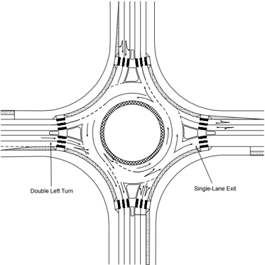
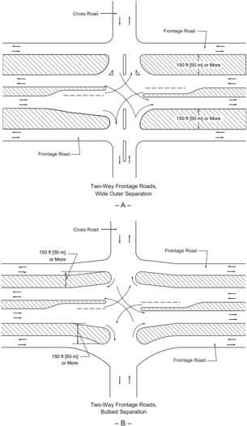
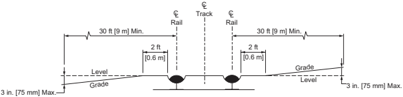
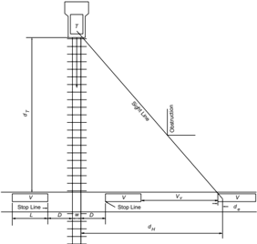
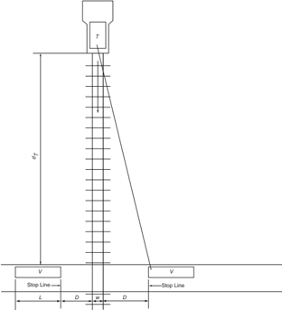

# 9.1  INTRODUCTION: 9.10.1.1  Size and Space Needs & 24 more sections

- Source: GreenBook.pdf
- Generated: 2026-01-03T08:11:58+00:00
- Chunk: 25/28
- Estimated tokens: ~22,859
- Total pages: 1048
- Type: sections

## 9.10.1.1  Size and Space Needs

The key indicator of the space needed for a roundabout intersection is the inscribed circle diameter. Table 9-3 in Section 9.3.4 provides ranges of inscribed circle diameters that may be used for accessing the range of potential effects. When large vehicles need to be accommodated, the inscribed circles would be near the high end of the range provided.

The number of entering and circulating lanes affects the capacity of the roundabout and the size of the roundabout footprint. The capacity of a roundabout is dependent upon directional distribution of traffic and ratio of minor-street to total entering traffic. The closer to 0.50 each of these conditions are, the greater the capacity of the roundabout. The designer may select a design capacity of less than the actual capacity, usually a volume-to-capacity ratio between 0.85 and 1.00. A single circulating lane will normally accommodate 1,400 veh/h and may accommodate up to 2,400 veh/h. A two-lane circulating roadway will normally accommodate at least 2,200 veh/h and may accommodate up to 4,000 veh/h.

The capacity of each roundabout entry is calculated separately. The ability to enter a roundabout is generally driven by the amount of conflicting traffic (vehicles traveling along the circulatory roadway) that is present at each roundabout entry. A single-lane entry is likely to be sufficient when the sum of the entering and conflicting volumes is less than 1,000 veh/h and may be sufficient when the sum is 1,300 veh/h. A two-lane entry (and circulating roadway) is likely to be sufficient when the sum of the entering and conflicting volumes is less than 1,800 veh/h. A detailed capacity evaluation should be conducted to verify lane numbers and arrangements.

## 9.10.2  Fundamental Principles

The key to any roundabout design is achieving a set of fundamental design principles that includes speed reductions, lane alignments, and human factors needs. The goal of any roundabout design, regardless of category or location, should be to achieve these principles:

- y Provide slow entry speeds and consistent speeds through the roundabout by using deflection;
- y Provide the appropriate number of lanes and lane assignment to achieve adequate capacity, lane volume, and lane continuity;
- y Provide smooth channelization that is intuitive to drivers and results in vehicles naturally using the intended lanes;
- y Provide adequate accommodation for the design vehicles;
- y Design to meet the needs of pedestrians and cyclists; and
- y Provide appropriate sight distance and visibility.

Each element described above influences the operational efficiency and potential for crashes at roundabouts. Designers should balance competing needs and may need to adjust the design to appropriately serve all users. Favoring one component of the design may negatively affect another. A common example of such a tradeoff is accommodating large trucks while maintaining slow design speeds. Increasing the entry width or entry radius to better accommodate a large truck may simultaneously increase the speeds that vehicles can enter the roundabout. To both accommodate the design vehicles and maintain slow speeds, additional design modifications could be incorporated, such as offsetting the approach alignment to the left or increasing the inscribed diameter of the roundabout.

## 9.10.2.1  Slow Speeds Using Deflection

Achieving appropriate vehicular speeds entering and traveling through the roundabout is a key design objective as it may influence crash frequencies. A well-designed roundabout reduces vehicle speeds upon entry and achieves consistency in the relative speeds between the conflicting traffic streams because vehicles negotiate the roundabout along a curved path.

Careful attention to the design speed of a roundabout is fundamental to operation with low crash severity ( 46 ). Generally speaking, although the frequency of crashes is most directly tied to the volume, the severity of crashes is most directly tied to speed ( 40 ). Typical maximum entering speeds of 20 to 25 mph [30 to 40 km/h] are recommended at single-lane roundabouts. At multilane roundabouts, typical maximum entering speeds of 25 to 30 mph [40 to 50 km/h] are recommended ( 40, 46 ).

International studies have shown that reducing the vehicle path radius at the entry (i.e., deflecting the vehicle path) decreases the relative speed between entering and circulating vehicles and thus usually results in lowering entering-circulating vehicle crash rates. However, at multilane roundabouts, reducing the vehicle path radius can, if not well-designed, create greater side friction between adjacent streams of traffic and can result in more vehicles cutting across lanes and higher potential for sideswipe crashes ( 36 ).  Therefore, care should be taken in design so that drivers naturally maintain their lane.

In addition to achieving an appropriate design speed for the fastest movements, another important objective is to achieve consistent speeds for all movements. Along with overall reductions in speed, speed consistency can help minimize the number of crashes between conflicting streams of vehicles. This principle has two implications:

- y The relative speeds between consecutive geometric elements should be minimized; and
- y The relative speeds between conflicting traffic streams should be minimized.

## 9.10.2.2  Lane Balance and Lane Continuity

Roundabouts: An Informational Guide ( 41 )  provides methodologies for roundabout operational analysis including an assessment of the number of entry lanes needed to serve each of the roundabout approaches. For multilane roundabouts, care should be taken that the design also provides the appropriate number of lanes within the circulatory roadway and on each exit to provide lane continuity.

Figure  9-62  illustrates  a  two-lane  roundabout  where  the  needed  lane  configurations  on  the eastbound approach are a left-turn and a shared left-through-right turn lane. For this lane configuration, two receiving lanes are needed within the circulatory roadway. However, the exit for the through movement should be a single-lane for proper lane configurations. If a second exit lane was provided heading eastbound, the result would be overlapping vehicle paths between

exiting vehicles in the inside lane and left-turning vehicles that continue to circulate around in the outside lane.

The allowed  movements assigned  to  each  entering  lane  are  key  to  the  overall  design.  Basic pavement marking layouts should be considered integral to the preliminary design process so that lane continuity is being provided. In some cases, the geometry within the roundabout may be dictated by the number of lanes needed or the need to provide spiral transitions. Lane assignments should be clearly identified on all preliminary designs in an effort to retain the lane configuration information through the various design iterations.

In some cases, a roundabout designed to accommodate design year traffic volumes, typically projected 20 years from the present, can result in substantially more entering, exiting, and circulating lanes than needed in the earlier years of operation. Because the number of crashes may be higher with underutilized entering and circulating lanes, the designer may wish to consider a phased design solution. In this case, the first phase design would provide a single-lane entry to serve the near-term traffic volumes with the ability to easily expand the entries and circulatory roadway to accommodate future traffic volumes. To allow for expansion to the ultimate design at a later phase, the ultimate configuration of the roundabout needs to be considered in the initial phase.

Right-turn bypass lanes, also called slip lanes, can be implemented at roundabout intersections to increase the motor vehicle capacity. A bypass lane is a separate right-turn lane that lies adjacent to the roundabout and allows right-turning movements to bypass the roundabout. There are three configurations for the bypass lane: slip lane without an acceleration lane stop, slip lane without an acceleration lane yield, and slip lane with free-flow entry. In areas with bicycle and pedestrian activity, bypass lanes should be discouraged and should only be used where needed, since the entries and exits of bypass lanes can increase conflicts with pedestrians, bicyclists, and with merging on the downstream leg.

--',''','',',',','''''',,,,''-'-',,',,',',,'---

Figure 9-62. Roundabout Lane Configuration Example

## 9.10.2.3  Appropriate Natural Path Alignment

As two traffic streams approach the roundabout in adjacent lanes, vehicles will be guided by lane markings up to the entrance line. At the yield point, vehicles will continue along their natural trajectory into the circulating roadway. The speed and orientation of the vehicle at the entrance line determines its natural path. If the natural path of one lane interferes or overlaps with the natural path of the adjacent lane, the roundabout will not operate as efficiently. The geometry of the exits also affects the natural path that vehicles will travel. Overly small exit radii on multilane roundabouts may also result in overlapping vehicle paths on exit.

The fundamental principle related to natural vehicle path is that the entry design should align vehicles into the appropriate lane within the circulatory roadway. The design of exits should also provide appropriate alignment to allow drivers to intuitively maintain the appropriate lane. These alignment considerations often compete with the fastest path speed objectives; however, both of these fundamental principles should be achieved within the design process.

--',''','',',',','''''',,,,''-'-',,',,',',,'---

Vehicle path overlap occurs when the natural path through the roundabout of one traffic stream overlaps the path of another and is the consequence of an undesirable design. This can happen to varying degrees. It can reduce capacity, as vehicles will avoid using one or more of the entry lanes. It may also increase the potential for sideswipe and single-vehicle crashes. The most common type of path overlap is where vehicles in the left lane on entry are cut off by vehicles in the right lane, as shown in Figure 9-63. Several design techniques are available to mitigate potential vehicle path overlap ( 41 ).

Figure 9-63. Path Overlap at a Multilane Roundabout

## 9.10.2.4  Design Vehicle

Another important factor determining a roundabout's layout is the need to accommodate the largest vehicle likely to use the intersection with some frequency. The turning path of this design vehicle controls many of the roundabout's dimensions. Before beginning the design process, the designer should be conscious of the design vehicle and possess the appropriate turning templates or a CADD-based vehicle turning path program to determine the vehicle's swept path.

Because roundabouts are intentionally designed to slow traffic, narrow curb-to-curb widths and tight turning radii are typically used. However, if the widths and turning radii are designed too tight, difficulties for large vehicles may be created. Large trucks and buses often dictate many of the roundabout's dimensions, particularly for single-lane roundabouts. Therefore, it is very important to determine the design vehicle at the start of the design and investigative process.

The choice of a design vehicle will vary depending upon the approaching roadway types and the surrounding land use characteristics. Sections 2.8.1 and 2.8.2 present the dimensions and

turning paths for a variety of common roadway vehicles. Large vehicles such as the WB-67 [WB-20] design vehicle may need to be addressed at intersections of major arterial streets and roadways. Smaller design vehicles may be chosen at local street intersections. At a minimum, fire  engines, transit vehicles, and single-unit delivery vehicles should be considered in urban areas. In rural environments, farming or mining equipment may govern design vehicle needs. Where WB-67 [WB-20] trucks or even oversized vehicles, sometimes called superloads, need to  be  accommodated, special consideration for the size and tolerances of these vehicles may need to be provided in design and construction. Typical factors that may need to be considered include:

- y Modification to the truck apron and central island design.
- y Widened entry and exit lanes.
- y Inclusion of right-turn bypass lanes.
- y Use of gated pass-throughs or tapered center islands to support through movements.
- y Review of lane striping.
- y Installation of removable signs with setbacks for permanent fixtures (light poles).
- y Identification of maximum heights for splitter islands.
- y Identification of under-clearance for lowboy vehicles.
- y Consideration of truck stability with regards to mountable aprons, curbing and islands.

## 9.10.2.5  Nonmotorized Users

Like the motorized design vehicle, the design criteria of nonmotorized potential roundabout users (bicyclists, pedestrians, pedestrians with disabilities, etc.) should be considered when developing many of the geometric elements of a roundabout design.

For pedestrians, the key considerations at the initial design stages are to provide adequate pedestrian refuge width within the splitter island. The refuge area should be at least 6 ft [1.8 m] in width both so that is accessible to and usable by individuals with disabilities and to accommodate a typical bicycle. Pedestrian crossings are typically provided approximately one car length behind the yield line. Provision of a landscape buffer strip between the pedestrian path and the circulating roadway is needed to direct pedestrians, including individuals with a vision disability, to the pedestrian crossings on each leg of the roundabout and discourage pedestrians from crossing to the central island.

An important consideration at roundabouts is the accommodation of pedestrians with vision disabilities.  Pedestrians  with  vision  disabilities  rely  on  audible  information  or  cues  and  face several challenges at roundabouts. These challenges magnify the need to maintain slow vehicle speeds within the crosswalk area, to provide intuitive crosswalk alignments, to provide appropriate physical cues along the path, and to provide design elements that encourage drivers to yield to pedestrians in a predictable manner. For detailed guidance, refer to NCHRP Report

834, Crossing Solutions at Roundabouts and Channelized Turn Lanes from Pedestrians with Vision Disabilities: A Guidebook ( 42 ).

Bicycle lanes should not be provided through the roundabout and should be terminated upstream of the yield line. For a single-lane roundabout, bicycle users are encouraged to merge into the general travel lane and navigate the roundabout as a vehicle. The typical vehicle operating speed within the circulatory roadway is in the range of 20 to 25 mph [30 to 40 km/h], which not appreciably faster than that of a bicyclist. Additional care is needed at multilane roundabouts to mitigate conflicts for bicyclists.

## 9.10.2.6  Sight Distance and Visibility

Similar in application to other intersection forms, roundabouts need two types of sight distance to  be  considered:  (1)  stopping  sight  distance,  and  (2)  intersection  sight  distance.  The  design should  be  checked  to  provide  stopping  sight  distance  at  every  point  within  the  roundabout and on each entering and exiting approach such that the driver can react to objects within the roadway.

Intersection sight distance should also be verified for any roundabout design so that sufficient distance  is  available  for  drivers  to  perceive  and  react  to  the  presence  of  conflicting  vehicles. Intersection sight distance is measured for vehicles entering the roundabout and considers both conflicting vehicles along the circulatory roadway and entering from the immediate upstream entry.

In  general,  it  is  recommended  that  no  more  than  the  minimum  intersection  sight  distance should be provided on each approach. Excessive intersection sight distance can lead to higher vehicle speeds that may lead to increased crashes involving motorists, bicyclists, and pedestrians. Landscaping within the central island can be effective in restricting sight distance to the minimum needed while creating a 'terminal vista' on the approach to improve visibility of the central island.

## 9.11  OTHER INTERSECTION DESIGN CONSIDERATIONS

## 9.11.1  Intersection Design Elements with Frontage Roads

Frontage road cross-sectional elements, functional characteristics, and service value as collectors are discussed in Chapters 4, 6, and 7. This section discusses frontage road design elements with respect to the operational features where the frontage road intersects the major roadway. Frontage roads are generally needed adjacent to arterials or freeways where adjacent property owners are not permitted direct access to the major facility. Short lengths of frontage roads may be desirable along arterials in urban areas to preserve the capacity of the arterial through control of access. Much of the improvement in capacity may be offset by the added conflicts introduced

where the frontage road and arterial intersect the crossroad. Not only is there an increase in the number of conflicting movements, but the confusing pattern of roadways and separations can lead to wrong-way entry. Inevitably, where an arterial is flanked by frontage roads, the challenges of design and traffic control at intersections are far more complex than where the arterial consists of a single roadway. Where a minor road intersects an arterial with frontage roads on both sides, there are three closely spaced intersections to be designed. Even with a frontage road on only one side of an arterial, there are still two closely spaced intersections. Multiple intersections also make pedestrian movements more complex.

In lightly developed areas, such as through single-family residential neighborhoods, an intersection designed to fit minimum turning paths of passenger vehicles may operate satisfactorily. In heavily developed areas, however, particularly through commercial districts where frontage roads receive heavy use, an intersection designed with restricted geometrics will seldom operate satisfactorily unless certain traffic movements are prohibited. Separate signal indications can be used to relieve some of the conflicts between the various movements but only at the expense of delay to most of the traffic.

The preferred alternative to restricting turns is to design the intersection with expanded dimensions, particularly the width of outer separation. This design permits the intersections between the crossroad and frontage roads to be well removed from the crossroad intersection with the main lanes.

For satisfactory operation with moderate-to-heavy traffic volumes on the frontage roads, the outer separation should be 150 ft [50 m] or more in width at the intersection. The 150-ft [50-m] dimension is derived on the basis of the following considerations:

- y This dimension is the shortest acceptable length needed for placing signs and other traffic control devices to provide proper direction to traffic on the crossroad.
- y It usually affords acceptable storage space on the crossroad in advance of the main intersection to avoid blocking the frontage road.
- y It enables turning movements to be made from the main lanes onto frontage roads without seriously disrupting the orderly movement of traffic.
- y It facilitates U-turns between the main lanes and two-way frontage roads. (Such a maneuver is geometrically possible with a somewhat narrower separation but is extremely difficult with commercial vehicles.)
- y It alleviates the potential of wrong-way entry onto through lanes of the predominant roadway.

However, wider separations can enhance operations significantly. Outer separations of 300 ft [100 m] allow for overlapping left-turn lanes and provide a minimal amount of vehicle storage. The design year traffic volumes, turning movements, signal phasing, and storage needs should determine the ultimate outer separation distance.

--',''','',',',','''''',,,,''-'-',,',,',',,'---

Narrower separations are acceptable where frontage-road traffic is very light, where the frontage road operates one-way only, or where some movements can be prohibited. Turning movements that are affected most by the width of outer separation are (1) left turns from the frontage road onto the crossroad, (2) U-turns from the through lanes of the predominant roadway onto a two-way frontage road, and (3) right turns from the through lanes of the predominant roadway onto the crossroad. By imposing the restrictions, as may be appropriate on some or all of these movements, outer separations as narrow as 8 ft [2.4 m] may operate satisfactorily. With such narrow separations, caution should be exercised in assessing the risk of wrong-way entry onto the through lanes.

Except for the width of the outer separation, the design elements for intersections involving frontage roads are much the same as those for conventional intersections. Figure 9-64 shows two arrangements of highways with frontage roads intersecting cross streets. Turning movements are shown on the assumption that frontage road volumes are very light and that all movements will be under traffic signal control.

As illustrated, deceleration or storage lanes may be provided for the right-turn movements adjacent to the through roadway. Because traffic turning right crosses the path of traffic on the frontage road, the need for such storage lanes is usually greater in this case than in the case of conventional intersections. Storage and auxiliary lanes are clearly delineated by pavement markings. Contrasting surfaces are also desirable.

Figure 9-64A shows a simple intersection design with an outer separation of 150 ft [50 m] or more in width. The intersections of the two-way frontage roads and the crossroad are sufficiently removed from the through roadways that they might operate as separate intersections. The major elements in the design of the outer intersections are adequate width, adequate radii for right turns, and divisional islands on the crossroad.

Figure 9-64B shows a design that would be adaptable for two-way frontage roads in areas where right-of-way considerations would preclude the design shown in Figure 9-64A. With narrow outer separations between intersections, a bulb treatment of the outer separations, as shown, formed by a reverse-curve alignment of the frontage road on each side of the crossroad is needed to widen the outer separation to a desirable width at the crossroad. The length of the reverse curve is a matter of frontage road design, governed by design speeds and right-of-way controls. The widths of the outer separation bulbs should be based on the pattern and volumes of traffic, but the right-of-way controls may also govern because additional area is needed at the intersection. The width of outer separation at the crossroad opening should be at least 60 ft [8 m], which might be acceptable for light-to-moderate frontage road traffic, but preferably it should be 150 ft [50 m] or more. A width of 32 ft [9.6 m] for the outer separation is the minimum that will permit a U-turn by a passenger car from the through lanes onto the frontage road. Widths of 74 ft [22 m] or more are needed for trucks and buses. Where such movements are likely to occur frequently, the width of separations should be considerably greater, desirably 150 ft [50 m] or more.

--',''','',',',','''''',,,,''-'-',,',,',',,'---

Figure 9-64. Intersections with Frontage Roads

--',''','',',',','''''',,,,''-'-',,',,',',,'---

## 9.11.2  Traffic Control Devices

Traffic control devices are used to regulate, warn, and guide traffic and are a primary determinant in the efficient operation of intersections. It is essential that intersection design be accomplished simultaneously with the development of signal, signing, and pavement marking plans so that sufficient space is provided for proper installation of traffic control devices. Geometric design should not be considered complete nor should it be implemented until it has been determined that needed traffic devices will have the desired effect in controlling traffic.

Most of the intersection types illustrated and described in this chapter are adaptable to either signing control, signal control, or a combination of both. At intersections that do not need signal control, the normal roadway widths of the approach roadways are carried through the intersection with the possible addition of median lanes, auxiliary lanes, or pavement tapers. Where volumes are sufficient to indicate signal control, the number of lanes for through movements may also need to be increased. Where the volume approaches the uninterrupted flow capacity of the intersection leg, the number of lanes in each direction may have to be doubled at the intersection to accommodate the volume under stop-and-go control. Other geometric features that may be affected by signalization are length and width of storage areas, location and position of turning roadways, spacing of other subsidiary intersections, access connections, and the possible location and size of islands to accommodate signal posts or supports.

At high-volume intersections at grade, the design of the signals should be sophisticated enough to  respond  to  the  varying  traffic  demands,  the  objective  being  to  keep  the  vehicles  moving through the intersection. Factors affecting capacity and computation procedures for signalized intersections are covered in the HCM ( 49 ).

An intersection that needs traffic signal control is best designed by considering jointly the geometric  design,  capacity  analysis,  design  hour  volumes,  and  physical  controls.  Details  on  the design and location of most forms of traffic control signals, including the general warrants, are given in the MUTCD ( 9 ).

The number and arrangement of lanes, including the need for bicycle facilities, are crucial to successful operation of signalized intersections. The crossing distances for both vehicles and pedestrians should normally be kept as short as practical to reduce exposure to conflicting movements. Therefore, the first step in the development of intersection geometrics should be a complete analysis of current and future traffic demand, including pedestrian, bicycle, and transit users. The need to provide right- and left-turn lanes to minimize the interference of turning traffic with the movement of through traffic should be evaluated concurrently with the potential for obtaining any additional right-of-way needed. Along a roadway or street with a number of signalized intersections, the locations where turns will or will not be accommodated should also be examined to facilitate optimal traffic signal coordination.

## 9.11.3  Bicyclists

Where bicycle facilities enter an intersection, the design of the intersection should incorporate the bicycle facility. Intersection features compatible with bicycle facilities include: special sight distance considerations, wider roadways to accommodate on-street lanes, special lane markings to channelize and separate bicycles from right-turning vehicles, provisions for left-turn bicycle movements, or special traffic signal designs (such as bicycle detection at actuated signals or separate signal indications for bicyclists). Further guidance in providing for bicycles at intersections can be found in the AASHTO Guide for the Development of Bicycle Facilities ( 3 ) and the FHWA Separated Bike Lane Planning and Design Guide ( 13 ).

## 9.11.4  Pedestrians

Pedestrian facilities include sidewalks, crosswalks, traffic control features, and curb ramps for persons with disabilities that are also useful for people with baby strollers, wagons, carts, and luggage. Both marked and unmarked crosswalks should be considered in intersection design. Where sidewalks are present, the projected line of the sidewalk across an intersecting street constitutes a crosswalk, even where no crosswalk markings are present. When designing a project that involves curbs and adjacent sidewalks to accommodate pedestrian traffic, proper attention should be given to location and design of ramps and traffic control devices to accommodate the needs of persons with a variety of disabilities, such as mobility, vision, hearing, and cognitive disabilities.  Related design criteria and illustrations are given in Section 4.17. Pedestrian facilities must be designed so that they are accessible to and usable by individuals with disabilities 52 , 53 ). Further guidance in providing for pedestrians at intersections can be found in the AASHTO Guide for the Planning, Design, and Operation of Pedestrian Facilities ( 1 ) and Proposed Guidelines for Pedestrian Facilities in the Public Right-of-Way ( 50 ).

## 9.11.5  Lighting

Lighting may reduce crashes at roadway and street intersections, as well as increase the efficiency of traffic operations. Statistics indicate that the nighttime crash rates are higher than that during daylight hours. This fact, to a large degree, may be attributed to impaired visibility. In urban and suburban areas where there are concentrations of pedestrians and roadside and intersectional interferences, fixed-source lighting tends to reduce crashes. Whether or not intersections in the rural context should be lighted depends on the planned geometrics and the turning volumes involved. Intersections that are not channelized are seldom lighted. However, for the benefit of nonlocal roadway users, lighting at intersections in the rural context is desirable to aid the driver in ascertaining sign messages during non-daylight periods.

Intersections with channelization, including roundabouts, should include lighting. Large channelized intersections especially need illumination because of the higher range of turning radii that are not within the lateral range of vehicular headlight beams. Vehicles approaching the

intersection should also reduce speed. The indication of this need should be definite and visible at a distance from the intersection that may be beyond the range of headlights. Illumination of intersections with fixed-source lighting accomplishes this need. Each gore area should be illuminated to help drivers make decisions at diverge locations and to be able to see the location for diverge movements in advance of headlight range.

The location of intersection luminaire supports should be considered in the roadside design. Additional discussions and design guidance can be found in NCHRP Report 152 ( 55 ) and the AASHTO Roadside Design Guide ( 2 ).

## 9.11.6  Driveways

The function of driveways is similar to that of public intersections. Driveways should be designed consistent with their intended use. It is desirable that they be designed and located to meet criteria for intersection sight distance and other design elements set forth in this chapter. However, where this  is  not  practical,  they  should  be  located  to  provide  the  best  reasonable sight distance and meet other design criteria to the extent practicable considering such factors as functional class, speed, and traffic volume of the roadway relative to the volume and type of vehicles using the driveway, as well as accessibility requirements for sidewalks that cross driveways. For further discussion of driveways, refer to Section 4.15.2.

Ideally, driveways should not be located within the functional area of an intersection or in the influence area of an adjacent driveway. The functional area extends both upstream and downstream from the physical intersection area and includes the longitudinal limits of auxiliary lanes. The influence area associated with a driveway includes (1) the impact length (the distance back from a driveway where cars begin to slow for the driveway), (2) the perception-reaction distance, and (3) the car length.

Access to driveways introduces conflicts and friction into the traffic stream as vehicles enter and leave the roadway. When gaps are short and drivers have little opportunity to reduce a gap as a preceding vehicle begins to slow for a turn, drivers traveling through need to begin braking a considerable distance in advance of the vehicle turning at the driveway. Where driveways are closely spaced, drivers need to monitor more than one access connection at a time. Separating the access connections simplifies the driver workload and reduces the risk for collisions. The TRB Access Management Manual ( 48 ) describes several considerations in selecting desired spacing for driveway access connections. One method to determine spacing between driveways that addresses several considerations is to provide a distance equivalent to the stopping sight distance for the roadway speed between driveways. For high-speed roadways, deceleration lanes may be provided for vehicles turning right, where practical, to reduce the amount of speed reduction that  takes  place  within  the  through  lanes.  For  low-speed  roadways  where  frequent  access  is provided to individual lots fronting on the roadway, desirable spacing may be achieved to the extent practicable by minimizing the number of driveways to each parcel, by providing a com-

--',''','',',',','''''',,,,''-'-',,',,',',,'---

bined driveway to serve multiple parcels, or by providing access from an access road, side street, or back street. When access points are signalized, their location should fit in the time-space pattern of adjacent major intersections to the maximum extent practical.

An objective of driveway design is to seek a balance that minimizes conflicts among motor vehicles, bicycles, and pedestrians and accommodates the demands for travel and access. NCHRP Report 659 ( 17 ) provides guidelines for use in the design of various driveway elements including grade, entry geometry, width, channelization, and cross slope.

The regulation and design of driveways are intimately linked with the type of road and zoning of the roadside. On new roadways, right-of-way can be obtained to provide the desired degree of driveway regulation and control. In some cases, additional right-of-way can be acquired with the reconstruction of an existing roadway or agreements can be made to improve existing undesirable  access  conditions.  Often  the  desired  degree  of  driveway  control  should  be  effected through the use of police powers to require permits for all new driveways, through adjustments of existing driveways, or through access-management regulations.

The main objectives of driveway regulation are to provide desirable spacing of driveways, to provide desirable corner clearance from intersections, and to provide a proper internal layout. Achieving these objectives depends on the type and extent of legislative authority granted the roadway agency. Many states and cities have developed policies for driveways and have separate units to handle the design details that are incidental to checking requests and issuing permits for new driveways or requested changes to existing driveway connections. Major controls and design features are discussed in NCHRP Report 659 ( 17 ), ITE's Guidelines for Driveway Design and Location ( 26 ), and the HCM ( 49 ).

## 9.11.7  Left Turns at Midblock Locations and at Unsignalized Intersections on Streets with Flush Medians

Reconstructing  existing  streets  and  roadways  to  provide  raised  medians  may  be  difficult  to accomplish  while  providing  access  to  abutting  property,  especially  where  such  access  is  by commercial vehicles. In commercial and industrial areas where property values are high, rightsof-way for wide medians often are difficult to acquire. Under such conditions, paved flush or traversable-type medians 10 to 16 ft [3.0 to 4.8 m] wide may be the optimum type of design for left-turning vehicles.

Figure 9-65 illustrates left-turn treatments between major cross streets, including treatment of left-turns at unsignalized intersections.

Multilane Highway with Flush or  Traversable Lane at Midblock

Figure 9-65-Arterial with Flush or Traversable Median Turn Lanes

In general, two-way left-turn lanes should be used only in an urban area where operating speeds are relatively low and where there are no more than two through lanes in each direction. The operational characteristics of two-way left-turn lanes with more than two through lanes in each direction is the subject of ongoing research, and caution is recommended at this time when considering more than a five-lane cross section. This subject is discussed in Section 4.11, 'Medians,' and in the MUTCD ( 9 ). Additional research is available on the effects of midblock left turns ( 4 ).

## 9.12  RAILROAD-HIGHWAY GRADE CROSSINGS

A railroad-highway grade crossing, like any other type of intersection, involves either a separation of grades or a crossing at-grade. The geometrics of a roadway and structure that involves the overcrossing or undercrossing of a railroad are substantially the same as those for a roadway grade separation without ramps.

The  horizontal  and  vertical  geometrics  of  a  roadway  approaching  a  railroad  grade  crossing should be constructed in a manner that facilitates drivers' attention to roadway conditions.

## 9.12.1  Horizontal Alignment

If practical, the roadway should intersect the tracks at a right angle with no nearby intersections or driveways. This layout enhances the driver's view of the crossing and tracks, reduces conflicting vehicular movements from crossroads and driveways, and is preferred for bicyclists and pedestrians. Highly skewed railroad-highway crossings can cause wheels of bicycles to get caught in the gap between the rail and pavement. To the extent practical, crossings should not be located on either roadway or railroad curves. Roadway curvature inhibits a driver's view of

a crossing ahead, and a driver's attention may be directed toward negotiating the curve rather than looking for a train. Railroad curvature may inhibit a driver's view down the tracks from both a stopped position at the crossing and on the approach to the crossing. Those crossings that are located on both roadway and railroad curves present maintenance challenges and poor rideability for roadway traffic due to conflicting superelevations.

Where roadways  that  are  parallel  with  main  tracks  intersect  roadways  that  cross  the  main tracks, there should be sufficient distance between the tracks and the roadway intersections to enable roadway traffic in all directions to move expeditiously. Where physically restricted areas make it impractical to obtain adequate storage distance between the main track and a roadway intersection, the following should be considered:

- y Interconnection of the roadway traffic signals with the grade crossing signals to enable vehicles to clear the grade crossing when a train approaches
- y Placement of a 'Do Not Stop on Track' sign on the roadway approach to the grade crossing

## 9.12.2  Vertical Alignment

It is desirable from the standpoint of sight distance, rideability, braking, and acceleration distances that the intersection of roadway and railroad be made as level as practical. Vertical curves should be of sufficient length to provide an adequate view of the crossing.

In some instances, the roadway vertical alignment may not meet acceptable geometrics for a given  design  speed  because  of  restrictive  topography  or  limitations  of  right-of-way.  To  prevent drivers of low-clearance vehicles from becoming caught on the tracks, the crossing surface should be at the same plane as the top of the rails for a distance of 2 ft [0.6 m] outside the rails. The surface of the roadway should also not be more than 3 in. [75 mm] higher or lower than the top of nearest rail at a point 30 ft [9 m] from the rail unless track superelevation makes a different level appropriate, as shown in Figure 9-66. Vertical curves should be used to traverse from the roadway grade to a level plane at the elevation of the rails. Rails that are superelevated, or a roadway approach section that is not level, need a site-specific analysis for rail clearances.

Figure 9-66. Railroad-Highway Grade Crossing

## 9.12.3  Crossing Design

The geometric design of railroad-highway grade crossings should be made jointly when determining the warning devices to be used. When only passive warning devices such as signs and pavement markings are used, the roadway drivers are warned of the crossing location but need to determine for themselves whether or not there are train movements for which they should stop. On the other hand, when active warning devices such as flashing light signals or automatic gates are used, the driver is given a positive indication of the presence or the approach of a train at the crossing. A large number of significant variables should be considered in determining the type of warning device to be installed at a railroad grade crossing. For certain low-volume roadway crossings where adequate sight distance is not available, additional signing may be needed.

Traffic control devices for railroad-highway grade crossings consist primarily of signs, pavement markings, flashing light signals, and automatic gates. Criteria for design, placement, installment, and operation of these devices are covered in the MUTCD ( 9 ), as well as the use of various passive warning devices. Some of the considerations for evaluating the need for active warning devices at a grade crossing include the type of roadway, volume of vehicular traffic, volume of railroad traffic, maximum speed of the railroad trains, permissible speed of vehicular traffic, volume of pedestrian traffic, crash history, sight distance, and geometrics of the crossing. The potential for complete elimination of grade crossings without active traffic control devices (e.g., closing lightly used crossings and installing active devices at other more heavily used crossings) should be given prime consideration.

These guidelines are not all inclusive. Situations not covered by these guidelines should be evaluated using good engineering judgment. Additional information on railroad-highway grade crossings can be found in the following sources:

- y Railroad-Highway Grade Crossing Handbook ( 6 ),
- y Railroad-Highway Grade Crossing Surfaces ( 24 ),
- y Sight Distance and Approach Speed ( 31 ),
- y Traffic Control and Roadway Elements-Their Relationship to Highway Safety ( 38 ),
- y NCHRP Report 288 ( 45 ), and
- y Traffic Control Devices and Rail-Highway Crossings ( 47 ).

Numerous index formulas have been developed to assess the relative conflict potential at railroadhighway grade crossings on the basis of various combinations of its characteristics. Although no single formula has universal acceptance, each has its own values in establishing an index; when used with sound engineering judgment, each formula provides a basis for a selection of the type of warning devices to be installed at a given crossing.

The geometric design of a railroad-highway grade crossing involves the elements of alignment, profile, sight distance, and cross section. The appropriate design may vary with the type of warning device used. Where signs and pavement markings are the only means of warning, the roadway should cross the railroad at or nearly at right angles. Even when flashing lights or automatic gates are used, small intersection angles should be avoided. Regardless of the type of control, the roadway gradient should be flat at and adjacent to the railroad crossing to permit vehicles to stop, when necessary, and then proceed across the tracks without difficulty.

## 9.12.4  Sight Distance

Sight distance is a primary consideration at crossings without train-activated warning devices. A complete discussion of sight distance at grade crossings can be found in Railroad-Highway Grade Crossing Surfaces ( 24 ) and NCHRP Report 288 ( 45 ).

As in the case of a roadway intersection, there are several events that can occur at a railroadhighway grade intersection without train-activated warning devices. Two of these events related to determining the sight distance are:

- y The vehicle operator can observe the approaching train in a sight line that will allow the vehicle to pass through the grade crossing prior to the train's arrival at the crossing.
- y The vehicle operator can observe the approaching train in a sight line that will permit the vehicle to be brought to a stop prior to encroachment in the crossing area.

Both of these maneuvers are shown as Case A illustrated in Figure 9-67. The sight triangle consists of the two major legs (i.e., the sight distance, d H , along the roadway and the sight distance, d T , along the railroad tracks). Values of the sight distances for various speeds of the vehicle and the train are developed from two basic equations:

--',''','',',',','''''',,,,''-'-',,',,',',,'---

| U.S. Customary                                                                                                                                                                                                                                | Metric                                                                                                                                                                                                                                       |
|-----------------------------------------------------------------------------------------------------------------------------------------------------------------------------------------------------------------------------------------------|----------------------------------------------------------------------------------------------------------------------------------------------------------------------------------------------------------------------------------------------|
|                                                                                                                                                                                                                                               | (9-5)                                                                                                                                                                                                                                        |
| where:                                                                                                                                                                                                                                        | where:                                                                                                                                                                                                                                       |
| A = constant = 1.47                                                                                                                                                                                                                           | A = constant = 0.278                                                                                                                                                                                                                         |
| d H = sight-distance leg along the highway allows a vehicle proceeding to speed V v to cross tracks even though a train is observed at a distance d T from the crossing or to stop the vehicle without encroachment of the crossing area (ft) | d H = sight-distance leg along the roadway allows a vehicle proceeding to speed V v to cross tracks even though a train is observed at a distance d T from the crossing or to stop the vehicle without encroachment of the crossing area (m) |
| d T = sight-distance leg along the railroad tracks to permit the maneuvers de- scribed as for d (ft)                                                                                                                                          | d T = sight-distance leg along the railroad tracks to permit the maneuvers de- scribed as for d H (m)                                                                                                                                        |
| V v = speed of the vehicle (mph)                                                                                                                                                                                                              | V v = speed of the vehicle (km/h)                                                                                                                                                                                                            |
| V T = speed of the train (mph)                                                                                                                                                                                                                | V T = speed of the train (km/h)                                                                                                                                                                                                              |
| t = perception/reaction time, which is as- sumed to be 2.5 s (This is the same value used in Section 3.1 to determine the stopping sight distance.)                                                                                           | t = perception/reaction time, which is as- sumed to be 2.5 s (This is the same value used in Section 3.1 to determine the stopping sight distance.)                                                                                          |
| a = driver deceleration, which is assumed to be 11.2 ft/s 2 (This is the same value used in Section 3.1 to determine stopping sight distance.)                                                                                                | a = driver deceleration, which is assumed to be 3.4 m/s 2 (This is the same value used in Section 3.1 to determine stopping sight distance.)                                                                                                 |
| D = distance from the stop line or front of the vehicle to the nearest rail, which is assumed to be 15 ft                                                                                                                                     | D = distance from the stop line or front of the vehicle to the nearest rail, which is assumed to be 4.5m                                                                                                                                     |
| d e = distance from the driver to the front of the vehicle, which is assumed to be 8 ft                                                                                                                                                       | d e = distance from the driver to the front of the vehicle, which is assumed to be 2.4m                                                                                                                                                      |
| L = length of vehicle, which is assumed to be 73.5 ft                                                                                                                                                                                         | L = length of vehicle, which is assumed to be 22.4m                                                                                                                                                                                          |
| W = distance between outer rails (for a single track, this value is 5 ft)                                                                                                                                                                     | W = distance between outer rails (for a single track, this value is 1.5 m)                                                                                                                                                                   |

Note: Adjustments should be made for skewed crossings and roadway grades that are other than flat.

Figure 9-67. Case A: Moving Vehicle to Cross or Stop at Railroad Crossing

The values for Case B illustrated in Figure 9-68 represent departure sight distance for a range of train speeds. When a vehicle has stopped at a railroad crossing, the next maneuver is to depart from the stopped position. The vehicle operator should have sufficient sight distance along the tracks to accelerate the vehicle and clear the crossing prior to the arrival of a train, even if the train comes into view just as the vehicle starts, as shown in Figure 9-68. These values are obtained from the equation:

--',''','',',',','''''',,,,''-'-',,',,',',,'---

## U.S. Customary

where:

d T =    sight distance leg along the railroad tracks for the departure maneuver (ft)

A =    constant = 1.47

d T =    sight distance leg along railroad tracks to permit the maneuvers described as for d H (ft)

V T =    speed of train (mph)

V G =    maximum speed of vehicle in first gear, which is assumed to be 8.8 ft/s

- a 1 =    acceleration of vehicle in first gear, which is assumed to be 1.47 ft/s 2
- L =    length of vehicle, which is assumed to be 73.5 ft
- D =    distance from stop line to nearest rail, which is assumed to be 15 ft
- J =    sum of perception and time to activate clutch or automatic shift, which is assumed to be 2.0 s
- W =    distance between outer rails for a single track, this value is 5 ft

where:

d a =    distance vehicle travels while accelerating to maximum speed in first gear (ft)

where:

d T =    sight distance leg along the railroad tracks for the departure maneuver (m)

A =    constant = 0.278

d T =    sight distance leg along railroad tracks to permit the maneuvers described as for d H (m)

V T =    speed of train (km/h)

V G =    maximum speed of vehicle in first gear, which is assumed to be 2.7 m/s

- a 1 =    acceleration of vehicle in first gear, which is assumed to be 0.45 m/s 2
- L =    length of vehicle, which is assumed to be 22.4 m
- D =    distance from stop line to nearest rail, which is assumed to be 4.5 m
- J =    sum of perception and time to activate clutch or automatic shift, which is assumed to be 2.0 s
- W =    distance between outer rails for a single track, this value is 1.5 m

where:

- d a =    distance vehicle travels while accelerating to maximum speed in first gear (m)

Note: Adjustments should be made for skewed crossings and for roadway grades other than flat.

## Metric

<!-- formula-not-decoded -->

Figure 9-68. Case B: Departure of Vehicle from Stopped Position to Cross Single Railroad Track

Table 9-29 indicates the values of the sight distances for various speeds of the vehicle and the train for Case A as determined by Equation 9-5 and the departure sight distance for a range of train speeds for Case B as determined by Equation 9-6. Sight distances of the order shown in Table 9-29 are desirable at any railroad grade crossing not controlled by active warning devices. Their attainment, however, is difficult and often impractical, except in flat, open terrain.

Table 9-29. Design Sight Distance for Combination of Motor Vehicle and Train Speeds; 73.5-ft [22.4-m] Truck Crossing a Single Set of Tracks at 90 Degrees

| U.S. Customary    | U.S. Customary                  | U.S. Customary                                  | U.S. Customary                                  | U.S. Customary                                  | U.S. Customary                                  | U.S. Customary                                  | U.S. Customary                                  | U.S. Customary                                  | U.S. Customary                                  |
|-------------------|---------------------------------|-------------------------------------------------|-------------------------------------------------|-------------------------------------------------|-------------------------------------------------|-------------------------------------------------|-------------------------------------------------|-------------------------------------------------|-------------------------------------------------|
| Train Speed (mph) | Case B Departure from Stop (ft) | Case A Moving Vehicle                           | Case A Moving Vehicle                           | Case A Moving Vehicle                           | Case A Moving Vehicle                           | Case A Moving Vehicle                           | Case A Moving Vehicle                           | Case A Moving Vehicle                           | Case A Moving Vehicle                           |
|                   |                                 | Vehicle Speed (mph)                             | Vehicle Speed (mph)                             | Vehicle Speed (mph)                             | Vehicle Speed (mph)                             | Vehicle Speed (mph)                             | Vehicle Speed (mph)                             | Vehicle Speed (mph)                             | Vehicle Speed (mph)                             |
|                   | 0                               | 10                                              | 20                                              | 30                                              | 40                                              | 50                                              | 60                                              | 70                                              | 80                                              |
|                   |                                 | Distance along railroad from crossing, d T (ft) | Distance along railroad from crossing, d T (ft) | Distance along railroad from crossing, d T (ft) | Distance along railroad from crossing, d T (ft) | Distance along railroad from crossing, d T (ft) | Distance along railroad from crossing, d T (ft) | Distance along railroad from crossing, d T (ft) | Distance along railroad from crossing, d T (ft) |
| 10                | 255                             | 155                                             | 110                                             | 102                                             | 102                                             | 106                                             | 112                                             | 119                                             | 127                                             |
| 20                | 509                             | 310                                             | 220                                             | 203                                             | 205                                             | 213                                             | 225                                             | 239                                             | 254                                             |
| 30                | 794                             | 465                                             | 331                                             | 305                                             | 307                                             | 319                                             | 337                                             | 358                                             | 381                                             |
| 40                | 1019                            | 619                                             | 441                                             | 407                                             | 409                                             | 426                                             | 450                                             | 478                                             | 508                                             |
| 50                | 1273                            | 774                                             | 551                                             | 509                                             | 511                                             | 532                                             | 562                                             | 597                                             | 635                                             |
| 60                | 1528                            | 929                                             | 661                                             | 610                                             | 614                                             | 639                                             | 675                                             | 717                                             | 763                                             |
| 70                | 1783                            | 1084                                            | 771                                             | 712                                             | 716                                             | 745                                             | 787                                             | 836                                             | 890                                             |
| 80                | 2037                            | 1239                                            | 882                                             | 814                                             | 818                                             | 852                                             | 899                                             | 956                                             | 1017                                            |
| 90                | 2292                            | 1394                                            | 992                                             | 915                                             | 920                                             | 958                                             | 1012                                            | 1075                                            | 1144                                            |
|                   |                                 | Distance along roadway from Crossing, d H (ft)  | Distance along roadway from Crossing, d H (ft)  | Distance along roadway from Crossing, d H (ft)  | Distance along roadway from Crossing, d H (ft)  | Distance along roadway from Crossing, d H (ft)  | Distance along roadway from Crossing, d H (ft)  | Distance along roadway from Crossing, d H (ft)  | Distance along roadway from Crossing, d H (ft)  |
|                   |                                 | 69                                              | 135                                             | 220                                             | 324                                             | 447                                             | 589                                             | 751                                             | 931                                             |

| Metric             | Metric                         | Metric                                         | Metric                                         | Metric                                         | Metric                                         | Metric                                         | Metric                                         | Metric                                         | Metric                                         | Metric                                         | Metric                                         | Metric                                         | Metric                                         | Metric                                         |
|--------------------|--------------------------------|------------------------------------------------|------------------------------------------------|------------------------------------------------|------------------------------------------------|------------------------------------------------|------------------------------------------------|------------------------------------------------|------------------------------------------------|------------------------------------------------|------------------------------------------------|------------------------------------------------|------------------------------------------------|------------------------------------------------|
| Train Speed (km/h) | Case B Departure from Stop (m) | Case A Moving Vehicle Vehicle Speed (km/h)     | Case A Moving Vehicle Vehicle Speed (km/h)     | Case A Moving Vehicle Vehicle Speed (km/h)     | Case A Moving Vehicle Vehicle Speed (km/h)     | Case A Moving Vehicle Vehicle Speed (km/h)     | Case A Moving Vehicle Vehicle Speed (km/h)     | Case A Moving Vehicle Vehicle Speed (km/h)     | Case A Moving Vehicle Vehicle Speed (km/h)     | Case A Moving Vehicle Vehicle Speed (km/h)     | Case A Moving Vehicle Vehicle Speed (km/h)     | Case A Moving Vehicle Vehicle Speed (km/h)     | Case A Moving Vehicle Vehicle Speed (km/h)     | Case A Moving Vehicle Vehicle Speed (km/h)     |
|                    | 0                              | 10                                             | 20                                             | 30                                             | 40                                             | 50                                             | 60                                             | 70                                             | 80                                             | 90                                             | 100                                            | 110                                            | 120                                            | 130                                            |
|                    |                                | Distance along railroad from crossing, d T (m) | Distance along railroad from crossing, d T (m) | Distance along railroad from crossing, d T (m) | Distance along railroad from crossing, d T (m) | Distance along railroad from crossing, d T (m) | Distance along railroad from crossing, d T (m) | Distance along railroad from crossing, d T (m) | Distance along railroad from crossing, d T (m) | Distance along railroad from crossing, d T (m) | Distance along railroad from crossing, d T (m) | Distance along railroad from crossing, d T (m) | Distance along railroad from crossing, d T (m) | Distance along railroad from crossing, d T (m) |
| 20                 | 96                             | 82                                             | 51                                             | 43                                             | 40                                             | 39                                             | 39                                             | 39                                             | 40                                             | 42                                             | 43                                             | 45                                             | 47                                             | 49                                             |
| 40                 | 191                            | 164                                            | 103                                            | 85                                             | 79                                             | 77                                             | 77                                             | 79                                             | 81                                             | 84                                             | 87                                             | 90                                             | 94                                             | 98                                             |
| 60                 | 287                            | 246                                            | 154                                            | 128                                            | 119                                            | 116                                            | 116                                            | 118                                            | 121                                            | 126                                            | 130                                            | 135                                            | 141                                            | 146                                            |
| 80                 | 382                            | 328                                            | 206                                            | 171                                            | 158                                            | 154                                            | 155                                            | 157                                            | 162                                            | 167                                            | 174                                            | 180                                            | 188                                            | 195                                            |
| 100                | 478                            | 410                                            | 257                                            | 214                                            | 198                                            | 193                                            | 193                                            | 197                                            | 202                                            | 209                                            | 217                                            | 226                                            | 235                                            | 244                                            |
| 120                | 573                            | 492                                            | 308                                            | 256                                            | 237                                            | 231                                            | 232                                            | 236                                            | 243                                            | 251                                            | 261                                            | 271                                            | 281                                            | 293                                            |
| 140                | 669                            | 574                                            | 360                                            | 299                                            | 277                                            | 270                                            | 270                                            | 276                                            | 283                                            | 293                                            | 304                                            | 316                                            | 328                                            | 341                                            |
|                    |                                | Distance along roadway from Crossing, d H (m)  | Distance along roadway from Crossing, d H (m)  | Distance along roadway from Crossing, d H (m)  | Distance along roadway from Crossing, d H (m)  | Distance along roadway from Crossing, d H (m)  | Distance along roadway from Crossing, d H (m)  | Distance along roadway from Crossing, d H (m)  | Distance along roadway from Crossing, d H (m)  | Distance along roadway from Crossing, d H (m)  | Distance along roadway from Crossing, d H (m)  | Distance along roadway from Crossing, d H (m)  | Distance along roadway from Crossing, d H (m)  | Distance along roadway from Crossing, d H (m)  |
|                    |                                | 15                                             | 25                                             | 38                                             | 53                                             | 70                                             | 90                                             | 112                                            | 136                                            | 162                                            | 191                                            | 222                                            | 255                                            | 291                                            |

In other than flat terrain, it may be appropriate to rely on speed control signs and devices and to predicate sight distance on a reduced vehicle speed of operation. Where sight obstructions are present, it may be appropriate to install active traffic control devices that will bring all roadway traffic to a stop before crossing the tracks and will warn drivers automatically in time for an approaching train.

--',''','',',',','''''',,,,''-'-',,',,',',,'---

The driver of a stopped vehicle at a crossing should see enough of the railroad track to be able to cross it before a train reaches the crossing, even though the train may come into view immediately after the vehicle starts to cross. The length of the railroad track in view on each side of the crossing should be greater than the product of the train speed and the time needed for the stopped vehicle to start and cross the railroad. The sight distance along the railroad track may be determined in the same manner as it is for a stopped vehicle on a minor road to cross a major road, which is covered in Section 9.5. In order for vehicles to cross two tracks from a stopped position, with the front of the vehicle 15 ft [4.5 m] from the closest rail, sight distances along the railroad, in feet [meters], should be determined by the formula with a proper adjustment for the W value.

The roadway traveled way at a railroad crossing should be constructed for a suitable length with all-weather surfacing. A roadway section equivalent to the current or proposed cross section of the approach roadway should be carried across the crossing. The crossing surface itself should have a riding quality equivalent to that of the approach roadway. If the crossing surface is in poor condition, the driver's attention may be devoted to choosing the smoothest path over the crossing. This effort may well reduce the attention given to observance of the warning devices or even the approaching train. Information concerning various surface types that may be used can be found in Railroad-Highway Grade Crossing Surfaces ( 24 ).

## 9.13  REFERENCES

1. AASHTO. Guide  for  Planning,  Design,  and  Operation  of  Pedestrian  Facilities ,  Second Edition, GPF-1. American Association of State Highway and Transportation Officials, Washington, DC, 2004. Second edition pending.
2. AASHTO. Roadside Design Guide ,  Fourth Edition with 2015 Errata, RSDG-4. American Association of State Highway and Transportation Officials, Washington, DC, 2011.
3. AASHTO. Guide  for  the  Development  of  Bicycle  Facilities ,  Fourth  Edition  with  2017 Errata, GBF-4. American Association of State Highway and Transportation Officials, Washington, DC, 2012.
4. Bonneson, J. A. and P. T. McCoy. National Cooperative Highway Research Program Report 395: Capacity and Operational Effects of Midblock Left-Turn Lanes . NCHRP, Transportation  Research  Board,  National  Research  Council,  Washington,  DC,  1997. Available at

http://onlinepubs.trb.org/onlinepubs/nchrp/nchrp\_rpt\_395.pdf

5. Chandler, B.E., M.C. Myers, J.E. Atkinson, T.E. Bryer, R. Retting, J. Smithline, J. Trim, P. Wojtkiewicz, G.B. Thomas, S.P. Venglar, S. Sunkari, B.J. Malone, and P. Izadpanah.

Signalized Intersections Informational  Guide , FHWA-SA-13-027,  Federal  Highway Administration, U.S. Department of Transportation, Washington, DC, July 2013.

6. FHWA. Railroad-Highway  Grade  Crossing  Handbook ,  FHWA-TS-86-215.  Federal Highway  Administration,  U.S.  Department  of  Transportation,  Washington,  DC, September 1986.
7. FHWA. Access  Management,  Location  and  Design ,  National  Highway  Institute  Course No.  15255.  Federal  Highway  Administration,  U.S.  Department  of  Transportation, Washington, DC, June 1998.
8. FHWA. Highway Design Handbook for Older Drivers and Pedestrians. Federal Highway Administration, U.S. Department of Transportation, Washington DC, 2001.
9. FHWA. Manual  on  Uniform  Traffic  Control  Devices  for  Streets  and  Highways .  Federal Highway Administration, U.S. Department of Transportation, Washington, DC, 2009. Available at

http://mutcd.fhwa.dot.gov

10. FHWA.  Safety  Evaluation  of  Offset  Improvements  for  Left-Turn  Lanes,  FHWAHRT-09-036. Federal  Highway  Administration,  U.S.  Department  of  Transportation, Washington, DC, June 2009.
11. FHWA.  Median U-Turn Intersection, FHWA-HRT-09-057. Federal Highway Administration, U.S. Department of Transportation, Washington, DC, October 2009.
12. FHWA.  Restricted  Crossing  U-Turn  Intersection,  FHWA-HRT-09-060.  Federal Highway  Administration,  U.S.  Department  of  Transportation,  Washington,  DC, October 2009.
13. FHWA.  Separated  Bike  Lane  Planning  and  Design  Guide,  Report  No.  FHWAHEP-15-025.  Federal  Highway  Administration,  U.S.  Department  of  Transportation, Washington, DC, May 2015.
14. FHWA. Alternative Intersection Design website. Federal Highway Administration, U.S. Department of Transportation, Washington, DC. Available at

http://safety.fhwa.dot.gov/intersection/alter\_design/

15. Fitzpatrick, K., M. A. Brewer, W. L. Eisele, H. S. Levinson, J. S. Gluck, and M. R. Lorenz.  National  Cooperative  Highway  Research  Program  Report  745:  Left-Turn

- Accommodations  at  Unsignalized  Intersections.  NCHRP,  Transportation  Research Board, National Research Council, Washington, DC, 2013.
16. Fitzpatrick, K., M. A. Brewer, P. Dorothy, and E. S. Park, National Cooperative Highway Research  Program  Report  780:  Design  Guidelines  for  Intersection  Auxilliary  Lanes, NCHRP,  Transportation  Research  Board,  National  Research  Council,  Washington, DC, 2014.
17. Gattis, J.,  J.  S.  Gluck,  J.  M.  Barlow,  R.  W.  Eck,  W.  F.  Hecker,  and  H.  S.  Levinson. National Cooperative Highway Research Program Report 659: Guide for the Geometric Design of  Driveways .  NCHRP,  Transportation  Research  Board,  National  Research  Council, Washington, DC, 2010. Available at

http://www.trb.org/Publications/Blurbs/163868.aspx

18. Gluck, J., H. S. Levinson, and V. Stover. National Cooperative Highway Research Program Report 420: Impacts of Access Management Techniques . NCHRP, Transportation Research Board, National Research Council, Washington, DC, 1999. Available at

http://onlinepubs.trb.org/onlinepubs/nchrp/nchrp\_rpt\_420.pdf

19. Harmelink, M. D. Volume Warrants for Left-Turn Storage Lanes at Unsignalized Grade Intersections.  In Highway  Research  Record  211 .  Highway  Research  Board  (currently Transportation Research Board), National Research Council, Washington, DC, 1967.
20. Harwood, D. W., M. T. Pietrucha, M. D. Wooldridge, R. E. Brydia, and K. Fitzpatrick. National Cooperative Highway Research Program Report 375: Median Intersection Design . NCHRP,  Transportation  Research  Board,  National  Research  Council,  Washington, DC, 1995.
21. Harwood, D. W., J. M. Mason, R. E. Brydia, M. T. Pietrucha, and G. L. Gittings. National  Cooperative  Highway  Research  Program  Report  383:  Intersection  Sight  Distance . NCHRP,  Transportation  Research  Board,  National  Research  Council,  Washington, --',''','',',',','''''',,,,''-'-',,',,',',,'---
4. DC, 1996.
22. Harwood, D. W., K. M. Bauer, I. B. Potts, D. J. Torbic, K. R. Richard, E. R. Kohlman Rabbani, E. Hauer, L. Elefteriadou. Safety Effectiveness of Intersection Left- and RightTurn Lanes ,  Report  No.  FHWA-RD-02-089.  Federal  Highway  Administration,  U.S. Department of Transportation, Washington, DC, July 2002.
23. Harwood, D. W., D. J. Torbic, K. R. Richard, W. D. Glauz, and L. Elefteriadou. National Cooperative  Highway  Research  Program  Report  505:  Review  of  Truck  Characteristics  as

Factors in Roadway Design . NCHRP, Transportation Research Board, National Research Council, Washington, DC, 2003. Available at http://onlinepubs.trb.org/onlinepubs/nchrp/nchrp\_rpt\_505.pdf

24. Headley, W. J. Railroad-Highway Grade Crossing Surfaces .  Implementation Package 798. Federal Highway Administration, U.S. Department of Transportation, Washington, DC, August 1979.
25. Hughes,  W.  R.  Jaganathan,  D.  Sengupta,  and  J.  Hummer. Alternative  Intersections/ Interchanges:  Informational  Report  (AIIR) ,  Report  No.  FHWA-HRT-09-060.  Federal Highway Administration, U.S. Department of Transportation, Washington, DC, April 2010.
26. ITE. Guidelines for Driveway Design and Location . Institute of Transportation Engineers, Washington, DC, 1986.
27. Jagannathan,  R. Synthesis  of  the  Median  U-Turn  Intersection  Treatment,  Safety,  and Operational  Benefits, Report No. FHWA-HRT-07-033. Federal Highway Administration, U.S. Department of Transportation, Washington, DC, 2007.
28. Koepke, F. J. and H. S. Levinson. National Cooperative Highway Research Program Report 348: Access Management Guidelines for Activity Centers . NCHRP, Transportation Research Board, National Research Council, Washington, DC, 1992.
29. Michigan Department of Transportation. Geometric Design Guide 670 . Available at http://mdotcf.state.mi.us/public/tands/Details\_Web/mdot\_geo670d.pdf
30. Neuman, T. R. National Cooperative Highway Research Program Report 279: Intersection Channelization  Design  Guide .  NCHRP,  Transportation  Research  Board,  National Research Council, Washington, DC, November 1985.
31. Nichelson, G. R. Sight Distance and Approach Speed. Presented at the 1987 National Conference  on  Highway-Rail  Safety,  Association  of  American  Railroads,  September 1987.
32. Oregon Department of Transportation. Highway Design Manual , Appendix L, Bicycle and Pedestrian Design Guide, 2011, Figure 6-10, pp. 6-6. Available at

https://www.oregon.gov/ODOT/Engineering/Pages/Hwy-Design-Manual.aspx

33. Persaud,  B.,  C.  Lyon,  K.  Eccles,  N.  Lefler,  and  F.  Gross, Safety  Evaluation  of  Offset Improvements  for  Left-Turn  Lanes ,  FHWA-HRT-09-035,  FHWA,  Washington,  DC, June 2009.
34. Pline, J. E. National Cooperative Highway Research Program Synthesis of Highway Practice 225:  Left-Turn  Treatments  at  Intersections .  NCHRP,  Transportation  Research  Board, National Research Council, Washington, DC, 1996.
35. Potts, I.B., D.W. Harwood, K.M. Bauer, D.K. Gilmore, J.M. Hutton, D.J. Torbic, J.F. Ringert, A. Daleiden, J.M. Barlow, Design Guidance for Channelized Right-Turn Lanes, NCHRP Web Only Document 208, NCHRP, Transportation Research Board, National Research Council, Washington, DC, July 2011.
36. QDMR. Relationships  between  Roundabout  Geometry  and  Accident  Rates .  Queensland Department of Main Roads (QDMR), Infrastructure Design of Technology Division, Queensland, Australia, April 1998.
37. Reid, J. Unconventional Arterial Intersection Design, Management and Operations Strategies . Parsons Brinckerhoff Quade &amp; Douglas, Inc., Charlotte, NC, July 2004.
38. Richards,  H.  A.  and  G.  S.  Bridges.  Railroad  Grade  Crossings.  Chapter  1  in Traffic Control and Roadway Elements-Their Relationship to Highway Safety . Automotive Safety Foundation, Washington, DC, 1968.
39. Rodegerdts, L. A., et al. Signalized Intersections: Informational  Guide .  FHWAHRT-04-091. Federal  Highway  Administration,  U.S.  Department  of  Transportation, Washington, CD, August 2004.
40. Rodegerdts,  L.,  M.  Blogg,  E.  Wemple,  E.  Myers,  M.  Kyte,  M.  Dixon,  G.  List,  A. Flannery, R. Troutbeck, W. Brilon, N. Wu, B. Persaud, C. Lyon, D. Harkey, and C. Carter. National Cooperative Highway Research Program Report 572: Roundabouts in the United  States .  NCHRP,  Transportation  Research  Board,  National  Research  Council, Washington, DC, 2007.
41. Rodegerdts, L. A., J. Bansen, C Tiesler, J. Knudsen, E. Myers, M. Johnson, M. Moule, B. Persaud, C. Lyon, S. Hallmark, H. Isebrands, R. B. Crown, B. Guichet, and A. O'Brien. National Cooperative Highway Research Program Report 672: Roundabouts: An Informational Guide ,  Second  Edition.  NCHRP,  Transportation  Research  Board,  National  Research Council, Washington, DC, 2010.

42. Schroeder,  B.,  L.  Rodegerdts,  P.  Jenior,  E.  Myers,  C.  Cunningham,  K.  Salamati,  S. Searcy, S. O'Brien, J. Barlow, and B.L. Bentzen. National Cooperative Highway Research Program Report 834: Crossing Solutions at Roundabouts and Channelized Turn Lanes for Pedestrians with Vision Disabilities: A Guidebook, NCHRP, Transportation Research Board, National Research Council, Washington, DC, 2016.
43. Silva,  A.,  S.  Santos,  and  M.  Gaspar. Turbo-Roundabout  Use  and  Design .  CITTA  6th Annual Conference on Planning Research.
44. Stover,  V.  G.,  and  F.  J.  Koepke, Transportation  and  Land  Development ,  Institute  of Transportation Engineers, Washington, DC, 2002.
45. Taggart, R. C., P. Lauria, G. Groat, C. Rees, and A. Brick-Turin. National Cooperative Highway  Research  Program  Report  288:  Evaluating  Grade-Separated  Rail  and  Highway Crossing  Alternatives .  NCHRP,  Transportation  Research  Board,  National  Research Council, Washington, DC, 1987.
46. Tian, Z. Z., F. Xu, L. A. Rodegerdts, W. E. Scarbrough, B. L. Ray, W. E. Bishop, T. C. Ferrara, and S. Mam. Roundabout Geometric Design Guidelines , Final Report No. F/ CA/RI-2006/13, California Department of Transportation, Sacramento, CA, June 2007. Available at

http://www.dot.ca.gov/research/researchreports/reports/2007/roundabout\_geometric\_design\_ guidance.pdf

47. TRB. Traffic  Control  Devices  and  Rail-Highway  Grade  Crossings.  In Transportation Research  Record  1114 .  Transportation  Research  Board,  National  Research  Council, Washington, DC, 1987.
48. TRB. Access  Management  Manual .  Transportation  Research  Board,  National  Research Council, Washington, DC, 2015.
49. TRB. Highway Capacity Manual: A Guide for Multimodal Mobility Analysis . Sixth Edition. Transportation Research Board, National Research Council, Washington, DC, 2016.
50. U.S. Access Board, Proposed Guidelines for Pedestrian Facilities in the Public Right-of-Way , Federal Register, 36 CFR Part 1190, July 26, 2011. Available at

http://www.access-board.gov/guidelines-and-standards/streets-sidewalks/public-rights-of-way/ proposed-rights-of-way-guidelines

51. U.S.  Access  Board. Proposed Accessibility  Guidelines  for  Pedestrian  Facilities  in  the  Public Right-of-Way (2011 NPRM) and Supplemental Provisions for Shared-Use Paths (SNPRM 2013). U.S. Access Board, Washington, DC. Available at

https://www.access-board.gov/guidelines-and-standards/streets-sidewalks

52. U.S.  Department  of  Justice. 2010  ADA  Standards  for  Accessible  Design, September  15, 2010. Available at

https://www.ada.gov/2010ADAstandards\_index.htm

53. U.S. National Archives and Records Administration. Code of Federal Regulations , Title 49, Part 27. Nondiscrimination of the Basis of Disability in Programs or Activities Receiving Federal Financial Assistance.
54. Vassili A., K. Jeannotte, and A. Chandra. Traffic Analysis Toolbox-Volume I: Traffic Analysis Primer .  FHWA-HRT-04-038. Federal Highway Administration, U.S. Department of Transportation, Washington, DC, June 2004.
55. Walton, N. E. and N. J. Rowan. National Cooperative Highway Research Program Report 152: Warrants for Highway Lighting . NCHRP, Transportation Research Board, National Research Council, Washington, DC, 1974.

## 10 Grade Separations and Interchanges

The specific dimensional design criteria presented in this chapter are appropriate as a guide for new construction of grade separations and interchanges. Projects to improve existing grade separations and interchanges differ from new construction in that the performance of the existing facility is known and can guide the design process. Features of the existing design that are performing well may remain unchanged, while features that are performing poorly should be improved, where practical. Chapter 1 presents a flexible, performance-based design process that can be applied in developing projects for grade separations and interchanges.
