# 9.1  INTRODUCTION: 9.6.2  Channelization & 54 more sections

- Source: GreenBook.pdf
- Generated: 2026-01-03T08:11:58+00:00
- Chunk: 24/28
- Estimated tokens: ~49,816
- Total pages: 1048
- Type: sections

## 9.6.2  Channelization

Channelization is the separation or regulation of conflicting traffic movements into definite paths of travel by traffic islands or pavement marking to facilitate the orderly movements of both vehicles and pedestrians. Proper channelization increases capacity and provides positive guidance to motorists; improper channelization has the opposite effect and may be worse than none at all. Too much channelization should be avoided because it could create confusion and worsen operations. A simple channelization improvement can sometimes result in dramatic operational efficiencies and reduction in crash frequencies. Separation of left-turn movements from through movements is a common use of channelization. Left-turn lanes at intersections reduce rear-end exposure and provide a comfortable means for making a left turn.

Channelization at intersections is generally considered for one or more of the following factors:

- y The paths of vehicles are confined by channelization so that not more than two paths cross at any one point.
- y The angle and location at which vehicles merge, diverge, or cross are controlled.
- y The amount of pavement for vehicles is reduced and thereby decreases the potential for vehicles to wander and narrows the area of conflict between vehicles.
- y Clearer indications are provided for the proper path in which movements are to be made.
- y The predominant movements are given priority.
- y Areas are provided for pedestrian and bicycle refuge.

- y Separate storage lanes permit turning vehicles to wait clear of through-traffic lanes.
- y Space is provided for traffic control devices so that they can be more readily perceived.
- y Prohibited turns are controlled.
- y The speeds of vehicles are restricted to some extent.

Design controls for a channelized intersection include: the type of design vehicle, the geometry and lane configurations on each roadway, the projected traffic volumes in relation to capacity, the presence and volumes of pedestrians and bicyclists, the speed of vehicles, the location of any needed bus stops, and the type and location of traffic control devices. The physical controls such as right-of-way and terrain have an effect on the extent of channelization that is economically practical.

Certain principles should be followed in the design of a channelized intersection, but the extent to which they are applied will depend on the characteristics of the total design plan. These principles are:

- y Decision points should be made as intuitive, clear, and simple as possible,
- y Unnatural paths that involve turns substantially greater than 90 degrees or sudden and sharp reverse curves should be avoided.
- y Channelization should be used to keep users within well-defined paths that minimize the area of conflict.
- y Where the distance to the downstream driveway or intersection is less than the desirable distance for merging or weaving or where pedestrians are present, turning roadways should be controlled with a yield, stop, or signal control and the angle of intersection should be greater than 75 degrees.
- y Traffic streams that intersect without merging and weaving should intersect at angles as close to 90 degrees as practical, with a range of 75 to 105 degrees acceptable.
- y The angle of intersection between merging streams of traffic should be appropriate to provide adequate sight distance to all users.
- y The points of crossing or conflict should be studied carefully to determine if such conditions would be better separated or consolidated to simplify design with appropriate control devices added to provide efficient operation.
- y For locations with sufficient turning volumes and/or with existing crash patterns, separate storage lanes should be used to permit turning traffic to wait clear of through-traffic lanes.
- y Islands  used  for  channelization  should  not  interfere  with  or  obstruct  bicycle  facilities  at intersections.
- y Prohibited turns should be blocked by channelizing islands, wherever practical.

- y Location of essential control devices should be established as a part of the design of a channelized intersection.

Channelization may be desirable to separate the various traffic movements where multiple phase signals are used. Intersection design including channelization can be used to discourage wrongway entry of freeway ramps, one-way streets, and turning roadways. Design details such as intersection form, angles of intersections, design of median openings, channelization to match design turning paths, and use of signs and markings can discourage wrong-way entry. Other devices  such  as  pavement  markings  or  flashing  lights  have  been  used  effectively  to  discourage wrong-way movements. These devices are discussed in Chapter 10 of this book and in the MUTCD ( 9 ).

Additional  design  information  for  channelized  roadways  is  presented  in  the  Section  9.6.3, 'Islands,' and Sections 9.3.1 through 9.3.4 that address specific types of channelized intersections.

## 9.6.3  Islands

## 9.6.3.1  General Characteristics

An island is a defined area between traffic lanes used for control of vehicle movements. Islands also provide an area for pedestrian refuge and traffic control devices. Within an intersection, a median or an outer separation is also considered an island. This definition makes evident that an island is no single physical type. It may range from an area delineated by a raised curb, generally used in the suburban, urban, and urban core contexts, to a pavement area marked out by paint or thermoplastic markings in rural areas. Where traffic entering an intersection is directed into definite paths by islands, this design feature is termed a channelized intersection.

Channelizing islands generally are included in intersection design for one or more of the following purposes:

- y Separation of conflicts
- y Control of angle of conflict
- y Reduction in excessive pavement areas
- y Regulation of traffic and indication of proper use of intersection
- y Arrangements to favor a predominant turning movement
- y Provisions for pedestrians, including accessible facilities
- y Storage of turning and crossing vehicles
- y Location of traffic control devices

Islands serve three primary functions: (1) channelization-to control and direct traffic movement, usually turning; (2) division-to divide opposing or same direction traffic streams, usually

through movements; and (3) refuge-to provide refuge for pedestrians and/or bicyclists. Most islands combine two or all of these functions.

Islands generally are either elongated or triangular in shape and are normally situated in areas unused for vehicle paths. Islands should be commanding enough that motorists will not drive over them. The dimensions and details depend on the particular intersection design and should conform to the general principles that follow.

Curbed islands are sometimes difficult to see at night because of the glare from oncoming headlights, distant luminaires, or roadside business illumination. Accordingly, where curbed islands are used, the intersection should have fixed-source lighting or appropriate delineation such as retroreflective markings or curb-top reflectors.

Reference can also be made to the Manual on Uniform Traffic Control Devices (MUTCD) ( 9 ) for guidance on design and marking of channelizing islands.

Under certain conditions, painted, flush medians and islands or traversable type medians may be preferable to the raised curb type islands. These conditions include the following: lightly developed areas that will not be considered for access management; intersections where approach speeds are relatively high; areas where there is little pedestrian traffic; areas where fixed-source lighting is not provided; median or corner islands where signals, signs, or luminaire supports are not needed; areas that need frequent snow plowing; and areas where extensive development exists along a street and may demand left-turn lanes into many entrances.

At some intersections, both curbed and painted islands may be desirable. All pavement markings should be reflectorized. The use of thermoplastic striping, raised dots, spaced and raised retroreflective markers, and other forms of long-life markings also may be desirable. This subject is discussed in the MUTCD ( 9 ).

9.6.3.2  Channelizing Islands Channelizing islands that control and direct traffic movements into the proper paths for their intended use are an important part of intersection design. Confusing traffic movements resulting from spacious areas may be eliminated by the conversion of unused areas into islands that leave little to driver discretion. Channelizing islands may be of many shapes and sizes, depending on the conditions and dimensions of the intersection. Some of those conditions are illustrated in Figure 9-22. A common form is the corner triangular shape that separates right-turning traffic from through traffic. Central islands may serve as a guide around which turning vehicles operate. --',''','',',',','''''',,,,''-'-',,',,',',,'---

In urban and suburban areas, where pedestrians are generally expected, the design of triangular channelizing islands affects the visibility of pedestrians to approaching drivers, and vice versa. While a relatively large curve radius tends to favor motor-vehicle operations and may promote

--',''','',',',','''''',,,,''-'-',,',,',',,'--- higher speed turns, the use of a smaller radius curve on the turning roadway can make pedestrian crossings more visible to the approaching driver. With a more tapered approach end and a smaller radius at the departure end of the channelizing island, driver attention can be focused on the pedestrian crossing ahead, and drivers do not have to turn their heads as sharply to select a  gap  for  merging with the downstream traffic. Where pedestrian routes cross channelizing islands, those pedestrian routes must be accessible to and usable by pedestrians with disabilities.

Figure 9-22. General Types and Shapes of Islands and Medians

Channelizing islands should be placed so that the proper course of travel is immediately obvious, easy to follow, and of unquestionable continuity for all roadway users. When designing an island, attention should be given to the fact that the driver's eye view is different from the plan view. Particular care should be taken where the channelization is on or beyond the crest of a vertical curve, however slight, or where there is substantial horizontal curvature on the approach to or through the channelized area. The outlines of islands should be easily flowing curved or straight lines nearly parallel to the line of travel.

Refer to the AASHTO Guide for the Development of Bicycle Facilities ( 3 ) for information on managing the interaction between motor vehicles and bicyclists on the approach to intersections, including those with dedicated turn lanes that cross bicycle lanes.

Intersections  with  multiple  turning  lanes  may  need  three  or  more  islands  to  channelize  the various movements. There is a practical limitation to the use of multiple islands for channelizing traffic. A group of islands outlining several one-way lanes may cause confusion and result in wrong-way movements into opposing traffic lanes. While they may be understood by drivers who are familiar with the roadway, such layouts may be confusing to drivers using them for the first time. Given this possibility of confusion, a few large islands may be preferable to a greater number of smaller islands. At intersections where the area for multiple-lane channelization is restricted, it may be advisable to try temporary layouts of movable stanchions or sandbags and observe traffic flow with several variations of sizes or shapes of islands before designing and constructing the permanent islands.

Properly  placed  islands  are  advantageous  where  through  and  turning  movements  are  heavy. However, at minor intersections  on  two-lane  roadways,  the  value  of  channelization  may  be questionable, especially small curbed islands in rural areas. The use of curbed islands generally should be reserved for multilane roadways and for the more important intersections on two-lane roadways. In or near urban areas where speeds are low and drivers are accustomed to confined facilities,  channelization  can  be  expected  to  work  well.  Curbed  islands  generally  should  not be used in rural areas and at isolated locations unless the intersection is lighted and curbs are delineated.

Marked channelization  (painting  or  striping)  can  increase  efficiency  and  has  the  advantage of easy modification when warranted by driver behavior. If a more positive barrier is needed, curbed islands may be constructed, but the marked channelization may well serve initially to establish the best layout arrangement before permanent construction is established. However, it should be noted that inclement weather decreases the effectiveness of flush channelization and flush surfaces provide only minimal pedestrian refuge.

## 9.6.3.3  Divisional Islands

Divisional islands often are introduced on undivided roadways at intersections. They alert the drivers to the crossroad ahead and regulate traffic through the intersection. These islands are

--',''','',',',','''''',,,,''-'-',,',,',',,'--- particularly advantageous in controlling left turns at skewed intersections and at locations where separate roadways are provided for right-turning traffic. A variety of divisional islands that separate opposing traffic are illustrated in Figure 9-23.

Where an island is introduced at an intersection to separate opposing traffic on a four-lane road or on a major two-lane roadway carrying high volumes, particularly where future conversion to a wider roadway is likely, two full lanes should be provided on each side of the dividing island. In other instances, narrower roadways may be used.

Widening a roadway to include a divisional island (Figure 9-23) should be done in such a manner that the proper paths to follow are unmistakably evident to drivers. Often the roadway is on a tangent and to introduce dividing islands, a reverse curve alignment would be needed. Tapers can be used, but should be consistent with lane shifts at the design speed. Usually, the roadway in each direction of travel is bowed out, more or less symmetrically about the centerline as shown in Figure 9-23A. Widening may also be implemented on one side only with one of the roadways continuing through the intersection on a straight course (see Figure 9-23B). When this arrangement is used for a two-lane road that is planned for future conversion to a divided roadway, the traveled way on tangent alignment will become a permanent part of the ultimate development.

Figure 9-23. Alignment for Addition of Divisional Islands at Intersections

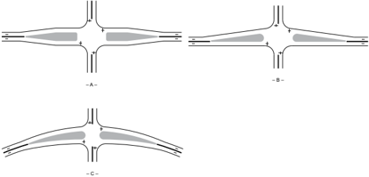

Widening on tangent alignment, even with flat curves, may produce some appearance of distorted alignment. Where the road is on a curve or on widening alignment, advantage should be taken of the curvature in spreading the traffic lanes without using reverse curves, as illustrated in Figure 9-23C.

## 9.6.3.4  Refuge Islands

A refuge island for pedestrians is one at or near a crosswalk or bicycle path that aids pedestrians and bicyclists who cross the roadway. Raised-curb corner islands and center channelizing or divisional islands can be used as refuge areas. Refuge islands for pedestrians and bicyclists crossing a wide street, for loading or unloading transit riders, or for wheelchair ramps are used primarily in urban areas.

The location and width of crosswalks, the location and size of transit loading zones, and the provision of wheelchair ramps influence the size and location of refuge islands. Refuge islands should be a minimum of 6 ft [1.8 m] wide and pedestrians and bicyclists should have a clear path through the island and should not be obstructed by curbs, poles, sign posts, utility boxes, etc. Section 4.17.3 presents details of curb ramp design that affect the minimum size of channelizing islands.

In both rural and urban areas, many of the islands designed for the function of channelization also serve as refuge for pedestrians. The general principles for island design also apply directly to providing refuge islands.

## 9.6.3.5  Island Size and Designation

Island sizes and shapes vary materially from one intersection to another, as shown in Figure 9-22. Further variations, not illustrated, occur at multiple and acute-angle intersections. Islands should be sufficiently large to command attention. The smallest curbed corner island normally should have an area of approximately 50 ft 2 [5 m 2 ] for urban and 75 ft 2 [7 m 2 ] for intersections in rural areas. However, 100 ft 2 [9 m 2 ] is preferable for both. Accordingly, corner triangular islands should not be less than 12 ft [3.5 m], and preferably should be 15 ft [4.5 m] on a side after the rounding of corners.

Elongated or divisional islands should not be less than 4 ft [1.2 m] wide and 20 to 25 ft [6 to 8 m] long. In special cases where space is limited, elongated islands may be reduced to a minimum width of 2 ft [0.5 m]. If a pedestrian refuge area is provided, the island should be not less than 6 ft [1.8 m] wide. In general, introducing curbed divisional islands at isolated intersections on high-speed highways is undesirable unless special attention is directed to providing high visibility for the islands. Curbed divisional islands introduced at isolated intersections on high-speed highways should be 100 ft [30 m] or more in length. When situated in the vicinity of a high point in the roadway profile or at or near the beginning of a horizontal curve, the approach end of the curbed island should be extended to be clearly visible to approaching drivers.

Islands should be delineated or outlined by a variety of treatments, depending on their size, location,  and  function.  The  type  of  area  in  which  the  intersection  is  located,  rural  versus urban, also governs the design. In a physical sense, islands can be divided into three groups: (1) raised-curb islands, (2) islands delineated by pavement markings or reflectorized markers

placed on paved areas, and (3) islands formed by the pavement edges and possibly supplemented by delineators on posts or other guideposts, or mounded-earth treatment beyond and adjacent to the pavement edges.

The curbed island treatment is universal and provides the greatest positive guidance and refuge for pedestrians and bicyclists. In rural areas where curbs are uncommon, this treatment often is limited to corner islands of small to intermediate size. Conversely, in urban areas, the use of this type of island is common.

Island delineation of unused paved areas, by pavement markings, is common in urban areas where speeds are low and space is limited, but this treatment only provides minimal pedestrian refuge. In rural areas, this type may be used to minimize maintenance problems or high approach speeds or where snow removal is more difficult with curbed islands. Marked islands also are applicable on low-volume roadways where the added expense of curbs may not be warranted and where the islands are not large enough for delineation by pavement edges alone.

Islands formed by the pavement edges generally apply to large channelizing islands at rural intersections where there is space for large-radius intersection curves and wide medians.

The central area of large channelizing islands in most cases has turf or other landscaping. As space and the overall character of the roadway determine island size, low plant material may be included, but it should not obstruct sight distance. Groundcover or plant growth, such as turf, vines, and shrubs, can be used for channelizing islands and provides excellent contrast with the paved areas, assuming that the groundcover is cost-effective and can be properly maintained. Small curbed islands may be mounded, but where pavement cross slopes are outward, large islands should be depressed to avoid draining water and snow melt across the pavement. This feature is especially desirable where alternate freezing and thawing occurs. For small curbed islands and in areas where growing conditions are not favorable, some type of paved surface is used on the island. In many respects, the curbed-island cross-section design is similar to that discussed in Section 4.11, 'Medians.'

## 9.6.3.6  Island Delineation and Approach Treatment

Delineation of small islands is effected primarily by curbs and curb-top reflectors. Large curbed islands may be sufficiently delineated by color and texture contrast of vegetative cover, mounded earth, shrubs, reflector posts, signs, or any combination of these.

Section 4.7 indicates the different curb types used in design. The most commonly used height of curb is 6 in. [150 mm]. Vertical or sloping curbs could be appropriate in urban areas, depending on the conditions. In addition, high-visibility sloping curbs may be advantageous at critical locations. In rural areas, island curbs should usually be a sloping type.

--',''','',',',','''''',,,,''-'-',,',,',',,'---

The outline of a curbed island is determined by the edge of through-traffic lanes or turning roadways. The points of intersection of the sides of a curbed island are rounded or beveled for visibility and construction simplicity. Lateral clearance is provided to the face of the curbed island. The amount that a curbed island is offset from the through-traffic lane is influenced by the type of edge treatment and other factors such as island contrast, length of taper, or auxiliary lane pavement preceding the curbed island. Since curbs influence the lateral placement of a vehicle in a lane, they should be offset from the edge of through-traffic lanes even if they are sloping. Curbs need not be offset from the edge of a turning roadway, except to reduce their vulnerability to turning trucks.

Details of curbed corner island designs used in conjunction with turning roadways are shown in Figures 9-24 and 9-25. The approach corner of each curbed island is designed with an approach nose treatment. Three curbed triangular island sizes, small, intermediate, and large, are shown for two general cases of through-traffic lanes edges: (1) the curbed corner island is located along a street with curb and gutter in an urban area, or (2) the curbed corner island is located on a roadway with shoulders. For the urban area location in Figure 9-24, a 4-ft [1.2-m] offset should be considered between the edge of the travel lane and the island where bicyclists are to be accommodated.

Small curbed corner islands are those of minimum or near-minimum size, as previously discussed. Large curbed corner islands are those with side dimensions of at least 100 ft [30 m]. All curbed islands in Figures 9-24 and 9-25 are shown with approach noses and merging ends rounded with appropriate radii of 2 to 3 ft [0.6 to 1 m]. The approach corner is rounded with a radius of 2 to 5 ft [0.6 to 1.5 m].

Figure 9-24 shows curbed corner islands adjacent to through-traffic lanes on a street in an urban area. Where the approach roadway has a curb and gutter, the curbed island may be located at the edge of the through lane with a gradual taper to the nose offset. Where the large-size island is uncurbed, the indicated offsets of the curbed island are desirable but not essential. However, any fixed objects within the island areas should be offset an appropriate distance from the through lanes.

The approach nose of a curbed island should be conspicuous to approaching drivers and should be definitely clear of vehicle paths, physically and visually, so that drivers will not shy away from the island. Reflectorized markers may be used on the approach nose of the curbed island. The offset from the travel lane to the approach nose should be greater than that to the face of the curbed island, normally about 2 ft [0.6 m]. For curbed median islands, the face of curb at the approach island nose should be offset at least 2 ft [0.6 m] and preferably 3 ft [1.0 m] from the normal median edge of the traveled way. The island should then be gradually widened to its full width. Large offsets should be provided where the curbed corner island is preceded by a rightturn deceleration lane.

Where a curbed corner island is proposed on an approach roadway with shoulders, the face of curb on the corner island should be offset by an amount equal to the shoulder width. If the corner island is preceded by a right-turn deceleration lane, the shoulder offset should be at least 8 ft [2.4 m].

Curbed corner and median island noses should be transitioned down to a sloping curb as shown in Figure 9-26 and provided with devices to give advance warning to approaching drivers and especially for nighttime driving. Pavement markings in front of the approach nose are particularly advantageous on the areas shown as striped in Figure 9-24. To the extent practical, other high-visibility indications should be used, such as reflectorized curb-top markers mounted on the curb or median surface. The curbs of all islands located in the line of traffic flow should be marked in accordance with the MUTCD ( 9 ).

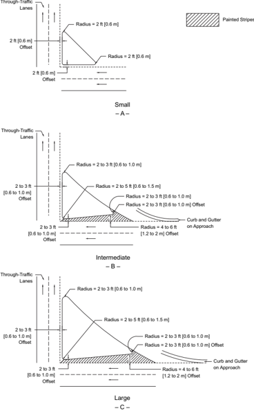

Figure 9-24. Details of Corner Island Designs for Turning Roadways (Urban Area Location)

--',''','',',',','''''',,,,''-'-',,',,',',,'---

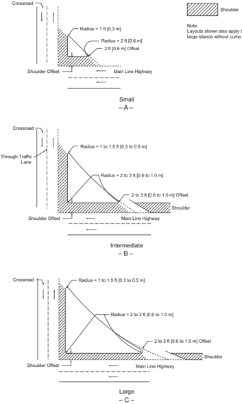

Figure 9-25. Details of Corner Island Designs for Turning Roadways (Rural Cross Section on Approach)

Figure 9-26. Nose Ramping at Approach End of Median or Corner Island

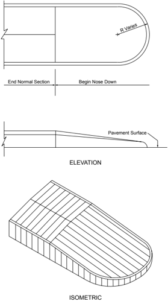

Delineation is especially pertinent at the approach nose of a divisional island. In rural areas, the approach should consist of a gradual widening of the divisional island as indicated in Figure 9-27. Although not as frequently obtainable, this same design should also be striven for in urban areas. Preferably, the approach should gradually change to a raised surface with texture or to jiggle bars that may be crossed readily even at considerable speed. This transition taper length

--',''','',',',','''''',,,,''-'-',,',,',',,'--- should be computed with Equation 3-37 where the posted or statutory speed limit is less than 45 mph [70 km/h]. If this distance cannot be met, the transition section should be as long as practical. The cross sections in Figure 9-27 demonstrate the transition. The face of curb at the approach island nose should be offset at least 2 ft [0.5 m] and preferably 3 ft [1 m] from the normal edge of traveled way, and the widened pavement gradually should be transitioned to the normal width toward the crossroad.

Figure 9-27. Details of Divisional Island Design

## 9.6.3.7  Corner Islands for Turning Roadways

Where the pavement area within the intersection becomes excessively large and consequently does not provide for the proper control of traffic, a corner island can be provided to form a separate turning roadway between the two intersection legs.

The principal controls for the design of turning roadways are the intersection geometry, lane configuration, and types of users to be accommodated at the intersection. Islands are desirable for delineating the path of through and turning traffic, for the placement of signs, and for providing a refuge for pedestrians and bicycles. Larger islands may be needed to locate signs and to facilitate snow removal.

A turning roadway should be designed to provide at least the minimum size island and the minimum width of roadway. The turning roadway should be wide enough to permit the right and left wheel tracks of a selected vehicle to be within the edges of the traveled way by about 2 ft [0.6 m] on each side. Generally, the turning roadway width should not be less than 14 ft [4.2 m]. When the turning roadway is designed for a semitrailer combination, a much wider roadway is needed. To discourage passenger vehicles from using this wider roadway as two lanes, the roadway may be reduced in size by marking out part of the roadway with paint or thermoplastic markings or provision of a truck apron. Turning roadways should be designed with consideration of the characteristics of the design vehicle and other users of the intersection.

The designer should be aware of larger semitrailer combinations on designated roadways and the effects these vehicles will have on turning roadway designs. The designer should reference the truck turning templates in Section 2.8.2 to meet their design needs. As previously stated, turning roadway widths can be reduced with paint or thermoplastic markings, or truck aprons, to channelize passenger cars and discourage the usage of the wider roadway as two turning lanes.

In urban areas, the island should be located about 2 ft [0.6 m] outside the traveled-way edges; where bicycles are present, the offset distance from the travel lane to the island curb should be the greater of 4 ft [1.2 m] or the shoulder width. For high-speed highways, the offset from the through lanes to the face of curb normally should be equal to the shoulder width. In rural areas, the use of painted corner islands may be considered. When raised corner islands are used in rural locations, they should have a sloping curb face. For more information, refer to Figures 9-24 and 9-25 and the accompanying discussion on island types.

The angle of turn will influence the width and radius needed for the turning roadway when corner islands are used with oblique angle turns.

--',''','',',',','''''',,,,''-'-',,',,',',,'---

## 9.6.4  Superelevation for Turning Roadways at Intersections

## 9.6.4.1  General Design Guidelines

The general factors that control the maximum rates of superelevation for open highway conditions, as discussed in Section 3.3, also apply to high-speed turning roadways at intersections. Maximum superelevation rates up to 10 percent may be used where climatic conditions are favorable. However, maximum rates up to 8 percent generally should be used where snow and icing conditions prevail. Superelevation is often not needed on lower speed turning roadways.

In intersection design, the free flow of turning roadways is often of limited radii and length. When speed is not affected by other vehicles, drivers on turning roadways anticipate the sharp curves and accept operation with higher side friction than they accept on open highway curves of the same radii. This behavior stems from their desire to maintain their speed through the curve; although some speed reduction typically occurs. When other traffic is present, drivers will travel more slowly on turning roadways than on open highway curves of the same radii because they must diverge from and merge with through traffic. Therefore, in designing for effective operation, periods of light traffic volumes and corresponding speeds will generally control. In urban and suburban areas, where pedestrian use is anticipated, the effects of superelevated pavements on pedestrian grades and access should be considered.

Designs with gradually changing curvature, effected by the use of compound curves, spirals, or both, permit desirable development of superelevation. For these designs, the design superelevation rates and corresponding radii listed in Tables 3-8 through 3-12 are desirable.

The practical difficulty of attaining superelevation without abrupt cross-slope change at turning roadway terminals, primarily because of sharp curvature and short lengths of turning roadway, most often prevents the development of a generous rate of superelevation. Abrupt changes in cross slope can adversely affect the stability of trucks and other vehicles with high centers of gravity. The design superelevation rates and corresponding radii listed in Tables 3-8 through 3-12 can be used when conditions justify the conservative use of superelevation.

## 9.6.4.2  Superelevation Runoff

The principles of superelevation runoff design discussed in Section 3.3.8 generally apply to freeflow turning roadways at intersections. In general, the rate of change in cross slope in the runoff section should be based on the maximum relative gradients (∆) used in Equation 3-23. The values listed in this table are applicable to a single lane of rotation. The adjustment factors b w listed in Table 3-15 allow for slight increases in the effective gradient for wider rotated widths.

Usually, the profile of one edge of the traveled way is established first, and the profile on the other edge is developed by stepping up or down from the first edge by the amount of desired superelevation at that location. This step is done by plotting a few control points on the second edge by using the maximum relative gradients shown in Section 3.3.7 and then plotting

a smooth profile for the second edge of traveled way. Drainage may be an additional control, particularly for curbed roadways.

## 9.6.4.3  Development of Superelevation at Turning Roadway Terminals

Superelevation commensurate with curvature and speed seldom is practical at terminals where: (1) a flat intersection curve results in little more than a widening of the traveled way, (2) it is desirable to retain the cross slope of the traveled way, and (3) there is a practical limit to the difference between the cross slope on the traveled way and that on the intersection curve. Too great a difference in cross slope may cause vehicles traveling over the crossover crown line to sway sideways. When vehicles with high centers of gravity cross the crown line at higher speeds and at an angle of about 10 to 40 degrees, the body throw may make vehicle control difficult.

General Procedure -For design of a roadway, the through-traffic lanes may be considered fixed in profile and cross slope. As the exit curve diverges from the through-traveled way, the curved (or tangent) edge of the widening section can only gradually vary in elevation from the edge of the through lane. Shortly beyond the point where the full width of the turning roadway is attained, an approach nose separates the two pavements. Where the exit curve is relatively sharp and without taper or transition, little superelevation in advance of the nose can be developed in the short distance available. Beyond the nose, substantial superelevation usually can be attained, the amount depending on the length of the turning roadway curve. Where this curve deviates gradually from a traveled way, a desirable treatment of superelevation may be effected.

The method of developing superelevation at turning roadway terminals is illustrated diagrammatically in Figures 9-28 through 9-31. Figure 9-28 illustrates the variation in cross slope where a turning roadway leaves a through road that is on tangent. From point A to B, the normal cross slope on the through-traffic lane is extended to the outer edge of auxiliary lane. The additional width at B is nominal, less than 3 ft [1 m], and projecting the cross slope across this width simplifies construction. Beyond point B, the width is sufficient that the cross slope on the auxiliary lane can be the same or begin to be steeper than the cross slope on the adjacent through-traffic lane, as at C. At D where the full width of the turning roadway is attained, a still greater slope can be used. Superelevation is further increased adjacent to the nose at E and is facilitated somewhat by sloping downward the pavement wedge formed between the right edge of the traveled way and the extended left traveled-way edge of the turning roadway. Beyond the nose, as at E, the traveled way is transitioned as rapidly as conditions permit until the full desired superelevation is attained.

Figure 9-28. Development of Superelevation at Turning Roadway Terminals on a Tangent Roadway

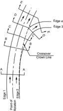

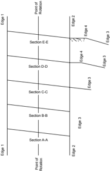

Figure 9-29. Development of Superelevation at Turning Roadway Terminals on a Curved Roadway (Same Direction of Curve)

--',''','',',',','''''',,,,''-'-',,',,',',,'---

Figure 9-30. Development of Superelevation at Turning Roadway Terminals on a Curved Roadway (Opposite Direction of Curve)

Figure 9-31. Development of Superelevation at Turning Roadway Terminals on a Tangent Roadway with a Deceleration Lane

Figure 9-29 is a similar illustration for the condition where the through lanes and the turning roadway curve in the same direction. The desired superelevation on the exit roadway, which generally is steeper than that on the through lanes, can be attained in a relatively short distance. At C the cross slope of the through lane is extended over the widened traveled way. At D somewhat variable cross sections are introduced, and the full superelevation is reached in the vicinity of E.

A less favorable situation occurs when the joining facilities curve in opposite directions, as in Figure 9-30. Because of the rate of superelevation on the through roadway, it may be impracti-

cal to slope the auxiliary lane in a direction opposite to that of the through lanes for reasons of appearance and riding quality. In a typical treatment for a moderate rate of superelevation, the rate of cross slope on the through roadway is extended onto the auxiliary lane, as at B. At C it may still continue upward, but at a lesser rate. The break between the two slopes becomes more pronounced at D, the added pavement being nearly horizontal. Some superelevation is introduced at the nose, either by a single crown line centering on the nose or by a double break in the cross slope over the pavement wedge in front of the nose. Most of the superelevation should be gained beyond the nose.

On designs with a parallel speed-change lane, as in Figure 9-31, part of the cross slope change may be made over the length of this lane. Usually, more than half of the total superelevation rate can be attained at D, and the full desired superelevation can be reached at or just beyond the nose.

The discussion and arrangements illustrated in Figures 9-28 through 9-31 for exit terminals are also directly applicable to entrance terminals, except that the details at the merging end are different from those of an approach nose. The merging end of an entrance terminal would be located in proximity of D.

Turn-Lane Cross Slope Rollover -The design control at the crossover crown line (not to be confused with the crown line normally provided at the centerline of a roadway) is the algebraic difference in cross slope rates of the two adjacent lanes. Where both roadways slope down and away from the crossover crown line, the algebraic difference is the sum of their cross slope rates; where they slope in the same direction, it is the difference of their cross slope rates. A desirable maximum algebraic difference at a crossover crown line is 4 or 5 percent, but it may be as high as 8 percent at low speeds and where there are few trucks. The suggested maximum differences in cross slope rates at a crown line, related to the speed of turning traffic, are given in Table 9-18.

Superelevation Transition and Gradeline Control -The attainment  of  superelevation  over the  gradually  widening  auxiliary  lane  and  over  the  whole  of  the  turning  roadway  terminals should not be abrupt. The design should be in keeping with the cross-slope controls, given in Table 9-18.

Table 9-18. Maximum Algebraic Difference in Cross Slope at Turning Roadway Terminals

| U.S. Customary                               | U.S. Customary                                                          |
|----------------------------------------------|-------------------------------------------------------------------------|
| Design Speed of Exit or Entrance Curve (mph) | Maximum Algebraic Difference in Cross Slope at Crossover Crown Line (%) |
| 20 and under                                 | 5.0 to 8.0                                                              |
| 25 and 30                                    | 5.0 to 6.0                                                              |
| 35 and over                                  | 4.0 to 5.0                                                              |

| Metric                                        | Metric                                                                  |
|-----------------------------------------------|-------------------------------------------------------------------------|
| Design Speed of Exit or Entrance Curve (km/h) | Maximum Algebraic Difference in Cross Slope at Crossover Crown Line (%) |
| 30 and under                                  | 5.0 to 8.0                                                              |
| 40 and 50                                     | 5.0 to 6.0                                                              |
| 60 and over                                   | 4.0 to 5.0                                                              |

As an example, consider an arrangement as in Figure 9-28, in which the limiting curve of the turning roadway has a radius of 230 ft [70 m], corresponding to a design speed of 30 mph [50 km/h]. From Table 3-20, the limiting superelevation rate would be 11 percent or less. Because the roadway width is variable, the transition of cross-slope change should be developed by using the method of traveled-way edge change in grade with respect to the point of rotation for a full-width auxiliary lane. Elevations developed by this method should then be converted to a change in elevation between the edge of the traveled way of the through lane and the edge of the full-width pavement of the auxiliary lane. They then should be prorated for the actual partial widths of the auxiliary lane. In this example, the traveled-way edge change in grade should be no greater than 0.66 percent [0.65 percent].

An alternate method, which has been noted with respect to rideability, comfort, and appearance of the roadway in cross-slope transition areas, is to establish a rate of change in the roadway cross slope. The rate of cross slope is a function of traveled-way width and the change in grade of the edge of traveled way with respect to the point of roadway rotation. This method results in the edge grade being equal to the roadway width, which is rotated, times the rate of change in cross slope. Thus, if the edge of traveled-way grade change is 0.66 percent [0.65 percent] and the width of roadway being rotated (the assumption being that the full width of the auxiliary lane is applied for calculating the grade change of the edge of traveled way) is 12 ft [3.6 m], the rate of change in cross slope is 5.58 percent [5.41 percent] per 100 ft [30 m] length.

In Figure 9-28, if the cross slope on the through roadway is 1 percent and the distance from A to B, and also from B to C, is 50 ft [15 m], trial cross slope rates would be 1 percent [1 percent] at A, 3.71 percent [3.79 percent] at B, and 6.58 percent [6.41 percent] at C. Here the cross-over crown line control (Figure 9-31) is barely satisfied, because at the critical section C, the algebraic difference in cross slope rates is 5.41 percent. If the remaining lengths of C to D and D to E are 25 ft [7 m] apart, the cross slope rate would be 7.97 percent [7.67 percent] at D and 9.35 percent [8.93 percent] at E.

The cross slope of the edge of traveled way in front of the nose at E could be some intermediate rate, such as 4 percent. On the second trial, a better adjustment of superelevation transition results by using a lower change in the cross slope rate for the turning roadway, such as 4 percent per 100 ft [30 m] length.

This procedure of establishing superelevation cross slopes at given points is a preliminary step in design. Elevations on the roadway edges resolved from these cross slopes serve as control points for drawing the edge of traveled-way profiles on the turning roadway. Excellent practical results are obtained by plotting to large vertical scale the profiles for both edges of the turning roadway and the edge and centerline of the through roadway in juxtaposition on a single profile drawing. Important points such as approach noses or merging ends also are located. Only one profile, either the stationed centerline or edge of traveled way, is depicted in true length, but the inaccuracy in length of the other profiles is small and it is easy to locate points thereon in the

field by radial measurement from the stationed line. The three-dimensional condition can be readily visualized.

Mathematically derived vertical curves, as used for open highways, are not always practical at intersections, but the profile curves can be developed readily with a spline or irregular curve templates as well as CADD systems. All needed elevations can be read directly from the profiles when they are drawn to large enough vertical scale. The final profile may not precisely produce the selected cross slope at all of the control points, but this problem is not serious as long as the cross-slope change is progressive and within the design control limits. The principal criterion is the development of smooth edge profiles that do not appear distorted to the driver. Another method of obtaining a three-dimensional presentation is to plot contour lines on a layout of the intersection area. A scale drawing will provide an accurate picture with the additional advantage of showing drainage patterns, sumps, and irregular slope conditions.

## 9.6.5  Stopping Sight Distance at Intersections for Turning Roadways

## 9.6.5.1  General Considerations

The values for stopping sight distance as computed in Section 3.2.2 for open highway conditions are applicable to turning roadway intersections of the same design speed. The values from Section 3.2.2, together with the value for a design speed in increments of 5 mph [10 km/h]), are shown in Table 9-19.

Table 9-19. Stopping Sight Distance for Turning Roadways

| U.S. Customary                 |   U.S. Customary |   U.S. Customary |   U.S. Customary |   U.S. Customary |   U.S. Customary |   U.S. Customary |   U.S. Customary |   U.S. Customary |
|--------------------------------|------------------|------------------|------------------|------------------|------------------|------------------|------------------|------------------|
| Design speed (mph)             |               10 |               15 |               20 |               25 |               30 |               35 |               40 |               45 |
| Stopping sight dis- tance (ft) |               50 |               80 |              115 |              155 |              200 |              250 |              305 |              360 |

| Metric                        |   Metric |   Metric |   Metric |   Metric |   Metric |   Metric |   Metric |
|-------------------------------|----------|----------|----------|----------|----------|----------|----------|
| Design speed (km/h)           |       15 |       20 |       30 |       40 |       50 |       60 |       70 |
| Stopping sight dis- tance (m) |       15 |       20 |       35 |       50 |       65 |       85 |      105 |

These sight distances should be available at all points along a turning roadway; wherever practical, longer sight distances should be provided. They apply as controls in design of both vertical and horizontal alignment.

## 9.6.5.2  Vertical Control

The length of vertical curve is predicated, as it is for open highway conditions, on sight distance measured from the height of eye of 3.5 ft [1.08 m] to the height of object of 2 ft [0.60 m]. Equations shown in Section 3.4.6.2 apply directly.

For design speeds of less than 40 mph [60 km/h], sag vertical curves, as governed by headlight sight distances, theoretically should be longer than crest vertical curves. Lengths of sag vertical curves are found by substituting the stopping sight distances from Table 9-19 in the formulas

in Section 3.4.6.3. Because the design speed of most turning roadways is governed by the horizontal curvature and the curvature is relatively sharp, a headlight beam parallel to the longitudinal axis of the vehicle ceases to be a control. Where practical, longer lengths for both crest and sag vertical curves should be used.

## 9.6.5.3  Horizontal Control

The sight distance control as applied to horizontal alignment has an equal, if not greater, effect on design of turning roadways than the vertical control. The sight line along the centerline of the inside lane around the curve, clear of obstructions, should be such that the sight distance measured on an arc along the vehicle path equals or exceeds the stopping sight distance given in Table 9-19. A likely obstruction may be a bridge abutment or line of columns, wall, cut sideslope, or a side or corner of a building.

The lateral clearance, centerline of inside lane to sight obstruction, for various radii and design speeds, can be computed with Equation 3-37. The lateral clearances shown in this figure apply to the conditions where the horizontal curve is longer than the stopping sight distance. Where the curve length is shorter than the sight distance control, the lateral clearance from Equation 3-37 results in greater sight distance than needed. In this case, the lateral clearance is best determined graphically in a manner indicated by the sketch in Figure 3-1 or 3-14, which can be automated in CADD systems. The lateral clearance, so determined, should be tested at several points.

## 9.7  AUXILIARY LANES

## 9.7.1  General Design Considerations

In general, auxiliary lanes are used preceding median openings and are also used at intersections preceding right- and left-turning movements. Auxiliary lanes may also be added to increase capacity and reduce crashes at an intersection. In many cases, an auxiliary lane may be desirable after completing a right-turn movement to provide for acceleration, maneuvering, and weaving.

Auxiliary lanes should be at least 10 ft [3 m] wide and desirably should equal that of the through lanes. Shoulders adjacent to auxiliary lanes should desirably be the same width as the shoulders adjacent to the through lanes. However, as a practical matter, reduced widths are generally acceptable. A minimum 6ft [1.8-m] wide shoulder is preferred adjacent to auxiliary lanes on high speed roadways in rural areas. Shoulders may be omitted adjacent to auxiliary lanes in urban areas and on right- and left-turn lanes at locations where bicycle accommodation is not needed. In these cases, the auxiliary lane also serves as a useable shoulder for emergency use and to accommodate stopped or disabled vehicles. On auxiliary lanes subject to use by heavy trucks, or other vehicles with substantial offtracking, or both, a paved shoulder 2 to 4 ft [0.6 to 1.2 m] wide may be needed. Where curbing is to be used adjacent to the auxiliary lane, an appropriate curb offset should be provided. Where on-street bicycle lanes are provided or planned, specific treatments

are needed for the bicycle lanes in the vicinity of auxiliary lanes. For further guidance, see the AASHTO Guide for the Development of Bicycle Facilities ( 3 ).

To preclude or minimize undue acceleration and deceleration that may arise from conflicts between high speeds on the through roadway and stopped or near-stopped conditions for traffic  entering  or  leaving  the  through  roadway  at  intersections,  auxiliary  lanes  are  provided  on highways having expressway characteristics and are frequently used at other intersections on main highways and streets. An auxiliary lane, including the tapered area, serves as a speedchange lane primarily for the acceleration or deceleration of vehicles entering or leaving the through-traffic lanes. An auxiliary lane should be of sufficient width and length to enable a driver to maneuver a vehicle into it properly, and once in it, to reduce speed from the speed of operation on the highway or street to the lower speed on the turning roadway or increase speed from the speed of the turning roadway to the higher speed of operation of the highway or street. Deceleration and acceleration lanes may be designed in conjunction with one another, the relationship depending on the arrangement of the intersection and traffic needs. They may be designed as parts of intersections, but are particularly important at ramp junctions where turning roadways meet high-speed traffic lanes.

Warrants for the use of auxiliary lanes cannot be stated definitely. Many factors should be considered, such as speeds, traffic volumes, percentage of trucks, capacity, type of roadway, effects on pedestrian and bicyclists, availability of right-of-way, service provided, and the arrangement and frequency of intersections. Observations and considerable experience with auxiliary lanes have led to the following general conclusions:

- y Auxiliary lanes are warranted on high-speed and on high-volume highways where a change in speed is needed for vehicles entering or leaving the through-traffic lanes.
- y All drivers do not use auxiliary lanes in the same manner; some use little of the available facility and some increase or decrease speeds outside the auxiliary lanes. As a whole, however, these lanes are used sufficiently to improve roadway operation.
- y Use of auxiliary lanes varies with volume, the majority of drivers using them at high volumes.
- y The directional type of auxiliary lane consisting of a long taper fits the behavior of most drivers and does not involve maneuvering on a reverse-curve path.
- y Deceleration lanes on the approaches to intersections that also function as storage lanes for turning traffic are particularly advantageous, and experience with them generally has been favorable.

A median lane provides refuge for vehicles awaiting an opportunity to turn, and thereby keeps the roadway traveled way clear for through traffic. The width, length, and general design of median lanes are similar to those of any other deceleration lane. Their design includes some additional features discussed in Section 9.7.3.

--',''','',',',','''''',,,,''-'-',,',,',',,'---

Deceleration lanes are advantageous on higher speed roads, because the driver of a vehicle leaving the roadway has no choice but to slow down on the through-traffic lane if a deceleration lane is not provided. The failure to brake by the following drivers, because of a lack of alertness, may result in rear-end collisions. Acceleration lanes are advantageous on roads without stop control, particularly those with higher operating speeds and/or higher volumes. Acceleration lanes are not desirable at all-way stop-controlled or signalized intersections where entering drivers can wait for an opportunity to merge without disrupting through traffic. For additional design guidance related to lengths and other aspects of deceleration and acceleration auxiliary lanes, refer to Section 10.9.6.

## 9.7.2  Deceleration Lanes

Figure 9-32 illustrates the upstream functional area of an intersection in relation to the components of deceleration lane length, which consist of the perception-reaction distance, the lane change and deceleration distance (also called the maneuver distance), and the storage length (also called the queue storage distance) ( 39 ).

Desirably, the total physical length of the auxiliary lane should be the sum of the length for these three components (lane change, deceleration, and storage distances). Common practice, however, is to accept a moderate amount of deceleration within the through lanes and to consider the taper length as a part of the deceleration within the through lanes. Each component of the deceleration lane length is discussed below.

## 9.7.2.1  Perception-Reaction Distance

The perception-reaction distance ( d 1 )  in  Figure 9-32 represents the distance traveled while a driver recognizes the upcoming turn lane and prepares for the left-turn maneuver. The distance increases with perception-reaction time and speed. The perception-reaction time varies with the driver's familiarity with the roadway segment and state of alertness; for example, an alert driver who is familiar with the roadway and traffic conditions has a smaller perception-reaction time than an unfamiliar driver. Traffic conditions on urban and suburban roadways could result in drivers having a higher level of alertness than those on highways in rural areas. Therefore, a value of 1.5 s is often used as the perception-reaction time for suburban, urban, urban core, and rural town contexts, and 2.5 s is often used for rural contexts ( 44 ).

Provision for deceleration clear of the through-traffic lanes is a desirable objective on arterial roads and streets and should be incorporated into design, whenever practical. Approximately two-thirds of the drivers observed making left turns in a research study concerning turn lanes used deceleration rates greater than 6.5 ft/s 2 [2.0 m/s 2 ] to come to a stop at the stop line ( 16 ). A turn lane design based on that rate will accommodate the preferred behavior of 85 percent of turning drivers at high-speed sites. Table 9-20 presents the estimated distances needed by drivers to maneuver from the through lane into a left- or right-turn lane and brake to a stop based on an equivalent deceleration rate of 6.5 ft/s 2 [2.0 m/s 2 ]. These distances are based on accommodat-

ing observed driver behavior; drivers and vehicles are capable of much greater comfortable, controlled deceleration, when needed. Since provision of deceleration length based deceleration at a rate of 6.5 ft/s 2 [2.0 m/s 2 ] is not always practical, it should be noted that drivers are capable of much higher deceleration rates. For example, the stopping sight distance calculations in Chapter 3 use 11.2 ft/s 2 [3.4  m/s 2 ]  as  a  comfortable,  controlled  deceleration  threshold  for  most  drivers and the Access Management Manual ( 48 ) presents distances for 'limiting conditions' based on  the  equivalent  of  a  9.9-ft/s 2 [3.0-m/s 2 ]  deceleration  rate  throughout  the  full  deceleration length (i.e., taper and full-width deceleration lane). Thus, deceleration rates greater than 6.5 ft/s 2 [2.0 m/s 2 ] may be used where needed.

As noted above, it is not practical on many facilities to provide the full length of the auxiliary lane for deceleration due to constraints such as restricted right-of-way, distance available between adjacent intersections, and storage needs. However, research has demonstrated that providing a left- and right-turn lane on any intersection approach has a substantial crash reduction benefit ( 22 ). Therefore, turn lanes should be installed where warranted (see Section 9.7.3), even where the distances in Table 9-20 cannot be achieved.

## Where:

- d 1 =  distance traveled while driver recognizes upcoming turn lane and prepares for the left-turn maneuver
- d 2(a) =  distance traveled while decelerating and changing lanes from the through-lane into the turn lane
- d 2(b) =  distance traveled during deceleration after lane change
- d 3 =  distance provided for the storage of the queue of stopped vehicles waiting to turn

Figure 9-32. Functional Area Upstream of an Intersection Illustrating Components of Deceleration Lane Length

--',''','',',',','''''',,,,''-'-',,',,',',,'---

Table 9-20. Desirable Lane Change and Deceleration Distances

| U.S. Customary   | U.S. Customary                             |
|------------------|--------------------------------------------|
| Speed (mph)      | Lane Change and Deceleration Distance (ft) |
| 20               | 70                                         |
| 25               | 105                                        |
| 30               | 150                                        |
| 35               | 205                                        |
| 40               | 265                                        |
| 45               | 340                                        |
| 50               | 415                                        |
| 55               | 505                                        |
| 60               | 600                                        |
| 65               | 700                                        |
| 70               | 815                                        |

## Notes:

1.    The lane change and deceleration lengths are shown as d 2 in Figure 9-32.
2.    Deceleration lengths are based on a 6.5 ft/s 2 [2.0 m/s 2 ] deceleration throughout the entire length. Larger deceleration rates may be used when deceleration lengths based on 6.5 ft/s 2  [2.0 m/s 2 ] are impractical.
3.    Access points should not be located in the deceleration areas.

## 9.7.2.2  Storage Length

A deceleration lane should be sufficiently long to store the number of vehicles likely to accumulate in a queue during a critical period. The storage length should be sufficient to avoid spillback of turning vehicles into the through-travel lanes waiting for a signal change or for a gap in the opposing traffic flow.

At signalized intersections, the storage length needed should be determined by an intersection traffic analysis, and will depend on the signal cycle length, the signal phasing arrangement, and the rate of arrivals and departures of turning vehicles. The storage length is a function of the probability of occurrence of events and should usually be based on 1.5 to 2 times the average number of vehicles that would need to be stored per signal cycle, which should be estimated based on the design volume or directly from traffic counts. Where turning lanes are designed for two-lane operation, the storage length is reduced to approximately half of that needed for single-lane operation. For further information, refer to the Highway Capacity Manual ( 49 ).

The storage length needed for a left-turn lane for any set of turning movement volumes and an assumed probability the storage length will be exceeded can be determined with the following sequence of equations, adapted from ( 16 ):

| Metric       | Metric                                    |
|--------------|-------------------------------------------|
| Speed (km/h) | Lane Change and Deceleration Distance (m) |
| 30           | 25                                        |
| 40           | 35                                        |
| 50           | 50                                        |
| 55           | 65                                        |
| 65           | 85                                        |
| 70           | 105                                       |
| 80           | 130                                       |
| 90           | 155                                       |
| 95           | 185                                       |
| 105          | 215                                       |
| 110          | 250                                       |

## U.S. Customary

where:

c =    left-turn capacity, veh/h

V o =    major-road volume conflicting with the minor movement, assumed to be equal to one-half of the two-way major-road volume, veh/h t c =    critical gap, s

t f =    follow-up gap, s

## U.S. Customary

where:

SL =    storage length, ft

P(n&gt;N) =    probability of turn-lane overflow v =    left-turn vehicle volume, veh/h

c =    left-turn capacity, veh/h

VL =    average length per vehicle, ft

## Metric

where:

c =    left-turn capacity, veh/h

V o =    major-road volume conflicting with the minor movement, assumed to be equal to one-half of the two-way major-road volume, veh/h t c =    critical gap, s

t f =    follow-up gap, s

## Metric

where:

SL =    storage length, m

P(n&gt;N) =    probability of turn-lane overflow v =    left-turn vehicle volume, veh/h

c =    left-turn capacity, veh/h

VL =    average length per vehicle, m

In applying these equations, P ( n &gt; N ),  the  probability  that  the  number of vehicles stored will exceed the available length of the left-turn lane, is typically set equal to 0.005, equivalent to an assumption that the available storage length will accommodate the left-turning vehicle queue 99.5 percent of the time. The critical gap ( t c ) is typically set equal to the 50th percentile value observed in field studies, 5.0 s, or the 85th percentile value observed in field studies, 6.25 s ( 16 ). The 85th percentile is suggested for design. The follow-up gap ( t f ) is typically 2.5 s and the average storage length per vehicle is 25 ft [7.6 m].

Equations  9-3  and  9-4  show  that  the  appropriate  storage  length  is  dependent  on  both  the volume of  turning  traffic  using  the  deceleration  lane  and  the  volume  of  opposing  traffic.  If volume data are not available, the minimum storage length should be at least 50 ft [16 m] to

<!-- formula-not-decoded -->

<!-- formula-not-decoded -->

accommodate two cars on urban and suburban streets with speeds less than 40 mph [70 km/h]. A minimum storage length of 100 ft [30 m] is recommended for high-speed and rural locations. Some cities use 250-ft [80-m] storage lanes for left-turn lanes approaching arterial streets and 150-ft [50 m] storage lanes for left-turn lanes approaching collector streets and most local streets, with a minimum length of 100 ft [30 m] at local streets and minor driveways.

Tables 9-21 and 9-22 provide computed values of storage length determined with Equations 9-3 and 9-4 and the typical assumptions presented above. If the percentage of trucks and buses is known, the minimum queue storage values from Tables 9-21 or 9-22 can be adjusted by multiplying by the values in Table 9-23. Traffic signal design fundamentals are discussed further in the MUTCD ( 9 ).

Table 9-21. Calculated Storage Lengths to Accommodate the 50th Percentile Critical Gap (16)

| Left-Turn Volume (veh/h)   | U.S. Customary                              | U.S. Customary                              | U.S. Customary                              | U.S. Customary                              | U.S. Customary                              |
|----------------------------|---------------------------------------------|---------------------------------------------|---------------------------------------------|---------------------------------------------|---------------------------------------------|
|                            | Storage Length (ft) Opposing Volume (veh/h) | Storage Length (ft) Opposing Volume (veh/h) | Storage Length (ft) Opposing Volume (veh/h) | Storage Length (ft) Opposing Volume (veh/h) | Storage Length (ft) Opposing Volume (veh/h) |
|                            | 200                                         | 400                                         | 600                                         | 800                                         | 1000                                        |
| 40                         | 50                                          | 50                                          | 50                                          | 50                                          | 50                                          |
| 60                         | 50                                          | 50                                          | 50                                          | 50                                          | 50                                          |
| 80                         | 50                                          | 50                                          | 50                                          | 50                                          | 50                                          |
| 100                        | 50                                          | 50                                          | 50                                          | 50                                          | 75                                          |
| 120                        | 50                                          | 50                                          | 50                                          | 75                                          | 75                                          |
| 140                        | 50                                          | 50                                          | 50                                          | 75                                          | 75                                          |
| 160                        | 50                                          | 50                                          | 75                                          | 75                                          | 100                                         |
| 180                        | 50                                          | 50                                          | 75                                          | 75                                          | 100                                         |
| 200                        | 50                                          | 75                                          | 75                                          | 100                                         | 125                                         |
| 220                        | 50                                          | 75                                          | 75                                          | 100                                         | 125                                         |
| 240                        | 75                                          | 75                                          | 100                                         | 125                                         | 150                                         |
| 260                        | 75                                          | 75                                          | 100                                         | 125                                         | 175                                         |
| 280                        | 75                                          | 75                                          | 100                                         | 125                                         | 175                                         |
| 300                        | 75                                          | 100                                         | 125                                         | 150                                         | 200                                         |

## Notes:

1.  Storage lengths calculated from Equations 9-3 and 9-4 with a 0.005 probability of overflow.
2.  Critical gap = 5.0 s; follow-up gap = 2.2 s.
3.    Average storage length per vehicle is 25 ft [7.6 m]. Table 9-23 provides other suggested values for vehicle spacing based on percent trucks.

| Metric                  | Metric                  | Metric                  | Metric                  | Metric                  |
|-------------------------|-------------------------|-------------------------|-------------------------|-------------------------|
| Storage Length (m)      | Storage Length (m)      | Storage Length (m)      | Storage Length (m)      | Storage Length (m)      |
| Opposing Volume (veh/h) | Opposing Volume (veh/h) | Opposing Volume (veh/h) | Opposing Volume (veh/h) | Opposing Volume (veh/h) |
| 200                     | 400                     | 600                     | 800                     | 1000                    |
| 16                      | 16                      | 16                      | 16                      | 16                      |
| 16                      | 16                      | 16                      | 16                      | 16                      |
| 16                      | 16                      | 16                      | 16                      | 16                      |
| 16                      | 16                      | 16                      | 16                      | 23                      |
| 16                      | 16                      | 16                      | 23                      | 23                      |
| 16                      | 16                      | 16                      | 23                      | 23                      |
| 16                      | 16                      | 23                      | 23                      | 31                      |
| 16                      | 16                      | 23                      | 23                      | 31                      |
| 16                      | 23                      | 23                      | 31                      | 39                      |
| 16                      | 23                      | 23                      | 31                      | 39                      |
| 23                      | 23                      | 31                      | 39                      | 46                      |
| 23                      | 23                      | 31                      | 39                      | 54                      |
| 23                      | 23                      | 31                      | 39                      | 54                      |
| 23                      | 31                      | 39                      | 46                      | 61                      |

Table 9-22. Calculated Storage Lengths to Accommodate the 85th Percentile Critical Gap (16)

| Left-Turn Volume (veh/h)   | U.S. Customary                              | U.S. Customary                              | U.S. Customary                              | U.S. Customary                              | U.S. Customary                              |
|----------------------------|---------------------------------------------|---------------------------------------------|---------------------------------------------|---------------------------------------------|---------------------------------------------|
|                            | Storage Length (ft) Opposing Volume (veh/h) | Storage Length (ft) Opposing Volume (veh/h) | Storage Length (ft) Opposing Volume (veh/h) | Storage Length (ft) Opposing Volume (veh/h) | Storage Length (ft) Opposing Volume (veh/h) |
|                            | 200                                         | 400                                         | 600                                         | 800                                         | 1000                                        |
| 40                         | 50                                          | 50                                          | 50                                          | 50                                          | 50                                          |
| 60                         | 50                                          | 50                                          | 50                                          | 50                                          | 50                                          |
| 80                         | 50                                          | 50                                          | 50                                          | 50                                          | 75                                          |
| 100                        | 50                                          | 50                                          | 50                                          | 75                                          | 75                                          |
| 120                        | 50                                          | 50                                          | 75                                          | 75                                          | 100                                         |
| 140                        | 50                                          | 50                                          | 75                                          | 100                                         | 125                                         |
| 160                        | 50                                          | 75                                          | 75                                          | 100                                         | 150                                         |
| 180                        | 50                                          | 75                                          | 75                                          | 125                                         | 150                                         |
| 200                        | 50                                          | 75                                          | 100                                         | 125                                         | 200                                         |
| 220                        | 75                                          | 75                                          | 100                                         | 150                                         | 225                                         |
| 240                        | 75                                          | 75                                          | 125                                         | 150                                         | 275                                         |
| 260                        | 75                                          | 100                                         | 125                                         | 175                                         | 325                                         |
| 280                        | 75                                          | 100                                         | 125                                         | 200                                         | 400                                         |
| 300                        | 75                                          | 100                                         | 150                                         | 225                                         | 525                                         |

## Notes:

1.    Storage lengths calculated from Equations 9-3 and 9-4 with a 0.005 probability of overflow.
3.    Critical gap = 6.25 s; follow-up gap = 2.2 s.
3.    Average storage length per vehicle is 25 ft [7.6 m]. Table 9-23 provides other suggested values of vehicle spacing based on percent trucks.

Table 9-23. Queue Storage Length Adjustments for Trucks (48)

| Percent Trucks   |   U.S. Customary |
|------------------|------------------|
| ≤ 2              |               25 |
| 5                |               28 |
| 10               |               32 |
| 15               |               35 |
| 20               |               38 |
| 25               |               41 |

--',''','',',',','''''',,,,''-'-',,',,',',,'---

| Metric                                          |
|-------------------------------------------------|
| Assumed Storage Length (m) per Vehicle in Queue |
| 7.6                                             |
| 8.5                                             |
| 9.8                                             |
| 10.7                                            |
| 11.6                                            |
| 12.5                                            |

| Metric                  | Metric                  | Metric                  | Metric                  | Metric                  |
|-------------------------|-------------------------|-------------------------|-------------------------|-------------------------|
| Storage Length (m)      | Storage Length (m)      | Storage Length (m)      | Storage Length (m)      | Storage Length (m)      |
| Opposing Volume (veh/h) | Opposing Volume (veh/h) | Opposing Volume (veh/h) | Opposing Volume (veh/h) | Opposing Volume (veh/h) |
| 200                     | 400                     | 600                     | 800                     | 1000                    |
| 16                      | 16                      | 16                      | 16                      | 16                      |
| 16                      | 16                      | 16                      | 16                      | 16                      |
| 16                      | 16                      | 16                      | 16                      | 23                      |
| 16                      | 16                      | 16                      | 23                      | 23                      |
| 16                      | 16                      | 23                      | 23                      | 31                      |
| 16                      | 16                      | 23                      | 31                      | 39                      |
| 16                      | 23                      | 23                      | 31                      | 46                      |
| 16                      | 23                      | 23                      | 39                      | 46                      |
| 16                      | 23                      | 31                      | 39                      | 61                      |
| 23                      | 23                      | 31                      | 46                      | 69                      |
| 23                      | 23                      | 39                      | 46                      | 84                      |
| 23                      | 31                      | 39                      | 54                      | 100                     |
| 23                      | 31                      | 39                      | 61                      | 122                     |
| 23                      | 31                      | 46                      | 69                      | 161                     |

--',''','',',',','''''',,,,''-'-',,',,',',,'---

## 9.7.2.3  Taper Length

On high-speed highways it is common practice to use a taper rate that is between 8:1 and 15:1 (longitudinal:transverse or L:T). Long tapers approximate the path drivers follow when entering an auxiliary lane from a high-speed through lane. However, with exceptionally long tapers some through drivers may tend to drift into the deceleration lane-especially when the taper is on a horizontal curve. In addition, long tapers may constrain the lateral movement of a driver desiring to enter the auxiliary lanes.

As shown in Figure 9-32 and Table 9-20, the physical length of a deceleration lane for turning vehicles consists of the entering taper length, the length of the full-width deceleration lane, and the storage length. The distance over which the initial deceleration occurs, though it takes place during the lane change, does not necessarily coincide exactly with the taper length. The longitudinal location along the highway where a vehicle will change lanes from the through lane to a full-width deceleration lane will vary depending on many factors. These factors include the type of vehicle, the driving characteristics of the vehicle operator, the speed of the vehicle, the number of vehicles already queued in the turn lane, weather conditions, and lighting conditions.

Two common methods are available for a designer to determine the taper length to be used for a deceleration lane. The first method is to simply apply a taper rate, based on the guidance provided in the preceding paragraphs, over the given width. In this method, the taper length can then be used in conjunction with the values in Table 9-20 to determine the corresponding length of the full-width deceleration lane needed to provide the typical (or constrained) length shown in the table. In the second method, the designer may decide to first provide a specific length of full-width deceleration lane; if so, the designer would then subtract that length from the appropriate value in Table 9-20 to determine the corresponding taper length. This value would need to be checked to verify that it falls within the intended range based on taper rates provided in the preceding paragraphs

Drivers may complete their lane change downstream of the taper, particularly at locations with short or 'squared-off' tapers. The difference between the deceleration distance and the physical boundaries of the taper and full-width deceleration lane for a left-turn auxiliary lane is displayed in Figure 9-33; dimensions for a right-turn lane are similar to those for a left-turn lane.

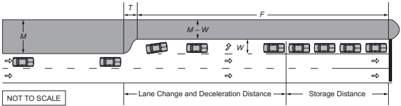

Legend:

F = full-width left-turn lane length

M = median width

T = taper length

W = left-turn lane width

Figure 9-33. Key Dimensions for Maneuvers and Physical Boundaries at Left-Turn Auxiliary Lanes

In urban areas, short tapers appear to produce better 'targets' for the approaching drivers and to give more positive identification to an added auxiliary lane. Short tapers are preferred for deceleration lanes at intersections in urban areas because of slow speeds during peak periods. Short tapers also allow more length for full-width deceleration distance and do not restrict the ability of drivers to complete their lane changes further upstream of the intersection. This type of design may reduce the likelihood that entry into the auxiliary lane may spill back into the through lane. Jurisdictions are increasingly adopting the use of taper lengths as short as 50 ft [15 m] for a single-turn lane and 100 ft [30 m] for a dual-turn lane for streets in urban areas.

Some agencies permit the tapered section of deceleration auxiliary lanes to be constructed in a 'squared-off' section at full paving width and depth. This configuration involves a painted delineation of the taper. The abrupt squared-off beginning of deceleration exits offers improved driver commitment to the exit maneuver and also contributes to driver security because of the elimination of the unused portion of long tapers.

The squared-off design principle can be applied to median deceleration lanes, and it can also be used at the beginning of deceleration right-turn exit terminals when there is a single exit lane. When two or more exit lanes are used, the tapered designs discussed in Section 10.9.6.4.7 are recommended. Additional guidance for lengths of tapers may be found in the MUTCD ( 9 ).

Straight-line tapers are frequently used, as shown in Figure 9-34A. The taper rate may be 8:1 [L:T] for design speeds up to 30 mph [50 km/h] and 15:1 [L:T] for design speeds of 50 mph [80 km/h] and greater. Straight-line tapers are particularly applicable where a paved shoulder is striped to delineate the auxiliary lane. Short, straight-line tapers should not be used on curbed

--',''','',',',','''''',,,,''-'-',,',,',',,'---

streets in urban areas because of the probability of vehicles hitting the leading end of the taper. A short curve is desirable at each end of long tapers as shown in Figure 9-34B, but may be omitted for ease of construction. Where curves are used at the ends, the tangent section should be about one-third to one-half of the total length.

Symmetrical reverse curve tapers are commonly used on curbed streets in urban areas. Figure 9-34C shows a design taper with symmetrical reverse curves.

A more desirable reverse-curve taper is shown in Figure 9-34D where the turnoff curve radius is about twice that of the second curve. When 100 ft [30 m] or more in length is provided for the tapers in Figure 9-34D, tapers 1 and 2 would be suitable for low-speed operations. All the example design dimensions and configurations shown in Figure 9-34 are applicable to rightturn lanes as well as left-turn lanes.

U.S. CUSTOMARY

Figure 9-34a. Examples of Taper Design for Left- and Right-Turn Auxiliary Lanes (U.S. Customary)

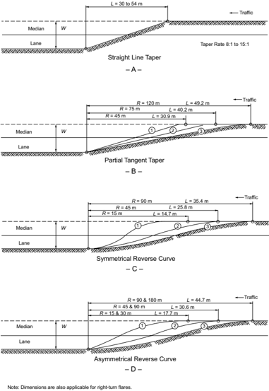

METRIC

Figure 9-34b. Examples of Taper Design for Left- and Right-Turn Auxiliary Lanes (Metric)

## 9.7.3  Design Treatments for Left-Turn Maneuvers

## 9.7.3.1  Guidelines for Provision and Design of Left-Turn and Bypass Lanes

Many factors enter into the choice of type of intersection and the extent of design of a given type, but the principal controls are the design-hour traffic volume, the character or composition of traffic, and the design speed. The character of traffic and design speed affects many details of design, but in choosing the type of intersection they are not as significant as the traffic volume. Of particular significance are the actual and relative volumes of traffic involved in various turning and through movements.

In designing an intersection, left-turning traffic should be removed from the through lanes, whenever practical. Therefore, provisions for left turns (i.e., left-turn lanes) have widespread application. Ideally, left-turn lanes should be provided at driveways and street intersections along major arterial and collector roads wherever left turns are permitted. In some cases or at certain locations, providing for indirect left turns (jughandles, U-turn lanes, and diagonal roadways) may be appropriate to reduce crash frequencies and preserve capacity. The provision of left-turn lanes has been found to reduce crash rates anywhere from 20 to 65 percent ( 18 ). Left-turn facilities should be established on roadways where traffic volumes are high enough or crash histories are sufficient to warrant them. They are often needed to provide adequate service levels for the intersections and the various turning movements.

Figures 9-5B and 9-6B provide examples of bypass lanes, which are added to the outside edge of  the  approach,  allowing  through  vehicles  to  pass  left-turning  vehicles  on  the  right,  while Figures 9-5C and 9-6C show traditional left-turn lanes. Regardless of the treatment, consideration of traffic demand, delay savings, crash reduction, and construction costs are all key factors in determining whether to install a left-turn lane or a bypass lane. Research on left-turn accommodations at unsignalized intersections ( 16 ) produced warrants for the installation of left-turn lanes and bypass lanes that account for those factors. Traffic-volume-based guidelines for where left-turn lanes should be provided are presented in:

- y Table 9-24 and Figure 9-35 for arterials in urban areas
- y Table 9-25 and Figure 9-36 for two-lane highways in rural area
- y Table 9-26 and Figure 9-37 for four-lane highways in rural areas

These tables and figures are applicable at unsignalized intersections with streets and driveways where the major road is uncontrolled and the minor-road approaches are stop- or yield-controlled. Several documents for both signalized and unsignalized intersections provide guidance on left-turn lanes ( 19 , 28 , 34 ). These guidelines discuss the need for left-turn lanes based upon (a) the number of arterial lanes, (b) design and operating speeds, (c) left-turn volumes, and (d) opposing traffic volumes. The volume-based guidelines or warrants presented below indicate situations where a left-turn lane may be desirable, not necessarily situations where a left-turn lane is definitely needed.

Table 9-24. Suggested Left-Turn Lane Guidelines Based on Results from Benefit-Cost Evaluations for Unsignalized Intersections on Arterials in Urban Areas (16)

| Left-Turn Lane Peak-Hour Volume (veh/h)   |   Three-Leg Intersection, Major-Road Volume (veh/h/ln) that Warrants a Left-Turn Lane | Four-Leg Intersection, Major-Road Volume (veh/h/ln) that Warrants a Left-Turn Lane   |
|-------------------------------------------|---------------------------------------------------------------------------------------|--------------------------------------------------------------------------------------|
| 5                                         |                                                                                   450 | 50                                                                                   |
| 10                                        |                                                                                   300 | 50                                                                                   |
| 15                                        |                                                                                   250 | 50                                                                                   |
| 20                                        |                                                                                   200 | 50                                                                                   |
| 25                                        |                                                                                   200 | 50                                                                                   |
| 30                                        |                                                                                   150 | 50                                                                                   |
| 35                                        |                                                                                   150 | 50                                                                                   |
| 40                                        |                                                                                   150 | 50                                                                                   |
| 45                                        |                                                                                   150 | < 50                                                                                 |
| 50 or More                                |                                                                                   100 | < 50                                                                                 |

Note: These guidelines apply where the major road is uncontrolled and the minor-road approaches are stop- or yield-controlled. Both the left-turn peak-hour volume and the major-road volume warrants should be met as shown in Figure 9-35.

Figure 9-35. Suggested Left-Turn Lane Warrants Based on Results from Benefit-Cost Evaluations for Intersections on Arterials in Urban Areas (16)

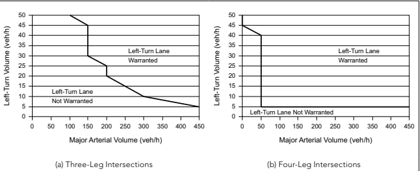

--',''','',',',','''''',,,,''-'-',,',,',',,'---

Table 9-25. Suggested Left-Turn Treatment Guidelines Based on Results from Benefit-Cost Evaluations for Intersections on Two-Lane Highways in Rural Areas (16)

| Left-Turn Lane Peak-Hour Volume (veh/h)   | Three-Leg Intersection, Major-Road Two-Lane Highway Peak-Hour Volume (veh/h/ln) that Warrants a Bypass Lane   |   Three-Leg Intersection, Major-Road Two-Lane Highway Peak-Hour Volume (veh/h/ln) that Warrants a Left-Turn Lane | Four-Leg Intersection, Major-Road Two-Lane Highway Peak-Hour Volume (veh/h/ln) that Warrants a Left-Turn Lane   |
|-------------------------------------------|---------------------------------------------------------------------------------------------------------------|------------------------------------------------------------------------------------------------------------------|-----------------------------------------------------------------------------------------------------------------|
| 5                                         | 50                                                                                                            |                                                                                                              200 | 150                                                                                                             |
| 10                                        | 50                                                                                                            |                                                                                                              100 | 50                                                                                                              |
| 15                                        | < 50                                                                                                          |                                                                                                              100 | 50                                                                                                              |
| 20                                        | < 50                                                                                                          |                                                                                                               50 | < 50                                                                                                            |
| 25                                        | < 50                                                                                                          |                                                                                                               50 | < 50                                                                                                            |
| 30                                        | < 50                                                                                                          |                                                                                                               50 | < 50                                                                                                            |
| 35                                        | < 50                                                                                                          |                                                                                                               50 | < 50                                                                                                            |
| 40                                        | < 50                                                                                                          |                                                                                                               50 | < 50                                                                                                            |
| 45                                        | < 50                                                                                                          |                                                                                                               50 | < 50                                                                                                            |
| 50 or More                                | < 50                                                                                                          |                                                                                                               50 | < 50                                                                                                            |

Note: These guidelines apply where the major road is uncontrolled and the minor-road approaches are stop- or yield-controlled. Both the left-turn peak-hour volume and the major-rad volume warrants should be met as shown in Figure 9-36.

Figure 9-36. Suggested Left-Turn Treatment Warrants Based on Results from Benefit-Cost Evaluations for Intersections on Two-Lane Highways in Rural Areas (16)

--',''','',',',','''''',,,,''-'-',,',,',',,'---

Table 9-26. Suggested Left-Turn Lane Guidelines Based on Results from Benefit-Cost Evaluations for Unsignalized Intersections on Four-Lane Highways in Rural Areas (16)

| Left-Turn Lane Peak-Hour Volume (veh/h)   |   Three-Leg Intersection, Major-Road Four-Lane Highway Peak-Hour Volume (veh/h/ln) that Warrants a Left-Turn Lane | Four-Leg Intersection, Major-Road Four-Lane Highway Peak-Hour Volume (veh/h/ln) that Warrants a Left-Turn Lane   |
|-------------------------------------------|-------------------------------------------------------------------------------------------------------------------|------------------------------------------------------------------------------------------------------------------|
| 5                                         |                                                                                                                75 | 50                                                                                                               |
| 10                                        |                                                                                                                75 | 25                                                                                                               |
| 15                                        |                                                                                                                50 | 25                                                                                                               |
| 20                                        |                                                                                                                50 | 25                                                                                                               |
| 25                                        |                                                                                                                50 | < 25                                                                                                             |
| 30                                        |                                                                                                                50 | < 25                                                                                                             |
| 35                                        |                                                                                                                50 | < 25                                                                                                             |
| 40                                        |                                                                                                                50 | < 25                                                                                                             |
| 45                                        |                                                                                                                50 | < 25                                                                                                             |
| 50 or More                                |                                                                                                                50 | < 25                                                                                                             |

Note: These guidelines apply where the major road is uncontrolled and the minor-road approaches are stop- or yield-controlled. Both the left-turn peak-hour volume and the major-road volume warrants should be met as shown in Figure 9-37.

Figure 9-37. Suggested Left-Turn Lane Warrants Based on Results from Benefit-Cost Evaluations for Intersections on Four-Lane Highways in Rural Areas (16)

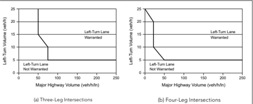

--',''','',',',','''''',,,,''-'-',,',,',',,'---

In addition to using guidance presented in the previous tables and figures, site-specific conditions need to be evaluated to determine the economic feasibility of adding a turn lane. Physical constraints along the roadside, particularly in urban areas, may make the addition of a turn lane impractical.

The HCM ( 49 ) indicates that exclusive left-turn lanes at signalized intersections should be installed as follows:

- y Exclusive  left-turn  lanes  should  be  provided  where  exclusive  left-turn  signal  phasing  is provided;
- y Exclusive  left-turn  lanes  should  be  considered  where  left-turn  volumes  exceed  100  veh/h (left-turn lanes may be provided for lower volumes as well based on the roadway agency's assessment of the need, the state of local practice, or both); and
- y Double left-turn lanes should be considered where left-turn volumes exceed 300 veh/h.

Additional information on left-turn lanes, including their suggested lengths, can be found in NCHRP Synthesis 225, NCHRP Report 279, and NCHRP Report 745 ( 15, 30, 34 ). In the case of double left-turn lanes, a capacity analysis of the intersection should be performed to determine what traffic controls are needed in order for it to function properly.

Local conditions and the cost of right-of-way often influence the type of intersection selected as well as many of the design details. Limited sight distance, for example, may make it desirable to control traffic by yield signs, stop signs, or traffic signals when the traffic densities are less than those ordinarily considered appropriate for such control. The alignment and grade of the intersecting roads and the angle of intersection may make it advisable to channelize or use auxiliary pavement areas, regardless of the traffic densities. In general, traffic service, roadway design designation, physical conditions, and cost of right-of-way are considered jointly in choosing the type of intersection.

For the general benefit of through-traffic movements, the number of crossroads, intersecting roads, or intersecting streets should be minimized. Where intersections are closely spaced on a two-way facility, it is seldom practical to provide signals for completely coordinated traffic movements at reasonable speeds in opposing directions on that facility. At the same time, the resultant road or street patterns should permit travel on roadways other than the predominant roadway without too much inconvenience. Traffic analysis is needed to determine whether the road or street pattern, left open across the predominate roadway, is adequate to serve normal traffic plus the traffic diverted from any terminated road or street.

The functional classification of the road, the patterns of traffic movement at the intersections and the volume of traffic, including pedestrians and bicyclists, on each approach during one or more peak periods of the day are indicative of the type of traffic control devices needed, the roadway widths needed (including auxiliary lanes), and where applicable, the degree of channel-

ization needed to expedite the movement of all traffic. The differing arrangement of islands and the shape and length of auxiliary lanes depend on whether signal control is provided.

The composition and character of traffic are a design control. Movements involving large trucks need larger intersection areas and flatter approach grades than those needed at intersections where traffic consists predominantly of passenger cars. Bus stops located near an intersection may further modify the arrangement. Approach speeds of traffic also have a bearing on the geometric design as well as on control devices and markings.

The number and locations of the approach roadways and their angles of intersection are major controls for the intersection geometric pattern, the location of islands, and the types of control devices. Intersections preferably should be limited to no more than four approach legs. Two or more crossroads intersecting an arterial roadway in close proximity should be combined into a single crossing.

## 9.7.3.2  Median Left-Turn Lanes

A median left-turn lane is an auxiliary lane for storage or speed change of left-turning vehicles located at the left of a one-directional roadway within a median or divisional island. Inefficiencies in operations may be evident on divided roadways where such lanes are not provided. Median lanes, therefore, should be provided at intersections and at other median openings where there is a high volume of left turns or where the vehicular speeds are high. Median lane designs for various widths of median are shown in Figures 9-38 and 9-39. The positive offset design shown in Figure 9-40, which can improve the sight distance for left-turning vehicles where there are opposing left-turn lanes, has been found to substantially reduce the frequency of left-turn crashes compared to zero or negative offset designs and is desirable for use where practical ( 33 ).

Median widths of 20 ft [6 m] or more are desirable at intersections with single median lanes, but widths of 16 to 18 ft [4.8 to 5.4 m] permit reasonably adequate arrangements. Where two median lanes are used, a median width of at least 28 ft [8.4 m] is desirable to permit the installation of two 12-ft [3.6-m] lanes and a 4-ft [1.2-m] separator. Where a pedestrian refuge is provided, a minimum median width of 6 ft [1.8 m] should be used. Although not equal in width to a normal traveled lane, a 10-ft [3.0-m] lane with a 2-ft [0.6-m] curbed separator or with traffic buttons or paint lines, or both, separating the median lane from the opposing through lane may be acceptable where speeds are low, the intersection is controlled by traffic signals, and pedestrian refuge is not desired.

Figure 9-38 shows a minimum design for a median left-turn lane within a median 14 to 16 ft [4.2 to 4.8 m] wide. A curbed divider width of 4 ft [1.2 m] is recommended, and the median left-turn lane should be 10 to 12 ft [3.0 to 3.6 m] wide. As mentioned previously, a minimum median width of 6 ft [1.8 m] should be used where pedestrian refuge is to be provided. Figure 9-39 illustrates a more liberal median left-turn design within a median width of 18 ft [5.4 m] or more. On these medians, the elongated tapers may be desirable. For medians 18 ft [5.4 m] wide

or more, a flush, color-contrasted divider is recommended to delineate the area between the turning lane and the adjacent through lane in the same direction of travel.

## U.S. CUSTOMARY

M

= 14 to 16 ft

## METRIC

M = 4.2 to 4.8 m

Legend:

L  =  length of median opening

M  =  median width

R  =  control radius conspicuous line marking

Figure 9-38. 14- to 16-ft [4.2- to 4.8-m] Median Width Left-Turn Design

## U.S. CUSTOMARY

Figure 9-39. Median Left-Turn Design for Median Width of 16 ft [4.8 m] or More

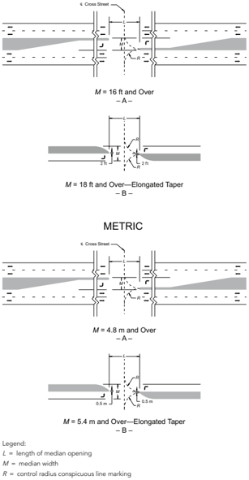

--',''','',',',','''''',,,,''-'-',,',,',',,'---

Pavement markings, contrasting pavement texture, signs, and physical separators may be used to discourage through drivers from inadvertently entering the wrong lane.

## 9.7.3.3  Median End Treatment

The form of treatment given the end of the narrowed median adjacent to lanes of opposing traffic depends largely on the available width. The narrowed median may be curbed to delineate the lane edge; to separate opposing movements; to provide space for signs, markers, and luminaire supports; and to protect pedestrians. For a discussion on 'ramped down' approaches to curb medians, reference can be made to Section 9.6.3 on 'Islands.' To serve these purposes satisfactorily, a minimum narrowed median width of 4 ft [1.2 m] is recommended and a width of 6 to 8 ft [1.8 to 2.4 m] is preferable. A minimum narrowed median width of 6 ft [1.8 m] should be used when pedestrian refuge is provided. These dimensions can be provided within a median 16 to 18 ft [4.8 to 5.4 m] wide and a turning lane width of 12 ft [3.6 m].

For medians wider than about 18 ft [5.4 m], as shown in Figure 9-39, it is usually preferable to provide some offset between the left-turn lanes in the opposing directions of travel. Offset leftturn lanes of this type are discussed in the next portion of this section.

For curbed dividers 4 ft [1.2 m] or more in width at the narrowed end, the curbed nose can be offset from the opposing through-traffic lane 2 ft [0.6 m] or more, with gradual taper beyond to make it less vulnerable to contact by through traffic. The shape of the nose for curbed dividers 4 ft [1.2 m] wide is usually semicircular, but for a wider width the ends are normally shaped to a bullet nose pattern to conform better to the paths of turning vehicles.

## 9.7.3.4  Offset Left-Turn Lanes

Parallel offset left-turn lanes may be used at both signalized and unsignalized intersections; this configuration is illustrated in Figure 9-40. For medians wider than about 18 ft [5.4 m], it is desirable to offset the left-turn lane to provide improved visibility of oncoming traffic for left-turning drivers. Offsetting the left-turn lanes in a positive direction (see Figure 9-40) will reduce the width of the divider immediately before the intersection, rather than to align it exactly parallel with and adjacent to the through lane. This alignment will place the vehicle waiting to make the turn as far to the left as practical, maximizing the offset between the opposing left-turn lanes, and thus providing improved visibility of opposing through traffic. The advantages of offsetting the left-turn lanes are (1) better visibility of opposing through traffic; (2) decreased possibility of conflict between opposing left-turn movements within the intersection; and (3) more left-turn vehicles served in a given period of time, particularly at a signalized intersection ( 19 ). Figure 9-41 illustrates the typical types of parallel offset left-turn lanes, classified by the manner in which the positive offset is provided.

Figure 9-40. Examples of Left-Turn Lanes with Negative, Zero, and Positive Offset (10)

An offset between opposing left-turn vehicles can also be achieved with a left-turn lane that diverges from the through lanes and crosses the median at a slight angle. Figure 9-40B illustrates a tapered offset left-turn lane of this type. Tapered offset left-turn lanes provide the same advantages as parallel offset left-turn lanes in reducing sight distance obstructions and potential conflicts between opposing left-turn vehicles and in increasing the efficiency of signal operations. Tapered offset left-turn lanes are normally constructed with a 4-ft [1.2-m] nose between the left-turn lane and the opposing through lanes.

This type of offset is especially effective for turning radii allowance where trucks with long rear overhangs, such as logging trucks, are turning from the main line roadway. This same type of offset geometry may also be used for trucks turning right with long rear overhangs.

Parallel and tapered offset left-turn lanes should be separated from the adjacent through-traffic lanes by painted or raised channelization.

Figure 9-41. Parallel and Tapered Offset Left-Turn Lane

## 9.7.3.5  Simultaneous Left Turns

Simultaneous left turns may be considered at an intersection of two major roadways, but design for single lane simultaneous opposing trucks is generally impractical. Figure 9-42 indicates traffic patterns that should be considered in the design. Marking details are given in the MUTCD ( 9 ).

A design feature that can improve intersection operation is to provide a minimum clear distance of 10 ft [3.0 m] between opposing left-turn movements within the intersection.

--',''','',',',','''''',,,,''-'-',,',,',',,'---

Figure 9-42. Four-Leg Intersection Providing Simultaneous Left Turns

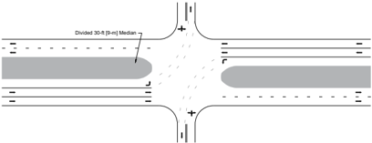

## 9.7.3.6  Double or Triple Left-Turn Lanes

Where two median lanes are provided as a double left-turn lane, left-turning vehicles leave the through lanes to enter the median lanes in single file, but once within the median lanes, the vehicles are stored in two lanes. On receiving the green indication, the left-turning vehicles turn simultaneously from both lanes.

Research has shown an increase in capacity from a single median lane to a double left-turn lane of approximately 195 percent ( 16 ). Occasionally, the two-abreast turning maneuvers may lead to sideswipe crashes. These usually result from too sharp a turning radius or a roadway that is too narrow. The receiving leg of the intersection should have adequate width to accommodate two lanes of turning traffic. A width of 30 ft [9 m] is used by several roadway agencies. Capacity benefits can be achieved if the receiving leg width is greater than 36 ft [11 m]; however, the capacity benefits notwithstanding, the tradeoffs for wider crossing distances include longer crosswalk distances for pedestrians (leading to longer clearance times in the signal cycle), a larger overall intersection footprint, and increased costs to construct and maintain additional pavement area. While triple left-turn lanes exist at locations across the United States, very little safety or operational research has been conducted on them. Furthermore, there are alternative intersection designs, such as the median U-turn or the restricted two-way crossing U-turn that may offer improved safety and operational benefits in places where turning volumes need more than a single left-turn lane.

Multiple left-turn lanes are becoming more widely used at signalized intersections where traffic volumes have increased beyond the design volume of the original single left-turn lane. The following are design considerations for double or triple left-turn lanes:

- y Width of receiving leg
- y Width of intersection (to accommodate the two or three vehicles turning abreast)
- y Physical clearance between opposing left-turn movements if concurrent maneuvers are used

- y Turning path width for design vehicle
- y Pavement marking visibility
- y Location of downstream conflict points
- y Weaving movements downstream of turn
- y Potential for pedestrian conflict
- y Consideration for median refuge for pedestrians given long pedestrian crossing lengths

Offtracking and swept path width are important factors in designing double and triple left-turn lanes. At such locations, vehicles should be able to turn side-by-side without encroaching upon the adjacent turn lane. A desirable turning radius for a double or triple left-turn lane is 90 ft [27 m], which will accommodate the P, SU-30 [SU-9], SU-40 [SU-12], and WB-40 [WB-12] design vehicles within a swept path width of 12 ft [3.6 m]. Larger vehicles need greater widths to negotiate double or triple left-turn lanes constructed with a 90 ft [27 m] turning radius without encroaching on the paths of vehicles in the adjacent lane.

Table 9-27 illustrates the swept path widths for specific design vehicles making 90-degree left turns ( 23 ). Table 9-27 can be used to determine the width needed at the center of a turn where the maximum vehicle offtracking typically occurs. To help drivers maintain their vehicles within the proper lanes, the longitudinal lane line markings of double or triple left-turn lanes may be extended through the intersection area to provide positive guidance (see MUTCD Section 3B.08 ( 9 ), 'Extensions Through Intersections or Interchanges,' for guidance). This type of pavement marking extension is intended to provide a visual cue for lateral positioning of the vehicle as the driver makes a turning maneuver.

Table 9-27. Swept Path Widths for 90-Degree Left Turns (23)

| U.S. Customary                 | U.S. Customary                                     | U.S. Customary                                     | U.S. Customary                                     | U.S. Customary                                     |
|--------------------------------|----------------------------------------------------|----------------------------------------------------|----------------------------------------------------|----------------------------------------------------|
| Centerline Turning Radius (ft) | Swept Path Width (ft) for Specific Design Vehicles | Swept Path Width (ft) for Specific Design Vehicles | Swept Path Width (ft) for Specific Design Vehicles | Swept Path Width (ft) for Specific Design Vehicles |
| Centerline Turning Radius (ft) | SU-30                                              | SU-40                                              | WB-62                                              | WB-67D                                             |
| 75                             | 10.7                                               | 12.3                                               | 21.1                                               | 16.6                                               |
| 100                            | 9.8                                                | 11.2                                               | 18.4                                               | 14.7                                               |
| 150                            | 9.1                                                | 10.1                                               | 15.2                                               | 12.5                                               |

| Metric                        | Metric                                            | Metric                                            | Metric                                            | Metric                                            |
|-------------------------------|---------------------------------------------------|---------------------------------------------------|---------------------------------------------------|---------------------------------------------------|
| Centerline Turning Radius (m) | Swept Path Width (m) for Specific Design Vehicles | Swept Path Width (m) for Specific Design Vehicles | Swept Path Width (m) for Specific Design Vehicles | Swept Path Width (m) for Specific Design Vehicles |
| Centerline Turning Radius (m) | SU-9                                              | SU-12                                             | WB-19                                             | WB-20D                                            |
| 23                            | 3.3                                               | 3.7                                               | 6.4                                               | 5.1                                               |
| 30                            | 3.0                                               | 3.4                                               | 5.6                                               | 4.4                                               |
| 46                            | 2.8                                               | 3.1                                               | 4.6                                               | 3.8                                               |

--',''','',',',','''''',,,,''-'-',,',,',',,'---

## 9.8  MEDIAN OPENINGS

## 9.8.1  General Design Considerations

Medians are discussed in Section 4.11 chiefly as an element of the cross section. General ranges in width are given, and median width at intersections is discussed briefly. For intersection conditions, the median width, the location and length of the opening and the design of the median end are developed in combination to fit the character and volume of through and turning traffic. Figure 9-38 illustrates the appropriate dimensions for the median width and the length of median opening. Median openings should reflect street or block spacing and the access classification of the roadway. In addition, full median openings should be consistent with traffic signal spacing criteria. In some situations, median openings should be eliminated or made directional. Median openings for the exclusive use of pedestrians and bicyclists or emergency vehicles may be appropriate in some situations.

Spacing of openings should be consistent with access management classifications or criteria. Where the traffic pattern at an intersection shows that nearly all traffic travels through on the divided roadway and the volume is well below capacity, a median opening of the simplest and least costly design may be sufficient. This type of opening permits vehicles to make cross and turning movements, but in doing so they may encroach on adjacent lanes and usually will not have a protected space clear of other traffic. Where a traffic pattern shows appreciable cross and turning movements or through traffic of high speed and high volume, the shape and width of the median opening should provide for turning movements to be made without encroachment on adjacent lanes and with little or no interference between traffic movements.

The design of a median opening and median ends should be based on traffic volumes, urban/ rural area characteristics, and type of turning vehicles, as discussed in Chapter 2. Crossing and turning traffic should operate in conjunction with the through traffic on the divided roadway. Design should be based on the volume and composition of all movements occurring simultaneously during the design hours. The design of a median opening becomes a matter of considering what traffic is to be accommodated, choosing the design vehicle to use for layout controls for each cross and turning movement, investigating whether larger vehicles can turn without undue encroachment on adjacent lanes, and finally checking the intersection for capacity. If the capacity is exceeded by the traffic demand, the design should be expanded, possibly by widening or otherwise adjusting widths for certain movements. Urban/rural characteristics may influence the median width selected. Intersections with narrow medians in urban areas have been found to operate with lower crash frequencies than wider medians, while unsignalized intersections with wider medians in rural areas have been found to operate with lower crash frequencies than narrower medians ( 20 ). Research results indicate that medians on arterial streets in urban areas should generally be no wider than needed to accommodate the selected left-turn treatments at intersections for vehicles turning onto and off the roadway. By contrast, medians on arterials in rural areas may be as wide as appropriate as long as the major roadways in both directions of

--',''','',',',','''''',,,,''-'-',,',,',',,'---

travel are visible to drivers on the minor-road approaches ( 20 ). Traffic control devices such as yield signs, stop signs, or traffic signals may be needed to regulate the various movements effectively and improve the effectiveness of operations.

## 9.8.2  Control Radii for Minimum Turning Paths

An important factor in designing median openings is the path of each design vehicle making a minimum left turn at 10 to 15 mph [15 to 25 km/h]. Where the volume and type of vehicles making the left-turn movement call for higher than minimum speed, the design may be made by using a radius of turn corresponding to the speed deemed appropriate given the project context.

The paths of design vehicles making right turns are given in Section 2.8.2. Any differences between the minimum turning radii for left turns and those for right turns are small and are insignificant in roadway design. Designers should refer to turning templates as well as turning path software compatible with CADD systems to evaluate the effects of the turning radii of various design vehicles on a specific median opening design.

The customary intersection on a divided roadway does not have a continuous physical edge of traveled way delineating the left-turn path. Instead, the driver has guides at the beginning and at the end of the left-turn operation: (1) the centerline of an undivided crossroad or the median edge of a divided crossroad, and (2) the curved median end. For the central part of the turn the driver has the open central intersection area in which to maneuver. Under these circumstances for minimum design of the median end, the precision of compound curves does not appear to be needed, and simple curves for the minimum assumed edge of left turn have been found satisfactory. The larger the simple curve radius used, the better it will accommodate a given design vehicle, but the resulting layout for the larger curve radius will have a greater length of median opening and greater paved areas than one for a minimum radius. These areas may be sufficiently large to result in erratic maneuvering by small vehicles, which may interfere with other traffic. To reduce the effective size of the intersection for most motorists, consideration should be given to providing an edge marking corresponding to the desired turning path for passenger cars, while providing sufficient paved area to accommodate the turning path of an occasional large vehicle. Minimizing the median opening length has shown to reduce crashes for divided highways in rural areas; as such, the minimum turning radius for the design vehicle should be used for design purposes.

Medians should be designed based on a control radius that is made tangent to the upper median edge and to the centerline of the undivided crossroad, thereby locating the semicircular median end or forming a portion of a bullet nose end.

Large vehicles can turn at an intersection designed for passenger cars as they may swing wide and reverse at the end of the turn to complete the maneuver. Drivers of large vehicles making sharp left turns also may swing right before turning left. However, paths might be a combination of these

--',''','',',',','''''',,,,''-'-',,',,',',,'---

two extremes, swinging out before beginning the left turn with infringement on the outer lane of the divided roadway and also swinging wide and reversing at the end of the turn.

Encroachments for various design vehicles turning from the divided roadway occur beyond the two-lane (projected) crossroad edge of traveled way. With wide crossroads this encroachment is within the median opening, but with two-lane crossroads the encroachment may be beyond the median end, particularly with wide medians having a minimum length of opening. As the left turn is completed, the encroachment may be beyond the edge of traveled way for right turns located diagonally opposite the beginning of the left-turn movement off the divided roadway. With wide crossroads this encroachment does not extend beyond the right-turn edge of traveled way, but with two-lane crossroads and narrow medians it may extend beyond. By swinging over a  short  distance  on  the  divided  roadway  before  beginning the turn, most drivers could pass through these openings and remain on the paved areas. Although this procedure is used extensively, it should be discouraged by using a more expansive design where practical.

Encroachment distances can be lessened by the drivers anticipating the turn and swinging right before turning left, if space is available. This space depends on the median width, the length of opening as governed by the number of lanes on the crossroad, and other limitations such as triangular islands for channelizing right-turn movements.

Minimum median openings based on a control radius of 40 ft [12 m] are not well suited for lengths  of  opening  for  two-lane  crossroads  with  rural  highways  because  trucks  cannot  turn left  without  difficult  maneuvering and encroachment on median ends or outer shoulders, or both, depending on the median width. It may be suitable for wide crossroad traveled ways, but for these cases it is advantageous to use a control radius greater than 40 ft [12 m], which enables all vehicles to turn at a little greater speed and enables trucks to maneuver and turn with less encroachment. Use of a squared or truncated bullet nose design in conjunction with the 56-ft [16.8-m] or 44-ft [13.2-m] minimum length of opening is beneficial in these minimum situations  as  previously  discussed.  Provision  of  longer  tapers  not  only  avoids  this  somewhat awkward-looking design but also provides for other important objectives as well. This topic is discussed further in Section 9.8.4 on 'Design Considerations for Higher Speed Left Turns.' Turning templates or turning path software compatible with CADD systems may be employed to evaluate the sufficiency of the median opening design.

## 9.8.2.1  Shape of Median End

One form of a median end at an opening is a semicircle, which is a simple design that is satisfactory for narrow medians. However, several disadvantages of semicircular ends for medians greater than 10 ft [3.0 m] in width are widely recognized, and other more desirable shapes are generally used.

An alternate median end design that fits the paths of design vehicles is a bullet nose. The bullet nose is formed by two symmetrical portions of control radius arcs and an assumed small radius (e.g., 2 ft [0.6 m] is used, to round the nose). The bullet nose design closely fits the path of the

inner rear wheel and results in less intersection pavement and a shorter length of opening than the semicircular end. These advantages are operational in that the driver of the left-turning vehicle is channelized for a greater portion of the path and has a better guide for the maneuver. The elongated median is better positioned to serve as a refuge for pedestrians crossing the divided roadway, if it is of sufficient width.

For medians 4 ft [1.2 m] wide, there is little or no difference between the two forms of median end. For a median width of 10 ft [3.0 m] or more, the bullet nose is superior to the semicircular end and preferably should be used in design. On successively wider medians, the bullet nose end results in shorter lengths of openings. The ends for medians 8 ft [2.4 m] wide or wider may also take the shape of squared or flattened bullet ends, the flat end being parallel to the crossroad centerline. This shape retains the advantages over semicircular median ends regardless of the median width because of the channelizing control. The bullet nose curves are such as to position the left-turning vehicles to turn to or from the crossroad centerline, whereas the semicircular end tends to direct the left-turning movement onto the opposing traffic lane of the crossroad due to vehicle offtracking. The need for pedestrian refuge within the median should be considered in the selection of a final design.

## 9.8.3  Effect of Skew

A control radius for design vehicles as the basis for minimum design of median openings results in lengths of openings that increase with the skew angle of the intersection. Although the bullet nose end remains preferable, the skew introduces other variations in the shape of the median end. Several alternate designs that depend on the skew angle, median width, and control radius may be considered.

Semicircular ends result in very long openings and minor channelizing control for vehicles making a left turn with less than 90 degrees in the turning angle.

A symmetrical bullet nose with curved sides determined by the control radius and point of tangency has little channelizing control for vehicles turning left less than 90 degrees from the divided roadway. An asymmetrical bullet nose has the most positive control and less paved area than the other types of median ends.

In general, median openings longer than 80 ft [25 m] should be avoided, regardless of the skew. Achieving this may call for special channelization, left-turn lanes, or adjustment to reduce the crossroad skew, all of which result in less than the maximum median-opening length.

Preferably, each skewed crossing should be studied separately with turning templates or turning path software compatible with CADD systems to permit the designer to make comparisons and choose the preferred layout. The need for pedestrian refuge within the median should be considered when selecting a final design.

## 9.8.4  Design Considerations for Higher Speed Left Turns

Median openings that enable vehicles to turn on minimum paths and at 10 to 15 mph [15 to 25 km/h] are adequate for intersections in urban areas and also in rural areas where most major-road traffic for the most part proceeds straight through the intersection and does not make a left-turn maneuver. In rural areas, where through-traffic volumes and speeds are high and left-turning movements are frequent, undue interference with through traffic should be avoided by providing median openings that permit turns without encroachment on adjacent lanes. This arrangement would enable turns to be made at speeds greater than the minimum vehicle paths allow and provide space for vehicle protection while turning or stopping. The general pattern for minimum design can be used with larger dimensions.

A variety of median-opening arrangements may be considered that depend on the control dimensions (width of median and width of crossroad or street, or other), the size of the vehicle to be used as a design control, and the need to provide pedestrian refuge within the median.

Median openings having above-minimum control radii and bullet nose median ends are shown in Figure 9-43. The radii of 90, 170, and 230 ft [30, 50, and 70 m] represent minimum radii for turning speeds of 20, 25, and 30 mph [30, 40 and 40 km/h], respectively. The design controls are the three radii R , R 1 , and R 2 . Radius R is the control radius for the sharpest portion of the turn, R 1 defines the turnoff curve at the median edge, and R 2 is the radius of the tip. When a sufficiently large R 1 is used, vehicles leaving the major road can turn at an acceptable speed and a sizable area inside the inner edge of through-traffic lane between points 1 and 2 may be available for speed change and protection from turning vehicles. Radius R 1 may vary from 80 to 400 ft [25 to 120 m] or more. Dimension B is the offset of the beginning of R1 for the passenger cars to the target lane line of the cross street.

The radii shown in Figure 9-43 will vary depending on the maximum superelevation rate selected. In this case, the ease of turning probably is more significant than the turning speeds because the vehicle will need to slow down to about 10 to 15 mph [15 to 25 km/h] at the sharp part of the turn or may need to stop at the crossroad. Radius R 2 can vary considerably, but is pleasing in proportion and appearance when it is about one-fifth of the median width. Radius R is tangent to the crossroad centerline (or edge of crossroad median). Radii R and R 1 comprise the two-centered curve between the terminals of the left turn. For simplicity, the PC is established at point 2. Radius R cannot be smaller than the minimum control radius for the design vehicle, or these vehicles will be unable to turn to or from the intended lane even at low speed. To avoid a large opening, R should be held to a reasonable minimum (e.g., 50 ft [15 m]), as used in Figure 9-43.

The length of median opening is governed by the radii. For medians wider than 30 ft [9 m] coupled with a crossroad of four or more lanes, the control radius R generally will need to be greater than 50 ft [15 m] or the median opening will be too short. A rounded value can be chosen for the length of opening (e.g., 50 or 60 ft [15 or 18 m]) and that dimension can be used

to locate the center for R . Then R becomes a check dimension to verify the workability of the layout. The tabulation of values in Figure 9-43 shows the resultant lengths of median openings over a range of median widths for three assumed values of R 1 and for R assumed to be 50 ft [15 m]. Dimension 'B' is included as a general design control and for comparison with other above-minimum designs.

The median end designs in Figure 9-43 do not positively provide protection areas within the limits of the median width. A design using R 1 = 100 ft [30 m] or more provides space for at least a single passenger vehicle to pause in an area clear of both the through-traffic lanes and the crossroad lanes; such radii may provide enough protection space for larger design vehicles. At skewed intersections, above-minimum designs with bullet nose median ends can be applied directly. Where the skew is 10 degrees or more, adjustments in R and R 2 from the values shown are needed to provide the appropriate length of opening.

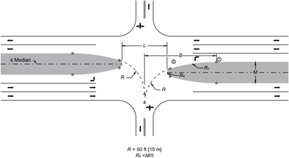

| U.S. Customary          | U.S. Customary          | U.S. Customary          | U.S. Customary          | U.S. Customary          | U.S. Customary          | U.S. Customary          | Metric   | Metric                    | Metric                    | Metric                    | Metric                    | Metric                    | Metric                    | Metric                    |
|-------------------------|-------------------------|-------------------------|-------------------------|-------------------------|-------------------------|-------------------------|----------|---------------------------|---------------------------|---------------------------|---------------------------|---------------------------|---------------------------|---------------------------|
| Width of Median, M (ft) | Dimensions in Feet when | Dimensions in Feet when | Dimensions in Feet when | Dimensions in Feet when | Dimensions in Feet when | Dimensions in Feet when |          | Dimensions in Meters when | Dimensions in Meters when | Dimensions in Meters when | Dimensions in Meters when | Dimensions in Meters when | Dimensions in Meters when | Dimensions in Meters when |
| Width of Median, M (ft) | R 1 = 90 ft             | R 1 = 90 ft             | R 1 = 170 ft            | R 1 = 170 ft            | R 1 = 230 ft            | R 1 = 230 ft            |          | R 1 = 30m                 | R 1 = 30m                 | R 1 = 50m                 | R 1 = 50m                 | R 1 = 70m                 | R 1 = 70m                 | R 1 = 70m                 |
| Width of Median, M (ft) | L                       | B                       | L                       | B                       | L                       | B                       |          | M (m)                     | L B                       |                           | L                         | B                         | L                         | B                         |
| 20                      | 58                      | 65                      | 66                      | 78                      | 71                      | 90                      |          | 6.0                       | 18.0                      | 20.2                      | 20.2                      | 24.4                      | 21.3                      | 27.6                      |
| 30                      | 48                      | 68                      | 57                      | 85                      | 63                      | 101                     |          | 9.0                       | 15.1                      | 21.4                      | 17.7                      | 26.5                      | 19.0                      | 30.4                      |
| 40                      | 40                      | 71                      | 50                      | 90                      | 57                      | 109                     |          | 12.0                      | 12.8                      | 22.4                      | 15.6                      | 28.3                      | 17.1                      | 32.7                      |
| 50                      | -                       | -                       | 44                      | 95                      | 51                      | 115                     |          | 15.0                      | -                         | -                         | 13.8                      | 29.9                      | 15.4                      | 34.7                      |
| 60                      | -                       | -                       | -                       | -                       | 46                      | 122                     |          | 18.0                      | -                         | -                         | -                         | -                         | 13.8                      | 36.7                      |
| 70                      | -                       | -                       | -                       | -                       | 41                      | 128                     |          | 21.0                      | -                         | -                         | -                         | -                         | 12.4                      | 38.4                      |

Figure 9-43.  Above-Minimum Design of Median Openings (Typical Bullet-Nose Ends)

## 9.9  INDIRECT LEFT TURNS AND U-TURNS

## 9.9.1  General Design Considerations

Divided roadways need median openings to provide access for crossing traffic in addition to left-turning and U-turning movements. The discussions to follow deal with the various design methods that accommodate these movements as appropriate for the context of the project, median width, the traffic volumes, and the potential for crashes at the intersection.

Provision for direct left turns is not practical at some locations. The cost of right-of-way or other constraints, such as cultural features adjacent to the roadway, may result in insufficient rightof-way to provide for direct left-turn movements for a reconstruction project to improve traffic movement on an existing roadway. Provision for direct left-turn movements could result in loss of efficiency and increased potential for traffic conflicts at intersections where the median is too narrow to provide a lane for left-turning vehicles and traffic volumes or speeds, or both, are relatively high. Vehicles that slow down or stop in a lane primarily used by through traffic to turn left cause a decrease in the capacity for through traffic and an increase in the potential for rear-end collisions. In some situations, the offset of left-turn lanes where medians are present may decrease sight distance and may, therefore, increase the potential for left-turn collisions.

Factors that should receive special consideration in design for left- and U-turn movements are the turning paths of the various design vehicles in conjunction with narrow medians. The demands for left- or U-turn maneuvers in the heavily developed residential or commercial sectors in urban areas may create inefficient traffic operations.

For roadways without control of access that have narrow non-traversable medians and no median openings such that traffic from driveways can enter the divided roadway only by turning right from the driveway, the only way traffic can gain access to the opposite traveled way is by indirect movements. Provision of median openings for each individual property would defeat a major purpose of providing a median and could increase traffic delays and driveway-related crashes. --',''','',',',','''''',,,,''-'-',,',,',',,'---

One option for access to adjacent properties is to use the interconnecting street patterns. This operation involves making the initial right turn, proceeding by continuous right turns around the block to the median opening that services the secondary crossroads, and then turning left. Variations of access to the divided roadway would also prevail for the property owners on the adjacent street patterns. However, the around-the-block principle would still control movements with respect to exit and return trips. The around-the-block option needs careful examination of existing turning radii to accommodate single-unit truck design vehicles and estimation of the number of WB vehicles that might use this method of indirect left turns or indirect U-turns. This  approach  needs  careful  design  attention  with  respect  to  restrictive  parking,  regulatory signs, and signal control devices in the proximity of each intersection.

The around-the-block alternative is not always practical, especially where radial routes traverse areas that are only partially developed and where there is no established pattern of adjacent roadways, often with no existing roads or streets running parallel to the through roadway. Even where there is a suitable network of adjacent roadways, the adverse travel is objectionable. The increased traffic  volumes  passing  through  four  intersections  and  the  left  turn  to  the  arterial might be as much of a hindrance to the free flow of traffic as a direct left-turn maneuver.

Another alternative is the use of the design principles described with respect to constructing jug-handle-type ramps or at-grade intersecting loops.

In addition to the issue of narrow medians and insufficient right-of-way, many principal arterial roadways are unable to adequately serve increasing travel demand along highly developed corridors in many urban and suburban areas. Long-distance trip efficiency is lost as a result of stops and delays along these corridors. Much of the congestion and reduced travel efficiency is a result of the operation of multiphase signalized intersections. Major intersections on multilane arterial principal arterial corridors in urban areas are frequently the single limiting capacity factor for the entire arterial corridor.

Conventional intersection designs are sometimes insufficient to address all design objectives at an intersection. Consequently, the engineering community is investigating and implementing innovative, unconventional treatments. Consideration of any solution should include the potential effects on all users of the intersection, including bicyclists, sighted pedestrians, and pedestrians with vision disabilities. Nonmotorized travel along and across the arterial corridor should be considered. Unconventional arterial intersection design, operation, and management strategies share several principles, including:

- y Design and operations emphasis on through-traffic movements along the arterial corridor,
- y A reduction in the number of signal phases (e.g., left-turn arrow phases) at major cross street intersections and increased green time allotment to arterial through movements, and
- y A reduction in the number of vehicular conflict points and separation of those conflict points that remain ( 37 ).
- y Accommodation of pedestrians and bicyclists as appropriate for the project context.

The result of these strategies is to provide an indirect path for the left-turn movement. Many strategies have been identified or used to improve intersection efficiency with an indirect left-turn strategy. Many concepts using indirect left-turn and cross-street through movement strategies to improve through street through movement capacity have been described and analyzed. Three design strategies-jughandles, median U-turns, and continuous flow intersections (displaced left  turn  lanes)-are  described  in  more  detail  below.  Other  concepts  use  variations  or  combinations of the intersection types and design strategies described in this chapter. Additional information regarding the design and operation of these concepts is contained in Signalized Intersections Informational Guide ( 5 ) as well as online FHWA information guides ( 14 ).

## 9.9.2  Intersections with Jughandle or Loop Roadways

Jughandles are one-way roadways in two quadrants of the intersection that allow for removal of left-turning traffic from the through stream without providing left-turn lanes. All turns-right, left, and U-turns-are made from the right side of the roadway. Drivers wishing to turn left exit the major roadway on the right and turn left onto the minor road at a terminus separated from the main intersection. There should be at least 100 ft [30 m] between the jughandle intersection and the stop bar for the primary intersection. Less right-of-way may be needed along the roadway because the left-turn lanes are not needed. However, more right-of-way is needed at the intersection to accommodate the jughandles. Each jughandle typically needs a triangle 400 ft [120 m] by 300 ft [90 m] in the quadrant deployed. Figure 9-44 illustrates a jughandle intersection with the diagonal connecting roadways located in advance of the intersection. The possible movements are illustrated in Figure 9-45.

Figure 9-44. Intersection with Jughandle Roadways for Indirect Left Turns Showing Vehicular Conflict Points

Figure 9-45. Vehicular Movements at an Intersection with Jughandle Roadways

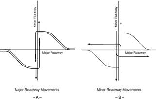

Jughandle roadways may be appropriate at intersections with high major-street through movements, low-to-medium left turns from the major street, low-to-medium left turns from the minor street, and any amount of minor-street through volumes. Intersections too small to allow large vehicles to turn left, as well as intersections with medians too narrow to provide a left-turn lane, may also be appropriate for the use of jughandle roadways. Jughandles can reduce leftturn collisions and improve operations by providing more available green time for major-street through movements.

The jughandle should operate with stop control at the minor street approach. Right turns onto the cross street may operate with yield control. Signing is needed in advance of the jughandle ramp to indicate that motorists destined to the left need to exit the roadway from the right-hand lane. In making the decision to use a jughandle roadway, effects on pedestrians and bicyclists should be considered.

With a jughandle roadway in place, the primary signalized intersection can operate more efficiently due to removal of a signal phase for left turns from the major road. Additional left turn phases may be used for the minor street or split-phased operation may be employed. The reduction of phases allows for either shorter cycle times or longer green splits to the major street through movements. Shorter cycle lengths should be considered to minimize vehicle queues on the cross street.

While a jughandle design provides a potential reduction in overall travel time and stops, longer travel time and more stops are likely for left-turning vehicles using the jughandle. Pedestrian crossing distance may be less due to the lack of left-turn lanes on the major street. Pedestrian delay may be reduced due to potentially shorter cycle lengths. However, pedestrians will have to cross the unsignalized jughandle roadway in addition to crossing at the primary signalized intersection. The diverge point, where motor vehicles, enter the jughandle roadway, may create

--',''','',',',','''''',,,,''-'-',,',,',',,'---

higher speed conflicts because the paths of through bicyclists and right-turning motor vehicles will cross. Transit stops may need to be located outside the influence area of the intersection including the ramp terminals. Additional signing, visual cues, and education may be needed to alert drivers that an exit from the right lane is required to turn left.

An alternate to providing a jughandle roadway in advance of the intersection is to provide a loop roadway beyond the intersection. The loop design may be considered when the right-ofway for the far-side quadrant is less expensive than that for the nearside quadrant. In making the decision to use a design with a loop roadway, effects on pedestrians and bicyclists should be considered. Vertical alignment and comparative grading costs may also influence the intersection quadrant where the turning roadway is placed. The left-turn movement becomes a rightturn movement at the far-side loop roadway, resulting in fewer vehicular conflicts and higher capacity for the left-turn movement. However, this increases the entering traffic volume for the intersection and doubles the exposure of drivers at the primary intersection as drivers making this maneuver pass through the primary intersection twice. Figure 9-46 illustrates the use of a loop roadway beyond the intersection.

Figure 9-46. Intersection with Loop Roadways for Indirect Left Turns

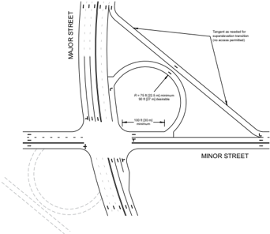

Additional information regarding design and operation of jughandle intersections is presented in Signalized Intersections Informational Guide ( 5 )  and Alternative Intersections/Interchanges: Informational Report ( 25 ).

## 9.9.3  Displaced Left-Turn Intersections

A displaced  left-turn  intersection,  also  known  as  a  continuous-flow  intersection  (CFI)  or  a crossover-displaced left-turn (XDL) intersection, removes the conflict between left-turning vehicles and oncoming traffic at the main intersection by introducing a left-turn bay placed to the left of oncoming traffic. Vehicles access the left-turn bay at a midblock signalized intersection on the approach where continuous flow is desired. Figure 9-47 shows the design of an intersection with displaced left-turn roadways and Figure 9-48 illustrates some of the vehicle movements at such an intersection. The use of the CFI separates the conflict points for left-turning traffic from the primary intersection.

The left turns potentially stop two times: once at the midblock signal on approach and once at the main intersection on departure. Depending upon the traffic volumes and distance between the midblock left-turn crossover signal and the primary intersection, signal coordination for the left-turning traffic may be possible.

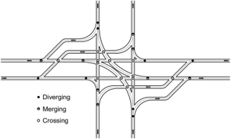

Figure 9-47. Diagram of a Displaced Left-Turn Intersection Showing Vehicular Conflict Points

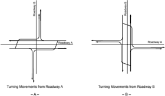

Figure 9-48. Vehicular Movements at a Displaced Left-Turn Intersection

The complete displaced left-turn intersection design operates as a set of two-phase signals. As part of the first phase, traffic is permitted to enter the left-turn bay by crossing the oncoming traffic lanes during the signal phase serving the cross street traffic. The second signal phase, which serves through traffic, also serves the protected left-turn movements.

Intersections with high through and left-turn volumes may be appropriate sites for displaced left-turn  intersections.  However,  effects  on  pedestrians  and  bicyclists  should  be  considered. There should be a low U-turn demand because U-turns are prohibited with this design. Rightof-way adjacent to the intersection may be needed for the left-turn roadways.

If  signals  are  not  phased  properly,  left-turning  vehicles  may  make  more  stops  than  at  conventional  intersections  and  therefore  may  experience  a  slightly  longer  delay.  Through-traffic movements benefit greatly from this design since a separate left-turn signal phase is removed from the intersection. Since multiple signalized intersections are placed in close proximity to one another, timing of the signals greatly affects intersection operation and failure of the signals can result in considerable confusion and delay. The wide geometric footprint of the CFI and the position of left-turn lanes between opposing through lanes and right-turn lanes may lead to unfamiliar crossing scenarios for pedestrians. Therefore, including pedestrian refuge islands as part of the design is desirable. The pedestrian crossings can be either one-stage or two-stage crossings depending upon the placement of refuge locations and signal operations. Integrating the pedestrian crossing considerations within the geometric and traffic signal timing design is critical when considering a CFI. The layout for pedestrian crossings may not be readily apparent, especially for pedestrians with vision disabilities. Medians should be sufficiently wide to provide pedestrian refuge between multiple crossings. The footprint is larger than for most at-grade intersections, but can be less than an interchange alternative. Signing, visual cues, and education are needed to provide direction for intersection users.

Additional information regarding the operation of displaced left-turn intersections is presented in Signalized Intersections Informational Guide ( 5 )  and Alternative Intersections/Interchanges: Informational Report ( 25 ).

## 9.9.4  Wide Medians with U-Turn Crossover Roadways

Improved operations and fewer intersection conflict points can be achieved by relocating the left-turn movements at intersections to median U-turn crossovers located beyond the intersection. For median U-turn crossovers located on the major road, drivers turn left off the major road by passing through the intersection, making a U-turn at the crossover, and turning right at the cross road. Drivers wishing to turn left onto the major road from the cross street turn right onto the major road and make a U-turn at the crossover. Bicyclists will make the same maneuvers unless other specific provisions are included. The effects on pedestrians and bicyclists should be considered.

--',''','',',',','''''',,,,''-'-',,',,',',,'---

The median crossover may also be located on the minor road. In this case, drivers wishing to turn left from the major road turn right on the minor road, and left through the median crossover. Minor-road vehicles turn left onto the major road by proceeding through the intersection, making a U-turn, and turning right at the major road. A variation of the minor-road U-turn crossover is a roundabout on the minor road on each side of the major road to accommodate U-turn maneuvers, an arrangement sometimes known as a bowtie design. Median U-turn crossovers may be provided on both the major and minor roads at an intersection.

Figure 9-49 illustrates an indirect left turn for two arterials where left turns are heavy on both roads. The north-south roadway is undivided and the east-west roadway is divided with a wide median. Because left turns from the north-south road would cause congestion because of the lack of storage, left turns from the north-south road are prohibited at the main intersection. Left-turning traffic turns right onto the divided road and then makes a U-turn at a one-way crossover located in the median of the divided road. Auxiliary lanes are highly desirable for the left-turn movements and the right-turn movements needed for the median U-turn operation. Figure 9-50 illustrates some of the vehicle movements at such an intersection.

Figure 9-51 illustrates a variation of this design called a restricted crossing U-turn (RCUT) intersection, also called a Superstreet intersection or a J-turn intersection. The RCUT redirects both left-turn and through movements from the crossroad to a one-way crossover located in the median of the divided roadway. Left-turning traffic from the major, divided roadway still utilizes the primary intersection. Bicyclists on the minor roadway have to merge with and follow the same path as motorists to cross the major roadway. This configuration is generally suited to higher-volume major roads in suburban and rural areas where relatively low traffic volumes enter from the crossroad. Pedestrians cross the divided roadway in a diagonal fashion, going from one corner to the opposite corner between the channelized left turns for the divided roadway. This pathway for pedestrians is illustrated in Figure 9-52. A further variant of this approach also prohibits left turns from the divided roadway at the primary intersection directing that movement to the crossovers.

Figure 9-49. Typical Arrangement of U-Turn Roadways for Indirect Left Turns on Arterials with Wide Medians

--',''','',',',','''''',,,,''-'-',,',,',',,'---

Figure 9-50. Vehicular Movements at an Intersection with U-Turn Roadways for Indirect Left Turns

Figure 9-51. Typical Restricted Crossing U-Turn (RCUT) Intersection

--',''','',',',','''''',,,,''-'-',,',,',',,'---

Figure 9-52. Illustration of Pedestrian Path Through a Restricted Crossing U-Turn (RCUT) Intersection (12)

A wide median of 60 ft [18 m] or more typically accommodates a U-turn crossover. To compensate for narrower median widths, the use of expanded paved aprons (bump-outs or 'loons') can be provided in the shoulder area opposite a median crossover to still accommodate the U-turn movements. Median U-turn roadways may be appropriate at intersections with high major-street through movements, low-to-medium left turns from the major street, low-to-medium left turns from the minor street and any amount of minor-street through volumes. Locations with the need to provide bicycle connectivity across the major roadway along the minor road may not be good candidates for this treatment, unless an appropriate path for the movement can be provided. Locations with high left-turning volumes may not be good candidates because the out-of-direction travel incurred and the potential for queue spillback at the median U-turn roadway location could outweigh the benefits associated with removing left turns from the main intersection. Median U-turn roadways can be applied on a single approach or multiple approaches.

- y The appropriate distance of the U-turn crossover from the main intersection will vary depending upon the traffic conditions such as vehicle speeds, traffic volumes for queue storage, the design vehicle, and the type of intersection traffic control to be used. In general, shorter distances are applicable if the main intersection is signalized, as gaps in the traffic stream will

--',''','',',',','''''',,,,''-'-',,',,',',,'---

be created by the signal phase change. Shorter distances result in less travel time for minor street left-turn and through vehicles, and can be especially helpful to minor street bicyclists making a left turn or a through movement. A longer distance to the U-turn crossover is generally  needed  if  the  primary  intersection  is  not  signalized.  However,  longer  distances result in more travel time for minor street left-turn and through vehicles. In all conditions, the distance to the U-turn crossover should adequately provide for a storage bay that avoids queue spillback. Sight distance at the U-turn crossover is needed both for U-turning drivers and for drivers of other vehicles approaching the crossover. Therefore, the availability of sight distance should be checked during the design process.

- y For additional guidance on the design of 'bump-outs' or 'loons,' see the FHWA publication, Restricted Crossing U-Turn Intersection ( 12 ).

Key design features of median U-turn roadways are summarized below:

- y Median U-turn roadways should be designed to accommodate the design vehicle.
- y Appropriate deceleration lengths and storage lengths should be provided based on the design volume and anticipated traffic control at the median U-turn roadway.
- y Adequate spacing between the U-turn roadway and the main intersection should be provided.
- y To accommodate a tractor-semitrailer combination truck as the design vehicle, the median on a four-lane arterial should be 60 ft [18 m] wide ( 36 ). If design vehicles do not have enough space to turn, additional pavement should be added outside the travel lane to allow these vehicles to complete the maneuver.

Key operational features of intersections with median U-turn roadways are summarized below:

- y Provision of median U-turn roadways allows for two-phase signal operation. This can reduce signal cycle length and delays for through vehicles. Left-turning vehicles have to travel farther to complete the turn, which may offset some operational benefits achieved for through vehicles.
- y Signing is needed to alert motorists of the presence of median U-turn roadways and the restriction of left-turn movements at the signalized intersection.
- y Installing traffic signals at median U-turn locations needs additional storage for the U-turn movement and needs signal timing coordination with adjacent signalized intersections.
- y The reduction in the number of signal phases at the signalized intersection improves the ability to coordinate signals along a corridor.

Use of a median U-turn crossover intersection may result in fewer left turn collisions and a minor reduction in merging and diverging collisions. There is a potential reduction in overall travel time and stops for main line through movements. Findings are mixed with respect to overall stops. The distance for pedestrians to cross is increased and turning paths of vehicles making median U-turns may encroach into bike lanes. Median widths of at least 6 ft [1.8 m] should be used for pedestrian refuge where multi-staged pedestrian crossing intervals are used. Additional

right-of-way may be needed and access may need to be restricted within the influence of the median U-turn locations. Signing, visual cues, education, and enforcement may be needed to guide drivers to the intended turning path and minimize illegal turns.

Figure 9-53 illustrates the elimination of vehicular left-turn crossing conflicts and, as a result, four of the merging/diverging conflict points. Typical crash reductions when compared to conventional intersections range from 20 to 50 percent ( 11 ). Figure 9-54 shows the conflict points for a restricted crossing U-turn configuration. The number of left-turn vehicular crossing conflicts is reduced to two and there are no angle crossing conflict points, though merging/diverging conflicts increase by two.

Figure 9-53. Conflict Diagram for Median U-Turn Configuration Showing Vehicular Conflict Points

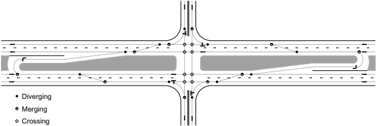

Figure 9-54. Conflict Diagram for Restricted Crossing U-Turn Configuration Showing Vehicle Conflict Points

Additional information regarding design and operation of intersections with median U-turn crossover roadways is contained in Signalized Intersections Informational Guide ( 5 ) and Alternative Intersections/Interchanges: Informational Report ( 25 ). The location and design of median U-turn roadways is addressed in greater detail in Section 9.9.5.

## 9.9.5  Location and Design of U-Turn Median Openings

Median  openings  designed  to  accommodate  vehicles  making  U-turns  only  are  needed  on some divided roadways in addition to openings provided for cross and left-turning movements. Separate U-turn median openings may be appropriate at the following locations:

- y Locations beyond intersections to accommodate minor turning movements not otherwise provided in the intersection or interchange area. The major intersection area is kept free for the important turning movements, in some cases obviating expensive ramps or additional structures.
- y Locations just ahead of an intersection to accommodate U-turn movements that would interfere with through and other turning movements at the intersection. Where a fairly wide median on the approach roadway has few openings, U-turns are needed for motorists to reach roadside areas. Advance separate openings to accommodate them outside the intersection proper will reduce interference.
- y Locations occurring in conjunction with minor crossroads where traffic is not permitted to cross the major roadway but instead is required to turn right, enter the through-traffic stream, weave to the left, U-turn, and then return. On high-speed or high-volume highways, the difficulty of weaving and the long lengths involved usually make this design pattern undesirable unless the volumes intercepted are light and the median is of adequate width. This condition may occur where there is a crossroad with high-volume traffic, a shopping area, or other traffic generator that needs a median opening nearby and additional median openings would not be practical.
- y Locations occurring where regularly spaced openings facilitate maintenance operations, policing, repair service of stalled vehicles, or other roadway-related activities. Openings for this purpose may be needed on controlled-access highways and on divided highways through undeveloped areas.
- y Locations occurring on roadways without control of access where median openings at optimum spacing are provided to serve existing frontage developments and at the same time minimize pressure for future median openings. A preferred spacing at 0.25 to 0.50 mi [0.40 to 0.80 km] is suitable in most instances. Fixed spacing is not necessary, nor is it fitting in all cases because of variations in terrain and local service needs.

Sight distance is needed at median openings; therefore, median opening locations downstream of relatively sharp horizontal and vertical curves should be avoided, where practical.

For a satisfactory design for U-turn maneuvers, the width of the roadway, including the median, should be sufficient to permit the design vehicle to turn from an auxiliary left-turn lane in the median into the lane next to the outside shoulder or outside curb and gutter on the roadway of the opposing traffic lanes.

Where U-turn openings are proposed for access to the opposite side of a multilane divided street, they should be located 50 to 100 ft [15 to 30 m] in advance of the next downstream leftturn lane. For U-turn openings designed specifically for the purpose of eliminating left-turn movement at a major intersection, they should be located downstream of the intersection. In urban areas, they should be located midblock between adjacent crossroad intersections. This type of U-turn opening should be designed with a median left-turn lane for storage. In a rural area, U-turn openings should be between 1000 and 1500 ft [300 and 450 m] apart. Additionally, a U-turn opening can be provided upstream of the major intersection to remove traffic wishing to make a U-turn from that intersection.

Medians of 18 ft [5.5 m] and 51 ft [15.6 m] or wider are needed to permit passenger and single-unit truck traffic, respectively, to turn from the inner lane (next to the median) on one roadway to the outer lane of a two-lane opposing roadway. Also, a median left-turn lane is highly desirable in advance of the U-turn opening to eliminate stopping on the through lanes. This scheme would increase the median width by approximately 12 ft [3.6 m].

There are two types of median crossover intersections: bidirectional (sometimes called conventional) and directional (see Figure 9-55). A bidirectional crossover allows vehicles to make a U-turn from either direction of travel, which creates additional points of conflict as compared to the directional crossover. Further, as turning volumes increase, an interlocking of travel paths can occur in a bidirectional crossover, which could limit sight distance and result in unpredictable driver behavior. Several studies have shown that directional crossovers experience fewer crashes  than  bidirectional  crossovers  for  signalized  corridors  and  that  directional  crossovers provide better operational performance.

Figure 9-55. Bidirectional (Conventional) and Directional Median Openings

If the median is wide enough to permit storage of vehicles, the use of a centerline and stop bar in the median storage area can communicate to drivers how the median should be negotiated and provide a sense of storage area. This can reduce undesirable maneuvers such as side-by-side queuing and lane encroachment. Further, it can communicate that it is allowable to make crossing and turning maneuvers in stages at this intersection.

Special U-turn designs, called loons, should be considered where right-of-way is restricted. In conditions where the U-turn crossover is unsignalized, sufficient gaps may be present in the traffic stream due to natural gaps in the traffic stream on lower volume roadways or through the presence of an upstream signal. When establishing the clearance intervals for a signalized crossover, it is essential to provide additional time to account for the extra travel distance needed for drivers to navigate the loon. Median widths of 8 to 41 ft [2.4 to 12.5 m] may be used for Uturn openings to permit passenger vehicles or single-unit trucks to turn from the inner lane in one direction onto the loon. This special U-turn feature can be incorporated into the design of an urban area roadway section by constructing a short segment of shoulder area along the outside edge of the traveled way across from the U-turn opening (see Figure 9-56). The outside curb and gutter section would then be carried behind the shoulder area and the shoulder would be designed as a pavement. Through the use of loons, agencies can improve operations for U-turn maneuvers to a level similar to those on divided roadways with wider medians without the high cost of widening the median or the opposing roadway, which could require acquiring right-ofway continuously along the entire corridor.

--',''','',',',','''''',,,,''-'-',,',,',',,'---

Figure 9-56. Typical Loon Design to Facilitate U-Turning Traffic on Arterials with Restricted Median Widths (27).

Normally, U-turns should not be permitted from the through lanes. However, where medians have adequate width to shield a vehicle stored in the median opening, through volumes are low and left-turn/U-turns are infrequent, this type of design may be permissible. Minimum widths of median to accommodate U-turns by different design vehicles turning from the lane adjacent to the median are given in Table 9-28. These dimensions are for a four-lane divided facility. If the U-turn is made from a median left-turn/U-turn lane, the width needed is the separator

width; the total median width needed would include an additional 12 ft [3.6 m] for a single median turn lane. At major intersections, many jurisdictions allow both left turns and U-turns to be made around the curbed nose at the end of a left-turn lane. Where dual left-turn lanes are needed and the turning volume of large trucks is high, left turns and U-turns may be permitted from the inside lane and left turns only may be allowed from the outside turn lane. However, when the turning volume of large trucks is low, a dual lane crossover maneuver may be permitted allowing both lanes to make a U-turn movement (Figure 9-57). Under this condition, the minimum width of the median opening is 36 ft [11 m], which does not accommodate a large truck turning adjacent to another vehicle.

## Directional Crossover with Dual Lanes

Figure 9-57. Dual U-Turn Directional Crossover Design (27)

Table 9-28. Minimum Designs for U-Turns

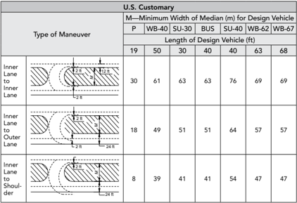

|                          | M-Minimum Width of Median (m) for Design Vehicle   | M-Minimum Width of Median (m) for Design Vehicle   | M-Minimum Width of Median (m) for Design Vehicle   | M-Minimum Width of Median (m) for Design Vehicle   | M-Minimum Width of Median (m) for Design Vehicle   | M-Minimum Width of Median (m) for Design Vehicle   | M-Minimum Width of Median (m) for Design Vehicle   |
|--------------------------|----------------------------------------------------|----------------------------------------------------|----------------------------------------------------|----------------------------------------------------|----------------------------------------------------|----------------------------------------------------|----------------------------------------------------|
|                          | P                                                  | WB-40                                              | SU-30                                              | BUS                                                | SU-40                                              | WB-62                                              | WB-67                                              |
| Type of                  | Length of Design Vehicle (ft)                      | Length of Design Vehicle (ft)                      | Length of Design Vehicle (ft)                      | Length of Design Vehicle (ft)                      | Length of Design Vehicle (ft)                      | Length of Design Vehicle (ft)                      | Length of Design Vehicle (ft)                      |
|                          | 19                                                 | 50                                                 | 30                                                 | 40                                                 | 40                                                 | 63                                                 | 68                                                 |
| Inner Lane to Inner Lane | 30                                                 | 61                                                 | 63                                                 | 63                                                 | 76                                                 | 69                                                 | 69                                                 |
| Inner Lane to Outer Lane | 18                                                 | 49                                                 | 51                                                 | 51                                                 | 64                                                 | 57                                                 | 57                                                 |
| Inner Lane to Shoul- der | 8                                                  | 39                                                 | 41                                                 | 41                                                 | 54                                                 | 47                                                 | 47                                                 |

|                          | M-Minimum Width of Median (m) for Design Vehicle   | M-Minimum Width of Median (m) for Design Vehicle   | M-Minimum Width of Median (m) for Design Vehicle   | M-Minimum Width of Median (m) for Design Vehicle   | M-Minimum Width of Median (m) for Design Vehicle   | M-Minimum Width of Median (m) for Design Vehicle   | M-Minimum Width of Median (m) for Design Vehicle   |
|--------------------------|----------------------------------------------------|----------------------------------------------------|----------------------------------------------------|----------------------------------------------------|----------------------------------------------------|----------------------------------------------------|----------------------------------------------------|
|                          | P                                                  | WB-12                                              | SU-9                                               | BUS                                                | SU-12                                              | WB-19                                              | WB-20                                              |
|                          | Length of Design Vehicle (m)                       | Length of Design Vehicle (m)                       | Length of Design Vehicle (m)                       | Length of Design Vehicle (m)                       | Length of Design Vehicle (m)                       | Length of Design Vehicle (m)                       | Length of Design Vehicle (m)                       |
|                          | 5.7                                                | 15.0                                               | 9.0                                                | 12.0                                               | 12.0                                               | 21.0                                               | 22.4                                               |
| Inner Lane to Inner Lane | 9                                                  | 18                                                 | 19                                                 | 19                                                 | 23                                                 | 21                                                 | 21                                                 |
| Inner Lane to Outer Lane | 5                                                  | 15                                                 | 15                                                 | 16                                                 | 19                                                 | 17                                                 | 17                                                 |
| Inner Lane to Shoul- der | 2                                                  | 12                                                 | 12                                                 | 12                                                 | 16                                                 | 14                                                 | 14                                                 |

--',''','',',',','''''',,,,''-'-',,',,',',,'---

Figure  9-58  illustrates  special  U-turn  designs  with  narrow  medians.  In  Figure  9-58A,  the U-turning vehicle swings right from the outer lane, loops around to the left, stops clear of the divided roadway until a suitable gap in the traffic stream develops, and then makes a normal left turn onto the divided roadway. In Figure 9-58B, the U-turning vehicle begins on the inner lane of the divided roadway, crosses the through-traffic lanes, loops around to the left, and then merges with the traffic. Both scenarios result in pedestrians along the major roadway crossing two additional roadways, one operating under free-flow conditions. To deter vehicles from stopping on through lanes, a left-turn lane with proper storage capacity should be provided to accommodate turning vehicles.

Figure 9-58. Special Indirect U-Turn Roadways with Narrow Medians

## 9.10  ROUNDABOUT DESIGN

A roundabout is an intersection with a central island around which traffic must travel counterclockwise and in which entering traffic must yield to circulating traffic. Figure 9-59 shows a typical roundabout in an urban area; Figure 9-60 shows a typical roundabout in a rural area.

The geometric design of a roundabout involves the balancing of competing design objectives. Roundabouts operate with the lowest crash frequencies and reduced crash severities when their geometry forces traffic to enter and circulate at slow speeds. Poor roundabout geometry has been found to negatively impact roundabout operations by affecting driver lane choice and behavior through the roundabout. Many of the geometric parameters are governed by the maneuvering

capabilities of the design vehicle. Thus designing a roundabout is a process of determining the appropriate balance among operational performance, reduced conflict frequency, and accommodation of the design vehicle.

Source: Kansas DOT

Figure 9-59. Example of a Roundabout in an Urban Area

Source: Kansas DOT

Figure 9-60. Example of a Roundabout in a Rural Area

While the basic form and features of roundabouts are usually independent of their location, many of the design outcomes depend on the surrounding speed environment, desired capacity, available space, number and arrangement of lanes, design vehicle, and other geometric attributes unique to each individual site. In rural environments where approach speeds are high and bicycle and pedestrian use may be minimal, the design objectives are significantly different from roundabouts in urban environments where minimizing bicycle and pedestrian conflicts is an

--',''','',',',','''''',,,,''-'-',,',,',',,'---

important concern. Additionally, many of the design techniques are substantially different for single-lane roundabouts than for roundabouts with two or more lanes.

## 9.10.1  Geometric Elements of Roundabouts

Figure 9-61 provides an overview of the basic geometric features and dimensions of a roundabout. These basic geometric elements are defined as follows:

| Central island                                | The central island is the raised area in the center of a roundabout around which traffic circulates. The central island does not neces- sarily need to be circular in shape.                                                                                                                                                                                                                                                      |
|-----------------------------------------------|-----------------------------------------------------------------------------------------------------------------------------------------------------------------------------------------------------------------------------------------------------------------------------------------------------------------------------------------------------------------------------------------------------------------------------------|
| Splitter island                               | A splitter island is a raised or painted area on an approach used to separate entering from existing traffic, deflect and slow entering traffic, and allow pedestrians to cross the roadway in two stages.                                                                                                                                                                                                                        |
| Circulatory roadway                           | The circulatory roadway is the curved path used by vehicles to travel in a counterclockwise fashion around the central island.                                                                                                                                                                                                                                                                                                    |
| Apron                                         | If needed on smaller roundabouts to accommodate the wheel track- ing of large vehicles, an apron is the mountable portion of the cen- tral island adjacent to the circulatory roadway.                                                                                                                                                                                                                                            |
| Yield line at entrance to circulating roadway | The yield line marks the point of entry into the circulatory road- way. In most countries this line has the legal meaning of requiring entering motorists to yield the right of way; however, in the United States it is technically only an extension of the circulatory roadway edge line. Entering vehicles must yield to any circulating traffic coming from the left before crossing this line into the circulatory roadway. |
| Accessible pedestrian/ bicycle crossings      | Accessible pedestrian crossings should be provided at all round- abouts. The crossing location is set back from the entrance line, and the splitter island is cut to allow pedestrians, wheelchairs, strollers, and bicycles to pass through.                                                                                                                                                                                     |
| Landscape strip                               | Landscape strips are provided at most roundabouts to separate ve- hicular and pedestrian traffic and to lead pedestrians to the des- ignated crossing locations. Landscape strips can also significantly improve the aesthetics of the intersection.                                                                                                                                                                              |

--',''','',',',','''''',,,,''-'-',,',,',',,'---

--',''','',',',','''''',,,,''-'-',,',,',',,'---

Figure 9-61. Basic Geometric Elements of a Roundabout

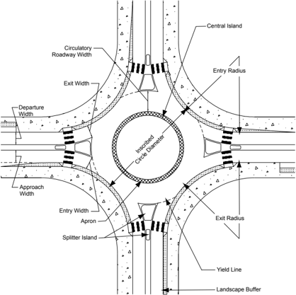

Key aspects of the geometric design of roundabouts are summarized below. Further details are presented in Roundabouts: An Informational Guide ( 41 ).
