## A Policy on Geometric Design of Highways and Streets

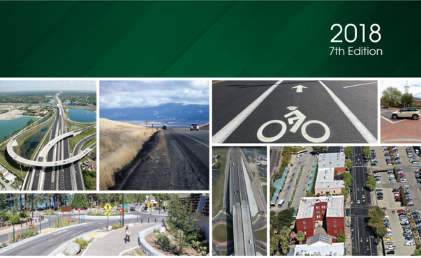


--',''','',',',','''''',,,,''-'-',,',,',',,'---

A Policy on Geometric Design of Highways and Streets 2018 7th Edition

American Association of State Highway and Transportation Officials 444 North Capitol Street, NW, Suite 249

Washington, DC 20001 202-624-5800 phone/202-624-5806 fax

## www.transportation.org

© 2018 by the American Association of State Highway and Transportation Officials. All rights reserved. Duplication is a violation of applicable law.

Publication Code: GDHS-7

ISBN: 978-1-56051-676-7

--',''','',',',','''''',,,,''-'-',,',,',',,'---


## EXECUTIVE COMMITTEE 2018-2019

Officers President: John Schroer, TENNESSEE Vice President: Carlos Braceras, UTAH Secretary/Treasurer: Scott Bennett, ARKANSAS Immediate Past President: David Bernhardt, MAINE

Regional Representatives

REGION I

Pete Rahn, MARYLAND

Jennifer Cohan, DELAWARE

REGION II James M. Bass, TEXAS

Russel McMurray, GEORGIA

REGION III Patrick McKenna, MISSOURI

Joe McGuiness, INDIANA

REGION IV Roger Millar, WASHINGTON STATE

Marc Luiken, ALASKA

Non-Voting Members

Executive Director: Bud Wright, AASHTO

## TECHNICAL COMMITTEE ON GEOMETRIC DESIGN 2018-2019

## Officers

Jeff C. Jones, Chair

TENNESSEE

Jim Rosenow, Vice Chair

MINNESOTA

Elizabeth Hilton, Liaison

FHWA

## AASHTO Members

Kent Belleque

Oregon

Antonette Clark

California

Chad Frisinger

North Dakota

Aaron Frits

Kansas

Michael Fugett

Arkansas

Mark A. Leiferman

South Dakota

Deanna Maifield

Iowa

Eric Marabello

Maryland

Brent Story

Georgia

Bart Thrasher

Virginia

Ryan VanKirk

Pennsylvania

Amutha Vijayakumar

New Jersey

Richard Wilder

New York

Other

Patricia Bush

AASHTO Liaison

Ray Derr

Transportation Research Board

Marshall Elizer

American Public Works Association

Armando Lepore

Port Authority of New York and New Jersey

Ricky Mitchell

National Association of County Engineers

Robert Wunderlich

National League of Cities


MISSOURI

## COMMITTEE ON DESIGN 2017-2018

CARLOS BRACERAS, Chair JOYCE TAYLOR, Vice Chair ROBERT MOONEY, FHWA, Liaison PATRICIA BUSH, AASHTO, Staff Liaison

| ALABAMA              | Steven E. Walker, William Adams, Stan Biddick     |
|----------------------|---------------------------------------------------|
| ALASKA               | Pat Carroll, Mark Neidhold, Sarah E. Schacher     |
| ARIZONA              | Steve Boschen, Todd Emery                         |
| ARKANSAS             | Michael Fugett, Charles Martin, Trinity Smith     |
| CALIFORNIA           | Janice Benton, Cathrina Barros                    |
| COLORADO             | Neil Lacey, Ken Brubaker                          |
| CONNECTICUT          | Scott Hill, Rabih M. Barakat                      |
| DELAWARE             | Thad McIlvaine, Michael Nauman                    |
| DISTRICT OF COLUMBIA | Paul Hoffman, Adil Rizvi, Zahra Dorriz            |
| FLORIDA              | Tim Lattner, Paul Hiers, Michael Shephard         |
| GEORGIA              | Brent Story, Andy Casey, Andrew Heath             |
| HAWAII               | Julius Fronda                                     |
| IDAHO                | Kevin Sablan, Ted E. Mason                        |
| ILLINOIS             | Mike Brand, Dan Mlacnik                           |
| INDIANA              | Elizabeth W. Phillips, Jeff Clanton               |
| IOWA                 | Michael J. Kennerly, Tony Gustafson, Chris Poole  |
| KANSAS               | Scott W. King, Tom Rhoads, Debbie Tanking         |
| KENTUCKY             | Bradley S. Eldridge, Jill Asher, Keith Caudill    |
| LOUISIANA            | Chad Winchester, David S. Smith                   |
| MAINE                | Brad Foley, Steve Bodge, Charles S. Hebson        |
| MARYLAND             | Jason A. Ridgway, Eric E. Marabello, Angela Smith |
| MASSACHUSETTS        | Andrew Paul, Lyris Liautaud, Hasmukh M. Patel     |
| MICHIGAN             | Kristin Schuster, Colin Forbes, Demetrius Parker  |
| MINNESOTA            | Chris Roy, Andrea Hendrickson, Tom Styrbicki      |
| MISSISSIPPI          | Richard Pittman, Amy Mood, David Seal             |


Eric Shroeter

MONTANA NEBRASKA NEVADA NEW HAMPSHIRE NEW JERSEY NEW MEXICO NEW YORK NORTH CAROLINA NORTH DAKOTA OHIO OKLAHOMA OREGON PENNSYLVANIA PUERTO RICO RHODE ISLAND SOUTH CAROLINA SOUTH DAKOTA TENNESSEE TEXAS UTAH VERMONT VIRGINIA WASHINGTON WEST VIRGINIA WISCONSIN WYOMING

Lesly Tribelhorn, James Combs, Dustin E. Rouse

Mike H. Owen, Nathan Sorben

Paul Frost, Casey Connor

James Marshall, Keith A. Cota

Robert Marshall, Paul F. Schneider

Gabriela Contreras-Apodaca, Priscilla Benavides, Lawrence Lopez

Richard D. Wilder, Bradley J. Bortnick, Stephen A. Zargham

Christopher Werner, Teresa Bruton,  Glenn Mumford

Roger Weigel

David L. Holstein, Kyle Brandon

Caleb Austin, Eduardo Elder, Tim Tegeler

David Polly

Melissa Batula, Christine Spangler

Vacant

Richard Bernardo, Robert Rocchio

Ladd Gibson, Rob Bedenbaugh

Brian Raecke, Mark A. Leiferman

Jennifer Lloyd, Ali R. Hangul, Jeff C. Jones

Camille Thomason

Ben G. Huot, George C. Lukes,  Fred Doehring

Jesse Alan Devlin, Ken Robie, Nick Wark

Susan Keen, Vernon W. Heishman, Barton A. Thrasher

Jeff Carpenter, Mike Fleming, Julie Heilman

RJ Scites, Dirar M. Ahmed, Chad Toney

David L. Stertz

Jeffrey E. Brown, Andrea Allen, Sandra A. Pecemka

--',''','',',',','''''',,,,''-'-',,',,',',,'---

## TABLE OF CONTENTS

## CHAPTER 1  NEW FRAMEWORK FOR GEOMETRIC DESIGN

| 1.1   | INTRODUCTION. . . . . . . . . . . . . . . . . . . . . . . . . . . . . . . . . . . . . . . . . . . . . . .   | INTRODUCTION. . . . . . . . . . . . . . . . . . . . . . . . . . . . . . . . . . . . . . . . . . . . . . .   | INTRODUCTION. . . . . . . . . . . . . . . . . . . . . . . . . . . . . . . . . . . . . . . . . . . . . . .   | INTRODUCTION. . . . . . . . . . . . . . . . . . . . . . . . . . . . . . . . . . . . . . . . . . . . . . .   | 1-1     |
|-------|-------------------------------------------------------------------------------------------------------------|-------------------------------------------------------------------------------------------------------------|-------------------------------------------------------------------------------------------------------------|-------------------------------------------------------------------------------------------------------------|---------|
| 1.2   | PROJECT PURPOSE AND NEED . . . . . . . . . . . . . . . . . . . . . . . . . . . . . . . . .                  | PROJECT PURPOSE AND NEED . . . . . . . . . . . . . . . . . . . . . . . . . . . . . . . . .                  | PROJECT PURPOSE AND NEED . . . . . . . . . . . . . . . . . . . . . . . . . . . . . . . . .                  | PROJECT PURPOSE AND NEED . . . . . . . . . . . . . . . . . . . . . . . . . . . . . . . . .                  | . 1-3   |
| 1.3   | OVERVIEW OF THE NEW FRAMEWORK FOR GEOMETRIC DESIGN . .                                                      | OVERVIEW OF THE NEW FRAMEWORK FOR GEOMETRIC DESIGN . .                                                      | OVERVIEW OF THE NEW FRAMEWORK FOR GEOMETRIC DESIGN . .                                                      | OVERVIEW OF THE NEW FRAMEWORK FOR GEOMETRIC DESIGN . .                                                      | . . 1-5 |
| 1.4   | FUNCTIONAL CLASSIFICATION FOR MOTOR VEHICLES . . . . . . . . .                                              | FUNCTIONAL CLASSIFICATION FOR MOTOR VEHICLES . . . . . . . . .                                              | FUNCTIONAL CLASSIFICATION FOR MOTOR VEHICLES . . . . . . . . .                                              | FUNCTIONAL CLASSIFICATION FOR MOTOR VEHICLES . . . . . . . . .                                              | . . 1-7 |
|       | 1.4.1                                                                                                       | Hierarchy of Motor Vehicle Movement . . . . . . . . . . . . . .                                             | Hierarchy of Motor Vehicle Movement . . . . . . . . . . . . . .                                             | Hierarchy of Motor Vehicle Movement . . . . . . . . . . . . . .                                             | . . 1-8 |
|       | 1.4.2                                                                                                       | Access Control and Mobility Needs . . . . . . . .                                                           | Access Control and Mobility Needs . . . . . . . .                                                           | . . . . . . .                                                                                               | . 1-10  |
|       | 1.4.3                                                                                                       | Functional System Characteristics . . . . . . . . . . . . . . .                                             | Functional System Characteristics . . . . . . . . . . . . . . .                                             | . .                                                                                                         | . 1-11  |
|       |                                                                                                             | 1.4.3.1                                                                                                     | Definitions of Urban and Rural Areas . . . . . . . . . . . . .                                              | Definitions of Urban and Rural Areas . . . . . . . . . . . . .                                              | . 1-11  |
|       |                                                                                                             | 1.4.3.2                                                                                                     | Functional Categories . . . . . . . . .                                                                     | . . . . . . . . . . . .                                                                                     | . 1-12  |
|       |                                                                                                             | 1.4.3.3                                                                                                     | Functional Systems for Rural Areas . . . . . . . .                                                          | . . .                                                                                                       | . 1-12  |
|       |                                                                                                             |                                                                                                             | 1.4.3.3.1                                                                                                   | Rural Principal Arterial System . . . .                                                                     | . 1-12  |
|       |                                                                                                             |                                                                                                             | 1.4.3.3.2                                                                                                   | Rural Minor Arterial System . . . . . .                                                                     | . 1-13  |
|       |                                                                                                             |                                                                                                             | 1.4.3.3.3                                                                                                   | Rural Collector System . . . . . . . . . .                                                                  | . 1-13  |
|       |                                                                                                             |                                                                                                             | 1.4.3.3.4                                                                                                   | Rural Local Road System . . . . . . . .                                                                     | . 1-13  |
|       |                                                                                                             | 1.4.3.4                                                                                                     | Functional Systems for Urban Areas. . . . . .                                                               | . . . . .                                                                                                   | . 1-14  |
|       |                                                                                                             |                                                                                                             | 1.4.3.4.1                                                                                                   | Urban Principal Arterial System . . .                                                                       | . 1-14  |
|       |                                                                                                             |                                                                                                             | 1.4.3.4.2                                                                                                   | Urban Minor Arterial Street System                                                                          | . 1-15  |
|       |                                                                                                             |                                                                                                             | 1.4.3.4.3                                                                                                   | Urban Collector Street System . . . .                                                                       | . 1-15  |
|       |                                                                                                             |                                                                                                             | 1.4.3.4.4                                                                                                   | Urban Local Street System . . . . . . .                                                                     | . 1-15  |
|       | 1.4.4                                                                                                       | Functional Classification as a Design Type . .                                                              | Functional Classification as a Design Type . .                                                              | . . . . . . . .                                                                                             | . 1-16  |
| 1.5   | CONTEXT CLASSIFICATION FOR GEOMETRIC DESIGN. . . . . . .                                                    | CONTEXT CLASSIFICATION FOR GEOMETRIC DESIGN. . . . . . .                                                    | CONTEXT CLASSIFICATION FOR GEOMETRIC DESIGN. . . . . . .                                                    | CONTEXT CLASSIFICATION FOR GEOMETRIC DESIGN. . . . . . .                                                    | . 1-16  |
|       | 1.5.1                                                                                                       | Context Classes for Roads and Streets in Rural Areas . . . .                                                | Context Classes for Roads and Streets in Rural Areas . . . .                                                | Context Classes for Roads and Streets in Rural Areas . . . .                                                | . 1-20  |
|       |                                                                                                             | 1.5.1.1                                                                                                     | Rural Context . . . . . . . . . . . . . . . . . .                                                           | . . . . . . . . . .                                                                                         | . 1-20  |
|       |                                                                                                             | 1.5.1.2                                                                                                     | Rural Town Context . . . . . . . . . . . . . . . . . . . .                                                  | . . .                                                                                                       | . 1-20  |
|       | 1.5.2                                                                                                       | Context Classes for Roads and Streets in Urban Areas . . . . . .                                            | Context Classes for Roads and Streets in Urban Areas . . . . . .                                            | Context Classes for Roads and Streets in Urban Areas . . . . . .                                            | . 1-21  |
|       |                                                                                                             | 1.5.2.1                                                                                                     | Suburban Context . . . . . . .                                                                              | . . . . . . . . . . . . . . . . .                                                                           | . 1-21  |
|       |                                                                                                             | 1.5.2.2                                                                                                     | Urban Context . . . . . . . . . . . . . . . . . . . . . . . . .                                             | . .                                                                                                         | . 1-21  |

--',''','',',',','''''',,,,''-'-',,',,',',,'---

|                                        |                                                                                            | 1.5.2.3                                                                                    | Urban Core Context. . . . . . . . . . . . . .                                              | . 1-22   |
|----------------------------------------|--------------------------------------------------------------------------------------------|--------------------------------------------------------------------------------------------|--------------------------------------------------------------------------------------------|----------|
|                                        | 1.5.3                                                                                      | Design Guidance for Specific Context Classes . . .                                         | Design Guidance for Specific Context Classes . . .                                         | . 1-22   |
| 1.6                                    | MULTIMODAL CONSIDERATIONS . . . . .                                                        | MULTIMODAL CONSIDERATIONS . . . . .                                                        | . . . . . . . .                                                                            | . 1-23   |
|                                        | 1.6.1                                                                                      | Road and Street User Groups/Transportation Modes. . .                                      | Road and Street User Groups/Transportation Modes. . .                                      | . 1-23   |
|                                        |                                                                                            | 1.6.1.1                                                                                    | Automobiles. . . . . . . . . . . . . . . . . . . .                                         | . 1-23   |
|                                        |                                                                                            | 1.6.1.2                                                                                    | Bicyclists . . . . . . . . . . . . . . . . . . . . . . .                                   | . 1-23   |
|                                        |                                                                                            | 1.6.1.3                                                                                    | Pedestrians. . . . . . . . . . . . . . . . . . . . .                                       | . 1-24   |
|                                        |                                                                                            | 1.6.1.4 .                                                                                  | Transit. . . . . . . . . . . . . . . . . . . . . . . .                                     | . 1-25   |
|                                        |                                                                                            | 1.6.1.5 . .                                                                                | Trucks . . . . . . . . . . . . . . . . . . . . . . .                                       | . 1-25   |
|                                        | 1.6.2                                                                                      | Consideration of All Transportation Modes in Design                                        | Consideration of All Transportation Modes in Design                                        | . 1-26   |
| 1.7                                    | DESIGN PROCESS TO ADDRESS SPECIFIC PROJECT TYPES . .                                       | DESIGN PROCESS TO ADDRESS SPECIFIC PROJECT TYPES . .                                       | DESIGN PROCESS TO ADDRESS SPECIFIC PROJECT TYPES . .                                       | . 1-28   |
|                                        | 1.7.1                                                                                      | New Construction Projects . . .                                                            | . . . . . . . . . .                                                                        | . 1-28   |
|                                        | 1.7.2                                                                                      | Reconstruction Projects. . . . .                                                           | . . . . . . . . . . .                                                                      | . 1-29   |
|                                        | 1.7.3                                                                                      | Construction Projects on Existing Roads. . . . . . . .                                     | Construction Projects on Existing Roads. . . . . . . .                                     | . 1-30   |
| 1.8                                    | DESIGN FLEXIBILITY . . . . . . . . . . . .                                                 | DESIGN FLEXIBILITY . . . . . . . . . . . .                                                 | . . . . . . . . . . . .                                                                    | . 1-32   |
| 1.9                                    | PERFORMANCE-BASED DESIGN . . . . .                                                         | PERFORMANCE-BASED DESIGN . . . . .                                                         | . . . . . . . . .                                                                          | . 1-34   |
| 1.10                                   | REFERENCES . . . . . . . . . . . . . . . . . . . . . . . . . . . . . . . . . . . . . . . . | REFERENCES . . . . . . . . . . . . . . . . . . . . . . . . . . . . . . . . . . . . . . . . | REFERENCES . . . . . . . . . . . . . . . . . . . . . . . . . . . . . . . . . . . . . . . . | . 1-36   |
| CHAPTER 2 DESIGN CONTROLS AND CRITERIA | CHAPTER 2 DESIGN CONTROLS AND CRITERIA                                                     | CHAPTER 2 DESIGN CONTROLS AND CRITERIA                                                     | CHAPTER 2 DESIGN CONTROLS AND CRITERIA                                                     |          |
| 2.1                                    | INTRODUCTION. . . . . . . . . . . . . . . . . . . . . . . . . . . . . . . . . . . . .      | INTRODUCTION. . . . . . . . . . . . . . . . . . . . . . . . . . . . . . . . . . . . .      | INTRODUCTION. . . . . . . . . . . . . . . . . . . . . . . . . . . . . . . . . . . . .      | . . 2-1  |
| 2.2                                    | DRIVER PERFORMANCE AND HUMAN FACTORS. . . . . . . . . . .                                  | DRIVER PERFORMANCE AND HUMAN FACTORS. . . . . . . . . . .                                  | DRIVER PERFORMANCE AND HUMAN FACTORS. . . . . . . . . . .                                  | . . 2-1  |
|                                        | 2.2.1                                                                                      | Introduction . . . . . . . . . . . . . . . . . . . . . . .                                 | . .                                                                                        | . . 2-1  |
|                                        | 2.2.2                                                                                      | Older Drivers and Older Pedestrians . . .                                                  | . .                                                                                        | . . 2-2  |
|                                        | 2.2.3                                                                                      | The Driving Task . . . . . .                                                               | . . . . . . . . . . . . . . .                                                              | . . 2-2  |
|                                        | 2.2.4                                                                                      | The Guidance Task. . .                                                                     | . . . . . . . . . . . . . . . . .                                                          | . . 2-3  |
|                                        |                                                                                            | 2.2.4.1                                                                                    | Lane Placement and Road Following.                                                         | . . 2-3  |
|                                        |                                                                                            | 2.2.4.2                                                                                    | Car Following . . . . . . . . . . . . . . . . . . .                                        | . . 2-3  |
|                                        |                                                                                            | 2.2.4.3                                                                                    | Passing Maneuvers. . . . . . . . . . . . . . .                                             | . . 2-4  |
|                                        |                                                                                            | 2.2.4.4                                                                                    | Other Guidance Activities . . . . . . . . .                                                | . . 2-4  |
|                                        | 2.2.5                                                                                      | The Information System.                                                                    | . . . . . . . . . . . . . . .                                                              | . . 2-4  |
|                                        |                                                                                            | 2.2.5.1 Traffic                                                                            | Control Devices . . . . . . . . . . . .                                                    | . . 2-4  |


|     |                                              | 2.2.5.2                                                                                   | The Roadway and Its Environment. . . . . . . . . . . .                                    | . . 2-4   |
|-----|----------------------------------------------|-------------------------------------------------------------------------------------------|-------------------------------------------------------------------------------------------|-----------|
|     | 2.2.6                                        | Information Handling. . .                                                                 | . . . . . . . . . . . . . . . . . . . . . . . .                                           | . . 2-5   |
|     |                                              | 2.2.6.1                                                                                   | Reaction Time . . . . . . . . . . . . . . . . . . . . . . . . . . .                       | . . 2-5   |
|     |                                              | 2.2.6.2                                                                                   | Primacy. . . . . . . . . . . . . . . . . . . . . . . . . . . . . . . . .                  | . . 2-8   |
|     |                                              | 2.2.6.3                                                                                   | Expectancy. . . . . . . . . . . . . . . . . . . . . . . . . . . . . .                     | . . 2-8   |
|     | 2.2.7                                        | Driver Error . .                                                                          | . . . . . . . . . . . . . . . . . . . . . . . . . . . . . . . .                           | . . 2-8   |
|     |                                              | 2.2.7.1                                                                                   | Errors Due to Driver Deficiencies . . . . . . . . . . . . .                               | . . 2-9   |
|     |                                              |                                                                                           | 2.2.7.1.1 Older Drives . . . . . . . . . . . . . . . . . .                                | . . 2-9   |
|     |                                              | 2.2.7.2                                                                                   | Errors Due to Situation Demands. . . . . . . . . . . . .                                  | . 2-11    |
|     | 2.2.8                                        | Speed and Design . .                                                                      | . . . . . . . . . . . . . . . . . . . . . . . . . . .                                     | . 2-11    |
|     | 2.2.9                                        | Design Assessment . . . .                                                                 | . . . . . . . . . . . . . . . . . . . . . . . .                                           | . 2-12    |
| 2.3 | TRAFFIC CHARACTERISTICS. . . . . . . . . . . | TRAFFIC CHARACTERISTICS. . . . . . . . . . .                                              | . . . . . . . . . . . . . . . .                                                           | . 2-13    |
|     | 2.3.1                                        | General Considerations. . . . . . . . . . . .                                             | . . . . . . . . . . . . .                                                                 | . 2-13    |
|     | 2.3.2                                        | Volume. . . . . . . . . . . . . . . . . . . . . . . . . . . . . . . . . . . . . . . . . . | Volume. . . . . . . . . . . . . . . . . . . . . . . . . . . . . . . . . . . . . . . . . . | . 2-13    |
|     |                                              | 2.3.2.1                                                                                   | Average Daily Traffic. . . . . . . . . . . . . . . . . . . . . . .                        | . 2-13    |
|     |                                              | 2.3.2.2                                                                                   | Design Hour Traffic: Rural Areas. . . . . . . . . . . . . .                               | . 2-14    |
|     |                                              | 2.3.2.3                                                                                   | Design Hour Traffic: Urban Areas. . . . . . . . . . . . .                                 | . 2-17    |
|     | 2.3.3                                        | Directional Distribution .                                                                | . . . . . . . . . . . . . . . . . . . . . . . .                                           | . 2-18    |
|     | 2.3.4                                        | Composition of Traffic . . .                                                              | . . . . . . . . . . . . . . . . . . . . . . .                                             | . 2-19    |
|     | 2.3.5                                        | Projection of Future Traffic Demands . . .                                                | . . . . . . . . . . .                                                                     | . 2-20    |
|     | 2.3.6                                        | Speed. . . . . . . . . . . . . . . . . . . . . . . . . . . . . . . . . . . . . .          | .                                                                                         | . 2-21    |
|     |                                              | 2.3.6.1                                                                                   | Operating Speed . . . . . . . . . . . . . . . . . . . . . . . . .                         | . 2-22    |
|     |                                              | 2.3.6.2                                                                                   | Running Speed. . . . . . . . . . . . . . . . . . . . . . . . . . .                        | . 2-22    |
|     |                                              | 2.3.6.3                                                                                   | Design Speed. . . . . . . . . . . . . . . . . . . . . . . . . . . .                       | . 2-23    |
|     | 2.3.7                                        | Traffic Flow Relationships .                                                              | . . . . . . . . . . . . . . . . . . . . . .                                               | . 2-27    |
| 2.4 | HIGHWAY CAPACITY . . . . . . . .             | HIGHWAY CAPACITY . . . . . . . .                                                          | . . . . . . . . . . . . . . . . . . . . . . . . .                                         | . 2-29    |
|     | 2.4.1                                        | General Characteristics . . . . .                                                         | . . . . . . . . . . . . . . . . . . . .                                                   | . 2-29    |
|     | 2.4.2                                        | Application . . . .                                                                       | . . . . . . . . . . . . . . . . . . . . . . . . . . . . . .                               | . 2-29    |
|     | 2.4.3                                        | Capacity as a Design Control .                                                            | . . . . . . . . . . . . . . . . . . .                                                     | . 2-30    |
|     |                                              | 2.4.3.1                                                                                   | Design Service Flow Rate versus Design Volume                                             | . 2-30    |
|     |                                              | 2.4.3.2                                                                                   | Measures of Congestion . . . . . . . . . . . . . . . . . . .                              | . 2-30    |
|     |                                              | 2.4.3.3                                                                                   | Relation between Congestion and Traffic Flow Rate                                         | . 2-32    |

|     |                                                                                          | 2.4.3.4 . . . . .                                           | Acceptable Degrees of Congestion. . . . . . . . .                                        | . . 2-32   |
|-----|------------------------------------------------------------------------------------------|-------------------------------------------------------------|------------------------------------------------------------------------------------------|------------|
|     | 2.4.4                                                                                    | Factors Other Than Traffic Volume That Affect Operating     |                                                                                          |            |
|     |                                                                                          | 2.4.4.1 . . . . . . . .                                     | Roadway Factors . . . . . . . . . . . . . . . . . . . .                                  | . . 2-33   |
|     |                                                                                          | 2.4.4.2 . . . . . . . . . . . . .                           | Alignment. . . . . . . . . . . . . . . . . . . . .                                       | . . 2-34   |
|     |                                                                                          | 2.4.4.3 . . . . . . .                                       | Weaving Sections. . . . . . . . . . . . . . . . . . . . .                                | . . 2-34   |
|     |                                                                                          | 2.4.4.4 . . . . . . . . .                                   | Ramp Terminals . . . . . . . . . . . . . . . . . . . .                                   | . . 2-34   |
|     |                                                                                          | 2.4.4.5 . . . . . . . . . . .                               | Traffic Factors . . . . . . . . . . . . . . . . . . . .                                  | . . 2-35   |
|     |                                                                                          | 2.4.4.6 . . . . . . . .                                     | Peak Hour Factor . . . . . . . . . . . . . . . . . . . .                                 | . . 2-35   |
|     | 2.4.5                                                                                    | Levels of Service . . . . . . . . . . . . . .               | . . . . . . . . . . . . . . . . . .                                                      | . 2-36     |
|     | 2.4.6                                                                                    | Design Service Flow Rates. . . . . . . .                    | . . . . . . . . . . . . . . . . .                                                        | . 2-38     |
|     |                                                                                          | 2.4.6.1 . . . . . . .                                       | Weaving Sections. . . . . . . . . . . . . . . . . . . . .                                | . . 2-38   |
|     |                                                                                          | 2.4.6.2 . . . . .                                           | Multilane Highways without Access Control . .                                            | . . 2-41   |
|     |                                                                                          | 2.4.6.3 . . . . .                                           | Arterial Streets and Highways in Urban Areas .                                           | . . 2-41   |
|     |                                                                                          | 2.4.6.4 . . . . . . . . . . .                               | Intersections. . . . . . . . . . . . . . . . . . . . .                                   | . . 2-41   |
| 2.5 | ACCESS CONTROL AND ACCESS MANAGEMENT. . . . . . . .                                      | . . .                                                       | ACCESS CONTROL AND ACCESS MANAGEMENT. . . . . . . .                                      | . 2-41     |
|     | 2.5.1                                                                                    | General Conditions . . . . . . . . . . . .                  | . . . . . . . . . . . . . . . . . .                                                      | . 2-41     |
|     | 2.5.2                                                                                    | Basic Principles of Access Management . . . . . . . . .     | . . . . .                                                                                | . 2-43     |
|     | 2.5.3                                                                                    | Access Classifications . . . . . . . . . .                  | . . . . . . . . . . . . . . . . . .                                                      | . 2-44     |
|     | 2.5.4                                                                                    | Methods of Controlling Access . . . . . . . .               | . . . . . . . . . . . . .                                                                | . 2-45     |
|     | 2.5.5                                                                                    | Benefits of Controlling Access. . . . . . . . .             | . . . . . . . . . . . . .                                                                | . 2-45     |
| 2.6 | PEDESTRIANS. . . . . . . . . . . . . . . . . . . . . . . . . . . . . . . . . . . . . . . | . .                                                         | PEDESTRIANS. . . . . . . . . . . . . . . . . . . . . . . . . . . . . . . . . . . . . . . | . 2-50     |
|     | 2.6.1                                                                                    | General Considerations. . . . . . . . .                     | . . . . . . . . . . . . . . . . . .                                                      | . 2-50     |
|     | 2.6.2                                                                                    | General Characteristics . . . . . . . . .                   | . . . . . . . . . . . . . . . . . .                                                      | . 2-50     |
|     | 2.6.3                                                                                    | Walking Speeds. . . . . . . . . . . . . . .                 | . . . . . . . . . . . . . . . . . .                                                      | . 2-52     |
|     | 2.6.4                                                                                    | Walkway Level of Service. . . . . . . . . . .               | . . . . . . . . . . . . . . .                                                            | . 2-52     |
|     | 2.6.5                                                                                    | Intersections . . . . . . . . . . . . . . . . .             | . . . . . . . . . . . . . . . . . .                                                      | . 2-52     |
|     | 2.6.6                                                                                    | Reducing Pedestrian-Vehicular Conflicts . . . . . . . . . . | . . .                                                                                    | . 2-53     |
|     | 2.6.7                                                                                    | Accommodating Persons with Disabilities . . . . . . . .     | . . . .                                                                                  | . 2-53     |
|     |                                                                                          | 2.6.7.1 . . . . . .                                         | Mobility Disabilities . . . . . . . . . . . . . . . . . . . .                            | . . 2-53   |
|     |                                                                                          | 2.6.7.2 . . . . . . .                                       | Vision Disabilities . . . . . . . . . . . . . . . . . . . . .                            | . . 2-54   |
|     |                                                                                          | 2.6.7.3 . . . . .                                           | Cognitive Disabilities . . . . . . . . . . . . . . . . . . . .                           | . . 2-54   |

--',''','',',',','''''',,,,''-'-',,',,',',,'---

|                              |                                                                                                      | 2.6.7.4                                                                                              | Hearing Disabilities . . . . . . . . . . . . . . . . . . . . . . . . . . . . . . . .   | . . 2-54   |
|------------------------------|------------------------------------------------------------------------------------------------------|------------------------------------------------------------------------------------------------------|----------------------------------------------------------------------------------------|------------|
| 2.7                          | BICYCLISTS . . . . . . . . . . . . . . . . . . . . . . . . . . . . . . . . . . . . . . . . . . . . . | BICYCLISTS . . . . . . . . . . . . . . . . . . . . . . . . . . . . . . . . . . . . . . . . . . . . . | . . . .                                                                                | . 2-54     |
| 2.8                          | DESIGN VEHICLES . . . . . . . . . . . . . . . . . . . . . . . . . . . . . .                          | DESIGN VEHICLES . . . . . . . . . . . . . . . . . . . . . . . . . . . . . .                          | . . . . . . . . . . . . .                                                              | . 2-55     |
|                              | 2.8.1                                                                                                | General Characteristics . . . . . . . . . .                                                          | . . . . . . . . . . . . . . . . . . . . . . .                                          | . 2-55     |
|                              | 2.8.2                                                                                                | Minimum Turning Paths of Design Vehicles . . . . . .                                                 | . . . . . . . . . . .                                                                  | . 2-58     |
|                              | 2.8.3                                                                                                | Vehicle Performance . . . . . . . .                                                                  | . . . . . . . . . . . . . . . . . . . . . . . . . . .                                  | . 2-86     |
|                              | 2.8.4                                                                                                | Vehicular Pollution . . . . . . . . . . . . .                                                        | . . . . . . . . . . . . . . . . . . . . . . . .                                        | . 2-89     |
| 2.9                          | SAFETY . . . . . . . . . . . . . . . . . . . . . . . . . . . . . . . . . . . . . . . . . . . . .     | SAFETY . . . . . . . . . . . . . . . . . . . . . . . . . . . . . . . . . . . . . . . . . . . . .     | . . . . . . .                                                                          | . 2-90     |
|                              | 2.9.1                                                                                                | Key Factors Related to Traffic Crashes . . . . . . . . . . . . . . .                                 | . . . . . .                                                                            | . 2-90     |
|                              |                                                                                                      | 2.9.1.1                                                                                              | Roadway Design. . . . . . . . . . . . . . . . . . . . . . . . . . . . . . . . . . .    | . . 2-91   |
|                              |                                                                                                      | 2.9.1.2                                                                                              | Roadside Design . . . . . . . . . . . . . . . . . . . . . . . . . . . . . . . . . .    | . . 2-92   |
|                              |                                                                                                      | 2.9.1.3                                                                                              | Traffic Control Devices . . . . . . . . . . . . . . . . . . . . . . . . . . . . . .    | . . 2-93   |
|                              | 2.9.2                                                                                                | Key Safety Resources. . . . .                                                                        | . . . . . . . . . . . . . . . . . . . . . . . . . . . . . .                            | . 2-93     |
|                              | 2.9.3                                                                                                | Safety Improvement Programs . . . .                                                                  | . . . . . . . . . . . . . . . . . . . . . . .                                          | . 2-94     |
|                              | 2.9.4                                                                                                | Project Development Process . . . .                                                                  | . . . . . . . . . . . . . . . . . . . . . . . .                                        | . 2-94     |
| 2.10                         | ENVIRONMENT . . . . . . . . . . . . . . . . . . . . . . . . . . . . . . . . . .                      | ENVIRONMENT . . . . . . . . . . . . . . . . . . . . . . . . . . . . . . . . . .                      | . . . . . . . . . . .                                                                  | . 2-95     |
| 2.11                         | REFERENCES . . . . . . . . . . . . . . . . . . . . . . . . . . . . . . . . . . . . . . . . .         | REFERENCES . . . . . . . . . . . . . . . . . . . . . . . . . . . . . . . . . . . . . . . . .         | . . . . . .                                                                            | . 2-95     |
| CHAPTER 3 ELEMENTS OF DESIGN | CHAPTER 3 ELEMENTS OF DESIGN                                                                         | CHAPTER 3 ELEMENTS OF DESIGN                                                                         | CHAPTER 3 ELEMENTS OF DESIGN                                                           |            |
| 3.1                          | INTRODUCTION. . . . . . . . . . . . . . . . . . . . . . . . . . . . . . . . . . .                    | INTRODUCTION. . . . . . . . . . . . . . . . . . . . . . . . . . . . . . . . . . .                    | . . . . . . . . . .                                                                    | . . 3-1    |
| 3.2                          | SIGHT DISTANCE . . . . . . . . . . . . . . . . . . . . . . . . . . . . . . . . . . .                 | SIGHT DISTANCE . . . . . . . . . . . . . . . . . . . . . . . . . . . . . . . . . . .                 | . . . . . . . . .                                                                      | . . 3-1    |
|                              | 3.2.1                                                                                                | General Considerations. . . . . . . . . . . . . . . . . .                                            | . . . . . . . . . . . . . . .                                                          | . . 3-1    |
|                              | 3.2.2                                                                                                | Stopping Sight Distance . . .                                                                        | . . . . . . . . . . . . . . . . . . . . . . . . . . . . .                              | . . 3-2    |
|                              |                                                                                                      | 3.2.2.1                                                                                              | Brake Reaction Time . . . . . . . . . . . . . . . . . . . . . . . . . . . . . . .      | . . . 3-2  |
|                              |                                                                                                      | 3.2.2.2                                                                                              | Braking Distance . . . . . . . . . . . . . . . . . . . . . . . . . . . . . . . . . .   | . . . 3-3  |
|                              |                                                                                                      | 3.2.2.3                                                                                              | Design Values. . . . . . . . . . . . . . . . . . . . . . . . . . . . . . . . . . . . . | . . . 3-5  |
|                              |                                                                                                      | 3.2.2.4                                                                                              | Effect of Grade on Stopping . . . . . . . . . . . . . . . . . . . . . . . . .          | . . . 3-5  |
|                              |                                                                                                      | 3.2.2.5                                                                                              | Variation for Trucks. . . . . . . . . . . . . . . . . . . . . . . . . . . . . . . . .  | . . . 3-6  |
|                              |                                                                                                      |                                                                                                      | 3.2.2.5.1 New Construction vs. Projects on Existing Roads                              | . 3-7      |
|                              | 3.2.3                                                                                                | Decision Sight Distance. . . . . . . . . . . .                                                       | . . . . . . . . . . . . . . . . . . . . .                                              | . . 3-7    |
|                              | Passing Sight Distance for Two-Lane Highways                                                         | Passing Sight Distance for Two-Lane Highways                                                         | . . . . . . . . . . . . . .                                                            | . 3-10     |
| 3.2.4                        |                                                                                                      |                                                                                                      |                                                                                        |            |

--',''','',',',','''''',,,,''-'-',,',,',',,'---

|     |                                                                                                                                                                               | 3.2.4.1                                                                                                                                                                       | Criteria for Design . . . . . . . . . . . . . . . . . . . . . . . . . . . . . . .                                                                                             | . 3-10       |
|-----|-------------------------------------------------------------------------------------------------------------------------------------------------------------------------------|-------------------------------------------------------------------------------------------------------------------------------------------------------------------------------|-------------------------------------------------------------------------------------------------------------------------------------------------------------------------------|--------------|
|     |                                                                                                                                                                               | 3.2.4.2                                                                                                                                                                       | Design Values. . . . . . . . . . . . . . . . . . . . . . . . . . . . . . . . . . .                                                                                            | . 3-10       |
|     |                                                                                                                                                                               | 3.2.4.3                                                                                                                                                                       | Effect of Grade on Passing Sight Distance. . . . . . . . . . . . .                                                                                                            | . 3-12       |
|     |                                                                                                                                                                               | 3.2.4.4                                                                                                                                                                       | Frequency and Length of Passing Sections . . . . . . . . . . . .                                                                                                              | . 3-12       |
|     | 3.2.5                                                                                                                                                                         | Sight Distance for Multilane Highways . . .                                                                                                                                   | . . . . . . . . . . . . . . . .                                                                                                                                               | . 3-14       |
|     | 3.2.6                                                                                                                                                                         | Criteria for Measuring Sight Distance . . . . . . . . . . . . .                                                                                                               | . . . . . . .                                                                                                                                                                 | . 3-15       |
|     |                                                                                                                                                                               | 3.2.6.1                                                                                                                                                                       | Height of Driver's Eye. . . . . . . . . . . . . . . . . . . . . . . . . . . . .                                                                                               | . 3-15       |
|     |                                                                                                                                                                               | 3.2.6.2                                                                                                                                                                       | Height of Object . . . . . . . . . . . . . . . . . . . . . . . . . . . . . . . .                                                                                              | . 3-15       |
|     |                                                                                                                                                                               | 3.2.6.3                                                                                                                                                                       | Sight Obstructions . . . . . . . . . . . . . . . . . . . . . . . . . . . . . . .                                                                                              | . 3-16       |
|     |                                                                                                                                                                               | 3.2.6.4                                                                                                                                                                       | Measuring Sight Distance . . . . . . . . . . . . . . . . . . . . . . . . .                                                                                                    | . 3-16       |
| 3.3 | HORIZONTAL ALIGNMENT. . . . . . . . . .                                                                                                                                       | HORIZONTAL ALIGNMENT. . . . . . . . . .                                                                                                                                       | . . . . . . . . . . . . . . . . . . . . . . . .                                                                                                                               | . 3-19       |
|     | 3.3.1                                                                                                                                                                         | Theoretical Considerations . . . . . . . . . .                                                                                                                                | . . . . . . . . . . . . . . . . . .                                                                                                                                           | . 3-19       |
|     | 3.3.2                                                                                                                                                                         | General Considerations. . . . . . . . . .                                                                                                                                     | . . . . . . . . . . . . . . . . . . . . .                                                                                                                                     | . 3-20       |
|     |                                                                                                                                                                               | 3.3.2.1                                                                                                                                                                       | Superelevation . . . . . . . . . . . . . . . . . . . . . . . . . . . . . . . . . .                                                                                            | . 3-20       |
|     |                                                                                                                                                                               | 3.3.2.2                                                                                                                                                                       | Side Friction Factor . . . . . . . . . . . . . . . . . . . . . . . . . . . . . .                                                                                              | . 3-21       |
|     |                                                                                                                                                                               | 3.3.2.3                                                                                                                                                                       | Distribution of e and f over a Range of Curves . . . . . . . . .                                                                                                              | . 3-26       |
|     | 3.3.3                                                                                                                                                                         | Design Considerations. . . . . . . . . . .                                                                                                                                    | . . . . . . . . . . . . . . . . . . . . .                                                                                                                                     | . 3-31       |
|     |                                                                                                                                                                               | 3.3.3.1                                                                                                                                                                       | Normal Cross Slope . . . . . . . . . . . . . . . . . . . . . . . . . . . . . .                                                                                                | . 3-31       |
|     |                                                                                                                                                                               | 3.3.3.2                                                                                                                                                                       | Maximum Superelevation Rates for Streets and Highways                                                                                                                         | . 3-31       |
|     |                                                                                                                                                                               | 3.3.3.3                                                                                                                                                                       | Minimum Radius. . . . . . . . . . . . . . . . . . . . . . . . . . . . . . . . .                                                                                               | . 3-33       |
|     |                                                                                                                                                                               | 3.3.3.4                                                                                                                                                                       | Effects of Grades . . . . . . . . . . . . . . . . . . . . . . . . . . . . . . . .                                                                                             | . 3-35       |
|     | 3.3.4 Design for Rural Highways, Urban Freeways, and High-Speed Streets . . . . . . . . . . . . . . . . . . . . . . . . . . . . . . . . . . . . . . . . . . . . . . . . . . . | 3.3.4 Design for Rural Highways, Urban Freeways, and High-Speed Streets . . . . . . . . . . . . . . . . . . . . . . . . . . . . . . . . . . . . . . . . . . . . . . . . . . . | 3.3.4 Design for Rural Highways, Urban Freeways, and High-Speed Streets . . . . . . . . . . . . . . . . . . . . . . . . . . . . . . . . . . . . . . . . . . . . . . . . . . . | Urban . 3-36 |
|     |                                                                                                                                                                               | 3.3.4.1                                                                                                                                                                       | Side Friction Factors. . . . . . . . . . . . . . . . . . . . . . . . . . . . . .                                                                                              | . 3-36       |
|     |                                                                                                                                                                               | 3.3.4.2                                                                                                                                                                       | Superelevation . . . . . . . . . . . . . . . . . . . . . . . . . . . . . . . . . .                                                                                            | . 3-37       |
|     |                                                                                                                                                                               | 3.3.4.3 Distribution                                                                                                                                                          | Procedure for Development of Method 5 Superelevation . . . . . . . . . . . . . . . . . . . . . . . . . . . . . . . . . . . . . . . . . . . . .                                | . 3-37       |
|     | 3.3.5                                                                                                                                                                         | Design Superelevation Tables . . . . . . . .                                                                                                                                  | . . . . . . . . . . . . . . . . . .                                                                                                                                           | . 3-41       |
|     |                                                                                                                                                                               | 3.3.5.1 Minimum Radius of Curve for Section with Normal Crown                                                                                                                 | 3.3.5.1 Minimum Radius of Curve for Section with Normal Crown                                                                                                                 | . 3-52       |
|     | 3.3.6                                                                                                                                                                         | Design for Low-Speed Urban Streets . . . . . . . . . . . . .                                                                                                                  | . . . . . . .                                                                                                                                                                 | . 3-53       |
|     |                                                                                                                                                                               | 3.3.6.1                                                                                                                                                                       | Side Friction Factors. . . . . . . . . . . . . . . . . . . . . . . . . . . . . .                                                                                              | . 3-53       |
|     |                                                                                                                                                                               | 3.3.6.2                                                                                                                                                                       | Superelevation . . . . . . . . . . . . . . . . . . . . . . . . . . . . . . . . . .                                                                                            | . 3-53       |

--',''','',',',','''''',,,,''-'-',,',,',',,'---

| 3.3.7    | Turning Roadways . . . . . . . . . . . . . . . . . . . . . . . . . . . . . . . . .   | Turning Roadways . . . . . . . . . . . . . . . . . . . . . . . . . . . . . . . . .   | .                                                                                 | . 3-59   |
|----------|--------------------------------------------------------------------------------------|--------------------------------------------------------------------------------------|-----------------------------------------------------------------------------------|----------|
|          | 3.3.7.1                                                                              | Design Speed. . . . . . . . . . . . . . . . . . . . . . . . . . . . . . . . . .      | Design Speed. . . . . . . . . . . . . . . . . . . . . . . . . . . . . . . . . .   | . 3-59   |
|          | 3.3.7.2                                                                              | Maximum Superelevation for Turning Roadways. . . . .                                 | . .                                                                               | . 3-59   |
|          | 3.3.7.3                                                                              | Use of Compound Curves . . . . . . . . . . . . . . . . . . .                         | . . . . .                                                                         | . 3-60   |
| 3.3.8    | Transition Design Controls. . . . . . . . . . . . . . . . . . . . . . . . . . . .    | Transition Design Controls. . . . . . . . . . . . . . . . . . . . . . . . . . . .    | Transition Design Controls. . . . . . . . . . . . . . . . . . . . . . . . . . . . | . 3-61   |
|          | 3.3.8.1                                                                              | General Considerations . . . . . . . . . . . . . . . . . . .                         | . . . . . . .                                                                     | . 3-61   |
|          | 3.3.8.2                                                                              | Tangent-to-Curve Transition. . . . . . . . . . . . . . . . . . .                     | . . . .                                                                           | . 3-62   |
|          |                                                                                      | 3.3.8.2.1                                                                            | Minimum Length of Superelevation Runoff                                           | . 3-62   |
|          |                                                                                      | 3.3.8.2.2                                                                            | Minimum Length of Tangent Runout . . . . .                                        | . 3-70   |
|          |                                                                                      | 3.3.8.2.3                                                                            | Location with Respect to End of Curve . . .                                       | . 3-70   |
|          |                                                                                      | 3.3.8.2.4                                                                            | Limiting Superelevation Rates . . . . . . . . . .                                 | . 3-72   |
|          | 3.3.8.3                                                                              | Spiral Curve Transitions . . . . . . . .                                             | . . . . . . . . . . . . . . . . . .                                               | . 3-73   |
|          | 3.3.8.4                                                                              | Length of Spiral . . . . . . . . . . . . . . . . .                                   | . . . . . . . . . . . . . . .                                                     | . 3-74   |
|          |                                                                                      | 3.3.8.4.1                                                                            | Length of Spiral . . . . . . . . . . . . . . . . . . . . .                        | . 3-74   |
|          |                                                                                      | 3.3.8.4.2                                                                            | Maximum Radius for Use of a Spiral. . . . . .                                     | . 3-75   |
|          |                                                                                      | 3.3.8.4.3                                                                            | Minimum Length of Spiral . . . . . . . . . . . . .                                | . 3-76   |
|          |                                                                                      | 3.3.8.4.4                                                                            | Maximum Length of Spiral . . . . . . . . . . . . .                                | . 3-76   |
|          |                                                                                      | 3.3.8.4.5                                                                            | Desirable Length of Spiral . . . . . . . . . . . . .                              | . 3-77   |
|          |                                                                                      | 3.3.8.4.6                                                                            | Length of Superelevation Runoff . . . . . . . .                                   | . 3-78   |
|          |                                                                                      | 3.3.8.4.7                                                                            | Limiting Superelevation Rates . . . . . . . . . .                                 | . 3-78   |
|          |                                                                                      | 3.3.8.4.8                                                                            | Length of Tangent Runout . . . . . . . . . . . . .                                | . 3-79   |
|          |                                                                                      | 3.3.8.4.9                                                                            | Location with Respect to End of Curve . . .                                       | . 3-81   |
|          | 3.3.8.5                                                                              | Compound Curve Transition . .                                                        | . . . . . . . . . . . . . . . . . . . .                                           | . 3-81   |
|          | 3.3.8.6                                                                              | Methods of Attaining Superelevation . . . . . . . . . . . .                          | . . .                                                                             | . 3-81   |
|          | 3.3.8.7                                                                              | Design of Smooth Profiles for Traveled-Way Edges. .                                  | . . .                                                                             | . 3-85   |
|          | 3.3.8.8                                                                              | Axis of Rotation with a Median . . .                                                 | . . . . . . . . . . . . . . . . .                                                 | . 3-86   |
|          | . . . . . .                                                                          | 3.3.8.8.1                                                                            | Case I . . . . . . . . . . . . . . . . . . . . . . .                              | . 3-86   |
|          | . . . . .                                                                            | 3.3.8.8.2                                                                            | Case II . . . . . . . . . . . . . . . . . . . . . . . .                           | . 3-86   |
|          | . . . . .                                                                            | 3.3.8.8.3                                                                            | Case III . . . . . . . . . . . . . . . . . . . . . . .                            | . 3-86   |
|          |                                                                                      | 3.3.8.8.4                                                                            | Divided Highway . . . . . . . . . . . . . . . . . . . .                           | . 3-87   |
|          | 3.3.8.9                                                                              | Minimum Transition Grades and Drainage Considerations                                | Minimum Transition Grades and Drainage Considerations                             | . 3-87   |
| 3.3.8.10 |                                                                                      | Transitions and Compound Curves for Turning Roadways.                                | Transitions and Compound Curves for Turning Roadways.                             | . 3-88   |


|     |                                                                                      | 3.3.8.11                                                                                 | Length of Spiral for Turning Roadways . . . . . . . . .                                  | Length of Spiral for Turning Roadways . . . . . . . . .                                  | . . . 3-89   |
|-----|--------------------------------------------------------------------------------------|------------------------------------------------------------------------------------------|------------------------------------------------------------------------------------------|------------------------------------------------------------------------------------------|--------------|
|     |                                                                                      | 3.3.8.12                                                                                 | Compound Circular Curves . . . . . . . . . . . . . . . . .                               | Compound Circular Curves . . . . . . . . . . . . . . . . .                               | . . . 3-90   |
|     | 3.3.9                                                                                | Offtracking. . . . . . . . . . . . . . . . . . . . . . . . . . . . . . . . . . . . . . . | Offtracking. . . . . . . . . . . . . . . . . . . . . . . . . . . . . . . . . . . . . . . | Offtracking. . . . . . . . . . . . . . . . . . . . . . . . . . . . . . . . . . . . . . . | . . 3-91     |
|     |                                                                                      | 3.3.9.1 Curves                                                                           | Derivation of Design Values for Widening on Horizontal . . . . . . . . .                 | . . . . . . . . . . . . . . . . . . . . . . .                                            | . . . 3-91   |
|     | 3.3.10                                                                               | Traveled-Way Widening on Horizontal Curves . . . . . . . . .                             | Traveled-Way Widening on Horizontal Curves . . . . . . . . .                             | Traveled-Way Widening on Horizontal Curves . . . . . . . . .                             | . . 3-97     |
|     |                                                                                      | 3.3.10.1                                                                                 | Design Values for Traveled-Way Widening . . . . . .                                      | Design Values for Traveled-Way Widening . . . . . .                                      | . . 3-101    |
|     |                                                                                      | 3.3.10.2                                                                                 | Application of Widening on Curves. . . . . . . . . . . .                                 | Application of Widening on Curves. . . . . . . . . . . .                                 | . . 3-101    |
|     | 3.3.11                                                                               | Widths for Turning Roadways at Intersections . . . . . . .                               | Widths for Turning Roadways at Intersections . . . . . . .                               | Widths for Turning Roadways at Intersections . . . . . . .                               | . 3-103      |
|     |                                                                                      | 3.3.11.1                                                                                 | Three Cases . . . . . . . . . . . . . . . . . . .                                        | . . .                                                                                    | . . 3-105    |
|     |                                                                                      |                                                                                          | 3.3.11.1.1                                                                               | Case I . . . . . . . . . . . . . . . .                                                   | . . 3-105    |
|     |                                                                                      |                                                                                          | 3.3.11.1.2                                                                               | Case II . . . . . . . . . . . . . . . .                                                  | . . 3-105    |
|     |                                                                                      |                                                                                          | 3.3.11.1.3                                                                               | Case III . . . . . . . . . . . . . . .                                                   | . . 3-105    |
|     |                                                                                      | 3.3.11.2                                                                                 | Design Values . . . . . . . .                                                            | . . . . . . . . . . . .                                                                  | . . 3-107    |
|     |                                                                                      | 3.3.11.3                                                                                 | Widths Outside the Traveled Way . . . . . . . . .                                        | Widths Outside the Traveled Way . . . . . . . . .                                        | . . 3-112    |
|     | 3.3.12                                                                               | Sight Distance on Horizontal Curves. . . . . .                                           | Sight Distance on Horizontal Curves. . . . . .                                           | . .                                                                                      | . 3-113      |
|     |                                                                                      | 3.3.12.1                                                                                 | Stopping Sight Distance . . . . . . . .                                                  | . . . .                                                                                  | . . 3-114    |
|     |                                                                                      | 3.3.12.2                                                                                 | Passing Sight Distance . . . .                                                           | . . . . . . . . . .                                                                      | . . 3-119    |
|     | 3.3.13                                                                               | General Controls for Horizontal Alignment. . . . .                                       | General Controls for Horizontal Alignment. . . . .                                       | General Controls for Horizontal Alignment. . . . .                                       | . 3-119      |
| 3.4 | VERTICAL ALIGNMENT . . . . . . . . . . . . . . . . . . . . . . . . . . . . . . . . . | VERTICAL ALIGNMENT . . . . . . . . . . . . . . . . . . . . . . . . . . . . . . . . .     | VERTICAL ALIGNMENT . . . . . . . . . . . . . . . . . . . . . . . . . . . . . . . . .     | VERTICAL ALIGNMENT . . . . . . . . . . . . . . . . . . . . . . . . . . . . . . . . .     | . 3-121      |
|     | 3.4.1                                                                                | Terrain .                                                                                | . . . . . . . . . . . . . . . . . . . . . . . . . . . . . . . . . . . . . . . . . .      | . . . . . . . . . . . . . . . . . . . . . . . . . . . . . . . . . . . . . . . . . .      | . 3-121      |
|     | 3.4.2                                                                                | Grades .                                                                                 | . . . . . . . . . . . . . . . . . . . . . . . . . . . . . . . . . . . . . . . . . .      | . . . . . . . . . . . . . . . . . . . . . . . . . . . . . . . . . . . . . . . . . .      | . 3-122      |
|     |                                                                                      | 3.4.2.1                                                                                  | Vehicle Operating Characteristics on Grades . . . .                                      | Vehicle Operating Characteristics on Grades . . . .                                      | . . 3-122    |
|     |                                                                                      |                                                                                          | 3.4.2.1.1                                                                                | Passenger Cars . . . . . . . . .                                                         | . . 3-122    |
|     |                                                                                      |                                                                                          | 3.4.2.1.2                                                                                | Trucks . . . . . . . . . . . . . . . .                                                   | . . 3-122    |
|     |                                                                                      |                                                                                          | 3.4.2.1.3                                                                                | Recreational Vehicles . . . .                                                            | . . 3-126    |
|     |                                                                                      | 3.4.2.2                                                                                  | Control Grades for Design. . .                                                           | . . . . . . . .                                                                          | . . 3-130    |
|     |                                                                                      |                                                                                          | 3.4.2.2.1                                                                                | Maximum Grades . . . . . . .                                                             | . . 3-130    |
|     |                                                                                      |                                                                                          | 3.4.2.2.2                                                                                | Minimum Grades . . . . . . .                                                             | . . 3-130    |
|     |                                                                                      |                                                                                          | 3.4.2.2.3                                                                                | Pedestrian Considerations                                                                | . . 3-130    |
|     | 3.4.3                                                                                | Climbing                                                                                 | Lanes . . .                                                                              | . . . . . . . . . . . . . . . . . . . . .                                                | . 3-137      |

--',''','',',',','''''',,,,''-'-',,',,',',,'---

|             |                                                                                                                                                            | 3.4.3.1                                                                                                                                                    | Climbing Lanes for Two-Lane Highways. . . . . . .                                                                                                          | . . . . . .                                                                                                                                                | . . 3-137   |
|-------------|------------------------------------------------------------------------------------------------------------------------------------------------------------|------------------------------------------------------------------------------------------------------------------------------------------------------------|------------------------------------------------------------------------------------------------------------------------------------------------------------|------------------------------------------------------------------------------------------------------------------------------------------------------------|-------------|
|             |                                                                                                                                                            |                                                                                                                                                            | 3.4.3.1.1                                                                                                                                                  | General. . . . . . . . . . . . . . . . . . . . . . . . . . .                                                                                               | . . 3-137   |
|             |                                                                                                                                                            |                                                                                                                                                            | 3.4.3.1.2                                                                                                                                                  | Trucks . . . . . . . . . . . . . . . . . . . . . . . . . . . .                                                                                             | . . 3-139   |
|             |                                                                                                                                                            |                                                                                                                                                            | 3.4.3.1.3                                                                                                                                                  | Summary. . . . . . . . . . . . . . . . . . . . . . . . . .                                                                                                 | . . 3-141   |
|             |                                                                                                                                                            | 3.4.3.2                                                                                                                                                    | Climbing Lanes on Freeways and Multilane Highways                                                                                                          | .                                                                                                                                                          | . . 3-142   |
|             |                                                                                                                                                            |                                                                                                                                                            | 3.4.3.2.1                                                                                                                                                  | General. . . . . . . . . . . . . . . . . . . . . . . . . . .                                                                                               | . . 3-142   |
|             |                                                                                                                                                            |                                                                                                                                                            | 3.4.3.2.2                                                                                                                                                  | Trucks . . . . . . . . . . . . . . . . . . . . . . . . . . . .                                                                                             | . . 3-142   |
| 3.4.4 Roads | Methods for Increasing Passing Opportunities on Two-Lane . . . . . . . . . . . . . . . . . . . . . . . . . . . . . . . . . . . . . . . . . . . . . . . . . | Methods for Increasing Passing Opportunities on Two-Lane . . . . . . . . . . . . . . . . . . . . . . . . . . . . . . . . . . . . . . . . . . . . . . . . . | Methods for Increasing Passing Opportunities on Two-Lane . . . . . . . . . . . . . . . . . . . . . . . . . . . . . . . . . . . . . . . . . . . . . . . . . | Methods for Increasing Passing Opportunities on Two-Lane . . . . . . . . . . . . . . . . . . . . . . . . . . . . . . . . . . . . . . . . . . . . . . . . . | . 3-145     |
|             |                                                                                                                                                            | 3.4.4.1                                                                                                                                                    | Passing Lanes. . . . . . . . . . . . . . . . . . . . . . . . . . . . .                                                                                     | . . . .                                                                                                                                                    | . . 3-145   |
|             |                                                                                                                                                            | 3.4.4.2                                                                                                                                                    | 2+1 Roadways . . . . . . . . . . . . . . . . . . . . . . . . .                                                                                             | . . . . . . .                                                                                                                                              | . . 3-149   |
|             |                                                                                                                                                            | 3.4.4.3                                                                                                                                                    | Turnouts . . . . . . . . . . . . . . . . . . . . . . . . . . . .                                                                                           | . . . . . . . . .                                                                                                                                          | . . 3-152   |
|             |                                                                                                                                                            | 3.4.4.4                                                                                                                                                    | Shoulder Driving . . . . . . . . . . . . . . . . . . . . . . . . . .                                                                                       | . . . .                                                                                                                                                    | . . 3-153   |
|             |                                                                                                                                                            | 3.4.4.5                                                                                                                                                    | Shoulder Use Sections . . . . . . . . . . . . . . . . . .                                                                                                  | . . . . . . . .                                                                                                                                            | . . 3-154   |
| 3.4.5       | Emergency Escape Ramps. . . . . . . . . . . . . . . . . . . .                                                                                              | Emergency Escape Ramps. . . . . . . . . . . . . . . . . . . .                                                                                              | Emergency Escape Ramps. . . . . . . . . . . . . . . . . . . .                                                                                              | . . . . . . .                                                                                                                                              | . 3-154     |
|             |                                                                                                                                                            | 3.4.5.1                                                                                                                                                    | General. . . . . . . . .                                                                                                                                   | . . . . . . . . . . . . . . . . . . . . . . . . . . . . .                                                                                                  | . . 3-154   |
|             |                                                                                                                                                            | 3.4.5.2                                                                                                                                                    | Need and Location for Emergency Escape Ramps . . .                                                                                                         | .                                                                                                                                                          | . . 3-156   |
|             |                                                                                                                                                            | 3.4.5.3                                                                                                                                                    | Types of Emergency Escape Ramps. . . . . . . . . . . . . . .                                                                                               | .                                                                                                                                                          | . . 3-157   |
|             |                                                                                                                                                            | 3.4.5.4                                                                                                                                                    | Design Considerations. . . . . . . . . . . . .                                                                                                             | . . . . . . . . . . . . .                                                                                                                                  | . . 3-159   |
|             |                                                                                                                                                            | 3.4.5.5                                                                                                                                                    | Brake-Check Areas. . . . . . . . . . . . . . . . . . .                                                                                                     | . . . . . . . . . .                                                                                                                                        | . . 3-164   |
|             |                                                                                                                                                            | 3.4.5.6                                                                                                                                                    | Maintenance. . . . . . . . . . . . . . . . . . . . . . . . .                                                                                               | . . . . . . . . .                                                                                                                                          | . . 3-164   |
| 3.4.6       | Vertical Curves. . . . . . . . . . . . . . . . . . . . . . . . . . . . . . . . . . . .                                                                     | Vertical Curves. . . . . . . . . . . . . . . . . . . . . . . . . . . . . . . . . . . .                                                                     | Vertical Curves. . . . . . . . . . . . . . . . . . . . . . . . . . . . . . . . . . . .                                                                     | Vertical Curves. . . . . . . . . . . . . . . . . . . . . . . . . . . . . . . . . . . .                                                                     | . 3-164     |
|             |                                                                                                                                                            | 3.4.6.1                                                                                                                                                    | General Considerations . . . . . . . . . . . . .                                                                                                           | . . . . . . . . . . . .                                                                                                                                    | . . 3-164   |
|             |                                                                                                                                                            | 3.4.6.2                                                                                                                                                    | Crest Vertical Curves . . . . . . . . . . . . . .                                                                                                          | . . . . . . . . . . . . .                                                                                                                                  | . . 3-166   |
|             |                                                                                                                                                            |                                                                                                                                                            | 3.4.6.2.1                                                                                                                                                  | Design Controls: Stopping Sight Distance                                                                                                                   | . . 3-167   |
|             |                                                                                                                                                            |                                                                                                                                                            | 3.4.6.2.2                                                                                                                                                  | Design Controls: Passing Sight Distance .                                                                                                                  | . . 3-171   |
|             |                                                                                                                                                            | 3.4.6.3                                                                                                                                                    | Sag Vertical Curves. . . . . . . . .                                                                                                                       | . . . . . . . . . . . . . . . . . . . .                                                                                                                    | . . 3-172   |
|             |                                                                                                                                                            | 3.4.6.4                                                                                                                                                    | Sight Distance at Undercrossings. . . .                                                                                                                    | . . . . . . . . . . . . . .                                                                                                                                | . . 3-177   |
|             |                                                                                                                                                            | 3.4.6.5                                                                                                                                                    | General Controls for Vertical Alignment . . . . . .                                                                                                        | . . . . . .                                                                                                                                                | . . 3-179   |
| 3.5         | COMBINATIONS OF HORIZONTAL AND VERTICAL ALIGNMENT .                                                                                                        | COMBINATIONS OF HORIZONTAL AND VERTICAL ALIGNMENT .                                                                                                        | COMBINATIONS OF HORIZONTAL AND VERTICAL ALIGNMENT .                                                                                                        | COMBINATIONS OF HORIZONTAL AND VERTICAL ALIGNMENT .                                                                                                        | . 3-180     |
|             | 3.5.1                                                                                                                                                      | General Considerations. . . . . . . . . . . . . . . . . . . . . . . . . . .                                                                                | General Considerations. . . . . . . . . . . . . . . . . . . . . . . . . . .                                                                                | . .                                                                                                                                                        | . 3-180     |
|             | 3.5.2                                                                                                                                                      | General Design Controls . . . . . . . . . . . . . . . . . . .                                                                                              | General Design Controls . . . . . . . . . . . . . . . . . . .                                                                                              | . . . . . . . . .                                                                                                                                          | . 3-181     |

--',''','',',',','''''',,,,''-'-',,',,',',,'---

|                                  | 3.5.3                                                                                             | Alignment Coordination in Design . . . . . .                                                      | . . . . . . . . . . . .                                                                           | . 3-182     |
|----------------------------------|---------------------------------------------------------------------------------------------------|---------------------------------------------------------------------------------------------------|---------------------------------------------------------------------------------------------------|-------------|
| 3.6                              | OTHER FEATURES AFFECTING GEOMETRIC DESIGN . . . . . . . .                                         | OTHER FEATURES AFFECTING GEOMETRIC DESIGN . . . . . . . .                                         | OTHER FEATURES AFFECTING GEOMETRIC DESIGN . . . . . . . .                                         | . 3-186     |
|                                  | 3.6.1                                                                                             | Erosion Control and Landscape Development . . . . . . . . . .                                     | Erosion Control and Landscape Development . . . . . . . . . .                                     | . 3-186     |
|                                  | 3.6.2                                                                                             | Rest Areas, Information Centers, and Scenic Overlooks. . .                                        | Rest Areas, Information Centers, and Scenic Overlooks. . .                                        | . 3-187     |
|                                  | 3.6.3                                                                                             | Lighting . . . . . . . . . . . . . . . . . . . . . . . . . . . . . . . . . . . . . . . . .        | Lighting . . . . . . . . . . . . . . . . . . . . . . . . . . . . . . . . . . . . . . . . .        | . 3-188     |
|                                  | 3.6.4                                                                                             | Utilities. . . . . . . . . . . . . . . . . . . . . . . . . . . . . . . . . . . . . . . . .        | Utilities. . . . . . . . . . . . . . . . . . . . . . . . . . . . . . . . . . . . . . . . .        | . 3-190     |
|                                  |                                                                                                   | 3.6.4.1                                                                                           | General. . . . . . . . . . . . . . . . . . . . . . . . . . . . . . . . . . . .                    | . . 3-191   |
|                                  |                                                                                                   | 3.6.4.2                                                                                           | Rural Areas . . . . . . . . . . . . . . . . . . . . . . . . . . . . . . . . .                     | . . 3-192   |
|                                  |                                                                                                   | 3.6.4.3                                                                                           | Urban Areas . . . . . . . . . . . . . . . . . . . . . . . . . . . . . . . .                       | . . 3-192   |
|                                  | 3.6.5                                                                                             | Traffic Control Devices. .                                                                        | . . . . . . . . . . . . . . . . . . . . . . . . . .                                               | . 3-193     |
|                                  |                                                                                                   | 3.6.5.1                                                                                           | Traffic Signs, Pavement Markings, and Traffic Signals                                             | . . 3-193   |
|                                  |                                                                                                   | 3.6.5.2                                                                                           | Intelligent Transportation Systems. . . . . . . . . . . . . . .                                   | . . 3-194   |
|                                  | 3.6.6                                                                                             | Traffic Management Plans for Construction . . . . .                                               | . . . . . .                                                                                       | . 3-195     |
| 3.7                              | REFERENCES . . . . . . . . . . . . . . . . . . . . . . . . . . . . . . . . . . . . . . . . . .    | REFERENCES . . . . . . . . . . . . . . . . . . . . . . . . . . . . . . . . . . . . . . . . . .    | REFERENCES . . . . . . . . . . . . . . . . . . . . . . . . . . . . . . . . . . . . . . . . . .    | . 3-196     |
| CHAPTER 4 CROSS-SECTION ELEMENTS | CHAPTER 4 CROSS-SECTION ELEMENTS                                                                  | CHAPTER 4 CROSS-SECTION ELEMENTS                                                                  | CHAPTER 4 CROSS-SECTION ELEMENTS                                                                  |             |
| 4.1                              | GENERAL . . . . . . . . . . . . . . . . . . . . . . . . . . . . . . . . . . . . . . . . . . . . . | GENERAL . . . . . . . . . . . . . . . . . . . . . . . . . . . . . . . . . . . . . . . . . . . . . | GENERAL . . . . . . . . . . . . . . . . . . . . . . . . . . . . . . . . . . . . . . . . . . . . . | . . . 4-1   |
| 4.2                              | TRAVELED WAY . . . . . . . . . . . . . . . . . . . . . . . . . . . . . . . . . . . . .            | TRAVELED WAY . . . . . . . . . . . . . . . . . . . . . . . . . . . . . . . . . . . . .            | . .                                                                                               | . . . 4-1   |
|                                  | 4.2.1                                                                                             | Surface Type . . . . . . . . . .                                                                  | . . . . . . . . . . . . . . . . . . . . . . . . .                                                 | . . . 4-1   |
|                                  | 4.2.2                                                                                             | Cross Slope . . . . . . . . . . . . . . . . . . . . . . . . . . . . . . . . . . .                 | .                                                                                                 | . . . 4-2   |
|                                  |                                                                                                   | 4.2.2.1                                                                                           | Rate of Cross Slope . . . . . . . . . . . . . . . . . . . . . . . . . .                           | . . . . 4-6 |
|                                  |                                                                                                   | 4.2.2.2                                                                                           | Weather Considerations. . . . . . . . . . . . . . . . . . . . . . .                               | . . . . 4-7 |
|                                  |                                                                                                   | 4.2.2.3                                                                                           | Unpaved Surfaces. . . . . . . . . . . . . . . . . . . . . . . . . . . .                           | . . . . 4-7 |
|                                  | 4.2.3                                                                                             | Skid Resistance . . . . .                                                                         | . . . . . . . . . . . . . . . . . . . . . . . . . . . .                                           | . . . 4-8   |
|                                  | 4.2.4                                                                                             | Hydroplaning . . . . . . . .                                                                      | . . . . . . . . . . . . . . . . . . . . . . . . . . .                                             | . . . 4-8   |
| 4.3                              | LANE WIDTHS . . . . . . . . . . . . . . . . . . . . .                                             | LANE WIDTHS . . . . . . . . . . . . . . . . . . . . .                                             | . . . . . . . . . . . . . . . . . . .                                                             | . . . 4-9   |
| 4.4                              | SHOULDERS . . . . . . . . . . . . . . . . . . . . . . . .                                         | SHOULDERS . . . . . . . . . . . . . . . . . . . . . . . .                                         | . . . . . . . . . . . . . . . . . .                                                               | . . 4-10    |
|                                  | 4.4.1                                                                                             | General Characteristics . . . .                                                                   | . . . . . . . . . . . . . . . . . . . . . . .                                                     | . . 4-10    |
|                                  | 4.4.2                                                                                             | Shoulder Width . . . . . . .                                                                      | . . . . . . . . . . . . . . . . . . . . . . . . . .                                               | . . 4-12    |
|                                  | 4.4.3                                                                                             | Shoulder Cross Sections . . .                                                                     | . . . . . . . . . . . . . . . . . . . . . . .                                                     | . . 4-13    |
|                                  | 4.4.4                                                                                             | Shoulder Stability. . .                                                                           | . . . . . . . . . . . . . . . . . . . . . . . . . . . . .                                         | . . 4-14    |

|      | 4.4.5                                                  | Shoulder Contrast . . . . .                            | . 4-15   |
|------|--------------------------------------------------------|--------------------------------------------------------|----------|
|      | 4.4.6                                                  | Turnouts. . . . . . . . . . . . .                      | . 4-16   |
| 4.5  | RUMBLE STRIPS .                                        | . . . . . . . . . . . .                                | . 4-16   |
| 4.6  | ROADSIDE DESIGN . .                                    | . . . . . . . .                                        | . 4-17   |
|      | 4.6.1                                                  | Clear Zones . . . . . . . . . .                        | . 4-17   |
|      | 4.6.2                                                  | Lateral Offset. . . . . . . . .                        | . 4-18   |
| 4.7  | CURBS. . . . . . . . . . . . . . . . . . . . . . . . . | CURBS. . . . . . . . . . . . . . . . . . . . . . . . . | . 4-19   |
|      | 4.7.1                                                  | General Considerations.                                | . 4-19   |
|      | 4.7.2                                                  | Curb Configurations . . .                              | . 4-19   |
|      |                                                        | 4.7.2.1 Gutters . . . . . . .                          | . . 4-21 |
|      | 4.7.3                                                  | Curb Placement. . . . . . .                            | . 4-22   |
| 4.8  | DRAINAGE CHANNELS AND SIDESLOPES . . .                 | DRAINAGE CHANNELS AND SIDESLOPES . . .                 | . 4-23   |
|      | 4.8.1                                                  | General Considerations.                                | . 4-23   |
|      | 4.8.2                                                  | Drainage . . . . . . . . . . . .                       | . 4-23   |
|      | 4.8.3                                                  | Drainage Channels . . . .                              | . 4-26   |
|      | 4.8.4                                                  | Sideslopes . . . . . . . . . . .                       | . 4-28   |
| 4.9  | ILLUSTRATIVE OUTER CROSS SECTIONS. .                   | ILLUSTRATIVE OUTER CROSS SECTIONS. .                   | . 4-32   |
|      | 4.9.1                                                  | Normal Crown Sections.                                 | . 4-32   |
|      | 4.9.2                                                  | Superelevated Sections .                               | . 4-32   |
| 4.10 | TRAFFIC BARRIERS. . .                                  | . . . . . . . .                                        | . 4-33   |
|      | 4.10.1                                                 | General Considerations.                                | . 4-33   |
|      | 4.10.2                                                 | Longitudinal Barriers . . .                            | . 4-34   |
|      |                                                        | 4.10.2.1 Roadside Barriers                             | . . 4-34 |
|      |                                                        | 4.10.2.2 Median Barriers                               | . . 4-35 |
|      | 4.10.3                                                 | Bridge Railings. . . . . . . .                         | . 4-37   |
|      | 4.10.4                                                 | Crash Cushions . . . . . . .                           | . 4-38   |
| 4.11 | MEDIANS . . . . . . . . . . . . . . . . . . . .        | MEDIANS . . . . . . . . . . . . . . . . . . . .        | . 4-38   |
| 4.12 | FRONTAGE ROADS . .                                     | . . . . . . . .                                        | . 4-41   |
| 4.13 | OUTER SEPARATIONS . . .                                | . . . . .                                              | . 4-45   |
| 4.14 | ROADWAY TRAFFIC NOISE ABATEMENT                        | ROADWAY TRAFFIC NOISE ABATEMENT                        | . 4-46   |

|                                   | 4.14.1                                                       | General Considerations. . . . . . . . . . . . . . . . . . . . . . . . . . . . . .   | General Considerations. . . . . . . . . . . . . . . . . . . . . . . . . . . . . .   | . 4-46                            |
|-----------------------------------|--------------------------------------------------------------|-------------------------------------------------------------------------------------|-------------------------------------------------------------------------------------|-----------------------------------|
|                                   | 4.14.2                                                       | Noise Evaluation Procedures. . . . . . . . . . . . . . . . .                        | Noise Evaluation Procedures. . . . . . . . . . . . . . . . .                        | . 4-47                            |
|                                   | 4.14.3                                                       | Noise Reduction . . . . . . . . .                                                   | Noise Reduction . . . . . . . . .                                                   | . 4-48                            |
| 4.15                              | ROADSIDE CONTROL . . . . . . . . . . . . . . . . . . . . . . | ROADSIDE CONTROL . . . . . . . . . . . . . . . . . . . . . .                        | ROADSIDE CONTROL . . . . . . . . . . . . . . . . . . . . . .                        | . 4-52                            |
|                                   | 4.15.1                                                       | General Considerations. . . . . . . . . . . . . .                                   | General Considerations. . . . . . . . . . . . . .                                   | . 4-52                            |
|                                   | 4.15.2                                                       | Driveways. . . . . . . . . . . . . . . . . . . . . . . . . .                        | Driveways. . . . . . . . . . . . . . . . . . . . . . . . . .                        | . 4-52                            |
|                                   | 4.15.3                                                       | Mailboxes . . . . . . . . . . . . . . . . . . . . . . .                             | Mailboxes . . . . . . . . . . . . . . . . . . . . . . .                             | . 4-56                            |
|                                   | 4.15.4                                                       | Fencing . . . . . . . . . . . . . . . . . . . . . . . . . . . .                     | Fencing . . . . . . . . . . . . . . . . . . . . . . . . . . . .                     | . 4-57                            |
| 4.16                              | TUNNELS . . . . . . . . . . . . . . . . . . . . . . . . . .  | TUNNELS . . . . . . . . . . . . . . . . . . . . . . . . . .                         | TUNNELS . . . . . . . . . . . . . . . . . . . . . . . . . .                         | . 4-57                            |
|                                   | 4.16.1                                                       | General Considerations. . . . . . .                                                 | General Considerations. . . . . . .                                                 | . 4-57                            |
|                                   | 4.16.2                                                       | Types of Tunnels . . . . .                                                          | Types of Tunnels . . . . .                                                          | . 4-58                            |
|                                   | 4.16.3                                                       | General Design Considerations. . . . . . . . . . . . .                              | General Design Considerations. . . . . . . . . . . . .                              | . 4-59                            |
|                                   | 4.16.4                                                       | Tunnel Sections . . . . .                                                           | Tunnel Sections . . . . .                                                           | . 4-60                            |
|                                   | 4.16.5                                                       | Examples of Tunnels . . . . . . . .                                                 | Examples of Tunnels . . . . . . . .                                                 | . 4-63                            |
| 4.17                              | PEDESTRIAN FACILITIES . . . . . . . . .                      | PEDESTRIAN FACILITIES . . . . . . . . .                                             | PEDESTRIAN FACILITIES . . . . . . . . .                                             | . 4-65                            |
|                                   | 4.17.1                                                       | Sidewalks . . . . . . . . . . . . . . . . . .                                       | Sidewalks . . . . . . . . . . . . . . . . . .                                       | . 4-65                            |
|                                   | 4.17.2                                                       | Grade-Separated Pedestrian Crossings . . . . . . . .                                | Grade-Separated Pedestrian Crossings . . . . . . . .                                | . 4-67                            |
|                                   | 4.17.3                                                       | Curb Ramps. . . . . . . . . . . . . . . . . . . . . . .                             | Curb Ramps. . . . . . . . . . . . . . . . . . . . . . .                             | . 4-70                            |
| 4.18                              | BICYCLE FACILITIES. . . . . . . . . . . .                    | BICYCLE FACILITIES. . . . . . . . . . . .                                           | BICYCLE FACILITIES. . . . . . . . . . . .                                           | . 4-77                            |
| 4.19                              | TRANSIT FACILITIES. . . . . . . . . . . . . . . . .          | TRANSIT FACILITIES. . . . . . . . . . . . . . . . .                                 | TRANSIT FACILITIES. . . . . . . . . . . . . . . . .                                 | . 4-77                            |
|                                   | 4.19.1                                                       | Bus Turnouts on Freeways. . . . .                                                   | Bus Turnouts on Freeways. . . . .                                                   | . 4-79                            |
|                                   | 4.19.2                                                       | Bus Turnouts on Arterials. . .                                                      | Bus Turnouts on Arterials. . .                                                      | . 4-80                            |
|                                   | 4.19.3                                                       | Park-and-Ride Facilities .                                                          | Park-and-Ride Facilities .                                                          | . 4-82                            |
|                                   |                                                              | 4.19.3.1                                                                            | Location                                                                            | . 4-82                            |
|                                   |                                                              | 4.19.3.2                                                                            | Design .                                                                            | . 4-82                            |
| 4.20                              | ON-STREET PARKING . .                                        | ON-STREET PARKING . .                                                               | .                                                                                   | . 4-85                            |
| 4.21                              | REFERENCES . . . . . . . . . . . . . . . .                   | REFERENCES . . . . . . . . . . . . . . . .                                          | REFERENCES . . . . . . . . . . . . . . . .                                          | . 4-88                            |
| CHAPTER 5 LOCAL ROADS AND STREETS | CHAPTER 5 LOCAL ROADS AND STREETS                            | CHAPTER 5 LOCAL ROADS AND STREETS                                                   | CHAPTER 5 LOCAL ROADS AND STREETS                                                   | CHAPTER 5 LOCAL ROADS AND STREETS |
| 5.1                               | INTRODUCTION. . . . . . . . . . . . . . . . . . . . . .      | INTRODUCTION. . . . . . . . . . . . . . . . . . . . . .                             | INTRODUCTION. . . . . . . . . . . . . . . . . . . . . .                             | . . 5-1                           |
| 5.2                               | LOCAL ROADS IN RURAL AREAS                                   | LOCAL ROADS IN RURAL AREAS                                                          | LOCAL ROADS IN RURAL AREAS                                                          | . . 5-2                           |

--',''','',',',','''''',,,,''-'-',,',,',',,'---

| 5.2.1                                                        | General Design Considerations. . . . . . . . . . . . . . . . . . . . . . . . . . .   | General Design Considerations. . . . . . . . . . . . . . . . . . . . . . . . . . .   | . . 5-2   |
|--------------------------------------------------------------|--------------------------------------------------------------------------------------|--------------------------------------------------------------------------------------|-----------|
|                                                              | 5.2.1.1                                                                              | Design Speed. . . . . . . . . . . . . . . . . . . . . . . . . . . . . .              | . . 5-2   |
|                                                              | 5.2.1.2                                                                              | Design Traffic Volume. . . . . . . . . . . . . . . . . . . . . . . .                 | . . 5-3   |
|                                                              | 5.2.1.3                                                                              | Levels of Service. . . . . . . . . . . . . . . . . . . . . . . . . . . .             | . . 5-3   |
|                                                              | 5.2.1.4                                                                              | Alignment. . . . . . . . . . . . . . . . . . . . . . . . . . . . . . . . .           | . . 5-3   |
|                                                              | 5.2.1.5                                                                              | Grades . . . . . . . . . . . . . . . . . . . . . . . . . . . . . . . . . . .         | . . 5-3   |
|                                                              | 5.2.1.6                                                                              | Cross Slope . . . . . . . . . . . . . . . . . . . . . . . . . . . . . . .            | . . 5-4   |
| 5.2.2 Cross-Sectional Elements . . . . . . . . . . . . . . . | 5.2.2 Cross-Sectional Elements . . . . . . . . . . . . . . .                         | . . . . . . . . .                                                                    | . . 5-6   |
|                                                              | 5.2.2.1                                                                              | Width of Roadway . . . . . . . . . . . . . . . . . . . . . . . . . .                 | . . 5-6   |
|                                                              | 5.2.2.2                                                                              | Number of Lanes . . . . . . . . . . . . . . . . . . . . . . . . . . .                | . . 5-6   |
|                                                              | 5.2.2.3                                                                              | Right-of-Way Width . . . . . . . . . . . . . . . . . . . . . . . . .                 | . . 5-7   |
|                                                              | 5.2.2.4                                                                              | Medians . . . . . . . . . . . . . . . . . . . . . . . . . . . . . . . . . .          | . . 5-7   |
|                                                              | 5.2.2.5                                                                              | Bicycle and Pedestrian Facilities . . . . . . . . . . . . . . .                      | . . 5-8   |
|                                                              | 5.2.2.6                                                                              | Driveways . . . . . . . . . . . . . . . . . . . . . . . . . . . . . . . . .          | . . 5-8   |
|                                                              | 5.2.2.7                                                                              | Structures . . . . . . . . . . . . . . . . . . . . . . . . . . . . . . . . .         | . . 5-9   |
|                                                              |                                                                                      | 5.2.2.7.1 New and Reconstructed Structures . .                                       | . . 5-9   |
|                                                              |                                                                                      | 5.2.2.7.2 Vertical Clearance. . . . . . . . . . . . . . . .                          | . . 5-9   |
|                                                              | 5.2.2.8                                                                              | Roadside Design . . . . . . . . . . . . . . . . . . . . . . . . . . .                | . . 5-9   |
|                                                              |                                                                                      | 5.2.2.8.1 Clear Zones. . . . . . . . . . . . . . . . . . . . .                       | . 5-10    |
|                                                              |                                                                                      | 5.2.2.8.2 Lateral Offset . . . . . . . . . . . . . . . . . . .                       | . 5-10    |
|                                                              |                                                                                      | 5.2.2.8.3 Foreslopes . . . . . . . . . . . . . . . . . . . . .                       | . 5-10    |
|                                                              | 5.2.2.9                                                                              | Intersection Design . . . . . . . . . . . . . . . . . . . . . . . . .                | . 5-11    |
|                                                              | 5.2.2.10                                                                             | Railroad-Highway Grade Crossings . . . . . . . . . . . . .                           | . 5-11    |
|                                                              | 5.2.2.11                                                                             | Traffic Control Devices . . . . . . . . . . . . . . . . . . . . . . .                | . 5-12    |
|                                                              | 5.2.2.12                                                                             | Drainage. . . . . . . . . . . . . . . . . . . . . . . . . . . . . . . . . .          | . 5-12    |
|                                                              | 5.2.2.13                                                                             | Erosion Control and Landscaping . . . . . . . . . . . . . .                          | . 5-12    |
|                                                              | 5.2.2.14                                                                             | Design of Local Streets in the Rural Town Context .                                  | . 5-12    |
| LOCAL STREETS IN URBAN AREAS                                 | LOCAL STREETS IN URBAN AREAS                                                         | . . . . . . . . . . . . . . . . . . . . . .                                          | . 5-12    |
| 5.3.1                                                        | General Design Considerations. .                                                     | . . . . . . . . . . . . . . . . . .                                                  | . 5-13    |
|                                                              | 5.3.1.1                                                                              | Design Speed. . . . . . . . . . . . . . . . . . . . . . . . . . . . . .              | . 5-14    |
|                                                              | 5.3.1.2                                                                              | Design Traffic Volume. . . . . . . . . . . . . . . . . . . . . . . .                 | . 5-14    |
|                                                              | 5.3.1.3                                                                              | Levels of Service. . . . . . . . . . . . . . . . . . . . . . . . . . . .             | . 5-14    |

--',''','',',',','''''',,,,''-'-',,',,',',,'---

|                                                      | 5.3.1.4                                                         | Alignment. . . . . . . . . . . . . . . . . . . .                | . 5-14   |
|------------------------------------------------------|-----------------------------------------------------------------|-----------------------------------------------------------------|----------|
|                                                      | 5.3.1.5                                                         | Grades . . . . . . . . . . . . . . . . . . . . . .              | . 5-15   |
|                                                      | 5.3.1.6                                                         | Cross Slope . . . . . . . . . . . . . . . . . .                 | . 5-15   |
|                                                      | 5.3.1.7                                                         | Superelevation . . . . . . . . . . . . . . . .                  | . 5-15   |
|                                                      | 5.3.1.8                                                         | Sight Distance . . . . . . . . . . . . . . . .                  | . 5-16   |
| 5.3.2                                                | Cross-Sectional Elements . . . . . . . . . .                    | . . .                                                           | . 5-16   |
|                                                      | 5.3.2.1                                                         | Width of Traveled Way. . . . . . . . . .                        | . 5-16   |
|                                                      | 5.3.2.2                                                         | Number of Lanes . . . . . . . . . . . . . .                     | . 5-16   |
|                                                      | 5.3.2.3                                                         | Parking Lanes . . . . . . . . . . . . . . . . .                 | . 5-16   |
|                                                      | 5.3.2.4                                                         | Medians . . . . . . . . . . . . . . . . . . . . .               | . 5-17   |
|                                                      | 5.3.2.5                                                         | Curbs . . . . . . . . . . . . . . . . . . . . . . .             | . 5-17   |
|                                                      | 5.3.2.6                                                         | Right-of-Way Width . . . . . . . . . . . .                      | . 5-17   |
|                                                      | 5.3.2.7                                                         | Provision for Utilities. . . . . . . . . . . .                  | . 5-17   |
|                                                      | 5.3.2.8                                                         | Border Area . . . . . . . . . . . . . . . . . .                 | . 5-18   |
|                                                      | 5.3.2.9                                                         | Bicycle and Pedestrian Facilities . .                           | . 5-18   |
|                                                      | 5.3.2.10                                                        | Cul-de-Sacs and Turnarounds . . . .                             | . 5-19   |
|                                                      | 5.3.2.11                                                        | Alleys . . . . . . . . . . . . . . . . . . . . . . .            | . 5-20   |
|                                                      | 5.3.2.12                                                        | Driveways . . . . . . . . . . . . . . . . . . . .               | . 5-21   |
| 5.3.3                                                | Structures. . . . . . . . . . . . . . . . . . . . . . . . . . . | Structures. . . . . . . . . . . . . . . . . . . . . . . . . . . | . 5-22   |
|                                                      | 5.3.3.1                                                         | New and Reconstructed Structures                                | . 5-22   |
|                                                      | 5.3.3.2                                                         | Vertical Clearance. . . . . . . . . . . . . .                   | . 5-23   |
| 5.3.4                                                | Roadside Design                                                 | . . . . . . . . . . . . . . . . . . . .                         | . 5-23   |
|                                                      | 5.3.4.1                                                         | Clear Zones . . . . . . . . . . . . . . . . . .                 | . 5-23   |
|                                                      | 5.3.4.2                                                         | Lateral Offset . . . . . . . . . . . . . . . . .                | . 5-23   |
| 5.3.5                                                | Intersection Design .                                           | . . . . . . . . . . . . . . . . .                               | . 5-23   |
| 5.3.6                                                | Railroad-Highway Grade Crossings . . .                          | . .                                                             | . 5-25   |
| 5.3.7                                                | Traffic Control Devices. . . .                                  | . . . . . . . . . . . .                                         | . 5-25   |
| 5.3.8                                                | Roadway Lighting . . .                                          | . . . . . . . . . . . . . . . .                                 | . 5-25   |
| 5.3.9                                                | Drainage . .                                                    | . . . . . . . . . . . . . . . . . . . . . . . .                 | . 5-26   |
| 5.3.10                                               | Erosion Control . . . .                                         | . . . . . . . . . . . . . . . . .                               | . 5-26   |
| 5.3.11 Landscaping. . . . . . RECREATIONAL ROADS . . | 5.3.11 Landscaping. . . . . . RECREATIONAL ROADS . .            | . . . . . . . . . . . . . . . . . .                             | . 5-27   |

--',''','',',',','''''',,,,''-'-',,',,',',,'---

5.4

|                                       | 5.4.1                                                                                | General Design Considerations. . . . . . . .                                         | . . . . . .                                                                          | . 5-27                                |
|---------------------------------------|--------------------------------------------------------------------------------------|--------------------------------------------------------------------------------------|--------------------------------------------------------------------------------------|---------------------------------------|
|                                       |                                                                                      | 5.4.1.1                                                                              | Design Speed. . . . . . . . . . . . . . . . . . . . . . .                            | . 5-28                                |
|                                       |                                                                                      | 5.4.1.2                                                                              | Design Vehicle . . . . . . . . . . . . . . . . . . . . . .                           | . 5-29                                |
|                                       |                                                                                      | 5.4.1.3                                                                              | Grades . . . . . . . . . . . . . . . . . . . . . . . . . . . .                       | . 5-29                                |
|                                       |                                                                                      | 5.4.1.4                                                                              | Vertical Alignment . . . . . . . . . . . . . . . . . . .                             | . 5-30                                |
|                                       |                                                                                      | 5.4.1.5                                                                              | Horizontal Alignment and Superelevation .                                            | . 5-31                                |
|                                       |                                                                                      | 5.4.1.6                                                                              | Sight Distance . . . . . . . . . . . . . . . . . . . . . .                           | . 5-32                                |
|                                       |                                                                                      | 5.4.1.7                                                                              | Passing Sight Distance . . . . . . . . . . . . . . . .                               | . 5-32                                |
|                                       |                                                                                      | 5.4.1.8                                                                              | Cross Slope . . . . . . . . . . . . . . . . . . . . . . . .                          | . 5-33                                |
|                                       | 5.4.2                                                                                | Cross-Sectional Elements . . . . .                                                   | . . . . . . . . . . . . .                                                            | . 5-33                                |
|                                       |                                                                                      | 5.4.2.1                                                                              | Width of Roadway . . . . . . . . . . . . . . . . . . .                               | . 5-33                                |
|                                       |                                                                                      | 5.4.2.2                                                                              | Number of Lanes . . . . . . . . . . . . . . . . . . . .                              | . 5-34                                |
|                                       | 5.4.3                                                                                | Structures. . . . . . . . . . . . . . . . . . . . . . . . . . . . . . . . . .        | Structures. . . . . . . . . . . . . . . . . . . . . . . . . . . . . . . . . .        | . 5-35                                |
|                                       | 5.4.4                                                                                | Roadside Design . . .                                                                | . . . . . . . . . . . . . . . . . . . . . .                                          | . 5-36                                |
|                                       |                                                                                      | 5.4.4.1                                                                              | Clear Zones . . . . . . . . . . . . . . . . . . . . . . . .                          | . 5-36                                |
|                                       |                                                                                      | 5.4.4.2                                                                              | Roadside Slopes. . . . . . . . . . . . . . . . . . . . .                             | . 5-36                                |
|                                       |                                                                                      | 5.4.4.3                                                                              | Roadside Barriers . . . . . . . . . . . . . . . . . . . .                            | . 5-37                                |
|                                       | 5.4.5                                                                                | Signing and Marking . .                                                              | . . . . . . . . . . . . . . . . . . . .                                              | . 5-37                                |
|                                       | 5.4.6                                                                                | Bicycle and Pedestrian Facilities . . .                                              | . . . . . . . . . .                                                                  | . 5-37                                |
| 5.5                                   | RESOURCE RECOVERY AND LOCAL SERVICE ROADS . . .                                      | RESOURCE RECOVERY AND LOCAL SERVICE ROADS . . .                                      | RESOURCE RECOVERY AND LOCAL SERVICE ROADS . . .                                      | . 5-37                                |
| 5.6                                   | LOW-VOLUME ROADS. . . . . . .                                                        | LOW-VOLUME ROADS. . . . . . .                                                        | . . . . . . . . . . . . . . . . . . . .                                              | . 5-39                                |
| 5.7                                   | REFERENCES . . . . . . . . . . . . . . . . . . . . . . . . . . . . . . . . . . . . . | REFERENCES . . . . . . . . . . . . . . . . . . . . . . . . . . . . . . . . . . . . . | REFERENCES . . . . . . . . . . . . . . . . . . . . . . . . . . . . . . . . . . . . . | . 5-39                                |
| CHAPTER 6 COLLECTOR ROADS AND STREETS | CHAPTER 6 COLLECTOR ROADS AND STREETS                                                | CHAPTER 6 COLLECTOR ROADS AND STREETS                                                | CHAPTER 6 COLLECTOR ROADS AND STREETS                                                | CHAPTER 6 COLLECTOR ROADS AND STREETS |
| 6.1                                   | INTRODUCTION. . . . . . . . . . . . .                                                | INTRODUCTION. . . . . . . . . . . . .                                                | . . . . . . . . . . . . . . . . . . .                                                | . . 6-1                               |
| 6.2                                   | COLLECTORS IN RURAL AREAS . . . .                                                    | COLLECTORS IN RURAL AREAS . . . .                                                    | . . . . . . . . . . . . . . .                                                        | . . 6-2                               |
|                                       | 6.2.1                                                                                | General Design Considerations. . . . . . . . . .                                     | . . . .                                                                              | . . 6-2                               |
|                                       |                                                                                      | 6.2.1.1                                                                              | Design Speed. . . . . . . . . . . . . . . . . . . . . . .                            | . . 6-2                               |
|                                       |                                                                                      | 6.2.1.2                                                                              | Design Traffic Volumes. . . . . . . . . . . . . . . .                                | . . 6-3                               |
|                                       |                                                                                      | 6.2.1.3                                                                              | Level of Service . . . . . . . . . . . . . . . . . . . . .                           | . . 6-3                               |
|                                       |                                                                                      | 6.2.1.4                                                                              | Alignment. . . . . . . . . . . . . . . . . . . . . . . . . .                         | . . 6-3                               |


|        |                                                                                         | 6.2.1.5                                                                                 | Grades . . . . . . . . . . . . . . . . . . . . . . .                                    | . . 6-4   |
|--------|-----------------------------------------------------------------------------------------|-----------------------------------------------------------------------------------------|-----------------------------------------------------------------------------------------|-----------|
|        |                                                                                         | 6.2.1.6                                                                                 | Cross Slope . . . . . . . . . . . . . . . . . . .                                       | . . 6-4   |
|        |                                                                                         | 6.2.1.7                                                                                 | Superelevation . . . . . . . . . . . . . . . . .                                        | . . 6-4   |
|        |                                                                                         | 6.2.1.8                                                                                 | Sight Distance . . . . . . . . . . . . . . . . .                                        | . . 6-4   |
|        | 6.2.2 Cross-Sectional Elements . . . . .                                                | 6.2.2 Cross-Sectional Elements . . . . .                                                | . . . . . . . .                                                                         | . . 6-6   |
|        |                                                                                         | 6.2.2.1                                                                                 | Width of Roadway . . . . . . . . . . . . . .                                            | . . 6-6   |
|        |                                                                                         | 6.2.2.2                                                                                 | Number of Lanes . . . . . . . . . . . . . . .                                           | . . 6-6   |
|        |                                                                                         | 6.2.2.3                                                                                 | Parking Lanes . . . . . . . . . . . . . . . . . .                                       | . . 6-7   |
|        |                                                                                         | 6.2.2.4                                                                                 | Medians . . . . . . . . . . . . . . . . . . . . . .                                     | . . 6-7   |
|        |                                                                                         | 6.2.2.5                                                                                 | Right-of-Way Width . . . . . . . . . . . . .                                            | . . 6-7   |
|        |                                                                                         | 6.2.2.6                                                                                 | Bicycle/Pedestrian Facilities . . . . . . .                                             | . . 6-7   |
|        | 6.2.3 Structures. . . . . . . . . . . . . . . . . . . . . . . . . . . . . . . . . . . . | 6.2.3 Structures. . . . . . . . . . . . . . . . . . . . . . . . . . . . . . . . . . . . | 6.2.3 Structures. . . . . . . . . . . . . . . . . . . . . . . . . . . . . . . . . . . . | . . 6-7   |
|        |                                                                                         | 6.2.3.1                                                                                 | New and Reconstructed Structures .                                                      | . . 6-7   |
|        |                                                                                         | 6.2.3.2                                                                                 | Vertical Clearance. . . . . . . . . . . . . . .                                         | . . 6-8   |
| 6.2.4  | Roadside Design . . . . . . . . . . . . . . . . . . . .                                 | Roadside Design . . . . . . . . . . . . . . . . . . . .                                 | Roadside Design . . . . . . . . . . . . . . . . . . . .                                 | . . 6-8   |
|        |                                                                                         | 6.2.4.1                                                                                 | Clear Zones . . . . . . . . . . . . . . . . . . .                                       | . . 6-8   |
|        |                                                                                         | 6.2.4.2                                                                                 | Lateral Offset . . . . . . . . . . . . . . . . . .                                      | . . 6-8   |
|        |                                                                                         | 6.2.4.3                                                                                 | Foreslopes . . . . . . . . . . . . . . . . . . . .                                      | . . 6-9   |
|        | 6.2.5                                                                                   | Intersection Design . . .                                                               | . . . . . . . . . . . . . . .                                                           | . . 6-9   |
| 6.2.6  | Railroad-Highway Grade Crossings . . . . . . . . .                                      | Railroad-Highway Grade Crossings . . . . . . . . .                                      | Railroad-Highway Grade Crossings . . . . . . . . .                                      | . 6-10    |
| 6.2.7  | Traffic Control Devices. . . . . . . . . . . . . . . . .                                | Traffic Control Devices. . . . . . . . . . . . . . . . .                                | Traffic Control Devices. . . . . . . . . . . . . . . . .                                | . 6-10    |
| 6.2.8  | Drainage . . . . . . . . . . . . . . . . . . .                                          | Drainage . . . . . . . . . . . . . . . . . . .                                          | . . . . . . .                                                                           | . 6-10    |
| 6.2.9  | Erosion Control and Landscaping . . . . . . .                                           | Erosion Control and Landscaping . . . . . . .                                           | Erosion Control and Landscaping . . . . . . .                                           | . 6-10    |
| 6.2.10 | Speed Transitions Entering Rural Towns . . .                                            | Speed Transitions Entering Rural Towns . . .                                            | Speed Transitions Entering Rural Towns . . .                                            | . 6-10    |
| 6.2.11 | Design of Collectors in the Rural Town Context                                          | Design of Collectors in the Rural Town Context                                          | Design of Collectors in the Rural Town Context                                          | . 6-12    |
| 6.3    | COLLECTORS IN URBAN AREAS. . . . .                                                      | COLLECTORS IN URBAN AREAS. . . . .                                                      | . . . . . . . . .                                                                       | . 6-12    |
|        | 6.3.1 General Design Considerations. . . . . . . . . .                                  | 6.3.1 General Design Considerations. . . . . . . . . .                                  | 6.3.1 General Design Considerations. . . . . . . . . .                                  | . 6-13    |
|        |                                                                                         | 6.3.1.1                                                                                 | Design Speed. . . . . . . . . . . . . . . . . .                                         | . 6-13    |
|        |                                                                                         | 6.3.1.2                                                                                 | Design Traffic Volumes. . . . . . . . . . .                                             | . 6-14    |
|        |                                                                                         | 6.3.1.3                                                                                 | Level of Service . . . . . . . . . . . . . . . .                                        | . 6-14    |
|        |                                                                                         | 6.3.1.4                                                                                 | Alignment. . . . . . . . . . . . . . . . . . . . .                                      | . 6-14    |
|        |                                                                                         | 6.3.1.5                                                                                 | Grades . . . . . . . . . . . . . . . . . . . . . . .                                    | . 6-14    |


|                                      |                                                                                         | 6.3.1.6                                                                                 | Cross Slope . . . . . . . . . . . . . . . . . .                                         | . 6-15                               |
|--------------------------------------|-----------------------------------------------------------------------------------------|-----------------------------------------------------------------------------------------|-----------------------------------------------------------------------------------------|--------------------------------------|
|                                      |                                                                                         | 6.3.1.7                                                                                 | Superelevation . . . . . . . . . . . . . . . .                                          | . 6-15                               |
|                                      |                                                                                         | 6.3.1.8                                                                                 | Sight Distance . . . . . . . . . . . . . . . .                                          | . 6-15                               |
|                                      | 6.3.2                                                                                   | Cross-Sectional Elements                                                                | . . . . . . . . . . . .                                                                 | . 6-16                               |
|                                      |                                                                                         | 6.3.2.1                                                                                 | Width of Roadway . . . . . . . . . . . . .                                              | . 6-16                               |
|                                      |                                                                                         | 6.3.2.2                                                                                 | Number of Lanes . . . . . . . . . . . . . .                                             | . 6-16                               |
|                                      |                                                                                         | 6.3.2.3                                                                                 | Parking Lanes . . . . . . . . . . . . . . . . .                                         | . 6-16                               |
|                                      |                                                                                         | 6.3.2.4                                                                                 | Medians . . . . . . . . . . . . . . . . . . . . .                                       | . 6-17                               |
|                                      |                                                                                         | 6.3.2.5                                                                                 | Curbs . . . . . . . . . . . . . . . . . . . . . . .                                     | . 6-18                               |
|                                      |                                                                                         | 6.3.2.6                                                                                 | Right-of-Way Width . . . . . . . . . . . .                                              | . 6-18                               |
|                                      |                                                                                         | 6.3.2.7                                                                                 | Provision for Utilities. . . . . . . . . . . .                                          | . 6-19                               |
|                                      |                                                                                         | 6.3.2.8                                                                                 | Border Area . . . . . . . . . . . . . . . . . .                                         | . 6-19                               |
|                                      |                                                                                         | 6.3.2.9                                                                                 | Bicycle/Pedestrian Facilities . . . . . .                                               | . 6-19                               |
|                                      |                                                                                         | 6.3.2.10                                                                                | Driveways . . . . . . . . . . . . . . . . . . . .                                       | . 6-20                               |
|                                      | 6.3.3                                                                                   | Structures. . . . . . . . . . . . . . . . . . . . . . . . . . . . . . . . .             | Structures. . . . . . . . . . . . . . . . . . . . . . . . . . . . . . . . .             | . 6-20                               |
|                                      |                                                                                         | 6.3.3.1                                                                                 | New and Reconstructed Structures                                                        | . 6-20                               |
|                                      |                                                                                         | 6.3.3.2                                                                                 | Vertical Clearance. . . . . . . . . . . . . .                                           | . 6-20                               |
|                                      | 6.3.4                                                                                   | Roadside Design . .                                                                     | . . . . . . . . . . . . . . . . .                                                       | . 6-21                               |
|                                      |                                                                                         | 6.3.4.1                                                                                 | Clear Zones . . . . . . . . . . . . . . . . . .                                         | . 6-21                               |
|                                      |                                                                                         | 6.3.4.2                                                                                 | Lateral Offset . . . . . . . . . . . . . . . . .                                        | . 6-21                               |
|                                      | 6.3.5                                                                                   | Intersection Design . . . .                                                             | . . . . . . . . . . . . .                                                               | . 6-22                               |
|                                      | 6.3.6                                                                                   | Railroad-Highway Grade Crossings . . . . . . . . . . .                                  | Railroad-Highway Grade Crossings . . . . . . . . . . .                                  | . 6-23                               |
|                                      | 6.3.7                                                                                   | Traffic Control Devices. . . . .                                                        | . . . . . . . . . .                                                                     | . 6-23                               |
|                                      | 6.3.8                                                                                   | Roadway Lighting . . . .                                                                | . . . . . . . . . . . . . .                                                             | . 6-23                               |
|                                      | 6.3.9                                                                                   | Drainage . . .                                                                          | . . . . . . . . . . . . . . . . . . . . . .                                             | . 6-24                               |
|                                      | 6.3.10                                                                                  | Erosion Control . . . .                                                                 | . . . . . . . . . . . . . . . .                                                         | . 6-24                               |
|                                      | 6.3.11                                                                                  | Landscaping. . . .                                                                      | . . . . . . . . . . . . . . . . . . .                                                   | . 6-24                               |
| 6.4                                  | REFERENCES . . . . . . .                                                                | REFERENCES . . . . . . .                                                                | . . . . . . . . . . . . . . . . . . . . .                                               | . 6-25                               |
| CHAPTER 7 ARTERIAL ROADS AND STREETS | CHAPTER 7 ARTERIAL ROADS AND STREETS                                                    | CHAPTER 7 ARTERIAL ROADS AND STREETS                                                    | CHAPTER 7 ARTERIAL ROADS AND STREETS                                                    | CHAPTER 7 ARTERIAL ROADS AND STREETS |
| 7.1                                  | INTRODUCTION. . . . . . . . . . . . . . . . . . . . . . . . . . . . . . . . . . . . . . | INTRODUCTION. . . . . . . . . . . . . . . . . . . . . . . . . . . . . . . . . . . . . . | INTRODUCTION. . . . . . . . . . . . . . . . . . . . . . . . . . . . . . . . . . . . . . | . . 7-1                              |
| 7.2                                  | ARTERIALS IN RURAL AREAS. .                                                             | ARTERIALS IN RURAL AREAS. .                                                             | . . . . . . . . . . . . . .                                                             | . . 7-2                              |

| 7.2.1       | General Characteristics . .                                                           | . . . . . . . . . .                                                                   | . 7-2   |
|-------------|---------------------------------------------------------------------------------------|---------------------------------------------------------------------------------------|---------|
| 7.2.2       | General Design Considerations.                                                        | . . . . .                                                                             | . 7-3   |
|             | 7.2.2.1                                                                               | Design Speed. . . . . . . . . . . . . .                                               | . . 7-3 |
|             | 7.2.2.2                                                                               | Design Traffic Volumes. . . . . . .                                                   | . . 7-3 |
|             | 7.2.2.3                                                                               | Level of Service . . . . . . . . . . . .                                              | . . 7-4 |
|             | 7.2.2.4                                                                               | Sight Distance . . . . . . . . . . . . .                                              | . . 7-4 |
|             | 7.2.2.5                                                                               | Alignment. . . . . . . . . . . . . . . . .                                            | . . 7-5 |
|             | 7.2.2.6                                                                               | Grades . . . . . . . . . . . . . . . . . . .                                          | . . 7-5 |
|             | 7.2.2.7                                                                               | Cross Slope . . . . . . . . . . . . . . .                                             | . . 7-6 |
|             | 7.2.2.8                                                                               | Superelevation . . . . . . . . . . . . .                                              | . . 7-6 |
| 7.2.3       | Cross-Sectional Elements . . .                                                        | . . . . . . .                                                                         | . 7-6   |
|             | 7.2.3.1                                                                               | Roadway Width . . . . . . . . . . . .                                                 | . . 7-6 |
|             | 7.2.3.2                                                                               | Number of Lanes . . . . . . . . . . .                                                 | . . 7-7 |
|             | 7.2.3.3                                                                               | Cross Section and Right-of-Way.                                                       | . . 7-7 |
| 7.2.4       | Roadside Design                                                                       | . . . . . . . . . . . . . . . . .                                                     | . 7-8   |
|             | 7.2.4.1                                                                               | Clear Zones . . . . . . . . . . . . . . .                                             | . . 7-8 |
|             | 7.2.4.2                                                                               | Lateral Offset . . . . . . . . . . . . . .                                            | . . 7-8 |
| 7.2.5       | Structures. . . . . . . . . . . . . . . . . . . . . . . . . . . . . . . . . . . . . . | Structures. . . . . . . . . . . . . . . . . . . . . . . . . . . . . . . . . . . . . . | . 7-9   |
|             | 7.2.5.1 Vertical Clearances. . . . . . . . . . .                                      | 7.2.5.1 Vertical Clearances. . . . . . . . . . .                                      | . . 7-9 |
| 7.2.6       | Traffic Control Devices. . .                                                          | . . . . . . . . . .                                                                   | . 7-9   |
| 7.2.7       | Erosion Control . . . . . . .                                                         | . . . . . . . . . . .                                                                 | . 7-9   |
| 7.2.8       | Provision for Passing . . . .                                                         | . . . . . . . . . .                                                                   | . 7-9   |
| 7.2.9 Areas | Ultimate Development of Multilane Divided Arterials in Rural . . . . . .              | . . . . . . . . . . . . . . . . . . . . . . . .                                       | 7-11    |
| 7.2.10      | Multilane Undivided Arterials in Rural Areas. . . . . . .                             | Multilane Undivided Arterials in Rural Areas. . . . . . .                             | 7-13    |
| 7.2.11      | Divided Arterials in Rural Areas.                                                     | . . . . .                                                                             | 7-15    |
|             | 7.2.11.1                                                                              | General Features . . . . . . . . . . .                                                | . 7-15  |
|             | 7.2.11.2                                                                              | Lane Widths . . . . . . . . . . . . . . .                                             | . 7-15  |
|             | 7.2.11.3                                                                              | Cross Slope . . . . . . . . . . . . . . .                                             | . 7-15  |
|             | 7.2.11.4                                                                              | Shoulders . . . . . . . . . . . . . . . . .                                           | . 7-16  |
|             | 7.2.11.5                                                                              | Median Barrier Clearance. . . . .                                                     | . 7-17  |
|             | 7.2.11.6                                                                              | Medians . . . . . . . . . . . . . . . . . .                                           | . 7-17  |


|               | 7.2.11.7 Alignment and Profile. . . . . . . . . . . . . . . . . . . . . . . .        | . . 7-18   |
|---------------|--------------------------------------------------------------------------------------|------------|
|               | 7.2.11.8 Climbing Lanes on Multilane Arterials in Rural Areas.                       | . . 7-19   |
|               | 7.2.11.9 Superelevated Cross Sections . . . . . . . . . . . . . . . . .              | . . 7-20   |
|               | 7.2.11.10 Cross Section and Right-of-Way Widths . . . . . . . . .                    | . . 7-24   |
|               | 7.2.11.11 Sections with Widely Separated Roadways . . . . . . .                      | . . 7-28   |
| 7.2.12        | Intersections . . . . . . . . . . . . . . . . . . . . . . . . . . . . . . . . . .    | . 7-29     |
| 7.2.13        | Access Management . . . . . . . . . . . . . . . . . . . . . . . . . . . .            | . 7-29     |
| 7.2.14        | Bicycle and Pedestrian Facilities . . . . . . . . . . . . . . . . . . .              | . 7-30     |
| 7.2.15        | Bus Turnouts . . . . . . . . . . . . . . . . . . . . . . . . . . . . . . . . . .     | . 7-30     |
| 7.2.16        | Railroad-Highway Grade Crossings . . . . . . . . . . . . . . . .                     | . 7-31     |
| 7.2.17        | Lighting . . . . . . . . . . . . . . . . . . . . . . . . . . . . . . . . . . . . . . | . 7-31     |
| 7.2.18        | Rest Areas . . . . . . . . . . . . . . . . . . . . . . . . . . . . . . . . . . . .   | . 7-32     |
| 7.2.19        | Speed Transitions Entering Rural Towns . . . . . . . . . . . . .                     | . 7-32     |
| 7.2.20        | Design of Arterials in the Rural Town Context . . . . . . . .                        | . 7-34     |
| 7.3 ARTERIALS | IN URBAN AREAS . . . . . . . . . . . . . . . . . . . . . . . . . . .                 | . 7-34     |
| 7.3.1         | General Characteristics . . . . . . . . . . . . . . . . . . . . . . . . . .          | . 7-35     |
| 7.3.2         | General Design Considerations. . . . . . . . . . . . . . . . . . . .                 | . 7-36     |
|               | 7.3.2.1 Design Speed. . . . . . . . . . . . . . . . . . . . . . . . . . . . . .      | . . 7-36   |
|               | 7.3.2.2 Design Traffic Volumes. . . . . . . . . . . . . . . . . . . . . . .          | . . 7-36   |
|               | 7.3.2.3 Level of Service . . . . . . . . . . . . . . . . . . . . . . . . . . . .     | . . 7-37   |
|               | 7.3.2.4 Sight Distance . . . . . . . . . . . . . . . . . . . . . . . . . . . . .     | . . 7-37   |
|               | 7.3.2.5 Alignment. . . . . . . . . . . . . . . . . . . . . . . . . . . . . . . . .   | . . 7-37   |
|               | 7.3.2.6 Grades . . . . . . . . . . . . . . . . . . . . . . . . . . . . . . . . . . . | . . 7-37   |
|               | 7.3.2.7 Superelevation . . . . . . . . . . . . . . . . . . . . . . . . . . . . .     | . . 7-38   |
|               | 7.3.2.8 Cross Slope . . . . . . . . . . . . . . . . . . . . . . . . . . . . . . .    | . . 7-38   |
| 7.3.3         | Cross-Sectional Elements . . . . . . . . . . . . . . . . . . . . . . . .             | . 7-39     |
|               | 7.3.3.1 Roadway Widths. . . . . . . . . . . . . . . . . . . . . . . . . . . .        | . . 7-39   |
|               | 7.3.3.2 Lane Widths . . . . . . . . . . . . . . . . . . . . . . . . . . . . . . .    | . . 7-39   |
|               | 7.3.3.3 Curbs and Shoulders . . . . . . . . . . . . . . . . . . . . . . . .          | . . 7-40   |
|               | 7.3.3.4 Number of Lanes . . . . . . . . . . . . . . . . . . . . . . . . . . .        | . . 7-40   |
|               | 7.3.3.5 Medians . . . . . . . . . . . . . . . . . . . . . . . . . . . . . . . . . .  | . . 7-40   |
|               | 7.3.3.6 Drainage. . . . . . . . . . . . . . . . . . . . . . . . . . . . . . . . . .  | . . 7-45   |

--',''','',',',','''''',,,,''-'-',,',,',',,'---


|        | 7.3.3.7                                                                             | Parking Lanes . . . . . . . . . . . . . . . . . . . . . . . . . . .                 | . 7-45   |
|--------|-------------------------------------------------------------------------------------|-------------------------------------------------------------------------------------|----------|
|        | 7.3.3.8                                                                             | Borders and Sidewalks . . . . . . . . . . . . . . . . . . . .                       | . 7-46   |
|        | 7.3.3.9                                                                             | Right-of-Way Width . . . . . . . . . . . . . . . . . . . . . .                      | . 7-48   |
| 7.3.4  | Roadside Design                                                                     | . . . . . . . . . . . . . . . . . . . . . . . . . . . .                             | . 7-49   |
|        | 7.3.4.1                                                                             | Clear Zones . . . . . . . . . . . . . . . . . . . . . . . . . . . .                 | . 7-49   |
|        | 7.3.4.2                                                                             | Lateral Offset . . . . . . . . . . . . . . . . . . . . . . . . . . .                | . 7-49   |
| 7.3.5  | Structures. . . . . . . . . . . . . . . . . . . . . . . . . . . . . . . . . . . . . | Structures. . . . . . . . . . . . . . . . . . . . . . . . . . . . . . . . . . . . . | . 7-50   |
|        | 7.3.5.1                                                                             | New and Reconstructed Structures . . . . . . . . . .                                | . 7-50   |
|        | 7.3.5.2                                                                             | Vertical Clearances. . . . . . . . . . . . . . . . . . . . . . .                    | . 7-51   |
| 7.3.6  | Traffic Barriers . . . .                                                            | . . . . . . . . . . . . . . . . . . . . . . . . . .                                 | . 7-51   |
| 7.3.7  | Railroad-Highway Grade Crossings . . . . .                                          | . . . . . . . .                                                                     | . 7-51   |
| 7.3.8  | Access Management . . . . . . . . .                                                 | . . . . . . . . . . . . . . . .                                                     | . 7-51   |
|        | 7.3.8.1                                                                             | General Features . . . . . . . . . . . . . . . . . . . . . . . .                    | . 7-51   |
|        | 7.3.8.2                                                                             | Access Control by Statute . . . . . . . . . . . . . . . . .                         | . 7-52   |
|        | 7.3.8.3                                                                             | Access Control by Zoning . . . . . . . . . . . . . . . . .                          | . 7-52   |
|        | 7.3.8.4                                                                             | Access Control through Driveway Regulations .                                       | . 7-53   |
|        | 7.3.8.5                                                                             | Access Control through Geometric Design . . . .                                     | . 7-53   |
| 7.3.9  | Bicycle and Pedestrian Facilities . .                                               | . . . . . . . . . . . . . .                                                         | . 7-54   |
|        | 7.3.9.1                                                                             | Bicycle Facilities . . . . . . . . . . . . . . . . . . . . . . . . .                | . 7-54   |
|        | 7.3.9.2                                                                             | Pedestrian Facilities . . . . . . . . . . . . . . . . . . . . . .                   | . 7-54   |
| 7.3.10 | Provision for Utilities . . .                                                       | . . . . . . . . . . . . . . . . . . . . . .                                         | . 7-56   |
| 7.3.11 | Intersection Design . . . . . .                                                     | . . . . . . . . . . . . . . . . . . . .                                             | . 7-56   |
| 7.3.12 | Operational Control. . . . . .                                                      | . . . . . . . . . . . . . . . . . . . .                                             | . 7-56   |
|        | 7.3.12.1                                                                            | Traffic Control Devices . . . . . . . . . . . . . . . . . . . .                     | . 7-57   |
|        | 7.3.12.2                                                                            | Provision and Management of Curb Parking . . .                                      | . 7-58   |
| 7.3.13 | Speed Management in Design . .                                                      | . . . . . . . . . . . . . . .                                                       | . 7-58   |
| 7.3.14 | Directional Lane Usage . .                                                          | . . . . . . . . . . . . . . . . . . . . .                                           | . 7-59   |
|        | 7.3.14.1                                                                            | One-Way Operation. . . . . . . . . . . . . . . . . . . . . .                        | . 7-59   |
|        | 7.3.14.2                                                                            | Reverse-Flow Operation. . . . . . . . . . . . . . . . . . .                         | . 7-60   |
| 7.3.15 | Frontage Roads and Outer Separations . . . . . . .                                  | . . .                                                                               | . 7-62   |
| 7.3.16 | Grade Separations and Interchanges . . .                                            | . . . . . . . . .                                                                   | . 7-63   |
| 7.3.17 | Erosion Control .                                                                   | . . . . . . . . . . . . . . . . . . . . . . . . . . . .                             | . 7-64   |

--',''','',',',','''''',,,,''-'-',,',,',',,'---

|                    | 7.3.18                                           | Lighting . . . . . . . . . . . . . . . . . . . . . . . . . . . . . . . . . .   | . 7-64             |
|--------------------|--------------------------------------------------|--------------------------------------------------------------------------------|--------------------|
|                    | 7.3.19                                           | Public Transit Facilities. . . . . . . . . . . . . . . . . . . . . . .         | . 7-65             |
|                    |                                                  | 7.3.19.1 Location of Bus Stops. . . . . . . . . . . . . . . . . . .            | . 7-66             |
|                    |                                                  | 7.3.19.2 Bus Turnouts. . . . . . . . . . . . . . . . . . . . . . . . . .       | . 7-67             |
|                    |                                                  | 7.3.19.3 Reserved Bus Lanes . . . . . . . . . . . . . . . . . . . .            | . 7-68             |
|                    |                                                  | 7.3.19.4 Traffic Control Measures. . . . . . . . . . . . . . . . .             | . 7-69             |
| 7.4                | REFERENCES . . . . . . . . . . .                 | . . . . . . . . . . . . . . . . . . . . . . . . .                              | . 7-69             |
| CHAPTER 8 FREEWAYS | CHAPTER 8 FREEWAYS                               | CHAPTER 8 FREEWAYS                                                             | CHAPTER 8 FREEWAYS |
| 8.1                | INTRODUCTION. . . . . . . .                      | . . . . . . . . . . . . . . . . . . . . . . . . . .                            | . . 8-1            |
| 8.2                | GENERAL DESIGN CONSIDERATIONS. . . . . . . . . . | . . . . . .                                                                    | . . 8-2            |
|                    | 8.2.1                                            | Design Speed . . . . . . . . . . . . . . . . . . . . . . . . . . . . .         | . . 8-2            |
|                    | 8.2.2                                            | Design Traffic Volumes. . . . . . . . . . . . . . . . . . . . . . .            | . . 8-2            |
|                    | 8.2.3                                            | Levels of Service . . . . . . . . . . . . . . . . . . . . . . . . . . .        | . . 8-3            |
|                    | 8.2.4                                            | Traveled Way and Shoulders . . . . . . . . . . . . . . . . . .                 | . . 8-3            |
|                    | 8.2.5                                            | Curbs . . . . . . . . . . . . . . . . . . . . . . . . . . . . . . . . . . . .  | . . 8-4            |
|                    | 8.2.6                                            | Superelevation. . . . . . . . . . . . . . . . . . . . . . . . . . . . .        | . . 8-4            |
|                    | 8.2.7                                            | Grades . . . . . . . . . . . . . . . . . . . . . . . . . . . . . . . . . . .   | . . 8-4            |
|                    | 8.2.8                                            | Structures. . . . . . . . . . . . . . . . . . . . . . . . . . . . . . . . .    | . . 8-5            |
|                    | 8.2.9                                            | Vertical Clearance . . . . . . . . . . . . . . . . . . . . . . . . . .         | . . 8-5            |
|                    | 8.2.10                                           | Roadside Design . . . . . . . . . . . . . . . . . . . . . . . . . . .          | . . 8-6            |
|                    | 8.2.11                                           | Ramps and Terminals. . . . . . . . . . . . . . . . . . . . . . . .             | . . 8-6            |
|                    | 8.2.12                                           | Outer Separations, Borders, and Frontage Roads .                               | . . 8-6            |
| 8.3                | FREEWAYS IN RURAL AREAS. .                       | . . . . . . . . . . . . . . . . . . . . . .                                    | . . 8-7            |
|                    | 8.3.1                                            | Alignment and Profile . . . . . . . . . . . . . . . . . . . . . . .            | . . 8-7            |
|                    | 8.3.2                                            | Medians . . . . . . . . . . . . . . . . . . . . . . . . . . . . . . . . . .    | . . 8-9            |
|                    | 8.3.3                                            | Sideslopes . . . . . . . . . . . . . . . . . . . . . . . . . . . . . . . .     | . 8-11             |
|                    | 8.3.4                                            | Frontage Roads . . . . . . . . . . . . . . . . . . . . . . . . . . . .         | . 8-12             |
| 8.4                | FREEWAYS IN URBAN AREAS . . . . . . . .          | . . . . . . . . . . . . . . .                                                  | . 8-12             |
|                    | 8.4.1                                            | General Design Characteristics . . . . . . . . . . . . . . . .                 | . 8-12             |
|                    | 8.4.2                                            | Medians . . . . . . . . . . . . . . . . . . . . . . . . . . . . . . . . . .    | . 8-13             |

--',''','',',',','''''',,,,''-'-',,',,',',,'---

| 8.4.3   | Depressed Freeways . . . .                            | . . . . . . . . . . . . . . . . . . .                           | . 8-13   |
|---------|-------------------------------------------------------|-----------------------------------------------------------------|----------|
|         | 8.4.3.1                                               | General Characteristics . . . . . . . . . . . . . . . .         | . 8-13   |
|         | 8.4.3.2                                               | Slopes and Walls . . . . . . . . . . . . . . . . . . . . .      | . 8-14   |
|         | 8.4.3.3                                               | Typical Cross Section . . . . . . . . . . . . . . . . . .       | . 8-15   |
|         | 8.4.3.4                                               | Restrictive Cross Section . . . . . . . . . . . . . . .         | . 8-15   |
|         | 8.4.3.5                                               | Walled Cross Section . . . . . . . . . . . . . . . . . .        | . 8-16   |
|         | 8.4.3.6                                               | Example of Depressed Freeway. . . . . . . . . .                 | . 8-17   |
| 8.4.4   | Elevated Freeways. .                                  | . . . . . . . . . . . . . . . . . . . . . . .                   | . 8-19   |
|         | 8.4.4.1                                               | General Characteristics . . . . . . . . . . . . . . . .         | . 8-19   |
|         | 8.4.4.2                                               | Medians . . . . . . . . . . . . . . . . . . . . . . . . . . . . | . 8-20   |
|         | 8.4.4.3                                               | Ramps and Terminals . . . . . . . . . . . . . . . . . .         | . 8-20   |
|         | 8.4.4.4                                               | Frontage Roads . . . . . . . . . . . . . . . . . . . . . .      | . 8-20   |
|         | 8.4.4.5                                               | Building Offset . . . . . . . . . . . . . . . . . . . . . . .   | . 8-20   |
|         | 8.4.4.6                                               | Typical Cross Section . . . . . . . . . . . . . . . . . .       | . 8-21   |
|         | 8.4.4.7                                               | Freeways on Earth Embankment . . . . . . . . .                  | . 8-23   |
|         | 8.4.4.8                                               | Examples of Elevated Freeways. . . . . . . . . .                | . 8-24   |
| 8.4.5   | Ground-Level Freeways. . . .                          | . . . . . . . . . . . . . . . . .                               | . 8-26   |
|         | 8.4.5.1                                               | General Characteristics . . . . . . . . . . . . . . . .         | . 8-26   |
|         | 8.4.5.2                                               | Typical Cross Section . . . . . . . . . . . . . . . . . .       | . 8-26   |
|         | 8.4.5.3                                               | Restrictive Cross Section . . . . . . . . . . . . . . .         | . 8-27   |
|         | 8.4.5.4                                               | Example of a Ground-Level Freeway . . . . . .                   | . 8-28   |
| 8.4.6   | Combination-Type Freeways . .                         | . . . . . . . . . . . . . . .                                   | . 8-28   |
|         | 8.4.6.1                                               | General Characteristics . . . . . . . . . . . . . . . .         | . 8-28   |
|         | 8.4.6.2                                               | Profile Control . . . . . . . . . . . . . . . . . . . . . . .   | . 8-28   |
|         |                                                       | 8.4.6.2.1 Rolling Terrain. . . . . . . . . . . . .              | . 8-28   |
|         |                                                       | 8.4.6.2.2 Level Terrain . . . . . . . . . . . . . .             | . 8-29   |
|         | 8.4.6.3                                               | Cross-Section Control . . . . . . . . . . . . . . . . .         | . 8-30   |
| 8.4.7   | Special Freeway Designs . . .                         | . . . . . . . . . . . . . . . . .                               | . 8-33   |
|         | 8.4.7.1                                               | Reverse-Flow Roadways. . . . . . . . . . . . . . . .            | . 8-33   |
|         | 8.4.7.2                                               | Dual-Divided Freeways . . . . . . . . . . . . . . . .           | . 8-36   |
|         | 8.4.7.3                                               | Freeways with Collector-Distributor Roads .                     | . 8-39   |
| 8.4.8   | Accommodation of Managed Lanes and Transit Facilities | Accommodation of Managed Lanes and Transit Facilities           | . 8-39   |

--',''','',',',','''''',,,,''-'-',,',,',',,'---

--',''','',',',','''''',,,,''-'-',,',,',',,'---

|                         |                                                                                                  | 8.4.8.1                                                                                          | General Considerations . . . . . . . . . . . . . . . .                                           | . . . . . . . .                                                                                       | . 8-39   |
|-------------------------|--------------------------------------------------------------------------------------------------|--------------------------------------------------------------------------------------------------|--------------------------------------------------------------------------------------------------|-------------------------------------------------------------------------------------------------------|----------|
|                         |                                                                                                  | 8.4.8.2                                                                                          | Buses . . . . . . . . . . . . . . . . . . . . . . . . . . . . . . . . . . . . . .                | Buses . . . . . . . . . . . . . . . . . . . . . . . . . . . . . . . . . . . . . .                     | . 8-41   |
|                         |                                                                                                  |                                                                                                  | 8.4.8.2.1                                                                                        | Exclusive HOV Lanes . . . . . . . . . . . . . . .                                                     | . 8-41   |
|                         |                                                                                                  |                                                                                                  | 8.4.8.2.2                                                                                        | Bus Stops . . . . . . . . . . . . . . . . . . . . . . . .                                             | . 8-41   |
|                         |                                                                                                  |                                                                                                  | 8.4.8.2.3                                                                                        | Bus-Stop Arrangements . . . . . . . . . . . . .                                                       | . 8-41   |
|                         |                                                                                                  |                                                                                                  | 8.4.8.2.4                                                                                        | Bus Stops at Freeway Level . . . . . . . . . .                                                        | . 8-41   |
|                         |                                                                                                  |                                                                                                  | 8.4.8.2.5                                                                                        | Bus Stops at Street Level . . . . . . . . . . . .                                                     | . 8-45   |
|                         |                                                                                                  |                                                                                                  | 8.4.8.2.6                                                                                        | Stairs, Ramps, Escalators, and Elevators.                                                             | . 8-46   |
|                         |                                                                                                  | 8.4.8.3                                                                                          | Rail Transit . . . . . . . . . . . . . . . . . . . . . . . . . . .                               | . . . . . . .                                                                                         | . 8-47   |
|                         |                                                                                                  |                                                                                                  | 8.4.8.3.1                                                                                        | Typical Sections . . . . . . . . . . . . . . . . . . .                                                | . 8-48   |
|                         |                                                                                                  |                                                                                                  | 8.4.8.3.2                                                                                        | Stations. . . . . . . . . . . . . . . . . . . . . . . . . .                                           | . 8-49   |
|                         |                                                                                                  |                                                                                                  | 8.4.8.3.3 a Freeway                                                                              | Example of Rail Transit Combined with . . . . . . . . . . . . . . . . . . . . . . . . . . . . . . . . | . 8-50   |
| 8.5                     | REFERENCES . . . . . . . . . . . . . . . . . . . . . . . . . . . . . . . . . . . . . . . . . . . | REFERENCES . . . . . . . . . . . . . . . . . . . . . . . . . . . . . . . . . . . . . . . . . . . | REFERENCES . . . . . . . . . . . . . . . . . . . . . . . . . . . . . . . . . . . . . . . . . . . | REFERENCES . . . . . . . . . . . . . . . . . . . . . . . . . . . . . . . . . . . . . . . . . . .      | . 8-51   |
| CHAPTER 9 INTERSECTIONS | CHAPTER 9 INTERSECTIONS                                                                          | CHAPTER 9 INTERSECTIONS                                                                          | CHAPTER 9 INTERSECTIONS                                                                          | CHAPTER 9 INTERSECTIONS                                                                               |          |
| 9.1                     | INTRODUCTION. . . . . . . . . . . . . . . . . . . . . . . . . . . . . . . . . . . . . . . . . .  | INTRODUCTION. . . . . . . . . . . . . . . . . . . . . . . . . . . . . . . . . . . . . . . . . .  | INTRODUCTION. . . . . . . . . . . . . . . . . . . . . . . . . . . . . . . . . . . . . . . . . .  | INTRODUCTION. . . . . . . . . . . . . . . . . . . . . . . . . . . . . . . . . . . . . . . . . .       | . . 9-1  |
| 9.2                     | GENERAL DESIGN CONSIDERATIONS AND OBJECTIVES . . . . . . .                                       | GENERAL DESIGN CONSIDERATIONS AND OBJECTIVES . . . . . . .                                       | GENERAL DESIGN CONSIDERATIONS AND OBJECTIVES . . . . . . .                                       | GENERAL DESIGN CONSIDERATIONS AND OBJECTIVES . . . . . . .                                            | . . 9-2  |
|                         | 9.2.1                                                                                            | Characteristics of Intersections . . . . . . . . . . . . . . . . .                               | Characteristics of Intersections . . . . . . . . . . . . . . . . .                               | . . . . .                                                                                             | . . 9-2  |
|                         | 9.2.2                                                                                            | Intersection Functional Area . . . . . . . . . . . . . . . . . . . . .                           | Intersection Functional Area . . . . . . . . . . . . . . . . . . . . .                           | . . .                                                                                                 | . . 9-3  |
|                         | 9.2.3                                                                                            | Design Objectives . . . . . . . . . . . . . . . . . . . . . . . . . . . . . . . . .              | Design Objectives . . . . . . . . . . . . . . . . . . . . . . . . . . . . . . . . .              | Design Objectives . . . . . . . . . . . . . . . . . . . . . . . . . . . . . . . . .                   | . . 9-4  |
|                         | 9.2.4                                                                                            | Design Considerations for Intersection User Groups . . . .                                       | Design Considerations for Intersection User Groups . . . .                                       | .                                                                                                     | . . 9-6  |
|                         | 9.2.5                                                                                            | Intersection Capacity. . . . . . . . . . . . . . . . . . . . . . . . . . . . . .                 | Intersection Capacity. . . . . . . . . . . . . . . . . . . . . . . . . . . . . .                 | Intersection Capacity. . . . . . . . . . . . . . . . . . . . . . . . . . . . . .                      | . . 9-9  |
|                         | 9.2.6                                                                                            | Intersection Design Elements . . . . . . . . . . . . . . . . . . . . . .                         | Intersection Design Elements . . . . . . . . . . . . . . . . . . . . . .                         | .                                                                                                     | . 9-10   |
| 9.3                     | TYPES AND EXAMPLES OF INTERSECTIONS. . . . . . . . . . . . . . .                                 | TYPES AND EXAMPLES OF INTERSECTIONS. . . . . . . . . . . . . . .                                 | TYPES AND EXAMPLES OF INTERSECTIONS. . . . . . . . . . . . . . .                                 | . .                                                                                                   | . 9-11   |
|                         | 9.3.1                                                                                            | Three-Leg Intersections. . . . . . . . . . . . . . . . . . . . . .                               | Three-Leg Intersections. . . . . . . . . . . . . . . . . . . . . .                               | . . . . . .                                                                                           | . 9-14   |
|                         |                                                                                                  | 9.3.1.1                                                                                          | Basic Types of Intersections . . . . . . . .                                                     | . . . . . . . . . . . . .                                                                             | . 9-14   |
|                         |                                                                                                  | 9.3.1.2                                                                                          | Channelized Three-Leg Intersections. . . . . . . . . . . .                                       | . .                                                                                                   | . 9-15   |
|                         | 9.3.2                                                                                            | Four-Leg Intersections . . . . . . . . . . . . . . . . . . . . . . . . .                         | Four-Leg Intersections . . . . . . . . . . . . . . . . . . . . . . . . .                         | . . . .                                                                                               | . 9-18   |
|                         |                                                                                                  | 9.3.2.1                                                                                          | Basic Types. . . . . . . . . . . . . . . .                                                       | . . . . . . . . . . . . . . . . . .                                                                   | . 9-18   |
|                         | 9.3.3                                                                                            | Multileg Intersections . . . . . . . . . . . . . . . . . .                                       | Multileg Intersections . . . . . . . . . . . . . . . . . .                                       | . . . . . . . . . . .                                                                                 | . 9-24   |

|     | 9.3.4                                          | Roundabouts . . . . . . . . . . . . . . . . . . . . . . . . . . . . . . . . . . . . . . . . . . 9-26   | Roundabouts . . . . . . . . . . . . . . . . . . . . . . . . . . . . . . . . . . . . . . . . . . 9-26                                | Roundabouts . . . . . . . . . . . . . . . . . . . . . . . . . . . . . . . . . . . . . . . . . . 9-26   |
|-----|------------------------------------------------|--------------------------------------------------------------------------------------------------------|-------------------------------------------------------------------------------------------------------------------------------------|--------------------------------------------------------------------------------------------------------|
|     |                                                | 9.3.4.1                                                                                                | Mini-Roundabouts . . . . . . . . . . . . . . . . . . . . . . . . . . . . . . . . . .                                                | . 9-28                                                                                                 |
|     |                                                | 9.3.4.2                                                                                                | Single-Lane Roundabouts . . . . . . . . . . . . . . . . . . . . . . . . . . . .                                                     | . 9-29                                                                                                 |
|     |                                                | 9.3.4.3                                                                                                | Multilane Roundabouts . . . . . . . . . . . . . . . . . . . . . . . . . . . . . .                                                   | . 9-30                                                                                                 |
| 9.4 | ALIGNMENT AND PROFILE. . . . .                 | ALIGNMENT AND PROFILE. . . . .                                                                         | . . . . . . . . . . . . . . . . . . . . . . . . . . . . . . .                                                                       | . 9-31                                                                                                 |
|     | 9.4.1                                          | General Considerations. . . . . . . . .                                                                | . . . . . . . . . . . . . . . . . . . . . . . .                                                                                     | . 9-31                                                                                                 |
|     | 9.4.2                                          | Alignment . . . . . . . . .                                                                            | . . . . . . . . . . . . . . . . . . . . . . . . . . . . . . . . . .                                                                 | . 9-31                                                                                                 |
|     | 9.4.3                                          | Profile. . . . . . . . . . . . . . . . . . . . . . . . . . . . . . . . . . . . . . . . . . . .         | . . .                                                                                                                               | . 9-33                                                                                                 |
| 9.5 | INTERSECTION SIGHT DISTANCE. . . . . . . . . . | INTERSECTION SIGHT DISTANCE. . . . . . . . . .                                                         | . . . . . . . . . . . . . . . . . . . . .                                                                                           | . 9-35                                                                                                 |
|     | 9.5.1                                          | General Considerations. . . . . . . .                                                                  | . . . . . . . . . . . . . . . . . . . . . . . . .                                                                                   | . 9-35                                                                                                 |
|     | 9.5.2                                          | Sight Triangles . . . . . . . . .                                                                      | . . . . . . . . . . . . . . . . . . . . . . . . . . . . . . .                                                                       | . 9-36                                                                                                 |
|     |                                                | 9.5.2.1                                                                                                | Approach Sight Triangles . . . . . . . . . . . . . . . . . . . . . . . . . . . . .                                                  | . 9-36                                                                                                 |
|     |                                                | 9.5.2.2                                                                                                | Departure Sight Triangles. . . . . . . . . . . . . . . . . . . . . . . . . . . . .                                                  | . 9-38                                                                                                 |
|     |                                                | 9.5.2.3                                                                                                | Identification of Sight Obstructions within Sight Triangles . . .                                                                   | . 9-38                                                                                                 |
|     | 9.5.3                                          | Intersection Control. . . . . . . . . . . .                                                            | . . . . . . . . . . . . . . . . . . . . . . . .                                                                                     | . 9-39                                                                                                 |
|     |                                                | 9.5.3.1                                                                                                | Case A-Intersections with No Control . . . . . . . . . . . . . . . . . .                                                            | . 9-40                                                                                                 |
|     |                                                | 9.5.3.2                                                                                                | Case B-Intersections with Stop Control on the Minor Road . .                                                                        | 9-42                                                                                                   |
|     |                                                |                                                                                                        | 9.5.3.2.1 Case B1-Left Turn from the Minor Road. . . . . .                                                                          | . 9-43                                                                                                 |
|     |                                                |                                                                                                        | 9.5.3.2.2 Case B2-Right Turn from the Minor Road . . . .                                                                            | . 9-47                                                                                                 |
|     |                                                |                                                                                                        | 9.5.3.2.3 Case B3-Crossing Maneuver from the Minor Road . . . . . . . . . . . . . . . . . . . . . . . . . . . . . . . . . . . . . . | . 9-48                                                                                                 |
|     |                                                | 9.5.3.3                                                                                                | Case C-Intersections with Yield Control on the Minor Road .                                                                         | . 9-50                                                                                                 |
|     |                                                |                                                                                                        | 9.5.3.3.1 Case C1-Crossing Maneuver from the Minor Road . . . . . . . . . . . . . . . . . . . . . . . . . . . . . . . . . . . . . . | . 9-51                                                                                                 |
|     |                                                |                                                                                                        | 9.5.3.3.2 Case C2-Left- and Right-Turn Maneuvers . . . .                                                                            | . 9-53                                                                                                 |
|     |                                                | 9.5.3.4                                                                                                | Case D-Intersections with Traffic Signal Control . . . . . . . . . .                                                                | . 9-55                                                                                                 |
|     |                                                | 9.5.3.5                                                                                                | Case E-Intersections with All-Way Stop Control . . . . . . . . . .                                                                  | . 9-56                                                                                                 |
|     |                                                | 9.5.3.6                                                                                                | Case F-Left Turns from the Major Road. . . . . . . . . . . . . . . . .                                                              | . 9-56                                                                                                 |
|     |                                                | 9.5.3.7                                                                                                | Case G-Roundabouts. . . . . . . . . . . . . . . . . . . . . . . . . . . . . . .                                                     | . 9-58                                                                                                 |
|     | 9.5.4                                          | Effect of Skew . .                                                                                     | . . . . . . . . . . . . . . . . . . . . . . . . . . . . . . . . . . . . . .                                                         | . 9-58                                                                                                 |
| 9.6 | TURNING ROADWAYS AND CHANNELIZATION . .        | TURNING ROADWAYS AND CHANNELIZATION . .                                                                | . . . . . . . . . . . . . . . . .                                                                                                   | . 9-59                                                                                                 |
|     | 9.6.1 Turning Roadways . . . .                 | 9.6.1 Turning Roadways . . . .                                                                         | . . . . . . . . . . . . . . . . . . . . . . . . . . . . . . . . .                                                                   | . 9-60                                                                                                 |

--',''','',',',','''''',,,,''-'-',,',,',',,'---


|     |                                                                                               | 9.6.1.1                                                                                       | General. . . . . . . . . . . . . . . . . . . . . . . . . . . . . . . . . . . . . . . . . .                                                                  | . . 9-60   |
|-----|-----------------------------------------------------------------------------------------------|-----------------------------------------------------------------------------------------------|-------------------------------------------------------------------------------------------------------------------------------------------------------------|------------|
|     |                                                                                               | 9.6.1.2                                                                                       | Channelized Right-Turn Lanes . . . . . . . . . . . . . . . . . . . . . . . .                                                                                | . . 9-60   |
|     |                                                                                               | 9.6.1.3                                                                                       | Design Considerations. . . . . . . . . . . . . . . . . . . . . . . . . . . . . .                                                                            | . . 9-63   |
|     |                                                                                               | 9.6.1.4                                                                                       | Curb Radius . . . . . . . . . . . . . . . . . . . . . . . . . . . . . . . . . . . . . .                                                                     | . . 9-65   |
|     | 9.6.2                                                                                         | Channelization . . . . . . . . . . . . . . . . . . . . . . . . . . . .                        | . . . . . . . . . . . .                                                                                                                                     | . 9-67     |
|     | 9.6.3                                                                                         | Islands . . . . . . . . . . . . . . . . . . . . . . . . . . . . . . . . . . . . . . . . . . . | . . .                                                                                                                                                       | . 9-69     |
|     |                                                                                               | 9.6.3.1                                                                                       | General Characteristics . . . . . . . . . . . . . . . . . . . . . . . . . . . . .                                                                           | . . 9-69   |
|     |                                                                                               | 9.6.3.2                                                                                       | Channelizing Islands. . . . . . . . . . . . . . . . . . . . . . . . . . . . . . . .                                                                         | . . 9-70   |
|     |                                                                                               | 9.6.3.3                                                                                       | Divisional Islands . . . . . . . . . . . . . . . . . . . . . . . . . . . . . . . . . .                                                                      | . . 9-72   |
|     |                                                                                               | 9.6.3.4                                                                                       | Refuge Islands . . . . . . . . . . . . . . . . . . . . . . . . . . . . . . . . . . . .                                                                      | . . 9-74   |
|     |                                                                                               | 9.6.3.5                                                                                       | Island Size and Designation . . . . . . . . . . . . . . . . . . . . . . . . . .                                                                             | . . 9-74   |
|     |                                                                                               | 9.6.3.6                                                                                       | Island Delineation and Approach Treatment . . . . . . . . . . . . .                                                                                         | . . 9-75   |
|     |                                                                                               | 9.6.3.7                                                                                       | Corner Islands for Turning Roadways. . . . . . . . . . . . . . . . . . .                                                                                    | . . 9-82   |
|     | 9.6.4                                                                                         | Superelevation for Turning Roadways at Intersections . . .                                    | . . . . . .                                                                                                                                                 | . 9-83     |
|     |                                                                                               | 9.6.4.1                                                                                       | General Design Guidelines . . . . . . . . . . . . . . . . . . . . . . . . . .                                                                               | . . 9-83   |
|     |                                                                                               | 9.6.4.2                                                                                       | Superelevation Runoff . . . . . . . . . . . . . . . . . . . . . . . . . . . . . .                                                                           | . . 9-83   |
|     |                                                                                               | 9.6.4.3 Terminals                                                                             | Development of Superelevation at Turning Roadway . . . . . . . . . . . . . . . . . . . . . . . . . . . . . . . . . . . . . . . . . . . . . . . .            | . . 9-84   |
|     | 9.6.5                                                                                         | Stopping Sight Distance at Intersections for Turning Roadways                                 | .                                                                                                                                                           | . 9-91     |
|     |                                                                                               | 9.6.5.1                                                                                       | General Considerations . . . . . . . . . . . . . . . . . . . . . . . . . . . . .                                                                            | . . 9-91   |
|     |                                                                                               | 9.6.5.2                                                                                       | Vertical Control. . . . . . . . . . . . . . . . . . . . . . . . . . . . . . . . . . . .                                                                     | . . 9-91   |
|     |                                                                                               | 9.6.5.3                                                                                       | Horizontal Control . . . . . . . . . . . . . . . . . . . . . . . . . . . . . . . . .                                                                        | . . 9-92   |
| 9.7 | AUXILIARY LANES . . . . . . . . . . . . . . . . . . . . . . . . . . . . . . . . . . . . . . . | AUXILIARY LANES . . . . . . . . . . . . . . . . . . . . . . . . . . . . . . . . . . . . . . . | . . . .                                                                                                                                                     | . 9-92     |
|     | 9.7.1                                                                                         | General Design Considerations. . .                                                            | . . . . . . . . . . . . . . . . . . . . . . . .                                                                                                             | . 9-92     |
|     | 9.7.2                                                                                         | Deceleration Lanes . . . . . . . . . . . . . . .                                              | . . . . . . . . . . . . . . . . . . . . .                                                                                                                   | . 9-94     |
|     |                                                                                               | 9.7.2.1                                                                                       | Perception--Reaction Distance . . . . . . . . . . . . . . . . . . . . . . .                                                                                 | . . 9-94   |
|     |                                                                                               | 9.7.2.2                                                                                       | Storage Length. . . . . . . . . . . . . . . . . . . . . . . . . . . . . . . . . . . .                                                                       | . . 9-96   |
|     |                                                                                               | 9.7.2.3                                                                                       | Taper Length . . . . . . . . . . . . . . . . . . . . . . . . . . . . . . . . . . . . .                                                                      | . 9-100    |
|     | 9.7.3                                                                                         | Design Treatments for Left-Turn Maneuvers . . . . . . . . . . . .                             | . . . . .                                                                                                                                                   | 9-105      |
|     |                                                                                               | 9.7.3.1 Lanes                                                                                 | Guidelines for Provision and Design of Left-Turn and Bypass . . . . . . . . . . . . . . . . . . . . . . . . . . . . . . . . . . . . . . . . . . . . . . . . | . 9-105    |
|     |                                                                                               | 9.7.3.2                                                                                       | Median Left-Turn Lanes . . . . . . . . . . . . . . . . . . . . . . . . . . . . .                                                                            | . 9-110    |

|      |                                                                        | 9.7.3.3                                                                | Median End Treatment. . . . . . . . . . . .                            | . . 9-113   |
|------|------------------------------------------------------------------------|------------------------------------------------------------------------|------------------------------------------------------------------------|-------------|
|      |                                                                        | 9.7.3.4                                                                | Offset Left-Turn Lanes . . . . . . . . . . . .                         | . . 9-113   |
|      |                                                                        | 9.7.3.5                                                                | Simultaneous Left Turns . . . . . . . . . . .                          | . . 9-115   |
|      |                                                                        | 9.7.3.6                                                                | Double or Triple Left-Turn Lanes . . . .                               | . . 9-116   |
| 9.8  | MEDIAN OPENINGS . . . . . . . . . . .                                  | MEDIAN OPENINGS . . . . . . . . . . .                                  | . . . . . . . . . . . . .                                              | . 9-118     |
|      | 9.8.1                                                                  | General Design Considerations. . .                                     | . . . . . . .                                                          | . 9-118     |
|      | 9.8.2                                                                  | Control Radii for Minimum Turning Paths . . .                          | Control Radii for Minimum Turning Paths . . .                          | . 9-119     |
|      |                                                                        | 9.8.2.1                                                                | Shape of Median End. . . . . . . . . . . . .                           | . . 9-120   |
|      | 9.8.3                                                                  | Effect of Skew . . . .                                                 | . . . . . . . . . . . . . . . . . . .                                  | . 9-121     |
|      | 9.8.4                                                                  | Design Considerations for Higher Speed Left Turns. . .                 | Design Considerations for Higher Speed Left Turns. . .                 | . 9-122     |
| 9.9  | INDIRECT LEFT TURNS AND U-TURNS. . . . . . .                           | INDIRECT LEFT TURNS AND U-TURNS. . . . . . .                           | . . .                                                                  | . 9-124     |
|      | 9.9.1                                                                  | General Design Considerations. .                                       | . . . . . . . .                                                        | . 9-124     |
|      | 9.9.2                                                                  | Intersections with Jughandle or Loop Roadways . .                      | Intersections with Jughandle or Loop Roadways . .                      | . 9-126     |
|      | 9.9.3                                                                  | Displaced Left-Turn Intersections . .                                  | . . . . . .                                                            | . 9-129     |
|      | 9.9.4                                                                  | Wide Medians with U-Turn Crossover Roadways . .                        | Wide Medians with U-Turn Crossover Roadways . .                        | . 9-130     |
|      | 9.9.5                                                                  | Location and Design of U-Turn Median Openings . . . .                  | Location and Design of U-Turn Median Openings . . . .                  | . 9-136     |
| 9.10 | ROUNDABOUT DESIGN. . . . . . . . . . . . . . . . . . . . . . . . . . . | ROUNDABOUT DESIGN. . . . . . . . . . . . . . . . . . . . . . . . . . . | ROUNDABOUT DESIGN. . . . . . . . . . . . . . . . . . . . . . . . . . . | . 9-141     |
|      | 9.10.1                                                                 | Geometric Elements of Roundabouts . . . . . . . . .                    | Geometric Elements of Roundabouts . . . . . . . . .                    | . 9-143     |
|      |                                                                        | 9.10.1.1                                                               | Size and Space Needs . . . . . . . . . . . .                           | . . 9-144   |
|      | 9.10.2                                                                 | Fundamental Principles . . . . . . .                                   | . . . . . . . . .                                                      | . 9-145     |
|      |                                                                        | 9.10.2.1                                                               | Slow Speeds Using Deflection . . . . . .                               | . . 9-146   |
|      |                                                                        | 9.10.2.2                                                               | Lane Balance and Lane Continuity. . .                                  | . . 9-146   |
|      |                                                                        | 9.10.2.3                                                               | Appropriate Natural Path Alignment .                                   | . . 9-148   |
|      |                                                                        | 9.10.2.4                                                               | Design Vehicle . . . . . . . . . . . . . . . . . .                     | . . 9-149   |
|      |                                                                        | 9.10.2.5                                                               | Nonmotorized Users . . . . . . . . . . . . .                           | . . 9-150   |
|      |                                                                        | 9.10.2.6                                                               | Sight Distance and Visibility . . . . . . . .                          | . . 9-151   |
| 9.11 | OTHER INTERSECTION DESIGN CONSIDERATIONS. . . . . . .                  | OTHER INTERSECTION DESIGN CONSIDERATIONS. . . . . . .                  | OTHER INTERSECTION DESIGN CONSIDERATIONS. . . . . . .                  | . 9-151     |
|      | 9.11.1                                                                 | Intersection Design Elements with Frontage Roads . . . .               | Intersection Design Elements with Frontage Roads . . . .               | . 9-151     |
|      | 9.11.2                                                                 | Traffic Control Devices. . . . . . . . .                               | . . . . . . . .                                                        | . 9-155     |
|      | 9.11.3                                                                 | Bicyclists. . . . . . . . . . . . . . . . . . . .                      | . . . . . . . .                                                        | . 9-156     |
|      | 9.11.4                                                                 | Pedestrians . . . . . . . . . . . . . . . . . . . . . . . . .          | Pedestrians . . . . . . . . . . . . . . . . . . . . . . . . .          | . 9-156     |


--',''','',',',','''''',,,,''-'-',,',,',',,'---

|                                                                                                                                                                                            | 9.11.5                                                                                                                                                                                     | Lighting . . . . . . . . . . . . . . . . . . . . . . . . . . . . . . . . . . . . . . . . . . . .                                                                                           | . 9-156                                                                                                                                                                                    |
|--------------------------------------------------------------------------------------------------------------------------------------------------------------------------------------------|--------------------------------------------------------------------------------------------------------------------------------------------------------------------------------------------|--------------------------------------------------------------------------------------------------------------------------------------------------------------------------------------------|--------------------------------------------------------------------------------------------------------------------------------------------------------------------------------------------|
|                                                                                                                                                                                            | 9.11.6                                                                                                                                                                                     | Driveways. . . . . . . . . . . . . . . . . . . . . . . . . . . . . . . . . . . . . . . . . . .                                                                                             | . 9-157                                                                                                                                                                                    |
|                                                                                                                                                                                            | 9.11.7 on Streets                                                                                                                                                                          | Left Turns at Midblock Locations and at Unsignalized Intersections with Flush Medians . . . . . . . . . . . . . . . . . . . . . . . . . . . . . . . . .                                    | . 9-158                                                                                                                                                                                    |
| 9.12                                                                                                                                                                                       | RAILROAD-HIGHWAY GRADE CROSSINGS. . . . . . . . . . .                                                                                                                                      | . . . . . . . . . . .                                                                                                                                                                      | . 9-159                                                                                                                                                                                    |
|                                                                                                                                                                                            | 9.12.1                                                                                                                                                                                     | Horizontal Alignment. . . . . . . . . . . . . . . . . . . . . . . . . . . . . . . . . .                                                                                                    | . 9-159                                                                                                                                                                                    |
|                                                                                                                                                                                            | 9.12.2                                                                                                                                                                                     | Vertical Alignment . . . . . . . . . . . . . . . . . . . . . . . . . . . . . . . . . . . .                                                                                                 | . 9-160                                                                                                                                                                                    |
|                                                                                                                                                                                            | 9.12.3                                                                                                                                                                                     | Crossing Design. . . . . . . . . . . . . . . . . . . . . . . . . . . . . . . . . . . . . .                                                                                                 | . 9-161                                                                                                                                                                                    |
|                                                                                                                                                                                            | 9.12.4                                                                                                                                                                                     | Sight Distance . . . . . . . . . . . . . . . . . . . . . . . . . . . . . . . . . . . . . . .                                                                                               | . 9-162                                                                                                                                                                                    |
| 9.13                                                                                                                                                                                       | REFERENCES . . . . .                                                                                                                                                                       | . . . . . . . . . . . . . . . . . . . . . . . . . . . . . . . . . . . . . . . . .                                                                                                          | . 9-168                                                                                                                                                                                    |
| CHAPTER 10 GRADE SEPARATIONS AND INTERCHANGES                                                                                                                                              | CHAPTER 10 GRADE SEPARATIONS AND INTERCHANGES                                                                                                                                              | CHAPTER 10 GRADE SEPARATIONS AND INTERCHANGES                                                                                                                                              | CHAPTER 10 GRADE SEPARATIONS AND INTERCHANGES                                                                                                                                              |
| 10.1                                                                                                                                                                                       | INTRODUCTION AND GENERAL TYPES OF INTERCHANGES . .                                                                                                                                         | . . . . .                                                                                                                                                                                  | . . 10-1                                                                                                                                                                                   |
| 10.2                                                                                                                                                                                       | WARRANTS FOR INTERCHANGES AND GRADE SEPARATIONS                                                                                                                                            | . . . . .                                                                                                                                                                                  | . . 10-3                                                                                                                                                                                   |
| 10.3                                                                                                                                                                                       | ADAPTABILITY OF HIGHWAY GRADE SEPARATIONS AND INTERCHANGES. . . . . . . . . . . . . . . . . . . . . . . . . . . . . . . . . . . . . . . . . . . .                                          | . . . . .                                                                                                                                                                                  | . . 10-6                                                                                                                                                                                   |
|                                                                                                                                                                                            | 10.3.1                                                                                                                                                                                     | Traffic and Operation. . . . . . . . . . . . . . . . . . . . . . . . . . . . . . . . . .                                                                                                   | . . 10-6                                                                                                                                                                                   |
|                                                                                                                                                                                            | 10.3.2                                                                                                                                                                                     | Site Conditions . . . . . . . . . . . . . . . . . . . . . . . . . . . . . . . . . . . . . .                                                                                                | . . 10-7                                                                                                                                                                                   |
|                                                                                                                                                                                            | 10.3.3                                                                                                                                                                                     | Type of Highway and Intersecting Facility. . . . . . . . . . . . . . . . . .                                                                                                               | . . 10-7                                                                                                                                                                                   |
| 10.4 ACCESS SEPARATIONS AND CONTROL ON THE CROSSROAD AT INTER- CHANGES. . . . . . . . . . . . . . . . . . . . . . . . . . . . . . . . . . . . . . . . . . . . . . . . . . . . . . . . 10-8 | 10.4 ACCESS SEPARATIONS AND CONTROL ON THE CROSSROAD AT INTER- CHANGES. . . . . . . . . . . . . . . . . . . . . . . . . . . . . . . . . . . . . . . . . . . . . . . . . . . . . . . . 10-8 | 10.4 ACCESS SEPARATIONS AND CONTROL ON THE CROSSROAD AT INTER- CHANGES. . . . . . . . . . . . . . . . . . . . . . . . . . . . . . . . . . . . . . . . . . . . . . . . . . . . . . . . 10-8 | 10.4 ACCESS SEPARATIONS AND CONTROL ON THE CROSSROAD AT INTER- CHANGES. . . . . . . . . . . . . . . . . . . . . . . . . . . . . . . . . . . . . . . . . . . . . . . . . . . . . . . . 10-8 |
| 10.5                                                                                                                                                                                       | SAFETY . . . . . . . . . . . . . . . . . . . . . . . .                                                                                                                                     | . . . . . . . . . . . . . . . . . . . . . . . . . . .                                                                                                                                      | . . 10-9                                                                                                                                                                                   |
| 10.6                                                                                                                                                                                       | STAGE DEVELOPMENT . . .                                                                                                                                                                    | . . . . . . . . . . . . . . . . . . . . . . . . . . . . . . . . . . .                                                                                                                      | . 10-10                                                                                                                                                                                    |
| 10.7                                                                                                                                                                                       | ECONOMIC FACTORS. . .                                                                                                                                                                      | . . . . . . . . . . . . . . . . . . . . . . . . . . . . . . . . . . . .                                                                                                                    | . 10-11                                                                                                                                                                                    |
|                                                                                                                                                                                            | 10.7.1                                                                                                                                                                                     | Initial Costs . . . . . . . . . . . . . . . . . . . . . . . . . . . . . . . . . . . . . . . . .                                                                                            | . 10-11                                                                                                                                                                                    |
|                                                                                                                                                                                            | 10.7.2                                                                                                                                                                                     | Maintenance Costs . . . . . . . . . . . . . . . . . . . . . . . . . . . . . . . . . . .                                                                                                    | . 10-11                                                                                                                                                                                    |
|                                                                                                                                                                                            | 10.7.3                                                                                                                                                                                     | Vehicular Operating Costs. . . . . . . . . . . . . . . . . . . . . . . . . . . . . .                                                                                                       | . 10-11                                                                                                                                                                                    |
| 10.8                                                                                                                                                                                       | GRADE SEPARATION STRUCTURES                                                                                                                                                                | . . . . . . . . . . . . . . . . . . . . . . . . . . . .                                                                                                                                    | . 10-11                                                                                                                                                                                    |
|                                                                                                                                                                                            | 10.8.1                                                                                                                                                                                     | Introduction . . . . . . . . . . . . . . . . . . . . . . . . . . . . . . . . . . . . . . . . .                                                                                             | . 10-11                                                                                                                                                                                    |
|                                                                                                                                                                                            | 10.8.2                                                                                                                                                                                     | Types of Separation Structures . . . . . . . . . . . . . . . . . . . . . . . . . .                                                                                                         | . 10-12                                                                                                                                                                                    |
|                                                                                                                                                                                            | 10.8.3                                                                                                                                                                                     | Overpass versus Underpass Roadways . . . . . . . . . . . . . . . . . . . .                                                                                                                 | . 10-18                                                                                                                                                                                    |

|                                                                                   | 10.8.3.1                                                                          | General Design Considerations . . . . . . . . . . . . . . . . .               | . 10-18   |
|-----------------------------------------------------------------------------------|-----------------------------------------------------------------------------------|-------------------------------------------------------------------------------|-----------|
|                                                                                   | 10.8.3.2                                                                          | Structure Widths. . . . . . . . . . . . . . . . . . . . . . . . . . . . .     | . 10-21   |
| 10.8.4                                                                            | Underpass Roadways. .                                                             | . . . . . . . . . . . . . . . . . . . . . . . . . . .                         | . 10-22   |
|                                                                                   | 10.8.4.1                                                                          | Lateral Offset . . . . . . . . . . . . . . . . . . . . . . . . . . . . . . .  | . 10-22   |
|                                                                                   | 10.8.4.2                                                                          | Vertical Clearance. . . . . . . . . . . . . . . . . . . . . . . . . . . .     | . 10-24   |
| 10.8.5                                                                            | Overpass Roadways.                                                                | . . . . . . . . . . . . . . . . . . . . . . . . . . . . .                     | . 10-25   |
|                                                                                   | 10.8.5.1                                                                          | Bridge Railings . . . . . . . . . . . . . . . . . . . . . . . . . . . . . .   | . 10-25   |
|                                                                                   | 10.8.5.2                                                                          | Lateral Offset . . . . . . . . . . . . . . . . . . . . . . . . . . . . . . .  | . 10-26   |
|                                                                                   | 10.8.5.3                                                                          | Medians . . . . . . . . . . . . . . . . . . . . . . . . . . . . . . . . . . . | . 10-27   |
| 10.8.6                                                                            | Longitudinal Distance to Attain Grade Separation . .                              | . . . .                                                                       | . 10-27   |
| 10.8.7                                                                            | Grade Separations without Ramps . .                                               | . . . . . . . . . . . . . . . .                                               | . 10-29   |
| INTERCHANGES. . . . . . . . . . . . . . . . . . . . . . . . . . . . . . . . . . . | INTERCHANGES. . . . . . . . . . . . . . . . . . . . . . . . . . . . . . . . . . . | . . . .                                                                       | . 10-30   |
| 10.9.1                                                                            | General Considerations. . . . .                                                   | . . . . . . . . . . . . . . . . . . . . . .                                   | . 10-30   |
| 10.9.2                                                                            | Three-Leg Designs. . . . . .                                                      | . . . . . . . . . . . . . . . . . . . . . . . . .                             | . 10-31   |
| 10.9.3                                                                            | Four-Leg Designs. . . . . . . . . . . . . . . . . . . . .                         | . . . . . . . . . . .                                                         | . 10-39   |
|                                                                                   | 10.9.3.1                                                                          | Ramps in One Quadrant . . . . . . . . . . . . . . . . . . . . . .             | . 10-39   |
|                                                                                   | 10.9.3.2                                                                          | Diamond Interchanges. . . . . . . . . . . . . . . . . . . . . . . .           | . 10-40   |
|                                                                                   | 10.9.3.3                                                                          | Roundabout Interchanges . . . . . . . . . . . . . . . . . . . . .             | . 10-47   |
|                                                                                   | 10.9.3.4                                                                          | Single-Point Diamond Interchanges. . . . . . . . . . . . . .                  | . 10-48   |
|                                                                                   | 10.9.3.5                                                                          | Diverging Diamond Interchanges . . . . . . . . . . . . . . .                  | . 10-53   |
|                                                                                   | 10.9.3.6                                                                          | Cloverleaf Interchanges . . . . . . . . . . . . . . . . . . . . . . .         | . 10-57   |
|                                                                                   |                                                                                   | 10.9.3.6.1 Partial Cloverleaf Ramp Arrangements.                              | . 10-60   |
|                                                                                   | 10.9.3.7                                                                          | Directional Interchanges . . . . . . . . . . . . . . . . . . . . . .          | . 10-63   |
|                                                                                   |                                                                                   | 10.9.3.7.1 With Loops and Weaving . . . . . . . . . . .                       | . 10-66   |
|                                                                                   |                                                                                   | 10.9.3.7.2 With Loops and No Weaving . . . . . . . .                          | . 10-67   |
|                                                                                   |                                                                                   | 10.9.3.7.3 Fully Directional . . . . . . . . . . . . . . . . . .              | . 10-67   |
| 10.9.4 Other Interchange Configurations.                                          | 10.9.4 Other Interchange Configurations.                                          | . . . . . . . . . . . . . . . . . .                                           | . 10-72   |
|                                                                                   | 10.9.4.1 Offset Interchanges                                                      | . . . . . . . . . . . . . . . . . . . . . . . . . .                           | . 10-72   |
| 10.9.4.2                                                                          | Combination Interchanges. .                                                       | . . . . . . . . . . . . . . . . . . .                                         | . 10-72   |
| 10.9.5 General Design Considerations.                                             | 10.9.5 General Design Considerations.                                             | . . . . . . . . . . . . . . . . . . . .                                       | . 10-76   |
| 10.9.5.1                                                                          | Determination of Interchange Configuration. . .                                   | . . . .                                                                       | . 10-76   |
| 10.9.5.2                                                                          | Approaches to the Structure . .                                                   | . . . . . . . . . . . . . . . . .                                             | . 10-79   |

|        |           | 10.9.5.2.1                                                                            | Alignment, Profile, and Cross Section . . . .                                                                | . . 10-79   |
|--------|-----------|---------------------------------------------------------------------------------------|--------------------------------------------------------------------------------------------------------------|-------------|
|        |           | 10.9.5.2.2                                                                            | Sight Distance. . . . . . . . . . . . . . . . . . . . . . .                                                  | . . 10-81   |
|        | 10.9.5.3  | Interchange Spacing . . . . . . . . . . .                                             | . . . . . . . . . . . . . . . . .                                                                            | . . 10-82   |
|        | 10.9.5.4  | Uniformity of Interchange Patterns . . . . . . . . . . . . .                          | . . . .                                                                                                      | . . 10-82   |
|        | 10.9.5.5  | Route Continuity . . . . . . . . . . . . . . . . . . . . . . .                        | . . . . . . . .                                                                                              | . . 10-83   |
|        | 10.9.5.6  | Overlapping Routes . . . . . . . . . . . . . . . . . . . . . . . . .                  | . . . .                                                                                                      | . . 10-84   |
|        | 10.9.5.7  | Signing and Marking . . . . . . . . . . . . . . . . . . . . . . . . . . . .           | Signing and Marking . . . . . . . . . . . . . . . . . . . . . . . . . . . .                                  | . . 10-86   |
|        | 10.9.5.8  | Basic Number of Lanes . . . . . . . . . . . . . . . . . . . . . . . .                 | . .                                                                                                          | . . 10-86   |
|        | 10.9.5.9  | Coordination of Lane Balance and Basic Number of Lanes.                               | Coordination of Lane Balance and Basic Number of Lanes.                                                      | . . 10-87   |
|        | 10.9.5.10 | Auxiliary Lanes . . . . . . . . . . . . . . . . . . . . . .                           | . . . . . . . . . . .                                                                                        | . . 10-90   |
|        | 10.9.5.11 | Lane Reductions. . . . . . . . . . . . . . . . . . . . . . . . . . . . . . . .        | Lane Reductions. . . . . . . . . . . . . . . . . . . . . . . . . . . . . . . .                               | . . 10-93   |
|        | 10.9.5.12 | Weaving Sections. . . . . . . . . . . . . . . . . . . . . . . . . . . . . .           | .                                                                                                            | . . 10-94   |
|        | 10.9.5.13 | Collector-Distributor Roads. . . . . . . . . . . . . . . . . .                        | . . . . .                                                                                                    | . . 10-95   |
|        | 10.9.5.14 | Two-Exit versus Single-Exit Interchange Design . . . .                                | . . .                                                                                                        | . . 10-96   |
|        | 10.9.5.15 | Wrong-Way Entry . . . . . . . . . . . . . . . . . . . . . . . . . . .                 | . . . .                                                                                                      | . . 10-98   |
| 10.9.6 | Ramps .   | . . . . . . . . . . . . . . . . . . . . . . . . . . . . . . . . . . . . . . . . . . . | . . . . . . . . . . . . . . . . . . . . . . . . . . . . . . . . . . . . . . . . . . .                        | 10-102      |
|        | 10.9.6.1  | Types and Examples. . . . . . . . . . . . . . . . . . . . . . . . . . .               | . .                                                                                                          | . 10-102    |
|        | 10.9.6.2  | General Ramp Design Considerations. . . . . . . . . . .                               | . . . .                                                                                                      | . 10-105    |
|        |           | 10.9.6.2.1                                                                            | Design Speed. . . . . . . . . . . . . . . . . . . . . . .                                                    | . 10-105    |
|        |           | 10.9.6.2.2 Applicable                                                                 | Portion of Ramp to Which Design Speed Is . . . . . . . . . . . . . . . . . . . . . . . . . . . . . . . . . . | . 10-105    |
|        |           | 10.9.6.2.3                                                                            | Ramps for Right Turns. . . . . . . . . . . . . . . . .                                                       | . 10-105    |
|        |           | 10.9.6.2.4                                                                            | Loop Ramps . . . . . . . . . . . . . . . . . . . . . . . .                                                   | . 10-106    |
|        |           | 10.9.6.2.5                                                                            | Two-Lane Loop Ramps . . . . . . . . . . . . . . . .                                                          | . 10-106    |
|        |           | 10.9.6.2.6                                                                            | Semidirect Connections . . . . . . . . . . . . . . .                                                         | . 10-106    |
|        |           | 10.9.6.2.7                                                                            | Direct Connections. . . . . . . . . . . . . . . . . . .                                                      | . 10-106    |
|        |           | 10.9.6.2.8                                                                            | Different Design Speeds on Intersecting                                                                      |             |
|        |           | Highways                                                                              | . . . . . . . . . . . . . . . . . . . . . . . . . . . . . . . . . .                                          | . 10-106    |
|        |           | 10.9.6.2.9                                                                            | At-Grade Terminals. . . . . . . . . . . . . . . . . . .                                                      | . 10-106    |
|        |           | 10.9.6.2.10                                                                           | Curvature . . . . . . . . . . . . . . . . . . . . . . . . . .                                                | . 10-107    |
|        |           | 10.9.6.2.11                                                                           | Sight Distance. . . . . . . . . . . . . . . . . . . . . . .                                                  | . 10-109    |
|        |           | 10.9.6.2.12                                                                           | Grade and Profile Design . . . . . . . . . . . . . .                                                         | . 10-109    |

--',''','',',',','''''',,,,''-'-',,',,',',,'---

|        |                                         | 10.9.6.2.13                                                | Vertical Curves . . . . . . . . . . . . . . . . . . . . . . . .                                                   | . 10-111   |
|--------|-----------------------------------------|------------------------------------------------------------|-------------------------------------------------------------------------------------------------------------------|------------|
|        |                                         | 10.9.6.2.14                                                | Superelevation and Cross Slope. . . . . . . . . . .                                                               | . 10-111   |
|        |                                         | 10.9.6.2.15                                                | Gores . . . . . . . . . . . . . . . . . . . . . . . . . . . . . . .                                               | . 10-114   |
|        | 10.9.6.3                                | Ramp Traveled-Way Widths . . .                             | . . . . . . . . . . . . . . . . . . . . . .                                                                       | . 10-121   |
|        |                                         | 10.9.6.3.1                                                 | Width and Cross Section . . . . . . . . . . . . . . . .                                                           | . 10-121   |
|        |                                         | 10.9.6.3.2                                                 | Shoulder Widths and Lateral Offset . . . . . . . .                                                                | . 10-121   |
|        |                                         | 10.9.6.3.3                                                 | Shoulders and Curbs . . . . . . . . . . . . . . . . . . .                                                         | . 10-122   |
|        | 10.9.6.4                                | Ramp Terminals . . . . . . . . . . . . . . . . . . . . . . | . . . . . . . . . . . .                                                                                           | . 10-123   |
|        |                                         | 10.9.6.4.1                                                 | Left-Side Entrances and Exits . . . . . . . . . . . . .                                                           | . 10-123   |
|        |                                         | 10.9.6.4.2                                                 | Terminal Location and Sight Distance . . . . . .                                                                  | . 10-123   |
|        |                                         | 10.9.6.4.3                                                 | Ramp Terminal Design . . . . . . . . . . . . . . . . . .                                                          | . 10-124   |
|        |                                         | 10.9.6.4.4                                                 | Traffic Control . . . . . . . . . . . . . . . . . . . . . . . . .                                                 | . 10-124   |
|        |                                         | 10.9.6.4.5 Structure                                       | Distance between a Free-Flow Terminal and . . . . . . . . . . . . . . . . . . . . . . . . . . . . . . . . . . . . | . 10-124   |
|        |                                         | 10.9.6.4.6 Terminals                                       | Distance between Successive Ramp . . . . . . . . . . . . . . . . . . . . . . . . . . . . . . . . . . . .          | . 10-126   |
|        |                                         | 10.9.6.4.7                                                 | Speed-Change Lanes . . . . . . . . . . . . . . . . . . .                                                          | . 10-128   |
|        | 10.9.6.5                                | Single-Lane Free-Flow Terminals, Entrances . . .           | . . . . . . . . .                                                                                                 | . 10-128   |
|        |                                         | 10.9.6.5.1                                                 | Taper-Type Entrances . . . . . . . . . . . . . . . . . . .                                                        | . 10-128   |
|        |                                         | 10.9.6.5.2                                                 | Parallel-Type Entrances. . . . . . . . . . . . . . . . . .                                                        | . 10-130   |
|        | 10.9.6.6                                | Single-Lane Free-Flow Terminals, Exits . .                 | . . . . . . . . . . . . . .                                                                                       | . 10-135   |
|        |                                         | 10.9.6.6.1                                                 | Taper-Type Exits . . . . . . . . . . . . . . . . . . . . . . .                                                    | . 10-135   |
|        |                                         | 10.9.6.6.2                                                 | Parallel-Type Exits. . . . . . . . . . . . . . . . . . . . . .                                                    | . 10-136   |
|        |                                         | 10.9.6.6.3                                                 | Free-Flow Terminals on Curves. . . . . . . . . . . .                                                              | . 10-139   |
|        |                                         | 10.9.6.6.4                                                 | Multilane Free-Flow Terminals . . . . . . . . . . . .                                                             | . 10-143   |
|        |                                         | 10.9.6.6.5                                                 | Two-Lane Entrances . . . . . . . . . . . . . . . . . . . .                                                        | . 10-143   |
|        |                                         | 10.9.6.6.6                                                 | Two-Lane Exits . . . . . . . . . . . . . . . . . . . . . . . .                                                    | . 10-146   |
|        |                                         | 10.9.6.6.7                                                 | Two-Lane Terminals on Curved Alignment. . .                                                                       | . 10-147   |
|        |                                         | 10.9.6.6.8                                                 | Major Forks and Branch Connections. . . . . . .                                                                   | . 10-147   |
| 10.9.7 | Other Interchange Design Features . . . | Other Interchange Design Features . . .                    | . . . . . . . . . . . . . . . . . .                                                                               | . 10-150   |
|        | 10.9.7.1                                | Testing for Ease of Operation . .                          | . . . . . . . . . . . . . . . . . . . . .                                                                         | . 10-150   |
|        | 10.9.7.2                                | Pedestrian and Bicycle Accommodation .                     | . . . . . . . . . . . . . .                                                                                       | . 10-151   |


| 10.9.7.3   | Managed Lanes and Transit Facilities. .                  | . 10-152   |
|------------|----------------------------------------------------------|------------|
| 10.9.7.4   | Ramp Metering . . . . . . . . . . . . . . . . . .        | . 10-152   |
| 10.9.7.5   | Grading and Landscape Development                        | . 10-153   |
|            | 10.9.7.5.1 Contour Grading Design                        | . 10-153   |
|            | 10.9.7.5.2 Plantings . . . . . . . . . . . . .           | . 10-154   |
| 10.9.7.6   | Models . . . . . . . . . . . . . . . . . . . . . . . . . | . 10-154   |


--',''','',',',','''''',,,,''-'-',,',,',',,'---

## THIS PAGE INTENTIONALLY LEFT BLANK.


## LIST OF FIGURES

## CHAPTER 1 HIGHWAY FUNCTIONS

| Figure 1-1. Framework for Roadway Design Based on Functional Classification and Roadway Context . . . . . . . . . . . . . . . . . . . . . . . . . . . . . . . . . . . . . . . . . . . . . . . . . . . . . . . . . . . . . . . . . . . .   | . . 1-6                                                                                              |
|-------------------------------------------------------------------------------------------------------------------------------------------------------------------------------------------------------------------------------------------|------------------------------------------------------------------------------------------------------|
| Figure 1-2. Hierarchy of Movement . . . . . . . . . . . . . . . . . . . . . . . . . . . . . . . . . . . . . . . . . . . . . .                                                                                                             | . . 1-9                                                                                              |
| Figure 1-3. Relationship of Functionally Classified Systems Serving Traffic Mobility and Land Access                                                                                                                                      | Figure 1-3. Relationship of Functionally Classified Systems Serving Traffic Mobility and Land Access |
| for Motor-Vehicle Traffic . . . . . . . . . . . . . . . . . . . . . . . . . . . . . . . . . . . . . . . . . . . . . . . . . . . . . . .                                                                                                   | . .1-11                                                                                              |
| Figure 1-4. Typical Road in the Rural Context . . . . . . . . . . . . . . . . . . . . . . . . . . . . . . . . . . . . . .                                                                                                                 | . .1-18                                                                                              |
| Figure 1-5. Typical Street in the Rural Town Context. . . . . . . . . . . . . . . . . . . . . . . . . . . . . . . . .                                                                                                                     | . .1-18                                                                                              |
| Figure 1-6. Typical Street in the Suburban Context. . . . . . . . . . . . . . . . . . . . . . . . . . . . . . . . . .                                                                                                                     | . .1-19                                                                                              |
| Figure 1-7. Typical Street in the Urban Context . . . . . . . . . . . . . . . . . . . . . . . . . . . . . . . . . . . . .                                                                                                                 | . .1-19                                                                                              |
| Figure 1-8. Typical Street in the Urban Core Context . . . . . . . . . . . . . . . . . . . . . . . . . . . . . . . .                                                                                                                      | . 1-20                                                                                               |
| CHAPTER 2 DESIGN CONTROLS AND CRITERIA                                                                                                                                                                                                    |                                                                                                      |
| Figure 2-1. Median Driver Reaction Time to Expected and Unexpected Information . . . . . . .                                                                                                                                              | . . 2-6                                                                                              |
| Figure 2-2. 85th-Percentile Driver Reaction Time to Expected and Unexpected Information .                                                                                                                                                 | . . 2-7                                                                                              |
| Figure 2-3. Relation between Peak-Hour and Average Daily Traffic Volumes on Arterials in Rural Areas . . . . . . . . . . . . . . . . . . . . . . . . . . . . . . . . . . . . . . . . . . . . . . . . . . . . . . . . . . . . . . .        | . .2-15                                                                                              |
| Figure 2-4. Generalized Speed-Volume-Density Relationships (44 ) . . . . . . . . . . . . . . . . . . . . .                                                                                                                                | . 2-28                                                                                               |
| Figure 2-5. Weaving Sections. . . . . . . . . . . . . . . . . . . . . . . . . . . . . . . . . . . . . . . . . . . . . . . . . . .                                                                                                         | . 2-39                                                                                               |
| Figure 2-6. Simple and Multiple Weaving Sections . . . . . . . . . . . . . . . . . . . . . . . . . . . . . . . . . .                                                                                                                      | . 2-40                                                                                               |
| Figure 2-7. Estimated Crash Rates by Type of Median-Urban and Suburban Areas ( 25) . . . .                                                                                                                                                | . 2-47                                                                                               |
| Figure 2-8. Estimated Crash Rates by Type of Median-Rural Areas ( 25). . . . . . . . . . . . . . . . .                                                                                                                                    | . 2-48                                                                                               |
| Figure 2-9. Estimated Crash Rates by Unsignalized and Signalized Access Density-Urban and Suburban Areas ( 25) . . . . . . . . . . . . . . . . . . . . . . . . . . . . . . . . . . . . . . . . . . . . . . . . . . . . . . . . . .        | . 2-49                                                                                               |
| Figure 2-10. Minimum Turning Path for Passenger Car (P) Design Vehicle . . . . . . . . . . . . . . . .                                                                                                                                    | . 2-64                                                                                               |
| Figure 2-11. Minimum Turning Path for Single-Unit Truck (SU-30 [SU-9]) Design Vehicle . . . . .                                                                                                                                           | . 2-65                                                                                               |
| Figure 2-12. Minimum Turning Path for Single-Unit Truck (SU-40 [SU-12]) Design Vehicle . . . .                                                                                                                                            | . 2-66                                                                                               |
| Figure 2-13. Minimum Turning Path for Intercity Bus (BUS-40 [BUS-12]) Design Vehicle . . . . .                                                                                                                                            | . 2-67                                                                                               |
| Figure 2-14. Minimum Turning Path for Intercity Bus (BUS-45 [BUS-14]) Design Vehicle . . . . .                                                                                                                                            | . 2-68                                                                                               |
| Figure 2-15. Minimum Turning Path for City Transit Bus (CITY-BUS) Design Vehicle. . . . . . . . .                                                                                                                                         | . 2-69                                                                                               |
| Figure 2-16. Minimum Turning Path for Conventional School Bus (S-BUS-36 [S-BUS-11]) Design Vehicle . . . . . . . . . . . . . . . . . . . . . . . . . . . . . . . . . . . . . . . . . . . . . . . . . . . . . . . . . . . . . .            | . .2-70                                                                                              |


| Figure 2-17. Minimum Turning Path for Large School Bus (S-BUS-40 [S-BUS-12]) Design Vehicle .                                                                                                                                                                                     | . .2-71   |
|-----------------------------------------------------------------------------------------------------------------------------------------------------------------------------------------------------------------------------------------------------------------------------------|-----------|
| Figure 2-18. Minimum Turning Path for Articulated Bus (A-BUS) Design Vehicle . . . . . . . . . . . . . .                                                                                                                                                                          | .2-72     |
| Figure 2-19. Turning Characteristics of a Typical Tractor-Semitrailer Combination Truck . . . . . . .                                                                                                                                                                             | 2-73      |
| Figure 2-20. Computational Method for Determining the Centerline Turning Radius for Tractor- Semitrailer Combination Trucks . . . . . . . . . . . . . . . . . . . . . . . . . . . . . . . . . . . . . . . . . . . . . . . . . . . .                                               | 2-73      |
| Figure 2-21. Lengths of Commonly Used Truck Tractors . . . . . . . . . . . . . . . . . . . . . . . . . . . . . . . . .                                                                                                                                                            | .2-74     |
| Figure 2-22. Minimum Turning Path for Intermediate Semitrailer (WB-40 [WB-12]) Design Vehicle                                                                                                                                                                                     | .2-75     |
| Figure 2-23. Minimum Turning Path for Interstate Semitrailer (WB-62 [WB-19]) Design Vehicle . .                                                                                                                                                                                   | .2-76     |
| Figure 2-24. Minimum Turning Path for Interstate Semitrailer (WB-67 [WB-20]) Design Vehicle . .                                                                                                                                                                                   | 2-77      |
| Figure 2-25. Minimum Turning Path for Double-Trailer Combination (WB-67D [WB-20D]) Design Vehicle . . . . . . . . . . . . . . . . . . . . . . . . . . . . . . . . . . . . . . . . . . . . . . . . . . . . . . . . . . . . . . . . .                                               | .2-78     |
| Figure 2-26. Minimum Turning Path for Rocky Mountain Double-Trailer Combination (WB-92D [WB-28D]) Design Vehicle. . . . . . . . . . . . . . . . . . . . . . . . . . . . . . . . . . . . . . . . . . . . . . . . . . . . . . . . . --',''','',',',','''''',,,,''-'-',,',,',',,'--- | 2-79      |
| Figure 2-27. Minimum Turning Path for Triple-Trailer Combination (WB-100T [WB-30T]) Design Vehicle . . . . . . . . . . . . . . . . . . . . . . . . . . . . . . . . . . . . . . . . . . . . . . . . . . . . . . . . . . . . . . . . .                                              | 2-80      |
| Figure 2-28. Minimum Turning Path for Turnpike-Double Combination (WB-109D [WB-33D]) Design Vehicle . . . . . . . . . . . . . . . . . . . . . . . . . . . . . . . . . . . . . . . . . . . . . . . . . . . . . . . . . . . . . . . . .                                             | 2-81      |
| Figure 2-29. Minimum Turning Path for Motor Home (MH) Design Vehicle . . . . . . . . . . . . . . . . . .                                                                                                                                                                          | 2-82      |
| Figure 2-30. Minimum Turning Path for Passenger Car and Camper Trailer (P/T) Design Vehicle .                                                                                                                                                                                     | 2-83      |
| Figure 2-31. Minimum Turning Path for Passenger Car and Boat Trailer (P/B) Design Vehicle . . . .                                                                                                                                                                                 | 2-84      |
| Figure 2-32. Minimum Turning Path for Motor Home and Boat Trailer (MH/B) Design Vehicle . . .                                                                                                                                                                                     | 2-85      |
| Figure 2-33. Acceleration of Passenger Cars, Level Conditions . . . . . . . . . . . . . . . . . . . . . . . . . . .                                                                                                                                                               | 2-87      |
| Figure 2-34. Deceleration Distances for Passenger Vehicles Approaching Intersections. . . . . . . .                                                                                                                                                                               | 2-88      |
| CHAPTER 3 ELEMENTS OF DESIGN                                                                                                                                                                                                                                                      |           |
| Figure 3-1. Illustration of the Method for Measuring Sight Distance. . . . . . . . . . . . . . . . . . . . . . . .                                                                                                                                                                | 3-18      |
| Figure 3-2. Geometry for Ball-Bank Indicator . . . . . . . . . . . . . . . . . . . . . . . . . . . . . . . . . . . . . . . . .                                                                                                                                                    | 3-23      |
| Figure 3-3. Side Friction Factors for Streets and Highways. . . . . . . . . . . . . . . . . . . . . . . . . . . . . . .                                                                                                                                                           | 3-25      |
| Figure 3-4. Side Friction Factors Assumed for Design . . . . . . . . . . . . . . . . . . . . . . . . . . . . . . . . . .                                                                                                                                                          | 3-27      |
| Figure 3-5. Methods of Distributing Superelevation and Side Friction. . . . . . . . . . . . . . . . . . . . . .                                                                                                                                                                   | 3-28      |
| Figure 3-6. Method 5 Procedure for Development of the Superelevation Distribution . . . . . . . . .                                                                                                                                                                               | 3-37      |
| Figure 3-7. Superelevation, Radius, and Design Speed for Low-Speed Street Design in Urban Areas . . . . . . . . . . . . . . . . . . . . . . . . . . . . . . . . . . . . . . . . . . . . . . . . . . . . . . . . . . . . . . . . .                                                 | 3-58      |
| Figure 3-8. Diagrammatic Profiles Showing Methods of Attaining Superelevation for a Curve to the Right . . . . . . . . . . . . . . . . . . . . . . . . . . . . . . . . . . . . . . . . . . . . . . . . . . . . . . . . . . . . . . . . . . . .                                    | 3-82      |


--',''','',',',','''''',,,,''-'-',,',,',',,'---

| Figure 3-9. Track Width for Widening of Traveled Way on Curves . . . . . . . . . . . . . . . . . . . . . . . . .                                                                                                                                                                                                                                          | . . 3-94          |
|-----------------------------------------------------------------------------------------------------------------------------------------------------------------------------------------------------------------------------------------------------------------------------------------------------------------------------------------------------------|-------------------|
| Figure 3-10. Front Overhang for Widening of Traveled Way on Curves . . . . . . . . . . . . . . . . . . . . .                                                                                                                                                                                                                                              | . . 3-95          |
| Figure 3-11. Widening Components on Open Highway Curves (Two-Lane Highways,One-Way or Two-Way) . . . . . . . . . . . . . . . . . . . . . . . . . . . . . . . . . . . . . . . . . . . . . . . . . . . . . . . . . . . . . . . . . . .                                                                                                                      | . . 3-97          |
| Figure 3-12. Derivation of Turning Roadway Widths on Curves at Intersections . . . . . . . . . . . . . .                                                                                                                                                                                                                                                  | . 3-104           |
| Figure 3-13. Diagram Illustrating Components for Determining Horizontal Sight Distance. . . . . .                                                                                                                                                                                                                                                         | . .3-115          |
| Figure 3-14. Horizontal Sightline Offset (HSO) to Provide Stopping Sight Distance on Horizontal Curves . . . . . . . . . . . . . . . . . . . . . . . . . . . . . . . . . . . . . . . . . . . . . . . . . . . . . . . . . . . . . . . . . . . . . . . .                                                                                                    | . .3-116          |
| Figure 3-15. Speed-Distance Curves for a Typical Heavy Truck of 140 lb/hp [85 kg/kW] for . . . . . . . . . . . .                                                                                                                                                                                                                                          | Deceleration      |
| on Upgrades . . . . . . . . . . . . . . . . . . . . . . . . . . . . . . . . . . . . . . . . . . . . . . . . . . . . . . .                                                                                                                                                                                                                                 | . .3-124          |
| Figure 3-16. Speed-Distance Curves for Acceleration of a Typical Heavy Truck of 140 lb/hp [85 on Upgrades and Downgrades . . . . . . . . . . . . . . . . . . . . . . . . . . . . . . . . . . . . . . . . . . . . . . . . . . . .                                                                                                                          | kg/kW] . .3-125   |
| Figure 3-17. Speed-Distance Curves for a Typical Heavy Truck of 200 lb/hp [120 kg/kW] for . . .                                                                                                                                                                                                                                                           | . .3-127          |
| Deceleration on Upgrades . . . . . . . . . . . . . . . . . . . . . . . . . . . . . . . . . . . . . . . . . . . . . . . . . . . . . Figure 3-18. Speed-Distance Curves for Acceleration of a Typical Heavy Truck of 200 lb/hp [ 120 kg/kW] on Upgrades and Downgrades. . . . . . . . . . . . . . . . . . . . . . . . . . . . . . . . . . . . . . . . . . . | . .3-128          |
| Figure 3-19. Speed-Distance Curves for a Typical Recreational Vehicle on the Selected                                                                                                                                                                                                                                                                     |                   |
| Upgrades ( 75 ) . . . . . . . . . . . . . . . . . . . . . . . . . . . . . . . . . . . . . . . . . . . . . . . . . . . . . . . . . . . . . . . . . .                                                                                                                                                                                                       | . .3-129          |
| Running Speed of All Traffic ( 25) . . . . . . . . . . . . . . . . . . . . . . . . . . . . . . . . . . . . . . . . . . . . . . . . . . .                                                                                                                                                                                                                  | . .3-132          |
| Figure 3-21. Critical Lengths of Grade for Design, Assumed Typical Heavy Truck of 200 lb/hp [120 kg/kW], Entering Speed = 70 mph [110 km/h] . . . . . . . . . . . . . . . . . . . . . . . . . . . . . . . . . . . . .                                                                                                                                     | . .3-134          |
| Figure 3-22. Critical Lengths of Grade Using an Approach Speed of 55 mph [90 km/h] for TypicalRecreational Vehicle ( 23 ) . . . . . . . . . . . . . . . . . . . . . . . . . . . . . . . . . . . . . . . . . . . . . . . . . . . .                                                                                                                         | . .3-135          |
| Figure 3-23. Climbing Lanes on Two-Lane Highways . . . . . . . . . . . . . . . . . . . . . . . . . . . . . . . . . . .                                                                                                                                                                                                                                    | . .3-138          |
| Figure 3-24. Climbing Lane on Freeways and Multilane Highways . . . . . . . . . . . . . . . . . . . . . . . . .                                                                                                                                                                                                                                           | .                 |
| . . .                                                                                                                                                                                                                                                                                                                                                     | .3-145            |
| Figure 3-25. Passing Lanes Sections on Two-Lane Roads . . . . . . . . . . . . . . . . . . . . . . . . . . . . . Figure 3-26. Schematic for 2+1 Roadway. . . . . . . . . . . . . . . . . . . . . . . . . . . . . . . . . . . . . . . . . . . . .                                                                                                           | . .3-147 . .3-149 |
| Figure 3-27. Schematic for Three-Leg Intersection on a 2+1 Roadway. . . . . . . . . . . . . . . . . . . . . .                                                                                                                                                                                                                                             | . 3-150           |
| Figure 3-28. Schematic for Four-Leg Intersection on a 2+1 Roadway. . . . . . . . . . . . . . . . . . . . . . .                                                                                                                                                                                                                                            | . 3-150           |
| Figure 3-29. Schematic for Adjacent Lane Drop Tapers on a 2+1 Roadway . . . . . . . . . . . . . . . . . .                                                                                                                                                                                                                                                 | . .3-151          |
| Figure 3-30. Schematic for Adjacent Lane Addition Tapers on a 2+1 Roadway . . . . . . . . . . . . . . .                                                                                                                                                                                                                                                   | . .3-151          |
| Figure 3-31. Forces Acting on a Vehicle in Motion . . . . . . . . . . . . . . . . . . . . . . . . . . . . . . . . . . . . .                                                                                                                                                                                                                               | . .3-155          |
| Figure 3-32. Basic Types of Emergency Escape Ramps. . . . . . . . . . . . . . . . . . . . . . . . . . . . . . . . . .                                                                                                                                                                                                                                     | . .3-158          |
| Figure 3-33. Typical Emergency Escape Ramp . . . . . . . . . . . . . . . . . . . . . . . . . . . . . . . . . . . . . . . . Figure 3-34. Types of Vertical Curves. . . . . . . . . . . . . . . . . . . . . . . . . . . . . . . . . . . . . . . . . . . . . . . .                                                                                           | . 3-163 . 3-165   |


--',''','',',',','''''',,,,''-'-',,',,',',,'---

| Figure 3-35. Parameters Considered in Determining the Length of a Crest Vertical Curve to Provide                               | Figure 3-35. Parameters Considered in Determining the Length of a Crest Vertical Curve to Provide   |
|---------------------------------------------------------------------------------------------------------------------------------|-----------------------------------------------------------------------------------------------------|
| Sight Distance. . . . . . . . . . . . . . . . . . . . . . . . . . . . . . . . . . . . . . . . . . . . . . . . . . . . . . . . . | .3-167                                                                                              |
| Figure 3-36. Design Controls for Crest Vertical Curves-Open Road Conditions . . . .                                             | .3-169                                                                                              |
| Figure 3-37. Design Controls for Sag Vertical Curves-Open Road Conditions . . . . .                                             | .3-174                                                                                              |
| Figure 3-38. Sight Distance at Undercrossings . . . . . . . . . . . . . . . . . . . . . . . . . . . . . . .                     | .3-177                                                                                              |
| Figure 3-39. Vertical Clearance at Undercrossings . . . . . . . . . . . . . . . . . . . . . . . . . . . .                       | 3-180                                                                                               |
| Figure 3-40. Alignment and Profile Relationships in Roadway Design (43 ) . . . . . . . . . .                                    | 3-184                                                                                               |
| CHAPTER 4 CROSS-SECTION ELEMENTS                                                                                                |                                                                                                     |
| Figure 4-1. Typical Cross Section, Normal Crown . . . . . . . . . . . . . . . . . . . . . . . . . . . . .                       | . . 4-3                                                                                             |
| Figure 4-2. Typical Cross Section, Superelevated . . . . . . . . . . . . . . . . . . . . . . . . . . . . .                      | . . 4-4                                                                                             |
| Figure 4-3. Roadway Sections for Divided Highway (Basic Cross Slope Arrangements)                                               | . . 4-5                                                                                             |
| Figure 4-4. Graded and Usable Shoulders. . . . . . . . . . . . . . . . . . . . . . . . . . . . . . . . . . .                    | . .4-11                                                                                             |
| Figure 4-5. Typical Highway Curbs. . . . . . . . . . . . . . . . . . . . . . . . . . . . . . . . . . . . . . . . .              | . 4-20                                                                                              |
| Figure 4-6. Designation of Roadside Regions . . . . . . . . . . . . . . . . . . . . . . . . . . . . . . . .                     | . 4-28                                                                                              |
| Figure 4-7. Typical Frontage Road Arrangements . . . . . . . . . . . . . . . . . . . . . . . . . . . . .                        | . 4-43                                                                                              |
| Figure 4-8. One-Way Frontage Roads, Entrance and Exit Ramps. . . . . . . . . . . . . . . . .                                    | . 4-44                                                                                              |
| Figure 4-9. Typical Outer Separations for Various Types of Arterials . . . . . . . . . . . . . .                                | . 4-46                                                                                              |
| Figure 4-10. Effects of Depressing the Roadway. . . . . . . . . . . . . . . . . . . . . . . . . . . . . .                       | . 4-50                                                                                              |
| Figure 4-11. Effects of Elevating the Roadway. . . . . . . . . . . . . . . . . . . . . . . . . . . . . . . .                    | . 4-51                                                                                              |
| Figure 4-12. Driveway Vertical Alignment and Profile Elements . . . . . . . . . . . . . . . . . .                               | . 4-55                                                                                              |
| Figure 4-13. Typical Two-Lane Tunnel Sections . . . . . . . . . . . . . . . . . . . . . . . . . . . . . . .                     | . 4-61                                                                                              |
| Figure 4-14. Diagrammatic Tunnel Sections. . . . . . . . . . . . . . . . . . . . . . . . . . . . . . . . . .                    | . 4-63                                                                                              |
| Figure 4-15. Entrance to a Freeway Tunnel . . . . . . . . . . . . . . . . . . . . . . . . . . . . . . . . . .                   | . 4-64                                                                                              |
| Figure 4-16. Interior of a Two-Lane Directional Tunnel . . . . . . . . . . . . . . . . . . . . . . . . .                        | . 4-64                                                                                              |
| Figure 4-17. Typical Pedestrian Overpasses on Major Highways. . . . . . . . . . . . . . . . . .                                 | . 4-69                                                                                              |
| Figure 4-18. Curb Ramp Details . . . . . . . . . . . . . . . . . . . . . . . . . . . . . . . . . . . . . . . . . . .            | . 4-72                                                                                              |
| Figure 4-19. Median Refuge . . . . . . . . . . . . . . . . . . . . . . . . . . . . . . . . . . . . . . . . . . . . . .          | . 4-74                                                                                              |
| Figure 4-20. Examples of Sidewalk Curb Ramps . . . . . . . . . . . . . . . . . . . . . . . . . . . . . .                        | . 4-75                                                                                              |
| Figure 4-21. Midblock Bus Turnout . . . . . . . . . . . . . . . . . . . . . . . . . . . . . . . . . . . . . . . .               | . 4-80                                                                                              |
| Figure 4-22. Sawtooth Bus Loading Area. . . . . . . . . . . . . . . . . . . . . . . . . . . . . . . . . . . .                   | . 4-82                                                                                              |
| Figure 4-23. Typical Application of Diagonal Back-In/Head-Out Parking. . . . . . . . . . .                                      | . 4-84                                                                                              |
| Figure 4-24. Parking Lane Transition at Intersection . . . . . . . . . . . . . . . . . . . . . . . . . . .                      | . 4-86                                                                                              |


## CHAPTER 5 LOCAL ROADS AND STREETS

| Figure 5-1. Types of Cul-de-Sacs and Dead-End Streets. . . . . . . . . . . . . . . . . . . . . . . . . . . . . . .                    | 5-20   |
|---------------------------------------------------------------------------------------------------------------------------------------|--------|
| Figure 5-2. Alley Turnarounds. . . . . . . . . . . . . . . . . . . . . . . . . . . . . . . . . . . . . . . . . . . . . . . . . . . .  | 5-22   |
| Figure 5-3. Actual Curb Radius and Effective Radius for Right-Turn Movements at Intersections                                         | 5-24   |
| Figure 5-4. Potential Road Network. . . . . . . . . . . . . . . . . . . . . . . . . . . . . . . . . . . . . . . . . . . . . . .       | 5-28   |
| Figure 5-5. Turnout Design. . . . . . . . . . . . . . . . . . . . . . . . . . . . . . . . . . . . . . . . . . . . . . . . . . . . . . | 5-35   |
| CHAPTER 6 COLLECTOR ROADS AND STREETS                                                                                                 |        |
| Chapter 6 has no figures.                                                                                                             |        |
| CHAPTER 7 RURAL AND URBAN ARTERIALS                                                                                                   |        |
| Figure 7-1. Climbing Lane on Two-Lane Arterial in a Rural Area . . . . . . . . . . . . . . . . . . . . . . . . .                      | .7-10  |
| Figure 7-2. Two-Lane Arterial Cross Section with Ultimate Development to a Four-Lane Arterial.                                        | .7-14  |
| Figure 7-3. Methods of Attaining Superelevation on Divided Arterials in Rural Areas. . . . . . . .                                    | 7-23   |
| Figure 7-4. Typical Medians on Divided Arterials in Rural Areas. . . . . . . . . . . . . . . . . . . . . . . . .                      | .7-24  |
| Figure 7-5. Cross Sectional Arrangements on Divided Arterials in Rural Areas . . . . . . . . . . . . .                                | 7-26   |
| Figure 7-6. Cross Sectional Arrangements on Divided Arterials with Frontage Roads . . . . . . .                                       | 7-27   |
| Figure 7-7. Transition Zone Areas ( 31 ). . . . . . . . . . . . . . . . . . . . . . . . . . . . . . . . . . . . . . . . . . . . . .   | 7-33   |
| Figure 7-8. Continuous Two-Way Left-Turn Lane. . . . . . . . . . . . . . . . . . . . . . . . . . . . . . . . . . . . .                | 7-43   |
| Figure 7-9. Arterial Street in a Residential Area . . . . . . . . . . . . . . . . . . . . . . . . . . . . . . . . . . . . . .         | 7-47   |
| Figure 7-10. Divided Arterial Street with Parking Lane . . . . . . . . . . . . . . . . . . . . . . . . . . . . . . . .                | 7-48   |
| Figure 7-11. Divided Arterial Street with Two-Way Frontage Road . . . . . . . . . . . . . . . . . . . . . . .                         | 7-63   |
| Figure 7-12. Reserved Bus Lane . . . . . . . . . . . . . . . . . . . . . . . . . . . . . . . . . . . . . . . . . . . . . . . . . .    | 7-68   |
| CHAPTER 8 FREEWAYS                                                                                                                    |        |
| Figure 8-1. Typical Ground-Level Freeway in a Rural Area . . . . . . . . . . . . . . . . . . . . . . . . . . . . .                    | . 8-8  |
| Figure 8-2. Typical Rural Medians . . . . . . . . . . . . . . . . . . . . . . . . . . . . . . . . . . . . . . . . . . . . . . . .     | 8-10   |
| Figure 8-3. Typical Cross Section for Depressed Freeways. . . . . . . . . . . . . . . . . . . . . . . . . . . . .                     | 8-15   |
| Figure 8-4. Restricted Cross Sections for Depressed Freeways . . . . . . . . . . . . . . . . . . . . . . . . .                        | 8-16   |
| Figure 8-5. Cross Sections with Retaining Walls on Depressed Freeways without Ramps. . . . .                                          | .8-17  |
| Figure 8-6. Depressed Freeway . . . . . . . . . . . . . . . . . . . . . . . . . . . . . . . . . . . . . . . . . . . . . . . . . .     | 8-18   |
| Figure 8-7. Typical Cross Sections for Elevated Freeways on Structures without Ramps . . . . . .                                      | 8-22   |

--',''','',',',','''''',,,,''-'-',,',,',',,'---


| Figure 8-8. Typical and Restricted Cross Sections for Elevated Freeways on Structures with Frontage Roads. . . . . . . . . . . . . . . . . . . . . . . . . . . . . . . . . . . . . . . . . . . . . . . . . . . . . . .   | . 8-23   |
|--------------------------------------------------------------------------------------------------------------------------------------------------------------------------------------------------------------------------|----------|
| Figure 8-9. Typical and Restricted Cross Sections for Elevated Freeways on Embankment.                                                                                                                                   | . 8-24   |
| Figure 8-10. Viaduct Freeway . . . . . . . . . . . . . . . . . . . . . . . . . . . . . . . . . . . . . . . . . . . . . . . .                                                                                             | . 8-25   |
| Figure 8-11. Two-Level Viaduct Freeway . . . . . . . . . . . . . . . . . . . . . . . . . . . . . . . . . . . . . . .                                                                                                     | . 8-25   |
| Figure 8-12. Typical Cross Sections for Ground-Level Freeways. . . . . . . . . . . . . . . . . . . . .                                                                                                                   | . 8-27   |
| Figure 8-13. Restricted Cross Sections for Ground-Level Freeways . . . . . . . . . . . . . . . . . .                                                                                                                     | . 8-27   |
| Figure 8-14. Profile Control-Combination-Type Freeway in Rolling Terrain . . . . . . . . . . .                                                                                                                           | . 8-29   |
| Figure 8-15. Profile Control-Combination-Type Freeway in Level Terrain. . . . . . . . . . . . .                                                                                                                          | . 8-30   |
| Figure 8-16. Cross-Section Control-Combination-Type Freeway . . . . . . . . . . . . . . . . . . .                                                                                                                        | . 8-31   |
| Figure 8-17. Combination-Type Freeway . . . . . . . . . . . . . . . . . . . . . . . . . . . . . . . . . . . . . . .                                                                                                      | . 8-32   |
| Figure 8-18. Typical Cross Sections for Reverse-Flow Operation . . . . . . . . . . . . . . . . . . . .                                                                                                                   | . 8-33   |
| Figure 8-19. Typical Reverse Roadway Terminals . . . . . . . . . . . . . . . . . . . . . . . . . . . . . . . . .                                                                                                         | . 8-35   |
| Figure 8-20. Reverse-Flow Freeway . . . . . . . . . . . . . . . . . . . . . . . . . . . . . . . . . . . . . . . . . . .                                                                                                  | . 8-36   |
| Figure 8-21. Dual-Divided Freeway . . . . . . . . . . . . . . . . . . . . . . . . . . . . . . . . . . . . . . . . . . .                                                                                                  | . 8-38   |
| Figure 8-22. Typical Dual-Divided Freeway . . . . . . . . . . . . . . . . . . . . . . . . . . . . . . . . . . . . .                                                                                                      | . 8-38   |
| Figure 8-23. Bus Roadway Located between a Freeway and a Parallel Frontage Road . . .                                                                                                                                    | . 8-41   |
| Figure 8-24. Bus Stops at Freeway Level . . . . . . . . . . . . . . . . . . . . . . . . . . . . . . . . . . . . . . .                                                                                                    | . 8-43   |
| Figure 8-25. Bus Stops at Freeway-Level Diamond Interchange. . . . . . . . . . . . . . . . . . . . .                                                                                                                     | . 8-44   |
| Figure 8-26. Bus Stops at Street Level on Diamond Interchange . . . . . . . . . . . . . . . . . . . .                                                                                                                    | . 8-46   |
| Figure 8-27. Joint Freeway-Transit Right-of-Way . . . . . . . . . . . . . . . . . . . . . . . . . . . . . . . . .                                                                                                        | . 8-48   |
| Figure 8-28. Typical Sections with Rail Transit in Freeway Median . . . . . . . . . . . . . . . . . . .                                                                                                                  | . 8-49   |
| Figure 8-29. Example of Transit Station Layout . . . . . . . . . . . . . . . . . . . . . . . . . . . . . . . . . .                                                                                                       | . 8-50   |
| Figure 8-30. Freeway with Rail Rapid Transit in the Median . . . . . . . . . . . . . . . . . . . . . . . .                                                                                                               | . 8-51   |
| CHAPTER 9 INTERSECTIONS                                                                                                                                                                                                  |          |
| Figure 9-1. Conflict Points at Various Intersection Types. . . . . . . . . . . . . . . . . . . . . . . . . . .                                                                                                           | . . 9-3  |
| Figure 9-2. Physical and Functional Area of an Intersection . . . . . . . . . . . . . . . . . . . . . . . .                                                                                                              | . . 9-3  |
| Figure 9-3. Elements of the Functional Area of an Intersection . . . . . . . . . . . . . . . . . . . . .                                                                                                                 | . . 9-4  |
| Figure 9-4. General Types of Intersections . . . . . . . . . . . . . . . . . . . . . . . . . . . . . . . . . . . . .                                                                                                     | . .9-12  |
| Figure 9-5. Three-Leg Intersections . . . . . . . . . . . . . . . . . . . . . . . . . . . . . . . . . . . . . . . . . . .                                                                                                | . .9-14  |
| Figure 9-6. Channelized Three-Leg Intersections . . . . . . . . . . . . . . . . . . . . . . . . . . . . . . . .                                                                                                          | . .9-16  |
| Figure 9-7. Unchannelized Four-Leg Intersections, Plain and Flared. . . . . . . . . . . . . . . . . .                                                                                                                    | . .9-18  |
| Figure 9-8. Channelized Four-Leg Intersections . . . . . . . . . . . . . . . . . . . . . . . . . . . . . . . . .                                                                                                         | . 9-20   |


| Figure 9-9. Four-Leg Intersections with Skew . . . . . . . . . . . . . . . . . . . . . . . . . . . . . . . . . . . . . . . . .                                                                                                                     | . 9-21   |
|----------------------------------------------------------------------------------------------------------------------------------------------------------------------------------------------------------------------------------------------------|----------|
| Figure 9-10. Channelized Multilane Four-Leg Intersections . . . . . . . . . . . . . . . . . . . . . . . . . . . . . .                                                                                                                              | . 9-23   |
| Figure 9-11. Realigning Multileg Intersections . . . . . . . . . . . . . . . . . . . . . . . . . . . . . . . . . . . . . . . . .                                                                                                                   | . 9-25   |
| Figure 9-12. Typical Mini-Roundabout . . . . . . . . . . . . . . . . . . . . . . . . . . . . . . . . . . . . . . . . . . . . . . .                                                                                                                 | . 9-29   |
| Figure 9-13. Typical Single-Lane Roundabout . . . . . . . . . . . . . . . . . . . . . . . . . . . . . . . . . . . . . . . . .                                                                                                                      | . 9-30   |
| Figure 9-14. Typical Multilane Roundabout . . . . . . . . . . . . . . . . . . . . . . . . . . . . . . . . . . . . . . . . . . .                                                                                                                    | . 9-31   |
| Figure 9-15. Realignment Variations at Intersections . . . . . . . . . . . . . . . . . . . . . . . . . . . . . . . . . . . .                                                                                                                       | . 9-32   |
| Figure 9-16. Approach Sight Triangles at Intersections . . . . . . . . . . . . . . . . . . . . . . . . . . . . . . . . .                                                                                                                           | . 9-37   |
| Figure 9-17. Departure Sight Triangles for Intersections . . . . . . . . . . . . . . . . . . . . . . . . . . . . . . . . .                                                                                                                         | . 9-38   |
| Figure 9-18. Sight Triangles at Skewed Intersections . . . . . . . . . . . . . . . . . . . . . . . . . . . . . . . . . . .                                                                                                                         | . 9-59   |
| Figure 9-19. Channelized Right-Turn Lanes . . . . . . . . . . . . . . . . . . . . . . . . . . . . . . . . . . . . . . . . . . .                                                                                                                    | . 9-63   |
| Figure 9-20. Effective Corner Radius . . . . . . . . . . . . . . . . . . . . . . . . . . . . . . . . . . . . . . . . . . . . . . . .                                                                                                               | . 9-64   |
| Figure 9-21. Variations in Length of Crosswalk with Different Curb Radii ( 10) . . . . . . . . . . . . . . . .                                                                                                                                     | . 9-66   |
| Figure 9-22. General Types and Shapes of Islands and Medians . . . . . . . . . . . . . . . . . . . . . . . . . .                                                                                                                                   | . 9-71   |
| Figure 9-23. Alignment for Addition of Divisional Islands at Intersections . . . . . . . . . . . . . . . . . .                                                                                                                                     | . 9-73   |
| Figure 9-24. Details of Corner Island Designs for Turning Roadways (Urban Area Location) . . . . .                                                                                                                                                 | . 9-78   |
| Figure 9-25. Details of Corner Island Designs for Turning Roadways (Rural Cross Section on Approach) . . . . . . . . . . . . . . . . . . . . . . . . . . . . . . . . . . . . . . . . . . . . . . . . . . . . . . . . . . . . . . . . . .           | . 9-79   |
| Figure 9-26. Nose Ramping at Approach End of Median or Corner Island . . . . . . . . . . . . . . . . . .                                                                                                                                           | . 9-80   |
| Figure 9-27. Details of Divisional Island Design . . . . . . . . . . . . . . . . . . . . . . . . . . . . . . . . . . . . . . .                                                                                                                     | . 9-81   |
| Figure 9-28. Development of Superelevation at Turning Roadway Terminals on a Tangent Roadway . . . . . . . . . . . . . . . . . . . . . . . . . . . . . . . . . . . . . . . . . . . . . . . . . . . . . . . . . . . . . . . . . . . . . .           | . 9-85   |
| Figure 9-29. Development of Superelevation at Turning Roadway Terminals on a Curved Roadway (Same Direction of Curve). . . . . . . . . . . . . . . . . . . . . . . . . . . . . . . . . . . . . . . . . . . . . . . . . . . . . . . . .             | . 9-86   |
| Figure 9-30. Development of Superelevation at Turning Roadway Terminals on a Curved Roadway (Opposite Direction of Curve) . . . . . . . . . . . . . . . . . . . . . . . . . . . . . . . . . . . . . . . . . . . . . . . . . . . . .                | . 9-87   |
| Figure 9-31. Development of Superelevation at Turning Roadway Terminals on a Tangent Roadway with a Deceleration Lane . . . . . . . . . . . . . . . . . . . . . . . . . . . . . . . . . . . . . . . . . . . . . . . . . . . . . . . . .            | . 9-88   |
| Figure 9-32. Functional Area Upstream of an Intersection Illustrating Components of Deceleration Lane Length . . . . . . . . . . . . . . . . . . . . . . . . . . . . . . . . . . . . . . . . . . . . . . . . . . . . . . . . . . . . . . . . . . . | . 9-95   |
| Figure 9-33. Key Dimensions for Maneuvers and Physical Boundaries at Left-Turn Auxiliary Lanes. . . . . . . . . . . . . . . . . . . . . . . . . . . . . . . . . . . . . . . . . . . . . . . . . . . . . . . . . . . . . . . . . . . . . . . . .    | .9-101   |
| Figure 9-34a. Examples of Taper Design for Left- and Right-Turn Auxiliary Lanes (U.S. Customary) . . . . . . . . . . . . . . . . . . . . . . . . . . . . . . . . . . . . . . . . . . . . . . . . . . . . . . . . . . . . . . . .                   | .9-103   |
| Figure 9-34b. Examples of Taper Design for Left- and Right-Turn Auxiliary Lanes (Metric) . . . . . .                                                                                                                                               | 9-104    |


| Figure 9-35. Suggested Left-Turn Lane Warrants Based on Results from Benefit-Cost Evaluations for Intersections on Arterials in Urban Areas (16 ) . . . . . . . . . . . . . . . . . . . . . . . . . . . . . . . . . . . . . . . . . .              | 9-106       |
|----------------------------------------------------------------------------------------------------------------------------------------------------------------------------------------------------------------------------------------------------|-------------|
| Figure 9-36. Suggested Left-Turn Treatment Warrants Based on Results from Benefit-Cost Evaluations for Intersections on Two-Lane Highways in Rural Areas (16 ) . . . . . . . . . . . . . . . . . . . . . . . . . . . . . . .                       | .9-107      |
| Figure 9-37. Suggested Left-Turn Lane Warrants Based on Results from Benefit-Cost Evaluations . . . . . . . . . . . . . . . . . . . . . . .                                                                                                        | for         |
| Intersections on Four-Lane Highways in Rural Areas (16). . . . . . . . . . .                                                                                                                                                                       | 9-108       |
| Figure 9-38. 14- to 18-ft [4.2- to 5.4-m] Median Width Left-Turn Design . . . . . . . . . . . . . . . . . . . . .                                                                                                                                  | .9-111      |
| Figure 9-39. Median Left-Turn Design for Median Width of 16 ft [4.8 m] or More . . . . . . . . . . . . . .                                                                                                                                         | .9-112      |
| Figure 9-40. Examples of Left-Turn Lanes with Negative, Zero, and Positive Offset ( 10) . . . . . . . . .                                                                                                                                          | .9-114      |
| Figure 9-41. Parallel and Tapered Offset Left-Turn Lane. . . . . . . . . . . . . . . . . . . . . . . . . . . . . . . . . .                                                                                                                         | .9-115      |
| Figure 9-42. Four-Leg Intersection Providing Simultaneous Left Turns . . . . . . . . . . . . . . . . . . . . . .                                                                                                                                   | .9-116      |
| Figure 9-43. Above-Minimum Design of Median Openings (Typical Bullet-Nose Ends) . . . . . . . . .                                                                                                                                                  | .9-123      |
| Figure 9-44. Intersection with Jughandle Roadways for Indirect Left Turns Showing Vehicular Conflict Points. . . . . . . . . . . . . . . . . . . . . . . . . . . . . . . . . . . . . . . . . . . . . . . . . . . . . . . . . . . . . . . . . . .   | .9-126      |
| Figure 9-45. Vehicular Movements at an Intersection with Jughandle Roadways . . . . . . . . . . . . . .                                                                                                                                            | .9-127      |
| Figure 9-46. Intersection with Loop Roadways for Indirect Left Turns . . . . . . . . . . . . . . . . . . . . . . .                                                                                                                                 | .9-128      |
| Figure 9-47. Diagram of a Displaced Left-Turn Intersection Showing Vehicular Conflict Points. . . .                                                                                                                                                | .9-129      |
| Figure 9-48. Vehicular Movements at a Displaced Left-Turn Intersection. . . . . . . . . . . . . . . . . . . . .                                                                                                                                    | .9-129      |
| Figure 9-49. Typical Arrangement of U-Turn Roadways for Indirect Left Turns on Arterials with Wide Medians . . . . . . . . . . . . . . . . . . . . . . . . . . . . . . . . . . . . . . . . . . . . . . . . . . . . . . . . . . . . . . .           | .9-131      |
| Figure 9-50. Vehicular Movements at an Intersection with U-Turn Roadways for Indirect Left                                                                                                                                                         | Turns.9-132 |
| Figure 9-51. Typical Restricted Crossing U-Turn (RCUT) Intersection . . . . . . . . . . . . . . . . . . . . . . . .                                                                                                                                | .9-132      |
| Figure 9-52. Illustration of Pedestrian Path through a Restricted Crossing U-Turn (RCUT) Intersection (12 ). . . . . . . . . . . . . . . . . . . . . . . . . . . . . . . . . . . . . . . . . . . . . . . . . . . . . . . . . . . . . . . . . .     | .9-133      |
| Figure 9-53. Conflict Diagram for Median U-Turn Configuration Showing Vehicular Conflict Points. . . . . . . . . . . . . . . . . . . . . . . . . . . . . . . . . . . . . . . . . . . . . . . . . . . . . . . . . . . . . . . . . . . . . . . . . . | .9-135      |
| Figure 9-54. Conflict Diagram for Restricted Crossing U-Turn Configuration Showing Vehicle Conflict Points. . . . . . . . . . . . . . . . . . . . . . . . . . . . . . . . . . . . . . . . . . . . . . . . . . . . . . . . . . . . . . . . . . .    | .9-135      |
| Figure 9-55. Bidirectional (Conventional) and Directional Median Openings. . . . . . . . . . . . . . . . . .                                                                                                                                       | .9-137      |
| Figure 9-56. Typical Loon Design to Facilitate U-Turning Traffic on Arterials with Restricted Median Widths ( 27). . . . . . . . . . . . . . . . . . . . . . . . . . . . . . . . . . . . . . . . . . . . . . . . . . . . . . . . . . . . . . .     | .9-138      |
| Figure 9-57. Dual U-Turn Directional Crossover Design ( 27) . . . . . . . . . . . . . . . . . . . . . . . . . . . . . . .                                                                                                                          | .9-139      |
| Figure 9-58. Special Indirect U-Turn Roadways with Narrow Medians . . . . . . . . . . . . . . . . . . . . . . .                                                                                                                                    | .9-141      |
| Figure 9-59. Example of a Roundabout in an Urban Area . . . . . . . . . . . . . . . . . . . . . . . . . . . . . . . . .                                                                                                                            | .9-142      |
| Figure 9-60. Example of a Roundabout in a Rural Area. . . . . . . . . . . . . . . . . . . . . . . . . . . . . . . . . . .                                                                                                                          | .9-142      |
| Figure 9-61. Basic Geometric Elements of a Roundabout. . . . . . . . . . . . . . . . . . . . . . . . . . . . . . . . .                                                                                                                             | .9-144      |


| Figure 9-62. Roundabout Lane Configuration Example . . . . . . . . . . . . . . . . . . . . . . . . . . . . . . . . .               | . .9-148   |
|------------------------------------------------------------------------------------------------------------------------------------|------------|
| Figure 9-63. Path Overlap at a Multilane Roundabout . . . . . . . . . . . . . . . . . . . . . . . . . . . . . . . . . .            | . .9-149   |
| Figure 9-64. Intersections with Frontage Roads . . . . . . . . . . . . . . . . . . . . . . . . . . . . . . . . . . . . . . .       | . .9-154   |
| Figure 9-65. Arterial with Flush or Traversable Median Turn Lanes . . . . . . . . . . . . . . . . . . . . . . . .                  | . .9-159   |
| Figure 9-66. Railroad-Highway Grade Crossing . . . . . . . . . . . . . . . . . . . . . . . . . . . . . . . . . . . . . . .         | . .9-160   |
| Figure 9-67. Case A: Moving Vehicle to Cross or Stop at Railroad Crossing. . . . . . . . . . . . . . . . . .                       | . .9-164   |
| Figure 9-68. Case B: Departure of Vehicle from Stopped Position to Cross Single Railroad Track                                     | . .9-166   |
| CHAPTER 10 GRADE SEPARATIONS AND INTERCHANGES                                                                                      |            |
| Figure 10-1. Interchange Configurations . . . . . . . . . . . . . . . . . . . . . . . . . . . . . . . . . . . . . . . . . . . . .  | . . 10-3   |
| Figure 10-2. Factors Influencing Length of Access Control along an Interchange Crossroad . . . .                                   | . 10-10    |
| Figure 10-3. Typical Grade Separation Structures with Closed Abutments . . . . . . . . . . . . . . . . . .                         | . .10-17   |
| Figure 10-4. Typical Grade Separation Structure with Open-End Span . . . . . . . . . . . . . . . . . . . . .                       | . .10-18   |
| Figure 10-5. Multilevel Grade Separation Structures. . . . . . . . . . . . . . . . . . . . . . . . . . . . . . . . . . . .         | . .10-19   |
| Figure 10-6. Lateral Offset for Major Roadway Underpasses . . . . . . . . . . . . . . . . . . . . . . . . . . . . .                | . 10-23    |
| Figure 10-7. Typical Overpass Structures . . . . . . . . . . . . . . . . . . . . . . . . . . . . . . . . . . . . . . . . . . . . . | . 10-26    |
| Figure 10-8. Flat Terrain, Distance Needed to Achieve Grade Separation. . . . . . . . . . . . . . . . . . .                        | . 10-29    |
| Figure 10-9. Three-Leg Interchanges with Single Structures. . . . . . . . . . . . . . . . . . . . . . . . . . . . . .              | . 10-33    |
| Figure 10-10. Three-Leg Interchanges with Multiple Structures . . . . . . . . . . . . . . . . . . . . . . . . . . .                | . 10-35    |
| Figure 10-11. Three-Leg Interchange (T-Type or Trumpet) . . . . . . . . . . . . . . . . . . . . . . . . . . . . . . .              | . 10-36    |
| Figure 10-12. Three-Leg Interchange Directional Design . . . . . . . . . . . . . . . . . . . . . . . . . . . . . . . .             | . 10-37    |
| Figure 10-13. Directional Three-Leg Interchange at a River Crossing. . . . . . . . . . . . . . . . . . . . . . .                   | . 10-38    |
| Figure 10-14. Trumpet Freeway-to-Freeway Interchange . . . . . . . . . . . . . . . . . . . . . . . . . . . . . . . .               | . 10-38    |
| Figure 10-15. Four-Leg Interchanges, Ramps in One Quadrant . . . . . . . . . . . . . . . . . . . . . . . . . . .                   | . 10-40    |
| Figure 10-16. Typical Four-Leg Diamond Interchange. . . . . . . . . . . . . . . . . . . . . . . . . . . . . . . . . . .            | . 10-41    |
| Figure 10-17. Diamond Interchanges, Conventional Arrangements . . . . . . . . . . . . . . . . . . . . . . . .                      | . 10-43    |
| Figure 10-18. Diamond Interchange Arrangements to Reduce Traffic Conflicts. . . . . . . . . . . . . . .                            | . 10-44    |
| Figure 10-19. Diamond Interchanges with Additional Structures . . . . . . . . . . . . . . . . . . . . . . . . . .                  | . 10-45    |
| Figure 10-20. Freeway with a Three-Level Diamond Interchange. . . . . . . . . . . . . . . . . . . . . . . . . .                    | . 10-46    |
| Figure 10-21. X-Pattern Ramp Arrangement . . . . . . . . . . . . . . . . . . . . . . . . . . . . . . . . . . . . . . . . . .       | . 10-47    |
| Figure 10-22. Diamond Interchange with Roundabouts at the Crossroad Ramp Terminals. . . . . .                                      | . 10-47    |
| Figure 10-23. Underpass Single-Point Diamond Interchange . . . . . . . . . . . . . . . . . . . . . . . . . . . . .                 | . 10-49    |
| Figure 10-24. Typical SPDI Underpass Configuration in Restricted Right-of-Way. . . . . . . . . . . . . .                           | . 10-49    |


| Figure 10-25. Overpass Layout for an SPDI with a Frontage Road and a Separate U-Turn Movement. . . . . . . . . . . . . . . . . . . . . . . . . . . . . . . . . . . . . . . . . . . . . . . . . . . . . . . . . . . . . . . . .            | 10-51   |
|-------------------------------------------------------------------------------------------------------------------------------------------------------------------------------------------------------------------------------------------|---------|
| Figure 10-26. Underpass SPDI and Overpass SPDI . . . . . . . . . . . . . . . . . . . . . . . . . . . . . . . . .                                                                                                                          | 10-52   |
| Figure 10-27. Underpass and Overpass Diverging Diamond Interchanges . . . . . . . . . . . . . .                                                                                                                                           | 10-54   |
| Figure 10-28. Partial Cloverleaf Interchange . . . . . . . . . . . . . . . . . . . . . . . . . . . . . . . . . . . . . .                                                                                                                  | 10-59   |
| Figure 10-29. Four-Leg Interchange, Cloverleaf with Collector-Distributor Roads . . . . . . . .                                                                                                                                           | 10-59   |
| Figure 10-30. Schematic of Partial Cloverleaf Ramp Arrangements, Exit and Entrance Turns.                                                                                                                                                 | 10-61   |
| Figure 10-31. Four-Leg Interchange (Partial or Two-Quadrant Cloverleaf with Ramps before Main Structure) . . . . . . . . . . . . . . . . . . . . . . . . . . . . . . . . . . . . . . . . . . . . . . . . . . . . . . . . . . . . .        | 10-62   |
| Figure 10-32. Four-Leg Interchange (Partial or Two-Quadrant Cloverleaf with Ramps before Main Structure) . . . . . . . . . . . . . . . . . . . . . . . . . . . . . . . . . . . . . . . . . . . . . . . . . . . . . . . . . . . . .        | 10-63   |
| Figure 10-33. Directional Interchanges with Weaving Areas . . . . . . . . . . . . . . . . . . . . . . . . .                                                                                                                               | 10-65   |
| Figure 10-34. Directional Interchanges with No Weaving . . . . . . . . . . . . . . . . . . . . . . . . . . .                                                                                                                              | 10-66   |
| Figure 10-35. Directional Interchanges with Multilevel Structures . . . . . . . . . . . . . . . . . . . . .                                                                                                                               | 10-68   |
| Figure 10-36. Directional Interchange, Two Semidirect Connections . . . . . . . . . . . . . . . . . .                                                                                                                                     | 10-69   |
| Figure 10-37. Four-Level Directional Interchange . . . . . . . . . . . . . . . . . . . . . . . . . . . . . . . . . .                                                                                                                      | 10-70   |
| Figure 10-38. Four-Level Directional Interchange . . . . . . . . . . . . . . . . . . . . . . . . . . . . . . . . . .                                                                                                                      | 10-70   |
| Figure 10-39. Directional Interchange with Semidirect Connection and Loops . . . . . . . . . .                                                                                                                                            | 10-71   |
| Figure 10-40. Offset Interchange via Ramp Highway . . . . . . . . . . . . . . . . . . . . . . . . . . . . . . .                                                                                                                           | 10-72   |
| Figure 10-41. Four-Leg Interchange, Diamond with a Direct Connection . . . . . . . . . . . . . . .                                                                                                                                        | 10-73   |
| Figure 10-42. Four-Leg Interchange, Cloverleaf with a Semidirect Connection . . . . . . . . . .                                                                                                                                           | .10-74  |
| Figure 10-43. Cloverleaf Interchange with Semidirect Connection . . . . . . . . . . . . . . . . . . . .                                                                                                                                   | 10-75   |
| Figure 10-44. Complex Interchange Arrangement . . . . . . . . . . . . . . . . . . . . . . . . . . . . . . . . .                                                                                                                           | 10-76   |
| Figure 10-45. Adaptability of Interchanges on Freeways as Related to Types of Intersecting Facilities . . . . . . . . . . . . . . . . . . . . . . . . . . . . . . . . . . . . . . . . . . . . . . . . . . . . . . . . . . . . . . . . . . | 10-79   |
| Figure 10-46. Widening for Divisional Island at Interchanges . . . . . . . . . . . . . . . . . . . . . . . .                                                                                                                              | 10-81   |
| Figure 10-47. Interchange Spacing as Measured between Successive Crossroads (18 ) . . . . .                                                                                                                                               | 10-82   |
| Figure 10-48. Arrangement of Exits between Successive Interchanges . . . . . . . . . . . . . . . .                                                                                                                                        | 10-83   |
| Figure 10-49. Interchange Forms to Maintain Route Continuity . . . . . . . . . . . . . . . . . . . . . . .                                                                                                                                | 10-84   |
| Figure 10-50. Collector-Distributor Road on Major-Minor Roadway Overlap . . . . . . . . . . .                                                                                                                                             | 10-85   |
| Figure 10-51. Schematic of Basic Number of Lanes . . . . . . . . . . . . . . . . . . . . . . . . . . . . . . . .                                                                                                                          | 10-87   |
| Figure 10-52. Typical Examples of Lane Balance. . . . . . . . . . . . . . . . . . . . . . . . . . . . . . . . . . .                                                                                                                       | 10-88   |
| Figure 10-53. Coordination of Lane Balance and Basic Number of Lanes . . . . . . . . . . . . . . .                                                                                                                                        | 10-89   |
| Figure 10-54. Alternative Methods of Reducing or Dropping Auxiliary Lanes . . . . . . . . . . . .                                                                                                                                         | 10-91   |


| Figure 10-55. Coordination of Lane Balance and Basic Number of Lanes through Application of Auxiliary Lanes . . . . . . . . . . . . . . . . . . . . . . . . . . . . . . . . . . . . . . . . . . . . . . . . . . . . . . . . . . .   | . . 10-92   |
|-------------------------------------------------------------------------------------------------------------------------------------------------------------------------------------------------------------------------------------|-------------|
| Figure 10-56. Auxiliary Lane Dropped at Two-Lane Exit . . . . . . . . . . . . . . . . . . . . . . . . . . . .                                                                                                                       | . . 10-93   |
| Figure 10-57. Interchange Forms with One and Two Exits . . . . . . . . . . . . . . . . . . . . . . . . . . .                                                                                                                        | . . 10-98   |
| Figure 10-58. Two-Lane Crossroad Designs to Discourage Wrong-Way Entry . . . . . . . . . . .                                                                                                                                        | . 10-100    |
| Figure 10-59. Divided Crossroad Designs to Discourage Wrong-Way Entry . . . . . . . . . . . . .                                                                                                                                     | . .10-101   |
| Figure 10-60. General Types of Ramps . . . . . . . . . . . . . . . . . . . . . . . . . . . . . . . . . . . . . . . . . .                                                                                                            | . 10-104    |
| Figure 10-61. Ramp Shapes . . . . . . . . . . . . . . . . . . . . . . . . . . . . . . . . . . . . . . . . . . . . . . . . . . .                                                                                                     | . 10-108    |
| Figure 10-62. Development of Superelevation at Free-Flow Ramp Terminals . . . . . . . . . . . .                                                                                                                                     | . .10-113   |
| Figure 10-63. Typical Exit Gore Area Characteristics . . . . . . . . . . . . . . . . . . . . . . . . . . . . . . .                                                                                                                  | . .10-114   |
| Figure 10-64. Typical Gore Details . . . . . . . . . . . . . . . . . . . . . . . . . . . . . . . . . . . . . . . . . . . . .                                                                                                        | . .10-117   |
| Figure 10-65. Traveled-Way Narrowing on Entrance Ramps . . . . . . . . . . . . . . . . . . . . . . . . .                                                                                                                            | . .10-118   |
| Figure 10-66. Gore Area, Single-Lane Exit . . . . . . . . . . . . . . . . . . . . . . . . . . . . . . . . . . . . . . .                                                                                                             | . .10-119   |
| Figure 10-67. Gore Area, Major Fork . . . . . . . . . . . . . . . . . . . . . . . . . . . . . . . . . . . . . . . . . . . .                                                                                                         | . .10-119   |
| Figure 10-68. Gore Area, Two-Lane Exit . . . . . . . . . . . . . . . . . . . . . . . . . . . . . . . . . . . . . . . . .                                                                                                            | . .10-120   |
| Figure 10-69. Entrance Terminal . . . . . . . . . . . . . . . . . . . . . . . . . . . . . . . . . . . . . . . . . . . . . . .                                                                                                       | . .10-120   |
| Figure 10-70. Recommended Minimum Ramp Terminal Spacing . . . . . . . . . . . . . . . . . . . . . .                                                                                                                                 | . .10-127   |
| Figure 10-71. Ramp Spacing Dimension . . . . . . . . . . . . . . . . . . . . . . . . . . . . . . . . . . . . . . . . .                                                                                                              | . .10-127   |
| Figure 10-72. Typical Single-Lane Entrance Ramps . . . . . . . . . . . . . . . . . . . . . . . . . . . . . . . .                                                                                                                    | . .10-129   |
| Figure 10-73. Exit Ramps-Single Lane . . . . . . . . . . . . . . . . . . . . . . . . . . . . . . . . . . . . . . . . .                                                                                                              | . .10-137   |
| Figure 10-74a. Layout of Taper-Type Terminals on Curves (U.S. Customary) . . . . . . . . . . . . .                                                                                                                                  | . .10-140   |
| Figure 10-74b. Layout of Taper-Type Terminals on Curves (Metric). . . . . . . . . . . . . . . . . . . . .                                                                                                                           | . .10-141   |
| Figure 10-75. Parallel-Type Ramp Terminals on Curves. . . . . . . . . . . . . . . . . . . . . . . . . . . . . .                                                                                                                     | . .10-142   |
| Figure 10-76. Typical Two-Lane Entrance Ramps . . . . . . . . . . . . . . . . . . . . . . . . . . . . . . . . . .                                                                                                                   | . .10-145   |
| Figure 10-77. Two-Lane Exit Terminals . . . . . . . . . . . . . . . . . . . . . . . . . . . . . . . . . . . . . . . . . .                                                                                                           | . .10-146   |
| Figure 10-78. Major Forks. . . . . . . . . . . . . . . . . . . . . . . . . . . . . . . . . . . . . . . . . . . . . . . . . . . . .                                                                                                  | . .10-148   |
| Figure 10-79. Branch Connections . . . . . . . . . . . . . . . . . . . . . . . . . . . . . . . . . . . . . . . . . . . . . .                                                                                                        | . .10-149   |
| Figure 10-80. Diagram of Freeway Configuration with Closely Spaced Ramps but Limited Weaving . . . . . . . . . . . . . . . . . . . . . . . . . . . . . . . . . . . . . . . . . . . . . . . . . . . . . . . . . . . . . . . . . .    | . .10-151   |


## THIS PAGE INTENTIONALLY LEFT BLANK.

--',''','',',',','''''',,,,''-'-',,',,',',,'---

## LIST OF TABLES

## CHAPTER 2 DESIGN CONTROLS AND CRITERIA

| Table 2-1. Corresponding Design Speeds in Metric and U.S. Customary Units . . . . . . . . . . .                               | . 2-25   |
|-------------------------------------------------------------------------------------------------------------------------------|----------|
| Table 2-2. General Definitions of Levels of Service . . . . . . . . . . . . . . . . . . . . . . . . . . . . . . . . .         | . 2-36   |
| Table 2-3. Guidelines for Selection of Design Levels of Service . . . . . . . . . . . . . . . . . . . . . . .                 | . 2-37   |
| Table 2-4a. Design Vehicle Dimensions (U.S. Customary Units) . . . . . . . . . . . . . . . . . . . . . . .                    | . 2-56   |
| Table 2-4b. Design Vehicle Dimensions (Metric Units). . . . . . . . . . . . . . . . . . . . . . . . . . . . . . .             | . 2-57   |
| Table 2-5a. Minimum Turning Radii of Design Vehicles (U.S. Customary Units) . . . . . . . . . . .                             | . 2-59   |
| Table 2-5b. Minimum Turning Radii of Design Vehicles (Metric Units) . . . . . . . . . . . . . . . . . .                       | . 2-60   |
| CHAPTER 3 ELEMENTS OF DESIGN                                                                                                  |          |
| Table 3-1. Stopping Sight Distance on Level Roadways . . . . . . . . . . . . . . . . . . . . . . . . . . . . .                | . . 3-4  |
| Table 3-2. Stopping Sight Distance on Grades . . . . . . . . . . . . . . . . . . . . . . . . . . . . . . . . . . . .          | . . 3-6  |
| Table 3-3. Decision Sight Distance. . . . . . . . . . . . . . . . . . . . . . . . . . . . . . . . . . . . . . . . . . . . . . | . . 3-8  |
| Table 3-4. Passing Sight Distance for Design of Two-Lane Highways. . . . . . . . . . . . . . . . . . .                        | . .3-11  |
| Table 3-5. Minimum Passing Zone Lengths to Be Included in Traffic Operational Analyses .                                      | . .3-14  |
| Table 3-6. Average Running Speeds . . . . . . . . . . . . . . . . . . . . . . . . . . . . . . . . . . . . . . . . . . . .     | . 3-30   |
| Table 3-7. Minimum Radius Using Limiting Values of e and f . . . . . . . . . . . . . . . . . . . . . . . . . .                | . 3-34   |
| Table 3-8. Minimum Radii for Design Superelevation Rates, Design Speeds, and e max = 4%.                                      | . 3-42   |
| Table 3-9. Minimum Radii for Design Superelevation Rates, Design Speeds, and e max = 6%.                                      | . 3-43   |
| Table 3-10. Minimum Radii for Design Superelevation Rates, Design Speeds, and e max = 8%                                      | . 3-45   |
| Table 3-11. Minimum Radii for Design Superelevation Rates, Design Speeds, and e max = 10%                                     | . 3-47   |
| Table 3-12. Minimum Radii for Design Superelevation Rates, Design Speeds, and e max = 12%.                                    | . 3-49   |
| Table 3-13. Minimum Radii and Superelevation for Low-Speed Streets in Urban Areas. . . . .                                    | . 3-54   |
| Table 3-14. Lengths of Circular Arcs for Different Compound Curve Radii. . . . . . . . . . . . . . .                          | . 3-61   |
| Table 3-15. Adjustment Factor for Number of Lanes Rotated . . . . . . . . . . . . . . . . . . . . . . . .                     | . 3-64   |
| Table 3-16a. Superelevation Runoff L r (ft) for Horizontal Curves . . . . . . . . . . . . . . . . . . . . . . .               | . . -66  |
| Table 3-16b. Superelevation Runoff L r (m) for Horizontal Curves. . . . . . . . . . . . . . . . . . . . . . .                 | . 3-68   |
| Table 3-17. Limiting Superelevation Rates . . . . . . . . . . . . . . . . . . . . . . . . . . . . . . . . . . . . . . . .     | . 3-73   |
| Table 3-18. Maximum Radius for Use of a Spiral Curve Transition. . . . . . . . . . . . . . . . . . . . . .                    | . 3-75   |
| Table 3-19. Desirable Length of Spiral Curve Transition . . . . . . . . . . . . . . . . . . . . . . . . . . . . .             | . 3-78   |
| Table 3-20. Superelevation Rates Associated with Large Relative Gradients . . . . . . . . . . . . .                           | . 3-79   |


| Table 3-21. Tangent Runout Length for Spiral Curve Transition Design . . . . . . . . . . . . . . . . . . . . . .                                                                                                                                                                                                                                    | . 3-80             |
|-----------------------------------------------------------------------------------------------------------------------------------------------------------------------------------------------------------------------------------------------------------------------------------------------------------------------------------------------------|--------------------|
| Table 3-22. Minimum Lengths of Spiral for Intersection Curves . . . . . . . . . . . . . . . . . . . . . . . . . . . .                                                                                                                                                                                                                               | . 3-89             |
| Table 3-23. Length of Circular Arc for a Compound Intersection Curve When Followed by a Curve                                                                                                                                                                                                                                                       | of                 |
| One-Half Radius or Preceded by a Curve of Double Radius . . . . . . . . . . . . . . . . . . . . . . . . . . . . . . . Table 3-24a. Calculated and Design Values For Traveled Way Widening on Open Highway                                                                                                                                           | . 3-91 Curves 3-99 |
| (Two-Lane Highways, One-Way Or Two-Way) (U.S. Customary) . . . . . . . . . . . . . . . . . . . . . . . . . . . . Table 3-24b. Calculated and Design Values for Traveled Way Widening on Open Highway Curves .                                                                                                                                       | . 3-100            |
| (Two-Lane Highways, One-Way or Two-Way) (Metric) . . . . . . . . . . . . . . . . . . . . . . . . . . . . . . . . . . Table 3-25. Adjustments for Traveled Way Widening Values on Open Highway Curves (Two-Lane Highways, One-Way or Two-Way). . . . . . . . . . . . . . . . . . . . . . . . . . . . . . . . . . . . . . . . . . . . . . . . . . . . | 3-102              |
| Table 3-26a. Derived Pavement Widths for Turning Roadways for Different Design Vehicles (U.S. Customary) . . . . . . . . . . . . . . . . . . . . . . . . . . . . . . . . . . . . . . . . . . . . . . . . . . . . . . . . . . . . . . . .                                                                                                            | 3-106              |
| Table 3-26b. Derived Pavement Widths for Turning Roadways for Different Design Vehicles                                                                                                                                                                                                                                                             |                    |
| (Metric) . . . . . . . . . . . . . . . . . . . . . . . . . . . . . . . . . . . . . . . . . . . . . . . . . . . . . . . . . . . . . . . . . . . . . . . . . . . . . . . . . . . . . . . . . . . . . . . . . . . Table 3-28. Design Width Modifications for Edge Conditions of the Traveled Way                                                       | 3-107 3-109        |
| Table 3-27. Design Widths of Pavements for Turning Roadways.                                                                                                                                                                                                                                                                                        |                    |
| for Turning Roadways . . . . . . . . . . . . . . . . . . . . . . . . . . . . . . . . . . . . . . . . . . . . . . . . . . . . . . . . . . . . .                                                                                                                                                                                                      | .3-110             |
| . . . . . . . . . . . . .                                                                                                                                                                                                                                                                                                                           | .3-111             |
| Table 3-30. Cases and Traffic Conditions for Larger Vehicles . . . . . . . . . . . . . . . . .                                                                                                                                                                                                                                                      |                    |
| Table 3-31. Range of Usable Shoulder Widths or Equivalent Lateral Clearances outside of Turning Roadways, Not on Structure. . . . . . . . . . . . . . . . . . . . . . . . . . . . . . . . . . . . . . . . . . . . . . . . . . . . . . . .                                                                                                           | .3-113             |
| Table 3-32. Optimal Passing Lane Lengths for Traffic Operational Efficiency ( 30 , 31 ) . . . . . . . . . . .                                                                                                                                                                                                                                       | .3-149             |
| Table 3-33. Recommended Lengths of Turnouts Including Taper. . . . . . . . . . . . . . . . . . . . . . . . . . . . . . . . . . . . .                                                                                                                                                                                                                | 3-153 3-156        |
| Table 3-34. Rolling Resistance of Roadway Surfacing Materials . . . . . . . . . . . . . . . . . .                                                                                                                                                                                                                                                   |                    |
| Table 3-35. Design Controls for Crest Vertical Curves Based on Stopping Sight Distance . . . . . . .                                                                                                                                                                                                                                                | .3-170             |
| Table 3-36. Design Controls for Crest Vertical Curves Based on Passing Sight Distance . . . . . . . .                                                                                                                                                                                                                                               | .3-172             |
| Table 3-37. Design Controls for Sag Vertical Curves . . . . . . . . . . . . . . . . . . . . . . . . . . . . . . . . . . . . . --',''','',',',','''''',,,,''-'-',,',,',',,'---                                                                                                                                                                       | .3-176             |
| CHAPTER 4 CROSS-SECTION ELEMENTS Table 4-1. Normal Traveled-Way Cross Slope . . . . . . . . . . . . . . . . . . . . . . . . . . . . . . . . . . . . . . . . . .                                                                                                                                                                                     | . . 4-7            |
| Table 4-3. Noise-Abatement Criteria for Various Land Uses ( 27) . . . . . . . . . . . . . . . . . . . . . . . . . . .                                                                                                                                                                                                                               | . 4-48             |
| Table 4-4. Driveway Width Guidelines ( 31 ) . . . . . . . . . . . . . . . . . . . . . . . . . . . . . . . . . . . . . . . . . . . .                                                                                                                                                                                                                 | . 4-54             |


## CHAPTER 5 LOCAL ROADS AND STREETS

| Table 5-1. Minimum Design Speeds for Local Roads in Rural Areas . . . . . . . . . . . . . . . . . . . . . . .                                                                                                                                      | . . 5-3   |
|----------------------------------------------------------------------------------------------------------------------------------------------------------------------------------------------------------------------------------------------------|-----------|
| Table 5-2. Maximum Grades for Local Roads in Rural Areas . . . . . . . . . . . . . . . . . . . . . . . . . . . . .                                                                                                                                 | . . 5-4   |
| Table 5-3. Design Controls for Stopping Sight Distance and for Crest and Sag Vertical Curves.                                                                                                                                                      | . . 5-5   |
| Table 5-4. Design Controls for Crest Vertical Curves Based on Passing Sight Distance . . . . . . .                                                                                                                                                 | . . 5-5   |
| Table 5-5. Minimum Width of Traveled Way and Shoulders for Two-Lane Local Roads in Rural Areas . . . . . . . . . . . . . . . . . . . . . . . . . . . . . . . . . . . . . . . . . . . . . . . . . . . . . . . . . . . . . . . . .                   | . . 5-7   |
| Table 5-6. Minimum Clear Roadway Widths and Design Loadings for New and Reconstructed Bridges . . . . . . . . . . . . . . . . . . . . . . . . . . . . . . . . . . . . . . . . . . . . . . . . . . . . . . . . . . . . . . . . . . . . . .          | . . 5-9   |
| Table 5-7. Maximum Grades for Recreational Roads . . . . . . . . . . . . . . . . . . . . . . . . . . . . . . . . . . .                                                                                                                             | . 5-30    |
| Table 5-8. Design Controls for Stopping Sight Distance and for Crest and Sag Vertical Curves- Recreational Roads . . . . . . . . . . . . . . . . . . . . . . . . . . . . . . . . . . . . . . . . . . . . . . . . . . . . . . . . . . . . .         | . 5-31    |
| Table 5-9. Guidelines for Minimum Radius of Curvature for New Construction of Unpaved Surfaces                                                                                                                                                     | with      |
| No Superelevation [adapted from ( 20)] . . . . . . . . . . . . . . . . . . . . . . . . . . . . . . . . . . . . . . . . . . . . .                                                                                                                   | . 5-32    |
| Table 5-10. Design Controls for Passing Sight Distance for Crest Vertical Curves-Recreational Roads. . . . . . . . . . . . . . . . . . . . . . . . . . . . . . . . . . . . . . . . . . . . . . . . . . . . . . . . . . . . . . . . . . . . . . . . | . 5-33    |
| Table 5-11. Widths of Traveled Way and Shoulders-Recreational Roads . . . . . . . . . . . . . . . . . .                                                                                                                                            | . 5-34    |
| Table 5-12. Design Speeds for Resource Recovery and Local Service Roads. . . . . . . . . . . . . . . .                                                                                                                                             | . 5-38    |
| CHAPTER 6 COLLECTOR ROADS AND STREETS                                                                                                                                                                                                              |           |
| Table 6-1. Minimum Design Speeds for Collectors in the Rural Context . . . . . . . . . . . . . . . . . . .                                                                                                                                         | . . 6-3   |
| Table 6-2. Maximum Grades for Collectors in Rural Areas . . . . . . . . . . . . . . . . . . . . . . . . . . . . . .                                                                                                                                | . . 6-4   |
| Table 6-3. Design Controls for Stopping Sight Distance and for Crest and Sag Vertical Curves.                                                                                                                                                      | . . 6-5   |
| Table 6-4. Design Controls for Crest Vertical Curves Based on Passing Sight Distance . . . . . . .                                                                                                                                                 | . . 6-5   |
| Table 6-5. Minimum Width of Traveled Way and Shoulders . . . . . . . . . . . . . . . . . . . . . . . . . . . . .                                                                                                                                   | . . 6-6   |
| Table 6-6. Minimum Roadway Widths and Design Loadings for New and Reconstructed Bridges.                                                                                                                                                           | . . 6-8   |
| Table 6-7. Maximum Grades for Collectors in the Urban and Urban Core Contexts . . . . . . . . . .                                                                                                                                                  | . 6-15    |
| CHAPTER 7 RURAL AND URBAN ARTERIALS                                                                                                                                                                                                                |           |
| Table 7-1. Minimum Sight Distances for Arterials in Rural Areas . . . . . . . . . . . . . . . . . . . . . . . . . .                                                                                                                                | . . 7-5   |
| Table 7-2. Maximum Grades for Arterials in Rural Areas . . . . . . . . . . . . . . . . . . . . . . . . . . . . . . . .                                                                                                                             | . . 7-6   |
| Table 7-3. Minimum Width of Traveled Way and Usable Shoulder for Arterials in Rural Areas . .                                                                                                                                                      | . . .7-7  |
| Table 7-4a. Maximum Grades for Urban Arterials, U.S. Customary . . . . . . . . . . . . . . . . . . . . . . .                                                                                                                                       | . 7-38    |
| Table 7-4b. Maximum Grades for Urban Arterials, Metric. . . . . . . . . . . . . . . . . . . . . . . . . . . . . . .                                                                                                                                | . 7-38    |


## CHAPTER 8 FREEWAYS

| Table 8-1. Maximum Grades for Freeways in Rural and Urban Areas . . . . . . . . . . . . . . . . . . . . . . . .                                                                                                                     | . . 8-5                                                                                             |
|-------------------------------------------------------------------------------------------------------------------------------------------------------------------------------------------------------------------------------------|-----------------------------------------------------------------------------------------------------|
| CHAPTER 9 INTERSECTIONS                                                                                                                                                                                                             |                                                                                                     |
| Table 9-1. Key Dimensions of Specific Types of Nonmotorized Users. . . . . . . . . . . . . . . . . . . . . . . .                                                                                                                    | . . 9-8                                                                                             |
| Table 9-2. Motor Vehicle Level of Service Definitions for Signalized Intersections (49 ) . . . . . . . . . .                                                                                                                        | . .9-10                                                                                             |
| Table 9-3. Comparison of Roundabout Types (41 ) . . . . . . . . . . . . . . . . . . . . . . . . . . . . . . . . . . . . . . .                                                                                                       | . 9-28                                                                                              |
| Table 9-4. Length of Sight Triangle Leg-Case A, No Traffic Control . . . . . . . . . . . . . . . . . . . . . . .                                                                                                                    | . 9-41                                                                                              |
| Table 9-5. Adjustment Factors for Intersection Sight Distance Based on Approach Grade . . . . . .                                                                                                                                   | . 9-42                                                                                              |
| Table 9-6. Time Gap for Case B1, Left Turn from Stop . . . . . . . . . . . . . . . . . . . . . . . . . . . . . . . . . . .                                                                                                          | . 9-44                                                                                              |
| Table 9-7. Design Intersection Sight Distance-Case B1, Left Turn from Stop . . . . . . . . . . . . . . . .                                                                                                                          | . 9-46                                                                                              |
| Table 9-8. Time Gap for Case B2-Right Turn from Stop . . . . . . . . . . . . . . . . . . . . . . . . . . . . . . . . .                                                                                                              | . 9-47                                                                                              |
| Table 9-9. Design Intersection Sight Distance-Case B2, Right Turn from Stop . . . . . . . . . . . . . . .                                                                                                                           | . 9-48                                                                                              |
| Table 9-10. Time Gap for Case B3, Crossing Maneuver from the Minor Road . . . . . . . . . . . . . . . . .                                                                                                                           | . 9-49                                                                                              |
| Table 9-11. Design Intersection Sight Distance-Case B3, Crossing Maneuver . . . . . . . . . . . . . . .                                                                                                                             | . 9-50                                                                                              |
| Table 9-12. Case C1-Crossing Maneuvers from Yield-Controlled Approaches, Length of Minor Road                                                                                                                                       |                                                                                                     |
| Leg and Travel Times . . . . . . . . . . . . . . . . . . . . . . . . . . . . . . . . . . . . . . . . . . . . . . . . . . . . . . . . . . . . .                                                                                      | . 9-52                                                                                              |
| Table 9-13. Length of Sight Triangle Leg along Major Road-Case C1, Crossing Maneuver at Yield-                                                                                                                                      |                                                                                                     |
| Controlled Intersections . . . . . . . . . . . . . . . . . . . . . . . . . . . . . . . . . . . . . . . . . . . . . . . . . . . . . . . . . . .                                                                                      | . 9-54                                                                                              |
| Table 9-14. Time Gap for Case C2, Left or Right Turn at Yield-Controlled Intersections . . . . . . . .                                                                                                                              | . 9-55                                                                                              |
| Table 9-15. Design Intersection Sight Distance-Case C2, Left or Right Turn at Yield-55 Controlled Intersections . . . . . . . . . . . . . . . . . . . . . . . . . . . . . . . . . . . . . . . . . . . . . . . . . . . . . . . . . . | . 9-55                                                                                              |
| Table 9-16. Time Gap for Case F, Left Turns from the Major Road . . . . . . . . . . . . . . . . . . . . . . . . . .                                                                                                                 | . 9-57                                                                                              |
| Table 9-17. Intersection Sight Distance-Case F, Left Turn from the Major Road . . . . . . . . . . . . . .                                                                                                                           | . 9-57                                                                                              |
| Table 9-18. Maximum Algebraic Difference in Cross Slope at Turning Roadway Terminals . . . . . .                                                                                                                                    | . 9-89                                                                                              |
| Table 9-19. Stopping Sight Distance for Turning Roadways . . . . . . . . . . . . . . . . . . . . . . . . . . . . . . .                                                                                                              | . 9-91                                                                                              |
| Table 9-20. Desirable Lane Change and Deceleration Distances . . . . . . . . . . . . . . . . . . . . . . . . . . .                                                                                                                  | . 9-96                                                                                              |
| Table 9-21. Calculated Storage Lengths to Accommodate the 50th Percentile Critical Gap (16 ). . .                                                                                                                                   | . 9-98                                                                                              |
| Table 9-22. Calculated Storage Lengths to Accommodate the 85th Percentile Critical Gap (16 ). . .                                                                                                                                   | . 9-99                                                                                              |
| Table 9-23. Queue Storage Length Adjustments for Trucks ( 48). . . . . . . . . . . . . . . . . . . . . . . . . . . .                                                                                                                | . 9-99                                                                                              |
| Table 9-24. Suggested Left-Turn Lane Guidelines Based on Results from Benefit-Cost Evaluations                                                                                                                                      | for                                                                                                 |
| Unsignalized Intersections on Arterials in Urban Areas (16 ). . . . . . . . . . . . . . . . . . . . . . . . . . . . . . . .                                                                                                         | 9-106                                                                                               |
| Table 9-25. Suggested Left-Turn Treatment Guidelines Based on Results from Benefit-Cost Evaluations                                                                                                                                 | Table 9-25. Suggested Left-Turn Treatment Guidelines Based on Results from Benefit-Cost Evaluations |
| for Intersections on Two-Lane Highways in Rural Areas (16 ) . . . . . . . . . . . . . . . . . . . . . . . . . . . . . . .                                                                                                           | .9-107                                                                                              |


| Table 9-26. Suggested Left-Turn Lane Guidelines Based on Results from Benefit-Cost Evaluations for                                                                                                                                 | Table 9-26. Suggested Left-Turn Lane Guidelines Based on Results from Benefit-Cost Evaluations for    |
|------------------------------------------------------------------------------------------------------------------------------------------------------------------------------------------------------------------------------------|-------------------------------------------------------------------------------------------------------|
| Unsignalized Intersections on Four-Lane Highways in Rural Areas (16 ) . . . . . . . . . . . . . . . . . .                                                                                                                          | . 9-108                                                                                               |
| Table 9-27. Swept Path Widths for 90-Degree Left Turns ( 23 ) . . . . . . . . . . . . . . . . . . . . . . . . .                                                                                                                    | . .9-117                                                                                              |
| Table 9-28. Minimum Designs for U-Turns . . . . . . . . . . . . . . . . . . . . . . . . . . . . . . . . . . . . . . . .                                                                                                            | . .9-140                                                                                              |
| Table 9-29. Design Sight Distance for Combination of Motor Vehicle and Train Speeds; 73.5-ft [22.4-m]                                                                                                                              | Table 9-29. Design Sight Distance for Combination of Motor Vehicle and Train Speeds; 73.5-ft [22.4-m] |
| Truck Crossing a Single Set of Tracks at 90 Degrees. . . . . . . . . . . . . . . . . . . . . . . . . . . . . . . .                                                                                                                 | . .9-167                                                                                              |
| CHAPTER 10 GRADE SEPARATIONS AND INTERCHANGES                                                                                                                                                                                      | CHAPTER 10 GRADE SEPARATIONS AND INTERCHANGES                                                         |
| Table 10-1. Guide Values for Ramp Design Speed as Related to Highway Design Speed . . .                                                                                                                                            | 10-105                                                                                                |
| Table 10-2. Guidelines for Maximum Ramp Grade . . . . . . . . . . . . . . . . . . . . . . . . . . . . . . . . .                                                                                                                    | .10-110                                                                                               |
| Table 10-3. Minimum Length of Taper beyond an Offset Nose . . . . . . . . . . . . . . . . . . . . . . .                                                                                                                            | .10-118                                                                                               |
| Table 10-4. Minimum Acceleration Lane Lengths for Entrance Terminals with Flat Grades of Less                                                                                                                                      | Table 10-4. Minimum Acceleration Lane Lengths for Entrance Terminals with Flat Grades of Less         |
| Than 3 Percent . . . . . . . . . . . . . . . . . . . . . . . . . . . . . . . . . . . . . . . . . . . . . . . . . . . . . . . . . . . . .                                                                                           | .10-132                                                                                               |
| Table 10-5. Speed Change Lane Adjustment Factors as a Function of Grade . . . . . . . . . . . .                                                                                                                                    | .10-133                                                                                               |
| Table 10-6. Minimum Deceleration Lane Lengths for Exit Terminals with Flat Grades of Less Than 3 Percent . . . . . . . . . . . . . . . . . . . . . . . . . . . . . . . . . . . . . . . . . . . . . . . . . . . . . . . . . . . . . | .10-138                                                                                               |


## PREFACE

Public works projects of all scales are more sensitive to funding than ever before. In many cases, cost magnitude and cost effectiveness play increasingly large roles in scoping projects. Often, reconstruction projects are limited in scope or available funding, or may be affected by physical constraints or social or environmental considerations. In some locations, especially constrained locations, designing to the criteria recommended herein simply is not feasible. Adaptive, flexible, and cost-effective designs customized to each project context are encouraged. Flexibility in the application of design criteria herein is recommended to encourage a sustainable approach to highway design decision making by weighing and balancing choices among the environmental, economic, and social aspects while meeting the project's performance objectives.

Designers should recognize the joint use of transportation corridors by motorists, pedestrians, bicyclists, public transit, and freight vehicles. Designers are encouraged to consider not only vehicular movement, but also movement of people, distribution of goods, and provision of essential services. A more comprehensive transportation program is thereby emphasized.

A Policy on Geometric Design of Highways and Streets provides geometric design guidance based on established practices that are supplemented by recent research. This document is intended as a comprehensive reference manual to assist in administrative, planning, and educational efforts pertaining to design formulation. This policy is not intended to be a prescriptive design manual that supersedes engineering judgment by the knowledgeable design professional.

The design concepts and criteria in this policy are intended for use when designing new construction projects on new location or designing reconstruction projects on an existing location. Projects on existing roads particularly call for a flexible, performance-based approach to design. The policy also encourages flexible design, which emphasizes the role of the planner and designer in determining appropriate design dimensions based on project-specific conditions and existing and future roadway performance more than on meeting specific nominal design criteria. This publication is not intended as a policy for resurfacing, restoration, or rehabilitation (3R); traffic engineering; safety; and preventive maintenance-type projects that include very minor or no roadway work. When designing 3R projects, the designer should refer to the design guidelines presented in NCHRP Report 876, Guidelines for Integrating Safety and Cost-Effectiveness into Resurfacing, Restoration, and Rehabilitation (3R) Projects , for more information. NCHRP Report 876 was developed as a replacement for TRB Special Report 214, Designing Safer Roads: Practices for Resurfacing, Restoration, and Rehabilitation .

The fact that new design values and concepts are presented herein does not imply that existing streets and highways are unsafe, nor does it mandate the initiation of improvement projects. The highway, vehicle, and individual users are all integral parts of transportation safety and efficiency. While this document primarily addresses geometric design issues, a properly equipped and maintained vehicle and reasonable and prudent performance by the user are also needed for safe and efficient operation of the transportation facility.

Chapter 1 of this edition has been rewritten entirely and provides a new framework for geometric design. It expands the land use contexts from two (urban or rural) to five (rural, rural town, suburban, urban, or urban core). It emphasizes design flexibility provided in this policy and encourages designers to take advantage of that flexibility. Chapter 1 also introduces a performance-based approach to geometric design which, when used, will allow practitioners to quantify and convey design tradeoffs in meaningful terms to a broad audience and, ultimately, for consideration by decision makers.

Design values are presented in this document in both U.S. customary and metric units and were developed independently within each system. The relationship between the U.S. customary and metric values is neither an exact (soft) conversion nor a completely rationalized (hard) conversion; and the use of brackets around metric values does not indicate as in some AASHTO publications that these are soft conversions. The U.S. customary values are those that would have been used if the policy had been presented exclusively in U.S. customary units; the metric values are those that would have been used had the policy been presented exclusively in metric units. Therefore, the user is advised to work entirely in one system and not attempt to convert directly between the two.

This publication supersedes the 2011 AASHTO publication of the same name. Because the concepts presented cannot be completely covered in this one document, references to additional literature are given at the end of each chapter. These references include works that were cited or consulted in the development of the chapter or are of interest to the discussion of the subject matter therein. Of these documents, only those balloted and published by AASHTO represent AASHTO policy.

The Committee on Design and the Technical Committee on Geometric Design would like to extend a special thank you to Doug Harwood of MRI Global for his technical editing expertise during the development of the seventh edition.

## New Framework for Geometric Design

## 1.1  INTRODUCTION

This seventh edition of the A Policy on Geometric Design of Highways and Streets incorporates recent research that provides insight into the effect of specific geometric design elements of roads and streets for all transportation modes. This edition of the policy also introduces the consideration of five specific context classifications as an element of the geometric design process and emphasizes the consideration of multimodal needs in design. Together, context classification and functional classification constitute a new framework for  geometric  design.  The  policy  also  encourages  flexible  design,  which emphasizes the role of the planner and designer in determining appropriate design dimensions based on project-specific conditions and existing and future roadway performance more than on meeting specific nominal design criteria. In the past, designers sought to assure good traffic operational and safety performance for the design of specific projects primarily by meeting the dimensional design criteria in this policy. This  approach  was  appropriate  in  the  past  because  the  relationship  between  design dimensions and future performance was poorly understood. Traditional applications of this policy took the approach that, if the geometric design of a project met or exceeded specific dimensional design criteria, it would be likely to perform well. In some cases, this may have led to overdesign, constructing projects that were more costly than they needed to be or were inappropriate for the roadway context.

Recent research has improved our knowledge of the relationship between geometric design features and traffic operations for all modes of transportation and has developed new knowledge about the relationship of geometric design features to crash frequency and severity. Much of the recently developed information about assessing traffic operations for all transportation modes is presented in the TRB Highway Capacity Manual ( 25 ), while the recently developed information about estimating future crash frequencies and severities is presented in the AASHTO Highway Safety Manual ( 4, 7 ).

This edition of the policy introduces new definitions of project types-new construction, reconstruction, and projects on existing roads-and explains how design flexibility is provided for each project type as part of the project development process.

--',''','',',',','''''',,,,''-'-',,',,',',,'---

Project development is broader than just geometric design and should consider many factors for all transportation modes, including:

- y Project purpose and need
- y Existing and expected future traffic operational efficiency
- y Existing and expected future crash frequency and severity
- y Construction cost
- y Future maintenance cost
- y Context classification
- y Service and ease of use for each transportation mode:
-  automobile
-  bicycle
-  pedestrian
-  transit
-  truck
- y Accessibility for persons with disabilities
- y Available right-of-way
- y Existing and potential future development
- y Operational flexibility during future incidents and maintenance activities
- y Stakeholder input
- y Community goals and plans and potential community impacts
- y Historical structures
- y Impacts on the natural environment:
-  air quality
-  noise
-  wetlands preservation
-  wildlife and endangered species
- y Preservation of archeological artifacts

These factors are not necessarily presented in priority order and, indeed, the priorities placed on them vary from project to project. None of these factors is uniquely important and geometric design should complement other aspects of project development in seeking the appropriate balance among their potential effects.

--',''','',',',','''''',,,,''-'-',,',,',',,'---

A 2016 resolution of the AASHTO Standing Committee on Highways ( 8 ) has directed that geometric design policy and practice should become more flexible and performance-based to more fully address the needs of all transportation modes and the challenges to transportation agencies created by funding and right-of-way constraints. This AASHTO resolution is consistent with the direction set by Federal legislation in the Fixing America's Surface Transportation (FAST) Act ( 14 ). This seventh edition of the policy takes a first step toward implementing a new framework for geometric design to accomplish this goal. There was already substantial flexibility in the geometric design guidance presented in previous editions of this policy, and this seventh edition expands that flexibility. This chapter explains how the flexible, performance-based approach should be applied and describes how Chapters 2 through 10, together with other available resources, can be used in implementing the new framework and the performance-based approach for all transportation modes. The next edition of this policy will more fully incorporate this approach, with full implementation of the new framework and the flexible, performance-based approach in each chapter.

## 1.2  PROJECT PURPOSE AND NEED

The design of every road or street improvement project should begin with an explicit statement developed by the roadway agency that indicates why the project is being undertaken and what the project is intended to accomplish. This statement may be in the form of the purpose and need statement used in National Environmental Policy Act (NEPA) analyses, a formal statement of objectives for the project, or a combination of the two approaches. Either separately or collectively, these statements set out the purpose and need for the project and the objectives that the project should satisfy in fulfilling that purpose and need. In the remainder of this discussion, these two types of documents collectively will be referred to as the purpose and need statement.

The purpose and need statement informs priorities on what will, and what will not, be undertaken in the project. The designer should refer to this purpose and need statement in determining the scope of geometric design changes to include in the project and assessing whether any geometric design changes suggested by others are germane to the project purpose and need.

The purpose and need statement for a project should be built around an assessment of past performance for all transportation modes of the roads and streets within the project limits and a forecast of future performance if no project is undertaken. The purpose and need statement should address the project context and how each transportation mode should be accommodated. The purpose and need statement should also indicate what aspects of performance should be improved and, in some cases, may also set targets for how much performance should be improved. Thus, improvement needs should be based on specific performance issues that are identified by the agency as in need of improvement. Performance, in this context, is broader than traffic operational or safety performance and potentially addresses any of the performance issues listed in Section 1.1. Both quantitative and qualitative performance measures may be used in defining

the purpose and need for projects. The roadway agency should involve other stakeholders in establishing the project purpose and need.

The performance-based approach to establishing the purpose and need for and the objectives of the project enables the designer to focus on addressing the needs of a project without needlessly exceeding them. By limiting a project's scope to focus only on documented performance improvement needs, more resources are available to be spent on other needs throughout the road and street system.

The scope of projects, based on their purpose and need, may range from simple projects on existing roads (addressing a single issue) to new construction projects that create a new road and complex reconstruction projects that may change the character of an existing road. Construction of roads on new alignment and reconstruction projects that change the basic roadway type (see Section 1.7.2) should utilize the design criteria in Chapters 2 through 10, to the extent practical, while seeking the appropriate balance among transportation modes and among the many factors that affect project development. Less complex projects on existing roads that do not change the basic roadway type are typically undertaken primarily to address specific identified performance issues, such as poor infrastructure condition, current or anticipated traffic congestion, or current or anticipated crash patterns. Such projects should focus on addressing the performance issues that prompted the project, as well as any other known performance issues within the project limits that are identified in the purpose and need statement.

Performance issues identified by the purpose and need statement may address any of the many factors listed in Section 1.1, but need not include them all. In fact, when one aspect of performance needs improvement and other aspects do not, good project management should focus on the performance issues that need improvement. The purpose and need statement serves as a tool for agency management to focus the scope of projects to improvements that are expected to have a specific, anticipated effect on project performance. Performance issues also include assessment of the service provided to each transportation mode.

Performance issues are often identified from existing agency databases or field data, but may also be documented with models such as traffic simulation models, crash prediction or systemic safety models, and air quality or noise models. These same models can be used to quantify the effectiveness of candidate design alternatives in improving performance.

It is important to understand that noncompliance with geometric design criteria is not, by itself, a performance issue for a project on an existing road. Noncompliance with geometric design criteria is not sufficient to be identified as an issue in a project purpose and need statement; such noncompliance with geometric design criteria only becomes an issue to be addressed in the project purpose and need if that noncompliance has resulted in (or is forecast to result in) poor performance that is correctable by a geometric design improvement and that the agency chooses to address. If some aspects of the geometric design for a road or street do not fully comply

with the geometric design criteria presented in Chapters 2 through 10, but the road or street is performing satisfactorily, there is no need to change those aspects of the existing geometric design for projects in which the basis roadway type will remain the same. Thus, noncompliance with geometric design criteria should be addressed in projects on existing roads only where it is established that the current design is performing poorly or that a geometric design improvement would be cost-effective. This approach is intended to avoid expenditures that have no impact on performance. Some exceptions, where quantitative performance measures are not available, are addressed below.

It is important to understand that, while great progress has been made in developing performance assessment tools, not every aspect of past and anticipated future performance can be quantified for projects on existing roads. Some issues may need to be assessed qualitatively. For example, there are no performance measures for the effect of pavement cross slope in normal crown sections on safety. Surrogates, such as noting the ponding of water during rainstorms, may need to be applied in the absence of quantitative performance measures; simply applying the applicable design criteria may be the most applicable approach. Similarly, there are no quantitative performance measures for vertical clearance; vertical clearance should generally be addressed by reference to applicable design criteria.

Two types of data may be available for use in establishing the project purpose and need and guiding the design process:

- y past performance data
- y forecasts of future performance

For new construction projects, there are no past performance data, so forecasts of future performance are most relevant to design decisions. For projects on existing roads, past (or present) performance data are available and forecasts of future performance may be developed.

Projects need not address every aspect of poor performance. Designation of the performance issues to be addressed in any given project is an agency management decision, with due consideration of funding availability and the effect that improvements in some aspects of performance may have on other aspects of performance. The purpose and need statement should make clear any limitations on the scope of the project.

## 1.3  OVERVIEW OF THE NEW FRAMEWORK FOR GEOMETRIC DESIGN

This policy incorporates a framework for geometric design based primarily upon:

- y a functional classification system that characterizes roadways by their position in the transportation network and the type of service they provide to motor vehicles

- y a context classification system that characterizes roadways by their surrounding environment and how the roadway fits into the community

The functional classification system considers four general functional classes: freeways, arterials, collectors, and local roads and streets. These functional classes are defined in Section 1.4. The context classification system considers five context classes: rural, rural town, suburban, urban, and urban core. These context classes are defined in Section 1.5.

The first steps in the design process are to prepare a purpose and need and/or objectives statement for the project (see Section 1.2) and to determine where the project falls in the design framework shown in Figure 1-1. The design framework consists of twenty specific combinations of the four functional classes and the five context classes for roadways. Each of the combinations includes roadways that serve a distinct set of user needs. Nineteen of these twenty roadway types (all but freeways in the rural town context) are commonly found on the road and street network; the exception, representing a freeway in a rural town context, is unlikely to occur often.

| Functional Class         | Context Class   | Context Class   | Context Class   | Context Class   | Context Class   |
|--------------------------|-----------------|-----------------|-----------------|-----------------|-----------------|
| Functional Class         | Rural           | Rural Town      | Suburban        | Urban           | Urban Core      |
| Local Road or Street     |                 |                 |                 |                 |                 |
| Collector Road or Street |                 |                 |                 |                 |                 |
| Arterial Road or Street  |                 |                 |                 |                 |                 |
| Freeway                  |                 |                 |                 |                 |                 |

Note: This framework together with an assessment of multimodal needs and performance measures should guide the flexible approach to the design of projects. The shaded cell, representing a freeway in a rural town context, is unlikely to occur often.

Figure 1-1. Framework for Roadway Design Based on Functional Classification and Roadway Context

While the functional and context classes provide general information for the designer about the character of the roadway at any given location, roadway conditions may vary widely within these classes. Thus, merely identifying the functional and context classification for the roadway is not a sufficient basis for design. More specific guidance on the design of individual roadways within given functional and context classes is provided by:

- y a modal classification system so that the needs of all transportation modes are considered in the design of each roadway or project (see Section 1.6)


- y a design process incorporating a project type classification system used to choose the appropriate design approach for each project (see Section 1.7)
- y a flexible design approach to finding the appropriate balance for each project to meeting the needs of all users and transportation modes (see Section 1.8)
- y a performance-based approach for considering the effects of geometric design decisions (see Section 1.9)

## 1.4  FUNCTIONAL CLASSIFICATION FOR MOTOR VEHICLES

Functional classification defines the role of each roadway in serving motor-vehicle movements within the overall transportation system. The functional classification of a roadway suggests its position within the transportation network and its general role in serving automobile, truck, and transit vehicles. This section reviews the approach used to define the functional classification of roadways and the application of functional classification in the design process.

Functional classification has traditionally served as a central organizing criterion for the geometric design process. This seventh edition of the policy, like its predecessors, explicitly presents geometric design criteria for specific functional classes of roadways in separate chapters. Geometric  design  for  local  roads  and  streets,  collector  roads  and  streets,  arterial  roads  and streets, and freeways are presented in Chapters 5 through 8, respectively. However, functional classification, by itself, does not address explicitly fitting the roadway into the community or the needs of other transportation modes including bicyclists and pedestrians. This seventh edition emphasizes context classification and multimodal considerations, as well as functional classification.

Over the years,  functional  classification  has  come  to  assume  additional  significance  beyond its stated purpose as identifying the particular role of a roadway in moving vehicles through a network of roads and streets. Functional classification carries with it expectations about roadway design, including the roadway's speed and capacity. Federal legislation continues to use functional classification in determining eligibility for funding under the Federal-aid program. Transportation  agencies  describe  roadway  system  performance,  benchmarks,  and  targets  by functional classification. As agencies continue to move towards a more performance-based design and management approach, functional classification will continue as an important consideration in setting expectations and measuring outcomes for motor-vehicle mobility. FHWA guidelines for determining the functional classification for roads and streets are presented in Highway Functional Classification Concepts, Criteria and Procedures ( 10 ).

The formal classification of roadways as freeways, arterials, collectors, and local roads and streets serves as a useful starting point for the design process, but the designer should not simply rely on this formal designation as a design control. The roadway type, for design purposes, should be based on the actual role that the roadway plays in the transportation system, as determined

through the  project  development  process.  Section  1.5  on  contexts  for  geometric  design  and Section 1.6 on multimodal considerations in geometric design address these additional design considerations.

## 1.4.1 Hierarchy of Motor Vehicle Movement

Motor vehicle travel involves a series of distinct travel movements. The six recognizable stages in  most trips include main movement, transition, distribution, collection, access, and termination. For example, Figure 1-2 shows a hypothetical highway trip using a freeway, where the main movement of vehicles is uninterrupted, high-speed flow. When approaching destinations from the freeway, vehicles reduce speed on freeway ramps, which act as transition roadways. The vehicles then enter moderate-speed arterials (distributor facilities) that bring them nearer to the vicinity of their destination neighborhoods. They next enter collector roads that penetrate neighborhoods. The vehicles finally enter local access roads that provide direct approaches to individual residences or other terminations. At their destinations, the vehicles are parked at an appropriate terminal facility.

Each of the six stages of this hypothetical trip is handled by a separate facility designed specifically for its function. Because the movement hierarchy is based on the total amount of traffic volume, freeway travel is generally the highest level in the movement hierarchy, below that is arterial travel, and lowest in the movement hierarchy is travel on collectors and local roads and streets.

Figure 1-2. Hierarchy of Movement


Although many trips can be subdivided into all of the six recognizable stages, intermediate facilities  are  not  always  needed.  The  complete  hierarchy  of  circulation  facilities  most  closely applies to conditions of low-density suburban development, where traffic flows are cumulative on successive elements of the system. However, travelers sometimes follow a reduced number of components in the chain. For instance, some local roads and streets connect directly to arterials and some trip origins and destinations are located directly on arterials or collectors. Some large traffic generators may be connected directly to a freeway ramp, so that traffic does not need to use the arterial system. This absence of intermediate facilities for some trips does not eliminate the need for all functional classes of roads and streets in the transportation network.

A prominent cause of highway obsolescence is the failure of a design to recognize and accommodate each of the different trip levels of the movement hierarchy. Conflicts and congestion occur at interfaces between public highways and private traffic-generating facilities when the functional transitions are inadequate. Examples are commercial driveways that connect directly from a relatively high-speed arterial to a parking aisle without intermediate provisions for transition deceleration and arterials, or more seriously, freeway ramps that connect directly to or from large traffic generators such as major shopping centers.

--',''','',',',','''''',,,,''-'-',,',,',',,'---


## 1.4.2  Access Control and Mobility Needs

The two major considerations in classifying highway and street networks functionally are access and mobility. The conflict between providing mobility for through-traffic movements and providing access to a dispersed pattern of trip origins and destinations leads to the differences and gradations in the various functional types.

Freeways are provided almost exclusively  to  enhance  mobility  for  through  traffic.  Access  to freeways is provided only at specific grade-separated interchanges, with no direct access to the freeway from adjacent land except by way of those interchanges. Design of freeways is addressed in Chapter 8.

Selected roads and streets are designated as arterials to recognize that mobility of through traffic is one of their primary functions. However, arterials also connect to both collectors and local roads and streets and many arterials provide direct access to adjacent development. Access management techniques can be used to reduce the conflicts between mobility for through traffic and access to adjacent development. However, such conflicts are unavoidable, especially in urban areas, because access to adjacent development is essential to thriving communities. The extent of adjacent development varies with the context of the road or street, which is a primary reason that context classification (see Section 1.5) has been added to the design framework along with functional classification.  The  demands for nonmotorized travel may also vary widely among arterial roads and streets. Design of arterial roads and streets to meet these multiple demands is addressed in Chapter 7.

Collector roads and streets connect arterials to local roads and streets as well as providing access to adjacent development. Mobility for through traffic is less important on collectors than on arterials because motor vehicles often travel only moderate distances on a collector before reaching an arterial or local road. Collectors generally offer approximately balanced service to both the mobility and access functions but, as with arterials, the context of surrounding development on collectors and the demands for nonmotorized travel may vary widely. Design of collector roads and streets to meet these multiple demands is addressed in Chapter 6.

Local roads and streets exist primarily to serve adjacent development. Mobility for through traffic is of little importance because the distance from the origin or destination of a motor vehicle trip to the nearest collector is usually short. Like arterials and collectors, local roads and streets have a variety  of  surrounding  contexts  and  serve  varying  demands  for  nonmotorized  travel. Design of local roads and streets to meet these multiple demands is addressed in Chapter 5.

Figure 1-3 illustrates the general balance between mobility and access for each functional class. Figure 1-3 is conceptual in nature because the extent and context of development along each road and street varies widely, and some arterials may have more extensive access needs than many collector or local roads. Further discussion of the various degrees of access control appro-

priate to street and highway development is provided in Section 2.5, 'Access Control and Access Management.'

Figure 1-3. Relationship of Functionally Classified Systems Serving Traffic Mobility and Land Access for Motor-Vehicle Traffic


## 1.4.3  Functional System Characteristics

This section explains how roads and streets in rural and urban settings are classified using the traditional approach to functional classification ( 10 ). Section 1.4.4 explains how these functional classifications are adapted for design.

## 1.4.3.1  Definitions Of Urban And Rural Areas

Urban and rural areas have fundamentally different characteristics with regard to density and types of land use, density of street and highway networks, nature of travel patterns, and the way in which these elements are related. Consequently, urban and rural functional systems are classified separately.

Section 101 of Title 23 U.S. Code ( 28 ) defines urban areas as those places within boundaries set by the responsible state and local officials having a population of 5,000 or more. Urban areas are further subdivided into urbanized areas (population of 50,000 and over) and small urban areas (population between 5,000 and 50,000). Rural areas are defined as all areas of a State not included in urban areas. As such, roadways have traditionally been classified as either 'urban' or 'rural.' However, it is important to recognize that a roadway's formal classification as urban or rural may differ from actual site circumstances or prevailing conditions. For this reason, it is important for the designer, working with the community and project reviewers, to determine an appropriate area type or types for a project early in the planning process. The area type classification should be based on actual roadway conditions, not boundaries shown on maps. Thus, the


area type classification (urban or rural) used in design may differ from that used in the roadway's formal functional classification.

## 1.4.3.2  Functional Categories

The roads making up the functional systems differ for urban and rural areas. The hierarchy of the functional systems consists of principal arterials (for main movement), minor arterials (distributors), collectors, and local roads and streets; however, in urban areas there are relatively more arterials with further functional subdivisions of the arterial category whereas in rural areas there are relatively more collectors with further functional subdivisions of the collector category.

## 1.4.3.3  Functional Systems for Rural Areas

Rural roads consist of facilities outside of urban areas, although they may pass through built-up areas and small towns or villages. The functional systems utilized in traditional functional classification for rural roads include principal arterials, minor arterials, major and minor collectors, and local roads.

## 1.4.3.3.1  Rural Principal Arterial System

The rural principal arterial system consists of a network of routes with the following service characteristics:

1. Corridor  movement  with  trip  length  and  density  suitable  for  substantial  statewide  or interstate travel.
2. Movements between all, or virtually all, urban areas with populations over 50,000 and a large majority of those with populations over 25,000.
3. Integrated movement without stub connections except where unusual geographic or traffic flow conditions dictate otherwise (e.g., international boundary connections or connections to coastal cities).

In the more densely populated states, this class of highway includes most (but not all) heavily traveled routes that might warrant multilane improvements in the majority of states; the principal arterial system includes most (if not all) existing rural freeways.

The principal arterial system is stratified into the following three classifications: (1) Interstate highways, (2) other freeways, and (3) other principal arterials.

For design purposes, freeways are treated as a separate functional class from other arterials.

## 1.4.3.3.2  Rural Minor Arterial System

The rural minor arterial road system, in conjunction with the rural principal arterial system, forms a network with the following service characteristics:

1. Linkage of cities, larger towns, and other traffic generators (such as major resort areas) that are capable of attracting travel over similarly long distances.
2. Integrated interstate and intercounty service.
3. Internal spacing consistent with population density, so that all developed areas of the state are within reasonable distances of arterial highways.
4. Corridor  movements  consistent  with  items  (1)  through  (3)  with  trip  lengths  and  travel densities greater than those predominantly served by rural collector or local systems.

Minor arterials therefore constitute routes that should provide for relatively high travel speeds and minimum interference to through movement consistent with the roadway context and considering the range of users to be served.

## 1.4.3.3.3  Rural Collector System

The rural collector routes generally serve travel of primarily intracounty rather than statewide importance and constitute those routes on which (regardless of traffic volume) predominant travel distances are shorter than on arterial routes. Consequently, more moderate speeds may be typical and frequent access to roadside development may be provided, consistent with the roadway context and the range of users to be served. To define rural collectors more clearly, this system is subclassified according to the following criteria:

- y Major Collector Roads-These routes (1) serve county seats not on arterial routes, larger towns not directly served by the higher systems, and other traffic generators of equivalent intracounty  importance,  such  as  consolidated  schools,  shipping  points,  county  parks,  and important mining and agricultural areas; (2) link these places with nearby larger towns or cities, or with routes of higher classifications; and (3) serve the more important intracounty travel corridors.
- y Minor Collector Roads-These routes should (1) be spaced at intervals consistent with population density to accumulate traffic from local roads and bring all developed areas within reasonable distances of collector roads; (2) provide service to the remaining smaller communities; and (3) link the locally important traffic generators with their rural hinterland.

## 1.4.3.3.4  Rural Local Road System

The rural local road system, in comparison to collectors and arterial systems, primarily provides access to land adjacent to the roadway and serves travel over relatively short distances. The local road system constitutes all rural roads not classified as principal arterials, minor arterials, or collector roads. The design of rural local roads should be consistent with the roadway context and the range of users to be served.

--',''','',',',','''''',,,,''-'-',,',,',',,'---

--',''','',',',','''''',,,,''-'-',,',,',',,'---

## 1.4.3.4  Functional Systems for Urban Areas

The four functional highway systems for urban areas used in traditional functional classification are urban principal arterials, minor arterial streets, collector streets, and local streets. The differences in the nature and intensity of development in rural and urban areas warrant corresponding differences in urban system characteristics relative to the correspondingly named rural systems.

## 1.4.3.4.1  Urban Principal Arterial System

In every urban environment, one system of streets and highways can be identified as unusually significant in terms of the nature and composition of travel it serves. In small urban areas (population under 50,000), these facilities may be limited in number and extent, and their importance may be derived primarily from the service provided to through travel. In larger urban areas, their importance also derives from service to rurally oriented traffic, but equally or even more importantly, from service for major circulation movements within these urban areas.

The urban principal arterial system serves the major centers of activity of urban areas, the highest traffic volume corridors, and the longest trip lengths. This system carries a high proportion of the total urban area travel even though it constitutes a relatively small percentage of the total roadway network. Many urban principal arterials serve high volumes of bicycle and pedestrian travel. The system should be integrated both internally and between major rural connections.

The urban principal arterial system carries most of the trips entering and leaving the urban area, as well as most of the through movements bypassing the central city. In addition, significant intra-area travel, such as between central business districts and outlying residential areas, between major inner-city communities, and between major suburban centers, is served by this class of facility.  Frequently,  the  urban  principal arterial system carries important intra-urban as well as intercity bus routes. Finally, in urbanized areas, this system provides continuity for all rural arterials that intercept the urban boundary.

Because of the nature of the travel served by the principal arterial system, almost all fully and partially controlled access facilities are usually part of this functional class. However, this system is not restricted to controlled-access routes. To preserve the identification of controlled-access facilities, the principal arterial system should be stratified as follows: (1) Interstate highways, (2) other freeways, and (3) other principal arterials (with partial or no control of access).

The spacing of urban principal arterials is closely related to the trip-end density characteristics of particular portions of the urban areas. Although no firm spacing rule applies in all or even in most circumstances, the spacing between principal arterials (in larger urban areas) may vary from less than 1 mi [1.6 km] in the highly developed central business areas to 5 mi [8 km] or more in the sparsely developed urban fringes.

For freeways, service to abutting land is subordinate to travel service to major traffic movements. For facilities within the subclass of other principal arterials in urban areas, mobility is often balanced against the need to provide direct access considering the roadway context and the accommodation of pedestrians, bicyclists, and transit users.

For design purposes, freeways are treated as a separate functional class from other arterials.

## 1.4.3.4.2  Urban Minor Arterial Street System

The urban minor arterial street system interconnects with and augments the urban principal arterial system. It accommodates trips of moderate length at a somewhat lower level of travel mobility than principal arterials do. This system distributes travel to geographic areas smaller than those identified with the higher system.

The urban minor arterial  street  system  includes  all  arterials  not  classified  as  principal.  This system places more emphasis on land access, multimodal accommodation, and serving the community context than the higher system does and offers lower traffic mobility. Such a facility may carry local bus routes and provide intracommunity continuity but ideally does not penetrate identifiable neighborhoods. This system includes urban connections to rural collector roads where such connections have not been classified as urban principal arterials for internal reasons. Minor arterials and collectors are increasingly the location for regional bicycle networks.

The spacing of urban minor arterial streets may vary from 0.1 to 0.5 mi [0.2 to 1.0 km] in the central business district to 2 to 3 mi [3 to 5 km] in the suburban fringes but is normally not more than 1 mi [2 km] in fully developed areas.

## 1.4.3.4.3  Urban Collector Street System

The urban collector street system provides both land access service and traffic circulation within residential neighborhoods and commercial and industrial areas. It differs from the urban arterial system in that facilities on the collector system may penetrate residential neighborhoods, distributing trips from the arterials through the area to their ultimate destinations. Conversely, the urban collector street also collects traffic from local streets in residential neighborhoods and channels it into the arterial system. In the central business district, and in other areas of similar development and traffic density, the urban collector system may include the entire street grid. The urban collector street system may also carry local bus routes. The design of urban collector streets should fit the community context and serve a range of bicyclists, pedestrians, and transit users. Minor arterials and collectors are increasingly the location for regional bicycle networks.

## 1.4.3.4.4  Urban Local Street System

The urban local street system comprises all facilities not in one of the higher systems. It primarily permits direct access to abutting lands and connections to the higher order systems. It offers the lowest level of mobility and usually contains no bus routes. Service to through-traffic move-

ment usually is deliberately discouraged. The design of urban local streets should be consistent with the community context. Local urban streets typically serve frequent bicycle and pedestrian movements.

## 1.4.4  Functional Classification as a Design Type

The discussion in this chapter has introduced the functional classification system that will serve as a basis for organizing geometric design criteria in the remainder of this policy. The functional classification of a road or street, together with its context classification, helps designers to anticipate the basic design type(s) that may be appropriate for that facility. The needs of multimodal users also influence the selection of an appropriate design type.

Two modifications to the traditional functional classification system are generally made in applying functional classification in the design process. The first modification involves freeways. A freeway is not a functional class in itself but is normally classified as a principal arterial. It does, however, have unique geometric criteria that demand a separate design designation apart from other arterials. Therefore, Chapter 8 on freeways has been included as a separate chapter along with chapters on arterials, collectors, and local roads and streets. The addition of the universally familiar term 'freeway' to the basic functional classes seems preferable to the adoption of a completely separate system of design types.

The second modification is that the distinctions between principal arterials and minor arterials, and between major collectors and minor collectors, do not necessarily imply any physical differences in the appropriate roadway designs for these facility types. Other factors such as context classes and demand volumes for individual transportation modes provide more relevant information about the appropriate facility design than the distinction between types of arterials or collectors. Therefore, for design purposes, the principal arterial and minor arterial classes and are combined into a single arterial class and the major and minor collector classes are combined into a single collector class.

With these modifications, the four functional classes used in the design framework are: freeways, arterials, collectors, and local roads and streets.

## 1.5  CONTEXT CLASSIFICATION FOR GEOMETRIC DESIGN

Traditionally, geometric design criteria have considered only two contexts-rural and urbanwith additional guidance provided for specific types of rural and urban locations. This seventh edition of the policy begins a transition to a broader set of contexts for geometric design. Five contexts are used, two for rural areas and three for urban areas:

--',''','',',',','''''',,,,''-'-',,',,',',,'---

## Rural areas

- y Rural context
- y Rural town context

## Urban areas

- y Suburban context
- y Urban context
- y Urban core context

These contexts are defined based on development density (existence of structures and structure types), land uses (primarily residential, commercial, industrial, and/or agricultural), and building setbacks (distance of structures to adjacent roadways). These five contexts were initially presented in NCHRP Report 855, An Expanded Functional Classification System for Highways and Streets ( 22 ), which has prepared a guide for classifying contexts and applying the context classes in design.

Figures 1-4 through 1-8 illustrate typical roads and streets in each of the five contexts, respectively, including the rural, rural town, suburban, urban, and urban core contexts. These context classes supplement, but do not replace, the functional classification system used in geometric design (see Section 1.4). The functional classifications represent the appropriate role of specific roads in serving motor vehicles, including passenger cars, trucks, and transit. The context classification and the multimodal considerations discussed below in Section 1.6 help designers in serving community needs and finding an appropriate balance among the transportation modes that use a specific facility. It is intended that the context for a road or street be identified through a  simple  review  of  the  character  of  development  in  the  field  or  using  an  aerial  photograph, without the need for quantitative analysis. The primary factors that define the context classesdevelopment density, land uses, and building setbacks-are easy to identify by observing the landscape adjacent to an existing or planned facility. Other factors including topography, soil type, land value, population density, and building square footage are related to context classification; however, data on these other factors are more quantitative and more difficult to acquire, so the context classification system does not rely on them. Roads in any context classification may also fall within almost any of the functional classes (the only exception is freeways, which rarely, if ever, are designed for a rural town context).

Both the current context classification for roads and streets, as well as possible changes in context classification resulting from future development, should be considered in design. Specific context classes found in both rural and urban areas are described below. These context classes, together with functional classes (described in Section 1.4), provide a framework for design. Just as a wide range of roadway conditions can be found within any given functional class, roadway conditions can vary widely within each context class. Thus, there is no single design type or solution that is applicable to all roads and streets within any given functional class.

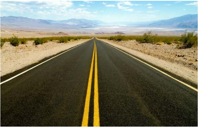

Source: Gresham-Smith Partners

Figure 1-4. Typical Road in the Rural Context


Source: Gresham-Smith Partners

Figure 1-5. Typical Street in the Rural Town Context

--',''','',',',','''''',,,,''-'-',,',,',',,'---


Source: Gresham-Smith Partners

Figure 1-6. Typical Street in the Suburban Context

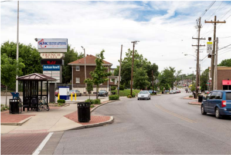

Source: Gresham-Smith Partners

Figure 1-7. Typical Street in the Urban Context


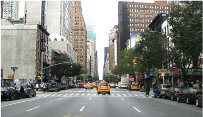

Source: Gresham-Smith Partners

Figure 1-8. Typical Street in the Urban Core Context

## 1.5.1  Context Classes for Roads and Streets in Rural Areas

Roads in rural areas should be designed for either the rural or rural town context. Each of these contexts is discussed below.

## 1.5.1.1  Rural Context

The rural context applies to roads in rural areas that are not within a developed community. These include areas with the lowest development density; few houses or structures; widely dispersed or no residential, commercial, and industrial land uses; and usually large building setbacks. The rural context may include undeveloped land, farms, outdoor recreation areas, or low densities of other types of development. Most roads in rural areas fit the rural context and should be designed in a manner similar to past design criteria for rural facilities.

## 1.5.1.2  Rural Town Context

The rural town context applies to roads in rural areas located within developed communities. Rural towns generally have low development densities with diverse land uses, on-street parking, and sidewalks in some locations, and small building setbacks. Rural towns may include residential neighborhoods, schools, industrial facilities, and commercial main street business districts, each of which present differing design challenges and differing levels of pedestrian and bicycle activity. The rural town context recognizes that rural highways change character where they enter a small town, or other rural community, and that design should meet the needs of not only through travelers, but also the residents of the community. Speed expectations of through travelers change when they enter a rural town. Guidance on the selection of design speeds and


other design elements for the rural town context is presented in Chapters 5, 6, and 7 for local roads and streets, collectors, and arterials, respectively. Additional information on design for the rural town environment can be found in When Main Street is a State Highway ( 17 ) developed by the Maryland Department of Transportation and Main Street… When a Highway Runs Through It ( 19 ), developed by the Oregon Department of Transportation. Guidance on design and speed management for transition zones where a rural highway enters a rural town may be found in and NCHRP Report 737, Design Guidance for High-Speed to Low-Speed Transition Zones for Rural Highways ( 23 ).

## 1.5.2  Context Classes for Roads and Streets in Urban Areas

Roads and streets in urban areas may be designed for the suburban, urban, and urban core contexts. These contexts differ in development density, land use, and building setbacks. Speed expectations of drivers vary markedly as drivers move between (and even within) these contexts, as does the typical level of pedestrian, bicycle, and transit activity. Each of these contexts is discussed below.

## 1.5.2.1  Suburban Context

The suburban context applies to roads and streets, typically  within  the  outlying  portions  of urban areas, with low to medium development density, mixed land uses (with single-family residences, some multi-family residential structures, and nonresidential development including mixed town centers, commercial corridors, big box commercial stores, light industrial development). Building setbacks are varied with mostly off-street parking. The suburban context generally has lower development densities and drivers have higher speed expectations than the urban and urban core contexts. Pedestrians and bicyclist flows are higher than in the rural context, but may not be as high as found in urban and urban core areas.

## 1.5.2.2  Urban Context

The urban context has high-density development, mixed land uses, and prominent destinations. On-street parking and sidewalks are generally more common than in the suburban context, and building setbacks are mixed. Urban locations often include multi-story and low- to medium-rise structures  for  residential,  commercial,  and  educational  uses.  Many  structures  accommodate mixed uses: commercial, residential, and parking. The urban context includes light industrial, and sometimes heavy industrial, land use. The urban context also includes prominent destinations with specialized structures for entertainment, including athletic and social events, as well as conference centers. In small- and medium-sized communities, the central business district may be more an urban context than an urban core context. Driver speed expectations are generally lower and pedestrian and bicyclist flows higher than in suburban areas. The density of transit  routes  is  generally  greater  in  the  urban  context  than  the  suburban  context,  including in-street rail transit in larger communities and transit terminals in small- and medium-sized communities.

## 1.5.2.3  Urban Core Context

The urban core context includes areas of the highest density, with mixed land uses within and among predominantly high-rise structures, and with small building setbacks. The urban core context is found predominantly in the central business districts and adjoining portions of major metropolitan areas. On-street parking is often more limited and time restricted than in the urban context. Substantial parking is in multi-level structures attached to or integrated with other structures. The area is accessible to automobiles, commercial delivery vehicles, and public  transit.  Sidewalks  are  present  nearly  continuously,  with  pedestrian  plazas  and  multi-level pedestrian bridges connecting commercial and parking structures in some locations. Transit corridors, including bus and rail transit, are typically common and major transit terminals may be present. Some government services are available, while other commercial uses predominate, including financial and legal services. Structures may have multiple uses and setbacks are not as generous as in the surrounding urban area. Residences are often apartments or condominiums. Driver speed expectations are low and pedestrian and bicycle flows are high.

## 1.5.3  Design Guidance for Specific Context Classes

Guidance on the selection of design speeds and other design elements for each of the contexts is presented in Chapters 5, 6, 7, and 8 for local roads and streets, collectors, arterials, and freeways, respectively. Intersection designs may also vary by context class, as described in Chapter 9.

The design guidance for the five context classes presented in this edition of the policy is preliminary in nature. More comprehensive guidance on design for each of the contexts in each functional classification is planned for the next edition of this policy.

Where the text of this policy refers to roads or streets 'in rural areas' or 'in urban areas,' the accompanying discussion addresses all contexts within the relevant area type. Where the text of the policy refers to a specific context type (i.e., roads or streets 'in the rural context,' 'in the rural town context,' or 'in the urban context') the accompanying discussion addresses only the specific context class or classes mentioned.

The character of development often varies along a given roadway corridor, so a project may include more than one context class. The portion of the project in each context class should be designed in a manner appropriate to that class, with appropriate transitions, as needed.

## 1.6  MULTIMODAL CONSIDERATIONS

Multimodal considerations are an essential element in the design of every road or street project appropriate to roadway context and community needs. Road and street facilities should be designed to accommodate current and anticipated users. --',''','',',',','''''',,,,''-'-',,',,',',,'---

## 1.6.1  Road and Street User Groups/Transportation Modes

Road  and  street  user  groups  can  be  generally  categorized  into  the  following  transportation modes:

- y Automobiles
- y Bicyclists
- y Pedestrians
- y Transit vehicles
- y Trucks

The following discussion of each user group or transportation mode is provided to explain its role in the transportation system and present some of the geometric design elements important to each mode. Chapters 2 through 10 provide more detailed information on how these transportation modes affect the design of roads and streets.

## 1.6.1.1  Automobiles

Automobiles include all passenger-carrying motor vehicles other than buses. Specifically included within the broad category of automobiles are passenger cars, motorcycles, sports utility vehicles,  light  trucks  (such  as  pickup  trucks),  and  recreational  vehicles.  For  many  roadways, automobiles are the primary mode of travel and transport the largest proportion of road users. In the past, many roadways were designed and built primarily to serve the mobility needs of motor vehicles (automobiles, trucks, and buses), with some consideration of other transportation modes. In recent years, the focus of road design has shifted to consistently consider the needs of all transportation modes, including pedestrians and bicyclists.

## 1.6.1.2  Bicyclists

Bicycle trips have been steadily increasing in many areas of the country. Recreational bicycling has grown, including long-distance bicycle travel in rural areas and, in urban areas, bicycling has become a key mode of transportation from home to work, school, shopping, and entertainment activities. In some cases, the same facilities that serve motor vehicles can adequately serve bicyclists as well, and specific traffic control devices have been developed for the benefit of both motor vehicle drivers and bicyclists. In many other cases, dedicated bicycle facilities on or off the roadway, including marked bicycle lanes and off-road or shared-use bicycle paths, are appropriate. Many communities have planned, and have begun designing and building specific bicycle networks. Segments and intersections along these networks include facilities and accommodations to encourage cyclists to prefer them to other, nearby routes. This helps agencies focus bicycle treatments on specific roadways and provides consistent expectations for roadway operations to both bicyclists and motor-vehicle drivers. Guidance on the design of bicycle facilities is presented in the AASHTO Guide for Development of Bicycle Facilities ( 5 ).

## 1.6.1.3  Pedestrians

Nearly every trip includes a pedestrian portion; even trips taken by passenger vehicles or transit begin with drivers and passengers walking from their origin to the vehicle and end with them walking from the vehicle to their destination. Designing for these short pedestrian trips is especially critical in parking lots, at transit stops, and along roads with on-street parking. The design of these areas should attempt to maximize the visibility of pedestrians to drivers and drivers to pedestrians. Where appropriate, facilities should be designed to encourage pedestrians to complete these initial and final legs of their trip along designated paths and crossings, where drivers expect to encounter them.

In some areas, walking is a mode frequently used by travelers for the entirety of their trip. While central business districts, neighborhood centers, shopping districts, and office complexes in the urban and urban core contexts are often thought of as having the highest rate of pedestrian trips, people often walk to other local destinations or simply for exercise or leisure in suburban and rural contexts as well.

Roadway and intersection designs should consider expected pedestrian usage and provide pedestrian facilities and design elements where appropriate. Such considerations may include a provision of a sidewalk or shared-use path, crosswalks at intersections and appropriate midblock locations,  pedestrian  signals  at  appropriate  pedestrian  crossings,  and  other  geometric  design features that are desirable at locations where pedestrians are present. Appropriate design speeds and geometric design features that encourage slower motor-vehicle speeds should be selected for locations with substantial pedestrian flows. Use of barriers between pedestrian facilities and motor vehicle traffic may be considered. The need to serve pedestrians may, in some cases, conflict with the need to serve other transportation modes. For example, short curb return radii at intersections result in shorter pedestrian crossings, while longer curb return radii permit trucks to make right-turn maneuvers without encroaching on opposing traffic lanes. It is important that designers find an appropriate balance among the needs of all user groups and transportation modes, suitable for conditions at each specific location.

The Americans with Disabilities Act of 1990 ( 29 ), a Federal law referred to as the ADA, requires that a public entity, such as state and local governments, operate each of its services, programs, or activities, including pedestrian facilities in public street rights-of-way, such that, when viewed in its entirety, it is readily accessible to and usable by individuals with disabilities. The ADA requires that a public entity's newly constructed facilities must be made accessible to and usable by individuals with disabilities to the extent that it is not structurally impracticable to do so. The ADA also requires that, when an existing facility is altered, the altered facility must be made accessible to and usable by individuals with disabilities to the maximum extent feasible. Section 504 of the Rehabilitation Act of 1973 ( 21 ), generally referred to as Section 504, includes similar requirements for public entities that receive Federal financial assistance.

--',''','',',',','''''',,,,''-'-',,',,',',,'---

Chapters 2 through 10 of this policy address accessible design of pedestrian facilities, where applicable, but are not the authoritative resource for guidance on accessible design. The 2010 ADA Standards, adopted by the U.S. Department of Justice (DOJ) ( 27 ),  and  the  2006  Standards adopted by the U.S. Department of Transportation (DOT) ( 30 ) have limited applicability in the public right of way. The Proposed Guidelines for Pedestrian Facilities in the Public Right-ofWay ( 26 ) should be consulted when designing features not addressed in the standards. Because the proposed accessibility guidelines ( 26 ) have not yet been finalized by the U.S. Access Board and adopted by the DOJ or the DOT, they are not enforceable standards. However, the proposed guidelines provide a useful framework to help public entities meet their obligations to make their programs, services, and activities in the public rights-of-way readily accessible to and usable by individuals with disabilities. For that reason, Chapters 2 through 10 of this policy reference the proposed accessibility guidelines as a best practice for the design and construction of sidewalks, pedestrian crossings, and other pedestrian facilities in the public rights-of-way. Additional guidance on design of pedestrian facilities is presented in the AASHTO Guidelines for the Planning, Design, and Operation of Pedestrian Facilities ( 3 ).

## 1.6.1.4  Transit

The most common transit vehicle that uses the road and street network are buses, although some communities also provide streetcars, trolleys, or other vehicles that share the traveled way with passenger cars. In addition, light rail transit may frequently cross roads and streets.

Where the traveled way of a street is shared by transit vehicles, adequate lane width should be provided to accommodate the specific vehicles that are present. Special consideration should also be given to locating and designing the stops for these vehicles, recognizing that pedestrians often need to cross the street to access their desired transit stop. Designated transit lanes may be appropriate, especially during specific times of day, to minimize the interruption to traffic flow and decrease the potential for traffic conflicts as transit vehicles stop to pick up or drop off passengers, or merge into and out of traffic to access stops that are set back from travel lanes. Guidance for design of streets served by transit is presented in the AASHTO Guide for Geometric Design of Transit Facilities on Highways and Streets ( 6 ).

## 1.6.1.5  Trucks

Heavy trucks are present, in varying volumes, on many roads and streets. Freeways and arterials generally carry the highest truck volumes. Freeways generally serve long-distance intercity trips and trips from one portion of an urban area to another. Arterials serve long distance intercity trips where freeways are not provided, trips from one portion of an urban area to another, and portions of trips between freeways and the trip origins and destinations (i.e., pickup and delivery locations). Trip origins and destinations for trucks may be located along arterials or be accessed from the arterial using the collector and local road and street network. Intercity buses do not generally stop within urban areas, except at established terminals, and therefore operate much like trucks from the road designer's standpoint.

--',''','',',',','''''',,,,''-'-',,',,',',,'---

Trucks are substantially larger and less maneuverable than automobiles. Communities often designate routes for trucks so that trucks will operate on the roads and streets best suited for them. Wider lanes and larger curb return radii may be appropriate on truck routes to accommodate truck operation. However, trucks still need to leave the designated truck routes to access their origins and destinations. For example, residential streets are typically designed to accommodate fire trucks, garbage trucks, school buses, and snow plows; larger trucks that may be present only occasionally, such as moving vans, are not primary considerations in design.

Guidance about design to accommodate trucks can be found in Chapter 2 and in NCHRP Report 505, Review of Truck Characteristics as Factors in Roadway Design ( 15 ).

## 1.6.2  Consideration of All Transportation Modes in Design

Each of the transportation modes discussed above should be considered in the design of every project on the road and street network. The designer's goal should be a balanced design that serves multiple transportation modes, as appropriate. This does not necessarily mean that facilities for every mode are provided on every road and street. In fact, the appropriate balance among transportation modes may vary widely between specific roads and streets. But the guiding design principle is that the balance among transportation modes selected for each road and street should be a conscious decision arrived at after thorough consideration of the needs of each mode, local and regional transportation agency master plans, and community needs.

Key factors in considering the appropriate facilities to be provided on a roadway or at an intersection are the functional classification and context of the road or street, the expected demand flows for each transportation mode (both current and anticipated), and area-wide or corridor plans established by the community. Assessment of demand flows for motor vehicles has been part of design practice for many years, but assessment of demand flows for pedestrians and bicyclists should also be a key aspect of project design. The facilities provided to serve each transportation mode should be appropriate to the current and anticipated demand flows for that mode. Balanced design recognizes that it may not be practical to provide facilities for every mode on every road and street, but the transportation network as a whole should serve the demands for all modes effectively and conveniently.

In assessing the needs of each transportation mode, planners and designers should consider the current and future demand for travel by each mode, which may not always be reflected in current travel volumes. Where facilities for a transportation mode do not currently exist or where the existing facilities are inadequate to serve the full demand volume, trips may be diverted to other facilities or not made at all. Planning studies can identify appropriate demand volumes for each transportation mode for any given facility or corridor.

Area-wide and corridor plans are an important consideration in project design, because such plans are the means that communities utilize to manage their development and to guide road

--',''','',',',','''''',,,,''-'-',,',,',',,'---

and street design in a manner consistent with the community context. Detailed, formal plans may be most likely to have been developed in urban areas and rural towns, but plans also have been developed for many locations in the rural context. Such plans complement the information provided by the estimates of demand flow by transportation mode. The following types of guidance provided in area-wide or corridor plans will clearly influence the design of specific projects:

- y The functional class of a road or street indicates the emphasis that should be placed on serving through-motor vehicle traffic vs. access to adjacent development.
- y The context class of a road indicates the general development density, land use, and building setbacks along the road or street of interest. This context class has implications for the general speed expectations of motor vehicle drivers, the expectations of pedestrians and bicyclists, the character and constraints of surrounding development.
- y Bicycle network or corridor plans may indicate that some roads and streets are intended as primary bicycle routes that connect to other routes throughout the community. The bicycle facilities provided should be appropriate to the current and anticipated demand volumes and, depending upon those volumes, may include off-road or shared-use paths, on-street bicycle lanes, or widened curb lanes. By contrast, the established plans in urban areas may discourage bicycle usage on some streets that are ill suited to bicycling due to high volumes of motor vehicle traffic, high motor vehicle speeds, or width constraints that make provision of bicycle facilities impractical. This is reasonable where the plans include provision of bicycle facilities on parallel roads and streets within the same corridor to make those other streets more attractive to bicyclists.
- y Pedestrian network or corridor plans, land use plans, and community plans, together with context classification, should assist designers in anticipating the need for pedestrian facilities on particular roads and streets. Needs for facilities should be evident from the potential origins and destinations of pedestrian trips (homes, schools, commercial establishments, workplaces, and activity centers), from the specific development along the road or street in question, and from anticipated future development.
- y Truck network plans often designate some routes as through-truck routes, prohibit or restrict trucks (or trucks of certain sizes) on other routes, and leave the remainder of the network available for trucks to use in accessing their origins and destinations. Existing truck route plans will help designers anticipate where trucks need to be accommodated and the size of trucks likely to use those facilities. Truck network plans also help designers anticipate where trucks are not expected, at least not in substantial volumes.

The stated purpose and need for any given project will provide the designer with a perspective on how best to achieve an appropriate balance among transportation modes for that project. Community and stakeholder input, through the public involvement process, can also help guide the achievement of an appropriate balance. However, in determining the balance among transportation modes, the designer should consistently take a view of the design issues that is broader

--',''','',',',','''''',,,,''-'-',,',,',',,'---

than just a single project, keeping in mind the need for connectivity of the transportation network and the need for the network as a whole to serve all types of users appropriately.

The functional and context classes provide a classification framework (see Figure 1-1) that designers can use to identify and organize many of the needs for specific transportation modes that should be addressed in projects. This framework provides a tool that can be used by the designer to organize information about user needs for various transportation modes and seek an appropriate balance among those needs.

## 1.7  DESIGN PROCESS TO ADDRESS SPECIFIC PROJECT TYPES

Recent research ( 18 ) has developed a revised design process that varies by the purpose and need of the project. Thus, the structure of the design process is problem driven and based on the specific reason the project is being undertaken. This process is being implemented on a preliminary basis in this seventh edition of the policy and will be refined for full implementation in the next edition. --',''','',',',','''''',,,,''-'-',,',,',',,'---

The design process considers three general types of projects:

- y New construction-roads on new alignment
- y Reconstruction-projects on existing alignment that change the basic roadway type
- y Construction on existing roads-projects that maintain the basic roadway type

The definitions of the terms 'new construction' and 'reconstruction' have changed from past practice and the new definitions of these terms are presented below and with design guidance for each type of project. Some major projects may involve a mix of new construction, reconstruction, and construction on existing roads and portions of the project may, therefore, use different design approaches from among those explained below.

## 1.7.1  New Construction Projects

New construction projects are those that construct roads on new alignment where no existing roadway is present. Some new construction, particularly in rural areas, is accomplished at sites with no existing development; other new construction projects-in rural areas and particularly in urban areas-may involve removing existing structures. Projects with minor changes to an existing alignment, as opposed to construction on a new alignment, may be treated as reconstruction projects (see Section 1.7.2) or construction on existing roads (see Section 1.7.3). A project in which the majority of the project length is on new alignment (i.e., not previously a transportation facility) should generally be treated as a new construction project.

New construction projects typically utilize the design criteria presented in Chapters 2 through 10 of this policy. New construction projects can often use traditional design criteria because

there are often fewer constraints in construction on a new alignment than in projects on existing roads. Constraints may be particularly limited for projects in rural areas through undeveloped land; constraints that may directly influence the choice of geometric design criteria are more likely  for  projects  in  urban  areas  where  existing  development  is  present.  The  design  of  new construction projects is not guided by the performance of an existing road, but the forecast performance of the design alternatives in future years may strongly influence design decisions. Thus, a flexible, performance-based approach to design is appropriate even for new construction projects. Like all projects, new construction projects are designed within a framework defined by the functional and context class for the facility and should consider the needs of all transportation modes. The roadway context and the needs of each transportation mode may help the designer identify situations in which departing from the design criteria in this policy may better meet community needs and serve all users.

The design process for new construction projects should be informed by performance measures from analytical tools such the multimodal traffic operational analysis procedures in the TRB Highway Capacity Manual ( 25 ) and the crash prediction methods in the AASHTO Highway Safety Manual ( 4, 7 ). These tools enable the designer to identify situations in which departing from the design criteria in this policy may have specific benefits with little effect on the overall performance of the completed project. This may help the designer in finding an appropriate balance among all transportation modes.

## 1.7.2  Reconstruction Projects

Reconstruction projects are projects that utilize an existing roadway alignment (or make only minor  changes  to  an  existing  alignment),  but  involve  a  change  in  the  basic  roadway  type. Changes in the basic roadway type include widening a road to provide additional through lanes or adding a raised or depressed median where none currently exists, and where these changes cannot be accomplished within the existing roadway width (including shoulders). The change in the basic roadway type means that performance measures for the existing roadway may not be relevant to forecasting the performance of the future reconstructed roadway. However, retaining the existing alignment means that existing constraints in the current roadway environment will influence design decisions. Chapters 2 through 10 of this policy should be consulted for applicable geometric design guidance in reconstruction projects but, even more than for new construction, reconstruction projects need a flexible, performance-based approach to adapt the design to fit the roadway context and meet multimodal needs.

Reconstruction projects often create the most difficult design decisions because a new facility type is being adapted to an existing alignment and needs to fit within the existing community context. While applying the design criteria for new construction in Chapters 2 through 10 of this policy to reconstruction projects is desirable, it may be impractical in many cases because of existing constraints in the corridor and the need to fit the roadway into the community context. Priorities need to be established and decisions made about how best to meet the needs of all

transportation modes. Designers may find that adding some additional geometric elements (e.g., additional lanes or a median) may be feasible only if some design criteria (e.g., lane or shoulder widths) are changed. Such decisions should consider the likely effects of potential changes on future performance.

The multiple considerations in reconstruction project design need a flexible, performance-based approach. The TRB Highway Capacity Manual ( 25 ) and the AASHTO Highway Safety Manual ( 4, 7 ) can be used, together with other tools, to forecast and compare the future performance of design alternatives and to assess the performance effects of changing design criteria. The needs of and potential effects on all transportation models should be considered in design decisions.

Previously, reconstruction was defined to include not only projects that involved a change in the basic roadway type, but also projects on existing alignment where the entire pavement structure, down to the subgrade, was removed and replaced. This aspect of the reconstruction definition has been removed because, even if the entire pavement structure is removed and replaced, performance measures for the existing road can still be a primary guide for forecasting future performance, and the forecast of future performance can inform design decisions. Thus, any project that keeps the existing roadway alignment (except for minor changes) and does not change the basic roadway type is most appropriately treated as construction on an existing road (see Section 1.7.3) and not as reconstruction.

## 1.7.3  Construction Projects on Existing Roads

Construction projects on existing roads are those that keep the existing roadway alignment (except for minor changes) and do not change the basic roadway type. Such projects are classified for design purposes by the primary reason the project is being undertaken or the specific need being addressed. The typical project needs addressed by road and street improvement projects on existing roads include:

- y repair infrastructure condition
- y reduce current or anticipated traffic operational congestion
- y reduce current or anticipated crash patterns

These project needs address all transportation modes. For example, the need for repair of infrastructure condition could be based on the condition of roadways, pedestrian facilities, or bicycle facilities. While some projects may have multiple problems present, there is typically a primary or predominant reason why the project was undertaken and that primary reason should set the overall direction for the design process. The design process is sufficiently flexible to address other documented needs while focusing on the primary need.

It should be noted that lack of compliance with established design criteria such as those in this policy is not listed above as a reason for undertaking a project. Projects should not be undertaken

because design criteria are not met unless there is also poor existing or predicted future performance that is potentially correctable by a design improvement.

The approaches used to address design for projects on existing roads of each specific type include:

- y projects  undertaken  for  reason  of  poor  infrastructure  condition,  where  the  basic  roadway type is not changed, are often implemented in conjunction with pavement resurfacing. Such projects typically consist of resurfacing, restoration, and rehabilitation (3R), plus other improvements for which there is a specific identified need. A guide for design of 3R projects has been recently developed ( 16 ); this guide indicates that 3R projects should retain their existing geometric design features unless one of the following applies:
-  analysis of the crash history of the existing road identifies one or more crash patterns that are potentially correctable by a specific design improvement, or
-  analysis of the traffic operational level of service (LOS) indicates that the LOS is currently lower than the highway agency's target LOS for the facility or will become lower than the target LOS within the service life of the planned pavement resurfacing (typically 7 to 12 years), or
-  design improvement would be expected to reduce sufficient crashes over its service life to be cost effective; i.e., the anticipated crash reduction benefits over the service life of the project should exceed the improvement implementation cost. Examples of such benefitcost analyses are presented in the design guidelines in NCHRP Report 876 ( 16 ), which was developed as a replacement for TRB Special Report 214 ( 24 ).
- y projects undertaken because of current or anticipated traffic operational congestion should be designed based on analyses with the TRB Highway Capacity Manual ( 25 ) to develop solutions that will meet the target LOS for the project. Improvements for other reasons may be incorporated in the project as needed. The existing geometric design of the facility may be retained where it is performing well. There is no reason for geometric design changes except for those that improve traffic operations or that meet another specific identified need.
- y projects  undertaken  to  address  a  current  or  anticipated  crash  pattern  should  be  designed based on analyses with the AASHTO Highway Safety Manual ( 4, 7 ) and other tools to develop solutions that are expected to address the crash pattern. Improvements for other reasons may be incorporated in the project as needed. The existing geometric design of the facility may be retained where it is performing well. There is no reason for geometric design changes except for those that improve traffic operations or that meet another specific identified need.

Definitions of 3R projects may vary between states. All 3R projects would generally fall within the definition of projects on existing roads, but the definition of projects on existing roads is broader than just 3R work and includes any project that does not meet the definition of new construction or reconstruction presented above.

The revised design process described above is intended to encourage greater flexibility in design for all projects, particularly for projects on existing roads, so that the design process is oriented toward addressing identified performance issues, roadway context, and community and multimodal needs, rather than toward improving geometric design features simply because they do not meet today's criteria applicable to new construction. Geometric design improvements should be made where the forecast performance of the existing road indicates that improvement is needed. But improving geometric design features simply for improvement's sake, when the existing  road  is  performing  well  and  anticipated  to  continue  performing  well,  is  a  potential waste of the limited funds available for transportation improvements that could be better spent addressing identified problems on other roads. Every dollar spent on a road that is performing well and anticipated to continue performing well is a dollar that is not available to be spent on a road that is performing poorly. The TRB Highway Capacity Manual ( 25 ), the AASHTO Highway Safety Manual ( 4, 7 ), and other tools provide procedures to identify which roads are performing well and which are performing poorly. Section 1.9 suggests alternative approaches to performance-based design that can be implemented.

## 1.8   DESIGN FLEXIBILITY

Design flexibility is of critical importance because each project has a specific purpose and need, has specific context and constraints, serves a unique set of users, and fills a distinct position in the transportation network. No project is exactly like another; therefore, no single set of design criteria can be applicable to or meet the needs of all, or even most, projects. The range of factors to be addressed in the project development process is too diverse, the needs of individual transportation modes too varied, and the limitations on available funding too great to simply apply the same design approach to every project. Designers typically consider a range of factors when applying design criteria, making trade-offs among many possible design options to best serve the traveling public and the community at large. Design flexibility removes an additional layer of unnecessary constraints to achieving the most appropriate design.

The design criteria in Chapters 2 through 10 of this policy include, and have always included, a great deal of flexibility. Many design dimensions are specified as ranges of values rather than single values, minimum values, or maximum values. The Green Book use  the  words 'should' and 'may' often in the text, indicating that specific design criteria or features may be desirable or permissible, but are not required. The word 'must' is used in this policy only when specific design  criteria  or  practices  are  a  legal  requirement.  For  example,  'must'  is  used  to  describe practices related to the development of pedestrian facilities that are accessible to and usable by individuals with disabilities. It is understood that there are exceptions permitted under applicable laws in limited circumstances (described briefly in Section 1.6), but a full discussion of the circumstances in which these exceptions apply is beyond the scope of this policy. Thus, except in limited cases where legal requirements apply, the design criteria presented in this policy are not fixed requirements, but rather are guidelines that provide a starting point for the exercise of design flexibility. AASHTO has published A Guide for Achieving Flexibility in Highway Design ( 2 )

and FHWA has published Flexibility in Highway Design ( 9 ) and Achieving Multimodal Networks: Applying Design Flexibility and Reducing Conflicts ( 12 ) to illustrate how flexibility can be applied in a practical manner in the design process. The AASHTO Guidelines for Geometric Design of Low-Volume Roads ( 1 ) presents a flexible approach to design of roads and streets with design volume of 2,000 veh/day or less.

Exercise  of  design  flexibility  may,  in  some  cases,  involve  leaving  some  design  elements  unchanged, if they are performing well, even if they do not fully meet the design criteria generally used in new construction. In some cases, it may be desirable to reduce the dimensions of some design elements, so that other aspects of performance can be improved. For example, shoulder widths might be decreased in some cases to provide space for an additional through travel lane or a bicycle lane. The effects of such design changes on all aspects of performance should be assessed as part of the design process.

Design flexibility does not mean that designers can use arbitrary discretion in the design of projects. Flexibility should be exercised in order to better meet specific project goals or to work within defined constraints. Documentation should be provided to explain why the proposed design is an appropriate solution for the project, how it serves the needs of each transportation mode, how it is expected to perform in the future, and how it fits within available funding. This documentation is important to design reviewers, to agency management, and to the public.

Achieving the appropriate design for any project is not an easy process because designers are expected to balance so many competing needs. Simply applying geometric design criteria without regard to the context of the project and the needs of road users would be easier, but this approach would be unlikely to meet the expectations of the traveling public, the needs of the community, and the limitations of available funding.

Performance-based analysis, discussed in Section 1.9, provides a key basis for the exercise of design flexibility.

## 1.9  PERFORMANCE-BASED DESIGN

The geometric design improvements made as part of a project are those appropriate to the project purpose and need, which in turn is developed to address specific aspects of roadway performance identified as in need of improvement. Performance-based design is a design approach in which key design decisions are made with consideration of their anticipated effects on aspects of future project performance that are relevant to the project purpose and need. Thus, performance analysis becomes a tool to inform design decisions. Performance-based analysis enhances the exercise of design flexibility by documenting the anticipated performance effects of design decisions.

Aspects of performance that may be considered in geometric design include any of the issues that affect the project development process and were discussed in the introduction to this chapter:

- y Traffic operational efficiency
- y Existing and expected future crash frequency and severity
- y Construction cost
- y Future maintenance cost
- y Context classification
- y Service and ease of use for each transportation mode:
-  automobile
-  bicycle
-  pedestrian
-  transit
-  truck
- y Accessibility for persons with disabilities
- y Available right-of-way
- y Existing and potential future development
- y Operational flexibility during future incidents and maintenance activities
- y Stakeholder input
- y Community impacts and quality of life
- y Historical structures
- y Impacts on the natural environment:
-  air quality
-  noise
-  wetlands preservation
-  wildlife/endangered species
- y Preservation of archeological artifacts

Quantitative and qualitative measures can be developed and may be relevant to the design of specific projects for each of these aspects of performance. The appropriate aspects of performance and their associated measures should be selected based on the project purpose and need. Performance-based design does not seek to optimize any of these performance measures, but seeks rather to find the appropriate balance among them, and that appropriate balance is site specific and project specific. Performance-based design can help in creating effective projects and can help in avoiding projects that do not improve performance or do not improve it much.

There is no single, preferred approach to performance-based analysis, given the broad range of issues to be addressed and performance measures to be considered. Two alternative approaches to performance-based design that can be employed are:

- y establishing quantitative targets for improvement in specific measures of future performance relative to the no-build condition
- y specifying performance measures that will be improved from the no-build condition (without necessarily specifying how much) and other performance measures that will, at least, remain unchanged in comparison to the no-build condition

The assessment of project effects on performance should be a comparison of projected future performance if the project is built to projected future performance if no project is built. For projects on existing roads, the past performance of the existing condition is a starting point for forecasting future performance, but the effects of likely changes in traffic volume and other potential changes in roadway conditions or surrounding development should also be accounted for. As noted in Section 1.2, forecasts of future performance may be based on existing agency databases or field data, but may also be documented with models such as traffic simulation models, crash prediction or systemic safety models, and air quality or noise models. These same models can be used to quantify the effectiveness of candidate design alternatives in improving performance.

Not all aspects of performance are quantifiable, and not all anticipated effects of geometric design changes are known quantitatively, so performance assessment should consider both quantitative and qualitative measures.

The project development process typically proceeds by formulation of design alternatives and comparison of their projected future performance. The development and comparison of alternatives can help the designer assess what combination of design features may best achieve an appropriate balance of performance measures.

NCHRP Report 785, Performance-Based Analysis of Geometric Design of Highways ( 20 ), provides an example of the first approach to performance-based analysis listed above, involving identification of intended project outcomes as goals for the design. The second approach listed above can be implemented through the performance-based practical design approach being used by highway agencies; FHWA has developed case studies and presented guidance about this approach ( 13 ).

Key analysis tools for performance-based design include the TRB Highway Capacity Manual ( 25 ) for traffic operational analyses and the AASHTO Highway Safety Manual ( 4, 7 ) for quantifying crash reduction effects. The AASHTO Highway Safety Manual is one of the newest performance estimation tools and can provide estimates of the crash reduction likely to result from implementation of specific design alternatives. It should be recognized that no tool can predict exactly how many crashes will occur in a particular year or even a three- to five-year period.

However, the AASHTO Highway Safety Manual can quantify the effect of specific changes in design features on the long-term average number of crashes that would be expected. This allows rational comparison of the performance of design alternatives.

FHWA has published a Guidebook for Developing Pedestrian and Bicycle Performance Measures ( 11 ) that provides resources to help communities develop performance measures that can fully integrate pedestrian and bicycle planning in ongoing performance management activities.

Economic analysis techniques can also be employed as part of performance-based design. For some projects, it may be desirable to include specific features only if the anticipated benefits exceed their anticipated costs. For example, the AASHTO Highway Safety Manual ( 4 ) includes benefit-cost analysis approaches applicable to assessment of geometric design alternatives.

## 1.10  REFERENCES

1. AASHTO. Guidelines for Geometric Design of Low-Volume Roads, First Edition , VLVLR-1. American  Association  of  State  Highway  and  Transportation  Officials,  2001.  Second Edition pending.
2. AASHTO. A Guide for Achieving Flexibility in Highway Design, First Edition ,  FHD-1. American Association of State Highway and Transportation Officials, Washington, DC, 2004.
3. AASHTO. Guide  for  the  Planning,  Design,  and  Operation  of  Pedestrian  Facilities,  First Edition ,  GPF-1. American Association of State Highway and Transportation Officials, Washington, DC, 2004. Second Edition pending.
4. AASHTO. Highway  Safety  Manual,  First  Edition ,  HSM-1.  American  Association  of State Highway and Transportation Officials, Washington, DC, 2010.
5. AASHTO. Guide for the Development of Bicycle Facilities, Fourth Edition ,  GBF-4. American Association of State Highway and Transportation Officials, Washington, DC, 2012.
6. AASHTO. Guide for Geometric Design of Transit Facilities on Highways and Streets, First Edition , TVF-1. American Association of State Highway and Transportation Officials, Washington, DC, 2014.
7. AASHTO. Highway  Safety  Manual:  Supplement ,  HSM-1S.  American  Association  of State Highway and Transportation Officials, Washington, DC, 2014.


8. AASHTO. Direction on Flexibility in Design Standards , Administrative resolution of the AASHTO Standing Committee on Highways, American Association of State Highway and Transportation Officials, Washington, DC, April 2016.
9. FHWA. Flexibility in Highway Design , Federal Highway Administration, U.S. Department of Transportation, updated 2012.
10. FHWA. Highway  Functional  Classification  Concepts,  Criteria  and  Procedures ,  Federal Highway Administration, U. S. Department of Transportation, Washington, DC, 2013. Available at

http://www.fhwa.dot.gov/planning/processes/statewide/related/highway\_functional\_ classifications/

11. FHWA. Guidebook  for  Developing  Pedestrian  and  Bicycle  Performance  Measures ,  Report No.  FHWA-HEP-16-037,  Federal  Highway  Administration,  U.S.  Department  of Transportation, March 2016.
12. FHWA. Achieving Multimodal Networks: Applying Design Flexibility and Reducing Conflicts , Report No. FHWA-HEP-16-055, Federal Highway Administration, U.S. Department of Transportation, August 2016.
13. FHWA. Performance-Based  Practical  Design,  Federal  Highway  Administration , U.S.
4. Department of Transportation. Available at https://www.fhwa.dot.gov/design/pbpd/
14. Fixing America's Surface Transportation (FAST) Act, Pub. L. No. 114-94.
15. Harwood, D. W., D. J. Torbic, K. R. Richard, W. D. Glauz, and L. Elefteriadou. National Cooperative  Highway  Research  Program  Report  505:  Review  of  Truck  Characteristics  as Factors in Roadway Design . NCHRP, Transportation Research Board, National Research Council, Washington, DC, 2003.
16. Harwood, D. W., D. J. Cook, R. Coakley, and C. Polk, National Cooperative Highway Research  Program  Report  876:  Guidelines  for  Integrating  Safety  and  Cost-Effectiveness Into  Resurfacing,  Restoration,  and  Rehabilitation ( 3R ) Projects .  NCHRP, Transportation Research Board, National Research Council, Washington, DC, 2017.
17. Maryland Department of Transportation. When Main Street is a State Highway-Blending Function, Beauty and Identity: A Handbook for Communities and Designers , Maryland State Highway  Administration,  Maryland  Department  of  Transportation,  Baltimore,  MD, 2001.

--',''','',',',','''''',,,,''-'-',,',,',',,'---


18. Neuman, T. R., R. Coakley, S. Panguluri, and D. W. Harwood, National Cooperative Highway Research Program Report 839: An Improved Highway Design Process ,  NCHRP, Transportation Research Board, National Research Council, Washington, DC, 2017.
19. Oregon Department of Transportation. Main Street… When a Highway Runs Through It: A Handbook for Oregon Communities , November 1999.
20. Ray, B. L., E. M. Ferguson, J. K. Knudsen, R. J. Porter, J. M. Mason NCHRP Report 785: Performance-Based  Analysis  of  Geometric  Design  of  Highways  and  Streets ,  Transportation Research Board, National Research Council, Washington, DC, 2014. Available at http://onlinepubs.trb.org/onlinepubs/nchrp/nchrp\_rpt\_785.pdf
21. Rehabilitation Act of 1973, Pub. L. No. 93-112.
22. Stamadiatis, N., A. Kirk, D. Hartman, J. Jasper, S. Wright, M. King, and R. Chellman. National  Cooperative  Highway  Research  Program  Report  855:  An  Expanded  Functional Classification System for Highways and Streets , NCHRP, Transportation Research Board, National Research Council, Washington, DC, 2017.
23. Torbic, D. J., D. K. Gilmore, K. M. Bauer, C. D. Bokenkroger, D. W. Harwood, L. L. Lucas, R. J. Frazier, C. S. Kinzel, D. L. Petree, and M. D. Forsberg. National Cooperative Highway  Research  Program  Report  737:  Design  Guidance  for  High-Speed  to  Low-Speed Transition Zones for Rural Highways . NCHRP, Transportation Research Board, National Research Council, Washington, DC, 2012.
24. TRB. Special Report 214: Designing Safer Roads--Practices for Resurfacing, Restoration, and Rehabilitation . Transportation Research Board, National Research Council, Washington, DC, 1987.
25. TRB. Highway Capacity Manual: A Guide for Multimodal Mobility Analysis, Sixth Edition . Transportation Research Board, National Research Council, Washington, DC, 2016.
26. U.S. Access Board. Proposed Guidelines for Pedestrian Facilities in the Public Right-of-Way , Federal Register, 36 CFR Part 1190, July 26, 2011. Available at
10. http://www.access-board.gov/guidelines-and-standards/streets-sidewalks/public-rights-of-way/ proposed-rights-of-way-guidelines
27. U.S.  Department  of  Justice. 2010  ADA  Standards  for  Accessible  Design ,  September  15, 2010. Available at

https://www.ada.gov/2010ADAstandards\_index.htm

--',''','',',',','''''',,,,''-'-',,',,',',,'---


28. U.S. National Archives and Records Administration. Code of Federal Regulations .  Title 23, Section 101. Definitions and Declarations of Policy.
29. U.S. National Archives and Records Administration. Code of Federal Regulations .  Title 28, Parts 35 and 36. Americans with Disabilities Act of 1990.
30. U.S. National Archives and Records Administration. Code of Federal Regulations . Title 49, Part 37, Subpart H. Modifications for Accessible Facilities.

--',''','',',',','''''',,,,''-'-',,',,',',,'---

## Design Controls and Criteria

This chapter discusses those characteristics of vehicles, pedestrians, bicyclists, and traffic that are considered in establishing criteria to optimize or improve design of the various functional classes and contexts for roads and streets.

## 2.1  INTRODUCTION

The selection of basic design controls and criteria occurs very early in the project development process and should consider the needs of all modes of transportation as well as the community and context in which the project is located. As the project progresses through preliminary and final design, early assumptions may be revised as more detailed  information  becomes  available.  Throughout  the  project  development  process, designers should assess trade-offs and strive to develop a design that is appropriately balanced for all users of the facility, while being sensitive to project constraints. The appropriate balance among transportation modes is generally site specific and project specific. Projects should be developed with intended performance outcomes in mind, and project designers should understand the way geometric design decisions will influence those outcomes. With this understanding, designers can exercise professional judgment and flexibility to implement solutions in financially or physically constrained environments and make project design decisions informed by anticipated geometric design performance.

## 2.2  DRIVER PERFORMANCE AND HUMAN FACTORS

## 2.2.1  Introduction

Consideration of driver performance is essential to proper roadway design and operation. The suitability of a design rests as much on how effectively drivers are able to use the roadway as on any other criterion. When drivers use a roadway designed to be compatible with their capabilities and limitations, their performance is aided. When a design is incompatible with the capabilities of drivers, the chance for driver errors increase, and crashes or inefficient operation may result.


--',''','',',',','''''',,,,''-'-',,',,',',,'---

This section provides information about driver performance that is useful to engineers in designing and operating roadways. It describes drivers in terms of their performance-how they interact with the roadway and its information system and why they make errors.

The material draws extensively from A User's Guide to Positive Guidance ( 12 ), which contains information on driver attributes, driving tasks, and driver information handling. Where positive guidance is applied to design, competent drivers using well-designed roadways with appropriate information displays can perform efficiently, with little likelihood of involvement in a crash. Properly designed and operated roadways, in turn, provide positive guidance to drivers. In addition, NCHRP Report 600, Human Factors Guidelines for Road Systems , Second Edition ( 15 ), provides background information.

## 2.2.2  Older Drivers and Older Pedestrians

At the start of the 20th century, approximately 4 percent of America's population was 65 years of age or older. This group, which currently accounts for nearly 20 percent of the driving population, is expected to continue increasing through 2045.

Older drivers and older pedestrians are a significant and growing segment of the road user population, with a variety of age-related diminished capabilities such as slower reaction times and needing more brightness at night to receive visual information. Older road users deserve mobility and they should be accommodated in the design of road facilities to the extent practical.

Research findings show that enhancements to the highway system to improve its usability for older drivers and pedestrians can also improve the system for everyone. Thus, designers and engineers should be aware of the capabilities and needs of older road users and consider appropriate measures to aid their performance. A Federal Highway Administration report, Handbook for Designing Roadways for the Aging Population ( 14 ), provides information on how geometric design elements and traffic control devices can be modified to better meet the needs and capabilities of older road users. Section 2.2.7 includes a discussion of roadway design and traffic control improvements to ease the driving task for older drivers.

## 2.2.3  The Driving Task

The driving task depends on drivers' receiving and using information correctly. Drivers compare the information received as they travel with the information they already possess, then make decisions based on the information available and take appropriate control actions.

Driving encompasses a number of discrete and interrelated activities. When grouped by performance, the components of the driving task fall into three levels: control, guidance, and navigation. These activities are listed in order of increasing task complexity and in order of decreasing importance for safe driving. Simple steering and speed control are at the basic level of the scale

(control). Road following and path following in response to road and traffic conditions are at midlevel of the scale (guidance). At the more complex level of the scale are trip planning and route following (navigation).

The driving task may be complex and demanding, and several individual activities may need to be performed simultaneously, with smooth and efficient processing and integration of information. Driving often occurs at high speeds, under time pressure, in unfamiliar locations, and under adverse environmental conditions. The driving task may at other times be so simple and undemanding that a driver becomes inattentive. A key to effective driver performance in this broad range of driving situations is error-free information handling.

Driver errors result from many driver, vehicle, roadway, and traffic factors. Some driver errors occur because drivers may not always recognize what actions are appropriate in particular roadway traffic situations, situations may lead to task overload or inattentiveness, and deficient or inconsistent designs or information displays may cause confusion. Driver errors may also result from complexity of decisions, profusion of information, or inadequate time to respond. Control and guidance errors by drivers may also contribute directly to crashes. In addition, navigational errors  by  drivers  cause  delay,  contribute  to  inefficient  operations,  and  may  lead  indirectly  to crashes.

## 2.2.4  The Guidance Task

Roadway designers need an appreciation of the guidance component of the driving task so that their designs can aid driver performance. NCHRP Report 600, Human Factors Guidelines for Road Systems , Second Edition ( 15 ), provides factual information and insight on the characteristics of road users to facilitate appropriate road designs and operational decisions.

## 2.2.4.1  Lane Placement and Road Following

Lane-placement and road-following decisions, including steering and speed control judgments, are basic to vehicle guidance. Drivers use a feedback process to follow alignment and grade within the constraints of road and environmental conditions. Obstacle-avoidance decisions are integrated into lane placement and road-following activities. This portion of the guidance task level is continually performed both when no other traffic is present (singularly) and when it is shared with other activities (integrated).

## 2.2.4.2  Car Following

Car following is the process by which drivers guide their vehicles when following another vehicle.  Car-following  decisions  are  more  complex  than  road-following  decisions  because  they involve speed-control modifications. In car following, drivers need to constantly modify their speed to maintain safe gaps between vehicles. To proceed safely, drivers have to assess the speed

--',''','',',',','''''',,,,''-'-',,',,',',,'--- of the lead vehicle and the speed and position of other vehicles in the traffic stream and continually detect, assess, and respond to changes.

## 2.2.4.3  Passing Maneuvers

The driver decision to initiate, continue, or complete a passing maneuver is even more complex than the decisions involved in lane placement or car following. Passing decisions involve modifications in road- and car-following behavior and in speed control. In passing, drivers must judge the speed and acceleration potential of their own vehicle, the speed of the lead vehicle, the speed and rate of closure of the approaching vehicle, and the presence of an acceptable gap in the traffic stream.

## 2.2.4.4  Other Guidance Activities

Other guidance activities include merging, lane changing, avoidance of pedestrians, and response to traffic control devices. These activities also involve complex decisions, judgments, and predictions.

## 2.2.5  The Information System

Each element that  provides  information  to  drivers  is  part  of  the  information  system  of  the roadway. Formal sources of information are the traffic control devices specifically designed to display information to drivers. Informal sources include such elements as roadway and roadside design features, pavement joints, tree lines, and traffic. Together, the formal and informal sources provide the information drivers need to drive effectively. Formal and informal sources of information are interrelated and should reinforce and augment each other to be most useful.

## 2.2.5.1  Traffic Control Devices

Traffic control devices provide guidance and navigation information that often is not otherwise available or apparent. Such devices include regulatory, warning, and guide signs, and other route guidance information. Other traffic control devices, such as markings and delineation, display additional information that augments particular roadway or environmental features. These devices help drivers perceive information that might otherwise be overlooked or difficult to recognize. Information on the appropriate use of traffic control devices is presented in the Manual on Uniform Traffic Control Devices ( 20 ).

## 2.2.5.2  The Roadway and Its Environment

Selection of speeds and paths is dependent on drivers being able to see the road ahead. Drivers need to see the road directly in front of their vehicles and far enough in advance to perceive the alignment, profile gradeline, and other related aspects of the roadway. The view of the road also includes the environment immediately adjacent to the roadway. Such appurtenances as shoulders and roadside obstacles (including sign supports, bridge piers, abutments, guardrail, and median barriers) affect driving behavior and, therefore, should be clearly visible to the driver. In

the urban environment, drivers are confronted with more stimuli and conflicts, including advertising, traffic control devices, driveways, bicyclists, and pedestrians while they work to navigate to their destination.

## 2.2.6  Information Handling

Drivers use many of their senses to gather information. Most information is received visually by drivers from their view of the roadway alignment, markings, and signs. However, drivers also detect changes in vehicle handling through instinct. They do so, for example, by feeling road surface texture through vibrations in the steering wheel and hearing emergency vehicle sirens.

Throughout the driving task,  drivers  perform  several  functions  almost  simultaneously.  They look at information sources, make numerous decisions, and perform appropriate control actions. Sources of information (some needed, others not) compete for their attention. Needed information should be in the driver's field of view, available when and where needed, available in a usable form, and capable of capturing the driver's attention.

Because drivers can only attend to one visual information source at a time, they integrate the various information inputs and maintain an awareness of the changing environment through an attention-sharing process. Drivers sample visual information obtained in short-duration glances, shifting their attention from one source to another. They make some decisions immediately, and delay others, through reliance on judgment, estimation, and prediction to fill in gaps in available information.

## 2.2.6.1  Reaction Time

Information takes time to process. Drivers' reaction times increase as a function of decision complexity and the amount of information to be processed. Furthermore, the longer the reaction time, the greater the chance for error. Johannson and Rumar ( 30 ) measured brake reaction time for expected and unexpected events. Their results show that when an event is expected, reaction time averages about 0.6 s, with a few drivers taking as long as 2 s. With unexpected events, reaction times increased by 35 percent. Thus, for a simple, unexpected decision and action, some drivers may take as long as 2.7 s to respond. A complex decision with several alternatives may take several seconds longer than a simple decision. Figure 2-1 shows this relationship for median-case drivers, whereas Figure 2-2 shows this relationship for 85th percentile drivers. The figures quantify the amount of information to be processed in bits. Long processing times decrease the time available to attend to other tasks and increase the chance for error.

Roadway designs should take reaction times into account. It should be recognized that drivers vary in their responses to particular events and take longer to respond when decisions are complex or events are unexpected.

--',''','',',',','''''',,,,''-'-',,',,',',,'---

Reaction Time (s)


Figure 2-1. Median Driver Reaction Time to Expected and Unexpected Information


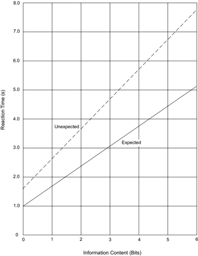

Figure 2-2. 85th-Percentile Driver Reaction Time to Expected and Unexpected Information


## 2.2.6.2  Primacy

Primacy indicates the relative importance to safety of competing information. The driver control and guidance information are most important because the related errors may contribute directly to crashes. Navigation information has a lower primacy because driver errors may lead to inefficient traffic flow, but are less likely to lead to crashes. Accordingly, the design should focus the drivers' attention on the design elements and high-priority information sources that provide control and guidance information. This goal may be achieved by providing clear sight lines and good visual quality.

## 2.2.6.3  Expectancy

Driver expectancies are formed by the experience and training of drivers. Situations that generally  occur  in  the  same  way,  and  successful  responses  to  these  situations,  are  incorporated into each driver's store of knowledge. Expectancy relates to the likelihood that a driver will respond to common situations in predictable ways that the driver has found successful in the past. Expectancy affects how drivers perceive and handle information and modify the speed and nature of their responses.

Reinforced expectancies help drivers respond rapidly and correctly. Unusual, unique, or uncommon situations that violate driver expectancies may cause longer response times, inappropriate responses, or errors.

Most roadway design features are sufficiently similar to create driver expectancies related to common geometric, operational, and route characteristics. For example, because most freeway interchanges have exits on the right side of the road, drivers generally expect to exit from the right. This aids performance by enabling rapid and correct responses when exits on the right are to be negotiated. There are, however, instances where expectancies are violated. For example, if an exit ramp is on the left, then the right-exit expectancy is incorrect, and response times may be lengthened or errors committed.

One of the most important ways to aid driver performance is to develop designs in accordance with prevalent driver expectancies with design elements that are applied consistently throughout a roadway segment. Care should also be taken to maintain consistency from one segment to another. When drivers obtain the information they expect from the roadway and its traffic control devices, their performance tends to be error free. Where they do not get what they expect, or get what they do not expect, errors may result.

## 2.2.7  Driver Error

A common characteristic of many high-crash locations is that they place large or unusual demands on the information-processing capabilities of drivers. Inefficient operation and crashes

usually occur where the driver's chances for information-handling errors are high. At locations with high information-processing demands on the driver, the possibility of driver error increases.

## 2.2.7.1  Errors Due to Driver Deficiencies

Many driving errors are caused by deficiencies  in  a  driver's  capabilities  or  temporary  states, which,  in  conjunction  with  inappropriate  designs  or  difficult  traffic  situations,  may  produce a  failure  in  judgment.  For  example, insufficient experience and training may contribute to a driver's inability to recover from a skid. Similarly, inappropriate risk taking by drivers may lead to errors in gap acceptance while passing ( 19 ). In addition, poor glare recovery may cause older drivers to miss information at night ( 37 ).

Adverse psychophysiological states also lead to driver failures. These include decreased performance caused by alcohol and drugs, for which a link to crashes has been clearly established. The effects of fatigue, caused by sleep deprivation from extended periods of driving without rest or prolonged exposure to monotonous environments, or both, also contribute to crashes ( 39 ).

As a matter of guiding philosophy, roadway designs should be as forgiving as practical to lessen the consequences of driver errors and failures. Well-designed and operated roads can reduce the likelihood of errors by drivers in a competent state. Most individuals possess the attributes and skills to drive properly and are neither drunk, drugged, nor fatigued at the start of their trips. When drivers overextend themselves, fail to take proper rest breaks, or drive for prolonged periods, they ultimately reach a less-than-competent state. Fatigued drivers represent a sizable portion of the long-trip driving population and should therefore be considered in freeway design.

## 2.2.7.1.1  Older Drivers

There is general agreement that advancing age has a deleterious effect on an individual's perceptual, mental, and motor skills. These skills are critical factors in vehicular operation. Therefore, it  is  important for the road designer to be aware of the needs of the older driver, and where appropriate, to consider these needs in the roadway design.

Some of the more important information and observations from research studies concerning older drivers ( 38 ) is summarized below:

1. Characteristics of the Older Driver-In comparison to younger drivers, older drivers often exhibit the following operational deficiencies:
2. y slower information processing
3. y slower reaction times
4. y slower decision making
5. y visual deterioration
6. y hearing deterioration

--',''','',',',','''''',,,,''-'-',,',,',',,'---

- y decline in ability to judge time, speed, and distance
- y limited depth perception
- y limited physical mobility
- y side effects from prescription drugs
2. Crash Frequency-Older drivers are involved in a disproportionate number of crashes where there is a higher-than-average demand imposed on driving skills. The driving maneuvers that most often precipitate higher crash frequencies among older drivers include:
- y making left turns across traffic
- y merging with high-speed traffic
- y changing lanes on congested streets in order to make a turn
- y finding a gap to cross a high-volume intersection
- y stopping unexpectedly for queued traffic
- y parking
3. Key  Roadway  Design  and  Traffic  Control  Features-Improvements  to  the  following roadway design and traffic control features may make driving easier for older drivers:
- y assess all guidelines to consider the practicality of designing for the 95th- or 99th-percentile driver, as appropriate, to represent the performance abilities of an older driver
- y improve sight distance by modifying designs and removing obstructions, particularly at intersections and interchanges
- y assess sight triangles for adequacy of sight distance
- y provide decision sight distance in advance of key decision points
- y simplify and redesign intersections and interchanges that involve multiple information reception and processing
- y consider alternate designs to reduce conflicts
- y increase use of protected left-turn signal phases
- y increase vehicular clearance times at signalized intersections
- y provide increased walk times for pedestrians
- y provide wider and brighter pavement markings and paint median noses
- y provide larger and brighter signs
- y reduce sign clutter
- y provide more redundant information such as advance guide signs for street name, indications of upcoming turn lanes, and right-angle arrows ahead of an intersection where a route turns or where directional information is needed

- y provide centerline and shoulder rumble strips and edge line rumble stripes
- y provide intersection channelization
- y reduce intersection skew

In roadway design, perhaps the most practical measure related to better accommodating older drivers is an increase in sight distance, which may be accomplished through increased use of decision sight distance. The gradual aging of the driver population suggests that increased use of decision sight distance may help to reduce future crash frequencies for older drivers. Where provision of decision sight distance is impractical, increased use of advance warning or guide signs may be appropriate.

## 2.2.7.2  Errors Due to Situation Demands

Drivers often commit errors when they have to perform several highly complex tasks simultaneously under extreme time pressure ( 11 ). Errors of this type usually occur at urban area locations with closely spaced decision points, intensive land use, complex design features, and heavy traffic. Information-processing demands beyond the drivers' capabilities may cause information overload or confuse drivers, resulting in an inadequate understanding of the driving situation.

Other locations present the opposite situation and are associated with different types of driver errors. Typically these are rural locations where there may be widely spaced decision points, sparse land use, smooth alignment, and light traffic. Information demands are thus minimal, and rather than being overloaded with information, the lack of information and decision-making demands may result in inattentiveness by drivers. Driving errors may be caused by a state of decreased vigilance in which drivers fail to detect, recognize, or respond to new, infrequently encountered, or unexpected design elements or information sources.

## 2.2.8  Speed and Design

Speed reduces the visual field, restricts peripheral vision, and limits the time available for drivers to  receive  and  process  information.  Highways  built  to  accommodate  high  speeds  help  compensate for these limitations by simplifying control and guidance activities, by aiding drivers with appropriate information, by placing this information within the cone of clear vision, by eliminating much of the need for peripheral vision, and by simplifying necessary decisions and spacing them farther apart to decrease information-processing demands.

An Institute of Traffic Engineers publication ( 32 ) notes that 'longer length and duration of trips results in driver fatigue and slower reaction as well as a reduction in attention and vigilance.' Thus, extended periods of high-speed driving on highways with low demand for information processing may diminish proper information handling by drivers and may therefore lead to driver fatigue. Highway design should take these potential adverse effects into account and seek to lessen their consequences. For example, long sections of flat, tangent roadway should be avoided

by using flat, curving alignment that follows the natural contours of the terrain whenever practical. Opportunities for rest, spaced at intervals of approximately one hour or less of driving time, have also proved beneficial.

On streets in the rural town, urban, and urban core contexts, high speeds should be discouraged and low to moderate speeds encouraged through design and enforcement. The likelihood of pedestrian and bicycle crashes resulting in a fatality or serious injury increases as vehicle speeds increase.

## 2.2.9  Design Assessment

Sections 2.2.1 through 2.2.7 have described the way drivers use information provided by the roadway and its appurtenances. This discussion has shown the interdependence between design and information display. Both should be assessed in the design of roadway projects. Because drivers 'read' the road and the adjacent environment and make decisions based on what they see (even if traffic control devices making up the formal information system indicate inconsistencies with the driver's view), a roadway segment that is inappropriately designed may not operate as intended. Conversely, an adequately designed roadway may not operate properly without the appropriate complement of traffic control devices.

Designers should consider how the roadway will fit into the existing landscape, how the roadway should be signed, and the extent to which the information system will complement and augment the proposed design. The view of the road is very important, especially to the unfamiliar driver. Therefore, consideration should be given to the visual qualities of the road. This can be accomplished through the use of 3-D computer visualization programs.

Locations with potential for information overload should be identified and corrected. The adequacy of the sight lines and sight distances should be assessed, and it should be determined whether unusual vehicle maneuvers are needed and whether likely driver expectancies may be violated.

Potential driver behavior can be anticipated in the design process by using information about the driving tasks and possible driver errors to assess the design. When trade-offs are appropriate, they should be made with the drivers' capabilities in mind so that the resultant design is compatible with those capabilities. Properly designed highways that provide positive guidance to drivers can operate at a high level of efficiency and with relatively few crashes; therefore, designers should seek to incorporate these principles in roadway design.

## 2.3  TRAFFIC CHARACTERISTICS

## 2.3.1  General Considerations

The design of a roadway and its features should explicitly consider traffic volumes, operational performance, and user characteristics for all transportation modes. All information should be considered jointly. Financing, quality of foundations, availability of materials, cost of right-ofway, and other factors all have important bearing on the design; however, the traffic volume and modal mix can indicate the need for the improvement and directly influence the selection of geometric design features, such as number of lanes, widths, alignments, and grades.

Traffic data for a road or section of road are generally available or can be obtained from field studies. The data collected by state or local agencies include traffic volumes for days of the year and time of the day, as well as the distribution of vehicles by type and weight. The data also include information on trends that the designer may use to estimate the traffic to be expected in the future.

## 2.3.2  Volume

The two traffic volume parameters that greatly influence design decisions are the Average Daily Traffic (ADT) and the Design Hourly Volume (DHV). Both are described in greater detail in this section. It is important for a designer to remember that these parameters, while important and useful, do not characterize the performance of the facility during all hours and days of a year. A design that only takes into account the ADT and DHV might overlook conditions that may exist throughout a day or night that conflict with other project goals, such as making walking and biking more convenient and pleasant.

Both current and future traffic volumes are considered in design. Future traffic volumes expected to use a particular facility are project for the design year, which is usually 10 to 20 years in the future.

## 2.3.2.1  Average Daily Traffic

The most basic measure of the vehicular traffic demand for a roadway is the average daily traffic (ADT) volume. The ADT is defined as the total volume during a given time period (in whole days), greater than one day and less than one year, divided by the number of days in that time period. The current ADT volume for a roadway can be readily determined when continuous traffic counts are available. When only periodic counts are taken, the ADT volume can be estimated by adjusting the periodic counts according to such factors as the season, month, or day of week.

Knowledge of the ADT volume is important for many purposes, such as determining annual roadway usage as justification for proposed expenditures or designing the cross-sectional elements of a roadway. However, the direct use of ADT volume in the geometric design of road-

ways is not appropriate, except for local and collector roads with relatively low volumes, because it does not indicate traffic volume variations occurring during the various months of the year, days of the week, and hours of the day. The amount by which the volume of an average day is exceeded on certain days is appreciable and varied. At typical rural locations, the volume on certain days may be significantly higher than the ADT.

## 2.3.2.2  Design Hour Traffic: Rural Areas

Traffic volumes for an interval of time shorter than a day more appropriately reflect the operating conditions that should be used for design. The brief, but frequently repeated, rush-hour periods are significant in this regard. In nearly all cases, a practical and adequate time period is one hour.

The traffic pattern on any roadway shows considerable variation in traffic volumes during the various hours of the day and in hourly volumes throughout the year. A key design decision involves determining which of these hourly traffic volumes should be used as the basis for design. While it would be wasteful to predicate the design on the maximum peak-hour traffic that occurs during the year, the use of the average hourly traffic would result in an inadequate design. The hourly traffic volume used in design should be a value that will not be exceeded very often or by very much. On the other hand, it should not be a value so high that traffic would rarely be sufficient to make full use of the resulting facility. One guide in determining the hourly traffic volume that is best suited for use in design is a curve showing variation in hourly traffic volumes during the year.

Figure 2-3 shows the relationship between the highest hourly volumes and ADT on arterials in rural areas. This figure was produced from an analysis of traffic count data covering a wide range of volumes and geographic conditions. The curves in the chart were prepared by arranging all of the hourly volumes for one year, expressed as a percentage of ADT, in a descending order of magnitude. The middle curve is the average for all locations studied and represents a roadway with average fluctuation in traffic flow.

Based on a review of these curves, it is recommended that the hourly traffic volume that should generally be used in the design of roadways in rural areas is the 30th highest hourly volume of the year, abbreviated as 30 HV. The reasonableness of 30 HV as a design control is indicated by the changes that result from choosing a somewhat higher or lower volume. The curve in Figure 2-3 steepens quickly to the left of the point showing the 30th highest hour volume and indicates only a few more hours with higher volumes. The curve flattens to the right of the 30th highest hour and indicates many hours in which the volume is not much less than the 30 HV.

On roads in rural areas with average fluctuation in traffic flow, the 30 HV is typically about 15 percent of the ADT. Whether or not this hourly volume is too low to be appropriate for design can be judged by the 29 hours during the year when it is exceeded. The maximum hourly volume, which is approximately 25 percent of the ADT on the graph, exceeds 30 HV by about 67 percent.

Whether the 30 HV is too high for practical economy in design can be judged by the trend in the hourly volumes lower than the 30th highest hour. The middle curve in Figure 2-3 indicates that the traffic volume exceeds 11.5 percent of the ADT during 170 hours of the year. The lowest of this range of hourly volumes is about 23 percent less than the 30 HV.

Figure 2-3. Relation between Peak-Hour and Average Daily Traffic Volumes on Arterials in Rural Areas

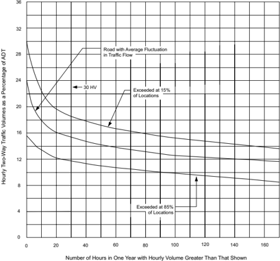

Another fortunate characteristic of 30 HV is that, as a percentage of ADT, it generally varies only slightly from year to year even though the ADT may change substantially. Increased ADT generally results in a slight decrease in the percentage of ADT during the 30 HV. Thus, the percentage of ADT used for determining the 30 HV from current traffic data for a given facility can generally be used with confidence in computing the 30 HV from an ADT volume determined for some future year. This consistency between current and future may not apply where there is a radical change in the use of the land area served by the highway. In cases where


the character and magnitude of future development can be foreseen, the relationship of 30 HV to ADT may be based on experience with other highways serving areas with similar land-use characteristics.

For highway design purposes, the variation in hourly traffic volumes should be measured and the percentage of ADT during the 30th highest hour determined. Where such measurements are impractical and only the ADT is known, the 30 HV should be estimated from 30th-hour percentage factors for similar highways in the same locality, operating under similar conditions.

On a typical arterial in a rural area, the 30 HV is about 15 percent of ADT, and the maximum hourly volume is about 25 percent of ADT. As indicated in Figure 2-3, the 30 HV at 70 percent of all locations, except those having unusually high or low fluctuation in traffic flow, is in the range of 12 to 18 percent of the ADT. Likewise the range in maximum hourly volumes for the same groups of roads varies approximately from 16 to 32 percent of the ADT. These criteria for design apply to most highways in rural areas. There are highways, however, for which there are unusual or highly seasonal fluctuations in traffic flow, such as resort roads on which weekend traffic during a few months of the year far exceeds the traffic during the rest of the year. Seasonal fluctuations result in high peak-hour volumes relative to ADT, high percentages for high-volume hours, and low percentages for low-volume hours.

Because the percentage represented by the 30 HV for a road with large seasonal fluctuations may not be much different from the percentage represented by the 30 HV on most roads in rural areas, the 30 HV criterion may not be appropriate for such roads. A design that results in somewhat less satisfactory traffic operation during seasonal peaks than on rural roads with normal traffic fluctuations will generally be accepted by the public. On the other hand, design should not be so economical that severe congestion results during peak hours. It may be desirable, therefore, to choose an hourly volume for design that is about 50 percent of the volumes expected to occur during a few highest hours of the design year, whether or not that volume is equal to 30 HV. Some congestion would be experienced by traffic during peak hours but the capacity would not be exceeded. A check should be made to verify that the expected maximum hourly traffic does not exceed the capacity.

The design hourly volume (DHV) for rural area highways, therefore, should generally be the 30 HV of the future year chosen for design. Exceptions may be made on roads with high seasonal traffic fluctuation, where a different hourly volume may need to be used. The 30-HV criterion also applies in general to urban areas; however, where the fluctuation in traffic flow is markedly different from that on rural area highways, other hours of the year should be considered as the basis for design.

## 2.3.2.3  Design Hour Traffic: Urban Areas

In urban areas, an appropriate DHV may be determined from the study of traffic during the normal daily peak periods. Because of the recurring morning and afternoon peak traffic flow,

there is usually little difference between the 30th and the 200th highest hourly volume. For typical urban area conditions, the highest hourly volume is found during the afternoon workto-home travel peak. One approach for determining a suitable DHV is to select the highest afternoon peak traffic flow for each week and then average these values for the 52 weeks of the year. If the morning peak-hour volumes for each week of the year are all less than the afternoon peak volumes, the average of the 52 weekly afternoon peak-hour volumes would have about the same value as the 26th highest hourly volume of the year. If the morning peaks are equal to the afternoon peaks, the average of the afternoon peaks would be about equal to the 50th highest hourly volume.

The volumes represented by the 26th and 50th highest hours of the year are not sufficiently different from the 30 HV value to affect design. Therefore, in urban area design, the 30th highest hourly volume can be a reasonable representation of daily peak hours during the year. Flexibility may be appropriate in those areas or locations where recreational or other travel is concentrated during particular seasons. In such locations, a distribution of traffic volume where the hourly volumes are much greater than the 30 HV may result; the 30 HV in such cases may be inappropriate as the DHV and a higher value should be considered in design. Specific measurements of traffic volumes should be made and evaluated to determine the appropriate DHV.

In  the  usual  case,  future  travel  demand  is  determined  from  the  urban  area  transportation planning process in terms of total daily trips that are assigned to the transportation system. Consideration of the split between public and private transportation is also incorporated into this process. These assigned trips constitute the traffic volumes on links of the future street and road network.

In some instances, these volumes (ADT) are provided directly to roadway designers. In others, they are converted by the operational transportation study staff to directional volumes for the design hour. From a practical standpoint, the latter approach may be the more desirable because the transportation study staff is often in a better position to evaluate the effects that the assumptions inherent in the planning process have on the resulting design volumes.

Two-way DHVs (i.e., the 30 HV, or its equivalent) may be determined by applying a representative percentage (usually 8 to 12 percent in urban areas) to the ADT. In many cases this percentage, based on data obtained in a traffic count program, is developed and applied system-wide; in other cases, factors may be developed for different facility classes or different areas of an urban area, or both. At least one highway agency has developed regression equations representing the relationship between peak flow and ADT; different equations are applied, depending on the number of lanes and the range of the ADT volumes.

--',''','',',',','''''',,,,''-'-',,',,',',,'---

## 2.3.3  Directional Distribution

For two-lane highways in rural areas, the DHV is the total traffic in both directions of travel. In the design of highways with more than two lanes and on two-lane roads where important intersections are encountered or where additional lanes are to be provided later, knowledge of the hourly traffic volume for each direction of travel is essential.

A multilane road or street with a high percentage of traffic in one direction during the peak hours may need more lanes than a road or street having the same ADT but with a lesser percentage of directional traffic. During peak hours on most rural area highways, from 55 to 70 percent of the traffic is traveling in the peak direction, with up to as much as 80 percent occasionally. Directional distributions of traffic vary enough between sites that two multilane roads or streets carrying equal traffic may have peak direction volumes that differ by as much as 60 percent. For example, consider a rural road with a design volume of 4,000 vehicles per hour (veh/h) for both directions of travel combined. If during the design hour, the directional distribution is equally split, or 2,000 veh/h is one direction, two lanes in each direction may be adequate. If 80 percent of the DHV is in one direction, at least three lanes in each direction would be needed for the 3,200 veh/h; and if a 1,000-vehicles-per-lane criterion is applied, four lanes in each direction would be needed.

The peak-hour traffic distribution by direction of travel is generally consistent from day to day and from year to year on a given rural road, except on some roads serving recreational areas. Except for roads and streets in urban areas, the directional distribution of traffic measured for current conditions may generally be assumed to apply to the DHV for the future year for which the facility is designed.

The directional distribution of traffic on multilane facilities during the design hour (DDHV) should be determined by making field measurements on the facility under consideration or on parallel and similar facilities. In the latter case, the parallel facilities should preferably be those from which traffic, for the most part, would be diverted to the new roadway. The DDHV applicable for use on multilane facilities may be computed by multiplying the ADT by the percentage that 30 HV is of the ADT, and then by the percentage of traffic in the peak direction during the design hour. Thus, if the DHV is 15 percent of the ADT and the directional distribution at the peak hour is 60:40, the DDHV is 0.15 × 0.60 × ADT, or 9 percent of the ADT. If the directional ADT is known for only one direction, the ADT is nearly always twice the directional ADT.

In designing intersections and interchanges, the volumes of all movements occurring during the design hour should be known. This information is needed for both the morning and evening peak periods because the traffic pattern may change significantly from one peak hour to the other. Normally, a design is based on the DHV, which is to be accommodated during the morning rush hour in one direction and during the evening rush hour in the other direction. Total (twoway) volumes may be the same during both of these peaks, but the percentage of traffic in the two directions of travel is reversed. At intersections, the percentage of approaching traffic that

--',''','',',',','''''',,,,''-'-',,',,',',,'---

turns to the right and to the left on each intersection leg should be determined separately for the morning and evening peak periods. This information should be determined from actual counts, from origin and destination data, or both.

## 2.3.4  Composition of Traffic

Vehicles of different sizes and weights have different operating characteristics that should be considered in roadway design. Besides being heavier, trucks are generally slower and occupy more roadway space. Consequently, trucks have a greater individual effect on traffic operation than do passenger vehicles. The effect on traffic operation of one truck is often equivalent to several passenger cars. The number of equivalent passenger cars equaling the effect of one truck is dependent on the roadway gradient and, for two-lane highways, on the available passing sight distance. Thus, the larger the proportion of trucks in a traffic stream, the greater the equivalent traffic demand.

For uninterrupted traffic flow, the various sizes and weights of vehicles, as they affect traffic operation, can be grouped into two general classes:

- y Passenger  Cars-all  passenger  cars,  including  minivans,  vans,  pick-up  trucks,  and  sport/ utility vehicles
- y Trucks-all buses, single-unit trucks, combination trucks, and recreational vehicles

For traffic-classification purposes, trucks are normally defined as those vehicles having manufacturer's gross vehicle weight (GVW) ratings of 9,000 lb [4,000 kg] or more and having dual tires on at least one rear axle.

In the passenger-car class, as defined above, most of the vehicles have similar operating characteristics. In the truck class, operating characteristics vary considerably, particularly in size and weight/power ratio. Despite this variation in the operating characteristics of trucks, the average effect of all trucks in a traffic stream is similar on most roadways under comparable conditions. Accordingly, for the geometric design of a roadway, it is essential to have traffic data on vehicles in the truck class. These data generally indicate the major types of trucks and buses as percentages of all traffic expected to use the roadway.

For design purposes, the percentage of truck traffic during the peak hours should be determined. In rural areas, comprehensive data usually are not available on the distribution of traffic by vehicle types during the peak hours; however, the percentage of truck traffic during the peak hours is generally less than the percentage for a 24-hour period. As the peak hour approaches, the volume of passenger-car traffic generally increases at a greater rate than does the volume of truck traffic. Most trucks operate steadily throughout the day, and much over-the-road hauling is done at night and during early morning hours. In the vicinity of major truck and bus terminals, the scheduling of regular truck and bus runs may result in the concentration of trucks

during certain hours of the day. However, because of the delays caused by other traffic during peak hours, such schedules generally are made to avoid these hours.

For design of a particular roadway, data on traffic composition should be determined by traffic studies. Truck traffic should be expressed as a percentage of total traffic during the design hour (in the case of a two-lane highway, as a percentage of total two-way traffic, and in the case of a multilane highway, as a percentage of total traffic in the peak direction of travel).

In urban areas, traffic composition is generally more complex, with the presence of pedestrians, bicyclists, and transit vehicles, in addition to passenger cars and trucks. Designers should develop designs for each facility that strike an appropriate balance among all transportation modes served by the facility considering the functional classification and context of the facility, the volumes to be served for each mode, and the area plan for accommodating each mode. Additional discussion of achieving a balance among transportation modes on urban area facilities is found in Chapter 1. Specific information about effective design to serve pedestrians, bicycles and transit, respectively, may be found in the AASHTO Guide for the Planning, Design, and Operation of Pedestrian Facilities ( 2 ), the AASHTO Guide for the Development of Bicycle Facilities ( 7 ), and the AASHTO Guide for Geometric Design of Transit Facilities on Highways and Streets ( 8 ).

Under interrupted-flow conditions in urban areas, the criteria for determining traffic composition differ from those used elsewhere. At important intersections, the percentage of trucks during the morning and evening peak hours should be determined separately. Variations in truck traffic between the various traffic movements at intersections may be substantial and may influence the appropriate geometric layout. The percentage of trucks may also vary considerably during a particular hour of the day. Therefore, it is advisable to count trucks for the several peak hours that are considered representative of the 30th highest or design hour. A convenient value that appears to be appropriate for design use is the average of the percentages of truck traffic for a number of weekly peak hours. For highway-capacity analysis purposes, local city-transit buses should be considered separately from other trucks and buses. --',''','',',',','''''',,,,''-'-',,',,',',,'---

## 2.3.5  Projection of Future Traffic Demands

Geometric design of new roadways or improvements to existing roadways should not usually be based on current traffic volumes alone, but should consider future traffic volumes expected to use the facility. However, traffic forecasting is not an exact science, and involves many assumptions about development patterns, changes in travel behavior, and technology. To better account for the inherent uncertainties involving traffic forecasts, a designer may consider using a rangebased traffic forecast that has lower and upper bounds. A design may be evaluated for these different traffic volume scenarios to characterize its sensitivity to the differences in the forecasts. Even if the design does not change, the designer will have a better understanding of how the facility may operate in the future.

It is difficult to define the life of a roadway because major segments may have different lengths of physical life. Each segment is subject to variations in estimated life expectancy for reasons not readily subject to analysis, such as obsolescence or unexpected radical changes in land use, with the resulting changes in traffic volumes, patterns, and demands. Right-of-way and grading may be considered to have a physical life expectancy of 100 years; minor drainage structures and base courses, 50 years; bridges, 25 to 100 years; resurfacing, 10 years; and pavement structure, 20 to 30 years, assuming adequate maintenance and no allowance for obsolescence. Bridge life may vary depending on the cumulative frequency of heavy loads. Pavement life can vary widely, depending largely on initial expenditures and the repetition of heavy axle loads.

The assumption of no allowance for functional obsolescence is open to serious debate. The principal  causes  of  obsolescence  are  increases  in  the  number  of  intersections  and  driveways  and increases in traffic demand beyond the design capacity. On non-freeway roadways, obsolescence due to addition of intersections and driveways is much more difficult to forestall; this occurs particularly in urban and suburban areas, but may occur in rural areas as well.

In a practical sense, the design volume should be a value that can be estimated with reasonable accuracy. Many designers believe the maximum design period is in the range of 15 to 24 years. Therefore, a period of 20 years is widely used as a basis for design. Traffic cannot usually be forecast accurately beyond this period on a specific facility because of probable changes in the general regional economy, population, and land development along the roadway, which cannot be predicted with any degree of assurance.

## 2.3.6  Speed

Speed is one of the most important factors considered by travelers in selecting alternative routes or transportation modes. Travelers assess the value of a transportation facility in moving people and goods by its reliability, convenience, and economy, which are generally related to its speed. The attractiveness of a public transportation system or a new roadway are each weighed by the travelers in terms of time, convenience, and money saved. Hence, the desirability of rapid transit may well rest with how rapid it actually is. In addition to driver and vehicle capabilities, the speed of vehicles on a road depends on five general conditions:

- y physical characteristics of the roadway,
- y amount of roadside interference,
- y weather,
- y presence of other vehicles, and
- y speed limitations (established either by law or by traffic control devices).

Although any one of these factors may govern travel speed, the actual travel speed on a facility usually reflects a combination of these factors.

--',''','',',',','''''',,,,''-'-',,',,',',,'---

The objective in design of any engineered facility used by the public is to satisfy the public's demand for service in an economical manner, with efficient traffic operations and with low crash frequency and severity. The facility should, therefore, accommodate nearly all demands with reasonable adequacy and also should only fail under severe or extreme traffic demands. Because only a small percentage of drivers travel at extremely high speed, it is not economically practical to design for them. They can use the roadway, of course, but will be constrained to travel at speeds less than they consider desirable. On the other hand, the speed chosen for design should not be that used by drivers under unfavorable conditions, such as inclement weather, because the roadway would then be inefficient, might result in additional crashes under favorable conditions, and would not satisfy reasonable public expectations for the facility.

There are important differences between design criteria applicable to low- and high-speed designs. To implement these differences, the upper limit for low-speed design is 45 mph [70 km/h] and the lower limit for high-speed design is 50 mph [80 km/h].

## 2.3.6.1  Operating Speed

Operating speed is the speed at which drivers are observed operating their vehicles during freeflow conditions. The 85th percentile of the distribution of observed speeds is the most frequently used measure of the operating speed associated with a particular location or geometric feature. The following geometric design and traffic demand features may have direct impacts on operating speed:

- y horizontal curve radius,
- y grade,
- y access density,
- y median treatments,
- y on-street parking,
- y signal density,
- y vehicular traffic volume, and
- y pedestrian and bicycle activity.

## 2.3.6.2  Running Speed

The speed at which an individual vehicle travels over a highway section is known as its running speed. The running speed is the length of the highway section divided by the time for a typical vehicle to travel through the section. For extended sections of roadway that include multiple roadway types, the average running speed for all vehicles is the most appropriate speed measure for evaluating level of service and road user costs. The average running speed is the sum of the distances traveled by vehicles on a highway section during a specified time period divided by the sum of their travel times.

One means of estimating the average running speed for an existing facility where flow is not interrupted by signals or other traffic control devices is to measure the spot speed at one or more locations. The average spot speed is the arithmetic mean of the speeds of all traffic as measured at a specified point on the roadway. For short sections of roadway, on which speeds do not vary materially, the average spot speed at one location may be considered an approximation of the average running speed. On longer stretches of rural highway, average spot speeds measured at several points, where each point represents the speed characteristics of a selected segment of roadway, may be averaged (taking relative lengths of the roadway segments into account) to provide a better approximation of the average running speed.

The average running speed on a given roadway varies during the day, depending primarily on the traffic volume. Therefore, when reference is made to a running speed, it should be clearly stated whether this speed represents peak hours, off-peak hours, or an average for the day. Peak and off-peak running speeds are used in design and operation; average running speeds for an entire day are used in economic analyses.

The effect of traffic volume on average running speed can be determined using the procedures of the Highway Capacity Manual (HCM) ( 43 ). The HCM shows the following:

- y Freeways and multilane highways in rural areasthere is a substantial range of traffic volumes over which speed is relatively insensitive to the volume; this range extends to fairly high volumes. Then, as the volume per lane approaches capacity, speed decreases substantially with increasing volume.
- y Two-lane highwaysspeed decreases linearly with increasing traffic volume over the entire range of volumes between zero and capacity.
- y Streets in urban areasspeed decreases with increasing traffic volume over the entire range of volumes between zero and capacity; the decrease in speed with increasing volume is nonlinear at higher volumes.

## 2.3.6.3  Design Speed

Design speed is a selected speed used to determine the various geometric design features of the roadway. The selected design speed should be a logical one with respect to the anticipated operating speed, topography, the adjacent land use, modal mix, and the functional classification of the roadway. In selection of design speed, every effort should be made to attain a desired combination of safety, mobility, and efficiency within the constraints of environmental quality, economics, aesthetics, and social or political impacts. Once the design speed is selected, all of the pertinent roadway features should be related to it to obtain a balanced design. On lower-speed facilities, use of above-minimum design criteria may encourage travel at speeds higher than the design speed. Some design features, such as curvature, superelevation, and sight distance, are directly related to, and vary appreciably with, design speed. Other features, such as widths of lanes and shoulders and clearances to walls and rails, are not directly related to design speed but

they do affect vehicle speeds. Thus, when a change is made to design speed, many elements of the roadway design will change accordingly.

The selected design speed should be consistent with the speeds that drivers are likely to travel on a given roadway. Where a reason for limiting speed is obvious, drivers are more apt to accept lower speed operation than where there is no apparent reason. A roadway of higher functional classification may justify a higher design speed than a lesser classified facility in similar topography. A low design speed, however, should not be selected where the topography is such that drivers are likely to travel at high speeds. Drivers do not adjust their speeds to the importance of the roadway, but to their perception of the physical limitations of the highway and its traffic.

Lower speeds are desirable for thoroughfares in walkable, mixed-use urban areas and this desire for lower speeds should influence the selection of the design speed. For design of such streets, a target speed should be selected ( 29 ). The target speed is the highest speed at which vehicles should operate on a thoroughfare in a specific context, consistent with the level of multimodal activity generated by adjacent land uses, to provide both mobility for motor vehicles and a desirable environment for pedestrians, bicyclists, and public transit users. The target speed is intended to be used as the posted speed limit. In some jurisdictions, the speed limit is established based on measured speeds. In these cases, it is important for the design of the thoroughfare to encourage an actual operating speed that equals the target speed ( 16, 35 ).

The selected design speed should reflect the needs of all transportation modes expected to use a particular facility. Where traffic and roadway conditions are such that drivers can travel at their desired speed, there is always a wide range in the speeds at which various individuals will choose to operate their vehicles. A cumulative distribution of free-flow vehicle speeds typically has an S-shape when plotted as the percentage of vehicles versus observed speed. The selected design speed should be a high-percentile value in this speed distribution curve (i.e., inclusive of nearly all of the desired speeds of drivers, wherever practical).

It is desirable that the running speed of a large proportion of drivers be lower than the design speed. Experience indicates that deviations from this desired goal are most evident on sharper horizontal curves. In particular, curves with low design speeds (relative to driver expectation) are frequently overdriven and may have higher crash frequencies. Therefore, it is important that the design speed used for horizontal curve design be a conservative reflection of the expected speed on the constructed facility.

Table 2-1 shows the corresponding design speeds in metric and U.S. customary units in 5-mph [10 km/h] increments. This table should be used in converting the units of measurement of design speeds.

Although the selected design speed establishes the limiting values of curve radius and minimum sight distance that should be used in design, there should be no restriction on the use of flatter

--',''','',',',','''''',,,,''-'-',,',,',',,'---

horizontal curves or greater sight distances where such improvements can be provided as part of an economical design. Even in rugged terrain, an occasional tangent or flat curve may be desirable. Isolated features designed for higher speeds may not encourage drivers to speed up, although a succession of such features might. In such cases, the entire section of highway should be  designed  for  a  higher  speed.  A  substantial  length  of  tangent  between  sections  of  curved alignment is also likely to encourage high-speed operation. In such situations, a higher design speed should be selected for all geometric features, particularly sight distance on crest vertical curves and across the inside of horizontal curves.

Table 2-1. Corresponding Design Speeds in Metric and U.S. Customary Units

| U.S. Customary                   | Metric              |
|----------------------------------|---------------------|
| Corresponding Design Speed (mph) | Design Speed (km/h) |
| 15                               | 20                  |
| 20                               | 30                  |
| 25                               | 40                  |
| 30                               | 50                  |
| 40                               | 60                  |
| 45                               | 70                  |
| 50                               | 80                  |
| 55                               | 90                  |
| 60                               | 100                 |
| 70                               | 110                 |
| 75                               | 120                 |
| 80                               | 130                 |
| 85                               | 140                 |

A pertinent consideration in selecting design speeds is the average trip length. The longer the trip, the greater is the driver's desire to use higher speeds. Therefore, as the average trip length served by a facility increases, higher functional classes of roads with higher design speeds are more appropriate.

In the design of a substantial length of highway, it is desirable to select a uniform design speed. However, changes in terrain and other physical controls may dictate a change in design speed on certain sections. If so, the introduction of a lower design speed should not be done abruptly but should be effected over sufficient distance to permit drivers to gradually change speed before reaching the highway section with the lower design speed.

Where it is appropriate to reduce horizontal and vertical alignment features, many drivers may not perceive the lower speed condition ahead, and therefore, it is important that they be warned well in advance. The changing condition should be indicated by such controls as speed-zone and curve-speed signs.


On highways in rural areas and on high-type facilities in urban areas, a percentage of vehicles is usually able to travel at near the free-flow speed governed by geometric design elements; therefore, the selection of an appropriate design speed is particularly important. However, in many arterial streets, vehicle speeds during several hours of the day are limited or regulated more by the presence of large volumes of vehicles and by traffic control devices, rather than by the physical characteristics of the street. In such cases, the selection of a design speed is less critical to efficient operation and low crash frequencies and severities.

During periods of low-to-moderate volume, speeds on arterial streets are governed by such factors as posted speed limits, midblock turns into and out of driveways, intersectional turns, traffic signal spacing, and signal timing for progression. When arterial street improvements are being planned, factors such as future posted speed limits, physical and economic constraints, and running speeds likely to be attained during off-peak hours should be considered. All of these factors should influence the selection of an appropriate design speed.

Horizontal  alignment  generally  is  not  the  governing  factor  in  restricting  speeds  on  arterial streets. Proposed improvements generally are patterned to the existing street system, and minor horizontal alignment changes are commonly made at intersections. The effect of these alignment changes is usually small because operation through the intersection is regulated by the type of traffic controls needed to handle the volume of cross and turning traffic. Superelevation may be provided at curves on arterial streets in urban areas, but the amount of superelevation needed is determined in a different manner than for open-road conditions in rural areas. Wide pavement areas, proximity of adjacent development, control of cross slope and profile for drainage, and the frequency of cross streets and entrances all contribute to the need for lower superelevation rates on arterial streets in urban areas. The width of lanes, offset to curbs, proximity of poles and trees to the traveled way, presence of pedestrians within the right-of-way, and nearness of business or residential buildings, individually or in combination, often affects speeds. Section 3.3.6 provides guidance on horizontal alignment design for low-speed conditions in urban areas.

Topography can materially affect the choice of design speed on arterial streets. Many cities were developed along watercourses and include areas varying from gently rolling to mountainous terrain. Streets may have been constructed originally with only minor grading to fit the topography. Because an arterial street is usually developed to fit the alignment of an existing street, both through business and residential areas, it generally follows a varying vertical profile. Once the design speed is selected, appropriate sight distance should be provided at all crests and across the inside of horizontal curves. Profiles with long, continuous grades should be designed with proper consideration for the speeds of mass transit and commercial vehicles. Extra lanes on the upgrades may be needed so that the grade can match other portions of the facility in capacity and enable vehicles that can proceed at a reasonable speed to pass slower moving vehicles.

Arterial streets in urban areas should be designed and control devices regulated, where practical, to permit running speeds of 20 to 45 mph [30 to 75 km/h]. Speeds in the lower portion of this

range are applicable to local and collector streets through residential areas and to arterial streets through more crowded business areas, while the speeds in the higher portion of the range apply to high-type arterials in outlying suburban areas. For arterial streets through crowded business areas, coordinated signal control through successive intersections is generally needed to permit attainment of even the lower speeds. Many cities have substantial lengths of signal-controlled streets that operate at speeds of 15 to 25 mph [20 to 40 km/h].

Chapters 5 through 8 of this policy provide further guidance on appropriate design speeds for specific roadway types.

## 2.3.7  Traffic Flow Relationships

Traffic  flow  conditions  on  roadways can be characterized by the volume flow rate expressed in vehicles per hour, the average speed in miles per hour [kilometers per hour], and the traffic density in vehicles per mile [vehicles per kilometer]. These three variables-volume, speed, and density-are interrelated and have predictable relationships. The generalized relationships between volume, speed, and density for uninterrupted flow facilities, as presented in the HCM ( 43 ) are shown in Figure 2-4. The relationships shown in Figure 2-4 are conceptual in nature and do not necessarily correspond to the actual relationships used in specific HCM procedures. For example, the HCM procedures for freeways and multilane highways show that speed does not vary with volume through most of the low and intermediate volume range, as shown in Figure 2-4. The HCM procedures for two-lane highways show that speed varies linearly with volume throughout the entire volume range from zero to capacity.

Density, the number of vehicles per unit length of roadway, increases as vehicles crowd closer together. As Figure 2-4 shows, when speeds decrease, increased crowding can occur and drivers can comfortably follow more closely behind other vehicles. Density is used in the HCM as the measure of quality of traffic service for freeways and multilane highways.

Traffic volumes also vary with density from zero to maximum flow rate, as shown in Figure 2-4. The two points of zero flow in Figure 2-4 represent either no vehicles at all or so many vehicles on the roadway that flow has stopped. The maximum flow is reached at the point of maximum density.

Interference to traffic flow causes speeds to be reduced, vehicles to travel closer together, and density to increase. Interference may be caused by weather conditions, cross traffic, disabled vehicles, crashes, or other conditions. As these conditions cause more interference, the flow rates within certain limits can still be maintained but with reduced speed, closer vehicle spacing, and greater density. When interference becomes so great (despite closer vehicle spacing and greater density) that the average speed drops below that needed to maintain stable flow, there is a rapid decrease in speed and traffic flow, and severe congestion occurs.

Figure 2-4. Generalized Speed-Volume-Density Relationships (43)

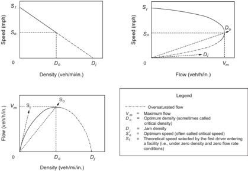

When traffic on a highway encounters interference that limits or reduces the roadway capacity in a single area, the result is a 'bottleneck.' If the flow entering this bottleneck does not exceed its capacity, flow remains stable and no significant congestion should occur. However, when the upstream section carries more vehicles than the bottleneck can accommodate, a breakdown in traffic flow results. Speeds are reduced to a crawl and vehicles begin to queue upstream until incoming flow again falls below the outflow capacity. To avoid bottleneck situations, care should be taken to design roadways with consistent volume-carrying capacity. The level-of-service concept discussed in Section 2.4.5 helps in obtaining this consistency.

An intersection is often an unavoidable bottleneck. This reduction in capacity becomes acute when the intersection is controlled by stop signs or traffic signals. At a traffic signal, vehicles that arrive during the red phase encounter a zero-capacity bottleneck. These vehicles form a queue until the green phase begins, removing the restraint, and discharging the queue. If the incoming volume is too high, not all vehicles in the queue can be discharged during the green phase, and there is a continuing buildup of the queue.

Arrivals at the intersection are generally predictable in urban areas where the approaching vehicles are platooned by upstream signals. In the suburban or rural contexts, vehicle arrivals are


often random. This random arrival pattern should be recognized in the design of appropriate cycle times, turn-lane storage lengths, and approach capacity.

At bottlenecks where traffic slows down or stops, each vehicle and its occupants incur delay. Delays increase  fuel  consumption  and  air  pollution,  which  create  undesirable  economic  and environmental effects.

## 2.4  HIGHWAY CAPACITY

## 2.4.1  General Characteristics

The term 'capacity' is used to express the maximum hourly rate at which persons or vehicles can reasonably be expected to traverse a point (i.e., a uniform section of a lane or a roadway) during a given time period under prevailing roadway and traffic conditions. The range of traffic flow on a highway can vary from very light volumes to volumes that equal the capacity of the facility as defined above. In the generic sense, the term also encompasses broader relations between highway characteristics and conditions, traffic composition and flow patterns, and the relative degree of congestion at various traffic volumes. Highway capacity issues in this broad sense are discussed below.

Sections 2.4.2 through 2.4.6 provide a brief overview of the principles and major factors concerning roadway design capacity. To determine the capacity for a particular roadway design, the designer should refer to the Highway Capacity Manual (HCM) ( 43 ) for guidance. The HCM is used as the basic reference for the following discussion, but other tools are available for performing operational analysis and these may be more appropriate depending on the circumstances. The HCM includes procedures for analyzing the level of service for all modes of travel-pedestrian, bicycle, transit, and motorized vehicles ( 43 ).

## 2.4.2  Application

Roadway capacity analysis serves three general purposes, including:

- y Transportation planning studiesRoadway capacity analysis is used in these studies to assess the adequacy or sufficiency of existing roadway networks to service current traffic. In addition, it is used to estimate the time in the future when traffic growth may exceed the capacity of a roadway or perhaps reach a level of congestion below capacity that is considered undesirable.
- y Roadway designA knowledge of roadway capacity is essential to properly fit a planned roadway to traffic demands. Roadway capacity analysis is used both to select the roadway type and to determine dimensions such as the number and types of lanes and the minimum lengths for weaving sections.

- y Traffic operational analysesRoadway capacity analysis is used in these analyses for many purposes, but especially for identifying bottleneck locations (either existing or potential). It is  also  used to estimate operational improvements that may result from prospective traffic control measures or from spot alterations in the roadway geometry.

The data used for roadway capacity analyses varies with the degree of accuracy needed. For traffic-operational analyses, in which the success of minor improvements may be measured in terms of a few vehicles per hour, a high degree of precision is desirable. For roadway design, a much lower order of precision suffices because the traffic volumes and land uses are frequently estimated for a period 10 to 20 years in the future and involve not only approximations of traffic volumes but also approximations of such factors as traffic composition and movement patterns. The discussion below shows the appropriate level of detail to achieve a reasonable balance between the  design  of  the  roadway  and  the  estimated  future  traffic  volume.  Such  an  analysis should verify that future operating conditions will not fall below an acceptable level. If a greater accuracy than is available from the suggested procedures is needed, refer to the HCM ( 43 ) and other reports on traffic operational analysis.

## 2.4.3  Capacity as a Design Control

## 2.4.3.1  Design Service Flow Rate versus Design Volume

The design volume is the volume of traffic projected to use a particular facility during the design year, which is usually 10 to 20 years in the future. Design volumes are estimated in the planning process and are often expressed as the expected traffic volume during a specified design hour. The derivation of the DHV has been discussed in Section 2.3, 'Traffic Characteristics.'

Design service flow rate is the maximum hourly flow rate of traffic that a roadway with particular design features would be able to serve without the degree of congestion falling below a pre-selected level, as described in Section 2.4.3.4, 'Acceptable Degrees of Congestion.'

A major objective in designing a roadway is to create a facility with dimensions and alignment that can serve the design service flow rate, which should be at least as great as the flow rate during the peak 15 minute period of the design hour, but not so great as to represent an extravagance in the design. Where this objective is accomplished, a well-balanced, economical roadway facility will result.

## 2.4.3.2  Measures of Congestion

Three key considerations in geometric design are the roadway design, the traffic using the roadway, and the degree of congestion on the roadway. The first two considerations can be measured in exact units. For example, the roadway either has or does not have full control of access, its cross-section dimensions can be expressed in feet [meters], and the steepness of its grades can be expressed as a percentage. Likewise, traffic flow can be expressed as the number of vehicles per

unit of time, traffic composition can be expressed as the percentage of vehicles of each class, and the peaking characteristics and directional distribution of traffic can also be quantified.

A scale  of  values  for  expressing  the  degree  of  congestion  is,  however,  a  much  more  elusive measure. Numerous measures of the overall service provided by a roadway section have been suggested,  including  crash  frequency  and  severity,  freedom  to  maneuver,  the  ratio  of  traffic volume to capacity (v/c), operating speed, average running speed, and others. In the case of signalized intersections, the stopped delay encountered by motorists is a commonly used measure of congestion.

For uninterrupted traffic flow (i.e., flow not influenced by signalized intersections), traffic operational conditions are defined by using three primary measures: speed, volume (or rate of flow), and density. Density describes the proximity of vehicles to one another and reflects the freedom to  maneuver within the traffic stream. It is a critical parameter describing traffic operations with uninterrupted flow. As density increases from zero, the rate of flow also increases because more vehicles are on the roadway. While this is happening, speed begins to decline (due to the vehicle interactions). This decline is virtually negligible at low densities and flow rates. However, as density continues to increase, a point is reached at which speed declines noticeably. A maximum rate of flow is eventually reached at which the high density of traffic results in markedly decreased speeds and a reduced flow rate. This maximum rate of flow for any given facility is defined as its capacity. As capacity is approached, flow becomes more unstable because available gaps in the traffic stream become fewer and fewer. At capacity, there are no usable gaps in the traffic stream, and any conflict from vehicles entering or leaving the facility, or from internal lane changing maneuvers, creates a disturbance that cannot be effectively damped or dissipated. Thus, operation at or near capacity is difficult to maintain for long periods of time without the formation of upstream queues, and forced or breakdown flow becomes almost unavoidable. For this reason, most facilities are designed to operate at volumes less than their capacity.

For interrupted flow, such as that occurring on streets where traffic is controlled by signals, the roadway user is not as concerned with attaining a high travel speed as with avoiding lengthy stops at intersections or a succession of stops at several intersections. Average stopped-time delay is the principal measure of effectiveness used in evaluating signalized intersections. Stoppedtime delay, which is used because it is reasonably easy to measure and is conceptually simple, is a characteristic of intersection operations that is closely related to motorist perceptions of quality of traffic flow.

## 2.4.3.3  Relation between Congestion and Traffic Flow Rate

Congestion does not necessarily involve a complete stoppage of traffic flow. Rather, it can be thought of as a restriction or interference to normal free flow. For any given class of roadway, congestion increases with an increase in flow rate until the flow rate is almost equal to the facility's capacity, at which point congestion becomes acute. The gradual increase in congestion with increase in flow rate is apparent no matter what measure is used as an index of congestion.

--',''','',',',','''''',,,,''-'-',,',,',',,'---

The relationship between running speed and traffic flow rate for freeways, multilane highways, two-lane highways, and urban streets has been discussed in Section 2.3.6, 'Speed.' As the traffic flow rate approaches a facility's capacity, as defined in the HCM ( 43 ), any minor disruption in the free flow of traffic may cause traffic on a roadway to operate on a stop-and-go basis, with a resulting decrease in traffic flow rate that can be served.

Roadway sections where the paths of traffic merge and diverge within relatively short distances are called 'weaving sections.' Average running speed, and hence the degree of congestion, is a function not only of the volume of traffic involved in the weaving (crossing) movements but also of the distance within which the weaving maneuvers are completed. (Weaving is addressed in Section 2.4.6.1, 'Weaving Sections.')

On arterial streets in urban areas, average running speed varies only slightly with changes in traffic flow rate. However, delay at signalized intersections may increase dramatically as flow rates approach capacity. Therefore, greater degrees of congestion occur, and these result in reduced overall travel speeds, higher average travel times, and traffic spill-backs into upstream intersections.

## 2.4.3.4  Acceptable Degrees of Congestion

From the standpoint of the roadway user, it would be preferable for each user to have an exclusive right to the roadway at the time the motorist finds occasion or need to use it. Moreover, a motorist would prefer that all roadways be of types that would permit speeds far in excess of those normally afforded by surface streets in urban areas. However, users recognize that if others are to share in the costs of transportation facilities, they are also entitled to share in their use. Therefore, they will readily accept a moderate amount of congestion. Just what degree of congestion the motoring public is willing to accept as reasonable remains a matter of conjecture, but it is known to vary with a number of factors.

The average motorist understands in a general sense that corrective measures to alleviate congestion may be more costly in some instances than in others. As a result, motorists will generally accept a higher degree of congestion in those areas where improvements can be made only at a substantial cost. Also, motorists are more willing to accept a higher degree of restraint in short trips than they are in long trips, but they are generally not satisfied with the type of operation that occurs when the volume of traffic approaches the facility's capacity.

From a transportation administrator's point of view, the degree of congestion that roadway users experience is related to the availability of resources. Historically, funds have never been sufficient to meet all needs, causing severe strain in improving roadways rapidly enough to prevent the traffic demand from exceeding the capacity of the facility.

The appropriate degree of congestion that should be used in planning and designing roadway improvements is determined by weighing the desires of the motorists against the resources avail-

--',''','',',',','''''',,,,''-'-',,',,',',,'---

able for satisfying these desires. The degree of congestion that should not be exceeded during the design year on a proposed roadway can be realistically assessed by: (1) determining the operating conditions that the majority of motorists will accept as satisfactory, (2) determining the most extensive roadway improvement that the governmental jurisdiction considers practical, and (3) reconciling the demands of the motorist and the general public with the finances available to meet those demands.

This reconciliation of desires with available resources is an administrative process of high importance. The decision should first be made as to the degree of congestion that should not be exceeded during the design period.

## 2.4.4  Factors Other Than Traffic Volume That Affect Operating Conditions

The ability of a roadway to serve traffic efficiently and effectively is influenced by the characteristics of the traffic and by the design features of the highway.

## 2.4.4.1  Roadway Factors

Few roadways have ideal designs. Although most modern freeways have adequate cross-sectional dimensions, many are not ideal with respect to design speed, weaving section design, and ramp terminal design. Inadequacies in these features will result in inefficient use of the remaining portions of the freeway.

On other classes of multilane highways, intersections, even though unsignalized, often interfere with the free-flow operation of traffic. Development adjacent to the roadway with attendant driveways and interference from traffic entering and leaving the through-traffic lanes cause an increase in congestion and may increase crash frequency even at relatively low volumes. The adverse effect, although readily apparent, can be difficult to quantify ( 13 ).  Sharp curves and steep grades cannot always be avoided, and it is sometimes appropriate to adjust cross-sectional dimensions. These conditions may combine to cause congestion to be perceived at lower traffic volumes than would be the case for level, tangent roads with full access control or effective access management.

For urban area streets with signalized intersections at relatively close intervals, the traffic volumes that could otherwise be served are reduced because a portion of each signal cycle is assigned exclusively to the crossing roadway.

For a traffic stream composed of a mixture of vehicle classes, rather than passenger cars only, compensatory adjustment factors from the HCM ( 43 )  need  to  be  applied  to  the  traffic  flow rates used as design values. These adjustments are needed to determine the volume of mixed traffic that can be served under minimum acceptable operating conditions on the roadway under consideration.

--',''','',',',','''''',,,,''-'-',,',,',',,'---

The HCM ( 43 ) identifies significant roadway features that may have an adverse effect on operating conditions. The HCM provides factors and outlines procedures for determining the traffic volumes that can be served by roadways that are not ideal in all respects. Features that could result in a roadway being less than ideal in its operational characteristics include narrow lanes and shoulders, steep grades, low design speed, and the presence of intersections, ramp terminals, and weaving sections. The HCM should be referred to for a discussion of these features and their effects on operating conditions. However, the HCM discussion concerning horizontal alignment, weaving sections, and ramp terminals is supplemented and amplified below.

## 2.4.4.2  Alignment

For traffic traveling at any given speed, the better the roadway alignment, the more traffic it can carry. It follows that congestion will generally be perceived at lower volumes if the design speed is low. The roadway should be subdivided into sections of consistent geometric design characteristics for analysis using the HCM techniques. A single limiting curve or steep grade in an otherwise gentle alignment will thus be identified as the critical feature limiting roadway capacity.

## 2.4.4.3  Weaving Sections

Weaving sections are roadway segments where the pattern of traffic entering and leaving at contiguous points of access results in vehicle paths crossing each other. Where the distance in which the crossing is accomplished is relatively short in relation to the volume of weaving traffic, operations within the roadway section will be congested. Some reduction in operating efficiency through weaving sections can be tolerated by roadway users if the reduction is minor and the frequency of occurrence is not high. It is generally accepted that a reduction in operating speed of about 5 mph [10 km/h] below that for which the roadway as a whole operates can be considered a tolerable degree of congestion for weaving sections.

Operating conditions within weaving sections are affected by both the length and width of the section as well as by the volume of traffic in the several movements. These relationships are discussed in Section 2.4.6 and in the HCM ( 43 ).

## 2.4.4.4  Ramp Terminals

Ramps and ramp terminals are features that can adversely influence operating conditions on freeways if the demand for their use is excessive or if their design is deficient. When congestion develops at freeway ramp junctions, some through vehicles avoid the outside lane of the freeway, thereby adding to the congestion in the remaining lanes. Thus, if there are only two lanes in one direction, the efficiency per lane is not as high on the average as that for three or more lanes in one direction.

The loss in efficiency is a function of the volume of traffic entering or leaving ramps, the distance between points of entry and exit, and the geometric layout of the terminals. Too little is known of these separate variables to permit a quantitative assessment of their effect when taken individ-

--',''','',',',','''''',,,,''-'-',,',,',',,'---

ually. Their combined effect is accounted for by levying a uniform assessment against the outside lane, regardless of the causes or extent of interference at individual locations.

Apart from the effect on through traffic, traffic that uses ramps is exposed to a different form of congestion that does not lend itself to measurement in terms of travel speed, delay, or driver tension. The degree of congestion for a ramp is related to the total volume of traffic in the outside lane of the freeway in the vicinity of the ramp junction (i.e., the combined volume of through traffic using the outside lane and the volume of traffic using the ramp).

The HCM ( 43 ) provides procedures for estimating volumes of through traffic in the outside lane of a freeway just upstream of an entrance or an exit ramp for various combinations of roadway and traffic conditions.

## 2.4.4.5  Traffic Factors

Traffic streams are usually composed of a mixture of vehicles: passenger cars, trucks, buses, and, occasionally, recreational vehicles and bicycles. Furthermore, traffic does not flow at a uniform rate throughout the hour, day, season, or year. Consideration should be given to these two variables, composition of traffic and fluctuations in flow, in deciding on volumes of traffic that will result in acceptable degrees of congestion (see Section 2.4.5, 'Levels of Service') and also on the period of time over which the flow should extend.

The effect of trucks and buses on roadway congestion is discussed in the HCM ( 43 ). Detailed procedures are provided for converting volumes of mixed traffic to equivalent volumes of passenger cars. These passenger-car equivalency (PCE) factors used in the HCM differ substantially between facility types.

## 2.4.4.6  Peak Hour Factor

The accepted unit of time for expressing flow rate is a one-hour period. Because flow is not uniform throughout an hour, there are certain periods within an hour during which congestion is worse than at other times. The HCM considers operating conditions prevailing during the most congested 15-minute period of the hour to establish the service level for the hour as a whole. Accordingly, the total hourly volume that can be served without exceeding a specified degree of congestion is equal to or less than four times the maximum 15-minute count.

The factor used to convert the rate of flow during the highest 15-minute period to the total hourly volume is the peak hour factor (PHF). The PHF may be described as the ratio of the total hourly volume to the number of vehicles during the highest 15-minute period multiplied by 4. The PHF is never greater than 1.00 and is normally within the range of 0.75 to 0.95. Thus, for example, if the maximum flow rate that can be served by a certain freeway without excessive congestion is 4,200 vehicles per hour during the peak 15-minute period, and further, if the PHF

is 0.80, the total hourly volume that can be accommodated at that service level is 3,360 vehicles, or 80 percent of the traffic flow rate, during the most congested 15 minute period.

## 2.4.5  Levels of Service

Techniques and procedures for adjusting operational and roadway factors to compensate for conditions that are other than ideal are found in the HCM ( 43 ) and are implemented through the level of service concept. It is desirable that the results of these procedures be made adaptable to roadway design.

The HCM defines the quality of traffic service provided by specific roadway facilities under specific traffic demands by means of a level of service. The level of service characterizes the operating conditions on the facility in terms of traffic performance measures related to speed and travel time, freedom to maneuver, traffic interruptions, and comfort and convenience. The levels of service range from Level of Service A (least congested) to Level of Service F (most congested). Table 2-2 shows the general operating conditions represented by these levels of service. The specific definitions of level of service differ by facility type. The HCM presents a more thorough discussion of the level-of-service concept.

Table 2-2. General Definitions of Levels of Service

| Level of Service   | General Operating Conditions   |
|--------------------|--------------------------------|
| A                  | Free flow                      |
| B                  | Reasonably free flow           |
| C                  | Stable flow                    |
| D                  | Approaching unstable flow      |
| E                  | Unstable flow                  |
| F                  | Forced or breakdown flow       |

Note: Specific definitions of Levels of Service A through F vary by facility type and are presented in the HCM (43).

The  division  points  between  Levels  of  Service  A  through  F  were  determined  subjectively. Furthermore, the HCM ( 43 ) contains no recommendations for the applicability of the levels of service in roadway design. Choice of an appropriate level of service for design is properly left to the roadway designer. The guidance in the preceding discussion should enable the designer to link the appropriate degrees of congestion to specific levels of service. Table 2-3 provides general guidance on customary levels of service for roadways in particular functional classes, area types, and terrain types. Choice of appropriate level of service for design should also include consideration of a variety of other factors. These factors include the desires of motorists, community goals, adjacent land use type and development intensity, environmental factors, and aesthetic and historic values.


Table 2-3. Guidelines for Selection of Design Levels of Service

| Functional Class   | Customary Level of Service for Specified Combination of Context and Terrain Type   | Customary Level of Service for Specified Combination of Context and Terrain Type   | Customary Level of Service for Specified Combination of Context and Terrain Type   | Customary Level of Service for Specified Combination of Context and Terrain Type   |
|--------------------|------------------------------------------------------------------------------------|------------------------------------------------------------------------------------|------------------------------------------------------------------------------------|------------------------------------------------------------------------------------|
| Functional Class   | Rural Level                                                                        | Rural Rolling                                                                      | Rural Mountainous                                                                  | Suburban, Urban, Urban Core, and Rural Town                                        |
| Freeway            | B                                                                                  | B                                                                                  | C                                                                                  | C or D                                                                             |
| Arterial           | B                                                                                  | B                                                                                  | C                                                                                  | C or D                                                                             |
| Collector          | C                                                                                  | C                                                                                  | D                                                                                  | D                                                                                  |
| Local              | D                                                                                  | D                                                                                  | D                                                                                  | D                                                                                  |

While level of service for motor vehicles focuses on speed and delay measures, other factors are important for roadway users in urban and suburban areas traveling on foot, by bicycle, or using transit. The HCM level of service model for pedestrians and bicyclists incorporates 'quality of service' by accounting for measures like comfort, crash frequency and severity, and ease of mobility. Using these models can help determine areas where pedestrian and bicycle level of service improvements may be needed.

The HCM ( 43 ) provides detailed instructions on determining level of service for both pedestrians and bicyclists on a variety of system elements, including signalized intersections and street segments in urban areas. Three performance evaluation measures are used for pedestrian level of  service  on  streets  in  urban  areas:  average  pedestrian  space,  average  pedestrian  speed,  and the pedestrian's perception of the travel experience. The latter measure is influenced by factors including the volume and speed of vehicles, the number of motor vehicle lanes on the roadway, and buffer space present between pedestrians and motor vehicles.

Two performance evaluation measures are used for bicyclist level of service on urban area streets: travel speed and bicyclist's perception of the travel experience. The latter measure is influenced by factors including the volume, speed, and composition of motor vehicle traffic; presence of bicycle lanes; presence of a buffer between the bicycle lanes and motor vehicle traffic; presence and occupancy of on-street parking; and pavement condition.

The HCM also provides methodologies for determining the level of service for public transit operating at street level, such as buses and streetcars. The performance evaluation of transit at the facility level includes two measures: transit travel speed and the transit passenger's perception of the travel experience. The latter measure is influenced by factors including pedestrian access to transit, waiting for the transit vehicle, and the transit ride itself.

## 2.4.6  Design Service Flow Rates

The traffic flow rates that can be served at each level of service are termed 'service flow rates.' Once a particular level of service has been identified as applicable for design, the corresponding service flow rate logically becomes the design service flow rate. This implies that if the traffic

--',''','',',',','''''',,,,''-'-',,',,',',,'--- flow rate using the facility exceeds that value, operating conditions will fall below the level of service for which the facility was designed.

Once a level of service has been selected, it is desirable that all elements of the roadway are designed consistent to this level. This consistency of design service flow rate results in near-constant freedom of traffic movement and operating speed, and flow interruptions due to bottlenecks can be avoided.

The HCM ( 43 ) supplies the analytical base for design calculations and decisions, but the designer should use his or her judgment to select the appropriate level of service. Table 2-3 provides guidance that designers may use in selecting an appropriate level of service. For certain recreational routes or for environmental or land use planning reasons, the designer may select a design service flow rate less than the anticipated demand.

Whether designing an intersection, interchange, arterial, or freeway, the selection of the desired level of service should be carefully considered because the traffic operational adequacy of the roadway is dependent on this choice.

## 2.4.6.1  Weaving Sections

Weaving sections occur where one-way traffic streams cross by merging and diverging maneuvers. The principal types of weaving sections are illustrated in Figure 2-5. Weaving sections are designed, checked, and adjusted so that the level of service is consistent with the remaining roadway. The design level of service of a weaving section is dependent on its length, number of lanes, acceptable degree of congestion, and relative volumes of individual movements. Largevolume weaving movements usually result in considerable friction and reduction in speed of all traffic. Further, there is a definite limit to the amount of traffic that can be handled on a given weaving section without undue congestion. This limiting volume is a function of the distribution of traffic between the weaving movements, the length of weaving section, and the number of lanes.

--',''','',',',','''''',,,,''-'-',,',,',',,'---


Figure 2-5. Weaving Sections


- C -

Weaving sections may be considered as simple or multiple. Figure 2-6A shows a simple weaving section in which a single entrance is followed by a single exit. A multiple-weaving section consists of two or more overlapping weaving sections. A multiple weave may also be defined as that portion of a one-way roadway that has two consecutive entrances followed closely by one or more exits, or one entrance followed closely by two or more exits, as shown in Figure 2-6B. Multiple weaving sections occur frequently in urban areas where there is need for collection and distribution of high concentrations of traffic. For further information concerning the operation and analysis of simple and multiple weaving sections, refer to the HCM ( 43 ).

The weaving section should have a length and number of lanes based on the appropriate level of service, as given in Table 2-3. The HCM presents an equation for predicting the average running speed of weaving and non-weaving traffic based on roadway and traffic conditions. Levelof-service criteria for weaving sections are based on these average running speeds.

Figure 2-6. Simple and Multiple Weaving Sections


## 2.4.6.2  Multilane Highways without Access Control

Multilane highways may be treated similarly to freeways if major crossroads are infrequent, many of the crossroads are grade separated, adjacent development is sparse so as to generate little interference with traffic flow, or some combination thereof. Even on those highways where such interference is currently only marginal, the designer should anticipate that by the design year the interference may be extensive unless access to the highway is well managed. In most cases, the designer should assume that extensive crossroad and business improvements are likely over the design life of the facility.

Where there are major crossroads or where adjacent development results in more than slight interference, the facility should be treated as a multilane highway without access control.

## 2.4.6.3  Arterial Streets and Highways in Urban Areas

It is often difficult to establish design service flow rates for arterial streets and highways in urban areas because the level of service provided by such facilities does not remain stable with the passage of time and tends to deteriorate in an unpredictable manner. However, if the principles of access management are applied initially to the street or highway, a high level of operations can be maintained over time ( 13, 25, 31, 41 ). The capacity of an arterial is generally dominated by the capacity of its individual signalized intersections. The level of service for a section of an arterial is defined by the average overall travel speed for the section.

## 2.4.6.4  Intersections

Design capacities of intersections are affected by a very large number of variables. To the extent that these variables can be predicted for the design year, design capacities for all modes can be estimated by procedures for signalized and unsignalized intersections given in the HCM ( 43 ). The design and spacing of signalized intersections should also be coordinated with traffic signal design and phasing.

## 2.5  ACCESS CONTROL AND ACCESS MANAGEMENT

## 2.5.1  General Conditions

Regulating access is called 'access control.' It is achieved through the regulation of public access rights to and from properties abutting the roadway facilities. These regulations generally are categorized as full control of access, partial control of access, and driveway/entrance regulations. The principal advantages of controlling access are the preservation or improvement of service and the reduction of crash frequency and severity.

The functional advantage of providing access control on a road or street is the management of the interference with through traffic. This interference is created by vehicles or pedestrians

entering, leaving, and crossing the roadway. Where access to a roadway is managed, entrances and exits are located at points best suited to fit traffic and land-use needs and are designed to enable vehicles to enter and leave the roadway with minimum interference from through traffic. Vehicles are prevented from entering or leaving elsewhere so that, regardless of the type and intensity of development of the roadside areas, a high quality of service is preserved and crash potential is lessened. Conversely, on roads or streets where there is no access management and roadside businesses are allowed to develop haphazardly, interference from the roadside can become a major factor in reducing the capacity, increasing the crash potential, and eroding the mobility function of the facility.

Access management involves providing (or managing) access to land development while simultaneously preserving the flow of traffic on the surrounding road system in terms of capacity, speed, and low crash frequency and severity ( 31 ).  Access management applies to all types of roads and streets. It calls for setting access policies for various types of roadways, keying designs to these policies, having the access policies incorporated into legislation, and having the legislation upheld in the courts.

Roadway designers using access management principles should view the roadway and its surrounding activities as part of a single system. Individual parts of the system include the activity center and its circulation systems, access to and from the center, the availability of public transportation, and the roads serving the center. All parts are important and interact with each other. The goal is to coordinate the planning and design of each activity center to preserve the capacity of the overall system and to allow efficient access to and from the activities.

Access management extends traffic engineering principles to the location, design, and operation of access roads that serve activities along streets and roads. It also includes evaluating the suitability of a site for different types of development from an access standpoint and is, in a sense, a new element of roadway design. Refer to the TRB Access Management Manual ( 42 ) for more information.

Access management techniques can be implemented with two basic legal powers: police power and eminent domain. This first power allows a state to restrict individual actions for the public welfare. Police power provides sufficient authority for most access management techniques associated with roadway operations, driveway location, driveway design, and access denials. The second power allows a state to take property for public use provided an owner is compensated for his loss. A state may need to use eminent domain when building local service roads, buying  abutting  property,  acquiring  additional  right-of-way,  and  taking  access  rights.  However, an agency usually has the power to deny direct access through the use of police power when reasonable alternative access is available.

Generally,  states  have  adequate  power  to  manage  access  to  a  roadway  as  long  as  reasonable access is provided to abutting property. However, providing reasonable access does not neces-

sarily mean providing direct access to the state highway system. Coordinating access policies into a clear and definitive regulation facilitates the use of police power. Because authority and interpretations vary from state to state, each state should evaluate its particular legal powers for controlling access. Certain techniques may not be legally feasible in a state that has neither the policy nor precedent to implement them.

Full control of access means that preference is given to through traffic by providing access connections by means of ramps with only selected public roads and by prohibiting crossings at grade and direct private driveway connections.

With partial control of access, some preference should be given to through traffic. Access connections, which may be at-grade or grade-separated, are provided with selected public roads and private driveways. Generally, full or partial access control is accomplished by legally obtaining the access rights from the abutting property owners (usually at the time of purchase of the rightof-way) or by the use of frontage roads.

Driveway/entrance regulations may be applied even though no control of access is obtained. Each abutting property is permitted access to the street or highway; however, the location, number, and geometric design of the access points are governed by the regulations.

Access management addresses the basic questions of when, where, and how access should be provided or denied, and what legal or institutional changes are needed to enforce these decisions. In a broad context, access management is resource management, since it is a way to anticipate and prevent congestion and to improve traffic flow.

Key elements of access management include defining the allowable access and access spacing for various classes of roadways, providing a mechanism for granting variances when reasonable access cannot otherwise be provided, and establishing means of enforcing policies and decisions. These key elements, along with appropriate design policies, should be implemented through a legal code that provides a systematic and supportable basis for making access decisions. The code should provide a common basis for decisions for both the public and private sectors.

## 2.5.2  Basic Principles of Access Management

The following principles define access management techniques:

- y Classify the road system by the primary function of each roadway. Freeways emphasize movement and provide complete control of access. Local streets emphasize property access rather than traffic movement. Arterial and collector roads serve a combination of both property access and traffic movement.

--',''','',',',','''''',,,,''-'-',,',,',',,'---

- y Limit direct access to roads with higher functional classifications. Direct property access should be denied or limited along higher class roadways whenever reasonable access can be provided to a lower class roadway.
- y Select  intersection  geometry  and  traffic  control  to  facilitate  corridor  progression. Signalized  access  points  should  fit  into  the  overall  signal  coordination  plan  for  traffic progression.
- y Locate driveways and major entrances to minimize interference with traffic operations. Driveways and entrances should be located away from other intersections to minimize crashes, reduce traffic interference, and provide for adequate storage lengths for vehicles turning into entrances.
- y Use curbed medians and locate median openings to manage access movements and minimize conflicts.

The extent of access management depends upon the location, type, and density of development, and the nature of the roadway system. Access management actions involve both the planning and design of new roads and the retrofitting of existing roads and driveways.

## 2.5.3  Access Classifications

Access classification is the foundation of a comprehensive access management program. It defines when, where, and how access can be provided between public roadways and private driveways or entrances.

Access classification relates the allowable access to each type of roadway in conjunction with its purpose, importance, and functional characteristics.

The functional classification system provides the starting point in assigning roadways to different access categories. Modifying factors include existing land development, driveway density, and geometric design features, such as the presence or absence of a raised-curb median.

An access classification system defines the type and spacing of allowable access for each class of road. Direct access may be denied, limited to right turns in and out, or allowed for all or most movements depending upon the specific class and type of road. Spacing of signals  in terms  of  distance  between  signals  or  through  bandwidth  (progression  speed)  is  also  specified.  Examples of access classification schemes are presented in NCHRP Report 348, Access Management Guidelines for Activity Centers ( 31 ). More information can also be found in the TRB Access Management Manual ( 42 ).

--',''','',',',','''''',,,,''-'-',,',,',',,'---

## 2.5.4  Methods of Controlling Access

Public agencies can manage and control access by means of statutes, land-use ordinances, geometric design policies, and driveway regulations.

- y Control by the transportation agencyEvery state and local transportation agency has the basic  statutory  authority  to  control  all  aspects  of  roadway  design  to  protect  public  safety, health, and welfare. The extent to which an agency can apply specific policies for driveways/ entrances, traffic signal locations, land use controls, and denial of direct access is specifically addressed by legislation and, to some degree, by the state courts.
- y Land-use ordinancesLand-use control is normally administered by local governments. Local zoning ordinances and subdivision requirements can specify site design, setback distances, access type, parking restrictions, and other elements that influence the type, volume, and location of generated traffic.
- y Geometric designGeometric design features, such as intersection type, use of raised-curb medians, spacing of median openings, use of frontage roads, closure of median openings, and raised-curb channelization at intersections, all assist in controlling access.
- y Driveway regulationsAgencies may develop detailed access and driveway/entrance policies  by  guidelines, regulations, or ordinances, provided specific statutory authority exists. Guidelines usually need no specific authority, but are weak legally. Cities can pass ordinances implementing access management policies. Likewise, state agencies may develop regulations when authorized by legislation. Regulations can deny direct access to a road if reasonable, alternative access is provided, but they cannot 'take away' access rights.

## 2.5.5  Benefits of Controlling Access

Highways with full access control consistently experience only 25 to 50 percent of the crash rates observed on roadways without access control. These rates are defined in terms of crashes per million vehicle miles [kilometers] of travel. Freeways limit the number and variety of events which drivers encounter and, as a result, crash rates are lower.

The benefits of controlling access to a highway have long been recognized and well documented. As access density increases, there is a corresponding increase in crashes and travel times. Good access management can limit this increase.

A study on congestion by the Texas Transportation Institute has reported a 2- to 3-mph reduction in speed for every added signal per mile [5- to 8-km/h reduction in speed for every added signal per kilometer] ( 33 ).  A research study on the impact of access management found that through vehicles in the curb or right lane comprised approximately 20 percent of the right turns desiring to enter a development ( 25 ).

As shown in Figures 2-7 through 2-9, the frequency of access points, such as driveways or business entrances, substantially affects the crash rate for that particular section of roadway. As the number of business and access points increases along a roadway, there is a corresponding increase in crash rates. This increase contrasts sharply with freeway crash rates which generally remain the same or even decrease slightly over time.

The generalized effects of access spacing on traffic crashes were derived from a literature synthesis and an analysis of 37,500 crashes ( 25 ). This study's analysis shows the relative increase in crash rates that can be expected as the total driveway density increases. Increasing the access frequency from 20 to 50 access points per mile [10 to 30 access points per kilometer] will result in almost doubling the number of crashes. Each additional access point per mile increases the crash rate about 3 percent; thus, each additional access point per kilometer increases the crash rate about 5 percent.

Figures 2-7 and 2-8 show crash rates by access frequency and type of median for urban/suburban and rural roads, respectively. Crash rates rise for each type of median treatment with an increase in access frequency. Non-traversable medians generally have a lower crash rate than two-way left-turn lanes and undivided roadway sections for all access densities. However, as discussed in Section 7.3.3, provision of non-traversable medians will eliminate left-turn movements at some intersections and driveways, but may increase U-turn volumes at other locations on the same road or may divert some traffic to other roads. The effect on crash frequency of increased U-turn volumes or diverted traffic may not be reflected in Figures 2-7 and 2-8.

For urban/suburban roads, representative crash rates for combinations of signalized and unsignalized access density are shown in Figure 2-9. This figure indicates that crash rates rise with increases in either unsignalized or signalized access density.

The procedures in Chapter 12 of the AASHTO Highway Safety Manual ( 5, 9 ) can be used for more detailed analysis of the effects of roadway types, driveway density, and driveway types on crash frequencies and severities on arterials in urban areas.

In summary, some degree of access control or access management should be included in the development of any street or highway, particularly on a new facility where the likelihood of commercial development exists. The type of street or highway to be built should be coordinated with the local land-use plan so that the desired type of access can be maintained through local zoning ordinances or subdivision regulations. The control of access may range from minimal driveway regulations to full control of access. Thus, the extent of access management that is practical is a significant factor in defining the type of street or highway.

--',''','',',',','''''',,,,''-'-',,',,',',,'---


## U.S. CUSTOMARY

Figure 2-7. Estimated Crash Rates by Type of Median-Urban and Suburban Areas (25)

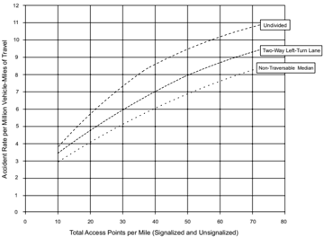


--',''','',',',','''''',,,,''-'-',,',,',',,'---

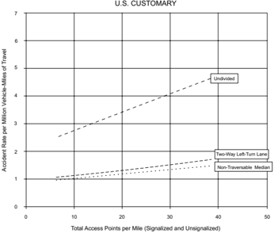

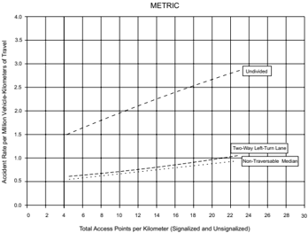

Figure 2-8. Estimated Crash Rates by Type of Median-Rural Areas (25)


## U.S. CUSTOMARY

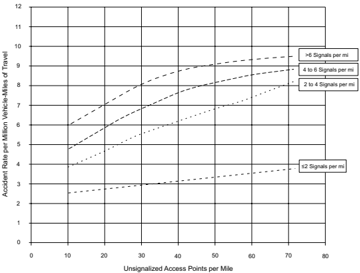

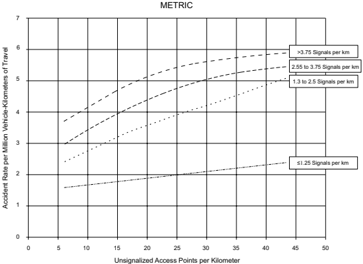

Figure 2-9. Estimated Crash Rates by Unsignalized and Signalized Access Density-Urban and Suburban Areas (25)


## 2.6  PEDESTRIANS

## 2.6.1  General Considerations

Appropriate accommodation of pedestrian travel is a major consideration in roadway planning and design. Pedestrians are a part of every roadway environment, and attention should be paid to their presence in rural as well as urban areas. The urban pedestrian, being far more prevalent,  more  often  influences  roadway design features than the rural pedestrian does. Because of the demands of vehicular traffic in congested urban areas, it is often very difficult to make adequate provisions for pedestrians. Yet provisions should be made, because pedestrians are the lifeblood of our urban areas, especially in the downtown and other retail areas. In general, the most successful shopping areas are those that provide the most comfort and pleasure for pedestrians. Some agencies are moving toward an 'outside in' approach to urban area street design, prioritizing the needs of pedestrians early in the allocation of limited right of way. Pedestrian facilities include sidewalks, crosswalks, traffic control features, and curb cuts (depressed curbs and ramped sidewalks) and ramps for the older walkers and persons with mobility disabilities. Pedestrian facilities also include bus stops or other loading areas, sidewalks on grade separations, and the stairs, escalators, or elevators related to these facilities. Where pedestrian facilities are provided, they must be accessible to and usable by individuals with disabilities ( 46, 48 ). For additional guidance on design of pedestrian facilities, consult the Proposed Guidelines for Pedestrian Facilities in the Public Right-of-Way ( 45 ) and the AASHTO Guide for Planning, Development, and Operation of Pedestrian Facilities ( 2 ).

## 2.6.2  General Characteristics

To effectively plan and design pedestrian facilities, an understanding of the typical pedestrian is needed. The typical pedestrian will not walk over 1 mi [1.5 km] to work or over 0.5 mi [1.0 km] to catch a bus, and about 80 percent of the distances traveled by the pedestrian will be less than 0.5 mi [1.0 km] ( 34 ). The typical pedestrian is a shopper about 50 percent of the time that he or she is a pedestrian and a commuter only about 11 percent of the time. As a consequence, pedestrian volumes peak at about noon rather than at the peak commuter times. Pedestrian volumes are influenced by such transient conditions as weather or, in specific locations, advertised sales. Hourly fluctuations in pedestrian volumes on a city street can be found in the AASHTO Guide for the Planning, Design, and Operation of Pedestrian Facilities ( 2 ).

Pedestrian  actions  are  less  predictable  than  those  of  motorists.  Many  pedestrians  will  cross roadways when and where they perceive it is safe to do so. Pedestrians tend to walk in a path representing the shortest distance between two points. Therefore, pedestrian crossings at midblock locations may be appropriate to supplement those at intersections.

Pedestrians also have a basic resistance to changes in grade or elevation when crossing roadways and tend to avoid using special underpass or overpass pedestrian facilities. Also, pedestrian un-

--',''','',',',','''''',,,,''-'-',,',,',',,'---

derpasses may be potential crime areas, lessening their usage. The FHWA publication entitled Informational Report on Lighting Design for Midblock Crosswalks ( 24 )  provides information on nighttime visibility needs for pedestrians crossing roadways at nonintersection locations.

A pedestrian's age is an important factor that may explain behavior that leads to collisions between motor vehicles and pedestrians. Very young pedestrians are often careless in traffic from either inexperience or exuberance, whereas older pedestrians may be affected by limitations in sensory, perceptual, cognitive, or motor skills. Driver behavior, such as turning right on red without coming to a complete stop or parking too close to an intersection, may result in collisions with pedestrians. Pedestrian collisions can also be related to the lack of sidewalks, which may force pedestrians to share the traveled way with motorists. Therefore, sidewalk construction should be considered as part of any street improvement in the suburban, urban, and urban core contexts.

Measures with the potential to reduce vehicle-pedestrian crashes and increase pedestrian comfort in the walking environment:

- y Use simple designs that minimize crossing widths and minimize the use of more complex elements such as channelization and separate turning lanes.
- y Provide curb extensions (bulb-outs) at intersections.
- y Assume lower walking speeds.
- y Provide median refuge islands of sufficient width at wide intersections.
- y Provide lighting and eliminate glare sources at locations that demand multiple information gathering and processing.
- y Consider the traffic control system in the context of the geometric design to provide compatibility and adequate advance warning or guide signs for situations that could surprise older drivers or pedestrians or increase their crash frequencies.
- y Use accessible pedestrian signals to provide audible and vibrotactile information.
- y Consider increasing sign letter size and retroreflectivity to accommodate individuals with decreased visual acuity.
- y Use advance yield/stop signs.
- y Provide enhanced markings and delineation.
- y Use repetition and redundancy in design and in signing.

For  further  information  on  older  pedestrians  and  drivers,  refer  to  the  FHWA  publications, Handbook for Designing Roadways for the Aging Population ( 14 ) and Pedestrian Safety Guide and Countermeasure Selection System ( 22 ).

## 2.6.3  Walking Speeds

Air temperature, time of day, trip purpose, age, gender, ability, grade, and presence of ice and snow all affect pedestrian walking speeds. Typical pedestrian walking speeds range from approximately 3.0 to 4.0 ft/s [0.9 to 1.2 m/s] ( 24 ). Older people will generally walk at speeds in the lower end of this range. To accommodate most pedestrians, a walking speed of 3.5 ft/s [1.1 m/s] is used, with a walking speed of 3.0 ft/s used where older pedestrians are expected.

Intersection design can be directly affected by the assumed walking speed, particularly where pedestrian crossings are controlled by pedestrian signals. The Manual on Uniform Traffic Control Devices (MUTCD) ( 20 ) establishes a two-fold process for calculating pedestrian crossing times and distances. First, the pedestrian clearance time (Flashing Don't Walk) is based on a walking speed of 3.5 ft/s [1.1 m/s] measured from curb to curb. Second, the total pedestrian crossing phase (Walk plus Flashing Don't Walk) is calculated using a walking speed of 3.0 ft/s [0.9 m/s] for a crossing measured from the top of the sidewalk ramp to the far curb. These pedestrian walking speeds used in the MUTCD have implications for geometric design because shortening the crossing distance by using curb bulb-outs or narrower lanes can reduce the time for the pedestrian walk phase, thereby increasing the time available for opposing vehicular travel.

## 2.6.4  Walkway Level of Service

Walking speeds decrease as the pedestrian density of the walkway increases. As with roadway capacities, there is an optimum speed and density under which the walkway will carry the largest volume. The width used for walkway calculations should be reduced where parking meters, hydrants, newsstands, litter barrels, utility poles, or similar obstructions preclude the use of the full walkway. For a more detailed analysis of sidewalk, stairway, and crosswalk design and capacities, see the AASHTO Guide for the Planning, Design, and Operation of Pedestrian Facilities ( 2 ) and the Highway Capacity Manual ( 43 ).

## 2.6.5  Intersections

When pedestrians encounter an intersection, there is a major interruption in pedestrian flow. The sidewalk should provide sufficient storage area for those waiting to cross as well as an area for pedestrian cross traffic to pass.

Once pedestrians are given the walk indication, the crosswalk width and length become important. Crosswalks should be wide enough to accommodate the pedestrian flow in both directions within the duration of the pedestrian signal phase. The wider the street, the longer it takes a pedestrian to cross and proportionately less green signal time will be available for the primary street movements. Additionally, the longer the pedestrian crossing time, the longer the exposure to potential pedestrian-vehicular conflicts.

--',''','',',',','''''',,,,''-'-',,',,',',,'---

If  the  intersection is not signal controlled or if stop signs do not control the through motor vehicular traffic, pedestrians need to wait for suitable gaps in the traffic to cross. The wider the street, the longer the gap that is needed to provide sufficient pedestrian crossing times. Under urban area conditions, pedestrian crossing times may be reduced by using narrower lanes or by providing median refuge areas and two-stage crossings. However, the potential for vehicle-pedestrian collisions and reasonable roadway and intersection capacity needs should be considered when reducing crossing times.

## 2.6.6  Reducing Pedestrian-Vehicular Conflicts

The following measures may help reduce pedestrian-vehicular conflicts and improve operations on roadways in urban areas: (1) eliminate left and/or right turns, (2) prohibit free-flow right-turn movements, (3) prohibit right turn on red, (4) provide separate signal phases for pedestrians or leading pedestrian intervals, and (5) provide for pedestrian grade separations. These and other pedestrian considerations are detailed in subsequent chapters and in the AASHTO Guide for the Planning, Design, and Operation of Pedestrian Facilities ( 2 ).

## 2.6.7  Accommodating Persons with Disabilities

Roadway designs with features for persons with disabilities can greatly enhance their ability to have full, productive, and independent lives. To adequately provide for persons with disabilities, the designer should be aware of the range of disabilities to expect so that the design can appropriately accommodate them. Providing information in multiple formats is helpful to all pedestrians. The designer is cautioned to adequately review all local and national guidelines for proper compliance with applicable rules and regulations. Where pedestrian facilities are provided, they must be accessible to and usable by individuals with disabilities ( 46, 48 ). For additional guidance, see Section 4.17.3, 'Curb Ramps,' as well as the AASHTO Guide for the Planning, Design, and Operation of Pedestrian Facilities ( 2 ) and the Proposed Guidelines for Pedestrian Facilities in the Public Right-of-Way ( 45 ).

## 2.6.7.1  Mobility Disabilities

Some persons with mobility disabilities are able to walk without assistive devices, but slowly and with difficulty. Other persons may need aid from braces, canes, crutches, wheelchairs, scooters, or other devices. Stairs, curbs, and irregular pavement surfaces are the major roadway obstructions to these pedestrians. Design modifications should provide accessible facilities for all pedestrians. The front wheels of a wheelchair are very sensitive to pavement surface irregularities and obstacles; any bump may impair the progress of a wheelchair and may increase the possibility that a user will be propelled out of the wheelchair.

## 2.6.7.2  Vision Disabilities

For pedestrians with vision disabilities intersections are the most complicated transportation element. Sidewalk curb cuts may make it difficult for pedestrians with limited vision to locate the curb line. Adding a 2-ft [600-mm] detectable warning strip at the bottom of the sidewalk ramp that meets the design specifications for pedestrian accessibility ( 46, 48 ) will benefit people with visual disabilities. Because pedestrians with limited vision often rely on the sound of traffic when crossing intersections, caution should be used when considering exclusive turn phases or other unusual traffic movements.

## 2.6.7.3  Cognitive Disabilities

Many people with cognitive disabilities are unable to drive and, therefore, often travel as pedestrians. To help such pedestrians, including young children, pedestrian signals or other pedestrian-related facilities should be simple, straightforward, and consistent in their meaning.

## 2.6.7.4  Hearing Disabilities

For pedestrians with hearing disabilities, clear sight lines relatively free of visual obstructions are important, as they may have difficulty hearing approaching vehicles. Pedestrian signage should be clear and should be placed in conspicuous locations. Where pedestrian signals are provided, communication of the pedestrian signal phase in multiple formats, including a vibrotactile format, is useful to all pedestrians.

## 2.7  BICYCLISTS

Bicycles are an important mode of transportation for consideration in the roadway design process. While many agencies allow bicyclists on partially access controlled facilities, some highway agencies do not allow bicyclists on fully access controlled facilities unless no other alternative route is available.

Providing dedicated operating space for bicyclists reduces conflicts between bicyclists and motor vehicles and may improve traffic operations. Improvements, such as the following, which generally are of low to moderate cost, can improve bicycle operations on a road or street:

- y paved shoulders
- y bicycle lanes
- y bicycle-compatible drainage grates
- y adjusting manhole covers to the grade
- y maintaining a smooth, clean riding surface

At certain locations or in certain corridors, it is appropriate to provide specifically designated bikeways or shared-use paths. To provide adequately for bicycle traffic, the designer should be

--',''','',',',','''''',,,,''-'-',,',,',',,'---

familiar with bicycle dimensions, operating characteristics, and needs. These factors determine acceptable turning radii, grades, and sight distance. In many instances, design features of separate bicycle facilities are controlled by the adjoining roadway and by the design of the roadway itself. For further guidance, refer to the AASHTO Guide for the Development of Bicycle Facilities ( 7 ).

## 2.8  DESIGN VEHICLES

## 2.8.1  General Characteristics

Key controls in geometric highway design are the physical characteristics and the proportions of vehicles of various sizes using the roadway. Therefore, it is appropriate to examine all vehicle types, establish general class groupings, and select vehicles of representative sizes within each class for design use. These selected vehicles, with representative weight, dimensions, and operating characteristics, are used to establish roadway design controls for accommodating designated vehicle classes and are known as design vehicles. For purposes of geometric design, each design vehicle has larger physical dimensions and a larger minimum turning radius than most vehicles in  its  class.  Therefore,  the  design  vehicle  dimensions  represent  a  conservative  approach.  The largest design vehicles are usually accommodated in freeway design.

Four general classes of design vehicles have been established: (1) passenger cars, (2) buses, (3) trucks, and (4) recreational vehicles. The passenger-car class includes passenger cars of all sizes, sport/utility vehicles, minivans, vans, and pick-up trucks. Buses include intercity (motor coaches), city transit, school, and articulated buses. The truck class includes single-unit trucks, truck tractor-semitrailer combinations, and truck tractors with semitrailers in combination with full trailers. Recreational vehicles include motor homes, cars with camper trailers, cars with boat trailers, motor homes with boat trailers, and motor homes pulling cars. In addition, the bicycle should also be considered as a design vehicle where bicycle use is anticipated on a roadway. Refer to the AASHTO Guide for the Development of Bicycle Facilities ( 7 ) for a discussion of bicycle dimensions and bicyclist operating space.

Dimensions for 20 design vehicles representing motor vehicles within these general classes are given in Table 2-4. In the design of any roadway facility, the designer should consider the largest design vehicle that is likely to use that facility with considerable frequency or a design vehicle with special characteristics appropriate to a particular location in determining the design of such critical features as radii at intersections and radii of turning roadways.

--',''','',',',','''''',,,,''-'-',,',,',',,'---

Table 2-4a. Design Vehicle Dimensions (U.S. Customary Units)

| Design Vehicle Type                       | Symbol                | Dimensions (ft)       | Dimensions (ft)       | Dimensions (ft)       | Dimensions (ft)       | Dimensions (ft)       | Dimensions (ft)       | Dimensions (ft)       | Dimensions (ft)       | Dimensions (ft)       | Dimensions (ft)       | Dimensions (ft)       | Dimensions (ft)                               |
|-------------------------------------------|-----------------------|-----------------------|-----------------------|-----------------------|-----------------------|-----------------------|-----------------------|-----------------------|-----------------------|-----------------------|-----------------------|-----------------------|-----------------------------------------------|
| Design Vehicle Type                       | Symbol                | Overall               | Overall               | Overall               | Overhang              | Overhang              | WB 1                  | WB 2                  | S                     | T                     | WB 3                  | WB 4                  | Typical Kingpin to Center of Rear Tandem Axle |
| Design Vehicle Type                       | Symbol                | Height                | Width                 | Length                | Front                 | Rear                  | WB 1                  | WB 2                  | S                     | T                     | WB 3                  | WB 4                  | Typical Kingpin to Center of Rear Tandem Axle |
| Passenger Car                             | P                     | 4.3                   | 7.0                   | 19.0                  | 3.0                   | 5.0                   | 11.0                  | -                     | -                     | -                     | -                     | -                     | -                                             |
| Single-Unit Truck                         | SU-30                 | 11.0-13.5             | 8.0                   | 30.0                  | 4.0                   | 6.0                   | 20.0                  | -                     | -                     | -                     | -                     | -                     | -                                             |
| Single-Unit Truck (three-axle)            | SU-40                 | 11.0-13.5             | 8.0                   | 39.5                  | 4.0                   | 10.5                  | 25.0                  | -                     | -                     | -                     | -                     | -                     | -                                             |
| Buses                                     | Buses                 | Buses                 | Buses                 | Buses                 | Buses                 | Buses                 | Buses                 | Buses                 | Buses                 | Buses                 | Buses                 | Buses                 | Buses                                         |
| Intercity Bus (Motor Coaches)             | BUS-40                | 12.0                  | 8.5                   | 40.5                  | 6.3                   | 9.0a                  | 25.3                  | -                     | -                     | -                     | -                     | -                     | -                                             |
| Intercity Bus (Motor Coaches)             | BUS-45                | 12.0                  | 8.5                   | 45.5                  | 6.2                   | 9.0a                  | 28.5                  | -                     | -                     | -                     | -                     | -                     | -                                             |
| City Transit Bus                          | CITY-BUS              | 10.5                  | 8.5                   | 40.0                  | 7.0                   | 8.0                   | 25.0                  | -                     | -                     | -                     | -                     | -                     | -                                             |
| Conventional School Bus (65 pass.)        | S-BUS 36              | 10.5                  | 8.0                   | 35.8                  | 2.5                   | 12.0                  | 21.3                  | -                     | -                     | -                     | -                     | -                     | -                                             |
| Large School Bus (84 pass.)               | S-BUS 40              | 10.5                  | 8.0                   | 40.0                  | 7.0                   | 13.0                  | 20.0                  | -                     | -                     | -                     | -                     | -                     | -                                             |
| Articulated Bus                           | A-BUS                 | 11.0                  | 8.5                   | 60.0                  | 8.6                   | 10.0                  | 22.0                  | 19.4                  | 6.2 a                 | 13.2 a                | -                     | -                     | -                                             |
| Combination Trucks                        | Combination Trucks    | Combination Trucks    | Combination Trucks    | Combination Trucks    | Combination Trucks    | Combination Trucks    | Combination Trucks    | Combination Trucks    | Combination Trucks    | Combination Trucks    | Combination Trucks    | Combination Trucks    | Combination Trucks                            |
| Intermediate Semitrailer                  | WB-40                 | 13.5                  | 8.0                   | 45.5                  | 3.0                   | 4.5 b                 | 12.5                  | 25.5                  | -                     | -                     | -                     | -                     | 25.5                                          |
| Interstate Semitrailer                    | WB-62*                | 13.5                  | 8.5                   | 69.0                  | 4.0                   | 4.5 b                 | 19.5                  | 41.0                  | -                     | -                     | -                     | -                     | 41.0                                          |
| Interstate Semitrailer                    | WB-67**               | 13.5                  | 8.5                   | 73.5                  | 4.0                   | 4.5 b                 | 19.5                  | 45.5                  | -                     | -                     | -                     | -                     | 45.5                                          |
| 'Double-Bottom' Semitrailer/Trailer       | WB-67D                | 13.5                  | 8.5                   | 72.3                  | 2.3                   | 3.0                   | 11.0                  | 23.0                  | 3.0 c                 | 7.0 c                 | 22.5                  | -                     | 23.0                                          |
| Rocky Mountain Double-Semitrailer/Trailer | WB-92D                | 13.5                  | 8.5                   | 97.3                  | 2.3                   | 3.0                   | 17.5                  | 40.0                  | 4.5                   | 7.0                   | 22.5                  | -                     | 40.5                                          |
| Triple-Semitrailer/Trailers               | WB-100T               | 13.5                  | 8.5                   | 104.8                 | 2.3                   | 3.0                   | 11.0                  | 22.5                  | 3.0 d                 | 7.0 d                 | 22.5                  | 22.5                  | 23.0                                          |
| Turnpike Double-Semitrailer/Trailer       | WB-109D*              | 13.5                  | 8.5                   | 114.0                 | 2.3                   | 4.5 b                 | 12.2                  | 40.0                  | 4.5 e                 | 10.0 e                | 40.0                  | -                     | 40.5                                          |
| Recreational Vehicles                     | Recreational Vehicles | Recreational Vehicles | Recreational Vehicles | Recreational Vehicles | Recreational Vehicles | Recreational Vehicles | Recreational Vehicles | Recreational Vehicles | Recreational Vehicles | Recreational Vehicles | Recreational Vehicles | Recreational Vehicles | Recreational Vehicles                         |
| Motor Home                                | MH                    | 12.0                  | 8.0                   | 30.0                  | 4.0                   | 6.0                   | 20.0                  | -                     | -                     | -                     | -                     | -                     | -                                             |
| Car and Camper Trailer                    | P/T                   | 10.0                  | 8.0                   | 48.7                  | 3.0                   | 12.0                  | 11.0                  | -                     | 5.0                   | 17.7                  | -                     | -                     | -                                             |
| Car and Boat Trailer                      | P/B                   | -                     | 8.0                   | 42.0                  | 3.0                   | 8.0                   | 11.0                  | -                     | 5.0                   | 15.0                  | -                     | -                     | -                                             |
| Motor Home and Boat Trailer               | MH/B                  | 12.0                  | 8.0                   | 53.0                  | 4.0                   | 8.0                   | 20.0                  | -                     | 6.0                   | 15.0                  | -                     | -                     | -                                             |

- a Combined dimension is 19.4 ft and articulating section is 4.0 ft wide.
- b Length of the overhang from the back axle of the tandem axle assembly.
- c Combined dimension is typically 10.0 ft.
- d Combined dimension is typically 10.0 ft.
- e Combined dimension is typically 12.5 ft.
-  WB1, WB2, WB3, and WB4 are the effective vehicle wheelbases, or distances between axle groups, starting at the front and working towards the back of each unit.
-  S is the distance from the rear effective axle to the hitch point or point of articulation.
-  T is the distance from the hitch point or point of articulation measured back to the center of the next axle or the center of the tandem axle assembly.

Table 2-4b. Design Vehicle Dimensions (Metric Units)

| Design Vehicle Type                       | Symbol                | Dimensions (m)        | Dimensions (m)        | Dimensions (m)        | Dimensions (m)        | Dimensions (m)        | Dimensions (m)        | Dimensions (m)        | Dimensions (m)        | Dimensions (m)        | Dimensions (m)        | Dimensions (m)        | Dimensions (m)                                |
|-------------------------------------------|-----------------------|-----------------------|-----------------------|-----------------------|-----------------------|-----------------------|-----------------------|-----------------------|-----------------------|-----------------------|-----------------------|-----------------------|-----------------------------------------------|
| Design Vehicle Type                       | Symbol                | Overall               | Overall               | Overall               | Overhang              | Overhang              | WB 1                  | WB                    | S                     | T                     | WB 3                  | WB 4                  | Typical Kingpin to Center of Rear Tandem Axle |
| Design Vehicle Type                       | Symbol                | Height                | Width                 | Length                | Front                 | Rear                  | WB 1                  | 2                     | S                     | T                     | WB 3                  | WB 4                  | Typical Kingpin to Center of Rear Tandem Axle |
| Passenger Car                             | P                     | 1.30                  | 2.13                  | 5.79                  | 0.91                  | 1.52                  | 3.35                  | -                     | -                     | -                     | -                     | -                     | -                                             |
| Single-Unit Truck                         | SU-9                  | 3.35-4.11             | 2.44                  | 9.14                  | 1.22                  | 1.83                  | 6.10                  | -                     | -                     | -                     | -                     | -                     | -                                             |
| Single-Unit Truck (three-axle)            | SU-12                 | 3.35-4.11             | 2.44                  | 12.04                 | 1.22                  | 3.20                  | 7.62                  | -                     | -                     | -                     | -                     | -                     | -                                             |
| Buses                                     | Buses                 | Buses                 | Buses                 | Buses                 | Buses                 | Buses                 | Buses                 | Buses                 | Buses                 | Buses                 | Buses                 | Buses                 | Buses                                         |
| Intercity Bus (Motor Coaches)             | BUS-12                | 3.66                  | 2.59                  | 12.36                 | 1.93                  | 2.73 a                | 7.70                  | -                     | -                     | -                     | -                     | -                     | -                                             |
|                                           | BUS-14                | 3.66                  | 2.59                  | 13.86                 | 1.89                  | 2.73 b                | 8.69                  | -                     | -                     | -                     | -                     | -                     | -                                             |
| City Transit Bus                          | CITY-BUS              | 3.20                  | 2.59                  | 12.19                 | 2.13                  | 2.44                  | 7.62                  | -                     | -                     | -                     | -                     | -                     | -                                             |
| Conventional School Bus (65 pass.)        | S-BUS 11              | 3.20                  | 2.44                  | 10.91                 | 0.79                  | 3.66                  | 6.49                  | -                     | -                     | -                     | -                     | -                     | -                                             |
| Large School Bus (84 pass.)               | S-BUS 12              | 3.20                  | 2.44                  | 12.19                 | 2.13                  | 3.96                  | 6.10                  | -                     | -                     | -                     | -                     | -                     | -                                             |
| Articulated Bus                           | A-BUS                 | 3.35                  | 2.59                  | 18.29                 | 2.62                  | 3.05                  | 6.71                  | 5.91                  | 1.89 a                | 4.02 a                | -                     | -                     | -                                             |
| Combination Trucks                        | Combination Trucks    | Combination Trucks    | Combination Trucks    | Combination Trucks    | Combination Trucks    | Combination Trucks    | Combination Trucks    | Combination Trucks    | Combination Trucks    | Combination Trucks    | Combination Trucks    | Combination Trucks    | Combination Trucks                            |
| Intermediate Semitrailer                  | WB-12                 | 4.11                  | 2.44                  | 13.87                 | 0.91                  | 1.37 b                | 3.81                  | 7.77                  | -                     | -                     | -                     | -                     | 7.77                                          |
| Interstate Semitrailer                    | WB-19*                | 4.11                  | 2.59                  | 21.03                 | 1.22                  | 1.37 b                | 5.94                  | 12.50                 | -                     | -                     | -                     | -                     | 12.50                                         |
| Interstate Semitrailer                    | WB-20**               | 4.11                  | 2.59                  | 22.40                 | 1.22                  | 1.37 b                | 5.94                  | 13.87                 | -                     | -                     | -                     | -                     | 13.87                                         |
| 'Double-Bottom' Semitrailer/Trailer       | WB-20D                | 4.11                  | 2.59                  | 22.04                 | 0.71                  | 0.91                  | 3.35                  | 7.01                  | 0.91 c                | 2.13 c                | 6.86                  | -                     | 7.01                                          |
| Rocky Mountain Double-Semitrailer/Trailer | WB-28D                | 4.11                  | 2.59                  | 29.67                 | 0.71                  | 0.91                  | 5.33                  | 12.19                 | 1.37                  | 2.13                  | 6.86                  | -                     | 12.34                                         |
| Triple-Semitrailer/Trailers               | WB-30T                | 4.11                  | 2.59                  | 31.94                 | 0.71                  | 0.91                  | 3.35                  | 6.86                  | 0.91d                 | 2.13 d                | 6.86                  | 6.86                  | 7.01                                          |
| Turnpike Double-Semitrailer/Trailer       | WB-33D*               | 4.11                  | 2.59                  | 34.75                 | 0.71                  | 1.37 b                | 3.72                  | 12.19                 | 1.37 e                | 3.05 e                | 12.19                 | -                     | 12.34                                         |
| Recreational Vehicles                     | Recreational Vehicles | Recreational Vehicles | Recreational Vehicles | Recreational Vehicles | Recreational Vehicles | Recreational Vehicles | Recreational Vehicles | Recreational Vehicles | Recreational Vehicles | Recreational Vehicles | Recreational Vehicles | Recreational Vehicles | Recreational Vehicles                         |
| Motor Home                                | MH                    | 3.66                  | 2.44                  | 9.14                  | 1.22                  | 1.83                  | 6.10                  | -                     | -                     | -                     | -                     | -                     | -                                             |
| Car and Camper Trailer                    | P/T                   | 3.05                  | 2.44                  | 14.84                 | 0.91                  | 3.66                  | 3.35                  | -                     | 1.52                  | 5.39                  | -                     | -                     | -                                             |
| Car and Boat Trailer                      | P/B                   | -                     | 2.44                  | 12.80                 | 0.91                  | 2.44                  | 3.35                  | -                     | 1.52                  | 4.57                  | -                     | -                     | -                                             |
| Motor Home and Boat Trailer               | MH/B                  | 3.66                  | 2.44                  | 16.15                 | 1.22                  | 2.44                  | 6.10                  | -                     | 1.83                  | 4.57                  | -                     | -                     | -                                             |

Note: Since vehicles are manufactured using U.S. Customary dimensions, and to provide only one physical size for each design vehicle, the metric values shown in the design vehicle drawings have been soft converted from the values listed in feet and then rounded to the nearest hundredth of a meter.

* Design vehicle with 14.63-m trailer as adopted in 1982 Surface Transportation Assistance Act (STAA).
- **  Design vehicle with 16.15-m trailer as grandfathered in with 1982 Surface Transportation Assistance Act (STAA).
- a Combined dimension is 5.91 m and articulating section is 1.22 m wide.
- b Length of the overhang from the back axle of the tandem axle assembly.
- c Combined dimension is typically 3.05 m.
- d Combined dimension is typically 3.05 m.
- e Combined dimension is typically 3.81 m.
-  WB1, WB2, WB3, and WB4 are the effective vehicle wheelbases, or distances between axle groups, starting at the front and working towards the back of each unit.
-  S is the distance from the rear effective axle to the hitch point or point of articulation.
-  T is the distance from the hitch point or point of articulation measured back to the center of the next axle or the center of the tandem axle assembly.

Depending on expected usage, a large school bus (84 passengers) or a conventional school bus (65 passengers) may be appropriate for the design of intersections of highways with low-volume county roads and township/local roads under 400 ADT. The school bus may also be appropriate for the design of some subdivision street intersections.

The WB-67 [WB-20] truck should generally be the minimum size design vehicle considered for intersections of freeway ramp terminals with arterial crossroads and for other intersections on state  highways and industrialized streets that carry high volumes of truck traffic or that provide local access for large trucks, or both. Where large vehicles make turning maneuvers and pedestrians and/or bicyclists are present, designers should consider strategies to reduce the effect of large corner radii, such as raised channelizing islands or divided center medians with encroachment aprons. In many cases, operators of WB-67 [WB-20] and larger vehicles pull the rear axles of the vehicle forward to maintain a kingpin-to-rear-axle distance of 41 ft [12.5 m], which makes the truck more maneuverable and is required by law in many jurisdictions. Where this practice is prevalent, the WB 62 [WB 19] may be used in design for turning maneuvers, but the WB-67 [WB-20] should be used in design situations where the overall length of the vehicle is considered, such as for sight distance at railroad-highway grade crossings.

Recent research has developed several design vehicles larger than those presented here, with overall lengths up to 129.3 ft [39.41 m]. These larger design vehicles are not generally needed for design to accommodate the current truck fleet. However, if needed to address conditions at specific sites, their dimensions and turning performance can be found in NCHRP Report 505 ( 27 ).

## 2.8.2  Minimum Turning Paths of Design Vehicles

Table 2-5 presents the minimum turning radii and Figures 2-10 through 2-18 and 2-22 through 2-32 present the minimum turning paths for 20 typical design vehicles. The principal dimensions affecting design are the minimum centerline turning radius (CTR), the out-to-out track width, the wheelbase, and the path of the inner rear tire. Effects of driver characteristics (such as the speed at which the driver makes a turn) and of the slip angles of wheels are minimized by assuming that the speed of the vehicle for the minimum turning radius is less than 10 mph [15 km/h].

The boundaries of the turning paths of each design vehicle for its sharpest turns are established by the outer trace of the front overhang and the path of the inner rear wheel. This sharpest turn assumes that the outer front wheel follows the circular arc defining the minimum centerline turning radius as determined by the vehicle steering mechanism. The minimum radii of the outside and inside wheel paths and the centerline turning radii (CTR) for specific design vehicles are given in Table 2-5.

Trucks and buses generally need more generous geometric designs than do passenger vehicles. This is largely because trucks and buses are wider and have longer wheelbases and greater min-

--',''','',',',','''''',,,,''-'-',,',,',',,'---

imum turning radii, which are the principal vehicle dimensions affecting horizontal alignment and cross section. Single-unit trucks and buses have smaller minimum turning radii than most combination vehicles, but because of their greater offtracking, the longer combination vehicles need greater turning path widths.

Table 2-5a. Minimum Turning Radii of Design Vehicles (U.S. Customary Units)

| Design Vehicle Type                      | Passen- ger Car        | Single- Unit Truck     | Single- Unit Truck (Three Axle)   | Intercity (Motor   | Bus Coach)                     | City Transit Bus                       | Conven- tional School Bus (65 pass.)   | Large a School Bus (84 pass.)   | Articu- lated Bus    | Interme- diate Semi- trailer   |
|------------------------------------------|------------------------|------------------------|-----------------------------------|--------------------|--------------------------------|----------------------------------------|----------------------------------------|---------------------------------|----------------------|--------------------------------|
| Symbol                                   | P                      | SU-30                  | SU-40                             | BUS-40             | BUS-45                         | CITY-BUS                               | S-BUS36                                | S-BUS40                         | A-BUS                | WB-40                          |
| Minimum Design Turning Radius (ft)       | 23.8                   | 41.8                   | 51.2                              | 41.7               | 44.0                           | 41.6                                   | 38.6                                   | 39.1                            | 39.4                 | 39.9                           |
| Center- lineb Turning Radius (CTR) (ft)  | 21.0                   | 38.0                   | 47.4                              | 37.8               | 40.2                           | 37.8                                   | 34.9                                   | 35.4                            | 35.5                 | 36.0                           |
| Minimum Inside Radius (ft)               | 14.4                   | 28.4                   | 36.4                              | 24.3               | 24.7                           | 24.5                                   | 23.8                                   | 25.3                            | 21.3                 | 19.3                           |
| Design Vehicle Type                      | Interstate Semitrailer | Interstate Semitrailer | 'Double Bottom' Combi- nation     | Rocky Mtn Double   | Triple Semi- trailer/ Trailers | Turnpike Double Semi- trailer/ Trailer | Motor Home                             | Car and Camper Trailer          | Car and Boat Trailer | Motor Home and Boat Trailer    |
| Symbol                                   | WB-62*                 | WB-67**                | WB-67D                            | WB-92D             | WB-100T                        | WB- 109D*                              | MH                                     | P/T                             | P/B                  | MH/B                           |
| Minimum Design Turning Radius (ft)       | 44.8                   | 44.8                   | 44.8                              | 82.0               | 44.8                           | 59.9                                   | 39.7                                   | 32.9                            | 23.8                 | 49.8                           |
| Cen- terline b Turning Radius (CTR) (ft) | 41.0                   | 41.0                   | 40.9                              | 78.0               | 40.9                           | 55.9                                   | 36.0                                   | 30.0                            | 21.0                 | 46.0                           |
| Minimum Inside Radius (ft)               | 7.4                    | 1.9                    | 19.1                              | 55.6               | 9.7                            | 13.8                                   | 26.0                                   | 18.3                            | 8.0                  | 35.0                           |

* Design vehicle with 48-ft trailer as adopted in 1982 Surface Transportation Assistance Act (STAA).
- ** Design vehicle with 53-ft trailer as grandfathered in with 1982 Surface Transportation Assistance Act (STAA).
- a School buses are manufactured from 42-passenger to 84-passenger sizes. This corresponds to wheelbase lengths of 11.0 to 20.0 ft, respectively. For these different sizes, the minimum design turning radii vary from 28.1 to 39.1 ft and the minimum inside radii vary from 17.7 to 25.3 ft.
- b The turning radius assumed by a designer when investigating possible turning paths is set at the centerline of the front axle of a vehicle. If the minimum turning path is assumed, the CTR approximately equals the minimum design turning radius minus one-half the front width of the vehicle.


Table 2-5b. Minimum Turning Radii of Design Vehicles (Metric Units)

| Design Vehicle Type                     | Passen- ger Car        | Single- Unit Truck     | Single- Unit Truck (Three Axle)   | Intercity (Motor   | Bus Coach)                     | City Transit Bus                       | Conven- tional School Bus (65 pass.)   | Large a School Bus (84 pass.)   | Articulat- ed Bus    | Inter- mediate Semi- trailer   |
|-----------------------------------------|------------------------|------------------------|-----------------------------------|--------------------|--------------------------------|----------------------------------------|----------------------------------------|---------------------------------|----------------------|--------------------------------|
| Symbol                                  | P                      | SU-9                   | SU-12                             | BUS-12             | BUS-14                         | CITY-BUS                               | S-BUS11                                | S-BUS12                         | A-BUS                | WB-12                          |
| Minimum Design Turning Radius (m)       | 7.26                   | 12.73                  | 15.60                             | 12.70              | 13.40                          | 12.80                                  | 11.75                                  | 11.92                           | 12.00                | 12.16                          |
| Center- lineb Turning Radius (CTR) (m)  | 6.40                   | 11.58                  | 14.46                             | 11.53              | 12.25                          | 11.52                                  | 10.64                                  | 10.79                           | 10.82                | 10.97                          |
| Minimum Inside Radius (m)               | 4.39                   | 8.64                   | 11.09                             | 7.41               | 7.54                           | 7.45                                   | 7.25                                   | 7.71                            | 6.49                 | 5.88                           |
| Design Vehicle Type                     | Interstate Semitrailer | Interstate Semitrailer | 'Double Bottom' Combi- nation     | Rocky Mtn Double   | Triple Semi- trailer/ Trailers | Turnpike Double Semi- trailer/ Trailer | Motor Home                             | Car and Camper Trailer          | Car and Boat Trailer | Motor Home and Boat Trailer    |
| Symbol                                  | WB-19*                 | WB-20**                | WB-20D                            | WB-28D             | WB-30T                         | WB-33D*                                | MH                                     | P/T                             | P/B                  | MH/B                           |
| Minimum Design Turning Radius (m)       | 13.66                  | 13.66                  | 13.67                             | 24.98              | 13.67                          | 18.25                                  | 12.11                                  | 10.03                           | 7.26                 | 15.19                          |
| Center- line b Turning Radius (CTR) (m) | 12.50                  | 12.50                  | 12.47                             | 23.77              | 12.47                          | 17.04                                  | 10.97                                  | 9.14                            | 6.40                 | 14.02                          |
| Minimum Inside Radius (m)               | 2.25                   | 0.59                   | 5.83                              | 16.94              | 2.96                           | 4.19                                   | 7.92                                   | 5.58                            | 2.44                 | 10.67                          |

Note: Numbers in table have been rounded to the nearest hundredth of a meter.

* Design vehicle with 14.63-m trailer as adopted in 1982 Surface Transportation Assistance Act (STAA).
- ** Design vehicle with 16.15-m trailer as grandfathered in with 1982 Surface Transportation Assistance Act (STAA).
- a School buses are manufactured from 42-passenger to 84-passenger sizes. This corresponds to wheelbase lengths of 3.35 to 6.10 m, respectively. For these different sizes, the minimum design turning radii vary from 8.58 to 11.92 m and the minimum inside radii vary from 5.38 to 7.1 m.
- b The turning radius assumed by a designer when investigating possible turning paths and is set at the centerline of the front axle of a vehicle. If the minimum turning path is assumed, the CTR approximately equals the minimum design turning radius minus one-half the front width of the vehicle.

A combination truck is a single-unit truck with a full trailer, a truck tractor with a semitrailer, or a truck tractor with a semitrailer and one or more full trailers. Because combination truck sizes and turning characteristics vary widely, there are several combination truck design vehicles.


These combination trucks are identified by the designation WB, together with the wheelbase or another length dimension in both metric and U.S. customary units. The combination truck design vehicles are:

1. WB-62 [WB-12] -representative of intermediate size tractor-semitrailer combinations;
2. WB-19 [WB 40] -representative  of  larger  tractor  semitrailer  combinations  allowed  on selected highways by the Surface Transportation Assistance Act of 1982;
3. WB-67 [WB-20] -representative  of  a  larger  tractor-semitrailer  allowed  to  operate  on selected highways by 'grandfather' rights under the Surface Transportation Assistance Act of 1982;
4. WB-67D [WB-20D] -representative of a tractor-semitrailer/full trailer (doubles or twin trailer) combination commonly in use;
5. WB-92D [WB-28D] -Rocky Mountain double tractor-semitrailer/full trailer combination with one longer and one shorter trailer, used extensively in a number of Western states;
6. WB-100T [WB 30T] -representative of tractor-semitrailer/full trailer/full trailer combinations (triples) selectively in use; and
7. WB-109D [WB-33D] -representative of larger tractor-semitrailer/full trailer combinations (turnpike double) selectively in use.

Although Rocky Mountain doubles, turnpike doubles, and triple trailers are only permitted on some highways, their presence on those highways does warrant inclusion in this publication.

Figure  2-19  defines  the  turning  characteristics  of  a  typical  tractor-semitrailer  combination. Figure 2-20 shows the relationship between maximum steering angle, effective wheelbase of tractor, and centerline turning radius on which the calculation of turning paths for combination trucks is based. Figure 2-21 defines the lengths of tractors commonly used in tractor-semitrailer combinations.

The terminology used in Figures 2-19 and 2-20 is defined below:

1. curb-to-curb turning radius -Circular arc formed by the turning path radius of the front outside tire of a vehicle.
2. wall-to-wall turning radius -Circular arc formed by the turning path radius of the front side of a vehicle (overhang).
3. centerline turning radius ( CTR )-Turning radius of the centerline of the front axle of a vehicle with its steering wheels at the steering lock position.
4. offtracking -Difference in the paths of the front and rear wheels of a tractor-semitrailer as it negotiates a turn. The path of the rear tires of a turning truck does not coincide with that of the front tires, and this effect is shown in Figure 2-19.


5. swept path width -Amount of roadway width that a truck covers in negotiating a turn; equal to the amount of offtracking plus the width of the tractor unit. The most significant dimension affecting the swept path width of a tractor-semitrailer is the distance from the kingpin to the rear trailer axle or axles. The greater this distance is, the greater the swept path width.
6. steering angle -Average of the angles made by the left and right steering wheels with the longitudinal axis of the vehicle when the wheels are turned to their maximum angle. This maximum angle controls the minimum turning radius of the vehicle.
7. tractor-trailer  angle ( articulating  angle )-Angle  between  adjoining  units  of  a  tractorsemitrailer when the combination unit is placed into a turn; this angle is measured between the longitudinal axes of the tractor and trailer as the vehicle turns. The maximum tractortrailer  angle  occurs  when  a  vehicle  makes  a  180-degree  turn  at  the  minimum  turning radius; this angle is reached slightly beyond the point where maximum swept path width is achieved. A combination vehicle with more than one articulating part will have more than one articulating angle. The articulating angles are designated as AA1, AA2, etc., starting from the front to the end of vehicle.

The dimensions of the design vehicles take into account recent trends in motor vehicle sizes manufactured in the United States and represent a composite of vehicles currently in operation. However, the design vehicle dimensions are intended to represent vehicle sizes that are critical to geometric design and thus are larger than nearly all vehicles belonging to their corresponding vehicle classes.

The minimum turning radii and transition lengths shown in the figures are for turns at less than 10 mph [15 km/h]. Longer transition curves and larger curve radii are needed for turning roadways if higher speeds are desired. The turning paths shown in Figures 2-10 through 2-18 and Figures 2-22 through 2-32 were derived based on the vehicle manufacturers' specifications by using commercially available computer programs. The report Comparison of Turning Radius Specifications and Measurements for a 45' Bus ( 44 ) confirms that radii shown in Figure 2-14 are for a bus with a perfect front-end alignment which is performing to its manufacturer's specifications. Typical buses that are in service and have not had a front-end alignment adjustment for some time need larger radii than the values shown here in order to make the right turn.

The P design vehicle, with the dimensions and turning characteristics shown in Figure 2-10, represents a larger passenger car.

The SU-30 [SU-9] design vehicle represents a single-unit truck and the SU-40 [SU-12] design  vehicle  represents  a  larger  single-unit  truck.  The  control  dimensions  indicate  the  minimum turning path for most single-unit trucks now in operation (see Figures 2-11 and 2-12). On long-distance facilities serving large over-the-road truck traffic or intercity buses (motor coaches), the design vehicle should generally be either a combination truck or an intercity bus. --',''','',',',','''''',,,,''-'-',,',,',',,'---

Most metropolitan transit authorities allow buses up to 45 ft [13.7 m] long to be equipped with a front-mounted bicycle rack as long as the bicycle handlebars are not extended more than 3.5 ft [1.07 m] from the front of the bus. (Figures 2-13 through 2-15 show the minimum turning paths of such buses).

Buses serving particular urban areas may not conform to the dimensions shown in Figure 2-15. For example, articulated buses, which are now used in certain cities, are longer than a conventional bus, with a permanent hinge near the vehicle's center that allows more maneuverability. Figure 2-18 displays the critical dimensions for the A-BUS design vehicle. Also, due to the importance of school buses, two design vehicles designated as S-BUS 36 [S-BUS 11] and S-BUS 40 [S-BUS 12] are shown in Figures 2-16 and 2-17, respectively. The larger design vehicle is an 84-passenger bus and the smaller design vehicle is a 65-passenger bus. The highway designer should also be aware that for certain buses the combination of ground clearance, overhang, and vertical curvature of the roadway may make maneuvering difficult in hilly areas.

Figures 2-22 through 2-28 show dimensions and the minimum turning paths of the design vehicles  that  represent  various  combination  trucks.  For  local  roads  and  streets,  the  WB-40 [WB-12] is often considered an appropriate design vehicle. The larger combination trucks are appropriate for design of facilities that serve over-the-road trucks.

Figures 2-29 through 2-32 indicate minimum turning paths for typical recreational vehicles.

In addition to the vehicles shown in Figures 2-10 through 2-18 and Figures 2-22 through 2-32, other vehicles may be used for selected design applications, as appropriate. Commercially available computer programs can be applied to derive turning path plots with which the designer can determine the path characteristics of any selected vehicle if it differs from those shown.

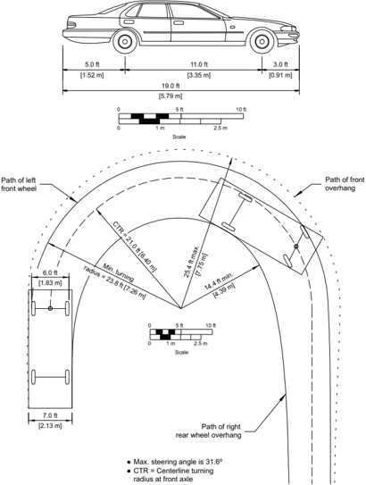

Figure 2-10. Minimum Turning Path for Passenger Car (P) Design Vehicle


--',''','',',',','''''',,,,''-'-',,',,',',,'---

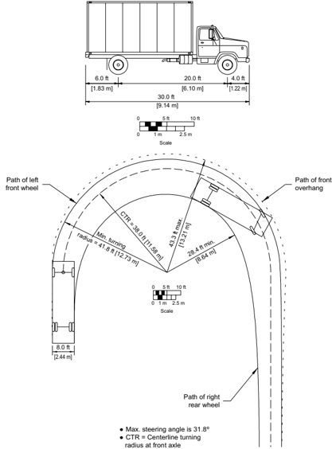

Figure 2-11. Minimum Turning Path for Single-Unit Truck (SU-30 [SU-9]) Design Vehicle


Figure 2-12. Minimum Turning Path for Single-Unit Truck (SU-40 [SU-12]) Design Vehicle


--',''','',',',','''''',,,,''-'-',,',,',',,'---


Figure 2-13. Minimum Turning Path for Intercity Bus (BUS-40 [BUS-12]) Design Vehicle

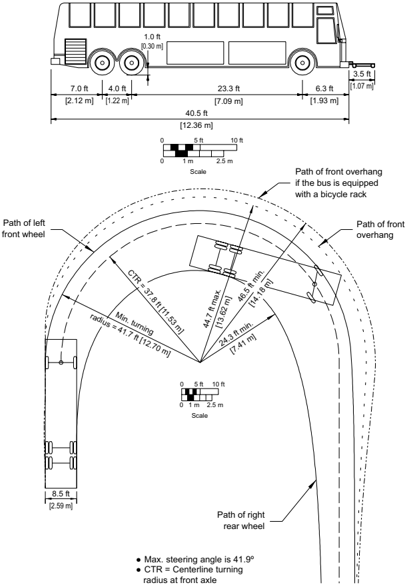

--',''','',',',','''''',,,,''-'-',,',,',',,'---


--',''','',',',','''''',,,,''-'-',,',,',',,'---


Figure 2-14. Minimum Turning Path for Intercity Bus (BUS-45 [BUS-14]) Design Vehicle


Figure 2-15. Minimum Turning Path for City Transit Bus (CITY-BUS) Design Vehicle


--',''','',',',','''''',,,,''-'-',,',,',',,'---


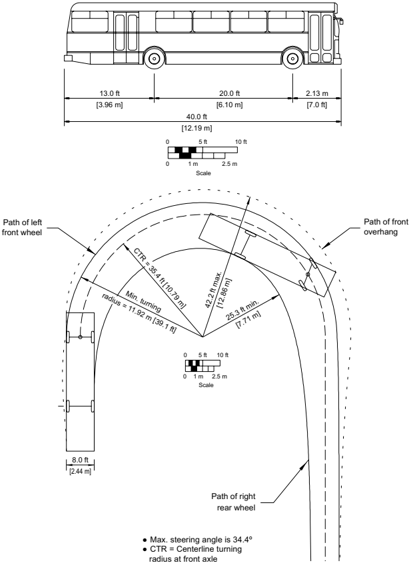

Figure 2-17. Minimum Turning Path for Large School Bus (S-Bus-40 [S-BUS-12]) Design Vehicle


Figure 2-18. Minimum Turning Path for Articulated Bus (A-BUS) Design Vehicle

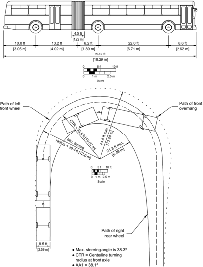

--',''','',',',','''''',,,,''-'-',,',,',',,'---


--',''','',',',','''''',,,,''-'-',,',,',',,'---


Figure 2-19. Turning Characteristics of a Typical Tractor-Semitrailer Combination Truck

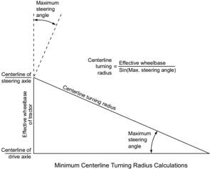

Figure 2-20. Computational Method for Determining the Centerline Turning Radius for Tractor-Semitrailer Combination Trucks


Figure 2-21. Lengths of Commonly Used Truck Tractors

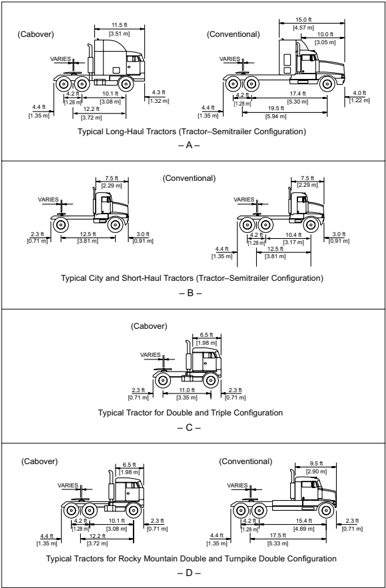

--',''','',',',','''''',,,,''-'-',,',,',',,'---


Figure 2-22. Minimum Turning Path for Intermediate Semitrailer (WB-40 [WB-12]) Design Vehicle


Figure 2-23. Minimum Turning Path for Interstate Semitrailer (WB-62 [WB-19]) Design Vehicle


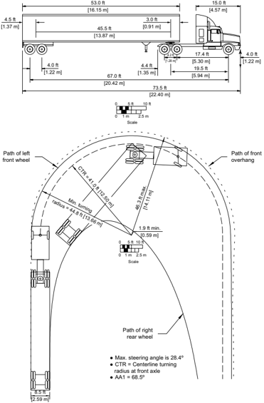

Figure 2-24. Minimum Turning Path for Interstate Semitrailer (WB-67 [WB-20]) Design Vehicle


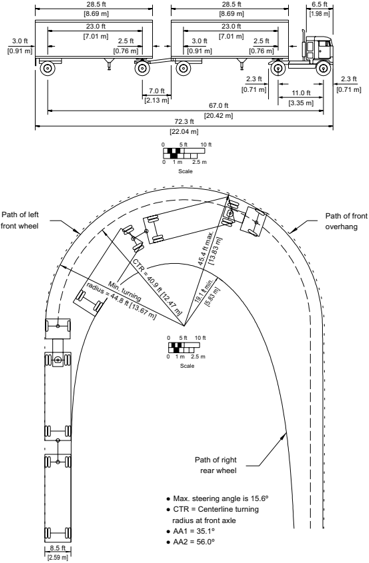

Figure 2-25. Minimum Turning Path for Double-Trailer Combination (WB-67D [WB-20D]) Design Vehicle


--',''','',',',','''''',,,,''-'-',,',,',',,'---

Figure 2-26. Minimum Turning Path for Rocky Mountain Double-Trailer Combination (WB92D [WB-28D]) Design Vehicle

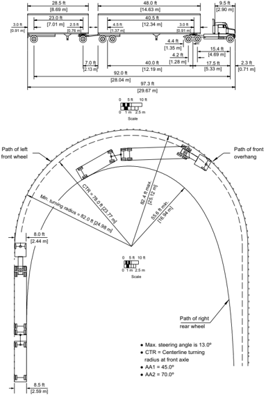

--',''','',',',','''''',,,,''-'-',,',,',',,'---


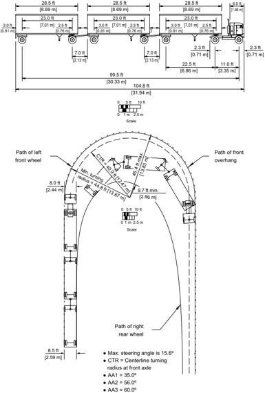

Figure 2-27. Minimum Turning Path for Triple-Trailer Combination (WB-100T [WB-30T]) Design Vehicle


Figure 2-28. Minimum Turning Path for Turnpike-Double Combination (WB-109D [WB-33D]) Design Vehicle


Figure 2-29. Minimum Turning Path for Motor Home (MH) Design Vehicle


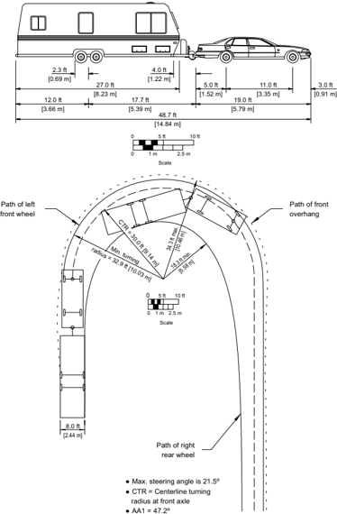

Figure 2-30. Minimum Turning Path for Passenger Car and Camper Trailer (P/T) Design Vehicle


--',''','',',',','''''',,,,''-'-',,',,',',,'---


Figure 2-31. Minimum Turning Path for Passenger Car and Boat Trailer (P/B) Design Vehicle


Figure 2-32. Minimum Turning Path for Motor Home and Boat Trailer (MH/B) Design Vehicle


## 2.8.3  Vehicle Performance

Acceleration and deceleration rates of vehicles are often critical parameters in determining highway design. These rates often govern the dimensions of such design features as intersections, freeway ramps, climbing or passing lanes, and turnout bays for buses. The following data are not meant to depict average performance for specific vehicle classes but rather lower performance vehicles suitable for design application, such as a low-powered (compact) car and a loaded truck or bus.

From Figures 2-33 [which is based on NCHRP Report 270 ( 36 )] and 2-34, it is evident that relatively rapid accelerations and decelerations are possible, although they may be uncomfortable for the vehicle's passengers. In addition, refer to the NCHRP Report 400, Determination of Stopping Sight Distances ( 17 ).

When a highway is located in a recreational area, the performance characteristics of recreational vehicles should be considered.

--',''','',',',','''''',,,,''-'-',,',,',',,'---

## U.S. CUSTOMARY

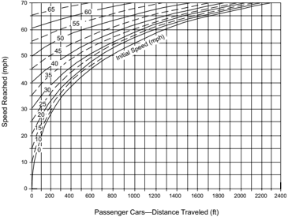

## METRIC


Figure 2-33. Acceleration of Passenger Cars, Level Conditions


## U.S. CUSTOMARY

Figure 2-34. Deceleration Distances for Passenger Vehicles Approaching Intersections


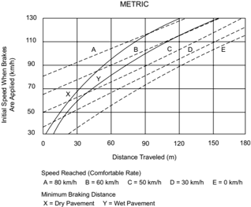

--',''','',',',','''''',,,,''-'-',,',,',',,'---

## 2.8.4  Vehicular Pollution

Pollutants emitted from motor vehicles and their impact on land uses adjacent to highways are factors affecting the highway design process. As each vehicle travels along the highway, it emits pollutants into the atmosphere and transmits noise to the surrounding area. The highway designer should recognize these impacts and evaluate them in selecting appropriate transportation alternatives. Many factors affect the rate of pollutant emission from vehicles, including vehicle mix, vehicle speed, ambient air temperature, vehicle age distribution, and percentage of vehicles operating in a cold mode.

In addition to air pollution, the highway designer should also consider noise pollution. Noise is unwanted sound that intrudes on or interferes with activities such as conversation, thinking, reading, or sleeping. Thus, sound can exist without people-noise cannot.

Motor vehicle noise is generated by the mechanical operation of the vehicle and its equipment, by its aerodynamics, by the action of its tires on the pavement or passing over rumble strips, and, in metropolitan areas, by the sounds of brake squeal, horns, loud stereos, and emergency vehicle sirens.

Trucks and passenger cars are the major noise-producing vehicles on the nation's highways. Motorcycles are also a factor to be considered because of the rapid increase in their numbers in recent years. Modern passenger cars are relatively quiet, particularly at the lower cruising speeds, but exist in such numbers as to make their total noise contribution significant. While noise  produced  by  passenger  cars  increases  dramatically  with  speed,  steep  grades  have  little influence on passenger car noise.

For passenger cars, noise produced under normal operating conditions is primarily from the engine  exhaust  system  and  the  tire-roadway  interaction.  During  travel  at  constant  highway speeds, vehicle noise is principally produced by the tire-roadway interaction with some added wind noise, but the vehicle engine system contributes little additional noise. For conditions of maximum acceleration, the engine system noise may become predominant.

Trucks, particularly heavy diesel-powered trucks, generate the highest noise levels on the highway, and more powerful engines generally produce the most noise. Truck noise levels are not greatly influenced by speed because other factors (including acceleration noise) usually contribute a major portion of the total noise. In contrast, steep grades can cause a substantial increase in noise levels for large trucks.

The quality of noise varies with the number and operating conditions of the vehicles while the directionality and amplitude of the noise vary with highway design features. The highway designer should therefore be concerned with how highway location and design influence the vehi-

cle noise perceived by persons residing or working nearby. The perceived noise level decreases as the distance to the highway from a residence or workplace increases.

## 2.9  SAFETY

Attention to highway safety has been emphasized by the Congress of the United States as well as  other  national  organizations  for  decades.  In  July  1973,  after  hearings  on  highway  safety, design, and operations were conducted by subcommittees of the House Committee on Public Works, the following mandate was published by the Committee:

Whose responsibility is it to see that maximum safety is incorporated into our motor  vehicle  transportation  system?  On  this,  the  subcommittee  is  adamant.  It  is  the responsibility of Government and specifically those agencies that, by law, have been given that mandate. This responsibility begins with the Congress and flows through the  Department  of  Transportation,  its  Federal  Highway  Administration,  the  State Highway Departments and safety agencies, and the street and highway units of counties, townships, cities, and towns. There is no retreating from this mandate, either in letter or in spirit ( 1 ).

This emphasis by Congress on safety has also been evidenced by passage of the Highway Safety Act of 1966 and subsequent renewal of the Federal highway safety program at regular intervals ( 47 ).

## 2.9.1  Key Factors Related to Traffic Crashes

Crashes seldom result from a single cause-usually several influences affect the situation at any given time. These influences can be separated into three groups: human, vehicle, and roadway. Although this policy is primarily concerned with roadway characteristics and design, the role of human factors is ever present. An error in perception or judgment or a faulty action on the driver's part can easily lead to a crash.

The frequency of traffic crashes on particular roadway facilities is very strongly influenced by the traffic volumes present. Crash frequencies generally increase with increasing traffic volumes, but this effect is generally nonlinear. Crash severities generally correlate to collision type and speed, as well as the relative vulnerability of the involved parties.

The severity of traffic crashes is also a factor in crash analysis. While reduction of property-damage-only crashes is desirable, national policy focuses on the reduction of fatalities and serious injuries. However, many roadway improvements that may reduce fatal and serious injury crashes also have the potential to reduce minor injury and property-damage-only crashes as well. As noted in Chapter 1, investments in design improvements should be performance-based. The

funds available for such improvements should be invested based on many performance measures, including crash frequency and severity.

Sections 2.9.1.1 through 2.9.1.3 are intended to provide general guidance to the designer related to highway safety. This guidance may be applicable to all of the functional classes, area types, and contexts addressed by transportation agencies. Tools are available to estimate the effect of project-specific design alternatives and geometric design decisions on expected crash frequency and severity, as described in Section 2.9.2.

## 2.9.1.1  Roadway Design

Roadways should be designed to reduce the need for driver decisions and to reduce unexpected situations. The number of crashes increases with the number of decisions that need to be made by the driver.

Uniformity in roadway design features and traffic control devices plays an important role in reducing the number of needed decisions and, by this means, the driver becomes aware of what to expect on a certain type of roadway.

The most significant design factor contributing to low crash frequencies for roadways is the provision of full access control. Full access control reduces the number, frequency, and variety of events that drivers encounter. The beneficial effect of this element has been documented in reports of a cooperative research study ( 18 ) by the FHWA and 39 state highway agencies. One of the principal findings of this study is that roadways without access control generally had higher crash rates than those with access control. This study showed that crash, injury, and fatality rates on Interstate highways are between 30 and 76 percent of comparable rates of conventional highways that existed before the Interstate highways were opened to traffic. No other single design element can claim comparable reductions.

While provision of full access control is invaluable as a means for preserving the capacity of arterial roads and streets and of minimizing crash potential, it is not practical to provide full access control on all roadways. Roadways without control of access are essential as land-service facilities, and the design features and operating characteristics of these roadways need to be carefully planned so that they will reduce conflicts and minimize the interference between vehicles and still meet the needs of road users.

Speed is also a contributing factor in crashes, but its role can vary, and the role of speed in crash causation is complex and poorly understood. In some cases, the speed a vehicle is traveling may be a causal factor in crashes, such as loss of control in a horizontal curve or in hydroplaning on wet pavement. In other cases, it may not be the vehicle speed itself so much as the speed differential or speed variance among multiple vehicles that may be a causal factor in a crash. What is better understood is the role that speed plays in crash severity. As the speed of the vehicles involved in a collision increases, so does the crash severity. This does not imply that all potential

crashes can be eliminated by lowering speeds, but it does imply that the severity of some potential crashes may be reduced by doing so.

The most appropriate speed for any roadway depends on design features, road conditions, traffic volumes, weather conditions, roadside development, spacing of intersecting roads, cross-traffic volumes, and other factors.

## 2.9.1.2  Roadside Design

When a driver loses control of the vehicle to the point that it departs from the travel lane or the roadway, much of the ability to regain full control of the vehicle is lost. Any object in or near the path of the vehicle becomes a potential contributing factor to crash severity. The concept of a forgiving roadside should not be independently applied to each design element but rather as a comprehensive approach to roadway design. The AASHTO Roadside Design Guide ( 6 ) presents an overview of the AASHTO guidance in this area; these policies are reflected throughout this book in the criteria for specific geometric design elements.

Basic to the concept of the forgiving roadside is the provision of a clear recovery area. The unobstructed, traversable area beyond the edge of the traveled way known as the 'clear zone' is for the recovery of errant vehicles. Design guidance for clear zone widths as a function of speed, traffic volume, and embankment slope is presented in the AASHTO Roadside Design Guide ( 6 ). Where establishing a full-width clear zone in an urban area is not practical due to right-of-way constraints, consideration should be given to establishing a reduced clear zone or incorporating as many clear-zone concepts as practical, such as removing roadside objects or making them crashworthy. Cost-effectiveness analysis can be used to assess the appropriate roadside design for particular facilities.

In roadside design for highways and streets, two major elements should be controlled by the designer: roadside slopes and unyielding obstacles. NCHRP Report 247 ( 26 ) discusses the effectiveness of clear recovery areas. The AASHTO Roadside Design Guide ( 6 ) also discusses the effects that slope and other topographic features have on the effectiveness of recovery areas. On existing roadways, AASHTO recommends the following priorities for treatment of roadside obstacles:

- y Remove the obstacle or redesign it so it can be traversed.
- y Relocate the obstacle to a point where it is less likely to be struck.
- y Reduce severity of impacts with the obstacle by using an appropriate breakaway device.
- y Redirect a vehicle by shielding the obstacle with a longitudinal traffic barrier and/or crash cushion.
- y Delineate the obstacle if the above alternatives are not practical.

--',''','',',',','''''',,,,''-'-',,',,',',,'---

The design of guardrails and barrier systems is addressed in the AASHTO Roadside Design Guide ( 6 ) and the AASHTO Manual for Assessing Safety Hardware ( 4 ). These publications note that the treatment of end sections on guardrail or a barrier is of particular concern.

## 2.9.1.3  Traffic Control Devices

Communication with all roadway users is probably one of the most complex challenges for the designer. One of the best available tools concerning motorist communication is the MUTCD ( 20 ), which presents national criteria for uniform application of signing, signalization, painted channelization, and pavement markings for all roads and streets in the United States. A primary message of the MUTCD is the importance of uniformity.

Roadway users are dependent on traffic control devices (signs, markings, and signals) for information,  warning,  and  guidance.  All  traffic  control  devices  should  have  the  following characteristics:

1. fulfill an important need;
2. command attention;
3. convey a clear, simple meaning;
4. command respect of road users; and
5. provide adequate response time.

In addition, devices that control or regulate traffic must be sanctioned by law.

Four key attributes of traffic control devices are design, placement, maintenance, and uniformity. Consideration should be given to these attributes during the design of a roadway so that (1) the number of devices is kept to a minimum and (2) those that are needed can be properly placed.

## 2.9.2  Key Safety Resources

Key resources available to assist highway agencies in managing and improving safety include the NCHRP Report 500 series ( 41 ) and the AASHTO Highway Safety Manual (HSM) ( 5, 9 ). NCHRP Report 500 consists of a series of guides intended to assist highway agencies in implementing the AASHTO Strategic Highway Safety Plan ( 3 ). These guides identify specific strategies that may be used to reduce crash frequency and severity and present available information on the application and potential effectiveness of these strategies.

The AASHTO HSM ( 5, 9 ) includes four parts that present information and procedures to assist highway agencies in managing and improving safety:

- y HSM Part AIntroduction and review of the fundamentals on which the HSM is based.

- y HSM Part BSafety management process used by highway agencies, including six key activities: network screening to identify potential improvement locations, diagnosis, countermeasure selection, economic appraisal, priority ranking, and effectiveness evaluation. Software to implement the safety management process is available in the AASHTOWare Safety Analyst software ( 10, 28 ).
- y HSM Part CPredictive method to estimate future crash frequency and severity for highways and streets and the potential effects of proposed design alternatives on future crash frequency  and  severity.  Software  to  obtain  such  predictions  is  available  in  the Interactive Highway Safety Design Model (IHSDM) ( 21 ).
- y HSM Part DCatalog of crash modification factors that represent the effect of individual geometric design and traffic control features on crash frequency and severity.

The HSM provides vital knowledge that can be used to estimate the potential effect of many proposed geometric design changes on crash frequency and severity. The HSM is a key reference in  applying  a  performance-based  design  approach  to  implement  design  flexibility,  especially for projects on existing roads. The HSM provides estimates of the long-term average number of crashes of particular types and severity levels that may occur, but it cannot quantify exactly how many crashes of particular types and severity levels will occur in any particular year. The HSM does not currently address every facility type and geometric feature of potential interest. Other crash analysis tools and agency experience may be used to supplement the HSM, where appropriate.

## 2.9.3  Safety Improvement Programs

A viable safety evaluation and improvement program is a vital part of the overall highway improvement program. Identification of potential opportunities to reduce crash frequency or severity, evaluation of the effectiveness of alternative solutions, and programming of available funds for the most effective improvements are of primary importance. The safety of the traveling public should be reflected throughout the highway program: in spot safety projects, in rehabilitation projects, in the construction of new highways, and elsewhere.

AASHTO has developed its Strategic Highway Safety Plan ( 3 ) and individual highway agencies have developed comprehensive highway safety plans. Part B of the AASHTO Highway Safety Manual ( 5 ) and the AASHTOWare Safety Analyst software ( 10, 28 ) can assist highway agencies in managing their safety improvement programs.

## 2.9.4  Project Development Process

Part C of the AASHTO HSM ( 5, 9 ) provides a method that may be used by highway designers to develop quantitative estimates of the differences between potential design alternatives in crash frequency and severity to assist highway agencies in making design decisions. The predictive

--',''','',',',','''''',,,,''-'-',,',,',',,'---

method in the first edition of the HSM does not address every facility type and design feature of potential interest and does not consider potential interactions between design features. Still, the HSM represents an important step toward a performance-based project development process. The FHWA IHSDM ( 21 ) provides a software tool to implement the HSM Part C procedures.

## 2.10  ENVIRONMENT

A roadway has wide-ranging effects in addition to providing traffic service to users. It is essential that the highway be considered as an element of the total environment. The term 'environment,' as used here refers to the totality of humankind's surroundings: social, physical, natural, and synthetic. It includes the human, animal, and plant communities and the forces that act on all three. The roadway can and should be located and designed to complement its environment and serve as a catalyst to environmental improvement.

The area surrounding a proposed road or street is an interrelated system of natural, synthetic, and sociologic variables. Changes in one variable within this system cannot be made without some effect on other variables. The consequences of some of these effects may be negligible, but others may have a strong and lasting impact on the environment, including sustaining and improving the quality of human life. Because roadway location and design decisions affect the development of adjacent areas, it is important that environmental variables be given full consideration. Also, care should be exercised so that applicable local, state, and Federal environmental requirements are met.

## 2.11  REFERENCES

1. AASHTO. Highway Design and Operational Practices Related to Highway Safety. American Association of State Highway and Transportation Officials, Washington, DC, 1974.
2. AASHTO. Guide  for  the  Planning,  Design,  and  Operation  of  Pedestrian  Facilities ,  First Edition, GPF-1. American Association of State Highway and Transportation Officials, Washington, DC, 2004.
3. AASHTO. Strategic Highway Safety Plan-A Comprehensive Plan to Substantially Reduce Vehicle-Related  Fatalities  and  Injuries  on  the  Nation's  Highways ,  SHSP-2.  American Association of State Highway and Transportation Officials, Washington, DC, 2004.
4. AASHTO. Manual for Assessing Safety Hardware , Second Edition, MASH-2. American Association of State Highway and Transportation Officials, Washington, DC, 2016.
5. AASHTO. Highway Safety Manual ,  First  Edition,  HSM-1.  American  Association  of State Highway and Transportation Officials, Washington, DC, 2010.


6. AASHTO. Roadside Design Guide , Fourth Edition, RSDG-4. American Association of State Highway and Transportation Officials, Washington, DC, 2011.
7. AASHTO. Guide  for  the  Development  of  Bicycle  Facilities ,  Fourth  Edition,  GBF-4. American Association of State Highway and Transportation Officials, Washington, DC, 2012.
8. AASHTO. Guide for Geometric Design of Transit Facilities on Highways and Streets , First Edition, TVF-1. American Association of State Highway and Transportation Officials, Washington, DC, 2014.
9. AASHTO. Highway  Safety  Manual:  Supplement ,  HSM-1S.  American  Association  of State Highway and Transportation Officials, Washington, DC, 2014.
10. AASHTO. AASHTOWare Safety Analyst software. Available at www.aashtoware.org and www.safetyanalyst.org
11. Alexander,  G.  J.,  and  H.  Lunenfeld. Driver Expectancy in Highway Design and Traffic Operations .  FHWA-TO-86-1.  Federal  Highway  Administration,  U.S.  Department  of Transportation, Washington, DC, May 1986. Available at
7. https://rosap.ntl.bts.gov/view/dot/890
12. Alexander,  G.  H.  and  H.  Lunenfeld. A  User's  Guide  to  Positive  Guidance ,  Third Edition.  FHWA/SA-90-017.  Federal  Highway  Administration,  U.S.  Department  of Transportation, Washington, DC, 1990.
13. Bonneson, J. A. and P. T. McCoy. National Cooperative Highway Research Program Report 395: Capacity and Operational Effects of Midblock Left-Turn Lanes . NCHRP, Transportation Research Board, Washington, DC, 1997. Available at
10. http://onlinepubs.trb.org/onlinepubs/nchrp/nchrp\_rpt\_395.pdf
14. Brewer,  M.,  D.  Murillo,  and  A.  Pate, Handbook for Designing Roadways for the Aging Population , FHWA-SA=14-015, FHWA, Washington, DC, June 2014.
15. Campbell, J. L, M. G. Lichty, J. L. Brown, C. M. Richard, J. S. Graving, J. Graham, M. O'Laughlin, D. Torbic, and D. Harwood, National Cooperative Highway Research Program Report 600: Human Factors Guidelines for Road Systems , Second Edition, NCHRP, TRB, Washington, DC, 2012.


16. Donnell, E. T., S. C. Hines, K. M. Mahoney, R. J. Porter, and H. McGee. Speed Concepts: Informational Guide , FHWA-SA-10-001, FHWA, Washington, DC, December 2009.
17. Fambro, D. B., K. Fitzpatrick, and R. J. Koppa. National Cooperative Highway Research Program Report 400: Determination of Stopping Sight Distances . NCHRP, Transportation Research Board, National Research Council, Washington, DC, 1997. Available at

http://onlinepubs.trb.org/onlinepubs/nchrp/nchrp\_rpt\_400.pdf

18. Fee, J. A., et  al. Interstate System Accident Research Study 1 .  Federal  Highway Administration, U.S. Department of Transportation, Washington, DC, October 1970.
19. Fell, J. C. A Motor Vehicle Accident Causal System: The Human Element . DOT-HS-801-214. National Highway Traffic Safety Administration, U.S. Department of Transportation, Washington, DC, July 1974.
20. FHWA. Manual  on  Uniform  Traffic  Control  Devices  for  Streets  and  Highways .  Federal Highway Administration, U.S. Department of Transportation, Washington, DC, 2009. Available at

http://mutcd.fhwa.dot.gov

21. FHWA. Interactive Highway Safety Design Model . Available at www.ihsdm.org.
22. FHWA. PEDSAFE: Pedestrian Safety Guide and Countermeasure Selection System .  Available at

http://www.pedbikesafe.org/pedsafe/

23. Fitzpatrick, K., M. Brewer, and S. Turner. Another Look at Pedestrian Walking Speed. Transportation Research Record 1982 , Transportation Research Board. 2006.
24. Gibbons, R. B., C. Edwards, B. Williams, and C. K. Anderson. Informational Report on  Lighting  Design  for  Midblock  Crosswalks .  FHWA-HRT-08-053.  Federal  Highway Administration,  U.S.  Department  of  Transportation,  Washington,  DC,  April  2008. Available at

http://www.fhwa.dot.gov/publications/research/safety/08053

25. Gluck, J., H. S. Levinson, and V. Stover. National Cooperative Highway Research Program Report 420: Impacts of Access Management Techniques . NCHRP, Transportation Research Board, Washington, DC, 1999. Available at

--',''','',',',','''''',,,,''-'-',,',,',',,'---


--',''','',',',','''''',,,,''-'-',,',,',',,'--- http://onlinepubs.trb.org/onlinepubs/nchrp/nchrp\_rpt\_420.pdf

26. Graham,  J.  L.  and  D.  W.  Harwood. National  Cooperative  Highway  Research  Program Report  247:  Effectiveness  of  Clear  Recovery  Zones .  NCHRP,  Transportation  Research Board, Washington, DC, 1982.
27. Harwood, D. W., D. J. Torbic, K. R. Richard, W. D. Glauz, and L. Elefteriadou. National Cooperative Highway Research Program Report 505: Review of Truck Characteristics as Factors in Roadway Design . NCHRP, Transportation Research Board, Washington, DC, 2003.

http://onlinepubs.trb.org/onlinepubs/nchrp/nchrp\_rpt\_505.pdf

28. Harwood, D. W., D. J. Torbic, K. R. Richard, and M. Meyer. SafetyAnalyst: Software Tools for Safety Management of Specific Highway Sites . FHWA-HRT-10-063. Federal Highway Administration, U.S. Department of Transportation, McLean, VA, 2010.
29. ITE. Designing Walkable Urban Thoroughfares: A Context Sensitive Approach , Washington, DC. 2010.
30. Johannson, C. and K. Rumar. Drivers' Brake Reaction Time. Human Factors: The Journal of the Human Factors and Ergonomics Society , Vol. 13, No. 1, 1971, pp. 22-27.
31. Koepke, F. J. and H. S. Levinson. National Cooperative Highway Research Program Report 348: Access Management Guidelines for Activity Centers . NCHRP, Transportation Research Board, Washington, DC, 1992.
32. Leisch, J.  P. Freeway and Interchange Geometric Design Handbook .  Institute  of  Transportation Engineers, Washington, DC, 2005. Available for purchase at http://www.ite.org
33. Lomax T., S. Turner, G. Shunk, H. S. Levinson, R. Pratt, P. Bay, and B. Douglas. National Cooperative  Highway  Research  Program  Report  398:  Quantifying  Congestion .  Volume  1: Final Report. NCHRP, Transportation Research Board Washington, DC, March 1997. Available at

http://onlinepubs.trb.org/onlinepubs/nchrp/nchrp\_rpt\_398.pdf

34. Maring,  G.  E.  Pedestrian  Travel  Characteristics.  In Highway  Research  Record  406 . Highway  Research  Board,  National  Research  Council,  Washington,  DC,  1972.  pp. 14-20.


35. Neuner,  M.,  J.  Atkinson,  B.  Chandler,  S.  Hallmark,  R.  Milstead,  and  R.  Retting. Integrating Speed Management within Roadway Departure, Intersections, and Pedestrian and Bicyclist Safety Focus Areas , FHWA-SA-16-017, FHWA, Washington, DC, April 2016.
36. Olson, P. L., D. E. Cleveland, P. S. Fancher, L. P. Kostyniuk, and L. W. Schneider. National Cooperative Highway Research Program Report 270: Parameters Affecting Stopping Sight Distance . NCHRP, Transportation Research Board, Washington, DC, 1984.
37. Schmidt,  I.  and  P.  D.  Connolly.  Visual  Considerations  of  Man,  the  Vehicle  and  the Highways. Paper No. SP-279-SAE . Society of Automotive Engineers, New York, 1966. Available for purchase from SAE International at

http://papers.sae.org/660164

38. Staplin, L., K. Lococo, S. Byington, and D. Harkey. Highway Design Handbook for Older Drivers  and  Pedestrians .  FHWA-RD-01-103.  Federal  Highway  Administration,  U.S. Department of Transportation, McLean, VA, May 2001. Available at

http://www.fhwa.dot.gov/publications/research/safety/humanfac/01103/

39. Tilley, D. H., C. W. Erwin, and D. T. Gianturco. Drowsiness and Driving: Preliminary Report of a Population Survey. Paper No. 730121-SAE . Society of Automotive Engineers, New York,  1973.  Available  for  purchase  from  SAE  International  at  http://papers.sae. org/730121
40. TRB. Human Factors and Safety Research Related to Highway Design and Operations Records. In Transportation Research Record 1281 . Transportation Research Board, National Research Council, Washington, DC, 1990. Available at

http://pubsindex.trb.org/view.aspx?id=364894

41. TRB. National Cooperative Highway  Research Program Report 500: Guidance for Implementation of the AASHTO Strategic Highway Safety Plan .  Transportation Research Board, National Research Council, Washington, DC. Availabel at

http://www.trb.org/Main/Blurbs/NCHRP\_Report\_500\_Guidance\_for\_Implementation\_of\_ th\_152868.aspx

Volume 1: A Guide for Addressing Aggressive-Driving Collisions, 2003

Volume 2: A Guide for Addressing Collisions Involving Unlicensed Drivers and Drivers with Suspending or Revoked Licenses, 2003

Volume 3: A Guide for Addressing Collisions with Trees in Hazardous Locations, 2003


Volume 4: A Guide for Addressing Head-On Collisions, 2003

Volume 5: A Guide for Addressing Unsignalized Intersection Collisions, 2003

Volume 6: A Guide for Addressing Run-off-Road Collisions, 2003

Volume 7: A Guide for Reducing Collisions on Horizontal Curves, 2004

Volume 8: A Guide for Reducing Collisions Involving Utility Poles, 2004

Volume 9: A Guide for Reducing Collisions Involving Older Drivers, 2004

Volume 10: A Guide for Reducing Collisions Involving Pedestrians, 2004

Volume 11: A Guide for Increasing Seatbelt Use, 2004

Volume 12: A Guide for Reducing Collisions at Signalized Intersections, 2004

Volume 13: A Guide for Reducing Collisions Involving Heavy Trucks, 2004

Volume 14: A Guide for Reducing Crashes Involving Drowsy and Distracted Drivers, 2005

Volume 15: A Guide for Enhancing Rural Emergency Medical Services, 2005

Volume 16: A Guide for Reducing Alcohol-Related Collisions, 2005

Volume 17: A Guide for Reducing Work Zone Collisions, 2005

Volume 18: A Guide for Reducing Collisions Involving Bicycles, 2008

Volume 19: A Guide for Reducing Collisions Involving Young Drivers, 2007

Volume 20: A Guide for Reducing Head-On Crashes on Freeways, 2008

- Volume 21: Safety Data and Analysis in Developing Emphasis Area Plans, 2008
- Volume 22: A Guide for Addressing Collisions Involving Motorcycles, 2008

Volume 23: A Guide for Reducing Speed-Related Crashes, 2009

42. TRB. Access  Management  Manual .  Transportation  Research  Board,  National  Research Council, Washington, DC, 2015 or most recent edition.
43. TRB. Highway Capacity Manual: A Guide for Multimodal Mobility Analysis . Sixth Edition. Transportation Research Board, National Research Council, Washington, DC, 2016.
44. T. Y. Lin International. Comparison of Turning Radius, Specifications, and Measurements for a 45' Bus . Golden Gate Bridge Highway &amp; Transportation District and Metropolitan Transportation Commission, San Francisco, CA, 2005.

--',''','',',',','''''',,,,''-'-',,',,',',,'---


45. U.S. Access Board. Proposed Guidelines for Pedestrian Facilities in the Public Right-of-Way , Federal Register, 36 CFR Part 1190, July 26, 2011. Available at

http://www.access-board.gov/guidelines-and-standards/streets-sidewalks/public-rights-of-way/ proposed-rights-of-way-guidelines

46. U.S. Department of Justice. 2010 ADA Standards for Accessible Design , September 15, 2010. Available at

https://www.ada.gov/2010ADAstandards\_index.htm

47. U.S. National Archives and Records Administration. Code of Federal Regulations .  Title 23, Chapter 4. Highway Safety Act of 1966, as amended.
48. U.S. National Archives and Records Administration. Code of Federal Regulations . Title 49, Part 27. Nondiscrimination of the Basis of Disability in Programs or Activities Receiving Federal Financial Assistance.


## Elements of Design

## 3.1  INTRODUCTION

The alignment of a highway or street produces a great impact on the environment, the fabric of the community, and the highway user. The alignment consists of a variety of design elements that combine to create a facility that serves traffic safely and efficiently, consistent with the facility's intended function. Each alignment element should complement others to achieve a consistent, safe, and efficient design.

The design of highways and streets within particular functional classes is treated separately in later chapters. Principal elements of design include sight distance, superelevation, traveled way widening, grades, and horizontal and vertical alignment. These design elements are discussed in this chapter, and, as appropriate, in the later chapters pertaining to specific roadway functional classes.

## 3.2  SIGHT DISTANCE

## 3.2.1  General Considerations

A driver's ability to see ahead is needed for safe and efficient operation of a vehicle on a highway. For example, on a railroad, trains are confined to a fixed path, yet a block signal system and trained operators are needed for safe operation. In contrast, the path and speed of motor vehicles on highways and streets are subject to the control of drivers whose ability, training, and experience are quite varied. The designer should provide sight distance of sufficient length that drivers can control the operation of their vehicles to avoid striking an unexpected object in the traveled way. Certain two-lane highways should also have sufficient sight distance to enable drivers to use the opposing traffic lane for passing other vehicles without interfering with oncoming vehicles. Two-lane highways in rural areas should generally provide such passing sight distance at frequent intervals and for substantial portions of their length. On the other hand, it is normally of little practical value to provide passing sight distance on two-lane streets or arterials in urban areas. The proportion of a highway's length with sufficient sight distance to pass another vehicle and interval between passing opportunities should be compatible with the intended function of the highway and the desired level of service. Design


criteria and guidance applicable to specific functional classifications of highways and streets are presented in Chapters 5 through 8.

Four aspects of sight distance are discussed below: (1) the sight distances needed for stopping, which are applicable on all roads and streets; (2) the sight distances needed for the passing of overtaken vehicles, applicable only on two-lane highways; (3) the sight distances needed for decisions at complex locations; and (4) the criteria for measuring these sight distances for use in design. The design of alignment and profile to provide sight distances and to satisfy the applicable design criteria are described later in this chapter. The special conditions related to sight distances at intersections are discussed in Section 9.5.

## 3.2.2  Stopping Sight Distance

Sight distance is the length of the roadway ahead that is visible to the driver. The available sight distance on a roadway should be sufficiently long to enable a vehicle traveling at or near the design speed to stop before reaching a stationary object in its path.

Stopping sight distance is the sum of two distances: (1) the distance traversed by the vehicle from the instant the driver sights an object necessitating a stop to the instant the brakes are applied, and (2) the distance needed to stop the vehicle from the instant brake application begins. These are referred to as brake reaction distance and braking distance, respectively.

## 3.2.2.1  Brake Reaction Time

Brake reaction time is the interval from the instant that the driver recognizes the existence of an obstacle on the roadway ahead that necessitates braking until the instant that the driver actually applies the brakes. Under certain conditions, such as emergency situations denoted by flares or flashing lights, drivers accomplish these tasks almost instantly. Under most other conditions, the driver needs not only to see the object but also to recognize it as a stationary or slowly moving object against the background of the roadway and other objects, such as walls, fences, trees, poles, or bridges. Such determinations take time, and the amount of time needed varies considerably with the distance to the object, the visual acuity of the driver, the driver's reaction time, the atmospheric visibility, the type and the condition of the roadway, and the nature of the obstacle. Vehicle speed and roadway environment probably also influence reaction time. Normally, a driver traveling at or near the design speed is more alert than one traveling at a lesser speed. A driver on a street in an urban area confronted by innumerable potential conflicts with parked vehicles, driveways, and cross streets is also likely to be more alert than the same driver on a limited-access facility where such conditions should be almost nonexistent. However, a driver on an urban street faces a high mental workload in trying to monitor additional conflicts, so there is no assurance that the driver will be able to quickly detect a need for immediate action from among the many potential sources of conflict.

--',''','',',',','''''',,,,''-'-',,',,',',,'---

The study of reaction times by Johansson and Rumar ( 41 ) referred to in Section 2.2.6 was based on data from 321 drivers who expected to apply their brakes. The median reaction-time value for these drivers was 0.66 s, with 10 percent using 1.5 s or longer. These findings correlate with those of earlier studies in which alerted drivers were also evaluated. Another study ( 46 ) found 0.64 s as the average reaction time, while 5 percent of the drivers needed over 1 s. In a third study ( 50 ),  the values of brake reaction time ranged from 0.4 to 1.7 s. In the Johansson and Rumar study ( 41 ),  when the event that prompted application of the brakes was unexpected, drivers' response times were found to increase by approximately 1 s or more; some reaction times were greater than 1.5 s. This increase in reaction time substantiated earlier laboratory and road tests in which the conclusion was drawn that a driver who needed 0.2 to 0.3 s of reaction time under alerted conditions would need 1.5 s of reaction time under normal conditions.

Minimum brake reaction times for drivers could thus be at least 1.64 s, 0.64 s for alerted drivers plus 1 s for the unexpected event. Because the studies discussed above used simple prearranged signals, they represent the least complex of roadway conditions. Even under these simple conditions, it was found that some drivers took over 3.5 s to respond. Because actual conditions on the highway are generally more complex than those of the studies, and because there is wide variation in driver reaction times, it is evident that the criterion adopted for use should be greater than 1.64 s. The brake reaction time used in design should be long enough to include the reaction times needed by nearly all drivers under most highway conditions. Studies documented in the literature ( 19, 41, 46, 50 ) show that a 2.5-s brake reaction time for stopping sight situations encompasses the capabilities of most drivers, including those of older drivers. The recommended design criterion of 2.5 s for brake reaction time exceeds the 90th percentile of reaction time for all drivers and was used in the development of Table 3-1.

A brake reaction time of 2.5 s is considered adequate for conditions that are more complex than the simple conditions used in laboratory and road tests, but it is not adequate for the most complex conditions encountered in actual driving. The need for greater reaction time in the most complex conditions encountered on the roadway, such as those found at multiphase atgrade intersections and at ramp terminals on through roadways, can be found in Section 3.2.3, 'Decision Sight Distance.'

## 3.2.2.2  Braking Distance

The approximate braking distance of a vehicle on a level roadway traveling at the design speed of the roadway may be determined from the following:

--',''','',',',','''''',,,,''-'-',,',,',',,'---

| U.S. Customary                                                                       | Metric                                                                                    |
|--------------------------------------------------------------------------------------|-------------------------------------------------------------------------------------------|
| where: d B = braking distance, ft V = design speed,mph a = deceleration rate, ft/s 2 | where: d B = braking distance,m V = design speed, km/h a = deceleration rate, m/s 2 (3-1) |

Studies documented in the literature ( 19 )  show that most drivers decelerate at a rate greater than 14.8 ft/s 2 [4.5 m/s 2 ] when confronted with the need to stop for an unexpected object in the roadway. Approximately 90 percent of all drivers decelerate at rates greater than 11.2 ft/s 2 [3.4 m/s 2 ]. Such decelerations are within the driver's capability to stay within his or her lane and maintain steering control during the braking maneuver on wet surfaces. Therefore, 11.2 ft/s 2 [3.4 m/s 2 ] (a comfortable deceleration for most drivers) is recommended as the deceleration threshold for determining stopping sight distance. Implicit in the choice of this deceleration threshold is the assessment that most vehicle braking systems and the tire-pavement friction levels of most roadways are capable of providing a deceleration rate of at least 11.2 ft/s 2 [3.4 m/s 2 ]. The friction available on most wet pavement surfaces and the capabilities of most vehicle braking systems can provide braking friction that exceeds this deceleration rate.

Table 3-1. Stopping Sight Distance on Level Roadways

| U.S. Customary     | U.S. Customary               | U.S. Customary                 | U.S. Customary          | U.S. Customary          |
|--------------------|------------------------------|--------------------------------|-------------------------|-------------------------|
| Design Speed (mph) | Brake Reaction Distance (ft) | Braking Distance on Level (ft) | Stopping Sight Distance | Stopping Sight Distance |
| Design Speed (mph) | Brake Reaction Distance (ft) | Braking Distance on Level (ft) | Calculated (ft)         | Design (ft)             |
| 15                 | 55.1                         | 21.6                           | 76.7                    | 80                      |
| 20                 | 73.5                         | 38.4                           | 111.9                   | 115                     |
| 25                 | 91.9                         | 60.0                           | 151.9                   | 155                     |
| 30                 | 110.3                        | 86.4                           | 196.7                   | 200                     |
| 35                 | 128.6                        | 117.6                          | 246.2                   | 250                     |
| 40                 | 147.0                        | 153.6                          | 300.6                   | 305                     |
| 45                 | 165.4                        | 194.4                          | 359.8                   | 360                     |
| 50                 | 183.8                        | 240.0                          | 423.8                   | 425                     |
| 55                 | 202.1                        | 290.3                          | 492.4                   | 495                     |
| 60                 | 220.5                        | 345.5                          | 566.0                   | 570                     |
| 65                 | 238.9                        | 405.5                          | 644.4                   | 645                     |
| 70                 | 257.3                        | 470.3                          | 727.6                   | 730                     |
| 75                 | 275.6                        | 539.9                          | 815.5                   | 820                     |
| 80                 | 294.0                        | 614.3                          | 908.3                   | 910                     |
| 85                 | 313.5                        | 693.5                          | 1007.0                  | 1010                    |

Design

Speed

(km/h)

20

30

40

50

60

70

80

90

100

110

120

130

140

Brake

Reaction

Distance

(m)

13.9

20.9

27.8

34.8

41.7

48.7

55.6

62.6

69.5

76.5

83.4

90.4

97.3

Metric

Braking

Distance on Level

(m)

4.6

10.3

18.4

28.7

41.3

56.2

73.4

92.9

114.7

138.8

165.2

193.8

224.8

Stopping

Sight Distance

Calculated

Design

(m)

18.5

31.2

46.2

63.5

83.0

104.9

129.0

155.5

184.2

215.3

248.6

284.2

322.1

(m)

20

35

50

65

85

105

130

160

185

220

250

285

325

Note: Brake reaction distance predicated on a time of 2.5 s; deceleration rate of 11.2 ft/s 2  [3.4 m/s 2 ] used to determine calculated sight distance.


## 3.2.2.3  Design Values

The stopping sight distance is the sum of the distance traversed during the brake reaction time and the distance to brake the vehicle to a stop. The computed distances for various speeds at the assumed conditions on level roadways are shown in Table 3-1 and were developed from the following equation:

| U.S. Customary                    | Metric                          |
|-----------------------------------|---------------------------------|
| where:                            | where:                          |
| SSD = stopping sight distance, ft | SSD = stopping sight distance,m |
| V = design speed,mph              | V = design speed, km/h          |
| t = brake reaction time, 2.5 s    | t = brake reaction time, 2.5 s  |
| a = deceleration rate, ft/s 2     | a = deceleration rate, m/s 2    |

## 3.2.2.4  Effect of Grade on Stopping

When a highway is on a grade, Equation 3-1 for braking distance is modified as follows:

| U.S. Customary                                                                                                      | Metric                                                                                                                |
|---------------------------------------------------------------------------------------------------------------------|-----------------------------------------------------------------------------------------------------------------------|
| where: d B = braking distance on grade, ft V = design speed,mph a = deceleration, ft/s 2 G = grade, rise/run, ft/ft | where: d B = braking distance on grade,m V = design speed, km/h a = deceleration, m/s 2 G = grade, rise/run,m/m (3-3) |

In this equation, G is the rise in elevation divided by the distance of the run and the percent of grade divided by 100, and the other terms are as previously stated. The stopping distances needed on upgrades are shorter than on level roadways; those on downgrades are longer. The stopping sight distances for various grades shown in Table 3-2 are the values determined by using Equation 3-3 in place of the second term in Equation 3-2. These adjusted sight distance values are computed for wet-pavement conditions using the same design speeds and brake reaction times used for level roadways in Table 3-1.

--',''','',',',','''''',,,,''-'-',,',,',',,'---


Table 3-2. Stopping Sight Distance on Grades

| U.S. Customary     | U.S. Customary               | U.S. Customary               | U.S. Customary               | U.S. Customary               | U.S. Customary               | U.S. Customary               |
|--------------------|------------------------------|------------------------------|------------------------------|------------------------------|------------------------------|------------------------------|
| Design Speed (mph) | Stopping Sight Distance (ft) | Stopping Sight Distance (ft) | Stopping Sight Distance (ft) | Stopping Sight Distance (ft) | Stopping Sight Distance (ft) | Stopping Sight Distance (ft) |
| Design Speed (mph) | Downgrades                   | Downgrades                   | Downgrades                   | Upgrades                     | Upgrades                     | Upgrades                     |
| Design Speed (mph) | 3%                           | 6%                           | 9%                           | 3%                           | 6%                           | 9%                           |
| 15                 | 80                           | 82                           | 85                           | 75                           | 74                           | 73                           |
| 20                 | 116                          | 120                          | 126                          | 109                          | 107                          | 104                          |
| 25                 | 158                          | 165                          | 173                          | 147                          | 143                          | 140                          |
| 30                 | 205                          | 215                          | 227                          | 200                          | 184                          | 179                          |
| 35                 | 257                          | 271                          | 287                          | 237                          | 229                          | 222                          |
| 40                 | 315                          | 333                          | 354                          | 289                          | 278                          | 269                          |
| 45                 | 378                          | 400                          | 427                          | 344                          | 331                          | 320                          |
| 50                 | 446                          | 474                          | 507                          | 405                          | 388                          | 375                          |
| 55                 | 520                          | 553                          | 593                          | 469                          | 450                          | 433                          |
| 60                 | 598                          | 638                          | 686                          | 538                          | 515                          | 495                          |
| 65                 | 682                          | 728                          | 785                          | 612                          | 584                          | 561                          |
| 70                 | 771                          | 825                          | 891                          | 690                          | 658                          | 631                          |
| 75                 | 866                          | 927                          | 1003                         | 772                          | 736                          | 704                          |
| 80                 | 965                          | 1035                         | 1121                         | 859                          | 817                          | 782                          |
| 85                 | 1070                         | 1149                         | 1246                         | 949                          | 902                          | 862                          |

| Metric              | Metric         | Metric         | Metric         | Metric                | Metric                | Metric                |
|---------------------|----------------|----------------|----------------|-----------------------|-----------------------|-----------------------|
| Design Speed (km/h) | Stopping Sight | Stopping Sight | Stopping Sight | Distance (m) Upgrades | Distance (m) Upgrades | Distance (m) Upgrades |
| Design Speed (km/h) | 3%             | 6%             | 9%             | 3%                    | 6%                    | 9%                    |
| 20                  | 20             | 20             | 20             | 19                    | 18                    | 18                    |
| 30                  | 32             | 35             | 35             | 31                    | 30                    | 29                    |
| 40                  | 50             | 50             | 53             | 45                    | 44                    | 43                    |
| 50                  | 66             | 70             | 74             | 61                    | 59                    | 58                    |
| 60                  | 87             | 92             | 97             | 80                    | 77                    | 75                    |
| 70                  | 110            | 116            | 124            | 100                   | 97                    | 93                    |
| 80                  | 136            | 144            | 154            | 123                   | 118                   | 114                   |
| 90                  | 164            | 174            | 187            | 148                   | 141                   | 136                   |
| 100                 | 194            | 207            | 223            | 174                   | 167                   | 160                   |
| 110                 | 227            | 243            | 262            | 203                   | 194                   | 186                   |
| 120                 | 263            | 281            | 304            | 234                   | 223                   | 214                   |
| 130                 | 302            | 323            | 350            | 267                   | 254                   | 243                   |
| 140                 | 341            | 367            | 398            | 302                   | 287                   | 274                   |

On nearly all roads and streets, the grade is traversed by traffic in both directions of travel, but the sight distance at any point on the highway generally is different in each direction, particularly on straight roads in rolling terrain. As a general rule, the sight distance available on downgrades is larger than on upgrades, more or less automatically providing the appropriate corrections for grade. This may explain why some designers do not adjust stopping sight distance because of grade. Exceptions are one-way roadways or streets, as on divided highways with independent profiles. For these separate roadways, adjustments for grade may be needed.

## 3.2.2.5  Variation for Trucks

The recommended stopping sight distances are based on passenger car operation and do not explicitly consider design for truck operation. Trucks as a whole, especially the larger and heavier units, need longer stopping distances for a given speed than passenger vehicles. However, there is one factor that tends to balance the additional braking lengths for trucks with those for passenger cars. The truck driver is able to see substantially farther beyond vertical sight obstructions because of the higher position of the seat in the vehicle. Separate stopping sight distances for trucks and passenger cars, therefore, are not generally used in highway design. --',''','',',',','''''',,,,''-'-',,',,',',,'---

There is one situation in which the goal should be to provide stopping sight distances greater than the design values in Table 3-1. Where horizontal sight restrictions occur on downgrades, particularly at the ends of long downgrades where truck speeds closely approach or exceed those of passenger cars, the greater height of eye of the truck driver is of little value. Although the


average truck driver tends to be more experienced than the average passenger car driver and quicker to recognize potential risks, it is desirable under such conditions to provide stopping sight distance that exceeds the values in Tables 3-1 or 3-2.

## 3.2.2.5.1  New Construction vs. Projects on Existing Roads

The stopping sight distance criteria in Tables 3-1 and 3-2 are appropriate for use in new construction  projects  where  no  constraints  are  present,  since  stopping  sight  distances  that  meet these criteria can typically be readily implemented. Sight distance improvements for projects on existing roads are often very costly. Recent research ( 35 ) has found little or no difference in crash experience between crest vertical curves that meet the stopping sight distance criteria in Tables 3-1 and 3-2 and those that do not, except where a design feature where drivers may need to change direction or speed is hidden from the driver's view. Therefore, in most cases, design elements at which the stopping sight distance is less than shown in Tables 3-1 and 3-2 may be left in place. However, where a roadway feature such as a horizontal curve, an intersection, a driveway, or a ramp terminal is hidden from the driver's view by the sight distance limitation or where a crash history review as part of the project development process finds a documented crash pattern that may be correctable by a sight distance improvement, improvement of stopping sight distance to the criteria presented in Tables 3-1 and 3-2 should be considered.

## 3.2.3  Decision Sight Distance

Stopping sight distances are usually sufficient to allow reasonably competent and alert drivers to come to a hurried stop under ordinary circumstances. However, greater distances may be needed where drivers must make complex or instantaneous decisions, where information is difficult to  perceive,  or  when unexpected or unusual maneuvers are needed. Limiting sight distances to those needed for stopping may preclude drivers from performing evasive maneuvers, which often involve less risk and are otherwise preferable to stopping. Even with an appropriate complement of standard traffic control devices in accordance with the Manual on Uniform Traffic Control Devices (MUTCD) ( 24 ), stopping sight distances may not provide sufficient visibility distances for drivers to corroborate advance warning and to perform the appropriate maneuvers. It is evident that there are many locations where it would be prudent to provide longer sight distances. In these circumstances, decision sight distance provides the greater visibility distance that drivers need.

Decision sight distance is the distance needed for a driver to detect an unexpected or otherwise difficult-to-perceive information source or condition in a roadway environment that may be visually cluttered, recognize the condition or its potential threat, select an appropriate speed and path, and initiate and complete complex maneuvers ( 11 ). Because decision sight distance offers drivers additional margin for error and affords them sufficient length to maneuver their vehicles at the same or reduced speed, rather than to just stop, its values are substantially greater than stopping sight distance.


Drivers need decision sight distances whenever there is likelihood for error in either information reception, decision making, or control actions ( 42 ). Examples of critical locations where these kinds of errors are likely to occur, and where it is desirable to provide decision sight distance include interchange and intersection locations where unusual or unexpected maneuvers are needed, changes in cross section such as toll plazas and lane drops, and areas of concentrated demand where there is apt to be 'visual noise' from competing sources of information, such as roadway elements, traffic, traffic control devices, and advertising signs.

The decision sight distances in Table 3-3 may be used to (1) provide values for sight distances that may be appropriate at critical locations, and (2) serve as criteria in evaluating the suitability of the available sight distances at these locations. Because of the additional maneuvering space provided, decision sight distances should be considered at critical locations or critical decision points should be moved to locations where sufficient decision sight distance is available. If it is not practical to provide decision sight distance because of horizontal or vertical curvature or if relocation of decision points is not practical, special attention should be given to the use of suitable traffic control devices for providing advance warning of the conditions that are likely to be encountered.

Table 3-3. Decision Sight Distance

| U.S. Customary     | U.S. Customary                                  | U.S. Customary                                  | U.S. Customary                                  | U.S. Customary                                  | U.S. Customary                                  |
|--------------------|-------------------------------------------------|-------------------------------------------------|-------------------------------------------------|-------------------------------------------------|-------------------------------------------------|
| Design Speed (mph) | Decision Sight Distance (ft) Avoidance Maneuver | Decision Sight Distance (ft) Avoidance Maneuver | Decision Sight Distance (ft) Avoidance Maneuver | Decision Sight Distance (ft) Avoidance Maneuver | Decision Sight Distance (ft) Avoidance Maneuver |
| Design Speed (mph) | A                                               | B                                               | C                                               | D                                               | E                                               |
| 30                 | 220                                             | 490                                             | 450                                             | 535                                             | 620                                             |
| 35                 | 275                                             | 590                                             | 525                                             | 625                                             | 720                                             |
| 40                 | 330                                             | 690                                             | 600                                             | 715                                             | 825                                             |
| 45                 | 395                                             | 800                                             | 675                                             | 800                                             | 930                                             |
| 50                 | 465                                             | 910                                             | 750                                             | 890                                             | 1030                                            |
| 55                 | 535                                             | 1030                                            | 865                                             | 980                                             | 1135                                            |
| 60                 | 610                                             | 1150                                            | 990                                             | 1125                                            | 1280                                            |
| 65                 | 695                                             | 1275                                            | 1050                                            | 1220                                            | 1365                                            |
| 70                 | 780                                             | 1410                                            | 1105                                            | 1275                                            | 1445                                            |
| 75                 | 875                                             | 1545                                            | 1180                                            | 1365                                            | 1545                                            |
| 80                 | 970                                             | 1685                                            | 1260                                            | 1455                                            | 1650                                            |
| 85                 | 1070                                            | 1830                                            | 1340                                            | 1565                                            | 1785                                            |

| Metric              | Metric                               | Metric                               | Metric                               | Metric                               | Metric                               |
|---------------------|--------------------------------------|--------------------------------------|--------------------------------------|--------------------------------------|--------------------------------------|
| Design Speed (km/h) | Decision Sight Distance (m) Maneuver | Decision Sight Distance (m) Maneuver | Decision Sight Distance (m) Maneuver | Decision Sight Distance (m) Maneuver | Decision Sight Distance (m) Maneuver |
| Design Speed (km/h) | Avoidance A                          | B                                    | C                                    | D                                    | E                                    |
| 50                  | 70                                   | 155                                  | 145                                  | 170                                  | 195                                  |
| 60                  | 95                                   | 195                                  | 170                                  | 205                                  | 235                                  |
| 70                  | 115                                  | 235                                  | 200                                  | 235                                  | 275                                  |
| 80                  | 140                                  | 280                                  | 230                                  | 270                                  | 315                                  |
| 90                  | 170                                  | 325                                  | 270                                  | 315                                  | 360                                  |
| 100                 | 200                                  | 370                                  | 315                                  | 355                                  | 400                                  |
| 110                 | 235                                  | 420                                  | 330                                  | 380                                  | 430                                  |
| 120                 | 265                                  | 470                                  | 360                                  | 415                                  | 470                                  |
| 130                 | 305                                  | 525                                  | 390                                  | 450                                  | 510                                  |
| 140                 | 340                                  | 580                                  | 420                                  | 490                                  | 555                                  |

Avoidance Maneuver A: Stop on road in a rural area-t = 3.0 s

Avoidance Maneuver B: Stop on road in an urban area-t = 9.1 s

Avoidance Maneuver C: Speed/path/direction change on rural road-t varies between 10.2 and 11.2 s

Avoidance Maneuver D: Speed/path/direction change on suburban road or street-t varies between 12.1 and 12.9 s

Avoidance Maneuver E:   Speed/path/direction change on urban, urban, urban core, or rural town road or streett varies between 14.0 and 14.5 s

--',''','',',',','''''',,,,''-'-',,',,',',,'---


Decision sight distance criteria that are applicable to most situations have been developed from empirical data. The decision sight distances vary depending on the rural or urban context of the road and on the type of avoidance maneuver needed to negotiate the location properly. Table 3-3 shows decision sight distance values for various situations rounded for design. As can be seen in the table, shorter distances are generally needed for roads in rural areas and for locations where a stop is the appropriate maneuver.

For the avoidance maneuvers identified in Table 3-3, the pre-maneuver time is greater than the brake reaction time for stopping sight distance to allow the driver additional time to detect and recognize the roadway or traffic situation, identify alternative maneuvers, and initiate a response at critical locations on the highway ( 47 ). The pre-maneuver component of decision sight distance uses a value ranging between 3.0 and 9.1 s ( 53 ).

The braking distance for the design speed is added to the pre-maneuver component for avoidance maneuvers A and B as shown in Equation 3-4. The braking component is replaced in avoidance maneuvers C, D, and E with a maneuver distance based on maneuver times, between 3.5 and 4.5 s, that decrease with increasing speed ( 47 ) in accordance with Equation 3-5.

The decision sight distances for avoidance maneuvers A and B are determined as:

| U.S. Customary                                    | Metric                                            |
|---------------------------------------------------|---------------------------------------------------|
| where:                                            | where:                                            |
| DSD = decision sight distance, ft                 | DSD = decision sight distance,m                   |
| t = pre-maneuver time, s (see notes in Table 3-3) | t = pre-maneuver time, s (see notes in Table 3-3) |
| V = design speed,mph                              | V = design speed, km/h                            |
| a = driver deceleration, ft/s 2                   | a = driver deceleration, m/s 2                    |

The decision sight distances for avoidance maneuvers C, D, and E are determined as:

| U.S. Customary                                                       | Metric                                                               |
|----------------------------------------------------------------------|----------------------------------------------------------------------|
| where:                                                               | where:                                                               |
| DSD = decision sight distance, ft                                    | DSD = decision sight distance,m                                      |
| t = total pre-maneuver and maneuver time, s (see notes in Table 3-3) | t = total pre-maneuver and maneuver time, s (see notes in Table 3-3) |
| V = design speed,mph                                                 | V = design speed, km/h                                               |

--',''','',',',','''''',,,,''-'-',,',,',',,'---

## 3.2.4  Passing Sight Distance for Two-Lane Highways

## 3.2.4.1  Criteria for Design

Most roads in rural areas are two-lane, two-way highways on which vehicles frequently overtake and pass slower moving vehicles using the lanes regularly used by opposing traffic. If passing is to be accomplished without interfering with an opposing vehicle, the passing driver should be able to see a sufficient distance ahead, clear of traffic, so the passing driver can decide whether to initiate and to complete the passing maneuver without cutting off the passed vehicle before meeting an opposing vehicle that appears during the maneuver. When appropriate, the driver can return to the right lane without completing the pass if he or she sees opposing traffic is too close when the maneuver is only partially completed. Many passing maneuvers are accomplished without the driver being able to see any potentially conflicting vehicle at the beginning of the maneuver. An alternative to providing passing sight distance is found in Section 3.4.4.1, 'Passing Lanes.'

Minimum passing sight distances for use in design are based on the minimum sight distances  presented  in  the  MUTCD ( 24 )  as  warrants  for  no-passing  zones  on  two-lane  highways. Design practice should be most effective when it anticipates the traffic controls (i.e., passing and no-passing zone markings) that will be placed on the highways. The potential for conflicts in passing operations on two-lane highways is ultimately determined by the judgments of drivers in initiating and completing passing maneuvers in response to (1) the driver's view of the road ahead as provided by available passing sight distance and (2) the passing and no-passing zone markings. Research has shown that the MUTCD passing sight distance criteria result in twolane highways that experience very few crashes related to passing maneuvers ( 22, 35 ).

## 3.2.4.2  Design Values

The design values for passing sight distance are presented in Table 3-4. A comparison between Tables 3-1 and 3-4 shows that more sight distance is needed to accommodate passing maneuvers on a two-lane highway than to provide stopping sight distance.

Table 3-4. Passing Sight Distance for Design of Two-Lane Highways

| U.S. Customary     | U.S. Customary       | U.S. Customary       | U.S. Customary              |
|--------------------|----------------------|----------------------|-----------------------------|
| Design Speed (mph) | Assumed Speeds (mph) | Assumed Speeds (mph) | Passing Sight Distance (ft) |
| Design Speed (mph) | Passed Vehicle       | Passing Vehicle      | Passing Sight Distance (ft) |
| 20                 | 8                    | 20                   | 400                         |
| 25                 | 13                   | 25                   | 450                         |
| 30                 | 18                   | 30                   | 500                         |
| 35                 | 23                   | 35                   | 550                         |
| 40                 | 28                   | 40                   | 600                         |
| 45                 | 33                   | 45                   | 700                         |
| 50                 | 38                   | 50                   | 800                         |
| 55                 | 43                   | 55                   | 900                         |
| 60                 | 48                   | 60                   | 1000                        |
| 65                 | 53                   | 65                   | 1100                        |
| 70                 | 58                   | 70                   | 1200                        |
| 75                 | 63                   | 75                   | 1300                        |
| 80                 | 68                   | 80                   | 1400                        |

| Metric              | Metric                | Metric                | Metric                     |
|---------------------|-----------------------|-----------------------|----------------------------|
| Design Speed (km/h) | Assumed Speeds (km/h) | Assumed Speeds (km/h) | Passing Sight Distance (m) |
| Design Speed (km/h) | Passed Vehicle        | Passing Vehicle       | Passing Sight Distance (m) |
| 30                  | 11                    | 30                    | 120                        |
| 40                  | 21                    | 40                    | 140                        |
| 50                  | 31                    | 50                    | 160                        |
| 60                  | 41                    | 60                    | 180                        |
| 70                  | 51                    | 70                    | 210                        |
| 80                  | 61                    | 80                    | 245                        |
| 90                  | 71                    | 90                    | 280                        |
| 100                 | 81                    | 100                   | 320                        |
| 110                 | 91                    | 110                   | 355                        |
| 120                 | 101                   | 120                   | 395                        |
| 130                 | 111                   | 130                   | 440                        |

Research has verified that the passing sight distance values in Table 3-4 are consistent with field observation of passing maneuvers ( 35 ). This research used two theoretical models for the sight distance needs of passing drivers; both models were based on the assumption that a passing driver will abort the passing maneuver and return to his or her normal lane behind the passed vehicle if a potentially conflicting vehicle comes into view before reaching a critical position in the passing maneuver beyond which the passing driver is committed to complete the maneuver. The Glennon model ( 28 ) assumes that the critical position occurs where the passing sight distance to complete the maneuver is equal to the sight distance needed to abort the maneuver. The Hassan et al. model ( 37 ) assumes that the critical position occurs where the passing sight distances to complete or abort the maneuver are equal or where the passing and passed vehicles are abreast, whichever occurs first.

Minimum passing sight distances for design of two-lane highways incorporate certain assumptions about driver behavior. Actual driver behavior in passing maneuvers varies widely. To accommodate these variations in driver behavior, the design criteria for passing sight distance should accommodate the behavior of a high percentage of drivers, rather than just the average driver. The assumptions made in applying the Glennon and Hassan et al. models ( 28, 37 ) are as follows:

1. The speeds of the passing and opposing vehicles are equal and represent the design speed of the highway.
2. The passed vehicle travels at uniform speed and speed difference between the passing and passed vehicles is 12 mph [19 km/h].

--',''','',',',','''''',,,,''-'-',,',,',',,'---

3. The  passing  vehicle  has  sufficient  acceleration  capability  to  reach  the  specified  speed difference relative to the passed vehicle by the time it reaches the critical position, which generally occurs about 40 percent of the way through the passing maneuver.
4. The lengths of the passing and passed vehicles are 19 ft [5.8 m], as shown for the P design vehicle in Section 2.8.1.
5. The passing driver's perception-reaction time in deciding to abort passing a vehicle is 1 s.
6. If a passing maneuver is aborted, the passing vehicle will use a deceleration rate of 11.2 ft/s 2 [3.4 m/s 2 ], the same deceleration rate used in stopping sight distance design criteria.
7. For a completed or aborted pass, the space headway between the passing and passed vehicles is 1 s.
8. The minimum clearance between the passing and opposing vehicles at the point at which the passing vehicle returns to its normal lane is 1 s.

The application of the passing sight distance models using these assumptions is presented in NCHRP Report 605 ( 35 ).

Passing sight distance for use in design should be based on a single passenger vehicle passing a single passenger vehicle. While there may be occasions to consider multiple passings, where two or more vehicles pass or are passed, it is not practical to assume such conditions in developing minimum design criteria. Research has shown that longer sight distances are often needed for passing maneuvers when the passed vehicle, the passing vehicle, or both are trucks ( 33 ). Longer sight distances occur in design, and such locations can accommodate an occasional multiple passing maneuver or a passing maneuver involving a truck.

## 3.2.4.3  Effect of Grade on Passing Sight Distance

Grades may affect the sight distance needed for passing. However, if the passing and passed vehicles are on a downgrade, then the opposing vehicle is on an upgrade, or vice versa, and the effects of the grade on the acceleration capabilities of the vehicles may offset. Passing drivers generally exercise good judgment about whether to initiate and complete passing maneuvers. Where frequent slow-moving vehicles are present on a two-lane highway upgrade, a climbing lane may be provided to provide opportunities to pass the slow-moving vehicles without limitations due to sight distance and opposing traffic (see discussion of 'Climbing Lanes' in Section 3.4.3).

## 3.2.4.4  Frequency and Length of Passing Sections

Sight distance adequate for passing should be encountered frequently on two-lane highways. Each passing section along a length of roadway with sight distance ahead equal to or greater than the minimum passing sight distance should be as long as practical. The frequency and length of passing sections for highways depend principally on the topography, the design speed of highway, and the cost.

It is not practical to directly indicate the frequency with which passing sections should be provided on two-lane highways due to the physical constraints and cost limitations. During the course of normal design, passing sections are provided on almost all two-lane highways, but the designer's appreciation of their importance and a studied attempt to provide them can usually enable additional passing sections to be provided at little or no additional cost. In steep mountainous terrain, it may be more economical to build intermittent four-lane sections or passing lanes with stopping sight distance on some two-lane highways, in lieu of two-lane sections with passing sight distance. Alternatives are discussed in Section 3.4.4.1, 'Passing Lanes'.

The passing sight distances shown in Table 3-4 are sufficient for a single or isolated pass only. Designs with infrequent passing sections may not provide enough passing opportunities for efficient  traffic  operations.  Even  on  low-volume  roadways,  a  driver  desiring  to  pass  may,  on reaching the passing section, find vehicles in the opposing lane and thus be unable to use the passing section or at least may not be able to begin to pass at once.

The importance of frequent passing sections is illustrated by their effect on the level of service of a two-lane, two-way highway. The procedures in the Highway Capacity Manual (HCM) ( 67 ) to analyze two-lane, two-way highways base the level-of-service criteria on two measures of effectiveness-percent time spent following and average travel speed. Both of these criteria are affected by the lack of passing opportunities. The HCM procedures show, for example, up to a 19 percent increase in the percent time spent following when the directional split is 50/50 and no-passing zones comprise 40 percent of the analysis length compared to a highway with similar traffic volumes and no sight restrictions. The effect of restricted passing sight distance is even more severe for unbalanced flow and where the no-passing zones comprise more than 40 percent of the length.

There is a similar effect on the average travel speed. As the percent of no-passing zones increases, there is an increased reduction in the average travel speed for the same demand flow rate. For example, a demand flow rate of 800 passenger cars per hour incurs a reduction of 1.9 mph [3.1 km/h] when no-passing zones comprise 40 percent of the analysis length compared to no reduction in speed on a route with unrestricted passing.

The HCM procedures indicate another possible criterion for passing sight distance design on two-lane highways that are several miles or more in length. The available passing sight distances along this length can be summarized to show the percentage of length with greater-than-minimum passing sight  distance.  Analysis  of  capacity  related  to  this  percentage  would  indicate whether or not alignment and profile adjustments are needed to accommodate the design hourly volume (DHV). When highway sight distances are analyzed over the whole range of lengths within which passing maneuvers are made, a new design criterion may be evaluated. Where high traffic volumes are expected on a highway and a high level of service is to be maintained, frequent or nearly continuous passing sight distances should be provided.

The HCM procedures and other traffic models can be used in design to determine the level of service that will be provided by the passing sight distance profile for any proposed design alternative. The level of service provided by the proposed design should be compared to the highway agency's desired level of service for the project and, if the desired level of service is not achieved, the feasibility and practicality of adjustments to the design to provide additional passing sight distance should be considered. Passing sections shorter than 400 to 800 ft [120 to 240 m] have been found to contribute little to improving the traffic operational efficiency of a two-lane highway.  In  determining  the  percentage  of  roadway  length  with  greater-than-minimum  passing sight distance, passing sections shorter than the minimum lengths shown in Table 3-5 should be excluded from consideration.

Table 3-5. Minimum Passing Zone Lengths to Be Included in Traffic Operational Analyses

| U.S. Customary                                                 | U.S. Customary                   |
|----------------------------------------------------------------|----------------------------------|
| 85th Percentile Speed or Posted or Statutory Speed Limit (mph) | Minimum Passing Zone Length (ft) |
| 20                                                             | 400                              |
| 30                                                             | 550                              |
| 35                                                             | 650                              |
| 40                                                             | 750                              |
| 45                                                             | 800                              |
| 50                                                             | 800                              |
| 55                                                             | 800                              |
| 60                                                             | 800                              |
| 65                                                             | 800                              |
| 70                                                             | 800                              |
| 75                                                             | 800                              |

| Metric                                                          | Metric                          |
|-----------------------------------------------------------------|---------------------------------|
| 85th Percentile Speed or Posted or Statutory Speed Limit (km/h) | Minimum Passing Zone Length (m) |
| 40                                                              | 140                             |
| 50                                                              | 180                             |
| 60                                                              | 210                             |
| 70                                                              | 240                             |
| 80                                                              | 240                             |
| 90                                                              | 240                             |
| 100                                                             | 240                             |
| 110                                                             | 240                             |
| 120                                                             | 240                             |

## 3.2.5  Sight Distance for Multilane Highways

There is no need to consider passing sight distance on highways or streets that have two or more traffic lanes in each direction of travel. Passing maneuvers on multilane roadways are expected to occur within the limits of the traveled way for each direction of travel. Thus, passing maneuvers that involve crossing the centerline of four-lane undivided roadways or crossing the median of four-lane roadways should be prohibited.

Multilane  roadways  should  have  continuously  adequate  stopping  sight  distance,  with  greater-than-design sight distances preferred. Design criteria for stopping sight distance vary with vehicle speed and are discussed in detail in Section 3.2.2, 'Stopping Sight Distance.'

--',''','',',',','''''',,,,''-'-',,',,',',,'---

## 3.2.6  Criteria for Measuring Sight Distance

Sight distance is the distance along a roadway throughout which an object of specified height is continuously visible to the driver. This distance is dependent on the height of the driver's eye above the road surface, the specified object height above the road surface, and the height and lateral position of sight obstructions within the driver's line of sight.

## 3.2.6.1  Height of Driver's Eye

For all sight distance calculations for passenger vehicles, the height of the driver's eye is considered to be 3.50 ft [1.08 m] above the road surface. This value is based on a study ( 19 ) that found average vehicle heights have decreased to 4.25 ft [1.30 m] with a comparable decrease in average eye heights to 3.50 ft [1.08 m]. Because of various factors that appear to place practical limits on further decreases in passenger car heights and the relatively small increases in the lengths of vertical curves that would result from further changes that do occur, 3.50 ft [1.08 m] is considered to be the appropriate height of driver's eye for measuring both stopping and passing sight distances. For large trucks, the driver eye height ranges from 3.50 to 7.90 ft [1.80 to 2.40 m]. The recommended value of truck driver eye height for design is 7.60 ft [2.33 m] above the road surface.

## 3.2.6.2  Height of Object

For stopping sight distance and decision sight distance calculations, the height of object is considered to be 2.00 ft [0.60 m] above the road surface. For passing sight distance calculations, the height of object is considered to be 3.50 ft [1.08 m] above the road surface.

Stopping sight distance object -The selection of a 2.00-ft [0.60-m] object height was based on research indicating that objects with heights less than 2.00 ft [0.60 m] are seldom involved in crashes ( 19 ). Therefore, it is considered that an object 2.00 ft [0.60 m] in height is representative of the smallest object that involves risk to drivers. An object height of 2.00 ft [0.60 m] is representative of the height of automobile headlights and taillights. Using object heights of less than 2.00 ft [0.60 m] for stopping sight distance calculations would result in longer crest vertical curves without a documented decrease in the frequency or severity of crashes ( 19 ). Object height of less than 2.00 ft [0.60 m] could substantially increase construction costs because additional excavation would be needed to provide the longer crest vertical curves. It is also doubtful that the driver's ability to perceive situations involving risk of collisions would be increased because recommended stopping sight distances for high-speed design are beyond most drivers' capabilities to detect objects less than 2.00 ft [0.60 m] in height ( 19 ).

Passing sight distance object -An object height of 3.50 ft [1.08 m] is adopted for passing sight distance. This object height is based on a vehicle height of 4.35 ft [1.33 m], which represents the 15th percentile of vehicle heights in the current passenger car population, less an allowance of 0.85 ft [0.25 m], which represents a near-maximum value for the portion of the vehicle height that needs to be visible for another driver to recognize a vehicle as such ( 35 ). Passing sight dis-

tances calculated on this basis are also considered adequate for night conditions because headlight beams of an opposing vehicle generally can be seen from a greater distance than a vehicle can be recognized in the daytime. The choice of an object height equal to the driver eye height makes passing sight distance design reciprocal (i.e., when the driver of the passing vehicle can see the opposing vehicle, the driver of the opposing vehicle can also see the passing vehicle).

Intersection sight distance object -As in the case of passing sight distance, the object to be seen by the driver in an intersection sight distance situation is another vehicle. Therefore, design for intersection sight distance is based on the same object height used in design for passing sight distance, 3.50 ft [1.08 m].

Decision sight distance object -The 2.00-ft [0.60-m] object-height criterion adopted for stopping sight distance is also used for decision sight distance. The rationale for applying this object height for decision sight distance is the same as for stopping sight distance.

## 3.2.6.3  Sight Obstructions

On a tangent roadway, the obstruction that limits the driver's sight distance is the road surface at some point on a crest vertical curve. On horizontal curves, the obstruction that limits the driver's sight distance may be the road surface at some point on a crest vertical curve or it may be some physical feature outside of the traveled way, such as a longitudinal barrier, a bridge-approach fill slope, a tree, foliage, or the backslope of a cut section. Accordingly, all highway construction plans should be checked in both the vertical and horizontal plane for sight distance obstructions.

## 3.2.6.4  Measuring Sight Distance

The design of horizontal alignment and vertical profile using sight distance and other criteria is addressed in Sections 3.3 through 3.5, including the detailed design of horizontal and vertical curves. Sight distance should be considered in the preliminary stages of design when both the horizontal and vertical alignment are still subject to adjustment. Stopping sight distance can easily be determined where plans and profiles are drawn using computer-aided design and drafting (CADD) systems. The line-of-sight that must be clear of obstructions is a straight line for the driver's eye position to an object on the road ahead, with the height of the driver's eye and the object as given above. The vertical component of sight distance is generally measured along the centerline of the roadway. The horizontal component of sight distance is normally measured along the centerline of the inside lane on a horizontal curve. By determining the available sight distances graphically on the plans and recording them at frequent intervals, the designer can review the overall layout and produce a more balanced design by minor adjustments in the plan or profile.

Because the view of the highway ahead may change rapidly in a short travel distance, it is desirable to measure and record sight distance for both directions of travel at each station. Both horizontal and vertical sight distances should be measured and the shorter lengths recorded.

In the case of a two-lane highway, passing sight distance should be measured and recorded in addition to stopping sight distance.

Sight distance information, such as that presented in Figures 3-34 and 3-36 in Section 3.4.6, may be used to establish minimum lengths of vertical curves. Equation 3-37 can be used for determining the radius of horizontal curve or the lateral offset from the traveled way needed to provide the design sight distance. Examining sight distances along the proposed highway may be accomplished by measuring directly from the horizontal alignment and vertical profile in CADD systems. The following discussion presents a method for computing sight distances.

Horizontal sight distance on the inside of a curve is limited by obstructions such as buildings, hedges, wooded areas, high ground, or other topographic features. These are generally plotted on the plans. Horizontal sight distance is measured in CADD along a horizontal roadway alignment. Figure 3-1 illustrates the manual method for measuring sight distance, which is now automated in CADD systems. Preferably, the stopping sight distance should be measured between points on one traffic lane and passing sight distance from the middle of the other lane.

Such refinement on two-lane highways generally is not needed and measurement of sight distance along the centerline or traveled-way edge is suitable. Where there are changes of grade coincident with horizontal curves that have sight-limiting cut slopes on the inside, the line-ofsight intercepts the slope at a level either lower or higher than the assumed average height. In measuring sight distance, the error in use of the assumed 2.75- or 3.50-ft [0.84- or 1.08-m] height usually can be ignored.


## U.S. CUSTOMARY

Figure 3-1. Illustration of the Method for Measuring Sight Distance

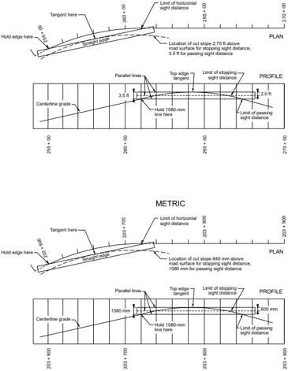

Sight distance calculations for two-lane highways may be used effectively to tentatively determine the marking of no-passing zones in accordance with criteria given in the MUTCD ( 24 ). Marking of such zones is an operational rather than a design responsibility. No-passing zones thus established serve as a guide for markings when the highway is completed. The zones so determined should be checked and adjusted by field measurements before actual markings are placed.

--',''','',',',','''''',,,,''-'-',,',,',',,'---

Sight distance calculations also are useful on two-lane highways for determining the percentage of length of highway on which sight distance is restricted to less than the passing minimum, which is important in evaluating capacity.

## 3.3  HORIZONTAL ALIGNMENT

## 3.3.1  Theoretical Considerations

To achieve balance in highway design, all geometric elements should, as far as economically practical, be designed to operate at a speed likely to be observed under the normal conditions for that roadway for a vast majority of motorists. Generally, this can be achieved through the use of design speed as an overall design control. The design of roadway curves should be based on an appropriate relationship between design speed and curvature and on their joint relationships with  superelevation  (roadway  banking)  and  side  friction.  Although  these  relationships  stem from the laws of mechanics, the actual values for use in design depend on practical limits and factors determined more or less empirically. These limits and factors are explained in the following paragraphs. In urban areas, street networks are largely established and geometric elements should be developed based on project constraints and community context, keeping in mind the range of operating speeds that are appropriate when developing streets that serve multiple transportation modes.

When a vehicle moves in a circular path, it undergoes a centripetal acceleration that acts toward the center of curvature. This acceleration is sustained by a component of the vehicle's weight related to the roadway superelevation, by the side friction developed between the vehicle's tires and the pavement surface, or by a combination of the two. Centripetal acceleration is sometimes equated to centrifugal force. However, this is an imaginary force that motorists believe is pushing them outward while cornering when, in fact, they are truly feeling the vehicle being accelerated in an inward direction. In horizontal curve design, 'lateral acceleration' is equivalent to 'centripetal acceleration'; the term 'lateral acceleration' is used in this policy as it is specifically applicable to geometric design.

From the laws of mechanics, the basic equation that governs vehicle operation on a curve is:

| U.S. Customary                                                                                                                                                                                                         | Metric                                                                                                                                                                                                                 |
|------------------------------------------------------------------------------------------------------------------------------------------------------------------------------------------------------------------------|------------------------------------------------------------------------------------------------------------------------------------------------------------------------------------------------------------------------|
| where: e = rate of roadway superelevation, percent f = side friction (demand) factor v = vehicle speed, ft/s g = gravitational constant, 32.2 ft/s 2 V = vehicle speed,mph R = radius of curve measured to a vehicle's | where: e = rate of roadway superelevation, percent f = side friction (demand) factor v = vehicle speed, m/s g = gravitational constant, 9.81 m/s 2 V = vehicle speed, km/h R = radius of curve measured to a vehicle's |

Equation 3-6, which models the moving vehicle as a point mass, is often referred to as the basic curve equation.

When a vehicle travels at constant speed on a curve superelevated so that the f value is zero, the centripetal acceleration is sustained by a component of the vehicle's weight and, theoretically, no steering force is needed. A vehicle traveling faster or slower than the balance speed develops tire friction as steering effort is applied to prevent movement to the outside or to the inside of the curve. On nonsuperelevated curves, travel at different speeds is also possible by utilizing appropriate amounts of side friction to sustain the varying lateral acceleration.

## 3.3.2  General Considerations

From accumulated research and experience, limiting values for superelevation rate ( e max ) and side friction demand ( f max ) have been established for curve design. Using these established limiting values  in  the  basic  curve  formula  permits  determining  a  minimum  curve  radius  for  various design speeds. Use of curves with radii larger than this minimum allows superelevation, side friction, or both to have values below their respective limits. The amount by which each factor is below its respective limit is chosen to provide an equitable contribution of each factor toward sustaining the resultant lateral acceleration. The methods used to achieve this equity for different design situations are discussed below.

## 3.3.2.1  Superelevation

There are practical upper limits to the rate of superelevation on a horizontal curve. These limits relate to considerations of climate, constructability, adjacent land use, and the frequency of slow-moving vehicles. Where snow and ice are a factor, the rate of superelevation should not exceed the rate on which vehicles standing or traveling slowly would slide toward the center of


the curve when the pavement is icy. At higher speeds, the phenomenon of partial hydroplaning can occur on curves with poor drainage that allows water to build up on the pavement surface. Skidding occurs, usually at the rear wheels, when the lubricating effect of the water film reduces the available lateral friction below the friction demand for cornering. When travelling slowly around a curve with high superelevation, negative lateral forces develop and the vehicle is held in the proper path only when the driver steers up the slope or against the direction of the horizontal curve. Steering in this direction seems unnatural to the driver and may explain the difficulty of driving on roads where the superelevation is in excess of that needed for travel at normal speeds. Such high rates of superelevation are generally undesirable on high-volume roads where there are numerous occasions when vehicles may need to slow substantially because of the volume of traffic or other conditions, such as in the suburban, urban, and urban core contexts.

Some vehicles have high centers of gravity and some passenger cars are loosely suspended on their axles. When these vehicles travel slowly on steep cross slopes, the down-slope tires carry a high percentage of the vehicle weight. A vehicle can roll over if this condition becomes extreme.

A discussion of these considerations and the rationale used to establish an appropriate maximum rate of superelevation for design of horizontal curves is provided in Section 3.3.3.2, 'Maximum Superelevation Rates for Streets and Highways.'

## 3.3.2.2  Side Friction Factor

The side friction factor represents the vehicle's need for side friction, also called the side friction demand; it also represents the lateral acceleration a f that acts on the vehicle. This acceleration can be computed as the product of the side friction demand factor f and the gravitational constant g (i.e., a f = f g ). Note that the lateral acceleration actually experienced by vehicle occupants tends to be slightly larger than predicted by the product f g due to vehicle body roll angle.

With the wide variation in vehicle speeds on curves, there usually is an unbalanced force whether the curve is superelevated or not. This force results in tire side thrust, which is counterbalanced by friction between the tires and the pavement surface. This frictional counterforce is developed by distortion of the contact area of the tire.

The coefficient of friction f is the friction force divided by the component of the weight perpendicular to the pavement surface and is expressed as a simplification of the basic curve formula shown as Equation 3-6. The value of the product ef in this formula is always small. As a result, the 1 - 0.01 ef term is nearly equal to 1.0 and is normally omitted in highway design. Omission of this term yields the following basic side friction equation:

<!-- formula-not-decoded -->

This equation is referred to as the simplified curve formula and yields slightly larger (and, thus, more conservative) estimates of friction demand than would be obtained using the basic curve formula.

The coefficient f has been called lateral ratio, cornering ratio, unbalanced centrifugal ratio, friction factor, and side friction factor. Because of its widespread use, the term 'side friction factor' is used in this discussion. The upper limit of the side friction factor is the point at which the tire would begin to skid; this is known as the point of impending skid. Because highway curves are designed so vehicles can avoid skidding with a margin of safety, the f values used in design should be substantially less than the coefficient of friction at impending skid.

The side friction factor at impending skid depends on a number of other factors, among which the most important are the speed of the vehicle, the type and condition of the roadway surface, and  the  type  and  condition  of  the  vehicle  tires.  Different  observers  have  recorded  different maximum side friction factors at the same speeds for pavements of similar composition, and logically so, because of the inherent variability in pavement texture, weather conditions, and tire condition. In general, research studies show that the maximum side friction factors developed between new tires and wet concrete pavements range from about 0.5 at 20 mph [30 km/h] to approximately 0.35 at 60 mph [100 km/h]. For normal wet concrete pavements and smooth tires, the maximum side friction factor at impending skid is about 0.35 at 45 mph [70 km/h]. In all cases, the studies show a decrease in friction values as speeds increase ( 48, 49, 63 ).

Horizontal curves should not be designed directly on the basis of the maximum available side friction factor. Rather, the maximum side friction factor used in design should be that portion of the maximum available side friction that can be used with comfort, and without likelihood of skidding, by the vast majority of drivers. Side friction levels that represent pavements that are glazed, bleeding, or otherwise lacking in reasonable skid-resistant properties should not control design because such conditions are avoidable and geometric design should be based on acceptable surface conditions attainable at reasonable cost.

A key consideration in selecting maximum side friction factors for use in design is the level of lateral acceleration that is sufficient to cause drivers to experience a feeling of discomfort and to react instinctively to avoid higher speed. The speed on a curve at which discomfort due to the lateral acceleration is evident to drivers is used as a design control for the maximum side friction factor on high-speed streets and highways. At low speeds, drivers are more tolerant of discomfort, thus permitting employment of an increased amount of side friction for use in design of horizontal curves.


The ball-bank indicator has been widely used by research groups, local agencies, and highway departments as a uniform measure of lateral acceleration to set speeds on curves that avoid driver discomfort. It consists of a steel ball in a sealed glass tube; except for the damping effect of the liquid in the tube, the ball is free to roll. Its simplicity of construction and operation has led to widespread acceptance as a guide for determination of appropriate curve speeds. With such a device mounted in a vehicle in motion, the ball-bank reading at any time is indicative of the combined effect of body roll, lateral acceleration angle, and superelevation as shown in Figure 3-2.

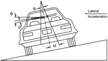

- α = Ball-bank indicator angle
- φ = Body roll angle
- θ = Superelevation angle
- ρ = Lateral acceleration angle

Figure 3-2. Geometry for Ball-Bank Indicator

The lateral acceleration developed as a vehicle travels at uniform speed on a curve causes the ball to roll out to a fixed angle position as shown in Figure 3-2. A correction should be made for that portion of the force taken up in the small body-roll angle. The indicated side force perceived by the vehicle occupants is thus on the order of F ≈ tan( α -ρ ).

In a series of definitive tests ( 49 ), it was concluded that speeds on curves that avoid driver discomfort are indicated by ball-bank readings of 14 degrees for speeds of 20 mph [30 km/h] or less, 12 degrees for speeds of 25 and 30 mph [40 and 50 km/h], and 10 degrees for speeds of 35 through 50 mph [55 through 80 km/h]. These ball-bank readings are indicative of side friction factors of 0.21, 0.18, and 0.15, respectively, for the test body roll angles and provide ample margin of safety against skidding or vehicle rollover.

From other tests ( 14 ),  a  maximum side friction factor of 0.16 for speeds up to 60 mph [100 km/h] was recommended. For higher speeds, the incremental reduction of this factor was recommended. Speed studies on the Pennsylvania Turnpike ( 63 ) led to a conclusion that the side friction factor should not exceed 0.10 for design speeds of 70 mph [110 km/h] and higher. A recent study ( 16 ) re-examined previously published findings and analyzed new data collected at numerous horizontal curves. The side friction demand factors developed in that study are generally consistent with the side friction factors reported above.

--',''','',',',','''''',,,,''-'-',,',,',',,'---


An electronic accelerometer provides an alternative to the ball-bank indicator for use in determining advisory speeds for horizontal curves and ramps. An accelerometer is a gravity-sensitive electronic device that can measure the lateral forces and accelerations that drivers experience while traversing a highway curve ( 45 ).

It should be recognized that other factors influence driver speed choice under conditions of high friction demand. Swerving becomes perceptible, drift angle increases, and increased steering effort is needed to avoid involuntary lane line violations. Under these conditions, the cone of vision narrows and is accompanied by an increasing sense of concentration and intensity considered undesirable by most drivers. These factors are more apparent to a driver under open road conditions.

Where practical, the maximum side friction factors used in design should be conservative for dry pavements and should provide an ample margin of safety against skidding on pavements that are wet as well as ice or snow covered and against vehicle rollover. The need to provide skid-resistant pavement surfacing for these conditions cannot be overemphasized because superimposed on the frictional demands resulting from roadway geometry are those that result from driving maneuvers such as braking, sudden lane changes, and minor changes in direction within a lane. In these short-term maneuvers, high friction demand can exist but the discomfort threshold may not be perceived in time for the driver to take corrective action.

Figure 3-3 summarizes the findings of the cited tests relating to side friction factors recommended for curve design for both low speeds ( 17, 18, 23 ) and high speeds ( 16 ). Although some variation in the test results is noted, all are in agreement that the side friction factor should be lower for high-speed design than for low-speed design. For travel on sharper curves, superelevation is needed. Recent studies ( 16, 66 ) have reaffirmed the appropriateness of these side friction factors. To illustrate the difference between side friction factors for design and available side friction supply, Figure 3-3 also includes friction supply curves for passenger vehicle and truck tires for the skidding condition on wet pavement during cornering ( 66 ).  Comparisons of the side friction supply and side friction factor curves provide a sense of the margin of safety against skidding based on the side friction factors used for design.

--',''','',',',','''''',,,,''-'-',,',,',',,'---

)

f

Side Friction Factor (

0.60

0.55

0.50

0.45

0.40

0.35

0.30

0.25

0.20

0.15

0.10

0.05

0

0

Legend: Each symbol represents the number of passenger vehicles

studied at a particular location

300 or more

150 to 300

50 to 100

Less than 50

2011 side friction factors assumed for design

HRB 1940 Moyer &amp; Berry

10

20

## U.S. CUSTOMARY

Passenger vehicle skidding-wet tire friction

(cornering 95th percentile) NCHRP Torbic 2014

Truck skidding-wet tire friction

(cornering 95th percentile)

NCHRP Torbic 2014

New tires-wet concrete pavement

Moyer 1934

70

NCHRP Bonneson 2000

TRB 2000 Bonneson

30

40

50

Speed (mph)

METRIC


Figure 3-3. Side Friction Factors for Streets and Highways


Smooth tires-wet concrete pavement

Moyer 1934

HRB 1936 Barnett

60

Arizona

Meyer 1949

HRB 1940 Stonex &amp; Noble

80

90

The side friction factors vary with the design speed from 0.38 at 10 mph [0.40 at 15 km/h] to about 0.15 at 45 mph [70 km/h], with 45 mph [70 km/h] being the upper limit for low speed established in the design speed discussion in Section 2.3.6. Figure 3-4 should be referred to for the values of the side friction factor recommended for use in horizontal curve design. Horizontal curve design criteria are presented in this chapter for speeds up to 80 mph [130 km/h]. In limited cases, highway agencies may wish to design horizontal curves for design speeds of 85 mph [140 km/h]. Horizontal curve design criteria for 85 mph [140 km/h] can be derived using the equations presented in this chapter assuming a side friction factor equal to 0.07.

## 3.3.2.3  Distribution of e and f over a Range of Curves

For a given design speed, there are five methods for sustaining lateral acceleration on curves by use of e or f , or both. These methods are discussed below, and the resulting relationships are illustrated in Figure 3-5:

- y Method 1Superelevation and side friction are directly proportional to the inverse of the radius (i.e., a straight-line relation exists between 1/ R = 0 and 1/ R = 1/ R min ).
- y Method 2Side friction is such that a vehicle traveling at design speed has all lateral acceleration sustained by side friction on curves up to those designed for f max . For sharper curves, f remains equal to f max and superelevation is then used to sustain lateral acceleration until e reaches e max . In this method, first f and then e are increased in inverse proportion to the radius of curvature.
- y Method 3Superelevation is such that a vehicle traveling at the design speed has all lateral acceleration sustained by superelevation on curves up to those designed for e max . For sharper curves, e remains at e max and side friction is then used to sustain lateral acceleration until f reaches f max . In this method, first e and then f are increased in inverse proportion to the radius of curvature.
- y Method 4This method is the same as Method 3, except that it is based on average running speed instead of design speed.
- y Method 5Superelevation and side friction are in a curvilinear relation with the inverse of the radius of the curve, with values between those of Methods 1 and 3.

Figure 3-5A compares the relationship between superelevation and the inverse of the radius of the curve for these five methods. Figure 3-5B shows the corresponding value of side friction for a vehicle traveling at design speed, and Figure 3-5C for a vehicle traveling at the corresponding average running speed.

--',''','',',',','''''',,,,''-'-',,',,',',,'---

## U.S. CUSTOMARY


Figure 3-4. Side Friction Factors Assumed for Design


Figure 3-5. Methods of Distributing Superelevation and Side Friction


The straight-line relationship between superelevation and the inverse of the radius of the curve in Method 1 results in a similar relationship between side friction and the radius for vehicles traveling at either the design or average running speed. This method has considerable merit and logic in addition to its simplicity. On any particular highway, the horizontal alignment consists of tangents and curves of varying radius greater than or equal to the minimum radius appropriate for the design speed ( R min ). Application of superelevation in amounts directly proportional to the inverse of the radius would, for vehicles traveling at uniform speed, result in side friction factors with a straight-line variation from zero on tangents (ignoring cross slope) to the maximum side friction at the minimum radius. This method might appear to be an ideal means of distributing the side friction factor, but its appropriateness depends on travel at a constant speed by each vehicle in the traffic stream, regardless of whether travel is on a tangent, a curve of intermediate degree, or a curve with the minimum radius for that design speed. While uniform speed is the aim of most drivers, and can be obtained on well-designed highways when volumes are not heavy, there is a tendency for some drivers to travel faster on tangents and the flatter curves than on the sharper curves, particularly after being delayed by inability to pass slower moving vehicles. This tendency points to the desirability of providing superelevation rates for intermediate curves in excess of those that result from use of Method 1.

Method 2 uses side friction to sustain all lateral acceleration up to the curvature corresponding to the maximum side friction factor, and this maximum side friction factor is available on all sharper curves. In this method, superelevation is introduced only after the maximum side friction has been used. Therefore, no superelevation is needed on flatter curves that need less than maximum side friction for vehicles traveling at the design speed (see Curve 2 in Figure 3-5A). When superelevation is needed, it increases rapidly as curves with maximum side friction grow sharper. Because this method is completely dependent on available side friction, its use is generally limited to low-speed streets and highways. This method is particularly appropriate on low-speed urban streets where, because of various constraints, superelevation frequently cannot be provided.

In Method 3, which was practiced many years ago, superelevation to sustain all lateral acceleration for a vehicle traveling at the design speed is provided on all curves up to that needing maximum practical superelevation, and this maximum superelevation is provided on all sharper curves. Under this method, no side friction is provided on flat curves with less than maximum superelevation for vehicles traveling at the design speed, as shown by Curve 3 in Figure 3-5B, and the appropriate side friction increases rapidly as curves with maximum superelevation grow sharper. Further, as shown by Curve 3 in Figure 3-5C, for vehicles traveling at average running speed, this superelevation method results in negative friction for curves from very flat radii to about the middle of the range of curve radii; beyond this point, as curves become sharper, the side friction increases rapidly up to a maximum corresponding to the minimum radius of curvature. This marked difference in side friction for different curves is inconsistent and may result in erratic driving, either at the design or average running speed.

--',''','',',',','''''',,,,''-'-',,',,',',,'---

Method 4 is intended to  overcome  the  deficiencies  of  Method  3  by  using  superelevation  at speeds lower than the design speed. This method has been widely used with an average running speed for which all lateral acceleration is sustained by superelevation of curves flatter than that needing the maximum rate of superelevation. This average running speed was an approximation that, as presented in Table 3-6, varies from 80 to 100 [78 to 100] percent of design speed. Curve 4 in Figure 3-5A shows that in using this method the maximum superelevation is reached near the middle of the curvature range. Figure 3-5C shows that at average running speed no side friction is needed up to this curvature, and side friction increases rapidly and in direct proportion for sharper curves. This method has the same disadvantages as Method 3, but they apply to a smaller degree.

Method 5 combines aspects of Methods 1 and 4. To accommodate overdriving that is likely to occur on flat to intermediate curves, it is desirable that the superelevation approximates that obtained by Method 4. Overdriving on such curves involves very little risk that a driver will lose control of the vehicle because superelevation sustains nearly all the lateral acceleration at the average running speed, and considerable side friction is available for greater speeds. On the other hand, Method 1, which avoids use of maximum superelevation for a substantial part of the range of curve radii, is also desirable. In Method 5, a curved line (Curve 5, as shown within the triangular working range between Curves 1 and 4 in Figure 3-5A) represents a superelevation and side friction distribution reasonably retaining the advantages of both Methods 1 and 4. Curve 5 has an asymmetrical parabolic form and represents a practical distribution for superelevation over the range of curvature.

Table 3-6. Average Running Speeds

| U.S. Customary     | U.S. Customary              |
|--------------------|-----------------------------|
| Design Speed (mph) | Average Running Speed (mph) |
| 15                 | 15                          |
| 20                 | 20                          |
| 25                 | 24                          |
| 30                 | 28                          |
| 35                 | 32                          |
| 40                 | 36                          |
| 45                 | 40                          |
| 50                 | 44                          |
| 55                 | 48                          |
| 60                 | 52                          |
| 65                 | 55                          |
| 70                 | 58                          |
| 75                 | 61                          |
| 80                 | 64                          |


| Metric              | Metric                       |
|---------------------|------------------------------|
| Design Speed (km/h) | Average Running Speed (km/h) |
| 20                  | 20                           |
| 30                  | 30                           |
| 40                  | 40                           |
| 50                  | 47                           |
| 60                  | 55                           |
| 70                  | 63                           |
| 80                  | 70                           |
| 90                  | 77                           |
| 100                 | 85                           |
| 110                 | 91                           |
| 120                 | 98                           |
| 130                 | 102                          |

## 3.3.3  Design Considerations

Superelevation rates that are applicable over the range of curvature for each design speed have been determined for use in highway design. One extreme of this range is the maximum superelevation rate established by practical considerations and used to determine the maximum curvature for each design speed. The maximum superelevation may be different for different highway conditions. At the other extreme, no superelevation is needed for tangent highways or highways with extremely long-radius curves. For curvature between these extremes and for a given design speed, the superelevation should be chosen in such a manner that there is a logical relation between the side friction factor and the applied superelevation rate.

## 3.3.3.1  Normal Cross Slope

The minimum rate of cross slope applicable to the traveled way is determined by drainage needs. Consistent with the type of highway and amount of rainfall, snow, and ice, the usually accepted minimum values for cross slope range from 1.5 percent to 2.0 percent (for further information, see Section 4.2.2, 'Cross Slope'. For discussion purposes, a value of 2.0 percent is used in this discussion as a single value representative of the cross slope for paved, uncurbed pavements. Steeper cross slopes are generally needed where curbs are used to minimize ponding of water on the outside through lane.

The shape or form of the normal cross slope varies. Some states and many municipalities use a curved traveled way cross section for two-lane roadways, usually parabolic in form. Others employ a straight-line section for each lane.

## 3.3.3.2  Maximum Superelevation Rates for Streets and Highways

The maximum rates of superelevation used on highways are controlled by four factors: climate conditions (i.e., frequency and amount of snow and ice); terrain conditions (i.e., flat, rolling, or mountainous); area type (i.e., rural or urban); and frequency of very slow-moving vehicles whose operation might be affected by high superelevation rates. Consideration of these factors jointly leads to the conclusion that no single maximum superelevation rate is universally applicable. However, using only one maximum superelevation rate within a region of similar climate and land use is desirable, as such a practice promotes design consistency.

Design consistency represents the uniformity of the highway alignment and its associated design element dimensions. This uniformity allows drivers to improve their perception-reaction skills  by  developing expectancies. Design elements that are not uniform for similar types of roadways may be counter to a driver's expectancy and result in an increase in driver workload. Logically, there is an inherent relationship between design consistency, driver workload, and crash  frequency,  with  'consistent'  designs  being  associated  with  lower  workloads  and  lower crash frequencies.

--',''','',',',','''''',,,,''-'-',,',,',',,'---

The highest superelevation rate for highways in common use is 10 percent, although 12 percent is used in some cases. Superelevation rates above 8 percent are only used in areas without snow and ice. Although higher superelevation rates offer an advantage to those drivers traveling at high speeds, current practice considers that rates in excess of 12 percent are beyond practical limits.  This  practice  recognizes  the  combined  effects  of  construction  processes,  maintenance difficulties, and operation of vehicles at low speeds.

Thus, a superelevation rate of 12 percent appears to represent a practical maximum value where snow and ice do not exist. A superelevation rate of 12 percent may be used on low-volume gravel-surfaced roads to facilitate cross drainage; however, superelevation rates of this magnitude can cause higher speeds, which are conducive to rutting and displacement of gravel. Generally, 8 percent is recognized as a reasonable maximum value for superelevation rate.

Where snow and ice are factors, tests and experience show that a superelevation rate of about 8 percent is a logical maximum to minimize vehicles sliding across a highway when stopping or attempting to start slowly from a stopped position. One series of tests ( 48 ) found coefficients of friction for ice ranging from 0.050 to 0.200, depending on the condition of the ice (i.e., wet, dry, clean, smooth, or rough). Tests on loose or packed snow show coefficients of friction ranging from 0.200 to 0.400. Other tests ( 27 ) have corroborated these values. The lower extreme of this range of coefficients of friction probably occurs only under thin film 'quick freeze' conditions at a temperature of about 30°F [-1°C] in the presence of water on the pavement. Similar low friction values may occur with thin layers of mud on the pavement surface, with oil or flushed spots, and with high speeds and a sufficient depth of water on the pavement surface to permit hydroplaning. For these reasons, some highway agencies have adopted a maximum superelevation rate of 8 percent. Such agencies believe that 8 percent represents a logical maximum superelevation rate, regardless of snow or ice conditions. Such a limit tends to reduce the likelihood that slow drivers will experience negative side friction, which can result in excessive steering effort and erratic operation.

In urban areas, where traffic congestion or extensive roadside development acts to restrict speeds, it is common practice to utilize a lower maximum rate of superelevation, usually 4 to 6 percent. Similarly, either a low maximum rate of superelevation or no superelevation is employed within important intersection areas or where there is a tendency to drive slowly because of turning and crossing movements, warning devices, and signals. In these areas it is difficult to warp crossing pavements for drainage without providing negative superelevation for some turning movements.

In summary, it is recommended that (1) several rates, rather than a single rate, of maximum superelevation should be recognized in establishing design controls for highway curves, (2) a rate of 12 percent should not be exceeded, (3) a rate of 4 or 6 percent is applicable for urban area design in locations with few constraints, and (4) superelevation may be omitted on low-speed streets in urban areas where severe constraints are present. To account for a wide range of agency

practice, five maximum superelevation rates-4, 6, 8, 10, and 12 percent-are presented in this chapter.

## 3.3.3.3  Minimum Radius

The minimum radius is a limiting value of curvature for a given design speed and is determined from the maximum rate of superelevation and the maximum side friction factor selected for design (limiting value of f). Use of sharper curvature for that design speed would call for superelevation beyond the limit considered practical or for operation with tire friction and lateral acceleration beyond what is considered comfortable by many drivers, or both. The minimum radius of curvature is based on a threshold of driver comfort that is sufficient to provide a margin of safety against skidding and vehicle rollover. The minimum radius of curvature is also an important control value for determining superelevation rates for flatter curves.

The minimum radius of curvature, R min ,  can be calculated directly from the simplified curve equation (see Equation 3-7) introduced previously in Section 3.3.2.2, 'Side Friction Factor.' This equation can be recast to determine R min as follows:

| U.S. Customary   | Metric   |
|------------------|----------|
|                  | (3-8)    |

Based on the maximum allowable side friction factors from Figure 3-4, Table 3-7 gives the minimum radius for each of the five maximum superelevation rates calculated using Equation 3-8.

For curve layout purposes, the radius is measured to the horizontal control line, which is often along the centerline of the alignment. However, the horizontal curve equations use a curve radius measured to a vehicle's center of gravity, which is approximately the center of the innermost travel lane. The equations do not consider the width of the roadway or the location of the horizontal control line. For consistency with the radius defined for turning roadways and to consider the motorist operating within the innermost travel lane, the radius used to design horizontal curves should be measured to the inside edge of the innermost travel lane, particularly for wide roadways with sharp horizontal curvature. For two-lane roadways, the difference between the roadway centerline and the center of gravity used in the horizontal curve equations is minor. Therefore, the curve radius for a two-lane roadway may be measured to the centerline of the roadway.


Table 3-7. Minimum Radius Using Limiting Values of e and f

| U.S. Customary     | U.S. Customary   | U.S. Customary   | U.S. Customary       | U.S. Customary           | U.S. Customary        |
|--------------------|------------------|------------------|----------------------|--------------------------|-----------------------|
| Design Speed (mph) | Maxi- mum e (%)  | Maxi- mum f      | Total ( e /100 + f ) | Calcu- lated Radius (ft) | Round- ed Radius (ft) |
| 10                 | 4.0              | 0.38             | 0.42                 | 15.9                     | 16                    |
| 15                 | 4.0              | 0.32             | 0.36                 | 41.7                     | 42                    |
| 20                 | 4.0              | 0.27             | 0.31                 | 86.0                     | 86                    |
| 25                 | 4.0              | 0.23             | 0.27                 | 154.3                    | 154                   |
| 30                 | 4.0              | 0.20             | 0.24                 | 250.0                    | 250                   |
| 35                 | 4.0              | 0.18             | 0.22                 | 371.2                    | 371                   |
| 40                 | 4.0              | 0.16             | 0.20                 | 533.3                    | 533                   |
| 45                 | 4.0              | 0.15             | 0.19                 | 710.5                    | 711                   |
| 50                 | 4.0              | 0.14             | 0.18                 | 925.9                    | 926                   |
| 55                 | 4.0              | 0.13             | 0.17                 | 1186.3                   | 1190                  |
| 60                 | 4.0              | 0.12             | 0.16                 | 1500.0                   | 1500                  |
| 10                 | 6.0              | 0.38             | 0.44                 | 15.2                     | 15                    |
| 15                 | 6.0              | 0.32             | 0.38                 | 39.5                     | 39                    |
| 20                 | 6.0              | 0.27             | 0.33                 | 80.8                     | 81                    |
| 25                 | 6.0              | 0.23             | 0.29                 | 143.7                    | 144                   |
| 30                 | 6.0              | 0.20             | 0.26                 | 230.8                    | 231                   |
| 35                 | 6.0              | 0.18             | 0.24                 | 340.3                    | 340                   |
| 40                 | 6.0              | 0.16             | 0.22                 | 484.8                    | 485                   |
| 45                 | 6.0              | 0.15             | 0.21                 | 642.9                    | 643                   |
| 50                 | 6.0              | 0.14             | 0.20                 | 833.3                    | 833                   |
| 55                 | 6.0              | 0.13             | 0.19                 | 1061.4                   | 1060                  |
| 60                 | 6.0              | 0.12             | 0.18                 | 1333.3                   | 1330                  |
| 65                 | 6.0              | 0.11             | 0.17                 | 1656.9                   | 1660                  |
| 70                 | 6.0              | 0.10             | 0.16                 | 2041.7                   | 2040                  |
| 75                 | 6.0              | 0.09             | 0.15                 | 2500.0                   | 2500                  |
| 80                 | 6.0              | 0.08             | 0.14                 | 3047.6                   | 3050                  |
| 10                 | 8.0              | 0.38             | 0.46                 | 14.5                     | 14                    |
| 15                 | 8.0              | 0.32             | 0.40                 | 37.5                     | 38                    |
| 20                 | 8.0              | 0.27             | 0.35                 | 76.2                     | 76                    |
| 25                 | 8.0              | 0.23             | 0.31                 | 134.4                    | 134                   |
| 30                 | 8.0              | 0.20             | 0.28                 | 214.3                    | 214                   |
| 35                 | 8.0              | 0.18             | 0.26                 | 314.1                    | 314                   |
| 40                 | 8.0              | 0.16             | 0.24                 | 444.4                    | 444                   |
| 45                 | 8.0              | 0.15             | 0.23                 | 587.0                    | 587                   |
| 50                 | 8.0              | 0.14             | 0.22                 | 757.6                    | 758                   |
| 55                 | 8.0              | 0.13             | 0.21                 | 960.3                    | 960                   |
| 60                 | 8.0              | 0.12             | 0.20                 | 1200.0                   | 1200                  |
| 65                 | 8.0              | 0.11             | 0.19                 | 1482.5                   | 1480                  |
| 70                 | 8.0              | 0.10             | 0.18                 | 1814.8                   | 1810                  |
| 75                 | 8.0              | 0.09             | 0.17                 | 2205.9                   | 2210                  |
| 80                 | 8.0              | 0.08             | 0.16                 | 2666.7                   | 2670                  |


| Metric              | Metric          | Metric      | Metric               | Metric                  | Metric               |
|---------------------|-----------------|-------------|----------------------|-------------------------|----------------------|
| Design Speed (km/h) | Maxi- mum e (%) | Maxi- mum f | Total ( e /100 + f ) | Calcu- lated Radius (m) | Round- ed Radius (m) |
| 15                  | 4.0             | 0.40        | 0.44                 | 4.0                     | 4                    |
| 20                  | 4.0             | 0.35        | 0.39                 | 8.1                     | 8                    |
| 30                  | 4.0             | 0.28        | 0.32                 | 22.1                    | 22                   |
| 40                  | 4.0             | 0.23        | 0.27                 | 46.7                    | 47                   |
| 50                  | 4.0             | 0.19        | 0.23                 | 85.6                    | 86                   |
| 60                  | 4.0             | 0.17        | 0.21                 | 135.0                   | 135                  |
| 70                  | 4.0             | 0.15        | 0.19                 | 203.1                   | 203                  |
| 80                  | 4.0             | 0.14        | 0.18                 | 280.0                   | 280                  |
| 90                  | 4.0             | 0.13        | 0.17                 | 375.2                   | 375                  |
| 100                 | 4.0             | 0.12        | 0.16                 | 492.1                   | 492                  |
| 15                  | 6.0             | 0.40        | 0.46                 | 3.9                     | 4                    |
| 20                  | 6.0             | 0.35        | 0.41                 | 7.7                     | 8                    |
| 30                  | 6.0             | 0.28        | 0.34                 | 20.8                    | 21                   |
| 40                  | 6.0             | 0.23        | 0.29                 | 43.4                    | 43                   |
| 50                  | 6.0             | 0.19        | 0.25                 | 78.7                    | 79                   |
| 60                  | 6.0             | 0.17        | 0.23                 | 123.2                   | 123                  |
| 70                  | 6.0             | 0.15        | 0.21                 | 183.7                   | 184                  |
| 80                  | 6.0             | 0.14        | 0.20                 | 252.0                   | 252                  |
| 90                  | 6.0             | 0.13        | 0.19                 | 335.7                   | 336                  |
| 100                 | 6.0             | 0.12        | 0.18                 | 437.4                   | 437                  |
| 110                 | 6.0             | 0.11        | 0.17                 | 560.4                   | 560                  |
| 120                 | 6.0             | 0.09        | 0.15                 | 755.9                   | 756                  |
| 130                 | 6.0             | 0.08        | 0.14                 | 950.5                   | 951                  |
| 15                  | 8.0             | 0.40        | 0.48                 | 3.7                     | 4                    |
| 20                  | 8.0             | 0.35        | 0.43                 | 7.3                     | 7                    |
| 30                  | 8.0             | 0.28        | 0.36                 | 19.7                    | 20                   |
| 40                  | 8.0             | 0.23        | 0.31                 | 40.6                    | 41                   |
| 50                  | 8.0             | 0.19        | 0.27                 | 72.9                    | 73                   |
| 60                  | 8.0             | 0.17        | 0.25                 | 113.4                   | 113                  |
| 70                  | 8.0             | 0.15        | 0.23                 | 167.8                   | 168                  |
| 80                  | 8.0             | 0.14        | 0.22                 | 229.1                   | 229                  |
| 90                  | 8.0             | 0.13        | 0.21                 | 303.7                   | 304                  |
| 100                 | 8.0             | 0.12        | 0.20                 | 393.7                   | 394                  |
| 110                 | 8.0             | 0.11        | 0.19                 | 501.5                   | 501                  |
| 120                 | 8.0             | 0.09        | 0.17                 | 667.0                   | 667                  |
| 130                 | 8.0             | 0.08        | 0.16                 | 831.7                   | 832                  |

Table 3-7. Minimum Radius Using Limiting Values of e and f (Continued)

| U.S. Customary     | U.S. Customary   | U.S. Customary   | U.S. Customary       | U.S. Customary           | U.S. Customary        |
|--------------------|------------------|------------------|----------------------|--------------------------|-----------------------|
| Design Speed (mph) | Maxi- mum e (%)  | Maxi- mum f      | Total ( e /100 + f ) | Calcu- lated Radius (ft) | Round- ed Radius (ft) |
| 10                 | 10.0             | 0.38             | 0.48                 | 13.9                     | 14                    |
| 15                 | 10.0             | 0.32             | 0.42                 | 35.7                     | 36                    |
| 20                 | 10.0             | 0.27             | 0.37                 | 72.1                     | 72                    |
| 25                 | 10.0             | 0.23             | 0.33                 | 126.3                    | 126                   |
| 30                 | 10.0             | 0.20             | 0.30                 | 200.0                    | 200                   |
| 35                 | 10.0             | 0.18             | 0.28                 | 291.7                    | 292                   |
| 40                 | 10.0             | 0.16             | 0.26                 | 410.3                    | 410                   |
| 45                 | 10.0             | 0.15             | 0.25                 | 540.0                    | 540                   |
| 50                 | 10.0             | 0.14             | 0.24                 | 694.4                    | 694                   |
| 55                 | 10.0             | 0.13             | 0.23                 | 876.8                    | 877                   |
| 60                 | 10.0             | 0.12             | 0.22                 | 1090.9                   | 1090                  |
| 65                 | 10.0             | 0.11             | 0.21                 | 1341.3                   | 1340                  |
| 70                 | 10.0             | 0.10             | 0.20                 | 1633.3                   | 1630                  |
| 75                 | 10.0             | 0.09             | 0.19                 | 1973.7                   | 1970                  |
| 80                 | 10.0             | 0.08             | 0.18                 | 2370.4                   | 2370                  |
| 10                 | 12.0             | 0.38             | 0.50                 | 13.3                     | 13                    |
| 15                 | 12.0             | 0.32             | 0.44                 | 34.1                     | 34                    |
| 20                 | 12.0             | 0.27             | 0.39                 | 68.4                     | 68                    |
| 25                 | 12.0             | 0.23             | 0.35                 | 119.0                    | 119                   |
| 30                 | 12.0             | 0.20             | 0.32                 | 187.5                    | 188                   |
| 35                 | 12.0             | 0.18             | 0.30                 | 272.2                    | 272                   |
| 40                 | 12.0             | 0.16             | 0.28                 | 381.0                    | 381                   |
| 45                 | 12.0             | 0.15             | 0.27                 | 500.0                    | 500                   |
| 50                 | 12.0             | 0.14             | 0.26                 | 641.0                    | 641                   |
| 55                 | 12.0             | 0.13             | 0.25                 | 806.7                    | 807                   |
| 60                 | 12.0             | 0.12             | 0.24                 | 1000.0                   | 1000                  |
| 65                 | 12.0             | 0.11             | 0.23                 | 1224.6                   | 1220                  |
| 70                 | 12.0             | 0.10             | 0.22                 | 1484.8                   | 1480                  |
| 75                 | 12.0             | 0.09             | 0.21                 | 1785.7                   | 1790                  |
| 80                 | 12.0             | 0.08             | 0.20                 | 2133.3                   | 2130                  |

| Metric              | Metric          | Metric      | Metric               | Metric                  | Metric               |
|---------------------|-----------------|-------------|----------------------|-------------------------|----------------------|
| Design Speed (km/h) | Maxi- mum e (%) | Maxi- mum f | Total ( e /100 + f ) | Calcu- lated Radius (m) | Round- ed Radius (m) |
| 15                  | 10.0            | 0.40        | 0.50                 | 3.5                     | 4                    |
| 20                  | 10.0            | 0.35        | 0.45                 | 7.0                     | 7                    |
| 30                  | 10.0            | 0.28        | 0.38                 | 18.6                    | 19                   |
| 40                  | 10.0            | 0.23        | 0.33                 | 38.2                    | 38                   |
| 50                  | 10.0            | 0.19        | 0.29                 | 67.9                    | 68                   |
| 60                  | 10.0            | 0.17        | 0.27                 | 105.0                   | 105                  |
| 70                  | 10.0            | 0.15        | 0.25                 | 154.3                   | 154                  |
| 80                  | 10.0            | 0.14        | 0.24                 | 210.0                   | 210                  |
| 90                  | 10.0            | 0.13        | 0.23                 | 277.3                   | 277                  |
| 100                 | 10.0            | 0.12        | 0.22                 | 357.9                   | 358                  |
| 110                 | 10.0            | 0.11        | 0.21                 | 453.7                   | 454                  |
| 120                 | 10.0            | 0.09        | 0.19                 | 596.8                   | 597                  |
| 130                 | 10.0            | 0.08        | 0.18                 | 739.3                   | 739                  |
| 15                  | 12.0            | 0.40        | 0.52                 | 3.4                     | 3                    |
| 20                  | 12.0            | 0.35        | 0.47                 | 6.7                     | 7                    |
| 30                  | 12.0            | 0.28        | 0.40                 | 17.7                    | 18                   |
| 40                  | 12.0            | 0.23        | 0.35                 | 36.0                    | 36                   |
| 50                  | 12.0            | 0.19        | 0.31                 | 63.5                    | 64                   |
| 60                  | 12.0            | 0.17        | 0.29                 | 97.7                    | 98                   |
| 70                  | 12.0            | 0.15        | 0.27                 | 142.9                   | 143                  |
| 80                  | 12.0            | 0.14        | 0.26                 | 193.8                   | 194                  |
| 90                  | 12.0            | 0.13        | 0.25                 | 255.1                   | 255                  |
| 100                 | 12.0            | 0.12        | 0.24                 | 328.1                   | 328                  |
| 110                 | 12.0            | 0.11        | 0.23                 | 414.2                   | 414                  |
| 120                 | 12.0            | 0.09        | 0.21                 | 539.9                   | 540                  |

Note: Use of e max = 4.0% should be limited to urban areas.

## 3.3.3.4  Effects of Grades

On long or fairly steep grades, drivers tend to travel faster in the downgrade than in the upgrade direction. Additionally, research ( 16, 66 )  has  shown that the side friction demand is greater on both downgrades (due to braking forces) and steep upgrades (due to the tractive forces). Research ( 66 ) has also shown that, for simple horizontal curves, the maximum superelevation rate on steep downgrades of 4 percent or more should not exceed 12 percent. If considering a maximum superelevation rate on a horizontal curve in excess of 12 percent, a spiral curve tran-


sition is recommended to increase the margins of safety against skidding or rollover between the approach tangent and horizontal curve. Sharp horizontal curves (or near minimum-radius curves) on downgrades of 4 percent or more should not be designed using low design speeds (i.e., 30 mph [50 km/h] or less). In the event that such situations cannot be avoided, warning signs to reduce speeds well in advance of the start of the horizontal curve should be used.

On upgrades  of  4  percent  or  more,  the  maximum  superelevation  rate  should  be  limited  to 9 percent for minimum-radius curves with design speeds of 55 mph [90 km/h] and higher, to minimize the potential for wheel-lift events on tractor semi-trailer trucks. Alternatively, if it can be verified that the available sight distance is such that deceleration at the rate assumed in stopping sight distance design criteria, 11.2 ft/s 2 [3.4 m/s 2 ], is unlikely to be needed on upgrades of 4 percent or more, e max values up to 12 percent may be used for minimum-radius curves.

Vehicle dynamics simulations have shown ( 66 ) that sharp horizontal curves with near or minimum radii for given design speeds on downgrades of 4 percent or more could lead to skidding or rollover for a range of vehicle types if a driver is simultaneously braking and changing lanes on the curve. For this reason, it may be desirable to provide a 'STAY IN LANE' sign (R4-9) in advance of sharp horizontal curves on steep grades on multilane highways ( 24 ). Consideration may also be given to using single solid white lane line markings to supplement the 'STAY IN LANE' sign and discourage motorists from changing lanes.

## 3.3.4  Design for Highways in Rural Areas, and Freeways and High-Speed Streets in Urban Areas

On highways in rural areas, on freeways in urban areas, and on streets in urban areas, such as in the suburban context, where speed is relatively high and relatively uniform, horizontal curves are generally superelevated and successive curves are generally balanced to provide a smooth-riding transition from one curve to the next. A balanced design for a series of curves of varying radii is provided by the appropriate distribution of e and f values, as discussed above, to select an appropriate superelevation rate in the range from the normal cross slope to maximum superelevation.

## 3.3.4.1  Side Friction Factors

Figure 3-4 shows the recommended side friction factors for highways in rural areas, freeways in urban areas, and high-speed streets and highways in urban areas as a solid line. These side friction factors provide a reasonable margin of safety for the various speeds.

The maximum side friction factors vary directly with design speed from 0.14 at 50 mph [80 km/h] to 0.08 at 80 mph [130 km/h]. The research report Side Friction for Superelevation on Horizontal Curves ( 44 ) confirms the appropriateness of these design values.

## 3.3.4.2  Superelevation

Method 5, described previously, is recommended for the distribution of e and f for all curves with radii greater than the minimum radius of curvature on highways in rural areas, freeways in urban areas, and high-speed streets in urban areas. Use of Method 5 is discussed in the following text and figures.

## 3.3.4.3  Procedure for Development of Method 5 Superelevation Distribution

The side friction factors shown as the solid line on Figure 3-4 represent the maximum f values selected for design for each speed. When these values are used in conjunction with the recommended Method 5, they determine the f distribution curves for the various speeds. Subtracting these computed f values from the computed value of e /100 + f at the design speed, the finalized e distribution is thus obtained (see Figure 3-6).


Figure 3-6. Method 5 Procedure for Development of the Superelevation Distribution


The  e  and f distributions for Method 5 may be derived using the basic curve equation, neglecting the (1 -0.01 ef ) term as discussed earlier in this chapter, using the following sequence of equations:

## U.S. Customary

Metric where:

V = VD =  design speed, mph e = e max =  maximum superelevation, percent

f = f max =    maximum allowable side friction factor

R = R min =  minimum radius, ft then:

and where:

V = V R = running speed, mph

R = R PI = radius at the Point of Intersection, PI, of legs (1) and (2) of the f distribution parabolic curve (= R at the point of intersection of 0.01 e max and (0.01 e + f ) R )

then:

Because (0.01 e + f ) D - (0.01 e + f ) R = h , at point R PI the equations reduce to the following:

where h PI = PI offset from the 1/ R axis. Also:

--',''','',',',','''''',,,,''-'-',,',,',',,'---


where:

V = VD =  design speed, km/h e = e max =  maximum superelevation, percent

f

=

f

max

R

=

R

min

=    maximum allowable side friction factor

=  minimum radius, m then:

and where:

V = V R = running speed, km/h

R

=

R

PI

= radius at the Point of Intersection,

PI, of legs (1) and (2) of the

f

distribution parabolic curve (=

R

at the point of intersec- tion of 0.01

e

max and (0.01

then:

Because (0.01 e + f ) D - (0.01 e + f ) R = h , at point R PI the equations reduce to the following:

where h PI = PI offset from the 1/ R axis.

Also:

e

+

f

)

R

)

<!-- formula-not-decoded -->

<!-- formula-not-decoded -->

<!-- formula-not-decoded -->

<!-- formula-not-decoded -->

<!-- formula-not-decoded -->

## U.S. Customary

where S 1 = slope of leg 1 and:

where S 2 = slope of leg 2.

The equation for the middle ordinate ( MO ) of an unsymmetrical vertical curve is the following:

where: L 1 = 5729.58/ R PI and L 2 = 5729.58(1/ R min - 1/ R PI ).

It follows that:

where MO = middle ordinate of the f distribution curve, and:

in which R = radius at any point.

Use the general vertical curve equation:

with 1/ R measured from the vertical axis. With 1/ R ≤ 1/ R Pl :

where f 1 = f distribution at any point 1/ R ≤ 1/ R PI ; and:

.


## Metric

where S 1 = slope of leg 1 and where S 2 = slope of leg 2.

The equation for the middle ordinate ( MO ) of an unsymmetrical vertical curve is the following:

where: L 1 = 1/ R PI and L 2 = 1/ R min - 1/ R PI . It follows that:

where MO = middle ordinate of the f distribution curve, and:

in which R = radius at any point.

Use the general vertical curve equation:

with 1/ R measured from the vertical axis.

With 1/ R ≤ 1/ R Pl :

where f 1 = f distribution at any point 1/ R ≤ 1/ R PI ; and:

.

--',''','',',',','''''',,,,''-'-',,',,',',,'---

<!-- formula-not-decoded -->

<!-- formula-not-decoded -->

<!-- formula-not-decoded -->

<!-- formula-not-decoded -->

<!-- formula-not-decoded -->

<!-- formula-not-decoded -->

<!-- formula-not-decoded -->

--',''','',',',','''''',,,,''-'-',,',,',',,'---

| U.S. Customary                                                                        | Metric                                                                                       |
|---------------------------------------------------------------------------------------|----------------------------------------------------------------------------------------------|
| where 0.01 e 1 = 0.01 e distribution at any point 1/ R ≤ 1/ R PI For 1/ R > 1/ R PI : | where 0.01 e 1 = 0.01 e distribution at any point 1/ R ≤ 1/ R PI For 1/ R > 1/ R PI : (3-21) |
| where f 2 = f distribution at any point 1/ R > 1/ R PI ; and:                         | where f 2 = f distribution at any point 1/ R > 1/ R PI ; and: (3-22)                         |

Figure 3-6 is a typical layout illustrating the Method 5 procedure for development of the finalized e distribution. The figure depicts how the f value is determined for 1/ R and then subtracted from the value of ( e /100 + f ) to determine e /100.

An example of the procedure to calculate e for a design speed of 50 mph [80 km/h] and an e max of 8 percent is shown below:

| Example                                        | Example                                             | Example                                         | Example                                             |
|------------------------------------------------|-----------------------------------------------------|-------------------------------------------------|-----------------------------------------------------|
| U.S. Customary                                 | U.S. Customary                                      | Metric                                          | Metric                                              |
| Determine e given:                             | V D = 50 mph e max = 8 percent                      | Determine e given:                              | V D = 80 km/h e max = 8 percent                     |
| From Table 3-6:                                | V R = 44 mph                                        | From Table 3-6:                                 | V R = 70 km/h                                       |
| From Table 3-7:                                | f = 0.14 (maximum allow- able side friction factor) | From Table 3-7:                                 | f = 0.14 (maximum allow- able side friction factor) |
| Using the appropriate equations yields:        | Using the appropriate equations yields:             | Using the appropriate equations yields:         | Using the appropriate equations yields:             |
| R min = 757.6, R PI = 1613, and h PI = 0.02331 | R min = 757.6, R PI = 1613, and h PI = 0.02331      | R min = 229.1, R PI = 482.3, and h PI = 0.02449 | R min = 229.1, R PI = 482.3, and h PI = 0.02449     |
| S 1 = 0.006562 and S 2 = 0.02910               | S 1 = 0.006562 and S 2 = 0.02910                    | S 1 = 11.81 and S 2 = 50.41                     | S 1 = 11.81 and S 2 = 50.41                         |
| L 1 = 3.551 and L 2 = 4.012                    | L 1 = 3.551 and L 2 = 4.012                         | L 1 = 0.002073 and L 2 = 0.002292               | L 1 = 0.002073 and L 2 = 0.002292                   |
| The middle ordinate ( MO ) is 0.02122.         | The middle ordinate ( MO ) is 0.02122.              | The middle ordinate ( MO ) is 0.02101.          | The middle ordinate ( MO ) is 0.02101.              |


The e distribution value for any radius is found by taking the (0.01 e + f ) D value minus the f 1 or f 2 value (refer to Figure 3-6). Thus, the e distribution value for an R = R PI would be (0.01 e + f ) D = VD 2 /15 R =  0.1033 minus an f 1 =  0.04452, which results in 0.05878. This value, multiplied by 100 (to convert to percent) and rounded up to the nearest 0.2 percent, corresponds to the e value of 6.0 percent. This e value can be found for R =  1,613 ft at the 50 mph design speed in Table 3-10.

## 3.3.5  Design Superelevation Tables

Tables 3-8 to 3-12 show minimum values of R for various combinations of superelevation and design speeds based on the Method 5 superelevation distribution for each of five values of maximum superelevation rate (i.e., for a full range of common design conditions). For low-speed urban facilities, refer to Table 3-13, which is based on the Method 2 superelevation distribution.

When using one of Tables 3-8 to 3-12 for a given radius, interpolation is not necessary as the superelevation rate should be determined from a radius equal to, or slightly smaller than, the radius provided in the table. The result is a superelevation rate that is rounded up to the nearest 0.2 percent. For example, a 50 mph [80 km/h] curve with a maximum superelevation rate of 8 percent, and a radius of 1,870 ft [570 m], should use the radius of 1,830 ft [549 m] to obtain a superelevation rate of 5.4 percent.

Method 5 was used to distribute e and f for high speeds in calculating the appropriate radius for the range of superelevation rates. A computer program was used to solve Equations 3-9 through 3-22 for the minimum radius using the various combinations of e, f, maximum superelevation, design speed, and running speed (Table 3-6). The minimum radii for each of the five maximum superelevation rates can also be calculated (as shown in Table 3-7) from the simplified curve formula using f values from Figure 3-4.

The e distribution value for any radius is found by taking the (0.01 e + f ) D value minus the f 1 or f 2 value (refer to Figure 3-6). Thus, the e distribution value for an R = R PI would be (0.01 e + f ) D = VD 2 /127 R =  0.1045 minus an f 1 =  0.0455, which results in 0.05899. This value, multiplied by 100 (to convert to percent) and rounded up to the nearest 0.2 percent, corresponds to an e value of 6.0 percent. This e value can be found for R =  482.3 m at the 80 km/h design speed in Table 3-10.

Table 3-8. Minimum Radii for Design Superelevation Rates, Design Speeds, and e max = 4%

| U.S. Customary   | U.S. Customary   | U.S. Customary   | U.S. Customary   | U.S. Customary   | U.S. Customary   | U.S. Customary   | U.S. Customary   | U.S. Customary   | U.S. Customary   | U.S. Customary   |
|------------------|------------------|------------------|------------------|------------------|------------------|------------------|------------------|------------------|------------------|------------------|
| e (%)            | V d = 15 mph     | V d = 20 mph     | V d = 25 mph     | V d = 30 mph     | V d = 35 mph     | V d = 40 mph     | V d = 45 mph     | V d = 50 mph     | V d = 55 mph     | V d = 60 mph     |
| e (%)            | R (ft)           | R (ft)           | R (ft)           | R (ft)           | R (ft)           | R (ft)           | R (ft)           | R (ft)           | R (ft)           | R (ft)           |
| NC               | 796              | 1410             | 2050             | 2830             | 3730             | 4770             | 5930             | 7220             | 8650             | 10300            |
| RC               | 506              | 902              | 1340             | 1880             | 2490             | 3220             | 4040             | 4940             | 5950             | 7080             |
| 2.2              | 399              | 723              | 1110             | 1580             | 2120             | 2760             | 3480             | 4280             | 5180             | 6190             |
| 2.4              | 271              | 513              | 838              | 1270             | 1760             | 2340             | 2980             | 3690             | 4500             | 5410             |
| 2.6              | 201              | 388              | 650              | 1000             | 1420             | 1930             | 2490             | 3130             | 3870             | 4700             |
| 2.8              | 157              | 308              | 524              | 817              | 1170             | 1620             | 2100             | 2660             | 3310             | 4060             |
| 3.0              | 127              | 251              | 433              | 681              | 982              | 1370             | 1800             | 2290             | 2860             | 3530             |
| 3.2              | 105              | 209              | 363              | 576              | 835              | 1180             | 1550             | 1980             | 2490             | 3090             |
| 3.4              | 88               | 175              | 307              | 490              | 714              | 1010             | 1340             | 1720             | 2170             | 2700             |
| 3.6              | 73               | 147              | 259              | 416              | 610              | 865              | 1150             | 1480             | 1880             | 2350             |
| 3.8              | 61               | 122              | 215              | 348              | 512              | 730              | 970              | 1260             | 1600             | 2010             |
| 4.0              | 42               | 86               | 154              | 250              | 371              | 533              | 711              | 926              | 1190             | 1500             |

--',''','',',',','''''',,,,''-'-',,',,',',,'---

Note: Use of e max = 4% should be limited to urban areas. For low-speed (45 mph or less) facilities in urban areas, Method 2 may be used for superelevation distribution; see Table 3-13 for details.

| Metric   | Metric        | Metric        | Metric        | Metric        | Metric        | Metric        | Metric        | Metric        | Metric         |
|----------|---------------|---------------|---------------|---------------|---------------|---------------|---------------|---------------|----------------|
| e (%)    | V d = 20 km/h | V d = 30 km/h | V d = 40 km/h | V d = 50 km/h | V d = 60 km/h | V d = 70 km/h | V d = 80 km/h | V d = 90 km/h | V d = 100 km/h |
| e (%)    | R (m)         | R (m)         | R (m)         | R (m)         | R (m)         | R (m)         | R (m)         | R (m)         | R (m)          |
| NC       | 163           | 371           | 679           | 951           | 1310          | 1740          | 2170          | 2640          | 3250           |
| RC       | 102           | 237           | 441           | 632           | 877           | 1180          | 1490          | 1830          | 2260           |
| 2.2      | 75            | 187           | 363           | 534           | 749           | 1020          | 1290          | 1590          | 1980           |
| 2.4      | 51            | 132           | 273           | 435           | 626           | 865           | 1110          | 1390          | 1730           |
| 2.6      | 38            | 99            | 209           | 345           | 508           | 720           | 944           | 1200          | 1510           |
| 2.8      | 30            | 79            | 167           | 283           | 422           | 605           | 802           | 1030          | 1320           |
| 3.0      | 24            | 64            | 137           | 236           | 356           | 516           | 690           | 893           | 1150           |
| 3.2      | 20            | 54            | 114           | 199           | 303           | 443           | 597           | 779           | 1010           |
| 3.4      | 17            | 45            | 96            | 170           | 260           | 382           | 518           | 680           | 879            |
| 3.6      | 14            | 38            | 81            | 144           | 222           | 329           | 448           | 591           | 767            |
| 3.8      | 12            | 31            | 67            | 121           | 187           | 278           | 381           | 505           | 658            |
| 4.0      | 8             | 22            | 47            | 86            | 135           | 203           | 280           | 375           | 492            |

Note: Use of e max = 4% should be limited to urban areas. For low-speed (70 km/h or less) facilities in urban areas, Method 2 may be used for superelevation distribution; see Table 3-13 for details.


Table 3-9. Minimum Radii for Design Superelevation Rates, Design Speeds, and e max = 6%

| U.S. Customary   | U.S. Customary   | U.S. Customary   | U.S. Customary   | U.S. Customary   | U.S. Customary   | U.S. Customary   | U.S. Customary   | U.S. Customary   | U.S. Customary   | U.S. Customary   | U.S. Customary   | U.S. Customary   | U.S. Customary   | U.S. Customary   |
|------------------|------------------|------------------|------------------|------------------|------------------|------------------|------------------|------------------|------------------|------------------|------------------|------------------|------------------|------------------|
| e (%)            | V d = 15 mph     | V d = 20 mph     | V d = 25 mph     | V d = 30 mph     | V d = 35 mph     | V d = 40 mph     | V d = 45 mph     | V d = 50 mph     | V d = 55 mph     | V d = 60 mph     | V d = 65 mph     | V d = 70 mph     | V d = 75 mph     | V d = 80 mph     |
| e (%)            | R (ft)           | R (ft)           | R (ft)           | R (ft)           | R (ft)           | R (ft)           | R (ft)           | R (ft)           | R (ft)           | R (ft)           | R (ft)           | R (ft)           | R (ft)           | R (ft)           |
| NC               | 868              | 1580             | 2290             | 3130             | 4100             | 5230             | 6480             | 7870             | 9410             | 11100            | 12600            | 14100            | 15700            | 17400            |
| RC               | 614              | 1120             | 1630             | 2240             | 2950             | 3770             | 4680             | 5700             | 6820             | 8060             | 9130             | 10300            | 11500            | 12900            |
| 2.2              | 543              | 991              | 1450             | 2000             | 2630             | 3370             | 4190             | 5100             | 6110             | 7230             | 8200             | 9240             | 10400            | 11600            |
| 2.4              | 482              | 884              | 1300             | 1790             | 2360             | 3030             | 3770             | 4600             | 5520             | 6540             | 7430             | 8380             | 9420             | 10600            |
| 2.6              | 430              | 791              | 1170             | 1610             | 2130             | 2740             | 3420             | 4170             | 5020             | 5950             | 6770             | 7660             | 8620             | 9670             |
| 2.8              | 384              | 709              | 1050             | 1460             | 1930             | 2490             | 3110             | 3800             | 4580             | 5440             | 6200             | 7030             | 7930             | 8910             |
| 3.0              | 341              | 635              | 944              | 1320             | 1760             | 2270             | 2840             | 3480             | 4200             | 4990             | 5710             | 6490             | 7330             | 8260             |
| 3.2              | 300              | 566              | 850              | 1200             | 1600             | 2080             | 2600             | 3200             | 3860             | 4600             | 5280             | 6010             | 6810             | 7680             |
| 3.4              | 256              | 498              | 761              | 1080             | 1460             | 1900             | 2390             | 2940             | 3560             | 4250             | 4890             | 5580             | 6340             | 7180             |
| 3.6              | 209              | 422              | 673              | 972              | 1320             | 1740             | 2190             | 2710             | 3290             | 3940             | 4540             | 5210             | 5930             | 6720             |
| 3.8              | 176              | 358              | 583              | 864              | 1190             | 1590             | 2010             | 2490             | 3040             | 3650             | 4230             | 4860             | 5560             | 6320             |
| 4.0              | 151              | 309              | 511              | 766              | 1070             | 1440             | 1840             | 2300             | 2810             | 3390             | 3950             | 4550             | 5220             | 5950             |
| 4.2              | 131              | 270              | 452              | 684              | 960              | 1310             | 1680             | 2110             | 2590             | 3140             | 3680             | 4270             | 4910             | 5620             |
| 4.4              | 116              | 238              | 402              | 615              | 868              | 1190             | 1540             | 1940             | 2400             | 2920             | 3440             | 4010             | 4630             | 5320             |
| 4.6              | 102              | 212              | 360              | 555              | 788              | 1090             | 1410             | 1780             | 2210             | 2710             | 3220             | 3770             | 4380             | 5040             |
| 4.8              | 91               | 189              | 324              | 502              | 718              | 995              | 1300             | 1640             | 2050             | 2510             | 3000             | 3550             | 4140             | 4790             |
| 5.0              | 82               | 169              | 292              | 456              | 654              | 911              | 1190             | 1510             | 1890             | 2330             | 2800             | 3330             | 3910             | 4550             |
| 5.2              | 73               | 152              | 264              | 413              | 595              | 833              | 1090             | 1390             | 1750             | 2160             | 2610             | 3120             | 3690             | 4320             |
| 5.4              | 65               | 136              | 237              | 373              | 540              | 759              | 995              | 1280             | 1610             | 1990             | 2420             | 2910             | 3460             | 4090             |
| 5.6              | 58               | 121              | 212              | 335              | 487              | 687              | 903              | 1160             | 1470             | 1830             | 2230             | 2700             | 3230             | 3840             |
| 5.8              | 51               | 106              | 186              | 296              | 431              | 611              | 806              | 1040             | 1320             | 1650             | 2020             | 2460             | 2970             | 3560             |
| 6.0              | 39               | 81               | 144              | 231              | 340              | 485              | 643              | 833              | 1060             | 1330             | 1660             | 2040             | 2500             | 3050             |


Table 3-9. Minimum Radii for Design Superelevation Rates, Design Speeds, and e max = 6% (Continued)

| Metric   | Metric        | Metric        | Metric        | Metric        | Metric        | Metric        | Metric        | Metric        | Metric         | Metric         | Metric         | Metric         |
|----------|---------------|---------------|---------------|---------------|---------------|---------------|---------------|---------------|----------------|----------------|----------------|----------------|
| e (%)    | V d = 20 km/h | V d = 30 km/h | V d = 40 km/h | V d = 50 km/h | V d = 60 km/h | V d = 70 km/h | V d = 80 km/h | V d = 90 km/h | V d = 100 km/h | V d = 110 km/h | V d = 120 km/h | V d = 130 km/h |
| e (%)    | R (m)         | R (m)         | R (m)         | R (m)         | R (m)         | R (m)         | R (m)         | R (m)         | R (m)          | R (m)          | R (m)          | R (m)          |
| NC       | 194           | 421           | 738           | 1050          | 1440          | 1910          | 2360          | 2880          | 3510           | 4060           | 4770           | 5240           |
| RC       | 138           | 299           | 525           | 750           | 1030          | 1380          | 1710          | 2090          | 2560           | 2970           | 3510           | 3880           |
| 2.2      | 122           | 265           | 465           | 668           | 919           | 1230          | 1530          | 1880          | 2300           | 2670           | 3160           | 3500           |
| 2.4      | 109           | 236           | 415           | 599           | 825           | 1110          | 1380          | 1700          | 2080           | 2420           | 2870           | 3190           |
| 2.6      | 97            | 212           | 372           | 540           | 746           | 1000          | 1260          | 1540          | 1890           | 2210           | 2630           | 2930           |
| 2.8      | 87            | 190           | 334           | 488           | 676           | 910           | 1150          | 1410          | 1730           | 2020           | 2420           | 2700           |
| 3.0      | 78            | 170           | 300           | 443           | 615           | 831           | 1050          | 1290          | 1590           | 1870           | 2240           | 2510           |
| 3.2      | 70            | 152           | 269           | 402           | 561           | 761           | 959           | 1190          | 1470           | 1730           | 2080           | 2330           |
| 3.4      | 61            | 133           | 239           | 364           | 511           | 697           | 882           | 1100          | 1360           | 1600           | 1940           | 2180           |
| 3.6      | 51            | 113           | 206           | 329           | 465           | 640           | 813           | 1020          | 1260           | 1490           | 1810           | 2050           |
| 3.8      | 42            | 96            | 177           | 294           | 422           | 586           | 749           | 939           | 1170           | 1390           | 1700           | 1930           |
| 4.0      | 36            | 82            | 155           | 261           | 380           | 535           | 690           | 870           | 1090           | 1300           | 1590           | 1820           |
| 4.2      | 31            | 72            | 136           | 234           | 343           | 488           | 635           | 806           | 1010           | 1220           | 1500           | 1720           |
| 4.4      | 27            | 63            | 121           | 210           | 311           | 446           | 584           | 746           | 938            | 1140           | 1410           | 1630           |
| 4.6      | 24            | 56            | 108           | 190           | 283           | 408           | 538           | 692           | 873            | 1070           | 1330           | 1540           |
| 4.8      | 21            | 50            | 97            | 172           | 258           | 374           | 496           | 641           | 812            | 997            | 1260           | 1470           |
| 5.0      | 19            | 45            | 88            | 156           | 235           | 343           | 457           | 594           | 755            | 933            | 1190           | 1400           |
| 5.2      | 17            | 40            | 79            | 142           | 214           | 315           | 421           | 549           | 701            | 871            | 1120           | 1330           |
| 5.4      | 15            | 36            | 71            | 128           | 195           | 287           | 386           | 506           | 648            | 810            | 1060           | 1260           |
| 5.6      | 13            | 32            | 63            | 115           | 176           | 260           | 351           | 463           | 594            | 747            | 980            | 1190           |
| 5.8      | 11            | 28            | 56            | 102           | 156           | 232           | 315           | 416           | 537            | 679            | 900            | 1110           |
| 6.0      | 8             | 21            | 43            | 79            | 123           | 184           | 252           | 336           | 437            | 560            | 756            | 951            |


--',''','',',',','''''',,,,''-'-',,',,',',,'---

Table 3-10. Minimum Radii for Design Superelevation Rates, Design Speeds, and e max = 8%

| U.S. Customary   | U.S. Customary   | U.S. Customary   | U.S. Customary   | U.S. Customary   | U.S. Customary   | U.S. Customary   | U.S. Customary   | U.S. Customary   | U.S. Customary   | U.S. Customary   | U.S. Customary   | U.S. Customary   | U.S. Customary   | U.S. Customary   |
|------------------|------------------|------------------|------------------|------------------|------------------|------------------|------------------|------------------|------------------|------------------|------------------|------------------|------------------|------------------|
| e (%)            | V d = 15 mph     | V d = 20 mph     | V d = 25 mph     | V d = 30 mph     | V d = 35 mph     | V d = 40 mph     | V d = 45 mph     | V d = 50 mph     | V d = 55 mph     | V d = 60 mph     | V d = 65 mph     | V d = 70 mph     | V d = 75 mph     | V d = 80 mph     |
| e (%)            | R (ft)           | R (ft)           | R (ft)           | R (ft)           | R (ft)           | R (ft)           | R (ft)           | R (ft)           | R (ft)           | R (ft)           | R (ft)           | R (ft)           | R (ft)           | R (ft)           |
| NC               | 932              | 1640             | 2370             | 3240             | 4260             | 5410             | 6710             | 8150             | 9720             | 11500            | 12900            | 14500            | 16100            | 17800            |
| RC               | 676              | 1190             | 1720             | 2370             | 3120             | 3970             | 4930             | 5990             | 7150             | 8440             | 9510             | 10700            | 12000            | 13300            |
| 2.2              | 605              | 1070             | 1550             | 2130             | 2800             | 3570             | 4440             | 5400             | 6450             | 7620             | 8600             | 9660             | 10800            | 12000            |
| 2.4              | 546              | 959              | 1400             | 1930             | 2540             | 3240             | 4030             | 4910             | 5870             | 6930             | 7830             | 8810             | 9850             | 11000            |
| 2.6              | 496              | 872              | 1280             | 1760             | 2320             | 2960             | 3690             | 4490             | 5370             | 6350             | 7180             | 8090             | 9050             | 10100            |
| 2.8              | 453              | 796              | 1170             | 1610             | 2130             | 2720             | 3390             | 4130             | 4950             | 5850             | 6630             | 7470             | 8370             | 9340             |
| 3.0              | 415              | 730              | 1070             | 1480             | 1960             | 2510             | 3130             | 3820             | 4580             | 5420             | 6140             | 6930             | 7780             | 8700             |
| 3.2              | 382              | 672              | 985              | 1370             | 1820             | 2330             | 2900             | 3550             | 4250             | 5040             | 5720             | 6460             | 7260             | 8130             |
| 3.4              | 352              | 620              | 911              | 1270             | 1690             | 2170             | 2700             | 3300             | 3970             | 4700             | 5350             | 6050             | 6800             | 7620             |
| 3.6              | 324              | 572              | 845              | 1180             | 1570             | 2020             | 2520             | 3090             | 3710             | 4400             | 5010             | 5680             | 6400             | 7180             |
| 3.8              | 300              | 530              | 784              | 1100             | 1470             | 1890             | 2360             | 2890             | 3480             | 4140             | 4710             | 5350             | 6030             | 6780             |
| 4.0              | 277              | 490              | 729              | 1030             | 1370             | 1770             | 2220             | 2720             | 3270             | 3890             | 4450             | 5050             | 5710             | 6420             |
| 4.2              | 255              | 453              | 678              | 955              | 1280             | 1660             | 2080             | 2560             | 3080             | 3670             | 4200             | 4780             | 5410             | 6090             |
| 4.4              | 235              | 418              | 630              | 893              | 1200             | 1560             | 1960             | 2410             | 2910             | 3470             | 3980             | 4540             | 5140             | 5800             |
| 4.6              | 215              | 384              | 585              | 834              | 1130             | 1470             | 1850             | 2280             | 2750             | 3290             | 3770             | 4310             | 4890             | 5530             |
| 4.8              | 193              | 349              | 542              | 779              | 1060             | 1390             | 1750             | 2160             | 2610             | 3120             | 3590             | 4100             | 4670             | 5280             |
| 5.0              | 172              | 314              | 499              | 727              | 991              | 1310             | 1650             | 2040             | 2470             | 2960             | 3410             | 3910             | 4460             | 5050             |
| 5.2              | 154              | 284              | 457              | 676              | 929              | 1230             | 1560             | 1930             | 2350             | 2820             | 3250             | 3740             | 4260             | 4840             |
| 5.4              | 139              | 258              | 420              | 627              | 870              | 1160             | 1480             | 1830             | 2230             | 2680             | 3110             | 3570             | 4090             | 4640             |
| 5.6              | 126              | 236              | 387              | 582              | 813              | 1090             | 1390             | 1740             | 2120             | 2550             | 2970             | 3420             | 3920             | 4460             |
| 5.8              | 115              | 216              | 358              | 542              | 761              | 1030             | 1320             | 1650             | 2010             | 2430             | 2840             | 3280             | 3760             | 4290             |
| 6.0              | 105              | 199              | 332              | 506              | 713              | 965              | 1250             | 1560             | 1920             | 2320             | 2710             | 3150             | 3620             | 4140             |
| 6.2              | 97               | 184              | 308              | 472              | 669              | 909              | 1180             | 1480             | 1820             | 2210             | 2600             | 3020             | 3480             | 3990             |
| 6.4              | 89               | 170              | 287              | 442              | 628              | 857              | 1110             | 1400             | 1730             | 2110             | 2490             | 2910             | 3360             | 3850             |
| 6.6              | 82               | 157              | 267              | 413              | 590              | 808              | 1050             | 1330             | 1650             | 2010             | 2380             | 2790             | 3240             | 3720             |
| 6.8              | 76               | 146              | 248              | 386              | 553              | 761              | 990              | 1260             | 1560             | 1910             | 2280             | 2690             | 3120             | 3600             |
| 7.0              | 70               | 135              | 231              | 360              | 518              | 716              | 933              | 1190             | 1480             | 1820             | 2180             | 2580             | 3010             | 3480             |
| 7.2              | 64               | 125              | 214              | 336              | 485              | 672              | 878              | 1120             | 1400             | 1720             | 2070             | 2470             | 2900             | 3370             |
| 7.4              | 59               | 115              | 198              | 312              | 451              | 628              | 822              | 1060             | 1320             | 1630             | 1970             | 2350             | 2780             | 3250             |
| 7.6              | 54               | 105              | 182              | 287              | 417              | 583              | 765              | 980              | 1230             | 1530             | 1850             | 2230             | 2650             | 3120             |
| 7.8              | 48               | 94               | 164              | 261              | 380              | 533              | 701              | 901              | 1140             | 1410             | 1720             | 2090             | 2500             | 2970             |
| 8.0              | 38               | 76               | 134              | 214              | 314              | 444              | 587              | 758              | 960              | 1200             | 1480             | 1810             | 2210             | 2670             |


Table 3-10. Minimum Radii for Design Superelevation Rates, Design Speeds, and e max = 8% (Continued)

| Metric   | Metric        | Metric        | Metric        | Metric        | Metric        | Metric        | Metric        | Metric        | Metric         | Metric         | Metric         | Metric         |
|----------|---------------|---------------|---------------|---------------|---------------|---------------|---------------|---------------|----------------|----------------|----------------|----------------|
| e (%)    | V d = 20 km/h | V d = 30 km/h | V d = 40 km/h | V d = 50 km/h | V d = 60 km/h | V d = 70 km/h | V d = 80 km/h | V d = 90 km/h | V d = 100 km/h | V d = 110 km/h | V d = 120 km/h | V d = 130 km/h |
| e (%)    | R (m)         | R (m)         | R (m)         | R (m)         | R (m)         | R (m)         | R (m)         | R (m)         | R (m)          | R (m)          | R (m)          | R (m)          |
| NC       | 184           | 443           | 784           | 1090          | 1490          | 1970          | 2440          | 2970          | 3630           | 4180           | 4900           | 5360           |
| RC       | 133           | 322           | 571           | 791           | 1090          | 1450          | 1790          | 2190          | 2680           | 3090           | 3640           | 4000           |
| 2.2      | 119           | 288           | 512           | 711           | 976           | 1300          | 1620          | 1980          | 2420           | 2790           | 3290           | 3620           |
| 2.4      | 107           | 261           | 463           | 644           | 885           | 1190          | 1470          | 1800          | 2200           | 2550           | 3010           | 3310           |
| 2.6      | 97            | 237           | 421           | 587           | 808           | 1080          | 1350          | 1650          | 2020           | 2340           | 2760           | 3050           |
| 2.8      | 88            | 216           | 385           | 539           | 742           | 992           | 1240          | 1520          | 1860           | 2160           | 2550           | 2830           |
| 3.0      | 81            | 199           | 354           | 496           | 684           | 916           | 1150          | 1410          | 1730           | 2000           | 2370           | 2630           |
| 3.2      | 74            | 183           | 326           | 458           | 633           | 849           | 1060          | 1310          | 1610           | 1870           | 2220           | 2460           |
| 3.4      | 68            | 169           | 302           | 425           | 588           | 790           | 988           | 1220          | 1500           | 1740           | 2080           | 2310           |
| 3.6      | 62            | 156           | 279           | 395           | 548           | 738           | 924           | 1140          | 1410           | 1640           | 1950           | 2180           |
| 3.8      | 57            | 144           | 259           | 368           | 512           | 690           | 866           | 1070          | 1320           | 1540           | 1840           | 2060           |
| 4.0      | 52            | 134           | 241           | 344           | 479           | 648           | 813           | 1010          | 1240           | 1450           | 1740           | 1950           |
| 4.2      | 48            | 124           | 224           | 321           | 449           | 608           | 766           | 948           | 1180           | 1380           | 1650           | 1850           |
| 4.4      | 43            | 115           | 208           | 301           | 421           | 573           | 722           | 895           | 1110           | 1300           | 1570           | 1760           |
| 4.6      | 38            | 106           | 192           | 281           | 395           | 540           | 682           | 847           | 1050           | 1240           | 1490           | 1680           |
| 4.8      | 33            | 96            | 178           | 263           | 371           | 509           | 645           | 803           | 996            | 1180           | 1420           | 1610           |
| 5.0      | 30            | 87            | 163           | 246           | 349           | 480           | 611           | 762           | 947            | 1120           | 1360           | 1540           |
| 5.2      | 27            | 78            | 148           | 229           | 328           | 454           | 579           | 724           | 901            | 1070           | 1300           | 1480           |
| 5.4      | 24            | 71            | 136           | 213           | 307           | 429           | 549           | 689           | 859            | 1020           | 1250           | 1420           |
| 5.6      | 22            | 65            | 125           | 198           | 288           | 405           | 521           | 656           | 819            | 975            | 1200           | 1360           |
| 5.8      | 20            | 59            | 115           | 185           | 270           | 382           | 494           | 625           | 781            | 933            | 1150           | 1310           |
| 6.0      | 19            | 55            | 106           | 172           | 253           | 360           | 469           | 595           | 746            | 894            | 1100           | 1260           |
| 6.2      | 17            | 50            | 98            | 161           | 238           | 340           | 445           | 567           | 713            | 857            | 1060           | 1220           |
| 6.4      | 16            | 46            | 91            | 151           | 224           | 322           | 422           | 540           | 681            | 823            | 1020           | 1180           |
| 6.6      | 15            | 43            | 85            | 141           | 210           | 304           | 400           | 514           | 651            | 789            | 982            | 1140           |
| 6.8      | 14            | 40            | 79            | 132           | 198           | 287           | 379           | 489           | 620            | 757            | 948            | 1100           |
| 7.0      | 13            | 37            | 73            | 123           | 185           | 270           | 358           | 464           | 591            | 724            | 914            | 1070           |
| 7.2      | 12            | 34            | 68            | 115           | 174           | 254           | 338           | 440           | 561            | 691            | 879            | 1040           |
| 7.4      | 11            | 31            | 62            | 107           | 162           | 237           | 318           | 415           | 531            | 657            | 842            | 998            |
| 7.6      | 10            | 29            | 57            | 99            | 150           | 221           | 296           | 389           | 499            | 621            | 803            | 962            |
| 7.8      | 9             | 26            | 52            | 90            | 137           | 202           | 273           | 359           | 462            | 579            | 757            |                |
| 8.0      | 7             | 20            | 41            | 73            | 113           | 168           | 229           | 304           | 394            | 501            | 667            | 919 832        |


Table 3-11. Minimum Radii for Design Superelevation Rates, Design Speeds, and e max = 10%

| U.S. Customary   | U.S. Customary   | U.S. Customary   | U.S. Customary   | U.S. Customary   | U.S. Customary   | U.S. Customary   | U.S. Customary   | U.S. Customary   | U.S. Customary   | U.S. Customary   | U.S. Customary   | U.S. Customary   | U.S. Customary   | U.S. Customary   |
|------------------|------------------|------------------|------------------|------------------|------------------|------------------|------------------|------------------|------------------|------------------|------------------|------------------|------------------|------------------|
| e (%)            | V d = 15 mph     | V d = 20 mph     | V d = 25 mph     | V d = 30 mph     | V d = 35 mph     | V d = 40 mph     | V d = 45 mph     | V d = 50 mph     | V d = 55 mph     | V d = 60 mph     | V d = 65 mph     | V d = 70 mph     | V d = 75 mph     | V d = 80 mph     |
| e (%)            | R (ft)           | R (ft)           | R (ft)           | R (ft)           | R (ft)           | R (ft)           | R (ft)           | R (ft)           | R (ft)           | R (ft)           | R (ft)           | R (ft)           | R (ft)           | R (ft)           |
| NC               | 947              | 1680             | 2420             | 3320             | 4350             | 5520             | 6830             | 8280             | 9890             | 11700            | 13100            | 14700            | 16300            | 18000            |
| RC               | 694              | 1230             | 1780             | 2440             | 3210             | 4080             | 5050             | 6130             | 7330             | 8630             | 9720             | 10900            | 12200            | 13500            |
| 2.2              | 625              | 1110             | 1600             | 2200             | 2900             | 3680             | 4570             | 5540             | 6630             | 7810             | 8800             | 9860             | 11000            | 12200            |
| 2.4              | 567              | 1010             | 1460             | 2000             | 2640             | 3350             | 4160             | 5050             | 6050             | 7130             | 8040             | 9010             | 10100            | 11200            |
| 2.6              | 517              | 916              | 1330             | 1840             | 2420             | 3080             | 3820             | 4640             | 5550             | 6550             | 7390             | 8290             | 9260             | 10300            |
| 2.8              | 475              | 841              | 1230             | 1690             | 2230             | 2840             | 3520             | 4280             | 5130             | 6050             | 6840             | 7680             | 8580             | 9550             |
| 3.0              | 438              | 777              | 1140             | 1570             | 2060             | 2630             | 3270             | 3970             | 4760             | 5620             | 6360             | 7140             | 7990             | 8900             |
| 3.2              | 406              | 720              | 1050             | 1450             | 1920             | 2450             | 3040             | 3700             | 4440             | 5250             | 5930             | 6680             | 7480             | 8330             |
| 3.4              | 377              | 670              | 978              | 1360             | 1790             | 2290             | 2850             | 3470             | 4160             | 4910             | 5560             | 6260             | 7020             | 7830             |
| 3.6              | 352              | 625              | 913              | 1270             | 1680             | 2150             | 2670             | 3250             | 3900             | 4620             | 5230             | 5900             | 6620             | 7390             |
| 3.8              | 329              | 584              | 856              | 1190             | 1580             | 2020             | 2510             | 3060             | 3680             | 4350             | 4940             | 5570             | 6260             | 6990             |
| 4.0              | 308              | 547              | 804              | 1120             | 1490             | 1900             | 2370             | 2890             | 3470             | 4110             | 4670             | 5270             | 5930             | 6630             |
| 4.2              | 289              | 514              | 756              | 1060             | 1400             | 1800             | 2240             | 2740             | 3290             | 3900             | 4430             | 5010             | 5630             | 6300             |
| 4.4              | 271              | 483              | 713              | 994              | 1330             | 1700             | 2120             | 2590             | 3120             | 3700             | 4210             | 4760             | 5370             | 6010             |
| 4.6              | 255              | 455              | 673              | 940              | 1260             | 1610             | 2020             | 2460             | 2970             | 3520             | 4010             | 4540             | 5120             | 5740             |
| 4.8              | 240              | 429              | 636              | 890              | 1190             | 1530             | 1920             | 2340             | 2830             | 3360             | 3830             | 4340             | 4900             | 5490             |
| 5.0              | 226              | 404              | 601              | 844              | 1130             | 1460             | 1830             | 2240             | 2700             | 3200             | 3660             | 4150             | 4690             | 5270             |
| 5.2              | 213              | 381              | 569              | 802              | 1080             | 1390             | 1740             | 2130             | 2580             | 3060             | 3500             | 3980             | 4500             | 5060             |
| 5.4              | 200              | 359              | 539              | 762              | 1030             | 1330             | 1660             | 2040             | 2460             | 2930             | 3360             | 3820             | 4320             | 4860             |
| 5.6              | 188              | 339              | 511              | 724              | 974              | 1270             | 1590             | 1950             | 2360             | 2810             | 3220             | 3670             | 4160             | 4680             |
| 5.8              | 176              | 319              | 484              | 689              | 929              | 1210             | 1520             | 1870             | 2260             | 2700             | 3090             | 3530             | 4000             | 4510             |
| 6.0              | 164              | 299              | 458              | 656              | 886              | 1160             | 1460             | 1790             | 2170             | 2590             | 2980             | 3400             | 3860             | 4360             |
| 6.2              | 152              | 280              | 433              | 624              | 846              | 1110             | 1400             | 1720             | 2090             | 2490             | 2870             | 3280             | 3730             | 4210             |
| 6.4              | 140              | 260              | 409              | 594              | 808              | 1060             | 1340             | 1650             | 2010             | 2400             | 2760             | 3160             | 3600             | 4070             |
| 6.6              | 130              | 242              | 386              | 564              | 772              | 1020             | 1290             | 1590             | 1930             | 2310             | 2670             | 3060             | 3480             | 3940             |
| 6.8              | 120              | 226              | 363              | 536              | 737              | 971              | 1230             | 1530             | 1860             | 2230             | 2570             | 2960             | 3370             | 3820             |
| 7.0              | 112              | 212              | 343              | 509              | 704              | 931              | 1190             | 1470             | 1790             | 2150             | 2490             | 2860             | 3270             | 3710             |
| 7.2              | 105              | 199              | 324              | 483              | 671              | 892              | 1140             | 1410             | 1730             | 2070             | 2410             | 2770             | 3170             | 3600             |
| 7.4              | 98               | 187              | 306              | 460              | 641              | 855              | 1100             | 1360             | 1670             | 2000             | 2330             | 2680             | 3070             | 3500             |
| 7.6              | 92               | 176              | 290              | 437              | 612              | 820              | 1050             | 1310             | 1610             | 1940             | 2250             | 2600             | 2990             | 3400             |
| 7.8              | 86               | 165              | 274              | 416              | 585              | 786              | 1010             | 1260             | 1550             | 1870             | 2180             | 2530             | 2900             | 3310             |
| 8.0              | 81               | 156              | 260              | 396              | 558              | 754              | 968              | 1220             | 1500             | 1810             | 2120             | 2450             | 2820             | 3220             |
| 8.2              | 76               | 147              | 246              | 377              | 533              | 722              | 930              | 1170             | 1440             | 1750             | 2050             | 2380             | 2750             | 3140             |
| 8.4              | 72               | 139              | 234              | 359              | 509              | 692              | 893              | 1130             | 1390             | 1690             | 1990             | 2320             | 2670             | 3060             |
| 8.6              | 68               | 131              | 221              | 341              | 486              | 662              | 856              | 1080             | 1340             | 1630             | 1930             | 2250             | 2600             | 2980             |
| 8.8              | 64 60            | 124 116          | 209 198          | 324 307          | 463              | 633              | 820              | 1040             | 1290             | 1570 1520        | 1870 1810        | 2190 2130        | 2540 2470        | 2910 2840        |
| 9.0 9.2          | 56               | 109              | 186              | 291              | 440 418          | 604 574          | 784 748          | 992 948          | 1240 1190        | 1460             | 1740             | 2060             | 2410             | 2770             |
| 9.4              | 52               | 102 95           | 175 163          | 274              | 395              | 545              | 710 671          | 903              | 1130 1080        | 1390 1320        | 1670 1600        | 1990 1910        | 2340 2260        | 2710 2640        |
| 9.6              | 48               |                  |                  | 256              | 370              | 513              |                  | 854              |                  |                  |                  |                  |                  |                  |
|                  |                  |                  |                  |                  |                  |                  |                  |                  |                  |                  |                  |                  |                  | 2550             |
| 9.8              | 44               | 87               | 150              | 236              | 343              | 477              | 625              | 798              | 1010             | 1250             | 1510             | 1820             | 2160             | 2370             |
| 10.0             | 36               | 72               | 126              | 200              | 292              | 410              | 540              | 694              | 877              | 1090             | 1340             | 1630             | 1970             |                  |


Table 3-11. Minimum Radii for Design Superelevation Rates, Design Speeds, and e max = 10% (Continued)

| Metric   | Metric        | Metric        | Metric        | Metric        | Metric        | Metric        | Metric        | Metric        | Metric         | Metric         | Metric         | Metric         |
|----------|---------------|---------------|---------------|---------------|---------------|---------------|---------------|---------------|----------------|----------------|----------------|----------------|
| e (%)    | V d = 20 km/h | V d = 30 km/h | V d = 40 km/h | V d = 50 km/h | V d = 60 km/h | V d = 70 km/h | V d = 80 km/h | V d = 90 km/h | V d = 100 km/h | V d = 110 km/h | V d = 120 km/h | V d = 130 km/h |
| e (%)    | R (m)         | R (m)         | R (m)         | R (m)         | R (m)         | R (m)         | R (m)         | R (m)         | R (m)          | R (m)          | R (m)          | R (m)          |
| NC       | 197           | 454           | 790           | 1110          | 1520          | 2000          | 2480          | 3010          | 3690           | 4250           | 4960           | 5410           |
| RC       | 145           | 333           | 580           | 815           | 1120          | 1480          | 1840          | 2230          | 2740           | 3160           | 3700           | 4050           |
| 2.2      | 130           | 300           | 522           | 735           | 1020          | 1340          | 1660          | 2020          | 2480           | 2860           | 3360           | 3680           |
| 2.4      | 118           | 272           | 474           | 669           | 920           | 1220          | 1520          | 1840          | 2260           | 2620           | 3070           | 3370           |
| 2.6      | 108           | 249           | 434           | 612           | 844           | 1120          | 1390          | 1700          | 2080           | 2410           | 2830           | 3110           |
| 2.8      | 99            | 229           | 399           | 564           | 778           | 1030          | 1290          | 1570          | 1920           | 2230           | 2620           | 2880           |
| 3.0      | 91            | 211           | 368           | 522           | 720           | 952           | 1190          | 1460          | 1790           | 2070           | 2440           | 2690           |
| 3.2      | 85            | 196           | 342           | 485           | 670           | 887           | 1110          | 1360          | 1670           | 1940           | 2280           | 2520           |
| 3.4      | 79            | 182           | 318           | 453           | 626           | 829           | 1040          | 1270          | 1560           | 1820           | 2140           | 2370           |
| 3.6      | 73            | 170           | 297           | 424           | 586           | 777           | 974           | 1200          | 1470           | 1710           | 2020           | 2230           |
| 3.8      | 68            | 159           | 278           | 398           | 551           | 731           | 917           | 1130          | 1390           | 1610           | 1910           | 2120           |
| 4.0      | 64            | 149           | 261           | 374           | 519           | 690           | 866           | 1060          | 1310           | 1530           | 1810           | 2010           |
| 4.2      | 60            | 140           | 245           | 353           | 490           | 652           | 820           | 1010          | 1240           | 1450           | 1720           | 1910           |
| 4.4      | 56            | 132           | 231           | 333           | 464           | 617           | 777           | 953           | 1180           | 1380           | 1640           | 1820           |
| 4.6      | 53            | 124           | 218           | 315           | 439           | 586           | 738           | 907           | 1120           | 1310           | 1560           | 1740           |
| 4.8      | 50            | 117           | 206           | 299           | 417           | 557           | 703           | 864           | 1070           | 1250           | 1490           | 1670           |
| 5.0      | 47            | 111           | 194           | 283           | 396           | 530           | 670           | 824           | 1020           | 1200           | 1430           | 1600           |
| 5.2      | 44            | 104           | 184           | 269           | 377           | 505           | 640           | 788           | 975            | 1150           | 1370           | 1540           |
| 5.4      | 41            | 98            | 174           | 256           | 359           | 482           | 611           | 754           | 934            | 1100           | 1320           | 1480           |
| 5.6      | 39            | 93            | 164           | 243           | 343           | 461           | 585           | 723           | 896            | 1060           | 1270           | 1420           |
| 5.8      | 36            | 88            | 155           | 232           | 327           | 441           | 561           | 693           | 860            | 1020           | 1220           | 1370           |
| 6.0      | 33            | 82            | 146           | 221           | 312           | 422           | 538           | 666           | 827            | 976            | 1180           | 1330           |
| 6.2      | 31            | 77            | 138           | 210           | 298           | 404           | 516           | 640           | 795            | 941            | 1140           | 1280           |
| 6.4      | 28            | 72            | 130           | 200           | 285           | 387           | 496           | 616           | 766            | 907            | 1100           | 1240           |
| 6.6      | 26            | 67            | 121           | 191           | 273           | 372           | 476           | 593           | 738            | 876            | 1060           | 1200           |
| 6.8      | 24            | 62            | 114           | 181           | 261           | 357           | 458           | 571           | 712            | 846            | 1030           | 1170           |
| 7.0      | 22            | 58            | 107           | 172           | 249           | 342           | 441           | 551           | 688            | 819            | 993            | 1130           |
| 7.2      | 21            | 55            | 101           | 164           | 238           | 329           | 425           | 532           | 664            | 792            | 963            | 1100           |
| 7.4      | 20            | 51            | 95            | 156           | 228           | 315           | 409           | 513           | 642            | 767            | 934            | 1070           |
| 7.6      | 18            | 48            | 90            | 148           | 218           | 303           | 394           | 496           | 621            | 743            | 907            | 1040           |
| 7.8      | 17            | 45            | 85            | 141           | 208           | 291           | 380           | 479           | 601            | 721            | 882            | 1010           |
| 8.0      | 16            | 43            | 80            | 135           | 199           | 279           | 366           | 463           | 582            | 699            | 857            | 981            |
| 8.2      | 15            | 40            | 76            | 128           | 190           | 268           | 353           | 448           | 564            | 679            | 834            | 956            |
| 8.4      | 14            | 38            | 72            | 122           | 182           | 257           | 339           | 432           | 546            | 660            | 812            | 932            |
| 8.6      | 14            | 36            | 68            | 116           | 174           | 246           | 326           | 417           | 528            | 641            | 790            | 910            |
| 8.8      | 13            |               | 64            |               | 166           | 236           | 313           | 402           | 509            | 621            | 770            | 888            |
| 9.0      | 12            | 34 32         | 61            | 110 105       | 158           | 225           | 300           | 386           | 491            | 602            | 751            | 867            |
| 9.2      | 11            | 30            | 57            | 99            | 150           | 215           | 287           | 371           | 472            | 582            | 731            | 847            |
| 9.4      | 11            | 28            | 54            | 94            | 142           | 204           | 274           | 354           | 453            | 560            | 709            | 828            |
|          |               |               |               |               |               |               |               |               |                |                |                | 809            |
| 9.6      | 10            | 26 24         | 50 46         | 88 81         | 133           | 192           | 259 242       | 337 316       | 432 407        | 537 509        | 685 656        | 786            |
| 9.8      | 9             |               |               |               | 124           | 179           | 210           | 277           | 358            | 454            | 597            | 739            |
| 10.0     | 7             | 19            | 38            | 68            | 105           | 154           |               |               |                |                |                |                |

--',''','',',',','''''',,,,''-'-',,',,',',,'---


Table 3-12. Minimum Radii for Design Superelevation Rates, Design Speeds, and e max = 12%

| U.S. Customary   | U.S. Customary   | U.S. Customary   | U.S. Customary   | U.S. Customary   | U.S. Customary   | U.S. Customary   | U.S. Customary   | U.S. Customary   | U.S. Customary   | U.S. Customary   | U.S. Customary   | U.S. Customary   | U.S. Customary   | U.S. Customary   |
|------------------|------------------|------------------|------------------|------------------|------------------|------------------|------------------|------------------|------------------|------------------|------------------|------------------|------------------|------------------|
| e (%)            | V d = 15 mph     | V d = 20 mph     | V d = 25 mph     | V d = 30 mph     | V d = 35 mph     | V d = 40 mph     | V d = 45 mph     | V d = 50 mph     | V d = 55 mph     | V d = 60 mph     | V d = 65 mph     | V d = 70 mph     | V d = 75 mph     | V d = 80 mph     |
| e (%)            | R (ft)           | R (ft)           | R (ft)           | R (ft)           | R (ft)           | R (ft)           | R (ft)           | R (ft)           | R (ft)           | R (ft)           | R (ft)           | R (ft)           | R (ft)           | R (ft)           |
| NC               | 950              | 1690             | 2460             | 3370             | 4390             | 5580             | 6910             | 8370             | 9990             | 11800            | 13200            | 14800            | 16400            | 18100            |
| RC               | 700              | 1250             | 1820             | 2490             | 3260             | 4140             | 5130             | 6220             | 7430             | 8740             | 9840             | 11000            | 12300            | 13600            |
| 2.2              | 631              | 1130             | 1640             | 2250             | 2950             | 3750             | 4640             | 5640             | 6730             | 7930             | 8920             | 9980             | 11200            | 12400            |
| 2.4              | 574              | 1030             | 1500             | 2060             | 2690             | 3420             | 4240             | 5150             | 6150             | 7240             | 8160             | 9130             | 10200            | 11300            |
| 2.6              | 526              | 936              | 1370             | 1890             | 2470             | 3140             | 3900             | 4730             | 5660             | 6670             | 7510             | 8420             | 9380             | 10500            |
| 2.8              | 484              | 863              | 1270             | 1740             | 2280             | 2910             | 3600             | 4380             | 5240             | 6170             | 6960             | 7800             | 8700             | 9660             |
| 3.0              | 448              | 799              | 1170             | 1620             | 2120             | 2700             | 3350             | 4070             | 4870             | 5740             | 6480             | 7270             | 8110             | 9010             |
| 3.2              | 417              | 743              | 1090             | 1510             | 1970             | 2520             | 3130             | 3800             | 4550             | 5370             | 6060             | 6800             | 7600             | 8440             |
| 3.4              | 389              | 693              | 1020             | 1410             | 1850             | 2360             | 2930             | 3560             | 4270             | 5030             | 5690             | 6390             | 7140             | 7940             |
| 3.6              | 364              | 649              | 953              | 1320             | 1730             | 2220             | 2750             | 3350             | 4020             | 4740             | 5360             | 6020             | 6740             | 7500             |
| 3.8              | 341              | 610              | 896              | 1250             | 1630             | 2090             | 2600             | 3160             | 3790             | 4470             | 5060             | 5700             | 6380             | 7100             |
| 4.0              | 321              | 574              | 845              | 1180             | 1540             | 1980             | 2460             | 2990             | 3590             | 4240             | 4800             | 5400             | 6050             | 6740             |
| 4.2              | 303              | 542              | 798              | 1110             | 1460             | 1870             | 2330             | 2840             | 3400             | 4020             | 4560             | 5130             | 5750             | 6420             |
| 4.4              | 286              | 512              | 756              | 1050             | 1390             | 1780             | 2210             | 2700             | 3240             | 3830             | 4340             | 4890             | 5490             | 6120             |
| 4.6              | 271              | 485              | 717              | 997              | 1320             | 1690             | 2110             | 2570             | 3080             | 3650             | 4140             | 4670             | 5240             | 5850             |
| 4.8              | 257              | 460              | 681              | 948              | 1260             | 1610             | 2010             | 2450             | 2940             | 3480             | 3960             | 4470             | 5020             | 5610             |
| 5.0              | 243              | 437              | 648              | 904              | 1200             | 1540             | 1920             | 2340             | 2810             | 3330             | 3790             | 4280             | 4810             | 5380             |
| 5.2              | 231              | 415              | 618              | 862              | 1140             | 1470             | 1840             | 2240             | 2700             | 3190             | 3630             | 4110             | 4620             | 5170             |
| 5.4              | 220              | 395              | 589              | 824              | 1090             | 1410             | 1760             | 2150             | 2590             | 3060             | 3490             | 3950             | 4440             | 4980             |
| 5.6              | 209              | 377              | 563              | 788              | 1050             | 1350             | 1690             | 2060             | 2480             | 2940             | 3360             | 3800             | 4280             | 4800             |
| 5.8              | 199              | 359              | 538              | 754              | 1000             | 1300             | 1920             | 1980             | 2390             | 2830             | 3230             | 3660             | 4130             | 4630             |
| 6.0              | 190              | 343              | 514              | 723              | 960              | 1250             | 1560             | 1910             | 2300             | 2730             | 3110             | 3530             | 3990             | 4470             |
| 6.2              | 181              | 327              | 492              | 694              | 922              | 1200             | 1500             | 1840             | 2210             | 2630             | 3010             | 3410             | 3850             | 4330             |
| 6.4              | 172              | 312              | 471              | 666              | 886              | 1150             | 1440             | 1770             | 2140             | 2540             | 2900             | 3300             | 3730             | 4190             |
| 6.6              | 164              | 298              | 452              | 639              | 852              | 1110             | 1390             | 1710             | 2060             | 2450             | 2810             | 3190             | 3610             | 4060             |
| 6.8              | 156              | 284              | 433              | 615              | 820              | 1070             | 1340             | 1650             | 1990             | 2370             | 2720             | 3090             | 3500             | 3940             |
| 7.0              | 148              | 271              | 415              | 591              | 790              | 1030             | 1300             | 1590             | 1930             | 2290             | 2630             | 3000             | 3400             | 3820             |
| 7.2              | 140              | 258              | 398              | 568              | 762              | 994              | 1250             | 1540             | 1860             | 2220             | 2550             | 2910             | 3300             | 3720             |
| 7.4              | 133              | 246              | 382              | 547              | 734              | 960              | 1210             | 1490             | 1810             | 2150             | 2470             | 2820             | 3200             | 3610             |
| 7.6              | 125              | 234              | 366              | 527              | 708              | 928              | 1170             | 1440             | 1750             | 2090             | 2400             | 2740             | 3120             | 3520             |
| 7.8              | 118              | 222              | 351              | 507              | 684              | 897              | 1130             | 1400             | 1700             | 2020             | 2330             | 2670             | 3030             | 3430             |
| 8.0              | 111              | 210              | 336              | 488              | 660              | 868              | 1100             | 1360             | 1650             | 1970             | 2270             | 2600             | 2950             | 3340             |
| 8.2              | 105              | 199              | 321              | 470              | 637              | 840              | 1070             | 1320             | 1600             | 1910             | 2210             | 2530             | 2880             | 3260             |
| 8.4              | 100              | 190              | 307              | 452              | 615              | 813              | 1030             | 1280             | 1550             | 1860             | 2150             | 2460             | 2800             | 3180             |
| 8.6              | 95               | 180              | 294              | 435              | 594              | 787              | 997              | 1240             | 1510             | 1810             | 2090             | 2400             | 2740             | 3100             |
| 8.8              | 90               | 172              | 281              | 418              | 574              | 762              | 967              | 1200             | 1470             | 1760             | 2040             | 2340             | 2670             | 3030             |
| 9.0              | 85               | 164              | 270              | 403              | 554              | 738              | 938              | 1170             | 1430             | 1710             | 1980             | 2280             | 2610             | 2960             |
| 9.2              | 81               | 156              | 259              | 388              | 535              | 715              | 910              | 1140             | 1390             | 1660             | 1940             | 2230             | 2550             | 2890             |
| 9.4              | 77               | 149              | 248              | 373              | 516              | 693              | 883              | 1100             | 1350             | 1620             | 1890             | 2180             | 2490             | 2830             |


Table 3-12. Minimum Radii for Design Superelevation Rates, Design Speeds, and e max = 12% (Continued)

| U.S. Customary   | U.S. Customary   | U.S. Customary   | U.S. Customary   | U.S. Customary   | U.S. Customary   | U.S. Customary   | U.S. Customary   | U.S. Customary   | U.S. Customary   | U.S. Customary   | U.S. Customary   | U.S. Customary   | U.S. Customary   | U.S. Customary   |
|------------------|------------------|------------------|------------------|------------------|------------------|------------------|------------------|------------------|------------------|------------------|------------------|------------------|------------------|------------------|
| e (%)            | V d = 15 mph     | V d = 20 mph     | V d = 25 mph     | V d = 30 mph     | V d = 35 mph     | V d = 40 mph     | V d = 45 mph     | V d = 50 mph     | V d = 55 mph     | V d = 60 mph     | V d = 65 mph     | V d = 70 mph     | V d = 75 mph     | V d = 80 mph     |
| e (%)            | R (ft)           | R (ft)           | R (ft)           | R (ft)           | R (ft)           | R (ft)           | R (ft)           | R (ft)           | R (ft)           | R (ft)           | R (ft)           | R (ft)           | R (ft)           | R (ft)           |
| 9.6              | 74               | 142              | 238              | 359              | 499              | 671              | 857              | 1070             | 1310             | 1580             | 1840             | 2130             | 2440             | 2770             |
| 9.8              | 70               | 136              | 228              | 346              | 481              | 650              | 832              | 1040             | 1280             | 1540             | 1800             | 2080             | 2380             | 2710             |
| 10.0             | 67               | 130              | 219              | 333              | 465              | 629              | 806              | 1010             | 1250             | 1500             | 1760             | 2030             | 2330             | 2660             |
| 10.2             | 64               | 124              | 210              | 320              | 448              | 608              | 781              | 980              | 1210             | 1460             | 1720             | 1990             | 2280             | 2600             |
| 10.4             | 61               | 118              | 201              | 308              | 432              | 588              | 757              | 951              | 1180             | 1430             | 1680             | 1940             | 2240             | 2550             |
| 10.6             | 58               | 113              | 192              | 296              | 416              | 568              | 732              | 922              | 1140             | 1390             | 1640             | 1900             | 2190             | 2500             |
| 10.8             | 55               | 108              | 184              | 284              | 400              | 548              | 707              | 892              | 1110             | 1350             | 1600             | 1860             | 2150             | 2460             |
| 11.0             | 52               | 102              | 175              | 272              | 384              | 527              | 682              | 862              | 1070             | 1310             | 1560             | 1820             | 2110             | 2410             |
| 11.2             | 49               | 97               | 167              | 259              | 368              | 506              | 656              | 831              | 1040             | 1270             | 1510             | 1780             | 2070             | 2370             |
| 11.4             | 47               | 92               | 158              | 247              | 351              | 485              | 629              | 799              | 995              | 1220             | 1470             | 1730             | 2020             | 2320             |
| 11.6             | 44               | 86               | 149              | 233              | 333              | 461              | 600              | 763              | 953              | 1170             | 1410             | 1680             | 1970             | 2280             |
| 11.8             | 40               | 80               | 139              | 218              | 312              | 434              | 566              | 722              | 904              | 1120             | 1350             | 1620             | 1910             | 2230             |
| 12.0             | 34               | 68               | 119              | 188              | 272              | 381              | 500              | 641              | 807              | 1000             | 1220             | 1480             | 1790             | 2130             |

| Metric   | Metric        | Metric        | Metric        | Metric        | Metric        | Metric        | Metric        | Metric        | Metric         | Metric         | Metric         | Metric         |
|----------|---------------|---------------|---------------|---------------|---------------|---------------|---------------|---------------|----------------|----------------|----------------|----------------|
| e (%)    | V d = 20 km/h | V d = 30 km/h | V d = 40 km/h | V d = 50 km/h | V d = 60 km/h | V d = 70 km/h | V d = 80 km/h | V d = 90 km/h | V d = 100 km/h | V d = 110 km/h | V d = 120 km/h | V d = 130 km/h |
| e (%)    | R (m)         | R (m)         | R (m)         | R (m)         | R (m)         | R (m)         | R (m)         | R (m)         | R (m)          | R (m)          | R (m)          | R (m)          |
| NC       | 210           | 459           | 804           | 1130          | 1540          | 2030          | 2510          | 3040          | 3720           | 4280           | 4990           | 5440           |
| RC       | 155           | 338           | 594           | 835           | 1150          | 1510          | 1870          | 2270          | 2770           | 3190           | 3740           | 4080           |
| 2.2      | 139           | 306           | 536           | 755           | 1040          | 1360          | 1690          | 2050          | 2510           | 2900           | 3390           | 3710           |
| 2.4      | 127           | 278           | 488           | 688           | 942           | 1250          | 1550          | 1880          | 2300           | 2650           | 3110           | 3400           |
| 2.6      | 116           | 255           | 448           | 631           | 865           | 1140          | 1420          | 1730          | 2110           | 2440           | 2860           | 3140           |
| 2.8      | 107           | 235           | 413           | 583           | 799           | 1060          | 1320          | 1600          | 1960           | 2260           | 2660           | 2910           |
| 3.0      | 99            | 218           | 382           | 541           | 742           | 980           | 1220          | 1490          | 1820           | 2110           | 2480           | 2720           |
| 3.2      | 92            | 202           | 356           | 504           | 692           | 914           | 1140          | 1390          | 1700           | 1970           | 2320           | 2550           |
| 3.4      | 86            | 189           | 332           | 472           | 648           | 856           | 1070          | 1300          | 1600           | 1850           | 2180           | 2400           |
| 3.6      | 81            | 177           | 312           | 443           | 609           | 805           | 1010          | 1230          | 1510           | 1750           | 2060           | 2270           |
| 3.8      | 76            | 166           | 293           | 417           | 573           | 759           | 947           | 1160          | 1420           | 1650           | 1950           | 2150           |
| 4.0      | 71            | 157           | 276           | 393           | 542           | 718           | 896           | 1100          | 1350           | 1560           | 1850           | 2040           |
| 4.2      | 67            | 148           | 261           | 372           | 513           | 680           | 850           | 1040          | 1280           | 1490           | 1760           | 1940           |
| 4.4      | 64            | 140           | 247           | 353           | 487           | 646           | 808           | 988           | 1220           | 1420           | 1680           | 1850           |
| 4.6      | 60            | 132           | 234           | 335           | 436           | 615           | 770           | 941           | 1160           | 1350           | 1600           | 1770           |
| 4.8      | 57            | 126           | 222           | 319           | 441           | 586           | 734           | 899           | 1110           | 1290           | 1530           | 1700           |
| 5.0      | 54            | 119           | 211           | 304           | 421           | 560           | 702           | 860           | 1060           | 1240           | 1470           | 1630           |

--',''','',',',','''''',,,,''-'-',,',,',',,'---


Table 3-12. Minimum Radii for Design Superelevation Rates, Design Speeds, and e max = 12% (Continued)

| Metric    | Metric        | Metric        | Metric        | Metric        | Metric        | Metric        | Metric        | Metric        | Metric         | Metric         | Metric         | Metric         |
|-----------|---------------|---------------|---------------|---------------|---------------|---------------|---------------|---------------|----------------|----------------|----------------|----------------|
| e (%)     | V d = 20 km/h | V d = 30 km/h | V d = 40 km/h | V d = 50 km/h | V d = 60 km/h | V d = 70 km/h | V d = 80 km/h | V d = 90 km/h | V d = 100 km/h | V d = 110 km/h | V d = 120 km/h | V d = 130 km/h |
| e (%)     | R (m)         | R (m)         | R (m)         | R (m)         | R (m)         | R (m)         | R (m)         | R (m)         | R (m)          | R (m)          | R (m)          | R (m)          |
| 5.2       | 52            | 114           | 201           | 290           | 402           | 535           | 672           | 824           | 1020           | 1190           | 1410           | 1570           |
| 5.4       | 49            | 108           | 192           | 277           | 384           | 513           | 644           | 790           | 973            | 1140           | 1360           | 1510           |
| 5.6       | 47            | 103           | 183           | 265           | 368           | 492           | 618           | 759           | 936            | 1100           | 1310           | 1460           |
| 5.8       | 45            | 98            | 175           | 254           | 353           | 472           | 594           | 730           | 900            | 1060           | 1260           | 1410           |
| 6.0       | 43            | 94            | 167           | 244           | 339           | 454           | 572           | 703           | 867            | 1020           | 1220           | 1360           |
| 6.2       | 41            | 90            | 159           | 234           | 326           | 436           | 551           | 678           | 837            | 981            | 1180           | 1310           |
| 6.4       | 39            | 86            | 153           | 225           | 313           | 420           | 531           | 654           | 808            | 948            | 1140           | 1270           |
| 6.6       | 37            | 82            | 146           | 216           | 302           | 405           | 512           | 632           | 781            | 917            | 1100           | 1230           |
| 6.8       | 35            | 78            | 140           | 208           | 290           | 391           | 494           | 611           | 755            | 888            | 1070           | 1200           |
| 7.0       | 34            | 75            | 134           | 200           | 280           | 377           | 478           | 591           | 731            | 860            | 1040           | 1160           |
| 7.2       | 32            | 71            | 128           | 192           | 270           | 364           | 462           | 572           | 708            | 834            | 1010           | 1130           |
| 7.4       | 30            | 68            | 122           | 185           | 260           | 352           | 447           | 554           | 686            | 810            | 974            | 1100           |
| 7.6       | 29            | 65            | 117           | 178           | 251           | 340           | 433           | 537           | 666            | 786            | 947            | 1070           |
| 7.8       | 27            | 61            | 112           | 172           | 243           | 329           | 420           | 521           | 646            | 764            | 921            | 1040           |
| 8.0       | 26            | 58            | 107           | 165           | 235           | 319           | 407           | 506           | 628            | 743            | 897            | 1020           |
| 8.2       | 24            | 55            | 102           | 159           | 227           | 309           | 395           | 491           | 610            | 723            | 874            | 989            |
| 8.4       | 23            | 52            | 97            | 154           | 219           | 299           | 383           | 477           | 593            | 704            | 852            | 965            |
| 8.6       | 22            | 50            | 93            | 148           | 212           | 290           | 372           | 464           | 577            | 686            | 831            | 942            |
| 8.8       | 20            | 47            | 88            | 142           | 205           | 281           | 361           | 451           | 562            | 668            | 811            | 921            |
| 9.0       | 19            | 45            | 85            | 137           | 198           | 273           | 351           | 439           | 547            | 652            | 792            | 900            |
| 9.2       | 18            | 43            | 81            | 132           | 191           | 264           | 341           | 428           | 533            | 636            | 774            | 880            |
| 9.4       | 18            | 41            | 77            | 127           | 185           | 256           | 332           | 416           | 520            | 621            | 756            | 861            |
| 9.6       | 17            | 39            | 74            | 123           | 179           | 249           | 323           | 406           | 507            | 606            | 739            | 843            |
| 9.8       | 16            | 37            | 71            | 118           | 173           | 241           | 314           | 395           | 494            | 592            | 723            | 826            |
| 10.0      | 15            | 36            | 68            | 114           | 167           | 234           | 305           | 385           | 482            | 579            | 708            | 809            |
| 10.2      | 14            | 34            | 65            | 110           | 161           | 226           | 296           | 375           | 471            | 566            | 693            | 793            |
| 10.4      | 14            | 33            | 62            | 105           | 155           | 219           | 288           | 365           | 459            | 553            | 679            | 778            |
| 10.6      | 13            | 31            | 59            | 101           | 150           | 212           | 279           | 355           | 448            | 541            | 665            | 763            |
| 10.8 11.0 | 12            | 30            | 57            | 97 93         | 144           | 204           | 270           | 345           | 436            | 529            | 652            | 749            |
|           | 12            | 28            | 54            |               | 139           | 197           | 261           | 335           | 423            | 516            | 639            | 735            |
| 11.2      | 11            | 27            | 51            | 89            | 133           | 189           | 252           | 324           | 411            | 503            | 626            | 722            |
| 11.4      | 11            | 25            | 49            | 85            | 127           | 182           | 242           | 312           | 397            | 488            | 613            | 709            |
| 11.6      | 10            | 24            | 46            | 80            | 120           | 173           | 232           | 300           | 382            | 472            | 598            | 697            |
| 11.8      | 9             | 22            | 43            | 75            | 113           | 163           | 219           | 285           | 364            | 453            | 579            | 685            |
| 12.0      | 7             | 18            | 36            | 64            | 98            | 143           | 194           | 255           | 328            | 414            | 540            | 665            |


Under all but extreme weather conditions, vehicles can travel safely at speeds higher than the design speed on horizontal curves with the superelevation rates indicated in the tables. This is due to the development of a radius/superelevation relationship that uses friction factors that are generally considerably less than can be achieved.

## 3.3.5.1  Minimum Radius of Curve for Section with Normal Crown

Very flat horizontal curves need no superelevation. Traffic on the inside lane of a curve has the benefit of some superelevation provided by the normal cross slope. Traffic on the outside lane of a curve has an adverse or negative superelevation due to the normal cross slope, but with flat curves the side friction needed to sustain the lateral acceleration and counteract the negative superelevation is small. However, on successively sharper curves for the same speed, a point is reached where the combination of lateral acceleration and negative superelevation overcomes the allowable side friction, and a positive slope across the entire pavement is desirable to help sustain the lateral acceleration. This condition is the maximum curvature where a crowned pavement cross section is appropriate.

The maximum curvature for normal crowned sections is determined by setting consistently low friction factor values and considering the effect of normal cross slope and both directions of travel. The result is a decreasing degree of curvature for successively higher design speeds.

The term 'normal crown' (NC) designates a traveled way cross section used on curves that are so flat that the elimination of adverse cross slope is not needed, and thus the normal cross slope sections can be used. The normal cross slope is generally determined by drainage needs. The term 'remove adverse crown' (RC) designates curves where the adverse cross slope should be eliminated by superelevating the entire roadway at the normal cross slope rate.

The usually accepted normal crown rate of cross slope for traveled ways ranges from 1.5 to 2.0 percent. The minimum radius for a normal crown (NC) section for each design speed and maximum superelevation rate is shown in the top row of Tables 3-8 through 3-12. These are curvatures calling for superelevation equal to 1.5 percent-the low range of normal cross slope-and therefore indicate the mathematical limit of a minimally crowned section. Sharper curves should have no adverse cross slopes and be superelevated. For uniformity, these values should be applied to all roadways regardless of the normal cross slope value. The side friction factors developed at these radii because of adverse crown at design speed vary between 0.033 and 0.048. It is evident from their uniform and low value over the range of design speeds and normal cross slopes that these radii are sensible limiting values for normal crown sections.

The 'RC' row in Tables 3-8 through 3-12 presents minimum radii for a computed superelevation rate of 2.0 percent. For curve radii falling between NC and RC, a plane slope across the entire pavement equal to the normal cross slope should typically be used. A transition from the normal crown to a straight-line cross slope will be needed. On a curve sharp enough to need a

superelevation rate in excess of 2.0 percent, superelevation should be applied in accordance with Tables 3-8 through 3-12.

## 3.3.6  Design for Low-Speed Streets in Urban Areas

On low-speed streets in urban areas where speed is relatively low and variable, typically in the urban and urban core contexts, the use of superelevation for horizontal curves can be minimized. Where side friction demand exceeds the assumed available side friction factor for the design speed, superelevation, within the range from the normal cross slope to maximum superelevation, is provided.

## 3.3.6.1  Side Friction Factors

Figure 3-4 shows the recommended side friction factors for low-speed streets and highways as a dashed line. These recommended side friction factors provide a reasonable margin of safety at low speeds and lead to somewhat lower superelevation rates as compared to the high-speed friction factors. The side friction factors vary with the design speed from 0.38 at 10 mph [0.40 at 15 km/h] to 0.15 at 45 mph [0.15 at 70 km/h]. A research report ( 44 ) confirms the appropriateness of these design values.

## 3.3.6.2  Superelevation

Although superelevation is beneficial  for  traffic  operations,  various  factors  often  combine  to make its use impractical on low-speed streets in urban areas. These factors include:

- y wide pavement areas;
- y the need to meet the grade of adjacent property;
- y surface drainage considerations;
- y the desire to maintain low-speed operation; and
- y frequency of intersecting cross streets, alleys, and driveways.

Therefore, horizontal curves on low-speed streets in urban areas are frequently designed without superelevation, sustaining the lateral force solely with side friction. For traffic traveling along curves to the left, the normal cross slope is an adverse or negative superelevation, but with flat curves the resultant friction needed to sustain the lateral force, even given the negative superelevation, is small.

Where superelevation will be applied to low-speed streets in urban areas, Method 2 is recommended for the design of horizontal curves where, through conditioning, drivers have developed a higher threshold of discomfort. By this method, none of the lateral force is counteracted by superelevation so long as the side friction factor is less than the specified maximum assumed for design for the radius of the curve and the design speed. For sharper curves, f remains at the maximum and e is used in direct proportion to the continued increase in curvature until e reaches

e max . The recommended design values for f that are applicable to low-speed streets and highways are shown as a dashed line in Figure 3-4. The radii for the full range of superelevation rates were calculated using Method 2 (i.e., the simplified curve equation) using f values from Figure 3-4 are tabulated in Table 3-13 and graphed in Figure 3-7.

The factors that often make superelevation impractical on low-speed streets in urban areas also make marginal superelevation improvements impractical when reconstructing low-speed streets. Therefore, low-speed streets in urban areas may retain their existing cross slope unless the curve has an unacceptable history of curve-related crashes. In such cases, consideration should be given to providing superelevation meeting Table 3-13 and, if practical, high-friction surface courses should also be provided.

Table 3-13. Minimum Radii and Superelevation for Low-Speed Streets in Urban Areas

| U.S. Customary   | U.S. Customary   | U.S. Customary   | U.S. Customary   | U.S. Customary   | U.S. Customary   | U.S. Customary   | U.S. Customary   |
|------------------|------------------|------------------|------------------|------------------|------------------|------------------|------------------|
| e (%)            | V d = 15 mph     | V d = 20 mph     | V d = 25 mph     | V d = 30 mph     | V d = 35 mph     | V d = 40 mph     | V d = 45 mph     |
|                  | R (ft)           | R (ft)           | R (ft)           | R (ft)           | R (ft)           | R (ft) 1067      | R (ft)           |
| -6.0 -5.0        | 58               | 127              | 245              | 429              | 681              | 970              | 1500             |
|                  | 56               | 121              | 231              | 400              | 628              |                  | 1350             |
| -4.0             | 54               | 116              | 219              | 375              | 583              | 889              | 1227             |
| -3.0             | 52               | 111 110          | 208 206          | 353              | 544 537          | 821 808          | 1125 1107        |
| -2.8             | 51               |                  |                  | 349              |                  |                  |                  |
| -2.6             | 51               | 109              | 204              | 345              | 530              | 796              | 1089             |
| -2.4             | 51               | 108              | 202              | 341              | 524              | 784              | 1071             |
| -2.2             | 50               | 108              | 200              | 337              | 517              | 773              | 1055             |
| -2.0             | 50               | 107              | 198              | 333              | 510              | 762              | 1039             |
| -1.5             | 49               | 105              | 194              | 324              | 495              | 736              | 1000             |
| 0                | 47               | 99               | 181              | 300              | 454              | 667              | 900              |
| 1.5              | 45               | 94               | 170              | 279              | 419              | 610              | 818              |
| 2.0              | 44               | 92               | 167              | 273              | 408              | 593              | 794              |
| 2.2              | 44               | 91               | 165              | 270              | 404              | 586              | 785              |
| 2.4              | 44               | 91               | 164              | 268              | 400              | 580              | 776              |
| 2.6              | 43               | 90               | 163              | 265              | 396              | 573              | 767              |
| 2.8              | 43               | 89               | 161              | 263              | 393              | 567              | 758              |
| 3.0              | 43               | 89               | 160              | 261              | 389              | 561              | 750              |
| 3.2              | 43               | 88               | 159              | 259              | 385              | 556              | 742              |
| 3.4              | 42               | 88               | 158              | 256              | 382              | 550              | 734              |
| 3.6              | 42               | 87               | 157              | 254              | 378              | 544              | 726              |
| 3.8              | 42               | 87               | 155              | 252              | 375              | 539              | 718              |
| 4.0              | 42               | 86               | 154              | 250              | 371              | 533              | 711              |
| 4.2              | 41               | 85               | 153              | 248              | 368              | 528              | 703              |
| 4.4              | 41               | 85               | 152              | 246              | 365              | 523              | 696              |
| 4.6              | 41               | 84               | 151              | 244              | 361              | 518              | 689              |
| 4.8              | 41               | 84               | 150              | 242              | 358              | 513              | 682              |
| 5.0              | 41               | 83               | 149              | 240              | 355              | 508              | 675              |
| 5.2              | 40               | 83               | 148              | 238              | 352              | 503              | 668              |


Table 3-13. Minimum Radii and Superelevation for Low-Speed Streets in Urban Areas (Continued)

| U.S. Customary   | U.S. Customary   | U.S. Customary   | U.S. Customary   | U.S. Customary   | U.S. Customary   | U.S. Customary   | U.S. Customary   |
|------------------|------------------|------------------|------------------|------------------|------------------|------------------|------------------|
| e (%)            | V d = 15 mph     | V d = 20 mph     | V d = 25 mph     | V d = 30 mph     | V d = 35 mph     | V d = 40 mph     | V d = 45 mph     |
| e (%)            | R (ft)           | R (ft)           | R (ft)           | R (ft)           | R (ft)           | R (ft)           | R (ft)           |
| 5.4              | 40               | 82               | 147              | 236              | 349              | 498              | 662              |
| 5.6              | 40               | 82               | 146              | 234              | 346              | 494              | 655              |
| 5.8              | 40               | 81               | 145              | 233              | 343              | 489              | 649              |
| 6.0              | 39               | 81               | 144              | 231              | 340              | 485              | 643              |
| 6.2              | 39               | 80               | 143              | 229              | 337              | 480              | 637              |
| 6.4              | 39               | 80               | 142              | 227              | 335              | 476              | 631              |
| 6.6              | 39               | 79               | 141              | 226              | 332              | 472              | 625              |
| 6.8              | 39               | 79               | 140              | 224              | 329              | 468              | 619              |
| 7.0              | 38               | 78               | 139              | 222              | 327              | 464              | 614              |
| 7.2              | 38               | 78               | 138              | 221              | 324              | 460              | 608              |
| 7.4              | 38               | 78               | 137              | 219              | 322              | 456              | 603              |
| 7.6              | 38               | 77               | 136              | 217              | 319              | 452              | 597              |
| 7.8              | 38               | 77               | 135              | 216              | 317              | 448              | 592              |
| 8.0              | 38               | 76               | 134              | 214              | 314              | 444              | 587              |
| 8.2              | 37               | 76               | 134              | 213              | 312              | 441              | 582              |
| 8.4              | 37               | 75               | 133              | 211              | 309              | 437              | 577              |
| 8.6              | 37               | 75               | 132              | 210              | 307              | 434              | 572              |
| 8.8              | 37               | 74               | 131              | 208              | 305              | 430              | 567              |
| 9.0              | 37               | 74               | 130              | 207              | 302              | 427              | 563              |
| 9.2              | 36               | 74               | 129              | 205              | 300              | 423              | 558              |
| 9.4              | 36               | 73               | 129              | 204              | 298              | 420              | 553              |
| 9.6              | 36               | 73               | 128              | 203              | 296              | 417              | 549              |
| 9.8              | 36               | 72               | 127              | 201              | 294              | 413              | 544              |
| 10.0             | 36               | 72               | 126              | 200              | 292              | 410              | 540              |
| 10.2             | 36               | 72               | 126              | 199              | 290              | 407              | 536              |
| 10.4             | 35               | 71               | 125              | 197              | 288              | 404              | 531              |
| 10.6             | 35               | 71               | 124              | 196              | 286              | 401              | 527              |
| 10.8             | 35               | 71               | 123              | 195              | 284              | 398              | 523              |
| 11.0             | 35               | 70               | 123              | 194              | 282              | 395              | 519              |
| 11.2             | 35               | 70               | 122              | 192              | 280              | 392              | 515              |
| 11.4             | 35               | 69               | 121              | 191              | 278              | 389              | 511              |
| 11.6             | 34               | 69               | 120              | 190              | 276              | 386              | 508              |
| 11.8             | 34               | 69               | 120              | 189              | 274              | 384              | 504              |
| 12.0             | 34               | 68               | 119              | 188              | 272              | 381              | 500              |

## Notes:

1. Computed using Superelevation Distribution Method 2.
2. Superelevation may be optional on low-speed streets in urban areas.
3. Negative superelevation values beyond -2.0 percent should be used for unpaved surfaces such as gravel, crushed stone, and earth. However, a normal cross slope of -2.5 percent may be used on paved surfaces in areas with intense rainfall.


Table 3-13. Minimum Radii and Superelevation for Low-Speed Streets in Urban Areas (Continued)

| Metric   | Metric        | Metric        | Metric        | Metric        | Metric        | Metric        |
|----------|---------------|---------------|---------------|---------------|---------------|---------------|
| e (%)    | V d = 20 km/h | V d = 30 km/h | V d = 40 km/h | V d = 50 km/h | V d = 60 km/h | V d = 70 km/h |
| e (%)    | R (m)         | R (m)         | R (m)         | R (m)         | R (m)         | R (m)         |
| -6.0     | 11            | 32            | 74            | 151           | 258           | 429           |
| -5.0     | 10            | 31            | 70            | 141           | 236           | 386           |
| -4.0     | 10            | 30            | 66            | 131           | 218           | 351           |
| -3.0     | 10            | 28            | 63            | 123           | 202           | 322           |
| -2.8     | 10            | 28            | 62            | 122           | 200           | 316           |
| -2.6     | 10            | 28            | 62            | 120           | 197           | 311           |
| -2.4     | 10            | 28            | 61            | 119           | 194           | 306           |
| -2.2     | 10            | 27            | 61            | 117           | 192           | 301           |
| -2.0     | 10            | 27            | 60            | 116           | 189           | 297           |
| -1.5     | 9             | 27            | 59            | 113           | 183           | 286           |
| 0        | 9             | 25            | 55            | 104           | 167           | 257           |
| 1.5      | 9             | 24            | 51            | 96            | 153           | 234           |
| 2.0      | 9             | 24            | 50            | 94            | 149           | 227           |
| 2.2      | 8             | 23            | 50            | 93            | 148           | 224           |
| 2.4      | 8             | 23            | 50            | 92            | 146           | 222           |
| 2.6      | 8             | 23            | 49            | 91            | 145           | 219           |
| 2.8      | 8             | 23            | 49            | 90            | 143           | 217           |
| 3.0      | 8             | 23            | 48            | 89            | 142           | 214           |
| 3.2      | 8             | 23            | 48            | 89            | 140           | 212           |
| 3.4      | 8             | 23            | 48            | 88            | 139           | 210           |
| 3.6      | 8             | 22            | 47            | 87            | 138           | 207           |
| 3.8      | 8             | 22            | 47            | 86            | 136           | 205           |
| 4.0      | 8             | 22            | 47            | 86            | 135           | 203           |
| 4.2      | 8             | 22            | 46            | 85            | 134           | 201           |
| 4.4      | 8             | 22            | 46            | 84            | 132           | 199           |
| 4.6      | 8             | 22            | 46            | 83            | 131           | 197           |
| 4.8      | 8             | 22            | 45            | 83            | 130           | 195           |
| 5.0      | 8             | 21            | 45            | 82            | 129           | 193           |
| 5.2      | 8             | 21            | 45            | 81            | 128           | 191           |
| 5.4      | 8             | 21            | 44            | 81            | 127           | 189           |
| 5.6      | 8             | 21            | 44            | 80            | 125           | 187           |
| 5.8      | 8             | 21            | 44            | 79            | 124           | 185           |
| 6.0      | 8             | 21            | 43            | 79            | 123           | 184           |
| 6.2      | 8             | 21            | 43            | 78            | 122           | 182           |
| 6.4      | 8             | 21            | 43            | 78            | 121           | 180           |
| 6.6      | 8             | 20            | 43            | 77            | 120           | 179           |


Table 3-13. Minimum Radii and Superelevation for Low-Speed Streets in Urban Areas (Continued)

| Metric   | Metric        | Metric        | Metric        | Metric        | Metric        | Metric        |
|----------|---------------|---------------|---------------|---------------|---------------|---------------|
| e (%)    | V d = 20 km/h | V d = 30 km/h | V d = 40 km/h | V d = 50 km/h | V d = 60 km/h | V d = 70 km/h |
| e (%)    | R (m)         | R (m)         | R (m)         | R (m)         | R (m)         | R (m)         |
| 6.8      | 8             | 20            | 42            | 76            | 119           | 177           |
| 7.0      | 7             | 20            | 42            | 76            | 118           | 175           |
| 7.2      | 7             | 20            | 42            | 75            | 117           | 174           |
| 7.4      | 7             | 20            | 41            | 75            | 116           | 172           |
| 7.6      | 7             | 20            | 41            | 74            | 115           | 171           |
| 7.8      | 7             | 20            | 41            | 73            | 114           | 169           |
| 8.0      | 7             | 20            | 41            | 73            | 113           | 168           |
| 8.2      | 7             | 20            | 40            | 72            | 112           | 166           |
| 8.4      | 7             | 19            | 40            | 72            | 112           | 165           |
| 8.6      | 7             | 19            | 40            | 71            | 111           | 163           |
| 8.8      | 7             | 19            | 40            | 71            | 110           | 162           |
| 9.0      | 7             | 19            | 39            | 70            | 109           | 161           |
| 9.2      | 7             | 19            | 39            | 70            | 108           | 159           |
| 9.4      | 7             | 19            | 39            | 69            | 107           | 158           |
| 9.6      | 7             | 19            | 39            | 69            | 107           | 157           |
| 9.8      | 7             | 19            | 38            | 68            | 106           | 156           |
| 10.0     | 7             | 19            | 38            | 68            | 105           | 154           |
| 10.2     | 7             | 19            | 38            | 67            | 104           | 153           |
| 10.4     | 7             | 18            | 38            | 67            | 103           | 152           |
| 10.6     | 7             | 18            | 37            | 67            | 103           | 151           |
| 10.8     | 7             | 18            | 37            | 66            | 102           | 150           |
| 11.0     | 7             | 18            | 37            | 66            | 101           | 148           |
| 11.2     | 7             | 18            | 37            | 65            | 101           | 147           |
| 11.4     | 7             | 18            | 37            | 65            | 100           | 146           |
| 11.6     | 7             | 18            | 36            | 64            | 99            | 145           |
| 11.8     | 7             | 18            | 36            | 64            | 98            | 144           |
| 12.0     | 7             | 18            | 36            | 64            | 98            | 143           |

## Notes:

1. Computed using Superelevation Distribution Method 2.
2. Superelevation may be optional on low-speed streets in urban areas.
3. Negative superelevation values beyond -2.0 percent should be used for unpaved surfaces such as gravel, crushed stone, and earth. However, a normal cross slope of -2.5 percent may be used on paved surfaces in areas with intense rainfall.


## U.S. CUSTOMARY


Note: Negative superelevation values beyond -2.0 percent should be used for unpaved surfaces such as gravel, crushed stone, and earth. However, areas with intense rainfall may use normal cross slopes of -2.5 percent on paved surfaces.


Note: Negative superelevation values beyond -2.0 percent should be used for unpaved surfaces such as gravel, crushed stone, and earth. However, areas with intense rainfall may use normal cross slopes of -2.5 percent on paved surfaces.

Figure 3-7. Superelevation, Radius, and Design Speed for Low-Speed Street Design in Urban Areas Sharpest Curve without Superelevation Minimum Radius for Section with Normal Crown


The -2.0 percent row in Table 3-13 provides the minimum curve radii for which a normal crown of 2.0 percent should be retained. Likewise, the -1.5 percent row provides the minimum curve radii for which a normal crown of 1.5 percent should be retained. Sharper curves should have no adverse cross slope and should be superelevated in accordance with Table 3-13.

## 3.3.7  Turning Roadways

Turning roadways include interchange ramps and intersection curves for right-turning vehicles. Loop or diamond configurations for turning roadways are commonly used at interchanges and consist of combinations of tangents and curves.

Turning roadways are generally designed for lower speeds than the through travel lanes. On streets in urban areas, the radius has a direct effect on the length of pedestrian crosswalks. The selection of the curve radius should consider all likely users of the intersection and, where both trucks and pedestrians are present, should seek an appropriate balance between their needs. In selecting a minimum radius, it is recognized that sharper curves, having shorter lengths, need wider travel lanes to accommodate the swept path of the turning vehicle and provide less opportunity for developing a large rate of superelevation. This condition applies particularly to intersections where the turning roadway is often close to the intersection proper, where much of its area is adjacent to the through traveled way, and where the complete turn is made through a total angle of about 90 degrees.

Turning roadway design does not apply to the design for turns at intersections without separate turning roadways. Refer to Chapter 9 for the design of intersections, including the use of compound curves to accommodate the inside edge of the design vehicle's swept path.

## 3.3.7.1  Design Speed

As further discussed in Chapter 9, vehicles turning at intersections designed for minimum-radius turns have to operate at low speed, perhaps less than 10 mph [15 km/h]. It is often appropriate for economy of construction and to limit conflicts with other road users for drivers to use lower turning speeds at most intersections. The speeds for which these intersection curves should be designed depend on vehicle speeds on the approach highways, the type of intersection, and the volumes of through and turning traffic.

## 3.3.7.2  Maximum Superelevation for Turning Roadways

Turning roadways are generally designed for lower speeds than the through-travel lanes. For low-speed facilities, the use of Method 2 for distributing superelevation is appropriate. On highspeed interchange ramps, as much superelevation as practical, up to a maximum value based on Method 5, should be developed on ramps to reduce the potential for vehicle skidding and overturning.

--',''','',',',','''''',,,,''-'-',,',,',',,'---

At the terminal of the turning roadway where all traffic comes to a stop, as at stop signs, a lesser amount of superelevation is usually appropriate. Also, where a significant number of large trucks will be using right-turning roadways at intersections, flatter curves that need less superelevation should be provided because large trucks may have trouble negotiating intersection curves with superelevation. This is particularly true where trucks cross over from a roadway or ramp sloping in one direction to one sloping the other way. Superelevation for curves on turning roadways at intersections is further discussed in Section 9.6.4 .

## 3.3.7.3  Use of Compound Curves

When the design speed of the turning roadway is 70 km/h [45 mph] or less, compound curvature can be used to form the entire alignment of the turning roadway. When the design speed exceeds 45 mph [70 km/h], the exclusive use of compound curves is often impractical, as it tends to need a large amount of right-of-way. Thus, high-speed turning roadways follow the interchange ramp design guidelines in Section 10.9.6 and include a mix of tangents and curves. By this approach, the design can be more sensitive to right-of-way impacts as well as to driver comfort and safety.

An important consideration is to avoid compound curve designs that mislead the motorist's expectation of how sharp the curve radius is. For compound curves on turning roadways, it is preferable that the ratio of the flatter radius to the sharper radius not exceed 2:1. This ratio results in a reduction of approximately 6 mph [10 km/h] in average running speeds for the two curves.

Curves that are compounded should not be too short or their effect in enabling a change in speed from the tangent or flat curve to the sharp curve is lost. In a series of curves of decreasing radii, each curve should be long enough to enable the driver to decelerate at a reasonable rate. At intersections, a maximum deceleration rate of 3 mph/s [5 km/h/s] may be used (although 2 mph/s [3 km/h/s] is desirable). The desirable rate represents very light braking, because deceleration in gear alone generally results in overall rates between 1 and 1.5 mph/s [1.5 and 2.5 km/h/s]. Minimum compound curve lengths based on these criteria are presented in Table 3-14.

The compound curve lengths in Table 3-14 are developed on the premise that travel is in the direction of sharper curvature. For the acceleration condition, the 2:1 ratio is not as critical and may be exceeded.

Table 3-14. Lengths of Circular Arcs for Different Compound Curve Radii

| U.S. Customary   | U.S. Customary                      | U.S. Customary                      |
|------------------|-------------------------------------|-------------------------------------|
| Radius (ft)      | Minimum Length of Circular Arc (ft) | Minimum Length of Circular Arc (ft) |
| Radius (ft)      | Acceptable                          | Desirable                           |
| 100              | 40                                  | 60                                  |
| 150              | 50                                  | 70                                  |
| 200              | 60                                  | 90                                  |
| 250              | 80                                  | 120                                 |
| 300              | 100                                 | 140                                 |
| 400              | 120                                 | 180                                 |
| 500 or more      | 140                                 | 200                                 |

## 3.3.8  Transition Design Controls

## 3.3.8.1  General Considerations

The design of transition sections includes consideration of transitions in the roadway cross slope and possible transition curves incorporated in the horizontal alignment. The former consideration is referred to as superelevation transition and the latter is referred to as alignment transition. Where both transition components are used, they occur together over a common section of roadway at the beginning and end of the main line circular curves.

The superelevation transition section consists of the superelevation runoff and tangent runout sections. The superelevation runoff section consists of the length of roadway needed to accomplish a change in outside-lane cross slope from zero (flat) to full superelevation, or vice versa. The tangent runout section consists of the length of roadway needed to accomplish a change in outside-lane cross slope from the normal cross slope rate to zero (flat), or vice versa. To limit lateral acceleration, the pavement rotation in the superelevation transition section should be achieved over a length that is sufficient to make such rotation imperceptible to drivers. To be pleasing in appearance, the pavement edges should not appear distorted to the driver. The combination of vertical alignment and superelevation transitions should be reviewed to reduce the potential for ponding of water on the pavement.

In the alignment transition section, a spiral or compound transition curve may be used to introduce the main circular curve in a natural manner (i.e., one that is consistent with the driver's steered path). Such transition curvature consists of one or more curves aligned and located to provide a gradual change in alignment radius. As a result, an alignment transition gently introduces the lateral acceleration associated with the curve. While such a gradual change in path and lateral acceleration is appealing, there is no definitive evidence that transition curves are essential to the safe operation of the roadway and, as a result, they are not used by many agencies.

| Metric      | Metric                             | Metric                             |
|-------------|------------------------------------|------------------------------------|
| Radius (m)  | Minimum Length of Circular Arc (m) | Minimum Length of Circular Arc (m) |
| Radius (m)  | Acceptable                         | Desirable                          |
| 30          | 12                                 | 20                                 |
| 50          | 15                                 | 20                                 |
| 60          | 20                                 | 30                                 |
| 75          | 25                                 | 35                                 |
| 100         | 30                                 | 45                                 |
| 125         | 35                                 | 55                                 |
| 150 or more | 45                                 | 60                                 |

When a transition curve is not used, the roadway tangent directly adjoins the main circular curve. This type of transition design is referred to as the 'tangent-to-curve' transition.

Some agencies employ spiral curves and use their length to make the appropriate superelevation transition. A spiral curve approximates the natural turning path of a vehicle. One agency believes that the length of spiral should be based on a 4-s minimum maneuver time at the design speed of the highway. Other agencies do not employ spiral curves but empirically designate proportional lengths of tangent and circular curve for the same purpose. In either case, as far as can be determined, the length of roadway to achieve the superelevation runoff should be the same.

Review of current design practice indicates that the length of a superelevation runoff section is largely governed by its appearance. Spiral transition curve lengths determined by other factors are often shorter than those determined for general appearance. Therefore, theoretically derived spiral lengths are replaced with longer empirically derived runoff lengths. A number of agencies have established one or more control runoff lengths within a range of 100 to 650 ft [30 to 200 m], but there is no universally accepted empirical basis for determining runoff length, considering all likely traveled way widths. In one widely used empirical expression, the runoff length is determined as a function of the slope of the outside edge of the traveled way relative to the centerline profile.

## 3.3.8.2  Tangent-to-Curve Transition

## 3.3.8.2.1  Minimum Length of Superelevation Runoff

The length of superelevation runoff is typically computed based on the relative difference in gradient between the axis of rotation and the edge of pavement. The axis of rotation is generally represented by the alignment centerline for undivided roadways; however, other pavement reference lines can be used. These lines and the rationale for their use is discussed in Section 3.3.8.6, 'Methods of Attaining Superelevation.'

For optimal comfort and to avoid an abrupt appearance, the desirable maximum gradient for design speeds of 50 mph [80 km/h] and higher is 0.50 percent, or a longitudinal slope of 1:200. Greater relative slopes are appropriate for low-speed design: 1:175 for 40 mph [70 km/h], 1:150 for 30 mph [50 km/h], and 1:125 for 20 mph [30 km/h] design speeds. Design values may be interpolated for design speeds of 25, 35, and 45 mph [40 and 60 km/h].

Lesser relative slopes (i.e., greater runoff lengths) are commonly used to further improve appearance. For example, past practice established minimum runoff lengths equal to the distance traveled in 2.0 s at the design speed. This criterion tended to determine the runoff lengths of curves with small superelevation rates, high speed, or both. Such criteria may be beneficial but should be applied with discretion due to potential problems with pavement drainage and should be avoided along relatively flat longitudinal grades. Since the design criteria for runoff length

--',''','',',',','''''',,,,''-'-',,',,',',,'---

--',''','',',',','''''',,,,''-'-',,',,',',,'--- are based on aesthetics and comfort, they may be reduced for specific horizontal curves to aid in achieving the design superelevation rate.

On the basis of the preceding discussion, the minimum length of runoff should be determined as:

| U.S. Customary                                      | Metric                                              |
|-----------------------------------------------------|-----------------------------------------------------|
|                                                     | (3-23)                                              |
| where:                                              | where:                                              |
| L r = minimum length of superelevation runoff, ft   | L r = minimum length of superelevation runoff,m     |
| w = width of one traffic lane, ft (typically 12 ft) | w = width of one traffic lane, m(typically 3.6 m)   |
| n 1 = number of lanes rotated                       | n 1 = number of lanes rotated                       |
| e d = design superelevation rate, percent           | e d = design superelevation rate, percent           |
| b w = adjustment factor for number of lanes rotated | b w = adjustment factor for number of lanes rotated |
| ∆ = maximum relative gradient, percent              | ∆ = maximum relative gradient, percent              |

Equation 3-23 can be used directly for undivided streets or highways where the cross section is rotated about the highway centerline and n 1 is equal to one-half the number of lanes in the cross section. More generally, Equation 3-23 can be used for rotation about any pavement reference line provided that the rotated width ( wn 1 ) has a common superelevation rate and is rotated as a plane.

A strict application of the maximum relative gradient criterion provides runoff lengths for fourlane undivided roadways that are double those for two-lane roadways; those for six-lane undivided roadways would be tripled. While lengths of this order may be considered desirable, it is often not practical or conducive to driver comfort to provide such lengths in design. On a purely empirical  basis,  it  is  recommended  that  minimum  superelevation  runoff  lengths  be  adjusted downward to avoid excessive lengths for multilane roadways. The recommended adjustment factors are presented in Table 3-15.

The adjustment factors listed in Table 3-15 are directly applicable to undivided streets and highways. Development of runoff for divided highways is discussed in more detail in Section 3.3.8.8, 'Axis of Rotation with a Median.' The topic of runoff superelevation for turning roadway designs at intersections and through interchanges is discussed in Chapters 9 and 10, respectively.


Table 3-15. Adjustment Factor for Number of Lanes Rotated

| U.S. Customary               | U.S. Customary           | U.S. Customary                                             |
|------------------------------|--------------------------|------------------------------------------------------------|
| Number of Lanes Rotated, n 1 | Adjustment Factor, * b w | Length Increase Relative to One-Lane Rotated, (= n 1 b w ) |
| 1                            | 1.00                     | 1.0                                                        |
| 1.5                          | 0.83                     | 1.25                                                       |
| 2                            | 0.75                     | 1.5                                                        |
| 2.5                          | 0.70                     | 1.75                                                       |
| 3                            | 0.67                     | 2.0                                                        |
| 3.5                          | 0.64                     | 2.25                                                       |

| Metric                       | Metric                   | Metric                                                     |
|------------------------------|--------------------------|------------------------------------------------------------|
| Number of Lanes Rotated, n 1 | Adjustment Factor, * b w | Length Increase Relative to One Lane Rotated, (= n 1 b w ) |
| 1                            | 1.00                     | 1.0                                                        |
| 1.5                          | 0.83                     | 1.25                                                       |
| 2                            | 0.75                     | 1.5                                                        |
| 2.5                          | 0.70                     | 1.75                                                       |
| 3                            | 0.67                     | 2.0                                                        |
| 3.5                          | 0.64                     | 2.25                                                       |


Typical superelevation runoff lengths are presented in Table 3-16. The lengths shown represent cases where one or two lanes are rotated about a pavement edge. The former case is found on two-lane roadways where the pavement is rotated about the centerline or on one-lane interchange ramps where the pavement rotation is about an edge line. The latter case is found on multilane undivided roadways where each direction is separately rotated about an edge line.

Elimination  of  the  2.0-s  travel-time  criterion  previously  discussed  results  in  shorter  runoff lengths for smaller superelevation rates and higher speeds. However, even the shortest runoff lengths (corresponding to a superelevation rate of 2.0 percent) correspond to travel times of 0.6 s, which is sufficient to provide a smooth edge-of-pavement profile.

For high-type alignments, superelevation runoff lengths longer than those shown in Table 3-16 may be desirable. In this case, drainage needs or the desire for smoothness in the traveled-way edge profiles may call for a small increase in runoff length.

--',''','',',',','''''',,,,''-'-',,',,',',,'---


The superelevation runoff lengths given in Table 3-16 are based on 12-ft [3.6-m] lanes. For other lane widths, the appropriate runoff length should vary in proportion to the ratio of the actual lane width to 12 ft [3.6 m]. Shorter lengths could be applied for designs with 10- and 11-ft [3.0- and 3.3-m] lanes, but considerations of consistency and practicality suggest that the runoff lengths for 12-ft [3.6-m] lanes should be used in all cases.

--',''','',',',','''''',,,,''-'-',,',,',',,'---

--',''','',',',','''''',,,,''-'-',,',,',',,'---

Table 3-16a. Superelevation Runoff L r (ft) for Horizontal Curves

| U.S. Customary  e  (%)  V  d  = 15  mph  V  d  = 20  mph  V  d  = 25  mph  V  d  = 30  mph  V  d  = 35  mph  V  d  = 40  mph  Vd = 45  mph  Vd = 50  mph  V  d  = 55  mph  V  d  = 60  mph  V  d  = 65  mph  V  d  = 70  mph  V  d  = 75  mph  V  d  = 80  mph  Number of Lanes Rotated. Note that 1 lane rotated is typical for a 2-lane highway, 2 lanes rotated is typical for a 4-lane highway, etc. (See Table 3-15.)  1  2  1  2  1  2  1  2  1  2  1  2  1  2  1  2  1  2  1  2  1  2  1  2  1  2  1  2  L  r  (ft)  L  r  (ft)  L  r  (ft)  L  r  (ft)  L  r  (ft)  L  r  (ft)  L  r  (ft)  L  r  (ft)  L  r  (ft)  L  r  (ft)  L  r  (ft)  L  r  (ft)  L  r  (ft)  L  r  (ft)  L  r  (ft)  L  r  (ft)  L  r  (ft)  L  r  (ft)  L  r  (ft)  L  r  (ft)  L  r  (ft)  L  r  (ft)  L  r  (ft)  L  r  (ft)  L  r  (ft)  L  r  (ft)  L  r  (ft)  L  r  (ft)  1.5  23  35  24  37  26  39  27  41  29  44  31  47  33  50  36  54  38  58  40  60  42  63  45  68  47  71  52  77  2.0  31  46  32  49  34  51  36  55  39  58  41  62  44  67  48  72  51  77  53  80  56  84  60  90  63  95  69  103  2.2  34  51  36  54  38  57  40  60  43  64  46  68  49  73  53  79  56  84  59  88  61  92  66  99  69  104  75  113  2.4  37  55  39  58  41  62  44  65  46  70  50  74  53  80  58  86  61  92  64  96  67  100  72  108  76  114  82  123  2.6  40  60  42  63  45  67  47  71  50  75  54  81  58  87  62  94  66  100  69  104  73  109  78  117  82  123  89  134  2.8  43  65  45  68  48  72  51  76  54  81  58  87  62  93  67  101  71  107  75  112  78  117  84  126  88  133  96  144  3.0  46  69  49  73  51  77  55  82  58  87  62  93  67  100  72  108  77  115  80  120  84  126  90  135  95  142  103  154  3.2  49  74  52  78  55  82  58  87  62  93  66  99  71  107  77  115  82  123  85  128  89  134  96  144  101  152  110  165  3.4  52  78  55  83  58  87  62  93  66  99  70  106  76  113  82  122  87  130  91  136  95  142  102  153  107  161  117  175  3.6  55  83  58  88  62  93  65  98  70  105  74  112  80  120  86  130  92  138  96  144  100  151  108  162  114  171  123  185  3.8  58  88  62  92  65  98  69  104  74  110  79  118  84  127  91  137  97  146  101  152  106  159  114  171  120  180  130  195  4.0  62  92  65  97  69  103  73  109  77  116  83  124  89  133  96  144  102  153  107  160  112  167  120  180  126  189  137  206  4.2  65  97  68  102  72  108  76  115  81  122  87  130  93  140  101  151  107  161  112  168  117  176  126  189  133  199  144  216  4.4  68  102  71  107  75  113  80  120  85  128  91  137  98  147  106  158  112  169  117  176  123  184  132  198  139  208  151  226  4.6  71  106  75  112  79  118  84  125  89  134  95  143  102  153  110  166  117  176  123  184  128  193  138  207  145  218  158  237  4.8  74  111  78  117  82  123  87  131  93  139  99  149  107  160  115  173  123  184  128  192  134  201  144  216  152  227  165  247  5.0  77  115  81  122  86  129  91  136  97  145  103  155  111  167  120  180  128  191  133  200  140  209  150  225  158  237  171  257  5.2  80  120  84  126  89  134  95  142  101  151  108  161  116  173  125  187  133  199  139  208  145  218  156  234  164  246  178  267  5.4  83  125  88  131  93  139  98  147  105  157  112  168  120  180  130  194  138  207  144  216  151  226  162  243  171  256  185  278  5.6  86  129  91  136  96  144  102  153  108  163  116  174  124  187  134  202  143  214  149  224  156  234  168  252  177  265  192  288  5.8  89  134  94  141  99  149  105  158  112  168  120  180  129  193  139  209  148  222  155  232  162  243  174  261  183  275  199  298  6.0  92  138  97  146  103  154  109  164  116  174  124  186  133  200  144  216  153  230  160  240  167  251  180  270  189  284  206  309  6.2  95  143  101  151  106  159  113  169  120  180  128  192  138  207  149  223  158  237  165  248  173  260  186  279  196  294  213  319  6.4  98  148  104  156  110  165  116  175  124  186  132  199  142  213  154  230  163  245  171  256  179  268  192  288  202  303  219  329  6.6  102  152  107  161  113  170  120  180  128  192  137  205  147  220  158  238  169  253  176  264  184  276  198  297  208  313  226  339  6.8  105  157  110  165  117  175  124  185  132  197  141  211  151  227  163  245  174  260  181  272  190  285  204  306  215  322  233  350   |
|---------------------------------------------------------------------------------------------------------------------------------------------------------------------------------------------------------------------------------------------------------------------------------------------------------------------------------------------------------------------------------------------------------------------------------------------------------------------------------------------------------------------------------------------------------------------------------------------------------------------------------------------------------------------------------------------------------------------------------------------------------------------------------------------------------------------------------------------------------------------------------------------------------------------------------------------------------------------------------------------------------------------------------------------------------------------------------------------------------------------------------------------------------------------------------------------------------------------------------------------------------------------------------------------------------------------------------------------------------------------------------------------------------------------------------------------------------------------------------------------------------------------------------------------------------------------------------------------------------------------------------------------------------------------------------------------------------------------------------------------------------------------------------------------------------------------------------------------------------------------------------------------------------------------------------------------------------------------------------------------------------------------------------------------------------------------------------------------------------------------------------------------------------------------------------------------------------------------------------------------------------------------------------------------------------------------------------------------------------------------------------------------------------------------------------------------------------------------------------------------------------------------------------------------------------------------------------------------------------------------------------------------------------------------------------------------------------------------------------------------------------------------------------------------------------------------------------------------------------------------------------------------------------------------------------------------------------------------------------------------------------------------------------------------------------------------------------------------------------------------------------------------------------------------------------------------------------------------------------------------------------------------------------------------------------------------------------------------------------------------------------------------------------------------------------------------------------------------------------------------------------------------------------------------------------------------------------------------------------------------------------------------------------------------------------------------------------------------------------------------------------------------------------------------------------------------------------------------------------------------------------------------------------------------------------------------------------------------------------------------------------------------------------------------------------------------------------------------------------------------------------------------------------------------------------------------------------------------------------------------------------------------------------------------------------------------------------------------------------------------------------------------------------------------------------------------------------------------------------------------|

Table 3-16a. Superelevation Runoff L r (ft) for Horizontal Curves (Continued)

| U.S. Customary  e  (%)  V  d  = 15  mph  V  d  = 20  mph  V  d  = 25  mph  V  d  = 30  mph  V  d  = 35  mph  V  d  = 40  mph  Vd = 45  mph  Vd = 50  mph  V  d  = 55  mph  V  d  = 60  mph  V  d  = 65  mph  V  d  = 70  mph  V  d  = 75  mph  V  d  = 80  mph  Number of Lanes Rotated. Note that 1 lane rotated is typical for a 2-lane highway, 2 lanes rotated is typical for a 4-lane highway, etc. (See Table 3-15.)  1  2  1  2  1  2  1  2  1  2  1  2  1  2  1  2  1  2  1  2  1  2  1  2  1  2  1  2  L  r  (ft)  L  r  (ft)  L  r  (ft)  L  r  (ft)  L  r  (ft)  L  r  (ft)  L  r  (ft)  L  r  (ft)  L  r  (ft)  L  r  (ft)  L  r  (ft)  L  r  (ft)  L  r  (ft)  L  r  (ft)  L  r  (ft)  L  r  (ft)  L  r  (ft)  L  r  (ft)  L  r  (ft)  L  r  (ft)  L  r  (ft)  L  r  (ft)  L  r  (ft)  L  r  (ft)  L  r  (ft)  L  r  (ft)  L  r  (ft)  L  r  (ft)  7.0  108  162  114  170  120  180  127  191  135  203  145  217  156  233  168  252  179  268  187  280  195  293  210  315  221  332  240  360  7.2  111  166  117  175  123  185  131  196  139  209  149  223  160  240  173  259  184  276  192  288  201  301  216  324  227  341  247  370  7.4  114  171  120  180  127  190  135  202  143  215  153  230  164  247  178  266  189  283  197  296  207  310  222  333  234  351  254  381  7.6  117  175  123  185  130  195  138  207  147  221  157  236  169  253  182  274  194  291  203  304  212  318  228  342  240  360  261  391  7.8  120  180  126  190  134  201  142  213  151  226  161  242  173  260  187  281  199  299  208  312  218  327  234  351  246  369  267  401  8.0  123  185  130  195  137  206  145  218  155  232  166  248  178  267  192  288  204  306  213  320  223  335  240  360  253  379  274  411  8.2  126  189  133  199  141  211  149  224  159  238  170  254  182  273  197  295  209  314  219  328  229  343  246  369  259  388  281  422  8.4  129  194  136  204  144  216  153  229  163  244  174  261  187  280  202  302  214  322  224  336  234  352  252  378  265  398  288  432  8.6  132  198  139  209  147  221  156  235  166  250  178  267  191  287  206  310  220  329  229  344  240  360  258  387  272  407  295  442  8.8  135  203  143  214  151  226  160  240  170  255  182  273  196  293  211  317  225  337  235  352  246  368  264  396  278  417  302  453  9.0  138  208  146  219  154  231  164  245  174  261  186  279  200  300  216  324  230  345  240  360  251  377  270  405  284  426  309  463  9.2  142  212  149  224  158  237  167  251  178  267  190  286  204  307  221  331  235  352  245  368  257  385  276  414  291  436  315  473  9.4  145  217  152  229  161  242  171  256  182  273  194  292  209  313  226  338  240  360  251  376  262  393  282  423  297  445  322  483  9.6  148  222  156  234  165  247  175  262  186  279  199  298  213  320  230  346  245  368  256  384  268  402  288  432  303  455  329  494  9.8  151  226  159  238  168  252  178  267  190  285  203  304  218  327  235  353  250  375  261  392  273  410  294  441  309  464  336  504  10.0  154  231  162  243  171  257  182  273  194  290  207  310  222  333  240  360  255  383  267  400  279  419  300  450  316  474  343  514  10.2  157  235  165  248  175  262  185  278  197  296  211  317  227  340  245  367  260  391  272  408  285  427  306  459  322  483  350  525  10.4  160  240  169  253  178  267  189  284  201  302  215  323  231  347  250  374  266  398  277  416  290  435  312  468  328  493  357  535  10.6  163  245  172  258  182  273  193  289  205  308  219  329  236  353  254  382  271  406  283  424  296  444  318  477  335  502  363  545  10.8  166  249  175  263  185  278  196  295  209  314  223  335  240  360  259  389  276  414  288  432  301  452  324  486  341  512  370  555  11.0  169  254  178  268  189  283  200  300  213  319  228  341  244  367  264  396  281  421  293  440  307  460  330  495  347  521  377  566  11.2  172  258  182  272  192  288  204  305  217  325  232  348  249  373  269  403  286  429  299  448  313  469  336  504  354  531  384  576  11.4  175  263  185  277  195  293  207  311  221  331  236  354  253  380  274  410  291  437  304  456  318  477  342  513  360  540  391  586  11.6  178  268  188  282  199  298  211  316  225  337  240  360  258  387  278  418  296  444  309  464  324  486  348  522  366  549  398  597  11.8  182  272  191  287  202  303  215  322  228  343  244  366  262  393  283  425  301  452  315  472  329  494  354  531  373  559  405  607  12.0  185  277  195  292  206  309  218  327  232  348  248  372  267  400  288  432  306  460  320  480  335  502  360  540  379  568  411  617   |
|-------------------------------------------------------------------------------------------------------------------------------------------------------------------------------------------------------------------------------------------------------------------------------------------------------------------------------------------------------------------------------------------------------------------------------------------------------------------------------------------------------------------------------------------------------------------------------------------------------------------------------------------------------------------------------------------------------------------------------------------------------------------------------------------------------------------------------------------------------------------------------------------------------------------------------------------------------------------------------------------------------------------------------------------------------------------------------------------------------------------------------------------------------------------------------------------------------------------------------------------------------------------------------------------------------------------------------------------------------------------------------------------------------------------------------------------------------------------------------------------------------------------------------------------------------------------------------------------------------------------------------------------------------------------------------------------------------------------------------------------------------------------------------------------------------------------------------------------------------------------------------------------------------------------------------------------------------------------------------------------------------------------------------------------------------------------------------------------------------------------------------------------------------------------------------------------------------------------------------------------------------------------------------------------------------------------------------------------------------------------------------------------------------------------------------------------------------------------------------------------------------------------------------------------------------------------------------------------------------------------------------------------------------------------------------------------------------------------------------------------------------------------------------------------------------------------------------------------------------------------------------------------------------------------------------------------------------------------------------------------------------------------------------------------------------------------------------------------------------------------------------------------------------------------------------------------------------------------------------------------------------------------------------------------------------------------------------------------------------------------------------------------------------------------------------------------------------------------------------------------------------------------------------------------------------------------------------------------------------------------------------------------------------------------------------------------------------------------------------------------------------------------------------------------------------------------------------------------------------------------------------------------------------------------------------------------------------------------------------------------------------------------------------------------------------------------------------------------------------------------------------------------------------------------------------------------------------------------------------------------------------------------------------------------------------------------------------------------------------------------------------------------------------------------------------------------------------------------------------------------------------------------------------------------------------------------------------------------------------------------------------------------------------------------------------------------------------------------------------------------------------------------------------------------------------|

--',''','',',',','''''',,,,''-'-',,',,',',,'---

Table 3-16b. Superelevation Runoff L r (m) for Horizontal Curves

| e (%)   | V d = 20 km/h   | V d = 20 km/h   | V d = 30   | V d = 30   | km/h V d = 40 km/h   | km/h V d = 40 km/h   | V d = 50   | V d = 50   | km/h V d = 60   | km/h V d = 60   | km/h V d = 70   | km/h V d = 70   | km/h V d =   | km/h V d =   | 80 km/h V d = 90   | 80 km/h V d = 90   | V d =   | V d =   | 100 km/h V d = km/h   | 100 km/h V d = km/h   | V d = 120 km/h   | V d = 120 km/h   | Table 3-15.)   | Table 3-15.)   | Table 3-15.)   |
|---------|-----------------|-----------------|------------|------------|----------------------|----------------------|------------|------------|-----------------|-----------------|-----------------|-----------------|--------------|--------------|--------------------|--------------------|---------|---------|-----------------------|-----------------------|------------------|------------------|----------------|----------------|----------------|
| e (%)   | 1               | 2               | 1          | 2          | 1                    | 2                    | 1          | 2          | 1               | 2               | 1               | 2               | 1            | 2            | 1                  | 2                  | 1       | 2       |                       | 1                     | 2                | 1                | 2              | 1              | 2              |
|         | L r (m)         | L r (m)         | L r (m)    | L r (m)    | L r (m)              | L r (m)              | L r (m)    | L r (m)    | L r (m)         | L r (m)         | L r (m)         | L r (m)         | L r (m)      | L r (m)      | L r (m)            | L r (m)            | L r (m) |         | L r (m)               | L r (m)               | L r (m)          | L r (m)          | L r (m) L      | r (m)          | L r (m)        |
| 1.5     | 7               | 10              | 7          | 11         | 8                    | 12                   | 8          | 13         | 9               | 14              | 10              | 15              | 11           | 16           | 12                 | 17                 | 12      |         | 18                    | 13                    | 20 14            | 21               |                | 15             | 23             |
| 2.0     | 9               | 14              | 10         | 14         | 10                   | 15                   | 11         | 17         | 12              | 18              | 13              | 20              | 14           | 22           | 15                 | 23                 | 16      | 25      | 18                    |                       | 26               | 19               | 28             | 21             | 31             |
| 2.2     | 10              | 15              | 11         | 16         | 11                   | 17                   | 12         | 18         | 13              | 20              | 14              | 22              | 16           | 24           | 17                 | 25                 | 18      | 27      | 19                    |                       | 29               | 21               | 31             | 23             | 34             |
| 2.4     | 11              | 16              | 12         | 17         | 12                   | 19                   | 13         | 20         | 14              | 22              | 16              | 24              | 17           | 26           | 18                 | 28                 | 20      | 29      |                       | 21                    | 32               | 23               | 34             | 25             | 37             |
| 2.6     | 12              | 18              | 12         | 19         | 13                   | 20                   | 14         | 22         | 16              | 23              | 17              | 26              | 19           | 28           | 20                 | 30                 | 21      | 32      | 23                    |                       | 34               | 25               | 37             | 27             | 40             |
| 2.8     | 13              | 19              | 13         | 20         | 14                   | 22                   | 16         | 23         | 17              | 25              | 18              | 27              | 20           | 30           | 21                 | 32                 | 23      | 34      |                       | 25                    | 37 27            | 40               |                | 29             | 43             |
| 3.0     | 14              | 20              | 14         | 22         | 15                   | 23                   | 17         | 25         | 18              | 27              | 20              | 29              | 22           | 32           | 23                 | 34                 | 25      |         | 37                    | 26                    | 40               | 28               | 43             | 31             | 46             |
| 3.2     | 14              | 22              | 15         | 23         | 16                   | 25                   | 18         | 27         | 19              | 29              | 21              | 31              | 23           | 35           | 25                 | 37                 |         | 26      | 39                    | 28                    | 42               | 30               | 45             | 33             | 49             |
| 3.4     | 15              | 23              | 16         | 24         | 17 26                |                      | 19         | 28         | 20              | 31              | 22              | 33              | 24           | 37           | 26                 | 39                 | 28      |         | 42                    | 30                    | 45               | 32               | 48             | 35             | 52             |
| 3.6     | 16              | 24              | 17         | 26         | 19                   | 28                   | 20         | 30         | 22              | 32              | 24              | 35              | 26           | 39           | 28                 | 41                 | 29      |         | 44                    | 32                    | 47               | 34               | 51             | 37             | 56             |
| 3.8     | 17              | 26              | 18         | 27         | 20                   | 29                   | 21         | 32         | 23              | 34              | 25              | 37              | 27           | 41           | 29                 | 44                 | 31      |         | 47                    | 33                    | 50 36            |                  | 54             | 39             | 59             |
| 4.0     | 18              | 27              | 19         | 29         | 21                   | 31                   | 22         | 33         | 24              | 36              | 26              | 39              | 29           | 43           | 31                 | 46                 | 33      | 49      |                       | 35                    | 53               | 38               | 57             | 41             | 62             |
| 4.2     | 19              | 28              | 20         | 30         | 22                   | 32                   | 23         | 35         | 25              | 38              | 27              | 41              | 30           | 45           | 32                 | 48                 | 34      | 52      |                       | 37                    | 55               | 40               | 60             | 43             | 65             |
| 4.4     | 20              | 30              | 21         | 32         | 23                   | 34                   | 24         | 37         | 26              | 40              | 29 43           |                 | 32           | 48           | 34                 | 51                 | 36      | 54      |                       | 39                    | 58 42            | 63               |                | 45             | 68             |
| 4.6     | 21              | 31              | 22         | 33         | 24                   | 35                   | 25         | 38         | 28              | 41              | 30              | 45              | 33           | 50           | 35                 | 53                 | 38      | 56      |                       | 40 61                 | 44               |                  | 65             | 47             | 71             |
| 4.8     | 22              | 32              | 23         | 35         | 25                   | 37                   | 27         | 40         | 29              | 43              | 31              | 47              | 35           | 52           | 37                 | 55                 | 39      |         | 59                    | 42                    | 63               | 45               | 68             | 49             | 74             |
| 5.0     | 23              | 34              | 24         | 36         | 26                   | 39                   | 28         | 42         | 30              | 45              | 33              | 49              | 36           | 54           | 38                 | 57                 | 41      |         | 61                    | 44                    | 66 47            |                  | 71             | 51             | 77             |
| 5.2     | 23              | 35              | 25         | 37         | 27                   | 40                   | 29         | 43         | 31              | 47              | 34              | 51              | 37           | 56           | 40                 | 60                 | 43      | 64      |                       | 46                    | 68 49            | 74               |                | 53             | 80             |
| 5.4     | 24              | 36              | 26         | 39         | 28                   | 42                   | 30         | 45         | 32              | 49 35           |                 | 53              | 39           | 58           | 41                 | 62                 | 44      | 66      |                       | 47                    | 71 51            |                  | 77             | 56             | 83             |
| 5.6     | 25              | 38              | 27         | 40         | 29                   | 43                   | 31         | 47         | 34              | 50              | 37              | 55              | 40           | 60           | 43                 | 64                 | 46      | 69      |                       | 49                    | 74               | 53               | 80             | 58             | 86             |
| 5.8     | 26              | 39              | 28         | 42         | 30                   | 45                   | 32         | 48         | 35              | 52              | 38              | 57              | 42           | 63           | 44                 | 67                 | 47      | 71      |                       | 51                    | 76               | 55               | 82             | 60             | 89             |
| 6.0     | 27              | 41              | 29         | 43         | 31                   | 46                   | 33         | 50         | 36              | 54              | 39              | 59              | 43           | 65           | 46                 | 49                 |         | 74      |                       | 53                    | 79               | 57               | 85             | 62             | 93             |
| 6.2     |                 |                 |            |            | 32                   | 48                   | 34         | 52         | 37              | 56              | 41              |                 |              | 67           |                    | 69                 | 51      | 76      | 54                    | 82                    | 59               |                  | 88             | 64             | 96             |
|         | 28 29           | 42 43           | 30 31      | 45 46      | 33                   | 49                   | 35         | 53         | 38              | 58              | 42              | 61 63           | 45 46        | 69           | 47 49              | 71 74              | 52      |         | 79                    | 56                    | 84               | 61               | 91             | 66             | 99 102         |
| 6.6     | 30              | 45              | 32         | 48         | 34                   | 51                   | 37         | 55         | 40              | 59              | 43              | 65              | 48           | 71           | 51                 | 76                 | 54 81   |         | 58                    |                       | 87               | 63               | 94             | 68             | 105            |
| 6.4     |                 |                 | 33         | 49         | 35                   | 52                   |            |            |                 |                 | 45              | 67              | 49           | 73           |                    | 52                 | 56      | 83      | 60                    |                       |                  | 64               |                |                |                |
| 6.8     | 31              | 46              |            |            |                      |                      | 38         | 56         | 41              | 61              |                 |                 |              |              |                    | 78                 |         |         |                       |                       | 90               | 97               | 70             |                |                |

--',''','',',',','''''',,,,''-'-',,',,',',,'---

Table 3-16b. Superelevation Runoff L r (m) for Horizontal Curves (Continued)

| e (%)     | V d = 20   | V d = 20   | km/h V d = 30   | km/h V d = 30   | km/h V d = 40   | km/h V d = 40   | km/h V d = 50   | km/h V d = 50   | km/h V d =   | km/h V d =   | 60 km/h V d =   | 60 km/h V d =   | 70 km/h V d =   | 70 km/h V d =   | 80 km/h V d =   | 80 km/h V d =   | V d =     | V d =   | 100 km/h V d = km/h   | 100 km/h V d = km/h   | V d = 120 km/h   | V d = 120 km/h   | Table 3-15.)   | Table 3-15.)   | Table 3-15.)   |
|-----------|------------|------------|-----------------|-----------------|-----------------|-----------------|-----------------|-----------------|--------------|--------------|-----------------|-----------------|-----------------|-----------------|-----------------|-----------------|-----------|---------|-----------------------|-----------------------|------------------|------------------|----------------|----------------|----------------|
| e (%)     | 1          | 2          | 1               | 2               | 1               | 2               | 1               | 2               | 1            | 2            | 1               | 2               | 1               | 2               | 1               | 2               | 1         | 2       |                       | 1                     | 2                | 1                | 2              | 1              | 2              |
|           | L r (m)    | L r (m)    | L r (m)         | L r (m)         | L r (m)         | L r (m)         | L r (m)         | L r (m)         | L r (m)      | L r (m)      | L r (m)         | L r (m)         | L r (m)         | L r (m)         | L r (m)         | L r (m)         | L r (m)   |         | L r (m)               | L r (m)               | L r (m)          | L r (m)          | L r (m)        | L r (m)        | L r (m)        |
| 7.0       | 31         | 47         | 34              | 50              | 36              | 54              | 39              | 58              | 42           | 63           | 46              | 69              | 50              | 76              | 54              | 80              | 57        |         | 86                    | 61                    | 92               | 66               | 99             | 72             | 108            |
| 7.2       | 32         | 49         | 35              | 52              | 37              | 56              | 40              | 60              | 43           | 65           | 47              | 71              | 52              | 78              | 55              | 83              | 59        | 88      | 63                    |                       | 95               | 68               | 102            | 74             | 111            |
| 7.4       | 33         | 50         | 36              | 53              | 38              | 57              | 41              | 61              | 44           | 67           | 48              | 73              | 53              | 80              | 57              | 85              | 61        | 91      |                       | 65                    | 97               | 70               | 105            | 76             | 114            |
| 7.6       | 34         | 51         | 36              | 55              | 39              | 59              | 42              | 63              | 46           | 68           | 50              | 75              | 55              | 82              | 58              | 87              | 62        | 93      |                       | 67                    | 100              | 72               | 108            | 78             | 117            |
| 7.8       | 35         | 53         | 37              | 56              | 40              | 60              | 43              | 65              | 47           | 70           | 51              | 77              | 56              | 84              | 60              | 90              | 64        | 96      |                       | 68                    | 103              | 74               | 111            | 80             | 120            |
| 8.0       | 36         | 54         | 38              | 58              | 41              | 62              | 44              | 66              | 48           | 72           | 52              | 79              | 58              | 86              | 61              | 92              | 65        | 98      |                       | 70                    | 105 76           |                  | 114            | 82             | 123            |
| 8.2       | 37         | 55         | 39              | 59              | 42              | 63              | 45              | 68              | 49           | 74           | 54              | 81              | 59              | 89              | 63              | 94              | 67        |         | 101                   | 72                    | 108              | 78               | 117            | 84             | 127            |
| 8.4       | 38         | 57         | 40              | 60              | 43              | 65              | 47              | 70              | 50           | 76           | 55              | 82              | 60              | 91              | 64              | 97              | 69        |         | 103                   | 74                    | 111              | 80               | 119            | 86             | 130            |
| 8.6       | 39         | 58         | 41              | 62              | 44              | 66              | 48              | 71              | 52           | 77           | 56              | 84              | 62              | 93              | 66              |                 | 99        | 70      | 106                   | 76                    | 113              | 81               | 122            | 88             | 133            |
| 8.8       | 40         | 59         | 42              | 63              | 45              | 68              | 49              | 73              | 53           | 79           | 58              | 86              | 63              | 95              | 67              | 101             | 72        |         | 108                   | 77                    | 116              | 83               | 125            | 91             | 136            |
| 9.0       | 40         | 61         | 43              | 65              | 46              | 69              | 50              | 75              | 54           | 81           | 59              | 88              | 65              | 97              | 69              | 103             | 74        | 110     |                       | 79                    | 119              | 85               | 128            | 93             | 139            |
| 9.2       | 41         | 62         | 44              | 66              | 47              | 71              | 51              | 76              | 55           | 83           | 60              | 90              | 66              | 99              | 70              | 106             | 75        |         | 113                   | 81                    | 121              | 87               | 131            | 95             | 142            |
| 9.4       | 42         | 63         | 45              | 68              | 48              | 73              | 52              | 78              | 56           | 85           | 62              | 92              | 68              | 102             | 72              | 108             | 77        | 115     |                       | 83                    | 124              | 89               | 134            | 97             | 145            |
| 9.6       | 43         | 65         | 46              | 69              | 49              | 74              | 53              | 80              | 58           | 86           | 63              | 94              | 69              | 104             | 74              | 110             | 79        | 118     |                       | 84                    | 126 91           | 136              |                | 99             | 148            |
| 9.8       | 44         | 66         | 47              | 71              | 50              | 76              | 54              | 81              | 59           | 88           | 64              | 96              | 71              | 106             | 75              | 113             | 80        | 120     |                       | 86 129                | 93               |                  | 139            | 101            | 151            |
| 10.0      | 45         | 68         | 48              | 72              | 51              | 77              | 55              | 83              | 60           | 90           | 65              | 98              | 72              | 108             | 77              | 115             | 82        |         | 123                   | 88                    | 132              | 95               | 142            | 103            | 154            |
| 10.2      | 46         | 69         | 49              | 73              | 52              | 79              | 56              | 85              | 61           | 92           | 67              | 100             | 73              | 110             | 78              | 117             | 83        |         | 125                   | 90                    | 134 97           |                  | 145            | 105            | 157            |
| 10.4      | 47         | 70         | 50              | 75              | 53              | 80              | 58              | 86              | 62           | 94           | 68              | 102             | 75              | 112             | 80              | 119             | 85        | 128     |                       | 91                    | 137 99           | 148              |                | 107            | 160            |
| 10.6      | 48         | 72         | 51              | 76              | 55              | 82              | 59              | 88              | 64           | 95 69        |                 | 104             | 76              | 114             | 81              | 122             | 87        | 130     |                       | 93                    | 140 100          |                  | 151            | 109            | 164            |
| 10.8      | 49         | 73         | 52              | 78              | 56              | 83              | 60              | 90              | 65           | 97           | 71              | 106             | 78              | 117             | 83              | 124             | 88        | 133     |                       | 95                    | 142              | 102              | 153            | 111            | 167            |
| 11.0      | 50         | 74         | 53              | 79              | 57              | 85              | 61              | 91              | 66           | 99           | 72              | 108             | 79              | 119             | 84              | 126             | 90        | 135     |                       | 97                    | 145              | 104              | 156            | 113            | 170            |
| 11.2      | 50         | 76         | 54              | 81              | 58              | 86              | 62              | 93              | 67           | 101          | 73              | 110             | 81              | 121             | 86              | 129 92          | 137       |         |                       | 98                    | 148              | 106              | 159            | 115            | 173            |
| 11.4      | 51         | 77         | 55              | 82              | 59              | 88              | 63              | 95              | 68           | 103          | 75              | 112             | 82              | 123             |                 | 131             | 93        | 140     |                       | 150                   | 108              |                  | 162            |                | 176            |
|           |            |            |                 |                 |                 |                 |                 |                 |              |              |                 |                 |                 |                 | 87              |                 |           |         | 100                   | 102                   | 153              | 110              |                | 117            |                |
| 11.6 11.8 | 52 53      | 78 80      | 56 57           | 84 85           | 60 61           | 89 91           | 64 65           | 96 98           | 70 71        | 104 106      | 76 77           | 114 116         | 84 85           | 125 127         | 89 90           | 133 136         | 95 97 145 |         | 142 104               |                       | 155              | 112              | 165 168        | 119 121        | 179 182        |
|           | 54         | 81         | 58              | 86              | 62              | 93              | 66              | 100             | 72           | 108          | 79              | 118             | 86              | 130             |                 | 92              | 98        | 147     | 105                   |                       |                  |                  | 114            | 171            | 185            |
| 12.0      |            |            |                 |                 |                 |                 |                 |                 |              |              |                 |                 |                 |                 |                 | 138             |           |         |                       |                       | 158              |                  | 123            |                |                |

--',''','',',',','''''',,,,''-'-',,',,',',,'---

## 3.3.8.2.2  Minimum Length of Tangent Runout

The length of tangent runout is determined by the amount of adverse cross slope to be removed and the rate at which it is removed. To achieve a smooth edge of pavement profile, the rate of removal should equal the relative gradient used to define the superelevation runoff length. Based on  this  rationale,  the  following  equation  should  be  used  to  compute  the  minimum  tangent runout length:

| U.S. Customary                                                                                                                                                                    | Metric                                                                                                                                                                               |
|-----------------------------------------------------------------------------------------------------------------------------------------------------------------------------------|--------------------------------------------------------------------------------------------------------------------------------------------------------------------------------------|
| where: Lt = minimum length of tangent runout, ft eNC = normal cross slope rate, percent ed = design superelevation rate, percent Lr = minimum length of superelevation runoff, ft | where: Lt = minimum length of tangent runout,m eNC = normal cross slope rate, percent ed = design superelevation rate, percent Lr = minimum length of superelevation runoff,m (3-24) |

The tangent runout lengths determined with Equation 3-24 are listed in Table 3-16 in the 2.0 percent row.

## 3.3.8.2.3  Location with Respect to End of Curve

In the tangent-to-curve design, the location of the superelevation runoff length with respect to the Point of Curvature (PC) needs to be determined. Normal practice is to divide the runoff length between the tangent and curved sections and to avoid placing the entire runoff length on either the tangent or the curve. With full superelevation attained at the PC, the runoff lies entirely on the approach tangent, where theoretically no superelevation is needed. At the other extreme, placement of the runoff entirely on the circular curve results in the initial portion of the curve having less than the desired amount of superelevation. Both of these extremes tend to be associated with a large peak lateral acceleration.

Experience indicates that locating a portion of the runoff on the tangent, in advance of the PC, is preferable, in order to limit the peak lateral acceleration and the resulting side friction demand. The magnitude of side friction demand incurred during travel through the runoff can vary with the actual vehicle travel path. Observations indicate that a spiral path results from a driver's natural steering behavior during curve entry or exit. This natural spiral can be assumed to be distributed equally around the PC; as a result, the lateral acceleration incurred at the PC should theoretically be equal to 50 percent of the lateral acceleration associated with the circular curve. Most evidence indicates that the length of this natural spiral ranges from 2- to 4-s travel time; however, its length may also be affected by lane width and the presence of other vehicles.


To achieve a balance in lateral acceleration, most agencies locate a portion of the runoff length on the tangent prior to the curve. The proportion of runoff length placed on the tangent varies from 0.5 to 0.8 (i.e., 50 to 80 percent) with a majority of agencies using 0.67 (i.e., 67 percent). Most agencies consistently use a single value of this proportion for all street and highway curves.

The common practice of placing a larger portion of the runoff length on the approach tangent rather than on the circular curve is based on limiting the acceleration acting laterally on the vehicle while it travels through the transition section. An excess of this lateral acceleration can induce a lateral velocity and lane shift that could lead to operational problems. Specifically, a lateral velocity in an outward direction (relative to the curve) can result in a driver making a corrective steering maneuver that produces a path radius sharper than that of the roadway curve, producing an undesirable increase in peak side friction demand. This may be of sufficient magnitude to shift the vehicle into an adjacent lane (without corrective steering).

Likewise, placing too great a proportion of the runoff length on the approach tangent develops excessive superelevation prior to the PC and results in negative side friction through much of the transition. With negative side friction, drivers are required to correctively steer uphill against the developing superelevation in order to maintain position in their lane. This has been observed to cause erratic driving and is especially pronounced where long transitions develop significant superelevation prior to initiation of the steering maneuver.

Consideration of the aforementioned dynamics has led to the conclusion that an appropriate balance of runoff length between the tangent and the curve can minimize the operational problems described. This balance may vary depending on speed and runoff length. In certain situations-especially with long transitions made necessary by multiple lanes of rotation-it may be advisable to check that neither excessive friction demand nor negative side friction result from the combination of runoff length and proportion on tangent/curve. In general, highway agencies should adopt flexible policies on transition rate and proportion that allow tailoring of designs to particular situations to optimize driver comfort and ease of use.

Research that considered minimum-radius horizontal curves on downgrades of 4 percent or more indicates that placement of a majority of superelevation runoff on the approach tangent is acceptable in the design of curves using the maximum rate of superelevation and minimum curve radius for design speeds of 25 mph [40 km/h] or more ( 66 ). However, when designing above-minimum-radius curves for specific design speeds, the curve-radius/design-superelevation-rate combinations shown in Tables 3-8 through 3-12 may produce margins of safety against skidding or rollover that are lower on the approach tangent than within the limits of the simple horizontal curve. This is undesirable and should be checked using the following condition:

| U.S. Customary                                                                                                                                                                                                                                        | Metric                                                                                                                                                                                                                                                      |
|-------------------------------------------------------------------------------------------------------------------------------------------------------------------------------------------------------------------------------------------------------|-------------------------------------------------------------------------------------------------------------------------------------------------------------------------------------------------------------------------------------------------------------|
| where: e = superelevation at PC of horizontal curve p tangent = proportion of the maximum superel- evation attained at the PC of the horizontal curve V = design speed,mph g = gravitational constant, 32.2 ft/s 2 R = radius of horizontal curve, ft | where: e = superelevation at PC of horizontal curve p tangent = proportion of the maximum superel- evation attained at the PC of the horizontal curve V = design speed, km/h g = gravitational constant, 9.81 m/s 2 R = radius of horizontal curve,m (3-25) |

If the condition presented above is met, engineers can proceed with the superelevation transition as designed using the runoff proportion selected. If the condition presented above is not met, designers should reduce the proportion of the maximum superelevation attained at the PC of the horizontal curve, or introduce a spiral transition curve between the approach tangent and simple horizontal curve. Based on theoretical considerations, the condition above is satisfied for maximum-superelevation/minimum-radius curves for all design speeds and with as much as 70 to 90 percent of the runoff on the tangent. However, the condition above may be violated when using design superelevation rates that are approximately 50 percent or less than the maximum superelevation rate for a given design speed-minimum radius combination. In these cases, reducing the proportion of the superelevation runoff prior to the horizontal curve will increase the margins of safety on the approach tangent relative to the simple horizontal curve ( 66 ).

## 3.3.8.2.4  Limiting Superelevation Rates

Theoretical considerations indicate that, when a vehicle is traveling through a tangent-to-curve transition, large superelevation rates are associated with large shifts in the vehicle's lateral position. In general, such shifts in lateral position can be minimized by the proper location of the superelevation runoff section, as described above. However, large lateral shifts must be compensated by the driver through steering action.

In recognition of the potential adverse effect that large shifts in lateral position may have on vehicle control, the threshold superelevation rates associated with a lateral shift of 3.0 ft [1.0 m] are identified in Table 3-17. These limiting superelevation rates do not apply for speeds of 50 mph [80 km/h] or more when combined with superelevation rates of 12 percent or less.

--',''','',',',','''''',,,,''-'-',,',,',',,'---


Table 3-17. Limiting Superelevation Rates

| U.S. Customary     | U.S. Customary                   |
|--------------------|----------------------------------|
| Design Speed (mph) | Limiting Superelevation Rate (%) |
| 15                 | 8                                |
| 20                 | 8                                |
| 25                 | 10                               |
| 30                 | 11                               |
| 35                 | 11                               |
| 40                 | 11                               |
| 45                 | 12                               |

| Metric              | Metric                           |
|---------------------|----------------------------------|
| Design Speed (km/h) | Limiting Superelevation Rate (%) |
| 20                  | 8                                |
| 30                  | 8                                |
| 40                  | 10                               |
| 50                  | 11                               |
| 60                  | 11                               |
| 70                  | 12                               |

Designs that incorporate superelevation in excess of the limiting rates may be associated with excessive lateral shift. Therefore, it is recommended that such superelevation rates be avoided. However, if they are used, consideration should be given to increasing the width of the traveled way along the curve to reduce the potential for vehicle encroachment into the adjacent lane.

On upgrades of 4 percent or more, the maximum superelevation rate should be limited to 9 percent for minimum-radius curves with design speeds of 55 mph [90 km/h] and higher, to minimize the potential for wheel-lift events on tractor semi-trailer trucks. Alternatively, if it can be verified that the available sight distance is such that deceleration at the rate assumed in stopping sight distance design criteria, 11.2 ft/s 2 [3.4 m/s 2 ], is unlikely to be needed on upgrades of 4 percent or more, e max values up to 12 percent may be used for minimum-radius curves ( 66 ).

## 3.3.8.3  Spiral Curve Transitions

Any motor vehicle follows a transition path as it enters or leaves a circular horizontal curve. The steering change and the consequent gain or loss of lateral force cannot be achieved instantly. For most curves, the average driver can follow a suitable transition path within the limits of normal lane width. However, combinations of high speed and sharp curvature lead to longer transition paths, which can result in shifts in lateral position and sometimes actual encroachment on adjoining lanes. In such instances, incorporation of transition curves between the tangent and the sharp circular curve, as well as between circular curves of substantially different radii, may be appropriate to make it easier for a driver to keep the vehicle within its own lane.

The principal advantages of transition curves in horizontal alignment are the following:

1. A properly designed transition curve provides a natural, easy-to-follow path for drivers, such that the lateral force increases and decreases gradually as a vehicle enters and leaves a circular curve. Transition curves minimize encroachment on adjoining traffic lanes and tend to promote uniformity in speed. A spiral transition curve simulates the natural turning path of a vehicle.

2. The transition curve length provides a suitable location for the superelevation runoff. The transition from the normal pavement cross slope on the tangent to the fully superelevated section  on  the  curve  can  be  accomplished  along  the  length  of  the  transition  curve  in  a manner that closely fits the speed-radius relationship for vehicles traversing the transition. Where superelevation runoff is introduced without a transition curve, usually partly on the curve and partly on the tangent, the driver approaching the curve may need to steer opposite to the direction of the approaching curve when on the superelevated tangent portion to keep the vehicle within its lane.
3. A spiral transition curve also facilitates the transition in width where the traveled way is widened on a circular curve. Use of spiral transitions provides flexibility in accomplishing the widening of sharp curves.
4. The appearance of the highway or street is enhanced by applying spiral transition curves. The use of spiral transitions avoids noticeable breaks in the alignment as perceived by drivers at  the  beginning  and  end  of  circular  curves.  Such  breaks  are  more  prominent  with  the presence of superelevation runoff.

## 3.3.8.4  Length of Spiral

## 3.3.8.4.1  Length of Spiral

Generally, the Euler spiral, which is also known as the clothoid, is used in the design of spiral transition curves. The radius varies from infinity at the tangent end of the spiral to the radius of the circular arc at the end that adjoins that circular arc. By definition, the radius of curvature at any point on an Euler spiral varies inversely with the distance measured along the spiral. In the case of a spiral transition that connects two circular curves having different radii, there is an initial radius rather than an infinite value.

The following equation, developed in 1909 by Shortt ( 56 ) for gradual attainment of lateral acceleration on railroad track curves, is the basic expression used by some highway agencies for computing minimum length of a spiral transition curve:

| U.S. Customary                                                                                                                  | Metric                                                                                                                              |
|---------------------------------------------------------------------------------------------------------------------------------|-------------------------------------------------------------------------------------------------------------------------------------|
| where: L = minimum length of spiral, ft V = speed,mph R = curve radius, ft C = rate of increase of lateral acceleration, ft/s 3 | where: L = minimum length of spiral,m V = speed, km/h R = curve radius,m C = rate of increase of lateral acceleration, m/s 3 (3-26) |

--',''','',',',','''''',,,,''-'-',,',,',',,'---


The factor C is an empirical value representing the comfort and safety levels provided by the spiral curve. The value of C = 1 ft/s 3 [0.3 m/s 3 ] is generally accepted for railroad operation, but values ranging from 1 to 3 ft/s 3 [0.3 to 0.9 m/s 3 ] have been used for highways. This equation is sometimes modified to take into account the effect of superelevation, which results in much shorter spiral curve lengths. Highways do not appear to need as much precision as is obtained from computing the length of spiral by this equation or its modified form. A more practical control for the length of spiral is that it should equal the length needed for superelevation runoff.

## 3.3.8.4.2  Maximum Radius for Use of a Spiral

A review of guidance on the use of spiral curve transitions indicates a general lack of consistency among highway agencies. In general, much of this guidance suggests that an upper limit on curve radius can be established such that only radii below this maximum are likely to obtain safety and operational benefits from the use of spiral transition curves. Such a limiting radius has been established by several agencies based on a minimum lateral acceleration rate. Such minimum rates have been found to vary from 1.3 to 4.25 ft/s 2 [0.4 to 1.3 m/s 2 ]. The upper end of this range of rates corresponds to the maximum curve radius for which some reduction in crash potential has also been noted. For these reasons, it is recommended that the maximum radius for use of a spiral should be based on a minimum lateral acceleration rate of 4.25 ft/s 2 [1.3 m/s 2 ] ( 16 ). These radii are listed in Table 3-18.

The radii listed in Table 3-18 are intended for use by those highway agencies that desire to use spiral curve transitions. Table 3-18 is not intended to define radii that need the use of a spiral.

Table 3-18. Maximum Radius for Use of a Spiral Curve Transition

| U.S. Customary     | U.S. Customary      |
|--------------------|---------------------|
| Design speed (mph) | Maximum radius (ft) |
| 15                 | 114                 |
| 20                 | 203                 |
| 25                 | 317                 |
| 30                 | 456                 |
| 35                 | 620                 |
| 40                 | 810                 |
| 45                 | 1025                |
| 50                 | 1265                |
| 55                 | 1531                |
| 60                 | 1822                |
| 65                 | 2138                |
| 70                 | 2479                |
| 75                 | 2846                |
| 80                 | 3238                |

| Metric              | Metric             |
|---------------------|--------------------|
| Design speed (km/h) | Maximum radius (m) |
| 20                  | 24                 |
| 30                  | 54                 |
| 40                  | 95                 |
| 50                  | 148                |
| 60                  | 213                |
| 70                  | 290                |
| 80                  | 379                |
| 90                  | 480                |
| 100                 | 592                |
| 110                 | 716                |
| 120                 | 852                |
| 130                 | 1000               |

Note: The effect of spiral curve transitions on lateral acceleration is likely to be negligible for larger radii.


## 3.3.8.4.3  Minimum Length of Spiral

Several agencies define a minimum length of spiral based on consideration of driver comfort and shifts in the lateral position of vehicles. Criteria based on driver comfort are intended to provide a spiral length that allows for a comfortable increase in lateral acceleration as a vehicle enters a curve. The criteria based on lateral shift are intended to provide a spiral curve that is sufficiently long to result in a shift in a vehicle's lateral position within its lane that is consistent with that produced by the vehicle's natural spiral path. It is recommended that these two criteria be used together to determine the minimum length of spiral. Thus, the minimum spiral length can be computed as:

| U.S. Customary                                                                  | Metric                                                                         |
|---------------------------------------------------------------------------------|--------------------------------------------------------------------------------|
| L s, min should be the larger of:                                               | L s, min should be the larger of: (3-27)                                       |
| or                                                                              | or                                                                             |
|                                                                                 | (3-28)                                                                         |
| where:                                                                          | where:                                                                         |
| L s,min = minimum length of spiral, ft                                          | L s,min = minimum length of spiral,m                                           |
| p min = minimum lateral offset between the tangent and circular curve (0.66 ft) | p min = minimum lateral offset between the tangent and circular curve (0.20 m) |
| R = radius of circular curve, ft                                                | R = radius of circular curve, m;                                               |
| V = design speed,mph                                                            | V = design speed, km/h                                                         |
| C = maximum rate of change in lateral acceleration (4 ft/s 3 )                  | C = maximum rate of change in lateral acceleration (1.2 m/s 3 )                |

A value of 0.66 ft [0.20 m] is recommended for p min . This value is consistent with the minimum lateral shift that occurs as a result of the natural steering behavior of most drivers. The recommended minimum value for C is 4.0 ft/s 3 [1.2 m/s 3 ]. The use of lower values will yield longer, more comfortable spiral curve lengths; however, such lengths would not represent the minimum length consistent with driver comfort.

## 3.3.8.4.4  Maximum Length of Spiral

International experience indicates that there is a need to limit the length of spiral transition curves. Spirals should not be so long (relative to the length of the circular curve) that drivers are misled about the sharpness of the approaching curve. A conservative maximum length of spiral that should minimize the likelihood of such concerns can be computed as:


| U.S. Customary                                                                                                                                                | Metric                                                                                                                                                          |
|---------------------------------------------------------------------------------------------------------------------------------------------------------------|-----------------------------------------------------------------------------------------------------------------------------------------------------------------|
| where: L s,max = maximum length of spiral, ft p max = maximum lateral offset between the tangent and circular curve (3.3 ft) R = radius of circular curve, ft | where: L s,max = maximum length of spiral,m p max = maximum lateral offset between the tangent and circular curve (1.0 m) R = radius of circular curve,m (3-29) |

A value of 3.3 ft [1.0 m] is recommended for p max . This value is consistent with the maximum lateral shift that occurs as a result of the natural steering behavior of most drivers. It also provides a reasonable balance between spiral length and curve radius.

## 3.3.8.4.5  Desirable Length of Spiral

A study of the operational effects of spiral curve transitions ( 16 )  found  that  spiral  length  is an important design control. Specifically, the most desirable operating conditions were noted when the spiral curve length was approximately equal to the length of the natural spiral path adopted by drivers.  Differences  between  these  two  lengths  resulted  in  operational  problems associated with large lateral velocities or shifts in lateral position at the end of the transition curve. Specifically, a large lateral velocity in an outward direction (relative to the curve) may lead the driver to make a corrective steering maneuver that results in a path radius sharper than the radius of the circular curve. Such a critical radius produces an undesirable increase in peak side friction demand. Moreover, lateral velocities of sufficient magnitude to shift a vehicle into an adjacent lane (without corrective steering) are also undesirable.

Based on these considerations, desirable lengths of spiral transition curves are shown in Table 3-19. These lengths correspond to 2.0 s of travel time at the design speed of the roadway. This travel time has been found to be representative of the natural spiral path for most drivers ( 16 ).

The spiral lengths listed in Table 3-19 are recommended as desirable values for street and highway design. Theoretical considerations suggest that significant deviations from these lengths tend to increase the shifts in the lateral position of vehicles within a lane that may precipitate encroachment on an adjacent lane or shoulder. The use of longer spiral curve lengths that are less than L s,max is acceptable. However, where such longer spiral curve lengths are used, consideration should be given to increasing the width of the traveled way on the curve to minimize the potential for encroachments into the adjacent lanes.

Spiral curve lengths longer than those shown in Table 3-19 may be needed at turning roadway terminals to adequately develop the desired superelevation. Specifically, spirals twice as long as those shown in Table 3-19 may be needed in such situations. The resulting shift in lateral position may exceed 3.3 ft [1.0 m]; however, such a shift is consistent with driver expectancy at


a turning roadway terminal and can be accommodated by the additional lane width typically provided on such turning roadways.

Finally, if the desirable spiral curve length shown in Table 3-19 is less than the minimum spiral curve length determined from Equations 3-26 and 3-27, the minimum spiral curve length should be used in design.

Table 3-19. Desirable Length of Spiral Curve Transition

| U.S. Customary     | U.S. Customary     |
|--------------------|--------------------|
| Design Speed (mph) | Spiral Length (ft) |
| 15                 | 44                 |
| 20                 | 59                 |
| 25                 | 74                 |
| 30                 | 88                 |
| 35                 | 103                |
| 40                 | 117                |
| 45                 | 132                |
| 50                 | 147                |
| 55                 | 161                |
| 60                 | 176                |
| 65                 | 191                |
| 70                 | 205                |
| 75                 | 220                |
| 80                 | 235                |

| Metric              | Metric            |
|---------------------|-------------------|
| Design Speed (km/h) | Spiral Length (m) |
| 20                  | 11                |
| 30                  | 17                |
| 40                  | 22                |
| 50                  | 28                |
| 60                  | 33                |
| 70                  | 39                |
| 80                  | 44                |
| 90                  | 50                |
| 100                 | 56                |
| 110                 | 61                |
| 120                 | 67                |
| 130                 | 72                |

## 3.3.8.4.6  Length of Superelevation Runoff

In transition design with a spiral curve, it is recommended that the superelevation runoff be accomplished over the length of spiral. For the most part, the calculated values for length of spiral and length of runoff do not differ materially. However, in view of the empirical nature of both, an adjustment in one to avoid having two separate sets of design criteria is desirable. The length of runoff is applicable to all superelevated curves, and it is recommended that this value be used for minimum lengths of spiral. In this manner, the length of spiral should be set equal to the length of runoff. The change in cross slope begins by introducing a tangent runout section just in advance of the spiral curve. Full attainment of superelevation is then accomplished over the length of the spiral. In such a design, the whole of the circular curve has full superelevation.

## 3.3.8.4.7  Limiting Superelevation Rates

One consequence of equating runoff length to spiral length is that the resulting relative gradient of the pavement edge may increase. However, small increases in gradient have not been found to have an adverse effect on comfort or appearance. In this regard, the adjustment factors listed


in Table 3-15 effectively allow for a 50 percent increase in the maximum relative gradient when three lanes are rotated.

The superelevation rates that are associated with a maximum relative gradient that is 50 percent larger than the values used in Section 3.3.8.2, 'Tangent-to-Curve Transition,' are listed in Table 3-20. If the superelevation rate used in design exceeds the rate listed in this table, the maximum relative gradient will be at least 50 percent larger than the maximum relative gradient allowed for a tangent-to-curve design. In this situation, special consideration should be given to the transition's appearance and the abruptness of its edge-of-pavement profile.

Table 3-20. Superelevation Rates Associated with Large Relative Gradients

| U.S. Customary     | U.S. Customary          | U.S. Customary          | U.S. Customary          |
|--------------------|-------------------------|-------------------------|-------------------------|
| Design Speed (mph) | Number of Lanes Rotated | Number of Lanes Rotated | Number of Lanes Rotated |
| Design Speed (mph) | 1                       | 2                       | 3                       |
| 15                 | 4.3                     | 2.2                     | 1.5                     |
| 20                 | 5.5                     | 2.8                     | 1.9                     |
| 25                 | 6.5                     | 3.3                     | 2.2                     |
| 30                 | 7.3                     | 3.7                     | 2.5                     |
| 35                 | 8.0                     | 4.0                     | 2.7                     |
| 40                 | 8.5                     | 4.3                     | 2.9                     |
| 45                 | 8.9                     | 4.5                     | 3.0                     |
| 50                 | 9.2                     | 4.6                     | 3.1                     |
| 55                 | 9.5                     | 4.8                     | 3.2                     |
| 60                 | 9.9                     | 5.0                     | 3.3                     |
| 65                 | 10.3                    | 5.2                     | 3.4                     |
| 70                 | 10.3                    | 5.2                     | 3.5                     |
| 75                 | 10.5                    | 5.3                     | 3.5                     |
| 80                 | 10.5                    | 5.3                     | 3.5                     |

| Metric              | Metric                  | Metric                  | Metric                  |
|---------------------|-------------------------|-------------------------|-------------------------|
| Design Speed (km/h) | Number of Lanes Rotated | Number of Lanes Rotated | Number of Lanes Rotated |
| Design Speed (km/h) | 1                       | 2                       | 3                       |
| 20                  | 3.7                     | 1.9                     | 1.3                     |
| 30                  | 5.2                     | 2.6                     | 1.7                     |
| 40                  | 6.5                     | 3.2                     | 2.2                     |
| 50                  | 7.5                     | 3.8                     | 2.5                     |
| 60                  | 8.3                     | 4.2                     | 2.8                     |
| 70                  | 8.9                     | 4.5                     | 3.0                     |
| 80                  | 9.3                     | 4.6                     | 3.1                     |
| 90                  | 9.8                     | 4.9                     | 3.3                     |
| 100                 | 10.2                    | 5.1                     | 3.4                     |
| 110                 | 10.4                    | 5.2                     | 3.5                     |
| 120                 | 10.6                    | 5.3                     | 3.5                     |
| 130                 | 10.6                    | 5.3                     | 3.5                     |

Note: Based on desirable length of spiral curve transition from Table 3-19.

## 3.3.8.4.8  Length of Tangent Runout

The tangent runout length for a spiral curve transition design is based on the same approach used for the tangent-to-curve transition design. Specifically, a smooth edge of pavement profile is desired so that a common edge slope gradient is maintained throughout the superelevation runout and runoff sections. Based on this rationale, the following equation can be used to compute the tangent runout length:


--',''','',',',','''''',,,,''-'-',,',,',',,'---

| U.S. Customary                                                                                                 | Metric                                                                                                            |
|----------------------------------------------------------------------------------------------------------------|-------------------------------------------------------------------------------------------------------------------|
| where: L t = length of tangent runout, ft L S = length of spiral, ft e d = design superelevation rate, percent | where: L t = length of tangent runout,m L S = length of spiral,m e d = design superelevation rate, percent (3-30) |

The  tangent  runout  lengths  obtained  from  Equation  3-30  are  presented  in  Table  3-21.  The lengths in this table may be longer than desirable for combinations of low superelevation rate and high speed. Such long lengths may not provide adequate surface drainage where there is insufficient profile grade. Such concerns can be avoided when the profile grade criteria described in Section 3.3.8.9, 'Minimum Transition Grades,' are applied to the spiral curve transition.

Table 3-21. Tangent Runout Length for Spiral Curve Transition Design

| U.S. Customary     | U.S. Customary             | U.S. Customary             | U.S. Customary             | U.S. Customary             | U.S. Customary             |
|--------------------|----------------------------|----------------------------|----------------------------|----------------------------|----------------------------|
| Design Speed (mph) | Tangent Runout Length (ft) | Tangent Runout Length (ft) | Tangent Runout Length (ft) | Tangent Runout Length (ft) | Tangent Runout Length (ft) |
| Design Speed (mph) | Superelevation Rate        | Superelevation Rate        | Superelevation Rate        | Superelevation Rate        | Superelevation Rate        |
| Design Speed (mph) | 2                          | 4                          | 6                          | 8                          | 10                         |
| 15                 | 44                         | -                          | -                          | -                          | -                          |
| 20                 | 59                         | 30                         | -                          | -                          | -                          |
| 25                 | 74                         | 37                         | 25                         | -                          | -                          |
| 30                 | 88                         | 44                         | 29                         | -                          | -                          |
| 35                 | 103                        | 52                         | 34                         | 26                         | -                          |
| 40                 | 117                        | 59                         | 39                         | 29                         | -                          |
| 45                 | 132                        | 66                         | 44                         | 33                         | -                          |
| 50                 | 147                        | 74                         | 49                         | 37                         | -                          |
| 55                 | 161                        | 81                         | 54                         | 40                         | -                          |
| 60                 | 176                        | 88                         | 59                         | 44                         | -                          |
| 65                 | 191                        | 96                         | 64                         | 48                         | 38                         |
| 70                 | 205                        | 103                        | 68                         | 51                         | 41                         |
| 75                 | 220                        | 110                        | 73                         | 55                         | 44                         |
| 80                 | 235                        | 118                        | 78                         | 59                         | 47                         |

## Notes:

1.  Based on 2.0 percent normal cross slope.
2.  Superelevation rates above 10 percent and cells with '-' coincide with a pavement edge grade that exceeds the maximum relative gradient presented in Section 3.3.8.2, 'Tangent-to-Curve Transition,' by 50 percent or more. These limits apply to roads where one lane is rotated; lower limits apply when more lanes are rotated (see Table 3-15).


| Metric              | Metric                                        | Metric                                        | Metric                                        | Metric                                        | Metric                                        |
|---------------------|-----------------------------------------------|-----------------------------------------------|-----------------------------------------------|-----------------------------------------------|-----------------------------------------------|
| Design Speed (km/h) | Tangent Runout Length (m) Superelevation Rate | Tangent Runout Length (m) Superelevation Rate | Tangent Runout Length (m) Superelevation Rate | Tangent Runout Length (m) Superelevation Rate | Tangent Runout Length (m) Superelevation Rate |
| Design Speed (km/h) | 2                                             | 4                                             | 6                                             | 8                                             | 10                                            |
| 20                  | 11                                            | -                                             | -                                             | -                                             | -                                             |
| 30                  | 17                                            | 8                                             | -                                             | -                                             | -                                             |
| 40                  | 22                                            | 11                                            | 7                                             | -                                             | -                                             |
| 50                  | 28                                            | 14                                            | 9                                             | -                                             | -                                             |
| 60                  | 33                                            | 17                                            | 11                                            | 8                                             | -                                             |
| 70                  | 39                                            | 19                                            | 13                                            | 10                                            | -                                             |
| 80                  | 44                                            | 22                                            | 15                                            | 11                                            | -                                             |
| 90                  | 50                                            | 25                                            | 17                                            | 13                                            | 10                                            |
| 100                 | 56                                            | 28                                            | 19                                            | 14                                            | 11                                            |
| 110                 | 61                                            | 31                                            | 20                                            | 15                                            | 12                                            |
| 120                 | 67                                            | 33                                            | 22                                            | 17                                            | 13                                            |
| 130                 | 72                                            | 36                                            | 24                                            | 18                                            | 14                                            |

In alignment design with spirals, the superelevation runoff is affected over the whole of the transition curve. The length of the superelevation runoff should be equal to the spiral length for the tangent-to-spiral (TS) transition at the beginning and the spiral-to-curve (SC) transition at the end of the circular curve. The change in cross slope begins by removing the adverse cross slope from the lane or lanes on the outside of the curve on a length of tangent just ahead of TS (the tangent runout) (see Figure 3-8). Between the TS and SC, the spiral curve and the superelevation runoff are coincident and the traveled way is rotated to reach the full superelevation at the SC. This arrangement is reversed on leaving the curve. In this design, the whole of the circular curve has full superelevation.

## 3.3.8.5  Compound Curve Transition

In general, compound curve transitions are most commonly considered for application to lowspeed turning roadways at intersections. In contrast, tangent-to-curve or spiral curve transition designs are more commonly used on street and highway curves.

The runoff length between compound curves is the runoff computed for the difference in the superelevation rates.

Guidance concerning compound curve transition design for turning roadways is provided in Chapters 9 and 10. The guidance in Chapter 9 applies to low-speed turning roadway terminals at intersections while the guidance in Chapter 10 applies to interchange ramp terminals.

## 3.3.8.6  Methods of Attaining Superelevation

Four methods are used to transition the pavement to a superelevated cross section. These methods include: (1) revolving a traveled way with normal cross slopes about the centerline profile, (2) revolving a traveled way with normal cross slopes about the inside-edge profile, (3) revolving a traveled way with normal cross slopes about the outside-edge profile, and (4) revolving a straight cross slope traveled way about the outside-edge profile. Figure 3-8 illustrates these four methods. The methods of changing cross slope are most conveniently shown in the figure in terms of straight line relationships, but it is important that the angular breaks between the straight-line profiles be rounded in the finished design, as shown in the figure.

The profile reference line controls for the roadway's vertical alignment through the horizontal curve. Although shown as a horizontal line in Figure 3-8, the profile reference line may correspond to a tangent, a vertical curve, or a combination of the two. In Figure 3-8A, the profile reference line corresponds to the centerline profile. In Figures 3-8B and 3-8C, the profile reference line is represented as a 'theoretical' centerline profile as it does not coincide with the axis of rotation. In Figure 3-8D, the profile reference line corresponds to the outside edge of traveled way. The cross sections at the bottom of each diagram in Figure 3-15 indicate the traveled way cross slope condition at the lettered points.

The first method, as shown in Figure 3-8A, revolves the traveled way about the centerline profile. This method is the most widely used because the change in elevation of the edge of the traveled way is achieved with less distortion than with the other methods. In this regard, onehalf of the change in elevation is made at each edge.

Normal

Crown

Tangent

Runout

A

A

B

Length of

Runoff

C

C

D

B

D

A

B

C

D

Crowned

Crowned

Traveled Way Revolved about Centerline

Traveled Way Revolved about Centerline

- A -

- A -


- B -

Figure 3-8. Diagrammatic Profiles Showing Methods of Attaining Superelevation for a Curve to the Right

--',''','',',',','''''',,,,''-'-',,',,',',,'---

Full

Superelevation

Outside Edge of

Travled Way

Centerline Profile

Inside Edge of

Traveled Way

Profile Control

Centerline

E

E

E


Note: Angular breaks to be appropriately rounded as shown (see text)

Figure 3-8. Diagrammatic Profiles Showing Methods of Attaining Superelevation for a Curve to the Right (Continued)

--',''','',',',','''''',,,,''-'-',,',,',',,'---


--',''','',',',','''''',,,,''-'-',,',,',',,'---

The second method, as shown in Figure 3-8B, revolves the traveled way about the inside-edge profile. In this case, the inside-edge profile is determined as a line parallel to the profile reference line. One-half of the change in elevation is made by raising the actual centerline profile with respect to the inside-edge profile and the other half by raising the outside-edge profile an equal amount with respect to the actual centerline profile.

The third method, as shown in Figure 3-8C, revolves the traveled way about the outside-edge profile. This method is similar to that shown in Figure 3-8B except that the elevation change is accomplished below the outside-edge profile instead of above the inside-edge profile.

The fourth method, as shown in Figure 3-8D, revolves the traveled way (having a straight cross slope) about the outside-edge profile. This method is often used for two-lane one-way roadways where the axis of rotation coincides with the edge of the traveled way adjacent to the highway median.

The methods for attaining superelevation are nearly the same for all four methods. Cross section A at one end of the tangent runout is a normal (or straight) cross slope section. At cross section B, the other end of the tangent runout and the beginning of the superelevation runoff, the lane or lanes on the outside of the curve are made horizontal (or level) with the actual centerline profile for Figures 3-8A, 3-8B, and 3-8C; there is no change in cross slope for Figure 3-8D.

At cross section C, the traveled way is a plane, superelevated at the normal cross slope rate. Between cross sections B and C for Figures 3-8A, 3-8B, and 3-8C, the outside lane or lanes change from a level condition to one of superelevation at the normal cross slope rate and normal cross slope is retained on the inner lanes. There is no change between cross sections B and C for Figure 3-8D. Between cross sections C and E the pavement section is revolved to the full rate of superelevation. The rate of cross slope at an intermediate point (e.g., cross section D) is proportional to the distance from cross section C.

In an overall sense, the method of rotation about the centerline shown in Figure 3-8A is usually the most adaptable. On the other hand, the method shown in Figure 3-8B is preferable where the lower edge profile is a major control, as for drainage. With uniform profile conditions, its use results in the greatest distortion of the upper edge profile. Where the overall appearance is a high priority, the methods of Figures 3-8C and 3-8D are desirable because the upper edge profile-the edge most noticeable to  drivers-retains  the  smoothness  of  the  control  profile. Thus, the shape and direction of the centerline profile may determine the preferred method for attaining superelevation.

Considering the vast number of profile arrangements that are possible and in recognition of specific issues such as drainage, avoidance of critical grades, aesthetics, and fitting the roadway to the adjacent topography, no general recommendation can be made for adopting any particular axis of rotation. To obtain the most pleasing and functional results, each superelevation transi-

tion section should be considered individually. In practice, any of the pavement reference lines used for the axis of rotation may be best suited for the situation at hand.

## 3.3.8.7  Design of Smooth Profiles for Traveled-Way Edges

In the diagrammatic profiles shown in Figure 3-8, the tangent profile control lines result in angular breaks at cross sections A, C, and E. For general appearance and safety, these breaks should be rounded in final design by insertion of vertical curves. Angular breaks will be particularly noticeable where hard surfaces, such as concrete barrier or retaining wall, follow the edge of pavement profile. Even when the maximum relative gradient is used to define runoff length, the length of vertical curve does not need to be large to conform to the 0.65 [0.66] percent break at the 30-mph [50-km/h] design speed (see Figure 3-8) and 0.38 [0.38] percent break at the 75 mph [120 km/h] design speed need. Where the traveled way is revolved about an edge, these grade breaks are doubled to 1.32 [1.30] percent for the 30-mph [50-km/h] design speed and to 0.76 [0.76] percent for the 75-mph [120-km/h] design speed. Greater lengths of vertical curve are obviously needed in these cases. Specific criteria have not been established for the lengths of vertical curves at the breaks in the diagrammatic profiles. For an approximate guide, however, the minimum vertical curve length in feet [meters] can be used as numerically equal to 0.2 times the design speed in kilometers per hour [equal to the design speed in miles per hour]. Greater lengths should be used where practical as the general profile condition may determine.

A second method uses a graphical approach to define the edge profile. The method essentially is one of spline-line development. In this method, the centerline or other base profile, which usually is computed, is plotted on an appropriate vertical scale. Superelevation control points are in the form of the break points shown in Figure 3-8. Then by means of a spline, curve template, ship curve, or circular curve, smooth-flowing lines are drawn to approximate the straightline controls. The natural bending of the spline nearly always satisfies the need for minimum smoothing. Once the edge profiles are drawn in the proper relation to one another, elevations can be read at the appropriate intervals (as needed for construction control).

An important advantage of the graphical or spline-line method is the study alternatives it affords the designer. Alternate profile solutions can be developed expeditiously. The net result is a design that is well suited to the particular control conditions. The engineering design labor needed for this procedure is minimal. These several advantages make this method preferable to the other methods of developing profile details for runoff sections.

Divided highways warrant a greater refinement in design and greater attention to appearance than do two-lane highways because divided highways usually serve much greater traffic volumes. Moreover, the cost of such refinements is insignificant compared with the construction cost of the divided highway. Accordingly, there should be greater emphasis on the development of smooth-flowing traveled-way edge profiles for divided highways.

## 3.3.8.8  Axis of Rotation with a Median

In the design of divided highways, streets, and parkways, the inclusion of a median in the cross section influences the superelevation transition design. This influence stems from the several possible locations for the axis of rotation. The most appropriate location for this axis depends on the width of the median and its cross section. Common combinations of these factors and the appropriate corresponding axis location are described in the following three cases. The runoff length for each case should be determined using Equation 3-24.

## 3.3.8.8.1  Case I

The whole of the traveled way, including the median, is superelevated as a plane section. Case I  should  be  limited  to  narrow  medians  and  moderate  superelevation  rates  to  avoid  substantial differences in elevation of the extreme edges of the traveled way arising from the median tilt. Specifically, Case I should be applied only to medians with widths of 15 ft [4 m] or less. Superelevation can be attained using a method similar to that shown in Figure 3-8A except for the two median edges, which will appear as profiles only slightly removed from the centerline. For Case I designs, the length of runoff should be based on the total rotated width (including the median width). However, because narrow medians have very little effect on the runoff length, medians widths of up to 10 ft [3 m] may be ignored when determining the runoff length.

## 3.3.8.8.2  Case II

The median is held in a horizontal plane and the two traveled ways are rotated separately around the median edges. Case II can be applied to any width of median but is most appropriate for medians with widths between 15 and 60 ft [4 and 18 m]. By holding the median edges level, the difference in elevation between the extreme traveled-way edges can be limited to that needed to superelevate the roadway. Superelevation transition designs for Case II usually have the roadways rotated about the median-edge of pavement. Superelevation can be attained using any of the methods shown in Figures 3-8B, 3-8C, and 3-8D, with the profile reference line being the same for both traveled ways. Where Case II is used for a narrow median width of 10 ft [3 m] or less held in a horizontal plane, the runoff lengths may be the same as those for a single undivided highway.

## 3.3.8.8.3  Case III

The two traveled ways are treated separately for runoff which results in variable differences in elevations at the median edges. Case III design can be used with wide medians (i.e., median widths of 60 ft [18 m] or more). For this case, the differences in elevation of the extreme edges of the traveled way are minimized by a compensating slope across the median. With a wide median, the profiles and superelevation transition may be designed separately for the two roadways. Accordingly, superelevation can be attained by the method otherwise considered appropriate (i.e., any of the methods in Figure 3-8 can be used).

## 3.3.8.8.4  Divided Highway

Divided highways warrant a greater refinement in design and greater attention to appearance than two-lane highways because they serve much greater traffic volumes and because the cost of such refinements is insignificant compared with the cost of construction. Accordingly, the values for length of runoff previously indicated should be considered minimums, and the use of yet longer values should be considered. Likewise, there should be emphasis on the development of smooth-flowing traveled-way edge profiles of the type obtained by spline-line design methods.

## 3.3.8.9  Minimum Transition Grades and Drainage Considerations

Two potential pavement surface drainage problems are of concern in the superelevation transition section. One problem relates to the potential lack of adequate longitudinal grade. This problem generally occurs when the grade axis of rotation is equal, but of opposite sign, to the effective relative gradient. It results in the edge of pavement having negligible longitudinal grade, which can lead to poor pavement surface drainage, especially on curbed cross sections.

The other potential drainage problem relates to inadequate lateral drainage due to negligible cross slope during pavement rotation. This problem occurs in the transition section where the cross slope of the outside lane varies from an adverse slope at the normal cross slope rate to a superelevated slope at the normal cross slope rate. This length of the transition section includes the tangent runout section and an equal length of the runoff section. Within this length, the pavement cross slope may not be sufficient to adequately drain the pavement laterally.

Two techniques can be used to alleviate these two potential drainage problems. One technique is providing a minimum profile grade in the transition section. The second technique is providing a minimum edge-of-pavement grade in the transition section. Both techniques can be incorporated in the design by use of the following grade criteria:

1. Maintain minimum profile grade of 0.5 percent through the transition section.
2. Maintain minimum edge-of-pavement grade of 0.2 percent (0.5 percent for curbed streets) through the transition section.

The second grade criterion is equivalent to the following series of equations relating profile grade and effective maximum relative gradient:

--',''','',',',','''''',,,,''-'-',,',,',',,'---

| U.S. Customary                                      | U.S. Customary                                      | Metric                                            | Metric                                            |
|-----------------------------------------------------|-----------------------------------------------------|---------------------------------------------------|---------------------------------------------------|
| Uncurbed                                            | Curbed                                              | Uncurbed                                          | Curbed                                            |
| G≤-∆* - 0.2                                         | G≤-∆* - 0.5                                         | G≤-∆* - 0.2                                       | G≤-∆* - 0.5                                       |
| G≥-∆* + 0.2                                         | G≥-∆* + 0.5                                         | G≥-∆* + 0.2                                       | G≥-∆* + 0.5                                       |
| G≤∆* - 0.2                                          | G≤∆* - 0.5                                          | G≤∆* - 0.2                                        | G≤∆* - 0.5                                        |
| G≥∆* + 0.2                                          | G≥∆* + 0.5                                          | G≥∆* + 0.2                                        | G≥∆* + 0.5                                        |
| with                                                | with                                                | with                                              | with                                              |
| where:                                              | where:                                              | where:                                            | where:                                            |
| G = profile grade, percent                          | G = profile grade, percent                          | G = profile grade, percent                        | G = profile grade, percent                        |
| ∆* = effective maximum relative gradient, percent   | ∆* = effective maximum relative gradient, percent   | ∆* = effective maximum relative gradient, percent | ∆* = effective maximum relative gradient, percent |
| w = width of one traffic lane, ft (typically 12 ft) | w = width of one traffic lane, ft (typically 12 ft) | w = width of one traffic lane, m(typically 3.6 m) | w = width of one traffic lane, m(typically 3.6 m) |
| n l = number of lanes rotated                       | n l = number of lanes rotated                       | n l = number of lanes rotated                     | n l = number of lanes rotated                     |
| e d = design superelevation rate, percent           | e d = design superelevation rate, percent           | e d = design superelevation rate, percent         | e d = design superelevation rate, percent         |
| L r = length of superelevation runoff, ft           | L r = length of superelevation runoff, ft           | L r = length of superelevation runoff,m           | L r = length of superelevation runoff,m           |

The value of 0.2 in the grade control ( G ) equation represents the minimum edge-of-pavement grade for uncurbed roadways (expressed as a percentage). If this equation is applied to curbed streets, the value 0.2 should be replaced with 0.5.

To illustrate the combined use of the two grade criteria, consider an uncurbed roadway curve having an effective maximum relative gradient of 0.65 percent in the transition section. The first criterion would exclude grades between -0.50 and +0.50 percent. The second grade criterion would exclude grades in the range of -0.85 to -0.45 percent (via the first two components of the equation) and those in the range of 0.45 to 0.85 percent (via the last two components of the equation). Given the overlap between the ranges for Controls 1 and 2, the profile grade within the transition would have to be outside of the range of -0.85 to +0.85 percent to satisfy both criteria and provide adequate pavement surface drainage.

## 3.3.8.10  Transitions and Compound Curves for Turning Roadways

Drivers turning at at-grade intersections and at interchange ramp terminals naturally follow transitional travel paths just as they do at higher speeds on the open highway. If facilities are not provided for driving in this natural manner, many drivers may deviate from the intended path and develop their own transition, sometimes to the extent of encroaching on other lanes or on the shoulder. The use of natural travel paths by drivers is best achieved by the use of transition or spiral curves that may be inserted between a tangent and a circular arc or between two circular


arcs of different radii. Practical designs that follow transitional paths may also be developed by using compound circular curves. Transitioned roadways have the added advantage of providing a practical means for changing from a normal to a superelevated cross section.

## 3.3.8.11  Length of Spiral for Turning Roadways

Lengths of spirals for use at intersections are determined in the same manner as they are for open highways. On intersection curves, lengths of spirals may be shorter than they are on the open highway curves, because drivers accept a more rapid change in direction of travel under intersection conditions. In other words, C (the rate of change of lateral acceleration on intersection curves) may be higher on intersection curves than on open highway curves, where values of C ranging from 1 to 3 ft/s 3 [0.3 to 1.0 m/s 3 ] generally are accepted. Rates for curves at intersections are assumed to vary from 2.5 ft/s 3 [0.75 m/s 3 ] for a turnout speed of 50 mph [80 km/h] to 4.0 ft/s 3 [1.2 m/s 3 ] for 20 mph [30 km/h]. With the use of these values in the Shortt formula ( 56 ), lengths of spirals for intersection curves are developed in Table 3-22. The minimum lengths of spirals shown are for minimum-radius curves as governed by the design speed. Somewhat lesser spiral lengths are suitable for above-minimum radii.

Spirals also may be desirable between two circular arcs of widely different radii. In this case, the length of spiral can be obtained from Table 3-22 by using a radius that is the difference in the radii of the two arcs. For example, two curves to be connected by a spiral have radii of 820 and 262 ft [250 and 80 m]. This difference of 558 ft [170 m] is very close to the minimum radius of 550 ft [160 m] in Table 3-22 for which the suggested minimum length is about 200 ft [60 m].

Table 3-22. Minimum Lengths of Spiral for Intersection Curves

| U.S. Customary     | U.S. Customary        | U.S. Customary        | U.S. Customary                     | U.S. Customary                         |
|--------------------|-----------------------|-----------------------|------------------------------------|----------------------------------------|
| Design Speed (mph) | Mini- mum Radius (ft) | As- sumed C (ft/s 3 ) | Calcu- lated Length of Spiral (ft) | Design Mini- mum Length of Spiral (ft) |
| 20                 | 90                    | 4.0                   | 70                                 | 70                                     |
| 25                 | 150                   | 3.75                  | 87                                 | 90                                     |
| 30                 | 230                   | 3.5                   | 105                                | 110                                    |
| 35                 | 310                   | 3.25                  | 134                                | 130                                    |
| 40                 | 430                   | 3.0                   | 156                                | 160                                    |
| 45                 | 550                   | 2.75                  | 190                                | 200                                    |

| Metric              | Metric               | Metric               | Metric                            | Metric                                |
|---------------------|----------------------|----------------------|-----------------------------------|---------------------------------------|
| Design Speed (km/h) | Mini- mum Radius (m) | As- sumed C (m/s 3 ) | Calcu- lated Length of Spiral (m) | Design Mini- mum Length of Spiral (m) |
| 30                  | 25                   | 1.2                  | 19                                | 20                                    |
| 40                  | 50                   | 1.1                  | 25                                | 25                                    |
| 50                  | 80                   | 1.0                  | 33                                | 35                                    |
| 60                  | 125                  | 0.9                  | 41                                | 45                                    |
| 70                  | 160                  | 0.8                  | 57                                | 60                                    |

Compound curves at intersections for which the radius of one curve is more than twice the radius of the other should have either a spiral or a circular curve of intermediate radius inserted


between the two. If, in such instances, the calculated length of spiral is less than 100 ft [30 m], using a length of at least 100 ft [30 m] is suggested.

## 3.3.8.12  Compound Circular Curves

Compound circular curves can effectively create desirable shapes of turning roadways for atgrade intersections and for interchange ramps. Where circular arcs of widely different radii are joined, however, the alignment can appear abrupt or forced, and the travel paths of vehicles will need considerable steering effort.

On compound curves for open highways, it is generally accepted that the ratio of the flatter radius to the sharper radius should not exceed 1.5:1. For compound curves at intersections and on turning roadways where drivers accept more rapid changes in direction and speed, the radius of the flatter arc can be as much as 100 percent greater than the radius of the sharper arc, a ratio of 2:1. The ratio of 2:1 for the sharper curves used at intersections results in approximately the same difference (about 6 mph [10 km/h]) in average running speeds for the two curves. Highway agency experience indicates that ramps having differences in radii with a ratio of 2:1 provide satisfactory operation and appearance for intersections.

Where practical, a smaller difference in radii should be used. A desirable maximum ratio is 1.75:1. Where the ratio is greater than 2:1, a suitable length of spiral or a circular arc of intermediate radius should be inserted between the two curves. In the case of very sharp curves designed to accommodate minimum turning paths of vehicles, it is not practical to apply this ratio control. In this case, compound curves should be developed that fit closely to the path of the design vehicle to be accommodated, for which higher ratios may be needed as shown in Chapter 9.

Curves that are compounded should not be too short or their effectiveness in enabling smooth transitions from tangent or flat-curve to sharp-curve operation may be lost. In a series of curves of decreasing radii, each curve should be long enough to enable the driver to decelerate at a reasonable rate, which at intersections is assumed to be not more than 3 mph/s [5 km/h/s], although 2 mph/s [3 km/h/s] is desirable. Minimum curve lengths that meet these criteria based on the running speeds shown in Table 3-6 are indicated in Table 3-23. They are based on a deceleration of 3 mph/s [5 km/h/s], and a desirable minimum deceleration of 2 mph/s [3 km/h/s]. The latter deceleration rate indicates very light braking, because deceleration in gear alone generally results in deceleration rates between 1 and 1.5 mph/s [1.5 and 2.5 km/h/s].

Table 3-23. Length of Circular Arc for a Compound Intersection Curve When Followed by a Curve of One-Half Radius or Preceded by a Curve of Double Radius

| U.S. Customary   | U.S. Customary              | U.S. Customary              |
|------------------|-----------------------------|-----------------------------|
| Radius (ft)      | Length of Circular Arc (ft) | Length of Circular Arc (ft) |
| Radius (ft)      | Minimum                     | Desirable                   |
| 100              | 40                          | 60                          |
| 150              | 50                          | 70                          |
| 200              | 60                          | 90                          |
| 250              | 80                          | 120                         |
| 300              | 100                         | 140                         |
| 400              | 120                         | 180                         |
| 500 or more      | 140                         | 200                         |

| Metric      | Metric                     | Metric                     |
|-------------|----------------------------|----------------------------|
| Radius (m)  | Length of Circular Arc (m) | Length of Circular Arc (m) |
| Radius (m)  | Minimum                    | Desirable                  |
| 30          | 12                         | 20                         |
| 50          | 15                         | 20                         |
| 60          | 20                         | 30                         |
| 75          | 25                         | 35                         |
| 100         | 30                         | 45                         |
| 125         | 35                         | 55                         |
| 150 or more | 45                         | 60                         |

These design guidelines for compound curves are developed on the premise that travel is in the direction of sharper curvature. For the acceleration condition, the 2:1 ratio is not as critical and may be exceeded.

## 3.3.9  Offtracking

Offtracking is the characteristic, common to all vehicles, although much more pronounced with the larger design vehicles, in which the rear wheels do not precisely follow the same path as the front wheels when the vehicle traverses a horizontal curve or makes a turn. When a vehicle traverses a curve without superelevation at low speed, the rear wheels track inside the front wheels. When a vehicle traverses a superelevated curve, the rear wheels may track inside the front wheels more or less than they do for a curve without superelevation. This is because of the slip angle of the tires with respect to the direction of travel, which is induced by the side friction developed between the pavement and rolling tires. The relative position of the wheel tracks depends on the speed and the amount of friction developed to sustain the lateral force not offset by superelevation or, when traveling slowly, by the friction developed to counteract the effect of superelevation not compensated by lateral force. At higher speeds, the rear wheels may even track outside the front wheels.

## 3.3.9.1  Derivation of Design Values for Widening on Horizontal Curves

In each case, the amount of offtracking, and therefore the amount of widening needed on horizontal  curves,  depends  jointly  on  the  length  and  other  characteristics  of  the  design  vehicle and  the  radius  of  curvature  negotiated.  Selection  of  the  design  vehicle  is  based  on  the  size and frequency of the various vehicle types expected at the location in question. The amount of widening that is needed increases with the size of the design vehicle (for single-unit vehicles or vehicles with the same number of trailers or semitrailers) and decreases with the increasing radius of curvature. The width elements of the design vehicle that is used to determine the appropriate roadway widening on curves include: the track width of the design vehicles that may

--',''','',',',','''''',,,,''-'-',,',,',',,'---


meet or pass on the curve, U; the lateral clearance per vehicle, C; the width of front overhang of the vehicle occupying the inner lane or lanes, FA; the width of rear overhang, FB; and a width allowance for the difficulty of driving on curves, Z.

The track width (U) for a vehicle following a curve or making a turn, also known as the swept path width, is the sum of the track width on tangent (u) (8.0 or 8.5 ft [2.44 or 2.59 m] depending on the design vehicle) and the amount of offtracking. The offtracking depends on the radius of the curve or turn, the number and location of articulation points, and the lengths of the wheelbases between axles. The track width on a curve (U) is calculated using the equation:

| U.S. Customary                                                                                                                                                                                                                             | Metric                                                                                                                                                                                                                                    |
|--------------------------------------------------------------------------------------------------------------------------------------------------------------------------------------------------------------------------------------------|-------------------------------------------------------------------------------------------------------------------------------------------------------------------------------------------------------------------------------------------|
| where: U = track width on curve, ft u = track width on tangent (out-to-out of tires), ft R = radius of curve or turn, ft L i = wheelbase of design vehicle between consecutive axles (or sets of tandem axles) and articulation points, ft | where: U = track width on curve,m u = track width on tangent (out-to-out of tires),m R = radius of curve or turn,m L i = wheelbase of design vehicle between consecutive axles (or sets of tandem axles) and articulation points,m (3-32) |

This equation can be used for any combination of radius, number of axles, and length of wheelbases (i.e., spacings between axles). The radius for open highway curves is the path of the midpoint of the front axle; however, for most design purposes on two-lane highways, the radius of the curve at the centerline of the highway may be used for simplicity of calculations. For turning roadways, the radius is the path of the outer front wheel ( 32 ). The wheelbases ( Li ) used in the calculations include the distances between each axle and articulation point on the vehicle. For a single-unit truck, only the distance between the front axle and the drive wheels is considered. For an articulated vehicle, each of the articulation points is used to determine U. For example, a tractor/semitrailer combination truck has three Li values that are considered in determining offtracking: (1) the distance from the front axle to the tractor drive axle(s), (2) the distance from the drive axle(s) to the fifth wheel pivot, and (3) the distance from the fifth wheel pivot to the rear axle(s). In the summation process, some terms may be negative, rather than positive, in two situations: (1) if the articulation point is in front of, rather than behind, the drive axle(s) ( 76 ) or (2) if there is a rear-axle overhang. Rear-axle overhang is the distance between the rear axle(s) and the pintle hook of a towing vehicle ( 32, 76 ) in a multi-trailer combination truck. Representative values for the track width of design vehicles are shown in Figure 3-9 to illustrate the differences in relative widths between groups of design vehicles.

--',''','',',',','''''',,,,''-'-',,',,',',,'---


The lateral clearance allowance, C, provides clearance between the edge of the traveled way and nearest wheel path and for the body clearance between vehicles passing or meeting. Lateral clearance per vehicle is assumed to be 2.0, 2.5, and 3.0 ft [0.6, 0.75, and 0.9 m] for tangent twolane traveled way widths, Wn, equal to 20, 22, and 24 ft [6.0, 6.6, and 7.2 m], respectively.

The width of the front overhang (FA) is the radial distance between the outer edge of the tire path of the outer front wheel and the path of the outer front edge of the vehicle body. For curves and turning roadways, FA depends on the radius of the curve, the extent of the front overhang of the design vehicle, and the wheelbase of the unit itself. In the case of tractor-trailer combinations, only the wheelbase of the tractor unit is used. Figure 3-10 illustrates relative overhang width values for FA determined from:

| U.S. Customary                                        | Metric                                              |
|-------------------------------------------------------|-----------------------------------------------------|
| where:                                                | where: (3-33)                                       |
| F A = width of front overhang, ft                     | F A = width of front overhang,m                     |
| R = radius of curve or turning roadway (two-lane), ft | R = radius of curve or turning roadway (two-lane),m |
| A = front overhang of inner lane vehicle, ft          | A = front overhang of inner lane vehicle,m          |
| L = wheelbase of single unit or tractor, ft           | L = wheelbase of single unit or tractor,m           |

--',''','',',',','''''',,,,''-'-',,',,',',,'---


## U.S. CUSTOMARY

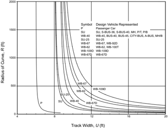

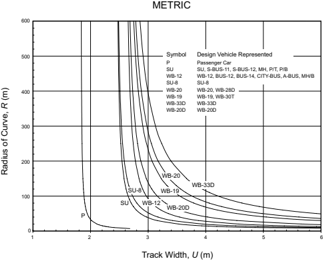

Figure 3-9. Track Width for Widening of Traveled Way on Curves


## U.S. CUSTOMARY

Figure 3-10. Front Overhang for Widening of Traveled Way on Curves


The width of the rear overhang (FB ) is the radial distance between the outer edge of the tire path of the inner rear wheel and the inside edge of the vehicle body. For the passenger car (P) design vehicle, the width of the body is 1 ft [0.3 m] greater than the width of out-to-out width


--',''','',',',','''''',,,,''-'-',,',,',',,'---

of the rear wheels, making FB = 0.5 ft [0.15 m]. In the truck design vehicles, the width of body is the same as the width out-to-out of the rear wheels, and FB = 0.

The extra width allowance (Z) is an additional radial width of pavement to accommodate the difficulty of maneuvering on a curve and the variation in driver operation. This additional width is an empirical value that varies with the speed of traffic and the radius of the curve. The additional width allowance is expressed as:

| U.S. Customary                                        | Metric                                              |
|-------------------------------------------------------|-----------------------------------------------------|
| where:                                                | where:                                              |
| Z = extra width allowance, ft                         | Z = extra width allowance,m                         |
| V = design speed of the highway,mph                   | V = design speed of the highway, km/h               |
| R = radius of curve or turning roadway (two-lane), ft | R = radius of curve or turning roadway (two-lane),m |

This  expression,  used  primarily  for  widening  of  the  traveled  way  on  open  highways,  is  also applicable to intersection curves. For the normal range of curve radii at intersections, the extra width allowance, Z converges to a nearly constant value of 2 ft [0.6 m] by using the speed-curvature relations for radii in the range of 50 to 500 ft [15 to 150 m]. This added width, as shown diagrammatically in Figures 3-12 and 3-13, should be assumed to be evenly distributed over the traveled way width to allow for the inaccuracy in steering on curved paths.


Figure 3-11. Widening Components on Open Highway Curves (Two-Lane Highways, OneWay or Two-Way)

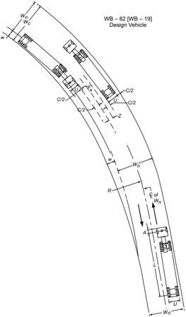

## 3.3.10  Traveled-Way Widening on Horizontal Curves

The traveled way on horizontal curves is sometimes widened to create operating conditions on curves that are comparable to those on tangents. On earlier highways with narrow lanes and sharp curves, there was considerable need for widening on curves, even though speeds were generally low. On modern highways and streets with 12-ft [3.6-m] lanes and high-type alignment, the need for widening has lessened considerably in spite of high speeds, but for some conditions of speed, curvature, and width, it remains appropriate to widen traveled ways.

Widening is needed on certain curves for one of the following reasons: (1) the design vehicle occupies a greater width because the rear wheels generally track inside front wheels (offtracking) in negotiating curves, or (2) drivers experience difficulty in steering their vehicles in the center of the lane. The added width occupied by the vehicle as it traverses the curve as compared with the width of the traveled way on tangent can be computed by geometry for any combination of radius and wheelbase. The effect of variation in lateral placement of the rear wheels with respect to the front wheels and the resultant difficulty of steering should be accommodated by widening on curves, but the appropriate amount of widening cannot be determined as precisely as that for simple offtracking.

The amount of widening of the traveled way on a horizontal curve is the difference between the width needed on the curve and the width used on a tangent:

| U.S. Customary                                                                                                                     | Metric                                                                                                                              |
|------------------------------------------------------------------------------------------------------------------------------------|-------------------------------------------------------------------------------------------------------------------------------------|
| where: w = widening of traveled way on curve, ft W c = width of traveled way on curve, ft W = width of traveled way on tangent, ft | where: w = widening of traveled way on curve,m W c = width of traveled way on curve,m W = width of traveled way on tangent,m (3-35) |

The traveled-way width needed on a curve, W c , has several components related to operation on curves, including the track width of each vehicle meeting or passing, U ; the lateral clearance for each vehicle, C ; width of front overhang of the vehicle occupying the inner lane or lanes, F A ; and a width allowance for the difficulty of driving on curves, Z . The application of these components is illustrated in Figure 3-11. Each of these components is derived in Section 3.3.9.1, 'Derivation of Design Values for Widening on Horizontal Curves.'

To determine width Wc , an appropriate design vehicle should be selected. The design vehicle should usually be a truck because offtracking is much greater for trucks than for passenger cars. The WB-62 [WB-19] design vehicle is considered representative for two-lane open-highway conditions. However, other design vehicles may be selected when they better represent the larger vehicles in the actual traffic on a particular facility.

The traveled-way widening values for the assumed design condition for a WB-62 [WB-19] vehicle on a two-lane highway are presented in Table 3-24. The differences in track widths of the SU-30, SU-40, WB-40 WB-62, WB-67, WB-67D, WB-92D, WB-100T, and WB-109D [SU-9, SU-12, WB-12, WB-19, WB-20, WB-20D, WB-28D, WB-30T, and WB-33D] design trucks are substantial for the sharp curves associated with intersections, but for open highways on which radii are usually larger than 650 ft [200 m], with design speeds over 30 mph [50 km/h], the differences are insignificant (see Figure 3-9). Where both sharper curves (as for a 30 mph [50 km/h] design speed) and large truck combinations are prevalent, the derived widening

values for the WB-62 [WB-19] truck should be adjusted in accordance with Table 3-25. The suggested increases of the tabular values for the ranges of radius of curvature are general and will not necessarily result in a full lateral clearance C or an extra width allowance Z. With the lower speeds and volumes on roads with such curvature, however, slightly smaller clearances may be appropriate.

Table 3-24a. Calculated and Design Values for Traveled Way Widening on Open Highway Curves (Two-Lane Highways, One-Way or Two-Way)

| U.S. Customary  Radius  of  Curve  (ft)  Traveled way width = 24 ft  Traveled way width = 22 ft  Traveled way width = 20 ft  Design Speed (mph)  Design Speed (mph)  Design Speed (mph)  30  35  40  45  50  55  60  30  35  40  45  50  55  60  30  35  40  45  50  55  60  7000  0.0  0.0  0.0  0.0  0.0  0.0  0.0  0.7  0.7  0.8  0.8  0.9  1.0  1.0  1.7  1.7  1.8  1.8  1.9  2.0  2.0  6500  0.0  0.0  0.0  0.0  0.0  0.0  0.1  0.7  0.8  0.8  0.9  1.0  1.0  1.1  1.7  1.8  1.8  1.9  2.0  2.0  2.1  6000  0.0  0.0  0.0  0.0  0.0  0.1  0.1  0.7  0.8  0.9  0.9  1.0  1.1  1.1  1.7  1.8  1.9  1.9  2.0  2.1  2.1  5500  0.0  0.0  0.0  0.0  0.1  0.1  0.2  0.8  0.9  0.9  1.0  1.1  1.1  1.2  1.8  1.9  1.9  2.0  2.1  2.1  2.2  5000  0.0  0.0  0.0  0.1  0.1  0.2  0.3  0.9  0.9  1.0  1.1  1.1  1.2  1.3  1.9  1.9  2.0  2.1  2.1  2.2  2.3  4500  0.0  0.0  0.1  0.1  0.2  0.3  0.4  0.9  1.0  1.1  1.1  1.2  1.3  1.4  1.9  2.0  2.1  2.1  2.2  2.3  2.4  4000  0.0  0.1  0.2  0.2  0.3  0.4  0.5  1.0  1.1  1.2  1.2  1.3  1.4  1.5  2.0  2.1  2.2  2.2  2.3  2.4  2.5  3500  0.1  0.2  0.3  0.4  0.5  0.5  0.6  1.1  1.2  1.3  1.4  1.5  1.5  1.6  2.1  2.2  2.3  2.4  2.5  2.5  2.6  3000  0.3  0.4  0.4  0.5  0.6  0.7  0.8  1.3  1.4  1.4  1.5  1.6  1.7  1.8  2.3  2.4  2.4  2.5  2.6  2.7  2.8  2500  0.5  0.6  0.7  0.8  0.9  1.0  1.1  1.5  1.6  1.7  1.8  1.9  2.0  2.1  2.5  2.6  2.7  2.8  2.9  3.0  3.1  2000  0.7  0.9  1.0  1.1  1.2  1.3  1.4  1.7  1.9  2.0  2.1  2.2  2.3  2.4  2.7  2.9  3.0  3.1  3.2  3.3  3.4  1800  0.9  1.0  1.1  1.3  1.4  1.5  1.6  1.9  2.0  2.1  2.3  2.4  2.5  2.6  2.9  3.0  3.1  3.3  3.4  3.5  3.6  1600  1.1  1.2  1.3  1.5  1.6  1.7  1.8  2.1  2.2  2.3  2.5  2.6  2.7  2.8  3.1  3.2  3.3  3.5  3.6  3.7  3.8  1400  1.3  1.5  1.6  1.7  1.9  2.0  2.1  2.3  2.5  2.6  2.7  2.9  3.0  3.1  3.3  3.5  3.6  3.7  3.9  4.0  4.1  1200  1.7  1.8  1.9  2.1  2.2  2.4  2.5  2.7  2.8  2.9  3.1  3.2  3.4  3.5  3.7  3.8  3.9  4.1  4.2  4.4  4.5  1000  2.1  2.3  2.4  2.6  2.7  2.9  3.0  3.1  3.3  3.4  3.6  3.7  3.9  4.0  4.1  4.3  4.4  4.6  4.7  4.9  5.0  900  2.4  2.6  2.7  2.9  3.1  3.2  3.4  3.6  3.7  3.9  4.1  4.2  4.4  4.6  4.7  4.9  5.1  5.2  800  2.7  2.9  3.1  3.3  3.5  3.6  3.7  3.9  4.1  4.3  4.5  4.6  4.7  4.9  5.1  5.3  5.5  5.6  700  3.2  3.4  3.6  3.8  4.0  4.2  4.4  4.6  4.8  5.0  5.2  5.4  5.6  5.8  6.0  600  3.8  4.0  4.2  4.4  4.6  4.8  5.0  5.2  5.4  5.6  5.8  6.0  6.2  6.4  6.6  500  4.6  4.9  5.1  5.3  5.6  5.9  6.1  6.3  6.6  6.9  7.1  7.3  450  5.2  5.4  5.7  6.2  6.4  6.7  7.2  7.4  7.7  400  5.9  6.1  6.4  6.9  7.1  7.4  7.9  8.1  8.4  350  6.8  7.0  7.3  7.8  8.0  8.3  8.8  9.0  9.3  300  7.9  8.2  8.9  9.2  9.9  10.2  250  9.6  10.6  11.6   |
|------------------------------------------------------------------------------------------------------------------------------------------------------------------------------------------------------------------------------------------------------------------------------------------------------------------------------------------------------------------------------------------------------------------------------------------------------------------------------------------------------------------------------------------------------------------------------------------------------------------------------------------------------------------------------------------------------------------------------------------------------------------------------------------------------------------------------------------------------------------------------------------------------------------------------------------------------------------------------------------------------------------------------------------------------------------------------------------------------------------------------------------------------------------------------------------------------------------------------------------------------------------------------------------------------------------------------------------------------------------------------------------------------------------------------------------------------------------------------------------------------------------------------------------------------------------------------------------------------------------------------------------------------------------------------------------------------------------------------------------------------------------------------------------------------------------------------------------------------------------------------------------------------------------------------------------------------------------------------------------------------------------------------------------------------------------------------------------------------------------------------------------------------------------------------------------------------------------------------------------------------------------------------------------------------------------------------------------------------------------------------------------------------------------------------------------------------------------------------------------------------------------------------------------------------------------------------------------------------------------------------------------------------------------------------------------------------------------------------------------------------------------------------|

## Notes:

Values shown are for WB-62 design vehicle and represent widening in feet. For other design vehicles, use adjustments in Table 3-25.

Values less than 2.0 ft may be disregarded.

For 3-lane roadways, multiply above values by 1.5.

For 4-lane roadways, multiply above values by 2.


Table 3-24b. Calculated and Design Values For Traveled Way Widening on Open Highway Curves (Two-Lane Highways, One-Way or Two-Way)

| Radi- us of Curve (m)   | Traveled            | Traveled            | Traveled            | Traveled            | Traveled            | way width = 7.2m Traveled   | way width = 7.2m Traveled   | way width = 7.2m Traveled   | way width = 7.2m Traveled   | way width = 7.2m Traveled   | width = 6.6m Traveled way width   | width = 6.6m Traveled way width   | width = 6.6m Traveled way width   | width = 6.6m Traveled way width   | width = 6.6m Traveled way width   | width = 6.6m Traveled way width   | width = 6.6m Traveled way width   |
|-------------------------|---------------------|---------------------|---------------------|---------------------|---------------------|-----------------------------|-----------------------------|-----------------------------|-----------------------------|-----------------------------|-----------------------------------|-----------------------------------|-----------------------------------|-----------------------------------|-----------------------------------|-----------------------------------|-----------------------------------|
| Radi- us of Curve (m)   | Design Speed (km/h) | Design Speed (km/h) | Design Speed (km/h) | Design Speed (km/h) | Design Speed (km/h) |                             |                             |                             |                             |                             | Speed (km/h) Design Speed         | Speed (km/h) Design Speed         | Speed (km/h) Design Speed         | Speed (km/h) Design Speed         | Speed (km/h) Design Speed         | Speed (km/h) Design Speed         | Speed (km/h) Design Speed         |
| Radi- us of Curve (m)   | 50 60               | 70                  | 80                  | 90                  | 100                 | 50                          | 60                          |                             | 70 80                       | 90 100                      | 50                                | 60                                | 70                                | 80                                | 90                                | 100                               |                                   |
| 3000 0.0                | 0.0                 | 0.0                 | 0.0                 | 0.0                 | 0.0                 | 0.2                         | 0.3                         | 0.3                         | 0.3                         | 0.3 0.3                     | 0.5                               | 0.6                               | 0.6                               | 0.6                               | 0.6                               | 0.6                               |                                   |
| 2500 0.0                | 0.0                 | 0.0                 | 0.0                 | 0.0                 | 0.1                 | 0.3                         | 0.3                         | 0.3                         | 0.3                         | 0.3 0.4                     | 0.6                               | 0.6                               | 0.6                               | 0.6                               | 0.6                               | 0.7                               |                                   |
| 2000 0.0                | 0.0                 | 0.0                 | 0.1                 | 0.1                 | 0.1                 | 0.3                         | 0.3                         | 0.3                         | 0.4                         | 0.4 0.4                     | 0.6                               | 0.6                               |                                   | 0.6 0.7                           | 0.7                               | 0.7                               |                                   |
| 1500 0.0                | 0.1                 | 0.1                 | 0.1                 | 0.1                 | 0.2                 | 0.3                         | 0.4                         | 0.4                         | 0.4                         | 0.4 0.5                     | 0.6                               | 0.7                               | 0.7                               | 0.7                               | 0.7                               | 0.8                               |                                   |
| 1000 0.1                | 0.2                 | 0.2                 | 0.2                 | 0.3                 | 0.3                 | 0.4                         | 0.5                         | 0.5                         | 0.5                         | 0.6 0.6                     | 0.7                               |                                   | 0.8 0.8                           | 0.8                               | 0.9                               | 0.9                               |                                   |
| 900 0.2                 | 0.2                 | 0.2                 | 0.3                 | 0.3                 | 0.3                 | 0.5                         | 0.5                         | 0.5                         | 0.6                         | 0.6 0.6                     | 0.8                               |                                   | 0.8 0.8                           | 0.9                               | 0.9                               | 0.9                               |                                   |
| 800 0.2                 | 0.2                 | 0.3                 | 0.3                 | 0.3                 | 0.4                 | 0.5                         | 0.5                         | 0.6                         | 0.6                         | 0.6 0.7                     | 0.8                               |                                   | 0.8 0.9                           | 0.9                               | 0.9                               | 1.0                               |                                   |
| 700 0.3                 | 0.3                 | 0.3                 | 0.4                 | 0.4                 | 0.4                 | 0.6                         | 0.6                         | 0.6                         | 0.7                         | 0.7                         | 0.7                               | 0.9                               | 0.9 0.9                           | 1.0                               | 1.0                               | 1.0                               |                                   |
| 600 0.3                 | 0.4                 | 0.4                 | 0.4                 | 0.5                 | 0.5                 | 0.6                         | 0.7                         | 0.7                         | 0.7                         | 0.8 0.8                     | 0.9                               |                                   | 1.0 1.0                           | 1.0                               | 1.1                               | 1.1                               |                                   |
| 500 0.4                 | 0.4                 | 0.5                 | 0.5                 | 0.6                 | 0.6                 | 0.7                         | 0.7                         | 0.8                         | 0.8                         | 0.9                         | 0.9                               | 1.0                               | 1.0 1.1                           | 1.1                               | 1.2                               | 1.2                               |                                   |
| 400 0.5                 | 0.6                 | 0.6                 | 0.7                 | 0.7                 | 0.8                 | 0.8                         | 0.9                         | 0.9                         | 1.0                         | 1.0 1.1                     | 1.1                               | 1.2                               | 1.2                               | 1.3                               | 1.3                               | 1.4                               |                                   |
| 300 0.7                 | 0.8                 | 0.8                 | 0.9                 | 1.0                 | 1.0                 | 1.0                         | 1.1                         | 1.1                         | 1.2                         | 1.3 1.3                     | 1.3                               | 1.4                               | 1.4                               | 1.5                               | 1.6                               | 1.6                               |                                   |
| 250 0.9                 | 1.0                 | 1.0                 | 1.1                 | 1.1                 |                     | 1.2                         | 1.3                         | 1.3                         | 1.4                         | 1.4                         | 1.5                               | 1.6                               | 1.6                               | 1.7                               | 1.7                               |                                   |                                   |
| 200 1.1                 | 1.2                 | 1.3                 | 1.3                 |                     |                     | 1.4                         | 1.5                         | 1.6                         | 1.6                         |                             | 1.7                               | 1.8                               | 1.9                               | 1.9                               |                                   |                                   |                                   |
| 150 1.5                 | 1.6                 | 1.7                 | 1.8                 |                     |                     | 1.8                         | 1.9                         | 2.0                         | 2.1                         |                             | 2.1                               | 2.2                               | 2.3                               | 2.4                               |                                   |                                   |                                   |
| 140 1.6                 | 1.7                 |                     |                     |                     |                     | 1.9                         | 2.0                         |                             |                             |                             | 2.2                               | 2.3                               |                                   |                                   |                                   |                                   |                                   |
| 130 1.8                 | 1.8                 |                     |                     |                     |                     | 2.1                         | 2.1                         |                             |                             |                             | 2.4                               | 2.4                               |                                   |                                   |                                   |                                   |                                   |
| 120 1.9                 | 2.0                 |                     |                     |                     |                     | 2.2                         | 2.3                         |                             |                             |                             | 2.5                               | 2.6                               |                                   |                                   |                                   |                                   |                                   |
| 110 2.1                 | 2.2                 |                     |                     |                     |                     | 2.4                         | 2.5                         |                             |                             |                             | 2.7                               | 2.8                               |                                   |                                   |                                   |                                   |                                   |
| 100 2.3                 | 2.4                 |                     |                     |                     |                     | 2.6                         | 2.7                         |                             |                             |                             | 2.9                               | 3.0                               |                                   |                                   |                                   |                                   |                                   |
| 90                      | 2.5                 |                     |                     |                     |                     | 2.8                         |                             |                             |                             |                             | 3.1                               |                                   |                                   |                                   |                                   |                                   |                                   |
| 80                      | 2.8                 |                     |                     |                     |                     | 3.1                         |                             |                             |                             |                             | 3.4                               |                                   |                                   |                                   |                                   |                                   |                                   |
| 70                      | 3.2                 |                     |                     |                     |                     | 3.5                         |                             |                             |                             |                             | 3.8                               |                                   |                                   |                                   |                                   |                                   |                                   |

## Notes:

Values shown are for WB-19 design vehicle and represent widening in meters. For other design vehicles, use adjustments in Table 3-25.

Values less than 0.6 m may be disregarded.

For 3-lane roadways, multiply above values by 1.5.

For 4-lane roadways, multiply above values by 2.

--',''','',',',','''''',,,,''-'-',,',,',',,'---

## 3.3.10.1  Design Values for Traveled-Way Widening

Widening is costly and very little is actually gained from a small amount of widening. It is suggested that a minimum widening of 2.0 ft [0.6 m] be used and that lower values in Table 3-24 be disregarded. Note that the values in Table 3-24 are for a WB-62 [WB-19] design vehicle. For other design vehicles, an adjustment from Table 3-25 should be applied. Values in Table 3-24 also are applicable to two-lane, one-way traveled ways (i.e., to each roadway of a divided highway or street). Studies show that on tangent alignment somewhat smaller clearances between vehicles are used in passing vehicles traveling in the same direction as compared with meeting vehicles traveling in opposite directions. There is no evidence that these smaller clearances are obtained on curved alignment on one-way roads. Moreover, drivers are not able to judge clearances as well when passing vehicles as when meeting opposing vehicles on a curved two-way highway. For this reason and because all geometric elements on a divided highway are generally well maintained, widening on a two-lane, one-way traveled way of a divided highway should be the same as that on a two-lane, two-way highway, as noted in Table 3-24.

## 3.3.10.2  Application of Widening on Curves

Widening should transition gradually on the approaches to the curve to provide a reasonably smooth alignment of the edge of the traveled way and to fit the paths of vehicles entering or leaving the curve. The principal points of concern in the design of curve widening, which apply to both ends of highway curves, are presented as follows:

- y On simple (unspiraled) curves, widening should be applied on the inside edge of the traveled way only. On curves designed with spirals, widening may be applied on the inside edge or  divided  equally  on  either  side  of  the  centerline.  In  the  latter  method,  extension  of  the outer-edge tangent avoids a slight reverse curve on the outer edge. In either case, the final marked centerline, and preferably any central longitudinal joint, should be placed midway between the edges of the widened traveled way.
- y Curve widening should transition gradually over a length sufficient to make the whole traveled way fully usable. Although a long transition is desirable for traffic operation, it may result in narrow pavement slivers that are difficult and expensive to construct. Preferably, widening should transition over the superelevation runoff length, but shorter lengths are sometimes used. Changes in width normally should be effected over a distance of 100 to 200 ft [30 to 60 m].

Table 3-25. Adjustments for Traveled Way Widening Values on Open Highway Curves (Two-Lane Highways, One-Way or Two-Way)

| U.S. Customary   | U.S. Customary   | U.S. Customary   | U.S. Customary   | U.S. Customary   | U.S. Customary   | U.S. Customary   | U.S. Customary   | U.S. Customary   |
|------------------|------------------|------------------|------------------|------------------|------------------|------------------|------------------|------------------|
| Radius of Curve  | Design Vehicle   | Design Vehicle   | Design Vehicle   | Design Vehicle   | Design Vehicle   | Design Vehicle   | Design Vehicle   | Design Vehicle   |
| (ft)             | SU- 30           | SU- 40           | WB- 40           | WB- 67           | WB- 67D          | WB- 92D          | WB- 100T         | WB- 109D         |
| 7000             | -1.2             | -1.2             | -1.2             | 0.1              | -0.1             | 0.1              | -0.1             | 0.2              |
| 6500             | -1.3             | -1.2             | -1.2             | 0.1              | -0.1             | 0.1              | -0.1             | 0.2              |
| 6000             | -1.3             | -1.2             | -1.2             | 0.1              | -0.1             | 0.1              | -0.1             | 0.2              |
| 5500             | -1.3             | -1.3             | -1.2             | 0.1              | -0.2             | 0.1              | -0.1             | 0.2              |
| 5000             | -1.3             | -1.3             | -1.3             | 0.1              | -0.2             | 0.1              | -0.1             | 0.3              |
| 4500             | -1.4             | -1.3             | -1.3             | 0.1              | -0.2             | 0.1              | -0.1             | 0.3              |
| 4000             | -1.4             | -1.4             | -1.3             | 0.1              | -0.2             | 0.1              | -0.1             | 0.3              |
| 3500             | -1.5             | -1.4             | -1.4             | 0.1              | -0.3             | 0.1              | -0.1             | 0.4              |
| 3000             | -1.6             | -1.5             | -1.4             | 0.1              | -0.3             | 0.1              | -0.1             | 0.5              |
| 2500             | -1.7             | -1.6             | -1.5             | 0.2              | -0.4             | 0.2              | -0.1             | 0.5              |
| 2000             | -1.8             | -1.7             | -1.6             | 0.2              | -0.5             | 0.2              | -0.2             | 0.7              |
| 1800             | -1.9             | -1.8             | -1.7             | 0.2              | -0.5             | 0.2              | -0.2             | 0.8              |
| 1600             | -2.0             | -1.9             | -1.8             | 0.2              | -0.6             | 0.3              | -0.2             | 0.8              |
| 1400             | -2.2             | -2.0             | -1.9             | 0.3              | -0.6             | 0.3              | -0.3             | 1.0              |
| 1200             | -2.4             | -2.2             | -2.1             | 0.3              | -0.8             | 0.3              | -0.3             | 1.1              |
| 1000             | -2.7             | -2.4             | -2.3             | 0.4              | -0.9             | 0.4              | -0.4             | 1.4              |
| 900              | -2.8             | -2.6             | -2.4             | 0.4              | -1.0             | 0.5              | -0.4             | 1.5              |
| 800              | -3.1             | -2.8             | -2.6             | 0.5              | -1.1             | 0.5              | -0.4             | 1.7              |
| 700              | -3.4             | -3.0             | -2.9             | 0.6              | -1.3             | 0.6              | -0.5             | 1.9              |
| 600              | -3.8             | -3.4             | -3.2             | 0.7              | -1.5             | 0.7              | -0.6             | 2.3              |
| 500              | -4.3             | -3.8             | -3.6             | 0.8              | -1.8             | 0.8              | -0.7             | 2.7              |
| 450              | -4.7             | -4.2             | -3.9             | 0.9              | -2.0             | 0.9              | -0.8             | 3.0              |
| 400              | -5.2             | -4.6             | -4.3             | 1.0              | -2.3             | 1.0              | -0.9             | 3.4              |
| 350              | -5.8             | -5.1             | -4.7             | 1.1              | -2.6             | 1.2              | -1.0             | 3.9              |
| 300              | -6.6             | -5.8             | -5.4             | 1.3              | -3.0             | 1.4              | -1.2             | 4.6              |
| 250              | -7.7             | -6.7             | -6.3             | 1.6              | -3.6             | 1.7              | -1.4             | 5.5              |
| 200              | -9.4             | -8.2             | -7.6             | 2.0              | -4.6             | 2.1              | -1.8             | 7.0              |

## Notes:

Adjustments are applied by adding to or subtracting from the values in Table 3-24.

Adjustments depend only on radius and design vehicle; they are independent of roadway width and design speed.

For 3-lane roadways, multiply above values by 1.5.

For 4-lane roadways, multiply above values by 2.0.

--',''','',',',','''''',,,,''-'-',,',,',',,'---

| Metric              | Metric         | Metric         | Metric         | Metric         | Metric         | Metric         | Metric         | Metric         |
|---------------------|----------------|----------------|----------------|----------------|----------------|----------------|----------------|----------------|
| Radius of Curve (m) | Design Vehicle | Design Vehicle | Design Vehicle | Design Vehicle | Design Vehicle | Design Vehicle | Design Vehicle | Design Vehicle |
| Radius of Curve (m) | SU-9           | SU- 12         | WB- 12         | WB- 20         | WB- 20D        | WB- 28D        | WB- 30T        | WB- 33D        |
| 3000                | -0.4           | -0.3           | -0.3           | 0.0            | 0.0            | 0.0            | 0.0            | 0.0            |
| 2500                | -0.4           | -0.4           | -0.3           | 0.0            | 0.0            | 0.0            | 0.0            | 0.1            |
| 2000                | -0.4           | -0.4           | -0.4           | 0.0            | 0.0            | 0.0            | 0.0            | 0.1            |
| 1500                | -0.4           | -0.4           | -0.4           | 0.0            | -0.1           | 0.0            | 0.0            | 0.1            |
| 1000                | -0.5           | -0.4           | -0.4           | 0.0            | -0.1           | 0.0            | 0.0            | 0.1            |
| 900                 | -0.5           | -0.4           | -0.4           | 0.0            | -0.1           | 0.0            | 0.0            | 0.1            |
| 800                 | -0.5           | -0.5           | -0.4           | 0.0            | -0.1           | 0.0            | 0.0            | 0.2            |
| 700                 | -0.5           | -0.5           | -0.5           | 0.1            | -0.1           | 0.1            | 0.0            | 0.2            |
| 600                 | -0.6           | -0.5           | -0.5           | 0.1            | -0.1           | 0.1            | -0.1           | 0.2            |
| 500                 | -0.6           | -0.6           | -0.5           | 0.1            | -0.2           | 0.1            | -0.1           | 0.3            |
| 400                 | -0.7           | -0.6           | -0.6           | 0.1            | -0.2           | 0.1            | -0.1           | 0.3            |
| 300                 | -0.8           | -0.7           | -0.7           | 0.1            | -0.3           | 0.1            | -0.1           | 0.4            |
| 250                 | -0.9           | -0.8           | -0.8           | 0.1            | -0.3           | 0.2            | -0.1           | 0.5            |
| 200                 | -1.1           | -1.0           | -0.9           | 0.2            | -0.4           | 0.2            | -0.2           | 0.6            |
| 150                 | -1.3           | -1.2           | -1.1           | 0.2            | -0.6           | 0.3            | -0.2           | 0.8            |
| 140                 | -1.4           | -1.2           | -1.2           | 0.3            | -0.6           | 0.3            | -0.2           | 0.9            |
| 130                 | -1.5           | -1.3           | -1.2           | 0.3            | -0.6           | 0.3            | -0.2           | 1.0            |
| 120                 | -1.6           | -1.4           | -1.3           | 0.3            | -0.7           | 0.3            | -0.3           | 1.1            |
| 110                 | -1.7           | -1.5           | -1.4           | 0.3            | -0.8           | 0.4            | -0.3           | 1.2            |
| 100                 | -1.8           | -1.6           | -1.5           | 0.4            | -0.8           | 0.4            | -0.3           | 1.3            |
| 90                  | -2.0           | -1.8           | -1.6           | 0.4            | -0.9           | 0.4            | -0.4           | 1.4            |
| 80                  | -2.2           | -1.9           | -1.8           | 0.5            | -1.0           | 0.5            | -0.4           | 1.6            |
| 70                  | -2.5           | -2.2           | -2.0           | 0.5            | -1.2           | 0.6            | -0.5           | 1.9            |


The width W c is calculated by the equation:

| U.S. Customary                                                                                                                                                                            | Metric                                                            |        |
|-------------------------------------------------------------------------------------------------------------------------------------------------------------------------------------------|-------------------------------------------------------------------|--------|
| where: W c = width of traveled way on curve, ft N = number of lanes U = track width of design vehicle out tires) on curves, ft C = lateral clearance, ft F A = width of front overhang of | where:                                                            | (3-36) |
|                                                                                                                                                                                           | W c = width of traveled way on curve,m                            |        |
|                                                                                                                                                                                           | N = number of lanes                                               |        |
| (out-to-                                                                                                                                                                                  | U = track width of design vehicle (out-to- out tires) on curves,m |        |
|                                                                                                                                                                                           | C = lateral clearance,m                                           |        |
| inner-lane vehicle, ft                                                                                                                                                                    | F A = width of front overhang of inner-lane vehicle,m             |        |
| Z = extra width allowance, ft                                                                                                                                                             | Z = extra width allowance,m                                       |        |

- y From the standpoints of usefulness and appearance, the edge of the traveled way through the widening transition should be a smooth, graceful curve. A tangent transition edge should be avoided. On minor highways or in cases where plan details are not available, a curved transition staked by eye generally is satisfactory and better than a tangent transition. In any event, the transition ends should avoid an angular break at the pavement edge.
- y On highway alignment without spirals, smooth and fitting alignment results from attaining widening with one-half to two-thirds of the transition length along the tangent and the balance along the curve. This is consistent with a common method for attaining superelevation. The inside edge of the traveled way may be designed as a modified spiral, with control points determined by either the width/length ratio of a triangular wedge, by calculated values based on a parabolic or cubic curve, or by a larger radius (compound) curve. Otherwise, it may be aligned by eye in the field. On highway alignment with spiral curves, the increase in width is usually distributed along the length of the spiral.
- y Widening areas can be fully detailed on construction plans. Alternatively, general controls can be cited on construction or typical plans with final details left to the field engineer.

## 3.3.11  Widths for Turning Roadways at Intersections

The widths of turning roadways at intersections are governed by the types of vehicles to be accommodated, the radius of curvature, and the expected speed. Turning roadways may be designed for one- or two-way operation, depending on the geometric pattern of the intersection.

Selection of an appropriate design vehicle should be based on the size and frequency of vehicle types using or expected to use the facility. The radius of curvature in combination with the track width of the design vehicle determine the width of a turning roadway. However, where large radii may encourage turning speeds that are higher than desired, or otherwise impact pedestri-

ans, the use of truck aprons may be desirable. The width elements for the turning vehicle, shown diagrammatically in Figure 3-12, are explained in Section 3.3.9.1, 'Derivation of Design Values for Widening on Horizontal Curves.' They ignore the effects of insufficient superelevation and of surfaces with low friction that tend to cause the rear wheels of vehicles traveling at other than low speed to swing outward, developing the appropriate slip angles.

Figure 3-12. Derivation of Turning Roadway Widths on Curves at Intersections

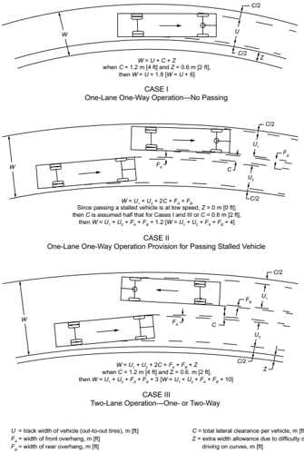

--',''','',',',','''''',,,,''-'-',,',,',',,'---

## 3.3.11.1  Three Cases

Turning roadways are classified for operational purposes as one-lane operation, with or without opportunity for passing a stalled vehicle, and two-lane operation, either one-way or two-way. Three cases are commonly considered in design:

## 3.3.11.1.1  Case I

One-lane, one-way operation with no provision for passing a stalled vehicle is usually appropriate for minor turning movements and moderate turning volumes where the connecting roadway is  relatively short. Under these conditions, the chance of a vehicle breakdown is remote, but one of the edges of the traveled way should preferably have a sloping curb or be flush with the shoulder.

## 3.3.11.1.2  Case II

One-lane, one-way operation with provision for passing a stalled vehicle is used to allow operation at low speed and with sufficient clearance so that other vehicles can pass a stalled vehicle. The use of truck aprons may minimize the impact of wider turn lanes on pedestrians and encourage lower turning speeds. These widths are applicable to all turning movements of moderate to heavy traffic volumes that do not exceed the capacity of a single-lane connection. In the event of a breakdown, traffic flow can be maintained at a somewhat reduced speed. Many ramps and connections at channelized intersections are in this category. However, for Case II, the widths needed for the longer vehicles are very large as shown in Table 3-26. Case I widths for these longer vehicles, including the WB-62, WB-67, WB-67D, WB-92D, WB-100T, and WB-109D [WB-19, WB-20, WB-20D, WB-28D, WB-30T, and WB-33D] design vehicles, may have to be used as the minimum values where they are present in sufficient numbers to be considered the appropriate design vehicle.

## 3.3.11.1.3  Case III

Two-lane operation, either one- or two-way, is applicable where operation is two way or where operation is one way, but two lanes are needed to handle the traffic volume.

Table 3-26a. Derived Traveled Way Widths for Turning Roadways for Different Design Vehicles

| U.S. Customary  Radius  on Inner  Edge of  Pavement,  R (ft)  Case I, One-Lane Operation, No Provision for Passing a Stalled Vehicle  P  SU-  30  SU-  40  BUS-  40  BUS-  45  CITY-  BUS  S-  BUS-  36  S-  BUS-  40  A-  BUS-  11  WB-  40  WB-  62  WB-  67  WB-  67D  WB-  92D  WB-  100T  WB-  109D  MH  P/T  P/B MH/B  50  13  18  21  22  23  21  19  18  22  23  44  57  29  -  37  -  18  19  18  21  75  13  17  18  19  20  19  17  17  19  20  30  33  23  34  27  43  17  17  17  19  100  13  16  17  18  19  18  16  16  18  18  25  28  21  28  24  34  16  16  16  17  150  12  15  16  17  17  17  16  15  17  17  22  23  19  23  21  27  15  16  15  16  200  12  15  16  16  17  16  15  15  16  16  20  21  18  21  19  23  15  15  15  16  300  12  15  15  16  16  16  15  15  16  15  18  19  17  19  17  20  15  15  15  15  400  12  15  15  15  16  15  15  15  15  15  17  18  16  18  17  19  15  15  14  15  500  12  14  15  15  15  15  14  14  15  15  17  17  16  17  16  18  14  14  14  15  Tangent  12  14  14  15  15  15  14  14  15  14  15  15  15  15  15  15  14  14  14  14  Case II, One-Lane, One-Way Operation with Provision for Passing a Stalled Vehicle by Another of the Same Type  50  20  30  36  39  42  38  31  32  40  39  81  109  50  -  67  -  30  30  28  36  75  19  27  30  32  35  32  27  28  34  32  53  59  39  60  47  79  27  27  26  30  100  18  25  27  30  31  29  25  26  30  29  44  48  34  48  40  60  25  25  24  28  150  18  23  25  27  28  27  23  24  27  26  36  38  29  39  33  45  23  23  23  25  200  17  22  24  25  26  25  23  23  26  24  32  34  27  34  30  39  22  22  22  24  300  17  22  22  24  24  24  22  22  24  23  28  30  25  30  27  33  22  22  21  23  400  17  21  22  23  24  23  21  21  23  22  26  27  24  27  25  30  21  21  21  22  500  17  21  21  23  23  23  21  21  23  22  25  26  23  26  25  28  21  21  21  21  Tangent  17  20  20  21  21  21  20  20  21  20  21  21  21  21  21  21  20  20  20  20  Case III, Two-Lane Operation, Either One- or Two-Way (Same Type Vehicle in Both Lanes)  50  26  36  42  45  48  44  37  38  46  45  87  115  56  -  73  -  36  36  34  42  75  25  33  36  38  41  38  33  34  40  38  59  65  45  66  53  85  33  33  32  36  100  24  31  33  36  37  35  31  32  36  35  50  54  40  54  46  66  31  31  30  34  150  24  29  31  33  34  33  29  30  33  32  42  44  35  45  39  51  29  29  29  31  200  23  28  30  31  32  31  29  29  32  30  38  40  33  40  36  45  28  28  28  30  300  23  28  28  30  30  30  28  28  30  29  34  36  31  36  33  39  28  28  27  29  400  23  27  28  29  30  29  27  27  29  28  32  33  30  33  31  36  27  27  27  28  500  23  27  27  29  29  29  27  27  29  28  31  32  29  32  31  34  27  27  27  27  Tangent  23  26  26  27  27  27  26  26  27  26  27  27  27  27  27  27  26  26  26  26   |
|-------------------------------------------------------------------------------------------------------------------------------------------------------------------------------------------------------------------------------------------------------------------------------------------------------------------------------------------------------------------------------------------------------------------------------------------------------------------------------------------------------------------------------------------------------------------------------------------------------------------------------------------------------------------------------------------------------------------------------------------------------------------------------------------------------------------------------------------------------------------------------------------------------------------------------------------------------------------------------------------------------------------------------------------------------------------------------------------------------------------------------------------------------------------------------------------------------------------------------------------------------------------------------------------------------------------------------------------------------------------------------------------------------------------------------------------------------------------------------------------------------------------------------------------------------------------------------------------------------------------------------------------------------------------------------------------------------------------------------------------------------------------------------------------------------------------------------------------------------------------------------------------------------------------------------------------------------------------------------------------------------------------------------------------------------------------------------------------------------------------------------------------------------------------------------------------------------------------------------------------------------------------------------------------------------------------------------------------------------------------------------------------------------------------------------------------------------------------------------------------------------------------------------------------------------------------------------------------------------------------------------------------------------------------------------------------------------------------------------------------------------------------------------------------------------------------------------------------------------------------------------------------------------------------------------|


Table 3-26b. Derived Traveled Way Widths for Turning Roadways for Different Design Vehicles

| Metric  Radius  on Inner  Edge of  Pavement,  R (m)  Case I, One-Lane Operation, No Provision for Passing a Stalled Vehicle  P  SU-  9  SU-  12  BUS-  12  BUS-  14  CITY-  BUS  S-  BUS-  11  S-  BUS-  12  A-  BUS-  11  WB-  12  WB-  19  WB-  20  WB-  20D  WB-  28D  WB-  30T  WB-  33D  MH  P/T  P/B  MH/B  15  4.0  5.5  6.3  6.6  7.2  6.5  5.7  5.5  6.7  7.0  13.5  -  8.8  -  11.6  -  5.5  5.7  5.4  6.5  25  3.9  5.0  5.4  5.7  5.9  5.6  5.1  5.0  5.7  5.8  8.5  9.5  6.8  9.6  7.9  12.0  5.0  5.1  4.9  5.5  30  3.8  4.9  5.2  5.4  5.7  5.4  5.0  4.9  5.5  5.5  7.8  8.5  6.3  8.6  7.3  10.3  4.9  5.0  4.8  5.3  50  3.7  4.6  4.8  5.0  5.2  5.0  4.7  4.6  5.0  5.0  6.3  6.7  5.5  6.8  6.1  7.7  4.6  4.7  4.6  4.9  75  3.7  4.5  4.6  4.8  4.9  4.8  4.5  4.5  4.8  4.7  5.7  5.9  5.1  6.0  5.5  6.6  4.5  4.5  4.5  4.7  100  3.7  4.4  4.5  4.7  4.8  4.7  4.5  4.4  4.7  4.6  5.3  5.5  5.0  5.6  5.2  6.0  4.4  4.5  4.4  4.5  125  3.7  4.4  4.5  4.6  4.7  4.6  4.4  4.4  4.6  4.5  5.2  5.3  4.8  5.3  5.0  5.7  4.4  4.4  4.4  4.5  150  3.7  4.4  4.4  4.6  4.6  4.6  4.4  4.4  4.6  4.5  5.0  5.2  4.8  5.2  4.9  5.5  4.4  4.4  4.4  4.4  Tangent  3.6  4.2  4.2  4.4  4.4  4.4  4.2  4.2  4.4  4.2  4.4  4.4  4.4  4.4  4.4  4.4  4.2  4.2  4.2  4.2  Case II, One-Lane, One-Way Operation with Provision for Passing a Stalled Vehicle by Another of the Same Type  15  6.0  9.2  10.9  11.9  13.1  11.7  9.4  9.7  12.4  11.8  25.2  -  15.4  -  20.9  -  9.2  9.3  8.7  11.0  25  5.6  7.9  8.9  9.6  10.2  9.5  8.0  8.2  9.9  9.3  15.0  16.8  11.2  16.9  13.5  21.7  7.9  7.9  7.6  8.9  30  5.5  7.6  8.4  9.0  9.5  9.0  7.7  7.8  9.3  8.8  13.4  14.8  10.4  14.9  12.2  18.4  7.6  7.6  7.4  8.4  50  5.3  7.0  7.5  8.0  8.3  7.9  7.0  7.1  8.1  7.7  10.4  11.2  8.7  11.2  9.8  13.1  7.0  7.0  6.8  7.5  75  5.2  6.7  7.0  7.4  7.6  7.4  6.7  6.8  7.5  7.1  9.1  9.6  7.9  9.6  8.6  10.8  6.7  6.7  6.6  7.0  100  5.2  6.5  6.8  7.2  7.3  7.1  6.6  6.6  7.2  6.9  8.4  8.8  7.5  8.8  8.1  9.7  6.5  6.5  6.5  6.8  125  5.1  6.4  6.6  7.0  7.1  7.0  6.5  6.5  7.1  6.7  8.0  8.3  7.3  8.3  7.7  9.0  6.4  6.4  6.4  6.6  150  5.1  6.4  6.5  6.9  7.0  6.9  6.4  6.4  7.0  6.6  7.7  8.0  7.2  8.0  7.5  8.6  6.4  6.4  6.3  6.5  Tangent  5.0  6.1  6.1  6.4  6.4  6.4  6.1  6.1  6.4  6.1  6.4  6.4  6.4  6.4  6.4  6.4  6.1  6.1  6.1  6.1  Case III, Two-Lane Operation, Either One- or Two-Way (Same Type Vehicle in Both Lanes)  15  7.8  11.0  12.7  13.7  14.9  13.5  11.2  11.5  14.2  13.6  27.0  -  17.2  -  22.7  -  11.0  11.1  10.5  12.8  25  7.4  9.7  10.7  11.4  12.0  11.3  9.8  10.0  11.7  11.1  16.8  18.6  13.0  18.7  15.3  23.5  9.7  9.7  9.4  10.7  30  7.3  9.4  10.2  10.8  11.3  10.8  9.5  9.6  11.1  10.6  15.2  16.6  12.2  16.7  14.0  20.2  9.4  9.4  9.2  10.2  50  7.1  8.8  9.3  9.8  10.1  9.7  8.8  8.9  9.9  9.5  12.2  13.0  10.5  13.0  11.6  14.9  8.8  8.8  8.6  9.3  75  7.0  8.5  8.8  9.2  9.4  9.2  8.5  8.6  9.3  8.9  10.9  11.4  9.7  11.4  10.4  12.6  8.5  8.5  8.4  8.8  100  7.0  8.3  8.6  9.0  9.1  8.9  8.4  8.4  9.0  8.7  10.2  10.6  9.3  10.6  9.9  11.5  8.3  8.3  8.3  8.6  125  6.9  8.2  8.4  8.8  8.9  8.8  8.3  8.3  8.9  8.5  9.8  10.1  9.1  10.1  9.5  10.8  8.2  8.2  8.2  8.4  150  6.9  8.2  8.3  8.7  8.8  8.7  8.2  8.2  8.8  8.4  9.5  9.8  9.0  9.8  9.3  10.4  8.2  8.2  8.1  8.3  Tangent  6.8  7.9  7.9  8.2  8.2  8.2  7.9  7.9  8.2  7.9  8.2  8.2  8.2  8.2  8.2  8.2  7.9  7.9  7.9  7.9   |
|--------------------------------------------------------------------------------------------------------------------------------------------------------------------------------------------------------------------------------------------------------------------------------------------------------------------------------------------------------------------------------------------------------------------------------------------------------------------------------------------------------------------------------------------------------------------------------------------------------------------------------------------------------------------------------------------------------------------------------------------------------------------------------------------------------------------------------------------------------------------------------------------------------------------------------------------------------------------------------------------------------------------------------------------------------------------------------------------------------------------------------------------------------------------------------------------------------------------------------------------------------------------------------------------------------------------------------------------------------------------------------------------------------------------------------------------------------------------------------------------------------------------------------------------------------------------------------------------------------------------------------------------------------------------------------------------------------------------------------------------------------------------------------------------------------------------------------------------------------------------------------------------------------------------------------------------------------------------------------------------------------------------------------------------------------------------------------------------------------------------------------------------------------------------------------------------------------------------------------------------------------------------------------------------------------------------------------------------------------------------------------------------------------------------------------------------------------------------------------------------------------------------------------------------------------------------------------------------------------------------------------------------------------------------------------------------------------------------------------------------------------------------------------------------------------------------------------------------------------------------------------------------------------------------------------------------------------------------------------------------------------------------------------------------------------------------------------------------------------------------------------------------------------------------------------------------------------------------------------------------------------------------------------------------------------------------------------------------------------------------------------------------------------------------------------------------------------------------------------------------------------------------------------------------------------|

## 3.3.11.2  Design Values

The total width, W, for separate turning roadways at intersections and ramp termini is derived by the summation of the proper width elements. The separate formulas for width and values for lateral clearance, C, and the allowance for difficulty of driving on curves, Z, for each of three cases are shown in Figure 3-12. Values for track width, U, are obtained from Figure 3-9 and values for front overhang, FA, from Figure 3-10. Values of U and FA are read from the figure for the turning radius, RT, which is closely approximated by adding the track width and proper clearances to the radius of the inner edge of the turning roadway.

--',''','',',',','''''',,,,''-'-',,',,',',,'---

When determining the width for Case I, a lateral clearance, C, of 4 ft [1.2 m] is considered appropriate. The allowance for difficulty of driving curves, Z, is constant, equal to about 2 ft [0.6 m] for all radii of 500 ft [150 m] or less. In this case, the front overhang, FA, need not be considered because no passing of another vehicle is involved.

For Case II, the width involves U and C for the stopped vehicle and U and C for the passing vehicle. To this is added extra width for the front overhang, FA, of one vehicle and the rear overhang, FB, (if any) of the other vehicle. The width of rear overhang for a passenger car is considered to be 0.5 ft [0.15 m]. FB for truck design vehicles is zero. A total clearance of onehalf the value of C in the other two cases is assumed (i.e., 2 ft [0.6 m] for the stopped vehicle and 2 ft [0.6 m] for the passing vehicle). Because passing the stalled vehicle is accomplished at low speeds, the extra width allowance, Z, is omitted.

All the width elements apply for Case III. To the values of U and FA obtained from Figures 3-10 and 3-11, respectively, the lateral clearance, C, of 4 ft [1.2 m]; FB of 0.5 ft [0.15 m] for passenger cars; and Z of 2 ft [0.6 m] is added to determine the total width.

The derived widths for various radii for each design vehicle are given in Table 3-26. For general design use, the recommended widths given in Table 3-26 seldom apply directly, because the turning roadways usually accommodate more than one type of vehicle. Even parkways designed primarily for P vehicles are used by buses and maintenance trucks. At the other extreme, few if any public highways are designed to fully accommodate the WB-19 [WB-62] or longer design vehicles. Widths needed for some combination of separate design vehicles become the practical design guide for intersecting roadways. Such design widths are given in Tables 3-27 and 3-28 for three logical conditions of mixed traffic that are defined below. However, where the larger design vehicles such as the WB-19 or WB-33D [WB-62 or WB-109D] will be using a turning roadway or ramp, the facility should accommodate their turning paths for at least the Case I condition. Therefore, Case I widths for the appropriate design vehicle and radius shown in Table 3-26, minus the width of the paved shoulder, should be checked to determine whether they exceed widths shown in Tables 3-27 and 3-28. If they do, consideration should be given to using the widths for Case II shown in Table 3-26 as the minimum combined widths for the traveled way and paved shoulders on the turning roadway or ramp.

Traffic conditions for defining turning roadway widths are described in broad terms because data concerning the traffic volume, or the percentage of the total volume, for each type of vehicle are not available to define these traffic conditions precisely.

Traffic Condition A -This traffic condition consists predominantly of P vehicles, but some consideration is also given to SU-9 [SU-30] trucks; the values in Tables 3-27 and 3-28 are somewhat higher than those for P vehicles in Table 3-26.

Traffic Condition B -This traffic condition includes sufficient SU-9 [SU-30] trucks to govern design, but some consideration is also given to tractor-semitrailer combination trucks; values in Tables 3-27 and 3-28 for Cases I and III are those for SU vehicles in Table 3-28. For Case II, values are reduced as explained later in this section.

Traffic Condition C -This traffic condition includes sufficient tractor-semitrailer combination trucks, WB-12 [WB-40], to govern design; the values in Tables 3-27 and 3-28 for Cases I and III are those for the WB-12 [WB-40] truck in Table 3-26. For Case II, values are reduced.

In general, Traffic Condition A may be assumed to have a small volume of trucks or only an occasional large truck; Traffic Condition B, a moderate volume of trucks (e.g., in the range of 5 to 10 percent of the total traffic); and Traffic Condition C, more and larger trucks.

Table 3-27. Design Widths of the Traveled Way for Turning Roadways

| U.S. Customary                               | U.S. Customary                                                               | U.S. Customary                                                               | U.S. Customary                                                               | U.S. Customary                                                                  | U.S. Customary                                                                  | U.S. Customary                                                                  | U.S. Customary                                                   | U.S. Customary                                                   | U.S. Customary                                                   |
|----------------------------------------------|------------------------------------------------------------------------------|------------------------------------------------------------------------------|------------------------------------------------------------------------------|---------------------------------------------------------------------------------|---------------------------------------------------------------------------------|---------------------------------------------------------------------------------|------------------------------------------------------------------|------------------------------------------------------------------|------------------------------------------------------------------|
|                                              | Traveled Way Width (ft)                                                      | Traveled Way Width (ft)                                                      | Traveled Way Width (ft)                                                      | Traveled Way Width (ft)                                                         | Traveled Way Width (ft)                                                         | Traveled Way Width (ft)                                                         | Traveled Way Width (ft)                                          | Traveled Way Width (ft)                                          | Traveled Way Width (ft)                                          |
| Radius on Inner Edge of Traveled Way, R (ft) | Case I One-Lane, One-Way Operation- no provision for passing stalled vehicle | Case I One-Lane, One-Way Operation- no provision for passing stalled vehicle | Case I One-Lane, One-Way Operation- no provision for passing stalled vehicle | Case II One-Lane, One-Way Operation- with provision for passing stalled vehicle | Case II One-Lane, One-Way Operation- with provision for passing stalled vehicle | Case II One-Lane, One-Way Operation- with provision for passing stalled vehicle | Case III Two-Lane Operation- either one-way or two-way operation | Case III Two-Lane Operation- either one-way or two-way operation | Case III Two-Lane Operation- either one-way or two-way operation |
|                                              | Design Traffic Conditions                                                    | Design Traffic Conditions                                                    | Design Traffic Conditions                                                    | Design Traffic Conditions                                                       | Design Traffic Conditions                                                       | Design Traffic Conditions                                                       | Design Traffic Conditions                                        | Design Traffic Conditions                                        | Design Traffic Conditions                                        |
|                                              | A                                                                            | B                                                                            | C                                                                            | A                                                                               | B                                                                               | C                                                                               | A                                                                | B                                                                | C                                                                |
| 50                                           | 18                                                                           | 18                                                                           | 23                                                                           | 20                                                                              | 26                                                                              | 30                                                                              | 31                                                               | 36                                                               | 45                                                               |
| 75                                           | 16                                                                           | 17                                                                           | 20                                                                           | 19                                                                              | 23                                                                              | 27                                                                              | 29                                                               | 33                                                               | 38                                                               |
| 100                                          | 15                                                                           | 16                                                                           | 18                                                                           | 18                                                                              | 22                                                                              | 25                                                                              | 28                                                               | 31                                                               | 35                                                               |
| 150                                          | 14                                                                           | 15                                                                           | 17                                                                           | 18                                                                              | 21                                                                              | 23                                                                              | 26                                                               | 29                                                               | 32                                                               |
| 200                                          | 13                                                                           | 15                                                                           | 16                                                                           | 17                                                                              | 20                                                                              | 22                                                                              | 26                                                               | 28                                                               | 30                                                               |
| 300                                          | 13                                                                           | 15                                                                           | 15                                                                           | 17                                                                              | 20                                                                              | 22                                                                              | 25                                                               | 28                                                               | 29                                                               |
| 400                                          | 13                                                                           | 15                                                                           | 15                                                                           | 17                                                                              | 19                                                                              | 21                                                                              | 25                                                               | 27                                                               | 28                                                               |
| 500                                          | 12                                                                           | 15                                                                           | 15                                                                           | 17                                                                              | 19                                                                              | 21                                                                              | 25                                                               | 27                                                               | 28                                                               |
| ≥ 600 or tangent                             | 12                                                                           | 14                                                                           | 14                                                                           | 17                                                                              | 18                                                                              | 20                                                                              | 24                                                               | 26                                                               | 26                                                               |

Note:

- A = predominantly P vehicles, but some consideration for SU trucks
- B = sufficient SU-30 vehicles to govern design, but some consideration for semitrailer combination trucks

| Metric                                      | Metric                                                                       | Metric                                                                       | Metric                                                                       | Metric                                                                          | Metric                                                                          | Metric                                                                          | Metric                                                           | Metric                                                           | Metric                                                           |
|---------------------------------------------|------------------------------------------------------------------------------|------------------------------------------------------------------------------|------------------------------------------------------------------------------|---------------------------------------------------------------------------------|---------------------------------------------------------------------------------|---------------------------------------------------------------------------------|------------------------------------------------------------------|------------------------------------------------------------------|------------------------------------------------------------------|
|                                             | Traveled Way Width (m)                                                       | Traveled Way Width (m)                                                       | Traveled Way Width (m)                                                       | Traveled Way Width (m)                                                          | Traveled Way Width (m)                                                          | Traveled Way Width (m)                                                          | Traveled Way Width (m)                                           | Traveled Way Width (m)                                           | Traveled Way Width (m)                                           |
| Radius on Inner Edge of Traveled Way, R (m) | Case I One-Lane, One-Way Operation- no provision for passing stalled vehicle | Case I One-Lane, One-Way Operation- no provision for passing stalled vehicle | Case I One-Lane, One-Way Operation- no provision for passing stalled vehicle | Case II One-Lane, One-Way Operation- with provision for passing stalled vehicle | Case II One-Lane, One-Way Operation- with provision for passing stalled vehicle | Case II One-Lane, One-Way Operation- with provision for passing stalled vehicle | Case III Two-Lane Operation- either one-way or two-way operation | Case III Two-Lane Operation- either one-way or two-way operation | Case III Two-Lane Operation- either one-way or two-way operation |
|                                             | Design Traffic Conditions                                                    | Design Traffic Conditions                                                    | Design Traffic Conditions                                                    | Design Traffic Conditions                                                       | Design Traffic Conditions                                                       | Design Traffic Conditions                                                       | Design Traffic Conditions                                        | Design Traffic Conditions                                        | Design Traffic Conditions                                        |
|                                             | A                                                                            | B                                                                            | C                                                                            | A                                                                               | B                                                                               | C                                                                               | A                                                                | B                                                                | C                                                                |
| 15                                          | 5.4                                                                          | 5.5                                                                          | 7.0                                                                          | 6.0                                                                             | 7.8                                                                             | 9.2                                                                             | 9.4                                                              | 11.0                                                             | 13.6                                                             |
| 25                                          | 4.8                                                                          | 5.0                                                                          | 5.8                                                                          | 5.6                                                                             | 6.9                                                                             | 7.9                                                                             | 8.6                                                              | 9.7                                                              | 11.1                                                             |
| 30                                          | 4.5                                                                          | 4.9                                                                          | 5.5                                                                          | 5.5                                                                             | 6.7                                                                             | 7.6                                                                             | 8.4                                                              | 9.4                                                              | 10.6                                                             |
| 50                                          | 4.2                                                                          | 4.6                                                                          | 5.0                                                                          | 5.3                                                                             | 6.3                                                                             | 7.0                                                                             | 7.9                                                              | 8.8                                                              | 9.5                                                              |
| 75                                          | 3.9                                                                          | 4.5                                                                          | 4.8                                                                          | 5.2                                                                             | 6.1                                                                             | 6.7                                                                             | 7.7                                                              | 8.5                                                              | 8.9                                                              |
| 100                                         | 3.9                                                                          | 4.5                                                                          | 4.8                                                                          | 5.2                                                                             | 5.9                                                                             | 6.5                                                                             | 7.6                                                              | 8.3                                                              | 8.7                                                              |
| 125                                         | 3.9                                                                          | 4.5                                                                          | 4.8                                                                          | 5.1                                                                             | 5.9                                                                             | 6.4                                                                             | 7.6                                                              | 8.2                                                              | 8.5                                                              |
| 150                                         | 3.6                                                                          | 4.5                                                                          | 4.5                                                                          | 5.1                                                                             | 5.8                                                                             | 6.4                                                                             | 7.5                                                              | 8.2                                                              | 8.4                                                              |
| ≥ 175 or tangent                            | 3.6                                                                          | 4.2                                                                          | 4.2                                                                          | 5.0                                                                             | 5.5                                                                             | 6.1                                                                             | 7.3                                                              | 7.9                                                              | 7.9                                                              |

Note:

- A = predominantly P vehicles, but some consideration for SU trucks
- B = sufficient SU-9 vehicles to govern design, but some consideration for semitrailer combination trucks
- C = sufficient bus and combination-trucks to govern design
- C = sufficient bus and combination-trucks to govern design

--',''','',',',','''''',,,,''-'-',,',,',',,'---


Table 3-28. Design Width Modifications for Edge Conditions of the Traveled Way for Turning Roadways

| U.S. Customary                         | U.S. Customary                                                                                       | U.S. Customary                                                       | U.S. Customary                              |
|----------------------------------------|------------------------------------------------------------------------------------------------------|----------------------------------------------------------------------|---------------------------------------------|
| Width Modification for Edge Conditions | Width Modification for Edge Conditions                                                               | Width Modification for Edge Conditions                               | Width Modification for Edge Conditions      |
|                                        | Case I                                                                                               | Case II                                                              | Case III                                    |
| No stabilized shoulder                 | None                                                                                                 | None                                                                 | None                                        |
| Sloping curb                           | None                                                                                                 | None                                                                 | None                                        |
| Vertical curb:                         | Vertical curb:                                                                                       | Vertical curb:                                                       | Vertical curb:                              |
| One side                               | Add 1 ft                                                                                             | None                                                                 | Add 1 ft                                    |
| Two sides                              | Add 2 ft                                                                                             | Add 1 ft                                                             | Add 2 ft                                    |
| Stabilized shoulder, one or both sides | Lane width for condi- tions B & C on tangent may be reduced to 12 ft where shoulder is 4 ft or wider | Deduct shoulder width(s); minimum traveled way width as under Case I | Deduct 2 ft where shoulder is 4 ft or wider |

Note:

- A = predominantly P vehicles, but some consideration for SU trucks
- B = sufficient SU-30 vehicles to govern design, but some consideration for semitrailer combination trucks
- C = sufficient bus and combination-trucks to govern design

| Metric                                 | Metric                                                                                              | Metric                                                               | Metric                                      |
|----------------------------------------|-----------------------------------------------------------------------------------------------------|----------------------------------------------------------------------|---------------------------------------------|
| Width Modification for Edge Conditions | Width Modification for Edge Conditions                                                              | Width Modification for Edge Conditions                               | Width Modification for Edge Conditions      |
|                                        | Case I                                                                                              | Case II                                                              | Case III                                    |
| No stabilized shoulder                 | None                                                                                                | None                                                                 | None                                        |
| Sloping curb                           | None                                                                                                | None                                                                 | None                                        |
| Vertical curb:                         | Vertical curb:                                                                                      | Vertical curb:                                                       | Vertical curb:                              |
| One side                               | Add 0.3m                                                                                            | None                                                                 | Add 0.3m                                    |
| Two sides                              | Add 0.6m                                                                                            | Add 0.3m                                                             | Add 0.6m                                    |
| Stabilized shoulder, one or both sides | Lane width for condi- tions B & C on tangent may be reduced to 3.6m where shoulder is 1.2m or wider | Deduct shoulder width(s); minimum traveled way width as under Case I | Deduct 0.6m where shoulder is 1.2m or wider |

Note:

- A = predominantly P vehicles, but some consideration for SU trucks
- B = sufficient SU-9 vehicles to govern design, but some consideration for semitrailer combination trucks
- C = sufficient bus and combination-trucks to govern design

In  Tables  3-27  and  3-28,  smaller  vehicles  in  combination  are  assumed  for  deriving  Case  II widths than for deriving Case III widths because passing of stalled vehicles in the former is apt to be very infrequent. Moreover, full offtracking need not be assumed for both the stalled and the passing vehicles. Often the stalled vehicles will be adjacent to the inner edge of roadway, thereby providing additional clearance for the passing vehicle.

The design vehicles or combinations of different design vehicles used in determination of values given in Tables 3-27 and 3-28 for the three traffic conditions, assuming full clearance for the design vehicles indicated, are as follows:


Table 3-29. Cases and Traffic Conditions by Design

|      | U.S. Customary           | U.S. Customary           | U.S. Customary           |
|------|--------------------------|--------------------------|--------------------------|
| Case | Design Traffic Condition | Design Traffic Condition | Design Traffic Condition |
|      | A                        | B                        | C                        |
| I    | P                        | SU-30                    | WB-40                    |
| II   | P-P                      | P-SU-30                  | SU-30-SU-30              |
| III  | P-SU-30                  | SU-30-SU-30              | WB-40-WB-40              |

| Metric                   | Metric                   | Metric                   |
|--------------------------|--------------------------|--------------------------|
| Design Traffic Condition | Design Traffic Condition | Design Traffic Condition |
| A                        | B                        | C                        |
| P                        | SU-9                     | WB-12                    |
| P-P                      | P-SU-9                   | SU-9-SU-9                |
| P-SU-9                   | SU-9-SU-9                | WB-12-WB-12              |

The combination of letters, such as P-SU-9 [SU-30] for Case II, means that the design width in this example allows a P design vehicle to pass a stalled SU-9 [SU-30] design truck or vice versa. In assuming full clearance, allowance was made for the values of C as discussed.

In negotiating roadways designed for smaller vehicles, larger vehicles will have less clearance, will need to use lower speeds, and will demand more caution and skill by drivers, but there is a limit to the size of vehicles that can be operated on these narrower roadways. The larger vehicles that can be operated on turning roadways of the widths shown in Tables 3-27 and 3-28, but with partial clearance varying from about one-half the total values of C , as discussed for the sharper curves, to nearly full values for the flatter curves, are as follows:

Table 3-30. Cases and Traffic Conditions for Larger Vehicles

|      | U.S. Customary           | U.S. Customary           | U.S. Customary           |
|------|--------------------------|--------------------------|--------------------------|
| Case | Design Traffic Condition | Design Traffic Condition | Design Traffic Condition |
|      | A                        | B                        | C                        |
| I    | WB-40                    | WB-40                    | WB-62                    |
| II   | P-SU-30                  | P-WB-40                  | SU-30-WB-40              |
| III  | SU-30-WB-40              | WB-40-WB-40              | WB-62-WB-62              |

| Metric                   | Metric                   | Metric                   |
|--------------------------|--------------------------|--------------------------|
| Design Traffic Condition | Design Traffic Condition | Design Traffic Condition |
| A                        | B                        | C                        |
| WB-12                    | WB-12                    | WB-19                    |
| P-SU-9                   | P-WB-12                  | SU-9-WB-12               |
| SU-9-WB-12               | WB-12-WB-12              | WB-19-WB-19              |

The widths in Tables 3-27 and 3-28 are subject to some modification with respect to the treatment at the edge, as shown at the bottom of the table. An occasional large vehicle can pass another on a roadway designed for small vehicles if there is space and stability outside the roadway and there is no barrier to prevent its occasional use. In such cases, the width can be a little narrower than the tabulated dimension. Vertical curbs along the edge of a lane give drivers a sense of restriction, and occasional large vehicles have no additional space in which to maneuver; for this reason, such roadways should be a little wider than the values shown in Tables 3-27 and 3-28.

Where there is an adjacent stabilized shoulder, the widths for Cases II and III and, under certain conditions, for Case I on roadways on tangent may be reduced. Case II values may be reduced by the additional width of stabilized shoulder but not below the widths for Case I, Traffic Condition A. Similarly, Case III values may be reduced by 2 ft [0.6 m]. Case I values for Traffic Conditions B and C may be reduced by the additional width of the stabilized shoulder but not below the widths for Case I, Traffic Condition A. When vertical curbs are used on both sides,

--',''','',',',','''''',,,,''-'-',,',,',',,'---

--',''','',',',','''''',,,,''-'-',,',,',',,'--- the tabulated widths should be increased by 2 ft [0.6 m] for Cases I and III, or by 1 ft [0.3 m] for Case II, because stalled vehicles are passed at low speed. Where such a curb is on only one side of the roadway, the added width may be only 1 ft [0.3 m] for Cases I and III, and no added width is needed for Case II.

The use of Tables 3-27 and 3-28 in design is illustrated by the following example. Assume that the geometric layout and traffic volume for a specific turning movement are such that one-lane, one-way operation with need for passing a stalled vehicle is appropriate (Case II), and that the traffic volume includes 10 to 12 percent trucks with an occasional large semitrailer combination for which Traffic Condition C is deemed applicable. Then, with a radius of 165 ft [50 m] for the inner edge of the traveled way, the width tabulated in Tables 3-27 and 3-28 is 23 ft [7.0 m]. With a 4-ft [1.2-m] stabilized shoulder, the turning roadway width may be reduced to 19 ft [5.8 m] (see Table 3-28). With a vertical curb on each side (and therefore, with no stabilized shoulder present), the turning roadway width should be not less than 24 ft [7.3 m].

## 3.3.11.3  Widths Outside the Traveled Way

The roadway width for a turning roadway includes the shoulders or equivalent lateral clearance outside the traveled way. Over the whole range of intersections, the appropriate shoulder width varies from none, or minimal, on curbed streets in urban areas to the width of an open-highway cross section. The more general cases are discussed in this section.

Within a channelized intersection, shoulders for turning roadways are usually unnecessary. The lanes may be defined by curbs, pavement markings, or islands. The islands may be curbed and the general dimensional controls for islands provide the appropriate lateral clearances outside the edges of the turning roadway. In most instances, the turning roadways are relatively short, and shoulder sections are not needed for the temporary storage of vehicles. A discussion of island dimensions can be found in Section 9.6.3.

Where there is a separate roadway for right turns, its left edge defines one side of the triangular island. If the island is small or especially important in directing movements, it may be defined both by curbs and pavement markings. On the other hand, where the turning radius is large, the side of the island may be defined by guideposts, by delineators, or simply by pavement markings and the edge of the pavement of the turning roadway. In any case, a developed left shoulder is normally unnecessary. However, there should be either an offset, if curbs are used, or a fairly level section of sufficient width on the left to avoid affecting the lateral placement of vehicles.

A shoulder usually is provided on the right side of a right-turning roadway in rural areas. In cross section and general treatment, the right shoulder should be essentially the same as the shoulder of the adjacent open-highway section, possibly somewhat reduced in width because of conditions at the intersections. Because turning vehicles have a tendency to encroach on the shoulder, consideration should be given to providing heavy-duty right shoulders to accommodate the associated wheel loads. Although a curb on the right side might reduce maintenance

operations that result from vehicles hugging the inside of the curve and causing edge depressions or raveling, the introduction of curbing adjacent to high-speed highways should be discouraged. For low-speed conditions in urban areas, curbing of the right edge of a turning roadway is normal practice. Curbs are discussed in greater detail in Chapter 4.

On large-scale channelized layouts and at interchanges, there may be turning roadways of sufficient curvature and length to be well removed from other roadways. Such turning roadways should have a shoulder on both sides. Curbs, when used, should be located at the outside edge of the shoulder and should be sloping.

Some turning roadways, particularly ramps, pass over drainage structures, pass over or under other roadways, or pass adjacent to walls or rock cuts on one or both sides. For such locations, the minimum clearances for structures, as established in later chapters and in the current edition of the AASHTO LRFD Bridge Design Specifications ( 10 ), apply directly. In addition, the design should be evaluated for adequate sight distance, because the sharp curve may need above-minimum lateral clearance.

Table 3-31 is a summary of the range of design values for the general turning roadway conditions previously described. On roadways without curbs or with sloping curbs, the adjacent shoulder should be of the same type and cross section as that on the approach highway. The widths shown are for usable shoulders. Where roadside barriers are provided, the width indicated should be measured to the face of the barrier, and the graded width should be about 2.0 ft [0.6 m] greater. For other than low-volume conditions, it is desirable that right shoulders be surfaced or otherwise stabilized for a width of 4.0 ft [1.2 m] or more.

Table 3-31. Range of Usable Shoulder Widths or Equivalent Lateral Clearances Outside of Turning Roadways, Not on Structure

|                                                       | U.S. Customary                                                             | U.S. Customary   | Metric                               | Metric                               |
|-------------------------------------------------------|----------------------------------------------------------------------------|------------------|--------------------------------------|--------------------------------------|
| Turning Roadway Condition                             | Shoulder Width or Lateral Clearance Outside of Traveled-Way Edge (ft) Left | Right            | Shoulder Clearance Traveled-Way Left | or Lateral Outside of Edge (m) Right |
| Short length, usually within channelized intersection | 2 to 4                                                                     | 2 to 4           | 0.6 to 1.2                           | 0.6 to 1.2                           |
| Intermediate to long length or in cut or on fill      | 4 to 10                                                                    | 6 to 12          | 1.2 to 3.0                           | 1.8 to 3.6                           |

Note: All dimensions should be increased, where appropriate, for sight distance.

## 3.3.12  Sight Distance on Horizontal Curves

Another element of horizontal alignment is the sight distance across the inside of curves. Where there are sight obstructions (such as walls, cut slopes, buildings, and longitudinal barriers) on

the inside of curves or the inside of the median lane on divided highways, and their removal to increase sight distance is impractical, a design may need adjustment in the normal highway cross section or the alignment. Because of the many variables in alignment, in cross section, and in the number, type, and location of potential obstructions, specific study is usually needed for each individual curve. With sight distance for the design speed as a control, the designer should check the actual conditions on each curve and make the appropriate adjustments to provide adequate sight distance.

## 3.3.12.1  Stopping Sight Distance

For general use in design of a horizontal curve, the sight line is a chord of the curve, and the stopping sight distance is measured along the centerline of the inside lane around the curve. The values of horizontal sight line offset ( HSO ) are determined by setting S , as shown in the diagrammatic sketch in Figure 3-13 and in Equation 3-37, equal to the stopping sight distance ( SSD ).  Figure 3-14 shows the derived values of HSO .  Equation 3-37 applies only to circular curves longer than the sight distance for the pertinent design speed. The relationships between R , HSO , and V in this chart can be quickly checked. For example, with a 50-mph [80-km/h] design speed and a curve with a 1,150-ft [350-m] radius, a clear sight area with a horizontal sight line offset of approximately 20 ft [6.0 m] is needed for stopping sight distance. As another example, for a sight obstruction at a distance HSO equal to 20 ft [6.0 m] from the centerline of the inside lane on a curve with a 575-ft [175-m] radius, the sight distance needed is approximately at the upper end of the range for a speed of approximately 40 mph [60 km/h].

--',''','',',',','''''',,,,''-'-',,',,',',,'---


Figure 3-13. Diagram Illustrating Components for Determining Horizontal Sight Distance

| U.S. Customary                         | Metric                               |
|----------------------------------------|--------------------------------------|
|                                        | (3-37)                               |
| where:                                 | where:                               |
| HSO = Horizontal sight line offset, ft | HSO = Horizontal sight line offset,m |
| S = Sight distance, ft                 | S = Sight distance,m                 |
| R = Radius of curve, ft                | R = Radius of curve,m                |

--',''','',',',','''''',,,,''-'-',,',,',',,'---


## U.S. CUSTOMARY

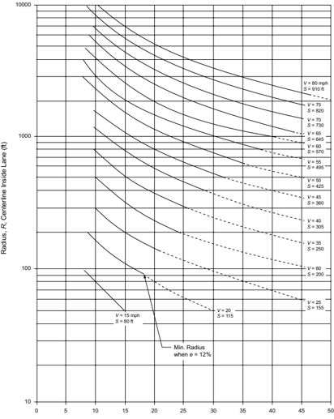

Horizontal Sight Line Offset, HSO, Centerline Inside Lane to Obstruction (ft)

Figure 3-14. Horizontal Sightline Offset (HSO) to Provide Stopping Sight Distance on Horizontal Curves


METRIC


Figure 3-14. Horizontal Sightline Offset (HSO) to Provide Stopping Sight Distance on Horizontal Curves (Continued)


Horizontal sight restrictions may occur where there is a cut slope on the inside of the curve. For the 3.50 ft [1.08 m] eye height and the 2.00-ft [0.60-m] object height used for stopping sight distance, a height of 2.75 ft [0.84 m] may be used as the midpoint of the sight line where the cut slope usually obstructs sight. This assumes that there is little or no vertical curvature. For a highway with a 22 ft [6.6-m] traveled way, 4-ft [1.2-m] shoulders, an allowance of 4 ft [1.2 m] for a ditch section, and 1V:2H cut slopes (1 ft or 1 m vertically for each, 2 ft or 2 m horizontally), the sight obstruction is approximately 19 ft [5.75 m] outside the centerline of the inside lane. This is sufficient for adequate sight distance at 30 mph [50 km/h] when curves have a radius of about 275 ft [90 m] or more and at 50 mph [80 km/h] when curves have a radius of about 1,230 ft  [375 m] or more. Curves sharper than these would need flatter slopes, benching, or other adjustments. At the other extreme, highways with normal lateral dimensions of more than 52 ft [16 m] provide adequate stopping sight distances for horizontal curves over the entire range of design speeds and curves.

In some instances, retaining walls, bridge rails, concrete median barriers, and other similar features constructed on the inside of curves may be sight obstructions and should be checked for stopping sight distance. As an example, an obstruction of this type, located 4 ft [1.2 m] from the inside edge of a 24-ft [7.2-m] traveled way, has a horizontal sight line offset of approximately 10 ft [3.0 m]. At 50 mph [80 km/h], this provides sufficient sight distance when a curve has a radius of about 2,300 ft [700 m] or more. If the obstruction is moved an additional 1 ft [0.3 m] away from the roadway, creating a horizontal sight line offset of 11 ft [3.3 m], a curve with a radius of 2,000 ft [625 m] or more provides sufficient sight distance at the same 50 mph [80 km/h] speed. The same finding would be applicable to existing buildings or similar sight obstructions on the inside of curves.

Where sufficient stopping sight distance is not available because a railing or a longitudinal barrier constitutes a sight obstruction, alternative designs should be considered. The alternatives are: (1) increase the offset to the obstruction, (2) increase the radius, or (3) reduce the design speed. However, the alternative selected should not incorporate shoulder widths on the inside of the curve in excess of 12 ft [3.6 m] because of the concern that drivers will use wider shoulders as a passing or travel lane.

As can be seen from Figure 3-14, the method presented is only exact when both the vehicle and the sight obstruction are located within the limits of the simple horizontal curve. When either the vehicle or the sight obstruction is situated beyond the limits of the simple curve, the values obtained are only approximate. The same is true if either the vehicle, the sight obstruction, or both are situated within the limits of a spiral or a compound curve. In these instances, the value obtained would result in horizontal sight line offset values slightly larger than those needed to satisfy the desired stopping sight distance. In many instances, the resulting additional clearance will not be significant. Whenever Figure 3-14 is not applicable, the design should be checked either by utilizing graphical procedures or by utilizing a computational method. Raymond ( 52 ) provides a computational method for making such checks.

--',''','',',',','''''',,,,''-'-',,',,',',,'---

Figure 3-14 is a design chart showing the horizontal sight line offsets needed for clear sight areas to provide the stopping sight distances presented in Table 3-1 for horizontal curves of various radii on flat grades. Figure 3-14 includes radii for all superelevation rates to a maximum of 12 percent. For the curves shown in Figure 3-14, the end of the solid line on the curve is the minimum radius where the superelevation is equal to 12 percent. The dashed portion of the curve is equal to values less than the standard minimum radius for a maximum superelevation rate of 12 percent.

## 3.3.12.2  Passing Sight Distance

The minimum passing sight distance for a two-lane road is about twice the minimum stopping sight distance at the same design speed. To conform to those greater sight distances, clear sight areas on the inside of curves should have widths in excess of those discussed. Equation 3-37 is directly applicable to passing sight distance but is of limited practical value except on long curves. A chart demonstrating use of this equation would primarily add value for reaching negative conclusions-that it would be difficult to maintain passing sight distance on other than very flat curves.

Passing sight distance is measured between an eye height of 3.50 ft [1.08 m] and an object height of 3.50 ft [1.08 m]. The sight line near the center of the area inside a curve is approximately 0.75 ft [0.24 m] higher than for stopping sight distance. In cut sections, the resultant lateral dimension for normal highway cross sections (1V:2H to 1V:6H backslopes) between the centerline of the inside lane and the midpoint of the sight line is from 1.5 to 4.5 ft [0.5 to 1.5 m] greater than that for stopping sight distance. It is obvious that for many cut sections, design for passing sight distance should, for practical reasons, be limited to tangents and very flat curves. Even in level terrain, provision of passing sight distance would need a clear area inside each curve that would, in some instances, extend beyond the normal right-of-way line.

In general, the designer should use graphical methods to check sight distance on horizontal curves. This method is presented in Figure 3-1 and described in the accompanying discussion.

## 3.3.13  General Controls for Horizontal Alignment

In addition to the specific design elements for horizontal alignment discussed under previous headings, a number of general controls are recognized in practice. These controls are not subject to  theoretical  derivation,  but  they  are  important  for  efficient  and  smooth-flowing  highways. Excessive curvature or poor combinations of curvature limit traffic capacity, cause economic losses from increased travel time and operating costs, and detract from a pleasing appearance. To avoid these issues, the general controls that follow should be used where practical:

- y Alignment should be as directional as practical, but should be consistent with the topography and help preserve developed properties and community values. A flowing line that conforms generally to the natural contours is preferable to one with long tangents that slashes through

the terrain. With curvilinear alignment, construction scars can be kept to a minimum and natural slopes and growth can be preserved. Such design is desirable from a construction and maintenance standpoint. In general, the number of short curves should be kept to a minimum. Winding alignment composed of short curves should be avoided because it usually leads to erratic operation. Although the aesthetic qualities of curving alignment are important, long tangents are needed on two lane highways so that sufficient passing sight distance is available on as much of the highway length as practical.

- y In alignment developed for a given design speed, the minimum radius of curvature for that speed should be avoided wherever practical. The designer should attempt to use generally flat curves, saving the minimum radius for the most critical conditions. In general, the central angle of each curve should be as small as the physical conditions permit, so that the highway will be as directional as practical. This central angle should be absorbed in the longest practical curve, but on two-lane highways, the exception noted in the preceding paragraph applies to preserve passing sight distance.
- y Consistent alignment should always be sought. Sharp curves should not be introduced at the ends of long tangents. Sudden changes from areas of flat curvature to areas of sharp curvature should be avoided. Where sharp curvature is introduced, it should be approached, where practical, by a series of successively sharper curves.
- y For small deflection angles, curves should be sufficiently long to avoid the appearance of a kink. Curves should be at least 500 ft [150 m] long for a central angle of 5 degrees, and the minimum length should be increased 100 ft [30 m] for each 1-degree decrease in the central angle. The minimum length for horizontal curves on main highways, L c min ,  should be 15 times the design speed expressed in mph], or L c min = 3V [15V [three times the design speed expressed  in  km/h].  On  high-speed  controlled-access  facilities  that  use  flat  curvature  for aesthetic reasons, the desirable minimum length for curves should be double the minimum length described above, or L c des = 6V [30V].
- y Sharp curvature should be avoided on long, high fills. In the absence of cut slopes, shrubs, and trees that extend above the level of the roadway, it is difficult for drivers to perceive the extent of curvature and adjust their operation accordingly.
- y Caution should be exercised in the use of compound circular curves. While the use of compound curves affords flexibility in fitting the highway to the terrain and other ground controls,  the  ease  with  which  such  curves  can  be  used  may  tempt  the  designer  to  use  them without restraint. Preferably, their use should be avoided where curves are sharp. Compound curves with large differences in radius introduce the same concerns that arise at tangent approaches to circular curves. Where topography or right-of-way restrictions make their use appropriate, the radius of the flatter circular arc, R 1 ,  should not be more than 50 percent greater than the radius of the sharper circular arc, R 2 (i.e., R 1 should not exceed 1.5 R 2 ). A multiple compound curve (i.e., several curves in sequence) may be suitable as a transition to sharp curves as discussed in Section 3.3.8.12, 'Compound Circular Curves.' A spiral transition between flat curves and sharp curves may be desirable. On one-way roads, such as ramps, the difference in radii of compound curves is not so important if the second curve is flatter

--',''','',',',','''''',,,,''-'-',,',,',',,'---

- than the first. However, the use of compound curves on ramps, with a flat curve between two sharper curves, is not good practice.
- y Abrupt reversals in alignment should be avoided. Such changes in alignment make it difficult for drivers to keep within their own lane. It is also difficult to superelevate both curves adequately,  and  erratic  operation  may  result.  The  distance  between  reverse  curves  should be the sum of the superelevation runoff lengths and the tangent runout lengths or, preferably, an equivalent length with spiral curves, as defined in Section 3.3.8, 'Transition Design Controls.' If sufficient distance (i.e., more than 300 ft [100 m]) is not available to permit the tangent runout lengths or preferably an equivalent length with spiral to return to a normal crown section, there may be a long length where the centerline and the edges of roadway are at the same elevation and poor transverse drainage is likely. In this case, the superelevation runoff lengths should be increased until they adjoin, thus providing one instantaneous level section. For traveled ways with straight cross slopes, there is less difficulty in returning the edges of roadway to a normal section and the 300-ft [100-m] guideline discussed above may be decreased.
- y The 'broken-back' or 'flat-back' arrangement of curves (with a short tangent between two curves in the same direction) should be avoided except where very unusual topographical or right-of-way conditions make other alternatives impractical. Except on circumferential highways, most drivers do not expect successive curves to be in the same direction; the preponderance of successive curves in opposite directions may develop a subconscious expectation among drivers that makes successive curves in the same direction unexpected. Broken-back alignments are also not pleasing in appearance. Use of spiral transitions or compound curve alignments, in which there is some degree of continuous superelevation, is preferable for such situations. The term 'broken-back' usually is not applied when the connecting tangent is of considerable length. Even in this case, the alignment may be unpleasant in appearance when both curves are clearly visible for some distance ahead.
- y To avoid the appearance of inconsistent distortion, the horizontal alignment should be coordinated carefully with the profile design. General controls for this coordination are discussed in Section 3.5, 'Combinations of Horizontal and Vertical Alignment.'
- y Changing median widths on tangent alignments should be avoided, where practical, so as not to introduce a distorted appearance.

## 3.4  VERTICAL ALIGNMENT

## 3.4.1  Terrain

The topography of the land traversed has an influence on the alignment of roads and streets. Topography affects horizontal alignment, but has an even more pronounced effect on vertical alignment. To characterize variations in topography, engineers generally separate it into three classifications according to terrain-level, rolling, and mountainous.

--',''','',',',','''''',,,,''-'-',,',,',',,'---

In level terrain, highway sight distances, as governed by both horizontal and vertical restrictions, are generally long or can be made to be so without construction difficulty or major expense.

In rolling terrain, natural slopes consistently rise above and fall below the road or street grade, and occasional steep slopes offer some restriction to normal horizontal and vertical roadway alignment.

In mountainous terrain, longitudinal and transverse changes in the elevation of the ground with respect to the road or street are abrupt, and benching and side hill excavation are frequently needed to obtain acceptable horizontal and vertical alignment.

Terrain classifications pertain to the general character of a specific route corridor. Routes in valleys, passes, or mountainous areas that have all the characteristics of roads or streets traversing level or rolling terrain should be classified as level or rolling. In general, rolling terrain generates steeper grades than level terrain, causing trucks to reduce speeds below those of passenger cars; mountainous terrain has even greater effects, causing some trucks to operate at crawl speeds.

## 3.4.2  Grades

Highways and streets should be designed to encourage uniform operation throughout. As discussed in Sections 2.3.6, 3.2, and 3.3, design speeds are used as a means toward this end by correlation of various geometric features of the road or street. Design criteria have been determined for many highway features, but little is known about the appropriate relationship of roadway grades to design speed. Vehicle operating characteristics on grades and established relationships of grades and their lengths to design speed are presented in this section.

## 3.4.2.1  Vehicle Operating Characteristics on Grades

## 3.4.2.1.1  Passenger Cars

The practices of passenger car drivers on grades vary greatly, but it is generally accepted that nearly all passenger cars can readily negotiate grades as steep as 4 to 5 percent without an appreciable loss in speed below that normally maintained on level roadways. Speed loss may be more pronounced for cars with high weight/power ratios, including some compact and subcompact cars.

Studies show that, under uncongested conditions, operation on a 3 percent upgrade has only a slight effect on passenger car speeds compared to operations on level terrain. On steeper upgrades, speeds decrease progressively with increases in the grade. On downgrades, passenger car speeds generally are slightly higher than on level sections, but local conditions govern.

## 3.4.2.1.2  Trucks

The effect of grades on truck speeds is much more pronounced than on speeds of passenger cars. The average speed of trucks on level sections of highway approximates the average speed of

passenger cars. Trucks generally increase speed by up to 5 percent on downgrades and decrease speed by 7 percent or more on upgrades as compared to their operation on level terrains. On upgrades, the maximum speed that can be maintained by a truck is dependent primarily on the length and steepness of the grade and the truck's weight/power ratio, which is the gross vehicle weight divided by the net engine power. Other factors that affect the average truck speed on a grade are the entering speed, the aerodynamic resistance, and skill of the driver. The last two factors cause only minor variations in the average speed on grade.

Extensive studies  of  truck  performance  have  been  conducted  to  determine  the  separate  and combined effects of roadway grade, tractive effort, and gross vehicle weight ( 20, 27, 38, 39, 54, 64, 77 ). Truck engines have become more powerful, relative to the loads transported, continuously for many years. The average weight/power ratio for heavy trucks decreased from 360 lb/hp [220 kg/kW] in 1949 to 200 lb/hp [120 kg/kW] in 2000 ( 33 ). A weight/power ratio of 140 lb/ hp [85 kg/kW] is more representative of the trucks on the road today ( 66 ).

The effect of rate and length of grade on the speed of a typical heavy truck with a weight/power ratio of 140 lb/hp [85 kg/kW] is shown in Figures 3-16 and 3-17. From Figure 3-15 it can be determined how far a truck, starting its climb from any speed up to approximately 70 mph [110 km/h], travels up various grades or combinations of grades before a certain or uniform speed is reached. For instance, with an entering speed of approximately 70 mph [110 km/h], a truck travels about 5,000 ft [1,500 m] up a 6 percent grade before its speed is reduced to 35 mph [60 km/h]. If the entering speed is 50 mph [80 km/h], the speed at the end of a 3,000-ft [900-m] climb is about 35 mph [60 km/h]. This is determined by starting on the curve for a 6 percent grade corresponding to 50 mph [80 km/h] for which the distance is 2,000 ft [600 m], and proceeding along it to the point where the distance is 3,000 ft [900 m] more, or 5,000 ft [1,500 m], for which the speed is about 35 mph [60 km/h]. Figure 3-16 shows the performance on grade for a truck that approaches the grade at or below crawl speed. The truck is able to accelerate to a speed of 30 mph [50 km/h] or more only on grades of 6 percent or less. Trucks with weight/ power ratios of 140 lb/hp [85 kg/kW] should be able to maintain a minimum speed of 50 mph [80 km/h] on a 3 percent upgrade. These data serve as a valuable guide for design in appraising the effect of trucks on traffic operation for a given set of profile conditions.

Figure 3-15. Speed-Distance Curves for a Typical Heavy Truck of 140 lb/hp [85 kg/kW] for Deceleration on Upgrades


--',''','',',',','''''',,,,''-'-',,',,',',,'---


U.S. CUSTOMARY

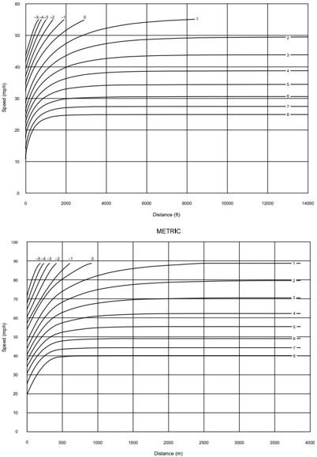

Figure 3-16. Speed-Distance Curves for Acceleration of a Typical Heavy Truck of 140 lb/hp [85 kg/kW] on Upgrades and Downgrades


Taking all factors into account, it appears conservative to use a weight/power ratio of 140 lb/hp [85 kg/kW] in determining critical length of grade, as presented in Figures 3-16 and 3-17. In some states, larger and heavier trucks similar to the WB-92D [WB-28D], WB-100T [WB30T], and WB-109D [WB-33D] design vehicles are allowed. Where such trucks present in sufficient volumes to serve as the design vehicle, consideration may be given to using a truck with a weight/power ratio of 200 lb/hp [120 kg/kW] in determining critical length of grade, as shown in Figures 3-18 and 3-19.

## 3.4.2.1.3  Recreational Vehicles

Consideration of recreational vehicles on grades is not as critical as consideration of trucks. However, on certain routes such as designated recreational routes, where a low percentage of trucks may not warrant a truck climbing lane, sufficient recreational vehicle traffic may indicate a need for an additional lane. This can be evaluated by using the design charts in Figure 3-19 in the same manner as for trucks described in Section 3.4.2.1.2. Recreational vehicles include self-contained motor homes, pickup campers, and towed trailers of numerous sizes. Because the characteristics of recreational vehicles vary so much, it is difficult to establish a single design vehicle. However, one study on the speed of vehicles on grades included recreational vehicles ( 75 ). The critical vehicle was considered to be a vehicle pulling a travel trailer, and the charts in Figure 3-19 for a typical recreational vehicle are based on that assumption.

U.S. CUSTOMARY

Figure 3-17. Speed-Distance Curves for a Typical Heavy Truck of 200 lb/hp [120 kg/kW] for Deceleration on Upgrades

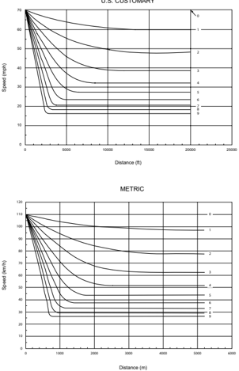

--',''','',',',','''''',,,,''-'-',,',,',',,'---


## U.S. CUSTOMARY


Figure 3-18. Speed-Distance Curves for Acceleration of a Typical Heavy Truck of 200 lb/hp [120 kg/kW] on Upgrades and Downgrades


Figure 3-19. Speed-Distance Curves for a Typical Recreational Vehicle on the Selected Upgrades (75)


--',''','',',',','''''',,,,''-'-',,',,',',,'---


## 3.4.2.2  Control Grades for Design

## 3.4.2.2.1  Maximum Grades

On the basis of the data in Figures 3-16 through 3-20, and according to the grade controls now in use in a large number of states, reasonable design guidelines for maximum grades can be established. Maximum grades of about 5 percent are considered appropriate for a design speed of 70 mph [110 km/h]. For a design speed of 30 mph [50 km/h], maximum grades generally are in the range of 7 to 12 percent, depending on terrain. If only the more important highways are considered, it appears that maximum grades of 7 or 8 percent are representative of current design practice for a 30-mph [50-km/h] design speed. Control grades for design speeds from 40 to 60 mph [60 to 100 km/h] fall between the above extremes. Maximum grade controls for each functional class of highway and street are presented in Chapters 5 through 8.

The maximum design grade should be used only infrequently; in most cases, grades should be less than the maximum design grade. At the other extreme, for short grades less than 500 ft [150 m] in length and for one-way downgrades, the maximum grade may be about 1 percent steeper than other locations; for low-volume highways in rural areas, the maximum grade may be 2 percent steeper.

## 3.4.2.2.2  Minimum Grades

Flat grades can typically provide proper surface drainage on uncurbed highways where the cross slope is adequate to drain the pavement surface laterally. With curbed highways or streets, longitudinal grades should be provided to facilitate surface drainage. An appropriate minimum grade is typically 0.5 percent, but grades of 0.30 percent may be used where there is a paved surface accurately sloped and supported on firm subgrade. Use of even flatter grades may be justified in special cases as discussed in Chapter 5. Particular attention should be given to the design of stormwater inlets and their spacing to keep the spread of water on the traveled way within tolerable limits. Roadside channels and median swales frequently need grades steeper than the roadway profile for adequate drainage. Drainage channels are discussed in Section 4.8.3. Refer to the AASHTO Drainage Manual (8) for more information.

## 3.4.2.2.3  Pedestrian Considerations

The grade of the roadway becomes the cross slope in the crosswalk at pedestrian crossings, which is limited to provide accessibility for pedestrians with disabilities. Designers should consider such limitations when establishing the grade of streets with pedestrian crosswalks, whether those crosswalks are marked or unmarked.

## 3.4.2.3  Critical Lengths of Grade for Design

Maximum grade in itself is not a complete design control. It is also appropriate to consider the length of a particular grade in relation to desirable vehicle operation. The term 'critical length of grade' is used to indicate the maximum length of a designated upgrade on which a loaded truck

--',''','',',',','''''',,,,''-'-',,',,',',,'--- can operate without an unreasonable reduction in speed. For a given length of grade, lengths less than critical result in acceptable operation in the desired range of speeds. If the desired freedom of operation is to be maintained on grades longer than critical, design adjustments such as changes in location to reduce grades or addition of extra lanes should be considered. The data for critical lengths of grade should be used with other pertinent factors (such as traffic volume in relation to capacity) to determine where added lanes are warranted.

To establish design values for critical lengths of grade for which gradeability of trucks is the determining factor, data or assumptions are needed for the following:

1. Size and power of a representative truck or truck combination to be used as a design vehicle along with the gradeability data for this vehicle:

A typical loaded truck, powered so that the weight/power ratio is about 85 kg/kW [140 lb/ hp], is representative of the size and type of vehicle normally used as a design control for main highways. Data in Figures 3-16 and 3-17 apply to such a vehicle.

2. Speed at entrance to critical length of grade:

The average running speed as related to design speed can be used to approximate the speed of  vehicles  beginning  an  uphill  climb.  This  estimate  is,  of  course,  subject  to  adjustment as  approach conditions may determine. Where vehicles approach on nearly level grades, the running speed can be used directly. For a downhill approach it should be increased somewhat, and for an uphill approach it should be decreased.

3. Minimum speed on the grade below in which interference to following vehicles is considered unreasonable:

No specific  data  are  available  on  which  to  base  minimum  tolerable  speeds  of  trucks  on upgrades. It is logical to assume that such minimum speeds should be in direct relation to the design speed. Minimum truck speeds of about 25 to 40 mph [40 to 60 km/h] for the majority of highways (on which design speeds are about 40 to 60 mph [60 to 100 km/h]) probably are not unreasonably annoying to following drivers unable to pass on two-lane roads, if the time interval during which they are unable to pass is not too long. The time interval  is  less  likely  to  be  annoying  on  two  lane  roads  with  volumes  well  below  their capacities, whereas it is more likely to be annoying on two-lane roads with volumes near capacity. Lower minimum truck speeds can probably be tolerated on multilane highways rather  than  on  two-lane  roads  because  there  is  more  opportunity  for  and  less  difficulty in passing. Highways should be designed so that the speeds of trucks will not be reduced enough to cause intolerable conditions for following drivers.

Studies show that, regardless of the average speed on the highway, the more a vehicle deviates from the average speed, the greater its chances of becoming involved in a crash. One such study ( 25 ) used the speed distribution of vehicles traveling on highways in one state, and related it to the crash involvement rate to obtain the rate for trucks of four or more axles operating on level

grades. The crash involvement rates for truck speed reductions of 5, 10, 15, and 20 mph [10, 15, 25, and 30 km/h] were developed assuming the reduction in the average speed for all vehicles on a grade was 30 percent of the truck speed reduction on the same grade. The results of this analysis are shown in Figure 3-20.

Figure 3-20. Crash Involvement Rate of Trucks for Which Running Speeds Are Reduced below Average Running Speed of All Traffic (25)

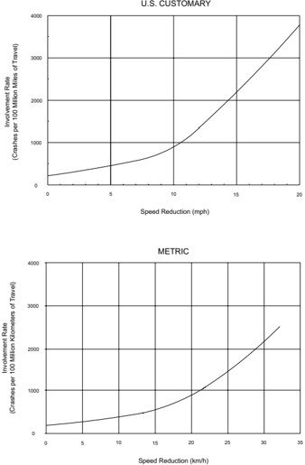

--',''','',',',','''''',,,,''-'-',,',,',',,'---


A common basis for determining critical length of grade is based on a reduction in speed of trucks below the average running speed of traffic. The ideal would be for all traffic to operate at the average speed. This, however, is not practical. In the past, the general practice has been to use a reduction in truck speed of 15 mph [25 km/h] below the average running speed of all traffic to identify the critical length of grade. As shown in Figure 3-20, the crash involvement rate increases significantly when the truck speed reduction exceeds 10 mph [15 km/h] with the involvement rate being 2.4 times greater for a 15-mph [25 km/h] reduction than for a 10-mph [15-km/h] reduction. On the basis of these relationships, it is recommended that a 10 mph [15km/h] reduction criterion be used as the general guide for determining critical lengths of grade.

The length of any given grade that will cause the speed of a representative truck (200 lb/hp [120 kg/kW]) entering the grade at 70 mph [110 km/h] to be reduced by various amounts below the average running speed of all traffic is shown graphically in Figure 3-21, which is based on the truck performance data presented in Figure 3-17. The curve showing a 10-mph [15-km/h] speed reduction is used as the general design guide for determining the critical lengths of grade. Similar information on the critical length of grade for recreational vehicles may be found in Figure 3-22, which is based on the recreational vehicle performance data presented in Figure 3-19.

Where the entering speed is less than 70 mph [110 km/h], as may be the case where the approach is on an upgrade, the speed reductions shown in Figures 3-21 and 3-22 will occur over shorter lengths of grade. Conversely, where the approach is on a downgrade, the probable approach speed is greater than 70 mph [110 km/h] and the truck or recreational vehicle will ascend a greater length of grade than shown in the figures before the speed is reduced to the values shown.

The method of using Figure 3-21 to determine critical lengths of grade is demonstrated in the following examples.

Assume that a highway is being designed for 60 mph [100 km/h] and has a fairly level approach to a 4 percent upgrade. The 10-mph [15-km/h] speed reduction curve in Figure 3-21 shows the critical length of grade to be 1,200 ft [350 m]. If, instead, the design speed were 40 mph [60 km/h], the initial and minimum tolerable speeds on the grade would be different, but for the same permissible speed reduction the critical length would still be 1,200 ft [350 m].

In another instance, the critical length of a 5 percent upgrade approached by a 1,650-ft [500-m] length of 2 percent upgrade is unknown. Figure 3-21 shows that a 2 percent upgrade of 1,650 ft [500 m] in length would result in a speed reduction of about 6 mph [9 km/h]. The chart further shows that the remaining tolerable speed reduction of 4 mph [6 km/h] would occur on 325 ft [100 m] of the 5 percent upgrade.

Where an upgrade is approached on a downgrade, heavy trucks often increase speed considerably to begin the climb on the upgrade at as high a speed as practical. This factor can be recognized in design by increasing the tolerable speed reduction. It remains for the designer to judge

to what extent the speed of trucks would increase at the bottom of the momentum grade above that generally found on level approaches. It appears that a speed increase of about 5 mph [10 km/h] can be considered for moderate downgrades and a speed increase of 10 mph [15 km/h] for steeper grades of moderate length or longer. On this basis, the tolerable speed reduction with momentum grades would be 15 or 20 mph [25 or 30 km/h]. For example, where there is a moderate length of 4 percent downgrade in advance of a 6 percent upgrade, a tolerable speed reduction of 15 mph [25 km/h] can be assumed. For this case, the critical length of the 6 percent upgrade is about 1,250 ft [370 m].

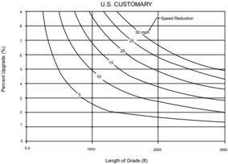

METRIC

50 km/h

40

Percent Upgrade (%)

9

8

7

6

5

4

3

2

1

0

100

200

10

300

15

20

400

500

Length of Grade (m)

Figure 3-21. Critical Lengths of Grade for Design, Assumed Typical Heavy Truck of 200 lb/ hp [120 kg/kW], Entering Speed = 70 mph [110 km/h]


25

30

600

Speed Reduction

700

800

900

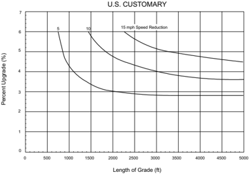


Figure 3-22. Critical Lengths of Grade Using an Approach Speed of 55 mph [90 km/h] for Typical Recreational Vehicle (20)


The critical length of grade in Figure 3-21 is derived as the length of tangent grade. Where a vertical curve is part of a critical length of grade, an approximate equivalent tangent grade length should be used. Where the condition involves vertical curves of Types II and IV shown in Section 3.4.6 in Figure 3-34 and the algebraic difference in grades is not too great, the measurement of critical length of grade may be made between the vertical points of intersection (VPI). Where vertical curves of Types I and III in Figure 3-34 are involved, about one-quarter of the vertical curve length should be regarded as part of the grade under consideration.

In many design situations, Figure 3-21 may not be directly applicable to the determination of the critical length of grade for one of several reasons. First, the truck population for a given site may be such that a weight/power ratio either less than or greater than the value of 200 lb/hp [120 kg/kW] assumed in Figure 3-21 may be appropriate as a design control. Second, for the reasons described above, the truck speed at the entrance to the grade may differ from the 70 mph [110 km/h] assumed in Figure 3-21. Third, the profile may not consist of a constant percent grade. In such situations, a spreadsheet program, known as the Truck Speed Profile Model (TSPM) ( 34 ),  is  available and may be used to generate truck speed profiles for any specified truck weight/power ratio, initial truck speed, and any sequence of grades.

Steep downhill grades on facilities with high traffic volumes and numerous heavy trucks can reduce the traffic capacity and increase crash frequency. Some downgrades are long and steep enough that some heavy vehicles travel at crawl speeds to avoid loss of control on the grade. Slow-moving vehicles of this type may impede other vehicles. Therefore, there are instances where consideration should be given to providing a truck lane for downhill traffic. Procedures have been developed in the HCM ( 67 ) to analyze this situation.

The suggested design criterion for determining the critical length of grade is not intended as a strict control but as a guideline. In some instances, the terrain or other physical controls may preclude shortening or flattening grades to meet these controls. Where a speed reduction greater than the suggested design guide cannot be avoided, undesirable operation may result on roads with numerous trucks, particularly on two-lane roads with volumes approaching capacity and in some instances on multilane highways. Where the length of critical grade is exceeded, consideration should be given to providing an added uphill lane for slow-moving vehicles, particularly where volume is at or near capacity and the truck volume is high. Data in Figure 3-21 can be used along with other key factors, particularly volume data in relation to capacity and volume data for trucks, to determine where such added lanes are warranted.

## 3.4.3  Climbing Lanes

## 3.4.3.1  Climbing Lanes for Two-Lane Highways

## 3.4.3.1.1  General

Freedom and safety of operation on two-lane highways, besides being influenced by the extent and frequency of passing sections, are adversely affected by heavily loaded vehicle traffic operating on grades of sufficient length to result in speeds that could impede following vehicles. In the past, provision of added climbing lanes to improve operations on upgrades has been rather limited because of the additional construction costs. However, because of the increasing amount of delay and the number of serious crashes occurring on grades, such lanes are now more commonly included in original construction plans, and additional lanes on existing highways are being considered as safety improvement projects. The potential crash involvement rate created by this condition is illustrated in Figure 3-20.

A highway section with a climbing lane is not considered a three-lane highway, but a two-lane highway with an added lane for vehicles moving slowly uphill so that other vehicles using the normal lane to the right of the centerline are not delayed. These faster vehicles pass the slower vehicles moving upgrade, but not in the lane for opposing traffic, as on a conventional two-lane road. A separate climbing lane exclusively for slow-moving vehicles is preferred to the addition of an extra lane carrying mixed traffic. Designs of two-lane highways with climbing lanes are illustrated  in  Figures  3-23A  and  3-23B.  Climbing  lanes  are  designed  for  each  direction  independently of the other. Depending on the alignment and profile conditions, they may not overlap, as in Figure 3-23A, or they may overlap, as in Figure 3-23B, where there is a crest with a long grade on each side.

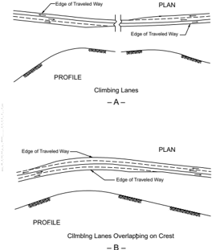

- B -

Figure 3-23. Climbing Lanes on Two-Lane Highways

Adding a climbing lane for an upgrade on a two-lane highway can offset the decline in traffic operations caused by the combined effects of the grade, traffic volume, and heavy vehicles. Climbing lanes are appropriate where the level of service or the speed of trucks is substantially less on an upgrade than on the approach to the upgrade. Where climbing lanes are provided, there has been a high degree of compliance in their use by truck drivers.

On highways with low volumes, only an occasional car is delayed, and climbing lanes, although desirable, may not be justified economically even where the critical length of grade is exceeded. For such cases, slow-moving vehicle turnouts should be considered to reduce delay to occasional passenger cars from slow-moving vehicles. Turnouts are discussed in Section 3.4.4, 'Methods for Increasing Passing Opportunities on Two-Lane Roads.'

The following three criteria, reflecting economic considerations, should be satisfied to justify a climbing lane:

1. Upgrade traffic flow rate in excess of 200 veh/h.
2. Upgrade truck flow rate in excess of 20 veh/h.

3. One of the following conditions exists:
2. y A 10-mph [15-km/h] or greater speed reduction is expected for a typical heavy truck.
3. y Level of service E or F exists on the grade.
4. y A reduction of two or more levels of service is experienced when moving from the approach segment to the grade.

In addition, high crash frequencies may justify the addition of a climbing lane regardless of grade or traffic volumes.

The upgrade flow rate is determined by multiplying the predicted or existing design hour volume by the directional distribution factor for the upgrade direction and dividing the result by the peak hour factor (the peak hour and directional distribution factors are discussed in Section 2.3). The number of upgrade trucks is obtained by multiplying the upgrade flow rate by the percentage of trucks in the upgrade direction.

## 3.4.3.1.2  Trucks

As indicated in the immediately preceding paragraphs, only one of the three conditions specified in Criterion 3 need be met. The critical length of grade to effect a 10-mph [15-km/h] speed reduction for trucks is found using Figure 3-21. This critical length is compared with the length of the particular grade being evaluated. If the critical length of grade is less than the length of the grade being studied, Criterion 3 is satisfied. This evaluation should be done first because, where the critical length of grade is exceeded, no further evaluations under Criterion 3 will be needed.

Justification for climbing lanes where the critical length of grade is not exceeded should be considered from the standpoint of highway capacity. The procedures used are those from the HCM ( 67 ) for analysis of specific grades on two-lane highways. The remaining conditions in Criterion 3 are evaluated using these HCM procedures. The effect of trucks on capacity is primarily a function of the difference between the average speed of the trucks and the average running speed of the passenger cars on the highway. Physical dimensions of heavy trucks and their poorer acceleration characteristics also have a bearing on the space they need in the traffic stream.

On individual grades the effect of trucks is more severe than their average effect over a longer section of highway. Thus, for a given volume of mixed traffic and a fixed roadway cross section, a higher degree of congestion is experienced on individual grades than for the average operation over longer sections that include downgrades as well as upgrades. To determine the design service volume on individual grades, use truck factors derived from the geometrics of the grade and the level of service selected by the highway agency as the basis for design of the highway under consideration.

--',''','',',',','''''',,,,''-'-',,',,',',,'---

If there is no 10-mph [15-km/h] reduction in speed (i.e., if the critical length of grade is not exceeded), the level of service on the grade should be examined to determine if level of service E or F exists. This is done by calculating the limiting service flow rate for level of service D and comparing this rate to the actual flow rate on the grade. The actual flow rate is determined by dividing the hourly volume of traffic by the peak hour factor. If the actual flow rate exceeds the service flow rate at level of service D, Criterion 3 is satisfied. When the actual flow rate is less than the limiting value, a climbing lane is not warranted by this second element of Criterion 3.

The remaining issue to examine if neither of the other elements of Criterion 3 are satisfied is whether there is a two-level reduction in the level of service between the approach and the upgrade. To evaluate this criterion, the level of service for the grade and the approach segment should both be determined. Since this criterion needs consideration in only a very limited number of cases, it is not discussed in detail here.

The HCM ( 67 ) provides additional details and worksheets to perform the computations needed for analysis in the preceding criteria. This procedure is also available in computer software, reducing the need for manual calculations.

Because there are so many variables involved, virtually no given set of conditions can be properly described as typical. Therefore, a detailed analysis such as the one described is recommended wherever climbing lanes are being considered.

The location where an added lane should begin depends on the speeds at which trucks approach the grade and on the extent of sight distance restrictions on the approach. Where there are no sight distance restrictions or other conditions that limit speeds on the approach, the added lane may be introduced on the upgrade beyond its beginning because the speed of trucks will not be reduced beyond the level tolerable to following drivers until they have traveled some distance up the grade. This optimum point for capacity would occur for a reduction in truck speed to 40 mph [60 km/h], but a 10-mph [15-km/h] decrease in truck speed below the average running speed, as discussed in Section 3.4.2.3, 'Critical Lengths of Grade for Design,' is the most practical reduction obtainable from the standpoint of level of service and crash frequency. This 10mph [15-km/h] reduction is the accepted basis for determining the location at which to begin climbing lanes. The distance from the bottom of the grade to the point where truck speeds fall to 10 mph [15 km/h] below the average running speed may be determined from Figures 3-18 or 3-21. Different curves would apply for trucks with other than a weight/power ratio of 200 lb/hp [120 kg/kW]. For example, assuming an approach condition on which trucks with a 200-lb/hp [120-kg/kW] weight/power ratio are traveling within a flow having an average running speed of 70 mph [110 km/h], the resulting 10-mph [15-km/h] speed reduction occurs at distances of approximately 600 to 1,200 ft [175 to 350 m] for grades varying from 7 to 4 percent. With a downgrade approach, these distances would be longer and, with an upgrade approach, they would be shorter. Distances thus determined may be used to establish the point at which a climbing lane should begin. Where restrictions, upgrade approaches, or other conditions indicate the likeli-

--',''','',',',','''''',,,,''-'-',,',,',',,'---

hood of low speeds for approaching trucks, the added lane should be introduced near the foot of the grade. The beginning of the added lane should be preceded by a tapered section with a desirable taper ratio of 25:1 that should be at least 300 ft [90 m] long.

The ideal design is to extend a climbing lane to a point beyond the crest, where a typical truck could attain a speed that is within 10 mph [15 km/h] of the speed of the other vehicles with a desirable speed of at least 40 mph [60 km/h]. This may not be practical in many instances because of the unduly long distance needed for trucks to accelerate to the desired speed. In such situations, a practical point to end the added lane is where trucks can return to the normal lane without undue interference with other traffic-in particular, where the sight distance becomes sufficient to permit passing when there is no oncoming traffic or, preferably, at least 200 ft [60 m] beyond that point. An appropriate taper length should be provided to permit trucks to return smoothly to the normal lane. For example, on a highway where the passing sight distance becomes available 100 ft [30 m] beyond the crest of the grade, the climbing lane should extend 300 ft [90 m] beyond the crest (i.e., 100 ft [30 m] plus 200 ft [60 m]), and an additional tapered section with a desirable taper ratio of 50:1 that should be at least 600 ft [180 m] long.

A climbing lane should desirably be as wide as the through lanes. It should be so constructed that it can immediately be recognized as an added lane for one direction of travel. The centerline of the normal two-lane highway should be clearly marked, including yellow barrier lines for no passing zones. Signs at the beginning of the upgrade such as 'Slower Traffic Keep Right' or  'Trucks  Use  Right  Lane'  may  be  used  to  direct  slow-moving  vehicles  into  the  climbing lane. These and other appropriate signs and markings for climbing lanes are presented in the MUTCD ( 24 ).

The cross slope of a climbing lane is usually handled in the same manner as the addition of a lane to a multilane highway. Depending on agency practice, this design results in either a continuation of the cross slope or a lane with slightly more cross slope than the adjacent through lane. On a superelevated section, the cross slope is generally a continuation of the slope used on the through lane.

Desirably, the shoulder on the outer edge of a climbing lane should be as wide as the shoulder on the normal two-lane cross section, particularly where there is bicycle traffic. However, this may be impractical, particularly when the climbing lane is added to an existing highway. A usable shoulder of 4 ft [1.2 m] in width or greater is acceptable. Although not wide enough for a stalled vehicle to completely clear the climbing lane, a 4-ft [1.2-m] shoulder in combination with the climbing lane generally provides sufficient width for both the stalled vehicle and a slow-speed passing vehicle without need for the latter to encroach on the through lane.

## 3.4.3.1.3  Summary

Climbing lanes offer a comparatively inexpensive means of overcoming reductions in capacity and providing improved operation where congestion on grades is caused by slow trucks in

--',''','',',',','''''',,,,''-'-',,',,',',,'--- combination with high traffic volumes. As discussed earlier in this section, climbing lanes also reduce crashes. On some existing two-lane highways, the addition of climbing lanes could defer reconstruction for many years or indefinitely. In a new design, climbing lanes could make a two-lane highway operate efficiently, whereas a much more costly multilane highway would be needed without them.

## 3.4.3.2  Climbing Lanes on Freeways and Multilane Highways

## 3.4.3.2.1  General

Climbing lanes, although they are becoming more prevalent, have not been used as extensively on freeways and multilane highways as on two-lane highways. This may result from multilane facilities more frequently having sufficient capacity to serve their traffic demands, including the typical percentage of slow-moving vehicles with high weight/power ratios, without being congested. Climbing lanes are generally not as easily justified on multilane facilities as on two-lane highways because, on two-lane facilities, vehicles following other slower moving vehicles on upgrades are frequently prevented from passing in the adjacent traffic lane by opposing traffic. On multilane facilities, there is no such impediment to passing. A slow-moving vehicle in the normal right lane does not impede the following vehicles that can readily move left to the adjacent lane and proceed without difficulty, although there is evidence that crashes are reduced when vehicles in the traffic stream move at the same speed.

Because highways are normally designed for 20 years or more in the future, there is less likelihood that climbing lanes will be justified on multilane facilities than on two-lane roads for several years after construction even though they are deemed desirable for the peak hours of the design year. Where this is the case, there is economic advantage in designing for, but deferring construction of, climbing lanes on multilane facilities. In this situation, grading for the future climbing lane should be provided initially. The additional grading needed for a climbing lane is small when compared to that needed for the overall cross section. If, however, even this additional grading is impractical, it is acceptable, although not desirable, to use a narrower shoulder adjacent to the climbing lane rather than the full shoulder provided on a normal section.

Although primarily applicable in rural areas, there are instances where climbing lanes are needed in urban areas. Climbing lanes are particularly important for freedom of operation on suburban or urban freeways where traffic volumes are high in relation to capacity. On older suburban and urban freeways and arterial streets with appreciable grades and no climbing lanes, it is a common occurrence for heavy traffic, which may otherwise operate well, to platoon on grades.

## 3.4.3.2.2  Trucks

The principal determinants of the need for climbing lanes on multilane highways are critical lengths of grade, effects of trucks on grades in terms of equivalent passenger car flow rates, and service volumes for the desired level of service and the next poorer level of service.

Critical length of grade has been discussed previously in Section 3.4.2. It is the length of a particular upgrade that reduces the speed of low-performance trucks 10 mph [15 km/h] below the average running speed of the remaining traffic. The critical length of grade that results in a 10-mph [15 km/h] reduction of truck speed is found using Figure 3-21 and is then compared to the length of the particular grade being examined. If the critical length of grade is less than the length of grade being evaluated, consideration of a climbing lane is warranted.

In determining service volume, the passenger-car equivalent for trucks is a significant factor. It is generally agreed that trucks on multilane facilities have less effect in deterring following vehicles than on two-lane roads. Comparison of passenger-car equivalents in the HCM ( 67 ) for the same percent of grade, length of grade, and percent of trucks clearly illustrates the difference in passenger-car equivalents of trucks for two-lane and multilane facilities.

To justify the cost of providing a climbing lane, the existence of a low level of service on the grade should be the criterion, as in the case of justifying climbing lanes for two-lane roads, because highway users will accept a higher degree of congestion (i.e., a lower level of service) on individual grades than over long sections of highway. As a matter of practice, the service volume on an individual grade should not exceed that for the next poorer level of service from that used for the basic design. The one exception is that the service volume for level of service D should not be exceeded.

Generally, climbing lanes should not be considered unless the directional traffic volume for the upgrade is equal to or greater than the service volume for level of service D. In most cases when the service volume, including trucks, is greater than 1,700 veh/h per lane and the length of the grade and the percentage of trucks are sufficient to consider climbing lanes, the volume in terms of equivalent passenger cars is likely to approach or even exceed the capacity. In this situation, an increase in the number of lanes throughout the highway section would represent a better investment than the provision of climbing lanes.

Climbing lanes are also not generally warranted on four-lane highways with directional volumes below 1,000 veh/h per lane regardless of the percentage of trucks. Although a truck driver will occasionally pass another truck under such conditions, the inconvenience with this low volume is not sufficient to justify the cost of a climbing lane in the absence of appropriate criteria.

The procedures in the HCM ( 67 ) should be used to consider the traffic operational characteristics on the grade being examined. The maximum service flow rate for the desired level of service, together with the flow rate for the next poorer level of service, should be determined. If the flow rate on the grade exceeds the service flow rate of the next poorer level of service, consideration of a climbing lane is warranted. In order to use the HCM procedures, the free-flow speed should be determined or estimated. The free-flow speed can be determined by measuring the mean speed of passenger cars under low to moderate flow conditions (up to 1,300 passenger cars per hour per lane) on the facility or similar facility.

Data ( 27, 67 ) indicate that the mean free-flow speed under ideal conditions for multilane highways ranges from 1 mph [0.6 km/h] lower than the 85th percentile speed of 40 mph [65 km/h] to 3 mph [5 km/h] lower than the 85th percentile speed of 60 mph [100 km/h]. Speed limit is one factor that affects free-flow speed. Research ( 27, 67 ) suggests that the free-flow speed is approximately 7 mph [11 km/h] higher than the speed limit on facilities with 40- and 45-mph [65- and 70-km/h] speed limits and 5 mph [8 km/h] higher than the speed limit on facilities with 50- and 55-mph [80- and 90-km/h] speed limits. Analysis based on these rules of thumb should be used with caution. Field measurement is the recommended method of determining the free-flow speed, with estimation using the above procedures employed only when field data are not available.

Where the grade being investigated is located on a multilane highway, other factors should sometimes be considered; such factors include median type, lane widths, lateral clearance, and access point density. These factors are accounted for in the capacity analysis procedures by making adjustments in the free-flow speed and are not normally a separate consideration in determining whether a climbing lane would be advantageous.

For freeways, adjustments are made in traffic operational analyses using factors for restricted lane  widths,  lateral  clearances,  recreational  vehicles,  and  unfamiliar  driver  populations.  The HCM ( 67 ) should be used for information on considering these factors in analysis.

Under certain circumstances there should be consideration of additional lanes to accommodate trucks in the downgrade direction. This is accomplished using the same procedure as described above and using the passenger-car equivalents for trucks on downgrades in place of the values for trucks and recreational vehicles on upgrades.

Climbing lanes on multilane roads are usually placed on the outer or right-hand side of the roadway as shown in Figure 3-24. The principles for cross slopes, for locating terminal points, and for designing terminal areas or tapers for climbing lanes are discussed in Section 3.4.3.1, 'Climbing Lanes for Two-Lane Highways;' these principles are equally applicable to climbing lanes on multilane facilities. A primary consideration is that the location of the uphill terminus of the climbing lane should be at the point where a satisfactory speed is attained by trucks, preferably about 10 mph [15 km/h] below the average running speed of the highway. Passing sight distance need not be considered on multilane highways.

Figure 3-24. Climbing Lane on Freeways and Multilane Highways

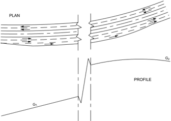

## 3.4.4  Methods for Increasing Passing Opportunities on Two-Lane Roads

Several highway agencies have pioneered successful methods for providing more passing opportunities along two-lane roads. Some of the more recognized of these methods, including passing lanes, turnouts, shoulder driving, and shoulder use sections are described in the FHWA informational guide Low Cost Methods for Improving Traffic Operations on Two-Lane Roads ( 31 ). An additional design alternative or method known as a 2+1 roadway has been reported in NCHRP Research Results Digest 275, Application of European 2+1 Roadway Designs ( 51 ).  A  synopsis  of portions of material found in these sources is presented in the remainder of this section. More detailed criteria for these methods are found in the referenced documents.

## 3.4.4.1  Passing Lanes

An added lane can be provided in one or both directions of travel to improve traffic operations in sections of lower capacity to at least the same quality of service as adjacent road sections. Passing lanes can also be provided to improve overall traffic operations on two-lane highways by reducing delays caused by inadequate passing opportunities over significant lengths of highways, typically 6 to 60 miles [10 to 100 km]. Where passing lanes are used to improve traffic operations over a length of road, they frequently are provided systematically at regular intervals.

The location of the added lane should appear logical to the driver. The value of a passing lane is more obvious at locations where passing sight distance is restricted than on long tangents that may provide passing opportunities even without passing lanes. On the other hand, the location


--',''','',',',','''''',,,,''-'-',,',,',',,'---

of a passing lane should recognize the need for adequate sight distance at both the lane addition and lane drop tapers. A minimum sight distance of 1,000 ft [300 m] on the approach to each taper is recommended. The selection of an appropriate location also needs to consider the location of intersections and high-volume driveways in order to minimize the volume of turning movements on a road section where passing is encouraged. Furthermore, other physical constraints such as bridges and culverts should be avoided if they restrict provision of a continuous shoulder.

The following is a summary of the design procedure to be followed in providing passing sections on two-lane highways:

1. Horizontal and vertical alignment should be designed to provide as much of the highway as practical with passing sight distance (see Table 3-4).
2. Where the design volume approaches capacity, the effect of lack of passing opportunities in reducing the level of service should be recognized.
3. Where  the  critical  length  of  grade  is  less  than  the  physical  length  of  an  upgrade, consideration should be given to constructing added climbing lanes. The critical length of grade is determined as shown in Figures 3-21 and 3-22.
4. Where the extent and frequency of passing opportunities made available by application of Criteria 1 and 3 are still too few, consideration should be given to the construction of passing-lane sections.

Passing-lane sections, which may be either three or four lanes in width, are constructed on twolane roads to provide the desired frequency of passing zones or to eliminate interference from low-speed heavy vehicles, or both. Where a sufficient number and length of passing sections cannot be obtained in the design of horizontal and vertical alignment alone, an occasional added lane in one or both directions of travel may be introduced as shown in Figure 3-25 to provide more passing opportunities. Such sections are particularly advantageous in rolling terrain, especially where alignment is winding or the profile includes critical lengths of grade.


- B -

Figure 3-25. Passing Lane Sections on Two-Lane Roads

In rolling terrain a highway on tangent alignment may have restricted passing conditions even though the grades are below critical length. Use of passing lanes over some of the crests provides added passing sections in both directions where they are most needed. Passing-lane sections should be sufficiently long to permit several vehicles in line behind a slow-moving vehicle to pass before returning to the normal cross section of two-lane highway.

A minimum length of 1,000 ft [300 m], excluding tapers, is needed so that delayed vehicles have an opportunity to complete at least one pass in the added lane. Where such a lane is provided to reduce delays at a specific bottleneck, the needed length is controlled by the extent of the bottleneck. A lane added to improve overall traffic operations should be long enough, over 0.3 mi [0.5 km], to provide a substantial reduction in traffic platooning. The optimal length is usually 0.5 to 2.0 mi [0.8 to 3.2 km], with longer lengths of added lane appropriate where traffic volumes are higher. The HCM ( 67 ) provides guidance in the selection of a passing lane of optimal length. Operational benefits typically result in reduced platooning for 3 to 10 mi [5 to 15 km] downstream depending on volumes and passing opportunities. After that, normal levels of platooning will occur until the next added lane is encountered.

The introduction of a passing-lane section on a two-lane highway does not necessarily involve much additional grading. The width of an added lane should normally be the same as the lane widths of the two-lane highway. It is also desirable for the adjoining shoulder to be at least 1.2 m [4 ft] wide and, whenever practical, the shoulder width in the added section should match that of the adjoining two-lane highway. However, a full shoulder width is not as needed on a passing lane section as on a conventional two-lane highway because the vehicles likely to stop are few and there is little difficulty in passing a vehicle with only two wheels on the shoulder. Thus, if

the normal shoulder width on the two-lane highway is 10 ft [3.0 m], a 6- to 8-ft [1.8- to 2.4-m] widening of the roadbed on each side is all that may be needed.

Four-lane sections introduced explicitly to improve passing opportunities need not be divided because there is no separation of opposing traffic on the two-lane portions of the highway. The use of a median, however, is beneficial and should be considered on highways carrying a total of 500 veh/h or more, particularly on highways to be ultimately converted to a four-lane divided cross section.

The transition tapers at each end of the added-lane section should be designed to encourage efficient operation and reduce crashes. The lane-drop taper length where the posted or statutory speed limit is 45 mph [70 km/h] or greater should be computed with Equation 3-38, based on the MUTCD ( 24 ). Where the posted or statutory speed limit is less than 45 mph [70 km/h], the lane-drop taper length should be computed with Equation 3-39. The recommended length for the lane addition taper is one-half to two-thirds of the lane-drop length. --',''','',',',','''''',,,,''-'-',,',,',',,'---

| U.S. Customary          | Metric                |        |
|-------------------------|-----------------------|--------|
| for S ≥ 45 mph          | for S ≥ 70 km/h       | (3-38) |
| for S < 45 mph where:   | for S < 70 km/h       | (3-39) |
|                         | where:                |        |
| L = Length of taper, ft | L = Length of taper,m |        |
| W = Width, ft           | W = Width,m           |        |
| S = Speed,mph           | S = Speed, km/h       |        |

The transitions between the two- and three- or four-lane pavements should be located where the change in width is in full view of the driver. Sections of four-lane highway, particularly divided sections, longer than about 2 mi [3 km] may cause the driver to lose his sense of awareness that the highway is basically a two-lane facility. It is essential, therefore, that transitions from a three- or four-lane cross section back to two lanes be properly marked and identified with pavement markings and signs to alert the driver of the upcoming section of two lane highway. An advance sign before the end of the passing lane is particularly important to inform drivers of the narrower roadway ahead; for more information, see the MUTCD ( 24 ).

A passing lane should be sufficiently long for a following vehicle to complete at least one passing maneuver. Short passing lanes, with lengths of 0.25 mi [0.4 km] or less are not very effective in reducing traffic platooning. As the length of a passing lane increases above 1.0 mi [1.6 km], a passing lane generally provides diminishing operational benefits, and is generally appropriate only on higher volume facilities with flow rates over 700 veh/h. Table 3-32 presents optimal design lengths for passing lanes.

Table 3-32. Optimal Passing Lane Lengths for Traffic Operational Efficiency (30, 31)

| U.S. Customary            | U.S. Customary           |
|---------------------------|--------------------------|
| One-Way Flow Rate (veh/h) | Passing Lane Length (mi) |
| 100-200                   | 0.50                     |
| 201-400                   | 0.50-0.75                |
| 401-700                   | 0.75-1.00                |
| 701-1200                  | 1.00-2.00                |

## 3.4.4.2  2+1 Roadways

The 2+1 roadway concept has been found to improve operational efficiency and reduce crashes for  selected  two-lane highways ( 51 ).  Figure 3-26 is a schematic of the concept. The concept provides a continuous three-lane cross section and the highway is striped in a manner as to provide for passing lanes in alternating directions throughout the section. This concept can be an attractive alternate to two- or four-lane roads for some highways with higher traffic volumes where continuously alternating passing lanes are needed to obtain the desired level of service.

Figure 3-26. Schematic for 2+1 Roadway


The 2+1 configuration may be a suitable treatment for roadways with traffic volumes higher than can be served by isolated passing lanes, but not high enough to justify a four-lane roadway. The configuration is also potentially applicable for use at locations where environmental or fiscal constraints, or both, make provision of a four-lane facility impractical. A 2+1 road will generally operate at least two levels of service higher than a conventional two-lane highway serving the same traffic volume.

A 2+1 road should not generally be considered where current or projected flow rates exceed 1,200 veh/h in one direction of travel. A four-lane roadway generally is more efficient at such high flow rates. This concept can be used over a broad range of traffic composition to provide passing opportunities as the percentage of heavy vehicles increases.

A 2+1 road should only be used in level or rolling terrain. In mountainous terrain and on isolated steep grades, it is normally more appropriate to introduce climbing lanes on upgrades as discussed in Section 3.4.3.

The location of major intersections and high-volume driveways should be a key consideration when selecting passing lane locations on 2+1 roadways. Proper placement of passing lanes and

| Metric                    | Metric                   |
|---------------------------|--------------------------|
| One-Way Flow Rate (veh/h) | Passing Lane Length (km) |
| 100-200                   | 0.8                      |
| 201-400                   | 0.8-1.2                  |
| 401-700                   | 1.2-1.6                  |
| 701-1200                  | 1.6-3.2                  |

transition sections with respect to higher volume intersections will minimize the number of turning movements within the passing lane sections. Major intersections should be located in the transition area between opposing passing lanes, and the conventional left-turn lanes provided at the intersection, as illustrated in Figures 3-27 and 3-28. As an alternative to left-turn lanes from the passing lane, the techniques described in Section 9.9, 'Indirect Left Turns and U-turns,' may be appropriate. Low-volume intersections and driveways may be accommodated within the passing lane sections.

Figure 3-27. Schematic for Three-Leg Intersection on a 2+1 Roadway


Figure 3-28. Schematic for Four-Leg Intersection on a 2+1 Roadway


Stopping sight distance should be provided continuously along a 2+1 roadway. Decision sight distance should be considered at intersections and lane drops.

The transition tapers at each end of the added-lane section should be designed to encourage efficient operation and reduce crashes. The lane-drop taper length where the posted or statutory speed limit is 45 mph [70 km/h] or greater should be computed with Equation 3-38, based on the MUTCD ( 24 ). Where the posted or statutory speed limit is less than 45 mph [70 km/h], the


lane-drop taper length should be computed from Equation 3-39. The recommended length for the lane addition taper is one-half to two-thirds of the lane-drop length. Figures 3-29 and 3-30 are schematics for adjacent lane drop and lane addition tapers on a 2+1 roadway.

Figure 3-29. Schematic for Adjacent Lane Drop Tapers on a 2+1 Roadway


Figure 3-30. Schematic for Adjacent Lane Addition Tapers on a 2+1 Roadway


Lane and shoulder widths should be comparable to the widths determined for the volumes and speeds for two-lane highways for specific functional classes in Chapters 5 through 7.

Where existing two-lane highways with a normal crown are converted to 2+1 roadways, the location and transition of the crown is perhaps one of the more complicated design issues. A variety of practices relate to the location of the crown. Where an existing two-lane highway is restriped as a 2+1 road or widened to become a 2+1 road, the placement of the crown within the traveled way may be permitted. An existing highway may also be widened on one side only, with the result that the crown is located at a lane line. There is no indication of any difference in crashes between placing the roadway crown at a lane boundary and placing it within a lane. For newly designed 2+1 highways, the crown should be placed at a lane boundary.

--',''','',',',','''''',,,,''-'-',,',,',',,'---


Horizontal curves should be superelevated in accordance with the provisions of Section 3.3, 'Horizontal Alignment.' Superelevation should be handled no differently on a 2+1 road than on a comparable two-lane or four-lane undivided road.

While separation of the opposing traffic lanes may not be needed on every highway, some separation between lanes in opposing directions is desirable. A flush separation of 4 ft [1.2 m] between the opposing directions may be considered.

## 3.4.4.3  Turnouts

A turnout is a widened, unobstructed shoulder area that allows slow-moving vehicles to pull out of the through lane to give passing opportunities to following vehicles ( 30, 31 ). The driver of the slow-moving vehicle, if there are following vehicles, is expected to pull out of the through lane and remain in the turnout only long enough for the following vehicles to pass before returning to the through lane. When there are only one or two following vehicles, this maneuver can be accomplished without the driver of the vehicle needing to stop in the turnout. However, when this number is exceeded, the driver may need to stop in the turnout in order for all the following vehicles to pass. Turnouts are most frequently used on lower volume roads where long platoons are rare and in difficult terrain with steep grades where construction of an additional lane may not be cost-effective. Such conditions are often found in mountain, coastal, and scenic areas where more than 10 percent of the vehicle volumes are large trucks and recreational vehicles.

The recommended length of turnouts including taper is shown in Table 3-33. Turnouts shorter than 200 ft [60 m] are not recommended even for very low approach speeds. Turnouts longer than 600 ft [185 m] are not recommended for high-speed roads to avoid use of the turnout as a passing lane. The recommended lengths are based on the assumption that slow-moving vehicles enter the turnout at 5 mph [8 km/h] slower than the mean speed of the through traffic. This length allows the entering vehicle to coast to the midpoint of the turnout without braking, and then, if necessary, to brake to a stop using a deceleration rate not exceeding 10 ft/s 2 [3 m/s 2 ]. The recommended lengths for turnouts include entry and exit tapers. Typical entry and exit taper lengths range from 50 to 100 ft [15 to 30 m] ( 30, 31 ).

Table 3-33.  Recommended Lengths of Turnouts Including Taper

| U.S. Customary       | U.S. Customary        |
|----------------------|-----------------------|
| Approach Speed (mph) | Minimum Length (ft) a |
| 20                   | 200                   |
| 30                   | 200                   |
| 40                   | 300                   |
| 45                   | 350                   |
| 50                   | 450                   |
| 55                   | 550                   |
| 60                   | 600                   |

| Metric                | Metric               |
|-----------------------|----------------------|
| Approach Speed (km/h) | Minimum Length (m) a |
| 30                    | 60                   |
| 40                    | 60                   |
| 50                    | 65                   |
| 60                    | 85                   |
| 70                    | 105                  |
| 80                    | 135                  |
| 90                    | 170                  |
| 100                   | 185                  |

The minimum width of the turnout is 12 ft [3.6 m] with widths of 16 ft [5 m] considered desirable. Turnouts wider than 16 ft [5 m] are not recommended.

A turnout should not be located on or adjacent to a horizontal or vertical curve that limits sight distance in either direction. The available sight distance should be at least 1,000 ft [300 m] on the approach to the turnout.

Proper signing and pavement marking are also needed both to maximize turnout usage and reduce crashes. An edge line marking on the right side of the turnout is desirable to guide drivers, especially in wider turnouts.

## 3.4.4.4  Shoulder Driving

In parts of the United States, a long-standing custom has been established for slow-moving vehicles to move to the shoulder when another vehicle approaches from the rear, and then return to the traveled way after that following vehicle has passed. The practice generally occurs where adequate paved shoulders exist and, in effect, these shoulders function as continuous turnouts. This custom is regarded as a courtesy to other drivers needing little or no sacrifice in speed by either driver. While highway agencies may want to permit such use as a means of improving passing opportunities without a major capital investment, they should recognize that in many states shoulder driving is currently prohibited by law. Thus, a highway agency considering shoulder driving as a passing aid may need to propose legislation to authorize such use as well as develop a public education campaign to familiarize drivers with the new law.

Highway agencies should evaluate the mileage of two-lane highways with paved shoulders as well as their structural quality before deciding whether to allow their use as a passing aid. It should be recognized that, where shoulder driving becomes common, it will not be limited to selected sites but rather will occur anywhere on the system where paved shoulders are provided.

--',''','',',',','''''',,,,''-'-',,',,',',,'---

Another consideration is that shoulder widths of at least 10 ft [3.0 m], and preferably 12 ft [3.6 m], are needed. The effect that shoulder driving may have on the use of the highway by bicyclists should also be considered. Because the practice of shoulder driving has evolved through local custom, no special signing to promote such use has been created.

## 3.4.4.5  Shoulder Use Sections

Another approach to providing additional passing opportunities is to permit slow-moving vehicles to use paved shoulders at selected sites designated by specific signing. This is a more limited application  of  shoulder  use  by  slow-moving  vehicles  than  shoulder  driving  described  in  the previous section. Typically, drivers move to the shoulder only long enough for following vehicles to pass and then return to the through lane. Thus, the shoulder-use section functions as an extended turnout. This approach enables a highway agency to promote shoulder use only where the shoulder is adequate to handle anticipated traffic loads and the need for more frequent passing opportunities has been established by the large amount of vehicle platooning.

Shoulder-use sections generally range in length from 0.2 to 3 mi [0.3 to 5 km]. Shoulder use should be allowed only where shoulders are at least 10 ft [3.0 m] and preferably 12 ft [3.6 m] wide. Adequate structural strength to support the anticipated loads along with good surface conditions are needed. Particular attention needs to be placed on the condition of the shoulder because drivers are unlikely to use a shoulder if it is rough, broken, or covered with debris. Signs should be erected at both the beginning and end of the section where shoulder use is allowed. However, since signing of shoulder-use sections is not addressed in the MUTCD ( 24 ), special signing should be used.

## 3.4.5  Emergency Escape Ramps

## 3.4.5.1  General

Where long, descending grades exist or where topographic and location controls indicate a need for such grades on new alignment, the design and construction of an emergency escape ramp at an appropriate location is desirable to provide a location for out-of-control vehicles, particularly trucks, to slow and stop away from the main traffic stream. Out-of-control vehicles are generally the result of a driver losing braking ability either through overheating of the brakes due to mechanical failure or failure to downshift at the appropriate time. Considerable experience with ramps constructed on existing highways has led to the design and installation of effective ramps that save lives and reduce property damage. Reports and evaluations of existing ramps indicate that they provide acceptable deceleration rates and afford good driver control of the vehicle on the ramp ( 78 ).

Forces  that  act  on  every  vehicle  to  affect  the  vehicle's  speed  include  engine-,  braking-,  and tractive-resistance forces. Engine- and braking-resistance forces can be ignored in the design of escape ramps because the ramp should be designed for the worst case, in which the vehicle is out

--',''','',',',','''''',,,,''-'-',,',,',',,'---

of gear and the brake system has failed. The tractive-resistance force contains four subclasses: inertial, aerodynamic, rolling, and gradient. Inertial and negative gradient forces act to maintain motion of the vehicle, while rolling-, positive gradient-, and air-resistance forces act to retard its motion. Figure 3-31 illustrates the action of the various resistance forces on a vehicle.

Figure 3-31. Forces Acting on a Vehicle in Motion


Inertial resistance can be described as a force that resists movement of a vehicle at rest or maintains a vehicle in motion, unless the vehicle is acted on by some external force. Inertial resistance must be overcome to either increase or decrease the speed of a vehicle. Rolling- and positive gradient-resistance forces are available to overcome the inertial resistance. Rolling resistance is a general term used to describe the resistance to motion at the area of contact between a vehicle's tires and the roadway surface and is only applicable when a vehicle is in motion. It is influenced by the type and displacement characteristics of the surfacing material of the roadway. Each surfacing material has a coefficient, expressed in lb/1,000 lb [kg/1 000 kg] of gross vehicle weight (GVM [GVW]), which determines the amount of rolling resistance of a vehicle. The values shown in Table 3-34 for rolling resistance have been obtained from various sources throughout the country and are a best available estimate.

Gradient resistance results from gravity and is expressed as the force needed to move the vehicle through a given vertical distance. For gradient resistance to provide a beneficial force on an escape ramp, the vehicle must be moving upgrade, against gravity. In the case where the vehicle is descending a grade, gradient resistance is negative, thereby reducing the forces available to slow and stop the vehicle. The amount of gradient resistance is influenced by the total weight of the vehicle and the magnitude of the grade. For each percent of grade, the gradient resistance is 10 lb/1,000 lb [10 kg/1 000 kg] whether the grade is positive or negative.


The remaining component of tractive resistance is aerodynamic resistance, the force resulting from the retarding effect of air on the various surfaces of the vehicle. Air causes a significant resistance at speeds above 50 mph [80 km/h], but is negligible under 20 mph [30 km/h]. The effect of aerodynamic resistance has been neglected in determining the length of the arrester bed, thus providing a small additional margin of safety.

Table 3-34. Rolling Resistance of Roadway Surfacing Materials

|                          | U.S. Customary                       | U.S. Customary         |
|--------------------------|--------------------------------------|------------------------|
| Surfacing Material       | Rolling Resistance (lb/1,000 lb GVW) | Equivalent Grade (%) a |
| Portland cement concrete | 10                                   | 1.0                    |
| Asphalt concrete         | 12                                   | 1.2                    |
| Gravel, compacted        | 15                                   | 1.5                    |
| Earth, sandy, loose      | 37                                   | 3.7                    |
| Crushed aggregate, loose | 50                                   | 5.0                    |
| Gravel, loose            | 100                                  | 10.0                   |
| Sand                     | 150                                  | 15.0                   |
| Pea gravel               | 250                                  | 25.0                   |

| Metric                               | Metric                 |
|--------------------------------------|------------------------|
| Rolling Resistance (kg/1,000 kg GVM) | Equivalent Grade (%) a |
| 10                                   | 1.0                    |
| 12                                   | 1.2                    |
| 15                                   | 1.5                    |
| 37                                   | 3.7                    |
| 50                                   | 5.0                    |
| 100                                  | 10.0                   |
| 150                                  | 15.0                   |
| 250                                  | 25.0                   |

## 3.4.5.2  Need and Location for Emergency Escape Ramps

Each grade has its own unique characteristics. Highway alignment, gradient, length, and descent speed contribute to the potential for out-of-control vehicles. For existing highways, operational concerns on a downgrade will often be reported by law enforcement officials, truck drivers, or the general public. A field review of a specific grade may reveal damaged guardrail, gouged pavement surfaces, or spilled oil indicating locations where drivers of heavy vehicles had difficulty negotiating a downgrade. For existing facilities, an escape ramp should be provided as soon as a need is established. Crash experience (or, for new facilities, crash experience on similar facilities) and truck operations on the grade combined with engineering judgment are frequently used to determine the need for a truck escape ramp. Often the impact of a potential runaway truck on adjacent activities or population centers will provide sufficient reason to construct an escape ramp.

Unnecessary escape ramps should be avoided. For example, a second escape ramp should not be needed just beyond the curve that created the need for the initial ramp.

While there are no universal guidelines available for new and existing facilities, a variety of factors should be considered in selecting the specific site for an escape ramp. Each location presents a different array of design needs; factors that should be considered include topography, length and percent of grade, potential speed, economics, environmental impact, and crash experience.


Ramps should be located to intercept the greatest number of runaway vehicles, such as at the bottom of the grade and at intermediate points along the grade where an out-of-control vehicle could cause a catastrophic crash.

A technique for new and existing facilities available for use in analyzing operations on a grade, in addition to crash analysis, is the Grade Severity Rating System ( 21 ). The system uses a predetermined brake temperature limit (500°F [260°C]) to establish a safe descent speed for the grade. It also can be used to determine expected brake temperatures at 0.5-mi [0.8-km] intervals along the downgrade. The location where brake temperatures exceed the limit indicates the point that brake failures can occur, leading to potential runaways.

Escape ramps generally may be built at any practical location where the main road alignment is tangent. They should be built in advance of horizontal curves that cannot be negotiated safely by an out-of-control vehicle without rolling over and in advance of populated areas. Escape ramps should exit to the right of the roadway. On divided multilane highways, where a left exit may appear to be the only practical location, difficulties may be expected by the refusal of vehicles in the left lane to yield to out-of-control vehicles attempting to change lanes.

Although crashes involving runaway trucks can occur at various sites along a grade, locations having multiple crashes should be analyzed in detail. Analysis of crash data pertinent to a prospective escape ramp site should include evaluation of the section of highway immediately uphill, including the amount of curvature traversed and distance to and radius of the adjacent curve.

An integral part of the evaluation should be the determination of the maximum speed that an out-of-control vehicle could attain at the proposed site. This highest obtainable speed can then be used as the minimum design speed for the ramp. The 80- to 90-mph [130- to 140-km/h] entering speed, recommended for design, is intended to represent an extreme condition and therefore should not be used as the basis for selecting locations of escape ramps. Although the variables involved make it impractical to establish a maximum truck speed warrant for location of escape ramps, it is evident that anticipated speeds should be below the range used for design. The principal factor in determining the need for an emergency escape ramp should be the safety of the other traffic on the roadway, the driver of the out-of-control vehicle, and the residents along and at the bottom of the grade. An escape ramp, or ramps if the conditions indicate the need for more than one, should be located wherever grades are of a steepness and length that present a substantial risk of runaway trucks and topographic conditions will permit construction.

## 3.4.5.3  Types of Emergency Escape Ramps

Emergency escape ramps have been classified in a variety of ways. Three broad categories used to classify ramps are gravity, sandpile, and arrester bed. Within these broad categories, four basic emergency escape ramp designs predominate. These designs are the sandpile and three types of arrester beds, classified by grade of the arrester bed: descending grade, horizontal grade, and ascending grade. These four types are illustrated in Figure 3-32.

The gravity  ramp  has  a  paved  or  densely  compacted  aggregate  surface,  relying  primarily  on gravitational forces to slow and stop the runaway. Rolling-resistance forces contribute little to assist in stopping the vehicle. Gravity ramps are usually long, steep, and are constrained by topographic controls and costs. While a gravity ramp stops forward motion, the paved surface cannot prevent the vehicle from rolling back down the ramp grade and jackknifing without a positive capture mechanism. Therefore, the gravity ramp is the least desirable of the escape ramp types.


D.  Sandpile

Note: Profile is along the baseline of the ramp.

Figure 3-32. Basic Types of Emergency Escape Ramps

Sandpiles, composed of loose, dry sand dumped at the ramp site, are usually no more than 400 ft [120 m] in length. The influence of gravity is dependent on the slope of the surface. The increase in rolling resistance is supplied by loose sand. Deceleration characteristics of sandpiles are usually severe and the sand can be affected by weather. Because of the deceleration characteristics, the sandpile is less desirable than the arrester bed. However, at locations where inadequate space exists for another type of ramp, the sandpile may be appropriate because of its compact dimensions.

Descending-grade arrester-bed escape ramps are constructed parallel and adjacent to the through lanes of the highway. These ramps use loose aggregate in an arrester bed to increase rolling resistance to slow the vehicle. The gradient resistance acts in the direction of vehicle movement. As a result, the descending-grade ramps can be rather lengthy because the gravitational effect is not acting to help reduce the speed of the vehicle. The ramp should have a clear, obvious return path to the highway so drivers who doubt the effectiveness of the ramp will feel they will be able to return to the highway at a reduced speed.

Where the topography can accommodate, a horizontal-grade arrester-bed escape ramp is another option. Constructed on an essentially flat gradient, the horizontal-grade ramp relies on the increased rolling resistance from the loose aggregate in an arrester bed to slow and stop the out-of-control vehicle, since the effect of gravity is minimal. This type of ramp is longer than the ascending-grade arrester bed.

The most commonly used escape ramp is the ascending-grade arrester bed. Ramp installations of this type use gradient resistance to advantage, supplementing the effects of the aggregate in the arrester bed, and generally, reducing the length of ramp needed to stop the vehicle. The loose material in the arresting bed increases the rolling resistance, as in the other types of ramps, while the gradient resistance acts in a downgrade direction, opposite to the direction of vehicle movement. The loose bedding material also serves to hold the vehicle in place on the ramp grade after it has come to a safe stop.

Each of the ramp types is applicable to a particular situation where an emergency escape ramp is desirable and should be compatible with established location and topographic controls at possible sites. The procedures used for analysis of truck escape ramps are essentially the same for each of the categories or types identified. The rolling-resistance factor for the surfacing material used in determining the length needed to slow and stop the runaway truck safely is the difference in the procedures.

## 3.4.5.4  Design Considerations

The combination of the above external resistance and numerous internal resistance forces not discussed acts to limit the maximum speed of an out-of-control vehicle. Speeds in excess of 80 to 90 mph [130 to 140 km/h] will rarely, if ever, be attained. Therefore, an escape ramp should be designed for a minimum entering speed of 80 mph [130 km/h], with a 90-mph [140-km/h]

design speed being preferred. Several formulas and software programs have been developed to determine the runaway speed at any point on the grade. These methods can be used to establish a design speed for specific grades and horizontal alignments ( 21, 40, 78 ).

The design and construction of effective escape ramps involve a number of considerations as follows:

- y To safely stop an out-of-control vehicle, the length of the ramp should be sufficient to dissipate the kinetic energy of the moving vehicle.
- y The alignment of the escape ramp should be tangent or on very flat curvature to minimize the driver's difficulty in controlling the vehicle.
- y The width of the ramp should be adequate to accommodate more than one vehicle because it is not uncommon for two or more vehicles to have need of the escape ramp within a short time. A minimum width of 26 ft [8 m] may be all that is practical in some areas, though greater widths are preferred. Desirably, a width of 30 to 40 ft [9 to 12 m] would more adequately accommodate two or more out-of-control vehicles. Ramp widths less than indicated above have been used successfully in some locations where it was determined that a wider width was unreasonably costly or not needed. Widths of ramps in use range from 12 to 40 ft [3.6 to 12 m].
- y The surfacing material used in the arrester bed should be clean, not easily compacted, and have a high coefficient of rolling resistance. When aggregate is used, it should be rounded, uncrushed, predominantly a single size, and as free from fine-size material as practical. Such material will maximize the percentage of voids, thereby providing optimum drainage and minimizing interlocking and compaction. A material with a low shear strength is desirable to permit penetration of the tires. The durability of the aggregate should be evaluated using an appropriate crush test. Pea gravel is representative of the material used most frequently, although loose gravel and sand are also used. A gradation with a top size of 1.5 in. [40 mm] has been used with success in several states. Material conforming to the AASHTO gradation No. 57 is effective if the fine-sized material is removed.
- y Arrester  beds  should  be  constructed  with  a  minimum  aggregate  depth  of  3  ft  [1  m]. Contamination of the bed material can reduce the effectiveness of the arrester bed by creating a hard surface layer up to 12 in. [300 mm] thick at the bottom of the bed. Therefore, an aggregate depth up to 42 in. [100 mm] is recommended. As the vehicle enters the arrester bed, the wheels of the vehicle displace the surface, sinking into the bed material, thus increasing the rolling resistance. To assist in decelerating the vehicle smoothly, the depth of the bed should be tapered from a minimum of 3 in. [75 mm] at the entry point to the full depth of aggregate in the initial 100 to 200 ft [30 to 60 m] of the bed.
- y A positive means of draining the arrester bed should be provided to help protect the bed from freezing and avoid contamination of the arrester bed material. This can be accomplished by grading the base to drain, intercepting water prior to entering the bed, underdrain systems with transverse outlets, or edge drains. Geotextiles or paving can be used between the sub-

base and the bed materials to prevent infiltration of fine materials that may trap water. Where toxic contamination from diesel fuel or other material spillage is a concern, the base of the arrester bed may be paved with concrete and holding tanks to retain the spilled contaminants may be provided.

- y The entrance to the ramp should be designed so that a vehicle traveling at a high rate of speed can enter safely. As much sight distance as practical should be provided preceding the ramp so that a driver can enter safely. The full length of the ramp should be visible to the driver. The angle of departure for the ramp should be small, usually 5 degrees or less. An auxiliary lane may be appropriate to assist the driver to prepare to enter the escape ramp. The main roadway surface should be extended to a point at or beyond the exit gore so that both front wheels of the out-of-control vehicle will enter the arrester bed simultaneously; this also provides preparation time for the driver before actual deceleration begins. The arrester bed should be offset laterally  from  the  through  lanes  by  an  amount  sufficient  to  preclude  loose  material  being thrown onto the through lanes.
- y Access to the ramp should be clearly indicated by exit signing to allow the driver of an outof-control vehicle time to react, to minimize the possibility of missing the ramp. Advance signing is needed to inform drivers of the existence of an escape ramp and to prepare drivers well in advance of the decision point so that they will have enough time to decide whether or not to use the escape ramp. Regulatory signs near the entrance should be used to discourage other motorists from entering, stopping, or parking at or on the ramp. The path of the ramp should be delineated to define ramp edges and provide nighttime direction; for more information, see the MUTCD ( 24 ). Illumination of the approach and ramp is desirable.
- y The characteristic that makes a truck escape ramp effective also makes it difficult to retrieve a vehicle captured by the ramp. A service road located adjacent to the arrester bed is needed so tow trucks and maintenance vehicles can use it without becoming trapped in the bedding material. The width of this service road should be at least 10 ft [3 m]. Preferably this service road should be paved but may be surfaced with gravel. The road should be designed in such a way that the driver of an out-of-control vehicle will not mistake the service road for the arrester bed.
- y Anchors, usually located adjacent to the arrester bed at 150- to 300-ft [50- to 100-m] intervals, are needed to secure a tow truck when removing a vehicle from the arrester bed. One anchor should be located about 100 ft [30 m] in advance of the bed to assist the wrecker in returning a captured vehicle to a surfaced roadway. The local tow-truck operators can be very helpful in properly locating the anchors.

As a vehicle rolls upgrade, it loses momentum and will eventually stop because of the effect of gravity. To determine the distance needed to bring the vehicle to a stop with consideration of the rolling resistance and gradient resistance, the following simplified equation may be used ( 64 ):

--',''','',',',','''''',,,,''-'-',,',,',',,'---

| U.S. Customary                                                                                     | Metric                                                                                             |
|----------------------------------------------------------------------------------------------------|----------------------------------------------------------------------------------------------------|
| where:                                                                                             | where:                                                                                             |
| L = length of arrester bed, ft                                                                     | L = length of arrester bed,m                                                                       |
| V = entering velocity,mph                                                                          | V = entering velocity, km/h                                                                        |
| R = rolling resistance, expressed as equiv- alent percent gradient divided by 100 (see Table 3-34) | R = rolling resistance, expressed as equiv- alent percent gradient divided by 100 (see Table 3-34) |
| G = percent grade divided by 100                                                                   | G = percent grade divided by 100                                                                   |

For example, assume that topographic conditions at a site selected for an emergency escape ramp limit the ramp to an upgrade of 10 percent ( G = +0.10). The arrester bed is to be constructed with loose gravel for an entering speed of 90 mph [140 km/h]. Using Table 3-34, R is determined to be 0.10. The length of the arrester bed should be determined using Equation 3-40. For this example, the length of the arrester bed is about 1,350 ft [400 m].

When an arrester bed is constructed using more than one grade along its length, as shown in Figure 3-33, the speed loss occurring on each of the grades as the vehicle traverses the bed should be determined using the following equation:

| U.S. Customary                                                                                                                                                                                                    | Metric                                                                                                                                                                                                                    |
|-------------------------------------------------------------------------------------------------------------------------------------------------------------------------------------------------------------------|---------------------------------------------------------------------------------------------------------------------------------------------------------------------------------------------------------------------------|
| where: V f = speed at end of grade,mph V i = entering speed at beginning of grade, mph L = length of grade, ft R = rolling resistance, expressed as equiv- alent percent gradient divided by 100 (see Table 3-34) | where: V f = speed at end of grade, km/h V i = entering speed at beginning of grade, km/h L = length of grade,m R = rolling resistance, expressed as equiv- alent percent gradient divided by 100 (see Table 3-34) (3-41) |

The final speed for one section of the ramp is subtracted from the entering speed to determine a new entering speed for the next section of the ramp and the calculation repeated at each change in grade on the ramp until sufficient length is provided to reduce the speed of the out-of-control vehicle to zero.


Figure 3-33 shows a plan and profile of an emergency escape ramp with typical appurtenances.

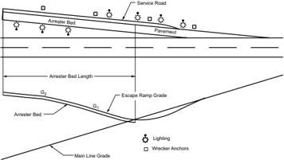

Figure 3-33. Typical Emergency Escape Ramp

Where the only practical location for an escape ramp will not provide sufficient length and grade to completely stop an out-of-control vehicle, it should be supplemented with an acceptable positive attenuation device.

Where a full-length ramp is to be provided with full deceleration capability for the design speed, a 'last-chance' device should be considered when the consequences of leaving the end of the ramp are serious.

Any ramp-end treatment should be designed with care so that its advantages outweigh its disadvantages. The risk to others as the result of an out-of-control truck overrunning the end of an escape ramp may be more important than the harm to the driver or cargo of the truck. The abrupt deceleration of an out-of-control truck may cause shifting of the load, shearing of the fifth wheel, or jackknifing, all with potentially harmful occurrences to the driver and cargo.

Mounds of bedding material between 2 and 5 ft [0.6 and 1.5 m] high with 1V:1.5H slopes (i.e., slopes that change in elevation by one unit of length for each 1 to 1.5 units of horizontal distance) have been used at the end of ramps in several instances as the 'last-chance' device. At least one escape ramp has been constructed with an array of crash cushions installed to prevent an outof-control vehicle from leaving the end of the ramp. Furthermore, at the end of a hard-surfaced gravity ramp, a gravel bed or an attenuator array may sufficiently immobilize a brakeless runaway vehicle to keep it from rolling backward and jackknifing. Where barrels are used, the barrels should be filled with the same material as used in the arrester bed, so that any finer material does not result in contamination of the bed and reduction of the expected rolling resistance.


--',''','',',',','''''',,,,''-'-',,',,',',,'---

## 3.4.5.5  Brake-Check Areas

Turnouts or pulloff areas at the summit of a grade can be used for brake-check areas or mandatory-stop areas to provide an opportunity for a driver to inspect equipment on the vehicle and check that the brakes are not overheated at the beginning of the descent. In addition, information about the grade ahead and the location of escape ramps can be provided by diagrammatic signing or self-service pamphlets. An elaborate design is not needed for these areas. A brakecheck area can be a paved lane behind and separated from the shoulder or a widened shoulder where a truck can stop. Appropriate signing should be used to discourage casual stopping by the public.

## 3.4.5.6  Maintenance

After each use, aggregate arrester beds should be reshaped using power equipment to the extent practical and the aggregate scarified as appropriate. Since aggregate tends to compact over time, the  bedding  material  should  be  cleaned  of  contaminants  and  scarified  periodically  to  retain the retarding characteristics of the bedding material and maintain free drainage. Using power equipment for work in the arrester bed reduces the exposure time for the maintenance workers to the potential that a runaway truck may need to use the facility. Maintenance of the appurtenances should be accomplished as appropriate.

## 3.4.6  Vertical Curves

## 3.4.6.1  General Considerations

Vertical curves to effect gradual changes between tangent grades may be any one of the crest or sag types depicted in Figure 3-34. Vertical curves should be simple in application and should result in a design that enables the driver to see the road ahead, enhances vehicle control, is pleasing in appearance, and is adequate for drainage. The major design control for crest vertical curves is the provision of ample sight distances for the design speed; while research ( 19 ) has shown that vertical curves with limited sight distance do not necessarily experience frequent crashes, it is recommended that all vertical curves be designed to provide at least the stopping sight distances shown in Table 3-1.

For driver comfort, the rate of change of grade should be kept within tolerable limits. This consideration is most important in sag vertical curves where gravitational and vertical centripetal forces act in opposite directions. Appearance also should be considered in designing vertical curves. A long curve has a more pleasing appearance than a short one; short vertical curves may give the appearance of a sudden break in the profile due to the effect of foreshortening.

Figure 3-34. Types of Vertical Curves


Drainage of curbed roadways on sag vertical curves (Type III in Figure 3-34) needs careful profile design to retain a grade of not less than 0.5 percent or, in some cases, 0.30 percent for the outer edges of the roadway. Refer to the AASHTO Drainage Manual ( 8 ) for more information on drainage considerations.

For simplicity, a parabolic curve with an equivalent vertical axis centered on the Vertical Point of Intersection (VPI) is usually used in roadway profile design. The vertical offsets from the tangent vary as the square of the horizontal distance from the curve end (Point of Tangency). The vertical offset from the tangent grade at any point along the curve is calculated as a proportion of the vertical offset at the VPI, which is AL/800, where the symbols are as shown in Figure 3-34. The rate of change of grade at successive points on the curve is a constant amount for equal increments of horizontal distance, and is equal to the algebraic difference between intersecting tangent grades divided by the length of curve in feet [meters], or A/L in percent per foot [percent per meter]. The reciprocal L/A is the horizontal distance in feet [meters] needed to make a 1 percent change in gradient and is, therefore, a measure of curvature. The quantity L/A , termed ' K ,' is useful in determining the horizontal distance from the Vertical Point of Curvature (VPC) to the high point of Type I curves or to the low point of Type III curves. This point where the slope

--',''','',',',','''''',,,,''-'-',,',,',',,'---


is zero occurs at a distance from the VPC equal to K times the approach gradient. The value of K is also useful in determining minimum lengths of vertical curves for various design speeds. Other details on parabolic vertical curves are found in textbooks on highway engineering.

In certain situations, because of critical clearance or other controls, the use of asymmetrical vertical curves may be appropriate. Because the conditions under which such curves are appropriate are infrequent, the derivation and use of the relevant equations have not been included herein. For use in such limited instances, refer to asymmetrical curve data found in a number of highway engineering texts.

## 3.4.6.2  Crest Vertical Curves

Minimum lengths of crest vertical curves based on sight distance criteria generally are satisfactory from the standpoint of safety, comfort, and appearance. An exception may be at decision areas, such as ramp exit gores, where longer sight distances and, therefore, longer vertical curves should be provided; for further information, refer to Section 3.2.3, 'Decision Sight Distance.'

Figure 3-35 illustrates the parameters used in determining the length of a parabolic crest vertical curve needed to provide any specified value of sight distance. The basic equations for length of a crest vertical curve in terms of algebraic difference in grade and sight distance follow:

| U.S. Customary                                   | Metric                                          |
|--------------------------------------------------|-------------------------------------------------|
| When S is less than L ,                          | When S is less than L , (3-42)                  |
| When S is greater than L ,                       | When S is greater than L ,                      |
| where:                                           | where: (3-43)                                   |
| L = length of vertical curve, ft                 | L = length of vertical curve,m                  |
| A = algebraic difference in grades, percent      | A = algebraic difference in grades, percent     |
| S = sight distance, ft                           | S = sight distance,m                            |
| h 1 = height of eye above roadway surface, ft    | h 1 = height of eye above roadway surface,m     |
| h 2 = height of object above roadway surface, ft | h 2 = height of object above roadway surface, m |


Figure 3-35. Parameters Considered in Determining the Length of a Crest Vertical Curve to Provide Sight Distance

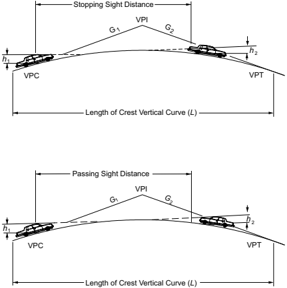

When the height of eye and the height of object are 3.50 ft and 2.00 ft [1.08 and 0.60 m], respectively, as used for stopping sight distance, the equations become:

3.4.6.2.1  Design Controls: Stopping Sight Distance

| U.S. Customary             | Metric                     |
|----------------------------|----------------------------|
| When S is less than L ,    | When S is less than L ,    |
|                            | (3-44)                     |
| When S is greater than L , | When S is greater than L , |
|                            | (3-45)                     |

The minimum lengths of crest vertical curves for different values of A to provide the minimum stopping sight distances for each design speed are shown in Figure 3-36. The solid lines give the minimum vertical curve lengths, on the basis of rounded values of K as determined from Equations 3-44 and 3-45.

--',''','',',',','''''',,,,''-'-',,',,',',,'---


The short dashed curve at the lower left, crossing these lines, indicates where S = L . Note that to the right of the S = L line, the value of K , or length of vertical curve per percent change in A , is a simple and convenient expression of the design control. For each design speed, this single value is a positive whole number that is indicative of the rate of vertical curvature. The design control in terms of K covers all combinations of A and L for any one design speed; thus, A and L need not be indicated separately in a tabulation of design value. The selection of design curves is facilitated because the minimum length of curve in feet [meters] is equal to K times the algebraic difference in grades in percent, L = KA . Conversely, the checking of plans is simplified by comparing all curves with the design value for K .

Table 3-35 shows the computed K values for lengths of vertical curves corresponding to the stopping sight distances shown in Table 3-1 for each design speed. For direct use in design, values of K are rounded as shown in the right column. The rounded values of K are plotted as the solid lines in Figure 3-36. These rounded values of K are higher than computed values, but the differences are not significant.

Where S is greater than L (lower left in Figure 3-36), the computed values plot as a curve (as shown by the dashed line for 45 mph [70 km/h]) that bends to the left, and for small values of A , the vertical curve lengths are zero because the sight line passes over the high point. This relationship does not represent desirable design practice. Most states use a minimum length of vertical curve, expressed as a single value, a range for different design speeds, or a function of A . Values now in use range from about 100 to 325 ft [30 to 100 m]. To recognize the distinction in design speed and to approximate the range of current practice, minimum lengths of vertical curves are expressed as about 0.6 times the design speed in km/h, L min = 0.6V, where V is in kilometers per hour and L is in meters, or about three times the design speed in mph, [ L min = 3 V ], where V is in miles per hour and L is in feet. These terminal adjustments show as the vertical lines at the lower left of Figure 3-36.

## U.S. CUSTOMARY

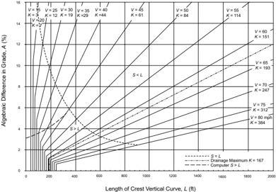

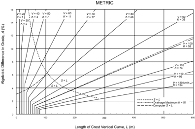

Figure 3-36. Design Controls for Crest Vertical Curves-Open Road Conditions


Table 3-35. Design Controls for Crest Vertical Curves Based on Stopping Sight Distance

| U.S. Customary   | U.S. Customary   | U.S. Customary                 | U.S. Customary                 |
|------------------|------------------|--------------------------------|--------------------------------|
| Design Speed     | Stopping Sight   | Rate of Vertical Curvature, Ka | Rate of Vertical Curvature, Ka |
| (mph)            | Distance (ft)    | Calculated                     | Design                         |
| 15               | 80               | 3.0                            | 3                              |
| 20               | 115              | 6.1                            | 7                              |
| 25               | 155              | 11.1                           | 12                             |
| 30               | 200              | 18.5                           | 19                             |
| 35               | 250              | 29.0                           | 29                             |
| 40               | 305              | 43.1                           | 44                             |
| 45               | 360              | 60.1                           | 61                             |
| 50               | 425              | 83.7                           | 84                             |
| 55               | 495              | 113.5                          | 114                            |
| 60               | 570              | 150.6                          | 151                            |
| 65               | 645              | 192.8                          | 193                            |
| 70               | 730              | 246.9                          | 247                            |
| 75               | 820              | 311.6                          | 312                            |
| 80               | 910              | 383.7                          | 384                            |

| Metric       | Metric         | Metric                         | Metric                         |
|--------------|----------------|--------------------------------|--------------------------------|
| Design Speed | Stopping Sight | Rate of Vertical Curvature, Ka | Rate of Vertical Curvature, Ka |
| (km/h)       | Distance (m)   | Calculated                     | Design                         |
| 20           | 20             | 0.6                            | 1                              |
| 30           | 35             | 1.9                            | 2                              |
| 40           | 50             | 3.8                            | 4                              |
| 50           | 65             | 6.4                            | 7                              |
| 60           | 85             | 11.0                           | 11                             |
| 70           | 105            | 16.8                           | 17                             |
| 80           | 130            | 25.7                           | 26                             |
| 90           | 160            | 38.9                           | 39                             |
| 100          | 185            | 52.0                           | 52                             |
| 110          | 220            | 73.6                           | 74                             |
| 120          | 250            | 95.0                           | 95                             |
| 130          | 285            | 123.4                          | 124                            |

The values of K derived above when S is less than L also can be used without significant error where S is greater than L . As shown in Figure 3-35, extension of the diagonal lines to meet the vertical lines for minimum lengths of vertical curves results in appreciable differences from the theoretical only where A is small and little or no additional cost is involved in obtaining longer vertical curves.

For night driving on highways without lighting, the length of visible roadway is that roadway that is directly illuminated by the headlights of the vehicle. For certain conditions, the minimum stopping sight distance values used for design exceed the length of visible roadway. First, vehicle headlights have limitations on the distance over which they can project the light intensity levels that are needed for visibility. When headlights are operated on low beams, the reduced candlepower at the source plus the downward projection angle significantly restrict the length of visible roadway surface. Thus, particularly for high-speed conditions, stopping sight distance values exceed road-surface visibility distances afforded by the low-beam headlights regardless of whether the roadway profile is level or curving vertically. Second, for crest vertical curves, the area forward of the headlight beam's point of tangency with the roadway surface is shadowed and receives only indirect illumination.

Since the headlight mounting height (typically about 2.00 ft [0.60 m]) is lower than the driver eye height used for design (3.50 ft [1.08 m]), the sight distance to an illuminated object is con-


trolled by the height of the vehicle headlights rather than by the direct line of sight. Any object within the shadow zone must be high enough to extend into the headlight beam to be directly illuminated. On the basis of Equation 3-41, the bottom of the headlight beam is about 1.30 ft [0.40 m] above the roadway at a distance ahead of the vehicle equal to the stopping sight distance. Although the vehicle headlight system does limit roadway visibility length as previously mentioned, there is some mitigating effect in that other vehicles, whose taillight height typically varies from 1.50 to 2.00 ft [0.45 to 0.60 m], and other sizable objects receive direct lighting from headlights at stopping sight distance values used for design. Furthermore, drivers are aware that visibility at night is less than during the day, regardless of road and street design features, and they may therefore be more attentive and alert.

There is a level point on a crest vertical curve of Type I (see Figure 3-34), but no difficulty with drainage on highways with curbs is typically experienced if the curve is sharp enough so that a minimum grade of 0.30 percent is reached at a point about 50 ft [15 m] from the crest. This corresponds to K of 167 ft [51 m] per percent change in grade, which is plotted in Figure 3-36 as the drainage maximum. All combinations above or to the left of this line satisfy the drainage criterion. The combinations below and to the right of this line involve flatter vertical curves. Special attention is needed in these cases to provide proper pavement drainage near the high point of crest vertical curves. It is not intended that K of 167 ft [51 m] per percent grade be considered a design maximum, but merely a value beyond which drainage should be more carefully designed.

## 3.4.6.2.2  Design Controls: Passing Sight Distance

Design values of crest vertical curves for passing sight distance differ from those for stopping sight  distance  because  of  the  different  sight  distance  and  object  height  criteria.  The  general Equations 3-42 and 3-43 apply. Using the 3.50-ft [1.08-m] height of object results in the following specific formulas with the same terms as shown above:

| U.S. Customary             | Metric                     |
|----------------------------|----------------------------|
| When S is less than L ,    | When S is less than L ,    |
|                            | (3-46)                     |
| When S is greater than L , | When S is greater than L , |

For the minimum passing sight distances shown in Table 3-4, the minimum lengths of crest vertical curves are substantially longer than those for stopping sight distances. The extent of difference is evident by the values of K , or length of vertical curve per percent change in A , for passing sight distances shown in Table 3-36.

--',''','',',',','''''',,,,''-'-',,',,',',,'---


Table 3-36. Design Controls for Crest Vertical Curves Based on Passing Sight Distance

| U.S. Customary     | U.S. Customary              | U.S. Customary                         |
|--------------------|-----------------------------|----------------------------------------|
| Design Speed (mph) | Passing Sight Distance (ft) | Rate of Vertical Curvature, K a Design |
| 20                 | 400                         | 57                                     |
| 25                 | 450                         | 72                                     |
| 30                 | 500                         | 89                                     |
| 35                 | 550                         | 108                                    |
| 40                 | 600                         | 129                                    |
| 45                 | 700                         | 175                                    |
| 50                 | 800                         | 229                                    |
| 55                 | 900                         | 289                                    |
| 60                 | 1000                        | 357                                    |
| 65                 | 1100                        | 432                                    |
| 70                 | 1200                        | 514                                    |
| 75                 | 1300                        | 604                                    |
| 80                 | 1400                        | 700                                    |

| Metric              | Metric                     | Metric                                 |
|---------------------|----------------------------|----------------------------------------|
| Design Speed (km/h) | Passing Sight Distance (m) | Rate of Vertical Curvature, K a Design |
| 30                  | 120                        | 17                                     |
| 40                  | 140                        | 23                                     |
| 50                  | 160                        | 30                                     |
| 60                  | 180                        | 38                                     |
| 70                  | 210                        | 51                                     |
| 80                  | 245                        | 69                                     |
| 90                  | 280                        | 91                                     |
| 100                 | 320                        | 119                                    |
| 110                 | 355                        | 146                                    |
| 120                 | 395                        | 181                                    |
| 130                 | 440                        | 224                                    |

Generally, it is impractical to design crest vertical curves that provide passing sight distance because of high cost where crest cuts are involved and the difficulty of fitting the resulting long vertical curves to the terrain, particularly for high-speed roads. Passing sight distance on crest vertical curves may be practical on roads with unusual combinations of low design speeds and gentle grades or higher design speeds with very small algebraic differences in grades. Ordinarily, passing sight distance is provided only at locations where combinations of alignment and profile do not need significant grading. Table 3-36 shows computed K values for determining lengths of vertical curves corresponding to passing sight distance values shown in Table 3-4.

## 3.4.6.3  Sag Vertical Curves

At least four different criteria for establishing lengths of sag vertical curves are recognized to some extent. These are (1) headlight sight distance, (2) passenger comfort, (3) drainage control, and (4) general appearance.

Headlight sight distance has been used directly by some agencies and for the most part is the basis for determining the desirable length of sag vertical curves. When a vehicle traverses a sag vertical curve at night, the portion of highway lighted ahead is dependent on the position of the headlights and the direction of the light beam. A headlight height of 2 ft [0.60 m] and a 1-degree upward divergence of the light beam from the longitudinal axis of the vehicle is commonly assumed. The upward spread of the light beam above the 1-degree divergence angle provides some additional visible length of roadway. For sag vertical curves without an overhead vertical

--',''','',',',','''''',,,,''-'-',,',,',',,'---


restriction, drivers can utilize high beams, highway lighting, or the lights from other vehicles. The following equations show the relationships between S , L ,  and A ,  using S as the distance between the vehicle and point where the 1-degree upward angle of the light beam intersects the surface of the roadway:

| U.S. Customary                                                                   | Metric                                                                         |
|----------------------------------------------------------------------------------|--------------------------------------------------------------------------------|
| When S is less than L ,                                                          | When S is less than L , (3-48)                                                 |
| or,                                                                              | or,                                                                            |
| When S is greater than L ,                                                       | When S is greater than L , (3-50)                                              |
| or, where:                                                                       | or, (3-51) where:                                                              |
| L = length of sag vertical curve, ft A = algebraic difference in grades, percent | L = length of sag vertical curve,m A = algebraic difference in grades, percent |
| S = light beam distance, ft                                                      | S = light beam distance,m                                                      |

It is desirable that a sag vertical curve be long enough that the light beam distance is approximately the same as the stopping sight distance. Accordingly, it is appropriate to use stopping sight distances for different design speeds as the value of S in the above equations. The resulting lengths of sag vertical curves for the desirable stopping sight distances for each design speed are shown in Figure 3-37 with solid lines using rounded values of K as was done for crest vertical curves.

--',''','',',',','''''',,,,''-'-',,',,',',,'---


## U.S. CUSTOMARY

Figure 3-37. Design Controls for Sag Vertical Curves-Open Road Conditions


--',''','',',',','''''',,,,''-'-',,',,',',,'---

The effect on passenger comfort of the change in vertical direction is greater on sag than on crest vertical curves because gravitational and centripetal forces are combining rather than opposing forces. Comfort due to change in vertical direction is not easily measured because it is affected appreciably by vehicle body suspension, vehicle body weight, tire flexibility, and other factors. Limited attempts at such measurements have led to the broad conclusion that riding is comfortable on sag vertical curves when the centripetal acceleration does not exceed 1 ft/s 2 [0.3 m/s 2 ]. The general expression for such a criterion is:

| U.S. Customary                                                                                               | Metric                                                                                                              |
|--------------------------------------------------------------------------------------------------------------|---------------------------------------------------------------------------------------------------------------------|
| where: L = length of sag vertical curve, ft A = algebraic difference in grades, percent V = design speed,mph | where: L = length of sag vertical curve,m A = algebraic difference in grades, percent V = design speed, km/h (3-52) |

The length of vertical curve needed to satisfy this comfort factor at the various design speeds is only about 50 percent of that needed to satisfy the headlight sight distance criterion for the normal range of design conditions.

Drainage affects design of vertical curves of Type III (see Figure 3-35) where curbed sections are used. An approximate criterion for sag vertical curves is the same as that expressed for the crest conditions (i.e., a minimum grade of 0.30 percent should be provided within 50 ft [15 m] of the level point). This criterion corresponds to K of 167 ft [51 m] per percent change in grade, which is plotted in Figure 3-37 as the drainage maximum. The drainage criterion differs from other criteria in that the length of sag vertical curve determined for it is a maximum, whereas the length for any other criterion is a minimum. The maximum length of the drainage criterion is greater than the minimum length for other criteria up to 65 mph [100 km/h].

For improved appearance of sag vertical curves, previous guidance used a rule-of-thumb for minimum curve length of 30 A [100 A ] or, in Figure 3-37, K = 100 ft [ K = 30 m] per percent change in grade. This approximation is a generalized control for small or intermediate values of A . Compared with headlight sight distance, it corresponds to a design speed of approximately 50 mph [80 km/h]. On high-type highways, longer curves are appropriate to improve appearance.

From the preceding discussion, it is evident that design controls for sag vertical curves differ from those for crests, and separate design values are needed. The headlight sight distance appears to be the most logical criterion for general use, and the values determined for stopping sight distances are within the limits recognized in current practice. The use of this criterion to establish design values for a range of lengths of sag vertical curves is recommended. As in the case of crest vertical curves, it is convenient to express the design control in terms of the K rate


for all values of A . This entails some deviation from the computed values of K for small values of A , but the differences are not significant. Table 3-37 shows the range of computed values and the rounded values of K selected as design controls. The lengths of sag vertical curves on the basis of the design speed values of K are shown by the solid lines in Figure 3-37. It is to be emphasized that these lengths are minimum values based on design speed; longer curves are desired wherever practical, but special attention to drainage should be exercised where values of K in excess of 167 ft [51 m] per percent change in grade are used.

Minimum lengths of vertical curves for flat gradients also are recognized for sag conditions. The values determined for crest conditions appear to be generally suitable for sags. Lengths of sag vertical curves, shown as vertical lines in Figure 3-37, are equal to three times the design speed in mph [0.6 times the design speed in km/h].

Sag vertical curves shorter than the lengths computed from Table 3-37 may be justified for economic reasons in cases where an existing feature, such as a structure not ready for replacement, controls the vertical profile. In certain cases, ramps may also be designed with shorter sag vertical curves. Fixed-source lighting is desirable in such cases. For street design, some engineers accept design of a sag or crest where A is about 1 percent or less without a length of calculated vertical curve. However, field modifications during construction usually result in constructing the equivalent to a vertical curve, even if short.

Table 3-37. Design Controls for Sag Vertical Curves

| U.S. Customary     | U.S. Customary      | U.S. Customary                  | U.S. Customary                  |
|--------------------|---------------------|---------------------------------|---------------------------------|
| Design Speed (mph) | Stopping Sight Dis- | Rate of Vertical Curvature, K a | Rate of Vertical Curvature, K a |
|                    | tance (ft)          | Calculated                      | Design                          |
| 15                 | 80                  | 9.4                             | 10                              |
| 20                 | 115                 | 16.5                            | 17                              |
| 25                 | 155                 | 25.5                            | 26                              |
| 30                 | 200                 | 36.4                            | 37                              |
| 35                 | 250                 | 49.0                            | 49                              |
| 40                 | 305                 | 63.4                            | 64                              |
| 45                 | 360                 | 78.1                            | 79                              |
| 50                 | 425                 | 95.7                            | 96                              |
| 55                 | 495                 | 114.9                           | 115                             |
| 60                 | 570                 | 135.7                           | 136                             |
| 65                 | 645                 | 156.5                           | 157                             |
| 70                 | 730                 | 180.3                           | 181                             |
| 75                 | 820                 | 205.6                           | 206                             |
| 80                 | 910                 | 231.0                           | 231                             |

| Metric       | Metric              | Metric                          | Metric                          |
|--------------|---------------------|---------------------------------|---------------------------------|
| Design Speed | Stopping Sight Dis- | Rate of Vertical Curvature, K a | Rate of Vertical Curvature, K a |
| (km/h)       | tance (m)           | Calculated                      | Design                          |
| 20           | 20                  | 2.1                             | 3                               |
| 30           | 35                  | 5.1                             | 6                               |
| 40           | 50                  | 8.5                             | 9                               |
| 50           | 65                  | 12.2                            | 13                              |
| 60           | 85                  | 17.3                            | 18                              |
| 70           | 105                 | 22.6                            | 23                              |
| 80           | 130                 | 29.4                            | 30                              |
| 90           | 160                 | 37.6                            | 38                              |
| 100          | 185                 | 44.6                            | 45                              |
| 110          | 220                 | 54.4                            | 55                              |
| 120          | 250                 | 62.8                            | 63                              |
| 130          | 285                 | 72.7                            | 73                              |


## 3.4.6.4  Sight Distance at Undercrossings

Sight distance on the highway through a grade separation should be at least as long as the minimum stopping sight distance and preferably longer. Design of the vertical alignment is the same as at any other point on the highway except in some cases of sag vertical curves underpassing a structure as illustrated in Figure 3-38. While not a frequent concern, the structure fascia may cut the line of sight and limit the sight distance to less than otherwise is attainable. It is generally practical to provide the minimum length of sag vertical curve at grade separation structures, and even where the recommended grades are exceeded, the sight distance should not need to be reduced below the minimum recommended values for stopping sight distance.

For some conditions, the designer may wish to check the available sight distance at an undercrossing,  such  as  at  a  two-lane  undercrossing  without  ramps  where  it  would  be  desirable  to provide passing sight distance. Such checks are best made graphically on the profile, but may be performed through computations.

Figure 3-38. Sight Distance at Undercrossings


--',''','',',',','''''',,,,''-'-',,',,',',,'---


The general equations for sag vertical curve length at undercrossings are:

Case 1 -Sight distance greater than length of vertical curve ( S &gt; L ):

## U.S. Customary

where:

L =  length of vertical curve, ft

S =  sight distance, ft

C =  vertical clearance, ft h 1 =  height of eye, ft

h 2 =  height of object, ft

A =  algebraic difference in grades, percent where:

L =  length of vertical curve, m

S =  sight distance, m

C =  vertical clearance, m h 1 =  height of eye, m

h 2 =  height of object, m

A =  algebraic difference in grades, percent

Case 2 -Sight distance less than length of vertical curve ( S &lt; L ):

| U.S. Customary                                                                                      | Metric                                                                     |
|-----------------------------------------------------------------------------------------------------|----------------------------------------------------------------------------|
|                                                                                                     | (3-54)                                                                     |
|                                                                                                     | where:                                                                     |
| where:                                                                                              |                                                                            |
| L = length of vertical curve, ft A = algebraic difference in grades, percent S = sight distance, ft | L = length of vertical curve,m A = algebraic difference in grades, percent |
|                                                                                                     | S = sight distance,m                                                       |
| C = vertical clearance, ft                                                                          | C = vertical clearance,m                                                   |
| h 1 = height of eye, ft                                                                             | h 1 = height of eye,m                                                      |
| h 2 = height of object, ft                                                                          | h 2 = height of object,m                                                   |


## Metric

<!-- formula-not-decoded -->

Using an eye height of 8.0 ft [2.4 m] for a truck driver and an object height of 2.0 ft [0.6 m] for the taillights of a vehicle, the following equations can be derived:

Case 1 -Sight distance greater than length of vertical curve ( S &gt; L ):

<!-- formula-not-decoded -->

Case 2 -Sight distance less than length of vertical curve ( S &lt; L ):

| U.S. Customary   | Metric   |
|------------------|----------|
|                  | (3-56)   |

## 3.4.6.5  General Controls for Vertical Alignment

In addition to the specific controls for vertical alignment discussed previously, there are several general controls that should be considered in design:

- y A smooth gradeline with gradual changes, as consistent with the type of highway, road, or street and the character of terrain, should be sought in preference to a line with numerous breaks and short lengths of grades. Specific design criteria are the maximum grade and the critical length of grade, but the manner in which they are applied and fitted to the terrain on a continuous line determines the suitability and appearance of the finished product.
- y The 'roller-coaster' or the 'hidden-dip' type of profile should be avoided. Such profiles generally  occur  on  relatively  straight,  horizontal  alignment  where  the  roadway  profile  closely follows a rolling natural ground line. Examples of such undesirable profiles are evident on many older roads and streets; they are unpleasant aesthetically and difficult to drive. Hidden dips may create difficulties for drivers who wish to pass, because the passing driver may be deceived if the view of the road or street beyond the dip is free of opposing vehicles. Even with shallow dips, this type of profile may be disconcerting, because the driver cannot be sure whether or not there is an oncoming vehicle hidden beyond the rise. This type of profile is avoided by use of horizontal curves or by more gradual grades.
- y Undulating gradelines, involving substantial lengths of momentum grades, should be evaluated for their effect on traffic operation. Such profiles permit heavy trucks to operate at higher overall speeds than where an upgrade is not preceded by a downgrade, but may encourage excessive speeds of trucks with attendant conflicts with other traffic.
- y A 'broken-back' gradeline (two vertical curves in the same direction separated by a short section of tangent grade) generally should be avoided, particularly in sags where the full view of

--',''','',',',','''''',,,,''-'-',,',,',',,'---

- both vertical curves is not pleasing. This effect is particularly noticeable on divided roadways with open median sections.
- y On long grades, it may be preferable to place the steepest grades at the bottom and flatten the grades near the top of the ascent or to break the sustained grade by short intervals of flatter grade instead of providing a uniform sustained grade that is only slightly below the recommended maximum. This is particularly applicable to roads and streets with low design speeds.
- y Where at-grade intersections occur on roadway sections with moderate to steep grades, it is desirable to reduce the grade through the intersection. Such profile changes are beneficial for vehicles making turns and serve to reduce the potential for crashes. Profiles at pedestrian crosswalks must consider limitations on cross slope so that the crosswalk is accessible to and usable by individuals with disabilities ( 71, 73 ).
- y Sag vertical curves should be avoided in cuts unless adequate drainage can be provided.

Sag vertical curves at undercrossings should be designed to provide vertical clearance for the largest legal vehicle that could use the undercrossing without a permit. For example, a WB-67 [WB-20] tractor-trailer will need a longer sag vertical curve than a single-unit truck to avoid the trailer striking the overhead structure as shown in Figure 3-39.

Figure 3-39. Vertical Clearance at Undercrossings

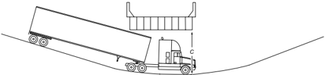

## 3.5  COMBINATIONS OF HORIZONTAL AND VERTICAL ALIGNMENT

## 3.5.1  General Considerations

Horizontal and vertical alignment are permanent design elements for which thorough study is warranted. It is extremely difficult and costly to correct alignment deficiencies after a highway is constructed. On freeways, there are numerous controls such as multilevel structures and costly right-of-way. On most arterial streets, heavy development takes place along the property lines, which makes it impractical to change the alignment in the future. Thus, compromises in the alignment designs should be weighed carefully because any initial savings may be more than offset by the economic loss to the public in the form of crashes and delays.

Horizontal and vertical alignment should not be designed independently. They complement each other, and poorly designed combinations can spoil the good points and aggravate the deficiencies of each. Horizontal alignment and profile are among the more important of the permanent design elements of the highway. Excellence in the design of each and of their combination enhances vehicle control, encourages uniform speed, and improves appearance, nearly always without additional cost ( 1, 12, 43, 57, 58, 68, 71, 72 ).

## 3.5.2  General Design Controls

It is difficult to discuss combinations of horizontal alignment and profile without reference to the broader issue of highway location. These subjects are interrelated and what is said about one is generally applicable to the other. It is assumed in this discussion that the general location of a facility has been fixed and that the remaining task is the development of a specific design harmonizing the vertical and horizontal lines such that the finished highway, road, or street will be an economical, pleasant, and safe facility on which to travel. The physical constraints or influences that act singly or in combination to determine the alignment are: the character of roadway based on the traffic, topography, and subsurface conditions; the existing cultural development; likely future developments; pedestrian crossings; and the location of the roadway's terminals. Design speed is considered in determining the general roadway location, but as design proceeds to the development of more detailed alignment and profile it assumes greater importance. The selected design speed serves to keep all elements of design in balance. Design speed determines limiting values for many elements such as curvature and sight distance and influences many other elements such as width, clearance, and maximum gradient, which are all discussed in the preceding portions of this chapter.

Appropriate combinations of horizontal alignment and profile are obtained through engineering studies and consideration of the following general guidelines:

- y Curvature and grades should be in proper balance. Tangent alignment or flat curvature at the expense of steep or long grades and excessive curvature with flat grades both represent poor design. A logical design that offers the best combination of safety, capacity, ease and uniformity of operation, and pleasing appearance within the practical limits of terrain and area traversed is a compromise between these two extremes.
- y Vertical curvature superimposed on horizontal curvature, or vice versa, generally results in a more pleasing facility, but such combinations should be analyzed for their effect on traffic. Successive changes in profile not in combination with horizontal curvature may result in a series of humps visible to the driver for some distance which represents an undesirable condition.
- y Sharp horizontal curvature should not be introduced at or near the top of a pronounced crest vertical curve. This condition is undesirable because the driver may not perceive the horizontal change in alignment, especially at night. The disadvantages of this arrangement are avoided if the horizontal curvature leads the vertical curvature (i.e., the horizontal curve is

made longer than the vertical curve). Suitable designs can also be developed by using design values well above the appropriate minimum values for the design speed.

- y Somewhat related to the preceding guideline, sharp horizontal curvature should not be introduced near the bottom of a steep grade approaching or near the low point of a pronounced sag vertical curve. Because the view of the road ahead is foreshortened, any horizontal curvature other than a very flat curve assumes an undesirable distorted appearance. Further, vehicle speeds, particularly for trucks, are often high at the bottom of grades, and erratic operations may result, especially at night. Design and traffic control guidance for sharp horizontal curves on steep grades has been presented in Section 3.3.3, which includes a discussion of the effect of grades on horizontal alignment design.
- y On two-lane roads and streets, the need for passing sections at frequent intervals and including an appreciable percentage of the length of the roadway often supersedes the general guidelines for combinations of horizontal and vertical alignment. In such cases, it is appropriate to work toward long tangent sections to assure sufficient passing sight distance in design.
- y Both horizontal curvature and profile should be made as flat as practical  at  intersections where sight distance along either roads or streets is important and vehicles may have to slow or stop.
- y On divided highways and streets, variation in width of median and the use of independent profiles and horizontal alignments for the separate one-way roadways are sometimes desirable. Where traffic justifies provision of four lanes, a superior design without additional cost generally results from such practices.
- y In residential areas, the alignment should be designed to minimize nuisance to the neighborhood. Generally, a depressed facility makes a highway less visible and less noisy to adjacent residents. Minor horizontal adjustments can sometimes be made to increase the buffer zone between the highway and clusters of homes.
- y The alignment should be designed to enhance attractive scenic views of the natural and manmade environment, such as rivers, rock formations, parks, and outstanding structures. The highway should head into, rather than away from, those views that are outstanding; it should fall toward those features of interest at a low elevation, and it should rise toward those features best seen from below or in silhouette against the sky.
- y The alignment must be designed such that pedestrian facilities are accessible to and usable by individuals with disabilities ( 71, 73 ). For additional guidance on design of pedestrian facilities, consult the Proposed Guidelines for Pedestrian Facilities in the Public Right-of Way ( 70 ) and the AASHTO Guidelines for Planning, Design, and Operation of Pedestrian Facilities ( 3 ).

## 3.5.3  Alignment Coordination in Design

Coordination of horizontal alignment and profile should not be left to chance but should begin with preliminary design, at which time adjustments can be readily made. Although a specific

--',''','',',',','''''',,,,''-'-',,',,',',,'---

order of study cannot be stated for all highways, a general procedure applicable to most facilities is described in this section.

The designer should use working drawings of a size, scale, and arrangement so that he or she can study long, continuous stretches of highway in both plan and profile and visualize the whole in three dimensions. Working drawings should be of a small scale, with the profile plotted jointly with the plan. A continuous roll of plan-profile paper usually is suitable for this purpose. To assist in this visualization, there also are programs available for personal computers (PCs) that allow designers to view proposed vertical and horizontal alignments in three dimensions.

After study of the horizontal alignment and profile in preliminary form, adjustments in either, or both, can be made jointly to obtain the desired coordination. At this stage, the designer should not be concerned with line calculations other than known major controls. The study should be made largely on the basis of a graphical or computer analysis. The criteria and elements of design covered in this and the preceding chapter should be kept in mind. For the selected design speed, the values for controlling curvature, gradient, sight distance, and superelevation runoff length should be obtained and checked graphically or with a computer or CADD system. Design speed may have to be adjusted during the process along some sections to conform to likely variations in speeds of operation. This need may occur where noticeable changes in alignment characteristics are needed to accommodate unusual terrain or right-of-way controls. In addition, the general design controls, as enumerated separately for horizontal alignment, vertical alignment, and their combination, should be considered. All aspects of terrain, traffic operations for all transportation modes, and appearance should be considered and the horizontal and vertical lines should be adjusted and coordinated before the costly and time-consuming calculations and the preparation of construction plans to large scale are started.

The coordination of horizontal alignment and profile from the standpoint of appearance usually can be accomplished visually on the preliminary working drawings or with the assistance of computer programs that have been developed for this purpose. Generally, such methods result in a satisfactory product when applied by an experienced designer. This means of analysis may be supplemented by models, sketches, or images projected by a computer at locations where the appearance of certain combinations of line and grade is unclear. For highways with gutters, the effects of superelevation transitions on gutter-line profiles should be examined. This can be particularly significant where flat grades are involved and can result in local depressions. Slight shifts in profile in relation to horizontal curves can sometimes eliminate this concern.

The procedures described above should obviously be modified for the design of typical local roads or streets, as compared to higher type highways. The alignment of any local road or street, whether for a new roadway or for reconstruction of an existing roadway, is governed by the existing or likely future development along it. Where driveways are located on or near a horizontal curve or crest vertical curve, the designer should check the availability of adequate sight distance for major-road drivers approaching from the rear of a stopped or turning vehicle and

--',''','',',',','''''',,,,''-'-',,',,',',,'---

for  major-road  drivers  turning  left  from  the  major  road  into  the  driveway.  In  addition,  the availability of sight distance for left turns from divided highways should be checked because of the possibility of sight obstructions in the median. The horizontal and vertical alignment of intersecting roadways at intersections and driveways are key controls. Although they should be fully considered, they should not override the broader desirable features described above. Even for street design, it is desirable to work out long, flowing alignment and profile sections rather than a connected series of block-by-block sections. Some examples of poor and good practice are illustrated in Figure 3-40.

Figure 3-40. Alignment and Profile Relationships in Roadway Design (43)

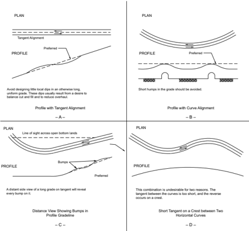

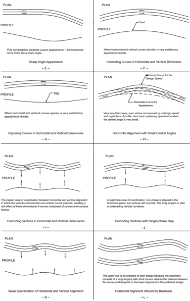

Figure 3-40. Alignment and Profile Relationships in Roadway Design (Continued)


Figure 3-40. Alignment and Profile Relationships in Roadway Design (Continued)


## 3.6  OTHER FEATURES AFFECTING GEOMETRIC DESIGN

In addition to the design elements discussed previously, several other features affect or are affected by the geometric design of a roadway. Each of these features is discussed only to the extent needed to show its relation to geometric design and how it, in turn, is thereby affected. Detailed design of these features is not covered here.

## 3.6.1  Erosion Control and Landscape Development

Erosion prevention is one of the major factors in design, construction, and maintenance of highways. It should be considered early in the location and design stages. Some degree of erosion control can be incorporated into the geometric design, particularly in the cross section elements. Of course, the most direct application of erosion control occurs in drainage design and in the writing of specifications for landscaping and slope planting.


Erosion  and  maintenance  are  minimized  largely  by  using  specific  design  features:  flat  side slopes, rounded and blended with natural terrain; serrated cut slopes; drainage channels designed  with  due  regard  to  width,  depth,  slopes,  alignment,  and  protective  treatment;  inlets located and spaced with erosion control in mind; prevention of erosion at culvert outlets; proper facilities for groundwater interception; dikes, berms, and other protective devices to trap sediment at strategic locations; and protective groundcovers and planting. To the extent practical, these features should be designed and located to minimize the potential crash severity for motorists who unintentionally run off the roadway.

Landscape development should be in keeping with the character of the highway and its environment. Programs include the following general areas of improvement: (1) preservation of existing vegetation, (2) transplanting of existing vegetation where practical, (3) planting of new vegetation, (4) selective clearing and thinning, and (5) regeneration of natural plant species and material.

The objectives in planting or the retention and preservation of natural growth on roadsides are closely related. In essence, they provide vegetation that (1) will be an aid to aesthetics; (2) will aid  in  lowering  construction  and  maintenance  costs;  and  (3)  create  interest,  usefulness,  and beauty for the pleasure and satisfaction of the traveling public without increasing the potential crash severity for motorists who unintentionally run off the roadway.

Landscaping of highways and streets in urban areas assumes additional importance in mitigating the many nuisances associated with urban area traffic. Landscaping can reduce this contribution to urban blight and make the urban highways and streets better neighbors.

Further information concerning landscape development and erosion control is presented in the AASHTO Guide for Transportation Landscape and Environmental Design ( 1 ).

## 3.6.2  Rest Areas, Information Centers, and Scenic Overlooks

Rest areas, information centers, and scenic overlooks are functional and desirable elements of the complete highway facility and are provided to reduce driver fatigue and for the convenience of highway users. A rest area is a roadside area with parking facilities separated from the roadway, provided for the travelers to stop and rest for short periods. The area may provide drinking water, restrooms, tables and benches, telephones, information displays, and other facilities for travelers. A rest area is not intended to be used for social or civic gatherings or for such active forms  of  recreation  as  boating,  swimming,  or  organized  games.  An  information  center  is  a staffed or unstaffed facility at a rest area for the purpose of furnishing travel and other information or services to travelers. A scenic overlook is a roadside area provided for motorists to park their vehicles, beyond the shoulder, primarily for viewing the scenery or for taking photographs in a location removed from through traffic. Scenic overlooks need not provide comfort and convenience facilities.

--',''','',',',','''''',,,,''-'-',,',,',',,'---

Site selection for rest areas, information centers, and scenic overlooks should consider the scenic quality of the area, accessibility, and adaptability to development. Other essential considerations include an adequate source of water and a means to treat and/or properly dispose of sewage. Site plans should be developed through the use of a comprehensive site planning process that should include the location of ramps, parking areas for cars and trucks, buildings, picnic areas, water supply, sewage treatment facilities, and maintenance areas. The objective is to give maximum weight to the appropriateness of the site rather than adherence to uniform distance or driving time between sites.

Facilities should be designed to accommodate the needs of older persons and persons with disabilities. Further information concerning rest area design is presented in the AASHTO Guide for Development of Rest Areas on Major Arterials and Freeways ( 2 ).

## 3.6.3  Lighting

Lighting may reduce nighttime crashes on a highway or street and improve the ease and comfort of operation. Statistics indicate that nighttime crash rates are higher than daytime crash rates. To a large extent, this may be attributed to reduced visibility at night. There is evidence that in the suburban, urban, and urban core contexts, where there are concentrations of pedestrians and roadside intersectional interferences, fixed-source lighting tends to reduce crashes. Lighting of highways in rural areas may be desirable, but the need for it is much less than on streets and highways in urban areas. The general consensus is that lighting of highways in rural areas is seldom justified except in certain critical areas, such as interchanges, intersections, railroad grade crossings, long or narrow bridges, tunnels, sharp curves, and areas where roadside interferences are present. Most modern rural highways should be designed with an open cross section and horizontal and vertical alignment of a fairly high type. Accordingly, they offer an opportunity for near maximum use of vehicle headlights, resulting in reduced justification for fixed highway lighting.

On freeways where there are no pedestrians, roadside entrances, or other intersections at grade, and where rights-of-way are relatively wide, the justification for lighting differs from that of non-controlled streets and highways. The AASHTO Roadway Lighting Design Guide ( 6 ) was prepared to aid in the selection of sections of freeways, highways, and streets for which fixedsource lighting may be warranted, and to present design guide values for their illumination. This guide also contains a section on the lighting of tunnels and underpasses. A primary source of  design  information  for  lighting  are  Illuminating  Engineering  Society  of  North  America (IESNA) publications, including ANSI/IESNA RP-8, American National Standard Practice for Roadway Lighting ( 59 ); ANSI/IESNA RP-22, American National Standard Practice for Tunnel Lighting ( 60 ); IESNA DG-19, Design Guide for Roundabout Lighting ( 61 ); and IESNA DG-23, Design Guide for Toll Plaza Lighting ( 62 ).

Whether or not at-grade intersections in rural areas should be lighted depends on the layout and the traffic volumes involved. Intersections that do not have channelization are frequently left unlighted. On the other hand, intersections with substantial channelization, particularly multiroad layouts and those designed on a broad scale, are often lighted. It is especially desirable to illuminate large-scale channelized intersections and roundabouts. Because of the sharp curvatures, little of such intersections is within the lateral range of headlights, and the headlights of other vehicles are a hindrance rather than an aid because of the variety of directions and turning movements. There is need to obtain a reduction in the speed of vehicles approaching some intersections. The indication of this need should be definite and visible at a distance from the intersection that is beyond the range of headlights. Illumination of the intersection with fixedsource lighting accomplishes this.

At interchanges it also is desirable, and sometimes essential, to provide fixed-source lighting. Drivers should be able to see not only the road ahead, but also the entire turning roadway area to properly discern the paths to be followed. They should also see all other vehicles that may influence their own behavior. Without lighting, there may be a noticeable decrease in the usefulness of the interchange at night; there would be more cars slowing down and moving with uncertainty at night than during daylight hours. Consideration should be given to improving visibility at night by roadway lighting (or reflectorizing devices) the parts of grade separation structures that particularly should be avoided by motorists, such as curbs, piers, and abutments. The greater the volume of traffic, particularly turning traffic, the more important the fixed-source lighting at interchanges becomes. Illumination should also be considered on those sections of major highways where there are turning movements to and from roadside development.

Floodlighting or highway lighting may be desirable at railroad-highway grade crossings when there are nighttime movements of trains. In some cases, such treatments may apply also to crossings operated with flashing signals or gates, or both.

Tunnels, toll plazas, and movable bridges are nearly always lighted, as are bridges of substantial length in urban and suburban areas. It is questionable whether the cost of lighting long bridges in rural areas is justified or desirable.

To minimize the effect of glare and to provide the most economical lighting installation, luminaires are mounted at heights of at least 30 ft [9 m]. Lighting uniformity is improved with higher mounting heights, and in most cases, mounting heights of 35 to 50 ft [10 to 15 m] are usually preferable.  High-mast lighting-special luminaires on masts of 100 ft [30 m] or greater-is used to light large highway areas such as interchanges and rest areas. This lighting furnishes a uniform light distribution over the whole area and may provide alignment guidance. However, it also has a disadvantage in that the visual impact on the surrounding community from scattered light is increased.

Luminaire supports (poles) should be placed outside the roadside clear zones whenever practical. The appropriate clear zone dimensions for the various functional classifications will be found in the discussion of roadside design in Section 4.6. Where poles are located within the clear zone, regardless of distances from the traveled way, they should be designed to have a suitable impact attenuation feature; normally, a breakaway design is used. Breakaway poles should not be used on streets in densely developed areas, particularly with sidewalks. When struck, these poles could interfere with pedestrians and cause damage to adjacent buildings. Because of lower speeds and parked vehicles, there is much less chance of injuries to vehicle occupants from striking fixed poles on a street as compared to a highway. Poles should not be erected along the outside of curves on ramps where they are more susceptible to being struck. Poles located behind longitudinal barriers (installed for other purposes) should be offset sufficiently to allow for deflection of the longitudinal barriers under impact.

On a divided highway or street, luminaire supports may be located either in the median or on the right side of the roadway. Where luminaire supports are located on the right side of the roadway, the light source is usually closer to the more heavily used traffic lanes. However, with median installation, the cost is generally lower and illumination is greater on the high-speed lanes. For median installations, dual-mast arms should be used, for which 40 to 50 ft [12 to 15 m] mounting heights are favored. For further information, refer to the AASHTO Roadside Design Guide ( 7 ).

Where highway lighting is being considered for future installation, considerable savings can be achieved through design and installation of necessary conduits under roadways and curbs as part of initial construction.

Highway lighting for freeways is directly associated with the type and location of highway signs. For full effectiveness, the two should be designed jointly.

## 3.6.4  Utilities

Highway and street improvements, whether upgraded within the existing right-of-way or entirely on new right-of-way, generally entail adjustment of utility facilities. Utilities generally have little effect on the geometric design of the highway or street. However, full consideration, reflecting sound engineering principles and economic factors, should be given to measures needed to preserve and protect the integrity and visual quality of the highway or street, its maintenance efficiency, and the safety of traffic. The costs of utility adjustments vary considerably because of the large number of companies, the type and complexity of the facility, and the degree of involvement with the improvement. Depending on the location of a project, the utilities involved could include (1) sanitary sewers; (2) water supply lines; (3) oil, gas, and petroleum product pipelines; (4) overhead and underground power and communications lines including fiber optic cable; (5) cable television; (6) wireless communication towers; (7) drainage and irrigation lines; (8) heating mains; and (9) special tunnels for building connections.

State departments of transportation (DOTs) handle utility issues in diverse ways. Virtually all state DOTs follow their in-state utility accommodation policies, which may reference FHWA and AASHTO documents. Most of these policies are general in nature and pertain mostly to cost-reimbursement issues.

There is a real need to evaluate and weigh the costs of relocating a utility versus accommodating it in place through design considerations for the benefit of the citizen who is both the ratepayer and the taxpayer. The impacts of relocating utilities are beginning to be measured more accurately and comprehensively, including items such as road-user costs for lane closures. Recently, there has been a significant effort from several DOTs to address utility issues with new technologies, philosophies, and procedures. There is also an increased national emphasis on utility issues that has resulted in significant research efforts, including the development of subsurface utility engineering. More information about subsurface utility engineering is available in NCHRP Synthesis 405 ( 13 ).

## 3.6.4.1  General

Utility lines should be located to minimize need for later adjustment, to accommodate future highway or street improvements, and to permit servicing such lines with minimum interference to traffic.

Longitudinal installation should be located on uniform alignment as near as practical to the right-of-way line so as to not interfere with traffic operation and to preserve space for future highway or street improvements or other utility installations. Underground utilities should be placed to allow above-ground utilities to be as close to the right-of-way line as practical. Also to the extent practical, utilities along freeways should be constructed so they can be serviced from outside the controlled access lines.

To the extent practical, utility line crossings of the highway should cross on a line generally normal to the highway alignment. Those utility crossings that are more likely to need future servicing should be encased or installed in tunnels to permit servicing without disrupting the traffic flow.

The horizontal and vertical location of utility lines within the highway right-of-way limits should conform to the clear roadside policies applicable for the system, type of highway or street, and specific conditions for the particular section involved. Utility facilities on highway and street rights-of-way should be located well away from the traveled way and should be designed so they are not roadside obstacles. The clear roadside dimension to be maintained for a specific functional classification is discussed in Section 4.6, 'Roadside Design.'

Sometimes attachment of utility facilities to highway structures, such as bridges, is a practical arrangement and may be authorized. Where it is practical to locate utility lines elsewhere, attachment to bridge structures should be avoided.

--',''','',',',','''''',,,,''-'-',,',,',',,'---

On new installations or adjustments to existing utility lines, provision should be made for known or planned expansion of the utility facilities, particularly those located underground or attached to bridges.

All utility installations on, over, or under highway or street right-of-way and attached structures should be of durable materials designed for long service-life expectancy, relatively free from routine servicing and maintenance, and meet or exceed the applicable industry codes or specifications.

Utilities that are to cross or otherwise occupy the right-of-way of freeways in rural or urban areas should conform to the AASHTO Policy on the Accommodation of Utilities within Freeway Right-of-Way ( 5 ). Those on non-controlled access highways and streets should conform to the AASHTO Guide for Accommodating Utilities within Highway Right-of-Way ( 4 ).

## 3.6.4.2  Rural Areas

On new construction, no utility should be situated under any part of the roadway, except where the utility crosses the highway.

Normally, no poles should be located in the median of divided highways. Utility poles, vent standpipes, and other above-ground utility appurtenances that may be struck by vehicles that run off the road should not be placed within the highway clear zone as discussed in Section 4.6.1. The AASHTO Roadside Design Guide ( 7 ) discusses clear-zone widths and may be used as a reference to determine appropriate widths for freeways, arterials in rural areas, and high-speed collectors in rural areas. For low-speed collectors and local roads in rural areas, except for very low-volume local roads with ADTs less than or equal to 400 vehicles per day, a minimum clear zone width of 7 to 10 ft [2 to 3 m] is desirable.

## 3.6.4.3  Urban Areas

Because of restricted space in most metropolitan areas, special consideration should be given in the initial design to the potential for joint usage of the right-of-way that is consistent with the primary function of the highway or street.

Appurtenances  to  underground  installations,  such  as  vents,  drains,  markers,  manholes,  and shutoffs, should be located so as not to be a roadside obstacle, not to interfere with highway or street maintenance activities, and not to be concealed by vegetation. Preferably they should be located near the right-of-way line.

Where there are curbed sections, utilities should be located in the border areas between the curb and sidewalk, at least 1.5 ft [0.5 m] behind the face of the curb, and where practical, aboveground utilities should be behind the sidewalk. Where shoulders are provided rather than curbs, a clear zone commensurate with rural area conditions should be provided.

Existing development and limited right-of-way widths may preclude location of some or all utility facilities outside the roadway of the street or highway. Under some conditions, it may be appropriate to reserve the area outside the roadway exclusively for the use of overhead lines with all other utilities located under the roadway, and in some instances the location of all the facilities under the roadway may be appropriate. Location of utilities under the roadway is an exception to the stated policy and as such needs special consideration and treatment. Accommodation of these facilities under the roadway should be accomplished in a manner that will have a minimum adverse effect on traffic as a result of future utility service and maintenance activities.

## 3.6.5  Traffic Control Devices

## 3.6.5.1  Traffic Signs, Pavement Markings, and Traffic Signals

Traffic signs, pavement markings, and traffic signals are directly related to, and complement, the design of highways and streets. They are critical features of traffic control and operation that the designer considers in the geometric layout of such a facility. Traffic control devices should be designed concurrently with the geometrics. The potential for future operational efficiency can be significantly enhanced if signs, markings, and signals are treated as an integral part of design.

The extent to which traffic control devices are used depends on the traffic volume, the type of facility,  and the extent of traffic control appropriate for safe and efficient operation. Arterial highways are usually numbered routes of fairly high type and have relatively high traffic volumes. On such highways, signs and markings are employed extensively and traffic signals are often employed in urban areas. Collector and local roads and streets usually have lower volumes and speeds and therefore typically need fewer traffic control devices. The geometric design of the facility should be supplemented by effective signing, markings, and signals as a means of informing, warning, and controlling users during day and night operations and under a variety of environmental conditions. Signing, marking, and signal plans should be coordinated with horizontal and vertical alignment, sight distance obstructions, operational speeds and maneuvers, and other applicable items before completion of design. For requirements and guidance concerning design, location, and application of signs and markings, refer to the MUTCD ( 24 ).

Traffic control signals for vehicles, pedestrians, and bicycles are devices that control crossing or merging traffic by assigning the right-of-way to various movements for certain intervals of time. They are one of the key elements in the function of many streets in urban areas and some intersections in rural areas. For this reason, the planned traffic signal design and operation for each intersection of a facility should be integrated with the geometric design features to provide optimum operational efficiency. Careful consideration should be given in design to intersection and access locations, horizontal and vertical curvature with respect to signal visibility, pedestrian and bicycle needs (including accommodation of pedestrians with disabilities), and the geometric layout for effective signal operation including signal phasing, timing, and coordination. In addition to the initial installation, potential future signal locations and needs should be considered

in the design process. The design of traffic signal devices and warrants for their use are provided in the MUTCD ( 24 ).

Because supports for highway signs and signals have the potential of being struck by motorists, they should be placed on structures outside the desired clear zone or behind traffic barriers placed for other reasons. If these measures are not practical, the supports should be breakaway or, for overhead sign and signal supports, shielded by appropriate traffic barriers. The AASHTO LRFD Specifications for Structural Supports for Highway Signs, Luminaires, and Traffic Signals (9) provides the criteria for breakaway sign supports. Likewise, supports should not be placed in such a way that they restrict pedestrian traffic on adjacent sidewalks. Sign supports on sidewalks can severely impact pedestrians with vision impairments and are obstacles to all pedestrians. See Section 4.17, 'Pedestrian Facilities,' for details and references.

The number and arrangement of lanes are key to efficient operation of signalized intersections. The crossing distances for both vehicles and pedestrians should normally be kept as short as practical to reduce exposure to conflicting movements. Therefore, the first step in the development of intersection geometric designs should be a complete analysis of current and future traffic demand, including pedestrian, bicycle, and transit users. The need for right- and leftturn lanes to minimize the interference of turning traffic with the movement of through traffic should be evaluated concurrently with the potential need for obtaining any additional right-ofway. Along a highway or street with a number of signalized intersections, the locations where turns will, or will not, be accommodated should also be examined to permit optimal traffic signal coordination.

## 3.6.5.2  Intelligent Transportation Systems

The use of Intelligent Transportation Systems (ITS) on the highway and street system continues to grow in coverage and diversity of technology and applications. In urban areas, traditional ITS applications such as traffic signals and more complex advanced traffic management systems (ATMS) and Advanced Traveler Information Systems (ATIS) are growing in usage and complexity. All of these systems are increasing the number of devices on arterial and sometimes collector  roadways.  These  devices  include  closed-circuit  television  cameras,  traffic  speed  and density detectors, dynamic message signs, ramp control signals, transit priority signals, tolling systems, and other types of advanced monitoring and management devices. The communications system infrastructure that connects, controls, and monitors these systems is also an important element of the ITS infrastructure that should be considered in the geometric design process. It is important that the designer identify the existing and planned applications of ITS technologies and their supporting infrastructure elements within the highway and street network to create geometric designs that allow for their effective operation and appropriate physical placement. Most transportation agencies have developed ITS device and infrastructure standards and specifications that can be used in the design process.

## 3.6.6  Traffic Management Plans for Construction

Maintenance  of  traffic  during  construction  should  be  carefully  planned  and  executed  ( 73 ). Although it is often better to provide detours, this is frequently impractical so traffic flow usually is maintained through the construction area. Sometimes traffic lanes are closed, shifted, or encroached upon in order to undertake construction. When this occurs, designs for traffic control should minimize the effect on traffic operations by minimizing the frequency or duration of interference with normal traffic flow. The development of traffic control plans is an essential part of the overall project design and may affect the design of the facility itself. The traffic control plan depends on the nature and scope of the improvement, volumes of traffic, highway or street pattern, and capacities of available highways or streets. A well-thought-out and carefully developed plan for the movement of traffic through a work zone will contribute significantly to the safe and efficient flow of traffic as well as the reduced potential for injury to the construction forces. It is desirable that such plans have some built-in flexibility to accommodate unforeseen changes in work schedule, delays, or traffic patterns.

The utilization of law enforcement in work zones can have a significant safety benefit to both motorists and highway workers ( 69 ). However, the extent to which enforcement can be effectively utilized is dependent on the design and traffic control characteristics of the work zone itself. Several work zone geometric design features can significantly detract from the ability of enforcement personnel to function either in an active enforcement or in a traffic-calming role within the work zone (or both). The design of the traffic management plan should consider the following key points related to the design of the work zone:

- y Establish realistic design speeds and speed limits;
- y Consider the need, extent, and type of police enforcement to be used;
- y Limit the length of shoulder closures to 3 mi [5 km] or less;
- y Consider the need for enforcement pullout areas at least 0.25 mi [0.4 km] in length with a minimum width of 12 ft [3.6 m] and a desirable width of 14 to 15 ft [4.2 to 4.6 m].

Good illumination is needed for effective performance of nighttime construction. Early in project development, designers should consider whether nighttime construction will be utilized so that illumination needs can be incorporated in the project plan ( 55 ).

The goal of any traffic control plan should be to effectively guide vehicle, bicycle, and pedestrian traffic, including persons with disabilities, through or around construction areas. Worker access to the construction area should also be provided. The traffic control plan should incorporate geometrics and traffic control devices as similar as practical to those for normal operating situations, while providing room for the contractor to work effectively. Policies for the use and application of signs and other traffic control devices when highway construction occurs are set forth in the MUTCD ( 24 ). It cannot be emphasized too strongly that the MUTCD ( 24 ) principles should be applied and a plan developed for the particular type of work performed.

## 3.7  REFERENCES

1. AASHTO. A  Guide  for  Transportation  Landscape  and  Environmental  Design ,  Second Edition, HLED-2. American Association of State Highway and Transportation Officials, Washington, DC, 1991.
2. AASHTO. A  Guide  for  Development  of  Rest  Areas  on  Major  Arterials  and  Freeways. American Association of State Highway and Transportation Officials, Washington, DC, 2001.
3. AASHTO. Guide  for  the  Planning,  Design,  and  Operation  of  Pedestrian  Facilities ,  First Edition, GPF-1. American Association of State Highway and Transportation Officials, Washington, DC, 2004. Second edition pending.
4. AASHTO. A  Guide  for  Accommodating  Utilities  within  Highway  Right-of-Way ,  Fourth Edition, GAU-4. Association of State Highway and Transportation Officials, Washington, DC, 2005.
5. AASHTO. A Policy on the Accommodation of Utilities within Freeway Right-of-Way , Fifth Edition, AU-5. Association of State Highway and Transportation Officials, Washington, DC, 2005.
6. AASHTO. Roadway  Lighting  Design  Guide ,  Sixth  Edition  with  2010  Errata,  GL-6. American Association of State Highway and Transportation Officials, Washington, DC, 2005. Seventh edition pending 2018.
7. AASHTO. Roadside Design Guide ,  Fourth Edition with 2015 Errata, RSDG-4. American Association of State Highway and Transportation Officials, Washington, DC, 2011.
8. AASHTO. AASHTO Drainage Manual , First Edition, ADM-1. American Association of State Highway and Transportation Officials, Washington, DC, 2014.
9. AASHTO. LRFD Specifications  for  Structural  Supports  for  Highway  Signs,  Luminaires, and Traffic Signals , First Edition with 2017 Interim Revisions, LRFDLTS-1. American Association of Highway and Transportation Officials, Washington, DC, 2015.
10. AASHTO. AASHTO LRFD Bridge  Design  Specifications ,  Eighth  Edition  with  2018 Errata, LRFD-8. American Association of State Highway and Transportation Officials, Washington, DC, 2017.
11. Alexander, G. J. and H. Lunenfeld. Positive Guidance in Traffic Control . Federal Highway Administration, U.S. Department of Transportation, Washington, DC, 1975.

--',''','',',',','''''',,,,''-'-',,',,',',,'---


12. ASCE. Practical  Highway Aesthetics .  American  Society  of  Civil  Engineers,  New  York, NY, 1977.
13. Anspach,  J.  H., National  Cooperative  Highway  Research  Program  Synthesis  of  Highway Practice  405:  Utility  Location  and  Highway  Design .  NCHRP,  Transportation  Research Board, National Research Council, Washington, DC, 2010.
14. Barnett, J. Safe Side Friction Factors and Superelevation Design. Proc., HRB ,  Vol. 16. Highway Research Board (currently Transportation Research Board), National Research Council, Washington, DC, 1936, pp. 69-80.
15. Barnett,  J. Transition  Curves  for  Highways .  Federal  Works  Agency,  Public  Roads Administration, Washington, DC, 1940.
16. Bonneson, J. A. National Cooperative Highway Research Program Report 439: Superelevation Distribution Methods and Transition Designs .  NCHRP, Transportation Research Board, National Research Council, Washington, DC, 2000.
17. Bureau of  Public  Roads. Study of  Speed  Curvature  Relations  of  Pentagon  Road  Network Ramps .  Federal Works Agency, Public Roads Administration, Washington, DC, 1954 unpublished data.
18. Cron, F. W. The Art of Fitting the Highway to the Landscape. The Highway and the Landscape . W. B. Snow, ed., Rutgers University Press, New Brunswick, NJ, 1959.
19. Cysewski, G. R. Urban Intersectional Right Turning Movements. Traffic  Engineering , Vol. 20, No. 1, October 1949, pp. 22-37.
20. Fambro, D. B., K. Fitzpatrick, and R. J. Koppa. National Cooperative Highway Research Program Report 400: Determination of Stopping Sight Distances . NCHRP, Transportation Research Board, National Research Council, Washington, DC, 1997.
21. Fancher, Jr., P. S. and T. D. Gillespie. National Cooperative Highway Research Program Synthesis of Highway Practice 241: Truck Operating Characteristics . NCHRP, Transportation Research Board, National Research Council, Washington, DC, 1997.
22. FHWA. Grade Severity Rating System Users Manual ,  FHWA-IP-88-015. Federal Highway Administration, U.S. Department of Transportation, Washington, DC, August 1989.
23. FHWA. The  Magnitude  and  Severity  of  Passing  Accidents  on  Two-Lane  Rural  Roads ( HSIS Summary Report ),  FHWA-RD-94-068. Federal Highway Administration, U.S. Department of Transportation, Washington, DC , November 1994.


24. FHWA. Manual  on  Uniform  Traffic  Control  Devices  for  Streets  and  Highways .  Federal Highway Administration, U.S. Department of Transportation, Washington, DC, 2009. Available at

http://mutcd.fhwa.dot.gov

25. George, L. E. Characteristics of Left-Turning Passenger Vehicles. In Proc., HRB ,  Vol. 31. Highway Research Board, National Research Council, Washington, DC, 1952, pp. 374-385.
26. Gillespie,  T. Methods  for  Predicting  Truck  Speed  Loss  on  Grades .  FHWA/RD-86/059. Federal  Highway  Administration,  U.S.  Department  of  Transportation,  Washington, DC, October 1986.
27. Glennon, J. C. An Evaluation of Design Criteria for Operating Trucks Safely on Grades. In Highway Research Record 312 . Highway Research Board, National Research Council, Washington, DC, 1970, pp. 93-112.
28. Glennon,  J.  C.  New  and  Improved  Model  of  Passing  Sight  Distance  on  Two-Lane Highways.  In Transportation  Research  Record  1195 .  Transportation  Research  Board, National Research Council, Washington, DC, 1998.
29. Hajela, G. P. Compiler, Resume of Tests on Passenger Cars on Winter Driving Surface, 19391966 . National Safety Council, Committee on Winter Driving Hazards, Chicago, IL, 1968.
30. Harwood, D. W. and A. D. St. John. Passing Lanes and Other Operational Improvements on  Two-Lane  Highways ,  FHWA/RD-85/028.  Federal  Highway  Administration,  U.S. Department of Transportation, Washington, DC, December 1985.
31. Harwood, D. W. and C. J. Hoban. Low Cost Methods for Improving Traffic Operations on Two-Lane Roads , FHWA-IP-87-2. Federal Highway Administration, U.S. Department of Transportation, Washington, DC, 1987.
32. Harwood, D. W. and J. C. Glennon. Passing Sight Distance Design for Passenger Cars and  Trucks.  In Transportation  Research  Record  1208 .  Transportation  Research  Board, National Research Council, Washington, DC, 1989.
33. Harwood, D. W., J. M. Mason, W. D. Glauz, B. T. Kulakowski, and K. Fitzpatrick. Truck  Characteristics  for  Use  in  Highway  Design  and  Operation ,  FHWA-RD-89-226. Federal  Highway  Administration,  U.S.  Department  of  Transportation,  Washington, DC, August 1990.


34. Harwood, D. W., D. J. Torbic, K. R. Richard, W. D. Glauz, and L. Elefteriadou. National Cooperative  Highway  Research  Program  Report  505:  Review  of  Truck  Characteristics  as Factors in Roadway Design . NCHRP, Transportation Research Board, National Research Council, Washington DC, 2003.
35. Harwood, D. W., D. K. Gilmore, K. R. Richard, J. M. Dunn, and C. Sun. National Cooperative  Highway  Research  Program  Report  605:  Passing  Sight  Distance  Criteria . NCHRP, Transportation Research Board, National Research Council, Washington DC, 2007.
36. Harwood, D. W., J. M. Hutton, C. Fees, K. M. Bauer, A. Glen, and H. Ouren. National Cooperative Highway Research Program Report 783: Evaluation of the 13 Controlling Criteria for  Geometric  Design .  NCHRP,  Transportation  Research  Board,  National  Research Council, Washington, DC, 2014.
37. Hassan, Y., S. M. Easa, and A. O. Abd El Halim. Passing Sight Distance on Two-Lane Highways: Review and Revision. Transportation Research Part A , Vol. 30, No. 6, 1996.
38. Hayhoe, G. F. and J. G. Grundmann. Review of Vehicle Weight/Horsepower Ratio as Related to Passing Lane Design Criteria . Final Report of NCHRP Project 20-7(10). Pennsylvania State University, University Park, PA, October 1978.
39. Huff, T. S. and F. H. Scrivner. Simplified Climbing-Lane Design Theory and Road-Test Results. Bulletin 104 . Highway Research Board, Washington, DC, 1955, pp. 1-11.
40. ITE. Truck Escape Ramps, Recommended Practice . Institute of Transportation Engineers, Washington, DC, 1989.
41. Johansson, G. and K. Rumar. Drivers' Brake Reaction Times. Human Factors , Vol. 13, No. 1, February 1971, pp. 23-27.
42. King, G. F. and H. Lunenfeld. National Cooperative Highway Research Program Report 123:  Development  of  Information  Requirements  and  Transmission  Techniques  for  Highway Users . NCHRP, Transportation Research Board, Washington, DC, 1971.
43. Leisch, J. E. Application of Human Factors in Highway Design. Unpublished paper presented at AASHTO Region 2 meeting, June 1975.
44. MacAdam, C. C., P. S. Fancher, and L. Segal. Side Friction for Superelevation on Horizontal Curves ,  FHWA-RD-86-024.  Federal  Highway  Administration,  U.S.  Department  of Transportation, Washington, DC, August 1985.

--',''','',',',','''''',,,,''-'-',,',,',',,'---


45. Maryland Department of Transportation. Advisory Speeds on Maryland Roads . Brudis and Associates, Inc., Maryland Department of Transportation, Office of Traffic and Safety, Hanover, MD, August 1999.
46. Massachusetts  Institute  of  Technology. Report  of  the  Massachusetts  Highway  Accident Survey ,  CWA  and  ERA  project.  Massachusetts  Institute  of  Technology,  Cambridge, MA, 1935.
47. McGee, H. W., W. Moore, B. G. Knapp, and J. H. Sanders. Decision Sight Distance for Highway Design and Traffic Control Requirements .  FHWA-RD-78-78. Federal Highway Administration, U.S. Department of Transportation, Washington, DC, February 1978.
48. Moyer, R. A. Skidding Characteristics of Automobile Tires on Roadway Surfaces and Their  Relation  to  Highway  Safety. Bulletin  No.  120 .  Iowa  Engineering  Experiment Station, Ames, IA, 1934.
49. Moyer, R. A. and D. S. Berry. Marking Highway Curves with Safe Speed Indications. In Proc., HRB , Vol. 20. Highway Research Board, Washington, DC, 1940, pp. 399-428.
50. Normann, O. K. Braking Distances of Vehicles from High Speeds. In Proc., HRB , Vol. 22. Highway Research Board, Washington, DC, 1953. pp. 421-436.
51. Potts, I. B. and D. W. Harwood. National Cooperative Highway Research Program Research Results Digest 275: Application of European 2+1 Roadway Designs . NCHRP, Transportation Research Board, National Research Council, Washington, DC, April 2003.
52. Raymond, Jr., W. L. Offsets to Sight Obstructions Near the Ends of Horizontal Curves. Civil Engineering , Vol. 42, No. 1, January 1972, pp.71-72.
53. Robinson, G. H., D. J. Erickson, G. L. Thurston, and R. L. Clark. Visual Search by Automobile Drivers. Human Factors , Vol. 14, No. 4, August 1972, pp. 315-323.
54. Schwender,  H.  C.,  O.  K.  Normann,  and  J.  O.  Granum.  New  Method  of  Capacity Determination for Rural Roads in Mountainous Terrain. Highway Research Board Bulletin 167 . Highway Research Board, Washington, DC, 1957, pp. 10-37.
55. Shane, J. S., A. Kandil, and C. J. Schexnayder. National Cooperative Highway Research Program Report 726: A Guidebook for Nighttime Construction: Impacts on Safety, Quality, and Productivity . NCHRP, Transportation Research Board, National Research Council, Washington, DC, 2012.


56. Shortt,  W.  H.  A  Practical  Method  for  Improvement  of  Existing  Railroad  Curves.  In Proc., Institution of Civil Engineering , Vol. 76. Institution of Civil Engineering, London, UK, 1909, pp. 97-208.
57. SHRP. Design Guidelines for the Control of Blowing and Drifting Snow . Strategic Highway Research Program, National Research Council, 1994.
58. Smith, B. L. and Lamm, R. Coordination of Horizontal and Vertical Alignment with Regard  to  Highway  Aesthetics. Transportation  Research  Record  1445 .  Transportation Research Board, National Research Council, Washington DC, 1994.
59. Standard Practice Committee of the IESNA Roadway Lighting Committee. American Standard Practice for Roadway Lighting ,  ANSI/EISNA RP-8-00. Illuminating Engineering Society of North America, New York, NY, 2000 or most current edition.
60. Standard Practice Committee of the IESNA Roadway Lighting Committee. American Standard Practice for Tunnel Lighting , ANSI/IESNA RP-22-05. Illuminating Engineering Society of North America New York, NY, 2005 or most current edition.
61. Standard Practice Committee of the IESNA Roadway Lighting Committee. Design Guide for Roundabout Lighting , ANSI/IESNA DG-19-08. Illuminating Engineering Society of North America, New York, NY, 2008 or most current edition.
62. Standard Practice Committee of the IESNA Roadway Lighting Committee. Design Guide for Toll Plaza Lighting , ANSI/IESNA DG-23-08. Illuminating Engineering Society of North America, New York, NY, 2008 or most current edition.
63. Stonex, K. A. and C. M. Noble. Curve Design and Tests on the Pennsylvania Turnpike. In Proc., HRB , Vol. 20, Highway Research Board, Washington, DC, 1940, pp. 429-451.
64. Taragin, A. Effect of Length of Grade on Speed of Motor Vehicles. In Proc., HRB , Vol. 25, Highway Research Board, Washington, DC, 1945, pp. 342-353.
65. Torbic, D. J, J. M. Hutton, C. D. Bokenkroger, D. W. Harwood, D. K. Gilmore, M. M. Knoshaug, J. J. Ronchetto, M. A. Brewer, K. Fitzpatrick, S. T. Chrysler, and J. Stanley. National Cooperative Highway Research Program Report 730: Design Guidance for Freeway Mainline Ramp Terminals . NCHRP, Transportation Research Board, National Research Council, Washington, DC, 2012. Available at

http://www.trb.org/Publications/Blurbs/167516.aspx


66. Torbic, D. J., M. O'Laughlin, D. W. Harwood, K. M. Bauer, C. K. Bokenkroger, L. Lucas, J. Ronchetto, S. N. Brennan, E. T. Donnell, A. Brown, and T. Varunjikar, National Highway Research Program Report 774: Superelevation Criteria for Sharp Horizontal Curves on Steep Grades . NCHRP, Transportation Research Board, National Research Council, Washington, DC, 2013.
67. Transportation  Research  Board. Highway  Capacity  Manual:  A  Guide  for  Multimodal Mobility  Analysis .  Sixth  Edition.  Transportation  Research  Board,  National  Research Council, Washington, DC, 2016.
68. Tunnard, C. and B. Pushkarev. Man Made America: Chaos or Control? Yale  University Press, New Haven, CT, 1963.
69. Ullman,  G.  L.,  M.  A.  Brewer,  J.  E.  Bryden,  M.  O.  Corkran,  C.  W.  Hubbs,  A.  K. Chandra, and K. L. Jeannotte. National Cooperative Highway Reseach Program Report 746: Traffic Enforcement Strategies for Work Zones ,  NCHRP, Transportation Research Board, National Research Council, Washington, DC, 2013.
70. U.S. Access Board, Proposed Guidelines for Pedestrian Facilities in the Public Right-of-Way , Federal Register, 36 CFR Part 1190, July 26, 2011. Available at http://www.access-board.gov/guidelines-and-standards/streets-sidewalks/public-rights-of-way/ proposed-rights-of-way-guidelines
71. U.S. Department of Justice, 2010 ADA Standards for Accessible Design , September 15, 2010. Available at https://www.ada.gov/2010ADAstandards\_index.htm
72. U.S. Forest Service. Roads. Chapter 4 in National Forest Landscape Management , Vol. 2, U.S. Forest Service, U.S. Department of Agriculture, March 1977.
73. U.S. National Archives and Records Administration. Code of Federal Regulations .  Title 23, Part 630, Subpart J. Work Zone Safety and Mobility Rule.
74. U.S. National Archives and Records Administration. Code of Federal Regulations . Title 49, Part 27. Nondiscrimination on the Basis of Disability in Programs or Activities Receiving Federal Financial Assistance.
75. Walton, C. M. and C. E. Lee. Speed of Vehicles on Grades , Research Report 20-1F. Center for Highway Research, University of Texas at Austin, Austin, TX, August 1975.


76. Western Highway Institute. Offtracking Characteristics of Trucks and Truck Combinations , Research  Committee  Report  No.  3.  Western  Highway  Institute,  San  Francisco,  CA, February 1970.
77. Willey, W. E. Survey of Uphill Speeds of Trucks on Mountain Grades. In Proc., HRB , Vol. 29. Highway Research Board, Washington, DC, 1949, pp. 304-310.
78. Witheford, D. K. National Cooperative Highway Research Program Synthesis of Highway Practice  178:  Truck  Escape  Ramps .  NCHRP,  Transportation  Research  Board,  National Research Council, Washington, DC, May 1992.

--',''','',',',','''''',,,,''-'-',,',,',',,'---

## 4

## Cross-Section Elements

## 4.1  GENERAL

To assure consistency in this policy, the terms 'border area,' 'cross section,' 'roadway,' and 'traveled way' are defined by AASHTO as follows (see Figures 4-1 and 4-2):

Border Area -The area between the roadway and the right-of-way line that may serve several purposes, including, but not limited to, providing a space for separation between pedestrian, bicyclists, and motor-vehicle traffic; a sidewalk; or an area for underground and aboveground utilities such as traffic signals, parking meters, and fire hydrants. A portion of the border area may be used to accommodate snow storage and may include aesthetic features such as grass or landscaping.

Cross Section -A vertical section of the ground and roadway at right angles to the centerline of the roadway, including all elements of a highway or street from right-ofway line to right-of-way line.

Roadway -The portion of a highway, including shoulders, for vehicular use. A divided highway has two or more roadways.

Traveled Way -The portion of the roadway that allows for the movement of through traffic,  including  vehicles,  transit,  and  freight.  It  does  not  include  such  facilities  as curbs,  shoulders,  turn  lanes,  bicycle  facilities,  sidewalks,  or  parking  lanes.  Divided highways are made up of two separate roadways, each with its own traveled way.

## 4.2  TRAVELED WAY

## 4.2.1  Surface Type

The selection of surface type is determined based on the traffic volume and composition, soil characteristics, climate, performance of pavements in the area, availability of materials, energy conservation, initial cost, and the overall annual maintenance and service-life cost. Important pavement characteristics that are related to geometric design are the effect on driver behavior and the ability of a surface to retain its shape and dimensions, to drain, and to retain adequate skid resistance. The structural design

of  pavements  is  not  included  in  this  policy,  but  is  addressed  in  the  AASHTO MechanisticEmpirical Pavement Design Guide ( 11 ).

## 4.2.2  Cross Slope

Undivided traveled ways on tangents, or on flat curves, have a crown or high point in the middle and a cross slope downward toward both edges. Unidirectional cross slopes across the entire width of the traveled way may be utilized. The downward cross slope may be a plane or rounded section or a combination. With plane cross slopes, there is a cross slope break at the crown line and a uniform slope on each side. Rounded cross sections usually are parabolic, with a slightly rounded surface at the crown line and increasing cross slope toward the edge of the traveled way. Because the rate of cross slope is variable, the parabolic section is described by the crown height (i.e., the vertical drop from the center crown line to the edge of the traveled way). The rounded section is advantageous in that the cross slope steepens toward the edge of the traveled way, thereby facilitating drainage. Disadvantages are that rounded sections are more difficult to construct, the cross slope of the outer lanes may be excessive, providing accessible pedestrian crossings may be more difficult, and warping of pavement areas at intersections may be awkward or difficult to construct.

--',''','',',',','''''',,,,''-'-',,',,',',,'---

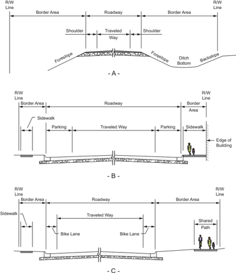

- C -

Figure 4-1. Typical Cross Section, Normal Crown


Figure 4-2. Typical Cross Section, Superelevated


--',''','',',',','''''',,,,''-'-',,',,',',,'---

On divided highways each one-way traveled way may be crowned separately as on two-lane highways, or it may have a unidirectional cross slope across the entire width of the traveled way, which is almost always downward to the outer edge. A cross section with each roadway crowned separately, as shown in Figures 4-3A through 4-3C, has an advantage in rapidly draining the pavement during rainstorms. In addition, the difference between high and low points in the cross section is minimal. Disadvantages are that more inlets and underground drainage lines are needed, and treatment of intersections is more difficult because of the number of high and low points on the cross section. Use of such sections should preferably be limited to regions of high rainfall or where snow and ice are major factors. Sections having no curbs and a wide depressed median are particularly well-suited for these conditions.

Each Pavement Slopes One Way


Figure 4-3. Roadway Sections for Divided Highway (Basic Cross Slope Arrangements)

Roadways with unidirectional cross slopes, as shown in Figures 4-3D through 4-3G, tend to provide more comfort to drivers when they change lanes and may either drain away from or toward the median. Drainage away from the median may provide a savings in drainage structures, minimize drainage across the inner, higher-speed lanes, and simplify treatment of intersecting streets. Drainage toward the median is advantageous in that the outer lanes, which are used by most traffic, are generally free of surface water. This surface runoff, however, should then be


collected into a single conduit under the median. Where curbed medians are present, drainage is concentrated next to or on higher speed lanes. Where the median is narrow, this concentration may result in splashing on the windshields of opposing traffic.

## 4.2.2.1  Rate of Cross Slope

The rate of cross slope is an important element in cross-section design. Superelevation on curves is determined by the speed-curvature relationships given in Chapter 3, but cross slope or crown on tangents or on long-radius curves are complicated by two contradictory controls. On one hand, a reasonably steep lateral slope is desirable to minimize ponding of water on pavements with flat profile grades as a result of pavement imperfections or unequal settlement. Horizontal and vertical alignment should also be coordinated to avoid creating flat spots where crest or sag vertical curves and superelevation transitions coincide. A steep cross slope is also desirable on curbed pavements to confine water flow to a narrow width of pavement adjacent to the curb. On the other hand, steep cross slopes are undesirable on tangents because of the tendency of vehicles to drift toward the low edge of the traveled way. This drifting becomes a major concern in areas where snow and ice are common. Cross slopes up to and including 2 percent are barely perceptible in terms of vehicle steering. However, cross slopes steeper than 2 percent are noticeable and may require a conscious effort in steering. Furthermore, steep cross slopes increase the susceptibility to lateral skidding when vehicles brake on icy or wet pavements or when stops are made on dry pavements under emergency conditions.

The prevalence of high winds may significantly alter the effect of cross slope on steering. In rolling or mountainous terrain with alternate cut-and-fill sections or in areas alternately forested and cleared, substantial cross winds produce an intermittent effect on the lateral placement of vehicles moving along the highway and affect their steering. In areas where such conditions are likely, it is desirable to avoid high rates of cross slope.

On paved two-lane roadways, crowned at the center, the accepted rate of cross slope ranges from 1.5 to 2 percent. Use of cross slopes steeper than 2 percent on paved, high-speed highways with a central crown line is not desirable. In passing maneuvers, drivers cross and recross the crown line and negotiate a total rollover or cross slope change of over 4 percent. The reverse curve path of travel of the passing vehicle causes a reversal in the direction of lateral acceleration, which is further exaggerated by the effect of the reversing cross slopes. Trucks with high centers of gravity crossing over the crown line may sway from side to side when traveling at high speed, making it more difficult to maintain control. Figures 4-3A through 4-3C are examples of roadway conditions where this situation would be encountered.

Where three or more lanes are inclined in the same direction on multilane highways, each successive pair of lanes or portion thereof outward from the first two lanes from the crown line should have an increased slope. The two lanes adjacent to the crown line should be pitched at the normal minimum slope, and on each successive pair of lanes or portion thereof outward, the rate may be increased by about 0.5 to 1 percent. However, a cross slope should not normally exceed 3

percent on a tangent alignment unless there are three or more lanes in one direction of travel. In no case should the cross slope of an outer and/or auxiliary lane be less than that of the adjacent lane. As shown in Figure 4-3G, the left side has a continuous sloped pavement while the right has an increased slope on the outer lane.

## 4.2.2.2  Weather Considerations

In areas of intense rainfall, a somewhat steeper cross slope may be needed to facilitate roadway drainage. In such cases, the cross slope on paved surfaces may be increased to 2.5 percent, with a corresponding crown line crossover of 5 percent. Where three or more lanes are provided in each direction, the maximum cross slope should be limited to 4 percent. Use of this increased cross slope should be limited to the condition described in the preceding discussion. For all other conditions, a maximum cross slope of 2 percent should be used for paved surfaces. In locations of intense rainfall and where the maximum cross slope is used, consideration may be given to the use of grooving or pavement surfaces with coarse macrotexture such as open-graded mixes to help water escape more readily from the tire-pavement interface.

## 4.2.2.3  Unpaved Surfaces

The cross slope rates previously discussed pertain largely to paved surfaces. A greater cross slope should be utilized for unpaved surfaces. Table 4-1 shows a range of values applicable to a single lane for each type of surface.

Table 4-1. Normal Traveled-Way Cross Slope

| Surface Type   | Range in Cross Slope Rate for a Single Lane (%)   |
|----------------|---------------------------------------------------|
| Paved          | 1.5-2                                             |
| Unpaved        | 2-6                                               |

Because of the nature of the surfacing materials used and surface irregularities, unpaved surfaces such as earth, gravel, or crushed stone need an even greater cross slope on tangents to prevent the absorption of water into the surface. Therefore, cross slopes greater than 2 percent may be used on these types of surfaces.

Where roadways are designed with outer curbs, the lower values in the ranges of cross slopes in Table 4-1 are not recommended because of the increased likelihood of there being a sheet of water over a substantial part of the traveled way adjacent to the curb. For any rate of rainfall, the width of traveled way that is inundated with water varies with the rate of cross slope, roughness of gutter, frequency of discharge points, and longitudinal grade. In some cases, a cross slope of more than 1.5 percent is needed to limit inundation to about half of the outer traffic lane. A cross slope of 1.5 percent is suggested as a practical minimum for curbed pavements. Curbs with steeper adjacent gutter sections may permit the use of lesser rates of cross slope.

--',''','',',',','''''',,,,''-'-',,',,',',,'---

At most locations, shoulders or travel lanes are not specifically intended for pedestrian travel. However, where a shoulder is intended for pedestrian travel or a crosswalk is present, the shoulder or crosswalk must be accessible to and usable by individuals with disabilities ( 47, 48, 49 ).

## 4.2.3  Skid Resistance

Skidding crashes are an important concern. It is not sufficient to attribute skidding crashes merely to 'driver error' or 'driving too fast for existing conditions.' The roadway should provide a level of skid resistance that will accommodate the braking and steering maneuvers that can reasonably be expected for the particular site.

Research has demonstrated that highway geometrics affect skidding ( 21 ). Therefore, skid resistance should be a consideration in the design of all new construction and major reconstruction projects. Vertical and horizontal alignments can be designed in such a way that the potential for skidding is reduced. Also, improvements to the vertical and horizontal alignments should be considered as a part of any reconstruction project.

Pavement types and textures also affect a roadway's skid resistance. The four main causes of poor skid resistance on wet pavements are rutting, polishing, bleeding, and dirty pavements. Rutting causes water accumulation in the wheel tracks. Polishing reduces the pavement surface microtexture and bleeding can cover it. In both cases, the rough surface features needed for penetrating the thin water film are diminished. Pavement surfaces will lose their skid resistance when contaminated by oil drippings, layers of dust, or organic matter. Measures taken to correct or improve skid resistance should result in the following characteristics: high initial skid resistance durability, the ability to retain skid resistance with time and traffic, and minimum decrease in skid resistance with increasing speed.

The inclusion of transverse tining in a portland cement concrete pavement surface before the concrete has set has proven to be effective in reducing the potential for hydroplaning on roadways. The use of surface courses or overlays constructed with polish-resistant coarse aggregate is  the  most  widespread method for improving the surface texture of bituminous pavements. Overlays of open-graded asphalt friction courses are quite effective because of their frictional and hydraulic properties. For further discussion, refer to the AASHTO Guide for Pavement Friction ( 6 ).

## 4.2.4  Hydroplaning

When a rolling tire encounters a film of water on the roadway, the water is channeled through the tire tread pattern and through the surface roughness of the pavement. Hydroplaning occurs when the drainage capacity of the tire tread pattern and the pavement surface is exceeded and water begins to build up in front of the tire. As the water builds up, a water wedge is created,

and this wedge produces a hydrodynamic force which may provide lift to the rolling tire in some situations.

The circumstances under which hydroplaning will occur are influenced by water depth, roadway geometrics, vehicle speed, tire tread design and depth, tire inflation pressure, pavement surface macrotexture, and the condition of the pavement surface. To reduce the potential for hydroplaning, designers should consider pavement transverse slopes, utilize pavement roughness characteristics, and avoid potential ponding areas during the establishment of horizontal and vertical alignments as well as during the pavement design phase of the project. Also, drivers should be expected to exercise caution in wet conditions in a manner similar to operating a vehicle during ice or snow events. The use of variable speed limits based on changing weather conditions may be appropriate. The AASHTO Drainage Manual ( 9 )  and  other  publications ( 14, 18 )  provide additional design discussion of dynamic hydroplaning.

## 4.3  LANE WIDTHS

The lane width of a roadway influences the comfort of driving, operational characteristics, and, in some situations, the likelihood of crashes. Lane widths of 9 to 12 ft [2.7 to 3.6 m] are generally used, with a 12 ft [3.6-m] lane predominant on most high-speed, high-volume highways. A 12-ft [3.6-m] lane width reduces the cost of shoulder and surface maintenance due to lessened wheel concentrations at the pavement edges. A 12-ft [3.6-m] lane also provides desirable clearances between large commercial vehicles traveling in opposite directions on two-lane, two-way highways in rural areas. Chapters 5 through 8 of this policy provide further guidance on appropriate lane widths for specific roadway types. For further information on lane width selection, see NCHRP Synthesis 432, Recent Roadway Geometric Design Research for Improved Safety and Operations ( 17 ) and NCHRP Report 783, Evaluation of the 13 Controlling Criteria for Geometric Design ( 34 ).

Lane widths also affect roadway level of service. Narrow lanes force drivers to operate their vehicles closer to each other laterally than they would normally desire. Restricted clearances have a similar effect. In a capacity sense, the effective width of traveled way is reduced by adjacent obstructions such as retaining walls, bridge trusses or headwalls, and parked cars that restrict the lateral clearance. Further information on the effect of lane width on capacity and level of service is presented in the Highway Capacity Manual (HCM) ( 45 ).

Where lanes of unequal width are used, locating the wider lane on the outside (right) provides more space for large vehicles that usually occupy that lane, provides more space for bicycles, and allows drivers to keep their vehicles at a greater distance from the right edge. Where a curb is used adjacent to only one edge, the wider lane should be placed adjacent to that curb.

Auxiliary lanes at intersections and interchanges often help to facilitate traffic movements. Such added lanes should be as wide as the through-traffic lanes but not less than 10 ft [3.0 m]. Where

--',''','',',',','''''',,,,''-'-',,',,',',,'---

continuous two-way left-turn lanes are provided, a lane width of 10 to 16 ft [3.0 m to 4.8 m] provides an appropriate design.

It may not be cost-effective to design the lane and shoulder widths of local and collector roads and streets that carry less than 2,000 vehicles per day using the same criteria applicable to higher volume roads or to make extensive operational and safety improvements to such low-volume roads. Alternative design criteria may be considered for local and collector roads and streets that carry less than 2,000 vehicles per day in accordance with the AASHTO Guidelines for Geometric Design of Very Low-Volume Local Roads ( 1 ).

## 4.4  SHOULDERS

## 4.4.1  General Characteristics

A shoulder is the portion of the roadway contiguous with the traveled way that accommodates stopped vehicles, emergency use, and lateral support of subbase, base, and surface courses. In some cases, the shoulder can accommodate bicyclists.

The term 'shoulder' is variously used with a modifying adjective to describe certain functional or physical characteristics. The following meanings apply to the terms used here:

- y The 'graded' width of shoulder is that measured from the edge of the traveled way to the intersection of the shoulder slope and the foreslope planes, as shown in Figure 4-4A.
- y The 'usable' width of shoulder is the actual width that can be used when a driver makes an emergency or parking stop. Where the sideslope is 1V:4H or flatter, the 'usable' width is the same as the 'graded' width since the usual rounding 4 to 6 ft [1.2 to 1.8 m] wide at the shoulder break will not lessen its useful width appreciably. Figures 4-4B and 4-4C illustrate the usable shoulder width.

Shoulders may be surfaced either full or partial width to provide a better all-weather load support than that afforded by native soils. Materials used to surface shoulders include gravel, shell, crushed rock, mineral or chemical additives, bituminous surface treatments, and various forms of asphaltic or concrete pavements.

Well-designed and properly maintained shoulders are needed on highways in rural areas with an appreciable volume of traffic, on freeways, and on high-speed highways in urban areas. Their advantages include:

- y Space is provided away from the traveled way for vehicles to stop because of mechanical difficulties, flat tires, or other emergencies.
- y Space is provided for evasive maneuvers to avoid potential crashes or reduce their severity.
- y Sight distance is improved in cut sections, which may reduce crash frequency at some locations.

- y Highway aesthetics can be enhanced by some types of shoulders.
- y Highway capacity is improved because uniform speed is encouraged.
- y Space is provided for maintenance operations such as snow removal and storage.
- y Lateral offset is provided for signs and guardrails.
- y Stormwater can be discharged farther from the traveled way, and seepage adjacent to the traveled way can be minimized. This may directly reduce pavement breakup.
- y Structural support is given to the pavement.
- y Space is provided for bicycle use, bus stops, occasional encroachment of vehicles, mail delivery vehicles, and traffic detours during construction.

Figure 4-4. Graded and Usable Shoulders


For  further  information  on  other  uses  of  shoulders,  refer  to  NCHRP  Report  254, Shoulder Geometrics and Use Guidelines ( 20 ).


Streets in urban areas generally have curbs along the outer lanes. A stalled vehicle, during peak hours, disturbs traffic flow in all lanes in that direction when the outer lane serves through traffic. Where on-street parking is permitted, the parking lane provides some of the same services listed above for shoulders. Parking lanes are discussed in Section 4.20, 'On-Street Parking.'

## 4.4.2  Shoulder Width

Desirably, a vehicle stopped on the shoulder should clear the edge of the traveled way by at least 1 ft [0.3 m], and preferably by 2 ft [0.6 m]. These dimensions have led to the adoption of 10 ft [3.0 m] as the normal shoulder width that is preferred along higher speed, higher volume facilities. In difficult terrain and on low-volume highways, shoulders of this width may not be practical. A minimum shoulder width of 2 ft [0.6 m] should be considered for low-volume highways, and a 6- to 8-ft [1.8- to 2.4-m] shoulder width is preferable. Heavily traveled, high-speed highways and highways carrying large numbers of trucks should have usable shoulders at least 10 ft [3.0 m] wide and preferably 12 ft [3.6 m] wide; however, widths greater than 10 ft [3.0 m] may encourage unauthorized use of the shoulder as a travel lane. Where bicyclists are to be accommodated on the shoulders, a minimum usable shoulder width (i.e., clear of rumble strips) of 4 ft [1.2 m] should be considered. For additional information on shoulder widths to accommodate bicycles, see the AASHTO Guide for the Development of Bicycle Facilities ( 8 ). Shoulder widths for specific classes of highways are discussed in Chapters 5 through 8.

Where roadside barriers, walls, or other vertical elements are present, it is desirable to provide a graded shoulder wide enough that the vertical elements will be offset a minimum of 2 ft [0.6 m] from the outer edge of the usable shoulder. To provide lateral support for guardrail posts or clear space for lateral dynamic deflection of the particular barrier in use, or both, it may be appropriate to provide a graded shoulder that is wider than the shoulder where no vertical elements are present. On low-volume roads, roadside barriers may be placed at the outer edge of the shoulder; however, a minimum clearance of 4 ft [1.2 m] should be provided from the traveled way to the barrier.

Although it is desirable that a shoulder be wide enough for a vehicle to be driven completely off the traveled way, narrower shoulders are better than none at all. For example, when a vehicle making an emergency stop can pull over onto a narrow shoulder such that it occupies only 1 to 4 ft [0.3 to 1.2 m] of the traveled way, the remaining traveled way width can be used by passing vehicles. Partial shoulders are sometimes used where full shoulders are unduly costly, such as on long (over 200 ft [60 m]) bridges or in mountainous terrain.

Regardless of the width, a shoulder should be continuous. The full benefits of a shoulder may not be realized unless it provides a driver with refuge at any point along the traveled way. A continuous shoulder provides a sense of security such that almost all drivers making emergency stops will leave the traveled way. With intermittent sections of shoulder, however, some drivers will find it necessary to stop on the traveled way, creating an undesirable situation. A continuous

--',''','',',',','''''',,,,''-'-',,',,',',,'---

paved shoulder that is sufficiently wide and free of debris also provides an area for bicyclists to operate without obstructing faster moving motor vehicle traffic. Although continuous shoulders are preferable, narrow shoulders and intermittent shoulders are superior to no shoulders. Intermittent shoulders are briefly discussed below in Section 4.4.6, 'Turnouts.'

Shoulders on structures should normally have the same width as usable shoulders on the approach roadways. Long, high-cost structures may need detailed studies to determine practical dimensions, and reduced shoulder widths may be considered. Discussions of these conditions are provided in Chapters 7 and 10.

## 4.4.3  Shoulder Cross Sections

As important elements in the lateral drainage systems, shoulders should be flush with the roadway surface and abut the edge of the traveled way. All shoulders should be sloped to drain away from the traveled way on divided highways with a depressed median. With a raised narrow median, the median shoulders may slope in the same direction as the traveled way. However, in regions with snowfall, median shoulders should be sloped to drain away from the traveled way to avoid melting snow draining across travel lanes and refreezing. All shoulders should be sloped sufficiently to rapidly drain surface water, but not to the extent that vehicular use would be restricted. Because the type of shoulder construction has a bearing on the cross slope, the two should be determined jointly. Bituminous and concrete-surfaced shoulders should be sloped from 2 to 6 percent, gravel or crushed-rock shoulders from 4 to 6 percent, and turf shoulders from 6 to 8 percent. Where curbs are used on the outside of shoulders, the cross slope should be appropriately designed with the drainage system to prevent ponding on the traveled way.

Where shoulders are intended to be used as pedestrian facilities, the shoulder must be accessible to and usable by individuals with disabilities ( 48, 49 ). For additional guidance, refer to the Proposed Guidelines for Pedestrian Facilities in the Public Right-of-Way ( 46 ).

It  should be noted that rigid adherence to the shoulder cross slope criteria presented in this chapter may reduce traffic operational efficiency if the shoulder cross slope criteria are applied without regard to the cross section of the paved surface. On tangent or long-radius curved alignment with normal crown and turf shoulders, the maximum algebraic difference in the traveled way and shoulder grades should be from 6 to 7 percent. Although this maximum algebraic difference in slopes is not desirable, it is tolerable due to the benefits gained in pavement stability by avoiding stormwater detention at the pavement edge.

Shoulder slopes that drain away from the paved surface on the outside of well-superelevated sections should be designed to avoid too great a cross slope break. For example, use of a 4 percent shoulder cross slope in a section with a traveled way superelevation of 8 percent results in a 12 percent algebraic difference in the traveled way and shoulder grades at the high edge of the traveled way. Grade breaks of this order are not desirable and should not be used (Figure

4-2A). Within a superelevated roadway section, the maximum algebraic difference of cross slope break should not exceed 8 percent between the traveled way and usable shoulder. Edge line or shoulder rumble strips placed on or close to the edge line are desirable to reduce the potential for full traversal departures onto the shoulder (see Section 4.5). It is desirable that all or part of the shoulder should be sloped upward at about the same rate or at a lesser rate than the superelevated traveled way (see the dashed line labeled Alternate in Figure 4-2A). Where this is not desirable because of stormwater or melting snow and ice draining over the paved surface, a compromise might be used in which the grade break at the edge of the paved surface is limited to approximately 8 percent by flattening the shoulder on the outside of the curve (Figure 4-2B).

One means of avoiding too severe of a grade break is the use of a continuously rounded shoulder cross section on the outside of the superelevated traveled way (Figure 4-2C). The shoulder in this case is a convex section continuing from the superelevation slope instead of a sharp grade break at the intersection of the shoulder and traveled way slopes. In this method, some surface water will drain upon the traveled way; however, this disadvantage is offset by the benefit of a smoother transition for vehicles that may accidentally or purposely drive upon the shoulder. It should also be noted that convex shoulders present more difficulties in construction than do planar sections. An alternate method to the convex shoulder consists of a planar shoulder section with multiple breaks in the cross slope. Shoulder cross slopes on the high side of a superelevated section that are substantially less than those discussed above are generally not detrimental to shoulder stability. There is no discharge of stormwater from the traveled way to the shoulder and, therefore, little likelihood of shoulder erosion damage. --',''','',',',','''''',,,,''-'-',,',,',',,'---

In some areas, shoulders are designed with a curb or gutter at the outer edge to confine runoff to the paved shoulder area. Drainage for the entire roadway is handled by these curbs, with the runoff directed to selected outlets. The outer portion of the paved shoulder serves as the longitudinal gutter. Cross slopes should be the same as for shoulders without a curb or gutter, except that the slope may be increased somewhat on the outer portion of the shoulder. This type of shoulder is advantageous in that the curb on the outside of the shoulder does not deter motorists from driving off the traveled way, and the shoulder serves as a gutter in keeping stormwater off the traveled lanes. Proper delineation should adequately distinguish the shoulder from the traveled way.

## 4.4.4  Shoulder Stability

If shoulders are to function effectively, they should be sufficiently stable to support occasional vehicle loads in all kinds of weather without rutting. Evidence of rutting, skidding, or vehicles being mired down, even for a brief seasonal period, may discourage and prevent the shoulder from being used as intended.

All types of shoulders should be constructed and maintained flush with the traveled way pavement if they are to fulfill their intended function. Regular maintenance is needed to provide a

flush shoulder. Unstabilized shoulders generally undergo consolidation with time, and the elevation of the shoulder at the traveled-way edge tends to become lower than the traveled way. The drop-off can adversely affect driver control when driving onto the shoulder at any appreciable speed. In addition, when there is no visible assurance of a flush stable shoulder, the operational advantage of drivers staying close to the pavement edge is reduced.

Paved or stabilized shoulders offer numerous advantages, including:

- y provision of refuge for vehicles during emergency situations,
- y elimination of rutting and drop-off adjacent to the edge of the traveled way,
- y provision of adequate cross slope for drainage of roadway,
- y reduction of maintenance, and
- y provision of lateral support for roadway base and surface course.

Shoulders with turf growth may be appropriate, under favorable climatic and soil conditions, for local roads and some collectors. Turf shoulders are subject to a buildup that may inhibit proper drainage of the traveled way unless adequate cross slope is provided. When wet, the turf may be slippery unless closely mowed and on granular soil. Turf shoulders offer good traveled-way delineation and do not invite use as a traffic lane. Stabilized turf shoulders need little maintenance other than mowing.

Based  on  experience,  drivers  are  wary  of  unstabilized  shoulders,  especially  on  high-volume highways, such as suburban expressways. Such experience has led to the replacement of unstabilized shoulders with some form of stabilized or surfaced shoulders.

In some rural areas, highways are built with surfacing over the entire width, including shoulders. Depending upon the conditions, this surfacing may be from about 28 to 44 ft [8.4 to 13.2 m] wide for two-lane roads. This type of treatment protects shoulders from erosion and also protects the subgrade from moisture penetration, thereby enhancing the strength and durability of the pavement. Edgeline markings are generally used to delineate the edge of the traveled way.

Experience on heavy-volume facilities shows that, on occasion, traffic will use smooth-surfaced shoulders as through-traffic lanes. On moderate-to-steep grades, trucks may pull to the right and encroach upon the shoulder. While such shoulder encroachments are undesirable, this does not warrant the elimination of the surfaced shoulder because of factors such as high-volume traffic and truck usage.

## 4.4.5  Shoulder Contrast

It may be desirable that the color and texture of shoulders be different from those of the traveled way. This contrast serves to clearly define the traveled way at all times, particularly at night

and during inclement weather, while discouraging the use of shoulders as additional through lanes. Bituminous, crushed stone, gravel, and turf shoulders all offer excellent contrast with concrete pavements. Satisfactory contrast with bituminous pavements is more difficult to achieve. Various types of stone aggregates and turf offer good contrast. Several states have attempted to achieve contrast by seal-coating shoulders with lighter color stone chips. Unfortunately, the color distinction may diminish in a few years. The use of edge lines as described in the Manual on Uniform Traffic Control Devices (MUTCD) ( 27 ) reduces the need for shoulder contrast. Edge lines should be applied where shoulder use by bicycles is expected. Some states have provided depressed rumble strips in the shoulder or edgeline to provide an audible alert to the motorists that they have left the traveled way (see Section 4.5, 'Rumble Strips'). This is particularly effective at night and during inclement weather. However, if the shoulders are to be used by bicyclists, care should be taken to maintain a suitable shoulder surface of sufficient width for bicycle travel outside of the rumble strips. Periodic breaks in the rumble strips may be provided for crossing maneuvers.

## 4.4.6  Turnouts

It is not always economically practical to provide wide shoulders continuously along the highway, especially where the alignment passes through deep rock cuts or where other conditions limit the cross-section width. In such cases, consideration should be given to the use of intermittent sections of shoulder or turnouts along the highway. Such turnouts provide an area for emergency stops and also allow slower moving vehicles to pull out of the through lane to permit following vehicles to pass.

Proper design of turnouts should consider turnout length, including entry and exit tapers, turnout width, and the location of the turnout with respect to horizontal and vertical curves where sight distance is limited. Turnouts should be located so that approaching drivers have a clear view of the entire turnout in order to determine whether the turnout is available for use ( 32 ). Where bicycle traffic is expected, turnouts should be paved so bicyclists may move aside to allow faster traffic to pass.

## 4.5  RUMBLE STRIPS

Rumble strips are patterns constructed on, or in, travel lane and shoulder pavements. Rumble strips may also be placed as part of the edge line or centerline markings; these are commonly referred to as rumble stripes. The texture of rumble strips is different from the road surface, such that vehicle tires passing over rumble strips produce a sudden audible sound, cause the vehicle to vibrate, and indicate that the driver needs to take corrective action. For shoulder or edgeline rumble strips, the appropriate corrective action by the driver is to return to the traveled way. Transverse rumble strips used in advance of toll plazas, work zones, horizontal curves, or intersections indicate a need for the motorist to increase attention, slow down, or be prepared to stop.

--',''','',',',','''''',,,,''-'-',,',,',',,'---

There are three common uses of rumble strips. The most common use is the continuous shoulder rumble strip. Shoulder rumble strips should be placed as close to the edgeline as possible to alert drivers to potential roadway departures and, therefore, reduce roadway departure crash likelihood. Centerline rumble strips may be used on undivided highways in rural areas to reduce the potential for head-on collisions. For practical purposes, the benefits of centerline rumble strips are the same for roadways on horizontal curves and on tangent sections. Rumble strips have been found to be effective in reducing crashes by varying degrees depending on the facility type. However, rumble strips may also have limited suitability at some locations. These limits may include complaints from nearby residents about noise levels, bicyclists' and motorcyclists' concerns about potential loss of control, and roadway maintenance issues ( 8, 19, 31, 43 ). To accommodate bicyclists, providing gaps in continuous rumble strips may be appropriate. Reference should be made to FHWA rumble strip guidance ( 28 ) and to the AASHTO Guide for the Development of Bicycle Facilities for a discussion of these situations ( 8 ).

## 4.6  ROADSIDE DESIGN

There are two primary considerations for roadside design along the through traveled way-clear zones and lateral offset.

## 4.6.1  Clear Zones

The term 'clear zone' is used to designate the unobstructed, traversable area provided beyond the edge of the traveled way for the recovery of errant vehicles. The clear zone includes shoulders, bicycle lanes, and auxiliary lanes unless the auxiliary lane functions like a through lane. See the AASHTO Roadside Design Guide ( 7 ) for further guidance.

The AASHTO Roadside Design Guide ( 7 ) discusses appropriate clear zone widths as a function of speed, traffic volume, and embankment slope. The guide also provides a discussion of clear zones in the context of rural and urban applications. Where establishing a full-width clear zone in an urban area is not practical due to right-of-way constraints, consideration should be given to establishing a reduced clear zone or incorporating as many clear-zone concepts as practical, such as removing roadside objects or making them crashworthy. The chapter of the Roadside Design Guide ( 7 ) on 'Roadside Safety in Urban or Restricted Environments' recommends the use of enhanced lateral offsets, which are really clear zones rather than lateral offsets as defined here, for specific scenarios in urban or restricted environments.

One source of alternative clear zone design criteria that may be considered for local and collector roads and streets that carry 2,000 vehicles per day or less is the AASHTO Guidelines for Geometric Design of Very Low-Volume Roads ( 1 ).

--',''','',',',','''''',,,,''-'-',,',,',',,'---

## 4.6.2  Lateral Offset

In an urban environment, right-of-way is often extremely limited and in many cases it is not practical  to  establish  a  full-width  clear  zone  using  the  guidance  in  the  AASHTO Roadside Design Guide ( 7 ). These urban environments are characterized by sidewalks, enclosed drainage, numerous fixed  objects  (e.g.,  signs,  utility  poles,  luminaire  supports,  fire  hydrants,  sidewalk furniture, etc.), and frequent traffic stops. In addition, urban environments typically have lower operating  speeds  and  bicycle  facilities;  on-street  parking  may  also  be  provided.  Therefore,  a lateral offset to vertical obstructions (signs, utility poles, luminaire supports, fire hydrants, etc., including breakaway devices) may be needed to accommodate vehicles operating on the roadway and parked vehicles. This lateral offset to obstructions helps to:

- y Avoid adverse effects on vehicle lane position and encroachments into opposing or adjacent lanes;
- y Improve driveway and horizontal sight distances;
- y Reduce the travel lane encroachments from occasional parked and disabled vehicles;
- y Improve travel lane capacity; and
- y Minimize contact between obstructions and vehicle mirrors, car doors, and trucks that overhang the edge when turning and while parked.

Further discussion and suggested guidance on the application of lateral offsets is provided in the Roadside Design Guide ( 7 ).

Where a curb is present, the lateral offset is measured from the face of curb. The Roadside Design Guide provides a discussion of lateral offsets where curbs are present. Traffic barriers should be located in accordance with the Roadside Design Guide , which may recommend that the barrier should be placed in front of or at the face of the curb.

On curbed facilities located in transition areas between rural and urban areas, there may be opportunity to provide greater lateral offset in the placement of fixed objects. These facilities are generally characterized by higher operating speeds and may have sidewalks separated from the curb by a buffer strip.

On facilities without a curb and where shoulders are present, the Roadside Design Guide provides suggested guidance concerning the provision of lateral offsets.

--',''','',',',','''''',,,,''-'-',,',,',',,'---

## 4.7  CURBS

## 4.7.1  General Considerations

The type and location of curbs affects driver behavior and, in turn, the operation of a highway. Curbs serve any or all of the following purposes: drainage control, roadway edge delineation, right-of-way  reduction,  aesthetics,  delineation  of  pedestrian  walkways,  reduction  of  maintenance operations, and assistance in orderly roadside development. A curb, by definition, incorporates some raised or vertical element.

Curbs are used extensively on all types of low-speed highways in urban areas, as defined in Section 2.3.6, 'Speed.' Although curbs are not considered fixed objects in the context of a clear zone, they may have an effect on the trajectory of an impacting vehicle and may have an effect on a driver's ability to control a vehicle that strikes or overrides one. The magnitude of this effect is to a great extent influenced by vehicle speed, angle of impact on the curb, curb configuration, and vehicle type. Sloping curbs with heights up to 4 in. [100 mm] may be considered for use on high-speed facilities where needed due to drainage considerations or restricted right-of-way. When used under these circumstances, they should be located at the outside edge of shoulder. Sloping curbs with 6-in. [150-mm] heights may be considered for use on high-speed urban/ suburban facilities where there is a need for delineation.

While cement concrete curbs are installed by some highway agencies, granite curbs are used where the local supply makes them economically competitive. Because of its durability, granite is preferred over cement concrete where deicing chemicals are used for snow and ice removal.

Conventional concrete or bituminous curbs offer little visible contrast to normal pavements, particularly  during  fog  or  at  night  when  surfaces  are  wet.  The  visibility  of  channelizing  islands with curbs and of continuous curbs along the edges of the traveled way may be improved through the use of reflectorized markers that are attached to the top of the curb.

In another form of high-visibility treatment, reflectorized paints or other reflectorized surfaces, such as applied thermoplastic, can make curbs more conspicuous. However, to be kept fully effective, reflectorized curbs need periodic cleaning or repainting, which usually involves substantial maintenance costs. Curb markings should be placed in accordance with the MUTCD ( 27 ).

## 4.7.2  Curb Configurations

Curb configurations include both vertical and sloping curbs. Figure 4-5 illustrates several curb configurations that are commonly used. A curb may be designed as a separate unit or integrally with the pavement. Vertical and sloping curb designs may include a gutter, forming a combination curb and gutter section.

Figure 4-5. Typical Highway Curbs


Vertical curbs may be either vertical or nearly vertical and are intended to discourage vehicles from leaving the roadway. As shown in Figure 4-5A, they range from 6 to 8 in. [150 to 200 mm] in height. Vertical curbs should not be used along freeways or other high-speed roadways


because an out-of-control vehicle may overturn or become airborne as a result of an impact with such a curb. Since curbs are not adequate to prevent a vehicle from leaving the roadway, a suitable traffic barrier should be provided where redirection of vehicles is needed.

Vertical curbs and walkways may be desirable along the faces of long walls and tunnels, particularly if full shoulders are not provided. These curbs tend to discourage vehicles from driving close to the wall, and thus the walkway, reducing the risk to persons walking from disabled vehicles.

Sloping curbs are designed so vehicles can cross them readily when the need arises. As shown in Figures 4-5B through 4-5G, sloping curbs are low with flat sloping faces. The curbs shown in Figures 4-5B, 4-5C, and 4-5D are considered to be mountable under emergency conditions although such curbs will scrape the undersides of some vehicles. For ease in crossing, sloping curbs should be well rounded as in Figures 4-5B through 4-5G.

When the slope of the curb face is steeper than 1V:1H, vehicles can mount the curb more readily when the height of the curb is limited to at most 4 in. [100 mm] and preferably less. However, when the face slope is between 1V:1H and 1V:2H, the height should be limited to about 6 in. [150 mm]. Some highway agencies construct a vertical section on the lower face of the curb (Figures 4-5C, 4-5D, and 4-5F) as an allowance for future resurfacing. This vertical portion should not exceed approximately 2 in. [50 mm], and where the total curb height exceeds 6 in. [150 mm], it may be considered a vertical curb rather than a sloping curb.

Sloping curbs can be used at median edges, to outline channelizing islands in intersection areas, or at the outer edge of the shoulder. For example, any of the sloping configurations in Figure 4-5 might be used for a median curb. When curbs are used to outline channelizing islands, an offset should be provided. Offsets to curbed islands are discussed in Section 9.6.3.

Shoulder curbs are placed at the outer edge of the shoulder to control drainage, improve delineation, control access, and reduce erosion. These curbs, combined with a gutter section, may be part of the longitudinal drainage system. If the surfaced shoulders are not wide enough for a vehicle to park, the shoulder curb should appear to be easily mountable to encourage motorists to park clear of the traveled way. Where it is expected that bicyclists will use the roadway, sufficient width from the face of the curb should be provided so bicyclists can avoid conflict with motorists while not having to travel too close to the curb. For further information, see the AASHTO Guide for the Development of Bicycle Facilities ( 8 ).

## 4.7.2.1  Gutters

Gutter sections may be provided on the traveled-way side of a vertical or sloping curb to form the principal drainage system for the roadway. Inlets are provided in the gutter or curb, or both. Gutters are generally 1 to 6 ft [0.3 to 1.8 m] wide, with a cross slope of 5 to 8 percent to increase the hydraulic capacity of the gutter section. In general, the 5 to 8 percent slope should be con-

--',''','',',',','''''',,,,''-'-',,',,',',,'---

fined to the 2 to 3 ft [0.6 to 0.9 m] adjacent to the curb. Shallow gutters without a curb have small flow capacity and thus limited value for drainage. Generally, it is not practical to design gutter sections to contain all of the runoff; some overflow onto the surface can be expected. The spread of water on the traveled way is kept within tolerable limits by the proper size and spacing of inlets. Grate inlets and depressions for curb-opening inlets should not be placed in the lane because of their adverse effect on drivers who veer away from them. Bicycle-compatible grates should be used unless bicyclists are prohibited from using the roadway. Warping of the gutter for curb-opening inlets should be limited to the portion within 2 to 3 ft [0.6 to 0.9 m] of the curb to minimize adverse driving effects.

The width of a vertical or sloping curb is considered a cross-section element entirely outside the traveled way. Also, a gutter of contrasting color and texture should not be considered part of the traveled way. When a gutter has the same surface color and texture as the traveled way, and is not much steeper in cross slope than the adjoining traveled way, it may be considered as part of the traveled way. This arrangement is used frequently in urban areas where restricted rightof-way width does not allow for the provision of a gutter. However, any form of curb has some effect on the lateral position of drivers; drivers tend to move away from a curb, which reduces the effective through-lane width. A gutter with an evident longitudinal joint and somewhat steeper cross slope than the adjacent lane is a greater deterrent to driving or bicycling near the gutter than the situation in which the traveled way and gutter are integral.

## 4.7.3  Curb Placement

Vertical or sloping curbs located at the edge of the traveled way may have some effect on lateral placement of moving vehicles, depending on the curb configuration and appearance. Curbs with low, sloping faces may encourage drivers to operate relatively close to them. Sloping curbs with steeper faces may encourage drivers to shy away from them and, therefore, should incorporate some additional roadway width. Sloping curbs placed at the edge of the traveled way, although considered mountable in emergencies, can be mounted satisfactorily only at reduced speeds. For low-speed street conditions in urban areas, curbs may be placed at the edge of the traveled way, although it is preferable that the curbs be offset 1 to 2 ft [0.3 to 0.6 m].

Vertical curbs introduced intermittently along streets should be offset 2 ft [0.6 m] from the edge of the traveled way. Where a continuous curb is used along a median or channelizing island through an intersection or interchange, curbs should be offset at least 1 ft [0.3 m], and preferably 2 ft [0.6 m], from the traveled way.

Data on the lateral placement of vehicles with respect to high vertical curbs show that drivers will shy away from curbs that are high enough to damage the underbody and fenders of vehicles ( 45 ). The exact relationship is not known precisely, but it has been established that the lateral placement varies with the curb height and steepness and the location of other obstructions outside the curb. The lateral placement with respect to the curb is somewhat greater where the curb

--',''','',',',','''''',,,,''-'-',,',,',',,'---

is first introduced than where the curb is continuous for some distance. The shying away at the beginning of the curb will be lessened if the curb is introduced with the end flared away from the pavement edge.

Vertical curbs should not be used along freeways or other high-speed arterials, but if a curb is needed, it should be of the sloping type and should not be located closer to the traveled way than the outer edge of the shoulder. In addition, sloping-end treatments should be provided. When using curbs in conjunction with traffic barriers, such as on bridges, consideration should be given to the type and height of barrier. Curbs placed in front of traffic barriers can result in unpredictable impact trajectories. For a more detailed discussion on curb usage and location in relation to railings and longitudinal barriers, refer to the AASHTO Roadside Design Guide ( 7 ).

## 4.8  DRAINAGE CHANNELS AND SIDESLOPES

## 4.8.1  General Considerations

Highway drainage design in rural areas should incorporate traversable or recoverable roadsides, good appearance, control of pollutants, and economical maintenance. This may be accomplished with flat sideslopes, broad drainage channels, rain gardens, and liberal warping and rounding. In urban areas, runoff is often captured in enclosed storm drains, and rain gardens may be used to reduce the amount of runoff.

An important part of highway design is consistency, which prevents discontinuities in the highway environment and considers the interrelationship of all highway elements. The interrelationship between the drainage channel and sideslopes is important because good roadside design can reduce the potential severity of crashes that may occur when a vehicle leaves the roadway.

## 4.8.2  Drainage

Highway drainage facilities carry water across the right-of-way and remove stormwater from the roadway itself. Drainage facilities include bridges, culverts, channels, curbs, gutters, and various types of drains. Hydraulic capacities and locations of such structures should be designed to take into consideration damage to upstream and downstream property and to reduce the likelihood of traffic interruption by flooding consistent with the importance of the road, the design traffic service needs, Federal and state regulations, and available funds. While drainage design considerations are an integral part of highway geometric design, specific drainage design criteria are not included in this policy. The AASHTO Highway Drainage Guidelines ( 5 ) should be referred to for a general discussion of drainage, and the AASHTO Drainage Manual ( 9 ) should be referred to for guidelines on major areas of highway hydraulic design.

Many state highway agencies have excellent highway drainage manuals that may be used for reference for hydraulic design procedures. Alternatively, the AASHTO Drainage Manual ( 9 )

and computer software ( 22 ) may be referenced. In addition, other publications on drainage are widely used and are available to highway agencies from FHWA ( 22 ).

The design of culverts and other structures should be in accordance with the current AASHTO LRFD Bridge Design Specifications ( 12 ). The minimum design loading for new culverts should be the HL-93 for design loads. Where an existing road is to be reconstructed, an existing culvert that fits the proposed alignment, gradeline, and lateral offset may remain in place when its structural capacity meets the HS 15 [MS 13.5] for live loads in accordance with the AASHTO LRFD Bridge Design Specifications ( 12 ).

Hydraulic requirements for stream crossings and flood plain encroachments frequently affect highway alignment and profile. The probable effects of a highway encroachment on the risk of flood damage to other property and the risk of flood damage to the highway should be evaluated when a flood plain location is under consideration. Water surface elevations for floods of various return periods will influence decisions regarding the highway profile where an encroachment on the flood plain is considered. Highway profiles at stream crossings will often be determined by hydraulic considerations. To the extent that it is practical, stream crossings and other highway encroachments on flood plains should be located and aligned to preserve the natural flood flow distribution and direction. Stream stability and the stream environment are also important and complex considerations in highway location and design ( 37 ).

Surface channels are used to intercept and remove surface runoff from roadways, wherever practical. They should have adequate capacity for the design runoff and should be properly located and shaped. Channels are usually lined with vegetation, and rock or paved channel linings are used where vegetation will not control erosion. Runoff from roadway surfaces normally drains down grass slopes to roadside or median channels. Curbs or dikes, inlets, and chutes or flumes are used where runoff from the roadway would erode fill slopes. Where storm drains are needed, curbs are usually provided.

Drainage inlets should be designed and located to limit the spread of water on the traveled way to  tolerable  widths.  Because  grates  may  become  blocked  by  trash  accumulation,  curb  openings or combination inlets with both grate and curb openings are advantageous for urban area conditions. Grate inlets and depressions or curb-opening inlets should be located outside the through-traffic lanes to minimize the shifting of vehicles attempting to avoid riding over them. Inlet grates should also be designed to accommodate bicycle and pedestrian traffic where appropriate. Discontinuous sections of curbing, as at the gore of ramps, and variable curb offsets should not be used as expedients to handle pavement drainage where these features could contribute to loss of control by vehicles that run off the road. Inlets should be designed and located to prevent silt and debris carried in suspension from being deposited on the traveled way where the longitudinal gradient is decreased. Extra inlets should be installed near low points of sag vertical curves to take any overflow from blocked inlets. Inlets should be located so that concentrated flow and heavy sheet flow will not cross traffic lanes. In areas where roadway surfaces

are warped, such as at cross streets or ramps, surface water should be intercepted just before the change in cross slope. Also, inlets should be located just upgrade of pedestrian crossings. Storm drains should have adequate capacity to avoid ponding of water on the roadway and bridges, especially in sag vertical curves. The general effect of drainage on the geometry of roadways, shoulder ditches, or gutters and sideslopes is discussed further in the rest of this chapter.

Drainage is usually more difficult and costly for urban than for rural highways because of more rapid rates and larger volumes of runoff, costlier potential flood damage to adjacent property, higher overall costs from more inlets and underground systems, greater restrictions from urban development, lack of natural water body areas to receive flood water, and higher volumes of vehicular and pedestrian traffic. There is greater need to intercept concentrated stormwater before it reaches the highway and to remove over-the-curb flow and surface water without interrupting traffic flow or causing a problem for vehicle occupants or pedestrians. To accommodate such runoff, underground systems and numerous inlets, curbs, and gutters are usually needed. New outfall drains of considerable length are needed because existing stormwater systems often lack capacity for highway surface drainage volumes. A joint-use stormwater system, shared by the highway agency with others, can have economic advantages to both parties because it is normally more economical to build a common system rather than two independent systems. Drainage design for urban roads and streets is discussed in the FHWA Urban Drainage Design Manual ( 18 ).

Reduction of peak flows can be achieved by the temporary storage of stormwater in detention basins,  storm  drainage  pipes,  swales  and  channels,  parking  lots,  rain  gardens,  and  rooftops. Stormwater is released to the downstream conveyance facility or stream at a reduced flow rate. This concept should be considered for use in highway drainage design where existing downstream conveyance facilities are inadequate to handle peak flow rates from highway storm drainage facilities, where the highway would contribute to increased peak flow rates and aggravate downstream flooding problems, and to reduce the construction costs of outfalls from highway storm drainage facilities. Stormwater detention may also be needed to conform to Federal and state water quality regulations. Some states have environmental regulations that require specific pollution/erosion measures.

The cost of drainage is neither incidental nor minor on most roads. Careful attention to needs for adequate drainage and protection of the highway from floods in all phases of location and design will prove to be effective in reducing costs in both construction and maintenance.

## 4.8.3  Drainage Channels

Drainage channels, consisting of a foreslope, ditch bottom, and backslope, perform the vital function of collecting and conveying surface water from the highway right-of-way. Drainage channels, therefore, should have adequate capacity for the design runoff, provide for unusual stormwater with minimum damage to the highway, and be located and shaped to provide a smooth transition from the roadway to the backslope. Channels should be protected from ero-

sion with the least expensive protective lining that will withstand the expected flow velocities. Channels should be kept clean and free of material that would lower the channel's capacity. Channel deterioration can reduce the capacity of the channel, which may result in overflow causing erosion or deposits in the area adjacent to the channel.

Where the construction  of  a  highway  would  have  an  adverse  effect  on  drainage  conditions downstream, drainage channels can be an effective means of flood storage within the highway right-of-way. Drainage channels include:

- y roadside channels in cut sections to remove water from the highway cross section,
- y toe-of-slope channels to convey the water from any cut section and from adjacent slopes to the natural watercourse,
- y intercepting channels placed back of the top of cut slopes to intercept surface water, and
- y flumes to carry collected water down steep cut or fill slopes.

The primary purpose for construction of roadside channels is to control surface drainage. The most economical method of constructing a roadside channel usually entails the formation of open-channel ditches by cutting into the natural roadside terrain to produce a drainage channel. From a standpoint of hydraulic efficiency, the most desirable channel contains steep sides. However,  limitations  on  slope  stability  usually  indicate  a  need  for  somewhat  flatter  slopes. Construction and maintenance factors also impose restrictions on the degree of slope steepness that is practical alongside a highway. The offsetting factor of right-of-way costs should also be considered when selecting combinations of slopes to be used.

The effect of slope combinations on the potential trajectories of vehicles that run off the road is also an important consideration in designing the roadside. In general, the severity of traversal of roadside channels less than 4 to 8 ft [1.2 to 2.4 m] wide is essentially the same for comparable slope combinations regardless of channel shape. Slope combinations forming these narrow channels can be selected to produce cross sections that are traversable.

The use of foreslopes steeper than 1V:4H severely limits the range of backslopes. Flatter foreslopes permit greater flexibility  in  the  selection  of  traversable  backslopes.  The  flatter  foreslope  also provides greater recovery distance for an errant vehicle. For additional information, refer to the AASHTO Roadside Design Guide ( 7 ).

The depth of channel should be sufficient to remove surface water without saturation of the subgrade. The depth of water that can be tolerated, particularly on flat channel slopes, depends upon the soil characteristics. In regions with severe winter climates, channel sideslopes of 1V:5H or 1V:6H are preferable to reduce snow drifts.

A broad, flat, rounded drainage channel also provides a sense of openness. With a channel sideslope of 1V:4H or flatter and a 10-ft [3.0-m] shoulder, the entire roadside channel is visible to

the driver. This increases the driver's comfort level and enhances the driver's willingness to use the shoulder in an emergency.

The minimum desirable grade for channels should be based upon the drainage velocities needed to avoid sedimentation. The maximum desirable grade for unpaved channels should be based upon a tolerable velocity for vegetation and shear on soil types. Refer to the AASHTO Highway Drainage Guidelines ( 5 ) for further guidance in this area. The channel grade does not have to follow that of the roadbed, particularly if the roadbed is flat. Although desirable, it is unnecessary to standardize the design of roadside drainage channels for any length of highway. Not only can the depth and width of the channel be varied to meet different amounts of runoff, slopes of channel, types of lining, and distances between discharge points, but the lateral distance between the channel and the edge of the traveled way can also be varied. Usually, liberal offsets can be obtained where cuts are slight and where cuts end and fills begin. Care should be taken, however, to avoid abrupt major changes in the roadway section that would violate driver expectancy for continuity in the highway environment. Care should also be taken to avoid major breaks in channel grade that would cause unnecessary scour or silt deposition.

Intercepting channels generally have a flat cross section, preferably formed by a dike made with borrow material to avoid disturbing the natural ground surface. Intercepting channels should have ample capacity and should follow the contour as much as practical, except when located on top of a slope that is subject to sliding. In slide areas, stormwater should be intercepted and removed as rapidly as practical. Sections of channels that cross highly permeable soil might need lining with impermeable material.

Median drainage channels are generally shallow depressed areas, or swales, located at or near the center of the median, and formed by the flat sideslopes of the divided roadways. The swale is  sloped  longitudinally  for  drainage  and  water  is  intercepted  at  intervals  by  inlets  or  transverse channels and discharged from the roadway in storm drains or culverts. Flat, traversable drainage dikes are sometimes used to increase the efficiency of the inlets. Refer to Section 4.11, 'Medians,' for further discussion. Safety grates on median drains and cross drains, while reducing the potential for loss of control by errant vehicles, can reduce the hydraulic efficiency of the drainage structures if not properly designed. The inlet capacity may be further reduced by the accumulation of debris on the grates, occasionally resulting in roadway flooding. If the use of grates significantly reduces the hydraulic capacity or causes clogging problems to occur, other methods of drainage, or shielding of the structure, should be considered.

Flumes are used to carry the water collected by intercepting channels' down cut slopes and to discharge the water collected by shoulder curbs. Flumes can either be open channels or pipes. High velocities preclude sharp turns in open flumes and generally need some means of dissipating the energy of flow at the outlet of the flume. Closed flumes or pipes are preferred to avoid failure due to settlement and erosion. Generally in highly erodible soil, watertight joints should

--',''','',',',','''''',,,,''-'-',,',,',',,'--- be provided to prevent failure of the facility. Caution should be exercised to avoid splashing that may cause erosion.

Channel erosion may be prevented with the use of linings that withstand the velocity of storm runoff. The type of linings used in roadside channels depends upon the velocity of flow, type of soil, and grade and geometry of the channel. Grass is usually the most economical channel lining except on steep slopes where the velocity of flow exceeds the permissible velocities for grass protection. Other materials that can be used for channel lining where grass will not provide adequate protection include concrete, asphalt, stone, and nylon. Smooth linings generate higher velocities than rough linings such as stone and grass. Provision should be made to dissipate the energy of the high-velocity flow before it is released to avoid scour at the outlet and damage to the channel lining. If erosive velocities are developed, a special channel design or energy dissipater may be needed.

Refer  to  the  AASHTO Highway  Drainage  Guidelines ( 5 )  and  drainage  design  manuals,  as well as handbooks and publications from the Soil Conservation Service, U. S. Army Corps of Engineers, and Bureau of Reclamation, for details on design and protective treatments, including filter requirements. In addition, FHWA publications, such as Design of Roadside Channels with Flexible Linings ( 23 ), provide excellent references.

## 4.8.4  Sideslopes

For high-speed facilities in rural areas, sideslopes should be designed to enhance roadway stability and to provide a reasonable opportunity for recovery for an errant vehicle.

Three regions of the roadside are important to reducing the potential for loss of control for vehicles that run off the road: the top of the slope (hinge point), the foreslope, and the toe of the slope (intersection of the foreslope with level ground or with a backslope, forming a ditch). Figure 4-6 illustrates these three regions.


Figure 4-6. Designation of Roadside Regions


The hinge point contributes to loss of steering control because vehicles tend to become airborne in crossing this point. The foreslope region is important in the design of high slopes where a driver could attempt a recovery maneuver or reduce speed before impacting the ditch area. The toe of the slope is often within the roadside clear zone and therefore, the probability that an out-of-control vehicle will reach the ditch is high. In this case, a smooth transition between fore- and backslopes should be provided.

Research on these three regions of the roadside has found that rounding at the hinge point, though not essential to reduce vehicle rollovers, can increase the general traversability of the roadside ( 38 ). Rounded slope transitions reduce the chances of an errant vehicle becoming airborne, thereby reducing the likelihood of further encroachment and affording the driver more control over the vehicle. Foreslopes steeper than 1V:4H are not desirable because their use severely limits the choice of backslopes. Slopes 1V:3H or steeper are recommended only where site conditions do not permit use of flatter slopes. When slopes steeper than 1V:3H are used, consideration should be given to the use of a roadside barrier.

Another important factor for reducing crash severity at intersecting roadways is the angle of break between a sideslope and a transverse slope. Field observations indicate that more consideration should be given in roadway design to carrying the desirable flat sideslopes through intersections, driveway approaches, median openings, and cut sections. Available options to reduce the severity of any crashes that may occur are to provide a flatter slope between the shoulder edge and the ditch bottom, locate the ditch a little farther from the roadway, or even enclose short sections of drainage facilities.

Earth cut and fill slopes should be flattened and liberally rounded as fitting with the topography and consistent with the overall type of highway. Effective erosion control, low-cost maintenance, and adequate drainage of the subgrade are largely dependent upon proper shaping of the sideslopes. Slope and soil data are used in combination to approximate the stability of the slopes and the erosion potential. Overall economy depends not only on the initial construction cost but also on the cost of maintenance, which is dependent on slope stability. Furthermore, flat or rounded natural slopes with good overall appearance are appropriate for any roadside located near developed and populated areas.

Normally, backslopes should be 1V:3H or flatter, to accommodate maintenance equipment. In developed  areas,  sufficient  space  may  not  be  available  to  permit  the  use  of  desirable  slopes. Backslopes steeper than 1V:3H should be evaluated with regard to soil stability and potential crash severity. Retaining walls should be considered where space restrictions would otherwise result in slopes steeper than 1V:2H. On the other hand, soil characteristics may necessitate the use of slopes flatter than 1V:2H or even 1V:3H. If adequate width is not available in such cases, retaining walls may be needed. The type of retaining structure should be compatible with the area  traversed  and  the  grade  separation  structures.  To  minimize  the  feeling  of  constriction, walls should be set back as far as practical from the traveled way. Where retaining walls are used

--',''','',',',','''''',,,,''-'-',,',,',',,'---

in combination with earth slopes, the walls may be located either at the roadway level adjacent to the shoulder or on the outer portion of the separation width above the depressed roadway.

On freeways and other arterials with relatively wide roadsides, sideslopes should be designed to provide a reasonable opportunity for a driver to recover control of an errant vehicle. Where the roadside at the point of departure is reasonably flat, smooth, and clear of fixed objects, many potential crashes can be averted. A rate of slope of 1V:6H or flatter on embankments can be negotiated by a vehicle with a good chance of recovery and should, therefore, be provided where practical.  For  moderate  heights  with  good  roundings, steeper slopes up to about 1V:3H can also be traversable (though not always recoverable). On intermediate-height fills, the cost of a continuous flat slope may be prohibitive, but it may be practical to provide a recovery area that is reasonably flat and rounded adjacent to the roadway. The recovery area should extend well beyond the edge of the shoulder as specific conditions may permit.

Desirably, slope combinations would be selected so that unrestrained occupants could be expected to sustain no injury, or only minor injuries, and the vehicle would not incur major damage during traversal. However, site conditions such as restricted right-of-way or the cost-effectiveness of such design may dictate the use of slope combinations steeper than desirable. If constraints make it impractical to provide the appropriate roadside recovery distance, the need for a roadside barrier should be considered. Where the height and slope of roadway embankments are such that the severity of potential crashes will be reduced by the placement of a roadside barrier, the cross section should be designed to allow adequate slope rounding and to support the barrier.

Flat and well-rounded sideslopes simplify the establishment of turf and its subsequent maintenance. Grasses usually can be readily established on sideslopes as steep as 1V:2H in favorable climates and 1V:3H in semiarid climates. With slopes of 2V:3H and steeper, it is difficult to establish turf, even in areas of abundant rainfall. Because of the greater velocity of runoff, sufficient water for the maintenance of grass does not seep into the soil. Deep-rooted plants that do not depend upon surface water alone may be appropriate where slopes are excessively steep. Slopes of the order of 1V:3H and flatter can be mechanically mowed. Although steeper slopes reduce the mowing area considerably, the slow, time-consuming manual methods needed to mow the area add substantially to maintenance costs.

With some types of soils, it is essential for stability that slopes be reasonably flat. Soils that are predominantly clay or gumbo are particularly susceptible to erosion, and slopes of 1V:3H or flatter should be used. The intersections of slope planes in the highway cross section should complement the earth forms of the terrain being traversed. Some earth forms are well-rounded and others are steeply sloped. The designer should strive to create a natural look that is aesthetically pleasing. Since rounded landforms are the natural result of erosion, such rounded forms are stable; therefore, use of well-rounded forms in the design of the highway cross section is likely to result in greater stability.

To attain a natural appearance along the roadside, flat, well-rounded sideslopes should be provided. A uniform slope through a cut or fill section often results in a formal or stilted appearance. This appearance can be softened and made more natural by flattening the slopes on the ends where the cut or fill  is  minimal  and  by  gradually  steepening  it  toward  the  controlling maximum slope of the cut or fill. This design may be readily accomplished by liberal rounding of the hinge point in the transition area. On short cut or fill sections, the result may be one of continuous longitudinal rounding whereas, on sections of substantial length, the effect will be one of funneling. The transitioning of sideslopes is especially effective at the ends of cuts when combined with an increased lateral offset of the drainage channel and a widened shoulder.

The combination of flat slopes and rounding is frequently referred to as a 'streamlined cross section.' With this shape, the crosswinds sweep along the surface without forming eddies that contribute to the wind erosion and drifting of snow. The streamlined cross section usually results in a minimum expenditure for snow removal because the winds blow the snow off the traveled way instead of drifting it, as happens in cross sections with steep slopes and no rounding. When combined with the design of an elevated roadway on earth embankment to ensure drainage of the subgrade, the streamlined cross section results in a roadway that needs minimal maintenance and operating costs and operates with fewer severe crashes.

In some cases, an irregular slope stake line results from the strict adherence to specified cut or fill slopes. It may be more aesthetically pleasing to vary the slope to yield a neat stake line.

Design slopes for rock vary widely, depending upon the materials. A commonly used slope for rock cuts is 2V:1H. With modern construction methods, such as pre-splitting, slopes ranging as steep as 6V:1H may be used in good-quality rock. Deep cuts in rock often involve the construction of benches in the slopes.

Slope stability as well as appearance may be enhanced in poor-quality rock by the establishment of vegetative cover. In some parts of the country, serrated cut slopes aid in the establishment of vegetative cover on decomposed rock or shale slopes. Serration may be constructed in any material that can be ripped or that will hold a vertical face long enough to establish vegetation ( 39 ).

Desirably, the toe of the rock-cut slope should be located beyond the minimum lateral distance from the edge of the traveled way needed by the driver of an errant vehicle to either regain control and then return to the roadway or to slow the vehicle. Wide shelves at the bottom of rock cuts have advantages in that a landing area is provided for falling boulders and space is available for snow storage in colder climates. This width can also be shaped to provide a clear roadside recovery area.

Rock outcroppings are frequently left in place during construction of new highways for economic or aesthetic purposes. These should be eliminated within the clear roadside recovery area

where removal is practical. Alternatively, if they cannot be removed, they should be shielded by the installation of a roadside barrier.

For additional guidance on sideslope design, refer to the AASHTO Roadside Design Guide ( 7 ).

## 4.9  ILLUSTRATIVE OUTER CROSS SECTIONS

## 4.9.1  Normal Crown Sections

Figure 4-1A shows the most widely used cross section in modern highway practice. The combination of elements is simple and forms a streamlined cross section. Usable shoulder widths are included on both the fill and cut sections. The controlling shoulder slopes range from 2 percent, for a paved or impervious surface, to 8 percent, the maximum slope applicable to a turf surface.

In Figure 4-1A the drainage channel at the right is formed by the foreslope on the roadway side and the cut slope, or backslope, on the outer side. The foreslope and backslope combination should be designed such that it can be traversed by an errant vehicle without overturning. The channel should be wide enough to provide sufficient drainage capacity and deep enough for roadbed stability. A depth of 1 to 4 ft [0.3 to 1.2 m] below the shoulder break is recommended.

In areas where errant vehicles may leave the roadway, it is desirable to provide rounding at the intersection of slope planes. Rounding of all slope intersections also improves appearance and simplifies maintenance. In general, 4 to 6 ft [1.2 to 1.8 m] of rounding is the minimum desirable at the edge of the shoulder. The rounding needed at the top of cut slopes is dependent upon a number of factors, including the type of soil, slope ratio and height, and the natural ground slopes. The rounding may vary from 4 to 15 ft [1.2 to 4.5 m]. Toe-of-slope rounding minimizes slope change and offers an increase in fill stability. Toe-of-slope rounding also varies with slopes and fill heights, and has the same general dimensions as on cut slopes.

Figure 4-1B illustrates a type of curb treatment that can be used for drainage control or to separate roadways and sidewalks. To the extent that it is practical, sidewalks should be separated from the roadway. In areas fully developed with retail stores and offices, it may not be practical to offset the sidewalk from the roadway because of the right-of-way considerations. In such cases, curbs are used to separate the sidewalk from the edge of the roadway. This section is shown on the right side of the figure.

## 4.9.2  Superelevated Sections

For superelevated cross sections, as shown in Figure 4-2, it is desirable from an operational standpoint that the shoulder slope on the low side be the same as the traveled way superelevation slope.

--',''','',',',','''''',,,,''-'-',,',,',',,'---

Copyright American Association of State Highway and Transportation Officials

Provided by IHS Markit under license with AASHTO

In Figure 4-2A the direction of shoulder slope on the high side of the cross section is the same as that for normal crowned traveled ways except that its rate of slope should be limited. To avoid an undesirable rollover effect, the algebraic difference in cross slopes at the edge of the traveled way should not exceed 8 percent. Accordingly, use of this cross section should be reserved for low rates of superelevation and shoulder slope. The shoulder slope on the alternate section of Figure 4-2A is a projection of the superelevated traveled way.

In Figure 4-2B the level shoulder on the high edge of this cross section represents a compromise that prevents the shoulder from draining to the traveled way while complying with the 8 percent rollover control. The use of this cross section should be reserved for stable soils where the percolation, caused by the water falling directly upon the shoulder, is not very great. Where snowfall is prevalent, this cross section would tend to allow snow melt from a windrow on the shoulder to flow across the traveled way, creating a potential icing situation when refreezing occurs.

Figure 4-2C shows the high-side shoulder rolled over in a well-rounded transverse vertical curve so that the water falling upon the shoulder is divided between the traveled way and the side channel or fill slope. On this rounded shoulder, any vehicle would stand nearly level as needed to facilitate tire changes and other repairs. The vertical curve should not be less than 4 ft [1.2 m] long, and at least the inner 2 ft [0.6 m] of the shoulder should be held at the superelevated slope. The shoulder slope on the alternate section of Figure 4-2C is a planar section with multiple breaks.

Superelevation is advantageous for traffic operations on intermediate- to high-speed arterials, as well as for roadways in rural areas and freeways in urban areas. However, superelevation may be impractical or undesirable in built-up areas because of the combination of wide pavements, proximity of adjacent development, control of cross slope and profile for drainage, frequency of cross streets, and other urban area features. Usually, superelevation is not provided on local streets in residential, commercial, or industrial areas. For further information on superelevation, refer to Chapter 3.

## 4.10  TRAFFIC BARRIERS

## 4.10.1  General Considerations

Traffic barriers are used to prevent vehicles that leave the traveled way from colliding with objects that have greater crash severity potential than the barrier itself. Because barriers are themselves a source of crash potential, their use should be carefully considered. For more detailed information regarding traffic barriers, refer to the AASHTO Roadside Design Guide ( 7 ).

Research continues to develop improved and more cost-effective barriers. The criteria discussed herein will undoubtedly be refined and amended in the future. Therefore, the designer should remain current on new barrier concepts and criteria.

Important factors to consider in the selection of a longitudinal system include barrier performance, lateral deflection characteristics, and the space available to accommodate barrier deflection.  Consideration should also be given to the adaptability of the system to operational transitions and end treatments and to the initial and future maintenance cost.

Six options are available for the treatment of roadside obstacles:

- y remove or redesign the obstacle so it is more traversable,
- y relocate the obstacle to a point where it is less likely to be struck,
- y reduce impact severity by using an appropriate breakaway device,
- y redirect a vehicle by shielding the obstacle with a longitudinal traffic barrier and/or crash cushion,
- y delineate the obstacle if the above alternatives are not appropriate, or
- y take no action.

Roadway cross  section  significantly  affects  traffic  barrier  performance.  Curbs,  dikes,  sloped shoulders, and stepped medians can cause errant vehicles to vault or submarine a barrier or to strike a barrier so that the vehicle overturns.

## 4.10.2  Longitudinal Barriers

## 4.10.2.1  Roadside Barriers

A roadside barrier is a longitudinal system used to shield motorists from obstacles or slopes located along either side of a roadway. It may occasionally be used to protect pedestrians, bystanders, and cyclists from vehicular traffic. Elements which may warrant shielding by a roadside barrier include embankment obstacles, roadside obstacles, and sensitive areas such as schools and playgrounds.

Recent studies indicate that rounding at the shoulder and at the toe of an embankment slope can reduce its crash severity potential. Rounded slopes reduce the chances that an errant vehicle will  become airborne, thereby reducing the potential consequences of an encroachment and affording the driver more vehicle control.

The height and slope of an embankment are the key factors in determining barrier need through a fill section. The designer should refer to current design guidelines for determination of barrier needs ( 7 ).

A clear, unobstructed, flat roadside is desirable. When these conditions do not exist, criteria to determine the need for a barrier should be consulted. Roadside obstacles include non-traversable areas and fixed objects. If it is not practical to remove, modify, or relocate an obstacle, then a barrier may be needed. The purpose of a barrier is to reduce crash severity. Therefore, a barrier

should be installed only if it is clear that the barrier will have lower crash severity potential than the roadside obstacle.

Barriers should be located beyond the edge of the shoulder so that the full shoulder width may be used. The fill supporting the barrier should be sufficiently wide to provide lateral support. At bridge locations, roadside barriers should be aligned with the bridge rail and properly secured to the bridge to minimize the possibility of a vehicle striking the barrier and snagging. Proper treatment of the exposed end of the barrier is also important. An untreated or square approach end of a barrier presents a formidable roadside obstacle. The AASHTO Roadside Design Guide ( 7 ) provides more information on crashworthy end treatments.

The need for a barrier in rock cuts and near large boulders is a matter of judgment by the highway designer and depends on the potential severity of a crash and the lateral clearance available.

For additional material on roadside barriers, refer to the AASHTO Roadside Design Guide ( 7 ).

## 4.10.2.2  Median Barriers

A median barrier is a longitudinal system used to minimize the possibility of an errant vehicle crossing into the path of traffic traveling in the opposite direction. When traffic volumes are low, the probability of a vehicle crossing a median and colliding with a vehicle in the opposing direction is relatively low. Likewise, for relatively wide medians the probability of a vehicle crossing the median and colliding with a vehicle in the opposing roadway is also relatively low. In these instances, median barriers are generally recommended only when there has been a history of cross-median collisions or, for new roadways, where an incidence of high crash rates of this type would be expected. Although cross-median collisions may be reduced by median barriers, total crash frequency will generally increase because the space available for return-to-the-road maneuvers is decreased.

Special consideration should be given to barrier needs for medians separating traveled ways at different elevations. The ability of an errant driver to return to the road or stop after leaving the higher roadway diminishes as the difference in elevations increases. Thus, the potential for cross-median head-on collisions increases.

An important consideration in the design of median barriers is reducing the severity of collisions with the exposed end of the barrier. For more information on crashworthy end treatments, refer to the AASHTO Roadside Design Guide ( 7 ).

For all divided highways regardless of median width and traffic volume, the median roadside should also be examined for other factors, such as obstacles and lateral drop-offs, that may indicate that the use of a barrier is appropriate.

Careful consideration should be given to the installation of median barriers on multilane expressways or other highways with partial access control. Even medians that are narrow provide an opportunity for motorists that inadvertently leave the roadway to recover, and they can also include geometric features to accommodate crossing or left-turn traffic. With the addition of a barrier, barrier ends at median openings present formidable obstacles. Crash cushions, although needing maintenance and imposing a high initial cost, may be needed to shield an errant motorist from barrier ends. Consequently, an evaluation of the number of median openings, crash history, alignment, sight distance, design speed, traffic volume, and median width should be conducted prior to installing median barriers on non-freeway facilities.

Barriers should also be considered on outer separations of 50 ft [15 m] or less where the frontage roads carry two-way traffic.

For additional information on median barrier types, refer to the AASHTO Roadside Design Guide ( 7 ).

In selecting the type of median barrier, it is important to match the dynamic lateral deflection characteristics to the site. The maximum deflection should be less than one-half the median width to prevent penetration into the opposing lanes of traffic. The median barrier should be designed to redirect the colliding vehicle in the same direction as the traffic flow. In addition, the design should be aesthetically pleasing.

On heavily traveled facilities, a concrete barrier with a sloping face has many advantages. For example, this type of barrier deflects a vehicle striking it at a slight impact angle. It is aesthetically pleasing and needs little maintenance. The latter is an important consideration on highways with narrow medians since maintenance operations encroach on the high-speed traveled way and may involve closure of one of the traffic lanes during repair time. The designer should also bear in mind that even though a concrete barrier does not deflect, there may be significant intrusion into the space above and beyond the barrier by high-center-of-gravity vehicles that strike the barrier at high speeds or large angles. A bus or tractor-trailer may lean enough to strike objects mounted on top of the barrier or within 10 ft [3.0 m] of the barrier face. While piers and abutments may be able to withstand such impacts, other structures such as sign trusses and luminaire supports may become involved in secondary collisions. These Zones of Intrusion are explained in the AASHTO Roadside Design Guide ( 7 ).

The appropriate types of median barriers are different for stepped median sections (i.e., where the median is between roadways of different elevations). Cable, W-beam on weak and strong posts, and box-beam systems are generally limited to relatively flat medians and may not be appropriate for some stepped median sections. The AASHTO Roadside Design Guide ( 7 ) provides further guidance in this area.

It is important that, during the selection and design of a median barrier, consideration is given to the potential effect of the barrier on sight distance on horizontal curves.

Due to ongoing research and development, the design of median barriers and terminals is continually improving. Reference should be made to the latest developments in median barrier and terminal design.

Precast concrete median barrier can be used for temporary protection of work areas and for guiding traffic during construction. It can also be incorporated permanently as part of the completed facility.

## 4.10.3  Bridge Railings

Bridge railings are designed to redirect an impacting vehicle and minimize the potential for the vehicle to penetrate the railing. Bridge railings also reduce the potential for vehicles, pedestrians, or cyclists to fall from the structure. The AASHTO LRFD Bridge Design Specifications ( 12 ) specifies geometric, design load, railing heights, and maximum allowable material stress requirements for the design of new traffic railings for pedestrians, bicycles, and combination types. Bridge railings are longitudinal traffic barriers that differ from other traffic barriers primarily in their foundations. These railings are a structural extension of a bridge while other traffic barriers are usually set in or on soil. For information related to railings in the context of bicycle facilities, refer to the AASHTO Guide for the Development of Bicycle Facilities ( 8 ).

On the roadway approach to a bridge, the bridge railing may be extended with a roadside barrier,  which  in  turn  should  have  a  crashworthy  terminal.  At  the  approach  juncture  between a bridge railing and roadside barrier, an incompatibility may exist in the stiffness of the two barrier types. This stiffness should be gradually transitioned over a length to prevent the barrier system from pocketing or snagging an impacting vehicle.

Where a roadside  barrier  is  provided  between  the  edge  of  the  traveled  way  and  the  bridge railing so that a sidewalk can be included, special attention should be given to the barrier end treatment. End treatments that are both functional and effective in reducing crash severity are difficult to design. The end treatments should be effective in reducing crash severity, yet not impede pedestrian usage of the walkway.

The recommended lateral clearances between the traveled way and bridge railings usually exceed curb offset distances. The use of a curbed cross section on a bridge approach may be inappropriate in some cases where a flush cross section is used on the bridge. One design method used is to drop the curb at the first intersection away from the end of the bridge. Another option is to reduce the curb to a low, sloping curb with a gently sloped traffic face, well in advance of the introduction of the traffic barrier.

--',''','',',',','''''',,,,''-'-',,',,',',,'---

## 4.10.4  Crash Cushions

Crash cushions are protective systems that prevent errant vehicles from impacting roadside obstacles by decelerating the vehicle to a safe stop when hit head-on or redirecting vehicles away from the obstacle ( 7 ). A common application of a crash cushion is at the end of a bridge rail located in a gore area. Where site conditions permit, a crash cushion should also be considered as an alternative to a roadside barrier to shield rigid objects such as bridge piers, overhead sign supports, abutments, and retaining-wall ends.

Site preparation is important in using crash cushions. Inappropriate site conditions may compromise cushion effectiveness. Crash cushions should be located on a level area free from curbs or other physical obstacles. The design of new highway facilities should consider alternatives to crash cushions where appropriate.

## 4.11  MEDIANS

A median is the portion of a highway separating opposing directions of the traveled way. Medians are highly desirable on roadways carrying four or more lanes. Median width is expressed as the dimension between the edges of the traveled way for the roadways in the opposing directions of travel, including the width of the left shoulders, if any. The principal benefits of medians on high-speed roadways in rural areas and on urban freeways are that they can provide a recovery area for errant vehicles, a stopping area in case of emergencies, a space for auxiliary lanes (including speed-change lanes and left-turn/U-turn lanes), and width for future lanes; separation between opposing traffic; and diminished headlight glare.

Benefits of medians in urban areas include controlling access, providing a refuge area for pedestrians crossing the street, and controlling the location of intersection traffic conflicts. For maximum efficiency, a median should be highly visible both night and day and should contrast with the traveled way. Medians may be depressed, raised, or flush with the traveled way surface. To realize these benefits, medians should be designed to provide sufficient widths for the needs of crossing vehicles, bicyclists, and pedestrians.

In determining median width, consideration should be given to the potential need for median barrier. Where practical, median widths should be such that a median barrier is not needed. Most median widths are in the range from 4 to 80 ft [1.2 to 24 m], with even wider medians being used in some cases. Economic factors often limit the median width that can be provided. Cost of construction and maintenance increases as median width increases, but the additional cost may not be appreciable compared with the total cost of the highway and may be justified in view of the benefits gained.

At unsignalized intersections on divided highways in rural areas, the median should generally be as wide as practical. In urban areas, medians that are intended to serve as a pedestrian refuge

--',''','',',',','''''',,,,''-'-',,',,',',,'---

area should be at least 6 ft [1.8 m], as discussed in Section 4.17. Wider medians may be needed to accommodate turning and crossing maneuvers by larger vehicles ( 33 ). Medians at unsignalized intersections should be wide enough to allow selected design vehicles to make a designated maneuver. The appropriate design vehicle for determining the median width should be chosen based on the actual or anticipated vehicle mix of crossroad and U-turn traffic. A consideration in the use of wider medians on roadways other than freeways is the provision of adequate storage area for vehicles, including bicyclists, crossing the highway at unsignalized intersections and at median openings serving commercial and private driveways. Such median openings may need to be controlled as intersections (see Chapter 9).

If right-of-way is restricted, a wide median may not be justified if provided at the expense of narrowed border areas. A reasonable border width is needed to adequately serve as a buffer between the private development along the road and the traveled way, particularly where zoning is limited or non-existent. Space should be provided on the borders for sidewalks, highway signs, utility lines, parking, drainage channels, structures, proper slopes, clear recovery zones, and any retained native growth. Narrowing the border areas may create obstacles and hindrances similar to those that the median is designed to avoid.

A depressed median is generally preferred on freeways for more efficient drainage and snow removal. Median sideslopes should preferably be 1V:6H, but slopes of 1V:4H may be adequate. Drainage inlets in the median should be designed either with the top of the inlet flush with the ground or with culvert ends provided with traversable safety grates.

Raised medians have application on arterial streets where it is desirable to regulate left-turn movements. They are also frequently used where the median is to be planted, particularly where the width is relatively narrow. Careful consideration should be given to the location and type of plantings. Plantings, particularly in narrow medians, may create problems for maintenance activities.  Also,  plantings  such  as  trees  in  the  median  can  also  cause  visual  obstructions  for turning motorists if not carefully located. Plantings and other landscaping features in median areas may constitute roadside obstacles and should be consistent with the AASHTO Roadside Design Guide ( 7 ).

Flush medians are commonly used on arterials in urban areas. Where used on freeways, a median barrier may be needed. The crowned type is frequently used because it eliminates the need for collecting drainage water in the median. In general, however, the slightly depressed median is preferred either with a cross slope of about 4 percent or with a minor steepening of the roadway cross slope.

The concept of converting flush medians to two-way left-turn lanes on streets in urban areas has become widely accepted to reduce travel time, improve capacity, and reduce crash frequency (particularly for rear-end crashes) ( 16 ). However, two-way left-turn lanes do not provide a midblock pedestrian refuge. Median widths of 10 to 16 ft [3.0 to 4.8 m] provide the optimum design

--',''','',',',','''''',,,,''-'-',,',,',',,'---

--',''','',',',','''''',,,,''-'-',,',,',',,'--- for converting to two-way left-turn lanes. Refer to the MUTCD ( 27 ) for appropriate signing and lane markings and to Chapter 2 for additional discussion and details.

Two-way left-turn lanes may be inappropriate at many locations and conversion of existing twoway left-turn lanes to nontraversable medians should be considered. Two-way left-turn lanes have been widely used to provide access to closely spaced, low-volume commercial driveways along arterial roads. From an access management perspective, they increase rather than control access opportunities. Highway agencies have installed raised-curb or concrete median barriers on existing highways in place of flush medians to better manage highway access and to provide a median refuge for pedestrians. In addition, some median openings for minor streets have been closed, permitting only right turns in and out of these streets. This median treatment can reduce the number and location of conflicts along a section of roadway. It should be recognized that diverted left-turn volumes may increase congestion and collisions at downstream intersections; provisions to accommodate U-turn traffic should also be considered at downstream locations.

Where there is no fixed-source lighting, headlight glare across medians or outer separations can be a nuisance, particularly where the highway has relatively sharp curves or if the profiles of the opposing roadways are uneven. Under these conditions, some form of antiglare treatment should be considered as part of the median barrier installation, provided it does not act as a snow fence and does not create drifting problems.

When medians are 40 ft [12 m] or wider, drivers have a sense of separation from opposing traffic; thus, a desirable ease and freedom of operation is obtained, the noise and air pressure of opposing traffic is not noticeable, and the glare of headlights at night is greatly reduced. With widths of 60 ft [18 m] or more, the median can be pleasingly landscaped in a park-like manner. Plantings used to achieve this park-like appearance need not compromise the roadside recovery area.

There is demonstrated benefit in any separation, raised or flush. Wider medians are desirable at unsignalized intersections in rural areas, but medians as wide as 60 ft [18 m] may not be desirable at urban area intersections or at intersections that are signalized or may need signalization in the foreseeable future. For further guidance in the selection of median widths for divided highways with at-grade intersections, refer to NCHRP Report 375, Median Intersection Design ( 33 ).

Cross-median crashes on high-speed roadways can result in high-severity injuries and fatalities.  All  median-related  incidents  begin  with  median  encroachment.  Reducing  median  encroachments  can  reduce  both  cross-median  crashes  and  fixed-object  crashes  in  the  median. Although installing a barrier often substantially reduces cross-median crashes, it may also increase fixed-object crashes and the crash risk for maintenance personnel. Designers should consider other median-encroachment countermeasures where appropriate. NCHRP Report 790, Factors Contributing to Median Encroachments and Cross-Median Crashes ( 35 ), identifies design

and operational factors that contribute to the frequency and severity of median encroachments and cross-median crashes. Table 4-2 provides guidelines for reducing the frequency and severity of median-related crashes on divided roadways.

## 4.12  FRONTAGE ROADS

Frontage roads serve numerous functions, depending on the type of arterial they serve and the character of the surrounding area. They may be used to control access to the arterial, function as a street facility serving adjoining properties, and maintain circulation of traffic on each side of the arterial. Frontage roads segregate local traffic from the higher speed through traffic and intercept driveways of residences and commercial establishments along the highway. Cross connections provide access between the traveled way and frontage roads and are usually located in the vicinity of the crossroads. Thus, the through character of the highway is preserved and unaffected by subsequent development of the roadsides.

Frontage roads are used on all types of highways. Chapters 7 and 8 include discussions of the use of frontage roads for specific roadway types with which frontage roads are appropriate. Frontage roads are used most frequently on freeways where their primary function is to distribute and collect traffic between local streets and freeway interchanges. In some circumstances, frontage roads are desirable on arterial streets both in the urban core and suburban contexts. Frontage roads not only provide more favorable access for commercial and residential development than the faster moving arterial street but also help to preserve the capacity of and reduce crashes on the latter. In rural areas, development of expressways may need separated frontage roads that are somewhat removed from the right-of-way and serve as access connections between crossroads and adjacent farms or other development.

Despite the advantages of using frontage roads on arterial streets, the use of continuous frontage roads on relatively high-speed arterial streets with intersections may be undesirable. Along cross streets, the various through and turning movements at several closely spaced intersections may greatly increase crash potential. Multiple intersections are also vulnerable to wrong-way entrances. Traffic operations are improved if the frontage roads are located a considerable distance from the main line at the intersecting cross roads in order to lengthen the spacing between successive intersections along the crossroads. In urban areas, a minimum spacing of about 150 ft [50 m] between the arterial and the frontage roads is desirable. For further discussion on frontage roads at intersections, refer to Section 9.11.1, 'Intersection Design Elements with Frontage Roads.'

--',''','',',',','''''',,,,''-'-',,',,',',,'---

Table 4-2. Design Guidelines and Countermeasures to Reduce Median-Related Crashes on High-Speed Roadways (35)

| Objective                                                      | Design Guidance / Countermeasures                                                                                                                                                                                                                                                                                                                                                                    |
|----------------------------------------------------------------|------------------------------------------------------------------------------------------------------------------------------------------------------------------------------------------------------------------------------------------------------------------------------------------------------------------------------------------------------------------------------------------------------|
| Design guidance to reduce consequences of median encroachments | Design guidance to reduce consequences of median encroachments                                                                                                                                                                                                                                                                                                                                       |
| Minimize potential for collision with fixed objects            | Relocate or remove fixed objects in median                                                                                                                                                                                                                                                                                                                                                           |
| Reduce consequences of collision with fixed objects            | Provide barrier to shield objects in median                                                                                                                                                                                                                                                                                                                                                          |
| Reduce likelihood of cross-median collisions                   | Provide wider median Provide continuous median barrier                                                                                                                                                                                                                                                                                                                                               |
| Reduce likelihood of vehicle overturning                       | Flatten median slopes Provide U-shaped (rather than V-shaped) median cross section Provide barrier to shield steep slopes                                                                                                                                                                                                                                                                            |
| Design guidance to reduce likelihood of median encroachments   | Design guidance to reduce likelihood of median encroachments                                                                                                                                                                                                                                                                                                                                         |
| Improve design of geometric elements                           | Provide wider median shoulder Minimize sharp curves with radii less than 3,000 ft Minimize steep grades of 4% or more                                                                                                                                                                                                                                                                                |
| Improve design of mainline ramp terminals                      | Increase separation between on-ramps and off- ramps Minimize left-hand exits Improve design of merge and diverge areas by lengthening speed-change lanes Simplify design of weaving areas                                                                                                                                                                                                            |
| Countermeasures to reduce likelihood of median encroachments   | Countermeasures to reduce likelihood of median encroachments                                                                                                                                                                                                                                                                                                                                         |
| Reduce driver inattention                                      | Provide edgeline or shoulder rumble strips                                                                                                                                                                                                                                                                                                                                                           |
| Decrease side friction demand                                  | Improve/restore superelevation at horizontal curves                                                                                                                                                                                                                                                                                                                                                  |
| Increase pavement friction                                     | Provide high-friction pavement surfaces                                                                                                                                                                                                                                                                                                                                                              |
| Improve drainage                                               | Improve road surface or cross-slope for better drainage                                                                                                                                                                                                                                                                                                                                              |
| Reduce high driver workload                                    | Improve visibility and provide better advance warning for on-ramps Improve visibility and provide better advance warning for curves and grades Improve delineation                                                                                                                                                                                                                                   |
| Encourage drivers to reduce speeds                             | Provide transverse pavement markings                                                                                                                                                                                                                                                                                                                                                                 |
| Minimize weather-related crashes                               | Provide weather-activated speed signs Provide static signs warning of weather condi- tions (e.g., bridge freezes before road surface) Apply sand or other materials to improve road surface friction Apply chemical de-icing or anti-icing as a loca- tion-specific treatment Improve winter maintenance response times Install snow fences Raise the state of preparedness for winter main- tenance |


--',''','',',',','''''',,,,''-'-',,',,',',,'---

In general, frontage roads are parallel to the traveled way, may be provided on one or both sides of the arterial, and may or may not be continuous. Where the highway crosses a grid street system on a diagonal course or where the street pattern is irregular, the frontage roads may be a variable distance from the traveled way. Arrangements and patterns of frontage roads are shown in Figure 4-7. Figure 4-7A illustrates the most common arrangement, which is two frontage roads running parallel and approximately equidistant from a freeway. In urban areas, continuous frontage roads that are parallel to the freeway permit the use of the frontage roads as a backup system in case of an accident on the freeway or other freeway disruption. Figure 4-7B shows a freeway with one frontage road. On the side without the frontage road, the local streets serve to collect and distribute the traffic.

Figure 4-7. Typical Frontage Road Arrangements


One-way frontage roads are much preferred to two-way frontage roads. While one-way operation inconveniences local traffic to some degree, the reduction in vehicular and pedestrian conflicts at intersecting streets generally compensates for this inconvenience. In addition, the width needed for both roadway and right-of-way is somewhat reduced. Two-way frontage roads


at busy intersections complicate crossing and turning movements. Where off-ramps join a twoway frontage road, the potential for wrong-way entry is increased. This problem is greatest where the ramp joins the frontage road at an acute angle, thus giving the appearance of an onramp to the wrong-way driver.

Connections between the arterial and frontage road are an important element of design. On arterials with slow-moving traffic and one-way frontage roads, slip ramps or simple openings in a narrow outer separation may work reasonably well. Slip ramps from a freeway to two-way frontage roads are generally unsatisfactory because they may induce wrong-way entry to the freeway traveled way and create an increased crash potential at the intersection of the ramp and frontage road. On freeways and other arterials with high operating speeds, the ramps and their terminals should be liberally designed to provide for speed changes and storage. Details of ramp design are addressed in Chapter 10.

Figure 4-8 illustrates an arrangement of frontage roads with entrance and exit ramps that are applicable to freeways and other higher speed arterials. The one-way frontage roads illustrated in Figure 4-8 are designed to minimize conflicts and maintain capacity on both freeways and frontage roads.

Figure 4-8. One-Way Frontage Roads and Entrance and Exit Ramps

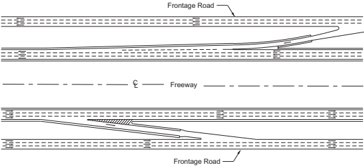

The design of a frontage road is influenced by the type of service it is intended to provide. Where a frontage road is continuous and passes through highly developed areas, it assumes the character of an important street, serving both local traffic as well as overflow from the traveled way. Where the frontage roads are not continuous or are only a few blocks in length, follow an irregular pattern, border the rear and sides of buildings, or serve only scattered development, traffic will be light and operation will be local in character. Refer to Chapter 6 for guidelines on the widths of two-lane frontage roads for collectors in rural and urban areas.

--',''','',',',','''''',,,,''-'-',,',,',',,'---

## 4.13  OUTER SEPARATIONS

The area between the traveled way of a through-traffic roadway and a frontage road or street is referred to as the 'outer separation.' Such separations function as buffers between the through traffic on the arterial and the local traffic on the frontage road and provide space for a shoulder for the through roadway and ramp connections to or from the through facility.

The wider the outer separation, the less influence local traffic will have on through traffic. Wide separations lend themselves to landscape treatment and enhance the appearance of both the highway  and  the  adjoining  property.  A  substantial  width  of  outer  separation  is  particularly advantageous at intersections with cross streets because it minimizes vehicle and pedestrian conflicts.

Where ramp connections are provided between the through roadway and the frontage road, the outer separation should be substantially wider than typical. The needed separation width will depend mostly upon the design of the ramp terminals.

Where two-way frontage roads are provided, a driver on the through facility faces opposing frontage-road traffic on the right as well as opposing arterial traffic on the left. Desirably, the outer separation should be sufficiently wide to minimize the effects of the approaching traffic, particularly the potentially confusing and distracting nuisance of headlight glare at night. With one-way frontage roads, the outer separation need not be as wide as with two-way frontage roads.

The cross section and treatment of an outer separation depend largely upon its width and the type of arterial and frontage road. Preferably, the strip should drain away from the through roadway either to a curb and gutter at the frontage road or to a swale within the strip. Typical cross sections of outer separations for various types of arterials are illustrated in Figure 4-9.

The cross section in Figure 4-9A is applicable to low-speed arterial streets in densely developed areas. Figure 4-9B shows a minimal outer separation that may be applicable to ground-level freeways and high-speed arterial streets. This outer separation consists simply of the shoulders of the through roadway and the frontage road, as well as a physical or traffic barrier. Figure 4-9C shows a depressed arterial with a cantilevered frontage road. In this example, the inside edge of the frontage road is located directly over the outside edge of the through roadway. Figure 4-9D illustrates a common type of outer separation along a section of depressed freeway, Figure 4-9E shows a walled section at a depressed arterial with a ramp, and Figure 4-9F shows a typical freeway outer separation with a ramp.

Figure 4-9. Typical Outer Separations for Various Types of Arterials


## 4.14  ROADWAY TRAFFIC NOISE ABATEMENT

## 4.14.1  General Considerations

Highway traffic noise is caused by tire-pavement interaction, aerodynamic sources, and the vehicle itself. The generated noise can create adverse effects in nearby communities. In some situations, location and design changes may reduce these effects.

--',''','',',',','''''',,,,''-'-',,',,',',,'---


Generally accepted practices for quantifying highway traffic noise use a worst-hour A-weighted equivalent sound level [ LAeq (1h)] or the sound level exceeded 10 percent of the time during the worst noise hour ( L10 ) ( 26 ). The A-weighted equivalent refers to the amplification or attenuation of the different frequencies of the sound (subjectively, the pitch) to correspond to the way the human ear 'hears' these frequencies. Generally, when the sound level exceeds the mid-60 dBA range, outdoor conversation in normal tones becomes difficult. Other noise metrics include the day-night average sound level ( Ldn or DNL) and the community noise equivalent level ( Lden or CNEL ) for average sound energy over a 24-hour period with penalties for evening ( CNEL ) or nighttime (DNL and CNEL ) sensitivity.

A listener may judge a 9- to 10-dB increase in sound level to be twice as loud as the original sound, whereas a 9- to 10-dB reduction may be judged to be half as loud. Doubling the number of sources (i.e. vehicles) will increase the LAeq (1h) by approximately 3 dB, which is usually the change in noise levels that people can detect without specifically listening for a change.

Several factors affect noise levels in communities adjacent to highways. Distance and ground effects can decrease levels by 3 dB or more per doubling of distance over hard ground (e.g., pavement or water) and more over soft ground (e.g., grass or loose soil). Intervening terrain and buildings can further reduce noise levels. Meteorological conditions (e.g., wind and temperature) also affect sound levels.

The term insertion loss (IL) describes the noise reduction in Leq (1h) at a location provided by a noise abatement measure, such as a noise barrier. For example, if the Leq (1h) at a residence before a noise barrier is constructed is 75 dBA and the Leq (1h) after the barrier is constructed is 65 dBA, then the IL is 10 dB.

## 4.14.2  Noise Evaluation Procedures

Noise studies should be conducted for projects that increase roadway capacity. Noise studies identify  the  noise-sensitive  land  uses  that  will  be  affected  by  the  project  and  evaluate  noise abatement for those affected land uses in accordance with each state's noise policy.

Table 4-3 presents Noise Abatement Criteria (NAC) for various land use activity categories. For example, the NAC for residential land uses is an LAeq (1h) of 67 dBA ( 26 ). Each state defines what constitutes a 'substantial increase' over existing noise levels. Noise impacts occur if predicted worst-hour noise levels in the design year approach or exceed the NAC for a particular land use category or if the project causes a substantial increase in existing noise levels.

Table 4-3. Noise-Abatement Criteria for Various Land Uses (26)

| Activity Category   | L Aeq (1h) dBA   | Evaluation Location   | Activity Description                                                                                                                                                                                                                                                                                                                                                                                |
|---------------------|------------------|-----------------------|-----------------------------------------------------------------------------------------------------------------------------------------------------------------------------------------------------------------------------------------------------------------------------------------------------------------------------------------------------------------------------------------------------|
| A                   | 57               | Exterior              | Lands on which serenity and quiet are of extraordinary significance and serve an important public need and where the preservation of those qualities is essential if the area is to continue to serve its intended purpose.                                                                                                                                                                         |
| B (1)               | 67               | Exterior              | Residential.                                                                                                                                                                                                                                                                                                                                                                                        |
| C (1)               | 67               | Exterior              | Active sport areas, amphitheaters, auditoriums, camp- grounds, cemeteries, day care centers, hospitals, libraries, medical facilities, parks, picnic areas, places of worship, playgrounds, public meeting rooms, public or nonprofit institutional structure, radio stations, recording studios, rec- reation areas, Section 4(f) sites, schools, television studios, trails, and trail crossings. |
| D                   | 52               | Interior              | Auditoriums, day care centers, hospitals, libraries, medical facilities, places of worship, public meeting rooms, public or nonprofit institutional structure, radio studios, recording studios, schools, and television studios.                                                                                                                                                                   |
| E (1)               | 72               | Exterior              | Hotels, motels, offices, restaurants/bars, and other devel- oped lands, properties or activities not included in A-D or F.                                                                                                                                                                                                                                                                          |
| F                   | -                | -                     | Agriculture, airports, bus yards, emergency services, indus- trial, logging, maintenance facilities, manufacturing, mining, rail yards, retail facilities, shipyards, utilities (water resources, water treatment, electrical), and warehousing.                                                                                                                                                    |
| G                   | -                | -                     | Undeveloped lands that are not permitted.                                                                                                                                                                                                                                                                                                                                                           |

## 4.14.3  Noise Reduction

There are several methods for reducing highway traffic noise levels. The most common abatement measure is provision of noise barriers constructed within the highway right-of-way that block the direct line of sight, and therefore the most direct path for noise to travel, between vehicles on the roadway and locations in the community. Blocking the direct line of sight with a noise barrier typically reduces noise levels by 5 dB and is often feasible. Achieving a 10 dB reduction is possible in some cases but requires removing 90 percent of the sound energy (which audibly sounds about half as loud).

Earth berms may also be effective where the road and the adjacent land uses are at grade, if there is adequate space to install them. The practicality of berm construction should be considered as part of the overall grading plan for the roadway. There will be instances in which an effective earth berm can be constructed within normal right-of-way or with a minimal additional rightof-way acquisition. If the right-of-way is insufficient to accommodate a full-height earth berm, a lower earth berm can be constructed in combination with a wall or screen to achieve the desired barrier height.


Careful consideration should be exercised so that the construction and placement of these noise barriers will not increase the severity of crashes that may occur. Every effort should be made to locate noise barriers to allow for sign placement and to provide lateral offsets to obstructions outside the edge of the traveled way. It is recognized, however, that such a setback may sometimes be impractical. In such situations, the largest practical width commensurate with cost-effectiveness considerations should be provided. Stopping sight distance is another important design consideration. Therefore, horizontal clearances should be checked for adequate sight distances. Construction of a noise barrier should be avoided at a given location if it would limit stopping sight distance below the minimum values shown in Table 3-1. This situation could be particularly critical where the location of a noise barrier is along the inside of a curve. Some designs use a concrete safety shape either as an integral part of the noise barrier or as a separate roadside barrier between the edge of the roadway and the noise barrier. On non-tangent alignments, a separate concrete barrier may obstruct sight distance even though the noise barrier does not. In such instances, it may be appropriate to install metal rather than concrete roadside barriers in order to retain adequate sight distance.

Care should be exercised in the location of noise barriers near gore areas. Barriers at these locations should begin or terminate, as the case may be, at least 200 ft [60 m] from the theoretical nose. Other considerations in determining barrier locations include development and assessment of alternative designs, ease and cost of maintenance, and aesthetics.

Potential noise problems should be identified early in the design process. Line, grade, earthwork balance, and right-of-way should all be worked out with noise in mind. Noise attenuation may be inexpensive and practical if built into the design and expensive if not considered until the end of the design process. An effective method of reducing traffic noise from adjacent areas is to design the highway so that some form of solid material blocks the line of sight between the noise source and the receptors. Advantage should be taken of the terrain in forming a natural barrier so that the appearance remains aesthetically pleasing.

A depressed highway section is the most desirable for noise abatement. Depressing the roadway below ground level has the same general effect as erecting barriers (i.e., a shadow zone is created where noise levels are reduced [see Figure 4-10]). Where a highway is constructed on an embankment, the embankment beyond the shoulders will sometimes block the line of sight to receptors near the highway, thus reducing the potential noise effects (see Figure 4-11).

The pavement type also affects vehicle and traffic noise. Quieter pavements can reduce traffic noise.

Figure 4-10. Effects of Depressing the Roadway

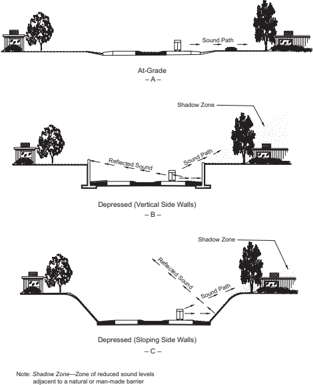

--',''','',',',','''''',,,,''-'-',,',,',',,'---

Note: Shadow Zone -Zone of reduced sound levels adjacent to a natural or man-made barrier

Figure 4-11. Effects of Elevating the Roadway


Sound barriers may be justified at certain locations, particularly along ground level or elevated highways through noise-sensitive areas. Concrete, wood, metal, or masonry walls are effective. One of the more aesthetically pleasing barriers is the earth berm that has been graded to achieve a natural form blending with the surrounding topography.

While landscaped earth berms and buffers (e.g., shrubs and trees) may reduce sound levels, they are generally not wide enough or dense enough to provide a substantial noise reduction in adjacent communities. Landscaped earth berms and buffers generally provide a positive aesthetic effect; however, maintenance needs should be considered.


## 4.15  ROADSIDE CONTROL

## 4.15.1  General Considerations

The efficiency and safety of a highway without control of access depend greatly upon the amount and character of roadside interference, characterized by vehicle movements to and from businesses, residences, or other development along the highway. Abutting property owners have rights of access, but it is desirable that the highway authority be empowered to regulate and control the location, design, and operation of access driveways and other roadside elements such as mailboxes. Such access control minimizes interference to through traffic on the highway. Interference resulting from indiscriminate roadside development and uncontrolled driveway connections results in lowered capacity, increased conflict, and early obsolescence of the highway.

## 4.15.2  Driveways

Driveway terminals are, in effect, low-volume intersections; thus, their design and location merit special consideration. The operational effects of driveways are directly related to the functional classification of the roadway to which they provide access. For example, whereas the number or location of driveways might adversely affect traffic operations, they are important links that provide access to residences and commercial establishments.

Driveways used for right turns only are desirable where the cross section includes a curbed median or a flush median and median barrier. Driveways used for both right and left turns offer considerably more interference to through traffic and are undesirable on arterial streets. However, on major streets with numerous motorist-oriented businesses, the elimination of left turns at driveways may worsen traffic operations by forcing large volumes of traffic to make U-turns or travel around the block in order to reach their destination.

The  regulation  and  design  of  driveways  is  intimately  linked  with  the  available  right-of-way and the land use and zoning control of the adjacent property. On new facilities, the needed right-of-way can be obtained to provide the desired degree of driveway regulation and control. To prohibit undesirable access conditions on existing facilities, either additional right-of-way can be acquired or agreements can be made with property owners to improve existing conditions. Often the desired degree of driveway control must be achieved through the use of police powers by requiring permits for all new driveways and adjustment of existing driveways that do not conform to established regulations. The objective of driveway regulations is to preserve efficiency and promote operational efficiency by prescribing desirable spacing and proper layout of driveways. The attainment of these objectives is dependent upon the type and extent of legislative authority granted to the highway agency. Many states and local municipalities have developed design policies for driveways and formed separate units to issue permits for new, or for changes in existing, driveway connections to main highways. For further information on the regulation and design of driveways, refer to the TRB Access Management Manual ( 44 ).

To the extent that it is practical, driveway designs should consider a range of objectives including:

- y maintaining the operations and efficiency on the intersecting roadway;
- y providing reasonable access to property;
- y providing sight distance between vehicles and pedestrians as well as efficient travel for sidewalk users;
- y incorporating design features so that any sidewalk crossing the driveway is accessible to and usable by individuals with disabilities;
- y accommodating bicycle lanes or paths, where present; and
- y maintaining public transportation locations, where present.

See Section 9.11.6, 'Driveways,' for additional discussion.

Driveway regulations generally control right-of-way encroachment, driveway location, driveway design, sight distance, drainage, use of curbs, parking, setback, lighting, and signing. Some of the principles of intersection design can also be applied directly to driveways. An important feature of driveway design is the elimination of large graded or paved areas adjacent to the traveled way upon which drivers can enter and leave the facility at will. Another feature is the provision of adequate driveway widths, throat dimensions, and proper layout to accommodate the anticipated types and volumes of vehicles patronizing the roadside establishment. Design guidance for driveway width is presented in Table 4-4. Additional details and discussion on driveway width and curve radius is presented in NCHRP Guide for Geometric Design of Driveways ( 30 ).


Table 4-4. Driveway Width Guidelines (30)

| Standard Driveways                                                                                                                                             | Standard Driveways                                                                                                                      |
|----------------------------------------------------------------------------------------------------------------------------------------------------------------|-----------------------------------------------------------------------------------------------------------------------------------------|
| Category/Description of Common Application                                                                                                                     | Width *                                                                                                                                 |
| Very high intensity / Urban activity center with almost constant driveway use during hours of operation.                                                       | Many justify two lanes in and two or three lanes out.                                                                                   |
| Higher intensity / Medium-size office or retail (e.g., community shopping center) with frequent driveway use during hours of operation.                        | One entry lane 12-13 ft [3.6- 3.9 m] wide; Two exit lanes 24-26 ft [7.2-7.8 m] total width.                                             |
| Medium intensity / Smaller office or retail, with occasional driveway use during hours of operation. Seldom more than one exiting vehicle at any time.         | Two lanes 24-26 ft [7.2-7.8 m] total width.                                                                                             |
| Lower intensity / Single-family or duplex residential, other types with low use, on lower speed and lower volume roadways. May not apply to rural residential. | May be related to the width of the garage, or driveway parking. Single lane, 9-12 ft [2.7-3.6 m]; Double lane, 16-20 ft [4.9 to 6.1 m]. |
| Special Situation Driveways                                                                                                                                    | Special Situation Driveways                                                                                                             |
| Category / Description of Common Application                                                                                                                   | Width *                                                                                                                                 |
| Central Business District / Building faces are close to the street.                                                                                            | Varies greatly depending on use.                                                                                                        |
| Farm or ranch; field / A mix of design vehicles; volumes may be very low.                                                                                      | 16 ft [4.9 m] minimum, 20 ft [6.1 m] desirable. Affected by widths of field machinery.                                                  |
| Industrial / Driveways are often used by large vehicles.                                                                                                       | Minimum 26 ft [7.9 m].                                                                                                                  |

Vertical alignment elements are also important in driveway design and should allow vehicles to be operated efficiently as they enter or exit the driveway. Profiles should be designed to minimize the possibility of a vehicle dragging or hanging up on the driveway. The vertical alignment of the driveway should reflect limitations on the sidewalk cross slope to accommodate pedestrians with disabilities. In addition, profiles should allow for adequate drainage and they should minimize the potential for ponding of water at the interface between the driveway and the sidewalk, as well as between the driveway and the intersecting roadway. Figure 4-12 shows driveway vertical alignment and profile elements. Design guidance for driveway elements including grade, width, channelization, cross slope, and other geometrics is presented in the Guide for Geometric Design of Driveways ( 30 ).  The ITE Guidelines for Driveway Design and Location ( 36 ) also discusses driveway design features.


Figure 4-12. Driveway Vertical Alignment and Profile Elements


Sight distance, another important design control, can be limited by the presence of unnecessary roadside structures. Therefore, no advertising signs should be permitted in the right-of-way. Billboards or other elements outside the right-of-way that obstruct sight distance should be controlled by statutory authority or by purchase of easements.

For  roadways  without  access  control  but  with  concentrated  business  development  along  the roadside, consideration should be given to the use of a frontage road. This type of control and design is particularly pertinent to a main highway or street on a new location for which sufficient right-of-way can be acquired. In the first stage, intermittent sections of frontage roads are constructed to connect the few driveways initially needed. Then, in succeeding stages, extensions or additional sections of frontage roads are provided to intercept driveways resulting from further development of the roadsides. Thus, serious roadside interference is prevented at all stages, and the through character of the highway or street is preserved by gradual and judicious provision of frontage roads.

## 4.15.3  Mailboxes

Mailboxes and appurtenant newspaper tubes served by carriers in vehicles may constitute a risk to  motorists either directly or indirectly, depending upon the placement of the mailbox, the cross-section dimensions of the highway or street, sight distance conditions in the vicinity of the mailbox, traffic volume, and impact resistance of the mailbox support. The potential for crashes that could involve both the carrier and the motoring public is affected whenever the carrier slows for a stop and then resumes travel along the highway. The risk is greatly increased if the cross section of the highway and the lateral placement of mailboxes are such that the vehicle occupies a portion of the traveled way while the mailbox is being serviced.

The mounting height of the mailbox places the box in a direct line with the windshield on many vehicles.  This  situation  is  more  critical  where  multiple  box  installations  are  encountered.  In many areas, the typical multiple mailbox installation consists of two or more posts supporting a horizontal member, usually a timber plank, which carries the group of mailboxes. The horizontal support element tends to penetrate the windshield and enter the passenger compartment when struck by a vehicle. Such installations are to be avoided where exposed to traffic. In fact,

--',''','',',',','''''',,,,''-'-',,',,',',,'---


the mailbox and support should be, where practical, located in an area not exposed to through traffic.

Mailboxes should be placed for maximum convenience to the patron, consistent with limiting the potential for crashes involving highway traffic, the carrier, and the patron. Consideration should be given to minimum walking distance within the roadway for the patron, available stopping sight distance in advance of the mailbox site (especially on older roads), and potential restriction to corner sight distance at driveway entrances. The placing of mailboxes along highspeed, high-volume highways should be avoided if other practical locations are available. New installations should, where practical, be located on the right side beyond an intersection with a public road or private driveway entrance. Boxes should be placed only on the right-hand side of the highway in the direction of travel of the carrier except on one-way streets where they may also be placed on the left-hand side.

Preferably, a mailbox should be placed so that it is not susceptible to being struck by an out-ofcontrol vehicle. Where this placement is not practical, the supports should be of a type that will yield or break away if struck. The mailbox should be firmly attached to the support to prevent it from breaking loose and flying through the windshield. These same criteria also apply to multiple box installations.

One of the primary considerations is the location of the mailbox in relation to the traveled way. Basically, a vehicle stopped at a mailbox should be clear of the traveled way. The higher the traffic volume or the speed, the greater the clearance should be. An exception to this may be considered on low-volume, low-speed roads and streets.

Most vehicles stopped at a mailbox will be clear of the traveled way if the mailbox is placed outside an 8-ft [2.4-m] wide usable shoulder or turnout. This position is recommended for most highways in rural areas. For high-volume, high-speed highways, it is recommended that the width of shoulder in front of the mailbox or turnout be increased to 10 ft [3.0 m] or even 12 ft [3.6 m] for some conditions. However, it may not be practical to consider even an 8-ft [2.4-m] shoulder or turnout on low-volume, low-speed roads or streets. To provide space for opening the mailbox door, it is recommended that the roadside face of a mailbox be set 8 to 12 in. [200 to 300 mm] outside the shoulder or turnout. Current postal regulations should be consulted for specific set-back criteria. --',''','',',',','''''',,,,''-'-',,',,',',,'---

In areas of heavy or frequent snowfall, mailboxes may be placed at about the customary line of the plowed windrow, but no closer than about 10 ft [3.0 m] to the edge of the traveled way if the shoulder is wider than 10 ft [3.0 m]. Cantilever mailbox supports may prove advantageous for snow-plowing operations. Wherever practical, mailboxes should be located behind existing guardrail.

In some urban and suburban areas, mailboxes are located along selected streets and highways where the local post office has established delivery routes. In these areas when the roadway has a curb and gutter section, mailboxes should be located with the front of the box 6 to 12 in. [150 to 300 mm] back of the face of curb. On residential streets without curbs or shoulder and which carry low traffic volumes operating at low speeds, the roadside face of a mailbox should be offset between 8 and 12 in. [200 and 300 mm] behind the edge of the traveled way.

For guidance on mailbox installations, refer to the AASHTO Roadside Design Guide ( 7 ). Current postal regulations should also be consulted for specific set-back criteria. Mailboxes should not interfere with the accessible passage on adjacent sidewalks, where sidewalks are present.

## 4.15.4  Fencing

Highway agencies use fencing extensively to delineate the control of access acquired for a highway. While provision of fencing is not a duty, fencing may also serve to reduce the likelihood of encroachment onto the highway right-of-way.

Any portion of a highway with full control of access may be fenced except in areas of precipitous slopes, natural barriers, or where it can be established that fencing is not needed to preserve access control. Fencing is usually located at or near the right-of-way line or, where frontage roads are used, in the area between the through highway and the frontage road (outer separation).

Fencing for access control is usually owned by the highway agency so that the agency has control of the type and location of fence. The type of fence that is most cost-effective yet best suited to the specific adjacent land use is generally selected. If fencing is not needed for access control, the fence should be the property of the adjacent landowner.

## 4.16  TUNNELS

## 4.16.1  General Considerations

Development of streets or highways may include sections constructed in tunnels either to carry the streets or highways under or through a natural obstacle or to minimize the effect of the roadway on the community. General conditions under which tunnel construction may be warranted include:

- y Long, narrow terrain ridges where a cut section may either be costly or carry environmental consequences;
- y Narrow rights-of-way where all of the surface area is needed for street purposes;
- y Large intersection areas or a series of adjoining intersections on an irregular or diagonal street pattern;

- y Grade-separated pedestrian and/or bicycle facilities are needed;
- y Railroad yards, airport runways, or similar facilities;
- y Parks or similar land uses, existing or planned; or
- y Locations  where  right-of-way  acquisition  costs  exceed  cost  of  tunnel  construction  and operation.

Although the costs of operation and maintenance of tunnels are beyond the scope of this policy, these costs should nevertheless be considered.

General construction and design features of tunnel sections are discussed in the following sections. It is not intended that these sections be considered comprehensive on the subject of the design of highway tunnels. Specific design issues such as soil conditions, construction phasing, ventilating, lighting, pumping, and other mechanical or electrical considerations require specialized engineering. For further information, see the AASHTO LRFD Road Tunnel Design and Construction Guide Specifications ( 13 ).

## 4.16.2  Types of Tunnels

Tunnels can be classified into two major categories:

- y tunnels constructed by mining methods, and
- y tunnels constructed by cut-and-cover methods.

The first category refers to those tunnels that are constructed without removing the overlying rock or soil. Usually this category is subdivided into two very broad groups according to the appropriate construction method. The two groups are named to reflect the overall character of the material to be excavated: hard rock and soft ground.

Of particular interest to the highway designer are the structural requirements of these construction methods and their relative costs. As a general rule, hard-rock tunneling is less expensive than soft-ground tunneling. A tunnel constructed through solid, intact, and homogeneous rock will normally represent the lower end of the scale with respect to structural demands and construction costs. A tunnel located below water in material that needs immediate and heavy support will involve extremely expensive soft-ground tunneling techniques such as shield and compressed air methods.

The shape of the structural cross section of the tunnel varies with the type and magnitude of loadings. In those cases where the structure will be subjected to roof loads with little or no side pressures, a horseshoe-shaped cross section is used. As side pressures increase, curvature is introduced into the sidewalls and invert struts added. When the loadings approach a distribution

similar to hydrostatic pressures, a full circular section is usually more efficient and economical. All cross sections are dimensioned to provide adequate space for ventilation ducts.

The second category of tunnel classification deals with the two types of tunnels that are constructed from the surface: trench and cut-and-cover tunnels. The latter are used exclusively for subaqueous work. In the trench method, prefabricated tunnel sections are constructed in shipyards or dry docks, floated to the site, sunk into a dredged trench, and joined together underwater. The trench is then backfilled. When conditions are favorable with respect to subsurface soil, amount of river current, volume and character of river traffic, availability of construction facilities, and type of existing waterfront structures, the trench method may prove more economical than alternative methods.

The cut-and-cover method is by far the most common type of tunnel construction for shallow tunnels, which often occurs in urban areas. As the name implies, the method consists of excavating an open cut, building the tunnel within the cut, and backfilling over the completed structure. Under ideal conditions, this method is the most economical for constructing tunnels located at a shallow depth. However, it should be noted that surface disruption and challenges in managing utilities generally make this method very expensive and difficult.

## 4.16.3  General Design Considerations

Tunnels should be as short as practical because the feeling of confinement and magnification of traffic noise can be unpleasant to motorists, and tunnels are the most expensive highway structures. Pedestrian tunnels should be wide enough to let natural light enter and to maximize the sense of security for pedestrians. The horizontal alignment through the tunnel is an important design consideration. Keeping the tunnel length on tangent as much as practical will not only minimize the length but also improve operating efficiency. Tunnels designed with extreme curvature may result in limited stopping sight distance. Therefore, sight distance across the face of the tunnel wall should be carefully examined.

The vertical alignment through the tunnel is another important design consideration. Grades in tunnels should be determined primarily on the basis of driver comfort while striving to reach a point of economic balance between construction costs and operating and maintenance expenses. Many factors have to be considered in tunnel lengths and grades and their effects on tunnel lighting and ventilation. For example, lighting expenses are highest near portals and depend heavily on availability of natural light and the need to make a good light transition. Ventilation costs depend on length, grades, natural and vehicle-induced ventilation, type of system, and air quality constraints.

The overall roadway design should avoid the need for guide signs within tunnels, because normal vertical and lateral clearances are usually insufficient for such signing and additional clearance can be provided only at very great expense. Exit ramps should be located a sufficient distance

downstream from the tunnel portal to allow for any guide signs that may need to be placed between the tunnel and the point of exit. This distance should be a minimum of 1,000 ft [300 m]. It is also highly undesirable that traffic be expected to merge, diverge, or weave within a tunnel, as might be the case if the tunnel is located between two closely spaced interchanges. Therefore, forks and exit or entrance ramps should be avoided within tunnels, where practical.

## 4.16.4  Tunnel Sections

From the standpoint of service to traffic, the design criteria used for tunnels should not differ materially from those used for grade separation structures. The same design criteria for alignment and profile and for vertical and horizontal clearances generally apply to tunnels except that minimum values are typically used because of high cost and restricted right-of-way.

Full left- and right-shoulder widths of the approach freeway desirably should be carried through the tunnel. Actually, the need for added lateral space is greater in tunnels than under separation structures because of the greater likelihood of vehicles becoming disabled in the longer lengths. If shoulders are not provided, intolerable delays may result when vehicles become disabled during periods of heavy traffic. However, the cost of providing shoulders in tunnels may be prohibitive, particularly on long tunnels that are constructed by the boring or shield-drive methods. Thus, the determination of the width of shoulders to be provided in a tunnel should be based on thorough analyses of all factors involved. Where it is not practical to provide shoulders in a tunnel, arrangements should be made for around-the-clock emergency service vehicles that can promptly remove any stalled vehicles.

Figure 4-13 illustrates typical tunnel cross sections for two-lane tunnels. The minimum roadway width between curbs, as shown in Figure 4-13A, should be at least 2 ft [0.6 m] greater than the approach traveled way, but not less than 24 ft [7.2 m]. Where sidewalks are provided for emergency egress by pedestrians, they must be designed to be accessible to and usable by pedestrians with disabilities ( 48, 49 ). For short tunnels, less than 200 ft [60 m] in length, the sidewalk may have a minimum width of 3.5 ft [1.1 m]. In long tunnels, 200 ft [60 m] or more in length, the sidewalk width must be at least 4 ft [1.2 m] with passing sections at least 5-ft [1.5-m] wide every 200 ft [60 m]. Since varying the tunnel cross section to provide passing sections may be impractical, sidewalks with a continuous width of 5 ft [1.5 m] must generally be provided. The total clearance between walls of a two-lane tunnel should be a minimum of 33 ft [10 m] for short tunnels and 34.5 ft [10.5 m] for long tunnels. The roadway width and the curb or sidewalk width can be varied as needed within the total tunnel width; however, each width should not be less than the minimum value stated above.


Minimum Cross Section for Short Tunnels (less than 200 ft [60 m] in length)


Desirable Cross Section for Long Tunnels (greater than or equal to 200 ft [60 m] in length)


Figure 4-13. Typical Two-Lane Tunnel Sections


The minimum vertical clearance is 16 ft [4.9 m] for freeways. However, the minimum clear height for all tunnels should not be less than that on the road leading to the tunnel, and it is desirable to provide an allowance for future repaving of the roadways.

Figure 4-13B illustrates the desirable section for long tunnels with two 12-ft [3.6-m] lanes, a 10ft [3.0-m] right shoulder, a 5-ft [1.5-m] left shoulder, and a 5-ft [1.5-m] sidewalk on each side. The roadway width may be distributed to either side in a different manner if needed to better fit the dimensions of the tunnel approaches. The vertical clearance for the desirable section is 16 ft [4.9 m] for freeways plus consideration of an allowance for future repaving. However, the minimum clear height for all tunnels should not be less than that on the road leading to the tunnel

Raised sidewalks are provided for through pedestrian movements in some nonfreeway tunnels. Normally, pedestrians are not permitted in freeway tunnels; however, raised sidewalks should be provided for emergency walking and for access by maintenance personnel. A sidewalk or shoulder area in a tunnel also serves as a buffer that prevents the overhang of vehicles from damaging the wall finish or the tunnel lighting fixtures. The minimum design criteria to provide pedestrian accessibility for sidewalks in tunnels have been addressed above. Separate tunnels may be warranted for pedestrians or other special uses, such as bikeways.

Figure 4-14 shows several tunnel sections as well as a partially covered highway. Directional traffic should be separated to limit the potential for crashes and to relieve the dizzying effect of two-way traffic in a confined space. This separation can be achieved by providing a twin opening as shown in Figure 4-14A, by multilevel sections as shown in Figures 4-14B and 4-14C, or by terraced structures as shown in Figure 4-14D. The terraced roadways are open on the outside for light, view, and ventilation. Figure 4-14E illustrates roadways that are tunneled under hillside buildings. A partially covered section, as shown in Figure 4-14F, provides light and ventilation to the motorist while minimizing freeway intrusion on the community traversed. This type of cross section is covered in Section 8.4.3, 'Depressed Freeways.'

--',''','',',',','''''',,,,''-'-',,',,',',,'---

Figure 4-14. Diagrammatic Tunnel Sections


## 4.16.5  Examples of Tunnels

Figure 4-15 shows a freeway tunneling through a hillside. The portals are staggered and attractively designed. The interchange is located a sufficient distance from the tunnel to allow space for effective signing and the necessary traffic maneuvers. Figure 4-16 illustrates the interior of a two-lane directional tunnel.


Source: Kentucky Transportation Cabinet

Figure 4-15. Entrance to a Freeway Tunnel


Source: Missouri DOT

Figure 4-16. Interior of a Two-Lane Directional Tunnel

--',''','',',',','''''',,,,''-'-',,',,',',,'---


## 4.17  PEDESTRIAN FACILITIES

## 4.17.1  Sidewalks

Sidewalks are an integral part of city streets and are sometimes also provided in rural areas. However, the potential for collisions with pedestrians is higher in many rural areas due to the higher speeds and general absence of lighting. The limited data available suggest that sidewalks in rural areas are effective in reducing pedestrian collisions.

Sidewalks near or along the highway in the rural and suburban contexts are more often needed at points of development that generate pedestrian concentrations, such as residential areas, schools, businesses, and industrial plants. When suburban residential areas are developed, initial roadway facilities are needed for the community to function, but the construction of sidewalks is sometimes deferred. However, if pedestrian activity is anticipated, sidewalks should be included as part of the initial construction.

In the suburban and urban contexts, a border area generally separates the roadway from a community's homes and businesses. The main function of the border is to provide space for sidewalks and utilities. Other functions are to provide space for streetlights, fire hydrants, street hardware, and aesthetic vegetation, and to serve as a buffer strip. Border width varies considerably, but 8 ft [2.4 m] is considered an appropriate minimum width. Swale ditches may be located in these borders to provide an economical alternative to curb and gutter sections, but additional right of way will often be needed.

Sidewalk widths in residential areas may vary from 4 to 8 ft [1.2 to 2.4 m]. Sidewalks less than 5 ft [1.5 m] in width require the addition of a passing section every 200 ft [60 m] for accessibility. The width of a planted strip between the sidewalk and traveled-way curb, if provided, should be a minimum of 2 ft [0.6 m] to allow for maintenance activities. Sidewalks covering the full border width are often appropriate in commercial areas, adjoining multiple-residential complexes, near schools and other pedestrian generators, and where border width is restricted.

Where sidewalks are placed adjacent to the curb, the widths should be approximately 2 ft [0.6 m] wider than the minimum required width. This additional width provides space for roadside hardware and snow storage outside the width needed by pedestrians. It also allows for the proximity of moving traffic, the opening of doors of parked cars, and bumper overhang on angled parking.

In general, wherever roadside and land development conditions generate pedestrian movement along a roadway, a sidewalk or path area, as suitable to the conditions, should be provided.

As a general practice, sidewalks should be constructed along any street or highway not provided with shoulders, even though pedestrian traffic may be light. Where sidewalks are built along a highspeed highway, buffer areas should be established so as to separate them from the traveled way.

Sidewalks should have all-weather surfaces to serve their intended use. Without them, pedestrians often choose to use the traveled way. Pedestrian crosswalks are regularly marked in urban areas but are rarely marked on highways in rural areas. However, where there are pedestrian concentrations,  appropriate  traffic-control  devices  should  be  used,  together  with  appropriate walkways constructed within the right-of-way.

Where two urban communities are in proximity to one another, consideration should be given to connecting the two communities with sidewalks or shared-use paths, even though pedestrian traffic may be light. This may avoid driver-pedestrian conflicts along the roadway between these communities.

Pedestrian facilities such as sidewalks must be designed to be accessible to and usable by individuals with disabilities. The cross slope on sidewalks should not exceed 2 percent. For additional guidance, refer to the Proposed Guidelines for Pedestrian Facilities in the Public Right-of-Way ( 46 ), the AASHTO Guide for the Planning, Design, and Operation of Pedestrian Facilities ( 4 ), Section 4.17.2, 'Grade-Separated Pedestrian Crossings,' and Section 4.17.3, 'Curb Ramps.'

Generally, the guidelines set forth in this section for the accommodation of pedestrians along roadways are also applicable to bridges. However, because of the high cost of bridges and the operational features that may be unique to bridge sites, pedestrian-way details on a bridge will often differ from those on its approaches. For example, where a planted strip between a sidewalk and the traveled way approaches a bridge, continuation of the offset, affected by the planted strip, will seldom be justified.

Where flush shoulders approach a bridge and pedestrian traffic is anticipated on the shoulders, the shoulder width should be continued across the bridge, and possibly increased, to account for the restriction to pedestrian escape imposed by the bridge rail. Where shoulders are intended for use by pedestrians, the shoulder must be accessible to and usable by individuals with disabilities. A flush roadway shoulder should not be interrupted by a raised walkway on a bridge. Where such installations already exist, and removal is not economically justified, the ends of the walkway should be ramped into the shoulder at a rate of approximately 1:20 with the shoulder grade.

Provisions for pedestrians are often appropriate on street overcrossings and on longer bridge crossings. On lower-speed streets, a vertical curb at the edge of the sidewalk is usually sufficient to separate pedestrians from vehicular traffic. Continuity of curb height should be maintained on the approaches to and over structures. For higher speed roadways on structures, a barrier-type rail of adequate height may be used to separate the walkway and the traveled way. A pedestrian-type rail or screen should be used at the outer edge of the walkway. On bridges of substantial length, a single walkway may be provided, depending on land use, context, and other factors. However, care should be taken so that approach walkways provide well designed and relatively direct access to the bridge walkway.

For a discussion of the potential problems associated with the introduction of a traffic barrier between a roadway and a walkway, see Section 4.10.3, 'Bridge Railings.' For a discussion on providing access between the street and the sidewalk to accommodate individuals with disabilities, see Section 4.17.3, 'Curb Ramps.' Further design guidance for sidewalks and pedestrian crossings that are accessible to and usable by individuals with disabilities, see References 48 and 49, the Proposed Guidelines for Pedestrian Facilities in the Public Right-of-Way ( 46 ), and the AASHTO Guide for the Planning, Design, and Operation of Pedestrian Facilities ( 4 ).

## 4.17.2  Grade-Separated Pedestrian Crossings

A grade-separated pedestrian facility allows pedestrians to cross at either over or under the roadway and provides pedestrians with a path for crossing the roadway without vehicle interference. Pedestrian separations should be provided where pedestrian volume, traffic volume, intersection capacity, and other conditions favor their use, although their specific location and design need individual study. They may be needed to accommodate heavy peak pedestrian movements, such as at central business districts, factories, schools, or athletic fields, in combination with moderate to heavy vehicular traffic or where unusual risk or inconvenience to pedestrians may result.  Pedestrian separations, usually overpasses, may be needed at freeways or expressways where cross streets are terminated. On many freeways, highway overpasses for cross streets may be limited to three- to five-block intervals. Because this situation imposes an extreme inconvenience on pedestrians who desire to cross the freeway at the terminated streets, pedestrian separations may be provided. Local, state, and Federal laws and codes should be consulted for possible additional criteria concerning the need for such pedestrian separations, as well as additional design guidance.

Where there are frontage roads adjacent to the arterial highway, the pedestrian crossing may be designed to span the entire facility or only the through roadway. Separations of both through roadways and frontage roads may not be justified if the frontage roads carry light and relatively slow-moving traffic; however, in some cases the separation should span the frontage roads as well. Fences may be needed to prevent pedestrians from crossing the arterial at locations where a separation is not provided.

Pedestrian crossings or overcrossing structures at arterial streets are not likely to be used unless it is obvious to the pedestrian that it is easier to use such a facility than to cross the traveled way. Pedestrians tend to weigh the perceived reduction in risk of using the grade-separated facility against the extra effort and time needed to cross the roadway ( 4 ). If the grade-separated route adds substantially to the travel time, usage may be limited. For more information, refer to the Proposed Guidelines for Pedestrian Facilities in the Public Right-of-Way ( 46 )  and the AASHTO Guide for the Planning, Design, and Operation of Pedestrian Facilities ( 4 ).

Generally, pedestrians are more reluctant to use undercrossings than overcrossings. This reluctance may be minimized by locating the undercrossing on line with the approach sidewalk and

--',''','',',',','''''',,,,''-'-',,',,',',,'---

ramping the sidewalk gently to permit continuous vision through the undercrossing from the sidewalk. Good sight lines, wide openings, and lighting are needed to enhance a sense of security. Ventilation may be needed for very long undercrossings.

Pedestrian ramps or elevators should be provided at all pedestrian separation structures. Where desired, a stairway can be provided in addition to the ramp. Elevators should be considered where the length of ramp would result in a difficult path of travel for a person with or without a disability.

Walkways for pedestrian separations should have a minimum width of 8 ft [2.4 m]. Greater widths may be needed through tunnels, where overpass screenings create a tunnel effect, and where there are exceptionally high volumes of pedestrian traffic, such as in the downtown areas of large cities and around sports stadiums or arenas.

A  serious  problem  associated  with  both  pedestrian  overcrossings  and  highway  overpasses with sidewalks is vandals dropping objects into the path of traffic moving under the structure. The consequences of objects being thrown from bridges can be very serious. In fact, there are frequent reports of fatalities and major injuries caused by this type of vandalism. There is no practical device or method yet devised that can be universally applied to prevent a determined individual from dropping an object from an overpass. For example, small objects can be dropped through mesh screens. A more effective deterrent is a solid plastic enclosure. However, these are expensive and may be insufferably hot in the summer. They also obscure and darken the pedestrian traveled way, which may be conducive to other forms of criminal activity. Any completely enclosed pedestrian overpass has an added problem that children may walk or play on top of the enclosure. In areas subject to snow and icing conditions, the possibility that melting snow and ice may drop from the roof of a covered overpass and fall onto the roadway below should be considered.

At present it is not practical to establish absolute warrants as to when or where barriers should be installed to discourage the throwing of objects from structures. The general need for economy in design and the desire to preserve the clear lines of a structure unencumbered by screens should be carefully balanced against the need to limit the potential for injury to pedestrians and damage to vehicles.

Overpass locations where screens definitely should be considered at the time of construction include:

- y Near a school, a playground, or elsewhere where it would be expected that the overpass would be frequently used by children unaccompanied by adults;
- y In large urban areas on overpasses used exclusively by pedestrians and not easily kept under surveillance by police; or
- y Where the history of incidents on nearby structures indicates a need for screens.

Screens should also be installed on existing structures where there have been prior incidents of objects being dropped from the overpass and where no deterrence of future incidents is expected from increased surveillance, warning signs, or apprehension of a few individuals involved.

More complete information on the use of protective screens on pedestrian overpasses is available in the AASHTO Roadside Design Guide ( 7 ).

Figure 4-17 illustrates two typical pedestrian overcrossings of major highways.


- A -


- B -

Sources: A - Arizona DOT, B - North Carolina DOT

Figure 4-17. Typical Pedestrian Overpasses on Major Highways

--',''','',',',','''''',,,,''-'-',,',,',',,'---


## 4.17.3  Curb Ramps

Several  Federal  laws,  including  the  Rehabilitation  Act  of  1973  and  the  Americans  with Disabilities Act of 1990 (ADA), require that facilities for pedestrian use be readily accessible to, and usable by, individuals with disabilities. When designing a project that includes curbs and adjacent sidewalks, proper attention should be given to the needs of persons with disabilities, such as those with mobility or visual impairment. Curb ramps are necessary to provide access between the sidewalk and the street at pedestrian crossings. Detectable warnings are needed where the curb has been removed to alert pedestrians with visual disabilities that they have arrived at the street/sidewalk interface.

Design details of curb ramps will vary in relation to the following factors:

- y Sidewalk width
- y Sidewalk location with respect to the curb
- y Height and width of curb cross section
- y Design turning radius and length of curve along the curb face
- y Angle of street intersections
- y Planned or existing location of sign and signal control devices
- y Stormwater inlets and public service utilities
- y Potential sight obstructions
- y Street width
- y Border width

As a result, basic curb ramp types have been established and used in accordance with the geometric characteristics of each intersection. Based on the Proposed Guidelines for Pedestrian Facilities in the Public Right-of-Way ( 46 ), the minimum curb ramp width should be 4 ft [1.2 m] and the maximum curb ramp grade should be 8.33 percent. Cross slopes on adjacent sidewalks should be no greater than 2 percent. A turning space at the top of each perpendicular curb ramp should be 4 ft by 4 ft [1.2 m by 1.2 m], and larger if adjacent obstructions are present. In addition, a minimum 2-ft [0.6-m] detectable warning strip must be provided at the bottom of curb ramps to improve detectability by pedestrians with vision disabilities ( 49 ). Additional guidance is provided in the Proposed Guidelines for Pedestrian Facilities in the Public Right-of-Way ( 46 ).

Figure 4-18 illustrates various curb ramp designs. Figure 4-18A shows a perpendicular curb ramp where the entire grade differential  is  achieved  outside  the  sidewalk.  This  condition  is desirable since it does not require walking across the ramped area. In this case, a side return curb can be used along the curb ramp if the presence of landscaping or other fixed obstructions constrain walking across the curb ramp. Otherwise, a side flare is required, as shown in Figure 4-18B.

In many areas where sidewalks are needed, the curb ramp will be incorporated into the sidewalk, as shown in Figures 4-18B and 4-18C. Figure 4-18B reflects this design when adequate room for the curb ramp and landing is available. Figure 4-18C shows an example where a width restriction results in the curb ramp being constructed totally within the sidewalk area. This is referred to as a parallel curb ramp. Careful attention to drainage should avoid ponding water and collecting sediment on the lower landing.

A combination curb ramp, such as the one illustrated in Figure 4-18D, combines aspects of the previous two types. A sloped portion with a detectable warning rises to a landing that is lower than full curb height. This keeps the landing from collecting water and debris. The remaining elevation difference is accomplished by continuing the curb ramp from the landing to normal sidewalk elevation.

Although separate curb ramps for each crosswalk are recommended, Figure 4-18E shows a single perpendicular curb ramp, serving two crossing directions, may be located at the apex of a corner. These are referred to as diagonal curb ramps. Diagonal curb ramps should only be utilized in alteration projects if existing physical constraints prevent a curb ramp for each pedestrian crossing. Diagonal curb ramps do not provide for a straight pedestrian crossing and, therefore, have the potential to misdirect pedestrians with vision disabilities into the middle of the intersection.

Where other options are not practical, a built-up curb ramp, such as the one illustrated in Figure 4-18F, may be necessary. However, the curb ramp should not project into the traveled way. Also, drainage may be adversely affected if not properly considered. The curb ramp area should be protected and should only be used at locations that include a parking lane.

The location of the curb ramp should be carefully coordinated with respect to the pedestrian crosswalk lines. The bottom of the curb ramp should be situated within the parallel boundaries of the crosswalk markings and should be perpendicular to the face of the curb, or bottom grade break, without warping in the sidewalk or curb ramp. If the sides of the curb ramp are not the same length, it will be difficult to provide a cross slope that is accessible to and usable by individuals with disabilities ( 48, 49 ) and avoid warping. Curb ramps may be located either within the corner radius or on the tangent section beyond the corner radius.

Curb ramps for persons with disabilities are not limited to intersections and marked crosswalks. Curb ramps should also be provided at other appropriate or designated points of pedestrian concentration, such as loading islands and midblock pedestrian crossings. Because nonintersection pedestrian crossings are generally unexpected by the motorist, warning signs should be installed and parking should be prohibited to provide adequate visibility. For additional design guidance and recommendations with respect to pedestrian crosswalk markings, refer to the MUTCD ( 27 ), the Proposed Guidelines for Pedestrian Facilities in the Public Right-of-Way ( 46 ), and AASHTO's Guide for the Planning, Design, and Operation of Pedestrian Facilities ( 4 ).

--',''','',',',','''''',,,,''-'-',,',,',',,'---

Figure 4-18. Curb Ramp Details


Curb ramps or cut-throughs for persons with disabilities should be provided where a major highway or secondary intersecting road serves pedestrian traffic and the roadway geometrics involve convex islands or median dividers. Median refuge is beneficial for all pedestrians. To


allow for the placement of multiple detectable warnings, median and island crossings of at least 6 ft [1.8 m] are necessary, as shown in Figure 4-19. Medians less than this width must provide accessible passage but do not provide adequate refuge. Median and island cut-throughs should provide, at a minimum, a 5-ft [1.5-m] wide travel path to allow adequate room for pedestrian passage, turning, or platooning.

Each intersection differs with respect to the intersection angles, turning roadway widths, size of islands, drainage inlets, traffic-control devices, and other variables previously described. An appropriate plan should indicate all of the desired geometrics, including vertical profiles at the curb flow line. The plan should then be evaluated to determine convenient and effective locations of the ramps to accommodate persons with disabilities. Drainage inlets should be located on the upstream side of all crosswalks and curb ramps. The plan should indicate the pedestrian crosswalk patterns, stop bar locations, regulatory signs, and, in the case of new construction, establish the most desirable location of signal supports.

Curb  ramps  should  be  provided  at  all  intersections  where  curb  and  sidewalk  are  provided. For further information on sidewalk curb ramps for persons with disabilities, see the current Proposed Guidelines for Pedestrian Facilities in the Public Right-of-Way ( 46 ), the AASHTO Guide for the Planning, Design, and Operation of Pedestrian Facilities ( 4 ), and Designing Sidewalks and Trails for Access, Part I: Review of Existing Guidelines and Practices ( 24 ) and Part II: Best Practices Design Guide ( 25 ). The Public Rights-of-Way Access Advisory Committee document entitled Special Report: Accessible Public Rights-of-Way, Planning and Designing for Alterations ( 47 ) may be helpful in designing retrofit projects.

Figure 4-20 shows examples of sidewalk curb ramps with detectable warnings in place.


Figure 4-19. Median Refuge


Source: Caltrans

Figure 4-20. Examples of Sidewalk Curb Ramps


--',''','',',',','''''',,,,''-'-',,',,',',,'---


Source: Mario Olivero, AASHTO

Figure 4-20. Examples of Sidewalk Curb Ramps (Continued)


## 4.18  BICYCLE FACILITIES

Bicycling is recognized by transportation officials throughout the United States as an important transportation mode. Nationwide, people are recognizing the convenience, energy efficiency, cost effectiveness, health benefits and environmental advantages of bicycling. Local, state and Federal agencies are responding to the increased use of bicycles by implementing a wide variety of bicycle-related projects and programs. The emphasis being placed on bicycle transportation requires an understanding of bicycles, bicyclists and bicycle facilities to create designs that are sensitive to local context and incorporate the needs of bicyclists, pedestrians and motorists. The AASHTO Guide for the Development of Bicycle Facilities ( 8 ) and the FHWA Separated Bike Lane Planning and Design Guide ( 29 ) address these issues and clarify the elements needed to make bicycling a more efficient and convenient mode of transportation.

The needs of all transportation modes, including bicyclists, should be considered in the design of  each  roadway. In some cases, the same facilities that serve motor vehicles can adequately serve bicyclists as well, and specific traffic control devices have been developed for the benefit of both motor vehicle drivers and bicyclists. In many other cases, dedicated bicycle facilities on or off the roadway, including marked bicycle lanes and off-road or shared-use bicycle paths, are appropriate. Many communities have planned, and have begun designing and building specific bicycle networks. Segments and intersections along these networks include facilities and accommodations to encourage cyclists to prefer them to other, nearby routes. This helps agencies focus bicycle treatments on specific roadways and provides consistent expectations for roadway operations to both bicyclists and motor-vehicle drivers.

All roads and streets, except those where bicyclists are legally prohibited, should be designed and constructed under the assumption that they will be used by bicyclists. Therefore, bicyclists' needs should be addressed in all phases of transportation planning, new roadway design, roadway reconstruction, operational and maintenance activities, capacity improvement, bridge and transit projects, along with other modes of transportation, and integrated into plans and projects at an early stage to ensure they function together effectively.

The provisions for bicycle travel are consistent with, and similar to, highway engineering practices for motorists. Signs, signals and pavement markings for bicycle facilities are presented in the FHWA Manual on Uniform Traffic Control Devices ( 27 ) and should be used in conjunction with this guide.

Section 2.7 provides further discussion on the subject of design for bicyclists.

## 4.19  TRANSIT FACILITIES

Public transportation provides high passenger capacities in heavily-traveled corridors, and allows high employment concentrations in city centers. It permits compact urban developments

that are pedestrian and bicycle friendly, and provides mobility for people that are unable to drive or do not have access to motor vehicles.

Transit vehicles operate in a wide range of environments, both on-street and off-street. Commuter rail and rapid transit operate in exclusive rights-of-way that are frequently grade-separated from intersecting  roadways.  However,  bus  routes  on  public  streets  and  roadways  and  light  rail  or streetcar operations often share or intersect with the street environment.

Streets and roadways often must accommodate transit vehicles as well as motor vehicles, bicyclists, and pedestrians. Transit provisions are best accomplished when incorporated into all phases of street planning, design, and operation. This is essential especially where agencies at the state, county, and municipal level are required to plan, design, or modify streets and roadways to accommodate public transportation vehicles and facilities. --',''','',',',','''''',,,,''-'-',,',,',',,'---

Planning  and  design  guidelines,  standards,  and  practices  for  transit  accommodation  have evolved over the past decade. Most of this guidance, however, encompasses a specific mode, such as buses, rapid transit, and light rail transit (LRT) and are sometimes prepared in response to specific agency needs. Recognizing that situation, AASHTO has developed the Guide for the Geometric Design of Transit Facilities on Streets and Highways ( 10 ) to provide design practitioners with a single, comprehensive resource that documents and builds upon past and present experience in transit design in streets and roadways.

The dominant form of public transportation in most urban areas is bus transit. Most bus transit operates in mixed traffic on streets. Generally, designs that make traffic move faster and more safely will improve bus speeds and service reliability. Roadway geometry should be adequate for bus movement, and pedestrian access to stops should be convenient. There are situations where preferential treatment for transit (dedicated lanes, stations, and priority at traffic signals) may be desirable. In those cases, the benefits to transit riders should typically be balanced with the effects on roadway traffic. Treatments and priorities for bus transit can vary depending upon specific traffic, roadway, and environmental conditions. Regardless of the type of treatment, the geometric design and traffic control features should adequately and safely accommodate all vehicles, pedestrians and bicyclists that would use a street or roadway. Where a street facility will be limited to bus use only, design features can generally be modified easily from those that apply for general traffic use.

This section addresses bus transit turnouts on freeway and arterial facilities. For guidance on other elements of transit facility design, including other types of transit facilities operating in and adjacent to streets and roadways, see AASHTO's Guide for the Geometric Design of Transit Facilities on Streets and Highways ( 10 ). Guidelines for high-occupancy vehicle (HOV) facilities on arterial streets are addressed in NCHRP Report 414, HOV Systems Manual ( 42 ).

## 4.19.1  Bus Turnouts on Freeways

The basic design objective for a freeway bus turnout is for bus deceleration, standing, and acceleration to take place clear of and separated from the traveled way. Other elements in the design of bus turnouts include passenger platforms, ramps, stairs, railings, signs, and markings. Speedchange lanes should be long enough to enable the bus to leave and enter the traveled way at approximately the average running speed of the highway without undue discomfort to passengers. Acceleration lanes from bus turnouts should have above-minimum lengths, as the buses start from a standing position and the loaded bus has a lower acceleration capability than passenger cars. The width of the bus standing area and speed-change lanes, including the shoulders, should be 22 ft [6.7 m] to permit the passing of a stalled bus. The pavement areas of turnouts should contrast in color and texture with the traveled way to discourage through-traffic from encroaching on or entering the bus stop.

The dividing area between the outer edge of freeway shoulder and the edge of bus turnout lane should be as wide as practical, preferably 20 ft [6.0 m] or more. However, in extreme cases, this width could be reduced to a minimum of 4 ft [1.2 m]. A barrier is usually needed in the dividing area, and fencing is desirable to keep pedestrians from entering the freeway. Pedestrian loading platforms should not be less than 10 ft [3 m] wide and preferably 11 to 15 ft [3.4 m to 4.5 m] wide. Some climates may warrant the covering of platforms. Figure 4-21 illustrates typical cross sections of turnouts including a normal section, a section through an underpass, and a section on an elevated structure.

--',''','',',',','''''',,,,''-'-',,',,',',,'---

Figure 4-21. Bus Turnouts


## 4.19.2  Bus Turnouts on Arterials

The interference between buses and other traffic can be considerably reduced by providing turnouts on arterials. On many arterial streets, it is somewhat rare that sufficient right-of-way is available to permit turnouts in the border area, but advantage should be taken of every opportunity to provide such turnouts.

To be fully effective, bus turnouts should incorporate:

- y a deceleration lane or taper to permit easy entrance to the loading area,


- y a standing space long enough to accommodate the maximum number of vehicles expected at one time, and
- y a merging lane to enable easy reentry into the traveled way.

The deceleration lane should be tapered at an angle that is flat enough to encourage the bus operator to pull completely clear of the through lane before stopping. Usually it is not practical to provide a length that permits deceleration from highway speeds clear of the traveled way. A taper of about 5:1, longitudinal to transverse, is a desirable minimum. When the bus stop is on the far side of an intersection, the intersection area may be used as the entry area to the stop.

The loading area should provide about 50 ft [15 m] of length for each bus. The width should be at least 10 ft [3.0 m] and preferably 12 ft [3.6 m]. The merging or reentry taper may be somewhat more abrupt than the deceleration taper but, preferably, should not be sharper than 3:1. Where the turnout is on the near side of an intersection, the width of the cross street is usually enough to provide the needed merging space.

Boarding and alighting areas must have a minimum clear length of 8 ft [2.4 m] measured perpendicular to the curb or roadway edge and a minimum clear width of 5 ft [1.5 m] measured parallel to the roadway to be accessible to and usable by individuals with disabilities ( 48, 49 ). The slope perpendicular to the roadway should be less than 2 percent; the slope parallel to the roadway should be the same as the roadway ( 47, 48 ).

The minimum total length of turnout for a two-bus loading area should be about 200 ft [60 m] for a midblock location, 150 ft [45 m] for a near-side location, and 140 ft [42 m] for a far-side location. These dimensions are based on a loading area width of 10 ft [3.0 m]. The turnout lengths should be increased by 13 to 16 ft [3.9 to 4.8 m] for a loading area width of 12 ft [3.6 m].

Longer bus turnouts expedite bus maneuvers, encourage full compliance on the part of bus drivers, and lessen interference with through traffic.

Figure 4-22 shows a bus turnout at a midblock location. For more information on bus turnouts, see the AASHTO Guide for Design of High-Occupancy Vehicle ( HOV ) Facilities ( 3 ), Guidelines for the Location and Design of Bus Stops ( 41 ), and the AASHTO Guide for the Geometric Design of Transit Facilities on Highways and Streets ( 10 ).

--',''','',',',','''''',,,,''-'-',,',,',',,'---


Source: New York State DOT

Figure 4-22. Midblock Bus Turnout

## 4.19.3  Park-and-Ride Facilities

## 4.19.3.1  Location

Park-and-ride facilities should be located adjacent to the street or highway and be visible enough to attract use by commuters. Preferably, the parking areas should be located at points that precede the bottlenecks or points where there is significant traffic congestion. They should be located as close to residential areas as practical to minimize travel by vehicles with only one occupant and should be located far enough from the center of the city that land costs are not prohibitive. In addition, bicycle and pedestrian access to park-and-ride facilities should be considered.

--',''','',',',','''''',,,,''-'-',,',,',',,'---

Other considerations that affect parking lot location are effects on surrounding land uses, available capacity of the highway connecting roads to the system, terrain, and the land acquisition costs.

## 4.19.3.2  Design

The size of the park-and-ride parking lot is dependent upon the design volume, the available land area, and the size and number of other parking lots in the area.

Each parking area should provide a drop-off facility close to the station entrance, plus a holding or short-term parking area for passenger pickup. This area should be clearly separated from the park-and-ride areas.

Consideration should be given to the location for bus loading and unloading, taxi service, bicycle parking, and special parking for persons with disabilities. Conflicts between pedestrians and vehicles should be minimized. Parking aisles should be located perpendicular to the bus


--',''','',',',','''''',,,,''-'-',,',,',',,'--- roadway so that pedestrians do not need to cross the driveways between parking aisles. All bus roadways should have a minimum width of 20 ft [6.0 m] to permit the passing of standing buses. Facilities should be designed for self-parking. Parking spaces should be 9 ft by 20 ft [2.7 m by 6.0 m] for full-sized cars. Where a special section is provided for subcompact cars, 8 ft by 15 ft [2.4 m by 4.5 m] spaces are sufficient. Parking areas must be accessible to and usable by individuals with disabilities ( 48, 49 ).

Sidewalks should be a minimum of 5 ft [1.5 m] wide and loading areas should be 12 ft [3.6 m] wide. Principal loading areas should be provided with sidewalk curb ramps. Preferably, pedestrians should not need to walk more than 400 ft [120 m], although slightly longer distances may be permitted under some circumstances. Pedestrian paths from parking spaces to loading areas should be as direct as practical. Facilities for locking bicycles should be provided where needed.

Grades of parking areas should be set for effective drainage. Recommended grades along vehicle paths within the parking area are 1 percent minimum and 2 percent desirable with a maximum of 5 percent. Grades of over 8 percent parallel to the length of the parked vehicles should be avoided. Climatic conditions should be considered in establishing the maximum acceptable grade. Curvature, radius of planned vehicular paths within the parking area, and access roads should be sufficiently large to accommodate the vehicles that they are intended to serve.

Access to the lots should be at points where they will disrupt through traffic as little as practical. Access points should be at least 300 ft [90 m] from other intersections, and there should be sufficient sight distance for vehicles to exit and enter the lot. Thus, exits and entrances generally should not be located on crest vertical curves. There should be at least 300 ft [90 m] corner sight distance.

There should be at least one exit and entrance for every 500 spaces in a lot. Exits and entrances should be provided at separate locations and should access different streets, if practical. It is also desirable to provide separate access for public transit vehicles.

Curb returns should be at least 30 ft [9.0 m] in radius, although 15 ft [4.5 m] radii are suitable for access points used exclusively by passenger vehicles.

Principal  passenger-loading  areas  should  be  provided  with  shelters  to  protect  public  transit patrons. Such shelters should, as a minimum, accommodate off-peak passenger volumes but should be larger where practical. To determine the size of the shelter, the number of passengers that the shelter is anticipated to serve should be multiplied by a factor of 3 to 5 ft 2 [0.3 to 0.5 m 2 ]. Because the shelter can be expanded relatively easily at a later date if sufficient platform space is installed initially, it is not critical to provide a shelter that accommodates the ultimate passenger demand at the time of original construction. Accessories that should be provided with the shelter include lighting, benches, route information, trash receptacles, and sometimes telephones.

The bus-loading area can have a parallel or a sawtooth design; the best arrangement depends on the number of buses expected to use the facility. Where more than two buses are expected to be using a facility at one time, the sawtooth arrangement is generally preferable, as it is easier for buses to bypass a standing bus. A recommended design of a sawtooth arrangement is shown in Figure 4-23. The length of space that should be provided for a parallel design is 95 ft [29 m]. This length will permit loading of two buses. For each additional space, 45 ft [14 m] should be allowed. The loading area should be at least 24 ft [7.2 m] wide to permit the passing of a standing bus. The area delineating the passenger refuge area should be curbed to reduce the height between the ground and the first bus step and to reduce encroachment by buses on the passenger areas. Parallel-type loading areas should not be located on curves, because it makes it very difficult for drivers to park with both the front and rear doors close to the curb.

Figure 4-23. Sawtooth Bus Loading Area


Special designs may be needed to accommodate articulated buses, particularly where a sawtooth arrangement is used. A well-designed parking lot includes a buffer area around the lot with appropriate landscaping, often with a fence to separate land areas. The buffer should be at least 10 ft [3.0 m] wide.

Lighting should be provided on all but the smaller lots. A level of 0.2 to 0.5 foot-candles (fc) [2.2 to 5.4 lux (lx)] of average maintained intensity will generally suffice.

Drainage systems should be designed so that parked cars will not be damaged by stormwater. Under some circumstances, minimal ponding of water may be permitted or may even be desirable when the drainage is designed as part of a stormwater management system. The storm intensity that the drainage system should accommodate may depend on the practice of the municipality. Permissible depths of ponding should generally not exceed 3 to 4 in. [75 to 100 mm] in areas where cars are parked, and there should be no ponding on pedestrian and bicycle routes or where persons wait for transit vehicles.

For additional information, refer to the AASHTO Guide for Design of High-Occupancy Vehicle ( HOV ) Facilities ( 3 ); TCRP Report 19, Guidelines for the Location and Design of Bus Stops ( 41 ); and the AASHTO Guide for the Design of Park-and-Ride Facilities ( 2 ).

--',''','',',',','''''',,,,''-'-',,',,',',,'---


--',''','',',',','''''',,,,''-'-',,',,',',,'---

## 4.20  ON-STREET PARKING

A roadway network should be designed and developed to provide for the efficient movement of vehicles operating on the system. Although the movement of vehicles is the primary function of a roadway network, segments of the network may, as a result of land use, also provide on-street parking.

In the design of freeways and access-controlled facilities, as well as on most arterials, collectors, and local streets in rural areas, stopping or parking should be permitted only in emergencies. On-street  parking  generally  decreases  through-traffic  capacity,  impedes  traffic  flow,  and  increases crash potential. Where the primary service of an arterial is the movement of vehicles, it may be desirable to prohibit parking on arterial streets in urban areas and arterial highway sections in rural areas. However, within urban areas and in rural communities located on arterial highway routes, on-street parking should be considered in order to accommodate existing and developing land uses. Often, adequate off-street parking facilities are not available. Therefore, the designer should consider on-street parking so that the proposed street or highway improvement will be compatible with the land use. Wherever on-street parking is provided, accessible on-street parking must be included. Refer to the Proposed Guidelines for Pedestrian Facilities in the Public Right-of-Way ( 46 ) for guidance.

When a proposed roadway improvement is to include on-street parking, parallel parking should be considered. Under certain circumstances, angle parking is an allowable form of street parking.  The  type  of  on-street  parking  selected  should  be  based  on  consideration  of  the  specific function and width of the street, the adjacent land use, and traffic volume, as well as existing and anticipated traffic operations. Angle parking presents special problems because of the varying lengths of vehicles and the sight distance problems associated with vans and recreational vehicles. The extra length of such vehicles may interfere with the traveled way.

Where diagonal parking exists or is planned, consideration may be given to back-in/head-out diagonal parking because of the improved visibility for the driver to see vehicular and bicycle traffic when exiting the parking space. In addition, back-in/head-out diagonal parking is usually a simpler maneuver than parallel parking, the open doors of the vehicle guide children back to the sidewalk, and trunk cargo loading takes place on the sidewalk. Care needs to be taken so that vehicles with longer rear overhangs do not interfere with light poles, parking meters, and other street furniture. An example of back-in/head-out parking is shown in Figure 4-24.

An important part of the parking problem in urban areas is the uneven distribution of off-street parking facilities in urban core locations and the lack of off-street facilities in urban neighborhood commercial areas. As a consequence, there is a demand for on-street parking to provide for the delivery and pick-up of goods. Since alleys and other off-street loading areas are not provided in many communities, short-duration parking for business or shopping should be considered.

© 2018 by the American Association of State Highway and Transportation Officials.

Licensee=Arkansas State Highway &amp; Transportation Dept/5988317001, User=Sichmelle

Not for Resale, 10/09/2018 09:17:18 MDT

All rights reserved. Duplication is a violation of applicable law.

Curb parking on arterial streets in urban areas is acceptable when the available through-traffic lanes can reasonably accommodate traffic demand. On arterials in rural areas, provisions should be made for emergency stopping only. On arterial street reconstruction projects in urban areas or on projects where additional right-of-way is being acquired to upgrade an existing route to arterial status, the elimination of parking should be considered to increase capacity and reduce the potential for crashes. However, the existing effects on abutting land uses should also be carefully considered because the loss of existing on-street parking can reduce the economic well-being of the abutting property.


Source: Mario Olivero, AASHTO

Figure 4-24. Typical Application of Diagonal Back-In/Head-Out Parking

It has been found that most vehicles will parallel park within 6 to 12 in. [150 to 300 mm] of the curb face and on the average will occupy approximately 7 ft [2.1 m] of actual street space. Therefore, the desirable minimum width of a parking lane is 8 ft [2.4 m]. However, to provide better  clearance  from  the  traveled  way  and  to  accommodate  use  of  the  parking  lane  during peak periods as a through-travel lane, a parking lane width of 10 to 12 ft [3.0 to 3.6 m] may be desirable. This width is also sufficient to accommodate delivery vehicles and, on a bicycle route, allows a bicyclist to maneuver around an open door on a motor vehicle.

On collector streets in urban areas, the demands for land access and mobility are equally important. The desirable parking lane width on collectors in urban areas is 8 ft [2.4 m] to accommodate a wide variety of traffic operations and land uses. To provide better clearance and the potential to use the parking lane during peak periods as a through-travel lane, a parking lane width of 10- to 12-ft [3.0- to 3.6-m] is desirable. A 10 to 12 ft [3.0 to 3.6 m] parking lane will also accommodate transit operations in urban areas. On collector streets within residential neighborhoods in the urban and suburban contexts where only passenger vehicles need to be accommodated in the parking lane, 7 ft [2.l-m] parking lanes have been successfully used. In fact, a total width of 36 ft [10.8 m], consisting of two travel lanes of 11 ft [3.3 m] and parking lanes of 7 ft [2.l m] on each side, is frequently used.


On-street parking is generally permitted on local streets. A 26-ft [7.8-m] wide roadway is the typical cross section used in many urban residential areas. This width assures one through lane even where parking occurs on both sides. Specific parking lanes are not usually designated on such local streets. The lack of two moving lanes may be inconvenient to the user in some cases; however, the frequency of such concerns has been found to be remarkably low. Random intermittent parking on both sides of the street usually results in areas where two-way movement can be accommodated.

Construction procedures on new roadways should be planned so as to provide a longitudinal joint at the boundary of the proposed parking lane. It has been found that such joints aid in ensuring that the parked vehicle clears the parallel travel lane. On asphalt-surfaced streets, traffic markings are recommended to identify the parking lane. The marking of parking spaces encourages more orderly and efficient use of parking spaces where parking turnover occurs, and this tends to prevent encroachment on fire hydrant zones, bus stops, loading zones, and approaches to corners.

In urban areas, central business districts, and commercial areas where significant pedestrian crossings are likely to occur, the design of the parking lane/intersection relationship should be considered. When the parking lane is carried up to the intersection, motorists may utilize the parking lane as an additional lane for right-turn movements. Such movements may cause operational inefficiencies and turning vehicles may mount the curb and strike such roadside elements as traffic signals, utility poles, or luminaire supports. One method to address this issue is to end the parking lane at least 20 ft [6.0 m] in advance of the intersection. An example of such treatment is shown in Figure 4-25. A second method is to prohibit parking for such a distance as to create a short turn lane.


Figure 4-25. Parking Lane Transition at Intersection


--',''','',',',','''''',,,,''-'-',,',,',',,'---

## 4.21  REFERENCES

1. AASHTO. Guidelines for Geometric Design of Very Low-Volume Local Roads , First Edition, VLVLR-1.  American  Association  of  State  Highway  and  Transportation  Officials, Washington, DC, 2001. Second edition pending.
2. AASHTO. Guide for the Design of Park-and-Ride Facilities ,  Second Edition, GPRF-2. American Association of State Highway and Transportation Officials, Washington, DC, 2004.
3. AASHTO. Guide for High-Occupancy Vehicle ( HOV ) Facilities , Third Edition, GHOV-3. American Association of State Highway and Transportation Officials, Washington, DC, 2004.
4. AASHTO. Guide  for  the  Planning,  Design,  and  Operation  of  Pedestrian  Facilities ,  First Edition, GPF-1. American Association of State Highway and Transportation Officials, Washington, DC, 2004. Second edition pending.
5. AASHTO. Highway Drainage Guidelines ,  Fourth  Edition,  HDG-4. American Association of State Highway and Transportation Officials, Washington, DC, 2007.
6. AASHTO. Guide for Pavement Friction , First Edition, GPVF-1. American Association of State Highway and Transportation Officials, Washington, DC, 2008.
7. AASHTO. Roadside Design Guide ,  Fourth Edition with 2015 Errata, RSDG-4. American Association of State Highway and Transportation Officials, Washington, DC, 2011.
8. AASHTO. Guide  for  the  Development  of  Bicycle  Facilities ,  Fourth  Edition  with  2017 Errata, GBF-4. American Association of State Highway and Transportation Officials, Washington, DC, 2012.
9. AASHTO. AASHTO Drainage Manual , First Edition, ADM-1. American Association of State Highway and Transportation Officials, Washington, DC, 2014.
10. AASHTO. Guide for the Geometric Design of Transit Facilities on Highways and Streets , First Edition, TVF-1. American Association of State Highway and Transportation Officials, Washington, DC, 2014.
11. AASHTO. Mechanistic-Empirical Pavement Design Guide: A Manual of Practice , Second Edition,  MEPDG-2.  American  Association  of  State  Highway  and  Transportation Officials, Washington, DC, 2015.


--',''','',',',','''''',,,,''-'-',,',,',',,'---

12. AASHTO. AASHTO LRFD Bridge  Design  Specifications ,  Eighth  Edition  with  2018 Errata, LRFD-8. American Association of State Highway and Transportation Officials, Washington, DC, 2017.
13. AASHTO. LRFD Road Tunnel Design and Construction Guide Specifications , First Edition, LRFDTUN-1. American Association of State Highway and Transportation Officials, Washington, DC, 2017.
14. Anderson, D. A., J.  R.  Reed,  R.  S.  Huebner,  J.  J.  Henry,  W.  P.  Kilareski,  and  J.  C. Warner. Improved  Surface  Drainage  of  Pavements. NCHRP Project  I-29,  Pennsylvania Transportation Institute, Pennsylvania State University, Federal Highway Administration, Washington, DC, 1998, p. 42. Available at

https://www.nap.edu/catalog/6357/improved-surface-drainage-of-pavements-final-report

15. Barry, T. M. and J. A. Reagan. FHWA Highway Traffic Noise Prediction Model. FHWARD-77-108.  Federal  Highway  Administration,  U.S.  Department  of  Transportation, McLean, VA, 1978.
16. Bonneson, J. A. and P. T. McCoy. National Cooperative Highway Research Program Report 395: Capacity and Operational Effects of Midblock Left-Turn Lanes. NCHRP, Transportation Research Board, Washington, DC, 1997. Available at

http://onlinepubs.trb.org/onlinepubs/nchrp/nchrp\_rpt\_395.pdf

17. Brewer,  Marcus  A. National  Cooperative  Highway  Research  Program  Synthesis  432: Recent Roadway Geometric Design Research for Improved Safety and Operations. NCHRP, Transportation Research Board, Washington, DC, 2012.
18. Brown, S. A., S. M. Stein, and J. C. Warner. Hydraulic Engineering Circular No. 22 ( HEC 22 ) , Urban Drainage Design Manual, 2009 Edition. FHWA-SA-96-078. Federal Highway Administration, U.S. Department of Transportation, Washington, DC, November 1996, p. 4-4. Available at

https://www.fhwa.dot.gov/engineering/hydraulics/pubs/10009/10009.pdf

19. Bucko, T. R. and A. Khorashadi. Evaluation of Milled-In Rumble Strips, Rolled-In Strips and Proprietary Applications. California Department of Transportation, Sacramento, CA, May 2001.
20. Downs, Jr., H. G., and D. W. Wallace. National Cooperative Highway Research Program Report 254: Shoulder Geometrics and Use Guidelines. NCHRP, Transportation Research Board, Washington, DC, 1982.


21. Dunlap, D. F.,  P.  S.  Fancher,  R.  E.  Scott,  C.  C.  MacAdam,  and  L.  Segal. National Cooperative  Highway  Research  Program  Report  184:  Influence  of  Combined  Highway Grade and Horizontal Alignment on Skidding. NCHRP, Transportation Research Board, Washington, DC, 1978.
22. FHWA. Computer software and related publications are available from McTrans, 512 Weil  Hall,  University  of  Florida,  Gainesville,  Florida  32611-2083.  Telephone  (904) 392-0378 or PC-TRANS, 2011 Learned Hall, University of Kansas, Lawrence, Kansas, 66045. Telephone (913) 864-3199. Available at

http://mctrans.ce.ufl.edu

HY 22. Urban Drainage Design Programs, Version 2.1, 1998.

HY 7. Bridge Waterways Analysis Model, (WSPRO), 2005.

FHWA-SA-98-080. WSPRO Users Manual (Version 061698), 1998.

HY 8. FHWA Culvert Analysis (Version 7.1), 2008. Research Report (Version 1.0), 1987.

HYDRAIN. Drainage Design System (Version 6.1), 1999.

HYDRAIN. Users Manual, 1999.

23. FHWA. Design  of  Roadside  Channels  with  Flexible  Linings ,  3rd  Edition.  Hydraulic Engineering Circular (HEC-15). FHWA NHI-05-114. Office of Engineering, Bridge Division, Federal Highway  Administration, U.S. Department  of Transportation, Washington, DC, 2005. Available at

http://www.fhwa.dot.gov/engineering/hydraulics/pubs/05114/05114.pdf

24. FHWA. Designing Sidewalks and Trails for Access, Part I: Review of Existing Guidelines and Practices. FHWA-HEP-99-006. Federal Highway Administration, U.S. Department of Transportation, Washington, DC, July 1999. Available at

https://www.fhwa.dot.gov/environment/bicycle\_pedestrian/publications/sidewalks/index.cfm

25. FHWA. Designing Sidewalks and Trails for Access, Part II:  Best  Practices  Design  Guide. FHWAEP-01-027.  Federal  Highway  Administration,  U.S.  Department  of  Transportation, Washington, DC, September 2001. Available at

https://www.fhwa.dot.gov/environment/bicycle\_pedestrian/publications/sidewalk2/pdf.cfm

26. FHWA. Highway  Traffic  Noise:  Analysis  and  Abatement  Guide ,  Report  No.  FHWAHEP-10-025, FHWA, Washington, DC, December 2011.

--',''','',',',','''''',,,,''-'-',,',,',',,'---


27. FHWA. Manual  on  Uniform  Traffic  Control  Devices  for  Streets  and  Highways .  Federal Highway Administration, U.S. Department of Transportation, Washington, DC, 2009. Available at

http://mutcd.fhwa.dot.gov

28. FHWA. Rumble  Strips  and  Rumble  Stripes. Federal  Highway  Administration,  U.S. Department of Transportation, Washington, DC, December 2016. Available at

http://safety.fhwa.dot.gov/roadway\_dept/pavement/rumble\_strips/

29. FHWA. Separated Bike Lane Planning and Design Guide. Federal Highway Administration, U.S. Department of Transportation, Washington, DC, May 2015.
30. Gattis, J.,  J.  S.  Gluck,  J.  M.  Barlow,  R.  W.  Eck,  W.  F.  Hecker,  and  H.  S.  Levinson. National  Cooperative  Highway  Research  Program  Report  659:  Guide  for  the  Geometric Design of Driveways. NCHRP, Transportation Research Board, Washington, DC, 2010. Available at

http://onlinepubs.trb.org/onlinepubs/nchrp/nchrp\_rpt\_659.pdf

31. Griffith, M. S. on Freeways.
2. Safety Evaluation of Rolled-In Continuous Shoulder Rumble Strips Installed In Transportation Research Record 1665. TRB, National Research Council, Washington, DC, October 1999, pp. 28-34. Available for purchase at https://trrjournalonline.trb.org/doi/10.3141/1665-05
32. Harwood, D. W. and C. J. Hoban. Low Cost Methods for Improving Traffic Operation on Two-Lane Roads. FHWA IP-87-2. Federal Highway Administration, U.S. Department of Transportation, Washington, DC, 1987.
33. Harwood, D. W., M. T. Pietrucha, M. D. Wooldridge, R. E. Brydia, and K. Fitzpatrick. National Cooperative Highway Research Program Report 375: Median Intersection Design. NCHRP, Transportation Research Board, Washington, DC, 1995.
34. Harwood, D. W., J. M. Hutton, C. Fees, K. M. Bauer, A. Glen, and H. Ouren. National Cooperative Highway Research Program Report 783: Evaluation of the 13 Controlling Criteria for Geometric Design. NCHRP, Transportation Research Board, Washington, DC, 2014.
35. Harwood,  D.  W.,  D.  K.  Gilmore,  J.  L.  Graham,  and  M.  K.  O'Laughlin. National Cooperative  Highway  Research  Program  Report  790:  Factors  Contributing  to  Median Encroachments  and  Cross-Median  Crashes. NCHRP,  Transportation  Research  Board, Washington, DC, 2014.


36. ITE. Guidelines for Driveway Design and Location. Institute of Transportation Engineers, Washington, DC, 1986.
37. Lagasse, P. F., J. D. Schall, and E. V. Richardson. Stream Stability at Highway Structures , 3rd Edition. Hydraulic Engineering Circular (HEC-20). FHWA NHI 01-002. Federal Highway Administration, U.S. Department of Transportation, Washington, DC, March 2001. Available at

http://www.fhwa.dot.gov/engineering/hydraulics/library\_arc.cfm?pub\_number=19&amp;id=43

38. Marquis, E. L., R. M. Olson, and G. D. Weaver. National Cooperative Highway Research Program  Report  158:  Selection  of  Safe  Roadside  Cross  Sections. NCHRP,  Transportation Research Board, Washington, DC, 1975.
39. Richards, D. and D. Ham. Serrated Soft-Rock Cut Slopes. FHWA-RDDP-5-1. Federal Highway Administration, U.S. Department of Transportation, Washington, DC, 1973.
40. Simpson, M. A. Noise Barrier Design Handbook. FHWA-RD-76-58. Federal Highway Administration, U.S. Department of Transportation, McLean, VA, 1976.
41. TCRP. Transit  Cooperative  Research  Program  Report  19:  Guidelines  for  the  Location  and Design  of  Bus  Stops. TCRP,  Transportation  Research  Board,  Washington,  DC,  1996. Available at

http://onlinepubs.trb.org/onlinepubs/tcrp/tcrp\_rpt\_19-a.pdf

42. Texas  Transportation  Institute,  Parsons  Brinckerhoff  Quade  and  Douglas,  Inc.,  and Pacific Rim Resources, Inc. National Cooperative Highway Research Program 414: HOV Systems Manual , NCHRP, TRB, Washington, DC, 1998.
43. Torbic, D. J., J. M. Hutton, C. D. Bokenkroger, K. M. Bauer, D. W. Harwood, D. K. Gilmore, J.  E.  Dunn,  J.  R.  Ronchetto,  E.  T.  Donnell,  H.  J.  Sommer  III,  P.  Garvey, B.  Persaud,  and  C.  Lyon. National Cooperative Highway Research Program Report 641: Guidance for the Design and Application of Shoulder and Centerline Rumble Strips. NCHRP, Transportation Research Board, Washington, DC, 2009. Available at

http://onlinepubs.trb.org/onlinepubs/nchrp/nchrp\_rpt\_641.pdf

44. Transportation  Research  Board. Access  Management  Manual. Transportation  Research Board, Washington, DC, 2015.


45. Transportation  Research  Board. Highway  Capacity  Manual:  A  Guide  for  Multimodal Mobility  Analysis. Sixth  Edition.  Transportation  Research  Board,  National  Research Council, Washington, DC, 2016.
46. U.S. Access Board. Proposed Guidelines for Pedestrian Facilities in the Public Right-of-Way. Federal Register, 36 CFR Part 1190, July 26, 2011. Available at

http://www.access-board.gov/guidelines-and-standards/streets-sidewalks/public-rights-of-way/ proposed-rights-of-way-guidelines

47. U.S. Access Board. Special Report: Accessible Public Rights-of-Way, Planning and Designing for Alterations. Public Rights-of-Way Advisory Committee, U.S. Access Board, Washington, DC, August 2007.
48. U.S.  Department  of  Justice, 2010  ADA  Standards  for  Accessible  Design ,  September  15, 2010. Available at

https://www.ada.gov/2010ADAstandards\_index.htm

49. U.S. National Archives and Records Administration. Code of Federal Regulations. Title 49, Part 27. Nondiscrimination of the Basis of Disability in Programs or Activities Receiving Federal Financial Assistance.
50. Zegeer,  C.  V.,  R.  Stewart,  F.  M.  Council,  and  T.  R.  Neuman. National  Cooperative Highway  Research  Program  Report  362:  Roadway  Widths  for  Low-Traffic  Volume  Roads. NCHRP, Transportation Research Board, Washington, DC, 1994.


## Local Roads and Streets

## 5.1  INTRODUCTION

This chapter presents guidance on the application of geometric design criteria to facilities functionally classified as local roads and streets. The chapter is subdivided into sections on rural, urban, and special-purpose local roads.

A local road or street serves primarily to provide access to farms, residences, businesses, or other abutting properties. Although local roads and streets may be planned, constructed, and operated with the predominant function of providing access to adjacent property for a variety of users, some local roads and streets serve a limited amount of through traffic. On these roads, the through traffic is local in nature and extent rather than regional, intrastate, or Interstate. Such roads properly include geometric design and traffic control features more typical of collectors and arterials.

Local roads and streets constitute a high proportion of the roadway mileage in the United States. The traffic volume generated by the abutting land uses are largely short trips or a relatively small part of longer trips where the local road connects with major streets or highways of higher classifications. Because of the relatively low traffic volumes and the extensive roadway mileage, design criteria for local roads and streets are of a comparatively low order as a matter of practicality. However, to provide traffic mobility and safety-together with the essential economy in construction, maintenance, and operation-they should be planned, located, and designed to be suitable for predictable traffic operations and should be consistent with the development and culture abutting the right-of-way.

In constrained or unusual conditions, it may not be practical to meet the design criteria presented in this chapter. In such cases, the goal should be to obtain the best practical alignment, grade, sight distance, and drainage that are consistent with terrain, development (present and anticipated), crash reduction, and available funds.

Drainage, both on the pavement itself and from the sides and subsurface, is an important design consideration. Inadequate drainage can lead to high maintenance costs and adverse operational conditions. In areas of substantial snowfall, roadways should be

designed so that there is sufficient storage space outside the traveled way for plowed snow and proper drainage for melting conditions.

It may not be cost-effective to design local roads and streets that carry less than 2,000 vehicles per day using the same criteria applicable to higher volume roads or to make extensive improvements to such very low-volume roads. Alternate design criteria may be considered for local and minor collector roads and streets that carry 2,000 vehicles per day or less in accordance with the AASHTO Guidelines for Geometric Design of Very Low-Volume Local Roads ( 1 ).

The specific dimensional design criteria presented in this chapter are appropriate as a guide for new construction of local roads and streets. Projects to improve existing roads differ from new construction in that the performance of the existing road is known and can guide the design process. Features of the existing design that are performing well may remain in place, while features that are performing poorly should be improved, where practical. Chapter 1 presents a flexible, performance-based design process that can be applied in developing projects on collector roads and streets.

## 5.2  LOCAL ROADS IN RURAL AREAS

This section presents guidance on the design of local roads and streets in the rural and rural town contexts. The primary differences between geometric design in the rural and rural town contexts are in the choice of design speed and the increased need in the rural town context to provide parking, to serve increased pedestrian and bicyclist flows, and blend in with the community.

## 5.2.1  General Design Considerations

A major part of the road system in rural areas consists of two-lane local roads. These roadways should be designed to accommodate the highest practical criteria compatible with traffic and topography.

## 5.2.1.1  Design Speed

Design speed is a selected speed used to determine the various design features of the roadway. Geometric design features should be appropriate for environmental and terrain conditions and consistent  with  the  selected  design  speed.  Designers  are  encouraged  to  select  design  speeds equal to or greater than the minimum values shown in Table 5-1. Low design speeds are generally applicable to roads with winding alignment in rolling or mountainous terrain or where environmental conditions dictate. High design speeds are generally applicable to roads in level terrain or where other environmental conditions are favorable. Intermediate design speeds would be appropriate where terrain and other environmental conditions are a combination of those described for low and high speed. Table 5-1 lists values for minimum design speeds as appropriate for traffic volumes and types of terrain; terrain types are discussed further in Chapters 2 and 3.

--',''','',',',','''''',,,,''-'-',,',,',',,'---

Table 5-1. Minimum Design Speeds for Local Roads in Rural Areas

| Type of     | U.S. Customary                                           | U.S. Customary                                           | U.S. Customary                                           | U.S. Customary                                           | U.S. Customary                                           |
|-------------|----------------------------------------------------------|----------------------------------------------------------|----------------------------------------------------------|----------------------------------------------------------|----------------------------------------------------------|
| Type of     | Design Speed (mph) for Specified Design Volume (veh/day) | Design Speed (mph) for Specified Design Volume (veh/day) | Design Speed (mph) for Specified Design Volume (veh/day) | Design Speed (mph) for Specified Design Volume (veh/day) | Design Speed (mph) for Specified Design Volume (veh/day) |
| Terrain     | under 50                                                 | 50 to 250                                                | 250 to 400                                               | 400 to 2,000                                             | 2,000 and over                                           |
| Level       | 30                                                       | 30                                                       | 40                                                       | 50                                                       | 50                                                       |
| Rolling     | 20                                                       | 30                                                       | 30                                                       | 40                                                       | 40                                                       |
| Mountainous | 20                                                       | 20                                                       | 20                                                       | 30                                                       | 30                                                       |

## 5.2.1.2  Design Traffic Volume

Roads should be designed for a specific traffic volume and a desired level of service. The average daily traffic (ADT) volume, either for the current year, the projected opening year, or projected to some future design year, should be the basis for design. Usually, the design year is about 20 years into the future, but may range from the current year to 20 years depending on the nature of the improvement.

## 5.2.1.3  Levels of Service

Procedures  for  estimating  the  traffic  operational  performance  of  particular  highway  designs are presented in the Highway Capacity Manual (HCM) ( 17 ),  which also presents a thorough discussion of the level-of-service concept. Although the choice of an appropriate design level of service is left to the highway agency, designers should strive to provide the highest level of service practical and consistent with anticipated conditions. Level-of-service characteristics are discussed in Section 2.4.5 and summarized in Table 2-2.

## 5.2.1.4  Alignment

Alignment between control points should be designed to be as favorable as practical, consistent with the environmental impact, topography, terrain, design traffic volume, and the amount of reasonably obtainable right-of-way. Sudden changes between curves of widely different radii or between long tangents and sharp curves should be avoided. Where practical, the design should include passing opportunities. Where crest vertical curves and horizontal curves occur together, greater-than-minimum sight distance should be provided so that the horizontal curves are visible to approaching drivers.

## 5.2.1.5  Grades

Suggested maximum grades for local roads in rural areas are shown in Table 5-2 as a function of type of terrain and design speed.

--',''','',',',','''''',,,,''-'-',,',,',',,'---

| Metric                                                    | Metric                                                    | Metric                                                    | Metric                                                    | Metric                                                    |
|-----------------------------------------------------------|-----------------------------------------------------------|-----------------------------------------------------------|-----------------------------------------------------------|-----------------------------------------------------------|
| Design Speed (km/h) for Specified Design Volume (veh/day) | Design Speed (km/h) for Specified Design Volume (veh/day) | Design Speed (km/h) for Specified Design Volume (veh/day) | Design Speed (km/h) for Specified Design Volume (veh/day) | Design Speed (km/h) for Specified Design Volume (veh/day) |
| under 50                                                  | 50 to 250                                                 | 250 to 400                                                | 400 to 2,000                                              | 2,000 and over                                            |
| 50                                                        | 50                                                        | 60                                                        | 80                                                        | 80                                                        |
| 30                                                        | 50                                                        | 50                                                        | 60                                                        | 60                                                        |
| 30                                                        | 30                                                        | 30                                                        | 50                                                        | 50                                                        |

Table 5-2. Maximum Grades for Local Roads in Rural Areas

|                 | U.S. Customary                                     | U.S. Customary                                     | U.S. Customary                                     | U.S. Customary                                     | U.S. Customary                                     | U.S. Customary                                     | U.S. Customary                                     | U.S. Customary                                     | U.S. Customary                                     | U.S. Customary                                     | Metric                                              | Metric                                              | Metric                                              | Metric                                              | Metric                                              | Metric                                              | Metric                                              | Metric                                              | Metric                                              |
|-----------------|----------------------------------------------------|----------------------------------------------------|----------------------------------------------------|----------------------------------------------------|----------------------------------------------------|----------------------------------------------------|----------------------------------------------------|----------------------------------------------------|----------------------------------------------------|----------------------------------------------------|-----------------------------------------------------|-----------------------------------------------------|-----------------------------------------------------|-----------------------------------------------------|-----------------------------------------------------|-----------------------------------------------------|-----------------------------------------------------|-----------------------------------------------------|-----------------------------------------------------|
| Type of Terrain | Maximum Grade (%) for Specified Design Speed (mph) | Maximum Grade (%) for Specified Design Speed (mph) | Maximum Grade (%) for Specified Design Speed (mph) | Maximum Grade (%) for Specified Design Speed (mph) | Maximum Grade (%) for Specified Design Speed (mph) | Maximum Grade (%) for Specified Design Speed (mph) | Maximum Grade (%) for Specified Design Speed (mph) | Maximum Grade (%) for Specified Design Speed (mph) | Maximum Grade (%) for Specified Design Speed (mph) | Maximum Grade (%) for Specified Design Speed (mph) | Maximum Grade (%) for Specified Design Speed (km/h) | Maximum Grade (%) for Specified Design Speed (km/h) | Maximum Grade (%) for Specified Design Speed (km/h) | Maximum Grade (%) for Specified Design Speed (km/h) | Maximum Grade (%) for Specified Design Speed (km/h) | Maximum Grade (%) for Specified Design Speed (km/h) | Maximum Grade (%) for Specified Design Speed (km/h) | Maximum Grade (%) for Specified Design Speed (km/h) | Maximum Grade (%) for Specified Design Speed (km/h) |
|                 | 15                                                 | 20                                                 | 25                                                 | 30                                                 | 35                                                 | 40                                                 | 45                                                 | 50                                                 | 55                                                 | 60                                                 | 20                                                  | 30                                                  | 40                                                  | 50                                                  | 60                                                  | 70                                                  | 80                                                  | 90                                                  | 100                                                 |
| Level           | 9                                                  | 8                                                  | 7                                                  | 7                                                  | 7                                                  | 7                                                  | 7                                                  | 6                                                  | 6                                                  | 5                                                  | 9                                                   | 8                                                   | 7                                                   | 7                                                   | 7                                                   | 7                                                   | 6                                                   | 6                                                   | 5                                                   |
| Rolling         | 12                                                 | 11                                                 | 11                                                 | 10                                                 | 10                                                 | 10                                                 | 9                                                  | 8                                                  | 7                                                  | 6                                                  | 12                                                  | 11                                                  | 11                                                  | 10                                                  | 10                                                  | 9                                                   | 8                                                   | 7                                                   | 6                                                   |
| Mountainous     | 17                                                 | 16                                                 | 15                                                 | 14                                                 | 14                                                 | 13                                                 | 12                                                 | 10                                                 | 10                                                 | -                                                  | 17                                                  | 16                                                  | 15                                                  | 14                                                  | 13                                                  | 12                                                  | 10                                                  | 10                                                  | -                                                   |

NOTE:    Short lengths of grade in rural areas, such as grades less than 500 ft [150 m] in length, one-way downgrades, and grades on low-volume roads (AADT less than 2,000 veh/day) may be up to 2 percent steeper than the grades shown in this table.

## 5.2.1.6  Cross Slope

Traveled-way cross slope should be adequate to provide proper drainage. Normally, cross slopes range from 1.5 to 2 percent for paved surfaces and 2 to 6 percent for unpaved surfaces.

For unpaved surfaces, such as stabilized or loose gravel, and for stabilized earth surfaces, a cross slope of at least 3 percent is desirable. For further information on pavement and shoulder cross slopes, see Sections 4.2.2 and 4.4.3.

Superelevation-For roads in rural areas with paved surfaces, superelevation should be not more than 12 percent, except where snow and ice conditions prevail, in which case the superelevation should be not more than 8 percent. For unpaved roads, superelevation should be not more than 12 percent.

Superelevation runoff is the length of roadway needed to accomplish a change in outside-lane cross slope from zero (flat) to full superelevation, or vice versa. Minimum lengths of runoff are  presented  in  Section  3.3.8.2.  Adjustments  in  design  runoff  lengths  may  be  desirable  for smooth riding, surface drainage, and good appearance. For a general discussion on this topic, see Section 3.3.8, 'Transition Design Controls.'

Sight  Distance-Minimum stopping sight distance  and  passing  sight  distance  should  be  as shown in Tables 5-3 and 5-4. Criteria for measuring sight distance, both vertical and horizontal, are as follows: for stopping sight distance, the height of eye is 3.5 ft [1.08 m] and the height of object is 2.00 ft [0.60 m]; for passing sight distance, the height of eye remains the same, but the height of object is 3.50 ft [1.08 m]. Section 3.2 provides a general discussion of sight distance.


Table 5-3. Design Controls for Stopping Sight Distance and for Crest and Sag Vertical Curves

| U.S. Customary      | U.S. Customary                      | U.S. Customary                           | U.S. Customary                           |
|---------------------|-------------------------------------|------------------------------------------|------------------------------------------|
| Initial Speed (mph) | Design Stopping Sight Distance (ft) | Rate of Vertical Cur- vature, K a (ft/%) | Rate of Vertical Cur- vature, K a (ft/%) |
| Initial Speed (mph) | Design Stopping Sight Distance (ft) | Crest                                    | Sag                                      |
| 15                  | 80                                  | 3                                        | 10                                       |
| 20                  | 115                                 | 7                                        | 17                                       |
| 25                  | 155                                 | 12                                       | 26                                       |
| 30                  | 200                                 | 19                                       | 37                                       |
| 35                  | 250                                 | 29                                       | 49                                       |
| 40                  | 305                                 | 44                                       | 64                                       |
| 45                  | 360                                 | 61                                       | 79                                       |
| 50                  | 425                                 | 84                                       | 96                                       |
| 55                  | 495                                 | 114                                      | 115                                      |
| 60                  | 570                                 | 151                                      | 136                                      |
| 65                  | 645                                 | 193                                      | 157                                      |

| Metric               | Metric                             | Metric                                  | Metric                                  |
|----------------------|------------------------------------|-----------------------------------------|-----------------------------------------|
| Initial Speed (km/h) | Design Stopping Sight Distance (m) | Rate of Vertical Cur- vature, K a (m/%) | Rate of Vertical Cur- vature, K a (m/%) |
| Initial Speed (km/h) | Design Stopping Sight Distance (m) | Crest                                   | Sag                                     |
| 20                   | 20                                 | 1                                       | 3                                       |
| 30                   | 35                                 | 2                                       | 6                                       |
| 40                   | 50                                 | 4                                       | 9                                       |
| 50                   | 65                                 | 7                                       | 13                                      |
| 60                   | 85                                 | 11                                      | 18                                      |
| 70                   | 105                                | 17                                      | 23                                      |
| 80                   | 130                                | 26                                      | 30                                      |
| 90                   | 160                                | 39                                      | 38                                      |
| 100                  | 185                                | 52                                      | 45                                      |

Table 5-4. Design Controls for Crest Vertical Curves Based on Passing Sight Distance

| U.S. Customary     | U.S. Customary                     | U.S. Customary                           |
|--------------------|------------------------------------|------------------------------------------|
| Design Speed (mph) | Design Passing Sight Distance (ft) | Rate of Verti- cal Curvature, K a (ft/%) |
| 20                 | 400                                | 57                                       |
| 25                 | 450                                | 72                                       |
| 30                 | 500                                | 89                                       |
| 35                 | 550                                | 108                                      |
| 40                 | 600                                | 129                                      |
| 45                 | 700                                | 175                                      |
| 50                 | 800                                | 229                                      |
| 55                 | 900                                | 289                                      |
| 60                 | 1000                               | 357                                      |
| 65                 | 1100                               | 432                                      |

| Metric              | Metric                            | Metric                                  |
|---------------------|-----------------------------------|-----------------------------------------|
| Design Speed (km/h) | Design Passing Sight Distance (m) | Rate of Verti- cal Curvature, K a (m/%) |
| 30                  | 120                               | 17                                      |
| 40                  | 140                               | 23                                      |
| 50                  | 160                               | 30                                      |
| 60                  | 180                               | 38                                      |
| 70                  | 210                               | 51                                      |
| 80                  | 245                               | 69                                      |
| 90                  | 280                               | 91                                      |
| 100                 | 320                               | 119                                     |


## 5.2.2  Cross-Sectional Elements

## 5.2.2.1  Width of Roadway

The minimum roadway width is the sum of the traveled way and graded shoulder widths given in Table 5-5. Graded shoulder width is measured from the edge of the traveled way to the point of intersection of shoulder slope and foreslope. Where roadside barriers are proposed, it is desirable to provide a minimum offset of 4.0 ft [1.2 m] from the traveled way to the barrier whenever practical. For further information, see Section 4.4, 'Shoulders' and Section 4.10.2, 'Longitudinal Barriers.' For information on roadway widening to accommodate vehicle offtracking, see 'Derivation of Design Values for Widening on Horizontal Curves,' Section 3.3.9.1.

Where bicycle facilities are included as part of or adjacent to the roadway, refer to AASHTO's Guide for the Development of Bicycle Facilities ( 6 ). Where pedestrian facilities are provided, they must be accessible to and usable by individuals with disabilities ( 19, 21 ); consult the AASHTO Guide for Planning, Design, and Operation of Pedestrian Facilities ( 2 ) and the Proposed Guidelines for  Pedestrian  Facilities  in  the  Public  Right-of-Way ( 18 )  for  design  elements  not  addressed  in References 21 and 19.

## 5.2.2.2  Number of Lanes

Two travel lanes usually can accommodate the normal traffic volume on local roads in rural areas. If exceptional traffic volumes occur in specific areas, additional lanes may be provided based on an operational analysis. Provisions for climbing and passing lanes are covered in Section 3.4, 'Vertical Alignment.'

Table 5-5. Minimum Width of Traveled Way and Shoulders for Two-Lane Local Roads in Rural Areas

| U.S. Customary     | U.S. Customary                                                           | U.S. Customary                                                           | U.S. Customary                                                           |
|--------------------|--------------------------------------------------------------------------|--------------------------------------------------------------------------|--------------------------------------------------------------------------|
| Design Speed (mph) | Minimum Width of Traveled Way (ft) for Specified Design Volume (veh/day) | Minimum Width of Traveled Way (ft) for Specified Design Volume (veh/day) | Minimum Width of Traveled Way (ft) for Specified Design Volume (veh/day) |
|                    | under 400                                                                | 400 to 2000                                                              | over 2000                                                                |
| 15                 | 18                                                                       | 20 a                                                                     | 22                                                                       |
| 20                 | 18                                                                       | 20 a                                                                     | 22                                                                       |
| 25                 | 18                                                                       | 20 a                                                                     | 22                                                                       |
| 30                 | 18                                                                       | 20 a                                                                     | 22                                                                       |
| 35                 | 18                                                                       | 20 a                                                                     | 22                                                                       |
| 40                 | 18                                                                       | 20 a                                                                     | 22                                                                       |
| 45                 | 20                                                                       | 22                                                                       | 22                                                                       |
| 50                 | 20                                                                       | 22                                                                       | 22                                                                       |
| 55                 | 22                                                                       | 22                                                                       | 22b                                                                      |
| 60                 | 22                                                                       | 22                                                                       | 22b                                                                      |
| 65                 | 22                                                                       | 22                                                                       | 22b                                                                      |
| All speeds         | Width of graded shoulder on each side of the road (ft)                   | Width of graded shoulder on each side of the road (ft)                   | Width of graded shoulder on each side of the road (ft)                   |
|                    | 2                                                                        | 3                                                                        | 6                                                                        |

| Metric              | Metric                                                                  | Metric                                                                  | Metric                                                                  |
|---------------------|-------------------------------------------------------------------------|-------------------------------------------------------------------------|-------------------------------------------------------------------------|
| Design Speed (km/h) | Minimum Width of Traveled Way (m) for Specified Design Volume (veh/day) | Minimum Width of Traveled Way (m) for Specified Design Volume (veh/day) | Minimum Width of Traveled Way (m) for Specified Design Volume (veh/day) |
|                     | under 400                                                               | 400 to 2000                                                             | over 2000                                                               |
| 20                  | 5.4                                                                     | 6.0 a                                                                   | 6.6                                                                     |
| 30                  | 5.4                                                                     | 6.0 a                                                                   | 6.6                                                                     |
| 40                  | 5.4                                                                     | 6.0 a                                                                   | 6.6                                                                     |
| 50                  | 5.4                                                                     | 6.0 a                                                                   | 6.6                                                                     |
| 60                  | 5.4                                                                     | 6.0 a                                                                   | 6.6                                                                     |
| 70                  | 6.0                                                                     | 6.6                                                                     | 6.6                                                                     |
| 80                  | 6.0                                                                     | 6.6                                                                     | 6.6                                                                     |
| 90                  | 6.6                                                                     | 6.6                                                                     | 6.6 b                                                                   |
| 100                 | 6.6                                                                     | 6.6                                                                     | 6.6 b                                                                   |
| All speeds          | Width of graded shoulder on each side of the road (m)                   | Width of graded shoulder on each side of the road (m)                   | Width of graded shoulder on each side of the road (m)                   |
|                     | 0.6                                                                     | 1.0                                                                     | 1.8                                                                     |

## 5.2.2.3  Right-of-Way Width

Providing right-of-way widths that accommodate construction, adequate drainage, and proper maintenance of a highway is a very important part of the overall design. Wide rights-of-way permit the construction of gentle slopes, resulting in reduced crash severity potential and providing for easier and more economical maintenance. The procurement of sufficient right-of-way at the time of the initial construction permits the widening of the roadway and the widening and strengthening of the pavement at a reasonable cost as traffic volumes increase.

In developed areas, it may be necessary to limit the right-of-way width. However, the right-ofway width should not be less than that needed to accommodate all the elements of the design cross sections, utilities, and appropriate border areas.

## 5.2.2.4  Medians

Medians are generally not provided for local roads in rural areas. For additional information on medians, see Section 5.3, 'Local Streets in Urban Areas.'


## 5.2.2.5  Bicycle and Pedestrian Facilities

Many local roadways are sufficient to accommodate bicycle traffic. Where dedicated facilities for bicycles are desired, they should be in accordance with AASHTO's Guide for the Development of Bicycle Facilities ( 6 ).

Sidewalks are not normally found along local roads in rural areas. However, for areas where the designer desires to accommodate pedestrians, sidewalks should generally have a width of at least 5 ft [1.5.m]. Sidewalks with a 4-ft [1.2 m] width may be provided, but passing areas at least 5 ft [1.5 m] in width and 5 ft [1.5 m] in length must be provided at least every 200 ft [60 m]. Where curbs are present, curb ramps must be provided at crosswalks to accommodate persons with disabilities. All pedestrian facilities must be accessible to and usable by individuals with disabilities ( 19, 21 ). Additional design guidance can be found in Section 4.17.1, 'Sidewalks,' in the AASHTO Guide for the Planning, Design, and Operation of Pedestrian Facilities ( 2 ), and in the Proposed Guidelines for Pedestrian Facilities in the Public Right-of-Way ( 18 ). --',''','',',',','''''',,,,''-'-',,',,',',,'---

## 5.2.2.6  Driveways

A driveway is an access constructed within a public right-of-way, connecting a public roadway with adjacent property and intended to provide vehicular access.

Some of the principles of intersection design apply directly to driveways. In particular, driveways should have well-defined locations. Large graded or paved areas adjacent to the traveled way that allow drivers to enter or leave the street randomly should be discouraged.

Sight distance is an important design control for driveways. Driveway locations where sight distance is limited should be avoided. Vertical obstructions to essential sight distances should be controlled by regulations. Driveway regulations should address width of entrance, spacing, and placement with respect to property lines and intersecting streets, angle of entry, and vertical alignment and pedestrian accessibility where driveways cross sidewalks. Driveways should be situated as far away from intersections as practical, particularly if the driveway is located near an arterial street.

Flared driveways are preferred because they are distinct from intersection delineations and can properly handle turning movements. Design guidance related to driveway elements including grade, width, channelization, cross slope, and other geometrics is presented in Section 4.15.2 and in the Guide for the Geometric Design of Driveways ( 14 ). Further guidance on the design of sidewalk-driveway interfaces can be found in AASHTO's Guide for the Planning, Design, and Operation of Pedestrian Facilities ( 2 )  and  the Proposed Guidelines for Pedestrian Facilities in the Public Right-of-Way ( 18 ).

## 5.2.2.7  Structures

## 5.2.2.7.1  New and Reconstructed Structures

The design of bridges, culverts, walls, tunnels, and other structures should be in accordance with the current AASHTO LRFD Bridge Design Specifications ( 9 ). Except as otherwise indicated in this chapter and in Chapter 4, the dimensional design of structures should also be in accordance with Reference 9.

The minimum design loading for new bridges on local roads in rural areas should be the HL-93 design vehicle live loads.

The minimum clear roadway widths for new and reconstructed bridges should be as given in Table 5-6. For general discussion of structure widths, see Chapter 10.

Table 5-6. Minimum Clear Roadway Widths and Design Loadings for New and Reconstructed Bridges

| U.S. Customary          | U.S. Customary                            | U.S. Customary                     |
|-------------------------|-------------------------------------------|------------------------------------|
| Design Volume (veh/day) | Minimum Clear Roadway Width for Bridges a | Design Loading Structural Capacity |
| under 400               | Traveled way + 2 ft (each side)           | HL-93                              |
| 400 to 2,000            | Traveled way + 3 ft (each side)           | HL-93                              |
| over 2,000              | Approach roadway width b                  | HL-93                              |

| Metric                  | Metric                                    | Metric                             |
|-------------------------|-------------------------------------------|------------------------------------|
| Design Volume (veh/day) | Minimum Clear Roadway Width for Bridges a | Design Loading Structural Capacity |
| under 400               | Traveled way + 0.6m (each side)           | HL-93                              |
| 400 to 2,000            | Traveled way + 1.0m (each side)           | HL-93                              |
| over 2,000              | Approach roadway width b                  | HL-93                              |

## 5.2.2.7.2  Vertical Clearance

Vertical clearance at underpasses should be at least 14 ft [4.3 m] over the entire roadway width, with an allowance for future resurfacing. The vertical clearance to sign supports and to bicycle and pedestrian overpasses should be 1.0 ft [0.3 m] greater than the highway structure clearance.

## 5.2.2.8  Roadside Design

Roadside design has an important role in reducing the severity of crashes that may occur when vehicles run off the road. It may not be practical to provide an obstacle-free roadside on local

--',''','',',',','''''',,,,''-'-',,',,',',,'---


roads and streets. However, every effort should be made to provide as much clear roadside as is practical. This becomes more important as speeds increase. The judicious use of guardrail and flatter slopes helps to reduce crash severity for vehicles that leave the roadway. There are typically two primary considerations for roadside design along the traveled way for local roads in rural areas-clear zone and lateral offset. Foreslope is another important consideration in roadside design with regard to both crash reduction and slope stability.

## 5.2.2.8.1  Clear Zones

A clear zone of 7 to 10 ft [2 to 3 m] or more from the edge of the traveled way, appropriately graded with relatively flat slopes and rounded cross-sectional design, is desirable. An exception may be made where guardrail protection is provided. The clear zone should be clear of all unyielding objects such as trees, sign supports, utility poles, light poles, and any other fixed objects that might increase the potential severity of a crash when a vehicle runs off the road. Further guidance on clear zones can be found in the AASHTO Roadside Design Guide ( 5 ).

A source of alternative clear zone design criteria that may be considered for local roads and streets that carry 2,000 vehicle per day or less is the AASHTO Guidelines for Geometric Design of Very Low-Volume Local Roads ( 1 ).

## 5.2.2.8.2  Lateral Offset

Lateral offset is defined in Section 4.6.2. Further discussion and suggested guidance on the application of lateral offsets is provided in the AASHTO Roadside Design Guide ( 5 ).

The full approach width (traveled way plus shoulders) should be carried along the roadway and across bridges and overpasses where practical. To the extent practical, where another highway or railroad passes over the roadway, the overpass should be designed so that the pier or abutment supports, including barrier protection systems, have a lateral offset equal to or greater than the lateral offset on the approach roadway.

On facilities without a curb and where shoulders are present, the AASHTO Roadside Design Guide ( 5 ) provides suggested guidance concerning the provision of lateral offsets.

## 5.2.2.8.3  Foreslopes

The maximum rate of foreslope depends on the stability of local soils as determined by soil investigation and local experience. Slopes should be as flat as practical, taking into consideration other design constraints. Flat foreslopes reduce potential crash severity for vehicles that run off the road by providing a maneuver area in emergencies. In addition, they are more stable than steep slopes, aid in the establishment of plant growth, and simplify maintenance work. Vehicles that leave the traveled way can often be kept under control if slopes are gentle and drainage ditches are well-rounded. Such recovery areas should be provided where terrain and right-ofway controls permit.

Combinations of rate and height of slope should provide for vehicle recovery. Where controlling conditions (such as high fills, right-of-way restrictions, or the presence of rocks, watercourses, or other roadside features) make this impractical, consideration should be given to the provision of guardrail, in which case the maximum rate of foreslope consistent with slope stability may be used.

Cut sections should be designed with adequate ditches. Preferably, the foreslope should not be steeper than 1V:2H, and the ditch bottom and slopes should be well-rounded. The backslope should not exceed the maximum rate needed for stability.

## 5.2.2.9  Intersection Design

Intersections should be carefully located to avoid steep profile grades and to provide adequate approach sight distance. An intersection should not be situated just beyond a short-crest vertical curve or on a sharp horizontal curve. When there is no practical alternate to locating an intersection on a curve, the approach sight distance on each leg should be checked, and where practical, backslopes should be flattened and horizontal or vertical curves lengthened to provide additional sight distance. The driver of a vehicle approaching an intersection should have an unobstructed view of the entire intersection and sufficient lengths of the intersecting roadways to permit the driver to anticipate and avoid potential collisions. Sight distances at intersections with six different types of traffic control are presented in Section 9.5, 'Intersection Sight Distance.'

Intersections should be designed with corner radii adequate for a selected design vehicle, representing a larger vehicle that is anticipated to use the intersection with some frequency. For information on minimum turning radius, see Section 9.6, 'Turning Roadways and Channelization.' Where turning volumes are significant, auxiliary lanes and channelization should be considered.

Intersection legs that operate under stop control should intersect at right angles, wherever practical, and should not intersect at an angle less than 75 degrees. For more information on intersection angle, see Section 9.4.2, 'Alignment.'

## 5.2.2.10  Railroad-Highway Grade Crossings

Appropriate  grade-crossing  warning  devices  should  be  installed  at  railroad-highway  grade crossings on local roads and streets. Details of the devices to be used are given in the Manual on Uniform Traffic Control Devices (MUTCD) ( 12 ). In some states, the final approval of these devices may be vested in an agency having oversight over railroads.

Sight distance is an important consideration at railroad-highway grade crossings. There should be sufficient sight distance along the road and along the railroad tracks for an approaching driver to recognize the crossing, perceive the warning device, determine whether a train is approaching, and stop if necessary. If crossing gates are not provided, adequate sight distance along the

track is also needed for drivers of stopped vehicles to decide when it is safe to proceed across the tracks. For further information on railroad-highway grade crossings, see Section 9.12.

The roadway width at all railroad crossings should be the same as the width of the approach roadway. Crossings that are located on bicycle routes that are not perpendicular to the railroad may need additional paved shoulder for bicycles to maneuver over the crossing. For further information, see the AASHTO Guide for the Development of Bicycle Facilities ( 6 ).

## 5.2.2.11  Traffic Control Devices

Signs, pavement and other markings, and, where appropriate, traffic signal controls are essential elements for all local roads and streets. Refer to the MUTCD ( 12 ) for details of the devices to be used and, for some conditions, warrants for their use.

## 5.2.2.12  Drainage

Drainage, both on the pavement and from the sides and subsurface, is an important design consideration. Inadequate drainage can lead to high maintenance costs and adverse operational conditions. In areas of significant snowfall, roadways should be designed so that there is sufficient storage space outside the traveled way for plowed snow and proper drainage for melting conditions. Further guidance can be found in the AASHTO Drainage Manual ( 7 ).

## 5.2.2.13  Erosion Control and Landscaping

Consideration should be given to the preservation of the natural groundcover and the growth of shrubs and trees within the right-of-way when designing local roads in rural areas. Shrubs, trees, and other vegetation should be considered in assessing the sight distance available to the driver and the lateral offset to roadside objects. Seeding, mulching, sodding, or other acceptable measures for covering slopes, swales, or other erodible areas should be considered in the local road design in rural areas.

For  further  information  about  erosion  control  and  landscaping,  see  Section  3.6.1,  'Erosion Control and Landscape Development.'

## 5.2.2.14  Design of Local Streets in the Rural Town Context

The design of local streets in the rural town context is similar to the design of local streets in the suburban and urban contexts, which is addressed in Section 5.3.

5.3  LOCAL STREETS IN URBAN AREAS This section presents guidance on the design of local streets in urban areas. Local streets in urban areas are designed with a flexible approach to meet the needs of the suburban, urban, and urban core contexts. Local streets generally have lower traffic volumes than collectors and --',''','',',',','''''',,,,''-'-',,',,',',,'---

arterials and lower speeds are appropriate because the emphasis is on serving the adjacent developments. A flexible and balanced design approach to serve all transportation modes appropriately should be applied. The balance among transportation modes may differ between projects based on the demand flows for each transportation mode and established neighborhood plans. The design guidance given below should be adapted to the context and needs of each individual neighborhood and street.

## 5.3.1  General Design Considerations

A local street in an urban area is a public roadway that serves motor vehicles, transit, pedestrians, and bicyclists. The street includes the entire area within the right-of-way and usually accommodates public utility facilities within the right-of-way. The development or improvement of streets should be based on a functional street classification that is part of a comprehensive community development plan. The design criteria should be appropriate for the ultimately planned development.

Local streets in urban areas fall within three functional classifications: arterials, collectors, and local access routes, which are discussed in Chapter 1. Geometric design guidance is provided for collector streets in Chapter 6 and for arterial streets in Chapter 7. This chapter does not present a complete discussion of all design criteria that apply to local streets. However, where there are substantial differences from the criteria used in design of other functional classes, specific design guidance is given below.

The design features of local streets in urban areas are constrained by practical limitations to a greater extent than those of similar roads in rural areas. The two major design controls are:

- y the type and extent of urban development, which often limit the available right-of-way, and
- y zoning or regulatory restrictions.

Some streets  serve  primarily  to  provide  access  to  adjacent  residential  development  areas.  In such cases, the overriding consideration is to foster a community environment whereas the convenience of the motorist is secondary. Other local streets not only provide access to adjacent development but also serve limited through traffic. Traffic operational performance may be an important concern on such streets.

On streets serving industrial or commercial areas, the vehicle dimensions, traffic volumes, and vehicle  loads  differ  greatly  from  those  on  residential  streets,  and  different  dimensional  and structural design values are appropriate. The major design controls for such streets are intended to provide efficient operations. Where a particular design feature varies depending on the area served (e.g. residential, commercial, or industrial), different design guidelines are presented for each condition. The designer should be apprised of local ordinances and resolutions that affect certain design features.

## 5.3.1.1  Design Speed

Design speed is not a major factor for local streets in urban areas because in the typical street grid, the closely spaced intersections usually limit vehicular speeds. For consistency in design elements, design speeds ranging from 20 to 30 mph [30 to 50 km/h] may be used, depending on available right-of-way, terrain, anticipated use by pedestrians and bicyclists, adjacent development, and other area controls. Since the function of local streets is to provide access to adjacent property, all design elements should be consistent with the character of activity on and adjacent to the street, and should encourage speeds generally not exceeding 30 mph [50 km/h].

## 5.3.1.2  Design Traffic Volume

Traffic volume is not usually a major factor in determining the geometric criteria to be used in designing residential streets. Traditionally, such streets are designed with a standard two-lane cross section, but a four-lane cross section may be appropriate in certain urban areas, as governed by traffic volume, administrative policy, or other community considerations.

Traffic volume is a major factor for streets serving industrial or commercial areas. The ADT projected to some future design year should be the design basis. It usually is difficult and costly to modify the geometric design of an existing street unless provision is made at the time of initial construction. Design traffic volumes in such areas should be forecast for at least 10 years, and preferably 20 years, into the future.

## 5.3.1.3  Levels of Service

Procedures for estimating the traffic operational level of service for particular highway designs are presented in the Highway Capacity Manual (HCM) ( 17 ),  which also presents a thorough discussion of the level-of-service concept. Although the choice of an appropriate design level of service is left to the highway agency, designers should provide the highest level of service practical and consistent with the project context. Level-of-service characteristics are discussed in Section 2.4.5 and summarized in Table 2-2.

## 5.3.1.4  Alignment

Alignment in residential areas should closely fit with the existing topography to minimize the need for cuts or fills. The function of local streets in residential areas is to provide land access, and therefore these streets should be designed to discourage through traffic. Street alignment in commercial and industrial areas should be commensurate with the topography but should be as direct as practical.

The minimum radius for horizontal curves should be the greater of 100 ft [30 m] or the minimum radius for the applicable design speed shown in Table 3-7.

## 5.3.1.5  Grades

Grades for local residential streets should be as level as practical, consistent with the surrounding terrain. Grades for local residential streets should be less than 15 percent. Where grades of 4 percent or steeper are needed, the drainage design may become critical. On such grades, special care should be taken to prevent erosion on slopes and open drainage facilities.

Streets in commercial and industrial areas should have grades less than 8 percent, and flatter grades should be encouraged.

To provide for proper drainage, the desirable minimum grade for streets with outer curbs should be 0.50 percent, but a minimum grade of 0.30 percent may be used. Further guidance can be found in the AASHTO Drainage Manual ( 7 )

## 5.3.1.6  Cross Slope

Pavement cross slope should be sufficient to provide proper drainage. Normally cross slopes range from 1.5 to 2 percent for paved surfaces and 2 to 6 percent for unpaved surfaces where there are flush shoulders. Where there are outer curbs, cross slopes steeper than the guidelines given above by about 0.5 to 1 percent are desirable for the lane adjacent to the curb.

For unpaved surfaces, such as stabilized or loose gravel or stabilized earth surfaces, a cross slope of at least 3 percent is desirable. For further information on pavement cross slope, see Section 4.2.2.

Where shoulders are intended to be used as pedestrian facilities, the shoulder must be accessible to and usable by individuals with disabilities ( 19, 21 ). For additional guidance, refer to the Proposed Guidelines for Pedestrian Facilities in the Public Right-of-Way ( 18 ).

## 5.3.1.7  Superelevation

Superelevation on horizontal curves may be advantageous for local street traffic operations in specific locations, but in built-up areas the combination of wide pavement areas, proximity of adjacent development, control of cross slope, profile for drainage, frequency of cross streets, and other urban features often combine to make the use of superelevation impractical or undesirable. Therefore, superelevation usually is not provided on local streets in residential and commercial areas; it may be considered on local streets in industrial areas to facilitate operation.

If superelevation is used, horizontal curves should be designed for a maximum superelevation rate of 4 percent. If terrain dictates sharp curvature, a maximum superelevation rate of 6 percent may be justified if the curve is long enough to provide an adequate superelevation transition. Minimum lengths of superelevation runoff and a detailed discussion of superelevation are found in Section 3.3.8.2.

--',''','',',',','''''',,,,''-'-',,',,',',,'---

## 5.3.1.8  Sight Distance

Minimum stopping sight distance for local streets should range from 100 to 200 ft [30 to 60 m] depending on the design speed (see Table 3-1). Design for passing sight distance seldom is applicable on local streets.

## 5.3.2  Cross-Sectional Elements

## 5.3.2.1  Width of Traveled Way

Lanes for moving traffic preferably should be 10 to 11 ft [3.0 to 3.3 m] wide, and in industrial areas they should be 12 ft [3.6 m] wide. Where the available or attainable width of right-of-way imposes severe limitations, 9-ft [2.7-m] lanes can be used in residential areas, and 11-ft [3.3-m] lanes can be used in industrial areas. Added turning lanes where used at intersections should be at least 9 ft [2.7 m] wide, and desirably 10 to 12 ft [3.0 to 3.6 m] wide, depending on the percentage of trucks.

Where bicycle facilities are included as part of the design, refer to the AASHTO Guide for the Development of Bicycle Facilities ( 6 ).

## 5.3.2.2  Number of Lanes

On residential streets where the primary function of the street is to provide access to adjacent development and foster a community environment, at least one unobstructed moving lane must be provided even where parking occurs on both sides. The level of user inconvenience occasioned by the lack of two moving lanes is remarkably low in areas where single-family units prevail. Local residential street patterns are such that travel distances are less than 0.5 mi [1 km] from the trip origin to a collector street. In multifamily-unit residential areas, a minimum of two moving traffic  lanes  to  accommodate  opposing  traffic  may  be  desirable.  In  many  residential areas, a minimum roadway width of 26 ft [8 m] is needed where on-street parking is permitted. This curb face-to-curb face width of 26 ft [8 m] provides a 12-ft [3.6-m] center travel lane that provides for the passage of fire trucks and two 7-ft [2.2-m] parking lanes. Opposing conflicting traffic will yield and pause in the parking lane area until there is sufficient width to pass.

In commercial areas where there are midblock left turns, it may be advantageous to provide an additional continuous two-way left-turn lane in the center of the roadway.

## 5.3.2.3  Parking Lanes

Where used in residential areas, a parallel parking lane at least 7 ft [2.1 m] wide should be provided on one or both sides of the street, as appropriate to the conditions of lot size and intensity of development. In commercial and industrial areas, parking lane widths should be at least 8 ft [2.4 m] and are usually provided on both sides of the street.

Parking lane width determination in commercial and industrial areas should consider use of the parking lane for moving traffic during peak periods where industries have high employment concentrations. Where curb and gutter sections are used, the gutter pan width should be considered as part of the parking lane width. Where on-street parking spaces are designated, a portion of spaces should be accessible to persons with disabilities. For more details refer to the Proposed Guidelines for Pedestrian Facilities in the Public Right-of-Way ( 18 ).

## 5.3.2.4  Medians

Local streets in urban areas often do not have medians. However, where medians are provided on local streets in urban areas, they are primarily to enhance the environment and to act as buffer strips. These buffer strips should be designed to minimize interference with access to the land abutting the roadway. A discussion of the various median types appears in Section 4.11.

## 5.3.2.5  Curbs

Local streets in urban areas normally are designed with curbs to allow greater use of available width and for control of drainage, protection of pedestrians, and delineation. The curb should be 4 to 6 in. [100 to 150 mm] high, depending on drainage considerations and traffic control.

On divided streets, the type of median curbs used should be compatible with the width of the median and the type of turning movement control.

Vertical curbs with heights of 6 in. [150 mm] or more adjacent to the traveled way should be offset at least 1 ft [0.3 m]. Where a curb-and-gutter section is provided, the gutter pan width should be used as the offset distance. For additional information regarding curbs, see Section 4.7.

## 5.3.2.6  Right-of-Way Width

The right-of-way width should be sufficient to accommodate the ultimate planned roadway including median (if used), shoulder (if used), landscaping strip, sidewalks, bicycle facilities, onstreet parking, utility strips in the border areas, and outer slopes.

## 5.3.2.7  Provision for Utilities

In addition to the primary purpose of serving vehicular traffic and in accordance with state law or municipal ordinance, streets also often accommodate public utility facilities within the street right-of-way. Use of the rights-of-way by utilities should be planned to minimize interference with traffic using the street. Utilities must be located such that they do not make pedestrian facilities inaccessible. References 3 and 10 provide general principles for location and construction of utilities to minimize conflict between the use of the street right-of-way for vehicular movement and for its secondary purpose of providing space for location of utilities.

## 5.3.2.8  Border Area

A border area should be provided along streets to reduce the potential for collisions involving motorists and pedestrians as well as for aesthetic reasons. The street alignment should be selected to minimize roadside slopes. However, the preservation and enhancement of the environment is important in the design and construction of local streets.

The border area between the roadway and the right-of-way line should be wide enough to serve several purposes, including serving as a buffer space between pedestrians and vehicular traffic, sidewalk space, snow storage, an area for placement of underground and aboveground utilities, and an area for maintainable aesthetic features such as grass or other landscaping. A border area of 10 ft [3.0 m] or wider is desirable.

Where the available right-of-way is limited and in areas of high right-of-way costs, a border width of 2 ft [0.6 m] may be tolerated where there is no sidewalk.

## 5.3.2.9  Bicycle and Pedestrian Facilities

Local roadways and streets are generally sufficient to accommodate bicycle traffic. However, where dedicated facilities are desired, they should be planned and designed in accordance with the AASHTO Guide for the Development of Bicycle Facilities ( 6 ) or the FHWA Separated Bike Lane Planning and Design Guide ( 13 ).

Sidewalks used for pedestrian access to schools, parks, shopping areas, and transit stops and sidewalks in commercial areas should be provided along both sides of the street, where practical. Additional design guidance can be found in Section 4.17.1, 'Sidewalks,' and further guidance on designing for transit can be found in the AASHTO Guide for Geometric Design of Transit Facilities on Highways and Streets ( 8 ).  In residential areas, sidewalks should be provided on at least one side of all local streets and are desirable on both sides of the street. The sidewalks should be located as far as practical from the traveled way and are usually close to the right-ofway lines.

Sidewalk widths of 5 ft [1.5 m] should generally be provided. The minimum sidewalk width is 4 ft [1.2 m]; where sidewalk widths are less than 5 ft [1.5 m], passing areas at least 5 ft [1.5 m] in width must be provided at least every 200 ft [60 m]. Sidewalk widths of 8 ft [2.4 m] or greater may be needed in commercial areas. If roadside appurtenances are situated on the sidewalk adjacent to the curb, additional width may be needed to secure the clear width. Greater sidewalk widths should be considered for higher volume sidewalks and where the sidewalk is against the curb or wall.

Curb ramps must be provided at crosswalks to accommodate persons with disabilities. Further discussion  of  curb  ramps  appears  in  Section  4.17.3.  Where  pedestrian  facilities  are  provided, they must be accessible to and usable by individuals with disabilities ( 19, 21 ); consult the

--',''','',',',','''''',,,,''-'-',,',,',',,'---

AASHTO Guide for Planning, Design, and Operation of Pedestrian Facilities ( 2 ) and the Proposed Guidelines for Pedestrian Facilities in the Public Right-of-Way ( 18 )  for  design  elements  not  addressed in References 19 and 21.

Transit facilities are not generally provided on local streets, but where transit facilities are provided, design guidance can be found in the AASHTO Guide for Geometric Design of Transit Facilities on Highways and Streets ( 8 ).

## 5.3.2.10  Cul-de-Sacs and Turnarounds

A local street open at one end only should have a special turning area at the closed end. This turning area desirably should be circular and have a radius appropriate to the vehicle types expected. Minimum outside radii of 30 ft [10 m] in residential areas and 50 ft [15 m] in commercial and industrial areas are commonly used.

A dead-end street narrower than 40 ft [12 m] usually should be widened to enable passenger vehicles, and preferably delivery trucks, to make U-turns or at least turn around by backing only once. The design commonly used is a circular pavement symmetrical about the centerline of the street sometimes with a central island, as shown in Figure 5-1C, which also shows minimum dimensions for the design vehicles. Although this type of cul-de-sac operates satisfactorily, improved operations may be obtained if the design is offset so that the entrance-half of the pavement is in line with the approach-half of the street, as shown in Figure 5-1D. One steering reversal is avoided on this design. Where a radius of less than 50 ft [15 m] is used, the island should be bordered by sloping curbs to permit the maneuvering of an occasional oversized vehicle.

An all-paved plan, as opposed to an island configuration, with a 30-ft [10-m] outer radius, shown in Figure 5-1E, needs little additional paving. If the approach pavement is at least 30 ft [10 m] wide, the result is a cul-de-sac on which passenger vehicles can make the customary U-turn and SU design trucks can turn by backing only once.

Other variations or shapes of cul-de-sacs that include right-of-way and site controls may be provided to permit vehicles to turn around by backing only once. Several types (Figures 5-1F, 5-1G, 5-1H, and 5-1I) may also be suitable for alleys. The geometry of a cul-de-sac should be altered if adjoining residences also use the area for parking.

Figure 5-1. Types of Cul-de-Sacs and Dead-End Streets


## 5.3.2.11  Alleys

Alleys provide access to the side or rear of individual land parcels. They are characterized by a narrow right-of-way and range in width from 16 to 20 ft [5 to 6 m] in residential areas and up to 30 ft [10 m] in industrial areas.


Alleys should be aligned parallel to, or concentric with, the street property lines. It is desirable to situate alleys so that both ends of the alley are connected either to streets or to other alleys. Where two alleys intersect, a triangular corner cutoff of not less than 10 ft [3 m] along each alley property line should be provided. Dead-end alleys should include a turning area in accordance with Figure 5-2. This dead-end turning area design may be suitable for application on some very low-volume roads.

Curb return radii at street intersections may range from 5 ft [1.5 m] in residentially zoned areas to 10 ft [3 m] in industrial and commercial areas where large numbers of trucks are expected. Alleys should have grades established to meet as closely as practical the existing grades of the abutting land parcels. The longitudinal grade should not be less than 0.2 percent.

Alley cross sections may be V-shaped with transverse slopes of 2.5 percent toward a center V gutter. Runoff is thereby directed to a catch basin in the alley or to connecting street gutters. Where alleys cross sidewalks, accessibility on the sidewalk must be maintained.

## 5.3.2.12  Driveways

A driveway is an access constructed within a public right-of-way, connecting a public roadway with adjacent property and intended to provide vehicular access into that property in a manner that will not cause the blocking of any sidewalk, border area, or street roadway.

Some of the principles of intersection design apply directly to driveways. In particular, driveways should have well-defined locations. Large graded or paved areas adjacent to the traveled way that allow drivers to enter or leave the street randomly should be discouraged.

Sight distance is an important design control for driveways. Driveway locations where sight distance is not sufficient should be avoided. Vertical obstructions to essential sight distances should be controlled by regulations. Driveway regulations should address width of entrance, spacing, and placement with respect to property lines and intersecting streets, angle of entry, vertical alignment, and number of entrances to a single property. This will reduce the likelihood of crashes and provide maximum use of curb space for parking where permitted. Driveways should be situated as far away from intersections as practical, particularly if the driveway is located near an arterial street.

Driveway returns should not be less than 3 ft [1 m] in radius. Flared driveways are preferred because they are distinct from intersection delineations, can properly handle turning movements, and can minimize problems for persons with disabilities. Design guidance related to driveway elements including grade, width, channelization, cross slope, and other geometrics is presented in the Guide for the Geometric Design of Driveways ( 14 ). Further guidance on the design of sidewalk-driveway interfaces can be found in AASHTO's Guide for the Planning, Design, and Operation of Pedestrian Facilities ( 2 )  and  the Proposed Guidelines for Pedestrian Facilities in the Public Right-of-Way ( 18 ).

--',''','',',',','''''',,,,''-'-',,',,',',,'---

Figure 5-2. Alley Turnarounds


## 5.3.3  Structures

## 5.3.3.1  New and Reconstructed Structures

The design of bridges, culverts, walls, tunnels, and other structures should be in accordance with the current AASHTO LRFD Bridge Design Specifications ( 9 ). The clear width for all new bridges on streets with curbed approaches should be the same as the curb-to-curb width of the approaches. For streets with shoulders and no curbs, the clear roadway width preferably should be the same as the approach roadway width and not less than the width shown in Table 5-6.

--',''','',',',','''''',,,,''-'-',,',,',',,'---


Sidewalks on the approaches should be carried across all new structures. There should be at least one sidewalk on all street bridges and desirably on both sides.

## 5.3.3.2  Vertical Clearance

Vertical clearance at underpasses should be at least 14 ft [4.3 m] over the entire roadway width, with an allowance for future resurfacing. The vertical clearance to sign supports and to bicycle and pedestrian overpasses should be 1.0 ft [0.3 m] greater than the highway structure clearance.

## 5.3.4  Roadside Design

## 5.3.4.1  Clear Zones

There is no specific clear zone width applicable to local streets in urban areas. Trees are often located along local streets, preferably on streets with speeds of 40 mph [60 km/h] or less and where adequate sight distance is available at intersecting streets and driveways. Guardrail is not used extensively on local streets except at locations with severe roadside design such as steep foreslopes or approaches to overcrossing structures.

## 5.3.4.2  Lateral Offset

Lateral offset is defined in Section 4.6.2. Further discussion and suggested guidance on the application of lateral offsets is provided in the AASHTO Roadside Design Guide ( 5 ).

On all streets a minimum lateral offset of 1.5 ft [0.5 m] should be provided between the curb face and obstructions such as utility poles, lighting poles, and fire hydrants. In areas of dense pedestrian traffic, the construction of vertical curbing (typically 6 to 9 in. [150 to 225 mm] high) aids in delineating areas with high-volume pedestrian traffic.

On facilities without a curb and with a shoulder width less than 4 ft [1.2 m], a minimum lateral offset of 4 ft [1.2 m] from the edge of the traveled way should be provided.

## 5.3.5  Intersection Design

Intersections, including median openings, should be designed with adequate intersection sight distance, as described in Section 9.5, and the intersection area should be kept free of obstacles. To maintain the minimum sight distance, restrictions on height of embankment, locations of buildings, on-street parking, and screening fences may be appropriate. Any landscaping in the clear-sight triangle should be low growing and should not be higher than 3 ft [1.0 m] above the level of the intersecting street pavements.

Intersecting  streets  should  meet  at  approximately  a  90-degree  angle.  The  alignment  design should be adjusted to avoid an angle of intersection of less than 75 degrees. Closely spaced offset intersections should be avoided, whenever practical.

The intersection and approach areas where vehicles are stored while waiting to enter the intersection should be designed with a relatively flat grade; the maximum grade on the approach leg should not exceed 5 percent where practical. Where ice and snow may create poor driving conditions, the desirable grade on the approach leg should be 0.5 percent with no more than 2 percent wherever practical.

At street intersections, there are two distinct radii that need to be considered-the effective turning radius of the turning vehicle and the radius of the curb return (see Figure 5-3). The effective  turning  radius  is  the  minimum  radius  appropriate  for  turning  from  the  right-hand travel lane on the approach street to the appropriate lane of the receiving street. This radius is determined by the selection of a design vehicle appropriate for the streets being designed and the lane on the receiving street into which that design vehicle will turn. Desirably this radius should be at least 25 ft [8 m].

Figure 5-3. Actual Curb Radius and Effective Radius for Right-Turn Movements at Intersections


The radius of the curb return should be no greater than that needed to accommodate the design turning radius. However, the curb return radius should be at least 5 ft [1.5 m] to enable effective use of street-sweeping equipment.

In industrial areas with no on-street parking and few pedestrians, the radius of the curb return should not be less than 30 ft [10 m]; the use of a three-centered curve with sufficiently large radius to accommodate the largest vehicles expected with some frequency is desirable.

Further information pertaining to intersection design appears in Chapter 9.

--',''','',',',','''''',,,,''-'-',,',,',',,'---


## 5.3.6  Railroad-Highway Grade Crossings

Appropriate grade-crossing warning devices should be installed at all railroad-highway grade crossings on local roads and streets. Details of the devices to be used are given in the MUTCD ( 12 ).  In some states, the final approval of the devices to be used may be vested in an agency having oversight over railroads.

Sight distance is an important consideration at railroad-highway grade crossings. There should be sufficient sight distance along the road and railroad tracks for an approaching driver to recognize the crossing, perceive the warning device, determine whether a train is approaching, and stop if necessary. Sufficient sight distance is also needed along the track for drivers of stopped vehicles to decide when it is safe to proceed across the tracks. (For further information on railroad-highway grade crossings, see Section 9.12.) Signalized intersections adjacent to signalized railroad grade crossings should be designed with railroad preemption.

The roadway width at all railroad crossings should be the same as the width of the approach roadway. Sidewalks should be provided at railroad grade crossings to connect existing or future walkways that approach these crossings. Crossings that are located on bicycle routes that are not perpendicular to the railroad may need additional paved shoulder for bicycles to maneuver over the crossing. For further information, see the AASHTO Guide for the Development of Bicycle Facilities ( 6 ).

## 5.3.7  Traffic Control Devices

Consistent and uniform application of traffic control devices is important. Details of the standard devices and warrants for many conditions are found in the MUTCD ( 12 ).

Geometric design of streets should fully consider the types of traffic control to be used, especially at intersections where multiphase or actuated traffic signals are likely to be needed.

## 5.3.8  Roadway Lighting

Drivers need good visibility under day or night conditions to travel along local streets in urban areas. Properly designed and maintained street lighting will produce comfortable and accurate visibility  at  night,  which  will  facilitate  and  encourage  both  vehicular  and  pedestrian  traffic. Thus, where adequate illumination is provided, existing streets can be efficiently used at night. Determinations of need for lighting should be coordinated with crime prevention programs and other community needs.

Warrants for the justification of street lighting involve more than just identifying the functional classification of the roadway. Pedestrian and vehicular volume, night-to-day crash ratios,

--',''','',',',','''''',,,,''-'-',,',,',',,'---

roadway geometry, merging lanes, curves, and intersections all need careful consideration in establishing illumination levels.

Tables 3.5a (English) and 3.5b (metric) of the AASHTO Roadway Lighting Design Guide ( 4 ) provide recommended minimum levels and uniformity ratios for lighting local roads, alleys, and sidewalks in commercial and residential areas. The ANSI/IESNA RP-8 American National Standard Practice for Roadway Lighting ( 16 )  provides  additional discussion on pedestrian and bikeway design criteria, while the FHWA publication entitled Informational Report on Lighting Design for Midblock Crosswalks ( 15 ) provides additional information on nighttime visibility concerns at nonintersection locations.

Because glare also indicates the quality of lighting, the type of fixtures and the height at which the light sources are mounted are also factors in designing street lighting systems. The objectives of the designer should be to minimize visual discomfort and impairment of driver and pedestrian vision due to glare. Where only intersections are lighted, a gradual lighting transition from dark to light to dark should be provided so that drivers may have time to adapt their vision. More detailed discussion of this topic is contained in the AASHTO Roadway Lighting Design Guide ( 4 ) and ANSI/EISNA RP-8 American National Standard Practice for Roadway Lighting ( 16 ).

## 5.3.9  Drainage

Drainage is an important consideration in urban areas because of high runoff and flood potential. Surface flow from adjacent tributary areas may be intercepted by the street system, where it is collected within the roadway by curbs, gutters, and ditches, and conveyed to an appropriate drainage system. Where drains are available under or near the roadway, the flow is transferred at frequent intervals from the street cross section by gratings or curb-opening inlets to basins and from there by connectors to drainage channels or underground drains.

Economic considerations usually dictate that maximum practical use be made of the street sections for surface drainage. To avoid undesirable flowline conditions, the minimum gutter grade should be 0.30 percent. However, in very flat terrain and where no drainage outlet is available, gutter grades as low as 0.20 percent may be used. Where a drainage system is available, the inlets should be spaced to provide a high level of drainage protection in areas of high pedestrian use or where adjacent property has an unusually important public or community purpose (e.g., schools and churches). For further details, see Section 4.8.2, 'Drainage,' and see also the AASHTO Drainage Manual ( 7 ).

## 5.3.10  Erosion Control

Design of streets  should  consider  preservation  of  natural  groundcover  and  desirable  growth of shrubs and trees within the right-of-way. Seeding, mulching, sodding, or other acceptable measures of covering slopes, swales, and other erodible areas should be incorporated in local

street design in urban areas. For further information, see Section 3.6.1, 'Erosion Control and Landscape Development.'

## 5.3.11  Landscaping

Landscaping in keeping with the character of the street and its environment should be provided for aesthetic and erosion-control purposes. Landscape designs should be arranged to permit a sufficiently wide and clear pedestrian walkway. Individuals with disabilities, bicyclists, and pedestrians should all be considered. Combinations of turf, shrubs, and trees should be considered in continuous border areas along the roadway. However, care should be exercised to observe sight distances and clearance to obstruction guidelines, especially at intersections. The roadside should  be  developed  to  serve  both  the  community  and  the  traveling  motorist.  Landscaping should  also  consider  maintenance  problems  and  costs,  future  sidewalks,  utilities,  additional lanes, and possible bicycle facilities.

## 5.4  RECREATIONAL ROADS

For the purpose of design, highways have been classified in this policy by function with specific design criteria for each functional class. Subsequent chapters discuss the design of collectors, arterials, and freeways. Sections 5.2 and 5.3 discuss the design of typical local roads and streets in rural and urban areas, respectively. Another type of local road, however, is different in purpose and does not fit into any of the classifications identified above. This type of local road is referred to as a special-purpose road and, because of its unique character, separate design criteria are provided. Special-purpose roads include recreational roads, resource recovery roads, and local service roads. Such roads are generally lightly traveled and operate with low traffic speeds and, for these reasons, different design criteria are provided.

## 5.4.1  General Design Considerations

Roads serving recreational sites and areas are unique by also being part of the recreational experience. Design criteria described in this section meet the unusual demands on roads for access to, through, and within recreational sites, areas, and facilities for the complete enjoyment of the recreationist. The criteria are intended to protect and enhance the existing aesthetic, ecological, environmental, and cultural amenities that form the basis for distinguishing each particular recreational site or area.

Visitors to a recreational site need access to the general area, usually by a statewide or principal arterial highway. Secondly, they need access to the specific recreational site. This is the most important link from the statewide road system. For continuity beyond this point, design criteria assume that the visitor is aware of the recreational nature of the area. The design should be accomplished by a multidisciplinary team of varied backgrounds and experience in order to


--',''','',',',','''''',,,,''-'-',,',,',',,'--- ultimately provide a road system that is an integral part of the recreational site. Depending on the conditions, internal roadways will have a variety of lower design features.

The criteria discussed in this section are applicable for public roads within all types of recreational sites and areas. Design criteria for recreational roads are discussed for primary access roads, circulation roads, and area roads. Primary access roads are defined as roads that allow through movement into and between access areas. Circulation roads allow movement between activity sites within an access area, whereas area roads allow direct access to individual activity areas, such as campgrounds, park areas, boat launching ramps, picnic groves, and scenic and historic sites.

Figure 5-4 depicts a potential road system serving a recreational area. Road links are labeled in accordance with the classification system noted.

Figure 5-4. Potential Road Network


## 5.4.1.1  Design Speed

The effect of design speed on various roadway features is considered in its selection; however, the speed is selected primarily on the basis of the character of the terrain and the functional classification of the road. The design speeds should be approximately 40 mph [60 km/h] for primary access roads, 30 mph [50 km/h] for circulation roads, and 20 mph [30 km/h] for area roads. There may be instances where design speeds less than these may be appropriate because of severe terrain conditions or major environmental concerns. Design speeds on one-lane roads are usually less than 30 mph [50 km/h]. If a design speed of greater than 40 mph [60 km/h] is used, Section 5.2, 'Local Roads in Rural Areas,' should be consulted.

Once a design speed is selected, all geometric features should be related to this speed to obtain a balanced design. Changes in terrain and other physical controls may dictate a change in design speed in certain sections. A decrease in design speed along the road should not be introduced


abruptly, but should be extended over a sufficient distance to allow the driver to adjust and make the transition to the slower speed.

## 5.4.1.2  Design Vehicle

The physical dimensions and operating characteristics of vehicles and the percentage of vehicles of various sizes using recreational roads are primary geometric design controls. Existing and anticipated vehicle types should be reviewed to establish representative vehicles for each functional roadway class. Each design vehicle considered should represent a substantial percentage of the vehicles expected to use the facility during its design life.

Three categories of vehicles are common to recreational areas: motor homes, vehicles with trailers, and standard passenger vehicles. Critical physical dimensions for geometric design are the overall length, width, and height of these units. Minimum turning paths of the design vehicles are  influenced by the vehicle steering mechanism, track width, and wheelbase arrangement. Figures in Section 2.8.2 show minimum turn paths for motor homes (MH), passenger cars with 30-ft [9-m] travel trailers (P/T), passenger cars with 20-ft [6.1-m] boats (P/B), and motor homes with 20-ft [6.1-m] boats (MH/B). Turning path dimensions for other vehicle types such as buses and passenger cars are also presented in Section 2.8.2.

## 5.4.1.3  Grades

Grade design for recreational roads differs substantially from that for other rural highways in that  the  weight/power  ratio  of  recreational  vehicles  (RVs)  seldom  exceeds  50  lb/hp  [30  kg/ kW]; thus, the grade climbing ability of RVs approaches that for passenger cars. Furthermore, because vehicle operating speeds on recreational roads are relatively low, large speed reductions on grades are not anticipated.

Where grades are kept within the suggested limits, critical length of grade is not a major concern for most recreational roads. Critical length of grade may be a factor on primary access roads into recreational areas, and critical length of grade should be appropriately considered in the design for these roads.

Table 5-7 identifies suggested maximum grades for given terrain and design speed based primarily on the operational performance of vehicles that use recreational roads. Section 3.4.2 contains more detailed information on the selection of an appropriate maximum grade. The erosion resistance of the soil is a major consideration in selection of a maximum grade for a roadway. In many instances, grades considerably less than those shown in Table 5-7 should be chosen to satisfy this concern. In addition, the surface type should also be a factor in grade selection. Steep grades with dirt or gravel surfaces may cause driving problems in the absence of continued maintenance, whereas a paved surface generally will offer better vehicle performance.

--',''','',',',','''''',,,,''-'-',,',,',',,'---

Table 5-7. Maximum Grades for Recreational Roads

|                 | U.S. Customary                                       | U.S. Customary                                       | U.S. Customary                                       | U.S. Customary                                       | U.S. Customary                                       | U.S. Customary                                       |
|-----------------|------------------------------------------------------|------------------------------------------------------|------------------------------------------------------|------------------------------------------------------|------------------------------------------------------|------------------------------------------------------|
| Type of Terrain | Maximum Grade (%) for a Specified Design Speed (mph) | Maximum Grade (%) for a Specified Design Speed (mph) | Maximum Grade (%) for a Specified Design Speed (mph) | Maximum Grade (%) for a Specified Design Speed (mph) | Maximum Grade (%) for a Specified Design Speed (mph) | Maximum Grade (%) for a Specified Design Speed (mph) |
|                 | 15                                                   | 20                                                   | 25                                                   | 30                                                   | 35                                                   | 40                                                   |
| Level           | 8                                                    | 8                                                    | 7                                                    | 7                                                    | 7                                                    | 7                                                    |
| Rolling         | 12                                                   | 11                                                   | 10                                                   | 10                                                   | 9                                                    | 9                                                    |
| Mountainous     | 18                                                   | 16                                                   | 15                                                   | 14                                                   | 13                                                   | 12                                                   |

## 5.4.1.4  Vertical Alignment

Vertical curves should be comfortable for the driver, pleasing in appearance, and adequate for drainage. Minimum or greater-than-minimum stopping sight distance should be provided. The designer should consider above-minimum vertical curve lengths at driver decision points, where drainage or aesthetic problems exist, or simply to provide additional sight distance.

Vertical curve design for two-lane roads is discussed in Section 3.4.6, which also presents specific design values. Table 5-8 also includes additional information for very low design speeds not tabulated elsewhere. For two-way, single-lane roads, crest vertical curves should be significantly longer than those for two-lane roads. As previously discussed, the stopping sight distance for a two-way, single-lane road should be approximately twice the stopping sight distance for a comparable two-lane road. Table 5-8 includes K values for single-lane roads, from which vertical curve lengths can be determined.


| Metric                                                  | Metric                                                  | Metric                                                  | Metric                                                  | Metric                                                  |
|---------------------------------------------------------|---------------------------------------------------------|---------------------------------------------------------|---------------------------------------------------------|---------------------------------------------------------|
| Maximum Grade (%) for a Speci- fied Design Speed (km/h) | Maximum Grade (%) for a Speci- fied Design Speed (km/h) | Maximum Grade (%) for a Speci- fied Design Speed (km/h) | Maximum Grade (%) for a Speci- fied Design Speed (km/h) | Maximum Grade (%) for a Speci- fied Design Speed (km/h) |
| 20                                                      | 30                                                      | 40                                                      | 50                                                      | 60                                                      |
| 8                                                       | 8                                                       | 7                                                       | 7                                                       | 7                                                       |
| 12                                                      | 11                                                      | 10                                                      | 10                                                      | 9                                                       |
| 18                                                      | 16                                                      | 15                                                      | 14                                                      | 12                                                      |

Table 5-8. Design Controls for Stopping Sight Distance and for Crest and Sag Vertical Curves-Recreational Roads

| U.S. Customary                                | U.S. Customary                                | U.S. Customary                                | U.S. Customary                                |
|-----------------------------------------------|-----------------------------------------------|-----------------------------------------------|-----------------------------------------------|
| Initial Speed (mph)                           | Design Stopping Sight Distance (ft)           | Rate of Vertical Curvature, K a (ft/%)        | Rate of Vertical Curvature, K a (ft/%)        |
| Initial Speed (mph)                           | Design Stopping Sight Distance (ft)           | Crest                                         | Sag                                           |
| Two-lane roads and one-way, single-lane roads | Two-lane roads and one-way, single-lane roads | Two-lane roads and one-way, single-lane roads | Two-lane roads and one-way, single-lane roads |
| 15                                            | 80                                            | 3                                             | 10                                            |
| 20                                            | 115                                           | 7                                             | 17                                            |
| 25                                            | 155                                           | 12                                            | 26                                            |
| 30                                            | 200                                           | 19                                            | 37                                            |
| 35                                            | 250                                           | 29                                            | 49                                            |
| 40                                            | 305                                           | 44                                            | 64                                            |
| Two-way, single-lane roads                    | Two-way, single-lane roads                    | Two-way, single-lane roads                    | Two-way, single-lane roads                    |
| 15                                            | 160                                           | 12                                            | 27                                            |
| 20                                            | 230                                           | 25                                            | 44                                            |
| 25                                            | 310                                           | 45                                            | 65                                            |
| 30                                            | 400                                           | 74                                            | 89                                            |
| 35                                            | 500                                           | 116                                           | 117                                           |
| 40                                            | 610                                           | 172                                           | 147                                           |

| Metric                                        | Metric                                        | Metric                                        | Metric                                        |
|-----------------------------------------------|-----------------------------------------------|-----------------------------------------------|-----------------------------------------------|
| Initial Speed (km/h)                          | Design Stopping Sight Distance                | Rate of Vertical Cur- vature, K a (m/%)       | Rate of Vertical Cur- vature, K a (m/%)       |
|                                               | (m)                                           | Crest                                         | Sag                                           |
| Two-lane roads and one-way, single-lane roads | Two-lane roads and one-way, single-lane roads | Two-lane roads and one-way, single-lane roads | Two-lane roads and one-way, single-lane roads |
| 20                                            | 20                                            | 1                                             | 3                                             |
| 30                                            | 35                                            | 2                                             | 6                                             |
| 40                                            | 50                                            | 4                                             | 9                                             |
| 50                                            | 65                                            | 7                                             | 13                                            |
| 60                                            | 85                                            | 11                                            | 18                                            |

|   Two-way, single-lane roads |   Two-way, single-lane roads |   Two-way, single-lane roads |   Two-way, single-lane roads |
|------------------------------|------------------------------|------------------------------|------------------------------|
|                           20 |                           40 |                            2 |                            6 |
|                           30 |                           70 |                            7 |                           13 |
|                           40 |                          100 |                           15 |                           21 |
|                           50 |                          130 |                           26 |                           29 |
|                           60 |                          170 |                           44 |                           40 |

- a Rate of vertical curvature, K, is the length of curve per percent algebraic difference in the intersecting grades (i.e., K = L/A). (See Sections 3.2.2 and 3.4.6 for details.)

## 5.4.1.5  Horizontal Alignment and Superelevation

Because the use of straight sections of roadway would be physically impractical and aesthetically undesirable for many roadways, horizontal curves are essential elements in the design of recreational roads. The proper relationship between design speed and horizontal curvature and the relationship of both to superelevation are discussed in detail in Section 3.3. The guidance provided in Section 3.3 is generally applicable to paved recreational roads; however, in certain instances variations are appropriate. At locations where there is a tendency to drive slowly, as with local and some circulation roads, a maximum superelevation rate of 6 percent is suggested. On roads with design speeds of 20 mph [30 km/h] or less, superelevation may not be warranted.

The design values for maximum curvature and superelevation discussed in Section 3.3 are based on friction data for paved surfaces. Some lower volume recreational facilities may not be paved, and because friction values for gravel surfaces are less than those for paved surfaces, friction values should be considered in curvature selection. Table 5-9 shows appropriate minimum radii for horizontal curves on gravel-surfaced roads for specific design speeds and traction coefficients.

--',''','',',',','''''',,,,''-'-',,',,',',,'---


Table 5-9. Guidelines for Minimum Radius of Curvature for New Construction of Unpaved Surfaces with No Superelevation [adapted from (20)]

| U.S. Customary     | U.S. Customary                                         | U.S. Customary                                         | U.S. Customary                                         | U.S. Customary                                         | U.S. Customary                                         |
|--------------------|--------------------------------------------------------|--------------------------------------------------------|--------------------------------------------------------|--------------------------------------------------------|--------------------------------------------------------|
| Design speed (mph) | Minimum radius (ft) for specified traction coefficient | Minimum radius (ft) for specified traction coefficient | Minimum radius (ft) for specified traction coefficient | Minimum radius (ft) for specified traction coefficient | Minimum radius (ft) for specified traction coefficient |
| Design speed (mph) | 0.7                                                    | 0.6                                                    | 0.5                                                    | 0.4                                                    | 0.3                                                    |
| 15                 | 50                                                     | 50                                                     | 60                                                     | 75                                                     | 100                                                    |
| 20                 | 75                                                     | 90                                                     | 110                                                    | 135                                                    | 180                                                    |
| 25                 | 120                                                    | 140                                                    | 170                                                    | 210                                                    | 280                                                    |
| 30                 | 170                                                    | 200                                                    | 240                                                    | 300                                                    | 400                                                    |
| 35                 | 235                                                    | 275                                                    | 330                                                    | 410                                                    | 545                                                    |
| 40                 | 305                                                    | 360                                                    | 430                                                    | 535                                                    | 715                                                    |
| 45                 | 390                                                    | 450                                                    | 540                                                    | 675                                                    | 900                                                    |

| Metric              | Metric                                                | Metric                                                | Metric                                                | Metric                                                | Metric                                                |
|---------------------|-------------------------------------------------------|-------------------------------------------------------|-------------------------------------------------------|-------------------------------------------------------|-------------------------------------------------------|
| Design speed (km/h) | Minimum radius (m) for specified traction coefficient | Minimum radius (m) for specified traction coefficient | Minimum radius (m) for specified traction coefficient | Minimum radius (m) for specified traction coefficient | Minimum radius (m) for specified traction coefficient |
| Design speed (km/h) | 0.7                                                   | 0.6                                                   | 0.5                                                   | 0.4                                                   | 0.3                                                   |
| 20                  | 15                                                    | 15                                                    | 15                                                    | 20                                                    | 25                                                    |
| 30                  | 20                                                    | 25                                                    | 30                                                    | 35                                                    | 50                                                    |
| 40                  | 40                                                    | 45                                                    | 50                                                    | 65                                                    | 85                                                    |
| 50                  | 60                                                    | 70                                                    | 80                                                    | 100                                                   | 135                                                   |
| 60                  | 85                                                    | 95                                                    | 115                                                   | 145                                                   | 190                                                   |
| 70                  | 110                                                   | 130                                                   | 155                                                   | 195                                                   | 260                                                   |

## 5.4.1.6  Sight Distance

Minimum stopping sight distance and passing sight distance are a direct function of the design speed. The subject of sight distance for two-lane roads is addressed in Section 3.2; however, sight distance design criteria are not included in Section 3.2 for roads with very low design speeds and for two-way single-lane roads. On two-way single-lane roads, sufficient sight distance should be available wherever two vehicles might approach one another so that one vehicle can reach the turnout or both vehicles can stop before colliding. Stopping sight distance should be measured using an eye height of 3.5 ft [1.08 m] and a height of opposing vehicle of 4.25 ft [1.30 m]. The stopping sight distance for a two-way, single-lane road should be approximately twice the stopping sight distance that would be used in design of a comparable two-lane road. Suggested stopping sight distances for two-way, single-lane roads are given in Table 5-8.

## 5.4.1.7  Passing Sight Distance

Because of low operating speeds and the nature of travel on recreational roads, frequent passing maneuvers are not anticipated. Nevertheless, minimum passing sight distance should be provided as frequently as practical, particularly on primary access roads where users travel considerable distances to reach activity sites. Suggested minimum passing sight distances for two-lane recreational roads are given in Table 5-10. Passing sight distance is not a factor on single-lane


roads. Where a faster vehicle approaches a slower vehicle from behind, it is assumed that, where appropriate, the slower vehicle will pull into a turnout and allow the faster vehicle to pass.

Table 5-10. Design Controls for Passing Sight Distance for Crest Vertical CurvesRecreational Roads

| U.S. Customary     | U.S. Customary                     | U.S. Customary                         |
|--------------------|------------------------------------|----------------------------------------|
| Design Speed (mph) | Design Passing Sight Distance (ft) | Rate of Vertical Curvature, K a (ft/%) |
| 20                 | 400                                | 57                                     |
| 25                 | 450                                | 72                                     |
| 30                 | 500                                | 89                                     |
| 35                 | 550                                | 108                                    |
| 40                 | 600                                | 129                                    |
| 45                 | 700                                | 175                                    |
| 50                 | 800                                | 229                                    |
| 55                 | 900                                | 289                                    |
| 60                 | 1,000                              | 357                                    |
| 65                 | 1,100                              | 432                                    |

| Metric              | Metric                            | Metric                                  |
|---------------------|-----------------------------------|-----------------------------------------|
| Design Speed (km/h) | Design Passing Sight Distance (m) | Rate of Verti- cal Curvature, K a (m/%) |
| 30                  | 120                               | 17                                      |
| 40                  | 140                               | 23                                      |
| 50                  | 160                               | 30                                      |
| 60                  | 180                               | 38                                      |
| 70                  | 210                               | 51                                      |
| 80                  | 245                               | 69                                      |
| 90                  | 280                               | 91                                      |
| 100                 | 320                               | 119                                     |

## 5.4.1.8  Cross Slope

Cross slope is provided on roadways for adequate drainage. However, excessive surface sloping can cause steering difficulties. Cross slope rates given in Section 5.2, 'Local Roads in Rural Areas,' are generally applicable to recreational roads.

## 5.4.2  Cross-Sectional Elements

## 5.4.2.1  Width of Roadway

A roadway is  defined  as  the  portion  of  the  highway  for  vehicular  use,  including  shoulders. Appropriate roadway width is selected based on consideration of numerous factors, including existing and anticipated vehicular and bicycle traffic, crash history, terrain, and design speed. Table 5-11 gives recommended traveled-way widths and shoulder widths for the various types of roadways. The sum of the traveled-way and shoulder widths given in Table 5-11 constitutes the roadway width.

The low operating speeds and relatively low traffic volume on recreational roads do not warrant wide shoulders. In addition, wide shoulders may be aesthetically objectionable. These considerations are reflected in the shoulder width values given in Table 5-11. Under adverse terrain conditions, intermittent shoulder sections or turnouts may be suitable alternatives to continuous

--',''','',',',','''''',,,,''-'-',,',,',',,'---


shoulders, particularly on lower functional roadway classes. Where guardrail is used, the graded width of the shoulder should be increased by about 2 ft [0.6 m].

Table 5-11. Widths of Traveled Way and Shoulders-Recreational Roads

|                                  | U.S. Customary            | U.S. Customary      |
|----------------------------------|---------------------------|---------------------|
| Type of Road                     | Traveled-Way Width (ft) a | Shoulder Width (ft) |
| Primary access roads (two lanes) | 22-24                     | 2                   |
| Circulation roads (two lanes)    | 20-22                     | 2                   |
| Area roads (two lanes)           | 18-20                     | 0-2                 |
| Area roads (one lane) b          | 12                        | 0-1                 |

| Metric                   | Metric             |
|--------------------------|--------------------|
| Traveled-Way Width (m) a | Shoulder Width (m) |
| 6.6-7.2                  | 0.6-1.2            |
| 6.0-6.6                  | 0.6-1.2            |
| 5.4-6.0                  | 0.0-0.6            |
| 3.6                      | 0.0-0.3            |

## 5.4.2.2  Number of Lanes

The number of lanes should be sufficient to accommodate the design traffic volume. For low-volume recreational roads, capacity conditions do not normally govern design, and provision of two travel lanes is appropriate. In some cases where traffic volume is fewer than 100 vehicles per day, it may be practical to use a two-way, single-lane roadway. This type of road is often desirable from economic and environmental standpoints. Where single-lane roadways with two-way traffic are used, turnouts for passing should be provided at intervals. Such turnouts should be provided on all sight-restricted curves, located so that the maximum distance between turnouts is no more than 1,000 ft [300 m], and each turnout should be visible from the adjacent turnouts. For roads that serve substantial proportions of over-wide and extra-long vehicles, the turnout design criteria should be adjusted to accommodate these larger vehicles. Figure 5-5 shows a typical design that may be used for turnouts on tangent and curve sections for two-way, single-lane roads.


| W 1                                                                                                                                       | L                                                                                                                                                                        | W 2                                                                                                                                       |
|-------------------------------------------------------------------------------------------------------------------------------------------|--------------------------------------------------------------------------------------------------------------------------------------------------------------------------|-------------------------------------------------------------------------------------------------------------------------------------------|
| GLYPH<c=20,font=/CXUUPO+ArialMT>GLYPH<c=21,font=/CXUUPO+ArialMT>GLYPH<c=3,font=/CXUUPO+ArialMT>IWGLYPH<c=3,font=/CXUUPO+ArialMT>> 3.6 m @ | GLYPH<c=20,font=/CXUUPO+ArialMT>GLYPH<c=19,font=/CXUUPO+ArialMT>GLYPH<c=19,font=/CXUUPO+ArialMT>GLYPH<c=3,font=/CXUUPO+ArialMT>IWGLYPH<c=3,font=/CXUUPO+ArialMT>> 30 m @ | GLYPH<c=21,font=/CXUUPO+ArialMT>GLYPH<c=21,font=/CXUUPO+ArialMT>GLYPH<c=3,font=/CXUUPO+ArialMT>IWGLYPH<c=3,font=/CXUUPO+ArialMT>> 6.6 m @ |
| GLYPH<c=20,font=/CXUUPO+ArialMT>GLYPH<c=23,font=/CXUUPO+ArialMT>GLYPH<c=3,font=/CXUUPO+ArialMT>IWGLYPH<c=3,font=/CXUUPO+ArialMT>> 4.2 m @ | GLYPH<c=20,font=/CXUUPO+ArialMT>GLYPH<c=19,font=/CXUUPO+ArialMT>GLYPH<c=19,font=/CXUUPO+ArialMT>GLYPH<c=3,font=/CXUUPO+ArialMT>IWGLYPH<c=3,font=/CXUUPO+ArialMT>> 30 m @ | GLYPH<c=21,font=/CXUUPO+ArialMT>GLYPH<c=23,font=/CXUUPO+ArialMT>GLYPH<c=3,font=/CXUUPO+ArialMT>IWGLYPH<c=3,font=/CXUUPO+ArialMT>> 7.2 m @ |

Figure 5-5. Turnout Design


## 5.4.3  Structures

The design of bridges, culverts, walls, tunnels, and other structures should be in accordance with the AASHTO LRFD Bridge Design Specifications ( 9 ). The minimum design loading for new bridges should be HL-93 [HL-93]. Higher design loadings are appropriate for highways carrying other than just recreational traffic. The vertical clearance at underpasses should be at least 14 ft [4.3 m] over the entire roadway width. The clear roadway widths for new and reconstructed

--',''','',',',','''''',,,,''-'-',,',,',',,'---


bridges should be a minimum of the surface width plus 3 ft [1 m]. Where the approach roadway is surfaced for the full crown width, that surfaced width should be carried across structures.

## 5.4.4  Roadside Design

## 5.4.4.1  Clear Zones

Providing a clear zone adjacent to a road involves a tradeoff between crash severity potential and aesthetics. A driver who leaves the road should be provided a reasonable opportunity to regain control and avoid serious injury. On the other hand, the philosophy of recreational roads dictates that natural roadside features should be preserved where practical. Because of the character of the traffic and the relatively low operating speeds on recreational roads, wide clear zones are not as important as on high-speed, high-volume facilities. For these reasons, dimensions smaller than those used on these higher order roads are appropriate. Desirably, 10 ft [3 m] or more of recovery area, measured from the edge of the traveled way, should be provided on the higher order recreational roads, (i.e., the primary access roads). These values are recommended for the general case; however, where economic and environmental concerns are great, even smaller values are appropriate. Clear zone widths on the lower order recreational roads, i.e., circulation and area roads, are even less critical than on primary access roads. In areas where the crash potential is greater than normal, such as on the outside of sharp horizontal curves at the end of long, steep downgrades, additional clear zone widths should be provided.

## 5.4.4.2  Roadside Slopes

Where terrain conditions permit, backslopes, foreslopes, and roadside drainage channels should have gentle well-rounded transitions. Foreslopes of 1V:4H or flatter have lower crash severity potential, are more stable than steeper slopes, and permit establishment and maintenance of turf. The maximum rate of foreslope depends on terrain conditions and the stability of local soils as determined by local experience. Cut sections should be designed with adequate ditches.

The ditch should be deep enough to accommodate the design flow and provide for satisfactory drainage of the pavement base and subbase. While foreslopes of 1V:4H or flatter are preferable, there are other important considerations in ditch design for recreational roads. Surrounding terrain and physical feature preservation may dictate narrow-width ditches. The lower speeds prevailing on recreational roads reduce the chance of personal injury for passengers in vehicles that drive into shallow-sided ditches.

On single-lane roads with low-type surfaces, a crown would not usually be provided. Roads of this type would be inslope graded (toward the cut ditch) or outslope graded (toward the embankment fill), depending on the resistance of the soil to erosion.

--',''','',',',','''''',,,,''-'-',,',,',',,'---

## 5.4.4.3  Roadside Barriers

Roadside barriers should be installed at points of unusual risk, particularly those points that are unusual compared with the overall characteristics of the road. The criteria used in freeway design do not fit the low-volume recreational road situation. The AASHTO Roadside Design Guide ( 5 ) provides some insight into the application of roadside barriers on low-speed, low-volume facilities.

## 5.4.5  Signing and Marking

The geometric design of a road should be supplemented by standard signing and marking to provide information and warning to drivers. The extent to which signs and markings are used depends on the traffic volume, the type of highway, and the frequency and use by drivers unfamiliar with the area. The MUTCD ( 12 ) contains details regarding design, location, and application of highway signs and markings.

## 5.4.6  Bicycle and Pedestrian Facilities

Recreational roads should be reviewed to determine if they are sufficient to accommodate bicycle traffic. Where dedicated bicycle facilities are desired, they should be in accordance with the AASHTO Guide for the Development of Bicycle Facilities ( 6 ).

Where pedestrian facilities are provided, they must be accessible to and usable by individuals with disabilities ( 19, 21 );  consult the AASHTO Guide for Planning, Design, and Operation of Pedestrian Facilities ( 2 ) and the Proposed Guidelines for Pedestrian Facilities in the Public Right-ofWay ( 18 ) for design elements not addressed in References 19 and 21.

## 5.5  RESOURCE RECOVERY AND LOCAL SERVICE ROADS

Resource recovery roads include mining and logging roads. Local service roads are those serving isolated areas that have little or no potential for further development (or to need a higher type facility, if developed) and those serving a minimal number of parcels of land. Most of these roads are not through roads (connected to public roads on both ends), but will dead end at the service to the last parcel of land on the road. Design criteria appropriate for these types of roads in many areas are not significantly different from those for recreational roads. For this reason, the criteria developed for recreational roads should be followed to the extent they are applicable. Several items are unique to this category of road and deserve special attention.

Traffic on resource recovery roads is primarily composed of large, slow-moving, heavily loaded vehicles.  For  this  reason,  particular  attention  should  be  paid  to  superelevation  of  horizontal curves. The center of gravity of trucks is much higher than that of passenger cars, and this increases the tendency of trucks to overturn. When semitrailers are used, only part of the payload

--',''','',',',','''''',,,,''-'-',,',,',',,'---

is on the drive axles. This situation increases the tendency of the drive wheels to spin and sideslip on low-traction surfaces. For these reasons, the maximum superelevation should be limited to 6 percent. On long sustained grades adverse to the direction of haul, the superelevation should be reduced to accommodate slow-moving trucks.

Gradients on this type of facility affect road maintenance costs and costs to users. An economic analysis is usually appropriate to determine the most economical grade for the specific conditions encountered. Such an analysis should consider the increase in culvert installations to prevent ditch erosion on steeper grades and the more frequent surface replacement needs. Adverse grades are a special problem on roads planned for heavy hauling. Sections of adverse grades should not be so long that they slow a loaded truck to crawl speed. Except for short sections that can be overcome largely by momentum, adverse grades merit special analysis. In many instances, failure to use flatter grades may result in additional expenses for transportation during the life of the road that are far in excess of any savings in construction costs.

Geometric design features for resource recovery roads are similar to those for recreational roads in that they should be consistent with the design speed selected. Low design speeds (40 mph [60 km/h] or below) are generally applicable to roads with winding alignment in rolling mountainous terrain. Table 5-12 lists those minimum design speeds for both single-lane and two-lane roads for varying terrain conditions.

Table 5-12. Design Speeds for Resource Recovery and Local Service Roads

| Type of Terrain   | U.S. Customary Design Speed (mph) for Roads with   | U.S. Customary Design Speed (mph) for Roads with   |
|-------------------|----------------------------------------------------|----------------------------------------------------|
| Type of Terrain   | Single Lane                                        | Two Lanes                                          |
| Level             | 30                                                 | 40                                                 |
| Rolling           | 20                                                 | 30                                                 |
| Mountainous       | 10                                                 | 20                                                 |

| Metric                                                       | Metric                                                       |
|--------------------------------------------------------------|--------------------------------------------------------------|
| Design Speed (km/h) for Roads with Specified Number of Lanes | Design Speed (km/h) for Roads with Specified Number of Lanes |
| Single Lane                                                  | Two Lanes                                                    |
| 50                                                           | 60                                                           |
| 30                                                           | 50                                                           |
| 15                                                           | 30                                                           |

Because of the mechanical limitations of many of the vehicles using these roads, special attention should be given to the need for warning signs and markings. On long descending grades, consideration should be given to providing escape lanes for use by heavy vehicles that lose their brakes and run out of control. Deceleration may be artificially induced by using loose material or by providing a combination of sufficient length and upgrade for freewheeling deceleration. Further information is provided in Section 3.4.5, 'Emergency Escape Ramps.'

Many design  considerations  for  resource  recovery  roads  are  based  on  the  economics  of  the equipment operating on the facility. The effects of grades and curvature on operational cost are discussed in considerable detail in the Logging Road Handbook ( 11 ).


In many instances, resource recovery roads are ultimately used for other (e.g., recreational) purposes. In instances such as these, the original design should take into account all the possible ultimate usages.

## 5.6  LOW-VOLUME ROADS

A low-volume local road is a road that is functionally classified as a local or minor collector road and has a design average daily traffic volume of 2,000 vehicles per day or less. Nearly 80 percent of the roads in the United States can be classified as such. These roads are primarily used by motorists who travel them frequently and are familiar with their geometric design features. The unique characteristics of these roads are generally accepted and anticipated by the drivers using them. Additionally, encounters with others vehicles are infrequent and, statistically, opportunities for multiple-vehicle crashes are unusual. The geometric design of low-volume roads presents a unique challenge because the very low traffic volumes and reduced frequency of crashes make designs normally applied on higher volume roads less cost-effective.

The AASHTO Guidelines for Geometric Design of Very Low-Volume Local Roads ( 1 )  addresses the unique needs of such roads and the geometric designs appropriate to meet those needs. The AASHTO Guidelines for Geometric Design of Very Low-Volume Local Roads ( 1 ) may be used in lieu of this publication when designing local roads that fit the applicable criteria. The AASHTO guidelines for low-volume roads address issues for which appropriate geometric design guidance differs from the policies normally applied to higher volume roads. For any geometric design issues not addressed in the AASHTO guidelines for low-volume roads, design professionals should consult Sections 5.2 and 5.3, and Chapter 6.

## 5.7  REFERENCES

1. AASHTO. Guidelines for Geometric Design of Very Low-Volume Local Roads , First Edition, VLVLR-1.  American  Association  of  State  Highway  and  Transportation  Officials, Washington, DC, 2001. Second edition pending.
2. AASHTO. Guide  for  the  Planning,  Design,  and  Operation  of  Pedestrian  Facilities ,  First Edition, GPF-1. American Association of State Highway and Transportation Officials, Washington, DC, 2004. Second edition pending.
3. AASHTO. Guide  for  Accommodating  Utilities  within  Highway  Right-of-Way ,  Fourth Edition, GAU-4. American Association of State Highway and Transportation Officials, Washington, DC, 2005.


--',''','',',',','''''',,,,''-'-',,',,',',,'---

4. AASHTO. Roadway  Lighting  Design  Guide ,  Sixth  Edition  with  2010  Errata,  GL-6. American Association of State Highway and Transportation Officials, Washington, DC, 2005. Seventh edition pending 2018.
5. AASHTO. Roadside Design Guide ,  Fourth Edition with 2015 Errata, RSDG-4. American Association of State Highway and Transportation Officials, Washington, DC, 2011.
6. AASHTO. Guide  for  the  Development  of  Bicycle  Facilities ,  Fourth  Edition  with  2017 Errata, GBF-4. American Association of State Highway and Transportation Officials, Washington, DC, 2012.
7. AASHTO. Drainage Manual ,  First  Edition,  ADM-1.  American  Association  of  State Highway and Transportation Officials, Washington, DC, 2014.
8. AASHTO. Guide for Geometric Design of Transit Facilities on Highways and Streets , First Edition, TVF-1. Association of State Highway and Transportation Officials, Washington, DC, 2014.
9. AASHTO. AASHTO LRFD Bridge  Design  Specifications ,  Eighth  Edition  with  2018 Errata, LRFD-8. American Association of State Highway and Transportation Officials, Washington, DC, 2017.
10. Bert,  K.  E.,  M.  M.  Cohn,  W.  D.  Hurst,  C.  R.  Kuykendall,  and  R.  H.  Sullivan. Accommodation of Utility Plants within the Rights-of-Way of Urban Streets and Highways, Manual of Improved Practice. ASCE Manual No. 14. Joint publication of American Public Works Association, Chicago, and American Society of Civil Engineers, Reston, VA, July 1974.
11. Byrne, J. J., R. L. Nelson, and P. H. Googins. Logging Road Handbook-The Effect of Road Design on Hauling Costs .  Handbook No. 183. U.S. Forest Service, U.S. Department of Agriculture, Washington, DC, 1960.
12. FHWA. Manual  on  Uniform  Traffic  Control  Devices  for  Streets  and  Highways .  Federal Highway Administration, U.S. Department of Transportation, Washington, DC, 2009. Available at

http://mutcd.fhwa.dot.gov

13. FHWA. Separated Bike Lane Planning and Design Guide .  Federal Highway Administration, U.S. Department of Transportation, Washington, DC, May 2015.


14. Gattis, J.,  J.  S.  Gluck,  J.  M.  Barlow,  R.  W.  Eck,  W.  F.  Hecker,  and  H.  S.  Levinson. National  Cooperative  Highway  Research  Program  Report  659:  Guide  for  the  Geometric Design of Driveways . NCHRP, Transportation Research Board, Washington, DC, 2010. Available at

http://www.trb.org/Publications/Blurbs/163868.aspx

15. Gibbons, R. B., C. Edwards, B. Williams, and C. K. Anderson. Informational Report on  Lighting  Design  for  Midblock  Crosswalks .  FHWA-HRT-08-053.  Federal  Highway Administration,  U.S.  Department  of  Transportation,  Washington,  DC,  April  2008. Available at

http://www.fhwa.dot.gov/publications/research/safety/08053

16. Standard Practice Committee of the IESNA Roadway Lighting Committee. American National Standard Practice for Roadway Lighting .  ANSI/EISNA RP-8-14. Illuminating Engineering Society of North America, New York, NY, published by ANSI, Washington, DC, 2014.
17. TRB. Highway Capacity Manual: A Guide for Multimodal Mobility Analysis . Sixth Edition. HCM6. Transportation Research Board, National Research Council, Washington, DC, 2016.
18. U.S. Access Board, Proposed Guidelines for Pedestrian Facilities in the Public Right-of-Way , Federal Register, 36 CFR Part 1190, July 26, 2011. Available at

http://www.access-board.gov/guidelines-and-standards/streets-sidewalks/public-rights-of-way/ proposed-rights-of-way-guidelines

19. U.S.  Department  of  Justice, 2010  ADA  Standards  for  Accessible  Design, September  15, 2010. Available at

https://www.ada.gov/2010ADAstandards\_index.htm

20. U.S.  Forest  Service. Road  Preconstruction  Handbook ,  Publication  FSH  7709.56.  U.S. Department of Agriculture. August 2011.
21. U.S. National Archives and Records Administration. Code of Federal Regulations . Title 49, Part 27. Nondiscrimination of the Basis of Disability in Programs or Activities Receiving Federal Financial Assistance.


## Collector Roads and Streets

## 6.1  INTRODUCTION

This chapter presents guidance on the application of geometric design criteria to facilities functionally classified as collector roads and streets. The chapter is subdivided into sections on collectors in rural and urban areas.

A collector is a public road or street, usually serving moderate traffic volumes. There may be few discernible differences between some collectors and local streets, since both collectors and local streets provide access to adjacent residential development and to some neighborhood facilities. However, the design of a collector road or street should reflect its function as a collector and should not be conceived or developed simply to provide continuous access. Collectors should provide access to abutting properties consistent with the level of service desired for all modes of travel.

The function of a collector may be understood by referring to those functional classes that are both higher and lower than the collector classification-the arterial and the local road or street. Since the function of a collector combines aspects of both arterials and local streets, collectors serve a dual function: collecting traffic for movement between arterial streets and local roads, and providing access to abutting properties. Collectors link neighborhoods, areas of homogeneous land use, and mixed use developments with the arterial street system. Collectors not only serve traffic movements between arterials and local streets, but also serve through traffic within local areas. Collectors should be planned so as to not disrupt the activities within the areas they serve.

Every effort should be made to obtain the best practical alignment, profile, sight distance,  and  drainage  that  are  consistent  with  terrain,  present  and  anticipated  development, project context, current and projected traffic volumes for all transportation modes, crash history, and available funds.

It may not be cost-effective to design minor collector roads and streets that carry 2,000 vehicles  per  day  or  fewer  using  the  same  criteria  applicable  to  higher  volume  roads or to make extensive traffic operational or safety improvements to such low-volume roads. Alternate design criteria may be considered for minor collectors that carry 2,000

vehicles per day or fewer in accordance with the AASHTO Guidelines for Geometric Design of Very Low-Volume Local Roads . ( 1 ).

The specific dimensional design criteria presented in this chapter are appropriate as a guide for new construction of collector roads and streets. Projects to improve existing roads differ from new construction in that the performance of the existing road is known and can guide the design process. Features of the existing design that are performing well may remain in place, while features that are performing poorly should be improved, where practical. Chapter 1 presents a flexible, performance-based design process that can be applied in developing projects on collector roads and streets.

## 6.2  COLLECTORS IN RURAL AREAS

This section presents guidance on the design of collectors in the rural and rural town contexts. The primary differences between geometric design in the rural and rural town contexts are in the choice of design speed and the increased need in the rural town context to provide parking, to serve increased pedestrian and bicyclist flows, and blend in with the community.

## 6.2.1  General Design Considerations

Two-lane collectors constitute an important part of the rural highway system. Rural collectors and  collectors  in  rural  towns  should  be  designed  with  the  most  favorable  horizontal  alignment, profile, and cross section practical, consistent with traffic volume and topography. Basic information needed for the design of rural collectors includes crash history, both current and projected traffic volumes, terrain, and horizontal and vertical alignment. Design of collectors in rural towns needs additional information such as land use and modal mix that is appropriate to the specific corridor; design of collectors in rural towns is discussed further in Section 6.2.11.

## 6.2.1.1  Design Speed

Geometric design features should be consistent with a design speed appropriate for the conditions. Low design speeds of 45 mph [70 km/h] and below are generally applicable to collectors in rural towns or collectors with curvilinear alignment in rolling or mountainous terrain, or where environmental conditions make lower speeds appropriate. High design speeds of 50 mph [80 km/h] and above are generally applicable to collectors in the rural context (i.e., outside of rural towns) in level terrain or where environmental conditions are favorable. Table 6-1 identifies minimum design speeds for collector roads in the rural context as a function of the type of terrain and the design traffic volumes. The designer should strive for higher values than those shown where specific crash patterns have been observed that might be reduced and costs are not prohibitive. Refer to Sections 6.2.10 and 6.2.11 for a discussion of speed issues in the rural town context.

Table 6-1. Minimum Design Speeds for Collectors in the Rural Context

| Type of Terrain   | U.S. Customary Design speed (mph) for Specified Design Volume (veh/day)   | U.S. Customary Design speed (mph) for Specified Design Volume (veh/day)   | U.S. Customary Design speed (mph) for Specified Design Volume (veh/day)   |
|-------------------|---------------------------------------------------------------------------|---------------------------------------------------------------------------|---------------------------------------------------------------------------|
| Type of Terrain   | 0 to 400                                                                  | 400 to 2,000                                                              | over 2,000                                                                |
| Level             | 40                                                                        | 50                                                                        | 60                                                                        |
| Rolling           | 30                                                                        | 40                                                                        | 50                                                                        |
| Mountainous       | 20                                                                        | 30                                                                        | 40                                                                        |

| Metric                                                    | Metric                                                    | Metric                                                    |
|-----------------------------------------------------------|-----------------------------------------------------------|-----------------------------------------------------------|
| Design speed (km/h) for Specified Design Volume (veh/day) | Design speed (km/h) for Specified Design Volume (veh/day) | Design speed (km/h) for Specified Design Volume (veh/day) |
| 0 to 400                                                  | 400 to 2,000                                              | over 2,000                                                |
| 60                                                        | 80                                                        | 100                                                       |
| 50                                                        | 60                                                        | 80                                                        |
| 30                                                        | 50                                                        | 60                                                        |

Note: Where practical, design speeds higher than those shown should be considered.

## 6.2.1.2  Design Traffic Volumes

Rural collectors should be designed to provide acceptable levels of service for current and anticipated future traffic volumes. Usually, the design year is 20 years into the future but may be any number of years within a range from the present (for restoration projects on existing roads) to 20 years (for new or reconstruction projects). The average daily traffic (ADT) volume for the design year should serve as the basis for the project design.

## 6.2.1.3  Level of Service

In rural areas and in rural towns, level of service C is desirable for collectors. Level of service D is also a practical choice where terrain is rolling or mountainous. For further information, see Section 2.4.5, 'Levels of Service,' and the Highway Capacity Manual (HCM) ( 19 ).

## 6.2.1.4  Alignment

The designer should provide the most favorable alignment practical for rural area collectors. Horizontal and vertical alignment should complement each other and should be considered in combination to achieve appropriate safety, capacity, and appearance for the type of improvement proposed. Topography, traffic volume and composition, and right-of-way conditions are controlling features. Abrupt changes in horizontal alignment should be avoided. Vertical curves should meet the sight distance criteria for the design speed. In addition, frequent opportunities for passing should be provided on rural two-lane roads outside of rural towns, where practical. For further information, see Section 3.3, 'Horizontal Alignment,' and Section 3.4, 'Vertical Alignment.'

--',''','',',',','''''',,,,''-'-',,',,',',,'---


## 6.2.1.5  Grades

Table 6-2 identifies suggested maximum grades for collectors in rural areas as a function of type of terrain and design speed.

Table 6-2. Maximum Grades for Collectors in Rural Areas

|                 | U.S. Customary                                     | U.S. Customary                                     | U.S. Customary                                     | U.S. Customary                                     | U.S. Customary                                     | U.S. Customary                                     | U.S. Customary                                     | U.S. Customary                                     | U.S. Customary                                     |
|-----------------|----------------------------------------------------|----------------------------------------------------|----------------------------------------------------|----------------------------------------------------|----------------------------------------------------|----------------------------------------------------|----------------------------------------------------|----------------------------------------------------|----------------------------------------------------|
| Type of Terrain | Maximum Grade (%) for Specified Design Speed (mph) | Maximum Grade (%) for Specified Design Speed (mph) | Maximum Grade (%) for Specified Design Speed (mph) | Maximum Grade (%) for Specified Design Speed (mph) | Maximum Grade (%) for Specified Design Speed (mph) | Maximum Grade (%) for Specified Design Speed (mph) | Maximum Grade (%) for Specified Design Speed (mph) | Maximum Grade (%) for Specified Design Speed (mph) | Maximum Grade (%) for Specified Design Speed (mph) |
|                 | 20                                                 | 25                                                 | 30                                                 | 35                                                 | 40                                                 | 45                                                 | 50                                                 | 55                                                 | 60                                                 |
| Level           | 7                                                  | 7                                                  | 7                                                  | 7                                                  | 7                                                  | 7                                                  | 6                                                  | 6                                                  | 5                                                  |
| Rolling         | 10                                                 | 10                                                 | 9                                                  | 9                                                  | 8                                                  | 8                                                  | 7                                                  | 7                                                  | 6                                                  |
| Mountainous     | 12                                                 | 11                                                 | 10                                                 | 10                                                 | 10                                                 | 10                                                 | 9                                                  | 9                                                  | 8                                                  |

| Metric                                                | Metric                                                | Metric                                                | Metric                                                | Metric                                                | Metric                                                | Metric                                                | Metric                                                |
|-------------------------------------------------------|-------------------------------------------------------|-------------------------------------------------------|-------------------------------------------------------|-------------------------------------------------------|-------------------------------------------------------|-------------------------------------------------------|-------------------------------------------------------|
| Maximum Grade (%) for Speci- fied Design Speed (km/h) | Maximum Grade (%) for Speci- fied Design Speed (km/h) | Maximum Grade (%) for Speci- fied Design Speed (km/h) | Maximum Grade (%) for Speci- fied Design Speed (km/h) | Maximum Grade (%) for Speci- fied Design Speed (km/h) | Maximum Grade (%) for Speci- fied Design Speed (km/h) | Maximum Grade (%) for Speci- fied Design Speed (km/h) | Maximum Grade (%) for Speci- fied Design Speed (km/h) |
| 30                                                    | 40                                                    | 50                                                    | 60                                                    | 70                                                    | 80                                                    | 90                                                    | 100                                                   |
| 7                                                     | 7                                                     | 7                                                     | 7                                                     | 7                                                     | 6                                                     | 6                                                     | 5                                                     |
| 10                                                    | 10                                                    | 9                                                     | 8                                                     | 8                                                     | 7                                                     | 7                                                     | 6                                                     |
| 12                                                    | 11                                                    | 10                                                    | 10                                                    | 10                                                    | 9                                                     | 9                                                     | 8                                                     |

Note: Short lengths of grade in rural areas, such as grades less than 500 ft [150 m] in length, one-way downgrades, and grades on low-volume rural collectors (AADT less than 2,000 veh/day) may be up to 2 percent steeper than the grades shown above.

## 6.2.1.6  Cross Slope

Traveled-way cross slopes provide proper drainage. Normally, cross slopes range from 1.5 to 2 percent for paved roadways. Paved roadways are those that retain smooth riding qualities and good non-skid properties in all weather conditions under heavy traffic volumes and loadings with little maintenance needed.

Unpaved roadways are those with treated earth surfaces and those with loose aggregate surfaces. A cross slope of 3 to 6 percent is desirable for unpaved roadways. For further information, see Section 4.2.2, 'Cross Slope.'

## 6.2.1.7  Superelevation

Many rural collectors have curvilinear alignments. A superelevation rate compatible with the design speed should be used. For rural collectors, superelevation should not exceed 12 percent. Where snow and ice conditions may be a factor, the superelevation rate should not exceed 8 percent. Superelevation runoff denotes the length of roadway needed to accomplish a change in outside-lane cross slope from zero (flat) to full superelevation, or vice versa. Adjustments in design runoff lengths may be needed to provide a smooth ride, surface drainage, and good appearance. Section 3.3, 'Horizontal Alignment,' provides a detailed discussion on superelevation for the various design speeds.

## 6.2.1.8  Sight Distance

Stopping sight distance and passing sight distance are a direct function of the design speed. An eye height of 3.5 ft [1.08 m] and an object height of 2.0 ft [0.60 m] are used to determine stopping sight distance. An eye height of 3.5 ft [1.08 m] and an object height of 3.5 ft [1.08 m] are


used to determine passing sight distance. For further information on sight distance, see Tables 6-3 and 6-4 and Section 3.2, 'Sight Distance.'

Table 6-3. Design Controls for Stopping Sight Distance and for Crest and Sag Vertical Curves

| U.S. Customary   | U.S. Customary                 | U.S. Customary                         | U.S. Customary                         |
|------------------|--------------------------------|----------------------------------------|----------------------------------------|
| Design Speed     | Design Stopping Sight Distance | Rate of Vertical Curvature, K a (ft/%) | Rate of Vertical Curvature, K a (ft/%) |
| (mph)            | (ft)                           | crest                                  | sag                                    |
| 20               | 115                            | 7                                      | 17                                     |
| 25               | 155                            | 12                                     | 26                                     |
| 30               | 200                            | 19                                     | 37                                     |
| 35               | 250                            | 29                                     | 49                                     |
| 40               | 305                            | 44                                     | 64                                     |
| 45               | 360                            | 61                                     | 79                                     |
| 50               | 425                            | 84                                     | 96                                     |
| 55               | 495                            | 114                                    | 115                                    |
| 60               | 570                            | 151                                    | 136                                    |
| 65               | 645                            | 193                                    | 157                                    |

| Metric       | Metric                         | Metric                                | Metric                                |
|--------------|--------------------------------|---------------------------------------|---------------------------------------|
| Design Speed | Design Stopping Sight Distance | Rate of Vertical Curvature, K a (m/%) | Rate of Vertical Curvature, K a (m/%) |
| (km/h)       | (m)                            | Crest                                 | Sag                                   |
| 30           | 35                             | 2                                     | 6                                     |
| 40           | 50                             | 4                                     | 9                                     |
| 50           | 65                             | 7                                     | 13                                    |
| 60           | 85                             | 11                                    | 18                                    |
| 70           | 105                            | 17                                    | 23                                    |
| 80           | 130                            | 26                                    | 30                                    |
| 90           | 160                            | 39                                    | 38                                    |
| 100          | 185                            | 52                                    | 45                                    |

Table 6-4. Design Controls for Crest Vertical Curves Based on Passing Sight Distance

| U.S. Customary     | U.S. Customary                     | U.S. Customary                         |
|--------------------|------------------------------------|----------------------------------------|
| Design Speed (mph) | Design Passing Sight Distance (ft) | Rate of Vertical Curvature, K a (ft/%) |
| 20                 | 400                                | 57                                     |
| 25                 | 450                                | 72                                     |
| 30                 | 500                                | 89                                     |
| 35                 | 550                                | 108                                    |
| 40                 | 600                                | 129                                    |
| 45                 | 700                                | 175                                    |
| 50                 | 800                                | 229                                    |
| 55                 | 900                                | 289                                    |
| 60                 | 1,000                              | 357                                    |
| 65                 | 1,100                              | 432                                    |

| Metric              | Metric                            | Metric                                |
|---------------------|-----------------------------------|---------------------------------------|
| Design Speed (km/h) | Design Passing Sight Distance (m) | Rate of Vertical Curvature, K a (m/%) |
| 30                  | 120                               | 17                                    |
| 40                  | 140                               | 23                                    |
| 50                  | 160                               | 30                                    |
| 60                  | 180                               | 38                                    |
| 70                  | 210                               | 51                                    |
| 80                  | 245                               | 69                                    |
| 90                  | 280                               | 91                                    |
| 100                 | 320                               | 119                                   |


## 6.2.2  Cross-Sectional Elements

## 6.2.2.1  Width of Roadway

For paved roadways, the minimum roadway width is the sum of the traveled way and shoulder widths shown in Table 6-5. Graded shoulder width is measured from the edge of the traveled way to the point of intersection of shoulder slope and foreslope. Where roadside barriers are included, a minimum offset of 4 ft [1.2 m] from the traveled way to the barrier should be provided, wherever practical. For further information, see Section 4.4, 'Shoulders,' Section 4.10.2, 'Longitudinal Barriers,' and Section 3.3.10, 'Traveled-Way Widening on Horizontal Curves' for vehicle offtracking information.

Table 6-5. Minimum Width of Traveled Way and Shoulders

| U.S. Customary     |                                                                          |             |           |
|--------------------|--------------------------------------------------------------------------|-------------|-----------|
| Design Speed (mph) | Minimum Width of Traveled Way (ft) for Specified Design Volume (veh/day) |             |           |
|                    | under 400                                                                | 400 to 2000 | over 2000 |
| 20                 | 20 a                                                                     | 20          | 22        |
| 25                 | 20 a                                                                     | 20          | 22        |
| 30                 | 20 a                                                                     | 20          | 22        |
| 35                 | 20 a                                                                     | 22          | 22        |
| 40                 | 20 a                                                                     | 22          | 22        |
| 45                 | 20                                                                       | 22          | 22        |
| 50                 | 20                                                                       | 22          | 22        |
| 55                 | 22                                                                       | 22          | 22 b      |
| 60                 | 22                                                                       | 22          | 22 b      |
| 65                 | 22                                                                       | 22          | 22 b      |
| All Speeds         | Width of Shoulder on Each Side of Road (ft)                              |             |           |
|                    | 2                                                                        | 4           | 6         |

| Metric              | Metric                                                                  | Metric                                                                  | Metric                                                                  |
|---------------------|-------------------------------------------------------------------------|-------------------------------------------------------------------------|-------------------------------------------------------------------------|
| Design Speed (km/h) | Minimum Width of Traveled Way (m) for Specified Design Volume (veh/day) | Minimum Width of Traveled Way (m) for Specified Design Volume (veh/day) | Minimum Width of Traveled Way (m) for Specified Design Volume (veh/day) |
| Design Speed (km/h) | Under 400                                                               | 400 to 2000                                                             | over 2000                                                               |
| 30                  | 6.0 a                                                                   | 6.0                                                                     | 6.6                                                                     |
| 40                  | 6.0 a                                                                   | 6.0                                                                     | 6.6                                                                     |
| 50                  | 6.0 a                                                                   | 6.0                                                                     | 6.6                                                                     |
| 60                  | 6.0 a                                                                   | 6.6                                                                     | 6.6                                                                     |
| 70                  | 6.0                                                                     | 6.6                                                                     | 6.6                                                                     |
| 80                  | 6.0                                                                     | 6.6                                                                     | 6.6                                                                     |
| 90                  | 6.6                                                                     | 6.6                                                                     | 6.6 b                                                                   |
| 100                 | 6.6                                                                     | 6.6                                                                     | 6.6 b                                                                   |
| All Speeds          | Width of Shoulder on Each Side of Road (m)                              | Width of Shoulder on Each Side of Road (m)                              | Width of Shoulder on Each Side of Road (m)                              |
| All Speeds          | 0.6                                                                     | 1.5                                                                     | 2.4                                                                     |

Note:

See text for roadside barrier and offtracking considerations.

## 6.2.2.2  Number of Lanes

The number of lanes should be sufficient to accommodate the design traffic volumes for the desired level of service. Normally, capacity conditions do not govern rural collector roads, and two lanes are appropriate. For further information, see Section 2.4, 'Highway Capacity.'

--',''','',',',','''''',,,,''-'-',,',,',',,'---


## 6.2.2.3  Parking Lanes

Parking lanes are generally not provided on rural collectors, but may be needed on collectors in some rural towns. For additional information on parking lanes, see Section 6.3, 'Collectors in Urban Areas.'

## 6.2.2.4  Medians

Medians are generally not provided on rural collectors, but may be appropriate on collectors in some rural towns. For additional information on medians, see Section 6.3, 'Collectors in Urban Areas.'

## 6.2.2.5  Right-of-Way Width

Providing right-of-way widths that accommodate construction, adequate drainage, and proper maintenance of a collector road is an important part of the overall design. Wide rights-of-way permit the construction of gentle  slopes,  resulting  in  a  reduced  crash  severity  potential  and accommodating easier and more economical maintenance. The acquisition of sufficient rightof-way at the time of initial construction permits subsequent widening of the roadway and the widening and strengthening of the pavement at a reasonable cost as traffic volumes increase.

In developed areas, it may be necessary to limit the right-of-way width. However, the right-ofway width should not be less than that needed to accommodate all elements of the design cross section, utilities, and appropriate border areas.

## 6.2.2.6  Bicycle/Pedestrian Facilities

Where bicycle and pedestrian facilities are included as part of the design, refer to the AASHTO Guide  for  the  Development  of  Bicycle  Facilities ( 6 )  and  the  AASHTO Guide  for  the  Planning, Design, and Operation of Pedestrian Facilities ( 2 ).

Curbs and sidewalks are generally not constructed on rural collectors, but may be needed on some collectors in rural towns. See Section 6.3, 'Collectors in Urban Areas,' for additional information.

## 6.2.3  Structures

## 6.2.3.1  New and Reconstructed Structures

The design of bridges, culverts, walls, tunnels, and other structures should be in accordance with the current AASHTO LRFD Bridge Design Specifications ( 9 ). Except as otherwise indicated in this policy, the dimensional design of structures should be in accordance with these design specifications.

The minimum design loading for bridges on collector roads should be the HL-93 design vehicle live loads. The minimum roadway widths for new and reconstructed bridges should be as shown in Table 6-6.

## 6.2.3.2  Vertical Clearance

Vertical clearance at underpasses should be at least 14 ft [4.3 m] over the entire roadway width, with an additional allowance for future resurfacing. The vertical clearance to sign supports and to bicycle and pedestrian overpasses should be 1.0 ft [0.3 m] greater than the highway structure clearance.

Table 6-6. Minimum Roadway Widths and Design Loadings for New and Reconstructed Bridges

| U.S. Customary          | U.S. Customary                            | U.S. Customary                     |
|-------------------------|-------------------------------------------|------------------------------------|
| Design Volume (veh/day) | Minimum Clear Roadway Width for Bridges a | Design Loading Structural Capacity |
| under 400               | Traveled way + 2 ft (each side)           | HL-93                              |
| 400 to 2,000            | Traveled way + 4 ft (each side) b         | HL-93                              |
| over 2,000              | Approach road- way (width) b              | HL-93                              |

| Metric                  | Metric                                    | Metric                             |
|-------------------------|-------------------------------------------|------------------------------------|
| Design Volume (veh/day) | Minimum Clear Roadway Width for Bridges a | Design Loading Structural Capacity |
| under 400               | Traveled way + 0.6 m(each side)           | HL-93                              |
| 400 to 2,000            | Traveled way + 1.2 m(each side) b         | HL-93                              |
| over 2,000              | Approach road- way (width) b              | HL-93                              |

## 6.2.4  Roadside Design

There are two primary considerations for roadside design along the traveled way for rural collectors: clear zones and lateral offset.

## 6.2.4.1  Clear Zones

In rural environments, where speeds are higher and there are fewer constraints than in urban environments, a clear zone appropriate for the traffic volumes, design speed, and facility type should be provided in accordance with the AASHTO Roadside Design Guide ( 5 ). For low-speed rural collectors, a clear-zone width of 7 to 10 ft [2 to 3 m] is desirable.

## 6.2.4.2  Lateral Offset

Lateral offset is defined in Section 4.6.2. Further discussion and suggested guidance on the application of lateral offsets is provided in AASHTO Roadside Design Guide ( 5 ).

--',''','',',',','''''',,,,''-'-',,',,',',,'---

The full approach width (traveled way plus shoulders) should be carried along the roadway and across bridges and overpasses where practical. To the extent practical, where another highway or railroad passes over the roadway, the overpass should be designed so that the pier or abutment supports, including barrier protection systems, have a lateral offset equal to or greater than the lateral offset on the approach roadway.

On facilities without a curb and with shoulder widths less than 4 ft [1.2 m], a minimum lateral offset of 4 ft [1.2 m] from the edge of the traveled way is desirable and a lateral offset of 1.5 ft [0.5 m] should be provided, where practical.

## 6.2.4.3  Foreslopes

Roadside slopes should be as flat as practical, taking into consideration other design constraints. Flat foreslopes reduce potential crash severities by providing maneuvering area in emergencies and being more stable than steeper slopes. Flat foreslopes also aid in the establishment of plant growth and simplify maintenance operations. The maximum foreslope rate depends on the stability of local soils as determined by a soils investigation and local experience. Steeper slopes, in combination with roadside barriers, may be used when topography and right-of-way are restrictive and a need is justified.

Drivers who inadvertently leave the traveled way can often recover control of their vehicles if foreslopes are 1V:4H or flatter and shoulders and ditches are well rounded or otherwise made traversable. Such recoverable slopes should be provided where terrain and right-of-way conditions allow.

Where provision of recoverable slopes is not practical, the combinations of rate and height of slope should reduce the crash severity for an out-of-control vehicle. Where high fills, right-ofway restrictions, watercourses, or other problems render such designs impractical, roadside barriers should be considered, in which case the maximum rate of fill slope may be used. Reference should be made to the current edition of the AASHTO Roadside Design Guide ( 5 ). For further information, see Section 4.10, 'Traffic Barriers.'

Cut sections should be designed with adequate ditches. Preferably, the foreslope should not be steeper than 1V:3H and, where practical, should be 1V:4H or flatter. The ditch bottom and slopes should be well-rounded, and the backslope should not exceed the maximum rate needed for stability.

## 6.2.5  Intersection Design

Intersections should be located to avoid steep profile grades and to provide adequate approach sight distance. An intersection should not be situated near a sharp crest vertical curve or on a sharp horizontal curve. Where there is no practical alternative to such a location, the approach sight distance on each leg should be checked and, where practical, backslopes should be flat-

--',''','',',',','''''',,,,''-'-',,',,',',,'---

tened and horizontal and vertical curves lengthened, to provide additional sight distance. The driver of a vehicle approaching an intersection should have an unobstructed view of the entire intersection and sufficient lengths of the intersecting roadway to anticipate and avoid potential collisions. Sight distances at intersections with six different types of traffic control are presented in Section 9.5, 'Intersection Sight Distance.'

Intersections should be designed with corner radii adequate for a selected design vehicle, representing a larger vehicle that is expected to use the intersection with some frequency. For information on minimum turning radii, see Section 9.6, 'Turning Roadways and Channelization.' Where  turning  volumes  are  substantial,  speed-change  lanes  and  channelization  should  be considered.

Intersection legs that operate under stop control should intersect at right angles, wherever practical, and should not intersect at an angle less than 75 degrees. For more information on intersection angle, see Section 9.4.2, 'Alignment.'

A stopping area that is as level as practical should be provided for approaches on which vehicles may be required to stop.

Chapter 9 presents a discussion of the major aspects of intersection design.

## 6.2.6  Railroad-Highway Grade Crossings

Appropriate  grade  crossing  warning  devices  should  be  installed  at  railroad-highway  grade crossings on collector roads and streets. Details of the devices to be used are given in the Manual on Uniform Traffic Control Devices (MUTCD) ( 10 ). In some states, the final approval of these devices may be vested in an agency having oversight over railroads.

Sight distance is an important consideration at railroad-highway grade crossings. There should be sufficient sight distance along the road and along the railroad tracks for an approaching driver to recognize the railroad crossing, perceive the warning device, determine whether a train is approaching, and stop if necessary. If crossing gates are not provided, adequate sight distance along the track is needed for drivers of stopped vehicles to decide when it is safe to proceed across  the  tracks.  For  further  information  on  railroad-highway  grade  crossings,  see  Section 9.12, 'Railroad-Highway Grade Crossings.'

The roadway width at railroad crossings should be the same as the width of the approach roadway.

Crossings that are located on bicycle routes that are not perpendicular to the railroad may need additional paved shoulder width for bicycles to maneuver over the crossing. For further information, see the AASHTO Guide for the Development of Bicycle Facilities ( 6 ).

## 6.2.7  Traffic Control Devices

Traffic control devices should be applied consistently and uniformly. Details of the standard traffic  control  devices  and  warrants  for  various  conditions  are  found  in  the  MUTCD  ( 10 ). Geometric design of rural collectors should fully consider the types of traffic control to be used, especially at intersections where multiphase or actuated traffic signals are likely to be needed. For further information, see Section 3.6.5, 'Traffic Control Devices.'

## 6.2.8  Drainage

Drainage, both on the pavement and from the sides and subsurface, is an important design consideration. Inadequate drainage can lead to high maintenance costs and adverse operational conditions. In areas of significant snowfall, roadways should be designed so that there is sufficient storage space outside the traveled way to accommodate plowed snow and proper drainage for melting conditions. Further guidance can be found in the AASHTO Drainage Manual ( 7 ).

## 6.2.9  Erosion Control and Landscaping

Consideration should be given to the preservation of the natural groundcover and the growth of shrubs and trees within the right-of-way when designing rural collectors. Shrubs, trees, and other  vegetation  should  be  considered  in  assessing  the  driver's  sight  line  and  the  clear  zone width. Seeding, mulching, sodding, or other acceptable measures for covering slopes, swales, and other erodible areas should also be considered in the rural collector design. For further information, see Section 3.6.1, 'Erosion Control and Landscape Development.'

## 6.2.10  Speed Transitions Entering Rural Towns

Rural collectors  provide  important  connections  to  and  through  many  rural  towns.  Where  a high-speed rural collector leaves the rural context and enters a rural town or other developed area, there will be a high-speed to low-speed transition zone within which drivers should reduce their speed consistent with the rural town environment. The transition area should be effectively designed to encourage speed reduction because, if drivers do not appropriately reduce speeds, they may create conflicts with other vehicles, pedestrians, and bicyclists and may adversely affect community livability. Design treatments that may be implemented, where appropriate, so that high-speed to low-speed transition zones function more effectively include:

- y center islands,
- y raised medians,
- y roundabouts,
- y roadway narrowing,
- y lane reductions,

--',''','',',',','''''',,,,''-'-',,',,',',,'---

- y transverse pavement markings,
- y colored pavements, and
- y layered landscaping.

The treatments, alone or in combination, encourage drivers to reduce speeds by introducing a changed driving environment in which lower speeds appear appropriate to the driver. Additional details concerning design of transition zones can be found in Section 7.2.19 and in NCHRP Report 737, Design Guidance for High-Speed to Low-Speed Transition Zones for Rural Highways ( 17 ).

## 6.2.11  Design of Collectors in the Rural Town Context

As noted in Section 6.2.1, design speeds of 45 mph [70 km/h] and below are generally appropriate for collectors in the rural town context. Design speeds and posted speed limits may be decreased in stages as drivers leave the rural environment and approach the center of a rural town. On-street parking is seldom needed on collectors in the rural context, but may be vital to the economic success of businesses in the central portion of a rural town. On-street parking may also help in creating an appropriate low-speed environment within the rural town. Pedestrian and bicyclist flows may increase within rural towns creating a need for pedestrian and bicycle facilities. Rural towns may differ in their appropriate speed environment and needs for parking, pedestrian, and bicycle facilities, just as the suburban, urban, and urban core contexts in urban areas differ. Flexibility in the development of design features is appropriate to meet these varying needs in rural towns. Alternative design approaches and further guidance may be found in the discussion of collectors in urban areas in Section 6.3 and in two relevant publications that address the rural town context: When Main Street is a State Highway ( 13 ) developed by the Maryland Department of Transportation and Main Street… When a Highway Runs Through It ( 14 ), developed by the Oregon Department of Transportation. These two publications are primarily applicable to arterials, but present many design concepts that can also be applied to collectors.

## 6.3  COLLECTORS IN URBAN AREAS

This section presents guidance on the design of collector streets in urban areas. Collectors in urban areas are designed with a flexible approach to meet the needs of the suburban, urban, and urban core contexts. As a collector street moves from the suburban context to the urban context, and then to the urban core context, the emphasis on maintaining higher vehicle operating speeds decreases, the importance of providing on-street parking in appropriate locations increases, and the pedestrian, bicycle, and transit flows that need to be served, will likely increase. A flexible and balanced design approach to serve all transportation modes appropriately should be applied. The balance among transportation modes may differ between projects based on the demand flows for each transportation mode and established area-wide and corridor plans. The design guidance given below should be adapted to the context and needs of each individual facility and corridor.

--',''','',',',','''''',,,,''-'-',,',,',',,'---

## 6.3.1  General Design Considerations

A collector street is a public facility for vehicular travel and includes the entire area within the right-of-way. Collector streets in the suburban, urban, and urban core contexts also serve bicycle and pedestrian traffic and often accommodate transit and public utility facilities within the right-of-way. The development or improvement of streets should be based on a functional street classification established as part of a comprehensive community development plan. The design criteria should be those for the ultimate planned development.

The function of collectors in suburban, urban, and urban core areas is equally divided between mobility and access. Few cities have effective access control restrictions along collector streets; almost all such streets permit access to abutting properties, except where access rights have been acquired. Many new collectors are planned and constructed with little or no access restriction. However, uncontrolled access may eventually result in the obsolescence of a collector facility. Therefore, it is desirable to manage driveway access to collector streets.

When a major objective of the design is to expedite traffic mobility, there are many additional criteria for which guidelines are appropriate. Such criteria include:

- y minimizing conflict points,
- y providing adequate storage length for all turning movements,
- y minimizing conflicts with pedestrians and bicyclists,
- y coordinating driveway locations on opposite sides of the roadway,
- y locating signals to meet progression needs, and
- y maintaining efficient circulation while providing adequate ingress and egress capacity.

Access control on collector streets should be used so that access points conform to the adopted criteria that are related to safety, location, design, construction, and maintenance. Further guidance on access control will be found in the TRB Access Management Manual ( 18 ).

## 6.3.1.1  Design Speed

Design speed is a factor in the design of collector streets. For consistency in design, the design speed for suburban collector streets should generally be in the range from 35 to 50 mph [60 to 90 km/h], the design speed for urban collector streets should be in the range from 30 to 40 mph [50 to 60 km/h], and the design speed for urban core collector streets should be in the range from 25 to 35 mph [40 to 60 km/h], depending on available right-of-way, terrain, adjacent development, likely pedestrian presence, and other site controls. See Section, 2.3.6, 'Speed'for additional information. Appropriate uses and types of curbs vary with design speed; for further information, see Section 6.3.2.5, 'Curbs.'

--',''','',',',','''''',,,,''-'-',,',,',',,'---

In the typical urban area street grid, closely spaced intersections often limit vehicular speeds and thus make the consideration of design speed of less significance.

## 6.3.1.2  Design Traffic Volumes

Traffic volumes are a factor in determining the geometric criteria to be used in designing collector streets. It usually is difficult and costly to modify the geometric design of an existing collector street unless provisions are made at the time of initial construction. The design traffic volume should be estimated for at least 10 and preferably 20 years into the future.

## 6.3.1.3  Level of Service

The choice of the design level and quality of service for a facility involves striking an appropriate balance between the needs of and service levels for motor vehicles, pedestrians, transit, and bicycles; the context, the community; and the degree of confidence in future land use development and trip generation projections. In heavily developed sections of metropolitan areas, the use of Level of Service D may be appropriate, although it may be impractical to achieve even this level of service in constrained settings. While motor-vehicle level of service is calculated in a quantitative manner using numerical formulas, quality of service for pedestrians and bicycles is often a more qualitative analysis and may be a more appropriate process for analyzing facility performance, including accessibility, potential conflicts with motor vehicles, stress, and overall acceptable accommodation. For additional guidance on determining the level of service for all modes for a specific facility, refer to Sections 2.3 and 2.4, the Highway Capacity Manual ( 19 ), and the FHWA Guidebook for Developing Pedestrian and Bicycle Performance Measures ( 15 ).

## 6.3.1.4  Alignment

Alignment in residential areas should closely fit the existing topography to minimize the need for cuts or fills to achieve appropriate safety, capacity, and appearance.

## 6.3.1.5  Grades

Grades  for  collector  streets  should  be  as  level  as  practical,  consistent  with  the  surrounding terrain.

A minimum grade of 0.3 percent is acceptable to facilitate drainage. However, it is recommended that a grade of 0.5 percent or more be used, where practical, for drainage purposes. Where sidewalks are present, a maximum roadway grade of 5 percent is recommended. Refer to the Proposed Guidelines for Pedestrian Facilities in the Public Right-of-Way ( 20 ) for additional information. The grade of an urban street is generally depressed below the surrounding terrain to direct drainage from adjacent property to the curb area so that it can reach the storm drain system. Applicable gradients, vertical curve lengths, and other pertinent features are addressed in Section 3.4, 'Vertical Alignment.' Maximum grades for collector streets in the urban and urban core contexts should be as shown in Table 6-7. Maximum grades for higher speed suburban collector streets should be as shown in Table 6-2.

Table 6-7. Maximum Grades for Collector Streets in the Urban and Urban Core Contexts

|                 | U.S. Customary                                     | U.S. Customary                                     | U.S. Customary                                     | U.S. Customary                                     | U.S. Customary                                     | U.S. Customary                                     | U.S. Customary                                     | U.S. Customary                                     | U.S. Customary                                     |
|-----------------|----------------------------------------------------|----------------------------------------------------|----------------------------------------------------|----------------------------------------------------|----------------------------------------------------|----------------------------------------------------|----------------------------------------------------|----------------------------------------------------|----------------------------------------------------|
| Type of Terrain | Maximum Grade (%) for Specified Design Speed (mph) | Maximum Grade (%) for Specified Design Speed (mph) | Maximum Grade (%) for Specified Design Speed (mph) | Maximum Grade (%) for Specified Design Speed (mph) | Maximum Grade (%) for Specified Design Speed (mph) | Maximum Grade (%) for Specified Design Speed (mph) | Maximum Grade (%) for Specified Design Speed (mph) | Maximum Grade (%) for Specified Design Speed (mph) | Maximum Grade (%) for Specified Design Speed (mph) |
|                 | 20                                                 | 25                                                 | 30                                                 | 35                                                 | 40                                                 | 45                                                 | 50                                                 | 55                                                 | 60                                                 |
| Level           | 9                                                  | 9                                                  | 9                                                  | 9                                                  | 9                                                  | 8                                                  | 7                                                  | 7                                                  | 6                                                  |
| Rolling         | 12                                                 | 12                                                 | 11                                                 | 10                                                 | 10                                                 | 9                                                  | 8                                                  | 8                                                  | 7                                                  |
| Mountainous     | 14                                                 | 13                                                 | 12                                                 | 12                                                 | 12                                                 | 11                                                 | 10                                                 | 10                                                 | 9                                                  |

## 6.3.1.6  Cross Slope

Traveled-way cross slope should be adequate to provide proper drainage. Cross slope should normally be from 1.5 to 3 percent where there are flush shoulders adjacent to the traveled way or where there are outer curbs. For more information on traveled-way and shoulder cross slope, see Sections 4.2.2 and 4.4.3.

## 6.3.1.7  Superelevation

Superelevation,  in  specific  locations,  may  be  advantageous  for  collector  street  traffic  operation. However, superelevation may be impractical or undesirable in built-up areas because of the combination of wide pavement areas, proximity of adjacent development, control of cross slope, profile for drainage, frequency of cross streets, and other urban features. Where used, superelevation on collector streets should be 6 percent or less. On suburban collector streets, superelevation should be 12 percent or less and should not exceed 8 percent where snow and ice conditions are a factor. The absence of superelevation on urban collectors for low speeds of 45 mph [70 km/h] and below is generally not detrimental to the motorist. Often, some warping or partial removal or reversal of the pavement crown may facilitate operations. When warping or removing the pavement crown, drainage should be considered. For further information, see Section 3.3, 'Horizontal Alignment,' including the specific guidance in Section 3.3.6, 'Design for Low-Speed Streets in Urban Areas.'

## 6.3.1.8  Sight Distance

Stopping sight distance for collector streets varies with design speed. Design for passing sight distance is seldom appropriate on collector streets. For further information, see Tables 6-3 and 6-4, as well as Section 3.2, 'Sight Distance.'

--',''','',',',','''''',,,,''-'-',,',,',',,'---

| Metric                                              | Metric                                              | Metric                                              | Metric                                              | Metric                                              | Metric                                              | Metric                                              | Metric                                              |
|-----------------------------------------------------|-----------------------------------------------------|-----------------------------------------------------|-----------------------------------------------------|-----------------------------------------------------|-----------------------------------------------------|-----------------------------------------------------|-----------------------------------------------------|
| Maximum Grade (%) for Specified Design Speed (km/h) | Maximum Grade (%) for Specified Design Speed (km/h) | Maximum Grade (%) for Specified Design Speed (km/h) | Maximum Grade (%) for Specified Design Speed (km/h) | Maximum Grade (%) for Specified Design Speed (km/h) | Maximum Grade (%) for Specified Design Speed (km/h) | Maximum Grade (%) for Specified Design Speed (km/h) | Maximum Grade (%) for Specified Design Speed (km/h) |
| 30                                                  | 40                                                  | 50                                                  | 60                                                  | 70                                                  | 80                                                  | 90                                                  | 100                                                 |
| 9                                                   | 9                                                   | 9                                                   | 9                                                   | 8                                                   | 7                                                   | 7                                                   | 6                                                   |
| 12                                                  | 12                                                  | 11                                                  | 10                                                  | 9                                                   | 8                                                   | 8                                                   | 7                                                   |
| 14                                                  | 13                                                  | 12                                                  | 12                                                  | 11                                                  | 10                                                  | 10                                                  | 9                                                   |

## 6.3.2  Cross-Sectional Elements

## 6.3.2.1  Width of Roadway

The width of a collector street should be planned as the sum of the widths of the ultimate number of lanes for moving traffic, parking, and bicycles, including median width where appropriate.

Lanes within the traveled way should range in width from 10 to 12 ft [3.0 to 3.6 m]. In industrial areas, lanes may be 12 ft [3.6 m] wide except where lack of space for right-of-way imposes severe limitations; in such cases, lane widths of 11 ft [3.3 m] may be used. Added turning lanes at intersections, where used, should range in width from 10 to 12 ft [3.0 to 3.6 m], depending on the volume of trucks. Where shoulders are provided, roadway widths in accordance with Table 6-5 should be considered. Additional guidance on the width of roadways used by transit vehicles can be found in the AASHTO Guide for Geometric Design of Transit Facilities on Highways and Streets ( 8 ).

## 6.3.2.2  Number of Lanes

Two traffic  lanes  are  sufficient  for  most  collector  streets.  In  some  instances,  in  commercial areas where there are intersection and midblock left turns, it may be advantageous to provide additional left-turn lanes or a continuous two-way left-turn lane in the center of the roadway. Bicycle lanes are often provided on collector streets to create continuous bicycle networks in the community.

The number of lanes to be provided on collector streets with high traffic volumes should be determined from a capacity analysis. This analysis should consider anticipated transportation modes, and both intersections and midblock locations in assessing the ability of a proposed design to provide the desired level of service for all users. Such analyses should be made for the future design year traffic volume by using the procedures in the most recent edition of the Highway Capacity Manual ( 19 ) or other appropriate traffic analysis tools. For further information, see Section 2.4, 'Highway Capacity,' and the FHWA Traffic Analysis Tools website ( 11 ),

## 6.3.2.3  Parking Lanes

Although on-street parking may impede traffic flow and parked vehicles may at times be involved in crashes, provision of parking lanes parallel or angled to the curb is needed to serve adjacent development on many collector streets. Where on-street parking spaces are designated, a portion of spaces should be accessible to persons with disabilities. For more details refer to the Proposed Guidelines for Pedestrian Facilities in the Public Right-of-Way ( 20 ).

Parallel parking is normally acceptable on urban area collectors where sufficient street width is available to provide a parking lane. In residential areas, a parallel parking lane from 7 to 8 ft [2.1 to 2.4 m] in width should be provided on one or both sides of the street, as appropriate for

the lot size and density of development. In commercial and industrial areas, parking lane widths should range from 8 to 10 ft [2.4 to 3.0 m] and are usually provided on both sides of the street.

The principal disadvantage of conventional head-in or angle parking, in comparison to back-in head-out diagonal or parallel parking, is the reduced visibility for the driver during the back-out maneuver. Back-in parking also allows for the loading of passengers and cargo to be performed from the sidewalk, rather than near the traveled way. Collector street designs with diagonal or angle parking should only be considered in special cases.

## 6.3.2.4  Medians

Collector streets designed for four or more lanes should include width for an appropriate median treatment, where practical. For general types of median treatments for collector streets, the following widths may be considered:

- y paint-striped separation, 2 to 4 ft [0.6 to 1.2 m] wide;
- y narrow raised-curbed sections, 2 to 6 ft [0.6 to 1.8 m] wide;
- y raised curbed sections, 10 to 16 ft [3.0 to 4.8 m] wide, providing space for left-turn lanes;
- y paint-striped sections, 10 to 16 ft [3.0 to 4.8 m] wide, providing space for two-way left-turn lanes; and
- y raised-curb sections, 18 to 25 ft [5.4 to 7.6 m] wide, to provide more space for left-turn lanes and for passenger cars to stop in median openings.

Wider medians from 27 to 40 ft [8 to 12 m] may be used for a parkway design where space is available for landscaping. Each increment in additional median width provides specific operational  advantages.  Medians  should  be  as  wide  as  practical  within  the  constraints  of  site conditions.

On collector streets with raised-curb medians, openings should be provided only at intersections with other streets and at reasonably spaced driveways serving major traffic generators such as industrial plants and shopping centers. Median openings should be designed to include left-turn lanes.

The design of collector streets with raised-curb medians should include drainage systems with drainage inlets and catch basins.

Median openings should be located only where there is adequate sight distance. The shape and length of the median openings will vary depending on the width of the median and the vehicle types that are to be accommodated. The minimum length of median openings should be that of the projected roadway width of the intersecting cross street or driveway. Desirably, the length of median openings should be wide enough to provide for the turning radius for the design vehicle

for left-turn maneuvers between the inner edge of the lane adjacent to the median and the centerline of the intersecting roadway.

On many collector streets, it may be impractical to use a raised-curb median. A continuous center two-way left-turn lane, flush with the adjacent traveled way, is an alternative design that may be considered. Where pedestrian crossings are anticipated, intermittent median islands that provide pedestrian refuge are recommended. A further discussion on medians is found in Section 4.11, 'Medians' and in Section 9.8, 'Median Openings.'

## 6.3.2.5  Curbs

Collector streets are normally designed with curbs to allow greater use of available width and for control of drainage, protection of pedestrians, and delineation. The curb on the side of the traveled way may be a vertical curb, 6 in. [150 mm] high, usually with an appropriate batter for low-speed roadways. A vertical curb should not be used on roadways with speeds greater than 45 mph [70 km/h]; sloping curbs with heights of 6 in. [150 mm] or less may be used in this situation. A sloping curb with a height of 4 in. [100 mm] should be considered on higher speed facilities with infrequent accesses and intersecting streets.

On divided streets, the type of median curbs should be determined in conjunction with the median width and the type of turning movement control to be provided. Where midblock left-turn movements are permitted and the median width is less than 10 ft [3 m], a well-delineated flush or rounded raised median separator 2 to 4 in. [50 to 100 mm] high is effective in channelizing traffic and in avoiding excessive travel distances and concentrations of turns at intersections. Where wider traversable medians are appropriate, they may be either flush or bordered with low curbs 1 to 2 in. [5 to 50 mm] high. On narrow and intermediate-width medians, and on some wide medians, where cross-median movements are undesirable, a curb should be used on the median side of the traveled way. Consideration of the type (vertical or sloped) and height should be based on the roadway speed and other factors as stated above. For further information, see Section 4.7, 'Curbs,' and the AASHTO Roadside Design Guide ( 5 ).

Vertical curbs with heights of 6 in. [150 mm] or more, adjacent to the traveled way, should be offset a minimum of 1 to 2 ft [0.3 to 0.6 m] from the edge of the traveled way. Where there is combination curb-and-gutter construction, the gutter pan width, which is normally 1 to 2 ft [0.3 to 0.6 m], may provide the offset distance.

Where pedestrian crosswalks are provided for crossing a collector street, they must be accessible through any medians that are present. See Section 4.17.3 for further discussion.

## 6.3.2.6  Right-of-Way Width

The right-of-way width for collector streets should be sufficient to accommodate the ultimate planned roadway, including the median, parking lanes, shoulders, border areas, sidewalks, bicy-

--',''','',',',','''''',,,,''-'-',,',,',',,'---

cle facilities, public utilities, and outer slopes. The width of right-of-way for two-lane collector streets should generally range from 40 to 80 ft [12 to 25 m], depending on these items.

## 6.3.2.7  Provision for Utilities

In addition to the primary purpose of serving vehicular traffic, collector streets may accommodate public utility facilities within the street right-of-way in accordance with state law or municipal ordinance. Use of the right-of-way by utilities should be planned to minimize interference with traffic using the street. The AASHTO Guide for Accommodating Utilities within Highway Right-of-Way ( 3 ) presents general principles for utility location and construction to minimize conflicts between the use of the right-of-way for vehicular movements and the secondary objective of providing space for locating utilities. Utilities must be located such that they do not make pedestrian facilities inaccessible.

## 6.3.2.8  Border Area

The border area between the roadway and the right-of-way line should be wide enough to serve several purposes, including serving as a buffer space between pedestrians, bicyclists, and vehicular traffic; a sidewalk; and an area for underground and aboveground utilities such as traffic signals, parking meters, and fire hydrants. A portion of the border area should accommodate snow storage and may include aesthetic features such as grass or landscaping. The border width should be at least 12 ft [3.6 m], including the sidewalk width. Traffic signals, utility poles, fire hydrants, and other utilities should be placed as far back from the curb as practical to reduce the likelihood of being struck by vehicles that run off the road. Breakaway features also may be built into such obstacles, where practical, to reduce the severity of collisions that may occur.

## 6.3.2.9  Bicycle/Pedestrian Facilities

Where bicycle facilities are provided, refer to the AASHTO Guide for the Development of Bicycle Facilities ( 6 ) for design guidance.

Sidewalks should be provided along both sides of collector streets that are used for pedestrian access to schools, parks, shopping areas, and transit stops. Sidewalks are desirable on both sides of collector streets. The sidewalk should be located as far as practical from the traveled way, usually close to the right-of-way line. The minimum sidewalk width should be at least 4 ft [1.2 m] with 5 ft [1.5-m] passing areas every 200 ft [61 m] in residential areas and should range from 4 to 12 ft [1.2 to 7.2 m] in commercial areas. Sidewalk widths of at least 5 ft [1.5 m] are recommended. For further information, see Section 4.17.1, 'Sidewalks.' Where pedestrian facilities are provided, they must be accessible to and usable by individuals with disabilities ( 21 , 22 ). Additional design guidance on sidewalks can also be found in the AASHTO Guide for the Planning, Design, and Operation of Pedestrian Facilities ( 2 ) and the Proposed Guidelines for Pedestrian Facilities in the Public Right-of-Way ( 20 ).

--',''','',',',','''''',,,,''-'-',,',,',',,'---

Curb ramps must be provided at all marked and unmarked crosswalks to accommodate persons with disabilities. Section 4.17.3, 'Curb Ramps,' discusses various design applications for such ramps.

## 6.3.2.10  Driveways

The width of a driveway entrance, placement with respect to property lines and intersecting streets, angle of entrance, vertical alignment, and the number of entrances to a single property should be controlled. Where driveways cross sidewalks, the sidewalk must be accessible to and usable by individuals with disabilities ( 21, 22 ). Further guidance on the design of sidewalk-driveway interfaces can be found in the AASHTO Guide for the Planning, Design, and Operation of Pedestrian Facilities ( 2 ). Additional guidance on design of driveways can be found in Section 4.15.2, 'Driveways.'

## 6.3.3  Structures

## 6.3.3.1  New and Reconstructed Structures

The design of bridges, culverts, walls, tunnels, and other structures should be in accordance with the current AASHTO LRFD Bridge Design Specifications ( 9 ). The clear width for new bridges on urban collector streets with curbed approaches should be the same as the curb-to-curb width of the approach roadway. The bridge rail should be flush with the front face of the curb if no sidewalk is present to minimize the likelihood that vehicles will vault the rail. For collector streets with shoulders and no curbs, the full width of approach roadways should preferably be extended across bridges. Sidewalks on the approaches should be extended across new structures. Due to the long design life of bridges, sidewalks should be provided on both sides on bridges on collector streets unless a separate pedestrian bridge is provided. Access to the sidewalk must be provided for all pedestrians, including those with disabilities. Further discussion of roadway widths for bridges is presented in Section 4.10, 'Traffic Barriers.' Table 6-6 applies to bridge widths on urban collector streets.

## 6.3.3.2  Vertical Clearance

Vertical clearance at underpasses should be at least 14 ft [4.3 m] over the entire roadway width, with an additional allowance for future resurfacing. The vertical clearance to sign supports and to bicycle and pedestrian overpasses should be 1.0 ft [0.3 m] greater than the highway structure clearance.

## 6.3.4  Roadside Design

There are two primary considerations for roadside design along the traveled way-clear zones and lateral offset.

## 6.3.4.1  Clear Zones

In an urban environment, right-of-way is often extremely limited and in many cases it is not practical to establish a full-width clear zone. Urban environments are characterized by curbs, sidewalks, enclosed drainage, numerous fixed objects (e.g., signs, utility poles, luminaire supports, fire hydrants, street furniture, etc.) and frequent traffic stops. These environments typically have lower operating speeds and, in many instances, on-street parking is provided. Where establishing a full-width clear zone in an urban area is not practical due to right-of-way constraints,  consideration  should  be  given  to  establishing  a  reduced  clear  zone  or  incorporating as many clear-zone concepts as practical, such as removing roadside objects or making them crashworthy. Refer to the guidance in the AASHTO Roadside Design Guide ( 5 ) for additional discussion on roadside design limitations in urban environments.

## 6.3.4.2  Lateral Offset

Lateral offset is defined in Section 4.6.2. Further discussion and suggested guidance on the application of lateral offsets is provided in AASHTO Roadside Design Guide ( 5 ).

For collectors in urban environments, a lateral offset is needed to vertical obstructions (signs, utility poles, luminaire supports, fire hydrants, etc., including breakaway devices) to accommodate motorists operating on the highway. This lateral offset to obstructions helps to:

- y avoid  drivers  shying  away  from  obstructions  and  vehicle  encroachments  into  opposing  or adjacent lanes;
- y improve driveway and horizontal sight distances;
- y reduce the travel lane encroachments from occasional parked and disabled vehicles;
- y improve travel lane capacity; and
- y minimize contact between obstructions and vehicle mirrors, car doors, and trucks that overhang the edge of the pavement when turning.

Where a curb is present, the lateral offset is measured from the face of curb. A minimum lateral offset of 1.5 ft [0.5 m] should be provided from the face of the curb with 3 ft [1 m] at intersections to accommodate turning trucks and improve sight distance. Consideration should be given to providing more than the minimum lateral offset to obstructions, where practical, by placing fixed  objects  behind  the  sidewalk.  Traffic  barriers  should  be  located  in  accordance  with  the AASHTO Roadside Design Guide ( 5 ).

On curbed facilities located in suburban areas, there may be an opportunity to provide greater lateral offset in the location of fixed objects. These facilities are generally characterized by higher operating speeds and have sidewalks separated from the curb by a border area. Although establishing a clear zone commensurate with the suggested values in the AASHTO Roadside Design Guide ( 5 ) may not be practical due to right-of-way constraints, consideration should be given to establishing a reduced clear zone or incorporating as many clear zone concepts as practical, such as removing roadside objects or making them crashworthy.

On facilities without a curb and with shoulder widths less than 4 ft [1.2 m], a minimum lateral offset of 4 ft [1.2 m] from the edge of the traveled way is desirable.

## 6.3.5  Intersection Design

The pattern of traffic movements at intersections and the volume of traffic on each approach, including pedestrian and bicycle traffic, are indicative of the appropriate type of traffic control devices, the widths of lanes (including auxiliary lanes), and where applicable, the type and extent of channelization needed to accommodate all anticipated users. Designing for peak flows of motorized travel may compromise the usability of the intersection for other transportation modes throughout the day. The arrangement of islands and the shape and length of auxiliary lanes may differ depending on whether or not signal control is used. The composition and character of traffic is a design control; movements involving large trucks need larger intersection areas and flatter approach grades than those used at intersections where traffic consists predominantly of passenger cars. Bus stops located near an intersection may create a need for additional modification to the intersection design. Traffic approach speed has an effect on the geometric design as well as on the appropriate traffic control devices and pavement markings. For further information, see Section 3.6.5, 'Traffic Control Devices.'

The number and location of approach roadways and their angles of intersection are major controls for intersection geometric design, the location of islands, and the types of control devices, except where roundabouts are provided. Intersections at grade preferably should be limited to no more than four approach legs. When two crossroads intersect the collector highway in close proximity, they should be combined into a single intersection.

Important design considerations for at-grade intersections fall into two major categories-the geometric design of the intersection (including a capacity analysis) and, except where roundabouts are provided, the location and type of traffic control devices. Generally, these considerations are applicable to both new and existing intersections, although for existing intersections in built-up areas, heavy development may make extensive design changes impractical.

Chapter 9 presents a discussion of the major aspects of intersection design.

## 6.3.6  Railroad-Highway Grade Crossings

Appropriate grade crossing warning devices should be installed at railroad-highway grade crossings on collector streets. Details of these devices are given in the MUTCD ( 10 ). In some states, the final approval of these devices may be vested in an agency having oversight over railroads.

Sight distance is an important consideration at railroad-highway grade crossings on collector streets. There should be sufficient sight distance along the street for the approaching driver to recognize the railroad crossing, perceive the warning device, determine whether a train is approaching, and stop if necessary. At railroad-highway grade crossings without gates, adequate sight distance along the tracks is also needed for drivers of stopped vehicles to decide when it is safe to proceed across the tracks.

The roadway width at crossings should be the same as the curb-to-curb width of the approaches. Where street sections are not curbed, the crossing width should be consistent with the approach street and shoulder widths. Sidewalks should continue across railroad grade crossings where approach sidewalks exist or are planned within the near future. Provisions for future sidewalks should be incorporated into design, if they can be anticipated, to avoid future crossing work on the railroad facility.

Crossings that are located on bicycle routes that are not perpendicular to the railroad may need additional paved shoulder width for bicycles to maneuver over the crossing. For further information, see the AASHTO Guide for the Development of Bicycle Facilities ( 6 ).

The design of railroad-highway grade crossings is discussed more fully in Section 9.12.

## 6.3.7  Traffic Control Devices

Traffic control devices should be applied consistently and uniformly. Details of the standard devices and warrants for various conditions are found in the MUTCD ( 10 ).

Geometric design of collector streets should fully consider the types of traffic control to be provided, especially at intersections where multiphase or actuated traffic signals are likely to be needed. Signal progression, signal phasing (including pedestrian and bicycle phases), and traffic flow rates are important considerations in signalized intersection design. For further information, see Section 3.6.5, 'Traffic Control Devices.'

## 6.3.8  Roadway Lighting

Good visibility under both day and night conditions is fundamental to enable motorists, pedestrians, and bicyclists to travel on roadways in a safe and coordinated manner. Properly designed

and maintained street lighting provides comfortable and accurate night visibility, which should facilitate vehicular, bicycle, and pedestrian traffic.

Decisions concerning appropriate street lighting should be coordinated with public safety management, crime prevention, and other community concerns. The AASHTO Roadway Lighting Design Guide ( 4 ) provides discussion on street and roadway lighting. Further information is also provided in Section 3.6.3, 'Lighting,' the ANSI/ESNA RP-8 American Standard Practice for Roadway Lighting ( 16 ),  and  the  FHWA Informational Report on Lighting Design for Midblock Crosswalks ( 12 ).

## 6.3.9  Drainage

Surface runoff is gathered by a system of gutters, inlets, catch basins, and storm sewers. The gutter grade should be at least 0.3 percent. However, a gutter grade of 0.5 percent or more should be provided where practical, for better drainage. Inlets or catch basins with an open grate should be located in the gutter line and be spaced so that ponding of water on the pavement does not exceed tolerable limits. In addition, grates should be designed to accommodate bicycle and pedestrian traffic. For additional details, see Section 4.2, 'Traveled Way'; Section 4.4, 'Shoulders'; Section 4.7, 'Curbs'; and Section 4.8, 'Drainage Channels and Sideslopes.'

## 6.3.10  Erosion Control

Consideration should be given to preserving the natural groundcover and the growth of shrubs and trees within the right-of-way when designing urban collectors. Seeding, mulching, sodding, or other acceptable measures for covering slopes, swales, and other erodible areas should also be considered in urban collector street design. For further information, see Section 3.6.1, 'Erosion Control and Landscape Development.'

## 6.3.11  Landscaping

Landscaping should be provided in keeping with the character of the street and its environment for both aesthetic and erosion control purposes. Landscape designs should be arranged to permit a sufficiently wide, clear, and accessible pedestrian walkway. The needs of individuals with disabilities, bicyclists, and pedestrians should be considered. Combinations of turf, shrubs, and trees should be considered in continuous border areas along the roadway. However, care should be exercised to provide sight distances, lateral offset, and clear zones, especially at intersections. The roadside should be developed to serve both the community and the motorist. Landscaping should also consider maintenance operations and costs, future sidewalks, utilities, additional lanes, and bicycle facilities.

## 6.4  REFERENCES

1. AASHTO. Guidelines for Geometric Design of Very Low-Volume Local Roads , First Edition, VLVLR-1.  American  Association  of  State  Highway  and  Transportation  Officials, Washington, DC, 2001. Second edition pending.
2. AASHTO. Guide  for  the  Planning,  Design,  and  Operation  of  Pedestrian  Facilities ,  First Edition, GPF-1. American Association of State Highway and Transportation Officials, Washington, DC, 2004. Second edition pending.
3. AASHTO. Guide  for  Accommodating  Utilities  within  Highway  Right-of-Way ,  Fourth Edition, GAU-4. American Association of State Highway and Transportation Officials, Washington, DC, 2005.
4. AASHTO. Roadway  Lighting  Design  Guide ,  Sixth  Edition  with  2010  Errata,  GL-6. American Association of State Highway and Transportation Officials, Washington, DC, 2005. Seventh edition pending 2018.
5. AASHTO. Roadside Design Guide ,  Fourth Edition with 2015 Errata, RSDG-4. American Association of State Highway and Transportation Officials, Washington, DC, 2011.
6. AASHTO. Guide  for  the  Development  of  Bicycle  Facilities ,  Fourth  Edition  with  2017 Errata, GBF-4. American Association of State Highway and Transportation Officials, Washington, DC, 2012.
7. AASHTO. Drainage Manual ,  First  Edition,  ADM-1.  American  Association  of  State Highway and Transportation Officials, Washington, DC, 2014.
8. AASHTO. Guide for Geometric Design of Transit Facilities on Highways and Streets , First Edition, TVF-1. Association of State Highway and Transportation Officials, Washington, DC, 2014.
9. AASHTO. AASHTO LRFD Bridge  Design  Specifications ,  Eighth  Edition  with  2018 Errata, LRFD-8. American Association of State Highway and Transportation Officials, Washington, DC, 2017.
10. FHWA. Manual  on  Uniform  Traffic  Control  Devices  for  Streets  and  Highways .  Federal Highway Administration, U.S. Department of Transportation, Washington, DC, 2009. Available at

http://mutcd.fhwa.dot.gov

--',''','',',',','''''',,,,''-'-',,',,',',,'---


--',''','',',',','''''',,,,''-'-',,',,',',,'---

## 11. FHWA. Traffic Analysis Tools website. Available at

https://ops.fhwa.dot.gov/trafficanalysistools/index.htm

12. Gibbons, R. B., C. Edwards, B. Williams, and C. K. Anderson. Informational Report on  Lighting  Design  for  Midblock  Crosswalks ,  FHWA-HRT-08-053.  Federal  Highway Administration,  U.S.  Department  of  Transportation,  Washington,  DC,  April  2008. Available at

http://www.fhwa.dot.gov/publications/research/safety/08053

13. Maryland Department of Transportation. When Main Street is a State Highway-Blending Function, Beauty and Identity: A Handbook for Communities and Designers , Maryland State Highway  Administration,  Maryland  Department  of  Transportation,  Baltimore,  MD, 2001.
14. Oregon Department of Transportation. Main Street… When a Highway Runs Through It: A Handbook for Oregon Communities , Oregon Department of Transportation, Salem, OR, November 1999.
15. Semler, C., A. Vest, K. Kingsley, S. Mah, W. Kittelson, C. Sundstrom, and K. Brookshire. Guidebook for Developing Pedestrian and Bicycle Performance Measures , Report No. FHWAHEP-16-037.  Federal  Highway  Administration,  U.S.  Department  of  Transportation, Washington, DC, March 2016.
16. Standard Practice Committee of the IESNA Roadway Lighting Committee. American National Standard Practice for Roadway Lighting , ANSI/EISNA RP-8-00. Illuminating Engineering Society of North America, New York, NY, published by ANSI, Washington, DC, 2000.
17. Torbic, D. J., D. K. Gilmore, K. M. Bauer, C. D. Bokenkroger, D. W. Harwood, L. L. Lucas, R. J. Frazier, C. S. Kinzel, D. L. Petree, and M. D. Forsberg. National Cooperative Highway  Research  Program  Report  737:  Design  Guidance  for  High-Speed  to  Low-Speed Transition Zones for Rural Highways . NCHRP, Transportation Research Board, National Research Council, Washington, DC, 2012.
18. TRB. Access  Management  Manual .  Transportation  Research  Board,  National  Research Council, Washington, DC, 2015 or most recent edition.
19. TRB. Highway Capacity Manual: A Guide for Multimodal Mobility Analysis , Sixth Edition, HCM6. Transportation Research Board, National Research Council, Washington, DC, 2016.


20. U.S. Access Board, Proposed Guidelines for Pedestrian Facilities in the Public Right-of-Way , Federal Register, 36 CFR Part 1190, July 26, 2011. Available at

http://www.access-board.gov/guidelines-and-standards/streets-sidewalks/public-rights-of-way/ proposed-rights-of-way-guidelines

21. U.S.  Department  of  Justice, 2010  ADA  Standards  for  Accessible  Design, September  15, 2010. Available at

https://www.ada.gov/2010ADAstandards\_index.htm

22. U.S. National Archives and Records Administration. Code of Federal Regulations . Title 49, Part 27. Nondiscrimination of the Basis of Disability in Programs or Activities Receiving Federal Financial Assistance.


## Arterial Roads and Streets

## 7.1  INTRODUCTION

The principal and minor arterial road systems provide for travel between major points in both rural and urban areas. Within urban areas, the arterial road system often operates at lower speeds and plays an important role in inter- and intra-urban circulation networks. Chapter 1 discusses extensively the functional purposes of arterials in both rural and urban areas with the exception of grade-separated freeways and expressways, which are covered in Chapter 8. This chapter provides the general information needed to establish the basis of design for arterials in rural and urban areas.

The design of arterials covers a broad range of roadways, from two-lane to multilane, and is the most difficult class of roadway design because of the need to provide both safe and efficient operations; allow varying degrees of accessibility to adjoining properties; often serve pedestrians, bicyclists, and transit service as well as motor vehicles; and perform effectively under sometimes unusual or constrained conditions. Chapter 1 introduces five contexts for design of roads and streets, to supplement the rural and urban area types that have traditionally been considered. Rural areas consist of two context categories-rural and rural town. Urban areas consist of three context categories-suburban, urban, and urban core.

The designer should be thoroughly familiar with the material in all chapters of this policy in order to skillfully apply design flexibility in blending the various types of arterials into the functional network and surrounding context. Although freeways are included within the functional description of an arterial, they have distinctive design criteria and are therefore treated separately in Chapter 8. For the purposes of this chapter, guidance for arterials in urban areas applies to arterials in the suburban, urban, and urban core contexts.

This chapter considers arterials in rural areas separately from arterials in urban areas because each type of arterial has distinctive features. However, the designer should be prepared to use design features from both arterial types to provide for suitable transitions as an arterial transitions between rural and urban areas, as well as between the varying contexts within those areas.

The specific dimensional design criteria presented in this chapter are appropriate as a guide for new construction of arterial roads and streets. Projects to improve existing roads differ from new construction in that the performance of the existing road is known and can guide the design process. Features of the existing design that are performing well may remain in place, while features that are performing poorly should be improved, where practical. Chapter 1 presents a flexible, performance-based design process that can be applied in developing projects on arterial roads and streets.

## 7.2  ARTERIALS IN RURAL AREAS

This section presents guidance on the design of arterials in the rural and rural town contexts. The primary differences between geometric design in the rural and rural town contexts are in the choice of design speed and the increased need in the rural town context to provide parking, to serve increased pedestrian and bicyclist flows, and blend in with the community.

## 7.2.1  General Characteristics

Arterials in rural areas constitute an important part of the rural highway system, including cross sections that range from two-lane roadways to multilane, divided controlled-access highways. The first portion of this chapter relates to the design of arterials in rural areas and the reconstruction of arterials in rural areas. Such roadways are designed on the basis of traffic volume needs and should be constructed to the most favorable design criteria practical.

Principal arterials in rural areas include rural freeways, which are covered in Chapter 8. They also include other multilane roadways and some two-lane highways that connect urban centers and pass through a rural town context. Minor arterials in rural areas link urban centers to larger towns and are spaced to provide a relatively high level of service to developed areas of a state.

For the purposes of this section, an arterial in a rural area that passes through a rural town context will generally have lower speeds along with an increased density of intersections and driveways generating higher levels  of  vehicle  turning  movements.  There  may  also  be  an  increased presence of traffic control (such as stop-controlled or signalized intersections), on-street parking, and pedestrian and/or bicycle activity. Design of arterials for the rural town context is addressed in Section 7.2.20.

The appropriate design geometrics for an arterial may be readily determined from the selected design speed and the design traffic volumes of all modes, with consideration of the type of terrain, the general character of the alignment, the composition of traffic and user modes, and the adjacent land use and context. Operational characteristics, design features, cross sections, and rights-of-way are also discussed in this chapter.

Two-lane arterials constitute the majority of the arterial system in rural areas. They generally have all-weather surfaces and are marked and signed in accordance with the current edition of the Manual on Uniform Traffic Control Devices ( MUTCD ) ( 12 ).

## 7.2.2  General Design Considerations

Basic information needed for the design of rural arterials includes crash history, traffic volumes (both current and projected), terrain, and horizontal and vertical alignment. Design of arterials in rural towns needs additional information such as land use and modal mix that is appropriate to the specific corridor.

## 7.2.2.1  Design Speed

Design speeds for  arterials  in  rural  areas  differ  between  the  two  rural  area  contexts-rural context and rural town context. Design speeds for arterials in the rural context are generally greater than 45 mph [70 km/h] and largely depend on terrain, driver expectancy and, in the case of reconstruction projects, the alignment of the existing facility. Design speeds of 50 to 75 mph [80 to 120 km/h] are normally used in level terrain; design speeds of 50 to 65 mph [80 to 100 km/h] are normally used in rolling terrain; and design speeds of 45 to 60 mph [70 to 80 km/h] are used in mountainous terrain. Design speeds for arterials in the rural town context are lower and generally range from 20 to 45 mph [50 to 70 km/h], depending on the activity levels for transportation modes and other goals of the community.

Considerable attention should be given to the transition of high to low speeds on arterials in rural areas as the adjacent land use changes from a rural context to a rural town context. Arterials in the rural context are designed to facilitate high-speed, longer-distance travel. Arterials in the rural town context typically have lower design speeds, increased traffic control, on-street parking, frequent access points, and more pedestrian activity than arterials in the rural context. Drivers need well-designed transition zones that encourage gradual, smooth reductions in speed as they transition from the rural context to the rural town context. Guidance on designing transition zones is presented in Section 7.2.19.

## 7.2.2.2  Design Traffic Volumes

Before an existing arterial in a rural area is improved or a new arterial in a rural area is constructed, the design traffic volume for motor vehicles should be determined. The first step in determining the design traffic volume is to determine the current average daily traffic (ADT) volume for the roadway; in the case of new construction, the ADT can be estimated. These ADT values should then be projected to the design year, usually 20 years into the future. The design of low-volume arterials in rural areas is typically based on ADT values alone because neither capacity nor intersection operations typically govern the overall operation. Such roadways normally provide free flow under all conditions. By contrast, it is usually appropriate to design high-volume arterials in rural areas using an hourly volume as the design traffic volume. The

design hourly volume (DHV) that should generally be used in design is the 30th highest hourly volume of the year, abbreviated as 30 HV, which is typically about 15 percent of the ADT on rural roads. Where an arterial in a rural area has existing pedestrian or bicycle activity or passes through a rural town context, current and projected design volumes should also be estimated for those other roadway users. For further information on the determination of design traffic volumes, see Section 2.3, 'Traffic Characteristics.'

## 7.2.2.3  Level of Service

Procedures for estimating the traffic operational performance of particular highway designs are presented in the Highway Capacity Manual (HCM) ( 35 ), which also presents a thorough discussion of the level-of-service concept, including level of service for motor vehicles, pedestrians, and bicyclists. Although the choice of an appropriate design level of service is left to the highway agency, designers should strive to provide the highest level of service practical and consistent with anticipated conditions. Level-of-service characteristics are discussed in Section 2.4.5 and summarized in Table 2-2. For acceptable degrees of congestion, arterials in rural areas and their auxiliary  facilities  (e.g.,  turning  lanes,  passing  sections,  weaving  sections,  intersections,  and interchanges) should generally be designed for level of service B, except in mountainous areas where level of service C is acceptable. Where arterials in rural areas pass through a rural town context and nonmotorized roadway users are present, or likely to be present in the future, the motor-vehicle level of service may be reduced to provide a more balanced level of service and better accommodate other modes.

## 7.2.2.4  Sight Distance

Sight distance is directly related to and varies appreciably with design speed. Stopping sight distance should be provided throughout the length of the roadway. Passing and decision sight distances influence roadway operations and should be provided wherever practical. Providing decision sight distance at locations where complex decisions are made greatly enhances the capability for drivers to accomplish maneuvers. Examples of locations where complex decisions are needed include interchanges, high-volume intersections, transitions in roadway width, and transitions in the number of lanes. Providing adequate sight distance on arterials in rural areas, which may combine both high speeds and high traffic volumes, can be complex. Table 7-1 presents the recommended minimum values of stopping and passing sight distance. Refer to Section 3.2 for a comprehensive discussion of sight distance and for tabulated values for decision sight distance.

--',''','',',',','''''',,,,''-'-',,',,',',,'---

Table 7-1. Minimum Sight Distances for Arterials in Rural Areas

| U.S. Customary     | U.S. Customary                         | U.S. Customary                        |
|--------------------|----------------------------------------|---------------------------------------|
| Design Speed (mph) | Minimum Stopping Sight Dis- tance (ft) | Minimum Passing Sight Dis- tance (ft) |
| 20                 | 115                                    | 400                                   |
| 25                 | 155                                    | 450                                   |
| 30                 | 200                                    | 500                                   |
| 35                 | 250                                    | 550                                   |
| 40                 | 305                                    | 600                                   |
| 45                 | 360                                    | 700                                   |
| 50                 | 425                                    | 800                                   |
| 55                 | 495                                    | 900                                   |
| 60                 | 570                                    | 1000                                  |
| 65                 | 645                                    | 1100                                  |
| 70                 | 730                                    | 1200                                  |
| 75                 | 820                                    | 1300                                  |
| 80                 | 910                                    | 1400                                  |

| Metric              | Metric                                | Metric                               |
|---------------------|---------------------------------------|--------------------------------------|
| Design Speed (km/h) | Minimum Stopping Sight Dis- tance (m) | Minimum Passing Sight Dis- tance (m) |
| 30                  | 35                                    | 120                                  |
| 40                  | 50                                    | 140                                  |
| 50                  | 65                                    | 160                                  |
| 60                  | 85                                    | 180                                  |
| 70                  | 105                                   | 210                                  |
| 80                  | 130                                   | 245                                  |
| 90                  | 160                                   | 280                                  |
| 100                 | 185                                   | 320                                  |
| 110                 | 220                                   | 355                                  |
| 120                 | 250                                   | 395                                  |
| 130                 | 285                                   | 440                                  |

Ideally, intersections and railroad crossings should be grade separated or provided with adequate sight distance. Intersections should be placed in sag or tangent locations, where practical, to provide maximum visibility of the roadway, signs, and pavement markings.

## 7.2.2.5  Alignment

A smooth flowing alignment is desirable on an arterial in a rural area. Changes in alignment, both  horizontal  and  vertical,  should  be  sufficiently  gradual  to  avoid  surprising  the  driver. Minimum radii should be used sparingly; short horizontal curves-particularly at the end of long tangents-should be avoided. Roads with consistent alignment usually function more efficiently and with lower crash rates than roads with poor alignment, even where enhanced signing and pavement marking are provided.

## 7.2.2.6  Grades

The length and steepness of grades directly affect the operational characteristics of an arterial in a rural area. Table 7-2 presents recommended maximum grades for arterials in rural areas. When vertical curves for stopping sight distance are considered, there are seldom advantages to using the maximum grade values except when grades are long.

--',''','',',',','''''',,,,''-'-',,',,',',,'---


Table 7-2. Maximum Grades for Arterials in Rural Areas

|                 | U.S. Customary                                     | U.S. Customary                                     | U.S. Customary                                     | U.S. Customary                                     | U.S. Customary                                     | U.S. Customary                                     | U.S. Customary                                     | U.S. Customary                                     | U.S. Customary                                     | U.S. Customary                                     |
|-----------------|----------------------------------------------------|----------------------------------------------------|----------------------------------------------------|----------------------------------------------------|----------------------------------------------------|----------------------------------------------------|----------------------------------------------------|----------------------------------------------------|----------------------------------------------------|----------------------------------------------------|
| Type of Terrain | Maximum Grade (%) for Specified Design Speed (mph) | Maximum Grade (%) for Specified Design Speed (mph) | Maximum Grade (%) for Specified Design Speed (mph) | Maximum Grade (%) for Specified Design Speed (mph) | Maximum Grade (%) for Specified Design Speed (mph) | Maximum Grade (%) for Specified Design Speed (mph) | Maximum Grade (%) for Specified Design Speed (mph) | Maximum Grade (%) for Specified Design Speed (mph) | Maximum Grade (%) for Specified Design Speed (mph) | Maximum Grade (%) for Specified Design Speed (mph) |
|                 | 20                                                 | 25                                                 | 30                                                 | 35                                                 | 40                                                 | 45                                                 | 50                                                 | 55                                                 | 60                                                 | 65 and above                                       |
| Level           | 5                                                  | 5                                                  | 5                                                  | 5                                                  | 5                                                  | 5                                                  | 4                                                  | 4                                                  | 3                                                  | 3                                                  |
| Rolling         | 8                                                  | 8                                                  | 7                                                  | 7                                                  | 6                                                  | 6                                                  | 5                                                  | 5                                                  | 4                                                  | 4                                                  |
| Mountainous     | 10                                                 | 9                                                  | 8                                                  | 8                                                  | 8                                                  | 7                                                  | 7                                                  | 6                                                  | 6                                                  | 5                                                  |

## 7.2.2.7  Cross Slope

Cross slope is provided to enhance roadway drainage. Two-lane rural roadways are normally designed with a centerline crown and traveled-way cross slopes ranging from 1.5 to 2 percent with the higher values being most prevalent.

## 7.2.2.8  Superelevation

Where curves are used on an arterial in a rural area, a superelevation rate based on the design speed should be used. Superelevation rates should not exceed 12 percent; however, where ice and snow conditions are a factor, the maximum superelevation rate should not exceed 8 percent. The maximum cross-slope break between the traveled way and the shoulder should be limited to 8 percent to reduce the risk of vehicle rollover ( 32 ). Superelevation runoff consists of the length of roadway needed to accomplish the change in outside-lane cross slope from zero (flat) to a fully superelevated section, or vice versa. Adjustments in design runoff lengths may be needed for smooth riding, drainage, and appearance. Section 3.3 provides a detailed discussion of superelevation and tables of appropriate superelevation rates and runoff lengths for various design speeds.

## 7.2.3  Cross-Sectional Elements

## 7.2.3.1  Roadway Width

The logical approach to determining appropriate lane and shoulder widths is to provide a width related to the traffic demands. Table 7-3 provides values for the width of traveled way and usable shoulder that should be considered for the motor-vehicle volumes and design speeds indicated. In addition, the types of vehicles being served (such as freight and bicycles), availability of right-of-way, and adjacent land use (or area context) should be considered in lane and shoulder width decisions. Regardless of weather conditions, shoulders should be usable at all times. On high-volume highways, shoulders should preferably be paved, but paved shoulders may not always be practical. As a minimum, 2 ft [0.6 m] of the shoulder width should be paved to provide for pavement support, wide vehicles, and collision avoidance. Where bicycles are to be accommodated on the shoulder, a minimum paved width of 4 ft [1.2 m] should be used. The shoulder


| Metric                                              | Metric                                              | Metric                                              | Metric                                              | Metric                                              | Metric                                              | Metric                                              | Metric                                              | Metric                                              |
|-----------------------------------------------------|-----------------------------------------------------|-----------------------------------------------------|-----------------------------------------------------|-----------------------------------------------------|-----------------------------------------------------|-----------------------------------------------------|-----------------------------------------------------|-----------------------------------------------------|
| Maximum Grade (%) for Specified Design Speed (km/h) | Maximum Grade (%) for Specified Design Speed (km/h) | Maximum Grade (%) for Specified Design Speed (km/h) | Maximum Grade (%) for Specified Design Speed (km/h) | Maximum Grade (%) for Specified Design Speed (km/h) | Maximum Grade (%) for Specified Design Speed (km/h) | Maximum Grade (%) for Specified Design Speed (km/h) | Maximum Grade (%) for Specified Design Speed (km/h) | Maximum Grade (%) for Specified Design Speed (km/h) |
| 30                                                  | 40                                                  | 50                                                  | 60                                                  | 70                                                  | 80                                                  | 90                                                  | 100                                                 | 110 and above                                       |
| 5                                                   | 5                                                   | 5                                                   | 5                                                   | 5                                                   | 4                                                   | 4                                                   | 3                                                   | 3                                                   |
| 8                                                   | 8                                                   | 7                                                   | 6                                                   | 6                                                   | 5                                                   | 5                                                   | 4                                                   | 4                                                   |
| 10                                                  | 9                                                   | 8                                                   | 8                                                   | 7                                                   | 7                                                   | 6                                                   | 6                                                   | 5                                                   |

should be constructed to a uniform width for relatively long stretches of roadway. For additional information concerning shoulders, refer to Section 4.4.

Table 7-3. Minimum Width of Traveled Way and Usable Shoulder for Arterials in Rural Areas

| U.S. Customary     | U.S. Customary                                                             | U.S. Customary                                                             | U.S. Customary                                                             |
|--------------------|----------------------------------------------------------------------------|----------------------------------------------------------------------------|----------------------------------------------------------------------------|
| Design Speed (mph) | Minimum Width of Traveled Way (ft) a for Specified Design Volume (veh/day) | Minimum Width of Traveled Way (ft) a for Specified Design Volume (veh/day) | Minimum Width of Traveled Way (ft) a for Specified Design Volume (veh/day) |
| Design Speed (mph) | under 400 c                                                                | 400 to 2000                                                                | over 2000                                                                  |
| 40                 | 20                                                                         | 22                                                                         | 24                                                                         |
| 45                 | 20                                                                         | 22                                                                         | 24                                                                         |
| 50                 | 22                                                                         | 22                                                                         | 24                                                                         |
| 55                 | 22                                                                         | 24                                                                         | 24                                                                         |
| 60                 | 22                                                                         | 24                                                                         | 24                                                                         |
| 65                 | 22                                                                         | 24                                                                         | 24                                                                         |
| 70                 | 22                                                                         | 24                                                                         | 24                                                                         |
| 75                 | 22                                                                         | 24                                                                         | 24                                                                         |
| All speeds         | Width of Usable Shoulder                                                   |                                                                            | (ft) b                                                                     |
| All speeds         | 4                                                                          | 6                                                                          | 8                                                                          |

| Metric              | Metric                                                                    | Metric                                                                    | Metric                                                                    |
|---------------------|---------------------------------------------------------------------------|---------------------------------------------------------------------------|---------------------------------------------------------------------------|
| Design Speed (km/h) | Minimum Width of Traveled Way (m) a for Specified Design Volume (veh/day) | Minimum Width of Traveled Way (m) a for Specified Design Volume (veh/day) | Minimum Width of Traveled Way (m) a for Specified Design Volume (veh/day) |
| Design Speed (km/h) | under 400 c                                                               | 400 to 2000                                                               | over 2000                                                                 |
| 60                  | 6.0                                                                       | 6.6                                                                       | 7.2                                                                       |
| 70                  | 6.0                                                                       | 6.6                                                                       | 7.2                                                                       |
| 80                  | 6.6                                                                       | 6.6                                                                       | 7.2                                                                       |
| 90                  | 6.6                                                                       | 7.2                                                                       | 7.2                                                                       |
| 100                 | 6.6                                                                       | 7.2                                                                       | 7.2                                                                       |
| 110                 | 6.6                                                                       | 7.2                                                                       | 7.2                                                                       |
| 120                 | 6.6                                                                       | 7.2                                                                       | 7.2                                                                       |
| 130                 | 6.6                                                                       | 7.2                                                                       | 7.2                                                                       |
| All speeds          | Width of Usable Shoulder (m) b                                            | Width of Usable Shoulder (m) b                                            | Width of Usable Shoulder (m) b                                            |
| All speeds          | 1.2                                                                       | 1.8                                                                       | 2.4                                                                       |

- a On roadways to be reconstructed, an existing 22-ft [6.6-m] traveled way may be retained where the alignment is satisfactory and there is no crash pattern suggesting the need for widening.
- b Preferably, usable shoulders on arterials in rural areas should be paved; however, where volumes are low or a narrow section is needed to reduce construction effects, the paved shoulder width may be a minimum of 2 ft [0.6 m] provided that bicycle use is not intended to be accommodated on the shoulder.
- c Where frequent use by trucks is anticipated, additional traveled-way width should be considered.

## 7.2.3.2  Number of Lanes

The number of traffic lanes on an arterial in a rural area should be determined based on consideration of volume, level of service, context category (rural context or rural town context), and capacity conditions. A multilane arterial in a rural area, as discussed in this chapter, refers to an arterial facility with four or more total through lanes.

## 7.2.3.3  Cross Section and Right-of-Way

The type of surfacing and shoulder treatment should fit the volume and composition of motor-vehicle traffic and other modes, present or planned. Two-lane arterials in rural areas are normally crowned to drain away from the centerline except where superelevation is provided. Arterials in rural towns may have curb and gutter with inlet grates connected to underground stormwater collection systems. The treatment of cross slopes, drainage channels and systems, and side slopes is discussed in Chapter 4. The right-of-way is typically configured to accommodate all of the cross-sectional elements throughout the project. This usually precludes a uniform


right-of-way width since there are typically many situations where additional width is advantageous. Such situations occur where off-street pedestrian and bicycle facilities are provided, where the side slopes extend beyond the normal right-of-way, for clear areas at the bottom of traversable slopes, for wide clear areas on the outside of curves, where greater sight distance is desirable, at intersections and junctions with highways, at railroad-highway grade crossings, for environmental considerations, and for maintenance access.

Local conditions, such as drainage, snow storage, presence of utilities, presence of freight, and presence  of  nonmotorized  users  should  be  considered  in  determining  right-of-way  widths. Where the need for additional lanes, shoulders, or roadside facilities is expected in the future for either motor-vehicle or nonmotorized users, the initial right-of-way width should be adequate to provide the wider roadway section. It may be desirable to construct the initial two lanes off center within the right-of-way, so the future construction will cause less interference with traffic and the investment in initial grading and surfacing can be salvaged.

## 7.2.4  Roadside Design

In the absence of roadside facilities for nonmotorized users, there are typically two primary considerations for roadside design along the traveled way for arterials in rural areas-clear zones and lateral offset.

## 7.2.4.1  Clear Zones

A clear unobstructed roadside is highly desirable on high-speed arterials in rural areas. Where fixed objects or non-traversable slopes fall within the clear roadside zones discussed in Section 4.6, 'Roadside Design,' refer to AASHTO's Roadside Design Guide ( 6 ) for guidance in selecting the appropriate treatment. Where practical, fixed objects, including trees that will grow to 4 in. [100 mm] or more in diameter, should be located near the right-of-way line and should be outside the selected clear zone. Where arterials in rural areas pass through a rural town context, the designer may refer to the 'Arterials in Urban Areas' discussion in Section 7.3.4.

## 7.2.4.2  Lateral Offset

The full approach width (traveled way, shoulders, bicycle facilities, and sidewalks, if present) should be carried along the roadway and across bridges and overpasses where practical. To the extent practical, where another highway or railroad passes over the highway, the overpass should be designed so that the piers or abutment supports-including barrier systems-have a lateral offset no less than that of the approach roadway.

On facilities without curbing and with shoulder widths less than 4 ft [1.2 m], a minimum lateral offset of 4 ft [1.2 m] from the edge of the traveled way should be provided. Lateral offset is defined in Section 4.6.2. Further discussion and suggested guidance on the application of lateral offsets is provided in the AASHTO Roadside Design Guide ( 6 ).

--',''','',',',','''''',,,,''-'-',,',,',',,'---

## 7.2.5  Structures

The design of bridges, culverts, walls, tunnels, and other structures should be in accordance with the current AASHTO LRFD Bridge Design Specifications ( 9 ). The design loading should be the HL-93 calibrated live load designation.

The full width for the approach roadways, including shoulders and any space allocated for bicycles  and  pedestrians,  should  normally  be  continued  across  all  new  bridges.  Long  bridges, defined as bridges having an overall length in excess of 200 ft [60 m], may have a lesser width if current or projected bicycle use is very infrequent and no pedestrian facility is needed. On long bridges, shoulders should be at least 4 ft [1.2 m] measured from the edge of the traveled way on both sides of the roadway, and may need to be wider depending on existing and projected bicycle volumes. Where pedestrian facilities are provided, they must be accessible to and usable by individuals with disabilities ( 37, 38 ). See Section 10.8.3 for further information on bridge widths.

## 7.2.5.1  Vertical Clearances

New or reconstructed structures should provide 16-ft [4.9-m] clearance over the entire roadway width including the usable width of shoulders. Additional clearance to allow for future resurfacing should be considered. Existing structures that provide clearance of at least 14 ft [4.3 m], if allowed by local statute, may be retained. The vertical clearance to sign supports and to bicycle and pedestrian overpasses should be 1.0 ft [0.3 m] greater than the highway structure clearance.

## 7.2.6  Traffic Control Devices

Signs, pavement delineation, and pavement marking play an important role in the optimal operation of arterials in rural areas. Placement of these items should be considered early in the design stage while adjustments to the alignment and intersection design can be easily considered. Refer to the current MUTCD ( 12 ) for guidance in signing and marking.

## 7.2.7  Erosion Control

Consideration of erosion control features is important to the proper design of an arterial in a rural area. By controlling erosion, the design of the roadside is maintained and the environment downstream is protected from siltation and other possible harmful effects. Providing adequate ground treatment and cover has the additional benefit of assuring a pleasing roadside appearance.

## 7.2.8  Provision for Passing

In designing two-lane, two-way arterials in rural areas, the alignment and profile should normally provide sections suitable for passing at frequent intervals. Design of the horizontal and vertical alignment should provide adequate passing sight distance over as large a proportion of the highway length as practical. Table 7-1 presents the minimum passing sight distances for

design speeds of 30 mph [50 km/h] and greater. Passing is not typically permitted on roadways with design speeds below 30 mph [50 km/h]. Restrictive cases may exist where passing sight distance is economically difficult to justify. Even in those instances, passing opportunities should be provided with at least the frequency needed to attain the desired level of service. Where achievement of sufficient passing sight distance is not practical, auxiliary lanes such as truck climbing lanes or passing lanes should be considered as a means to obtain the desired level of service.

Although truck climbing lanes are normally provided to prevent unreasonable reductions in operating speeds on upgrades, they also provide opportunities for passing in areas where passing would not otherwise be permitted. Adequately designed and well-marked climbing lanes will usually be used by slow-moving vehicles and allow passing by drivers who prefer to move at normal speeds. Climbing lanes are usually provided to the right of the through-traffic lane and should be the same width as the through lanes with a somewhat reduced shoulder width. A usable shoulder width of 4 ft [1.2 m] or greater is generally acceptable, although the existing or future presence of bicycles or pedestrians should be considered in the selection of narrower shoulders. The design elements and warrants for the use of climbing lanes are discussed in Section 3.4.3. An example of a climbing lane on a two-lane arterial in a rural area is shown in Figure 7-1.


Source: Oregon DOT

Figure 7-1. Climbing Lane on Two-Lane Arterial in a Rural Area


Passing lanes should be considered where climbing lanes are not warranted and where the extent and frequency of passing sections are too few. The use of passing lanes to increase passing opportunities on two-lane highways is addressed in Section 3.4.4.

In summary, the design procedures to be followed in providing passing opportunities on twolane highways include:

- y Design of the horizontal and vertical alignment should provide as great a proportion of the highway length as practical with adequate passing sight distance.
- y For design volumes approaching capacity, the effect of passing opportunities on increasing capacity should be considered.
- y For further information for climbing lane warrants, refer to Section 3.4.3.
- y Where the extent and frequency of passing opportunities made available by application of items 1 and 3 are insufficient, the design should consider provision of passing lanes utilizing a three-lane cross section.

## 7.2.9  Ultimate Development of Multilane Divided Arterials in Rural Areas

Although many arterials in rural areas will adequately serve the traffic demands in the future, there are numerous instances where such arterials in rural areas will ultimately need development into a higher type arterial. Where an arterial in a rural area is being improved and it is anticipated that the DHV for the design year will exceed the service volume of the roadway for its desired level of service, the initial improvement should be consistent with the planned ultimate development, and acquisition of the needed right-of-way should be considered. This is particularly common in growing rural town contexts and emerging urban and suburban context areas, where changes in adjacent land use may significantly increase traffic volumes and presence of nonmotorized users. Ultimate roadway improvements may need enhanced pedestrian facilities, bicycle facilities, bus stops, transit or HOV lanes, interchanges and other features, in addition to travel lanes and shoulders. All of these needs should be considered.

For divided arterials in rural areas, the median should be widened to allow for the planned ultimate development to be added in the median. The initial two-lane arterial should be constructed so that it can eventually become one of the two two-lane, one-way roadways in the ultimate development of a four-lane divided arterial. The advantages of this approach are as follows:

1. There  is  no  loss  of  investment  in  existing  surfacing  and  overcrossings  when  the  second roadway is constructed.
2. Traffic will be subjected to reduced restriction or delay when the additional two lanes are constructed because the original two lanes continue in use as a two-way arterial during construction, no detours are needed, and contact with construction operations is restricted to intersections and turnouts on one side.

3. Acquiring right-of-way with the initial improvement preserves right-of-way for the ultimate development. Acquiring right-of-way at current, rather than future, land values, particularly after the construction or improvement of the arterial, may more than offset the added initial right-of-way cost.
4. By grading the entire roadway for four lanes, future effects on wetlands created by roadside ditches and recharge basins are avoided, as well as erosion and other concerns associated with grading.

Care should be exercised, however, to provide an appropriate clear zone in the initial stage. A similar precaution may be adopted for top-soiling, seeding, planting, and any other work that is done to prevent soil erosion, steps which increase in value with time.

Two-lane arterials in rural areas planned for ultimate conversion to a divided arterial usually have sufficient initial volume to warrant a traveled way of 24 ft [7.2 m] wide and usable shoulders, 8 ft [2.4 m] wide, as shown in Figure 7-2A. These traveled way and shoulder dimensions are  commensurate with those recommended for four-lane divided arterials in rural areas, as discussed in Section 7.2.11. For an arterial in a rural area that will ultimately be developed into a four-lane divided arterial having a wide median and an initial offset to one side of the rightof-way  centerline,  the  roadway  generally  is  crowned  to  drain  both  ways.  Ultimately,  a  wide median should be depressed to be self-draining and may receive surface runoff from one-half of each roadway (Figure 7-2B). Grading for the future development generally is deferred when the median is wide.

Where the right-of-way for the future four-lane arterial in a rural area is restricted, a narrow median, which should be not less than 4 ft [1.2 m] wide, may need to be used. If provision of a median barrier is anticipated for the ultimate improvement, space for a wider median should be provided to accommodate the width of the barrier plus the appropriate clearance between the edge of the traveled way and the face of the barrier. As in the case of a wide median, the initial two-lane construction should be offset so that the ultimate development is centered on the rightof-way. To economize on the cost of drainage structures and simplify construction, the initial and future two-lane roadways may be positioned to drain to the outside (Figure 7-2C). It may be possible to defer future grading, depending on local conditions and on the probable length of time to the full development.

On many older two-lane arterials in rural areas, no provision was originally made for future improvement to a higher roadway type. In such instances, where practical, a new two-lane, oneway roadway should be provided approximately parallel to the first, which is then converted into one-way operation to form a divided arterial in a rural area. Where there is adjacent development, it may be more practical to construct another one-way, two-lane roadway some distance from the initial facility without disturbing the existing development. This method may also be advantageous where topography is not favorable to direct widening of the existing roadway section. If this method cannot be used, it may be practical to achieve a divided section by widening

--',''','',',',','''''',,,,''-'-',,',,',',,'---

--',''','',',',','''''',,,,''-'-',,',,',',,'---

14 ft [4.2 m] on each side of the existing roadway (Figure 7-2D). When none of these methods is  practical, it may be appropriate to find a new location. The old road then becomes a local facility and may also serve as an alternate route. From the standpoint of adequacy and service provided to through traffic, the last method is preferred because the arterial in a rural area on a new location will not be influenced by the old facility and can be built to modern design criteria, preferably with some control of access.

For roadways that will ultimately be developed with narrow medians (Figures 7-2C and 7-2D), all of the cross sections shown in Figure 7-2 have minimum combined widths of roadways and median of 70 ft [20 m]. About 12 ft [3.6 m] or more of additional width should be obtained so that median lanes for left turns may be provided at intersections. Although the cross sections in Figure 7-2 do not show sidewalks, bicycle lanes, and shared-use paths, those facilities may be present in the ultimate development of some rural multilane arterials.

## 7.2.10  Multilane Undivided Arterials in Rural Areas

Research has shown that multilane undivided facilities often have substantially more collisions than  multilane  divided  facilities  with  medians.  Therefore,  in  new  construction  of  multilane arterials, a median or central two-way left-turn lane should normally be provided. Multilane undivided arterials should be provided in new construction in rural areas only where provision of a median or central turn lane is not practical. A multilane undivided arterial in a rural area is the narrowest arterial in a rural area on which each traffic lane is intended to be used by traffic in one direction of travel, and all passing is accomplished on lanes not subject to use by opposing traffic. Because of the generally higher volumes, drivers on multilane arterials in rural areas are confronted with additional traffic friction-from opposing traffic, roadsides, and traffic in the same direction. Frequency of at-grade crossings has appreciable influence on crash frequency and traffic capacity. Turn lanes and adequate intersection sight distance can substantially reduce the frequency of crashes at intersections.

The elements of design discussed in preceding chapters are generally applicable to multilane undivided arterials in rural areas, except that passing sight distance is not essential. The sight distance that should be provided at all points is the stopping sight distance because passing can be accomplished without using an opposing traffic lane. In addition, intersection sight distance, as described in Section 9.5, should be provided at intersections.

If traffic volumes justify the construction of multilane arterials in rural areas where speeds are apt to be high, it is generally advisable to separate opposing traffic by a median. All arterials in rural areas on new locations that need four or more lanes should be designed with a median. Preferably a median should be provided in conjunction with widening of an existing two-lane arterial in a rural area into a multilane facility.


- A -


4-Lane Divided with Wide Median

- B -


Initial Grading - D Figure 7-2. Two-Lane Arterial Cross Section with Ultimate Development to a Four-Lane Arterial --',''','',',',','''''',,,,''-'-',,',,',',,'---


## 7.2.11  Divided Arterials in Rural Areas

## 7.2.11.1  General Features

A divided arterial in a rural area is one with separated lanes for traffic in opposite directions. It may be situated on a single roadbed or may consist of two widely separated roadways. The width of the median may vary and is influenced largely by the type of area, character of terrain, intersection treatment, and economics. An arterial in a rural area is not normally considered divided unless there are two full lanes in each direction of travel and the median has a width of 4 ft [1.2 m] or more and is constructed or marked to preclude its use by moving vehicles (except in emergencies or for left turns). A divided arterial in a rural area should have adequate median width to allow protected left turns, which can substantially reduce the frequency of crashes related to left-turn maneuvers.

The principal advantages of dividing multilane arterials in rural areas are reduced crash frequency, increased ease of operation, and increased comfort. A key reason for providing a median is to reduce head-on collisions, which are usually serious; such collisions may be virtually eliminated on roadways with wide medians or with a median barrier. Where median lanes for left turns are provided, this reduces rear-end collisions and impedance of through traffic resulting from left-turn movements. Pedestrians and bicyclists crossing the divided arterial in a rural area need to watch traffic in only one direction at a time and have a refuge at the median, particularly if a raised island is provided. Where the median is wide enough, crossing and left-turning vehicles can slow down or stop between the one-way roadways to take advantage of breaks in traffic and proceed when the driver decides it is safe to do so. Divided multilane arterials in rural areas provide more relaxed and pleasant travel than undivided arterials in rural areas, particularly in inclement weather and at night when headlight glare is bothersome. Headlight glare is reduced somewhat by addition of a narrow median, but it can almost be eliminated by addition of a wide median or a glare screen on a median barrier.

## 7.2.11.2  Lane Widths

Due to the high speeds and large volumes typically associated with divided arterials in rural areas, they should be designed with lanes 12 ft [3.6 m] wide. On reconstructed arterials in rural areas, it may be acceptable to retain 11ft [3.3-m] lanes if the alignment is satisfactory and there is no crash pattern suggesting the need for widening. In rural town contexts with low-speed conditions and low percentages of trucks, 10-ft lanes may be satisfactory.

## 7.2.11.3  Cross Slope

Each roadway of a divided arterial in a rural area may be sloped to drain to both edges, or each roadway may be sloped to drain to its outer edge, depending on climatic conditions and the width of median. Roadways on divided arterials in rural areas should have a normal cross slope of 1.5 to 2 percent.

When three or more lanes are inclined in the same direction on multilane divided arterials in rural areas, each successive pair of lanes outward from the first two lanes adjacent to the crown line may have an increased slope. A cross slope should not normally exceed 3 percent on tangent alignment, however. In no case should the cross slope of an outer or auxiliary lane, or both, be less than that of the adjacent lane.

For a more complete discussion, see Section 4.2.2, 'Cross Slope.'

## 7.2.11.4  Shoulders

Arterials in rural areas with sufficient traffic volume to justify the provision of four lanes will also justify having full-width shoulders. The width of usable outside shoulders should be at least 8 ft [2.4 m] and be usable during all seasons. Paving of the usable width of shoulder is preferred. Shoulders on arterials in rural areas are also desirable for use by bicyclists and occasional pedestrians. Where bicycles are to be accommodated on the shoulder, a minimum paved shoulder width of 4 ft [1.2 m] should be used with appropriate treatments for any rumble strips that may be added.

The normal roadway section, including usable shoulders, should be extended across all structures where practical. If the normal roadway section includes special accommodations for existing or anticipated pedestrian and bicycle users, then long bridges should also provide those cross section elements across their length. --',''','',',',','''''',,,,''-'-',,',,',',,'---

Shoulder space on the left side of the individual roadways of a four-lane divided arterial in a rural area (i.e., within the median) does not serve the same purpose as the right shoulder. The shoulder on the right, through customary use on undivided arterials in rural areas, is understood by drivers as a suitable refuge space for stops and by nonmotorized users as available for their use. Where the median is flush with the roadway or has sloping curbs, vehicles may encroach or drive on it momentarily if forced to do so to avoid a crash. Only on rare occasions should drivers need to use the median for deliberate stops.

On divided arterials in rural areas with two lanes in each direction, a paved shoulder 4 ft [1.2 m] wide should satisfy the needs for a shoulder within the median. Such a shoulder will preclude rutting at the edge-of-traveled way and will reduce the likelihood of loss of control for vehicles that inadvertently encroach on the median.

On divided arterials in rural areas with three or more lanes in each direction, a driver in distress in  the  lane  nearest  the  median may have difficulty maneuvering to the right-hand shoulder. Consequently, a full-width shoulder within the median is desirable on divided arterials in rural areas having six or more lanes.

Guardrail and median barrier should be considered in accordance with the AASHTO Roadside Design Guide ( 6 ).

In cases where a wall or median barrier is used in the median, the AASHTO Roadside Design Guide ( 6 ) should be consulted for guidance in selecting an appropriate lateral clearance from the normal edge of the traveled way to the base of the wall or barrier and the type of barrier to be used.

## 7.2.11.6  Medians

On arterials in rural areas without at-grade intersections, the median may be as narrow as 4 to 6 ft [1.2 to 1.8 m] under very constrained conditions, but wider medians should be provided, wherever practical. A wide median allows the use of independent profiles. In addition, provision of a wide median may reduce the frequency of cross-median crashes and reduce headlight glare from vehicles in the opposing direction of travel.

Where intersections  are  to  be  provided,  special  concern  should  be  given  to  median  width. NCHRP Report 375 ( 21 ) found that most types of undesirable driving behavior in the median areas  of  divided  highway  intersections  are  associated  with  competition  for  space  by  vehicles traveling through the median in the same direction. The potential for such problems is reduced where crossroad and U-turn volumes are low, but may increase at higher volumes. Types of undesirable driving behavior observed include side-by-side queuing, angle stopping, and encroaching on the through lanes of a divided highway. At rural unsignalized intersections, the frequency of undesirable driving behavior and crashes was observed to decrease as the median width increased; this suggests that medians should be as wide as practical. It was also found that the frequency of undesirable driving behavior increased as the median opening length increased.

While medians as narrow as 4 to 6 ft [1.2 to 1.8 m] may be used under very restricted conditions, medians 12 to 30 ft [3.6 to 9 m] wide provide a protected storage area for left-turning vehicles at intersections. Medians of 4 to 8 ft [1.2 to 2.4 m] wide should be avoided, if practical, where left turns are common. Such widths do not provide sufficient space for turning vehicles and may encourage other motorists to encroach into the adjacent lane to avoid a turning vehicle that is only partially in the median. Where a median may be used as a pedestrian refuge, it should have a minimum width of 6 ft [1.8m].

In many cases, the median width at rural unsignalized intersections is a function of the design vehicle selected for turning and crossing maneuvers. Where a median width of 25 ft [7.5 m] or more is provided, a passenger car making a turning or crossing maneuver will have space to stop in the median area without encroaching on the through lanes. Medians less than 25 ft [7.5 m] wide should be avoided at rural intersections because drivers may be tempted to stop in the median with part of their vehicles unprotected from through traffic. The school bus is often the largest vehicle to use the median roadway frequently. The selection of a school bus as the design vehicle results in a median width of 50 ft [15 m]. Larger design vehicles, including trucks, may be used in the design of intersections where enough turning or crossing trucks are present; me-

dian widths of at least 100 ft [30 m] may be needed to accommodate large tractor-trailer trucks without encroaching on the through lanes of a major road.

For intersections with medians wider than 18 ft [5.4 m], it is desirable to offset any left-turn lanes provided to reduce sight restrictions due to opposing left-turn vehicles. Intersection designs with offset left-turn lanes are discussed in Section 9.7.3.

An intersection with a median so wide that drivers on the crossroad approach cannot readily see the far roadway of the divided highway may mislead some drivers into not recognizing the highway as divided. Such designs should be avoided where practical and, where they are used, signing and visual cues should be provided to discourage wrong-way movements.

Median widths over 60 ft [18 m] are undesirable at intersections that are signalized or may need signalization in the foreseeable future. The efficiency of signal operations decreases as the median width increases, because drivers need more time to traverse the median. Special detectors may be needed to avoid trapping drivers in the median at the end of the green phase for traffic movements across the median. Furthermore, if the median is so wide that separate signals are needed on each roadway of the divided highway, delays to motorists will increase substantially and attention should be given to vehicle storage needs on the median roadway between the two signals.

The discussion of median widths at intersections on arterials in urban areas in Section 7.3.3 indicates that wider medians may increase crashes and lead to undesirable driving behavior at intersections on arterials in urban areas. Therefore, consideration should be given to limiting use of wider medians at rural and rural town intersections that are likely to undergo urban or suburban development in the foreseeable future.

Undesirable driving behavior at rural unsignalized intersections increases as the median opening length increases ( 21 ). The median opening length should be equal to at least that described in Section 9.8, but median openings at rural unsignalized intersections should not be unnecessarily long. For additional guidance, refer to NCHRP Report 633, Impact of Shoulder Width and Median Width on Safety ( 29 ).

Medians should be designed to provide a forgiving roadside. Guardrail or median barrier should be considered in accordance with the AASHTO Roadside Design Guide ( 6 ). Further information on median design is presented in Section 4.11.

## 7.2.11.7  Alignment and Profile

A divided arterial in a rural area generally serves high-volume and high-speed traffic for which a smooth flowing alignment should be provided. Because a divided arterial in a rural area consists of two separated roadways, there may be instances where median widths and roadway elevations can be varied. Special topographic or intersection considerations may make such treatments

--',''','',',',','''''',,,,''-'-',,',,',',,'---

desirable for economic or operational reasons. Precaution should be taken so that such variations do not adversely affect operations. Potential problems associated with sharp reverse curves, headlight glare, roadside design, sight distance, and grades of intersection crossings should be considered.

Profile design is less difficult for multilane arterials than for two-lane arterials in rural areas. With two or more lanes for travel in each direction, the profile grade is generally governed by stopping sight distance, except at intersections. For volumes well below capacity, grades may be steeper and longer on multilane arterials than on two-lane arterials in rural areas, because there is a continuous lane for passing of heavy, slow vehicles on upgrades.

Although vertical  design  controls  may  be  less  restrictive  for  divided  arterials  than  for  twolane arterials because passing sight distance need not be considered, the design of appropriate profiles for divided arterials involves design judgment and careful study. Even though a profile may satisfy all of the design controls, the finished product can appear forced and angular. A smoothly-flowing roadway with gradual changes in horizontal and vertical alignment should be designed to the extent practical. Such design is of primary importance where a median of constant width is used in rolling terrain. The lack of a need to provide passing sight distance may tempt designers to use a roller coaster profile, which appears more displeasing on a divided arterial than on a two-lane arterial in a rural area. With a wide divided arterial of uniform cross section, the driver's longitudinal perspective of distance is compressed and can make the combination of horizontal and vertical alignment appear abrupt and disjointed. The relationship of horizontal and vertical alignment should be studied to obtain a suitable combination. To avoid an undesirable appearance, profile designs should be checked in long continuous plots, wherein the foreshortened aspect can be simulated. Section 3.5, 'Combinations of Horizontal and Vertical Alignment', provides additional guidance on this topic.

## 7.2.11.8  Climbing Lanes on Multilane Arterials in Rural Areas

Multilane arterials in rural areas usually have sufficient capacity to handle their traffic load, including the normal percentage of heavy trucks, without becoming severely congested. Climbing lanes generally are not as easily justified on multilane arterials as on two-lane arterials, because on two-lane arterials drivers following slow-moving trucks on upgrades may be unable to or psychologically discouraged from using an adjacent traffic lane for passing. By contrast, on multilane arterials, drivers have an adjacent lane available to them in which to pass slow-moving vehicles.

In addition, a climbing lane on a two-lane, two-way arterial in a rural area is useful during both peak and non-peak hours, whereas on a multilane arterial in a rural area, a climbing lane is likely to have only limited use during non-peak hours. During periods of lower traffic volumes, a vehicle following a slow-moving truck in the right lane can readily move to the adjacent lane and proceed without difficulty, although there is evidence that slow vehicles on through-traffic lanes may cause crashes.

Because new or reconstructed arterials are designed for 20 years or more in the future, there is little likelihood of climbing lanes being justified on multilane arterials for several years after their initial construction, even though climbing lanes are deemed desirable for the peak hours of the design year. Thus, there may be an economic advantage in designing for, but deferring construction of, climbing lanes on multilane arterials. In this situation, grading for the future climbing lane should be provided initially. Very little additional grading is needed because a full shoulder is likely to be provided where there is no climbing lane; however, only a narrow shoulder is typically used outside of a climbing lane, because the climbing lane itself can serve as an emergency stopping area when needed. A full discussion on the need for climbing lanes is found in Section 3.4.3.

## 7.2.11.9  Superelevated Cross Sections

A divided arterial in a rural area on a curve should typically be superelevated to enhance vehicle control and offer a pleasing appearance. Care should be taken in the superelevation transition to fit site conditions and to meet controls of intersection design.

General methods of attaining superelevated cross sections for divided arterials in rural areas are discussed in Section 3.3.8.6. In the design of arterials in rural areas, the inclusion of a median in the cross section alters the manner in which superelevation is attained. Depending on the width of median and its cross section, there are three general cases for attaining superelevation.

Case I -The whole of the traveled way, including the median, is superelevated as a plane section. Case I should be limited to narrow medians and moderate superelevation rates to avoid substantial differences in elevation of the extreme edges of the traveled way arising from the median tilt. Specifically, Case I should be applied only to medians with widths of 15 ft [4.5 m] or less.

Case II -The median is held in a horizontal plane and the two traveled ways are rotated separately around their median edges. Case II can apply to any width of median but is most appropriate for medians with widths between 15 and 60 ft [4 and 18 m]. By holding the median edges level, the difference in elevation between the extreme traveled-way edges can be limited to that needed to superelevate the roadway. Superelevation transition design for Case II usually has the median-edge profiles as the control. One traveled way is rotated about its lower edge and the other about its higher edge.

Case III -The two traveled ways are treated separately for superelevation with a resulting variable difference in elevation at the median edges. Case III design can be used on wide medians (i.e., those with widths of 60 ft [18 m] or more). For this case, the difference in elevation of the extreme edges of the traveled way is minimized by a compensating slope across the median. With a wide median, it is possible to design the profiles and superelevation transition separately for the two roadways.

Section 3.3.8, particularly Figure 3-8, contains additional guidance concerning methods for attaining superelevation for Cases I, II, and III.

Figure 7-3 shows the treatment of cross sections for superelevated roadways with narrow and wide medians in relation to the width of median for the three cases noted. In the cross sections shown in Figures 7-3A and 7-3D, both roadways lie in the same plane. The roadways are superelevated by rotating them about a profile control on the centerline of the median. The same effect can be obtained by rotation about the edge of the traveled way or any other convenient control line.

Where the cross section shown in Figure 7-3A is used, the median should be graded in accordance with the AASHTO Roadside Design Guide ( 6 ) and designed so that surface water from the higher roadway does not drain across the lower roadway. On tangent alignment, a shallow drainage swale can be provided in a median about 15 ft [4.5 m] wide and a well-rounded drainage channel with a width of about 60 ft [18 m] as shown in Figure 7-3F. On a superelevated section rotated about the median centerline, as in the cross section shown in Figure 7-3A, approximately 30 ft [9 m] of median width is needed for a rounded drainage channel and adequate left shoulders. In a median less than 30 ft [9 m] wide, a channel with flat sideslopes can be provided if the superelevation rate is small, or a paved channel can be used in conjunction with higher rates of superelevation.

The projection of superelevation across wide medians may be fitting in some instances, as in the  cross  section  shown  in  Figure  7-3A,  but  its  general  use  in  conjunction  with  large  rates of superelevation is not satisfactory in appearance and generally not economical. It may fit at highway intersections where the profile of the intersecting road approximates the superelevated slope. Occasionally, it may fit the natural slope of the terrain. However, unless these conditions prevail, the large difference in elevation between the outer shoulder edges is likely to be objectionable. For example, the difference in elevation between the outer shoulder edges of a fourlane divided arterial in a rural area with a median of 40 ft [12 m] and a superelevation rate of 8 percent is about 8 ft [2.4 m].

In level terrain and in terrain where the natural slope of the land is adverse to the cross-sectional slope,  substantial  improvement in appearance and economy in earthwork results if the wide median is level as in the cross section shown in Figure 7-3B, or sloped opposite to the superelevation plane as shown in Figure 7-3C.

Superelevation runoff lengths may vary for each of the three cases (refer to Table 3-16). For Case I designs, the length of runoff should be based on the total rotated width (including the median width). Runoff lengths for Case II designs should be the same as those for undivided highways with a similar number of lanes. Finally, runoff lengths for Case III designs are based on the needs of the separate one-way roadways, as defined by their superelevation rates and rotated widths.

--',''','',',',','''''',,,,''-'-',,',,',',,'---

In the cross sections shown in Figures 7-3B and 7-3E, the edges of the roadways on the median sides are at the same elevation. Designs on this basis are pleasing in appearance and generally operate effectively. With a wide separation between the one-way roadways, the cross section shown in Figure 7-3B has considerable advantage over that shown in Figure 7-3A in the reduction in difference in elevation across the entire roadbed. On roadways having a superelevation rate near 10 percent, the treatment shown in

Figure 7-3B needs a minimum median width of about 30 ft [9 m] to provide fully effective shoulder areas and a well-rounded traversable swale.

In the cross sections shown in Figures 7-3C and 7-3F, the two one-way roadways have a common centerline grade. The difference in elevation of the outer extremities of the superelevated roadways is minimal, being the product of the superelevation rate and the width of one of the one-way roadways. The method of attaining superelevation runoff is directly applicable to each one-way roadway.

Figure 7-3. Methods of Attaining Superelevation on Divided Arterials in Rural Areas


With a wide median, the treatment shown in Figure 7-3C allows the desired appearance to be maintained and permits economy in the wide-graded cross section. The roadway as a whole will appear fairly level to the motorist, who will not readily perceive the difference in elevation of the inside edges of roadway. This cross section generally is not suitable for important at-grade intersections unless the median is very wide. The median should be sufficiently wide in relation to superelevation to provide a smooth S-shaped profile across its width. The width for this shape is somewhat more than that needed for the previous sections. About 40 ft [12 m] is needed, with a superelevation rate of 10 percent and adequate shoulder areas. This width can be reduced to about 30 ft [9 m] when a paved channel is provided.

On a divided arterial in a rural area with variable width of median and difference in elevations for the two roadways, each roadway is designed with a separate profile. With a reasonably wide median, each roadway can be superelevated in any manner suitable for a single roadway with


--',''','',',',','''''',,,,''-'-',,',,',',,'--- little  effect  on  the  median slope. A retaining wall may be needed in a narrow median if an appreciable difference in elevation exists. The manner of superelevating the roadways has some effect on the height of the wall, but this amount is minimal and should have little bearing on design. Figure 7-4 shows various median configurations that may be used on arterials in rural areas. The configurations shown in Figures 7-4A, 7-4F, and 7-4G are appropriate for rural settings, while the configurations shown in Figures 7-4C, 7-4D, and 7-4E are more appropriate for urban situations as described in Section 7.3. The configuration in Figure 7-4B may be used in either setting. Refer to the AASHTO Roadside Design Guide ( 6) for guidance on designing a forgiving roadside.

Figure 7-4. Typical Medians on Divided Arterials


## 7.2.11.10  Cross Section and Right-of-Way Widths

Cross-sectional elements of divided arterials in rural areas-the widths and details of traveled ways, shoulders, medians, sideslopes, clear zones, and drainage channels-have been discussed separately in this and other chapters. The appropriate right-of-way widths, including typical elements in a composite arterial cross section, are presented in Figure 7-5. Nontypical elements and intermittent features such as auxiliary turn lanes may also control right-of-way needs and


should be taken into consideration. As arterials in rural areas approach and pass through a rural town context, the cross section may also need to incorporate elements for other users such as pedestrians, bicyclists, and on-street parking. Refer to Section 7.2.19 for a discussion on transitioning from high-speed to low-speed arterials.

In an ideal situation, the topography, other physical constraints, and economic feasibility permit the design of a well-balanced cross section of desirable dimensions, for which an adequate width of right-of-way is established and procured. On the other hand, the constraints may be so tight that if a divided arterial in a rural area is to be provided at all, it should be designed within a limited width of right-of-way, using minimum or near-minimum dimensions for each element of the arterial cross section. In the first instance, the right-of-way is based on the most favorable design criteria for the cross-sectional elements; in the latter case, the cross section is determined on the basis of the available width of right-of-way.

The widths of cross-sectional elements should be proportioned to provide a well-balanced arterial section. Recommended traveled way and shoulder widths are shown in Table 7-3. The border width is affected directly by the depth of cut or fill. If the right-of-way is restricted, the border area or median width, rather than the lane or shoulder width, should be reduced. The extent to which the border area or median width, or both, is reduced respectively should be carefully decided. Providing a median width greater than that which eliminates the need for a median barrier is generally not warranted if doing so would subsequently involve installing substantial amounts of roadside guardrail that would otherwise not be needed, or if adjacent roadside development is present or anticipated. Consideration should be given to achieving approximately the same clear zone width for both the median and roadside.

Figure 7-5C shows a desirable divided arterial cross section warranted for a high-type facility where liberal width of right-of-way is attainable and bicycle/pedestrian accommodation is desired. Where these wider widths cannot be obtained, providing a right-of-way width that incorporates a median width of 30 ft [9 m] or more and sufficient borders to provide for the appropriate  clear  zone  is  desirable.  For  additional  information  on  clear  zones,  refer  to  the AASHTO Roadside Design Guide ( 6 ).

Sometimes the right-of-way may be so restricted that minimum or near-minimum widths of cross-sectional elements need to be used. If at all practical, the right-of-way should be wide enough to permit the use of median and borders of not less than 15 ft [4.5 m] (see Figure 7-5A). A 15-ft [4.5-m] median is near the minimum median width within which a median lane can be provided at intersections. Figure 7-4 shows some sections with curbs, which are generally not recommended along rural roadways. Sloping curbs may be used in restricted areas where needed to control drainage, or where special treatment is needed at locations such as intersections.

The cross sections and right-of-way widths shown in Figure 7-5 pertain to four-lane facilities. If ultimate conversion to a six- or eight-lane facility is planned, the right-of-way widths should

be increased by the width of lanes to be added. It is preferable to include this additional width in the median.

The cross-sectional arrangements shown in Figure 7-5 indicate generally balanced sections for what are termed 'desirable,' 'minimum,' and 'restricted' rights-of-way. Some variation in these arrangements may be appropriate in individual cases. The right-of-way width need not be uniform and may be varied along the course of the arterial as needed for grading, for appropriate roadside design, and other conditions. Where substantial constraints are present, the two roadways may need to be brought closer together. Where physical conditions are favorable and land is readily available, the roadways of a divided highway may be spread farther apart. Where future  grade  separations  and  ramps  are  envisioned,  consider  initial  acquisition  of  additional rights-of-way.

5GLYPH&lt;c=18,font=/AJUOLN+ArialMT&gt;:

Figure 7-5. Cross Sectional Arrangements on Divided Arterials in Rural Areas


The cross sections depicted in Figure 7-5 represent normally divided facilities in rural areas. Sometimes in rural areas, and particularly in and near urban districts, it is appropriate to sep-


arate through traffic from local traffic. Where such is the case, frontage roads may be provided along the outer limits of the highway cross section (Figure 7-6). Frontage roads serve to collect and distribute local traffic to and from adjacent development and provide parking and service thereto removed from the main traveled way, thus freeing through traffic from the disturbance introduced by local operation. The component parts of a typical cross section with frontage roads in generally flat terrain are shown in Figure 7-6A. The frontage roads are shown within the right-of-way limits, which is the typical arrangement. Frontage roads sometimes are provided outside the right-of-way limits, in which case the right-of-way can be narrower than shown. Where the profile of the through-traveled way passes over or cuts through the natural ground, frontage roads are generally held at the level of the existing development, and the difference in elevation between the main traveled ways and the frontage roads is attained within the outer separations by earth slopes or retaining walls.

Figure 7-6. Cross Sectional Arrangements on Divided Arterials with Frontage Roads


Some crossroads in divided arterials in rural areas may be grade separated from the through-traveled way with local service provided by frontage or other roads. If all crossroads were grade separated in this manner, the facility would be a freeway. However, grade separation on divided arterials in rural areas may be appropriate at some crossroads but not at others. A typical cross section at a separated crossroad with a depressed arterial is depicted in Figure 7-6B. Where frontage roads are provided, the outer separations should be wider on arterials having two-way frontage roads and on arterials with grade separations than on arterials crossing at grade to allow for roadside slopes and ramps. Further discussion on interchanges is presented in Chapter 10.


## 7.2.11.11  Sections with Widely Separated Roadways

Occasionally it is advantageous to widely separate the one-way roadways of a divided arterial in a rural area. Widely separated roadways may be particularly appropriate for certain topographic conditions.  In  valleys  where  drainage  makes  the  location  difficult,  individual  roadways  may be situated on each side of the valley. Drainage of roadways is then simplified, with both sides draining directly to the natural channel. Along ridges or where there is a continual change in ground cross slopes, the separate roadways may be better fitted to the terrain than an arterial on a single roadbed. Such arrangements simplify location problems because only one roadway is considered at a time. With reduced roadway prisms, construction scars are kept to a minimum and more of the natural growth is retained, particularly between the separate roadways. In areas where right-of-way is not restricted, designs involving widely separated roadways often result in lower construction costs.

A wide median design may be appropriate where an existing two-lane arterial in a rural area is improved to a four-lane section but direct widening is not practical because of topography or adjacent development. In such a case, the old roadway is not disturbed but is converted to one-way operation and another, completely separate, one-way roadway is constructed. This action sometimes results in acquisition of two separate rights-of-way to contain the individual roadways of the divided arterial in a rural area.

Intersections between a crossroad and a one-way roadway are simpler in design and operation than intersections between a crossroad and a two-way roadway. If designed properly, crash potential is generally reduced and the capacity of intersections is increased. Moreover, operation on widely separated roadways provides the maximum in driver comfort. Strain is lessened by largely eliminating the view and influence of opposing traffic. Substantial reduction or elimination of headlight glare at night is especially helpful in easing driver tension.

Operational problems of intersections on roadways with very wide medians should be considered. Desirably, a wide median is adequate to store the longest legal vehicles. To determine the number of intersection lanes needed, all movements and their volumes should be considered. The need for turnarounds, connecting roadways, and frontage roads should be considered along with the effect on adjacent property owners. Signing to prevent wrong-way operation should be provided in accordance with the MUTCD ( 12 ), particularly when both roadways of the divided highway are not visible to drivers stopped at the crossroad. Additional discussion on wide medians is also presented in Section 7.2.11.6, 'Medians.'

If arterials of appreciable length have roadways separated so widely that each roadway cannot be seen from the other, drivers may believe that they are on a two-way instead of a one-way roadway and hesitate to pass slow-moving vehicles. This situation can be alleviated by an occasional open view between the two roadways.

--',''','',',',','''''',,,,''-'-',,',,',',,'---

## 7.2.12  Intersections

The liberal use of interchanges and robustly-designed intersections is highly desirable on arterials in rural areas that do not have full control of access. Auxiliary turning lanes and adequate turning widths should generally be provided where arterials intersect with other public roads. Where practical, principal arterials in rural areas that intersect should ideally be served by interchanges, possibly of the free-flow type. A comprehensive study of each intersection is needed for new and reconstruction projects, and a suitable design, consistent with the desired level of service, should be selected.

Rural intersection control by traffic signals is normally not desirable. Drivers generally do not anticipate signals in rural areas or facilities with high operating speeds, especially when traffic volumes are relatively low. Curbed islands present an obstacle to drivers and may become snow traps in regions that receive frequent snowfalls. Therefore, curbs should be used sparingly at intersections in high-speed areas.

If interchanges are intermixed with intersections, adequate merging distances should be provided to allow ramp traffic to operate freely. The merging driver should not have to be concerned with cross traffic at a downstream intersection while making a merging maneuver. Design of intersections and interchanges should be in accordance with Chapters 9 and 10, respectively.

## 7.2.13  Access Management

Arterials in rural areas are designed and built with the intent of providing better traffic service than is available on local and collector roads and streets. Although an arterial in a rural area may not have more traffic lanes, its ability to carry greater volumes is usually related to the amount of crossroad interference or side friction to which it is subjected. One of the most important considerations in arterial development is the amount of access control, full or partial, that can be acquired. Effective control of access on an arterial in a rural area will often reduce the frequency of access-related crashes.

Controlling access is vital to preserving the level of service for which the arterial was initially designed. Access control is usually not too difficult to obtain in a rural area where development is light. Adequate access can normally be provided without great interference to traffic operations. However, rural areas do pose distinct access-related problems. The movement of large, slow-moving farm machinery is not uncommon and numerous field entrances are also requested by landowners. Because of these unique problems, access points should be situated to minimize their detrimental effects to through traffic. If access points are needed on opposite sides of the roadway, they should be situated directly opposite one another to reduce the time needed for vehicles to cross the arterial. Where access is needed for two adjacent properties or where different land uses adjoin one another, providing one driveway to serve both properties will reduce the number of access locations needed. Adequate and uniform spacing between access points

will also help eliminate many conditions where a large vehicle at an intersection hides another vehicle on a nearby approach. Consideration should also be given to the location of access points in relationship to intersection sight distance restrictions and other intersections. High-volume access points can lead to particular operational problems if not properly situated. Short sections of rural frontage roads may be used to combine access points and minimize their operational effect to the arterial in a rural area.

The appropriate degree of access control or access management depends on the type and importance of an arterial in a rural area. Anticipation of future land use is a critical factor in determining the degree of access control. Provision of access management is vital to the concept of an arterial route if it is to provide the service life for which it is designed. For additional guidance on access management techniques for arterials in rural areas, refer to NCHRP Report 420, Impacts of Access-Management Techniques ( 19 ), and the TRB Access Management Manual ( 34 ).

## 7.2.14  Bicycle and Pedestrian Facilities

Arterials in rural areas often provide the only direct connection between populated areas and locations to which the public wishes to travel. Schools, parks, and rural housing developments are usually located to be readily accessible by automobile. However, pedestrians and bicyclists may also wish to travel to the same destination points, especially where arterials in rural areas pass through a rural town context or through a recreational area. Where demand for pedestrian and bicycle travel exists, or is expected due to planned changes in land use, the designer should consider the needs of pedestrians and bicyclists and provide pedestrian and bicycle facilities where appropriate.

On some roads with very low pedestrian and bicycle demand, paved shoulders may be an appropriate treatment. Where frequent pedestrian activity exists or is anticipated, pedestrians may be accommodated by sidewalks on one or both sides of the roadway; sidewalks must be accessible  to  and  usable  by  individuals  with  disabilities  ( 37,  38 ).  Additional  guidance  is  available in the Proposed Guidelines for Pedestrian Facilities in the Public Right-of-Way ( 36 ).  In  addition, the AASHTO Guide for the Planning, Design and Operation of Pedestrian Facilities ( 3 ) presents appropriate methods for accommodating pedestrians, which vary among roadway and facility types, and provides guidance on the planning, design, and operation of pedestrian facilities. If on-street or off-roadway bicycle facilities are considered appropriate to meet current or future demand, they should be designed in accordance with the AASHTO Guide for the Development of Bicycle Facilities ( 7 ).

## 7.2.15  Bus Turnouts

Where bus routes are located on an arterial in a rural area, provision should be made for loading and unloading of passengers. Because of its size, a bus cannot easily leave the roadway unless special provisions are made. A well-marked, widened shoulder or an independent turnout is

--',''','',',',','''''',,,,''-'-',,',,',',,'--- highly desirable and should be provided, if practical. Although it may be impossible or impractical to provide, for example, school bus turnouts for every dwelling, they should be provided at locations where there are known concentrations of passengers. Facilities to provide access to bus stops may also need to be provided from nearby destinations. Appropriate provisions for buses may provide greater capacity and reduced crash frequencies for an arterial in a rural area. For additional guidance concerning bus turnouts and access to bus stops, refer to Section 4.19 and the AASHTO Guide for Geometric Design of Transit Facilities on Highways and Streets ( 8 ).

## 7.2.16  Railroad-Highway Grade Crossings

Desirably, all railroad crossings on the system of arterials in rural areas should be grade separated. However, practical considerations make it likely that many crossings will be at grade. Various treatments can be applied at railroad-highway grade crossings to reduce the likelihood of crashes including adequate signing, lighting, signals, signals with gates, and grade separations. Judgment should be used in selecting appropriate design and traffic control treatments for railroad-highway crossings; factors to be considered include the volume and speed of traffic on both roadways and railroads, the mix of users and modes of travel, the available sight distance, and the anticipated crash reduction benefits of specific treatments. Given the high traffic volumes and speeds on many arterials in rural areas, and the severity of train-vehicle collisions, the designer should strive for the most protection that is practical. For further guidance on traffic control systems for railroad-highway grade crossings, refer to the MUTCD ( 12 ). For further information on design criteria for railroad-highway grade crossings, see Section 9.12.

## 7.2.17  Lighting

Adequate lighting can be important to reduce the potential for crashes on selected arterials in rural areas at night and can also aid older drivers. The higher speeds that are typically found on an arterial in a rural area make it especially challenging for the driver to make correct decisions with adequate time to execute the proper maneuvers without creating undue conflict in the traveled way. Most modern arterials in rural areas are designed with an open cross section and horizontal and vertical alignment of a fairly high type and, therefore, offer an opportunity for near maximum use of vehicle headlights, resulting in reduced justification for fixed highway lighting. In practice, the lighting of arterials in rural areas is seldom applied, except in the rural town context and in certain critical areas, such as interchanges, intersections, railroad grade crossings, long or narrow bridges, tunnels, sharp curves, and areas where roadside interferences are present.

Whether or not at-grade intersections in rural areas should be lighted depends on the adjacent land use, the layout of the intersection, and the traffic volumes involved for all modes. Intersections that do not have channelization are frequently left unlighted. On the other hand, intersections with substantial channelization, particularly multi-road layouts and those designed on a broad scale, are often lighted. It is especially desirable to illuminate large-scale channel-

ized intersections and all roundabouts. The AASHTO Roadway Lighting Design Guide ( 5 ) and ANSI/IESNA RP-8 American National Standard Practice for Roadway Lighting ( 30 ) are recommended as sources of lighting information.

## 7.2.18  Rest Areas

The provision of rest areas on the system of arterials in rural areas is a desirable feature, particularly on principal arterials in rural areas. Rest areas provide the high-speed, long-distance traveler with the opportunity for short periods of relaxation, which relieves driver fatigue. These facilities serve the needs of motorists, as evidenced by public recognition of the issue of driver fatigue, as well as by the extensive use of rest areas.

The location of rest areas should be considered early in development of a multilane arterial in a rural area. Sites of special interest or visual quality provide additional reasons for the motorist to stop and often extend the length of their stay. The spacing of rest areas depends on many considerations. For example, construction and operating costs for rest areas are significant, but benefits to drivers should also be considered. Additional information on rest areas may be found in AASHTO's A Guide for the Development of Rest Areas on Major Arterials and Freeways ( 1 ).

## 7.2.19  Speed Transitions Entering Rural Towns

Rural arterials provide important connections to and through many rural towns. Where a highspeed rural arterial leaves the rural context and enters a rural town or other developed area, there will be a high-speed to low-speed transition zone within which drivers should reduce their speed to a speed consistent with the rural town environment. The transition area should be effectively designed to encourage speed reduction because, if drivers do not appropriately reduce  speeds,  they  may  create  conflicts  with  other  vehicles,  pedestrians,  and  bicyclists  and may adversely affect community livability. Design treatments that may be implemented, where appropriate, so that high-speed to low-speed transition zones function more effectively include: center  islands,  raised  medians,  roundabouts,  roadway  narrowing,  lane  reductions,  transverse pavement markings, colored pavements, and layered landscaping. The treatments, alone or in combination, encourage drivers to reduce speeds by introducing a changed driving environment in which lower speeds appear appropriate to the driver.

A transition area consists of three elements-the rural context, the transition zone, and the rural town context, as shown in Figure 7-7.

--',''','',',',','''''',,,,''-'-',,',,',',,'---

Figure 7-7. Transition Zone Areas (31)


The rural context typically has little roadside development and few access points, and arterials in the rural context are designed to facilitate high-speed, longer-distance travel. The transition zone includes two areas-a perception-reaction area and a deceleration area. It should have elements that differentiate it from its two abutting contexts-rural context and rural town context-and inform and assist drivers in making the appropriate speed reduction. The rural town context typically has lower design speeds, increased traffic control, on-street parking, sidewalks, curbs and gutters, higher land-use intensity, frequent access points, landscaping, street-trees, pedestrian and bicycle activity, narrow lanes, and turn lanes.

Transition zones should be designed to fit the characteristics of the roadway and the community. Guiding principles for the design of transition zones are:

- y More extensive and aggressive treatments tend to produce greater reductions in speed and crash occurrence than less extensive and passive treatments.
- y There needs to be a distinct relationship between the rural town speed limit and a change in the roadway character. Emphasizing a change in the environment increases driver awareness.
- y Physical changes to the roadway and roadside are favored treatments because they have permanent and lasting  effects.  The  effects  of  enforcement  and  education  programs  are  more transient and less effective.
- y Each transition zone and rural town has its own unique characteristics. As such, no particular treatment is appropriate for all situations. Each transition zone and rural town should be assessed on a case by case basis before selecting a treatment or combinations of treatments.
- y Before selecting a treatment, consideration should be given to the two areas that make up the transition zone. In the perception-reaction area, warning and/or psychological treatments are appropriate, while in the deceleration area physical treatments should be installed.
- y Combinations of treatments are more effective at reducing speeds and crashes within a transition zone and through a rural town than a single treatment.
- y To maintain a reduction in speed downstream of the transition zone, additional treatments should be provided within the rural town; otherwise, speeds may increase within the rural town.

--',''','',',',','''''',,,,''-'-',,',,',',,'---


- y Appropriate use of landscaping elements such as grass, shrubs, and trees which change in composition and degree of formality along the length of the transition zone can reinforce the changing characteristics of the environments.
- y Consideration should be given to prohibiting passing within the transition zone.

Transition zone treatments may include:

- y Geometric design changes such as median islands, roundabouts, and roadway narrowing;
- y Traffic control devices such as transverse pavement markings and speed-activated feedback signs;
- y Roadside features such as welcome signs and gateway landscaping; and
- y Surface treatments such as transverse rumble strips and colored pavement.

Additional details concerning design of transition zones can be found in Design Guidance for High-Speed to Low-Speed Transition Zones for Rural Highways ( 31 ).

## 7.2.20  Design of Arterials in the Rural Town Context

As noted in Section 7.2.2, design speeds of 20 to 45 mph [30 to 70 km/h] are generally appropriate for arterials in the rural town context. Design speeds and posted speed limits may be decreased in stages as drivers leave the rural environment and approach the center of a rural town. On-street parking is seldom needed on arterials in the rural context, but may be vital to the economic success of businesses in the central portion of a rural town. On-street parking may also help in creating an appropriate low-speed environment within the rural town. Pedestrian and bicyclist flows may increase within rural towns creating a need for pedestrian and bicycle facilities. Rural towns may differ in their appropriate speed environment and needs for parking, pedestrian, and bicycle facilities, just as the suburban, urban, and urban core contexts in urban areas differ. Flexibility in the development of design features is appropriate to meet these varying needs in rural towns. Alternative design approaches and further guidance may be found in the discussion of arterials in urban areas in Section 7.3 and in two relevant publications that address  the  rural  town  context: When Main Street is a State Highway ( 23 )  developed  by  the Maryland Department of Transportation and Main Street… When a Highway Runs Through It ( 24 ), developed by the Oregon Department of Transportation. Further guidance may be found in FHWA's Small Town and Rural Multimodal Networks Guide ( 11 ).

## 7.3  ARTERIALS IN URBAN AREAS

This section presents guidance on the design of arterial streets in urban areas. Arterials in urban areas are designed with a flexible approach to meet the needs of the suburban, urban, and urban core contexts. As an arterial street moves from the suburban context to the urban context, and then to the urban core context, the emphasis on maintaining higher vehicle operating speeds

--',''','',',',','''''',,,,''-'-',,',,',',,'---

decreases, the importance of providing on-street parking in appropriate locations increases, and the pedestrian, bicycle, and transit flows that need to be served, will likely increase. A flexible and balanced design approach to serve all transportation modes appropriately given the context and community values should be applied. The balance among transportation modes may differ between projects based on the demand flows for each transportation mode, community goals and values, and established areawide and corridor plans. The design guidance given below should be adapted to the context and needs of each individual facility and corridor.

## 7.3.1  General Characteristics

Arterials in urban areas carry large or moderate traffic volumes within and through urban core, urban, and suburban contexts. Their design varies from freeways and expressways with fully controlled access to two-lane streets, although grade-separated facilities are addressed in Chapter 8. The type of arterial selected is closely related to the level and quality of service desired for all users and to the context in which it is located.

A principal objective for an arterial in an urban area should be mobility of all users in an appropriate balance for the context of the facility and the appropriate degree of service to local development. Where full restriction of local access is not practical or preferred, designs that incorporate modern access management principles are desirable. Such designs could include roadways that provide separate turn lanes, pedestrian facilities, bicycle lanes, transit lanes and stops, consolidated driveways, medians, parking bays, or one-way streets. Most arterials in an urban area provide some access to abutting property. Such access service should, however, not unduly hinder the arterial's primary function of serving traffic and other user movements along and across the facility.

Before designing or redesigning an arterial in an urban area, it is important to establish the extent and need for such a facility from the perspective of all legal users of the facility. Once the need is established, steps should then be taken to protect the ability of the arterial to serve all users at the desired level and quality of service from future changes, such as strip development or the unplanned location of a major traffic generator. Development along an arterial in an urban area should be anticipated regardless of the urban area size. However, with proper planning and design, such development may be properly coordinated with the purpose and goals of that portion of the arterial network, including serving through travel, as appropriate. A well-designed arterial can complement such development and meet the needs of all users.

Arterials in urban areas are functionally divided into two classes, principal and minor. These classes are discussed in detail in Chapter 1. The system of arterials in urban areas, which includes arterial streets and freeways, normally serves the major activity centers of a metropolitan area, the highest traffic volume corridors, and the longest trips. The portion of the system of arterials in urban areas, either planned or existing, on which access is not fully controlled is addressed in this section of the chapter. Design of freeways is addressed in Chapter 8.

## 7.3.2  General Design Considerations

In the development of a transportation improvement program, routes selected for improvement as arterials may comprise portions of an existing street system, or they may be anticipated locations on new alignments through relatively undeveloped areas or suburban contexts. Usually, they will be existing streets because, historically, the need for improving existing streets has surpassed the availability of resources. As a consequence, street improvements tend to lag, rather than lead, land-use development.

Major improvement of existing arterials can be extremely costly, particularly where multiple utilities  require  relocation  and  additional  rights-of-way  need  to  be  acquired  through  highly developed areas. Accordingly, it is often appropriate to apply flexibility in selection of design elements, controls, and criteria that are below the values used where sufficient right-of-way is available or can be acquired economically.

## 7.3.2.1  Design Speed

Design speeds for arterials in urban areas vary greatly between the three urban area contextssuburban context, urban context, and urban core context. Design speeds for arterials in the suburban context generally range from 30 to 55 mph [50 to 90 km/h]. Design speeds for arterials in the urban context are generally lower and typically range from 25 to 45 mph [40 to 70 km/h]. Design speeds for arterials in the urban core context are generally 30 mph [50 km/h] or less. Design speed should be selected as described in Section 2.3.6.

## 7.3.2.2  Design Traffic Volumes

The design of arterials in urban areas should be based on motorized and nonmotorized traffic and other user data developed for the design year, normally 20 years into the future. The design hourly volume (DHV) is the most reliable traffic volume measure representing the vehicular traffic demand for use in design of arterials in urban areas. While future estimates of transit and nonmotorized use may not be available from traditional sources, the designer may use available planning and land use documents to assist in determining future levels of nonmotorized demand. Sometimes capacity analysis, which is used to determine whether a particular design can provide a desired level of service for conditions represented by the design traffic volume, is also used as a design tool. The HCM ( 35 ) includes capacity analysis approaches for all roadway users and should be consulted when multiple user modes exist or are expected along a facility. Refer to Sections 2.3 and 2.4 for further information on design traffic volumes and capacity analysis.

Design volumes for nonmotorized users should also be developed for the design of facilities in urban areas. Several guidelines are available that address forecasting pedestrian and bicycle volumes for urban arterial design projects ( 25, 26, 27 ).

## 7.3.2.3  Level of Service

When designing for future design year, arterials in urban areas and their auxiliary vehicle facilities (e.g., turning lanes, intersections, interchanges, and traffic control signals and systems) can be designed for level of service C or D. The choice of the design level and quality of service for a facility involves striking an appropriate balance between the needs of and service levels for motor vehicles, pedestrians, transit, and bicycles; the context, the community; and the degree of confidence in future land use development and trip generation projections. In heavily developed sections of metropolitan areas, the use of level of service D may be appropriate, although it may be impractical to achieve even this level of service in constrained settings. In rapidly developing urban areas, at least providing adequate right-of-way and appropriate drainage and grading for a Level of Service C for all users should be considered. While motor-vehicle level of service is calculated in a quantitative manner using numerical formulas, quality of service for pedestrians and bicycles is often a more qualitative analysis and may be a more appropriate process for analyzing facility performance, including accessibility, potential conflicts with motor vehicles, stress, and overall acceptable accommodation. For additional guidance on determining the level of service for all modes for a specific facility, refer to Sections 2.3 and 2.4, the HCM ( 35 ), and the FHWA Guidebook for Developing Pedestrian and Bicycle Performance Measures ( 14 ).

## 7.3.2.4  Sight Distance

Providing adequate sight distance is important in the design of arterials in urban areas. Sight distance affects normal operational characteristics, particularly where roadways carry high traffic volumes, and are important to the visibility of pedestrians and bicyclists as well. The sight distance values given in Table 7-1 are also applicable to the design of arterials in urban areas. Design values for intersection sight distance are presented in Section 9.5.

## 7.3.2.5  Alignment

The alignment of an arterial in an urban area should be developed in accordance with its design speed, desired operating speed, and context, particularly where a principal arterial is to be constructed on a new location and is not restricted by right-of-way constraints. There are many situations, however, where this is not practical. An example of this is the need to shift (deflect) the alignment of through lanes to accommodate left-turn lanes and other design features in an intersection area. Under such circumstances, the intersection alignment should be consistent with the guidance in Section 9.4. It is desirable to use the best alignment design practical since curves on arterials in urban areas are often not superelevated in the low-speed range (see discussion on superelevation in Section 7.3.2.7 for further explanation).

## 7.3.2.6  Grades

The grades selected for an arterial in an urban area may have a significant effect on its motor-vehicle operational performance and can also effect pedestrian and bicycle operations. For example, steep grades affect truck speeds and stopping distances, as well as the overall capacity

on the facility for all user modes. On arterials in urban areas having large numbers of trucks and operating near capacity, flatter grades should be considered to avoid undesirable speed reductions. Bicyclists will slow substantially on uphill grades, making provision of dedicated bicycle facilities desirable. Steep grades may also result in operational problems at intersections, particularly during adverse weather conditions, and may adversely affect the ability to provide accessible adjacent pedestrian facilities. For these reasons, it is desirable to provide the flattest grades practical while providing 0.3 percent minimum (0.5 percent desirable) gradients to provide adequate longitudinal drainage in curbed sections. The recommended maximum grades for arterials in urban areas are presented in Table 7-4. Where steep grades cannot be flattened, climbing lanes may be considered based on the warrants presented in Section 3.4.3.

Table 7-4a. Maximum Grades for Arterials in Urban Areas, U.S. Customary

| Type of Terrain   |   Maximum Grade (%) for Specified Design Speed (mph) |   Maximum Grade (%) for Specified Design Speed (mph) |   Maximum Grade (%) for Specified Design Speed (mph) |   Maximum Grade (%) for Specified Design Speed (mph) |   Maximum Grade (%) for Specified Design Speed (mph) |   Maximum Grade (%) for Specified Design Speed (mph) |   Maximum Grade (%) for Specified Design Speed (mph) |   Maximum Grade (%) for Specified Design Speed (mph) |   Maximum Grade (%) for Specified Design Speed (mph) |
|-------------------|------------------------------------------------------|------------------------------------------------------|------------------------------------------------------|------------------------------------------------------|------------------------------------------------------|------------------------------------------------------|------------------------------------------------------|------------------------------------------------------|------------------------------------------------------|
| Type of Terrain   |                                                   20 |                                                   25 |                                                   30 |                                                   35 |                                                   40 |                                                   45 |                                                   50 |                                                   55 |                                                   60 |
| Level             |                                                    8 |                                                    7 |                                                    7 |                                                    7 |                                                    7 |                                                    6 |                                                    6 |                                                    5 |                                                    5 |
| Rolling           |                                                   10 |                                                   10 |                                                    9 |                                                    8 |                                                    8 |                                                    7 |                                                    7 |                                                    6 |                                                    6 |
| Mountainous       |                                                   13 |                                                   12 |                                                   11 |                                                   10 |                                                   10 |                                                    9 |                                                    9 |                                                    8 |                                                    8 |

Table 7-4b. Maximum Grades for Arterials in Urban Areas, Metric

| Type of Terrain   |   Maximum Grade (%) for Specified Design Speed (km/h) |   Maximum Grade (%) for Specified Design Speed (km/h) |   Maximum Grade (%) for Specified Design Speed (km/h) |   Maximum Grade (%) for Specified Design Speed (km/h) |   Maximum Grade (%) for Specified Design Speed (km/h) |   Maximum Grade (%) for Specified Design Speed (km/h) |   Maximum Grade (%) for Specified Design Speed (km/h) |   Maximum Grade (%) for Specified Design Speed (km/h) |
|-------------------|-------------------------------------------------------|-------------------------------------------------------|-------------------------------------------------------|-------------------------------------------------------|-------------------------------------------------------|-------------------------------------------------------|-------------------------------------------------------|-------------------------------------------------------|
| Type of Terrain   |                                                    30 |                                                    40 |                                                    50 |                                                    60 |                                                    70 |                                                    80 |                                                    90 |                                                   100 |
| Level             |                                                     8 |                                                     7 |                                                     7 |                                                     7 |                                                     6 |                                                     6 |                                                     5 |                                                     5 |
| Rolling           |                                                    10 |                                                    10 |                                                     9 |                                                     8 |                                                     7 |                                                     7 |                                                     6 |                                                     6 |
| Mountainous       |                                                    11 |                                                    12 |                                                    11 |                                                    10 |                                                     9 |                                                     9 |                                                     8 |                                                     8 |

## 7.3.2.7  Superelevation

Curves on low-speed, curbed arterial streets are usually not superelevated. Difficulties associated with drainage, ice formation, driveways, pedestrian crossings, bicycle accommodation, and the effect on adjacent developed property should be evaluated when superelevation is considered. Section 3.3 on 'Horizontal Alignment' provides a more detailed discussion of superelevation. When little or no superelevation is provided on curves for low-speed arterial streets, the Method 2 distribution of superelevation discussed in Section 3.3.6 is usually used. Supplemental guidance applicable to arterials in both rural and urban areas is presented in the discussion of superelevated cross sections presented in the earlier discussion of arterials in rural areas in Section 7.2.11.9.

## 7.3.2.8  Cross Slope

Sufficient cross slope for adequate pavement drainage is important on arterials in urban areas. The typical problems related to splashing and hydroplaning are compounded by heavy traffic volumes and curbed sections, especially for higher speeds. Cross slopes should range from 1.5


to 3 percent; the lower portion of this range is appropriate where drainage flow is across a single lane and higher values are appropriate where flow is across several lanes. Even higher crossslope rates may be used for parking lanes; however, accessible parking spaces should have the flattest slope possible. The overall cross section should provide a smooth appearance without sharp breaks, especially within pedestrian access routes where specific accessibility guidelines apply ( 36, 37, 38 ). Because arterials in urban areas are often curbed, it is necessary to provide for longitudinal as well as cross-slope drainage. The use of higher cross-slope rates also reduces flow on the roadway and ponding of water due to pavement irregularities and rutting. Section 4.2.2, 'Cross Slopes' provides additional guidance.

## 7.3.3  Cross-Sectional Elements

## 7.3.3.1  Roadway Widths

The roadway width should be adequate to accommodate through-travel lanes and turn lanes, onstreet parking and/or shoulders if provided, bicycle accommodation where appropriate, medians, curbs, and appropriate clearances from curb or barrier face. When parking lanes are provided, consideration may be given to providing a width adequate to allow peak hour or future operation as a travel lane. When future context changes are anticipated along a corridor, consideration may be given to converting through lanes to transit, bicycle, or parking lanes. In many instances at intersections, the parking lane is used to provide a right-turn lane or used as a through-travel lane in order to provide additional width for a left-turn lane.

## 7.3.3.2  Lane Widths

Lane widths on through-travel lanes may vary from 10 to 12 ft [3.0 to 3.6 m]. Lane widths of 10 ft [3.0 m] may be used in more constrained areas where truck and bus volumes are relatively low and speeds are less than 35 mph [60 km/h]. Lane widths of 11 ft [3.3 m] are used quite extensively for urban arterial street designs. The 12-ft [3.6-m] lane widths are desirable, where practical, on high-speed, free-flowing, principal arterials.

Under interrupted-flow operating conditions at low speeds (45 mph [70 km/h] or less), narrower lane widths are normally adequate and have some advantages. For example, reduced lane widths allow more lanes to be provided in areas with restrictive right-of-way, may help in reducing operating speeds, and allow shorter pedestrian crossing times because of reduced crossing distances. Arterials with reduced lane widths are also more economical to construct and produce less stormwater runoff. An 11-ft [3.3-m] lane width is often adequate for through lanes, continuous two-way left-turn lanes, and lanes adjacent to a painted median. Left-turn and combination lanes used for parking during off-peak hours and for traffic during peak hours may be 10 ft [3.0 m] in width. If provision for bicyclists is to be made, see the AASHTO Guide for the Development of Bicycle Facilities ( 7 ).

--',''','',',',','''''',,,,''-'-',,',,',',,'---

If  substantial truck or bus traffic is anticipated, additional lane width may be desirable. The widths needed for all lanes and intersection design controls should be evaluated collectively with consideration of all user modes and the adjacent land use. For instance, a wider right-hand lane that provides for right turns without encroachment on adjacent lanes may be attained by providing a narrower left-turn lane. Local practice and experience regarding lane widths should also be evaluated.

## 7.3.3.3  Curbs and Shoulders

Shoulders may be desirable on high-speed (50 to 60 mph [80 to 100 km/h]) arterials in urban areas. They provide additional maneuvering room and space for immobilized vehicles and/or bicycles.  They may also serve as speed-change lanes for vehicles turning into driveways and intersections and provide storage space for plowed snow.

The use of shoulders on arterial streets is generally limited by restricted right-of-way and the need to use the available right-of-way for travel lanes, parking lanes, transit lanes, bicycle lanes, pedestrian facilities, and other needs. Where the abutting property is used for commercial purposes or consists of high-density residential development, a shoulder, if provided, is subject to such heavy use in serving local traffic that the pavement strength of the shoulder should be about the same as that for the travel lanes. In urban and suburban areas, the outside edges of shoulders are often curbed and a closed drainage system provided to minimize the amount of right-of-way needed. In addition, curbs are often appropriate in heavily developed areas as a means of controlling access.

In those instances where sufficient right-of-way exists to consider shoulders on high-speed arterials, refer to the discussion on shoulders on arterials in rural areas in Section 7.2.3 for guidance. Where providing shoulders is not desired or practical, and curbs are to be used, refer to Section 4.7.3, 'Curb Placement.'

## 7.3.3.4  Number of Lanes

The number of lanes varies, depending on traffic demand, presence and needs of other users, and availability of the right-of-way, but the typical range for arterials in urban areas is four to eight through lanes in both directions of travel combined. Many minor arterials may have two through-travel lanes, one in each direction. A capacity analysis for all users should be performed to determine the proper number of lanes in consideration of the space needed to accommodate all users of the right-of-way. In addition, roadways are sometimes widened through intersections by the addition of one or two auxiliary lanes to accommodate turning vehicles. Section 2.4 presents additional information on capacity analysis.

## 7.3.3.5  Medians

Medians are a desirable feature of arterials in urban areas and should be provided where space permits. Medians and median barriers are discussed in Sections 4.10.2 and 4.11. In urban areas,

--',''','',',',','''''',,,,''-'-',,',,',',,'---

where right-of-way is often limited, it is frequently necessary to determine how best to allocate the available space between border areas, traveled way, and medians. On lower-volume, lower-speed arterials in urban areas, the decision is often resolved in favor of no median at all. However, a median 4 ft [1.2 m] wide is normally better than none for some contexts, and it should be noted that any additional median width may reduce crash severity for vehicles that run off the road and can improve operation between intersections. Medians provide space for landscaping and other enhancement, and can also be a benefit to pedestrians by providing a refuge area, allowing pedestrians to cross one direction of traffic at a time, provided that the median is at least 6 ft [1.9 m] wide and are accessible to and usable by individuals with disabilities.

At intersections in urban and suburban contexts, median widths should be limited, whenever practical, to those widths needed to accommodate pedestrian refuge and appropriate left-turn treatments for current and future traffic volumes. Pedestrian refuge has been shown to reduce crash frequency and is often preferable where arterials have four or more lanes. At intersections where left turns are made, a left-turn lane is desirable to increase capacity and reduce crash frequencies. To accommodate left-turn movements, the median should be at least 10 ft [3.0 m] wide. A minimum 4-ft [1.2-m] medial separator between the turning lane and the opposing traffic lane is desirable. With wider medians, consideration should be given to off-setting the left-turn lanes to provide maximum visibility between left-turning vehicles and opposing traffic flows. Refer to Sections 9.7 and 9.9 for additional guidance concerning provision of dual leftturn lanes and other special intersection treatments.

The median configurations shown in Figures 7-4B, 7-4C, 7-4D, and 7-4E are appropriate for suburban, urban, or urban core settings. The type of median treatment used is usually dependent on context, pedestrian crossing volumes, local practice, and available right-of-way widths. The median type selected should be compatible with the needs of drainage and street hardware.

Median openings  on  high-speed  divided  arterials  with  depressed  or  raised  curbed  medians should be carefully considered. Such openings should only be provided for street intersections, for U-turns, or for major developments. Spacing between median openings should be adequate to allow for introduction of left-turn lanes and anticipated storage needs of left-turn queues.

On higher-speed arterials where intersections are relatively infrequent (e.g., 0.5 mi [1.0 km] or more apart) and there is no existing or expected pedestrian crossing needs, the median width may be varied by using a narrow width between intersections for economy and then gradually widening the median on the intersection approaches to accommodate left-turn lanes. This solution is rarely practical, however, and should generally not be used where intersections are closely spaced because the curved alignment of the lane lines may result in excessive maneuvering by drivers to stay within the through lanes. It is far more desirable that the median be of uniform width. Where a narrow median is provided on a high-speed facility, consideration should be given to inclusion of a median barrier. Refer to the AASHTO Roadside Design Guide ( 6 ) for guidance on use and placement of median barriers.

For a street with an odd number of lanes, typically three or five, the center lane is often used to provide a deceleration and storage lane for left-turning vehicles. Left-turn bays are typically marked in advance of intersections. The center lane between left-turn bays is typically used for vehicles making midblock left turns. In some cases, the center lane is designated for 'Left-Turn Only' from either direction, commonly referred to as two-way left-turn lane (TWLTL) design, without specially marked bays at minor intersections. This type of operation works well where the speed on the arterial highway is relatively low (25 to 45 mph [40 to 70 km/h]) and there are no heavy concentrations of left-turning traffic. Additional guidance is available in NCHRP Report 780, Design Guidance for Intersection Auxiliary Lanes ( 16 ).

Where an arterial in an urban area passes through a developed area having numerous cross streets and commercial or residential driveways, and where it is impractical to limit left turns, the two-way left-turn lane is often the best solution. Because left-turning vehicles are provided a separate space to slow and wait for gaps in traffic, the interference to traffic in through lanes is minimized. Continuous two-way left-turn lanes should be identified by lane and arrow markings placed in accordance with the MUTCD ( 12 ). Figure 7-8 shows an example of a twoway left-turn lane. For further information, see Section 4.11, 'Medians,' and Section 9.11.7, 'Midblock Left Turns on Streets with Flush Medians.'

A raised curbed median is typically used on low-speed (45 mph [70 km/h] and below) arterials in urban areas. This median type is used where it is consistent with the context (urban core, urban, or suburban), and where it is desirable to manage access and stormwater along an arterial street and provide delineation between motorized and nonmotorized users. Raised curbed medians provide a refuge for pedestrians and a good location for landscaping, signs, and other appurtenances. In addition, in snow-belt areas, raised curbed medians provide positive delineation and can provide space for plowed snow.

However, raised curbed medians also present disadvantages that should be considered. On arterials in urban areas serving high-speed (50 mph [80 km/h] and above) traffic, a raised curbed median does not normally prevent pedestrian or cross-median crashes unless a median barrier is  also  provided.  If  accidentally  struck,  the  raised  curb  may  cause  drivers  to  lose  control  of their vehicles. Also, such medians can be difficult to see at night without appropriate fixedsource lighting or proper delineation. In some cases, the prevention of midblock left turns may cause operational problems at intersections because of increased concentrations of left-turning or U-turning traffic.


Source: Charlotte Department of Transportation

Figure 7-8. Continuous Two-Way Left-Turn Lane

Median crossings should be accessible for persons with disabilities at all legal crosswalks, whether marked or unmarked.

The foregoing traffic operational disadvantages of raised curbed medians can be largely eliminated by use of flush medians or low-profile sloped curbs. However, flush medians are difficult to see under wet nighttime conditions, may become indiscernible under the lightest of snowfall conditions, and provide little refuge for pedestrian crossings. Visibility of flush medians can be improved by use of a contrasting pavement texture and by improved delineation, such as the use of reflectorized pavement markers. The use of raised bars or blocks has proven to be an ineffective median treatment and should be avoided.

When a two-lane arterial in a suburban context is proposed for improvement to a multilane facility with a median, access management principles suggest that a raised curbed median is more desirable than a flush median. The limiting of left-turns except at intersections discourages uncontrolled development and access to the highway and promotes improved traffic operations.

Special consideration should be given to the median width where intersections are provided. Research in NCHRP Report 375 ( 21 ) found that most types of undesirable driving behavior in


the median area of divided highway intersections are associated with competition for space by vehicles traveling through the median in the same direction. The potential for such problems is generally greater at urban and suburban rather than at rural intersections, where volumes of turning and crossing traffic are lower. Types of undesirable driving behavior observed include side-by-side queuing, angle stopping, and encroaching on through lanes of a divided highway. At urban and suburban unsignalized intersections, the frequency of crashes and undesirable driving behavior were observed to increase as the median width increased. Thus, medians at urban and suburban unsignalized intersections should not be wider than necessary considering the needs of other user modes.

Urban and suburban unsignalized intersections with median widths from 30 to 50 ft [9 to 15 m] appear to operate quite well, although they may experience slightly higher crash rates than intersections with narrower medians. However, urban and suburban intersections with medians wider than 50 ft [15 m] have more crashes, and intersections with medians wider than 60 ft [18 m] are difficult to signalize properly ( 21 ).

Median widths at urban and suburban signalized intersections should be determined primarily by the space needed in the median for current or future left-turn treatments, and should not be wider than necessary ( 21 ). Median widths of more than 60 ft [18 m] are undesirable at intersections that are signalized or that may need signalization in the foreseeable future. The efficiency of signal operations decreases as the median width increases, because drivers need more time to traverse the median and special detectors may be needed to avoid trapping drivers in the median at the end of the green phase for traffic movements passing through the median. Furthermore, if the median becomes so wide that separate signals are needed on the two roadways of the divided highway, delays to motorists will increase substantially. However, careful attention should be given to vehicle storage needs in the median area between the two signals. At locations with substantial crossing and turning volumes of larger vehicles, such as school buses or trucks, it may be appropriate to provide enough width to store such vehicles in the median without encroaching on the through lanes of the major road.

Uncurbed, unpaved narrow medians often present problems for turning movements at intersections because vehicles tend to run off the roadway edges. To minimize this problem, the provision of edge lines and sufficient paved area beyond the edge lines provides positive guidance and will accommodate the turning paths of passenger cars and occasional large vehicles.

A median barrier may be desirable on some arterial streets with higher speed traffic. A barrier  provides a positive separation of traffic and discourages indiscriminate pedestrian crossings. Where the median barrier is terminated at cross streets and other median openings, it should have a crashworthy terminal or terminal end appropriate for the speed of traffic. Further discussion on treatment of the ends of barriers is presented in the Roadside Design Guide ( 6 ). Additional information on median barriers and median treatments at intersection areas is found in Sections 4.10.2 and 9.8, respectively. The information on medians and median barriers in

Sections 4.10.2 and 4.11 is especially pertinent to arterials in urban areas since they need the most varied application of these features.

## 7.3.3.6  Drainage

An adequate drainage system to accommodate design runoff should be included in the design of every arterial street. Inlets that are bicycle-compatible should be located adjacent to and upstream of intersections and at intermediate locations where needed. Where a shoulder or parking lane is provided, the full width of the shoulder or parking lane may be utilized to conduct surface water to the drainage inlets. Where no shoulder or parking lane is provided, one-half of the outside traffic lane and curb offset may be utilized to conduct surface drainage, provided two or more traffic lanes exist in each direction. Ponding of water at low points in the traveled way on arterial streets is undesirable. The width of water spread on the roadway should not be substantially  greater  than  the  width  of  spread  encountered  on  continuous  grades.  Highways with design speeds greater than 45 mph [70 km/h] will have a higher potential for hydroplaning than highways with lower speeds when the traveled way is covered with water. Additional inlets should be provided in sag locations to avoid ponding of water where the grade flattens to zero percent and to mitigate flooding should an inlet become clogged. Chapter 4 has comprehensive discussions concerning drainage.

## 7.3.3.7  Parking Lanes

Where parking is needed to contribute to an urban context or where adequate off-street parking facilities  are  not  available  or  practical,  parallel  or  angle  parking  may  be  considered  on  lower-speed arterials as long as the capacity provided by the through lanes for motor vehicles and bicycles is considered. However, parking is highly undesirable on higher-speed roadways (50 mph [80 km/h] and above) and generally not used on facilities in the 40- to 45-mph [60- to 70-km/h] range.

Passenger vehicles parked adjacent to a curb will occupy, on the average, approximately 7 ft [2.1 m] of street width. Therefore, the total parking lane width for passenger cars should be 7 to 10 ft [2.1 to 3.0 m]. This width is also adequate for an occasional parked commercial vehicle. To accommodate usage by bicyclists, as well as passenger cars, a combined width of 12 to 14 ft [3.6 to 4.2 m] is desirable, and could be wider if a buffer is provided from the through lanes or parked vehicles or both. Refer to the AASHTO Guide for the Development of Bicycle Facilities ( 7 ) and the FHWA guide on Achieving Multimodal Networks: Applying Design Flexibility and Reducing Conflicts ( 15 ). Where it is unlikely that there will be a future need to use the parking lane as a through lane, a parking lane width as narrow as 7 ft [2.1 m] may be acceptable. On curbed roadways, the width of the parking lane is measured to the face of curb. Where on-street parking is provided, a portion of that parking should be accessible for use by persons with disabilities. Additional width may be needed to provide an access aisle, so accessible parking needs should be assessed early in project design. Further guidance may be found in the Proposed Guidelines for Pedestrian Facilities in the Public Right-of-Way ( 36 ).


A parking lane less than 11 ft [3.3 m] in width measured to the face of curb is usually considered undesirable if future use of the parking lane for through traffic is anticipated. Such a lane can be used as an additional through-traffic lane during peak hours by prohibiting parking during these hours. A parking lane 10 ft [3.0 m] in width is typically acceptable for use as a storage lane for turning vehicles at signalized intersections by prohibiting parking for some distance upstream from the intersection.

The marking of parking spaces on arterial streets encourages more orderly and efficient use where parking turnover is substantial and it also tends to prevent encroachment on fire hydrant zones, bus stops, loading zones, approaches to corners, clearance space for islands, and other zones where parking is prohibited. Typical parking-space markings are shown in the MUTCD ( 12 ).

## 7.3.3.8  Borders and Sidewalks

The border is the area between the roadway and the right-of-way line that separates traffic from adjacent homes and businesses. For a minimum section in a residential area, or any contexts where pedestrians are present or expected in the future, the border area should include a sidewalk and a buffer strip between the sidewalk and curb. Transit stops and multi-use paths for pedestrians and bicycles may also be placed in the border area. Figure 7-9 illustrates an arterial street in a residential area and shows curbs, a parking lane, curb cuts for driveways, and sidewalks. This type of arterial features a turf buffer strip that is provided between the sidewalk and the curb. In addition, vertical-curb and gutter sections are employed on the outside of parking lanes that may also serve as shoulders. In blocks that are fully developed with retail stores and offices, the entire border area is usually devoted to a wider sidewalk that also provides space for light poles, planters, trees, parking and traffic signs, parking meters, fire hydrants, mail boxes, and other types of street furniture.


Source: City of Charleston, WV

Figure 7-9. Arterial Street in a Residential Area

Some factors to be considered in determining border widths are existing and future land use, vehicle operating speed, existing and future volumes of all modes, width of sidewalk for retail activity and pedestrian needs, off-street bicycle facilities, transit stops, snow storage, storm drainage, traffic control devices, roadside appurtenances, and utilities. The minimum border should typically be 8 ft [2.4 m] wide and often 12 ft [3.6 m] or more, depending on context and nonmotorized user needs. Every effort should be made to provide wide borders not only to serve functional needs but also as a matter of aesthetics, reducing crash frequencies for all users, and reducing the nuisance of traffic to adjacent development. Where sidewalks are not included as a part of the initial construction, the border should be sufficiently wide to provide for their future installation. The border can often be graded for future sidewalk installation, and driveways constructed to provide accessible crossings, during initial construction at little additional cost, making the installation of sidewalk in the future less disruptive to adjacent businesses. For further information, see Section 7.3.9, 'Bicycle and Pedestrian Facilities.' Where bicycle traffic is anticipated or is to be served on arterial streets, provisions to accommodate bicycles should be in accordance with the AASHTO Guide for the Development of Bicycle Facilities ( 7 ).

Figure 7-10 illustrates a divided arterial street with a parking lane in a residential area.

--',''','',',',','''''',,,,''-'-',,',,',',,'---


Source: New York State DOT

Figure 7-10. Divided Arterial Street with Parking Lane

## 7.3.3.9  Right-of-Way Width

The width of right-of-way for the complete development of an arterial street is influenced by both vehicular and nonmotorized traffic demands, topography, land use, cost, intersection design, and the extent of ultimate expansion. The width of right-of-way should be the summation of the various cross-sectional elements (existing and planned): through-traveled ways, parking lanes, bicycle lanes, medians, auxiliary lanes, shoulders, borders, sidewalks, and, where appropriate, frontage roads, roadside clear zones, sideslopes, drainage facilities, utility appurtenances, and retaining walls. The width of right-of-way should be based on the dimensions of each element that best accommodate in consideration of desired operating conditions for existing and future contexts. The designer is confronted with the problem of providing an overall cross section that will appropriately serve all modes within a limited width of right-of-way. Right-of-way


widths in urban areas are governed primarily by community goals and context plans, economic considerations, physical obstructions, or environmental concerns. Along any arterial route, conditions of development and terrain vary, and accordingly, the availability of right-of-way varies. For this reason, the right-of-way on a given facility should not be a fixed width predetermined on the basis of the most critical point along the facility. Instead, a desirable right-of-way width should be provided along most, if not all, of the facility.

## 7.3.4  Roadside Design

There are several primary considerations for roadside design along the traveled way for arterials in urban areas. From a motor-vehicle standpoint, clear zones and lateral offset are key design considerations, particularly in higher-speed arterial settings. As design and operating speeds decrease, other considerations become as important, or possibly more important, in order to provide a balanced roadway design for all users. These considerations may include providing access and mobility for nonmotorized modes, facilitating transit operations, enhancing aesthetics, supporting the local economy, and achieving other community goals.

## 7.3.4.1  Clear Zones

While the values provided in the AASHTO Roadside Design Guide ( 6 ) are appropriate for freeways and other controlled-access facilities, in an urban environment the right-of-way is often limited and, in most cases, it is not practical to establish a clear zone using the guidance in the AASHTO Roadside Design Guide .  Urban environments are often characterized by sidewalks beginning at the face of curb, enclosed drainage, numerous fixed objects (signs, utility poles, luminaire supports, fire hydrants, sidewalk furniture, etc.), adjacent retail activity, and frequent traffic stops. These environments typically have lower operating speeds, with frequent signalized intersections, and in many instances on-street parking is provided.

On curbed facilities located in transition areas between rural and urban settings, there may be opportunity to provide greater lateral offset in the location of fixed objects. These facilities are generally characterized by higher operating speeds and have sidewalks separated from the curb by a grass strip. Although establishing a clear zone commensurate with the suggested values in the Roadside Design Guide ( 6 ) may not be practical due to right-of-way constraints, consideration should be given to establishing a reduced clear zone, or incorporating as many clear zone concepts as practical, such as removing roadside objects or making them crashworthy. The location of fixed objects should also be closely coordinated with any existing or planned pedestrian and bicycle facilities in the border areas, paying particular attention to the Proposed Guidelines for Pedestrian Facilities in the Public Right-of-Way ( 36 ).

## 7.3.4.2  Lateral Offset

On arterials in the urban context or urban core context, a lateral offset to vertical obstructions (e.g., signs, utility poles, luminaire supports, and fire hydrants, and including breakaway devic-

--',''','',',',','''''',,,,''-'-',,',,',',,'---

es) is needed to accommodate motorists operating on the highway. The lateral offset to obstructions helps to:

- y Avoid adverse effects on vehicle lane position and encroachments into opposing or adjacent lanes
- y Improve driveway and horizontal sight distances
- y Reduce the travel lane encroachments from occasional parked and disabled vehicles
- y Improve travel lane capacity
- y Minimize contact from vehicle-mounted intrusions (e.g., large mirrors, car doors, and the overhang of turning trucks)

Lateral offset is defined in Section 4.6.2. Further discussion and suggested guidance on the application of lateral offsets is provided in the AASHTO Roadside Design Guide ( 6 ).

Where a curb is used, the lateral offset is measured from the face of the curb. A minimum of 1.5 ft [0.5 m] should be provided from the face of the curb, with 3 ft [1.0 m] at intersections to accommodate turning trucks and improve sight distance. Consideration may be given to providing more than the minimum lateral offset to obstructions where practical by placing fixed objects behind the sidewalk. Traffic barriers, where needed, should be located in accordance with the AASHTO Roadside Design Guide ( 6 ), which may recommend that the barrier should be placed in front of or at the face of the curb.

On facilities with shoulder width less than 4 ft [1.2 m] and without curb, a minimum lateral offset of 4 ft [1.2 m] from the edge of the traveled way should be provided. As noted above, the location of fixed objects should also be closely coordinated with any existing or planned pedestrian, bicycle, and transit facilities in the border areas, paying particular attention to the Proposed Guidelines for Pedestrian Facilities in the Public Right-of-Way ( 36 ).

## 7.3.5  Structures

## 7.3.5.1  New and Reconstructed Structures

The design of bridges, culverts, walls, tunnels, and other structures should be in accordance with the current AASHTO LRFD Bridge Design Specifications ( 9 ). The design loading should be the HL-93 calibrated live load designation.

The minimum clear width for new bridges on arterial streets should be the same as the curbto-curb width of the street including any existing or proposed off-street bicycle paths and onstreet bicycle lanes. In addition, on streets with sidewalks, the sidewalks should also continue across the bridge. Adequate separation from motor-vehicle traffic should be provided to adjacent nonmotorized facilities. Due to the long life expected from structures, providing sidewalks on bridges may eliminate the need for widening in the future as development occurs. On long

--',''','',',',','''''',,,,''-'-',,',,',',,'---

bridges, defined as bridges with overall lengths in excess of 200 ft [60 m], the shoulders may be reduced to 4 ft [1.2 m] where shoulders or parking lanes are provided on the arterial. For further relevant discussion, see Sections 4.7, 'Curbs;' 4.10, 'Traffic Barriers;' and 4.17.1, 'Sidewalks.'

## 7.3.5.2  Vertical Clearances

New or reconstructed structures should provide 16-ft [4.9-m] vertical clearance over the entire roadway width. Existing structures that provide clearance of 14 ft [4.3 m], if allowed by local statute, may be retained. In highly urbanized areas, a minimum clearance of 14 ft [4.3 m] may be provided if there is an alternate route with 16-ft [4.9-m] clearance. Consideration should be given to providing additional clearance for future resurfacing of the underpassing road. The vertical clearance to sign supports and to bicycle and pedestrian overpasses should be 1.0 ft [0.3 m] greater than the highway structure clearance.

## 7.3.6  Traffic Barriers

Traffic barriers are sometimes used in restricted areas, at separations, and in medians of arterials in urban areas. The barrier should be compatible with context and the desired visual quality and should be installed in accordance with accepted practice. Exposed ends should be treated with  crashworthy  designs  or  other  appropriate  means.  For  further  information,  refer  to  the AASHTO Roadside Design Guide ( 6 ).

## 7.3.7  Railroad-Highway Grade Crossings

Railroad-highway  crossings  on  an  arterial  in  an  urban  area  can  often  be  the  most  disruptive feature affecting its operation. Crossings that are frequently occupied or occupied during high-volume traffic periods should be treated by providing a grade separation. Crossings that are occupied only infrequently or during off-peak traffic periods may be operated as an at-grade crossing with high-type traffic control, such as gate-equipped automatic flashing signals.

At-grade crossings that involve pedestrian sidewalks or bicycle routes that are not perpendicular to the railroad may need additional sidewalk width or paved shoulder width to allow pedestrians and bicyclists to maneuver over the crossing. For further information, see the AASHTO Guide for the Development of Bicycle Facilities ( 7 ) and the AASHTO Guide for the Planning, Design, and Operation of Pedestrian Facilities ( 3 ).

## 7.3.8  Access Management

## 7.3.8.1  General Features

Partial  control  of  access  and  the  application  of  access  management  techniques  are  desirable on an arterial in an urban area. Effective access management will not only enhance the initial motor-vehicle level of service of a facility but may also preserve that original level of service as

--',''','',',',','''''',,,,''-'-',,',,',',,'---

further development occurs. While access to abutting property is usually required, it should be carefully regulated to limit the number of access points and their locations. Access management is especially important on intersection approaches on both the arterial and cross streets where auxiliary and storage lanes may be needed.

The location and design of driveways, together with parking and bicycle facilities, may make it difficult for motorists using driveways and approaching pedestrians and bicyclists to see one another. The application of various access management strategies at driveways has direct implications for reducing potential conflicts involving pedestrians and bicyclists at driveway locations. Any access management design effort should address all user modes that are affected by vehicle crossings. NCHRP Report 659, Guide for the Geometric Design of Driveways ( 17 ), provides design guidance for driveways on arterial and other streets including consideration of all users.

Access control and access management may be exercised by statute or through zoning ordinances, driveway regulations, turning and parking regulations, and effective geometric highway design. Implementation of any of these options should involve coordination with the community and adjacent property owners. For additional discussion on access control and access management, refer to Section 2.5.

## 7.3.8.2  Access Control by Statute

Where a high degree of access control is desired, it is usually accomplished by statute. When statutory control is applied to an arterial street, access is usually limited to the cross streets or to other major traffic generators.

## 7.3.8.3  Access Control by Zoning

Zoning can be used effectively to control the type of property development along an arterial and thereby influence the type and volume of traffic generated. In certain cases, it may be desirable to exclude land uses that generate heavy volumes of commercial traffic if, for various reasons, this class of vehicle cannot be accommodated readily by limitations in the highway geometrics.

Zoning regulations should require adequate off-street parking as a condition for approval of a building permit. Also, the internal arrangement of the land-use development should be such that the parking spaces are placed away from the street and with the building frontages closer to the sidewalk. This type of internal design minimizes congestion in the vicinity of the entrance at the street. Vehicles exiting from the parking facility to the arterial (or preferably to a cross street) should not impede traffic entering the parking facility from the arterial.

Subdivision or zoning ordinances should require that the developer of a major traffic generator provide a suitable connection to the arterial street (or preferably to a cross street) comparable to that for a well-designed street intersection serving a similar volume of traffic. If direct access to the arterial is provided, it should be understood that the intersection is subject to the same traffic

--',''','',',',','''''',,,,''-'-',,',,',',,'---

--',''','',',',','''''',,,,''-'-',,',,',',,'--- control measures, including restrictions to turning movements, as are applicable elsewhere on the arterial. In suburban areas, developers may be required to provide an internal connection between adjacent properties or a rear connecting roadway for access to the properties to maintain a high traffic operational level of service and minimize the potential for crashes on the arterial.

## 7.3.8.4  Access Control through Driveway Regulations

Driveway controls can be effective in preserving the functional character of arterial streets. In heavily developed areas and areas with potential for intensive development, permits for driveways and entrances can be controlled to minimize interference with the free flow of traffic on the arterial and pedestrian accessibility along the sidewalk. Cooperatively consolidated and joint use of carefully located driveways is one method of providing property access while maintaining access control. In more sparsely developed areas with little potential for dense development, driveway controls are also desirable so that future driveways are located where there will continue to be minimum interference with the free movement of traffic.

## 7.3.8.5  Access Control through Geometric Design

Left turns in and out of local streets and adjacent properties can have a great effect on the operation of and the frequency of crashes on an arterial. Such movements can be prohibited by constructing a raised curbed median or by installing a median barrier. Left turns can be accommodated by U-turns at intersections, 'jug-handle' configurations, or around-the-block movements. The effects of relocating midblock turns to these alternative locations should be carefully considered to evaluate this option. Additional information concerning the effects of midblock left-turn lanes can be found in NCHRP Report 395, Capacity and Operational Effects of  Midblock  Left-Turn  Lanes ( 10 ).  Right-turn-in  and  right-turnout  arrangements  are  another important geometric design feature to control access to an arterial.

Frontage roads and grade separations provide the most effective access control. Fully developed frontage roads effectively control access to through lanes on an arterial street while providing access to adjoining property, separating local from through traffic, and permitting circulation of traffic along each side of the arterial. When used in conjunction with grade-separation structures at major cross streets, an arterial takes on many of the operating characteristics of a freeway.

Due to right-of-way restrictions, frontage roads are usually located immediately adjacent to the arterial. For this reason, careful attention should be given to proper signing to minimize the potential for wrong-way entry into the through lanes of the arterial. Efforts should be made to provide adequate storage distance for turning vehicles on the crossroad between the frontage road and the arterial, although this is often difficult because of restricted right-of-way width. If signalization is needed at the intersection of the crossroad and the frontage road, the operation of this signal should be coordinated with the signal at the intersection of the crossroad and the arterial.

General features of frontage roads and their design are discussed in Section 4.12. The effect of frontage roads on the design of intersections is addressed in Section 9.11.1, 'Intersection Design Elements with Frontage Roads.' Additional information concerning access management can be found in NCHRP Report 420, Impacts of Access-Management Techniques ( 19 ) and the TRB Access Management Manual ( 34 ).

## 7.3.9  Bicycle and Pedestrian Facilities

## 7.3.9.1  Bicycle Facilities

Bicycle usage can be expected on most arterials in urban areas and should be considered in arterial street design. In the absence of dedicated bicycle facilities, bicycle travel in the motor-vehicle travel lanes should be expected. Separate facilities, such as bike lanes, separated bike lanes, and shared-use paths help preserve capacity for motor vehicles while reducing potential conflicts with bicyclists. The AASHTO Guide for the Development of Bicycle Facilities ( 7 ) should be referenced for appropriate facility selection and design guidance.

Bicycle-vehicle  conflicts  occur  at  many  locations  including  intersections,  driveways,  parallel through lanes, and other locations where bicyclists negotiate across moving lanes of motor-vehicle traffic. On lower classes of arterials with lower motor-vehicle volumes and speeds, these conflicts are important but less challenging to address than on higher-speed, higher-volume arterials. In those settings, the designer should carefully consider the conflict potential between motor vehicles and bicycles and incorporate design and operational elements that address these needs.

At signalized intersections, signal clearance times need to provide time for bicyclists to clear the intersection (see the AASHTO Guide for the Development of Bicycle Facilities ( 7 )) and turn lanes on streets with bicycle lanes should follow the design guidance in the Manual on Uniform Traffic Control Devices ( 12 ).

## 7.3.9.2  Pedestrian Facilities

Most arterial streets need to accommodate both vehicles and pedestrians; therefore, the design should include sidewalks, crosswalks, and sometimes grade separations for pedestrians. Pedestrian facilities and control measures will vary, depending largely on the context, volume of pedestrian traffic, volume of vehicular traffic to be crossed, number of lanes to be crossed, number of vehicles turning at intersections, and location of transit stops.

As a general practice, sidewalks should be provided along arterial streets in urban areas, even though pedestrian traffic may be light. On some sections of arterial streets that traverse relatively undeveloped areas, no initial pedestrian demand may be present, and, therefore, sidewalks may not be needed initially. Because these areas will usually be developed in the future, the design should allow for the ultimate installation of sidewalks.

--',''','',',',','''''',,,,''-'-',,',,',',,'---

The major pedestrian-vehicular conflict usually occurs at roadway intersections and at midblock pedestrian crossings. On lower classes of arterials, especially at intersections with minor cross streets where turning movements are light, pedestrian facilities are usually limited to crosswalk markings. Features that help the pedestrian include fixed-source lighting, high-visibility pavement markings, refuge islands, traffic barriers, flashing beacons, and pedestrian signals. Such features are discussed in Chapter 4.

On higher-volume arterials (i.e., four to eight lanes wide with heavier traffic volumes), the conflicts between pedestrians and vehicles at intersections sometimes present a real challenge for designers. The challenge is especially acute where the arterial traverses a business district and there  are  intersections  with  higher  volume  cross  streets.  Although  grade  separations  for  pedestrians may be justified in some instances, crosswalks are the predominant form of crossing. Conflicts between pedestrians and vehicular traffic can be reduced by shortening pedestrian crossing distances by various means such as curb extension bulbs or narrower lanes, restricting left  or  right  turns,  providing  median  refuge,  and  separate  pedestrian  signal  phases.  The  accommodation of pedestrians can have an effect on the capacity of intersections and should be evaluated during design.

On heavily-traveled arterials in and near developed areas, crosswalks may be provided at intersecting streets and at midblock locations, as appropriate. Enforcement of a ban on pedestrian crossings at an intersection is very difficult. A crossing should not be closed to pedestrians unless the benefits to traffic are sufficient to offset the inconvenience to pedestrians. In addition, indiscriminate closing of pedestrian crossings will lead to illegal crossing maneuvers. Therefore, proper and reasonable design for pedestrians is important.

Pedestrian walk signals should be provided at all signalized intersections where pedestrian facilities are present or planned. On exceptionally wide arterial streets, pedestrian signals may be mounted in the median as well as on the far side of the intersection and, where frontage roads exist, in the outer separators as well. Refer to the current MUTCD ( 12 ) and the AASHTO Guide for the Planning, Design, and Operation of Pedestrian Facilities ( 3 ) for additional information concerning installation and timing of pedestrian signals and the location of pedestrian actuation buttons.

Where intersections are channelized or a median is provided, consideration should be given to the use of curbing for those areas likely to be used by pedestrians for refuge when crossing the roadway. The curb offset should be consistent with the design criteria in Section 4.7.3.

The use of crosswalks at typical curbed-street intersections may be difficult for persons with disabilities.  Curb  ramps  of  appropriate  width  and  slope  that  are  accessible  to  and  usable  by individuals with disabilities ( 37, 38 ) must be provided in curbed areas that have sidewalks. For additional guidance, see the Proposed Guidelines for Pedestrian Facilities in the Public Right-of-Way ( 36 ). Curb ramps are addressed in Section 4.17.3.

--',''','',',',','''''',,,,''-'-',,',,',',,'---

For further guidance on the accommodation of pedestrians, refer to the AASHTO Guide for the  Planning,  Design,  and  Operation  of  Pedestrian  Facilities ( 3 ).  Also,  the  FHWA  publication Informational  Report  on  Lighting  Designs  for  Midblock  Crossings ( 18 )  provides  information  on nighttime visibility concerns at nonintersection locations.

## 7.3.10  Provision for Utilities

The system of arterials in urban areas often serves as a utility corridor. Utilities should desirably be located underground or at the outer edge of the right-of-way. In addition, poles should be located as near the right-of-way lines as practical. Whenever practical, service access openings and covers should not be located in the traveled way but should preferably be placed outside the entire roadway. However, locations in the medians or parking lanes may be acceptable under special  conditions.  Utilities  should  seldom  be  added  to  an  arterial  by  the  open-cut  method. Additional  installations  should  be  bored  or  jacked  to  avoid  interference  with  normal  traffic movements. The AASHTO Guide for Accommodating Utilities within Highway Right-of-Way ( 4 ) presents general principles for utility location and construction to minimize conflicts between the use of the right-of-way for vehicular movements and the secondary objective of providing space for locating utilities.

## 7.3.11  Intersection Design

The design and operation of intersections have a significant effect on the operational quality of an arterial. Intersection and stopping sight distance, pedestrian and bicycle movements, capacity, transit operations, grades, and provision for turning movements all affect intersection operation. Although encroachment of turning movements on adjacent lanes may be necessary in urban areas to avoid excessive corner radii (see the Section 9.6 discussion on effective turning radius design), the effects of such encroachments should be considered. Roundabouts are also becoming an increasingly popular intersection design alternative for many arterial intersections and should be considered in most design processes. It is recommended that each individual intersection be carefully evaluated in the early design phases. Chapter 9 discusses intersection development in detail.

## 7.3.12  Operational Control

The potential of traffic control measures to improve motor-vehicle capacity and level of service for all transportation modes should be exploited to the maximum degree on properly designed arterial streets while also considering context and the effects of these measures on other transportation modes. Improvements to the arterial system may help to relieve congestion on the local street system by diverting traffic to the more efficient and higher capacity arterial.

Where traffic signals are anticipated during the initial planning of an arterial street, intersection design should integrate the ultimate signal operation. The design should consider the reduction of signal phases by providing for concurrent opposing left-turn phases and by constructing leftturn lanes in a manner that will allow their free operation for all modes. Channelization, which provides for single or double left turns and free-flow right turns, often results in better signal control and may assist pedestrian crossings. However, multiple lane shifts to accommodate the installation of turn lanes should be designed in accordance with Sections 9.6.2 and 9.6.3.

Signal  spacing  to  allow  free-flow  timing  at  a  suitable  operating  speed  in  both  directions  of travel is highly desirable and may be achieved by controlling intersection locations during early land use development stages. If this cannot be achieved, suitable time-space diagrams based on traffic forecasts may be used to determine signal timing and spacing for major access points. Such efforts will allow optimum signal progression to provide maximum vehicle capacity and minimum vehicle delay time at speeds appropriate for the adjoining land uses. Driveway locations that unduly affect major through movements or interfere with the operation of an adjacent signalized intersection should be avoided. During the intersection design process, the physical location of signal supports can often be changed to reduce the potential for crashes involving vehicles that run off the road, to increase signal visibility, and to increase pedestrian accessibility.

The ultimate goal of any intersection design should be to serve the traffic demands of all users at a level and quality of service consistent with the overall arterial design and with as few crashes as practical. To accomplish this goal, all intersection elements, including traffic signals, should be integrated into all aspects of the design process. Traffic control devices such as signs, markings, signals, and islands are placed on or adjacent to an arterial to regulate, warn, or guide traffic. Each device is designed to fulfill a specific traffic control need. The need for traffic control devices should be determined by an engineering study conducted in conjunction with the geometric design of the street or highway. To provide uniform design and installation application of the various traffic control devices, refer to the current MUTCD ( 12 ).

Successful operation of an arterial in an urban area depends largely on proper pavement marking, especially on arterials having multiple lanes and particularly when special provision is made for left turns. Pavement marking materials that provide effective long-life markings should be used, even for areas where snow removal often obliterates ordinary markings in very short time periods. Overhead lane signing can be very helpful. Signs enable drivers to plan their maneuvers, and to change lanes where needed, well in advance of an intersection or decision point. Advance signs are especially helpful under adverse weather conditions, such as rain or snow. Adequate pedestrian crossing treatments and effective speed management enhance pedestrian movements on arterials in urban areas.

--',''','',',',','''''',,,,''-'-',,',,',',,'---

## 7.3.12.2  Provision and Management of Curb Parking

Curb parking reduces motor-vehicle capacity and creates friction with free flow of adjacent traffic, but in some contexts those effects are desirable to reduce through speeds and the provision of on-street parking provides an overall benefit. Replacing curb parking with through-travel lanes can increase the capacity of arterials with four- or six-lane curb-to-curb widths by 50 to 80 percent. On the other hand, in built-up areas, curb parking is often needed to sustain the viability of the community. Eliminating curb parking can reduce potential conflicts for pedestrians but can also reduce the livability of both commercial and residential districts.

Where parking provisions are included in the design, cross-sectional dimensions can be arranged such that the entire width can be used by moving traffic when parking is removed. At intersections, there should be a liberal distance from the corner of the intersection to the nearest parking stall. This distance should be at least 20 ft [6.0 m] from a crosswalk. This provides extra maneuvering space for turning traffic, reduces the conflict with through traffic, eliminates the need for parking vehicles to back across crosswalks, and increases sight distance. Where bulbouts, also called curb extensions, are utilized at intersections, the extended curb should extend down the roadway to the point where legal parking is resumed. This practice helps deter motorists from parking too close to the intersection.

While no other single operational control can have as dramatic an effect on traffic flow on arterial streets as the proper regulation of parking, indiscriminant parking bans can adversely affect the community through which the arterial street passes. Therefore, parking controls should be carefully considered, and where applied they should be vigorously enforced, particularly 'No Parking' regulations in loading zones and at bus stops.

## 7.3.13  Speed Management in Design

In urban areas, the land use context and presence of nonmotorized users may suggest that an arterial  be  designed to effectively limit the resultant operating speeds on the facility to best balance the needs of all users. FHWA guidance states that '…in urban areas, the design of the street should generally be such that it limits the maximum speed at which drivers can operate comfortably, as needed to balance the needs of all users.' In those situations, there are several choices in the selection of design elements and criteria for arterials in urban areas that can induce speed reductions and have other operational and crash reduction benefits for all road users.  These  include  reduced  lane  widths,  lane  reductions,  curb  extensions,  center  islands  or medians, on-street parking, and special intersection designs such as roundabouts. All of these speed management design techniques can be implemented on low-speed arterials and some may also be appropriate on high-speed roadways. For additional guidance on management of operating speed through the geometric design process, please refer to Engineering Countermeasure for Reducing Speeds: A Desktop Reference of Potential Effectiveness ( 13 ). --',''','',',',','''''',,,,''-'-',,',,',',,'---

## 7.3.14  Directional Lane Usage

Typically, the conventional arterial street is a multilane two-way facility with an equal number of lanes for traffic in each direction of travel. Often, however, one-way operation is employed where conditions are suitable. Somewhat less frequently, reversible lane operation is used to improve operational efficiency. The conditions under which each form of operation is most suitable depend largely on traffic flow characteristics, street pattern, presence and activity of other modes, and geometric features of the particular street. Where a street system is undergoing expansion or improvement, the ultimate form of directional usage should be anticipated, and the design should be prepared accordingly. Once an arterial street is completed, conversion from one form of directional usage to another may involve considerable expense and disruption to traffic. For existing streets of conventional design, this conversion may be a practical alternative for increasing traffic capacity. For information concerning signing for directional lane usage, refer to the current MUTCD ( 12 ).

## 7.3.14.1  One-Way Operation

An arterial facility consisting of one or more pairs of one-way streets may be generally appropriate where the following conditions exist: (1) a single two-way street does not have adequate capacity  and  does  not  lend  itself  readily  to  improvement  to  accommodate  anticipated  traffic demand, particularly where left-turning movements at numerous intersections are difficult to handle; (2) there are two parallel arterial streets a block or two apart; (3) there are a sufficient number of cross  streets  and  appropriate  spacing  to  permit  circulation  of  traffic;  and  (4)  the amount of traffic recirculation caused by the one-way traffic pattern is not detrimental to the function of the land use context along or near the converted roadways.

One-way streets have the following advantages:

- y Traffic capacity may be increased as a result of reduced midblock and intersection conflicts and more efficient operation of traffic control devices.
- y Travel efficiency is increased as a result of reducing midblock conflicts and delays caused by slowing or stopped left-turning vehicles. The increase in the number of lanes in one direction permits ready passing of slow-moving vehicles. One-way operation permits good progressive timing of traffic signals.
- y The number and severity of crashes is reduced by eliminating head-on crashes and reducing some types of intersection conflicts.
- y Traffic capacity may be increased by providing an additional lane for through traffic. Although a two-way street with only one lane in each direction may not have sufficient width to accommodate two lanes in each direction, it may have sufficient width to accommodate three lanes in one direction when converted to one-way operation.
- y The available street width is used fully through the elimination of need for a median.
- y On-street parking that would otherwise have to be eliminated or curtailed may be retained.

--',''','',',',','''''',,,,''-'-',,',,',',,'---

--',''','',',',','''''',,,,''-'-',,',,',',,'---

Disadvantages to one-way operation are:

- y Travel distances are increased because certain destinations can be reached only by aroundthe-block maneuvers. This disadvantage is more acute if the street grid is composed entirely of one-way streets.
- y One-way streets may be confusing to drivers unfamiliar with the area.
- y Emergency vehicles may be blocked by cars occupying all lanes at intersections while waiting for signals to change.
- y Operating speeds may be higher than desired in comparison to similar two-way operations.

When considering a one-way street system, the operational disadvantages associated with oneway streets  should  also  be  considered.  A  one-way  street  system  often  forces  drivers  to  take out-of-direction routes to their destinations, causing an increase in the volume of turning movements and the number of intersections a vehicle has to travel through. The direct result of this recirculation is an increase in vehicle miles traveled (VMT) and an increase in traffic volumes on a given segment or intersection within a one-way system. One-way systems generally yield 120- to 160-percent more turning movements when compared to a two-way system, and travel distances from a downtown entry point to destination is usually 20- to 50-percent greater in a one-way system when compared to a two-way system ( 39 ).

In summary, there are several possible advantages and disadvantages to one-way operation. The choice of one- or two-way operation depends largely on which type of operation can serve the traffic demands for all users most efficiently and with greatest benefit to the adjacent property and the context of the area. Both types of operation should be considered. In many cases, the proper choice is immediately obvious. In other instances, a thorough study involving all relevant considerations may be needed.

## 7.3.14.2  Reverse-Flow Operation

The familiar imbalance in directional distribution of traffic during peak hours on principal radial streets in large and medium-sized cities often results in congestion in the direction of heavier flow and excess capacity for opposing traffic. Capacity during peak hours can be increased by using more than half of the lanes for the peak direction of travel. In the application of reverse-flow operation, consideration should be given to the presence of other modes and the effect that such operation may have on those other modes.

Reverse-flow operation on undivided streets generally is justified where 65 percent or more of the traffic moves in one direction during peak periods, where the remaining lanes for the lighter flow are adequate for that traffic, where there is continuity in the route and width of street, where there is no median, where left turns and parking can be restricted, and where effects on all users are considered. Refer to the AASHTO Guide for the Design of High Occupancy Vehicle Facilities ( 2 ) for additional guidance concerning the appropriateness of reverse-flow operation.

The conventional undivided street need not be changed appreciably for conversion to reverse-flow operation, and the cost of additional control measures is not great. On a five-lane street, three lanes can be operated in the direction of heavier flow. On a six-lane street with directional distribution of approximately 65 to 35 percent, four lanes can be operated inbound and two lanes outbound during the morning peak. The assignment of the center lanes can be reversed during the evening peak so that two lanes are generated inbound and four lanes outbound. During offpeak periods, traffic is accommodated on three lanes in each direction or on two lanes in each direction with curb parking.

Streets with three or four lanes can also be operated with a reverse flow. However, with only one lane in the direction of lighter flow, a slow vehicle or one picking up or discharging a passenger will delay all traffic in that direction of travel, and a vehicle breakdown blocks traffic in that direction completely. Occasionally, circumstances may be such that such streets can be adapted to complete reverse flow (i.e., one-way inbound in the morning and one-way outbound in the evening). At other times the street may be operated as a two-way street, with or without parking.

Direct left turns by traffic in the off-peak direction on a two-way reversible street should be carefully controlled. Left turns from the predominant flow are subject to the same considerations and regulations as they are for conventional operation with two-way traffic. By contrast, on a one-way reversible street, left turns at all intersections can be readily made.

Reverse-flow operation needs special signing or additional control devices, or both. More policing and staffing are also needed to operate the control devices. Traffic cones or flexible tubes may be used to separate opposing traffic, and 'No Left Turn' and 'Keep Right' signs on pedestals or flexible posts are often used.

Assigning traffic to proper lanes can be accomplished by placing overhead signs indicating lane usage for specific times of day. These signs should be supplemented with traffic control signals located directly over each lane indicating when reversible lanes are open or closed to traffic in the specified direction. This is usually accomplished with a signal head displaying a red 'X' for closed or a green directional down arrow for open. Refer to the MUTCD ( 12 ) for further guidance. This combination of signs and signals will decrease the undesirable potential for motorists to pull out for left turns into a lane that is signed for traffic in the opposite direction. It is better to place separate lane-use control signals at intervals over each lane. This method is particularly adaptable to long bridges and sections of streets without side connections.

Further efficiency, as well as speed management, can be gained for the predominant direction of travel by progressive timing of signals. With an interconnected signal system, signals can be set for proper progression of the major movement in the peak periods. A third setting is used for the traffic flow during off-peak periods. In some cases, the signals for the center lane or lanes are set red in both directions during off-peak hours, thus converting the unused traveled way into

--',''','',',',','''''',,,,''-'-',,',,',',,'---

a median area that separates traffic in opposite directions of travel and may, therefore, reduce crash frequency.

Reverse-flow operation on a divided facility is termed 'contra-flow operation.' While the principle of reverse-flow operation is applicable to divided arterials, the arrangement is more difficult than on an undivided roadway. The difficulty of handling cross and turning traffic, the potential confusion for pedestrians, and the potential for conflicts between opposing vehicles at high volumes may make other arrangements preferable to contra-flow operation. For example, the capacity of an undivided arterial with a reverse-flow lane allocation of three-two-three or three-three-three lanes (equivalent in peak-directional capacity to 10- or 12-lane conventional sections, respectively) may be comparable to the capacity of a six-lane freeway. For these widths, likely volumes would be 3,500 to 4,000 veh/h in one direction, or two-way ADT volumes of 50,000 to 60,000 vehicles per day, for which a freeway is warranted. Furthermore, traffic flows that are currently unbalanced may not remain unbalanced in future years. Reverse-flow operation for at-grade facilities is applicable chiefly as a means of increasing capacity on existing highways.

## 7.3.15  Frontage Roads and Outer Separations

Frontage roads are sometimes used on arterial streets to control access, to provide on-street parking, and to provide a more comfortable location for pedestrian and bicycle travel. Frontage roads are discussed in 'Access Control through Geometric Design', Section 7.3.8.5. Other important functions of frontage roads are minimizing interference with operations on the through-traffic lanes while still providing access to abutting properties. For data on widths and other design features of frontage roads and outer separations, refer to Chapters 4, 9, and 10.

Figure 7-11 is an example of a two-way frontage road along a divided arterial with an appropriate distance from the edge of the arterial to the intersection of the cross street and frontage road in low-volume conditions. In moderate- to high-volume locations, moving the frontage road intersection away from the main intersection can provide additional space for vehicle storage between the intersections. Providing sufficient distance for turn-lane storage on the cross street is an important design feature in frontage road design.


Source: Minnesota DOT

Figure 7-11. Divided Arterial Street with Two-Way Frontage Road

## 7.3.16  Grade Separations and Interchanges

Grade separations and interchanges are addressed in Chapter 10 and many of the principles presented there are applicable to arterial streets. Although grade separations and interchanges are not often used on arterial streets due to high cost, limited right-of-way, increased operational challenges for pedestrians and bicyclists, and effects to frontage properties, they may be the only means available for providing sufficient capacity at some critical intersections.

In some cases, grade separations can be constructed within the existing right-of-way. Locations where grade separations could be considered on arterials in urban areas are:

- y Very high-volume intersections between principal arterials
- y High-volume intersections having more than four approach legs
- y Arterial street intersections where all other principal intersections in the corridor are grade separated
- y All railroad-highway grade crossings
- y Sites where terrain conditions favor separation of grades

Normally, where a grade separation is provided on an arterial in an urban area, it is included as  part  of  a  diamond  interchange. A single-point diamond interchange (SPDI) or diverging diamond interchange (DDI) can provide the benefits of a grade separation while reducing cross-


street delays and right-of-way needs. Other types of interchanges have application where more than four legs are involved. These interchange types are discussed in Section 10.9.

Where a grade separation is proposed, it is desirable to carry the entire approach roadway width, including parking lanes or shoulders, across or under the grade separation. Where pedestrian and/or bicycle facilities are present or planned, the design should carry those facilities through and across the interchange as appropriate. However, in cases with restricted right-of-way, it may be appropriate to reduce the width so long as reasonable, well-designed access is provided to all user modes. Such a reduction is not as objectionable on arterial streets as on freeways because of lower speeds. The reduction in parking-lane or shoulder width should be accomplished with a taper. See Section 10.9.6 for a discussion about taper design elements.

Interchange elements for arterial streets may be designed with lower dimensional values than with freeways. Desirably, loop ramps should have radii no less than 100 ft [30 m]. Diamond ramps may have lengths as short as the minimum distance needed to overcome the difference in elevation between the two roadways at suitable gradients and to accommodate traffic storage queue needs at the ramp terminal. The length of speed-change lanes should be consistent with design speed. Chapter 10 provides criteria for design of interchanges and grade separations.

## 7.3.17  Erosion Control

When an arterial in an urban area is designed with an open-ditch cross section, rural erosion control measures should be applied and water quality effects should be considered. Curbed cross sections  usually  need  more  intensive  treatment  to  prevent  damage  to  adjacent  property  and siltation in sewers and drainage systems. Seeding, mulching, and sodding are usually employed to protect disturbed areas from erosion. Landscaping features, such as groundcover plantings, bushes, and trees also control erosion, enhance beauty, and provide a visual buffer for adjacent properties.

## 7.3.18  Lighting

Adequate lighting can be very important to provide visibility for  all  users  and  reduce  crash frequencies on an arterial in an urban area at night and can also aid older drivers. The higher volumes and speeds that are typically found on arterials make it especially challenging for the driver  to  make  correct  decisions  with  adequate  time  to  execute  the  proper  maneuvers  without creating undue conflict in the traveled way. Pedestrian and bicycle movements, along with transit access, are also made more challenging by higher volumes and speeds on arterial roadways. Where lighting is adequate, sudden braking and swerving are minimized and visibility of nonmotorized users is improved. The visibility of signing and pavement marking also helps to smooth traffic flow. A well-designed, adequate lighting system is more important to optimum operation for all users of an arterial in an urban area than for any other type of city street. The lighting should be continuous and of an energy-saving type. Lighting in an urban area is often

--',''','',',',','''''',,,,''-'-',,',,',',,'---

a matter of civic pride and is a deterrent to crime. In the event that it is impractical to provide continuous lighting, consideration should be given to providing intermittent lighting at such locations as intersections, areas of high pedestrian and/or bicycle activity, and ramp termini. Additional or special lighting may also be needed on roadway borders to illuminate separated sidewalks and bicycle or multi-use paths. The AASHTO Roadway Lighting Design Guide ( 5 ), FHWA Lighting Handbook ( 22 ) and ANSI/IESNA RP-8 American National Standard Practice for Roadway Lighting ( 30 ) are recommended as sources of lighting information.

## 7.3.19  Public Transit Facilities

Wherever there is a demand for arterials to serve passenger car traffic, there is likewise a potential demand for public transportation. With increasing use of fixed-rail transit vehicles in surface streets and the increased use of free-wheeled buses, public transit is often an important consideration in design of arterials in urban areas. Other high-volume passenger vehicles such as the minibus, taxicab, and limousine may merit serious consideration in the overall planning of a high-volume arterial. The transit vehicle is more efficient than the private automobile with respect to street space occupied per passenger carried. With proper recognition of transit needs and provisions for them in the design and operation of arterials, buses can become even more compatible with arterial traffic in the future. The detailed discussion of bus facilities presented below is not intended to limit consideration of other types of mass transit facilities. The more sophisticated public transit modes such as streetcars, trolleys, and fixed rail, present unique and varied challenges that are often difficult to integrate with roadway design. To address this need, AASHTO has developed the Guide for Geometric Design of Transit Facilities on Highways and Streets ( 8 ). The discussion below concentrates on the transit arrangements that most often affect arterial roadway design, namely bus transit.

The vehicle-carrying capacity of through-traffic lanes is typically decreased when a transit vehicle and other traffic use the same lanes. A bus stopping for passenger loading, for example, not only blocks traffic in that particular lane but affects traffic operations in other lanes. It is desirable that such interferences be minimized through careful facility planning, design, and traffic control measures.

The needs of public transit should be considered in the development of an urban highway improvement program. The routings of transit vehicles (including turns and transfer points) and the volumes of buses (i.e., average or minimum headways) and passenger loading/unloading should be considered in highway design. Design and operational features of the highway that are affected by these considerations include: (1) locations of bus stops (spacing and location with respect to intersections and pedestrian crosswalks), (2) design of bus stops and turnouts, (3) reservation of bus lanes, and (4) special traffic control measures. Because some of the design and control measures that are beneficial to bus operation have an adverse effect on other traffic, and vice versa, a compromise that is most favorable to all users is appropriate.

--',''','',',',','''''',,,,''-'-',,',,',',,'---

## 7.3.19.1  Location of Bus Stops

The demand for bus service is largely a function of land-use patterns. The general location of bus stops is largely dictated by patronage and by the locations of intersection bus routes and transfer points. Bus stops should be located primarily for the convenience of patrons. The geometric design process should provide for appropriate pedestrian and bicycle access to those stop locations.

The specific location of a bus stop within the general area where a bus stop is needed is influenced not only by convenience to patrons but also by the design and operational characteristics of the highway. Except where cross streets are widely spaced, bus stops are usually located in the immediate vicinity of intersections. This facilitates crossing of streets by patrons without the need for midblock crosswalks. Midblock locations for bus stops may be appropriate where blocks are exceptionally long, or where bus patrons are concentrated at places of employment or residences that are well removed from intersections. Midblock bus stops will generally need provision for midblock pedestrian crossings.

Bus stops at intersections may be located on the near (approach) or far (departure) side of the intersection. Although there are advantages and disadvantages to both near- and far-side locations, in most cases far-side locations are preferred. However, the specific location for each bus stop should be examined separately to determine the most suitable arrangement. Factors for consideration include service to bus patrons, efficiency of transit operations, and efficiency of traffic operations. Far-side bus stops are advantageous at intersections where (1) other buses may turn left or right from the arterial; (2) turning movements from the arterial by other vehicle types, particularly right turns, are heavy; and (3) approach volumes are heavy, creating a large demand for vehicle storage on the near-side approach. Far-side bus stops have also proven to be effective in reducing collisions involving pedestrians. Sight distance conditions generally favor far-side bus stops, especially at unsignalized intersections; a driver approaching a cross street on the through lanes of an arterial can better see any vehicles approaching from the right if no bus is present. At near-side bus stops, the view of through drivers to their right may be blocked by a stopped bus. If the intersection is signalized, the bus may block the view of one of the signal heads.

Another disadvantage of near-side bus stops is the difficulty encountered by other vehicles in making turns while a bus is loading. Drivers frequently proceed around the bus to turn right, which interferes first with other traffic on the arterial and then with the bus as it leaves the stop. This disadvantage is eliminated if the cross street is one way from right to left. Thus, where the street pattern consists of a one-way grid, there is some advantage in having stops at alternate cross streets in advance of the streets crossing from right to left.

Where buses turn left at an intersection, the bus stop in advance of the intersection should be located at least one block before the turn, and the next bus stop should be located on the inter-

--',''','',',',','''''',,,,''-'-',,',,',',,'---

secting street after the turn is completed. Even with this arrangement, the bus will need to cross all traffic lanes in the direction of travel to reach the left lane for the turn.

On highly developed arterials with ample rights-of-way, bus turnouts, and speed-change lanes, there is a definite traffic advantage to the far-side bus stop. Such stops can be combined with speed-change lanes for turning vehicles entering the arterial. Where the stop is located on the near side of an intersection, vehicles turning right from the through lanes of the arterial cannot use the deceleration lane when it is occupied by a transit vehicle and instead may maneuver around it on the through lanes. Where the bus stop is located on the far side of the intersection, traffic turning right from the arterial does so freely.

On an arterial with frontage roads, buses may leave and return to the arterial by special openings in the outer separation in advance of and beyond the intersection. This arrangement has the advantage that buses stop in a position that is well removed from the through lanes. Rightturning traffic to and from the arterial street may also use these special openings, thereby reducing conflicts at the intersection proper. In an alternate arrangement, no slot in advance of the intersection is provided, and buses can cross to the frontage road at the intersection proper. Both slots may be eliminated where the frontage road is continuous between successive cross streets because buses can leave the through lanes at one intersection and use the frontage road to reenter the arterial at the next intersecting street. This type of operation is fitting where bus stops are widely spaced.

Midblock bus stops, like far-side stops, have an advantage over near-side stops in that the full roadway width on the intersection approach is made available for vehicle storage and turning maneuvers to maintain capacity as high as practical. However, midblock bus stops are not generally suitable for streets where parking is permitted, as is the case on some arterials during offpeak hours. Usually, a crosswalk is needed at midblock bus stops to provide access to the stops from either side of the arterial and to serve as an intermediate crosswalk for other pedestrian traffic. Where the pedestrian crossing demand and traffic volumes are high, signal control may be needed to create crossing opportunities for pedestrians. Midblock signals violate driver expectations and should generally be used only where pedestrian crossing demand indicates a clear need. At a major transit stop with heavy pedestrian movements, a pedestrian grade separation may be warranted.

Additional information concerning the location and design of bus stops is presented in TCRP Report 19, Guidelines for the Location and Design of Bus Stops ( 33 ) and the AASHTO Guide for Geometric Design of Transit Facilities on Highways and Streets ( 8 ).

## 7.3.19.2  Bus Turnouts

The interference between buses and other traffic can be considerably reduced by providing stops clear of the lanes for through traffic. However, since bus operators may not use the turnout if they have difficulty maneuvering back into traffic, the bus turnout should be designed so that

a bus can enter and leave easily. The preceding discussion illustrates methods for reducing interference between buses and through traffic on higher-speed arterials. For geometric details, see Section 4.19 on 'Bus Turnouts' and the AASHTO Guide for Geometric Design of Transit Facilities on Highways and Streets ( 8 ). It is somewhat rare that sufficient right-of-way is available on lower-speed arterial streets to permit turnouts in the border area, but for streets with onstreet parking, judicious use of parking restrictions can provide the same benefits.

## 7.3.19.3  Reserved Bus Lanes

Some improvement in transit service can be realized by excluding other traffic from selected lanes of arterial streets, particularly curb lanes in the urban core context. The success of this regulatory measure is rather limited in most instances, however, because vehicles making right turns occupy this same lane, it is not practical to exclude them, for distances up to a block or two  in  advance  of  the  turn.  Vehicles  preparing  to  turn  right  cannot  be  distinguished  from through traffic, so compliance with the exclusive bus lane regulation is largely on a voluntary basis. Nevertheless, there are certain combinations of conditions under which at least a modest improvement in transit service can be achieved. These conditions are not always apparent or definable, and the only way to determine conclusively that there will be overall benefit is to test the regulation in practice at locations where a preliminary investigation indicates likelihood of success. Figure 7-12 shows a typical reserved bus lane for peak-hour use.


Figure 7-12. Reserved Bus Lane   Source: MRIGlobal


## 7.3.19.4  Traffic Control Measures

Traffic control devices on arterial streets are usually installed with the intent of favoring automobile traffic, with only secondary consideration to transit vehicles. For express-bus or bus rapid transit operation, the control measures that are most favorable for one mode will generally be equally well-suited for the other. However, where local service is provided by buses with frequent stops to pick up and discharge passengers, a signal system that provides for good progressive movement of privately operated vehicles may actually result in reverse progression for buses. The resulting slow travel speed for buses tends to discourage patronage, further increasing the already heavy volume of automobile traffic.

Traffic  control  systems  have  been  developed  that  are  more  favorable  for  bus  service  without serious adverse effects on other traffic. This approach holds some promise of improving average travel speeds for buses and making public transit more attractive. One method of prioritizing bus movements without reducing travel speeds for passenger cars is by extending the green time for an approaching bus so the bus can clear the intersection and then load and unload on the far side while the light is red. Other techniques involve providing an exclusive advanced green signal for transit vehicles so they may proceed through an intersection before regular traffic is released. Development of a suitable signal system operation involves careful investigation by properly skilled personnel and should be a part of an arterial improvement program that involves the joint efforts of traffic specialists, the transit industry, and the design team.

Although the major emphasis in the application of traffic control measures is in minimizing delay, the control measures can facilitate bus operation in other respects, particularly where buses turn from the arterial onto a cross street.

Buses making right turns may create a problem where the cross street is narrow and the adjoining property is developed so intensively that it is not practical to provide a sufficiently long curb return radius. Buses turning right from the curb lane may encroach beyond the centerline of the cross street. At signalized intersections, the space beyond the centerline is normally occupied by vehicles stopped for the red signal. Under such conditions, the stop line on the cross street should be set back to provide sufficient space for turning maneuvers by buses. If needed, an auxiliary signal head could be placed at the relocated stop line to obtain compliance.

## 7.4  REFERENCES

1. AASHTO. A Guide for the Development of Rest Areas on Major Arterials and Freeways , Third  Edition,  SRA-3.  Association  of  State  Highway  and  Transportation  Officials, Washington, DC, 2001.

--',''','',',',','''''',,,,''-'-',,',,',',,'---

2. AASHTO. Guide for High-Occupancy Vehicle ( HOV ) Facilities , Third Edition, GHOV-3. American Association of State Highway and Transportation Officials, Washington, DC, 2004.
3. AASHTO. Guide  for  the  Planning,  Design,  and  Operation  of  Pedestrian  Facilities ,  First Edition, GPF-1. Association of State Highway and Transportation Officials, Washington, DC, 2004. Second edition pending.
4. AASHTO. Guide  for  Accommodating  Utilities  within  Highway  Right-of-Way ,  Fourth Edition, GAU-4. American Association of State Highway and Transportation Officials, Washington, DC, 2005.
5. AASHTO. Roadway  Lighting  Design  Guide ,  Sixth  Edition  with  2005  Errata,  GL-6. Association  of  State  Highway  and  Transportation  Officials,  Washington,  DC,  2005. Seventh edition pending 2018.
6. AASHTO. Roadside Design Guide ,  Fourth Edition with 2015 Errata, RSDG-4. American Association of State Highway and Transportation Officials, Washington, DC, 2011.
7. AASHTO. Guide  for  the  Development  of  Bicycle  Facilities ,  Fourth  Edition  with  2017 Errata, GBF-4. Association of State Highway and Transportation Officials, Washington, DC, 2012.
8. AASHTO. Guide for Geometric Design of Transit Facilities on Highways and Streets , First Edition, TVF-1. Association of State Highway and Transportation Officials, Washington, DC, 2014.
9. AASHTO. AASHTO LRFD Bridge  Design  Specifications ,  Eighth  Edition  with  2018 Errata, LRFD-8. American Association of State Highway and Transportation Officials, Washington, DC, 2017.
10. Bonneson,  J.  A.  and  P.  T.  McCoy. National  Cooperative  Highway  Research  Program Report  395:  Capacity  and  Operational  Effects  of  Midblock  Left-Turn  Lanes .  NCHRP, Transportation  Research  Board,  National  Research  Council,  Washington,  DC,  1997. Available at

http://onlinepubs.trb.org/onlinepubs/nchrp/nchrp\_rpt\_395.pdf

11. Dickman, D., N. Falbo, S. Durrant, J. Gilpin, G. Gastaldi, C. Chesston, P. Morrill, C. Ward, W. Walker, B. Jones, C. Cheng, J. Portelance, D. Kack, R. Gleason, T. Lonsdale, K. Nothstine, J. Morgan, and R. Pressley. Small Town and Rural Multimodal Networks Guide ,

--',''','',',',','''''',,,,''-'-',,',,',',,'---


- Report No. FHWA-HEP017-024. Federal Highway Administration, U.S. Department of Transportation, Washington, DC, December 2016.
12. FHWA. Manual  on  Uniform  Traffic  Control  Devices  for  Streets  and  Highways .  Federal Highway Administration, U.S. Department of Transportation, Washington, DC, 2009. Available at

http://mutcd.fhwa.dot.gov

13. FHWA. Engineering Countermeasure for Reducing Speeds: A Desktop Reference of Potential Effectiveness .  Federal  Highway  Administration,  U.S.  Department  of  Transportation, Washington, DC, May 2009.
14. FHWA. Guidebook  for  Developing  Pedestrian  and  Bicycle  Performance  Measures ,  Report No.  FHWA-HEP-16-037.  Federal  Highway  Administration,  U.S.  Department  of Transportation, March 2016.
15. FHWA. Achieving Multimodal Networks: Applying Design Flexibility and Reducing Conflicts, Report No. FHWA-HEP-16-055. Federal Highway Administration, U.S. Department of Transportation, August 2016.
16. Fitzpatrick, K., M. A. Brewer, P. Dorothy, and E. S. Park. National Cooperative Highway Research Program Report 780: Design Guidance for Intersection Auxiliary Lanes .  NCHRP, Transportation Research Board, National Research Council, Washington, DC, 2014.
17. Gattis, J. L., J. S. Gluck, J. M Barlow, R. W. Eck, W. F. Hecker, and H. S. Levinson. National Cooperative Highway Research Program Report 659: Guide for the Geometric Design of  Driveways .  NCHRP,  Transportation  Research  Board,  National  Research  Council, Washington, DC, 2010.
18. Gibbons, R. B., C. Edwards, B. Williams, and C. K. Anderson. Informational Report on Lighting Design for Midblock Crosswalks ,  Report  No.  FHWA-HRT-08-053. Federal Highway Administration, U.S. Department of Transportation, Washington, DC, April 2008. Available at

http://www.fhwa.dot.gov/publications/research/safety/08053

19. Gluck, J., H. S. Levinson, and V. Stover. National Cooperative Highway Research Program Report 420: Impacts of Access Management Techniques . NCHRP, Transportation Research Board, National Research Council, Washington, DC, 1999. Available at

http://onlinepubs.trb.org/onlinepubs/nchrp/nchrp\_rpt\_420.pdf

--',''','',',',','''''',,,,''-'-',,',,',',,'---


20. Graham, J.L., D.W. Harwood, K.R. Richard, M.K. O'Laughlin, E.T. Donnel, and S.N. Brennan, National Cooperative Highway Research Program Report 794: Median Cross Section Design for Rural Divided Highways. NCHRP, Transportation Research Board, National Research Council, Washington, DC, 2014.
21. Harwood, D. W., M. T. Pietrucha, M. D. Wooldridge, R. E. Brydia, and K. Fitzpatrick. National Cooperative Highway Research Program Report 375: Median Intersection Design . NCHRP,  Transportation  Research  Board,  National  Research  Council,  Washington, DC, 1995.
22. Lutkevich, P., D. Mclean, and J. Cheung, FHWA Lighting Handbook , Report No. FHWASA-11-22.  Federal  Highway  Administration,  U.S.  Department  of  Transportation, Washington, DC, August 2012.
23. Maryland Department of Transportation. When Main Street is a State Highway-Blending Function, Beauty and Identity: A Handbook for Communities and Designers . Maryland State Highway  Administration,  Maryland  Department  of  Transportation,  Baltimore,  MD, 2001.
24. Oregon Department of Transportation. Main Street… When a Highway Runs Through It: A Handbook for Oregon Communities . Oregon Department of Transportation, Salem, OR, November 1999.
25. Ryus,  P.,  E.  Ferguson,  K.M.  Lausten,  R.J.  Schnieder,  F.R.  Proulx,  T.  Hull,  and  L. Miranda-Moreno, National Cooperative Highway Research Program Web-Only Document 205: Methodologies  and  Technologies  for  Pedestrian  and  Bicycle  Volume  Data  Collection . NCHRP, Transportation Research Board, Washington, DC, 2014.
26. Ryus,  P.,  A.  Butsick,  K.M.  Lausten,  R.J.  Schnieder,  F.R.  Proulx,  T.  Hull,  and  L. Miranda-Moreno, National Cooperative Highway Research Program Web-Only Document 229: Methodologies and Technologies for Pedestrian and Bicycle Volume Data Collection, Phase 2. NCHRP, Transportation Research Board, National Research Council, Washington, DC, 2016.
27. Ryus, P., E. Ferguson, F.R. Proulx, R.J. Schnieder, and T. Hull, National Cooperative Highway Research Program Report 797: Guidebook on Pedestrian and Bicycle Volume Data Collection .  NCHRP,  Transportation  Research  Board,  National  Research  Council, Washington, DC, 2014.
28. Semler, C., A. Vest, K. Kingsley, S. Mah, W. Kittelson, C. Sundstrom, and K. Brookshire. Guidebook for Developing Pedestrian and Bicycle Performance Measures , Report No. FHWA-


--',''','',',',','''''',,,,''-'-',,',,',',,'---

- HEP-16-037.  Federal  Highway  Administration,  U.S.  Department  of  Transportation, Washington, DC, March 2016.
29. Stamadiadis, N., J. Pigman, J. Sacksteder, W. Ruff, and D. Lord, National Cooperative Highway Research Program Report 633: Impact of Shoulder Width and Median Width on Safety . NCHRP,  Transportation  Research  Board,  National  Research  Council,  Washington, DC, 2009.
30. Standard Practice Committee of the IESNA Roadway Lighting Committee. American National Standard Practice for Roadway Lighting ,  ANSI/EISNA RP-8-00. Illuminating Engineering Society of North America, New York, NY, published by ANSI, Washington, DC, 2000.
31. Torbic,  D.  J.,  D.  K.  Gilmore,  K.  M.  Bauer,  C.  D.  Bokenkroger,  D.  W.  Harwood, L. L. Lucas, R. J. Frazier, C. S. Kinzel, D. L. Petree, and M. D. Forsberg. National Cooperative Highway Research Program Report 737: Design Guidance for High-Speed to LowSpeed  Transition  Zones  for  Rural  Highways .  NCHRP,  Transportation  Research  Board, Washington, DC, 2012.
32. Torbic, D.J., L.M. Lucas, D.W. Harwood, M.A. Brewer, E.S. Park, R. Avelar, M.P. Pratt, A. Abu-Odeh, E. Depwe, and K. Rau. National Cooperative Highway Research Program Web-Only Document 227: Design of Interchange Loop Ramps and Pavement/Shoulder Cross Slope  Breaks .  NCHRP,  Transportation  Research  Board,  National  Research  Council, March 2016.
33. TRB. Transit  Cooperative  Research  Program  Report  19:  Guidelines  for  the  Location  and Design of Bus Stops . TCRP, Transportation Research Board, National Research Council, Washington, DC, 1996.
34. TRB. Access  Management  Manual .  Transportation  Research  Board,  National  Research Council, Washington, DC, 2015.
35. TRB. Highway Capacity Manual: A Guide for Multimodal Mobility Analysis , Sixth Edition. Transportation Research Board, National Research Council, Washington, DC, 2016.
36. U.S. Access Board, Proposed Guidelines for Pedestrian Facilities in the Public Right-of-Way , Federal Register, 36 CFR Part 1190, July 26, 2011. Available at

http://www.access-board.gov/guidelines-and-standards/streets-sidewalks/public-rights-of-way/ proposed-rights-of-way-guidelines


37. U.S.  Department  of  Justice, 2010  ADA  Standards  for  Accessible  Design, September  15, 2010. Available at

https://www.ada.gov/2010ADAstandards\_index.htm

38. U.S. National Archives and Records Administration. Code of Federal Regulations . Title 49, Part 27. Nondiscrimination on the Basis of Disability in Programs or Activities Receiving Federal Financial Assistance.
39. Walker, G. W., W. M. Kulash, and B. T. McHugh. Downtown Streets: Are We Strangling Ourselves on One-Way Networks? Transportation Research E-Circular, Number E-C019. Transportation Research Board, National Research Council, Washington, DC, 2000.


## 8 Freeways

## 8.1  INTRODUCTION

Freeways are arterial highways with full control of access. They are intended to provide high levels of safety and efficiency in the movement of large volumes of traffic at high speeds. Control of access refers to the regulation of public access rights to and from properties  abutting  the  highway.  With  full  control  of  access,  preference  is  given  to through traffic by providing access connections with selected public roads only and by prohibiting crossings at grade and direct private driveway connections.

The principal advantages of access control include preservation of highway capacity, higher speeds, and low crash frequencies. Highways with fully controlled access have grade separations at all railroads and either grade separations or interchanges at selected public crossroads. Other crossroads are either interconnected or terminated.

Essential  freeway  elements  include:  roadways;  medians;  grade  separations  at  crossroads; ramps to and from the traveled way at selected locations; and, in some cases, frontage roads. Chapters 2, 3, and 4 describe roadway design elements, controls, and criteria applicable to all highway classes. This chapter identifies the various types of freeways, emphasizes selected features, and discusses other design details unique to freeways. The design of freeway interchanges is discussed in Chapter 10.

Freeways may be provided in both rural and urban areas. All freeways in rural areas are designed for the rural context; the rural town context is generally not applicable to freeways. Freeways in urban areas may be provided to fit all contexts: suburban, urban, and urban core.

The specific dimensional design criteria presented in this chapter are appropriate as a guide for new construction of freeways. Projects to improve existing freeways differ from new construction in that the performance of the existing freeway is known and can guide the design process. Features of the existing design that are performing well may remain in place, while features that are performing poorly should be improved, where practical. In some corridors, highway agencies have found it effective to narrow existing freeway lanes, to provide space for additional travel lanes, including high-occupancy-vehicle lanes, or to convert shoulders to travel lanes, especially during peak

periods, either for transit vehicles or for general traffic. Chapter 1 presents a flexible, performance-based design process that can be applied in developing projects on freeways.

This chapter is organized with an introductory section on the general design considerations for freeways, followed by separate design discussions for freeways in rural and urban areas.

## 8.2  GENERAL DESIGN CONSIDERATIONS

## 8.2.1  Design Speed

As a general consideration, the design speed should be consistent with the anticipated operating speed of the freeway during both peak and non-peak hours, but the design speed should not be so high as to exceed the limits of prudent construction, right-of-way, and socioeconomic costs. The design speed for a freeway should not be less than 50 mph [80 km/h].

Freeways in rural areas are generally designed with design speeds of 50 to 85 mph [80 to 140 km/h], with 70 mph [110 km/h] being the most common design speed. In mountainous terrain, design speeds of 50 to 60 mph [80 to 100 km/h] are consistent with driver expectancy and may be used.

Freeways in the urban and urban core contexts are typically constrained, often necessitating a 50 mph [80 km/h] design speed for practicability and social and environmental sensitivity. A 60 mph [100 km/h] design speed can be appropriate in the urban context where constraints and terrain are favorable. In the suburban context, design speeds of 60 mph [100 km/h] are commonly provided. However, where the freeway corridor is relatively straight, the character of the roadway and spacing of interchanges may be consistent with design speeds higher than 60 mph [100 km/h], which can often be provided with little additional cost.

## 8.2.2  Design Traffic Volumes

Freeways in both rural and urban areas should normally be designed to accommodate traffic projections for a 20 year period into the future, particularly for new construction. However, some elements of freeway reconstruction may be based on a shorter or longer design period. For further guidance on the selection of the appropriate periods for forecasting design traffic volumes, refer to Section 2.3.5. Specific capacity needs should be determined from directional design hourly volumes (DDHV) for the appropriate design period. In large metropolitan areas, the selection of appropriate design traffic volumes and design periods may be influenced by system planning. Segments of freeways may be constructed or reconstructed to be commensurate with either intermediate traffic demands or with traffic based on the completed system, whichever may be more appropriate.

## 8.2.3  Levels of Service

Procedures for traffic operational analyses for freeways, including appropriate adjustments for operational and highway factors, are presented in the Highway Capacity Manual (HCM) ( 10 ), which also  includes  a  thorough  discussion  of  the  level-of-service  concept.  Designers  should strive  to  provide  the  highest  level  of  service  practical,  consistent  with  anticipated  conditions and system constraints. The level of service concept is discussed in Section 2.4.5, and general guidance on customary levels of service for design are summarized in Table 2-3. Freeways and their auxiliary facilities (i.e., ramps, main line weaving sections, and collector-distributor (C-D) roads in the urban and suburban contexts) should generally be designed to provide the highest level of service practical, consistent with a variety of factors including motorist needs, system continuity, community goals, adjacent lane use type and development intensity, social and environmental factors, and aesthetic and historical values.

## 8.2.4  Traveled Way and Shoulders

Freeways  should  have  a  minimum  of  two  through-traffic  lanes  for  each  direction  of  travel. Through-traffic lanes should be 12 ft [3.6 m] wide. Freeway roadways should have a paved surface with adequate skid resistance and structural capacity. Pavement cross slopes should range between 1.5 and 2 percent on tangent sections, with the higher value recommended for areas with moderate rainfall. For areas of heavy rainfall, a pavement cross slope of 2.5 percent may be needed to provide adequate drainage. Appropriate cross-slope rates are discussed in Section 4.2.2. For elevated freeways on viaducts, two-lane pavements usually are sloped to drain the full roadway width toward one side of the roadway. On wider facilities, particularly in areas with heavy rainfall, a crown may be located on the lane line at one-third or one-half the total width from one edge, thus providing two directions for surface drainage. In areas with snowfall, the median and cross slopes of the traveled way should be designed to prevent melting snow stored in  the  median  from  draining  across  the  roadway.  This  is  intended  to  avoid  icing  conditions during subsequent freezing temperatures.

Guidance for ramp traveled-way widths is presented in Section 10.9.6.

Paved shoulders should be continuous on both the right and left sides of all freeway facilities.

On four-lane freeways, the median (or left) shoulder is normally 4 to 8 ft [1.2 to 2.4 m] wide, at least 4 ft [1.2 m] of which should be paved and the remainder stabilized. The paved width of the right shoulder should be at least 10 ft [3.0 m]; where the DDHV for truck traffic exceeds 250 veh/h, a paved right shoulder width of 12 ft [3.6 m] should be considered. On freeways with six or more lanes, the paved width of the right and left shoulder should be 10 ft [3.0 m]; where the DDHV for truck traffic exceeds 250 veh/h, a paved shoulder width of 12 ft [3.6 m] should be considered.

Guidance for ramp shoulder widths is provided in Section 10.9.6. Ramp shoulder widths are usually provided adjacent to acceleration and deceleration lanes with transitions to the freeway shoulder width at the taper ends. To facilitate drainage, shoulder cross slope should range between 2 and 6 percent and can be at least 1 percent greater than the pavement cross slope on tangent sections.

## 8.2.5  Curbs

Caution should be exercised in the use of curbs on freeways; where curbs are provided, they should not be closer to the traveled way than the outer edge of shoulder and should be easily traversable. An example of where shoulder curbs may be used on freeways is at locations where curbs are provided to control drainage and reduce erosion. For more information, refer to the discussion on curb types and their placement in Section 4.7 and the AASHTO Roadside Design Guide ( 4 ).

## 8.2.6  Superelevation

Maximum superelevation rates of 6 to 12 percent are applicable to horizontal curves on freeways. However, where snow and ice conditions are prevalent, a maximum rate of 6 to 8 percent should be considered. In these climates and where congestion or other factors result in recurrent slow-moving traffic, it is common practice to limit the superelevation rate to 6 percent. This may also be considered on viaducts where freezing and thawing conditions are likely, as bridge decks generally freeze more rapidly than other roadway sections. Where freeways are intermittently elevated on viaducts, a uniform maximum superelevation rate should be used throughout for design consistency.

The maximum cross-slope break between the traveled way and the shoulder should be limited to 8 percent to reduce the risk of truck rollover ( 9 ).

## 8.2.7  Grades

Maximum grades for freeways are presented in Table 8-1 for combinations of design speed and terrain type. Grades on freeways in urban areas should be comparable to those on freeways in rural areas of the same design speed. Steeper grades are permitted in urban areas, but the closer spacing of interchanges, the need for frequent speed changes, and the detrimental effect of steep grades on traffic flow make it desirable to use gentle grades wherever practical. On sustained upgrades, the need for climbing lanes should be investigated, as discussed in Section 3.4.3.

Table 8-1. Maximum Grades for Freeways in Rural and Urban Areas

| Type of Terrain   | U.S. Customary Design Speeds (mph)   | U.S. Customary Design Speeds (mph)   | U.S. Customary Design Speeds (mph)   | U.S. Customary Design Speeds (mph)   | U.S. Customary Design Speeds (mph)   | U.S. Customary Design Speeds (mph)   |
|-------------------|--------------------------------------|--------------------------------------|--------------------------------------|--------------------------------------|--------------------------------------|--------------------------------------|
|                   | 50                                   | 55                                   | 60                                   | 65                                   | 70                                   | 75 or more                           |
|                   | Grades (%) a                         | Grades (%) a                         | Grades (%) a                         | Grades (%) a                         | Grades (%) a                         | Grades (%) a                         |
| Level             | 4                                    | 4                                    | 3                                    | 3                                    | 3                                    | 3                                    |
| Rolling           | 5                                    | 5                                    | 4                                    | 4                                    | 4                                    | 4                                    |
| Mountainous       | 6                                    | 6                                    | 6                                    | 5                                    | 5                                    | -                                    |

| Metric       | Metric       | Metric        | Metric        | Metric        |
|--------------|--------------|---------------|---------------|---------------|
| Design       | Design       | Speeds (km/h) | Speeds (km/h) | Speeds (km/h) |
| 80           | 90           | 100           | 110           | 120 or more   |
| Grades (%) a | Grades (%) a | Grades (%) a  | Grades (%) a  | Grades (%) a  |
| 4            | 4            | 3             | 3             | 3             |
| 5            | 5            | 4             | 4             | 4             |
| 6            | 6            | 6             | 5             | -             |

## 8.2.8  Structures

The design of bridges, culverts, walls, tunnels, and other structures should be in accordance with the principles of the current AASHTO LRFD Bridge Design Specifications ( 6 ). Structures carrying freeway traffic should provide a minimum HL 93 design loading structural capacity.

The clear width of bridges carrying freeway traffic should be as wide as the approach roadway, as discussed in Section 10.8.3. Bridges longer than 200 ft [60 m] may have a lesser width and should be analyzed individually. Occasionally, some economy in substructure costs may be gained by building a single structure rather than twin parallel structures.

Structures carrying ramps should provide a clear width equal to the ramp width and paved shoulders. Clear widths for structures carrying auxiliary lanes are discussed in Section 10.8.5.

The structure width and lateral clearance of highways and streets overpassing or underpassing the freeway are dependent on the functional classification of the highway or street as discussed in Chapters 5, 6, and 7.

## 8.2.9  Vertical Clearance

The vertical clearance to structures passing over freeways should be at least 16 ft [4.9 m] over the entire roadway width, including auxiliary lanes, shoulders, and collector-distributor roads, with consideration for future resurfacing. In highly developed urban areas, where attaining a 16-ft [4.9-m] clearance would be unreasonably costly, a minimum clearance of 14 ft [4.3 m] may be used if there is a freeway facility with the minimum 16-ft [4.9-m] clearance that serves as a reasonable alternative through route. The vertical clearance to sign supports and to bicycle and pedestrian overpasses should be 1.0 ft [0.3 m] greater than the highway structure clearance.


## 8.2.10  Roadside Design

Freeways at ground level in urban areas and all freeways in rural areas should have clear zone widths consistent with their operating speed, traffic volume, and roadside geometry. Detailed discussions of clear zones and lateral offsets are included in Section 4.6, 'Roadside Design,' and in the AASHTO Roadside Design Guide ( 4 ).

Freeways in urban areas often have restrictive rights-of-way which may need retaining walls or overhead sign supports to be placed within the clear zone. Such objects preferably should be located at least 2 ft [0.6 m] beyond the outer edge of shoulder. Retaining walls and bridge pier crash walls should incorporate an integral concrete barrier shape, or they should be offset from the shoulder to permit shielding with a separate barrier, as discussed in 'Lateral Offset,' Section 10.8.4. Where walls are located beyond the clear zone or are not needed, backslopes should be traversable and fixed objects within the clear zone should be of a 'breakaway' design or shielded.

Elevated freeways on embankments generally warrant roadside barriers where slopes are steeper than 1V:3H or where the area beyond the toe of slope that remains within the clear zone is not traversable. The tops of retaining walls used in conjunction with embankment sections should be located no closer to the roadway than the outer edge of the shoulder, and the walls should incorporate the concrete barrier shape or be appropriately shielded.

## 8.2.11  Ramps and Terminals

The design of ramps and connections for all freeway types is covered in Section 10.9.6.

## 8.2.12  Outer Separations, Borders, and Frontage Roads

An outer separation is defined as the area between the traveled way of the main lanes and a frontage road or local street. A border is defined as the area between the frontage road or local street and the private development along the road. Where there are no frontage roads or local streets functioning as frontage roads, the area between the traveled way of the main lanes and the right-of-way limit should be referred to as the border. Because of the dense development typically found along freeways in urban areas, frontage roads are often needed to maintain local service and to collect and distribute ramp traffic entering and leaving the freeway. Where the freeway occupies a full block, the adjacent parallel streets are usually retained as frontage roads, which are discussed in detail in Section 4.12.

The outer separation or border provides space for shoulders, sideslopes, drainage, access-control fencing, and, in urban areas, ramps, retaining walls, and noise abatement features. Usually, the outer separation is the most flexible element of a freeway section in an urban area. Adjustment in width of right-of-way, as may be needed through developed areas, ordinarily is made by varying the width of the outer separation.

--',''','',',',','''''',,,,''-'-',,',,',',,'---

The outer separation or border should be as wide as economically practical to provide a buffer zone between the freeway and its adjacent area. The border should extend beyond the construction  limits,  where  practical,  to  facilitate  maintenance  operations  and  encourage  an  effective roadside design. Wide outer separations also permit well-designed ramps between the freeway and the frontage road. The typical range in widths of outer separations is 80 to 150 ft [25 to 45  m],  but  much  narrower  widths  are  commonly  used  in  urban  areas  if  retaining  walls  are employed.

## 8.3  FREEWAYS IN RURAL AREAS

Freeways in rural areas are similar in concept to ground-level freeways in urban areas, but the alignment and cross-sectional elements are more generous in design, which is commensurate with higher design speed, longer travel distance, and greater right-of-way width that generally is available.

Freeways are initially designed to accommodate anticipated traffic growth for a 20-year period and to remain in service for a much longer time. Any cost savings that might potentially be gained by initially constructing for a lesser design period would likely be offset by the high costs, disruption to the environment, and inconvenience to traffic that would accompany later reconstruction of major facilities.

Although level of service B is desirable for freeways in rural areas, level of service C may be appropriate  where  volumes  are  unusually  high.  Freeways  in  rural  areas  generally  have  four through-traffic  lanes,  although  six  or  more  lanes  may  be  provided  where  needed  to  accommodate traffic  demand. Where intersecting highways are classified as collectors and higher, interchanges are usually provided. Local roads may be terminated at the freeway, connected to frontage roads or other local roads for continuity of travel, or carried over or under the freeway by grade separation with or without an interchange.

## 8.3.1  Alignment and Profile

Freeways  in  rural  areas  are  generally  designed  for  high-volume  and  high-speed  operation. They should, therefore, have smooth flowing horizontal and vertical alignments with appropriate combinations of flat curvature and gentle grades. Advantage should be taken of favorable topographic conditions to incorporate wide, variable median widths and independent roadway alignments to enhance the aesthetic appearance of the freeway and to reduce the likelihood of cross-median crashes. Transitioning median widths on tangent alignments should be done very gradually, so as not to introduce a distorted appearance.

Because there are usually fewer physical constraints in constructing the rural road network than its urban counterpart, freeways in rural areas can usually be constructed near ground level with smooth and relatively flat profiles. The profile of a freeway in a rural area is controlled more

by drainage and earthwork considerations and less by the constraints associated with frequent grade separations and interchanges. If elevated or depressed sections are needed, the guidelines for freeways in urban areas are appropriate.

Even though the profile may satisfy all the design controls, the finished vertical alignment may appear forced and angular if minimum criteria are used. The designer should check profile designs in long continuous plots to gauge the roadway's appearance and help avoid an undesirable roller-coaster alignment in rolling terrain. For small grade differences, vertical curves longer than the minimums needed for stopping sight distance can serve to avoid the appearance of a vertical kink from the driver's perspective. Horizontal and vertical alignment should be studied simultaneously to obtain a desirable combination.

Figure 8-1 illustrates a typical ground-level freeway in a rural area with a curvilinear alignment.


Source: Virginia DOT

Figure 8-1. Typical Ground-Level Freeway in a Rural Area

## 8.3.2  Medians

Median width is defined in Section 4.11 as the dimension between edges of the traveled way for  the  roadways  in  opposing  directions  of  travel,  including  the  width  of  the  left  shoulders. Median widths of 50 to 100 ft [15 to 30 m] are common on freeways in rural areas. The 50-ft [15-m] dimension shown in Figure 8-2A provides for 6-ft [1.8-m] graded shoulders and 1V:6H foreslopes with a 3-ft [1.0-m] median ditch depth. Adequate space is provided for vehicle recovery; however, median piers typically need shielding in accordance with the AASHTO Roadside Design Guide ( 4 ). The 100-ft [30-m] dimension shown in Figure 8-2B permits the designer to use independent profiles in rolling terrain to blend the freeway more appropriately with the environment while maintaining recoverable slopes. In level terrain, the 100-ft [30-m] median is also advantageous for construction of additional traffic lanes in the future.

--',''','',',',','''''',,,,''-'-',,',,',',,'---


Figure 8-2. Typical Rural Medians


A wide variable median with an average width of 150 ft [45 m] or more, as shown in Figure 8-2C, may be suitable depending on the terrain features. Such a width permits the use of independent roadway alignment, both horizontally and vertically, to its best advantage in blending the freeway into the natural topography. The wider independent roadways allow medians to be


--',''','',',',','''''',,,,''-'-',,',,',',,'---

left in their natural state of vegetation, trees, and rock outcroppings to reduce maintenance costs and add scenic interest to passing motorists. The combination of independent alignment and a natural park-like median is pleasing to motorists and can reduce the likelihood of cross-median crashes as well as reducing headlight glare from opposing traffic. For driver reassurance, the opposing roadway should be in view at frequent intervals.

Median widths in the range of 10 to 30 ft [3.0 to 9.0 m], as shown in Figure 8-2D, may be needed where right-of-way restrictions dictate or in mountainous terrain. These medians are usually paved, and where roadways are crowned, underground drainage should be provided.

Considering the usual developing-area traffic volumes as well as operational characteristics in mountainous areas, a median barrier may be used. The AASHTO Roadside Design Guide ( 4 ) should be referenced in determining the use of median barriers.

To avoid excessive adverse travel for emergency and law-enforcement vehicles, emergency crossovers on freeways in rural areas may be provided where interchange spacing exceeds 5 mi [8 km]. Emergency crossovers may be spaced at 3- to 4-mi [5- to 6.5-km] intervals or as needed. Crossovers may be useful at one or both ends of interchange facilities for the purpose of snow removal and at other locations to facilitate maintenance operations. Maintenance or emergency crossovers generally should not be located closer than 1,500 ft [450 m] to the end of a speedchange taper of a ramp or to any structure. Crossovers should be located where ample stopping sight distance is available and preferably should not be located on superelevated curves.

The width of the crossover should be sufficient for turning movements and should have a surface capable of supporting maintenance equipment used on it. The crossover may be depressed below shoulder level to be inconspicuous to traffic and should have 1V:10H or flatter sideslopes so that the median is traversable for errant vehicles. Crossovers should be placed only where the median width is sufficient to accommodate the design vehicle length. Where median barriers are employed, each end of the barrier at the median opening may need a crashworthy terminal; for further information, refer to the AASHTO Roadside Design Guide ( 4 ).

## 8.3.3  Sideslopes

Flat, rounded sideslopes, fitting with the topography and consistent with available right-of-way, should be provided on freeways in rural areas. Foreslopes of 1V:6H or flatter are recommended in cut sections and for fills of moderate height, as discussed in Section 4.8.4. Where fill heights are intermediate, a combination of recoverable and non-recoverable slopes may be used to provide the acceptable vehicle recovery area. For high fills, steeper slopes shielded by guardrail may be needed. Where rock or loess deposits are encountered, backslopes may be nearly vertical but should be shielded or located to provide an adequate recovery area for errant vehicles. For additional sideslope design information, refer to the AASHTO Roadside Design Guide ( 4 ).

--',''','',',',','''''',,,,''-'-',,',,',',,'---

## 8.3.4  Frontage Roads

The need for local service across and along freeway corridors in rural areas is usually considerably less than the need along freeways in highly developed urban areas. Therefore, frontage roads along freeways in rural areas are usually intermittent and relatively short. Frontage roads either provide access to one or more severed properties or provide continuity of a local road by connecting it with a grade-separated crossroad.

Because of the lack of continuity and the type of service being provided, newly constructed frontage roads are normally two-way facilities in rural areas. Traffic operations are more complex at two-way frontage road intersections with grade-separated crossroads than at comparable one-way frontage road intersections; therefore, such intersections should generally be located as far as practical from grade-separation structures and interchange ramp terminals. Refer to Section 10.4, 'Access Separations and Control on the Crossroad at Interchanges,' for details and guidance on appropriate distances from ramp terminals.

Rural frontage roads are generally outside the control-of-access line but within the right-of-way limits. Design details for rural frontage roads are similar to those used for local roads, as discussed in Chapters 3 and 5.

## 8.4  FREEWAYS IN URBAN AREAS

## 8.4.1  General Design Characteristics

Freeways in urban areas are classified as depressed, elevated, ground-level, or combination-type. These freeway types are employed as appropriate for conditions.

Freeways in urban areas are capable of carrying high traffic volumes. While freeways may have any number of through-traffic lanes, it is commonly accepted that roadways become less efficient at widths greater than four or five lanes in one direction of travel. When more than four lanes in each direction are needed, consideration should be given to implementing a special freeway design. These include freeways with reverse-flow roadways, dual-divided freeways, and freeways with collector-distributor roads.

This section on freeways in urban areas first discusses the design of freeway medians that is common to all freeway types. Then, separate discussions are presented on depressed, elevated, ground-level, and combination-type freeways, as well as special freeway designs that may be used in urban areas. The accommodation of managed lanes and transit facilities within a freeway is also discussed.

## 8.4.2  Medians

A wider separation between traffic in opposing directions is more comfortable for motorists and can reduce the frequency of cross-median collisions involving vehicles that run off the road into the median; therefore, the median on freeways in urban areas should be as wide and flat as practical. Additional median width may be used for mass transit or to provide additional lanes if more capacity is needed in the future. However, in densely developed areas with expensive rightof-way, the width available for a median is usually restricted. The minimum median width for a four-lane freeway in an urban area should be 10 ft [3.0 m], which provides for two 4-ft [1.2-m] shoulders and a 2-ft [0.6-m] median barrier. For freeways with six or more lanes, the minimum width should be 22 ft [6.6 m], and preferably 26 ft [7.8 m] when the DDHV for truck traffic exceeds 250 veh/h to provide a wider median shoulder to accommodate a truck. The AASHTO Roadside Design Guide ( 4 ) should be referenced in determining the use of median barriers. When a median barrier is used, additional lateral offset may be needed to provide minimum stopping sight distance along the inside lane on sharper curves.

Median crossovers for emergency or maintenance purposes are not generally warranted on freeways in urban areas due to the close spacing of interchange facilities and the extensive development of the abutting street network.

## 8.4.3  Depressed Freeways

## 8.4.3.1  General Characteristics

A depressed freeway may occupy a full-block width and be parallel to the grid street system for most of its length. The roadways of a depressed freeway are typically located at an approximate depth of 16 ft [4.9 m] in addition to the clearance for structural depth below the surface of the adjacent streets. An allowance for future pavement overlays is frequently considered in setting the vertical clearance. In addition, depressed freeways are often flanked on one or both sides by frontage roads at the street level. All major streets pass over the depressed freeway while other minor streets are intercepted by frontage roads or terminated at the right-of-way line. Access to  surface  streets  is  accomplished  by  ramps  that  connect  directly  with  frontage  roads  or  the crossing street where no frontage road exists. For interchange design guidance, see Chapter 10.

Depressed freeways are less conspicuous than ground-level or elevated freeways, permit surface streets  to  cross  at  their  normal  grade,  and  reduce  freeway  noise.  However,  these  advantages have to be balanced against the increased cost of providing for earthwork, drainage, and utilities. While gravity drainage facilities are sometimes feasible to accommodate the design storm without inundating the traveled way, pumping stations may be needed. For design guidance on pumping stations, refer to the AASHTO Drainage Manual ( 3 ).

Fencing should be considered for structures passing over the depressed freeway and for retaining walls located in close proximity to the traveled way to reduce the possibility that objects will be dropped or thrown onto vehicles below.

## 8.4.3.2  Slopes and Walls

Sideslopes of a depressed freeway are designed in the same manner as those for cut slopes, except that the slopes are more likely to be controlled by width restrictions. Foreslopes, if used beyond the shoulder, should be traversable.

Normally foreslopes are not used beyond the shoulder on depressed freeways and, in such cases, backslopes should not be steeper than 1V:3H. In developed areas, space may not be available for desirable slopes, particularly where ramps are present, and full- or partial-height retaining walls may be needed. Various forms of retaining walls are appropriate for depressed freeways, including those constructed of solid masonry, concrete, stone, precast panels, or metal. Wall types include cantilevered, crib or bin, mechanically stabilized, or sheet piling. Where retaining walls are used in combination with earth slopes, the walls may be located either at the roadway level adjacent to the shoulder or on the outer portion of the separation above the depressed roadway.

Retaining walls above the roadway are desirable from the driver's viewpoint because they provide a more open feeling at the roadway level. This arrangement also provides space for storage of snow plowed from the freeway traveled way and shoulders. However, it may be more advantageous for the surrounding neighborhood if the wall is located at the roadway level and a slope is located on the upper portion of the cross section. This arrangement permits effective screening of the surrounding properties through landscaping. Slope maintenance may also be enhanced, and noise abatement may be more effective. Both designs should be evaluated to determine which is best suited for the particular situation.

Retaining walls should be located no closer to the roadway than the outer edge of shoulder and preferably a minimum of 2 ft [0.6 m] beyond, especially in climates where space for snow storage is desirable. Where the wall is located at or near the shoulder edge, bridge columns, light fixtures, and sign supports should not protrude from the face of the wall.

Where the top of the retaining wall is at the level of a frontage road, the face of the parapet or rail should have a width equal to a normal shoulder width or be located at least 4 ft [1.2 m], and preferably 6 ft [1.8 m], from the edge of the traveled way. Where a retaining wall is located adjacent to an auxiliary lane or ramp, normal ramp shoulder widths should be provided.

Sight distance should be checked when designing slopes and retaining walls. On curved alignment, the slopes, walls, and other side obstructions should be sufficiently offset from the pavement edge to provide the design stopping sight distance for a vehicle in the traffic lane nearest to the obstruction.

## 8.4.3.3  Typical Cross Section

Cross  sections  of  depressed  freeways  vary  considerably  through  urban  and  suburban  areas. Whereas these cross sections are influenced primarily by the number of traffic lanes needed, another important factor is availability of right-of-way, which depends on the type and value of urban development, topography, soil and drainage conditions, and the frequency and type of interchanges to be used. The design of a cross section should meet the established design criteria; however, where there are physical or economic constraints, it may be appropriate to vary certain design elements to fit the cross section within a relatively narrow right-of-way. Figures 8-3 through 8-5 illustrate depressed cross sections for various conditions.

Where the freeway is bridged by closely spaced cross streets, a continuous depressed section results. In outlying areas where separated crossroads are widely spaced, it usually is practical and economical to adjust the profile to decrease the depth of cut between structures, resulting in a combination of depressed and ground-level freeways. The benefits of this approach are that ramp design is simplified, excavation quantities are reduced, sideslopes can be flatter, and wider marginal areas at street level may be provided within the right-of-way. Generally, the result is a more pleasing freeway.

Figure 8-3 shows a typical cross section for depressed freeways, providing for a 10- to 22ft [3.0 to6.6m] median, 12-ft [3.6-m] traffic lanes, and 50 ft [15 m] for each frontage road plus border. The minimum median width of 10 to 22 ft [3.0 to 6.6 m] is based on the assumption that for depressed freeways the ultimate section is constructed initially. However, where additional width is needed in the median for future expansion, the median should be widened in multiples of 12 ft [3.6 m] (i.e., the width of a traffic lane). Where ramps are not needed, the uniform-width section should be graded to provide slopes as flat as practical within the available right-of-way.

Figure 8-3. Typical Cross Section for Depressed Freeways


## 8.4.3.4  Restrictive Cross Section

Figure 8-4A presents a typical cross section that enables depressed sections to be constructed with earth slopes at locations without ramps but with retaining walls at ramps. The cross section


in Figure 8-4A includes a 40-ft [12-m] frontage road plus border, 12-ft [3.6-m] traffic lanes, and a 10- to 22-ft [3.0 to 6.6-m] median.

## 8.4.3.5  Walled Cross Section

Walls may be located at various points in the cross section, such as adjacent to the freeway shoulder, adjacent to the ramp shoulder, at the top of slopes, or at various combinations of these locations. Some variations in wall arrangements may be needed on the left and right sides, as shown in Figure 8-4B.

Figure 8-4. Restrictive Cross Sections for Depressed Freeways


Figure 8-5 shows walled cross sections that are appropriate for depressed freeways. In this example, the freeway is continuously walled and the ramps are omitted. Figure 8-5A shows a walled cross section with no cantilevering.

In cases where even less right-of-way is obtainable, the design can be further consolidated by using an overhanging section where part of the frontage road is cantilevered over the freeway shoulder, as shown in Figure 8-5B. While the value of this alternative will vary depending on the restrictions and design selected, a typical overhang distance will range from 10 to 14 ft [3.0 to 4.2 m]. This design type may be applicable in special instances where large buildings or other


--',''','',',',','''''',,,,''-'-',,',,',',,'--- obstructions cannot be avoided. A special benefit of this design is its effectiveness in containing highway noise within the roadway, thereby shielding abutting areas from such noise.

Although the restrictive cross sections shown are acceptable, they should be used only where additional right-of-way would be extremely costly or where this type of cross section is needed to preserve the surrounding environment.

Figure 8-5. Cross Sections with Retaining Walls on Depressed Freeways without Ramps


## 8.4.3.6  Example of Depressed Freeway

Figure 8-6A provides a close-up view of a depressed freeway. Figure 8-6B shows a depressed freeway flanked by major surface streets on the upper level. The auxiliary lanes of the surface street on the right side are partially cantilevered over the freeway shoulder. The cross streets overpass the freeway with level grades, thus facilitating traffic operations on the structures and at adjacent intersections.


- A -


- B -

Sources: (A) Minnesota DOT, (B) Oregon DOT

Figure 8-6. Depressed Freeway

--',''','',',',','''''',,,,''-'-',,',,',',,'---


## 8.4.4  Elevated Freeways

## 8.4.4.1  General Characteristics

An elevated freeway may be constructed on either a viaduct or an embankment. Continuous elevation of the freeway may be appropriate in level terrain where restrictive right-of-way, high water table, extensive underground utilities, close pattern of streets to be retained, or other circumstances make construction of a depressed freeway undesirable and perhaps infeasible.

Several structure types are used for viaducts carrying elevated freeways. Viaduct design is influenced by traffic demands, right-of-way, topography, foundation conditions, character of urban development, interchange needs, availability of materials, and economic considerations. Because of these multiple considerations, viaducts are perhaps the most difficult of all freeway types to fit harmoniously into the environment.

The supporting columns for viaducts are positioned to provide reasonable clearance on each side and to leave much of the ground-level area free for other use. This design has the following advantages:

1. practically all cross streets can be left open with little or no added expense;
2. existing utilities that cross the freeway right-of-way are minimally disturbed; and
3. surface traffic on cross streets usually can be maintained during construction with few, if any, detours.

In addition, the space under the structure can be used for surface-street traffic, for parking, or for a transit line. If this space is not needed for these purposes, the area under the viaduct may have a high potential value to the community for joint development or other use. Such uses may include any of a wide variety of types, ranging from playgrounds to buildings. Conversely, there are disadvantages with this design from high costs of maintaining the structure and its closed drainage system, susceptibility to icing, difficulty in obtaining a pleasant appearance, noise impacts, and potential need for added police attention in the undeveloped space beneath the structure.

An elevated highway on an earth embankment should be of sufficient height to permit intersecting surface roads to pass under it. Freeways on embankments are feasible in suburban areas where crossing streets are widely spaced and where wide right-of-way and fill material are available. Usually, an embankment section occurs on a combination-type freeway in rolling terrain where excavation material from depressed portions is used for the embankment. Where appropriate, the fill may be confined by partial- or full-height walls on one or both sides. In addition, the sloped areas are available for planting to improve the appearance of the freeway.

## 8.4.4.2  Medians

Where a freeway is on a continuous viaduct, the median width should generally be the minimum width needed to accommodate the median shoulders and a barrier on a single structure. Where dual structures are utilized, their median bridge rails should be continuous with upstream median barriers.

## 8.4.4.3  Ramps and Terminals

The design of ramps and connections for all types of freeways is covered in Chapter 10, but details and controls pertaining specifically to elevated sections are discussed below. Freeways on viaducts are generally located in densely developed areas where property values are high and space is limited. However, the various forms of ramp connections, such as loops, diagonal ramps, and semidirect connections, are as adaptable to elevated freeways as to depressed or other freeway types.

Despite the high cost of elevated freeways, the lengths of speed-change lanes should not be reduced, as they are beneficial to main line capacity and traffic operations. The length of acceleration and deceleration lanes should conform to the guidelines presented in Section 10.9.6. Long acceleration lanes are commonly needed because a ramp leading to an elevated structure is often on a relatively steep upgrade.

Gore areas at exits from an elevated structure have a higher than normal crash potential. The design should provide as much space in the gore area as practical, not only for recovery but also, where appropriate, to install an impact-attenuating device.

## 8.4.4.4  Frontage Roads

New frontage roads adjacent to viaduct freeways are not generally needed because the local street network is usually not disturbed. The existing parallel and cross streets are usually adequate to provide local circulation and access; however, frontage roads may be needed for use with embankment freeways to provide adequate local circulation and access. Frontage roads are discussed in Section 4.12, which presents their general features and design criteria.

## 8.4.4.5  Building Offset

The minimum offset between a freeway viaduct and an adjacent building may be a significant cross-sectional element. Major factors where buildings are close to the roadway include working space for maintenance and repairs of structure or buildings, buffer to minimize salt and water spray damage, protective space against possible fire damage, and space for ladders and other fire-fighting equipment to reach upper floors of buildings from the street. Building offsets should be sufficient to provide adequate sight distance where the alignment is curvilinear. An offset of 15 to 20 ft [4.5 to 6.0 m] is recommended to accommodate these space needs.

Roadways directly under the structure are usually needed to accommodate surface traffic, but the cross section elements are not considered as controls where existing right-of-way determines the structure section.

## 8.4.4.6  Typical Cross Section

The total widths of elevated freeway sections, as well as the total right-of-way widths in which they are developed, can vary considerably. For elevated freeways on embankments, the total width needed is about the same as the total width needed for depressed freeways. Elevated freeways on structures may be cantilevered over parallel roadways or sidewalks.

Building the viaduct as low as practical at ramp locations to allow for moderate ramp grades results in lower construction costs and greater ease of operation for vehicles using the ramps. These advantages may justify a rolling freeway profile where it can be developed gracefully; however, a roller-coaster effect should be avoided. Where a viaduct would provide a clearance of less than about 10 ft [3.0 m] from the underside of the structure to the ground, retaining walls or fill are generally recommended unless the space underneath the structure could be used for other purposes.

Figures 8-7 and 8-8 show typical cross sections for elevated freeways. The following dimensions are used for general illustration:

- y Lane width is 12 ft [3.6 m].
- y Parapet width is 2 ft [0.6 m].
- y Shoulder width for four lanes is 10 ft [3.0 m] for the right shoulder and 4 ft [1.2 m] for the left shoulder; for six or more lanes, shoulder width is 10 ft [3.0 m] for both right and left shoulders.
- y Median width is 10 ft [3.0 m] for four lanes and 22 ft [6.6 m] for six or more lanes.
- y Minimum offset between structure and building line is 15 ft [4.5 m]. For Figure 8-7B, the minimum building offset should be 20 ft [6.0 m].

Figure 8-7. Typical Cross Sections for Elevated Freeways on Structures without Ramps


In Figure 8-7A, the overhang enables surface roads to be provided outside the lines of columns, and the area between the columns can be used for vehicular traffic, public transit, or parking.

Where it is impractical to obtain the right-of-way widths needed for a conventional viaduct freeway, it may be practical to convert the normal two-way, one-level structure to a two-level structure. The double-deck design in Figure 8-7B is not a common type, but is adaptable to narrow rights-of-way, particularly where few ramps are needed. Double-deck structures may also be adaptable where it is not practical to continue the freeway as a single-deck structure because of large buildings or for other reasons. Conversion to double-deck construction through such confined areas may be the only practical solution. Double-deck structures have the disadvantage of long ramps on structures to allow vehicles to make the change in elevation from the top roadway to the local city streets.

Sometimes an elevated freeway is constructed on two one-way structures, as shown in Figures 8-7C and 8-7D. These structures may be separated by one or more city blocks. In addition, the structure may be either a two-column section, as in Figure 8-7C, or a single-column, cantilevered section, as in Figure 8-7D, depending on the arrangements of understructure streets and other controls.

--',''','',',',','''''',,,,''-'-',,',,',',,'---


An elevated section on structure has great flexibility in right-of-way arrangements. The most flexible element is the outer separation. In tight locations where ramps are not provided, the frontage roads can be located under a cantilevered section of the structure, as shown in Figure 8-8B. At these locations, the minimum building-line offset may provide sufficient space for frontage roads.


Figure 8-8. Typical and Restricted Cross Sections for Elevated Freeways on Structures with Frontage Roads

## 8.4.4.7  Freeways on Earth Embankment

Elevated freeways may be constructed on earth embankments provided that the embankment is high enough to permit cross streets to pass under the freeway. Such freeways are particularly suitable where the terrain is rolling and the right-of-way is sufficiently wide to allow gentle sideslopes that can be pleasingly landscaped.

Figure 8-9 presents typical and restricted cross sections for elevated freeways on embankments. The left  halves  of  these  sections  illustrate  outer  separations  without  ramps  within  the  same right-of-way width. The difference in elevation between the frontage road and the through roadway is approximately 20 ft [6.0 m]. This section provides for median widths of 10 to 22 ft [3.0 to 6.6 m], lane widths of 12 ft [3.6 m], and right shoulder widths of 10 ft [3.0 m].


Figure 8-9. Typical and Restricted Cross Sections for Elevated Freeways on Embankment

The outer separation may permit the use of earth slopes at locations without ramps, but retaining walls are needed at ramps. In addition, embankment slopes greater than 1V:3H will generally warrant a roadside barrier. By omitting frontage roads and using walled sections, total widths may be reduced to widths that are typical of elevated structures on viaducts. Architectural wall treatments and/or landscaping may make the retaining walls aesthetically pleasing. 8.4.4.8  Examples of Elevated Freeways --',''','',',',','''''',,,,''-'-',,',,',',,'---

Figure 8-10 shows a viaduct freeway on curved alignment located adjacent to an urban core business district. The freeway is situated to minimize the amount of right-of-way needed. Existing cross streets have not been disturbed.

Figure  8-11  shows  a  two-level  viaduct  freeway  in  a  densely  developed  area  of  a  large  city. Continuous frontage roads are not provided along this freeway segment.


Source: New York State DOT

Figure 8-10. Viaduct Freeway


Source: Virginia DOT

Figure 8-11. Two-Level Viaduct Freeway


--',''','',',',','''''',,,,''-'-',,',,',',,'---

## 8.4.5  Ground-Level Freeways

## 8.4.5.1  General Characteristics

Many freeways have long segments that are constructed essentially at ground level. This design is often used in flat terrain and along railroads and water courses. Ground-level freeways are also suitable in suburban areas where cross streets are widely spaced. A major consideration in the design of ground-level freeways is the change in profile of each crossroad as it passes over or under the freeway. However, substantial lengths of ground-level freeways are generally not practical in heavily developed areas because the profiles of crossroads cannot be altered without severe impact on the community. The profile changes of cross streets are further discussed in Section 8.4.6, 'Combination-Type Freeways.'

Where a ground-level freeway follows the grid of a city, it is usually desirable to provide continuous one-way frontage roads that serve as a means of access to and from streets that are not carried across. However, there are situations where two-way frontage roads provide the only means to maintain local service, even though they are less compatible with ramps than one-way frontage roads.

Ground-level freeways usually are employed in outlying sections of metropolitan areas where right-of-way is not as expensive as it is in downtown areas. As a result, the variable width elements of medians, outer separations, and borders are widened to enhance the roadside design and appearance of the freeway.

## 8.4.5.2  Typical Cross Section

Figure 8-12A illustrates a typical cross section for a ground-level freeway with frontage roads, and Figure 8-12B shows a typical cross section without frontage roads. Where additional rightof-way is available, the outer separations and borders should be sufficiently wide to provide aesthetically pleasing green space and to insulate the surrounding area from the freeway. In areas where ramp connections are made to frontage roads, the width of outer separations should be sufficient to allow adequate space for ramps and ramp terminals.

Where only four or six lanes are provided initially, it may be desirable to provide the same rightof-way width as proposed for six- and eight-lane construction. In these situations, the median should be widened by multiples of 12 ft [3.6 m] in anticipation of a need for additional lanes. This step simplifies the construction of additional lanes, with nominal cost and minimal disruption to traffic.

Where fill material is available and the width of cross section is sufficient to construct traversable slopes, an earth berm may be desirable in the median, outer separation, or border. The earth berm shields the freeway from view, abates highway noise in the adjacent areas, and minimizes headlight glare. Adequate provisions should be made for drainage so that ponding of water does not occur on the shoulder area.

Figure 8-12. Typical Cross Sections for Ground-Level Freeways


## 8.4.5.3  Restrictive Cross Section

Figure 8-13 illustrates restrictive cross sections for ground-level freeways. Specifically, Figure 8-13A shows a restrictive cross section with a two-way frontage road while Figure 8-13B presents a restrictive cross section without frontage roads. With restrictive cross sections, both the median and outer separation are normally paved. On these narrow medians, a median barrier is appropriate. With two-way frontage roads, it is also desirable to provide a barrier in the outer separation in lieu of an access control fence. Preferably, this barrier should be located close to the frontage road to allow extra recovery space and snow storage outside freeway shoulders. Where there is no fixed-source lighting, glare screening may also be desirable in the outer separation.


Figure 8-13. Restrictive Cross Sections for Ground-Level Freeways


## 8.4.5.4  Example of a Ground-Level Freeway

Figure 8-1 in Section 8.3.1, 'Alignment and Profile,' shows an example of a typical ground-level freeway. The curvilinear alignment creates an attractive driving environment for motorists.

## 8.4.6  Combination-Type Freeways

## 8.4.6.1  General Characteristics

In  many  cases,  freeways  in  urban  areas  incorporate  some  combination  of  depressed,  elevated, and ground-level designs. Combination-type freeways result from variations in profile or cross section, and the following discussion is organized on the basis of these two controlling conditions.

## 8.4.6.2  Profile Control

## 8.4.6.2.1  Rolling Terrain

The typical plan and profile of a combination-type freeway in rolling terrain are shown in Figure 8-14. The best profile is typically developed by underpassing some cross streets and overpassing others.  The  facility  is  neither  generally  depressed  nor  elevated,  although  for  short  lengths  it embodies the design principles for fully depressed or fully elevated highways. For instance, in Figure 8-14, at A and C the facility is depressed, at B it is elevated on an earth embankment, and at each end of the illustration it is similar to a ground-level section.

Between A and C, the roadway has a fixed cross section with a narrow median because of lateral restrictions and cost of earthwork. Near each end of the illustration, the profile and cross section are varied to fit cross sloping terrain and less rigid controls, with independently designed centerlines and profiles for each one-way roadway. This type of design, which is similar to the character of a freeway in a rural area, should be considered wherever sufficient right-of-way is available.

Figure 8-14. Profile Control-Combination-Type Freeway in Rolling Terrain


## 8.4.6.2.2  Level Terrain

A variation of a combination-type freeway in level terrain is illustrated in Figure 8-15. Between grade separation structures, the highway profile closely follows the existing ground. The freeway also overpasses important cross streets by elevating the gradeline to the appropriate height above the surface streets; where practical, cross streets are carried over the freeway (as at A in Figure 8-15). This combination-type freeway design is suitable for level terrain where soil and groundwater conditions or underground utilities preclude depressing the freeway to any great extent below the existing ground, or where continuous viaduct construction is too costly or is otherwise objectionable. The freeway may be carried over a cross street on an earth embankment with a conventional grade separation structure (as at B in Figure 8-15) or on a relatively long structure (as at C in Figure 8-15). The factors that control the profile design are the availability of fill material and the soil conditions. In addition, this combination-type freeway design permits parallel or diagonal ramps to be provided between the grade separations.


Figure 8-15. Profile Control-Combination-Type Freeway in Level Terrain


One of the disadvantages of this design is that a roller-coaster type of profile results where several successive cross streets are overpassed at close intervals. This situation is more pronounced on horizontal tangents where drivers can see two or more grade separations ahead. A moving vehicle that is ahead of a driver may disappear into dips and reappear again as the grade rises to a crest. Therefore, the profile should be designed to eliminate dips that would limit the recommended sight distance. The profile should provide adequate decision sight distance to exit ramps, where practical. Where truck traffic is heavy, maximum grades of approximately 2 percent are desirable to prevent queuing at the base of the grade.

To minimize the overall rise and fall and make the rolling profile less pronounced, the cross streets may be depressed several feet below the ground surface and the freeway grade raised several feet above the ground level between grade separation structures. The profile may be further improved by raising some cross streets to overpass the freeway. Minimum governing distances for grade separation design are discussed in Section 10.8.6.

8.4.6.3  Cross-Section Control The examples in Figure 8-16 are also considered combination-type freeways, but the primary influence on their design is the cross section. These special designs usually apply to relatively short lengths of roadway to meet specific conditions. --',''','',',',','''''',,,,''-'-',,',,',',,'---

Figure 8-16A illustrates a design in which one roadway of the freeway is located above the other roadway, with one roadway above the existing ground level and the other below the existing


ground. In effect, it is a one-way depressed and a one-way elevated facility separated in elevation to permit the cross streets to pass through on the intermediate (surface) level. This arrangement may be appropriate where the right-of-way is not sufficiently wide for either a two-way elevated or a two-way depressed facility, and where a two-level elevated structure would be objectionable. Wider rights-of-way are needed where ramps are provided.

Figure 8-16. Cross-Section Control-Combination-Type Freeway


A portion of an urban area left underdeveloped because of extremely steep ground might serve as a practical location for a freeway section. A special design with partly elevated and walled sections at staggered levels can be employed, as shown in Figure 8-16B. A variety of other designs may also be used, including a one-level, two-way deck structure or a one-level, two-way cutand-fill section retained by walls. The design selected would depend on the slope of the ground,

--',''','',',',','''''',,,,''-'-',,',,',',,'---


soil conditions, and right-of-way width. Difficulty may be encountered at cross streets that are likely to have steep grades; however, areas with such topography usually have few cross streets.

Another variation of a combination-type freeway shown in Figure 8-16C consists of one through roadway at surface level and the other on an elevated structure; this design may be appropriate along a waterfront or a railroad where the right-of-way is relatively narrow and there are no cross streets. Access to and from the one-way through roadway at surface level is provided directly to streets that cross the frontage road; by contrast, access to and from the elevated roadway is provided by lateral ramps that overpass the frontage road.

Figure 8-17 shows an eight-lane, combination-type freeway in a densely developed residential area of a large city. The freeway profile changes smoothly from fill to cut sections so that the profile blends with the local street system.

Source: Rhode Island DOT


Figure 8-17. Combination-Type Freeway


## 8.4.7  Special Freeway Designs

This section discusses three special freeway designs that may be appropriate in some urban area locations: freeways with reverse-flow roadways, dual-divided freeways, and freeways with collector-distributor roadways.

## 8.4.7.1  Reverse-Flow Roadways

A reverse-flow roadway is a separate roadway-usually between the main roadways of a freeway-that serves traffic for opposite directions of travel at different times of day. This is usually accomplished by situating a separate reversible roadway within the normal median area, as shown in Figure 8-18A. Reverse-flow roadways are advantageous in that they provide an opportunity for better operations for motorists, but are disadvantageous in that they may have unused capacity much of the time because of the limited numbers of access points. The costs of construction, maintenance, and operation of a freeway with a reverse-flow roadway also may differ considerably from those of a conventional freeway.

Figure 8-18. Typical Cross Sections for Reverse-Flow Operation


A separate reverse-flow roadway may be considered for these conditions:

- y the directional distribution during peak hours is substantially unbalanced (e.g., a 65:35 percent split) and capacity analysis indicates a need for a conventional facility more than eight lanes wide;
- y design controls and right-of-way limitations are such that providing two or more parallel facilities on separate rights-of-way is not practical; and

--',''','',',',','''''',,,,''-'-',,',,',',,'---


--',''','',',',','''''',,,,''-'-',,',,',',,'---

- y a sizable portion of traffic in the predominant direction during peak hours is destined for an area between the central portion of the city or another area of concentrated development and the outlying area (i.e., a large percentage of peak-hour traffic travels a long distance between principal points of origin and destination with little or no need for intervening interchanges).

In large metropolitan areas, demand may be sufficiently great to justify the use of a reversible roadway exclusively for buses or other high-occupancy vehicles.

The right-of-way width needed for a reverse-flow freeway is not substantially different from that needed for a conventional freeway that serves an equivalent traffic volume. In fact, with the dimensions shown in Figure 8-18B, the right-of-way needed for a three-two-three reversible freeway is the same as that needed for a conventional 10-lane freeway with a 24-ft [7.2-m] median. It should be noted that the cross section in Figure 8-18B uses full right and left shoulders on the reverse-flow roadway, because it carries one-way traffic in different directions at different times.

In the central business district, it may be desirable to provide a separate collection and distribution system for the reversible roadway on radial freeways. The normal directional roadways would serve through traffic and freeway-to-freeway connections. Only the reversible roadway would connect directly to downtown streets. In particular, this arrangement enhances the usefulness of the reversible roadway for express bus operation.

Entrance and exit ramps on the reverse-flow roadway should be well spaced, and the entering traffic volume should be balanced with the capacity of the reverse-flow facility. Where there are major connectors, the design should provide for ramps going to and from the reverse-flow roadway and separated in grade from the outer freeway roadways. In cases to date, very few intermediate crossover connections (slip ramps) between the inner and outer roadways have been provided. Such connections need substantial length and lateral space for proper design, usually in areas where the needed space is not available. Furthermore, the resulting weaving maneuvers and left-side exits or entrances are operationally undesirable on a freeway that warrants a reverse-flow roadway. In reverse-flow operations, there will normally be two intervals daily during which the central roadway is closed to change the direction of flow.

Adequate reverse-flow roadway terminals are needed to transfer traffic between the section of freeway with reverse-flow lanes and the conventional freeway section or the local street system. A reversible roadway section is usually terminated by transitioning the three roadways into two normal directional roadways, as shown in Figure 8-19A.

As illustrated in Figure 8-19A, the end of the reversible roadway is Y-shaped and has the entrance and exit connections on the median side of the normal roadways. The entrance connection leading into the reversing roadway is relatively easy to provide, and there are usually no operational problems at this point. The exit connection from the reversing roadway needs careful consideration to avoid undesirable merging situations and backups during peak flows. As a

minimum, the connections should normally be designed as major forks that are 1,200 to 1,800 ft  [350 to 600 m] long. Preferably, an auxiliary lane or lanes should be provided beyond the junction point to the next exit or for a distance of 2,500 to 3,000 ft [750 to 1,000 m] to provide for adequate merging.

Where there is a prominent exit from through lanes in the vicinity of the reversible roadway's terminal, the reversible roadway should be terminated beyond that exit. Conversely, where there is a prominent entrance near the terminal, the reversible terminal should be located in advance of the entrance. This arrangement minimizes congestion and weaving conflicts.


Note: Dotted lines represent movable barriers.

Figure 8-19. Typical Reverse Roadway Terminals

Where the reversible lanes terminate at a major junction on the freeway, the arrangement shown in Figure 8-19B would involve weaving for traffic entering or exiting from the reversible roadway. This design is not desirable if weaving volumes are heavy, as it may result in considerable traffic  operational  problems.  When  this  arrangement  is  used,  the  reversible  lanes  should  be extended along one leg of the divergence. This design eliminates weaving but denies access from the reversible lanes to the other leg. Where such an arrangement is not compatible with traffic

--',''','',',',','''''',,,,''-'-',,',,',',,'---

--',''','',',',','''''',,,,''-'-',,',,',',,'--- patterns, the weaving can be eliminated by providing another structure and designing the terminal as shown in Figure 8-19C.

The  devices  used  for  controlling  traffic  at  terminals  of  a  reverse-flow  roadway  include  variable  message  signs,  pavement  markings,  in-pavement  lights,  warning  lights,  lane-use  traffic signals, and mechanically and electronically operated barricades placed at each terminal of the reverse-flow roadway and at intermediate ramp terminals.

Figure 8-20 illustrates a reverse-flow freeway in a suburban area. The facility illustrated has a three-two-four-lane configuration, with the center two lanes operating in the peak flow direction during the morning and evening peak demand periods. However, the same concept can be used with a three-two-three or a four-two-four lane configuration. The reverse-flow roadway is  24  ft  [7.2  m]  wide  and  has  10-ft  [3.0-m]  shoulders  on both sides. The normal directional roadway has 12-ft [3.6-m] lanes and has a 10-ft [3.0-m] shoulder on the right and a 6-ft [1.8-m] shoulder on the left. Each separator between the reverse-flow roadway and the normal roadway is 4 ft [1.2 m] wide. Within each separator is a barrier 2 ft [0.6 m] wide.


Source: Missouri DOT

Figure 8-20. Reverse-Flow Freeway

## 8.4.7.2  Dual-Divided Freeways

Where more than eight total through lanes are needed and the directional distribution of traffic is sufficiently balanced so that a reversible roadway is not appropriate, a dual-divided freeway made up of two one-way roadways in each direction of travel may provide the optimum traffic operations. All four roadways lie within the control-of-access lines. This type of cross section is


sometimes referred to as 'dual-dual.' The outer freeway roadways usually serve all interchange traffic,  but  they  may also serve a substantial portion of the through traffic. For example, all trucks might be required to use the outer roadways only. Various arrangements are possible depending on the character of traffic and crossroad conditions. Figure 8-21 provides an example of a dual-divided freeway.

Dual-divided freeways usually function smoothly and carry extremely high volumes of traffic efficiently. Motorists using the inner roadways are insulated from weaving movements at closely spaced interchanges, and disabled vehicles in either the inner or outer roadway can quickly be steered to a shoulder by traversing a minimum number of lanes.

Dual-divided construction may be the most practical solution to widening an existing freeway where the present traffic volumes are so great that the disruption in traffic during complete reconstruction cannot be tolerated. Where the future need can be anticipated and sufficient right-of-way can be reserved, it may be workable to develop a dual-divided facility in two stages.

Dual-divided facilities have great flexibility in their operation and maintenance. For example, during maintenance or reconstruction operations, one of the directional roadways may be temporarily closed during off-peak hours, reducing crash potential by eliminating traffic conflicts with construction or maintenance work. The affected roadway can also be closed in case of a crash or other emergency, thus facilitating investigation and clean-up operations.

Disadvantages of dual-divided facilities include the additional shoulder width needed, increased costs, and increased impact on the surrounding community. The dual-roadway system reduces the flexibility of traffic distribution, resulting in uneven distribution among lanes. Maintenance needs may be greater than those on a normal divided facility with an equal number of lanes. Snow removal from dual-divided facilities is difficult in the inner roadway unless a depressed median is provided between the inner and outer roadways.

Roadway  arrangements  for  a  dual-divided  freeway  include  four-four-four-four,  three-threethree-three, three-two-two-three, two-three-three-two, or other suitable combinations of lanes. Typical cross sections are comparable to those previously described for various types of freeways with frontage roads, except that there are four, rather than two, main roadways. Shoulder width criteria for freeways are applicable to each of the four roadways.

Figure 8-22 shows a typical layout for a dual-divided freeway. All interchange connections are made to the outer roadways, and intermediate slip-ramp connections are provided between the inner and outer roadways so that traffic on the inner roadways can access the interchanges. The number of transfer connections should be kept to a minimum, with one set serving several successive interchanges. Refer to Section 8.4.7.3, 'Freeways with Collector-Distributor Roads,' for design guidance on providing connections between parallel roadways.


Source: Virginia DOT

Figure 8-21. Dual-Divided Freeway


Figure 8-22. Typical Dual-Divided Freeway


## 8.4.7.3  Freeways with Collector-Distributor Roads

An arrangement having cross-sectional elements similar to the dual-divided freeway is a freeway with a collector-distributor (C-D) road system. The purpose of a C-D road is to eliminate weaving on the main line freeway lanes and reduce the number of entrance and exit points on the through roadways while satisfying the demand for access to and from the freeway. C-D roads may be provided within a single interchange (as discussed in Section 10.9.5), through two adjacent interchanges, or continuously through several interchanges of a freeway segment.

The inside through roadways are identified as core roads, and the outside roadways are identified as C-D roads. Usually, the traffic volumes and speeds on the C-D system are less than those encountered on the dual-divided freeway, with fewer lanes. The minimum lane arrangement for a C-D system is two C-D, two core, two core, two C-D; however, other combinations may be developed as capacity needs warrant. Continuous C-D roads should be integrated into a basic lane design to develop an overall system. Capacity analysis and basic lane determination should be performed for the overall system rather than for the separate roadways.

Connections between the core roadways and C-D roads may be made with slip ramps similar to those discussed with dual-divided freeways. These so-called 'transfer roads' may be one or two lanes in width, and the principle of lane balance applies to their design. Both transfer and C-D roads should have shoulders equal in width to those of the core roadways. The outer separation should be as wide as practical with an appropriate barrier. Terminals of C-D and transfer roads should be designed in accordance with guidelines for ramp terminals, as presented in Section 10.9.6. There should be a spacing of 2,500 ft [750 m] or more between the terminal of a transfer connection and an exit ramp. The appropriateness of all weaving lengths to serve the anticipated weaving volumes should be checked.

The design speed of C-D roadways is usually less than that of the core roadways because most of the turbulence caused by weaving occurs on the C-D roadways. A reduction in design speed of no more than 10 mph [20 km/h] is preferable for continuous C-D road systems.

## 8.4.8  Accommodation of Managed Lanes and Transit Facilities

## 8.4.8.1  General Considerations

Managed lanes are defined as highway facilities or a set of lanes where operational strategies are implemented and managed in response to changing conditions to increase freeway efficiency, maximize capacity, manage demand, and generate revenue. Examples of managed lanes include high-occupancy vehicle (HOV) lanes, value-priced lanes, high-occupancy toll (HOT) lanes, and exclusive or special use lanes such as express lanes, bus lanes, transit lanes, and reversible flow lanes. For additional information on managed lanes, refer to NCHRP Report 835, Guidelines for Implementing Managed Lanes ( 8 ).

--',''','',',',','''''',,,,''-'-',,',,',',,'---

Combining mass transit or managed-lane facilities with freeways is a means for providing optimum transportation services in larger cities. This type of improvement can be accomplished by the joint use of right-of-way to include rail transit or separate roadway facilities for managed lanes. The total right-of-way cost not only is less than those for two separate land strips, but the combination also preserves taxable property, reduces the displacement of businesses and residences, and lessens impact on neighborhoods. In some cases, mass transit is incorporated into existing freeway systems. Reverse-flow roadways in the median and reserved lanes work well for exclusive bus and high-occupancy vehicle use during rush hours.

When transit, either bus or rail, is located within the freeway median, access to the transit vehicles is generally obtained from the crossroad at interchange locations. Such an arrangement does not lend itself to intermodal transfer. Transfer to and from buses or passenger cars adds congestion to the interchange area, and off-street parking is usually so remote from interchange areas that it discourages some transit ridership. Reverse-flow roadways, like the one in the median of the freeway shown in Figure 8-23, can also be operated as exclusive bus roadways. Bus roadways within the median essentially restrict operations to the line-haul or express type, because ramps that would permit collection and distribution from the median area are expensive or operationally undesirable. Furthermore, when freeways undergo major repair or reconstruction, it is often desirable to construct crossovers and temporarily shift all traffic onto one roadway. Where transit is located within the median, such temporary crossovers are not practical without disruption of transit operations.

Where the transit facility is parallel to the freeway but located to one side rather than in the median area, these objections are overcome. Figure 8-23 shows a bus roadway located between the freeway and a parallel frontage road. Access to the bus roadway is obtained from the frontage road. The station is removed from the congestion of the interchange area, adequate space is available for auto or bus turnouts, and space for off-street parking may be more readily available. All factors combine to enhance intermodal transfers. Slip ramps from the bus roadway to the frontage road permit collection and distribution, as well as line-haul or express operation, without disruption of freeway operations. A similar arrangement can serve fixed-rail transit except that the slip ramp would be omitted. --',''','',',',','''''',,,,''-'-',,',,',',,'---

Figure 8-23. Bus Roadway Located between a Freeway and a Parallel Frontage Road


## 8.4.8.2  Buses

True rapid transit service by bus has had only limited application, because normal bus service usually combines collection and distribution with suburb-to-city transportation, and most street or highway facilities for such bus routes are not adaptable to high-speed operation. Many metropolitan areas have nonstop freeway express buses that operate on the freeway system between suburban pickup points near the freeway and destinations within the central business district or to other heavy traffic generators. The number of buses operating during peak hours, the spacing of bus stops, and the design of bus turnouts determine the efficiency of bus operation and its effect on highway operations. Buses operating with short headways and frequent pickup and discharge points are likely to accumulate at stops and interfere with through traffic. On the other hand, express bus operation with few, if any, stops along the freeway provides superior transit service for suburban areas and affects freeway operation the least. For additional guidance, refer to the AASHTO Guide for Geometric Design of Transit Facilities ( 5 ).

## 8.4.8.2.1  Exclusive HOV Lanes

In addition to express service, other operational means should be considered to reduce the travel time of the public transportation user when demand warrants. An exclusive HOV roadway is an entire highway facility reserved at all times solely for the use of buses or buses and other HOVs. This facility offers buses and HOVs a high level of service, improves schedule reliability and operating speeds, and decreases travel time for the users. HOV lanes and roadways are discussed


in the AASHTO Guide for High-Occupancy Vehicle (HOV) Facilities ( 1 ). A discussion of the parkand-ride facilities that are often provided with HOV lanes is contained in the AASHTO Guide for Park-and-Ride Facilities ( 2 ).

## 8.4.8.2.2  Bus Stops

The spacing of bus stops largely determines the overall speed of buses. Bus stops on freeways should be spaced to permit buses to operate at or near the prevailing speed of traffic on the highway. To achieve this goal, a spacing of at least 2 mi [3.5 km] between bus stops is normally appropriate.

Bus stops along freeways are usually located at intersecting streets where passengers transfer to or from other lines or passenger cars. These stops may be provided at the freeway level, which passengers reach via stairs, ramps, escalators, or elevators, or at the street level, which involves bus access via interchange ramps. Bus stops should be located where site conditions are favorable and, if practical, where gradients on the acceleration lane are flat or downward. The design of bus turnouts is discussed in Section 4.19.

## 8.4.8.2.3  Bus-Stop Arrangements

The benefit of bus stops located at the freeway level is that buses consume little additional time other than that for stopping, loading, and starting. The disadvantage is that turnouts, stairways, and possibly extra spans at separations may be needed. With bus stops at street level, less special construction is needed and stairs or ramps are avoided. However, buses have to mix with traffic on the ramps and frontage roads and generally must cross the intersecting street at grade. Where traffic on the surface street is light, these disadvantages are lessened; however, where the streets are operating at or near capacity, buses crossing them will experience some delay. Generally, street-level stops are appropriate in and near downtown districts, and either street- or freeway-level stops are appropriate in suburban and outlying areas. Combinations of these two types may be used on any one freeway. Connections between the crossroad and the bus boarding and alighting areas must be accessible to and usable by individuals with disabilities ( 12, 13 ). Refer to the Proposed Guidelines for Pedestrian Facilities in the Public Right-of-Way ( 11 ) for additional guidance.

## 8.4.8.2.4  Bus Stops at Freeway Level

Bus stops logically are located at street crossings where passengers can use the grade-separation structure for access from either side of the freeway. Figure 8-24A shows an arrangement at an overpassing street without an interchange. The turnouts and loading platforms are under the structure and therefore need greater span lengths or additional openings. Access to the crossroad should be located on the side of the cross street used by most passengers. Two additional access points can eliminate any crossings of surface streets by transferring riders.

Figure 8-24B shows an arrangement at an undercrossing street without an interchange. As indicated at the top left of this figure, platform exits and entrances may be connected directly to adjoining developments such as public buildings and department stores.


Figure 8-24. Bus Stops at Freeway Level


--',''','',',',','''''',,,,''-'-',,',,',',,'---

Transit stops are sometimes needed at locations other than at overpassing streets, such as in outlying areas or in built-up districts where it is neither practical nor desirable to provide stops at cross-street structures. Such stops preferably should be located opposite cross streets intercepted by frontage roads or major passenger walkways. A pedestrian overpass is needed to make bus stops usable from either side of the freeway. Figure 8-24C illustrates two likely layout plans. In the lower half of the figure, the turnout is located at the freeway level under the pedestrian structure. Pedestrians may reach this structure by stairs, ramps, or elevators. An alternative layout, shown in the upper half of the figure, features a turnout located at the level of the frontage road, eliminating the need for stairs, ramps, or elevators.

Figure 8-25 illustrates bus stops located at freeway level on a depressed section of freeway with diamond-type interchange ramps connecting to one-way frontage roads. The bus stops are located under the cross streets. Connections between the crossroad and the bus boarding and alighting areas must be accessible to and usable by individuals with disabilities. In Figure 8-25A, the entrance to the turnout is located beyond the exit ramp nose, and the exit from the turnout is located in advance of the entrance ramp nose. In Figure 8-25B, buses use the freeway ramp exit to enter the turnout. In this case, the bus stop is usually accessed through a separate structure opening. Such consolidation of access points improves the efficiency of through and ramp traffic. Bus drivers readily adapt themselves to the appropriate route to enter and exit the bus turnout.


Figure 8-25. Bus Stops at Freeway-Level Diamond Interchange


## 8.4.8.2.5  Bus Stops at Street Level

Street-level bus stops can be provided at interchanges. For example, on diamond ramps, the bus stop may be located adjacent to the ramp roadway or it may be located on a separate roadway. Generally, street-level bus stops adjacent to on-ramps are preferred. Bus boarding and alighting areas and any other facilities for bus patrons must be accessible to and usable by individuals with disabilities.

Figure 8-26 shows several examples of street-level bus stops on diamond interchanges. Figure 8-26A illustrates two possible locations for a bus stop at a simple diamond interchange without frontage roads. The bus stop can be located adjacent to either the on-ramp or off-ramp. An analysis of turning conflicts should be made to determine the feasibility and appropriateness of either option.

Figure 8-26B illustrates a street-level bus stop on a one-way frontage road at diamond interchanges. Buses use the off-ramp to reach the surface level, discharge and load their passengers at the cross street, and proceed via the on-ramp. Added travel distance is minimal, and where traffic on the cross street is light, little delay occurs. However, where cross-street traffic is heavy and buses are numerous, operation may be difficult because buses must weave across the frontage road traffic to reach the sidewalk, cross the cross street, and then weave again on their way to the on-ramp. Therefore, sufficient distance is needed between the ramp termini and the cross street for efficient weaving operations.

Street-level bus stops are difficult to provide effectively within cloverleaf or directional interchanges. Consequently, bus stops should be omitted at such interchanges or be located on the cross street beyond the limits of the interchange.

--',''','',',',','''''',,,,''-'-',,',,',',,'---


- B -

Figure 8-26. Bus Stops at Street Level on Diamond Interchange

## 8.4.8.2.6  Stairs, Ramps, Escalators, and Elevators

With bus stops at the freeway level, stairs, ramps, escalators, elevators, or combinations of these are needed for passenger access between the freeway and local street levels. Transit facilities must be accessible to and usable by individuals with disabilities; therefore, stair-only access at transit stops is not permitted ( 11 ). Elevators, stairs, and ramps at transit stops should meet accessibility requirements and present an inviting appearance. The provision of ample lighting, both day and night, is recommended. A covering over the stairways, ramps, and platforms may also


be desirable. Where space is available and only buses are to be served, the elevation difference of the pedestrian connection may be reduced by raising the bus roadway under the structure 2 to 4 ft [0.6 to 1.2 m], likewise, reducing vertical clearance to about 12.5 ft [3.8 m]. This is acceptable for bus-only traffic, as most intra-city buses are less than 10 ft [3.0 m] high.

## 8.4.8.3  Rail Transit

Several metropolitan areas have incorporated, or plan to incorporate, rail transit into freeway rights-of-way. Figure 8-27 illustrates various arrangements of the joint freeway-transit use of a right-of-way.

Because rail transit installations are so unique and their design is so highly specialized, discussion of only a few general items is appropriate in this policy. Location and design of a rail transit facility are joint undertakings involving several specialized fields of interest. The location and design of stations, terminals, and parking facilities should be considered from the standpoint of serving these facilities by urban streets and providing accessibility for persons with disabilities. Where rail is contiguous to the freeway traveled way, the entire highway design is affected.

The most common arrangement is to place the transit line within the median of a depressed or ground-level freeway, as shown in Figures 8-27A, 8-28, and 8-30. When a rail transit line is placed in the middle of a freeway, it becomes an island separated from its passengers by lanes of  rapidly  moving  vehicles.  Access  is  generally  provided  by  elevators  or  ramps  connected  to grade-separation structures. Where a rail transit line runs down one side of the freeway, accessibility to the transit is simplified, but the construction of interchange ramps becomes more costly. In some situations an alternate solution may be to stack freeway lanes above the transit line, as shown in Figure 8-27B, using a minimum of right-of-way. An additional level for cross traffic of vehicles and pedestrians may be needed to serve all traffic movements.

Figure 8-27C illustrates an arrangement where a topographic feature, such as the river on the right, presents a natural deterrent to development on one side. The transit line is situated to provide easier access to the community. Where the area has scenic value, this arrangement presents motorists with an open view.

--',''','',',',','''''',,,,''-'-',,',,',',,'---

Figure 8-27. Joint Freeway-Transit Right-of-Way


## 8.4.8.3.1  Typical Sections

Figure 8-28 illustrates typical sections with rail transit provided in the freeway median. The dimensions given are illustrative and should not be considered as guidelines or requirements. The rail transit dimensions and clearances are typical of guide dimensions that provide for general  space  needs.  The American Railway Engineering and Maintenance-of-Way Association (AREMA) Manual for Railway Engineering ( 7 ) is one source of current design criteria for railway dimensions and clearances. Figure 8-28A illustrates a minimum section without piers; by contrast, Figure 8-28B illustrates a minimum section with one median pier. A fence should be mounted on or adjacent to the barrier to prevent pedestrians from entering the rail area. A screen or fence may also be needed to reduce the glare to motorists from the headlights of the mass transit vehicle. If a semi-rigid barrier is utilized at the shoulder edge, the dynamic deflection of the barrier should be added to the dimensions shown.

Where the rail line is placed along the outside of the freeway, reference can be made to Section 8.2.10, 'Roadside Design,' for additional information on clearances.


- B -

Figure 8-28. Typical Sections with Rail Transit in Freeway Median

## 8.4.8.3.2  Stations

The transit station location and spacing should be consistent with the environment and passenger  flow.  Frequent  stations  may  be  needed  within  the  central  business  district  and  other heavy traffic generators, but few stations would be needed in the outlying or suburban areas. Downtown stations should be within easy walking distance of the business and working centers or a feeder bus system. Outlying stations should provide ample parking and storage for vehicles waiting to pick up passengers. Access to local buses and taxis also should be available. Two general layouts for a rail transit station at a local cross street or pedestrian overcrossing are shown in Figure 8-29 with typical control dimensions. The dimensions given are illustrative and should not be considered as guidelines or requirements. The station shown in Figure 8-29 improves use of the available space by allowing more separation between the transit passengers and the freeway, while still maintaining ample distance between the train and the traveled way. Transit stations must be accessible to and usable by individuals with disabilities. Accessible connections to the pedestrian network adjoining the station should be provided. Connections to nearby bicycle facilities and bike parking should be provided, where appropriate. Further information on


the accommodation of transit facilities in freeway medians is available in the AASHTO Guide for the Geometric Design of Transit Facilities on Highways and Streets ( 5 ).


Note: Rail transit dimensions and clearances are illustrative and should not be considered standard.

Figure 8-29. Example of Transit Station Layout

8.4.8.3.3  Example of Rail Transit Combined with a Freeway

Figure 8-30 presents an eight-lane freeway with rail rapid transit in the median.


Source: Colorado DOT

Figure 8-30. Freeway with Rail Rapid Transit in the Median

## 8.5  REFERENCES

1. AASHTO. Guide for High-Occupancy Vehicle (HOV) Facilities, Third Edition, GHOV-3 . Association of State Highway and Transportation Officials, Washington, DC, 2004.
2. AASHTO. Guide for Park-and-Ride Facilities, Second Edition, GPRF-2 .  Association of State Highway and Transportation Officials, Washington, DC, 2004.
3. AASHTO. AASHTO Drainage Manual, First Edition, ADM-1 . American Association of State Highway and Transportation Officials, Washington, DC, 2005.
4. AASHTO. Roadside Design Guide, Fourth Edition with 2015 Errata, RSDG-4 . American Association of State Highway and Transportation Officials, Washington, DC, 2011.


5. AASHTO. Guide for Geometric Design of Transit Facilities on Highways and Streets , First Edition, TVF-1 . American Association of State Highway and Transportation Officials, Washington, DC, 2014.
6. AASHTO. AASHTO  LRFD  Bridge  Design  Specifications,  Eighth  Edition  with  2018 Errata, LRFD-8 . American Association of State Highway and Transportation Officials, Washington, DC, 2017.
7. AREMA. Manual  for  Railway  Engineering .  American  Railway  Engineering  and Maintenance-of-Way Association, Hyattsville, MD, 2009.
8. Fitzpatrick, K., M.A. Brewer, S. Chrysler, N. Wood, B. Kuhn, G. Goodin, C. Fuhs, D.  Ungemah,  B.  Perez,  V.  Dewey,  N.  Thompson,  C.  Swenson,  D.  Henderson,  and H.  Levinson. National  Cooperative  Highway  Research  Program  Report  835:  Guidelines for  Implementing  Managed  Lanes .  NCHRP,  Transportation  Research  Board,  National Research Council, Washington, DC, 2016.
9. Torbic, D.J., L.M. Lucas, D.W. Harwood, M.A. Brewer, E.S. Park, R. Avelar, M.P. Pratt, A. Abu-Odeh, E. Depwe. and K. Rau. National Cooperative Highway Research Program Web-Only Document 227: Design of Interchange Loop Ramps and Pavement/Shoulder Cross Slope  Breaks .  NCHRP,  Transportation  Research  Board,  National  Research  Council, March 2016. Available at

http://www.trb.org/NCHRP/Blurbs/175608.aspx

10. TRB. Highway Capacity Manual: A Guide for Multimodal Mobility Analysis , Sixth Edition. Transportation Research Board, National Research Council, Washington, DC, 2016.
11. U.S. Access Board. Proposed Guidelines for Pedestrian Facilities in the Public Right-of-Way ,
3. http://www.access-board.gov/guidelines-and-standards/streets-sidewalks/public-rights-of-way/
4. Federal Register, 36 CFR Part 1190. July 26, 2011. Available at proposed-rights-of-way-guidelines
12. U.S.  Department  of  Justice. 2010  ADA  Standards  for  Accessible  Design. September  15, 2010. Available at
6. https://www.ada.gov/2010ADAstandards\_index.htm
13. U.S. National Archives and Records Administration. Code of Federal Regulations . Title 49, Part 27. Nondiscrimination of the Basis of Disability in Programs or Activities Receiving Federal Financial Assistance.


## 9 Intersections

## 9.1  INTRODUCTION

An intersection is defined as the general area where two or more roadways join or cross, including the roadway and roadside facilities for traffic movements within the area. Each roadway radiating from an intersection and forming part of it is an intersection leg. The most common intersection configuration is a four-leg intersection at which two roadways cross one another. Three-leg intersections are also common. It is recommended that an intersection have no more than four legs.

The three general types of roadway crossings are at-grade intersections, grade separations without ramps, and interchanges. This chapter deals primarily with the design of intersections at grade; the latter two intersection types are discussed in Chapter 10. Certain intersection design elements, primarily those concerning the accommodation of turning movements, are common and applicable to intersections and to some parts of certain interchanges.

At-grade  intersections  are  among  the  most  complicated  elements  of  a  roadway. Intersections  are  often  the  focus  of  business  and  community  activity  and  the  place where systems users share the same travel space. Traffic control that requires some or all users to slow or stop is uniquely present at intersections. Intersections usually have less capacity than other parts of the roadway and are where most traffic conflicts occur. The design of intersections is important to users of the intersections and owners of land adjacent to the intersection. Therefore, design criteria should be selected that will result in a balanced and cost-effective design that provides anticipated efficient operations and low crash frequencies, and considers the needs of all user groups. Design criteria should also meet mobility, environmental, scenic, aesthetic, cultural, natural resource, and community needs to the extent practicable.

Chapter 1 presents a flexible, performance-based design process that can be applied in developing intersection projects. By contrast, this chapter provides guidance on designing the physical elements of an intersection and its pertinent features, providing for the effective movement of each intersection user. Use of the design elements presented herein is based on design criteria including functional classification, current and anticipated volume of each intersection user group including directions and turning

movements, design speed, appropriate design vehicle (bicycle, passenger car, transit bus, WB-67 truck, recreational vehicle, etc.), intersection geometrics (alignment, profile, intersection form), and desired traffic control (no assigned control, two-way stop, all-way stop, traffic signal, or roundabout). In combination with the design criteria, the safety and operational performance analyses are used to determine the particular configuration of the intersection, such as the number of lanes. This chapter provides guidance for the physical elements of the intersection design.

The specific dimensional design criteria presented in this chapter are appropriate as a guide for new construction of intersections. Projects to improve existing intersections differ from new construction in that the performance of the existing intersection is known and can guide the design process. Features of the existing design that are performing well may remain unchanged, while features that are performing poorly should be improved, where practical.

The figures presented in this chapter that have been provided to illustrate particular aspects of intersection design do not necessarily represent complete designs that comply with every design guideline in the chapter. If every drawing in the chapter addressed every potentially applicable design issue, the drawings might become so detailed as to lose their illustrative value.

## 9.2  GENERAL DESIGN CONSIDERATIONS AND OBJECTIVES

## 9.2.1  Characteristics of Intersections

An intersection includes the areas needed for all modes of travel that use the intersection: automobile, bicycle, pedestrian, truck, and transit. Thus, the intersection design addresses not only the roadway pavement, but the adjacent sidewalks, pedestrian ramps, bicycle facilities, auxiliary lanes, medians, and islands. Intersections are a key feature of roadway design in four respects:

- y Focus of Land Use ActivityThe land near intersections often contains a concentration of travel destinations that are accessed by multiple modes.
- y Conflict PointsPedestrians, bicyclists and motor vehicles often cross paths at intersections where through and turning movements conflict. These crossings are referred to as 'conflict points,' and can be further categorized by movement type and corresponding severity.
- y Traffic ControlMovement of users may be assigned through use of traffic control devices such as yield signs, stop signs, and traffic signals.
- y CapacityTraffic control at intersections often limits the number of users that can be accommodated within a given time period on the intersecting roadways.

Figure  9-1  shows  the  number  and  type  of  motor-vehicle  conflict  points  at  typical  four-leg, three-leg, and roundabout intersections. Conflict points should also be considered when locating driveways along a roadway. Providing separation between driveways reduces the potential for collisions by reducing the number of conflict points and increasing the distance between conflict points.

Figure 9-1. Conflict Points at Various Intersection Types


## 9.2.2  Intersection Functional Area

An intersection is defined by both its functional and physical areas ( 18 ), as illustrated in Figure 9-2. The functional area of an intersection extends both upstream and downstream from the physical intersection area and includes any auxiliary lanes and their associated channelization.

Figure 9-2. Physical and Functional Area of an Intersection


--',''','',',',','''''',,,,''-'-',,',,',',,'---

The functional area on the approach to an intersection or driveway consists of three basic elements: (1) perception-reaction decision distance, (2) maneuver distance, and (3) queue-storage distance. These elements are shown in Figure 9-3. The distance traveled during the perceptionreaction time will depend upon vehicle speed, driver characteristics, and driver familiarity with the location. Where there is a left- or right-turn lane, the maneuver distance includes the length needed for both braking and lane changing. In the absence of turn lanes, it involves braking to a comfortable stop. The storage length should be sufficient to accommodate the longest queue expected most of the time. Ideally, driveways should not be located within the functional area of an intersection, as shown in Figure 9-2, or within the influence area of an adjacent driveway.

Figure 9-3. Elements of the Functional Area of an Intersection


## 9.2.3  Design Objectives

The key to any intersection design is achieving a set of fundamental design principles that includes speed reductions, lane alignments, and human factors needs. The goal of any intersection design, regardless of type or location, should be to implement the following principles:

- y Reduce vehicle speeds through the intersection, as appropriate;
- y Provide the appropriate number of lanes and lane assignment to achieve adequate capacity, lane volume, and lane continuity;
- y Provide channelization that operates smoothly, is intuitive to drivers, and results in vehicles naturally using the intended lanes;
- y Provide adequate accommodation for the design vehicles;
- y Meet the needs of pedestrians and bicyclists; and
- y Provide appropriate sight distance and visibility.

Each element described above influences the operational efficiency and potential for crashes at intersections. When developing a design, the appropriate balance of operational performance for various modes, safety, and cost considerations should be sought throughout the design process. Favoring one component of the design may negatively affect another.


The design of each intersection should achieve an appropriate balance among the competing needs of pedestrians, bicyclists, motor vehicles, and transit with respect to safety, operational efficiency, convenience, ease, and comfort.

Four basic elements should be considered in intersection design:

## 1. Human Factors

- y Driving habits
- y Ability of road and street users to make decisions
- y User expectancy
- y Decision and reaction time
- y Conformance to natural paths of movement
- y Pedestrian behavior
- y Bicyclist behavior

## 2. Traffic Considerations

- y Classification of each intersecting roadway
- y Existing and expected future crash frequency and severity
- y Design and actual capacities for all modes as appropriate to the site
- y Design-hour turning movements
- y Size and operating characteristics of vehicles and modes
- y Potential conflicts between transportation modes
- y Variety of movements of anticipated users (diverging, merging, weaving, and crossing)
- y Vehicle speeds
- y Transit usage and stop locations
- y Railroad crossing accommodation, where applicable

## 3. Physical Elements

- y Character and use of abutting property
- y Available right-of-way
- y Pedestrian and bicyclist facilities
- y Transit facilities
- y Vertical and horizontal alignments at the intersection
- y Sight distance
- y Angle of the intersection


- y Functional area
- y Auxiliary lanes
- y Geometric design features
- y Traffic control devices
- y Lighting equipment
- y Roadside design features
- y Environmental factors (wetlands, conservation areas, etc.)
- y Crosswalks (marked and unmarked)
- y Adjacent driveways within the functional area of the intersection
- y Access management treatments
- y Drainage considerations
- y Provision for utilities
4. Economic Factors
- y Cost of improvements and expected benefits
- y Cost and effectiveness of controlling access points to abutting residential or commercial properties
- y Energy consumption

## 9.2.4  Design Considerations for Intersection User Groups

Intersection designers should utilize performance measures and apply engineering judgment to balance the needs of all roadway users and transportation modes in the design of each intersection. The size and design of physical elements such as roadway width, lane width, and corner radii are selected according to the volume and priority given to each of the intersection user groups. For an intersection in the urban core context, design priority may be given to design for  pedestrians,  bicyclists,  passenger  vehicles,  and  buses  with  basic  accommodation  given  to trucks, except that additional accommodation to trucks may be provided on designated truck routes. Intersections in the suburban or rural contexts near industrial and commercial areas may be designed for automobiles and trucks with basic accommodation for pedestrians, bicyclists, and transit. In the other contexts, an appropriate balance should be found for all transportation modes that use a given facility. Design considerations for users include:

- y Automobiles and Other Motor Vehicles Other Than TrucksKey elements affecting intersection performance for motor vehicles are:
- (1)  the type of traffic control;

--',''','',',',','''''',,,,''-'-',,',,',',,'---

--',''','',',',','''''',,,,''-'-',,',,',',,'---

- (2)  the vehicular capacity of the intersection, determined primarily from the number of lanes and traffic control;
- (3)  the ability and capacity to make turning movements;
- (4)  the visibility of approaching and crossing pedestrians and bicyclists; and
- (5)  the speed and visibility of approaching and crossing motor vehicles.
5. y BicyclistsKey elements affecting intersection performance for bicycles are:
- (1)  the degree to which roadway surface is shared or used exclusively by bicyclists;
- (2)  the relationship between turning and through movements for motor vehicles and bicycles;
- (3)  traffic control for bicyclists;
- (4)  the differential in speed between motor vehicles and bicycles; and
- (5)  conflicts with pedestrian movements.
11. y PedestriansKey elements affecting intersection performance for pedestrians are:
- (1)  the amount of right-of-way provided for pedestrians including both sidewalk and crosswalk width;
- (2)  the  crossing  distance  and  resulting  duration  of  exposure  to  motor  vehicle  and  bicycle traffic;
- (3)  the volume of conflicting traffic;
- (4)  the speed and visibility of approaching traffic;
- (5)  turning speeds;
- (6)  permissive right-turn-on-red;
- (7)  permissive left-turn movements;
- (8)  crosswalk lighting; and
- (9)  accessibility for persons with disabilities.
21. y TransitTransit operations on roadways usually involve the operation of buses, which share the same key characteristics as vehicles previously described. In addition, transit operations may sometimes involve a transit stop in the intersection area, thereby creating potential conflicts with pedestrian, bicycle, and motor vehicle flow. Transit stops should be physically connected to pedestrian facilities to serve arriving and departing transit patrons. Additionally, where light-rail, trolley, or other transit is present, their unique physical and operating features should be taken into account.
22. y TrucksTrucks share many of the same key characteristics as other motor vehicles described above. In addition, trucks may be three to four times the length of other motor vehicles, may

be much slower starting than most motor vehicles, and may need much larger turning radii than most motor vehicles. Therefore, the presence and frequency of trucks affects the capacity of the intersection, the width of the driving surface needed for turning movements, and the radius of turning movements.

Design of intersection elements for one group of users often has consequences for other users. For example, an intersection designed to accommodate trucks with no encroachment into adjacent lanes needs large corner radii, wide turning roadways, and results in greater distances for pedestrians to cross.

Automobile drivers can often negotiate intersection turns at speeds that are too fast to adequately detect and stop for pedestrians crossing the roadway. The turning roadways are sometimes wide enough for automobiles to overtake or pass one another within the turning roadway, and results in pedestrian exposure equivalent to crossing two lanes. Conversely, an intersection designed to accommodate pedestrians with minimum exposure to other traffic often involves encroachment on adjacent lanes by turning trucks both on the intersection approach and departure roadways.

Nonmotorized users span a wide range of ages and abilities that can have a significant effect on the design of the facility. The basic design dimensions for various users are given in Table 9-1.

Table 9-1. Key Dimensions of Specific Types of Nonmotorized Users

| User                    | Characteristic          | Dimension       | Affected Intersection Features                                |
|-------------------------|-------------------------|-----------------|---------------------------------------------------------------|
| Bicyclist               | Length                  | 6.0 ft [1.8 m]  | Island/median width at crosswalk                              |
| Bicyclist               | Minimum operating width | 4.0 ft [1.2 m]  | Bike lane width on approach road- ways; shared use path width |
| Pedestrian              | Width                   | 1.6 ft [0.5 m]  | Sidewalk width, crosswalk width                               |
| Wheelchair user         | Minimum width           | 2.5 ft [0.75 m] | Sidewalk width, crosswalk width                               |
| Wheelchair user         | Operating width         | 3.0 ft [0.9 m]  | Sidewalk width; crosswalk width                               |
| Person pushing stroller | Length                  | 5.6 ft [1.7 m]  | Island/median width at crosswalk                              |
| Skaters                 | Typical operating width | 6.0 ft [1.8 m]  | Sidewalk width                                                |

For pedestrians and off-street bicycle users, the key considerations are to provide adequate pedestrian and bicycle refuge width within islands and/or medians. Design guidelines for accommodating bicyclists and pedestrians are discussed in more detail throughout this chapter and are the focus of Sections 9.11.3 and 9.11.4.

In addition to the users of the street and intersections, owners and users of adjacent land often have a direct interest in the intersection design. This interest can be particularly sensitive where the intersection is surrounded by retail, commercial, historic, or institutional land uses. The primary concerns include: maintenance of vehicular access to private property; turn restrictions;


consumption of private property for right-of-way; and provision of convenient pedestrian and bicyclist access.

## 9.2.5  Intersection Capacity

The capacity of a roadway to serve motor vehicles is determined primarily by constraints that are present at intersections. Vehicles turning to and from the primary roadway at unsignalized intersections cause through vehicles to stop or slow, thereby influencing traffic flow and affecting the level of service. The available green time at signalized intersections for any given traffic movement is substantially less than would be available for free-flow operations. Therefore, it is important to analyze and characterize the combined effects of geometry and traffic control proposed for the design of an intersection. General highway capacity and level of service theory and application, including intersections, are discussed in Section 2.4.

For  motor  vehicles,  intersection  capacity  is  the  maximum  hourly  rate  at  which  vehicles  can reasonably be expected to pass through the intersection under prevailing traffic, roadway, and signalization conditions. Capacity is influenced by traffic and roadway conditions. Traffic conditions include volumes on each approach, the distribution of vehicles by movement (left, through, and right), the vehicle type distribution within each movement, the location and use of bus stops within the intersection area, pedestrian crossing flows, and parking movements on approaches to the intersection. Roadway conditions include the basic geometrics of the intersection, including the number and width of lanes, grades, and lane use allocations (including parking lanes) ( 49 ).

The Highway Capacity Manual (HCM) ( 49 )  presents analysis techniques for comparing motor vehicle operations among different conditions at intersections. The HCM includes analysis techniques for intersections with a stop sign on one or two approaches, stop on all approaches, signalized intersections, roundabout intersections, ramp terminals, restricted crossing U-turn and median U-turn intersections,  and  displaced  left-turn  intersections.  A  number  of  analysis tools by several software developers are available that use the techniques presented in the Highway Capacity Manual . Categories of tools include:

- y Tools to analyze intersections or roadway segments and determine level of service;
- y Tools to develop optimal signal phasing and timing plans for isolated intersections, arterial streets, or signal networks; and
- y Tools to simulate traffic flow in an intersection, arterial street, or street network.

A summary of available tools is presented in Traffic Analysis Toolbox Volume I: Traffic Analysis Tools Primer ( 54 ).

Intersection capacity analysis methodology uses control delay as the primary measure of effectiveness for operational quality of service. Therefore, various forms of control such as all-way

stop, roundabout, and signal can be compared at an intersection using delay. For roadways on which many intersections are controlled by traffic signals, the capacity of the signalized intersections determines the capacity of the roadway to serve motor vehicles. Optimum capacities and levels of service for motor vehicles can be obtained when intersections include auxiliary lanes, appropriate channelization, and traffic control devices.

Intersection levels of service for motor vehicles at signalized intersections are defined to represent reasonable ranges in control delay and intersection conditions shown in Table 9-2. The values presented in Table 9-2 are typically used to characterize peak-hour traffic conditions. Designers may also choose to evaluate intersection level of service for periods adjacent to the peak period, and sometimes during off-peak periods, as well.

While motor vehicle level of service focuses on speed, delay, and space, these factors are not as important for nonmotorized users. The level of service procedures for bicyclists and pedestrians incorporate 'quality of service' by accounting for measures such as comfort, potential for conflicts with motor vehicles, and ease of mobility. This quality of service procedure can help identify areas where bicyclist and pedestrian levels of service may be improved.

The Highway Capacity Manual ( 49 )  also  provides  detailed  procedures  for  calculating  level  of service for both pedestrians and bicyclists on a variety of roadway elements, including signalized intersections and street segments. Refer to HCM Chapter 3 for more information.

Table 9-2-Motor Vehicle Level of Service Definitions for Signalized Intersections (49)

| Level of Service   | Intersection Conditions                                                                                                                                                                           |
|--------------------|---------------------------------------------------------------------------------------------------------------------------------------------------------------------------------------------------|
| A                  | Very short delay and most vehicles do not stop as a result of favorable progression or short cycle length                                                                                         |
| B                  | Short delay and many vehicles do not stop or stop for a short time as a result of short cycle lengths or good progression                                                                         |
| C                  | Moderate delay, many vehicles have to stop; occasional individual cycle failures as a result of insufficient capacity during the cycle                                                            |
| D                  | Longer delays; many vehicles have to stop; and a noticeable number of individual cycle failures as a result of long cycle lengths, high volume to capacity ratios, and/or unfavorable progression |
| E                  | Long delays and frequent individual cycle failures result from one or both of the follow- ing: long cycle lengths or high volume to capacity ratios, which, in turn, result in poor progression   |
| F                  | Delays considered unacceptable to most drivers occur when the vehicle arrival rate is greater than the capacity of the intersection for extended periods of time                                  |

## 9.2.6  Intersection Design Elements

The previous sections have provided an overview of general characteristics of intersections, objectives for intersection design, design considerations for user groups, and determining the size

--',''','',',',','''''',,,,''-'-',,',,',',,'---


and physical features of an intersection. The remainder of this chapter describes types of intersections and provides guidance for each of the following physical elements of intersection design:

- y Alignment and profile,
- y Intersection sight distance,
- y Turning roadways and channelization,
- y Auxiliary lanes,
- y Median openings and pedestrian refuge,
- y Indirect left turns and U-turns,
- y Roundabouts,
- y Crossing distances and pedestrian exposure,
- y Bicyclist treatments,
- y Other intersection design elements, and
- y Railroad-highway grade crossings.

## 9.3  TYPES AND EXAMPLES OF INTERSECTIONS

The basic types of intersections are three-leg (T), four-leg, multileg, and roundabouts. Further classification of the basic intersection types includes such variations as unchannelized, flared, and channelized intersections as shown in Figure 9-4. While this figure depicts only vehicle movements, pedestrian and bicycle accommodation could also be included. Roundabouts are described separately in Section 9.10. Additional variations include offset intersections, which are two adjacent T intersections that function similar to a four-leg intersection, and indirect intersections that provide one or more of the intersection movements at a location away from the primary intersection. At each particular location, the intersection type is determined primarily by the number of intersecting legs; the topography; right-of-way constraints; the needs of all users; the character of the intersecting roadways; the traffic volumes, patterns, and speeds; and the desired type of operation. These characteristics are also related to the type of traffic control (e.g., traffic signal, two-way or all-way stop, or yield on minor approach). Variations of these intersection types to improve capacity by providing indirect left-turn movements are addressed in Section 9.9, 'Indirect Left Turns and U-Turns.'


Figure 9-4. General Types of Intersections


Any of the basic intersection types can vary greatly in scope, shape, flaring of the pavement for auxiliary lanes, and degree of channelization. Channelization is the separation or regulation of conflicting traffic movements into definite paths of travel by traffic islands or pavement markings to facilitate the orderly movements of both motor vehicles, bicycles, and pedestrians.


Once the intersection type is established, the design controls and criteria discussed in Chapter 2 and the elements of intersection design presented in Chapter 3, as well as in this chapter, should be applied to arrive at a suitable geometric plan. In this section, each type of intersection is discussed separately, and likely variations of each are shown. It is not practical to show all possible variations, but those presented are sufficient to illustrate the general application of intersection design. Many other variations of types and treatment may be found in NCHRP Report 279, Intersection  Channelization  Design  Guide ( 30 ),  which  presents  detailed  examples  that  are  not included in this policy.

Although many of the intersection design examples are located in urban areas, the principles involved apply equally to design in rural areas. Intersection design needs a balanced approach to accommodate the modes of transportation that are anticipated while considering the context and community in which the project is located. Some minor design variations occur with different kinds of traffic control, but all of the intersection types shown lend themselves to cautionary or non-stop control, stop control for minor approaches, four-way stop control, and both fixedtime and traffic-actuated signal control. Right-turn roadways without stop or yield control are sometimes provided at channelized intersections. Such channelized right-turn lanes should be used only where an adequate merge is provided. Where motor vehicle conflicts with pedestrians or bicyclists are anticipated, provisions for pedestrians and bicycle movements should be considered in the design. Channelized right-turn lanes have a definite role in improving operations and reducing crashes at intersections. Installation of channelized right-turn lanes in many cases provides opportunities for multi-stage crossings by pedestrians, since raised corner islands are typically provided as part of their implementation. However, pedestrians with vision disabilities may have difficulty at channelized right-turn lanes perceiving the intended pedestrian crossing route. At locations with high pedestrian or bicycle volumes, the use of channelized right-turn lanes should be considered only where traffic capacity limitations or crash patterns may occur without them and where appropriate pedestrian crossings can be provided.

Simple intersections are presented first, followed by more complex types, some of which are special adaptations. In addition, conditions for which each intersection type may be suited are discussed in the following sections. In all cases, the approach roadway may include dedicated bicycle facilities and the designer should consider the need to provide adequate mixing zones so drivers and bicyclists can properly interact.

A brief introduction to each intersection type is presented below. Sections 9.4 through 9.11 then present guidelines to be used in intersection design. Design of roundabouts is described separately in Section 9.10.

--',''','',',',','''''',,,,''-'-',,',,',',,'---

## 9.3.1  Three-Leg Intersections

## 9.3.1.1  Basic Types of Intersections

Basic forms of three-leg or T intersections are illustrated in Figures 9-5 and 9-6. The most common type of three-leg conventional intersection, as shown in Figure 9-5A, has the normal pavement width of both roadways maintained except for the paved corner radii or where widening is needed to accommodate the selected design vehicle. This type of unchannelized intersection is generally suitable for junctions of minor or local roads and junctions of minor roads with more important roadways where the angle of intersection is not generally more than 15 degrees from perpendicular (i.e., from approximately 75 to 105 degrees). In rural areas, this intersection type is  usually  used  in  conjunction  with  two-lane  roadways  carrying  light  traffic.  In  suburban  or urban areas, it may be satisfactory for higher volumes and for multilane roads. Where speeds or turning movements, or both, are high, an additional surface width or flaring may be provided for maneuverability, as shown in Figure 9-5B and 9-5C, but such provision should consider the effects of widening on pedestrian crossing distances.

Right-Turn Lane and Bypass Lane - B -


Figure 9-5. Three-Leg Intersections


Designated Lanes for Each Movement

- C -

Figure 9-5. Three-Leg Intersections (Continued)

The use of auxiliary lanes, such as left- and right-turn lanes, can reduce crash frequency, increase capacity create better operational conditions for turning vehicles, provide a sheltered storage area for queued vehicles, and reduce speed differentials between through and turning traffic . Left turns from the through roadways are particularly difficult because vehicles need to slow down and perhaps stop before completing the turn. Existing intersections can have an auxiliary lane added with minimal difficulties to provide the intersection types shown in Figure 9-5B to allow through vehicles to bypass a vehicle slowing or stopped to turn left. Additional protection for queued vehicles from the risk of rear-end collisions can be gained by marking a separate lane exclusively for left-turning vehicles as shown in Figure 9-5C.

Where the right-turning movement from the through roadway is substantial, a right-turn lane for vehicles turning right from the major roadway can be added as shown in Figure 9-5B.

Where the left-turning movement from the through roadway and the through movement are substantial, a left-turn lane as shown in Figure 9-5C or a right-hand passing lane as shown in Figure 9-5B can be added on the side of the through roadway opposite the intercepted road. The right-hand passing lane affords an opportunity for a through driver to pass to the right of a slower moving or stopped vehicle preparing to turn left.

## 9.3.1.2  Channelized Three-Leg Intersections

Channelization is often desirable for a number of reasons, as described in Section 9.6.2. Where channelization is provided, islands and turning roadways should be designed to accommodate the wheel tracks of each vehicle movement while providing optimum crossing paths and storage for pedestrians within the proposed intersection. The simplest form of channelization is accomplished by increasing the corner radius between the two roadways sufficiently to permit


a separate turning roadway that is separated from the normal traveled ways of the intersecting approaches by an island as shown in Figure 9-6A and 9-6C. The approach roadway may include a separate right-turn lane leading to the turning roadway for the accommodation of right-turn traffic. Often the provision for a separate lane for left turns or for through movements to bypass left-turning traffic is appropriate on two-lane roadways where right-turning roadways are justified. Left-turning traffic can be accommodated by the flaring of the through roadway as shown in Figure 9-6B and 9-6C. The right-turning roadways should be designed to discourage wrongway entry while providing sufficient width for anticipated turning trucks.


With Divisional Island and Right Passing Lane

- B -

Figure 9-6. Channelized Three-leg Intersections


Figure 9-6. Channelized Three-leg Intersections (Continued)


Figure 9-6B depicts a channelized intersection incorporating one divisional island on the crossroad. Space for this island is made by flaring the pavement edges of the crossroad and by using larger-than-minimum pavement edge radii for right-turning movements. Figure 9-6C shows an intersection with a divisional island and right-turning roadways, a desirable configuration for intersections on important two-lane highways carrying intermediate to heavy traffic volumes (e.g.,  peak-hour  volumes greater than 500 vehicles on the through roadway with substantial turning movements). All movements through the intersection are accommodated on separate lanes.

Where the traffic demand at an intersection approaches or exceeds the capacity of a two-lane roadway and where signal control may be needed in rural areas, it may be desirable to convert the two-lane roadway to a divided section through the intersection, as shown in Figure 9-6C. In addition to adding auxiliary lanes on the through roadway, the intersecting road (i.e., the stem of the three-leg intersection) may be widened on one or both sides for better maneuverability and increased capacity on the crossroad. The right-turn lane in the upper right quadrant accommodates a non-restricted exit from the major route.

Figures 9-5B and 9-6B provide examples of bypass lanes, which are added to the outside edge of the approach, allowing through vehicles to pass left-turning vehicles on the right, while Figures 9-5C and 9-6C show traditional left-turn lanes. Regardless of the treatment, consideration of traffic demand, delay savings, crash reduction and construction costs are all key factors in determining whether to install a left-turn lane or a bypass lane.

Dimensions for turning roadways (e.g., lane width, taper length, lane change and deceleration length, and storage length) are provided in Section 9.7. Bypass lanes for through traffic should be designed with the same lane width as the width of the travel lane upstream and downstream of the intersection; the taper rate recommended in Section 9.7.2 for turning roadways can also


be used for bypass lanes. Guidance on installing bypass lanes and left-turn lanes are provided in Section 9.7.3.

The design of roundabouts at three-leg intersections is presented in Section 9.10.

## 9.3.2  Four-Leg Intersections

## 9.3.2.1  Basic Types

The overall design principles, island arrangements, use of auxiliary lanes, and many other aspects of the previous discussion of three-leg intersection design also apply to four-leg intersections. Basic types of four-leg intersections are shown in Figures 9-7 and 9-8.


Figure 9-7. Unchannelized Four-Leg Intersections, Plain and Flared


The simplest form of an unchannelized four-leg intersection suitable for intersections of minor or local roads and often suitable for intersections of minor roads with major roadways is illustrated in Figure 9-7A. A skewed intersection leg should not be more than 15 degrees from perpendicular (i.e., from approximately 75 to 105 degrees). Approach pavements are continued through the intersection, and the corners are rounded to accommodate turning vehicles.

A flared intersection, illustrated in Figures 9-7B and 9-7C, has additional capacity for through and turning movements at the intersection but may create concerns for pedestrians due to higher turning speeds and longer crosswalks. Therefore, provision of raised medians that serve as a pedestrian refuge may be considered. Auxiliary lanes on each side of the normal pavement at the intersection illustrated in Figure 9-7B enable through vehicles to pass slow-moving vehicles preparing to turn right. Depending on the relative volumes of traffic and the type of traffic control  used,  flaring  of  the  intersecting  roadways  can  be  accomplished  by  parallel  auxiliary lanes, as on the roadway shown horizontally, or by pavement tapers, as shown on the crossroad. Flaring generally is similar on opposite legs. Parallel auxiliary lanes are essential where traffic volume on the major roadway is near the uninterrupted-flow capacity of the roadway or where through and cross traffic volumes are sufficiently high to warrant signal control. Auxiliary lanes are also desirable for lower volume high-speed conditions. The length of added pavement should be determined as it is for speed-change lanes, as shown in the subsection on Auxiliary Lanes in Section 9.7, and the length of uniform lane width, exclusive of taper, should normally be greater than 150 ft [45 m] on the approach side of the intersection. The length of the lane-addition and lane-drop tapers needed to accomplish the flaring can be determined from Equations 3-38 and 3-39 in Section 3.4.4.

A flared intersection that makes provision for a median lane for left-turn movements is shown in Figure 9-7C. This configuration incorporates a median lane suitable for two-lane roadways where speeds are high, intersections are infrequent, and the left-turning movements from the roadway could create a conflict.

The configuration in Figure 9-7C affords better protection for vehicles turning left from the major highway than does the arrangement in Figure 9-7B and is better suited for intersections with signal control.

## 9.3.2.2  Channelized Four-Leg Intersections

Typical configurations of four-leg intersections with simple channelization are shown in Figure 9-8. Right-turning roadways as shown in Figure 9-8A are often provided at major intersections for the more important turning movements, where large vehicles are to be accommodated, and at minor intersections in quadrants where the angle of turn is substantially below 90 degrees as shown in Figure 9-9A.

--',''','',',',','''''',,,,''-'-',,',,',',,'---


- C -

Figure 9-8. Channelized Four-Leg Intersections


Figure 9-9. Four-Leg Intersections with Skew


A configuration with right-turn roadways in all four quadrants of the intersection as illustrated in Figure 9-8A is suitable where sufficient space is available and right-turn volumes are high. Where one or more of the right-turning movements need separate turning roadways, additional lanes are generally needed for the complementary left-turning movements.

The intersection with divisional islands on the crossroad illustrated in Figure 9-8B fits a wide range  of  volumes  and  its  capacity  is  governed  by  the  roadway  widths  provided  through  the intersection.

For an intersection on a two-lane roadway operating near capacity or carrying moderate volumes at high speeds, a configuration with channelized left-turn lanes as shown in Figure 9-8C may be considered. The auxiliary lanes are used for speed changes, maneuvering, and storage of turning vehicles. The form of channelization on the crossroad should be determined based on the cross and turning volumes and the sizes of vehicles to be accommodated.

Where roadways cross one another at an angle that is substantially different from 90 degrees, it is desirable to realign one or both roadways to reduce the skew angle. Drivers may have difficulty seeing cross traffic at an intersection with a severe skew because of the added difficulty in turning their heads and the reduced visibility often created by parts of the vehicle. These effects are most pronounced for right-turn-on-red (RTOR) maneuvers at signalized intersections and for any maneuver from a minor road at two-way stop-controlled intersections.

Older drivers in particular have difficulty with skewed intersections, due to restricted range of motion and diminished reaction time. The Highway Design Handbook for Older Drivers and Pedestrians ( 8 ) presents the following guidelines:

- y In the design of new facilities or redesign of existing facilities where right-of-way is not restricted, all intersection roadways should meet at a 90-degree angle.
- y In the design of new facilities or redesign of existing facilities where right-of-way is restricted, intersecting roadways should meet at an angle of not less than 75 degrees.
- y At skewed intersections where the approach leg to the left intersects the driver's approach leg at an angle of less than 75 degrees, the prohibition of RTOR is desirable.

Figure 9-9A shows use of right-turn islands and roadways at an intersection in quadrants where the angle of intersection is substantially below 90 degrees. Figure 9-9B shows an oblique intersection that has been modified to reduce the skew with separate turning roadways in the acute angle quadrants. When realignment cannot be obtained, extensive application of appropriate signing and signal control is recommended. Roundabouts should also be considered for possible application where intersection skew is severe and realignment cannot be obtained.

The simplest form of intersection on a divided roadway has paved areas for right turns and a median opening conforming to designs discussed throughout this chapter. Often the speeds and

--',''','',',',','''''',,,,''-'-',,',,',',,'---

volumes of through and turning traffic justify a higher type of channelization suitable for the predominant traffic movements. Channelization is often used at intersections on divided roadways as shown in Figure 9-10. Pedestrian crossing distances at such intersections may be very long. Therefore, the provision of median refuge is desirable at locations with pedestrian crossings.


--',''','',',',','''''',,,,''-'-',,',,',',,'---

Right-turning roadways with speed-change lanes and median lanes for left turns afford both a high degree of efficiency in operation and high capacity and permit through traffic on the roadway to operate at reasonable speed.

Figure  9-10B  shows  an  intersection  configuration  with  dual  left-turn  lanes  for  each  of  the left-turning movements. This configuration needs traffic signal control with a separate signal phase for the dual left-turn movement. Dual left-turn lanes may be used for any one approach or a combination of approaches for which the left-turn volumes are high. The auxiliary lanes in the median may be separated from the through lanes by pavement markings or by an elongated island, as shown for the east-west (horizontal) direction in Figure 9-10B. Pavement markings, contrasting pavements, and signs should be used to discourage through drivers from entering the median lane inadvertently. Left-turning vehicles typically leave the through lane to enter the median lane in single file but, once within it, are stored in two lanes. On receiving the green signal indication, left-turn maneuvers are accomplished simultaneously from both lanes. The median opening and the crossroad pavement should be sufficiently wide to receive the two sideby-side traffic streams. Where dual left-turn lanes turn onto a roadway with three or more lanes, as shown for the minor road to major road movement in Figure 9-10B, pavement markings are needed through the intersection to direct traffic through the intersection and into the desirable lanes.

The design of roundabouts at four-leg intersections is described in Section 9.10.

## 9.3.3  Multileg Intersections

Multileg intersections-those with five or more intersection legs-should be avoided wherever practical. At locations where multileg intersections are used, roundabouts may be the most appropriate solution. Traffic operational efficiency can also be improved by reconfigurations that remove some minor-roadway conflicting movements from the major intersection. Such reconfigurations are accomplished by realigning one or more of the intersecting legs and combining some of the traffic movements at adjacent subsidiary intersections, as shown in Figure 9-11.


Figure 9-11-Realigning Multileg Intersections


--',''','',',',','''''',,,,''-'-',,',,',',,'---

The simplest application of this principle on an intersection with five approach legs is to realign the diagonal leg to join an adjacent leg at sufficient distance from the main intersection to form two distinct intersections, each of which can be operated simply, as shown in Figure 9-11A. The diagonal leg should be realigned to locate the new intersection on the less important road.

For an intersection with six approach legs, two legs can be realigned in adjacent quadrants to form a simple four-leg intersection at an appropriate distance from the main intersection, which is itself converted to a simple four-leg intersection as illustrated in Figure 9-11B. The new intersection should be created on the less important road. If the roadway between the two diagonal legs is more important, it may be preferable to realign the diagonal legs toward the minor roadway and thereby create three separate intersections along the minor roadway. Separate turning lanes and divisional islands may be used, as appropriate, to fit the particular situation. Enough space should be provided between the new intersection and the principal intersection that the functional area of one does not restrict the operation of the other. Where space is limited, care should be taken that the realignment does not place new delays or restrictions on the major roadway.

## 9.3.4  Roundabouts

A roundabout is an intersection with a central island around which traffic must travel counterclockwise and in which entering traffic must yield to circulating traffic. Not all circular intersections can be classified as roundabouts. In fact, there are at least four distinct types of circular intersections:

1. Roundabouts are circular intersections with specific design and traffic control features that typically include:
2. y Yield control for all entering traffic.
3. y Channelized approaches.
4. y Appropriate curvature designed into the intersection geometry so that travel speeds on the circulatory roadway are typically less than 30 mph [50 km/h].
5. y Splitter islands on each leg of the roundabout to separate entering and exiting traffic, deflect and slow entering traffic, and provide a pedestrian refuge.

Roundabouts designed in this manner are often referred to as modern roundabouts to distinguish their design and operational characteristics from older rotaries or signalized traffic circles. NCHRP Report 672, Roundabouts: An Informational Guide, provides additional information concerning the design features and characteristics of a modern roundabout ( 41 ).

2. Neighborhood  traffic  circles  are  typically  built  at  the  intersections  of  local  streets  for traffic  calming  and/or  aesthetics.  The  intersection  approaches  may  be  yield-controlled, uncontrolled, or stop-controlled, and the intersection diameter is typically between 50 and

100 ft [15 and 30 m]. They do not typically include raised channelization on the entering roadway to guide the approaching driver onto the circulatory roadway.

3. Rotaries are old-style circular intersections common to the United States prior to the 1960s. Rotaries are characterized by large diameter (often in excess of 300 ft [100 m]). This large diameter typically results in travel speeds within the circulatory roadway that exceed 30 mph [50 km/h]. They provide little or no horizontal deflection of the paths of through traffic and may even operate according to the traditional 'yield-to-the-right' rule; that is, circulating traffic yields to entering traffic.
4. Signalized traffic circles are old-style circular intersections in which traffic signals are used to control one or more entry-circulating points and thus have distinctly different operational characteristics from yield-controlled roundabouts.

Current practice focus on the use of modern roundabouts. Neighborhood traffic circles may be used for traffic calming. Rotaries and signalized traffic circles have been found to be ineffective and are no longer constructed. Modern roundabouts can be classified into three basic categories according to size and number of lanes to facilitate the discussion of specific performance and design issues:

- y Mini-roundabouts
- y Single-lane roundabouts
- y Multilane roundabouts

Any of the categories may be appropriate for application in rural, suburban, or urban areas. Roundabouts in urban areas may need smaller inscribed circle diameters due to smaller design vehicles and constraints of existing right-of-way and may include extensive pedestrian and bicycle features. Roundabouts in rural areas typically have higher approach speeds and thus may need special attention to visibility, approach alignment, and cross-sectional details. Roundabouts in the suburban context may combine features of both urban and rural roundabouts.

Table 9-3 summarizes and compares some fundamental design and operational elements for each of the three roundabout categories ( 41 ). The following paragraphs provide a brief discussion of each category. Further guidance on the design of roundabouts is presented in Section 9.10.

--',''','',',',','''''',,,,''-'-',,',,',',,'---

Table 9-3. Comparison of Roundabout Types (41)

| Design Element                                                                                                                                               | Mini-Roundabout              | Single-Lane Roundabout       | Multilane Roundabout                  |
|--------------------------------------------------------------------------------------------------------------------------------------------------------------|------------------------------|------------------------------|---------------------------------------|
| Desirable maximum entry design speed                                                                                                                         | 15 to 20 mph [25 to 30 km/h] | 20 to 25 mph [30 to 40 km/h] | 25 to 30 mph [40 to 50 km/h]          |
| Maximum number of entering lanes per approach                                                                                                                | 1                            | 1                            | 2+                                    |
| Typical inscribed circle diameter a                                                                                                                          | 45 to 90 ft [13 to 27 m]     | 90 to 180 ft [27 to 55 m]    | 150 to 300 ft [46 to 91 m]            |
| Central island treatment                                                                                                                                     | Mountable                    | Raised                       | Raised                                |
| Typical daily service volumes for a four-leg roundabout below which the roundabout may be expected to operate without needing a detailed capacity analysis b | 0 to 15,000                  | 0 to 20,000                  | 0 to 45,000 for a two-lane roundabout |

## 9.3.4.1  Mini-Roundabouts

Mini-roundabouts are small roundabouts with average operating speeds of 30 mph [50 km/h] or less. Figure 9-12 provides an example of a mini-roundabout. They can be useful in low-speed urban environments in cases where conventional roundabout design is precluded by right-ofway constraints. In retrofit applications, mini-roundabouts are relatively inexpensive because they typically need minimal additional pavement at the intersecting roads; for example, minor widening of the corner radii. They are typically recommended where there is insufficient rightof-way for a conventional single-lane roundabout. Because they are small, mini-roundabouts are fairly accommodating to pedestrians with short crossing distances and relatively low vehicle speeds on approaches and exits.

The mini-roundabout is designed to accommodate passenger cars without the need to drive over the central island. To maintain its perceived compactness and low speed characteristics, the entrance lines are positioned just outside the swept path of the largest expected vehicle. However, the central island is mountable, and larger vehicles may cross over the central island, but not to the left of it. Speed control around the mountable central island should be incorporated in the design by providing horizontal deflection.


Figure 9-12. Typical Mini-Roundabout


## 9.3.4.2  Single-Lane Roundabouts

Single-lane roundabouts are characterized as having a single entry lane at all legs and one circulatory lane. Figure 9-13 provides an example of a typical single-lane roundabout in an urban area. They are distinguished from mini-roundabouts by their larger inscribed circle diameters and non-mountable central islands. Their design allows slightly higher speeds at the entry, on the circulatory roadway, and at the exit. The geometric design includes raised splitter islands, a non-mountable central island, and typically a truck apron. The size of the roundabout is largely influenced by the choice of design vehicle.


Figure 9-13. Typical Single-Lane Roundabout


## 9.3.4.3  Multilane Roundabouts

Multilane roundabouts include all roundabouts that have at least one entry with two or more lanes. In some cases, the roundabout may have a different number of lanes on one or more approaches. For example, a roundabout with both two-lane entries and single-lane entries would still be considered a multilane roundabout. They also include roundabouts with entries on one or more approaches that flare from one to two or more lanes. These need wider circulatory roadways to accommodate more than one vehicle travelling side-by-side. Figure 9-14 provides an example of a typical multilane roundabout. The speeds at the entry, on the circulatory roadway, and at the exit are similar to or may be slightly higher than those for the single-lane roundabouts. As with single-lane roundabouts, it is important that the vehicular speeds be consistent throughout the roundabout. The geometric design will include raised splitter islands, a truck apron, a non-mountable central island, and appropriate horizontal deflection.

--',''','',',',','''''',,,,''-'-',,',,',',,'---


Figure 9-14. Typical Multilane Roundabout


## 9.4  ALIGNMENT AND PROFILE

## 9.4.1  General Considerations

Intersections are points of conflict between motor vehicles, pedestrians, and bicycles. The alignment and grade of the intersecting roads should permit users to easily recognize the intersection and vehicles using it and readily perform the maneuvers needed to pass through the intersection with minimum interference. To these ends, the alignment should be as straight and the gradients as flat as practical. The sight distance should be equal to or greater than the minimum values for specific intersection conditions, as discussed in Section 9.5 on 'Intersection Sight Distance.'

Site conditions generally establish definite alignment and grade constraints on the intersecting roads. It may be practical to modify the alignment and grades, however, in order to improve traffic operations.

## 9.4.2  Alignment

To reduce costs and crash frequencies, intersecting roads should generally meet at, or nearly at, right angles, unless roundabouts are utilized. Roads intersecting at acute angles need extensive


turning roadway areas and tend to limit visibility. Acute-angle intersections also increase the exposure time for the vehicles crossing the main traffic flow. The practice of realigning roads intersecting at acute angles in the manner shown in Figure 9-15A and 9-15B has proved to be beneficial. The greatest benefit is obtained when the curves used to realign the roads allow operating speeds nearly equivalent to the major-roadway approach speeds.

The practice of constructing short-radius horizontal curves on side-road approaches to achieve right-angle intersections should be avoided whenever practical. The intersection and traffic control devices at the intersection may be located outside the driver's line of sight, resulting in the need to install advanced signing. Sharp curves may also result in increased lane encroachments.

Figure 9-15. Realignment Variations at Intersections


Another method of realigning a road that originally intersected another road at an acute angle is to make an offset intersection, as shown in Figures 9-15C and 9-15D. A single curve is introduced on each crossroad leg to create two T-intersections such that crossing vehicles turn onto


the major road and then re-enter the minor road. (The terms 'major road' and 'minor road' are used here to indicate the relative importance of the roads that pass through the intersection rather than their functional classification.)

Realignment of the minor road to create two T-intersections at which a vehicle continuing on the minor road first turns left onto the major road and then turns right to re-enter the minor road, as shown in Figure 9-15D, can be accomplished with little effect on the major road. The first turning maneuvers can be completed as a left turn from a stop by waiting for a gap in the stream of through traffic; the subsequent right turn from the major road can usually be completed with little effect on through traffic on the major road. Where the realignment of the minor road creates two T-intersections so that a vehicle continuing on the minor road first turns right onto the major road and then turns left to re-enter the minor road as shown in Figure 9-15C, the potential for a vehicle making a left turn from the major road to slow or stop to wait for an opposing vehicle is introduced on the major road. The major road may need to be widened between the two minor road intersections to provide a left-turn lane to store turning traffic out of the through lanes. Where a large portion of the traffic from the minor road turns onto the major road rather than continuing across the major road, the offset intersection design may be advantageous regardless of the right or left entry.

Once a decision has been made to realign a minor road that intersects a major road at an acute angle,  the  angle  of  the  realigned  intersection  should  be  as  close  to  90  degrees  as  practical. Although a right-angle crossing is normally desired, some deviation from a 90-degree angle is permissible. Reconstructing an intersection to provide an angle of at least 75 degrees provides most of the benefits of a 90-degree intersection angle while reducing the right-of-way takings and construction costs often associated with providing a right-angle intersection. The width of the roadway on the approach curves should be sufficiently wide to reduce the potential for encroachment on adjacent lanes.

Where the major road curves and a minor road is located along a tangent to that curve, it is desirable to realign the minor road to as near perpendicular as practical, as shown in Figure 9-15E, to guide traffic onto the main roadway and improve the visibility at the point of intersection. An intersection on a sharp curve should be avoided or designed to compensate for potential adverse grade and reduced sight distance. Horizontal sight distance is limited because of the roadway curvature at intersections on the inside of sharp curves. Design of an intersection on the outside of a sharp curve may need to address a sight distance restriction due to the gradeline where curves have high superelevation rates and where the minor-road approach has adverse grades.

## 9.4.3  Profile

Combinations of gradelines that make vehicle control difficult should be avoided at intersections. Substantial grade changes should be avoided at intersections, but it is not always practical to do so. Adequate sight distance should be provided along both intersecting roads and across

--',''','',',',','''''',,,,''-'-',,',,',',,'---

their included corners, even where one or both intersecting roads are on vertical curves. The gradients of intersecting roads should be as flat as practical on those sections that are to be used for storage of stopped vehicles, sometimes referred to as 'storage platforms.' The cross slope within both marked and unmarked crosswalks should be limited when establishing roadway profiles at intersections so that the crosswalk is accessible to and usable by individuals with disabilities ( 52 , 53 ). Additional guidance can be found in the Proposed Guidelines for Pedestrian Facilities in the Public Right-of-Way ( 50 ). Specifically, the pavement cross slope within a crosswalk should not exceed 5 percent, except on intersection approaches with stop-sign or yield-sign control, where the cross slope in a crosswalk should not exceed 2 percent.

The calculated stopping and accelerating distances for passenger cars on grades of 3 percent or less differ little from the corresponding distances on level roadways. Grades steeper than 3 percent may need changes in several design elements to sustain operations equivalent to those on level roads. Most drivers are unable to judge the effect of steep grades on stopping or accelerating distances. Their normal deductions and reactions may thus be in error at a critical time. Accordingly, grades in excess of 3 percent should be avoided on the intersecting roads in the vicinity of the intersection. Where conditions make such designs too expensive, grades should not exceed about 6 percent, with a corresponding adjustment in specific geometric design elements.

The minimum design criteria for public rights-of-way, including sidewalks and crosswalks ( 51 , 52 , 53 ) and shared-use paths ( 51 ) specify that the cross slope of a sidewalk should not exceed 2 percent measured perpendicular to the direction of pedestrian travel. To achieve this cross slope, the intersection area may need to be tabled, which will affect the vertical alignment of the roadway and may affect intersection drainage.

The profile gradelines and cross sections on the legs of an intersection should be adjusted for a distance back from the intersection proper to provide a smooth junction and proper drainage. Normally, the gradeline of the major road should be carried through the intersection and that of the minor road should be adjusted to it. This design involves a transition in the crown of the minor road to an inclined cross section at its junction with the major road. For simple unchannelized intersections involving low design speeds and stop or signal control, it may be desirable to warp the crowns of both roads into a plane at the intersection; the appropriate plane depends on the direction of drainage, pedestrian use and other conditions. Changes from one cross slope to another should be gradual. Intersections at which a minor road crosses a multilane divided roadway with a narrow median on a superelevated curve should be avoided whenever practical because of the difficulty in adjusting grades to provide a suitable crossing. Gradelines for separate turning roadways should be designed to fit the cross slopes and longitudinal grades of the intersection legs.

The alignment and grades are subject to greater constraints at or near intersections than on the open road. At or near intersections, the combination of horizontal and vertical alignment should provide traffic lanes that are clearly visible to drivers at all times, clearly understandable for any

--',''','',',',','''''',,,,''-'-',,',,',',,'---

desired direction of travel, free from the potential for conflicts to appear suddenly, and consistent in design with the portions of the roadway just traveled.

The combination of vertical and horizontal curvature should allow adequate sight distance at an intersection. As discussed in Section 3.5, 'Combinations of Horizontal and Vertical Alignment,' a sharp horizontal curve following a crest vertical curve is undesirable, particularly on intersection approaches.

## 9.5  INTERSECTION SIGHT DISTANCE

## 9.5.1  General Considerations

Each intersection has the potential for several different types of vehicular conflicts. The possibility of these conflicts actually occurring can be greatly reduced through the provision of proper sight distances and appropriate traffic controls. The avoidance of conflicts and the efficiency of traffic  operations still depend on the judgment, capabilities, and response of each individual driver.

Stopping sight distance is provided continuously along each roadway so that drivers have a view of the roadway ahead that is sufficient to allow drivers to stop. The provision of stopping sight distance at all locations along each roadway, including intersection approaches, is fundamental to intersection operation.

Vehicles are assigned the right-of-way at intersections by traffic-control devices or, where no traffic-control devices are present, by the rules of the road. A basic rule of the road, at an intersection where no traffic-control devices are present, requires the vehicle on the left to yield to the vehicle on the right if they arrive at approximately the same time. Sight distance is provided at intersections to allow drivers to perceive the presence of potentially conflicting vehicles. This should occur in sufficient time for a motorist to stop or adjust their speed, as appropriate, to avoid colliding in the intersection. The methods for determining the sight distances needed by drivers approaching intersections are based on the same principles as stopping sight distance, but incorporate modified assumptions based on observed driver behavior at intersections.

The driver of a vehicle approaching an intersection should have an unobstructed view of the entire intersection, including any traffic-control devices. At uncontrolled or minor approach stop controlled intersections, sight distance along the intersecting roadway should be sufficient to permit the driver on the minor road to anticipate and avoid potential collisions. If the available sight distance for an entering or crossing vehicle is at least equal to the appropriate stopping sight distance for the major road, then drivers have sufficient sight distance to anticipate and avoid collisions. However, in some cases, a major-road vehicle may need to slow or stop to accommodate the maneuver by a minor-road vehicle. To enhance traffic operations, intersection sight distances that exceed stopping sight distances are desirable along the major road. Specific

policies for intersection sight distance vary by intersection control type and are presented below in Section 9.5.3 for seven specific cases, designated Cases A through G.

Less sight distance may be needed at roundabouts, signalized intersections, or all-way stop controlled intersections. The sight distance needed under various assumptions of physical conditions and driver behavior is directly related to the type of traffic control, to the maneuvers allowed, to the vehicle speeds, and to the resultant distances traversed during perception-reaction time and braking.

## 9.5.2  Sight Triangles

Specified areas along intersection approach legs and across their included corners should be clear of obstructions that might block a driver's view of potentially conflicting vehicles. These specified areas are known as clear sight triangles. The dimensions of the legs of the sight triangles depend on the design speeds of the intersecting roadways and the type of traffic control used at the intersection. These dimensions are based on observed driver behavior and are documented by space-time profiles and speed choices of drivers on intersection approaches ( 21 ). Two types of clear sight triangles are considered in intersection design-approach sight triangles and departure sight triangles.

## 9.5.2.1  Approach Sight Triangles

Each quadrant of an intersection should contain a triangular area free of obstructions that might block an approaching driver's view of potentially conflicting vehicles. The length of the legs of this triangular area, along both intersecting roadways, should be such that the drivers can see any potentially conflicting vehicles in sufficient time to slow or stop before colliding within the intersection. Figure 9-16 shows typical clear sight triangles to the left and to the right for a vehicle approaching an uncontrolled or yield-controlled intersection.

--',''','',',',','''''',,,,''-'-',,',,',',,'---

Figure 9-16-Approach Sight Triangles at Intersections


The vertex of the sight triangle on a minor-road approach (or an uncontrolled approach) represents the decision point for the minor-road driver (see Figure 9-16). This decision point is the location at which the minor-road driver should begin to brake to a stop if another vehicle is present on an intersecting approach. The distance from the major road, along the minor road, is illustrated by the distance a 1 to the left and a 2 to the right as shown in Figure 9-16. Distance a 2 is equal to distance a 1 plus the width of the lane(s) departing from the intersection on the major road to the right. Distance a 2 should also include the width of any median present on the major road unless the median is wide enough to permit a vehicle to stop before entering or crossing the roadway beyond the median.

The geometry of a clear sight triangle is such that when the driver of a vehicle without the rightof-way sees a vehicle that has the right of way on an intersecting approach, the driver of that potentially conflicting vehicle can also see the first vehicle. Distance b illustrates the length of this leg of the sight triangle. Thus, the provision of a clear sight triangle for vehicles without the right-of-way also permits the drivers of vehicles with the right-of-way to slow, stop, or avoid other vehicles, if needed.

Although desirable at higher volume intersections, approach sight triangles like those shown in  Figure  9-16  are  not  needed  for  intersection  approaches  controlled  by  stop  signs  or  traffic signals. In that case, the need for approaching vehicles to stop at the intersection is determined by the traffic control devices and not by the presence or absence of vehicles on the intersecting approaches.

--',''','',',',','''''',,,,''-'-',,',,',',,'---


## 9.5.2.2  Departure Sight Triangles

A second type of clear sight triangle provides sight distance sufficient for a stopped driver on a minor-road approach to depart from the intersection and enter or cross the major road. Figure 9-17 shows typical departure sight triangles to the left and to the right of the location of a stopped vehicle on the minor road. Departure sight triangles should be provided in each quadrant of each intersection approach controlled by stop or yield signs. Departure sight triangles should also be provided for some signalized intersection approaches (see Section 9.5.3.4). Distance a 2 in Figure 9-17 is equal to distance a 1 plus the width of the lane(s) departing from the intersection on the major road to the right. Distance a 2 should also include the width of any median present on the major road unless the median is wide enough to permit a vehicle to stop before entering or crossing the roadway beyond the median. The appropriate measurement of distances a 1 and a 2 for departure sight triangles depends on the placement of any marked stop line that may be present and, thus, may vary with site-specific conditions.

Figure 9-17. Departure Sight Triangles for Intersections


The recommended dimensions of the clear sight triangle for desirable traffic operations where stopped vehicles enter or cross a major road are based on assumptions derived from field observations of driver gap-acceptance behavior ( 21 ). The provision of clear sight triangles like those shown in Figure 9-17 also allows the drivers of vehicles on the major road to see any vehicles stopped on the minor-road approach and to be prepared to slow or stop, if needed.

## 9.5.2.3  Identification of Sight Obstructions within Sight Triangles

The profiles of the intersecting roadways should be designed to provide the recommended sight distances for drivers on the intersection approaches. Within a sight triangle, any object at a height above the elevation of the adjacent roadways that would obstruct the driver's view should


--',''','',',',','''''',,,,''-'-',,',,',',,'--- be removed or lowered, if practical. Such objects may include buildings, parked vehicles, roadway structures, roadside hardware, hedges, trees, bushes, unmowed vegetation, tall crops, walls, fences, and the terrain itself. Particular attention should be given to the evaluation of clear sight triangles  at  interchange  ramp/crossroad  intersections  where  features  such  as  bridge  railings, roadside barriers, piers, and abutments are potential sight obstructions.

The determination of whether an object constitutes a sight obstruction should consider both the horizontal and vertical alignment of both intersecting roadways, as well as the height and position of the object. In making this determination, it should be assumed that the driver's eye is 3.50 ft [1.08 m] above the roadway surface and that the object to be seen is 3.50 ft [1.08 m] above the surface of the intersecting road.

This object height is based on a vehicle height of 4.35 ft [1.33 m], which represents the 15th percentile of vehicle heights in the current passenger car population less an allowance of 10 in. [250 mm]. This allowance represents a near-maximum value for the portion of a passenger car height that needs to be visible for another driver to recognize it as the object. The use of an object height equal to the driver eye height makes intersection sight distances reciprocal (i.e., if one driver can see another vehicle, then the driver of that vehicle can also see the first vehicle).

Where the sight-distance value used in design is based on a single-unit or combination truck as the design vehicle, it is also appropriate to use the eye height of a truck driver in checking sight obstructions. The recommended value of a truck driver's eye height is 7.6 ft [2.33 m] above the roadway surface.

## 9.5.3  Intersection Control

The recommended dimensions of the sight triangles vary with the type of traffic control used at an intersection because different types of control impose different legal constraints on drivers and, therefore, result in different driver behavior. Procedures to determine sight distances at intersections are presented below according to different types of traffic control, as follows:

- y Case A-Intersections with no control (see Section 9.5.3.1)
- y Case B-Intersections with stop control on the minor road (see Section 9.5.3.2)
-  Case B1-Left turn from the minor road (see Section 9.5.3.2.1)
-  Case B2-Right turn from the minor road (see Section 9.5.3.2.2)
-  Case B3-Crossing maneuver from the minor road (see Section 9.5.3.2.3)
- y Case C-Intersections with yield control on the minor road (see Section 9.5.3.3)
-  Case C1-Crossing maneuver from the minor road (see Section 9.5.3.3.1)
-  Case C2-Left or right turn from the minor road (see Section 9.5.3.3.2)
- y Case D-Intersections with traffic signal control (see Section 9.5.3.4)


--',''','',',',','''''',,,,''-'-',,',,',',,'---

- y Case E-Intersections with all-way stop control (see Section 9.5.3.5)
- y Case F-Left turns from the major road (see Section 9.5.3.6)
- y Case G-Roundabouts (see Section 9.5.3.7)

## 9.5.3.1  Case A-Intersections with No Control

For intersections not controlled by yield signs, stop signs, or traffic signals, the driver of a vehicle approaching an intersection should be able to see potentially conflicting vehicles in sufficient time to stop before reaching the intersection. The location of the decision point (driver's eye) of the sight triangles on each approach is determined from a model that is analogous to the stopping sight distance model, with slightly different assumptions.

While some perceptual tasks at intersections may need substantially less time, the detection and recognition of a vehicle that is a substantial distance away on an intersecting approach, and is near the limits of the driver's peripheral vision, may take up to 2.5 s. The distance to brake to a stop can be determined from the same braking coefficients used to determine stopping sight distance in Table 3-1.

Field observations indicate that vehicles approaching uncontrolled intersections typically slow to approximately 50 percent of their midblock running speed. This occurs even when no potentially conflicting vehicles are present ( 21 ). This initial slowing typically occurs at deceleration rates up to 5 ft/s 2 [1.5 m/s 2 ]. Deceleration at this gradual rate has been observed to begin even before a potentially conflicting vehicle comes into view. Braking at greater deceleration rates, which can approach those assumed in stopping sight distance, can begin up to 2.5 s after a vehicle on the intersecting approach comes into view. Thus, approaching vehicles may be traveling at less than their midblock running speed during all or part of the perception-reaction time and can, therefore, where needed, brake to a stop from a speed less than the midblock running speed.

Table 9-4 shows the distance traveled by an approaching vehicle during perception-reaction and braking time as a function of the design speed of the roadway on which the intersection approach is located. These distances should be used as the legs of the sight triangles shown in Figure 9-16 as dimensions a 1 and b . Distance a 2 is longer than distance a 1 , as defined Section 9.5.2.1,  'Approach Sight Triangles.'. Referring to Figure 9-16, roadway A with an assumed design speed of 50 mph [80 km/h] and roadway B with an assumed design speed of 30 mph [50 km/h] need a clear sight triangle with legs extending at least 245 and 140 ft [75 m and 45 m] along roadways A and B, respectively.

Table 9-4. Length of Sight Triangle Leg-Case A, No Traffic Control

| U.S. Customary     | U.S. Customary     |
|--------------------|--------------------|
| Design Speed (mph) | Length of Leg (ft) |
| 15                 | 70                 |
| 20                 | 90                 |
| 25                 | 115                |
| 30                 | 140                |
| 35                 | 165                |
| 40                 | 195                |
| 45                 | 220                |
| 50                 | 245                |
| 55                 | 285                |
| 60                 | 325                |
| 65                 | 365                |
| 70                 | 405                |
| 75                 | 445                |
| 80                 | 485                |

| Metric              | Metric            |
|---------------------|-------------------|
| Design Speed (km/h) | Length of Leg (m) |
| 20                  | 20                |
| 30                  | 25                |
| 40                  | 35                |
| 50                  | 45                |
| 60                  | 55                |
| 70                  | 65                |
| 80                  | 75                |
| 90                  | 90                |
| 100                 | 105               |
| 110                 | 120               |
| 120                 | 135               |
| 130                 | 150               |

Note: For approach grades greater than 3 percent, multiply the sight distance values in this table by the appropriate adjustment factor from Table 9-5.

This clear triangular area will permit the vehicles on either road to stop, if needed, before reaching the intersection. If the design speed of any approach is not known, it can be estimated by using the 85th percentile of the midblock running speeds for that approach.

The distances shown in Table 9-4 are generally less than the corresponding values of stopping sight distance for the same design speed. Where a clear sight triangle has legs that correspond to the stopping sight distances on their respective approaches, an even greater margin of efficient operation is provided. However, since field observations show that motorists slow down to some extent on approaches to uncontrolled intersections, the provision of a clear sight triangle with legs equal to the full stopping sight distance is not essential.

Where the grade along an intersection approach exceeds 3 percent, the leg of the clear sight triangle along that approach should be adjusted by multiplying the appropriate sight distance from Table 9-5 by the appropriate adjustment factor from Table 9-6.


Table 9-5. Adjustment Factors for Intersection Sight Distance Based on Approach Grade

| U.S. Customary     | U.S. Customary     | U.S. Customary     | U.S. Customary     | U.S. Customary     | U.S. Customary     | U.S. Customary     | U.S. Customary     | U.S. Customary     | U.S. Customary     | U.S. Customary     | U.S. Customary     | U.S. Customary     | U.S. Customary     | U.S. Customary     |
|--------------------|--------------------|--------------------|--------------------|--------------------|--------------------|--------------------|--------------------|--------------------|--------------------|--------------------|--------------------|--------------------|--------------------|--------------------|
| Approach Grade (%) | Design Speed (mph) | Design Speed (mph) | Design Speed (mph) | Design Speed (mph) | Design Speed (mph) | Design Speed (mph) | Design Speed (mph) | Design Speed (mph) | Design Speed (mph) | Design Speed (mph) | Design Speed (mph) | Design Speed (mph) | Design Speed (mph) | Design Speed (mph) |
| Approach Grade (%) | 15                 | 20                 | 25                 | 30                 | 35                 | 40                 | 45                 | 50                 | 55                 | 60                 | 65                 | 70                 | 75                 | 80                 |
| -6                 | 1.1                | 1.1                | 1.1                | 1.1                | 1.1                | 1.1                | 1.1                | 1.2                | 1.2                | 1.2                | 1.2                | 1.2                | 1.2                | 1.2                |
| -5                 | 1.0                | 1.0                | 1.1                | 1.1                | 1.1                | 1.1                | 1.1                | 1.1                | 1.1                | 1.1                | 1.2                | 1.2                | 1.2                | 1.2                |
| -4                 | 1.0                | 1.0                | 1.0                | 1.1                | 1.1                | 1.1                | 1.1                | 1.1                | 1.1                | 1.1                | 1.1                | 1.1                | 1.1                | 1.1                |
| -3 to +3           | 1.0                | 1.0                | 1.0                | 1.0                | 1.0                | 1.0                | 1.0                | 1.0                | 1.0                | 1.0                | 1.0                | 1.0                | 1.0                | 1.0                |
| +4                 | 1.0                | 1.0                | 1.0                | 1.0                | 0.9                | 0.9                | 0.9                | 0.9                | 0.9                | 0.9                | 0.9                | 0.9                | 0.9                | 0.9                |
| +5                 | 1.0                | 1.0                | 1.0                | 0.9                | 0.9                | 0.9                | 0.9                | 0.9                | 0.9                | 0.9                | 0.9                | 0.9                | 0.9                | 0.9                |
| +6                 | 1.0                | 1.0                | 0.9                | 0.9                | 0.9                | 0.9                | 0.9                | 0.9                | 0.9                | 0.9                | 0.9                | 0.9                | 0.9                | 0.9                |

| Metric             | Metric              | Metric              | Metric              | Metric              | Metric              | Metric              | Metric              | Metric              | Metric              | Metric              | Metric              | Metric              |
|--------------------|---------------------|---------------------|---------------------|---------------------|---------------------|---------------------|---------------------|---------------------|---------------------|---------------------|---------------------|---------------------|
| Approach Grade (%) | Design Speed (km/h) | Design Speed (km/h) | Design Speed (km/h) | Design Speed (km/h) | Design Speed (km/h) | Design Speed (km/h) | Design Speed (km/h) | Design Speed (km/h) | Design Speed (km/h) | Design Speed (km/h) | Design Speed (km/h) | Design Speed (km/h) |
| Approach Grade (%) | 20                  | 30                  | 40                  | 50                  | 60                  | 70                  | 80                  | 90                  | 100                 | 110                 | 120                 | 130                 |
| -6                 | 1.1                 | 1.1                 | 1.1                 | 1.1                 | 1.1                 | 1.1                 | 1.2                 | 1.2                 | 1.2                 | 1.2                 | 1.2                 | 1.2                 |
| -5                 | 1.0                 | 1.0                 | 1.1                 | 1.1                 | 1.1                 | 1.1                 | 1.1                 | 1.1                 | 1.1                 | 1.2                 | 1.2                 | 1.2                 |
| -4                 | 1.0                 | 1.0                 | 1.0                 | 1.1                 | 1.1                 | 1.1                 | 1.1                 | 1.1                 | 1.1                 | 1.1                 | 1.1                 | 1.1                 |
| -3 to +3           | 1.0                 | 1.0                 | 1.0                 | 1.0                 | 1.0                 | 1.0                 | 1.0                 | 1.0                 | 1.0                 | 1.0                 | 1.0                 | 1.0                 |
| +4                 | 1.0                 | 1.0                 | 1.0                 | 1.0                 | 0.9                 | 0.9                 | 0.9                 | 0.9                 | 0.9                 | 0.9                 | 0.9                 | 0.9                 |
| +5                 | 1.0                 | 1.0                 | 1.0                 | 0.9                 | 0.9                 | 0.9                 | 0.9                 | 0.9                 | 0.9                 | 0.9                 | 0.9                 | 0.9                 |
| +6                 | 1.0                 | 1.0                 | 0.9                 | 0.9                 | 0.9                 | 0.9                 | 0.9                 | 0.9                 | 0.9                 | 0.9                 | 0.9                 | 0.9                 |

Note: Based on ratio of stopping sight distance on specified approach grade to stopping sight distance on level terrain.

Note: This table is used in determining intersection sight distance criteria for Cases A and C.

If the sight distances given in Table 9-4, as adjusted for grades, cannot be provided, consideration should be given to installing regulatory speed signing to reduce speeds or installing stop signs on one or more approaches.

No departure sight triangle like that shown in Figure 9-17 is needed at an uncontrolled intersection because such intersections typically have very low traffic volumes. If a motorist needs to stop at an uncontrolled intersection because of the presence of a conflicting vehicle on an intersecting approach, it is very unlikely another potentially conflicting vehicle will be encountered as the first vehicle departs the intersection.

## 9.5.3.2  Case B-Intersections with Stop Control on the Minor Road

Departure sight triangles for intersections with stop control on the minor road should be considered for three situations:

- y Case B1-Left turns from the minor road;


- y Case B2-Right turns from the minor road; and
- y Case B3-Crossing the major road from a minor-road approach.

Intersection  sight  distance  criteria  for  stop-controlled  intersections  are  longer  than  stopping sight distance to allow the intersection to operate smoothly. Minor-road vehicle operators can wait until they can proceed safely without forcing a major-road vehicle to stop.

## 9.5.3.2.1  Case B1-Left Turn from the Minor Road

Departure sight triangles for traffic approaching from either the right or the left, like those shown in Figure 9-17, should be provided for left turns from the minor road onto the major road for all stop-controlled approaches. The length of the leg of the departure sight triangle along the major road in both directions, shown as distance b in Figure 9-17, is the recommended intersection sight distance for Case B1.

The vertex (decision point) of the departure sight triangle on the minor road should be 14.5 ft [4.4 m] from the edge of the major-road traveled way. This represents the typical position of the minor-road driver's eye when a vehicle is stopped relatively close to the major road. Field observations of vehicle stopping positions found that, where needed, drivers will stop with the front of their vehicle 6.5 ft [2.0 m] or less from the edge of the major-road traveled way. Measurements of passenger cars indicate that the distance from the front of the vehicle to the driver's eye for the current U.S. passenger car population is nearly always 8 ft [2.4 m] or less ( 21 ). Where practical, it is desirable to increase the distance from the edge of the major-road traveled way to the vertex of the clear sight triangle from 14.5 to 18 ft [4.4 m to 5.4 m]. This increase allows 10 ft [3.0 m] from the edge of the major-road traveled way to the front of the stopped vehicle, providing a larger sight triangle. The length of the sight triangle along the minor road (distance a in Figure 9-17) is the sum of the distance from the major road plus 1 / 2 lane width for vehicles approaching from the left, or 1 1 / 2 lane widths for vehicles approaching from the right.

Field observations of the gaps in major-road traffic actually accepted by drivers turning onto the major road have shown that the values in Table 9-6 provide sufficient time for the minor-road vehicle to accelerate from a stop and complete a left turn without unduly interfering with major-road traffic operations. The time gap acceptance time does not vary with approach speed on the major road. Studies have indicated that a constant value of time gap, independent of approach speed, can be used as a basis for intersection sight distance determinations. Observations have also shown that major-road drivers will reduce their speed to some extent when minor-road vehicles  turn  onto  the  major  road.  Where  the  time  gap  acceptance  values  in  Table  9-6  are used to determine the length of the leg of the departure sight triangle, most major-road drivers should not need to reduce speed to less than 70 percent of their initial speed ( 21 ).

The intersection sight distance in each direction should be equal to the distance traveled at the design speed of the major road during a period of time equal to the applicable time gap shown

in Table 9-6. The length of the sight triangle leg to the right needed for a left-turn maneuver by a passenger car onto the major road, shown as dimension b in the drawing on the right in Figure 9-17, is based on a time gap of 7.5 s. A sight triangle to the left is also needed for the left-turning vehicle to cross the near lane(s) of the major road on which traffic approaches from the left; the length of the leg of this sight triangle along the major road is shown as dimension b in the drawing to the left in Figure 9-17. This sight triangle to the left is normally provided by Case B2 for the right-turn maneuver (see below). In the rare case where a right-turn maneuver is not permitted onto a two-way street, Case B2 should still be provided so that sight distance is available for crossing the near lane(s) in a left-turn maneuver. In applying Table 9-6, it can usually be assumed that the minor-road vehicle is a passenger car. However, where substantial volumes of heavy vehicles enter the major road, such as from a ramp terminal, the use of tabulated values for single-unit or combination trucks should be considered.

Table 9-6 includes appropriate adjustments to the gap times for the number of lanes on the major road and for the approach grade of the minor road. The adjustment for the grade of the minor-road approach is needed only if the rear wheels of the design vehicle would be on an upgrade that exceeds 3 percent when the vehicle is at the stop line of the minor-road approach.

Table 9-6. Time Gap for Case B1, Left Turn from Stop

| Design Vehicle    |   Time Gap ( t g )(s) at Design Speed of Major Road |
|-------------------|-----------------------------------------------------|
| Passenger car     |                                                 7.5 |
| Single-unit truck |                                                 9.5 |
| Combination truck |                                                11.5 |

Note: Time gaps are for a stopped vehicle to turn left onto a two-lane highway with no median and with minor-road approach grades of 3 percent or less. The time gaps are applicable to determining sight distance to the right in left-turn maneuvers. The table values should be adjusted as follows:

For multilane roadways or medians-For left turns onto two-way roadways with more than two lanes, including turn lanes, add 0.5 s for passenger cars or 0.7 s for trucks for each additional lane, from the left, in excess of one, to be crossed by the turning vehicle. Median widths should be converted to an equivalent number of lanes in applying the 0.5 and 0.7 s criteria presented above; for example, an 18-ft [5.5-m] median is equivalent to one and a half lanes, and would require an additional 0.75 s for a passenger to cross and an additional 1.05 s for a truck to cross.

For minor-road approach grades-If the approach grade is an upgrade that exceeds 3 percent, add 0.2 s for each percent grade by which the approach grade exceeds zero percent.

--',''','',',',','''''',,,,''-'-',,',,',',,'---


The intersection sight distance along the major road (distance b in Figure 9-17) is determined by:

| U.S. Customary                                                                                    | Metric                                                                                           |
|---------------------------------------------------------------------------------------------------|--------------------------------------------------------------------------------------------------|
|                                                                                                   | ( 9-1 )                                                                                          |
| where:                                                                                            | where:                                                                                           |
| ISD = intersection sight distance (length of the leg of sight triangle along the major road) (ft) | ISD = intersection sight distance (length of the leg of sight triangle along the major road) (m) |
| V major = design speed of major road (mph)                                                        | V major = design speed of major road (km/h)                                                      |
| t g = time gap for minor road vehicle to enter the major road (s)                                 | t g = time gap for minor road vehicle to enter the major road (s)                                |

For example, a passenger car turning left onto a two-lane major road should be provided sight distance equivalent to a time gap of 7.5 s in major-road traffic. If the design speed of the major road is 60 mph [100 km/h], this corresponds to a sight distance of 1.47(60)(7.5) = 661.5 or 665 ft [0.278(100)(7.5) = 208.5 or 210 m], rounded for design.

A passenger car turning left onto a four-lane undivided roadway will need to cross two near lanes, rather than one. This increases the recommended gap in major-road traffic from 7.5 to 8.0 s. The corresponding value of sight distance for this example would be 706 ft [223 m]. If the minor-road approach to such an intersection is located on a 4 percent upgrade, then the time gap selected for intersection sight distance design for left turns should be increased from 8.0 to 8.8 s, equivalent to an increase of 0.2 s for each percent grade.

The design values for intersection sight distance for passenger cars are shown in Table 9-7.

No adjustment of the recommended sight distance values for the major-road grade is generally needed because both the major- and minor-road vehicle will be on the same grade when departing from the intersection. However, if the minor-road design vehicle is a heavy truck and the intersection is located near a sag vertical curve with grades over 3 percent, then an adjustment to extend the recommended sight distance based on the major-road grade should be considered.

--',''','',',',','''''',,,,''-'-',,',,',',,'---

Table 9-7. Design Intersection Sight Distance-Case B1, Left Turn from Stop

| U.S. Customary     | U.S. Customary               | U.S. Customary                                 | U.S. Customary                                 |
|--------------------|------------------------------|------------------------------------------------|------------------------------------------------|
| Design Speed (mph) | Stopping Sight Distance (ft) | Intersection Sight Distance for Passenger Cars | Intersection Sight Distance for Passenger Cars |
| Design Speed (mph) | Stopping Sight Distance (ft) | Calculated (ft)                                | Design (ft)                                    |
| 15                 | 80                           | 165.4                                          | 170                                            |
| 20                 | 115                          | 220.5                                          | 225                                            |
| 25                 | 155                          | 275.6                                          | 280                                            |
| 30                 | 200                          | 330.8                                          | 335                                            |
| 35                 | 250                          | 385.9                                          | 390                                            |
| 40                 | 305                          | 441.0                                          | 445                                            |
| 45                 | 360                          | 496.1                                          | 500                                            |
| 50                 | 425                          | 551.3                                          | 555                                            |
| 55                 | 495                          | 606.4                                          | 610                                            |
| 60                 | 570                          | 661.5                                          | 665                                            |
| 65                 | 645                          | 716.6                                          | 720                                            |
| 70                 | 730                          | 771.8                                          | 775                                            |
| 75                 | 820                          | 826.9                                          | 830                                            |
| 80                 | 910                          | 882.0                                          | 885                                            |

| Metric              | Metric                      | Metric                                         | Metric                                         |
|---------------------|-----------------------------|------------------------------------------------|------------------------------------------------|
| Design Speed (km/h) | Stopping Sight Distance (m) | Intersection Sight Distance for Passenger Cars | Intersection Sight Distance for Passenger Cars |
| Design Speed (km/h) | Stopping Sight Distance (m) | Calculated (m)                                 | Design (m)                                     |
| 20                  | 20                          | 41.7                                           | 45                                             |
| 30                  | 35                          | 62.6                                           | 65                                             |
| 40                  | 50                          | 83.4                                           | 85                                             |
| 50                  | 65                          | 104.3                                          | 105                                            |
| 60                  | 85                          | 125.1                                          | 130                                            |
| 70                  | 105                         | 146.0                                          | 150                                            |
| 80                  | 130                         | 166.8                                          | 170                                            |
| 90                  | 160                         | 187.7                                          | 190                                            |
| 100                 | 185                         | 208.5                                          | 210                                            |
| 110                 | 220                         | 229.4                                          | 230                                            |
| 120                 | 250                         | 250.2                                          | 255                                            |
| 130                 | 285                         | 271.1                                          | 275                                            |

Note: Intersection sight distance shown is for a stopped passenger car to turn left onto a two-lane highway with no median and grades 3 percent or less. For other conditions, the time gap should be adjusted and the sight distance recalculated.

Sight distance design for left turns at intersections on divided roads or streets should consider multiple design vehicles and median width. If the design vehicle used to determine sight distance for an intersection on a divided road or street is larger than a passenger car, then sight distance for left turns should be checked for that selected design vehicle and for a passenger car as well. If the median on a divided road or street is wide enough to store the design vehicle with a clearance to the through lanes of approximately 3 ft [1 m] at both ends of the vehicle, no separate analysis for the departure sight triangle for left turns is needed on the minor-road approach for the near roadway to the left. In most cases, the departure sight triangle for right turns (Case B2) will provide sufficient sight distance for a passenger car to cross the near roadway to reach the median. Possible exceptions are addressed in the discussion of Case B3.

If the design vehicle can be stored in the median with adequate clearance to the through lanes, a departure sight triangle to the right for left turns should be provided for that design vehicle turning left from the median roadway. Where the median is not wide enough to store the design vehicle, a departure sight triangle should be provided for that design vehicle to turn left from the minor-road approach.

--',''','',',',','''''',,,,''-'-',,',,',',,'---


The median width should be considered in determining the number of lanes to be crossed. The median width should be converted to equivalent lanes. For example, an 18-ft [5.5-m] median should be considered as one and a half additional lanes to be crossed in applying the multilane roadway adjustment for time gaps in Table 9-6. Furthermore, a departure sight triangle for left turns from the median roadway should be provided for the largest design vehicle that can be stored on the median roadway with adequate clearance to the through lanes.

If the sight distance along the major road shown in Figure 9-17, including any appropriate adjustments, cannot be provided, then consideration should be given to installing regulatory speed signing on the major-road approaches.

For left-turns onto a one-way roadway, time gaps based on Case B2 (see below) can be applied in determining the sight triangle needed for looking at vehicles approaching from the right.

## 9.5.3.2.2  Case B2-Right Turn from the Minor Road

A departure sight triangle for traffic approaching from the left like that shown in Figure 9-17 should be provided for right turns from the minor road onto the major road. The intersection sight distance for right turns is determined in the same manner as for Case B1, except that the time gaps ( tg ) in Table 9-6 should be adjusted. Field observations indicate that, in making right turns, drivers generally accept gaps that are slightly shorter than those accepted in making left turns ( 21 ). The time gaps in Table 9-6 can be decreased by 1.0 s for right-turn maneuvers without undue interference with major-road traffic. These adjusted time gaps for the right turn from the minor road are shown in Table 9-8. Design values based on these adjusted time gaps are shown in Table 9-9 for passenger cars. This 1.0-s reduction in the time gap applies only where turns are limited to right turns; where left turns are also permitted, the time gaps for Case B1 from Table 9-5 apply. When the minimum recommended sight distance for a right-turn maneuver cannot be provided, even with the reduction of 1.0 s from the values in Table 9-6, consideration should be given to installing regulatory speed signing or other traffic control devices on the major-road approaches.

Table 9-8. Time Gap for Case B2-Right Turn from Stop

| Design Vehicle    |   Time Gap ( t g )(s) at Design Speed of Major Road |
|-------------------|-----------------------------------------------------|
| Passenger car     |                                                 6.5 |
| Single-unit truck |                                                 8.5 |
| Combination truck |                                                10.5 |

Note: Time gaps are for a stopped vehicle to turn right onto or to cross a two-lane roadway with no median and with minor-road approach grades of 3 percent or less. The table values should be adjusted as follows:

For minor-road approach grades-If the approach grade is an upgrade that exceeds 3 percent, add 0.1 s for each percent grade by which the approach grade exceeds zero percent.


Table 9-9. Design Intersection Sight Distance-Case B2, Right Turn from Stop

| U.S. Customary     | U.S. Customary               | U.S. Customary                                 | U.S. Customary                                 |
|--------------------|------------------------------|------------------------------------------------|------------------------------------------------|
| Design Speed (mph) | Stopping Sight Distance (ft) | Intersection Sight Distance for Passenger Cars | Intersection Sight Distance for Passenger Cars |
|                    |                              | Calculated (ft)                                | Design (ft)                                    |
| 15                 | 80                           | 143.3                                          | 145                                            |
| 20                 | 115                          | 191.1                                          | 195                                            |
| 25                 | 155                          | 238.9                                          | 240                                            |
| 30                 | 200                          | 286.7                                          | 290                                            |
| 35                 | 250                          | 334.4                                          | 335                                            |
| 40                 | 305                          | 382.2                                          | 385                                            |
| 45                 | 360                          | 430.0                                          | 430                                            |
| 50                 | 425                          | 477.8                                          | 480                                            |
| 55                 | 495                          | 525.5                                          | 530                                            |
| 60                 | 570                          | 573.3                                          | 575                                            |
| 65                 | 645                          | 621.1                                          | 625                                            |
| 70                 | 730                          | 668.9                                          | 670                                            |
| 75                 | 820                          | 716.6                                          | 720                                            |
| 80                 | 910                          | 764.4                                          | 765                                            |

| Metric              | Metric                      | Metric                                         | Metric                                         |
|---------------------|-----------------------------|------------------------------------------------|------------------------------------------------|
| Design Speed (km/h) | Stopping Sight Distance (m) | Intersection Sight Distance for Passenger Cars | Intersection Sight Distance for Passenger Cars |
| Design Speed (km/h) | Stopping Sight Distance (m) | Calculated (m)                                 | Design (m)                                     |
| 20                  | 20                          | 36.1                                           | 40                                             |
| 30                  | 35                          | 54.2                                           | 55                                             |
| 40                  | 50                          | 72.3                                           | 75                                             |
| 50                  | 65                          | 90.4                                           | 95                                             |
| 60                  | 85                          | 108.4                                          | 110                                            |
| 70                  | 105                         | 126.5                                          | 130                                            |
| 80                  | 130                         | 144.6                                          | 145                                            |
| 90                  | 160                         | 162.6                                          | 165                                            |
| 100                 | 185                         | 180.7                                          | 185                                            |
| 110                 | 220                         | 198.8                                          | 200                                            |
| 120                 | 250                         | 216.8                                          | 220                                            |
| 130                 | 285                         | 234.9                                          | 235                                            |

Note: Intersection sight distance shown is for a stopped passenger car to turn right onto or to cross a two-lane roadway with no median and with grades of 3 percent or less. For other conditions, the time gap should be adjusted and the sight distance recalculated.

## 9.5.3.2.3  Case B3-Crossing Maneuver from the Minor Road

In most cases, the departure sight triangles for left and right turns onto the major road, as described for Cases B1 and B2, will also provide adequate sight distance for minor-road vehicles to cross the major road. However, in the following situations, it is advisable to check the availability of sight distance for crossing maneuvers:

- y where left or right turns or both are not permitted from a particular approach and the crossing maneuver is the only legal maneuver;
- y where the crossing vehicle would cross the equivalent width of more than six lanes; or
- y where substantial volumes of heavy vehicles cross the roadway and steep grades that might slow the vehicle while its back portion is still in the intersection are present on the departure roadway on the far side of the intersection.

The equation for intersection sight distance in Case B1 (see Equation 9-1) is used again for the crossing maneuver except that time gaps ( tg )  are the same as those for the Right Turn from Stop maneuver, which presents time gaps and appropriate adjustment factors to determine the intersection sight distance along the major road to accommodate crossing maneuvers. At divid-


ed roadway intersections, depending on the relative magnitudes of the median width and the length of the design vehicle, intersection sight distance may need to be considered for crossing both roadways of the divided roadway or for crossing the near roadway only and stopping in the median before proceeding. The application of adjustment factors for median width and grade is discussed under Case B1.

The time gaps for use in determining intersection sight distance for crossing maneuvers are shown in Table 9-10. Table 9-11 shows the design values for passenger cars for the crossing maneuver based on the unadjusted time gaps in Table 9-10. For major roads with less than six lanes for both directions of travel combined, the provision of sight triangles for Cases B1 and B2 at an intersection will also provide sufficient sight distance for Case B3.

Table 9-10. Time Gap for Case B3, Crossing Maneuver from the Minor Road

| Design Vehicle    |   Time Gap (tg)(s) at Design Speed of Major Road |
|-------------------|--------------------------------------------------|
| Passenger car     |                                              6.5 |
| Single-unit truck |                                              8.5 |
| Combination truck |                                             10.5 |

Note: Time gaps are for a stopped vehicle to cross a two-lane highway with no median and with minor-road approach grades of 3 percent or less. The table values should be adjusted as follows:

For multilane roadways or medians-For crossing maneuvers that cross roadways with more than two lanes, including turn lanes, add 0.5 s for passenger cars or 0.7 s for trucks for each additional lane, from the left, in excess of two, to be crossed by the turning vehicle. Median widths should be converted to equivalent lanes; for example, an 18 ft [5.5 m] median would be equal to one and a half lanes and would need an additional time gap of 0.75 s for passenger cars and 1.05 s for trucks.

For minor-road approach grades-If the approach grade is an upgrade that exceeds 3 percent, add 0.2 s for each percent grade by which the approach grade exceeds zero percent.


--',''','',',',','''''',,,,''-'-',,',,',',,'---

Table 9-11. Design Intersection Sight Distance-Case B3, Crossing Maneuver

| U.S. Customary     | U.S. Customary               | U.S. Customary                                 | U.S. Customary                                 |
|--------------------|------------------------------|------------------------------------------------|------------------------------------------------|
| Design Speed (mph) | Stopping Sight Distance (ft) | Intersection Sight Distance for Passenger Cars | Intersection Sight Distance for Passenger Cars |
|                    |                              | Calculated (ft)                                | Design (ft)                                    |
| 15                 | 80                           | 143.3                                          | 145                                            |
| 20                 | 115                          | 191.1                                          | 195                                            |
| 25                 | 155                          | 238.9                                          | 240                                            |
| 30                 | 200                          | 286.7                                          | 290                                            |
| 35                 | 250                          | 334.4                                          | 335                                            |
| 40                 | 305                          | 382.2                                          | 385                                            |
| 45                 | 360                          | 430.0                                          | 430                                            |
| 50                 | 425                          | 477.8                                          | 480                                            |
| 55                 | 495                          | 525.5                                          | 530                                            |
| 60                 | 570                          | 573.3                                          | 575                                            |
| 65                 | 645                          | 621.1                                          | 625                                            |
| 70                 | 730                          | 668.9                                          | 670                                            |
| 75                 | 820                          | 716.6                                          | 720                                            |
| 80                 | 910                          | 764.4                                          | 765                                            |

| Metric              | Metric                      | Metric                                         | Metric                                         |
|---------------------|-----------------------------|------------------------------------------------|------------------------------------------------|
| Design Speed (km/h) | Stopping Sight Distance (m) | Intersection Sight Distance for Passenger Cars | Intersection Sight Distance for Passenger Cars |
| Design Speed (km/h) | Stopping Sight Distance (m) | Calculated (m)                                 | Design (m)                                     |
| 20                  | 20                          | 36.1                                           | 40                                             |
| 30                  | 35                          | 54.2                                           | 55                                             |
| 40                  | 50                          | 72.3                                           | 75                                             |
| 50                  | 65                          | 90.4                                           | 95                                             |
| 60                  | 85                          | 108.4                                          | 110                                            |
| 70                  | 105                         | 126.5                                          | 130                                            |
| 80                  | 130                         | 144.6                                          | 145                                            |
| 90                  | 160                         | 162.6                                          | 165                                            |
| 100                 | 185                         | 180.7                                          | 185                                            |
| 110                 | 220                         | 198.8                                          | 200                                            |
| 120                 | 250                         | 216.8                                          | 220                                            |
| 130                 | 285                         | 234.9                                          | 235                                            |

Note: Intersection sight distance shown is for a stopped passenger car to turn right onto or to cross a two-lane roadway with no median and with grades of 3 percent or less. For other conditions, the time gap should be adjusted and the sight distance recalculated.

## 9.5.3.3  Case C-Intersections with Yield Control on the Minor Road

Drivers approaching yield signs are permitted to enter or cross the major road without stopping, if there are no potentially conflicting vehicles on the major road. The sight distances needed by drivers on yield-controlled approaches exceed those for stop-controlled approaches.

For four-leg intersections with yield control on the minor road, two separate pairs of approach sight triangles like those shown in Figure 9-16 should be provided. One set of approach sight triangles is needed to accommodate crossing the major road and a separate set of sight triangles is needed to accommodate left and right turns onto the major road. Both sets of sight triangles should be checked for potential sight obstructions.

For three-leg intersections with yield control on the minor road, only the approach sight triangles to accommodate left- and right-turn maneuvers need be considered, because the crossing maneuver does not exist.

Both approach and departure sight triangles for intersections with yield control on the minor road should be considered for two situations:


- y Case C1-Crossing Maneuver from the Minor Road

## y Case C2-Left- and Right-Turn Maneuvers

## 9.5.3.3.1  Case C1-Crossing Maneuver from the Minor Road

The length of the leg of the approach sight triangle along the minor road to accommodate the crossing  maneuver  from  a  yield-controlled  approach  (distance a 1 in  Figure  9-16)  is  given  in Table 9-12. Distance a 2 is longer than distance a1 as defined in Section 9.5.2.1, 'Approach Sight Triangles.'. The distances in Table 9-12 are based on the same assumptions as those for Case A except that, based on field observations, minor-road vehicles that do not stop are assumed to decelerate to 60 percent of the minor-road design speed rather than 50 percent.

Sufficient travel time for the major road vehicle should be provided to allow the minor-road vehicle: (1) to travel from the decision point to the intersection, while decelerating at the rate of 5 ft/s 2 [1.5 m/s 2 ] to 60 percent of the minor-road design speed; and then (2) to cross and clear the  intersection  at  that  same  speed.  The  intersection  sight  distance  along  the  major  road  to accommodate the crossing maneuver (distance b in Figure 9-16) should be computed with the following equations:

| U.S. Customary                                                                                                                                                                                                                | Metric                                                                                                                                                                                                                        |
|-------------------------------------------------------------------------------------------------------------------------------------------------------------------------------------------------------------------------------|-------------------------------------------------------------------------------------------------------------------------------------------------------------------------------------------------------------------------------|
| where:                                                                                                                                                                                                                        | where: (9-2)                                                                                                                                                                                                                  |
| t g = travel time to reach and clear the major road (s)                                                                                                                                                                       | t g = travel time to reach and clear the major road (s)                                                                                                                                                                       |
| b = length of leg of sight triangle along the major road (ft)                                                                                                                                                                 | b = length of leg of sight triangle along the major road (m)                                                                                                                                                                  |
| t a = travel time to reach the major road from the decision point for a vehicle that does not stop (s) (use appropriate value for the minor-road design speed from Table 9-12 adjusted for approach grade, where appropriate) | t a = travel time to reach the major road from the decision point for a vehicle that does not stop (s) (use appropriate value for the minor-road design speed from Table 9-12 adjusted for approach grade, where appropriate) |
| w = width of intersection to be crossed (ft)                                                                                                                                                                                  | w = width of intersection to be crossed (m)                                                                                                                                                                                   |
| L a = length of design vehicle (ft)                                                                                                                                                                                           | L a = length of design vehicle (m)                                                                                                                                                                                            |
| V minor = design speed of minor road (mph)                                                                                                                                                                                    | V minor = design speed of minor road (km/h)                                                                                                                                                                                   |
| V major = design speed of major road (mph)                                                                                                                                                                                    | V major = design speed of major road (km/h)                                                                                                                                                                                   |


Table 9-12. Case C1-Crossing Maneuvers from Yield-Controlled Approaches, Length of Minor Road Leg and Travel Times

| U.S. Customary     | U.S. Customary       | U.S. Customary          | U.S. Customary          | U.S. Customary          |
|--------------------|----------------------|-------------------------|-------------------------|-------------------------|
| Design Speed (mph) | Minor-Road Approach  | Minor-Road Approach     | Travel Time ( t g ) (s) | Travel Time ( t g ) (s) |
| Design Speed (mph) | Length of Leg a (ft) | Travel Time t a a,b (s) | Calcu- lated Value      | Design Value c,d        |
| 15                 | 75                   | 3.4                     | 6.7                     | 6.7                     |
| 20                 | 100                  | 3.7                     | 6.1                     | 6.5                     |
| 25                 | 130                  | 4.0                     | 6.0                     | 6.5                     |
| 30                 | 160                  | 4.3                     | 5.9                     | 6.5                     |
| 35                 | 195                  | 4.6                     | 6.0                     | 6.5                     |
| 40                 | 235                  | 4.9                     | 6.1                     | 6.5                     |
| 45                 | 275                  | 5.2                     | 6.3                     | 6.5                     |
| 50                 | 320                  | 5.5                     | 6.5                     | 6.5                     |
| 55                 | 370                  | 5.8                     | 6.7                     | 6.7                     |
| 60                 | 420                  | 6.1                     | 6.9                     | 6.9                     |
| 65                 | 470                  | 6.4                     | 7.2                     | 7.2                     |
| 70                 | 530                  | 6.7                     | 7.4                     | 7.4                     |
| 75                 | 590                  | 7.0                     | 7.7                     | 7.7                     |
| 80                 | 660                  | 7.3                     | 7.9                     | 7.9                     |

| Metric              | Metric              | Metric                  | Metric                  | Metric                  |
|---------------------|---------------------|-------------------------|-------------------------|-------------------------|
| Design Speed (km/h) | Minor-Road Approach | Minor-Road Approach     | Travel Time ( t g ) (s) | Travel Time ( t g ) (s) |
| Design Speed (km/h) | Length of Leg a (m) | Travel Time t a a,b (s) | Calcu- lated Value      | Design Value c,d        |
| 20                  | 20                  | 3.2                     | 7.1                     | 7.1                     |
| 30                  | 30                  | 3.6                     | 6.2                     | 6.5                     |
| 40                  | 40                  | 4.0                     | 6.0                     | 6.5                     |
| 50                  | 55                  | 4.4                     | 6.0                     | 6.5                     |
| 60                  | 65                  | 4.8                     | 6.1                     | 6.5                     |
| 70                  | 80                  | 5.1                     | 6.2                     | 6.5                     |
| 80                  | 100                 | 5.5                     | 6.5                     | 6.5                     |
| 90                  | 115                 | 5.9                     | 6.8                     | 6.8                     |
| 100                 | 135                 | 6.3                     | 7.1                     | 7.1                     |
| 110                 | 155                 | 6.7                     | 7.4                     | 7.4                     |
| 120                 | 180                 | 7.0                     | 7.7                     | 7.7                     |
| 130                 | 205                 | 7.4                     | 8.0                     | 8.0                     |

- a For minor-road approach grades that exceed 3 percent, multiply the distance or the time in this table by the appropriate adjustment factor from Table 9-5.
- b Travel time applies to a vehicle that slows before crossing the intersection but does not stop.
- c The value of tg should equal or exceed the appropriate time gap for crossing the major road from a stop-controlled approach.
- d Values shown are for a passenger car crossing a two-lane roadway with no median and with minor-road approach grades of 3 percent or less.

The value of t g should equal or exceed the appropriate travel time for crossing the major road from a stop-controlled approach, as shown in Table 9-8. The design values for the time gap ( t g ) shown in Table 9-12 incorporate these crossing times for two-lane roadways and are used to develop the length of the leg of the sight triangle along the major road in Table 9-13.

The distances and times in Table 9-12 should be adjusted for the grade of the minor-road approach using the factors in Table 9-5. If the major road is a divided roadway with a median wide enough to store the design vehicle for the crossing maneuver, then only crossing of the near lanes needs to be considered and a departure sight triangle for accelerating from a stopped position in the median should be provided as described in Case B3. For median widths not wide enough to store the design vehicle, the crossing width should be adjusted as discussed in Case B1.

--',''','',',',','''''',,,,''-'-',,',,',',,'---


The length of the leg of the approach sight triangle along the minor road to accommodate right turns without stopping (distance a 1 in  Figure  9-16)  should  be  82  ft  [25  m].  This  distance  is based on the assumption that drivers making left and right turns without stopping will slow to a turning speed of 10 mph [16 km/h]. Distance a 2 for left turns is longer than distance a 1 for right turns as defined in Section 9.5.2.1, 'Approach Sight Triangles.'

The leg of the approach sight triangle along the major road (distance b in Figure 9-16) is similar to the major-road leg of the departure sight triangle for a stop-controlled intersection in Cases B1 and B2. However, the time gaps in Table 9-6 should be increased by 0.5 s to the values shown in Table 9-14. The appropriate lengths of the sight triangle leg are shown in Table 9-15 for passenger cars. The minor-road vehicle needs 3.5 s to travel from the decision point to the intersection. This represents additional travel time that is needed at a yield-controlled intersection, but is not needed at a stop-controlled intersection (Case B). However, the acceleration time after entering the major road is 3.0 s less for a yield sign than for a stop sign because the turning vehicle accelerates from 10 mph [16 km/h] rather than from a stop condition. The net 0.5-s increase in travel time for a vehicle turning from a yield-controlled approach is the difference between the 3.5-s increase in travel time and the 3.0-s reduction in travel time.

Departure sight triangles like those provided for stop-controlled approaches (see Cases B1, B2, and B3) should also be provided for yield-controlled approaches to accommodate minor-road vehicles that stop at the yield sign to avoid conflicts with major-road vehicles. However, since approach sight triangles for turning maneuvers at yield-controlled approaches are larger than the departure sight triangles used at stop-controlled intersections, no specific check of departure sight triangles at yield-controlled intersections should be needed.

Yield-controlled  approaches  generally  need  greater  sight  distance  than  stop-controlled  approaches, especially at four-leg yield-controlled intersections where the sight distance needs of the crossing maneuver should be considered. If sight distance sufficient for yield control is not available, use of a stop sign instead of a yield sign should be considered. In addition, at locations where the recommended sight distance cannot be provided, consideration should be given to installing regulatory speed signing or other traffic control devices at the intersection on the major road to reduce the speeds of approaching vehicles.


Table 9-13. Length of Sight Triangle Leg along Major Road-Case C1, Crossing Maneuver at Yield-Controlled Intersections

| U.S. Customary                | U.S. Customary               | U.S. Customary                                   | U.S. Customary                                   | U.S. Customary                                   | U.S. Customary                                   | U.S. Customary                                   | U.S. Customary                                   | U.S. Customary                                   | U.S. Customary                                   |
|-------------------------------|------------------------------|--------------------------------------------------|--------------------------------------------------|--------------------------------------------------|--------------------------------------------------|--------------------------------------------------|--------------------------------------------------|--------------------------------------------------|--------------------------------------------------|
| Major Road Design Speed (mph) | Stopping Sight Distance (ft) | Design Values (ft) Minor-Road Design Speed (mph) | Design Values (ft) Minor-Road Design Speed (mph) | Design Values (ft) Minor-Road Design Speed (mph) | Design Values (ft) Minor-Road Design Speed (mph) | Design Values (ft) Minor-Road Design Speed (mph) | Design Values (ft) Minor-Road Design Speed (mph) | Design Values (ft) Minor-Road Design Speed (mph) | Design Values (ft) Minor-Road Design Speed (mph) |
| Major Road Design Speed (mph) | Stopping Sight Distance (ft) | 15                                               | 20-50                                            | 55                                               | 60                                               | 65                                               | 70                                               | 75                                               | 80                                               |
| 15                            | 80                           | 150                                              | 145                                              | 150                                              | 155                                              | 160                                              | 165                                              | 170                                              | 175                                              |
| 20                            | 115                          | 200                                              | 195                                              | 200                                              | 205                                              | 215                                              | 220                                              | 230                                              | 235                                              |
| 25                            | 155                          | 250                                              | 240                                              | 250                                              | 255                                              | 265                                              | 275                                              | 285                                              | 295                                              |
| 30                            | 200                          | 300                                              | 290                                              | 300                                              | 305                                              | 320                                              | 330                                              | 340                                              | 350                                              |
| 35                            | 250                          | 345                                              | 335                                              | 345                                              | 360                                              | 375                                              | 385                                              | 400                                              | 410                                              |
| 40                            | 305                          | 395                                              | 385                                              | 395                                              | 410                                              | 425                                              | 440                                              | 455                                              | 465                                              |
| 45                            | 360                          | 445                                              | 430                                              | 445                                              | 460                                              | 480                                              | 490                                              | 510                                              | 525                                              |
| 50                            | 425                          | 495                                              | 480                                              | 495                                              | 510                                              | 530                                              | 545                                              | 570                                              | 585                                              |
| 55                            | 495                          | 545                                              | 530                                              | 545                                              | 560                                              | 585                                              | 600                                              | 625                                              | 640                                              |
| 60                            | 570                          | 595                                              | 575                                              | 595                                              | 610                                              | 640                                              | 655                                              | 680                                              | 700                                              |
| 65                            | 645                          | 645                                              | 625                                              | 645                                              | 660                                              | 690                                              | 710                                              | 740                                              | 755                                              |
| 70                            | 730                          | 690                                              | 670                                              | 690                                              | 715                                              | 745                                              | 765                                              | 795                                              | 815                                              |
| 75                            | 820                          | 740                                              | 720                                              | 740                                              | 765                                              | 795                                              | 820                                              | 850                                              | 875                                              |
| 80                            | 910                          | 790                                              | 765                                              | 790                                              | 815                                              | 850                                              | 875                                              | 910                                              | 930                                              |

| Metric                         | Metric                      | Metric                                           | Metric                                           | Metric                                           | Metric                                           | Metric                                           | Metric                                           | Metric                                           |
|--------------------------------|-----------------------------|--------------------------------------------------|--------------------------------------------------|--------------------------------------------------|--------------------------------------------------|--------------------------------------------------|--------------------------------------------------|--------------------------------------------------|
| Major Road Design Speed (km/h) | Stopping Sight Distance (m) | Design Values (m) Minor-Road Design Speed (km/h) | Design Values (m) Minor-Road Design Speed (km/h) | Design Values (m) Minor-Road Design Speed (km/h) | Design Values (m) Minor-Road Design Speed (km/h) | Design Values (m) Minor-Road Design Speed (km/h) | Design Values (m) Minor-Road Design Speed (km/h) | Design Values (m) Minor-Road Design Speed (km/h) |
| Major Road Design Speed (km/h) | Stopping Sight Distance (m) | 20                                               | 30-80                                            | 90                                               | 100                                              | 110                                              | 120                                              | 130                                              |
| 20                             | 20                          | 40                                               | 40                                               | 40                                               | 40                                               | 45                                               | 45                                               | 45                                               |
| 30                             | 35                          | 60                                               | 55                                               | 60                                               | 60                                               | 65                                               | 65                                               | 70                                               |
| 40                             | 50                          | 80                                               | 75                                               | 80                                               | 80                                               | 85                                               | 90                                               | 90                                               |
| 50                             | 65                          | 100                                              | 95                                               | 95                                               | 100                                              | 105                                              | 110                                              | 115                                              |
| 60                             | 85                          | 120                                              | 110                                              | 115                                              | 120                                              | 125                                              | 130                                              | 135                                              |
| 70                             | 105                         | 140                                              | 130                                              | 135                                              | 140                                              | 145                                              | 150                                              | 160                                              |
| 80                             | 130                         | 160                                              | 145                                              | 155                                              | 160                                              | 165                                              | 175                                              | 180                                              |
| 90                             | 160                         | 180                                              | 165                                              | 175                                              | 180                                              | 190                                              | 195                                              | 205                                              |
| 100                            | 185                         | 200                                              | 185                                              | 190                                              | 200                                              | 210                                              | 215                                              | 225                                              |
| 110                            | 220                         | 220                                              | 200                                              | 210                                              | 220                                              | 230                                              | 240                                              | 245                                              |
| 120                            | 250                         | 240                                              | 220                                              | 230                                              | 240                                              | 250                                              | 260                                              | 270                                              |
| 130                            | 285                         | 260                                              | 235                                              | 250                                              | 260                                              | 270                                              | 280                                              | 290                                              |

Note: Values in the table are for passenger cars and are based on the unadjusted distances and times in Table 9-12. The distances and times in Table 9-12 need to be adjusted using the factors in Table 9-5.


Table 9-14. Time Gap for Case C2, Left or Right Turn at Yield-Controlled Intersections

| Design Vehicle    |   Time Gap ( t g )(s) |
|-------------------|-----------------------|
| Passenger car     |                     8 |
| Single-unit truck |                    10 |
| Combination truck |                    12 |

Note: Time gaps are for a vehicle to turn right or left onto a two-lane roadway with no median. The table values should be adjusted for multilane roadways:

For multilane roadways or medians-For left turns onto two-way roadways with more than two lanes, including turn lanes, add 0.5 s for passenger cars or 0.7 s for trucks for each additional lane, from the left, in excess of one, to be crossed by the turning vehicle. Median widths should be converted to equivalent lanes; for example, an 18 ft [5.5 m] median would be equal to one and a half lanes and would need an additional time gap of 0.75 s for passenger cars and 1.05 s for trucks.

For right turns, no adjustment is needed.

Table 9-15. Design Intersection Sight Distance-Case C2, Left or Right Turn at Yield-Controlled Intersections

| U.S. Customary     | U.S. Customary               | U.S. Customary   | U.S. Customary   |
|--------------------|------------------------------|------------------|------------------|
| Design Speed (mph) | Stopping Sight Distance (ft) | Length of Leg    | Length of Leg    |
| Design Speed (mph) | Stopping Sight Distance (ft) | Passenger Cars   | Passenger Cars   |
| Design Speed (mph) | Stopping Sight Distance (ft) | Calculated (ft)  | Design (ft)      |
| 15                 | 80                           | 176.4            | 180              |
| 20                 | 115                          | 235.2            | 240              |
| 25                 | 155                          | 294.0            | 295              |
| 30                 | 200                          | 352.8            | 355              |
| 35                 | 250                          | 411.6            | 415              |
| 40                 | 305                          | 470.4            | 475              |
| 45                 | 360                          | 529.2            | 530              |
| 50                 | 425                          | 588.0            | 590              |
| 55                 | 495                          | 646.8            | 650              |
| 60                 | 570                          | 705.6            | 710              |
| 65                 | 645                          | 764.4            | 765              |
| 70                 | 730                          | 823.2            | 825              |
| 75                 | 820                          | 882.0            | 885              |
| 80                 | 910                          | 940.8            | 945              |

| Metric              | Metric                      | Metric                       | Metric                       |
|---------------------|-----------------------------|------------------------------|------------------------------|
| Design Speed (km/h) | Stopping Sight Distance (m) | Length of Leg Passenger Cars | Length of Leg Passenger Cars |
| Design Speed (km/h) | Stopping Sight Distance (m) | Calculated (m)               | Design (m)                   |
| 20                  | 20                          | 44.5                         | 45                           |
| 30                  | 35                          | 66.7                         | 70                           |
| 40                  | 50                          | 89.0                         | 90                           |
| 50                  | 65                          | 111.2                        | 115                          |
| 60                  | 85                          | 133.4                        | 135                          |
| 70                  | 105                         | 155.7                        | 160                          |
| 80                  | 130                         | 177.9                        | 180                          |
| 90                  | 160                         | 200.2                        | 205                          |
| 100                 | 185                         | 222.4                        | 225                          |
| 110                 | 220                         | 244.6                        | 245                          |
| 120                 | 250                         | 266.9                        | 270                          |
| 130                 | 285                         | 289.1                        | 290                          |

Note: Intersection sight distance shown is for a passenger car making a right or left turn without stopping onto a two-lane road.

## 9.5.3.4  Case D-Intersections with Traffic Signal Control

At signalized intersections, the first vehicle stopped on one approach should be visible to the driver of the first vehicle stopped on each of the other approaches. Left-turning vehicles should have sufficient sight distance to select gaps in oncoming traffic and complete left turns. Apart

--',''','',',',','''''',,,,''-'-',,',,',',,'---

from these sight conditions, there are generally no other approach or departure sight triangles needed for signalized intersections. Signalization may be an appropriate crash countermeasure for higher volume intersections with restricted sight distance that have experienced a pattern of sight-distance related crashes.

However, if the traffic signal is to be placed on two-way flashing operation (i.e., flashing yellow on the major-road approaches and flashing red on the minor-road approaches) under off-peak or nighttime conditions, then the appropriate departure sight triangles for Case B, both to the left and to the right, should be provided for the minor-road approaches. In addition, if right turns on a red signal are to be permitted from any approach, then the appropriate departure sight triangle to the left for Case B2 should be provided to accommodate right turns from that approach.

## 9.5.3.5  Case E-Intersections with All-Way Stop Control

At intersections with all-way stop control, the first stopped vehicle on one approach should be visible to the drivers of the first stopped vehicles on each of the other approaches. There are no other sight distance criteria applicable to intersections with all-way stop control and, indeed, all-way stop control may be the best option at a limited number of intersections where sight distance for other control types cannot be attained. However, if the projected traffic volumes indicate that the intersection may need to be signalized within a few years, then consideration should be given to providing sight distances for Case D. The Case D sight distances do not differ markedly from the Case E sight distances except where provision is made to accommodate twoway flashing operation and or right turn on red at the future signal.

## 9.5.3.6  Case F-Left Turns from the Major Road

All locations along a major roadway from which vehicles are permitted to turn left across opposing traffic, including intersections and driveways, should have sufficient sight distance to accommodate the left-turn maneuver. Left-turning drivers need sufficient sight distance to decide when to turn left across the lane(s) used by opposing traffic. Sight distance design should be based on a left turn by a stopped vehicle, since a vehicle that turns left without stopping would need less sight distance. The sight distance along the major road to accommodate left turns is the distance traversed at the design speed of the major road in the travel time for the design vehicle given in Table 9-16.

--',''','',',',','''''',,,,''-'-',,',,',',,'---

Table 9-16-Time Gap for Case F, Left Turns from the Major Road

| Design Vehicle    |   Time Gap ( t g )(s) at Design Speed of Major Road |
|-------------------|-----------------------------------------------------|
| Passenger car     |                                                 5.5 |
| Single-unit truck |                                                 6.5 |
| Combination truck |                                                 7.5 |

Note: Time gaps are for a stopped vehicle turning left from a two-lane highway with no median

For multilane and/or divided roadways-For left turns on two-way roadways across more than one opposing lane, including turn lanes, add 0.5 s for passenger cars or 0.7 s for trucks for each additional lane to be crossed in the left-turn maneuver in excess of one lane. Where the left-turning vehicle must pass through a median, the median width should be converted to an equivalent number of lanes; for example, an 18-ft [5.5-m] median would be equivalent to one and a half lanes and crossing through the median would require an additional 0.75 s for a passenger car and 1.05 s for a truck. The table also contains appropriate adjustment factors for the number of major-road lanes to be crossed by the turning vehicle. The unadjusted time gap in Table 9-16 for passenger cars was used to develop the sight distances in Table 9-17.

Table 9-17. Intersection Sight Distance-Case F , Left Turn from the Major Road

| U.S. Customary     | U.S. Customary               | U.S. Customary                 | U.S. Customary              |
|--------------------|------------------------------|--------------------------------|-----------------------------|
| Design Speed (mph) | Stopping Sight Distance (ft) | Intersection Sight Distance    | Intersection Sight Distance |
| Design Speed (mph) | Stopping Sight Distance (ft) | Passenger Cars Calculated (ft) | Design (ft)                 |
| 15                 | 80                           | 121.3                          | 125                         |
| 20                 | 115                          | 161.7                          | 165                         |
| 25                 | 155                          | 202.1                          | 205                         |
| 30                 | 200                          | 242.6                          | 245                         |
| 35                 | 250                          | 283.0                          | 285                         |
| 40                 | 305                          | 323.4                          | 325                         |
| 45                 | 360                          | 363.8                          | 365                         |
| 50                 | 425                          | 404.3                          | 405                         |
| 55                 | 495                          | 444.7                          | 445                         |
| 60                 | 570                          | 485.1                          | 490                         |
| 65                 | 645                          | 525.5                          | 530                         |
| 70                 | 730                          | 566.0                          | 570                         |
| 75                 | 820                          | 606.4                          | 610                         |
| 80                 | 910                          | 646.8                          | 650                         |

| Metric              | Metric                      | Metric                                     | Metric                                     |
|---------------------|-----------------------------|--------------------------------------------|--------------------------------------------|
| Design Speed (km/h) | Stopping Sight Distance (m) | Intersection Sight Distance Passenger Cars | Intersection Sight Distance Passenger Cars |
| Design Speed (km/h) | Stopping Sight Distance (m) | Calculated (m)                             | Design (m)                                 |
| 20                  | 20                          | 30.6                                       | 35                                         |
| 30                  | 35                          | 45.9                                       | 50                                         |
| 40                  | 50                          | 61.2                                       | 65                                         |
| 50                  | 65                          | 76.5                                       | 80                                         |
| 60                  | 85                          | 91.7                                       | 95                                         |
| 70                  | 105                         | 107.0                                      | 110                                        |
| 80                  | 130                         | 122.3                                      | 125                                        |
| 90                  | 160                         | 137.6                                      | 140                                        |
| 100                 | 185                         | 152.9                                      | 155                                        |
| 110                 | 220                         | 168.2                                      | 170                                        |
| 120                 | 250                         | 183.5                                      | 185                                        |
| 130                 | 285                         | 198.8                                      | 200                                        |

Note: Intersection sight distance shown is for a passenger car making a left turn from an undivided roadway. For other conditions and design vehicles, the time gap should be adjusted and the sight distance recalculated.

If stopping sight distance has been provided continuously along the major road and if sight distance for Case B (stop control) or Case C (yield control) has been provided for each minor-road


approach, sight distance will generally be adequate for left turns from the major road. Therefore, no separate check of sight distance for Case F may be needed.

However, at three-leg intersections or driveways located on or near a horizontal curve or crest vertical curve on the major road, the availability of adequate sight distance for left turns from the major road should be checked. In addition, the availability of sight distance for left turns from divided roadways should be checked because of the possibility of sight obstructions in the median.

At four-leg intersections on divided roadways, opposing vehicles turning left can block a driver's view of oncoming traffic. Figure 9-40, presented in Section 9.7.3, illustrates intersection designs that can be used to offset the opposing left-turn lanes and provide left-turning drivers with a better view of oncoming traffic.

## 9.5.3.7  Case G-Roundabouts

Similar in application to other intersection types, a roundabout needs intersection sight distance so that drivers on a yield-controlled approach to the roundabout can decide when to proceed into the roundabout. Drivers entering a roundabout need to see and react to the presence of potentially conflicting vehicles. Specifically, drivers entering a roundabout need to see potentially conflicting vehicles along the circulatory roadway and vehicles entering the roundabout from the immediate upstream entry. NCHRP Report 672, Roundabouts: An Informational Guide ( 41 ), presents a procedure for determining sight distances for use in the design of roundabouts. The report indicates that, based on international experience, it is advantageous to provide only the minimum sight distance needed at a roundabout. Additional intersection sight distance could result in higher vehicle speeds that may increase conflicts between motor vehicles, bicyclists, and pedestrians. Landscaping within the central island can be effective in restricting sight distance to the minimum needed while creating a 'terminal vista' on the approach to improve visibility of the central island.

## 9.5.4  Effect of Skew

Where two roadways intersect at an angle less than 75 degrees or greater than 105 degrees, and where conversion to a roundabout or realignment to increase the angle of intersection is not justified, some of the factors for determination of intersection sight distance may need adjustment.

Each of the clear sight triangles described above are applicable to oblique-angle intersections. As shown in Figure 9-18, the legs of the sight triangle will lie along the intersection approaches and each sight triangle will be larger or smaller than the corresponding sight triangle would be at a right-angle intersection. The area within each sight triangle should be clear of potential sight obstructions as described previously.

--',''','',',',','''''',,,,''-'-',,',,',',,'---

At an oblique-angle intersection, the length of the travel paths for some turning and crossing maneuvers will be increased. The actual path length for a turning or crossing maneuver can be computed by dividing the total widths of the lanes (plus the median width, where appropriate) to be crossed by the sine of the intersection angle. If the actual path length exceeds the total widths of the lanes to be crossed by 12 ft [3.6 m] or more, then an appropriate number of additional lanes should be considered in applying the adjustment for the number of lanes to be crossed shown in Table 9-6 for Case B1, Table 9-8 for Case B2, and Table 9-10 for Case B3. For Case C1, the w term in the equation for the major-road leg of the sight triangle to accommodate the crossing maneuver should also be divided by the sine of the intersection angle to obtain the actual path length. In the obtuse-angle quadrant of an oblique-angle intersection, the angle between the approach leg and the sight line is often so small that drivers can look across the full sight triangle with only a small head movement. However, in the acute-angle quadrant, drivers often need to turn their heads considerably to see across the entire clear sight triangle. For this reason, it is recommended that the sight distance criteria for Case A not be applied to oblique-angle intersections and that sight distances at least equal to those for Case B should be provided, whenever practical.

Figure 9-18. Sight Triangles at Skewed Intersections


## 9.6  TURNING ROADWAYS AND CHANNELIZATION

Turning roadways and channelization are a key aspect of intersection design. This section reviews the types of turning roadways, the basic principles of channelization and island design, the detailed design approaches to channelized turn lanes at intersections, turning roadways with corner islands, superelevation for turning roadways at intersections, and stopping sight distance for turning roadways. This section also provides guidance on pedestrian and bicycle facilities for turning roadways. For additional guidance on design for pedestrians and bicyclists, refer


to the AASHTO Guide for Planning, Design, and Operation of Pedestrian Facilities ( 1 ) and the AASHTO Guide for the Development of Bicycle Facilities ( 3 ).

## 9.6.1  Turning Roadways

## 9.6.1.1  General

The widths of turning roadways at intersections are governed by the volumes of turning traffic, the types of vehicles to be accommodated, and the geometry and lane configuration of the approach roadways. The design vehicle selected should be the largest design vehicle that is likely to make the turn with considerable frequency. In almost all cases, turning roadways are designed for use by right-turning traffic. For an in-depth discussion of the appropriate design criteria, see Chapter 3.

## 9.6.1.2  Channelized Right-Turn Lanes

Channelized right-turn lanes have a definite role in improving motor vehicle operations and reducing crashes at intersections. However, to achieve these benefits, they should have consistent design and traffic control and should be used at appropriate locations. Design guidance for channelized right-turn lanes is presented below. For further design guidance, see Potts et al. ( 35 )

Crosswalk Location -A pedestrian crosswalk could potentially be placed at any location along a channelized right-turn roadway (e.g., upstream, center, or downstream). It is desirable to place the crosswalk at whatever location would minimize the probability of a collision, presumably the location where pedestrians who are crossing or about to cross the right-turn roadway are most visible to motorists, where motorists are most likely to yield to pedestrians, and where vehicle speeds have been reduced.

Consistency of crosswalk location at channelized right-turn lanes is important to pedestrians with vision disabilities, and current highway agency practice indicates a preference for crosswalk locations near the center of a channelized right-turn lane. A crosswalk location at the center of the channelized right-turn lane moves vehicle-pedestrian conflicts away from both the diverge maneuver at the upstream end of the channelized right-turn lane and the merge maneuver at the downstream end of the channelized right-turn lane. The only potential exception to a center crosswalk location for channelized right-turn lanes is where a stop sign or traffic signal control is provided at the entry to the cross street; the crosswalk should be located beyond the stop line at  that  point.  To  summarize the recommended guidance for the placement of crosswalks at channelized right-turn lanes:

- y Where the entry to the cross street at the downstream end of the channelized right-turn lane has yield control or no control, place the crosswalk near the center of the channelized rightturn lane.
- y Where the entry to the cross street at the downstream end of the channelized right-turn lane has stop or signal control, place the crosswalk immediately downstream of the stop bar,

where possible. Where the channelized right-turn roadway intersects with the cross street at nearly a right angle, the stop bar and crosswalk can be placed at the downstream end of the channelized right-turn roadway.

Refer to the Manual on Uniform Traffic Control Devices for Streets and Highways (MUTCD) ( 9 ) for guidance on crosswalk signing and marking.

Island Type -A channelized right-turn lane consists of a right-turning roadway at an intersection, separated from the through-travel lanes of both adjoining legs of the intersection by a channelizing island. At right-angle intersections, such channelizing islands are roughly triangular in shape, although the sides of the island may be curved, where appropriate, to match the alignment of the adjacent roadways.

Islands serve three primary functions: (1) channelization-to control and direct traffic movement, usually turning; (2) division-to divide opposing or same-direction traffic streams; and (3) refuge-to provide refuge for pedestrians. Most islands combine two or all of these functions. Islands for channelized right-turn lanes typically serve all three functions.

The edges of channelizing islands may be defined by raised curbs or may consist of painted pavement or turf that is flush with the pavement. Most channelizing islands in urban areas are defined by raised curbs. Curbed islands are considered most favorable for pedestrians because curbs most clearly define the boundary between the traveled way, intended for vehicle use and pedestrian crossing maneuvers, and the island, intended for pedestrian refuge. Curbed islands can improve crossing movements for pedestrians by allowing them to cross the street in two stages. Raised islands with cut-through pedestrian paths are important to pedestrians with vision disabilities because they provide better guidance and information about the location of the island than painted islands. The width of the cut-through pedestrian path should be at least 5 ft [1.5 m] and should desirably be as wide as possible to enable pedestrians to pass one another.

Radius of Turning Roadway -Design criteria for the radii of channelized right-turn roadways are a function of turning speeds, truck considerations, pedestrian crossing distances, and resulting island sizes. Channelized right-turn lanes provide one method for accommodating larger turning radii without widening the major-street pedestrian crossings and without increasing the intersection pavement area. Where right-turn volumes are high and pedestrian and bicycle volumes are relatively low, capacity considerations may dictate the use of larger radii, which enable higher-speed, higher-volume turns. However, small turning radii, which promote lowspeed right turns, are appropriate where such turns regularly conflict with pedestrians, as higher speeds have been shown to result in a decrease in yielding to pedestrians by motorists.

Angle of Intersection with Cross Street -The alignment of a channelized right-turn lane and the angle between the channelized right-turn roadway and the cross street can be designed in two different ways:

- y A flat-angle entry to the cross street
- y A nearly right-angle entry to the cross street

As shown in Figure 9-19, the two designs differ in the shape of the island that creates the channelized right-turn lane. The flat-angle entry design has an island that is typically shaped like an equilateral triangle (often with one curved side), while the nearly right-angle design is typically shaped like an isosceles triangle. The flat-angle entry design is appropriate for use in channelized right-turn lanes with either yield control or not control for vehicles at the entry to the cross street where higher turning speeds are encouraged and pedestrian use is limited. The nearly right-angle entry design can be used with stop sign control or traffic signal control for vehicles at the entry to the cross street; yield control can also be used with this design where the angle of entry and sight distance along the cross street are appropriate. This design encourages lower turning speeds and improves the driver's view of pedestrians waiting to cross.

Deceleration Lanes -Drivers making a right-turn maneuver at an intersection should reduce speed before turning. Significant deceleration that takes place directly on the through-traveled way may disrupt the flow of through traffic and increase the potential for conflicts with through vehicles.  To  minimize  deceleration  in  the  through-travel  lanes,  deceleration  lanes  should  be considered. Right-turn deceleration lanes provide one or more of the following functions:

- y A protected  area  for  deceleration  outside  the  high-speed  through  lanes  for  right-turning traffic.
- y A protected area for storage area for right-turning vehicles to assist in optimization of traffic signal phasing.
- y A means of separating right-turning vehicles from other traffic at stop-controlled intersection approaches.

The addition of a deceleration lane at the approach to a channelized right-turn lane provides space for motorists to slow down prior to reaching the crosswalk area at the turning roadway.

--',''','',',',','''''',,,,''-'-',,',,',',,'---


Source: FHWA PEDSAFE http://www.pedbikesafe.org/PEDSAFE/cm\_images/ImpRig31.jpg

Figure 9-19. Channelized Right-Turn Lanes

Acceleration Lanes -Acceleration lanes provide an opportunity for vehicles to complete the right-turn maneuver unimpeded by conflicting vehicles and then accelerate parallel to the crossstreet traffic prior to merging. Channelized right-turn lanes with acceleration lanes appear to be very difficult for pedestrians with vision disabilities to cross ( 42 ). Therefore, the use of acceleration lanes at the downstream end of a channelized right-turn lane should generally be reserved for locations where no pedestrians or very few pedestrians are present. Typically, these would be locations without sidewalks or pedestrian crossings; at such locations, the reduction in vehicle delay resulting from addition of an acceleration lane becomes very desirable.

Pedestrian Signals -Pedestrian signals can be used at pedestrian crossings on channelized right-turn roadways to allocate exclusive right-of-way for pedestrians, particularly for pedestrians with vision impairment. Where a signal is provided for pedestrians to cross a channelized right-turn lane, a pedestrian-actuated signal should be considered. The MUTCD ( 9 ) provides more detailed guidance on signal types and application considerations.

## 9.6.1.3  Design Considerations

Where vehicles will make a right turn from the edge of one traveled way to the near edge of the receiving traveled way, the corner radii should be based on minimum turning path of the selected design vehicles. The sharpest turn that can be made by each design vehicle is shown in Sections 2.8.1 and 2.8.2, and the paths of the inner rear wheel and the front overhang are illustrated. The swept path widths indicated in Section 2.8.2, which are slightly greater than the minimum paths of nearly all vehicles in the class represented by each design vehicle, are the minimum paths attainable at speeds equal to or less than 10 mph [15 km/h] and consequently offer some leeway in driver behavior. These turning paths of the design vehicles shown in Figures 2-10 through 2-18 and Figures 2-22 through 2-32 should be checked against the


proposed plan layout to verify that the turn can be accomplished. Turning templates or turning path software compatible with computer-aided design and drafting (CADD) systems can be utilized to check turning radii of various vehicles for a specific design.

Where vehicles are turning into a roadway with multiple lanes, the corner radius may be reduced as the vehicle could turn into the far lane. In addition, if either roadway has on-street parking and/or bicycle lanes, the turning vehicle is not immediately adjacent to the curb when they turn; therefore, smaller corner radii can be used. Smaller corner radii benefit pedestrians by reducing crosswalk lengths and making pedestrians more visible to drivers. Figure 9-20 shows how the effective corner radius can be used to accommodate turns by large vehicles even when smaller curb radii are used.

Figure 9-20. Effective Corner Radius


At an intersection with a low right-turn volume, the designer may determine that a right-turn lane is not warranted. In this instance, the composition of the shoulder may be improved for greater load capacities to permit right-turning vehicles to utilize the shoulder. In turn, where right-turning volumes are high, consideration should be given to providing a right-turn lane along with appropriate provisions for vehicle deceleration. In rural areas, the appropriate shoulder width should be considered in conjunction with the design of right-turn lanes.

The choice of an appropriate design for a specific intersection or turning movement depends on the anticipated type and size of turning vehicles using the intersection, as well as anticipated users such as pedestrians, bicyclists, transit, and freight. Where pedestrians are present, it is desirable to keep the intersection area to a minimum. However, the design may allow for an occasional large truck to turn by swinging wide and encroaching on other traffic lanes without disrupting traffic significantly. Therefore, the designer should analyze the likely paths and encroachments that will result when a turn is made by a larger vehicle.

From the analysis of these maneuvers and corresponding paths, together with anticipated users and the project context, the appropriate type of design can be selected.

--',''','',',',','''''',,,,''-'-',,',,',',,'---


The angle through which a vehicle travels in making a turn is an important design consideration. It is measured from the extension of the tangent on which a vehicle approaches to the corresponding tangent on the intersecting road onto which the vehicle turns. This angle is the same as that commonly called the delta or central angle in surveying terminology. With angles of turn less than 90 degrees (acute angles), the radii needed to fit the minimum paths of vehicles are longer than those suggested for right-angle turns. With angles of turn more than 90 degrees (obtuse angles), the radii are decreased and larger offsets of the central arc should be provided.

Design for angles of turn more than 90 degrees usually results in intersections with large paved areas, of which portions are often unused. This situation may lead to confusion among drivers and may create longer crossing paths for pedestrians. These conditions may be alleviated to a considerable extent by using three-centered asymmetric compound curves, two-centered curves, or larger radius circular curves together with corner triangular islands. On major roadways intersecting at oblique angles (i.e., not 90 degrees), separate turning roadways with a corner island for right-turning traffic should be provided in quadrants where vehicles turn more than about 120 degrees.

## 9.6.1.4  Curb Radius

The selection of the curb radius at each corner of an intersection depends on multiple factors: The vehicles to be accommodated, pedestrian and bicycle usage, and the geometry, lane configuration and operational characteristics of each roadway. Where larger vehicles are expected, the overhang of the vehicle as it makes the turn should be considered when locating pedestrian facilities, signs, signal supports, and other features.

Where parking is allowed along a curbed street and curb extensions are not provided at the corner, most vehicles (except for WB-67 [WB-20] and larger vehicles) are able to turn without encroachment onto adjacent lanes, even where curb radii are relatively small. However, parking should be restricted on each side of the corner to accommodate the turning path of the design vehicle.

Adequate radii for vehicle operation should be balanced against the needs of pedestrians and the difficulty of acquiring additional right-of-way or corner setbacks. Because the corner radius is often a compromise, its effect on both pedestrians and vehicular movements should be examined.

Crosswalk distances and right-of-way or corner setback needs increase with the curb return radius. The added crosswalk distances between curbs as compared with the normal curb-to-curb street widths are shown in Figure 9-21.

--',''','',',',','''''',,,,''-'-',,',,',',,'---

Figure 9-21. Variations in Length of Crosswalk with Different Curb Radii (10)


Curb radii should accommodate the expected amount and type of traffic and allow for appropriate turning speeds at intersections. A curb radius of 15 ft [4.5 m] is commonly used for the intersection of a residential street with another residential street, collector, or arterial, while a curb radius of 25 ft [7.5 m] is commonly used for the intersection of arterial streets or at locations that are truck or bus routes. At intersections of two one-way streets, a very small radius may be used on corners where turns are prohibited. Where larger radii are used, an intermediate refuge or median island is desirable or crosswalks may need to be offset, so that crosswalk distances do not adversely affect intersection operation and to reduce the crossing distance for pedestrians. Typically, refuge islands are provided when the crossing distance exceeds 60 ft [18.2 m].

In summary, the corner radii proposed at an intersection on arterial streets in an urban area should satisfy the needs of the drivers using them, the amount of right-of-way available, the angle of turn between the intersection legs, the number of pedestrians using the crosswalk, the width and number of lanes on the intersecting street, and the posted speeds on each street.

- y Radii of 15 to 25 ft [4.5 to 7.5 m] are adequate for passenger vehicles. These radii may be provided at minor cross streets where there is little occasion for trucks to turn or at major intersections where there are parking lanes. Where the street has sufficient capacity to retain the curb lane as a parking lane for the foreseeable future, parking should be restricted for an appropriate distances from the crossing.
- y Radii of 25 ft [7.5 m] or more should be provided at minor cross streets, on new construction, and on reconstruction projects where space permits.
- y Radii of 30 ft [9 m] or more should be provided at minor cross streets where practical so that an occasional truck can turn without too much encroachment.


- y Radii of 40 ft [12 m] or more, or preferably three-centered curves or simple curves with tapers to fit the paths of large truck combinations, should be provided where such combinations or buses turn frequently. Where speed reductions would cause problems, longer radii should be considered.

Curb radii should be coordinated with crosswalk distances or special designs should be used to make crosswalks efficient for all pedestrians (see Section 4.17).

Curb radii at corners on two-way streets have little effect on left-turning movements. Where the width of an arterial street is equivalent to four or more lanes, generally there is no problem of encroachment by left-turning vehicles.

Because of space limitations, presence of pedestrians and bicyclists, and generally lower operating speeds in urban areas, corner radii for turning movements may be smaller than those normally used in rural areas. In freight corridors, larger curb radii will be needed where turns to access freight destinations are anticipated. The turning paths of design vehicles can be evaluated in CADD software to assess the compatibility of selected curb return radii with specific design vehicles.

## 9.6.2  Channelization

Channelization is the separation or regulation of conflicting traffic movements into definite paths of travel by traffic islands or pavement marking to facilitate the orderly movements of both vehicles and pedestrians. Proper channelization increases capacity and provides positive guidance to motorists; improper channelization has the opposite effect and may be worse than none at all. Too much channelization should be avoided because it could create confusion and worsen operations. A simple channelization improvement can sometimes result in dramatic operational efficiencies and reduction in crash frequencies. Separation of left-turn movements from through movements is a common use of channelization. Left-turn lanes at intersections reduce rear-end exposure and provide a comfortable means for making a left turn.

Channelization at intersections is generally considered for one or more of the following factors:

- y The paths of vehicles are confined by channelization so that not more than two paths cross at any one point.
- y The angle and location at which vehicles merge, diverge, or cross are controlled.
- y The amount of pavement for vehicles is reduced and thereby decreases the potential for vehicles to wander and narrows the area of conflict between vehicles.
- y Clearer indications are provided for the proper path in which movements are to be made.
- y The predominant movements are given priority.
- y Areas are provided for pedestrian and bicycle refuge.

- y Separate storage lanes permit turning vehicles to wait clear of through-traffic lanes.
- y Space is provided for traffic control devices so that they can be more readily perceived.
- y Prohibited turns are controlled.
- y The speeds of vehicles are restricted to some extent.

Design controls for a channelized intersection include: the type of design vehicle, the geometry and lane configurations on each roadway, the projected traffic volumes in relation to capacity, the presence and volumes of pedestrians and bicyclists, the speed of vehicles, the location of any needed bus stops, and the type and location of traffic control devices. The physical controls such as right-of-way and terrain have an effect on the extent of channelization that is economically practical.

Certain principles should be followed in the design of a channelized intersection, but the extent to which they are applied will depend on the characteristics of the total design plan. These principles are:

- y Decision points should be made as intuitive, clear, and simple as possible,
- y Unnatural paths that involve turns substantially greater than 90 degrees or sudden and sharp reverse curves should be avoided.
- y Channelization should be used to keep users within well-defined paths that minimize the area of conflict.
- y Where the distance to the downstream driveway or intersection is less than the desirable distance for merging or weaving or where pedestrians are present, turning roadways should be controlled with a yield, stop, or signal control and the angle of intersection should be greater than 75 degrees.
- y Traffic streams that intersect without merging and weaving should intersect at angles as close to 90 degrees as practical, with a range of 75 to 105 degrees acceptable.
- y The angle of intersection between merging streams of traffic should be appropriate to provide adequate sight distance to all users.
- y The points of crossing or conflict should be studied carefully to determine if such conditions would be better separated or consolidated to simplify design with appropriate control devices added to provide efficient operation.
- y For locations with sufficient turning volumes and/or with existing crash patterns, separate storage lanes should be used to permit turning traffic to wait clear of through-traffic lanes.
- y Islands  used  for  channelization  should  not  interfere  with  or  obstruct  bicycle  facilities  at intersections.
- y Prohibited turns should be blocked by channelizing islands, wherever practical.

- y Location of essential control devices should be established as a part of the design of a channelized intersection.

Channelization may be desirable to separate the various traffic movements where multiple phase signals are used. Intersection design including channelization can be used to discourage wrongway entry of freeway ramps, one-way streets, and turning roadways. Design details such as intersection form, angles of intersections, design of median openings, channelization to match design turning paths, and use of signs and markings can discourage wrong-way entry. Other devices  such  as  pavement  markings  or  flashing  lights  have  been  used  effectively  to  discourage wrong-way movements. These devices are discussed in Chapter 10 of this book and in the MUTCD ( 9 ).

Additional  design  information  for  channelized  roadways  is  presented  in  the  Section  9.6.3, 'Islands,' and Sections 9.3.1 through 9.3.4 that address specific types of channelized intersections.

## 9.6.3  Islands

## 9.6.3.1  General Characteristics

An island is a defined area between traffic lanes used for control of vehicle movements. Islands also provide an area for pedestrian refuge and traffic control devices. Within an intersection, a median or an outer separation is also considered an island. This definition makes evident that an island is no single physical type. It may range from an area delineated by a raised curb, generally used in the suburban, urban, and urban core contexts, to a pavement area marked out by paint or thermoplastic markings in rural areas. Where traffic entering an intersection is directed into definite paths by islands, this design feature is termed a channelized intersection.

Channelizing islands generally are included in intersection design for one or more of the following purposes:

- y Separation of conflicts
- y Control of angle of conflict
- y Reduction in excessive pavement areas
- y Regulation of traffic and indication of proper use of intersection
- y Arrangements to favor a predominant turning movement
- y Provisions for pedestrians, including accessible facilities
- y Storage of turning and crossing vehicles
- y Location of traffic control devices

Islands serve three primary functions: (1) channelization-to control and direct traffic movement, usually turning; (2) division-to divide opposing or same direction traffic streams, usually

through movements; and (3) refuge-to provide refuge for pedestrians and/or bicyclists. Most islands combine two or all of these functions.

Islands generally are either elongated or triangular in shape and are normally situated in areas unused for vehicle paths. Islands should be commanding enough that motorists will not drive over them. The dimensions and details depend on the particular intersection design and should conform to the general principles that follow.

Curbed islands are sometimes difficult to see at night because of the glare from oncoming headlights, distant luminaires, or roadside business illumination. Accordingly, where curbed islands are used, the intersection should have fixed-source lighting or appropriate delineation such as retroreflective markings or curb-top reflectors.

Reference can also be made to the Manual on Uniform Traffic Control Devices (MUTCD) ( 9 ) for guidance on design and marking of channelizing islands.

Under certain conditions, painted, flush medians and islands or traversable type medians may be preferable to the raised curb type islands. These conditions include the following: lightly developed areas that will not be considered for access management; intersections where approach speeds are relatively high; areas where there is little pedestrian traffic; areas where fixed-source lighting is not provided; median or corner islands where signals, signs, or luminaire supports are not needed; areas that need frequent snow plowing; and areas where extensive development exists along a street and may demand left-turn lanes into many entrances.

At some intersections, both curbed and painted islands may be desirable. All pavement markings should be reflectorized. The use of thermoplastic striping, raised dots, spaced and raised retroreflective markers, and other forms of long-life markings also may be desirable. This subject is discussed in the MUTCD ( 9 ).

9.6.3.2  Channelizing Islands Channelizing islands that control and direct traffic movements into the proper paths for their intended use are an important part of intersection design. Confusing traffic movements resulting from spacious areas may be eliminated by the conversion of unused areas into islands that leave little to driver discretion. Channelizing islands may be of many shapes and sizes, depending on the conditions and dimensions of the intersection. Some of those conditions are illustrated in Figure 9-22. A common form is the corner triangular shape that separates right-turning traffic from through traffic. Central islands may serve as a guide around which turning vehicles operate. --',''','',',',','''''',,,,''-'-',,',,',',,'---

In urban and suburban areas, where pedestrians are generally expected, the design of triangular channelizing islands affects the visibility of pedestrians to approaching drivers, and vice versa. While a relatively large curve radius tends to favor motor-vehicle operations and may promote

--',''','',',',','''''',,,,''-'-',,',,',',,'--- higher speed turns, the use of a smaller radius curve on the turning roadway can make pedestrian crossings more visible to the approaching driver. With a more tapered approach end and a smaller radius at the departure end of the channelizing island, driver attention can be focused on the pedestrian crossing ahead, and drivers do not have to turn their heads as sharply to select a  gap  for  merging with the downstream traffic. Where pedestrian routes cross channelizing islands, those pedestrian routes must be accessible to and usable by pedestrians with disabilities.

Figure 9-22. General Types and Shapes of Islands and Medians


Channelizing islands should be placed so that the proper course of travel is immediately obvious, easy to follow, and of unquestionable continuity for all roadway users. When designing an island, attention should be given to the fact that the driver's eye view is different from the plan view. Particular care should be taken where the channelization is on or beyond the crest of a vertical curve, however slight, or where there is substantial horizontal curvature on the approach to or through the channelized area. The outlines of islands should be easily flowing curved or straight lines nearly parallel to the line of travel.

Refer to the AASHTO Guide for the Development of Bicycle Facilities ( 3 ) for information on managing the interaction between motor vehicles and bicyclists on the approach to intersections, including those with dedicated turn lanes that cross bicycle lanes.

Intersections  with  multiple  turning  lanes  may  need  three  or  more  islands  to  channelize  the various movements. There is a practical limitation to the use of multiple islands for channelizing traffic. A group of islands outlining several one-way lanes may cause confusion and result in wrong-way movements into opposing traffic lanes. While they may be understood by drivers who are familiar with the roadway, such layouts may be confusing to drivers using them for the first time. Given this possibility of confusion, a few large islands may be preferable to a greater number of smaller islands. At intersections where the area for multiple-lane channelization is restricted, it may be advisable to try temporary layouts of movable stanchions or sandbags and observe traffic flow with several variations of sizes or shapes of islands before designing and constructing the permanent islands.

Properly  placed  islands  are  advantageous  where  through  and  turning  movements  are  heavy. However, at minor intersections  on  two-lane  roadways,  the  value  of  channelization  may  be questionable, especially small curbed islands in rural areas. The use of curbed islands generally should be reserved for multilane roadways and for the more important intersections on two-lane roadways. In or near urban areas where speeds are low and drivers are accustomed to confined facilities,  channelization  can  be  expected  to  work  well.  Curbed  islands  generally  should  not be used in rural areas and at isolated locations unless the intersection is lighted and curbs are delineated.

Marked channelization  (painting  or  striping)  can  increase  efficiency  and  has  the  advantage of easy modification when warranted by driver behavior. If a more positive barrier is needed, curbed islands may be constructed, but the marked channelization may well serve initially to establish the best layout arrangement before permanent construction is established. However, it should be noted that inclement weather decreases the effectiveness of flush channelization and flush surfaces provide only minimal pedestrian refuge.

## 9.6.3.3  Divisional Islands

Divisional islands often are introduced on undivided roadways at intersections. They alert the drivers to the crossroad ahead and regulate traffic through the intersection. These islands are

--',''','',',',','''''',,,,''-'-',,',,',',,'--- particularly advantageous in controlling left turns at skewed intersections and at locations where separate roadways are provided for right-turning traffic. A variety of divisional islands that separate opposing traffic are illustrated in Figure 9-23.

Where an island is introduced at an intersection to separate opposing traffic on a four-lane road or on a major two-lane roadway carrying high volumes, particularly where future conversion to a wider roadway is likely, two full lanes should be provided on each side of the dividing island. In other instances, narrower roadways may be used.

Widening a roadway to include a divisional island (Figure 9-23) should be done in such a manner that the proper paths to follow are unmistakably evident to drivers. Often the roadway is on a tangent and to introduce dividing islands, a reverse curve alignment would be needed. Tapers can be used, but should be consistent with lane shifts at the design speed. Usually, the roadway in each direction of travel is bowed out, more or less symmetrically about the centerline as shown in Figure 9-23A. Widening may also be implemented on one side only with one of the roadways continuing through the intersection on a straight course (see Figure 9-23B). When this arrangement is used for a two-lane road that is planned for future conversion to a divided roadway, the traveled way on tangent alignment will become a permanent part of the ultimate development.

Figure 9-23. Alignment for Addition of Divisional Islands at Intersections


Widening on tangent alignment, even with flat curves, may produce some appearance of distorted alignment. Where the road is on a curve or on widening alignment, advantage should be taken of the curvature in spreading the traffic lanes without using reverse curves, as illustrated in Figure 9-23C.


## 9.6.3.4  Refuge Islands

A refuge island for pedestrians is one at or near a crosswalk or bicycle path that aids pedestrians and bicyclists who cross the roadway. Raised-curb corner islands and center channelizing or divisional islands can be used as refuge areas. Refuge islands for pedestrians and bicyclists crossing a wide street, for loading or unloading transit riders, or for wheelchair ramps are used primarily in urban areas.

The location and width of crosswalks, the location and size of transit loading zones, and the provision of wheelchair ramps influence the size and location of refuge islands. Refuge islands should be a minimum of 6 ft [1.8 m] wide and pedestrians and bicyclists should have a clear path through the island and should not be obstructed by curbs, poles, sign posts, utility boxes, etc. Section 4.17.3 presents details of curb ramp design that affect the minimum size of channelizing islands.

In both rural and urban areas, many of the islands designed for the function of channelization also serve as refuge for pedestrians. The general principles for island design also apply directly to providing refuge islands.

## 9.6.3.5  Island Size and Designation

Island sizes and shapes vary materially from one intersection to another, as shown in Figure 9-22. Further variations, not illustrated, occur at multiple and acute-angle intersections. Islands should be sufficiently large to command attention. The smallest curbed corner island normally should have an area of approximately 50 ft 2 [5 m 2 ] for urban and 75 ft 2 [7 m 2 ] for intersections in rural areas. However, 100 ft 2 [9 m 2 ] is preferable for both. Accordingly, corner triangular islands should not be less than 12 ft [3.5 m], and preferably should be 15 ft [4.5 m] on a side after the rounding of corners.

Elongated or divisional islands should not be less than 4 ft [1.2 m] wide and 20 to 25 ft [6 to 8 m] long. In special cases where space is limited, elongated islands may be reduced to a minimum width of 2 ft [0.5 m]. If a pedestrian refuge area is provided, the island should be not less than 6 ft [1.8 m] wide. In general, introducing curbed divisional islands at isolated intersections on high-speed highways is undesirable unless special attention is directed to providing high visibility for the islands. Curbed divisional islands introduced at isolated intersections on high-speed highways should be 100 ft [30 m] or more in length. When situated in the vicinity of a high point in the roadway profile or at or near the beginning of a horizontal curve, the approach end of the curbed island should be extended to be clearly visible to approaching drivers.

Islands should be delineated or outlined by a variety of treatments, depending on their size, location,  and  function.  The  type  of  area  in  which  the  intersection  is  located,  rural  versus urban, also governs the design. In a physical sense, islands can be divided into three groups: (1) raised-curb islands, (2) islands delineated by pavement markings or reflectorized markers

placed on paved areas, and (3) islands formed by the pavement edges and possibly supplemented by delineators on posts or other guideposts, or mounded-earth treatment beyond and adjacent to the pavement edges.

The curbed island treatment is universal and provides the greatest positive guidance and refuge for pedestrians and bicyclists. In rural areas where curbs are uncommon, this treatment often is limited to corner islands of small to intermediate size. Conversely, in urban areas, the use of this type of island is common.

Island delineation of unused paved areas, by pavement markings, is common in urban areas where speeds are low and space is limited, but this treatment only provides minimal pedestrian refuge. In rural areas, this type may be used to minimize maintenance problems or high approach speeds or where snow removal is more difficult with curbed islands. Marked islands also are applicable on low-volume roadways where the added expense of curbs may not be warranted and where the islands are not large enough for delineation by pavement edges alone.

Islands formed by the pavement edges generally apply to large channelizing islands at rural intersections where there is space for large-radius intersection curves and wide medians.

The central area of large channelizing islands in most cases has turf or other landscaping. As space and the overall character of the roadway determine island size, low plant material may be included, but it should not obstruct sight distance. Groundcover or plant growth, such as turf, vines, and shrubs, can be used for channelizing islands and provides excellent contrast with the paved areas, assuming that the groundcover is cost-effective and can be properly maintained. Small curbed islands may be mounded, but where pavement cross slopes are outward, large islands should be depressed to avoid draining water and snow melt across the pavement. This feature is especially desirable where alternate freezing and thawing occurs. For small curbed islands and in areas where growing conditions are not favorable, some type of paved surface is used on the island. In many respects, the curbed-island cross-section design is similar to that discussed in Section 4.11, 'Medians.'

## 9.6.3.6  Island Delineation and Approach Treatment

Delineation of small islands is effected primarily by curbs and curb-top reflectors. Large curbed islands may be sufficiently delineated by color and texture contrast of vegetative cover, mounded earth, shrubs, reflector posts, signs, or any combination of these.

Section 4.7 indicates the different curb types used in design. The most commonly used height of curb is 6 in. [150 mm]. Vertical or sloping curbs could be appropriate in urban areas, depending on the conditions. In addition, high-visibility sloping curbs may be advantageous at critical locations. In rural areas, island curbs should usually be a sloping type.

--',''','',',',','''''',,,,''-'-',,',,',',,'---

The outline of a curbed island is determined by the edge of through-traffic lanes or turning roadways. The points of intersection of the sides of a curbed island are rounded or beveled for visibility and construction simplicity. Lateral clearance is provided to the face of the curbed island. The amount that a curbed island is offset from the through-traffic lane is influenced by the type of edge treatment and other factors such as island contrast, length of taper, or auxiliary lane pavement preceding the curbed island. Since curbs influence the lateral placement of a vehicle in a lane, they should be offset from the edge of through-traffic lanes even if they are sloping. Curbs need not be offset from the edge of a turning roadway, except to reduce their vulnerability to turning trucks.

Details of curbed corner island designs used in conjunction with turning roadways are shown in Figures 9-24 and 9-25. The approach corner of each curbed island is designed with an approach nose treatment. Three curbed triangular island sizes, small, intermediate, and large, are shown for two general cases of through-traffic lanes edges: (1) the curbed corner island is located along a street with curb and gutter in an urban area, or (2) the curbed corner island is located on a roadway with shoulders. For the urban area location in Figure 9-24, a 4-ft [1.2-m] offset should be considered between the edge of the travel lane and the island where bicyclists are to be accommodated.

Small curbed corner islands are those of minimum or near-minimum size, as previously discussed. Large curbed corner islands are those with side dimensions of at least 100 ft [30 m]. All curbed islands in Figures 9-24 and 9-25 are shown with approach noses and merging ends rounded with appropriate radii of 2 to 3 ft [0.6 to 1 m]. The approach corner is rounded with a radius of 2 to 5 ft [0.6 to 1.5 m].

Figure 9-24 shows curbed corner islands adjacent to through-traffic lanes on a street in an urban area. Where the approach roadway has a curb and gutter, the curbed island may be located at the edge of the through lane with a gradual taper to the nose offset. Where the large-size island is uncurbed, the indicated offsets of the curbed island are desirable but not essential. However, any fixed objects within the island areas should be offset an appropriate distance from the through lanes.

The approach nose of a curbed island should be conspicuous to approaching drivers and should be definitely clear of vehicle paths, physically and visually, so that drivers will not shy away from the island. Reflectorized markers may be used on the approach nose of the curbed island. The offset from the travel lane to the approach nose should be greater than that to the face of the curbed island, normally about 2 ft [0.6 m]. For curbed median islands, the face of curb at the approach island nose should be offset at least 2 ft [0.6 m] and preferably 3 ft [1.0 m] from the normal median edge of the traveled way. The island should then be gradually widened to its full width. Large offsets should be provided where the curbed corner island is preceded by a rightturn deceleration lane.

Where a curbed corner island is proposed on an approach roadway with shoulders, the face of curb on the corner island should be offset by an amount equal to the shoulder width. If the corner island is preceded by a right-turn deceleration lane, the shoulder offset should be at least 8 ft [2.4 m].

Curbed corner and median island noses should be transitioned down to a sloping curb as shown in Figure 9-26 and provided with devices to give advance warning to approaching drivers and especially for nighttime driving. Pavement markings in front of the approach nose are particularly advantageous on the areas shown as striped in Figure 9-24. To the extent practical, other high-visibility indications should be used, such as reflectorized curb-top markers mounted on the curb or median surface. The curbs of all islands located in the line of traffic flow should be marked in accordance with the MUTCD ( 9 ).


Figure 9-24. Details of Corner Island Designs for Turning Roadways (Urban Area Location)


--',''','',',',','''''',,,,''-'-',,',,',',,'---


Figure 9-25. Details of Corner Island Designs for Turning Roadways (Rural Cross Section on Approach)


Figure 9-26. Nose Ramping at Approach End of Median or Corner Island


Delineation is especially pertinent at the approach nose of a divisional island. In rural areas, the approach should consist of a gradual widening of the divisional island as indicated in Figure 9-27. Although not as frequently obtainable, this same design should also be striven for in urban areas. Preferably, the approach should gradually change to a raised surface with texture or to jiggle bars that may be crossed readily even at considerable speed. This transition taper length


--',''','',',',','''''',,,,''-'-',,',,',',,'--- should be computed with Equation 3-37 where the posted or statutory speed limit is less than 45 mph [70 km/h]. If this distance cannot be met, the transition section should be as long as practical. The cross sections in Figure 9-27 demonstrate the transition. The face of curb at the approach island nose should be offset at least 2 ft [0.5 m] and preferably 3 ft [1 m] from the normal edge of traveled way, and the widened pavement gradually should be transitioned to the normal width toward the crossroad.


Figure 9-27. Details of Divisional Island Design


## 9.6.3.7  Corner Islands for Turning Roadways

Where the pavement area within the intersection becomes excessively large and consequently does not provide for the proper control of traffic, a corner island can be provided to form a separate turning roadway between the two intersection legs.

The principal controls for the design of turning roadways are the intersection geometry, lane configuration, and types of users to be accommodated at the intersection. Islands are desirable for delineating the path of through and turning traffic, for the placement of signs, and for providing a refuge for pedestrians and bicycles. Larger islands may be needed to locate signs and to facilitate snow removal.

A turning roadway should be designed to provide at least the minimum size island and the minimum width of roadway. The turning roadway should be wide enough to permit the right and left wheel tracks of a selected vehicle to be within the edges of the traveled way by about 2 ft [0.6 m] on each side. Generally, the turning roadway width should not be less than 14 ft [4.2 m]. When the turning roadway is designed for a semitrailer combination, a much wider roadway is needed. To discourage passenger vehicles from using this wider roadway as two lanes, the roadway may be reduced in size by marking out part of the roadway with paint or thermoplastic markings or provision of a truck apron. Turning roadways should be designed with consideration of the characteristics of the design vehicle and other users of the intersection.

The designer should be aware of larger semitrailer combinations on designated roadways and the effects these vehicles will have on turning roadway designs. The designer should reference the truck turning templates in Section 2.8.2 to meet their design needs. As previously stated, turning roadway widths can be reduced with paint or thermoplastic markings, or truck aprons, to channelize passenger cars and discourage the usage of the wider roadway as two turning lanes.

In urban areas, the island should be located about 2 ft [0.6 m] outside the traveled-way edges; where bicycles are present, the offset distance from the travel lane to the island curb should be the greater of 4 ft [1.2 m] or the shoulder width. For high-speed highways, the offset from the through lanes to the face of curb normally should be equal to the shoulder width. In rural areas, the use of painted corner islands may be considered. When raised corner islands are used in rural locations, they should have a sloping curb face. For more information, refer to Figures 9-24 and 9-25 and the accompanying discussion on island types.

The angle of turn will influence the width and radius needed for the turning roadway when corner islands are used with oblique angle turns.

--',''','',',',','''''',,,,''-'-',,',,',',,'---

## 9.6.4  Superelevation for Turning Roadways at Intersections

## 9.6.4.1  General Design Guidelines

The general factors that control the maximum rates of superelevation for open highway conditions, as discussed in Section 3.3, also apply to high-speed turning roadways at intersections. Maximum superelevation rates up to 10 percent may be used where climatic conditions are favorable. However, maximum rates up to 8 percent generally should be used where snow and icing conditions prevail. Superelevation is often not needed on lower speed turning roadways.

In intersection design, the free flow of turning roadways is often of limited radii and length. When speed is not affected by other vehicles, drivers on turning roadways anticipate the sharp curves and accept operation with higher side friction than they accept on open highway curves of the same radii. This behavior stems from their desire to maintain their speed through the curve; although some speed reduction typically occurs. When other traffic is present, drivers will travel more slowly on turning roadways than on open highway curves of the same radii because they must diverge from and merge with through traffic. Therefore, in designing for effective operation, periods of light traffic volumes and corresponding speeds will generally control. In urban and suburban areas, where pedestrian use is anticipated, the effects of superelevated pavements on pedestrian grades and access should be considered.

Designs with gradually changing curvature, effected by the use of compound curves, spirals, or both, permit desirable development of superelevation. For these designs, the design superelevation rates and corresponding radii listed in Tables 3-8 through 3-12 are desirable.

The practical difficulty of attaining superelevation without abrupt cross-slope change at turning roadway terminals, primarily because of sharp curvature and short lengths of turning roadway, most often prevents the development of a generous rate of superelevation. Abrupt changes in cross slope can adversely affect the stability of trucks and other vehicles with high centers of gravity. The design superelevation rates and corresponding radii listed in Tables 3-8 through 3-12 can be used when conditions justify the conservative use of superelevation.

## 9.6.4.2  Superelevation Runoff

The principles of superelevation runoff design discussed in Section 3.3.8 generally apply to freeflow turning roadways at intersections. In general, the rate of change in cross slope in the runoff section should be based on the maximum relative gradients (∆) used in Equation 3-23. The values listed in this table are applicable to a single lane of rotation. The adjustment factors b w listed in Table 3-15 allow for slight increases in the effective gradient for wider rotated widths.

Usually, the profile of one edge of the traveled way is established first, and the profile on the other edge is developed by stepping up or down from the first edge by the amount of desired superelevation at that location. This step is done by plotting a few control points on the second edge by using the maximum relative gradients shown in Section 3.3.7 and then plotting

a smooth profile for the second edge of traveled way. Drainage may be an additional control, particularly for curbed roadways.

## 9.6.4.3  Development of Superelevation at Turning Roadway Terminals

Superelevation commensurate with curvature and speed seldom is practical at terminals where: (1) a flat intersection curve results in little more than a widening of the traveled way, (2) it is desirable to retain the cross slope of the traveled way, and (3) there is a practical limit to the difference between the cross slope on the traveled way and that on the intersection curve. Too great a difference in cross slope may cause vehicles traveling over the crossover crown line to sway sideways. When vehicles with high centers of gravity cross the crown line at higher speeds and at an angle of about 10 to 40 degrees, the body throw may make vehicle control difficult.

General Procedure -For design of a roadway, the through-traffic lanes may be considered fixed in profile and cross slope. As the exit curve diverges from the through-traveled way, the curved (or tangent) edge of the widening section can only gradually vary in elevation from the edge of the through lane. Shortly beyond the point where the full width of the turning roadway is attained, an approach nose separates the two pavements. Where the exit curve is relatively sharp and without taper or transition, little superelevation in advance of the nose can be developed in the short distance available. Beyond the nose, substantial superelevation usually can be attained, the amount depending on the length of the turning roadway curve. Where this curve deviates gradually from a traveled way, a desirable treatment of superelevation may be effected.

The method of developing superelevation at turning roadway terminals is illustrated diagrammatically in Figures 9-28 through 9-31. Figure 9-28 illustrates the variation in cross slope where a turning roadway leaves a through road that is on tangent. From point A to B, the normal cross slope on the through-traffic lane is extended to the outer edge of auxiliary lane. The additional width at B is nominal, less than 3 ft [1 m], and projecting the cross slope across this width simplifies construction. Beyond point B, the width is sufficient that the cross slope on the auxiliary lane can be the same or begin to be steeper than the cross slope on the adjacent through-traffic lane, as at C. At D where the full width of the turning roadway is attained, a still greater slope can be used. Superelevation is further increased adjacent to the nose at E and is facilitated somewhat by sloping downward the pavement wedge formed between the right edge of the traveled way and the extended left traveled-way edge of the turning roadway. Beyond the nose, as at E, the traveled way is transitioned as rapidly as conditions permit until the full desired superelevation is attained.


Figure 9-28. Development of Superelevation at Turning Roadway Terminals on a Tangent Roadway


Figure 9-29. Development of Superelevation at Turning Roadway Terminals on a Curved Roadway (Same Direction of Curve)


--',''','',',',','''''',,,,''-'-',,',,',',,'---


Figure 9-30. Development of Superelevation at Turning Roadway Terminals on a Curved Roadway (Opposite Direction of Curve)


Figure 9-31. Development of Superelevation at Turning Roadway Terminals on a Tangent Roadway with a Deceleration Lane


Figure 9-29 is a similar illustration for the condition where the through lanes and the turning roadway curve in the same direction. The desired superelevation on the exit roadway, which generally is steeper than that on the through lanes, can be attained in a relatively short distance. At C the cross slope of the through lane is extended over the widened traveled way. At D somewhat variable cross sections are introduced, and the full superelevation is reached in the vicinity of E.

A less favorable situation occurs when the joining facilities curve in opposite directions, as in Figure 9-30. Because of the rate of superelevation on the through roadway, it may be impracti-


cal to slope the auxiliary lane in a direction opposite to that of the through lanes for reasons of appearance and riding quality. In a typical treatment for a moderate rate of superelevation, the rate of cross slope on the through roadway is extended onto the auxiliary lane, as at B. At C it may still continue upward, but at a lesser rate. The break between the two slopes becomes more pronounced at D, the added pavement being nearly horizontal. Some superelevation is introduced at the nose, either by a single crown line centering on the nose or by a double break in the cross slope over the pavement wedge in front of the nose. Most of the superelevation should be gained beyond the nose.

On designs with a parallel speed-change lane, as in Figure 9-31, part of the cross slope change may be made over the length of this lane. Usually, more than half of the total superelevation rate can be attained at D, and the full desired superelevation can be reached at or just beyond the nose.

The discussion and arrangements illustrated in Figures 9-28 through 9-31 for exit terminals are also directly applicable to entrance terminals, except that the details at the merging end are different from those of an approach nose. The merging end of an entrance terminal would be located in proximity of D.

Turn-Lane Cross Slope Rollover -The design control at the crossover crown line (not to be confused with the crown line normally provided at the centerline of a roadway) is the algebraic difference in cross slope rates of the two adjacent lanes. Where both roadways slope down and away from the crossover crown line, the algebraic difference is the sum of their cross slope rates; where they slope in the same direction, it is the difference of their cross slope rates. A desirable maximum algebraic difference at a crossover crown line is 4 or 5 percent, but it may be as high as 8 percent at low speeds and where there are few trucks. The suggested maximum differences in cross slope rates at a crown line, related to the speed of turning traffic, are given in Table 9-18.

Superelevation Transition and Gradeline Control -The attainment  of  superelevation  over the  gradually  widening  auxiliary  lane  and  over  the  whole  of  the  turning  roadway  terminals should not be abrupt. The design should be in keeping with the cross-slope controls, given in Table 9-18.

Table 9-18. Maximum Algebraic Difference in Cross Slope at Turning Roadway Terminals

| U.S. Customary                               | U.S. Customary                                                          |
|----------------------------------------------|-------------------------------------------------------------------------|
| Design Speed of Exit or Entrance Curve (mph) | Maximum Algebraic Difference in Cross Slope at Crossover Crown Line (%) |
| 20 and under                                 | 5.0 to 8.0                                                              |
| 25 and 30                                    | 5.0 to 6.0                                                              |
| 35 and over                                  | 4.0 to 5.0                                                              |


| Metric                                        | Metric                                                                  |
|-----------------------------------------------|-------------------------------------------------------------------------|
| Design Speed of Exit or Entrance Curve (km/h) | Maximum Algebraic Difference in Cross Slope at Crossover Crown Line (%) |
| 30 and under                                  | 5.0 to 8.0                                                              |
| 40 and 50                                     | 5.0 to 6.0                                                              |
| 60 and over                                   | 4.0 to 5.0                                                              |

As an example, consider an arrangement as in Figure 9-28, in which the limiting curve of the turning roadway has a radius of 230 ft [70 m], corresponding to a design speed of 30 mph [50 km/h]. From Table 3-20, the limiting superelevation rate would be 11 percent or less. Because the roadway width is variable, the transition of cross-slope change should be developed by using the method of traveled-way edge change in grade with respect to the point of rotation for a full-width auxiliary lane. Elevations developed by this method should then be converted to a change in elevation between the edge of the traveled way of the through lane and the edge of the full-width pavement of the auxiliary lane. They then should be prorated for the actual partial widths of the auxiliary lane. In this example, the traveled-way edge change in grade should be no greater than 0.66 percent [0.65 percent].

An alternate method, which has been noted with respect to rideability, comfort, and appearance of the roadway in cross-slope transition areas, is to establish a rate of change in the roadway cross slope. The rate of cross slope is a function of traveled-way width and the change in grade of the edge of traveled way with respect to the point of roadway rotation. This method results in the edge grade being equal to the roadway width, which is rotated, times the rate of change in cross slope. Thus, if the edge of traveled-way grade change is 0.66 percent [0.65 percent] and the width of roadway being rotated (the assumption being that the full width of the auxiliary lane is applied for calculating the grade change of the edge of traveled way) is 12 ft [3.6 m], the rate of change in cross slope is 5.58 percent [5.41 percent] per 100 ft [30 m] length.

In Figure 9-28, if the cross slope on the through roadway is 1 percent and the distance from A to B, and also from B to C, is 50 ft [15 m], trial cross slope rates would be 1 percent [1 percent] at A, 3.71 percent [3.79 percent] at B, and 6.58 percent [6.41 percent] at C. Here the cross-over crown line control (Figure 9-31) is barely satisfied, because at the critical section C, the algebraic difference in cross slope rates is 5.41 percent. If the remaining lengths of C to D and D to E are 25 ft [7 m] apart, the cross slope rate would be 7.97 percent [7.67 percent] at D and 9.35 percent [8.93 percent] at E.

The cross slope of the edge of traveled way in front of the nose at E could be some intermediate rate, such as 4 percent. On the second trial, a better adjustment of superelevation transition results by using a lower change in the cross slope rate for the turning roadway, such as 4 percent per 100 ft [30 m] length.

This procedure of establishing superelevation cross slopes at given points is a preliminary step in design. Elevations on the roadway edges resolved from these cross slopes serve as control points for drawing the edge of traveled-way profiles on the turning roadway. Excellent practical results are obtained by plotting to large vertical scale the profiles for both edges of the turning roadway and the edge and centerline of the through roadway in juxtaposition on a single profile drawing. Important points such as approach noses or merging ends also are located. Only one profile, either the stationed centerline or edge of traveled way, is depicted in true length, but the inaccuracy in length of the other profiles is small and it is easy to locate points thereon in the

field by radial measurement from the stationed line. The three-dimensional condition can be readily visualized.

Mathematically derived vertical curves, as used for open highways, are not always practical at intersections, but the profile curves can be developed readily with a spline or irregular curve templates as well as CADD systems. All needed elevations can be read directly from the profiles when they are drawn to large enough vertical scale. The final profile may not precisely produce the selected cross slope at all of the control points, but this problem is not serious as long as the cross-slope change is progressive and within the design control limits. The principal criterion is the development of smooth edge profiles that do not appear distorted to the driver. Another method of obtaining a three-dimensional presentation is to plot contour lines on a layout of the intersection area. A scale drawing will provide an accurate picture with the additional advantage of showing drainage patterns, sumps, and irregular slope conditions.

## 9.6.5  Stopping Sight Distance at Intersections for Turning Roadways

## 9.6.5.1  General Considerations

The values for stopping sight distance as computed in Section 3.2.2 for open highway conditions are applicable to turning roadway intersections of the same design speed. The values from Section 3.2.2, together with the value for a design speed in increments of 5 mph [10 km/h]), are shown in Table 9-19.

Table 9-19. Stopping Sight Distance for Turning Roadways

| U.S. Customary                 |   U.S. Customary |   U.S. Customary |   U.S. Customary |   U.S. Customary |   U.S. Customary |   U.S. Customary |   U.S. Customary |   U.S. Customary |
|--------------------------------|------------------|------------------|------------------|------------------|------------------|------------------|------------------|------------------|
| Design speed (mph)             |               10 |               15 |               20 |               25 |               30 |               35 |               40 |               45 |
| Stopping sight dis- tance (ft) |               50 |               80 |              115 |              155 |              200 |              250 |              305 |              360 |

| Metric                        |   Metric |   Metric |   Metric |   Metric |   Metric |   Metric |   Metric |
|-------------------------------|----------|----------|----------|----------|----------|----------|----------|
| Design speed (km/h)           |       15 |       20 |       30 |       40 |       50 |       60 |       70 |
| Stopping sight dis- tance (m) |       15 |       20 |       35 |       50 |       65 |       85 |      105 |

These sight distances should be available at all points along a turning roadway; wherever practical, longer sight distances should be provided. They apply as controls in design of both vertical and horizontal alignment.

## 9.6.5.2  Vertical Control

The length of vertical curve is predicated, as it is for open highway conditions, on sight distance measured from the height of eye of 3.5 ft [1.08 m] to the height of object of 2 ft [0.60 m]. Equations shown in Section 3.4.6.2 apply directly.

For design speeds of less than 40 mph [60 km/h], sag vertical curves, as governed by headlight sight distances, theoretically should be longer than crest vertical curves. Lengths of sag vertical curves are found by substituting the stopping sight distances from Table 9-19 in the formulas


in Section 3.4.6.3. Because the design speed of most turning roadways is governed by the horizontal curvature and the curvature is relatively sharp, a headlight beam parallel to the longitudinal axis of the vehicle ceases to be a control. Where practical, longer lengths for both crest and sag vertical curves should be used.

## 9.6.5.3  Horizontal Control

The sight distance control as applied to horizontal alignment has an equal, if not greater, effect on design of turning roadways than the vertical control. The sight line along the centerline of the inside lane around the curve, clear of obstructions, should be such that the sight distance measured on an arc along the vehicle path equals or exceeds the stopping sight distance given in Table 9-19. A likely obstruction may be a bridge abutment or line of columns, wall, cut sideslope, or a side or corner of a building.

The lateral clearance, centerline of inside lane to sight obstruction, for various radii and design speeds, can be computed with Equation 3-37. The lateral clearances shown in this figure apply to the conditions where the horizontal curve is longer than the stopping sight distance. Where the curve length is shorter than the sight distance control, the lateral clearance from Equation 3-37 results in greater sight distance than needed. In this case, the lateral clearance is best determined graphically in a manner indicated by the sketch in Figure 3-1 or 3-14, which can be automated in CADD systems. The lateral clearance, so determined, should be tested at several points.

## 9.7  AUXILIARY LANES

## 9.7.1  General Design Considerations

In general, auxiliary lanes are used preceding median openings and are also used at intersections preceding right- and left-turning movements. Auxiliary lanes may also be added to increase capacity and reduce crashes at an intersection. In many cases, an auxiliary lane may be desirable after completing a right-turn movement to provide for acceleration, maneuvering, and weaving.

Auxiliary lanes should be at least 10 ft [3 m] wide and desirably should equal that of the through lanes. Shoulders adjacent to auxiliary lanes should desirably be the same width as the shoulders adjacent to the through lanes. However, as a practical matter, reduced widths are generally acceptable. A minimum 6ft [1.8-m] wide shoulder is preferred adjacent to auxiliary lanes on high speed roadways in rural areas. Shoulders may be omitted adjacent to auxiliary lanes in urban areas and on right- and left-turn lanes at locations where bicycle accommodation is not needed. In these cases, the auxiliary lane also serves as a useable shoulder for emergency use and to accommodate stopped or disabled vehicles. On auxiliary lanes subject to use by heavy trucks, or other vehicles with substantial offtracking, or both, a paved shoulder 2 to 4 ft [0.6 to 1.2 m] wide may be needed. Where curbing is to be used adjacent to the auxiliary lane, an appropriate curb offset should be provided. Where on-street bicycle lanes are provided or planned, specific treatments

are needed for the bicycle lanes in the vicinity of auxiliary lanes. For further guidance, see the AASHTO Guide for the Development of Bicycle Facilities ( 3 ).

To preclude or minimize undue acceleration and deceleration that may arise from conflicts between high speeds on the through roadway and stopped or near-stopped conditions for traffic  entering  or  leaving  the  through  roadway  at  intersections,  auxiliary  lanes  are  provided  on highways having expressway characteristics and are frequently used at other intersections on main highways and streets. An auxiliary lane, including the tapered area, serves as a speedchange lane primarily for the acceleration or deceleration of vehicles entering or leaving the through-traffic lanes. An auxiliary lane should be of sufficient width and length to enable a driver to maneuver a vehicle into it properly, and once in it, to reduce speed from the speed of operation on the highway or street to the lower speed on the turning roadway or increase speed from the speed of the turning roadway to the higher speed of operation of the highway or street. Deceleration and acceleration lanes may be designed in conjunction with one another, the relationship depending on the arrangement of the intersection and traffic needs. They may be designed as parts of intersections, but are particularly important at ramp junctions where turning roadways meet high-speed traffic lanes.

Warrants for the use of auxiliary lanes cannot be stated definitely. Many factors should be considered, such as speeds, traffic volumes, percentage of trucks, capacity, type of roadway, effects on pedestrian and bicyclists, availability of right-of-way, service provided, and the arrangement and frequency of intersections. Observations and considerable experience with auxiliary lanes have led to the following general conclusions:

- y Auxiliary lanes are warranted on high-speed and on high-volume highways where a change in speed is needed for vehicles entering or leaving the through-traffic lanes.
- y All drivers do not use auxiliary lanes in the same manner; some use little of the available facility and some increase or decrease speeds outside the auxiliary lanes. As a whole, however, these lanes are used sufficiently to improve roadway operation.
- y Use of auxiliary lanes varies with volume, the majority of drivers using them at high volumes.
- y The directional type of auxiliary lane consisting of a long taper fits the behavior of most drivers and does not involve maneuvering on a reverse-curve path.
- y Deceleration lanes on the approaches to intersections that also function as storage lanes for turning traffic are particularly advantageous, and experience with them generally has been favorable.

A median lane provides refuge for vehicles awaiting an opportunity to turn, and thereby keeps the roadway traveled way clear for through traffic. The width, length, and general design of median lanes are similar to those of any other deceleration lane. Their design includes some additional features discussed in Section 9.7.3.

--',''','',',',','''''',,,,''-'-',,',,',',,'---

Deceleration lanes are advantageous on higher speed roads, because the driver of a vehicle leaving the roadway has no choice but to slow down on the through-traffic lane if a deceleration lane is not provided. The failure to brake by the following drivers, because of a lack of alertness, may result in rear-end collisions. Acceleration lanes are advantageous on roads without stop control, particularly those with higher operating speeds and/or higher volumes. Acceleration lanes are not desirable at all-way stop-controlled or signalized intersections where entering drivers can wait for an opportunity to merge without disrupting through traffic. For additional design guidance related to lengths and other aspects of deceleration and acceleration auxiliary lanes, refer to Section 10.9.6.

## 9.7.2  Deceleration Lanes

Figure 9-32 illustrates the upstream functional area of an intersection in relation to the components of deceleration lane length, which consist of the perception-reaction distance, the lane change and deceleration distance (also called the maneuver distance), and the storage length (also called the queue storage distance) ( 39 ).

Desirably, the total physical length of the auxiliary lane should be the sum of the length for these three components (lane change, deceleration, and storage distances). Common practice, however, is to accept a moderate amount of deceleration within the through lanes and to consider the taper length as a part of the deceleration within the through lanes. Each component of the deceleration lane length is discussed below.

## 9.7.2.1  Perception-Reaction Distance

The perception-reaction distance ( d 1 )  in  Figure 9-32 represents the distance traveled while a driver recognizes the upcoming turn lane and prepares for the left-turn maneuver. The distance increases with perception-reaction time and speed. The perception-reaction time varies with the driver's familiarity with the roadway segment and state of alertness; for example, an alert driver who is familiar with the roadway and traffic conditions has a smaller perception-reaction time than an unfamiliar driver. Traffic conditions on urban and suburban roadways could result in drivers having a higher level of alertness than those on highways in rural areas. Therefore, a value of 1.5 s is often used as the perception-reaction time for suburban, urban, urban core, and rural town contexts, and 2.5 s is often used for rural contexts ( 44 ).

Provision for deceleration clear of the through-traffic lanes is a desirable objective on arterial roads and streets and should be incorporated into design, whenever practical. Approximately two-thirds of the drivers observed making left turns in a research study concerning turn lanes used deceleration rates greater than 6.5 ft/s 2 [2.0 m/s 2 ] to come to a stop at the stop line ( 16 ). A turn lane design based on that rate will accommodate the preferred behavior of 85 percent of turning drivers at high-speed sites. Table 9-20 presents the estimated distances needed by drivers to maneuver from the through lane into a left- or right-turn lane and brake to a stop based on an equivalent deceleration rate of 6.5 ft/s 2 [2.0 m/s 2 ]. These distances are based on accommodat-

ing observed driver behavior; drivers and vehicles are capable of much greater comfortable, controlled deceleration, when needed. Since provision of deceleration length based deceleration at a rate of 6.5 ft/s 2 [2.0 m/s 2 ] is not always practical, it should be noted that drivers are capable of much higher deceleration rates. For example, the stopping sight distance calculations in Chapter 3 use 11.2 ft/s 2 [3.4  m/s 2 ]  as  a  comfortable,  controlled  deceleration  threshold  for  most  drivers and the Access Management Manual ( 48 ) presents distances for 'limiting conditions' based on  the  equivalent  of  a  9.9-ft/s 2 [3.0-m/s 2 ]  deceleration  rate  throughout  the  full  deceleration length (i.e., taper and full-width deceleration lane). Thus, deceleration rates greater than 6.5 ft/s 2 [2.0 m/s 2 ] may be used where needed.

As noted above, it is not practical on many facilities to provide the full length of the auxiliary lane for deceleration due to constraints such as restricted right-of-way, distance available between adjacent intersections, and storage needs. However, research has demonstrated that providing a left- and right-turn lane on any intersection approach has a substantial crash reduction benefit ( 22 ). Therefore, turn lanes should be installed where warranted (see Section 9.7.3), even where the distances in Table 9-20 cannot be achieved.


## Where:

- d 1 =  distance traveled while driver recognizes upcoming turn lane and prepares for the left-turn maneuver
- d 2(a) =  distance traveled while decelerating and changing lanes from the through-lane into the turn lane
- d 2(b) =  distance traveled during deceleration after lane change
- d 3 =  distance provided for the storage of the queue of stopped vehicles waiting to turn

Figure 9-32. Functional Area Upstream of an Intersection Illustrating Components of Deceleration Lane Length

--',''','',',',','''''',,,,''-'-',,',,',',,'---


Table 9-20. Desirable Lane Change and Deceleration Distances

| U.S. Customary   | U.S. Customary                             |
|------------------|--------------------------------------------|
| Speed (mph)      | Lane Change and Deceleration Distance (ft) |
| 20               | 70                                         |
| 25               | 105                                        |
| 30               | 150                                        |
| 35               | 205                                        |
| 40               | 265                                        |
| 45               | 340                                        |
| 50               | 415                                        |
| 55               | 505                                        |
| 60               | 600                                        |
| 65               | 700                                        |
| 70               | 815                                        |

## Notes:

1.    The lane change and deceleration lengths are shown as d 2 in Figure 9-32.
2.    Deceleration lengths are based on a 6.5 ft/s 2 [2.0 m/s 2 ] deceleration throughout the entire length. Larger deceleration rates may be used when deceleration lengths based on 6.5 ft/s 2  [2.0 m/s 2 ] are impractical.
3.    Access points should not be located in the deceleration areas.

## 9.7.2.2  Storage Length

A deceleration lane should be sufficiently long to store the number of vehicles likely to accumulate in a queue during a critical period. The storage length should be sufficient to avoid spillback of turning vehicles into the through-travel lanes waiting for a signal change or for a gap in the opposing traffic flow.

At signalized intersections, the storage length needed should be determined by an intersection traffic analysis, and will depend on the signal cycle length, the signal phasing arrangement, and the rate of arrivals and departures of turning vehicles. The storage length is a function of the probability of occurrence of events and should usually be based on 1.5 to 2 times the average number of vehicles that would need to be stored per signal cycle, which should be estimated based on the design volume or directly from traffic counts. Where turning lanes are designed for two-lane operation, the storage length is reduced to approximately half of that needed for single-lane operation. For further information, refer to the Highway Capacity Manual ( 49 ).

The storage length needed for a left-turn lane for any set of turning movement volumes and an assumed probability the storage length will be exceeded can be determined with the following sequence of equations, adapted from ( 16 ):


| Metric       | Metric                                    |
|--------------|-------------------------------------------|
| Speed (km/h) | Lane Change and Deceleration Distance (m) |
| 30           | 25                                        |
| 40           | 35                                        |
| 50           | 50                                        |
| 55           | 65                                        |
| 65           | 85                                        |
| 70           | 105                                       |
| 80           | 130                                       |
| 90           | 155                                       |
| 95           | 185                                       |
| 105          | 215                                       |
| 110          | 250                                       |

## U.S. Customary

where:

c =    left-turn capacity, veh/h

V o =    major-road volume conflicting with the minor movement, assumed to be equal to one-half of the two-way major-road volume, veh/h t c =    critical gap, s

t f =    follow-up gap, s

## U.S. Customary

where:

SL =    storage length, ft

P(n&gt;N) =    probability of turn-lane overflow v =    left-turn vehicle volume, veh/h

c =    left-turn capacity, veh/h

VL =    average length per vehicle, ft

## Metric

where:

c =    left-turn capacity, veh/h

V o =    major-road volume conflicting with the minor movement, assumed to be equal to one-half of the two-way major-road volume, veh/h t c =    critical gap, s

t f =    follow-up gap, s

## Metric

where:

SL =    storage length, m

P(n&gt;N) =    probability of turn-lane overflow v =    left-turn vehicle volume, veh/h

c =    left-turn capacity, veh/h

VL =    average length per vehicle, m

In applying these equations, P ( n &gt; N ),  the  probability  that  the  number of vehicles stored will exceed the available length of the left-turn lane, is typically set equal to 0.005, equivalent to an assumption that the available storage length will accommodate the left-turning vehicle queue 99.5 percent of the time. The critical gap ( t c ) is typically set equal to the 50th percentile value observed in field studies, 5.0 s, or the 85th percentile value observed in field studies, 6.25 s ( 16 ). The 85th percentile is suggested for design. The follow-up gap ( t f ) is typically 2.5 s and the average storage length per vehicle is 25 ft [7.6 m].

Equations  9-3  and  9-4  show  that  the  appropriate  storage  length  is  dependent  on  both  the volume of  turning  traffic  using  the  deceleration  lane  and  the  volume  of  opposing  traffic.  If volume data are not available, the minimum storage length should be at least 50 ft [16 m] to


<!-- formula-not-decoded -->

<!-- formula-not-decoded -->

accommodate two cars on urban and suburban streets with speeds less than 40 mph [70 km/h]. A minimum storage length of 100 ft [30 m] is recommended for high-speed and rural locations. Some cities use 250-ft [80-m] storage lanes for left-turn lanes approaching arterial streets and 150-ft [50 m] storage lanes for left-turn lanes approaching collector streets and most local streets, with a minimum length of 100 ft [30 m] at local streets and minor driveways.

Tables 9-21 and 9-22 provide computed values of storage length determined with Equations 9-3 and 9-4 and the typical assumptions presented above. If the percentage of trucks and buses is known, the minimum queue storage values from Tables 9-21 or 9-22 can be adjusted by multiplying by the values in Table 9-23. Traffic signal design fundamentals are discussed further in the MUTCD ( 9 ).

Table 9-21. Calculated Storage Lengths to Accommodate the 50th Percentile Critical Gap (16)

| Left-Turn Volume (veh/h)   | U.S. Customary                              | U.S. Customary                              | U.S. Customary                              | U.S. Customary                              | U.S. Customary                              |
|----------------------------|---------------------------------------------|---------------------------------------------|---------------------------------------------|---------------------------------------------|---------------------------------------------|
|                            | Storage Length (ft) Opposing Volume (veh/h) | Storage Length (ft) Opposing Volume (veh/h) | Storage Length (ft) Opposing Volume (veh/h) | Storage Length (ft) Opposing Volume (veh/h) | Storage Length (ft) Opposing Volume (veh/h) |
|                            | 200                                         | 400                                         | 600                                         | 800                                         | 1000                                        |
| 40                         | 50                                          | 50                                          | 50                                          | 50                                          | 50                                          |
| 60                         | 50                                          | 50                                          | 50                                          | 50                                          | 50                                          |
| 80                         | 50                                          | 50                                          | 50                                          | 50                                          | 50                                          |
| 100                        | 50                                          | 50                                          | 50                                          | 50                                          | 75                                          |
| 120                        | 50                                          | 50                                          | 50                                          | 75                                          | 75                                          |
| 140                        | 50                                          | 50                                          | 50                                          | 75                                          | 75                                          |
| 160                        | 50                                          | 50                                          | 75                                          | 75                                          | 100                                         |
| 180                        | 50                                          | 50                                          | 75                                          | 75                                          | 100                                         |
| 200                        | 50                                          | 75                                          | 75                                          | 100                                         | 125                                         |
| 220                        | 50                                          | 75                                          | 75                                          | 100                                         | 125                                         |
| 240                        | 75                                          | 75                                          | 100                                         | 125                                         | 150                                         |
| 260                        | 75                                          | 75                                          | 100                                         | 125                                         | 175                                         |
| 280                        | 75                                          | 75                                          | 100                                         | 125                                         | 175                                         |
| 300                        | 75                                          | 100                                         | 125                                         | 150                                         | 200                                         |

## Notes:

1.  Storage lengths calculated from Equations 9-3 and 9-4 with a 0.005 probability of overflow.
2.  Critical gap = 5.0 s; follow-up gap = 2.2 s.
3.    Average storage length per vehicle is 25 ft [7.6 m]. Table 9-23 provides other suggested values for vehicle spacing based on percent trucks.


| Metric                  | Metric                  | Metric                  | Metric                  | Metric                  |
|-------------------------|-------------------------|-------------------------|-------------------------|-------------------------|
| Storage Length (m)      | Storage Length (m)      | Storage Length (m)      | Storage Length (m)      | Storage Length (m)      |
| Opposing Volume (veh/h) | Opposing Volume (veh/h) | Opposing Volume (veh/h) | Opposing Volume (veh/h) | Opposing Volume (veh/h) |
| 200                     | 400                     | 600                     | 800                     | 1000                    |
| 16                      | 16                      | 16                      | 16                      | 16                      |
| 16                      | 16                      | 16                      | 16                      | 16                      |
| 16                      | 16                      | 16                      | 16                      | 16                      |
| 16                      | 16                      | 16                      | 16                      | 23                      |
| 16                      | 16                      | 16                      | 23                      | 23                      |
| 16                      | 16                      | 16                      | 23                      | 23                      |
| 16                      | 16                      | 23                      | 23                      | 31                      |
| 16                      | 16                      | 23                      | 23                      | 31                      |
| 16                      | 23                      | 23                      | 31                      | 39                      |
| 16                      | 23                      | 23                      | 31                      | 39                      |
| 23                      | 23                      | 31                      | 39                      | 46                      |
| 23                      | 23                      | 31                      | 39                      | 54                      |
| 23                      | 23                      | 31                      | 39                      | 54                      |
| 23                      | 31                      | 39                      | 46                      | 61                      |

Table 9-22. Calculated Storage Lengths to Accommodate the 85th Percentile Critical Gap (16)

| Left-Turn Volume (veh/h)   | U.S. Customary                              | U.S. Customary                              | U.S. Customary                              | U.S. Customary                              | U.S. Customary                              |
|----------------------------|---------------------------------------------|---------------------------------------------|---------------------------------------------|---------------------------------------------|---------------------------------------------|
|                            | Storage Length (ft) Opposing Volume (veh/h) | Storage Length (ft) Opposing Volume (veh/h) | Storage Length (ft) Opposing Volume (veh/h) | Storage Length (ft) Opposing Volume (veh/h) | Storage Length (ft) Opposing Volume (veh/h) |
|                            | 200                                         | 400                                         | 600                                         | 800                                         | 1000                                        |
| 40                         | 50                                          | 50                                          | 50                                          | 50                                          | 50                                          |
| 60                         | 50                                          | 50                                          | 50                                          | 50                                          | 50                                          |
| 80                         | 50                                          | 50                                          | 50                                          | 50                                          | 75                                          |
| 100                        | 50                                          | 50                                          | 50                                          | 75                                          | 75                                          |
| 120                        | 50                                          | 50                                          | 75                                          | 75                                          | 100                                         |
| 140                        | 50                                          | 50                                          | 75                                          | 100                                         | 125                                         |
| 160                        | 50                                          | 75                                          | 75                                          | 100                                         | 150                                         |
| 180                        | 50                                          | 75                                          | 75                                          | 125                                         | 150                                         |
| 200                        | 50                                          | 75                                          | 100                                         | 125                                         | 200                                         |
| 220                        | 75                                          | 75                                          | 100                                         | 150                                         | 225                                         |
| 240                        | 75                                          | 75                                          | 125                                         | 150                                         | 275                                         |
| 260                        | 75                                          | 100                                         | 125                                         | 175                                         | 325                                         |
| 280                        | 75                                          | 100                                         | 125                                         | 200                                         | 400                                         |
| 300                        | 75                                          | 100                                         | 150                                         | 225                                         | 525                                         |

## Notes:

1.    Storage lengths calculated from Equations 9-3 and 9-4 with a 0.005 probability of overflow.
3.    Critical gap = 6.25 s; follow-up gap = 2.2 s.
3.    Average storage length per vehicle is 25 ft [7.6 m]. Table 9-23 provides other suggested values of vehicle spacing based on percent trucks.

Table 9-23. Queue Storage Length Adjustments for Trucks (48)

| Percent Trucks   |   U.S. Customary |
|------------------|------------------|
| ≤ 2              |               25 |
| 5                |               28 |
| 10               |               32 |
| 15               |               35 |
| 20               |               38 |
| 25               |               41 |

--',''','',',',','''''',,,,''-'-',,',,',',,'---


| Metric                                          |
|-------------------------------------------------|
| Assumed Storage Length (m) per Vehicle in Queue |
| 7.6                                             |
| 8.5                                             |
| 9.8                                             |
| 10.7                                            |
| 11.6                                            |
| 12.5                                            |

| Metric                  | Metric                  | Metric                  | Metric                  | Metric                  |
|-------------------------|-------------------------|-------------------------|-------------------------|-------------------------|
| Storage Length (m)      | Storage Length (m)      | Storage Length (m)      | Storage Length (m)      | Storage Length (m)      |
| Opposing Volume (veh/h) | Opposing Volume (veh/h) | Opposing Volume (veh/h) | Opposing Volume (veh/h) | Opposing Volume (veh/h) |
| 200                     | 400                     | 600                     | 800                     | 1000                    |
| 16                      | 16                      | 16                      | 16                      | 16                      |
| 16                      | 16                      | 16                      | 16                      | 16                      |
| 16                      | 16                      | 16                      | 16                      | 23                      |
| 16                      | 16                      | 16                      | 23                      | 23                      |
| 16                      | 16                      | 23                      | 23                      | 31                      |
| 16                      | 16                      | 23                      | 31                      | 39                      |
| 16                      | 23                      | 23                      | 31                      | 46                      |
| 16                      | 23                      | 23                      | 39                      | 46                      |
| 16                      | 23                      | 31                      | 39                      | 61                      |
| 23                      | 23                      | 31                      | 46                      | 69                      |
| 23                      | 23                      | 39                      | 46                      | 84                      |
| 23                      | 31                      | 39                      | 54                      | 100                     |
| 23                      | 31                      | 39                      | 61                      | 122                     |
| 23                      | 31                      | 46                      | 69                      | 161                     |

--',''','',',',','''''',,,,''-'-',,',,',',,'---

## 9.7.2.3  Taper Length

On high-speed highways it is common practice to use a taper rate that is between 8:1 and 15:1 (longitudinal:transverse or L:T). Long tapers approximate the path drivers follow when entering an auxiliary lane from a high-speed through lane. However, with exceptionally long tapers some through drivers may tend to drift into the deceleration lane-especially when the taper is on a horizontal curve. In addition, long tapers may constrain the lateral movement of a driver desiring to enter the auxiliary lanes.

As shown in Figure 9-32 and Table 9-20, the physical length of a deceleration lane for turning vehicles consists of the entering taper length, the length of the full-width deceleration lane, and the storage length. The distance over which the initial deceleration occurs, though it takes place during the lane change, does not necessarily coincide exactly with the taper length. The longitudinal location along the highway where a vehicle will change lanes from the through lane to a full-width deceleration lane will vary depending on many factors. These factors include the type of vehicle, the driving characteristics of the vehicle operator, the speed of the vehicle, the number of vehicles already queued in the turn lane, weather conditions, and lighting conditions.

Two common methods are available for a designer to determine the taper length to be used for a deceleration lane. The first method is to simply apply a taper rate, based on the guidance provided in the preceding paragraphs, over the given width. In this method, the taper length can then be used in conjunction with the values in Table 9-20 to determine the corresponding length of the full-width deceleration lane needed to provide the typical (or constrained) length shown in the table. In the second method, the designer may decide to first provide a specific length of full-width deceleration lane; if so, the designer would then subtract that length from the appropriate value in Table 9-20 to determine the corresponding taper length. This value would need to be checked to verify that it falls within the intended range based on taper rates provided in the preceding paragraphs

Drivers may complete their lane change downstream of the taper, particularly at locations with short or 'squared-off' tapers. The difference between the deceleration distance and the physical boundaries of the taper and full-width deceleration lane for a left-turn auxiliary lane is displayed in Figure 9-33; dimensions for a right-turn lane are similar to those for a left-turn lane.


Legend:

F = full-width left-turn lane length

M = median width

T = taper length

W = left-turn lane width

Figure 9-33. Key Dimensions for Maneuvers and Physical Boundaries at Left-Turn Auxiliary Lanes

In urban areas, short tapers appear to produce better 'targets' for the approaching drivers and to give more positive identification to an added auxiliary lane. Short tapers are preferred for deceleration lanes at intersections in urban areas because of slow speeds during peak periods. Short tapers also allow more length for full-width deceleration distance and do not restrict the ability of drivers to complete their lane changes further upstream of the intersection. This type of design may reduce the likelihood that entry into the auxiliary lane may spill back into the through lane. Jurisdictions are increasingly adopting the use of taper lengths as short as 50 ft [15 m] for a single-turn lane and 100 ft [30 m] for a dual-turn lane for streets in urban areas.

Some agencies permit the tapered section of deceleration auxiliary lanes to be constructed in a 'squared-off' section at full paving width and depth. This configuration involves a painted delineation of the taper. The abrupt squared-off beginning of deceleration exits offers improved driver commitment to the exit maneuver and also contributes to driver security because of the elimination of the unused portion of long tapers.

The squared-off design principle can be applied to median deceleration lanes, and it can also be used at the beginning of deceleration right-turn exit terminals when there is a single exit lane. When two or more exit lanes are used, the tapered designs discussed in Section 10.9.6.4.7 are recommended. Additional guidance for lengths of tapers may be found in the MUTCD ( 9 ).

Straight-line tapers are frequently used, as shown in Figure 9-34A. The taper rate may be 8:1 [L:T] for design speeds up to 30 mph [50 km/h] and 15:1 [L:T] for design speeds of 50 mph [80 km/h] and greater. Straight-line tapers are particularly applicable where a paved shoulder is striped to delineate the auxiliary lane. Short, straight-line tapers should not be used on curbed

--',''','',',',','''''',,,,''-'-',,',,',',,'---


streets in urban areas because of the probability of vehicles hitting the leading end of the taper. A short curve is desirable at each end of long tapers as shown in Figure 9-34B, but may be omitted for ease of construction. Where curves are used at the ends, the tangent section should be about one-third to one-half of the total length.

Symmetrical reverse curve tapers are commonly used on curbed streets in urban areas. Figure 9-34C shows a design taper with symmetrical reverse curves.

A more desirable reverse-curve taper is shown in Figure 9-34D where the turnoff curve radius is about twice that of the second curve. When 100 ft [30 m] or more in length is provided for the tapers in Figure 9-34D, tapers 1 and 2 would be suitable for low-speed operations. All the example design dimensions and configurations shown in Figure 9-34 are applicable to rightturn lanes as well as left-turn lanes.

U.S. CUSTOMARY


Figure 9-34a. Examples of Taper Design for Left- and Right-Turn Auxiliary Lanes (U.S. Customary)


METRIC

Figure 9-34b. Examples of Taper Design for Left- and Right-Turn Auxiliary Lanes (Metric)


## 9.7.3  Design Treatments for Left-Turn Maneuvers

## 9.7.3.1  Guidelines for Provision and Design of Left-Turn and Bypass Lanes

Many factors enter into the choice of type of intersection and the extent of design of a given type, but the principal controls are the design-hour traffic volume, the character or composition of traffic, and the design speed. The character of traffic and design speed affects many details of design, but in choosing the type of intersection they are not as significant as the traffic volume. Of particular significance are the actual and relative volumes of traffic involved in various turning and through movements.

In designing an intersection, left-turning traffic should be removed from the through lanes, whenever practical. Therefore, provisions for left turns (i.e., left-turn lanes) have widespread application. Ideally, left-turn lanes should be provided at driveways and street intersections along major arterial and collector roads wherever left turns are permitted. In some cases or at certain locations, providing for indirect left turns (jughandles, U-turn lanes, and diagonal roadways) may be appropriate to reduce crash frequencies and preserve capacity. The provision of left-turn lanes has been found to reduce crash rates anywhere from 20 to 65 percent ( 18 ). Left-turn facilities should be established on roadways where traffic volumes are high enough or crash histories are sufficient to warrant them. They are often needed to provide adequate service levels for the intersections and the various turning movements.

Figures 9-5B and 9-6B provide examples of bypass lanes, which are added to the outside edge of  the  approach,  allowing  through  vehicles  to  pass  left-turning  vehicles  on  the  right,  while Figures 9-5C and 9-6C show traditional left-turn lanes. Regardless of the treatment, consideration of traffic demand, delay savings, crash reduction, and construction costs are all key factors in determining whether to install a left-turn lane or a bypass lane. Research on left-turn accommodations at unsignalized intersections ( 16 ) produced warrants for the installation of left-turn lanes and bypass lanes that account for those factors. Traffic-volume-based guidelines for where left-turn lanes should be provided are presented in:

- y Table 9-24 and Figure 9-35 for arterials in urban areas
- y Table 9-25 and Figure 9-36 for two-lane highways in rural area
- y Table 9-26 and Figure 9-37 for four-lane highways in rural areas

These tables and figures are applicable at unsignalized intersections with streets and driveways where the major road is uncontrolled and the minor-road approaches are stop- or yield-controlled. Several documents for both signalized and unsignalized intersections provide guidance on left-turn lanes ( 19 , 28 , 34 ). These guidelines discuss the need for left-turn lanes based upon (a) the number of arterial lanes, (b) design and operating speeds, (c) left-turn volumes, and (d) opposing traffic volumes. The volume-based guidelines or warrants presented below indicate situations where a left-turn lane may be desirable, not necessarily situations where a left-turn lane is definitely needed.

Table 9-24. Suggested Left-Turn Lane Guidelines Based on Results from Benefit-Cost Evaluations for Unsignalized Intersections on Arterials in Urban Areas (16)

| Left-Turn Lane Peak-Hour Volume (veh/h)   |   Three-Leg Intersection, Major-Road Volume (veh/h/ln) that Warrants a Left-Turn Lane | Four-Leg Intersection, Major-Road Volume (veh/h/ln) that Warrants a Left-Turn Lane   |
|-------------------------------------------|---------------------------------------------------------------------------------------|--------------------------------------------------------------------------------------|
| 5                                         |                                                                                   450 | 50                                                                                   |
| 10                                        |                                                                                   300 | 50                                                                                   |
| 15                                        |                                                                                   250 | 50                                                                                   |
| 20                                        |                                                                                   200 | 50                                                                                   |
| 25                                        |                                                                                   200 | 50                                                                                   |
| 30                                        |                                                                                   150 | 50                                                                                   |
| 35                                        |                                                                                   150 | 50                                                                                   |
| 40                                        |                                                                                   150 | 50                                                                                   |
| 45                                        |                                                                                   150 | < 50                                                                                 |
| 50 or More                                |                                                                                   100 | < 50                                                                                 |

Note: These guidelines apply where the major road is uncontrolled and the minor-road approaches are stop- or yield-controlled. Both the left-turn peak-hour volume and the major-road volume warrants should be met as shown in Figure 9-35.

Figure 9-35. Suggested Left-Turn Lane Warrants Based on Results from Benefit-Cost Evaluations for Intersections on Arterials in Urban Areas (16)


--',''','',',',','''''',,,,''-'-',,',,',',,'---


Table 9-25. Suggested Left-Turn Treatment Guidelines Based on Results from Benefit-Cost Evaluations for Intersections on Two-Lane Highways in Rural Areas (16)

| Left-Turn Lane Peak-Hour Volume (veh/h)   | Three-Leg Intersection, Major-Road Two-Lane Highway Peak-Hour Volume (veh/h/ln) that Warrants a Bypass Lane   |   Three-Leg Intersection, Major-Road Two-Lane Highway Peak-Hour Volume (veh/h/ln) that Warrants a Left-Turn Lane | Four-Leg Intersection, Major-Road Two-Lane Highway Peak-Hour Volume (veh/h/ln) that Warrants a Left-Turn Lane   |
|-------------------------------------------|---------------------------------------------------------------------------------------------------------------|------------------------------------------------------------------------------------------------------------------|-----------------------------------------------------------------------------------------------------------------|
| 5                                         | 50                                                                                                            |                                                                                                              200 | 150                                                                                                             |
| 10                                        | 50                                                                                                            |                                                                                                              100 | 50                                                                                                              |
| 15                                        | < 50                                                                                                          |                                                                                                              100 | 50                                                                                                              |
| 20                                        | < 50                                                                                                          |                                                                                                               50 | < 50                                                                                                            |
| 25                                        | < 50                                                                                                          |                                                                                                               50 | < 50                                                                                                            |
| 30                                        | < 50                                                                                                          |                                                                                                               50 | < 50                                                                                                            |
| 35                                        | < 50                                                                                                          |                                                                                                               50 | < 50                                                                                                            |
| 40                                        | < 50                                                                                                          |                                                                                                               50 | < 50                                                                                                            |
| 45                                        | < 50                                                                                                          |                                                                                                               50 | < 50                                                                                                            |
| 50 or More                                | < 50                                                                                                          |                                                                                                               50 | < 50                                                                                                            |

Note: These guidelines apply where the major road is uncontrolled and the minor-road approaches are stop- or yield-controlled. Both the left-turn peak-hour volume and the major-rad volume warrants should be met as shown in Figure 9-36.

Figure 9-36. Suggested Left-Turn Treatment Warrants Based on Results from Benefit-Cost Evaluations for Intersections on Two-Lane Highways in Rural Areas (16)


--',''','',',',','''''',,,,''-'-',,',,',',,'---


Table 9-26. Suggested Left-Turn Lane Guidelines Based on Results from Benefit-Cost Evaluations for Unsignalized Intersections on Four-Lane Highways in Rural Areas (16)

| Left-Turn Lane Peak-Hour Volume (veh/h)   |   Three-Leg Intersection, Major-Road Four-Lane Highway Peak-Hour Volume (veh/h/ln) that Warrants a Left-Turn Lane | Four-Leg Intersection, Major-Road Four-Lane Highway Peak-Hour Volume (veh/h/ln) that Warrants a Left-Turn Lane   |
|-------------------------------------------|-------------------------------------------------------------------------------------------------------------------|------------------------------------------------------------------------------------------------------------------|
| 5                                         |                                                                                                                75 | 50                                                                                                               |
| 10                                        |                                                                                                                75 | 25                                                                                                               |
| 15                                        |                                                                                                                50 | 25                                                                                                               |
| 20                                        |                                                                                                                50 | 25                                                                                                               |
| 25                                        |                                                                                                                50 | < 25                                                                                                             |
| 30                                        |                                                                                                                50 | < 25                                                                                                             |
| 35                                        |                                                                                                                50 | < 25                                                                                                             |
| 40                                        |                                                                                                                50 | < 25                                                                                                             |
| 45                                        |                                                                                                                50 | < 25                                                                                                             |
| 50 or More                                |                                                                                                                50 | < 25                                                                                                             |

Note: These guidelines apply where the major road is uncontrolled and the minor-road approaches are stop- or yield-controlled. Both the left-turn peak-hour volume and the major-road volume warrants should be met as shown in Figure 9-37.

Figure 9-37. Suggested Left-Turn Lane Warrants Based on Results from Benefit-Cost Evaluations for Intersections on Four-Lane Highways in Rural Areas (16)


--',''','',',',','''''',,,,''-'-',,',,',',,'---


In addition to using guidance presented in the previous tables and figures, site-specific conditions need to be evaluated to determine the economic feasibility of adding a turn lane. Physical constraints along the roadside, particularly in urban areas, may make the addition of a turn lane impractical.

The HCM ( 49 ) indicates that exclusive left-turn lanes at signalized intersections should be installed as follows:

- y Exclusive  left-turn  lanes  should  be  provided  where  exclusive  left-turn  signal  phasing  is provided;
- y Exclusive  left-turn  lanes  should  be  considered  where  left-turn  volumes  exceed  100  veh/h (left-turn lanes may be provided for lower volumes as well based on the roadway agency's assessment of the need, the state of local practice, or both); and
- y Double left-turn lanes should be considered where left-turn volumes exceed 300 veh/h.

Additional information on left-turn lanes, including their suggested lengths, can be found in NCHRP Synthesis 225, NCHRP Report 279, and NCHRP Report 745 ( 15, 30, 34 ). In the case of double left-turn lanes, a capacity analysis of the intersection should be performed to determine what traffic controls are needed in order for it to function properly.

Local conditions and the cost of right-of-way often influence the type of intersection selected as well as many of the design details. Limited sight distance, for example, may make it desirable to control traffic by yield signs, stop signs, or traffic signals when the traffic densities are less than those ordinarily considered appropriate for such control. The alignment and grade of the intersecting roads and the angle of intersection may make it advisable to channelize or use auxiliary pavement areas, regardless of the traffic densities. In general, traffic service, roadway design designation, physical conditions, and cost of right-of-way are considered jointly in choosing the type of intersection.

For the general benefit of through-traffic movements, the number of crossroads, intersecting roads, or intersecting streets should be minimized. Where intersections are closely spaced on a two-way facility, it is seldom practical to provide signals for completely coordinated traffic movements at reasonable speeds in opposing directions on that facility. At the same time, the resultant road or street patterns should permit travel on roadways other than the predominant roadway without too much inconvenience. Traffic analysis is needed to determine whether the road or street pattern, left open across the predominate roadway, is adequate to serve normal traffic plus the traffic diverted from any terminated road or street.

The functional classification of the road, the patterns of traffic movement at the intersections and the volume of traffic, including pedestrians and bicyclists, on each approach during one or more peak periods of the day are indicative of the type of traffic control devices needed, the roadway widths needed (including auxiliary lanes), and where applicable, the degree of channel-

ization needed to expedite the movement of all traffic. The differing arrangement of islands and the shape and length of auxiliary lanes depend on whether signal control is provided.

The composition and character of traffic are a design control. Movements involving large trucks need larger intersection areas and flatter approach grades than those needed at intersections where traffic consists predominantly of passenger cars. Bus stops located near an intersection may further modify the arrangement. Approach speeds of traffic also have a bearing on the geometric design as well as on control devices and markings.

The number and locations of the approach roadways and their angles of intersection are major controls for the intersection geometric pattern, the location of islands, and the types of control devices. Intersections preferably should be limited to no more than four approach legs. Two or more crossroads intersecting an arterial roadway in close proximity should be combined into a single crossing.

## 9.7.3.2  Median Left-Turn Lanes

A median left-turn lane is an auxiliary lane for storage or speed change of left-turning vehicles located at the left of a one-directional roadway within a median or divisional island. Inefficiencies in operations may be evident on divided roadways where such lanes are not provided. Median lanes, therefore, should be provided at intersections and at other median openings where there is a high volume of left turns or where the vehicular speeds are high. Median lane designs for various widths of median are shown in Figures 9-38 and 9-39. The positive offset design shown in Figure 9-40, which can improve the sight distance for left-turning vehicles where there are opposing left-turn lanes, has been found to substantially reduce the frequency of left-turn crashes compared to zero or negative offset designs and is desirable for use where practical ( 33 ).

Median widths of 20 ft [6 m] or more are desirable at intersections with single median lanes, but widths of 16 to 18 ft [4.8 to 5.4 m] permit reasonably adequate arrangements. Where two median lanes are used, a median width of at least 28 ft [8.4 m] is desirable to permit the installation of two 12-ft [3.6-m] lanes and a 4-ft [1.2-m] separator. Where a pedestrian refuge is provided, a minimum median width of 6 ft [1.8 m] should be used. Although not equal in width to a normal traveled lane, a 10-ft [3.0-m] lane with a 2-ft [0.6-m] curbed separator or with traffic buttons or paint lines, or both, separating the median lane from the opposing through lane may be acceptable where speeds are low, the intersection is controlled by traffic signals, and pedestrian refuge is not desired.

Figure 9-38 shows a minimum design for a median left-turn lane within a median 14 to 16 ft [4.2 to 4.8 m] wide. A curbed divider width of 4 ft [1.2 m] is recommended, and the median left-turn lane should be 10 to 12 ft [3.0 to 3.6 m] wide. As mentioned previously, a minimum median width of 6 ft [1.8 m] should be used where pedestrian refuge is to be provided. Figure 9-39 illustrates a more liberal median left-turn design within a median width of 18 ft [5.4 m] or more. On these medians, the elongated tapers may be desirable. For medians 18 ft [5.4 m] wide

or more, a flush, color-contrasted divider is recommended to delineate the area between the turning lane and the adjacent through lane in the same direction of travel.

## U.S. CUSTOMARY


M

= 14 to 16 ft

## METRIC

M = 4.2 to 4.8 m


Legend:

L  =  length of median opening

M  =  median width

R  =  control radius conspicuous line marking

Figure 9-38. 14- to 16-ft [4.2- to 4.8-m] Median Width Left-Turn Design


## U.S. CUSTOMARY

Figure 9-39. Median Left-Turn Design for Median Width of 16 ft [4.8 m] or More


--',''','',',',','''''',,,,''-'-',,',,',',,'---

Pavement markings, contrasting pavement texture, signs, and physical separators may be used to discourage through drivers from inadvertently entering the wrong lane.

## 9.7.3.3  Median End Treatment

The form of treatment given the end of the narrowed median adjacent to lanes of opposing traffic depends largely on the available width. The narrowed median may be curbed to delineate the lane edge; to separate opposing movements; to provide space for signs, markers, and luminaire supports; and to protect pedestrians. For a discussion on 'ramped down' approaches to curb medians, reference can be made to Section 9.6.3 on 'Islands.' To serve these purposes satisfactorily, a minimum narrowed median width of 4 ft [1.2 m] is recommended and a width of 6 to 8 ft [1.8 to 2.4 m] is preferable. A minimum narrowed median width of 6 ft [1.8 m] should be used when pedestrian refuge is provided. These dimensions can be provided within a median 16 to 18 ft [4.8 to 5.4 m] wide and a turning lane width of 12 ft [3.6 m].

For medians wider than about 18 ft [5.4 m], as shown in Figure 9-39, it is usually preferable to provide some offset between the left-turn lanes in the opposing directions of travel. Offset leftturn lanes of this type are discussed in the next portion of this section.

For curbed dividers 4 ft [1.2 m] or more in width at the narrowed end, the curbed nose can be offset from the opposing through-traffic lane 2 ft [0.6 m] or more, with gradual taper beyond to make it less vulnerable to contact by through traffic. The shape of the nose for curbed dividers 4 ft [1.2 m] wide is usually semicircular, but for a wider width the ends are normally shaped to a bullet nose pattern to conform better to the paths of turning vehicles.

## 9.7.3.4  Offset Left-Turn Lanes

Parallel offset left-turn lanes may be used at both signalized and unsignalized intersections; this configuration is illustrated in Figure 9-40. For medians wider than about 18 ft [5.4 m], it is desirable to offset the left-turn lane to provide improved visibility of oncoming traffic for left-turning drivers. Offsetting the left-turn lanes in a positive direction (see Figure 9-40) will reduce the width of the divider immediately before the intersection, rather than to align it exactly parallel with and adjacent to the through lane. This alignment will place the vehicle waiting to make the turn as far to the left as practical, maximizing the offset between the opposing left-turn lanes, and thus providing improved visibility of opposing through traffic. The advantages of offsetting the left-turn lanes are (1) better visibility of opposing through traffic; (2) decreased possibility of conflict between opposing left-turn movements within the intersection; and (3) more left-turn vehicles served in a given period of time, particularly at a signalized intersection ( 19 ). Figure 9-41 illustrates the typical types of parallel offset left-turn lanes, classified by the manner in which the positive offset is provided.

Figure 9-40. Examples of Left-Turn Lanes with Negative, Zero, and Positive Offset (10)


An offset between opposing left-turn vehicles can also be achieved with a left-turn lane that diverges from the through lanes and crosses the median at a slight angle. Figure 9-40B illustrates a tapered offset left-turn lane of this type. Tapered offset left-turn lanes provide the same advantages as parallel offset left-turn lanes in reducing sight distance obstructions and potential conflicts between opposing left-turn vehicles and in increasing the efficiency of signal operations. Tapered offset left-turn lanes are normally constructed with a 4-ft [1.2-m] nose between the left-turn lane and the opposing through lanes.

This type of offset is especially effective for turning radii allowance where trucks with long rear overhangs, such as logging trucks, are turning from the main line roadway. This same type of offset geometry may also be used for trucks turning right with long rear overhangs.

Parallel and tapered offset left-turn lanes should be separated from the adjacent through-traffic lanes by painted or raised channelization.


Figure 9-41. Parallel and Tapered Offset Left-Turn Lane


## 9.7.3.5  Simultaneous Left Turns

Simultaneous left turns may be considered at an intersection of two major roadways, but design for single lane simultaneous opposing trucks is generally impractical. Figure 9-42 indicates traffic patterns that should be considered in the design. Marking details are given in the MUTCD ( 9 ).

A design feature that can improve intersection operation is to provide a minimum clear distance of 10 ft [3.0 m] between opposing left-turn movements within the intersection.

--',''','',',',','''''',,,,''-'-',,',,',',,'---

Figure 9-42. Four-Leg Intersection Providing Simultaneous Left Turns


## 9.7.3.6  Double or Triple Left-Turn Lanes

Where two median lanes are provided as a double left-turn lane, left-turning vehicles leave the through lanes to enter the median lanes in single file, but once within the median lanes, the vehicles are stored in two lanes. On receiving the green indication, the left-turning vehicles turn simultaneously from both lanes.

Research has shown an increase in capacity from a single median lane to a double left-turn lane of approximately 195 percent ( 16 ). Occasionally, the two-abreast turning maneuvers may lead to sideswipe crashes. These usually result from too sharp a turning radius or a roadway that is too narrow. The receiving leg of the intersection should have adequate width to accommodate two lanes of turning traffic. A width of 30 ft [9 m] is used by several roadway agencies. Capacity benefits can be achieved if the receiving leg width is greater than 36 ft [11 m]; however, the capacity benefits notwithstanding, the tradeoffs for wider crossing distances include longer crosswalk distances for pedestrians (leading to longer clearance times in the signal cycle), a larger overall intersection footprint, and increased costs to construct and maintain additional pavement area. While triple left-turn lanes exist at locations across the United States, very little safety or operational research has been conducted on them. Furthermore, there are alternative intersection designs, such as the median U-turn or the restricted two-way crossing U-turn that may offer improved safety and operational benefits in places where turning volumes need more than a single left-turn lane.

Multiple left-turn lanes are becoming more widely used at signalized intersections where traffic volumes have increased beyond the design volume of the original single left-turn lane. The following are design considerations for double or triple left-turn lanes:

- y Width of receiving leg
- y Width of intersection (to accommodate the two or three vehicles turning abreast)
- y Physical clearance between opposing left-turn movements if concurrent maneuvers are used


- y Turning path width for design vehicle
- y Pavement marking visibility
- y Location of downstream conflict points
- y Weaving movements downstream of turn
- y Potential for pedestrian conflict
- y Consideration for median refuge for pedestrians given long pedestrian crossing lengths

Offtracking and swept path width are important factors in designing double and triple left-turn lanes. At such locations, vehicles should be able to turn side-by-side without encroaching upon the adjacent turn lane. A desirable turning radius for a double or triple left-turn lane is 90 ft [27 m], which will accommodate the P, SU-30 [SU-9], SU-40 [SU-12], and WB-40 [WB-12] design vehicles within a swept path width of 12 ft [3.6 m]. Larger vehicles need greater widths to negotiate double or triple left-turn lanes constructed with a 90 ft [27 m] turning radius without encroaching on the paths of vehicles in the adjacent lane.

Table 9-27 illustrates the swept path widths for specific design vehicles making 90-degree left turns ( 23 ). Table 9-27 can be used to determine the width needed at the center of a turn where the maximum vehicle offtracking typically occurs. To help drivers maintain their vehicles within the proper lanes, the longitudinal lane line markings of double or triple left-turn lanes may be extended through the intersection area to provide positive guidance (see MUTCD Section 3B.08 ( 9 ), 'Extensions Through Intersections or Interchanges,' for guidance). This type of pavement marking extension is intended to provide a visual cue for lateral positioning of the vehicle as the driver makes a turning maneuver.

Table 9-27. Swept Path Widths for 90-Degree Left Turns (23)

| U.S. Customary                 | U.S. Customary                                     | U.S. Customary                                     | U.S. Customary                                     | U.S. Customary                                     |
|--------------------------------|----------------------------------------------------|----------------------------------------------------|----------------------------------------------------|----------------------------------------------------|
| Centerline Turning Radius (ft) | Swept Path Width (ft) for Specific Design Vehicles | Swept Path Width (ft) for Specific Design Vehicles | Swept Path Width (ft) for Specific Design Vehicles | Swept Path Width (ft) for Specific Design Vehicles |
| Centerline Turning Radius (ft) | SU-30                                              | SU-40                                              | WB-62                                              | WB-67D                                             |
| 75                             | 10.7                                               | 12.3                                               | 21.1                                               | 16.6                                               |
| 100                            | 9.8                                                | 11.2                                               | 18.4                                               | 14.7                                               |
| 150                            | 9.1                                                | 10.1                                               | 15.2                                               | 12.5                                               |

| Metric                        | Metric                                            | Metric                                            | Metric                                            | Metric                                            |
|-------------------------------|---------------------------------------------------|---------------------------------------------------|---------------------------------------------------|---------------------------------------------------|
| Centerline Turning Radius (m) | Swept Path Width (m) for Specific Design Vehicles | Swept Path Width (m) for Specific Design Vehicles | Swept Path Width (m) for Specific Design Vehicles | Swept Path Width (m) for Specific Design Vehicles |
| Centerline Turning Radius (m) | SU-9                                              | SU-12                                             | WB-19                                             | WB-20D                                            |
| 23                            | 3.3                                               | 3.7                                               | 6.4                                               | 5.1                                               |
| 30                            | 3.0                                               | 3.4                                               | 5.6                                               | 4.4                                               |
| 46                            | 2.8                                               | 3.1                                               | 4.6                                               | 3.8                                               |

--',''','',',',','''''',,,,''-'-',,',,',',,'---


## 9.8  MEDIAN OPENINGS

## 9.8.1  General Design Considerations

Medians are discussed in Section 4.11 chiefly as an element of the cross section. General ranges in width are given, and median width at intersections is discussed briefly. For intersection conditions, the median width, the location and length of the opening and the design of the median end are developed in combination to fit the character and volume of through and turning traffic. Figure 9-38 illustrates the appropriate dimensions for the median width and the length of median opening. Median openings should reflect street or block spacing and the access classification of the roadway. In addition, full median openings should be consistent with traffic signal spacing criteria. In some situations, median openings should be eliminated or made directional. Median openings for the exclusive use of pedestrians and bicyclists or emergency vehicles may be appropriate in some situations.

Spacing of openings should be consistent with access management classifications or criteria. Where the traffic pattern at an intersection shows that nearly all traffic travels through on the divided roadway and the volume is well below capacity, a median opening of the simplest and least costly design may be sufficient. This type of opening permits vehicles to make cross and turning movements, but in doing so they may encroach on adjacent lanes and usually will not have a protected space clear of other traffic. Where a traffic pattern shows appreciable cross and turning movements or through traffic of high speed and high volume, the shape and width of the median opening should provide for turning movements to be made without encroachment on adjacent lanes and with little or no interference between traffic movements.

The design of a median opening and median ends should be based on traffic volumes, urban/ rural area characteristics, and type of turning vehicles, as discussed in Chapter 2. Crossing and turning traffic should operate in conjunction with the through traffic on the divided roadway. Design should be based on the volume and composition of all movements occurring simultaneously during the design hours. The design of a median opening becomes a matter of considering what traffic is to be accommodated, choosing the design vehicle to use for layout controls for each cross and turning movement, investigating whether larger vehicles can turn without undue encroachment on adjacent lanes, and finally checking the intersection for capacity. If the capacity is exceeded by the traffic demand, the design should be expanded, possibly by widening or otherwise adjusting widths for certain movements. Urban/rural characteristics may influence the median width selected. Intersections with narrow medians in urban areas have been found to operate with lower crash frequencies than wider medians, while unsignalized intersections with wider medians in rural areas have been found to operate with lower crash frequencies than narrower medians ( 20 ). Research results indicate that medians on arterial streets in urban areas should generally be no wider than needed to accommodate the selected left-turn treatments at intersections for vehicles turning onto and off the roadway. By contrast, medians on arterials in rural areas may be as wide as appropriate as long as the major roadways in both directions of

--',''','',',',','''''',,,,''-'-',,',,',',,'---

travel are visible to drivers on the minor-road approaches ( 20 ). Traffic control devices such as yield signs, stop signs, or traffic signals may be needed to regulate the various movements effectively and improve the effectiveness of operations.

## 9.8.2  Control Radii for Minimum Turning Paths

An important factor in designing median openings is the path of each design vehicle making a minimum left turn at 10 to 15 mph [15 to 25 km/h]. Where the volume and type of vehicles making the left-turn movement call for higher than minimum speed, the design may be made by using a radius of turn corresponding to the speed deemed appropriate given the project context.

The paths of design vehicles making right turns are given in Section 2.8.2. Any differences between the minimum turning radii for left turns and those for right turns are small and are insignificant in roadway design. Designers should refer to turning templates as well as turning path software compatible with CADD systems to evaluate the effects of the turning radii of various design vehicles on a specific median opening design.

The customary intersection on a divided roadway does not have a continuous physical edge of traveled way delineating the left-turn path. Instead, the driver has guides at the beginning and at the end of the left-turn operation: (1) the centerline of an undivided crossroad or the median edge of a divided crossroad, and (2) the curved median end. For the central part of the turn the driver has the open central intersection area in which to maneuver. Under these circumstances for minimum design of the median end, the precision of compound curves does not appear to be needed, and simple curves for the minimum assumed edge of left turn have been found satisfactory. The larger the simple curve radius used, the better it will accommodate a given design vehicle, but the resulting layout for the larger curve radius will have a greater length of median opening and greater paved areas than one for a minimum radius. These areas may be sufficiently large to result in erratic maneuvering by small vehicles, which may interfere with other traffic. To reduce the effective size of the intersection for most motorists, consideration should be given to providing an edge marking corresponding to the desired turning path for passenger cars, while providing sufficient paved area to accommodate the turning path of an occasional large vehicle. Minimizing the median opening length has shown to reduce crashes for divided highways in rural areas; as such, the minimum turning radius for the design vehicle should be used for design purposes.

Medians should be designed based on a control radius that is made tangent to the upper median edge and to the centerline of the undivided crossroad, thereby locating the semicircular median end or forming a portion of a bullet nose end.

Large vehicles can turn at an intersection designed for passenger cars as they may swing wide and reverse at the end of the turn to complete the maneuver. Drivers of large vehicles making sharp left turns also may swing right before turning left. However, paths might be a combination of these

--',''','',',',','''''',,,,''-'-',,',,',',,'---

two extremes, swinging out before beginning the left turn with infringement on the outer lane of the divided roadway and also swinging wide and reversing at the end of the turn.

Encroachments for various design vehicles turning from the divided roadway occur beyond the two-lane (projected) crossroad edge of traveled way. With wide crossroads this encroachment is within the median opening, but with two-lane crossroads the encroachment may be beyond the median end, particularly with wide medians having a minimum length of opening. As the left turn is completed, the encroachment may be beyond the edge of traveled way for right turns located diagonally opposite the beginning of the left-turn movement off the divided roadway. With wide crossroads this encroachment does not extend beyond the right-turn edge of traveled way, but with two-lane crossroads and narrow medians it may extend beyond. By swinging over a  short  distance  on  the  divided  roadway  before  beginning the turn, most drivers could pass through these openings and remain on the paved areas. Although this procedure is used extensively, it should be discouraged by using a more expansive design where practical.

Encroachment distances can be lessened by the drivers anticipating the turn and swinging right before turning left, if space is available. This space depends on the median width, the length of opening as governed by the number of lanes on the crossroad, and other limitations such as triangular islands for channelizing right-turn movements.

Minimum median openings based on a control radius of 40 ft [12 m] are not well suited for lengths  of  opening  for  two-lane  crossroads  with  rural  highways  because  trucks  cannot  turn left  without  difficult  maneuvering and encroachment on median ends or outer shoulders, or both, depending on the median width. It may be suitable for wide crossroad traveled ways, but for these cases it is advantageous to use a control radius greater than 40 ft [12 m], which enables all vehicles to turn at a little greater speed and enables trucks to maneuver and turn with less encroachment. Use of a squared or truncated bullet nose design in conjunction with the 56-ft [16.8-m] or 44-ft [13.2-m] minimum length of opening is beneficial in these minimum situations  as  previously  discussed.  Provision  of  longer  tapers  not  only  avoids  this  somewhat awkward-looking design but also provides for other important objectives as well. This topic is discussed further in Section 9.8.4 on 'Design Considerations for Higher Speed Left Turns.' Turning templates or turning path software compatible with CADD systems may be employed to evaluate the sufficiency of the median opening design.

## 9.8.2.1  Shape of Median End

One form of a median end at an opening is a semicircle, which is a simple design that is satisfactory for narrow medians. However, several disadvantages of semicircular ends for medians greater than 10 ft [3.0 m] in width are widely recognized, and other more desirable shapes are generally used.

An alternate median end design that fits the paths of design vehicles is a bullet nose. The bullet nose is formed by two symmetrical portions of control radius arcs and an assumed small radius (e.g., 2 ft [0.6 m] is used, to round the nose). The bullet nose design closely fits the path of the

inner rear wheel and results in less intersection pavement and a shorter length of opening than the semicircular end. These advantages are operational in that the driver of the left-turning vehicle is channelized for a greater portion of the path and has a better guide for the maneuver. The elongated median is better positioned to serve as a refuge for pedestrians crossing the divided roadway, if it is of sufficient width.

For medians 4 ft [1.2 m] wide, there is little or no difference between the two forms of median end. For a median width of 10 ft [3.0 m] or more, the bullet nose is superior to the semicircular end and preferably should be used in design. On successively wider medians, the bullet nose end results in shorter lengths of openings. The ends for medians 8 ft [2.4 m] wide or wider may also take the shape of squared or flattened bullet ends, the flat end being parallel to the crossroad centerline. This shape retains the advantages over semicircular median ends regardless of the median width because of the channelizing control. The bullet nose curves are such as to position the left-turning vehicles to turn to or from the crossroad centerline, whereas the semicircular end tends to direct the left-turning movement onto the opposing traffic lane of the crossroad due to vehicle offtracking. The need for pedestrian refuge within the median should be considered in the selection of a final design.

## 9.8.3  Effect of Skew

A control radius for design vehicles as the basis for minimum design of median openings results in lengths of openings that increase with the skew angle of the intersection. Although the bullet nose end remains preferable, the skew introduces other variations in the shape of the median end. Several alternate designs that depend on the skew angle, median width, and control radius may be considered.

Semicircular ends result in very long openings and minor channelizing control for vehicles making a left turn with less than 90 degrees in the turning angle.

A symmetrical bullet nose with curved sides determined by the control radius and point of tangency has little channelizing control for vehicles turning left less than 90 degrees from the divided roadway. An asymmetrical bullet nose has the most positive control and less paved area than the other types of median ends.

In general, median openings longer than 80 ft [25 m] should be avoided, regardless of the skew. Achieving this may call for special channelization, left-turn lanes, or adjustment to reduce the crossroad skew, all of which result in less than the maximum median-opening length.

Preferably, each skewed crossing should be studied separately with turning templates or turning path software compatible with CADD systems to permit the designer to make comparisons and choose the preferred layout. The need for pedestrian refuge within the median should be considered when selecting a final design.

## 9.8.4  Design Considerations for Higher Speed Left Turns

Median openings that enable vehicles to turn on minimum paths and at 10 to 15 mph [15 to 25 km/h] are adequate for intersections in urban areas and also in rural areas where most major-road traffic for the most part proceeds straight through the intersection and does not make a left-turn maneuver. In rural areas, where through-traffic volumes and speeds are high and left-turning movements are frequent, undue interference with through traffic should be avoided by providing median openings that permit turns without encroachment on adjacent lanes. This arrangement would enable turns to be made at speeds greater than the minimum vehicle paths allow and provide space for vehicle protection while turning or stopping. The general pattern for minimum design can be used with larger dimensions.

A variety of median-opening arrangements may be considered that depend on the control dimensions (width of median and width of crossroad or street, or other), the size of the vehicle to be used as a design control, and the need to provide pedestrian refuge within the median.

Median openings having above-minimum control radii and bullet nose median ends are shown in Figure 9-43. The radii of 90, 170, and 230 ft [30, 50, and 70 m] represent minimum radii for turning speeds of 20, 25, and 30 mph [30, 40 and 40 km/h], respectively. The design controls are the three radii R , R 1 , and R 2 . Radius R is the control radius for the sharpest portion of the turn, R 1 defines the turnoff curve at the median edge, and R 2 is the radius of the tip. When a sufficiently large R 1 is used, vehicles leaving the major road can turn at an acceptable speed and a sizable area inside the inner edge of through-traffic lane between points 1 and 2 may be available for speed change and protection from turning vehicles. Radius R 1 may vary from 80 to 400 ft [25 to 120 m] or more. Dimension B is the offset of the beginning of R1 for the passenger cars to the target lane line of the cross street.

The radii shown in Figure 9-43 will vary depending on the maximum superelevation rate selected. In this case, the ease of turning probably is more significant than the turning speeds because the vehicle will need to slow down to about 10 to 15 mph [15 to 25 km/h] at the sharp part of the turn or may need to stop at the crossroad. Radius R 2 can vary considerably, but is pleasing in proportion and appearance when it is about one-fifth of the median width. Radius R is tangent to the crossroad centerline (or edge of crossroad median). Radii R and R 1 comprise the two-centered curve between the terminals of the left turn. For simplicity, the PC is established at point 2. Radius R cannot be smaller than the minimum control radius for the design vehicle, or these vehicles will be unable to turn to or from the intended lane even at low speed. To avoid a large opening, R should be held to a reasonable minimum (e.g., 50 ft [15 m]), as used in Figure 9-43.

The length of median opening is governed by the radii. For medians wider than 30 ft [9 m] coupled with a crossroad of four or more lanes, the control radius R generally will need to be greater than 50 ft [15 m] or the median opening will be too short. A rounded value can be chosen for the length of opening (e.g., 50 or 60 ft [15 or 18 m]) and that dimension can be used

to locate the center for R . Then R becomes a check dimension to verify the workability of the layout. The tabulation of values in Figure 9-43 shows the resultant lengths of median openings over a range of median widths for three assumed values of R 1 and for R assumed to be 50 ft [15 m]. Dimension 'B' is included as a general design control and for comparison with other above-minimum designs.

The median end designs in Figure 9-43 do not positively provide protection areas within the limits of the median width. A design using R 1 = 100 ft [30 m] or more provides space for at least a single passenger vehicle to pause in an area clear of both the through-traffic lanes and the crossroad lanes; such radii may provide enough protection space for larger design vehicles. At skewed intersections, above-minimum designs with bullet nose median ends can be applied directly. Where the skew is 10 degrees or more, adjustments in R and R 2 from the values shown are needed to provide the appropriate length of opening.


| U.S. Customary          | U.S. Customary          | U.S. Customary          | U.S. Customary          | U.S. Customary          | U.S. Customary          | U.S. Customary          | Metric   | Metric                    | Metric                    | Metric                    | Metric                    | Metric                    | Metric                    | Metric                    |
|-------------------------|-------------------------|-------------------------|-------------------------|-------------------------|-------------------------|-------------------------|----------|---------------------------|---------------------------|---------------------------|---------------------------|---------------------------|---------------------------|---------------------------|
| Width of Median, M (ft) | Dimensions in Feet when | Dimensions in Feet when | Dimensions in Feet when | Dimensions in Feet when | Dimensions in Feet when | Dimensions in Feet when |          | Dimensions in Meters when | Dimensions in Meters when | Dimensions in Meters when | Dimensions in Meters when | Dimensions in Meters when | Dimensions in Meters when | Dimensions in Meters when |
| Width of Median, M (ft) | R 1 = 90 ft             | R 1 = 90 ft             | R 1 = 170 ft            | R 1 = 170 ft            | R 1 = 230 ft            | R 1 = 230 ft            |          | R 1 = 30m                 | R 1 = 30m                 | R 1 = 50m                 | R 1 = 50m                 | R 1 = 70m                 | R 1 = 70m                 | R 1 = 70m                 |
| Width of Median, M (ft) | L                       | B                       | L                       | B                       | L                       | B                       |          | M (m)                     | L B                       |                           | L                         | B                         | L                         | B                         |
| 20                      | 58                      | 65                      | 66                      | 78                      | 71                      | 90                      |          | 6.0                       | 18.0                      | 20.2                      | 20.2                      | 24.4                      | 21.3                      | 27.6                      |
| 30                      | 48                      | 68                      | 57                      | 85                      | 63                      | 101                     |          | 9.0                       | 15.1                      | 21.4                      | 17.7                      | 26.5                      | 19.0                      | 30.4                      |
| 40                      | 40                      | 71                      | 50                      | 90                      | 57                      | 109                     |          | 12.0                      | 12.8                      | 22.4                      | 15.6                      | 28.3                      | 17.1                      | 32.7                      |
| 50                      | -                       | -                       | 44                      | 95                      | 51                      | 115                     |          | 15.0                      | -                         | -                         | 13.8                      | 29.9                      | 15.4                      | 34.7                      |
| 60                      | -                       | -                       | -                       | -                       | 46                      | 122                     |          | 18.0                      | -                         | -                         | -                         | -                         | 13.8                      | 36.7                      |
| 70                      | -                       | -                       | -                       | -                       | 41                      | 128                     |          | 21.0                      | -                         | -                         | -                         | -                         | 12.4                      | 38.4                      |

Figure 9-43.  Above-Minimum Design of Median Openings (Typical Bullet-Nose Ends)


## 9.9  INDIRECT LEFT TURNS AND U-TURNS

## 9.9.1  General Design Considerations

Divided roadways need median openings to provide access for crossing traffic in addition to left-turning and U-turning movements. The discussions to follow deal with the various design methods that accommodate these movements as appropriate for the context of the project, median width, the traffic volumes, and the potential for crashes at the intersection.

Provision for direct left turns is not practical at some locations. The cost of right-of-way or other constraints, such as cultural features adjacent to the roadway, may result in insufficient rightof-way to provide for direct left-turn movements for a reconstruction project to improve traffic movement on an existing roadway. Provision for direct left-turn movements could result in loss of efficiency and increased potential for traffic conflicts at intersections where the median is too narrow to provide a lane for left-turning vehicles and traffic volumes or speeds, or both, are relatively high. Vehicles that slow down or stop in a lane primarily used by through traffic to turn left cause a decrease in the capacity for through traffic and an increase in the potential for rear-end collisions. In some situations, the offset of left-turn lanes where medians are present may decrease sight distance and may, therefore, increase the potential for left-turn collisions.

Factors that should receive special consideration in design for left- and U-turn movements are the turning paths of the various design vehicles in conjunction with narrow medians. The demands for left- or U-turn maneuvers in the heavily developed residential or commercial sectors in urban areas may create inefficient traffic operations.

For roadways without control of access that have narrow non-traversable medians and no median openings such that traffic from driveways can enter the divided roadway only by turning right from the driveway, the only way traffic can gain access to the opposite traveled way is by indirect movements. Provision of median openings for each individual property would defeat a major purpose of providing a median and could increase traffic delays and driveway-related crashes. --',''','',',',','''''',,,,''-'-',,',,',',,'---

One option for access to adjacent properties is to use the interconnecting street patterns. This operation involves making the initial right turn, proceeding by continuous right turns around the block to the median opening that services the secondary crossroads, and then turning left. Variations of access to the divided roadway would also prevail for the property owners on the adjacent street patterns. However, the around-the-block principle would still control movements with respect to exit and return trips. The around-the-block option needs careful examination of existing turning radii to accommodate single-unit truck design vehicles and estimation of the number of WB vehicles that might use this method of indirect left turns or indirect U-turns. This  approach  needs  careful  design  attention  with  respect  to  restrictive  parking,  regulatory signs, and signal control devices in the proximity of each intersection.

The around-the-block alternative is not always practical, especially where radial routes traverse areas that are only partially developed and where there is no established pattern of adjacent roadways, often with no existing roads or streets running parallel to the through roadway. Even where there is a suitable network of adjacent roadways, the adverse travel is objectionable. The increased traffic  volumes  passing  through  four  intersections  and  the  left  turn  to  the  arterial might be as much of a hindrance to the free flow of traffic as a direct left-turn maneuver.

Another alternative is the use of the design principles described with respect to constructing jug-handle-type ramps or at-grade intersecting loops.

In addition to the issue of narrow medians and insufficient right-of-way, many principal arterial roadways are unable to adequately serve increasing travel demand along highly developed corridors in many urban and suburban areas. Long-distance trip efficiency is lost as a result of stops and delays along these corridors. Much of the congestion and reduced travel efficiency is a result of the operation of multiphase signalized intersections. Major intersections on multilane arterial principal arterial corridors in urban areas are frequently the single limiting capacity factor for the entire arterial corridor.

Conventional intersection designs are sometimes insufficient to address all design objectives at an intersection. Consequently, the engineering community is investigating and implementing innovative, unconventional treatments. Consideration of any solution should include the potential effects on all users of the intersection, including bicyclists, sighted pedestrians, and pedestrians with vision disabilities. Nonmotorized travel along and across the arterial corridor should be considered. Unconventional arterial intersection design, operation, and management strategies share several principles, including:

- y Design and operations emphasis on through-traffic movements along the arterial corridor,
- y A reduction in the number of signal phases (e.g., left-turn arrow phases) at major cross street intersections and increased green time allotment to arterial through movements, and
- y A reduction in the number of vehicular conflict points and separation of those conflict points that remain ( 37 ).
- y Accommodation of pedestrians and bicyclists as appropriate for the project context.

The result of these strategies is to provide an indirect path for the left-turn movement. Many strategies have been identified or used to improve intersection efficiency with an indirect left-turn strategy. Many concepts using indirect left-turn and cross-street through movement strategies to improve through street through movement capacity have been described and analyzed. Three design strategies-jughandles, median U-turns, and continuous flow intersections (displaced left  turn  lanes)-are  described  in  more  detail  below.  Other  concepts  use  variations  or  combinations of the intersection types and design strategies described in this chapter. Additional information regarding the design and operation of these concepts is contained in Signalized Intersections Informational Guide ( 5 ) as well as online FHWA information guides ( 14 ).

## 9.9.2  Intersections with Jughandle or Loop Roadways

Jughandles are one-way roadways in two quadrants of the intersection that allow for removal of left-turning traffic from the through stream without providing left-turn lanes. All turns-right, left, and U-turns-are made from the right side of the roadway. Drivers wishing to turn left exit the major roadway on the right and turn left onto the minor road at a terminus separated from the main intersection. There should be at least 100 ft [30 m] between the jughandle intersection and the stop bar for the primary intersection. Less right-of-way may be needed along the roadway because the left-turn lanes are not needed. However, more right-of-way is needed at the intersection to accommodate the jughandles. Each jughandle typically needs a triangle 400 ft [120 m] by 300 ft [90 m] in the quadrant deployed. Figure 9-44 illustrates a jughandle intersection with the diagonal connecting roadways located in advance of the intersection. The possible movements are illustrated in Figure 9-45.


Figure 9-44. Intersection with Jughandle Roadways for Indirect Left Turns Showing Vehicular Conflict Points


Figure 9-45. Vehicular Movements at an Intersection with Jughandle Roadways


Jughandle roadways may be appropriate at intersections with high major-street through movements, low-to-medium left turns from the major street, low-to-medium left turns from the minor street, and any amount of minor-street through volumes. Intersections too small to allow large vehicles to turn left, as well as intersections with medians too narrow to provide a left-turn lane, may also be appropriate for the use of jughandle roadways. Jughandles can reduce leftturn collisions and improve operations by providing more available green time for major-street through movements.

The jughandle should operate with stop control at the minor street approach. Right turns onto the cross street may operate with yield control. Signing is needed in advance of the jughandle ramp to indicate that motorists destined to the left need to exit the roadway from the right-hand lane. In making the decision to use a jughandle roadway, effects on pedestrians and bicyclists should be considered.

With a jughandle roadway in place, the primary signalized intersection can operate more efficiently due to removal of a signal phase for left turns from the major road. Additional left turn phases may be used for the minor street or split-phased operation may be employed. The reduction of phases allows for either shorter cycle times or longer green splits to the major street through movements. Shorter cycle lengths should be considered to minimize vehicle queues on the cross street.

While a jughandle design provides a potential reduction in overall travel time and stops, longer travel time and more stops are likely for left-turning vehicles using the jughandle. Pedestrian crossing distance may be less due to the lack of left-turn lanes on the major street. Pedestrian delay may be reduced due to potentially shorter cycle lengths. However, pedestrians will have to cross the unsignalized jughandle roadway in addition to crossing at the primary signalized intersection. The diverge point, where motor vehicles, enter the jughandle roadway, may create

--',''','',',',','''''',,,,''-'-',,',,',',,'---


higher speed conflicts because the paths of through bicyclists and right-turning motor vehicles will cross. Transit stops may need to be located outside the influence area of the intersection including the ramp terminals. Additional signing, visual cues, and education may be needed to alert drivers that an exit from the right lane is required to turn left.

An alternate to providing a jughandle roadway in advance of the intersection is to provide a loop roadway beyond the intersection. The loop design may be considered when the right-ofway for the far-side quadrant is less expensive than that for the nearside quadrant. In making the decision to use a design with a loop roadway, effects on pedestrians and bicyclists should be considered. Vertical alignment and comparative grading costs may also influence the intersection quadrant where the turning roadway is placed. The left-turn movement becomes a rightturn movement at the far-side loop roadway, resulting in fewer vehicular conflicts and higher capacity for the left-turn movement. However, this increases the entering traffic volume for the intersection and doubles the exposure of drivers at the primary intersection as drivers making this maneuver pass through the primary intersection twice. Figure 9-46 illustrates the use of a loop roadway beyond the intersection.

Figure 9-46. Intersection with Loop Roadways for Indirect Left Turns


Additional information regarding design and operation of jughandle intersections is presented in Signalized Intersections Informational Guide ( 5 )  and Alternative Intersections/Interchanges: Informational Report ( 25 ).


## 9.9.3  Displaced Left-Turn Intersections

A displaced  left-turn  intersection,  also  known  as  a  continuous-flow  intersection  (CFI)  or  a crossover-displaced left-turn (XDL) intersection, removes the conflict between left-turning vehicles and oncoming traffic at the main intersection by introducing a left-turn bay placed to the left of oncoming traffic. Vehicles access the left-turn bay at a midblock signalized intersection on the approach where continuous flow is desired. Figure 9-47 shows the design of an intersection with displaced left-turn roadways and Figure 9-48 illustrates some of the vehicle movements at such an intersection. The use of the CFI separates the conflict points for left-turning traffic from the primary intersection.

The left turns potentially stop two times: once at the midblock signal on approach and once at the main intersection on departure. Depending upon the traffic volumes and distance between the midblock left-turn crossover signal and the primary intersection, signal coordination for the left-turning traffic may be possible.


Figure 9-47. Diagram of a Displaced Left-Turn Intersection Showing Vehicular Conflict Points


Figure 9-48. Vehicular Movements at a Displaced Left-Turn Intersection


The complete displaced left-turn intersection design operates as a set of two-phase signals. As part of the first phase, traffic is permitted to enter the left-turn bay by crossing the oncoming traffic lanes during the signal phase serving the cross street traffic. The second signal phase, which serves through traffic, also serves the protected left-turn movements.

Intersections with high through and left-turn volumes may be appropriate sites for displaced left-turn  intersections.  However,  effects  on  pedestrians  and  bicyclists  should  be  considered. There should be a low U-turn demand because U-turns are prohibited with this design. Rightof-way adjacent to the intersection may be needed for the left-turn roadways.

If  signals  are  not  phased  properly,  left-turning  vehicles  may  make  more  stops  than  at  conventional  intersections  and  therefore  may  experience  a  slightly  longer  delay.  Through-traffic movements benefit greatly from this design since a separate left-turn signal phase is removed from the intersection. Since multiple signalized intersections are placed in close proximity to one another, timing of the signals greatly affects intersection operation and failure of the signals can result in considerable confusion and delay. The wide geometric footprint of the CFI and the position of left-turn lanes between opposing through lanes and right-turn lanes may lead to unfamiliar crossing scenarios for pedestrians. Therefore, including pedestrian refuge islands as part of the design is desirable. The pedestrian crossings can be either one-stage or two-stage crossings depending upon the placement of refuge locations and signal operations. Integrating the pedestrian crossing considerations within the geometric and traffic signal timing design is critical when considering a CFI. The layout for pedestrian crossings may not be readily apparent, especially for pedestrians with vision disabilities. Medians should be sufficiently wide to provide pedestrian refuge between multiple crossings. The footprint is larger than for most at-grade intersections, but can be less than an interchange alternative. Signing, visual cues, and education are needed to provide direction for intersection users.

Additional information regarding the operation of displaced left-turn intersections is presented in Signalized Intersections Informational Guide ( 5 )  and Alternative Intersections/Interchanges: Informational Report ( 25 ).

## 9.9.4  Wide Medians with U-Turn Crossover Roadways

Improved operations and fewer intersection conflict points can be achieved by relocating the left-turn movements at intersections to median U-turn crossovers located beyond the intersection. For median U-turn crossovers located on the major road, drivers turn left off the major road by passing through the intersection, making a U-turn at the crossover, and turning right at the cross road. Drivers wishing to turn left onto the major road from the cross street turn right onto the major road and make a U-turn at the crossover. Bicyclists will make the same maneuvers unless other specific provisions are included. The effects on pedestrians and bicyclists should be considered.

--',''','',',',','''''',,,,''-'-',,',,',',,'---

The median crossover may also be located on the minor road. In this case, drivers wishing to turn left from the major road turn right on the minor road, and left through the median crossover. Minor-road vehicles turn left onto the major road by proceeding through the intersection, making a U-turn, and turning right at the major road. A variation of the minor-road U-turn crossover is a roundabout on the minor road on each side of the major road to accommodate U-turn maneuvers, an arrangement sometimes known as a bowtie design. Median U-turn crossovers may be provided on both the major and minor roads at an intersection.

Figure 9-49 illustrates an indirect left turn for two arterials where left turns are heavy on both roads. The north-south roadway is undivided and the east-west roadway is divided with a wide median. Because left turns from the north-south road would cause congestion because of the lack of storage, left turns from the north-south road are prohibited at the main intersection. Left-turning traffic turns right onto the divided road and then makes a U-turn at a one-way crossover located in the median of the divided road. Auxiliary lanes are highly desirable for the left-turn movements and the right-turn movements needed for the median U-turn operation. Figure 9-50 illustrates some of the vehicle movements at such an intersection.

Figure 9-51 illustrates a variation of this design called a restricted crossing U-turn (RCUT) intersection, also called a Superstreet intersection or a J-turn intersection. The RCUT redirects both left-turn and through movements from the crossroad to a one-way crossover located in the median of the divided roadway. Left-turning traffic from the major, divided roadway still utilizes the primary intersection. Bicyclists on the minor roadway have to merge with and follow the same path as motorists to cross the major roadway. This configuration is generally suited to higher-volume major roads in suburban and rural areas where relatively low traffic volumes enter from the crossroad. Pedestrians cross the divided roadway in a diagonal fashion, going from one corner to the opposite corner between the channelized left turns for the divided roadway. This pathway for pedestrians is illustrated in Figure 9-52. A further variant of this approach also prohibits left turns from the divided roadway at the primary intersection directing that movement to the crossovers.

Figure 9-49. Typical Arrangement of U-Turn Roadways for Indirect Left Turns on Arterials with Wide Medians


--',''','',',',','''''',,,,''-'-',,',,',',,'---


Figure 9-50. Vehicular Movements at an Intersection with U-Turn Roadways for Indirect Left Turns


Figure 9-51. Typical Restricted Crossing U-Turn (RCUT) Intersection


--',''','',',',','''''',,,,''-'-',,',,',',,'---


Figure 9-52. Illustration of Pedestrian Path Through a Restricted Crossing U-Turn (RCUT) Intersection (12)


A wide median of 60 ft [18 m] or more typically accommodates a U-turn crossover. To compensate for narrower median widths, the use of expanded paved aprons (bump-outs or 'loons') can be provided in the shoulder area opposite a median crossover to still accommodate the U-turn movements. Median U-turn roadways may be appropriate at intersections with high major-street through movements, low-to-medium left turns from the major street, low-to-medium left turns from the minor street and any amount of minor-street through volumes. Locations with the need to provide bicycle connectivity across the major roadway along the minor road may not be good candidates for this treatment, unless an appropriate path for the movement can be provided. Locations with high left-turning volumes may not be good candidates because the out-of-direction travel incurred and the potential for queue spillback at the median U-turn roadway location could outweigh the benefits associated with removing left turns from the main intersection. Median U-turn roadways can be applied on a single approach or multiple approaches.

- y The appropriate distance of the U-turn crossover from the main intersection will vary depending upon the traffic conditions such as vehicle speeds, traffic volumes for queue storage, the design vehicle, and the type of intersection traffic control to be used. In general, shorter distances are applicable if the main intersection is signalized, as gaps in the traffic stream will

--',''','',',',','''''',,,,''-'-',,',,',',,'---


be created by the signal phase change. Shorter distances result in less travel time for minor street left-turn and through vehicles, and can be especially helpful to minor street bicyclists making a left turn or a through movement. A longer distance to the U-turn crossover is generally  needed  if  the  primary  intersection  is  not  signalized.  However,  longer  distances result in more travel time for minor street left-turn and through vehicles. In all conditions, the distance to the U-turn crossover should adequately provide for a storage bay that avoids queue spillback. Sight distance at the U-turn crossover is needed both for U-turning drivers and for drivers of other vehicles approaching the crossover. Therefore, the availability of sight distance should be checked during the design process.

- y For additional guidance on the design of 'bump-outs' or 'loons,' see the FHWA publication, Restricted Crossing U-Turn Intersection ( 12 ).

Key design features of median U-turn roadways are summarized below:

- y Median U-turn roadways should be designed to accommodate the design vehicle.
- y Appropriate deceleration lengths and storage lengths should be provided based on the design volume and anticipated traffic control at the median U-turn roadway.
- y Adequate spacing between the U-turn roadway and the main intersection should be provided.
- y To accommodate a tractor-semitrailer combination truck as the design vehicle, the median on a four-lane arterial should be 60 ft [18 m] wide ( 36 ). If design vehicles do not have enough space to turn, additional pavement should be added outside the travel lane to allow these vehicles to complete the maneuver.

Key operational features of intersections with median U-turn roadways are summarized below:

- y Provision of median U-turn roadways allows for two-phase signal operation. This can reduce signal cycle length and delays for through vehicles. Left-turning vehicles have to travel farther to complete the turn, which may offset some operational benefits achieved for through vehicles.
- y Signing is needed to alert motorists of the presence of median U-turn roadways and the restriction of left-turn movements at the signalized intersection.
- y Installing traffic signals at median U-turn locations needs additional storage for the U-turn movement and needs signal timing coordination with adjacent signalized intersections.
- y The reduction in the number of signal phases at the signalized intersection improves the ability to coordinate signals along a corridor.

Use of a median U-turn crossover intersection may result in fewer left turn collisions and a minor reduction in merging and diverging collisions. There is a potential reduction in overall travel time and stops for main line through movements. Findings are mixed with respect to overall stops. The distance for pedestrians to cross is increased and turning paths of vehicles making median U-turns may encroach into bike lanes. Median widths of at least 6 ft [1.8 m] should be used for pedestrian refuge where multi-staged pedestrian crossing intervals are used. Additional

right-of-way may be needed and access may need to be restricted within the influence of the median U-turn locations. Signing, visual cues, education, and enforcement may be needed to guide drivers to the intended turning path and minimize illegal turns.

Figure 9-53 illustrates the elimination of vehicular left-turn crossing conflicts and, as a result, four of the merging/diverging conflict points. Typical crash reductions when compared to conventional intersections range from 20 to 50 percent ( 11 ). Figure 9-54 shows the conflict points for a restricted crossing U-turn configuration. The number of left-turn vehicular crossing conflicts is reduced to two and there are no angle crossing conflict points, though merging/diverging conflicts increase by two.

Figure 9-53. Conflict Diagram for Median U-Turn Configuration Showing Vehicular Conflict Points


Figure 9-54. Conflict Diagram for Restricted Crossing U-Turn Configuration Showing Vehicle Conflict Points


Additional information regarding design and operation of intersections with median U-turn crossover roadways is contained in Signalized Intersections Informational Guide ( 5 ) and Alternative Intersections/Interchanges: Informational Report ( 25 ). The location and design of median U-turn roadways is addressed in greater detail in Section 9.9.5.


## 9.9.5  Location and Design of U-Turn Median Openings

Median  openings  designed  to  accommodate  vehicles  making  U-turns  only  are  needed  on some divided roadways in addition to openings provided for cross and left-turning movements. Separate U-turn median openings may be appropriate at the following locations:

- y Locations beyond intersections to accommodate minor turning movements not otherwise provided in the intersection or interchange area. The major intersection area is kept free for the important turning movements, in some cases obviating expensive ramps or additional structures.
- y Locations just ahead of an intersection to accommodate U-turn movements that would interfere with through and other turning movements at the intersection. Where a fairly wide median on the approach roadway has few openings, U-turns are needed for motorists to reach roadside areas. Advance separate openings to accommodate them outside the intersection proper will reduce interference.
- y Locations occurring in conjunction with minor crossroads where traffic is not permitted to cross the major roadway but instead is required to turn right, enter the through-traffic stream, weave to the left, U-turn, and then return. On high-speed or high-volume highways, the difficulty of weaving and the long lengths involved usually make this design pattern undesirable unless the volumes intercepted are light and the median is of adequate width. This condition may occur where there is a crossroad with high-volume traffic, a shopping area, or other traffic generator that needs a median opening nearby and additional median openings would not be practical.
- y Locations occurring where regularly spaced openings facilitate maintenance operations, policing, repair service of stalled vehicles, or other roadway-related activities. Openings for this purpose may be needed on controlled-access highways and on divided highways through undeveloped areas.
- y Locations occurring on roadways without control of access where median openings at optimum spacing are provided to serve existing frontage developments and at the same time minimize pressure for future median openings. A preferred spacing at 0.25 to 0.50 mi [0.40 to 0.80 km] is suitable in most instances. Fixed spacing is not necessary, nor is it fitting in all cases because of variations in terrain and local service needs.

Sight distance is needed at median openings; therefore, median opening locations downstream of relatively sharp horizontal and vertical curves should be avoided, where practical.

For a satisfactory design for U-turn maneuvers, the width of the roadway, including the median, should be sufficient to permit the design vehicle to turn from an auxiliary left-turn lane in the median into the lane next to the outside shoulder or outside curb and gutter on the roadway of the opposing traffic lanes.

Where U-turn openings are proposed for access to the opposite side of a multilane divided street, they should be located 50 to 100 ft [15 to 30 m] in advance of the next downstream leftturn lane. For U-turn openings designed specifically for the purpose of eliminating left-turn movement at a major intersection, they should be located downstream of the intersection. In urban areas, they should be located midblock between adjacent crossroad intersections. This type of U-turn opening should be designed with a median left-turn lane for storage. In a rural area, U-turn openings should be between 1000 and 1500 ft [300 and 450 m] apart. Additionally, a U-turn opening can be provided upstream of the major intersection to remove traffic wishing to make a U-turn from that intersection.

Medians of 18 ft [5.5 m] and 51 ft [15.6 m] or wider are needed to permit passenger and single-unit truck traffic, respectively, to turn from the inner lane (next to the median) on one roadway to the outer lane of a two-lane opposing roadway. Also, a median left-turn lane is highly desirable in advance of the U-turn opening to eliminate stopping on the through lanes. This scheme would increase the median width by approximately 12 ft [3.6 m].

There are two types of median crossover intersections: bidirectional (sometimes called conventional) and directional (see Figure 9-55). A bidirectional crossover allows vehicles to make a U-turn from either direction of travel, which creates additional points of conflict as compared to the directional crossover. Further, as turning volumes increase, an interlocking of travel paths can occur in a bidirectional crossover, which could limit sight distance and result in unpredictable driver behavior. Several studies have shown that directional crossovers experience fewer crashes  than  bidirectional  crossovers  for  signalized  corridors  and  that  directional  crossovers provide better operational performance.

Figure 9-55. Bidirectional (Conventional) and Directional Median Openings


If the median is wide enough to permit storage of vehicles, the use of a centerline and stop bar in the median storage area can communicate to drivers how the median should be negotiated and provide a sense of storage area. This can reduce undesirable maneuvers such as side-by-side queuing and lane encroachment. Further, it can communicate that it is allowable to make crossing and turning maneuvers in stages at this intersection.


Special U-turn designs, called loons, should be considered where right-of-way is restricted. In conditions where the U-turn crossover is unsignalized, sufficient gaps may be present in the traffic stream due to natural gaps in the traffic stream on lower volume roadways or through the presence of an upstream signal. When establishing the clearance intervals for a signalized crossover, it is essential to provide additional time to account for the extra travel distance needed for drivers to navigate the loon. Median widths of 8 to 41 ft [2.4 to 12.5 m] may be used for Uturn openings to permit passenger vehicles or single-unit trucks to turn from the inner lane in one direction onto the loon. This special U-turn feature can be incorporated into the design of an urban area roadway section by constructing a short segment of shoulder area along the outside edge of the traveled way across from the U-turn opening (see Figure 9-56). The outside curb and gutter section would then be carried behind the shoulder area and the shoulder would be designed as a pavement. Through the use of loons, agencies can improve operations for U-turn maneuvers to a level similar to those on divided roadways with wider medians without the high cost of widening the median or the opposing roadway, which could require acquiring right-ofway continuously along the entire corridor.


--',''','',',',','''''',,,,''-'-',,',,',',,'---

Figure 9-56. Typical Loon Design to Facilitate U-Turning Traffic on Arterials with Restricted Median Widths (27).

Normally, U-turns should not be permitted from the through lanes. However, where medians have adequate width to shield a vehicle stored in the median opening, through volumes are low and left-turn/U-turns are infrequent, this type of design may be permissible. Minimum widths of median to accommodate U-turns by different design vehicles turning from the lane adjacent to the median are given in Table 9-28. These dimensions are for a four-lane divided facility. If the U-turn is made from a median left-turn/U-turn lane, the width needed is the separator


width; the total median width needed would include an additional 12 ft [3.6 m] for a single median turn lane. At major intersections, many jurisdictions allow both left turns and U-turns to be made around the curbed nose at the end of a left-turn lane. Where dual left-turn lanes are needed and the turning volume of large trucks is high, left turns and U-turns may be permitted from the inside lane and left turns only may be allowed from the outside turn lane. However, when the turning volume of large trucks is low, a dual lane crossover maneuver may be permitted allowing both lanes to make a U-turn movement (Figure 9-57). Under this condition, the minimum width of the median opening is 36 ft [11 m], which does not accommodate a large truck turning adjacent to another vehicle.


## Directional Crossover with Dual Lanes

Figure 9-57. Dual U-Turn Directional Crossover Design (27)

Table 9-28. Minimum Designs for U-Turns


|                          | M-Minimum Width of Median (m) for Design Vehicle   | M-Minimum Width of Median (m) for Design Vehicle   | M-Minimum Width of Median (m) for Design Vehicle   | M-Minimum Width of Median (m) for Design Vehicle   | M-Minimum Width of Median (m) for Design Vehicle   | M-Minimum Width of Median (m) for Design Vehicle   | M-Minimum Width of Median (m) for Design Vehicle   |
|--------------------------|----------------------------------------------------|----------------------------------------------------|----------------------------------------------------|----------------------------------------------------|----------------------------------------------------|----------------------------------------------------|----------------------------------------------------|
|                          | P                                                  | WB-40                                              | SU-30                                              | BUS                                                | SU-40                                              | WB-62                                              | WB-67                                              |
| Type of                  | Length of Design Vehicle (ft)                      | Length of Design Vehicle (ft)                      | Length of Design Vehicle (ft)                      | Length of Design Vehicle (ft)                      | Length of Design Vehicle (ft)                      | Length of Design Vehicle (ft)                      | Length of Design Vehicle (ft)                      |
|                          | 19                                                 | 50                                                 | 30                                                 | 40                                                 | 40                                                 | 63                                                 | 68                                                 |
| Inner Lane to Inner Lane | 30                                                 | 61                                                 | 63                                                 | 63                                                 | 76                                                 | 69                                                 | 69                                                 |
| Inner Lane to Outer Lane | 18                                                 | 49                                                 | 51                                                 | 51                                                 | 64                                                 | 57                                                 | 57                                                 |
| Inner Lane to Shoul- der | 8                                                  | 39                                                 | 41                                                 | 41                                                 | 54                                                 | 47                                                 | 47                                                 |


|                          | M-Minimum Width of Median (m) for Design Vehicle   | M-Minimum Width of Median (m) for Design Vehicle   | M-Minimum Width of Median (m) for Design Vehicle   | M-Minimum Width of Median (m) for Design Vehicle   | M-Minimum Width of Median (m) for Design Vehicle   | M-Minimum Width of Median (m) for Design Vehicle   | M-Minimum Width of Median (m) for Design Vehicle   |
|--------------------------|----------------------------------------------------|----------------------------------------------------|----------------------------------------------------|----------------------------------------------------|----------------------------------------------------|----------------------------------------------------|----------------------------------------------------|
|                          | P                                                  | WB-12                                              | SU-9                                               | BUS                                                | SU-12                                              | WB-19                                              | WB-20                                              |
|                          | Length of Design Vehicle (m)                       | Length of Design Vehicle (m)                       | Length of Design Vehicle (m)                       | Length of Design Vehicle (m)                       | Length of Design Vehicle (m)                       | Length of Design Vehicle (m)                       | Length of Design Vehicle (m)                       |
|                          | 5.7                                                | 15.0                                               | 9.0                                                | 12.0                                               | 12.0                                               | 21.0                                               | 22.4                                               |
| Inner Lane to Inner Lane | 9                                                  | 18                                                 | 19                                                 | 19                                                 | 23                                                 | 21                                                 | 21                                                 |
| Inner Lane to Outer Lane | 5                                                  | 15                                                 | 15                                                 | 16                                                 | 19                                                 | 17                                                 | 17                                                 |
| Inner Lane to Shoul- der | 2                                                  | 12                                                 | 12                                                 | 12                                                 | 16                                                 | 14                                                 | 14                                                 |

--',''','',',',','''''',,,,''-'-',,',,',',,'---

Figure  9-58  illustrates  special  U-turn  designs  with  narrow  medians.  In  Figure  9-58A,  the U-turning vehicle swings right from the outer lane, loops around to the left, stops clear of the divided roadway until a suitable gap in the traffic stream develops, and then makes a normal left turn onto the divided roadway. In Figure 9-58B, the U-turning vehicle begins on the inner lane of the divided roadway, crosses the through-traffic lanes, loops around to the left, and then merges with the traffic. Both scenarios result in pedestrians along the major roadway crossing two additional roadways, one operating under free-flow conditions. To deter vehicles from stopping on through lanes, a left-turn lane with proper storage capacity should be provided to accommodate turning vehicles.

Figure 9-58. Special Indirect U-Turn Roadways with Narrow Medians


## 9.10  ROUNDABOUT DESIGN

A roundabout is an intersection with a central island around which traffic must travel counterclockwise and in which entering traffic must yield to circulating traffic. Figure 9-59 shows a typical roundabout in an urban area; Figure 9-60 shows a typical roundabout in a rural area.

The geometric design of a roundabout involves the balancing of competing design objectives. Roundabouts operate with the lowest crash frequencies and reduced crash severities when their geometry forces traffic to enter and circulate at slow speeds. Poor roundabout geometry has been found to negatively impact roundabout operations by affecting driver lane choice and behavior through the roundabout. Many of the geometric parameters are governed by the maneuvering

capabilities of the design vehicle. Thus designing a roundabout is a process of determining the appropriate balance among operational performance, reduced conflict frequency, and accommodation of the design vehicle.


Source: Kansas DOT

Figure 9-59. Example of a Roundabout in an Urban Area


Source: Kansas DOT

Figure 9-60. Example of a Roundabout in a Rural Area

While the basic form and features of roundabouts are usually independent of their location, many of the design outcomes depend on the surrounding speed environment, desired capacity, available space, number and arrangement of lanes, design vehicle, and other geometric attributes unique to each individual site. In rural environments where approach speeds are high and bicycle and pedestrian use may be minimal, the design objectives are significantly different from roundabouts in urban environments where minimizing bicycle and pedestrian conflicts is an

--',''','',',',','''''',,,,''-'-',,',,',',,'---


important concern. Additionally, many of the design techniques are substantially different for single-lane roundabouts than for roundabouts with two or more lanes.

## 9.10.1  Geometric Elements of Roundabouts

Figure 9-61 provides an overview of the basic geometric features and dimensions of a roundabout. These basic geometric elements are defined as follows:

| Central island                                | The central island is the raised area in the center of a roundabout around which traffic circulates. The central island does not neces- sarily need to be circular in shape.                                                                                                                                                                                                                                                      |
|-----------------------------------------------|-----------------------------------------------------------------------------------------------------------------------------------------------------------------------------------------------------------------------------------------------------------------------------------------------------------------------------------------------------------------------------------------------------------------------------------|
| Splitter island                               | A splitter island is a raised or painted area on an approach used to separate entering from existing traffic, deflect and slow entering traffic, and allow pedestrians to cross the roadway in two stages.                                                                                                                                                                                                                        |
| Circulatory roadway                           | The circulatory roadway is the curved path used by vehicles to travel in a counterclockwise fashion around the central island.                                                                                                                                                                                                                                                                                                    |
| Apron                                         | If needed on smaller roundabouts to accommodate the wheel track- ing of large vehicles, an apron is the mountable portion of the cen- tral island adjacent to the circulatory roadway.                                                                                                                                                                                                                                            |
| Yield line at entrance to circulating roadway | The yield line marks the point of entry into the circulatory road- way. In most countries this line has the legal meaning of requiring entering motorists to yield the right of way; however, in the United States it is technically only an extension of the circulatory roadway edge line. Entering vehicles must yield to any circulating traffic coming from the left before crossing this line into the circulatory roadway. |
| Accessible pedestrian/ bicycle crossings      | Accessible pedestrian crossings should be provided at all round- abouts. The crossing location is set back from the entrance line, and the splitter island is cut to allow pedestrians, wheelchairs, strollers, and bicycles to pass through.                                                                                                                                                                                     |
| Landscape strip                               | Landscape strips are provided at most roundabouts to separate ve- hicular and pedestrian traffic and to lead pedestrians to the des- ignated crossing locations. Landscape strips can also significantly improve the aesthetics of the intersection.                                                                                                                                                                              |

--',''','',',',','''''',,,,''-'-',,',,',',,'---


--',''','',',',','''''',,,,''-'-',,',,',',,'---

Figure 9-61. Basic Geometric Elements of a Roundabout


Key aspects of the geometric design of roundabouts are summarized below. Further details are presented in Roundabouts: An Informational Guide ( 41 ).

## 9.10.1.1  Size and Space Needs

The key indicator of the space needed for a roundabout intersection is the inscribed circle diameter. Table 9-3 in Section 9.3.4 provides ranges of inscribed circle diameters that may be used for accessing the range of potential effects. When large vehicles need to be accommodated, the inscribed circles would be near the high end of the range provided.


The number of entering and circulating lanes affects the capacity of the roundabout and the size of the roundabout footprint. The capacity of a roundabout is dependent upon directional distribution of traffic and ratio of minor-street to total entering traffic. The closer to 0.50 each of these conditions are, the greater the capacity of the roundabout. The designer may select a design capacity of less than the actual capacity, usually a volume-to-capacity ratio between 0.85 and 1.00. A single circulating lane will normally accommodate 1,400 veh/h and may accommodate up to 2,400 veh/h. A two-lane circulating roadway will normally accommodate at least 2,200 veh/h and may accommodate up to 4,000 veh/h.

The capacity of each roundabout entry is calculated separately. The ability to enter a roundabout is generally driven by the amount of conflicting traffic (vehicles traveling along the circulatory roadway) that is present at each roundabout entry. A single-lane entry is likely to be sufficient when the sum of the entering and conflicting volumes is less than 1,000 veh/h and may be sufficient when the sum is 1,300 veh/h. A two-lane entry (and circulating roadway) is likely to be sufficient when the sum of the entering and conflicting volumes is less than 1,800 veh/h. A detailed capacity evaluation should be conducted to verify lane numbers and arrangements.

## 9.10.2  Fundamental Principles

The key to any roundabout design is achieving a set of fundamental design principles that includes speed reductions, lane alignments, and human factors needs. The goal of any roundabout design, regardless of category or location, should be to achieve these principles:

- y Provide slow entry speeds and consistent speeds through the roundabout by using deflection;
- y Provide the appropriate number of lanes and lane assignment to achieve adequate capacity, lane volume, and lane continuity;
- y Provide smooth channelization that is intuitive to drivers and results in vehicles naturally using the intended lanes;
- y Provide adequate accommodation for the design vehicles;
- y Design to meet the needs of pedestrians and cyclists; and
- y Provide appropriate sight distance and visibility.

Each element described above influences the operational efficiency and potential for crashes at roundabouts. Designers should balance competing needs and may need to adjust the design to appropriately serve all users. Favoring one component of the design may negatively affect another. A common example of such a tradeoff is accommodating large trucks while maintaining slow design speeds. Increasing the entry width or entry radius to better accommodate a large truck may simultaneously increase the speeds that vehicles can enter the roundabout. To both accommodate the design vehicles and maintain slow speeds, additional design modifications could be incorporated, such as offsetting the approach alignment to the left or increasing the inscribed diameter of the roundabout.

## 9.10.2.1  Slow Speeds Using Deflection

Achieving appropriate vehicular speeds entering and traveling through the roundabout is a key design objective as it may influence crash frequencies. A well-designed roundabout reduces vehicle speeds upon entry and achieves consistency in the relative speeds between the conflicting traffic streams because vehicles negotiate the roundabout along a curved path.

Careful attention to the design speed of a roundabout is fundamental to operation with low crash severity ( 46 ). Generally speaking, although the frequency of crashes is most directly tied to the volume, the severity of crashes is most directly tied to speed ( 40 ). Typical maximum entering speeds of 20 to 25 mph [30 to 40 km/h] are recommended at single-lane roundabouts. At multilane roundabouts, typical maximum entering speeds of 25 to 30 mph [40 to 50 km/h] are recommended ( 40, 46 ).

International studies have shown that reducing the vehicle path radius at the entry (i.e., deflecting the vehicle path) decreases the relative speed between entering and circulating vehicles and thus usually results in lowering entering-circulating vehicle crash rates. However, at multilane roundabouts, reducing the vehicle path radius can, if not well-designed, create greater side friction between adjacent streams of traffic and can result in more vehicles cutting across lanes and higher potential for sideswipe crashes ( 36 ).  Therefore, care should be taken in design so that drivers naturally maintain their lane.

In addition to achieving an appropriate design speed for the fastest movements, another important objective is to achieve consistent speeds for all movements. Along with overall reductions in speed, speed consistency can help minimize the number of crashes between conflicting streams of vehicles. This principle has two implications:

- y The relative speeds between consecutive geometric elements should be minimized; and
- y The relative speeds between conflicting traffic streams should be minimized.

## 9.10.2.2  Lane Balance and Lane Continuity

Roundabouts: An Informational Guide ( 41 )  provides methodologies for roundabout operational analysis including an assessment of the number of entry lanes needed to serve each of the roundabout approaches. For multilane roundabouts, care should be taken that the design also provides the appropriate number of lanes within the circulatory roadway and on each exit to provide lane continuity.

Figure  9-62  illustrates  a  two-lane  roundabout  where  the  needed  lane  configurations  on  the eastbound approach are a left-turn and a shared left-through-right turn lane. For this lane configuration, two receiving lanes are needed within the circulatory roadway. However, the exit for the through movement should be a single-lane for proper lane configurations. If a second exit lane was provided heading eastbound, the result would be overlapping vehicle paths between

exiting vehicles in the inside lane and left-turning vehicles that continue to circulate around in the outside lane.

The allowed  movements assigned  to  each  entering  lane  are  key  to  the  overall  design.  Basic pavement marking layouts should be considered integral to the preliminary design process so that lane continuity is being provided. In some cases, the geometry within the roundabout may be dictated by the number of lanes needed or the need to provide spiral transitions. Lane assignments should be clearly identified on all preliminary designs in an effort to retain the lane configuration information through the various design iterations.

In some cases, a roundabout designed to accommodate design year traffic volumes, typically projected 20 years from the present, can result in substantially more entering, exiting, and circulating lanes than needed in the earlier years of operation. Because the number of crashes may be higher with underutilized entering and circulating lanes, the designer may wish to consider a phased design solution. In this case, the first phase design would provide a single-lane entry to serve the near-term traffic volumes with the ability to easily expand the entries and circulatory roadway to accommodate future traffic volumes. To allow for expansion to the ultimate design at a later phase, the ultimate configuration of the roundabout needs to be considered in the initial phase.

Right-turn bypass lanes, also called slip lanes, can be implemented at roundabout intersections to increase the motor vehicle capacity. A bypass lane is a separate right-turn lane that lies adjacent to the roundabout and allows right-turning movements to bypass the roundabout. There are three configurations for the bypass lane: slip lane without an acceleration lane stop, slip lane without an acceleration lane yield, and slip lane with free-flow entry. In areas with bicycle and pedestrian activity, bypass lanes should be discouraged and should only be used where needed, since the entries and exits of bypass lanes can increase conflicts with pedestrians, bicyclists, and with merging on the downstream leg.

--',''','',',',','''''',,,,''-'-',,',,',',,'---

Figure 9-62. Roundabout Lane Configuration Example


## 9.10.2.3  Appropriate Natural Path Alignment

As two traffic streams approach the roundabout in adjacent lanes, vehicles will be guided by lane markings up to the entrance line. At the yield point, vehicles will continue along their natural trajectory into the circulating roadway. The speed and orientation of the vehicle at the entrance line determines its natural path. If the natural path of one lane interferes or overlaps with the natural path of the adjacent lane, the roundabout will not operate as efficiently. The geometry of the exits also affects the natural path that vehicles will travel. Overly small exit radii on multilane roundabouts may also result in overlapping vehicle paths on exit.

The fundamental principle related to natural vehicle path is that the entry design should align vehicles into the appropriate lane within the circulatory roadway. The design of exits should also provide appropriate alignment to allow drivers to intuitively maintain the appropriate lane. These alignment considerations often compete with the fastest path speed objectives; however, both of these fundamental principles should be achieved within the design process.

--',''','',',',','''''',,,,''-'-',,',,',',,'---

Vehicle path overlap occurs when the natural path through the roundabout of one traffic stream overlaps the path of another and is the consequence of an undesirable design. This can happen to varying degrees. It can reduce capacity, as vehicles will avoid using one or more of the entry lanes. It may also increase the potential for sideswipe and single-vehicle crashes. The most common type of path overlap is where vehicles in the left lane on entry are cut off by vehicles in the right lane, as shown in Figure 9-63. Several design techniques are available to mitigate potential vehicle path overlap ( 41 ).

Figure 9-63. Path Overlap at a Multilane Roundabout


## 9.10.2.4  Design Vehicle

Another important factor determining a roundabout's layout is the need to accommodate the largest vehicle likely to use the intersection with some frequency. The turning path of this design vehicle controls many of the roundabout's dimensions. Before beginning the design process, the designer should be conscious of the design vehicle and possess the appropriate turning templates or a CADD-based vehicle turning path program to determine the vehicle's swept path.

Because roundabouts are intentionally designed to slow traffic, narrow curb-to-curb widths and tight turning radii are typically used. However, if the widths and turning radii are designed too tight, difficulties for large vehicles may be created. Large trucks and buses often dictate many of the roundabout's dimensions, particularly for single-lane roundabouts. Therefore, it is very important to determine the design vehicle at the start of the design and investigative process.

The choice of a design vehicle will vary depending upon the approaching roadway types and the surrounding land use characteristics. Sections 2.8.1 and 2.8.2 present the dimensions and

turning paths for a variety of common roadway vehicles. Large vehicles such as the WB-67 [WB-20] design vehicle may need to be addressed at intersections of major arterial streets and roadways. Smaller design vehicles may be chosen at local street intersections. At a minimum, fire  engines, transit vehicles, and single-unit delivery vehicles should be considered in urban areas. In rural environments, farming or mining equipment may govern design vehicle needs. Where WB-67 [WB-20] trucks or even oversized vehicles, sometimes called superloads, need to  be  accommodated, special consideration for the size and tolerances of these vehicles may need to be provided in design and construction. Typical factors that may need to be considered include:

- y Modification to the truck apron and central island design.
- y Widened entry and exit lanes.
- y Inclusion of right-turn bypass lanes.
- y Use of gated pass-throughs or tapered center islands to support through movements.
- y Review of lane striping.
- y Installation of removable signs with setbacks for permanent fixtures (light poles).
- y Identification of maximum heights for splitter islands.
- y Identification of under-clearance for lowboy vehicles.
- y Consideration of truck stability with regards to mountable aprons, curbing and islands.

## 9.10.2.5  Nonmotorized Users

Like the motorized design vehicle, the design criteria of nonmotorized potential roundabout users (bicyclists, pedestrians, pedestrians with disabilities, etc.) should be considered when developing many of the geometric elements of a roundabout design.

For pedestrians, the key considerations at the initial design stages are to provide adequate pedestrian refuge width within the splitter island. The refuge area should be at least 6 ft [1.8 m] in width both so that is accessible to and usable by individuals with disabilities and to accommodate a typical bicycle. Pedestrian crossings are typically provided approximately one car length behind the yield line. Provision of a landscape buffer strip between the pedestrian path and the circulating roadway is needed to direct pedestrians, including individuals with a vision disability, to the pedestrian crossings on each leg of the roundabout and discourage pedestrians from crossing to the central island.

An important consideration at roundabouts is the accommodation of pedestrians with vision disabilities.  Pedestrians  with  vision  disabilities  rely  on  audible  information  or  cues  and  face several challenges at roundabouts. These challenges magnify the need to maintain slow vehicle speeds within the crosswalk area, to provide intuitive crosswalk alignments, to provide appropriate physical cues along the path, and to provide design elements that encourage drivers to yield to pedestrians in a predictable manner. For detailed guidance, refer to NCHRP Report

834, Crossing Solutions at Roundabouts and Channelized Turn Lanes from Pedestrians with Vision Disabilities: A Guidebook ( 42 ).

Bicycle lanes should not be provided through the roundabout and should be terminated upstream of the yield line. For a single-lane roundabout, bicycle users are encouraged to merge into the general travel lane and navigate the roundabout as a vehicle. The typical vehicle operating speed within the circulatory roadway is in the range of 20 to 25 mph [30 to 40 km/h], which not appreciably faster than that of a bicyclist. Additional care is needed at multilane roundabouts to mitigate conflicts for bicyclists.

## 9.10.2.6  Sight Distance and Visibility

Similar in application to other intersection forms, roundabouts need two types of sight distance to  be  considered:  (1)  stopping  sight  distance,  and  (2)  intersection  sight  distance.  The  design should  be  checked  to  provide  stopping  sight  distance  at  every  point  within  the  roundabout and on each entering and exiting approach such that the driver can react to objects within the roadway.

Intersection sight distance should also be verified for any roundabout design so that sufficient distance  is  available  for  drivers  to  perceive  and  react  to  the  presence  of  conflicting  vehicles. Intersection sight distance is measured for vehicles entering the roundabout and considers both conflicting vehicles along the circulatory roadway and entering from the immediate upstream entry.

In  general,  it  is  recommended  that  no  more  than  the  minimum  intersection  sight  distance should be provided on each approach. Excessive intersection sight distance can lead to higher vehicle speeds that may lead to increased crashes involving motorists, bicyclists, and pedestrians. Landscaping within the central island can be effective in restricting sight distance to the minimum needed while creating a 'terminal vista' on the approach to improve visibility of the central island.

## 9.11  OTHER INTERSECTION DESIGN CONSIDERATIONS

## 9.11.1  Intersection Design Elements with Frontage Roads

Frontage road cross-sectional elements, functional characteristics, and service value as collectors are discussed in Chapters 4, 6, and 7. This section discusses frontage road design elements with respect to the operational features where the frontage road intersects the major roadway. Frontage roads are generally needed adjacent to arterials or freeways where adjacent property owners are not permitted direct access to the major facility. Short lengths of frontage roads may be desirable along arterials in urban areas to preserve the capacity of the arterial through control of access. Much of the improvement in capacity may be offset by the added conflicts introduced

where the frontage road and arterial intersect the crossroad. Not only is there an increase in the number of conflicting movements, but the confusing pattern of roadways and separations can lead to wrong-way entry. Inevitably, where an arterial is flanked by frontage roads, the challenges of design and traffic control at intersections are far more complex than where the arterial consists of a single roadway. Where a minor road intersects an arterial with frontage roads on both sides, there are three closely spaced intersections to be designed. Even with a frontage road on only one side of an arterial, there are still two closely spaced intersections. Multiple intersections also make pedestrian movements more complex.

In lightly developed areas, such as through single-family residential neighborhoods, an intersection designed to fit minimum turning paths of passenger vehicles may operate satisfactorily. In heavily developed areas, however, particularly through commercial districts where frontage roads receive heavy use, an intersection designed with restricted geometrics will seldom operate satisfactorily unless certain traffic movements are prohibited. Separate signal indications can be used to relieve some of the conflicts between the various movements but only at the expense of delay to most of the traffic.

The preferred alternative to restricting turns is to design the intersection with expanded dimensions, particularly the width of outer separation. This design permits the intersections between the crossroad and frontage roads to be well removed from the crossroad intersection with the main lanes.

For satisfactory operation with moderate-to-heavy traffic volumes on the frontage roads, the outer separation should be 150 ft [50 m] or more in width at the intersection. The 150-ft [50-m] dimension is derived on the basis of the following considerations:

- y This dimension is the shortest acceptable length needed for placing signs and other traffic control devices to provide proper direction to traffic on the crossroad.
- y It usually affords acceptable storage space on the crossroad in advance of the main intersection to avoid blocking the frontage road.
- y It enables turning movements to be made from the main lanes onto frontage roads without seriously disrupting the orderly movement of traffic.
- y It facilitates U-turns between the main lanes and two-way frontage roads. (Such a maneuver is geometrically possible with a somewhat narrower separation but is extremely difficult with commercial vehicles.)
- y It alleviates the potential of wrong-way entry onto through lanes of the predominant roadway.

However, wider separations can enhance operations significantly. Outer separations of 300 ft [100 m] allow for overlapping left-turn lanes and provide a minimal amount of vehicle storage. The design year traffic volumes, turning movements, signal phasing, and storage needs should determine the ultimate outer separation distance.

--',''','',',',','''''',,,,''-'-',,',,',',,'---

Narrower separations are acceptable where frontage-road traffic is very light, where the frontage road operates one-way only, or where some movements can be prohibited. Turning movements that are affected most by the width of outer separation are (1) left turns from the frontage road onto the crossroad, (2) U-turns from the through lanes of the predominant roadway onto a two-way frontage road, and (3) right turns from the through lanes of the predominant roadway onto the crossroad. By imposing the restrictions, as may be appropriate on some or all of these movements, outer separations as narrow as 8 ft [2.4 m] may operate satisfactorily. With such narrow separations, caution should be exercised in assessing the risk of wrong-way entry onto the through lanes.

Except for the width of the outer separation, the design elements for intersections involving frontage roads are much the same as those for conventional intersections. Figure 9-64 shows two arrangements of highways with frontage roads intersecting cross streets. Turning movements are shown on the assumption that frontage road volumes are very light and that all movements will be under traffic signal control.

As illustrated, deceleration or storage lanes may be provided for the right-turn movements adjacent to the through roadway. Because traffic turning right crosses the path of traffic on the frontage road, the need for such storage lanes is usually greater in this case than in the case of conventional intersections. Storage and auxiliary lanes are clearly delineated by pavement markings. Contrasting surfaces are also desirable.

Figure 9-64A shows a simple intersection design with an outer separation of 150 ft [50 m] or more in width. The intersections of the two-way frontage roads and the crossroad are sufficiently removed from the through roadways that they might operate as separate intersections. The major elements in the design of the outer intersections are adequate width, adequate radii for right turns, and divisional islands on the crossroad.

Figure 9-64B shows a design that would be adaptable for two-way frontage roads in areas where right-of-way considerations would preclude the design shown in Figure 9-64A. With narrow outer separations between intersections, a bulb treatment of the outer separations, as shown, formed by a reverse-curve alignment of the frontage road on each side of the crossroad is needed to widen the outer separation to a desirable width at the crossroad. The length of the reverse curve is a matter of frontage road design, governed by design speeds and right-of-way controls. The widths of the outer separation bulbs should be based on the pattern and volumes of traffic, but the right-of-way controls may also govern because additional area is needed at the intersection. The width of outer separation at the crossroad opening should be at least 60 ft [8 m], which might be acceptable for light-to-moderate frontage road traffic, but preferably it should be 150 ft [50 m] or more. A width of 32 ft [9.6 m] for the outer separation is the minimum that will permit a U-turn by a passenger car from the through lanes onto the frontage road. Widths of 74 ft [22 m] or more are needed for trucks and buses. Where such movements are likely to occur frequently, the width of separations should be considerably greater, desirably 150 ft [50 m] or more.

--',''','',',',','''''',,,,''-'-',,',,',',,'---


Figure 9-64. Intersections with Frontage Roads


--',''','',',',','''''',,,,''-'-',,',,',',,'---

## 9.11.2  Traffic Control Devices

Traffic control devices are used to regulate, warn, and guide traffic and are a primary determinant in the efficient operation of intersections. It is essential that intersection design be accomplished simultaneously with the development of signal, signing, and pavement marking plans so that sufficient space is provided for proper installation of traffic control devices. Geometric design should not be considered complete nor should it be implemented until it has been determined that needed traffic devices will have the desired effect in controlling traffic.

Most of the intersection types illustrated and described in this chapter are adaptable to either signing control, signal control, or a combination of both. At intersections that do not need signal control, the normal roadway widths of the approach roadways are carried through the intersection with the possible addition of median lanes, auxiliary lanes, or pavement tapers. Where volumes are sufficient to indicate signal control, the number of lanes for through movements may also need to be increased. Where the volume approaches the uninterrupted flow capacity of the intersection leg, the number of lanes in each direction may have to be doubled at the intersection to accommodate the volume under stop-and-go control. Other geometric features that may be affected by signalization are length and width of storage areas, location and position of turning roadways, spacing of other subsidiary intersections, access connections, and the possible location and size of islands to accommodate signal posts or supports.

At high-volume intersections at grade, the design of the signals should be sophisticated enough to  respond  to  the  varying  traffic  demands,  the  objective  being  to  keep  the  vehicles  moving through the intersection. Factors affecting capacity and computation procedures for signalized intersections are covered in the HCM ( 49 ).

An intersection that needs traffic signal control is best designed by considering jointly the geometric  design,  capacity  analysis,  design  hour  volumes,  and  physical  controls.  Details  on  the design and location of most forms of traffic control signals, including the general warrants, are given in the MUTCD ( 9 ).

The number and arrangement of lanes, including the need for bicycle facilities, are crucial to successful operation of signalized intersections. The crossing distances for both vehicles and pedestrians should normally be kept as short as practical to reduce exposure to conflicting movements. Therefore, the first step in the development of intersection geometrics should be a complete analysis of current and future traffic demand, including pedestrian, bicycle, and transit users. The need to provide right- and left-turn lanes to minimize the interference of turning traffic with the movement of through traffic should be evaluated concurrently with the potential for obtaining any additional right-of-way needed. Along a roadway or street with a number of signalized intersections, the locations where turns will or will not be accommodated should also be examined to facilitate optimal traffic signal coordination.

## 9.11.3  Bicyclists

Where bicycle facilities enter an intersection, the design of the intersection should incorporate the bicycle facility. Intersection features compatible with bicycle facilities include: special sight distance considerations, wider roadways to accommodate on-street lanes, special lane markings to channelize and separate bicycles from right-turning vehicles, provisions for left-turn bicycle movements, or special traffic signal designs (such as bicycle detection at actuated signals or separate signal indications for bicyclists). Further guidance in providing for bicycles at intersections can be found in the AASHTO Guide for the Development of Bicycle Facilities ( 3 ) and the FHWA Separated Bike Lane Planning and Design Guide ( 13 ).

## 9.11.4  Pedestrians

Pedestrian facilities include sidewalks, crosswalks, traffic control features, and curb ramps for persons with disabilities that are also useful for people with baby strollers, wagons, carts, and luggage. Both marked and unmarked crosswalks should be considered in intersection design. Where sidewalks are present, the projected line of the sidewalk across an intersecting street constitutes a crosswalk, even where no crosswalk markings are present. When designing a project that involves curbs and adjacent sidewalks to accommodate pedestrian traffic, proper attention should be given to location and design of ramps and traffic control devices to accommodate the needs of persons with a variety of disabilities, such as mobility, vision, hearing, and cognitive disabilities.  Related design criteria and illustrations are given in Section 4.17. Pedestrian facilities must be designed so that they are accessible to and usable by individuals with disabilities 52 , 53 ). Further guidance in providing for pedestrians at intersections can be found in the AASHTO Guide for the Planning, Design, and Operation of Pedestrian Facilities ( 1 ) and Proposed Guidelines for Pedestrian Facilities in the Public Right-of-Way ( 50 ).

## 9.11.5  Lighting

Lighting may reduce crashes at roadway and street intersections, as well as increase the efficiency of traffic operations. Statistics indicate that the nighttime crash rates are higher than that during daylight hours. This fact, to a large degree, may be attributed to impaired visibility. In urban and suburban areas where there are concentrations of pedestrians and roadside and intersectional interferences, fixed-source lighting tends to reduce crashes. Whether or not intersections in the rural context should be lighted depends on the planned geometrics and the turning volumes involved. Intersections that are not channelized are seldom lighted. However, for the benefit of nonlocal roadway users, lighting at intersections in the rural context is desirable to aid the driver in ascertaining sign messages during non-daylight periods.

Intersections with channelization, including roundabouts, should include lighting. Large channelized intersections especially need illumination because of the higher range of turning radii that are not within the lateral range of vehicular headlight beams. Vehicles approaching the

intersection should also reduce speed. The indication of this need should be definite and visible at a distance from the intersection that may be beyond the range of headlights. Illumination of intersections with fixed-source lighting accomplishes this need. Each gore area should be illuminated to help drivers make decisions at diverge locations and to be able to see the location for diverge movements in advance of headlight range.

The location of intersection luminaire supports should be considered in the roadside design. Additional discussions and design guidance can be found in NCHRP Report 152 ( 55 ) and the AASHTO Roadside Design Guide ( 2 ).

## 9.11.6  Driveways

The function of driveways is similar to that of public intersections. Driveways should be designed consistent with their intended use. It is desirable that they be designed and located to meet criteria for intersection sight distance and other design elements set forth in this chapter. However, where this  is  not  practical,  they  should  be  located  to  provide  the  best  reasonable sight distance and meet other design criteria to the extent practicable considering such factors as functional class, speed, and traffic volume of the roadway relative to the volume and type of vehicles using the driveway, as well as accessibility requirements for sidewalks that cross driveways. For further discussion of driveways, refer to Section 4.15.2.

Ideally, driveways should not be located within the functional area of an intersection or in the influence area of an adjacent driveway. The functional area extends both upstream and downstream from the physical intersection area and includes the longitudinal limits of auxiliary lanes. The influence area associated with a driveway includes (1) the impact length (the distance back from a driveway where cars begin to slow for the driveway), (2) the perception-reaction distance, and (3) the car length.

Access to driveways introduces conflicts and friction into the traffic stream as vehicles enter and leave the roadway. When gaps are short and drivers have little opportunity to reduce a gap as a preceding vehicle begins to slow for a turn, drivers traveling through need to begin braking a considerable distance in advance of the vehicle turning at the driveway. Where driveways are closely spaced, drivers need to monitor more than one access connection at a time. Separating the access connections simplifies the driver workload and reduces the risk for collisions. The TRB Access Management Manual ( 48 ) describes several considerations in selecting desired spacing for driveway access connections. One method to determine spacing between driveways that addresses several considerations is to provide a distance equivalent to the stopping sight distance for the roadway speed between driveways. For high-speed roadways, deceleration lanes may be provided for vehicles turning right, where practical, to reduce the amount of speed reduction that  takes  place  within  the  through  lanes.  For  low-speed  roadways  where  frequent  access  is provided to individual lots fronting on the roadway, desirable spacing may be achieved to the extent practicable by minimizing the number of driveways to each parcel, by providing a com-

--',''','',',',','''''',,,,''-'-',,',,',',,'---

bined driveway to serve multiple parcels, or by providing access from an access road, side street, or back street. When access points are signalized, their location should fit in the time-space pattern of adjacent major intersections to the maximum extent practical.

An objective of driveway design is to seek a balance that minimizes conflicts among motor vehicles, bicycles, and pedestrians and accommodates the demands for travel and access. NCHRP Report 659 ( 17 ) provides guidelines for use in the design of various driveway elements including grade, entry geometry, width, channelization, and cross slope.

The regulation and design of driveways are intimately linked with the type of road and zoning of the roadside. On new roadways, right-of-way can be obtained to provide the desired degree of driveway regulation and control. In some cases, additional right-of-way can be acquired with the reconstruction of an existing roadway or agreements can be made to improve existing undesirable  access  conditions.  Often  the  desired  degree  of  driveway  control  should  be  effected through the use of police powers to require permits for all new driveways, through adjustments of existing driveways, or through access-management regulations.

The main objectives of driveway regulation are to provide desirable spacing of driveways, to provide desirable corner clearance from intersections, and to provide a proper internal layout. Achieving these objectives depends on the type and extent of legislative authority granted the roadway agency. Many states and cities have developed policies for driveways and have separate units to handle the design details that are incidental to checking requests and issuing permits for new driveways or requested changes to existing driveway connections. Major controls and design features are discussed in NCHRP Report 659 ( 17 ), ITE's Guidelines for Driveway Design and Location ( 26 ), and the HCM ( 49 ).

## 9.11.7  Left Turns at Midblock Locations and at Unsignalized Intersections on Streets with Flush Medians

Reconstructing  existing  streets  and  roadways  to  provide  raised  medians  may  be  difficult  to accomplish  while  providing  access  to  abutting  property,  especially  where  such  access  is  by commercial vehicles. In commercial and industrial areas where property values are high, rightsof-way for wide medians often are difficult to acquire. Under such conditions, paved flush or traversable-type medians 10 to 16 ft [3.0 to 4.8 m] wide may be the optimum type of design for left-turning vehicles.

Figure 9-65 illustrates left-turn treatments between major cross streets, including treatment of left-turns at unsignalized intersections.


Multilane Highway with Flush or  Traversable Lane at Midblock

Figure 9-65-Arterial with Flush or Traversable Median Turn Lanes

In general, two-way left-turn lanes should be used only in an urban area where operating speeds are relatively low and where there are no more than two through lanes in each direction. The operational characteristics of two-way left-turn lanes with more than two through lanes in each direction is the subject of ongoing research, and caution is recommended at this time when considering more than a five-lane cross section. This subject is discussed in Section 4.11, 'Medians,' and in the MUTCD ( 9 ). Additional research is available on the effects of midblock left turns ( 4 ).

## 9.12  RAILROAD-HIGHWAY GRADE CROSSINGS

A railroad-highway grade crossing, like any other type of intersection, involves either a separation of grades or a crossing at-grade. The geometrics of a roadway and structure that involves the overcrossing or undercrossing of a railroad are substantially the same as those for a roadway grade separation without ramps.

The  horizontal  and  vertical  geometrics  of  a  roadway  approaching  a  railroad  grade  crossing should be constructed in a manner that facilitates drivers' attention to roadway conditions.

## 9.12.1  Horizontal Alignment

If practical, the roadway should intersect the tracks at a right angle with no nearby intersections or driveways. This layout enhances the driver's view of the crossing and tracks, reduces conflicting vehicular movements from crossroads and driveways, and is preferred for bicyclists and pedestrians. Highly skewed railroad-highway crossings can cause wheels of bicycles to get caught in the gap between the rail and pavement. To the extent practical, crossings should not be located on either roadway or railroad curves. Roadway curvature inhibits a driver's view of


a crossing ahead, and a driver's attention may be directed toward negotiating the curve rather than looking for a train. Railroad curvature may inhibit a driver's view down the tracks from both a stopped position at the crossing and on the approach to the crossing. Those crossings that are located on both roadway and railroad curves present maintenance challenges and poor rideability for roadway traffic due to conflicting superelevations.

Where roadways  that  are  parallel  with  main  tracks  intersect  roadways  that  cross  the  main tracks, there should be sufficient distance between the tracks and the roadway intersections to enable roadway traffic in all directions to move expeditiously. Where physically restricted areas make it impractical to obtain adequate storage distance between the main track and a roadway intersection, the following should be considered:

- y Interconnection of the roadway traffic signals with the grade crossing signals to enable vehicles to clear the grade crossing when a train approaches
- y Placement of a 'Do Not Stop on Track' sign on the roadway approach to the grade crossing

## 9.12.2  Vertical Alignment

It is desirable from the standpoint of sight distance, rideability, braking, and acceleration distances that the intersection of roadway and railroad be made as level as practical. Vertical curves should be of sufficient length to provide an adequate view of the crossing.

In some instances, the roadway vertical alignment may not meet acceptable geometrics for a given  design  speed  because  of  restrictive  topography  or  limitations  of  right-of-way.  To  prevent drivers of low-clearance vehicles from becoming caught on the tracks, the crossing surface should be at the same plane as the top of the rails for a distance of 2 ft [0.6 m] outside the rails. The surface of the roadway should also not be more than 3 in. [75 mm] higher or lower than the top of nearest rail at a point 30 ft [9 m] from the rail unless track superelevation makes a different level appropriate, as shown in Figure 9-66. Vertical curves should be used to traverse from the roadway grade to a level plane at the elevation of the rails. Rails that are superelevated, or a roadway approach section that is not level, need a site-specific analysis for rail clearances.


Figure 9-66. Railroad-Highway Grade Crossing


## 9.12.3  Crossing Design

The geometric design of railroad-highway grade crossings should be made jointly when determining the warning devices to be used. When only passive warning devices such as signs and pavement markings are used, the roadway drivers are warned of the crossing location but need to determine for themselves whether or not there are train movements for which they should stop. On the other hand, when active warning devices such as flashing light signals or automatic gates are used, the driver is given a positive indication of the presence or the approach of a train at the crossing. A large number of significant variables should be considered in determining the type of warning device to be installed at a railroad grade crossing. For certain low-volume roadway crossings where adequate sight distance is not available, additional signing may be needed.

Traffic control devices for railroad-highway grade crossings consist primarily of signs, pavement markings, flashing light signals, and automatic gates. Criteria for design, placement, installment, and operation of these devices are covered in the MUTCD ( 9 ), as well as the use of various passive warning devices. Some of the considerations for evaluating the need for active warning devices at a grade crossing include the type of roadway, volume of vehicular traffic, volume of railroad traffic, maximum speed of the railroad trains, permissible speed of vehicular traffic, volume of pedestrian traffic, crash history, sight distance, and geometrics of the crossing. The potential for complete elimination of grade crossings without active traffic control devices (e.g., closing lightly used crossings and installing active devices at other more heavily used crossings) should be given prime consideration.

These guidelines are not all inclusive. Situations not covered by these guidelines should be evaluated using good engineering judgment. Additional information on railroad-highway grade crossings can be found in the following sources:

- y Railroad-Highway Grade Crossing Handbook ( 6 ),
- y Railroad-Highway Grade Crossing Surfaces ( 24 ),
- y Sight Distance and Approach Speed ( 31 ),
- y Traffic Control and Roadway Elements-Their Relationship to Highway Safety ( 38 ),
- y NCHRP Report 288 ( 45 ), and
- y Traffic Control Devices and Rail-Highway Crossings ( 47 ).

Numerous index formulas have been developed to assess the relative conflict potential at railroadhighway grade crossings on the basis of various combinations of its characteristics. Although no single formula has universal acceptance, each has its own values in establishing an index; when used with sound engineering judgment, each formula provides a basis for a selection of the type of warning devices to be installed at a given crossing.

The geometric design of a railroad-highway grade crossing involves the elements of alignment, profile, sight distance, and cross section. The appropriate design may vary with the type of warning device used. Where signs and pavement markings are the only means of warning, the roadway should cross the railroad at or nearly at right angles. Even when flashing lights or automatic gates are used, small intersection angles should be avoided. Regardless of the type of control, the roadway gradient should be flat at and adjacent to the railroad crossing to permit vehicles to stop, when necessary, and then proceed across the tracks without difficulty.

## 9.12.4  Sight Distance

Sight distance is a primary consideration at crossings without train-activated warning devices. A complete discussion of sight distance at grade crossings can be found in Railroad-Highway Grade Crossing Surfaces ( 24 ) and NCHRP Report 288 ( 45 ).

As in the case of a roadway intersection, there are several events that can occur at a railroadhighway grade intersection without train-activated warning devices. Two of these events related to determining the sight distance are:

- y The vehicle operator can observe the approaching train in a sight line that will allow the vehicle to pass through the grade crossing prior to the train's arrival at the crossing.
- y The vehicle operator can observe the approaching train in a sight line that will permit the vehicle to be brought to a stop prior to encroachment in the crossing area.

Both of these maneuvers are shown as Case A illustrated in Figure 9-67. The sight triangle consists of the two major legs (i.e., the sight distance, d H , along the roadway and the sight distance, d T , along the railroad tracks). Values of the sight distances for various speeds of the vehicle and the train are developed from two basic equations:

--',''','',',',','''''',,,,''-'-',,',,',',,'---

| U.S. Customary                                                                                                                                                                                                                                | Metric                                                                                                                                                                                                                                       |
|-----------------------------------------------------------------------------------------------------------------------------------------------------------------------------------------------------------------------------------------------|----------------------------------------------------------------------------------------------------------------------------------------------------------------------------------------------------------------------------------------------|
|                                                                                                                                                                                                                                               | (9-5)                                                                                                                                                                                                                                        |
| where:                                                                                                                                                                                                                                        | where:                                                                                                                                                                                                                                       |
| A = constant = 1.47                                                                                                                                                                                                                           | A = constant = 0.278                                                                                                                                                                                                                         |
| d H = sight-distance leg along the highway allows a vehicle proceeding to speed V v to cross tracks even though a train is observed at a distance d T from the crossing or to stop the vehicle without encroachment of the crossing area (ft) | d H = sight-distance leg along the roadway allows a vehicle proceeding to speed V v to cross tracks even though a train is observed at a distance d T from the crossing or to stop the vehicle without encroachment of the crossing area (m) |
| d T = sight-distance leg along the railroad tracks to permit the maneuvers de- scribed as for d (ft)                                                                                                                                          | d T = sight-distance leg along the railroad tracks to permit the maneuvers de- scribed as for d H (m)                                                                                                                                        |
| V v = speed of the vehicle (mph)                                                                                                                                                                                                              | V v = speed of the vehicle (km/h)                                                                                                                                                                                                            |
| V T = speed of the train (mph)                                                                                                                                                                                                                | V T = speed of the train (km/h)                                                                                                                                                                                                              |
| t = perception/reaction time, which is as- sumed to be 2.5 s (This is the same value used in Section 3.1 to determine the stopping sight distance.)                                                                                           | t = perception/reaction time, which is as- sumed to be 2.5 s (This is the same value used in Section 3.1 to determine the stopping sight distance.)                                                                                          |
| a = driver deceleration, which is assumed to be 11.2 ft/s 2 (This is the same value used in Section 3.1 to determine stopping sight distance.)                                                                                                | a = driver deceleration, which is assumed to be 3.4 m/s 2 (This is the same value used in Section 3.1 to determine stopping sight distance.)                                                                                                 |
| D = distance from the stop line or front of the vehicle to the nearest rail, which is assumed to be 15 ft                                                                                                                                     | D = distance from the stop line or front of the vehicle to the nearest rail, which is assumed to be 4.5m                                                                                                                                     |
| d e = distance from the driver to the front of the vehicle, which is assumed to be 8 ft                                                                                                                                                       | d e = distance from the driver to the front of the vehicle, which is assumed to be 2.4m                                                                                                                                                      |
| L = length of vehicle, which is assumed to be 73.5 ft                                                                                                                                                                                         | L = length of vehicle, which is assumed to be 22.4m                                                                                                                                                                                          |
| W = distance between outer rails (for a single track, this value is 5 ft)                                                                                                                                                                     | W = distance between outer rails (for a single track, this value is 1.5 m)                                                                                                                                                                   |

Note: Adjustments should be made for skewed crossings and roadway grades that are other than flat.


Figure 9-67. Case A: Moving Vehicle to Cross or Stop at Railroad Crossing


The values for Case B illustrated in Figure 9-68 represent departure sight distance for a range of train speeds. When a vehicle has stopped at a railroad crossing, the next maneuver is to depart from the stopped position. The vehicle operator should have sufficient sight distance along the tracks to accelerate the vehicle and clear the crossing prior to the arrival of a train, even if the train comes into view just as the vehicle starts, as shown in Figure 9-68. These values are obtained from the equation:

--',''','',',',','''''',,,,''-'-',,',,',',,'---


## U.S. Customary

where:

d T =    sight distance leg along the railroad tracks for the departure maneuver (ft)

A =    constant = 1.47

d T =    sight distance leg along railroad tracks to permit the maneuvers described as for d H (ft)

V T =    speed of train (mph)

V G =    maximum speed of vehicle in first gear, which is assumed to be 8.8 ft/s

- a 1 =    acceleration of vehicle in first gear, which is assumed to be 1.47 ft/s 2
- L =    length of vehicle, which is assumed to be 73.5 ft
- D =    distance from stop line to nearest rail, which is assumed to be 15 ft
- J =    sum of perception and time to activate clutch or automatic shift, which is assumed to be 2.0 s
- W =    distance between outer rails for a single track, this value is 5 ft

where:

d a =    distance vehicle travels while accelerating to maximum speed in first gear (ft)

where:

d T =    sight distance leg along the railroad tracks for the departure maneuver (m)

A =    constant = 0.278

d T =    sight distance leg along railroad tracks to permit the maneuvers described as for d H (m)

V T =    speed of train (km/h)

V G =    maximum speed of vehicle in first gear, which is assumed to be 2.7 m/s

- a 1 =    acceleration of vehicle in first gear, which is assumed to be 0.45 m/s 2
- L =    length of vehicle, which is assumed to be 22.4 m
- D =    distance from stop line to nearest rail, which is assumed to be 4.5 m
- J =    sum of perception and time to activate clutch or automatic shift, which is assumed to be 2.0 s
- W =    distance between outer rails for a single track, this value is 1.5 m

where:

- d a =    distance vehicle travels while accelerating to maximum speed in first gear (m)

Note: Adjustments should be made for skewed crossings and for roadway grades other than flat.


## Metric

<!-- formula-not-decoded -->

Figure 9-68. Case B: Departure of Vehicle from Stopped Position to Cross Single Railroad Track


Table 9-29 indicates the values of the sight distances for various speeds of the vehicle and the train for Case A as determined by Equation 9-5 and the departure sight distance for a range of train speeds for Case B as determined by Equation 9-6. Sight distances of the order shown in Table 9-29 are desirable at any railroad grade crossing not controlled by active warning devices. Their attainment, however, is difficult and often impractical, except in flat, open terrain.


Table 9-29. Design Sight Distance for Combination of Motor Vehicle and Train Speeds; 73.5-ft [22.4-m] Truck Crossing a Single Set of Tracks at 90 Degrees

| U.S. Customary    | U.S. Customary                  | U.S. Customary                                  | U.S. Customary                                  | U.S. Customary                                  | U.S. Customary                                  | U.S. Customary                                  | U.S. Customary                                  | U.S. Customary                                  | U.S. Customary                                  |
|-------------------|---------------------------------|-------------------------------------------------|-------------------------------------------------|-------------------------------------------------|-------------------------------------------------|-------------------------------------------------|-------------------------------------------------|-------------------------------------------------|-------------------------------------------------|
| Train Speed (mph) | Case B Departure from Stop (ft) | Case A Moving Vehicle                           | Case A Moving Vehicle                           | Case A Moving Vehicle                           | Case A Moving Vehicle                           | Case A Moving Vehicle                           | Case A Moving Vehicle                           | Case A Moving Vehicle                           | Case A Moving Vehicle                           |
|                   |                                 | Vehicle Speed (mph)                             | Vehicle Speed (mph)                             | Vehicle Speed (mph)                             | Vehicle Speed (mph)                             | Vehicle Speed (mph)                             | Vehicle Speed (mph)                             | Vehicle Speed (mph)                             | Vehicle Speed (mph)                             |
|                   | 0                               | 10                                              | 20                                              | 30                                              | 40                                              | 50                                              | 60                                              | 70                                              | 80                                              |
|                   |                                 | Distance along railroad from crossing, d T (ft) | Distance along railroad from crossing, d T (ft) | Distance along railroad from crossing, d T (ft) | Distance along railroad from crossing, d T (ft) | Distance along railroad from crossing, d T (ft) | Distance along railroad from crossing, d T (ft) | Distance along railroad from crossing, d T (ft) | Distance along railroad from crossing, d T (ft) |
| 10                | 255                             | 155                                             | 110                                             | 102                                             | 102                                             | 106                                             | 112                                             | 119                                             | 127                                             |
| 20                | 509                             | 310                                             | 220                                             | 203                                             | 205                                             | 213                                             | 225                                             | 239                                             | 254                                             |
| 30                | 794                             | 465                                             | 331                                             | 305                                             | 307                                             | 319                                             | 337                                             | 358                                             | 381                                             |
| 40                | 1019                            | 619                                             | 441                                             | 407                                             | 409                                             | 426                                             | 450                                             | 478                                             | 508                                             |
| 50                | 1273                            | 774                                             | 551                                             | 509                                             | 511                                             | 532                                             | 562                                             | 597                                             | 635                                             |
| 60                | 1528                            | 929                                             | 661                                             | 610                                             | 614                                             | 639                                             | 675                                             | 717                                             | 763                                             |
| 70                | 1783                            | 1084                                            | 771                                             | 712                                             | 716                                             | 745                                             | 787                                             | 836                                             | 890                                             |
| 80                | 2037                            | 1239                                            | 882                                             | 814                                             | 818                                             | 852                                             | 899                                             | 956                                             | 1017                                            |
| 90                | 2292                            | 1394                                            | 992                                             | 915                                             | 920                                             | 958                                             | 1012                                            | 1075                                            | 1144                                            |
|                   |                                 | Distance along roadway from Crossing, d H (ft)  | Distance along roadway from Crossing, d H (ft)  | Distance along roadway from Crossing, d H (ft)  | Distance along roadway from Crossing, d H (ft)  | Distance along roadway from Crossing, d H (ft)  | Distance along roadway from Crossing, d H (ft)  | Distance along roadway from Crossing, d H (ft)  | Distance along roadway from Crossing, d H (ft)  |
|                   |                                 | 69                                              | 135                                             | 220                                             | 324                                             | 447                                             | 589                                             | 751                                             | 931                                             |

| Metric             | Metric                         | Metric                                         | Metric                                         | Metric                                         | Metric                                         | Metric                                         | Metric                                         | Metric                                         | Metric                                         | Metric                                         | Metric                                         | Metric                                         | Metric                                         | Metric                                         |
|--------------------|--------------------------------|------------------------------------------------|------------------------------------------------|------------------------------------------------|------------------------------------------------|------------------------------------------------|------------------------------------------------|------------------------------------------------|------------------------------------------------|------------------------------------------------|------------------------------------------------|------------------------------------------------|------------------------------------------------|------------------------------------------------|
| Train Speed (km/h) | Case B Departure from Stop (m) | Case A Moving Vehicle Vehicle Speed (km/h)     | Case A Moving Vehicle Vehicle Speed (km/h)     | Case A Moving Vehicle Vehicle Speed (km/h)     | Case A Moving Vehicle Vehicle Speed (km/h)     | Case A Moving Vehicle Vehicle Speed (km/h)     | Case A Moving Vehicle Vehicle Speed (km/h)     | Case A Moving Vehicle Vehicle Speed (km/h)     | Case A Moving Vehicle Vehicle Speed (km/h)     | Case A Moving Vehicle Vehicle Speed (km/h)     | Case A Moving Vehicle Vehicle Speed (km/h)     | Case A Moving Vehicle Vehicle Speed (km/h)     | Case A Moving Vehicle Vehicle Speed (km/h)     | Case A Moving Vehicle Vehicle Speed (km/h)     |
|                    | 0                              | 10                                             | 20                                             | 30                                             | 40                                             | 50                                             | 60                                             | 70                                             | 80                                             | 90                                             | 100                                            | 110                                            | 120                                            | 130                                            |
|                    |                                | Distance along railroad from crossing, d T (m) | Distance along railroad from crossing, d T (m) | Distance along railroad from crossing, d T (m) | Distance along railroad from crossing, d T (m) | Distance along railroad from crossing, d T (m) | Distance along railroad from crossing, d T (m) | Distance along railroad from crossing, d T (m) | Distance along railroad from crossing, d T (m) | Distance along railroad from crossing, d T (m) | Distance along railroad from crossing, d T (m) | Distance along railroad from crossing, d T (m) | Distance along railroad from crossing, d T (m) | Distance along railroad from crossing, d T (m) |
| 20                 | 96                             | 82                                             | 51                                             | 43                                             | 40                                             | 39                                             | 39                                             | 39                                             | 40                                             | 42                                             | 43                                             | 45                                             | 47                                             | 49                                             |
| 40                 | 191                            | 164                                            | 103                                            | 85                                             | 79                                             | 77                                             | 77                                             | 79                                             | 81                                             | 84                                             | 87                                             | 90                                             | 94                                             | 98                                             |
| 60                 | 287                            | 246                                            | 154                                            | 128                                            | 119                                            | 116                                            | 116                                            | 118                                            | 121                                            | 126                                            | 130                                            | 135                                            | 141                                            | 146                                            |
| 80                 | 382                            | 328                                            | 206                                            | 171                                            | 158                                            | 154                                            | 155                                            | 157                                            | 162                                            | 167                                            | 174                                            | 180                                            | 188                                            | 195                                            |
| 100                | 478                            | 410                                            | 257                                            | 214                                            | 198                                            | 193                                            | 193                                            | 197                                            | 202                                            | 209                                            | 217                                            | 226                                            | 235                                            | 244                                            |
| 120                | 573                            | 492                                            | 308                                            | 256                                            | 237                                            | 231                                            | 232                                            | 236                                            | 243                                            | 251                                            | 261                                            | 271                                            | 281                                            | 293                                            |
| 140                | 669                            | 574                                            | 360                                            | 299                                            | 277                                            | 270                                            | 270                                            | 276                                            | 283                                            | 293                                            | 304                                            | 316                                            | 328                                            | 341                                            |
|                    |                                | Distance along roadway from Crossing, d H (m)  | Distance along roadway from Crossing, d H (m)  | Distance along roadway from Crossing, d H (m)  | Distance along roadway from Crossing, d H (m)  | Distance along roadway from Crossing, d H (m)  | Distance along roadway from Crossing, d H (m)  | Distance along roadway from Crossing, d H (m)  | Distance along roadway from Crossing, d H (m)  | Distance along roadway from Crossing, d H (m)  | Distance along roadway from Crossing, d H (m)  | Distance along roadway from Crossing, d H (m)  | Distance along roadway from Crossing, d H (m)  | Distance along roadway from Crossing, d H (m)  |
|                    |                                | 15                                             | 25                                             | 38                                             | 53                                             | 70                                             | 90                                             | 112                                            | 136                                            | 162                                            | 191                                            | 222                                            | 255                                            | 291                                            |

In other than flat terrain, it may be appropriate to rely on speed control signs and devices and to predicate sight distance on a reduced vehicle speed of operation. Where sight obstructions are present, it may be appropriate to install active traffic control devices that will bring all roadway traffic to a stop before crossing the tracks and will warn drivers automatically in time for an approaching train.

--',''','',',',','''''',,,,''-'-',,',,',',,'---


The driver of a stopped vehicle at a crossing should see enough of the railroad track to be able to cross it before a train reaches the crossing, even though the train may come into view immediately after the vehicle starts to cross. The length of the railroad track in view on each side of the crossing should be greater than the product of the train speed and the time needed for the stopped vehicle to start and cross the railroad. The sight distance along the railroad track may be determined in the same manner as it is for a stopped vehicle on a minor road to cross a major road, which is covered in Section 9.5. In order for vehicles to cross two tracks from a stopped position, with the front of the vehicle 15 ft [4.5 m] from the closest rail, sight distances along the railroad, in feet [meters], should be determined by the formula with a proper adjustment for the W value.

The roadway traveled way at a railroad crossing should be constructed for a suitable length with all-weather surfacing. A roadway section equivalent to the current or proposed cross section of the approach roadway should be carried across the crossing. The crossing surface itself should have a riding quality equivalent to that of the approach roadway. If the crossing surface is in poor condition, the driver's attention may be devoted to choosing the smoothest path over the crossing. This effort may well reduce the attention given to observance of the warning devices or even the approaching train. Information concerning various surface types that may be used can be found in Railroad-Highway Grade Crossing Surfaces ( 24 ).

## 9.13  REFERENCES

1. AASHTO. Guide  for  Planning,  Design,  and  Operation  of  Pedestrian  Facilities ,  Second Edition, GPF-1. American Association of State Highway and Transportation Officials, Washington, DC, 2004. Second edition pending.
2. AASHTO. Roadside Design Guide ,  Fourth Edition with 2015 Errata, RSDG-4. American Association of State Highway and Transportation Officials, Washington, DC, 2011.
3. AASHTO. Guide  for  the  Development  of  Bicycle  Facilities ,  Fourth  Edition  with  2017 Errata, GBF-4. American Association of State Highway and Transportation Officials, Washington, DC, 2012.
4. Bonneson, J. A. and P. T. McCoy. National Cooperative Highway Research Program Report 395: Capacity and Operational Effects of Midblock Left-Turn Lanes . NCHRP, Transportation  Research  Board,  National  Research  Council,  Washington,  DC,  1997. Available at

http://onlinepubs.trb.org/onlinepubs/nchrp/nchrp\_rpt\_395.pdf

5. Chandler, B.E., M.C. Myers, J.E. Atkinson, T.E. Bryer, R. Retting, J. Smithline, J. Trim, P. Wojtkiewicz, G.B. Thomas, S.P. Venglar, S. Sunkari, B.J. Malone, and P. Izadpanah.


Signalized Intersections Informational  Guide , FHWA-SA-13-027,  Federal  Highway Administration, U.S. Department of Transportation, Washington, DC, July 2013.

6. FHWA. Railroad-Highway  Grade  Crossing  Handbook ,  FHWA-TS-86-215.  Federal Highway  Administration,  U.S.  Department  of  Transportation,  Washington,  DC, September 1986.
7. FHWA. Access  Management,  Location  and  Design ,  National  Highway  Institute  Course No.  15255.  Federal  Highway  Administration,  U.S.  Department  of  Transportation, Washington, DC, June 1998.
8. FHWA. Highway Design Handbook for Older Drivers and Pedestrians. Federal Highway Administration, U.S. Department of Transportation, Washington DC, 2001.
9. FHWA. Manual  on  Uniform  Traffic  Control  Devices  for  Streets  and  Highways .  Federal Highway Administration, U.S. Department of Transportation, Washington, DC, 2009. Available at

http://mutcd.fhwa.dot.gov

10. FHWA.  Safety  Evaluation  of  Offset  Improvements  for  Left-Turn  Lanes,  FHWAHRT-09-036. Federal  Highway  Administration,  U.S.  Department  of  Transportation, Washington, DC, June 2009.
11. FHWA.  Median U-Turn Intersection, FHWA-HRT-09-057. Federal Highway Administration, U.S. Department of Transportation, Washington, DC, October 2009.
12. FHWA.  Restricted  Crossing  U-Turn  Intersection,  FHWA-HRT-09-060.  Federal Highway  Administration,  U.S.  Department  of  Transportation,  Washington,  DC, October 2009.
13. FHWA.  Separated  Bike  Lane  Planning  and  Design  Guide,  Report  No.  FHWAHEP-15-025.  Federal  Highway  Administration,  U.S.  Department  of  Transportation, Washington, DC, May 2015.
14. FHWA. Alternative Intersection Design website. Federal Highway Administration, U.S. Department of Transportation, Washington, DC. Available at

http://safety.fhwa.dot.gov/intersection/alter\_design/

15. Fitzpatrick, K., M. A. Brewer, W. L. Eisele, H. S. Levinson, J. S. Gluck, and M. R. Lorenz.  National  Cooperative  Highway  Research  Program  Report  745:  Left-Turn


- Accommodations  at  Unsignalized  Intersections.  NCHRP,  Transportation  Research Board, National Research Council, Washington, DC, 2013.
16. Fitzpatrick, K., M. A. Brewer, P. Dorothy, and E. S. Park, National Cooperative Highway Research  Program  Report  780:  Design  Guidelines  for  Intersection  Auxilliary  Lanes, NCHRP,  Transportation  Research  Board,  National  Research  Council,  Washington, DC, 2014.
17. Gattis, J.,  J.  S.  Gluck,  J.  M.  Barlow,  R.  W.  Eck,  W.  F.  Hecker,  and  H.  S.  Levinson. National Cooperative Highway Research Program Report 659: Guide for the Geometric Design of  Driveways .  NCHRP,  Transportation  Research  Board,  National  Research  Council, Washington, DC, 2010. Available at

http://www.trb.org/Publications/Blurbs/163868.aspx

18. Gluck, J., H. S. Levinson, and V. Stover. National Cooperative Highway Research Program Report 420: Impacts of Access Management Techniques . NCHRP, Transportation Research Board, National Research Council, Washington, DC, 1999. Available at

http://onlinepubs.trb.org/onlinepubs/nchrp/nchrp\_rpt\_420.pdf

19. Harmelink, M. D. Volume Warrants for Left-Turn Storage Lanes at Unsignalized Grade Intersections.  In Highway  Research  Record  211 .  Highway  Research  Board  (currently Transportation Research Board), National Research Council, Washington, DC, 1967.
20. Harwood, D. W., M. T. Pietrucha, M. D. Wooldridge, R. E. Brydia, and K. Fitzpatrick. National Cooperative Highway Research Program Report 375: Median Intersection Design . NCHRP,  Transportation  Research  Board,  National  Research  Council,  Washington, DC, 1995.
21. Harwood, D. W., J. M. Mason, R. E. Brydia, M. T. Pietrucha, and G. L. Gittings. National  Cooperative  Highway  Research  Program  Report  383:  Intersection  Sight  Distance . NCHRP,  Transportation  Research  Board,  National  Research  Council,  Washington, --',''','',',',','''''',,,,''-'-',,',,',',,'---
4. DC, 1996.
22. Harwood, D. W., K. M. Bauer, I. B. Potts, D. J. Torbic, K. R. Richard, E. R. Kohlman Rabbani, E. Hauer, L. Elefteriadou. Safety Effectiveness of Intersection Left- and RightTurn Lanes ,  Report  No.  FHWA-RD-02-089.  Federal  Highway  Administration,  U.S. Department of Transportation, Washington, DC, July 2002.
23. Harwood, D. W., D. J. Torbic, K. R. Richard, W. D. Glauz, and L. Elefteriadou. National Cooperative  Highway  Research  Program  Report  505:  Review  of  Truck  Characteristics  as


Factors in Roadway Design . NCHRP, Transportation Research Board, National Research Council, Washington, DC, 2003. Available at http://onlinepubs.trb.org/onlinepubs/nchrp/nchrp\_rpt\_505.pdf

24. Headley, W. J. Railroad-Highway Grade Crossing Surfaces .  Implementation Package 798. Federal Highway Administration, U.S. Department of Transportation, Washington, DC, August 1979.
25. Hughes,  W.  R.  Jaganathan,  D.  Sengupta,  and  J.  Hummer. Alternative  Intersections/ Interchanges:  Informational  Report  (AIIR) ,  Report  No.  FHWA-HRT-09-060.  Federal Highway Administration, U.S. Department of Transportation, Washington, DC, April 2010.
26. ITE. Guidelines for Driveway Design and Location . Institute of Transportation Engineers, Washington, DC, 1986.
27. Jagannathan,  R. Synthesis  of  the  Median  U-Turn  Intersection  Treatment,  Safety,  and Operational  Benefits, Report No. FHWA-HRT-07-033. Federal Highway Administration, U.S. Department of Transportation, Washington, DC, 2007.
28. Koepke, F. J. and H. S. Levinson. National Cooperative Highway Research Program Report 348: Access Management Guidelines for Activity Centers . NCHRP, Transportation Research Board, National Research Council, Washington, DC, 1992.
29. Michigan Department of Transportation. Geometric Design Guide 670 . Available at http://mdotcf.state.mi.us/public/tands/Details\_Web/mdot\_geo670d.pdf
30. Neuman, T. R. National Cooperative Highway Research Program Report 279: Intersection Channelization  Design  Guide .  NCHRP,  Transportation  Research  Board,  National Research Council, Washington, DC, November 1985.
31. Nichelson, G. R. Sight Distance and Approach Speed. Presented at the 1987 National Conference  on  Highway-Rail  Safety,  Association  of  American  Railroads,  September 1987.
32. Oregon Department of Transportation. Highway Design Manual , Appendix L, Bicycle and Pedestrian Design Guide, 2011, Figure 6-10, pp. 6-6. Available at

https://www.oregon.gov/ODOT/Engineering/Pages/Hwy-Design-Manual.aspx


33. Persaud,  B.,  C.  Lyon,  K.  Eccles,  N.  Lefler,  and  F.  Gross, Safety  Evaluation  of  Offset Improvements  for  Left-Turn  Lanes ,  FHWA-HRT-09-035,  FHWA,  Washington,  DC, June 2009.
34. Pline, J. E. National Cooperative Highway Research Program Synthesis of Highway Practice 225:  Left-Turn  Treatments  at  Intersections .  NCHRP,  Transportation  Research  Board, National Research Council, Washington, DC, 1996.
35. Potts, I.B., D.W. Harwood, K.M. Bauer, D.K. Gilmore, J.M. Hutton, D.J. Torbic, J.F. Ringert, A. Daleiden, J.M. Barlow, Design Guidance for Channelized Right-Turn Lanes, NCHRP Web Only Document 208, NCHRP, Transportation Research Board, National Research Council, Washington, DC, July 2011.
36. QDMR. Relationships  between  Roundabout  Geometry  and  Accident  Rates .  Queensland Department of Main Roads (QDMR), Infrastructure Design of Technology Division, Queensland, Australia, April 1998.
37. Reid, J. Unconventional Arterial Intersection Design, Management and Operations Strategies . Parsons Brinckerhoff Quade &amp; Douglas, Inc., Charlotte, NC, July 2004.
38. Richards,  H.  A.  and  G.  S.  Bridges.  Railroad  Grade  Crossings.  Chapter  1  in Traffic Control and Roadway Elements-Their Relationship to Highway Safety . Automotive Safety Foundation, Washington, DC, 1968.
39. Rodegerdts, L. A., et al. Signalized Intersections: Informational  Guide .  FHWAHRT-04-091. Federal  Highway  Administration,  U.S.  Department  of  Transportation, Washington, CD, August 2004.
40. Rodegerdts,  L.,  M.  Blogg,  E.  Wemple,  E.  Myers,  M.  Kyte,  M.  Dixon,  G.  List,  A. Flannery, R. Troutbeck, W. Brilon, N. Wu, B. Persaud, C. Lyon, D. Harkey, and C. Carter. National Cooperative Highway Research Program Report 572: Roundabouts in the United  States .  NCHRP,  Transportation  Research  Board,  National  Research  Council, Washington, DC, 2007.
41. Rodegerdts, L. A., J. Bansen, C Tiesler, J. Knudsen, E. Myers, M. Johnson, M. Moule, B. Persaud, C. Lyon, S. Hallmark, H. Isebrands, R. B. Crown, B. Guichet, and A. O'Brien. National Cooperative Highway Research Program Report 672: Roundabouts: An Informational Guide ,  Second  Edition.  NCHRP,  Transportation  Research  Board,  National  Research Council, Washington, DC, 2010.


42. Schroeder,  B.,  L.  Rodegerdts,  P.  Jenior,  E.  Myers,  C.  Cunningham,  K.  Salamati,  S. Searcy, S. O'Brien, J. Barlow, and B.L. Bentzen. National Cooperative Highway Research Program Report 834: Crossing Solutions at Roundabouts and Channelized Turn Lanes for Pedestrians with Vision Disabilities: A Guidebook, NCHRP, Transportation Research Board, National Research Council, Washington, DC, 2016.
43. Silva,  A.,  S.  Santos,  and  M.  Gaspar. Turbo-Roundabout  Use  and  Design .  CITTA  6th Annual Conference on Planning Research.
44. Stover,  V.  G.,  and  F.  J.  Koepke, Transportation  and  Land  Development ,  Institute  of Transportation Engineers, Washington, DC, 2002.
45. Taggart, R. C., P. Lauria, G. Groat, C. Rees, and A. Brick-Turin. National Cooperative Highway  Research  Program  Report  288:  Evaluating  Grade-Separated  Rail  and  Highway Crossing  Alternatives .  NCHRP,  Transportation  Research  Board,  National  Research Council, Washington, DC, 1987.
46. Tian, Z. Z., F. Xu, L. A. Rodegerdts, W. E. Scarbrough, B. L. Ray, W. E. Bishop, T. C. Ferrara, and S. Mam. Roundabout Geometric Design Guidelines , Final Report No. F/ CA/RI-2006/13, California Department of Transportation, Sacramento, CA, June 2007. Available at

http://www.dot.ca.gov/research/researchreports/reports/2007/roundabout\_geometric\_design\_ guidance.pdf

47. TRB. Traffic  Control  Devices  and  Rail-Highway  Grade  Crossings.  In Transportation Research  Record  1114 .  Transportation  Research  Board,  National  Research  Council, Washington, DC, 1987.
48. TRB. Access  Management  Manual .  Transportation  Research  Board,  National  Research Council, Washington, DC, 2015.
49. TRB. Highway Capacity Manual: A Guide for Multimodal Mobility Analysis . Sixth Edition. Transportation Research Board, National Research Council, Washington, DC, 2016.
50. U.S. Access Board, Proposed Guidelines for Pedestrian Facilities in the Public Right-of-Way , Federal Register, 36 CFR Part 1190, July 26, 2011. Available at

http://www.access-board.gov/guidelines-and-standards/streets-sidewalks/public-rights-of-way/ proposed-rights-of-way-guidelines


51. U.S.  Access  Board. Proposed Accessibility  Guidelines  for  Pedestrian  Facilities  in  the  Public Right-of-Way (2011 NPRM) and Supplemental Provisions for Shared-Use Paths (SNPRM 2013). U.S. Access Board, Washington, DC. Available at

https://www.access-board.gov/guidelines-and-standards/streets-sidewalks

52. U.S.  Department  of  Justice. 2010  ADA  Standards  for  Accessible  Design, September  15, 2010. Available at

https://www.ada.gov/2010ADAstandards\_index.htm

53. U.S. National Archives and Records Administration. Code of Federal Regulations , Title 49, Part 27. Nondiscrimination of the Basis of Disability in Programs or Activities Receiving Federal Financial Assistance.
54. Vassili A., K. Jeannotte, and A. Chandra. Traffic Analysis Toolbox-Volume I: Traffic Analysis Primer .  FHWA-HRT-04-038. Federal Highway Administration, U.S. Department of Transportation, Washington, DC, June 2004.
55. Walton, N. E. and N. J. Rowan. National Cooperative Highway Research Program Report 152: Warrants for Highway Lighting . NCHRP, Transportation Research Board, National Research Council, Washington, DC, 1974.


## 10 Grade Separations and Interchanges

The specific dimensional design criteria presented in this chapter are appropriate as a guide for new construction of grade separations and interchanges. Projects to improve existing grade separations and interchanges differ from new construction in that the performance of the existing facility is known and can guide the design process. Features of the existing design that are performing well may remain unchanged, while features that are performing poorly should be improved, where practical. Chapter 1 presents a flexible, performance-based design process that can be applied in developing projects for grade separations and interchanges.

## 10.1  INTRODUCTION AND GENERAL TYPES OF INTERCHANGES

The ability to accommodate high volumes of traffic safely and efficiently through intersections  depends  largely  on  the  arrangements  provided  for  handling  intersecting traffic. The greatest efficiency, safety, and capacity are attained when the intersecting traveled ways are grade separated. An interchange is a system of interconnecting roadways in conjunction with one or more grade separations that provides for the movement of traffic between two or more roadways or highways on different levels.

The selection of the appropriate type of grade separation and interchange, along with its design, is influenced by many factors, such as highway classification, character and composition of traffic, design speed, and degree of access control. In addition to these controls, signing needs, economics, terrain, and right-of-way are of great importance in designing facilities with adequate capacity to accommodate traffic demands. Essential interchange elements include the freeway, cross street, median, ramps, and auxiliary lanes. Chapters 1, 2, 3, 4, 7, and 8 provide design details for many of these elements and should be referred to in the design of any interchange.

To reduce conflicts between vehicles, pedestrians, or bicycles within interchanges, it is preferable to separate their movements. When separation of pedestrians and bicycle movements from motor vehicle traffic is not practical, each interchange site should be studied and alternate designs considered to determine the most appropriate arrangement of structures, ramps, and traffic control options to facilitate bicycle and pedestrian movement through the interchange area. For additional information on pedestrian

--',''','',',',','''''',,,,''-'-',,',,',',,'---

and bicycle movements see the AASHTO Guide for the Development of Bicycle Facilities ( 4 ), the AASHTO Guide for the Planning, Design and Operation of Pedestrian Facilities ( 2 ), and the ITE Recommended Design Guidelines to Accommodate Pedestrians and Bicycles at Interchanges ( 13 ).

Interchanges vary from single ramps connecting local streets to complex and comprehensive layouts  involving  two  or  more  highways.  The  basic  interchange  configurations  are  shown  in Figure  10-1.  Any  one  configuration  can  vary  extensively  in  shape  and  scope,  and  there  are numerous combinations of interchange types that are difficult to designate by separate names. An important element of interchange design is the assembly of one or more of the basic types of ramps, which are discussed in Section 10.9.6.1. The layout for any specific ramp and type of traffic movement will reflect surrounding topography, culture, cost, and degree of flexibility in desired traffic operation. The practical aspects of topography, culture, and cost may be determining factors in the configuration and nature of ramps, but the desired traffic operation should predominate in design.

Figures 10-1A and 10-1B illustrate typical three-leg interchanges. Figure 10-1A is a trumpet interchange, named for the trumpet or jug-handle ramp configuration. Figure 10-1B is a three-level, directional, three-leg interchange. With ramps in one quadrant, the interchange in Figure 10-1C is not suitable for freeway systems but becomes very practical for an interchange between a major highway and a parkway. This design is appropriate for parkways because design speeds are usually lower, large trucks are prohibited, and turning movements are light. A typical diamond interchange is illustrated in Figure 10-1D. Diamond interchanges have numerous other configurations incorporating frontage roads and continuous collector or distributor roads. Figure 10-1E is a single-point diamond interchange (SPDI). The SPDI is a form of a diamond interchange with a single signalized intersection through which all left turns utilizing the interchange must travel. All right turns into and out of ramp approaches are generally free flow. Figure 10-1F presents a partial cloverleaf that contains two cloverleaf loops and four diagonal ramps. Varying configurations favor heavier traffic movements. A full cloverleaf, as shown in Figure 10-1G, gives each interchanging movement an independent ramp; however, it generates weaving maneuvers that occur either in the area adjacent to the through lanes or on collectordistributor roads. Figure 10-1H illustrates a fully directional interchange.

Figure 10-1. Interchange Configurations


## 10.2  WARRANTS FOR INTERCHANGES AND GRADE SEPARATIONS

An interchange can be a useful and an adaptable solution to improve many intersection conditions either by reducing existing traffic bottlenecks or by reducing crash frequency. However,


--',''','',',',','''''',,,,''-'-',,',,',',,'---

the high cost of constructing an interchange limits its use to those cases where the additional expenditure can be justified. An enumeration of the specific conditions or warrants justifying an interchange at a given intersection is difficult and, in some instances, cannot be conclusively  stated.  Because of the wide variety of site conditions, traffic volumes, highway types, and interchange layouts, the warrants that justify an interchange may differ at each location. The following six conditions, or warrants, should be considered when determining if an interchange is justified at a particular site:

1. Design Designation -The determination to develop a highway with full control of access between selected terminals becomes the warrant for providing highway grade separations or interchanges for all intersecting roadways crossing the highway. Although access control, provision of medians, and elimination of parking and pedestrian traffic are important, the separation of grades on freeways provides the greatest reduction in crash frequency. Once it has been decided to develop a route as a freeway, it should be determined whether each intersecting highway will be terminated, rerouted, or provided with a grade separation or interchange. The chief concern is the continuous flow on the major road. If traffic on the minor road will cross the freeway, a grade separation or interchange is provided. Thus, an intersection that might warrant only traffic signal control, if considered as an isolated case, will warrant a grade separation or interchange when considered as a part of a freeway.
2. Reduction of Bottlenecks or Spot Congestion -Insufficient capacity at the intersection of heavily traveled routes results in intolerable congestion on one or all approaches. Inability to provide essential capacity with an at-grade facility provides a warrant for an interchange where development and available right-of-way permit. Even on facilities with partial control of access, the elimination of random signalization contributes greatly to improvement of free-flow characteristics.
3. Reduction  of  Crash  Frequency  and  Severity -Some  at-grade  intersections  have  a disproportionate frequency of serious crashes. If inexpensive methods of reducing crashes are likely to be ineffective or impractical, a highway grade separation or interchange may be warranted. Higher crash frequencies are often found at intersections between comparatively lightly-traveled highways in sparsely settled rural areas where speeds are high. In such areas, structures  can  usually  be  constructed  at  little  cost  compared  with  urban  areas,  right-ofway is  not  expensive,  and  lower  cost  improvements  can  be  justified  by  the  reduction  of only a few serious crashes. Serious crashes at heavily traveled intersections, of course, also warrant interchange facilities. In addition to the reduction in crash frequency and severity, the operational efficiency for all traffic movements is also improved at the interchange.
4. Site Topography -At some sites, grade-separation designs are the only type of intersection that can be constructed economically. The topography at the site may be such that, to satisfy appropriate design criteria, any other type of intersection is physically impossible to develop or is equal to or greater than the cost of a grade-separated design.
5. Road-User Benefits -The road-user costs from delays at congested at-grade intersections are large. Road-user costs, such as fuel and oil usage, wear on tires, repairs, delay to motorists,


and crashes that result from speed changes, stops, and waiting, are well in excess of those for intersections permitting uninterrupted or continuous operation. In general, interchanges involve somewhat more total travel distance than direct crossings at grade, but the added cost of the extra travel distance is offset by the cost savings resulting from the reduction in stopping and delay. The relation of road-user benefits to the cost of improvement indicates an economic warrant for that improvement. For convenience, the relation is expressed as a ratio and represents the annual benefit divided by the annual capital cost of the improvement. Annual benefit is the difference in road-user costs between the existing and the improved condition. Annual capital cost is the sum of interest and amortization for the cost of the improvement. The larger the ratio, the greater the justification insofar as road-user benefits are concerned.

Comparison of these ratios for design alternatives is an important factor in determining the type and extent of improvement to be made. If used for justifying a single project or design, a ratio greater than one is appropriate for minimum economic justification. Furthermore, interchanges usually are adaptable to stage construction, and initial stages may produce incremental benefits that compare even more favorably with incremental costs.

6. Traffic  Volume  Warrant -A traffic  volume  warrant  for  interchange  treatment  may  be the most tangible of any interchange warrant. Although a specific volume of traffic at an intersection cannot be completely rationalized as the warrant for an interchange, it is an important  guide,  particularly  when  combined  with  the  traffic  distribution  pattern  and the  effect  of  traffic  behavior.  However,  volumes  in  excess  of  the  capacity  of  an  at-grade intersection would certainly be a warrant. Interchanges are desirable at cross streets with heavy  traffic  volumes  because  the  elimination  of  conflicts  due  to  high  crossing  volume greatly improves the movement of traffic.

Not all warrants for grade separations are included in the warrants for interchanges. Additional warrants for grade separations include grade separations that would:

- y serve  local  roads  or  streets  that  cannot  practically  be  terminated  outside  the  right-of-way limits of freeways,
- y provide access to areas not served by frontage roads or other means of access,
- y eliminate a railroad-highway grade crossing,
- y serve unusual concentrations of pedestrian traffic (for instance, a city park developed on both sides of a major arterial),
- y serve bikeways and routine pedestrian crossings,
- y provide access to mass transit stations within the confines of a major arterial, or
- y provide free-flow operation of certain ramp configurations and serve as part of an interchange.

## 10.3  ADAPTABILITY OF HIGHWAY GRADE SEPARATIONS AND INTERCHANGES

The three general types of intersections are: at-grade intersections, highway grade separations without ramps, and interchanges. For each type of intersection, there is a range of situations for  which  the  intersection  is  practical,  but  the  limits  of  that  range  are  not  sharply  defined. Furthermore, there is much overlapping between these ranges, and the final selection of intersection type is frequently a compromise after joint consideration of design traffic volume and pattern, cost, topography, and availability of right-of-way.

## 10.3.1  Traffic and Operation

Each intersection type accommodates through traffic to varying degrees of efficiency. Where traffic on the minor crossroad is considerably less than on the major road, through traffic on the major road is minimally inconvenienced on at-grade intersections, particularly where topography is flat. Where the minor crossroad traffic volume is sufficient to justify a traffic signal, delay is experienced by all through traffic. Where through and crossroad volumes are nearly equal, approximately 50 percent of the traffic on each approach needs to stop.

Through traffic has no delays at highway grade separations except where approach gradients are long and steep and many heavy trucks are included in the traffic stream. Ramps at interchanges have no severe effect on through traffic except where the capacity is not adequate, the merging or speed-change lanes are not of adequate length, or a full complement of turning roadways is not provided.

Turning movements can affect traffic operations at an intersection and are accommodated to varying degrees, depending on the type of at-grade intersection or interchange. At interchanges, ramps are provided for turning movements. Where turning movements are light and some provision is made for all turning movements, a one-quadrant ramp design may suffice. However, left-turning movements on both highways may be no better accommodated than at an intersection at grade. Ramps provided in two quadrants may be situated in such a way that crossings of through movements occur only at the crossroad and, as a result, the major highway is free of such interference. An interchange with a ramp for every turning movement is suitable for heavy volumes of through traffic and for any volume of turning traffic, provided the ramps and terminals are designed with sufficient capacity.

Right-turning movements at interchanges follow simple direct or nearly direct paths on which there is little potential for driver confusion. Cloverleaf interchanges involve loop paths for the left-turning movements, which may confuse drivers, and which involve added travel distance, and in some cases induce weaving movements. The diamond pattern of ramps is simple and more adaptable than a cloverleaf in cases where direct left turns are fitting on the minor road.

However, where traffic on the minor road is sufficient to justify the expenditure to eliminate the at-grade left turns, a cloverleaf or higher type interchange should be considered.

Except on freeways, interchanges usually are provided only where crossing and turning traffic cannot readily be accommodated by an at-grade intersection. Some driver confusion may be unavoidable on interchanges, but such difficulties are minor in comparison to the benefits gained by the reduction of delays, stops, and crashes. Furthermore, confusion is minimized as interchanges become more frequent, drivers gain experience in operating through them, interchange designs are improved, and the quality and use of signing and other control devices are increased. Where interchanges are infrequent, publicity, education, and enforcement regarding proper usage of ramp patterns provided are valuable in ensuring efficient operation.

Interchanges are adaptable to various traffic mixes. The presence of a high proportion of heavy trucks in the traffic stream makes interchanges especially desirable. Interchanges help maintain the capacity of the intersecting highways by minimizing vehicle delays caused by heavy trucks with less accelerating ability than passenger cars.

## 10.3.2  Site Conditions

In rolling or hilly topography, interchanges usually can be fitted well to the existing ground, and the through roads often can be designed more generously than if an at-grade intersection were provided. Such terrain may also simplify the design of some ramps. Other ramps, however, may involve steep grades, substantial length, or both, depending on the site terrain. Interchange design is simple in flat terrain, but grades may be introduced that do not favor vehicle operation. However, interchanges in flat terrain generally are not as visually pleasing as those fitted to rolling terrain. When it is practical to regrade the whole interchange area and to landscape it properly, a pleasant appearance can result.

The  right-of-way  needed  for  an  interchange  is  largely  dependent  on  the  number  of  turning movements that need separate ramps. The actual area needed for any particular interchange also depends on the highway type, topography, overall criteria of interchange development, and the impact on property access that may occur with provision of an interchange. The construction of an interchange may involve adjustment in the existing highway profiles, complicate local access, or create circuitous travel paths.

## 10.3.3  Type of Highway and Intersecting Facility

Interchanges are practical for all types of intersecting highways and for any range of design speeds. Conflicts from vehicles stopping and turning at an intersection increase with the design speed such that high-speed highways have greater need for interchanges than low-speed roads with similar traffic volumes. The ramps on a high-design-speed highway should permit suitably high turning speeds and include sufficiently long speed-change lanes.

--',''','',',',','''''',,,,''-'-',,',,',',,'---

Interchanges provide areas suitable for landscape development. For some conditions, the twolevel nature of an interchange is a disadvantage with respect to appearance and may block a driver's  view  of  the  landscape.  On  the  other  hand,  an  aesthetically  pleasing  appearance  can result from incorporation of the architectural features in the structural design, the flattening and rounding of slopes for erosion control, and landscape treatment. Landscape development may involve above-minimum layouts rather than less costly structures or ramps with minimal grading.

Interchanges are essential components of freeways. With full control of access, grade separations are provided at all crossroads of sufficient importance to prohibit their termination. The interchange configuration will vary with the terrain, development along the highway, and rightof-way conditions, but in general it will be based on ramp layouts to expedite entrance to or exit from the freeway. In addition, ramp connections may involve frontage roads.

The extent to which local service should be maintained or provided is also a consideration in selecting the intersection type. Whereas local service can be provided readily on certain types of at-grade intersections, it may be difficult to provide for some types of interchanges.

## 10.4  ACCESS SEPARATIONS AND CONTROL ON THE CROSSROAD AT INTERCHANGES

As one of the most critical elements in the design of freeways and other high-volume highways, interchanges are expensive to build and equally expensive to upgrade. Therefore, it is essential that they be designed and operated as efficiently as practical. To preserve their intended function, adequate geometry at ramp termini and appropriate access control along crossroads are essential and also allow flexibility for potential future improvements.

Many older interchanges have been designed with only limited access control on the intersecting crossroad. As a result, considerable development may occur in close proximity to the intersection of the ramp terminus and the crossroad. Over time, such ramp terminals, as well as several nearby access connections, may need signalization, which may increase delay to motorists.

In urban areas, high turning volumes and close spacing between adjacent ramp terminals and access connections may result in congestion on the crossroad that affects traffic on the ramp and may spill back onto the main-line freeway. These effects may include queue spillback, stop-andgo travel, heavy weaving volumes, and poor traffic signal progression.

Access control should be an integral part of the design of highways whose primary function is mobility, and it is a highly desirable feature for increasing traffic operational efficiency and reducing crashes along the crossroad at an interchange. Access control can be accomplished by purchasing access rights or by establishing access-control policies along the crossroad.

--',''','',',',','''''',,,,''-'-',,',,',',,'---

To provide efficient operations along the crossroad at an interchange, adequate lengths of access control should be part of the overall design. This minimizes spillback on the ramp and crossroad approaches to the ramp terminal, provides adequate distances for crossroad weaving, provides space for merging maneuvers, and provides space for storage of turning vehicles at access connections on the crossroad ( 12, 22 ).

Figure 10-2A illustrates the elements to be considered in determining access separation and access-control distances in the vicinity of free-flowing ramp entrances and exits. These elements include the distances needed to enter and weave across the through-traffic lanes, move into the left-turn lane, store left turns with a low likelihood of failure, and extend from the stop line to the centerline of the intersecting road or driveway. In addition, driver perception-reaction distance may be included in the computation. Where only right-turn access is involved and there are no left turns or median breaks, the weaving distance governs.

Figure 10-2B illustrates factors affecting access separation and control distances along a crossroad where there is a diamond interchange and the ramp termini are controlled by either a traffic signal or stop sign ( 8, 12 ). The TRB Access Management Manual ( 23 ) provides additional details and guidance for access spacing in interchange areas.

## 10.5  SAFETY

Elimination or minimization of crossing and turning conflicts can be very effective in reducing crash  frequency,  especially  at  intersections.  Regardless  of  design,  signing,  and  signalization, at-grade intersections have a potential for crashes resulting from vehicle-vehicle conflicts. This is due, in part, to conflicting crossing and turning movements that occur within a limited area.

By separating the grades of the intersecting roadways, crashes caused by crossing and turning movements can be reduced. The grade separation structure itself may be a roadside obstruction; however, this can be minimized by the use of adequate clear roadside widths and protective devices at bridge abutments and piers. Where access between intersecting roadways will be provided, grade-separated interchanges typically experience fewer crashes than other intersection types. Depending on the interchange configuration used, left turns may be entirely eliminated or confined to the crossroad. Right-turning traffic can be accommodated on ramps that provide operation approaching the equivalent of free flow. Thus, conflicts caused by crossing traffic can be eliminated or minimized.

The selection of intersection forms and the design of intersections, where ramps terminate at the crossroad, should be considered when evaluating the potential for wrong-way entry to ramps. Specific geometric treatments, including the use of roundabout intersections, may be able to assist in reducing the potential for wrong-way entry at ramp terminals.

## 10.6  STAGE DEVELOPMENT

Where the ultimate development consists of a single grade-separation structure, stage construction may not be economical unless provisions are made in the original design for a future stage of construction. Ramps, however, are well adapted to stage development.


Figure 10-2. Factors Influencing Length of Access Control along an Interchange Crossroad


## 10.7  ECONOMIC FACTORS

## 10.7.1  Initial Costs

An interchange is the most costly type of intersection. The combined cost of the structure, ramps, through roadways, grading and landscaping of large areas, and possible adjustments in existing roadways and utilities generally exceeds the cost of an at-grade intersection. Directional interchanges involve more than one structure, and their cost is usually greater than any simple interchange.

## 10.7.2  Maintenance Costs

Each type of intersection has appreciable and distinct maintenance costs. The maintenance of interchanges, including large paved areas and variable slope areas as well as the structure of the interchange, signs, and landscaping, exceeds that of an at-grade intersection. In addition, interchanges often involve maintenance and operation costs for lighting.

## 10.7.3  Vehicular Operating Costs

In a complete analysis of the adaptability of an interchange, vehicular operating costs should be compared between the interchange and other intersections. The values are so dependent on traffic, site, and design that a general comparison cannot be cited. Through traffic at an interchange usually  follows  a  direct  path  with  only  a  minor  speed  reduction.  The  added  vehicular  costs related to the change in grade when passing over or under the structure may need to be considered only when grades are steep, a condition that is usually limited to the minor intersecting roads. Right-turning traffic is subject to added vehicular costs of deceleration and acceleration and may also be subject to the costs of operation on a grade; however, travel distance is usually shorter than that on an at-grade intersection. Left-turning traffic is subject to added costs of acceleration and deceleration and usually to added travel distance compared to direct left turns at grade. Directional ramps may eliminate large speed changes and save travel distance, compared to at-grade intersections. For any one vehicle, these differences in operating costs may appear insignificant, but when considered in cumulative totals, they indicate a pronounced overall benefit to traffic at the intersection. For intermediate-to-heavy traffic, the total vehicle-operating costs at an intersection usually will be lower with an interchange than with an at-grade design, especially if the through movements predominate.

## 10.8  GRADE SEPARATION STRUCTURES

## 10.8.1  Introduction

Various types of structures are employed to separate the grades of two intersecting roadways or a highway and a railroad. Although many phases of structural design should also be considered,

--',''','',',',','''''',,,,''-'-',,',,',',,'---

--',''','',',',','''''',,,,''-'-',,',,',',,'--- this discussion is confined to the geometric features of grade separation structures. Some phases of structural design are referred to because of their effect on geometric design. This discussion largely concerns highway grade separations, but most of the geometric design features also apply to railroad grade separations.

## 10.8.2  Types of Separation Structures

Grade-separation structures are identified by three general types: deck type, through, and partial through. The deck type is most common for grade separations. However, the through and partial through types are appropriate for railroad structures. In special cases where the spans are long and the difference in elevation between the roadways is to be severely limited, truss bridges may be used.

Through girder bridges, in comparison to through deck-type bridges, will decrease vertical restrictions.  In  the  case  where  the  upper  roadway  extends  from  hilltop  to  hilltop  and  vertical clearance is not a concern, deck-type structures, such as trusses, arches, girders, etc., may be appropriate. A through plate girder bridge is often used for railroad separations when the railroad overpasses the highway or street. The through plate girder and through truss bridges produce a greater sense of visual restriction than deck-type structures; therefore, lateral offset from the edge of lane should be as great as practical.

In any single separation structure, care should be exercised in maintaining a constant clear roadway width and a uniform protective railing or parapet. The type of structure best suited to grade separations is one that gives drivers little sense of restriction. Where drivers take little notice of a structure over which they are crossing, their behavior is the same or nearly the same as at other points on the highway, and sudden, erratic changes in speed and direction are unlikely. On the other hand, it is virtually impossible for drivers not to notice a structure overpassing the roadway being used. For this reason, every effort should be made to design a structure that fits the environment in a pleasing and functional manner without drawing excessive or distracting attention.  Collaboration  between  the  bridge  and  highway  engineers  throughout  the  various stages of planning and design can provide excellent results in this regard. Overpass structures should have liberal lateral offset on the roadways at each level. All piers and abutment walls should be suitably offset from the traveled way. The finished underpass roadway median and off-shoulder slopes should be rounded, and there should be a transition to backslopes to redirect errant vehicles away from protected or unprotected structural elements.

A grade-separation structure should conform to the natural lines of the highway approaches in alignment, profile, and cross section. Fitting structures to the highway may result in variable structural widths, flared roadways, flared parapets or bridge railing, and non-symmetrical substructure units. Such dimensional variations are recognized as essential by both highway and bridge engineers and result in individual designs for each separate structure. In addition to the aforementioned geometric considerations, other conditions such as span lengths, depths of

structure, foundation material at the site, aesthetics, and especially skew may substantially influence the engineering and cost feasibility of the structure being considered. The bridge engineer should be consulted during alignment (horizontal and vertical) studies, and close coordination should be maintained throughout the design phase so that the most prudent design can be selected from the standpoint of functionality and economics of the total highway (including the bridge). Many times a minor adjustment in alignment can substantially reduce serious structural design challenges, especially with wide structures. The influence of the structural design on the alignment and the potential frequency and severity of crashes on the completed facility should be considered.

For the overpass highway, the deck-type structure is most suitable. Although the supports may limit both lateral and vertical clearance on the lower roadway, they are out of sight for motorists on the upper roadway. The deck-type bridge at the upper roadway has unlimited vertical clearance; lateral offset is controlled only by location of the protective barrier. The parapet system should provide a freedom of view from the passing vehicles insofar as practical; however, capability to redirect errant vehicles should take precedence over preserving the motorist's view. The parapet and railing should have the strength and the ability to serve as a roadside barrier and redirect the design vehicle(s) under the design impact conditions. Consideration should also be given to containing and redirecting larger vehicles crossing the structure. The end posts of through trusses should be protected by a suitable approach traffic barrier and transition section. Spans at highway grade separations should not be long enough to need through trusses. In special cases where spans are long and the difference in elevation between the two roadways is to be limited, all practical designs should be compared by the bridge engineer for suitability, including economic and aesthetic considerations.

For the underpass highway, the most desirable structure from the standpoint of vehicular operation  is  one  that  will  span  the  entire  highway  cross  section  and  provide  a  lateral  offset  of structural supports from the edge of roadway that is consistent with good roadside design. The lateral offset between the edge of roadway and the structural supports should be as wide and flat as practical to provide usable recovery space for errant vehicles and to prevent distraction in the motorist's peripheral field of vision. In the case of depressed roadways, lateral offset may be reduced, as discussed in Section 10.8.4.1. On divided highways, center supports should be used only where the median is wide enough to provide sufficient lateral offset or narrow enough to need protective barriers. The usual lateral offset of an underpass at piers or abutments may allow sufficient room to construct additional lanes under the structure in the future, but at a sacrifice of recovery space. In anticipation of future widening, the piers or abutment design should provide footings with sufficient cover after widening. The bridge engineer should be advised when future widening is contemplated. A greater sense of openness results with end spans than with full-depth abutments. Perched stub or semistub abutments can also provide appropriate visual clearance.

--',''','',',',','''''',,,,''-'-',,',,',',,'---

In urban areas, although not all cross streets are important enough to warrant interchange ramps with the main line, a sufficient number of cross streets should be separated in grade to preserve the continuity of traffic flow on the local street system. As a matter of economics, however, it is seldom practical to continue all cross streets across the main line. Most streets that cross the major roadway, whether or not they connect with it, experience a rapid increase in traffic after construction of the major roadway as a result of intensified land development and local street closures within the main-line corridor. Terminated and through streets may be intercepted by one-way frontage roads on each side of the main facility. Access between the main roadway and frontage roads can be provided by slip ramps at prescribed intervals to serve traffic demands.

On elevated facilities with viaduct construction, cross streets are relatively undisturbed; however, on all other types of roadways, considerable savings can be achieved by terminating some of the less important cross streets. Special consideration is needed relative to the spacing and treatment  of  cross  streets  on  these  roadways.  Arterials  and  other  major  cross  streets  should continue across the main line without interruption or deviation. Grade separations should be of sufficient number and capacity to accommodate not only the normal cross traffic but also the traffic diverted from the other streets terminated by the main facility and the traffic generated by access connections to and from the main line. Thus, determination of the number and location of cross streets to be separated in grade needs a thorough analysis of traffic on the street system, in addition to that on the main line and its interchanges.

Insofar as freeway operation is concerned, there is no minimum spacing or limit to the number of grade-separated cross streets. The number and their location along one corridor are governed by the local street system, existing or planned. Depending on features of the city street network such as block length, the presence or absence of frontage roads, and degree of adjacent urban development, it may be appropriate to provide more crossings than otherwise needed for the principal cross streets. Where frontage roads are not provided or where they are used only intermittently, more crossings may be needed to provide convenient access to all areas. Other factors that may affect the number and spacing of cross streets are the location of schools, recreational areas,  other  public  facilities,  school  bus  routes,  and  emergency  response  routes.  In  and  near downtown districts, cross streets continuing across the freeway may be located at intervals of two or three blocks, and sometimes every block; in intermediate areas they are likely to be three to five blocks apart, and in residential or outlying districts they should be at greater intervals.

Cross streets should also fit the existing, revised, or expected pattern of transit operation and the needs of pedestrians and bicyclists. In most situations, pedestrians and bicyclists are accommodated on structures that also serve vehicular traffic. Because extra travel distance is more acceptable for vehicular travel and bicyclists than for pedestrians, it is appropriate to add separate pedestrian crossings, particularly where there are large numbers of pedestrians. --',''','',',',','''''',,,,''-'-',,',,',',,'---

Although the streets that are to cross the major roadway should be selected during the planning stage, all crossings need not necessarily be constructed initially. Normally, structures carrying

the major roadway should be constructed initially, as it is impractical to disrupt the main line after it is open to traffic. However, some of the planned structures to carry cross streets over the major roadway may be deferred until fully justified by traffic growth or other planned developments. The system of overcrossing streets should be coordinated with and shown in the design of the major roadway, and a plan should be developed showing those that are to be constructed initially and those that are to be provided later. Such a plan should show the traffic circulation scheme at initial and later stages, and it should be checked periodically against traffic needs of the major roadway, the interchanges, and the street system.

The new cross-street structure and approaches are usually designed for projected traffic 10 to 20 years in the future. In many cases, the existing cross street is not as generously designed at either side of the separation structure as the newly designed separation. Improvement of the cross street may not need to be scheduled for several years. Therefore, there should be a suitable transition of the new work to the existing facility in a manner that will promote the effective movement of traffic.

In many instances, the existing street approaching the major roadway needs some improvements to increase capacity and facilitate traffic more efficiently to and from the major roadway. Typical improvements include lane and shoulder widening, control of parking, rerouting or modification to pedestrian movements, improvements of intersections with traffic signals, marking, channelization, and one-way operation where appropriate.

Where a city street underpasses a major roadway, the underside of the structure is a design feature that deserves special treatment for aesthetic reasons. Because of numerous pedestrians and slower moving traffic, the underside of a structure as viewed from the cross street is especially noticeable to local citizens. It should therefore be as open as practical to allow the maximum amount of light and air below. An open-type structural design is also needed to improve the sight distance, especially if there are intersections adjacent to the structure.

On sections of roadway that are elevated on a viaduct, the local street system may be left relatively undisturbed unless there is a need to realign the cross street or widen it for additional capacity. Structural openings should allow for future expansion of approach width and vertical clearance.

Cross-street overcrossings and undercrossings have many features in common such as lane and shoulder widths, corner curb radii, storage for turning vehicles, horizontal clearances, curbs, and sidewalks.

Typical highway separation structures are depicted in Figures 10-3 and 10-4. The bridge span arrangement is determined principally by the need for a clear roadside recovery area, although sight distance is an important design element for all roadways and diamond interchanges.

A single simple-span girder bridge may be used with spans of up to approximately 45 m [150 ft] and can accommodate conditions of severe skew and horizontal curvature. Spans of greater length need greater structure depth and higher approach embankments. The structure depth for single-span girder bridges is approximately 1 / 15 to 1 / 30 of the span.

The conventional  type  of  overpass  structure  over  divided  highways  is  currently  a  two-span, deck-type bridge. When bridging with two or more spans, the deck-girder-type bridge, either steel or concrete, is usually continuous in design for reasons of economy, providing some saving in structure depth and avoiding deck joints over the piers.

As an alternative  to  the  girder  bridge,  a  deck-type,  single-span  rigid  frame  or  a  three-span rigid-frame, slant-leg bridge may be used for aesthetic purposes where appropriate. At special geographic locations, where excess vertical clearance is available and the skew is not severe, a spandrel arch bridge may be economically and aesthetically desirable when foundation support is adequate. This type of bridge is also inherently pleasing in appearance.

Two or more structures are not uncommon at interchanges with direct connections for left-turning movements. In special cases, several structures may be combined to form one multilevel structure. Two variations of roadways crossing at three or four levels are shown in Figure 10-5. Designs that include three- and four-level structures may not exceed the cost of an equivalent number of conventional structures to provide the same traffic service, particularly in urban areas where right-of-way costs are high.

--',''','',',',','''''',,,,''-'-',,',,',',,'---

--',''','',',',','''''',,,,''-'-',,',,',',,'---


- A -


- B -

Sources: - A - Virginia DOT, - B - New York State DOT

Figure 10-3. Typical Grade Separation Structures with Closed Abutments


Source: Connecticut DOT

Figure 10-4. Typical Grade Separation Structure with Open-End Span

## 10.8.3  Overpass versus Underpass Roadways

## 10.8.3.1  General Design Considerations

A detailed  study  should  be  made  at  each  proposed  highway  grade  separation  to  determine whether the major roadway should be carried over or under the crossroad. Often this decision is based on features such as topography or highway classification. It may be appropriate to make several nearly complete preliminary layout plans before an appropriate decision can be reached. General guidelines for over-versus-under preference follow, but such guidelines should be used in combination with detailed studies of the grade separation as a whole.

At any site, the issues governing whether a road should be carried over or under usually fall into one of three groups: (1) the influence of topography predominates and, therefore, the design should be closely fitted to it; (2) the topography does not favor any one arrangement; and (3) the alignment and gradeline controls of one highway predominate and, therefore, the design should accommodate that highway's alignment instead of the site topography.

Typically, a design that best fits the existing topography is also the most pleasing and economical to construct and maintain, and this factor becomes the first consideration in design. Where topography does not govern, as is common in the case of flat topography, it may be appropriate to study both economics and other factors, and the following general guidelines should be examined:

- y In addition to the intersecting highways, consider how the ramps and slopes within the whole of the interchange area fit the existing topography
- y An undercrossing highway has a general advantage in that an approaching interchange may be easily seen by drivers. As a driver approaches, the structure appears ahead, making the presence of the upper-level crossroad obvious, and providing advance warning of the likely presence of interchange ramps. y The road chosen to be on the overpass may offer an aesthetic preference for through traffic and give drivers less feeling of restriction. --',''','',',',','''''',,,,''-'-',,',,',',,'---


-A-

-B-


Sources: A - New York State DOT, B - South Carolina DOT

Figure 10-5. Multilevel Grade Separation Structures

--',''','',',',','''''',,,,''-'-',,',,',',,'---


--',''','',',',','''''',,,,''-'-',,',,',',,'---

- y Where turning traffic is significant, the ramp profiles are best fitted when the major road is at the lower level. The ramp grades then assist turning vehicles to decelerate as they leave the major highway and to accelerate as they approach it, rather than the reverse. In addition, for diamond interchanges, the ramp terminal is visible to drivers as they leave the major highway.
- y In rolling topography or in rugged terrain, major-road overcrossings may be attainable only by a forced alignment and rolling gradeline. Where there otherwise is no pronounced advantage to the selection of either an underpass or an overpass, the design that provides the better sight distance on the major road (desirably passing distance if the road is two-lane) should be preferred.
- y Available sight distance on the major and minor roadways through a grade separation should be at least as long as that needed for stopping sight distance and preferably longer. Where exits are involved, decision sight distance is preferred, although not always practical.
- y An overpass may offer the best possibility for stage construction, both in the highway and structure, with minimum impairment of the original investment. The initial development of only part of the ultimate width is a complete structure and roadway in itself. By lateral extension of both or construction of a separate structure and roadway for a divided highway, the ultimate development is reached without loss of the initial facility.
- y Troublesome drainage challenges may be reduced by carrying the major highway over the crossroad without altering the crossroad grade. In some cases, drainage concerns alone may be  sufficient  reason  for  choosing  to  carry  the  major  highway  over  rather  than  under  the crossroad.
- y Where topography control is secondary, the cost of bridges and approaches may determine whether the major roadway underpasses or overpasses the minor facility. A cost analysis that takes into account the bridge type, span length, roadway cross-section, angle of skew, soil conditions, and cost of approaches will determine which of the two intersecting roadways should be placed on structure.
- y An underpass may be more advantageous where the major road can be built close to the existing ground, with continuous gradient and with no pronounced grade changes. Where the widths of the roads differ greatly, the quantity of earthwork makes this arrangement more economical. Because the minor road usually is built to less generous design criteria than the major road, grades on it may be steeper and sight distances shorter, with resultant economy in grading volume and pavement area on the shorter length of road to be rebuilt above the general level of the surrounding country.
- y Frequently, the choice of an underpass at a particular location is determined not by conditions at that location, but by the design of the highway as a whole. Grade separations near urban areas constructed as parts of a depressed expressway, or as one raised above the general level of adjoining streets, are good examples of cases where decisions regarding individual grade separations are subordinated to the general development.

- y Where a new highway crosses an existing route carrying a large volume of traffic, an overcrossing by the new highway typically causes less disturbance to the existing route and a detour is usually not needed.
- y The overcrossing structure has no limitation as to vertical clearance, which can be a significant advantage in the case of oversized loads requiring special permits on a major highway or route.
- y Desirably, the roadway carrying the highest traffic volume should have the fewest number of bridges for better rideability, reduced possibility of icing, and fewer conflicts when repair and reconstruction are needed.
- y In some instances, it may be appropriate to have the higher volume facility depressed and crossing under the lower volume facility to reduce noise impact.
- y Bicyclists and pedestrians benefit most from a flat profile, which is a factor that should be considered, particularly in urban area conditions.

## 10.8.3.2  Structure Widths

Poles, walkways, bridge columns, bridge railing, and parapets located close to the traveled way are potential obstructions and cause drivers to shy away from them. For this reason, the clear width on bridges should preferably be as wide as the approach roadway in order to give drivers a sense of openness and continuity.

On long bridges (defined a bridges over 200 ft [60 m] in length), widths that are less than ideal may be acceptable, particularly on long-span structures where cost per square yard [square meter] is greater than the cost on short-span structures Economy alone, however, should not be the governing factor in determining structure widths. Traffic characteristics, potential crash frequency and severity, emergency contingencies, maintenance needs, and benefit/cost ratios should be fully considered before the desirable structure width is reduced.

The designer should aim to provide a facility on which driver reaction and vehicle placement will be essentially the same as elsewhere on the intersecting roads:

- y In determining the appropriate width of the roadway over or under a grade separation;
- y In determining the dimensions, location, and design of the structure as a whole; and
- y In detailing features adjacent to the road.

However, the width should not be so great as to result in the high cost of structure without proportionate value in usefulness or crash reduction.

## 10.8.4  Underpass Roadways

For each underpass, the type of structure used should be determined by the dimensional, load, foundation, and general site needs for that particular location. Only the dimensional details are reviewed herein.

Although it is an expensive element, an underpass is only one component of the total facility and should, therefore, be consistent with the design criteria used for the rest of the facility to the extent practical. It is desirable that the entire roadway cross section, including the median, traveled way, shoulders, and clear roadside areas, be carried through the structure without change. However, some reduction in the basic roadway cross section may be needed for several reasons, including structural design limitations; vertical clearance limitations; controls on grades and vertical clearance; limitations due to skewed crossings, appearance, or aesthetic dimension relations; and cost factors, such as those encountered in lengthy depressed sections of roadway. On the other hand, where conditions permit a substantial length of freeway to be developed with desirable lateral dimensions, an isolated overpass along the section should not be designed as a restrictive element. In such cases, the additional structural costs are strongly encouraged to provide consistency through the facility. 10.8.4.1  Lateral Offset --',''','',',',','''''',,,,''-'-',,',,',',,'---

Minimum lateral offsets at underpasses are illustrated in Figure 10-6. For a two-lane roadway or an undivided multilane roadway, the cross-section width at underpasses will vary, depending on the design criteria appropriate for the particular functional classification and traffic volume. The minimum lateral offset from the edge of the traveled way to the face of the protective barrier should be the normal shoulder width.

On divided highways, the offset on the left side of each roadway is usually governed by the median width. A minimum median width of 10 ft [3.0 m] may be used on a four-lane roadway to provide 4-ft [1.2-m] shoulders and a rigid median barrier. For a roadway with six or more lanes, the minimum median width should be 22 ft [6.6 m] to provide 10-ft [3.0-m] shoulders and a rigid median barrier. Figure 10-6A shows the minimum lateral offset to a continuous median barrier, either concrete or metal, for the basic roadway section and for an underpass where there is no center support. The same offset dimensions are applicable for a continuous wall on the left. Where a concrete median barrier is used, its base should be aligned with respect to the traveled way, as shown in Figure 10-6A.

Figure 10-6. Lateral Offset for Major Roadway Underpasses


Figure 10-6B shows the minimum lateral offset on the right side of the roadway as applicable to a continuous wall section. A concrete barrier is constructed integrally with the wall. For this situation, the lateral offset on the right should be measured to the base of the barrier. For designs with a continuous concrete barrier on the right, usually a section similar to a median barrier, Figure 10-6B is applicable. The same type of barrier may be used as an introduced feature where conditions lead to structure design with full-depth abutments.

As discussed in earlier chapters, the shoulder on high-speed highways should be flush with the traveled way. Continuous curbs on high-speed highways should be limited to special situations, such as drainage systems on the outside of shoulders. Such curbs should be carried through the underpass. Where walkways are provided, the full shoulder section should be maintained through the underpass and the span increased by the width of the walk. Where a curb is needed

--',''','',',',','''''',,,,''-'-',,',,',',,'---


along solid abutments or walls, a concrete barrier may be used. See Section 4.10 for a discussion on other types of barriers, their warrants, and issues concerning their placement.

Where conditions preclude the clear roadside design concept, all abutments, piers, and columns should be shielded with suitable protective devices unless they are so situated that they cannot be hit by out-of-control vehicles. Protective devices are usually not needed along continuously walled sections.

Guardrail installed along the face of an exposed pier or abutment should have an offset appropriate to the dynamic lateral deflection of the particular rail type. The rail cannot cushion and deflect an errant vehicle unless there is sufficient lateral space clear of the bridge support. Figure 10-6C shows the limits of the dynamic lateral deflection distance between the face of bridge support and the back of the rail system. Guardrail attached flush with the exposed faces of piers, abutments, and bridge railings should be stiffened preceding the obstruction to avoid snagging an errant vehicle. This may be accomplished by one or more of the following techniques: reducing the post spacing; increasing the post embedment; increasing the rail section modulus; or transitioning to a different, stiffer barrier (i.e., metal to concrete). The rail should be fastened securely enough to develop its full strength longitudinally. For further details, see the AASHTO Roadside Design Guide ( 3 ).

Where the horizontal lateral offset through an underpass is reduced for structural design or cost reasons, the change in lateral width should be accomplished through gradual adjustments in the cross section of the approach roadway rather than abruptly at the structure. Such transitions in width should have a gradual rate of 50:1 or more (longitudinal:lateral).

## 10.8.4.2  Vertical Clearance

Vertical clearance is typically determined for an entire route and may be governed by the established policies of the highway system. Although state laws vary somewhat, most states permit the vehicle height, including load, to be between 13.5 ft [4.1 m] and 14.5 ft [4.4 m]. The vertical clearance of all structures above the traveled way and shoulders should be at least 1 ft [0.3 m] greater than the legal vehicle height, and allowance should be made for future resurfacing.

Additional vertical clearance is desirable to compensate for several resurfacings, for snow or ice accumulation, and for an occasional slightly overheight load. The recommended minimum vertical clearance is 14.5 ft [4.4 m], and the desirable vertical clearance is 16.5 ft [5.0 m].

Some roadways are parts of systems or routes for which a minimum vertical clearance of 16 ft [4.9 m], plus an allowance for future resurfacing, has been established. Freeway and arterial systems are generally provided with such clearance, but for other routes a lower minimum vertical clearance is acceptable.

To permit the movement of exceptionally high loads through an urban area, it is desirable to have at least one route with structures designed so that the movement can be easily accommodated. This design could entail the use of deck-type bridges, street lights mounted higher than normal, underground utilities, and mast-arm-supported traffic signals which can be swung to one side, etc.

Where a depressed facility is a parkway with traffic restricted to passenger vehicles, the vertical clearance at structures should be 15 ft [4.6 m], and in no case should it be less than 12.5 ft [3.8 m]. The minimum clearance should be obtained within all portions of the roadway.

Vertical clearance at highway overpasses above railroads should be based on an analysis of the engineering and operational needs of the railroad at the crossing site. The American Railway Engineering  and  Maintenance-of-Way  Association  (AREMA) Practical  Guide  to  Railway Engineering ( 7 )  is  a  source  for  recommended  practices  pertaining  to  the  design  of  railway infrastructure.

## 10.8.5  Overpass Roadways

The roadway dimensional design of an overpass or other bridge should be the same as that of the basic roadway. The bridge is a small part of the continuous roadway and should be designed without change in cross-section dimensions, unless the cost becomes prohibitive.

This section covers the general dimensional features for single structures typically used at a grade separation, a stream crossing, or a single-structure interchange. Overpasses usually are deck structures. Their major dimensional features are the parapet rail system, lateral offset, and the median treatment, where applicable. Typical overpass structures are shown in Figure 10-7. For further discussion, see also Sections 4.7 and 4.10.

## 10.8.5.1  Bridge Railings

The typical bridge railing has some form of concrete base or parapet on which metal or concrete rail or rails are mounted on structurally adequate posts. The bridge railing should be designed to accommodate the design vehicle(s) on the structure under the design impact conditions. That is, the design vehicle should be effectively redirected, without penetrating or vaulting over the railing. Likewise, the railing should not pocket or snag the design vehicle, causing abrupt deceleration or spinout, and it should not cause the design vehicle to roll over.

Most bridge railings in service are of a rigid, non-yielding design. Several railings incorporate energy-absorbing features in their design to reduce vehicle impact severity. Where noise is a factor, solid rails may be considered for their added value in noise attenuation.

At certain locations, there may be a need to provide a pedestrian walkway or bicycle path on the freeway overpass. In these situations, a barrier-type bridge rail of adequate height should

--',''','',',',','''''',,,,''-'-',,',,',',,'---

be installed between the pedestrian walkway and the roadway. Also, a pedestrian rail or screen should be provided on the outer edge of the walkway.

Bridge railings located on the inside of horizontal curves may restrict stopping sight distance. Adjustment of the horizontal alignment or the offset to the bridge railing may be needed to provide adequate stopping sight distance.


- A -


- B -

Source: Georgia DOT

Figure 10-7. Typical Overpass Structures

## 10.8.5.2  Lateral Offset

On overpass structures, it is desirable to carry the full width of the approach roadway across all  structures. The selection of cross-section dimensions that are different from those on the approach roadway should be subject to individual economic studies. Refer to previous chapters on arterials, collectors, and local roads and streets for permissible deviations from providing full approach roadway width across bridges. In the case of a curbed roadway, the minimum structure width should match the curbed approach roadway.


When the full approach roadway width is continued across the structure, the parapet rail, both left and right, should align with the guardrail on the approach roadway. For example, where the typical practice of the highway agency is to place the longitudinal barrier 2 ft [0.6 m] from the outer edge of the surfaced shoulder, the bridge rail should be placed 2 ft [0.6 m] outside the effective edge of the shoulder. This provides additional offset for high-speed operation and door-opening space for vehicles stopped on the shoulder of the structure. Some agencies prefer to place the roadway longitudinal barrier 2 ft [0.6 m] from the outer edge of the shoulder and the bridge rail at the shoulder edge. In this case, a transition rate of about 20:1 is appropriate to taper the longitudinal barrier into the bridge rail.

At some interchanges, additional width for speed-change lanes or weaving sections is needed across overpass structures. Where the auxiliary lane is a continuation of a ramp, the lateral offset to the bridge rail should be at least equal to the width of shoulder on the approach ramp. Where the auxiliary lane is a weaving lane connecting entrance and exit ramps or is a parallel-type speed-change lane across the entire structure, the offset to the parapet should be of uniform width and be at least equal to the shoulder width on the ramp.

## 10.8.5.3  Medians

On a divided highway with a wide median or one being developed in stages, the overpass will likely be built as two parallel structures. The approach width of each roadway should be carried across each individual structure. If separate parallel structures are used, the width of opening between structures is unimportant.

Where the approach is a multilane, undivided roadway or one with a flush median less than 4-ft [1.2-m] wide, a raised median is considered unnecessary on short bridges of about 100 ft [30 m] in length but is desirable on bridges of 400 ft [120 m] or more in length. On bridges between 100 ft [30 m] and 400 ft [120 m] in length, local conditions such as traffic volume, speed, sight distance, need for luminaire supports, future improvement, approach cross section, number of lanes, and whether the roadway is to be divided determine whether or not medians are warranted.

Where there are medians of narrow or moderate width on approaches to long single structures, the structure should be wide enough to accommodate the same type of median barrier as is used in the median of the approach roadway.

## 10.8.6  Longitudinal Distance to Attain Grade Separation

The longitudinal distance  needed  for  adequate  design  of  a  grade  separation  depends  on  the design speed, the roadway gradient, and the amount of rise or fall needed to achieve the separation. Figure 10-8 shows the horizontal distances needed in flat terrain. It may be used as a guide for preliminary design to determine quickly whether or not a grade separation is practical for given conditions, what gradients may be involved, and what profile adjustments, if any, may be

--',''','',',',','''''',,,,''-'-',,',,',',,'--- needed on the cross street. These data also may serve as a general guide in other than flat terrain, and adjustments can be made in the length of the terminal vertical curves. The chart is useful where the profile is rolled to overpass some cross streets and to underpass others, and it is useful for design of an occasional grade separation on a facility located at ground level, such as a major street or at-grade expressway.

The distance needed to achieve a grade separation can be determined from Figure 10-8 for gradients ranging from 2 to 7 percent and for design speeds ( Vo ) ranging from 30 to 70 mph [50 to 110 km/h]. Design speeds ( Vo ) of 50 to 70 mph [80 to 110 km/h] are applicable to freeways in urban areas, and 40 mph (30 mph in special cases) [60 km/h (50 km/h in special cases)] is used on major arterials. The curves are derived with the same approach gradient on each side of the structure. However, values of D from Figure 10-8 also are applicable to combinations of unequal gradients. Distance D is equal to the length of the initial vertical curve, plus one-half the central vertical curve, plus the length of tangent between the curves. Lengths of vertical curves, both sag and crest, are minimums based on the minimum stopping sight distance. Longer curves are desirable. Length D applies equally to an overpass or an underpass, despite the fact that the central crest vertical curve may be longer than the central sag vertical curve for comparable values of H and G .

Certain characteristics and relations in Figure 10-8 are worthy of note:

- y For the usual profile rise (or fall) needed for a grade separation ( H of 25 ft [7.5 m] or less), gradients greater than 3 percent for a design speed of 70 mph [110 km/h], 4 percent for 60 mph [100 km/h], 5 percent for 50 mph [80 km/h], and 6 percent for 40 mph [60 km/h] cannot be used. For values of H less than 25 ft [7.5 m], flatter gradients than those just cited should generally be used. The lower terminal of the gradient lines on the chart, marked by a small circle, indicates the point where the tangent between curves is zero and below which a design for the given grade is not feasible (i.e., a profile condition where the minimum central and end curves for the gradient would overlap).
- y For given H and design speed, distance D is shortened a negligible amount by increasing the gradient above 4 percent for a design speed of 50 mph [80 km/h] and above 5 percent for 40 and 30 mph [60 and 50 km/h]. Distance D varies to a greater extent, for given H and G , with changes in design speed.

A 20- to 22-ft [6.0- to 6.6-m] difference in elevation is usually needed at a grade separation of two highways for essential vertical clearance and structural thickness. The same dimension generally applies to a highway undercrossing a railroad, but about 28 ft [8.4 m] is needed for a highway overcrossing a main-line railroad. In level terrain, these vertical dimensions correspond to H , the rise or fall needed to achieve a grade separation. In practice, however, H may vary over a wide range because of topography. Where a relatively short distance is available for a grade separation, it may be appropriate to reduce H to keep D within the distance available. This reduction is accomplished by raising or lowering the intersecting street or railroad.

## 10.8.7  Grade Separations without Ramps

There are many situations where grade separations are constructed without the provision of ramps. For example, some major arterials intersecting the existing highway need to be kept open for access but carry only low traffic volumes. Lacking a suitable relocation plan for the crossroad, a highway grade separation without ramps may be provided. All drivers desiring to turn to or from that road are required to use other existing routes and enter or leave the highway at other locations. In some instances, these vehicles may have to travel a considerable extra distance, particularly in rural areas.

In other situations, despite sufficient traffic demand, ramps may be omitted (1) to avoid having interchanges so close to each other that signing and operation would be difficult, (2) to eliminate interference with large highway traffic volumes, and (3) to increase mobility and reduce crashes by concentrating turning traffic where it is practical to provide adequate ramp systems. On the other hand, undue concentration of turning movements at one location should be avoided where it would be better to provide several interchanges.

In rugged topography, the site conditions at an intersection may be more favorable for provision of a grade separation than an at-grade intersection. If ramp connections are difficult or costly, it may be practical to omit them and accommodate turning movements at other intersecting roads.


Figure 10-8. Flat Terrain, Distance Needed to Achieve Grade Separation


1RWHGLYPH&lt;c=29,font=/CSOKYZ+ArialMT&gt;GLYPH&lt;c=3,font=/CSOKYZ+ArialMT&gt;0LQLPXPGLYPH&lt;c=3,font=/CSOKYZ+ArialMT&gt;9 HUWLFDOGLYPH&lt;c=3,font=/CSOKYZ+ArialMT&gt;&amp;OHDUDQFHGLYPH&lt;c=3,font=/CSOKYZ+ArialMT&gt;VKRXOGGLYPH&lt;c=3,font=/CSOKYZ+ArialMT&gt;EHGLYPH&lt;c=3,font=/CSOKYZ+ArialMT&gt;FKHFNHGGLYPH&lt;c=3,font=/CSOKYZ+ArialMT&gt;XQGHUGLYPH&lt;c=3,font=/CSOKYZ+ArialMT&gt;WKHGLYPH&lt;c=3,font=/CSOKYZ+ArialMT&gt;2XWVLGHGLYPH&lt;c=3,font=/CSOKYZ+ArialMT&gt;(GJHGLYPH&lt;c=3,font=/CSOKYZ+ArialMT&gt;RIGLYPH&lt;c=3,font=/CSOKYZ+ArialMT&gt;WKHGLYPH&lt;c=3,font=/CSOKYZ+ArialMT&gt;2YHUFURVVLQJGLYPH&lt;c=3,font=/CSOKYZ+ArialMT&gt;6WUXFWXUHGLYPH&lt;c=17,font=/CSOKYZ+ArialMT&gt;

Figure 10-8. Flat Terrain, Distance Needed to Achieve Grade Separation (Continued)

## 10.9  INTERCHANGES

## 10.9.1  General Considerations

There  are  several  basic  interchange  configurations  to  accommodate  turning  movements  at  a grade separation. The type of configuration best suited for a particular site is influenced by the number of intersection legs, expected volumes of through and turning movements, type of truck traffic, topography, culture, design controls, and proper signing ( 10, 15 ).


While interchanges are custom designed to fit specific site conditions, it is desirable that the overall pattern of exits along the freeway have some degree of uniformity. Furthermore, from the standpoint of driver expectancy, it is desirable that all interchanges have one point of exit located in advance of the crossroad wherever practical.

Signing and operations are major considerations in the design of the interchanges. The guide signing for each design alternative should be evaluated to determine if it can provide for effective sign placement and ease of driver understanding. The need to simplify interchange design from the standpoint of signing and driver understanding cannot be overstated.

To  reduce  the  potential  for  wrong-way  movements,  all  freeway  interchanges  with  non-access-controlled highways should provide ramps to serve all basic directions. Drivers expect freeway-to-freeway interchanges to provide all directional movements. As a special case treatment, a freeway-to-freeway movement may be omitted if the turning traffic is minor and can be accommodated by other nearby freeway facilities and the appropriate guide signing facilitates easy understanding of the redirected movement.

The accommodation of pedestrians and bicyclists also should be considered in the selection of an interchange configuration. The paths for pedestrians and bicyclists through an interchange area should be as direct, convenient, and obvious as practicable. Depending upon the interchange configuration,  pedestrian  and  bicyclist  movements  either  along  the  outside  of  the  crossroad or through the median area may be preferred. Crosswalk locations should be highly visible to drivers. Locations with pedestrian crossings at free-flow ramp movements should consider geometric and traffic control features to encourage lower vehicular speeds at the ramp terminals.

For convenience, examples of interchange configurations are illustrated in the following discussion in general terms for three- and four-leg intersections and for special designs involving two or more structures. The general interchange configurations are shown either schematically or as examples of existing facilities.

## 10.9.2  Three-Leg Designs

An interchange with three intersecting legs consists of one or more highway grade separations and one-way roadways for all traffic movements. When two of the three intersection legs form a  through road and the angle of intersection is not acute, the term 'T-interchange' applies. When all three intersection legs have a through character or the intersection angle with the third intersection leg is small, the interchange may be considered a Y-configuration. A clear distinction between the T- and Y-configurations is not important. Regardless of the intersection angle and through-road character, any basic interchange pattern may apply for a wide variety of conditions. Three-leg interchanges should only be considered when future expansion to the unused quadrant is either impossible or highly unlikely. This is partly due to the fact that threeleg interchanges are very difficult to expand or modify in the future.

Figure 10-9 illustrates patterns of three-leg interchanges with one grade separation. Figures 10-9A and 10-9B show the widely used trumpet pattern. Through-traffic  movements,  from points (a) to (c), are on direct alignment. A criterion for selection of either design is the relative volumes of the left-turning movements, the more direct alignment favoring the heavier volume and the loop favoring the lesser volume. Skewed crossings are more desirable than right-angle crossings because the skewed crossing has a somewhat shorter travel distance and flatter turning radius for the heavier left-turning volume, and there is less angle of turn for both left turns. In Figure 10-9A, the curvature of the loop (b)-(a) begins before the structure, warning the driver to anticipate a major break in curvature. The transition spirals provide for a smooth speed change and steering maneuver both into the loop and onto the high-speed facility. The oblong shape of the loop allows the curvature of the high-volume left turn, (c) to (b), to be flattened, allowing higher operating speeds to be attained. The exit to the loop ramp of Figure 10-9B is placed well in advance of the structure to provide sufficient deceleration length in the approach to the break in curvature. Curves with spiral transitions are effective in developing the desired shape of ramps. The curvature of the left turn, (b)-(a), is initiated in advance of the structure for driver anticipation.

The other type of three-leg single-structure interchange shown in Figure 10-9C is less common, with loops for both left-turning movements. The interchange in Figure 10-9C has an excellent field of usage as the initial stage of an ultimate cloverleaf. A collector-distributor road is provided to eliminate weaving on the main road. In the second stage, the roadway forming the fourth leg opposite the stem of the 'T' is developed, and the remaining ramps are added. With respect to traffic, this type of interchange is inferior to those in Figures 10-9A and 10-9B because both left-turn movements use loops and weave across each other. Furthermore, the small-radius loop ramps are not considered an appropriate method of terminating a freeway. Although the pattern is appropriate for interchanges where the left-turning volumes are not great, the configurations in Figures 10-9A and 10-9B are preferable if they are equally adaptable to the site conditions. For comparable conditions, construction costs for Figures 10-9A and 10-9B should be about the same.

Figure 10-9. Three-Leg Interchanges with Single Structures


Figure 10-10 illustrates high-type T- and Y-interchanges that provide for all of the movements without loops, each with more than one structure or with one three-level structure. These configurations are more costly than single-structure configurations and are justified only where all movements are large.

In  Figure  10-10A,  all  movements  are  directional,  three  structures  are  needed,  and  weaving is avoided. This plan is suitable for the intersection of a through freeway with the terminal of another major freeway. Some or all of the interchanging movements will need at least two-lane roadways. All entrances and exits are designed as branch connections or major forks, as discussed in Section 10.9.6.6.8. The alignment of this interchange may be adjusted to reduce the right-of-way needs, forming an interchange with only one three-level structure, as illustrated in Figure 10-10B.

Operationally, the configuration in Figure 10-10A might be superior to the configuration in Figure 10-10B because of the inherent sharp curvature on movement (c)-(b) in Figure 10-10B. While complete cost comparison involves a special analysis, there usually is little difference in cost. In some cases, the more complex three-level structure has been found to be less costly. --',''','',',',','''''',,,,''-'-',,',,',',,'---

Figure 10-10C illustrates a three-leg interchange with a double jug-handle pattern. This pattern applies where it is appropriate to carry one of the freeways through the interchange with minimal deviation in alignment, but where the intersecting radius is also considerably important. Interchanging traffic enters and exits the freeway on the right, and ramps are usually only single-lane roadways. This pattern involves the use of three structures, at least two of which span double roadways. As shown in Figure 10-10D, the basic pattern can be arranged so that the two left-turn ramps and the through roadway meet at a common point where a three-level structure replaces the three structures shown.

Figure 10-10E is another variation of the configuration in Figures 10-10C and 10-10D. Separate roadways are provided for each left-turning movement with two two-level structures separating the ramps from the through movements. The grade separation structures should be spaced sufficiently far apart to permit the placement of the separate ramp, (b)-(a), between them, thus avoiding the third structure of Figure 10-10C. This design may be altered, as shown in Figure 10-10F. This arrangement provides smoother alignment on the ramps, but successful operation depends on provision of a weaving section that is suitably long for these two movements.

Figure 10-10. Three-Leg Interchanges with Multiple Structures


Figure 10-11 shows a trumpet interchange at the junction of a freeway and a major local road in a rural area. A unique feature of this configuration is that the local road overpasses one roadway of the freeway and underpasses the other because of the steep slope on the terrain. This pattern also explains the relatively sharp radius on the loop. The design favors the heavier traffic movement that is provided by the semidirect connection, and the loop handles the lighter volume.

Figure 10-11. Three-Leg Interchange (T-Type or Trumpet)


Figure 10-12 shows an interchange between two freeways in a rural area. The directional design with large radii permits high-speed operation for all movements. The separation distance between major forks and the ramp terminals that follow should be sufficient to provide for smooth traffic operations. There are five separate structures in this configuration.

Figure 10-12. Three-Leg Interchange Directional Design


Figure 10-13 shows a directional, three-leg interchange between two freeways at a river crossing. The turning roadways are liberally designed to permit high-speed operation. Note the major fork and branch connection on the river crossings. A much more expansive gore area is provided on the divergence than on the convergence for a recovery area and possible installation of an attenuator.

--',''','',',',','''''',,,,''-'-',,',,',',,'---


Source: Rhode Island DOT

Figure 10-13. Directional Three-Leg Interchange at a River Crossing

Figure 10-14 illustrates  a  trumpet-type  interchange.  All  interchange  movements  are  usually provided in this type of interchange.


Source: Kansas DOT

Figure 10-14. Trumpet Freeway-to-Freeway Interchange


## 10.9.3  Four-Leg Designs

Interchanges with four intersection legs may be grouped under seven general configurations: (1) ramps in one quadrant, (2) diamond interchanges, (3) roundabout interchanges, (4) single-point diamond interchanges (SPDIs), (5) diverging diamond interchanges, (6) full or partial cloverleafs (including ramps in two or three quadrants), and (7) directional interchanges. Operational characteristics and adaptations of each configuration are discussed separately in this section. Actual examples of existing or planned interchanges are presented for each type.

## 10.9.3.1  Ramps in One Quadrant

Interchanges with ramps in only one quadrant have application for an intersection of roadways with low traffic volumes. Where a grade separation is provided at an intersection because of topography, even though volumes do not justify the structure, a single two-way ramp of near-minimum design usually will suffice for all turning traffic. The ramp terminals may be simple T intersections.

Appropriate locations for this type of interchange are very limited. A typical location would be at the intersection of a scenic parkway and a state or county two-lane highway where turning movements are light, truck traffic is minimal, and the terrain and preservation of natural environment typically take precedence over providing additional ramps.

At some interchanges it may be appropriate to limit ramp development to one quadrant because of topography, culture, or other controls, even though the traffic volumes justify more extensive turning facilities. With ramps in only one quadrant, a high degree of channelization at the ramp terminals, the median, and the left-turn lanes on the through facilities is normally needed to control turning movements properly.

In some instances, a one-quadrant interchange may be constructed as the first step in a stage construction program. In this case, the initial ramps should be designed as a part of the ultimate development.

Figure 10-15A illustrates a one-quadrant interchange at the intersection of a state highway and a scenic parkway located in a rural mountainous area. The elongated shape of the ramp was determined largely by topography. Traffic entering both through roadways is under stop-sign control. Although traffic volumes are low, the turning traffic consists of a substantial proportion of the total volume.

Figure 10-15B is a one-quadrant interchange designed to function as an early phase of stage construction. On future construction, it is readily adaptable to become a part of a full or partial cloverleaf interchange without major renovation. The channelization, although elaborate, is conducive to reducing intersection conflicts and crashes and also to providing attractive landscaping. To reduce the potential for wrong-way movements, the designer should consider options such as roundabouts at the ramp terminals.

Figure 10-15. Four-Leg Interchanges, Ramps in One Quadrant


## 10.9.3.2  Diamond Interchanges

The simplest and perhaps most common interchange configuration is the diamond. A full diamond interchange is formed when a one-way diagonal ramp is provided in each quadrant. The ramps are aligned with free-flow terminals on the major highway, and the left turns at grade are confined to the crossroad. The diamond interchange has several advantages over a comparable partial cloverleaf: all traffic can enter and leave the major road at relatively high speeds, left-turning maneuvers entail little extra travel, and a relatively narrow band of right-of-way is needed, sometimes no more than that needed for the highway alone. Figure 10-16 illustrates a typical diamond interchange with some surrounding development.


Source: Oregon DOT

Figure 10-16. Typical Four-Leg Diamond Interchange

Diamond interchanges have application in both rural and urban areas. They are particularly adaptable to major-minor crossings where left turns at grade on the minor road are fitting and can be handled with minimal interference to traffic approaching the intersection from either direction. The inter the crossroad formed by the terminals functions as any other T-intersection at  grade and should be designed as outlined in Chapter 9. However, because these intersections have four legs, two of which are one-way, they present a challenge in traffic control to prevent wrong-way entry from the crossroad. For this reason, a median should be provided on the crossroad to facilitate proper channelization. While this median can be a painted median, a depressed or raised median with a sloping curb is preferred. In most cases, additional signing to help prevent improper use of the ramps should be incorporated in the interchange design. Wrong-way entry concerns are further discussed in Section 10.9.5.15 and briefly in Sections 9.6.2 and 9.6.3.

Diamond interchanges usually need traffic control, signalization, or a roundabout(s) where the cross  street  carries  moderate-to-large  traffic  volumes.  The  capacity  of  the  ramps  and  that  of the cross street may be determined by the signal-controlled ramp terminals. In such a case, roadway widening may be needed on the ramps or on the cross street through the interchange area, or both. While a single-lane ramp may adequately serve traffic from the freeway, it may have to either be widened to two or three lanes or be channelized for storage at the cross street, or both, in order to provide the capacity needed for the at-grade condition. This design would prevent stored vehicles from extending too far along the ramps or onto the freeway. Left-turning

--',''','',',',','''''',,,,''-'-',,',,',',,'---


movements in the most common diamond interchange configurations, as shown in Figure 1016, usually need multiphase control.

Figures 10-17 through 10-19 illustrate a variety of diamond interchange configurations. These interchanges may be designed with or without frontage roads. Designs with frontage roads are common in built-up areas, often as part of a series of such interchanges along a freeway. Ramps should connect to the frontage road at a minimum distance of 350 ft [100 m] from the crossroad. Greater distances are desirable to provide adequate weaving length, space for vehicle storage, and turn lanes at the crossroad. Figure 10-17C is a spread diamond interchange in a rural area with the potential for conversion to a cloverleaf.

In a diamond interchange, the greatest impediment to smooth operations is left-turning traffic at the crossroad terminal. Arrangements that may be suitable to reducing traffic conflicts are shown in Figures 10-18 and 10-19. By using a split diamond (i.e., each pair of ramps connected to a separate crossroad about a block apart), as shown in Figure 10-18A, conflicts are minimized by handling the same traffic at four rather than two crossroad intersections, reducing the leftturn movements at each intersection from two to one. A disadvantage with this arrangement is that traffic leaving the freeway cannot return to the freeway at the same interchange. Extended frontage roads (shown as dashed lines) are optional.

Figure 10-18B shows a split diamond in conjunction with a pair of one-way cross streets and one-way frontage roads. Simplicity of layout and operation of both the crossroad and the atgrade terminals result. Traffic leaving the freeway is afforded easy access to return to the freeway and continue the journey in the same direction.

Figure 10-18C shows a diamond interchange with frontage roads and separate turnaround provisions. These are highly desirable if the cross street has heavy traffic volumes and there is considerable demand for the U-turning movement. The turnaround roadways are adjacent to the cross street with additional width provided beneath the structure or, if the cross street overpasses the freeway, on top of the structure. As an alternative, separate structures may be provided for the U-turn movements.

Figure 10-19 shows diamond interchanges with more than one structure. The layout in Figure 10-19A and the 'criss-cross' arrangement in Figure 10-19B are sometimes dictated by topographic conditions or right-of-way restrictions. The operational performance of the interchanges in Figures 10-19A and 10-19B are the same as those shown in Figure 10-18A. The layout of Figure 10-19B also may be used to eliminate weaving between two closely spaced interchanges. These layouts may be further modified by the use of one-way operation on the cross streets. The deficiency of both layouts in Figures 10-19A and 10-19B is that traffic that has left the freeway cannot return directly to it and continue in the same direction. The spacing of the crossroads is determined primarily by grade constraints and acceleration and deceleration lengths.

--',''','',',',','''''',,,,''-'-',,',,',',,'---


Figure 10-17. Diamond Interchanges, Conventional Arrangements


Figure 10-18. Diamond Interchange Arrangements to Reduce Traffic Conflicts


--',''','',',',','''''',,,,''-'-',,',,',',,'---


Figure 10-19. Diamond Interchanges with Additional Structures


The double or three-level diamond in Figure 10-19C, which has a third-level structure and four pairs of ramps, provides uninterrupted flow of through traffic on both of the intersecting highways. Only the left-turning movements cross at grade. This arrangement is applicable where the cross street carries large traffic volumes and topography is favorable. The right-of-way needed is much less than that for other layouts having comparable capacity. Although large through and turning volumes can be handled, it is not appropriate for intersections of two freeways in that some of the turning movements must either stop or slow down substantially. Signals are used in high-volume situations, and their efficiency is dependent on the relative balance in left-turn


volumes. They are normally synchronized to provide continuous movement through a series of left turns once the area is entered.

Figure 10-20 presents an example of a diamond interchange configuration that is somewhat different from the conventional application-a three-level diamond interchange. In urban areas, where a crossing street carries a high volume of traffic, the three-level diamond interchange may be appropriate.


Source: Virginia DOT

Figure 10-20. Freeway with a Three-Level Diamond Interchange

It may be beneficial to consider the use of 'X' pattern ramps at diamond interchanges in urban areas. With this ramp pattern, the entrance occurs prior to the intersection while the exit occurs after the cross street. This configuration, as shown in Figure 10-21, can improve traffic flow characteristics for the through roadways around diamond interchanges. However, driver expectancy and signing needs should be considered. Ramp spacing should consider the length of weaving segments along the main line. If the major highway crosses over, consideration of the grades and additional length of entrance ramp that is entering on the upgrade may be needed. Also, sight distance of the downstream exit ramp location may be limited.


Figure 10-21. X-Pattern Ramp Arrangement


## 10.9.3.3  Roundabout Interchanges

Figure 10-22 shows a diamond interchange with roundabouts at each crossroad ramp terminal. All through and turning movements on the cross street and ramps are provided by using single-lane or multilane roundabouts. The design provides a narrower bridge (no storage turn lanes) and the elimination of signal control at the interchange. Consideration need to be given to the cross street traffic volumes and freeway ramp volumes, when analyzing the roundabout operations. Bicycle and pedestrian accommodation should be addressed taking into account the crossing locations and single-lane or multilane roundabouts. As with any form of interchange, grades should be taken into consideration. Section 9.10 and NCHRP Report 672: Roundabouts: An Informational Guide ( 19 ), provide additional guidance on roundabouts.

Source: MTJ Roundabout Engineering


Figure 10-22. Diamond Interchange with Roundabouts at the Crossroad Ramp Terminals


## 10.9.3.4  Single-Point Diamond Interchanges

Single-point diamond interchanges (SPDIs), also known as the single-point urban interchanges (SPUIs), were first constructed in the early 1970s. The primary features of an SPDI are that all four turning movements are controlled by a single traffic signal and opposing left turns operate to the left of each other.

SPDIs are typically characterized by narrow right-of-way, high construction costs, and greater capacity than conventional tight diamond interchanges. These interchanges can be constructed either with or without frontage roads. They are primarily suited for urban areas where right-ofway is restricted, but may also be applicable to the rural context where it is undesirable to utilize adjacent right-of-way due to environmental, geographical, or other constraints.

SPDIs offer several advantages. These include construction in a relatively narrow right-of-way, resulting in potentially significant cost reductions. The primary operational advantage of this interchange configuration is that vehicles making opposing left turns pass to the left of each other rather than to the right, so their paths do not intersect. In addition, the right-turn movements from the exit ramps are typically free-flow or yield control and only the left turns pass through the signalized intersection. As a result, a major source of traffic conflict is eliminated, increasing overall intersection efficiency and reducing the traffic signal phasing needed from four-phase to three-phase operation. Since the SPDI has only one intersection, as opposed to two for a diamond interchange, the operation of the single traffic signal on the crossroad may result in reduced delay through the intersection area when compared to a diamond interchange. The turning angle and curve radii for left-turn movements through the intersection are significantly flatter than at conventional intersections and, therefore, the left turns move at higher speeds. The left turn angle is typically 45 to 60 degrees with a minimum radius of 150 to 200 ft. The above-mentioned operations may result in a higher capacity than a conventional tight diamond interchange.

The primary disadvantage of SPDIs is high construction costs associated with bridges. Overpass SPDIs need long bridges to span the large intersection below. A two-span structure is not a design option because a center column would conflict with traffic movements. Single-span overpass bridges are typically 220 ft [65 m] in length, while three-span bridges often exceed 400 ft [120 m]. As shown in Figure 10-23, the SPDI underpass tends to be wide and often is 'butterfly' in shape, resulting in high costs. Rectangular SPDI structures, while resulting in unused deck area, may provide additional area for maintenance of traffic and simplified construction. Where right-of-way is constrained, SPDIs typically utilize extensive retaining walls, further adding to the cost. However, the higher construction cost of SPDIs is often offset by the reduced right-of-way cost. Figure 10-24 shows an underpass SPDI in restricted right-of-way.

--',''','',',',','''''',,,,''-'-',,',,',',,'---

Figure 10-23. Underpass Single-Point Diamond Interchange


Figure 10-24. Typical SPDI Underpass Configuration in Restricted Right-of-Way


--',''','',',',','''''',,,,''-'-',,',,',',,'---

A second potential disadvantage of SPDIs is the length and geometry of the path for left-turning vehicles through the intersection. Like most typical intersections, left-turning vehicles pass to the left of opposing left-turning vehicles. However, due to the size and distance between opposing approaches, the path of left-turning vehicles does not resemble a quarter of a circle found at typical intersections, but rather resembles a quarter of an ellipse. To provide positive guidance for this non-traditional path, various features have been developed. At a minimum, 2-ft [0.6-m] dashed lane lines should be painted through the intersection.

A skew angle between the two roadway alignments has an adverse effect on SPDIs because it increases clearance distances and adversely affects sight distance. Severe skew in alignments may also increase the length of the bridge and widen the distance between the stop bars on the local streets. Extreme care should be exercised in planning SPDIs when the skew angle approaches 30 degrees. It is important to provide visibility between exit ramp traffic and cross street traffic approaching from the left. For left-turn movements from the main line's ramp to the cross street provide a clear cornering sight line with no obstructions from bridge abutments, pilasters, signal/light poles, signing, or landscaping.

Several  basic  design  considerations  can  optimize  the  geometrics  and  operation  of  an  SPDI. First, it is desirable that the left-turn curve be a single radius. This will, however, typically result in additional right-of-way, a larger bridge structure, or both. Where it is not practical to provide a single radius and curves are compounded from a larger to a smaller radius, the second curve should be at least half the radius of the first. Another important design feature is to provide stopping sight distance on the left-turn movements equal to or exceeding the design speed for the curve radius involved. A third design feature that can improve intersection operation is to provide additional median width on the cross street. The stop bar location on the cross street is dependent on the wheel tracks from the opposing ramp left-turn movement (see Figure 10-23). By widening the median, the stop bar on the cross street can be moved forward, thus reducing the size of the intersection and the distance each vehicle travels through the intersection. The results include greater available green time and less potential driver confusion due to an expansive intersection area. A fourth design feature that can improve intersection operation is to provide a minimum clear distance of 10 ft [3.0 m] between opposing left turns within the intersection.

An SPDI with frontage roads, as illustrated in Figure 10-25, introduces additional considerations into the design. Frontage roads should be one way in the direction of the ramp traffic. A slip ramp from the main line to the frontage road provides access to and from the intersection. This ramp should connect to the frontage road at least 650 ft [200 m], and preferably greater than 1,000 ft [300 m], from the crossroad. The traffic signal needs a fourth phase to provide through movements on the frontage roads. A free-flow U-turn movement may be desirable to expedite movements from one direction on the frontage road to the other. The combination of SPDIs and frontage roads may result in additional signal phases, increased intersection size, increased vehicle clearance times, and an impact on access control measures.

--',''','',',',','''''',,,,''-'-',,',,',',,'---

Because of the size,  shape,  and  operational  characteristics  of  SPDIs,  pedestrian  and  bicycle movement through the intersection should be visible and easily identifiable and given careful consideration. Pedestrian crossing of the local street at ramp terminals typically adds a signal phase and uses considerable green time, resulting in reduced operational efficiency. Therefore, the  overall  design  should  include  provision  for  pedestrian  crossings  at  adjacent  intersections instead of at the ramp terminal intersection. Pedestrian movements parallel to the local street are more readily handled. If, however, crosswalks are provided at ramps, they should be perpendicular to the ramp direction of travel and near to the local street. Perpendicular crosswalks minimize the length of the crossing and therefore minimize conflicting movements. Crosswalks located near the local street meet driver expectation and allow good sight distance to the pedestrian crossing. Crossing distances should be as short as practical. Design consideration for bicyclists should include provision of a direct route through the intersection and the development of right-turn channelization at SPDIs.

Figure 10-25. Overpass Layout for an SPDI with a Frontage Road and a Separate U-Turn Movement


--',''','',',',','''''',,,,''-'-',,',,',',,'---

Right-turn lanes at SPDIs are typically separated from the left-turn lanes, often by a considerable distance. The exit ramp right turn can be a free or controlled movement. The design of free right turns should include an additional lane on the cross street beginning at the free right-turn lane for at least 200 ft [60 m] before being merged. Free-flow right turns from the exit ramp to an arterial crossroad are not desirable when the nearest intersection on the crossroad is within 500 ft [150 m], because there may be inadequate weaving distance between the exit ramp and the adjacent intersection. Heavy pedestrian or bicycle traffic also can diminish the desirability of free right-turn lanes by adding a potential conflict with non-controlled vehicular traffic. Where the right-turn movement is controlled by a stop sign or traffic signal, adequate right-turn storage on the exit ramp should be provided to prevent blockage of vehicles turning left or traveling straight. Free-flow right turns on entrance ramps pose little operational concern, assuming adequate merge length is provided on the entrance ramp. As shown at the upper left portion of Figure 10-23, the right-turn lane should extend at least 100 ft [30 m] beyond the convergence point before beginning the merge.

Figure 10-26 illustrates both an underpass and an overpass SPDI.

- A - Underpass SPDI


- B - Overpass SPDI


Sources: - A - Oregon DOT, - B - Maryland SHA

Figure 10-26. Underpass SPDI and Overpass SPDI


## 10.9.3.5  Diverging Diamond Interchanges

The Diverging Diamond Interchange (DDI), also known as the Double Crossover Diamond (DCD), is a variation of a conventional diamond interchange. The first DDI in the United States was constructed and opened to traffic in 2009 as a retrofit of an existing conventional diamond interchange. The DDI uses directional crossover intersections to shift traffic on the cross street to the left-hand side between the ramp terminals within the interchange. Crossing the through movements to the opposite side replaces left-turn conflicts with same-direction merge/diverge movements and eliminates the need for exclusive left-turn signal phases to and from the ramp terminals. All connections from the ramps to and from the cross street are joined outside of the cross-over intersections, and these connections can be controlled by two-phase signals, have stop or yield control, or be free flowing.

The DDI offers several advantages in comparison to a conventional diamond interchange. By allowing the ramp-terminal intersections to operate with simple, two-phase signal operations, the design provides flexibility to accommodate varying traffic patterns. The DDI design has significantly fewer vehicle-to-vehicle, vehicle-to-pedestrian, and vehicle-to-bike conflict points compared to a conventional diamond interchange. Left-turn volume capacity at a DDI is generally higher, and fewer and shorter signal phases are needed to accommodate both motorized and  nonmotorized  movements.  Overall  operations  of  a  DDI  may  be  greater  compared  to  a conventional signalized diamond interchange due to shorter cycle lengths, reduced time lost per cycle phase, reduced stops and delay, and shorter queue lengths. The DDI also reduces the number and severity of conflict points for both motorized and nonmotorized users. The crossing distances for pedestrians are comparatively shorter, and usually involve traffic approaching from only one direction at a time. The cross-sectional characteristics of a DDI provide multiple options for facilitating convenient pedestrian and bicycle movements, and the geometry of the crossover intersections have an added benefit of reducing motorized vehicle speeds through the interchange, resulting in a traffic calming effect which may reduce crashes.

At an existing conventional diamond interchange where additional capacity is needed, it may be  advantageous to convert the interchange into a DDI. Retrofitting to a DDI may be less costly than options involving widening the crossroad near the interchange (including widening the bridge) and adding additional lanes to the ramps. For new interchanges, the operational efficiency of a DDI may allow for a smaller structural footprint since fewer lanes are generally needed to accommodate the traffic demands. In some contexts, the DDI may allow for reduced right-of-way needs and construction costs compared to other interchange forms.

A DDI may be designed with the crossroad as either an underpass or overpass (see Figure 1027), depending on site conditions. In some conditions it may be advantageous to use multiple structures at the grade separation, especially where the skew angle between facilities is significant. The spacing between ramp intersections is also a key consideration as this will impact signal design and operations on the crossroad corridor. Crossroads that are heavily skewed to the

--',''','',',',','''''',,,,''-'-',,',,',',,'---

main facility typically need greater intersection spacing. On the other hand, very tight spacing between ramp intersections may constrain the design of the crossovers and limit queue storage and signal timing options.


- A - Underpass DDI Source: Oregon DOT


Figure 10-27. Underpass and Overpass Diverging Diamond Interchanges


The proximity to a DDI of adjacent signalized intersections along the crossroad may impact the performance of the DDI at a given location. If an adjacent signal is too close and the queue storage length is inadequate, the traffic spillback may inhibit the movement of traffic along the crossroad, and potentially block traffic from the exit ramps. Modifications to adjacent signalized intersections along the crossroad may be necessary to maintain the overall signal progression along the corridor and reduce potential effects of queue spillback. Although this consideration is not unique to the DDI, the potential operational benefits of the DDI ramp intersections may be overshadowed by poor operational performance of nearby signals on the crossroad. Another operational consideration is that the DDI form does not accommodate typical 'up and over' exit to entrance movements for oversized vehicles or authorized vehicles during maintenance or emergency situations.

Several key design elements of a DDI are interrelated, and the overall design should collectively consider the combinations of the related dimensions for application to specific sites. The appropriate choices for design elements such as design speed, reverse curve radii, lane widths, median widths, and other features will vary from one application to another.

Since the crossover area of a DDI tends to operate best at lower speeds, design speeds for crossover alignments should be in the range of 20 to 35 mph [30 to 60 km/h], resulting in crossover radii in the range of 100 to 500 ft [30 to 150 m] depending upon chosen cross slope (which is typically in the range of plus or minus 2 percent). Along higher speed crossroads, it is appropriate to lower speeds in advance of the DDI crossover area with advance warning signs and geometric features. The reverse curves at the crossovers should have an appropriate combination of radius and length, as geometry that is too abrupt can make it difficult, especially for large vehicles, to maintain a natural driving path in their own lane. Providing a tangent alignment between the crossover intersections assists drivers in maintaining the desired vehicle tracking and the curve-tangent-curve sequence promotes driving at the desired target speed. Using an alignment that provides approximately 50 to 100 ft [15 to 30 m] of tangent between sets of reversing curves through the crossover is recommended to provide positive guidance through the crossover intersections. The considerations for designing curvature radii at the exit and entrance ramp movements are similar to other interchange forms and include the turning path of the design vehicle, sight distance needs, pedestrian and bicycle crossing conditions, and intersection traffic control type.

In  addition  to  selecting  appropriate  combinations  of  crossover  radii  for  the  reversing  curves and the tangent length between them, the crossover angle is a design element that needs consideration  of  the  trade-offs  involved.  The  crossing  angle  is  the  acute  angle  between  lanes  of opposing traffic within the crossover based on the tangent sections or lines perpendicular to the radii at points of reverse curvature. The greater the crossover angle, the more the crossover will appear like a 'normal' intersection of two different cross routes and decrease the likelihood of a driver making a wrong-way movement. However, greater crossing angles generally result in larger footprints and may be constrained in a DDI retrofit of an existing interchange. Also,

--',''','',',',','''''',,,,''-'-',,',,',',,'---

larger crossing angles in combination with sharp reverse curves can increase the potential for overturning of vehicles with high centers of gravity and excessive driver discomfort through the crossovers. The recommended approach is to attain the largest crossing angle possible that is in balance with the other geometric parameters and site constraints. The crossover angle of a DDI is generally between 30 to 50 degrees. Crossover angles less than 30 degrees may increase the potential for wrong-way movements. Additional features, such as supplemental signs and pavement markings, should be used at a DDI to minimize the likelihood of a wrong-way movement.

Appropriate lane widths along the crossroad of a DDI typically range from 12 to 15 ft [3.6 to 4.6 m] depending on site location and consideration for design vehicles traveling side by side through the crossover area. Tapering to provide wider lane width typically occurs prior to and after the crossover curves. The additional lane width is typically not continued between the two crossovers. Shoulders may or may not be present along the crossroad leading to a DDI. As with other interchange forms, designs should reduce the potential for wrong-way maneuvers. For most interchange configurations the outside shoulder is typically used for emergency response. Due to the crossover design, the inside, as opposed to the outside shoulder should be wide enough for emergency vehicle accommodation. Marked bicycle lanes may be provided along the crossroad to the right side of traffic through a DDI. Bicycle movements through a DDI are similar to motor vehicle traffic in that they perform the same crossover movements as other vehicles. If bicycles are legally permitted to use the limited access facility, the turn movements to enter or exit the limited access facility may be served by the interchange ramps.

In some situations it is advantageous to add auxiliary lanes in advance of the crossover to reduce lane changing between ramps. Lanes added or dropped in the interchange area may take various forms. These can be lanes dedicated for left or right turns, shared through/left lanes, or exclusive through lanes. When lanes are added in advance of crossovers, together with overhead signs, it allows drivers to select appropriate lanes ahead of time, reducing lane changes and confusion through the middle of the interchange. When lanes are dropped within the interchange or beyond the outbound crossover, it should be done at a place that drivers can easily recognize; such as left turns onto the entrance ramp or a lane reduction beyond the crossover area.

Alternative methods for developing the directional alignments on the crossroad through a DDI exist. The considerations for determining which method is most suitable for a specific site include: the desire to minimize the cross-section under or over a bridge (common in retrofit situations); minimizing the distance between crossovers or matching existing ramp spacing on the crossroad (new and retrofit situations); minimizing the amount of reverse curvature and/or right-of-way at crossovers; and constructability issues. Methods that are typically used to develop the crossover include: symmetrical alignments using reversed curves, often used in retrofit situations; offset alignment, where one direction is held basically as-is and the other is deflected with appropriate combinations of curves; and shifted alignments, where both directional alignments move sideways - often to avoid a specific impact or facilitate staged construction.

Other design elements that should to be taken into consideration at DDIs include sight distance for both the crossover intersections and ramp terminals, signalization of certain ramp movements, and signing and pavement markings. Sight distance at DDIs is important for both vehicles maneuvering through the crossovers or turning left and right from the ramp terminals onto the cross street, especially when the turning ramp terminal traffic is under yield control. Typical DDI design includes a concrete median between the signalized crossovers that can be used for pedestrians, while raised islands are typically used in the ramp terminal areas. Sight distance for right turning vehicles from the ramp terminal should be reviewed so that oncoming cross over traffic and pedestrians in the median are adequately seen. Visual obstructions created by bridges, signal and illumination poles, signing, landscaping, and other potential objects should be considered when determining available cornering sight distance.

The DDI form offers excellent opportunities to integrate multimodal facilities into an interchange. It is possible to integrate pedestrian facilities along the outside of the crossroad through lanes and in the median between the signalized ramp terminals. Designing a DDI with a center walkway minimizes the overall number of conflict points, including accelerating conflicts, while providing full access of pedestrians to also cross the arterial street. With a center walkway, vehicular left turns to the entrance ramps can be made freely without conflict with pedestrian crossings. Lines of sight to and from the pedestrian crossings may also be improved by using a center walkway. Pedestrian facilities on the outside of the crossroad are also possible, but require pedestrians to cross both left and right turns from the ramp terminals. Regardless of the crossing strategy used, the channelization at a DDI for right- and left-turns to and from the crossroad presents an opportunity to utilize pedestrian-focused design choices through the use of appropriate curve radii and refuge areas for multi-stage pedestrian crossings.

A disadvantage of the DDI design is the inability to route oversized trucks or bus rapid transit from the exit ramp directly through the intersection and onto the entrance ramp. Consideration of oversize loads and bus transit stops is key when evaluating the DDI as an optional interchange form. The FHWA Diverging Diamond Interchange Informational Guide ( 20 ) provides additional information on diverging diamond interchanges.

## 10.9.3.6  Cloverleaf Interchanges

Cloverleafs  are  four-leg  interchanges  that  employ  loop  ramps  to  accommodate  left-turning movements. Interchanges with loops in all four quadrants are referred to as 'full cloverleafs' and all others are referred to as 'partial cloverleafs.' A full cloverleaf may not be warranted at major-minor crossings where, with the provision of only two loops, freedom of movement for traffic on the major road can be maintained by confining the direct at-grade left turns to the minor road. The principal disadvantages of the cloverleaf are the additional travel distance for left-turning traffic, the weaving maneuver generated, the very short weaving length typically available, and the relatively large right-of-way areas needed. When collector-distributor roads are not used, further disadvantages include weaving on the main line, the double exit on the main line, and difficulties in placing signing for the second exit. Because cloverleafs are consid-

--',''','',',',','''''',,,,''-'-',,',,',',,'---

--',''','',',',','''''',,,,''-'-',,',,',',,'--- erably more expansive than diamond interchanges, they are less common in urban areas and are better adapted to suburban or rural areas where space is available.

The advantages of increased speed should be weighed against the disadvantages of increased travel time, distance, and right-of-way. Also, large trucks may not be able to operate as efficiently on smaller radii curves. Considering all factors, experience shows that the practical size of loops resolves into approximate radii of 100 to 170 ft [30 to 50 m] for minor movements on highways with design speeds of 50 mph [80 km/h] or less and 150 to 250 ft [50 to 75 m] for more important movements on highways with higher design speeds. A continuous additional lane is needed for deceleration, acceleration, and weaving between the on- and off-loop ramps. Additional structure width or length is usually needed for this lane.

The cloverleaf involves weaving maneuvers as discussed in Section 10.9.5.12. The presence of weaving maneuvers is not objectionable when the left-turning movements are relatively light, but when the sum of traffic on two adjoining loops approaches about 1,000 veh/h, interference  mounts  rapidly,  which  results  in  a  reduction  in  speed  of  through  traffic.  The  weaving lengths presented under the heading 'Minimum Lengths Measures between Successive Ramp Terminals' in Figure 10-68 should be provided on low-volume cloverleaf interchanges. When the weaving volume in a particular weaving section exceeds 1,000 veh/h, the quality of service on the main facility deteriorates rapidly, thus generating a need to transfer the weaving section from the through lanes to a collector-distributor road. A loop rarely operates with more than a single line of vehicles, regardless of the roadway width, and thus has a design capacity limit of 800 to 1,200 veh/h, the higher figure being applicable only where there are no trucks and where the design speed for the ramp is 30 mph [50 km/h] or higher. Loop ramp capacity is, therefore, a major control in cloverleaf designs. Loops may be made to operate with two lanes abreast, but only by careful attention to design of the terminals and design for weaving, which would need widening by at least two additional lanes through the separation structure. To accomplish this type of design, the terminals should be separated by such great distances and the loop radii should be made so large that cloverleafs with two-lane loops generally are not economical from the standpoint of right-of-way, construction, cost, and amount of out-of-direction travel. Loops that operate with two lanes of traffic, therefore, are considered exceptional cases.

Where no direct left turns are permitted on either the main facility or the crossroad, but all turning movements are to be accommodated, a four-quadrant cloverleaf interchange is the minimum interchange configuration that will suffice. When a full cloverleaf interchange is used in conjunction with a freeway and the sum of the traffic on two adjoining cloverleaf loops approaches about 1,000 veh/h, collector-distributor roads should be considered. Collector-distributor roads are generally not cost-effective where the ramp volumes are low and are not expected to increase significantly. The use of acceleration or deceleration lanes with cloverleaf interchanges is one possible  alternative  to  collector-distributor  roads.  Because  cloverleaf  interchanges  have  freeflow loop ramps, consideration of appropriate pedestrian and bicycle movements through the interchange should be given, including separated shared use paths.

Figure 10-28 shows an existing partial cloverleaf interchange between a freeway and an expressway with partial control of access, located on the edge of a rapidly expanding suburban area. Because of the high unit cost of right-of-way, this design used more economical loop ramps with smaller radii. The grades are relatively flat, with 3 percent being the maximum.


Source: Michigan DOT

Figure 10-28. Partial Cloverleaf Interchange

Figure 10-29 shows a cloverleaf interchange between a freeway and a divided arterial street. Collector-distributor roads serve some of the ramp movements on the freeway.


Source: Michigan DOT

Figure 10-29. Four-Leg Interchange, Cloverleaf with Collector-Distributor Roads


## 10.9.3.6.1  Partial Cloverleaf Ramp Arrangements

In the design of partial cloverleafs, the site conditions may offer a choice of quadrants to use. However, at a particular interchange site, topography and culture may be the factors that determine the quadrants in which the ramps and loops can be developed. There is considerable operational advantage in certain arrangements of ramps. These are discussed and summarized below.

Ramps should be arranged so that the entrance and exit turns create the least impediment to the traffic flow on the major highway. The following guidelines should be considered in the arrangement of the ramps at partial cloverleafs:

- y The ramp arrangement should enable major turning movements to be made by right-turn exits and entrances.
- y Where through-traffic volume on the major highway is decidedly greater than that on the intersecting minor road, preference should be for an arrangement that places the right turns (either exit or entrance) on the major highway, even though this results in a direct left turn off the crossroad.

These controls do not always lead to the most direct turning movements. Instead, drivers frequently may need to first turn away from or drive beyond the road that is their intended destination. Such arrangements cannot be avoided if the through-traffic movements, for which the separation is provided, are to be facilitated to the extent practical.

Figure  10-30  illustrates  the  manner  in  which  the  turning  movements  are  made  for  various two- and three-quadrant cloverleaf arrangements. When ramps in two quadrants are adjacent and on the same side of the minor road, as shown in Figures 10-30A and 10-30B, or diagonally opposite each other, as shown in Figures 10-30E and 10-30F, all turning movements to and from the major road are accomplished by right turns. Any decision between the arrangement in Figure 10-30A and its alternate arrangement (ramps in the other two quadrants) will depend on the predominant turning movements or the availability of right-of-way, or both. When the ramps in two quadrants are adjacent but on the same side of the major road (Figures 10-30B and 10-30D), four direct left turns fall on the major road. This arrangement and its alternate are the least desirable of the six possible arrangements, and their use should be avoided.

The arrangement with ramps in diagonally opposite quadrants is advantageous because the turning movements in both directions in the quadrants that contain the ramps are made by desirable right-turn exits and entrances. At interchanges where turning movements in one quadrant predominate, the best two-quadrant arrangement has ramps in that quadrant and in the quadrant diagonally opposite. Where turning movements in two adjacent quadrants are of nearly the same importance, arrangements shown in Figures 10-30A, 10-30E, and 10-30F are applicable in that all turns to and from the major road are on the right. However, the arrangement in Figure 10-30E is preferable because the ramps are on the near side of the structure as drivers approach on the major road. With this plan, it may be practical to provide for high-speed turns

--',''','',',',','''''',,,,''-'-',,',,',',,'---

from the major road, and drivers desiring to turn are not confused by ramps that may be hidden by the structure, as shown in Figure 10-30F.

Figure 10-30. Schematic of Partial Cloverleaf Ramp Arrangements, Exit and Entrance Turns


There are four possible arrangements for ramps in three quadrants, including the arrangement in Figure 10-30G and the alternate arrangements in which each of the other three quadrants has no ramps. In an arrangement with ramps in three quadrants, six of the eight turning movements can be made by right-turn exits and entrances, and the other two are made by right turns on the major road and corresponding left turns on the minor road. The determination of which quadrant is to be without ramps is usually dependent on the availability of right-of-way and the predominant turning movements to be handled.

In some cases, it is desirable to provide diagonal ramps in all four quadrants, but with loops in one, two, or three of the quadrants. Figure 10-30H shows a design with loops in diagonally opposite quadrants. This design has the advantage of providing all right exits. Storage of vehicles waiting to make the left turn at the at-grade intersections occurs on the ramp and not on either of the through highways. In addition, there is no weaving on the major highway.

Figure 10-31 shows an existing partial cloverleaf interchange where a two-lane highway underpasses a six-lane freeway in a suburban area. The design consists of ramps in diagonally opposite

--',''','',',',','''''',,,,''-'-',,',,',',,'---

quadrants, arranged to reduce needed frontage on the crossroad. Directional islands and merge lanes  at  the  ramp  terminals  permit  free-moving  right  turns  to  and  from  the  crossroad.  The only traffic control needed is stop signs at the crossroad for the left turns from the off-ramps. Protected left-turn bays on the crossroad are desirable.

Figure 10-31. Four-Leg Interchange (Partial or Two-Quadrant Cloverleaf with Ramps before Main Structure)


Figure 10-32 shows an existing partial cloverleaf with ramps in diagonally opposite quadrants. In relation to the major highway, the ramps are in opposite quadrants. A major highway crosses over a four-lane freeway. Ramps are located to avoid heavy commercial and residential development in the other two quadrants. Direct left turns are confined to the minor road where the terminals are channelized by divisional islands. The outer connections are designed to encourage high-speed merging with the freeway traffic. The loops have slightly larger radii than the previous example and are designed for a speed of 30 mph [50 km/h].


Source: Michigan DOT

Figure 10-32. Four-Leg Interchange (Partial or Two-Quadrant Cloverleaf with Ramps before Main Structure)

Any other arrangement of two loop ramps and four diagonal ramps does involve direct left turns from the minor road onto a ramp. Note the triangular island channelization at the ends of the two ramps from which left turns are made onto the two-lane high-volume crossroad. This design provides adequate left-turn storage and a free-flow right-turn movement from the freeway to the crossroad. The design of free-flow right turns should include an extension of the right turn-lane for at least 200 ft [60 m] along the crossroad to allow adequate space for merging. Free right turns are not desirable when the adjacent intersection is within 500 ft [150 m], because there may be insufficient weaving area for vehicles making a right turn onto the crossroad and then turning left at the adjacent intersection.

As with cloverleaf interchanges, consideration should be given to the accommodation of pedestrian and bicycle movements through partial cloverleaf ramp arrangements. In addition, partial cloverleaf ramp arrangements and intersection geometry should be designed to deter wrong-way movements.

## 10.9.3.7  Directional Interchanges

Direct or semidirect connections are used for important turning movements to reduce travel distance, increase speed and capacity, eliminate weaving, and avoid the need for out-of-direction travel in driving on a loop. Higher levels of service can be realized on direct connections and, in some instances, on semidirect ramps because of relatively high speeds and the likelihood of


better terminal design. Often a direct connection is designed with two lanes. In such cases, the ramp capacity may approach the capacity of an equivalent number of lanes on the through highway.

In rural areas, there is rarely a volume justification for provision of direct connections in more than one or two quadrants. The remaining left-turning movements usually are handled satisfactorily by loops or at-grade intersections. At least two structures are needed for such an interchange. There are many possible arrangements with direct and semidirect connections, but only the more basic arrangements are discussed herein.

A direct connection is defined as a ramp that does not deviate greatly from the intended direction of travel. Interchanges that use direct connections for the major left-turn movements are directional interchanges. Direct connections for one or all left-turn movements would qualify an  interchange  to  be  also  considered  directional  even  if  the  minor  left-turn  movements  are accommodated on loops. Direct connections are generally designed with higher design speeds than semidirect connections.

A semidirect connection is defined as a ramp where the driver exits to the right first, heading away from the intended direction of travel, gradually reversing, and then passing around other interchange ramps before entering the other road. Semidirect connections for one or all left-turn movements also qualify an interchange as directional even if the minor left-turn movements are accommodated on loops.

Semidirect or direct connections for one or more left-turning movements are often appropriate at major interchanges in urban areas. In fact, interchanges involving two freeways almost always need directional layouts. In such cases, turning movements in one or two quadrants often are comparable in volume to through movements. In comparison to loops, direct or semidirect connections have shorter travel distance, higher speeds of operation, a higher level of service, and they often avoid the need for weaving.

There are many configurations for directional interchanges that use various combinations of direct and semidirect connections, and loop ramps. Any one of them may be appropriate for a certain set of conditions, but only a limited number of patterns are generally used. The most common configurations fill the least space, have the fewest or least complex structures, minimize internal weaving, and fit the common terrain and traffic conditions. Basic patterns of selected directional interchanges are illustrated in Figures 10-33 through 10-35, with distinctions made as to configurations with and without weaving.

--',''','',',',','''''',,,,''-'-',,',,',',,'---

Figure 10-33. Directional Interchanges with Weaving Areas


--',''','',',',','''''',,,,''-'-',,',,',',,'---


## 10.9.3.7.1  With Loops and Weaving

Common arrangements where turning movements in one quadrant predominate are shown in Figures 10-33A and 10-33B. The predominant turning movement bypasses the central portion of the interchange via semidirect or direct ramps. The minor turning movements pass through weaving sections between loops on each highway. In both figures, direct and semidirect connections are used without affecting the alignment of the intersecting highways. Both arrangements involve three structures, and the area occupied is about the same as or somewhat greater than a full cloverleaf.

The efficiency and capacity of all the layouts shown in Figure 10-33 may be improved by eliminating weaving on the main roadways through the use of a collector-distributor road, as shown dashed in Figure 10-33.

Figure 10-34. Directional Interchanges with No Weaving


--',''','',',',','''''',,,,''-'-',,',,',',,'---

## 10.9.3.7.2  With Loops and No Weaving

Directional interchanges that do not involve weaving but include loops are shown in Figure 10-34. The through lanes do not need to be spread apart for any of these configurations; however, four or more structures are needed. Single exits on the right side along with right-hand entrances enhance the operational characteristics of these designs.

## 10.9.3.7.3  Fully Directional

Fully directional interchanges are generally preferred where two high-volume freeways intersect.  Since  traffic  movements  between  the  two  freeways  are  free-flow  with  this  interchange configuration, there are no at-grade intersections, only direct or semidirect ramp connections from one freeway to the other. Fully directional interchanges are costly to construct due to the increased number and length of ramps and the increased number of bridge crossings, but they offer high capacity movements for both through and turning traffic with comparatively little additional area needed for construction. The configuration and design of each interchange is uniquely based on the traffic volumes and patterns, environmental considerations, costs, etc. As a result, detailed and time-consuming studies are usually needed for each interchange and should include a study of all likely alternatives. A detailed discussion is, therefore, not within the purview of this policy; however, Figures 10-35A through 10-35C are included to show diagrammatic layouts.

Figure 10-35. Directional Interchanges with Multilevel Structures


Weaving, left-side exits, and left-side entrances are undesirable within directional interchanges; however, there may be instances where they cannot be reasonably avoided because of site restrictions or other considerations. With heavy left-turn movements, the terminals should be designed as major forks and branch connections, as covered in Section 10.9.6.6.8.

The most widely used directional interchange configuration is the four-level layout shown in Figure 10-35B. A variation of this configuration is the four-level interchange with two exits from both major roadways, as shown in Figure 10-35C. Figure 10-36 shows a diagram of an existing interchange between two high-volume freeways in a suburban area. Other examples of directional interchanges are shown in Figures 10-37 through 10-39.

--',''','',',',','''''',,,,''-'-',,',,',',,'---


Figure 10-36. Directional Interchange, Two Semidirect Connections


--',''','',',',','''''',,,,''-'-',,',,',',,'---


Source: Georgia DOT

Figure 10-37. Four-Level Directional Interchange


--',''','',',',','''''',,,,''-'-',,',,',',,'---

Source: Arizona DOT

Figure 10-38. Four-Level Directional Interchange


Source: Maryland SHA

Figure 10-39. Directional Interchange with Semidirect Connection and Loops

## 10.9.4  Other Interchange Configurations

## 10.9.4.1  Offset Interchanges

Figure 10-40 illustrates an offset interchange arrangement between freeways that may be suitable where there are major buildings or other developments near the crossing of the freeways. This arrangement consists of a pair of trumpet interchanges, one on each highway, which are connected to each other with a ramp highway. The length of the connecting roadway depends on the distances between each trumpet interchange and the crossing of the freeways. As illustrated in Figure 10-40, the ramp highway may include local service connections, in this case accommodated by a diamond interchange.

Figure 10-40. Offset Interchange via Ramp Highway


A disadvantage of this interchange configuration is the substantial out-of-direction travel for six of the eight turning movements between the freeways. However, when one pair of these movements is predominant, the ramp highway may be located in such a way that favors these movements. The overall configuration may seem confusing to unfamiliar drivers from a citystreet-system perspective. However, with appropriate signing, most motorists should be unaware of the offset interchange and able to identify the appropriate ramps and turning maneuvers to reach their destination.

## 10.9.4.2  Combination Interchanges

When one or two turning movements have very high volumes with respect to the other turning movements, analysis may indicate the need for a combination of two or more of the previously discussed interchanges.

--',''','',',',','''''',,,,''-'-',,',,',',,'---


Figure 10-41 shows an existing diamond interchange in which a directional ramp has been added to accommodate the high-volume, left-turning traffic. The complementary high-volume, right-turning movement in the opposite direction of travel is provided with a liberal radius to facilitate high speeds. Because the cross street connects a city on the left with a four-lane freeway, relatively high volumes result in that direction. This design needs two more structures than a diamond interchange. Three of the crossroad terminals are channelized with separate right- and left-turning roadways.


Source: Oregon DOT

Figure 10-41. Four-Leg Interchange, Diamond with a Direct Connection

Figure 10-42 presents an existing cloverleaf interchange between two freeways in which a semidirect connection has been substituted for the loop ramp in the upper left quadrant. The interchange is located at the edge of a suburban area that is rapidly developing both industrially and residentially, and where considerably higher volumes are expected in the future. The semidirectional turning roadway permits traffic to travel at operating speeds approaching that on the main roadways. The complement of this movement is provided with a high-type two-lane ramp with more liberal radii than provided for the remaining movements.


Source: Michigan DOT

Figure 10-42. Four-Leg Interchange, Cloverleaf with a Semidirect Connection

Figure 10-43 shows another cloverleaf interchange with a semidirect connection. In this case, environmental constraints and other site restrictions made the use of this configuration appropriate. Advance traffic studies were carefully prepared to determine that the loop ramps would continue to function properly as the traffic volumes increased. Signing was also critical to the proper operation of the facility.


Source: South Carolina DOT

Figure 10-43. Cloverleaf Interchange with Semidirect Connection

--',''','',',',','''''',,,,''-'-',,',,',',,'---

--',''','',',',','''''',,,,''-'-',,',,',',,'---

In  addition  to  unusual  ramp  configurations,  Figure  10-44  shows  a  complex  interchange arrangement at a crossing of two major routes in an urban area. The interchange design chosen minimizes disruption of existing development.


Source: Georgia DOT

Figure 10-44. Complex Interchange Arrangement

Complex interchanges, such as combination interchanges, vary in configuration and are unique in design, such that a number of factors should be considered including ramp spacing, guide signing, route continuity, lane balance, and meeting driver expectations. Complementary geometry and signing leads to smooth and efficient traffic flow. Signing prior to the interchange assists the driver in making appropriate decisions in lane selection and maneuvers. Complex interchange arrangements should be designed considering the operation of the facility corridor as a whole, as opposed to considering just the interchange itself.

## 10.9.5  General Design Considerations

## 10.9.5.1  Determination of Interchange Configuration

The need to use interchanges may occur in the design of all functionally classified roadways, as discussed previously in Section 10.2. Interchange configurations are covered in two categoriessystem interchanges and service interchanges. The term 'system interchanges' is used to identify interchanges that connect two or more freeways whereas the term 'service interchange' applies to interchanges that connect a freeway to lesser facilities.


--',''','',',',','''''',,,,''-'-',,',,',',,'---

In rural areas, interchange configurations are selected primarily on the basis of service demand. When the intersecting roadways are freeways, directional interchanges may be needed for high turning volumes.

A combination of directional, semidirectional, and loop ramps may be appropriate where turning volumes are high for some movements and low for others. When loop ramps are used in combination with direct and semidirect ramp designs, it is desirable that the loops be arranged in such a way that weaving sections are avoided.

A cloverleaf interchange is the minimum design that can be used at the intersection of two fully controlled access facilities or where left turns at grade are prohibited. A cloverleaf interchange is adaptable in a rural environment where right-of-way is not prohibitive and weaving is minimal. When designing a cloverleaf interchange, careful attention should be given to the potential improvement in operational quality that would be realized if the design included collector-distributor roads on the major roadway.

A simple diamond interchange is the most common interchange configuration for the intersection of a major roadway with a minor facility. The capacity of a diamond interchange is limited by the capacity of the at-grade terminals of the ramps at the crossroad. High through and turning volumes could preclude the use of a simple diamond unless signalization is used.

Partial  cloverleaf  designs  with  loops  in  opposite  quadrants  eliminate  the  weaving  associated with the full cloverleaf designs. They may also provide superior capacity to other interchange configurations. Partial cloverleaf designs are appropriate where rights-of-way are not available (or are prohibitively expensive) in one or more quadrants or some of the movements are disproportionate to the others. This is especially true for heavy left-turn volumes where loop ramps may be utilized to accommodate the left-turn movements.

Generally, interchanges in rural areas are widely spaced and can be designed on an individual  basis  without any appreciable effect from other interchanges within the system. However, the final configuration of an interchange may be determined by the need for route continuity, uniformity of exit patterns, single exits in advance of the separation structure, elimination of weaving on the main facility, signing potential, and availability of right-of-way. Sight distance on the highways through a grade separation should be at least as long as that needed for stopping and preferably longer. Where exits are involved, decision sight distance is preferred, although not always practical.

Selecting an appropriate interchange configuration in an urban environment involves considerable  analysis  of  prevailing  conditions  so  that  the  most  practical  interchange  configuration alternatives can be developed. At a new location, it is desirable that the interchange be planned into the location study so that the final alignment is compatible, both horizontally and vertically, with the interchange site. Generally, in urban areas, interchanges are so closely spaced that each

interchange may be influenced directly by the preceding or following interchange to the extent that additional traffic lanes may be needed to satisfy capacity, weaving, and lane balance.

On a continuous urban route, all the interchanges should be integrated into a system design rather than considered on an individual basis. Line sketches for the entire urban corridor can be prepared, and several alternate interchange combinations developed for analysis and comparisons.

During the analysis procedure, a thorough study of the crossroad should be made to determine its  potential  for  handling the heavier volume of traffic that an interchange would discharge. The ability of the crossroad to receive traffic from and discharge traffic to the main roadway has considerable bearing on the interchange geometry. For example, loop ramps may be needed to eliminate heavy left turns on a conventional diamond interchange.

In the process of developing preliminary line-sketch studies, systems interchanges may be inserted at freeway-to-freeway crossings and varying combinations of service interchanges developed for  lesser  crossroads.  Generally,  cloverleaf  interchanges  with  or  without  collector-distributor roads are not practical for urban construction because of the excessive right-of-way needs.

Once several alternates have been prepared for the system design, they can be compared on the following principles: (1) capacity, (2) route continuity, (3) uniformity of exit patterns, (4) single exits in advance of the separation structure, (5) with or without weaving, (6) potential for signing, (7) cost, (8) availability of right-of-way, (9) potential for stage construction, and (10) compatibility with the environment. The most desirable alternatives can be retained for plan development.

In the case of an isolated interchange well removed from the influence of other interchanges, the criteria set forth for rural interchange determination apply. Figure 10-45 depicts interchanges that are adaptable on freeways as related to classifications of intersecting facilities in rural, suburban, and urban contexts.

Figure 10-45. Adaptability of Interchanges on Freeways as Related to Types of Intersecting Facilities


## 10.9.5.2  Approaches to the Structure

## 10.9.5.2.1  Alignment, Profile, and Cross Section

The design speed, alignment, profile, and cross section in the intersection area, should be consistent with those on the approaching highways, even though this may be difficult to attain. The presence of the structure itself is somewhat of an obstruction, which should not be augmented by inconsistent designs that might encourage undesirable driver behavior. Preferably, the geometric design at the highway grade separation should be better than that for the approaching highways to counterbalance any possible sense of restriction caused by abutments, piers, curbs, and rails. Desirably, the alignment and profile of the through highways at an interchange should be relatively flat with high visibility. Sometimes it will be practical to design only one of the intersecting roadways on a tangent with flat grades. Preferably, the major highway should be so treated.

The general controls for horizontal and vertical alignment and their combination, as stated in Chapter 3, should be adhered to closely. In particular, any relatively sharp horizontal or vertical curves should be avoided. Horizontal curves that begin at or near a pronounced crest or sag should be kept to a minimum and should satisfy the design criteria established for open-highway conditions. Gradients that may slow down commercial vehicles or that may be difficult to negotiate under icy conditions should be avoided. Reduction of vehicle speeds by long upgrades encourages passing, which is undesirable in the vicinity of ramp terminals. Slow-moving through vehicles also encourage abrupt cutting in by vehicles leaving and entering the highways.

For a grade separation without ramps, the alignment and cross section of the approaches do not present a concern except where the median is widened to accommodate a middle pier or where the median is narrowed for structure economy. With ramps, changes in alignment and cross section may be needed for proper operation and to develop the capacity needed at the ramp terminals, particularly where there is not a full complement of ramps and where some left turns at grade are provided. On a divided highway, the provision of direct left turns may involve widening of the cross section to provide a suitably wide median for a combined speed-change and storage lane. On an undivided multilane highway, the introduction of a median with well-defined median openings is usually appropriate to guide left-turning vehicles to the proper ramp. Where a two-lane highway is carried through an interchange, wrong-way left turns are likely to occur, even with the provision of a full complement of ramps. For high-speed or high-volume conditions, this factor may warrant a divided section through the interchange area to prevent such turns.

A four-lane highway should be divided at interchanges. Since four-lane highways may carry enough traffic to justify the elimination of at-grade left turns, a nontraversable median should be provided so that drivers use the proper ramps for left-turning maneuvers. At-grade left turns preferably should be accommodated within a suitably wide median.

Widening a roadway cross section to gain the desired width for a divisional island in an interchange area is done in the same manner as that done at any other intersection. Some of the more typical widening situations are illustrated in Figure 10-46. Figure 10-46A shows the customary symmetrical development of a divisional island on a four-lane undivided highway. Traffic in each direction traverses two reverse curves. Figure 10-46B shows a divisional island developed on a four-lane  undivided  highway  in  which  the  centerline  is  offset  through  the  interchange area. Traffic in each direction enters the area without traversing any curvature, but traverses one reverse curve beyond the structure and ramp terminals. The scenario in Figure 10-46B is not usable on existing four-lane highways unless the approaches are reconstructed to obtain the centerline offset.

Figure 10-46. Widening for Divisional Island at Interchanges


## 10.9.5.2.2  Sight Distance

Sight distance on the highways through a grade separation should be at least as long as that needed for stopping and preferably longer. Where exits are involved, decision sight distance is preferred, although not always practical. Design of the vertical alignment is the same as that at any other point on the highway.

The horizontal  sight  distance  limitations  of  piers  and  abutments  at  curves  usually  present  a more difficult design challenge than that of vertical limitations. With the minimum radius for a given design speed (see Chapter 3), the normal lateral offset at piers and abutments of underpasses does not provide the minimum stopping sight distance. Similarly, on overpasses with the sharpest curvature for the design speed, sight distance deficiencies result from the usual offset to bridge rails. Thus, above-minimum radii should be used for curvature on highways through interchanges. If sufficiently flat curvature cannot be used, the offset to abutments, piers, or rails should be increased to obtain the proper sight distance, even though this involves increasing structure spans or widths. Piers, abutments, or retaining walls may also limit sight distance at the intersection of the ramp with the crossroad or frontage roads. Sight distance sufficient to react to motor vehicle, pedestrian, or bicycle traffic should be provided.


--',''','',',',','''''',,,,''-'-',,',,',',,'---

Ramp terminals at crossroads should be treated as at-grade intersections and should be designed in accordance with Chapter 9.

## 10.9.5.3  Interchange Spacing

Both interchange and ramp spacing have an effect on freeway operations. Appropriate ramp spacing depends on the interchange forms, ramp locations, project context, and designs. Ramp spacing may need more emphasis where ramp spacing is limited, drivers have multiple information processing needs, or where the surrounding vertical and horizontal alignments create design concerns. In areas of concentrated urban development, proper spacing usually is difficult to attain because of traffic demand for frequent access. Minimum spacing of arterial interchanges (distance between intersecting streets with ramps) is determined by interchange form, lane configuration, weaving volumes, signing, signal progression, and lengths of speed-change lanes. A general rule of thumb for minimum interchange spacing is 1 mi [1.5 km] in urban areas and 2 mi [3.0 km] in rural areas. In urban areas, spacing of less than 1 mi [1.5 km] may be developed by grade-separated ramps or by adding collector-distributor roads. Interchange spacing is measured between crossroads as shown in Figure 10-47. Refer to Section 10.9.6.3 for additional information on ramp spacing.

Figure 10-47. Interchange Spacing as Measured between Successive Crossroads (18)


## 10.9.5.4  Uniformity of Interchange Patterns

When a series of interchanges are being designed, attention should be given to the group of interchanges as a whole, as well as to each individual interchange. Interchange uniformity and route  continuity  are  interrelated  concepts,  and  both  can  be  obtained  under  ideal  conditions. Considering the need for high capacity, appropriate level of service, and low crash frequencies in conjunction with freeway operations, it is desirable to provide uniformity in exit and entrance patterns. Because interchanges are closely spaced in urban areas, shorter distances are available in which to inform drivers of the course to follow when exiting a freeway. An inconsistent arrangement of exits between successive interchanges causes driver confusion, resulting in drivers slowing down on high-speed lanes and making unexpected maneuvers. Examples of inconsistent exit arrangements are illustrated in Figure 10-48A, and include inconsistency of exit ramp locations with respect to the structure (near and far side of structure) and exit ramps on the


left side of the traveled way. The difficulty of left-entrance merging with high-speed through traffic and the lane changing to reach left-exit ramps make these layouts undesirable. Except in highly special cases, all entrance and exit ramps should be on the right. To the extent practical, all interchanges along a freeway should be reasonably uniform in geometric layout and general appearance, as shown in Figure 10-48B.

Figure 10-48. Arrangement of Exits between Successive Interchanges


## 10.9.5.5  Route Continuity

Route continuity refers to the provision of a directional path along and throughout the length of a designated route. The designation pertains to a route number or a name of a major highway. Route continuity is an extension of the principle of operational uniformity coupled with the application of proper lane balance and the principle of maintaining a basic number of lanes.

The principle of route continuity simplifies the driving task in that it reduces lane changes, simplifies signing, delineates the through route, and reduces the driver's search for directional signing.

Desirably, the through driver, especially one unfamiliar with the route, should be provided a continuous through route on which changing lanes is not needed to continue on the through route.

In  the  process  of  maintaining  route  continuity,  particularly  through  cities  and  bypasses,  interchange configurations need not always favor the heavy movement but rather the through route. In this situation, heavy movements can be designed on flat curves with reasonably direct connections and auxiliary lanes, which are operationally equivalent to through movements. In conditions where the exiting maneuver may have higher volume than the through movement that is being provided route continuity, the design alignments of the main line and exit should be such that from a driver's perspective it is apparent which roadway is the main line and which roadway is the exit.

Figure  10-49  illustrates  the  principle  of  route  continuity  as  applied  to  a  hypothetical  route, Interstate 15, as it intersects other major high-volume routes (service interchanges not shown). In Figure 10-49A route continuity is maintained on the designated route by keeping it on the left of all other entering or exiting routes. In Figure 10-49B, route continuity is disrupted by other  routes  exiting  or  entering  on  the  left,  except  for  the  northbound  direction  of  the  last interchange.

Figure 10-49. Interchange Forms to Maintain Route Continuity


## 10.9.5.6  Overlapping Routes

In some situations, two or more routes share a single roadway within a corridor. In rural areas, overlapping routes are generally addressed by providing adequate signing and maintaining route continuity. In urban areas, the complexity of addressing overlapping routes increases with the probability of weaving and the need for additional capacity and lane balance.


In urban areas, it is preferable not to have overlapping routes, especially for only short distances. When routes overlap, signing is more complicated, and the decision process for the driver is more demanding.

The provision for route continuity through overlapping sections is essential. However, in some instances, this provision poses a challenge in determining which route should take precedence, and this challenge is especially acute when both routes have the same classification. Through a process of subclassification (i.e., U.S., state, city, or county route), a priority may be established for one of the overlapping roadways. All other factors being equal, priority should be assigned to the route that handles the highest volume of through traffic.

Once priority for one of the overlapping roadways has been established, basic lanes, lane balance, and other principles of interchange design can be applied to the design of the overlapping section. The lower classified facility should enter and exit on the right, thus conforming to the concept of route continuity.

On overlapping roadways, weaving is usually involved. However, on longer overlaps, the presence of weaving is minimized. Where the overlap is short, such as between successive interchanges, attention should be given to the design of weaving sections and lane balance.

In a situation where a major arterial would be overlapped by a lesser roadway, the minor facility may be designed as a collector-distributor road with transfer roads connecting the two facilities, as shown in Figure 10-50. This design removes weaving from the major roadway and transfers it to the minor facility. (See Section 10.9.5.13.)

Figure 10-50. Collector-Distributor Road on Major-Minor Roadway Overlap


--',''','',',',','''''',,,,''-'-',,',,',',,'---

## 10.9.5.7  Signing and Marking

The ability of drivers to follow the intended paths at interchanges depends largely on their relative spacing, geometric layout, and effective signing. The location of and minimum distances between ramp junctions both depend to a large degree on whether effective signing can be provided to inform, warn, and control drivers. Location and design of interchanges, individually and as a group, should be evaluated for proper signing. Signs should conform to the Manual on Uniform Traffic Control Devices (MUTCD) ( 9 ).

Satisfying the demand for access to a local highway or street becomes complicated when attempted within the vicinity of a system interchange. To every extent practical, system movements should be preserved as separate and independent of service movements to avoid mixed speed environments and to keep signing clear and simple. When this is not practical, other solutions, such as the use of collector-distributor roads, may help to mitigate some of the concerns.

Pavement striping, delineators, and other markings are also important elements of driver communication at interchanges. These should be uniform and consistent with the MUTCD.

## 10.9.5.8  Basic Number of Lanes

Designation of the basic number of lanes is fundamental to establishing the number and arrangement of lanes on a freeway. Consistency should be maintained in the number of lanes provided along any route of arterial character. Thus, the basic number of lanes is defined as a minimum number of lanes designated and maintained over a significant length of a route, irrespective of changes in traffic volume and lane-balance needs. Stating it another way, the basic number of lanes is a constant number of lanes assigned to a route, exclusive of auxiliary lanes.

As illustrated in Figure 10-51, the basic number of lanes on freeways is maintained over significant lengths of the routes, as A to B or C to D. The number of lanes is predicated on the general volume level of traffic over a substantial length of the facility. The volume considered here is the DHV (normally, representative of the morning or evening weekday peak).

Localized variations are ignored, so short sections of roadway that carry lower volumes would theoretically  have  reserve  capacity,  and  short  sections  of  roadway  carrying  somewhat  higher volumes would be augmented by the addition of auxiliary lanes within these sections.

An increase in the basic number of lanes is needed where traffic volume builds up sufficiently over a substantial length of the facility to justify an additional lane.

The basic number of lanes may be decreased where traffic volumes are significantly reduced for a substantial length of highway. Lane reductions are discussed in Section 10.9.5.11.

--',''','',',',','''''',,,,''-'-',,',,',',,'---

Figure 10-51. Schematic of Basic Number of Lanes


## 10.9.5.9  Coordination of Lane Balance and Basic Number of Lanes

To realize efficient traffic operation through and beyond an interchange, there should be balance in the number of traffic lanes on the freeway and ramps. Design traffic volumes and a capacity analysis  determine the basic number of lanes to be used on the highway and the minimum number of lanes on the ramps. The basic number of lanes should be established for a substantial length of freeway and should not be changed through pairs of interchanges, simply because there are substantial volumes of traffic entering and leaving the freeway. In other words, there should be continuity in the basic number of lanes. As described later in this section, variations in traffic demand should be accommodated by auxiliary lanes where needed.

After the basic number of lanes is determined for each roadway, the balance in the number of lanes should be confirmed on the basis of the following principles:

1. At entrances, the number of lanes beyond the merging of two traffic streams should not be less than the sum of all traffic lanes on the merging roadways minus one, but may be equal to the sum of all traffic lanes on the merging roadways (see Figure 10-52).
2. At exits, the number of approach lanes on the highway should be equal to the number of lanes on the highway beyond the exit, plus the number of lanes on the exit, minus one. Exceptions to this principle occur at cloverleaf  loop-ramp exits  that  follow  a  loop-ramp


entrance  and  at  exits  between  closely  spaced  interchanges.  (Closely  spaced  interchanges are those where the distance between the end of the taper of the entrance terminal and the beginning of the taper of the exit terminal is less than 1,500 ft [450 m], and a continuous auxiliary lane between the terminals is being used). In these cases, the auxiliary lane may be dropped in a single-lane exit such that the number of lanes on the approach roadway is equal to the number of through lanes beyond the exit plus the lane on the exit.

3. The traveled way of the highway should be reduced by not more than one traffic lane at a time.

Typical examples of lane balance are shown in Figure 10-52.

Figure 10-52. Typical Examples of Lane Balance


The principles of lane balance can seem to conflict with the concept of continuity in the basic number of lanes, as illustrated in Figure 10-53. The figure shows three different arrangements where a four-lane freeway in one direction of travel has a two-lane exit followed by a two-lane entrance.

In Figure 10-53A, lane balance is maintained, but there is no compliance with the basic number of lanes. This pattern, if the basic number of lanes has been maintained for a considerable distance, may cause confusion for through traffic on the freeway. Even though traffic volumes are reduced through the interchange, traffic demand may increase under certain circumstances. Large concentrations of through traffic may be caused by special events, closures, or reduction in capacity on parallel facilities that results from crashes or maintenance operations. Under such circumstances, bottlenecks may occur where lanes have been eliminated at a lane reduction on a freeway between interchanges (based on capacity and lane-balance needs as dictated by the normal DHV). Future traffic projections and potential changes in traffic patterns should be taken into consideration in planning number of lanes and lane balance.


- C -

Figure 10-53. Coordination of Lane Balance and Basic Number of Lanes

The arrangement shown in Figure 10-53B provides continuity in the basic number of lanes but does not conform to the principles of lane balance. With this arrangement, the large exiting or


entering traffic volume that needs two lanes would have difficulty in either diverging from or merging with the main-line flow.

Figure 10-53C illustrates an arrangement in which the concepts of lane balance and basic number of lanes are brought into harmony by building on the basic number of lanes (i.e., by adding auxiliary lanes or removing them from the basic width of the traveled way). Auxiliary lanes may be added to satisfy capacity and weaving needs between interchanges, to accommodate traffic pattern variations at interchanges, and for simplification of operations (such as reducing lane changing). The principles of lane balance should be applied in the use of auxiliary lanes. In this manner, the appropriate balance between traffic load and capacity is provided, and lane balance and operational flexibility are realized.

Design details of multilane ramp terminals with auxiliary lanes are covered in Section 10.9.5.10.

## 10.9.5.10  Auxiliary Lanes

An auxiliary lane is defined as the portion of the roadway adjoining the through lanes for speed change, turning, storage for turning, weaving, truck climbing, and other purposes that supplement through-traffic movement. The width of an auxiliary lane should be equal to the through lanes. An auxiliary lane may be provided to comply with the concept of lane balance, to comply with capacity needs, or to accommodate speed changes, weaving, and maneuvering of entering and leaving traffic. Where auxiliary lanes are provided along freeway main lanes, the adjacent shoulder should desirably be 8 to 12 ft [2.4 to 3.6 m] in width, with a minimum 6-ft [1.8-m] wide shoulder considered.

Operational efficiency may be improved by using a continuous auxiliary lane between the entrance and exit terminals where (1) interchanges are closely spaced, (2) the distance between the end of the taper on the entrance terminal and the beginning of the taper on the exit terminal is short, and/or (3) local frontage roads do not exist. An auxiliary lane may be introduced as a single exclusive lane or in conjunction with a two-lane entrance. The termination of the auxiliary lane may be accomplished by several methods. The auxiliary lane may be dropped in a two-lane exit, as illustrated in Figure 10-54A. This treatment complies with the principles of lane balance. Some agencies prefer to drop the auxiliary lane in a single-lane exit, as illustrated in Figure 10-54B. This treatment is in accordance with the exceptions listed under Principle 2 of lane balance as presented earlier in Section 10.9.5.9. Where this method of terminating the auxiliary lane (Figures 10-54B) is used, adequate decision sight distance is desirable from the auxiliary lane to the exit. --',''','',',',','''''',,,,''-'-',,',,',',,'---

If local experience with single-exit design indicates a history of turbulence in the traffic flow caused by vehicles attempting to recover and merge into the through lanes, the recovery area should be modified to provide a lane reduction at least 1,500 ft [450 m] downstream to allow sufficient space for signing and markings associated with the reduction (see Figure 10-54C and 10-54D) Desirably, the lane reduction should not occur for 2,500 ft [750 m] to minimize turbu-

--',''','',',',','''''',,,,''-'-',,',,',',,'--- lence to the through lanes. When an auxiliary lane is carried through one or more interchanges, it may be eliminated by lane reduction beyond the influence of the last interchange, beginning approximately 1,500 to 2,500 ft [450 to 750 m] downstream of the last acceleration lane (see Figure 10-54D).

Where interchanges are widely spaced, it may not be practical or necessary to extend the auxiliary lane from one interchange to the next. In such cases, the auxiliary lane originating at a twolane entrance should be carried along the freeway for an effective distance beyond the merging point, as shown in Figures 10-55A1 and 10-55A2. An auxiliary lane introduced for a two-lane exit should be carried along the freeway for an effective distance in advance of the exit and then extended onto the ramp, as shown in Figures 10-55B1 and 10-55B2. Figures 10-55A1 and 1055B1 show parallel designs, whereas Figures 10-55A2 and 10-55B2 show tapered designs.

Figure 10-54. Alternative Methods of Reducing or Dropping Auxiliary Lanes


## AUXILIARY LANE EXTENDED FOR EFFECTIVE DISTANCE BEYOND ENTRANCE


## AUXILIARY LANE INTRODUCED FOR EFFECTIVE DISTANCE IN ADVANCE OF EXIT

Figure 10-55. Coordination of Lane Balance and Basic Number of Lanes through Application of Auxiliary Lanes


--',''','',',',','''''',,,,''-'-',,',,',',,'---


Generally, parallel designs are preferred. The tapered design for a two-lane entrance, as shown in Figure 10-55A2, creates an undesirable inside merge. Auxiliary lanes should not be shorter than those shown in Section 10.9.6.5 for single-lane ramps (see Tables 10-4 and 10-6, with adjustments for grades as suggested in Table 10-5 presented later in this section). It is not precisely known what the effective length of the introduced auxiliary lane should be under these circumstances. Experience indicates that minimum distances of about 2,500 ft [750 m] produce the desired operational effect and enable achieving the full capacity of two-lane entrances and exits.

For those instances where an auxiliary lane extends for a long distance from an entrance at one interchange to an exit at the next interchange, unfamiliar motorists may perceive the auxiliary lane as an additional through lane. For these situations, an auxiliary lane may be terminated, as discussed in Section 10.9.5.11, or by providing a two-lane exit.

Auxiliary lanes are used to balance the traffic load and maintain a more uniform level of service on the highway. They facilitate the positioning of drivers at exits and the merging of drivers  at  entrances.  Thus,  the  concept  is  very  similar  in  intent  to  signing  and  route  continuity. Consideration should be given to the design treatment of an auxiliary lane, because it may have the potential for trapping a driver at its termination point or the point where it is continued onto a ramp or turning roadway. The appropriate signing and marking for this situation is presented in the MUTCD ( 9 ).

Figure 10-56 illustrates the application of an auxiliary lane that is terminated through a multilane exit terminal. The outside basic lane essentially becomes an interior lane with the addition of the auxiliary lane. From this interior lane a driver may exit right or proceed straight ahead. The example complies with the principles of lane balance and basic number of lanes. The design emphasizes the through route and allows drivers to make their decision to travel through or turn right well in advance of the exit point, or fairly close to it as a result of the additional maneuver area.

Figure 10-56. Auxiliary Lane Dropped at Two-Lane Exit


## 10.9.5.11  Lane Reductions

As discussed in Sections 10.9.5.8 and 10.9.5.9, the basic number of lanes should be maintained over a significant length of freeway. Lane reductions should not be made between and within

interchanges simply to accommodate variations in traffic volumes. Instead, auxiliary lanes are added or eliminated from the basic number of lanes as needed. Guidelines to address this issue are described in Section 10.9.5.10.

A reduction in the basic number of lanes may be made beyond a principal interchange involving a major fork or at a point downstream from an interchange with another freeway. This reduction may be made if the exit volume is large enough to change the basic number of lanes beyond this point on the freeway route as a whole. Another case where the basic number of lanes may be reduced is where a series of exits, such as in outlying areas of the city, causes enough decrease in the traffic load on the freeway to justify a lower basic number of lanes. Dropping a basic lane or an auxiliary lane may be accomplished at a two-lane exit ramp or between interchanges.

If a basic lane or an auxiliary lane is to be eliminated between interchanges, it should be accomplished at a distance of 2,000 to 3,000 ft [600 to 900 m] from the previous interchange to allow for adequate lane reduction signing and markings.

The lane reduction should not be made so far downstream that motorists become accustomed to the number of lanes and are surprised by the lane reduction (see Figure 10-54D). Desirably, the lane reduction transition should be located on tangent horizontal alignment and on the approach side of any crest vertical curve. A sag vertical curve is also a good location for a lane reduction because it provides good visibility. Preferably, the lane reduction should be made on the right side following an exit ramp because less traffic is likely in that lane. A right-side lane reduction has advantages in that speeds are generally lower and the merging maneuver from the right is more familiar to most motorists because it is similar to a merge at an entrance ramp. Left-side lane reductions may not function as well because of generally higher speeds and the less familiar left-side merge.

The end of the lane reduction should be tapered into the highway in a manner similar to that at a ramp entrance. Preferably, the rate of taper should be longer than that for a ramp. The minimum taper rate should be 50:1, and the desirable taper rate is 70:1.

If there is a basic lane or an auxiliary lane dropped within an interchange, it should be made in conjunction with a two-lane exit, as shown in Figure 10-54A, or in a single-lane exit with an adequate recovery lane, as discussed in Section 10.9.5.10.

## 10.9.5.12  Weaving Sections

Weaving sections are highway segments where the pattern of traffic that enters and leaves at contiguous points of access produces vehicle paths that cross each other. Weaving sections may occur within an interchange, between entrance ramps in one interchange and exit ramps in a downstream interchange, or on segments of overlapping roadways.

Because considerable turbulence occurs throughout weaving sections, interchange designs that eliminate weaving entirely or at least remove it from the main facility are desirable. Weaving sections may be eliminated from the main facility by the selection of interchange forms that do not have weaving or by the incorporation of collector-distributor roads. Interchanges that provide all exit movements before any entrance movements will avoid weaving.

Although interchanges without weaving operate better than those with weaving, interchanges with weaving areas generally cost less. Designs that avoid weaving movements may need a greater number of structures or larger and more complex structures, with some direct connections. Joint evaluation of the total interchange cost and the specific volumes to be handled will help reach a sound decision between design alternatives. The partial cloverleaf design with loops in opposite quadrants eliminates the weaving sections, does not involve direct connections or additional structures, and has been found by some states to operate superiorly to all other interchanges with a single separation structure.

Where cloverleaf interchanges are used, consideration should be given to the inclusion of collector-distributor roads on the main facility, or possibly both facilities where warranted.

The capacity of weaving sections may be seriously restricted unless the weaving section has adequate length, adequate width, and lane balance (see Section 2.4.6 for procedures for determining weaving lengths and widths). Refer to the Highway Capacity Manual (HCM) ( 24 ) for capacity analysis of weaving sections.

## 10.9.5.13  Collector-Distributor Roads

Collector-distributor  roads  between  two  interchanges  and  continuous  collector-distributor roads are discussed in Section 8.4.7. Collector-distributor roads within an interchange are discussed in this section.

A full  cloverleaf  interchange  in  an  urban  or  suburban  area  is  a  typical  example  of  a  single interchange  that  should  be  analyzed  for  the  need  for  collector-distributor  roads  within  the interchange.  Collector-distributor  roads  may  be  one  or  two  lanes  in  width,  depending  on capacity  needs.  Lane  balance  should  be  maintained  at  entrances  and  exits  to  and  from  the main line, but strict adherence is not mandatory on the collector-distributor road proper because weaving is handled at reduced speed. The design speed usually ranges from 40 to 50 mph [60 to 80 km/h], but should not be less than 10 mph [20 km/h] below the design speed of the main roadway. The guide signing for collector-distributor roads may become complex, especially for collector-distributor roads servicing more than one interchange.

Outer separations between the main line and the collector-distributor roads should be as wide as  practical;  however,  minimum widths are tolerable. The minimum width should allow for shoulder widths equal to that on the main line and for a suitable barrier to prevent indiscriminate crossovers.

The advantages of using collector-distributor roads within an interchange are that weaving is transferred from the main roadway, single entrances and exits are developed, all main-line exits occur in advance of the structure, and a uniform pattern of exits can be maintained.

## 10.9.5.14  Two-Exit versus Single-Exit Interchange Design

In general, interchanges that are designed with single exits are superior to those with two exits, especially if one of the exits is a loop ramp or if the second exit is a loop ramp preceded by an entrance loop ramp. Whether used in conjunction with a full cloverleaf or with a partial cloverleaf interchange, the single-exit design may improve operational efficiency of the entire facility.

The purposes for developing single exits, where applicable, are to:

- y remove weaving from the main facility and transfer it to a slower speed facility,
- y provide a high-speed exit from the main roadway for all exiting traffic,
- y simplify signing and the decision process,
- y satisfy driver expectancy by placing the exit in advance of the separation structure,
- y provide uniformity of exit patterns, and
- y provide decision sight distance for all traffic exiting from the main roadway.

The full cloverleaf interchange, where a weaving section exceeds 1,000 veh/h, is an example where operational efficiency may be improved by the development of single exits and entrances.

The loop ramps of a full cloverleaf interchange create a weaving section adjacent to the outside through lane, and considerable deceleration-acceleration occurs in the through lane. By using collector-distributor roads, as shown in Figure 10-29, a single exit is provided and weaving is transferred to the collector-distributor road. Without a collector-distributor road, the second exit of a cloverleaf interchange occurs beyond the separation structure and, in many cases, is hidden behind a crest vertical curve. The single-exit design places the exit from the main line in advance of the structure and is conducive to a uniform pattern of exits. Where the through roadway overpasses the crossroad in a vertical curve, it may be more difficult to develop full decision sight distance for the loop ramp exit of a conventional cloverleaf interchange. The use of the single-exit design may make it easier to obtain the desired decision sight distance due to the exit occurring on the upgrade.

Some arrangements of partial cloverleaf loop ramps may feature single exits, as shown in Figure 10-30F, and still be inferior because they do not provide any of the desirable purposes previously discussed.

On a full cloverleaf interchange, the single exit is developed by using a collector-distributor road for the full length of the interchange. On certain partial cloverleaf arrangements, the single exit can be developed by elongating the loop ramp in the upstream direction to the point where it di-

verges from the right-turn movement well in advance of the separation structure. The elongation of the loop ramp may be done with a spiral, simple curve, tangent, or a combination of these.

There are some cases where a single exit does not work as well as two exits, such as at high-volume, high-speed directional interchanges. This concern usually occurs at the fork following the single exit from the freeway, particularly when the traffic volume is great enough to warrant a two-lane exit and the distance from the exit terminal to the fork is insufficient for weaving and proper signing. There is often some confusion at this second decision point, resulting in poor operation and a high crash potential. Because of this, it may be advantageous on some directional interchanges to provide two exits on each freeway leg.

Generally, the provision for single exits is more costly because of the added roadway, longer bridges, and in some cases, additional separation structures. The overall efficiency of a cloverleaf interchange with collector-distributor roads should be taken into consideration. Where ramp volumes are low and not expected to increase significantly, or where a particular cloverleaf weave does not exceed about 1,000 veh/h, it will often be impractical to use collector-distributor roads. These conditions can be expected in rural areas or on low-volume freeways.

Collector-distributor roads may still be an option if significant future turning volumes are expected or site investigations reveal a definitive need for such a configuration. Figure 10-57 shows various interchange configurations that are compatible with the concepts of uniform exit patterns and exits in advance of the separation structure.

--',''','',',',','''''',,,,''-'-',,',,',',,'---

Figure 10-57. Interchange Forms with One and Two Exits


## 10.9.5.15  Wrong-Way Entry

Wrong-way entry onto freeways and arterial streets is not a frequent occurrence, but it should be given special consideration at all stages of design in order to discourage wrong-way maneuvers. Most wrong-way entrances occur at freeway exit ramps, at intersections at grade along divided arterial streets, and at transitions from undivided to divided highways. Several factors that contribute to wrong-way entrances are related to interchange design. These factors concern the interchange configuration and, more particularly, the crossroad terminal of the exit ramps, which are discussed below.

Partial interchanges are particularly noteworthy in respect to wrong-way entry. Where provision is not made for any one or more of the movements at an interchange, wrong-way entry may occur due to driver confusion. Exit ramps that connect to two-way frontage roads may also have

--',''','',',',','''''',,,,''-'-',,',,',',,'---

a potential for wrong-way entry. Without channelization on the frontage road, they may appear as open entries. Some of the 'scissors' channelization has proved to be confusing, resulting in wrong-way use.

Exit ramps with a sweeping connection to the street (e.g., outer connection, loop, and some diamond ramps) have a low rate of wrong-way entry. However, one-way ramps that connect as an unchannelized T-intersection can lead to wrong-way entry.

Partial cloverleaf interchange forms, where the exit and entrance ramps are adjacent to each other, are also susceptible to potential wrong-way entry. Signing, markings, and geometric design features of ramp intersections should be coordinated to provide positive guidance for drivers ( 16 ).

Unusual or odd arrangements of exit ramps are confusing and conducive to wrong-way entry. An example is the button-hook or J-shaped ramp that connects to a parallel or diagonal street or frontage road, often well-removed from the interchange structure and other ramps. Another example is a pair of right-turn connections to a lateral or parallel street (frontage road) that is offset from the separation structure.

As shown in Figures 10-58 and 10-59, a sharp or angular intersection is provided at the junction of the left edge of the ramp entering the crossroad and the right edge of the traveled way to discourage wrong-way entry. The control radius should be tangent to the crossroad centerline, not the edge. This type of design discourages the improper right turn onto the one-way ramp. Where practical, ramps should intersect the crossroad at right angles. As shown in the same figures, islands can also be used in the terminal areas where ramps intersect the crossroads. The islands provide a means of channelizing the traffic into proper paths and can be effectively used for sign placements. Design of the islands should take into consideration initial or future signal installations at the ramp terminals. Roundabout ramp terminal intersections may mitigate or minimize the potential for wrong-way entry due to the channelization provided by the splitter islands separating the entry and exit movements.


Figure 10-58. Two-Lane Crossroad Designs to Discourage Wrong-Way Entry


Figure 10-59. Divided Crossroad Designs to Discourage Wrong-Way Entry


--',''','',',',','''''',,,,''-'-',,',,',',,'---

On undivided crossroads, a non-traversable median (except at turn points) introduced within the interchange limits helps prevent wrong-way entry on diamond, partial cloverleaf, and full cloverleaf interchanges. Provision of a median as a deterrent to wrong-way movement, as illustrated in Figure 10-59, is a very effective treatment. The median makes the left-turn movement onto the exit ramp terminal very difficult, and a short-radius curve or angular break is provided at the intersection of the left edge of the exit ramp and the crossroad to discourage wrong-way right turns from the crossroad. Where adjacent off- and on-ramps join a minor road, the ramp roadways should be separated. The ramp-crossroad intersection at a diamond interchange should be well removed from any other nearby intersection, such as a frontage road-crossroad intersection. Local road connections within the length of any exit ramp should be avoided. Temporary ramp terminals warrant special attention in layout details to avoid wrong-way entry paths.

Additional design techniques to reduce wrong-way movements are (1) providing for all movements to and from the freeway to reduce intentional wrong-way entry, (2) using conventional, easily recognized interchange patterns to reduce driver confusion and hence wrong-way entry, and (3) narrowing the arterial highway median opening to reduce the probability of left-turn movements onto freeway off-ramps.

Open sight distances throughout the entire length of the ramp help prevent wrong-way use. Especially important is the driver's view of the ramp terminal when approaching from the cross street. The terminus of a left-side exit ramp with a crossroad may appear to an unfamiliar driver on the crossroad as an entrance ramp, and wrong-way entry may occur at night when volumes are low and traffic control devices are less effective. Therefore, roadway lighting along the crossroad should be considered to enhance driver recognition of the intended path.

In the design of any interchange, consideration should be given to the likelihood of wrongway travel and to the practical measures that may be taken in the design and traffic control for preventing or discouraging such usage. Signing to prevent wrong-way entry should be in accordance with the MUTCD ( 9 ).

## 10.9.6  Ramps

## 10.9.6.1  Types and Examples

The term 'ramp' includes all types, arrangements, and sizes of turning roadways that connect two or more legs at an interchange. The components of a ramp are a terminal at each leg and a connecting road. The geometry of the connecting road usually involves some curvature and a grade. Generally, the horizontal and vertical alignment of ramps is based on lower design speeds than the intersecting highways, but in some cases it may be equal.

Figure 10-60 illustrates several types of ramps and their characteristic shapes. Various configurations are used; however, each can be broadly classified as one of the types shown. Each ramp generally is a one-way roadway. Diagonal ramps (Figure 10-60A) are almost always one-way

but usually have both a left- and right-turning movement at the terminal on the minor intersecting road. A diagonal ramp may be largely tangent or wishbone in shape with a reverse curve. Diamond interchanges generally have four diagonal ramps.

A loop ramp may have single turning movements (left or right) or double turning movements (left and right) at either or both ends. Figure 10-60B shows the case where there are only single turns made at both ends of the ramp. With this loop pattern, a left-turning movement is made without an at-grade crossing of the opposing through traffic. Instead, drivers making a left-turn travel beyond the highway separation, turn to the right through approximately 270 degrees to enter the other highway. A loop ramp usually involves more indirect travel distance than any other type of ramp.

With a semidirect connection (Figure 10-60C), the driver exits to the right first, heading away from the intended direction, gradually reversing, and passing around other interchange ramps before entering the other road. This semidirect connection may also be used for right turns, but there is little reason for its use if the conventional diagonal can be provided. A descriptive term frequently associated with this type of ramp is 'jug-handle,' the obvious plan shape. Travel distance on this ramp is less than that for a comparable loop and more than that for a direct connection. Figure 10-60D is termed an outer connection, while Figure 10-60E is referred to as a direct connection.


Figure 10-60. General Types of Ramps


--',''','',',',','''''',,,,''-'-',,',,',',,'---

The different ramp patterns of an interchange (i.e., the different types of interchange configurations) are comprised of various combinations of these types of ramps. For example, the trumpet configuration has one loop, one semidirectional ramp, and two right-turn directional or diagonal ramps.

## 10.9.6.2  General Ramp Design Considerations

10.9.6.2.1  Design Speed

Desirably, ramp design speeds should approximate the low-volume running speed on the intersecting highways. This design speed is not always practical, and lower design speeds may be selected, but they should not be less than the lower range presented in Table 10-1, except where indicated otherwise in the discussion below. Only highway design speeds of 50 mph [80 km/h] or higher apply to freeway and expressway exits. The application of values in Table 10-1 to various conditions and ramp types is discussed below.

## 10.9.6.2.2  Portion of Ramp to Which Design Speed Is Applicable

Values in Table 10-1 apply to the sharpest, or controlling, ramp curve, usually on the ramp proper. These speeds do not pertain to the ramp terminals, which should be properly transitioned and provided with speed-change facilities adequate for the highway speed involved.

Table 10-1. Guide Values for Ramp Design Speed as Related to Highway Design Speed

| U.S. Customary                    | U.S. Customary   | U.S. Customary   | U.S. Customary   | U.S. Customary   | U.S. Customary   | U.S. Customary   | U.S. Customary   | U.S. Customary   | U.S. Customary   | U.S. Customary   | U.S. Customary   |
|-----------------------------------|------------------|------------------|------------------|------------------|------------------|------------------|------------------|------------------|------------------|------------------|------------------|
| Highway design speed (mph)        | 30               | 35               | 40               | 45               | 50               | 55               | 60               | 65               | 70               | 75               | 80               |
| Ramp design speed (mph)           |                  |                  |                  |                  |                  |                  |                  |                  |                  |                  |                  |
| Upper range (85%)                 | 25               | 30               | 35               | 40               | 45               | 50               | 50               | 55               | 60               | 65               | 70               |
| Middle range (70%)                | 20               | 25               | 30               | 30               | 35               | 40               | 45               | 45               | 50               | 55               | 60               |
| Lower range (50%)                 | 15               | 20               | 20               | 25               | 25               | 30               | 30               | 30               | 35               | 40               | 45               |
| Corresponding minimum radius (ft) | see Table 3-7    | see Table 3-7    | see Table 3-7    | see Table 3-7    | see Table 3-7    | see Table 3-7    | see Table 3-7    | see Table 3-7    | see Table 3-7    | see Table 3-7    | see Table 3-7    |

| Metric                           | Metric        | Metric        | Metric        | Metric        | Metric        | Metric        | Metric        | Metric        | Metric        |
|----------------------------------|---------------|---------------|---------------|---------------|---------------|---------------|---------------|---------------|---------------|
| Highway design speed (km/h)      | 50            | 60            | 70            | 80            | 90            | 100           | 110           | 120           | 130           |
| Ramp design speed (km/h)         |               |               |               |               |               |               |               |               |               |
| Upper range (85%)                | 40            | 50            | 60            | 70            | 80            | 90            | 100           | 110           | 120           |
| Middle range (70%)               | 30            | 40            | 50            | 60            | 60            | 70            | 80            | 90            | 100           |
| Lower range (50%)                | 20            | 30            | 40            | 40            | 50            | 50            | 60            | 70            | 80            |
| Corresponding minimum radius (m) | see Table 3-7 | see Table 3-7 | see Table 3-7 | see Table 3-7 | see Table 3-7 | see Table 3-7 | see Table 3-7 | see Table 3-7 | see Table 3-7 |

## 10.9.6.2.3  Ramps for Right Turns

An upper-range value of design speed is often attainable on ramps for right turns, and a value between the upper and lower range is usually practical. The diagonal ramp of a diamond interchange may also be used for right turns. For these diagonal ramps, a value in the middle range is usually practical.


## 10.9.6.2.4  Loop Ramps

Upper-range values of design speed generally are not attainable on loop ramps. Ramp design speeds above 30 mph [50 km/h] for loops involve large land areas that are rarely available in urban areas. The long loop ramps needed for higher design speeds are costly and require left-turning  drivers  to  travel  a  considerable  extra  distance.  Minimum  values  usually  control,  but  for highway design speeds above 50 mph [80 km/h], the loop design speed preferably should be no less than 20 mph [30 km/h]). If less restrictive conditions exist, the loop design speed and the radius may be increased.

## 10.9.6.2.5  Two-Lane Loop Ramps

With development and additional traffic on freeways, the need for two-lane loop ramps has increased. The two-lane loop configuration should not be immediately preceded or followed by a loop ramp. The radius of the inner edge of the traveled way of the loop ramp normally should not be less than 180 to 200 ft [55 to 60 m]. For additional design details, see the ITE Freeway and Interchange Geometric Design Handbook ( 15 ).

## 10.9.6.2.6  Semidirect Connections

Design speeds  between  the  middle  and  upper  ranges  shown  in  Table  10-1  should  be  used. Design speeds for semidirect connections are typically 30 to 40 mph [50 to 60 km/h]. A design speed less than 30 mph [50 km/h] should not be used. Generally, for short single-lane ramps, a design speed greater than 50 mph [80 km/h] is not practical. For two-lane ramps, values in the middle and upper ranges are appropriate.

## 10.9.6.2.7  Direct Connections

Design speeds between the middle and upper ranges shown in Table 10-1 should be used. The minimum design speed preferably should be 40 mph [60 km/h].

## 10.9.6.2.8  Different Design Speeds on Intersecting Highways

The highway with the greater design speed should be the control in selecting the design speed for the ramp as a whole. However, the ramp design speed may vary, the portion of the ramp closer to the lower speed highway being designed for the lower speed. This variation in ramp design speed is particularly applicable where the ramp is on an upgrade from the higher speed highway to the lower speed highway.

## 10.9.6.2.9  At-Grade Terminals

Where a ramp joins a major crossroad, frontage road, or street, forming an intersection at grade, Table 10-1 is not applicable to that portion of the ramp near the intersection because a stop sign or signal control is normally employed. This terminal design should be predicated on near-minimum turning conditions, as given in Section 9.6. In urban areas, where the land adjacent to

the interchange is developed commercially, provisions for pedestrian and bicycle movements through the interchange area should also be considered.

Where the ramp joins a frontage road, the ramp design speed may vary with the portion of the ramp closer to the lower speed frontage road being designed for the lower speed of that frontage road.

## 10.9.6.2.10  Curvature

The design guidelines for turning roadways at interchanges are discussed in Section 3.3.7. They apply directly to the design of ramp curves. Compound or spiral curve transitions are desirable to: (1) obtain the desired alignment of ramps, (2) provide for a comfortable transition between the design speeds of the through and turning roadways, and (3) fit the natural paths of vehicles. Caution should be exercised in the use of compound curvature to prevent unexpected and abrupt speed  adjustments.  Additional  design  information  regarding  the  use  of  compound  curves  is presented in Section 3.3.7.

The general shape of a ramp evolves from the type of ramp selected, as previously described and shown in Figure 10-60. The specific shape, or curvature, of a ramp may be influenced by such factors as traffic pattern, traffic volume, design speed, topography, culture, intersection angle, and type of ramp terminal.

Several ramp shapes may be used for the loop and outer connection of a directional interchange, as shown in Figure 10-61A. Except for its terminals, the loop may be a circular arc or some other symmetrical or asymmetrical curve that is formed with spiral transitions. The asymmetrical arrangement may fit where the intersecting roads are not of the same importance and the ramp terminals are designed for different speeds, so that the ramp in part functions as a speed-change area. Similar shapes may be dictated by right-of-way controls, profile and sight distance conditions, and terminal location. The freeway terminal should normally be placed in advance of the structure. The most desirable alignment for an outer connection is on a continuous curve (line A). This arrangement, however, may involve extensive right-of-way. Another desirable arrangement has a central tangent and terminal curves (lines B-B and C-C). Where the loop is more important than the outer connection, reverse alignment on the outer connection may be used to reduce the area of right-of-way, as shown by line D-D. Any combination of lines B, C, and D may be used for a practical shape.

--',''','',',',','''''',,,,''-'-',,',,',',,'---

Figure 10-61. Ramp Shapes


In Figure 10-61A, the loop and the outer connection are separated, as is generally desirable. However, where the movements are minor and economy is desired, a portion of the two ramps may be combined into a single two-way roadway. Where this design is used, a barrier should separate the traffic in two directions. This design is generally discouraged.

Diagonal ramps may assume a variety of shapes, depending on the pattern of turning traffic and right-of-way limitations. As shown in Figure 10-61B, the ramp may be a diagonal tangent with connecting curves (solid line). To favor a right-turning movement, the ramp may be on a continuous curve to the right with a spur to the left for left turns. On restricted right-of-way along the major highway, it may be appropriate to use reverse alignment with a portion of the ramp being parallel to the through roadway.

Another variation of diagonal ramps, usually called 'slip ramps,' connects with a parallel frontage road, as shown in Figure 10-61C. Where this design is used, it is desirable to have one-way frontage roads. Ramps to two-way frontage roads introduce the possibility of wrong-way entry onto the through lanes. If two-way frontage roads are used, special attention should be given in the design and signing of ramps to discourage the possibility of wrong-way entry.


The shape of a semidirect connection (Figure 10-61D) is influenced by the location of the terminals with respect to the structures, the extent to which the structure is widened, and the curve radii needed to maintain a desired turning speed for an important left-turning movement. The angular position or the curvature may be dictated somewhat by the relative design speeds of the intersection legs and by the proximity of other roadways.

## 10.9.6.2.11  Sight Distance

Sight distance along a ramp should be at least as great as the design stopping sight distance. Sight distance for passing is not needed. There should be a clear view of the entire exit terminal, including the exit nose and a section of the ramp roadway beyond the gore.

The sight distance on a freeway preceding the approach nose of an exit ramp should exceed the minimum stopping sight distance for the through-traffic design speed, desirably by 25 percent or more. Decision sight distance, as discussed in Section 3.2.3, is desired where practical. There should be a clear view of the entire exit terminal, including the exit nose. See Sections 3.2.2 and 3.3.12 for ranges in design values for stopping sight distance on horizontal and vertical curves for open road conditions and turning roadways.

## 10.9.6.2.12  Grade and Profile Design

The profile of a typical ramp usually consists of a central portion on an appreciable grade, coupled with terminal vertical curves and connections to the profiles of the intersection legs. The following references to ramp gradient pertain largely to the central portion of the ramp profile. Profiles at the terminals largely are determined by through-road profiles and are seldom tangent grades.

Ramp grades should be as flat as practical to minimize the driving effort needed in maneuvering from one road to another. Most ramps are curved, and steep ramp grades in combination with curves hamper traffic flow. The slowing down of vehicles on an ascending ramp is not as serious as on a through road, provided the speed is not decreased sufficiently to result in a peak-hour backup onto the through road. Most diamond ramps are only 400 to 1,200 ft [120 to 360 m] long, and the short central portion with the steepest gradient has only moderate operational effect. Accordingly, gradients on ramps may be steeper than those on the intersecting highways. For any one ramp, the gradient to be used is dependent on a number of factors unique to that site and quadrant. The flatter the gradient on a ramp, the longer it will be, but the effect of gradient on ramp length is not substantial. The conditions and designs at ramp terminals frequently have an effect equal to the effect of the gradient. For example, when the ramp profile is opposite in direction to that of the through highway, a fairly long vertical curve is needed because of the large algebraic difference in grade; this adds considerably to the length of ramp. As another example, additional length may be needed to warp the ramp profile to attain superelevation or to provide drainage.

--',''','',',',','''''',,,,''-'-',,',,',',,'---

In general, adequate sight distance is more important than a specific gradient control and should be favored in design. Usually, these two controls are compatible. Values in Table 10-2 provide general design criteria for ramp grades and the application of grade values is discussed below. On one-way ramps, a distinction should be made between ascending and descending gradients. For high-speed ramp designs, the values cited in the next paragraph apply. However, with proper ramp terminal facilities, short upgrades of 7 to 8 percent permit good operation without unduly slowing passenger cars. Short upgrades of as much as 5 percent do not unduly interfere with truck and bus operation. On one-way downgrade ramps, gradients of up to 8 percent do not cause undesirable operation due to excessive acceleration of passenger vehicles. However, there is a greater potential for heavy trucks to increase their speeds on downgrades. Therefore, downgrades should desirably be limited to 3 or 4 percent on ramps with sharp horizontal curvature and significant heavy truck or bus traffic. In many areas, consideration of snow and ice conditions may limit the choice of gradient regardless of the direction of the grade.

From the foregoing discussion, it can be seen that ramp grades are not directly related to design speed; however, design speed is a general indication of the quality of design being used, and the gradient for a ramp with a high design speed should be flatter than for one with a low design speed. Where ramp terminals are properly located and fit other design needs and where the curvature conforms to a reasonable design speed, ramps are generally long enough to attain the difference in elevation with grades that are level or, at least, not too steep. The cases in which grade is a determining factor in the length of the ramp are as follows: (1) for intersection angles of 70 degrees or less, the ramp may need to be located farther from the structure to provide a ramp of sufficient length with reasonable grade; (2) where the intersection legs are on appreciable grade, with the upper road ascending and the lower road descending from the structure, the ramp will have to attain a large difference in elevation that increases with the distance from the structure; (3) where a ramp leaves the lower road on a downgrade and meets the higher road on a downgrade, longer-than-usual vertical curves at the terminals may need a long ramp to meet grade limitations. For these reasons, alignment and grade of a ramp should be determined jointly.

Table 10-2. Guidelines for Maximum Ramp Grade

| U.S. Customary          | U.S. Customary                                    |
|-------------------------|---------------------------------------------------|
| Ramp Design Speed (mph) | Maximum Grade for Upgrades and Downgrades (%) 1,2 |
| 45 or greater           | 3-5                                               |
| 35-40                   | 4-6                                               |
| 25-30                   | 5-7                                               |
| 15-20                   | 6-8                                               |

Notes:

| Metric                   | Metric                                            |
|--------------------------|---------------------------------------------------|
| Ramp Design Speed (km/h) | Maximum Grade for Upgrades and Downgrades (%) 1,2 |
| 70 or greater            | 3-5                                               |
| 60                       | 4-6                                               |
| 40-50                    | 5-7                                               |
| 20-30                    | 6-8                                               |

(1)  Where appropriate for topographic conditions, upgrades steeper than the desirable may be used.

(2)    One-way downgrades on ramps should be held to the same general maximums, but in special cases they may be 2 percent greater.

--',''','',',',','''''',,,,''-'-',,',,',',,'---

## 10.9.6.2.13  Vertical Curves

Usually, ramp profiles assume the shape of the letter 'S' with a sag vertical curve at the lower end and a crest vertical curve at the upper end. Additional vertical curves may be needed, particularly on ramps that overpass or underpass other roadways. Where a crest or sag vertical curve extends onto the ramp terminal, the length of curve should be determined by using a design speed between those on the ramp and the highway. See Section 3.4.6 for design values for open and turning roadway conditions.

## 10.9.6.2.14  Superelevation and Cross Slope

The following guidelines should be used for cross-slope design on ramps:

1. Superelevation rates, as related to curvature and design speed on ramps, are given in Tables 3-8 through 3-12.
2. The cross slope on portions of ramps on tangent normally should be sloped one way at a practical rate ranging from 1.5 to 2 percent for high-type pavements.
3. In general, the rate of change in cross slope in the superelevation runoff section should be based on the maximum relative gradients (∆) presented in Equation 3-23. The values listed in this table are applicable to single-lane rotation. The adjustment factors bw listed in Table 3-15 allow for slight increases in the effective gradient for wider rotated widths. The superelevation development is started or ended along the auxiliary lane of the ramp terminal. Alternate profile lines for both edges should be studied so that all profiles match the control points and that no unsightly bumps and dips are inadvertently developed. Spline profiles are very useful in developing smooth lane/shoulder edges.
4. Another important control in developing superelevation along the ramp terminal is that of the crossover crown line at the edge of the through-traffic lane. The maximum algebraic difference in cross slope between the auxiliary lane and the adjacent through lane is shown in Table 9-18. At the ramp terminal the design of the cross slope should accommodate all roadway users.
5. Three segments of a ramp should be analyzed to determine superelevation rates that would be compatible with the design speed and the configuration of the ramp. The exit terminal, the ramp proper, and the entrance terminal should be studied in combination to ascertain the appropriate design speed and superelevation rates.

The guidelines in Item 5 can vary by the type of ramp configuration used. Three ramp configurations are described in the following paragraphs. The diamond ramp usually consists of a high-speed exit terminal, tangent or curved alignment on the ramp proper, and stop or yield conditions at the entrance terminal. Deceleration to the first controlling curve speed should occur on the auxiliary lane of the exit terminal and continued deceleration to stop or yield conditions should occur on the ramp proper. As a result, superelevation rate and radii used should reflect a decreasing sequence of design speeds for the exit terminal, ramp proper, and entrance terminal.

The loop ramp consists of a moderate-speed exit terminal connecting to a slow-speed ramp proper, which in turn connects to a moderate-speed acceleration lane. The curvature of the ramp proper may be a simple curve or a combination of curves, and is determined by the design speed and superelevation rate used. Superelevation should be gradually developed into and out of the curves for the ramp proper, as detailed later in this discussion.

Direct and semidirect ramps generally are designed with a high-speed exit, a moderate- or highspeed ramp proper, and a high-speed entrance. As a result, the design speed and superelevation rates used are comparable to open-road conditions.

The method of developing superelevation at free-flow ramp terminals is illustrated in Figure 10-62.

Figure 10-62A shows a tapered exit from a tangent section with the first ramp curve falling beyond the design deceleration length. The normal cross slope is projected onto the auxiliary lane, and no superelevation is needed until the first ramp proper curve is reached.

--',''','',',',','''''',,,,''-'-',,',,',',,'---

Figure 10-62. Development of Superelevation at Free-Flow Ramp Terminals


Figure 10-62B shows a parallel-type exit from a tangent section that leads into a flat exiting curve. At point b, the normal cross slope of the through roadway is projected onto the auxiliary lane. At point c, the cross slope can be gradually changed to start the development of superelevation for the exiting curve. At point d, two breaks in the crossover crown line may be conducive to developing a full superelevation in the vicinity of the physical nose.

Figures 10-62C and 10-62D show ramp terminals on which the superelevation of the through roadway would be projected onto the auxiliary lane. Figure 10-62E shows a parallel entrance terminal on the high side of a curve. Wherever practical, a tangent section between the ramp and the main line should be provided to accommodate the superelevation transition. At point e, the superelevation on the ramp begins to decrease and is gradually decreased through the tangent section to point d. At point d, the cross slope is gradually rotated to eventually meet the superelevation rate of the main line at point c.

Figure 10-62F shows a parallel exit from a tangent section with sharp curvature developing in advance of the physical nose. This design is typical for cloverleaf loops. Part of the cross-slope transition can be accomplished over the length of the parallel lane with about half of the total superelevation being developed at point b. Full superelevation of the ramp proper is reached beyond the physical nose.

Care should be exercised to see that the rate of change in cross slope in the runoff section is based on the maximum relative gradients from Equation 3-23 and that the algebraic difference in cross slope does not exceed the values presented in Table 9-18.

Figure 10-63. Typical Exit Gore Area Characteristics


## 10.9.6.2.15  Gores

The term 'gore' indicates an area downstream from the shoulder intersection points as illustrated in Figure 10-63. The physical nose is a point upstream from the gore, having some dimensional width that separates the roadways. The painted nose is a point, having no dimensional

width, occurring at the separation of the roadways. The neutral area refers to the triangular area between the painted nose and the gore nose and incorporates the physical nose. The geometric layout of these is an important part of exit ramp terminal design. It is the decision point area that should be clearly seen and understood by approaching drivers. Furthermore, the separating ramp roadway not only should be clearly evident but should also have a geometric shape appropriate for the likely speeds at that point. In a series of interchanges along a freeway, the gores should be uniform and have the same appearance to drivers.

The width at the gore nose is typically between 20 to 30 ft [6.0 to 9.0 m], including paved shoulders, measured between the traveled way of the main line and that of the ramp. This dimension may be increased if the ramp roadway curves away from the freeway immediately beyond the gore nose or if speeds in excess of 60 mph [100 km/h] are expected to be common.

The entire triangular area, or neutral area, should be striped to delineate the proper paths on each side and to assist the driver in identifying the gore area. The MUTCD ( 9 ) may be referenced for guidance on channelization. Standard or snow-plowable raised reflective markers can be employed for additional delineation.

Rumble strips may be placed in the neutral area but should not be located too close to the gore nose because such placement renders them ineffective for warning high-speed vehicles. In all cases, supplemental devices of this type should be placed to provide the driver with ample advance warning to make timely corrections in the vehicle's path.

The rate of crashes in gore areas is typically greater than the rate of run-off-the-road crashes at other locations. For this reason, the gore area, and the unpaved area beyond, should be kept as free of obstructions as practical to provide a clear recovery area. The unpaved area beyond the gore nose should be graded to be as nearly level with the roadways as practical so that vehicles inadvertently entering will not be overturned or abruptly stopped by steep slopes. Heavy sign supports, luminaire supports, and roadway structure supports should be kept well out of the graded gore area. In addition, yielding or breakaway supports should be employed for the exit sign, and concrete footings, where used, should be kept flush with the ground level.

Unfortunately, there will be situations where placement of a major obstruction in a gore is unavoidable. Gores that occur at exit ramp terminals on elevated structures are a prime example. Also, there are occasions when locating a bridge pier in a gore cannot be avoided. Guardrails and bridge rails are designed to handle angular impacts but are not effective in handling the kind of near head-on impacts that occur at these gores.

In recognition of the exposed position of fixed objects in gore areas, a considerable effort has been directed toward the development of cushioning or energy-dissipating devices for use in front of such fixed objects. At present, several types of crash cushions are being used. These devices substantially reduce the severity of fixed-object collisions. Thus, adequate space should be

provided for the installation of a crash-cushion device whenever a major obstruction is present in a gore on a high-speed highway. Reference may be made to Section 4.10.4 and to the Roadside Design Guide ( 3 ) for details on the installation of crash-cushion devices.

Although the term 'gore' generally refers to the area between a through roadway and an exit ramp, the term may also be used to refer to the similar area between a through roadway and a converging entrance ramp. At an entrance terminal, the point of convergence (beginning of all paved area) is defined as the 'merging end.' In shape, layout, and extent, the triangular maneuver area at an entrance terminal is much like that at an exit. However, it points downstream and separates traffic streams already in lanes; thus, it is less of a decision area. The width at the base of the paved triangular area is narrower, however, and is usually limited to the sum of the shoulder widths on the ramp and freeway plus a narrow physical nose 4 to 8 ft [1.2 to 2.4 m] wide.

Figure 10-64 illustrates typical gore designs for free-flow exit ramps. Figures 10-64A and 1064B depict a recovery area adjacent to the outside through lane and moderate offset to the left of the ramp traveled way.

--',''','',',',','''''',,,,''-'-',,',,',',,'---

Figure 10-64. Typical Gore Details


Figure 10-64C presents a major fork, with neither diverging roadway having priority. The offset is equal for each roadway, and striping or rumble strips are placed upstream from the physical nose. Desirably, curbs, utility poles, and sign supports should be omitted from the gore area, especially on high-speed facilities. When curbs are used, they should be low-profile, sloping designs, and the geometry of the gore area intersection points is usually curved. When curbs are not used, the geometry of the gore area intersection points can be squared or truncated.

--',''','',',',','''''',,,,''-'-',,',,',',,'---

Table 10-3 gives the minimum lengths for tapers beyond the offset nose (shown as length Z in Figure 10-64). However, another alternative for providing a recovery area is the use of the paved shoulder of the through lane.

Table 10-3. Minimum Length of Taper beyond an Offset Nose

| U.S. Customary                         | U.S. Customary                                         |
|----------------------------------------|--------------------------------------------------------|
| Design Speed of Approach Highway (mph) | Length of Nose Taper (Z) per Unit Width of Nose Offset |
| 30                                     | 15.0                                                   |
| 35                                     | 17.5                                                   |
| 40                                     | 20.0                                                   |
| 45                                     | 22.5                                                   |
| 50                                     | 25.0                                                   |
| 55                                     | 27.5                                                   |
| 60                                     | 30.0                                                   |
| 65                                     | 32.5                                                   |
| 70                                     | 35.0                                                   |
| 75                                     | 37.5                                                   |
| 80                                     | 40.0                                                   |

| Metric                                  | Metric                                                 |
|-----------------------------------------|--------------------------------------------------------|
| Design Speed of Approach Highway (km/h) | Length of Nose Taper (Z) per Unit Width of Nose Offset |
| 50                                      | 15.0                                                   |
| 60                                      | 20.0                                                   |
| 70                                      | 22.5                                                   |
| 80                                      | 25.0                                                   |
| 90                                      | 27.5                                                   |
| 100                                     | 30.0                                                   |
| 110                                     | 35.0                                                   |
| 120                                     | 40.0                                                   |
| 130                                     | 45.0                                                   |

Figure 10-65 shows an entrance ramp, as at a cloverleaf loop, where a reduction in the ramp lane width is appropriate to maintain a single-lane entrance. Another option is to begin the reduction in the ramp lane width at the end of the ramp curvature.

Figure 10-65. Traveled-Way Narrowing on Entrance Ramps


Figure 10-66 presents a photograph of a single-lane exit. The striping, pavement reflectors, delineators, and fixed-source lighting help guide the exiting motorist.


Source: Arizona DOT

Figure 10-66. Gore Area, Single-Lane Exit

Figure 10-67 shows a gore at a major fork between two freeways. The small angle of divergence results in the long, gradual split with a clear recovery area. Overhead signs are provided.


Source: Georgia DOT

Figure 10-67. Gore Area, Major Fork


Whereas Figure 10-68 shows a gore at a two-lane exit from a freeway, Figure 10-69 shows a typical gore and ramp terminal for a ramp entering a freeway.


Source: Virginia DOT

Figure 10-68. Gore Area, Two-Lane Exit


Source: Virginia DOT

Figure 10-69. Entrance Terminal


--',''','',',',','''''',,,,''-'-',,',,',',,'---

## 10.9.6.3  Ramp Traveled-Way Widths

## 10.9.6.3.1  Width and Cross Section

Ramp traveled-way widths are governed by the type of operation, curvature, and volume and type of traffic. It should be noted that the roadway width for a turning roadway includes the traveled-way width plus the shoulder width or equivalent offset outside the edges of the traveled way. Section 3.3.11 may be referenced for additional discussion on the treatments at the edge of the traveled way.

Design widths of ramp traveled ways for various conditions are given in Table 3-27. Values are shown for three general design traffic conditions, as follows:

- y Traffic Condition Apredominantly P vehicles, but some consideration for SU trucks
- y Traffic Condition Bsufficient SU vehicles to govern design, but some consideration for semitrailer vehicles
- y Traffic Condition Csufficient buses and combination trucks to govern design

Traffic conditions A, B, and C are described in broad terms because design traffic volume data for each type of vehicle are not available to define these traffic conditions with precision in relation to traveled-way width. In general, traffic condition A has a small volume of trucks or only an occasional large truck, traffic condition B has a moderate volume of trucks (in the range of 5 to 10 percent of the total traffic), and traffic condition C has more and larger trucks.

10.9.6.3.2  Shoulder Widths and Lateral Offset

Design values for shoulders and lateral offsets on the ramps are as follows:

- y Where paved shoulders are provided on ramps, they should have a uniform width for the full length of ramp. A paved shoulder width of 2 to 4 ft [0.6 to 1.2 m] is desirable for the left-side shoulder. A paved shoulder width of 6 to 10 ft [2.4 to 3.0 m] is desirable for the right-side shoulder. For one-way operation, the combined left- and right-side shoulders should be 10 to 14 ft [3.0 to 4.3 m].
- y The left  and  right  shoulder  widths  may  be  reversed  if  needed  to  provide  additional  sight distance.
- y The ramp traveled-way widths from Table 3-27 for Case II and Case III should be modified when paved shoulders are provided on the ramp. The ramp traveled-way width for Case II should be reduced by the total width of both right and left shoulders. However, in no case should the ramp traveled-way width be less than needed for Case I. For example, with condition C and a 400-ft [125m] radius, the Case II ramp traveled-way width without shoulders is 21 ft [6.4 m]. If a 2ft [0.6m] left shoulder and an 8-ft [2.4-m] right shoulder are provided, the minimum ramp traveled-way width should be 15 ft [4.8 m].

--',''','',',',','''''',,,,''-'-',,',,',',,'---

- y Directional ramps with a design speed over 40 mph [60 km/h] should have a paved right shoulder width of 8 to 10 ft [2.4 to 3.0 m] and a paved left shoulder width of 1 to 6 ft [0.3 to 1.8 m].
- y For freeway ramp terminals where the ramp shoulder is narrower than the freeway shoulder, the paved shoulder width of the through lane should be carried into the exit terminal. It should also begin within the entrance terminal, with the transition to the narrower ramp shoulder accomplished gradually on the ramp end of the terminal. Abrupt changes should be avoided.
- y Ramps should have a lateral offset on the right outside of the edge of the traveled way of at least 6 ft [1.8 m], and preferably 8 to 10 ft [2.4 to 3.0 m], and a lateral offset on the left of at least 4 ft [1.2 m] beyond the edge of traveled way. These lateral offsets may be shifted between the right and left sides of the ramp in some cases to provide the needed horizontal sightline offset.
- y Where ramps pass under structures, the total roadway width should be carried through the structure. Desirably, structural supports should be located beyond the clear zone. As a minimum, structural supports should be at least 4 ft [1.2 m] beyond the edge of paved shoulder. The AASHTO Roadside Design Guide ( 3 )  provides  guidance  on  clear  zone  and  the  use  of roadside barriers.
- y Ramps on overpasses should have the full approach roadway width carried over the structure.
- y Edge lines or some type of color or texture differentiation between the traveled way and shoulder is desirable.

## 10.9.6.3.3  Shoulders and Curbs

Shoulders should be provided on ramps and ramp terminals in interchange areas to provide a space that is clear of the traveled way for emergency stopping, to minimize the effect of breakdowns, and to aid drivers who may be confused.

Ramps at interchanges should be designed without curbs. Curbs should be considered only to facilitate particularly difficult drainage situations, such as in urban areas where restrictive rightof-way favors enclosed drainage. In some cases, curbs are used at the ramp terminals but are omitted along the central ramp portions. Where curbs are not used, full-depth paving should be provided on shoulders because of the frequent use of shoulders for turning movements.

On low-speed facilities, curbs may be placed at the edge of roadway. Vertical curbs are seldom used in conjunction with shoulders, except where pedestrian protection is needed. Where curbs are used on high-speed facilities, sloping curbs should be placed at the outer edge of the shoulder. Because of fewer restrictions and more liberal designs in rural areas, the need for curbs seldom arises. See Section 4.4 for a full discussion of shoulder cross-section elements.

## 10.9.6.4  Ramp Terminals

The terminal of a ramp is that portion adjacent to the through-traveled way, including speedchange lanes, tapers, and islands. Ramp terminals may be the at-grade type, as at the crossroad terminal of diamond or partial cloverleaf interchanges, or the free-flow type where ramp traffic merges with or diverges from high-speed through traffic at flat angles. Design elements for the at-grade type are discussed in Chapter 9, and those for the free-flow type are discussed in the following sections.

Terminals are further classified as either single or multilane, according to the number of lanes on the ramp at the terminal, and as either a taper or parallel type, according to the configuration of the speed-change lane.

## 10.9.6.4.1  Left-Side Entrances and Exits

Left-side entrances and exits are contrary to driver expectancy when intermixed with right-side entrances and exits and should be avoided, where practical. Left-side entrances and exits for managed lane facilities are also contrary to driver expectancy. See Section 8.4.8 for additional information on managed lanes and transit facilities.

Left-side ramp terminals break up the uniformity of interchange patterns and generally create uncertain operation on through roadways. Left-side entrances and exits are considered satisfactory for collector-distributor roads; however, their use on high-speed, free-flow ramp terminals is  not recommended. Because left-side entrances and exits are contrary to driver expectancy, special attention should be given to acceleration/deceleration lengths, signing, and the provision for decision sight distance preceding the approach nose of the exit ramp in order to alert the driver that an unusual situation exists. There should be a clear view of the whole of the exit terminal. If it is not practical to provide decision sight distance because of horizontal or vertical curvature or if relocation of decision points is not practical, additional traffic control devices for advance warning of the conditions should be considered.

## 10.9.6.4.2  Terminal Location and Sight Distance

Where diamond ramps and partial cloverleaf arrangements intersect the crossroad at grade, an at-grade intersection is formed. Desirably, this intersection should be located an adequate distance from the separation structure to provide adequate sight distance for all approaches. Sight distance criteria are detailed in Section 3.2.

Drivers prefer and expect to exit in advance of the separation structure. The use of collector-distributor roads and single exits on partial cloverleafs and other types of interchange configurations automatically positions the main-line exit in advance of the separation structure.

Designs that result in an exit concealed behind a crest vertical curve should be avoided, especially on high-speed facilities. Desirably, high-speed entrance ramp terminals should be located

--',''','',',',','''''',,,,''-'-',,',,',',,'---

on descending grades to aid truck acceleration. Adequate sight distance at entrance terminals should be available so that merging traffic on the ramp can adjust speed to merge into gaps on the main facility.

Loop ramps that are located beyond the structure, as in the conventional cloverleaf or in certain arrangements of partial cloverleafs, usually need a parallel deceleration lane. The actual exit from the auxiliary lane is difficult for drivers to locate even when sight distance is not restricted by a vertical curve. Placing the exit in advance of the structure via a single exit alleviates this concern. See Section 10.9.5.14.

## 10.9.6.4.3  Ramp Terminal Design

Profiles of ramp terminals should be designed in association with horizontal curves to avoid sight restrictions that will adversely affect operations. At an exit into a ramp on a descending grade, a horizontal curve ahead should not appear suddenly to a driver. Instead, the initial crest vertical curve should be made longer and sight distance over it should be increased so that the location and direction of the horizontal curve are apparent to the driver sufficiently in advance to provide time for the driver to respond appropriately. At an entrance terminal from a ramp on an ascending grade, the portion of the ramp intended for acceleration and the ramp terminal should closely parallel the through-lane profile to permit entering drivers to have a clear view of the through road ahead, to the side, and to the rear.

It is desirable that profiles of highway ramp terminals be designed with a platform on the ramp side of the approach nose or merging end. This platform should be at least 200 ft [60 m] in length and should have a profile that does not greatly differ from that of the adjacent through-traffic lane.

A platform area should also be provided at the at-grade terminal of a ramp. The length of this platform should be determined from the type of traffic control and the capacity at the terminal. For further discussion, see Section 9.4.3.

## 10.9.6.4.4  Traffic Control

On major highways, ramps are arranged to facilitate all turning movements by merging or diverging maneuvers. On minor highways, some of the left-turning movements often are made at grade. The left-turning movements leaving the crossing highway preferably should have median left-turn lanes. For low-volume crossroads, the left-turning movements from ramps normally should be controlled by stop signs. The right-turning movements from ramps into multilane crossroads should be provided with an acceleration lane or generous taper, or should be controlled by stop or yield signs. Ramps approaching stop signs should be nearly perpendicular to the crossroad and be nearly level for storage of several vehicles. Ramp terminals at cross streets can also be controlled by roundabouts.

Traffic signal controls may be needed at ramp terminals on the minor road where there is sufficient volume of through and turning traffic. In such cases, the intersections formed at the terminals should be designed and operated in the same manner as any other traffic-signal-controlled intersection at grade. Signal controls should be avoided on express-type highways and confined to the minor highways on which other intersections are at grade and some of which are signalized. In or near urban areas, signal control is especially appropriate at ramp terminals on streets that cross over or under an expressway. Here the turning movements usually are sizable, and the cost of right-of-way and improvements is high. As a result, appreciable savings may be realized by the use of diamond ramps with high-type terminals on the expressway and signalized terminals on the cross streets. Warrants for the installation of traffic signals that can be applied to diamond ramp terminals are given in Part 4 of the MUTCD ( 9 ).

## 10.9.6.4.5  Distance between a Free-Flow Terminal and Structure

The terminal of a ramp should not be near the grade-separation structure. If it is not practical to place the exit terminal in advance of the structure, the exiting terminal on the far side of the structure should be well removed to provide drivers leaving the through lanes some distance after passing the structure to see the exit and begin the exit maneuver. Decision sight distance should be provided, where practical. The distance between the structure and the approach nose at the ramp terminal should be sufficient for exiting drivers to leave the through lanes without undue hindrance to through traffic. Such distance also aids drivers who enter from a ramp terminal on the far side of the structure so they have a clear view well back on the through road behind or to the left. Such drivers may be able to see back along the road beyond the limits of the structure, but as a general rule, the entering driver's view is obstructed by the crest of the profile at an overpass and by the columns, abutments, and approach walls at an underpass.

The conditions for determining the distance between a structure and the far side approach nose are similar to those discussed for speed-change lanes. A minimum distance between the structure and an exit nose of about the same length as a speed-change taper is suggested. Decision sight distances are desirable but are not rigid controls for ramp design. Topographic or right-ofway controls may govern the overall shape of the ramp.

While a long separation distance between a structure and an exit ramp terminal is desirable to achieve efficient operations and low crash frequencies, this distance can be too long for certain ramp arrangements such as cloverleaf loop ramps. Unusually large right-of-way needs as well as increased travel time and length on the loops may result. Where only one loop is needed and it falls on the far side of the structure, a speed-change lane should be developed on the near side of the structure and carried across the structure if sight distance is limited.

The separation distance between a structure and a ramp terminal does not need to be as long for ramp terminals on the near side of a structure as for those beyond the structure. Both the view of the terminal ahead for drivers approaching on the through road and the view back along the road for drivers on an entrance ramp are not affected by the structure. Where an entrance ramp

curve on the near side of the structure needs an acceleration lane, the ramp terminal should be located to provide sufficient length for it between the terminal and the structure, or the acceleration lane may be continued through or over the structure. Where ramp terminals on the far side of a structure are located close to it, the horizontal sight line may be limited by the abutment or parapet; available sight distance should, therefore, be checked.

## 10.9.6.4.6  Distance between Successive Ramp Terminals

On urban freeways, two or more ramp terminals are often located in close succession. To provide sufficient weaving length and adequate space for signing, a reasonable distance should be provided between successive ramp terminals. Spacing between successive outer ramp terminals is dependent on the classification of the interchanges involved, the function of the ramp pairs (entrance or exit), and weaving potential.

The five possible ramp-pair combinations are: (1) an entrance followed by an entrance (EN-EN), (2) an exit followed by an exit (EX-EX), (3) an exit followed by an entrance (EX-EN), (4) an entrance followed by an exit (EN-EX) (weaving), and (5) turning roadways.

Figure 10-70 presents recommended minimum ramp terminal spacing for the various ramp-pair combinations as they are applicable to interchange classifications. These recommended minimum ramp terminal spacing values represent a reasonable starting point during planning and early design. The recommendations presented in Figure 10-70 are based on operational experience and the need for flexibility and adequate signing. They should be checked in accordance with the procedure outlined in the Highway Capacity Manual (HCM) ( 24 ). Also, the procedure for measuring the length of the weaving section is given in the HCM. The distances labeled L in the Figure 10-70 are measured between the painted noses (see Figure 10-63). Figure 10-71 shows the definition of the ramp spacing dimension. A minimum distance of 300 ft [90 m] is recommended between the end of the taper (as shown in Figure 10-72) for the first entrance ramp and the painted nose for the succeeding entrance ramp.

Recent research focused on the EN-EX and EN-EN ramp pair combinations at relatively simple, single lane service type interchanges. Geometry, traffic operations, safety, and signing were considered in providing a performance based approach to interchange ramp spacing. The ramp terminal spacing needs may be greater for conditions involving multilane ramps such as freeway-to-freeway connections. Ramp spacing distances and the potential geometric feasibility of specific ramp spacing dimensions were provided for simple service type interchanges for each of the ramp pair combinations outlined in Figure 10-70 ( 18 ).


EN-Entrance

CDR-Collector distributor road

EX-Exit

Figure 10-70. Recommended Minimum Ramp Terminal Spacing


Figure 10-71. Ramp Spacing Dimension

Where an entrance ramp is followed by an exit ramp, the absolute minimum distance between the successive noses is governed by weaving considerations. The spacing policy for EN-EX ramp combinations is not applicable to cloverleaf loop ramps. For these interchanges, the distance between EN-EX ramp noses is primarily dependent on loop ramp radii and roadway and median widths. A recovery lane beyond the nose of the loop ramp exit is desirable.

When the distance between the successive noses is less than 1,500 ft [450 m], the speed-change lanes should be connected to provide an auxiliary lane. This auxiliary lane improves traffic operation over relatively short sections of the freeway route and is not considered an addition to the basic number of lanes. See Section 10.9.5.10 for alternate methods of dropping these lanes.

There are two typical scenarios of an EX-EN combination. The shortest dimension (400 to 500 ft [120 to 150 m]) would be that of an exit followed by the entrance for a 'buttonhook' or 'gull


Notes:

wing' design where the freeway ramps are serving a local street parallel to the freeway versus a local street crossing the freeway as an over or underpass. The second scenario would be when an exit ramp and subsequent entrance ramp are servicing grade separated ramps (ramp braids). Due to the vertical and horizontal relationships of this configuration, the spacing will generally be greater than the minimum values in Figure 10-70 reflecting a condition where both ramp profiles are changing.

## 10.9.6.4.7  Speed-Change Lanes

Drivers leaving a highway at an interchange are required to reduce speed as they exit onto a ramp. Drivers entering a highway from a turning roadway accelerate until the desired highway speed is reached. Because the change in speed is usually substantial, provision should be made for acceleration and deceleration to be accomplished on auxiliary lanes to minimize interference with through traffic and to reduce crash potential. Such an auxiliary lane, including tapered areas, may be referred to as a speed-change lane. The terms 'speed-change lane,' 'deceleration lane,' or 'acceleration lane' as used herein apply broadly to the added lane that joins the traveled way of the highway to the turning roadway and do not necessarily imply a definite lane of uniform width. This additional lane is a part of the elongated ramp terminal area.

A speed-change lane should have sufficient length to enable a driver to make the appropriate change in speed between the highway and the turning roadway. Moreover, in the case of an acceleration lane, there should be additional length to permit adjustments in speeds of both through and entering vehicles so that the entering driver can position the vehicle opposite a gap in the through-traffic stream and then maneuver into the stream before the acceleration lane ends. This latter consideration also influences both the configuration and length of an acceleration lane.

Two general forms of speed-change lanes are (1) the taper type and (2) the parallel type. The taper type provides a direct entry or exit at a flat angle, whereas the parallel type has an added lane for changing speed. Either type, when properly designed, will operate satisfactorily. However, the parallel type is still favored in certain areas, and some agencies use the taper type for exits and the parallel type for entrances. Furthermore, taper type entrances have been found to encourage merge speeds that are closer to freeway speeds than parallel type entrances ( 21 ), however; where there are main-line volumes that meet or exceed capacity, parallel type entrances allow additional flexibility to drivers in selecting a merge location.

See Section 9.7 for discussion of speed-change lanes applicable to at-grade intersections.

## 10.9.6.5  Single-Lane Free-Flow Terminals, Entrances

## 10.9.6.5.1  Taper-Type Entrances

When properly designed, the taper-type entrance usually operates smoothly at all volumes up to and including the design capacity of merging areas. By relatively minor speed adjustment,

--',''','',',',','''''',,,,''-'-',,',,',',,'--- the entering driver can see and use an available gap in the through-traffic stream. A typical single-lane, taper-type entrance terminal is shown in Figure 10-72A.

The entrance is merged into the freeway with a long, uniform taper. Operational studies show a desirable rate of taper of approximately 50:1 to 70:1 (longitudinal to lateral) between the outer edge of the acceleration lane and the edge of the through-traffic lane. The gap acceptance length, Lg , is also a consideration in the design of taper-type entrances, as illustrated in Figure 10-72A.


## Notes:

1.    L a is the recommended acceleration length as shown in Table 10-4 or as adjusted by Table 10-5.
2.    Point A controls speed on the ramp. L a should not start back on the curvature of the ramp unless the radius equals 1,000 ft [300 m] or more.
3.    L g is the recommended gap acceptance length. L g should be a minimum of 300 to 500 ft [90 to 150 m] depending on the nose width.
4.    The value of L a or L g , whichever produces the greater distance downstream from where the nose equals 2 ft [0.6 m], is suggested for use in the design of the ramp distance.

Figure 10-72. Typical Single-Lane Entrance Ramps


The geometrics of the ramp proper should be such that motorists may attain a merge speed that is within 5 mph [10 km/h] of the operating speed of the freeway by the time they reach the point where the left edge of the ramp joins the traveled way of the freeway. For consistency of application, this point of convergence of the left edge of the ramp and the right edge of the through lane may be assumed to occur where the right edge of the ramp traveled way is 12 ft [3.6 m] from the right edge of the through lane of the freeway. While it is desirable for motorists to merge onto the freeway at speeds near the operating speed of the freeway, some motorists may choose to enter the freeway at speeds below the operating speed of the freeway without using the full length of the speed-change lane. Taper type entrances have been shown to encourage motorists to merge closer to freeway speeds ( 21 ).

The distance needed for acceleration in advance of this point of convergence is governed by the speed differential between the operating speed on the controlling feature of the ramp and the highway. In the case of a straight ramp, the controlling feature is the crossroad ramp terminal, and in the case of a loop ramp, the controlling feature is the entrance curve to the acceleration lane.  At  crossroad  terminals  where  many  vehicles  do  not  begin  accelerating  from  a  stopped position, it is reasonable to assume initial speeds higher than zero when determining minimum acceleration lengths. Table 10-4 shows minimum lengths of acceleration distances for entrance terminals. Figure 10-72 shows the minimum lengths for gap acceptance. Referring to Figure 10-72, the larger value of the acceleration length ( La ) or the gap acceptance ( Lg ) length is suggested for use in the design of the ramp entrance. Where the minimum values for nose width (2 ft [0.6 m]), lane width 16 ft [4.8 m]), and taper rate (50:1) are used with high traffic volumes, taper lengths longer than the larger of La or Lg may be needed to avoid inferior operation and to reduce abrupt moves when merging into the main-line traffic stream. Where grades are present on ramps, speed-change lengths should be adjusted in accordance with Table 10-5.

The design values in Table 10-4 are conservative estimates based on free-merge conditions (i.e., free-flow conditions) for passenger cars. Additionally, if trucks constitute a substantial percentage of the traffic volume to be selected as the design vehicle, acceleration lane lengths designed to better accommodate heavier design vehicles can be derived using Figures 3-24 and 3-25 in Chapter 3.

## 10.9.6.5.2  Parallel-Type Entrances

The parallel-type entrance provides an added lane of sufficient length to enable a vehicle to accelerate to near-freeway speed prior to merging. A taper is provided at the end of the added lane. The process of entering the freeway is similar to a lane change to the left. The driver is able to use the side-view and rear-view mirrors to monitor surrounding traffic.

A typical design of a parallel-type entrance is shown in Figure 10-72B. Desirably, a curve with a radius of 1,000 ft [300 m] or more and a length of at least 200 ft [60 m] should be provided in advance of the added lane. If this curve has a short radius, motorists tend to drive directly onto

--',''','',',',','''''',,,,''-'-',,',,',',,'---

the freeway without using the acceleration lane. This behavior results in undesirable merging operations.

The taper at the downstream end of a parallel-type acceleration lane should be a suitable length to guide the vehicle gradually onto the through lane of the freeway. A taper length of approximately 300 ft [90 m] is suitable for design speeds up to 70 mph [110 km/h].

The length of a parallel-type acceleration lane is generally measured from the point where the left edge of the traveled way of the ramp joins the traveled way of the freeway to the beginning of the downstream taper. Whereas, in the case of the taper-type entrance, acceleration is accomplished on the ramp upstream from the point of convergence of the two roadways; acceleration usually takes place downstream from this point in the case of the parallel-type entrance. However, a part of the ramp proper may also be considered in the acceleration length, provided the curve approaching the acceleration lane has a long radius of approximately 1,000 ft [300 m] or more and the motorist on the ramp has an unobstructed view of traffic on the freeway to the motorist's left. The minimum acceleration lengths for entrance terminals are given in Table 104, and the adjustments for grades are given in Table 10-5.

The advantages in efficient traffic operations and low crash frequencies of long acceleration lanes provided by parallel type entrances are well recognized. A long acceleration lane provides more time for the merging vehicles to find an opening in the through-traffic stream. An acceleration lane length of at least 1,200 ft [360 m] plus the taper is desirable wherever it is anticipated that the ramp and freeway will frequently carry traffic volumes approximately equal to the design capacity of the merging area.

Table 10-4. Minimum Acceleration Lane Lengths for Entrance Terminals with Flat Grades of Less Than 3 Percent

| U.S. Customary                                                                               | U.S. Customary                                                                               | U.S. Customary                                                                               | U.S. Customary                                                                               | U.S. Customary                                                                               | U.S. Customary                                                                               | U.S. Customary                                                                               | U.S. Customary                                                                               | U.S. Customary                                                                               | U.S. Customary                                                                               | U.S. Customary                                                                               |
|----------------------------------------------------------------------------------------------|----------------------------------------------------------------------------------------------|----------------------------------------------------------------------------------------------|----------------------------------------------------------------------------------------------|----------------------------------------------------------------------------------------------|----------------------------------------------------------------------------------------------|----------------------------------------------------------------------------------------------|----------------------------------------------------------------------------------------------|----------------------------------------------------------------------------------------------|----------------------------------------------------------------------------------------------|----------------------------------------------------------------------------------------------|
| Acceleration Lane Length, L a (ft) for Design Speed of Controlling Feature on Ramp, V' (mph) | Acceleration Lane Length, L a (ft) for Design Speed of Controlling Feature on Ramp, V' (mph) | Acceleration Lane Length, L a (ft) for Design Speed of Controlling Feature on Ramp, V' (mph) | Acceleration Lane Length, L a (ft) for Design Speed of Controlling Feature on Ramp, V' (mph) | Acceleration Lane Length, L a (ft) for Design Speed of Controlling Feature on Ramp, V' (mph) | Acceleration Lane Length, L a (ft) for Design Speed of Controlling Feature on Ramp, V' (mph) | Acceleration Lane Length, L a (ft) for Design Speed of Controlling Feature on Ramp, V' (mph) | Acceleration Lane Length, L a (ft) for Design Speed of Controlling Feature on Ramp, V' (mph) | Acceleration Lane Length, L a (ft) for Design Speed of Controlling Feature on Ramp, V' (mph) | Acceleration Lane Length, L a (ft) for Design Speed of Controlling Feature on Ramp, V' (mph) | Acceleration Lane Length, L a (ft) for Design Speed of Controlling Feature on Ramp, V' (mph) |
| Highway                                                                                      | Highway                                                                                      | Stop Condition                                                                               | 15                                                                                           | 20                                                                                           | 25                                                                                           | 30                                                                                           | 35                                                                                           | 40                                                                                           | 45                                                                                           | 50                                                                                           |
| Design Speed,                                                                                | Merge Speed,                                                                                 | Average Running Speed (i.e., Initial Speed) at Controlling Feature on Ramp, V' a (mph)       | Average Running Speed (i.e., Initial Speed) at Controlling Feature on Ramp, V' a (mph)       | Average Running Speed (i.e., Initial Speed) at Controlling Feature on Ramp, V' a (mph)       | Average Running Speed (i.e., Initial Speed) at Controlling Feature on Ramp, V' a (mph)       | Average Running Speed (i.e., Initial Speed) at Controlling Feature on Ramp, V' a (mph)       | Average Running Speed (i.e., Initial Speed) at Controlling Feature on Ramp, V' a (mph)       | Average Running Speed (i.e., Initial Speed) at Controlling Feature on Ramp, V' a (mph)       | Average Running Speed (i.e., Initial Speed) at Controlling Feature on Ramp, V' a (mph)       | Average Running Speed (i.e., Initial Speed) at Controlling Feature on Ramp, V' a (mph)       |
| V (mph)                                                                                      | V a (mph)                                                                                    | 0                                                                                            | 14                                                                                           | 18                                                                                           | 22                                                                                           | 26                                                                                           | 30                                                                                           | 36                                                                                           | 40                                                                                           | 44                                                                                           |
| 30                                                                                           | 23                                                                                           | 180                                                                                          | 140                                                                                          | -                                                                                            | -                                                                                            | -                                                                                            | -                                                                                            | -                                                                                            | -                                                                                            | -                                                                                            |
| 35                                                                                           | 27                                                                                           | 280                                                                                          | 220                                                                                          | 160                                                                                          | -                                                                                            | -                                                                                            | -                                                                                            | -                                                                                            | -                                                                                            | -                                                                                            |
| 40                                                                                           | 31                                                                                           | 360                                                                                          | 300                                                                                          | 270                                                                                          | 210                                                                                          | 120                                                                                          | -                                                                                            | -                                                                                            | -                                                                                            | -                                                                                            |
| 45                                                                                           | 35                                                                                           | 560                                                                                          | 490                                                                                          | 440                                                                                          | 380                                                                                          | 280                                                                                          | 160                                                                                          | -                                                                                            | -                                                                                            | -                                                                                            |
| 50                                                                                           | 39                                                                                           | 720                                                                                          | 660                                                                                          | 610                                                                                          | 550                                                                                          | 450                                                                                          | 350                                                                                          | 130                                                                                          | -                                                                                            | -                                                                                            |
| 55                                                                                           | 43                                                                                           | 960                                                                                          | 900                                                                                          | 810                                                                                          | 780                                                                                          | 670                                                                                          | 550                                                                                          | 320                                                                                          | 150                                                                                          | -                                                                                            |
| 60                                                                                           | 47                                                                                           | 1200                                                                                         | 1140                                                                                         | 1100                                                                                         | 1020                                                                                         | 910                                                                                          | 800                                                                                          | 550                                                                                          | 420                                                                                          | 180                                                                                          |
| 65                                                                                           | 50                                                                                           | 1410                                                                                         | 1350                                                                                         | 1310                                                                                         | 1220                                                                                         | 1120                                                                                         | 1000                                                                                         | 770                                                                                          | 600                                                                                          | 370                                                                                          |
| 70                                                                                           | 53                                                                                           | 1620                                                                                         | 1560                                                                                         | 1520                                                                                         | 1420                                                                                         | 1350                                                                                         | 1230                                                                                         | 1000                                                                                         | 820                                                                                          | 580                                                                                          |
| 75                                                                                           | 55                                                                                           | 1790                                                                                         | 1730                                                                                         | 1630                                                                                         | 1580                                                                                         | 1510                                                                                         | 1420                                                                                         | 1160                                                                                         | 1040                                                                                         | 780                                                                                          |
| 80                                                                                           | 57                                                                                           | 2000                                                                                         | 1900                                                                                         | 1800                                                                                         | 1750                                                                                         | 1680                                                                                         | 1600                                                                                         | 1340                                                                                         | 1240                                                                                         | 980                                                                                          |

Note:  Uniform 50:1 to 70:1 tapers are recommended where lengths of acceleration lanes exceed 1,300 ft.

V =  design speed of highway (mph)

V a =  merge speed (mph)

V'  =  design speed of controlling feature on ramp (mph)

V' a =  average running speed (i.e., initial speed) at controlling feature on ramp (mph)

L a =  acceleration lane length (ft)

| Metric                                                                                       | Metric                                                                                       | Metric                                                                                       | Metric                                                                                       | Metric                                                                                       | Metric                                                                                       | Metric                                                                                       | Metric                                                                                       | Metric                                                                                       | Metric                                                                                       |
|----------------------------------------------------------------------------------------------|----------------------------------------------------------------------------------------------|----------------------------------------------------------------------------------------------|----------------------------------------------------------------------------------------------|----------------------------------------------------------------------------------------------|----------------------------------------------------------------------------------------------|----------------------------------------------------------------------------------------------|----------------------------------------------------------------------------------------------|----------------------------------------------------------------------------------------------|----------------------------------------------------------------------------------------------|
| Acceleration Lane Length, L a (m) for Design Speed of Controlling Feature on Ramp, V' (km/h) | Acceleration Lane Length, L a (m) for Design Speed of Controlling Feature on Ramp, V' (km/h) | Acceleration Lane Length, L a (m) for Design Speed of Controlling Feature on Ramp, V' (km/h) | Acceleration Lane Length, L a (m) for Design Speed of Controlling Feature on Ramp, V' (km/h) | Acceleration Lane Length, L a (m) for Design Speed of Controlling Feature on Ramp, V' (km/h) | Acceleration Lane Length, L a (m) for Design Speed of Controlling Feature on Ramp, V' (km/h) | Acceleration Lane Length, L a (m) for Design Speed of Controlling Feature on Ramp, V' (km/h) | Acceleration Lane Length, L a (m) for Design Speed of Controlling Feature on Ramp, V' (km/h) | Acceleration Lane Length, L a (m) for Design Speed of Controlling Feature on Ramp, V' (km/h) | Acceleration Lane Length, L a (m) for Design Speed of Controlling Feature on Ramp, V' (km/h) |
| Highway                                                                                      | Highway                                                                                      | Stop Condition                                                                               | 20                                                                                           | 30                                                                                           | 40                                                                                           | 50                                                                                           | 60                                                                                           | 70                                                                                           | 80                                                                                           |
| Design Speed, V (km/h)                                                                       | Merge Speed,                                                                                 | Average Running Speed (i.e., Initial Speed) at Controlling Feature on Ramp, V' a (km/h)      | Average Running Speed (i.e., Initial Speed) at Controlling Feature on Ramp, V' a (km/h)      | Average Running Speed (i.e., Initial Speed) at Controlling Feature on Ramp, V' a (km/h)      | Average Running Speed (i.e., Initial Speed) at Controlling Feature on Ramp, V' a (km/h)      | Average Running Speed (i.e., Initial Speed) at Controlling Feature on Ramp, V' a (km/h)      | Average Running Speed (i.e., Initial Speed) at Controlling Feature on Ramp, V' a (km/h)      | Average Running Speed (i.e., Initial Speed) at Controlling Feature on Ramp, V' a (km/h)      | Average Running Speed (i.e., Initial Speed) at Controlling Feature on Ramp, V' a (km/h)      |
|                                                                                              | V a (km/h)                                                                                   | 0                                                                                            | 20                                                                                           | 28                                                                                           | 35                                                                                           | 42                                                                                           | 51                                                                                           | 63                                                                                           | 70                                                                                           |
| 50                                                                                           | 37                                                                                           | 60                                                                                           | 50                                                                                           | 30                                                                                           | -                                                                                            | -                                                                                            | -                                                                                            | -                                                                                            | -                                                                                            |
| 60                                                                                           | 45                                                                                           | 95                                                                                           | 80                                                                                           | 65                                                                                           | 45                                                                                           | -                                                                                            | -                                                                                            | -                                                                                            | -                                                                                            |
| 70                                                                                           | 53                                                                                           | 150                                                                                          | 130                                                                                          | 110                                                                                          | 90                                                                                           | 65                                                                                           | -                                                                                            | -                                                                                            | -                                                                                            |
| 80                                                                                           | 60                                                                                           | 200                                                                                          | 180                                                                                          | 165                                                                                          | 145                                                                                          | 115                                                                                          | 65                                                                                           | -                                                                                            | -                                                                                            |
| 90                                                                                           | 67                                                                                           | 260                                                                                          | 245                                                                                          | 225                                                                                          | 205                                                                                          | 175                                                                                          | 125                                                                                          | 35                                                                                           | -                                                                                            |
| 100                                                                                          | 74                                                                                           | 345                                                                                          | 325                                                                                          | 305                                                                                          | 285                                                                                          | 255                                                                                          | 205                                                                                          | 110                                                                                          | 40                                                                                           |
| 110                                                                                          | 81                                                                                           | 430                                                                                          | 410                                                                                          | 390                                                                                          | 370                                                                                          | 340                                                                                          | 290                                                                                          | 200                                                                                          | 125                                                                                          |
| 120                                                                                          | 88                                                                                           | 545                                                                                          | 530                                                                                          | 515                                                                                          | 490                                                                                          | 460                                                                                          | 410                                                                                          | 325                                                                                          | 245                                                                                          |
| 130                                                                                          | 92                                                                                           | 610                                                                                          | 580                                                                                          | 550                                                                                          | 530                                                                                          | 520                                                                                          | 500                                                                                          | 375                                                                                          | 300                                                                                          |

Note:  Uniform 50:1 to 70:1 tapers are recommended where lengths of acceleration lanes exceed 400 m.

V =  design speed of highway (km/h)

V a =  merge speed (km/h)

V'  =  design speed of controlling feature on ramp (km/h)

V' a =  average running speed (i.e., initial speed) at controlling feature on ramp (km/h)

L a =  acceleration lane length (m)


--',''','',',',','''''',,,,''-'-',,',,',',,'---

Table 10-4. Minimum Acceleration Lane Lengths for Entrance Terminals with Flat Grades of Less Than 3 Percent (Continued)


Table 10-5. Speed Change Lane Adjustment Factors as a Function of Grade

|                               | U.S. Customary                                                                                          | U.S. Customary                                                                                          | U.S. Customary                                                                                          | U.S. Customary                                                                                          | U.S. Customary                                                                                          |
|-------------------------------|---------------------------------------------------------------------------------------------------------|---------------------------------------------------------------------------------------------------------|---------------------------------------------------------------------------------------------------------|---------------------------------------------------------------------------------------------------------|---------------------------------------------------------------------------------------------------------|
| Design Speed of Highway (mph) | Deceleration Lanes Ratio of Length on Grade to Length on Level for Design Speed of Turning Curve (mph)a | Deceleration Lanes Ratio of Length on Grade to Length on Level for Design Speed of Turning Curve (mph)a | Deceleration Lanes Ratio of Length on Grade to Length on Level for Design Speed of Turning Curve (mph)a | Deceleration Lanes Ratio of Length on Grade to Length on Level for Design Speed of Turning Curve (mph)a | Deceleration Lanes Ratio of Length on Grade to Length on Level for Design Speed of Turning Curve (mph)a |
| All Speeds                    | 3 to 4% upgrade                                                                                         | 3 to 4% upgrade                                                                                         | 3 to 4% upgrade                                                                                         | 3 to 4% downgrade                                                                                       | 3 to 4% downgrade                                                                                       |
|                               | 0.9                                                                                                     | 0.9                                                                                                     | 0.9                                                                                                     | 1.2                                                                                                     | 1.2                                                                                                     |
| All Speeds                    | 5 to 6% upgrade 0.8                                                                                     | 5 to 6% upgrade 0.8                                                                                     | 5 to 6% upgrade 0.8                                                                                     | 5 to 6% downgrade 1.35                                                                                  | 5 to 6% downgrade 1.35                                                                                  |
| Design Speed of Highway (mph) | Acceleration Lanes                                                                                      | Acceleration Lanes                                                                                      | Acceleration Lanes                                                                                      | Acceleration Lanes                                                                                      | Acceleration Lanes                                                                                      |
|                               | Ratio of Length on Grade to Length on Level for Design Speed of Turning Curve (mph) a                   | Ratio of Length on Grade to Length on Level for Design Speed of Turning Curve (mph) a                   | Ratio of Length on Grade to Length on Level for Design Speed of Turning Curve (mph) a                   | Ratio of Length on Grade to Length on Level for Design Speed of Turning Curve (mph) a                   | Ratio of Length on Grade to Length on Level for Design Speed of Turning Curve (mph) a                   |
|                               | 20                                                                                                      | 30                                                                                                      | 40                                                                                                      | 50                                                                                                      | All Speeds                                                                                              |
|                               | 3 to 4% Upgrade 3 to 4% Downgrade                                                                       | 3 to 4% Upgrade 3 to 4% Downgrade                                                                       | 3 to 4% Upgrade 3 to 4% Downgrade                                                                       | 3 to 4% Upgrade 3 to 4% Downgrade                                                                       | 3 to 4% Upgrade 3 to 4% Downgrade                                                                       |
| 40                            | 1.3                                                                                                     | 1.3                                                                                                     | -                                                                                                       | -                                                                                                       | 0.7                                                                                                     |
| 45                            | 1.3                                                                                                     | 1.35                                                                                                    | -                                                                                                       | -                                                                                                       | 0.675                                                                                                   |
| 50                            | 1.3                                                                                                     | 1.4                                                                                                     | 1.4                                                                                                     | -                                                                                                       | 0.65                                                                                                    |
| 55                            | 1.35                                                                                                    | 1.45                                                                                                    | 1.45                                                                                                    | -                                                                                                       | 0.625                                                                                                   |
| 60                            | 1.4                                                                                                     | 1.5                                                                                                     | 1.5                                                                                                     | 1.6                                                                                                     | 0.6                                                                                                     |
| 65                            | 1.45                                                                                                    | 1.55                                                                                                    | 1.6                                                                                                     | 1.7                                                                                                     | 0.6                                                                                                     |
| 70                            | 1.5                                                                                                     | 1.6                                                                                                     | 1.7                                                                                                     | 1.8                                                                                                     | 0.6                                                                                                     |
| 75                            | 1.6                                                                                                     | 1.7                                                                                                     | 1.8                                                                                                     | 2.0                                                                                                     | 0.6                                                                                                     |
| 80                            | 1.7                                                                                                     | 1.8                                                                                                     | 2.0                                                                                                     | 2.1                                                                                                     | 0.6                                                                                                     |
|                               | 5 to 6% Upgrade 5 to 6% Downgrade                                                                       | 5 to 6% Upgrade 5 to 6% Downgrade                                                                       | 5 to 6% Upgrade 5 to 6% Downgrade                                                                       | 5 to 6% Upgrade 5 to 6% Downgrade                                                                       | 5 to 6% Upgrade 5 to 6% Downgrade                                                                       |
| 40                            | 1.5                                                                                                     | 1.5                                                                                                     | -                                                                                                       | -                                                                                                       | 0.6                                                                                                     |
| 45                            | 1.5                                                                                                     | 1.6                                                                                                     | -                                                                                                       | -                                                                                                       | 0.575                                                                                                   |
| 50                            | 1.5                                                                                                     | 1.7                                                                                                     | 1.9                                                                                                     | -                                                                                                       | 0.55                                                                                                    |
| 55                            | 1.6                                                                                                     | 1.8                                                                                                     | 2.05                                                                                                    | -                                                                                                       | 0.525                                                                                                   |
| 60                            | 1.7                                                                                                     | 1.9                                                                                                     | 2.2                                                                                                     | 2.5                                                                                                     | 0.5                                                                                                     |
| 65                            | 1.85                                                                                                    | 2.05                                                                                                    | 2.4                                                                                                     | 2.75                                                                                                    | 0.5                                                                                                     |
| 70                            | 2.0                                                                                                     | 2.2                                                                                                     | 2.6                                                                                                     | 3.0                                                                                                     | 0.5                                                                                                     |
| 75                            | 2.15                                                                                                    | 2.35                                                                                                    | 2.8                                                                                                     | 3.25                                                                                                    | 0.5                                                                                                     |
| 80                            | 2.3                                                                                                     | 2.5                                                                                                     | 3                                                                                                       | 3.5                                                                                                     | 0.5                                                                                                     |

a Ratio from this table multiplied by the length in Table 10-4 or Table 10-6 gives length of speed change lane on grade.


Table 10-5. Speed Change Lane Adjustment Factors as a Function of Grade (Continued)

| Metric                         | Metric                                                                                                    | Metric                                                                                                    | Metric                                                                                                    | Metric                                                                                                    | Metric                                                                                                    | Metric                                                                                                    |
|--------------------------------|-----------------------------------------------------------------------------------------------------------|-----------------------------------------------------------------------------------------------------------|-----------------------------------------------------------------------------------------------------------|-----------------------------------------------------------------------------------------------------------|-----------------------------------------------------------------------------------------------------------|-----------------------------------------------------------------------------------------------------------|
| Design Speed of Highway (km/h) | Deceleration Lanes Ratio of Length on Grade to Length on Level for Design Speed of Turning Curve (km/h) a | Deceleration Lanes Ratio of Length on Grade to Length on Level for Design Speed of Turning Curve (km/h) a | Deceleration Lanes Ratio of Length on Grade to Length on Level for Design Speed of Turning Curve (km/h) a | Deceleration Lanes Ratio of Length on Grade to Length on Level for Design Speed of Turning Curve (km/h) a | Deceleration Lanes Ratio of Length on Grade to Length on Level for Design Speed of Turning Curve (km/h) a | Deceleration Lanes Ratio of Length on Grade to Length on Level for Design Speed of Turning Curve (km/h) a |
| All Speeds                     | 3 to 4% upgrade 0.9                                                                                       | 3 to 4% upgrade 0.9                                                                                       | 3 to 4% upgrade 0.9                                                                                       | 3 to 4% upgrade 0.9                                                                                       | 3 to 4% downgrade 1.2                                                                                     | 3 to 4% downgrade 1.2                                                                                     |
| All Speeds                     | 5 to 6% upgrade 0.8                                                                                       | 5 to 6% upgrade 0.8                                                                                       | 5 to 6% upgrade 0.8                                                                                       | 5 to 6% upgrade 0.8                                                                                       | 5 to 6% downgrade 1.35                                                                                    | 5 to 6% downgrade 1.35                                                                                    |
| Design Speed of Highway (km/h) | Acceleration Lanes Ratio of Length on Grade to Length on Level                                            | for                                                                                                       | Design                                                                                                    | of Turning                                                                                                | Curve                                                                                                     | (km/h) a                                                                                                  |
| 40                             |                                                                                                           | 50                                                                                                        | 60                                                                                                        | 70                                                                                                        | 80                                                                                                        | All Speeds                                                                                                |
| 3                              | 3                                                                                                         | 3                                                                                                         | 3                                                                                                         | 3                                                                                                         | 3                                                                                                         | 3 to 4% Downgrade                                                                                         |
| 60                             | 1.3                                                                                                       | 1.4                                                                                                       | 1.4                                                                                                       | -                                                                                                         |                                                                                                           |                                                                                                           |
| to 4% Upgrade                  | to 4% Upgrade                                                                                             | to 4% Upgrade                                                                                             | to 4% Upgrade                                                                                             | to 4% Upgrade                                                                                             | to 4% Upgrade                                                                                             |                                                                                                           |
|                                |                                                                                                           |                                                                                                           |                                                                                                           |                                                                                                           | -                                                                                                         | 0.7                                                                                                       |
| 70                             | 1.3                                                                                                       | 1.4                                                                                                       | 1.4                                                                                                       | 1.5                                                                                                       | -                                                                                                         | 0.65                                                                                                      |
| 80                             | 1.4                                                                                                       | 1.5                                                                                                       | 1.5                                                                                                       | 1.5                                                                                                       | 1.6                                                                                                       | 0.65                                                                                                      |
| 90                             | 1.4                                                                                                       | 1.5                                                                                                       | 1.5                                                                                                       | 1.5                                                                                                       | 1.6                                                                                                       | 0.6                                                                                                       |
| 100                            | 1.5                                                                                                       | 1.6                                                                                                       | 1.7                                                                                                       | 1.7                                                                                                       | 1.8                                                                                                       | 0.6                                                                                                       |
| 110                            | 1.5                                                                                                       | 1.6                                                                                                       | 1.7                                                                                                       | 1.7                                                                                                       | 1.8                                                                                                       | 0.6                                                                                                       |
| 120                            | 1.5                                                                                                       | 1.6                                                                                                       | 1.7                                                                                                       | 1.7                                                                                                       | 1.8                                                                                                       | 0.6                                                                                                       |
| 130                            | 1.6                                                                                                       | 1.7                                                                                                       | 1.8                                                                                                       | 1.8                                                                                                       | 1.8                                                                                                       | 0.6                                                                                                       |
| 5 to 6% Upgrade                | 5 to 6% Upgrade                                                                                           | 5 to 6% Upgrade                                                                                           | 5 to 6% Upgrade                                                                                           | 5 to 6% Upgrade                                                                                           | 5 to 6% Upgrade                                                                                           | 5 to 6% Downgrade                                                                                         |
| 60                             | 1.5                                                                                                       | 1.5                                                                                                       | -                                                                                                         | -                                                                                                         | -                                                                                                         | 0.6                                                                                                       |
| 70                             | 1.5                                                                                                       | 1.6                                                                                                       | 1.7                                                                                                       | -                                                                                                         | -                                                                                                         | 0.6                                                                                                       |
| 80                             | 1.5                                                                                                       | 1.7                                                                                                       | 1.9                                                                                                       | 1.8                                                                                                       | -                                                                                                         | 0.55                                                                                                      |
| 90                             | 1.6                                                                                                       | 1.8                                                                                                       | 2.0                                                                                                       | 2.1                                                                                                       | 2.2                                                                                                       | 0.55                                                                                                      |
| 100                            | 1.7                                                                                                       | 1.9                                                                                                       | 2.2                                                                                                       | 2.4                                                                                                       | 2.5                                                                                                       | 0.5                                                                                                       |
| 110                            | 2.0                                                                                                       | 2.2                                                                                                       | 2.6                                                                                                       | 2.8                                                                                                       | 3.0                                                                                                       | 0.5                                                                                                       |
| 120                            | 2.15                                                                                                      | 2.35                                                                                                      | 2.8                                                                                                       | 3.2                                                                                                       | 3.5                                                                                                       | 0.5                                                                                                       |
| 130                            | 2.3                                                                                                       | 2.5                                                                                                       | 3.0                                                                                                       | 3.2                                                                                                       | 3.5                                                                                                       | 0.5                                                                                                       |


## 10.9.6.6  Single-Lane Free-Flow Terminals, Exits

The design criteria provided for minimum deceleration lane lengths at exit terminals assume that there is no deceleration on the main line prior to exiting. Although it is common that drivers start decelerating prior to leaving the main line, the designer should not rely on this in the design of the exit ramp.

## 10.9.6.6.1  Taper-Type Exits

The taper-type exit fits the direct path preferred by most drivers, permitting them to follow an easy path within the diverging area. The taper-type exit terminal beginning with an outer edge alignment break usually provides a clear indication of the point of departure from the through lane and has generally been found to operate smoothly on high-volume freeways. The divergence angle is usually between 2 and 5 degrees.

Studies of this type of terminal show that most vehicles leave the through lane at relatively high speeds, thereby reducing the potential for rear-end collisions as a result of deceleration on the through lane. The speed change can be achieved off the traveled way as the exiting vehicle moves along the taper onto the ramp proper. Figure 10-73A shows a typical design for a taper-type exit.

Vehicles should decelerate after clearing the through-traffic lane and before reaching the point limiting design speed for the ramp proper. The length available for deceleration may be assumed to extend from a point where the right edge of the tapered wedge is about 12 ft [3.6 m] from the right edge of the right through lane to the location of the controlling feature on the ramp. This feature may be the point of initial curvature (i.e., the first horizontal curve on the ramp), or it may be the crossroad terminal for a straight ramp. The length provided between these points should be at least as great as the distance needed to accomplish the appropriate deceleration, which is governed by the speed of traffic on the through lane and the speed to be attained on the ramp. Deceleration may end in a complete stop, as at a crossroad terminal for a diamond interchange, or the critical speed may be governed by the curvature of the ramp roadway. Minimum deceleration lengths for various combinations of design speeds for the highway and for the ramp roadway are given in Table 10-6. Grade adjustments are given in Table 10-5.

Although it is not desirable for vehicles to decelerate on the freeway main line prior to moving into a deceleration lane, recent research ( 21 ) has found that this does occur. Because the values in Table 10-6 for minimum deceleration lane length on exit ramps do not account for any deceleration in the through lanes, these design values provide a conservative estimate for design. It is still prudent for the designer to assume that all deceleration takes place in the speed-change lane when determining the minimum deceleration lane length.

The taper-type exit terminal design can be used advantageously in developing the desired long, narrow, triangular emergency maneuver area just upstream from the exit nose located at a proper

--',''','',',',','''''',,,,''-'-',,',,',',,'---

offset from both the through lane and separate ramp lane. The taper configuration also works well in the length-width superelevation adjustments to obtain a ramp cross slope different from that of the through lane.

The width of the recovery area or the distance between the inner edges of the diverging lanes at the ramp nose is usually 20 to 30 ft [6.0 to 9.0 m]. This entire area should be paved to provide a maneuver and recovery area, but the desired travel path for the ramp roadway should be clearly delineated by pavement markings.

## 10.9.6.6.2  Parallel-Type Exits

A parallel-type exit terminal usually begins with a taper, followed by an added lane that is parallel to the traveled way. A typical parallel-type exit terminal is shown in Figure 10-73C. This type of terminal provides an inviting exit area, because the foreshortened view of the taper and the added width are very apparent. A parallel-type exit operates best when drivers choose to exit the through lane sufficiently in advance of the exit nose to permit deceleration to occur on the added lane (deceleration lane) and allows them to follow a path similar to that encouraged by a taper design. Drivers who do not exit the through lane sufficiently in advance of the exit nose will likely utilize a more abrupt reverse-curve maneuver, which is somewhat unnatural and can sometimes result in the driver slowing in the through lane. In locations where both the main line and ramp carry high volumes of traffic, the deceleration lane provided by the parallel-type exit provides storage for vehicles that would otherwise undesirably queue up on the through lane or on a shoulder, if available.

--',''','',',',','''''',,,,''-'-',,',,',',,'---


Table 10-6. Minimum Deceleration Lane Lengths for Exit Terminals with Flat Grades of Less Than 3 Percent

| U.S. Customary                                                                               | U.S. Customary                                                                               | U.S. Customary                                                                               | U.S. Customary                                                                               | U.S. Customary                                                                               | U.S. Customary                                                                               | U.S. Customary                                                                               | U.S. Customary                                                                               | U.S. Customary                                                                               | U.S. Customary                                                                               | U.S. Customary                                                                               |
|----------------------------------------------------------------------------------------------|----------------------------------------------------------------------------------------------|----------------------------------------------------------------------------------------------|----------------------------------------------------------------------------------------------|----------------------------------------------------------------------------------------------|----------------------------------------------------------------------------------------------|----------------------------------------------------------------------------------------------|----------------------------------------------------------------------------------------------|----------------------------------------------------------------------------------------------|----------------------------------------------------------------------------------------------|----------------------------------------------------------------------------------------------|
| Deceleration Lane Length, L a (ft) for Design Speed of Controlling Feature on Ramp, V' (mph) | Deceleration Lane Length, L a (ft) for Design Speed of Controlling Feature on Ramp, V' (mph) | Deceleration Lane Length, L a (ft) for Design Speed of Controlling Feature on Ramp, V' (mph) | Deceleration Lane Length, L a (ft) for Design Speed of Controlling Feature on Ramp, V' (mph) | Deceleration Lane Length, L a (ft) for Design Speed of Controlling Feature on Ramp, V' (mph) | Deceleration Lane Length, L a (ft) for Design Speed of Controlling Feature on Ramp, V' (mph) | Deceleration Lane Length, L a (ft) for Design Speed of Controlling Feature on Ramp, V' (mph) | Deceleration Lane Length, L a (ft) for Design Speed of Controlling Feature on Ramp, V' (mph) | Deceleration Lane Length, L a (ft) for Design Speed of Controlling Feature on Ramp, V' (mph) | Deceleration Lane Length, L a (ft) for Design Speed of Controlling Feature on Ramp, V' (mph) | Deceleration Lane Length, L a (ft) for Design Speed of Controlling Feature on Ramp, V' (mph) |
| Highway Design Speed, V (mph)                                                                | Diverge Speed, V a (mph)                                                                     | Stop Condition                                                                               | 15                                                                                           | 20                                                                                           | 25                                                                                           | 30                                                                                           | 35 40                                                                                        | 35 40                                                                                        | 45                                                                                           | 50                                                                                           |
| Highway Design Speed, V (mph)                                                                | Diverge Speed, V a (mph)                                                                     | Average Running Speed at Controlling Feature on Ramp, V' a (mph)                             | Average Running Speed at Controlling Feature on Ramp, V' a (mph)                             | Average Running Speed at Controlling Feature on Ramp, V' a (mph)                             | Average Running Speed at Controlling Feature on Ramp, V' a (mph)                             | Average Running Speed at Controlling Feature on Ramp, V' a (mph)                             | Average Running Speed at Controlling Feature on Ramp, V' a (mph)                             | Average Running Speed at Controlling Feature on Ramp, V' a (mph)                             | Average Running Speed at Controlling Feature on Ramp, V' a (mph)                             | Average Running Speed at Controlling Feature on Ramp, V' a (mph)                             |
| Highway Design Speed, V (mph)                                                                | Diverge Speed, V a (mph)                                                                     | 0                                                                                            | 14                                                                                           | 18                                                                                           | 22                                                                                           | 26                                                                                           | 30                                                                                           | 36                                                                                           | 40                                                                                           | 44                                                                                           |
| 30                                                                                           | 28                                                                                           | 235                                                                                          | 200                                                                                          | 170                                                                                          | 140                                                                                          | -                                                                                            | -                                                                                            | -                                                                                            | -                                                                                            | -                                                                                            |
| 35                                                                                           | 32                                                                                           | 280                                                                                          | 250                                                                                          | 210                                                                                          | 185                                                                                          | 150                                                                                          | -                                                                                            | -                                                                                            | -                                                                                            | -                                                                                            |
| 40                                                                                           | 36                                                                                           | 320                                                                                          | 295                                                                                          | 265                                                                                          | 235                                                                                          | 185                                                                                          | 155                                                                                          | -                                                                                            | -                                                                                            | -                                                                                            |
| 45                                                                                           | 40                                                                                           | 385                                                                                          | 350                                                                                          | 325                                                                                          | 295                                                                                          | 250                                                                                          | 220                                                                                          | -                                                                                            | -                                                                                            | -                                                                                            |
| 50                                                                                           | 44                                                                                           | 435                                                                                          | 405                                                                                          | 385                                                                                          | 355                                                                                          | 315                                                                                          | 285                                                                                          | 225                                                                                          | 175                                                                                          | -                                                                                            |
| 55                                                                                           | 48                                                                                           | 480                                                                                          | 455                                                                                          | 440                                                                                          | 410                                                                                          | 380                                                                                          | 350                                                                                          | 285                                                                                          | 235                                                                                          | -                                                                                            |
| 60                                                                                           | 52                                                                                           | 530                                                                                          | 500                                                                                          | 480                                                                                          | 460                                                                                          | 430                                                                                          | 405                                                                                          | 350                                                                                          | 300                                                                                          | 240                                                                                          |
| 65                                                                                           | 55                                                                                           | 570                                                                                          | 540                                                                                          | 520                                                                                          | 500                                                                                          | 470                                                                                          | 440                                                                                          | 390                                                                                          | 340                                                                                          | 280                                                                                          |
| 70                                                                                           | 58                                                                                           | 615                                                                                          | 590                                                                                          | 570                                                                                          | 550                                                                                          | 520                                                                                          | 490                                                                                          | 440                                                                                          | 390                                                                                          | 340                                                                                          |
| 75                                                                                           | 61                                                                                           | 660                                                                                          | 635                                                                                          | 620                                                                                          | 600                                                                                          | 575                                                                                          | 535                                                                                          | 490                                                                                          | 440                                                                                          | 390                                                                                          |
| 80                                                                                           | 64                                                                                           | 705                                                                                          | 680                                                                                          | 665                                                                                          | 645                                                                                          | 620                                                                                          | 580                                                                                          | 535                                                                                          | 490                                                                                          | 440                                                                                          |

| Metric                                                                                       | Metric                                                                                       | Metric                                                                                       | Metric                                                                                       | Metric                                                                                       | Metric                                                                                       | Metric                                                                                       | Metric                                                                                       | Metric                                                                                       | Metric                                                                                       |
|----------------------------------------------------------------------------------------------|----------------------------------------------------------------------------------------------|----------------------------------------------------------------------------------------------|----------------------------------------------------------------------------------------------|----------------------------------------------------------------------------------------------|----------------------------------------------------------------------------------------------|----------------------------------------------------------------------------------------------|----------------------------------------------------------------------------------------------|----------------------------------------------------------------------------------------------|----------------------------------------------------------------------------------------------|
| Deceleration Lane Length, L a (m) for Design Speed of Controlling Feature on Ramp, V' (km/h) | Deceleration Lane Length, L a (m) for Design Speed of Controlling Feature on Ramp, V' (km/h) | Deceleration Lane Length, L a (m) for Design Speed of Controlling Feature on Ramp, V' (km/h) | Deceleration Lane Length, L a (m) for Design Speed of Controlling Feature on Ramp, V' (km/h) | Deceleration Lane Length, L a (m) for Design Speed of Controlling Feature on Ramp, V' (km/h) | Deceleration Lane Length, L a (m) for Design Speed of Controlling Feature on Ramp, V' (km/h) | Deceleration Lane Length, L a (m) for Design Speed of Controlling Feature on Ramp, V' (km/h) | Deceleration Lane Length, L a (m) for Design Speed of Controlling Feature on Ramp, V' (km/h) | Deceleration Lane Length, L a (m) for Design Speed of Controlling Feature on Ramp, V' (km/h) | Deceleration Lane Length, L a (m) for Design Speed of Controlling Feature on Ramp, V' (km/h) |
| Highway Design Speed, V (km/h)                                                               | Diverge Speed, V (km/h)                                                                      | Stop Condition                                                                               | 20                                                                                           | 30                                                                                           | 40                                                                                           | 50                                                                                           | 60                                                                                           | 70                                                                                           | 80                                                                                           |
|                                                                                              |                                                                                              | Average Running Speed at Controlling Feature on Ramp, V' a (km/h)                            | Average Running Speed at Controlling Feature on Ramp, V' a (km/h)                            | Average Running Speed at Controlling Feature on Ramp, V' a (km/h)                            | Average Running Speed at Controlling Feature on Ramp, V' a (km/h)                            | Average Running Speed at Controlling Feature on Ramp, V' a (km/h)                            | Average Running Speed at Controlling Feature on Ramp, V' a (km/h)                            | Average Running Speed at Controlling Feature on Ramp, V' a (km/h)                            | Average Running Speed at Controlling Feature on Ramp, V' a (km/h)                            |
|                                                                                              | a                                                                                            | 0                                                                                            | 20                                                                                           | 28                                                                                           | 35                                                                                           | 42                                                                                           | 51                                                                                           | 63                                                                                           | 70                                                                                           |
| 50                                                                                           | 47                                                                                           | 75                                                                                           | 70                                                                                           | 60                                                                                           | 45                                                                                           | -                                                                                            | -                                                                                            | -                                                                                            | -                                                                                            |
| 60                                                                                           | 55                                                                                           | 95                                                                                           | 90                                                                                           | 80                                                                                           | 65                                                                                           | 55                                                                                           | -                                                                                            | -                                                                                            | -                                                                                            |
| 70                                                                                           | 63                                                                                           | 110                                                                                          | 105                                                                                          | 95                                                                                           | 85                                                                                           | 70                                                                                           | 55                                                                                           | -                                                                                            | -                                                                                            |
| 80                                                                                           | 70                                                                                           | 130                                                                                          | 125                                                                                          | 115                                                                                          | 100                                                                                          | 90                                                                                           | 80                                                                                           | 55                                                                                           | -                                                                                            |
| 90                                                                                           | 77                                                                                           | 145                                                                                          | 140                                                                                          | 135                                                                                          | 120                                                                                          | 110                                                                                          | 100                                                                                          | 75                                                                                           | 60                                                                                           |
| 100                                                                                          | 85                                                                                           | 170                                                                                          | 165                                                                                          | 155                                                                                          | 145                                                                                          | 135                                                                                          | 120                                                                                          | 100                                                                                          | 85                                                                                           |
| 110                                                                                          | 91                                                                                           | 180                                                                                          | 180                                                                                          | 170                                                                                          | 160                                                                                          | 150                                                                                          | 140                                                                                          | 120                                                                                          | 105                                                                                          |
| 120                                                                                          | 98                                                                                           | 200                                                                                          | 195                                                                                          | 185                                                                                          | 175                                                                                          | 170                                                                                          | 155                                                                                          | 140                                                                                          | 120                                                                                          |
| 130                                                                                          | 103                                                                                          | 215                                                                                          | 210                                                                                          | 205                                                                                          | 195                                                                                          | 185                                                                                          | 170                                                                                          | 155                                                                                          | 135                                                                                          |


--',''','',',',','''''',,,,''-'-',,',,',',,'---

Table 10-6. Minimum Deceleration Lane Lengths for Exit Terminals with Flat Grades of Less Than 3 Percent (Continued)


The length of a parallel-type deceleration lane is usually measured from the point where the added lane attains a 12-ft [3.6-m] width to the point where the alignment of the ramp roadway departs from the alignment of the freeway. Where the ramp proper is curved, it is desirable to provide a transition at the end of the deceleration lane. A compound curve may be used with the initial curve desirably having a long radius of about 1,000 ft [300 m] or more. A transition or a long radius curve is also desirable if the deceleration lane connects with a relatively straight ramp. In such cases, a portion of the ramp may be considered as a part of the deceleration length, thus shortening to some extent the appropriate length of contiguous parallel lane. Minimum lengths are given in Table 10-6, and adjustments for grades are given in Table 10-5. Longer parallel-type deceleration lanes are more likely to be used properly by motorists than shorter lanes. Lengths of at least 800 ft [240 m] are desirable.

Providing deceleration lanes longer than the minimum values listed in Table 10-6 may promote more casual deceleration by exiting drivers, particularly under uncongested or lightly congested conditions. This is not necessarily a negative result, but it may change the operational characteristics of the ramp, as those drivers may maintain higher speeds further into the speed-change lane and possibly into the ramp proper.

The taper portion of a parallel-type deceleration lane should have a taper of approximately 15:1 to 25:1 [longitudinal:transverse]. A long taper indicates the general path to be followed and reduces the unused portion of the deceleration lane. However, a long taper tends to entice the through driver into the deceleration lane. A short taper produces a better 'target' to the approaching driver, giving a positive indication of the added lane ahead.

## 10.9.6.6.3  Free-Flow Terminals on Curves

The previous discussion was based on highways with a tangent alignment. Because the curvature on most freeways is slight, there is usually no need to make any appreciable adjustments at ramp terminals on curves. However, where the curves on a freeway are relatively sharp and there are exits and entrances located on these curves, some adjustments in design may be desirable to avoid operational difficulties.

On freeways having design speeds of 60 mph [100 km/h] or more, the curves are sufficiently gentle so that either the parallel type or the taper type of speed-change lane is suitable. With the parallel type, the design is about the same as that on tangent and the added lane is usually on

the same curvature as the main line. With the taper type, the dimensions applicable to terminals located on tangent alignment are also suitable for use on curves. A method for developing the alignment of tapered speed-change lanes on curves is illustrated in Figure 10-74. On curved sections, the ramp is tapered at the same rate relative to the through-traffic lanes as on tangent sections.

Wherever a part of a tapered speed-change lane falls on curved alignment, it is desirable that the entire length be within the limits of the curve. Where the taper is introduced on tangent alignment just upstream from the beginning of the curve, the outer edge of the taper will appear as a kink at the point of curvature.

Figure 10-74a. Layout of Taper-Type Terminals on Curves (U.S. Customary)


Figure 10-74b. Layout of Taper-Type Terminals on Curves (Metric)


At ramp terminals on relatively sharp curves, such as those that may occur on freeways having a design speed of 50 mph [80 km/h], the parallel type of speed-change lane has an advantage over the taper type. At exits the parallel type is less likely to confuse through traffic, and at entrances this type will usually result in smoother merging operations. Parallel-type speed-change lanes at ramp terminals on curves are illustrated in Figure 10-75.

Figure 10-75. Parallel-Type Ramp Terminals on Curves


Entrances on curved sections of highway generally operate better than exits. Figures 10-75A and 10-75B show entrances with the highway curving to the left and right, respectively. It is important that the approach curve on the ramp has a very long radius as it joins the acceleration lane. This aligns the entering vehicle with the acceleration lane and lessens the chances of motorists entering directly onto the through lanes. The taper at the end of the acceleration lane should be long, preferably about 300 ft [90 m] in length. When reverse-curve alignment occurs between the ramp and speed-change lane, an intervening tangent should be used to aid in superelevation transition.

An exit may be particularly troublesome where the highway curves to the left (Figure 10-75C) because traffic on the outside lane tends to follow the ramp. Exits on left-turning curves should be avoided, if practical. Caution should be used in positioning a taper-type deceleration lane on the outside of a left-turning main-line curve. The design should provide a definite break in the right edge of the traveled way to provide a visual cue to the through driver to avoid being

inadvertently  led  off  the  through  roadway.  To  make  the  deceleration  lane  more  apparent  to approaching motorists, the taper should be shorter, preferably no more than 100 ft [30 m] in length.  The  deceleration  lane  should  begin  either  upstream  or  downstream  from  the  PC.  It should not begin right at the PC, as the deceleration lane appears to be an extension of the tangent, and motorists are more likely to be confused. The ramp proper should begin with a section of tangent or a long-radius curve to permit a long and gradual reversing of the superelevation.

An alternate design, which will usually avoid operational concerns, is to locate the exit terminal a considerable distance upstream from the PC. In this design, a separate and parallel ramp roadway is provided to connect with the ramp proper.

With the highway curving to the right and the exit located on the right (Figure 10-75D), there is a tendency for vehicles to exit inadvertently. Again, the taper should be short to provide additional 'target' value for the deceleration lane. With this configuration, the superelevation of the deceleration lane is readily achieved by continuing the rate from the traveled way and generally increasing it to the appropriate rate for the ramp curve.

## 10.9.6.6.4  Multilane Free-Flow Terminals

Multilane terminals are appropriate where traffic is too great for single-lane operation. Other considerations that may call for multilane terminals are through-route continuity, queuing on long ramps, lane balance, and design flexibility. The most common multilane terminals consist of two-lane entrances and exits at freeways. Other multilane terminals are sometimes termed 'major forks' and 'branch connections.' The latter terms denote a separating and joining of two major routes.

## 10.9.6.6.5  Two-Lane Entrances

Two-lane entrances are warranted for two situations: either as branch connections or because of capacity needs for the on-ramp. To satisfy lane-balance needs, at least one additional lane should be provided downstream. This addition may be a basic lane, if needed for capacity, or an auxiliary lane that may be reduced 2,500 to 3,000 ft [750 to 900 m] downstream from the entrance or at the next interchange. In some instances, two additional lanes may be needed because of capacity considerations.

If the two-lane entrance is preceded by a two-lane exit, there is probably no need to increase the basic number of lanes on the freeway from a capacity standpoint. In this case, the added lane that results from the two-lane entrance is considered an auxiliary lane, and it may be reduced approximately 2,500 ft [750 m] or more downstream from the entrance. Details of lane reductions are presented in Section 10.9.5.11.

Figure 10-76 illustrates simple two-lane entrance terminals where a lane has been added to the freeway. The number of lanes on the freeway has little or no effect on terminal design. Figure 10-76A

--',''','',',',','''''',,,,''-'-',,',,',',,'---

presents a taper-type entrance and Figure 10-76B shows a parallel-type entrance. Intermixing of the two designs is not recommended within a system route or an urban-area system.

The basic form or layout of a two-lane taper-type entrance, as shown in Figure 10-76A, is the same as a single-lane taper, as described earlier in this section, with a second lane added to the right or outer side and continued as an added or auxiliary lane on the freeway. Table 10-4 shows minimum lengths of acceleration distances for entrance ramps. The gap acceptance length is also a consideration as illustrated in Figure 10-76A. Where ramp grades are involved, the lengths should be adjusted as shown in Table 10-5. As in the case of a single-lane entrance, it is most desirable that the geometrics of the ramp proper permit motorists to attain the approximate running speed of the freeway before reaching the tapered section.

With the parallel type of two-lane entrance, as shown in Figure 10-76B, the left lane of the ramp is continued onto the freeway as an added lane. The right lane of the ramp is carried as a parallel lane for at least 300 to 500 ft [90 to 150 m] and terminated by a tapered section at least 300 ft [90 m] in length. The length of the right lane should, as a minimum, be determined from the acceleration length or gap acceptance length, as shown in Figure 10-76B. Major factors in determining the appropriate length are the traffic volume on the ramp and the traffic volume on the freeway.

When the volume of the two-lane ramp, either the taper type or parallel type, exceeds the capacity of a through lane as specified in the HCM ( 24 ), it is suggested that the value for Lg (Figure 10-76) be in the range of 900 to 2,000 ft [300 to 665 m] to allow sufficient time and distance for vehicles in the left ramp lane to move into the main-line lanes. This opens space and provides time for vehicles in the right ramp lane to move into the left ramp lane. Following the termination of the left ramp lane, an additional distance in the range of 900 to 2,000 ft [300 to 665 m] should be provided, plus a taper before terminating the right ramp lane.

Although both the taper type and the parallel type of two-lane entrances will operate efficiently when properly designed, some designers prefer the parallel type. This is based on the premise that the taper type involves an 'inside merge' with traffic traveling on both sides of the merging lanes. If either vehicle involved with the merging movement abandons the merge, traffic in the adjacent lanes could prevent the merging vehicles from escaping to the adjacent lanes. By contrast, the parallel type allows the merging vehicle to escape to the right shoulder without any interference.

Where the predominant two-lane entrances in a particular state or locality are of the parallel type and, therefore, drivers are accustomed to that type of entrance, a taper-type entrance would violate driver expectancy, and vice versa. Thus, a particular type of entrance terminal is sometimes criticized as being unsatisfactory when in fact the difficulty may be lack of uniformity. Either form of two-lane entrance is satisfactory if used exclusively within an area or a region, but they should not be intermixed along a given route.


Taper Type


Parallel Type

- B -

## Notes:

1.  L a is the acceleration length as shown in Table 10-4 or as adjusted by Table 10-5.
2.    Point A controls speed on the ramp. L a should not start back on the curvature of the ramp unless the radius equals 1000 ft [300 m] or more.
3.    L g is the gap acceptance length. L g should be a minimum of 300 to 500 ft [90 to 150 m], depending on the nose width, with suggested L g values up to 2,000 ft [600 m] for high-volume conditions.
4.    The  value  of L a or L g ,  whichever  produces  the  greater  distance  downstream  from  where  the  nose  equals  2  ft [0.6 m], is suggested for use in the design of the ramp entrance.

Figure 10-76. Typical Two-Lane Entrance Ramps


--',''','',',',','''''',,,,''-'-',,',,',',,'---

## 10.9.6.6.6  Two-Lane Exits

Where the traffic volume leaving the freeway at an exit terminal exceeds the design capacity of a single lane, a two-lane exit terminal should be provided. To satisfy lane-balance needs and not reduce the basic number of through lanes, it is usually appropriate to add an auxiliary lane upstream from the exit. A distance of approximately 1,500 ft [450 m] is recommended to develop the full capacity of a two-lane exit. As with single lane exits, attention should be given to obtaining the appropriate deceleration distance between the exit and first horizontal curve on the ramp. Typical designs for two-lane exit terminals are shown in Figure 10-77; the taper is illustrated in Figure 10-77A and the parallel type in Figure 10-77B.

Figure 10-77. Two-Lane Exit Terminals


In cases where the basic number of lanes is to be reduced beyond a two-lane exit, the basic number of lanes should be carried beyond the exit before the lane reduction of the outer lane. This design provides a recovery area for any through vehicles that remain in that lane. This was discussed in Section 10.9.5.11.

With the parallel type of two-lane exit, as shown in Figure 10-77B, the operation is different from the taper type in that traffic in the outer through lane of the freeway must change lanes to


- B -

exit. In fact, an exiting motorist is required to move two lanes to the right to use the right lane of the ramp. Thus, considerable lane changing is needed in order for the exit to operate efficiently. This entire operation takes place over a substantial length of highway, which is dependent in part on the total traffic volume on the freeway and especially on the volume using the exit ramp. The total length from the beginning of the first taper to the point where the ramp traveled way departs from the right-hand through lane of the freeway should range from 2,500 ft [750 m] for turning volumes of 1,500 veh/h or less upward to 3,500 ft [1,000 m] for turning volumes of 3,000 veh/h.

## 10.9.6.6.7  Two-Lane Terminals on Curved Alignment

The design of ramp terminals where the freeway is on curved alignment is discussed under singlelane terminals. The same principles of design, in which offsets from the edge of roadway are used, may be used in the layout of two-lane terminals.

## 10.9.6.6.8  Major Forks and Branch Connections

A major fork is defined as the bifurcation of a directional roadway of a terminating freeway route into two directional multilane ramps that connect to another freeway, or of a freeway route into two separate freeway routes of about equal importance.

When designing major forks, the nose should be placed in direct alignment with the centerline of one of the interior lanes, as illustrated in Figures 10-78A, 10-78B, or 10-78C, where the horizontal alignments of the two departing roadways are in curves. This interior lane is continued as a full-width lane, both left and right of the gore. Thus, the width of this interior lane will be at least 24 ft [7.2 m] at the painted nose (prolongation of pavement-edge stripes) and preferably not over 28 ft [8.4 m]. The length over which the widening from 12 to 24 ft [3.6 to 7.2 m] takes place should be within the range of 1,000 or 1,800 ft [300 or 540 m]. However, in the case where at least one of the approaches is on a tangent alignment and continues on a tangent, a true optional interior lane cannot be physically developed. As such, the principles of the two-lane exit facility should be used as shown in Figure 10-78D, depending on the nose width, with suggested lengths up to 2,000 ft [600 m] in high-volume conditions. When the approach to a major fork has four or more lanes, the development of an interior option lane may present signing complications. Adding an auxiliary lane and having dedicated lanes in advance of the split (no option lane) may allow for simpler signing to improve driver guidance into their intended lanes.

--',''','',',',','''''',,,,''-'-',,',,',',,'---

Figure 10-78. Major Forks


In the case of a two-lane roadway separating into two, two-lane routes, there is no interior lane. In such cases, it is advisable to widen the approach roadway to three lanes, thus creating an interior lane. The lane is added on the side of the fork that serves the lesser traffic volume. In Figure 10-78A, the right (lower) fork would be the more lightly traveled of the two. The widening from 36 ft [10.8 m] for the approach roadway to about 48 or 50 ft [14.4 or 15.0 m] at the painted nose should be accomplished in a continuous sweeping curve with no reverse curvature in the alignment of the roadway edges.


A branch connection is  defined  by  (1)  the  beginning  of  a  directional  roadway  of  a  freeway formed by the convergence of two directional multilane ramps from another freeway or by (2) the converging of two freeway routes to form a single freeway route.

The number of lanes downstream from the point of convergence may be one lane less than the combined total on the two approach roadways. In some cases, the traffic demand may indicate that the number of lanes going away from the merging area be equal to the sum of the number of lanes on the two roadways approaching it, and a design of this type will operate efficiently. Such a design is illustrated in Figure 10-79A.

Figure 10-79. Branch Connections


Where a lane is to be eliminated, the most common method for accomplishing this is a lane reduction, as discussed in Section 10.9.5.11. The lane that is terminated will ordinarily be the exterior lane from the roadway serving the lowest volume per lane. However, some considerations should also be given to the fact that the outer lane from the roadway entering from the right is the slow-speed lane for that roadway, whereas the opposite is true for the roadway entering from the left. If the traffic volumes per lane are about equal, it would be proper to terminate the lane on the right, as shown in Figure 10-79B. In any case, consistency within an area or region is

often more important than volume per lane since the latter may change with the specific design or with traffic demand changing over time. The lane being terminated should be carried at full lane width for a distance of approximately 1,000 ft [300 m] before being tapered out.

Another consideration is the possibility of a high-speed inside merge, as in Figure 10-79C. This merge should be treated as any other high-speed merging situation; see the discussion of the advantages of parallel-type entrance in Section 10.9.6.6.5.

## 10.9.7  Other Interchange Design Features

## 10.9.7.1  Testing for Ease of Operation

Each section of freeway that includes a series of interchanges or a succession of exits and entrances should be tested for various operational characteristics of the route including adaptability and capacity. The evaluation tests for ease of operation and for route continuity from a driver's point of view, both of which are affected by the location, proximity, and sequence of exits and entrances; the merging, diverging, and weaving movements involved; and the practicality of signing and clarity of paths to be followed. This test should be completed after the preliminary design and before each interchange is completed.

A route may be tested by isolating those parts of the plan that will affect drivers on individual paths through the interchange. Viewing an entire plan, as it might be seen from the air, may give an impression of complexity because of the number of exit and entrance ramps and structures. Actually, it is not as complex to the drivers, who see only the path they are following. On the other hand, certain weaknesses of operation not evident on the overall plan will be revealed in testing a single path of travel.

The plan should be tested by drawing or tracing the individual path for each principal origin and destination and studying thereon those physical features that will be encountered by a driver. The test can also apply to an overall plan on which the path to be studied and the stubs of connecting roads are colored or shaded. The plan should show the peak-hour volumes, number of traffic lanes, and peak-hour and off-peak-hour running speed. Thus, the designer can visualize exactly  what  the  driver  sees-involving  only  the  road  being  traveled  along  with  the  various points of ingress and egress and the directional signs along it-together with a sense of the accompanying traffic.

Such an analysis indicates whether confusion is likely because of exits and entrances too close together or whether interference is likely because of successive weaving sections. It should also show whether or not the path is clearly defined, if it is practical to sign the facility properly, and if major or overhead signs are needed and where they may be placed. The test may show that the path is easy to travel, direct in character, and free from sections that might confuse drivers; or it may show that the path is sufficiently complex and confronted with disturbing elements so that an adjustment in design is appropriate. As a result, it may be appropriate to move or eliminate

certain ramps. In an extreme case, the test may show that it is appropriate to change the overall pattern by actions such as eliminating an interchange, introducing collector-distributor roads to prevent interference with through traffic, or making some other radical change in design.

Figure 10-80 is a simple diagrammatic solution to a typical freeway operational challenge. The freeway joins a principal arterial at a branch connection and diverges at a major fork in a distance of approximately 1 to 3 mi [1.5 to 5.0 km]. There may be other connections to and from the freeway between these points. The through freeway merges on the left at point X and diverges on the right at point Y. The desirable solution, as shown in this figure, does not involve any lane changes on the through lanes of the freeway. Traffic on the local arterial enters and exits on the right, and there is no disruption of route continuity on either facility.


## Notes:

- Notes:  1.  The distance between Points X and Y may be approximately 1.5 to 5.0 km [1 to 3 mi]. 1.  The distance between Points X and Y may be approximately 1 to 3 mi [1.5 to 5.0 km].
2.  Number of lanes are shown on each roadway. 2.  Number of lanes are shown on each roadway.

## Figure 10-80. Diagram of Freeway Configuration with Closely Spaced Ramps but Limited Weaving

## 10.9.7.2  Pedestrian and Bicycle Accommodation

The accommodation of pedestrians and bicycles through interchanges should be considered early in the development of interchange configurations. High-density land use in the vicinity of an interchange can generate heavy pedestrian movements, resulting in conflicts between vehicles and pedestrians.

The movement of pedestrians and bicycles through interchanges can be enhanced by providing sidewalks or paths separate from the vehicular traffic. When sidewalks or paths are provided, they should be placed as far from the roadway as practical and be wide enough to handle the anticipated pedestrian or bicycle volumes. To maximize usage, the sidewalk or path should provide the most direct route through the interchange with minimal change in vertical alignment. Through complex interchange configurations, the use of informational signing may be appropriate to direct users to appropriate alternate routes.

--',''','',',',','''''',,,,''-'-',,',,',',,'---

Where nonmotorized users will be crossing an interchange ramp, adequate sight distance should be provided so that drivers can detect the presence of pedestrians and bicyclists and users can perceive gaps in the traffic flow. To provide increased visibility at night, sidewalk/path ramp crossings should have overhead illumination. Where there are high volumes of pedestrians and bicyclists and insufficient gaps in the traffic flow to allow users to cross the ramp, actuated signals or an overpass/underpass should be considered. For further information on pedestrians and bicyclists at ramp crossings, see the AASHTO Guide for the Planning, Design, and Operation of Pedestrian Facilities ( 2 ) and the AASHTO Guide for the Development of Bicycle Facilities ( 4 ).

## 10.9.7.3  Managed Lanes and Transit Facilities

The accommodation of managed lanes and transit facilities and intermodal transfer should be considered in the development or modification of grade separations and interchange configurations. The varying types and arrangements of managed lanes and transit facilities should be addressed and coordinated with grade separations. Some of the general design considerations for managed lanes and transit facilities include: lane treatments; lane, shoulder, and median widths; location and types of entrances and exits; and transfer facilities. For additional information on managed lanes and transit facilities, refer to the AASHTO Guide for Geometric Design of Transit Facilities on Highways and Streets ( 5 ).

## 10.9.7.4  Ramp Metering

Ramp metering seeks to regulate  the  flow  of  vehicles  at  freeway  ramps  in  order  to  achieve some operational goals where the main-line freeway is highly congested. These operational goals include:

- y balance freeway demand and capacity,
- y maintain optimum freeway operation by reducing incidents that delay traffic, and/or
- y reduce crash frequency.

Ramp metering offers the potential to reduce congestion and its direct effects through the optimal use of freeway capacity. Metering can significantly reduce freeway crash frequencies by reducing stop and go driving behavior and smoothing the flow of traffic entering freeway facilities. Ramp metering can also improve overall system performance by increasing average freeway throughput and travel speed, and decreasing travel delay.

Metering may be limited to only one ramp or integrated into a series of entrance ramps.

Ramp metering consists of traffic signals installed on entrance ramps in advance of the entrance terminal to control the number of vehicles entering the freeway. The traffic signals may be pretimed or traffic actuated to release the entering vehicles individually or in small (usually two-vehicle) platoons.

--',''','',',',','''''',,,,''-'-',,',,',',,'---

Pretimed metering releases vehicles at regular intervals that have been determined by traffic studies and, usually, simulation modeling. Traffic-actuated metering involves detectors used to measure the traffic conditions on the freeway main line and ramp. The metering rate is determined through one of a number of algorithms. Traffic-actuated metering can be based solely on local conditions on the ramp and on the freeway adjacent to the ramp or on conditions throughout the corridor or freeway system.

Ramp metering to improve merge operations involves detectors on the upstream approach of the freeway to determine acceptable gaps in the traffic flow. The traffic on the entrance ramp is  released to coincide with the gap detected in the traffic on the freeway. For further information on ramp metering, see the Highway Capacity Manual ( 24 ). In addition, the AASHTO Guide for High-Occupancy Vehicle (HOV) Facilities ( 1 ) provides treatments for ramp metering in conjunction with HOV lanes. Further guidance is available in the Freeway Management and Operations Handbook ( 17 ), the Ramp Management and Control Handbook ( 14 ), and Guidelines for Implementing Managed Lanes ( 11 ).

## 10.9.7.5  Grading and Landscape Development

Grading at  an  interchange  is  determined  chiefly  by  the  alignments,  profiles,  cross  sections, and drainage needs for the intersecting highways and ramps. Each through roadway or ramp should not be treated as a separate unit and graded to a specified cross section without regard to its relation with adjacent roads and to the surrounding topography. Instead, the entire construction area should be designed as a single unit to reduce construction and maintenance costs, increase visibility, and enhance the area's appearance. In some parts, such as at narrow sections between converging roadways, the slopes and grading controls may affect the alignment and profile design.

## 10.9.7.5.1  Contour Grading Design

An important and early step in interchange design is the initial bridge control study in which the preliminary alignment and profiles of the intersecting roads are developed to determine the controls for bridge design. Alternative treatments of such elements as offsets, curbs, walks, and position and extent of walls should be examined in regard to general grading before conclusions are drawn for the bridge design, particularly for lengths of wing walls. Minor modifications in alignment and profile, in abutments and walls, and in related earthwork may produce a more desirable solution as a whole.

Steep  roadside  earth  slopes  should  be  avoided  for  all  roads  and  ramps  at  interchanges. Flat slopes should be used where practical, for economical construction and maintenance, to reduce potential crash severity for vehicles that run off the road and enhance the appearance of the area. Broad rounded drainageways or swale-like depressions should be used, where practical, to encourage healthy turf and easy mowing. V-ditches and small ditches with steep sideslopes should be avoided. Drainage channels and related structures should be as inconspicuous and

--',''','',',',','''''',,,,''-'-',,',,',',,'--- maintenance-free as practical. They should not be unappealing or become an obstacle to an errant vehicle. Transition grading between cut and fill slopes should be long and natural in appearance. The slopes should be well-rounded and smooth to blend the highway into the adjacent terrain. The contours should have flowing continuity and be congruent with the form of the roadway and with the adjacent topography.

The contour grading and drainage plan should be designed to protect existing trees and preserve other desirable features, as practical. This effort, however, should be consistent with the objectives stated above.

## 10.9.7.5.2  Plantings

Proposed plantings should be selected with regard to their ultimate growth. Improperly located shrubs or trees may decrease horizontal sight distance on curves and seriously interfere with lateral  sight  distance  between  adjacent  roadways.  Even  low-lying  groundcovers  may  shorten vertical sight distance on curving ramps.

Trees or shrubs may be used to outline travel paths or to give drivers a sense of an obstruction ahead. For example, the ends of a directional island or approach nose may be planted with low-growing shrubs that will be seen from a considerable distance and direct the driver's attention to the need for a turn. Shrubs that could cause vehicle damage on impact or obscure signs or warning devices should be avoided.

The  AASHTO Roadside  Design  Guide ( 3 )  should  be  referenced  for  guidance  on  minimum clear zones prior to planting trees that will mature to greater than 4 in. [100 mm] in diameter. Distances greater than the minimum are often appropriate because overhanging branches create a distraction, and leaves on the roadway reduce the pavement surface friction, especially when wet. In areas where ice and snow are present, all trees should be planted an adequate distance from the traveled way to allow for snow drifting and to reduce icing in shaded areas.

## 10.9.7.6  Models

Three-dimensional computer and visualization models are helpful in the design of interchanges. Models are particularly useful in communicating the designer's ideas to lay groups and others who are not trained to visualize three dimensions from the plans. Design concept teams and other officials find models helpful in analyzing proposed designs.

Highway models fall into two basic categories-design models and presentation models. Design models are simple and easily adjusted, thus permitting the designer to experiment with different concepts. Presentation models are more permanent than design models and are valuable to highway officials when presenting to an audience that is not familiar with engineering terms and methods.

## 10.10  REFERENCES

1. AASHTO. Guide for High-Occupancy Vehicle (HOV) Facilities, Third Edition, GHOV-3. Association of State Highway and Transportation Officials, Washington, DC, 2004.
2. AASHTO. Guide  for  the  Planning,  Design,  and  Operation  of  Pedestrian  Facilities, First Edition, GPF-1. Association of State Highway and Transportation Officials, Washington, DC, 2004. Second edition pending.
3. AASHTO. Roadside Design Guide, Fourth Edition with 2015 Errata, RSDG-4. American Association of State Highway and Transportation Officials, Washington, DC, 2011.
4. AASHTO. Guide  for  the  Development  of  Bicycle  Facilities, Fourth  Edition  with  2017 Errata, GBF-4. Association of State Highway and Transportation Officials, Washington, DC, 2012.
5. AASHTO. Guide for Geometric Design of Transit Facilities on Highways and Streets , First Edition, TVF-1 . American Association of State Highway and Transportation Officials, Washington, DC, 2014.
6. AASHTO. Highway  Safety  Manual:  Supplement, First  Edition,  HSM-1S.  American Association of State Highway and Transportation Officials, Washington, DC, 2014.
7. AREMA. Practical Guide to Railway Engineering .  American Railway Engineering and Maintenance-of-Way Association, Lanham, MD, 2009.
8. Butorac, M. A., and J. C. Wen. National Cooperative Highway Research Program Synthesis 332: Access Management on Crossroads in the Vicinity of Interchanges .  NCHRP, Transportation Research Board, National Research Council, Washington, DC, 2004. Available at

http://onlinepubs.trb.org/onlinepubs/nchrp/nchrp\_syn\_332.pdf

9. FHWA. Manual  on  Uniform  Traffic  Control  Devices  for  Streets  and  Highways .  Federal Highway Administration, U.S. Department of Transportation, Washington, DC, 2009. Available at

http://mutcd.fhwa.dot.gov

10. Firestine, M., H. McGee, and P. Toeg. Improving Truck Safety at Interchanges , FHWAIP-89-024.  Federal  Highway  Administration,  U.S.  Department  of  Transportation,


--',''','',',',','''''',,,,''-'-',,',,',',,'---

Washington,  DC,  September  1989.  Available  for  purchase  from  National  Technical Information Services (NTIS), U.S. Department of Commerce, at http://www.ntis.gov

11. Fitzpatrick, K., M. A. Brewer, S. Chrysler, N. Wood, B. Kuhn, G. Goodin, C. Fuhs, D.  Ungemah,  B.  Perez,  V.  Dewey,  N.  Thompson,  C.  Swenson,  D.  Henderson,  and H.  Levinson. National  Cooperative  Highway  Research  Program  Report  835:  Guidelines for  Implementing  Managed  Lanes ,  NCHRP,  Transportation  Research  Board,  National Research Council, Washington, DC, 2016.
12. Gluck, J., H. S. Levinson, and V. Stover. National Cooperative Highway Research Program Report 420: Impact of Access Management Techniques .  NCHRP, Transportation Research Board, Washington, DC, 1999. Available at

http://onlinepubs.trb.org/onlinepubs/nchrp/nchrp\_rpt\_420.pdf

13. ITE. Recommended  Design  Guidelines to Accommodate  Pedestrians and Bicyclists at Interchanges . Institute of Transportation Engineers, Washington, DC, 2014.
14. Jacobson,  L.,  J.  Stribiak,  L.  Nelson,  and  D.  Sallman. Ramp Management and Control Handbook ,  FHWA-HOP-06-001. Federal Highway Administration, U.S. Department of Transportation, Washington, DC, January 2006. Available at

http://www.ops.fhwa.dot.gov/publications/ramp\_mgmt\_handbook/manual/manual/pdf/rm\_ handbook.pdf

15. Leisch, J.  P. Freeway and Interchange Geometric Design Handbook .  Institute  of  Transportation Engineers, Washington, DC, 2005. Available for purchase from http://www.ite.org
16. National Transportation Safety Board. Wrong Way Driving , Highway Special Investigation Report , NTSB/SIR-12/01. Washington, DC, 2012. Available at

https://www.ntsb.gov/safety/safety-studies/Documents/SIR1201.pdf

17. Neudorff, L., J. E. Randall, R. Reiss, and R. Gordon. Freeway Management and Operations Handbook . FHWA-OP-04-003. Federal Highway Administration, U.S. Department of Transportation, Washington, DC, September 2003.
18. Ray, B., J. Schoen, P. Jenior, J. Knudsen, R. J. Porter, J. P. Leisch, J. Mason, R. Roess, and Traffic Research &amp; Analysis, Inc. National Cooperative Highway Research Program Report


687: Guidelines  for  Ramp  and  Interchange  Spacing .  NCHRP,  Transportation  Research Board, National Research Council, Washington, DC, 2011. Available at http://www.trb.org/Publications/Blurbs/165126.aspx

19. Rodegerdts, L., J. Bansen, C. Tiesler, J. Knudsen, E. Meyers, M. Johnson, M. Moule, B. Persaud, C. Lyon, S. Hallmark, H. Isebrands, R. B. Crown, B. Guichet, and A. O'Brien. National Cooperative Highway Research Program Report 672: Roundabouts: An Informational Guide. NCHRP, Transportation Research Board, Washington, DC, 2010. Available at http://www.trb.org/Publications/Blurbs/164470.aspx
20. Schroeder, B., C. Cunningham, B. Ray, A. Daleiden, P. Jenior, and J. Knudsen. Diverging Diamond Interchange Informational Guide, FHWA-SA-14-067. Federal Highway Administration, U.S. Department of Transportation, Washington, DC, August 2014. Available at

https://safety.fhwa.dot.gov/intersection/alter\_design/pdf/fhwasa14067\_ddi\_infoguide.pdf

21. Torbic, D. J, J. M. Hutton, C. D. Bokenkroger, D. W. Harwood, D. K. Gilmore, M. M. Knoshaug, J. J. Ronchetto, M. A. Brewer, K. Fitzpatrick, S. T. Chrysler, and J. Stanley. National Cooperative Highway Research Program Report 730: Design Guidance for Freeway Mainline Ramp Terminals . NCHRP, Transportation Research Board, National Research Council, Washington, DC, 2012. Available at

http://www.trb.org/Publications/Blurbs/167516.aspx

22. TRB. Transportation Research Circular 430: Interchange Operations on the Local Street Side: State of the Art . Transportation Research Board, National Research Council, Washington, DC, July 1994. Available at

http://trid.trb.org/view.aspx?id=408296

23. TRB. Access  Management  Manual .  Transportation  Research  Board,  National  Research Council, Washington, DC, 2015.
24. TRB. Highway Capacity Manual: A Guide for Multimodal Mobility Analysis , Sixth Edition. Transportation Research Board, National Research Council, Washington, DC, 2016.


I

## Index

## 2+1 roadways ; see Two-lane highways

## Acceleration

Distance, 2-86-87

Effects of grade, 3-12

Intersections, 9-53, 9-63

Lateral, 3-19

Lanes; see Speed-change lanes

Rates, 2-86-87

Acceleration lanes ; see

Speed-change lanes

Accelerometer , 3-24

Access control ; see Control of access and access management

Access management ; see Control of access and access management

Accessibility ; see Persons with disabilities

Accidents ; see Safety

## Aesthetics

Alignment

Combination, horizontal and vertical, 3-121

Horizontal, 3-62-63

Vertical,  3-164

Interchanges, 10-12-13

Landscaping, 3-186-187, 9-143

Medians, 4-40

Recreational roads, 5-27-28

Sideslopes, 4-29-31

## Alignment-Combinations of

Arterials; see Arterials

Collectors, 6-3, 6-14

Coordination in design, 3-182-186, 4-6,

4-8

Freeways, 8-7-8

General design controls, 3-181-182


Horizontal; see Alignment-Horizontal

Horizontal and vertical, general considerations of, 3-180-181

Interchanges; see Interchanges

Intersections at grade, 9-1-3

Local roads and streets; see Local roads and streets

Sight distance, 9-35

Vertical; see Alignment-Vertical

## Alignment-Horizontal

Aesthetics; see Aesthetics

Arterials, 7-11

Changes in, 6-3, 7-19

Collectors; see Collector roads and streets

Combination with vertical alignment, 4-6

Controls, 3-119-121

Curves; see Curves-Horizontal

Design considerations, 3-31-36, 4-6

Design speed, 3-19-20

Divided highways, 3-87

Effect of grade on, 3-35-36

Freeways, 8-7-8

Friction factor, 3-21-30

General considerations, 3-20

Interchanges; see Interchanges

Intersections at grade, 9-1-3

Minimum radius, 3-33-35

Offtracking, 3-91-97

Pavement widening; see Traveled way

Ramps; see Ramps

Recreational roads, 5-31-32

Residential areas, 3-182

Resource recovery and local service roads; see Local roads and streets

Sharpest curve without superelevation, 3-20

Safety, 3-22-24, 3-33, 3-60

Side friction factor, 3-21-30

Sight distance, 3-113-119; see also Sight distance

Speed-change lanes; see Speed-change lanes

Spiral curves, 3-73-74; see also Transitions

Superelevation, 3-20-21, 3-31-52; see also Superelevation

Theoretical considerations, 3-19-20

Transitions; see Transitions

Traveled way widening, 3-97-103

## Alignment-Vertical

Arterials, 7-5, 7-11

Broken back, 3-121, 3-179-180

Collectors; see Collector roads and streets

Combination with horizontal, 4-6

Critical length of grade; see Grades

Curves; see Curves-Vertical

Design, 3-141-176

Escape ramps; see Ramps

Freeways, 8-7-8

General design controls for, 3-179-180

Grades, 3-122-136; see also Grades

Grade separations, 3-177

Interchanges; see Interchanges

Intersections; see Intersections

Local roads and streets; see Local roads and streets

Railroad-highway grade crossings; see Railroadhighway grade crossings

Ramps; see Ramps

Recreational roads, 5-30

Resource recovery and local service roads; see Local roads and streets

Safety, 3-137

Terrain, 3-121-122

Traveled way edge, design of smooth profiles for, 3-85

Vertical curves; see Curves-Vertical

## Alleys , 5-20-21

## Americans with Disabilities Act Accessibility

Guidelines , 1-24-25, 4-70; see also Persons with disabilities


## Americans with Disabilities Act of 1990 (ADA) ,

1-24-25; see also Americans with Disabilities Act Accessibility Guidelines

## Approach nose

Bullet, 9-113, 9-119-123

Curbs, 9-76-77

Offset, 9-76

Superelevation, 9-84-89

Taper, 9-113

Treatment; see Markings

Arterials , 7-1-2; see also Divided highways , Multilane highways

Bikeways, 7-30

Bus lanes, 7-68

Bus stops, 7-30-31, 7-66-67

Bus turnouts, 7-30-31, 7-67-68

Borders and sidewalks, 7-25, 7-46-47

Clearances, 7-9, 7-51

Cross section, 7-6-8, 7-14, 7-23-27

Cross slope, 4-7, 7-6, 7-15, 7-38-39

Curbs, 7-40

Definitions, 7-1

Directional lane usage, 7-59-62

Divided, 7-11-28; see also Divided highways

Drainage, 7-45

Examples, 7-10, 7-42-43, 7-46-48

Frontage roads; see Frontage roads

Grade separations and interchanges, 7-63-64; see also Interchanges

Intersections, 7-28-29, 7-56

Lane width, 7-15, 7-24-26, 7-39-40

Left turns, 7-13, 7-15, 7-18, 7-37, 7-55, 7-57, 9-106

Medians, 7-17-18, 7-28, 7-40-45

Parking, 4-86, 7-45-46, 7-58

Right turns, 7-39-40, 7-53, 7-55, 7-57

Rural, 1-12-1-13

access management, 7-29-30

alignment, 7-5, 7-11, 7-18-19

characteristics, 7-2-3

clear zones, 7-8

cross slope, 7-6, 7-15

--',''','',',',','''''',,,,''-'-',,',,',',,'---

design speed, 7-3

design traffic volumes, 7-3-4

divided, 7-11-28

erosion control, 7-9

grades, 7-5-6

lateral offset, 7-8

level of service, 7-4

lighting, 7-31-32

number of lanes, 7-7

passing, 7-9-11

railroad-highway grade crossings, 7-31

rest areas, 7-32

right-of-way, 7-7-8

roadside design, 7-8

roadway width, 7-6-7

sight distance, 7-4-5

structures, 7-9

superelevation, 7-6, 7-20-24

traffic control devices, 7-9

Rural town context, 7-34, 7-32-34

Shoulders, 7-16, 7-30, 7-40

Signal control, 7-57

Speed, 2-26-27, 7-3, 7-36; see also Design speed

Traffic control devices, 7-9, 7-57; see also Traffic control devices

Transit facilities, 7-65-68

Ultimate development of four-lane, 7-11-14

Undivided, 7-13-14

Urban, 7-34-35

access management, 7-51-54

alignment, 7-37

bicycle facilities, 7-54

clear zones, 7-49

cross slope, 7-38-39

design speed, 7-36

design traffic volumes, 7-36

driveways, 7-53

erosion control, 7-64

general, 7-35-36

grades, 7-37-38

lane width, 7-39-40

lateral offset, 7-49-50

level of service, 7-37

lighting, 7-64-65

number of lanes, 7-40

pedestrians, 7-54-56

railroad-highway grade crossings, 7-51

right-of-way width, 7-48-49

roadside design, 7-49

roadway width, 7-39

sight distance, 7-37

structures, 7-50-51

superelevation, 7-38

traffic barriers, 7-51

Utilities, 7-56

## Arterial systems

Characteristics, 1-12-15, 7-2-3

Minor, 1-11-12, 7-35

Principal, Rural, 1-12

Urban, 1-14-15

## At-grade intersections ; see Intersections

## Auxiliary lanes

At interchanges, 4-3-4, 10-90-93

At intersections, 4-3-4

Bus turnouts, 4-80-81, 7-68

Bypass lanes, 9-17-18, 9-105-109, 9-147

Climbing lanes; see Climbing lanes

Cross slope, 4-7

Definition, 10-90

Left-turn, 9-105-117

Length, 9-94, 10-123, 10-128

Median lanes; see Median lanes

Midblock, 9-158-159

Offset left-turn, 9-113-115

On overpasses, 10-27

Passing lanes; see Passing lanes

Right-turn, 9-15, 9-60-65

Speed-change lanes; see Speed-change lanes

Storage, 9-96-99

Taper, 10-90-94

Warrants, 9-93


Width, 9-92

## Average daily traffic (ADT) ; see Traffic

Ball-bank indicator , 3-23

Barriers ; see Traffic barriers or Noise

Benefit analyses

; see

Economic evaluation

Benefit/cost ratio ; see Economic evaluation

Bicycle facilities , 4-77, 6-7, 6-19

## Bicycle lane considerations , 2-54

## Borders

Arterials, 7-25, 7-46-47

Collectors, 4-1, 6-19

Freeways; see Freeways

Function, 4-65

Local roads and streets, 5-17

Sidewalks; see Sidewalks

Width, 6-19

## Braking ; see also Drivers

Brake reaction time, 3-2-3

Distance, 3-3-6

Effects of grades, 3-5-6; see also Grades

## Buses ; see also Public transit

Arterials, 4-80-82, 7-66-68

Classification, 2-19-20

Design vehicles, 2-55-60, 2-63, 2-67-72

Freeways, 4-79-80; see also Freeways

Lanes, 7-68

Park-and-ride facilities, 4-82-84

Stops, 7-66-67, 8-42-47

Turnouts, 4-79-82

## Capacity , see also Traffic

ADT, 2-13-18

Analysis, 2-29-30, 7-36

Applications, 2-29-30

Arterials, 7-3-7, 7-36

Climbing lanes, 3-139-144

Definition, 2-29

Degree of congestion, see Degree of congestion

Design, 2-30-33

DHV, 2-13-18

Effect of alignment and profile, 2-34


Entrance terminal; see Terminals

Exit terminal; see Terminals

Flow rate, 2-37-2-38

Freeways; see Freeways

General characteristics, 2-29

Highway factors, 2-33, 2-41

Interchanges; see Interchanges

Interrupted flow, 2-31

Intersections, 9-9-10; see also Intersections

Lateral offsets, 4-11, 4-18

Level of service, 2-36-2-37; see also Levels of service

Parking, 2-37, 4-85-87

Passing lanes, 3-145-149

Passing opportunities, 3-12-13, 3-145-154

PHF (peak-hour factor), 2-35-36

Ramps and ramp terminals, 2-34-35

Reverse-flow operations, 7-60-62

Roadside interference, 4-52

Shoulders, 4-11

Terrain type; see Topography

Trucks, 3-142-144

Two-lane highways, 2-18-20

Weaving sections, 2-32, 2-34; see also Weaving sections

Width of lanes, 4-9-10

Work zones, 3-195

## Channelization

Advantages, 9-67

Definition, 9-12

Design principles, 9-68-69

Examples, 9-16-17, 9-20-23

Islands, 9-70-72

Median lanes; see Median lanes

Pavement markings; see Markings

Safety, 9-67

Warrants, 9-69

## Channels-drainage , 4-23-28; see also Drainage

Linings, 4-24-28; see also Erosion control

Medians, 4-5-6

--',''','',',',','''''',,,,''-'-',,',,',',,'---

## Classification, context , 1-16-22

Rural context, 1-11-13, 1-17, 1-20

Rural town context, 1-16-17, 1-20

Suburban context, 1-17, 1-21

Urban context, 1-11, 1-14-17, 1-21-22

Urban core context, 1-17, 1-22

## Classification, functional , 1-7-16

Access control and mobility needs, 1-10-11

As a design type, 1-16

Concept, 1-5-8

Movement, 1-8-9

Systems, 1-11-16

rural areas, 1-11-13

urban areas, 1-11, 1-14-16

## Clear zones , 4-17-18

## Clearances

At tunnels, 4-62

At walls, 3-113, 4-60, 8-14

Structures, 3-113, 5-9, 5-35-36, 6-8, 6-20, 7-9,

7-50-51, 8-5

Divided highways, on left, 3-184

Grade separation structures; see Grade separations

Guardrail, 10-24

Horizontal, 4-49

Luminaire supports (poles), 3-190

On arterials; see Arterials

On collectors; see Collector roads and streets

On curves, for sight distance, 3-180

On local roads and streets; see Local roads and streets

Sign supports, 5-9

To building line, 8-21

To bus transit facilities, 7-65-68

To obstructions, 8-14

Turning roadways, 3-113

Underpasses, 3-180, 10-24-25

Vertical, 1-5

on arterials; see Arterials on collectors; see Collector roads and streets

on freeways, 8-5


on local roads and streets; see Local roads and streets on recreational roads, 5-30-33

on resource recovery and local service roads;

see Local roads and streets

## Climbing lanes

Arrangements, 3-138, 3-145

Beginning of, 3-140-141

Critical length of grade, 3-139-140, 3-143

Cross slope; see Cross slope

Definition, 3-137

Ending of, 3-141

Examples, 7-10

General, 3-137

On freeways, 3-144-145, 8-4

On multilane highways, 3-144-145, 7-19-20

On two-lane highways, 3-137-139, 7-19

Recreational vehicles; see Recreational vehicles

Shoulders on, 3-141, 7-10

Signing, 3-141

Taper, 3-141

Trucks, 3-139-144, 7-10

Warrants, 3-140-143

Width, 3-141

## Cloverleafs ; see Interchanges

## Collector roads and streets ; see also Local roads and

streets

Functional classification, 1-5, 1-16, 6-1

General design considerations, 6-1-2

Parking on, 4-86, 6-7, 6-16-17

Rural areas, 1-13

alignment, 6-3

bicycle facilities, 6-7

clearances, 6-8

clear zones, 4-17, 6-8

cross slope, 6-4

curbs, 6-7

design speed, 6-2-3, 6-11-12

design traffic volumes, 6-3

drainage, 6-11

driveways, 4-54

erosion control and landscaping, 6-11 foreslopes, 6-9 intersection design, 6-9-10 grades, 6-4 lane width, 6-6 lateral offset, 6-8-9 levels of service, 6-3 medians, 6-7 number of lanes, 6-6 railroad-highway grade crossings, 6-10 right-of-way width, 6-7 sight distance, 6-4-5 signs and markings, 6-12 shoulder width, 6-6 structures, 6-7-8 superelevation, 4-33, 6-4 traffic control devices, 6-11 vertical clearance, 6-8 width of roadway, 6-6 Urban areas, 1-15, 6-12 alignment, 6-14 alleys; see Alleys bicycle facilities, 6-19 border area, 4-1, 6-19 clearances, 6-8-9, 6-20-22 clear zones, 4-17, 6-21 cross slope, 6-15 curb return radius, 9-65 curbs, 6-18 cul-de-sacs and turnarounds, 5-19-20 definition, 6-13 design speed, 6-13-6-14 design traffic volume, 6-13-14 drainage, 6-14, 6-17, 6-24 driveways, 4-54, 6-20 erosion control, 6-24 general, 1-15-16, 6-13 grades, 6-14-15 intersection design, 6-22 landscaping, 6-19, 6-24 lane width, 6-16

--',''','',',',','''''',,,,''-'-',,',,',',,'--- lateral offset, 4-18, 6-21-22

levels of service, 2-36-37, 6-14

lighting, 6-23-24

medians, 6-17

number of lanes, 6-16

parking lanes, 6-16-17

railroad-highway grade crossings, 6-23

right-of-way width, 6-18-19

sidewalk curb ramps, 4-70-76, 6-20

sidewalks, 6-19-20

sight distance, 6-5, 6-15, 6-23

signs and markings, 6-17, 6-19, 6-22-23

structures, 6-20

superelevation, 4-33, 6-15

traffic control devices, 6-23

utilities, 6-19

vertical clearance, 6-20

width of roadway, 6-16

widths for bridges, 6-20

Rural town context, 6-11-12

## Collector-distributor roads ; see Interchanges

Congestion

; see

Degree of congestion

Connections ; see Ramps

Construction areas , 3-195

## Construction Projects on Existing Roads ; see

Project types

Context ; see Classification, context

## Contrasting surfaces

Auxiliary lanes, 9-153

Curb and gutter, 4-22

Islands, 9-75-76

Median lanes, 9-42, 9-113

Ramps; see Ramps

Shoulders, 4-15-16

Turnouts, 4-70

## Control devices ; see Traffic control devices

## Control of access and access management

Arterials, 7-51-54

Benefits, 2-45-49

Classifications, 2-44

Collectors, 6-13

Crossroad, interchanges, 10-8-10

Definition, 2-41, 2-43

Design considerations, 2-43-44, 7-53-54

Driveway control, 2-43, 4-52-55

Freeways; see Freeways

Full, 2-41, 2-43

General, 2-41-44

Interchanges, 10-8-10

Intersections, 9-2, 9-6-7, 9-155

Methods, 2-42, 2-45

Partial, 2-41

Principles, 2-43-44

Safety effects, 2-91-93

Signals, 2-93, 3-193-194

With frontage roads, 4-41-44

Control radii

; see

Radii

Crossover crown line

; see

Crown

## Cross section

Curbs; see Curbs

Definition, 4-1

Divided highways, 4-13, 7-26

with frontage roads, 7-27

Drainage from shoulders, 4-13-14

Elements, 4-1

collectors, 6-6-7, 6-16-20

Examples, 4-3-5

Freeways; see Freeways

Medians, 4-5-4-6

Shoulders, 4-13-14

Superelevated, 4-32-33

Two-lane rural arterials, 7-14

Typical, 4-3-4

Tunnel, 4-61, 4-63

Ultimate four-lane, 7-14; see also Arterials

## Crashes ; see Safety

## Cross slope

Arterials; see Arterials

Auxiliary lanes, 4-7

Change in, 3-61, 3-78; see also Superelevation,

runoff

Climbing lanes, 3-141

Collectors; see Collector roads and streets

Crosswalk, 3-130, 3-180

Crossover crown line; see Crown

Divided highways, 4-5

Drainage, 3-87, 4-5, 4-14

Freeways; see Freeways

Intersecting roadways, 4-2

Local roads and streets, 3-54; see also Local roads and streets

Maximum, 4-7

Minimum, 4-6-7

Normal, 4-3, 4-5

Parking lanes, 7-39

Ramps; see Ramps

Rates, 4-6-9

Recreational roads, 5-33

Resource recovery and local service roads; see Local roads and streets

Removing, for superelevation, 3-52, 3-70, 3-81,

6-15

Rollover, control for, 9-89

pavement crown, 4-6, 4-32

shoulders, 4-33, 7-6, 8-4

Shape, 3-31

Shoulder slope break, 4-13-14

Sidewalk, 4-66

Superelevated, 3-31, 4-4-5, 4-32-33

Tunnels; see Tunnels

Turnouts, bus; see Turnouts

## Crosswalks

Roundabouts, 9-150-151

Turning roadways and channelization; see Turning roadways

## Crown

Crossover crown line, 4-6, 9-89

Cross slope, 3-52; see also Cross slope

Freeways, 8-3

General, 4-2-6

Pavement, 4-6

Cul-de-sacs , 5-19-20

Curbs

Arterials; see Arterials

--',''','',',',','''''',,,,''-'-',,',,',',,'---


Asphaltic concrete, 4-19

Bituminous, 4-19

Collectors; see Collector roads and streets

Concrete, 4-19

Configurations, 4-19-21

Considerations for pedestrians and bicycles,

4-21-22

Cross section, 4-20

Drainage, 4-21-22, 4-23-28

Driveway access, 4-53

Freeways, 4-20-21, 4-23; see also Freeways

General, 4-19

Granite, 4-19

Gutter, 4-21-23

Islands; see Islands

Local roads and streets; see Local roads and streets

Medians, 4-21

Near overpasses, 10-26

Offset from traveled way, 4-18

Placement, 4-22-23

Radii; see Radii

Ramps; see Ramps

Shoulder, with and without, 4-12

Sloping, 4-19-4-21

Turning roadways, 9-65-67

Types, 4-19

Underpasses, 10-23

Utilities, 3-192

Vertical, 4-19-21

Width, 4-20-21

## Curves-Horizontal

Broken back, 3-121

Compound, 3-60-61

Design speed and curvature, 3-70-72

Design tables, 3-34-35, 3-42-51, 3-54-57

Low-speed urban, 3-53-59

Formula; see Formulas

Friction factors, 3-21-30

Intersection; see Curves-Intersection

Maximum curvature, 3-31, 3-52

Ramp; see Ramps

Sight distance on, 3-113-119, 4-37 Spirals; see Transitions Superelevation, 3-20-21 Transitions; see Transitions Traveled way widening on; see Widening

Turning roadways, 3-59-61

## Curves-Intersection

Compound, 3-59

Control radii for left turns, 9-119-121

Encroachment; see Turning

Maximum curvature, 3-31, 3-52

Minimum designs for sharpest turn, 9-28

Minimum radii, 9-122

Choice of design, 9-64

Oblique-angle, 9-65, 9-82

Passenger vehicles, 9-66

Ramps; see Ramps

Single-unit trucks and buses, 9-53-55, 9-124

Speed-curvature relations, 3-96

Spiral; see Transitions

## Curves-Vertical

Asymmetrical, 3-166

Broken back, 3-179-180

Crest, 3-166-172

Design controls for, 3-167-172

passing sight distance, 3-15-16, 3-171

stopping sight distance, 3-15-16, 3-167-171

Drainage requirements on, 3-165, 4-24

General considerations, 3-164-166

Lengths, 3-166-179

Parabolic, 3-165-166

Ramps; see Ramps

Sag, 3-172-176

Sight distance on, 3-166-180

Turning roadway, 3-113

Types, 3-165

Dead-end streets ; see Cul-de-sacs

## Deceleration

Adjusting speed approaching intersections, 2-88, 9-40

Turning roadways, 9-62


Braking, 3-2-4 Intersections, 9-62 Lanes, 9-62; see also Speed-change lanes Length at auxiliary lane, 3-152 Rates, 2-86-88 Tapers, 9-100-104 Trucks, on grades, 3-6-7, 3-122-123 Decision sight distance , 3-7-9 Definition, 3-7 Degree of congestion Acceptable limits, 2-32-33 Alignment, 3-139, 3-143 Definition, 2-31 Design speed; see Design speed Levels of service, 2-36-37 Measures, 2-31 Peak-hour factor, 2-35-36 Ramps and ramp terminals, 2-35 Relation to traffic flow, 2-31-32 Weaving, 2-34, 2-38 Delineators ; see Markings Design Capacity; see Capacity Controls and criteria, 2-1 bicycle facilities, 1-23-24, 2-54-55, 4-77 driver performance, 2-1-2-3 economic analysis, 1-36 environment, 2-95 pedestrians, 1-24-25, 2-50-54 safety, 2-44-49, 2-91-95 traffic characteristics, 2-13-29 vehicles; see Design vehicles Elements of, 3-1 alignment-combinations; see Alignment- Combinations of alignment-horizontal; see Alignment-Horizontal alignment-vertical; see Alignment-Vertical decision sight distance, 3-7-9 drainage, 4-32-28

```
erosion control and landscape development, 3-186-187 fencing, 4-57 grade separations and interchanges, 10-1-3 information centers, 3-187 intersections, 2-41, 9-10-11 low-speed urban streets, 3-53-59 maintenance of traffic through construction areas, 3-195 noise barriers, 4-48-51 passing sight distance, 3-10-14 rest areas, 3-187-188 scenic overlooks, 3-187 sight distance, 3-1-19 stopping sight distance, 3-2-7, 3-114-119 traffic control devices, 2-93, 3-193-194 traveled way widening on curves, 3-91-104 turning roadways, 3-59-61 utilities, 3-190-192 flexibility, 1-32-33 performance-based, 1-33-36, 2-86 Period, 2-21 Speed; see Design speed Vehicles; see Design vehicles Design hourly volume (DHV) ; see Traffic Design speed Alignment-combinations, 3-181 Alignment-horizontal, 2-26 Alignment-vertical, 3-167-176 Arterials, 2-26-2-27; see also Arterials Channelization, 9-67-68 Collectors; see Collector roads and streets Freeways; see Freeways General, 2-11-2-12, 2-23-2-27 Local roads and streets; see Local roads and streets Intersections, 9-40-42 Operating speed, 2-22 Ramps; see Ramps Recreational roads, 5-28-29 Relation to average running speed, 2-24, 3-30 average trip length, 2-25
```


grades, lengths, 10-132 maximum grades, 3-130 maximum relative gradients, 3-78-79 Resource recovery and local service roads, 5-38 Running speed; see Speed Sight distance, 3-4-6, 3-8-9, 3-11-14, 9-40-42 Speed-change lane length; see Speed-change lanes Speed transitions entering rural towns, 6-11-12 Superelevation, 2-23, 3-30 Traffic volumes, 2-23

Use of spirals, 10-32

## Design vehicles

Bus, 2-55, 2-58

Characteristics, 2-55-58

Control radii for left turns, 9-119

Definition, 2-55

Dimensions, 2-55-57

For profile design; see Alignment-Vertical

Height; see Height

Intersections, 9-4, 9-63, 9-117

Median openings, 9-123, 9-138

Minimum turning radius and paths, 2-58-85;

see also Design vehicles-Intersections

Overhang, 3-93-95

Passenger car (P), 2-55

Performance, 2-86

Recreational vehicles; see Recreational vehicles

Semitrailer; see Design vehicles

Track width, 3-94-95, 3-98-112

Tractor-semitrailer combinations; see Design vehicles-Truck combinations

Truck combinations, 2-58, 2-61; see also Trucks

Vehicular pollution, 2-89-90

Design volume ; see

Capacity or Traffic

Detours , 3-195

Diamond interchanges ; see Interchanges

Directional ; see also Interchanges

Distribution; see Traffic

Lane usage, 7-59-62

Disabilities

; see Persons with disabilities

--',''','',',',','''''',,,,''-'-',,',,',',,'---


## Divided highways (other than freeways)

Alignment; see Alignment-Combinations of

Clearances; see Clearances

Cross sections; see Cross section

Cross slope, pavement, 3-87

Definition, 3-87

General features, 3-87

Lane widths, 4-3

Median openings; see Median openings

Median width, 4-40

Medians; see Medians

Operational problems, 7-28

Profile, 7-18-19

Right-of-way; see Right-of-way

Runoff, 3-87

Shoulders, 4-13

Stopping sight distance, 3-14

Superelevated cross sections, 4-32-33

Widely separated roadways, 7-17-18, 7-28

## Drainage

Channels, 4-25-28

Controls, 4-32

on vertical curves, 3-175

Curb and gutter, 4-14, 4-21-23

Erosion; see Erosion Control

Pavement, 3-62-64

Shoulders, 4-13-14

Storm frequencies, for design, 4-25

## Drivers

Alertness, 9-94

Brake reaction time, 2-5, 3-2-3

Comfort, 3-164, 4-5, 4-9, 4-59

Decision maneuver time, 3-7-9

Error, 2-3, 2-8-2-11

Expectancy, 2-8

General, 2-1-2

Guidance, 2-3-2-4

Height of eye and object; see Height

Information processing, 2-4-8

Older, 2-2, 2-9-11

Perception-reaction times, 9-94-96

--',''','',',',','''''',,,,''-'-',,',,',',,'---

Performance, 2-1-2-3

Primacy, 2-8

Safety, 2-2-3, 2-8

Speed, effects of, 3-24

Tasks, 2-2-3

## Driveways , 4-52-55, 5-8, 6-20, 9-157-158

## Dual-divided freeways

Advantages, 8-36-37

Arrangements, 8-37

Cross section, 8-38; see also Cross section

Design, 8-36-38

Disadvantages, 8-37

Examples, 8-38

Ecology ; see Environmental evaluation

## Economic evaluation

General, 1-36 Motor vehicle operating costs, 10-11 Road user costs and benefits, 1-36

## Emergency escape ramps ; see Ramps

## Environmental evaluation

Drainage channels, 4-24, 4-28 Erosion control; see Erosion control General, 3-186-187 Seeding and planting, 6-11 Sideslopes, 4-29-31

## Erosion control

Drainage channels, 4-25, 4-28 General, 3-186-187 Seeding and planting, 6-11 Sideslopes, 4-29-31

Escape Ramps ; see Ramps

Esthetics ; see Aesthetics

Fencing , 4-57

## Flexibility

In Design, 1-32-33

## Formulas

Braking distance, 3-4 e and f distribution, 3-26 Horizontal sightline offset, 3-115 Intersection sight distance, 9-45, 9-51 Minimum length of runoff, 3-63


Minimum length of tangent runout, 3-70

Minimum radius, 3-33

Offtracking, vehicle turning, 3-92

Passing sight distance, elements of, 3-10-14

crest vertical curves, 3-171

Profile grade and effective maximum relative gradient, 3-88

Railroad-highway grade crossing sight distance, 9-163

Relative overhang, 3-93

Side friction factor, 3-22

Sight triangles, see Formulas-Intersection sight distance

Spiral length, 3-74, 3-76-77, 3-80

Stopping, effects of grades on, 3-5

Stopping sight distance, 3-5

crest vertical curves, 3-166-167

horizontal curves, 3-5

sag vertical curves, 3-173

Storage Length, 9-97

Traveled way widening, 3-96, 3-98

Traveled way width on curve, 3-103

Vehicle operation on a curve, 3-20

Weaving sections; see Weaving sections

## Four-lane highways

Capacity; see Capacity

Divided; see Divided highways

Superelevation runoff; see Superelevation

Ultimate development of, 7-11-14; see also Arterials

Undivided, 10-80-81

## Freeways

Alignment, 8-7-8

Borders, 8-6-7

Bus facilities, 8-41-47

Bus stops, 8-42-47

Bus turnouts, 8-42

Capacity, 8-2-3

Clearances, vertical and horizontal, 8-5

Classification, 8-12

Collector-distributor roads, 8-39; see also Interchanges

--',''','',',',','''''',,,,''-'-',,',,',',,'---

Combination-type, 8-28-32

Control of access; see Control of access and access management

Cross section, 8-10, 8-15-17, 8-21-24, 8-26-27, 8-29-31, 8-33

Curbs along, 4-20-21, 8-4

Definition, 8-1

Depressed, 8-13-18, 10-25

Design speed, 3-36-53, 8-2

Dual-divided; see Dual-divided freeways

Elevated, 8-19-25

Examples, 8-8, 8-18, 8-24-25, 8-32

Frontage roads, 4-43-44, 8-6-7, 8-12, 8-20

General design considerations, 8-2-7, 8-12

Grades, 8-4-5

Ground-level, 8-26-28

Lane width, 8-3, 8-21

Levels of service, 8-3

Maximum grades; see Grades

Medians, 4-40, 8-3, 8-9-8-11, 8-13, 8-20

On embankment, 8-19, 8-23-24

Outer separations, 8-6-7

Overpasses; see Grade separations

Pavement, 8-3

Profile control, 8-7-8, 8-28-32

Rail, 8-47-51

Ramps, 8-6, 8-20; see also Ramps

Reverse-flow, 8-33-36; see also Reverse-flow roadways

Rural, 8-7-12

Safety, 8-1

Shoulders, 8-3-4

Sideslopes, 4-30, 8-11

Structures, 8-5

Superelevation, 8-4; see also Superelevation

Terminals, 8-6, 8-20; see also Terminals

Terrain, 8-5, 8-28-30

Transit facilities, 8-39-51; see also Public transit

Traveled way, 8-3

Tunnels; see Tunnels

Urban, 8-12


Viaduct, 8-19-25 Volume, 8-2 Walls, 8-6, 8-14, 8-16-17 Width, 8-3 Friction ; see also Superelevation Ice and snow, 3-24-25 Side friction factors open highways, 3-23 turning roadways, 3-33 urban streets, low-speed, 3-53 Frontage roads Access control, with and without; see Control of access and access management Arterials, 4-41-43 Cross street connections to, 9-151-154 Cross sections with, 4-43-44 Freeways, 4-43-44; see also Freeways Functions, 4-41-42 General, 4-41 Interchanges with, 10-14 Intersections with, 9-151-159 Means of driveway control, 4-55 Outer separation, 4-45; see also Outer separations Problems with, 4-43-44 Two-way, 4-43-45 Functional classification ; see Classification, functional Grades Arterials; see Arterials Alignment coordination, 3-182-186 At intersections, 9-31-35 Climbing lanes; see Climbing lanes Collectors; see Collector roads and streets Control for design, 3-130-136 maximum, 3-130 minimum, 3-130 Critical lengths, 3-130-136 Effect on acceleration, 3-35-36 deceleration, 3-5-7 drainage, 3-87-88 intersection sight distance, 3-5-6 noise, 2-89

```
passing sight distance, 3-12 Freeways; see Freeways General, 3-122 Grade separations; see Grade separations Grates, 6-24 Gutter, 6-24 Intersections, 9-1 Local roads and streets; see Local roads and streets Maximum on arterials, 7-38 on collectors; see Collector roads and streets on freeways, 8-5 relation to design speed, 3-130 Pedestrian considerations, 3-130 Profile pertaining to intersections; see Intersections Ramps; see Ramps Recreational roads, 5-29-30 Resource recovery and local service roads, 5-37-38 Stopping sight distance, 3-5-6 Superelevation, see Superelevation Vehicle operations, 3-122 passenger cars, 3-122 trucks, 3-6-7, 3-122-126 Weight/power ratio, 3-122-123, 3-126, 3-131 Arterials, 7-26-7-27 Bicycles, 10-151 Distance to effect grade separation, 10-27-30 Overpass versus underpass, 10-18-21 Pedestrian, 10-151 Safety; see Safety Spacing, 10-8, 10-14 Span arrangements, 10-15 Stage construction; see Stage construction Structures arterials; see Arterials bridge railings, 10-25-26 clearances, 10-24-25 curbs; see Curbs
```

## Grade separations

design considerations, 10-12 freeways; see Freeways general, 10-1 guardrail at; see Guardrail long-span, 10-21 medians, 10-12, 10-22 overpasses, 10-25-30 overpass versus underpass, 10-13, 10-18-21 pedestrians, 10-151 railroads, 10-28 shoulders, 10-22 see also Shoulders sidewalks and pedestrian facilities, 4-66-69 types, 10-12-18 underpasses, 10-22-25; see also Clearances Warrants for, 10-3-5 With frontage roads, 10-2, 10-14 Without ramps, 10-29 Grading ; see also Erosion control and Landscape development Grading design, 10-153-154 Interchanges, 10-153-154 Stage construction; see Stage construction Guardrail ; see also Traffic barriers and Structures-Railings Additional width for, 5-34 At overpasses, 10-27 At underpasses, 10-24 Clearance from pavement edge, 4-11 Contribution to driver guidance, 2-4-5 Damage, as warrant for escape ramps, 3-156 Design of, 2-93 Gores, 10-115 Local roads and streets, 5-23; see also Local roads and streets Location of luminaire supports; see Lighting Median; see Medians Near mailboxes, 4-56 Near shoulders, 4-12 Placement, 4-11-12 Guideposts , see also Guardrail

Gutter ; see Curbs


--',''','',',',','''''',,,,''-'-',,',,',',,'---

## Headlight

Glare, 2-9, 7-15

Height of, 3-15

Sight distance, 3-15-16

## Height

Eye, 3-15

Headlight, 3-15

Object, 3-15

Vehicles, 3-15

High-occupancy vehicle (HOV) facilities , 4-78

Horizontal alignment ; see Alignment-Horizontal

Horizontal curves ; see Curves-Horizontal

Horizontal sightline offset , 3-116-117, 10-122

Hydroplaning

, 3-20-21, 4-8-9

Information centers ; see Rest areas

## Interchanges

Acceleration lanes; see Speed-change lanes

Adaptability, 10-6-8

Alignment, 10-79-81

Approaches to, 10-79-82

Arterials, 7-29, 7-63-64

Bicycles, 10-151-152

Capacity, 10-6-7

Cloverleaf, 10-57-71, 10-95-97

Collector-distributor roads, 8-39, 10-82, 10-95-97

Combinations, 10-72-76

Configurations, 10-76-79

Continuity, 10-83-84

Deceleration lanes; see Speed-change lanes

Definition, 10-1

Design considerations, 10-76-102

Diamond, 10-40-47

Directional, 10-63-71

Diverging diamond, 10-53-57

Economic factors, 10-11

Four-leg, 10-39-71

General, 10-1-2, 10-30-31

Grading, 10-153-154

Landscape development, 10-153-154

Lane balance, 10-87-90


Lane reductions, 10-93-94

Lanes, basic number of, 10-86-90

Lighting; see Lighting

Major forks, 10-147-150

Managed lanes, 8-39-40, 10-152

Models, 10-154

Multiple-level, 10-68

Offset, 10-72

Operation, 10-6-7

Overlapping routes, 10-84-85

Partial cloverleaf, 10-60-63

Pedestrians, 10-151-152

Preliminary design, 10-27-29

Profile, 10-79-81

Ramps; see Ramps

Ramps in one quadrant, 10-39-40

Ramp metering, 10-152-153

Roundabout, 9-141-151, 10-47

Route continuity, 10-83-84

Safety, 10-9

Semidirectional, 10-73, 10-77

Signing and marking, 10-86

Single-exit design, 10-96-98

Single-point urban, 10-48-52

Site conditions, 10-7

Sight distance, 10-81-82

Spacing, 10-82

Speed-change lanes; see Speed-change lanes

Split diamond, 10-42

Stage development, 10-10; see also Stage construction

Three-leg, 10-31-38

Transit facilities, 10-152

Trumpet, 10-32-38

Two-exit design, 10-96-98

Type selection, 10-7-8

Types, 10-2-3

Uniformity, 10-82-83

Warrants for, 10-3-5

Weaving sections, 2-38-40, 10-94-95

Wrong way entry at, 10-98-102

## Intersection design elements ; see Intersections Intersections

Alignment, 9-31-33

Angle, 9-14, 9-19

Arterials, see Arterials

Bicycles, 9-7

Capacity, 9-9-10

Channelized, 9-15-23, 9-67-69

Characteristics, 9-2-3

Collectors, 6-22

Continuous left-turn lanes, 7-42-43

Control devices; see Traffic control devices , Signal control , or Signs

Curb return radii, 9-65-67

Curves, see Curves-Intersection

Definition, 9-1

Design, 2-41, 9-4-9

Examples four-leg, 9-18, 9-20-21

multileg, 9-25

roundabouts, 9-29-31, 9-142

three-leg, 9-14-17

Four-leg, 9-18-24

Frontage roads, 9-151-159

Functional area of, 9-3-4

General, 9-1-2

Grades; see Grades

Illumination levels, 9-156-157

Islands, 9-69-82

Lighting, 3-189, 9-156-157

Local roads and streets; see Local roads and streets

Median lanes; see Median lanes

Median openings; see Median openings

Median width at intersections, 4-39-40

Multileg, 9-24-26

Pavement edge design; see Turning roadways

Pedestrians, 2-52-53, 9-7

Profile, 9-33-35

Railroad-highway grade crossings; see Railroadhighway grade crossings

Ramp terminals, see also Terminals


Roundabouts, 9-26-31, 9-141-151

Safety, 9-3-5

Shoulders; see Shoulders

Sight distance, 9-31, 9-35-60, 9-91-92

Sight triangles, 9-36-39

Signal control, effect of; see Signal control

Signs; see Signs

Skew, 9-19-22, 9-58-59

Storage, 9-96-99

Superelevation,  see also Superelevation

Taper, 9-100-104

Three-leg, 9-14-18

Traffic control devices; see Traffic control devices , Signal control , or Signs

Transitions; see Transitions

Turning movements, 9-42-48, 9-53-58

Turning roadways; see Turning roadways

Two-way left-turn lanes; see Median lanes

Types, 9-11-31

U-turns and indirect left turns, 9-124-141; see also U-turns

Wheelchair ramps, 9-74

## Islands

Approach-end treatment, 9-75-81

Approach nose, 9-76, 9-80-81

offset, 9-76

Channelized; see Channelization, Intersections

Corner, 9-82

Cross section, 9-78-79

Curbed, 4-19, 4-22, 9-61

Definition, 9-69-70

Delineation, 9-70, 9-75-81

Divisional, 9-72-73

intersection with, 9-73

Examples with; see Intersections

Functions, 9-61, 9-69

General, 9-69-70

Non-paved, 9-75

Refuge, 9-61, 9-74

Shoulders adjacent to, 9-76-79

Size and designation, 3-112, 9-74-75

Types, 9-69-70

## Landscape development

Collectors; see Collector roads and streets

Erosion control; see Erosion control

General, 3-186-187

Interchanges, 10-7-8

Local roads and streets; see Local roads and streets

Noise control, 2-89-90, 4-51; see also Noise

## Land Use

Management (controls), 2-45

Zoning, 7-52-53

## Lanes

Climbing; see Climbing lanes

Exclusive bus, 7-68

Exclusive HOV, 8-41-42

Left turn; see also Auxiliary lanes on arterials; see Arterials

on collectors, 6-16

on local roads and streets, 5-16

Parking lanes; see Parking

Passing lanes; see Passing lanes

Placement of vehicles within, 2-3

Reduction, 10-149-150

Right-turn; see Auxiliary lanes

Turning; see Auxiliary lanes

Two-way left-turn, 4-39-40

Widths, 4-9-10

Widths with curb and gutter, 4-21-22

Lateral Offset , 4-18

Left Turns ; see Auxiliary lanes

## Lengths

Auxiliary lanes at intersections, 9-19

Curves intersection; see Curves-Intersection vertical, 3-168-176

Design vehicles; see Design vehicles

Grades; see Grades

Median openings; see Median openings

Sight distance; see Sight distance

Spirals, 3-74-75

Storage, 9-96-99


Superelevation runoff, 3-62-69

Superelevation runout; see Lengths-Tangent

runout

Taper, 10-94

Tangent runout, 3-70; see also Tangent runout

Vehicles, see Vehicles

Weaving sections; see Weaving sections

## Levels of Service

Definition, 2-36

Design capacity; see Capacity

Selection of, 9-10

## Lighting

Arterials; see Arterials

Benefits, 3-188-189

Breakaway, 3-190

Design, 3-188

Freeways; see Freeways

Guide, 3-188

General, 3-188-190

Heights of luminaires, 3-189-190

Interchanges, 3-189, 10-152

Intersections, 3-189

Location of luminaire supports, 3-190

Movable bridges, 3-189

Objects, 3-188-190

Pedestrian, 10-152

Railroad-highway grade crossing, 3-189

Signs, 3-190

Toll plazas, 3-189

Tunnels, 3-189, 4-59

Uniformity, 3-189

Warrants, 3-188

Work zones, 3-195

Local roads and streets

; see also Collector roads and streets

General, 5-1-2, 6-1

Low-volume roads, 5-2, 5-10, 5-39, 6-1-2

Recreational roads, 5-27-37

Resource recovery and local service roads,

5-37-39

Rural areas, 1-13, 5-2

alignment, 5-3

```
bicycle facilities, 5-6, 5-8 clearances, 5-9 clear zones, 4-17, 5-10 cross slope, 5-4 curbs, 5-8 design speed, 5-2-3 design traffic volumes, 5-3 drainage, 5-12 driveways, 4-54, 5-8 erosion control and landscaping, 5-12 foreslopes, 5-10 intersection design, 5-11 grades, 5-3-4 lane width, 5-6 lateral offset, 5-10 levels of service, 5-3 medians, 5-7 number of lanes, 5-6 railroad-highway grade crossings, 5-11 right-of-way width, 5-7 sight distance, 5-4-5 signs and markings, 5-12 shoulder width, 5-6 structures, 5-9-12 superelevation, 4-33, 5-4 traffic control devices, 5-12 vertical clearance, 5-9 width of roadway, 5-6-7 Urban areas, 1-15, 5-12-13 alignment, 5-14 alleys, 5-20-22 bicycle facilities, 5-16, 5-18-19 border area, 4-1, 5-17 clearances, 5-23 clear zones, 4-17, 5-23 cross slope, 5-15 curb return radius, 5-24 curbs, 5-17 cul-de-sacs and turnarounds, 5-19-20
```

definition, 5-12-13

design speed, 5-14

```
design traffic volume, 5-14 drainage, 5-25 driveways, 4-54, 5-21 erosion control, 5-25-26 general, 1-15-16, 5-13 grades, 5-15 intersection design, 5-23-24 landscaping, 5-26 lane width, 5-16 lateral offset, 4-18, 5-23 levels of service, 2-36-37, 5-14 lighting, 5-25 medians, 5-17 number of lanes, 5-16 parking lanes, 5-16-17 railroad-highway grade crossings, 5-25 right-of-way width, 5-17 sidewalk curb ramps, 4-70-76, 5-18-19 sidewalks, 5-18-19 sight distance, 5-16 structures, 5-22-23 superelevation, 4-33, 5-15 traffic control devices, 5-25 transit facilities, 5-19 utilities, 5-17 vertical clearance, 5-23 width of roadway, 5-16 widths for bridges, 5-22 Rural town context, 5-12 Loops ; see Ramps Low-volume roads ; see Local roads and streets Mailboxes , 4-55-57 Maintenance Interchanges, 10-11 Sideslopes, 4-29-31 Traffic, during construction, 3-195 Major forks ; see Interchanges Managed lanes ; see Interchanges Markings Approach nose treatment (gore), 10-114-115
```

--',''','',',',','''''',,,,''-'-',,',,',',,'---


Auxiliary lanes, 10-93

Centerline, 4-16-17

Collectors; see Collector roads and streets

Climbing lanes, 3-141; see also Climbing lanes

Curbs, reflectorized, 4-19; see also Curbs

Delineators, 9-70, 9-75-77

Edge lines, 4-15

General, 3-193-194

Islands, 4-19, 9-69, 9-74-75

Local roads and streets, 5-12

Median lanes, 9-24

No passing, 3-10

Parking lanes, 4-87

Passing lanes; see Passing lanes

Pavement, 3-193-194

Pedestrian, 2-51, 3-193-194, 4-71

Railroad-highway grade crossings, 9-161-162

Recreational roads, 5-37

Resource recovery and local service roads, 5-38; see also Local roads and streets

Shoulders, 4-15; see also Markings-Edge lines

Turnouts for slow vehicles, 4-79

Mass transit , see Public transit

## Medians

Arterials, divided; see Arterials

Barrier, 4-35-37

Collectors; see Collector roads and streets

Contrast, 7-43

Crashes, 7-44

Cross section, 4-2-6

Curbs, 4-21

Definition, 4-38

Depressed, 4-39

Deterrent to wrong-way movements, 10-102

Drainage channels, 4-5-6, 4-27

End, shape or treatment of, 9-113

Flush, 4-39

For ultimate development of divided arterial, 7-12; see also Arterials

Freeways; see Freeways

Frontage roads, 4-42, 9-158-159


General, 4-38-41

Islands; see Islands

Lane; see Median lanes

Local roads and streets, 6-7

On overpass, 10-27

Openings; see Median openings

Raised, 4-39; see also Medians-Curbs

Slopes; see Sideslopes

Summary, 4-38

Transversable; see Medians-Flush

Types, 4-39

Variation in width of, 4-38-39

Width, 4-38-40

at intersections, 4-38-39

U-turns, design for, 9-124-125; see also U-turns

## Median barriers

Arterials, 7-16-7-18, 7-44-45

Curbs; see Curbs

Freeways, 4-36; see also Freeways

General, 4-35-37

Types, 4-36

## Median lanes

Left-turn, 9-110-113

Special designs for left turns, 9-111-112

Storage, 9-96-99

Two-way left-turn, 4-39-40

Width, 4-39; see also Auxiliary lanes

## Median openings

Bullet nose, 9-120

Control radii, 9-119-120, 9-122-123

Design for cross traffic, 9-123

Designs for left turns, 9-110-113

Emergency crossovers, 9-118

General, 9-118-119

Higher speed left turns, 9-122-123

Intersections, 9-118-123

Length (and shape), 9-120-123

Minimum length, 9-122-123

On arterials, 7-18, 7-41

On collector roads and streets, 6-17-18

--',''','',',',','''''',,,,''-'-',,',,',',,'---

Semicircular, 9-120-121

Shape of median end, 9-113, 9-120-121

Skew, effect of, 9-121

Space between, U-turns, 9-133-135; see also U-Turns

With median lanes; see Median lanes

## Multilane Highways ; see also Arterials, Divided

highways

Climbing lanes, 3-142; see also Climbing lanes

Cross slope, 4-5

Intersections with, 2-33

Safety, 3-36

Sight distance, 3-14

Undivided; see Control of access and access management

## Multimodal Considerations , 1-6-7

## New Construction Projects ; see Project Types Noise

Abatement criteria, 4-47-48

Barriers, 4-48-51

Design noise levels, 2-89-90

Design procedure to control, 4-47

From vehicles, 2-89-90

General considerations, 2-89-90; 4-46-47

Human reactions, 4-46-47

Landscaping, effect on, 4-51

Location, effect on, 4-49-51

Physical measurement, decibels, 4-47

Reduction design, 4-48-51

Nose ; see

Approach nose

Offset

; see Clearances

One-way roadways ; see Divided highways

One-way streets , 7-59-60

Operating speed , 2-22

## Outer separations

Arterials, 4-45-46

Definition, 4-45

Designs, 4-46

Drainage, 4-45

Freeways; see Freeways

Frontage roads, 4-44

General, 4-45


Width, 4-45

Overpasses ; see

Grade separations

## Parking

Central business district, 4-87

Curb, 4-85-87

Design, 4-85-87

Lanes, 4-86

Lane width, 4-86

on arterials, 4-86; see also Arterials

on collectors, 4-86, 6-7, 6-16-17

on local roads and streets, 4-86-87, 5-16-17

On-street, 4-85-87

Park-and-ride facilities, 4-82-84

Residential areas, 4-85

Rest areas; see Rest areas

## Passenger cars

Acceleration, 2-86-87

Design vehicles; see Design vehicles

Traffic, composition of, 2-19

Turning path, 2-58-64

## Passing lanes

Definition, 3-145

Examples, 3-147

General, 3-145-149

Length, 3-147-149

Location,  3-145-146

Need for, 3-145-146, 7-11

Number of lanes, 3-147-148

Operational benefits, 3-145

Shoulders, 3-147-148

Sight distance, 3-10-14

Tapers, 3-148

Transitions, 3-148

Traffic control devices, 3-148

## Passing sections

Frequency, 3-137

Lanes; see Passing lanes

No-passing zones, 3-10, 3-13

Shoulder driving, 3-153-154

Shoulder use sections, 3-154

Sight distance, 3-10-14

--',''','',',',','''''',,,,''-'-',,',,',',,'---

Turnouts, 3-152-153, 4-16

## Passing sight distance

Arterials, see Arterials

Collectors; see Collector roads and streets

Criteria for design, 3-10

Definition, 3-10

Design values, 3-10-12

Effect of grade, 3-12

Elements of, 3-10-14

Frequency and length, 3-12-14

Height of eye, 3-15

Height of object, 3-15

Local roads and streets; see Local roads and streets

Measuring, 3-15-19

Multilane highways, 3-14

On horizontal curves, 3-119

On recreational roads, 5-32-33

On resource recovery and local service roads; see Local roads and streets

On vertical curves, 3-11

Relation to stopping sight distance, 3-10

Paths ,  see also Turning or Turning roadways

Pavement , 4-1-7; see also Traveled way

Contrasts; see Contrasting surfaces

Cross slope, 4-2; see also Cross slope

Edge lines, 4-16

General, 4-1-7

Lane widths; see Lanes

Markings; see Markings

Railroad-highway grade crossings, 6-10

Recreational roads, 5-29, 5-31

Resource recovery and local service roads; see Local roads and streets

Skid resistance, 4-8

Surface (types), 4-1-2

Unpaved surfaces, 4-7-8

Widening on curves, 3-101

Widths lane; see Width

ramps; see Ramps turning roadways; Turning roadways


## Peak-hour factor (PHF) , 2-35; see also Capacity Peak-hour traffic

Design, 2-14

Directional distribution, 2-18

Future, 2-14

General, 2-14-19

Maximum, 2-14

Thirtieth highest, 2-14

Pedestrians ; see also Pedestrian facilities and

Sidewalks

Capacity (walkway), 2-52

Characteristics, 2-50-51

Crosswalks; see Crosswalks

Disabilities, accommodating persons with, 1-2425, 2-53-54, 4-8, 4-13, 4-66, 4-70-77, 4-81-83, 5-6, 5-8, 5-15, 5-18-19, 6-16,

6-19-20, 7-9, 8-42, 8-44-47, 8-49

General, 1-24-25, 2-50

Safety, 2-51

Walking speeds, 2-52

Pedestrian facilities ; see also Pedestrians

Arterials; see Arterials

At-grade crossings, 4-65-66

Crossing distance, effect of radii on, 9-61

Crosswalks; see Crosswalks

Depressed freeways; see Freeways

Disabilities, accommodating persons with, 1-2425, 2-53-54, 4-8, 4-13, 4-66, 4-70-77, 4-81-83, 5-6, 5-8, 5-15, 5-18-19, 6-16, 6-19-20, 7-9, 8-42, 8-44-47, 8-49

Grade separations; see Grade separations

Intersections, 2-52-53, 9-156

Interchanges, 10-151-152

Pedestrian overpasses, 2-50, 4-67-69

Pedestrian underpasses, 2-50-51, 4-67-68

Protective screens, 4-68-69

Ramps, 4-70-77; see also Sidewalk curb ramps

Restricted Crossing (RCUT); see U-turns

Separations; see Grade separations

Sidewalks; see Sidewalks

Signals, 2-51, 3-193-194

Signs, 2-51, 3-193-194

Stairs (stairways), 8-42, 8-46

Width, 2-52

Perception-reaction time

, 9-94-96

## Performance-based design , 2-86

Persons with disabilities , 1-24-25, 2-53-54, 4-8,

4-13, 4-66, 4-70-77, 4-81-83, 5-6, 5-8, 5-15, 5-18-19, 6-16, 6-19-20, 7-9, 8-42, 8-44-47, 8-49

## Planning

Freeway, 8-2

Functional classification; see Classification, functional

Land use, 2-38

Transportation improvements, 1-26, 2-17

Ultimate development of four-lane divided arterials; see Arterials

## Pollution Control ; see also Noise

Vehicular emissions, 2-89-90

Project purpose and need , 1-3-5

## Project types , 1-28-32

New construction projects, 1-28-29

Reconstruction projects, 1-29-30

Construction projects on existing roads, 1-30-32

## Public transit

Buses, 4-78-84

Bus lanes, 7-68

Bus stops, 4-79-84, 7-66-67

General, 4-77-78

High-occupancy vehicle (HOV) facilities, 4-82-84

Joint use of right-of-way, 8-40

On arterials, 4-80-82; see also Arterials

On freeways, 4-79-80; see also Freeways

Rail, 8-47-51

Rapid transit, 4-77-78

Stairs, ramps, and escalators, 8-46-47

Station location and spacing, 8-49-50

Turnouts, bus, 4-79-82

Profile ; see Alignment-Vertical

## Radii

Curb return, 9-65-67


Intersection, 9-64, 9-117-120

Islands, ends of, 9-76; see also Islands

Minimum, 3-33-36

Minimum radius curves without superelevation,

3-20

Minimum turning, 2-58-85, 9-119-120

Tables, 3-34-35

Turning roadways, 3-61, 9-61

## Railroad-highway grade crossings

Alignment and profile, 9-159-160

Arterials; see Arterials

Collectors, 6-10

Design, 9-161-162

Lighting, 3-189

Local roads and streets, 6-10

Protective devices, 9-161

Sight distance, 9-162-168

Surface types, 9-168

Traffic control, 6-10, 9-161-162

Widths, 6-10

Rail transit

; see Public transit

## Ramps

Alignment, 10-102, 10-107-111

Approach nose, 10-109, 10-123-125

Button-hooked, 10-127-128

Clearances at structures, 10-110

horizontal; see Clearances

Components, 10-102

Compound curves, 10-107

Connection to frontage roads, 4-44, 10-42

Contrasting surface, 10-122

Controlling feature, 2-43

Crossover crown line, 10-111

Cross section, 10-121

Cross slope, 10-111-114

Curbs, 4-70-76, 10-122

Curvature, 10-107-109

Definition, 10-102

Design speed, 10-105-106

Diagonal, 10-102-103

Direct connection, 10-103, 10-106

Distance between successive ramp terminals, 10-126-128

Emergency escape, 3-154-164

example, 3-163

maintenance, 3-164

Entrances and exits, 10-128-150

Examples, 10-102-105

Gores, 8-20, 10-37, 10-114-120

Grades, 10-109-110

Lane reductions; see Lanes

Left, 10-32, 10-123

Lengths, 10-109-112

Loop, 10-103, 10-106, 10-124

Metering; see Interchanges

Number; see Interchanges-Configurations

Outer connection, 10-103

Partial cloverleaf, 10-60-63

Pedestrians; see Pedestrian facilities

Profile, 10-109-110

Radii; see Radii

Right turns, 10-105

Semidirect, 10-103, 10-106

Shapes, 10-102-105

Shoulders, 10-121-122

Sidewalk curb, 4-70-76

Sight distance,  10-102, 10-109, 10-123-124

Slip, 10-108

Speed-change lanes, 10-128

Spiral curves; see Transitions

Superelevation, 10-111-114

Terminal design, 2-34-35, 10-106-107, 10-123-128

Traffic control, 2-34-35, 2-43, 10-124-125

Tapers, 10-118, 10-128-130

Traveled-way widths, 10-121-122

Types, 10-102-105

Vertical curves, 10-111

Weaving; see Weaving sections

Wheelchair, 9-74

Widths, 10-121


Wrong-way entry, 10-98-102

Ramp metering

; see Interchanges

Rapid transit

; see Public transit

Reconstruction projects , see Project types

Recovery area ; see Clear zones

Recreational roads , 5-27-37; see also Local roads and

streets

## Recreational vehicles , 2-55-57, 2-86

Climbing lanes for, 3-144

Effects on volume, 2-35

On grades, 3-126, 3-129, 3-133-136

## Resource recovery and local service roads , 5-37-39;

see also Local roads and streets

## Rest areas , 3-187-188

Definition, 3-187

Information centers, 3-187

Scenic overlooks, 3-187

## Retaining walls

Effect on traffic operations, 4-9, 7-48 Lateral clearances; see Clearances Need for, 4-29, 8-6-7, 8-14 On depressed freeways, 8-14 Sight distance, 3-118, 10-81

## Reverse-flow roadways , 8-33-36

Advantages, 8-33-34

Cross section, 8-33

Examples, 8-35-36

Terminals, 8-34-36

Right turns

; see

Auxiliary lanes

## Right-of-way

Arterials; see Arterials

Collectors; see Local roads and streets

Drainage, 4-23-26

Freeways; see Freeways

Interchanges; see Interchanges

Local roads and streets; see Local roads and streets

Two-lane highways, 7-7, 7-11-12

Utilities, accommodating, 3-190-193

Width, 5-7, 6-7, 7-6-7, 7-24-27

With frontage roads, 9-153-154

--',''','',',',','''''',,,,''-'-',,',,',',,'---

## Roadside

Access control; see Control of access and access management

Borders and sidewalks; see Borders or Sidewalks

Clear zones; see Clear zones

Driveways, 4-52-55

Erosion control, 4-28

Fencing, 4-57

Mailboxes, 4-55-57

Recovery areas; see Clear zones

Seeding and planting; see Erosion control

Sideslopes, 4-28-32

Sight distance; see Sight distance

Roadway, definition , 4-1

Roadway width ; see Lanes

Road user benefit analyses ; see Economic evaluation

Roundabouts

; see

Intersections

Rounding

Shoulders, 4-32

Sideslopes, 4-30-32

Runoff

; see Superelevation

## Runout, superelevation ; see Tangent runout Safety

Alignment; see Alignment-Horizontal or Alignment-Vertical

Auxiliary lanes, 4-17

Bicycles, 2-54-55

Borders, 6-19

Bus stops; see Buses

Causal factors for crashes, multiple, 2-90-2-91

Climbing lanes, 3-137

Clear zones, 2-92, 4-17

Control of access, 2-45-49, 2-91-93

Crashes, 2-94

Curbs, 4-19-21

Decisions, frequency of, 2-8

Driver errors, 2-8-9

Driver expectancy, 2-8

Day versus night, 3-170-171

Emergency escape ramps, 3-154-164

Frontage roads, 4-41, 9-151-157

General, 2-90

Grade, 3-130-136

Grade separations; see Grade separation

Guardrail, 2-93

Interchanges, 10-9

Intersections, 9-2

Lane width, 4-9

Lighting, 3-188-190

Local roads and streets; see Local roads and streets

Low-volume roads, 4-10

Mailboxes, 4-55-57

Maneuvers, traffic, 3-7-9

Medians, 4-35-37

Older drivers, 2-2

Pavement skid resistance, 4-8

Pedestrians; see Pedestrians

Rail transit, 8-47-51

Ramps, 10-102-105

Range/variance of speeds; see Speed

Relation to geometric design, 1-3-5

Responsibility, 2-90

Rest areas, 3-188

Reverse-flow operation, 7-60-62

Roadside design, 2-92-93, 4-17-18

Roadside development, 3-189

Roundabouts, 9-146

Rumble strips, 4-16-17, 10-115

Sight distance; see Sight distance

Slope breaks, 4-2-4

Speed, 2-91-92

Speed-change lanes, 10-128

Traffic barriers, 2-92-93, 4-21

Traffic control devices, 2-93, 3-193-194

Trucks, 3-2-7

Two-way left-turn lanes, 9-116

Tunnels, 4-57-58

Work zones, 3-195

Scenic overlooks ; see Rest areas

## Shoulders

Adjacent to climbing lanes; see Climbing lanes islands, 9-76-79

--',''','',',',','''''',,,,''-'-',,',,',',,'---


--',''','',',',','''''',,,,''-'-',,',,',',,'---

## Sideslopes

passing lanes; see Passing lanes

Arterials; see Arterials

Continuous, 4-12-13

Contrasting surfaces, 4-15-16

Cross section, 4-13-14

Cross slope, design values, 4-14

Cross slope, maximum slope break; see Cross slope

Curb, 4-12

Curb, along outer edge, 4-12

Definition, 4-10

Divided highways; see Divided highways

Driving, 3-153-154, 4-10

Freeways; see Freeways

General characteristics, 4-10-12

Graded width, 4-10, 4-12-13

Intermittent, 4-12-13

Left shoulder, divided highways, 8-3, 8-9, 8-21,

8-34

Local roads and streets; see Local roads and streets

On structure, 4-13, 10-22

Paved, 4-10

Ramps; see Ramps

Sidewalks; see Sidewalks

Stability, 4-14-15

Superelevation; see Cross slope

Turnouts; see Turnouts

Useable width, 4-10, 4-12-13

Use sections, 3-154

Vertical clearance; see Clearances

Width, 3-112-113, 4-10-12

With guardrail; see Guardrails

Channels, drainage, 4-28-32

Collectors; see Collector roads and streets

Earth slopes, 4-29

Erosion prevention; see Erosion control

Freeways, 4-30

General, 4-23, 4-28

Local roads and streets, see Local roads and streets

Regions, 4-28

Roadside recovery area, 4-28-31

Rock slopes, 4-31

Rounding, 4-30-31

Safety, 4-28-29

Sight distance; see Sight distance

Treatment to avoid snowdrifting, 4-31

## Sidewalks

Along roadways, 4-32

Location, 4-65-4-67

Overpasses, 4-67-4-69, 10-25-10-26

Pedestrians; see Pedestrians or Pedestrian facilities

Roundabouts, 9-150-151

Underpasses, 4-67-4-68

Widths, 2-52, 4-65, 6-19, 9-8

Sidewalk curb ramps , 4-70-76

## Sight distance

Arterials; see Arterials

Collectors; see Collector roads and streets

Criteria for measuring, 3-15

Decision, 3-7-9

Definition, 3-15

Design for, 3-1-3-19

Design speed, in relation to, 3-4-6, 3-8-9, 3-11-14

General, 3-1-3-2

Headlight, 3-15-16

Height of eye, 3-15

Height of object, 3-15

Horizontal curves, 3-113-119; see also

Curves-Horizontal

Interchanges; see Interchanges

Intersections; see Intersections

Local roads and streets; see Local roads and streets

Measuring and recording, 3-15-19

Multilane highways, 3-14

No control, intersections with, 9-40-42

Passing; see Passing sight distance

Perception-reaction, 3-12

Railroad-highway grade crossings, 6-10

Recreational roads, 5-31-32

Resource recovery and local service roads; see Local roads and streets


Roundabouts, 9-151

Signal control, intersections with, 9-55-56

Skew, 9-58-59

Stop control, intersections with, 9-42-47

Stopping; see Stopping sight distance

Underpasses, 3-177-179, 10-20

Vertical curves, 3-166-179

Yield control, intersections with, 9-50-55

## Sight triangle s, 9-36-39

## Signal control

Arterials; see Arterials

Effect on intersection design, 3-193-194

Location, 3-193-194

Pedestrians, 3-193-194, 9-63

Warrants, 3-193-194

## Signs

Arterials, 7-9, 7-34, 7-57, 7-61

Climbing lanes; see Climbing lanes

Collectors; see Collector roads and streets

Construction, 3-195

Detours, 3-195

Escape ramps, 3-161

General, 3-193-194

Intersections, 9-24, 9-37

Islands, 9-70, 9-75

Local roads and streets; see Local roads and streets

Location, 3-193-194

Passing lanes; see Passing lanes

Railroad-highway grade crossings, 6-10

Recreational roads, 5-37

Resource recovery and local service roads; see Local roads and streets

Relationship to design, 3-193-194

Shoulder use sections, 3-154

Types, 2-4

Single-point diamond interchange ; see Interchanges

Skid resistance

; see Pavement

Sloping curbs

; see

Curbs

## Speed

Curve speed, 3-21-30

Design; see Design speed

Function, 2-22-27

Operating, 2-22

Pedestrian, walking, 2-52

Running, 2-22-23, 3-30, 3-36

Safety, 2-91-92

Spot, 2-23

Trucks, on grades, 3-6-7, 3-122-126, 3-133-136

## Speed-change lanes

Acceleration lanes, 4-79, 9-63, 9-94

Bus turnouts, 4-79

Deceleration lanes, 9-62, 9-94

Definition, 10-128

General, 10-128

Intersections, 9-62

Length, 10-130-142

Ramps; see Ramps

Taper; see Tapers

Warrants, 9-105-109

Width, 10-27

Spirals ; see Transitions

## Spline

For runoff, 10-111

For vertical curves, 9-91, 10-111

## Stage construction

Grade separation structures, 10-10

Interchanges, 10-10

Ultimate development of four-lane divided arte- rials; see Arterials

## Stop control

Intersections; see Intersections

Ramp terminals; see Ramps

## Stopping sight distance

Arterials; see Arterials

Barriers, noise, 4-49

Brake reaction time, 3-2-3

Braking distance, 3-3-5

Collectors, 6-5, 6-15

Deceleration rate, 3-3-4

Design values, 3-5-6

Effect of grade, 3-5-6

General, 3-2


| Height of eye, 3-15                                  | runoff, 9-83-84                                                        |
|------------------------------------------------------|------------------------------------------------------------------------|
| Height of object, 3-15                               | Limiting rates, 3-20-21, 3-72-73, 3-78-79                              |
| Intersections; see also Intersections-Sight distance | Local roads and streets; see Local roads and streets                   |
| Local roads and streets; see Local roads and streets | Low-speed design, 3-62                                                 |
| Multilane highways, 3-14                             | Maximum rates, 3-31-33                                                 |
| Measuring and recording, 3-15-19                     | Ramps; see Ramps                                                       |
| On horizontal curves, 3-114-119                      | Rates for design, 3-41-52                                              |
| On vertical curves                                   | Recreational roads, 5-31-32                                            |
| crest, 3-7, 3-15, 3-166 sag, 3-172                   | Resource recovery and local service roads; see Local roads and streets |
| Perception-reaction time, 9-94-96                    | Runoff, 3-61-85                                                        |
| Recreational roads, 5-31-32                          | definition, 3-61                                                       |
| Resource recovery and local service roads; see       | design, smooth profiles, 3-85                                          |
| Local roads and streets                              | length, 3-62-69                                                        |
| Trucks, 3-6-7                                        | location with respect to end of curve, 3-81                            |
| Wet pavement, 3-4-5 ; see also Grade                 | methods of attainment, 3-81-85                                         |
| Structures separations                               | with medians, 4-6                                                      |
| Clearances; see Clearances                           | Runout, tangent, 3-70; see also Tangent runout                         |
| Freeways; see Freeways                               | Side friction factor, 3-21-30                                          |
| Lighting; see Lighting                               | Typical cross sections, 4-4                                            |
| Pedestrian accommodations; see Pedestrian facilities | Turning roadway terminals, 3-60, 9-84-91                               |
| Railings, 10-25-26                                   | Urban streets, low speed, 3-53-59                                      |
|                                                      | Surface ; see Pavement                                                 |
| Roadway width, 10-21                                 | Systems ; see Classification, functional                               |
| Structural capacity, 5-9                             | Tangent runout , 3-70, 3-79-81                                         |
| Superelevation                                       | Tapers                                                                 |
| Accelerometer, 3-24                                  | Auxiliary lanes; see Auxiliary lanes                                   |
| Arterials; see Arterials                             | Beyond offset nose, 10-118                                             |
| Axis of rotation with medians, 3-86-87               | Climbing lanes; see Climbing lanes                                     |
| Ball-bank indicator, 3-23                            | Passing lanes; see Passing lanes                                       |
| Collectors; see Collector roads and streets          | Speed-change lanes, 9-100-104                                          |
| Design rates, 3-41-52                                | Turnouts, 3-152-153, 4-16                                              |
| Development of finalized e distribution, 3-37        | Terminals                                                              |
| Distribution of e and f , 3-37-41                    | Capacity; see Capacity                                                 |
| Effect of grades, 3-35-36                            | Distance between, 10-126-128                                           |
| Freeways, 3-36; see also Freeways                    | Distance from structure, 10-125-126                                    |
| General considerations, 3-20-21                      | Elevated freeways, 8-20; see also Freeways                             |
| Intersection curves, 9-59, 9-83                      | Entrance, 10-128-134, 10-143-145                                       |
| maximum rate, 3-32                                   | Exit, 10-135-139, 10-146-147                                           |

--',''','',',',','''''',,,,''-'-',,',,',',,'---


--',''','',',',','''''',,,,''-'-',,',,',',,'---

Gore areas, 8-20; see also Ramps

Multilane free-flow, 10-143

Ramp; see Ramps

Sight distance; see Sight distance

Single-lane free-flow, 10-128-143

Superelevation, 3-60

Terrain

, 3-121-122

## Topography

Effect on alignment, 3-119-122, 3-181

climbing lanes, 3-137-139

design speed, 9-160

grade separation structures, 10-18-22

interchange design, 10-2-4, 10-7

passing lanes, 3-147

widely separated roadways, 7-12-13, 7-28

warrants for grade separation, 10-18

## Traffic

Average daily (ADT), 2-13-14, 2-18

Characteristics, 2-13-29

Composition, 2-19-20

Control devices; see Traffic control devices

Current, 2-20

Design hourly volume (DHV), 2-13, 2-16-18

Design traffic conditions, 2-13

Design year, 2-13

Directional distribution, 2-18-19

Flow, 2-27-29, 2-37-41

General considerations, 2-13

Highest hourly volume (HV), 2-14-18

Lane assignment, 9-4, 9-145

Maintenance during construction, 3-195

Passenger car, 2-19

Passenger-car equivalency, 2-35

Peak-hour, 2-35

Projection, 2-20-21

Seasonal fluctuation, 2-16

Speed, 2-21-29

Thirtieth highest hourly volume (30 HV),

2-14-16

Truck, 2-19; see also Trucks

Volume, 2-13-17


## Traffic barriers

Bridge railings, 4-37, 10-25-26

Curbs, 4-21, 4-23

Crash cushions, 2-92, 4-36, 4-38

General, 4-33-34

Longitudinal, 4-34-37

Median, 4-35-37

Roadside, 4-12, 4-34-35

## Traffic control devices

Arterials; see Arterials

Collectors, 6-11

General, 2-4, 2-93, 3-193-194

Intersections, 3-194, 9-39-9-40

Local roads and streets, 6-11

Markings; see Markings

Reverse-flow roadways, 8-36

Railroad-highway grade crossings; see Railroadhighway grade crossings

Sight distance at intersections, relationship to, 3-8, 9-37, 9-47

Signals; see Signal control

Signs; see Signs

Traffic regulation , 9-67

Transit facilities , see Public transit

## Transitions

Advantages, 3-61-62

Adjustment factors, 3-63-64

Compound curves, 3-81, 3-88-91

Definition, 3-61

General, 3-61-62

Minimum grades, 3-87-88

Runoff, superelevation; see Superelevation

Runout, tangent, 3-70, 3-79-80

Spiral curves, 3-62, 3-73-85, 3-89, 10-32, 10-107

Traveled way widening, 3-74, 3-91-104

Turning roadways, 3-88-89

Types, 3-61

Two-lane and four-lane sections, 3-63-64

## Traveled way , 4-1-9

Definition, 4-1

Ramp width; see Ramps

Traffic conditions, 3-111

Widening on curves, 3-91-103

Width; see Width

Trucks ; see also Design vehicles

Acceleration on grades, 3-122-126

Brake-check areas, 3-164

Climbing lanes; see Climbing lanes

Combination, 2-61

Control grades, 3-130-136

Critical length of grade, 3-126, 3-130-136

Deceleration on grades, 3-6-7

Definition for operational analysis, 2-19

Height of eye, 3-15

Minimum turning radius, 2-58-85

Off-tracking, 2-61, 3-91-96

Operating characteristics on grades, 3-122-126

Single unit, 2-62, 2-65-66

Stopping sight distance, 3-2-7

Weight/power ratio, 3-123, 3-126, 3-136

## Tunnels

Alignment, 4-59

Clearances, 4-62

Costs, 4-58

Cross section, 4-61, 4-63

Design considerations, 4-59-60

Examples, 4-63-64

General, 4-57-58

Grades, 4-59

Lighting, 3-189, 4-59

Sidewalks, 4-21

Types, 4-58

Ventilation, 4-59

Turning ; see also Design vehicles

Design vehicles, 2-58-85

Indirect left turns, 9-124-141

Lanes; see Auxiliary Lanes

Movements; see Intersections

Operation on curves, 3-98

Radius, minimum, 2-58-59, 9-119-120

Simultaneous left turns, 9-115-117


Speed, 9-122-123

Track width, 3-92-96

## Turning roadways

Approach nose, 9-76-80, 9-84

Curvature, 3-59-61

Crosswalk, 9-60-61

Design, 3-59, 9-63-65

Effect of curb radii, 9-65-67

General, 3-59, 9-60

Islands, 9-61, 9-82; see also Islands

Pedestrians, 9-63

Radii, 3-61, 9-61

Right-angle turns, 9-65

Shoulders, 3-112-113

Stopping sight distance, 9-91-92

Superelevation, 3-59-61, 9-83-91

Terminal design, 3-77-78, 9-83-90

Widths, 3-103-112, 9-60

## Turnouts

Bus, see also Buses

Definition, 3-152

On two-lane roads, 3-152-153

## Two-lane highways

2+1 roadways, 3-149-152

Arterials; see Arterials

Climbing lanes, 3-137-142

Collectors, 6-2

Local roads and streets, 5-6-7

Passing lanes; see Passing lanes

Passing sight distance, 3-10-14

Shoulder driving, 3-153-154

Shoulder use sections, 3-154

Turnouts, 3-152-153, 5-34

Ultimate development

; see Arterials

Underpasses ; see Grade separations

Utilities

Adjacent to clear zones, 3-192

General, 3-190-192

Location, 3-191-192

Rural, 3-192

Urban, 3-192-193, 6-19, 7-56

## U-turns

Crossovers, 9-130-135

Designs for, 9-126-135

Median openings, 9-136-139

Restricted crossing (RCUT), 9-131-135

Spacing, 9-136-140

Special designs, 9-141

Vehicles ; see Design vehicles , Recreational vehicles , Trucks , and Turning

Vertical alignment , see Alignment-Vertical

Vertical curbs ; see Curbs

Vertical curves ; see Curves-Vertical

Viaducts ; see Freeways

Walkways ; see Sidewalks

Warrants

Climbing lanes; see Climbing lanes Grade separations, 10-3-5 Interchanges, 10-3-5 Passing lanes; see Passing lanes Shoulders, 4-10-12

Sidewalks, 2-50-54, 4-65-67

## Weaving sections

Capacity, 2-38

Cloverleafs, 10-95

Definition, 2-32, 2-34, 10-94

Design volumes, 2-38

Examples, 2-39

General, 2-32, 2-38

Length, 2-38-40

Multiple, 2-40

Simple, 2-40

Types, 2-38-40

## Widening

Design values, 3-91-97

To introduce divisional islands, 9-73

Traveled way, on curves, 3-91-104

## Width

Arterials; see Arterials

Borders, 6-19

Bridges and drainage structures; see Structures

Climbing lanes; see Climbing lanes

--',''','',',',','''''',,,,''-'-',,',,',',,'---


Collectors; see Collector roads and streets

Extra allowance for operation on curves, 3-98

Gutter, 4-21-22

Lanes, 4-9-10; see also Lanes

Local roads and streets, 5-6-7

Medians, 4-38-40

Median lanes, see also Median lanes

Outside traveled way, 3-112-113

Pavement; see Pavement

Ramps, 3-160

Right-of-way, see also Right-of-way

Shoulders; see Shoulders

Sidewalks; see Sidewalks

Track, 3-92

Traveled way, 3-96-110

Turning roadways; see Turning roadways

## Wrong-way entry

Design to discourage, 9-69, 10-102

Zoning ; see Land use

Access control, 2-45-46