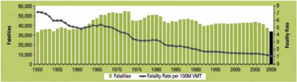
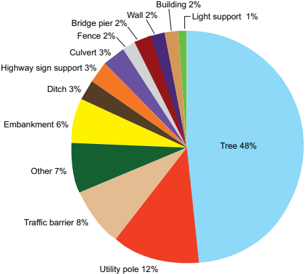

# 1.1 THE BENEFITS OF ROADSIDE SAFETY

- Source: Roadside Design Guide (2011).pdf
- Generated: 2026-01-03T22:41:43+00:00
- Chunk: 1/11
- Estimated tokens: ~8,596
- Total pages: 345
- Type: chapter

## 1.1 THE BENEFITS OF ROADSIDE SAFETY

Roadside design might be defined as the design of the area outside the traveled way. Some have referred to this aspect of highway design as off-pavement design. A question commonly asked revolves around whether spending resources off the pavement is really beneficial given the limited nature of infrastructure funds. Perhaps some statistics can bring the potential of crash reduction and road -side safety into focus.

In 2009, 33,808 people died in motor vehicle traffic crashes in the United States-the lowest number of deaths since 1950 (7). During the same time period, the number of vehicle-kilometers [vehicle-miles] of travel each year has increased by approximately six and one half times from 0.7 (0.5) billion to 4.8 (3.0) billion. Consequently, the traffic fatality rate per 100 million vehicle-kilometers [vehiclemiles] of travel has decreased approximately 85 percent from 4.58 (7.38) in 1950 to 0.71 (1.13) in 2009 (the latest year available for data on vehicle-kilometers [vehicle-miles] of travel). Figure 1-1 shows the number of fatalities and fatality rate from 1950 to 2009.

This significant reduction is due to several factors. Motor vehicles are much safer today than they have been in the past. Protected passenger compartments, padded interiors, occupant restraints, and airbags are some features that have added to passenger safety during impact situations. Roadways have been made safer through improvements in features such as horizontal and vertical alignments, intersection geometry, traversable roadsides, roadside barrier performance, and grade separations and interchanges. Drivers are more educated about safe vehicle operation as evidenced by the increased use of occupant restraints and a decrease in driving under the influence of alcohol or drugs. All these contributing factors have reduced the motor vehicle fatality rate.

Unfortunately, roadside crashes still account for far too great a portion of the total fatal highway crashes. In 2008, 23.1 percent of the fatal crashes were single-vehicle, run-off-the-road crashes. These figures mean that the roadside environment comes into play in a very significant percentage of fatal and serious-injury crashes.

Figure 1-1. Motor Vehicle Crash Deaths and Deaths Per 100 Million Vehicle Miles Traveled, 1950-2008 (6)

## 1.2 STRATEGIC PLAN FOR IMPROVING ROADSIDE SAFETY

According to the Insurance Institute for Highway Safety (IIHS) and Highway Loss Data Institute (HLDI), the proportion of motor vehicle deaths involving collisions with fixed objects has fluctuated between 19 and 23 percent since 1979 (4) .  Almost all fixed-object crashes involve only one vehicle and occur in both urban and rural areas. Figure 1-2 shows the percentage distribution of fixed-object fatalities by the object struck in 2008. Trees were by far the most common object struck, accounting for approximately half of all fixed-object fatal crashes. Utility poles were the second most common objects struck, accounting for 12 percent of all fixed object crashes, followed by traffic barriers with 8 percent. Furthermore, for 2008, 18 percent of fixed-object crashes involved vehicles that rolled over, while 18 percent involved occupant ejection. More detailed crash statistics are available from the following website at http://www.nhtsa.gov/FARS.

In 1967, the American Association for State Highway Officials (AASHO; currently the American Association for State Highway and Transportation Officials [AASHTO]) released its Highway Design and Operational Practices Related to Highway Safety (1) , the first official report that focused attention on hazardous roadside elements and suggested appropriate treatment for many of them. This guide, also known as the AASHTO 'Yellow Book,' was revised and updated in 1974 with the introduction of the forgiving roadside concept. In 1989, AASHTO published the first edition of the Roadside Design Guide .

In 1998, AASHTO approved their Strategic Highway Safety Plan (3) , which provides objectives and strategies for keeping vehicles on the roadway and for minimizing the consequences when a vehicle does encroach on the roadside. The National Cooperative Highway Research Program (NCHRP) also has published a series of guides, called the NCHRP Report 500 (9) , to assist state and local agencies in their efforts to reduce injuries and fatalities in targeted emphasis areas. These guides correspond to the emphasis areas outlined in AASHTO's Strategic Highway Safety Plan. The Strategic Highway Safety Plan and associated NCHRP Report 500 guides are avail -able from the AASHTO website at http://safety.transportation.org/guides.aspx. --'',,',',,,,',,'',',,,,,''','',-'-',,',,',',,'---

Roadside Design Guide 1-2

Figure 1-2. Percent Distribution of Fixed-Object Fatalities by Object Struck, 2008 (4)

For roadside design, Volumes 3, 6, and 8 of NCHRP Report 500 address collisions with trees in hazardous locations, run-off-the-road collisions, and the reduction of collisions involving utility poles.

A vehicle will leave the roadway and encroach on the roadside for many reasons, including the following:

- Driver fatigue
- Driver distractions or inattention
- Excessive speed
- Driving under the influence of drugs or alcohol
- Crash avoidance
- Adverse roadway conditions, such as ice, snow, or rain
- Vehicle component failure
- Poor visibility

Regardless of the reason for a vehicle leaving the roadway, a roadside environment free of fixed objects and with stable, flattened slopes enhances the opportunity for motorists to regain control of their vehicles and reduce crash severity. The forgiving roadside concept allows for errant vehicles leaving the roadway and supports a roadside design in which the serious consequences of such incidents are reduced.

Through decades of experience and research, the application of the forgiving roadside concept has been refined to the point where roadside design is an integral part of the transportation design process. Design options for reducing roadside obstacles, in order of preference, are as follows:

--'',,',',,,,',,'',',,,,,''','',-'-',,',,',',,'---

1.  Remove the obstacle.
2. Redesign the obstacle so it can be safely traversed.
3. Relocate the obstacle to a point where it is less likely to be struck.
4. Reduce impact severity by using an appropriate breakaway device.
5. Shield the obstacle with a longitudinal traffic barrier designed for redirection or use a crash cushion.
6. Delineate the obstacle if the previous alternatives are not appropriate.

One on-roadway safety feature that is becoming more prevalent nationwide on facilities experiencing a significant number of runoff-the-road crashes is the use of rumble strips to supplement pavement edge lines. These indentations in the roadway shoulders alert motorists through noise and vibration that their vehicles have departed the traveled way and afford them an opportunity to return to and remain on the roadway safely. Several transportation agencies have reported significant reductions in single-vehicle crashes after installing shoulder rumble strips.

## 1.3 GUIDE CONTENT AND FORMAT

This guide replaces the Third Edition of AASHTO's Roadside Design Guide (2006) (2) . This publication can be considered a companion document for such current publications as A Policy on Geometric Design of Highways and Streets and Standard Specifications for Structural Supports for Highway Signs, Luminaires, and Traffic Signals . There also are several research publications and additional reference literature at the end of each chapter.

Chapter 2 discusses methods for selecting appropriate alternative roadside safety enhancements, including the use of benefit/cost analysis to determine a ranking of alternatives in the absence of better local information. The Roadside Safety Analysis Program (RSAP) offers an example of one methodology for accomplishing a benefit/cost analysis of various alternatives.

Chapter 3 discusses the clear-zone concept. It gives some relative clear-zone values from which design guidance may be derived, as well as examples of the application of the clear-zone values. The chapter also includes a discussion of the treatment of drainage features.

Chapter 4 provides information on the use of sign and Luminaire supports within the roadside environment. Both small and large signs are included and criteria for breakaway and non-breakaway supports are presented. The chapter concludes with discussions of miscellaneous roadside features, such as mailbox supports, utility poles, and trees.

Chapters 5, 6, 7, and 8 provide information on various barrier systems and crash cushions. Chapter 5 discusses roadside barriers, Chapter 6 provides information for median barriers, Chapter 7 provides information on appropriate bridge railings, and Chapter 8 of -fers the latest state-of-the-practice information on barrier end treatments and crash cushions.

Chapter 9 discusses the application of the roadside safety concept for the temporary conditions found in construction or maintenance work zones. For example, the chapter contains information on clear zones in a work zone, temporary barriers, truck-mounted attenuators, and temporary traffic control devices.

Chapter 10 discusses the application of roadside safety in an urban environment. Although much of the information presented in this guide applies to rural high-speed facilities, this chapter offers information on urban roadside practices.

Chapter 11 provides information on mailboxes and mailbox turnout design.

Chapter 12 discusses the application of the roadside safety concept on very low-volume roads and streets.

## 1.4 CRASH TESTING ROADSIDE SAFETY FEATURES AND HARDWARE

This publication has numerous references to crash-testing criteria and crash-tested hardware. The intended implication of referring to a device as crash-tested is that the hardware was tested to the applicable criteria in existence at the time of the full-scale crash testing. Although full-scale crash testing subjects roadside safety devices to severe vehicular impact conditions, the testing cannot duplicate every roadside condition or vehicular impact situation. The testing provides for an acceptable level of performance under idealized

Roadside Design Guide 1-4 Copyright American Association of State Highway and Transportation Officials Provided by IHS under license with AASHTO No reproduction or networking permitted without license from IHS --'',,',',,,,',,'',',,,,,''','',-'-',,',,',',,'

conditions. However, every roadside device or installation has limitations dictated by physical laws, the crashworthiness of vehicles, and the limitation of resources. Some actual crashes may have impact situations that are more severe than the design impact conditions the testing was intended to replicate. In such crashes, the consequences could be beyond the expected severity suggested by the crash test results.

AASHTO's Manual for Assessing Safety Hardware (MASH) (8) contains the current recommendations for testing and evaluating the safety performance of highway features and hardware, including longitudinal barriers, terminals, crash cushions, work zone elements, and breakaway structures. MASH contains revised criteria for safety evaluation of virtually all permanent and temporary highway safety features, based primarily on changes in the vehicle fleet, and replaces the guidelines outlined in NCHRP Report 350 (7) .

MASH presents specific test level (TL) impact conditions for conducting vehicle crash tests. The specified test conditions include vehicle mass [weight], impact speed, approach angle, and point of impact on the safety feature. Standard test vehicle types are defined for small passenger cars (1100C), pickup trucks (2270P), single-unit van trucks (10,000S), tractor/van-type trailer units (36,000V), and tractor/tanker trailer units (36,000T). The design impact test conditions for each type of roadside hardware have been established to reflect the vast majority of real-world crash conditions. The specific MASH test conditions and evaluation criteria for each type of roadside device are summarized in the chapters that address that type of device. Table 1-1 shows the test matrix for traffic barrier systems as an example.

Table 1-1. Example of MASH Test Matrix for Traffic Barrier Systems (8)

| Test Level   | Test Vehicle                                                               | Test Conditions                             | Test Conditions           | Test Conditions   |
|--------------|----------------------------------------------------------------------------|---------------------------------------------|---------------------------|-------------------|
| Test Level   | Designation and                                                            | Vehicle Weight kg [lb]                      | Speed km/h [mph]          | Angle Degree      |
| 1            | 1100C (Passenger Car) 2270P (Pickup Truck)                                 | 1,100 [2,420] 2,270 [5,000]                 | 50 [31] 50 [31]           | 25 25             |
| 2            | 1100C (Passenger Car) 2270P (Pickup Truck)                                 | 1,100 [2,420] 2,270 [5,000]                 | 70 [44] 70 [44]           | 25 25             |
| 3            | 1100C (Passenger Car) 2270P (Pickup Truck)                                 | 1,100 [2,420] 2,270 [5,000]                 | 100 [62] 100 [62]         | 25 25             |
| 4            | 1100C (Passenger Car) 2270P (Pickup Truck) 10000S (Single Unit Truck)      | 1,100 [2,420] 2,270 [5,000] 10,000 [22,000] | 100 [62] 100 [62] 90 [56] | 25 25 15          |
| 5            | 1100C (Passenger Car) 2270P (Pickup Truck) 36000V (Tractor/Van Trailer)    | 1,100 [2,420] 2,270 [5,000] 36,000 [79,300] | 100 [62] 100 [62] 80 [50] | 25 25 15          |
| 6            | 1100C (Passenger Car) 2270P (Pickup Truck) 36000T (Tractor/Tanker Trailer) | 1,100 [2,420] 2,270 [5,000] 36,000 [79,300] | 100 [62] 100 [62] 80 [50] | 25 25 15          |

Federal Highway Administration (FHWA) policy requires that all roadside appurtenances such as traffic barriers, barrier terminals and crash cushions, bridge railings, sign and light pole supports, and work zone hardware used on the National Highway System (NHS) meet the performance criteria contained in NCHRP Report 350 or MASH. The FHWA website identifies all such hardware and in -cludes copies of FHWA acceptance letters for each of them at http://safety.fhwa.dot.gov/roadway\_dept/policy\_guide/road\_hardware/ . In addition, information on roadside hardware can be found on the Task Force 13's website located at http://aashtotf13.org .

According to the AASHTO/FHWA Joint Implementation Plan (5) , all safety hardware accepted prior to adoption of MASH and using criteria contained in NCHRP Report 350 may remain in place and may continue to be manufactured and installed. Safety hardware installed on new construction and reconstruction projects shall be those accepted under NCHRP Report 350 or MASH. Agencies are encouraged to upgrade existing highway safety hardware that has not been accepted under NCHRP Report 350 or MASH either during reconstruction or resurfacing, rehabilitation, or restoration (3R) projects or when the system is damaged beyond repair. Highway safety hardware not accepted under NCHRP Report 350 or MASH with no suitable alter-

natives available may remain in place and may continue to be installed. The AASHTO/FHWA Joint Implementation Plan for MASH is available at the FHWA website at http://safety.fhwa.dot.gov/roadway\_dept/policy\_guide/road\_hardware/.

## 1.5 THE APPLICATION OF THIS GUIDE

This publication is intended to present information on the latest state-of-the-practice in roadside safety. The concepts, designs, and philosophies presented in the following chapters cannot, and should not, be included in their totality on every single project. Each project is unique and offers an individual opportunity to enhance that particular roadside environment from a safety perspective.

The guidelines presented in this publication are mostly applicable to new construction or major reconstruction projects. These projects, which often include significant changes in horizontal or vertical alignment, offer the greatest opportunity for implementing many of the roadside safety enhancements presented in this document. For 3R projects, the primary emphasis is generally placed on the roadway itself to maintain the structural integrity of the pavement. It will be generally necessary to selectively incorporate roadside safety guidelines on 3R projects only at locations where the greatest safety benefit can be realized. Because of the scope of 3R projects and the limited nature of most rehabilitation programs, the identification of areas that offer the greatest safety enhancement potential is critical. Crash reports, site investigations, and maintenance records offer starting points for identifying these locations.

The amount of monetary resources available for all roadside safety enhancements is limited. The objective of designers is to maximize roadside safety on a system-wide basis using the available funds. Accomplishing this objective means addressing those specific road -side features that can contribute the most to the safety enhancement of an individual highway project. If including the highest level of roadside design criteria is routinely required in each highway design project-regardless of cost or safety effectiveness-it is likely that system-wide safety may stay static or even may be degraded. This potential certainly will exist if other, more pressing roadside safety needs are not improved because funds were not judiciously applied to the most viable safety enhancement needs.

Given the fact that fixed objects and slope changes are introduced at varying points off the pavement edge, the enhancement of road -side safety involves selecting the 'best' choice among several acceptable design alternatives. The experience gained from decades of selecting design alternatives, the research done on vehicle dynamics, and the technological advances in materials offers the potential for maintaining and enhancing one of the safest national transportation systems in existence.

This guide is intended to represent the spectrum of commonly available roadside design alternatives. In most cases, these alternatives have shown significant benefits in appropriately selected field conditions. Many of these roadside enhancements have, over time, demonstrated their ability in the field to improve roadside safety conditions. In many areas, this publication strives to give the advan -tages and disadvantages of roadside technology. With this information, designers can make more knowledgeable decisions about the best applications for individual projects. However, no attempt is made or implied to offer every single roadside enhancement design technique or technology.

Finally, this guide is not intended to be used as a standard or a policy statement. This document is made available to be a resource for current information in the area of roadside design. Agencies may choose to use this information as one reference on which to build the roadside design criteria best suited to their particular location and projects. Knowledgeable design, practically applied at the project level, offers the greatest potential for a continually improved transportation system. --'',,',',,,,',,'',',,,,,''','',-'-',,',,',',,'---

Roadside Design Guide 1-6

## REFERENCES

1. AASHO. Highway Design and Operational Practices Related to Highway Safety . American Association of State Highway Officials, Washington, DC, February 1967.
2. AASHTO. Roadside Design Guide . 3rd ed. American Association of State Highway and Transportation Officials, Washington, DC, 2006.
3. AASHTO. Strategic Highway Safety Plan . American Association of State Highway and Transportation Officials, Washington, DC, 2004.
4. IIHS and HLDI. Fatality Facts 2008: Fixed Object Crashes . Insurance Institute for Highway Safety and Highway Loss Data Institute, Washington, DC, 2009 [cited November 9, 2010]. Available from http://www.iihs.org/research/fatality\_facts\_2008/roadsidehazards.html.
5.  FHWA. Roadside Hardware Policy and Guidance. Available from http://safety.fhwa.dot.gov/roadway\_dept/policy\_guide/road\_hardware.
6.  NHTSA. Highlights of 2009 Motor Vehicle Crashes. Traffic Safety Facts Research Note: Summary of Statistical Findings . DOT HS 811 363. National Highway Traffic Safety Administration, Washington, DC, August 2010 [cited November 9, 2010]. Available from http://www-nrd.nhtsa.dot.gov/Pubs/811363.pdf.
7. Ross, H. E., Jr., D. L. Sicking, R. A. Zimmer, and J. D. Michie. National Cooperative Highway Research Report 350: Recommended Procedures for the Safety Performance Evaluation of Highway Features . NCHRP, Transportation Research Board, Washington, DC, 1993.
8. Sicking, D. L., J. R. Rohde, K. K. Mak, and T. D. Reid. Manual for Assessing Safety Hardware (MASH). American Association of State Highway Transportation Officials, Washington, DC, 2009.
9. TRB. National Cooperative Highway Research Report 500: Guidance for Implementation of the AASHTO Strategic Highway Safety Plan . NCHRP, Transportation Research Board, Washington, DC, 2003.

--'',,',',,,,',,'',',,,,,''','',-'-',,',,',',,'---

## Economic Evaluation of Roadside Safety

## 2.0 OVERVIEW

The consistent application of geometric design standards for roads and streets provides motorists with a high degree of safety. Design features, such as horizontal and vertical alignment, lane and shoulder width, signing, shoulder rumble strips, and pavement markings, play an important role in keeping motorists on the traveled way. Roadside safety features, such as breakaway supports, barriers, and crash cushions provide an extra margin of safety to motorists who inadvertently leave the roadway. Most of these appurtenances are routinely installed based on a subjective analysis of their benefits to the motorist. In some instances, however, it may not be imme -diately obvious that the benefits to be gained from a specific safety design or treatment equal or exceed the additional costs. Thus, a designer should decide how and where limited funds should be spent to achieve the greatest overall benefit. One method that can be used is a benefit/cost analysis.

2.1 BENEFIT/COST ANALYSIS A benefit/cost analysis is a method by which the estimated benefits to be derived from a specific course of action are compared to the costs of implementing that action. If the estimated benefits of a specific design exceed the costs of constructing and maintaining that design over a period of time, the safer design may be implemented. However, simply having a benefit/cost ratio greater than one is not ample justification for the construction of a roadside safety treatment. Each project competes with others for limited safety funds. The designer should attempt to build those projects that best meet the public's need for safety and mobility. --'',,',',,,,',,'',',,,,,''','',-'-',,',,',',,'---

The primary benefit obtained from selecting one design over another based on safety is the expected reduction in the future costs of crashes. These costs typically include property damage costs and personal injury costs. To estimate these costs, the expected number and severity of crashes that may occur for each roadside treatment should be estimated. In some cases, the total number of crashes may be reduced by a given treatment, such as providing a significantly wider roadside recovery area than previously existed. In other instances, the safety treatment may not reduce the total number of crashes but may reduce their severity. The installation of a median or roadside traffic barrier could have this effect.

The costs used in a benefit/cost analysis are generally the direct construction, right-of-way, and maintenance costs incurred by the highway agency. They usually can be estimated with a high degree of accuracy.

A benefit/cost analysis also should consider the period of time (project life) in which each alternative treatment provides a benefit. Because different treatments can have different project lives, benefits and costs should be annualized so direct comparisons between alternative design treatments can be made. To convert total (life-cycle) costs to annualized costs, discount rates should be considered. Thus, an annualized benefit/cost ratio compares the expected savings (benefits) to society through reduced costs from crashes to the costs (construction and maintenance) incurred by the highway agency in providing a specific treatment.

The following subsections identify the type of data needed to conduct a benefit/cost analysis and the general availability of this infor -mation. The major factors include

- Encroachments,
- Roadside geometry, and
- Crash costs.

## 2.1.1 Encroachments

The benefits derived from a roadside safety treatment can be calculated by first estimating the number of vehicles that are likely to run off the road at a particular location. By definition, an encroachment occurs when a motorist strays from the traveled way. The primary factors that affect the frequency of encroachments are traffic volume, roadway alignment, and lane width. The number of estimated encroachments is determined by multiplying an encroachment rate by the number of vehicles using the facility, resulting in a figure representing the number of encroachments per kilometer [mile] per year. Current encroachment rates are derived from a limited number of studies conducted over the past 30 years (3, 4) . These rates should be adjusted when actual data at a specific location are available. They also may be modified based on engineering judgment for non typical and/or local conditions.

Note that not all encroachments result in crashes. For example, for shallow-angle encroachments, even a narrow recovery area may provide enough space for a driver to regain control and return safely to the roadway. To estimate the number of crashes that may result from encroachments, the angles of departure from the roadway and the speeds and types of vehicles involved should be considered.

## 2.1.2 Roadside Geometry

Once a vehicle has left the roadway, a crash may or may not occur. The end result of an encroachment depends on the physical characteristics of the roadside environment. As noted earlier, the highway designer has a significant degree of control over roadside geometry and appurtenances. Flat, traversable, stable slopes will minimize overturning crashes, which are usually severe. Elimination of roadside hardware, their relocation to less vulnerable areas, or the use of breakaway type devices remain the options of choice in developing safer roadsides. Obstructions that cannot be otherwise treated should be shielded by properly designed and installed traf -fic barriers or crash cushions if it is cost effective to do so. Finally, if a fixed object or other roadside obstacle cannot be eliminated, relocated, modified, or shielded for whatever reason, delineating the feature so it is readily visible to a motorist should be considered.

## 2.1.3 Crash Costs

Once an estimate has been made of the number of crashes that can be expected at a given location, this information should be trans -lated into a cost that is directly related to crash severity. One method of accomplishing this is by assigning a Severity Index (SI) to indi -vidual crashes. This SI will vary with the type of vehicle involved, its speed and impact angle, and the type of obstacle struck. A crash may range in severity from minor to fatal. If an SI system is used, a crash involving no personal injuries and negligible property dam -age might be assigned an SI of 0, while a crash with a 100 percent chance of a fatality might be assigned an SI of 10. Between these extremes, crashes typically involve varying degrees of property damage coupled with slight, moderate, or severe personal injuries.

Converting severity indices to crash cost is a relatively easy process, but it does require that a dollar cost be assigned to each crash severity level. This step involves considerable judgment because it requires that a value be assigned to each crash severity classifica -tion, including fatal crashes. Primary sources of crash cost data include the National Safety Council, the National Highway Traffic Safety Administration, and the Federal Highway Administration.

## 2.2 BENEFIT/COST ANALYSIS PROGRAMS

Several highway agencies have used the ROADSIDE analysis program and the Roadside Safety Analysis Program (RSAP) presented in the earlier editions of the Roadside Design Guide to analyze site specific alternative safety treatments and to develop design charts and tables using local data. RSAP is being rewritten and updated under NCHRP Project 22-27, and is slated for completion in late

Roadside Design Guide 2-2

2011. Check the NCHRP website at http://www.trb.org/NCHRP/Public/NCHRP.aspx for project updates. In addition, the AASHTO Highway Safety Manual (1) that was published in 2010 provides economic appraisal procedures in Chapter 7 for comparing the ben -efits of potential crash countermeasures.

## 2.3 IN-SERVICE PERFORMANCE EVALuATION

As stated in Chapter 7 of the Manual for Assessing Safety Hardware (MASH) from American Association of State Highway Trans -portation Officials (AASHTO) (2) , in-service evaluation is a very important step when assessing the impact performance of a new or extensively modified safety feature. The purpose of in-service evaluation is to determine and document the manner in which the safety feature performs within a broad range of collisions and real-world conditions, such as environmental, operational, and maintenance situations for typical site and traffic conditions.

The in-service evaluation serves as an important follow-up to crash testing. Although the crash-testing guidelines set forth in MASH assure that safety devices function well for the specified test conditions, there are many unknowns and concerns about the impact performance of the roadside features under real-world conditions. Differences between field performance and crash test results can arise because of many factors, including the following:

- Field impact conditions that are not included in crash test guidelines, such as non-tracking and side impacts
- Site conditions, such as roadside slopes and ditches, that adversely affect vehicle kinematics before, during, or after impact with the safety device
- Sensitivity to installation details, such as soil resistance or barrier flare configuration

Although no formal requirement exists for in-service performance evaluation, user agencies are encouraged to consider implementing some form of in-service performance evaluation program, perhaps as part of the safety management system. National Cooperative Highway Research Program (NCHRP) Report 490 (5) provides information on one procedure to conduct this evaluation.

## REFERENCES

1.  AASHTO. Highway Safety Manual . American Association of State Highway and Transportation Officials, Washington, DC, 2010.
2.  AASHTO. Manual for Assessing Safety Hardware (MASH). American Association of State Highway and Transportation Officials, Washington, DC, 2009.
3. Cooper, P. Analysis of Roadside Encroachments-Single Vehicle Run-off-Road Accident Data Analysis for Five Provinces . Research report prepared by BC Research, Vancouver, BC, Canada, March 1980.
4. Hutchinson, J. W., and T. W. Kennedy. Medians of Divided Highways-Frequency and Nature of Vehicle Encroachments . Bulletin No. 487. University of Illinois Engineering Experiment Station, Urbana, IL, 1966.
5. Ray, M. H., J. Weir, and J. Hopp. National Cooperative Highway Research Report 490: In-Service Performance of Traffic Barriers . NCHRP, Transportation Research Board, Washington, DC, 2003.

## Roadside Topography and Drainage Features

## 3.0 OVERVIEW

This chapter discusses the development and evaluation of the forgiving roadside concept and its application to roadside design and clear zones. It also discusses embankment slopes and ditches and how these features influence roadside features such as curbs, cul -verts, and drop inlets, whose purpose is to provide adequate roadway drainage. The designer is presented with several options that enhance safety without affecting the capabilities of these elements to drain the highway.

Most of the forgiving roadside design principles discussed in this chapter have been practiced to varying degrees for several years. This chapter attempts to reemphasize and collect the currently accepted design principles to provide guidance in the area of roadside design. However, to include every recommendation or design value in this chapter on every future highway project is neither feasible nor possible. Engineering judgment will have to play a part in determining the extent to which improvements reasonably can be made with the limited resources available.

As the designer studies the options available, some consideration should be given to the future maintenance of drainage facilities and roadside topography. Ongoing repair and upkeep will be necessary to ensure the continued function and safety of various roadside drainage features. Personnel, materials, equipment, and cost are some of the considerations in every maintenance program. The de -signer should take into account the exposure of crews to traffic conditions while completing repairs. Also, maintenance activities can cause various levels of disruption in the traffic flow, which may increase the potential for crashes.
