# 4.1 ACCEPTANCE CRITERIA FOR BREAKAWAY SUPPORTS

- Source: Roadside Design Guide (2011).pdf
- Generated: 2026-01-03T22:41:43+00:00
- Chunk: 3/11
- Estimated tokens: ~13,388
- Total pages: 345
- Type: chapter

## 4.1 ACCEPTANCE CRITERIA FOR BREAKAWAY SUPPORTS

The term breakaway support refers to all types of sign, luminaire, and traffic signal supports that are designed to yield, fracture, or separate when impacted by a vehicle. The release mechanism may be a slip plane, plastic hinge, fracture element, or a combination of them. The criteria used to determine if a support is considered breakaway are found in the AASHTO Manual for Assessing Safety Hardware (MASH) (4) and the AASHTO Standard Specifications for Structural Supports for Highway Signs, Luminaries, and Traffic Signals (3) . Breakaway support hardware previously found acceptable under the requirements of either the 1985 or 1994 editions of the AASHTO Standard Specifications for Structural Supports for Highway Signs, Luminaires, and Traffic Signals (3) are acceptable under NCHRP 350 Report (9) guidelines and may continue to be installed. Newly developed supports tested under MASH will un -dergo an additional crash test with a pickup truck; this test is intended to evaluate potential for windshield penetration with a taller pas -senger vehicle than has been used for testing in the past. The Federal Highway Administration (FHWA) maintains lists of acceptable, crashworthy supports, available from their website at http://safety.fhwa.dot.gov/roadway\_dept/policy\_guide/road\_hardware/, while the AASHTO-Associated General Contractors of America (AGC)-American Road and Transportation Builders Association (ARTBA) Joint Committee Task Force 13 has information about small sign and luminaire supports at their website at http://www.aashtotf13.org .

NCHRP 350 Report and MASH criteria require that a breakaway support perform in a predictable manner when struck head-on by an 1100 kg [2420 lb] and/or 2270 kg [5000 lb] vehicle, or its equivalent, at speed from 30 km/h [19 mph] to 110 km/h [62 mph]. Limits are placed on the transverse and longitudinal components of the occupant impact velocity and the crash vehicle should remain stable and upright during and after the impact with no significant deformation or intrusion of the windshield or passenger compartment. These specifications also establish a maximum stub height of 100 mm [4 in.] to lessen the possibility of snagging the undercarriage of a vehicle after a support has broken away from its base. The appropriate procedures for acceptance testing of breakaway supports are described in Sections 2.2.4 and 3.4.3.4 of MASH.

Full-scale crash tests, bogie tests, and pendulum tests are used in the acceptance testing of breakaway devices. In full-scale testing, an actual vehicle is accelerated to the test speed and impacted into the device being tested. The point of initial impact is the front of the vehicle, either at the center or quarter point of the bumper. Full-scale tests produce the most accurate results, but their main disadvan -tage is cost. Bogie vehicles also are used to test breakaway hardware. A bogie is a reusable, adjustable surrogate vehicle used to model actual vehicles. A nose, similar to a pendulum nose, is used to duplicate the crush characteristics of the vehicle being modeled. Bogie vehicles are designed to be used in the speed range of 35 to 100 km/h [22 to 62 mph].

To reduce testing costs, pendulum tests are used to evaluate breakaway hardware. Pendulum nose sections have been developed that model the fronts of vehicles. Pendulum tests typically have been used to test luminaire support hardware. However, because of the physical limitations of pendulums, pendulum testing is limited to 35 km/h [22 mph] impacts. Pendulum test results for impacts at 35 km/h [22 mph] may be extrapolated to predict 100 km/h [62 mph] impact behavior, providing the support breaks free with little or no bending in the support. This extrapolation method should not be used with base-bending or yielding supports.

## 4.2 DESIGN AND LOCATION CRITERIA FOR BREAKAWAY AND NON-BREAKAWAY SUPPORTS

Sign, luminaire, traffic signal, and similar supports first should be structurally adequate to support the device mounted on them and to resist ice, wind, and fatigue loads as specified in the AASHTO Standard Specifications for Structural Supports for Highway Signs, Luminaires and Traffic Signals (3) . The Manual on Uniform Traffic Control Devices (MUTCD) (6) requires all sign supports within the clear zone to be shielded or breakaway. Other concerns are that supports be properly designed and carefully located to ensure that the breakaway devices perform properly and to minimize the likelihood of impacts by errant vehicles. For example, supports should not be placed in drainage ditches where erosion and freezing could affect the proper operation of the breakaway mechanism. It also is possible that a vehicle entering the ditch could be inadvertently guided into the support. Signs and supports that are not needed should be removed. If a sign is needed, then it should be located where it is least likely to be hit. Whenever possible, signs should be placed behind existing roadside barriers (beyond the design deflection distance), on existing structures, or in similar non-accessible areas. If this cannot be achieved, then breakaway supports should be used. Only when the use of breakaway supports is not practicable should a traffic barrier or crash cushion be used exclusively to shield sign supports.

As a general rule, breakaway supports should be used unless an engineering study indicates otherwise. However, concern for pedes -trian involvement has led to the use of fixed supports in some urban areas. Because pedestrian activity tends to concentrate during

Roadside Design Guide 4-2

--'',,',',,,,',,'',',,,,,''','',-'-',,',,',',,'---

daylight hours and run-off-road crashes are more prevalent during the evening and early morning hours, breakaway supports should be considered in most urban areas. Examples of sites where breakaway supports may be imprudent are those adjacent to bus shelters or that have extensive pedestrian concentrations.

Supports placed on roadside slopes should not allow impacting vehicles to snag on either the foundation or any substantial remains of the support. Surrounding terrain should be graded to permit vehicles to pass over any non-breakaway portion of the installation that remains in the ground or rigidly attached to the foundation. The AASHTO Standard Specifications for Structural Supports for Highway Signs, Luminaries and Traffic Signals (3) establishes a maximum stub height of 100 mm (4 in.) to lessen the possibility of snagging the undercarriage of a vehicle after a support has broken away from its base and minimize vehicle instability if a wheel hits the stub. Figure 4-1, adopted from these specifications, illustrates the method used to measure the maximum stub height.

Figure 4-1. Breakaway Support Stub Height Measurements

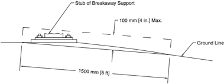

The MUTCD requires that breakaway supports housing electrical components utilize electrical disconnects to reduce the risk of fire and electrical hazards after the structure is impacted by a vehicle. Upon knockdown, the support/structure should electronically dis -connect as close to the pole base as possible.

Breakaway support mechanisms are designed to function properly when loaded primarily in shear. Most mechanisms are designed to be impacted at bumper height, typically at about 500 mm [20 in.] above the ground. If impacted at a significantly higher point, the bending moment in the breakaway base may be sufficient to bind the mechanism, resulting in non-activation of the breakaway device. For this reason, it is critical that breakaway supports not be located near ditches, on steep slopes, or at similar locations where a ve -hicle is likely to be partially airborne at the time of impact. Supports placed on a foreslope of 1 to 6 or flatter are acceptable. Supports placed on foreslopes that are 1 to 4 through 1 to 6 are only acceptable when the face of the support is within 600 mm [24 in.] of the intersection of the shoulder slope and the foreslope.

The type of soil also may affect the activation mechanisms of some breakaway supports. Fracture-type supports (e.g., high-carbon, U-channel posts, telescoping tubes, wood supports) can push through loose or saturated soils, absorbing energy and possibly adversely affecting a support's fracture mechanism. Usually this occurrence is not a problem for a fracture-type support embedded less than 1 m [3 ft] because the support will likely pull out of the soil, unless a special anchor plate prevents it. For fracture-type supports with pullout-resisting anchors, supports embedded more than 1 m [3 ft], or any other support that might be sensitive to foundation movement, consideration should be given to qualifying them through crash testing in 'weak soil' in addition to qualifying them through 'standard soil' crash tests. As explained in the Commentary on Chapter 3 in the MASH 2009:

The weak soil should be used, in addition to the standard soil, for any feature whose impact performance is sensi -tive to soil-foundation or soil-structure interaction if: (1) identifiable areas of the state or local jurisdiction in which the feature will be installed contain soil with similar properties, and (2) there is a reasonable uncertainty regard -ing performance of the feature in the weak soil. Tests have shown that some base-bending or yielding small sign supports readily pull out of the weak soil upon impact. For features of this type, the strong soil is generally more critical and tests in the weak soil may not be necessary.

--'',,',',,,,',,'',',,,,,''','',-'-',,',,',',,'---

Special anchor plates or design details also may be used to accommodate expected wind loads. Because these design details could affect proper performance, it is recommended that these designs also be tested in both soils. To affect a truly cost-effective program of breakaway supports, other items need to be considered. Availability of a particular support will affect installation costs and re -placement costs. Durability of the support will affect the expected life of a non-struck support. Also, some supports can be reused after being impacted by a vehicle, which may be more cost-effective even though the initial costs are high. Thus, the expected impact frequency and simplicity of maintenance may influence an agency's selection.

## 4.3 SIGN SUPPORTS

Roadway signs can be divided into three main categories: overhead signs, large roadside signs, and small roadside signs. The hardware and corresponding safety treatment of sign supports varies with the sign category. Some states shield all supports regardless of offset.

## 4.3.1 Overhead Sign Supports

Overhead signs and cantilever signs are considered fixed-base support systems that do not yield or break away upon impact. The large mass of these support systems and the potential safety consequences of the systems falling necessitate a fixed-base design that cannot be made breakaway. Where possible, these supports should be located behind traffic barriers protecting nearby overpasses or other existing structures, or the signs should be mounted on the nearby structure. All overhead sign supports located within the clear zone should be shielded with a crashworthy barrier. The location of the support should provide clearance between the back of the rail and the face of the support to ensure that the rail will function as intended when struck by a vehicle. This clearance will vary depending on the type of rail used.

## 4.3.2 Large Roadside Sign Supports

Large roadside signs may be defined as those greater than 5 m 2 [50 ft 2 ] in area. They typically have two or more breakaway support posts. The basic concept of the breakaway sign support is to provide a structure that will resist wind and ice loads, yet fail in a safe and predictable manner when struck by a vehicle. Figure 4-2 shows the loading conditions for which the support should be designed, while Figure 4-3 depicts the desired impact performance. To achieve satisfactory breakaway performance, the following criteria should be met:

- The hinge should be at least 2.1 m [7 ft] above the ground so that no portion of the sign or upper section of the support is likely to penetrate the windshield of an impacting vehicle.
- A single post, spaced with a clear distance of 2.1 m [7 ft] or more from another post, should have a mass [weight] less than 65 kg/m [44 lb/ft]. The total mass [weight] below the hinge but above the shear plate of the breakaway base should not exceed 270 kg [600 lb]. For two posts spaced with a clear distance of less than 2.1 m [7 ft], each post should have a mass [weight] less than 27 kg/m [18 lb/ft].
- No supplementary signs should be attached below the hinges if such placement is likely to interfere with the breakaway action of the support post or if the supplemental sign is likely to strike the windshield of an impacting vehicle.
- The breakaway mechanisms of large roadside sign supports are of either a fracture or a slip-base type. Fracture mechanisms consist of either couplers or wood posts with reduced cross sections. Most couplers are considered to be multidirectional; that is, they are expected to work satisfactorily when struck from any direction. Figure 4-4 shows one type of multidirectional coupler in common use.

Slip-base type mechanisms activate when two parallel plates slide apart as the bolts are pushed out under impact. The designs may be either unidirectional or multidirectional. Horizontal slip bases using the four-bolt pattern shown in Figure 4-5 are unidirectional.

The upper hinge design for unidirectional impacts consists of a slotted fuse plate on the expected impact side and a saw cut through the web of the post to the rear flange. The rear flange then acts as a hinge when the post rotates upward. Figure 4-6 shows this commonly used design. Slotted plates may be used on both sides of the post if impacts are expected from either direction.

Roadside Design Guide 4-4

Figure 4-2. Wind and Impact Loads on Roadside Signs

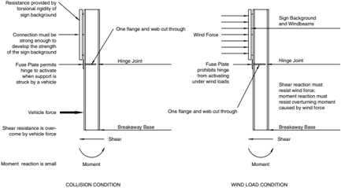

Figure 4-3. Impact Performance of a Multiple-Post Sign Support

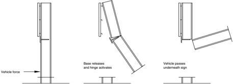

Proper functioning of the slip base and fuse plate designs requires proper torque of the bolts. If the bolted connection is too tight, friction forces between the plates may prevent activation of the breakaway base under intended loading conditions. If the bolts are under-torqued, the posts may 'walk' off the base under wind and other vibration loads. The use of keeper plates is recommended to retain the clamping bolts in place even if the bolted connection relaxes over time.

Designing  for  wind  load  is  necessary  for  large  signs. A  check  of  wind  load  designs  on  the  fuse  plates  also  should  be  made. A perforated  steel  fuse  plate  meeting  the  requirements  of  ASTM  A  36/A  36M  has  been  shown  to  perform  satisfactorily  when used  as  the  fuse  plate  on  a  steel  post.  Because  this  design  does  not  require  its  connections  to  be  torqued  to  a  specific  val -ue,  it  is  relatively  fail-safe  and  recommended  for  use  in  lieu  of slotted  fuse  plates.  Figure  4-7  shows  the  perforated  design.

--'',,',',,,,',,'',',,,,,''','',-'-',,',,',',,'---

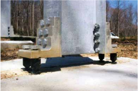

Figure 4-4. Multidirectional Coupler

Figure 4-5. Typical Unidirectional Slip Base

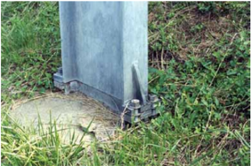

Figure 4-6. Slotted Fuse Plate Design

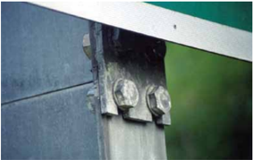

4-6

Roadside Design Guide

--'',,',',,,,',,'',',,,,,''','',-'-',,',,',',,'---

Figure 4-7. Perforated Fuse Plate Design

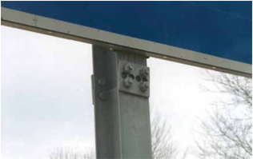

In some low-speed tests, the fuse plates on large roadside sign supports have failed to activate and the support has pulled away from the sign panel. The change in vehicle speed still has been acceptable. However, fuse and hinge plates should not be eliminated based on these low-speed tests. Though they are more likely to activate in a high-speed impact, they act as a back-up safety feature in lowspeed impacts.

Although the MUTCD (6) specifies the general location of large roadside signs, the highway designer has a significant degree of lati -tude in the exact placement of any given sign. Crash test results show that breakaway supports installed on level terrain will perform as intended when struck head-on by a vehicle. However, if these supports are installed on a slope or the possibility exists that a vehicle may be spinning or sliding on impact, the breakaway feature may not function as well as when it is installed on level terrain. Even if a sign is erected on breakaway supports, it can cause significant damage to an impacting vehicle and injuries to the vehicle occupants. Once hit, the sign becomes a maintenance problem. These are obvious reasons for locating all signs where they are least likely to be hit and, when feasible, outside the clear zone, even if they are breakaway.

## 4.3.3 Small Roadside Sign Supports

Small roadside signs may be defined as those supported on one or more posts and having a sign panel area not greater than 5 m 2 [50 ft 2 ]. Although not usually perceived as an obstruction, small signs can cause substantial damage to impacting automobiles. Small sign supports are typically driven directly into the soil, set in drilled holes, or mounted on a separately installed base. The breakaway mechanisms for small sign supports consist of a base-bending, fracture, or slip base design. The most commonly used small sign sup -port hardware and the characteristics of each are described in this section.

Base-bending or yielding sign supports typically consist of U-channel steel posts, perforated square steel tubes, thin-walled aluminum tubes, or thin-walled fiberglass tubes. A steel plate measuring approximately 100 mm by 300 mm by 6 mm [4 in. by 12 in. by 1 / 4 in.] may be welded or bolted to the pipe support to prevent the sign from twisting from wind loads. Performance of these base-bending supports is much more difficult to predict than other support types. Variations in the depth of embedment, the soil resistance, stiffness of the sign support, mounting height of the sign, and many other factors influence their dynamic behavior.

Splicing of steel U-channel posts is not recommended unless tested because the impact performance of a spliced post cannot be ac -curately predicted. Unless crash tested with bracing in place, diagonal bracing of a sign support should be avoided because it could significantly affect the crash performance of an otherwise acceptable design. This is particularly true for base-bending or yielding supports. When it is absolutely necessary to increase the strength of a post support system, larger breakaway or multiple breakaway posts should be considered. --'',,',',,,,',,'',',,,,,''','',-'-',,',,',',,'---

For single sign posts with bending or yielding characteristics, the sign panels should be adequately bolted to the post with oversized washers to prevent the panel from separating on impact and penetrating a windshield. At higher speeds, base-bending or yielding sign supports bend around the bumper, causing the top of the support to impact the windshield or roof. Early research indicated that the shorter mounted signs would destroy the windshield and penetrate the occupant compartment. A minimum height of 2.7 m [9 ft] to the top of the sign panel was recommended to alleviate the situation because it was expected that the top of the sign would then impact the roof rather than the windshield. This suggestion was valid at the time the research was conducted because of the prevalence of small cars. Recent computer simulation of 100 km/h [60 mph] sign impacts with mid-size automobiles and light trucks show that the 2.7 m [9 ft] height results in the same undesirable location of impact that the lower signs had on the small cars. Therefore, requiring signs to be mounted higher has no net crashworthiness benefit. Agencies concerned with this undesirable behavior may wish to consider a small sign support system that incorporates a slip base or breakaway coupling mechanism to use on high-speed streets and highways.

Fracturing sign supports are wood posts, steel posts or pipes, or aluminum supports connected at ground level to a separate anchor. Wood posts typically are set in drilled holes and backfilled, while anchors for steel pipe and steel post systems normally are driven into the ground.

Slip-base designs for small sign supports may be broadly classified as unidirectional or multidirectional. The most basic types of uni -directional breakaway sign supports are the horizontal and inclined slip bases. The inclined design shown in Figure 4-8 is typical. This design uses a 4-bolt slip base inclined in the direction of traffic at 10 to 20 degrees from horizontal. This angle ensures that the sign will move upward to allow the impacting vehicle to pass under it and not hit the windshield or the top of the car. When this type of slip base is used for small signs, hinges in the posts are not needed. The major limitation of this slip-base design is its directional property. The inclined slip base only can be struck from one direction to yield satisfactorily. Neither the horizontal nor the inclined slip-base designs should be used in medians, traffic islands, or other locations where impacts from more than one direction are possible.

Multidirectional or omnidirectional bases are typically triangular and are designed to release when struck from any direction. Figure 4-9 shows a typical design. These types of breakaway supports should be used in medians, channelizing islands, intersections, ramp terminals, and other locations where a sign may be impacted from several directions.

Slip-base breakaway sign supports are subject to installation and maintenance problems that do not exist for rigid supports. Wind and other vibration loads may cause the bolts in the slip base to loosen. A keeper plate is recommended to prevent the clamping bolts, which have low torque requirements, from 'walking' or migrating from the slots under wind loads.

A more common problem is the failure of a slip base to release properly due to over-torquing of the clamping bolts in the slip base and in the hinge of small sign supports. Because the slip base operates on the weakened shear plane concept, over-torquing creates high friction among the slip base elements and may prevent the post from releasing properly when hit. For this reason, breakaway designs not dependent on specific torque requirements are highly desirable. The Oregon 3-bolt slip base (Figure 4-10) has 90-degree notch openings and thick washers. This design has very good breakaway performance and is much less sensitive to over-torquing. Problems with thread fabrication on clamping bolt nuts, improper assembly of slip base parts, and anchor bolts projecting into the slip base are other common deficiencies that should be avoided.

In areas in which critical wind velocities are prevalent, sign flutter can be a problem that should be considered. This phenomenon, in which rapid rotation and twisting of the posts occur, can cause failure of the posts by fatigue.

--'',,',',,,,',,'',',,,,,''','',-'-',,',,',',,'---

Roadside Design Guide 4-8

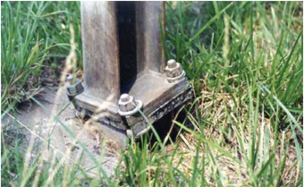

Figure 4-8. Unidirectional Slip Base for Small Signs

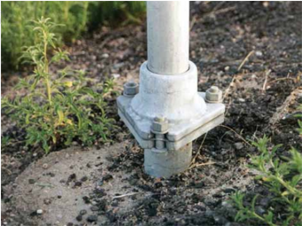

--'',,',',,,,',,'',',,,,,''','',-'-',,',,',',,'---

Figure 4-9. Multidirectional Slip Base for Small Signs

Figure 4-10. Oregon 3-Bolt Slip Base

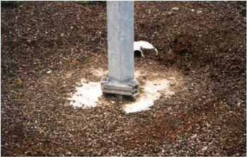

## 4.4 MULTIPLE POST SUPPORTS FOR SIGNS

All breakaway supports having a clear distance of less than 2.1 m [7 ft] are considered to act together. This criterion is based on a need to minimize the potential for unacceptable performance of breakaway hardware. In some cases, a vehicle could leave the road -way at such a sufficiently high angle that two posts within a 2.1-m [7-ft] spacing would be struck. In other cases, a vehicle could be yawing in the roadside to such an extent that two posts within a 2.1-m [7-ft] spacing would be struck. In many instances, the greatest change in vehicle velocity occurs when impacting breakaway hardware at slower speeds because less energy is available to activate the breakaway mechanism. Because vehicles leaving the roadway at very high angles or in a yawing mode would likely be traveling at slower speeds, the 2.1-m [7-ft] criterion is a reasonable safety factor that should be used in roadside design of breakaway hardware.

## 4.5 LUMINAIRE SUPPORTS

## 4.5.1 Breakaway Luminaire Supports

Breakaway luminaire supports are typically classified as frangible bases (cast aluminum transformer bases), slip bases, or frangible couplings (couplers). Examples of each type in common use are shown in Figures 4-11 to 4-13. Breakaway luminaire supports can be similar to breakaway sign hardware. The breakaway mechanism properly activates if loaded in shear rather than bending stress and is designed to release when impacted at typical bumper height of about 500 mm [20 in.]. The devices may not perform properly when the supports are located along the roadside where impacts would result in bending rather than shear. Superelevation, slope rounding and offset, and vehicle departure angle and speed will influence the striking height of a typical bumper. If the foreslopes are limited to 1V:6H or flatter between the roadway and the luminaire support, vehicles should strike the support at an acceptable height.

Roadside Design Guide 4-10

--'',,',',,,,',,'',',,,,,''','',-'-',,',,',',,'---

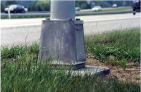

Figure 4-11. Example of a Cast Aluminum Frangible Luminaire

Figure 4-12. Example of a Luminaire Slip Base Design

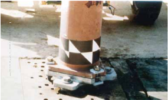

Figure 4-13. Example of a Frangible Coupling Design

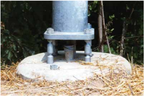

As a general rule, a luminaire support will fall near the line of the path of an impacting vehicle. The mast arm usually rotates so it points away from the roadway when resting on the ground. This action generally prevents the pole from going into other traffic lanes. However, the designer should remain aware that these falling poles may endanger other motorists or bystanders such as pedestrians and bicyclists.

At the present time, the height of poles with breakaway features should not exceed 18.5 m [60 ft]. This maximum height is recom -mended because it is the approximate maximum height of currently accepted hardware and also is the height that can accommodate modern lighting design practices when foundations are set at about roadway grade. To reduce the potential for serious consequences, the mass [weight] of a breakaway luminaire support should not exceed 450 kg [1,000 lb].

The type of soil surrounding a luminaire foundation may affect the performance of the breakaway mechanism. Experience shows that if foundations are allowed to push through the soil, the luminaire support will be placed in bending rather than shear, resulting in non-activation of the breakaway mechanism. Foundations should be properly designed to prevent their movement or rotation or both in surrounding soils.

Non-direct-burial luminaire supports generally require a substantial foundation. It is important that any such foundation is essentially flush with the ground because the 100 mm [4 in.] stub height criterion in the AASHTO breakaway specifications includes all nonbreakaway elements above the ground line.

In all breakaway supports housing electrical components, efforts should be made to effectively reduce fire and electrical hazards should an errant vehicle impact a structure. Upon knockdown, the electricity in the support/structure should disconnect as close to the foundation as possible.

When luminaire supports are located near a traffic barrier, breakaway bases may or may not be applicable, depending on the type and characteristics of the barrier. Luminaire supports should not be placed within the deflection distance of a barrier. For the most part, the impact performance of barriers interacting with a luminaire support breakaway device during a crash has not been determined. This situation should be avoided unless crash testing of a particular combination of devices indicates that the performance is acceptable. If the support should be within the design deflection distance of the barrier, it should be a breakaway design or the railing should be stiffened locally to minimize the resultant deflection. Details on traffic barrier types and characteristics are in Chapters 5 and 6.

Several state agencies mount luminaires on top of concrete median barriers, a practice that often requires modification to the luminaire support, median barrier, or both. This type of installation generally does not use breakaway supports because of the risk that a downed pole might present to opposing traffic. A consideration in this design is the likelihood of truck impacts with the barrier, because a truck bed typically will overhang short barriers during an impact and could snag on the support located there. The resultant vehicle deceleration may be excessive.

A final consideration on roadway lighting is a reduction in the total number of luminaires used along a section of highway. Higher mounting heights may significantly reduce the total number of supports needed. The ultimate design in this respect is the use of tower or high-mast lighting that requires far fewer supports located much farther from the roadway. From a roadside safety perspective, this is a preferred method for lighting major interchanges.

## 4.5.2 High-Level Lighting Supports

High-level lighting supports also are fixed-base support systems that do not yield or break away on impact. The length and large mass of these support systems and the potential safety consequences of the systems falling necessitate a fixed-base design that cannot be made breakaway. Where possible, these supports should be located outside of the clear zone. Otherwise, they should be shielded with a crashworthy barrier. The location of the support should provide clearance between the back of the rail and the face of the support to ensure that the rail will function as intended when struck by a vehicle. This clearance will vary depending on the type of guardrail used.

## 4.6 TRAFFIC SIGNAL SUPPORTS

Traffic signal supports include structures for post mounted traffic signals, structures with cantilevered arms, overhead mounted traffic signals, and span wire mounted traffic signals.

Roadside Design Guide 4-12

Traffic signal supports present a special situation where a breakaway support may not be practical or desirable. As with luminaire supports, a fallen signal post support may become an obstruction. However, the potential risks associated with the temporary loss of full signalization at the intersection should be considered.

When traffic signals are installed on high-speed facilities (generally defined as those having speed limits of 80 km/h [50 mph] or greater), the signal supports and, if not mounted on one of the signal support poles, the signal support box, should be placed as far away from the roadway as practicable. Shielding these supports can be considered if they are within the clear zone for that particular roadway. Traffic signal supports with mast arms, or those that have a support on both sides of the roadway and a wire (span wire) or other components (overhead) that spans the facility, normally are not provided with a breakaway device. Post-mounted signals are commonly installed in close proximity to traffic lanes or in wide medians; therefore, consideration should be given to using breakaway devices for these supports.

## 4.7 SUPPORTS FOR MISCELLANEOUS DEVICES

Other relatively narrow objects that are usually located adjacent to the roadway include intelligent transportation systems, railroad warning devices, fire hydrants, and mailboxes. These devices are discussed in the following sections.

## 4.7.1 Railroad Crossing Warning Devices

Highway and railroad officials should cooperatively decide on the type of warning device needed at a particular crossing (e.g., cross -bucks, flashing light signals, or gates). As a minimum, crossbucks are required and should be installed on an acceptable support. Other warning device supports, such as signals or gates, can cause an increase in the severity of injuries to vehicle occupants if struck at high speeds. In these cases, if the support is located in the clear zone, consideration should be given to shielding the support with a crash cushion. A longitudinal barrier often is not used because there is seldom sufficient space for a proper downstream end treatment, a longer obstacle is created by installing a guardrail, and a vehicle striking a longitudinal barrier when a train is occupying the crossing may be redirected into the train. The designer also should be aware of the immediate risk to other motorists just after the devices are knocked down by impacting vehicles.

## 4.7.2 Fire Hydrants

Fire hydrants are another type of roadside feature that may be an obstacle. While most fire hydrants are made of cast iron and could be expected to fracture upon impact, crash testing meeting current testing procedures has not been done to verify that designs meet breakaway criteria. However, at least one fire hydrant stem and coupling design that provides for immediate water shutoff if struck by a vehicle is available.

Whenever possible, fire hydrants should be located sufficiently far away from the roadway so that they do not become obstructions for the motorist, yet are still readily accessible to and usable by emergency personnel. Any portion of the hydrant not designed to break away should be within 100 mm [4 in.] of the ground.

## 4.7.3 Mailbox Supports

Mailbox supports are addressed in Chapter 11.

## 4.8 UTILITY POLES

Motor vehicle crashes with utility poles account for approximately 12 percent of all fixed-object fatal crashes annually. This degree of involvement is related to the number of poles in use, their proximity to the traveled way, and their unyielding nature.

Sign, Signal, and Luminaire Supports, Utility Poles, Trees, and Similar Roadside Features 4-13 As with sign and luminaire supports, the most desirable solution is to locate utility poles where they are least likely to be struck. One alternative unique to power and telephone lines is to bury them, thereby eliminating the obstacles. For poles that cannot be eliminated or relocated, breakaway designs have been developed and successfully crash tested. This alternative is briefly discussed in this sec ---'',,',',,,,',,'',',,,,,''','',-'-',,',,',',,'---

tion. Because utility poles are generally privately owned and installed devices permitted on publicly owned rights-of-way, they are not under the direct control of a highway agency. This dual responsibility sometimes complicates the implementation of effective countermeasures.

For new construction or major reconstruction, every effort should be made to install or relocate utility poles as far from the traveled way as practical. Two AASHTO publicationsA Policy on the Accommodation of Utilities within Freeway Right-of-Way (1) and A Guide for Accommodating Utilities within Highway Right-of-Way (2) -provide more detailed information on locating utility facilities within highway rights-of-way.

For existing utility pole installations, a concentration of crashes at a site or a certain type of crash that seems to occur frequently in a given jurisdiction may indicate that the highway or utility system is contributing to the crash potential. Utility pole crashes are subject to the same patterns as other types of roadway crashes; thus, they are subject to traditional highway crash study procedures. A detailed study of crash records may identify high-frequency crash locations and point out improvements that will reduce the number and sever -ity of future crashes. Road users (the public and utility firms) also can provide input into the nature and causes of highway and utility crashes. The steps that are normally included in a comprehensive crash-reduction program are the following:

- Setting up a traffic records system
- Identifying high-frequency crash locations
- Analyzing high-frequency crash locations
- Correcting the high-frequency crash locations
- Reviewing the results of the program

Identification and analysis programs of high-frequency crash locations can vary from simple to complex depending on the size and resources of the agency. The NCHRP Report 500: Guidance for Implementation of the AASHTO Strategic Highway Safety Plan (8) includes Volume 8: A Guide for Reducing Collisions Involving Utility Poles. This report suggests objectives and strategies for reduc -ing the consequences and frequency of utility pole crashes. Table 4-1 suggests strategies in response to specific objectives.

The use of breakaway poles is intended to reduce the severity of an accident rather than its frequency. The designs shown in Figure 4-14, consisting of ground-level slip base and upper hinge assembly, have been successfully crash tested. These designs may be con -sidered for poles in vulnerable locations that cannot be economically removed or relocated, such as gore areas, the outside of sharp curves, and opposite the intersecting roadway at T-intersections. Several variations of the breakaway utility pole are available and have demonstrated satisfactory in-service performance in the limited field trials to date.

Table 4-1. Objectives and Strategies for Reducing Utility Pole Crashes

| --'',,',',,,,',,'',',,,,,''','',-'-',,',,',',,'---   | --'',,',',,,,',,'',',,,,,''','',-'-',,',,',',,'---                                                                                      | Strategies                                                                                                 |
|------------------------------------------------------|-----------------------------------------------------------------------------------------------------------------------------------------|------------------------------------------------------------------------------------------------------------|
| A                                                    | Treat specific utility poles in high-crash and high-risk spot locations.                                                                | A1 Remove poles in hazardous locations.                                                                    |
| A                                                    | Treat specific utility poles in high-crash and high-risk spot locations.                                                                | A2 Relocate poles in hazardous locations further from the roadway or to a less vulnerable location.        |
| A                                                    | Treat specific utility poles in high-crash and high-risk spot locations.                                                                | A3 Use breakaway poles.                                                                                    |
| A                                                    | Treat specific utility poles in high-crash and high-risk spot locations.                                                                | A4 Shield drivers from poles in a hazardous location.                                                      |
| A                                                    | Treat specific utility poles in high-crash and high-risk spot locations.                                                                | A5 Improve the drivers' ability to see poles in a hazardous location.                                      |
| A                                                    | Treat specific utility poles in high-crash and high-risk spot locations.                                                                | A6 Apply traffic-calming measures to reduce speeds on high-risk sections.                                  |
| B                                                    | Prevent placing utility poles in high-risk locations.                                                                                   | B1 Develop, revise, and implement policies to prevent placing or replacing poles within the recovery area. |
| C                                                    | Treat several utility poles along a corridor to minimize the likelihood of crashing into a utility pole if a vehicle runs off the road. | C1 Place utilities underground.                                                                            |
| C                                                    | Treat several utility poles along a corridor to minimize the likelihood of crashing into a utility pole if a vehicle runs off the road. | C2 Relocate poles along the corridor farther from the roadway and/or to less vulnerable locations.         |
| C                                                    | Treat several utility poles along a corridor to minimize the likelihood of crashing into a utility pole if a vehicle runs off the road. | C3 Decrease the number of poles along the corridor.                                                        |

Roadside Design Guide 4-14

Figure 4-14. Prototype Breakaway Design for Utility Poles

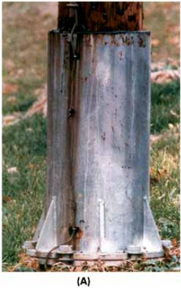

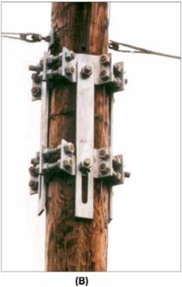

## 4.9 TREES

Single vehicle crashes with trees account for more than 50 percent of all fixed-object fatal crashes annually and result in the deaths of approximately 4,550 persons each year. Unlike the roadside hardware previously addressed in this chapter, trees are not generally a design element over which highway designers have direct control. With the exception of landscaping projects in which the types and locations of trees and other vegetation can be carefully chosen, the problem most often faced by designers is the treatment of existing trees that are likely to be impacted by an errant vehicle. To promote consistency within a state, each highway agency should develop a formal policy to provide guidance to design, landscape, construction, and maintenance personnel for this situation. The concept of context-sensitive design has been embraced in much of the country and is endorsed by AASHTO. Policies that focus solely on the safety aspects of trees and promote tree removal over other measures may not be acceptable to all involved parties. This section is intended to provide general guidelines from which a specific policy on trees may be developed.

Trees are potential obstructions by virtue of their size and their location in relation to vehicular traffic. Generally, an existing tree with an expected mature size greater than 100 mm [4 in.] at stub height is considered a fixed object. When trees or shrubs with multiple trunks or groups of small trees are close together, they may be considered as having the effect of a single tree with their combined cross-sectional area. Maintenance forces can minimize future problems by mowing clear zones to prevent seedlings from becoming established. The location factor is more difficult to address than tree size. Typically, large trees should be removed from within the selected clear zone for new construction and for reconstruction. As noted in Chapter 3, the extent of the clear zone depends on several variables, including highway speeds, traffic volumes, and roadside slopes. Segments of a highway can be analyzed to identify individ -ual trees or groups of trees that are candidates for corrective measures. County and township roads, which generally have restrictive geometric designs and narrow off-road recovery areas, account for a large percentage of the annual tree-related fatal crashes, followed by state and U.S. numbered highways on curved alignment. Fatal crashes involving trees along Interstate highways are relatively rare in most states. --'',,',',,,,',,'',',,,,,''','',-'-',,',,',',,'---

The NCHRP REPORT 500: Guidance for Implementation of the AASHTO Strategic Highway Safety Plan (8) includes Volume 3: A Guide for Addressing Collisions with Trees in Hazardous Locations . This guide provides objectives and strategies that can be em -ployed to reduce the number and severity of run-off-the-road crashes with trees. Table 4-2 suggests strategies in response to specific objectives.

Table 4-2. Objectives and Strategies for Reducing Crashes with Trees

| Objectives   | Objectives                                                                 | Strategies                                                                                            |
|--------------|----------------------------------------------------------------------------|-------------------------------------------------------------------------------------------------------|
| A            | Prevent trees from growing in hazardous locations.                         | A1 Develop, revise, and implement planting guidelines to prevent placing trees in hazardous location. |
| A            | Prevent trees from growing in hazardous locations.                         | A2 Develop mowing and vegetation control guidelines.                                                  |
| B            | Eliminate the hazardous condition and/or reduce the severity of the crash. | B1 Remove trees in hazardous locations.                                                               |
| B            | Eliminate the hazardous condition and/or reduce the severity of the crash. | B2 Shield motorists from striking trees.                                                              |
| B            | Eliminate the hazardous condition and/or reduce the severity of the crash. | B3 Modify roadside clear zone in the vicinity of trees.                                               |
| B            | Eliminate the hazardous condition and/or reduce the severity of the crash. | B4 Delineate trees in hazardous locations.                                                            |

Following several years of research by the Michigan Department of Transportation, a Guide to Management of Roadside Trees (5) was distributed nationally by the Federal Highway Administration (FHWA) as Report No. FHWA-IP-86-17. This document contains detailed information on identifying and evaluating higher risk roadside environments and provides guidance for implementing road -side tree removal. It also addresses environmental issues, alternative treatments, mitigation efforts, and maintenance practices. The remainder of this section is basically a summary of the information and recommendations included in that report.

Essentially, there are two methods for addressing the issue of roadside trees. The first is to keep the motorist on the road whenever possible, while the second is to mitigate the danger inherent in leaving a roadway with trees along it.

On-roadway treatments include

- Pavement marking,
- Rumble strips,
- Signs,
- Delineators, and
- Roadway improvements.

Pavement markings are one of the most effective and least costly improvements that can be made to a roadway. Centerline and edge line markings are particularly effective for roads with heavy nighttime traffic, frequent fog, and narrow lanes. Shoulder rumble strips also can be used to warn motorists that their vehicles have crossed the edgeline and may run off the road.

The installation  of  advance  warning  signs  and  roadway  delineators  also  can  be  used  to  notify  motorists  of  sections  of  roadway where extra caution is advised. Typically, these will be used in advance of curves that are noticeably sharper than those immediately preceding it.

Roadway  improvements  such  as  curve  reconstruction  to  provide  increased  superelevation,  shoulder  widening,  and  paving  are relatively expensive countermeasures that may not be cost-effective in all cases.

Off-roadway treatments consist primarily of two options:

- Tree removal
- Shielding

Roadside Design Guide 4-16

--'',,',',,,,',,'',',,,,,''','',-'-',,',,',',,'---

The removal of individual trees should be considered when those trees are determined to be both obstructions and in a location where they are likely to be hit. Such trees often can be identified by past crash histories at similar sites, by scars indicating previous crashes, or by field reviews. Removal of individual trees will not reduce the probability that a vehicle will leave the roadway at that point, but it should reduce the severity of any resulting crash. For example, 1V:3H and flatter slopes may be traversable, but a vehicle on a 1V:3H slope usually will reach the bottom. If numerous trees are at the toe of the slope, removal of isolated trees on the slope will not significantly reduce the risk of a crash. Similarly, if the recommended clear zone for a particular roadway is 7 m [23 ft], including the shoulder, removal of trees 6 to 7 m [20 to 23 ft] from the road will not materially change the risk to motorists if an unbroken tree line remains at 8 m [26 ft] and beyond. However, isolated trees noticeably closer to the roadway may be candidates for removal. If a tree or group of trees is in a vulnerable location but cannot be removed, a properly designed and installed traffic barrier can be used to shield them. Roadside barriers should be used only when the severity of striking the tree is greater than striking the barrier. Specific information on the selection, location, and design of roadside barriers is in Chapter 5.

## REFERENCES

1. AASHTO. A Policy on the Accommodation of Utilities within Freeway Right-of-Way . American Association of State Highway and Transportation Officials, Washington, DC, 2005
2.  AASHTO. A Guide for Accommodating Utilities within Highway Right-of-Way . American Association of State Highway and Transportation Officials, Washington, DC, 2005.
3. AASHTO. Standard Specifications for Structural Supports for Highway Signs, Luminaires, and Traffic Signals . American Association of State Highway and Transportation Officials, Washington, DC, 2009.
4.  AASHTO. Manual for Assessing Safety Hardware (MASH). American Association of State Highway and Transportation Officials, Washington DC, 2009.
5.  FHWA. Guide to Management of Roadside Trees . Report No. FHWA-IP-86-17. Federal Highway Administration, Washington, DC, December 1986.
6.  FHWA. Manual on Uniform Traffic Control Devices (MUTCD). Federal Highway Administration, Washington, DC, 2009.
7.  IIHS and HLDI. Fatality Facts 2006: Fixed Object Crashes. Insurance Institute for Highway Safety and Highway Loss Data Institute, Washington, DC, 2007 [cited December 21, 2010]. Available from http://www.iihs.org/research/fatality\_facts\_2006/roadsidehazards.html.
8.  NCHRP. National Cooperative Highway Research Report 500: Guidance for Implementation of the AASHTO Strategic Highway Safety Plan. NCHRP, Transportation Research Board, Washington, DC, 2003.
9. Ross, H. E., Jr., D. L. Sicking, and R. A. Zimmer. National Cooperative Highway Research Program Report 350: Recommended Procedures for the Safety Evaluation of Highway Features . NCHRP, Transportation Research Board, Washington, DC, 1993.
10. TRB. Safety Appurtenances and Utility Accommodation. In Transportation Research Record 970 . Transportation Research Board, National Research Council, Washington, DC, 1984.

--'',,',',,,,',,'',',,,,,''','',-'-',,',,',',,'---

## 5.0 OVERVIEW

A roadside barrier is a longitudinal barrier used to shield motorists from natural or man-made obstacles located along either side of a traveled way. It also may be used to protect bystanders, pedestrians, and cyclists from vehicular traffic under special conditions.

This chapter summarizes performance requirements and recommendations for roadside barriers as well as guidelines for selecting and designing a barrier system. The structural and safety characteristics of selected roadside barriers and transition sections are presented here. For similar information on end treatments, see Chapter 8. Finally, placement guidelines are included as well as a methodology for identifying and upgrading existing installations as determined appropriate and practical by the owner of the roadway facility.
