# 6.1 PERFORMANCE REQUIREMENTS

- Source: Roadside Design Guide (2011).pdf
- Generated: 2026-01-03T22:41:43+00:00
- Chunk: 5/11
- Estimated tokens: ~16,059
- Total pages: 345
- Type: chapter

## 6.1 PERFORMANCE REQUIREMENTS

The performance requirements for median barriers are identical to those for roadside barriers as stated in Section 5.1. The Manual for Assessing Safety Hardware (MASH) (1) from the American Association of State Highway and Transportation Officials (AASHTO) contains detailed information on the required series of standard crash tests needed to evaluate the performance of longitudinal barriers.

## 6.2 GUIDELINES FOR MEDIAN BARRIER APPLICATION

Guidelines for the use of median barrier have evolved during the past 40 years. The primary guidance used was based on a limited number of studies that examined vehicle encroachment paths on flat sideslopes. The basic premise in this guidance was that 80 percent of errant motorists were able to recover within 9.1 m [30 ft] of the traveled way. As a result, median barriers were not typically used in areas with medians that are more than 9.1 m [30 ft] wide. In the 1990s, however, several states noticed an increase in the number of cross-median crashes and developed new guidelines for their highways that expanded the use of median barrier. Some states adopted policies for installing median barrier based on median widths ranging from 9.1 m [30 ft] to 22.9 m [75 ft]. In 2004, the Federal High -way Administration (FHWA) conducted a nationwide survey of cross-median crashes in several states. Based on responses received from over 25 states, it found that a significant percentage of fatal cross-median crashes occurred where median widths exceeded 9.1 m [30 ft]. Although the survey found that some cross-median crashes occurred in medians in excess of 61 m [200 ft] wide, approximately two-thirds of the crashes occurred where the median was less than 15.2 m [50 ft] in width.

The increased use of median barriers has some disadvantages. The initial costs of installing a barrier can be significant. In addition, the installation of a barrier will generally increase the number of reported crashes as it reduces the recovery area available. As a result, there could be increased maintenance costs to repair the barrier as well as increased exposure to the maintenance crews completing the repairs. Another concern associated with the installation of a median barrier is that it will limit the options of maintenance and

--'',,',',,,,',,'',',,,,,''','',-'-',,',,',',,'---

the repairs. Another concern associated with the installation of a median barrier is that it will limit the options of maintenance and emergency service vehicles to cross the median. In snowy climates, a median barrier also may affect the ability to store snow in the median. There may be other environmental impacts depending on the grading needed to install the barrier. For these reasons, a onesize-fits-all recommendation for the use of median barrier is not appropriate.

Studies (7, 10) have shown that median barriers can significantly reduce the occurrence of cross-median crashes and the overall sever -ity of median-related crashes. With the potential to reduce high-severity crashes, it is recommended that median barriers be considered for high-speed, fully controlled-access roadways that have traversable medians, as shown in Figure 6-1.

Figure 6-1. Guidelines for Median Barriers on High-speed, Fully Controlled-Access Roadways

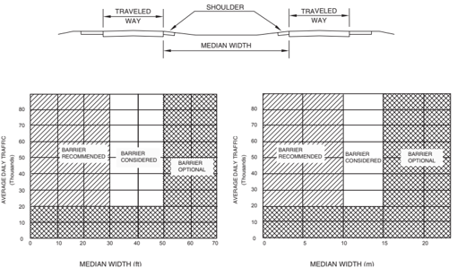

Figure 6-1 shows recommended guidelines for the use of median barriers on high-speed, fully controlled-access roadways for loca -tions where the median is 9.1 m [30 ft] in width or less and the average daily traffic (ADT) is greater than 20,000 vehicles per day (vpd). For locations with median widths less than 15.2 m [50 ft] and where the ADT is less than 20,000 vpd, a median barrier is op -tional. However, the facility should be designed to facilitate future barrier placement if there are significant increases in ADT or a rise in the number of cross-median crashes occurs. For locations where median widths are greater than 9.1 m [30 ft] but less than 15.2 m [50 ft] and where the ADT is greater than 20,000 vpd, a cost/benefit analysis or an engineering study may be conducted at the discre -tion of the transportation agency to determine the appropriate application for median barrier installations. The analysis should include the following factors in the evaluation: traffic volumes, vehicle classifications, median crossover history, crash incidents, vertical and horizontal alignment relationships, and medianterrain configurations.

--'',,',',,,,',,'',',,,,,''','',-'-',,',,',',,'---

For locations with median widths equal to or greater than 15.2 m [50 ft], a barrier is not normally considered except in special circum -stances, such as a location with a significant history of cross-median crashes. Each transportation agency has the flexibility to develop its particular median barrier guidelines. For example, in 1997, a study by the California Department of Transportation (Caltrans) suggested that the medians of facilities with traffic volumes in excess of 60,000 vpd would warrant a barrier study, even at widths as wide as 22.9 m [75 ft] (4) . California uses a crash study warrant to identify sections of freeways that may need the installation of a median barrier. This warrant requires a minimum of 0.311 cross-median crashes per kilometer [0.50 cross-median crashes per mile] of any severity per year, or 0.075 fatal crashes per kilometer [0.12 fatal crashes per mile] per year. The rate calculation requires a minimum of three crashes occurring within a five-year period.

In some cases, it may be determined that a median barrier is only necessary at locations where there are concentrations of crossmedian crashes. For example, the Florida Department of Transportation found that 62 percent of all cross-median crashes occurred within 0.8 km [ 1 / 2 mile] and 82 percent occurred within 1.6 km [1 mile] of interchange ramp termini (2) .

Median barriers sometimes are used on high-volume facilities that do not have full-access control. As indicated in Figure 6-1, these median barrier guidelines were developed for use on high-speed, fully controlled-access roadways. The use of these guidelines on roadways that do not have full access control should include engineering analyses and judgment that take into consideration such items as right-of-way constraints, property access needs, number of intersections and driveway openings, adjacent commercial de -velopment, sight distance at intersections, and barrier end termination. Therefore, trying to apply these guidelines to roadways that do not have full access control can be rather complex in many locations.

Special consideration should be given to barrier needs for medians separating roadways at different elevations. The ability of an er -rant driver leaving the higher roadway to return to the road or to stop diminishes as the difference in elevation increases. Thus, the potential for crossover crashes increases. For such locations, the clear-zone criteria given in Chapter 3 should be used as a guideline for establishing barrier need. Section 6.6.1 addresses the placement of barrier on sloped medians.

## 6.3 PERFORMANCE LEVEL SELECTION PROCEDURES

As with roadside barriers, most median barriers have been developed, tested, and installed with the intention of containing and re -directing passenger vehicles and pickup trucks. Some highway agencies have identified locations where heavy vehicle containment was considered necessary and have designed and installed high-performance median barriers having significantly greater capabilities than commonly used designs. Factors most often considered in reaching a decision on such barrier use include

- High percentage or large average daily number of heavy vehicles,
- Adverse geometrics (horizontal curvature), and
- Severe consequences of vehicular (or cargo) penetration into opposing traffic lanes.

Section 6.4 includes information on the maximum size of vehicles that have been successfully crash tested for each median barrier system described in that section.

## 6.4 STRUCTURAL AND SAFETY CHARACTERISTICS OF MEDIAN BARRIERS

This section identifies selected median barrier systems and summarizes the structural and safety characteristics of each. It is subdi -vided into length-of-need sections, transitions, and end treatments. Characteristics unique to each system are emphasized.

## 6.4.1 Crashworthy Median Barrier Systems

As with roadside barriers, median barriers can be categorized as flexible, semi-rigid, or rigid. This section includes descriptions and performance capabilities of crashworthy median barrier systems that have met the criteria of NCHRP Report 350 : Recommended Procedures for the Safety Performance Evaluation of Highway Features (11) , beginning with flexible median barriers and ending with rigid systems. Also included is a discussion of a moveable barrier system that can be used for special traffic situations, such as reversible traffic lanes, where periodic relocation of the barrier is desired. Some barriers that are designed to restrain and redirect

large vehicles also are identified and included in this section. The barriers to be addressed and their corresponding test levels are shown in Table 6-1.

Each of these systems is described in the following subsections. The mounting heights included in these descriptions are measured from the ground to the top of the rail, cable, or barrier. There are generally accepted variations from nominal height that can be broadly applied to classes of barriers. However, the individual specifications of each system should be investigated prior to acceptance, with any specific tolerances superseding this guidance. In general, the tolerance for rigid barriers is 76 mm [3 in.] lower and indefinitely higher. Semi-rigid systems should vary by only 25 mm [1 in.] higher or lower than their specified nominal mounting height and the tolerance for flexible systems is 51 mm [2 in.] higher or lower. More specific mounting height guidance is presented in the following sections.

Table 6-1. Crashworthy Median Barrier Systems

| Barrier System                                                                                                                                 | NCHRP Report 350 Test Level (TL)   | FHWA Acceptance Letter       | System Designation   | Manufacturer                                                                        | Reference Section   |
|------------------------------------------------------------------------------------------------------------------------------------------------|------------------------------------|------------------------------|----------------------|-------------------------------------------------------------------------------------|---------------------|
| Weak-Post W-Beam Median Barrier                                                                                                                | 2                                  | B-64                         | SGM02                | Generic                                                                             | 6.4.1.1             |
| Low-Tension Cable Barrier                                                                                                                      | 3                                  | B-64                         | SGM01                | Generic                                                                             | 6.4.1.2             |
| High-Tension Cable Barrier                                                                                                                     | 3 4                                | B-82C B-119 B-167 B-88A B137 | N/A                  | Brifen USA, Inc. Trinity Industries, Inc. Nucor Steel Marion Inc. Safence Gibraltar | 6.4.1.3             |
| Box-Beam Barrier                                                                                                                               | 3                                  | B-64                         | SGM03                | Generic                                                                             | 6.4.1.4             |
| Blocked-Out W-Beam (Strong Post) Steel or Wood Post with Wood or Plastic Block Steel Post with Steel Block                                     | 3 2                                | B-64 B-64                    | SGM04a-b             | Generic                                                                             | 6.4.1.5             |
| Blocked-Out Thrie Beam (Strong Post) Wood or Steel Post with Wood or Plastic Block                                                             | 3                                  | B-64                         | SGM09a-b             | Generic                                                                             | 6.4.1.6             |
| Modified Thrie-Beam                                                                                                                            | 4                                  | B-64                         | SGM09c               | Generic                                                                             | 6.4.1.7             |
| Concrete Barrier Vertical Wall 810 mm[32 in.] tall 1070 mm[42 in.] tall New Jersey Shape 810 mm[32 in.] tall 1070 mm[42 in.] tall Single Slope | 4 5 4 5                            | B-64 B-64 B-64 B-64          | N/A SGM11a-b         | Generic                                                                             | 6.4.1.8             |
| 810 mm[32 in.] tall 1070 mm[42 in.] tall F-Shape --'',,',',,,,',,'',',,,,,''','',-'-',,',,',',,'---                                            | 4 5                                | B-64 B-64                    | N/A                  |                                                                                     |                     |
| 810 mm[32 in.] tall 1070 mm[42 in.] tall                                                                                                       | 4 5                                | B-64                         | SGM10a-b             |                                                                                     |                     |
|                                                                                                                                                |                                    | B-64                         |                      |                                                                                     |                     |

--'',,',',,,,',,'',',,,,,''','',-'-',,',,',',,'---

Table 6-1. Crashworthy Median Barrier Systems ( continued )

| Barrier System                                                                                                              |   NCHRP Report 350 Test Level (TL) | FHWA Acceptance Letter   | System Designation   | Manufacturer          | Reference Section   |
|-----------------------------------------------------------------------------------------------------------------------------|------------------------------------|--------------------------|----------------------|-----------------------|---------------------|
| Quickchange ® Moveable Barrier (including Steel Reactive Tension System [SRTS] and Concrete Reactive Tension System [CRTS]) |                                  3 | B-63, B-69               | SGM22                | Barrier Systems, Inc. | 6.4.1.9             |

## 6.4.1.1 Weak-Post W-Beam Median Barrier

The weak-post W-beam system, shown in Figure 6-2, is similar to the roadside weak-post guardrail system described in Chapter 5. The mounting height to the top of the W-beam is 840 mm [33 in.] and the design deflection ranges from 1.5 m to 2.1 m [5 ft to 7 ft]. The weak-post system is sensitive to height variations and should not be used as a median barrier where terrain irregularities exist. Because the W-beam does not interlock with a vehicle's sheet metal, the likelihood of going over or under the rail is increased if the bumper height at impact is in a range that is higher or lower than normal. Consequently, this system is recommended only in relatively flat, traversable medians without curbs or ditches that could affect vehicle trajectory. It should not be used where frost heave or erosion is likely to alter the beam mounting height relative to the shoulder beyond 51 mm [2 in.]. A proper anchorage at each end is critical.

Figure 6-2. Weak-Post W-Beam Median Barrier

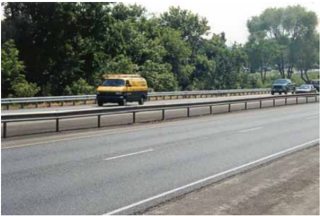

## 6.4.1.2 Low-Tension Cable Barrier

This flexible barrier is similar to the roadside cable barrier described in Chapter 5, except that when it is used in a median, the middle cable is installed on the opposite side of each post from the other two and the spacing between the cables is different.

Cable barriers typically deflect more than other types of barriers during impacts. The crash test of this system using the NCHRP 350 pickup truck (the strength test) resulted in 3.4 m [11.2 ft] of deflection, and most agencies position these barriers to accommodate ap -proximately 3.7 m [12 ft] of movement. However, note that this testing was conducted on a barrier that was 145 m [475 ft] in length and that cable barriers may deflect more as the length of the run is increased. MASH criteria recommend a minimum length of barrier

for cable barrier testing to be at least 183 m [600 ft]. No testing of the low-tension cable barrier has been conducted with this longer length of barrier presently, and existing barriers that were placed with a 3.7 m [12 ft] deflection distance still provide significant pro -tection even though some crash conditions may result in deflections in excess of the 3.7 m [12 ft] deflection distance that is provided. Shortening the post spacing as discussed in Chapter 5 can reduce deflection distances. Proper anchorage at the ends is critical.

When a single run of low-tension cable barrier is used in the median, deflection distance generally is provided on both sides of the barrier. This results in minimum median widths of 7.3 m [24 ft] to provide enough deflection distance to reduce most encroachments into the opposing travel lanes.

Cable systems should be installed and maintained as close to the design height as feasible in order to function properly. To accommo -date both larger and smaller vehicles, the lower cable on the NCHRP Report 350 design is 533 mm [21 in.] and the top cable 762 mm [30 in.] above the ground. The center cable is 648 mm [25.5 in.] above the ground. There are several different designs of the threestrand cable median barrier in use throughout the country. When selecting one of these systems, the designer is encouraged to review and consider the compliance testing or in-service performance history, or both.

Although the cable barrier is relatively inexpensive to install and performs well when hit, it must be repaired after each hit to maintain its effectiveness. Consequently, its use in areas where it is likely to be hit frequently, such as on the outside of sharp curves, is not recommended. A typical installation is shown in Figure 6-3.

Figure 6-3. Three-Strand Cable Median Barrier

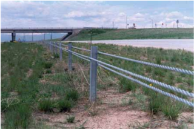

## 6.4.1.3 High-Tension Cable Barrier

Several proprietary, high-tension cable barrier systems have been developed and are increasing in usage. These systems are installed with a significantly greater tension in the cables than the generic low-tension system discussed in the previous section, and there are several differences in their performance. The deflection of these systems is reduced to 2 m [6.6 ft] to 2.8 m [9.2 ft] depending on the system, the post spacing, and the length of the barrier tested. As discussed for the low-tension cable barrier, deflection distances may be increased as the length of the barrier is increased. The high-tension barriers have been tested with various lengths of barrier, so direct comparison of the deflection distances may not be appropriate.

It also should be noted that one state, Oregon, has used a high-tension cable barrier on a highway that has only a 2.4-m [8-ft] wide median, thus providing 1.2 m [4 ft] of deflection distance. Even though it is possible that some crashes may deflect into the opposing travel lanes, it was decided that the barrier would reduce the number of head-on collisions and provide a cost-effective solution in this corridor.

Roadside Design Guide 6-6

--'',,',',,,,',,'',',,,,,''','',-'-',,',,',',,'---

The high-tension systems also result in less damage to the barrier and, in many cases, the cables remain at the proper height after an impact that damages several posts. Although no manufacturer claims that their barrier remains functional in this condition, there may be a residual safety value under certain crash conditions. The posts can be installed in cast or driven sockets in the ground to facilitate removal and replacement.

There are currently five high-tension cable barrier systems that have been accepted by FHWA as meeting NCHRP Report 350, Test Level (TL) 3 conditions. Modified versions of all five systems have been successfully tested at the NCHRP Report 350 Test Level 4 condition and approved for 1V:6H or flatter slopes.

All of the systems also have been approved for limited use on 1V:4H slopes. Among the limitations is the fact that this configuration requires a TL-4 system that only functions at TL-3 because of the vehicle dynamics inherent with steeper grades. The systems' lateral placement within the median also is limited to no farther than 1.2 m (4 ft) down the 1V: 4H slope for adjacent traffic impacts and no closer than 2.7 m (9 ft) from the ditch bottom for opposite-side impacts.

All of these systems use weak posts to support the cables. However, they each utilize a unique post design. The following are the cur -rently accepted high-tension cable barrier systems:

- Brifen Wire Rope Safety FenceManufactured by Brifen USA, Inc., the Brifen system uses three or four cables. One is placed in a slot on the post while the others intertwined between the posts (see Figure 6-4).
- The Cable Safety System (CASS™) -Manufactured by Trinity Industries, Inc., CASS uses three cables that are placed in a slot on the posts and separated by spacer blocks (see Figure 6-5).
- NU-CABLE™Manufactured by the Nucor Steel Marion Inc., the NU-CABLE high-tension cable barrier system uses three or four cables attached to U-channel steel posts by unique hook bolts (see Figure 6-6).
- Blue Systems (Safence)The Safence system is a three or four-cable design. For a median barrier, all four cables are cen -tered within the top portion of slotted posts (see Figure 6-7).
- Gibraltar Cable Barrier SystemThe Gibraltar Cable Barrier System uses C-posts to support three or four cables. A steel hairpin and lock plate are used to attach the cables to the posts (see Figure 6-8).

Figure 6-4. Brifen Wire Rope Safety Fence

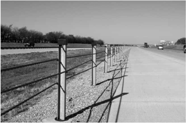

--'',,',',,,,',,'',',,,,,''','',-'-',,',,',',,'---

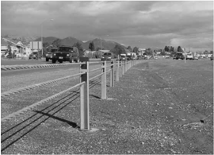

Figure 6-5. The Cable Safety System (CASS)

Figure 6-6. NU-CABLE ™ High-Tension Cable System

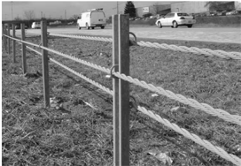

Figure 6-7. Safence Cable Barrier System

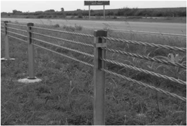

Roadside Design Guide 6-8

Figure 6-8. Gibraltar Cable Barrier System

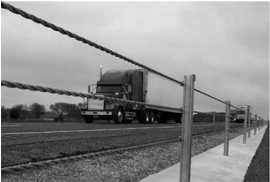

## 6.4.1.4 Box-Beam Median Barrier

The box-beam median barrier, shown in Figure 6-9, is considered a semi-rigid barrier and is similar to the roadside box beam de -scribed in Chapter 5. Its design deflection distance is approximately 1.7 m [5.5 ft]. As with the weak-post W-beam, this system is most suitable for use in traversable medians having no significant terrain irregularities.

Figure 6-9. Box-Beam Median Barrier

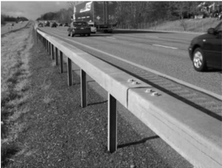

## 6.4.1.5 Blocked-Out W-Beam (Strong Post)

Blocked-out W-beam median barriers may be installed with either wood or steel posts. When constructed with blocks made of either wood or one of several recycled plastics, either post design qualifies as meeting NCHRP Report 350 TL-3. A steel post design using steel blocks has been accepted as a TL-2 barrier. The strong-post W-beam system, shown in Figure 6-10, has been used extensively to reduce crossover crashes in relatively narrow medians.

Because these systems are semi-rigid (meaning that their design deflection distances are in the 0.6- to 1.2-m [2- to 4-ft] range), they typically have been used in medians approximately 3 m [10 ft] or more in width. The nominal mounting height of the rail is 737 mm [29 in.]. A construction tolerance of ± 1 in. applies to all strong-post W-beam installations.

There are both proprietary and generic strong-post W-beam systems available that are mounted at 787 mm [31 in.] in an attempt to better contain large vehicles. These systems have other advantages as well, most notably the ability to use steeper flare rates and increased usability in conjunction with a curb. To minimize post-snagging problems with the higher mounting heights, a separate rubrail sometimes has been added to the design. A rubrail also can be added when the W-beam is placed behind a curb, typically on approaches to structures. Most state agencies have used a structural steel channel or tube for the rubrail, but occasionally a separate W-beam centered 254 mm [10 in.] above grade is specified.

Strong-post W-beam median barriers generally impart higher forces on impacting vehicles and their occupants than do flexible sys -tems, but they do not usually need immediate repair to remain functional except after very severe impacts.

Figure 6-10. Strong-Post W-Beam Median Barrier

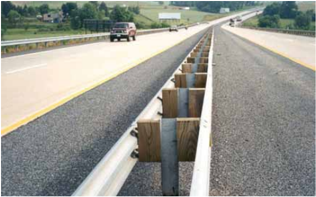

## 6.4.1.6 Blocked-Out Thrie-Beam (Strong Post)

This NCHRP Report 350 TL-3 system is similar in most respects to the blocked-out W-beam median barrier but is capable of accom -modating a larger range of vehicle sizes because of its increased beam depth. Posts may be either wood or steel with blocks of either wood or one of several approved recycled plastics. The use of thrie-beam also eliminates the need for a separate rubrail. Design deflec -tion for this barrier is in the range of 0.3 to 0.9 m [1 to 3 ft], and its typical mounting height is 813 mm [32 in.].

## 6.4.1.7 Modified Thrie-Beam Median Barrier

Using the spacer blocks developed in conjunction with the modified thrie-beam roadside barrier described in Chapter 5 can signifi -cantly enhance performance of the thrie-beam median barrier. This barrier successfully contained and redirected an 8,000-kg [18,000lb] single-unit truck impacting at a nominal speed of 80 km/h [50 mph] and an impact angle of 15 degrees. The roadside version of this barrier also contained and redirected an 18,000-kg [40,000-lb] intercity bus under the same conditions. Thus, both the single-faced roadside design and the double-faced median barrier design are considered to be TL-4 longitudinal barriers. Figure 6-11 shows the modified thrie-beam median barrier.

Roadside Design Guide 6-10

Figure 6-11. Modified Thrie-Beam Median Barrier

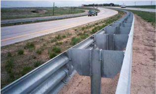

## 6.4.1.8 Concrete Barrier

The concrete barrier is the most common rigid median barrier in use today. Its popularity is based on its relatively low life-cycle cost, generally effective performance, and its maintenance-free characteristics. Concrete barrier designs vary in shape, construction type, and reinforcement.

Research has shown that variations in the profile of the concrete barrier can have a significant effect on barrier performance (5) . Con -crete barrier shapes that meet the NCHRP Report 350 criteria are the New Jersey and F-shapes, the single-slope barrier (two variations in slope), and the vertical wall. These shapes, when adequately designed and reinforced, may all be considered TL-4 designs at the standard height of 813 mm [32 in.] and TL-5 designs at heights of 1,067 mm [42 in.] and higher.

The New Jersey shape and F-shape barriers are commonly referred to as 'safety shapes.' The safety-shape concrete barriers were de -signed to minimize damage to vehicles as a result of low-angle impacts and to reduce the occupant impact forces as compared to a ver -tical wall. The critical variable for these barriers is the height above the road surface of the break between the upper and lower slope. If this break is higher than 330 mm [13 in.], the chances of a vehicle overturning are increased, particularly for compact and subcompact automobiles. Although both shapes are effective in safely redirecting impacting vehicles, research indicates that the F-shape, which has the slope break at 254 mm [10 in.], may perform better for small vehicles with respect to vehicle rolls than the New Jersey shape.

The basic New Jersey shape and F-shape have an overall height of 813 mm [32 in.]; this includes provision for a 76-mm [3-in.] future pavement overlay, reducing the height to 737 mm [29 in.] minimum. When total overlay depths are expected to exceed 76 mm [3 in.], or when an 813-mm [32-in.] height is considered inadequate, the total height of the concrete should be adjusted. This adjustment must be made above the slope breakpoint. The height extension may follow the slope of the upper face if the barrier is thick enough or adequately reinforced at the top, or the extension may be vertical. The extension also needs to be structurally connected to the barrier. A height extension also may be considered to use as a screen to block headlight glare from opposing traffic lanes.

Several important factors are related to safety-shape concrete median barriers. For high-angle, high-speed impacts, passenger size vehicles may become partially airborne and in some cases may reach the top of the barrier. Fixed objects (e.g., luminaire supports) on top of the wall may cause snagging or separate from the barrier and fly into opposing traffic lanes. An example of how one state addressed this concern is the New York State Department of Transportation (NYSDOT); they designed and tested a box-beam modification that is installed near the top of the upper face of the barrier to limit vehicle climb and to improve performance under these conditions (see Figure 6-12).

Figure 6-12. New York Modification of Concrete Barrier

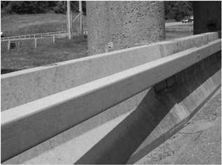

Another factor  to  consider  is  that,  even  for  shallow-angle  impacts,  the  roll  angle  toward  the  barrier  imparted  to  high-center-ofgravity vehicles may be enough to permit contact by the top portion of the cargo box with fixed objects on top of or immediately behind the wall. Bridge piers are one of the common obstacles typically shielded by a concrete safety shape. Unless the barrier is significantly higher than 813 mm [32 in.] or modified as noted previously, a bus or tractor trailer is likely to lean enough to strike the pier even though it does not penetrate the barrier. Even the 1,067-mm [42-in.] high concrete safety shapes, which can be viewed at http://www.aashtotf13.org, produced significant roll when struck by a 36,000-kg [80,000-lb] combination truck at an impact angle of 15 degrees and 80 km/h [50 mph]. This so-called 'Tall Wall' barrier is classified as a high-performance barrier. It has been success -fully used for many years by the New Jersey Turnpike Authority in its reinforced version and in Ontario without reinforcement (8) .

Single-slope concrete barriers have been developed and tested (3) . Slopes of 9.1 degrees and 10.8 degrees have been used successfully on these barriers. The primary advantage of this barrier shape is that the pavement adjacent to it can be overlaid several times without affecting the performance of the barrier. The original height of 1,067 mm [42 in.] thus may be reduced to 762 mm [30 in.] and still perform as a TL-4 barrier.

Vertical concrete barrier walls can be an effective alternative to the wider safety-shape barriers and can preserve available median shoulder width at narrow locations, such as in front of bridge piers. A study of rollovers that resulted from crashes with concrete barriers concluded that the vertical wall offers the greatest reduction in rollover potential. Vehicle damage resulting from the initial crash into a vertical wall may be more extensive. However, occupant risk measurements from full-scale crash testing are comparable and the preservation of shoulder width and reductions in rollover potential are important safety benefits (9) .

Many variations exist between highway agencies regarding reinforcing and footing details for concrete median barriers; however, there have been few reported problems with any particular design and a need (or desirability) for a standard detail is not apparent. Research by the California Department of Transportation (Caltrans) has shown that a concrete footing is not necessary; the concrete can be cast directly on asphaltic concrete, portland cement concrete, or a well-compacted aggregate base (6) . This research also re -vealed no adverse effects to barrier performance when contraction joints were left to form uncontrolled in lightly reinforced concrete. Longitudinal reinforcement in the upper portion of the barrier stem serves to control the size and scatter of concrete fragments that may occur as a result of severe barrier impacts. Several states use non-reinforced concrete barrier. Shrinkage cracks of up to 19 mm [ 3 / 4 in.] have not affected the operational strength of concrete barriers, and no breakouts have been experienced where the top width is at least 305 mm [12 in.]. In general, if the in-service performance of a state's concrete barrier design reflects desired results, that design may be considered acceptable. --'',,',',,,,',,'',',,,,,''','',-'-',,',,',',,'---

Roadside Design Guide 6-12

Concrete median barriers may be slip-formed, precast, or cast-in-place. Slip-formed barriers are cost-effective when long lengths of barrier can be placed without interruption. Equipment is available to slip form barriers to a variable height where necessary to fit a stepped-median cross-section and where the elevations of adjacent roadways do not vary by more than 0.9 m [3 ft]. Precast construc -tion sometimes is used as an alternate to slip-formed barrier and frequently is used where split median barriers are needed to shield objects, such as bridge piers or overhead sign supports. Precast concrete barrier sections can be embedded in or anchored to the pavement to form a rigid barrier. However, several states use an unanchored precast concrete barrier for permanent installations. The unanchored barrier deflects when impacted, reducing the force of impact as compared to a rigid barrier. The deflected barrier needs to be repositioned, but the effort is less than the repair of any other semi-rigid barrier system. Cast-in-place construction is the most versatile method because forming can be varied to fit atypical situations. Examples of concrete median barriers are shown in Figures 6-13 and 6-14.

Figure 6-13. Concrete Safety-Shape Median Barrier

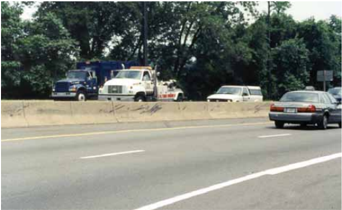

Figure 6-14. Single-Slope Concrete Median Barrier

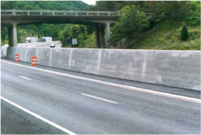

## 6.4.1.9 Quickchange ®  Moveable Barrier System

This proprietary portable barrier system is composed of a chain of modified F-shape concrete barrier segments 940 mm [37 in.] in length that can be readily shifted laterally. Steel rods run the length of each segment and specially designed hinges are attached to each end, which then are joined by pins. The top of each segment is T-shaped to allow pick up by a special vehicle and lateral movement from 1.2 to 5.5 m [4 to 18 ft]. The T-slot is engaged by the vehicle conveyor system and the segment is lifted from the road. Continuous lengths of the barrier are transported on conveyor wheels through an elongated S-curve, moved across the roadway, and set down to form a new parallel lane. Transfer speeds of 8 to 16 km/h [5 to 10 mph] are obtained depending on the lateral distance of movement. The design has met the crash test criteria of NCHRP Report 350 TL-3 with a deflection of 1.4 m [4.5 ft].

Several variations of the moveable barrier design also have been tested and approved as meeting NCHRP Report 350 TL-3. The Narrow Quickchange ® Moveable Barrier consists of a steel casing that is filled with concrete and has a width of 305 mm [12 in.] as compared to a width of 457 mm [18 in.] for the standard Quickchange ® Moveable Barrier, shown in Figure 6-15. This system has a deflection of 0.9 m [3 ft]. Two other systems, known as the Steel Reactive Tension System (SRTS) and the Concrete Reactive Ten -sion System (CRTS) are similar to the narrow and standard Quickchange Moveable ® Barriers, respectively, except that an improved connection is used between modules. This connection contains spring-loaded hinges that keep the individual segments in tension and reduce the dynamic deflection of the system to 0.7 m [2.3 ft].

Figure 6-15. Standard Quickchange® Moveable Barrier System

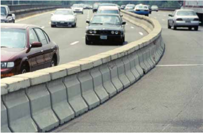

The Quickchange ® Moveable Barriers may be used in construction zones on high-volume freeways where, because of construction operations and a desire to maintain traffic capacity, traffic lanes are opened and closed frequently. The system requires energy, time, and resources to set up the barriers initially; however, it allows a work zone to be quickly created and protected during periods of low traffic flow, and the freeway can be changed back to full lane utilization during the busy daytime period.

The system also may be used on roadways and bridges with unbalanced directional distribution of traffic, such as commuter or tourist routes. Once set up, the barrier can be moved rapidly to provide additional capacity in the direction of heavy traffic flow.

## 6.4.2 End Treatments

As with roadside barriers, median barriers also must be introduced and terminated safely. Therefore, all median barrier end treatments installed in locations where impacts are likely should be crashworthy. In addition, they generally should safely redirect vehicles im -

Roadside Design Guide 6-14

pacting from the rear of the terminal or crash cushion where opposite direction hits are likely. See Chapter 8 for a discussion of the end treatments that are available.

Because of the more severe crashes that normally result from impacts with terminals and the cost of terminals when compared to the barrier itself, openings or breaks in median barriers should be kept to a minimum. Where permanent openings are needed, the barrier ends should be shielded as described previously or, if the median is sufficiently wide, flared or offset such that the upstream barrier effectively shields the end of the downstream section of barrier. The latter condition can be satisfied if the minimum angle (measured parallel to the roadway) from the upstream end to the offset downstream end is 25 degrees, as shown in Figure 6-16.

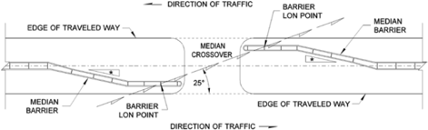

"Flare rate should not exceed suggested limits (Refer to Table 5-7)

Figure 6-16. Barrier Termination at Permanent Openings

If an emergency opening is needed (e.g., to route traffic around a crash that results in temporary closure of the roadway), there are proprietary devices that have been developed and tested to NCHRP Report 350 TL-3, that can be used to provide a temporary open -ing. The BarrierGate ® , manufactured by Energy Absorption Systems, Inc., and the SafeGuard ® Gate system, manufactured by Barrier Systems, Inc., are used in conjunction with a concrete safety-shape median barrier to provide a temporary opening through the bar -rier when needed by emergency vehicles or to temporarily reroute traffic. The BarrierGate ® system (see Figure 6-17) consists of two half-gates made from thrie-beam rail elements that slide along a steel track system. The BarrierGate ® is opened and closed with an electronic control mechanism that can be manually overridden in the event of a power failure. The SafeGuard ® system is a heavily reinforced steel barrier that can be disconnected from the concrete barrier. The system can be moved on wheels that are raised and lowered either manually or with compressed air.

Figure 6-17. BarrierGate

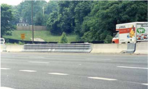

--'',,',',,,,',,'',',,,,,''','',-'-',,',,',',,'---

## 6.4.3 Transitions

Transition sections are needed between adjoining median barriers that have significantly different deflection characteristics (e.g., between a semi-rigid median barrier and a rigid median barrier, or when a median barrier must be stiffened to shield fixed objects in the median).

Impact performance specifications for median barrier transitions are essentially the same as those for the standard barrier transitions. Special emphasis should be placed on the avoidance of designs that may cause vehicle snagging or excessive deflection of the transi -tion section. Detailed discussion of barrier transitions is included in Chapter 7.

## 6.5 SELECTION GUIDELINES

Once it has been determined that a median barrier is warranted, a specific barrier type should be selected. In general, the most desir -able system is one that satisfies performance specifications at the least total life-cycle cost. Table 5-5 summarizes the major factors that should be considered before making a final selection. Each of these factors is described in the following sections.

## 6.5.1 Barrier Performance Capability

The first decision to be made when selecting an appropriate median barrier concerns the level of performance needed. In most cases, a barrier capable of redirecting passenger cars and light vans and trucks will be adequate (MASH TL-3). However, at locations with adverse geometrics, high traffic volumes and speeds, or a significant volume of heavy truck traffic, higher performance level median barriers may be considered, particularly because the result of a heavy vehicle penetrating a median barrier is likely to be catastrophic. The median barriers identified in Section 6.4.1 as TL-4 or higher have an increased capability to contain and redirect large vehicles.

## 6.5.2 Barrier Deflection Characteristics

Once the desired performance level has been determined, site characteristics often dictate the type of median barrier to install. Rela -tively wide, flat medians are suited for flexible or semi-rigid barriers, provided the design deflection distance is less than one-half the median width. Narrow medians within heavily traveled roadways usually call for a rigid barrier to have little or no deflection when hit. Deflection distances for each type of operational median barrier are discussed in Section 6.4.1.

Crash testing and field experience has shown that during impact, a large truck or similar high-center-of-gravity vehicle typically will lean over and extend for some distance behind the barrier. The clear area that should be provided behind a barrier and beyond its dynamic deflection distance to account for this behavior is called the Zone of Intrusion (ZOI). The designer should consider the ZOI when locating a median barrier to shield a rigid object, such as a bridge pier or sign support. While it is desirable to avoid having any fixed objects within the ZOI, it is understood that in some instances providing a separation between the barrier and the object will not be practical. In critical areas, it then may be desirable to use a higher performing barrier or, for a concrete barrier, to change the barrier height and shape to minimize vehicular overhang in a crash.

## 6.5.3 Compatibility

The specific type of median barrier selected also will depend on, to some extent, its compatibility with other median features, such as luminaire and overhead sign supports and bridge piers. If a non-rigid barrier is used in such cases, crashworthy transition sections must be available to stiffen the barrier locally if the fixed object is within the design deflection distance of the barrier. In addition to acceptable transition designs, a crashworthy end treatment also is necessary if the barrier begins or terminates in a location where it is likely to be struck by an errant motorist. Detailed information on transition sections and end treatments is included in Chapters 7 and 8, respectively.

Roadside Design Guide 6-16

--'',,',',,,,',,'',',,,,,''','',-'-',,',,',',,'---

## 6.5.4 Costs

Initial costs, repair costs, and future maintenance costs of each candidate median barrier should be carefully evaluated. As a rule, the initial cost of a system increases as rigidity and strength increase, but repair and maintenance costs usually decrease with increased strength. Consideration also should be given to the costs incurred by the motorist as a result of a crash with the barrier. These costs include personal injuries to the driver and occupants as well as property damage to the impacting vehicle. If a barrier can be located in the center of a median where it is less likely to be hit and repairs do not necessitate closing a lane of traffic, a flexible or semi-rigid median barrier may be the best choice. However, if a barrier must be located immediately adjacent to a high-speed, high-volume traf -fic lane, a rigid barrier requiring no significant maintenance is recommended.

## 6.5.5 Maintenance

Although the same general maintenance considerations for the selection of a roadside barrier also apply to median barriers, crash maintenance is usually a more important factor. Because median barriers are typically installed closer to the traveled way, one or more high-speed lanes usually have to be closed to repair or replace damaged barriers. This creates a safety concern for both the repair crew and for motorists using the road. Consequently, a rigid barrier system (usually concrete) is the barrier of choice in many locations, particularly for high-volume urban freeways and expressways where the barrier must be located in close proximity to the traffic lane.

## 6.5.6 Aesthetic and Environmental Considerations

As with the roadside barriers, aesthetic concerns are seldom an overriding consideration in the selection of an appropriate median barrier. In those instances where a natural barrier is desired, care should be exercised to ensure that structural and performance speci -fications remain adequate.

Environmental factors that warrant consideration are similar to those summarized in Chapter 5 for roadside barriers.

## 6.5.7 Field Experience

To make effective decisions about the type of barrier to install on new construction, each highway agency should have a process to monitor and evaluate the performance and maintenance characteristics of its existing installations. Information from maintenance personnel is essential for designers to select the most cost-effective system.

## 6.6 PLACEMENT RECOMMENDATIONS

All of the barriers included in Section 6.4.1 are capable of containing and redirecting their respective design vehicles if they are prop -erly installed in the field. Without exception, all traffic barriers perform best when an impacting vehicle has all of its wheels on the ground at the time of impact, and its suspension system is neither compressed nor extended. Thus, a major factor to consider in the lateral placement of a median barrier is the effect of the terrain between the edge of the traveled way and the barrier on the vehicle's trajectory. Two other significant factors affecting barrier performance are the flare rate of the barrier, especially at transition sections, and the treatment of rigid objects in the median. A discussion of each of these factors follows.

## 6.6.1 Terrain Effects

Terrain conditions between the traveled way and the barrier can have a significant effect on the barrier's impact performance. Curbs and sloped medians (including superelevated sections) are two prominent features that deserve attention. See Chapter 5 for a discus -sion on the use of curbs with a barrier. The slopes in the median can affect the performance of the barrier as the vehicle suspension is compressed and the drainage swales can impart a roll moment on a traversing vehicle. A vehicle that traverses one of these features prior to impact may go over or under the barrier or snag on the support posts of a strong-post system.

--'',,',',,,,',,'',',,,,,''','',-'-',,',,',',,'---

The most desirable median is one that is relatively flat (i.e., slopes of 1V:10H or flatter) and free of rigid objects. If warranted, the barrier then can be placed at the center of the median. When these conditions cannot be met, placement guidelines are necessary.

Figure 6-18 shows three basic median sections for which placement guidelines are presented. In each section, it is assumed that a median barrier meets guidelines for installation. Section I applies to depressed medians or medians with a ditch section. Section II applies to stepped medians or medians that separate travel ways with significant differences in elevation. Section III applies to raised medians or median berms.

## 6.6.1.1 Median Section I

The slopes and the ditch section first should be checked by the criteria in Chapter 3 to determine if the guidelines suggest the installa -tion of a roadside barrier. If both slopes call for shielding (i.e., the ditch is non-traversable [Illustration 1]), a roadside barrier should be placed near the shoulder on each side of the median ('b' and 'd'). If only one slope calls for shielding (e.g., S 2 ), a median barrier should be placed at 'b.' In this situation, a rigid or semi-rigid barrier is suggested, and a rubrail should be installed on the ditch side of the barrier to prevent vehicles that have crossed the ditch from snagging on a post-and-beam railing system. There also has been some anecdotal evidence that a vehicle traveling up a slope steeper than 1V:6H before contacting the barrier may override it. Research is planned to quantify possible placement concerns when a rigid or semi-rigid barrier is located on one side of a traversable, sloped median. If neither slope calls for shielding but either one or both are steeper than 1V:10H (Illustration 2), a median barrier should generally be placed on the side with the steeper slope. For example, if

<!-- formula-not-decoded -->

the barrier would be placed at 'b.' A rigid or semi-rigid system is suggested in this situation. If both slopes are relatively flat (Illustra -tion 3), a median barrier may be placed at or near the center of the median (at 'c') if vehicle override is not likely. Any type of median barrier having an appropriate test level for the application can be used provided its dynamic deflection is not greater than one-half the median width.

Although any median barrier is likely to perform best when it is installed on relatively flat terrain, cable barriers have been shown to perform effectively when placed on a 1V:6H sideslope when the vehicle travels down the slope before impact. However, based on recent crash reports, some vehicle types can underride the barrier when striking a cable barrier from behind after traveling across a ditch. Computer simulation and limited full-scale testing on 1V:6H slopes have shown that the barrier will redirect vehicles after traversing the ditch when it is placed within 0.3 m [1 ft] (either side) of the ditchline. However, when the cable median barrier was placed 1.2 m [4 ft] from the ditchline, a test with a passenger sedan showed that after crossing the ditch the vehicle reached the cables with its suspension compressed; the bumper passed under the lowest cable, and the vehicle continued through the cable median bar -rier with no redirection. Computer simulation has predicted that when the barrier is placed 8 ft from the ditch bottom, the vehicle will be contained. Based on this testing and more recent simulation studies, it appears that maximum redirection can be achieved with the current configuration if the area from 0.3 m [1 ft] to 2.4 m [8 ft] from the ditchline on 1V:6H slopes is avoided. Additional research is being conducted to further support the recommended offset distances for this and other slopes and to determine what practical modi -fications to the barrier can be developed to enhance its performance in locations that may be less than optimal. The development of a cable barrier system that can function at any lateral distance within medians as steep as 1V:4H is also underway. These placement guidelines apply to all cable barriers, including high-tension designs and four-cable systems placed on slopes 1V:6H and flatter. The specifications for high-tension cable barriers placed on slopes as steep as 1V:4H are in Section 6.4.1.3. --'',,',',,,,',,'',',,,,,''','',-'-',,',,',',,'---

Because most reported penetrations have involved passenger vehicles with relatively low front profiles impacting at high speeds and high angles, it is not considered cost-effective to reposition existing cable barriers that have been installed within this area unless a recurring crash problem is evident.

## 6.6.1.2 Median Section II

If the embankment slope is steeper than approximately 1V:10H (Illustration 4), a median barrier should be placed at 'b.' If the slope contains obstacles or consists of a rough rock cut (as discussed in Chapter 3), a roadside barrier should be placed at both 'b' and 'd' (Illustration 5). It is not unusual for this section to have a retaining wall at 'd.' If so, it is suggested that the base of the wall be

Roadside Design Guide 6-18

contoured to the exterior shape of a concrete median barrier. If the cross slope is flatter than approximately 1V:10H, a barrier could be placed at or near the center of the median (Illustration 6).

Figure 6-18. Recommended Barrier Placement in Non-Level Medians

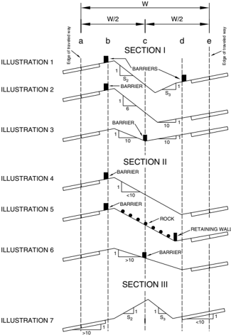

## 6.6.1.3 Median Section III

Placement criteria for median barriers on this cross section (Illustration 7) are not clearly defined. Research has shown that such a cross section, if high enough and wide enough, can redirect vehicles impacting at relatively shallow angles. However, this type of median design generally should not be construed to be a barrier or provide positive protection against crossover crashes.

If slopes are not traversable (e.g., rough rock cut), a roadside barrier should be placed at 'b' and 'd.' If retaining walls are used at 'b' and 'd,' it is recommended that the base of the wall be contoured to the exterior shape of a standard concrete barrier.

When the guidelines suggest installing a median barrier, it is desirable that the same barrier be used throughout the length of need and that it be placed in the middle of relatively flat medians with slopes 1V:6H or flatter. However, it may be necessary to deviate from these guidelines in some cases. For example, the median in Section I, where the roadways are stepped (on significantly different elevations), may call for a barrier on both sides of the median. If a single median barrier is installed upstream and downstream from the section, it may be necessary to split the median barrier, as illustrated in Figure 6-19. Most of the operational median barriers can be split this way, especially box beams, W-beam types, and concrete barrier.

Figure 6-19. Example of a Split Median Barrier Layout

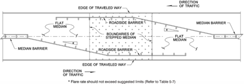

## 6.6.2 Fixed Objects within the Median

In many locations, an obstacle such as a rigid object may be located in a median. If a median barrier is not being installed and the object is outside of the clear zone for one direction of traffic, the barrier should be treated as a roadside barrier (see Chapter 5). Ap -propriate flare rates should be used for the approaching traffic side of the barrier and, if the deflection distance for the barrier cannot be provided, a transition may be necessary to stiffen the barrier in advance of the object. In addition, when the object is within the clear zone for both directions, the object and back side of the barrier need to be shielded as well.

Typical examples of objects that often are located in a median are bridge piers and overhead sign support structures. If shielding for both directions of travel is necessary and if the median is flat (i.e., side slopes less than approximately 1V:10H), two means of protec -tion are suggested. In the first case, the designer should investigate the possible use of a crash cushion to shield the object. The second suggestion is to employ either semi-rigid or rigid barriers with crash cushions or end treatments to shield the barrier ends as illustrated in Figure 6-20. If semi-rigid systems are used, the distance from the barrier to the obstruction should be greater than the dynamic deflection of the barrier. If a concrete barrier is used, the barrier can be placed adjacent to the obstruction unless there is a concern that a high-center-of-gravity vehicle will strike the obstruction because its contact with the barrier causes the top of the vehicle to lean over the railing.

--'',,',',,,,',,'',',,,,,''','',-'-',,',,',',,'---

Figure 6-20. Suggested Layout for Shielding a Rigid Object in a Median

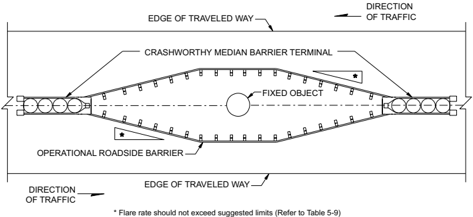

## 6.7 UPGRADING SYSTEMS

Some existing median barriers do not meet suggested performance levels. Older barriers usually fall into one of two categories: those that have structural inadequacies or those that are functionally inadequate.

Section 5.7.1 provides guidance for evaluating the structural adequacy of roadside barriers. The same factors can be applied to median barriers. Persons inspecting existing installations should stay abreast of current traffic barrier designs and guidelines as well as prom -ising new research findings. Of course, there is no substitute for field data or crash records to evaluate the performance of a system.

States are encouraged to adopt policies that consider modification or replacement of barrier systems that do not meet current guide -lines. It is recognized that this action is not always cost-effective; therefore, decisions about treatment of existing systems should be based on a case-by-case analysis considering upgrade costs, repair and maintenance costs, and potential crash frequency and severity. Table 5-9 also may be used to evaluate the functional adequacy of existing barriers. If the barrier is placed in a depressed median or a median with surface irregularities, it may not function properly. If improperly located, corrective measures should be considered. If necessary, the barrier can be moved near the shoulder's edge or returned to a position in which the approach terrain to the barrier is no steeper than the criteria suggest. Another possible solution would be to extend the shoulder to the lateral distance desired and place the barrier on the shoulder. Steep flare rates for approach and transition sections should be flattened to conform to the criteria recommended in Table 5-9.

## REFERENCES

1.  AASHTO. Manual for Assessing Safety Hardware (MASH). American Association of State Highway and Transportation Officials, Washington, DC, 2009.
2. Bane, T. R. Examination of Across-Median Crashes on Florida Highways . Draft Report, presented to Florida Department of Transportation, July 2002.
3. Beason, W. L., H. E. Ross, H. S. Perera, and M. Marek. Single-Slope Concrete Barrier. Transportation Research Record 1302 . TRB, National Research Council, Washington, DC, 1991.
4. Borden, J. B. Median Barrier Study Warrant Review . California Department of Transportation, December 1997.
5. Bronstad, M. E., L. R. Calcote, and C. E. Kimball, Jr. Concrete Median Barrier Research, Volume 1: Executive Summary . FHWA-RD-73-3. Federal Highway Administration, U.S. Department of Transportation, Washington, DC, June 1976.
6. Caltrans, Division of Structures and Engineering Services. Vehicular Crash Test of a Continuous Concrete Median Barrier without a Footing . Final Report, FHWA-CA-TL-6883-77-22, August 1977.
7. Hunter, W. W., J. R. Stewart, K. A. Eccles, H. F. Huang, F. M. Council, and D. L. Harkey. Three- Strand Cable Median Barrier in North Carolina. Transportation Research Record 1743 . TRB, National Research Council, Washington, DC, 2001, pp. 97-103.
8.  Mak, K. K. and W. Campise, Test and Evaluation of Ontario Tall Wall Barrier with an 80,000 Pound Tractor-Trailer . Ministry of Transportation, Ontario, September 1990.
9. Mak, K. K., and D. L. Sicking. Rollover Caused by Concrete Safety-Shaped Barrier. Transportation Research Record 1258 . TRB, National Review Council, Washington, DC, 1990.
10. McClanahan, D., R. B. Albin, and J. C. Milton. Washington State Cable Median Barrier In-Service Study . Washington State Department of Transportation, November 2003.
11. Ross, H. E., Jr., D. L. Sicking, and R. A. Zimmer. National Cooperative Highway Research Report 350: Recommended Procedures for the Safety Performance Evaluation of Highway Features. NCHRP, Transportation Research Board, Washington, DC, 1993.

## Bridge Railings and Transitions

7.0 OVERVIEW A bridge railing is a longitudinal barrier intended to prevent a vehicle from running off the edge of a bridge or culvert. Bridge railings are normally constructed of a metal or concrete post-and-railing system, a concrete safety shape, or a combination of metal and concrete. Most bridge railings differ from roadside barriers in that bridge railings are an integral part of the structure (i.e., physically connected) and usually are designed to have virtually no deflection when struck by an errant vehicle. --'',,',',,,,',,'',',,,,,''','',-'-',,',,',',,'---

This chapter summarizes the performance and structural requirements of each of the six test levels defined in NCHRP Report 350: Recommended Procedures for the Safety Performance Evaluation of Highway Features (13) and Manual for Assessing Safety Hardware (MASH) (3) for bridge railings. It also addresses selection and placement guidelines for new construction and includes examples of some typical retrofit designs for older bridges with substandard railings. Finally, it addresses bridge railings and roadside barriers as a complete system and provides general information on appropriate transition sections between the two barrier types.

The information presented here is intended only to summarize selected sections of the current Standard Specifications for Highway Bridges (1) and the AASHTO LRFD Bridge Design Specifications (2) from the American Association of State Highway and Transportation Officials (AASHTO). Detailed information on analytic design procedures for test rail specimens, design loadings, and materials specifications can be found in those documents.
