# 7.1 PERFORMANCE REQUIREMENTS

- Source: Roadside Design Guide (2011).pdf
- Generated: 2026-01-03T22:41:43+00:00
- Chunk: 6/11
- Estimated tokens: ~10,576
- Total pages: 345
- Type: chapter

## 7.1 PERFORMANCE REQUIREMENTS

The AASHTO Standard Specifications for Highway Bridges requires that bridge railings meet specific geometric criteria and be ca -pable of resisting applied static loads without exceeding design requirements in any of their component members. The Federal High -way Administration (FHWA) requires all bridge railings used on the National Highway System (NHS) to be a crash-tested design.

The AASHTO LRFD Bridge Design Specifications provide the most current guidance on performance requirements of railings for new bridges and for rehabilitated bridges to the extent that railing replacement is determined to be appropriate. NCHRP Report 350 crash test criteria were used to develop the design criteria in the AASHTO LRFD Bridge Design Specifications .

Existing bridge railings designed to criteria in the AASHTO Standard Specifications for Highway Bridges and those crash tested under previous guidelines may be acceptable to use on new or reconstruction projects through evaluation of their in-service performance. For existing bridge rails, individual states should develop a guideline for retention, upgrading, or both for the in-place rails based on a safe, cost-effective approach. See Section 7.7 for additional guidance or comparative analysis.

## 7.2 GUIDELINES

A bridge railing should be chosen to satisfy the site-specific conditions as completely as possible while being practical. Refer to Section 13 of the AASHTO LRFD Bridge Design Specifications for information on developing guidelines.

A rigid railing requires approach guardrail and a transition section between barrier types. This full treatment may not be cost-effective on bridge-length culverts, and alternate treatments should be considered. Such treatments could include extending the structure and leaving the edges unshielded or using a less expensive, semi-rigid type railing.

When a bridge also serves pedestrians, cyclists, or both, a barrier to shield them from vehicular traffic may be required. The need for a pedestrian or cyclist railing should satisfy the site-specific conditions as completely as possible while being practical.

## 7.3 APPROPRIATE TEST LEVEL SELECTION CONSIDERATIONS

As with other traffic barriers, the current design criteria for bridge railings relate primarily to standard size automobiles and pickup trucks, resulting in the selection of a design meeting NCHRP Report 350 Test Level 3 (TL-3). Test requirements are the same for a bridge rail as those for a longitudinal barrier, previously described in Chapter 5. Section 5.3 lists the subjective factors most often considered in selecting an appropriate test level for traffic barriers, including bridge railings, at a specific location.

Several state highway agencies and the FHWA have recognized that it may be desirable in certain situations to design and install railings that can contain and redirect heavy vehicles such as buses and trucks (10) . Although penetration of any railing by a vehicle is potentially hazardous to its occupants, locations where vehicular penetration of a railing system could be particularly hazardous to others as well should be given careful evaluation before deciding on the type of railing to install.

A second concern that must be considered in selecting a high-performance railing is its effective height. A railing may have adequate strength to prevent physical penetration, but unless it also has adequate height, an impacting vehicle or its cargo may roll over the railing or onto its side away from the railing after redirection. Also, sight distance should be investigated when needed.

In addition, the shape of the face of the railing may have a significant effect on its performance. Various safety shapes have been successfully tested in accordance with NCHRP Report 350 criteria. A safety-shaped railing can cause a large vehicle to roll up to 24 degrees before it contacts the upper edge of the railing. Thus, a vertical face may be more desirable when heavy vehicle rollover is a primary concern.

Another concern is about the placement locations and the types of hardware attachments on or adjacent to bridge rails. Those hardware attachments may consist of pedestrian and bicycle railings, breakaway and non-breakaway sign supports, luminaire poles, large sign support structures, sound walls, various types of fences, and decorative features. Review of bridge rails that have been impacted by large trucks and other high center-of-gravity vehicles has revealed that the vehicles may lean over and extend past the top of the bridge rail. The clear area that should be provided behind a bridge rail and beyond its dynamic deflection distance to account for this behavior is called the Zone of Intrusion (ZOI). Hardware attachments placed in these areas should be avoided when practical. Some attach -ments could be potential vehicular snagging hazards. Attachments placed on bridges at sensitive sites such as overpasses where debris could fall on or into the paths of roadway traffic below them should be avoided unless the attachments are placed outside of the ZOI. For more information regarding zone of intrusion, refer to Chapter 5 and the Transportation Research Board's (TRB's) Guidelines for Attachments to Bridge Rails and Median Barriers (11) .

## 7.4 CRASH-TESTED RAILINGS

In the past, the crash test matrix for bridge railings has differed from those used for other longitudinal barriers. Under MASH, a uniform crash test matrix is used for all longitudinal barriers, including bridge rails. All new tests for bridge railings should be in ac -cordance with the guidelines in MASH. Table 7-1 shows the MASH crash test matrix for bridge railings (3) .

Roadside Design Guide 7-2

Table 7-1. MASH Test Matrix for Bridge Railings (3)

|                 |                                                                             | Test Conditions                             | Test Conditions           | Test Conditions   |
|-----------------|-----------------------------------------------------------------------------|---------------------------------------------|---------------------------|-------------------|
| Test Level (TL) | Test Vehicle Designation and Type                                           | Vehicle Weight kg [lbs]                     | Speed km/h [mph]          | Angle Degrees     |
| 1               | 1,100C (Passenger Car) 2,270P (Pickup Truck)                                | 1,100 [2,420] 2,270 [5,000]                 | 50 [31] 50 [31]           | 25 25             |
| 2               | 1,100C (Passenger Car) 2,270P (Pickup Truck)                                | 1,100 [2,420] 2,270 [5,000]                 | 70 [44] 70 [44]           | 25 25             |
| 3               | 1,100C (Passenger Car) 2,270P (Pickup Truck)                                | 1,100 [2,420] 2,270 [5,000]                 | 100 [62] 100 [62]         | 25 25             |
| 4               | 1,100C (Passenger Car) 2,270P (Pickup Truck) 10,000S (Single-Unit Truck)    | 1,100 [2,420] 2,270 [5,000] 10,000 [22,000] | 100 [62] 100 [62] 90 [56] | 25 25 15          |
| 5               | 1,100C (Passenger Car) 2,270P (Pickup Truck) 36,000V (Tractor-Van Trailer)  | 1,100 [2,420] 2,270 [5,000] 36,000 [79,300] | 100 [62] 100 [62] 80 [50] | 25 25 15          |
| 6               | 1,100C (Passenger Car) 2,270P (Pickup Truck) 36,000T (Tractor-Tank Trailer) | 1,100 [2,420] 2,270 [5,000] 36,000 [79,300] | 100 [62] 100 [62] 80 [50] | 25 25 15          |

The FHWA maintains a list of designs that recently have been crash tested in accordance with one of the test levels defined in NCHRP Report 350 or MASH, as well as a list of designs previously tested under earlier guidelines that have been assigned an NCHRP Report 350 equivalent test level.

A complete  list  of  crash-tested  bridge  railings  may  be  obtained  from  the  FHWA  Office  of  Highway  Safety  through  its  website ( http://safety.fhwa.dot.gov/roadway\_dept/policy\_guide/road\_hardware/) as well as the online guide for bridge rail systems and transi -tion systems through the AASHTO-AGC-ARTBA Joint Committee Task Force 13 website (http://www.aashtotf13.org ).

The requirements in Chapter 13 of the AASHTO LRFD Bridge Design Specifications should be used for the design of crash-tested railing test specimens and the design of bridge deck overhangs. These specifications do not apply to connections of bridge barriers to deck materials other than concrete (e.g., fiber-reinforced polymer [FRP], steel).

All newly developed bridge railings should be successfully crash tested in accordance with MASH. To minimize duplicate crash test -ing, the FHWA may allow the use of bridge rail designs that are similar to a crash-tested design based on an analytic comparison by using the methodology outlined in Section 13 of the AASHTO LRFD Bridge Design Specifications . FHWA policy and an example comparison prepared by the Colorado Department of Transportation (CDOT) are contained in a May 16, 2000, memorandum at the following website: http://safety.fhwa.dot.gov/roadway\_dept/policy\_guide/road\_hardware/barriers/bridgerailings/index.cfm .

For illustrative purposes, this section contains brief descriptions and photographs of some of the bridge railings that meet the crash test requirements of the six test levels defined in NCHRP Report 350 or MASH.

--'',,',',,,,',,'',',,,,,''','',-'-',,',,',',,'---

## 7.4.1 NCHRP 350 TL-1 through TL-4 Bridge Railings

TL-1 bridge railings typically are used on low-speed roadways and temporary work zone applications. As a result, only a few bridge railings have been designed and tested in accordance with TL-1. The Curb Type Glu-Lam Timber Railing, shown in Figure 7-1, is one such example.

The Texas T-6 Railing, shown in Figure 7-2, is an example of a TL-2 bridge railing.

The Wyoming Two-Tube Bridge Railing, shown in Figure 7-3, has been crash tested according to NCHRP Report 230 TL-2 guidelines (12) . It was subsequently approved as a TL-3 bridge railing under the NCHRP 350 criteria. Many concrete post-and-beam bridge rail -ings also meet the TL-3 crash test requirements.

Several bridge railings have been successfully crash tested in accordance with the NCHRP 350 TL-4 criteria. The 813-mm [32-in.] high concrete F-shaped bridge railing, shown in Figure 7-4, is a typical example of a concrete TL-4 bridge railing. Steel bridge railings also have been crash tested in accordance with the NCHRP 350 TL-4 criteria. In testing under the MASH criteria, the 813-mm [32-in.] New Jersey concrete safety-shaped barrier was successfully crash tested in accordance with TL-3 requirements.

Figure 7-1. Curb Type Glu-Lam Timber Railing

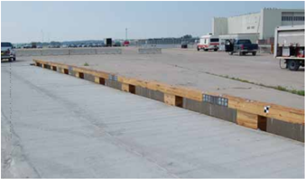

Figure 7-2. Texas T-6 Railing

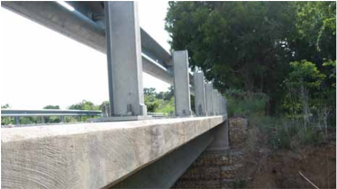

Roadside Design Guide 7-4

Figure 7-3. Wyoming Two-Tube Bridge Railing

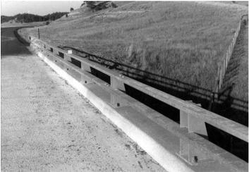

Figure 7-4. Concrete F-Shaped Bridge Railing

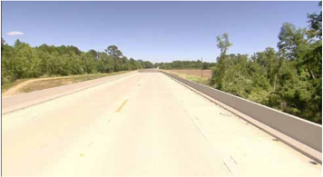

## 7.4.2 MASH TL-5 and TL-6 Bridge Railings

All current solid concrete barriers (i.e., New Jersey and F-shapes, single-slope, and vertical wall) are considered to be MASH TL-5 bridge railings when adequately reinforced and built to a minimum height of 1,067 mm [42 in.]. Figure 7-5 shows a 1,067 mm [42 in.] high concrete safety-shaped bridge railing, which is a common bridge railing used on new construction. The concrete barrier requires virtually no maintenance for most hits. The Texas Type Tank Truck (TT), shown in Figure 7-6, is an extremely strong bridge railing that meets the MASH TL-6 crash test requirements.

--'',,',',,,,',,'',',,,,,''','',-'-',,',,',',,'---

Figure 7-5. 1,067-mm [42-in.] Tall Concrete Safety-Shaped Bridge Railing

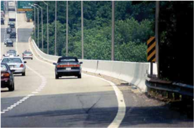

Figure 7-6. Texas Type TT Railing

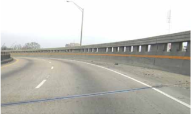

## 7.5 SELECTION GUIDELINES

Five factors should be considered in selecting a bridge railing: (1) performance, (2) compatibility, (3) cost, (4) field experience, and (5) aesthetics. Despite the relative importance placed on these factors, the capability of a railing to contain and redirect the design vehicle should never be compromised. In addition, using protective screens at overpasses when deemed necessary also should be considered.

## 7.5.1 Railing Performance

Bridge railings should be installed based on the Owner's recommendations. As a minimum, TL-3 bridge railings should be used on the NHS (including Interstate and major highways routes as identified by FHWA) in accordance with FHWA policy (9) , summarized as follows:

Roadside Design Guide 7-6

All bridge railings installed on NHS projects let to contract after August 16, 1998, shall meet the acceptance criteria contained in NCHRP Report 350 or an FHWA recognized successor to those criteria. The minimum acceptable bridge railing will be a TL-3 (MSL-2 until August 1998) unless supported by a rational selection procedure.

Railings that have been crash tested to the appropriate test level of NCHRP 350 and MASH should provide adequate performance.

## 7.5.2 Compatibility

It is important to consider the selected bridge railing as a part of the total roadside barrier system, which must function effectively as a unit. When the approach roadside barrier significantly differs in strength, height, and deflection characteristics from the bridge railing, a crashworthy transition section, defined in Section 7.8, is required. Bridge rail end treatments and stiffened transition sections should be used as determined by the Owner to provide adequate protection within the clear zone.

## 7.5.3 Costs

Costs generally fall into one of two categories: initial construction costs and long-term maintenance costs. Although the initial bridge rail construction costs will vary depending on the material and performance level selected, long-term maintenance costs also should be emphasized in the selection process.

Railing designs should be standardized to the extent possible so that the availability of replacement parts does not become a major problem. Railings that eliminate or minimize bridge deck damage are very desirable from a maintenance viewpoint. This will assist the maintenance crews and the traveling public with reduced exposure time during repairs.

Maintenance costs also include repair costs resulting from vehicular impacts, that cause damage to vehicles and bridge railings. The designer should consider both initial costs and long-term maintenance costs in the selection of a bridge rail.

## 7.5.4 Field Experience

It is important that the in-service performance of any widely used bridge railing is evaluated to determine that it is working as in -tended. By reviewing crashes involving bridge railings where available and by documenting damage and repair costs, highway agency personnel can readily identify and understand failure modes. This approach will determine whether a specific design is performing well or if changes could be made to improve railing performance or decrease maintenance costs.

## 7.5.5 Aesthetics

Although there is no question that an aesthetic bridge railing in scenic areas or along park roads may be particularly important in re -sponse to public input, the safety performance of a railing should not be sacrificed. Some rustic appearing railings have been developed and crash tested to be both effective and acceptable in appearance. Any non-standard bridge railing designed primarily for appearance should be crash tested before being used. NCHRP Report 554: Aesthetic Concrete Barrier Design may be referenced for further guidance (4) .

## 7.5.6 Protective Screening at Overpasses

An object or debris thrown, dropped, or dislodged from an overpass structure can cause significant damage and injuries. Protective screening might reduce the number of these incidents; however, that screening will not stop a determined individual. In many cases, increased enforcement also is needed to provide an effective deterrent.

Although the most common protective screening in use is for pedestrian type overpasses, other types of screening such as glare screens are used to protect oncoming traffic on overpasses. Splash or debris screens are used to protect commercial or residential properties that are beneath or adjacent to the structure.

It is not reasonable to establish absolute warrants as to when, where, or what type of barriers or screens should be installed. The general need for economy of design and desire to preserve the clean lines of the structures, unencumbered by screens, must be carefully balanced against the requirement that the highway traveler, overpass pedestrian, and adjoining property be provided maximum protection.

Various types and configurations of screens, usually of a chain-link fence type, have been installed on overpasses throughout the country in areas where the problem of throwing or dropping objects has been determined to exist.

The simplest design for use on pedestrian overpasses is a vertical fence erected on the bridge railing of the structure. Although this type of design has been effective in keeping children from playing on the railing, the design has proven somewhat ineffective in combating the problem of objects being thrown from the structure. Objects large enough to cause serious damage to passing vehicles still can be thrown over a vertical structure with some degree of accuracy. On pedestrian bridges, a semicircular enclosure has been placed on top of the two vertical walls to discourage this type of vandalism. This design has further evolved into one with a partially enclosed curved top, which is used in some areas. Objects generally cannot be thrown over the top of a partially enclosed screen with any degree of accuracy.

Care should be taken in the design of chain-link type screens to ensure that the opening at the bottom of the side screens, through which an object can be pushed or dropped, is eliminated or kept to a minimum. Where aesthetics are important, decorative type screen -ing has been used.

Installation of protective screening should be analyzed on a case-by-case basis at the following locations:

- Existing structures where incidents of objects being dropped or thrown from the overpass have occurred and where increased surveillance, warning signs, or apprehension of a few individuals has not effectively alleviated the problem
- An overpass near a school, playground, or other location where it would be expected that the overpass would be frequently used by children not accompanied by adults
- All overpasses in urban areas used exclusively by pedestrians and not easily kept under surveillance by law enforcement personnel
- Overpasses with walkways where experience on similar structures indicates a need for such screens
- Overpasses where private property that is subject to damage, such as buildings or power stations, is located beneath the structure

## 7.6 PLACEMENT RECOMMENDATIONS

A desirable feature of a bridge structure is a full, continuous shoulder so that a uniform clearance to roadside elements is maintained. However, there are many existing bridges that are narrower than the approach roadway and shoulder. When the bridge railing is located within the recommended shy-line offset distance (see Table 5-7), the approach railing should have the appropriate flare rate shown in Table 5-9.

Curbs in front of bridge railings should be avoided unless the bridge rail was crash tested with a curb. Use of combination curb and vehicle barrier rail typically shall be restricted to roadways designated for a TL-1 or TL-2 applications. Curb height is prescribed in Chapter 13 of the AASHTO LRFD Bridge Design Specifications as a 152-mm [6-in.] preferred height, with a maximum of 203 mm [8 in.] on a sidewalk in front of the bridge rail. Final curb height may be determined by considering subsequent maintenance overlays.

Terminating the bridge railing requires special treatment considerations. A crash-tested transition from the approach guardrail should be attached to the end of the bridge rail.

## 7.6.1 Considerstions for Urban and Low-Volume Roads

The variables regarding the placement of bridge railings, bridge rail transitions, and approach guardrails become more challenging for urban and low-volume roadways. The primary reasons are the need to design these features around intersections, streets, sidewalks, and other features to provide access for pedestrians and persons with disabilities. The selection of the appropriate bridge railing needs

Roadside Design Guide 7-8

to consider roadway design, traffic volumes, percentage of heavy vehicles, design speed, and volume of pedestrian traffic. However, bridges in urban or low-volume roads that carry low traffic volumes, reduced speeds, or both may not need bridge railings designed to the same standard as bridge railings on high-speed, high-volume facilities.

The bridge rail and transition section must function effectively for the selected location and conditions. Bridge railings with adequate strength to prevent penetration from passenger vehicles and transitions that meet the TL-1 or TL-2 requirements of MASH or NCHRP Report 350 are generally acceptable for low-speed roadways of 70 km/h [45 mph] or less. FHWA does require a TL-3 bridge railing as a minimum for all NHS projects unless supported by another rational selection procedure.

When a bridge also serves pedestrians, two options for accommodating them typically are used. The first is a raised curb with a side -walk in combination with an outer bridge barrier and pedestrian railing combination. The second option involves placing the barrier where it affords maximum pedestrian protection from vehicular traffic when it is justified for the design conditions. For this option, a pedestrian railing is needed at the outer edge of the bridge structure. The need for the second option should be based on the volume and speed of roadway traffic, lane width, curb offset, number of pedestrians using the bridge, crash statistics, and site conditions at either end of the bridge structure.

The use of a bridge railing may create a hazard unless the railing is terminated in an acceptable manner. Flaring the railing end section away from the roadway often is not practical because it may encroach on the sidewalk. In some instances, a crash cushion or a section of approach guardrail parallel to the roadway with a suitable end terminal may be used. However, the presence of a raised curb may affect the performance of these types of end treatment. In low-speed situations, a concrete barrier tapered end section parallel to the roadway may be the best compromise. Concrete railings should be extended a sufficient length beyond the end of the bridge to protect drop-offs, yet not extend so far as to intrude on sight distance for adjacent street intersections. Figure 7-7 shows one method of termi -nating a railing in low-speed situations, while Figure 7-8 shows a termination of a parallel approach rail with a suitable end terminal.

Figure 7-7. End Treatment for Traffic Railing on a Bridge in Low-Speed Situations

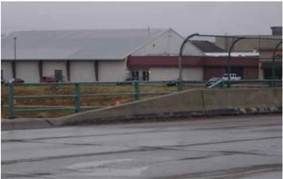

--'',,',',,,,',,'',',,,,,''','',-'-',,',,',',,'---

Figure 7-8. Terminating a Traffic Barrier on Bridge with End Terminal

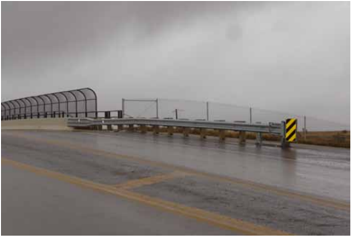

## 7.7 UPGRADING OF BRIDGE RAILINGS

This section provides general guidelines for highway agency personnel responsible for identifying and correcting potentially obsolete bridge railings.

## 7.7.1 Identification of Potentially Obsolete Systems

Because the primary purpose of a bridge railing is to prevent penetration, it must be strong enough to redirect an impacting vehicle. Bridge railings designed to AASHTO specifications prior to 1964 may not meet current specifications. Generally, all bridge railings designed in accordance with AASHTO specifications since 1964 have adequate strength to prevent penetration by passenger cars. Many of these railings also provide smooth redirection, although full-scale crash testing has revealed poor performance in some railing designs. Post-crash evaluation of some of the failed systems revealed issues such as inadequate design capacity, snagging, older railings with walkways, and inadequate transitions. If the capacity of a railing appears questionable, further evaluation should be made to verify critical design details (e.g., base plate connections, anchor bolts, material brittleness, welding details, and reinforcement development) to ensure that the design meets the intent of the current specifications.

Occupant protection is also of considerable importance in a crash. Open-faced railings in particular may cause snagging, which pro -duces high deceleration forces leading to occupant injuries. This type of issue usually can be detected best through full-scale crash testing or, in the case of an existing railing, through an analysis of available crash reports.

A third issue in many older railing systems is the presence of a curb or walkway between the driving lane and the bridge railing. The curb or the walkway may cause an impacting vehicle to go over the railing or at least strike it from an unstable position and subse -quently roll over.

Finally, an adequate approach-rail to bridge-rail transition is essential, as discussed in detail in Section 7.8. The next section identifies corrective measures that can be taken to improve the performance of these and similarly obsolete systems.

Roadside Design Guide 7-10

## 7.7.2 Upgrading Systems

This section discusses only retrofit designs (i.e., changes, modifications, and additions to existing obsolete railings that bring these railings up to acceptable performance levels). These retrofit designs may increase the strength of the railing, provide longitudinal continuity to the system, reduce or eliminate undesirable effects of curbs or narrow walkways in front of the bridge rail, and eliminate snagging potential. A retrofit design also should include an acceptable transition from the approach rail to the bridge rail itself. The retrofit design may reduce the travel lane or shoulder width.

One of the most common retrofit improvements consists of rebuilding the approach roadside barrier to current standards, including a transition section, and continuing the metal-beam rail element across the structure to provide railing continuity. If the existing bridge has a safety curb, the retrofit railing can be blocked out to minimize the possibility of a vehicle ramping over the bridge railing. How -ever, for most high-speed, high-volume roads, retrofit designs should be crash tested before used. The next sections provide information on tested designs that can be used once it has been determined that retrofitting a bridge railing is a cost-effective alternative to leaving an existing railing as is or constructing a new crash-tested railing.

Existing railings that do not meet current standards sometimes may be left in place until the section of highway that includes the bridge is brought up to full standards. Until a complete upgrading is done, each existing railing should be evaluated to determine the safest and most cost-effective treatment (i.e., retention of the existing rail, retrofit, or replacement). In general, existing concrete post and open railing systems that predate 1964 should be replaced or retrofitted. However, many existing safety curb and parapet railings are still performing well. Even though they do not meet current guidelines on railing strength, they remain functional because they can contain and redirect out-of-control vehicles in all but the most severe impacts.

Some specific retrofit concepts that can be adapted to numerous types of obsolete designs are the following:

- Concrete retrofit (safety shape or vertical)
- W-beam/thrie-beam retrofits
- Metal post-and-beam retrofits

These retrofits are illustrated in Figures 7-9 to 7-11.

## 7.7.2.1 Concrete Retrofit (Safety Shape or Vertical)

The concrete safety shape commonly used for new construction often can be added to an existing substandard bridge railing as an economical retrofit design if the structure can carry the added dead load and if the existing curb and railing configuration can meet the anchorage and impact forces needed for the retrofit barrier. This design is most cost-effective when the existing railing can remain in place and does not require extensive modifications. Although a vertical-faced retrofit can cause relatively high deceleration forces for high-angle impacts, its addition to the top of an existing safety curb, as shown in Figure 7-9, creates an effective barrier. Care must be taken to avoid a protruding curb that can cause considerable wheel and suspension system damage and may contribute to vehicular vaulting in shallow angle impacts.

The Iowa Concrete Block Retrofit Bridge Railing, as shown in Figure 7-9,  has been approved as a NCHRP 350 TL-4 railing. For more details of the retrofit design, refer to the report from the University of Nebraska (7) .

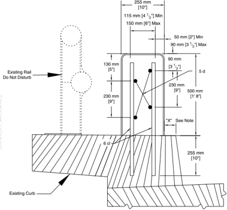

Note: On each side of bridge, dimension "X" can be a minimum of 1" and a maximum of 3", but must be constant for full length of bridge. However, approximately 10 linear feet at either end of rail length shall be transitioned to match existing beam guardrail attachment.

Figure 7-9. Iowa Concrete Block Retrofit Bridge Railing

## 7.7.2.2 W-Beam or Thrie-Beam Retrofits

An inexpensive, short-term solution to the inadequacies of bridge railings designed before 1964 is to carry an approach roadside barrier (i.e., W-beam or Thrie-beam) across the structure. Although this treatment may not bring an existing bridge railing into full compliance with applicable crash test requirements, it can significantly improve the impact performance of an obsolete railing. This treatment can be particularly cost-effective on low-volume roadways. Continuous metal-beam rails across a structure also eliminate one of the major problems of a bridge-rail/approach-rail transition: adequate anchorage to prevent the approach rail from pulling out when struck. By carrying the approach rail across the bridge, the only transition design elements that remain critical are gradual stiff -ening and elimination of a snagging potential.

The Delaware retrofit bridge railing, shown in Figure 7-10, has been successfully crash tested in accordance with NCHRP 350 TL-4. For more details of the retrofit design, refer to the Crash Testing and Evaluation of Retrofit Bridge Railings report (6) .

Roadside Design Guide 7-12

Figure 7-10. Delaware Thrie-Beam Retrofit

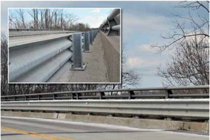

## 7.7.2.3 Metal Post-and-Beam Retrofits

A metal post-and-beam retrofit railing mounted at the curb edge, like the one shown in Figure 7-11, may be appropriate to use on an existing structure with a raised curb or walkway. The railing in Figure 7-11 is the Illinois Department of Transportation 2399 curbmount bridge railing that has been approved as a NCHRP 350 TL-4 railing. For more details of the retrofit design, refer to Volume 1 of Testing of New Bridge Rail and Transition Designs (5) .

This design functions well as a traffic barrier to separate motor vehicles from pedestrians who are using the curb or sidewalk on a bridge. In many cases, the existing bridge railing can be used as or converted to a pedestrian railing.

The crash test specimen for the post attachment to the curb or bridge deck can be designed to withstand the design loads contained in the current AASHTO LRFD Bridge Design Specifications , or it can be a yielding design that eliminates bridge deck damage in highangle, high-speed impacts. The metal rail elements should be in line with the face of the curb and spaced to minimize the likelihood of vehicle intrusion and subsequent snagging on the posts.

--'',,',',,,,',,'',',,,,,''','',-'-',,',,',',,'---

Figure 7-11. Metal Post-and-Beam Retrofit

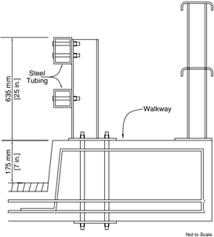

## 7.8 TRANSITIONS

A transition section is needed where a semi-rigid approach barrier joins a rigid bridge railing. Transitions may not be necessary when bridge railings with some flexibility are used (e.g., the NCHRP 350 TL-2 bridge rail described in Section 7.4.1). The transition design should produce a gradual stiffening of the overall approach protection system so that vehicular pocketing, snagging, or penetration can be reduced or avoided at any position along the transition. Crash testing has shown that poor results are produced by allowing an impacting vehicle to snag on the end of the rigid bridge railing or concrete safety shape or parapet. These tests also have demonstrated that a more rigid guardrail transition to the bridge railing is necessary, which can be accomplished through reduced post spacing; larger, longer, or both larger and longer posts; stronger rail elements (nested rail); and other special features.

Details of special importance for transitions are as follows:

- The approach-rail/bridge-rail splice or connection must be as strong as the approach rail itself so it will not fail when struck by pulling out and allowing a vehicle to strike the end of the bridge railing. The use of a cast-in-place anchor or through-bolt connec -tion is recommended. The transition also must be designed to minimize the likelihood of snagging by an errant vehicle, as well as one from the opposing lane on a two-way facility.
- Strong-post systems (usually blocked out) or post-and-strong-beam systems can be used on transitions to rigid bridge railings or other rigid objects. These systems usually should be blocked out from their posts unless the railing member is of sufficient width to prevent or reduce snagging to an acceptable level. However, blockouts or railing offsets alone may not be sufficient to prevent potential snagging at the immediate upstream end of the rigid bridge railing. A rubrail may be desirable in some designs that use flexible W-beam or box-beam transition members. Tapering of the rigid bridge railing end behind the transition members at their connection point also may be desirable, especially when the approach transition is recessed into the concrete end of the bridge railing or other rigid object.

Roadside Design Guide 7-14

- The transition section should be long enough so that significant changes in deflection do not occur within a short distance. Gener -ally, the transition length should be 10 to 12 times the difference in the lateral deflection of the two systems in question.
- The stiffness of the transition should increase smoothly and continuously from the less rigid system to the more rigid one. This usually is accomplished by decreasing the post spacing, increasing the post size, or both, as well as by strengthening the rail ele -ment. W-beam or thrie-beam rail elements typically are strengthened by nesting two rails together.
- When drainage features (e.g., curbs, raised inlets, curb inlets, ditches, or drainage swales) are constructed in front of barriers, especially in the transition area, they may initiate vehicle instability that can, in some instances, adversely affect the crashworthi -ness of the transition. However, some transition designs incorporate a curb to reduce the probability of a vehicle snagging on the end of a rigid bridge railing. The slope between the edge of the traveled lane and the barrier should be no steeper than 1V:10H.

NCHRP Report 350 recommends that transitions be designed and crash tested in accordance with the test level appropriate for the in -tended application. A list of crash-tested bridge rail transitions may be obtained from the FHWA Office of Highway Safety through its website (http://safety.fhwa.dot.gov/roadway\_dept/policy\_guide/road\_hardware/ ) and the online guide for transition systems through the AASHTO-AGC-ARTBA Joint Committee Task Force 13 website (http://www.aashtotf13.org ).

An example of an approved NCHRP 350 TL-3 transition is a nested thrie-beam transition attached to a vertical concrete parapet, as shown in Figure 7-12, which is used in South Dakota. For more details, refer to the report from the Midwest Roadside Safety Facility (8) .

Figure 7-12. Thrie-Beam Transition to Modified Concrete Safety Shape

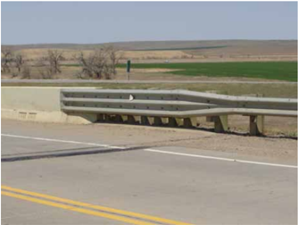

--'',,',',,,,',,'',',,,,,''','',-'-',,',,',',,'---

## REFERENCES

1.  AASHTO. Standard Specifications for Highway Bridges . American Association of State Highway and Transportation Officials, Washington, DC, 1996.
2. AASHTO. AASHTO LRFD Bridge Design Specifications . American Association of State Highway and Transportation Officials, Washington, DC, 1998.
3. AASHTO. Manual for Assessing Safety Hardware (MASH). American Association of State Highway and Transportation Officials, Washington, DC, 2009.
4. Bullard, D. L., Jr., N. M. Sheikh, R. P. Bligh, R. R. Haug, J. R. Schutt, and B. J. Storey. National Cooperative Highway Research Program Report 554: Aesthetic Concrete Barrier Design . NCHRP, Transportation Research Board, Washington, DC, 2006.
5. Buth, C. E., T. J. Hirsch, and W. L. Menges. Testing of New Bridge Rail and Transition Designs, Volume I: Technical Report . FHWA-RD-93-058. Transportation Research Board, Washington, DC, June 1997.
6. Buth, C. E., and W. L. Menges. Crash Testing and Evaluation of Retrofit Bridge Railings and Transition . FHWA-RD-96-032, Federal Highway Administration, U.S. Department of Transportation, Washington, DC, January 1997.
7. Faller, R. K., J. A. Magdaleno, and E. R. Post. Full Scale Vehicle Crash Tests on the Iowa Retrofit Concrete Barrier Rai l. Transportation Research Report No. TRP-03-15-88. Civil Engineering Department, University of Nebraska-Lincoln, Lincoln, NE, January 1989.
8. Faller, R. K., J. D. Reid, J. R. Rohde, D. L. Sicking, and E. A. Keller. Two Approach Guardrail Transitions for Concrete Safety Shape Barriers . TRP-03-69-98. TRB, National Research Council, Washington, DC, May 1998.
9.  FHWA. Action: Crash Testing of Bridge Railings . Memorandum. Federal Highway Administration, U.S. Department of Transportation, May 30, 1997.
10. FHWA. Design Considerations for Large Trucks . Memorandum. Federal Highway Administration, U.S. Department of Transportation, October 22, 2004.
11. Keller, E.A., D. L. Sicking, R. K. Faller, and J. R. Rohde. Guidelines for Attachments to Bridge Rails and Median Barriers . TRP-03-98-03. TRB, National Research Council, February 2003.
12. Michie, J. D. National Cooperative Highway Research Report 230: Recommended Procedures for the Safety Performance Evaluation of Highway Appurtenances . NCHRP, Transportation Research Board, Washington, DC, 1981.
13. Ross, H. E., Jr., D. L. Sicking, and R. A. Zimmer. National Cooperative Highway Research Report 350: Recommended Procedures for the Safety Performance Evaluation of Highway Features . NCHRP, Transportation Research Board, Washington DC, 1993.

--'',,',',,,,',,'',',,,,,''','',-'-',,',,',',,'---

## End Treatments (Anchorages, Terminals, and Crash Cushions)

## 8.0 OVERVIEW

A vehicle impacting the untreated end of a roadside barrier can result in serious consequences. The vehicle may be stopped abruptly, barrier elements could penetrate the passenger compartment, or the vehicle may become unstable and potentially roll over. Crashworthy end treatments frequently are used to prevent impacts of this type by safely decelerating the vehicle to a stop or by safely redirecting it around the object of concern.

A wide variety of devices are considered to be end treatments:

- Anchorages -These devices anchor a flexible or semi-rigid barrier to the ground to develop its tensile strength during an impact. Anchorages are not considered crashworthy; thus, they typically are used on the trailing end of a roadside barrier on one-way roadways or on the approach or trailing end of a flexible or semi-rigid barrier that is located outside the clear zone or that is shielded by another barrier system. More detailed descriptions are provided in Section 8.2.
- Terminals -Essentially crashworthy anchorages, these devices are used to anchor a flexible or semi-rigid barrier to the ground, normally at the end of a barrier either located within the clear zone or likely to be impacted by errant vehicles. Most terminals are designed for vehicular impacts from only one side of the barrier; however, a few terminal designs have been developed for median applications and may be installed where there is potential for impact from either side. More detailed descriptions are provided in Section 8.3.
- Crash	cushions -Also known as impact attenuators, these devices typically are attached to or placed in front of rigid concrete barriers (i.e., median barriers, roadside barriers, or bridge railings) or other rigid fixed objects, such as bridge piers. Generally, crash cushions may be used in either a median or roadside application. More detailed descriptions are provided in Section 8.4.

This chapter explains the guidelines for the installation as well as the structural and performance characteristics of end treatments. Also, descriptions, selection guidelines, and placement recommendations for systems that have been successfully crash tested under current performance criteria are provided, except as noted.
