# 8.1 PERFORMANCE REQUIREMENTS

- Source: Roadside Design Guide (2011).pdf
- Generated: 2026-01-03T22:41:43+00:00
- Chunk: 7/11
- Estimated tokens: ~37,451
- Total pages: 345
- Type: chapter

## 8.1 PERFORMANCE REQUIREMENTS

The AASHTO Manual for Assessing Safety Hardware (MASH) (2) contains the current recommended procedures for testing and evaluating the crashworthy performance of highway safety devices, including end treatments. It has replaced NCHRP Report 350: Recommended Procedures for the Safety Performance Evaluation of Highway Features (9) for the evaluation of new devices. However, crashworthiness is assumed if an end treatment has met all of the evaluation criteria set forth in either MASH or NCHRP Report 350 for each of the specified crash tests.

To be crashworthy, an end treatment must not spear, vault, or roll a vehicle for head-on or angled impacts. A vehicle must be safely stopped or redirected by the end treatment when impacted end-on. The portion of the end treatment included in a barrier's length-ofneed must have redirectional characteristics similar to those of the barrier to which it is attached. Other criteria for these devices are established in MASH.

MASH introduces a new evaluation of staged attenuation devices using a 1,500-kg [3,307-lb.], intermediate-sized passenger car, in addition to the small passenger car and pickup truck crash tests.

All of the crashworthy end treatments discussed in this chapter have been successfully tested to test levels 2 or 3 (TL-2 or TL-3) in accordance to either NCHRP Report 350 or MASH. Note that both NCHRP Report 350 and MASH provide for the use of in-service evaluations as an alternate method for establishing the crashworthiness of end treatments.

Crashworthy end treatments are required for all new longitudinal barrier installations on the National Highway System (NHS) when those end treatments are located within the clear zone and exposed to possible vehicular impacts. They are recommended for use on all public roads.

After January 1, 2011, newly-tested end treatments must be evaluated in accordance with MASH to receive a Federal Highway Administration (FHWA) acceptance letter. However, terminals and crash cushions that were accepted before the adoption of MASH by using criteria contained in NCHRP Report 350 may remain in place and may continue to be manufactured and installed. Highway agencies are encouraged to upgrade existing terminals and crash cushions that have not been accepted under NCHRP Report 350 or MASH either as part of reconstruction or major resurfacing, rehabilitation, or restoration (3R) projects, or when a system is damaged beyond repair. Refer to the AASHTO/FHWA Joint Implementation Plan (6) or state highway agency guidelines for specific direction.

## 8.1.1 FHWA Acceptance Letters

Terminals  and  crash  cushions  used  on  the  NHS  must  be  accepted  as  crashworthy  by  FHWA.  After  all  salient  crash  testing  is  performed,  the  sponsoring  agency  or  manufacturer  may  submit  documentation  to  FHWA.  If  current  testing  criteria are  fulfilled,  FHWA will issue an acceptance letter for the product, possibly listing some caveats or restrictions on the usage of the  device.  Letters  for  terminals  and crash  cushions  are  assigned  a  'CC'  prefix  and  are  available  from  FHWA's  website  at http://safety.fhwa.dot.gov/roadway\_dept/policy\_guide/road\_hardware/.

## 8.1.2 Guide to Standardized Barrier Hardware

The  AASHTO-Associated  General  Contractors  of  America  (AGC)-American  Road  and  Transportation  Builders  Association (ARTBA) Joint Committee Task Force 13 report, A Guide to Standardized Highway Barrier Hardware (3) , is a repository of engineering drawings for a multitude of barrier components and systems. Each component and system has a unique designator, thereby making it easy to reference. A website has been established for these supported systems at http://www.aashtotf13.org.

## 8.2 ANCHORAGE DESIGN CONCEPTS

All flexible and semi-rigid barriers need to be terminated with an anchor system at both ends. When an impact occurs within the normal length-of-need of a longitudinal barrier system, tension is developed upstream and downstream of the impact location. Anchorages at each end of the barrier serve as foundations to transfer these tension forces to the ground. By developing tension in the barrier, dynamic deflection of the flexible or semi-rigid barrier is kept within acceptable levels.

If the barrier end treatment is not required to be crashworthy (e.g., a trailing end on a one-way roadway or an end located outside of the clear zone), a lower-cost anchorage system may be used. Several anchors are available from which to choose. One example is shown in Figure 8-1. Details are available in 'Drawing SEW02' in A Guide to Standardized Highway Barrier Hardware (3) .

Roadside Design Guide 8-2

Figure 8-1. Trailing End W-Beam Guardrail Anchorage

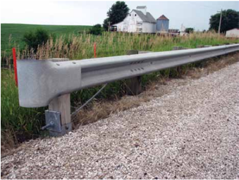

## 8.3 TERMINAL DESIGN CONCEPTS

A terminal is considered essential if the end of a barrier is located within the clear zone or in an area where it is likely to be struck by an errant motorist. In addition to crashworthiness, terminals for flexible and semi-rigid longitudinal barriers should be capable of developing the full tensile strength of the barrier.

There are several important considerations in selecting an appropriate terminal for a given flexible or semi-rigid barrier installation, including:

- Compatibility of the terminal with the barrier system;
- Performance characteristics of the terminal (i.e., energy-absorption potential, tangent vs. flared configuration, and location of the length-of-need point); and
- Site-grading considerations.
- Each of these considerations will be discussed in the following sections.

## 8.3.1 Compatibility of Terminals with Flexible and Semi-rigid Barrier Systems

It is essential that the terminal being considered is compatible with the barrier system. All terminals undergo crash testing and evaluation for particular barrier systems. However, the terminal manufacturer may be able to adapt it to a variety of barrier systems with minor modifications and with or without additional hardware components. The considerations described in Section 8.3.2 are discussed in the context of terminals for W-beam guardrail systems; however, the same considerations may be applicable to the selection and design of terminals for other types of barrier systems.

--'',,',',,,,',,'',',,,,,''','',-'-',,',,',',,'---

## 8.3.2 Performance Characteristics of Terminals

## 8.3.2.1 Energy-Absorbing vs. Non-Energy-Absorbing Terminals

Some terminals, including both tangent and flared designs, are designed to dissipate significant amounts of the kinetic energy in a head-on crash and are considered to be energy-absorbing. In high-speed, head-on impacts on the terminal nose, energy-absorbing terminals have demonstrated their ability to stop impacting vehicles in relatively short distances (usually 15 m [50 ft] or less depending on the type of terminal). Other terminals, including most flared designs, are classified as non-energy-absorbing designs. In crash tests of these designs, unbraked vehicles have traveled more than 75 m [250 ft] behind and parallel to the guardrail installation or along the top of the barrier when struck head-on at high speeds.

The decision to use either an energy-absorbing terminal or a non-energy-absorbing terminal should be based on the likelihood of a near end-on impact and the nature of the recovery area immediately behind and beyond the terminal. If the barrier length-of-need is properly determined, it is unlikely that a vehicle will reach the primary shielded object after an end-on impact regardless of the terminal type selected. However, if the terrain beyond the terminal and immediately behind the barrier is not safely traversable, an energy-absorbing terminal is recommended.

For angled impacts of 15 degrees or higher at the first post, all W-beam terminals perform about the same. Impacting vehicles will gate or pass through the terminal and travel behind and beyond it until they are stopped safely, are stopped abruptly, or roll over.

## 8.3.2.2 Flared versus Tangent Terminals

Traditionally, W-beam guardrail terminals have been classified as either flared or tangent (parallel) designs. Tangent terminals may be installed with a 300-mm to 600-mm [1-ft to 2-ft] offset from the line of barrier proper (over the entire terminal length) to minimize nuisance hits. Flared terminals generally require a 1.2-m [4-ft] offset although some designs have been successfully tested with offsets less than 900 mm [3 ft]. Because the flared terminal is located further from the traveled way, head-on impacts are less likely.

8.3.2.3 Length-of-Need Point An important performance characteristic of terminals is its length-of-need point-the point at which the terminal will contain and redirect an impacting vehicle along its face. The length-of-need point is established by a successful angled impact crash test-Test 3-11 for TL-3 conditions in accordance with either MASH or NCHRP Report 350 procedures. The critical impact point in this test becomes the length-of-need point used by designers. An impact upstream of the terminal's length-of-need point typically will result in the vehicle passing through the terminal and traversing the roadside slopes behind it. An impact downstream of the length-of-need point should result in redirection of the vehicle along the length of the barrier. Most W-beam terminals, with the exception of the buried-inbackslope and the X-Tension designs, have a length-of-need point located at 3.81 m [12 ft, 6 in.] from the impact head of the unit, but this location can vary depending on the specific terminal used. Because most impacts on or near the ends of W-beam terminals will allow vehicle passage, the runout area behind and beyond the terminal is an area of concern. Guidelines for the recommended grading in this area are included in Section 8.3.3.3. --'',,',',,,,',,'',',,,,,''','',-'-',,',,',',,'---

## 8.3.3 Site Grading Considerations for Terminals

Grading in the area of the terminal is an important consideration because terminals are tested for crashworthiness on flat and unob -structed terrain, a situation seldom found in field applications. The grading should be considered from three perspectives: (1) advance grading, (2) adjacent grading, and (3) runout distance grading. Additional information may be found in two FHWA memorandums: Guidelines for the Selection of W-Beam Barrier Terminals (4) and Supplementary Guidance for the Selection of W-Beam Barrier Terminals (5) .

Roadside Design Guide 8-4

## 8.3.3.1 Advance Grading

Advance grading refers to the area over which a vehicle may travel before making any contact with a barrier terminal. For W-beam terminals, this area should have a lateral slope of no steeper than 1V:10H to promote stability of a vehicle at the moment of contact and avoid its suspension from becoming either extended or compressed. At many sites construction of a grading platform or bulge in the roadside slope is needed to accommodate terminal installation. This bulge could create slope discontinuities that may cause motorists to lose control of their vehicles and possibly overturn before reaching the terminal. When grading platforms are built, a smooth transition to existing sideslopes should be provided so that the entire roadside approach to the barrier remains traversable. In some instances, it may be more cost-effective to extend the barrier itself so its terminal can be installed without the need for additional earthwork.

## 8.3.3.2 Adjacent Grading

Adjacent grading refers to the area on which the terminal is installed and the area immediately behind it. Ideally, this area should be essentially flat so the terrain itself does not contribute to vehicle roll, pitch, or yaw on impact with the terminal. Figures 8-2 and 8-3 show recommended dimensions for grading platforms. For impacts into the side of a terminal where redirection is expected (typically beyond the third post), the terminal posts should have at least 600 mm [2 ft] of soil support behind them. For near head-on impacts, a relatively flat area should extend 1.5 m [5 ft] behind the terminal nose in a direction away from the roadway so a motorist striking the terminal with the left front of a vehicle will not reach a high roll angle before impact. If a grading platform is to be constructed, the departure end of this platform should be gradually blended into the usually steeper sideslopes behind the barrier. From a practical standpoint, a slope of 1V:4H behind the terminal may be a reasonable compromise. Although such grading should be possible on freeways and many other high-speed arterial highways, it may not be cost-effective on roadways with limited rights-of-way and reduced clear zones. In addition, the type of project that is being designed may affect the amount of grading that can be achieved. Major reconstruction projects often can include this grading with minimal impact; however, smaller projects may only involve installation of guardrails, and it may not be cost-effective or practical to provide the grading. In these locations, the area immediately behind the terminal should be at least similar in nature to the roadside immediately upstream of the terminal.

Figure 8-2. Grading for Flared Guardrail Terminal

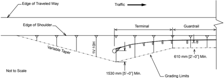

--'',,',',,,,',,'',',,,,,''','',-'-',,',,',',,'---

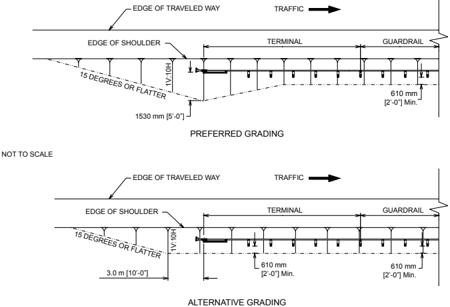

Note: The preferred grading layout should be used when practical. However, if necessary because of site limitations, the alternative grading layout may be used when upgrading an existing terminal.

Figure 8-3. Grading for Tangent Guardrail Terminal

## 8.3.3.3 Runout Distance Grading

Runout distance grading refers to the area into which a vehicle may travel after impacting a terminal ahead of its length-of-need point. The physical extent of the area needed will vary depending on vehicle size, impact speed, impact angle, driver reaction, terrain character, and terminal type. Crash tests repeatedly have shown that for angled impacts at the nose of W-beam terminals, test vehicles have traveled more than 60 m [200 ft] behind and away from the roadway. Clearly, providing runout distances (or clear zones) so wide is impractical. However, the lateral runout distance directly behind a terminal ideally should be at least as wide as the roadside clear distance immediately upstream of the terminal. In other words, it is not cost-effective to provide greater clear distance behind a terminal than what exists elsewhere along the road.

Longitudinal  runout  distance  parallel  to  and  behind  the  rail  is  more  difficult  to  address.  For  near  end-on  hits  into  non-energyabsorbing terminals, TL-3 crash tests have shown that an impacting pickup truck may ride up onto and slide along the top of the guardrail or travel more than 75 m [250 ft] parallel to and directly behind the rail. In the test conditions, the area behind the rail was flat and unobstructed, and all test vehicles remained upright as they came to a stop (note that in similar impacts with energy-absorbing terminals, the truck remained upright and came to rest about 15 m [50 ft] beyond the terminal nose). If the barrier length-of-need is adequate, a vehicle traveling 75 m [250 ft] behind a barrier will not likely reach the object the barrier was designed to shield. In most cases, however, that 75 m [250 ft] will not be a freely traversable area either because of its topography or because of the presence of other features that could cause vehicle instability. Although having a recovery area of that size is desirable, practical considerations may limit such an area.

Roadside Design Guide 8-6

--'',,',',,,,',,'',',,,,,''','',-'-',,',,',',,'---

The minimum recovery area behind and beyond a terminal should be an obstacle-free area approximately 23 m [75 ft] long and 6 m [20 ft] wide. A lesser recovery area may be adequate for energy-absorbing terminals while a larger area may be desirable for nonenergy-absorbing designs. In some cases, however, providing even a minimum runout area may not be practical because of physical constraints such as restricted rights-of-way, environmental concerns, or inadequate resources.

## 8.3.4 Terminals

The  following  subsections  classify  and  describe  terminals  available  as  of  September  2010.  The  appropriate  manufacturer  should  be  contacted  with  questions  about  the  applicability  of  their  terminal  design  to  a  particular  barrier  system.  The  information  presented  in  this  chapter  is  not  intended  to  be  a  complete  description  of  the  various  products  but  solely  an  introduction  of  the  products'  safety  features.  For  more  detailed  information,  refer  to  the  manufacturer's  website  or  contact  the vendor  directly.  Additional  information  for  proprietary  and  generic  products  may  be  found  in  the  FHWA  acceptance  letters (http://safety.fhwa.dot.gov/roadway\_dept/policy\_guide/road\_hardware/) or on the drawings found in A Guide to Standardized Highway Barrier Hardware (3) .

## 8.3.5 Terminals for Cable Barrier Systems

This section describes end terminals for two kinds of cable barrier systems. Table 8-1 lists these terminals with their respective information.

Table 8-1. Terminals for Cable Barrier Systems

| Terminal                                  |   Test Level (TL) | FHWA Acceptance Letter   | System Designation   | Manufacturer                                                                  | Reference Section   |
|-------------------------------------------|-------------------|--------------------------|----------------------|-------------------------------------------------------------------------------|---------------------|
| Three-Strand Cable Terminal               |                 3 | CC-63                    | SEC01                | Generic                                                                       | 8.3.5.1             |
| Terminals for High-Tension Cable Barriers |                 3 | CC-76                    | SEC07a               | Trinity Highway Products, LLC (CASS), and Nucor Steel Marion, Inc. (NU-CABLE) | 8.3.5.2             |
| Terminals for High-Tension Cable Barriers |                 3 | CC-86 CC-86A CC-86B      | SEC07b               | Brifen USA, Inc.                                                              | 8.3.5.2             |
| Terminals for High-Tension Cable Barriers |                 3 | CC-92 CC-92A             | Not posted           | Gibraltar Cable Barrier Systems, L.P .                                        | 8.3.5.2             |
| Terminals for High-Tension Cable Barriers |                 3 | CC-98                    | SEC07c               | Barrier Systems, Inc.                                                         | 8.3.5.2             |
| Terminals for High-Tension Cable Barriers |                 3 | CC-93 CC-93A             | Not posted           | Gregory Industries, Inc. (SAFENCE)                                            | 8.3.5.2             |

## 8.3.5.1 Three-Strand Cable Terminal

Several agencies that install the three-strand cable barrier use a terminal developed specifically for their barrier design, detailed in A Guide to Standardized Highway Barrier Hardware (3) as Drawing SEC01. Figure 8-4 shows this terminal.

Figure 8-4. Three-Strand Cable Terminal

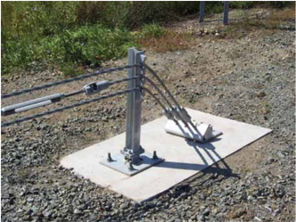

## 8.3.5.2 Terminals for High-Tension Cable Barrier Systems

Several proprietary high-tension cable barrier systems have been developed for median and roadside applications. Each of these barrier systems has a unique terminal design; those terminals should be selected and designed in accordance with the manufacturer's recommendations. Because these terminals are under constant loading, they should be properly designed for the local soil conditions. Figure 8-5 shows an example terminal for cable barriers-the CASS™ Cable Terminal (CCT).

Figure 8-5. CASS™ Cable Terminal (CCT)

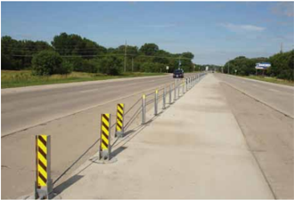

Roadside Design Guide 8-8

--'',,',',,,,',,'',',,,,,''','',-'-',,',,',',,'---

## 8.3.6 Terminals for W-Beam Guardrail Systems

This section describes end terminals and their design criteria for specific W-beam guardrail systems. Table 8-2 lists these terminals with their respective information.

Table 8-2. Terminals for W-Beam Guardrail Systems

| Terminal                                                                   | Test Level (TL)                                    | FHWA Acceptance Letter                             | System Designation                                 | Manufacturer                                       | Reference Section                                  |
|----------------------------------------------------------------------------|----------------------------------------------------|----------------------------------------------------|----------------------------------------------------|----------------------------------------------------|----------------------------------------------------|
| Buried-in-Backslope Terminal (Section 8.3.6.1)                             | Buried-in-Backslope Terminal (Section 8.3.6.1)     | Buried-in-Backslope Terminal (Section 8.3.6.1)     | Buried-in-Backslope Terminal (Section 8.3.6.1)     | Buried-in-Backslope Terminal (Section 8.3.6.1)     | Buried-in-Backslope Terminal (Section 8.3.6.1)     |
| Buried-in-Backslope Terminal                                               | 3                                                  | CC-53 CC-53A                                       | Not Posted                                         | Generic                                            | 8.3.6.1                                            |
| Flared Terminals (Section 8.3.6.2)                                         | Flared Terminals (Section 8.3.6.2)                 | Flared Terminals (Section 8.3.6.2)                 | Flared Terminals (Section 8.3.6.2)                 | Flared Terminals (Section 8.3.6.2)                 | Flared Terminals (Section 8.3.6.2)                 |
| Eccentric Loader Terminal (ELT)                                            | 3                                                  | CC-56 CC-56A                                       | Not Posted                                         | Generic                                            | 8.3.6.2.1                                          |
| Modified Eccentric Loader Terminal (MELT)                                  | 2                                                  | CC-84                                              | SEW05                                              | Generic                                            | 8.3.6.2.2                                          |
| Flared Energy-Absorbing Terminal (FLEAT™)                                  | 2 and 3                                            | CC-46A, B, and C                                   | SEW14a to b                                        | Road Systems, Inc.                                 | 8.3.6.2.3                                          |
| Flared Energy-Absorbing Terminal (FLEAT™)                                  | 2                                                  | CC-61B and C CC-88                                 | SEW14a to b                                        | Road Systems, Inc.                                 | 8.3.6.2.3                                          |
| Slotted Rail Terminal (SRT-350™)                                           | 3                                                  | CC-31 CC-31A CC-72 CC-100                          | SEW12 SEW11                                        | Trinity Highway Products, LLC                      | 8.3.6.2.4                                          |
| X-Tension™ Guardrail End Terminal                                          | 3                                                  | CC-91 CC-102                                       | Not Posted                                         | Barrier Systems, Inc.                              | 8.3.6.2.5                                          |
| Tangent Terminals (Section 8.3.6.3)                                        | Tangent Terminals (Section 8.3.6.3)                | Tangent Terminals (Section 8.3.6.3)                | Tangent Terminals (Section 8.3.6.3)                | Tangent Terminals (Section 8.3.6.3)                | Tangent Terminals (Section 8.3.6.3)                |
| Extruder Terminal (ET-Plus™)                                               | 2 and 3                                            | CC-12A thru P                                      | Not Posted                                         | Trinity Highway Products, LLC                      | 8.3.6.3.1                                          |
| Extruder Terminal (ET-Plus™) with Collision Performance Side Impact (CPSI) | 2 and 3                                            | CC-81                                              | Not Posted                                         | Trinity Highway Products, LLC                      | 8.3.6.3.1                                          |
| Sequential Kinking Terminal (SKT-350™ and SKT-LITE)                        | 3 2                                                | CC-40A and B CC-61A, B, and C CC-88                | SEW17a to c                                        | Road Systems, Inc.                                 | 8.3.6.3.2                                          |
| X-Tension™ Guardrail End Terminal                                          | 3                                                  | CC-91 CC-102                                       | Not Posted                                         | Barrier Systems, Inc.                              | 8.3.6.3.3                                          |
| 787-mm [31-in.] Height Terminals (Section 8.3.6.4)                         | 787-mm [31-in.] Height Terminals (Section 8.3.6.4) | 787-mm [31-in.] Height Terminals (Section 8.3.6.4) | 787-mm [31-in.] Height Terminals (Section 8.3.6.4) | 787-mm [31-in.] Height Terminals (Section 8.3.6.4) | 787-mm [31-in.] Height Terminals (Section 8.3.6.4) |
| FLEAT™                                                                     | 3                                                  | CC-88 CC-96                                        | SEW15                                              | Road Systems, Inc.                                 | 8.3.6.2.3                                          |
| SRT-350™                                                                   | 3                                                  | CC-100                                             | Not Posted                                         | Trinity Highway Products, LLC                      | 8.3.6.2.4                                          |
| SKT-350™ and SKT-LITE                                                      | 3                                                  | CC-88 CC-96                                        | SEW18a to b                                        | Road Systems, Inc.                                 | 8.3.6.3.2                                          |
| ET-Plus™                                                                   | 3                                                  | CC-94 CC-94A                                       | Not Posted                                         | Trinity Highway Products, LLC                      | 8.3.6.3.1                                          |

## 8.3.6.1 Buried-in-Backslope Terminal

In areas of cut sections on the roadway, or where the road is transitioning from cut to fill, it is sometimes possible to terminate a W-beam guardrail installation by burying the end in the backslope. Figure 8-6 illustrates a typical buried-in-backslope treatment of a W-beam guardrail. When properly designed and located, this system provides full shielding of the identified hazard, eliminates the possibility of any end-on impact with the terminal, and minimizes the likelihood of the vehicle passing behind the rail.

An effective installation should satisfy several design criteria. First and foremost is the steepness of the slope that covers the end of the barrier. The ideal slope is one that is nearly vertical, such as 1V:2H, in which the slope effectively becomes an extension of the barrier face and a motorist cannot physically get behind the terminal. In such a case, the barrier can be brought into the backslope as soon as possible by using the maximum flare rate appropriate for the design speed of the highway. If the backslope is not particularly steep (i.e., flatter than 1V:3H), a buried-in-backslope design can be easily overridden. In these instances, the full design length-of-need should be provided and there should be a minimum longitudinal distance of 23 m [75 ft] behind the rail that is both free of fixed objects and reasonably traversable, just as with all other non-energy-absorbing W-beam terminals. For all buried-in-backslope designs, the length-of-need begins at the point where the installation crosses the ditch bottom.

The buried-in-backslope design has been successfully tested with 1V:10H, 1V:6H, and 1V:4H foreslopes. Regardless of the foreslope used, the height of the W-beam rail should be held constant in relation to the roadway shoulder elevation until the barrier crosses the ditch bottom. When the distance from the ground to the bottom of the W-beam exceeds approximately 460 mm [18 in.], a rubrail should be added below the W-beam to minimize the potential for wheel snag on the support posts. Because the NCHRP Report 350 pickup truck had a relatively high center-of-gravity, the W-beam height, even when across a 1V:10H slope, should be measured from the roadway grade on high-speed routes.

Before installing a buried-in-backslope terminal, the site needs to be carefully reviewed, giving consideration to the foreslope, backslope, and ditch configurations as well as identifying provisions that may be needed to provide proper drainage.

If a barrier cannot be ended in a backslope without violating any of the design criteria, a different type of terminal may be more appropriate. These design considerations also apply to terminating concrete barriers (see Section 8.4.4.2) and any of the aesthetic barriers identified in Chapter 5 in a backslope, including the Ironwood and Merritt Parkway guardrails, the steel-backed wood rail, and the stone masonry and precast masonry walls.

Figure 8-6. W-Beam Guardrail Anchored in Backslope

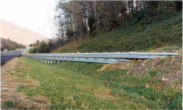

Roadside Design Guide 8-10

## 8.3.6.2 Flared W-Beam Terminals

Of all the flared terminals currently available, only the FLEAT™ and X-Tension™ are considered energy-absorbing. Either one would be an appropriate choice in locations where vehicle passage behind and parallel to the barrier needs to be limited to approximately 15 m [50 ft] or less. In locations where further vehicle passage is acceptable, non-energy-absorbing terminals may be appropriate. The flared configuration of these terminals typically places the nose of the barrier between 900 mm [3 ft] and 1.2 m [4 ft] beyond the face of the downstream barrier installation. The following flared terminals are commonly found on the nation's roadsides. Suggesed grad -ing details for these terminals are shown in Figure 8-2.

## 8.3.6.2.1 Eccentric Loader Terminal (ELT)

The ELT is a non-proprietary system (see Figure 8-7). The end of this terminal consists of a fabricated steel lever nose inside a section of corrugated steel pipe. The bolts are removed from all the posts in the terminal except the post where the curved flare and the tangent rail join and the adjacent post in the flared section. A strut between the steel tube foundations for the two end posts enables these posts to act together to resist cable loads resulting from downstream impacts. The next five posts are controlled release terminal (CRT) posts. A blockout on the second post increases the curvature near the end of the rail to reduce the column strength of the rail and the likelihood of the rail spearing an impacting vehicle.

The ELT is 11.4 m [37 ft, 6 in.] long and is designed with a curved flare that provides a 1.2 m [4 ft] offset to the end post. This curva -ture is critical for proper impact performance. The rail elements should be field-bent, while all posts should be wood. The length-ofneed point is located at the third post-3.81 m [12 ft, 6 in.] from the end of the terminal.

The ELT is a non-energy-absorbing terminal and should be installed only where a reasonable runout area exists behind and down -stream of the terminal.

Figure 8-7. Eccentric Loader Terminal (ELT)

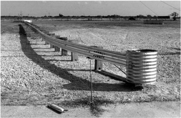

## 8.3.6.2.2 Modified Eccentric Loader Terminal (MELT)

The MELT, as shown in Figure 8-8, is a non-proprietary terminal that has been tested to NCHRP Report 350 TL-2 for use on lowerspeed roadways. This terminal is 11.4 m [37 ft, 6 in.] long and is designed with a parabolic flare that provides a 1.2-m [4-ft] offset to the end post. The length-of-need point is located at the third post-3.8 m [12 ft, 6 in.] from the end of the terminal. The MELT is a nonenergy-absorbing terminal and should be installed only where a reasonable runout area exists behind and downstream of the terminal.

Figure 8-8. Modified Eccentric Loader Terminal (MELT)

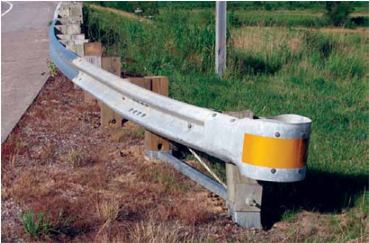

## 8.3.6.2.3 Flared Energy-Absorbing Terminal (FLEAT™)

The FLEAT™, as shown in Figure 8-9, is a proprietary energy-absorbing terminal that consists of a specially designed impact head installed over the end of a modified W-beam rail element. The main components are the impact head and guide tube assembly, a modi -fied W-beam rail, a breakaway cable anchor assembly, and weakened steel or wood posts. The kinetic energy of a crash is dissipated as the impact head slides along the rail element while kinking it in a manner similar to the Sequential Kinking Terminal (SKT-350™). The kinked rail exits the impact head on the traffic side and coils to the back side of the installation, away from traffic. Steel and wood post options are available.

The FLEAT™ is 11.4 m [37 ft, 6 in.] long and is designed with a straight flare that provides an offset of between 800 mm [2 ft, 6 in.] and 1.2 m [4 ft] to the end post. The length-of-need point is located at the third post-3.81 m [12 ft, 6 in.] from the end of the terminal. A median (bidirectional) version, called the FLEAT-MT™, is discussed later in this chapter.

## 8.3.6.2.4 Slotted Rail Terminal (SRT-350™)

The SRT-350™, shown in Figure 8-10, is a proprietary non-energy-absorbing terminal. It consists of a curved W-beam rail element in which longitudinal slots have been cut at specific locations to reduce its dynamic buckling strength for end-on impacts and to control the location of the buckling. Steel and wood post options are available. This terminal is 11.4 m [37 ft, 6 in.] long and is designed with a parabolic flare that provides an offset of between 900 mm [3 ft] and 1.2 m [4 ft] to the end post. The length-of-need point is located at the third post-3.81 m [12 ft, 6 in.] from the end of the terminal.

Roadside Design Guide 8-12

Figure 8-9. Flared Energy-Absorbing Terminal (FLEAT™)

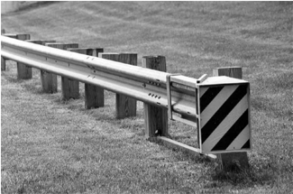

Figure 8-10. Slotted Rail Terminal (SRT-350™)

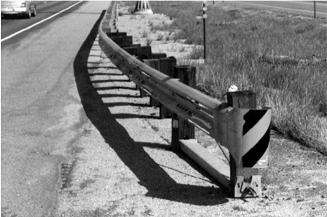

## 8.3.6.2.5 X-Tension™ Guardrail End Terminal

The X-Tension™, shown in Figure 8-11, is a proprietary energy-absorbing terminal. The system uses three standard unaltered 3.81-m [12-ft, 6-in.] W-beam rail sections, an impact head, and two cables that run the length of the system. A friction bar in the impact head allows the system to absorb the energy of the impact while in tension instead of in compression. By having the variable allowable offset, it can be placed in a tangent position without any of the parts varying. Steel and wood post options are available.

The X-Tension™ is 11.4 m [37 ft, 6 in.] long and can be installed as a tangent or flared terminal. The use of a straight flare can pro -vide offsets to the end post of anywhere from 0 m [0 ft] to 1.2 m [4 ft]. The length-of need point is located immediately downstream of the first post. A median (bidirectional) version, called the X-MAS, is discussed in Section 8.3.6.5.4.

--'',,',',,,,',,'',',,,,,''','',-'-',,',,',',,'---

Figure 8-11. X-Tension Guardrail End Terminal

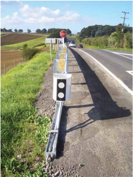

## 8.3.6.3 Tangent W-Beam Terminals

All of the currently available tangent terminals are energy-absorbing, and any one of them would be an appropriate choice in locations where vehicle passage behind and parallel to the barrier needs to be limited to approximately 15 m [50 ft] or less. The following sec -tions discuss three common tangent terminals. Suggested grading details for these terminals are in Figure 8-3. Tangent terminals may be installed parallel to the roadway (i.e., zero flare) or flared away from the face of the downstream guardrail installation at rates from 50:1 to 25:1 to reduce the chance of nuisance hits into the impact head.

## 8.3.6.3.1 Extruder Terminal (ET-Plus™)

The ET-Plus™, shown in Figure 8-12, is a proprietary energy-absorbing terminal, which consists of an extruder head installed over the end of a modified W-beam guardrail element. The kinetic energy of a crash is dissipated as the extruder head slides along the rail. The rail is fed through the squeezing section, which reshapes it into a flat plate. Then the bending section bends the rail and directs it out to the side, away from the vehicle. Steel and wood post options are available.

The ET-Plus™ may be ordered with the Collision Performance Side Impact (CPSI) option, a standard capability extruder head with steel wings added to mitigate the possibly harmful effects of a vehicle crashing into the terminal side-first as opposed to end-on. This version has a separate FHWA acceptance letter: CC-81.

Roadside Design Guide 8-14

This terminal is available in two lengths: 11.4 m [37 ft, 6 in.] and 15.2 m [50 ft]. The system may be installed with a straight flare at a rate of up to 25:1, which would place the terminal end up to 600 mm [2 ft] from the face of the downstream barrier. The length-of-need point is located at the third post-3.81 m [12 ft, 6 in.] from the end of the terminal.

Figure 8-12. Extruder Terminal (ET-Plus™)

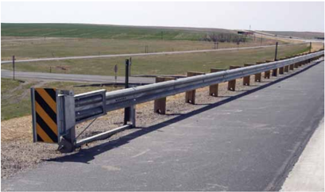

## 8.3.6.3.2 Sequential Kinking Terminal (SKT-350™)

The SKT-350™, shown in Figure 8-13, is a proprietary energy-absorbing terminal. The system consists of an impact head mounted over the end of a W-beam guardrail element that has been modified by punching three slots in the valley of the rail at specific locations. As the impact head is forced down the rail, it bends the rail element against a deflector plate, which absorbs the kinetic energy of a crash in conjunction with a kinker beam in the head. This beam causes short segments of the rail to kink sequentially and bend away from the impacting vehicle. Steel and wood post options are available.

The SKT-350™ is available in two lengths: 11.4 m [37 ft, 6 in.] and 15.2 m [50 ft]. The system may be installed with a straight flare at a rate of up to 25:1, which would place the end of the terminal up to 600 mm [2 ft] from the face of the downstream barrier. The length-of-need point is located at the third post-3.81 m [12 ft, 6 in.] from the end of the terminal.

--'',,',',,,,',,'',',,,,,''','',-'-',,',,',',,'---

Figure 8-13. Sequential Kinking Terminal (SKT-350™)

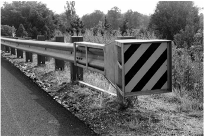

## 8.3.6.3.3 X-Tension™ Guardrail Terminal

The X-Tension™, as previously described in Section 8.3.6.2.5 and shown in Figure 8-11, may be installed with a straight flare and can provide offsets to the end post of anywhere from 0 m [0 ft] to 1.2 m [4 ft]. Thus, this system can be considered both a tangent and a flared terminal.

## 8.3.6.4 Terminals for 787-mm [31-in.] Height Steel Beam Guardrail Systems

Steel beam guardrail systems using higher mounting heights and other modifications have been developed as replacements for the strong-post W-beam systems traditionally used in the past. These systems include the non-proprietary Midwest Guardrail System (MGS), Trinity Highway Products' T-31 Guardrail, Gregory Mini Spacer (GMS), and Nucor Steel Marion's NU-GUARD 31. As a re -sult of the increased mounting height, crashworthy terminals needed to be recertified at this height. Several proprietary terminals have been successfully tested for use with these systems (see Table 8-2). The 787-mm [31-in.] height versions of these systems are similar but not identical to the standard height terminals. Refer to each manufacturer's details for information on these systems.

## 8.3.6.5 Median Terminals

This section describes median terminals and their design criteria for W-beam guardrail systems. Table 8-3 lists these terminals with their respective information.

## 8.3.6.5.1 Brakemaster® 350

The Brakemaster® 350, shown in Figure 8-14, is a proprietary, bidirectional system used primarily either as a terminal for W-beam median barrier or as a crash cushion to shield narrow obstacles. The manufacturer recommends using it in low-frequency impact areas. If used to terminate a concrete median barrier, an adequate transition design is needed between the Brakemaster and the rigid concrete barrier. It also may be used to shield the end of a roadside barrier.

Roadside Design Guide 8-16

--'',,',',,,,',,'',',,,,,''','',-'-',,',,',',,'---

The design of this device consists of an anchor assembly, a cable-brake assembly, and W-beam panels supported by steel diaphragms that slide backward in end-on hits. Only the anchor posts are embedded in the ground. When the W-beam panels are impacted end-on, they telescope backwards with the cable-brake assembly absorbing most of the energy through frictional resistance.

Table 8-3. Terminals for Median W-Beam Guardrail Systems

| Terminal                                      |   NCHRP Report 350 Test Level (TL) | FHWA Acceptance Letter   | System Designation   | Manufacturer                    | Reference Section   |
|-----------------------------------------------|------------------------------------|--------------------------|----------------------|---------------------------------|---------------------|
| Brakemaster® 350                              |                                  3 | CC-41                    | SEW06                | Energy Absorption Systems, Inc. | 8.3.6.5.1           |
| Crash Cushion Attenuating Terminal (CAT-350™) |                                  3 | CC-33 CC-33A             | SEW08                | Trinity Highway Products, LLC   | 8.3.6.5.2           |
| FLEAT Median Terminal (FLEAT-MT™)             |                                  3 | CC-46D                   | SEW16                | Road Systems, Inc.              | 8.3.6.5.3           |
| X-Tension™ Median Attenuator System (X-MAS)   |                                  3 | CC-91 CC-102             | Not Posted           | Barrier Systems, Inc.           | 8.3.6.5.4           |

Figure 8-14. Brakemaster® 350

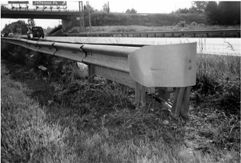

## 8.3.6.5.2 Crash Cushion Attenuating Terminal (CAT-350™)

The CAT-350™, shown in Figure 8-15, is a proprietary energy-absorbing device commonly used to terminate W-beam median barrier systems as well as a crash cushion to shield narrow fixed objects, if an appropriate transition design is used. When used to terminate a W-beam roadside barrier, a cable anchor is used at the downstream end on the backside rail section where the back rail ends. The CAT-350™ functions as either a unidirectional or bidirectional device.

The CAT-350™ is a three-stage system using energy-absorbing beam elements, breakaway wood posts, and a cable anchorage system. The beam element is a slotted W-beam that telescopes backward during impact. The shearing of the steel rail between the slots as the sections are moved back dissipates the kinetic energy of a crash.

Figure 8-15. Crash Cushion Attenuating Terminal (CAT-350™)

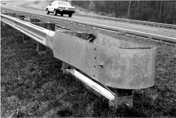

## 8.3.6.5.3 FLEAT Median Terminal (FLEAT-MT™)

The FLEAT-MT™, shown in Figure 8-16, is a proprietary, bidirectional median terminal utilizing all of the components of the roadside version plus four additional components. The main components of the FLEAT-MT™ are two impact heads, two modified Wbeam rails, standard W-beam rails, two breakaway cable anchor assemblies, and weakened steel or wood posts. The kinetic energy of a crash is absorbed by the head sliding along the rail element while bending it in a manner similar to the SKT-350™. The flattened rail exits the head on the traffic side and coils to the backside of the installation away from traffic.

## 8.3.6.5.4 X-Tension™ Median Attenuator System (X-MAS)

The X-MAS, shown in Figure 8-17, is a proprietary, bidirectional, energy-absorbing median terminal. The system uses three standard unaltered 3.8-m [12-ft, 6-in.] W-beam rail sections, an impact head, and two cables that run the length of the system. The length-ofneed point has been determined to be at the terminal's nose. A friction bar in the impact head allows the system to absorb the energy of the impact while in tension as opposed to compression. Steel and wood post options are available. For median terminal applications, the system is identical to the tangent and flared versions, except with the addition of a kit that converts it to a median terminal.

Roadside Design Guide 8-18

Figure 8-16. FLEAT Median Terminal (FLEAT-MT™)

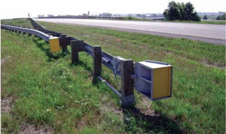

Figure 8-17. X-Tension™ Median Attenuator System (X-MAS)

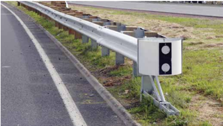

## 8.3.7 Terminals for Box-Beam Guardrail

This section describes end terminals and their design criteria for two box-beam guardrail systems. Table 8-4 lists these terminals with their respective information.

## Table 8-4. Terminals for Box-Beam Guardrail Systems

| Terminal                                                  |   NCHRP Report 350 Test Level | FHWA Acceptance Letter   | System Designation   | Manufacturer                  | Reference Section   |
|-----------------------------------------------------------|-------------------------------|--------------------------|----------------------|-------------------------------|---------------------|
| Wyoming Box-Beam End Terminal (WY-BET™)                   |                             3 | CC-60 CC-60A             | SEB03 SEB04 Median   | Trinity Highway Products, LLC | 8.3.7.1             |
| Bursting Energy Absorbing Terminal (BEAT™) and (BEAT-MT™) |                             3 | CC-69 CC-69A             | SEB05 SEB06 Median   | Road Systems, Inc.            | 8.3.7.2             |

## 8.3.7.1 Wyoming Box-Beam End Terminal (WY-BET™)

The WY-BET™, shown in Figure 8-18, is a proprietary (except in the State of Wyoming) energy-absorbing tangent terminal that consists of a nosepiece welded to a short section of 150-mm × 150-mm [6-in. × 6-in.] box beam inserted into a 175-mm × 75-mm [6 3 / 4 -in. × 6 3 / 4 -in.] tube and held in place by a wood post. A two-stage fiberglass composite tube is located inside the larger tube. When impacted, the nosepiece telescopes into the larger tube and crushes the composite tube to dissipate the kinetic energy. The WY-BET™ terminal may be installed parallel to the roadway or flared no steeper than 15:1. This terminal is used with the box-beam barrier dis -cussed in Chapter 5. There is also a version of the WY-BET™ available for installation in medians.

Figure 8-18. Wyoming Box-Beam End Terminal (WY-BET ™ )

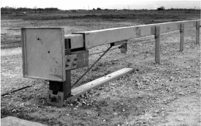

## 8.3.7.2 Bursting Energy Absorbing Terminal (BEAT™)

The BEAT™, shown in Figure 8-19, is an energy-absorbing tangential terminal designed to attach directly to the end of standard 150-mm × 150-mm [6-in. × 6-in.] box-beam barrier. It consists of an impact head, a box-beam rail end section, a steel breakaway end post, and a cable anchor system. To absorb impact energy, the impact head uses a mandrel to split the box-beam rail. It may be installed parallel to the roadway or flared. A version called the BEAT-MT™ is available for installation in medians.

Figure 8-19. Bursting Energy Absorbing Terminal (BEAT ™ )

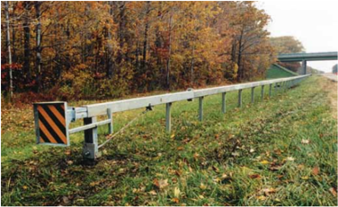

## 8.4 CRASH CUSHION DESIGN CONCEPTS

Crash cushions, also known as impact attenuators, are protective devices that significantly reduce the severity of impacts with fixed objects. This function is accomplished by gradually decelerating a vehicle to a safe stop for head-on impacts and by redirecting a vehicle away from the fixed object for side impacts. Crash cushions are ideally suited for use at locations where fixed objects cannot be removed, relocated, or made to break away, and where they cannot be adequately shielded by a longitudinal barrier.

Fixed objects that generally merit shielding when located within the designated clear zone for a specific highway are listed in Table 5-1. Some of these objects can be shielded only with a crash cushion, but most also can be shielded with a properly designed longitudinal barrier with crashworthy terminals. Crash cushions commonly are applied at an exit ramp gore on an elevated or depressed struc -ture in which a bridge rail end or a pier merits shielding. Crash cushions also are frequently used to shield the ends of median barriers.

Another special utilization for crash cushions is the protection of construction and maintenance personnel as well as motorists in work zones. Portable and temporary crash cushions have been developed to use in such situations. In addition, several truck-mounted attenuators (TMAs) are available to use in construction and maintenance zones. These types of crash cushions are discussed in detail in Chapter 9.

Crash cushions have proven to be an effective and safe means of shielding particular types of roadside obstacles that cannot be shielded by other methods. Their use has saved numerous lives by reducing the severity of crashes. Their relatively low cost and potentially high safety payoff make them ideally suited to use at selected locations. Like other safety hardware, crash cushions primarily serve to lessen the severity of crashes rather than prevent them from occurring.

This section briefly explains how crash cushions work and where their use may be considered. Descriptions, design procedures, selection guidelines, and placement recommendations for systems that have been successfully crash tested also are provided. Most operational crash cushions are patented and have been carefully designed and tested by their manufacturers. Acceptable units can be selected directly from the manufacturer's design charts, thus eliminating the need for case-by-case design in most instances.

--'',,',',,,,',,'',',,,,,''','',-'-',,',,',',,'---

## 8.4.1 Design Principles

A crash cushion's major contribution to highway safety is its ability to absorb the vehicle's kinetic energy at a controlled rate, decelerating an impacting vehicle to a stopped or nearly-stopped condition in a relatively short distance and in such a way that the potential for serious injury to its occupants is reduced. Commonly-used crash cushions generally employ one or both of two concepts to accomplish this task, the work-energy principle or the conservation of momentum principle.

## 8.4.1.1 Work-Energy Principle

The work-energy principle of crash cushion design involves the reduction of an impacting vehicle's kinetic energy to zero, which is the condition of a stopped vehicle.

The vehicle's initial kinetic energy is determined by the following formula, KE = 1 / 2 MV 2 where KE is the kinetic energy, M is the vehicle's mass, and V is the vehicle's initial velocity.

As the vehicle is slowed by the crash cushion, the vehicle's kinetic energy is reduced through conversion of kinetic energy into other forms of energy, including:

- Mechanical energy, dissipated through the deformation of the vehicle and crash cushion components,
- Potential energy, to the extent that crash cushion components and vehicle components will deform during the impact event and later will rebound toward a pre-crash shape,
- Heat energy, dissipated through friction generated by sliding components, and
- Sound energy, a minor factor, which is evidenced by the noise produced by the impact.

Work (W) done on an object, the object being the vehicle in the case of crash cushion design, is defined as the net change in kinetic energy of the object. Based on an assumption that the vehicle will be in a stopped condition at the conclusion of the impact, the 'work' done on the vehicle is equal to the vehicle's initial kinetic energy; thus the 'work-energy' principle.

In practice, each crash cushion system uses a unique combination of methods to convert the kinetic energy of an impacting vehicle into other forms of energy. Some devices will utilize 'crushable' or 'plastically deformable' materials. Other devices will utilize 'elastically-deformable' materials that will rebound to, or near to, their pre-crash shapes. All impacts with crash cushions will result in some damage to the impacting vehicle, which is a viable strategy for slowing the impacting vehicle as long as the potential for serious injury to the vehicle occupants is low. The conservation of momentum principle, as discussed below, is involved in all crash cushion impacts, since some portion of the vehicle's kinetic energy is transferred to components of the crash cushion by accelerating and moving them during the impact event.

There are many ways to manage the energy in a crash, and because these many ways can be applied in unique combinations, there are a wide variety of crash cushions systems available. These types of systems may be referred to as compression crash cushions. Crash cushions of this type need a rigid support structure or anchorage to resist the vehicle impact force that deforms the energy-absorbing material. There are currently no widely accepted methods to determine the performance of this type of device without full-scale crash tests, although computer simulation is frequently used to analyze new or modified designs prior to crash testing.

## 8.4.1.2 Conservation of Momentum Principle

The conservation of momentum principle  of crash cushion design involves the transfer of the momentum from the impacting vehicle to an expendable mass of material located in the vehicle's path. The expendable mass usually consists of containers filled with sand. Devices of this type need no rigid back-up or support to resist the vehicle's impact force. Instead, the vehicle's velocity and kinetic energy are incrementally reduced through momentum transfer by accelerating the sand particles found within the containers or barrels. This type of crash cushion is generally referred to as an 'inertial' crash cushion and is the only type whose design can be readily determined analytically. The procedure for so doing is illustrated in Section 8.4.3 on Sand Barrels.

Roadside Design Guide 8-22

--'',,',',,,,',,'',',,,,,''','',-'-',,',,',',,'---

## 8.4.2 Crash Cushions Based on Work-Energy Principle

Tables 8-5, 8-6, and 8-7 summarize the crash cushions that have been successfully tested in accordance with TL-2 or TL-3 conditions, under either NCHRP Report 350 or MASH procedures, and are discussed in the following subsections. It should be noted that some of these devices can be and have been used as roadside barrier terminals, but such use generally is not considered cost-effective.

Manufacturers design and market a variety of crash cushions that offer different tradeoffs among initial costs, repair and restoration costs, and maintenance characteristics. These devices can be classified as sacrificial, reusable, or low-maintenance and/or self-restor -ing, depending on the maintenance characteristics to restore performance following an impact by a vehicle. Depending on the known or expected crash frequency or severity at a particular location, life-cycle costs of various devices can be estimated and used as a factor in choosing a device at that site or similar ones.

While terminals are mostly designed for locations where traffic is found only on one side of a device, crash cushions often are placed in medians or at exit gores on freeways where traffic is on both sides. Highway designers need to account for another feature of crash cushions: products that are unidirectional, which refers to traffic traveling in the same direction on both sides of the crash cushion (e.g., as at a gore), and bidirectional, which refers to traffic moving in opposite directions on either side of the device.

Another feature the designer should understand is that several crash cushion vendors offer product lines referred to as product families. Products within a family have the same general characteristics but are rated at different speeds and widths. Other product lines do not have this divisibility.

Most crash cushions should be appropriately and adequately installed to a foundation pad and be sufficiently connected to a rigid backup. All systems have their own designs and products should be installed in accordance with the manufacturer's recommendations.

When a crash cushion is used in conjunction with a longitudinal barrier system, the designer should specify an appropriate transition section to positively connect the crash cushion with the longitudinal barrier system. In most situations in which the crash cushion is not directly attached to the object being shielded, a stand-alone backup anchorage is necessary. Check with the product manufacturer to obtain their recommended designs.

## 8.4.2.1 Sacrificial Crash Cushions

Sacrificial crash cushions are crashworthy roadside safety devices designed for a single impact. Most of the systems absorb impact energy by crushing the steel rail elements. Other devices have expendable plastic cartridges containing foam, sand, or water, which also absorb energy by crushing. These systems' major components are destroyed in impacts, but many of the other parts can be reused. These devices generally offer low initial costs and can be cost-effective if placed in locations where the designer expects infrequent crashes to occur. Table 8-5 lists many of the available crash cushions in this category.

Table 8-5. Sacrificial Crash Cushions

| Crash Cushion                                     | Test Level   | FHWA Acceptance Letter   | System Designation   | Manufacturer                  | Reference Section   |
|---------------------------------------------------|--------------|--------------------------|----------------------|-------------------------------|---------------------|
| Thrie-Beam Bullnose Guardrail System              | 3            | CC-68                    | SET03                | Generic                       | 8.4.2.1.1           |
| ABSORB 350®                                       | 3 2          | CC-66, A and B           | SCI11                | Barrier Systems, Inc.         | 8.4.2.1.2           |
| Advanced Dynamic Impact Extension Module (ADIEM™) | 3            | CC-38                    | SCI09                | Trinity Highway Products, LLC | 8.4.2.1.3           |
| BEAT-SSCC™                                        | 3            | CC-69B, D, and E         | SC113A-B             | Road Systems, Inc.            | 8.4.2.1.4           |

--'',,',',,,,',,'',',,,,,''','',-'-',,',,',',,'---

Table 8-5. Sacrificial Crash Cushions ( continued )

| Crash Cushion                                        |   Test Level | FHWA Acceptance Letter   | System Designation   | Manufacturer                    | Reference Section   |
|------------------------------------------------------|--------------|--------------------------|----------------------|---------------------------------|---------------------|
| BEAT-BP™                                             |            3 | CC-69C                   | SC112                | Road Systems, Inc.              | 8.4.2.1.5           |
| QuadTrend® 350                                       |            3 | CC-49                    | SET02                | Energy Absorption Systems, Inc. | 8.4.2.1.6           |
| Narrow Connecticut Impact Attenuation System (NCIAS) |            3 | CC-58 CC-77              | SCI08                | Generic                         | 8.4.2.1.7           |

## 8.4.2.1.1 Thrie-Beam Bullnose Guardrail System

One method for shielding objects in the median of a divided highway is to construct a guardrail envelope around the object. This treatment is commonly referred to as a bullnose. W-beam bullnose systems used by many states in the past are no longer considered crashworthy. A design was successfully tested under NCHRP Report 350 TL-3 and consists of slotted thrie-beam panels mounted on breakaway posts near the nose, followed by standard thrie-beam posts and blocks toward the back of the system. Based on the distance the pickup truck intruded into the system in the TL-3 end-on test, the leading edge of the bullnose system should be located a minimum distance of 19 m [62 ft] in advance of the shielded object and any transition to a bridge rail should not begin sooner than the ninth post from the nose. A set of steel retention cables is mounted on the back of the thrie-beam at the nose to contain vehicles in the event of rail rupture. Rail tension for length-of-need or downstream impacts is developed through cable anchors and struts. This system is non-proprietary and may be used in bidirectional traffic situations. Figure 8-20 shows the bullnose guardrail system.

Figure 8-20. Bullnose Guardrail System

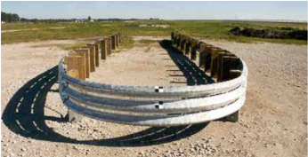

## 8.4.2.1.2 ABSORB 350®

The  ABSORB  350®  is  a  proprietary,  bidirectional,  non-redirective  crash  cushion  primarily  designed  to  shield  the  ends of  the  Quickchange  median  barrier.  However,  this  narrow  crash  cushion  also  may  be  used  to  shield  the  ends  of  temporary  and  permanent  concrete  barriers  in  general  or  to  shield  narrow  fixed  objects.  The  system  is  comprised  of  multiple  wa -ter-filled, energy-absorbing  elements,  a  nosepiece  assembly,  and  a  transition/attachment  assembly,  as  shown  in  Figure  8-21. This  system  can  be  placed  on  concrete,  asphalt,  or  soil,  and  it  is  not  anchored  to  the  foundation.  The  use  of  water  in  crash cushions  presents  some  concerns  in  climates  where  freezing  temperatures  can  be  expected.  A  deicing  solution,  such  as  cal -cium  chloride  or  any  other  state-approved  deicing  product,  should  be  used  to  keep  the  system  in  operation  during  the  winter.

Roadside Design Guide 8-24

Figure 8-21. ABSORB 350® Crash Cushion

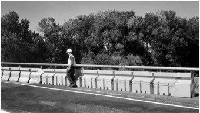

Figure 8-22. Advanced Dynamic Impact Extension Module (ADIEM™)

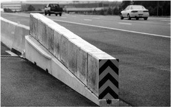

## 8.4.2.1.3 Advanced Dynamic Impact Extension Module (ADIEM™)

The ADIEM™, as shown in Figure 8-22, is a proprietary bidirectional crash cushion consisting of a concrete base structure onto which are mounted ten interlocking crushable perlite concrete modules. As it impacts the crash cushion, the vehicle crushes the modules to dissipate energy. Enhanced coatings and an optional cover are available to protect the perlite concrete modules from being signifi -cantly weakened when they become wet.

## 8.4.2.1.4 Bursting Energy Absorbing Terminal-Single Sided Crash Cushion (BEAT-SSCC™) System

The BEAT-SSCC™, shown in Figure 8-23, is a proprietary box-beam, energy-absorbing terminal that is similar to the BEAT guardrail end treatment. This variation attaches directly to rigid barrier, bridge abutments, or bridge rails. It uses an impact head, a two-staged system of energy-absorbing box-beam rails, and a transition section for attachment to a rigid roadside barrier.

--'',,',',,,,',,'',',,,,,''','',-'-',,',,',',,'---

Figure 8-23. Bursting Energy Absorbing Terminal-Single Sided Crash Cushion (BEAT-SSCC™) System

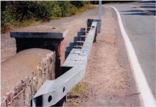

## 8.4.2.1.5 Bursting Energy Absorbing Terminal-Bridge Pier (BEAT-BP™) System

The BEAT-BP™ system, shown in Figure 8-24, is a proprietary self-contained system designed to shield bridge piers. It is symmetri -cal at both ends and consists of both a crash cushion similar to the BEAT-SSCC™ and a standard 150-mm × 150-mm [6-in. × 6-in.] box beam supported by standard steel posts. When installed in this configuration, it is considered bidirectional. The system is modular in nature, using a common set of components to adjust to the number, spacing, and diameter of the piers.

Figure 8-24. Bursting Energy Absorbing Terminal-Bridge Pier (BEAT-BP™) System

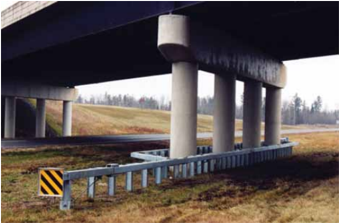

Roadside Design Guide

--'',,',',,,,',,'',',,,,,''','',-'-',,',,',',,'---

## 8.4.2.1.6 QuadTrend® 350

The QuadTrend® 350, shown in Figure 8-25, is a proprietary, unidirectional crash cushion designed and tested for direct attachment either to a structurally rigid vertical concrete barrier or to a vertical concrete bridge parapet without additional transition guardrail sections. Because there is no need for transition sections, this system is relatively short, especially when connected to rigid concrete barrier. This crash cushion is intended for use in roadside applications only.

Figure 8-25. QuadTrend® 350

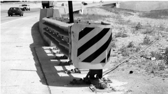

## 8.4.2.1.7 Narrow Connecticut Impact Attenuation System (NCIAS)

The NCIAS, shown in Figure 8-26, is a non-proprietary, unidirectional, energy-absorbing crash cushion that consists of eight steel cylinders in a single row with two anchored wire tension cables along each side. The crushing of the cylinders absorbs the kinetic energy of an end-on crash. The tension cables keep the cylinders in place and provide redirection to vehicles impacting the sides of the system. The last four cylinders are reinforced with pipe stiffeners and retainers to help redirect vehicles hitting close to the rear of the unit. The system is recommended for use at locations where reverse direction impacts are unlikely.

Figure 8-26. Narrow Connecticut Impact Attenuation System (NCAIS)

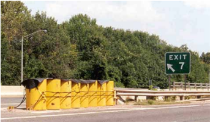

## 8.4.2.2 Reusable Crash Cushions

Reusable crash cushions have some major components that may be able to survive most impacts intact and can be salvaged when the unit is being repaired. Some of the components, however, need to be replaced after a crash to make the entire unit crashworthy again. The initial purchase and installation of reusable products generally are more expensive than sacrificial products, but in locations where designers expect to have frequent crashes, these devices may very well be cost-beneficial and appropriate. Table 8-6 lists commonly available reusable crash cushions.

Table 8-6. Reusable Crash Cushions

| Crash Cushion                                                                          | Test Level (TL)   | FHWA Acceptance Letter            | System Designation   | Manufacturer                    | Reference Section   |
|----------------------------------------------------------------------------------------|-------------------|-----------------------------------|----------------------|---------------------------------|---------------------|
| QuadGuard® Family QuadGuard 3-bay unit 6-bay unit QuadGuard Wide QuadGuard HS          | 2 3               | CC-35 B to H CC-42, 42A and CC-45 | SCT02A to D          | Energy Absorption Systems, Inc. | 8.4.2.2.1           |
| Universal TAU-II Family®                                                               | 2 3               | CC-75 A, B, and C                 | SCT01A and B         | Barrier Systems, Inc.           | 8.4.2.2.2           |
| Trinity Attenuating Crash Cushion (TRACC) Family TRAC™ FASTRACC™ SHORTRACC™ WIDETRACC™ | 2 and 3           | CC-54 A thru H                    | Not Posted           | Trinity Highway Products, LLC   | 8.4.2.2.3           |
| QUEST®                                                                                 | 3                 | CC-87                             | Not Posted           | Energy Absorption Systems, Inc. | 8.4.2.2.4           |

## 8.4.2.2.1 QuadGuard® Family

The name QuadGuard® refers to a family of proprietary, energy-absorbing crash cushions that are rated to various speeds and hazard widths. The design consists of several types of energy-absorbing cartridges supported by a framework of steel diaphragms and QuadBeam™ corrugated steel fender panels. All members of the family dissipate kinetic energy of a crash by telescoping rearward and crushing the cartridges. The cartridges on this system are sacrificial.

The QuadGuard® is bidirectional and designed to be used as a crash cushion for a concrete barrier or relatively narrow fixed objects for the standard width unit. A wide QuadGuard® also is available. The high-speed QuadGuard HS® model has been tested to 110 km/h [70 mph] for all required head-on and redirection tests. This higher impact speed is not recognized under NCHRP Report 350, but this system provides additional capacity for absorbing kinetic impact energy should a designer decide additional capacity is appropriate. Figure 8-27 shows a standard QuadGuard® unit. See Table 8-7 for other variations of the family that are suitable for highfrequency impact locations.

Figure 8-27. QuadGuard® Crash Cushion

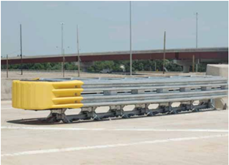

## 8.4.2.2.2 Universal TAU-II® Family

The name Universal TAU-II® refers to a family of proprietary, bi-directional, energy-absorbing crash cushions that are rated to various speeds and hazard widths while using a small group of common parts. Expandable bulkheads allow narrow and wide widths ranging from 760 mm to 2.6 m [2 ft, 6 in. to 8 ft, 6 in.] in 150-mm [6-in.] increments. Greater widths can be accomplished by adding additional standard thrie-beam panels. Speed ratings range from 50 km/h to 120 km/h [31 mph to 75 mph]. The crash cushions consist of two types of expendable energy-absorbing cartridges separated by steel diaphragms as well as thrie-beam sliding side panels. Figure 8-28 shows this eight-bay system.

Figure 8-28. TAU-II Crash Cushion

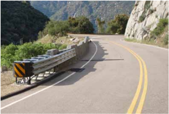

## 8.4.2.2.3 Trinity Attenuating Crash Cushion (TRACC™) Family

The TRACC ™ , shown in Figure 8-29, is a proprietary, bidirectional, energy-absorbing crash cushion that consists of a pair of guidance tracks, an impact sled, intermediate steel frames, and W-beam fender panels. The sled, or impact face, contains a hardened steel blade that absorbs the kinetic energy of an end-on impact by cutting the metal plates on the top sides of the guidance tracks as it is forced backwards. The intermediate frames support the W-beam fender panel and are free to slide backward on an end-on impact; on a side impact, however, they lock onto the guidance tracks to redirect the impacting vehicle. This family of crash cushions includes the SHORTRACC™ and FASTRACC™ for TL-2 and 110-km/h [70-mph] applications, respectively. Additionally, the WIDETRACC™ can protect vehicles from fixed objects of unlimited widths, because modular panels can be installed at the end of the system.

Figure 8-29. Trinity Attenuating Crash Cushion (TRACC™)

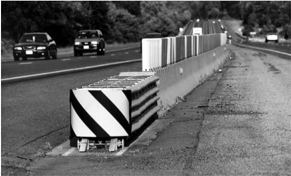

## 8.4.2.2.4 QUEST® Crash Cushion

The QUEST®, shown in Figure 8-30, is a proprietary, bidirectional, energy-absorbing crash cushion consisting of a trigger assembly, a sled, a diaphragm, a bridge, and W-beam fender panel assemblies. During head-on impacts, the trigger mechanism is activated, which releases the sled. The energy is dissipated through momentum transfer by reshaping the front rails with shapers attached to the sled and by peeling of flat metal plates welded to the inside surface of the panels. --'',,',',,,,',,'',',,,,,''','',-'-',,',,',',,'---

Figure 8-30. QUEST® Crash Cushion

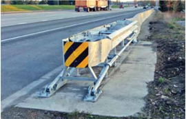

Roadside Design Guide 8-30

## 8.4.2.3 Low-Maintenance and/or Self-Restoring Crash Cushions

The crash cushions shown in Table 8-7 typically are considered for use at locations where a high frequency of impacts may be expected. The category of 'Low Maintenance and/or Self Restoring' crash cushions includes those devices that either suffer very little, if any, damage upon impact and are easily pulled back into their full operating condition, or they partially rebound after an impact and may only need an inspection to ensure that no parts have been damaged or misaligned. Although some attenuators can still function and save lives after being struck once, no device is completely maintenance free. It is important to note that devices in this category may be low-maintenace, self-restoring, or both. Inclusion of a device in this combined category does not imply that the device has both attributes. Often these products are installed in high-speed, high-traffic volume ramps or medians to reduce the exposure of maintenance workers to the traffic.

Table 8-7. Low-Maintenance and/or Self-Restoring Crash Cushions

| Crash Cushion                                                                             | Test Level   | FHWA Acceptance Letter         | System Designation   | Manufacturer                    | Reference Section   |
|-------------------------------------------------------------------------------------------|--------------|--------------------------------|----------------------|---------------------------------|---------------------|
| Compressor                                                                                | 3            | CC-95                          | Not Posted           | Traffix Devices                 | 8.4.2.3.1           |
| EASI-CELL                                                                                 | 1            | CC-71                          | SCI 15               | Energy Absorption Systems, Inc. | 8.4.2.3.2           |
| Hybrid Energy Absorbing Reusable Terminal (HEART™)                                        | 3            | CC-89 CC-89A                   | Not Posted           | Trinity Highway Products, LLC   | 8.4.2.3.3           |
| QuadGuard Elite 7-bay unit 8-bay unit 9-bay unit                                          | 2 3 3        | CC-57 CC-57A CC-57B            | SCT02e               | Energy Absorption Systems, Inc. | 8.4.2.3.4           |
| QuadGuard LMC 11-bay unit                                                                 | 3            | CC-43                          | SCT02f               | Energy Absorption Systems, Inc. | 8.4.2.3.5           |
| Reusable Energy Absorbing Crash Terminal (REACT 350 ® ) 4-cylinder array 9-cylinder array | 2 3          | CC-26,A-I CC-50,A-B, CC-73,A-C | SCI16a-b             | Energy Absorption Systems, Inc. | 8.4.2.3.6           |
| Smart Cushion Innovations (SCI) SCI-70GM SCI-100GM                                        | 2 3          | CC-85 A and B                  | SCI17a and b         | SCI Products, Inc.              | 8.4.2.3.7           |

## 8.4.2.3.1 Compressor™ Attenuator

The Compressor Attenuator, shown in Figure 8-31, is a proprietary, unidirectional, energy-absorbing crash cushion. It consists of highdensity polyethylene (HDPE) attenuator modules designed to efficiently absorb energy in a relatively short distance. The modules are mounted on a proprietary UNI-BASE™, which allows the unit to be installed quickly without the need for field assembly. The telescoping high-strength steel side panels redirect side impacts while protecting the absorbing modules from incidental damage. The unit is designed to take repeated impacts without any additional recovery procedures and with minimal or no repairs.

--'',,',',,,,',,'',',,,,,''','',-'-',,',,',',,'---

Figure 8-31. Compressor Attenuator

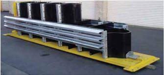

## 8.4.2.3.2 EASI-CELL® Cluster

The EASI-CELL® cluster system is a unidirectional, low-maintenance and self-restoring crash cushion designed for areas where space is limited and traffic speeds do not exceed 50 km/h [31 mph]. Hazards in these areas include tollbooths, utility poles, railroad crossing signals, and traffic signals. The system consists of a series of interconnected HDPE cylinders that anchor to the hazard on a concrete transition or a rigid steel backup structure, as shown in Figure 8-32.

Figure 8-32. EASI-CELL Cluster®

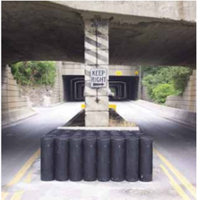

## 8.4.2.3.3 Hybrid Energy Absorbing Reusable Terminal (HEART™)

The HEART™ is a proprietary, energy-absorbing, unidirectional crash cushion that consists of three hinged high-molecular weight/ high-density polyethylene panels along each side connected to steel diaphragms mounted on tubular steel tracks, as shown in Figure 8-33. A curved nose panel consisting of a high-molecular weight/high-density polyethylene is mounted on the first steel diaphragm. A tensioned cable is attached to the upper release post and to the second steel diaphragm on each side. When the upper release post

Roadside Design Guide 8-32

--'',,',',,,,',,'',',,,,,''','',-'-',,',,',',,'---

is impacted, the tensioned steel cables attached to the second steel diaphragm release and the side panels and steel diaphragms are pushed toward the rear along the base track. The tracks allow longitudinal movement of the steel diaphragms during frontal impacts. A second set of terminal cables are attached to the second steel diaphragm and terminate on the rear side of the 10th diaphragm. The HEART™ can be used in bi-direction traffic provided the plastic side panels are lapped in the direction of traffic flow and an acceptable transition is used.

Figure 8-33. Hybrid Energy Absorbing Reusable Terminal (HEART™)

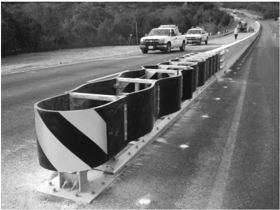

## 8.4.2.3.4 QuadGuard Elite

The QuadGuard Elite, shown in Figure 8-34, is a proprietary low-maintenance and self-restoring, bidirectional crash cushion designed for use at locations where high frequencies of impacts are anticipated. It can be used to shield rigid barriers or wider objects. The energy absorbing components of this system are high-density polyethylene cylinders that are reusable after most impacts.

Figure 8-34. QuadGuard Elite

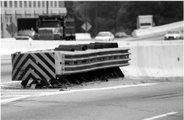

--'',,',',,,,',,'',',,,,,''','',-'-',,',,',',,'---

## 8.4.2.3.5 QuadGuard Low-Maintenance Cartridge (LMC)

The QuadGuard LMC, shown in Figure 8-35, is a proprietary low-maintenance and self-restoring, bidirectional crash cushion de -signed for use at locations where a moderately high frequency of impacts is anticipated. It can be used to shield rigid barriers or wide fixed objects. The energy-absorbing component of this system is made up of elastomeric cylinders that are reusable after most design impacts.

Figure 8-35. QuadGuard Low-Maintenance Cartridge (LMC)

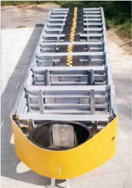

## 8.4.2.3.6 Reusable Energy-Absorbing Crash Terminal (REACT 350®)

The REACT 350®, shown in Figure 8-36, is a proprietary, bidirectional, energy-absorbing crash cushion that consists of a single row of 900-mm [3-ft] diameter, high-density, polyethylene cylinders atop steel skid rails, as well as a restraining cable system consisting of two heavy steel wire rope assemblies along each side. The polyethylene cylinders absorb the kinetic energy of frontal impacts by sliding toward the rear on the steel railing (they are self-restoring in many cases), while the steel cables redirect vehicles in side impacts. Over a five-day period, a 9-cylinder REACT 350® was subjected to three successive head-on impact tests (small passenger car, then two pickup trucks) and passed without any repair or resetting of the units between tests. A wider design consist of two parallel columns of cylinders attached to steel diaphragms is available up to 2.44 m [7 ft 6 in.] wide. --'',,',',,,,',,'',',,,,,''','',-'-',,',,',',,'---

Roadside Design Guide 8-34

Figure 8-36. Reusable Energy-Absorbing Crash Terminal (REACT 350®)

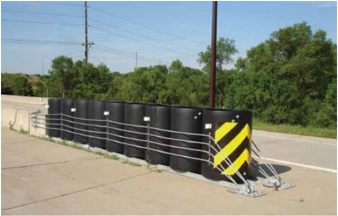

## 8.4.2.3.7 Smart Cushion Innovations 100GM and 70GM (SCI-100GM and SCI-70GM)

The SCI-100GM, shown in Figure 8-37, is a proprietary, energy-arresting, bidirectional crash cushion that consists of a base, side frame assemblies, a front sled assembly, a series of steel side panels mounted to collapsing steel frames, and a shock-absorbing cylinder. A steel cable attaches to the front sled assembly and then is routed around a front sheave to dual sheave assemblies located at the back of the attenuator. The shock-absorbing cylinder is metered to apply a variable resistive force to the cable in relation to the speed and mass of an impacting vehicle. When an end-on impact occurs, the unit telescopes backward, induces tension in the cable system, and the cable system compresses the shock-arresting cylinder. This device does not need a structural backup or connection to a rigid barrier, though transitions sections are still needed to provide redirection capabilities. Wide objects may be protected with transition kits. There also is a TL-2 version of the crash cushion, known as SCI-70GM.

Figure 8-37. Smart Cushion Innovations (SCI-100GM) Crash Cushion

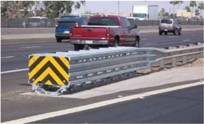

## 8.4.3 Crash Cushions Based on Conservation of Momentum Principle

Sand-filled plastic barrels, sometimes called inertial crash cushions or inertial barriers, often are used in both temporary and permanent installations to shield the ends of longitudinal barriers or other fixed objects.

Inertial systems are designed on the conservation of momentum principle, as noted in Section 8.4.1.2. Specifically, sand-filled plastic barrels dissipate the kinetic energy of an impacting vehicle by transferring the vehicle's momentum to the variable masses of sand in the barrels that are hit. Standard module masses are 91 kg [200 lb], 182 kg [400 lb], 318 kg [700 lb], 636 kg [1,400 lb], and 955 kg [2,100 lb]. The sand in the front modules is elevated to maintain a center-of-gravity consistent with that of impacting vehicles. No back-up structure or wall is needed for these barriers because the force that a vehicle exerts on the individual modules is not transmit -ted through the cushion.

Figure 8-38 illustrates the conservation of momentum principle applied to a vehicle impacting a series of five masses or containers filled with sand. The combined momentum of the vehicle and the sand after impact is effectively equal to the momentum of the vehicle just prior to impact. Momentum is equal to the mass of a body multiplied by its velocity, so:

<!-- formula-not-decoded -->

where

Mv = Mass of vehicle (kg or lb),

V o = Original impact velocity (m/s or ft/s),

M 1 = Mass of sand (kg or lb) in first barrel(s), and

V 1 = Velocity (m/s or ft/s) after first impact.

Applying the conservation of momentum principle, the vehicle speed after its first impact is

<!-- formula-not-decoded -->

This speed is then used as the initial speed as the vehicle strikes the second row of sand barrels. The final speed after the nth impact ( V n ) will be

<!-- formula-not-decoded -->

<!-- formula-not-decoded -->

Mn = the mass of sand in the nth container(s)

Theoretically, the vehicle cannot be stopped completely by this principle. Practically, it is usually adequate to design this type of crash cushion to reduce the vehicle velocity to about 16 km/h [10 mph] after the last module has been impacted. The remaining energy is imparted to the sand as the vehicle bulldozes through the modules. Although not necesssary, some manufacturers recommend placing one additional row of heavy modules beyond the point the vehicle velocity is reduced to less than 16 km/h [10 mph]. There are presently four types of these inertial crash cushion systems, as shown in Table 8-8. Figure 8-39 shows one of them: the Fitch Universal Barrel®.

Roadside Design Guide 8-36

V o = INITIAL SPEED

Figure 8-38. Conservation of Momentum Principle

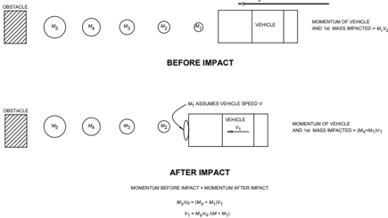

Table 8-8. Sand Barrel Systems

| Terminal               |   Test Level | FHWA Acceptance Letter   | System Designation   | Manufacturer                    | Reference Section   |
|------------------------|--------------|--------------------------|----------------------|---------------------------------|---------------------|
| Fitch Universal Barrel |            3 | CC-28                    | SCI06b               | Energy Absorption Systems, Inc. | 8.4.3               |
| ENERGITE III           |            3 | CC-29                    | SCI06a and SCI06c    | Energy Absorption Systems, Inc. | 8.4.3               |
| Big Sandy              |            3 | CC-52, 52A and 52B       | Not Posted           | TrafFix Devices, Inc.           | 8.4.3               |
| CrashGard              |            3 | CC-97                    | Not Posted           | Plastic Safety Systems, Inc.    | 8.4.3               |

Figure 8-39. The Fitch Universal Barrel®

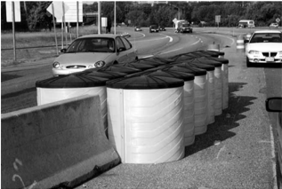

Although the parts that comprise the individual modules of each system have differences, the overall size and mass of the modules of these systems are so similar that the modules can be intermixed in the same array without affecting the performance of the crash cushion. All of the inertial systems have been extensively crash tested and have generally performed successfully for many years. The standard module masses provide adequate flexibility in the shape, depth, and width of a crash cushion array so that virtually any type or shape of fixed object can be shielded. Trial layouts should be checked to confirm acceptable or tolerable deceleration limits for both the small passenger car and pickup truck test vehicles. Example design procedures and calculations are shown in Table 8-9.

None of the systems are designed to redirect vehicles for side impacts; consequently, modules near the rear of the array should be carefully placed to minimize the likelihood of a motorist striking the corner of the obstacle being shielded. Figure 8-40 shows a suggested layout for the last three exterior modules in an inertial barrier. Although this arrangement will not accommodate all side impacts at recommended deceleration levels, it may be an acceptable compromise at sites where rear corner impacts are likely to be rare.

Figure 8-40. Suggested Layout for the Last Three Exterior Modules in an Inertial Barrier

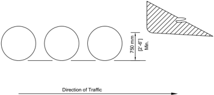

Roadside Design Guide 8-38

--'',,',',,,,',,'',',,,,,''','',-'-',,',,',',,'---

Table 8-9. Sample Design Calculation for a Sand-Filled Barrel System

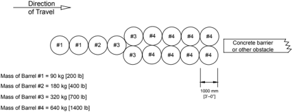

Design Velocity = 100 km/h (27.8 m/s) 60 mph (88.0 ft/s)]

| M 1 (kg)   | 820 kg Vehicle   | 820 kg Vehicle   | 820 kg Vehicle   | 820 kg Vehicle   | 2000 kg Vehicle   | 2000 kg Vehicle   | 2000 kg Vehicle   | 2000 kg Vehicle   |
|------------|------------------|------------------|------------------|------------------|-------------------|-------------------|-------------------|-------------------|
| M 1 (kg)   | V O (m/s)        | V 1 (m/s)        | G                | t (s)            | V O (m/s)         | V 1 (m/s)         | G                 | t (s)             |
| 90         | 27.8             | 25.0             | 7.40             | 0.038            | 27.8              | 26.6              | 3.31              | 0.037             |
| 90         | 25.0             | 22.6             | 6.01             | 0.042            | 26.6              | 25.4              | 3.04              | 0.038             |
| 180        | 22.6             | 18.5             | 8.50             | 0.049            | 25.4              | 23.3              | 5.22              | 0.041             |
| 320        | 18.5             | 13.3             | 8.42             | 0.063            | 23.3              | 20.1              | 7.13              | 0.046             |
| 640        | 13.3             | 7.5              | 6.18             | 0.096            | 20.1              | 15.2              | 8.79              | 0.057             |
| 1,280      | 7.5              | 2.9              | 2.41             | 0.192            | 15.2              | 9.3               | 7.44              | 0.082             |
| 1,280      |                  |                  |                  |                  | 9.3               | 5.7               | 2.77              | 0.134             |
| 1,280      |                  |                  |                  |                  | 5.7               | 3.5*              | 1.03              | 0.219             |
|            | 1,800 lb Vehicle | 1,800 lb Vehicle | 1,800 lb Vehicle | 1,800 lb Vehicle | 4,400 lb Vehicle  | 4,400 lb Vehicle  | 4,400 lb Vehicle  | 4,400 lb Vehicle  |
| M 1 (lb)   | V O (ft/s)       | V 1 (ft/s)       | G                | t (s)            | V O (ft/s)        | V 1 (ft/s)        | G                 | t (s)             |
| 200        | 88.0             | 79.2             | 7.62             | 0.036            | 88.0              | 84.2              | 3.41              | 0.035             |
| 200        | 79.2             | 71.3             | 6.17             | 0.040            | 84.2              | 80.5              | 3.12              | 0.036             |
| 400        | 71.3             | 58.3             | 8.69             | 0.046            | 80.5              | 73.8              | 5.36              | 0.039             |
| 700        | 58.3             | 42.0             | 8.48             | 0.060            | 73.8              | 63.7              | 7.21              | 0.044             |
| 1,400      | 42.0             | 23.6             | 6.24             | 0.091            | 63.7              | 48.3              | 8.91              | 0.054             |
| 2,800      | 23.6             | 9.2              | 2.45             | 0.183            | 48.3              | 29.5              | 7.57              | 0.077             |
| 2,800      |                  |                  |                  |                  | 29.5              | 18.0              | 2.83              | 0.126             |
| 2,800      |                  |                  |                  |                  | 18.0              | 11.0*             | 1.06              | 0.206             |

<!-- formula-not-decoded -->

My, = mass of vehicle

Vo = original velocity

M, = mass of container

V, = velocity of vehicle after impacting one row of containers

D deceleration distance

=

a= deceleration rate g = acceleration of gravity G = deceleration force

t= time of event (seconds)

* At this point, the vehicle is traveling at less than 15 km/h [10 mph] and is stopped by the 'bulldozing' action of the vehicle rolling through sand and one additional row of heavy containers.

Although the design procedure for inertial barriers is relatively straightforward, the manufacturers of currently operational systems have developed design charts that can be used to select a layout or to check a design for adequacy.

The manufacturers also have developed standard arrays that can be used for specific types of fixed objects as well as design charts that may be used to analyze a particular layout. More detailed information can be obtained directly from the manufacturers. Sand barrel modules should be set as far from the traveled way as possible to minimize the number of brush or nuisance hits. However, the width of the last row of modules should be greater than the width of the shielded object as suggested in Figure 8-40. This configuration will soften the impact of vehicles that strike the rear portion of the crash cushion at an angle and provide some deceleration before the vehicle reaches the fixed object.

Some risk is inherent when using the 960-kg [2,100-lb] module at the rear of the array if it is the first (or only) one struck in a corner impact, particularly by a low-mass vehicle. If space permits, extra rows of lighter modules may be placed alongside the array to make it softer for rear-corner, angle impacts. Similarly, in locations where the heavier modules may be exposed to reverse direction impacts, some agencies place lighter modules alongside the barrier; one state's practice is illustrated in Figure 8-41.

Figure 8-41. Sand Barrel Array for Reverse-Direction Impacts

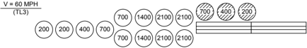

Some highway agencies recommend orienting the sand barrel array at angles up to 15 degrees toward approaching traffic as an alter -native way to address this concern; refer to Figure 8-42. Also, space should be left behind the last row of modules so sand and debris will not be confined to produce a ramping effect on the impacting vehicle. Approximately 450 mm [1 ft, 6 in.] is the recommended minimum space needed.

If the sand contains a high enough moisture content and temperatures remain below freezing for several days, the sand may freeze. Testing has shown that frozen sand reduces the safety performance of inertial barriers to some degree and produces large blocks of frozen sand that can be thrown up to 20 m [65 ft] during an impact. Mixing a percentage (by volume) of rock salt with the sand will prevent wet sand from freezing under most conditions. This percentage could range from 5 to 25 percent depending on the climate. Each highway agency should determine through experience which proportions produce satisfactory results. The use of pea gravel also may be considered because this material will drain well and is less likely to freeze than wet sand. The downside of pea gravel is that it tends to disperse more broadly than sand and may be more difficult to clean up.

The sand barrels have been sized to hold a standard mass [weight] based on a sand density of 1,600 kg/m 3 [100 lb/ft 3 ]. Moisture content of the loose sand should be 3 percent or less and clean sand should be used to minimize caking. A significant variation in the density of the sand could have some effect on the performance of the crash cushion. The designer using the design procedures already described can readily check this effect. --'',,',',,,,',,'',',,,,,''','',-'-',,',,',',,'---

In the past, some agencies have filled the sand barrels with sacked sand to facilitate cleanup after an impact. Although crash tests demonstrated acceptable performance with a 2,000-kg [4,500-lb] passenger car, higher than desirable occupant deceleration levels were observed with an 820-kg [1,800-lb] passenger car, plus some passenger compartment intrusion. Thus, the use of sacked sand is no longer considered acceptable.

Figure 8-42. Sand Barrel Array Oriented Towards Approaching Traffic

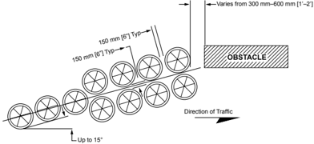

## 8.4.4 Miscellaneous Crash Cushions and End Treatments for Concrete Barriers

Table 8-10 includes descriptions of several systems that have been designed to address specific roadside circumstances.

Table 8-10. Miscellaneous Crash Cushions and End Treatments

| Crash Cushion                        | NCHRP Report 350 Test Level   | FHWA Acceptance Letter   | System Designation   | Manufacturer                          | Reference Section   |
|--------------------------------------|-------------------------------|--------------------------|----------------------|---------------------------------------|---------------------|
| Sloped Concrete End Treatment        | N/A                           | N/A                      | N/A                  | Generic                               | 8.4.4.1             |
| Buried Concrete Barrier              | N/A                           | N/A                      | N/A                  | Generic                               | 8.4.4.2             |
| Dragnet                              | 3                             | CC-70                    | SWM02                | Impact Absorption, Inc.               | 8.4.4.3             |
| GRAB®                                | 2                             | CC-74                    | Not Posted           | Universal Safety Response, Inc. (USR) | 8.4.4.4             |
| Gravel Bed Attenuator                | N/A                           | N/A                      | Not Posted           | Generic                               | 8.4.4.5             |
| STOPGATE®                            | 2                             | CC-55                    | SCI19                | Energy Absorption Systems, Inc.       | 8.4.4.6             |
| Florida Low-Profile Barrier Terminal | 2                             | CC-106                   | SER04                | Generic                               | 8.4.4.7             |

Note: N/A = not applicable

## 8.4.4.1 Sloped Concrete End Treatment

When preferred treatments are not feasible, terminating a concrete barrier by tapering the end is occasionally necessary, even though this end treatment has not met acceptable crash-testing criteria. This treatment should be used only in locations where the traffic speeds are 60 km/h [40 mph] or less and space is limited by right-of-way constraints or the other roadside features that preclude using a crashworthy end treatment. Recommended length of the taper is 6 m [20 ft], with 9 m to 12 m [30 ft to 40 ft] desirable. The height of the end of the taper should be no greater than 102 mm [4 in.] (8) . Other applications include locations where the barrier is flared out beyond the clear zone or where end-on impacts are not likely to occur. Figure 8-43 shows a typical tapered end treatment on a concrete barrier.

Figure 8-43. Sloped Concrete End Treatment

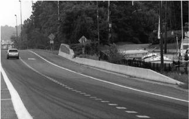

## 8.4.4.2 Buried Concrete Barrier Terminal

In areas of roadway cut sections or where the road is transitioning from cut to fill, it is sometimes possible to terminate concrete barriers by burying them in the backslope. Figure 8-44 illustrates a buried concrete barrier terminal. Design considerations for this terminal are similar to the buried-in-backslope terminal for W-beam guardrails discussed in Section 8.3.6.1, except generally it is not recommended to flare the concrete barrier across foreslopes steeper than 1V:10H.

## 8.4.4.3 Dragnet

The Dragnet or chain link fence vehicle attenuator, shown in Figure 8-45, is a proprietary device. Designed to stop passenger vehicles impacting under TL-3 conditions, the Dragnet consists of anchor posts, energy-absorbing reels of steel tape, and a net assembly. When impacted, the chain-link fence wraps around the front of the impacting vehicle and the kinetic energy of the car is absorbed as the metal tape is pulled through a series of rollers in its casing. The system is repaired by replacing the steel tape in the casings and resetting the chain-link fence and cable.

This type of attenuator may be considered at locations where impacts are expected to be head-on and the results of vehicle passage are severe. Typical locations might include temporary road and ramp closures or in conjunction with a longitudinal barrier to shield the opening between twin bridges. The Dragnet also has been used in series to stop large vehicles where space limitations do not permit the use of a gravel arrester bed. Such a system safely stopped a 22,700-kg [50,000-lb] tractor-trailer impacting at 90 degrees and 80 km/h [50 mph]. Since the Dragnet is designed to deflect significantly, it can be used effectively only at locations where a clear area exists behind it. The Dragnet also produces low deceleration rates, where very little damage is done to impacting vehicles and serious injuries to vehicle occupants are unlikely.

Roadside Design Guide 8-42

Figure 8-44. Barrier Anchored in Backslope

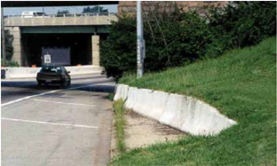

Figure 8-45. Dragnet

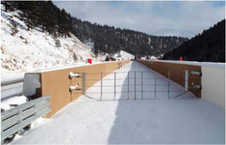

## 8.4.4.4 Ground Retractable Automotive Barrier (GRAB-300®)

The GRAB, shown in Figure 8-46, is a proprietary attenuating device designed to span a roadway or a traffic lane to prevent vehicle passage by bringing an encroaching vehicle to a controlled stop. Potential locations where the GRAB might be used include highwayrailroad crossings, drawbridges, and closed high-occupancy vehicle (HOV) lanes. The system consists of steel anchor posts, hydraulic energy absorbers, and a cable/net assembly. It is accepted to TL-2 test conditions and may be appropriate for lower-speed locations. Although the net can be deployed in a matter of seconds, it normally lies flat in a grooved rubber pad recessed into the pavement. Because it does span traffic lanes, appropriate delineation of the GRAB is important.

Figure 8-46. Ground Retractable Automotive Barrier (GRAB-300 ® )

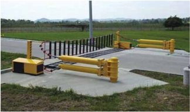

## 8.4.4.5 Gravel-Bed Attenuator

This design feature is most typically used on truck escape ramps along descending highway grades where runaway vehicles have been or are likely to be a problem. Loss of brakes on a vehicle on such a grade increases the potential for the vehicle to leave the roadway or impact other vehicles. Where such problems occur, special consideration should be given to installing a roadside deceleration device. One device commonly used is the gravel-bed attenuator. Some states have installed similar systems with good results, primarily to decelerate large vehicles safely. Note, however, that NCHRP Report 350 does not include specific test criteria for large-vehicle attenuation.

Detailed design guidelines for this type of vehicle attenuating feature are contained in AASHTO's A Policy on Geometric Design of Highways and Streets (1) .

## 8.4.4.6 STOPGATE®

The STOPGATE ® , shown in Figure 8-47, is a proprietary crashworthy roadway barrier designed to keep vehicles from encroaching onto railroad tracks when trains are present. Unlike traditional warning gates, STOPGATE ® creates a positive barrier that does not allow vehicles to pass around the lowered gate arm. The barrier features an internal absorption steel cable assembly in the safety barrier gate arm that is deployed by using a vertical pivot action similar to existing warning gates. The vehicle stopping distance is purposely short. Security versions of this system are available to meet Department of Defense and Department of Homeland Security standards.

Figure 8-47. STOPGATE ®

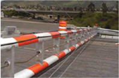

Roadside Design Guide 8-44

## 8.4.4.7 Florida Low-Profile Barrier Terminal

This terminal is designed for use with the Florida Low-Profile Barrier. It is 6.1 m [20 ft] long and is composed of two sections: one 3.7-m [12-ft] reinforced concrete segment and one 2.4-m [8-ft] steel segment. The height of the terminal tapers from 457 mm [18 in.] at the point of connection to the low-profile barrier to 50 mm [2 in.] at the end of the terminal. This terminal was successfully crash tested in accordance with NCHRP Report 350 TL-2. Barrier resistance in both inertial mass and contact surface friction serves to redirect TL-2 impact forces without requiring any positive mechanical connection to the roadway surface.

## 8.4.5 Crash Cushion Selection Guidelines

The number and complexity of factors that enter the selection process for crash cushions preclude the development of a simple selection procedure. Each operational system has its own unique physical and functional characteristics. In some cases, one crash cushion will stand out as the most appropriate, but in most instances, two or more types of crash cushions will provide satisfactory protection to an errant motorist and the designer should choose between them. Once a decision has been made that a roadside feature should be shielded and that a crash cushion is the appropriate way to shield it, the designer should consider the following factors before making a final selection:

- Site characteristics,
- Structural and safety characteristics of candidate systems,
- Cost,
- Maintenance characteristics,
- Selection criteria, and
- Inclusion criteria.

Each of these factors is discussed in the following subsections.

## 8.4.5.1 Site Characteristics

During the preliminary design stages for new construction and for rehabilitation or reconstruction of existing highways, making provi -sions for adequate space for crash cushions to shield non-removable fixed objects should be considered. This will promote compatibil -ity between the final design and the crash cushion that is to be installed. Table 8-11 suggests the area that should be made available for crash cushion installation. Although it depicts a gore location, the same recommendations will generally apply to other types of fixed objects that are to be shielded. The unrestricted conditions represent the minimum dimensions for all locations except for those sites where it can be demonstrated that the increased costs for obtaining these dimensions (as opposed to those for restricted conditions) will be unreasonable. Note that the information provided in this table is generic and may not be adequate for some systems. Therefore, it is recommended that the designer look at the various available systems that will adequately shield the obstacle and determine the space needed from the manufacturer's specifications.

The designer should be aware of site conditions that might dictate the type of crash cushion needed. For example, fixed objects, such as rigid barrier ends that are less than 900 mm [3 ft] wide, should be shielded by a narrow crash cushion. Similarly, wide obstacles, such as those greater than 5 m [16 ft], can be effectively shielded by sand barrel arrays.

## 8.4.5.2 Crash Cushion Structural and Safety Characteristics

When more than one crash cushion system is under consideration, the designer should carefully evaluate the structural and safety characteristics of each candidate system, including such factors as impact decelerations, redirection capabilities, anchorage and backup structure needs, and debris produced by impact.

Table 8-11. Area Available for Crash Cushion Installation

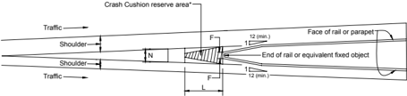

|                                 | Dimensions for Crash Cushion, Reserve Area (m)   | Dimensions for Crash Cushion, Reserve Area (m)   | Dimensions for Crash Cushion, Reserve Area (m)   | Dimensions for Crash Cushion, Reserve Area (m)   | Dimensions for Crash Cushion, Reserve Area (m)   | Dimensions for Crash Cushion, Reserve Area (m)   | Dimensions for Crash Cushion, Reserve Area (m)   | Dimensions for Crash Cushion, Reserve Area (m)   | Dimensions for Crash Cushion, Reserve Area (m)   |
|---------------------------------|--------------------------------------------------|--------------------------------------------------|--------------------------------------------------|--------------------------------------------------|--------------------------------------------------|--------------------------------------------------|--------------------------------------------------|--------------------------------------------------|--------------------------------------------------|
| Design Speed on Main Line       | Minimum                                          | Minimum                                          | Minimum                                          | Minimum                                          | Minimum                                          | Minimum                                          |                                                  |                                                  |                                                  |
| (km/h)                          | Restricted Conditions                            | Restricted Conditions                            | Restricted Conditions                            | Unrestricted Conditions                          | Unrestricted Conditions                          | Unrestricted Conditions                          | Preferred                                        | Preferred                                        | Preferred                                        |
|                                 | N                                                | L                                                | F                                                | N                                                | L                                                | F                                                | N                                                | L                                                | F                                                |
| 50                              | 2                                                | 2.5                                              | 0.5                                              | 2.5                                              | 3.5                                              | 1                                                | 3.5                                              | 5                                                | 1.5                                              |
| 80                              | 2                                                | 5                                                | 0.5                                              | 2.5                                              | 7.5                                              | 1                                                | 3.5                                              | 10                                               | 1.5                                              |
| 110                             | 2                                                | 8.5                                              | 0.5                                              | 2.5                                              | 13.5                                             | 1                                                | 3.5                                              | 17                                               | 1.5                                              |
| 130                             | 2                                                | 11                                               | 0.5                                              | 2.5                                              | 17                                               | 1                                                | 3.5                                              | 21                                               | 1.5                                              |
| Design Speed on Main Line (mph) | Dimensions for Crash Cushion, Reserve Area (ft)  | Dimensions for Crash Cushion, Reserve Area (ft)  | Dimensions for Crash Cushion, Reserve Area (ft)  | Dimensions for Crash Cushion, Reserve Area (ft)  | Dimensions for Crash Cushion, Reserve Area (ft)  | Dimensions for Crash Cushion, Reserve Area (ft)  | Dimensions for Crash Cushion, Reserve Area (ft)  | Dimensions for Crash Cushion, Reserve Area (ft)  | Dimensions for Crash Cushion, Reserve Area (ft)  |
|                                 | Minimum                                          | Minimum                                          | Minimum                                          | Minimum                                          | Minimum                                          | Minimum                                          |                                                  |                                                  |                                                  |
|                                 | Restricted Conditions                            | Restricted Conditions                            | Restricted Conditions                            | Unrestricted Conditions                          | Unrestricted Conditions                          | Unrestricted Conditions                          | Preferred                                        | Preferred                                        | Preferred                                        |
|                                 | N L                                              |                                                  | F                                                | N                                                | L                                                | F                                                | N                                                | L                                                | F                                                |
| 30                              | 6                                                | 8                                                | 2                                                | 8                                                | 11                                               | 3                                                | 12                                               | 17                                               | 4                                                |
| 50                              | 6                                                | 17                                               | 2                                                | 8                                                | 25                                               | 3                                                | 12                                               | 33                                               | 4                                                |
| 70                              | 6                                                | 28                                               | 2                                                | 8                                                | 45                                               | 3                                                | 12                                               | 55                                               | 4                                                |
| 80                              | 6                                                | 35                                               | 2                                                | 8                                                | 55                                               | 3                                                | 12                                               | 70                                               | 4                                                |

Note: N = for preliminary design purposes, an assumed width of space necessary for the placement of a crash cushion.

L = for preliminary design purposes, an assumed length of space necessary for the placement of a crash cushion.

F = for preliminary design purposes, an assumed maximum width of a fixed object that will need to be shielded with a crash cushion.

Roadside Design Guide 8-46

All of the systems described in this chapter as meeting MASH or NCHRP Report 350 TL-3 evaluation criteria have the capability to stop both compact cars and pickup trucks impacting head-on at 100 km/h [62 mph] within tolerable deceleration levels and redirect or contain those vehicles impacting on the sides of the units within the system's length-of-need.

Most of the crash cushion systems previously described may be configured to accommodate lesser impact speeds when site and op -erational conditions permit. Note that additional lower mass sand barrel modules sometimes could be added to an array to reduce the expected deceleration forces to lower levels. This is especially true when the shielded object is well off the roadway and the additional modules do not significantly reduce a motorist's ability to avoid a crash.

## 8.4.5.3 Costs

Cost considerations should include initial material costs, site preparation costs, installation costs, maintenance costs, and repair or replacement costs. Site preparation costs can be significant when accommodating certain systems. At locations where frequent hits are expected, life-cycle costs for repairing or replacing a crash cushion system also may become a significant factor in the selection process.

## 8.4.5.4 Maintenance Characteristics

Frequently, the most appropriate crash cushion still will not be evident after analyzing the site conditions, operational characteristics, and the initial costs of candidate systems. The maintenance characteristics of each crash cushion will, in many cases, play an important role in the selection process. Table 8-12 summarizes pertinent maintenance characteristics of each crash cushion. This information is based primarily on subjective evaluations. When available, individual agency maintenance records should be used to establish costs associated with the types of crash cushions in actual use. Although the information in Table 8-12 will permit a designer to compare the relative maintenance characteristics of candidate systems, there is no substitute for knowing the actual maintenance needs and costs for in-service installations. Each agency should consider documenting this information so it is available to the designer.

Maintenance characteristics can be conveniently categorized as regular (or routine) maintenance, crash maintenance, and material inventory needs. Each category is described in Table 8-12.

Many systems described in this chapter need relatively little regular or routine maintenance. However, it is important that periodic maintenance checks are performed, so that each installed unit remains fully functional. If a crash cushion is located in an area that is accessible to pedestrians, vandalism may be a problem. Some cracking problems have occurred in the past with the plastic containers used in the inertial systems. These problems have been attributed in part to vibration (when the sand barrels were located on structures), to calcium chloride (when mixed with sand to prevent freezing), and to design problems with the seams of some first-genera -tion modules. It appears that these problems have been solved through improved designs. Plastic sand barrels eventually will degrade from exposure to ultraviolet light; barrels older than 10 years should be inspected more frequently and replaced when necessary.

Crash maintenance characteristics demand special consideration because they may dictate the most effort and expenditure during the life of an installation. If a particular site has a relatively high frequency of crashes, using a crash cushion that has some degree of reusability or self-restoration is recommended. Similarly, if nuisance hits are relatively common, a crash cushion with redirection capability should reduce or eliminate the maintenance effort for minor repairs or partial replacement of a system. The availability of the replacement parts needed to restore a damaged crash cushion to its original capacity is closely associated with repair time and cost. Thus, the type and amount of spare parts that should be kept on hand or quickly obtainable to repair each type of crash cushion in use by an agency may play an important role in the final selection process. The fewer different types of crash cushions used by an agency, the easier it becomes to establish and maintain an adequate inventory of replacement parts. Ideally, permanent repairs should be made very quickly. If not, appropriate temporary measures should be taken to afford a reasonable level of protection or delineation until the original crash cushion can be restored.

--'',,',',,,,',,'',',,,,,''','',-'-',,',,',',,'---

Table 8-12. Comparative Maintenance Characteristics

| Sacrificial Crash Cushions                                                  | Sacrificial Crash Cushions                                                                                                                                                                                       | Sacrificial Crash Cushions                                                                                                                                                  | Sacrificial Crash Cushions                                                                                          |
|-----------------------------------------------------------------------------|------------------------------------------------------------------------------------------------------------------------------------------------------------------------------------------------------------------|-----------------------------------------------------------------------------------------------------------------------------------------------------------------------------|---------------------------------------------------------------------------------------------------------------------|
| Crash Cushion                                                               | Regular Maintenance                                                                                                                                                                                              | Crash Maintenance                                                                                                                                                           | Material Inventory                                                                                                  |
| Thrie-Beam Bullnose Guardrail System                                        | Can be inspected on a drive-by. Cable tension should be checked periodically.                                                                                                                                    | Rail elements and posts should be replaced. Cables and foundation tubes are normally reusable.                                                                              | Slotted thrie-beam rail elements and wood posts.                                                                    |
| ABSORB 350 ®                                                                | Normally can be inspected on a drive- by. Periodic on-site inspections should be performed to be certain that all parts are properly connected. Need to check water level. When winterized, check deicing agent. | Nose-piece and damaged energy-ab- sorbing elements should be replaced.                                                                                                      | Replacement nosepiece, energy- absorbing elements, and fluid supply. Other parts per manufacturer's recommendation. |
| ADIEM™                                                                      | Modules should be closely inspected for damage.                                                                                                                                                                  | Damaged concrete modules should be replaced. Damaged covers also should be replaced. Most other parts normally are reusable.                                                | Replacement concrete modules, cov- ers, and other parts per the manufac- turer's recommendation.                    |
| BEAT-SSCC™                                                                  | Normally can be inspected on a drive-by. Periodic on-site inspections should be performed to be certain that all parts are properly connected and anchor cable is not slack.                                     | Damaged tubes and posts should be replaced. Impact head is normally reusable.                                                                                               | End tube, second tube, breakaway posts.                                                                             |
| BEAT-BP™                                                                    | Normally can be inspected on a drive-by. Periodic on-site inspections should be performed to be certain that all parts are properly connected and anchor cable is not slack.                                     | Damaged tubes and posts should be replaced. Impact head is normally reusable.                                                                                               | End tube, second tube, standard line tubes, breakaway posts, and standard line posts.                               |
| QUADTREND 350 ®                                                             | As this device uses sand-filled contain- ers, there is concern for freezing of sand in cold climates. See Section 8.4.3 for more information.                                                                    | Most major components should be reusable after a crash.                                                                                                                     | Spare parts per manufacturer's recommendation.                                                                      |
| NCIAS                                                                       | Can be inspected on a drive-by.                                                                                                                                                                                  | Crushed units should be removed from site; minor damage can be repaired on-site by jacking.                                                                                 | Spare cylinders to replace badly damaged units.                                                                     |
| Sand-Filled Barrels                                                         | Can be inspected on a drive-by for external damage. If lids are not riveted on, sand content should be checked periodically. See Section 8.4.3 for information on using sand-filled barrels in cold climates.    | Individual sand barrels should be re- placed after a crash; units damaged by nuisance hits also should be replaced. Debris should be removed from the site.                 | Spare barrels, sand support inserts, and lids; supply of sand.                                                      |
| Reusable Crash Cushions                                                     | Reusable Crash Cushions                                                                                                                                                                                          | Reusable Crash Cushions                                                                                                                                                     | Reusable Crash Cushions                                                                                             |
| QuadGuard ®                                                                 | Normally can be inspected on a drive- by; missing or displaced cartridges can be readily noted. Should be periodical- ly inspected on-site to be certain that all parts are properly connected.                  | Nose, expended cartridges, and damaged fender panels should be replaced. Unit should be repositioned.                                                                       | Spare cartridges, nose units, fender panels, and other parts per manufacturer's recommendation.                     |
| Universal TAU-II™ Family --'',,',',,,,',,'',',,,,,''','',-'-',,',,',',,'--- | Normally can be inspected on a drive- by. Periodic on-site inspections should be performed to be certain that all parts are properly connected.                                                                  | After a frontal impact, the system can be pulled out to restore the proper length. Replace damaged cartridges. During some side impacts, the sliding panels may be damaged. | Cartridges, sliding panels, pipe panel mounts, and nose pieces per manufacturer's recommendations.                  |

Roadside Design Guide

8-48

Table 8-12. Comparative Maintenance Characteristics ( continued )

| TRACC™                                               | Normally can be inspected on a drive- by. Periodic on-site inspections should be performed to be certain that all parts are properly connected.   | The rip plates need replacement. Newer versions of the TRACC eliminate need for extensive disassembly. The nose and fender panels also may need replacement.                                                                                                            | Replacement rip plates, nose sections, fender panels, and other replacement parts per manufacturer's recommendation.   |
|------------------------------------------------------|---------------------------------------------------------------------------------------------------------------------------------------------------|-------------------------------------------------------------------------------------------------------------------------------------------------------------------------------------------------------------------------------------------------------------------------|------------------------------------------------------------------------------------------------------------------------|
| QUEST ®                                              | Normally can be drive-by inspected. Periodic on-site inspections should be performed to be certain that all parts are properly connected.         | The nose, fender panels, and energy- absorbing rails or tubes need replace- ment after impacts. Open design allows for easy repair.                                                                                                                                     | The nose, fender panels, and energy- absorbing rails or tubes and other parts per manufacturer's recommendations.      |
| Low Maintenance and/or Self-Restoring Crash Cushions | Low Maintenance and/or Self-Restoring Crash Cushions                                                                                              | Low Maintenance and/or Self-Restoring Crash Cushions                                                                                                                                                                                                                    | Low Maintenance and/or Self-Restoring Crash Cushions                                                                   |
| Crash Cushion                                        | Regular Maintenance                                                                                                                               | Crash Maintenance                                                                                                                                                                                                                                                       | Material Inventory                                                                                                     |
| Compressor                                           | Normally can be inspected on a drive- by.                                                                                                         | This unit is designed to take repeated impacts without any additional recov- ery procedures and with minimal or no repairs.                                                                                                                                             | Spare parts per manufacturer's recommendation.                                                                         |
| EASI-CELL ®                                          | Normally can be inspected on a drive- by. Plastic cylinders may deteriorate after several years of exposure to the elements.                      | This unit is designed to withstand mul- tiple impacts without cylinder replace- ment. All cylinders need to be replaced when the minor axis of the cylinders in the rear most row measures 230mm [9 in.] or less.                                                       | Spare parts per manufacturer's recommendation.                                                                         |
| HEART™                                               | Normally can be inspected on a drive- by.                                                                                                         | Repair will depend on the severity of the impact. Minor side impacts may require no repair. End-on impacts may require only pulling the system back into place and replacing the nose bolt.                                                                             | Spare parts per manufacturer's recommendation.                                                                         |
| QuadGuard LMC and Elite                              | Normally can be inspected on a drive- by. Periodic on-site inspections should be performed to be certain that all parts are properly connected.   | Much of unit is reusable after a crash. Unit tends to self-restore to some ex- tent but should be evaluated after each impact. Unit may need to be reposi- tioned. When diameter of last cartridge becomes less than 660 mm[26 in.], all cartridges should be replaced. | Fender panels and other replacement parts per manufacturer's recommendation.                                           |
| REACT 350 ®                                          | Can be inspected on a drive-by.                                                                                                                   | The system is considered fully reus- able. Repositioning is normally all that is needed after an impact. After side impacts, inspect stabilizer rods. If the cylinders cannot be restored to 90 percent of the original diameter, they should be replaced.              | Spare parts per manufacturer's recommendation.                                                                         |
| Smart Cushion SCI                                    | Can be inspected on a drive-by for external damage. If the frontal collapse has been initiated, the unit should be inspected and reset.           | The system will need two shear bolts and possibly a new delineator plate under design criteria impacts.                                                                                                                                                                 | Shear bolts and delineator panel.                                                                                      |

## 8.4.5.5 Selection Criteria

Criteria for selection of crash cushion types should be objective in order to promote consistency in selection of devices within a given agency. Crash history is obviously an important guide in selecting appropriate crash cushions. For new installations and those where crash history is not available, Average Daily Traffic (ADT) has been shown to be an accurate barometer of impact frequency. Repair times are also a very important factor as some roads have a narrow time window when repairs can be performed. Proximity to the roadway will affect impact frequency and is also important due to lane closure needs. If night repairs are necessary, repair crew expo -sure should be minimized. Lastly, gore areas are subject to driver indecision which causes sudden lane changes, potentially resulting in increased frequency of impacts.

State highway agencies will need to select classifications of devices, and among the devices that may fit within a classification, based on the conditions, the crash cushion performance that is desired, and their desired balance between initial and repair costs. Guidelines which may be considered for adoption by a highway agency include:

- Sacrificial	Crash	Cushions -ADT less than 25,000; low history or expectation of impacts occurring during lifetime of the crash cushion; locations &gt;10 ft from traveled way and/or outside of the clear zone.
- Reusable	Crash	Cushions -ADT  less than 25,000; history or expectation of one or fewer impacts each year; unlimited repair time locations; locations &gt;10 ft from the traveled way.
- Low	Maintenance	and/or	Self-Restoring	Crash	Cushions -ADT of 25,000 or more; history or expectation of multiple impacts each year; sites with repair time limitations; locations within 10 ft of the traveled way; sites requiring night repairs, and gore locations.

## 8.4.5.6 Inclusion Criteria

At the time of publication, specific criteria for inclusion of devices in categorical types (sacrificial, reusable, and low maintenance and/or self-restoring) have not been established. Within this document, these categories and the devices that are listed within each category are presented with an intent to be consistent with FHWA's characterizations of these devices as acceptance letters are written.

FHWA's acceptance letters are typically written based on the results of the crash testing process. Performance during crash testing is one valid means of categorizing devices. However, documented repair time and cost data for devices deployed on highways would be the best information on which such categorization could be based. Unfortunately, there is limited information of actual repair times and costs available at the time of publication.

Though it's important to note that the classifications presented in this document are not consistent with the following, possible guide -lines that could be considered in the future in assigning devices to these classifications include:

- Sacrificial	Crash	Cushions -Full replacement or substantial field repairs may be needed following an impact. Damaged com -ponents are identified in the field, as needed repair parts may not be readily predictable. Repair time and costs will vary greatly depending on the impact conditions.
- Reusable	Crash	Cushions -Typically, these devices will be field-repairable. Many major components will be reusable. Needed replacement components are more predictable and devices are designed with the intent to make these repair components replaceable/restorable within moderate parts cost and time constraints.
- Low	Maintenance	and/or	Self-Restoring	Crash	Cushions -To be included in this category, a threshold on repair parts could be considered, perhaps $1,000 per impact. Similarly, a threshold on repair time could be established, such as a repair time for a four-person crew of one hour or less. Such criteria may be defined based on frontal and side impacts approximating the severity of crash test impacts. It may be reasonable to expect reporting of repair cost and time results from a yet-to-be established minimum number of real-world impacts before a device would be formally included in this category.

Roadside Design Guide 8-50

--'',,',',,,,',,'',',,,,,''','',-'-',,',,',',,'---

## 8.4.6 Placement Recommendations

Most crash cushions and other types of end treatments were designed and tested on flat, level terrain. Consequently, a system in -stalled on or behind certain terrain conditions may perform unpredictably at best and ineffectively at worst. It is highly desirable that crash cushions be placed on a relatively flat surface and that the path between the roadway and the crash cushion is clear of any obstructions or irregularities. For optimal performance of any system, an impacting vehicle should strike the unit at normal height, with the vehicle's suspension system neither compressed nor extended.

Two prominent features with which the designer often contends are roadside curbs and slopes. As noted in Chapter 3, both of these features can cause an impacting vehicle to become airborne and reach undesirable roll and pitch angles. For new construction, curbs should not be built where crash cushions are to be installed. Existing crash cushion locations should be reviewed to determine if the presence of a curb or a slope is likely to affect the performance of the unit, and if so, appropriate modifications should be made when major roadway rehabilitation occurs. In general, a curb no higher than 102 mm [4 in.] may be considered acceptable on existing construction and left in place unless it has contributed to poor crash cushion performance in the past (7) .

The surface on which a crash cushion is installed should be smooth, flat, and compacted. All of the crash cushions should be placed on a hard, smooth pad or surface (usually concrete) to enable the unit to compress uniformly during an impact. In the case of inertial crash cushions, a paved surface, although not needed, provides uniform support for the sand barrels and, perhaps more importantly, provides a surface on which the pattern of the array and the design masses of the modules can be marked. This information should be readily available to maintenance personnel if a damaged or destroyed array is to be restored to its original capacity.

If a crash cushion is installed on a structure, the location of expansion joints may dictate the type of attenuator to be used; if not, some modifications to the standard design may be needed. Non-anchored units such as sand barrels may be susceptible to vibrationinduced movement.

Climatic conditions in a particular area also should be considered because some crash cushions are affected by above or below average temperatures and also may be more susceptible to inadvertent damage caused by snow removal operations. Characteristics of specific crash cushion systems are addressed under this chapter's sections on each system.

## 8.5 DELINEATION OF END TREATMENTS

End treatments, including terminals and crash cushions, are not intended to reduce the frequency of crashes but to lessen their severity. Nevertheless, if a particular installation is struck frequently, it is important to determine why the crashes are occurring. Frequently, improved signing, pavement markings, or delineation may result in fewer crashes. In this regard, conspicuous, welldelineated crash cushions and terminals are significantly less likely to be hit than those that blend into the background, especially at night or during inclement weather. If a system is not reflective, standard object markers make it more conspicuous at night and under conditions of reduced visibility.

## REFERENCES

1.  AASHTO. A Policy on Geometric Design of Highways and Streets . 5th ed. American Association of State Highway and Transportation Officials, Washington, DC. To be released Fall 2011.
2.  AASHTO. Manual for Assessing Safety Hardware (MASH). American Association of State Highway and Transportation Officials, Washington, DC, 2009.
3. AASHTO-AGC-ARTBA. A Guide to Standardized Highway Barrier Hardware . American Association of State Highway and Transportation Officials, Washington, DC, 1995.
4.  FHWA. Memorandum: Guidelines for the Selection of W-Beam Barrier Terminals . Federal Highway Administration. Washington, DC, October 26, 2004.
5.  FHWA. Memorandum: Supplementary Guidance for the Selection of W-Beam Barrier Terminals . Federal Highway Administration, Washington, DC, November 17, 2005.

--'',,',',,,,',,'',',,,,,''','',-'-',,',,',',,'---

6.  FWHA. AASHTO/FHWA Joint Implementation Plan for the AASHTO Manual for Assessing Safety Hardware . American Association of State Highway and Transportation Officials, Washington, DC, 2008.
7. Parks, D. M. Vehicular Tests of a 6-Inch High Curbed Gore with and without a Sand Barrel Crash Cushion . CA-TL-79-10, California Department of Transportation, Sacramento, CA, 1979.
8. Ross, H. E. Jr., R. A. Krammes, D. L. Sicking, K. D. Tyler, and H. S. Perera. National Cooperative Highway Research Report 358: Recommended Practices for Use of Traffic Barrier and Control Treatments for Restricted Work Zones . NCHRP, Transportation Research Board, Washington, DC, 1994.
9. Ross, H. E., Jr., D. L. Sicking, and R. A. Zimmer. National Cooperative Highway Research Report 350: Recommended Procedures for the Safety Performance Evaluation of Highway Features . NCHRP, Transportation Research Board, Washington, DC, 1993.

--'',,',',,,,',,'',',,,,,''','',-'-',,',,',',,'---

## Traffic Barriers, Traffic Control Devices, and Other Safety Features for Work Zones

## 9.0 OVERVIEW

This chapter describes the safety, functional, and structural aspects of traffic barriers, traffic control devices, and safety features used in work zones, and also provides guidance on their application.

Work-zone safety is a growing roadway concern. In 2008, 720 work-zone fatalities occurred; this figure represents 2 percent of all roadway fatalities for the year. More than four of every five work-zone fatalities were motorists. In addition, more than 40,000 injuries occurred in work zones (10) . For more information refer to http://safety.fhwa.dot.gov/wz/facts\_stats/.

Summary Report  on  Work  Zone Accidents (3) from  the American Association  of  State  Highway  and  Transportation  Officials (AASHTO) contains several conclusions:

- Crashes that occur in work zones are generally more severe, resulting in more injuries and fatalities than the national average for all crashes.
- Fixed-object crashes in rural and urban areas more frequently result in injuries and fatalities than vehicle-to-vehicle crashes.
- About half of all work-zone, fixed-object crashes occur in darkness.
- Tractor-trailer injury and fatality crashes in work zones are considerably higher than the national average for other types of crashes involving these vehicles.

Previous chapters in this guide provide safety performance criteria for all types of safety features. When needed, this chapter adapts those criteria as necessary for application to work zones. This chapter is not a stand-alone document on work-zone safety; it should be used in conjunction with traffic control guidance. Part VI of the Manual on Uniform Traffic Control Devices (MUTCD) (7) establishes the principles to be observed in the design, installation, and maintenance of traffic control devices in work zones and prescribes standards when possible. These principles and guidelines are aimed at the safe and efficient movement of traffic through work zones and the safety of the workers. --'',,',',,,,',,'',',,,,,''','',-'-',,',,',',,'---

The design and selection work-zone safety features should be based on pre-construction posted speeds and proximity of vehicles to workers and pedestrians. Actual operating speeds may be considerably higher than posted speed limits by as much as 30 to 40 km/h [20 to 25 mph] faster on freeways when temporary 60-km/h [40-mph] zones are established.
