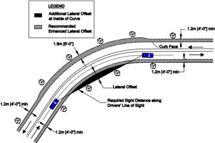
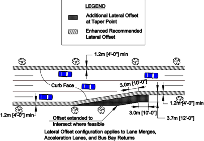
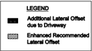
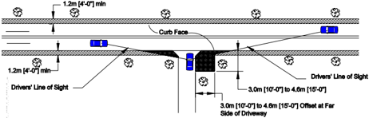
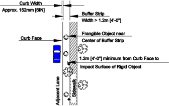
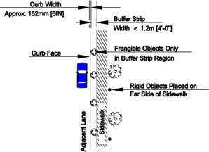
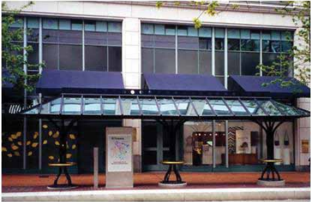

# 10.1 EvalUatiOn Of CRitiCal URban ROadSidE lOCatiOnS

- Source: Roadside Design Guide (2011).pdf
- Generated: 2026-01-03T22:41:43+00:00
- Chunk: 9/11
- Estimated tokens: ~15,776
- Total pages: 345
- Type: chapter

## 10.1 EvalUatiOn Of CRitiCal URban ROadSidE lOCatiOnS

Although the clear roadside concept is still the goal of the designer, many compromises are likely in urban or restricted environment areas. One misconception is that a curb with a 0.5 m [1.5 ft] lateral offset behind it satisfies the clear roadside concept. Realistically, curbs have limited redirectional capabilities and these occur only at low speeds, approximately 40 km/h [25 mph] or lower. Conse -quently, fixed objects located adjacent to the travel lane, even in the presence of curbs, pose a potential hazard. Achieving the clear zone distances suggested in Chapter 3 may be unlikely in an urban setting. As a result, a secondary goal for roadside design in an urban setting is to identify critical urban roadside locations-those that are more prone to crashes-and give these locations priority attention for roadside safety improvements. One way to achieve this improved safety is to establish specific lateral offsets for unique urban locations where the roadside is not shielded by features such as on-street parking.

Critical urban roadside locations are best determined by identifying locations with a history of over-representation in roadside crashes. These critical locations are candidates for further evaluation. In addition to crash history, other unique site characteristics at individual locations may contribute to the higher likelihood of roadside crashes, such as the operating speed, functional purpose, and other spe -cific road features. These characteristics and road features are discussed further in the following sections.

## 10.1.1 Evaluation of individual Sites

In an urban environment, the most hazardous roadside crashes occur when vehicles operate at higher speeds and are less constrained by prevailing traffic conditions. Consequently, regardless of curbing, the designer should strive for a wider lateral offset that is more reflective of either the off-peak operating speed (85th percentile) or design speed, whichever is greater.

Roadside Design Guide 10-2

As always for reconstruction or resurfacing projects, the site's crash history should be considered in determining the specific clear roadside treatment for each portion of a project.

The typical  hierarchy  of  design  options  for  the  treatment  of  fixed  objects  should  be  considered  for  each  location.  They  are  the following, in order of preference:

- Remove the fixed object.
- Redesign the fixed object so it can be safely traversed.
- Relocate the fixed object to a point where it is less likely to be struck.
- Reduce impact severity by using an appropriate breakaway device or impact attenuator.
- Redirect a vehicle by shielding the obstacle with a longitudinal traffic barrier.
- Delineate the fixed object if the previous options are not appropriate.

## 10.1.2 design Speed and functional Use

Urban or restricted environment operating speeds vary more by time of day than their companion operating speeds in rural settings. During free-flow conditions and especially during late night hours, speeds are much higher, often beyond the speed limit. Higher speeds may result in the potential for more severe crashes. Although other factors such as alcohol, fatigue, and limited night-sight distance also may contribute, higher speeds and greater speed variance under free-flow conditions are likely to be the more significant contributing factors.

Consequently, roadside features need to be designed for those higher operating speeds during free-flow conditions because any result -ing crashes are likely to be more severe. This approach may mean that the estimated encroachment speed used to design for roadside features may be higher than the design speed for the roadway as a whole, especially if the off-peak operating speed (85th percentile) was not used to determine the project design speed. Also, as stated in the Preface, 'because the design speed often is determined by the most restrictive physical features found on a specific project, there may be a significant percentage of a project length in which that speed will be exceeded by a reasonable and prudent driver.' Therefore, 'the designer should consider the expected operating speed at which encroachments are most likely to occur when selecting an appropriate roadside design standard or feature.'

## 10.1.3 targeted design approach for High-Risk Urban Roadside Corridors

Identifying known high-risk locations common to the urban roadside is another critical feature in achieving safer conditions. As a designer assesses potential high-risk locations along a corridor, the known type of locations should be high-priority candidates for focused roadside safety treatments.

The strategies proposed within this section apply primarily to higher speed urban or rural-urban transition area corridors. When feasible, increased lateral offset to rigid roadside objects is encouraged for all urban facilities; however, low-speed facilities such as local roads or central business districts with 24-hour on-street parking may not be practical applications of these target lateral offsets because of constrained right-of-ways and competing uses for the limited roadside space.

## 10.1.3.1 Obstacles in Close Proximity to Curb face or lane Edge

Historically, the lateral distance value (referred to as an operational offset) of 0.5 m [1.5 ft] has been considered a minimum lateral distance for placing the edge of objects from the curb face. This minimum lateral offset was never intended to represent an acceptable safety design criteria, though sometimes it has been misinterpreted as such. In a constrained urban environment, there is still a need to position rigid objects as far away from the active traveled way as possible.

Research (5) has shown that in an urban environment, approximately 80 percent of roadside crashes involved an object with a lateral offset from the curb face equal to or less than 1.2 m [4 ft] and more than 90 percent of urban roadside crashes have a lateral offset less than or equal to 1.8 m [6 ft]. Objects located on the outside of curves also are hit more frequently than at other locations. It seems pru -

dent, therefore, to achieve larger lateral offsets at these curve locations. As Figure 10-1 illustrates, a recommended goal is to achieve at least a 1.8-m [6-ft] lateral offset from the face of the curb at these outside-of-curve locations while maintaining at least a 1.2-m [4-ft] lateral offset elsewhere. For urban locations without a vertical curb, lateral offsets of 3.6 m [12 ft] on the outside of horizontal curves and 2.4 m [8 ft] at tangent locations are reasonable goals when the clear zone widths suggested in Chapter 3 cannot be achieved.

Figure 10-1. Lateral Offset for Objects at Horizontal Curves on Curbed Facilities

In addition to creating a wider lateral offset on the outside of horizontal curves, attention should be paid to sight distance at the inside of sharp horizontal curves to assure that it is not obstructed by roadside objects. As indicated in Figure 10-1, a driver's line of sight that is suitable to provide the required stopping sight distance should be maintained.

Many urban corridors have auxiliary lanes available in addition to the standard main lanes. Examples of auxiliary lanes include bi -cycle lanes, turn bays, extended length right-turn lanes, and bus lanes. In these corridors, lanes that function as higher speed lanes such as the extended-length turn lanes or bus lanes should be treated as standard travel lanes and clear-zone measurements then would begin at the right lane edge or curb face. Other auxiliary lanes such as bicycle lanes can be included in the clear zone and the clearzone measurements begin at the right-lane edge marking for the motor vehicle lane. At all auxiliary lane locations, however, lateral offset goals remain unchanged.

## 10.1.3.2 lane Merge locations

The placement of roadside objects in the vicinity of lane merge points increases the likelihood of vehicle impact with these objects. A lane merge can include the termination of an acceleration lane, a lane drop, or a bus bay exit point. Longitudinal placement of objects within approximately 3.1 m [10 ft] of the taper point increases the frequency of roadside crashes at this location. A wider lateral offset at taper points on urban roadways will reduce roadside crashes at these locations and allow the driver to focus solely on merging into the traffic stream.

As Figure 10-2, Enhanced Lateral Offsets at Merge Points illustrates, the suggested lateral offset in the immediate vicinity of the taper point is 3.6 m [12 ft] from the lane merge curb face. This lateral offset permits errant vehicles that do not navigate the merge successfully to continue straight and stop without impacting a rigid object. Breakaway objects should have lateral offsets of at least 1.2 to 1.8 m [4 to 6 ft] at these locations.

Roadside Design Guide 10-4

Figure 10-2. Enhanced Lateral Offsets at Merge Points

## 10.1.3.3 driveway locations

Many rural roads have a white edgeline delineating the right edge of the traveled way. In urban environments, a continuous white line often is not included at locations with curb as the curb itself functions to delineate the edge of the road. During night time or inclement weather conditions, the need for positive guidance along the right edge of the road may be heightened because of reduced visibility. In addition, impaired or fatigued drivers may depend more heavily on this delineation to help keep their vehicles within the boundaries of the traveled way. At driveway locations, the defined edge-of-road delineation and limited redirection capabilities of curb are no longer available, which can result in increased roadside crashes for objects positioned on the far side of driveways.

Providing a lateral offset of 3.0 to 4.6 m [10 to 15 ft] beyond the edge of driveway would reduce the potential for a fixed-object col -lision in this high-crash location. Because it also is not appropriate to locate roadside objects so that they adversely affect the line of sight for drivers exiting the driveway, these visibility triangles also should be maintained free of roadside objects. Figure 10-3, Enhanced Lateral Offsets at Driveways demonstrates the resulting lateral offsets appropriate for driveway locations. The driver's line of sight should be based on the expected speed of approaching vehicles.

--'',,',',,,,',,'',',,,,,''','',-'-',,',,',',,'---

Figure 10-3. Enhanced Lateral Offsets at Driveways

## 10.1.3.4 intersection locations

Crashes at intersections often occur between vehicles; however, intersection crashes in which vehicles hit roadside objects also are common. In some cases, the crash occurs because a driver attempts to avoid hitting another vehicle, but single vehicle crashes also occur frequently at intersection locations. The collisions can occur because of the presence of small channelization islands that are not noticeable by drivers, objects located too close to the curb in the curb return region, and objects located so that they are aligned opposite pedestrian access ramps. Roadside object placement strategies at intersections, therefore, can be addressed as follows:

- For intersection channelization islands (also known as corner islands), the island design should adhere to the criteria in AAS -HTO's A Policy on Geometric Design of Highways and Streets (1) . The island should be sufficiently designed so it is conspicuous to approaching drivers while not encroaching on vehicle paths. Similarly, median noses should be conspicuous and designed they do not impede normal traffic operations. Placing rigid objects at either the corner island or the median nose should be avoided completely. Only breakaway devices should be constructed at these locations.
- Often a turning vehicle does not successfully navigate the designated turn path and strays onto the adjacent curb return or shoulder. This situation often occurs for truck-turning movements. Object placement on the inside edge of intersection turning movements should be as far as practical from the curb face or lane edge. A target lateral offset value for the intersection return should be 1.8 m [6 ft] for curbed facilities with a minimum value of 0.9 m [3 ft]. Similarly, for locations without curbs, these values should be as far as possible from the edge of lane because drivers will not have a curb to help them realize their vehicles have strayed from the designated turning path.
- Many urban intersections with curbs include directional pedestrian access ramps at the intersection corners. For these locations, rigid objects should not be positioned so that errant vehicles are directed toward them along the path of the access ramp. As a result, pedestrian buttons should be placed on a breakaway pedestal pole adjacent to the directional ramp rather than on a rigid traffic signal pole when possible. This will enable the traffic signal pole placement to occur further away from the curb return region and also will position the pedestrian button immediately adjacent to the appropriate access ramp.

Roadside Design Guide 10-6

## 10.2 ROadSidE fEatURES fOR URban and REStRiCtEd aREaS

In addition to maintaining increased lateral offsets to rigid objects at select urban locations, several roadside features common to urban regions and restricted areas merit additional placement strategy guidance. The following sections address these objects and their placement in urban areas.

## 10.2.1 Common Urban Roadside features

## 10.2.1.1 Curbs

A common practice in urban settings is to use curbs or curbs with gutters adjacent to the highway travel lanes or shoulders (when present) to separate pedestrians from the traffic flow. Realistically, curbs have limited redirectional capabilities, and these occur only at speeds of approximately 40 km/h [25 mph] or lower. For speeds of more than 40 km/h [25 mph], the curb still can influence driver behavior by providing positive guidance, but it does not provide a physical vehicle redirection function. Curbs alone may not be ad -equate protection for pedestrians on adjacent sidewalks or for shielding utility poles. In some cases, other measures may need to be considered.

When a vehicle strikes a curb, the trajectory of that vehicle depends on several variables: (1) the size and suspension characteristics of the vehicle, (2) its impact speed and angle, and (3) the height and shape of the curb itself. When a curb is needed for drainage, the use of a curb no higher than 100 mm [4 in.] may be sufficient; however, the use of 150-mm [6-in.] curb is more common in urban areas. Section 3.4.1 provides additional guidance for the use of curbs.

The minimum lateral offset of 0.5 m [1.5 ft] should be provided beyond the face of curbs to any frangible obstructions. Note that this minimum lateral offset does not meet clear-zone criteria but simply enables normal facility operations that may help to

- Avoid adverse impacts on vehicle lane position and encroachments into opposing or adjacent lanes,
- Improve driveway and horizontal sight distances,
- Reduce the travel lane encroachments from occasional parked and disabled vehicles,
- Improve travel lane capacity, and
- Minimize contact from vehicle-mounted intrusions (e.g., large mirrors), car doors, and the overhang of turning trucks.

Designers should strive for lateral offsets more appropriate for the off-peak operating speeds. Examples of preferred lateral offsets are identified in Section 10.1.3.1. For the higher-speed end of the rural-urban transition area or urban facilities, providing a shoulder and offsetting any curbing to the back of the shoulder should be considered. The shoulders may be used to accommodate bicyclists and pedestrians when sidewalks are not provided.

Previous research on curbs determined that a lateral distance of approximately 2.5 m [8 ft] is needed for a traversing vehicle to return to its predeparture vehicle suspension state (13) . As a result, guardrails behind curbs should either be placed in the immediate vicinity of the curb (as per specifications for the particular guardrail) to shield critical roadside features. or they should be located with a mini -mum lateral offset of 2.5 m [8 ft] to enable vehicles with speeds greater than 60 km/h [40 mph] to return to their normal suspension state and minimize the likelihood that they could vault the barrier.

Various strategies have been proposed, applied, and/or tested for safe application of curb treatments as a means to enhance roadside safety. Table 10-1 lists common strategies.

Table 10-1. Design Strategies for Curb Treatment

| Purpose                                                 | Strategy                                                                                                                                                                                                            |
|---------------------------------------------------------|---------------------------------------------------------------------------------------------------------------------------------------------------------------------------------------------------------------------|
| Design curb to minimize potential for vaulting vehicles | • Use appropriate curb heights compatible with expected vehicle trajectories • Orient barriers with respect to curbs so as to improve curb-barrier interactions • Grade adjacent terrain flush with the top of curb |

## 10.2.1.2 Shoulders

Many roads in urban environments have a paved shoulder located between the travel lanes and curb or have a graded or paved shoul -der and no curb. The purpose of a shoulder is to provide a smooth transition from the traveled way to the adjacent roadside while facilitating drainage and promoting various other shoulder operations. The shoulder width is part of the clear-zone width. There are many recommendations about appropriate shoulder widths for lower speed roads, whose values vary depending on the function of the shoulders as well as the available right-of-way. Recommended widths should be determined using regional guidelines or standards.

Because right-of-way costs are high in urban environments, the use of paved or graded shoulders without curbs in these environments often is the result of the incorporation of previously rural roads into urbanized land use without the companion roadway improve -ments. Often the road with only a shoulder will have a drainage ditch located parallel to the road; it is desirable to maintain travers -able conditions in the event an errant vehicle exits the road, travels across the shoulder, and then encounters the roadside grading. In general, wider shoulders contribute to higher travel speeds; however, wider shoulders also result in fewer run-off-the-road crashes.

## 10.2.1.3 Channelization and Medians

The separation of traffic movements by using a raised median or turning island often is referred to as channelization. A flush or tra -versable median or island is considered part of the roadway. A raised median or raised turn island is considered part of the roadside and, accordingly, the suggested lateral offset to obstructions discussed earlier in this chapter would apply. Table 10-2 describes com -mon channelized island and median strategies.

Table 10-2. Design Strategies for Channelized Islands and Medians

| Purpose                                         | Strategy                                                                                      |
|-------------------------------------------------|-----------------------------------------------------------------------------------------------|
| Reduce likelihood of run-off-the-road collision | • Widen median                                                                                |
| Reduce crash severity                           | • Place only frangible items in channelized island or median • Shield rigid objects in median |

## 10.2.1.4 Gateways

Gateways are combinations of localized features intended to produce a traffic-calming effect by emphasizing to motorists that a change in the character of the roadside and possibly the roadway uses has occurred, such that slower and more cautious operation of their vehicle is appropriate.

Many of the features that would be desirable in gateways, such as raised flowerbeds, trees, large signs, and walls, could be considered potentially hazardous roadside features. The operating speed approaching a gateway is a key consideration in determining what fixed features may be included and how close they may be placed to the traveled way. Where approach speeds are high, clear-zone guidance should be applied. Features that could cause severe decelerations for an errant vehicle should be set back from the traveled way in accordance with the clear-zone guidance in Chapter 3. Alternatively, fixed-object features may be set back as far as other fixed objects

Roadside Design Guide 10-8

--'',,',',,,,',,'',',,,,,''','',-'-',,',,',',,'---

in the general vicinity of the gateway. Decorative signs placed closer to the road should be mounted on breakaway posts; however, this combination should not be confused with being crashworthy.

For high-speed locations, flowers and shrubs may be placed close to the road with a lateral transition in height up to signs, structures, or trees. Walls for raised flower beds close to the road should be kept low, preferably lower than bumper height. Because such walls could destabilize an errant vehicle, they should be used closer to the limit of the clear zone than to the road.

For low-speed locations, the risk of serious injury to occupants of errant vehicles is greatly reduced and fixed features may be placed much closer to the road. However, interference with sight distances must still be taken into account. Table 10-3 describes common roadside safety gateway strategies.

Table 10-3. Design Strategies for Gateways

| Purpose                                     | Strategy                                                                       |
|---------------------------------------------|--------------------------------------------------------------------------------|
| Reduce likelihood of run-off-the-road crash | • Apply speed reduction signs, pavement markings, and other gateway treatments |
| Reduce severity of run-off-the-road crash   | • Construct roundabouts with traversable island centers in initial islands     |

## 10.2.1.5 Roadside Grading

The terrain adjacent to an urban road should be relatively flat and traversable. In general, the placement of common urban roadside features such as sidewalks and utilities tends to create a flatter urban roadside. The primary risk for irregular terrain adjacent to the traveled way is that either an errant vehicle will impact a rigid obstacle or that the terrain will cause the vehicle to roll over.

The sideslope of an urban road generally slopes from the edge of the right-of-way toward the curb of the road. This slope will prevent any road drainage from encroaching on adjacent property and enables the drainage to be contained within a closed drainage system. As a result, the slope often is quite flat (1V:6H, typically) for curbed urban roads. For roads without curbs, the design guidelines for rural roadside conditions should be applied. That is, the terrain, including drainage channels, should be safely traversable by a motor vehicle and the placement of obstacles such as headwalls must be flush with the ground surface and designed to be navigated by an errant vehicle. Table 10-4 describes common roadside grading strategies.

Table 10-4. Design Strategies for Roadside Grading

| Purpose                   | Strategy                                                                                           |
|---------------------------|----------------------------------------------------------------------------------------------------|
| Minimize crash likelihood | • Maintain traversable grades that are free of rigid obstacles                                     |
| Minimize crash severity   | • Flatten grades to reduce chance of vehicle rollover • Set back objects from edge of traveled way |

## 10.2.1.6 Pedestrian facilities

Sidewalks and pedestrian facilities generally do not pose a particular hazard to motorists. The safety concern for locating these fa -cilities adjacent to the road is the risk to the pedestrians using the facilities. Guidance for the use of sidewalks on urban streets is in AASHTO's A Policy on Geometric Design of Highways and Streets (1) .

An additional feature of the roadside environment is a pedestrian buffer area (often referred to as a buffer strip). The pedestrian buffer is a physical distance separating the sidewalk and the vehicle traveled way. Buffer areas often accommodate on-street parking, transit stops, street lighting, planting areas for landscape materials, and common street appurtenances, including seating and trash recep-

tacles. Buffer strips may be either planted or paved, and they are encouraged for use between urban roadways and their companion sidewalks.

Figure 10-4 depicts the recommended placement of roadside objects in a buffer strip 1.2 m [4 ft] wide or less. Figure 10-5 demon -strates recommended roadside object placement when the buffer strip width exceeds 1.2 m [4 ft]. Table 10-5 describes common strate -gies for eliminating or minimizing motor vehicle-pedestrian crashes at roadside locations.

Figure 10-4. Landscape and Rigid Object Placement for Buffer Strip Widths ≤ 1.2 m [4 ft]

Figure 10-5. Landscape and Rigid Object Placement for Buffer Strip Widths &gt;1.2 m [4 ft]

Roadside Design Guide 10-10

Table 10-5. Design Strategies to Protect Pedestrians in Motor Vehicle Crashes

| Purpose                                                                   | Strategy                                                                                                                                                                                                                                                                                                                                                                                              |
|---------------------------------------------------------------------------|-------------------------------------------------------------------------------------------------------------------------------------------------------------------------------------------------------------------------------------------------------------------------------------------------------------------------------------------------------------------------------------------------------|
| Reduce motor vehicle-pedestrian crash likelihood at roadside locations    | • Provide continuous pedestrian facilities • Install pedestrian refuge medians or channelized islands (see Section 10.2.1.3 on medians and islands) • Offset pedestrian locations away from traveled way with pedestrian buffers • Physically separate pedestrians from traveled way at high-risk locations • Improve sight distance by removing objects that obscure driver or pedestrian visibility |
| Reduce severity of motor vehicle-pedestrian crashes at roadside locations | • Reduce roadway design speed, operating speed, or both in high pedestrian volume locations                                                                                                                                                                                                                                                                                                           |

## 10.2.1.7 bicycle facilities

Bicycle facilities are road and roadside features intended for bicycle operation. These facilities may include standard lanes, wide outside lanes, bicycle lanes, and off-road bicycle paths. Accompanying bicycle facilities may be bicycle hardware often located along the roadside, such as bicycle racks. Wide shoulders and bicycle lanes provide an additional clear area adjacent to the traveled way, so these features potentially could provide a secondary safety benefit for motorists and can be included as part of the clear zone. These bicycle facilities also will improve the resulting sight distance for motor vehicle drivers at intersecting driveways and streets.

Bicycle racks commonly are made of steel or other metals, and they are typically bolted to the ground to secure locked bicycles from potential theft. These features are not designed to be yielding should a run-off-the-road event occur. Making such features yielding would potentially minimize the core function of these features to provide a secure location for locking up bicycles. Thus, a potentially more desirable alternative is to encourage the placement of these features outside of the clear zone.

In the past, the use of barrier-delineated bicycle lanes was popular, because it provided a perceived safety buffer between the more vulnerable bicyclists and the motor vehicles. In recent years, however, this treatment has diminished for the following reasons:

- Raised barriers limit the movement of entering or exiting bicycles in the bike lane.
- Motorists at side streets essentially block the bike lane when the driver pulls forward to determine if it is safe to enter the motor vehicle traveled way.
- Barrier-separated bicycle lanes may collect debris or be blocked by snow removed from the motor vehicle lanes.
- The separated bicycle lane configuration can be confusing and often is used incorrectly by bicyclists.
- Bicyclists turning left or proceeding straight at an intersection are in direct conflict with right-turning motor vehicles (16) .

It is helpful to understand the magnitude of the safety risk to bicyclists when they encounter roadside environments. One Federal Highway Administration (FHWA) report that used hospital emergency department data noted that 70 percent of reported bicycle injury events did not involve a motor vehicle while 31 percent occurred in non-roadway locations. For bicycle-only crashes, 23.3 percent of the recorded crashes occurred at sidewalk, driveway, yard, or parking lot locations (7) . Table 10-6 describes strategies to improve bicycle safety as well as bicycle-motor vehicle interactions.

--'',,',',,,,',,'',',,,,,''','',-'-',,',,',',,'---

Table 10-6. Design Strategies for Bicycles

| Purpose                    | Strategy                                                 |
|----------------------------|----------------------------------------------------------|
| Reduce likelihood of crash | • Use wider curb lanes • Increase operational offsets    |
| Reduce severity of crash   | • Locate bicycle racks as far away from road as possible |

## 10.2.1.8 Parking

On-street parking potentially can have mixed results on a roadway's safety performance. On one hand, these features narrow the ef -fective width of the roadway and may result in speed reductions, thereby leading to a reduction in crash severity. Conversely, on-street parking also may lead to an increase in collisions associated with vehicles attempting to pull in or out of an on-street parking space.

Once the decision to allow parking has been made, the need for a clear zone outside of the parking may no longer be necessary. Table 10-7 describes on-street parking strategies.

Table 10-7. Design Strategies for On-Street Parking

| Purpose                    | Strategy                                                                                   |
|----------------------------|--------------------------------------------------------------------------------------------|
| Reduce likelihood of crash | • Restrict on-street parking to low-speed roads                                            |
| Reduce crash severity      | • Where parking is appropriate, use parallel parking rather than angular (head-in) parking |

## 10.2.2 Safe Placement of Roadside Objects

## 10.2.2.1 Mailboxes

Curbside delivery mailboxes must be located so they are accessible to those delivering the mail. Although crashworthy designs are preferred, secure, lockable boxes, vandal resistant mailboxes, and other massive proprietary or custom-made mailbox supports fre -quently are found in suburban and close-in rural residential developments. Although these heavy devices may not be used on highspeed highways, they may be appropriate on only very low-speed (i.e., 50 km/h [30 mph] or less), low-volume residential streets characterized by trees between the curb and sidewalk, frequent driveway openings, on-street parking, or other features that indicate to drivers that they are in a low-speed environment and where the minimum horizontal clearance is not an issue. Table 10-8 describes some urban mailbox roadside safety strategies.

Table 10-8. Design Strategies for Urban Mailbox Use

| Purpose                   | Strategy                                                                                                         |
|---------------------------|------------------------------------------------------------------------------------------------------------------|
| Minimize crash likelihood | • Remove or relocate mailboxes to safe locations • Add reflective object markers to improve nighttime visibility |
| Minimize crash severity   | • Develop policies to require crashworthy mailboxes in urban environments • Shield rigid mailboxes               |

No reproduction or networking permitted without license from IHS

## 10.2.2.2 Street furniture

In many urban areas, the use of street furniture is a common approach to improving the aesthetic quality of a street. Street furniture includes items placed adjacent to the road to improve the adjacent land use or the transportation operations. In some jurisdictions, street lights and signs are included in the category of street furniture; however, for the purposes of this chapter, street furniture is considered to be supplemental items (e.g., benches, public art, trash receptacles, phone booths, fountains, kiosks, transit shelters, planters, bollards, and bicycle stands). Many street furniture items are placed along the right-of-way by the property owners, as in the case of the placement of a sidewalk cafe in front of a restaurant; thus, they are largely outside the engineer's control. Transit shelters such as the one depicted in Figure 10-6 are provided to protect transit riders from inclement weather and must be located close to the curb to facilitate short bus dwell times.

Figure 10-6. A Transit Shelter Located Curbside

Street furniture potentially can create sight-distance obstructions when located near an intersection, particularly when large numbers of people congregate as a result of the street furniture. It also is important that the sight distance of pedestrians be maintained when placing street furniture proximate to the roadway. Table 10-9 discusses safe roadside street furniture strategies.

Table 10-9. Design Strategies for Street Furniture Use

| Purpose                      | Strategy                                                                                                                                     |
|------------------------------|----------------------------------------------------------------------------------------------------------------------------------------------|
| Minimize likelihood of crash | • Locate street furniture as far from street as possible • Restrict street furniture placement to avoid sight distance issues for road users |

## 10.2.2.3 vertical Roadside treatments and their Hardware

Both nationally and internationally, the placement of utility poles, light poles, and similar vertical roadside treatments and companion hardware frequently are cited as common urban roadside hazards.

## 10.2.2.3.1 Utility Poles

Utility poles are prevalent in urban environments and can pose a substantial hazard to errant vehicles and motorists. The frequency of utility pole crashes increases with daily traffic volume and the number of poles adjacent to the traveled way (17) . Utility poles are adjacent to urban roadways more than rural highways, and demands for operational improvements coupled with limited street rightof-ways often lead to the placement of these poles proximate to the roadway edge. In fact, utility poles are second only to trees as the object associated with the greatest number of fixed-object fatalities (15) . Though utility poles often are impacted directly, guy wires that stabilize the pole also can pose a hazard because vehicles can impact them directly as well.

In general, utility pole-related crashes are considered to be principally an urban hazard, with urban areas experiencing 36.9 pole crashes per 100 miles of roadway, while rural areas experience 5.2 pole crashes per 100 miles (11) . One study determined that the variable with the greatest ability to explain utility pole-related crashes was the average daily traffic (ADT) along the roadway (17) . ADT as the critical variable explains the importance of vehicle exposure in understanding run -off-the-road crashes with utility poles.

A common recommendation for addressing the utility pole safety issue is to place utilities underground and thereby remove the haz -ardous poles. The removal of all poles in the urban roadside environment is not practical; these poles often function as the supports for street lights and other shared utilities. However, several known utility pole hazardous locations should be avoided when feasible. Generally, utility poles should be located (6, 10)

- As far as possible from the active travel lanes,
- Away from access points where the pole may restrict sight distance,
- Inside a sharp horizontal curve (because errant vehicles tend to continue straight towards the outside of curves), and
- On only one side of the road.

## 10.2.2.3.2 Lighting and Visibility

An important issue in addressing roadside safety is the role of lighting in making potentially hazardous roadside environments visible to the road users (i.e. motor vehicle drivers, bicyclists, and pedestrians), particularly during night-time hours.

The North Carolina Department of Transportation's Traditional Neighborhood Development (TND) Guidelines (12) recommends that for a TND designed to accommodate 'a human scale, walkable community with moderate to high residential densities and a mixed use core,' more and shorter lights should be used rather than less frequent, tall, high-intensity street lights. This closer light spacing will provide adequate coverage for both pedestrian and vehicular activity. Chapter 4 briefly describes the various recommended luminaire supports.

## 10.2.2.3.3 Sign Posts and Roadside Hardware

The design of crashworthy sign posts is directed by AASHTO's Manual for Assessing Safety Hardware (MASH) (3) and NCHRP Report 350: Recommended Procedures for the Safety Performance Evaluation of Highway Features (14) , and substantial research has been devoted to designing these features to be crashworthy. Multiple designs for these features are included in the this edition of the Roadside Design Guide , and specifications for evaluating these features are contained in AASHTO's Standard Specification and Structural Supports for Highway Signs, Luminaires, and Traffic Signals (2) . Table 10-10 describes roadside safety strategies for utility poles, light poles, and street sign posts.

Roadside Design Guide 10-14

--'',,',',,,,',,'',',,,,,''','',-'-',,',,',',,'---

Table 10-10. Design Strategies for Vertical Roadside Treatment and Hardware

| Purpose                                                | Strategy                                                                                                                                                                                                                                                                                                                      |
|--------------------------------------------------------|-------------------------------------------------------------------------------------------------------------------------------------------------------------------------------------------------------------------------------------------------------------------------------------------------------------------------------|
| Treat individual poles or posts in high risk locations | • Remove or relocate poles • Place poles on inside of horizontal curves and avoid placement on outside of roundabouts or too close to intersection corners • Use breakaway or yielding poles • Shield poles • Improve pole visibility                                                                                         |
| Treat multiple poles or posts in high-risk locations   | • Establish urban-enhanced lateral offset guidelines for pole setback distances from curb • Place utilities underground while maintaining appropriate nighttime visibility • Combine utilities and signs onto shared poles (reduce number of poles) • Replace poles with building-mounted suspended lighting (where suitable) |
| Minimize level of severity                             | • Reduce travel speed on adjacent road                                                                                                                                                                                                                                                                                        |

## 10.2.3 Placement of landscaping, trees, and Shrubs

Along most urban streets, some type of landscaping exists. Trees, shrubs, lawns, decorative rock, and other materials are used to pro -vide a pleasing setting for drivers, pedestrians, bicyclists, and abutting landowners. The presence of roadside landscaping is known to have a positive influence on the health of drivers as well as other users of the facility. Roadside landscaping also can aid in providing drivers visual cues about the road environment. Maintenance of urban forestry similarly can aid in improving the environmental qual -ity in the region. The design process, therefore, should balance the benefits of landscaping with the requirements for roadside safety when possible.

The designer always should be consulted in the decisions regarding landscaping, particularly because they relate to sight distance and possible future lane needs. Considerations in the design of landscaping include the following:

- The mature size of trees and shrubs, and how it will affect safety, visibility, and maintenance cost
- Adequacy of border area to accommodate the type of landscaping planned (i.e., if parking is allowed along the curb, the landscap -ing should allow curbside access to parked vehicles)
- Potential future changes in roadway cross-sections. For example, adding a second left-turn lane at major intersections by taking approximately 3 m [10 ft] of additional space from the median island is becoming a common practice. Landscaping in the af -fected area should be minimal or should not be included in the plan.

Visibility restrictions resulting from landscaping are of principle concern to the designer. Points that must be considered include the following:

- Border area landscaping should allow full visibility for drivers and pedestrians at driveways and intersections.
- A clear vision space from 1 to 3 m [3 to 10 ft] above grade is desirable along all streets and at all intersections. This space allows drivers in cars, trucks, and buses to have good sight distance. Many cities have ordinances on sight restrictions at corners that incorporate this clear space idea.
- Landscaping of very small islands should be avoided to reduce maintenance needs.
- Large trees or rocks should not be used at decision points (e.g., gore areas, island noses) to protect poles and other appurtenances. Rather, each of the design options stated in Section 10.1.1 should be considered in the order listed to improve safety.
- Longitudinal placement of trees and landscaping should separate these items from underground utility lines, power poles, street lights, existing trees, light standards, fire hydrants, water meters, or utility vaults to assure root systems do not conflict with utilities.

- Canopy trees should not be positioned under service wires and, where present, should be of sufficient height to provide clearance for taller vehicles, including buses and trucks.

With respect to pedestrians, it is desirable to have a grass strip separating the sidewalk from the curb, thus further separating the pe -destrian from vehicular traffic. The strip also provides room for snow storage and trash collection.

Another planting strategy that can improve roadside safety is layering plants so that rigid plants are shielded by smaller, more fran -gible ones. This approach creates an attractive roadside landscaping while also naturally creating energy dissipation in an accident through the creative use of plants.

## 10.2.4 Use of Roadside barriers

A roadside barrier is a longitudinal barrier used to shield motorists from natural or man-made obstacles located along either side of a roadway. The primary purpose of roadside barriers is to prevent a vehicle from striking a fixed object or roadside feature that is less forgiving than the barrier itself by containing and redirecting the impacting vehicle. Barriers also are used to separate pedestrians and bicyclists from vehicular traffic when appropriate. Refer to Chapter 5 for a discussion of application, performance, structural, and safety characteristics of crashworthy roadside barriers.

If the barrier terminates in the clear zone or an area where the barrier is likely to be hit head-on by an errant vehicle, a crashworthy end treatment is considered essential. The selection of the proper treatment should be in accordance with the proposed test levels, warrants, and availability of maintenance.

Intersections and driveways complicate the selection and use of end treatments. A major factor in selecting and locating end treatments is obtaining the necessary corner sight distance at these locations. Refer to Chapter 8 for further guidance on the subject of barrier end treatments and crash cushions.

In addition, aesthetic concerns can be a significant factor in selecting a roadside barrier in environmentally sensitive locations such as recreational areas, parks, or many urban or restricted environments. In these instances, a natural-looking barrier that blends in with its surroundings is often selected. It is important that the systems used be crashworthy as well as visually acceptable to the highway agency.

Having decided that a roadside barrier is recommended for a given location and having selected the type of barrier to be used, the designer must specify the exact layout required. The major factors that must be considered include the following:

- Lateral offset from the edge of pavement
- Deflection distance of the barrier
- Terrain effects
- Flare rate
- Length-of-need
- Corner sight distance
- Pedestrian activity, including the needs of the disabled
- Bicycle activity

Generally, a roadside barrier should be placed as far from the traveled way as conditions permit while ensuring that the system per -forms properly. Such placement gives an errant motorist the best chance of regaining control of the vehicle without striking the barrier. It also provides better sight distance, particularly at nearby intersections.

It is desirable that a uniform clearance be provided between traffic and roadside features such as bridge railings, retaining walls, road -side barriers, utility poles, and trees, particularly in urban areas where there is a preponderance of these elements. The placement of roadside barriers is covered in Chapter 5.

Roadside Design Guide 10-16

--'',,',',,,,',,'',',,,,,''','',-'-',,',,',',,'---

## 10.2.4.1 barrier warrants

Barrier warrants are based on the premise that a traffic barrier should be installed only if it reduces the severity of potential crashes. Note that the probability or frequency of run-off-the-road crashes is not directly related to the severity of potential crashes.

Typically, barrier warrants have been based on a subjective analysis of certain roadside elements or conditions. If the consequences of a vehicle striking a fixed object or running off the road are believed to be significantly more serious than hitting a traffic barrier, the barrier is recommended. Although this approach can be used often, there are instances in which it is not immediately obvious which presents the greater risk: the barrier or the unshielded condition. The Roadside Safety Analysis Program (RSAP) presents an analysis procedure that can be used to compare several alternative safety treatments and provides guidance to the designer. A barrier may be appropriate if:

1. There is a reasonable probability of a vehicle leaving the road at that location, and
2. The  cumulative  consequences  of  those  departures  significantly  outweigh  the  cumulative  consequences  of  impacts  with the barrier.

Note that many more impacts with a shielding barrier generally will occur than ones with the unshielded object.

Highway conditions that warrant shielding by a roadside barrier can be placed in one of two basic categories: embankments or road -side obstacles. Warrants for the first category are found in Chapters 3 and 5. Low-profile barriers 610 mm [24 in.] high for speeds of 70 km/h [45 mph] or less have been developed. They shield while minimizing obstruction to visibility. The presence of pedestrians and bystanders also may justify this protection from errant vehicular traffic.

## 10.2.4.2 barriers to Protect adjacent land Use

In urban or restricted environment areas, more consideration should be given to protecting pedestrians using the adjoining properties from risks posed by errant vehicles. Schools, playgrounds, and parks located on the outside of sharp curves are examples of where barrier systems may be considered. Because there are not any specific warrants or guidelines for these situations, design judgment should be used.

Consideration also should be given to installing a barrier to shield businesses and residences that are near the right-of-way, particularly at locations that have a history of run -off-the-road crashes. This use of barrier should be based on the result of a site-specific study as described in Section 10.1.1 and may be independent of conventional barrier warrants.

## 10.2.4.3 Common Urban barrier treatments

## 10.2.4.3.1 Roadside and Median Barriers

Using standard highway median barriers on urban facilities with a design speed of 70 km/h [45 mph] or less with street intersections, regardless of access control, generally is not recommended. Alternate methods of separating opposing traffic are encouraged, such as the use of medians (in some cases raised medians). Flush medians are preferred over raised medians on highways with design speeds greater than 70 km/h [45 mph], because raised medians can cause errant vehicles to vault. Intersection sight distance should be con -sidered when designing a raised median with plantings or barrier.

## 10.2.4.3.2 Crash Cushions

Crash cushions are ideally suited for use at urban locations where fixed objects cannot be removed, relocated, or made breakaway, and cannot be adequately shielded by a longitudinal barrier. In urban situations, the increase in roadway maintenance mileage, right-ofway constraints, and the varying traffic flow conditions create situations that limit available options for removing or relocating fixed objects. The use of crash cushions rather than longitudinal barriers becomes more appropriate when shielding fixed objects, including those at exit ramp gores, ends of median barriers, and bridge piers and abutments.

The width available for the placement of impact attenuators can be restricted in urban areas. However, a number of crash cushions are available for narrow width conditions. The systems outlined in Chapter 8 should be reviewed to determine the appropriateness of the system for the proposed site location.

A curb's tendency to cause vaulting can reduce the effectiveness of an impact attenuator. Therefore, curbs should be removed in front of crash cushions. When necessary for drainage, an existing curb no higher than 100 mm [4 in.] can be left in place unless it had con -tributed to poor performance in avoiding vaulting.

Crash cushions are not intended to reduce crashes but to lessen the severity of the impact. If a particular crash cushion is struck fre -quently, it is important to determine why the collisions are occurring. Improved use of signs, pavement markings, delineation, reflec -tors, and luminaires may help to reduce the number of occurrences.

## 10.2.4.3.3 Pedestrian Restraint Systems

Crashes involving pedestrians account for almost one out of every five traffic fatalities. Pedestrian crashes in some cities have ac -counted for as many as half of traffic fatalities. A large percentage of pedestrian deaths (almost 40 percent) occurs while the pedestrians are crossing streets between intersections; the injury rate shows the same trend. A pedestrian barrier minimizes these crashes. Fences or similar devices that separate pedestrian and vehicular traffic have been used successfully to channel pedestrians to safe crossing locations. It is critical when considering a pedestrian barrier that crossings be located within a reasonable walking distance. The feasibility of restricting pedestrian crossings should be determined on a case-by-case basis.

Sidewalk pedestrian barriers are located along or near the edge of a sidewalk to channel pedestrians either to a crosswalk or gradeseparated facility or to impede them from crossing at undesirable locations. Barriers also may be used outside school entrances and playgrounds. Often, it also is advisable to contain pedestrians at public transportation stops to prevent pedestrians from encroaching onto the roadway. Common construction materials for pedestrian barriers include chain-link fencing, pipe and chain or cable, planters or other sidewalk furniture, and hedges. Planters are not recommended if they would become an additional fixed object in a roadside area otherwise free of obstacles. Planters also are not recommended on narrow sidewalks where they may impede pedestrian circulation.

Median pedestrian barriers can significantly reduce the number of mid-block crossings. Median barriers are frequently chain-link fences located in medians to restrict pedestrians from crossing at non-intersection locations. They can be installed exclusively as pe -destrian median barriers or be incorporated with vehicle-separating median barriers. Intersection sight distance should be considered when designing a barrier.

Roadside pedestrian barriers generally are high chain-link fences located along a highway or freeway to restrict pedestrians from crossing the road. Pedestrian barriers should be of crashworthy designs. For example, top longitudinal pipe cross-bracing should not be used on chain-link fence.

Useful guidance may be found in the latest version of the Uniform Federal Accessibility Standards (9) . Additional guidance may be found in the British Standard Specification for Pedestrian Restraint Systems (4) .

## 10.3 dRainaGE

On those urban or restricted environment roadways where operating speeds are generally lower, ditches are less of a safety problem to the errant motorist. Where practical, a closed drainage system should be considered for higher speed roads. Curbs and drop inlets are common drainage elements in these cases.

Drainage inlets, grates, and similar devices should be placed flush with the pavement ground surface and must be capable of support -ing vehicle wheel loads. In addition, slots should be spaced and oriented so they will not be an obstacle to pedestrians or bicyclists. Even though drainage ditches may be located outside the nominal clear zones in urban or restricted environment areas, there may be a likelihood that errant vehicles reaching the ditch could be led down it and could strike parallel culvert ends at driveways or intersect -ing roads. Traversable designs should be considered at these locations. Section 3.4.3.2 provides information on traversable designs.

Roadside Design Guide 10-18

## 10.4 URban wORk ZOnES

Construction work zones in urban areas have varying degrees of traffic control and work-zone protection needs. Conditions can vary from low-speed, low-volume urban streets to highway construction zones in high-volume arterial and interstate locations. The type of traffic control under consideration needs to be reviewed for site conditions, operating speeds, and traffic flows within the construction zone. The Manual on Uniform Traffic Control Devices (8) establishes the principles to be observed in traffic control, design, installa -tion, and maintenance of traffic control devices in work zones.

Chapter 9 details a number of available traffic barriers and traffic control devices for work zones. Effective use and implementation of these barriers and devices in urban conditions remains extremely important and must be given full consideration on an individual project basis, including provisions for bicyclists and pedestrians.

## RefeRences

1.  AASHTO. A Policy on Geometric Design of Highways and Streets . 5th ed. American Association of State Highway and Transportation Officials, Washington, DC. To be released Fall 2011.
2.  AASHTO. Standard Specifications for Structural Supports for Highway Signs, Luminaires and Traffic Signals . American Association of State Highway and Transportation Officials, Washington, DC, 2009.
3.  AASHTO. Manual for Assessing Safety Hardware (MASH). American Association of State Highway and Transportation Officials, Washington, DC, 2009.
4. BSI. British Standard Specifications for Pedestrian Restraint Systems . British Standards Institute, London, UK, 1995.
5. Dixon, K. K., M. Liebler, H. Zhu, M. P. Hunter, and B. Mattox, B. National Cooperative Highway Research Report 612: Safe and Aesthetic Design of Urban Roadside Treatments . NCHRP, Transportation Research Board, Washington, DC, 2008.
6.  FWHA. Roadside Improvements for Local Roads and Streets . Federal Highway Administration, U.S. Department of Transportation, Washington, DC, October 1986.
7.  FWHA. Injury to Pedestrians and Bicyclists: An Analysis Based on Hospital Emergency Department Data . FHWA-RD-99-078. Federal Highway Administration, U.S. Department of Transportation, Washington, DC, 1999.
8.  FHWA. Manual on Uniform Traffic Control Devices (MUTCD). Federal Highway Administration, U.S. Department of Transportation, Washington, DC, 2009.
9.  General Services Administration, the Department of Housing and Urban Development, the Department of Defense, and the U.S. Postal Service. Uniform Federal Accessibility Standards . U.S. Access Board, Washington, DC [cited April 1, 2007]. Available from http://www.access-board.gov/ufas/ufas-html/ufas.htm.
10. Lacy, K., R. Srinivasan, C. V. Zegeer, R. Pfefer, T. R. Neuman, K. L. Slack, and K. K. Hardy. Guide for Reducing Collisions Involving Utility Poles, Vol. 8 of National Cooperative Highway Research Report 500: Guidance for Implementation of the AASHTO Strategic Highway Safety Plan . NCHRP, Transportation Research Board, Washington, DC, 2004.
11. Mak, K. K., and R. L. Mason. Accident Analysis-Breakaway and Non-Breakaway Poles Including Sign and Light Standards Along Highways . DOT-HS-805-605. Federal Highway Administration, U.S. Department of Transportation, Washington, DC, August 1980.
12. NCDOT. Traditional Neighborhood Development (TND) Guidelines . North Carolina Department of Transportation, Raleigh, NC, August 2000.
13. Plaxico, C. A., M. H. Ray, J. A. Weir, F. Orengo, and P. Tiso. National Cooperative Highway Research Report 537: Recommended Guidelines for Curb and Curb-Barrier Installations . NCHRP, Transportation Research Board, Washington, DC, 2005.

14. Ross, H. E., Jr., D. L. Sicking, and R.A. Zimmer. National Cooperative Highway Research Report 350: Recommended Procedures for the Safety Performance Evaluation of Highway Features . NCHRP, Transportation Research Board, Washington, DC, 1993.
15. TRB. Utilities and Roadside Safety: State of the Art Report 9 . Transportation Research Board, National Research Council, Washington, DC, 2004.
16. WisDOT. Wisconsin Bicycle Facility Design Handbook . Wisconsin Department of Transportation, Madison, WI, January 2004.
17. Zegeer, C. V. and M. R. Parker, Jr.. Effect of Traffic and Roadway Features on Utility Pole Accidents. In Transportation Research Record 970 . TRB, National Research Council, Washington, DC, 1982, pp. 65-76.

## Erecting Mailboxes on Streets and Highways

## 11.0 OVERVIEW

This chapter deals with privately owned mailboxes, mailbox supports, and mailbox turnout designs. Highway safety is the primary reason for a transportation agency to become involved in this type of design. Limited data exist for vehicle-mailbox collisions because most record systems do not specifically isolate these types of crashes. However, the Fatality Analysis Reporting System (FARS) (5) showed 294 deaths in 2008 in which an impact with a mailbox was the first harmful event. Although this number includes crashes in which the mailbox may not have been the direct cause of the fatal injuries, it is significant because it is associated with an unneces -sary hazard.

A point that makes this a sensitive issue is that postal patrons may view their mailboxes as an extension of themselves and part of their domain. They may resent and even resist design directions concerning their mailboxes. An extra measure of diplomacy and public relations may be needed to effect changes in the design and location of mailbox installations. In recent years, commercially available secure (lockable) and heavy, vandal-resistant mailboxes have become popular to prevent identity theft and reduce vandalism.
