# 11.1 MAILBOXES

- Source: Roadside Design Guide (2011).pdf
- Generated: 2026-01-03T22:41:43+00:00
- Chunk: 10/11
- Estimated tokens: ~11,166
- Total pages: 345
- Type: chapter

## 11.1 MAILBOXES

The typical single mailbox installation, shown in Figure 11-1, consists of a light-weight, sheet-metal box mounted on a 100-mm-by100-mm [4-in.-by-4-in.] wooden post or a 38-mm [1 1 / 2 -in.] diameter light-gage pipe, and it is not a serious threat to motorists. Improvements to strengthen typical post-to-box mounting details, discussed in Section 11.2.4, would further reduce its threat. Mailboxes supported by structures such as masonry columns, railroad rails and ties, tractor wheels, plow blades, and concrete-filled barrels (see Figure 11-2) sometimes turn a single mailbox installation into a roadside hazard that should be eliminated. Newer plastic, vandalresistant steel and secure mailboxes are discussed in Section 11.2.4.

The typical grouped or multiple mailbox installation, shown in Figure 11-3, also is a serious hazard to the motorist who strikes it. This installation consists of one or more posts supporting a horizontal member, usually a timber plank, which supports a group of mailboxes. The horizontal members in these installations are poised at windshield height and have the potential to seriously injure motorists when struck. For safe alternative designs of grouped mailbox installations, see Section 11.2.4.

Injury from striking a mailbox is not the only risk associated with mailboxes. The mail carrier's maneuvers in collecting and delivering mail and the patron's activities, either as a pedestrian or motorist, in collecting and depositing mail, create opportunities for traffic conflict and human error. Reducing the number and severity of these conflicts is an important objective of this chapter.

--'',,',',,,,',,'',',,,,,''','',-'-',,',,',',,'---

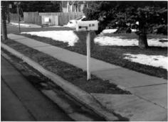

Figure 11-1. Typical Single Mailbox Installations

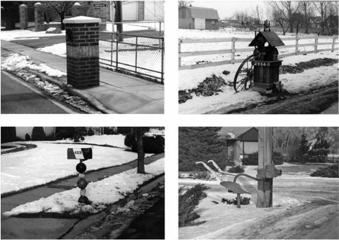

Figure 11-2. Examples of Hazardous Single Mailbox Installations

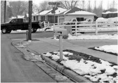

Figure 11-3. Examples of Hazardous Multiple Mailbox Installations

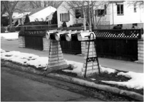

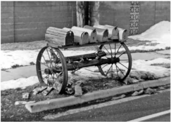

Only by removing mailboxes from our highways can mailbox-related traffic crashes be eliminated. Although removal is impractical, many identifiable problems can be corrected. Through cooperation among transportation agencies, the U.S. Postal Service, and postal patrons, good design practices in mailbox installation and location can be implemented when mailboxes are installed or replaced. This should incur little or no cost increase, with a typical mailbox lasting an average of about 10 years. Furthermore, when highways are rebuilt or undergo significant upgrading, there may be opportunities to incorporate relatively inexpensive mailbox improvements.

The general principles and guidelines contained in this chapter also are applicable to newspaper delivery boxes and similar devices located along public highways. These guidelines are compatible with the requirements of the U.S. Postal Service. Highway agencies and local entities are encouraged to use these guidelines in developing their own mailbox and installation policies and standards. It should be understood that these are general guidelines and that local conditions, including legal institutions and practices, population densities, topography, highway characteristics, snowfall, and prevailing vehicle characteristics, are factors to consider when developing regulations and standards.

## 11.2 GENERAL PRINCIPLES AND GUIDELINES

This section deals with regulations and design. Regulations are needed to establish consistency in acceptable mailbox turnouts and design.

## 11.2.1 Regulations

It  is  recommended that each highway agency adopt regulations for the design and placement of mailboxes and newspaper boxes within the right-of-way of public highways. Correlation of these regulations with those for the granting of driveway entrance permits should be considered. Mailbox and newspaper box control regulations should follow the principles and guidance contained in this chapter and includes the following:

- A reference to pertinent statutes and ordinances.
- A statement that all mailbox installations must meet the requirements of the U.S. Postal Service.
- A requirement that all mailbox and newspaper box installations conform to the current policies and standards of the highway agency regarding location, geometry, and structure of such installations.
- Information on where postal patrons can obtain copies of the current policies and standards.
- A statement on permits, if required.

- A statement on how approval of exceptions can be obtained.
- A description of the highway agency's and the postal patron's responsibilities regarding new and replacement installations.
- A description of the distribution of responsibilities and the procedures to be followed in removing unsafe or nonconforming installations.

Some local jurisdictions have reduced the number of non-conforming mailboxes by requiring the mailbox owners to obtain a waiver from their property insurance company if they want to obtain a permit to construct a massive mailbox installation on the public rightof-way.

## 11.2.2 Mail Stop and Mailbox Location

Mailboxes should be placed for maximum convenience to the patron and should be consistent with safety considerations for highway traffic, the carrier, and the patron. Consideration should be given to

- Minimizing walking distance within the roadway for the patron,
- Available stopping sight distance in advance of the mailbox site, and
- Possible restrictions to corner sight distances at intersections and driveway entrances. Where feasible, new installations should be located on the far right side of an intersection with a road or driveway entrance.

Mailboxes should be placed only on the right-hand side of the highway in the carrier's direction of travel. An exception is one-way streets, where mailboxes may be placed on either side. It is undesirable to require pedestrian travel along the shoulder to access the mailbox; however, this may be the preferred solution when compared to alternatives such as constructing a turnout in a deep cut, placing a mailbox just beyond a sharp crest vertical curve, or constructing two or more closely spaced turnouts.

The placing of mailboxes along both high-speed and high-volume highways should be avoided if other practical locations are available. Mailboxes should not be located where access is from the lanes of an expressway or where access, stopping, or parking is otherwise prohibited by law or regulation. Where there are frontage roads, the abutting property owners may be served by boxes located along them. It is highly undesirable to locate a mailbox that would require a patron to cross the lanes of an expressway to deposit or retrieve mail. When the U.S. Postal Service deems that service is not warranted on both frontage roads or when a frontage road is only on one side, patrons not served directly should be accommodated by mailboxes at a suitable and safe location in the vicinity of the crossroad nearest the patron's property.

In addition, placing a mail stop near an intersection could have an effect on the operation of the intersection. The nature and magnitude of this effect depends on traffic speeds and volumes on each of the intersecting roadways, the number of mailboxes at the stop, type of traffic control, how the stop is located relative to the traffic control, and the distance the stop is from the intersection. At intersections where one roadway has the right-of-way and the other is stop-controlled, a vehicle at a mail stop on the through roadway approach may restrict the view of a vehicle entering the intersection from the right. A mail stop on the far side of a through road's intersection may increase the chance of driver in the crossroad pulling into the path of a vehicle on the through road and headed for the mail stop. A mail stop in advance of a stop sign creates the potential for a vehicle at the mail stop to block the view of the stop sign. The least troublesome location for a mail stop at these intersections is adjacent to a crossroad lane leaving the intersection. Nevertheless, there is still a chance that a driver re-entering traffic from the mail stop will not see or be seen from a vehicle turning onto the crossroad. Figure 11-4 shows the suggested minimum clearance distance to the nearest mailbox for mail stops at intersections. Using the mail stop location dimensions in the figure will minimize the effect on the intersection's operation and the hazard to persons using the mail stop. --'',,',',,,,',,'',',,,,,''','',-'-',,',,',',,'---

Roadside Design Guide 11-4

Figure 11-4. Suggested Minimum Clearance Distance to Nearest Mailbox for Mail Stops at Intersections

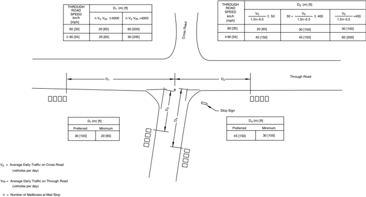

Mailbox heights usually are set to accommodate the mail carrier. Typically, the bottom of the mailbox is located 1,040 mm to 1,140 mm [41 in. to 45 in.] above the mail stop surface. Mailboxes should be located so that a vehicle stopped at it is clear of the adjacent traveled way. The higher the traffic volume or speed, the greater the clearance should be. A reasonable exception to this principle may be on low-volume and low-speed streets and roads.

Most vehicles stopped at a mailbox should be clear of the traveled way when the mailbox is placed outside a 2.4-m [8-ft] wide usable shoulder or turnout. This location is recommended for most rural highways. Although a 2.7-m [9-ft] minimum shoulder width is acceptable, a minimum 3-m [10-ft] turnout should be provided when practical. Where conditions justify, 3.6-m [12-ft] turnouts should be provided. However, it may not be reasonable to require even a 2.4-m [8-ft] shoulder or turnout on very low-volume, low-speed roads or streets. To provide space outside of the all-weather surface to open the mailbox door, it is recommended that the roadside face of a mailbox be set 150 mm to 200 mm [6 in. to 8 in.] outside the all-weather surface of the shoulder or turnout. Table 11-1 shows suggested guidelines for the placement of mailboxes that are based on experience and design judgment. When a mailbox is installed in the vicinity of an existing guardrail, it should, wherever practical, be placed behind the guardrail.

## 11.2.3 Mailbox Turnout Design

Shoulder or turnout widths suitable to safely accommodate vehicles stopped at mailboxes are discussed in Section 11.2.2 and shown in Table 11-1.

Table 11-1. Suggested Guidelines for Lateral Placement of Mailboxes

| Highway Type and ADT (vpd)                              | Width of All-Weather Surface Turnout or Available Shoulder at Mailbox a (m) [ft]   | Width of All-Weather Surface Turnout or Available Shoulder at Mailbox a (m) [ft]   | Distance Roadside Face of Mailbox is to be Offset Behind Edge of Turnout or Usable Shoulder (mm) [in.]   | Distance Roadside Face of Mailbox is to be Offset Behind Edge of Turnout or Usable Shoulder (mm) [in.]   |
|---------------------------------------------------------|------------------------------------------------------------------------------------|------------------------------------------------------------------------------------|----------------------------------------------------------------------------------------------------------|----------------------------------------------------------------------------------------------------------|
|                                                         | Preferred                                                                          | Minimum                                                                            | Preferred                                                                                                | Minimum                                                                                                  |
| Rural Highway Over 10,000                               | > 3.6 [12]                                                                         | 2.4 [8]                                                                            | 150 to 200 [6 to 8]                                                                                      | 0                                                                                                        |
| Rural Highway 1,500 to 10,000                           | 3.6 [12]                                                                           | 2.4 [8]                                                                            | 150 to 200 [6 to 8]                                                                                      | 0                                                                                                        |
| Rural Highway 400 to 1,500                              | 3.0 [10]                                                                           | 2.4 [8]                                                                            | 150 to 200 [6 to 8]                                                                                      | 0                                                                                                        |
| Rural Road Under 400                                    | 2.4 [8]                                                                            | 1.8 [6] b                                                                          | 150 to 200 [6 to 8]                                                                                      | 150 [6] c                                                                                                |
| Residential Street Without Curb or All-Weather Shoulder | 1.8 [6]                                                                            | 0.0 [0.0]                                                                          | 150 to 200 [6 to 8]                                                                                      | 150 [6] c                                                                                                |
| Curbed Residential Street                               | Not Applicable                                                                     | Not Applicable                                                                     | 200 to 305 [8 to 12] d                                                                                   | 150 [6] d                                                                                                |

Notes: ADT = average daily traffic vpd = vehicles per day

a)  If increased access is needed, the following may be considered in conjunction with the local postmaster:

- Provide a level clear space 760 mm by 1220 mm [30 in. by 48 in.] centered on the box for either side or forward approach.
- Provide an accessible passage to and from the mailbox and projection into a circulation route-no more than 100 mm [4 in.] if between 710 mm [28 in.] and 2,030 mm [80 in.]-so that the mailbox does not become a protruding object for pedestrians with impaired vision.

b)  Provide an accessible passage to and from the mailbox. The mailbox projection into a circulation route shall not be more than 100 mm [4 in.], so that the mailbox does not become a protruding object for pedestrians with impaired vision.

c)  If a turnout is provided, this may be reduced to zero.

d)  Behind traffic-face of curb.

The surface over which a vehicle is maneuvered to and from a mailbox must be sufficiently stable to support passenger cars stopping regularly during all weather conditions. When shoulder surface strength or width is not sufficient for this purpose, the shoulder should be modified to provide a suitable all-weather mailbox turnout. In most instances, adequate surface stabilization can be obtained by the addition of select materials to the in-situ soils. A mailbox turnout for grouped mailboxes may require greater stabilization or possibly a

Roadside Design Guide 11-6

surface treatment course to accommodate multiple patron use. Special measures also may be needed where highway traffic conditions encourage hard braking or high acceleration by vehicles entering or exiting the mailbox turnout.

Edge dropoffs often are found at rural mailbox locations. The daily use by the delivery vehicles may loosen the soil at the edge of the pavement. When the soil at the edge is eroded, a drop of 100 mm [4 in.] or more may result. These edge dropoffs can make it difficult for drivers to safely return to the pavement if the vehicle strays onto the unstable soil. The use of paved turnouts is one solution. Another approach is a recent paving innovation called the Safety Edge, which shapes the edge of the traveled way into a 30 degree angle rather than a vertical drop. This new angle is optimal in allowing motorists to return their vehicle to the pavement without overcorrecting or losing control.

Drivers usually are required to slow their vehicles in traffic, which increases the risk of a crash. The ideal way to minimize this risk is to provide a speed-change lane. A wide surface-treated shoulder is ideal for this purpose. Unfortunately, suitable shoulders are not available at most mailbox turnout locations and it would be far too expensive to provide shoulders or turnouts that would allow a speed change outside the traveled way. Figure 11-5 presents a mailbox turnout layout considered appropriate for different traffic conditions.

The minimum space needed for maneuvering to a parallel position in and out of traffic also is shown in Figure 11-5. However, when only the minimum space is provided, the typical driver probably would slow considerably before starting into the low-speed turnout. This tendency renders such minimum space unsuitable for high-speed highways where driver expectancy does not include such slowmoving traffic.

Before entering a 2.4-m [8-ft] wide turnout with a 20:1 taper for high-speed traffic, as shown in Figure 11-5, a driver probably would not slow as much before clearing the traveled way. Although this is not an ideal exit maneuver, it probably would not create an unacceptable hazard on most rural highways for the few stops generated by a single mailbox.

Increasing the width of the turnout to 3.6 m [12 ft] and maintaining the 20:1 taper rate suggested in Figure 11-5 would induce a driver using the turnout to enter it at a fair rate of speed, but it will not be as fast as the through speed. Although this still is not ideal, it should be acceptable for most sites. The exception may be found on highways operating at high speeds and carrying more than 3,000 vehicles per day, with a high percentage of them on long trips. For these conditions, mail stops should be kept to a minimum and consideration should be given to providing shoulders or turnouts at the mail stops to facilitate greater speed-change opportunities outside the traffic stream.

The tapers shown in Figure 11-5 represent theoretical layouts. It may be more practical to square the ends of the turnout or to provide a stepped layout by strengthening and widening the shoulder to the full width of the turnout for the entire length of the taper. It also may be simpler to construct a continuous turnout-width shoulder rather than individual turnouts where mailbox turnouts are closely spaced.

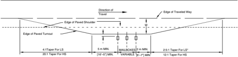

LS = A Minimum Design for Roads Carrying Low-Speed Traffic and for Local and Collector Roads.

HS = For Roads Carrying High-Speed Traffic.

W  = For Suggested Widths, see Table 11-1.

MAILBOXES = For Mailbox Spacing and Variable Length, see Section 11.2.4, Mailbox Support and Attachment Design.

*  = For Mailbox Face Offset, see Table 11-1, 0 mm to 300 mm [0' to 12'].

Figure 11-5. Mailbox Turnout

## 11.2.4 Mailbox Support and Attachment Design

All  exposed conventional mailboxes should be firmly attached to supports that would yield or break away safely if struck by a vehicle. The Manual for Assessing Safety Hardware (MASH) (1) from the American Association of State Highway and Transportation Officials (AASHTO) contains current performance criteria for testing mailbox supports when subjected to impact with an automobile. The criteria can be summarized as follows:

- Mailbox supports should be, with a minor qualification, no more substantial than required to resist service loads and to reason -ably minimize vandalism. Nominal 100-mm-by-100-mm [4-in.-by-4-in.] or 100-mm [4-in.] diameter wood posts or 38-mm to 50-mm [1 1 / 2 -in. to 2-in.]) diameter standard steel or aluminum pipe posts are acceptable. The steel or aluminum pipes should be embedded no more than 610 mm [24 in.] into the ground. Lower strength supports, such as light-weight, flanged-channel steel posts, have provided satisfactory service in most environments. A metal post should not be fitted with an anchor plate. However, an anti-twist device that extends no more than 254 mm [10 in.] below the ground surface is acceptable. The minor qualification to the criterion of minimizing post strength is that the support must break rather than bend under impact. Also, the support should have sufficient strength for the box to be accelerated to a speed approaching that of the impacting vehicle before breaking to mini -mize the chance of the box penetrating the vehicle's windshield. Test results indicate that 100-mm-by-100-mm [4-in.-by-4-in.] or 100-mm [4-in.] diameter wood supports should be both the minimum and maximum post dimensions (2) .
- Mailbox-to-post attachments should prevent mailboxes from separating from their supports when struck by a vehicle. The lighter the mailbox, the easier it will be to meet this criterion. Conversely, given sufficient post attachment strength, the less sensitive the safety of an installation will be to the mass of the mailbox. Acceptable attachment and support details are shown in Figures 11-6 through 11-10. The exact support hardware dimensions and design may vary, such as having a two-piece platform bracket or alternative slot-and-hole locations. However, the product must result in a satisfactory attachment of the mailbox to the post and all components must fit together properly (7) .
- Multiple mailbox installations must meet the same criteria as single mailbox installations. This requirement precludes the use of a heavy horizontal support member, such as the one shown in Figure 11-3. Figures 11-7 through 11-10 show acceptable multiple mailbox support systems. The use of a series of such installations or of individually supported boxes is acceptable. However, vehicle rollover occurred in a high-speed crash test involving a small car impacting off-center of a row of eight closely spaced mailboxes individually supported with 3 kg/m [2 lb/ft] channel post supports (9) .
- Review of the crash test film from this test and results from other tests suggest that this ramping phenomenon is caused by the closely spaced mailboxes piling up. To avoid this problem, it is recommended that the mailbox supports be separated by a distance of no less than 3 / 4 their full heights above ground. It also is preferred that multiple mailbox installations be located outside of the highway clear zone, such as on a service road or a minor intersecting road.

In addition to the general criteria for single and multiple mailbox installations, specific types of mailbox designs have been crash tested and need to have their own installation criteria:

- The Neighborhood Delivery and Collection Box Unit (NDCBU) is a specialized type of multiple mailbox installation, shown in Figure 11-11. The NDCBU is a cluster of 8 to 16 locked boxes mounted on a pedestal or within a framework, the combination of which generally has a mass of between 45 kg and 90 kg [100 lb and 200 lb]. Although the NDCBU usually serves a limited number of single-family residences in urban areas, their use has been observed in rural areas. A crash test of one of these units at 100 km/h [62 mph] showed that it failed to meet safety requirements (4) .
- Therefore, an NDCBU should be located outside the clear zone to allow for safe recovery of errant vehicles and for safe access by postal patrons and carriers. Postmasters and designers responsible for the location of an NDCBU should be instructed to contact local government authorities, including the appropriate highway officials (e.g., state, county, township, municipal) prior to instal -lation. This communication can lead to a safer location of the NDCBU.
- A variety of plastic mailboxes with integral supports are available (see Figure 11-12 for an example). One of the heavier plastic mailboxes (10.9 kg [24 lb]) consists of two components: an upper section contains the mailbox, while a lower section incorporates two newspaper delivery slots and a housing that covers the supporting post. The two sections are connected using four sheet metal screws. Crash tests at 100 km/h [62 mph] were conducted using three different support posts: a 100-mm-by-100-mm [4-in.-by-4-in.] wood post, a 3-kg/m [2-lb/ft] steel U-channel, and a 75-mm [3-in.] steel pipe. In all three tests, the upper section

Roadside Design Guide 11-8

--'',,',',,,,',,'',',,,,,''','',-'-',,',,',',,'---

of the mailbox separated from the lower section on impact, causing only minor damage. All three support designs met NCHRP Report 350 criteria (2 , 8) .

- Vandal-resistant mailboxes typically are shaped like conventional rural mailboxes but are fabricated from heavy gage sheet steel or other substantial materials and have been designed and sold as deterrents to theft or vandalism. These massive boxes, more 5 kg [11 lb] in weight, meet U.S. Postal Service requirements for minimum size, material durability, ease of access, etc., and are quite resistant to deformation. However, full-scale crash testing has shown that these boxes separate from their support on impact and penetrate the passenger compartment easily (7) . Thus, they should not be used within the clear zone of high-speed highways. Vandal-resistant mailboxes, decorative cast-metal boxes (see Figure 11-13), and other massive proprietary or custom-made mailbox supports are only appropriate for use on very low-speed, low-volume residential streets characterized by trees between the curbs and sidewalks, frequent driveway openings, on-street parking, or other features that indicate to drivers that they are in a low-speed environment, and where the minimum horizontal clearance is not an issue.
- Secure mailboxes are unlike traditional tunnel-shaped mailboxes; they have a box-like shape and consist of two main compartments (see Figure 11-14). The top compartment has a hinged door in front of the mailbox (facing the street). This section is used by the mail carrier for incoming mail delivery and outgoing mail pickup. The lower compartment, which has a lockable door, is used for mail pickup. Because no regulations are imposed on the height, weight, or material used for secure mailboxes, significant variations exist. Their heights vary from 280 to 910 mm [11 to 36 in.], and their weights range from 6.4 to 22.7 kg [14 to 50 lb]. The materials include stainless steel, galvanized steel, and aluminum, and they range in thickness from 12 to 20 gage. Supports for secure mailboxes also vary and include square and round posts of steel and aluminum of up to 100 mm [4 in.] across. All posts are available in two mounting configurations: a ground mount in that embeds the post in the soil and a surface mount that bolts the post to a concrete foundation. A study (10) using full-scale crash testing, pendulum testing, and finite-element modeling showed that these secure mailboxes would pass NCHRP Report 350 evaluation criteria and did not show potential for intruding into the occupant compartment if they were securely attached to the provided support posts and if the posts were either embedded 300 to 700 mm [12 to 24 in.] in the ground or were surface-mounted to concrete.

In areas of heavy snowfall, some highway agencies have found cantilever mailbox supports advantageous. Although such designs do permit windshield contact with the box without the vehicle first contacting the support, tests of the design shown in Figures 11-15 and 11-16 did not reveal serious consequences. The operational advantage of these supports is that snow can be plowed close to the mailbox without the snow windrow pushing the support over. The State of Minnesota has developed and tested a swing-away mailbox that is not patented and will not penetrate a vehicle windshield (3, 6) . This type of mailbox support is designed to swing back and out of the way when a snowplow truck goes by. Light-weight newspaper boxes may be mounted below the box on the mailbox support. --'',,',',,,,',,'',',,,,,''','',-'-',,',,',',,'---

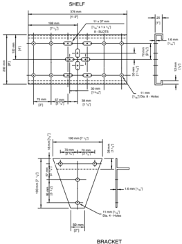

IN FIGURES 11.8 &amp; 11.9. SEE ALTERNATE BRACKET DESIGN

Figure 11-6. Mailbox Support Hardware, Series A

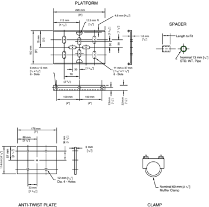

ALL DIMENSIONS IN BRACKETS ARE IN U.S. CUSTOMARY UNITS. NOTE: ALL DIMENSIONS IN MILLIMETERS UNLESS OTHERWISE INDICATED.

--'',,',',,,,',,'',',,,,,''','',-'-',,',,',',,'---

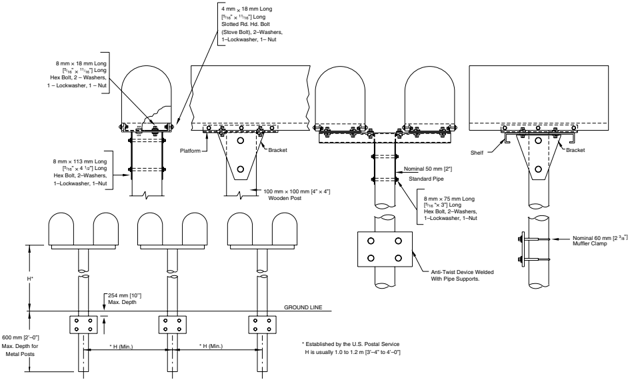

SPACING FOR MULTIPLE POST INSTALLATION

Figure 11-7. Single and Double Mailbox Assemblies, Series A

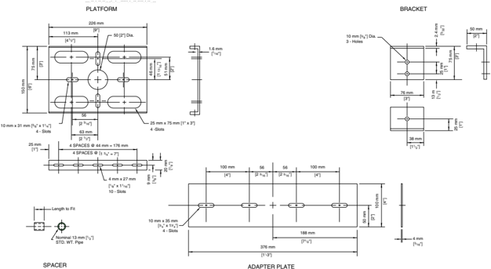

NOTE: ALL DIMENSIONS IN MILLIMETERS UNLESS OTHERWISE INDICATED. ALL DIMENSIONS IN BRACKETS ARE IN U.S. CUSTOMARY UNITS.

Figure 11-8. Mailbox Support Hardware, Series B

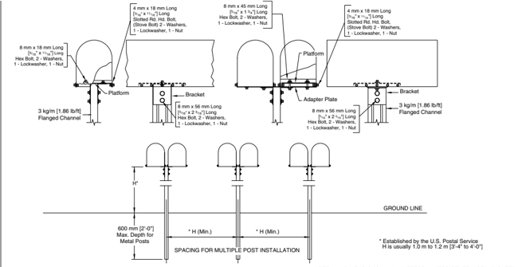

NOTE: ALL DIMENSIONS IN MILLIMETERS UNLESS OTHERWISE INDICATED. ALL DIMENSIONS IN BRACKETS ARE IN U.S. CUSTOMARY UNITS.

Figure 11-9. Single and Double Mailbox Assemblies, Series B

Figure 11-10. Single and Double Mailbox Assemblies, Series C

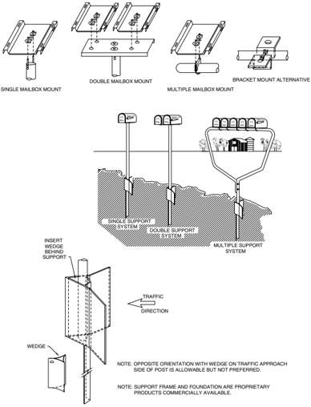

Roadside Design Guide 11-14

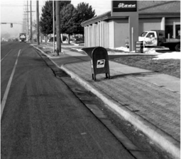

Figure 11-11. Collection Unit on Auxiliary Lane (left) and Neighborhood Delivery and Collection Box Units

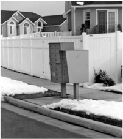

Figure 11-12. Plastic Mailbox with Integral Support

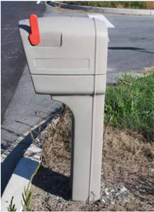

--'',,',',,,,',,'',',,,,,''','',-'-',,',,',',,'---

Figure 11-13. Vandal-Resistant Decorative Mailbox

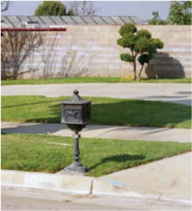

--'',,',',,,,',,'',',,,,,''','',-'-',,',,',',,'---

Figure 11-14. Secure Mailboxes

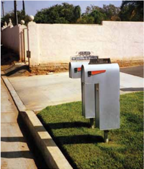

Roadside Design Guide 11-16

## 11.3 U.S. POSTAL SERvICE GUIDANCE AND MODEL MAILBOX REGULATION

## 11.3.1 U.S. Postal Service Guidance

For  more  details  on  U.S.  Postal  Service  requirements  on  mailboxes,  refer  to  their Domestic  Mail  Manual (DMM),  specifically 508  Recipient  Services:  Customer  Mail  Receptacles  (http://pe.usps.com/text/dmm300/508.htm#w1051804),  as  well  as  USPSSTD-7B  Mailboxes-Residential Mailbox Standards (http://www.usps.com/receive/mailboxstandards.htm), and Notice 209 http://uspsnotices.lettercarriernetwork.info/not209.pdf.

## 11.3.2 Model Mailbox Regulation

This section provides a generic model regulation for mailboxes and newspaper delivery boxes on public highway right-of-ways. The model is intended only as an example. States and municipalities can and should tailor the model to fit their own particular needs.

## 11.3.2.1 Scope

No mailbox or newspaper delivery box, hereinafter referred to as mailbox, will be allowed to exist on the Agency's right-of-ways if it interferes with the safety of the traveling public or the function, maintenance, or operation of the highway system.  A mailbox installation not conforming to the provisions of this regulation is an unauthorized encroachment under State Code Section\_\_\_\_\_\_\_\_\_\_\_\_\_\_\_\_\_\_.

The location and construction of mailboxes shall conform to the rules and regulations of the U. S. Postal Service as well as to standards established by the Agency. Agency standards for the location and construction of mailboxes are available from:

Highway Agency

Street Address or P.O. Box

City, State Zip Code

Telephone number

A mailbox installation that conforms to the following criteria will be considered acceptable unless, in the judgment of the Chief Engineer of the Agency, the installation interferes with the safety of the traveling public or the function, maintenance, or operation of the highway system.

## 11.3.2.2 Location

No mailbox will be permitted where access is obtained from a freeway or where access is otherwise prohibited by law or regulation.

Mailboxes shall be located on the right-hand side of the roadway in the carrier's direction of travel route except on one-way streets, where they may be placed on the left-hand side. The bottom of the box shall be set at a height established by the U. S. Postal Service, usually between 1.0 m [39 in.] and 1.2 m [48 in.] above the roadway surface. The roadside face of the box shall be offset from the edge of the traveled way a distance no less than the greater of the following:

- 2.4 m [8 ft] (where no paved shoulder exists and shoulder cross slope is 13 percent or flatter), or
- the width of the all-weather shoulder present plus 200 mm to 300 mm [8 in. to 12 in.], or
- the width of an all-weather turnout specified by the Agency plus 200 mm to 300 mm [8 in. to 12 in.].

Exceptions to these placement criteria will exist on residential streets and certain designated rural roads where the Agency deems it in the public interest to permit lesser clearances or to require greater clearances. On curbed streets, the roadside face of the mailbox shall be set back from the face of the curb at a distance of between 150 mm and 300 mm [6 in. and 12 in.]. On residential streets without curbs or all-weather shoulders that carry low traffic volumes operating at low speeds, the roadside face of the mailbox shall be offset between 200 mm and 300 mm [8 in. and 12 in.] behind the edge of the pavement. On very low-volume rural roads with low operating

--'',,',',,,,',,'',',,,,,''','',-'-',,',,',',,'---

speeds, the Agency may find it acceptable to offset mailboxes a minimum of 2 m [6 ft] from the traveled way and under some lowvolume, low-speed conditions may accept clearances as low as 800 mm [32 in.].

- Where a mailbox is located at a driveway entrance, it shall be placed on the far side of the driveway in the carrier's direction of travel.
- Where a mailbox is located at an intersecting road, it shall be located a minimum of 30 m [100 ft] beyond the center of the intersection road in the carrier's direction of travel. This distance shall be increased to 60 m [200 ft] when the average daily traffic on the intersection road exceeds 400 vehicles per day.
- When a mailbox is installed in the vicinity of an existing guardrail, it should, when practical, be placed behind the guardrail.

## 11.3.2.3 Structure

Design and/or location criteria for the mailbox support structure should consist of the following:

- Mailboxes shall be of light sheet metal or plastic construction conforming to the requirements of the U. S. Postal Service. Newspaper delivery boxes shall be of light metal or plastic construction of minimum dimensions suitable for holding a newspaper.
- No more than two mailboxes may be mounted on a support structure unless crash tests have shown the support structure and mailbox arrangement to be safe. However, light-weight newspaper boxes may be mounted below the mailbox on the side of the mailbox support.
- Mailbox supports shall not be set in concrete unless crash tests have shown the support design to be safe.
- A single 100-mm-by-100-mm [4-in.-by-4-in.] square or 100-mm [4-in.] diameter wooden post; or metal post, Schedule 40, 50 mm [2 in.] (normal size IPS (external diameter 60 mm [2 3 / 8 in.]) (wall thickness 4 mm [0.154 in.] or smaller), embedded no more than 600 mm [24 in.] into the ground, shall be acceptable as a mailbox support. A metal post shall not be fitted with an anchor plate, but it may have an anti-twist device that extends no more than 254 mm [10 in.] below the ground surface.
- The post-to-box attachment details should be of sufficient strength to prevent the box from separating from the post top if the in -stallation is struck by a vehicle. The exact support hardware dimension and design may vary, such as having a two-piece platform bracket or alternative slot-and-hole locations. The product must result in a satisfactory attachment of the mailbox to the post, and all components must fit together properly.
- The minimum spacing between the centers of support posts shall be the height of the posts above the ground line. Mailbox support designs not described in this regulation are acceptable if approved by the Chief Engineer of the Agency.
- Where snow plowing operations cause damage to fixed mailbox installations, the swing-away designs in Figures 11-15 and 11-16 may be used.

## 11.3.2.4 Shoulder and Parking Area Construction

It shall be the responsibility of the postal patron to inform the Agency of any new or existing mailbox installations where shoulder construction is inadequate to permit all-weather vehicular access to the mailbox.

## 11.3.2.5 Removal of Nonconforming or Unsafe Mailboxes

Any mailbox that is found to violate the intent of this regulation shall be removed by the postal patron upon notification by the Agency. At the discretion of the Agency, based on an assessment of hazard to the public, the patron shall be granted not less than 24 hours and no more than 30 days to remove an unacceptable mailbox. After the specified period has expired, the unacceptable mailbox will be removed by the Agency at the postal patron's expense.

Roadside Design Guide 11-18

--'',,',',,,,',,'',',,,,,''','',-'-',,',,',',,'---

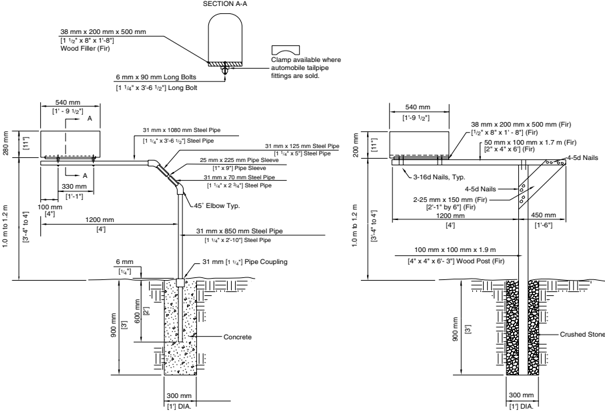

Note: Mailbox support shall not be set in concrete unless crash tests have shown the support design to be safe.

Figure 11-15. Cantilever Mailbox Supports

Figure 11-16. Breakaway Cantilever/Swing-Away Mailbox Support

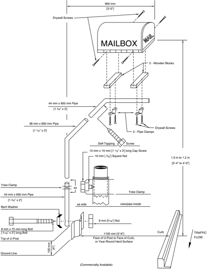

Roadside Design Guide 11-20

--'',,',',,,,',,'',',,,,,''','',-'-',,',,',',,'---

## REFERENCES

1.  AASHTO. Manual for Assessing Safety Hardware (MASH). American Association of State Highway and Transportation Officials, Washington, DC, 2009.
2. Bligh, R. P., Safety Evaluation of Traffic Control Devices and Breakaway Supports . Project Summary Report 0-1792-S: Texas Transportation Institute, Texas A&amp;M University System, College Station, TX, 2003.
3. Bligh, R. P, B. J. DiLance, and W. L. Menges. Impact Performance Evaluation on Modified Swing-Away Mailbox Support, Pooled Fund Study TPF 5(114) . September, 2006.
4. Bullard, D. L., D. C. Alberson, and W. L. Menges. Design and Testing of a Break Away Mount for Cluster Box Unit (CBU) and Neighborhood Delivery and Collection Box Unit (NDCBU) Texas Transportation Institute, Texas A&amp;M University System, College Station, TX, May 1996.
5.  Fatality Analysis Reporting System. Available from http://www.nhtsa.gov/FARS.
6.  Mak, K. K., and W. L. Menges. Testing of State Roadside Safety Systems Volume VII: Appendix F-Crash Testing and Evaluation of the Minnesota Swing-Away Mailbox Support , Report No. FHWA-RD-98-042, Texas Transportation Institute, Texas A&amp;M University System, College Station, TX, February 1998.
7. Ross, H. E. Jr., D. L. Bullard, and D. C. Alberson. Mailbox Bracket Crash Tests: Final Report . TX-94/1945-2F. Transportation Research Board, National Research Council, Washington, DC, 1993.
8. Ross, H. E., Jr., D. L. Sicking, and R. A. Zimmer. National Cooperative Highway Research Report 350: Recommended Procedures for the Safety Performance Evaluation of Highway Features . NCHRP, Transportation Research Board, Washington, DC, 1993.
9. Ross, H. E. Jr., K.C. Walker, and W. J. Lindsay. The Rural Mailbox: A Little-Known Roadside Hazard . Transportation Review Board, National Research Council, Washington, DC, 1980.
10. Tahan, F., D. Marzougui, A. Zaouk, N. Bedewi, A. Eskandarian, and L. Meczkowski. Safety Performance Evaluation of Secure Mailboxes Using Finite Element Simulation and Crash Testing. NCAC 2004-W-001. National Crash Analysis Center, The George Washington University, Ashburn, VA, October 2004.

## Roadside Safety on Low-Volume Roads and Streets

## 12.0 OVERVIEW

Although much of the information and design guidelines contained in earlier chapters address the application of roadside safety design to high-speed, high-volume roadway facilities, some design parameters such as for minimum clear zone and for barrier runouts, are available for roadways with an average daily traffic (ADT) of less than 750 vehicles per day (vpd) and 1,000 vpd, respectively. How -ever, crash data indicates that a significant number of fatal crashes have occurred on roads and streets with even lower traffic volumes. Using functional classification as a surrogate for lower volume facilities, a high proportion of these crashes occur on roads other than freeways and principal arterials (see Figure 12-1). Furthermore, specific types of crashes, such as rollovers and impacts into trees and utility poles, contribute heavily to the overall number of highway deaths resulting from single-vehicle, run-off-the-road crashes, many of which occurred on low-volume roads and streets.

Highway agencies cannot reasonably address all roadside design issues on low-volume roads for one important reason: Although these facilities constitute a major portion of total highway mileage, available funding for improvements on these types of roads is usually a small percentage of the total monies available for highway improvements. Because crashes on these types of facilities seldom are concentrated in specific areas, it is far more difficult to plan and implement cost-effective countermeasures. Though it is important to note that the roadside design principles identified in earlier chapters apply to all public roads and streets, it is equally important to acknowledge that the extent to which these principles can be effectively applied to low-volume roads will vary significantly from jurisdiction to jurisdiction.

It may not be practical to provide an obstacle-free roadside on very low-volume (ADT &lt; 400) local roads and streets. However, every effort should be made to provide as much clear roadside as is practical. This becomes more important as speeds increase. The judicious use of flatter slopes, guardrail, and warning signs all help to achieve roadside safety as well as to reduce crash severity for vehicles that leave the roadway. It may not be cost-effective to design local roads and streets that carry less than 400 vpd and use the same criteria applicable to higher volume roads or to make extensive traffic operational or safety improvements to such very low-volume roads. System-wide strategies to make smaller improvements or concentrate on areas of higher crash locations may be more cost-effective and produce more effective results.

Figure 12-1. Single Vehicle Roadway Departure Fatalities on Two Lanes, Undivided, Noninterchange, Nonconjunction Roads by Roadway Classification in 2009

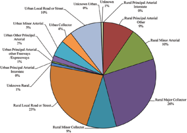
