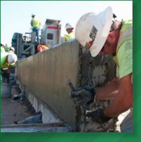

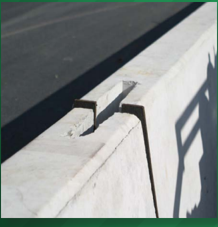

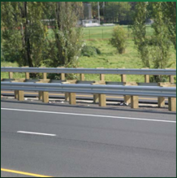

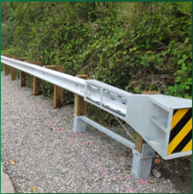

## ROADSIDE DESIGN GUIDE ROADSIDE DESIGN GUIDE

4 th  Edition 2011


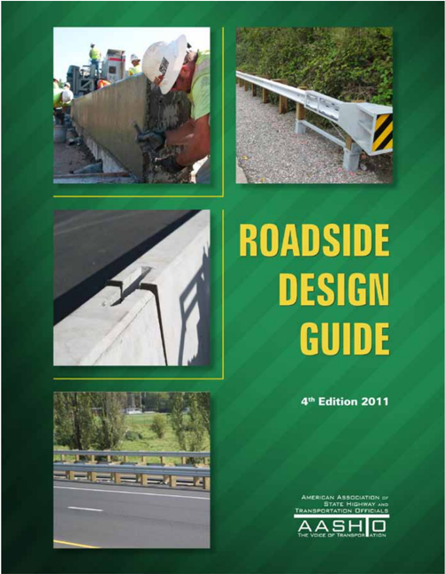

--'',,',',,,,',,'',',,,,,''','',-'-',,',,',',,'---


American Association of State Highway and Transportation Officials 444 North Capitol Street, NW, Suite 249 Washington, DC  20001

202-624-5800 phone/202-624-5806 fax

## www.transportation.org

© 2011 by the American Association of State Highway and Transportation Officials. All rights reserved. Duplication is a violation of applicable law. Cover photographs courtesy of Washington DOT and Missouri DOT.

Publication Code: RSDG-4

ISBN:  978-1-56051-509-8

## Executive Committee 2010-2011

## Officers

President: Susan Martinovich, P.E., NEvADA vice President: Kirk Steudle, P.E., MiCHigAN Secretary/Treasurer: Carlos Braceras, Utah

immediate Past President: Vacant

## Regional Representatives

## REGION I

george N. Campbell, Jr., NEW HAMPSHirE Beverley K. Swaim-Staley, MArylAND

## REGION II

Mike Hancock, KENTuCKy robert St. Onge, SOuTH CArOliNA

## REGION III

Thomas K. Sorel, MiNNESOTA Vacant

## REGION IV

Amadeo Saenz, Jr., TExAS Francis g. Ziegler P.E., NOrTH DAKOTA

## Non-Voting Members

Executive Director:  John Horsley, AASHTO

--'',,',',,,,',,'',',,,,,''','',-'-',,',,',',,'---

## Task Force for Roadside Safety

## Region 1

Delaware

Drew Boyce

Maryland

Teri Soos

New Hampshire

Keith A. Cota (Chair)

New york

richard D. Wilder

## Region 2

Alabama

Steven Walker (vice-Chair)

georgia

Ben Buchan

Mississippi

Steve reeves

louisiana

Paul Fossier

## Region 3

iowa

David little

Kansas

rod lacy

Missouri

Joe Jones

Ohio

Michael Bline

## Region 4

idaho

Damon Allen

South Dakota

Bernie Clocksin

Texas

Aurora (rory) Meza

California

Kevin Herritt

## Subcommittee on Bridges and Structures Representatives

region 1:

Jiten K. Soneji, Delaware

region 2:

vacant

region 3:

vacant

region 4:

vacant

## Others

FHWA

Nick Artimovich (Secretary),

Frank Julian, Ken Opiela, richard Albin

TrB

Charles Niessner

Ontario

Joe Bucik, Mark Ayton

AASHTO liaison

Keith M. Platte

AlABAMA, William Adams, rex Bush, Carey Kelley

AlASKA, Mark Neidhold, robert A. Campbell

AriZONA, Mary viparina

ArKANSAS, Michael Fugett, Phillip l. McConnell

CAliFOrNiA, Terry l. Abbott

COlOrADO, Jeffrey Wassenaar

CONNECTiCuT, Michael W. lonergan, James H. Norman, Timothy M. Wilson

DElAWArE, Michael F. Balbierer, James M. Satterfield

DiSTriCT OF COluMBiA, Said Cherifi, Zahra Dorriz, Allen Miller

FlOriDA, James Mills, David O'Hagan, Frank Sullivan gEOrgiA, James 'Ben' Buchan, russell McMurry, Brent Story

HAWAii, Julius Fronda iDAHO, loren D. Thomas, Nestor Fernandez

illiNOiS, Scott E. Stitt iNDiANA, Jeff Clanton, Merril E. Dougherty, John E. Wright

iOWA, Michael J. Kennerly, David l. little, Deanna Maifield

KANSAS, James O. Brewer, robert lacy

KENTuCKy, Keith Caudill, Bradley S. Eldridge, Jeff D. Jasper lOuiSiANA, Nicholas Kalivoda iii, David S. Smith, Chad Winchester

MAiNE, Bradford P. Foley

MArylAND, Kirk g. McClelland

MASSACHuSETTS, Stanley Wood, Jr.

MiCHigAN, Bradley C. Wieferich

## Highway Subcommittee on Design

vACANT, Chair riCHArD lAND, California, vice Chair

DAviD A. NiCHOl, FHWA, Secretary

KEiTH M. PlATTE, AASHTO, Staff liaison

MiNNESOTA, John M. Chiglo, Mukhtar Thakur

MiSSiSSiPPi, John M. reese, Amy Mood, C. Keith Purvis

MiSSOuri, David B. Nichols, Kathryn P. Harvey

MONTANA, Paul r. Ferry, lesly Tribelhorn

NEBrASKA, James J. Knott,

Ted Watson

NEvADA, Paul Frost, Eric glick, Paul K. Sinnott

NEW HAMPSHirE, Craig A. green

NEW JErSEy, richard Jaffe

NEW MExiCO, gabriela Contreras-Apodaca, Joe S. garcia

NEW yOrK, Daniel D'Angelo

NOrTH CArOliNA, Deborah M. Barbour, Jay A. Bennett, Art McMillan

NOrTH DAKOTA, roger Weigel

OHiO, Dirk gross, Timothy McDonald

OKlAHOMA, Tim Tegeler

OrEgON, David Joe Polly, Steven r. lindland

PENNSylvANiA, Brian D. Hare

PuErTO riCO, luis Santos, José E. Santana-Pimentel rHODE iSlAND, robert Smith

SOuTH CArOliNA, rob Bedenbaugh, Mark lester, Mitchell D. Metts

SOuTH DAKOTA, Michael Behm, Mark A. leiferman

TENNESSEE, Michael Agnew, Jeff C. Jones, Carolyn Stonecipher

TExAS, Mark A. Marek uTAH, Jesse Sweeten, lisa Wilson vErMONT, Kevin Marshia

virgiNiA, robert H. Cary, Mohammad Mirshahi, Barton A. Thrasher

WASHiNgTON, Pasco Bakotich, Terry l. Berends, Nancy Boyd, Dave Olson

WEST virgiNiA, gregory Bailey, Jason C. Foster

WiSCONSiN, Jerry H. Zogg

WyOMiNg, Tony laird

## ASSOCIATE MEMBER-Bridge, Port, and Toll

NJ TurNPiKE AuTHOriTy, J. lawrence Williams

POrT AuTHOriTy OF Ny AND NJ, Scott D. Murrell

## ASSOCIATE MEMBER-Federal

uSDA FOrEST SErviCE, Ellen g. laFayette

ASSOCIATE MEMBERInternational AlBErTA, Moh lali BriTiSH COluMBiA, richard voyer KOrEA, Chan-Su 'Chris' reem ONTAriO, Joe Bucik

SASKATCHEWAN, Sukhy Kent

## Table of Contents

| PRefaCe..................................................................................................................................................xxvii                                                                                                                                                                                                                         |
|----------------------------------------------------------------------------------------------------------------------------------------------------------------------------------------------------------------------------------------------------------------------------------------------------------------------------------------------------------------------------------------|
| ChaPTeR 1-an InTRoduCTIon To RoadsIde safeTy ...................................................................................... 1-1                                                                                                                                                                                                                                                |
| 1.0 HISTORY OF ROADSIDE SAFETY .....................................................................................................................................1-1                                                                                                                                                                                                                |
| 1.1 THE BENEFITS OF ROADSIDE SAFETY............................................................................................................................1-1                                                                                                                                                                                                                     |
| 1.2 STRATEGIC PLAN FOR IMPROVING ROADSIDE SAFETY ...............................................................................................1-2                                                                                                                                                                                                                                    |
| 1.3 GUIDE CONTENT AND FORMAT.......................................................................................................................................1-4                                                                                                                                                                                                                 |
| 1.4 CRASH TESTING ROADSIDE SAFETY FEATURES AND HARDWARE ............................................................................1-4                                                                                                                                                                                                                                                |
| 1.5 THE APPLICATION OF THIS GUIDE...................................................................................................................................1-6                                                                                                                                                                                                                |
| ChaPTeR 2-eConomIC evaluaTIon of RoadsIde safeTy ............................................................................ 2-1                                                                                                                                                                                                                                                      |
| 2.0 OVERVIEW..........................................................................................................................................................................2-1                                                                                                                                                                                              |
| 2.1 BENEFIT/COST ANALYSIS.................................................................................................................................................2-1                                                                                                                                                                                                          |
| 2.1.1 Encroachments................................................................................................................................................................2-2                                                                                                                                                                                                 |
| 2.1.2 Roadside Geometry.........................................................................................................................................................2-2                                                                                                                                                                                                    |
| 2.1.3 Crash Costs......................................................................................................................................................................2-2                                                                                                                                                                                             |
| 2.2 BENEFIT/COST ANALYSIS PROGRAMS...........................................................................................................................2-2                                                                                                                                                                                                                       |
| 2.3 IN-SERVICE PERFORMANCE EVALUATION......................................................................................................................2-3                                                                                                                                                                                                                         |
| ChaPTeR 3-RoadsIde ToPogRaPhy and dRaInage feaTuRes ................................................................. 3-1                                                                                                                                                                                                                                                              |
| 3.0 OVERVIEW..........................................................................................................................................................................3-1                                                                                                                                                                                              |
| 3.1 THE CLEAR-ZONE CONCEPT.............................................................................................................................................3-1                                                                                                                                                                                                             |
| 3.2 ROADSIDE GEOMETRY.....................................................................................................................................................3-4                                                                                                                                                                                                          |
| 3.2.1 Foreslopes .......................................................................................................................................................................3-4 3.2.2 Backslopes.......................................................................................................................................................................3-6 |
| 3.2.3 Transverse                                                                                                                                                                                                                                                                                                                                                                       |
| Slopes...........................................................................................................................................................3-6                                                                                                                                                                                                                   |
| 3.2.4 Drainage Channels ..........................................................................................................................................................3-8                                                                                                                                                                                                  |
| 3.3 APPLICATION OF THE CLEAR-ZONE CONCEPT.............................................................................................................3-10                                                                                                                                                                                                                             |
| 3.3.1 Recoverable Foreslopes................................................................................................................................................3-11                                                                                                                                                                                                       |
| 3.3.2 Non-Recoverable Foreslopes........................................................................................................................................3-11                                                                                                                                                                                                           |
| 3.3.3 Critical Foreslopes.........................................................................................................................................................3-11                                                                                                                                                                                                 |
| Backslopes...............................................................................3-12                                                                                                                                                                                                                                                                                          |
| 3.3.5 Clear-Zone Applications for Drainage Channels and                                                                                                                                                                                                                                                                                                                                |
| 3.4 DRAINAGE FEATURES.....................................................................................................................................................3-12                                                                                                                                                                                                         |
| Curbs..............................................................................................................................................................................3-13                                                                                                                                                                                                |
| 3.4.2 Cross-Drainage Structures............................................................................................................................................3-13                                                                                                                                                                                                        |
| 3.4.1                                                                                                                                                                                                                                                                                                                                                                                  |

| 3.4.2.1 Traversable Designs...................................................................................................................................................3-14            |                                                                       |
|-----------------------------------------------------------------------------------------------------------------------------------------------------------------------------------------------|-----------------------------------------------------------------------|
| 3.4.2.2 Extension of Structure ...............................................................................................................................................3-14            |                                                                       |
| 3.4.2.3 Shielding.....................................................................................................................................................................3-16    |                                                                       |
| 3.4.3 Parallel Drainage Features.............................................................................................................................................3-16             |                                                                       |
| 3.4.3.1 Eliminate the Structure ..............................................................................................................................................3-16            |                                                                       |
| 3.4.3.2 Traversable Designs...................................................................................................................................................3-16            |                                                                       |
| 3.4.3.3 Relocate the Structure................................................................................................................................................3-18            |                                                                       |
| 3.4.3.4 Shielding.....................................................................................................................................................................3-19    |                                                                       |
| 3.4.4 Drop Inlets .....................................................................................................................................................................3-19   |                                                                       |
| 3.5 ExAMPLES OF THE CLEAR-ZONE CONCEPT TO RECOVERABLE FORESLOPES........................................................3-19                                                                  |                                                                       |
| ChaPTeR 4-sIgn, sIgnal, and lumInaIRe suPPoRTs, uTIlITy Poles, TRees,                                                                                                                         | ChaPTeR 4-sIgn, sIgnal, and lumInaIRe suPPoRTs, uTIlITy Poles, TRees, |
| and sImIlaR RoadsIde feaTuRes ............................................................................................................................                                    | 4-1                                                                   |
| 4.0 OVERVIEW..........................................................................................................................................................................4-1     |                                                                       |
| 4.1 ACCEPTANCE CRITERIA FOR BREAKAWAY SUPPORTS.................................................................................................4-2                                            |                                                                       |
| 4.2 DESIGN AND LOCATION CRITERIA FOR BREAKAWAY AND NON-BREAKAWAY SUPPORTS......................................4-2                                                                            |                                                                       |
| 4.3 SIGN SUPPORTS................................................................................................................................................................4-4          |                                                                       |
| 4.3.1 Overhead Sign Supports ................................................................................................................................................4-4              |                                                                       |
| 4.3.2 Large Roadside Sign Supports.......................................................................................................................................4-4                  |                                                                       |
| 4.3.3 Small Roadside Sign Supports.......................................................................................................................................4-7                  |                                                                       |
| 4.4 MULTIPLE POST SUPPORTS FOR SIGNS.......................................................................................................................4-10                               |                                                                       |
| 4.5 LUMINAIRE SUPPORTS...................................................................................................................................................4-10                 |                                                                       |
| 4.5.1 Breakaway Luminaire Supports....................................................................................................................................4-10                    |                                                                       |
| 4.5.2 High-Level Lighting Supports .......................................................................................................................................4-12                |                                                                       |
| 4.6 TRAFFIC SIGNAL SUPPORTS .........................................................................................................................................4-12                     |                                                                       |
| 4.7 SUPPORTS FOR MISCELLANEOUS DEVICES................................................................................................................4-13                                    |                                                                       |
| 4.7.1 Railroad Crossing Warning Devices .............................................................................................................................4-13                     |                                                                       |
| 4.7.2 Fire Hydrants .................................................................................................................................................................4-13     |                                                                       |
| 4.7.3 Mailbox Supports..........................................................................................................................................................4-13          |                                                                       |
| 4.8 UTILITY POLES.................................................................................................................................................................4-13        |                                                                       |
| 4.9 TREES ...............................................................................................................................................................................4-15 |                                                                       |
| ChaPTeR 5-RoadsIde BaRRIeRs ...............................................................................................................................                                   | 5-1                                                                   |
| 5.0 OVERVIEW .........................................................................................................................................................................5-1     |                                                                       |
| 5.1 PERFORMANCE REQUIREMENTS ....................................................................................................................................5-1                          |                                                                       |
| 5.1.1 FHWA Acceptance Letters .............................................................................................................................................5-3                |                                                                       |
| 5.1.2 Standard Barrier Hardware Guide .................................................................................................................................5-3                    |                                                                       |
| 5.2 BARRIER RECOMMENDATIONS........................................................................................................................................5-3                        |                                                                       |
| 5.2.1 Roadside Geometry and Terrain Features......................................................................................................................5-4                         |                                                                       |
| 5.2.2 Roadside Obstacles ........................................................................................................................................................5-9          |                                                                       |
| 5.2.3 Bystanders, Pedestrians, and Bicyclists ......................................................................................................................5-10                      |                                                                       |

--'',,',',,,,',,'',',,,,,''','',-'-',,',,',',,'---

| 5.2.4 Motorcycles and Barrier Design ..................................................................................................................................5-10               |
|-------------------------------------------------------------------------------------------------------------------------------------------------------------------------------------------|
| 5.3 TEST LEVEL SELECTION FACTORS ...............................................................................................................................5-10                      |
| 5.4 STRUCTURAL AND SAFETY CHARACTERISTICS OF ROADSIDE BARRIERS .............................................................5-11                                                          |
| 5.4.1 Standard Sections of Roadside Barriers .....................................................................................................................5-11                    |
| 5.4.1.1 Low-Tension Cable .....................................................................................................................................................5-13       |
| 5.4.1.2 High-Tension Cable.....................................................................................................................................................5-14       |
| 5.4.1.3 W-Beam (Weak Post) .................................................................................................................................................5-14          |
| 5.4.1.4 Ironwood Aesthetic Guardrail ...................................................................................................................................5-15              |
| 5.4.1.5 Box Beam (Weak Post) ..............................................................................................................................................5-15           |
| 5.4.1.6 Blocked-Out W-Beam (Strong Post) .........................................................................................................................5-16                    |
| 5.4.1.7 Midwest Guardrail System (MGS).............................................................................................................................5-18                   |
| 5.4.1.8 Proprietary W-Beam Guardrail Systems....................................................................................................................5-20                      |
| 5.4.1.8.1 Gregory Mini Spacer™ (GMS) Guardrail System ..................................................................................................5-21                              |
| 5.4.1.8.2 Trinity T-31™ Guardrail System ..............................................................................................................................5-21               |
| 5.4.1.8.3 NU-GUARD™ 31 by Nucor Steel Marion, Inc. .......................................................................................................5-22                            |
| 5.4.1.9 Blocked-Out Thrie-Beam ...........................................................................................................................................5-23            |
| 5.4.1.9.1 Blocked-Out Thrie-Beam (Wood and Steel Strong Post) ......................................................................................5-23                                  |
| 5.4.1.9.2 Modified Thrie-Beam ..............................................................................................................................................5-23          |
| 5.4.1.9.3 Trinity T-39™ Guardrail System .............................................................................................................................5-24                |
| 5.4.1.10 Merritt Parkway Aesthetic Guardrail .......................................................................................................................5-25                  |
| 5.4.1.11 Backed Timber Guardrail ........................................................................................................................................5-26             |
| 5.4.1.12 Concrete Barriers .....................................................................................................................................................5-26      |
| 5.4.1.13 CUSHIONWALL® II Crash Cushion System............................................................................................................5-29                             |
| 5.4.1.14 Stone Masonry Wall/Precast Masonry Wall ...........................................................................................................5-29                          |
| 5.4.2 Long-Span Guardrail Systems .....................................................................................................................................5-30               |
| 5.4.3 Transition Designs ........................................................................................................................................................5-31     |
| 5.5 SELECTION GUIDELINES ................................................................................................................................................5-32             |
| 5.5.1 Barrier Performance Capability ....................................................................................................................................5-32             |
| 5.5.2 Barrier Deflection Characteristics ................................................................................................................................5-33             |
| 5.5.3 Site Conditions .............................................................................................................................................................5-38   |
| 5.5.4 Compatibility .................................................................................................................................................................5-38 |
| 5.5.5 Life-Cycle Costs ............................................................................................................................................................5-38   |
| 5.5.6 Maintenance .................................................................................................................................................................5-38   |
| 5.5.6.1 Routine Maintenance ................................................................................................................................................5-38          |
| 5.5.6.2 Crash Maintenance ....................................................................................................................................................5-38        |
| 5.5.6.3 Material and Storage Requirements .........................................................................................................................5-39                   |
| 5.5.6.4 Simplicity of Barrier Design ......................................................................................................................................5-39           |
| 5.5.7 Aesthetic and Environmental Considerations .............................................................................................................5-39                        |
| 5.5.8 Field Experience ...........................................................................................................................................................5-39    |

| 5.6 PLACEMENT RECOMMENDATIONS ..............................................................................................................................5-39                             |     |
|----------------------------------------------------------------------------------------------------------------------------------------------------------------------------------------------|-----|
| 5.6.1 Barrier Offset ................................................................................................................................................................5-40    |     |
| 5.6.2 Terrain Effects ...............................................................................................................................................................5-43    |     |
| 5.6.2.1 Curbs ..........................................................................................................................................................................5-43 |     |
| 5.6.2.1.1 Curb/Guardrail Combinations for Strong-Post W-Beam Guardrail........................................................................5-44                                           |     |
| 5.6.2.1.2 Crash Tested Curb/Guardrail Combinations...........................................................................................................5-45                            |     |
| 5.6.2.2 Slopes ........................................................................................................................................................................5-46  |     |
| 5.6.3 Flare Rate ......................................................................................................................................................................5-48  |     |
| 5.6.5 Grading for Terminals....................................................................................................................................................5-59          |     |
| 5.6.6 Guardrail Placed in a Radius ........................................................................................................................................5-60              |     |
| 5.6.7 Guardrail Posts in Rigid Foundations ...........................................................................................................................5-61                   |     |
| 5.6.7.1 Guardrail Posts in Rock Formations...........................................................................................................................5-61                    |     |
| 5.6.7.2 Guardrail Posts in Mow Strips ...................................................................................................................................5-61                |     |
| 5.7 UPGRADING SYSTEMS ..................................................................................................................................................5-66                 |     |
| 5.7.1 Structural Inadequacies ...............................................................................................................................................5-66            |     |
| 5.7.2 Design/Placement Inadequacies ..................................................................................................................................5-66                   |     |
| 5.7.3 Establishing Priorities of Upgrading Needs .................................................................................................................5-66                       |     |
| ChaPTeR 6-medIan BaRRIeRs ...................................................................................................................................                                | 6-1 |
| 6.0 OVERVIEW .........................................................................................................................................................................6-1    |     |
| 6.1 PERFORMANCE REQUIREMENTS ....................................................................................................................................6-1                         |     |
| 6.2 GUIDELINES FOR MEDIAN BARRIER APPLICATION .......................................................................................................6-1                                     |     |
| 6.3 PERFORMANCE LEVEL SELECTION PROCEDURES .......................................................................................................6-3                                        |     |
| 6.4 STRUCTURAL AND SAFETY CHARACTERISTICS OF MEDIAN BARRIERS ...................................................................6-3                                                          |     |
| 6.4.1 Crashworthy Median Barrier Systems ...........................................................................................................................6-3                      |     |
| 6.4.1.1 Weak-Post W-Beam Median Barrier.............................................................................................................................6-5                      |     |
| 6.4.1.2 Low-Tension Cable Barrier ..........................................................................................................................................6-5              |     |
| 6.4.1.3 High-Tension Cable Barrier ..........................................................................................................................................6-6             |     |
| 6.4.1.4 Box-Beam Median Barrier ...........................................................................................................................................6-9               |     |
| 6.4.1.5 Blocked-Out W-Beam (Strong Post) ...........................................................................................................................6-9                      |     |
| 6.4.1.6 Blocked-Out Thrie-Beam (Strong Post) ....................................................................................................................6-10                        |     |
| 6.4.1.7 Modified Thrie-Beam Median Barrier .......................................................................................................................6-10                       |     |
| 6.4.1.8 Concrete Barrier ........................................................................................................................................................6-11        |     |
| 6.4.1.9 Quickchange ® Moveable Barrier System .................................................................................................................6-14                          |     |
| 6.4.2 End Treatments .............................................................................................................................................................6-14       |     |
| 6.4.3 Transitions .....................................................................................................................................................................6-16  |     |
| 6.5 SELECTION GUIDELINES ................................................................................................................................................6-16                |     |
| 6.5.1 Barrier Performance Capability ....................................................................................................................................6-16                |     |
| 6.5.2 Barrier Deflection Characteristics ................................................................................................................................6-16                |     |
| 6.5.3 Compatibility .................................................................................................................................................................6-16    |     |

--'',,',',,,,',,'',',,,,,''','',-'-',,',,',',,'---

| 6.5.4 Costs .............................................................................................................................................................................6-17   |                                                                                                                                               |
|-------------------------------------------------------------------------------------------------------------------------------------------------------------------------------------------------|-----------------------------------------------------------------------------------------------------------------------------------------------|
| 6.5.5 Maintenance .................................................................................................................................................................6-17         |                                                                                                                                               |
| 6.5.6 Aesthetic and Environmental Considerations .............................................................................................................6-17                              |                                                                                                                                               |
| 6.5.7 Field Experience ...........................................................................................................................................................6-17          |                                                                                                                                               |
| 6.6 PLACEMENT RECOMMENDATIONS ..............................................................................................................................6-17                                |                                                                                                                                               |
| 6.6.1 Terrain Effects ...............................................................................................................................................................6-17       |                                                                                                                                               |
| 6.6.1.1 Median Section I.........................................................................................................................................................6-18           |                                                                                                                                               |
| 6.6.1.2 Median Section II........................................................................................................................................................6-18           |                                                                                                                                               |
| 6.6.1.3 Median Section III.......................................................................................................................................................6-19           |                                                                                                                                               |
| 6.6.2 Fixed Objects within the Median .................................................................................................................................6-20                     |                                                                                                                                               |
| 6.7 UPGRADING SYSTEMS ..................................................................................................................................................6-21                    |                                                                                                                                               |
| ChaPTeR 7-BRIdge RaIlIngs and TRansITIons ............................................................................................... 7-1                                                   | ChaPTeR 7-BRIdge RaIlIngs and TRansITIons ............................................................................................... 7-1 |
| 7.0 OVERVIEW..........................................................................................................................................................................7-1       |                                                                                                                                               |
| 7.1 PERFORMANCE REQUIREMENTS.....................................................................................................................................7-1                            |                                                                                                                                               |
| 7.2 GUIDELINES .......................................................................................................................................................................7-2       |                                                                                                                                               |
| 7.3 APPROPRIATE TEST LEVEL SELECTION CONSIDERATIONS..........................................................................................7-2                                                |                                                                                                                                               |
| 7.4 CRASH-TESTED RAILINGS ................................................................................................................................................7-2                   |                                                                                                                                               |
| 7.4.1 NCHRP 350 TL-1 through TL-4 Bridge Railings..............................................................................................................7-4                              |                                                                                                                                               |
| 7.4.2 MASH TL-5 and TL-6 Bridge Railings .............................................................................................................................7-5                       |                                                                                                                                               |
| 7.5 SELECTION GUIDELINES...................................................................................................................................................7-6                  |                                                                                                                                               |
| 7.5.1 Railing Performance ........................................................................................................................................................7-6           |                                                                                                                                               |
| 7.5.2 Compatibility....................................................................................................................................................................7-7      |                                                                                                                                               |
| 7.5.3 Costs ................................................................................................................................................................................7-7 |                                                                                                                                               |
| 7.5.4 Field Experience..............................................................................................................................................................7-7         |                                                                                                                                               |
| 7.5.5 Aesthetics ........................................................................................................................................................................7-7    |                                                                                                                                               |
| 7.5.6 Protective Screening at Overpasses...............................................................................................................................7-7                      |                                                                                                                                               |
| 7.6 PLACEMENT RECOMMENDATIONS.................................................................................................................................7-8                               |                                                                                                                                               |
| 7.6.1 Considerations for Urban and Low-Volume Roads........................................................................................................7-8                                  |                                                                                                                                               |
| 7.7 UPGRADING OF BRIDGE RAILINGS................................................................................................................................7-10                            |                                                                                                                                               |
| 7.7.1 Identification of Potentially Obsolete Systems ............................................................................................................7-10                           |                                                                                                                                               |
| 7.7.2 Upgrading Systems.......................................................................................................................................................7-11              |                                                                                                                                               |
| 7.7.2.1 Concrete Retrofit (Safety Shape or Vertical) .............................................................................................................7-11                          |                                                                                                                                               |
| 7.7.2.2 W-Beam or Thrie-Beam Retrofits...............................................................................................................................7-12                       |                                                                                                                                               |
| 7.7.2.3 Metal Post-and-Beam Retrofits ..................................................................................................................................7-13                    |                                                                                                                                               |
| 7.8 TRANSITIONS...................................................................................................................................................................7-14          |                                                                                                                                               |
| ChaPTeR 8-end TReaTmenTs ....................................................................................................................................                                   | 8-1                                                                                                                                           |
| 8.0 OVERVIEW..........................................................................................................................................................................8-1       |                                                                                                                                               |
| 8.1 PERFORMANCE REQUIREMENTS.....................................................................................................................................8-1                            |                                                                                                                                               |

| 8.1.1 FHWA Acceptance Letters .............................................................................................................................................8-2               |
|----------------------------------------------------------------------------------------------------------------------------------------------------------------------------------------------|
| 8.1.2 Guide to Standardized Barrier Hardware .......................................................................................................................8-2                      |
| 8.2 ANCHORAGE DESIGN CONCEPTS...................................................................................................................................8-2                          |
| 8.3 TERMINAL DESIGN CONCEPTS........................................................................................................................................8-3                      |
| 8.3.1 Compatibility of Terminals with Flexible and Semi-Rigid Barrier Systems ..................................................................8-3                                          |
| 8.3.2 Performance Characteristics of Terminals......................................................................................................................8-4                      |
| 8.3.2.1 Energy-Absorbing vs. Non-Energy-Absorbing Terminals ..........................................................................................8-4                                    |
| 8.3.2.2 Flared versus Tangent Terminals.................................................................................................................................8-4                  |
| 8.3.2.3 Length-of-Need Point ...................................................................................................................................................8-4          |
| 8.3.3 Site Grading Considerations for Terminals ....................................................................................................................8-4                      |
| 8.3.3.1 Advance Grading..........................................................................................................................................................8-5         |
| 8.3.3.2 Adjacent Grading .........................................................................................................................................................8-5        |
| 8.3.3.3 Runout Distance Grading.............................................................................................................................................8-6              |
| 8.3.4 Terminals..........................................................................................................................................................................8-7 |
| 8.3.5 Terminals for Cable Barrier Systems..............................................................................................................................8-7                   |
| 8.3.5.1 Three-Strand Cable Terminal.......................................................................................................................................8-7                |
| 8.3.5.2 Terminals for High-Tension Cable Barrier Systems.....................................................................................................8-8                             |
| 8.3.6 Terminals for W-Beam Guardrail Systems .....................................................................................................................8-9                        |
| 8.3.6.1 Buried-in-Backslope Terminal ....................................................................................................................................8-10                |
| 8.3.6.2 Flared W-Beam Terminals ..........................................................................................................................................8-11               |
| 8.3.6.2.1 Eccentric Loader Terminal (ELT) .............................................................................................................................8-11                  |
| 8.3.6.2.2 Modified Eccentric Loader Terminal (MELT) ..........................................................................................................8-12                           |
| 8.3.6.2.3 Flared Energy-Absorbing Terminal (FLEAT™)........................................................................................................8-12                              |
| 8.3.6.2.4 Slotted Rail Terminal (SRT-350™) ...........................................................................................................................8-12                   |
| 8.3.6.2.5 x-Tension™ Guardrail End Terminal .......................................................................................................................8-13                      |
| 8.3.6.3 Tangent W-Beam Terminals .......................................................................................................................................8-14                 |
| 8.3.6.3.1 Extruder Terminal (ET-Plus™)..................................................................................................................................8-14                 |
| 8.3.6.3.2 Sequential Kinking Terminal (SKT-350™) ...............................................................................................................8-15                         |
| 8.3.6.3.3 x-Tension™ Guardrail Terminal...............................................................................................................................8-16                   |
| 8.3.6.4 Terminals for 787-mm [31-in.] Height Steel Beam Guardrail Systems ....................................................................8-16                                           |
| 8.3.6.5 Median Terminals .......................................................................................................................................................8-16         |
| 8.3.6.5.1 Brakemaster® 350...................................................................................................................................................8-16            |
| 8.3.6.5.2 Crash Cushion Attenuating Terminal (CAT-350™)..................................................................................................8-18                                |
| 8.3.6.5.3 FLEAT Median Terminal (FLEAT-MT™)...................................................................................................................8-18                           |
| 8.3.6.5.4 x-Tension™ Median Attenuator System (x-MAS)..................................................................................................8-18                                  |
| 8.3.7 Terminals for Box-Beam Guardrail................................................................................................................................8-19                   |
| 8.3.7.1 Wyoming Box-Beam End Terminal (WY-BET™)........................................................................................................8-20                                  |
| 8.3.7.2 Bursting Energy Absorbing Terminal (BEAT™).........................................................................................................8-20                              |
| 8.4 CRASH CUSHION DESIGN CONCEPTS ..........................................................................................................................8-21                             |

| 8.4.1 Design Principles...........................................................................................................................................................8-22        |
|-----------------------------------------------------------------------------------------------------------------------------------------------------------------------------------------------|
| 8.4.1.1 Work-Energy Principle................................................................................................................................................8-22             |
| 8.4.1.2 Conservation of Momentum Principle.......................................................................................................................8-22                         |
| 8.4.2 Crash Cushions Based on Work-Energy Principle .......................................................................................................8-23                               |
| 8.4.2.1 Sacrificial Crash Cushions..........................................................................................................................................8-23              |
| 8.4.2.1.1 Thrie-Beam Bullnose Guardrail System.................................................................................................................8-24                           |
| 8.4.2.1.2 ABSORB 350®.........................................................................................................................................................8-24            |
| 8.4.2.1.3 Advanced Dynamic Impact Extension Module (ADIEM™)....................................................................................8-25                                           |
| 8.4.2.1.4 Bursting Energy Absorbing Terminal-Single Sided Crash Cushion (BEAT-SSCC™) System .............................8-25                                                                 |
| 8.4.2.1.5 Bursting Energy Absorbing Terminal-Bridge Pier (BEAT-BP™) System...............................................................8-26                                                 |
| 8.4.2.1.6 QuadTrend® 350.....................................................................................................................................................8-27             |
| 8.4.2.1.7 Narrow Connecticut Impact Attenuation System (NCIAS)....................................................................................8-27                                        |
| 8.4.2.2 Reusable Crash Cushions ..........................................................................................................................................8-28                |
| 8.4.2.2.1 QuadGuard® Family ...............................................................................................................................................8-28               |
| 8.4.2.2.2 Universal TAU-II® Family ........................................................................................................................................8-29               |
| 8.4.2.2.3 Trinity Attenuating Crash Cushion (TRACC™) Family............................................................................................8-30                                   |
| 8.4.2.2.4 QUEST® Crash Cushion .........................................................................................................................................8-30                  |
| 8.4.2.3 Low-Maintenance and/or Self-Restoring Crash Cushions........................................................................................8-31                                      |
| 8.4.2.3.1 Compressor™ Attenuator .......................................................................................................................................8-31                  |
| 8.4.2.3.2 EASI-CELL® Cluster ................................................................................................................................................8-32             |
| 8.4.2.3.3 Hybrid Energy Absorbing Reusable Terminal (HEART™)......................................................................................8-32                                        |
| 8.4.2.3.4 QuadGuard Elite ......................................................................................................................................................8-33          |
| 8.4.2.3.5 QuadGuard Low-Maintenance Cartridge (LMC) ....................................................................................................8-34                                  |
| 8.4.2.3.6 Reusable Energy-Absorbing Crash Terminal (REACT 350®) ................................................................................8-34                                          |
| 8.4.2.3.7 Smart Cushion Innovations 100GM and 70GM (SCI-100GM and SCI-70GM)......................................................8-35                                                         |
| 8.4.3 Crash Cushions Based on Conservation of Momentum Principle ..............................................................................8-36                                           |
| 8.4.4 Miscellaneous Crash Cushions and End Treatments for Concrete Barriers ...............................................................8-41                                               |
| 8.4.4.1 Sloped Concrete End Treatment................................................................................................................................8-42                     |
| 8.4.4.2 Buried Concrete Barrier Terminal ..............................................................................................................................8-42                   |
| 8.4.4.3 Dragnet .......................................................................................................................................................................8-42   |
| 8.4.4.4 Ground Retractable Automotive Barrier (GRAB-300®)............................................................................................8-43                                     |
| 8.4.4.5 Gravel-Bed Attenuator ...............................................................................................................................................8-44             |
| 8.4.4.6 STOPGATE®...............................................................................................................................................................8-44          |
| 8.4.4.7 Florida Low-Profile Barrier Terminal..........................................................................................................................8-45                    |
| 8.4.5 Crash Cushion Selection Guidelines ............................................................................................................................8-45                     |
| 8.4.5.1 Site Characteristics.....................................................................................................................................................8-45         |
| 8.4.5.2 Crash Cushion Structural and Safety Characteristics...............................................................................................8-45                                |
| 8.4.5.3 Costs ...........................................................................................................................................................................8-47 |
| 8.4.5.4 Maintenance Characteristics......................................................................................................................................8-47                 |

| 8.4.5.5 Selection Criteria ........................................................................................................................................................8-50                                                 |                                                                                                                                                 |
|-----------------------------------------------------------------------------------------------------------------------------------------------------------------------------------------------------------------------------------------|-------------------------------------------------------------------------------------------------------------------------------------------------|
| 8.4.5.6 Inclusion Area.............................................................................................................................................................8-50                                                 |                                                                                                                                                 |
| 8.4.6 Placement Recommendations......................................................................................................................................8-51                                                               |                                                                                                                                                 |
| 8.5 DELINEATION OF END TREATMENTS............................................................................................................................8-51                                                                       |                                                                                                                                                 |
| ChaPTeR 9-TRaffIC BaRRIeRs, TRaffIC ConTRol devICes, and oTheR safeTy feaTuRes foR WoRk Zones ......................................................................................................................................... | 9-1                                                                                                                                             |
| 9.0 OVERVIEW..........................................................................................................................................................................9-1                                               |                                                                                                                                                 |
| 9.1 THE CLEAR-ZONE CONCEPT IN WORK ZONES...............................................................................................................9-2                                                                              |                                                                                                                                                 |
| 9.1.1 Application of the Clear-Zone Concept in Work Zones .................................................................................................9-2                                                                          |                                                                                                                                                 |
| 9.2 TRAFFIC BARRIERS............................................................................................................................................................9-2                                                     |                                                                                                                                                 |
| 9.2.1 Temporary Longitudinal Barriers ....................................................................................................................................9-2                                                           |                                                                                                                                                 |
| 9.2.1.1 Test-Level Requirements..............................................................................................................................................9-3                                                        |                                                                                                                                                 |
| 9.2.1.2 Portable Concrete Barriers...........................................................................................................................................9-3                                                        |                                                                                                                                                 |
| 9.2.1.2.1 Iowa Temporary Concrete Barrier.............................................................................................................................9-4                                                               |                                                                                                                                                 |
| 9.2.1.2.2 Rockingham Precast Concrete Barrier......................................................................................................................9-6                                                                  |                                                                                                                                                 |
| 9.2.1.2.4 Modified Virginia DOT Portable Concrete Barrier                                                                                                                                                                               |                                                                                                                                                 |
| ....................................................................................................9-7                                                                                                                                 |                                                                                                                                                 |
| 9.2.1.2.6 GPLINK® Pre-Cast Temporary Concrete Barrier......................................................................................................9-9                                                                          |                                                                                                                                                 |
| 9.2.1.2.7 Georgia Temporary Concrete Barrier                                                                                                                                                                                            | .......................................................................................................................9-9                      |
| 9.2.1.2.8 Idaho 6.1-m [20-ft] New Jersey Portable Barrier....................................................................................................9-10                                                                       |                                                                                                                                                 |
| 9.2.1.2.9 Oregon Pin-and-Loop Barrier .................................................................................................................................9-11                                                             |                                                                                                                                                 |
| 9.2.1.2.10 Ohio DOT 3-m [10-ft] Long New Jersey Profile Temporary 9.2.1.2.11 New York DOT Portable Concrete Barrier.............................................................................................................9-12    | Concrete Barrier.....................................................9-12                                                                       |
| 9.2.1.2.12 Iowa DOT Tie-Down Steel H-Section Temporary Barrier ....................................................................................9-13                                                                                 |                                                                                                                                                 |
| 9.2.1.2.13 Quick-Bolt F-Shaped Concrete Safety Barrier......................................................................................................9-14                                                                        |                                                                                                                                                 |
| 9.2.1.2.14 Texas x-Bolt F-Shaped Concrete Safety Barrier...................................................................................................9-14                                                                         |                                                                                                                                                 |
| 9.2.1.2.15 Texas Single Slope Concrete Barrier (SSCB) .......................................................................................................9-15                                                                       |                                                                                                                                                 |
| 9.2.1.2.16 Minimizing Deflection............................................................................................................................................9-16                                                        |                                                                                                                                                 |
| 9.2.1.2.17 Restricted Sites......................................................................................................................................................9-19                                                   |                                                                                                                                                 |
| 9.2.1.3.1 Quickchange ® Barrier                                                                                                                                                                                                         |                                                                                                                                                 |
| System.................................................................................................................................9-19 9.2.1.3.2 Low-Profile Barrier                                                               | System.....................................................................................................................................9-20 |
| 9.2.1.3.3 Florida Low-Profile Barrier System.........................................................................................................................9-20                                                               |                                                                                                                                                 |
| 9.2.1.4 Other Barriers .............................................................................................................................................................9-20                                                |                                                                                                                                                 |
| 9.2.1.4.1 Water-Filled Barriers................................................................................................................................................9-20                                                     |                                                                                                                                                 |
| 9.2.1.4.2 Steel Barriers ...........................................................................................................................................................9-21                                                |                                                                                                                                                 |
| 9.2.2 End Treatments..............................................................................................................................................................9-22                                                  |                                                                                                                                                 |
| 9.2.3 Transitions......................................................................................................................................................................9-23                                             |                                                                                                                                                 |

--'',,',',,,,',,'',',,,,,''','',-'-',,',,',',,'---

© 2011 by the American Association of State Highway and Transportation Officials.

| 9.2.3.1 Portable Concrete Barrier Steel Plate Transition.......................................................................................................9-23                         |      |
|---------------------------------------------------------------------------------------------------------------------------------------------------------------------------------------------|------|
| 9.2.3.2 F-Shaped Portable Concrete Barrier to Low-Profile Barrier Transition ....................................................................9-24                                       |      |
| 9.2.4 Applications...................................................................................................................................................................9-24   |      |
| 9.3 Crash Cushions.................................................................................................................................................................9-25     |      |
| 9.3.1 Stationary Crash Cushions............................................................................................................................................9-25             |      |
| 9.3.1.1 Sand-Filled Plastic Barrels..........................................................................................................................................9-25           |      |
| 9.3.1.2 QuadGuardD TM CZ System ........................................................................................................................................9-26                |      |
| 9.3.1.3 REACT ® 350 CZ ..........................................................................................................................................................9-26       |      |
| 9.3.2 Truck- and Trailer-Mounted Attenuators (TMAs)..........................................................................................................9-27                           |      |
| 9.3.2.1 Test-Level Selection for TMAs...................................................................................................................................9-29                |      |
| 9.3.2.2 Placement ..................................................................................................................................................................9-29    |      |
| 9.3.2.2.1 Buffer Distance ........................................................................................................................................................9-29      |      |
| 9.3.2.2.2 Mass of a Shadow Vehicle......................................................................................................................................9-30                |      |
| 9.3.2.2.3 Delineation...............................................................................................................................................................9-30    |      |
| 9.3.2.3 Crashworthy TMAs ....................................................................................................................................................9-30           |      |
| 9.4 TRAFFIC CONTROL DEVICES..........................................................................................................................................9-32                   |      |
| 9.4.1 Channelizing Devices ....................................................................................................................................................9-33         |      |
| 9.4.1.1 Test-Level Evaluation Criteria.....................................................................................................................................9-33             |      |
| 9.4.1.2 Cones and Tubular Markers ......................................................................................................................................9-33                |      |
| 9.4.1.3 Vertical Panels.............................................................................................................................................................9-34    |      |
| 9.4.1.4 Drums .........................................................................................................................................................................9-35 |      |
| 9.4.1.5 Barricades...................................................................................................................................................................9-35   |      |
| 9.4.1.6 Longitudinal Channelizing Devices............................................................................................................................9-37                   |      |
| 9.4.2 Signs and Supports.......................................................................................................................................................9-38         |      |
| 9.4.2.1 Long- and Intermediate-Term Work-Zone Sign Supports.........................................................................................9-38                                    |      |
| 9.4.2.2 Wheeled Portable Sign Supports ..............................................................................................................................9-38                   |      |
| 9.4.2.3 Short-Term Work-Zone Sign Supports ......................................................................................................................9-38                       |      |
| 9.4.2.4 Trailer-Mounted Devices ............................................................................................................................................9-39            |      |
| 9.4.2.5 Warning Lights............................................................................................................................................................9-40      |      |
| 9.5 OTHER WORK-ZONE FEATURES.....................................................................................................................................9-40                       |      |
| 9.5.1 Glare Screens ................................................................................................................................................................9-40    |      |
| 9.5.2 Pavement Edge Drop-Offs ............................................................................................................................................9-41              |      |
| ChaPTeR 10-RoadsIde safeTy In uRBan oR ResTRICTed envIRonmenTs ........................................                                                                                     | 10-1 |
| 10.0 OVERVIEW......................................................................................................................................................................10-1     |      |
| 10.1 EVALUATION OF CRITICAL URBAN ROADSIDE LOCATIONS......................................................................................10-2                                              |      |
| 10.1.1 Evaluation of Individual Sites......................................................................................................................................10-2             |      |
| 10.1.2 Design Speed and Functional Use..............................................................................................................................10-3                    |      |
| 10.1.3 Targeted Design Approach for High-Risk Urban Roadside Corridors.......................................................................10-3                                           |      |
| 10.1.3.1 Obstacles in Close Proximity to Curb Face or Lane Edge ......................................................................................10-3                                  |      |

--'',,',',,,,',,'',',,,,,''','',-'-',,',,',',,'---

| 10.1.3.2 Lane Merge Locations..............................................................................................................................................10-4             |                                                                                                                          |
|---------------------------------------------------------------------------------------------------------------------------------------------------------------------------------------------|--------------------------------------------------------------------------------------------------------------------------|
| 10.1.3.3 Driveway Locations..................................................................................................................................................10-5           |                                                                                                                          |
| 10.1.3.4 Intersection Locations..............................................................................................................................................10-6           |                                                                                                                          |
| 10.2 ROADSIDE FEATURES FOR URBAN AND RESTRICTED AREAS.................................................................................10-7                                                  |                                                                                                                          |
| 10.2.1 Common Urban Roadside Features ...........................................................................................................................10-7                       |                                                                                                                          |
| 10.2.1.1 Curbs.........................................................................................................................................................................10-7 |                                                                                                                          |
| 10.2.1.2 Shoulders..................................................................................................................................................................10-8    |                                                                                                                          |
| 10.2.1.3 Channelization and Medians....................................................................................................................................10-8                 |                                                                                                                          |
| 10.2.1.4 Gateways ..................................................................................................................................................................10-8    |                                                                                                                          |
| 10.2.1.5 Roadside Grading.....................................................................................................................................................10-9          |                                                                                                                          |
| 10.2.1.6 Pedestrian Facilities ..................................................................................................................................................10-9       |                                                                                                                          |
| 10.2.1.7 Bicycle Facilities......................................................................................................................................................10-11      |                                                                                                                          |
| 10.2.1.8 Parking ....................................................................................................................................................................10-12  |                                                                                                                          |
| 10.2.2 Safe Placement of Roadside Objects .......................................................................................................................10-12                      |                                                                                                                          |
| 10.2.2.1 Mailboxes ...............................................................................................................................................................10-12     |                                                                                                                          |
| 10.2.2.2 Street Furniture.......................................................................................................................................................10-13       |                                                                                                                          |
| 10.2.2.3 Vertical Roadside Treatments and Their Hardware ..............................................................................................10-13                                |                                                                                                                          |
| 10.2.2.3.1 Utility Poles ..........................................................................................................................................................10-14    |                                                                                                                          |
| 10.2.2.3.2 Lighting and Visibility..........................................................................................................................................10-14           |                                                                                                                          |
| 10.2.2.3.3 Sign Posts and Roadside Hardware ...................................................................................................................10-14                        |                                                                                                                          |
| 10.2.3 Placement of Landscaping, Trees, and Shrubs........................................................................................................10-15                             |                                                                                                                          |
| 10.2.4 Use of Roadside Barriers...........................................................................................................................................10-16             |                                                                                                                          |
| 10.2.4.1 Barrier Warrants......................................................................................................................................................10-17        |                                                                                                                          |
| 10.2.4.2 Barriers to Protect Adjacent Land Use .................................................................................................................10-17                       |                                                                                                                          |
| 10.2.4.3 Common Urban Barrier Treatments ......................................................................................................................10-17                        |                                                                                                                          |
| 10.2.4.3.1 Roadside and Median Barriers............................................................................................................................10-17                    |                                                                                                                          |
| 10.2.4.3.2 Crash Cushions....................................................................................................................................................10-17          |                                                                                                                          |
| 10.2.4.3.3 Pedestrian Restraint Systems .............................................................................................................................10-18                  |                                                                                                                          |
| 10.3 DRAINAGE....................................................................................................................................................................10-18      |                                                                                                                          |
| 10.4 URBAN WORK ZONES.................................................................................................................................................10-19                 |                                                                                                                          |
| ChaPTeR 11-eReCTIng maIlBoxes on sTReeTs and hIghWays ............................................................. 11-1                                                                    | ChaPTeR 11-eReCTIng maIlBoxes on sTReeTs and hIghWays ............................................................. 11-1 |
| 11.0 OVERVIEW......................................................................................................................................................................11-1     |                                                                                                                          |
| 11.1 MAILBOxES....................................................................................................................................................................11-1      |                                                                                                                          |
| 11.2 GENERAL PRINCIPLES AND GUIDELINES....................................................................................................................11-3                              |                                                                                                                          |
| 11.2.1 Regulations..................................................................................................................................................................11-3    |                                                                                                                          |
| 11.2.2 Mail Stop and Mailbox Location.................................................................................................................................11-4                  |                                                                                                                          |
| 11.2.3 Mailbox Turnout Design..............................................................................................................................................11-6             |                                                                                                                          |
| 11.2.4 Mailbox Support and Attachment Design..................................................................................................................11-8                          |                                                                                                                          |

--'',,',',,,,',,'',',,,,,''','',-'-',,',,',',,'---

| 11.3 U.S. POSTAL SERVICE GUIDANCE AND MODEL MAILBOx REGULATION .............................................................11-17                                                         |
|-------------------------------------------------------------------------------------------------------------------------------------------------------------------------------------------|
| 11.3.1 U.S. Postal Service Guidance....................................................................................................................................11-17              |
| 11.3.2 Model Mailbox Regulation........................................................................................................................................11-17              |
| 11.3.2.1 Scope......................................................................................................................................................................11-17 |
| 11.3.2.2 Location ..................................................................................................................................................................11-17 |
| 11.3.2.3 Structure .................................................................................................................................................................11-18 |
| 11.3.2.4 Shoulder and Parking Area Construction..............................................................................................................11-18                        |
| 11.3.2.5 Removal of Nonconforming or Unsafe Mailboxes ...............................................................................................11-18                                |
| ChaPTeR 12-RoadsIde safeTy on loW-volume Roads and sTReeTs ............................................... 12-1                                                                           |
| 12.0 OVERVIEW......................................................................................................................................................................12-1   |
| 12.1 STRATEGIES...................................................................................................................................................................12-2    |
| 12.2 SIGNING, MARKING, AND DELINEATION.....................................................................................................................12-2                           |
| 12.3 CLEAR ZONE..................................................................................................................................................................12-3     |
| 12.4 SLOPES AND DITCHES..................................................................................................................................................12-4             |
| 12.5 DRAINAGE STRUCTURES .............................................................................................................................................12-4                |
| 12.7 ROADSIDE BARRIERS....................................................................................................................................................12-6            |
| 12.8 BRIDGES.........................................................................................................................................................................12-7 |
| glossaRy................................................................................................................................................ g-1                              |
| Index.........................................................................................................................................................I-1                         |

ChaPTeR 1

| Figure 1-1. Motor Vehicle Crash Deaths and Deaths Per 100 Million Vehicle Miles Traveled, 1950-2008...........................1-2                                                                                                                                                      |
|----------------------------------------------------------------------------------------------------------------------------------------------------------------------------------------------------------------------------------------------------------------------------------------|
| Figure 1-2. Percent Distribution of Fixed-Object Fatalities by Object Struck, 2008...............................................................1-3                                                                                                                                   |
| ChaPTeR 3                                                                                                                                                                                                                                                                              |
| Figure 3-1. Roadway Geometry Features................................................................................................................................3-5                                                                                                               |
| Figure 3-2. Clear Zone for Non-Recoverable Parallel Foreslope ............................................................................................3-6                                                                                                                          |
| Figure 3-3. Suggested Design for Transverse Slopes.............................................................................................................3-7                                                                                                                     |
| Figure 3-4. Median Transverse Slope Design .........................................................................................................................3-7                                                                                                                |
| Figure 3-5. Alternate Designs for Drains at Median Openings...............................................................................................3-8                                                                                                                          |
| Figure 3-6. Preferred Cross Sections for Channels with Abrupt Slope Changes..................................................................3-9                                                                                                                                       |
| Figure 3-7. Preferred Cross Sections for Channels with Gradual Slope Changes...............................................................3-10                                                                                                                                        |
| Figure 3-8. Design Criteria for Safety Treatment of Pipes and Culverts ..............................................................................3-15                                                                                                                              |
| Figure 3-9. Safety Treatment for Cross-Drainage Culvert.....................................................................................................3-15                                                                                                                       |
| Figure 3-10. Inlet and Outlet Design Example for Parallel Drainage....................................................................................3-17                                                                                                                             |
| Figure 3-11. Alternate Location for a Parallel Drainage Culvert ...........................................................................................3-18                                                                                                                        |
| Figure 3-12. Safety Treatment for Parallel Drainage Pipe.....................................................................................................3-18                                                                                                                      |
| ChaPTeR 4                                                                                                                                                                                                                                                                              |
| Figure 4-1. Breakaway Support Stub Height Measurements.................................................................................................4-3                                                                                                                             |
| Figure 4-2. Wind and Impact Loads on Roadside Signs.........................................................................................................4-5                                                                                                                        |
| Figure 4-3. Impact Performance of a Multiple-Post Sign Support .........................................................................................4-5                                                                                                                            |
| Figure 4-4. Multidirectional Coupler........................................................................................................................................4-6                                                                                                        |
| Figure 4-5. Typical Unidirectional Slip Base............................................................................................................................4-6                                                                                                            |
| Figure 4-6. Slotted Fuse Plate Design......................................................................................................................................4-6                                                                                                         |
| Figure 4-7. Perforated Fuse Plate Design ................................................................................................................................4-7                                                                                                           |
| Figure 4-8. Unidirectional Slip Base for Small Signs ..............................................................................................................4-9                                                                                                                 |
| Figure 4-9. Multidirectional Slip Base for Small Signs ...........................................................................................................4-9                                                                                                                  |
| Figure 4-10. Oregon 3-Bolt Slip Base ....................................................................................................................................4-10                                                                                                          |
| Figure 4-12. Example of a Luminaire Slip Base Design........................................................................................................4-11                                                                                                                       |
| Figure 4-11. Example of a Cast Aluminum Frangible Luminaire..........................................................................................4-11                                                                                                                              |
| Figure 4-13. Example of a Frangible Coupling Design .........................................................................................................4-11                                                                                                                      |
| Figure 4-14. Prototype Breakaway Design for Utility Poles..................................................................................................4-15                                                                                                                        |
| ChaPTeR 5                                                                                                                                                                                                                                                                              |
| Figure 5-1(a). Comparative Barrier Consideration for Embankments (Metric Units) ...........................................................5-5 Figure 5-1(b). Comparative Barrier Consideration for Embankments (U.S. Customary Units) ............................................5-6 |

xviii

## list of figures

--'',,',',,,,',,'',',,,,,''','',-'-',,',,',',,'---

| Figure 5-2(a). Example Design Chart for Embankment Barrier Consideration Based on Fill Height, Slope, and Traffic Volume (Metric Units) ................................................................................................................................5-7   |
|-------------------------------------------------------------------------------------------------------------------------------------------------------------------------------------------------------------------------------------------------------------------------------|
| Figure 5-2(b). Example Design Chart for Embankment Barrier Consideration Based on Fill Height, Slope, and Traffic Volume (U.S. Customary Units) ................................................................................................................5-7           |
| Figure 5-3(a). Example Design Chart for Cost-Effective Barrier Consideration for Embankments Based on Traffic Speeds and Volumes, Slope Geometry, and Length of Slope (Metric Units) ......................................................5-8                                |
| Figure 5-3(b). Example Design Chart for Cost-Effective Barrier Consideration for Embankments Based on Traffic Speeds and Volumes, Slope Geometry, and Length of Slope (U.S. Customary Units) .......................................5-8                                       |
| Figure 5-4. Definition of Roadside Barriers ...........................................................................................................................5-11                                                                                                   |
| Figure 5-5. Three-Strand Cable Barrier .................................................................................................................................5-13                                                                                                  |
| Figure 5-6. Weak-Post W-Beam Guardrail .............................................................................................................................5-14                                                                                                      |
| Figure 5-7. Ironwood Aesthetic Guardrail.............................................................................................................................5-15                                                                                                     |
| Figure 5-8. Weak-Post Box Beam Guardrail ..........................................................................................................................5-16                                                                                                       |
| Figure 5-9. Steel-Post W-Beam Guardrail with Wood Blockouts..........................................................................................5-16                                                                                                                     |
| Figure 5-10. Midwest Guardrail System (MGS) ....................................................................................................................5-18                                                                                                          |
| Figure 5-11. Gregory Mini Spacer .........................................................................................................................................5-21                                                                                                |
| Figure 5-12. Trinity T-31™ Guardrail System.........................................................................................................................5-22                                                                                                      |
| Figure 5-13. NU-GUARD™-31 Guardrail System...................................................................................................................5-22                                                                                                             |
| Figure 5-14. Wood-Post Thrie-Beam Guardrail .....................................................................................................................5-23                                                                                                         |
| Figure 5-15. Modified Thrie-Beam Guardrail.........................................................................................................................5-24                                                                                                       |
| Figure 5-16. Trinity T-39™ Guardrail System.........................................................................................................................5-25                                                                                                      |
| Figure 5-17. Merritt Parkway Aesthetic Guardrail .................................................................................................................5-25                                                                                                        |
| Figure 5-18. Backed Timber Guardrail...................................................................................................................................5-26                                                                                                   |
| Figure 5-19. Low Profile Barrier .............................................................................................................................................5-27                                                                                            |
| Figure 5-20. Constant Slope Barrier ......................................................................................................................................5-27                                                                                                |
| Figure 5-21. 2,290-mm [90-in.] New Jersey Barrier..............................................................................................................5-28                                                                                                           |
| Figure 5-22. CushionWall ® II System .....................................................................................................................................5-29                                                                                                |
| Figure 5-23. Stone Masonry Wall...........................................................................................................................................5-29                                                                                                |
| Figure 5-24. Precast Masonry Wall ........................................................................................................................................5-30                                                                                                |
| Figure 5-25. Long-Span, Nested W-Beam Guardrail.............................................................................................................5-31                                                                                                              |
| Figure 5-26. Long-Span MGS.................................................................................................................................................5-31                                                                                               |
| Figure 5-27. Zone of Intrusion for TL-2 .................................................................................................................................5-35                                                                                                 |
| Figure 5-28. Zone of Intrusion for TL-3 Concrete Barriers and Steel Tubular Rails on Curbs.............................................5-36                                                                                                                                   |
| Figure 5-29. Zone of Intrusion for TL-3 Combination and Timber Barriers .........................................................................5-36                                                                                                                         |
| Figure 5-30. Zone of Intrusion for TL-3 Steel Tubular Rails Not on Curbs...........................................................................5-37                                                                                                                       |
| Figure 5-31. Zone of Intrustion for TL-4 Barriers per NCHRP Report 350............................................................................5-37                                                                                                                        |
| Figure 5-32. Example Guardrail and Embankment Layout Sheet........................................................................................5-40                                                                                                                        |
| Figure 5-33. Recommended Barrier Placement for Optimum Performance........................................................................5-41                                                                                                                                |
| Figure 5-34. MGS Placed at 1V:2H Slope Breakpoint...........................................................................................................5-42                                                                                                              |
| Figure 5-35(a). Example Laydown Curb for Use Offset from Guardrail...............................................................................5-43                                                                                                                         |
| Figure 5-35(b). Example Laydown Curb near End Terminal.................................................................................................5-44                                                                                                                   |

| Figure 5-36. MGS Offset from Curb.......................................................................................................................................5-45   |
|--------------------------------------------------------------------------------------------------------------------------------------------------------------------------------|
| Figure 5-37. Design Parameters for Vehicle Encroachments on Slopes..............................................................................5-46                           |
| Figure 5-38. Recommended Barrier Location on 1V:6H.......................................................................................................5-47                  |
| Figure 5-39. Approach Barrier Layout Variables ...................................................................................................................5-49         |
| Figure 5-40(a). Example Design Chart for a Flared Roadside Barrier ..................................................................................5-52                      |
| Figure 5-40(b). Example Design Chart for a Flared Roadside Barrier Installation (U.S. Customary Units) ........................5-52                                            |
| Figure 5-41(a). Example Design Chart for a Parallel Roadside Barrier Installation (Metric Units).......................................5-53                                    |
| Figure 5-41(b). Example Design Chart for a Parallel Roadside Barrier Installation (U.S. Customary Units).......................5-53                                            |
| Figure 5-42. Approach Barrier Layout for Opposing Traffic .................................................................................................5-54                |
| Figure 5-43. Determination of Trailing End Guardrail Layout...............................................................................................5-54                 |
| Figure 5-44. Suggested Roadside Slopes for Approach Barriers ........................................................................................5-55                      |
| Figure 5-45. Example of Barrier Design for Bridge Approach..............................................................................................5-56                   |
| Figure 5-46. Example of Barrier Design for Bridge Piers......................................................................................................5-57              |
| Figure 5-47. Example of Barrier Design for Non-Traversable Embankments......................................................................5-58                               |
| Figure 5-48. Example of Barrier Design for Fixed Object on Horizontal Curve...................................................................5-59                             |
| Figure 5-49. Example Field Installation with Terminal ..........................................................................................................5-60           |
| Figure 5-50. Possible Solution to Intersection Side Road Near Bridge................................................................................5-60                       |
| Figure 5-51(a). Guardrail Post Details in Rock Formation (Metric Units)..............................................................................5-62                      |
| Figure 5-51(b). Guardrail Post Details in Rock Formation (U.S. Customary Units)..............................................................5-63                              |
| Figure 5-52(a). Guardrail Post Details in Mow Strip Applications (Metric Units).................................................................5-64                           |
| Figure 5-52(b). Guardrail Post Details in Mow Strip Applications (U.S. Customary Units) .................................................5-65                                  |
| ChaPTeR 6                                                                                                                                                                      |
| Figure 6-1. Guidelines for Median Barriers on High-speed, Fully Controlled-Access Roadways.........................................6-2                                         |
| Figure 6-2. Weak-Post W-Beam Median Barrier ......................................................................................................................6-5          |
| Figure 6-3. Three-Strand Cable Median Barrier......................................................................................................................6-6         |
| Figure 6-4. Brifen Wire Rope Safety Fence .............................................................................................................................6-7     |
| Figure 6-5. The Cable Safety System (CASS) ........................................................................................................................6-8         |
| Figure 6-6. NU-CABLE™ High-Tension Cable System ............................................................................................................6-8                |
| Figure 6-7. Safence Cable Barrier System...............................................................................................................................6-8     |
| Figure 6-8. Gibraltar Cable Barrier System..............................................................................................................................6-9    |
| Figure 6-9. Box-Beam Median Barrier .....................................................................................................................................6-9   |
| Figure 6-10. Strong-Post W-Beam Median Barrier................................................................................................................6-10             |
| Figure 6-11. Modified Thrie-Beam Median Barrier ...............................................................................................................6-11            |
| Figure 6-12. New York Modification of Concrete Barrier......................................................................................................6-12               |
| Figure 6-13. Concrete Safety-Shape Median Barrier ............................................................................................................6-13             |
| Figure 6-14. Single-Slope Concrete Median Barrier.............................................................................................................6-13             |
| Figure 6-15. Standard Quickchange® Moveable Barrier System........................................................................................6-14                         |
| Figure 6-16. Barrier Termination at Permanent Openings....................................................................................................6-15                 |

| Figure 6-17. BarrierGate.........................................................................................................................................................6-15   |
|-----------------------------------------------------------------------------------------------------------------------------------------------------------------------------------------|
| Figure 6-18. Recommended Barrier Placement in Non-Level Medians...............................................................................6-19                                      |
| Figure 6-19. Example of a Split Median Barrier Layout........................................................................................................6-20                       |
| Figure 6-20. Suggested Layout for Shielding a Rigid Object in a Median...........................................................................6-21                                   |
| ChaPTeR 7                                                                                                                                                                               |
| Figure 7-1. Curb Type Glu-Lam Timber Railing.......................................................................................................................7-4                  |
| Figure 7-2. Texas T-6 Railing ....................................................................................................................................................7-4   |
| Figure 7-3. Wyoming Two-Tube Bridge Railing.......................................................................................................................7-5                   |
| Figure 7-4. Concrete F-Shaped Bridge Railing........................................................................................................................7-5                 |
| Figure 7-5. 1,067-mm [42-in.] Tall Concrete Safety-Shaped Bridge Railing...........................................................................7-6                                  |
| Figure 7-6. Texas Type TT Railing ............................................................................................................................................7-6       |
| Figure 7-7. End Treatment for Traffic Railing on a Bridge in Low-Speed Situations .............................................................7-9                                      |
| Figure 7-8. Terminating a Traffic Barrier on Bridge with End Terminal ................................................................................7-10                              |
| Figure 7-9. Iowa Concrete Block Retrofit Bridge Railing.......................................................................................................7-12                      |
| Figure 7-10. Delaware Thrie-Beam Retrofit...........................................................................................................................7-13                |
| Figure 7-11. Metal Post-and-Beam Retrofit ...........................................................................................................................7-14               |
| Figure 7-12. Thrie-Beam Transition to Modified Concrete Safety Shape ............................................................................7-15                                   |
| ChaPTeR 8                                                                                                                                                                               |
| Figure 8-1. Trailing End W-Beam Guardrail Anchorage..........................................................................................................8-3                        |
| Figure 8-2. Grading for Flared Guardrail Terminal ..................................................................................................................8-5                 |
| Figure 8-3. Grading for Tangent Guardrail Terminal ...............................................................................................................8-6                   |
| Figure 8-4. Three-Strand Cable Terminal ................................................................................................................................8-8             |
| Figure 8-5. CASS™ Cable Terminal (CCT) ...............................................................................................................................8-8               |
| Figure 8-6. W-Beam Guardrail Anchored in Backslope ........................................................................................................8-10                         |
| Figure 8-7. Eccentric Loader Terminal (ELT)..........................................................................................................................8-11               |
| Figure 8-8. Modified Eccentric Loader Terminal (MELT).......................................................................................................8-12                        |
| Figure 8-9. Flared Energy-Absorbing Terminal (FLEAT™) ....................................................................................................8-13                          |
| Figure 8-10. Slotted Rail Terminal (SRT-350™)......................................................................................................................8-13                 |
| Figure 8-11. x-Tension Guardrail End Terminal.....................................................................................................................8-14                  |
| Figure 8-12. Extruder Terminal (ET-Plus™)............................................................................................................................8-15               |
| Figure 8-13. Sequential Kinking Terminal (SKT-350™)..........................................................................................................8-16                       |
| Figure 8-14. Brakemaster® 350.............................................................................................................................................8-17          |
| Figure 8-15. Crash Cushion Attenuating Terminal (CAT-350™) ............................................................................................8-18                             |
| Figure 8-16. FLEAT Median Terminal (FLEAT-MT™)..............................................................................................................8-19                        |
| Figure 8-17. x-Tension™ Median Attenuator System (x-MAS) ............................................................................................8-19                               |
| Figure 8-18. Wyoming Box-Beam End Terminal (WY-BET ™ ) ...............................................................................................8-20                              |
| Figure 8-19. Bursting Energy Absorbing Terminal (BEAT ™ ) ................................................................................................8-21                          |
| Figure 8-20. Bullnose Guardrail System................................................................................................................................8-24              |

| Figure 8-21. ABSORB 350® Crash Cushion..........................................................................................................................8-25                                                     |      |
|--------------------------------------------------------------------------------------------------------------------------------------------------------------------------------------------------------------------------|------|
| Figure 8-22. Advanced Dynamic Impact Extension Module (ADIEM™) .............................................................................8-25                                                                         |      |
| Figure 8-23. Bursting Energy Absorbing Terminal-Single Sided Crash Cushion (BEAT-SSCC™) System ........................8-26                                                                                              |      |
| Figure 8-24. Bursting Energy Absorbing Terminal-Bridge Pier (BEAT-BP™) System..........................................................8-26                                                                              |      |
| Figure 8-25. QuadTrend® 350 ...............................................................................................................................................8-27                                          |      |
| Figure 8-26. Narrow Connecticut Impact Attenuation System (NCAIS) ..............................................................................8-27                                                                     |      |
| Figure 8-27. QuadGuard® Crash Cushion.............................................................................................................................8-29                                                   |      |
| Figure 8-28. TAU-II Crash Cushion.........................................................................................................................................8-29                                           |      |
| Figure 8-29. Trinity Attenuating Crash Cushion (TRACC™)..................................................................................................8-30                                                            |      |
| Figure 8-30. QUEST® Crash Cushion....................................................................................................................................8-30                                                |      |
| Figure 8-31. Compressor Attenuator.....................................................................................................................................8-32                                              |      |
| Figure 8-33. Hybrid Energy Absorbing Reusable Terminal (HEART™)................................................................................8-33                                                                      |      |
| Figure 8-34. QuadGuard Elite.................................................................................................................................................8-33                                        |      |
| Figure 8-35. QuadGuard Low-Maintenance Cartridge (LMC)...............................................................................................8-34                                                                |      |
| Figure 8-36. Reusable Energy-Absorbing Crash Terminal (REACT 350®)...........................................................................8-35                                                                        |      |
| Figure 8-37. Smart Cushion Innovations (SCI-100GM) Crash Cushion................................................................................8-35                                                                     |      |
| Figure 8-38. Conservation of Momentum Principle..............................................................................................................8-37                                                        |      |
| Figure 8-39. The Fitch Universal Barrel® ..............................................................................................................................8-38                                              |      |
| Figure 8-40. Suggested Layout for the Last Three Exterior Modules in an Inertial Barrier.................................................8-38                                                                            |      |
| Figure 8-41. Sand Barrel Array for Reverse-Direction Impacts............................................................................................8-40                                                             |      |
| Figure 8-42. Sand Barrel Array Oriented Towards Approaching Traffic ..............................................................................8-41                                                                   |      |
| Figure 8-43. Sloped Concrete End Treatment.......................................................................................................................8-42                                                    |      |
| Figure 8-44. Barrier Anchored in Backslope..........................................................................................................................8-43                                                 |      |
| Figure 8-45. Dragnet...............................................................................................................................................................8-43                                  |      |
| Figure 8-46. Ground Retractable Automotive Barrier (GRAB-300 ® ) ...................................................................................8-44                                                                 |      |
| Figure 8-47. STOPGATE ®..............................................................................................................................                                                                    | 8-44 |
| ChaPTeR 9                                                                                                                                                                                                                |      |
| Figure 9-1. Iowa Temporary Concrete Barrier.........................................................................................................................9-5                                                  |      |
| Figure 9-2. Rockingham Precast Concrete Barrier..................................................................................................................9-6                                                     |      |
| Figure 9-3. J-J Hooks Portable Concrete Barrier ....................................................................................................................9-7                                                  |      |
| Figure 9-4. Modified Virginia DOT Portable Concrete Barrier ................................................................................................9-7                                                          |      |
| Figure 9-5. California K-Rail Portable Concrete Barrier...........................................................................................................9-8 --'',,',',,,,',,'',',,,,,''','',-'-',,',,',',,'--- |      |
| Figure 9-6. GPLINK ® Pre-Cast Temporary Concrete Barrier ...................................................................................................9-9                                                          |      |
| Figure 9-7. Georgia Temporary Concrete Barrier..................................................................................................................9-10                                                     |      |
| Figure 9-8. Idaho 6.1-m [20-ft] New Jersey Portable Barrier ................................................................................................9-11                                                         |      |
| Figure 9-9. Oregon Pin-and-Loop Barrier..............................................................................................................................9-11                                                |      |
| Figure 9-10. Ohio DOT 3-m [10-ft] Long New Jersey Profile Temporary Concrete Barrier.................................................9-12                                                                                |      |
| Figure 9-11. New York DOT Portable Concrete Barrier.........................................................................................................9-13                                                         |      |
| Figure 9-12. Iowa DOT Tie-Down Steel H-Section Temporary Barrier.................................................................................9-14                                                                    |      |

| Figure 9-13. Quick-Bolt F-Shaped Concrete Safety Barrier .................................................................................................9-14                        |
|---------------------------------------------------------------------------------------------------------------------------------------------------------------------------------------|
| Figure 9-14. Texas x-Bolt F-Shaped Concrete Safety Barrier...............................................................................................9-15                         |
| Figure 9-15. Texas SSCB .......................................................................................................................................................9-16   |
| Figure 9-16. TxDOT New Jersey-Shaped Portable Concrete Barrier Pinned-with-Stakes Design......................................9-17                                                    |
| Figure 9-17. Pinned F-Shaped Temporary Barrier ................................................................................................................9-18                   |
| Figure 9-18. Quickchange ® Barrier System...........................................................................................................................9-19              |
| Figure 9-19. Low-Profile Barrier System ...............................................................................................................................9-20           |
| Figure 9-20. Water-Filled Barrier ............................................................................................................................................9-21    |
| Figure 9-21. Steel Barrier ......................................................................................................................................................9-22 |
| Figure 9-22. Slope-End Treatment for Low-Profile Portable Concrete Barrier.....................................................................9-23                                   |
| Figure 9-23. Portable Concrete Barrier Steel Plate Transition ..............................................................................................9-24                      |
| Figure 9-24. F-Shaped Portable Concrete Barrier to Low-Profile Barrier Transition............................................................9-24                                     |
| Figure 9-25. QuadGuard™ CZ System...................................................................................................................................9-26              |
| Figure 9-26. REACT ® 350 CZ System ....................................................................................................................................9-27           |
| Figure 9-27. TMA with Energy-Absorbing Cartridge ............................................................................................................9-31                     |
| Figure 9-28. TMA with Telescoping Steel Frame and Cutter Assembly ..............................................................................9-31                                  |
| Figure 9-29. TMA with Steel Frame and Burster or Kinker Assembly .................................................................................9-31                                |
| Figure 9-30. TMA with Steel or Polyethylene Cylinder Assembly .......................................................................................9-32                             |
| Figure 9-31. Mobile Barrier Trailer ........................................................................................................................................9-32      |
| Figure 9-32. Traffic Cone........................................................................................................................................................9-34 |
| Figure 9-33. Portable Vertical Panel .......................................................................................................................................9-34      |
| Figure 9-34. Plastic Drums.....................................................................................................................................................9-35   |
| Figure 9-35. Crashworthy Generic Type II Barricade ...........................................................................................................9-36                    |
| Figure 9-36. Crashworthy Generic Type III Barricade ...........................................................................................................9-37                   |
| Figure 9-37. Longitudinal Channelizing Device.....................................................................................................................9-37                |
| Figure 9-38. Montana Wheeled Portable Sign Support........................................................................................................9-38                        |
| Figure 9-39. x-Base Sign Support .........................................................................................................................................9-39        |
| ChaPTeR 10                                                                                                                                                                            |
| Figure 10-1. Lateral Offset for Objects at Horizontal Curves on Curbed Facilities...............................................................10-4                                  |
| Figure 10-2. Enhanced Lateral Offsets at Merge Points........................................................................................................10-5                     |
| Figure 10-3. Enhanced Lateral Offsets at Driveways ............................................................................................................10-6                   |
| Figure 10-4. Landscape and Rigid Object Placement for Buffer Strip Widths ≤ 1.2 m[4 ft] .............................................10-10                                            |
| Figure 10-5. Landscape and Rigid Object Placement for Buffer Strip Widths >1.2 m[4 ft] .............................................10-10                                             |
| Figure 10-6. A Transit Shelter Located Curbside ................................................................................................................10-13                 |
| ChaPTeR 11                                                                                                                                                                            |
| Figure 11-1. Typical Single Mailbox Installations..................................................................................................................11-2               |
| Figure 11-2. Examples of Hazardous Single Mailbox Installations ......................................................................................11-2                            |
| Figure 11-3. Examples of Hazardous Multiple Mailbox Installations ...................................................................................11-3                             |

| Figure 11-4. Suggested Minimum Clearance Distance to Nearest Mailbox for Mail Stops at Intersections .....................11-5                                                                                                                                |
|---------------------------------------------------------------------------------------------------------------------------------------------------------------------------------------------------------------------------------------------------------------|
| Figure 11-5. Mailbox Turnout.................................................................................................................................................11-7                                                                             |
| Figure 11-6. Mailbox Support Hardware, Series A.............................................................................................................11-10                                                                                             |
| Figure 11-7. Single and Double Mailbox Assemblies, Series A.........................................................................................11-11                                                                                                     |
| Figure 11-8. Mailbox Support Hardware, Series B.............................................................................................................11-12                                                                                             |
| Figure 11-9. Single and Double Mailbox Assemblies, Series B.........................................................................................11-13                                                                                                     |
| Figure 11-10. Single and Double Mailbox Assemblies, Series C.......................................................................................11-14                                                                                                      |
| Figure 11-11. Collection Unit on Auxiliary Lane (left) and Neighborhood Delivery and Collection Box Units.................11-15                                                                                                                               |
| Figure 11-12. Plastic Mailbox with Integral Support...........................................................................................................11-15                                                                                           |
| Figure 11-13. Vandal-Resistant Decorative Mailbox ...........................................................................................................11-16                                                                                            |
| Figure 11-14. Secure Mailboxes ..........................................................................................................................................11-16                                                                                |
| Figure 11-15. Cantilever Mailbox Supports.........................................................................................................................11-19                                                                                       |
| Figure 11-16. Breakaway Cantilever/Swing-Away Mailbox Support .................................................................................11-20                                                                                                          |
| ChaPTeR 12                                                                                                                                                                                                                                                    |
| Figure 12-1. Single Vehicle Roadway Departure Fatalities on Two Lanes, Undivided, Noninterchange, Nonconjunction Roads by Roadway Classification in 2009 ................................................................................................12-2 |
| Figure 12-2. Distribution of Single-Vehicle ROR Crashes between Tangent and Curved Sections....................................12-3                                                                                                                           |
| Figure 12-3. Reinforcing Steel Grate .....................................................................................................................................12-5                                                                                |
| Figure 12-4. Typical Low-Volume Rural Roadway.................................................................................................................12-6                                                                                            |
| Figure 12-5. Typical Low-Volume Rural Bridge .....................................................................................................................12-7                                                                                        |

--'',,',',,,,',,'',',,,,,''','',-'-',,',,',',,'---

ChaPTeR 3

| Table 3-1. Suggested Clear-Zone Distances in Meters (Feet) from Edge of Through Traveled Lane ..................................3-2                                            |                                                                                                                                                  |
|--------------------------------------------------------------------------------------------------------------------------------------------------------------------------------|--------------------------------------------------------------------------------------------------------------------------------------------------|
| Table 3-2. Horizontal Curve Adjustment Factor ......................................................................................................................3-4        |                                                                                                                                                  |
| ChaPTeR 4                                                                                                                                                                      |                                                                                                                                                  |
| Table 4-1. Objectives and Strategies for Reducing Utility Pole Crashes..............................................................................4-14                       |                                                                                                                                                  |
| Table 4-2. Objectives and Strategies for Reducing Crashes with Trees...............................................................................4-16                        |                                                                                                                                                  |
| ChaPTeR 5                                                                                                                                                                      |                                                                                                                                                  |
| Table 5-1(a). MASH Crash Test Matrix for Longitudinal Barriers ...........................................................................................5-2                  |                                                                                                                                                  |
| Table 5-1(b). NCHRP Report 350 Crash Test Matrix for Longitudinal Barriers .......................................................................5-3                          |                                                                                                                                                  |
| Table 5-2. Barrier Guidelines for Non-Traversable Terrain and Roadside Obstacles.............................................................5-9                               |                                                                                                                                                  |
| Table 5-3. Roadside Barriers and NCHRP Report 350 Approved Test Levels......................................................................5-12                               |                                                                                                                                                  |
| Table 5-4. MGS Design Applications with Pickup Truck Impact Performance ....................................................................5-20                               |                                                                                                                                                  |
| Table 5-5. Selection Criteria for Roadside Barriers ...............................................................................................................5-32        |                                                                                                                                                  |
| Table 5-6. Summary of Maximum Deflections .....................................................................................................................5-34            |                                                                                                                                                  |
| Table 5-7. Suggested Shy-Line Offset (L S ) Values ................................................................................................................5-41        |                                                                                                                                                  |
| Table 5-8(a). Example Bumper Trajectory Data (Metric Units) .............................................................................................5-47                  |                                                                                                                                                  |
| Table 5-8(b). Example Bumper Trajectory Data (U.S. Customary Units) .............................................................................5-47                          |                                                                                                                                                  |
| Table 5-9. Suggested Flare Rates for Barrier Design ...........................................................................................................5-48            |                                                                                                                                                  |
| Table 5-10(a). Suggested Runout Lengths for Barrier Design (Metric Units) ......................................................................5-50                           |                                                                                                                                                  |
| Table 5-10(b). Suggested Runout Lengths for Barrier Design (U.S. Customary Units) ......................................................5-50                                   |                                                                                                                                                  |
| ChaPTeR 6                                                                                                                                                                      |                                                                                                                                                  |
| Table 6-1. Crashworthy Median Barrier Systems....................................................................................................................6-4           |                                                                                                                                                  |
| ChaPTeR 7                                                                                                                                                                      |                                                                                                                                                  |
| Table 7-1. MASH Test Matrix for Bridge Railings ....................................................................................................................7-3        |                                                                                                                                                  |
| ChaPTeR 8                                                                                                                                                                      |                                                                                                                                                  |
| Table 8-1. Terminals for Cable Barrier Systems......................................................................................................................8-7        |                                                                                                                                                  |
| Table 8-2. Terminals for W-Beam Guardrail Systems ............................................................................................................8-9              |                                                                                                                                                  |
| Table 8-3. Terminals for Median W-Beam Guardrail Systems .............................................................................................8-17                     |                                                                                                                                                  |
| Table 8-4. Terminals for Box-Beam Guardrail Systems ........................................................................................................8-20               |                                                                                                                                                  |
| Table 8-5. Sacrificial Crash Cushions ....................................................................................................................................8-23 |                                                                                                                                                  |
| Table 8-6. Reusable Crash Cushions ....................................................................................................................................8-28    |                                                                                                                                                  |
| Table 8-7. Low-Maintenance and/or Self-Restoring Crash Cushions ..................................................................................8-31                         |                                                                                                                                                  |
| Table 8-8. Sand Barrel Systems                                                                                                                                                 | ............................................................................................................................................8-37 |


## list of Tables

| Table 8-9. Sample Design Calculation for a Sand-Filled Barrel System...............................................................................8-39                   |
|---------------------------------------------------------------------------------------------------------------------------------------------------------------------------|
| Table 8-10. Miscellaneous Crash Cushions and End Treatments.........................................................................................8-41                  |
| Table 8-11. Area Available for Crash Cushion Installation....................................................................................................8-46         |
| Table 8-12. Comparative Maintenance Characteristics ........................................................................................................8-48          |
| ChaPTeR 9                                                                                                                                                                 |
| Table 9-1. Example of Clear-Zone Widths for Work Zones ....................................................................................................9-2            |
| Table 9-2. Temporary Longitudinal Barriers ...........................................................................................................................9-3 |
| Table 9-3. Crashworthy Portable Concrete Barriers................................................................................................................9-5      |
| Table 9-4. Suggested Priorities for Application of Protective Vehicles and Truck-Mounted Attenuators .........................9-28                                        |
| Table 9-5. Example of Guidelines for Spacing of Shadow Vehicles.....................................................................................9-30                  |
| ChaPTeR 10                                                                                                                                                                |
| Table 10-1. Design Strategies for Curb Treatment ...............................................................................................................10-8      |
| Table 10-2. Design Strategies for Channelized Islands and Medians...................................................................................10-8                  |
| Table 10-3. Design Strategies for Gateways ........................................................................................................................10-9   |
| Table 10-4. Design Strategies for Roadside Grading ...........................................................................................................10-9        |
| Table 10-5. Design Strategies to Protect Pedestrians in Motor Vehicle Crashes ..............................................................10-11                         |
| Table 10-6. Design Strategies for Bicycles .........................................................................................................................10-12 |
| Table 10-7. Design Strategies for On-Street Parking .........................................................................................................10-12        |
| Table 10-8. Design Strategies for Urban Mailbox Use .......................................................................................................10-12          |
| Table 10-9. Design Strategies for Street Furniture Use .....................................................................................................10-13         |
| Table 10-10. Design Strategies for Vertical Roadside Treatment and Hardware ..............................................................10-15                           |
| ChaPTeR 11                                                                                                                                                                |
| Table 11-1. Suggested Guidelines for Lateral Placement of Mailboxes ..............................................................................11-6                    |

## Preface

this Roadside Design Guide was developed by the American Association of State Highway and Transportation Officials (AASHTO) Subcommittee on Design through the Technical Committee for roadside Safety (TCrS) under the chairmanship of Keith Cota, P.E. This book presents a synthesis of current information and operating practices related to roadside safety and is written in dual unitsmetric and u.S. Customary. This edition supersedes the 2006 AASHTO publication, which included the update of the Median chapter.

The roadside is defined as that area beyond the traveled way (i.e., driving lanes) and the shoulder (if any) of the roadway itself. Consequently, roadside delineation, shoulder surface treatments, and similar on-roadway safety features are not extensively discussed. Although safety can best be served by keeping motorists on the road, the focus of this guide is on safety treatments that minimize the likelihood of serious injuries when a driver does run off the road.

A second noteworthy point is that this book is a guide. it is not a standard, nor is it a design policy. it is intended to be used as a resource document from which individual highway agencies can develop standards and policies. Although much of the material in the guide can be considered universal in its application, several recommendations are subjective in nature and may need modification to fit local conditions. However, it is important that significant deviations from the guide be based on operational experience and objective analysis.

To be consistent with AASHTO's A Policy on Geometric Design of Highways and Streets , design speed has been selected as the basic speed parameter to be used in this guide. However, because the design speed often is selected based on the most restrictive physical features found on a specific project, reasonable and prudent drivers may exceed that speed for a significant percentage of a project length. There will be other instances in which roadway conditions will prevent most motorists from driving as fast as the design speed. Because roadside safety design is intended to minimize the consequences of a motorist leaving the roadway inadvertently, the designer should consider the speed at which encroachments are most likely to occur when selecting an appropriate roadside design standard or feature.

The 2011 edition of the AASHTO Roadside Design Guide has been updated to include hardware that has met the evaluation criteria contained in the National Cooperative Highway research Program (NCHrP) Report 350: Recommended Procedures for the Safety Performance Evaluation of Highway Features and begins to detail the most current evaluation criteria contained under the Manual for Assessing Safety Hardware , 2009 (MASH). For the most part, roadside hardware tested and accepted under older guidelines that are no longer applicable has been included in this edition.

The TCrS is currently working through a National Cooperative Highway research Program (NCHrP) research project to update the roadside Safety Analysis Program (rSAP) with the development of a 'window-friendly' version. The rSAP update will be 'beta' tested in 2011 and is expected to be available through AASHTO in early 2012, and will be available through a link on the web-based format of this publication.

As mentioned, design values are presented in this document in both metric and u.S. Customary units. The relationship between these values is neither an exact (i.e., soft) conversion nor a completely rationalized (i.e., hard) conversion. The metric values are those that would have been used had the guide been presented exclusively in metric units, while the u.S. Customary values are those that would have been used if the guide had been presented exclusively in u.S. Customary units. Therefore, the user is advised to work entirely in one system and not to attempt to convert directly between the two.

The reader is cautioned that roadside safety policy, criteria, and technology is a rapidly changing field of study. Changes in the roadside safety field are certain to occur after this document is published. Efforts should be made to incorporate the appropriate current design elements into the project development. Comments from users of this guide about suggested changes or modifications that result from further developmental work or hands-on experience will be appreciated. All such comments should be addressed to the American Association of State Highway and Transportation Officials, Engineering Program, 444 North Capitol Street NW, Suite 249, Washington, DC 20001. --'',,',',,,,',,'',',,,,,''','',-'-',,',,',',,'---


## An Introduction to Roadside Safety

## 1.0 HISTORY OF ROADSIDE SAFETY

Roadside safety design, as one component of total highway design, is a relatively recent concept. Most of the highway design fundamentals were established by the late 1940s. Additional refinements were made in the 1950s and 1960s with the development of the Interstate system. These components included horizontal alignment, vertical alignment, hydraulic design, and sight distance to name some of the more common highway design elements. These elements have been revised and refined over the years through experience and research. However, the highway design components themselves have remained about the same for several decades.

Roadside safety design did not become a much discussed aspect of highway design until the late 1960s, and it was the decade of the 1970s before this type of design was regularly incorporated into highway projects. The purpose of this guide is to present the concepts of roadside safety to the designer in such a way that the most practical, appropriate, and cost-effective roadside design can be accomplished for each project.

## 1.1 THE BENEFITS OF ROADSIDE SAFETY

Roadside design might be defined as the design of the area outside the traveled way. Some have referred to this aspect of highway design as off-pavement design. A question commonly asked revolves around whether spending resources off the pavement is really beneficial given the limited nature of infrastructure funds. Perhaps some statistics can bring the potential of crash reduction and road -side safety into focus.

In 2009, 33,808 people died in motor vehicle traffic crashes in the United States-the lowest number of deaths since 1950 (7). During the same time period, the number of vehicle-kilometers [vehicle-miles] of travel each year has increased by approximately six and one half times from 0.7 (0.5) billion to 4.8 (3.0) billion. Consequently, the traffic fatality rate per 100 million vehicle-kilometers [vehiclemiles] of travel has decreased approximately 85 percent from 4.58 (7.38) in 1950 to 0.71 (1.13) in 2009 (the latest year available for data on vehicle-kilometers [vehicle-miles] of travel). Figure 1-1 shows the number of fatalities and fatality rate from 1950 to 2009.

This significant reduction is due to several factors. Motor vehicles are much safer today than they have been in the past. Protected passenger compartments, padded interiors, occupant restraints, and airbags are some features that have added to passenger safety during impact situations. Roadways have been made safer through improvements in features such as horizontal and vertical alignments, intersection geometry, traversable roadsides, roadside barrier performance, and grade separations and interchanges. Drivers are more educated about safe vehicle operation as evidenced by the increased use of occupant restraints and a decrease in driving under the influence of alcohol or drugs. All these contributing factors have reduced the motor vehicle fatality rate.

Unfortunately, roadside crashes still account for far too great a portion of the total fatal highway crashes. In 2008, 23.1 percent of the fatal crashes were single-vehicle, run-off-the-road crashes. These figures mean that the roadside environment comes into play in a very significant percentage of fatal and serious-injury crashes.

Figure 1-1. Motor Vehicle Crash Deaths and Deaths Per 100 Million Vehicle Miles Traveled, 1950-2008 (6)


## 1.2 STRATEGIC PLAN FOR IMPROVING ROADSIDE SAFETY

According to the Insurance Institute for Highway Safety (IIHS) and Highway Loss Data Institute (HLDI), the proportion of motor vehicle deaths involving collisions with fixed objects has fluctuated between 19 and 23 percent since 1979 (4) .  Almost all fixed-object crashes involve only one vehicle and occur in both urban and rural areas. Figure 1-2 shows the percentage distribution of fixed-object fatalities by the object struck in 2008. Trees were by far the most common object struck, accounting for approximately half of all fixed-object fatal crashes. Utility poles were the second most common objects struck, accounting for 12 percent of all fixed object crashes, followed by traffic barriers with 8 percent. Furthermore, for 2008, 18 percent of fixed-object crashes involved vehicles that rolled over, while 18 percent involved occupant ejection. More detailed crash statistics are available from the following website at http://www.nhtsa.gov/FARS.

In 1967, the American Association for State Highway Officials (AASHO; currently the American Association for State Highway and Transportation Officials [AASHTO]) released its Highway Design and Operational Practices Related to Highway Safety (1) , the first official report that focused attention on hazardous roadside elements and suggested appropriate treatment for many of them. This guide, also known as the AASHTO 'Yellow Book,' was revised and updated in 1974 with the introduction of the forgiving roadside concept. In 1989, AASHTO published the first edition of the Roadside Design Guide .

In 1998, AASHTO approved their Strategic Highway Safety Plan (3) , which provides objectives and strategies for keeping vehicles on the roadway and for minimizing the consequences when a vehicle does encroach on the roadside. The National Cooperative Highway Research Program (NCHRP) also has published a series of guides, called the NCHRP Report 500 (9) , to assist state and local agencies in their efforts to reduce injuries and fatalities in targeted emphasis areas. These guides correspond to the emphasis areas outlined in AASHTO's Strategic Highway Safety Plan. The Strategic Highway Safety Plan and associated NCHRP Report 500 guides are avail -able from the AASHTO website at http://safety.transportation.org/guides.aspx. --'',,',',,,,',,'',',,,,,''','',-'-',,',,',',,'---

Roadside Design Guide 1-2

Figure 1-2. Percent Distribution of Fixed-Object Fatalities by Object Struck, 2008 (4)


For roadside design, Volumes 3, 6, and 8 of NCHRP Report 500 address collisions with trees in hazardous locations, run-off-the-road collisions, and the reduction of collisions involving utility poles.

A vehicle will leave the roadway and encroach on the roadside for many reasons, including the following:

- Driver fatigue
- Driver distractions or inattention
- Excessive speed
- Driving under the influence of drugs or alcohol
- Crash avoidance
- Adverse roadway conditions, such as ice, snow, or rain
- Vehicle component failure
- Poor visibility

Regardless of the reason for a vehicle leaving the roadway, a roadside environment free of fixed objects and with stable, flattened slopes enhances the opportunity for motorists to regain control of their vehicles and reduce crash severity. The forgiving roadside concept allows for errant vehicles leaving the roadway and supports a roadside design in which the serious consequences of such incidents are reduced.

Through decades of experience and research, the application of the forgiving roadside concept has been refined to the point where roadside design is an integral part of the transportation design process. Design options for reducing roadside obstacles, in order of preference, are as follows:

--'',,',',,,,',,'',',,,,,''','',-'-',,',,',',,'---

1.  Remove the obstacle.
2. Redesign the obstacle so it can be safely traversed.
3. Relocate the obstacle to a point where it is less likely to be struck.
4. Reduce impact severity by using an appropriate breakaway device.
5. Shield the obstacle with a longitudinal traffic barrier designed for redirection or use a crash cushion.
6. Delineate the obstacle if the previous alternatives are not appropriate.

One on-roadway safety feature that is becoming more prevalent nationwide on facilities experiencing a significant number of runoff-the-road crashes is the use of rumble strips to supplement pavement edge lines. These indentations in the roadway shoulders alert motorists through noise and vibration that their vehicles have departed the traveled way and afford them an opportunity to return to and remain on the roadway safely. Several transportation agencies have reported significant reductions in single-vehicle crashes after installing shoulder rumble strips.

## 1.3 GUIDE CONTENT AND FORMAT

This guide replaces the Third Edition of AASHTO's Roadside Design Guide (2006) (2) . This publication can be considered a companion document for such current publications as A Policy on Geometric Design of Highways and Streets and Standard Specifications for Structural Supports for Highway Signs, Luminaires, and Traffic Signals . There also are several research publications and additional reference literature at the end of each chapter.

Chapter 2 discusses methods for selecting appropriate alternative roadside safety enhancements, including the use of benefit/cost analysis to determine a ranking of alternatives in the absence of better local information. The Roadside Safety Analysis Program (RSAP) offers an example of one methodology for accomplishing a benefit/cost analysis of various alternatives.

Chapter 3 discusses the clear-zone concept. It gives some relative clear-zone values from which design guidance may be derived, as well as examples of the application of the clear-zone values. The chapter also includes a discussion of the treatment of drainage features.

Chapter 4 provides information on the use of sign and Luminaire supports within the roadside environment. Both small and large signs are included and criteria for breakaway and non-breakaway supports are presented. The chapter concludes with discussions of miscellaneous roadside features, such as mailbox supports, utility poles, and trees.

Chapters 5, 6, 7, and 8 provide information on various barrier systems and crash cushions. Chapter 5 discusses roadside barriers, Chapter 6 provides information for median barriers, Chapter 7 provides information on appropriate bridge railings, and Chapter 8 of -fers the latest state-of-the-practice information on barrier end treatments and crash cushions.

Chapter 9 discusses the application of the roadside safety concept for the temporary conditions found in construction or maintenance work zones. For example, the chapter contains information on clear zones in a work zone, temporary barriers, truck-mounted attenuators, and temporary traffic control devices.

Chapter 10 discusses the application of roadside safety in an urban environment. Although much of the information presented in this guide applies to rural high-speed facilities, this chapter offers information on urban roadside practices.

Chapter 11 provides information on mailboxes and mailbox turnout design.

Chapter 12 discusses the application of the roadside safety concept on very low-volume roads and streets.

## 1.4 CRASH TESTING ROADSIDE SAFETY FEATURES AND HARDWARE

This publication has numerous references to crash-testing criteria and crash-tested hardware. The intended implication of referring to a device as crash-tested is that the hardware was tested to the applicable criteria in existence at the time of the full-scale crash testing. Although full-scale crash testing subjects roadside safety devices to severe vehicular impact conditions, the testing cannot duplicate every roadside condition or vehicular impact situation. The testing provides for an acceptable level of performance under idealized

Roadside Design Guide 1-4 Copyright American Association of State Highway and Transportation Officials Provided by IHS under license with AASHTO No reproduction or networking permitted without license from IHS --'',,',',,,,',,'',',,,,,''','',-'-',,',,',',,'

conditions. However, every roadside device or installation has limitations dictated by physical laws, the crashworthiness of vehicles, and the limitation of resources. Some actual crashes may have impact situations that are more severe than the design impact conditions the testing was intended to replicate. In such crashes, the consequences could be beyond the expected severity suggested by the crash test results.

AASHTO's Manual for Assessing Safety Hardware (MASH) (8) contains the current recommendations for testing and evaluating the safety performance of highway features and hardware, including longitudinal barriers, terminals, crash cushions, work zone elements, and breakaway structures. MASH contains revised criteria for safety evaluation of virtually all permanent and temporary highway safety features, based primarily on changes in the vehicle fleet, and replaces the guidelines outlined in NCHRP Report 350 (7) .

MASH presents specific test level (TL) impact conditions for conducting vehicle crash tests. The specified test conditions include vehicle mass [weight], impact speed, approach angle, and point of impact on the safety feature. Standard test vehicle types are defined for small passenger cars (1100C), pickup trucks (2270P), single-unit van trucks (10,000S), tractor/van-type trailer units (36,000V), and tractor/tanker trailer units (36,000T). The design impact test conditions for each type of roadside hardware have been established to reflect the vast majority of real-world crash conditions. The specific MASH test conditions and evaluation criteria for each type of roadside device are summarized in the chapters that address that type of device. Table 1-1 shows the test matrix for traffic barrier systems as an example.

Table 1-1. Example of MASH Test Matrix for Traffic Barrier Systems (8)

| Test Level   | Test Vehicle                                                               | Test Conditions                             | Test Conditions           | Test Conditions   |
|--------------|----------------------------------------------------------------------------|---------------------------------------------|---------------------------|-------------------|
| Test Level   | Designation and                                                            | Vehicle Weight kg [lb]                      | Speed km/h [mph]          | Angle Degree      |
| 1            | 1100C (Passenger Car) 2270P (Pickup Truck)                                 | 1,100 [2,420] 2,270 [5,000]                 | 50 [31] 50 [31]           | 25 25             |
| 2            | 1100C (Passenger Car) 2270P (Pickup Truck)                                 | 1,100 [2,420] 2,270 [5,000]                 | 70 [44] 70 [44]           | 25 25             |
| 3            | 1100C (Passenger Car) 2270P (Pickup Truck)                                 | 1,100 [2,420] 2,270 [5,000]                 | 100 [62] 100 [62]         | 25 25             |
| 4            | 1100C (Passenger Car) 2270P (Pickup Truck) 10000S (Single Unit Truck)      | 1,100 [2,420] 2,270 [5,000] 10,000 [22,000] | 100 [62] 100 [62] 90 [56] | 25 25 15          |
| 5            | 1100C (Passenger Car) 2270P (Pickup Truck) 36000V (Tractor/Van Trailer)    | 1,100 [2,420] 2,270 [5,000] 36,000 [79,300] | 100 [62] 100 [62] 80 [50] | 25 25 15          |
| 6            | 1100C (Passenger Car) 2270P (Pickup Truck) 36000T (Tractor/Tanker Trailer) | 1,100 [2,420] 2,270 [5,000] 36,000 [79,300] | 100 [62] 100 [62] 80 [50] | 25 25 15          |

Federal Highway Administration (FHWA) policy requires that all roadside appurtenances such as traffic barriers, barrier terminals and crash cushions, bridge railings, sign and light pole supports, and work zone hardware used on the National Highway System (NHS) meet the performance criteria contained in NCHRP Report 350 or MASH. The FHWA website identifies all such hardware and in -cludes copies of FHWA acceptance letters for each of them at http://safety.fhwa.dot.gov/roadway\_dept/policy\_guide/road\_hardware/ . In addition, information on roadside hardware can be found on the Task Force 13's website located at http://aashtotf13.org .

According to the AASHTO/FHWA Joint Implementation Plan (5) , all safety hardware accepted prior to adoption of MASH and using criteria contained in NCHRP Report 350 may remain in place and may continue to be manufactured and installed. Safety hardware installed on new construction and reconstruction projects shall be those accepted under NCHRP Report 350 or MASH. Agencies are encouraged to upgrade existing highway safety hardware that has not been accepted under NCHRP Report 350 or MASH either during reconstruction or resurfacing, rehabilitation, or restoration (3R) projects or when the system is damaged beyond repair. Highway safety hardware not accepted under NCHRP Report 350 or MASH with no suitable alter-

natives available may remain in place and may continue to be installed. The AASHTO/FHWA Joint Implementation Plan for MASH is available at the FHWA website at http://safety.fhwa.dot.gov/roadway\_dept/policy\_guide/road\_hardware/.

## 1.5 THE APPLICATION OF THIS GUIDE

This publication is intended to present information on the latest state-of-the-practice in roadside safety. The concepts, designs, and philosophies presented in the following chapters cannot, and should not, be included in their totality on every single project. Each project is unique and offers an individual opportunity to enhance that particular roadside environment from a safety perspective.

The guidelines presented in this publication are mostly applicable to new construction or major reconstruction projects. These projects, which often include significant changes in horizontal or vertical alignment, offer the greatest opportunity for implementing many of the roadside safety enhancements presented in this document. For 3R projects, the primary emphasis is generally placed on the roadway itself to maintain the structural integrity of the pavement. It will be generally necessary to selectively incorporate roadside safety guidelines on 3R projects only at locations where the greatest safety benefit can be realized. Because of the scope of 3R projects and the limited nature of most rehabilitation programs, the identification of areas that offer the greatest safety enhancement potential is critical. Crash reports, site investigations, and maintenance records offer starting points for identifying these locations.

The amount of monetary resources available for all roadside safety enhancements is limited. The objective of designers is to maximize roadside safety on a system-wide basis using the available funds. Accomplishing this objective means addressing those specific road -side features that can contribute the most to the safety enhancement of an individual highway project. If including the highest level of roadside design criteria is routinely required in each highway design project-regardless of cost or safety effectiveness-it is likely that system-wide safety may stay static or even may be degraded. This potential certainly will exist if other, more pressing roadside safety needs are not improved because funds were not judiciously applied to the most viable safety enhancement needs.

Given the fact that fixed objects and slope changes are introduced at varying points off the pavement edge, the enhancement of road -side safety involves selecting the 'best' choice among several acceptable design alternatives. The experience gained from decades of selecting design alternatives, the research done on vehicle dynamics, and the technological advances in materials offers the potential for maintaining and enhancing one of the safest national transportation systems in existence.

This guide is intended to represent the spectrum of commonly available roadside design alternatives. In most cases, these alternatives have shown significant benefits in appropriately selected field conditions. Many of these roadside enhancements have, over time, demonstrated their ability in the field to improve roadside safety conditions. In many areas, this publication strives to give the advan -tages and disadvantages of roadside technology. With this information, designers can make more knowledgeable decisions about the best applications for individual projects. However, no attempt is made or implied to offer every single roadside enhancement design technique or technology.

Finally, this guide is not intended to be used as a standard or a policy statement. This document is made available to be a resource for current information in the area of roadside design. Agencies may choose to use this information as one reference on which to build the roadside design criteria best suited to their particular location and projects. Knowledgeable design, practically applied at the project level, offers the greatest potential for a continually improved transportation system. --'',,',',,,,',,'',',,,,,''','',-'-',,',,',',,'---

Roadside Design Guide 1-6

## REFERENCES

1. AASHO. Highway Design and Operational Practices Related to Highway Safety . American Association of State Highway Officials, Washington, DC, February 1967.
2. AASHTO. Roadside Design Guide . 3rd ed. American Association of State Highway and Transportation Officials, Washington, DC, 2006.
3. AASHTO. Strategic Highway Safety Plan . American Association of State Highway and Transportation Officials, Washington, DC, 2004.
4. IIHS and HLDI. Fatality Facts 2008: Fixed Object Crashes . Insurance Institute for Highway Safety and Highway Loss Data Institute, Washington, DC, 2009 [cited November 9, 2010]. Available from http://www.iihs.org/research/fatality\_facts\_2008/roadsidehazards.html.
5.  FHWA. Roadside Hardware Policy and Guidance. Available from http://safety.fhwa.dot.gov/roadway\_dept/policy\_guide/road\_hardware.
6.  NHTSA. Highlights of 2009 Motor Vehicle Crashes. Traffic Safety Facts Research Note: Summary of Statistical Findings . DOT HS 811 363. National Highway Traffic Safety Administration, Washington, DC, August 2010 [cited November 9, 2010]. Available from http://www-nrd.nhtsa.dot.gov/Pubs/811363.pdf.
7. Ross, H. E., Jr., D. L. Sicking, R. A. Zimmer, and J. D. Michie. National Cooperative Highway Research Report 350: Recommended Procedures for the Safety Performance Evaluation of Highway Features . NCHRP, Transportation Research Board, Washington, DC, 1993.
8. Sicking, D. L., J. R. Rohde, K. K. Mak, and T. D. Reid. Manual for Assessing Safety Hardware (MASH). American Association of State Highway Transportation Officials, Washington, DC, 2009.
9. TRB. National Cooperative Highway Research Report 500: Guidance for Implementation of the AASHTO Strategic Highway Safety Plan . NCHRP, Transportation Research Board, Washington, DC, 2003.

--'',,',',,,,',,'',',,,,,''','',-'-',,',,',',,'---


## Economic Evaluation of Roadside Safety

## 2.0 OVERVIEW

The consistent application of geometric design standards for roads and streets provides motorists with a high degree of safety. Design features, such as horizontal and vertical alignment, lane and shoulder width, signing, shoulder rumble strips, and pavement markings, play an important role in keeping motorists on the traveled way. Roadside safety features, such as breakaway supports, barriers, and crash cushions provide an extra margin of safety to motorists who inadvertently leave the roadway. Most of these appurtenances are routinely installed based on a subjective analysis of their benefits to the motorist. In some instances, however, it may not be imme -diately obvious that the benefits to be gained from a specific safety design or treatment equal or exceed the additional costs. Thus, a designer should decide how and where limited funds should be spent to achieve the greatest overall benefit. One method that can be used is a benefit/cost analysis.

2.1 BENEFIT/COST ANALYSIS A benefit/cost analysis is a method by which the estimated benefits to be derived from a specific course of action are compared to the costs of implementing that action. If the estimated benefits of a specific design exceed the costs of constructing and maintaining that design over a period of time, the safer design may be implemented. However, simply having a benefit/cost ratio greater than one is not ample justification for the construction of a roadside safety treatment. Each project competes with others for limited safety funds. The designer should attempt to build those projects that best meet the public's need for safety and mobility. --'',,',',,,,',,'',',,,,,''','',-'-',,',,',',,'---

The primary benefit obtained from selecting one design over another based on safety is the expected reduction in the future costs of crashes. These costs typically include property damage costs and personal injury costs. To estimate these costs, the expected number and severity of crashes that may occur for each roadside treatment should be estimated. In some cases, the total number of crashes may be reduced by a given treatment, such as providing a significantly wider roadside recovery area than previously existed. In other instances, the safety treatment may not reduce the total number of crashes but may reduce their severity. The installation of a median or roadside traffic barrier could have this effect.

The costs used in a benefit/cost analysis are generally the direct construction, right-of-way, and maintenance costs incurred by the highway agency. They usually can be estimated with a high degree of accuracy.

A benefit/cost analysis also should consider the period of time (project life) in which each alternative treatment provides a benefit. Because different treatments can have different project lives, benefits and costs should be annualized so direct comparisons between alternative design treatments can be made. To convert total (life-cycle) costs to annualized costs, discount rates should be considered. Thus, an annualized benefit/cost ratio compares the expected savings (benefits) to society through reduced costs from crashes to the costs (construction and maintenance) incurred by the highway agency in providing a specific treatment.

The following subsections identify the type of data needed to conduct a benefit/cost analysis and the general availability of this infor -mation. The major factors include

- Encroachments,
- Roadside geometry, and
- Crash costs.

## 2.1.1 Encroachments

The benefits derived from a roadside safety treatment can be calculated by first estimating the number of vehicles that are likely to run off the road at a particular location. By definition, an encroachment occurs when a motorist strays from the traveled way. The primary factors that affect the frequency of encroachments are traffic volume, roadway alignment, and lane width. The number of estimated encroachments is determined by multiplying an encroachment rate by the number of vehicles using the facility, resulting in a figure representing the number of encroachments per kilometer [mile] per year. Current encroachment rates are derived from a limited number of studies conducted over the past 30 years (3, 4) . These rates should be adjusted when actual data at a specific location are available. They also may be modified based on engineering judgment for non typical and/or local conditions.

Note that not all encroachments result in crashes. For example, for shallow-angle encroachments, even a narrow recovery area may provide enough space for a driver to regain control and return safely to the roadway. To estimate the number of crashes that may result from encroachments, the angles of departure from the roadway and the speeds and types of vehicles involved should be considered.

## 2.1.2 Roadside Geometry

Once a vehicle has left the roadway, a crash may or may not occur. The end result of an encroachment depends on the physical characteristics of the roadside environment. As noted earlier, the highway designer has a significant degree of control over roadside geometry and appurtenances. Flat, traversable, stable slopes will minimize overturning crashes, which are usually severe. Elimination of roadside hardware, their relocation to less vulnerable areas, or the use of breakaway type devices remain the options of choice in developing safer roadsides. Obstructions that cannot be otherwise treated should be shielded by properly designed and installed traf -fic barriers or crash cushions if it is cost effective to do so. Finally, if a fixed object or other roadside obstacle cannot be eliminated, relocated, modified, or shielded for whatever reason, delineating the feature so it is readily visible to a motorist should be considered.

## 2.1.3 Crash Costs

Once an estimate has been made of the number of crashes that can be expected at a given location, this information should be trans -lated into a cost that is directly related to crash severity. One method of accomplishing this is by assigning a Severity Index (SI) to indi -vidual crashes. This SI will vary with the type of vehicle involved, its speed and impact angle, and the type of obstacle struck. A crash may range in severity from minor to fatal. If an SI system is used, a crash involving no personal injuries and negligible property dam -age might be assigned an SI of 0, while a crash with a 100 percent chance of a fatality might be assigned an SI of 10. Between these extremes, crashes typically involve varying degrees of property damage coupled with slight, moderate, or severe personal injuries.

Converting severity indices to crash cost is a relatively easy process, but it does require that a dollar cost be assigned to each crash severity level. This step involves considerable judgment because it requires that a value be assigned to each crash severity classifica -tion, including fatal crashes. Primary sources of crash cost data include the National Safety Council, the National Highway Traffic Safety Administration, and the Federal Highway Administration.

## 2.2 BENEFIT/COST ANALYSIS PROGRAMS

Several highway agencies have used the ROADSIDE analysis program and the Roadside Safety Analysis Program (RSAP) presented in the earlier editions of the Roadside Design Guide to analyze site specific alternative safety treatments and to develop design charts and tables using local data. RSAP is being rewritten and updated under NCHRP Project 22-27, and is slated for completion in late

Roadside Design Guide 2-2

2011. Check the NCHRP website at http://www.trb.org/NCHRP/Public/NCHRP.aspx for project updates. In addition, the AASHTO Highway Safety Manual (1) that was published in 2010 provides economic appraisal procedures in Chapter 7 for comparing the ben -efits of potential crash countermeasures.

## 2.3 IN-SERVICE PERFORMANCE EVALuATION

As stated in Chapter 7 of the Manual for Assessing Safety Hardware (MASH) from American Association of State Highway Trans -portation Officials (AASHTO) (2) , in-service evaluation is a very important step when assessing the impact performance of a new or extensively modified safety feature. The purpose of in-service evaluation is to determine and document the manner in which the safety feature performs within a broad range of collisions and real-world conditions, such as environmental, operational, and maintenance situations for typical site and traffic conditions.

The in-service evaluation serves as an important follow-up to crash testing. Although the crash-testing guidelines set forth in MASH assure that safety devices function well for the specified test conditions, there are many unknowns and concerns about the impact performance of the roadside features under real-world conditions. Differences between field performance and crash test results can arise because of many factors, including the following:

- Field impact conditions that are not included in crash test guidelines, such as non-tracking and side impacts
- Site conditions, such as roadside slopes and ditches, that adversely affect vehicle kinematics before, during, or after impact with the safety device
- Sensitivity to installation details, such as soil resistance or barrier flare configuration

Although no formal requirement exists for in-service performance evaluation, user agencies are encouraged to consider implementing some form of in-service performance evaluation program, perhaps as part of the safety management system. National Cooperative Highway Research Program (NCHRP) Report 490 (5) provides information on one procedure to conduct this evaluation.

## REFERENCES

1.  AASHTO. Highway Safety Manual . American Association of State Highway and Transportation Officials, Washington, DC, 2010.
2.  AASHTO. Manual for Assessing Safety Hardware (MASH). American Association of State Highway and Transportation Officials, Washington, DC, 2009.
3. Cooper, P. Analysis of Roadside Encroachments-Single Vehicle Run-off-Road Accident Data Analysis for Five Provinces . Research report prepared by BC Research, Vancouver, BC, Canada, March 1980.
4. Hutchinson, J. W., and T. W. Kennedy. Medians of Divided Highways-Frequency and Nature of Vehicle Encroachments . Bulletin No. 487. University of Illinois Engineering Experiment Station, Urbana, IL, 1966.
5. Ray, M. H., J. Weir, and J. Hopp. National Cooperative Highway Research Report 490: In-Service Performance of Traffic Barriers . NCHRP, Transportation Research Board, Washington, DC, 2003.


## Roadside Topography and Drainage Features

## 3.0 OVERVIEW

This chapter discusses the development and evaluation of the forgiving roadside concept and its application to roadside design and clear zones. It also discusses embankment slopes and ditches and how these features influence roadside features such as curbs, cul -verts, and drop inlets, whose purpose is to provide adequate roadway drainage. The designer is presented with several options that enhance safety without affecting the capabilities of these elements to drain the highway.

Most of the forgiving roadside design principles discussed in this chapter have been practiced to varying degrees for several years. This chapter attempts to reemphasize and collect the currently accepted design principles to provide guidance in the area of roadside design. However, to include every recommendation or design value in this chapter on every future highway project is neither feasible nor possible. Engineering judgment will have to play a part in determining the extent to which improvements reasonably can be made with the limited resources available.

As the designer studies the options available, some consideration should be given to the future maintenance of drainage facilities and roadside topography. Ongoing repair and upkeep will be necessary to ensure the continued function and safety of various roadside drainage features. Personnel, materials, equipment, and cost are some of the considerations in every maintenance program. The de -signer should take into account the exposure of crews to traffic conditions while completing repairs. Also, maintenance activities can cause various levels of disruption in the traffic flow, which may increase the potential for crashes.

## 3.1 THE CLEAR-ZONE CONCEPT

Beginning in the early 1960s, as more Interstate highways and other freeways were opened to traffic, the nature and characteristics of the typical rural highway crashes began to change. Instead of head-on crashes with other vehicles or crashes involving trees immedi -ately adjacent to the roadway, many drivers were running off the new freeways and colliding with man-made objects, such as bridge piers, sign supports, culverts, ditches, and other design features of the roadside. In 1967, the American Association of State Highway Officials (AASHO) Traffic Safety Committee (currently the American Association of State Highway and Transportation Officials [AASHTO] Standing Committee on Highway Traffic Safety) issued a report entitled, Highway Design and Operational Practices Related to Highway Safety (2) . This document became known as the 'Yellow Book,' and its principles were widely applied to high -way construction projects, particularly high-speed, controlled-access facilities. A second edition of the Yellow Book, published by AASHTO in 1974, stated that 'for adequate safety, it is desirable to provide an unencumbered roadside recovery area that is as wide as practical on a specific highway section. Studies have indicated that on high-speed highways, a width of 9 m [30 ft] or more from the edge of the through traveled way permits about 80 percent of the errant vehicles leaving the roadway to recover' (6) .

Subsequently, most highway agencies began to try to provide a 9-m [30-ft] clear zone, particularly on high-volume, high-speed, rural roadways. A clear zone is the unobstructed, traversable area provided beyond the edge of the through traveled way for the recovery

--'',,',',,,,',,'',',,,,,''','',-'-',,',,',',,'---

of errant vehicles. The clear zone includes shoulders, bike lanes, and auxiliary lanes, except those auxiliary lanes that function like through lanes. Many obstacles located within this clear-zone distance were removed, relocated, redesigned, or shielded by traffic barriers or crash cushions. It soon became apparent, however, that in some limited situations in which the embankment sloped signifi -cantly downward, a vehicle could encroach farther from the through traveled way and a 9-m [30-ft] clear zone might not be adequate. Conversely, on most low-volume, urban, or low-speed facilities, a 9-m [30-ft] clear-zone distance was considered excessive and sel -dom could be justified for engineering, environmental, or economic reasons.

The 1977 AASHTO Guide for Selecting, Locating, and Designing Traffic Barriers (1) modified the earlier clear-zone concept by in -troducing variable clear-zone distances based on traffic volumes, speeds, and roadside geometry. Table 3-1 can be used to determine the suggested clear-zone distance for selected traffic volumes and speeds. However, Table 3-1 provides only a general approximation of the needed clear-zone distance. These data are based on limited empirical data that were extrapolated to provide information for a wide range of conditions. The designer should keep in mind site-specific conditions, design speeds, rural versus urban locations, and practicality. The distances obtained from Table 3-1 should suggest only the approximate center of a range to be considered and not a precise distance to be held as absolute. For roadways with low traffic volumes, it may not be practical to apply even the minimum values found in Table 3-1. Refer to Chapter 12 for additional considerations for low-volume roadways and Chapter 10 for additional guidance for urban applications.

Table 3-1. Suggested Clear-Zone Distances in Meters (Feet) from Edge of Through Traveled Lane (6)

Metric Units

| Design Speed   | Design              | Foreslopes         | Foreslopes      | Foreslopes   | Backslopes      | Backslopes      | Backslopes       |
|----------------|---------------------|--------------------|-----------------|--------------|-----------------|-----------------|------------------|
| (km/h)         | ADT                 | 1V:6H or flatter   | 1V:5H to 1V:4H  | 1V:3H        | 1V:3H           | 1V:5H to 1V:4H  | 1V:6H or flatter |
| ≤60            | UNDER 750 c         | 2.0-3.0            | 2.0-3.0         | b            | 2.0-3.0         | 2.0-3.0         | 2.0-3.0 3.0-3.5  |
|                | UNDER 750 c         | 3.0-3.5 3.5-4.5    | 3.5-4.5         | b            | 3.0-3.5 3.5-4.5 | 3.0-3.5         |                  |
|                | 750-1500 1500-6000  |                    | 4.5-5.0         | b            |                 | 3.5-4.5         | 3.5-4.5          |
|                | OVER 6000           | 4.5-5.0            | 5.0-5.5         | b            | 4.5-5.0         | 4.5-5.0         | 4.5-5.0          |
| 70-80          |                     | 3.0-3.5            | 3.5-4.5         | b            |                 |                 | 3.0-3.5          |
|                | 750-1500            | 4.5-5.0            |                 |              | 2.5-3.0         | 2.5-3.0         | 4.5-5.0          |
|                |                     |                    | 5.0-6.0         | b b          | 3.0-3.5         | 3.5-4.5 4.5-5.0 | 5.0-5.5          |
|                | 1500-6000 OVER 6000 | 5.0-5.5 6.0-6.5    | 6.0-8.0 7.5-8.5 | b            | 3.5-4.5 4.5-5.0 | 5.5-6.0         | 6.0-6.5          |
|                | UNDER 750 c         | 3.5-4.5            | 4.5-5.5         | b            | 2.5-3.0         | 3.0-3.5         | 3.0-3.5          |
|                | 750-1500            | 5.0-5.5            | 6.0-7.5         | b            | 3.0-3.5         | 4.5-5.0         | 5.0-5.5          |
| 90             | 1500-6000           | 6.0-6.5            | 7.5-9.0         | b            | 4.5-5.0         | 5.0-5.5         | 6.0-6.5          |
|                | OVER 6000           | 6.5-7.5            | 8.0-10.0 a      | b            | 5.0-5.5         | 6.0-6.5         | 6.5-7.5          |
|                | UNDER 750 c         | 5.0-5.5            | 6.0-7.5         | b            | 3.0-3.5         | 3.5-4.5         | 4.5-5.0          |
|                | 750-1500            | 6.0-7.5            | 8.0-10.0 a      | b            | 3.5-4.5         | 5.0-5.5         | 6.0-6.5          |
| 100            | 1500-6000           | 8.0-9.0            | 10.0-12.0 a     | b            | 4.5-5.5         | 5.5-6.5         | 7.5-8.0          |
|                | OVER 6000           | 9.0-10.0 a         | 11.0-13.5 a     | b            | 6.0-6.5         | 7.5-8.0         | 8.0-8.5          |
|                | c                   | 5.5-6.0            | 6.0-8.0         | b            | 3.0-3.5         | 4.5-5.0         | 4.5-5.0          |
|                | UNDER 750 750-1500  |                    | 8.5-11.0 a      | b            | 3.5-5.0         | 5.5-6.0         | 6.0-6.5          |
| 110 d          | 1500-6000           | 7.5-8.0 8.5-10.0 a | 10.5-13.0 a     | b            | 5.0-6.0         | 6.5-7.5         | 8.0-8.5          |
|                | OVER 6000           | 9.0-10.51          | 11.5-14.0 a     | b            | 6.5-7.5         | 8.0-9.0         | 8.5-9.0          |

110 Notes: a) When a site-specific investigation indicates a high probability of continuing crashes or when such occurrences are indicated by crash history, the designer may provide clear-zone distances greater than the clear zone shown in Table 3-1. Clear zones may be limited to 9 m for practicality and to provide a consistent roadway template if previous experience with similar projects or designs indicates satisfactory performance. --'',,',',,,,',,'',',,,,,''','',-'-',,',,',',,'---

- b) Because recovery is less likely on the unshielded, traversable 1V:3H foreslope on a fill section, fixed objects should not be present in the vicinity of the toe of these slopes. Recovery of high-speed vehicles that encroach beyond the edge of the shoulder may be expected to occur beyond the toe of slope. Determination of the width of the recovery area at the toe of slope should consider right-of-way availability, environmental concerns, economic factors, safety needs, and crash histories. Also, the distance between the edge of the through traveled lane and the begin -ning of the 1V:3H slope should influence the recovery area provided at the toe of slope. While the application may be limited by several factors, the foreslope parameters that may enter into determining a maximum desirable recovery area are illustrated in Figure 3-2. A 3-m recovery area at the toe of slope should be provided for all traversable, non-recoverable fill slopes.

Roadside Design Guide 3-2

- c) For roadways with low volumes, it may not be practical to apply even the minimum values found in Table 3-1. Refer to Chapter 12 additional considerations for low volume roadways and Chapter 10 for additional guidance for urban applications.
- d) When design speeds are greater than the values provided, the designer may provide clear-zone distances greater than those shown in Table 3-1.

U.S. Customary Units

| Design Speed (mph)   | Design      | Foreslopes       | Foreslopes     | Foreslopes   | Backslopes   | Backslopes     | Backslopes       |
|----------------------|-------------|------------------|----------------|--------------|--------------|----------------|------------------|
| Design Speed (mph)   | ADT         | 1V:6H or flatter | 1V:5H to 1V:4H | 1V:3H        | 1V:3H        | 1V:5H to 1V:4H | 1V:6H or flatter |
|                      | UNDER 750 c | 7-10             | 7-10           | b            | 7-10         | 7-10           | 7-10             |
|                      | 750-1500    | 10-12            | 12-14          | b            | 12-14        | 12-14          | 12-14            |
|                      | 1500-6000   | 12-14            | 14-16          | b            | 14-16        | 14-16          | 14-16            |
|                      | OVER 6000   | 14-16            | 16-18          | b            | 16-18        | 16-18          | 16-18            |
|                      | UNDER 750 c | 10-12            | 12-14          | b            | 8-10         | 8-10           | 10-12            |
|                      | 750-1500    | 14-16            | 16-20          | b            | 10-12        | 12-14          | 14-16            |
|                      | 1500-6000   | 16-18            | 20-26          | b            | 12-14        | 14-16          | 16-18            |
|                      | OVER 6000   | 20-22            | 24-28          | b            | 14-16        | 18-20          | 20-22            |
|                      | UNDER 750 c | 12-14            | 14-18          | b            | 8-10         | 10-12          | 10-12            |
|                      | 750-1500    | 16-18            | 20-24          | b            | 10-12        | 14-16          | 16-18            |
|                      | 1500-6000   | 20-22            | 24-30          | b            | 14-16        | 16-18          | 20-22            |
|                      | OVER 6000   | 22-24            | 26-32 a        | b            | 16-18        | 20-22          | 22-24            |
|                      | UNDER 750 c | 16-18            | 20-24          | b            | 10-12        | 12-14          | 14-16            |
|                      | 750-1500    | 20-24            | 26-32 a        | b            | 12-14        | 16-18          | 20-22            |
|                      | 1500-6000   | 26-30            | 32-40 a        | b            | 14-18        | 18-22          | 24-26            |
|                      | UNDER 750 c | 18-20            | 20-26          | b            | 10-12        | 14-16          | 14-16            |
|                      | 750-1500    | 24-26            | 28-36 a        | b            | 12-16        | 18-20          | 20-22            |
|                      | 1500-6000   | 28-32 a          | 34-42 a        | b            | 16-20        | 22-24          | 26-28            |
|                      | OVER 6000   | 30-34 a          | 38-46 a        | b            | 22-24        | 26-30          | 28-30            |

Notes:

- a) When a site-specific investigation indicates a high probability of continuing crashes or when such occurrences are indicated by crash history, the designer may provide clear-zone distances greater than the clear zone shown in Table 3-1. Clear zones may be limited to 30 ft for practicality and to provide a consistent roadway template if previous experience with similar projects or designs indicates satisfactory performance.
- b) Because recovery is less likely on the unshielded, traversable 1V:3H fill slopes, fixed objects should not be present in the vicinity of the toe of these slopes. Recovery of high-speed vehicles that encroach beyond the edge of the shoulder may be expected to occur beyond the toe of slope. Determination of the width of the recovery area at the toe of slope should consider right-of-way availability, environmental concerns, economic factors, safety needs, and crash histories. Also, the distance between the edge of the through traveled lane and the beginning of the 1V:3H slope should influence the recovery area provided at the toe of slope. While the application may be limited by several factors, the foreslope parameters that may enter into determining a maximum desirable recovery area are illustrated in Figure 3-2. A 10-ft recovery area at the toe of slope should be provided for all traversable, non recoverable fill slopes.
- c) For roadways with low volumes it may not be practical to apply even the minimum values found in Table 3-1. Refer to Chapter 12 for additional considerations for low volume roadways and Chapter 10 for additional guidance for urban applications.
- d) When  design  speeds  are  greater  than  the  values  provided,  the  designer  may  provide  clear-zone  distances  greater  than  those  shown  in Table 3-1 .

The designer may choose to modify the clear-zone distances in Table 3-1 with adjustment factors to account for horizontal curvature, as shown in Table 3-2. These modifications normally are considered only when crash histories indicate such a need, when a specific site investigation shows a definitive crash potential that could be significantly lessened by increasing the clear zone width, and when such increases are cost-effective. Horizontal curves, particularly for high-speed facilities, are usually superelevated to increase safety and provide a more comfortable ride. Increased banking on curves where the superelevation is inadequate is an alternate method of increasing roadway safety within a horizontal curve, except where snow and ice conditions limit the use of increased superelevation.

For relatively flat and level roadsides, the clear-zone concept is simple to apply. However, it is less clear when the roadway is in a fill or cut section where roadside slopes may be positive, negative, or variable, or where a drainage channel exists near the through trav -eled way. Consequently, these features should be discussed before a full understanding of the clear zone concept is possible.

Table 3-2. Horizontal Curve Adjustment Factor

| Radius, m [ft]   | Design Speed km/h [mph]   | Design Speed km/h [mph]   | Design Speed km/h [mph]   | Design Speed km/h [mph]   | Design Speed km/h [mph]   | Design Speed km/h [mph]   |
|------------------|---------------------------|---------------------------|---------------------------|---------------------------|---------------------------|---------------------------|
| Radius, m [ft]   | 60 [40]                   | 70 [45]                   | 80 [50]                   | 90 [55]                   | 100 [65]                  | 110 [70]                  |
| 900 [2,950]      | 1.1                       | 1.1                       | 1.1                       | 1.2                       | 1.2                       | 1.2                       |
| 700 [2,300]      | 1.1                       | 1.1                       | 1.2                       | 1.2                       | 1.2                       | 1.3                       |
| 600 [1,970]      | 1.1                       | 1.2                       | 1.2                       | 1.2                       | 1.3                       | 1.4                       |
| 500 [1,640]      | 1.1                       | 1.2                       | 1.2                       | 1.3                       | 1.3                       | 1.4                       |
| 450 [1,475]      | 1.2                       | 1.2                       | 1.3                       | 1.3                       | 1.4                       | 1.5                       |
| 400 [1,315]      | 1.2                       | 1.2                       | 1.3                       | 1.3                       | 1.4                       | -                         |
| 350 [1,150]      | 1.2                       | 1.2                       | 1.3                       | 1.4                       | 1.5                       | -                         |
| 300 [985]        | 1.2                       | 1.3                       | 1.4                       | 1.5                       | 1.5                       | -                         |
| 250 [820]        | 1.3                       | 1.3                       | 1.4                       | 1.5                       | -                         | -                         |
| 200 [660]        | 1.3                       | 1.4                       | 1.5                       | -                         | -                         | -                         |
| 150 [495]        | 1.4                       | 1.5                       | -                         | -                         | -                         | -                         |
| 100 [330]        | 1.5                       | -                         | -                         | -                         | -                         | -                         |

CZ C = ( L C )*( K CZ )

where:

CZ C = Clear zone on outside of curvature, meters [feet]

L C = Clear zone distance, meters [feet] (see Table 3-1 )

K CZ = Curve correction factor

Note: The clear-zone correction factor is applied to the outside of curves only. Corrections are typically made only to curves less than 900-m [2,950-ft] radius.

## 3.2 ROADSIDE GEOMETRY

If a roadside is not flat, a motorist leaving the roadway will encounter a foreslope, a backslope, a transverse slope, or a drainage channel, as shown in Figure 3-1. Each of these features has an effect on a vehicle's lateral encroachment and trajectory as discussed in the following sections.

## 3.2.1 Foreslopes

Foreslopes parallel to the flow of traffic may be identified as recoverable, non-recoverable, or critical. Recoverable foreslopes are 1V:4H or flatter (14) . If such slopes are relatively smooth and traversable, the suggested clear-zone distance may be taken directly from Table 3-1. Motorists who encroach on recoverable foreslopes generally can stop their vehicles or slow them enough to return to the roadway safely. Fixed obstacles such as culvert headwalls normally will not extend above the foreslope within the clear-zone distance. Examples of suggested roadside design practices for recoverable foreslopes and the application of the clear-zone concept are in Section 3.3.

Roadside Design Guide 3-4

A non-recoverable foreslope is defined as one that is traversable but from which most vehicles will not be able to stop or return to the roadway easily. Vehicles on such slopes typically can be expected to reach the bottom. Foreslopes between 1V:3H and 1V:4H gener -ally fall into this category. Because a high percentage of encroaching vehicles will reach the toe of these slopes, the clear-zone distance cannot logically end on the slope. Fixed obstacles normally will not be constructed along such slopes and a clear runout area at the base is desirable. Section 3.3.2 discusses non-recoverable foreslopes. Example 3-C provides an example for a clear-zone computation

Figure 3-1. Roadway Geometry Features

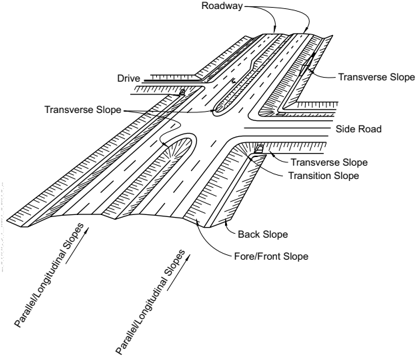

A critical foreslope is one on which an errant vehicle has a higher propensity to overturn. Foreslopes steeper than 1V:3H generally fall into this category. If a foreslope steeper than 1V:3H begins closer to the edge of the traveled way than the suggested clear-zone distance for that specific roadway, a barrier might be recommended if the slope cannot readily be flattened. Barrier recommendations for critical foreslopes are discussed in Chapter 5.

Many states construct 'barn roof' sections, providing a relatively flat recovery area adjacent to the roadway for some distance, fol -lowed by a steeper foreslope. Such a cross section is more economical than a continuous flat foreslope from the edge of the traveled way to the original ground line, and may be perceived as safer than constructing a continuous steeper foreslope from the edge of the shoulder. Figure 3-2 depicts the clear-zone distance reaching a non-recoverable parallel foreslope and the subsequent clear runout area that may be provided at the toe of the non-recoverable slope to provide a suggested adjusted clear-zone distance. This type of cross section is more fully discussed in Sections 3.3.2 and 3.3.4.

Figure 3-2. Clear Zone for Non-Recoverable Parallel Foreslope

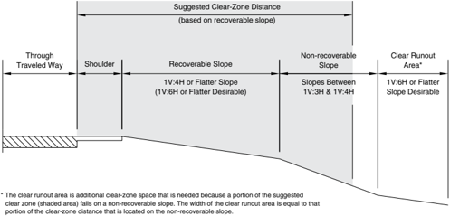

## 3.2.2 Backslopes

When a highway is located in a cut section, the backslope may be traversable depending on its relative smoothness and the presence of fixed obstacles. If the foreslope between the roadway and the base of the backslope is traversable (1V:3H or flatter) and the backslope is obstacle-free, it may not be a significant obstacle, regardless of its distance from the roadway. On the other hand, a steep, roughsided rock cut normally should begin outside the clear zone or be shielded. A rock cut normally is considered to be rough-sided when the face will cause excessive vehicle snagging rather than provide relatively smooth redirection.

## 3.2.3 Transverse Slopes

A common obstacle on roadsides are transverse slopes created by median crossovers, berms, driveways, or intersecting side roads. Although the exposure for transverse slopes is less than that for foreslopes or backslopes, they generally are more critical to errant motorists because run-off-the-road vehicles typically strike them head-on.

Transverse slopes of 1V:10H are desirable (7) ; however, their practicality may be limited by width restrictions and the maintenance problems associated with the long tapered ends of pipes or culverts. Transverse slopes of 1V:6H or flatter are suggested for high-speed roadways, particularly for the section of the transverse slope that is located immediately adjacent to traffic (3) . This slope then can be transitioned to a steeper slope as the distance from the edge of the through traveled way increases. Transverse slopes steeper than 1V:6H may be considered for urban areas or for low-speed facilities. Figures 3-3 and 3-4 show suggested designs for these slopes, while Section 3.4.3 discusses safety treatments for parallel drainage structures.

Figure 3-5 shows some alternative designs for drains at median openings. The water flows into a grated drop inlet in the median to a crossdrainage structure or directly underneath the travel lanes to an outside channel. This eliminates the two pipe ends that would be exposed to traffic in the median. The transverse slopes of the median opening then would be desirably sloped at 1V:10H or flatter.

Roadside Design Guide 3-6

--'',,',',,,,',,'',',,,,,''','',-'-',,',,',',,'---

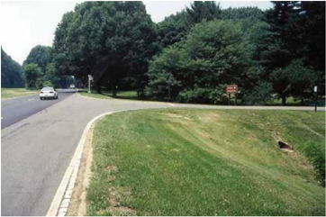

Figure 3-3. Suggested Design for Transverse Slopes

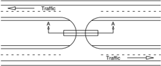

U-TURN MEDIAN OPENING

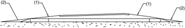

Section A - A

*Use of the flattest possible median cross slopes on high-speed highways, particularly within the appropriate clear-zone area, can provide an improved roadside. Safety treatment of culverts as discussed in Section 3.4.3 may further enhance the improvement.

Figure 3-4. Median Transverse Slope Design

- (1)  Slope 1V:10H or flatter desirable. 1V:6H maximum on high-speed, high-volume facilities.
- (2)  End treatment as required to meet proposed slope.

Traffic

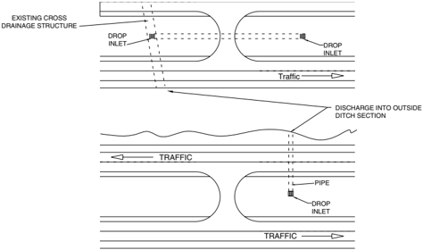

Figure 3-5. Alternate Designs for Drains at Median Openings

## 3.2.4 Drainage Channels

A drainage channel is an open channel usually paralleling the roadway. The primary function of drainage channels is to collect surface runoff from the roadway and areas that drain to the right-of-way and convey the accumulated runoff to acceptable outlet points. Channels should be designed to carry the design runoff and to accommodate excessive storm water with minimal highway flooding or damage. However, channels also should be designed, built, and maintained with consideration given to their effect on the roadside en -vironment. Figures 3-6 and 3-7 present preferred foreslopes and backslopes for basic ditch configurations (14) . Cross sections shown in the shaded region of each figure are considered to have traversable cross sections. Channel sections that fall outside the shaded region are considered less desirable and their use should be limited where high-angle encroachments can be expected, such as the outside of relatively sharp curves. Channel sections outside the shaded region may be acceptable for projects having one or more of the following characteristics: restrictive right-of-way environmental constraints; rugged terrain; resurfacing, restoration, or rehabilitation (3R) projects; or low-volume or low-speed roads and streets, particularly if the channel bottom and backslopes are free of any fixed objects or located beyond suggested clear-zone distance.

Roadside Design Guide 3-8

--'',,',',,,,',,'',',,,,,''','',-'-',,',,',',,'---

Figure 3-6. Preferred Cross Sections for Channels with Abrupt Slope Changes

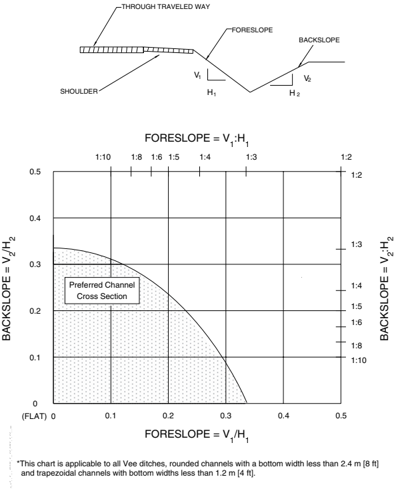

--'',,',',,,,',,'',',,,,,''','',-'-',,',,',',,'---

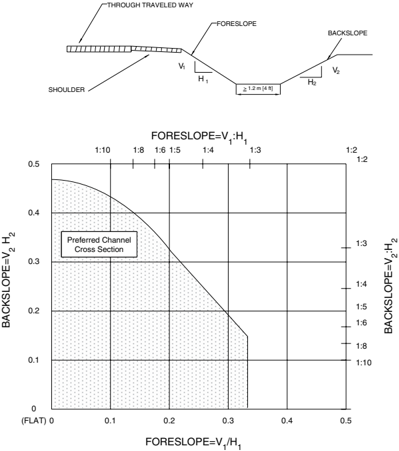

Figure 3-7. Preferred Cross Sections for Channels with Gradual Slope Changes

If practical, drainage channels with cross sections outside the shaded regions and located in vulnerable areas may be reshaped and converted to a closed system (culvert or pipe) or, in some cases, shielded by a traffic barrier. Information from various jurisdictions for the use of roadside barrier to shield non-traversable channels within the clear zone is included in Chapter 5.

## 3.3 APPLICATION OF THE CLEAR-ZONE CONCEPT

A basic understanding of the clear-zone concept is critical to its proper application. The suggested clear-zone distances in Table 3-1 are based on limited empirical data that then were extrapolated to provide data for a wide range of conditions. Thus, the distances

Roadside Design Guide 3-10

--'',,',',,,,',,'',',,,,,''','',-'-',,',,',',,'--- obtained from these tables represent a reasonable measure of the degree of safety suggested for a particular roadside, but they are neither absolute nor precise. In some cases, it is reasonable to leave a fixed object within the clear zone; in other instances, an object beyond the clear-zone distance may require removal or shielding. Use of an appropriate clear-zone distance amounts to a compromise between maximizing safety and minimizing construction costs. Appropriate application of the clear-zone concept often will result in more than one possible solution. The following sections intend to illustrate a process that may be used to determine if a fixed object or non-traversable terrain feature should be relocated, modified, removed, shielded, or remain in place.

The guidelines in this chapter may be most applicable to new construction or major reconstruction. On 3R projects, the primary em -phasis is placed on the roadway itself. The actual performance of an existing facility may be evaluated through an analysis of crash records and on-site inspections as part of the design effort or in response to public input from road users and other stakeholders. It may not be cost-effective or practical to bring a 3R project into full compliance with all of the clear-zone width recommendations provided in this Guide because of environmental effects or limited right-of-way. Because of the scope of such projects and the limited funding available, emphasis should be placed on correcting or shielding areas in the project with identifiable safety problems related to clearzone widths. Bodies of water and steep cliffs are the types of areas that may be considered for special emphasis.

## 3.3.1 Recoverable Foreslopes

The suggested clear-zone distance for recoverable foreslopes of 1V:4H or flatter may be obtained directly from Table 3-1. On new construction or major reconstruction, smooth slopes with no significant discontinuities and no protruding fixed objects are desirable from a safety standpoint. It also is desirable to have the top of the slope rounded so an encroaching vehicle remains in contact with the ground (14) . It also is desirable for the toe of the slope to be rounded to improve traversability by an errant vehicle. The flatter the selected slope, the easier it is to mow or otherwise maintain and the safer it becomes to negotiate. Examples at the end of this chapter illustrate the application of the clear-zone concept to recoverable foreslopes.

## 3.3.2 Non-Recoverable Foreslopes

Foreslopes from 1V:3H up to 1V:4H are considered traversable if they are smooth and free of fixed objects (14) . However, a clear runout area beyond the toe of the non-recoverable foreslope is desirable because many vehicles on slopes this steep will continue on to the bottom. The extent of this clear runout area could be determined by first finding the available distance between the edge of the through traveled way and the breakpoint of the recoverable foreslope to the non-recoverable foreslope, as previously shown in Figure 3-2. This distance then is subtracted from the suggested clear-zone distance based on the steepest recoverable foreslope before or after the non-recoverable foreslope and should be at least 3 m [10 ft] if practicable. The result is the desirable clear runout area that should be provided beyond the non-recoverable foreslope if practical. Such a variable sloped typical section often is used as a compromise between roadside safety and economics. By providing a relatively flat recovery area immediately adjacent to the roadway, most errant motorists can recover before reaching the steeper foreslope beyond. The foreslope break may be liberally rounded so that an encroach -ing vehicle does not become airborne. The steeper slope also may be made as smooth as practical and rounded at the bottom. Figure 3-2 illustrates a recoverable foreslope followed by a non-recoverable foreslope. Example 3-C demonstrates the method for calculating the desirable runout area.

## 3.3.3 Critical Foreslopes

Critical foreslopes are those steeper than 1V:3H (5) . These slopes create a higher propensity for an errant vehicle to overturn and should be treated if they begin within the clear-zone distance of a particular highway and meet the suggested barrier recommenda -tions for shielding contained in Chapter 5. Examples 3-C, 3-D, and 3-E illustrate the application of the clear-zone concept to critical foreslopes.

## 3.3.4 Examples of Clear-Zone Application on Variable Slopes

A variable foreslope often is specified on new construction to provide a relatively flat recovery area immediately adjacent to the road -way followed by a steeper foreslope. This design requires less right-of-way and embankment material than a continuous, relatively

flat foreslope and is commonly called a 'barn-roof' section. If the suggested clear-zone distance (as determined from Table 3-1) exists on the flatter foreslope, the steeper slope then may be critical or non-traversable. Clear-zone distances for embankments with variable foreslopes ranging from essentially flat to 1V:4H may be averaged to produce a composite clear-zone distance. Slopes that change from a foreslope to a backslope cannot be averaged and should be treated as drainage channel sections and analyzed for traversability as shown previously in Figures 3-6 and 3-7.

Although a weighted average of the foreslopes may be used, it is preferable to use values in Table 3-1 that are associated with the steeper slope. If one foreslope is significantly wider, the clear-zone computation based on that slope alone may be used.

## 3.3.5 Clear-Zone Applications for Drainage Channels and Backslopes

Drainage channel cross sections that are considered preferable in Figures 3-6 and 3-7 are not obstacles and need not be constructed at or beyond the suggested clear-zone distance for a specific roadway. Roadside hardware should not be located in or near ditch bottoms or on the backslope near the drainage channel (14) . Any vehicle leaving the roadway may be funneled along the drainage channel bottom or encroach to some extent on the backslope, thus making an impact more likely. Breakaway hardware may not function as designed if the vehicle is airborne or sliding sideways when contact is made. Non-yielding fixed objects should be located beyond the suggested clear-zone distance for these cross sections as determined from Table 3-l.

## 3.3.6 Clear Zone for Auxiliary Lanes and Freeway Ramps

When auxiliary lanes function as a through lane (e.g., speed-change lanes on freeways), the clear zone for the highway may be deter -mined using the larger of the clear zones calculated from the traveled way and adjacent auxiliary lane or lanes. The clear zone for the through travel lanes includes the width of the auxiliary lanes. The clear zone for auxiliary lanes should be based on its design speed, traffic volume, horizontal curvature (where appropriate, as discussed previously in Section 3.1), and adjacent side slopes. For speedchange lanes, the design speed should be determined using the speed reached ( Va ) as determined from the minimum acceleration and deceleration lengths for ramp terminals provided in Chapter 10 of AASHTO's A Policy on Geometric Design for Highways and Streets (4) . The speed from Chapter 10 should be rounded. A separate clear zone is not necessary for speed-change lanes on conven -tional highways and where the auxiliary lane does not function as a through lane (e.g., turning lanes for at-grade intersections). Refer to Example 3-J at the end of this chapter for an example of a freeway speed-change lane.

The suggested clear-zone distance along the ramp may be based on the speed, volume, horizontal curvature, and roadside geometry along the ramp. Because ramps are of limited length, often contain very sharp curves, and tend to be overdriven by motorists, design -ers should use a conservative approach to determining the clear-zone distance. For the purpose of determining this suggested clearzone distance, the design speed along the ramp proper, which excludes a transition curve of 300 m [1000 ft] or greater, should be determined from the simplified curve formula in Chapter 3 of AASHTO's A Policy on Geometric Design for Highways and Streets (4) . Transition curves of 300 m [1000 ft] or more can act as extensions of the speed-change lane and should have speeds similar to the adjacent tangent or speed-change lane. --'',,',',,,,',,'',',,,,,''','',-'-',,',,',',,'---

For simple ramps, such as loop and diagonal ramps, the design speed and volume of the ramp proper should be used to determine the suggested clear-zone distance. When compound and reverse curves are used, the clear-zone distance recommended for the higherspeed curve (excluding transition curves) may be used for the entire ramp. Refer to Example 3-K for more detailed information.

For complex ramps with multiple radii and variable operating speeds, a separate clear-zone distance may be determined for each unique segment of the ramp. Refer to Example 3-L for more detailed information.

Alternately, clear zones for ramps may be set at 9 m [30 ft] if previous experience with similar projects or designs indicates satisfac -tory experience. This method provides a consistent template that can be more practical to design and maintain.

## 3.4 DRAINAGE FEATURES

Effective drainage is one of the most critical elements in the design of a highway or street. However, drainage features should be designed and built while considering their consequences on the roadside environment. In addition to drainage channels, which were

Roadside Design Guide 3-12

addressed in Section 3.2.4, curbs, parallel and transverse pipes and culverts, and drop inlets are common drainage system elements that should be designed, constructed, and maintained with both hydraulic efficiency and roadside safety in mind.

In general, the following options, listed in order of preference, are applicable to all drainage features:

- Eliminate non-essential drainage structures
- Design or modify drainage structures so they are traversable or present a minimal obstruction to an errant vehicle
- If a major drainage feature cannot be effectively redesigned or relocated, shield it by using a suitable traffic barrier if it is in a vulnerable location

The remaining sections of this chapter identify the safety problems associated with curbs, pipes and culverts, and drop inlets, and they offer recommendations about the location and design of these features to improve their safety characteristics without adversely affecting their hydraulic capabilities. The information presented applies to all roadway types and projects; however, as with many engineering applications, the specific actions taken at a given location often rely heavily on the exercise of good engineering judgment and on a case-by-case assessment of the costs and benefits associated with alternative designs.

## 3.4.1 Curbs

Curbs are commonly used for drainage control, pavement edge support and delineation, right-of-way reduction, aesthetics, side -walk separation, and reduction of maintenance operations. Curb designs are classified as vertical or sloping. Refer to Figure 4-5 of AASHTO's A Policy on Geometric Design of Highways and Streets (4) for more details. Vertical curbs are those having a vertical or nearly vertical traffic face 150 mm [6 in.] or higher. They are intended to discourage motorists from deliberately leaving the roadway. Sloping curbs are those having a sloping traffic face 150 mm [6 in.] or less in height. Sloping curbs, especially those with heights of 100 mm [4 in.] or less, can be readily traversed by a motorist when necessary. Curbs higher than 100 mm [4 in.], whether sloping or vertical, may drag the underside of some vehicles. However, if higher curbs are used, they are not normally regarded as fixed objects that would require mitigation.

In general, curbs are not desirable along high-speed roadways (9) . If a vehicle is spinning or slipping sideways as it leaves the road -way, wheel contact with a curb could cause it to trip and overturn. In other impact conditions, a vehicle may become airborne, which may result in loss of control by the motorist. The distance over which a vehicle may be airborne and the height above or below normal bumper height attained after striking a curb may become critical if secondary crashes occur with traffic barriers or other roadside ap -purtenances. Refer to Section 5.6.2.1, for more details on the use of a curb in conjunction with a traffic barrier. --'',,',',,,,',,'',',,,,,''','',-'-',,',,',',,'---

When obstructions exist behind curbs, a minimum lateral offset of 0.9 m [3 ft] should be provided beyond the face of curb to the ob -struction at intersections and driveway openings. A minimum lateral offset of 0.5 m [1.5 ft] should be used elsewhere (4) . This lateral offset should not be construed as a clear-zone distance. Because curbs do not have a significant redirectional capability, obstructions behind a curb should be located at or beyond the suggested clear-zone distances shown in Table 3-1. In many instances, obtaining the suggested clear-zone distances on existing facilities will not be feasible. On new construction for which suggested clear-zone dis -tances cannot be provided, fixed objects should be located as far from the traveled way as practical on a project-by-project basis, but in no case closer than 0.5 m [1.5 ft] from the face of the curb (4) .

## 3.4.2 Cross-Drainage Structures

Cross-drainage structures are designed to carry water underneath the roadway embankment and vary in size from 457 mm (18 in.) to 3 m (10 ft) or more for concrete, metal and plastic pipes. Typically, their inlets and outlets consist of concrete headwalls and wingwalls for the larger structures and beveled-end sections for the smaller pipes. Although these types of designs are hydraulically efficient and minimize erosion problems, they may represent an obstacle to motorists who run off the road. This type of design may result in either a fixed object protruding above an otherwise traversable embankment or an opening into which a vehicle can drop, causing an abrupt stop. The options available to a designer to minimize these obstacles are (11) :

- Using a traversable design,
- Extending the structure so that it is less likely to be hit, and

- Shielding the structure.

Each of these options is discussed in the following subsections.

## 3.4.2.1 Traversable Designs

To maintain a traversable foreslope, the preferred treatment for any cross-drainage structure is to extend or shorten it to intercept the roadway embankment and to match the inlet or outlet slope to the foreslope (11) . For small culverts, no other treatment is required. For crossdrainage structures, a small pipe culvert is a single round pipe with a 914-mm (36-in.) or less diameter or multiple round pipes each with a 762-mm (30-in.) or less diameter. Extending culverts to locate the inlets or outlets a fixed distance from the through trav -eled way is not recommended if such treatment introduces discontinuities in an otherwise traversable slope. Extending the pipe results in the warping of the foreslopes in or out to match the opening, which produces a significantly longer area that affects the motorist who has run off the road. Matching the inlet to the foreslope is desirable because it results in a much smaller target for the errant vehicle to hit, reduces erosion problems, and simplifies mowing operations.

Single structures and end treatments wider than 0.9 m [3 ft] can be made traversable for passenger-size vehicles by using bar grates or pipes to reduce the clear opening width (11) . Modifications to the culvert ends to make them traversable should not significantly decrease the hydraulic capacity of the culvert. Safety treatments should be hydraulically efficient. To maintain hydraulic efficiency, it may be necessary to apply bar grates to flared wingwalls, flared end sections, or culvert extensions that are larger than the main barrel. The designer should consider shielding the structure if significant hydraulic capacity or clogging problems could result.

Full-scale crash tests have shown that automobiles can traverse cross-drainage structures with grated-culvert end sections constructed of steel pipes spaced on 760 mm [30 in.] centers on slopes as steep as 1V:3H and at speeds ranging from 30 km/h [20 mph] to 100 km/h [60 mph]. This spacing does not significantly change the flow capacity of the culvert pipe unless debris accumulates and causes partial clogging of the inlet. This underscores the importance of accurately assessing the clogging potential of a structure during design and the importance of keeping the inlets free of debris. Figure 3-8 shows recommended sizes to support a full-sized automobile and is based on a 760-mm [30-in.] bar spacing. More recently, two full-scale crash tests were conducted to examine the safety performance of a 6.4 m by 6.4 m [21 ft by 21 ft] culvert grate on a 1V:3H and designed in accordance with Figure 3-8. The first test involved a 2000P pick-up truck impacting the upstream portion of the grate. The second test involved an 820C small car striking the culvert grate with the left-side tires while the right-side tires encountered the slope above the grate. These scenarios were determined to be the worst testing conditions. This testing clearly demonstrated that the culvert safety grate recommended in Figure 3-8 meets the safety performance evaluation guidelines set forth in NCHRP Report 350 for a test level 3 (TL-3) device. Further, these findings clearly support historical studies that show culvert grates provide the most cost-beneficial safety treatment for crossdrainage culverts. More information is found in the report Safety Grates for Cross-Drainage Culverts (12) . It is important to note that the toe of the foreslope and the ditch or stream bed area immediately adjacent to the culvert should be more or less traversable if the use of a grate is to have any significant safety benefit.

For median drainage where flood debris is not a concern and where mowing operations are frequently required, much smaller open -ings between bars may be tolerated and grates similar to those commonly used for drop inlets may be appropriate. In addition, both the hydraulic efficiency and the roadside environment may be improved by making the culverts continuous and adding a median drainage inlet. This alternative eliminates two end treatments and is usually a practical design when neither the median width nor the height of fill is excessive. Figure 3-9 shows a traversable pipe grate on a concrete box culvert constructed to match the 1V:6H side slope.

3.4.2.2 Extension of Structure For intermediate-sized pipes and culverts whose inlets and outlets cannot be readily made traversable, designers often extend the structure so the obstacle is located at or just beyond the suggested clear zone. While this practice reduces the likelihood of the pipe end being hit, it does not completely eliminate that possibility. If the extended culvert headwall remains the only significant fixed object immediately at the edge of the suggested clear zone along the section of roadway under design and the roadside is generally traversable to the right-of-way line elsewhere, simply extending the culvert to just beyond the suggested clear zone may not be the best alternative, particularly on freeways and other high-speed, access-controlled facilities. On the other hand, if the roadway has numerous fixed objects, both natural and man-made, at the edge of the suggested clear zone, extending individual structures to the --'',,',',,,,',,'',',,,,,''','',-'-',,',,',',,'---

Roadside Design Guide 3-14

same minimum distance from traffic may be appropriate. However, redesigning the inlet or outlet so that it is no longer an obstacle is usually the preferred safety treatment.

[16-20 ft]

[12-16 ft]

[12 ft]

6.10 m [20 ft] or less with center support

4.88-6.10 m

3.66-4.88 m

up to 3.66 m

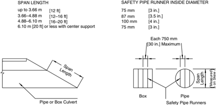

[3 in.]

[3.5 in.]

[4 in.]

[3 in.]

75 mm

100 mm

87 mm

75 mm

structures.  The safety pipe runners are Schedule 40 pipes spaced on centers of 750 mm [30 in.] or less. *The chart above shows recommended safety pipe runner sizes for various span lengths for cross-drainage

Figure 3-8. Design Criteria for Safety Treatment of Pipes and Culverts

Figure 3-9. Safety Treatment for Cross-Drainage Culvert

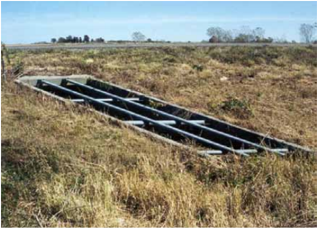

--'',,',',,,,',,'',',,,,,''','',-'-',,',,',',,'---

## 3.4.2.3 Shielding

For major drainage structures that are costly to extend and whose end sections cannot be made traversable, shielding with an appropri -ate traffic barrier often is the most effective safety treatment. Although the traffic barrier is longer and closer to the roadway than the structure opening and is likely to be hit more often than an unshielded culvert located farther from the through traveled way, a properly designed, installed, and maintained barrier system may provide an increased level of safety for the errant motorist.

## 3.4.3 Parallel Drainage Features

Parallel drainage culverts are those that are oriented parallel to the main flow of traffic. They typically are used at transverse slopes under driveways, field entrances, access ramps, intersecting side roads, and median crossovers. Most of these parallel drainage culverts are designed to carry relatively small flows until the water can be discharged into outfall channels or other drainage facilities and carried away from the roadbed. However, these drainage features can present a significant roadside obstacle because they can be struck head-on by impacting vehicles. As with cross-drainage structures, the designer's primary concern should be to design generally traversable slopes and to match the culvert openings with adjacent slopes. Section 3.2.3 recommends that transverse slopes that can be struck at 90 degrees by run-off-the-road vehicles be constructed as flat as practical, with 1V:6H or flatter suggested for locations susceptible to high-speed impacts. On low-volume or low-speed roads, where crash history does not indicate a high number of runoff-the-road occurrences, steeper transverse slopes may be considered as a cost-effective approach. Using these guidelines, safety treatment options are similar to those for crossdrainage structures, in order of preference:

1. Eliminate the structure.
2. Use a traversable design.
3. Move the structure laterally to a less vulnerable location.
4. Shield the structure.
5. Delineate the structure if the above alternatives are not appropriate.

## 3.4.3.1 Eliminate the Structure

Unlike crossdrainage pipes and culverts that are essential for proper drainage and operation of a road or street, parallel pipes some -times can be eliminated by constructing an overflow section on the field entrance, driveway, or intersecting side road. To ensure proper performance, care should be taken when allowing drainage to flow over highway access points, particularly if several access points are closely spaced or the water is subject to freezing. This treatment usually will be appropriate only at low-volume locations where this design does not decrease the sight distance available to drivers entering the main road. Care also should be exercised to avoid erosion of the entrance and the area downstream of the crossing. This usually can be accomplished by paving the overflow section (assuming the rest of the facility is not paved) and by adding an upstream and downstream apron at locations where water velocities and soil conditions make erosion likely.

Closely spaced driveways with culverts in drainage channels are relatively common as development occurs along highways approach -ing urban areas. Because traffic speeds and roadway design elements are usually characteristic of rural highways, these culverts may constitute a significant roadside obstacle. In some locations, such as along the outside of curves or where records indicate concentra -tions of run-off-the-road crashes, it may be desirable to convert the open channel into a storm drain and backfill the areas between adjacent driveways. This treatment will eliminate the ditch section as well as the transverse slopes with pipe inlets and outlets.

## 3.4.3.2 Traversable Designs

As emphasized earlier in this chapter, transverse slopes should be designed while considering their effect on the roadside environment. The designer should try to provide the flattest transverse slopes practical in each situation, particularly in areas where the slope has shown a high probability of being struck head-on by a vehicle. Once this effort has been made, parallel drainage structures should match the selected transverse slopes and, if possible, should be safety treated when they are located in a vulnerable position relative to main road traffic. Although many of these structures are small and present a minimal target, the addition of pipes and bars perpen -

Roadside Design Guide 3-16

dicular to traffic can reduce wheel snagging in the culvert opening. Research has shown that for parallel drainage structures, a grate consisting of pipes set on 610 mm [24 in.] centers will significantly reduce wheel snagging. It also is recommended that the center of the bottom bar or pipe be set at 100 to 200 mm [4 to 8 in.] above the culvert invert.

Generally, single pipes with diameters of 610 mm [24 in.] or less will not require a grate (11) . When a multiple pipe installation is involved, however, a grate for smaller pipes may be appropriate. Reference may be made to the Texas Transportation Institute Research Study 2-8-79-280, Safe End Treatment for Roadside Culverts (13) , in which researchers concluded that a passenger vehicle should be able to traverse a pipe/slope combination at speeds up to 80 km/h [50 mph] without rollover. To achieve this result, the roadway (or ditch) foreslope and the driveway foreslope both should be 1V:6H or flatter and have a smooth transition between them. Ideally, the culvert should be cut to match the driveway slope and fitted with cross members perpendicular to the direction of traffic flow as described previously. This study suggests that it could be cost-effective to flatten the approach slopes to 1V:6H and match the pipe openings to these slopes for all sizes of pipes up to 910 mm [36 in.] in diameter for traffic volumes of more than 100 vehicles per day. The addition of grated inlets to these pipes was considered cost-effective for pipes 910 mm [36 in.] or greater in diameter with traffic volumes of more than 500 vehicles per day and for pipes over 610 mm [24 in.] in diameter for traffic volumes of more than 13,000 vehicles per day. Because these numbers were based in part on assumptions by the researchers, they should be interpreted as approxi -mations and not as absolute numbers. Figure 3-10 illustrates a possible design for the inlet and outlet end of a parallel culvert. When channel grades permit, the inlet end may use a drop-inlet type design to reduce the length of grate required.

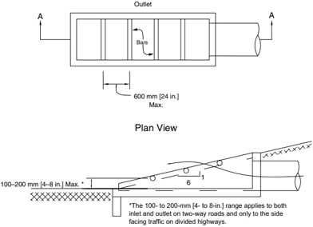

Section A-A

Figure 3-10. Inlet and Outlet Design Example for Parallel Drainage

The recommended grate design may affect culvert capacity if significant blockage by debris is likely; however, because capacity is not normally the governing design criteria for parallel structures, hydraulic efficiency may not be an overriding concern. A report issued by the University of Kansas suggests that a 25 percent debris blockage factor should be sufficiently conservative to use as a basis for culvert design in these cases (8) . This report also suggests that under some flow conditions, the capacity of a grated culvert may be

equal to that of a standard headwall design as a result of decreased entrance turbulence. In those locations where headwater depth is critical, a larger pipe should be used or the parallel drainage structure may be positioned outside the clear zone, as discussed in the following section.

## 3.4.3.3 Relocate the Structure

Some parallel drainage structures can be moved laterally farther from the through traveled way. This treatment often affords the designer the opportunity to flatten the transverse slope within the selected clear-zone distance of the roadway under design. If the embankment at the new culvert locations is traversable and likely to be encroached upon by traffic from either the main road or side road, safety treatment should be considered. It is suggested that the inlet or outlet match the transverse slope regardless of whether additional safety treatment is deemed necessary. Figure 3-11 shows a suggested design treatment, while Figure 3-12 shows a recom -mended safety treatment for parallel drainage pipes.

Figure 3-11. Alternate Location for a Parallel Drainage Culvert

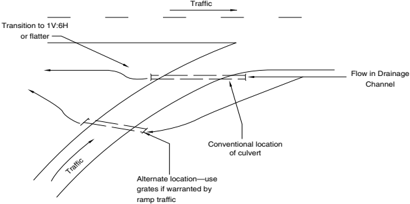

Figure 3-12. Safety Treatment for Parallel Drainage Pipe

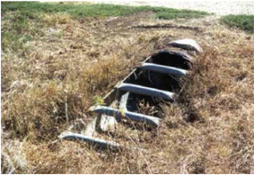

Roadside Design Guide 3-18

## 3.4.3.4 Shielding

In cases in which the transverse slope cannot be made traversable, the structure is too large to be safety treated effectively, and reloca -tion is not feasible, shielding the obstacle with a traffic barrier may be necessary. Specific information on the selection, location, and design of an appropriate barrier system is in Chapter 5.

## 3.4.4 Drop Inlets

Drop inlets can be classified as on-roadway or off-roadway structures. On-roadway inlets are usually located on or alongside the shoulder of a street or highway and are designed to intercept runoff from the road surface. These include curb opening inlets, grated in -lets, slotted drain inlets, or combinations of these three basic designs. Because they are installed flush with the pavement surface, they do not constitute a significant safety problem to errant motorists. However, they should be selected and sized to accommodate design water runoff. In addition, they should be capable of supporting vehicle wheel loads and should be pedestrian and bicycle compatible.

Off-roadway drop inlets are used in medians of divided roadways and sometimes in roadside ditches. Although their purpose is to col -lect runoff, they should be designed and located to present a minimal obstacle to errant motorists. This goal can be accomplished by building these features flush with the channel bottom or slope on which they are located. No portion of the drop inlet should project more than 100 mm [4 in.] above the ground line (10) . The opening should be treated to prevent a vehicle wheel from dropping into it; however, unless pedestrians are a consideration, grates with openings as small as those used for pavement drainage are not necessary. Neither is it necessary to design for a smooth ride over the inlet; it is sufficient to prevent wheel snagging and the resultant sudden deceleration or loss of control.

## 3.5 ExAMPLES OF THE CLEAR-ZONE CONCEPT TO RECOVERABLE FORESLOPES

## EXAMPLE 3-A

Design ADT: 4000

Design Speed: 100 km/h [60 mph]

Suggested clear-zone distance for 1V:5H foreslope: 10 to 12 m [32 to 40 ft] (from Table 3-1)

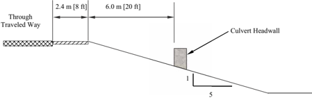

Discussion -The available recovery area of 8.4 m [28 ft] is 1.6 m to 3.6 m [4 to 12 ft] less than the suggested clear-zone distance. If the culvert headwall is greater than 100 mm [4 in.] in height and is the only obstruction on an otherwise traversable foreslope, it should be removed and the inlet modified to match the 1V:5H foreslope. If the foreslope contains rough outcroppings or boulders and the headwall does not significantly increase the obstruction to a motorist, the decision to do nothing may be appropriate. A review of the highway's crash history, if available, may be made to determine the nature and extent of vehicle encroachments and to identify any specific locations that may require special treatment.

## EXAMPLE 3-B

Design ADT: 300

Design Speed: 60 km/h [40 mph]

Suggested clear-zone distance for 1V:10H slope:  2 to 3 m [7 to 10 ft] (from Table 3-1)

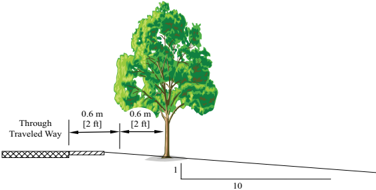

Discussion -The available recovery area of 1.2 m [4 ft] is 0.8 to 1.8 m [3 to 6 ft] less than the suggested clear-zone distance. If this section of road has a significant number of run-off-the-road crashes, it may be appropriate to consider shielding or removing the entire row of trees within the crash area. If this section of road has no significant history of crashes and is heavily forested with most of the other trees only slightly farther from the road, this tree would probably not require treatment. If, however, none of the other trees are closer to the roadway than, for example, 4.0 m [13 ft], this individual tree represents a more significant obstruction and should be considered for removal. If a tree were 3.0 m [10 ft] from the edge of through traveled way, and all or most of the other trees were 5 m [16 ft] or more, its removal may still be appropriate. Also, as this road is very low volume (ADT ≤400), and as suggested in Chapter 12 and the AASHTO Guidelines for Geometric Design of Very Low-Volume Roads , where constraints of cost, terrain, right-of-way, or potential socio/environmental impacts make the provision of a 2 m [6 ft] clear recovery area impractical, clear recovery areas less than 2 m [6 ft] in width may be used. This example emphasizes that the clear-zone distance is an approximate number at best and that individual objects should be analyzed in relation to other nearby obstacles.

## EXAMPLE  3-C

Design ADT: 7000

Design Speed: 100 km/h [60 mph]

Suggested clear-zone distance for 1V:10H foreslope: 9 to 10 m [30 to 32 ft] (from Table 3-1)

Suggested clear-zone distance for 1V:8H foreslope: 9 to 10 m [30 to 32 ft] (from Table 3-1)

Available recovery distance before breakpoint of non-recoverable foreslope: 7 m [23 ft]

Clear runout area at toe of foreslope: 9 to 10 m [30 to 32 ft] minus 7 m [23 ft] or 2 to 3 m [7 to 10 ft]

Roadside Design Guide 3-20

--'',,',',,,,',,'',',,,,,''','',-'-',,',,',',,'---

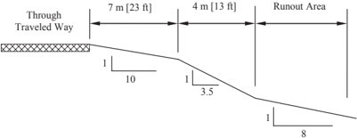

Discussion -Since the non-recoverable foreslope is within the recommended suggested clear-zone distance of the 1V:10H foreslope, a runout area beyond the toe of the non-recoverable foreslope is desirable. Using the steepest recoverable foreslope before or after the non-recoverable foreslope, a clear-zone distance is selected from Table 3-1. In this example, the 1V:8H foreslope beyond the base of the fill dictates a 9 to 10 m [30 to 32 ft] clear-zone distance. Since 7 m [23 ft] are available at the top, an additional 2 to 3 m [7 to 10 ft] could be provided at the bottom. Since this is less than the 3 m [10 ft] recovery area that should be provided at the toe of all the non-recoverable slopes the 3 m [10 ft] should be applied. All foreslope breaks may be rounded and no fixed objects would normally be built within the upper or lower portions of the clear-zone or on the intervening foreslope.

## EXAMPLE  3-D

Design ADT: 12,000

Design Speed: 110 km/h [70 mph]

Suggested clear-zone distance for 1V:6H foreslope: 9 to 10.5 m [30 to 34 ft] (from Table 3-1)

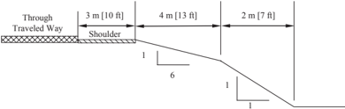

Discussion -Since the critical foreslope is within the suggested clear-zone distance of 9 to 10.5 m [30 to 34 ft], it should be flattened if practical or considered for shielding. However, if this is an isolated obstacle and the roadway has no significant crash history, it may be appropriate to do little more than delineate the drop-off in lieu of foreslope flattening or shielding.

--'',,',',,,,',,'',',,,,,''','',-'-',,',,',',,'---

## EXAMPLE 3-E

Design ADT: 350

Design Speed: 60 km/h [40 mph]

Suggested clear-zone distance for 1V:5H foreslope: 2 to 3 m [7 to 10 ft] (from Table 3-1)

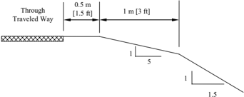

Discussion -The available recovery area of 1.5 m  [4.5 ft] is 0.5 to 1.5 m [2.5 to 5.5 ft] less than the suggested clear-zone distance. If much of this roadway has a similar cross section and no significant run-off-the-road crash history, neither foreslope flattening nor a traffic barrier would be recommended. On the other hand, even if the 1V:5H foreslope were 3 m [10 ft] wide and the clear-zone re -quirement were met, a traffic barrier might be appropriate if this location has noticeably less recovery area than the rest of the roadway and the embankment was unusually high. Also, as this road is very low volume (ADT ≤400), and as suggested in Chapter 12 and the AASHTO Guidelines for Geometric Design of Very Low-Volume Roads , where constraints of cost, terrain, right-of-way, or potential socio/environmental impacts make the provision of a 2 m [6 ft] clear recovery area impractical, clear recovery areas less than 2 m [6 ft] in width may be used. This example emphasizes that the clear-zone distance is an approximate number at best and that individual objects should be analyzed in relation to other nearby obstacles.

## EXAMPLE 3-F

Design ADT: 5000

Design Speed: 100 km/h [60 mph]

Suggested clear-zone distance for 1V:8H foreslope: 8 to 9 m [26 to 30 ft] (from Table 3-1)

Suggested clear-zone distance for 1V:5H foreslope: 10 to 12 m [32 to 40 ft] (from Table 3-1)

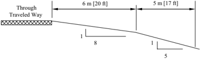

Discussion -Since the range for the flatter slope of 26 to 30 ft extends past the slope break onto the steeper slope, the upper end of this range should be considered. However, the range for the steeper slope of 32' to 40' might be considered conservative since the majority of the clear zone area is on the flatter slope. Thus the lower range of this slope might be considered. An appropriate range for this combination slope could be 30 to 32 ft.

Roadside Design Guide 3-22

--'',,',',,,,',,'',',,,,,''','',-'-',,',,',',,'---

In this example, it would be desirable to have no fixed objects constructed on any part of the 1V:5H foreslope. Natural obstacles such as trees or boulders at the toe of the slope would not be shielded or removed. However, if the final foreslope were steeper than 1V:4H, a clear runout area of 3 m [10 ft] should be considered at the toe of the foreslope. The designer may choose to limit the clear-zone distance to 9 m [30 ft] if that distance is consistent with the rest of the roadway template, a crash analysis or site investigation does not indicate a potential run-off-the-road problem in this area, and the distance selected does not end at the toe of the non-recoverable foreslope.

## EXAMPLE 3-G

Design ADT: 1400

Design Speed: 100 km/h [60 mph]

Suggested clear-zone distance for 1V:6H foreslope (fill): 6 to 7.5 m [20 to 24 ft] (from Table 3-1)

Suggested clear-zone distance for 1V:4H backslope (cut): 5 to 5.5 m [16 to 18 ft] (from Table 3-1)

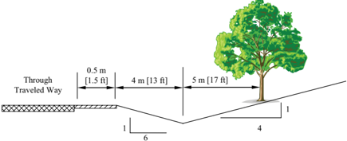

Discussion -For channels within the preferred cross-section area of Figures 3-6 or 3-7, the clear-zone may be determined from Table 3-1. However, when the suggested clear-zone exceeds the available recovery area for the foreslope, the backslope may be considered as additional available recovery area. The range for the suggested clear zone for the foreslope of 6 to 7.5 m [20 to 24 ft] extends past the slope break onto the backslope slope. Since the backslope (cut) has a suggested clear-zone of 5 to 5.5 m [16 to 18 ft] which is less than the foreslope the larger of the two values should be used. In addition, fixed objects should not be located near the center of the channel where the vehicle is likely to funnel. An appropriate range for this combination slope could be 20 to 24 ft.

Because the tree is located beyond the suggested clear zone, removal is not required. Removal should be considered if this one ob -stacle is the only fixed object this close to the through traveled way along a significant length.

Drainage channels not having the preferred cross section (see Figure 3-6 or 3-7) should be located at or beyond the suggested clear zone. However, backslopes steeper than 1V:3H are typically located closer to the roadway. If these slopes are relatively smooth and unobstructed, they present little safety problem to an errant motorist. If the backslope consists of a rough rock cut or outcropping, shielding may be warranted as discussed in Chapter 5.

## EXAMPLE 3-H

Design ADT: 800

Design Speed: 80 km/h [50 mph]

Suggested clear-zone distance for 1V:4H foreslope: 5 to 6 m [16 to 20 ft] (from Table 3-1)

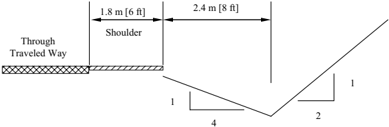

4

Discussion -The ditch is not within the preferred cross section area of Figure 3-6 and is 0.6 to 1.8 m [2 to 6 ft] less than the suggested clear-zone distance. However, if the ditch bottom and backslope are free of obstacles, no additional improvement is suggested. A similar cross section on the outside of a curve where encroachments are more likely and the angle of impact is sharper would probably be flattened if practical.

## EXAMPLE 3-I

Design ADT: 3000

Design Speed: 100 km/h [60 mph]

Suggested clear-zone distance for 1V:6H foreslope: 8.0 to 9.0 m [26 to 30 ft] (from Table 3-1)

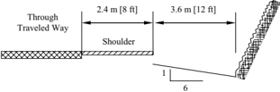

Discussion -The rock cut is within the given suggested clear-zone distance but would probably not warrant removal or shielding unless the potential for snagging, pocketing, or overturning a vehicle is high. Steep backslopes are clearly visible to motorists during the day, thus lessening the risk of encroachments. Roadside delineation of sharper than average curves through cut sections can be an effective countermeasure at locations having a significant crash history or potential.

Roadside Design Guide 3-24

--'',,',',,,,',,'',',,,,,''','',-'-',,',,',',,'---

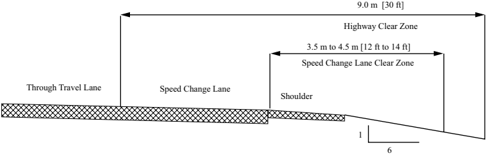

## Clear Zone for Speed-Change Lane Cross Section

## Highway

Design ADT: &gt; 6000

Design Speed: 110 km/h [70 mph]

Suggested clear-zone distance for 6:1 foreslopes:  9.0 m [30 ft] (from Table 3-1)

## Speed-change Lane

Design ADT: &lt; 750

Design Speed: 90 km/h [55 mph] (from AASHTO's A Policy on Geometric Design of Highways and Streets , 2011, Figure 10-73)

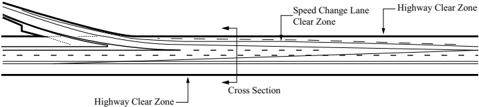

Discussion -The design speeds for the acceleration lane and deceleration lane are based on AASHTO's A Policy on Geometric Design of Highways and Streets , 2011, Figures 3-8, 10-70, and 10-73, respectively. The suggested clear zone should be the greater of the two clear zones. Refer to the bold line in the above figure for the overall suggested clear zone. Refer to Examples K and L for the ramp clear zones.

## EXAMPLE 3-K

Clear Zone for Simple Ramps Cross Section Curve 1

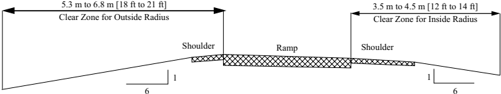

## Curve 1

Design ADT: &lt; 750

Design Speed: 90 km/h [55 mph]

Radius: 300 m [1000 ft]

Suggested clear-zone distance for 6:1 foreslopes along the inside of curve: 3.5 to 4.5 m [12 to 14 ft] (from Table 3-1) Suggested clear-zone distance for 6:1 foreslopes along the outside of curve: CZ c = ( L c )( K cz ) = 3.5 to 4.5 m [12 to 14 ft] × 1.5 = 5.3 to 6.8 m [18 to 21 ft] (from Tables 3-1 and 3-2)

Clear Zone for Simple Ramps Cross Section Curve 2

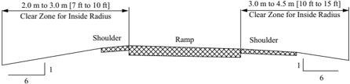

6

## Curve 2

Suggested clear-zone distance for 6:1 foreslopes along the inside of curve:  2.0 to 3.0 m [7 to 10 ft] (from Table 3-1)

Suggested clear-zone distance for 6:1 foreslopes along the outside of curve: CZ c = ( L c )( K cz ) =  2.0 to 3.0 m [7 to 10 ft] × 1.5 = 3.0 to 4.5 m [11 to 15 ft] (from Tables 3-1 and 3-2)

```
Design ADT:  < 750 Design Speed: 50 km/h [30 mph] Radius: 73 m [240 ft] --'',,',',,,,',,'',',,,,,''','',-'-',,',,',',,'---
```

Roadside Design Guide 3-26

Clear Zone for Simple Ramps Plan View

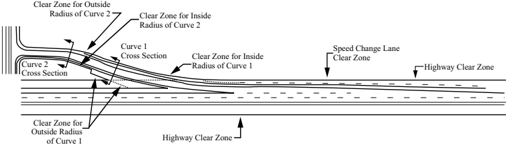

Discussion -Refer to the bold line in the above figure for the overall suggested clear zone. As an alternative, the clear zones for ramp may be set at 9 m [30 ft] if previous experience with similar projects or designs indicates satisfactory experience. See Example-J for the speed-change lane clear zones.

## EXAMPLE 3-L

Clear Zone for Complex Ramps Cross Section Curve 1

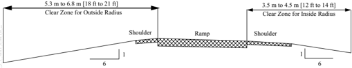

--'',,',',,,,',,'',',,,,,''','',-'-',,',,',',,'---

## Curve 1

Design ADT: &lt; 750

Design Speed: 90 km/h [55 mph]

Radius: 300 m [1,000 ft]

Suggested clear-zone distance for 6:1 foreslopes along the inside of curve: 3.5 to 4.5 m [12 to 14 ft] (from Table 3-1)

Suggested clear-zone distance for 6:1 foreslopes along the outside of curve: CZ c = ( L c )( K cz ) = 3.5 to 4.5 m [12 to 14 ft] × 1.5 = 5.3 to 6.8 m [18 to 21 ft] (from Tables 3-1 and 3-2)

of Curve 1

Clear Zone for Complex Ramps Cross Section Curve 2

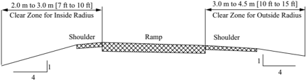

## Curve 2

Design ADT: &lt; 750

Design Speed: 50 km/h [30 mph]

Radius: 73 m [240 ft]

Suggested clear-zone distance for 4:1 foreslopes along the inside of curve: 2.0 to 3.0 m [7 to 10 ft] (from Table 3-1)

Suggested clear-zone distance for 4:1 foreslopes along the outside of curve: CZ c = ( L c )( K cz ) =  2.0 to 3.0 m [7 to 10 ft] × 1.5 = 3.0 to

4.5 m [10.5 to 15 ft] (from Tables 3-1 and 3-2)

Clear Zone for Complex Ramps Cross Section Curve 3

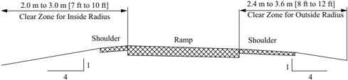

## Curve 3

Design ADT: &lt; 750

Design Speed: 60 km/h [40 mph] assuming traffic is accelerating to enter freeway.

Radius: 300 m [1,000 ft]

Suggested clear-zone distance for 4:1 foreslopes along the inside of curve: 2.0 to 3.0 m [7 to 10 ft] (from Table 3-1)

Suggested clear-zone distance for 4:1 foreslopes along the outside of curve: CZ c = ( L c )( K cz ) =  2.0 to 3.0 m [7 to 10 ft] ×1.2 = 2.4 to

3.6 m [8.4 to 12 ft] (from Tables 3-1 and 3-2)

--'',,',',,,,',,'',',,,,,''','',-'-',,',,',',,'---

Roadside Design Guide 3-28

4

Clear Zone for Complex Ramps Cross Section Curve 4

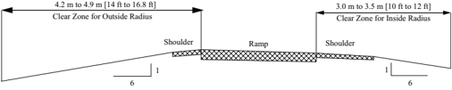

## Curve 4

Design ADT: &lt; 750

Design Speed: 80 km/h [50 mph] assuming traffic is accelerating to enter freeway.

Radius: 300 m [1,000 ft]

Suggested clear-zone distance for 6:1 foreslopes along the inside of curve: 3.0 to 3.5 m [10 to 12 ft] (from Table 3-1)

Suggested clear-zone distance for 6:1 foreslopes along the outside of curve: CZ c = ( L c )( K cz ) =  3.0 to 3.5 m [10 to 12 ft] ×1.4 = 4.2 to 4.9 m [14 to 16.8 ft] (from Tables 3-1 and 3-2)

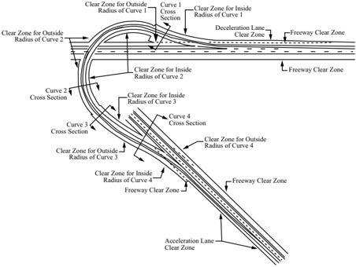

Discussion -Refer to the bold line in the above figure for the overall suggested clear zone. As an alternative, the clear zones for ramp may be set at 9 m [30 ft] if previous experience with similar projects or designs indicates satisfactory experience. See Example J for the speed-change lane clear zones.

--'',,',',,,,',,'',',,,,,''','',-'-',,',,',',,'---

## REFERENCES

1.  AASHTO. Guide for Selecting, Locating and Designing Traffic Barriers . American Association of State Highway and Transportation Officials, Washington, DC, 1977.
2.  AASHO. Highway Design and Operational Practices Related to Highway Design . American Association of State Highway Officials, Washington, DC, 1967.
3.  AASHTO. Highway Safety Design and Operations Guide . American Association of State Highway and Transportation Officials, Washington, DC, 1997.
4.  AASHTO. A Policy on Geometric Design of Highways and Streets . 5th ed. American Association of State Highway and Transportation Officials, Washington, DC. To be released Fall 2011.
5. FHWA. Rollover Potential of Vehicles on Embankments, Sideslopes, and Other Roadside Features . FHWA/RD-86-164. FHWA, Washington, DC, August 1986.
6.  Graham, J. L., and D. W. Hardwood. National Cooperative Highway Research Program Report 247: Effectiveness of Clear Recovery Zones . NCHRP, Transportation Research Board, Washington, DC, 1982.
7. Hutchinson, J. W. The Significance and Nature of Vehicle Encroachment on Medians of Divided Highways . Highway Engineering Series No. 8. Department of Civil Engineering, University of Illinois, Urbana, IL, December 1962.
8. McEnroe, B. M., and J. A. Bartley. Development of Hydraulic Design Charts for Type IV End Sections for Pipe Culverts . KU93-5. University of Kansas, Lawrence, KS, 1993.
9. Olson, R. M., G. D. Weaver, H. E. Ross, and E. R. Post . National Cooperative Highway Research Program Report 150: Effect of Curb Geometry and Location on Vehicle Behavior . NCHRP, Transportation Research Board, Washington, DC, 1974.
10. Ross, H. E., T. J., Hirsch, B. Jackson, and D. L. Sicking. Safety Treatment of Roadside Cross-Drainage Structures . Texas Transportation Institute, The Texas A&amp;M University System, College Station, TX, March 1981.
11. Ross, H. E., D. L. Sicking, T. J. Hirsch, H. D. Cooner, J. F. Nixon, S. V . Fox, and C. P. Damon. Safety Treatment of Roadside Drainage Structures . Transportation Research Record 868. TRB, National Research Council, Washington, DC, 1982.
12. Sicking, D. L. , R. W. Bielenberg, J. R. Rohde, J. D. Reid, R.K. Faller, and K. A. Polivka. Safety Grates for Cross-Drainage Culverts. Transportation Research Record 2060-08 . TRB, National Research Council, Washington, DC, 2008.
13. TII. Research Study 2-8-79-280: Safe End Treatments for Roadside Culverts . Texas Transportation Institute, The Texas A&amp;M University System, College Station, TX, March 1981.
14. Weaver, G. D., E. L. Marquis, and R. M. Olson. National Cooperative Highway Research Program Report 158: Selection of Safe Roadside Cross Sections . NCHRP, Transportation Research Board, Washington, DC, 1975.

Roadside Design Guide 3-30


## Sign, Signal, and Luminaire Supports, Utility Poles, Trees, and Similar Roadside Features

## 4.0 OVERVIEW

Although a traversable and unobstructed roadside is highly desirable from a safety standpoint, some appurtenances simply should be placed near the traveled way. Man-made fixed objects that frequently occupy highway rights-of-way include highway signs, roadway lighting, traffic signals, railroad warning devices, intelligent transportation systems (ITS), mailboxes, and utility poles. According to the Insurance Institute for Highway Safety (IIHS) (7) , since 1999 the proportion of vehicle deaths involving collisions with fixed objects has fluctuated between 19 and 22 percent (see Section 1.2). Approximately 50 percent (4,550) of all fixed-object fatalities involve crashes with trees, 5 percent (417) involve sign and lighting supports, and 12 percent (1,140) involve utility poles. Although they are less frequent, collisions with other roadside hardware are frequently severe as well. Figure 1-2 shows the percent distribution of fixed-object crash deaths in 2006 by object struck.

This chapter is not intended to provide technical design details. Virtually all highway agencies use standard drawings for their roadside device installations and it is assumed that these drawings will comply with the AASHTO Standard Specifications for Structural Supports for Highway Signs, Luminaires and Traffic Signals (3) . Similarly, information on existing operational hardware is included only to the extent necessary to familiarize the designer with the types of breakaway devices available and how each is intended to function.

The highway designer is charged with providing the safest facility practicable within given constraints. As noted in Chapter 1, there are six options for mitigation of objects within the design clear zone:

1.  Remove the obstacle
2. Redesign the obstacle so it can be traversed safely
3. Relocate the obstacle to a point where it is less likely to be struck
4. Reduce impact severity by using an appropriate breakaway device
5. Shield the obstacle with a longitudinal traffic barrier designed for redirection or use a crash cushion or both if it cannot be elimi -nated, relocated, or redesigned
6. Delineate the obstacle if the above alternatives are not appropriate

While the first two options are the preferred choices, these solutions are not always practical, especially for highway signing and light -ing, which should remain near the roadway to serve their intended functions. This chapter deals primarily with the fourth option: the use of breakaway hardware, which has become a cornerstone of the forgiving roadside concept since its inception in the mid-1960s. Emphasis is placed on the selection of the most appropriate device to use in a given location and on installing the support needed to ensure acceptable performance when the device is hit. The final section of this chapter addresses the problems associated with trees and shrubs and provides the designer with some guidelines to follow on this frequently sensitive topic.

## 4.1 ACCEPTANCE CRITERIA FOR BREAKAWAY SUPPORTS

The term breakaway support refers to all types of sign, luminaire, and traffic signal supports that are designed to yield, fracture, or separate when impacted by a vehicle. The release mechanism may be a slip plane, plastic hinge, fracture element, or a combination of them. The criteria used to determine if a support is considered breakaway are found in the AASHTO Manual for Assessing Safety Hardware (MASH) (4) and the AASHTO Standard Specifications for Structural Supports for Highway Signs, Luminaries, and Traffic Signals (3) . Breakaway support hardware previously found acceptable under the requirements of either the 1985 or 1994 editions of the AASHTO Standard Specifications for Structural Supports for Highway Signs, Luminaires, and Traffic Signals (3) are acceptable under NCHRP 350 Report (9) guidelines and may continue to be installed. Newly developed supports tested under MASH will un -dergo an additional crash test with a pickup truck; this test is intended to evaluate potential for windshield penetration with a taller pas -senger vehicle than has been used for testing in the past. The Federal Highway Administration (FHWA) maintains lists of acceptable, crashworthy supports, available from their website at http://safety.fhwa.dot.gov/roadway\_dept/policy\_guide/road\_hardware/, while the AASHTO-Associated General Contractors of America (AGC)-American Road and Transportation Builders Association (ARTBA) Joint Committee Task Force 13 has information about small sign and luminaire supports at their website at http://www.aashtotf13.org .

NCHRP 350 Report and MASH criteria require that a breakaway support perform in a predictable manner when struck head-on by an 1100 kg [2420 lb] and/or 2270 kg [5000 lb] vehicle, or its equivalent, at speed from 30 km/h [19 mph] to 110 km/h [62 mph]. Limits are placed on the transverse and longitudinal components of the occupant impact velocity and the crash vehicle should remain stable and upright during and after the impact with no significant deformation or intrusion of the windshield or passenger compartment. These specifications also establish a maximum stub height of 100 mm [4 in.] to lessen the possibility of snagging the undercarriage of a vehicle after a support has broken away from its base. The appropriate procedures for acceptance testing of breakaway supports are described in Sections 2.2.4 and 3.4.3.4 of MASH.

Full-scale crash tests, bogie tests, and pendulum tests are used in the acceptance testing of breakaway devices. In full-scale testing, an actual vehicle is accelerated to the test speed and impacted into the device being tested. The point of initial impact is the front of the vehicle, either at the center or quarter point of the bumper. Full-scale tests produce the most accurate results, but their main disadvan -tage is cost. Bogie vehicles also are used to test breakaway hardware. A bogie is a reusable, adjustable surrogate vehicle used to model actual vehicles. A nose, similar to a pendulum nose, is used to duplicate the crush characteristics of the vehicle being modeled. Bogie vehicles are designed to be used in the speed range of 35 to 100 km/h [22 to 62 mph].

To reduce testing costs, pendulum tests are used to evaluate breakaway hardware. Pendulum nose sections have been developed that model the fronts of vehicles. Pendulum tests typically have been used to test luminaire support hardware. However, because of the physical limitations of pendulums, pendulum testing is limited to 35 km/h [22 mph] impacts. Pendulum test results for impacts at 35 km/h [22 mph] may be extrapolated to predict 100 km/h [62 mph] impact behavior, providing the support breaks free with little or no bending in the support. This extrapolation method should not be used with base-bending or yielding supports.

## 4.2 DESIGN AND LOCATION CRITERIA FOR BREAKAWAY AND NON-BREAKAWAY SUPPORTS

Sign, luminaire, traffic signal, and similar supports first should be structurally adequate to support the device mounted on them and to resist ice, wind, and fatigue loads as specified in the AASHTO Standard Specifications for Structural Supports for Highway Signs, Luminaires and Traffic Signals (3) . The Manual on Uniform Traffic Control Devices (MUTCD) (6) requires all sign supports within the clear zone to be shielded or breakaway. Other concerns are that supports be properly designed and carefully located to ensure that the breakaway devices perform properly and to minimize the likelihood of impacts by errant vehicles. For example, supports should not be placed in drainage ditches where erosion and freezing could affect the proper operation of the breakaway mechanism. It also is possible that a vehicle entering the ditch could be inadvertently guided into the support. Signs and supports that are not needed should be removed. If a sign is needed, then it should be located where it is least likely to be hit. Whenever possible, signs should be placed behind existing roadside barriers (beyond the design deflection distance), on existing structures, or in similar non-accessible areas. If this cannot be achieved, then breakaway supports should be used. Only when the use of breakaway supports is not practicable should a traffic barrier or crash cushion be used exclusively to shield sign supports.

As a general rule, breakaway supports should be used unless an engineering study indicates otherwise. However, concern for pedes -trian involvement has led to the use of fixed supports in some urban areas. Because pedestrian activity tends to concentrate during

Roadside Design Guide 4-2

--'',,',',,,,',,'',',,,,,''','',-'-',,',,',',,'---

daylight hours and run-off-road crashes are more prevalent during the evening and early morning hours, breakaway supports should be considered in most urban areas. Examples of sites where breakaway supports may be imprudent are those adjacent to bus shelters or that have extensive pedestrian concentrations.

Supports placed on roadside slopes should not allow impacting vehicles to snag on either the foundation or any substantial remains of the support. Surrounding terrain should be graded to permit vehicles to pass over any non-breakaway portion of the installation that remains in the ground or rigidly attached to the foundation. The AASHTO Standard Specifications for Structural Supports for Highway Signs, Luminaries and Traffic Signals (3) establishes a maximum stub height of 100 mm (4 in.) to lessen the possibility of snagging the undercarriage of a vehicle after a support has broken away from its base and minimize vehicle instability if a wheel hits the stub. Figure 4-1, adopted from these specifications, illustrates the method used to measure the maximum stub height.

Figure 4-1. Breakaway Support Stub Height Measurements


The MUTCD requires that breakaway supports housing electrical components utilize electrical disconnects to reduce the risk of fire and electrical hazards after the structure is impacted by a vehicle. Upon knockdown, the support/structure should electronically dis -connect as close to the pole base as possible.

Breakaway support mechanisms are designed to function properly when loaded primarily in shear. Most mechanisms are designed to be impacted at bumper height, typically at about 500 mm [20 in.] above the ground. If impacted at a significantly higher point, the bending moment in the breakaway base may be sufficient to bind the mechanism, resulting in non-activation of the breakaway device. For this reason, it is critical that breakaway supports not be located near ditches, on steep slopes, or at similar locations where a ve -hicle is likely to be partially airborne at the time of impact. Supports placed on a foreslope of 1 to 6 or flatter are acceptable. Supports placed on foreslopes that are 1 to 4 through 1 to 6 are only acceptable when the face of the support is within 600 mm [24 in.] of the intersection of the shoulder slope and the foreslope.

The type of soil also may affect the activation mechanisms of some breakaway supports. Fracture-type supports (e.g., high-carbon, U-channel posts, telescoping tubes, wood supports) can push through loose or saturated soils, absorbing energy and possibly adversely affecting a support's fracture mechanism. Usually this occurrence is not a problem for a fracture-type support embedded less than 1 m [3 ft] because the support will likely pull out of the soil, unless a special anchor plate prevents it. For fracture-type supports with pullout-resisting anchors, supports embedded more than 1 m [3 ft], or any other support that might be sensitive to foundation movement, consideration should be given to qualifying them through crash testing in 'weak soil' in addition to qualifying them through 'standard soil' crash tests. As explained in the Commentary on Chapter 3 in the MASH 2009:

The weak soil should be used, in addition to the standard soil, for any feature whose impact performance is sensi -tive to soil-foundation or soil-structure interaction if: (1) identifiable areas of the state or local jurisdiction in which the feature will be installed contain soil with similar properties, and (2) there is a reasonable uncertainty regard -ing performance of the feature in the weak soil. Tests have shown that some base-bending or yielding small sign supports readily pull out of the weak soil upon impact. For features of this type, the strong soil is generally more critical and tests in the weak soil may not be necessary.

--'',,',',,,,',,'',',,,,,''','',-'-',,',,',',,'---

Special anchor plates or design details also may be used to accommodate expected wind loads. Because these design details could affect proper performance, it is recommended that these designs also be tested in both soils. To affect a truly cost-effective program of breakaway supports, other items need to be considered. Availability of a particular support will affect installation costs and re -placement costs. Durability of the support will affect the expected life of a non-struck support. Also, some supports can be reused after being impacted by a vehicle, which may be more cost-effective even though the initial costs are high. Thus, the expected impact frequency and simplicity of maintenance may influence an agency's selection.

## 4.3 SIGN SUPPORTS

Roadway signs can be divided into three main categories: overhead signs, large roadside signs, and small roadside signs. The hardware and corresponding safety treatment of sign supports varies with the sign category. Some states shield all supports regardless of offset.

## 4.3.1 Overhead Sign Supports

Overhead signs and cantilever signs are considered fixed-base support systems that do not yield or break away upon impact. The large mass of these support systems and the potential safety consequences of the systems falling necessitate a fixed-base design that cannot be made breakaway. Where possible, these supports should be located behind traffic barriers protecting nearby overpasses or other existing structures, or the signs should be mounted on the nearby structure. All overhead sign supports located within the clear zone should be shielded with a crashworthy barrier. The location of the support should provide clearance between the back of the rail and the face of the support to ensure that the rail will function as intended when struck by a vehicle. This clearance will vary depending on the type of rail used.

## 4.3.2 Large Roadside Sign Supports

Large roadside signs may be defined as those greater than 5 m 2 [50 ft 2 ] in area. They typically have two or more breakaway support posts. The basic concept of the breakaway sign support is to provide a structure that will resist wind and ice loads, yet fail in a safe and predictable manner when struck by a vehicle. Figure 4-2 shows the loading conditions for which the support should be designed, while Figure 4-3 depicts the desired impact performance. To achieve satisfactory breakaway performance, the following criteria should be met:

- The hinge should be at least 2.1 m [7 ft] above the ground so that no portion of the sign or upper section of the support is likely to penetrate the windshield of an impacting vehicle.
- A single post, spaced with a clear distance of 2.1 m [7 ft] or more from another post, should have a mass [weight] less than 65 kg/m [44 lb/ft]. The total mass [weight] below the hinge but above the shear plate of the breakaway base should not exceed 270 kg [600 lb]. For two posts spaced with a clear distance of less than 2.1 m [7 ft], each post should have a mass [weight] less than 27 kg/m [18 lb/ft].
- No supplementary signs should be attached below the hinges if such placement is likely to interfere with the breakaway action of the support post or if the supplemental sign is likely to strike the windshield of an impacting vehicle.
- The breakaway mechanisms of large roadside sign supports are of either a fracture or a slip-base type. Fracture mechanisms consist of either couplers or wood posts with reduced cross sections. Most couplers are considered to be multidirectional; that is, they are expected to work satisfactorily when struck from any direction. Figure 4-4 shows one type of multidirectional coupler in common use.

Slip-base type mechanisms activate when two parallel plates slide apart as the bolts are pushed out under impact. The designs may be either unidirectional or multidirectional. Horizontal slip bases using the four-bolt pattern shown in Figure 4-5 are unidirectional.

The upper hinge design for unidirectional impacts consists of a slotted fuse plate on the expected impact side and a saw cut through the web of the post to the rear flange. The rear flange then acts as a hinge when the post rotates upward. Figure 4-6 shows this commonly used design. Slotted plates may be used on both sides of the post if impacts are expected from either direction.

Roadside Design Guide 4-4

Figure 4-2. Wind and Impact Loads on Roadside Signs


Figure 4-3. Impact Performance of a Multiple-Post Sign Support


Proper functioning of the slip base and fuse plate designs requires proper torque of the bolts. If the bolted connection is too tight, friction forces between the plates may prevent activation of the breakaway base under intended loading conditions. If the bolts are under-torqued, the posts may 'walk' off the base under wind and other vibration loads. The use of keeper plates is recommended to retain the clamping bolts in place even if the bolted connection relaxes over time.

Designing  for  wind  load  is  necessary  for  large  signs. A  check  of  wind  load  designs  on  the  fuse  plates  also  should  be  made. A perforated  steel  fuse  plate  meeting  the  requirements  of  ASTM  A  36/A  36M  has  been  shown  to  perform  satisfactorily  when used  as  the  fuse  plate  on  a  steel  post.  Because  this  design  does  not  require  its  connections  to  be  torqued  to  a  specific  val -ue,  it  is  relatively  fail-safe  and  recommended  for  use  in  lieu  of slotted  fuse  plates.  Figure  4-7  shows  the  perforated  design.

--'',,',',,,,',,'',',,,,,''','',-'-',,',,',',,'---


Figure 4-4. Multidirectional Coupler

Figure 4-5. Typical Unidirectional Slip Base


Figure 4-6. Slotted Fuse Plate Design


4-6

Roadside Design Guide

--'',,',',,,,',,'',',,,,,''','',-'-',,',,',',,'---

Figure 4-7. Perforated Fuse Plate Design


In some low-speed tests, the fuse plates on large roadside sign supports have failed to activate and the support has pulled away from the sign panel. The change in vehicle speed still has been acceptable. However, fuse and hinge plates should not be eliminated based on these low-speed tests. Though they are more likely to activate in a high-speed impact, they act as a back-up safety feature in lowspeed impacts.

Although the MUTCD (6) specifies the general location of large roadside signs, the highway designer has a significant degree of lati -tude in the exact placement of any given sign. Crash test results show that breakaway supports installed on level terrain will perform as intended when struck head-on by a vehicle. However, if these supports are installed on a slope or the possibility exists that a vehicle may be spinning or sliding on impact, the breakaway feature may not function as well as when it is installed on level terrain. Even if a sign is erected on breakaway supports, it can cause significant damage to an impacting vehicle and injuries to the vehicle occupants. Once hit, the sign becomes a maintenance problem. These are obvious reasons for locating all signs where they are least likely to be hit and, when feasible, outside the clear zone, even if they are breakaway.

## 4.3.3 Small Roadside Sign Supports

Small roadside signs may be defined as those supported on one or more posts and having a sign panel area not greater than 5 m 2 [50 ft 2 ]. Although not usually perceived as an obstruction, small signs can cause substantial damage to impacting automobiles. Small sign supports are typically driven directly into the soil, set in drilled holes, or mounted on a separately installed base. The breakaway mechanisms for small sign supports consist of a base-bending, fracture, or slip base design. The most commonly used small sign sup -port hardware and the characteristics of each are described in this section.

Base-bending or yielding sign supports typically consist of U-channel steel posts, perforated square steel tubes, thin-walled aluminum tubes, or thin-walled fiberglass tubes. A steel plate measuring approximately 100 mm by 300 mm by 6 mm [4 in. by 12 in. by 1 / 4 in.] may be welded or bolted to the pipe support to prevent the sign from twisting from wind loads. Performance of these base-bending supports is much more difficult to predict than other support types. Variations in the depth of embedment, the soil resistance, stiffness of the sign support, mounting height of the sign, and many other factors influence their dynamic behavior.

Splicing of steel U-channel posts is not recommended unless tested because the impact performance of a spliced post cannot be ac -curately predicted. Unless crash tested with bracing in place, diagonal bracing of a sign support should be avoided because it could significantly affect the crash performance of an otherwise acceptable design. This is particularly true for base-bending or yielding supports. When it is absolutely necessary to increase the strength of a post support system, larger breakaway or multiple breakaway posts should be considered. --'',,',',,,,',,'',',,,,,''','',-'-',,',,',',,'---

For single sign posts with bending or yielding characteristics, the sign panels should be adequately bolted to the post with oversized washers to prevent the panel from separating on impact and penetrating a windshield. At higher speeds, base-bending or yielding sign supports bend around the bumper, causing the top of the support to impact the windshield or roof. Early research indicated that the shorter mounted signs would destroy the windshield and penetrate the occupant compartment. A minimum height of 2.7 m [9 ft] to the top of the sign panel was recommended to alleviate the situation because it was expected that the top of the sign would then impact the roof rather than the windshield. This suggestion was valid at the time the research was conducted because of the prevalence of small cars. Recent computer simulation of 100 km/h [60 mph] sign impacts with mid-size automobiles and light trucks show that the 2.7 m [9 ft] height results in the same undesirable location of impact that the lower signs had on the small cars. Therefore, requiring signs to be mounted higher has no net crashworthiness benefit. Agencies concerned with this undesirable behavior may wish to consider a small sign support system that incorporates a slip base or breakaway coupling mechanism to use on high-speed streets and highways.

Fracturing sign supports are wood posts, steel posts or pipes, or aluminum supports connected at ground level to a separate anchor. Wood posts typically are set in drilled holes and backfilled, while anchors for steel pipe and steel post systems normally are driven into the ground.

Slip-base designs for small sign supports may be broadly classified as unidirectional or multidirectional. The most basic types of uni -directional breakaway sign supports are the horizontal and inclined slip bases. The inclined design shown in Figure 4-8 is typical. This design uses a 4-bolt slip base inclined in the direction of traffic at 10 to 20 degrees from horizontal. This angle ensures that the sign will move upward to allow the impacting vehicle to pass under it and not hit the windshield or the top of the car. When this type of slip base is used for small signs, hinges in the posts are not needed. The major limitation of this slip-base design is its directional property. The inclined slip base only can be struck from one direction to yield satisfactorily. Neither the horizontal nor the inclined slip-base designs should be used in medians, traffic islands, or other locations where impacts from more than one direction are possible.

Multidirectional or omnidirectional bases are typically triangular and are designed to release when struck from any direction. Figure 4-9 shows a typical design. These types of breakaway supports should be used in medians, channelizing islands, intersections, ramp terminals, and other locations where a sign may be impacted from several directions.

Slip-base breakaway sign supports are subject to installation and maintenance problems that do not exist for rigid supports. Wind and other vibration loads may cause the bolts in the slip base to loosen. A keeper plate is recommended to prevent the clamping bolts, which have low torque requirements, from 'walking' or migrating from the slots under wind loads.

A more common problem is the failure of a slip base to release properly due to over-torquing of the clamping bolts in the slip base and in the hinge of small sign supports. Because the slip base operates on the weakened shear plane concept, over-torquing creates high friction among the slip base elements and may prevent the post from releasing properly when hit. For this reason, breakaway designs not dependent on specific torque requirements are highly desirable. The Oregon 3-bolt slip base (Figure 4-10) has 90-degree notch openings and thick washers. This design has very good breakaway performance and is much less sensitive to over-torquing. Problems with thread fabrication on clamping bolt nuts, improper assembly of slip base parts, and anchor bolts projecting into the slip base are other common deficiencies that should be avoided.

In areas in which critical wind velocities are prevalent, sign flutter can be a problem that should be considered. This phenomenon, in which rapid rotation and twisting of the posts occur, can cause failure of the posts by fatigue.

--'',,',',,,,',,'',',,,,,''','',-'-',,',,',',,'---

Roadside Design Guide 4-8


Figure 4-8. Unidirectional Slip Base for Small Signs


--'',,',',,,,',,'',',,,,,''','',-'-',,',,',',,'---

Figure 4-9. Multidirectional Slip Base for Small Signs

Figure 4-10. Oregon 3-Bolt Slip Base


## 4.4 MULTIPLE POST SUPPORTS FOR SIGNS

All breakaway supports having a clear distance of less than 2.1 m [7 ft] are considered to act together. This criterion is based on a need to minimize the potential for unacceptable performance of breakaway hardware. In some cases, a vehicle could leave the road -way at such a sufficiently high angle that two posts within a 2.1-m [7-ft] spacing would be struck. In other cases, a vehicle could be yawing in the roadside to such an extent that two posts within a 2.1-m [7-ft] spacing would be struck. In many instances, the greatest change in vehicle velocity occurs when impacting breakaway hardware at slower speeds because less energy is available to activate the breakaway mechanism. Because vehicles leaving the roadway at very high angles or in a yawing mode would likely be traveling at slower speeds, the 2.1-m [7-ft] criterion is a reasonable safety factor that should be used in roadside design of breakaway hardware.

## 4.5 LUMINAIRE SUPPORTS

## 4.5.1 Breakaway Luminaire Supports

Breakaway luminaire supports are typically classified as frangible bases (cast aluminum transformer bases), slip bases, or frangible couplings (couplers). Examples of each type in common use are shown in Figures 4-11 to 4-13. Breakaway luminaire supports can be similar to breakaway sign hardware. The breakaway mechanism properly activates if loaded in shear rather than bending stress and is designed to release when impacted at typical bumper height of about 500 mm [20 in.]. The devices may not perform properly when the supports are located along the roadside where impacts would result in bending rather than shear. Superelevation, slope rounding and offset, and vehicle departure angle and speed will influence the striking height of a typical bumper. If the foreslopes are limited to 1V:6H or flatter between the roadway and the luminaire support, vehicles should strike the support at an acceptable height.

Roadside Design Guide 4-10

--'',,',',,,,',,'',',,,,,''','',-'-',,',,',',,'---


Figure 4-11. Example of a Cast Aluminum Frangible Luminaire

Figure 4-12. Example of a Luminaire Slip Base Design


Figure 4-13. Example of a Frangible Coupling Design


As a general rule, a luminaire support will fall near the line of the path of an impacting vehicle. The mast arm usually rotates so it points away from the roadway when resting on the ground. This action generally prevents the pole from going into other traffic lanes. However, the designer should remain aware that these falling poles may endanger other motorists or bystanders such as pedestrians and bicyclists.

At the present time, the height of poles with breakaway features should not exceed 18.5 m [60 ft]. This maximum height is recom -mended because it is the approximate maximum height of currently accepted hardware and also is the height that can accommodate modern lighting design practices when foundations are set at about roadway grade. To reduce the potential for serious consequences, the mass [weight] of a breakaway luminaire support should not exceed 450 kg [1,000 lb].

The type of soil surrounding a luminaire foundation may affect the performance of the breakaway mechanism. Experience shows that if foundations are allowed to push through the soil, the luminaire support will be placed in bending rather than shear, resulting in non-activation of the breakaway mechanism. Foundations should be properly designed to prevent their movement or rotation or both in surrounding soils.

Non-direct-burial luminaire supports generally require a substantial foundation. It is important that any such foundation is essentially flush with the ground because the 100 mm [4 in.] stub height criterion in the AASHTO breakaway specifications includes all nonbreakaway elements above the ground line.

In all breakaway supports housing electrical components, efforts should be made to effectively reduce fire and electrical hazards should an errant vehicle impact a structure. Upon knockdown, the electricity in the support/structure should disconnect as close to the foundation as possible.

When luminaire supports are located near a traffic barrier, breakaway bases may or may not be applicable, depending on the type and characteristics of the barrier. Luminaire supports should not be placed within the deflection distance of a barrier. For the most part, the impact performance of barriers interacting with a luminaire support breakaway device during a crash has not been determined. This situation should be avoided unless crash testing of a particular combination of devices indicates that the performance is acceptable. If the support should be within the design deflection distance of the barrier, it should be a breakaway design or the railing should be stiffened locally to minimize the resultant deflection. Details on traffic barrier types and characteristics are in Chapters 5 and 6.

Several state agencies mount luminaires on top of concrete median barriers, a practice that often requires modification to the luminaire support, median barrier, or both. This type of installation generally does not use breakaway supports because of the risk that a downed pole might present to opposing traffic. A consideration in this design is the likelihood of truck impacts with the barrier, because a truck bed typically will overhang short barriers during an impact and could snag on the support located there. The resultant vehicle deceleration may be excessive.

A final consideration on roadway lighting is a reduction in the total number of luminaires used along a section of highway. Higher mounting heights may significantly reduce the total number of supports needed. The ultimate design in this respect is the use of tower or high-mast lighting that requires far fewer supports located much farther from the roadway. From a roadside safety perspective, this is a preferred method for lighting major interchanges.

## 4.5.2 High-Level Lighting Supports

High-level lighting supports also are fixed-base support systems that do not yield or break away on impact. The length and large mass of these support systems and the potential safety consequences of the systems falling necessitate a fixed-base design that cannot be made breakaway. Where possible, these supports should be located outside of the clear zone. Otherwise, they should be shielded with a crashworthy barrier. The location of the support should provide clearance between the back of the rail and the face of the support to ensure that the rail will function as intended when struck by a vehicle. This clearance will vary depending on the type of guardrail used.

## 4.6 TRAFFIC SIGNAL SUPPORTS

Traffic signal supports include structures for post mounted traffic signals, structures with cantilevered arms, overhead mounted traffic signals, and span wire mounted traffic signals.

Roadside Design Guide 4-12

Traffic signal supports present a special situation where a breakaway support may not be practical or desirable. As with luminaire supports, a fallen signal post support may become an obstruction. However, the potential risks associated with the temporary loss of full signalization at the intersection should be considered.

When traffic signals are installed on high-speed facilities (generally defined as those having speed limits of 80 km/h [50 mph] or greater), the signal supports and, if not mounted on one of the signal support poles, the signal support box, should be placed as far away from the roadway as practicable. Shielding these supports can be considered if they are within the clear zone for that particular roadway. Traffic signal supports with mast arms, or those that have a support on both sides of the roadway and a wire (span wire) or other components (overhead) that spans the facility, normally are not provided with a breakaway device. Post-mounted signals are commonly installed in close proximity to traffic lanes or in wide medians; therefore, consideration should be given to using breakaway devices for these supports.

## 4.7 SUPPORTS FOR MISCELLANEOUS DEVICES

Other relatively narrow objects that are usually located adjacent to the roadway include intelligent transportation systems, railroad warning devices, fire hydrants, and mailboxes. These devices are discussed in the following sections.

## 4.7.1 Railroad Crossing Warning Devices

Highway and railroad officials should cooperatively decide on the type of warning device needed at a particular crossing (e.g., cross -bucks, flashing light signals, or gates). As a minimum, crossbucks are required and should be installed on an acceptable support. Other warning device supports, such as signals or gates, can cause an increase in the severity of injuries to vehicle occupants if struck at high speeds. In these cases, if the support is located in the clear zone, consideration should be given to shielding the support with a crash cushion. A longitudinal barrier often is not used because there is seldom sufficient space for a proper downstream end treatment, a longer obstacle is created by installing a guardrail, and a vehicle striking a longitudinal barrier when a train is occupying the crossing may be redirected into the train. The designer also should be aware of the immediate risk to other motorists just after the devices are knocked down by impacting vehicles.

## 4.7.2 Fire Hydrants

Fire hydrants are another type of roadside feature that may be an obstacle. While most fire hydrants are made of cast iron and could be expected to fracture upon impact, crash testing meeting current testing procedures has not been done to verify that designs meet breakaway criteria. However, at least one fire hydrant stem and coupling design that provides for immediate water shutoff if struck by a vehicle is available.

Whenever possible, fire hydrants should be located sufficiently far away from the roadway so that they do not become obstructions for the motorist, yet are still readily accessible to and usable by emergency personnel. Any portion of the hydrant not designed to break away should be within 100 mm [4 in.] of the ground.

## 4.7.3 Mailbox Supports

Mailbox supports are addressed in Chapter 11.

## 4.8 UTILITY POLES

Motor vehicle crashes with utility poles account for approximately 12 percent of all fixed-object fatal crashes annually. This degree of involvement is related to the number of poles in use, their proximity to the traveled way, and their unyielding nature.

Sign, Signal, and Luminaire Supports, Utility Poles, Trees, and Similar Roadside Features 4-13 As with sign and luminaire supports, the most desirable solution is to locate utility poles where they are least likely to be struck. One alternative unique to power and telephone lines is to bury them, thereby eliminating the obstacles. For poles that cannot be eliminated or relocated, breakaway designs have been developed and successfully crash tested. This alternative is briefly discussed in this sec ---'',,',',,,,',,'',',,,,,''','',-'-',,',,',',,'---

tion. Because utility poles are generally privately owned and installed devices permitted on publicly owned rights-of-way, they are not under the direct control of a highway agency. This dual responsibility sometimes complicates the implementation of effective countermeasures.

For new construction or major reconstruction, every effort should be made to install or relocate utility poles as far from the traveled way as practical. Two AASHTO publicationsA Policy on the Accommodation of Utilities within Freeway Right-of-Way (1) and A Guide for Accommodating Utilities within Highway Right-of-Way (2) -provide more detailed information on locating utility facilities within highway rights-of-way.

For existing utility pole installations, a concentration of crashes at a site or a certain type of crash that seems to occur frequently in a given jurisdiction may indicate that the highway or utility system is contributing to the crash potential. Utility pole crashes are subject to the same patterns as other types of roadway crashes; thus, they are subject to traditional highway crash study procedures. A detailed study of crash records may identify high-frequency crash locations and point out improvements that will reduce the number and sever -ity of future crashes. Road users (the public and utility firms) also can provide input into the nature and causes of highway and utility crashes. The steps that are normally included in a comprehensive crash-reduction program are the following:

- Setting up a traffic records system
- Identifying high-frequency crash locations
- Analyzing high-frequency crash locations
- Correcting the high-frequency crash locations
- Reviewing the results of the program

Identification and analysis programs of high-frequency crash locations can vary from simple to complex depending on the size and resources of the agency. The NCHRP Report 500: Guidance for Implementation of the AASHTO Strategic Highway Safety Plan (8) includes Volume 8: A Guide for Reducing Collisions Involving Utility Poles. This report suggests objectives and strategies for reduc -ing the consequences and frequency of utility pole crashes. Table 4-1 suggests strategies in response to specific objectives.

The use of breakaway poles is intended to reduce the severity of an accident rather than its frequency. The designs shown in Figure 4-14, consisting of ground-level slip base and upper hinge assembly, have been successfully crash tested. These designs may be con -sidered for poles in vulnerable locations that cannot be economically removed or relocated, such as gore areas, the outside of sharp curves, and opposite the intersecting roadway at T-intersections. Several variations of the breakaway utility pole are available and have demonstrated satisfactory in-service performance in the limited field trials to date.

Table 4-1. Objectives and Strategies for Reducing Utility Pole Crashes

| --'',,',',,,,',,'',',,,,,''','',-'-',,',,',',,'---   | --'',,',',,,,',,'',',,,,,''','',-'-',,',,',',,'---                                                                                      | Strategies                                                                                                 |
|------------------------------------------------------|-----------------------------------------------------------------------------------------------------------------------------------------|------------------------------------------------------------------------------------------------------------|
| A                                                    | Treat specific utility poles in high-crash and high-risk spot locations.                                                                | A1 Remove poles in hazardous locations.                                                                    |
| A                                                    | Treat specific utility poles in high-crash and high-risk spot locations.                                                                | A2 Relocate poles in hazardous locations further from the roadway or to a less vulnerable location.        |
| A                                                    | Treat specific utility poles in high-crash and high-risk spot locations.                                                                | A3 Use breakaway poles.                                                                                    |
| A                                                    | Treat specific utility poles in high-crash and high-risk spot locations.                                                                | A4 Shield drivers from poles in a hazardous location.                                                      |
| A                                                    | Treat specific utility poles in high-crash and high-risk spot locations.                                                                | A5 Improve the drivers' ability to see poles in a hazardous location.                                      |
| A                                                    | Treat specific utility poles in high-crash and high-risk spot locations.                                                                | A6 Apply traffic-calming measures to reduce speeds on high-risk sections.                                  |
| B                                                    | Prevent placing utility poles in high-risk locations.                                                                                   | B1 Develop, revise, and implement policies to prevent placing or replacing poles within the recovery area. |
| C                                                    | Treat several utility poles along a corridor to minimize the likelihood of crashing into a utility pole if a vehicle runs off the road. | C1 Place utilities underground.                                                                            |
| C                                                    | Treat several utility poles along a corridor to minimize the likelihood of crashing into a utility pole if a vehicle runs off the road. | C2 Relocate poles along the corridor farther from the roadway and/or to less vulnerable locations.         |
| C                                                    | Treat several utility poles along a corridor to minimize the likelihood of crashing into a utility pole if a vehicle runs off the road. | C3 Decrease the number of poles along the corridor.                                                        |

Roadside Design Guide 4-14

Figure 4-14. Prototype Breakaway Design for Utility Poles


## 4.9 TREES

Single vehicle crashes with trees account for more than 50 percent of all fixed-object fatal crashes annually and result in the deaths of approximately 4,550 persons each year. Unlike the roadside hardware previously addressed in this chapter, trees are not generally a design element over which highway designers have direct control. With the exception of landscaping projects in which the types and locations of trees and other vegetation can be carefully chosen, the problem most often faced by designers is the treatment of existing trees that are likely to be impacted by an errant vehicle. To promote consistency within a state, each highway agency should develop a formal policy to provide guidance to design, landscape, construction, and maintenance personnel for this situation. The concept of context-sensitive design has been embraced in much of the country and is endorsed by AASHTO. Policies that focus solely on the safety aspects of trees and promote tree removal over other measures may not be acceptable to all involved parties. This section is intended to provide general guidelines from which a specific policy on trees may be developed.

Trees are potential obstructions by virtue of their size and their location in relation to vehicular traffic. Generally, an existing tree with an expected mature size greater than 100 mm [4 in.] at stub height is considered a fixed object. When trees or shrubs with multiple trunks or groups of small trees are close together, they may be considered as having the effect of a single tree with their combined cross-sectional area. Maintenance forces can minimize future problems by mowing clear zones to prevent seedlings from becoming established. The location factor is more difficult to address than tree size. Typically, large trees should be removed from within the selected clear zone for new construction and for reconstruction. As noted in Chapter 3, the extent of the clear zone depends on several variables, including highway speeds, traffic volumes, and roadside slopes. Segments of a highway can be analyzed to identify individ -ual trees or groups of trees that are candidates for corrective measures. County and township roads, which generally have restrictive geometric designs and narrow off-road recovery areas, account for a large percentage of the annual tree-related fatal crashes, followed by state and U.S. numbered highways on curved alignment. Fatal crashes involving trees along Interstate highways are relatively rare in most states. --'',,',',,,,',,'',',,,,,''','',-'-',,',,',',,'---

The NCHRP REPORT 500: Guidance for Implementation of the AASHTO Strategic Highway Safety Plan (8) includes Volume 3: A Guide for Addressing Collisions with Trees in Hazardous Locations . This guide provides objectives and strategies that can be em -ployed to reduce the number and severity of run-off-the-road crashes with trees. Table 4-2 suggests strategies in response to specific objectives.

Table 4-2. Objectives and Strategies for Reducing Crashes with Trees

| Objectives   | Objectives                                                                 | Strategies                                                                                            |
|--------------|----------------------------------------------------------------------------|-------------------------------------------------------------------------------------------------------|
| A            | Prevent trees from growing in hazardous locations.                         | A1 Develop, revise, and implement planting guidelines to prevent placing trees in hazardous location. |
| A            | Prevent trees from growing in hazardous locations.                         | A2 Develop mowing and vegetation control guidelines.                                                  |
| B            | Eliminate the hazardous condition and/or reduce the severity of the crash. | B1 Remove trees in hazardous locations.                                                               |
| B            | Eliminate the hazardous condition and/or reduce the severity of the crash. | B2 Shield motorists from striking trees.                                                              |
| B            | Eliminate the hazardous condition and/or reduce the severity of the crash. | B3 Modify roadside clear zone in the vicinity of trees.                                               |
| B            | Eliminate the hazardous condition and/or reduce the severity of the crash. | B4 Delineate trees in hazardous locations.                                                            |

Following several years of research by the Michigan Department of Transportation, a Guide to Management of Roadside Trees (5) was distributed nationally by the Federal Highway Administration (FHWA) as Report No. FHWA-IP-86-17. This document contains detailed information on identifying and evaluating higher risk roadside environments and provides guidance for implementing road -side tree removal. It also addresses environmental issues, alternative treatments, mitigation efforts, and maintenance practices. The remainder of this section is basically a summary of the information and recommendations included in that report.

Essentially, there are two methods for addressing the issue of roadside trees. The first is to keep the motorist on the road whenever possible, while the second is to mitigate the danger inherent in leaving a roadway with trees along it.

On-roadway treatments include

- Pavement marking,
- Rumble strips,
- Signs,
- Delineators, and
- Roadway improvements.

Pavement markings are one of the most effective and least costly improvements that can be made to a roadway. Centerline and edge line markings are particularly effective for roads with heavy nighttime traffic, frequent fog, and narrow lanes. Shoulder rumble strips also can be used to warn motorists that their vehicles have crossed the edgeline and may run off the road.

The installation  of  advance  warning  signs  and  roadway  delineators  also  can  be  used  to  notify  motorists  of  sections  of  roadway where extra caution is advised. Typically, these will be used in advance of curves that are noticeably sharper than those immediately preceding it.

Roadway  improvements  such  as  curve  reconstruction  to  provide  increased  superelevation,  shoulder  widening,  and  paving  are relatively expensive countermeasures that may not be cost-effective in all cases.

Off-roadway treatments consist primarily of two options:

- Tree removal
- Shielding

Roadside Design Guide 4-16

--'',,',',,,,',,'',',,,,,''','',-'-',,',,',',,'---

The removal of individual trees should be considered when those trees are determined to be both obstructions and in a location where they are likely to be hit. Such trees often can be identified by past crash histories at similar sites, by scars indicating previous crashes, or by field reviews. Removal of individual trees will not reduce the probability that a vehicle will leave the roadway at that point, but it should reduce the severity of any resulting crash. For example, 1V:3H and flatter slopes may be traversable, but a vehicle on a 1V:3H slope usually will reach the bottom. If numerous trees are at the toe of the slope, removal of isolated trees on the slope will not significantly reduce the risk of a crash. Similarly, if the recommended clear zone for a particular roadway is 7 m [23 ft], including the shoulder, removal of trees 6 to 7 m [20 to 23 ft] from the road will not materially change the risk to motorists if an unbroken tree line remains at 8 m [26 ft] and beyond. However, isolated trees noticeably closer to the roadway may be candidates for removal. If a tree or group of trees is in a vulnerable location but cannot be removed, a properly designed and installed traffic barrier can be used to shield them. Roadside barriers should be used only when the severity of striking the tree is greater than striking the barrier. Specific information on the selection, location, and design of roadside barriers is in Chapter 5.

## REFERENCES

1. AASHTO. A Policy on the Accommodation of Utilities within Freeway Right-of-Way . American Association of State Highway and Transportation Officials, Washington, DC, 2005
2.  AASHTO. A Guide for Accommodating Utilities within Highway Right-of-Way . American Association of State Highway and Transportation Officials, Washington, DC, 2005.
3. AASHTO. Standard Specifications for Structural Supports for Highway Signs, Luminaires, and Traffic Signals . American Association of State Highway and Transportation Officials, Washington, DC, 2009.
4.  AASHTO. Manual for Assessing Safety Hardware (MASH). American Association of State Highway and Transportation Officials, Washington DC, 2009.
5.  FHWA. Guide to Management of Roadside Trees . Report No. FHWA-IP-86-17. Federal Highway Administration, Washington, DC, December 1986.
6.  FHWA. Manual on Uniform Traffic Control Devices (MUTCD). Federal Highway Administration, Washington, DC, 2009.
7.  IIHS and HLDI. Fatality Facts 2006: Fixed Object Crashes. Insurance Institute for Highway Safety and Highway Loss Data Institute, Washington, DC, 2007 [cited December 21, 2010]. Available from http://www.iihs.org/research/fatality\_facts\_2006/roadsidehazards.html.
8.  NCHRP. National Cooperative Highway Research Report 500: Guidance for Implementation of the AASHTO Strategic Highway Safety Plan. NCHRP, Transportation Research Board, Washington, DC, 2003.
9. Ross, H. E., Jr., D. L. Sicking, and R. A. Zimmer. National Cooperative Highway Research Program Report 350: Recommended Procedures for the Safety Evaluation of Highway Features . NCHRP, Transportation Research Board, Washington, DC, 1993.
10. TRB. Safety Appurtenances and Utility Accommodation. In Transportation Research Record 970 . Transportation Research Board, National Research Council, Washington, DC, 1984.

--'',,',',,,,',,'',',,,,,''','',-'-',,',,',',,'---


## 5.0 OVERVIEW

A roadside barrier is a longitudinal barrier used to shield motorists from natural or man-made obstacles located along either side of a traveled way. It also may be used to protect bystanders, pedestrians, and cyclists from vehicular traffic under special conditions.

This chapter summarizes performance requirements and recommendations for roadside barriers as well as guidelines for selecting and designing a barrier system. The structural and safety characteristics of selected roadside barriers and transition sections are presented here. For similar information on end treatments, see Chapter 8. Finally, placement guidelines are included as well as a methodology for identifying and upgrading existing installations as determined appropriate and practical by the owner of the roadway facility.

## 5.1 PERFORMANCE REQUIREMENTS

The primary purpose of all roadside barriers is to reduce the probability of an errant vehicle striking a fixed object or terrain feature off the traveled way that is less forgiving than striking the barrier itself. Containing and redirecting the impacting vehicle using a barrier system accomplishes this. Because the dynamics of a crash are complex, the most effective means of assessing barrier performance is through full-scale crash tests. By standardizing such tests, designers can compare the safety performance of alternative designs.

The AASHTO Manual for Assessing Safety Hardware , (MASH) (4) contains the current recommendations for testing and evaluating the crashworthy performance of barriers and has replaced NCHRP Report 350: Recommended Procedures for the Safety Performance Evaluation of Highway Features (20) for the evaluation of new devices. Crashworthiness is currently accepted if either of the following conditions are met:

1.  A barrier system has met all of the evaluation criteria listed in MASH or NCHRP Report 350 for each of the required crash tests, or
2. A barrier system has been evaluated and found acceptable as a result of an in-service performance evaluation.

Crashworthy barrier systems are generally required on all newly constructed installations on the National Highway System (NHS) and recommended for use on most public roads. As of January 1, 2011, newly tested or revised systems should be evaluated using MASH. Generally, barriers accepted prior to adoption of MASH using criteria contained in NCHRP Report 350 may remain in place and may continue to be manufactured and installed. Highway agencies are encouraged to upgrade existing barriers that have not been accepted under NCHRP Report 350 or MASH as part of new or reconstruction projects, 3R projects, or when a system is damaged beyond repair. Refer to the AASHTO/FHWA Joint Implementation Plan (1) or the guidelines of your state highway agency for specific direction.

--'',,',',,,,',,'',',,,,,''','',-'-',,',,',',,'---

A series of standard crash tests are presented in MASH and NCHRP Report No. 350. Six test levels (TLs) for longitudinal barriers have been established to evaluate occupant risk, structural integrity of the barrier, and post-impact behavior of the vehicle for a variety of vehicle masses at varying speeds and angles of impact.

MASH  retains  the  test  level  conventions  established  in  NCHRP  Report  350,  but  incorporates  changes  in  the  requirements  for  testing,  including  changes  to  the  test  vehicles.  For  TL-1,  2,  and  3  testing,  a  1100-kg  [2420-lb.]  small  car  and a  2270-kg  [5000-lb]  pickup  truck  have  been  adopted  as  standard  testing  vehicles.  Table  5-1(a)  and  Table  5-1(b)  summarize the test conditions for longitudinal barriers per MASH  and  NCHRP  Report  350  criteria.  Both  NCHRP  Report 350 and MASH  encourage the use of in-service evaluation as a method for verifying the crashworthiness of devices.

Table 5-1(a). MASH Crash Test Matrix for Longitudinal Barriers (4)

|            |                                                                             | Test Conditions                             | Test Conditions           | Test Conditions   |
|------------|-----------------------------------------------------------------------------|---------------------------------------------|---------------------------|-------------------|
| Test Level | MASH Test Vehicle Designation and Type                                      | Vehicle Weight kg [lbs]                     | Speed km/h [mph]          | Angle Degrees     |
| 1          | 1,100C (Passenger Car) 2,270P (Pickup Truck)                                | 1,100 [2,420] 2,270 [5,000]                 | 50 [31] 50 [31]           | 25 25             |
| 2          | 1,100C (Passenger Car) 2,270P (Pickup Truck)                                | 1,100 [2,420] 2,270 [5,000]                 | 70 [44] 70 [44]           | 25 25             |
| 3          | 1,100C (Passenger Car) 2,270P (Pickup Truck)                                | 1,100 [2,420] 2,270 [5,000]                 | 100 [62] 100 [62]         | 25 25             |
| 4          | 1,100C (Passenger Car) 2,270P (Pickup Truck) 10,000S (Single-Unit Truck)    | 1,100 [2,420] 2,270 [5,000] 10,000 [22,000] | 100 [62] 100 [62] 90 [56] | 25 25 15          |
| 5          | 1,100C (Passenger Car) 2,270P (Pickup Truck) 36,000V (Tractor-Van Trailer)  | 1,100 [2,420] 2,270 [5,000] 36,000 [79,300] | 100 [62] 100 [62] 80 [50] | 25 25 15          |
| 6          | 1,100C (Passenger Car) 2,270P (Pickup Truck) 36,000T (Tractor-Tank Trailer) | 1,100 [2,420] 2,270 [5,000] 36,000 [79,300] | 100 [62] 100 [62] 80 [50] | 25 25 15          |

Table 5-1(b). NCHRP Report 350 Crash Test Matrix for Longitudinal Barriers (20)

|            | NCHRP Report 350 Test                                                | Test Conditions               | Test Conditions                                 | Test Conditions                    | Test Conditions   |
|------------|----------------------------------------------------------------------|-------------------------------|-------------------------------------------------|------------------------------------|-------------------|
| Test Level | Vehicle Designation and Type                                         | Vehicle Weight kg (lbs)       | Vehicle Weight kg (lbs)                         | Speed km/h (mph)                   | Angle Degrees     |
| 1          | 820C (Passenger Car) 2,000P (Pickup Truck)                           | 820 2,000                     | [1,800] [4,400]                                 | 50 [31] 50 [31]                    | 20 25             |
| 2          | 820C (Passenger Car) 2,000P (Pickup Truck)                           | 820 2,000                     | [1,800] [4,400]                                 | 70 [44] 70 [44]                    | 20 25             |
| 3          | 820C (Passenger Car) 2,000P (Pickup Truck)                           | 820 2,000                     | [1,800] [4,400]                                 | 100 [62] 100 [62]                  | 20 25             |
| 4          | 820C (Passenger Car) 2000P (Pickup Truck) 8,000S (Single-Unit Truck) | 820 2,000 8,000               | [1,800] [4,400] [17,600]                        | 100 [62] 100 [62] 80 [50]          | 20 25 15          |
| 5          | 2,000P (Pickup Truck) 36,000V (Tractor Trailer) 820C (Passenger Car) | 2,000 36,000 820 2,000 36,000 | [4,400] [80,000 1 ] [1,800] [4,400] [80,000 1 ] | 100 [62] 80 [50] [62] [62] 80 [50] | 25 15 20 25       |
| 6          | 2,000P (Pickup Truck) 36,000T (Tractor-Tanker Trailer)               |                               |                                                 | 100 100                            | 15                |

Note 1:   U.S. Customary Hard Conversion of the 36,000 kg tractor trailer is accepted as the Report 350 conversion and is used throughout for the Report 350 reference.

## 5.1.1 FHWA Acceptance Letters

--'',,',',,,,',,'',',,,,,''','',-'-',,',,',',,'---

Longitudinal barriers used on the National Highway System (NHS) should be accepted as crashworthy by the Federal Highway Administration (FHWA). After all salient crash testing is performed, the sponsoring agency or manufacturer may submit documentation to FHWA. If current testing criteria have been fulfilled, FHWA will issue an acceptance letter for the product, possibly listing some caveats or restrictions on the usage of the device. Letters for crashworthy longitudinal barriers are assigned a 'B' prefix and are available from FHWA's website at http://safety.fhwa.dot.gov/roadway\_dept/policy\_guide/road\_hardware/.

## 5.1.2 Standard Barrier Hardware Guide

The  AASHTO-Associated  General  Contractors  of  America  (AGC)-American  Road  and  Transportation  Builders  Association (ARTBA) Joint Committee Task Force 13 report, A Guide to Standardized Highway Barrier Hardware (2) is a depository of engineering drawings for a multitude of guardrail components and systems. Each system is given a unique designation used to catalog the different systems and variations of each system. A web site has been established for each supported system, and is available at http://www.aashtotf13.org.

## 5.2 BARRIER RECOMMENDATIONS

Barrier recommendations are based on the premise that a traffic barrier should generally be installed if it reduces the severity of potential crashes. It is important to note that the probability or frequency of run-off-the-road crashes is not directly related to the severity

of potential crashes. The mere installation of barriers could lead to higher incident rates due to the proximity of the barriers to the traveled way.

Typically, barrier recommendations have been based on a subjective analysis of certain roadside elements or conditions. A barrier is considered if the consequences of a vehicle striking a fixed object or running off the road are believed to be more serious than hitting a traffic barrier. While this approach can be used, often there are instances where it is not immediately obvious whether the barrier or the unshielded condition presents the greater risk. Furthermore, the subjective method does not directly consider either the probability of a crash occurring or the costs associated with shielded and unshielded conditions.

Barrier installation criteria may also be established by using a benefit-cost analysis (B/C) whereby factors, such as design speed and traffic volume, can be evaluated in relation to barrier need. Costs associated with the barrier, such as installation costs, maintenance costs, and crash costs, are compared to similar costs without barriers. This procedure is typically used to evaluate three options: (1) remove or reduce the area of concern so that it no longer requires shielding, (2) install an appropriate barrier, or (3) leave the area of concern unshielded. The third option would normally be cost-effective only on facilities with low volume, low speed, or both, or where engineering studies show the probability of crashes is low. The Roadside Safety Analysis Program (RSAP) is an analysis procedure that can be used to compare several alternative safety treatments and provide guidance to the designer in selecting an appropriate design.

Highway conditions that are shielded by a roadside barrier can generally be placed into one of two basic categories: (1) embankments or (2) roadside obstacles. Pedestrians or other 'bystanders' may call for shielding from vehicular traffic. Specific highway features contained in each of these categories are discussed in the following sections.

## 5.2.1 Roadside Geometry and Terrain Features

Embankment height and side slope are the basic factors considered in determining barrier need as shown in Figure 5-1. These criteria are based on studies of the relative severity of encroachments on embankments versus impacts with roadside barriers (15) . Embankments with slope and height combinations on or below the curve do not require shielding unless they contain obstacles within the clear zone. Figure 5-1, however, does not take into account either the probability of an encroachment occurring or the relative cost of installing a traffic barrier versus leaving the slope unshielded. Figure 5-2 is a modified barrier consideration chart developed by a state that addresses the decreased probability of encroachments on lower volume roads (8) . Figure 5-3 is another example of a modified barrier consideration chart, one which considers the cost-effectiveness of barrier installation for the site-specific conditions noted on the chart. Figures 5-2 and 5-3 are presented as examples only and are not intended for direct application without similar studies conducted for the highway agency's specific needs. Highway agencies can develop similar barrier consideration criteria based upon their own cost-effectiveness evaluations. Some additional factors to be considered in the evaluation other than the traditional accident and construction costs are environmental impacts, cost for additional right of way and the cost of utility adjustments, to name a few.

Figure 5-1(a). Comparative Barrier Consideration for Embankments (Metric Units) (15)

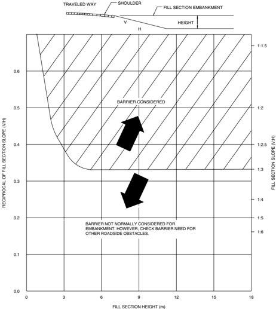

--'',,',',,,,',,'',',,,,,''','',-'-',,',,',',,'---

Figure 5-1(b). Comparative Barrier Consideration for Embankments (U.S. Customary Units) (15)

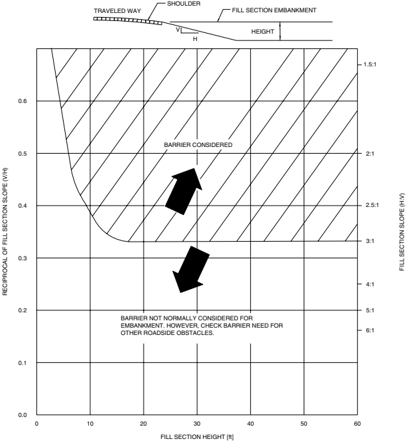

--'',,',',,,,',,'',',,,,,''','',-'-',,',,',',,'---

Figure 5-2(a). Example Design Chart for Embankment Barrier Consideration Based on Fill Height, Slope, and Traffic Volume (Metric Units) (8)

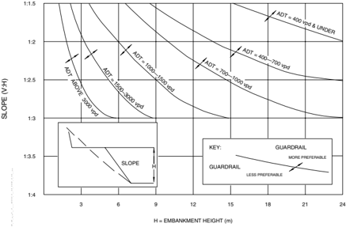

Figure 5-2(b). Example Design Chart for Embankment Barrier Consideration Based on Fill Height, Slope, and Traffic Volume (U.S. Customary Units) (8)

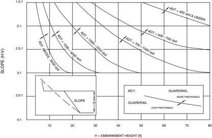

Figure 5-3(a). Example Design Chart for Cost-Effective Barrier Consideration for Embankments Based on Traffic Speeds and Volumes, Slope Geometry, and Length of Slope (Metric Units)

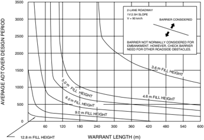

Figure 5-3(b). Example Design Chart for Cost-Effective Barrier Consideration for Embankments Based on Traffic Speeds and Volumes, Slope Geometry, and Length of Slope (U.S. Customary Units)

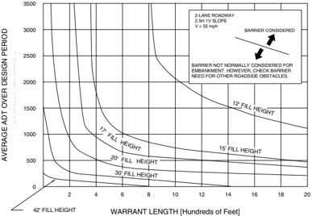

Roadside Design Guide 5-8

## 5.2.2 Roadside Obstacles

Roadside obstacles may be either man-made (such as culvert inlets) or natural (such as trees). Together, these highway conditions account for over thirty percent of the first harmful event and approximately 20 percent of the most harmful event for all highway fatal crashes each year. Barrier recommendations for roadside obstacles are a function of the obstacle itself and the likelihood that it will be hit. However, a barrier should be installed only if it is clear that the result of a vehicle striking the barrier will be less severe than the crash resulting from hitting the unshielded object.

Roadside obstacles that are normally shielded are listed in Table 5-2 (16) . While roadside obstacles immediately adjacent to the traveled way are usually removed, relocated, modified, or shielded, the optimal solution becomes less evident as the distance between the obstruction and the traveled way increases. Table 3-1, Clear-Zone Distances, is intended as a guide to aid the designer in determining whether the obstruction constitutes an obstacle to an errant motorist that is significant enough to justify action. Most man-made objects incorporated into a highway project can be designed to minimize the concern they present to a motorist and thus make shielding unnecessary. This is particularly true of drainage features such as small culverts and ditches.

Table 5-2. Barrier Guidelines for Non-Traversable Terrain and Roadside Obstacles a,b (16)

| Obstacle                                  | Guidelines                                                                                      |
|-------------------------------------------|-------------------------------------------------------------------------------------------------|
| Bridge piers, abutments, and railing ends | Shielding generally needed.                                                                     |
| Boulders                                  | Judgment decision based on nature of fixed object and likelihood of impact.                     |
| Culverts, pipes, headwalls                | Judgment decision based on size, shape and location of obstacle.                                |
| Foreslopes and backslopes (smooth)        | Shielding not generally needed.                                                                 |
| Foreslopes and backslopes (rough)         | Judgment decision based on likelihood of impact.                                                |
| Ditches (parallel)                        | Refer to Figures 3-6 and 3-7.                                                                   |
| Ditches (transverse)                      | Shielding generally needed if likelihood of head-on impact is high.                             |
| Embankment                                | Judgment decision based on fill height and slope (see Figure 5-1).                              |
| Retaining walls                           | Judgment decision based on relative smoothness of wall and anticipated maximum angle of impact. |
| Sign/luminaire supports c                 | Shielding generally needed for non-breakaway supports.                                          |
| Traffic signal supports d                 | Isolated traffic signals within clear zone on high-speed rural facilities may need shielding.   |
| Trees                                     | Judgment decision based on site-specific circumstances.                                         |
| Utility poles                             | Shielding may be needed on a case-by-case basis.                                                |
| Permanent bodies of water                 | Judgment decision based on location and depth of water and likelihood of encroachment.          |

## Notes:

a) Shielding non-traversable terrain or a roadside obstacle is usually necessary when it is within the clear zone and cannot practically or economically be removed, relocated, or made breakaway, and it is determined that the barrier provides a safety improvement over the unshielded condition.

b) Marginal situations, with respect to placement or omission of a barrier, will usually be decided by crash experience, either at the site or at comparable site(s).

c) Where appropriate, most sign and luminaire supports should be of a breakaway design regardless of their distance from the roadway if there is reasonable likelihood of their being hit by an errant motorist. The placement and locations for breakaway supports also should consider the safety of pedestrians from potential debris resulting from impacted systems.

d) In practice, relatively few traffic signal supports, including flashing light signals and gates used at railroad crossings, are shielded. If shielding is deemed necessary, however, crash cushions are sometimes used in lieu of a longitudinal barrier installation..

--'',,',',,,,',,'',',,,,,''','',-'-',,',,',',,'---

## 5.2.3 Bystanders, Pedestrians, and Bicyclists

The conventional criteria presented in the previous sections cannot be used to establish barrier needs for pedestrians or bicyclists. For example, a major roadway may be relatively close to a schoolyard, but the boundaries are beyond the clear distance. There are no criteria that would require that a barrier be installed. If, however, a barrier is installed, it could be placed near the school boundary to minimize the potential for vehicle impacts. Reference should be made to Section 5.6.1 for lateral placement criteria. Consideration might also be given to installing a barrier to shield businesses and residences that are near the right-of-way, particularly at locations having a history of run-off-the-road crashes. Occasional functions that use, or are adjacent to, public right-of-way with concentrated pedestrian activity such as farmer's markets and street fairs may be considered for temporary barriers or delineation.

Pedestrians and cyclists along a route are a concern that might be given design consideration. Depending on the route type, traffic volumes, number of bicyclists and pedestrians, and traffic speed, a possible solution might be to separate them from vehicular traffic. Since this solution is not always practical, alternate means of separating them from vehicular traffic are sometimes necessary. Currently there are no objective criteria to draw on for pedestrian and cyclist barrier recommendations.

On low-speed streets, the practice generally is to separate pedestrians from traffic by a sidewalk separated from the roadway by a raised curb. However, at speeds of over 40 km/h [25 mph] a vehicle may mount the curb for relatively flat approach angles. Furthermore, it is generally impractical to separate pedestrians from the roadway with a longitudinal roadside barrier. Thus, for streets with speeds of over 40 km/h [25 mph], separating the sidewalk from the edge of the roadway with a buffer space is encouraged. See Chapter 10 for more information.

When sidewalks or multi-use paths are adjacent to the traveled way of high-speed facilities, some provision might be made to shield the sidewalk or path from vehicular traffic on the roadway. Factors to consider for barrier protection include traffic and pedestrian volumes, roadway geometry, sidewalk/path offset, and cross-section features.

## 5.2.4 Motorcycles and Barrier Design

Nationwide, there have been some instances where roadside barriers have contributed to the severity of crashes involving motorcycles. Motorcyclists have a higher risk of being seriously injured or killed in a crash as compared to occupants in automobiles. This is mostly due to the higher level of occupant safety provided in modern automobiles. It has been noted that motorcyclists involved in crashes with some types of open-faced traffic barriers have sustained serious to fatal injuries, particularly after contacting the edges of steel guardrail posts or the tops of these posts where they project above the rail element. Some European countries have attempted to address these concerns at locations having both high motorcycle use and a high number of crashes by adding a lower rubrail to the design or by padding the posts with expanded foam. However, no systematic approach toward this issue has been developed because of the random nature of motorcycle crashes and the questionable effectiveness of modifications to existing barriers. Based on the experience of other countries and the lack of any system-wide, cost-effective countermeasures or barrier designs, there appears to be little basis for developing guardrails designed for motorcyclists for all barrier installations. There is some perception that a smooth, solid-faced barrier such as a concrete safety shape may be less likely to cause traumatic injuries to motorcyclists upon contact. Additional research is being conducted regarding motorcycle interaction with barriers.

## 5.3 TEST LEVEL SELECTION FACTORS

Many barriers have been developed to accommodate both small cars and pickup trucks in accordance with NCHRP Report 350 and MASH testing criteria. Properly designed and installed barrier systems have proven to be very effective in reducing the amount of damage and lessening the severity of personal injuries. However, in certain locations it may be appropriate to utilize a higher performance barrier capable of redirecting large vehicles such as tractor-trailer combination trucks. Although objective warrants for the use of higher performance traffic barriers do not presently exist, subjective factors most often considered for new construction or safety upgrading include:

- High percentage of heavy vehicles in the traffic stream or a high concentration of trucks at an interchange
- Hazardous materials routes

Roadside Design Guide 5-10

- Adverse geometrics, such as sharp curvature, which are often combined with limited sight distance, or long downhill grades combined with horizontal curvature
- Severe consequences associated with penetration of a barrier by a large vehicle, such as multi-level interchange ramps, highly sensitive environmental areas, or critical highway components (nationally significant bridges or tunnels).

Some of the above-listed factors become worthy of more consideration when they occur in combination with other factors. For example, a moderate length bridge over a portion of a reservoir may be at low risk for environmental consequences unless combined with geometric factors that increase the likelihood of truck impact with the rail.

These same factors also apply to reconstruction or rehabilitation projects. However, in these cases, the designer will usually have the added benefit of past crash history, the past performance of the system, and maintenance costs associated with the existing barrier. In addition, a higher performance barrier is likely to lessen the severity of future crashes or reduce maintenance costs significantly. Section 5.4 includes information on the size of vehicle for which each system has been successfully crash tested.

## 5.4 STRUCTURAL AND SAFETY CHARACTERISTICS OF ROADSIDE BARRIERS

This section includes information on the most commonly used roadside barriers. Separate subsections address standard sections of roadside barriers and transition sections. Figure 5-4 graphically depicts each of these elements for typical installations. Information on the structural and safety characteristics of each system is presented in narrative format. Refer to Section 5.1 for additional information on FHWA acceptance letters and individual barrier systems.

Figure 5-4. Definition of Roadside Barriers

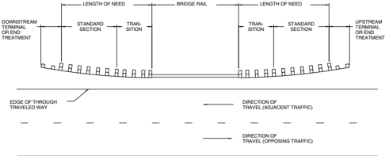

## 5.4.1 Standard Sections of Roadside Barriers

Roadside barriers are usually categorized as flexible, semi-rigid, or rigid, depending on their deflection characteristics resulting from an impact. Flexible systems are generally more forgiving than the other categories since much of the impact energy is dissipated by the deflection of the barrier and lower impact forces are imposed upon the vehicle. This section is not intended to be all-inclusive, but to cover the most widely used roadside barriers. The barriers and approved test levels included in the following subsections are listed in Table 5-3.

For additional barrier systems, including barriers tested to meet MASH criteria, please refer to the FHWA for acceptance letters and the AASHTO Task Force 13 website for design details, as mentioned previously in Sections 5.1.1 and 5.1.2.

--'',,',',,,,',,'',',,,,,''','',-'-',,',,',',,'---

Table 5-3. Roadside Barriers and NCHRP Report 350 Approved Test Levels

| System                                           | Test Level                           | FHWA Acceptance Letter               | System Designation                   | Reference Section                    |
|--------------------------------------------------|--------------------------------------|--------------------------------------|--------------------------------------|--------------------------------------|
| FLEXIBLE SYSTEMS                                 | FLEXIBLE SYSTEMS                     | FLEXIBLE SYSTEMS                     | FLEXIBLE SYSTEMS                     | FLEXIBLE SYSTEMS                     |
| W-Beam (Weak Post)                               | 2                                    | B-64                                 | SGR02                                | 5.4.1.3                              |
| Three-Strand Cable (Weak Post)                   | 3                                    | B-64                                 | SGR01a and b                         | 5.4.1.1                              |
| High-Tension Cable Barriers                      | 3 and 4                              | Various                              | Various                              | 5.4.1.2                              |
| Modified W-Beam (Weak Post)                      | 3                                    | B-64                                 | SGRO2                                | 5.4.1.3                              |
| Ironwood Aesthetic Barrier                       | 3                                    | B-56, 56-A, and 56-B                 |                                      | 5.4.1.4                              |
| SEMI-RIGID SYSTEMS                               | SEMI-RIGID SYSTEMS                   | SEMI-RIGID SYSTEMS                   | SEMI-RIGID SYSTEMS                   | SEMI-RIGID SYSTEMS                   |
| Steel Post with Steel Blockout                   | 2                                    | B-64                                 | SGR04a                               | 5.4.1.6                              |
| Box Beam (Weak Post)                             | 3                                    | B-64                                 | SGR03                                | 5.4.1.5                              |
| Steel or Wood Post with Wood or Plastic Blockout | 3                                    | B-64                                 | SGR04a and b                         | 5.4.1.6                              |
| NU-GUARD by Nucor Marion                         | 3                                    | B-162                                |                                      | 5.4.1.8                              |
| Trinity T-31 and Trinity Guardrail System        | 3                                    | B-140                                |                                      | 5.4.1.8                              |
| Gregory (GMS)                                    | 3                                    | B-150                                |                                      | 5.4.1.8                              |
| Midwest Guardrail System (MGS)                   | 3                                    | B-133                                |                                      | 5.4.1.7                              |
| Blocked-out Thrie-Beam (Strong Post)             | 3                                    | B-64                                 | SGR09c SGR09a                        | 5.4.1.9.1                            |
| Merritt Parkway Aesthetic Guardrail              | 3                                    | B-38                                 |                                      | 5.4.1.10                             |
| Steel-Backed Timber Guardrail                    | 2 and 3                              | B-64-D                               |                                      | 5.4.1.11                             |
| Modified Thrie-Beam (Strong Post)                | 4                                    | B-64                                 | SGR09b                               | 5.4.1.9.2                            |
| Trinity T-39 Non-Blocked-Out Thrie Beam          | 4                                    | B-148                                |                                      | 5.4.1.9.3                            |
| RIGID SYSTEMS (Concrete and Masonry)             | RIGID SYSTEMS (Concrete and Masonry) | RIGID SYSTEMS (Concrete and Masonry) | RIGID SYSTEMS (Concrete and Masonry) | RIGID SYSTEMS (Concrete and Masonry) |
| Stone Masonry Wall/Precast Masonry Wall          | 3                                    | B-64-D                               |                                      | 5.4.1.14                             |
| New Jersey Safety-Shape Barrier                  |                                      |                                      |                                      | 5.4.1.12                             |
| • 810 mm[32 in.] tall                            | 4                                    | B-64                                 | SGM11a                               | 5.4.1.12                             |
| • 1070 mm[42 in.] tall                           | 5                                    | B-64                                 | SGM11b                               | 5.4.1.12                             |
| F-Shape Barrier                                  |                                      |                                      |                                      | 5.4.1.12                             |
| • 810 mm[32 in.]                                 | 4                                    | B-64                                 | SGM10a                               | 5.4.1.12                             |
| • 1070 mm[42 in.]                                | 5                                    | B-64                                 | SGM10b                               | 5.4.1.12                             |
| Vertical Concrete Barrier                        |                                      |                                      |                                      | 5.4.1.12                             |
| • 810 mm[32 in.] • 1070 mm[42 in.]               | 4                                    | B-64                                 |                                      | 5.4.1.12                             |
|                                                  | 5                                    | B-64                                 |                                      | 5.4.1.12                             |
| Single Slope Barrier                             |                                      |                                      |                                      | 5.4.1.12                             |
| • 810 mm[32 in.]                                 | 4                                    | B-17, B-45                           |                                      | 5.4.1.12                             |
| • 1070 mm[42 in.]                                | 5                                    | Note 1                               |                                      | 5.4.1.12                             |
| Ontario Tall Wall Median Barrier                 | 5                                    | B-19                                 | SGM12                                | 5.4.1.12                             |

Note 1: The Single Slope Barriers were not tested to the TL-5 level but may be considered TL-5 barriers when cast in place or slip-formed if the dimensions, reinforcing, and foundation details are equivalent to designs that have been tested. See FHWA Acceptance Letter B-64.

--'',,',',,,,',,'',',,,,,''','',-'-',,',,',',,'---

Roadside Design Guide

5-12

## 5.4.1.1 Low-Tension Cable

The barrier system shown in Figure 5-5 consists of steel cables mounted on weak posts. Several variations of this design (SGR01a and SGR01b) have been successfully crash tested.

Impact performance -This system, with a top cable height of 762 mm [30 in.], has been successfully tested to NCHRP Report 350 TL-3 conditions with a dynamic lateral deflection of 2.4 m [7 ft, 10 in.]. This system will generally redirect vehicles in the 820 to 2000 kg [1,800 to 4,400 lb] ranges, but some discussion is needed to distinguish between design variations of this system. The steel S75 × 8.5 [S3 × 5.7] post design with 711-mm [28 in.] top rail height is the most extensively tested design. In addition to the vehicle range described above, this design has successfully contained and redirected a low front profile car and a 1860-kg [4,100 lb] van in crash tests.

The cable barrier redirects impacting vehicles after sufficient tension is developed in the cable, with the combination of low cable tension and weak posts often producing large deflections. Testing on the S75 × 8.5 [S3 × 5.7] post design has shown that closer post spacing can reduce lateral deflection to some extent. Prior testing with a 1580-kg [3,500-lb] car at 100 km/h [62 mph] on this design produced deflections of 2.1 m [7 ft] to 3.3 m [11 ft] for associated post spacing of 1.2 to 4.9 m [4 ft to 16 ft].

Cable barriers placed on the inside of curves need additional deflection before tension develops in the cable. Among agencies using this barrier, guidelines vary regarding maximum curvature allowed. The State of New York installs the S75 × 8.5 [S3 × 5.7] post design on curves with radii up to 220 m [720 ft] with standard 4.9 m [16 ft] spacing and with radii up to 135 m [440 ft] with 3.7 m [12 ft] post spacing.

Primary advantages of cable guardrail include: low initial cost, effective vehicle containment and redirection over a wide range of vehicle sizes and installation conditions, and low deceleration forces upon the vehicle occupants. It is also advantageous in snow or sand areas because its open design prevents drifting on or alongside the roadway. Major drawbacks to the use of cable guardrail include: the comparatively long lengths of barrier which become non-functional and in need of repair following an impact, the clear area needed behind the barrier to accommodate the design deflection distance, its reduced effectiveness on the inside of curves, and its sensitivity to correct height installation and maintenance.

Figure 5-5. Three-Strand Cable Barrier

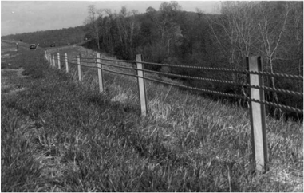

## 5.4.1.2 High-Tension Cable

High-tension cable barriers are typically used in median applications, though they can also be utilized as roadside barriers. These systems are available in three- and four-cable configurations. For additional information regarding high-tension cable barrier systems, refer to Chapter 6 as well as the web sites of the manufacturers, FHWA, and AASHTO Task Force 13.

## 5.4.1.3 W-Beam (Weak Post)

The barrier system shown in Figure 5-6 behaves very much like a low-tension cable guardrail, i.e., the guardrail posts are very weak and are spaced far apart. This combination produces large lateral deflections and produces a W-beam rail that relies heavily on guardrail tension to redirect impacting vehicles as it is placed in tension. Post size is identical to the cable system, i.e., S75 × 8.5 [S3 × 5.7], but posts are installed at 3.81 m [12 ft, 6 in.] centers to match the W-beam hole pattern.

Impact performance -The W-beam weak-post system has been successfully tested to NCHRP Report 350 TL-2 conditions with a dynamic lateral deflection of 1.4 m [4 ft, 7 in.]. This barrier failed the TL-3 pickup truck length-of-need crash test. Thus, the barrier is approved as a TL-2 barrier system with the mounting height of 558 mm [22 in.] to the center of the rail.

This system may retain some degree of effectiveness after minor hits due to the rigidity of the W-beam rail element and thus has some advantage over a cable system. As with the cable system, lateral deflection can be reduced to some extent by closer post spacing. This system, as with all barriers having a relatively narrow restraining width, is somewhat vulnerable to vehicle vaulting or under-ride caused by incorrect mounting height or irregularities in the approach terrain.

A modification to the standard W-beam weak-post design was developed and successfully tested to NCHRP Report 350, TL-3 conditions. The modifications include raising the mounting height to 820 mm [32.3 in.] and adding W-beam back-up plates at each post. All rail splices are centered mid-span between posts instead of at the posts. The dynamic deflection was measured at 2.1 m [7 ft] when the barrier was tested to TL-3 conditions.

Figure 5-6. Weak-Post W-Beam Guardrail

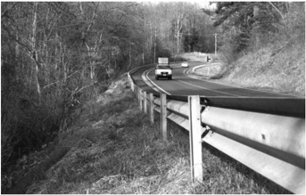

## 5.4.1.4 Ironwood Aesthetic Guardrail

The barrier shown in Figure 5-7 is a weak-post system consisting of S75 × 8.5 [S3 × 5.7] steel posts on 1.98 m [6 ft, 6 in.] centers supporting a composite rail element. This composite rail consists of 203 mm [8 in.] diameter routed round-wood posts with a 6 mm [ 1 / 4 in.] thick steel channel embedded on the back side to provide the needed tensile strength of the system. The top height of the rail is 660 mm [26 in.]. The steel support posts are faced with 171 mm [6 3 / 4 in.]  diameter timber posts above the ground line to present an all-timber appearance from the roadway. The Ironwood guardrail, which is a proprietary design, was successfully tested to NCHRP Report 350, TL-3. Maximum dynamic deflection was 1.64 m [5 ft, 4  1 / 2 in.].

The manufacturer of the Ironwood Aesthetic Guardrail has developed a detail to connect a crashworthy terminal to this barrier. It is the Bursting Energy Absorbing Terminal (BEAT™) by Road Systems, Inc. Other acceptable end treatments include anchoring in a backslope (see Section 8.3.6.1) or flaring the barrier to the edge of the clear zone established for a particular project.

Figure 5-7. Ironwood Aesthetic Guardrail

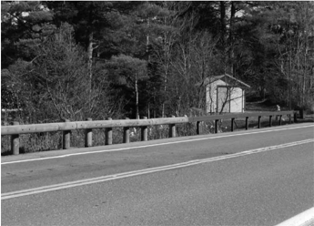

## 5.4.1.5 Box Beam (Weak Post)

Figure 5-8 shows a typical installation of a box-beam guardrail (SGR03 system). Resistance in this system is achieved through the combined flexure and tensile stiffness of the rail. Posts near the point of impact are designed to break or tear away, thereby distributing the impact force to adjacent posts.

Impact performance -This system was successfully crash tested to NHCRP 350, TL-3 conditions. Dynamic lateral deflection was 1.15 m [45 in.].

This system shares the same sensitivities to mounting height and irregularities in terrain as the weak-post W-beam systems. The typical distance from the ground to top of rail is 686 mm [27 in.].

Figure 5-8. Weak-Post Box Beam Guardrail

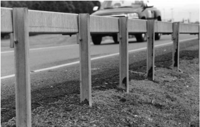

## 5.4.1.6 Blocked-Out W-Beam (Strong Post)

Strong-post W-beam is the most common barrier system in use today. It consists of wood posts and wood blockouts or steel posts (SGRO4a) as shown in Figure 5-9 that support a W-beam rail element blocked out from the posts with routed timber or composite blockouts. These blockouts minimize vehicle snagging on the posts and reduce the likelihood of a vehicle vaulting over the barrier by maintaining the rail height during the initial stages of post deflection. Resistance in this and all strong-post systems results from a combination of tensile and flexural stiffness of the rail and the bending or shearing resistance of the posts. The blockouts are typically timber or recycled plastic with a 150 mm [6 in.] width to match each post's dimensions.

Figure 5-9. Steel-Post W-Beam Guardrail with Wood Blockouts

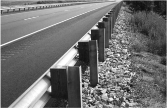

Roadside Design Guide

Research has shown that use of steel blockouts is not acceptable for TL-3 test conditions, but can be acceptable as a TL-2 barrier. In order to provide a TL-3 barrier with steel posts, 150 mm × 200 mm [6 in. × 8 in.] nominal routed wood or plastic blockouts of similar dimensions should be used as a substitute for the steel blockouts. Steel-post W-beam guardrail using 150 mm × 150 mm [6 in. × 6 in.] routed wood or plastic blockouts also met Report 350 evaluation criteria but with some reduction in performance. Individual designs for these and other strong-post W-beam guardrail variations can be obtained at the websites as previously listed in Section 5.4.

It is acceptable to use double blockouts (up to 406 mm [16 in.] deep) to increase the post offset to avoid obstacles such as curbs. There is no limit to the number of posts that can have double blockouts installed, except terminals, unless approved by the manufacturer. Under special circumstances, such as avoiding buried obstacles that are not relocated, it is also acceptable to install additional blockouts to obtain up to 914 mm [36 in.] of clearance for one or two posts in a section of guardrail.

The standard length for timber posts has been increased to 1.83 m [6 ft] to match the length of steel posts; however, the NCHRP Report 350 tests used the original 1.63 m [5 ft, 4 in.] posts and either length remains acceptable. The original height to the top of the rail for strong-post W-beam was 686 mm [27 in.]. This was slightly modified when the height measurement was changed from the top of the rail to the center of the rail and with the adoption of metric units. A 550-mm [21 5 / 8 -in.] height to the center of the rail translated to a 706-mm [27 3 / 4 -in.] top-of-rail height. However, crash testing results indicate that the performance of traditional blocked-out, strongpost W-beam guardrail is near its limit for these installation heights per MASH and NCHRP Report 350 criteria. The test parameters per MASH or NCHRP Report 350, represent a very low probability accident that has both high speed and high impact angle as well as with a large vehicle. Many refer to this as 'worst practical conditions.' Based upon this high impact energy test condition, it has been determined to install strong post W-beam longitudinal barriers at 706 mm [27 3 / 4 in.]  for TL-3 applications on new highway construction projects. --'',,',',,,,',,'',',,,,,''','',-'-',,',,',',,'---

For TL-3 applications, agencies may elect to raise the top of the traditional strong post W-beam to 737 mm [29 in.] ± 25 mm [1 in.] to the top of the rail to accommodate modest pavement overlays adjacent to the rail. The length of the guardrail posts do not need to be lengthened to accommodate this minor increase in guardrail height.

It should be recognized that overall impact performance of longitudinal barriers cannot be solely measured by a series of controlled crash tests. Many real world factors affect the in-field performance abilities of any longitudinal barrier system. Whereas new installations of strong post W-beam guardrail should be installed according to this guidance, it is recognized that many transportation agencies have installed miles of barrier, at 686 mm [27 in.], based on previous guidance. This has resulted in barrier systems being installed at a height lower than the currently recommended heights found under the current controlled crash test conditions. Many of these existing systems have and should continue to have acceptable real world impact performance. It is not cost-effective or practical to raise all existing guardrail to the current criteria on a highway agency's entire roadway system. However, guardrail should be upgraded as part of a reconstruction or new highway construction project. For TL-3 applications on 3R projects located on the National Highway System (NHS), highway agencies should consider raising W-beam barrier systems having an existing top of rail height less than 673 mm [26 1 / 2 in.].

Agencies have the flexibility to develop their own guidance to address lower guardrail heights of existing systems to remain in place. Some factors that may be included are highway classification, design speed, traffic volumes, vehicle classification, accident history, cost, right of way issues, cost-effective evaluations, and environmental impacts.

Impact performance -The wood-post (SGR04b) system with wood blockouts passed the NCHRP Report 350 TL-3 test with a maximum lateral deflection of 0.8 m [2.6 ft]. A steel-post system with a 150 mm × 200 mm [6 in. × 8 in.] routed wood blockout also passed the NCHRP Report 350 TL-3 test with a maximum lateral deflection of 1.0 m [3.3 ft]. These systems were accepted with a top-of-rail mounting height of 686 mm [27 in.]. Also, a MASH TL-3 test was successfully conducted with a top-of-rail height of 706 mm [27 3 / 4 in.] with a dynamic deflection of 1.2 m [3.9 ft].

Strong-post barrier systems usually remain functional after moderate to low speed impacts, thereby minimizing the need for immediate repair.

While this venerable barrier system continues to provide good in-service performance, there has been significant research and development conducted on this type of barrier to develop a more robust system. The main emphasis has been to obtain a system that has greater tolerance on height of installation while providing more system functionality, such as accommodating future highway overlays. A number of new systems have been developed to improve upon the performance of conventional strong post W-beam guardrail systems. These will be discussed in the following sections.

## 5.4.1.7 Midwest Guardrail System (MGS)

The Midwest Guardrail System (MGS), as shown in Figure 5-10, is a non-proprietary steel or wood post, W-beam guardrail system that has been successfully crash tested per NCHRP Report 350 TL-3 criteria. Some testing has also been conducted per MASH criteria. The MGS uses a typical W-beam guardrail with:

- 787 mm [31 in.] top of rail mounting height with a 25 mm [1 in.] up tolerance and with a 75 mm [3 in.] down tolerance. The MGS has recently passed MASH TL-3 testing for the 1100C passenger car with the top of rail height at 913 mm [36 in.] and 864 mm [34 in.] for a re-directive impact within the length of need. Additional testing for the pickup truck will need to be evaluated for this increased mounting height.
- 1.83 m [6 ft, 0 in.] long W150 × 13.5 [W6 × 9] steel posts or 150 mm × 200 mm [6 in. × 8 in.] wood posts.
- 150 mm × 300 mm [6 in. × 12 in.] routed or non-routed wood blockouts.
- 2.66 mm (12 gauge) rail
- Mid-span rail splices.

Figure 5-10. Midwest Guardrail System (MGS)

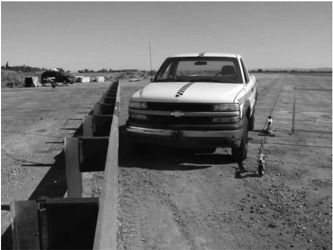

The increased mounting height provides improved performance for vehicles with higher center-of-gravity than the standard 706-mm [27 3 / 4 -in.] strong-post W-beam guardrail. The extra blockout depth helps reduce vehicle snagging for the small car, maintains the rail height as the post rotates in the soil during the impact. The mid-span splice has an advantage over traditional strong-post guardrail by relocating the splice away from the high stress point at the post and blockout. The MGS also has shown to have improved vehicle redirection characteristics. The MGS has been developed and crash tested for several common scenarios to maximize its use for roadside applications. The following is a list of current MGS TL-3 applications:

- Long-span (7.62 m [25 ft]) installation without intermediate posts to avoid conflict with underground structures.
- Installation with one-half and one-quarter standard post spacing.
- Utilization of round posts.

Roadside Design Guide

5-18

- Installation with 150 mm [6 in.] offset from a 150-mm [6-in.] curb.
- Installation with steep flare rates; passed TL-3 at 5:1 flare rate.
- Installation placed on 1V:8H foreslopes.
- Acceptable W-beam to thrie-beam transition.
- Placement of guardrail with 1V:2H slope break at center of post.
- TL-3 terminals available.

The MGS can accommodate future pavement overlays without adjustment of the mounting height. The small car tests on the MGS were conducted with a 812 mm [32 in.] top of rail height and the pickup truck test was conducted at 787 mm [31 in.] top of rail height. The MGS provides a 25 mm [1 in.] up tolerance and 75 mm [3 in.] down tolerance when installed initially with a top-of-rail height of 787 mm [31 in.]. As previously noted, the MGS has also passed MASH TL-3 re-directive impact with the 1100C passenger car with a mounting height of 914 mm [36 in.].

Impact performance -The MGS has successfully passed all TL-3 tests under both the MASH and NCHRP Report 350 evaluation criteria with maximum dynamic deflections of approximately 1.1 m [3 ft, 7 in.]. The small car crash tests were conducted using an 810 mm [32 in.] top of rail height of the MGS to demonstrate the system's ability to contain and redirect the small car. The NCHRP Report 350 820C and the MASH 1100C small car crash tests were successfully conducted with dynamic deflections of 443 mm [17.4 in.] and 913 mm [36 in.], respectively. See Table 5-4 for a summary of MGS applications with dynamic deflections, working widths, and post configurations. Working width is the distance between the traffic face of the test article before the impact and the maximum lateral position of any major part of the system or vehicle after the impact. Note that this table is a summary of the pickup truck crash tests only. --'',,',',,,,',,'',',,,,,''','',-'-',,',,',',,'---

Table 5-4. MGS Design Applications with Pickup Truck Impact Performance

| System Description                                      | Post Spacing                              | Post Type a,b   | Post Length   | Test Designation       | Test Criteria   | Dynamic Deflection   | Working Width     |
|---------------------------------------------------------|-------------------------------------------|-----------------|---------------|------------------------|-----------------|----------------------|-------------------|
| Standard Post Spacing                                   | 6 ft, 3 in.                               | Steel W6 × 9    | 6 ft          | Test 3-11              | 350             | 43.1 in.             | 49.6 in.          |
| Standard Post Spacing                                   | 6 ft, 3 in.                               | Steel W6 × 9    | 6 ft          | Test 3-11              | MASH            | 43.9 in.             | 48.6 in.          |
| Standard Post Spacing                                   | 6 ft, 3 in.                               | Steel W6 × 9    | 6 ft          | Test 3-11              | MASH d          | 57.0 in.             | 58.6 in.          |
| Standard Post Spacing                                   | 6 ft, 3 in.                               | Round DF        | 5 ft, 9 in.   | Test 3-11              | 350             | 60.2 in.             | 60.3 in.          |
| Standard Post Spacing                                   | 6 ft, 3 in.                               | Round PP        | 5 ft, 9 in.   | Test 3-11              | 350             | 37.6 in.             | 48.6 in.          |
| Standard Post Spacing                                   | 6 ft, 3 in.                               | 6' × 8' WP      | 6 ft          | Test 3-11              | 350             | 46.3 in.             | 58.4 in.          |
| Half Post Spacing                                       | 3 ft, 1 1 / 2 in.                         | Steel W6 × 9    | 6 ft          | BARRIER VII Simulation | 350             | 27.8 in.             | 43.1 in.          |
| Quarter Post Spacing                                    | 1 ft, 6 3 / 4 in.                         | Steel W6 × 9    | 6 ft          | Test 3-11              | 350             | 17.6 in.             | 36.7 in.          |
| Non-Blocked on Wire-Faced, MSE Wall with 3:1 Fill Slope | 6 ft, 3 in.                               | Steel W6 × 8.5  | 6 ft          | Test 3-11              | MASH            | 35.7 in.             | 45.2 in.          |
| 2:1 Fill Slope                                          | 6 ft, 3 in.                               | Steel W6 × 9    | 9 ft          | Test 3-11              | MASH            | 57.5 in.             | 62.6 in.          |
| 8:1 Approach Slope                                      | 6 ft, 3 in.                               | Steel W6 × 9    | 6 ft          | Test 3-11              | 350             | 57.6 in.             | 82.8 in.          |
| Long-Span Over Culvert                                  | 25 ft Unsupported Length with 6 ft, 3 in. | CRTs c CRTs c   | 6 ft 6 ft     | Test 3-11 Test 3-11    | MASH MASH       | 92.2 in. 77.5 in.    | 93.4 in. 84.0 in. |
| 5:1 Flare Rate                                          | 6 ft, 3 in.                               | Steel W6 × 9    | 6 ft          | Test 3-11              | 350             | 75.6 in.             | 97.4 in.          |
| 7:1 Flare Rate                                          | 6 ft, 3 in.                               | Steel W6 × 9    | 6 ft          | Test 3-11              | 350             | 75.8 in.             | 87.9 in.          |
| 13:1 Flare Rate                                         | 6 ft, 3 in.                               | Steel W6 × 9    | 6 ft          | Test 3-11              | 350             | 66.3 in.             | 70.6 in.          |
| MGS Over 6 in. Curb                                     | 6 ft, 3 in.                               | Steel W6 × 9    | 6 ft          | Test 3-11              | 350             | 40.3 in.             | 57.2 in.          |
| MGS 6 ft Behind                                         |                                           | Steel           | 6 ft          | Test 2-11              | MASH            | 24.4 in.             | 45.1 in.          |
| 6-in. Curb                                              | 6 ft, 3 in.                               | W6 × 9 Steel    | 3 ft, 8       | Test 3-11              |                 | 48.9 in.             | 53.2 in.          |
| Bridge Rail w/ Rigid Sleeves                            | 3 ft, 1½ in.                              | S3 × 5.7        | in.           |                        | MASH            |                      |                   |

## Notes:

a) Steel W6 × 8.5 sections can be substituted for W6 × 9 sections and vice versa.

b) Round Southern Yellow Pine (SYP) timber posts were also crash tested and evaluated with the standard MGS.

c) Three timber CRT posts are installed on each side of the unsupported length measuring 25 ft or less.

d) 2270P GMC 2500  3 / 4 -ton, 2-Door, Pickup Truck.

## 5.4.1.8 Proprietary W-Beam Guardrail Systems

Several proprietary W-beam guardrail systems have been crash tested per NCHRP Report 350 or MASH criteria. The list below is not intended to be all inclusive, but just a few examples of the products that have been developed. For additional details including dynamic deflection and working width values, please refer to the FHWA acceptance letters, and the AASHTO Task Force 13. The dynamic deflection may vary based on installation details such as post spacing and guardrail installation height.

## 5.4.1.8.1 Gregory Mini Spacer™ (GMS) Guardrail System

This guardrail system uses standard strong posts and W-beam rail with or without blockouts at 787 mm [31 in.]. The designer should refer to the manufacturer regarding dynamic deflections associated with the multiple rail-and-post-spacing combinations. Splices can be at mid-span or at the post. The proprietary element of this guardrail system is the 'Mini Spacer' fastener, as shown in Figure 5-11. The Mini Spacer provides for a reliable and consistent release of the rail from the post so that during impact the rail remains in contact with the vehicle for containment and redirection while the posts bend over by the force of the impacting vehicle, thus minimizing snagging potential. The GMS allows the flexibility of connecting to any approved terminal or special design guardrail system.

Figure 5-11. Gregory Mini Spacer


## 5.4.1.8.2 Trinity T-31™ Guardrail System

The top of rail for this guardrail system is mounted at 787 mm [31 in.] and uses standard W-beam with proprietary 1830 mm [6 ft] Steel Yielding Line Posts. Each post has four 20.6-mm [ 13 / 16 -in.] holes in the flanges at the ground line. The posts are spaced at 1905 mm [6 ft, 3 in.] and splices are at the mid-span. There are no blockouts. The blockouts are replaced with a 152 mm [6 in.] flange protector and a countersunk-head post bolt. A benefit of this product is the reduced grading required by the elimination of the blockout. It also has been crash tested in combination with a curb. Refer to manufacturer recommendations for installation with curbs. The T-31 guardrail system has been successfully tested to TL-3 under both NCHRP Report 350 and MASH criteria. The dynamic deflection was 1.04 m [3.4 ft]. It is available in configurations for both roadside and median applications. Figure 5-12 shows the T-31 guardrail system in a roadside application.

--'',,',',,,,',,'',',,,,,''','',-'-',,',,',',,'---

Figure 5-12. Trinity T-31™ Guardrail System


## 5.4.1.8.3 NU-GUARD™ 31 by Nucor Steel Marion, Inc.

NU-GUARD™ 31, as shown in Figure 5-13, is a guardrail system that can be utilized as a strong- or weak-post system as well as with or without blockouts. The system can be installed with a 787 mm [31 in.] top of rail mounting height. The system utilizes standard W-beam sections with a 7.44 kg/m [5 lb/ft] U-Channel post. This post is known as the RIB-BAK® Post. This system has applications that have met NCHRP Report 350 TL-3 and TL-4 evaluation criteria.

Figure 5-13. NU-GUARD™-31 Guardrail System


Roadside Design Guide

5-22

## 5.4.1.9 Blocked-Out Thrie-Beam

There are three types of thrie-beam barriers that have been tested under NCHRP Report 350. These barriers are discussed in the following subsections.

## 5.4.1.9.1 Blocked-Out Thrie-Beam (Wood and Steel Strong Post)

The SGR09c (wood post) thrie-beam guardrail system, shown in Figure 5-14, is a stronger version of the blocked-out W-beam barrier. The additional corrugation in the thrie-beam rail element stiffens the system, making it less prone to damage during low and moderate speed vehicular impacts. It also allows for higher mounting of the rail, which increases its ability to contain vehicles larger than standard passenger cars under some impact conditions. The SGR09c thrie-beam system, with wood posts and blockouts, has been successfully crash tested with a top railing height of 810 mm [32 in.]

Impact performance -The SGR09c thrie-beam system with wood posts and wood blockouts was successfully crash tested to NHCRP Report 350 TL-3 conditions. The dynamic lateral deflection observed during testing was 680 mm [2.2 ft].

The original SGR09a (steel-post) thrie-beam system, which used a steel blockout, failed to pass the NCHRP Report 350 TL-3 test. The original steel blockouts have been replaced with routed timber or composite blockouts with a 150 mm [6 in.] width to match the post dimensions. This barrier, as with the thrie-beam wood-post system, has been successfully crash tested with a top railing height of 810 mm [32 in.].

Impact Performance -The SGR09a thrie-beam system with steel posts and wood blockouts was successfully crash tested to NCHRP Report 350, TL-3. The dynamic lateral deflection observed during testing was 580 mm [1.9 ft].

Figure 5-14. Wood-Post Thrie-Beam Guardrail


## 5.4.1.9.2 Modified Thrie-Beam

To improve the performance of the thrie-beam guardrail system for heavy vehicles, a modified steel blockout was developed. This 355 mm [14 in.] deep steel blockout has a triangular notch cut from its web (see SGR09b in Figure 5-15). This blockout design allows the lower portion of the thrie-beam and the flange of the steel blockout to bend inward during a crash, keeping the rail face nearly vertical in the impact zone as the posts are pushed backwards. This raises the height of the rail and further minimizes the likelihood of

a vehicle rolling over the barrier. Other modifications to the standard thrie-beam design that have been incorporated into this barrier include omitting rectangular post bolt washers and increasing the top-of-rail height to 864 mm [34 in.].

Impact performance -The modified thrie-beam system has been successfully crash tested to NHCRP 350, TL-4 and TL-3. The design dynamic lateral deflection for TL-4 and TL-3 was 0.9 m [3 ft] and 0.6 m [2 ft], respectively.

Repair costs for all of the thrie-beam systems may be considerably less than other metal-beam guardrail systems because the thriebeam is not significantly damaged in shallow-angle impacts. Even for moderate to severe crashes, the barrier may remain partially functional  and  does  not  usually  require  immediate  repair. Also,  the  thrie-beam  is  generally  easier  to  install  and  maintain  than  a W-beam/rubrail system, where a higher effective barrier height is the design goal.

Figure 5-15. Modified Thrie-Beam Guardrail


5.4.1.9.3 Trinity T-39™ Guardrail System This  is  a  proprietary  strong-post  thrie-beam  system  that  has  been  successfully  crash  tested  to  NCHRP  Report  350  TL  4  evaluation  criteria.  This  system  has  a  top  of  rail  mounting  height  of  991  mm  [39  in.]  and  a  dynamic  deflection  of  0.63  m  [2.1  ft]. The  thrie-beam  attaches  directly  to  proprietary  1830  mm  [6  ft]  Steel  Yielding  Line  Posts™  and  eliminates  the  need  for blockouts.  Each  post  has  four  20.6-mm  [ 13 / 16 -in.]  diameter  holes  in  the  flanges  at  the  ground  line.  The  posts  are  spaced  at 1.905 m [6 ft, 3 in.] with splices at the mid-span. A photograph of the Trinity T-39™ guardrail system is shown in Figure 5-16. --'',,',',,,,',,'',',,,,,''','',-'-',,',,',',,'---

Figure 5-16. Trinity T-39™ Guardrail System


## 5.4.1.10 Merritt Parkway Aesthetic Guardrail

The Connecticut Department of Transportation developed and tested an aesthetic steel-backed timber rail supported by W150 × 22.5 [W6 × 15] steel posts on 2896 mm [9 ft , 6 in.] centers. The rail element consists of 150 mm × 300 mm [6 in. × 12 in.] timber beams backed with 150 mm wide × 9.5 mm thick [6 in. ×  3 / 8 in.] steel plates and splices to provide tensile continuity. Height to the top of the rail is 762  mm [30 in.]. A wood blockout measuring 100  mm deep × 200 mm wide × 280  mm high [4  in. deep × 8 in. wide × 11 in. high] separates the rail element from the posts to minimize snagging. This barrier, shown in Figure 5-17, was tested to NCHRP Report 350, TL-3 conditions. Dynamic deflection with the 2000-kg [4,400-lb] pickup truck was 1.15 m [3.8 ft] when the system was tested without a curb and 1020 mm [40 in.] when installed 300 mm [12 in.] behind a 100-mm [4-in.] sloped face curb. Either option is acceptable for field application.

Figure 5-17. Merritt Parkway Aesthetic Guardrail


## 5.4.1.11 Backed Timber Guardrail

The semi-rigid barrier shown in Figure 5-18 was developed as an aesthetic alternative to conventional guardrail systems. The system consists of a 150 mm × 250 mm [6 in. × 10 in.] wood rail backed with a 9.5 mm [ 3 / 8 in.] thick steel plate and supported by 250 mm × 300 mm × 2.13 m [10 in. x 12 in. × 7 ft] timber posts. The rail is offset from the posts by 100 mm × 225 mm × 300 mm [4 in. × 9 in. × 12 in.] wooden blockouts. The steel plate provides the needed tensile strength to the system. The wood members provide a more rustic appearance than the steel and concrete normally used in barriers. Thus, this railing is often specified for use along roads under the jurisdiction of the National Park Service and similar agencies.

Impact performance -This design with the 100 mm [4 in.] blockouts was tested to NCHRP Report 350 at TL-3 with a dynamic deflection of 580 mm [23 in.]. However, when installed without the 100 mm [4 in.] blockouts, it is only a TL-2 system. Detailed design information on this barrier and on the rough masonry and precast concrete guardwalls can be found on the FHWA's Eastern Federal Lands website at http://www.efl.fhwa.dot.gov/.

Figure 5-18. Backed Timber Guardrail


## 5.4.1.12 Concrete Barriers

A number of rigid concrete systems have been developed that have varying shapes and heights that range from 457 mm [18 in.] to 2.29 m [90 in.]. However, the most common concrete barrier heights are 810 mm [32 in.] and 1070 mm [42 in.]. The concrete barriers with a height of 810 mm [32 in.] passed NCHRP Report 350 TL-4 test conditions, while taller barriers of similar shape with a height of 1070 mm [42 in.] passed NCHRP Report 350 TL-5 test conditions. However, the 810 mm [32 in.] New Jersey concrete safetyshape barrier failed TL-4 testing per MASH criteria. The failure mode appeared to be affected more by the barrier height rather than the face configuration.

Another barrier that has been developed for typically urban environments or where a TL-2 system is appropriate is the low profile barrier. These barriers typically range from 457 mm to 510 mm [18 in. to 20 in.]. The low profile barrier was developed to provide a barrier that provides additional design options for site-specific applications. These barriers can be used in permanent or temporary applications. Several different barrier cross-section configurations have been approved for TL-2 applications. Many of these barriers

are available as cast-in-place or precast construction. The lower barrier height improves sight distance as well as provides another option to tie in with the adjacent surroundings. This low profile barrier shown in Figure 5-19 has been used in urban settings to shield trees in a raised median.

Figure 5-19. Low Profile Barrier


The New Jersey concrete safety shape roadside barrier is a rigid system having a sloped front face and a vertical back face. Except for the back face, the design details and performance of this barrier are identical to the concrete median barrier (CMB). Refer to Section 6.4.1.8 for a more complete discussion of this design. The New Jersey safety shape (SGM11a and b) and the F-shape (SGM10a and b) are both acceptable barrier profiles. The F-shape exhibited better performance in crash tests with 820 kg [1,800 lb] cars and 8000 kg [18,000 lb] single unit trucks.

Constant slope concrete barriers (shown in Figure 5-20 as a median barrier), first developed by the State of Texas and later modified by the State of California, have also been tested with pickup trucks and single unit trucks and found to perform satisfactorily. Note that the reduced cross-section of one-sided roadside barrier (as compared to the CMB) makes it more vulnerable to overturn. Therefore, the roadside version usually contains more reinforcing steel and/or a more elaborate footing design unless earth support is available on the back side of the barrier. Additional research and development will be considered to further optimize the shape and height of concrete barriers.


--'',,',',,,,',,'',',,,,,''','',-'-',,',,',',,'---

Figure 5-20. Constant Slope Barrier

Top of barrier height for most concrete barrier design is 810 mm [32 in.], but higher designs have been tested and built to provide containment and redirection of vehicles heavier than passenger cars.

Impact performance -Several of the concrete barriers, such as the New Jersey concrete safety-shape, F-shape, and constant slope barriers, have been successfully tested to NHCRP 350, TL-4, with 810-mm [32-in.] height. The New Jersey safety shape has been the most commonly tested concrete barrier design in past years, and it has generally been tested in the median barrier configuration. A modified New Jersey safety shaped barrier, F-shape barrier, vertical concrete barrier, and the constant slope barrier, with barrier height of 1070 mm [42 in.], have been successfully tested to NHCRP Report 350, TL-5. For example, the 1070-mm [42 in.] New Jersey safety shaped barrier redirected a tractor-trailer impacting at an angle of 15 degrees and a speed of 84 km/h [52 mph]. Another median type concrete barrier that has been effectively used as a longitudinal system is the Ontario Tall Wall Median Barrier (SGM12). This 1070-mm [42 in.] New Jersey shape non-reinforced wall system is classified as a high-performance barrier and has TL-5 approval under NHCRP Report 350.

To counteract the overturning moment of trucks with higher centers of gravity or unrestrained loads, barriers even higher than 1070 mm [42 in.] have been constructed for special situations with satisfactory results in field application. One highway agency constructed a 2290 mm [90 in.] high, reinforced safety shaped concrete barrier on the outside of a loop ramp that had been the scene of numerous truck crashes. This installation has contained impacting tractor-semi-trailers, but has not eliminated the problem of rebounding trucks sometimes rolling over onto the roadway. This installation is shown in Figure 5-21. Another state highway agency developed and installed a 2290 mm [90 in.] tall concrete barrier for use as a railing on an elevated freeway ramp. It was tested successfully at NCHRP Report 350 TL-6 conditions, and has also been used in other states as a median or roadside barrier. Figure 7-6 shows the crash test installation for this barrier.

A third truck barrier consists of a 1630 mm [64 in.] high concrete safety shape buttressed by an earth berm and topped with a metal W-beam guardrail, raising its total height to 2310 mm [91 in.]. The base of the wall is 1070 mm [42 in.] and its top width is 710 mm [28 in.]. The back face of the wall is vertical. Since its installation, this truck barrier was hit by a large vehicle that proceeded to leave the site. The guardrail along the top of the wall was pushed back slightly and the concrete was scraped, but no repairs were necessary. The use of the earth berm eliminated the need for an extensive footing and for extensive reinforcing in the wall itself. The semi-rigid metal beam guardrail on top appears to limit vehicle roll and minimize rebound in heavy vehicle impacts.

The amount of vehicle overhang beyond the barrier during an impact should be considered as part of the barrier layout and design. This is known as the 'Zone of Intrusion (ZOI).' Refer to Section 5.5.2 for further information regarding Zone of Intrusion.

Figure 5-21. 2,290-mm [90-in.] New Jersey Barrier


## 5.4.1.13 CUSHIONWALL® II Crash Cushion System

The CushionWall® II System, manufactured by Energy Absorption Systems Inc., is a NCHRP Report 350 TL-2 device. This system is considered for use in areas with high frequencies of lateral impacts, such as sharp horizontal curves. The CushionWall® II System, as shown in Figure 5-22, consists of a series of interconnected plastic cylinders that can be customized to fit each specific application. These plastic cylinders are made from high molecular weight, high density polyethylene (HMW/HDPE). After a lateral impact at the design test conditions, the cylinders regain a high percentage of their original shape without maintenance or repair.

Figure 5-22. CushionWall ®  II System


## 5.4.1.14 Stone Masonry Wall/Precast Masonry Wall

A stone masonry wall barrier, shown in Figure 5-23, consists of a reinforced concrete core (precast or cast in place) that is faced and capped with natural stone and mortar to give the appearance of a vertical-faced, stone masonry wall. This wall has been developed as an aesthetic barrier for use by the National Park Service on roads under its jurisdiction.

A second aesthetic rigid barrier developed and tested for the National Park Service is the precast masonry wall. That design, as shown in Figure 5-24, is formed from solid, precast segments placed together to form what appears to be a continuous vertical masonry wall. The barrier was tested for NCHRP Report 350 TL-3 conditions. Detailed design information on this barrier can be found on the FHWA's Eastern Federal Lands website at http://www.efl.fhwa.dot.gov/.

Figure 5-23. Stone Masonry Wall


Figure 5-24. Precast Masonry Wall


## 5.4.2 Long-Span Guardrail Systems

Long-span guardrail systems have been recognized as an effective means of shielding low-fill culverts. These designs are popular because, in comparison with other systems that attach posts to the top of the culvert, they are able to shield the culvert safely with little additional construction effort while limiting the damage to the culvert and the need for structural repair to the culvert. The performance of guardrails can be diminished when the span of the culvert is overly long and does not allow for sufficient post embedment. When full embedment of the guardrail post is not possible, the guardrail could be pulled out of the ground and may result in vehicle snagging or vaulting.

Two designs that alleviate the diminished performance of the guardrail with shallow embedded posts have been developed and crash tested to NCHRP Report 350 criteria.

The first system is based on a strong-post W-beam guardrail and has a 7.62 m [25 ft] unsupported length of W-beam guardrail over a low-fill culvert. This long-span design was constructed with nested (two) 2.66 mm (12 gauge) thick W-beam rails totaling 30.48 m [100 ft] in length. A combination of steel and wood strong posts supported the nested W-beam. The wood strong posts in advance of the unsupported nested guardrail also included two wood blockouts attached to them. Each post measured 1.83 m [6.0 ft] and was spaced 1.91 m [6 ft, 3 in.] on center except for the 7.62 m [25 ft] spacing between the strong wood posts surrounding the unsupported span (see Figure 5-25). This system has been successfully tested to NCHRP Report 350 TL-3 evaluation criteria. The dynamic lateral deflection was 1.45 m [4.7 ft]. While the crash tests were performed on an installation without the actual field placement of a box culvert, headwall, and wingwall, the designer should position the back face of the nested guardrail a minimum of 1.5 m [5 ft] away from the front face of the headwall. This position will prevent wheel contact on the culvert headwall or post debris wedged between the headwall and rail.

The second long-span configuration utilizes the Midwest Guardrail System (MGS) (5) . This system was crash tested over a culvert type structure to simulate the culvert with wingwalls and headwall, as shown in Figure 5-26. This system does not require any nested rail element, specialized guardrail posts, or other specialized roadside hardware parts. The back of the guardrail posts can be placed offset from the roadway so that they are not placed beyond the inside face of the culvert headwall. This is a TL-3 system per MASH criteria. The dynamic deflection was 2.3 m [7.7 ft]. The use of shorter clear span configurations with 1 or 2 posts removed is acceptable provided that the three Controlled Release Terminal (CRT) posts adjacent to the upstream and downstream ends are utilized as required in the 7.62 m [25 ft] long-span configuration. For locations where a guardrail flare will be used, it is recommended to use 19.05 m [62.5 ft] of tangent guardrail adjacent to the unsupported length and the three CRT posts. The culvert headwall should be maintained relatively close to the ground line to reduce the concern of contact during impact with a long-span guardrail system.

--'',,',',,,,',,'',',,,,,''','',-'-',,',,',',,'---

Figure 5-25. Long-Span, Nested W-Beam Guardrail


Figure 5-26. Long-Span MGS


## 5.4.3 Transition Designs

Transition sections are necessary to provide continuity of protection when two roadside barriers of differing lateral stiffness are joined together. Transition sections with gradually increasing lateral stiffness are necessary when a roadside barrier joins another barrier system with dissimilar deflection characteristics, such as a W-beam guardrail connected to a bridge rail. The reader should refer to Section 7.8 for a full discussion on transition sections.


## 5.5 SELECTION GUIDELINES

Once it has been decided that a roadside barrier will be installed, a specific barrier type is selected. Although the number of variables and the lack of objective criteria complicate this selection process, there are some general guidelines that may be followed. The preferred system is usually the one that offers the selected degree of shielding at the lowest cost for the specific application. Some other factors to be considered in selection of a roadside barrier include: route classification, speed, traffic volume and composition, roadway alignment, deflection space available behind the barrier, intersection sight distance, impact frequency, and construction and maintenance issues. Table 5-5 summarizes some of the factors that should be considered before making a final selection. Each of these factors is described in more detail in the following subsections.

Table 5-5. Selection Criteria for Roadside Barriers

| Criteria                                                   | Comments                                                                                                                                                                          |
|------------------------------------------------------------|-----------------------------------------------------------------------------------------------------------------------------------------------------------------------------------|
| 1. Performance Capability                                  | Barrier should be structurally able to contain and redirect the design vehicle for the appropriate test level.                                                                    |
| 2. Deflection                                              | Expected deflection of barrier should not exceed available deflection distance. ZOI should be considered.                                                                         |
| 3. Site conditions                                         | Slope approaching the barrier and distance from traveled way may preclude use of some barrier types.                                                                              |
| 4. Compatibility                                           | Barrier should be compatible with planned terminal or anchorage and capable of transitioning to other barrier systems (such as bridge railing).                                   |
| 5. Cost --'',,',',,,,',,'',',,,,,''','',-'-',,',,',',,'--- | Standard barrier systems are relatively consistent in cost, but high-performance railings can cost significantly more.                                                            |
| 6. Maintenance                                             |                                                                                                                                                                                   |
| A. Routine                                                 | Few systems require a significant amount of routine maintenance.                                                                                                                  |
| B. Collision                                               | Generally, flexible or semi-rigid systems require significantly more maintenance after a collision than rigid or high performance railings.                                       |
| C. Material storage                                        | The fewer the number of systems used, the fewer inventory items/storage space required.                                                                                           |
| D. Simplicity                                              | Simpler designs, besides costing less, are easier to maintain and more likely to be reconstructed properly by field personnel.                                                    |
| 7. Aesthetics                                              | Occasionally, barrier aesthetics are an important consideration in the selection of barrier design.                                                                               |
| 8. Field Experience                                        | The performance and maintenance requirements of existing systems should be monitored to identify problems that could be lessened or eliminated by using a different barrier type. |

## 5.5.1 Barrier Performance Capability

The first decision to be made when selecting an appropriate traffic barrier is the level of performance required. TL-3 barriers are the most commonly used systems. TL 2 barriers have been developed primarily for passenger cars and light trucks for locations that are typically posted at 70 km/h [45 mph] or less. TL-2 barriers offer reduced protection as compared to higher test levels. Locations with poor geometrics, high traffic volumes and/or speeds, and a significant volume of heavy truck traffic may justify a higher performance level or stronger railing system (i.e. TL-4 or greater). This is especially true if barrier penetration by a vehicle is likely to have serious consequences to more than the errant motorist. Similarly, for low-volume, low-speed roadways, a typical TL-3 barrier may not be cost-effective. At locations like these, lower test level systems may adequately contain the likely range of expected vehicle impacts.

The roadside barriers identified in Section 5.4 are listed in general order of increasing capabilities to contain and redirect large vehicles. Information on the specific types and weights of vehicles that were successfully contained and redirected by each barrier is included so the designer can select an appropriate barrier system for their location. Refer to websites listed in Section 5.4 for more information on barrier performance and availability.

## 5.5.2 Barrier Deflection Characteristics

The available deflection distance may dictate the performance level of the barrier utilized for the installation. If the distance between the barrier and the shielded object or terrain feature is relatively large, a flexible barrier that deflects upon impact, thereby imposing lower impact forces on the vehicle and its occupants, may be utilized. If the obstacle is immediately adjacent to the barrier, a semi-rigid or rigid railing system may be the only choice available. Most semi-rigid systems can be strengthened locally by adding additional posts or by reinforcing the rail element (i.e., nested rail) to shield isolated fixed objects located near the rail.

Table 5-6 summarizes the results of a computer simulation using the Numerical Analysis of Roadside Design (NARD) Program to determine maximum deflections for the standard strong-post W-beam (SGR04a) and blocked-out thrie-beam (SGR09) barrier systems with varying post spacing and single or nested rail elements. Table 5-6 also provides the results of field testing conducted by the Kansas Department of Transportation (KDOT) on single and nested strong-post W-beam systems for post spacings of 1.91 m [6 ft, 3 in.] and 953 mm [3 ft, 1 1 / 2 in.] being hit with a 2000 kg [4,400 lb] sedan at an impact angle and speed of 25 degrees and 97 km/h [60 mph]. In addition, results from recent NCHRP Report 350 full-scale crash tests and a Barrier VII analysis on the MGS system are included. The computer-simulated deflections correlate with most of the actual field-tested measurements. The KDOT test on the strong-post W-beam guardrail system with 1.91 m [6 ft, 3 in.] post spacing yielded a larger deflection for the nested W-beam than the single Wbeam. Analysis of this test indicated that the soil moisture due to rainfall resulted in greater deflection in the nested system. The results of the computer simulation are reasonably accurate but may not be as precise as indicated in the table. This table should be used to indicate a recommended range and not an exact placement guide for fixed objects beyond the barrier. It should be noted that the table assumes adequate anchorage and soil strength. Compaction of the soil is of primary importance because any benefit realized by either strengthening technique (i.e., nested rail or reduced post spacing or both) can be reduced or eliminated if the soil cannot provide the adequate resistance to lateral loading.

The designer should also be aware that a truck or similar high-center-of-gravity vehicle may lean over the barrier upon impact, which could require an increased offset to lessen the likelihood of contact with a shielded object. Also, the designer may need to consider the use of a more rigid system if the placement of the barrier is such that the available space is less than the predicted deflection of a less rigid barrier system. The designer may need to consider the use of a taller barrier where the lean of the vehicle over the rail is a concern for larger trucks and buses.

--'',,',',,,,',,'',',,,,,''','',-'-',,',,',',,'---

Table 5-6. Summary of Maximum Deflections

| Run Number   |      |       | Beam Description   | Impact Angle   | Maximum Deflection a   | Maximum Deflection a   | Maximum Deflection a   | Maximum Deflection a   |
|--------------|------|-------|--------------------|----------------|------------------------|------------------------|------------------------|------------------------|
|              | Post | Post  |                    |                | Simulation             | Simulation             | Field Test b           | Field Test b           |
|              | mm   | [in.] |                    |                | mm                     | [in.]                  | mm                     | [in.]                  |
| 1            | 1905 | [75]  | Single W-Beam      | 15°            | 589                    | [23.2]                 | NA                     | NA                     |
| 2            | 1905 | [75]  | Single W-Beam      | 25°            | 907                    | [35.7]                 | 754                    | [29.7]                 |
| 3            | 952  | [38]  | Single W-Beam      | 15°            | 389                    | [15.3]                 | NA                     | NA                     |
| 4            | 952  | [38]  | Single W-Beam      | 25°            | 541                    | [21.3]                 | 597                    | [23.5]                 |
| **           | 1905 | [75]  | MSG Single W-Beam  | 25°            | NA                     | NA                     | 1094                   | [43.1]                 |
| **           | 953  | [38]  | MSG Single W-Beam  | 25°            | 578 d                  | [22.8] d               | NA                     | NA                     |
| **           | 476  | [19]  | MGS Single W-Beam  | 25°            | NA                     | NA                     | 447                    | [17.6]                 |
| *            | 1905 | [75]  | Double W-Beam      | 25°            | NA                     | NA                     | 902 c                  | [35.5]                 |
| 5            | 952  | [38]  | Double W-Beam      | 15°            | 358                    | [14.1]                 | NA                     | NA                     |
| 6            | 952  | [38]  | Double W-Beam      | 25°            | 437                    | [17.2]                 | 498                    | [19.6]                 |
| 7            | 476  | [19]  | Double W-Beam      | 15°            | NA                     | NA                     | NA                     | NA                     |
| 8            | 476  | [19]  | Double W-Beam      | 25°            | 320                    | [12.3]                 | NA                     | NA                     |
| 9            | 1905 | [75]  | Single Thrie-Beam  | 15°            | 488                    | [19.2]                 | NA                     | NA                     |
| 10           | 1905 | [75]  | Single Thrie Beam  | 25°            | 716                    | [28.2]                 | NA                     | NA                     |
| 11           | 952  | [38]  | Single Thrie-Beam  | 15°            | 386                    | [15.2]                 | NA                     | NA                     |
| 12           | 952  | [38]  | Single Thrie-Beam  | 25°            | 480                    | [18.9]                 | NA                     | NA                     |
| 13           | 952  | [38]  | Double Thrie-Beam  | 15°            | 333                    | [13.1]                 | NA                     | NA                     |
| 14           | 952  | [38]  | Double Thrie Beam  | 25°            | 414                    | [16.3]                 | NA                     | NA                     |
| 15           | 476  | [19]  | Single Thrie-Beam  | 15°            | NA                     | NA                     | NA                     | NA                     |
| 16           | 476  | [19]  | Single Thrie-Beam  | 25°            | 353                    | [13.9]                 | NA                     | NA                     |
| 17           | 476  | [19]  | Double Thrie-Beam  | 15°            | NA                     | NA                     | NA                     | NA                     |
| 18           | 476  | [19]  | Double Thrie-Beam  | 25°            | 307                    | [12.1]                 | NA                     | NA                     |

## Notes:

a)  Simulation of 2000-kg [4,400-lb] sedan at 97 km/h [60 mph].

b)  Kansas Department of Transportation field test results with 2000-kg [4400-lb] sedan at 97 km/h [60mph].

c)  Test conducted during wet soil conditions.

d)  BARRIER VII Analysis results calibrated from crash tests of standard and  1 /

NA = Not Available

*Field test only

** Crash Test of 2000P pickup truck at NCHRP Report 350 TL-3

The Zone of Intrusion (ZOI) is the region measured above and behind the face of a barrier system where an impacting vehicle or any major part of the system may extend during an impact. Figures 5-27 through 5-31 provide preliminary guidelines for the ZOI for various barrier types and test levels. These guidelines are based on review of crash test data and estimation of the ZOI parameters (11, 23) . More full-scale crash testing is needed to address the ZOI for rigid objects, such as bridge columns placed behind barriers of different heights and profiles. The amount of intrusion behind the barrier is related to the barrier height and profile as well as the vehicle size, speed, and angle of impact. For TL-4 and higher applications, and where practical, the designer should try to accommodate this additional distance behind the barrier as part of new or reconstruction projects. Narrowing of the roadway is not preferred on high-speed facilities to accommodate additional clearance for ZOI. For example, at an existing overpass structure where the pavement underneath is being reconstructed, it is usually not recommended to reduce shoulder width in order to gain additional clearance behind the barrier per these ZOI guidelines.

4

post spacing.

When placing the bridge pier beyond the clear zone is impractical at overpass structures, a longitudinal roadside barrier is typically provided to shield an errant vehicle and its occupants from a collision with the bridge pier. From a roadside safety perspective, a TL-3 barrier is typically sufficient to shield the motorists from a pier located within the clear zone. However, structural issues with the bridge may call for the need for a higher test level barrier, not based on roadside safety criterion. The AASHTO LRFD Bridge Design Specifications (14) specify that bridge piers that are within 9 m [30 ft.] of the traveled way should be designed to withstand a large impact load or be shielded with a specified barrier system. The following height guidelines from the AASHTO LRFD Bridge Design Specifications are based on offset from the traveled way to the face of the pier:

- A 1370-mm [54-in.] high barrier located 3 m [10 ft] or less from the pier, or
- A 1070-mm [42-in.] high barrier located more than 3 m [10 ft.] from the pier.

Typically a barrier would be extended to provide advance shielding based on the length-of-need (see Section 5.6.4). However, at this time, the appropriate length-of-need for this application is unknown. Therefore, to address the criteria reflected in the LRFD specifications, it is recommended that the tall wall be extended 3 m [10 ft] in advance of the piers. Beyond this point, the barrier height should be vertically transitioned, on a 10:1 slope, to the height of the adjoining barrier used to shield the remaining length-of-need as described in Section 5.6. Another option to accommodate bridge piers not designed to withstand LRFD large impact loads is to shield the piers with a separate crash wall to accommodate the LRFD impact loads and then shield this system with a TL-3 longitudinal roadside barrier. Significant research is needed to develop more specific criteria to warrant the use of this tall barrier for pier protection. Transportation agencies can develop their own criteria based on factors such as project scope, route classification, ADT, geometry, bridge type, barrier offset, barrier/pier impact history, bridge type and configuration, and the roadway alignment.

On construction projects that retain an existing bridge, transportation agencies can evaluate the adequacy of the existing bridge pier and the appropriate test level barrier system to provide based on factors such as offset, roadway geometry, traffic composition, bridge type and configuration, and crash history. The implementation of the AASHTO LRFD specifications regarding this extreme column loading and barrier requirements may not be appropriate for existing bridges that were not originally designed using the AASHTO LRFD specifications. Each state can develop their own criteria for existing bridges to fit their conditions.


*Reviewed TL-2 concrete barrier heights fell in a range of 508 mm (20 in.) to 1.07 mm (42 in.)

Figure 5-27. Zone of Intrusion for TL-2

--'',,',',,,,',,'',',,,,,''','',-'-',,',,',',,'---


Figure 5-28. Zone of Intrusion for TL-3 Concrete Barriers and Steel Tubular Rails on Curbs


- *Reviewed TL-3 combination barrier heights fell in a range of 889 mm (35 in.) to 1.07 m (42 in.)
- **Reviewed TL-3 vertical concrete barrier heights fell in a range of 737 mm (29 in.) to 813 mm (32 in.)


Figure 5-29. Zone of Intrusion for TL-3 Combination and Timber Barriers

Roadside Design Guide

5-36


Figure 5-30. Zone of Intrusion for TL-3 Steel Tubular Rails Not on Curbs


*Review TL-4 barrier heights fell in a range of 737 mm (29 in.) to 1.07 m (42 in.)

Figure 5-31. Zone of Intrustion for TL-4 Barriers per NCHRP Report 350

--'',,',',,,,',,'',',,,,,''','',-'-',,',,',',,'---

## 5.5.3 Site Conditions

The choice of barrier type often will be influenced by conditions at the site. If the barrier is to be placed on a slope steeper than approximately 1V:10H, a flexible or semi-rigid type should be used (10, 14, 19) . However, no barrier should be placed on any slope steeper than 1V:6H, unless it has been crash tested in accordance with NCHRP Report 350 or MASH evaluation criteria. Narrow grade widths, with corresponding narrow shoulders, may result in reduced post restraint and the need for deeper embedment, closer post spacing, soil plates, or the use of a rigid barrier with site grading.

## 5.5.4 Compatibility

As a general practice, most highway agencies use only a few different roadside barrier systems on new construction and on reconstruction. The advantages of this practice include: (1) the systems in use have been proven effective over the years, (2) the site-specific design details are better understood, (3) construction and maintenance personnel are familiar with the systems, (4) parts and inventory requirements are simplified when only a few different types of barrier are routinely used, and (5) end treatments and transition sections for normal installations also can be standardized. The only time a non-standard or special barrier design needs to be considered is when site characteristics or performance requirements cannot be satisfied with a standard railing.

## 5.5.5 Life-Cycle Costs

Initial costs and future maintenance costs of alternate barrier systems may weigh heavily in the final selection process. Normally, the initial cost of a system increases as its strength increases, but maintenance costs decrease. Conversely, a system having a relatively low installation cost usually requires significantly more maintenance effort following impacts.

## 5.5.6 Maintenance

Maintenance factors can be grouped into one of three categories: (1) routine maintenance, (2) crash maintenance, and (3) material and storage requirements.

## 5.5.6.1 Routine Maintenance

Routine maintenance costs are usually not appreciably different for any of the operational roadside barrier systems. Although some cleaning and painting are occasionally done, use of preservative-treated wood posts and galvanized steel posts and rail components have nearly eliminated the need for this activity. Some systems may interfere more with right-of-way mowing and vegetation control, but no one system appears to create significantly more problems in this area than any of the others.

## 5.5.6.2 Crash Maintenance

Crash maintenance includes all repairs or adjustments to barriers that are necessitated by vehicle impacts. These costs should play an important role in the selection of a barrier system since the majority of maintenance costs are usually due to crash repairs.

The number of impacts that will occur along a particular installation depends upon a number of factors including: traffic speed and volume, roadway alignment, and the distance between the edge of the traveled way and the barrier itself. The extent of barrier damage for any specific impact depends upon the strength of the railing system. Crash maintenance costs may become an overriding consideration in areas where traffic volumes are extremely high and crashes with the barrier are frequent. This is usually the case along urban freeways, where rail repair is difficult for a repair crew to accomplish without interfering with the motorists' use of the roadway. For this reason, a rigid traffic barrier such as the concrete safety shape is often the barrier of choice at such locations.

A consideration in crash maintenance for post-and-rail systems is the ability of the rail element and possibly the posts to be re-used after a hit. W-beam guardrail that is damaged or deformed should not be re-run through a guardrail roller to correct the shape of the barrier. The process of recreating the rail corrugations can create stress fractures in the rail. In some cases where the rail is damaged beyond repair, salvage value may be a consideration.

5-38

Roadside Design Guide

--'',,',',,,,',,'',',,,,,''','',-'-',,',,',',,'---

## 5.5.6.3 Material and Storage Requirements

Before selecting a barrier system, an effort should be made to determine the future availability of spare parts needed for repairs and their storage requirements. The need for stocking spare parts increases as the number of required parts increases. Thus, there are obvious advantages to using only a few barrier systems whose component parts are standardized, easy to stockpile, and readily available.

## 5.5.6.4 Simplicity of Barrier Design

The simpler the barrier system design is, the easier it is to maintain and repair properly. Thus, the degree of expertise or the level of working knowledge of the system by the repair crew should be considered when selecting a barrier. Typically, an operational system that is improperly installed or maintained is only partially effective at best.

## 5.5.7 Aesthetic and Environmental Considerations

While aesthetics are a concern, they are not normally the controlling factors in the selection of a roadside barrier except in environmentally sensitive locations such as recreational areas or parks. In these instances, a natural-looking barrier that blends with its surroundings is often selected. In such cases, it is important that the systems used be crashworthy as well as visually acceptable to the highway agency.

Environmental factors may be important to consider in the selection process. For example, barriers with considerable frontage area may contribute to drifting of sand or snow in some areas. Snowplow operators should be cautioned against running the blade next to the face of roadside barriers. Experience has shown that this practice will flatten the metal rail, loosen mounting hardware and posts, and occasionally tear the rail. Certain types of railing, such as weathering steel, may deteriorate in corrosive or abrasive environments. Acceptable solutions such as protective coatings or thicker gauge metal could be utilized. Considerations should be given to available sight distances as solid barriers may, in some cases, restrict sight distances of motorists entering the highway from a side road or intersection or may block a motorist's view of a particularly scenic panorama.

## 5.5.8 Field Experience

There is no substitute for documented proof of a barrier's field performance. If a particular barrier system is working satisfactorily and does not require an extraordinary amount of maintenance, there is little reason to select and install another barrier for which these characteristics are not conclusively known. If site conditions call for a non-standard installation, the highway agency that developed and/or used the new system should be contacted for specific information on the system and its performance.

It is particularly important that impact performance and repair cost data be maintained by appropriate highway agency personnel and that the information be made available to design and construction engineers charged with selecting and installing traffic barriers. Refer to Section 2.3 for additional information about In-Service Performance Evaluations (ISPE).

## 5.6 PLACEMENT RECOMMENDATIONS

Having decided that a roadside barrier is needed at a given location and having selected the type of barrier to be used, the designer should specify the layout to be constructed. See Figure 5-32 for an example guardrail and embankment layout sheet. The major factors that should be considered include the following:

- Lateral offset from the edge of traveled way
- Barrier to obstacle separation
- Terrain effects
- Flare rate
- Length-of-need

## · Grading for terminals

Most of these factors are interrelated to the extent that the final design may be a compromise selected by the designer. More detailed guidelines on each of these factors are included in the following subsections.

Figure 5-32. Example Guardrail and Embankment Layout Sheet


## 5.6.1 Barrier Offset

As a general rule, a roadside barrier should be placed as far from the traveled way as practical, while maintaining the proper operation and performance of the system. Such placement gives an errant motorist a reasonable chance of regaining control of the vehicle without crashing into the barrier. It also provides better sight distance, particularly at intersections.

It is generally desirable that there be uniform clearance between traffic and roadside features such as bridge railings, parapets, retaining walls, and roadside barriers, particularly in urban areas where there is a preponderance of these elements. Uniform alignment enhances highway safety by providing the driver with a certain level of expectation, thus reducing driver concern for and reaction to those objects. The distance from the edge of the traveled way beyond which a roadside object will not be perceived as an obstacle and result in a motorist's reducing speed or changing vehicle position on the roadway is called the shy-line offset. This distance varies for different design speeds as indicated in Table 5-7. If practical, a roadside barrier should be placed beyond the shy-line offset, particularly for relatively short, isolated installations. For long, continuous runs of barrier, this offset distance is not as critical, especially if the barrier is first introduced beyond the shy line and gradually transitioned to toward the roadway. Shy-line offset distance is seldom a controlling criterion for barrier placement. As long as the barrier is located beyond the perceived shoulder of a roadway, it will have minimum impact on driver speed or lane position.

Roadside Design Guide 5-40

Table 5-7. Suggested Shy-Line Offset ( L S ) Values

| Design Speed   | Design Speed   | Shy-Line Offset ( L S )   | Shy-Line Offset ( L S )   |
|----------------|----------------|---------------------------|---------------------------|
| km/h           | [mph]          | m                         | [ft]                      |
| 130            | [80]           | 3.7                       | [12]                      |
| 120            | [75]           | 3.2                       | [10]                      |
| 110            | [70]           | 2.8                       | [9]                       |
| 100            | [60]           | 2.4                       | [8]                       |
| 90             | [55]           | 2.2                       | [7]                       |
| 80             | [50]           | 2.0                       | [6.5]                     |
| 70             | [45]           | 1.7                       | [6]                       |
| 60             | [40]           | 1.4                       | [5]                       |
| 50             | [30]           | 1.1                       | [4]                       |

Where a roadside barrier is needed to shield an isolated condition, adherence to the uniform clearance criteria is not critical. It is more important in such cases that the barrier be located as far from the traveled way as conditions permit.

The distance a barrier will deflect upon impact is a critical factor in its selection as well as in its placement, especially if the obstruction being shielded is a rigid object. Figure 5-33 illustrates the two basic situations where deflection distance should be considered. If the obstruction being shielded is a rigid object, the barrier-to-object distance should be sufficient to avoid snagging by the vehicle on the rigid object. If a vehicle with a relatively high center-of-gravity hits the rail, the vehicle may roll or tip far enough over the barrier to allow the vehicle to strike the shielded object even if the design deflection distance exists. This factor should be considered if the vehicle of concern is significantly larger than a passenger vehicle, pickup truck, or van.

Figure 5-33. Recommended Barrier Placement for Optimum Performance


The barrier-to-obstruction distance for fixed objects should not be less than the dynamic deflection of the barrier based on the appropriate test level. In some cases, the available space between the barrier and the object may not be adequate. In such cases, the barrier should be stiffened in advance of and alongside the fixed object. Commonly used methods to reduce deflection in a semi-rigid or flexible barrier system include reduced post spacing, increased post size, use of soil plates, intermediate anchorages, and stiffened rail elements. The effects on deflection of reduced post spacing are shown in Table 5-6 with the individual barrier descriptions. In some cases, a more rigid barrier type may be needed. Refer to Section 5.5.2 for additional details regarding the Zone of Intrusion in determining the barrier-to-obstacle clearance.

If an embankment is shielded, the barrier-to-embankment distance should be sufficient to provide adequate support for the posts to obtain proper operational characteristics of the barrier. However, limited test results indicate that the offset distance for embankments is not as critical as it is for rigid objects. A 0.6-m [2-ft] distance, as shown in Figure 5-33, is desirable for adequate post support, but may vary depending on the slope of the embankment, soil type, expected impact conditions, post cross section and embedment, and the type of barrier system. Increasing the embedment length of guardrail posts by 0.3 m [1 ft] or more can compensate for the reduced soil foundation support near the slope break point. A crash test was successfully conducted to NCHRP Report 350 TL-3 criteria with 2134 mm [7 ft.] long, W150 × 13.5 [W6 × 9] steel posts with standard routed wood blockouts when the posts were set at the hinge point of a 1V:2H slope. The posts were installed on 953-mm [3 ft-11 / 2 in.] centers. Other strong-post W-beam systems that do not require the additional 0.6-m [2-ft] grading platform behind the posts have been developed or are in the process of being developed.

A stiffened version of the MGS guardrail system was developed for use adjacent to steep roadside slopes, as shown in Figure 5-34. The design incorporates 2.74-m [9-ft] long posts spaced on 1.91-m [6 ft-3 in.] centers. With the top of the W-beam rail mounted at a height of 787 mm [31 in.], this guardrail system was successfully crash tested according to MASH. Full-scale crash testing of the stiffened MGS system installed adjacent to a 1V:2H fill slope has demonstrated a dynamic deflection of 1.46 m [4.8 ft]. It is recommended that a minimum lateral distance of 1.68 m [5.5 ft] be provided between the front face of a fixed object and the front face of the MGS adjacent to a 1V:2H slope.

Figure 5-34. MGS Placed at 1V:2H Slope Breakpoint


## 5.6.2 Terrain Effects

Generally, acceptable impact conditions at the moment of impact occur when all of the wheels of the vehicle are on the ground and its suspension system is neither compressed nor extended. Conversely, terrain conditions between the traveled way and the barrier can have significant effects on the barrier's impact performance.

Curbs and roadside slopes are two particular features that deserve special attention. A vehicle which traverses one of these features prior to impact may override the barrier if it is partially airborne at the moment of impact. Conversely, the vehicle may 'submarine' under the rail element and snag on the support posts if it strikes the barrier too low. Limited research studies and computer simulations have provided some information on the dynamic behavior and trajectories of vehicles traversing curbs or slopes. The impact position of a car relative to a roadside barrier at a given lateral distance from a curb or slope is known for a portion of the multiple impact conditions (vehicle mass [weight], speed, and angle). These data are presented in the following two subsections.

## 5.6.2.1 Curbs

Section 3.4.1 addresses the use of curbs primarily as drainage control features and presents only very general guidelines concerning their use in conjunction with traffic barriers. When a vehicle strikes a curb, the trajectory of the vehicle depends upon several variables: the size and suspension characteristics of the vehicle, its impact speed and angle, and the height and shape of the curb itself.

Crash tests have shown that use of most guardrail/curb combinations where high-speed, high-angle impacts are likely should be discouraged. However, the MGS and Trinity T-31™ barrier have been developed and approved to be used in conjunction with curbs. Where there are no feasible alternatives, the designer should consider using a sloping curb no higher than 100 mm [4 in.] and consider stiffening the guardrail to reduce potential deflection. Other measures that may improve performance are bolting a W-beam to the back of the posts, reducing post spacing, nesting the rail, or adding a rubrail. On lower-speed facilities, a vaulting potential still exists, but since the risk of such an occurrence is lessened, a design change may not be cost-effective. A case-by-case analysis of each situation considering the anticipated speeds and consequences of vehicular penetration should be used. The layout of the barrier and curb should be considered by the designer.

Preferably, strong-post W-beam guardrail should not be located at an offset from a curb on roads with design speeds of greater than 60 km/h [40 mph], unless a crash tested system has been developed. Sometimes, however, offseting the barrier from the curb is necessary. In these locations where the curb is offset or the barrier flares away from the edge of the roadway, the curb should be transitioned to a laydown curb similar to Figure 5-35(a). The performance of guardrail terminals behind curbs has not been tested. One transportation agency addresses this issue by transitioning the curb to a laydown curb and carrying this laydown style curb past the terminal to accommodate grading near the terminal. This is typically 30 m [100 ft] in advance of the terminal. Refer to Figure 5-35(b) for details. A curb similar to this detail could be used for all speeds when the barrier is required to be offset from the face of the rail or when a curb is required adjacent to a terminal.

Figure 5-35(a). Example Laydown Curb for Use Offset from Guardrail


--'',,',',,,,',,'',',,,,,''','',-'-',,',,',',,'---

Figure 5-35(b). Example Laydown Curb near End Terminal


## 5.6.2.1.1 Curb/Guardrail Combinations for Strong-Post W-Beam Guardrail

A strong-post W-beam guardrail can be used with any combination of a sloping-faced curb that is 150 mm [6 in.] or shorter if installed flush with the face of the guardrail on roads with design speeds up to 80 km/h [50 mph]. For design speeds above 80 km/h [50 mph], a 100 mm [4 in.] or shorter sloping curb is recommended for installations where the face of the curb is flush with the face of the guardrail. The gutter line of the curb is generally at the same location as the face of the curb.

For strong-post W-beam guardrails not installed flush with the curb, or if the curb is not of the laydown design, specific curb/guardrail offset guidelines for various design speeds are presented in the following subsections (17) . Note that there are exceptions to these guidelines, such as if the guardrail system has been successfully been crash tested based on NCHRP Report 350 or MASH evaluation criteria with a curb.

## Less than 70 km/h [45 mph]

For design speeds less than 70 km/h [45 mph], traditional strong-post W-beam guardrail should be installed either flush with the curb face or no closer than 2.5 m [8 ft] to the curb. The vehicle bumper may rise above the critical height of the guardrail in this region for many road departure angles and speeds, which increases the chance for vaulting. A lateral distance of 2.5 m [8 ft] is needed to allow the vehicle suspension to return to its normal pre-departure state. Once the suspension and bumper have returned to their normal position, then impacts with the barrier would not be adversely affected. Guardrails may be used with 150 mm [6-in.] high or shorter sloping-faced curbs as long as the face of the guardrail is located flush with or at least 2.5 m [8 ft] behind the face of the curb. Refer to Figure 5-35(a) and 5-35(b) for additional details regarding the use of laydown style curb when these guidelines are not practical.

## 70 to 80 km/h [45 to 50 mph]

A lateral offset distance of 4 m [13 ft] is needed to allow the vehicle suspension to return to its normal pre-departure state at these operating speeds. Once the suspension and bumper have returned to their normal position, then impacts with the barrier would not be adversely affected. For design speeds of 70 to 80 km/h [45 to 50 mph], guardrails may be used with 100 mm [4 in.] high or shorter sloping curbs as long as the face of the guardrail is flush with the face of the curb or located at least 4 m [13 ft] behind the curb. Refer to Figure 5-35(a) and 5-35(b) for additional details regarding the use of laydown style curb when these guidelines are not practical.

## Greater than 80 km/h [50 mph]

For design speeds above 80 km/h [50 mph], guardrails should be used with 100 mm [4 in.] or shorter sloping-face curbs, and the face of the curbs should be flush with the face of the guardrail. Above operating speeds of 100 km/h [60 mph], the sloping face should be 1V:3H or flatter and no taller than 100 mm [4 in.] high. Refer to Figure 5-35(a) and 5-35(b) for additional details regarding the use of laydown style curb when these guidelines are not practical.

## 5.6.2.1.2 Crash Tested Curb/Guardrail Combinations

Curb/barrier combinations can be crash tested to quantify expected railing performance under typical impact conditions if extensive use of a specific combination is planned.

The Midwest Guardrail System (MGS), as described in Section 5.4.1.7, has been successfully crash tested to TL-3 when used in combination with a 150-mm [6-in.] AASHTO Type B curb (18) . The face of the MGS barrier is located 150 mm [6 in.] behind the face of the curb, as shown in Figure 5-36. The designer can also use the laydown curb as shown in Figure 5-35(b) in lieu of the 150-mm [6-in.] AASHTO Type B curb. In addition, a TL-2 MGS guardrail has been developed that is installed 1.8 m [6 ft] behind a 150-mm [6-in.] curb. Additional research and testing for the MGS at various test levels and offsets from the curb is being conducted. --'',,',',,,,',,'',',,,,,''','',-'-',,',,',',,'--- me

SS

Figure 5-36. MGS Offset from Curb


Trinity Industries has also developed the T-31™ Guardrail system for use in conjunction with a curb. Refer to Section 5.4.1.8 as well as the manufacturer for additional information. As described in Section 5.4.1.10, the Merritt Parkway Aesthetic Guardrail has been crash tested in combination with a 100-mm [4-in.] slope-faced curb. The crash tested offset of the railing was 300 mm [12 in.] behind the face of the curb. Note that the area between the curb and barrier should be backfilled to the height of the curb.

## 5.6.2.2 Slopes

Most roadside barriers are designed for and tested on level terrain. When a barrier is placed on slopes steeper than 1V:10H (10) , studies have shown that, for certain encroachment angles and speeds, an errant vehicle may go over many standard roadside barriers or impact them too low.

As a car leaves the traveled way and crosses the shoulder and the embankment, the bumper path deviates from the normal bumper height as shown in Figure 5-37. The primary area of concern is the zone of higher than normal bumper height. A barrier placed in this zone can be expected to be hit at a higher than normal bumper position, and unless it has been designed for such impacts, its performance may be inadequate.

Figure 5-37. Design Parameters for Vehicle Encroachments on Slopes


Five parameters have been selected to describe the embankment data. With reference to Figure 5-37, these are ∆ HS, ∆ HM, ∆ H2, LM and L . Values ∆ HS and ∆ H2 are important because most roadside barriers are placed between the edge of the shoulder and 0.6 m [2 ft] off the shoulder. Table 5-8 contains trajectory data for rounded embankments for 100 km/h [62 mph] encroachments at angles of 25 and 15 degrees. These numbers were obtained primarily from computer simulations and are included mainly to illustrate the problem rather than to provide design guidelines. With the advancement in computer simulation, it is possible to get updated trajectory information for various vehicle classes and slope configurations.

Table 5-8(a). Example Bumper Trajectory Data (Metric Units)

|   Encroachment Angle (degrees) | Embankment Slope V:H   |   L (m) |   ∆ H s (mm) |   ∆ H 2 (mm) |   ∆ H M (mm) |   ∆ L m (m) |
|--------------------------------|------------------------|---------|--------------|--------------|--------------|-------------|
|                             25 | 1V:6H                  |     9.1 |          102 |          122 |          175 |         6.1 |
|                             25 | 1V:4H                  |    10.7 |          102 |          122 |          200 |         7   |
|                             25 | 1V:3H                  |    12.2 |          102 |          122 |          200 |         7   |
|                             25 | 1V:2H                  |    12.2 |          102 |          122 |          200 |         7   |
|                             15 | 1V:6H                  |     7   |           48 |           71 |          114 |         4.9 |
|                             15 | 1V:4H                  |     7.9 |           48 |           71 |          175 |         5.5 |
|                             15 | 1V:3H                  |     8.5 |           48 |           71 |          210 |         6.1 |
|                             15 | 1V:2H                  |    10.1 |           48 |           71 |          244 |         7.6 |

Table 5-8(b). Example Bumper Trajectory Data (U.S. Customary Units)

|   Encroachment Angle (degrees) | Embankment Slope V:H   |   L (ft) |   ∆ H s (in.) |   ∆ H 2 (in.) |   ∆ H M (in.) |   ∆ L m (ft) |
|--------------------------------|------------------------|----------|---------------|---------------|---------------|--------------|
|                             25 | 1V:6H                  |       30 |           4   |           4.8 |           6.9 |           20 |
|                             25 | 1V:4H                  |       35 |           4   |           4.8 |           7.9 |           23 |
|                             25 | 1V:3H                  |       40 |           4   |           4.8 |           7.9 |           23 |
|                             25 | 1V:2H                  |       40 |           4   |           4.8 |           7.9 |           23 |
|                             15 | 1V:6H                  |       23 |           1.9 |           2.8 |           4.5 |           16 |
|                             15 | 1V:4H                  |       26 |           1.9 |           2.8 |           6.9 |           18 |
|                             15 | 1V:3H                  |       28 |           1.9 |           2.8 |           8.3 |           20 |
|                             15 | 1V:2H                  |       33 |           1.9 |           2.8 |           8.8 |           25 |

The type of barrier also comes into play. Strong-post W-beam and thrie-beam installations were tested on 1V:6H slopes and found to be only marginally satisfactory, due to the tendency of the rail element to bend backward and 'ramp' the vehicle (19) . These installations were successful in redirecting vehicles impacting at the more common angle of 15 degrees, but ramped vehicles in the more severe 25-degree tests. Based on these results, existing installations of these barrier systems may be retained (within the placement guidelines of Figure 5-38), but new installations on 1V:6H slopes are not generally recommended. In this same series of tests, cable guardrail on 1V:6H slopes performed very well for both angles of impact.

Figure 5-38. Recommended Barrier Location on 1V:6H


In summary, roadside barriers perform most effectively when they are installed on slopes of 1V:10H or flatter. Caution should be taken when considering installations on slopes as steep as 1V:6H and any such installation should be offset so that an errant vehicle is in its normal attitude at the moment of impact. Depending on actual encroachment conditions, the distance from the traveled way at which a barrier can be installed and expected to perform adequately will vary, but in general, the placement recommendations shown in Figure 5-38 should be considered.

A rounded slope reduces the chances of an errant vehicle becoming airborne and affords the driver more control over the vehicle. Typically 1.2 m to 1.8 m [4 ft to 6 ft] is used for slope rounding. This rounding is generally obtained as part of the slope grading and vegetation establishment.

## 5.6.3 Flare Rate

A roadside barrier is considered flared when it is not parallel to the edge of the traveled way. Flare is normally used to locate the barrier terminal farther from the roadway; to minimize a driver's reaction to an obstacle near the road by gradually introducing a parallel barrier installation; to transition a roadside barrier to an obstacle nearer the roadway such as a bridge parapet or railing; or to reduce the total length of guardrail needed. The use of a flared barrier also reduces the number of barrier and terminal impacts as well as provides additional roadside space for an errant motorist to recover.

One concern with flaring a section of roadside barrier is that the greater the flare rate, the higher the angle at which the barrier can be hit. As the angle of impact increases, the severity of the crashes increases, particularly for rigid and semi-rigid barrier systems. A second disadvantage to flaring a barrier installation is the increased likelihood that a vehicle will be redirected back into or across the roadway following an impact. This situation is especially undesirable on two-way roadways where the impacting vehicle could be redirected into oncoming traffic. Testing of a flared MGS installation has shown an improvement over conventional strong-post W-beam guardrail that was crash tested in a parallel installation. The vehicles impacting the MGS system remained relatively close to the rail. The MGS passed crash testing at NCHRP Report 350 TL-3 with a 5:1 flare rate (12) . Terminals used with the MGS system should follow the manufacturer's recommended flare rates.

As shown in Table 5-9, the maximum recommended flare rates are a function of highway design speed and barrier type (21, 22) . Flatter flare rates may be used and often are, particularly where extensive grading would be required to obtain a flat approach to the barrier from the traveled way. This is often the case on existing facilities having relatively steep embankment slopes where slope flattening is not practical. It should also be noted that a flatter flare rate is suggested when a barrier is located within the shy-line offset distance. This is more applicable where the approach roadway is wider than the roadway near the obstacle and has an offset less than the suggested shy line offset. For example, if an approach roadway is wider then a bridge roadway, the use of flatter flare rates based on inside the recommend shy line values should be used.

Table 5-9. Suggested Flare Rates for Barrier Design

| Design Speed   | Design Speed   | Flare Rate for Barrier Inside Shy Line   | Flare Rate for Barrier at or Beyond Shy Line   | Flare Rate for Barrier at or Beyond Shy Line   |
|----------------|----------------|------------------------------------------|------------------------------------------------|------------------------------------------------|
| km/h           | [mph]          | Flare Rate for Barrier Inside Shy Line   | A                                              | B                                              |
| 110            | [70]           | 30:1                                     | 20:1                                           | 15:1                                           |
| 100            | [60]           | 26:1                                     | 18:1                                           | 14:1                                           |
| 90             | [55]           | 24:1                                     | 16:1                                           | 12:1                                           |
| 80             | [50]           | 21:1                                     | 14:1                                           | 11:1                                           |
| 70             | [45]           | 18:1                                     | 12:1                                           | 10:1                                           |
| 60             | [40]           | 16:1                                     | 10:1                                           | 8:1                                            |
| 50             | [30]           | 13:1                                     | 8:1                                            | 7:1                                            |

Notes:

A = Suggested maximum flare rate for rigid barrier system.

B = Suggested maximum flare rate for semi-rigid barrier system.

The MGS has been tested in accordance with NCHRP Report 350 TL-3 at 5:1 flare.

Flatter flare rates for the MGS installations also are acceptable. The MGS should be installed using the flare

rates shown or flatter for semi-rigid barriers beyond the shy line when installed in rock formations.

## 5.6.4 Length-of-Need

Figure 5-39 illustrates the variables that should be considered in designing a roadside barrier to shield an obstruction effectively. The primary variables are the Lateral Extent of the Area of Concern ( L A ) and the Runout Length ( L R ). Both of these factors should be clearly understood by the designer to be used properly in the design process.

Figure 5-39. Approach Barrier Layout Variables


The Lateral Extent of the Area of Concern ( L A ) is the distance from the edge of the traveled way to the far side of the fixed object or to the outside edge of the clear zone ( L C ) of an embankment or a fixed object that extends beyond the clear zone. Selection of an appropriate L A distance is a critical part of the design process and is illustrated in the examples at the end of this section.

The Runout Length ( L R ) is the distance from the object being shielded to the location where the vehicle departs from the traveled way. It is the distance measured along the roadway from the upstream extent of the obstruction to the point at which a vehicle is assumed to leave the roadway. Tables 5-10(a) and 5-10(b) present the recommended runout lengths to use in determining the barrier length-ofneed (7, 13, 24) .

Note that these have lower values as compared to the previous edition of this guide. These runout lengths have been extensively reviewed in numerous studies and the results could vary depending on the assumptions made and the methodology used. Prior to the development of the runout lengths shown in Table 5-10, some highway agencies considered the values in the previous publication to be excessive. Many of those agencies developed different methods to determine the length-of-need based on their available data. One alternate method is to determine a specific encroachment angle through cost-effectiveness analysis and install a length of barrier that will intercept a vehicle's runout path.

Table 5-10(a). Suggested Runout Lengths for Barrier Design (Metric Units)

| Design Speed   | Runout Length ( L R ) Given Traffic Volume (ADT), (m)   | Runout Length ( L R ) Given Traffic Volume (ADT), (m)   | Runout Length ( L R ) Given Traffic Volume (ADT), (m)   | Runout Length ( L R ) Given Traffic Volume (ADT), (m)   |
|----------------|---------------------------------------------------------|---------------------------------------------------------|---------------------------------------------------------|---------------------------------------------------------|
| (km/h)         | Over 10,000 veh/day                                     | 5,000 to 10,000 veh/day                                 | 1,000 to 5,000 veh/day                                  | Under 1,000 veh/day                                     |
| 130            | 143                                                     | 131                                                     | 116                                                     | 101                                                     |
| 110            | 110                                                     | 101                                                     | 88                                                      | 76                                                      |
| 100            | 91                                                      | 76                                                      | 64                                                      | 61                                                      |
| 80             | 70                                                      | 58                                                      | 49                                                      | 46                                                      |
| 60             | 49                                                      | 40                                                      | 34                                                      | 30                                                      |
| 50             | 34                                                      | 27                                                      | 24                                                      | 21                                                      |

Table 5-10(b). Suggested Runout Lengths for Barrier Design (U.S. Customary Units)

|                    | Runout Length ( L R ) Given Traffic Volume (ADT) (ft)   | Runout Length ( L R ) Given Traffic Volume (ADT) (ft)   | Runout Length ( L R ) Given Traffic Volume (ADT) (ft)   | Runout Length ( L R ) Given Traffic Volume (ADT) (ft)   |
|--------------------|---------------------------------------------------------|---------------------------------------------------------|---------------------------------------------------------|---------------------------------------------------------|
| Design Speed (mph) | Over 10,000 veh/day                                     | 5,000 to 10,000 veh/day                                 | 1,000 to 5,000 veh/day                                  | Under 1,000 veh/day                                     |
| 80                 | 470                                                     | 430                                                     | 380                                                     | 330                                                     |
| 70                 | 360                                                     | 330                                                     | 290                                                     | 250                                                     |
| 60                 | 300                                                     | 250                                                     | 210                                                     | 200                                                     |
| 50                 | 230                                                     | 190                                                     | 160                                                     | 150                                                     |
| 40                 | 160                                                     | 130                                                     | 110                                                     | 100                                                     |
| 30                 | 110                                                     | 90                                                      | 80                                                      | 70                                                      |

Once L R and L A have been selected, the length of barrier required at a specific location depends on the tangent length of barrier upstream from the Area of Concern ( L 1 ), its lateral distance from the edge of the traveled way ( L 2 ), and the flare rate (a:b) specified for the installation. Several factors should be considered in the selection of these three variables.

As previously noted, a traffic barrier should be set as far as practical from the traveled way. This practice minimizes the likelihood that the barrier will be hit by providing a motorist with the maximum amount of traversable, unobstructed recovery area. It is critical that a vehicle makes contact with most types of barriers with its center-of-gravity at or near its normal position. This reduces the tendency for a vehicle to wedge under or go over the barrier. Thus, the slopes between a barrier installation and the roadway should be 1V:10H or flatter, or the barrier should be far enough from the road that a vehicle is on the ground with its suspension system neither compressed nor extended at the time of contact. Figure 5-38 approximates the acceptable location of a traffic barrier for approach slopes as steep as 1V:6H.

A second reason for installing a barrier as far as practical from the traveled way is to keep the barrier from causing drivers to slow down, change lanes, or shift positions within their own lanes. As noted in Section 5.6.1, the distance beyond which a driver will not react to an object near the roadway is called the shy-line offset. This distance varies by design speed, as shown in Table 5-7, and by type and location of objects. An object outside a paved or graveled shoulder generally has no measurable effect on a motorist's behavior. Problems arise when the roadway appears narrower or is narrowed, such as at a bridge that is narrower than the approach roadway. On facilities with no shoulders, barriers or other fixed objects 1.8 m [6 ft] or more from the edge of the traveled way may not create driver reactions. It also is worth noting that median barriers can be set closer to the edge of the driving lane without affecting vehicle placement. When the barrier is to the left, the driver can clearly see how close the barrier is; however, for a right shoulder installation, depth perception becomes more of a problem for many drivers and they tend to position their vehicles farther from the barrier than is necessary.

5-50

Roadside Design Guide

--'',,',',,,,',,'',',,,,,''','',-'-',,',,',',,'---

The tangent length of barrier immediately upstream from the Area of Concern ( L 1 ) is a variable length selected by the designer. If a semi-rigid railing is connected to a rigid barrier, the tangent length should be at least as long as the transition section to reduce the possibility of pocketing at the transition and to increase the likelihood of a smooth redirection if the guardrail is struck immediately adjacent to the rigid barrier. If a barrier is installed with no flare, L 1 becomes zero.

The final variable to be selected by the designer to calculate the needed length of guardrail at a specific location is the flare rate, a factor introduced in Section 5.6.3. The steeper this rate, the farther from the roadway the barrier begins and the shorter the calculatedlength. However, a relatively steep flare results in increased impact angles and increases the need for slope flattening in the area between the roadway and the barrier. Table 5-9 shows recommended maximum flare rates for semi-rigid and rigid barriers. Note that the recommended flare rate for barriers within the shy line is approximately twice that for barriers located outside the shy-line distance.

Once the appropriate variables have been selected, the required length-of-need (X) in advance of the area of concern for straight or nearly straight sections of roadway can be calculated with the following:

<!-- formula-not-decoded -->

Note that for a parallel installation (i.e., no flare rate), the first equation reduces to the following:

<!-- formula-not-decoded -->

The lateral offset (Y) from the edge of the traveled way to the beginning of the length-of-need can be calculated using the following equation:

<!-- formula-not-decoded -->

These formulas are intended to provide the designer with an approximation for the approach barrier length-of-need.

The calculated length-of-need should be adjusted to account for the following factors:

Standard Manufactured Length of Guardrail Sections -The calculated length-of-need should be adjusted upward to account for the industry's manufactured lengths of barrier sections. For example, the typical manufactured lengths of W-beam and thrie-beam guardrail are in two nominal dimensions of 3.81 m [12 ft, 6 in.] or 7.62 m [25 ft] and 1.91 m [6 ft, 3 in.] for the thrie-beam-to-W-beam transition component.

Beginning of Length-of-Need -Most W-beam guardrail terminals are designed to contain and redirect vehicles striking at or beyond the third post from the end of the terminal unit, but vehicles striking within the first 3.81 m [12 ft, 6 in.] of the terminal unit may not be redirected and could penetrate the rail system and be exposed to the shielded feature. The designer should extend the barrier so the length-of-need is at least at the point on the selected terminal where redirection can be expected. In some cases, the rounding of the calculated length-of-need to the nearest industry dimension of the manufactured beam rail systems will accomplish this.

Buried in Backslope -If the barrier ends near a cut section, it may be possible for the designer to consider anchoring the barrier in the backslope. This eliminates the possibility of an end-on hit into the terminal unit and possible penetration behind the rail system. Refer to Section 8.3.6.1 for additional information on the design of buried-in-backslope terminals.

Parabolic Flare -Some highway agencies use a parabolic layout for a flared section, which is acceptable provided the maximum slope of the curve does not exceed the suggested flare rates in Table 5-9 or per the manufacturer's recommendations. However, these rates may be exceeded in the terminal section if the greater flare rates are essential for proper impact performance of the terminal.

Design Chart -As an alternative to computing a length-of-need (X), some states have developed design charts to enable a length of barrier to be selected directly based on standard conditions. Figures 5-40 and 5-41 show examples of such charts for flared and parallel installations, respectively. If charts, such as these examples, are used to address the length-of-need, then the designer will need to review the site plans to determine if the area of concern has been adequately protected.


Figure 5-40(a). Example Design Chart for a Flared Roadside Barrier Installation (Metric Units)


Figure 5-40(b). Example Design Chart for a Flared Roadside Barrier Installation (U.S. Customary Units)


Figure 5-41(a). Example Design Chart for a Parallel Roadside Barrier Installation (Metric Units)


--'',,',',,,,',,'',',,,,,''','',-'-',,',,',',,'---

Figure 5-41(b). Example Design Chart for a Parallel Roadside Barrier Installation (U.S. Customary Units)

Figure 5-42 illustrates the layout variables of an approach barrier for opposing traffic. The length-of-need (X) is determined in the same manner as previously described, but all lateral dimensions are measured from the left edge of the traveled way of the opposing traffic (i.e., from the centerline for a two-lane roadway). If there is a two-way divided roadway, the edge of the traveled way for the opposing traffic would be the edge of the driving lane on the median side.

Figure 5-42. Approach Barrier Layout for Opposing Traffic


Three ranges of clear zone width ( L C ) deserve special attention for an approach barrier for opposing traffic (see Figure 5-42):

- If the barrier is beyond the appropriate clear zone, no additional barrier and no crashworthy terminal is needed. For this case, some states will use a crashworthy terminal on 2-lane undivided roadways and not on divided roadways.
- If the barrier is within the appropriate clear zone but the area of concern is beyond it, no additional barrier is needed, but a crashworthy terminal should be used.
- If the area of concern extends well beyond the appropriate clear zone (e.g., a river), the designer may choose to shield only that portion that lies within the clear zone by setting L A equal to L C .

On divided highways and roadways with one-way traffic, the length of guardrail to protect the downstream corner of the area of concern is determined by plotting a line at an agency-defined exit angle. The guardrail should have the end anchor assembly downstream of this exit angle line. It is recommended that the guardrail be extended at least 3.81 m [12.5 ft] beyond the exit length-of-need line, as shown in Figure 5-43. Exit angles typically vary from 25 degrees to perpendicular. The designer can use this exit angle to determine the amount of guardrail on the trailing end that can be removed. Some states prefer to use a 90-degree exit angle so that the guardrail is extended to a location adjacent to the downstream corner of the area of concern. This also results in additional guardrail to develop and transmit rail tension forces into the anchorage. By using a perpendicular line, the design, construction, and maintenance of the guardrail is simplified. Refer to Figure 5-43 for trailing end guardrail termination details.

Figure 5-43. Determination of Trailing End Guardrail Layout


Roadside Design Guide

5-54

The lateral placement of the approach rail should satisfy the criteria for embankment slopes. If the existing slope is steeper than 1V:10H, it is suggested that the slope be flattened as illustrated in Figure 5-44. Some longitudinal barrier systems have been designed for use on slopes steeper than 1V:10H. In lieu of flattening the slope, the designer may decrease the flare rate of the barrier so the embankment criterion is not violated.

Figure 5-44. Suggested Roadside Slopes for Approach Barriers


In many cases, particularly on projects that do not include a significant amount of earthwork, no flare is used and the barrier is installed parallel to the roadway. This results in a longer installation, the cost of which should be weighed against the cost of additional slope flattening. Perhaps the most straightforward method to determine the length-of-need is to scale the barrier layout directly on the highway plan sheets. By selecting an appropriate runout length and the lateral distance to be shielded, the designer can specify a guardrail installation (i.e., lateral offset and flare) that satisfies all placement criteria. This method is most appropriate for determining the length of barrier needed to shield embankments or fixed objects on non-tangent sections of roadway. Figures 5-45 through 5-48 provide examples of this technique for typical situations.

Given:

ADT = 6,200 vpd

Speed = 110 km/h [70 mph]

Embankment slopes = 1V:6H (right); 1V:10H (median)

Select:

Clear Zone, L C = 9.0 to 10.5 m [30 to 34 ft] (for 1V:6H slope from Table 3-1)

Clear Zone, L C = 9.0 to 10.5 m [30 to 34 ft] (for 1V:10H median slope from Table 3-1) (9.0 m [30 ft] chosen by designer)

Lateral extent of area of concern, L A = 9.0 m [30 ft]

Runout length, L R = 101 m [330 ft] (Table 5-10)

Transition, L 1 = 13.34 m [43.75 ft]

Barrier offset, L 2 = 3.0 m [10 ft] (right); 1.8 m [6 ft] (median)

Flare rate = 15:1 (Table 5-9)

Figure 5-45. Example of Barrier Design for Bridge Approach


Discussion -For the right-shoulder installation, the designer can scale 110 m [360 ft] back from the bridge rail end and 9.0 m [30 ft] laterally from the same point. The hypotenuse of this triangle approximates a vehicle's runout path. To shield the bridge end and the river to the edge of the clear zone, the barrier installation should intersect this line. Based on the variables selected, a barrier length of 44.2 m [145.4 ft] is needed. If a parallel installation was utilized, the length of need would be 67.3 m [220 ft]. Calculations for the flared installation are as follows:

<!-- formula-not-decoded -->

<!-- formula-not-decoded -->

Note that on the median side, the designer may shield the entire opening even though this distance slightly exceeds the recommended clear zone for the 1V:10H slope. This emphasizes that the clear zone distance is not a precise number and that engineering judgment should be used in its application.

Given:

ADT = 850 vpd

Speed = 80 km/h [50 mph]

Embankment slope = 1V:10H

Select:

Clear zone, L C = 4.5 to 5.0 m [14 to 16 ft] (see Table 3-1) (5.0 m [16 ft] chosen by designer)

Lateral extent of area of concern, L A = 4.6 m [15 ft]

Runout length, L R = 46 m [150 ft] (see Table 5-10)

Transition, L 1 = 7.6 m [25 ft]

Barrier offset, L 2 = 1.8 m [6.0 ft]

Flare rate = 21:1 (see Table 5-9) (using 21:1 since inside Shy Line)

Roadside Design Guide

5-56

Figure 5-46. Example of Barrier Design for Bridge Piers


Discussion -If the bridge piers are the only fixed objects within the clear zone, the barrier needed is a function of L A , L 1 , L R , and the selected flare rate. Bridge abutments also should be considered on installations that have the piers well inside the clear zone. The calculations for shielding only the piers are as follows:

<!-- formula-not-decoded -->

<!-- formula-not-decoded -->

A semi-rigid rail system should be offset from the piers to permit deflection of the rail without a vehicle snagging on the piers; otherwise, a stiffened transition section should be considered. Even if a fixed object is beyond the design deflection distance of a semi-rigid barrier, a vehicle with a high center of gravity may roll far enough to snag on the shielded object. For this scenario, a stiffer or higher barrier or one both stiffer and higher may be considered. For new bridge construction, the AASHTO LRFD Bridge criteria (3) on impact loads to a column and shielding specifications may be considered depending on the site conditions. However, those criteria are based on a structural design parameter and not a roadside safety basis. Some of the factors to consider before implementing these impact load/barrier height criteria are route classification, traffic volumes, percentage of trucks, design speed, roadway alignment, sight distance, adequate length-of-need, and bridge design type. Refer to Section 5.5 for further information.

Given:

Select: Clear zone, L

ADT = 3000 vpd Speed = 110 km/h [70 mph] Embankment slope at beginning of L R = 1V:6H Slope at L C is critical (i.e., steeper than 1V:3H) C L A = L C Runout length, L R = 88 m [290 ft] (see Table 5-10) Barrier offset, L 2 = 2 m [6.6 ft]

= 8.5 to 10 m [28 to 32 ft] (see Table 3-1) (8.5m [28 ft] chosen by designer)

Figure 5-47. Example of Barrier Design for Non-Traversable Embankments


Discussion -The area of concern begins at the top of the critical slope. This location is determined by reviewing the plan and crosssection details as well as any proposed grading that can be done to eliminate or significantly reduce the length of the barrier, where appropriate. Because the purpose of a barrier installation is to reduce the likelihood of a vehicle from reaching a non-traversable terrain feature or fixed object, the designer may elect to shield more of the slope by selecting a larger clear zone distance. However, the benefit/cost issues of additional guardrail should be considered before increasing the guardrail length. It might be advantageous to review planned barrier lengths on site for proper length-of-need before installation. Refer to Chapter 8 for additional grading details.

The barrier may be terminated by anchoring it in a backslope or installing a crashworthy terminal. A buried-in-backslope terminal can shield the entire embankment area if the site grading is done appropriately. Before installing a buried-in-backslope terminal, the site layout and detailed review of the cross sections should be conducted. This will include consideration of ditch configurations, drainage requirements, and the configuration of the backslope.

Based on the installation site conditions, it was determined that a parallel guard rail terminal be used. Note that the 15.2-m [50-ft] end terminal was flared 300 mm [1 ft] off the edge of shoulder to reduce nuisance hits.

<!-- formula-not-decoded -->

Given:

ADT = 650 vpd

Speed = 100 km/h [60 mph]

Embankment slope = 1V:6H

Horizontal curvature = 450 m [1,475 ft] radius

Select:

Clear zone, L C = 5.0 to 5.5 m [16 to 18 ft] (Table 3-1)

(5.5 m [18 ft] chosen by designer)

Adjustment factor for curvature = 1.4 (Table 3-2)

Adjusted clear zone = (5.5) (1.4) = 7.7 m [(18) (1.4) = 25 ft]

Runout length, L R = not applicable (see Discussion)

Barrier offset, L 2 = 1.2 m [4 ft]

Flare rate: not applicable

Roadside Design Guide 5-58

--'',,',',,,,',,'',',,,,,''','',-'-',,',,',',,'---

Figure 5-48. Example of Barrier Design for Fixed Object on Horizontal Curve


Discussion -The length-of-need formula for a roadside barrier is based on a straight highway alignment. A vehicle leaving the road on the outside of a curve generally will follow a tangential runout path if the area outside the roadway is flat and traversable. Thus, rather than using the theoretical L R distance to determine the barrier length-of-need, a line from the outside edge of the obstacle (or from the outside edge of the clear zone if a continuous non-traversable terrain feature, such as the stream bed shown in Figure 5-48, is being shielded) to a point tangent to the curve should be used to determine the appropriate length of barrier needed. If this distance, measured along the roadway, is shorter than L R , it should be used to determine the appropriate length of barrier to install. If L R is shorter, as might be the case on a flat curve, the L R distance should be used to determine the appropriate barrier length. The barrier length then becomes a function of the distance it is located from the edge of the driving lane, and it can be most readily obtained graphically by scaling. A flare rate generally is not used along a horizontal curve. However, some states use a barrier departure rate that matches closely to the flare rates indicated in Table 5-9 for barriers installed on curved sections. For example, a 25:1 departure rate would indicate that for every 7.62 m [25 ft] along the edge of the shoulder, the barrier is offset by 0.3048 m [1 ft]. Some states also use the length-of-need equation for horizontal curves that have large radii with the aforementioned barrier departure rate.

## 5.6.5 Grading for Terminals

Barrier system ends that are exposed to adjacent, approaching traffic within the clear zone should be treated with crashworthy terminals. To obtain acceptable performance when impacted by vehicles, consideration should be given to the selection and placement of these devices, including the design of appropriate grading platforms specific to the particular end treatment selected. Guidelines for making these decisions are presented in Chapter 8. Refer to Figure 5-49 for a typical field installation with appropriate site grading for the guardrail and the terminal.

If length-of-need criteria results in a proposed terminal location where site conditions make appropriate terminal grading platforms difficult to construct, the designer should consider extending the barrier to such a location where it can be appropriately terminated.

Figure 5-49. Example Field Installation with Terminal


## 5.6.6 Guardrail Placed in a Radius

When a minor road or driveway intersects a main road close to a bridge, it is often difficult to shield the bridge railing end adequately. The preferred solution is to close or relocate the intersecting road and install a standard transition section with approach railing and a crashworthy terminal. If this cannot be done, another alternative to shield the bridge rail end should be considered. Some reduction in the crashworthiness of the barrier may be unavoidable in such circumstances, but the installation should be made as forgiving as practical. The use of appropriate crash cushions or other commercially available appurtenances may provide cost-effective solutions for shielding the bridge rail terminal, but may not provide the length-of-need for secondary hazards. Figure 5-50 depicts a possible solution using standard W-beam barrier that lessens the risk to a motorist by shielding most of the object using a separate guardrail run. The additional guardrail on the upstream side of the side road may be appropriate and should be evaluated for use. Issues such as intersection sight distance and wide side roads may make this additional guardrail not very practical.

Figure 5-50. Possible Solution to Intersection Side Road Near Bridge


Roadside Design Guide

5-60

--'',,',',,,,',,'',',,,,,''','',-'-',,',,',',,'---

Another  possible  solution  is  to  use  a  curved  guardrail  system  that  was  crash  tested  successfully  per  the  requirements  of NCHRP Report 230 (14) .  The  curve  radii  can  go  up  to  10.6  m  [35  ft].  Because  a  motorist  may  hit  the  curved  section  of  the rail  at  a  very  high  angle,  some  states  use  weakened  wood  posts  without  offset  blockouts  to  support  the  curved  section  of  rail. This design results in the posts breaking without significant leaning in the soil and promotes capture of the impacting vehicle by the W-beam rail element. This curved guardrail design has been tested with 820-kg [1,800-lb] and 2040-kg [4,500-lb] passenger cars  at  80  km/h  [50  mph].  Research  conducted  by  the  Texas  Transportation  Institute  (TTI)  has  evaluated  weakened  wood posts with unbolted rail through the radius to lessen the likelihood of the vehicle vaulting over the rail. It is acknowledged and determined  appropriate  that  this  NCHRP  Report  230  system  continue  to  be  used  for  this  installation  on  all  high-speed  routes, including the National Highway System (NHS), until an acceptable system is developed. Significant research and development has  been  undertaken  to  obtain  a  NCHRP  Report  350  system  for  this  application.  However,  at  the  time  of  this  publication,  no NCHRP Report 350 approved system has been developed. FHWA Technical Advisory T5040.32 provides additional information for  guardrail  installations  at  intersecting  side  roads.  The  Technical  Advisory  can  be  obtained  from  the  FHWA  website  at http://safety.fhwa.dot.gov/roadway\_dept/policy\_guide/road\_hardware/barriers/techadvs/t504032.cfm.

## 5.6.7 Guardrail Posts in Rigid Foundations

Installation of strong post W-beam guardrail posts in rigid, geologic rock formations involves special details that will allow the posts to rotate in their embedment such that vehicle impact loads are distributed through the post into the embedment material prior to the post breaking prematurely. The next two subsections will address guardrail posts in rock formations (9) as well as mow strips (6) .

## 5.6.7.1 Guardrail Posts in Rock Formations

Details for installation of guardrail posts in rock have been developed to address concerns with the amount of embedment as well as system performance when installed in a rigid foundation. A strong-post W-beam guardrail exhibits better performance if the post is allowed to rotate in the soil. This post rotation absorbs some of the energy from an impact and reduces the chance for guardrail rupture. Figures 5-51(a) and 5-51(b) show the installation details for guardrail posts in rock. Holes are drilled into the rock formation and a coarse aggregate is used for the backfill. The coarse aggregate should be similar to ASTM C 33 Size Number 57. An aggregate similar to this should be readily available since most coarse aggregate used in concrete pavement construction will be acceptable.

## 5.6.7.2 Guardrail Posts in Mow Strips

Mow strips are designed for use with guardrail installations, including: cable barriers, W-beam guardrail, guardrail transitions, and guardrail end treatments. Mow strips prevent vegetation growth within several feet of guardrail installations. This practice is done to reduce worker exposure to traffic, minimize disruption of traffic flow, prevent soil erosion, and reduce maintenance expenses. Also, this limits the need to chemically control vegetation.

Mow strips can be either asphaltic or concrete pavement. The depth of mow strips vary from several inches up to 200 mm [8 in.] maximum. The preferred width of a mow strip should accommodate the tire path of a typical road maintenance tractor behind the guardrail posts or as needed for other maintenance type activities.

Strong post W-beam guardrail posts in mow strips face similar problems as posts in rock formations. Details for installation of strong post W-beam guardrail posts in rock have also been developed, which differ from that in rock formations. The critical feature of the mow strip installation is the portion of the mow strip around the post omitted for the post rotation, also known as the 'leave-out'. The leave-out's critical measurement is from the back of the post to the edge of the mow strip and should be a minimum of 175 mm [7 in.], as shown in the details in Figures 5-52(a) and 5-52(b). Leave-outs can be filled with low-strength grout, a two-part polyethylene foam or other material that has a compressive strength of 0.85 MPa [120 psi] or less. During an impact, the leave-out material allows for some degree of post rotation by deforming or crushing prior to generating sufficient force to cause post failure. Failure of the sacrificial leave-out backfill material also minimizes damage to the surrounding mow strip. Some states backfill with a coarse aggregate material and seal the surface with an asphaltic sealer material. High tension cable barrier posts do not need a leave-out in the mow strip.

For strong post W-beam guardrail posts installed in asphalt or concrete surfacing that is thicker than 200 mm [8 in.], refer to the details for installation in rock formations shown in Figures 5-51(a) and 5-51(b). For these installations, the backfill around the posts is typically a coarse aggregate material. In some locations it may be beneficial to seal the surface with an asphaltic crack sealant or other similar material to reduce water infiltration.

Figure 5-51(a). Guardrail Post Details in Rock Formation (Metric Units)


Roadside Design Guide

5-62

Figure 5-51(b). Guardrail Post Details in Rock Formation (U.S. Customary Units)


--'',,',',,,,',,'',',,,,,''','',-'-',,',,',',,'---


A

Steel Post Detail


Wood Post Detail


Section A-A


Note: All dimensions in millimeters.

Figure 5-52(a). Guardrail Post Details in Mow Strip Applications (Metric Units)

Roadside Design Guide

5-64

--'',,',',,,,',,'',',,,,,''','',-'-',,',,',',,'---


Steel Post Detail


Figure 5-52(b). Guardrail Post Details in Mow Strip Applications (U.S. Customary Units)

--'',,',',,,,',,'',',,,,,''','',-'-',,',,',',,'---

## 5.7 UPGRADING SYSTEMS

It has been noted that the number of fixed-object fatal crashes involving traffic barriers is exceeded only by fatal crashes with utility poles and trees. One of several factors possible for the explanation of the number of barrier-related fatalities is the fact that many older installations do not always meet currently recommended performance levels. Older installations usually fall into one of two categories, those that do not meet current structural guidelines and those that do not meet current design and location guidelines. Although barrier installations can be deficient in both categories, each will be discussed separately below.

## 5.7.1 Structural Inadequacies

Structural inadequacies can be defined as characteristics that would result in reduced performance when the guardrails are struck by passenger cars at design speeds and impact angles. The most obvious include: substandard or obsolete roadside barrier; inadequate post spacing; lack of blockouts for a strong-post system without specific design features to accommodate this configuration; inadequate, non-conforming, or non-existent end treatment; corroded rail; weakened posts; damaged rail; missing components; or inadequate transition section. Additional research on this topic is needed.

## 5.7.2 Design/Placement Inadequacies

Design or placement inadequacies are those which increase the likelihood of reduced performance from an otherwise acceptable barrier system. Some of the most common deficiencies in this category are: · Barriers that are too long or too short to adequately shield an obstacle or non-traversable terrain feature, · Barriers with deflection distances that exceed the distance between the rail and the shielded fixed object, · Barriers that are too high or too low, --'',,',',,,,',,'',',,,,,''','',-'-',,',,',',,'---

- Barriers that are improperly placed on slopes or behind curbs, or
- Barriers that could be removed.

## 5.7.3 Establishing Priorities of Upgrading Needs

Obsolete  roadside  barriers  are  generally  upgraded  as  part  of  new  or  reconstruction  highway  projects.  These  devices  may  also be  considered  for  replacement  as  part  of  spot  or  system-wide  safety  improvement  projects,  or  in  conjunction  with  Resurfacing, Rehabilitation, or Restoration (3R) projects. In each case, the designer should determine the scope and extent of the barrier upgrades to be accomplished. The major factors that should be considered are:

- Nature and extent of barrier deficiency
- Crash history
- Cost-effectiveness of recommended improvement

These factors are interrelated and the designer should rely on experience and judgment to reach a preferred solution. The first step is an analysis of the continued need for an existing barrier. If it is cost-effective to eliminate the shielded object by removal, relocation, or redesign, this is the option of choice. If the feature requiring shielding cannot be eliminated, the designer should assess the adequacy of the barrier installation. If the barrier is essentially non-functional (i.e., it cannot reasonably be expected to function satisfactorily under most expected impacts), it should be upgraded to current criteria. Common deficiencies in this case include non-typical barrier types; transition sections and end treatments; barriers improperly installed on slopes or behind curbs; and installations that are too short, too low, or too high to be effective. In some cases, these deficiencies will be so obvious that the appropriate course of action is readily apparent; but many times the deficiencies may be marginal and a decision will be based on engineering judgment. Then the past crash history at a specific site or an in-service performance evaluation with a specific feature can be considered with respect to the cost of upgrading the barrier. If traffic speeds and volumes are relatively low and the non-typical barrier is not in a location where impacts are likely, delineation of the untreated condition may be adequate until such time as full upgrading is deemed practical.

5-66

Roadside Design Guide

## REFERENCES

1.  AASHTO. AASHTO/FHWA Joint Implementation Plan for the AASHTO Manual for Assessing Safety Hardware . American Association of State Highway and Transportation Officials, Washington, DC, 2008.
2.  AASHTO. A Guide to Standardized Highway Barrier Hardware . American Association of State Highway and Transportation Officials, Washington, DC, 1995.
3.  AASHTO. AASHTO LRFD Bridge Design Specifications . American Association of State Highway and Transportation Officials, Washington, DC, 2010.
4.  AASHTO. Manual for Assessing Safety Hardware (MASH), American Association of State Highway and Transportation Officials. Washington, DC, 2009.
5. Bielenberg, R. W., R. K. Faller, J. R. Rohde, J. D. Reid, D. L. Sicking, J. C. Holloway, E. M. Allison, and K. A. Polivka. Midwest Guardrail System for Long-Span Culvert Applications , Report No. TRP-03-187-07. Transportation Research Board, Washington, DC, 2007.
6. Bligh, R. P., N. R. Seckinger, A. Y. Abu-Odeh, P. N. Roschke, W. L. Menges, and R. R. Haug. Dynamic Response of Guardrail Systems Encased in Pavement Mow Strips . Texas Transportation Institute, The Texas A&amp;M University System, January 2004.
7. Coon, B. A, D. L. Sicking, and K. K. Mak. Guardrail Runout Lengths Revisited. In Transportation Research Record 1984 . TRB, National Research Council, Washington, DC, 2006.
8. Glennon, J. C., and T. N. Tamburri. Objective Criteria for Guardrail Installation. HRR 174, Highway Research Board, 1967.
9. Herr, J. E., J. R. Rohde, D. L., Sicking, J. D. Reid, R. K. Faller, J. C. Holloway, B. A. Coon, and K. A. Polivka. Development of Standards for Placement of Steel Guardrail Posts in Rock . Report No. TRP 03 119 03 Transportation Research Board, Washington, DC, 2003.
10. Hutchinson, J. W. The Significance and Nature of Vehicle Encroachments on Medians of Divided Highways . Highway Engineering Series No. 8. University of Illinois, Urbana, IL, 1962.
11. Keller, E.A., D. L. Sicking, R. K. Faller, K. A. Polivka, and J. R. Rohde. Guidelines for Attachments to Bridge Rails and Median Barriers . Report No. TRP-03-98-03. Transportation Research Board, Washington, DC, 2003.
12. Stolle, C.S., Polivka, K.A., Reid, J.D., Faller, R.K., Sicking, D.L., Bielenberg, R.W., and Rohde, J.R. Evaluation of Critical Flare Rates for the Midwest Guardrail System . Report TRP-03-191-08. Midwest States Regional Pooled Fund Program, Lincoln, Nebraska, 2008.
13. Mak, K. K., D. L. Sicking, B. A. Coon, and F. D. B. de Albuquerque. Identification of Vehicular Impact Conditions Associated with Serious Ran-Off-Road Crashes . National Cooperative Highway Research Program and Transportation Research Board, Washington, DC, 2009.
14. Michie, J. D. National Cooperative Highway Research Report 230: Recommended Procedures for the Safety Performance Evaluation of Highway Appurtenances . NCHRP, Transportation Research Board, Washington, DC, 1980.
15. Michie, J. D., and M. E. Bronstad. National Cooperative Highway Research Report 118: Location, Selection, and Maintenance of Highway Traffic Barriers . NCHRP, Highway Research Board, 1971.
16. Michie, J. D., and L. R. Calcote. National Cooperative Highway Research Report 54: Location, Selection, and Maintenance of Highway Guardrails and Median Barriers . NCHRP, Highway Research Board, 1968.
17. Plaxico, C.A, M. H. Ray, J. A. Weir, F. Orengo, and P. Tiso. National Cooperative Highway Research Report 537: Recommended Guidelines for Curb and Curb-Barrier Installations . NCHRP, Transportation Research Board, Washington, DC, 2005.
18. Polivka, K. A., R. K. Faller, D. L. Sicking, J. D. Reid, J. R. Rohde, J. C. Holloway, R. W. Bielenberg, and B. D. Kuipers. Development of the Midwest Guardrail System (MGS) for Standard and Reduced Post Spacing and in Combination with Curbs . Report No. TRP 03 139 04. Transportation Research Board, Washington, DC, 2004.

19. Ross, H. E. and E. R. Post. Criteria for Guardrail Need and Location on Embankments , Volumes 1 and 2. In Research Report 140-4. The Texas Transportation Institute, Texas A&amp;M University System, College Station, TX, 1972.
20. Ross, H. E., Jr., D. L. Sicking, and R. A. Zimmer. National Cooperative Highway Research Report 350: Recommended Procedures for the Safety Performance Evaluation of Highway Features . NCHRP, Transportation Research Board, Washington, DC, 1993.
21. Stolle, C. S., K. A. Polivka, J. D. Reid, R. K., Faller, D. L. Sicking, R. W. Bielenberg, and J. R. Rohde. Evaluation of Critical Flare Rates for the Midwest Guardrail System (MGS) . Report No. TRP-03-191-08. Transportation Research Board, Washington, DC, 2008.
22. Stonex, K. A. Relation of Cross-Section Design and Highway Safety . General Motors Corporation, Detroit, MI, 1963.
23. Wiebelhaus, M. J., K. A. Polivka, R. K. Faller, J. R. Rohde, D. L. Sicking, J. C. Holloway, J. D. Reid, and R. W. Bielenberg. Evaluation of Rigid Hazards in the Zone of Intrusion . Report No. TRP-03-151-08, Midwest Roadside Safety Facility, University of Nebraska-Lincoln, January 3, 2008.
24. Wolford, D., and D. L. Sicking. Guardrail Runout Lengths Revisited . In Transportation Research Record 1528 . TRB, National Research Council, Washington, DC, 1996.


## 6.0 OVERVIEW

Median barriers are longitudinal barriers most commonly used to separate opposing traffic on a divided highway. They also may be used along heavily traveled roadways to separate through traffic from local traffic or to separate high occupancy vehicle (HOV) lanes from general-purpose lanes. Most median barriers are similar to the roadside barrier designs described in Chapter 5. However, median barriers, discussed in this chapter, are those designed to redirect vehicles striking either side of the barrier.

This chapter references the performance requirements for median barriers and contains guidelines for selecting and installing an appropriate barrier system. It also presents the structural and safety characteristics of selected median barriers, including end treatments and transition sections. Finally, the chapter includes selection and placement guidelines for new construction, as well as methods for identifying and upgrading existing systems that do not comply with current guidelines.

## 6.1 PERFORMANCE REQUIREMENTS

The performance requirements for median barriers are identical to those for roadside barriers as stated in Section 5.1. The Manual for Assessing Safety Hardware (MASH) (1) from the American Association of State Highway and Transportation Officials (AASHTO) contains detailed information on the required series of standard crash tests needed to evaluate the performance of longitudinal barriers.

## 6.2 GUIDELINES FOR MEDIAN BARRIER APPLICATION

Guidelines for the use of median barrier have evolved during the past 40 years. The primary guidance used was based on a limited number of studies that examined vehicle encroachment paths on flat sideslopes. The basic premise in this guidance was that 80 percent of errant motorists were able to recover within 9.1 m [30 ft] of the traveled way. As a result, median barriers were not typically used in areas with medians that are more than 9.1 m [30 ft] wide. In the 1990s, however, several states noticed an increase in the number of cross-median crashes and developed new guidelines for their highways that expanded the use of median barrier. Some states adopted policies for installing median barrier based on median widths ranging from 9.1 m [30 ft] to 22.9 m [75 ft]. In 2004, the Federal High -way Administration (FHWA) conducted a nationwide survey of cross-median crashes in several states. Based on responses received from over 25 states, it found that a significant percentage of fatal cross-median crashes occurred where median widths exceeded 9.1 m [30 ft]. Although the survey found that some cross-median crashes occurred in medians in excess of 61 m [200 ft] wide, approximately two-thirds of the crashes occurred where the median was less than 15.2 m [50 ft] in width.

The increased use of median barriers has some disadvantages. The initial costs of installing a barrier can be significant. In addition, the installation of a barrier will generally increase the number of reported crashes as it reduces the recovery area available. As a result, there could be increased maintenance costs to repair the barrier as well as increased exposure to the maintenance crews completing the repairs. Another concern associated with the installation of a median barrier is that it will limit the options of maintenance and

--'',,',',,,,',,'',',,,,,''','',-'-',,',,',',,'---

the repairs. Another concern associated with the installation of a median barrier is that it will limit the options of maintenance and emergency service vehicles to cross the median. In snowy climates, a median barrier also may affect the ability to store snow in the median. There may be other environmental impacts depending on the grading needed to install the barrier. For these reasons, a onesize-fits-all recommendation for the use of median barrier is not appropriate.

Studies (7, 10) have shown that median barriers can significantly reduce the occurrence of cross-median crashes and the overall sever -ity of median-related crashes. With the potential to reduce high-severity crashes, it is recommended that median barriers be considered for high-speed, fully controlled-access roadways that have traversable medians, as shown in Figure 6-1.

Figure 6-1. Guidelines for Median Barriers on High-speed, Fully Controlled-Access Roadways


Figure 6-1 shows recommended guidelines for the use of median barriers on high-speed, fully controlled-access roadways for loca -tions where the median is 9.1 m [30 ft] in width or less and the average daily traffic (ADT) is greater than 20,000 vehicles per day (vpd). For locations with median widths less than 15.2 m [50 ft] and where the ADT is less than 20,000 vpd, a median barrier is op -tional. However, the facility should be designed to facilitate future barrier placement if there are significant increases in ADT or a rise in the number of cross-median crashes occurs. For locations where median widths are greater than 9.1 m [30 ft] but less than 15.2 m [50 ft] and where the ADT is greater than 20,000 vpd, a cost/benefit analysis or an engineering study may be conducted at the discre -tion of the transportation agency to determine the appropriate application for median barrier installations. The analysis should include the following factors in the evaluation: traffic volumes, vehicle classifications, median crossover history, crash incidents, vertical and horizontal alignment relationships, and medianterrain configurations.

--'',,',',,,,',,'',',,,,,''','',-'-',,',,',',,'---

For locations with median widths equal to or greater than 15.2 m [50 ft], a barrier is not normally considered except in special circum -stances, such as a location with a significant history of cross-median crashes. Each transportation agency has the flexibility to develop its particular median barrier guidelines. For example, in 1997, a study by the California Department of Transportation (Caltrans) suggested that the medians of facilities with traffic volumes in excess of 60,000 vpd would warrant a barrier study, even at widths as wide as 22.9 m [75 ft] (4) . California uses a crash study warrant to identify sections of freeways that may need the installation of a median barrier. This warrant requires a minimum of 0.311 cross-median crashes per kilometer [0.50 cross-median crashes per mile] of any severity per year, or 0.075 fatal crashes per kilometer [0.12 fatal crashes per mile] per year. The rate calculation requires a minimum of three crashes occurring within a five-year period.

In some cases, it may be determined that a median barrier is only necessary at locations where there are concentrations of crossmedian crashes. For example, the Florida Department of Transportation found that 62 percent of all cross-median crashes occurred within 0.8 km [ 1 / 2 mile] and 82 percent occurred within 1.6 km [1 mile] of interchange ramp termini (2) .

Median barriers sometimes are used on high-volume facilities that do not have full-access control. As indicated in Figure 6-1, these median barrier guidelines were developed for use on high-speed, fully controlled-access roadways. The use of these guidelines on roadways that do not have full access control should include engineering analyses and judgment that take into consideration such items as right-of-way constraints, property access needs, number of intersections and driveway openings, adjacent commercial de -velopment, sight distance at intersections, and barrier end termination. Therefore, trying to apply these guidelines to roadways that do not have full access control can be rather complex in many locations.

Special consideration should be given to barrier needs for medians separating roadways at different elevations. The ability of an er -rant driver leaving the higher roadway to return to the road or to stop diminishes as the difference in elevation increases. Thus, the potential for crossover crashes increases. For such locations, the clear-zone criteria given in Chapter 3 should be used as a guideline for establishing barrier need. Section 6.6.1 addresses the placement of barrier on sloped medians.

## 6.3 PERFORMANCE LEVEL SELECTION PROCEDURES

As with roadside barriers, most median barriers have been developed, tested, and installed with the intention of containing and re -directing passenger vehicles and pickup trucks. Some highway agencies have identified locations where heavy vehicle containment was considered necessary and have designed and installed high-performance median barriers having significantly greater capabilities than commonly used designs. Factors most often considered in reaching a decision on such barrier use include

- High percentage or large average daily number of heavy vehicles,
- Adverse geometrics (horizontal curvature), and
- Severe consequences of vehicular (or cargo) penetration into opposing traffic lanes.

Section 6.4 includes information on the maximum size of vehicles that have been successfully crash tested for each median barrier system described in that section.

## 6.4 STRUCTURAL AND SAFETY CHARACTERISTICS OF MEDIAN BARRIERS

This section identifies selected median barrier systems and summarizes the structural and safety characteristics of each. It is subdi -vided into length-of-need sections, transitions, and end treatments. Characteristics unique to each system are emphasized.

## 6.4.1 Crashworthy Median Barrier Systems

As with roadside barriers, median barriers can be categorized as flexible, semi-rigid, or rigid. This section includes descriptions and performance capabilities of crashworthy median barrier systems that have met the criteria of NCHRP Report 350 : Recommended Procedures for the Safety Performance Evaluation of Highway Features (11) , beginning with flexible median barriers and ending with rigid systems. Also included is a discussion of a moveable barrier system that can be used for special traffic situations, such as reversible traffic lanes, where periodic relocation of the barrier is desired. Some barriers that are designed to restrain and redirect

large vehicles also are identified and included in this section. The barriers to be addressed and their corresponding test levels are shown in Table 6-1.

Each of these systems is described in the following subsections. The mounting heights included in these descriptions are measured from the ground to the top of the rail, cable, or barrier. There are generally accepted variations from nominal height that can be broadly applied to classes of barriers. However, the individual specifications of each system should be investigated prior to acceptance, with any specific tolerances superseding this guidance. In general, the tolerance for rigid barriers is 76 mm [3 in.] lower and indefinitely higher. Semi-rigid systems should vary by only 25 mm [1 in.] higher or lower than their specified nominal mounting height and the tolerance for flexible systems is 51 mm [2 in.] higher or lower. More specific mounting height guidance is presented in the following sections.

Table 6-1. Crashworthy Median Barrier Systems

| Barrier System                                                                                                                                 | NCHRP Report 350 Test Level (TL)   | FHWA Acceptance Letter       | System Designation   | Manufacturer                                                                        | Reference Section   |
|------------------------------------------------------------------------------------------------------------------------------------------------|------------------------------------|------------------------------|----------------------|-------------------------------------------------------------------------------------|---------------------|
| Weak-Post W-Beam Median Barrier                                                                                                                | 2                                  | B-64                         | SGM02                | Generic                                                                             | 6.4.1.1             |
| Low-Tension Cable Barrier                                                                                                                      | 3                                  | B-64                         | SGM01                | Generic                                                                             | 6.4.1.2             |
| High-Tension Cable Barrier                                                                                                                     | 3 4                                | B-82C B-119 B-167 B-88A B137 | N/A                  | Brifen USA, Inc. Trinity Industries, Inc. Nucor Steel Marion Inc. Safence Gibraltar | 6.4.1.3             |
| Box-Beam Barrier                                                                                                                               | 3                                  | B-64                         | SGM03                | Generic                                                                             | 6.4.1.4             |
| Blocked-Out W-Beam (Strong Post) Steel or Wood Post with Wood or Plastic Block Steel Post with Steel Block                                     | 3 2                                | B-64 B-64                    | SGM04a-b             | Generic                                                                             | 6.4.1.5             |
| Blocked-Out Thrie Beam (Strong Post) Wood or Steel Post with Wood or Plastic Block                                                             | 3                                  | B-64                         | SGM09a-b             | Generic                                                                             | 6.4.1.6             |
| Modified Thrie-Beam                                                                                                                            | 4                                  | B-64                         | SGM09c               | Generic                                                                             | 6.4.1.7             |
| Concrete Barrier Vertical Wall 810 mm[32 in.] tall 1070 mm[42 in.] tall New Jersey Shape 810 mm[32 in.] tall 1070 mm[42 in.] tall Single Slope | 4 5 4 5                            | B-64 B-64 B-64 B-64          | N/A SGM11a-b         | Generic                                                                             | 6.4.1.8             |
| 810 mm[32 in.] tall 1070 mm[42 in.] tall F-Shape --'',,',',,,,',,'',',,,,,''','',-'-',,',,',',,'---                                            | 4 5                                | B-64 B-64                    | N/A                  |                                                                                     |                     |
| 810 mm[32 in.] tall 1070 mm[42 in.] tall                                                                                                       | 4 5                                | B-64                         | SGM10a-b             |                                                                                     |                     |
|                                                                                                                                                |                                    | B-64                         |                      |                                                                                     |                     |

--'',,',',,,,',,'',',,,,,''','',-'-',,',,',',,'---

Table 6-1. Crashworthy Median Barrier Systems ( continued )

| Barrier System                                                                                                              |   NCHRP Report 350 Test Level (TL) | FHWA Acceptance Letter   | System Designation   | Manufacturer          | Reference Section   |
|-----------------------------------------------------------------------------------------------------------------------------|------------------------------------|--------------------------|----------------------|-----------------------|---------------------|
| Quickchange ® Moveable Barrier (including Steel Reactive Tension System [SRTS] and Concrete Reactive Tension System [CRTS]) |                                  3 | B-63, B-69               | SGM22                | Barrier Systems, Inc. | 6.4.1.9             |

## 6.4.1.1 Weak-Post W-Beam Median Barrier

The weak-post W-beam system, shown in Figure 6-2, is similar to the roadside weak-post guardrail system described in Chapter 5. The mounting height to the top of the W-beam is 840 mm [33 in.] and the design deflection ranges from 1.5 m to 2.1 m [5 ft to 7 ft]. The weak-post system is sensitive to height variations and should not be used as a median barrier where terrain irregularities exist. Because the W-beam does not interlock with a vehicle's sheet metal, the likelihood of going over or under the rail is increased if the bumper height at impact is in a range that is higher or lower than normal. Consequently, this system is recommended only in relatively flat, traversable medians without curbs or ditches that could affect vehicle trajectory. It should not be used where frost heave or erosion is likely to alter the beam mounting height relative to the shoulder beyond 51 mm [2 in.]. A proper anchorage at each end is critical.

Figure 6-2. Weak-Post W-Beam Median Barrier


## 6.4.1.2 Low-Tension Cable Barrier

This flexible barrier is similar to the roadside cable barrier described in Chapter 5, except that when it is used in a median, the middle cable is installed on the opposite side of each post from the other two and the spacing between the cables is different.

Cable barriers typically deflect more than other types of barriers during impacts. The crash test of this system using the NCHRP 350 pickup truck (the strength test) resulted in 3.4 m [11.2 ft] of deflection, and most agencies position these barriers to accommodate ap -proximately 3.7 m [12 ft] of movement. However, note that this testing was conducted on a barrier that was 145 m [475 ft] in length and that cable barriers may deflect more as the length of the run is increased. MASH criteria recommend a minimum length of barrier

for cable barrier testing to be at least 183 m [600 ft]. No testing of the low-tension cable barrier has been conducted with this longer length of barrier presently, and existing barriers that were placed with a 3.7 m [12 ft] deflection distance still provide significant pro -tection even though some crash conditions may result in deflections in excess of the 3.7 m [12 ft] deflection distance that is provided. Shortening the post spacing as discussed in Chapter 5 can reduce deflection distances. Proper anchorage at the ends is critical.

When a single run of low-tension cable barrier is used in the median, deflection distance generally is provided on both sides of the barrier. This results in minimum median widths of 7.3 m [24 ft] to provide enough deflection distance to reduce most encroachments into the opposing travel lanes.

Cable systems should be installed and maintained as close to the design height as feasible in order to function properly. To accommo -date both larger and smaller vehicles, the lower cable on the NCHRP Report 350 design is 533 mm [21 in.] and the top cable 762 mm [30 in.] above the ground. The center cable is 648 mm [25.5 in.] above the ground. There are several different designs of the threestrand cable median barrier in use throughout the country. When selecting one of these systems, the designer is encouraged to review and consider the compliance testing or in-service performance history, or both.

Although the cable barrier is relatively inexpensive to install and performs well when hit, it must be repaired after each hit to maintain its effectiveness. Consequently, its use in areas where it is likely to be hit frequently, such as on the outside of sharp curves, is not recommended. A typical installation is shown in Figure 6-3.

Figure 6-3. Three-Strand Cable Median Barrier


## 6.4.1.3 High-Tension Cable Barrier

Several proprietary, high-tension cable barrier systems have been developed and are increasing in usage. These systems are installed with a significantly greater tension in the cables than the generic low-tension system discussed in the previous section, and there are several differences in their performance. The deflection of these systems is reduced to 2 m [6.6 ft] to 2.8 m [9.2 ft] depending on the system, the post spacing, and the length of the barrier tested. As discussed for the low-tension cable barrier, deflection distances may be increased as the length of the barrier is increased. The high-tension barriers have been tested with various lengths of barrier, so direct comparison of the deflection distances may not be appropriate.

It also should be noted that one state, Oregon, has used a high-tension cable barrier on a highway that has only a 2.4-m [8-ft] wide median, thus providing 1.2 m [4 ft] of deflection distance. Even though it is possible that some crashes may deflect into the opposing travel lanes, it was decided that the barrier would reduce the number of head-on collisions and provide a cost-effective solution in this corridor.

Roadside Design Guide 6-6

--'',,',',,,,',,'',',,,,,''','',-'-',,',,',',,'---

The high-tension systems also result in less damage to the barrier and, in many cases, the cables remain at the proper height after an impact that damages several posts. Although no manufacturer claims that their barrier remains functional in this condition, there may be a residual safety value under certain crash conditions. The posts can be installed in cast or driven sockets in the ground to facilitate removal and replacement.

There are currently five high-tension cable barrier systems that have been accepted by FHWA as meeting NCHRP Report 350, Test Level (TL) 3 conditions. Modified versions of all five systems have been successfully tested at the NCHRP Report 350 Test Level 4 condition and approved for 1V:6H or flatter slopes.

All of the systems also have been approved for limited use on 1V:4H slopes. Among the limitations is the fact that this configuration requires a TL-4 system that only functions at TL-3 because of the vehicle dynamics inherent with steeper grades. The systems' lateral placement within the median also is limited to no farther than 1.2 m (4 ft) down the 1V: 4H slope for adjacent traffic impacts and no closer than 2.7 m (9 ft) from the ditch bottom for opposite-side impacts.

All of these systems use weak posts to support the cables. However, they each utilize a unique post design. The following are the cur -rently accepted high-tension cable barrier systems:

- Brifen Wire Rope Safety FenceManufactured by Brifen USA, Inc., the Brifen system uses three or four cables. One is placed in a slot on the post while the others intertwined between the posts (see Figure 6-4).
- The Cable Safety System (CASS™) -Manufactured by Trinity Industries, Inc., CASS uses three cables that are placed in a slot on the posts and separated by spacer blocks (see Figure 6-5).
- NU-CABLE™Manufactured by the Nucor Steel Marion Inc., the NU-CABLE high-tension cable barrier system uses three or four cables attached to U-channel steel posts by unique hook bolts (see Figure 6-6).
- Blue Systems (Safence)The Safence system is a three or four-cable design. For a median barrier, all four cables are cen -tered within the top portion of slotted posts (see Figure 6-7).
- Gibraltar Cable Barrier SystemThe Gibraltar Cable Barrier System uses C-posts to support three or four cables. A steel hairpin and lock plate are used to attach the cables to the posts (see Figure 6-8).

Figure 6-4. Brifen Wire Rope Safety Fence


--'',,',',,,,',,'',',,,,,''','',-'-',,',,',',,'---


Figure 6-5. The Cable Safety System (CASS)

Figure 6-6. NU-CABLE ™ High-Tension Cable System


Figure 6-7. Safence Cable Barrier System


Roadside Design Guide 6-8

Figure 6-8. Gibraltar Cable Barrier System


## 6.4.1.4 Box-Beam Median Barrier

The box-beam median barrier, shown in Figure 6-9, is considered a semi-rigid barrier and is similar to the roadside box beam de -scribed in Chapter 5. Its design deflection distance is approximately 1.7 m [5.5 ft]. As with the weak-post W-beam, this system is most suitable for use in traversable medians having no significant terrain irregularities.

Figure 6-9. Box-Beam Median Barrier


## 6.4.1.5 Blocked-Out W-Beam (Strong Post)

Blocked-out W-beam median barriers may be installed with either wood or steel posts. When constructed with blocks made of either wood or one of several recycled plastics, either post design qualifies as meeting NCHRP Report 350 TL-3. A steel post design using steel blocks has been accepted as a TL-2 barrier. The strong-post W-beam system, shown in Figure 6-10, has been used extensively to reduce crossover crashes in relatively narrow medians.

Because these systems are semi-rigid (meaning that their design deflection distances are in the 0.6- to 1.2-m [2- to 4-ft] range), they typically have been used in medians approximately 3 m [10 ft] or more in width. The nominal mounting height of the rail is 737 mm [29 in.]. A construction tolerance of ± 1 in. applies to all strong-post W-beam installations.

There are both proprietary and generic strong-post W-beam systems available that are mounted at 787 mm [31 in.] in an attempt to better contain large vehicles. These systems have other advantages as well, most notably the ability to use steeper flare rates and increased usability in conjunction with a curb. To minimize post-snagging problems with the higher mounting heights, a separate rubrail sometimes has been added to the design. A rubrail also can be added when the W-beam is placed behind a curb, typically on approaches to structures. Most state agencies have used a structural steel channel or tube for the rubrail, but occasionally a separate W-beam centered 254 mm [10 in.] above grade is specified.

Strong-post W-beam median barriers generally impart higher forces on impacting vehicles and their occupants than do flexible sys -tems, but they do not usually need immediate repair to remain functional except after very severe impacts.

Figure 6-10. Strong-Post W-Beam Median Barrier


## 6.4.1.6 Blocked-Out Thrie-Beam (Strong Post)

This NCHRP Report 350 TL-3 system is similar in most respects to the blocked-out W-beam median barrier but is capable of accom -modating a larger range of vehicle sizes because of its increased beam depth. Posts may be either wood or steel with blocks of either wood or one of several approved recycled plastics. The use of thrie-beam also eliminates the need for a separate rubrail. Design deflec -tion for this barrier is in the range of 0.3 to 0.9 m [1 to 3 ft], and its typical mounting height is 813 mm [32 in.].

## 6.4.1.7 Modified Thrie-Beam Median Barrier

Using the spacer blocks developed in conjunction with the modified thrie-beam roadside barrier described in Chapter 5 can signifi -cantly enhance performance of the thrie-beam median barrier. This barrier successfully contained and redirected an 8,000-kg [18,000lb] single-unit truck impacting at a nominal speed of 80 km/h [50 mph] and an impact angle of 15 degrees. The roadside version of this barrier also contained and redirected an 18,000-kg [40,000-lb] intercity bus under the same conditions. Thus, both the single-faced roadside design and the double-faced median barrier design are considered to be TL-4 longitudinal barriers. Figure 6-11 shows the modified thrie-beam median barrier.

Roadside Design Guide 6-10

Figure 6-11. Modified Thrie-Beam Median Barrier


## 6.4.1.8 Concrete Barrier

The concrete barrier is the most common rigid median barrier in use today. Its popularity is based on its relatively low life-cycle cost, generally effective performance, and its maintenance-free characteristics. Concrete barrier designs vary in shape, construction type, and reinforcement.

Research has shown that variations in the profile of the concrete barrier can have a significant effect on barrier performance (5) . Con -crete barrier shapes that meet the NCHRP Report 350 criteria are the New Jersey and F-shapes, the single-slope barrier (two variations in slope), and the vertical wall. These shapes, when adequately designed and reinforced, may all be considered TL-4 designs at the standard height of 813 mm [32 in.] and TL-5 designs at heights of 1,067 mm [42 in.] and higher.

The New Jersey shape and F-shape barriers are commonly referred to as 'safety shapes.' The safety-shape concrete barriers were de -signed to minimize damage to vehicles as a result of low-angle impacts and to reduce the occupant impact forces as compared to a ver -tical wall. The critical variable for these barriers is the height above the road surface of the break between the upper and lower slope. If this break is higher than 330 mm [13 in.], the chances of a vehicle overturning are increased, particularly for compact and subcompact automobiles. Although both shapes are effective in safely redirecting impacting vehicles, research indicates that the F-shape, which has the slope break at 254 mm [10 in.], may perform better for small vehicles with respect to vehicle rolls than the New Jersey shape.

The basic New Jersey shape and F-shape have an overall height of 813 mm [32 in.]; this includes provision for a 76-mm [3-in.] future pavement overlay, reducing the height to 737 mm [29 in.] minimum. When total overlay depths are expected to exceed 76 mm [3 in.], or when an 813-mm [32-in.] height is considered inadequate, the total height of the concrete should be adjusted. This adjustment must be made above the slope breakpoint. The height extension may follow the slope of the upper face if the barrier is thick enough or adequately reinforced at the top, or the extension may be vertical. The extension also needs to be structurally connected to the barrier. A height extension also may be considered to use as a screen to block headlight glare from opposing traffic lanes.

Several important factors are related to safety-shape concrete median barriers. For high-angle, high-speed impacts, passenger size vehicles may become partially airborne and in some cases may reach the top of the barrier. Fixed objects (e.g., luminaire supports) on top of the wall may cause snagging or separate from the barrier and fly into opposing traffic lanes. An example of how one state addressed this concern is the New York State Department of Transportation (NYSDOT); they designed and tested a box-beam modification that is installed near the top of the upper face of the barrier to limit vehicle climb and to improve performance under these conditions (see Figure 6-12).

Figure 6-12. New York Modification of Concrete Barrier


Another factor  to  consider  is  that,  even  for  shallow-angle  impacts,  the  roll  angle  toward  the  barrier  imparted  to  high-center-ofgravity vehicles may be enough to permit contact by the top portion of the cargo box with fixed objects on top of or immediately behind the wall. Bridge piers are one of the common obstacles typically shielded by a concrete safety shape. Unless the barrier is significantly higher than 813 mm [32 in.] or modified as noted previously, a bus or tractor trailer is likely to lean enough to strike the pier even though it does not penetrate the barrier. Even the 1,067-mm [42-in.] high concrete safety shapes, which can be viewed at http://www.aashtotf13.org, produced significant roll when struck by a 36,000-kg [80,000-lb] combination truck at an impact angle of 15 degrees and 80 km/h [50 mph]. This so-called 'Tall Wall' barrier is classified as a high-performance barrier. It has been success -fully used for many years by the New Jersey Turnpike Authority in its reinforced version and in Ontario without reinforcement (8) .

Single-slope concrete barriers have been developed and tested (3) . Slopes of 9.1 degrees and 10.8 degrees have been used successfully on these barriers. The primary advantage of this barrier shape is that the pavement adjacent to it can be overlaid several times without affecting the performance of the barrier. The original height of 1,067 mm [42 in.] thus may be reduced to 762 mm [30 in.] and still perform as a TL-4 barrier.

Vertical concrete barrier walls can be an effective alternative to the wider safety-shape barriers and can preserve available median shoulder width at narrow locations, such as in front of bridge piers. A study of rollovers that resulted from crashes with concrete barriers concluded that the vertical wall offers the greatest reduction in rollover potential. Vehicle damage resulting from the initial crash into a vertical wall may be more extensive. However, occupant risk measurements from full-scale crash testing are comparable and the preservation of shoulder width and reductions in rollover potential are important safety benefits (9) .

Many variations exist between highway agencies regarding reinforcing and footing details for concrete median barriers; however, there have been few reported problems with any particular design and a need (or desirability) for a standard detail is not apparent. Research by the California Department of Transportation (Caltrans) has shown that a concrete footing is not necessary; the concrete can be cast directly on asphaltic concrete, portland cement concrete, or a well-compacted aggregate base (6) . This research also re -vealed no adverse effects to barrier performance when contraction joints were left to form uncontrolled in lightly reinforced concrete. Longitudinal reinforcement in the upper portion of the barrier stem serves to control the size and scatter of concrete fragments that may occur as a result of severe barrier impacts. Several states use non-reinforced concrete barrier. Shrinkage cracks of up to 19 mm [ 3 / 4 in.] have not affected the operational strength of concrete barriers, and no breakouts have been experienced where the top width is at least 305 mm [12 in.]. In general, if the in-service performance of a state's concrete barrier design reflects desired results, that design may be considered acceptable. --'',,',',,,,',,'',',,,,,''','',-'-',,',,',',,'---

Roadside Design Guide 6-12

Concrete median barriers may be slip-formed, precast, or cast-in-place. Slip-formed barriers are cost-effective when long lengths of barrier can be placed without interruption. Equipment is available to slip form barriers to a variable height where necessary to fit a stepped-median cross-section and where the elevations of adjacent roadways do not vary by more than 0.9 m [3 ft]. Precast construc -tion sometimes is used as an alternate to slip-formed barrier and frequently is used where split median barriers are needed to shield objects, such as bridge piers or overhead sign supports. Precast concrete barrier sections can be embedded in or anchored to the pavement to form a rigid barrier. However, several states use an unanchored precast concrete barrier for permanent installations. The unanchored barrier deflects when impacted, reducing the force of impact as compared to a rigid barrier. The deflected barrier needs to be repositioned, but the effort is less than the repair of any other semi-rigid barrier system. Cast-in-place construction is the most versatile method because forming can be varied to fit atypical situations. Examples of concrete median barriers are shown in Figures 6-13 and 6-14.

Figure 6-13. Concrete Safety-Shape Median Barrier


Figure 6-14. Single-Slope Concrete Median Barrier


## 6.4.1.9 Quickchange ®  Moveable Barrier System

This proprietary portable barrier system is composed of a chain of modified F-shape concrete barrier segments 940 mm [37 in.] in length that can be readily shifted laterally. Steel rods run the length of each segment and specially designed hinges are attached to each end, which then are joined by pins. The top of each segment is T-shaped to allow pick up by a special vehicle and lateral movement from 1.2 to 5.5 m [4 to 18 ft]. The T-slot is engaged by the vehicle conveyor system and the segment is lifted from the road. Continuous lengths of the barrier are transported on conveyor wheels through an elongated S-curve, moved across the roadway, and set down to form a new parallel lane. Transfer speeds of 8 to 16 km/h [5 to 10 mph] are obtained depending on the lateral distance of movement. The design has met the crash test criteria of NCHRP Report 350 TL-3 with a deflection of 1.4 m [4.5 ft].

Several variations of the moveable barrier design also have been tested and approved as meeting NCHRP Report 350 TL-3. The Narrow Quickchange ® Moveable Barrier consists of a steel casing that is filled with concrete and has a width of 305 mm [12 in.] as compared to a width of 457 mm [18 in.] for the standard Quickchange ® Moveable Barrier, shown in Figure 6-15. This system has a deflection of 0.9 m [3 ft]. Two other systems, known as the Steel Reactive Tension System (SRTS) and the Concrete Reactive Ten -sion System (CRTS) are similar to the narrow and standard Quickchange Moveable ® Barriers, respectively, except that an improved connection is used between modules. This connection contains spring-loaded hinges that keep the individual segments in tension and reduce the dynamic deflection of the system to 0.7 m [2.3 ft].

Figure 6-15. Standard Quickchange® Moveable Barrier System


The Quickchange ® Moveable Barriers may be used in construction zones on high-volume freeways where, because of construction operations and a desire to maintain traffic capacity, traffic lanes are opened and closed frequently. The system requires energy, time, and resources to set up the barriers initially; however, it allows a work zone to be quickly created and protected during periods of low traffic flow, and the freeway can be changed back to full lane utilization during the busy daytime period.

The system also may be used on roadways and bridges with unbalanced directional distribution of traffic, such as commuter or tourist routes. Once set up, the barrier can be moved rapidly to provide additional capacity in the direction of heavy traffic flow.

## 6.4.2 End Treatments

As with roadside barriers, median barriers also must be introduced and terminated safely. Therefore, all median barrier end treatments installed in locations where impacts are likely should be crashworthy. In addition, they generally should safely redirect vehicles im -

Roadside Design Guide 6-14

pacting from the rear of the terminal or crash cushion where opposite direction hits are likely. See Chapter 8 for a discussion of the end treatments that are available.

Because of the more severe crashes that normally result from impacts with terminals and the cost of terminals when compared to the barrier itself, openings or breaks in median barriers should be kept to a minimum. Where permanent openings are needed, the barrier ends should be shielded as described previously or, if the median is sufficiently wide, flared or offset such that the upstream barrier effectively shields the end of the downstream section of barrier. The latter condition can be satisfied if the minimum angle (measured parallel to the roadway) from the upstream end to the offset downstream end is 25 degrees, as shown in Figure 6-16.


"Flare rate should not exceed suggested limits (Refer to Table 5-7)

Figure 6-16. Barrier Termination at Permanent Openings

If an emergency opening is needed (e.g., to route traffic around a crash that results in temporary closure of the roadway), there are proprietary devices that have been developed and tested to NCHRP Report 350 TL-3, that can be used to provide a temporary open -ing. The BarrierGate ® , manufactured by Energy Absorption Systems, Inc., and the SafeGuard ® Gate system, manufactured by Barrier Systems, Inc., are used in conjunction with a concrete safety-shape median barrier to provide a temporary opening through the bar -rier when needed by emergency vehicles or to temporarily reroute traffic. The BarrierGate ® system (see Figure 6-17) consists of two half-gates made from thrie-beam rail elements that slide along a steel track system. The BarrierGate ® is opened and closed with an electronic control mechanism that can be manually overridden in the event of a power failure. The SafeGuard ® system is a heavily reinforced steel barrier that can be disconnected from the concrete barrier. The system can be moved on wheels that are raised and lowered either manually or with compressed air.

Figure 6-17. BarrierGate


--'',,',',,,,',,'',',,,,,''','',-'-',,',,',',,'---

## 6.4.3 Transitions

Transition sections are needed between adjoining median barriers that have significantly different deflection characteristics (e.g., between a semi-rigid median barrier and a rigid median barrier, or when a median barrier must be stiffened to shield fixed objects in the median).

Impact performance specifications for median barrier transitions are essentially the same as those for the standard barrier transitions. Special emphasis should be placed on the avoidance of designs that may cause vehicle snagging or excessive deflection of the transi -tion section. Detailed discussion of barrier transitions is included in Chapter 7.

## 6.5 SELECTION GUIDELINES

Once it has been determined that a median barrier is warranted, a specific barrier type should be selected. In general, the most desir -able system is one that satisfies performance specifications at the least total life-cycle cost. Table 5-5 summarizes the major factors that should be considered before making a final selection. Each of these factors is described in the following sections.

## 6.5.1 Barrier Performance Capability

The first decision to be made when selecting an appropriate median barrier concerns the level of performance needed. In most cases, a barrier capable of redirecting passenger cars and light vans and trucks will be adequate (MASH TL-3). However, at locations with adverse geometrics, high traffic volumes and speeds, or a significant volume of heavy truck traffic, higher performance level median barriers may be considered, particularly because the result of a heavy vehicle penetrating a median barrier is likely to be catastrophic. The median barriers identified in Section 6.4.1 as TL-4 or higher have an increased capability to contain and redirect large vehicles.

## 6.5.2 Barrier Deflection Characteristics

Once the desired performance level has been determined, site characteristics often dictate the type of median barrier to install. Rela -tively wide, flat medians are suited for flexible or semi-rigid barriers, provided the design deflection distance is less than one-half the median width. Narrow medians within heavily traveled roadways usually call for a rigid barrier to have little or no deflection when hit. Deflection distances for each type of operational median barrier are discussed in Section 6.4.1.

Crash testing and field experience has shown that during impact, a large truck or similar high-center-of-gravity vehicle typically will lean over and extend for some distance behind the barrier. The clear area that should be provided behind a barrier and beyond its dynamic deflection distance to account for this behavior is called the Zone of Intrusion (ZOI). The designer should consider the ZOI when locating a median barrier to shield a rigid object, such as a bridge pier or sign support. While it is desirable to avoid having any fixed objects within the ZOI, it is understood that in some instances providing a separation between the barrier and the object will not be practical. In critical areas, it then may be desirable to use a higher performing barrier or, for a concrete barrier, to change the barrier height and shape to minimize vehicular overhang in a crash.

## 6.5.3 Compatibility

The specific type of median barrier selected also will depend on, to some extent, its compatibility with other median features, such as luminaire and overhead sign supports and bridge piers. If a non-rigid barrier is used in such cases, crashworthy transition sections must be available to stiffen the barrier locally if the fixed object is within the design deflection distance of the barrier. In addition to acceptable transition designs, a crashworthy end treatment also is necessary if the barrier begins or terminates in a location where it is likely to be struck by an errant motorist. Detailed information on transition sections and end treatments is included in Chapters 7 and 8, respectively.

Roadside Design Guide 6-16

--'',,',',,,,',,'',',,,,,''','',-'-',,',,',',,'---

## 6.5.4 Costs

Initial costs, repair costs, and future maintenance costs of each candidate median barrier should be carefully evaluated. As a rule, the initial cost of a system increases as rigidity and strength increase, but repair and maintenance costs usually decrease with increased strength. Consideration also should be given to the costs incurred by the motorist as a result of a crash with the barrier. These costs include personal injuries to the driver and occupants as well as property damage to the impacting vehicle. If a barrier can be located in the center of a median where it is less likely to be hit and repairs do not necessitate closing a lane of traffic, a flexible or semi-rigid median barrier may be the best choice. However, if a barrier must be located immediately adjacent to a high-speed, high-volume traf -fic lane, a rigid barrier requiring no significant maintenance is recommended.

## 6.5.5 Maintenance

Although the same general maintenance considerations for the selection of a roadside barrier also apply to median barriers, crash maintenance is usually a more important factor. Because median barriers are typically installed closer to the traveled way, one or more high-speed lanes usually have to be closed to repair or replace damaged barriers. This creates a safety concern for both the repair crew and for motorists using the road. Consequently, a rigid barrier system (usually concrete) is the barrier of choice in many locations, particularly for high-volume urban freeways and expressways where the barrier must be located in close proximity to the traffic lane.

## 6.5.6 Aesthetic and Environmental Considerations

As with the roadside barriers, aesthetic concerns are seldom an overriding consideration in the selection of an appropriate median barrier. In those instances where a natural barrier is desired, care should be exercised to ensure that structural and performance speci -fications remain adequate.

Environmental factors that warrant consideration are similar to those summarized in Chapter 5 for roadside barriers.

## 6.5.7 Field Experience

To make effective decisions about the type of barrier to install on new construction, each highway agency should have a process to monitor and evaluate the performance and maintenance characteristics of its existing installations. Information from maintenance personnel is essential for designers to select the most cost-effective system.

## 6.6 PLACEMENT RECOMMENDATIONS

All of the barriers included in Section 6.4.1 are capable of containing and redirecting their respective design vehicles if they are prop -erly installed in the field. Without exception, all traffic barriers perform best when an impacting vehicle has all of its wheels on the ground at the time of impact, and its suspension system is neither compressed nor extended. Thus, a major factor to consider in the lateral placement of a median barrier is the effect of the terrain between the edge of the traveled way and the barrier on the vehicle's trajectory. Two other significant factors affecting barrier performance are the flare rate of the barrier, especially at transition sections, and the treatment of rigid objects in the median. A discussion of each of these factors follows.

## 6.6.1 Terrain Effects

Terrain conditions between the traveled way and the barrier can have a significant effect on the barrier's impact performance. Curbs and sloped medians (including superelevated sections) are two prominent features that deserve attention. See Chapter 5 for a discus -sion on the use of curbs with a barrier. The slopes in the median can affect the performance of the barrier as the vehicle suspension is compressed and the drainage swales can impart a roll moment on a traversing vehicle. A vehicle that traverses one of these features prior to impact may go over or under the barrier or snag on the support posts of a strong-post system.

--'',,',',,,,',,'',',,,,,''','',-'-',,',,',',,'---

The most desirable median is one that is relatively flat (i.e., slopes of 1V:10H or flatter) and free of rigid objects. If warranted, the barrier then can be placed at the center of the median. When these conditions cannot be met, placement guidelines are necessary.

Figure 6-18 shows three basic median sections for which placement guidelines are presented. In each section, it is assumed that a median barrier meets guidelines for installation. Section I applies to depressed medians or medians with a ditch section. Section II applies to stepped medians or medians that separate travel ways with significant differences in elevation. Section III applies to raised medians or median berms.

## 6.6.1.1 Median Section I

The slopes and the ditch section first should be checked by the criteria in Chapter 3 to determine if the guidelines suggest the installa -tion of a roadside barrier. If both slopes call for shielding (i.e., the ditch is non-traversable [Illustration 1]), a roadside barrier should be placed near the shoulder on each side of the median ('b' and 'd'). If only one slope calls for shielding (e.g., S 2 ), a median barrier should be placed at 'b.' In this situation, a rigid or semi-rigid barrier is suggested, and a rubrail should be installed on the ditch side of the barrier to prevent vehicles that have crossed the ditch from snagging on a post-and-beam railing system. There also has been some anecdotal evidence that a vehicle traveling up a slope steeper than 1V:6H before contacting the barrier may override it. Research is planned to quantify possible placement concerns when a rigid or semi-rigid barrier is located on one side of a traversable, sloped median. If neither slope calls for shielding but either one or both are steeper than 1V:10H (Illustration 2), a median barrier should generally be placed on the side with the steeper slope. For example, if

<!-- formula-not-decoded -->

the barrier would be placed at 'b.' A rigid or semi-rigid system is suggested in this situation. If both slopes are relatively flat (Illustra -tion 3), a median barrier may be placed at or near the center of the median (at 'c') if vehicle override is not likely. Any type of median barrier having an appropriate test level for the application can be used provided its dynamic deflection is not greater than one-half the median width.

Although any median barrier is likely to perform best when it is installed on relatively flat terrain, cable barriers have been shown to perform effectively when placed on a 1V:6H sideslope when the vehicle travels down the slope before impact. However, based on recent crash reports, some vehicle types can underride the barrier when striking a cable barrier from behind after traveling across a ditch. Computer simulation and limited full-scale testing on 1V:6H slopes have shown that the barrier will redirect vehicles after traversing the ditch when it is placed within 0.3 m [1 ft] (either side) of the ditchline. However, when the cable median barrier was placed 1.2 m [4 ft] from the ditchline, a test with a passenger sedan showed that after crossing the ditch the vehicle reached the cables with its suspension compressed; the bumper passed under the lowest cable, and the vehicle continued through the cable median bar -rier with no redirection. Computer simulation has predicted that when the barrier is placed 8 ft from the ditch bottom, the vehicle will be contained. Based on this testing and more recent simulation studies, it appears that maximum redirection can be achieved with the current configuration if the area from 0.3 m [1 ft] to 2.4 m [8 ft] from the ditchline on 1V:6H slopes is avoided. Additional research is being conducted to further support the recommended offset distances for this and other slopes and to determine what practical modi -fications to the barrier can be developed to enhance its performance in locations that may be less than optimal. The development of a cable barrier system that can function at any lateral distance within medians as steep as 1V:4H is also underway. These placement guidelines apply to all cable barriers, including high-tension designs and four-cable systems placed on slopes 1V:6H and flatter. The specifications for high-tension cable barriers placed on slopes as steep as 1V:4H are in Section 6.4.1.3. --'',,',',,,,',,'',',,,,,''','',-'-',,',,',',,'---

Because most reported penetrations have involved passenger vehicles with relatively low front profiles impacting at high speeds and high angles, it is not considered cost-effective to reposition existing cable barriers that have been installed within this area unless a recurring crash problem is evident.

## 6.6.1.2 Median Section II

If the embankment slope is steeper than approximately 1V:10H (Illustration 4), a median barrier should be placed at 'b.' If the slope contains obstacles or consists of a rough rock cut (as discussed in Chapter 3), a roadside barrier should be placed at both 'b' and 'd' (Illustration 5). It is not unusual for this section to have a retaining wall at 'd.' If so, it is suggested that the base of the wall be

Roadside Design Guide 6-18

contoured to the exterior shape of a concrete median barrier. If the cross slope is flatter than approximately 1V:10H, a barrier could be placed at or near the center of the median (Illustration 6).

Figure 6-18. Recommended Barrier Placement in Non-Level Medians


## 6.6.1.3 Median Section III

Placement criteria for median barriers on this cross section (Illustration 7) are not clearly defined. Research has shown that such a cross section, if high enough and wide enough, can redirect vehicles impacting at relatively shallow angles. However, this type of median design generally should not be construed to be a barrier or provide positive protection against crossover crashes.

If slopes are not traversable (e.g., rough rock cut), a roadside barrier should be placed at 'b' and 'd.' If retaining walls are used at 'b' and 'd,' it is recommended that the base of the wall be contoured to the exterior shape of a standard concrete barrier.

When the guidelines suggest installing a median barrier, it is desirable that the same barrier be used throughout the length of need and that it be placed in the middle of relatively flat medians with slopes 1V:6H or flatter. However, it may be necessary to deviate from these guidelines in some cases. For example, the median in Section I, where the roadways are stepped (on significantly different elevations), may call for a barrier on both sides of the median. If a single median barrier is installed upstream and downstream from the section, it may be necessary to split the median barrier, as illustrated in Figure 6-19. Most of the operational median barriers can be split this way, especially box beams, W-beam types, and concrete barrier.

Figure 6-19. Example of a Split Median Barrier Layout


## 6.6.2 Fixed Objects within the Median

In many locations, an obstacle such as a rigid object may be located in a median. If a median barrier is not being installed and the object is outside of the clear zone for one direction of traffic, the barrier should be treated as a roadside barrier (see Chapter 5). Ap -propriate flare rates should be used for the approaching traffic side of the barrier and, if the deflection distance for the barrier cannot be provided, a transition may be necessary to stiffen the barrier in advance of the object. In addition, when the object is within the clear zone for both directions, the object and back side of the barrier need to be shielded as well.

Typical examples of objects that often are located in a median are bridge piers and overhead sign support structures. If shielding for both directions of travel is necessary and if the median is flat (i.e., side slopes less than approximately 1V:10H), two means of protec -tion are suggested. In the first case, the designer should investigate the possible use of a crash cushion to shield the object. The second suggestion is to employ either semi-rigid or rigid barriers with crash cushions or end treatments to shield the barrier ends as illustrated in Figure 6-20. If semi-rigid systems are used, the distance from the barrier to the obstruction should be greater than the dynamic deflection of the barrier. If a concrete barrier is used, the barrier can be placed adjacent to the obstruction unless there is a concern that a high-center-of-gravity vehicle will strike the obstruction because its contact with the barrier causes the top of the vehicle to lean over the railing.

--'',,',',,,,',,'',',,,,,''','',-'-',,',,',',,'---

Figure 6-20. Suggested Layout for Shielding a Rigid Object in a Median


## 6.7 UPGRADING SYSTEMS

Some existing median barriers do not meet suggested performance levels. Older barriers usually fall into one of two categories: those that have structural inadequacies or those that are functionally inadequate.

Section 5.7.1 provides guidance for evaluating the structural adequacy of roadside barriers. The same factors can be applied to median barriers. Persons inspecting existing installations should stay abreast of current traffic barrier designs and guidelines as well as prom -ising new research findings. Of course, there is no substitute for field data or crash records to evaluate the performance of a system.

States are encouraged to adopt policies that consider modification or replacement of barrier systems that do not meet current guide -lines. It is recognized that this action is not always cost-effective; therefore, decisions about treatment of existing systems should be based on a case-by-case analysis considering upgrade costs, repair and maintenance costs, and potential crash frequency and severity. Table 5-9 also may be used to evaluate the functional adequacy of existing barriers. If the barrier is placed in a depressed median or a median with surface irregularities, it may not function properly. If improperly located, corrective measures should be considered. If necessary, the barrier can be moved near the shoulder's edge or returned to a position in which the approach terrain to the barrier is no steeper than the criteria suggest. Another possible solution would be to extend the shoulder to the lateral distance desired and place the barrier on the shoulder. Steep flare rates for approach and transition sections should be flattened to conform to the criteria recommended in Table 5-9.

## REFERENCES

1.  AASHTO. Manual for Assessing Safety Hardware (MASH). American Association of State Highway and Transportation Officials, Washington, DC, 2009.
2. Bane, T. R. Examination of Across-Median Crashes on Florida Highways . Draft Report, presented to Florida Department of Transportation, July 2002.
3. Beason, W. L., H. E. Ross, H. S. Perera, and M. Marek. Single-Slope Concrete Barrier. Transportation Research Record 1302 . TRB, National Research Council, Washington, DC, 1991.
4. Borden, J. B. Median Barrier Study Warrant Review . California Department of Transportation, December 1997.
5. Bronstad, M. E., L. R. Calcote, and C. E. Kimball, Jr. Concrete Median Barrier Research, Volume 1: Executive Summary . FHWA-RD-73-3. Federal Highway Administration, U.S. Department of Transportation, Washington, DC, June 1976.
6. Caltrans, Division of Structures and Engineering Services. Vehicular Crash Test of a Continuous Concrete Median Barrier without a Footing . Final Report, FHWA-CA-TL-6883-77-22, August 1977.
7. Hunter, W. W., J. R. Stewart, K. A. Eccles, H. F. Huang, F. M. Council, and D. L. Harkey. Three- Strand Cable Median Barrier in North Carolina. Transportation Research Record 1743 . TRB, National Research Council, Washington, DC, 2001, pp. 97-103.
8.  Mak, K. K. and W. Campise, Test and Evaluation of Ontario Tall Wall Barrier with an 80,000 Pound Tractor-Trailer . Ministry of Transportation, Ontario, September 1990.
9. Mak, K. K., and D. L. Sicking. Rollover Caused by Concrete Safety-Shaped Barrier. Transportation Research Record 1258 . TRB, National Review Council, Washington, DC, 1990.
10. McClanahan, D., R. B. Albin, and J. C. Milton. Washington State Cable Median Barrier In-Service Study . Washington State Department of Transportation, November 2003.
11. Ross, H. E., Jr., D. L. Sicking, and R. A. Zimmer. National Cooperative Highway Research Report 350: Recommended Procedures for the Safety Performance Evaluation of Highway Features. NCHRP, Transportation Research Board, Washington, DC, 1993.


## Bridge Railings and Transitions

7.0 OVERVIEW A bridge railing is a longitudinal barrier intended to prevent a vehicle from running off the edge of a bridge or culvert. Bridge railings are normally constructed of a metal or concrete post-and-railing system, a concrete safety shape, or a combination of metal and concrete. Most bridge railings differ from roadside barriers in that bridge railings are an integral part of the structure (i.e., physically connected) and usually are designed to have virtually no deflection when struck by an errant vehicle. --'',,',',,,,',,'',',,,,,''','',-'-',,',,',',,'---

This chapter summarizes the performance and structural requirements of each of the six test levels defined in NCHRP Report 350: Recommended Procedures for the Safety Performance Evaluation of Highway Features (13) and Manual for Assessing Safety Hardware (MASH) (3) for bridge railings. It also addresses selection and placement guidelines for new construction and includes examples of some typical retrofit designs for older bridges with substandard railings. Finally, it addresses bridge railings and roadside barriers as a complete system and provides general information on appropriate transition sections between the two barrier types.

The information presented here is intended only to summarize selected sections of the current Standard Specifications for Highway Bridges (1) and the AASHTO LRFD Bridge Design Specifications (2) from the American Association of State Highway and Transportation Officials (AASHTO). Detailed information on analytic design procedures for test rail specimens, design loadings, and materials specifications can be found in those documents.

## 7.1 PERFORMANCE REQUIREMENTS

The AASHTO Standard Specifications for Highway Bridges requires that bridge railings meet specific geometric criteria and be ca -pable of resisting applied static loads without exceeding design requirements in any of their component members. The Federal High -way Administration (FHWA) requires all bridge railings used on the National Highway System (NHS) to be a crash-tested design.

The AASHTO LRFD Bridge Design Specifications provide the most current guidance on performance requirements of railings for new bridges and for rehabilitated bridges to the extent that railing replacement is determined to be appropriate. NCHRP Report 350 crash test criteria were used to develop the design criteria in the AASHTO LRFD Bridge Design Specifications .

Existing bridge railings designed to criteria in the AASHTO Standard Specifications for Highway Bridges and those crash tested under previous guidelines may be acceptable to use on new or reconstruction projects through evaluation of their in-service performance. For existing bridge rails, individual states should develop a guideline for retention, upgrading, or both for the in-place rails based on a safe, cost-effective approach. See Section 7.7 for additional guidance or comparative analysis.

## 7.2 GUIDELINES

A bridge railing should be chosen to satisfy the site-specific conditions as completely as possible while being practical. Refer to Section 13 of the AASHTO LRFD Bridge Design Specifications for information on developing guidelines.

A rigid railing requires approach guardrail and a transition section between barrier types. This full treatment may not be cost-effective on bridge-length culverts, and alternate treatments should be considered. Such treatments could include extending the structure and leaving the edges unshielded or using a less expensive, semi-rigid type railing.

When a bridge also serves pedestrians, cyclists, or both, a barrier to shield them from vehicular traffic may be required. The need for a pedestrian or cyclist railing should satisfy the site-specific conditions as completely as possible while being practical.

## 7.3 APPROPRIATE TEST LEVEL SELECTION CONSIDERATIONS

As with other traffic barriers, the current design criteria for bridge railings relate primarily to standard size automobiles and pickup trucks, resulting in the selection of a design meeting NCHRP Report 350 Test Level 3 (TL-3). Test requirements are the same for a bridge rail as those for a longitudinal barrier, previously described in Chapter 5. Section 5.3 lists the subjective factors most often considered in selecting an appropriate test level for traffic barriers, including bridge railings, at a specific location.

Several state highway agencies and the FHWA have recognized that it may be desirable in certain situations to design and install railings that can contain and redirect heavy vehicles such as buses and trucks (10) . Although penetration of any railing by a vehicle is potentially hazardous to its occupants, locations where vehicular penetration of a railing system could be particularly hazardous to others as well should be given careful evaluation before deciding on the type of railing to install.

A second concern that must be considered in selecting a high-performance railing is its effective height. A railing may have adequate strength to prevent physical penetration, but unless it also has adequate height, an impacting vehicle or its cargo may roll over the railing or onto its side away from the railing after redirection. Also, sight distance should be investigated when needed.

In addition, the shape of the face of the railing may have a significant effect on its performance. Various safety shapes have been successfully tested in accordance with NCHRP Report 350 criteria. A safety-shaped railing can cause a large vehicle to roll up to 24 degrees before it contacts the upper edge of the railing. Thus, a vertical face may be more desirable when heavy vehicle rollover is a primary concern.

Another concern is about the placement locations and the types of hardware attachments on or adjacent to bridge rails. Those hardware attachments may consist of pedestrian and bicycle railings, breakaway and non-breakaway sign supports, luminaire poles, large sign support structures, sound walls, various types of fences, and decorative features. Review of bridge rails that have been impacted by large trucks and other high center-of-gravity vehicles has revealed that the vehicles may lean over and extend past the top of the bridge rail. The clear area that should be provided behind a bridge rail and beyond its dynamic deflection distance to account for this behavior is called the Zone of Intrusion (ZOI). Hardware attachments placed in these areas should be avoided when practical. Some attach -ments could be potential vehicular snagging hazards. Attachments placed on bridges at sensitive sites such as overpasses where debris could fall on or into the paths of roadway traffic below them should be avoided unless the attachments are placed outside of the ZOI. For more information regarding zone of intrusion, refer to Chapter 5 and the Transportation Research Board's (TRB's) Guidelines for Attachments to Bridge Rails and Median Barriers (11) .

## 7.4 CRASH-TESTED RAILINGS

In the past, the crash test matrix for bridge railings has differed from those used for other longitudinal barriers. Under MASH, a uniform crash test matrix is used for all longitudinal barriers, including bridge rails. All new tests for bridge railings should be in ac -cordance with the guidelines in MASH. Table 7-1 shows the MASH crash test matrix for bridge railings (3) .

Roadside Design Guide 7-2

Table 7-1. MASH Test Matrix for Bridge Railings (3)

|                 |                                                                             | Test Conditions                             | Test Conditions           | Test Conditions   |
|-----------------|-----------------------------------------------------------------------------|---------------------------------------------|---------------------------|-------------------|
| Test Level (TL) | Test Vehicle Designation and Type                                           | Vehicle Weight kg [lbs]                     | Speed km/h [mph]          | Angle Degrees     |
| 1               | 1,100C (Passenger Car) 2,270P (Pickup Truck)                                | 1,100 [2,420] 2,270 [5,000]                 | 50 [31] 50 [31]           | 25 25             |
| 2               | 1,100C (Passenger Car) 2,270P (Pickup Truck)                                | 1,100 [2,420] 2,270 [5,000]                 | 70 [44] 70 [44]           | 25 25             |
| 3               | 1,100C (Passenger Car) 2,270P (Pickup Truck)                                | 1,100 [2,420] 2,270 [5,000]                 | 100 [62] 100 [62]         | 25 25             |
| 4               | 1,100C (Passenger Car) 2,270P (Pickup Truck) 10,000S (Single-Unit Truck)    | 1,100 [2,420] 2,270 [5,000] 10,000 [22,000] | 100 [62] 100 [62] 90 [56] | 25 25 15          |
| 5               | 1,100C (Passenger Car) 2,270P (Pickup Truck) 36,000V (Tractor-Van Trailer)  | 1,100 [2,420] 2,270 [5,000] 36,000 [79,300] | 100 [62] 100 [62] 80 [50] | 25 25 15          |
| 6               | 1,100C (Passenger Car) 2,270P (Pickup Truck) 36,000T (Tractor-Tank Trailer) | 1,100 [2,420] 2,270 [5,000] 36,000 [79,300] | 100 [62] 100 [62] 80 [50] | 25 25 15          |

The FHWA maintains a list of designs that recently have been crash tested in accordance with one of the test levels defined in NCHRP Report 350 or MASH, as well as a list of designs previously tested under earlier guidelines that have been assigned an NCHRP Report 350 equivalent test level.

A complete  list  of  crash-tested  bridge  railings  may  be  obtained  from  the  FHWA  Office  of  Highway  Safety  through  its  website ( http://safety.fhwa.dot.gov/roadway\_dept/policy\_guide/road\_hardware/) as well as the online guide for bridge rail systems and transi -tion systems through the AASHTO-AGC-ARTBA Joint Committee Task Force 13 website (http://www.aashtotf13.org ).

The requirements in Chapter 13 of the AASHTO LRFD Bridge Design Specifications should be used for the design of crash-tested railing test specimens and the design of bridge deck overhangs. These specifications do not apply to connections of bridge barriers to deck materials other than concrete (e.g., fiber-reinforced polymer [FRP], steel).

All newly developed bridge railings should be successfully crash tested in accordance with MASH. To minimize duplicate crash test -ing, the FHWA may allow the use of bridge rail designs that are similar to a crash-tested design based on an analytic comparison by using the methodology outlined in Section 13 of the AASHTO LRFD Bridge Design Specifications . FHWA policy and an example comparison prepared by the Colorado Department of Transportation (CDOT) are contained in a May 16, 2000, memorandum at the following website: http://safety.fhwa.dot.gov/roadway\_dept/policy\_guide/road\_hardware/barriers/bridgerailings/index.cfm .

For illustrative purposes, this section contains brief descriptions and photographs of some of the bridge railings that meet the crash test requirements of the six test levels defined in NCHRP Report 350 or MASH.

--'',,',',,,,',,'',',,,,,''','',-'-',,',,',',,'---

## 7.4.1 NCHRP 350 TL-1 through TL-4 Bridge Railings

TL-1 bridge railings typically are used on low-speed roadways and temporary work zone applications. As a result, only a few bridge railings have been designed and tested in accordance with TL-1. The Curb Type Glu-Lam Timber Railing, shown in Figure 7-1, is one such example.

The Texas T-6 Railing, shown in Figure 7-2, is an example of a TL-2 bridge railing.

The Wyoming Two-Tube Bridge Railing, shown in Figure 7-3, has been crash tested according to NCHRP Report 230 TL-2 guidelines (12) . It was subsequently approved as a TL-3 bridge railing under the NCHRP 350 criteria. Many concrete post-and-beam bridge rail -ings also meet the TL-3 crash test requirements.

Several bridge railings have been successfully crash tested in accordance with the NCHRP 350 TL-4 criteria. The 813-mm [32-in.] high concrete F-shaped bridge railing, shown in Figure 7-4, is a typical example of a concrete TL-4 bridge railing. Steel bridge railings also have been crash tested in accordance with the NCHRP 350 TL-4 criteria. In testing under the MASH criteria, the 813-mm [32-in.] New Jersey concrete safety-shaped barrier was successfully crash tested in accordance with TL-3 requirements.

Figure 7-1. Curb Type Glu-Lam Timber Railing


Figure 7-2. Texas T-6 Railing


Roadside Design Guide 7-4

Figure 7-3. Wyoming Two-Tube Bridge Railing


Figure 7-4. Concrete F-Shaped Bridge Railing


## 7.4.2 MASH TL-5 and TL-6 Bridge Railings

All current solid concrete barriers (i.e., New Jersey and F-shapes, single-slope, and vertical wall) are considered to be MASH TL-5 bridge railings when adequately reinforced and built to a minimum height of 1,067 mm [42 in.]. Figure 7-5 shows a 1,067 mm [42 in.] high concrete safety-shaped bridge railing, which is a common bridge railing used on new construction. The concrete barrier requires virtually no maintenance for most hits. The Texas Type Tank Truck (TT), shown in Figure 7-6, is an extremely strong bridge railing that meets the MASH TL-6 crash test requirements.

--'',,',',,,,',,'',',,,,,''','',-'-',,',,',',,'---

Figure 7-5. 1,067-mm [42-in.] Tall Concrete Safety-Shaped Bridge Railing


Figure 7-6. Texas Type TT Railing


## 7.5 SELECTION GUIDELINES

Five factors should be considered in selecting a bridge railing: (1) performance, (2) compatibility, (3) cost, (4) field experience, and (5) aesthetics. Despite the relative importance placed on these factors, the capability of a railing to contain and redirect the design vehicle should never be compromised. In addition, using protective screens at overpasses when deemed necessary also should be considered.

## 7.5.1 Railing Performance

Bridge railings should be installed based on the Owner's recommendations. As a minimum, TL-3 bridge railings should be used on the NHS (including Interstate and major highways routes as identified by FHWA) in accordance with FHWA policy (9) , summarized as follows:

Roadside Design Guide 7-6

All bridge railings installed on NHS projects let to contract after August 16, 1998, shall meet the acceptance criteria contained in NCHRP Report 350 or an FHWA recognized successor to those criteria. The minimum acceptable bridge railing will be a TL-3 (MSL-2 until August 1998) unless supported by a rational selection procedure.

Railings that have been crash tested to the appropriate test level of NCHRP 350 and MASH should provide adequate performance.

## 7.5.2 Compatibility

It is important to consider the selected bridge railing as a part of the total roadside barrier system, which must function effectively as a unit. When the approach roadside barrier significantly differs in strength, height, and deflection characteristics from the bridge railing, a crashworthy transition section, defined in Section 7.8, is required. Bridge rail end treatments and stiffened transition sections should be used as determined by the Owner to provide adequate protection within the clear zone.

## 7.5.3 Costs

Costs generally fall into one of two categories: initial construction costs and long-term maintenance costs. Although the initial bridge rail construction costs will vary depending on the material and performance level selected, long-term maintenance costs also should be emphasized in the selection process.

Railing designs should be standardized to the extent possible so that the availability of replacement parts does not become a major problem. Railings that eliminate or minimize bridge deck damage are very desirable from a maintenance viewpoint. This will assist the maintenance crews and the traveling public with reduced exposure time during repairs.

Maintenance costs also include repair costs resulting from vehicular impacts, that cause damage to vehicles and bridge railings. The designer should consider both initial costs and long-term maintenance costs in the selection of a bridge rail.

## 7.5.4 Field Experience

It is important that the in-service performance of any widely used bridge railing is evaluated to determine that it is working as in -tended. By reviewing crashes involving bridge railings where available and by documenting damage and repair costs, highway agency personnel can readily identify and understand failure modes. This approach will determine whether a specific design is performing well or if changes could be made to improve railing performance or decrease maintenance costs.

## 7.5.5 Aesthetics

Although there is no question that an aesthetic bridge railing in scenic areas or along park roads may be particularly important in re -sponse to public input, the safety performance of a railing should not be sacrificed. Some rustic appearing railings have been developed and crash tested to be both effective and acceptable in appearance. Any non-standard bridge railing designed primarily for appearance should be crash tested before being used. NCHRP Report 554: Aesthetic Concrete Barrier Design may be referenced for further guidance (4) .

## 7.5.6 Protective Screening at Overpasses

An object or debris thrown, dropped, or dislodged from an overpass structure can cause significant damage and injuries. Protective screening might reduce the number of these incidents; however, that screening will not stop a determined individual. In many cases, increased enforcement also is needed to provide an effective deterrent.

Although the most common protective screening in use is for pedestrian type overpasses, other types of screening such as glare screens are used to protect oncoming traffic on overpasses. Splash or debris screens are used to protect commercial or residential properties that are beneath or adjacent to the structure.

It is not reasonable to establish absolute warrants as to when, where, or what type of barriers or screens should be installed. The general need for economy of design and desire to preserve the clean lines of the structures, unencumbered by screens, must be carefully balanced against the requirement that the highway traveler, overpass pedestrian, and adjoining property be provided maximum protection.

Various types and configurations of screens, usually of a chain-link fence type, have been installed on overpasses throughout the country in areas where the problem of throwing or dropping objects has been determined to exist.

The simplest design for use on pedestrian overpasses is a vertical fence erected on the bridge railing of the structure. Although this type of design has been effective in keeping children from playing on the railing, the design has proven somewhat ineffective in combating the problem of objects being thrown from the structure. Objects large enough to cause serious damage to passing vehicles still can be thrown over a vertical structure with some degree of accuracy. On pedestrian bridges, a semicircular enclosure has been placed on top of the two vertical walls to discourage this type of vandalism. This design has further evolved into one with a partially enclosed curved top, which is used in some areas. Objects generally cannot be thrown over the top of a partially enclosed screen with any degree of accuracy.

Care should be taken in the design of chain-link type screens to ensure that the opening at the bottom of the side screens, through which an object can be pushed or dropped, is eliminated or kept to a minimum. Where aesthetics are important, decorative type screen -ing has been used.

Installation of protective screening should be analyzed on a case-by-case basis at the following locations:

- Existing structures where incidents of objects being dropped or thrown from the overpass have occurred and where increased surveillance, warning signs, or apprehension of a few individuals has not effectively alleviated the problem
- An overpass near a school, playground, or other location where it would be expected that the overpass would be frequently used by children not accompanied by adults
- All overpasses in urban areas used exclusively by pedestrians and not easily kept under surveillance by law enforcement personnel
- Overpasses with walkways where experience on similar structures indicates a need for such screens
- Overpasses where private property that is subject to damage, such as buildings or power stations, is located beneath the structure

## 7.6 PLACEMENT RECOMMENDATIONS

A desirable feature of a bridge structure is a full, continuous shoulder so that a uniform clearance to roadside elements is maintained. However, there are many existing bridges that are narrower than the approach roadway and shoulder. When the bridge railing is located within the recommended shy-line offset distance (see Table 5-7), the approach railing should have the appropriate flare rate shown in Table 5-9.

Curbs in front of bridge railings should be avoided unless the bridge rail was crash tested with a curb. Use of combination curb and vehicle barrier rail typically shall be restricted to roadways designated for a TL-1 or TL-2 applications. Curb height is prescribed in Chapter 13 of the AASHTO LRFD Bridge Design Specifications as a 152-mm [6-in.] preferred height, with a maximum of 203 mm [8 in.] on a sidewalk in front of the bridge rail. Final curb height may be determined by considering subsequent maintenance overlays.

Terminating the bridge railing requires special treatment considerations. A crash-tested transition from the approach guardrail should be attached to the end of the bridge rail.

## 7.6.1 Considerstions for Urban and Low-Volume Roads

The variables regarding the placement of bridge railings, bridge rail transitions, and approach guardrails become more challenging for urban and low-volume roadways. The primary reasons are the need to design these features around intersections, streets, sidewalks, and other features to provide access for pedestrians and persons with disabilities. The selection of the appropriate bridge railing needs

Roadside Design Guide 7-8

to consider roadway design, traffic volumes, percentage of heavy vehicles, design speed, and volume of pedestrian traffic. However, bridges in urban or low-volume roads that carry low traffic volumes, reduced speeds, or both may not need bridge railings designed to the same standard as bridge railings on high-speed, high-volume facilities.

The bridge rail and transition section must function effectively for the selected location and conditions. Bridge railings with adequate strength to prevent penetration from passenger vehicles and transitions that meet the TL-1 or TL-2 requirements of MASH or NCHRP Report 350 are generally acceptable for low-speed roadways of 70 km/h [45 mph] or less. FHWA does require a TL-3 bridge railing as a minimum for all NHS projects unless supported by another rational selection procedure.

When a bridge also serves pedestrians, two options for accommodating them typically are used. The first is a raised curb with a side -walk in combination with an outer bridge barrier and pedestrian railing combination. The second option involves placing the barrier where it affords maximum pedestrian protection from vehicular traffic when it is justified for the design conditions. For this option, a pedestrian railing is needed at the outer edge of the bridge structure. The need for the second option should be based on the volume and speed of roadway traffic, lane width, curb offset, number of pedestrians using the bridge, crash statistics, and site conditions at either end of the bridge structure.

The use of a bridge railing may create a hazard unless the railing is terminated in an acceptable manner. Flaring the railing end section away from the roadway often is not practical because it may encroach on the sidewalk. In some instances, a crash cushion or a section of approach guardrail parallel to the roadway with a suitable end terminal may be used. However, the presence of a raised curb may affect the performance of these types of end treatment. In low-speed situations, a concrete barrier tapered end section parallel to the roadway may be the best compromise. Concrete railings should be extended a sufficient length beyond the end of the bridge to protect drop-offs, yet not extend so far as to intrude on sight distance for adjacent street intersections. Figure 7-7 shows one method of termi -nating a railing in low-speed situations, while Figure 7-8 shows a termination of a parallel approach rail with a suitable end terminal.

Figure 7-7. End Treatment for Traffic Railing on a Bridge in Low-Speed Situations


--'',,',',,,,',,'',',,,,,''','',-'-',,',,',',,'---

Figure 7-8. Terminating a Traffic Barrier on Bridge with End Terminal


## 7.7 UPGRADING OF BRIDGE RAILINGS

This section provides general guidelines for highway agency personnel responsible for identifying and correcting potentially obsolete bridge railings.

## 7.7.1 Identification of Potentially Obsolete Systems

Because the primary purpose of a bridge railing is to prevent penetration, it must be strong enough to redirect an impacting vehicle. Bridge railings designed to AASHTO specifications prior to 1964 may not meet current specifications. Generally, all bridge railings designed in accordance with AASHTO specifications since 1964 have adequate strength to prevent penetration by passenger cars. Many of these railings also provide smooth redirection, although full-scale crash testing has revealed poor performance in some railing designs. Post-crash evaluation of some of the failed systems revealed issues such as inadequate design capacity, snagging, older railings with walkways, and inadequate transitions. If the capacity of a railing appears questionable, further evaluation should be made to verify critical design details (e.g., base plate connections, anchor bolts, material brittleness, welding details, and reinforcement development) to ensure that the design meets the intent of the current specifications.

Occupant protection is also of considerable importance in a crash. Open-faced railings in particular may cause snagging, which pro -duces high deceleration forces leading to occupant injuries. This type of issue usually can be detected best through full-scale crash testing or, in the case of an existing railing, through an analysis of available crash reports.

A third issue in many older railing systems is the presence of a curb or walkway between the driving lane and the bridge railing. The curb or the walkway may cause an impacting vehicle to go over the railing or at least strike it from an unstable position and subse -quently roll over.

Finally, an adequate approach-rail to bridge-rail transition is essential, as discussed in detail in Section 7.8. The next section identifies corrective measures that can be taken to improve the performance of these and similarly obsolete systems.

Roadside Design Guide 7-10

## 7.7.2 Upgrading Systems

This section discusses only retrofit designs (i.e., changes, modifications, and additions to existing obsolete railings that bring these railings up to acceptable performance levels). These retrofit designs may increase the strength of the railing, provide longitudinal continuity to the system, reduce or eliminate undesirable effects of curbs or narrow walkways in front of the bridge rail, and eliminate snagging potential. A retrofit design also should include an acceptable transition from the approach rail to the bridge rail itself. The retrofit design may reduce the travel lane or shoulder width.

One of the most common retrofit improvements consists of rebuilding the approach roadside barrier to current standards, including a transition section, and continuing the metal-beam rail element across the structure to provide railing continuity. If the existing bridge has a safety curb, the retrofit railing can be blocked out to minimize the possibility of a vehicle ramping over the bridge railing. How -ever, for most high-speed, high-volume roads, retrofit designs should be crash tested before used. The next sections provide information on tested designs that can be used once it has been determined that retrofitting a bridge railing is a cost-effective alternative to leaving an existing railing as is or constructing a new crash-tested railing.

Existing railings that do not meet current standards sometimes may be left in place until the section of highway that includes the bridge is brought up to full standards. Until a complete upgrading is done, each existing railing should be evaluated to determine the safest and most cost-effective treatment (i.e., retention of the existing rail, retrofit, or replacement). In general, existing concrete post and open railing systems that predate 1964 should be replaced or retrofitted. However, many existing safety curb and parapet railings are still performing well. Even though they do not meet current guidelines on railing strength, they remain functional because they can contain and redirect out-of-control vehicles in all but the most severe impacts.

Some specific retrofit concepts that can be adapted to numerous types of obsolete designs are the following:

- Concrete retrofit (safety shape or vertical)
- W-beam/thrie-beam retrofits
- Metal post-and-beam retrofits

These retrofits are illustrated in Figures 7-9 to 7-11.

## 7.7.2.1 Concrete Retrofit (Safety Shape or Vertical)

The concrete safety shape commonly used for new construction often can be added to an existing substandard bridge railing as an economical retrofit design if the structure can carry the added dead load and if the existing curb and railing configuration can meet the anchorage and impact forces needed for the retrofit barrier. This design is most cost-effective when the existing railing can remain in place and does not require extensive modifications. Although a vertical-faced retrofit can cause relatively high deceleration forces for high-angle impacts, its addition to the top of an existing safety curb, as shown in Figure 7-9, creates an effective barrier. Care must be taken to avoid a protruding curb that can cause considerable wheel and suspension system damage and may contribute to vehicular vaulting in shallow angle impacts.

The Iowa Concrete Block Retrofit Bridge Railing, as shown in Figure 7-9,  has been approved as a NCHRP 350 TL-4 railing. For more details of the retrofit design, refer to the report from the University of Nebraska (7) .


Note: On each side of bridge, dimension "X" can be a minimum of 1" and a maximum of 3", but must be constant for full length of bridge. However, approximately 10 linear feet at either end of rail length shall be transitioned to match existing beam guardrail attachment.

Figure 7-9. Iowa Concrete Block Retrofit Bridge Railing

## 7.7.2.2 W-Beam or Thrie-Beam Retrofits

An inexpensive, short-term solution to the inadequacies of bridge railings designed before 1964 is to carry an approach roadside barrier (i.e., W-beam or Thrie-beam) across the structure. Although this treatment may not bring an existing bridge railing into full compliance with applicable crash test requirements, it can significantly improve the impact performance of an obsolete railing. This treatment can be particularly cost-effective on low-volume roadways. Continuous metal-beam rails across a structure also eliminate one of the major problems of a bridge-rail/approach-rail transition: adequate anchorage to prevent the approach rail from pulling out when struck. By carrying the approach rail across the bridge, the only transition design elements that remain critical are gradual stiff -ening and elimination of a snagging potential.

The Delaware retrofit bridge railing, shown in Figure 7-10, has been successfully crash tested in accordance with NCHRP 350 TL-4. For more details of the retrofit design, refer to the Crash Testing and Evaluation of Retrofit Bridge Railings report (6) .

Roadside Design Guide 7-12

Figure 7-10. Delaware Thrie-Beam Retrofit


## 7.7.2.3 Metal Post-and-Beam Retrofits

A metal post-and-beam retrofit railing mounted at the curb edge, like the one shown in Figure 7-11, may be appropriate to use on an existing structure with a raised curb or walkway. The railing in Figure 7-11 is the Illinois Department of Transportation 2399 curbmount bridge railing that has been approved as a NCHRP 350 TL-4 railing. For more details of the retrofit design, refer to Volume 1 of Testing of New Bridge Rail and Transition Designs (5) .

This design functions well as a traffic barrier to separate motor vehicles from pedestrians who are using the curb or sidewalk on a bridge. In many cases, the existing bridge railing can be used as or converted to a pedestrian railing.

The crash test specimen for the post attachment to the curb or bridge deck can be designed to withstand the design loads contained in the current AASHTO LRFD Bridge Design Specifications , or it can be a yielding design that eliminates bridge deck damage in highangle, high-speed impacts. The metal rail elements should be in line with the face of the curb and spaced to minimize the likelihood of vehicle intrusion and subsequent snagging on the posts.

--'',,',',,,,',,'',',,,,,''','',-'-',,',,',',,'---

Figure 7-11. Metal Post-and-Beam Retrofit


## 7.8 TRANSITIONS

A transition section is needed where a semi-rigid approach barrier joins a rigid bridge railing. Transitions may not be necessary when bridge railings with some flexibility are used (e.g., the NCHRP 350 TL-2 bridge rail described in Section 7.4.1). The transition design should produce a gradual stiffening of the overall approach protection system so that vehicular pocketing, snagging, or penetration can be reduced or avoided at any position along the transition. Crash testing has shown that poor results are produced by allowing an impacting vehicle to snag on the end of the rigid bridge railing or concrete safety shape or parapet. These tests also have demonstrated that a more rigid guardrail transition to the bridge railing is necessary, which can be accomplished through reduced post spacing; larger, longer, or both larger and longer posts; stronger rail elements (nested rail); and other special features.

Details of special importance for transitions are as follows:

- The approach-rail/bridge-rail splice or connection must be as strong as the approach rail itself so it will not fail when struck by pulling out and allowing a vehicle to strike the end of the bridge railing. The use of a cast-in-place anchor or through-bolt connec -tion is recommended. The transition also must be designed to minimize the likelihood of snagging by an errant vehicle, as well as one from the opposing lane on a two-way facility.
- Strong-post systems (usually blocked out) or post-and-strong-beam systems can be used on transitions to rigid bridge railings or other rigid objects. These systems usually should be blocked out from their posts unless the railing member is of sufficient width to prevent or reduce snagging to an acceptable level. However, blockouts or railing offsets alone may not be sufficient to prevent potential snagging at the immediate upstream end of the rigid bridge railing. A rubrail may be desirable in some designs that use flexible W-beam or box-beam transition members. Tapering of the rigid bridge railing end behind the transition members at their connection point also may be desirable, especially when the approach transition is recessed into the concrete end of the bridge railing or other rigid object.

Roadside Design Guide 7-14

- The transition section should be long enough so that significant changes in deflection do not occur within a short distance. Gener -ally, the transition length should be 10 to 12 times the difference in the lateral deflection of the two systems in question.
- The stiffness of the transition should increase smoothly and continuously from the less rigid system to the more rigid one. This usually is accomplished by decreasing the post spacing, increasing the post size, or both, as well as by strengthening the rail ele -ment. W-beam or thrie-beam rail elements typically are strengthened by nesting two rails together.
- When drainage features (e.g., curbs, raised inlets, curb inlets, ditches, or drainage swales) are constructed in front of barriers, especially in the transition area, they may initiate vehicle instability that can, in some instances, adversely affect the crashworthi -ness of the transition. However, some transition designs incorporate a curb to reduce the probability of a vehicle snagging on the end of a rigid bridge railing. The slope between the edge of the traveled lane and the barrier should be no steeper than 1V:10H.

NCHRP Report 350 recommends that transitions be designed and crash tested in accordance with the test level appropriate for the in -tended application. A list of crash-tested bridge rail transitions may be obtained from the FHWA Office of Highway Safety through its website (http://safety.fhwa.dot.gov/roadway\_dept/policy\_guide/road\_hardware/ ) and the online guide for transition systems through the AASHTO-AGC-ARTBA Joint Committee Task Force 13 website (http://www.aashtotf13.org ).

An example of an approved NCHRP 350 TL-3 transition is a nested thrie-beam transition attached to a vertical concrete parapet, as shown in Figure 7-12, which is used in South Dakota. For more details, refer to the report from the Midwest Roadside Safety Facility (8) .

Figure 7-12. Thrie-Beam Transition to Modified Concrete Safety Shape


--'',,',',,,,',,'',',,,,,''','',-'-',,',,',',,'---

## REFERENCES

1.  AASHTO. Standard Specifications for Highway Bridges . American Association of State Highway and Transportation Officials, Washington, DC, 1996.
2. AASHTO. AASHTO LRFD Bridge Design Specifications . American Association of State Highway and Transportation Officials, Washington, DC, 1998.
3. AASHTO. Manual for Assessing Safety Hardware (MASH). American Association of State Highway and Transportation Officials, Washington, DC, 2009.
4. Bullard, D. L., Jr., N. M. Sheikh, R. P. Bligh, R. R. Haug, J. R. Schutt, and B. J. Storey. National Cooperative Highway Research Program Report 554: Aesthetic Concrete Barrier Design . NCHRP, Transportation Research Board, Washington, DC, 2006.
5. Buth, C. E., T. J. Hirsch, and W. L. Menges. Testing of New Bridge Rail and Transition Designs, Volume I: Technical Report . FHWA-RD-93-058. Transportation Research Board, Washington, DC, June 1997.
6. Buth, C. E., and W. L. Menges. Crash Testing and Evaluation of Retrofit Bridge Railings and Transition . FHWA-RD-96-032, Federal Highway Administration, U.S. Department of Transportation, Washington, DC, January 1997.
7. Faller, R. K., J. A. Magdaleno, and E. R. Post. Full Scale Vehicle Crash Tests on the Iowa Retrofit Concrete Barrier Rai l. Transportation Research Report No. TRP-03-15-88. Civil Engineering Department, University of Nebraska-Lincoln, Lincoln, NE, January 1989.
8. Faller, R. K., J. D. Reid, J. R. Rohde, D. L. Sicking, and E. A. Keller. Two Approach Guardrail Transitions for Concrete Safety Shape Barriers . TRP-03-69-98. TRB, National Research Council, Washington, DC, May 1998.
9.  FHWA. Action: Crash Testing of Bridge Railings . Memorandum. Federal Highway Administration, U.S. Department of Transportation, May 30, 1997.
10. FHWA. Design Considerations for Large Trucks . Memorandum. Federal Highway Administration, U.S. Department of Transportation, October 22, 2004.
11. Keller, E.A., D. L. Sicking, R. K. Faller, and J. R. Rohde. Guidelines for Attachments to Bridge Rails and Median Barriers . TRP-03-98-03. TRB, National Research Council, February 2003.
12. Michie, J. D. National Cooperative Highway Research Report 230: Recommended Procedures for the Safety Performance Evaluation of Highway Appurtenances . NCHRP, Transportation Research Board, Washington, DC, 1981.
13. Ross, H. E., Jr., D. L. Sicking, and R. A. Zimmer. National Cooperative Highway Research Report 350: Recommended Procedures for the Safety Performance Evaluation of Highway Features . NCHRP, Transportation Research Board, Washington DC, 1993.

--'',,',',,,,',,'',',,,,,''','',-'-',,',,',',,'---


## End Treatments (Anchorages, Terminals, and Crash Cushions)

## 8.0 OVERVIEW

A vehicle impacting the untreated end of a roadside barrier can result in serious consequences. The vehicle may be stopped abruptly, barrier elements could penetrate the passenger compartment, or the vehicle may become unstable and potentially roll over. Crashworthy end treatments frequently are used to prevent impacts of this type by safely decelerating the vehicle to a stop or by safely redirecting it around the object of concern.

A wide variety of devices are considered to be end treatments:

- Anchorages -These devices anchor a flexible or semi-rigid barrier to the ground to develop its tensile strength during an impact. Anchorages are not considered crashworthy; thus, they typically are used on the trailing end of a roadside barrier on one-way roadways or on the approach or trailing end of a flexible or semi-rigid barrier that is located outside the clear zone or that is shielded by another barrier system. More detailed descriptions are provided in Section 8.2.
- Terminals -Essentially crashworthy anchorages, these devices are used to anchor a flexible or semi-rigid barrier to the ground, normally at the end of a barrier either located within the clear zone or likely to be impacted by errant vehicles. Most terminals are designed for vehicular impacts from only one side of the barrier; however, a few terminal designs have been developed for median applications and may be installed where there is potential for impact from either side. More detailed descriptions are provided in Section 8.3.
- Crash	cushions -Also known as impact attenuators, these devices typically are attached to or placed in front of rigid concrete barriers (i.e., median barriers, roadside barriers, or bridge railings) or other rigid fixed objects, such as bridge piers. Generally, crash cushions may be used in either a median or roadside application. More detailed descriptions are provided in Section 8.4.

This chapter explains the guidelines for the installation as well as the structural and performance characteristics of end treatments. Also, descriptions, selection guidelines, and placement recommendations for systems that have been successfully crash tested under current performance criteria are provided, except as noted.

## 8.1 PERFORMANCE REQUIREMENTS

The AASHTO Manual for Assessing Safety Hardware (MASH) (2) contains the current recommended procedures for testing and evaluating the crashworthy performance of highway safety devices, including end treatments. It has replaced NCHRP Report 350: Recommended Procedures for the Safety Performance Evaluation of Highway Features (9) for the evaluation of new devices. However, crashworthiness is assumed if an end treatment has met all of the evaluation criteria set forth in either MASH or NCHRP Report 350 for each of the specified crash tests.

To be crashworthy, an end treatment must not spear, vault, or roll a vehicle for head-on or angled impacts. A vehicle must be safely stopped or redirected by the end treatment when impacted end-on. The portion of the end treatment included in a barrier's length-ofneed must have redirectional characteristics similar to those of the barrier to which it is attached. Other criteria for these devices are established in MASH.

MASH introduces a new evaluation of staged attenuation devices using a 1,500-kg [3,307-lb.], intermediate-sized passenger car, in addition to the small passenger car and pickup truck crash tests.

All of the crashworthy end treatments discussed in this chapter have been successfully tested to test levels 2 or 3 (TL-2 or TL-3) in accordance to either NCHRP Report 350 or MASH. Note that both NCHRP Report 350 and MASH provide for the use of in-service evaluations as an alternate method for establishing the crashworthiness of end treatments.

Crashworthy end treatments are required for all new longitudinal barrier installations on the National Highway System (NHS) when those end treatments are located within the clear zone and exposed to possible vehicular impacts. They are recommended for use on all public roads.

After January 1, 2011, newly-tested end treatments must be evaluated in accordance with MASH to receive a Federal Highway Administration (FHWA) acceptance letter. However, terminals and crash cushions that were accepted before the adoption of MASH by using criteria contained in NCHRP Report 350 may remain in place and may continue to be manufactured and installed. Highway agencies are encouraged to upgrade existing terminals and crash cushions that have not been accepted under NCHRP Report 350 or MASH either as part of reconstruction or major resurfacing, rehabilitation, or restoration (3R) projects, or when a system is damaged beyond repair. Refer to the AASHTO/FHWA Joint Implementation Plan (6) or state highway agency guidelines for specific direction.

## 8.1.1 FHWA Acceptance Letters

Terminals  and  crash  cushions  used  on  the  NHS  must  be  accepted  as  crashworthy  by  FHWA.  After  all  salient  crash  testing  is  performed,  the  sponsoring  agency  or  manufacturer  may  submit  documentation  to  FHWA.  If  current  testing  criteria are  fulfilled,  FHWA will issue an acceptance letter for the product, possibly listing some caveats or restrictions on the usage of the  device.  Letters  for  terminals  and crash  cushions  are  assigned  a  'CC'  prefix  and  are  available  from  FHWA's  website  at http://safety.fhwa.dot.gov/roadway\_dept/policy\_guide/road\_hardware/.

## 8.1.2 Guide to Standardized Barrier Hardware

The  AASHTO-Associated  General  Contractors  of  America  (AGC)-American  Road  and  Transportation  Builders  Association (ARTBA) Joint Committee Task Force 13 report, A Guide to Standardized Highway Barrier Hardware (3) , is a repository of engineering drawings for a multitude of barrier components and systems. Each component and system has a unique designator, thereby making it easy to reference. A website has been established for these supported systems at http://www.aashtotf13.org.

## 8.2 ANCHORAGE DESIGN CONCEPTS

All flexible and semi-rigid barriers need to be terminated with an anchor system at both ends. When an impact occurs within the normal length-of-need of a longitudinal barrier system, tension is developed upstream and downstream of the impact location. Anchorages at each end of the barrier serve as foundations to transfer these tension forces to the ground. By developing tension in the barrier, dynamic deflection of the flexible or semi-rigid barrier is kept within acceptable levels.

If the barrier end treatment is not required to be crashworthy (e.g., a trailing end on a one-way roadway or an end located outside of the clear zone), a lower-cost anchorage system may be used. Several anchors are available from which to choose. One example is shown in Figure 8-1. Details are available in 'Drawing SEW02' in A Guide to Standardized Highway Barrier Hardware (3) .

Roadside Design Guide 8-2

Figure 8-1. Trailing End W-Beam Guardrail Anchorage


## 8.3 TERMINAL DESIGN CONCEPTS

A terminal is considered essential if the end of a barrier is located within the clear zone or in an area where it is likely to be struck by an errant motorist. In addition to crashworthiness, terminals for flexible and semi-rigid longitudinal barriers should be capable of developing the full tensile strength of the barrier.

There are several important considerations in selecting an appropriate terminal for a given flexible or semi-rigid barrier installation, including:

- Compatibility of the terminal with the barrier system;
- Performance characteristics of the terminal (i.e., energy-absorption potential, tangent vs. flared configuration, and location of the length-of-need point); and
- Site-grading considerations.
- Each of these considerations will be discussed in the following sections.

## 8.3.1 Compatibility of Terminals with Flexible and Semi-rigid Barrier Systems

It is essential that the terminal being considered is compatible with the barrier system. All terminals undergo crash testing and evaluation for particular barrier systems. However, the terminal manufacturer may be able to adapt it to a variety of barrier systems with minor modifications and with or without additional hardware components. The considerations described in Section 8.3.2 are discussed in the context of terminals for W-beam guardrail systems; however, the same considerations may be applicable to the selection and design of terminals for other types of barrier systems.

--'',,',',,,,',,'',',,,,,''','',-'-',,',,',',,'---

## 8.3.2 Performance Characteristics of Terminals

## 8.3.2.1 Energy-Absorbing vs. Non-Energy-Absorbing Terminals

Some terminals, including both tangent and flared designs, are designed to dissipate significant amounts of the kinetic energy in a head-on crash and are considered to be energy-absorbing. In high-speed, head-on impacts on the terminal nose, energy-absorbing terminals have demonstrated their ability to stop impacting vehicles in relatively short distances (usually 15 m [50 ft] or less depending on the type of terminal). Other terminals, including most flared designs, are classified as non-energy-absorbing designs. In crash tests of these designs, unbraked vehicles have traveled more than 75 m [250 ft] behind and parallel to the guardrail installation or along the top of the barrier when struck head-on at high speeds.

The decision to use either an energy-absorbing terminal or a non-energy-absorbing terminal should be based on the likelihood of a near end-on impact and the nature of the recovery area immediately behind and beyond the terminal. If the barrier length-of-need is properly determined, it is unlikely that a vehicle will reach the primary shielded object after an end-on impact regardless of the terminal type selected. However, if the terrain beyond the terminal and immediately behind the barrier is not safely traversable, an energy-absorbing terminal is recommended.

For angled impacts of 15 degrees or higher at the first post, all W-beam terminals perform about the same. Impacting vehicles will gate or pass through the terminal and travel behind and beyond it until they are stopped safely, are stopped abruptly, or roll over.

## 8.3.2.2 Flared versus Tangent Terminals

Traditionally, W-beam guardrail terminals have been classified as either flared or tangent (parallel) designs. Tangent terminals may be installed with a 300-mm to 600-mm [1-ft to 2-ft] offset from the line of barrier proper (over the entire terminal length) to minimize nuisance hits. Flared terminals generally require a 1.2-m [4-ft] offset although some designs have been successfully tested with offsets less than 900 mm [3 ft]. Because the flared terminal is located further from the traveled way, head-on impacts are less likely.

8.3.2.3 Length-of-Need Point An important performance characteristic of terminals is its length-of-need point-the point at which the terminal will contain and redirect an impacting vehicle along its face. The length-of-need point is established by a successful angled impact crash test-Test 3-11 for TL-3 conditions in accordance with either MASH or NCHRP Report 350 procedures. The critical impact point in this test becomes the length-of-need point used by designers. An impact upstream of the terminal's length-of-need point typically will result in the vehicle passing through the terminal and traversing the roadside slopes behind it. An impact downstream of the length-of-need point should result in redirection of the vehicle along the length of the barrier. Most W-beam terminals, with the exception of the buried-inbackslope and the X-Tension designs, have a length-of-need point located at 3.81 m [12 ft, 6 in.] from the impact head of the unit, but this location can vary depending on the specific terminal used. Because most impacts on or near the ends of W-beam terminals will allow vehicle passage, the runout area behind and beyond the terminal is an area of concern. Guidelines for the recommended grading in this area are included in Section 8.3.3.3. --'',,',',,,,',,'',',,,,,''','',-'-',,',,',',,'---

## 8.3.3 Site Grading Considerations for Terminals

Grading in the area of the terminal is an important consideration because terminals are tested for crashworthiness on flat and unob -structed terrain, a situation seldom found in field applications. The grading should be considered from three perspectives: (1) advance grading, (2) adjacent grading, and (3) runout distance grading. Additional information may be found in two FHWA memorandums: Guidelines for the Selection of W-Beam Barrier Terminals (4) and Supplementary Guidance for the Selection of W-Beam Barrier Terminals (5) .

Roadside Design Guide 8-4

## 8.3.3.1 Advance Grading

Advance grading refers to the area over which a vehicle may travel before making any contact with a barrier terminal. For W-beam terminals, this area should have a lateral slope of no steeper than 1V:10H to promote stability of a vehicle at the moment of contact and avoid its suspension from becoming either extended or compressed. At many sites construction of a grading platform or bulge in the roadside slope is needed to accommodate terminal installation. This bulge could create slope discontinuities that may cause motorists to lose control of their vehicles and possibly overturn before reaching the terminal. When grading platforms are built, a smooth transition to existing sideslopes should be provided so that the entire roadside approach to the barrier remains traversable. In some instances, it may be more cost-effective to extend the barrier itself so its terminal can be installed without the need for additional earthwork.

## 8.3.3.2 Adjacent Grading

Adjacent grading refers to the area on which the terminal is installed and the area immediately behind it. Ideally, this area should be essentially flat so the terrain itself does not contribute to vehicle roll, pitch, or yaw on impact with the terminal. Figures 8-2 and 8-3 show recommended dimensions for grading platforms. For impacts into the side of a terminal where redirection is expected (typically beyond the third post), the terminal posts should have at least 600 mm [2 ft] of soil support behind them. For near head-on impacts, a relatively flat area should extend 1.5 m [5 ft] behind the terminal nose in a direction away from the roadway so a motorist striking the terminal with the left front of a vehicle will not reach a high roll angle before impact. If a grading platform is to be constructed, the departure end of this platform should be gradually blended into the usually steeper sideslopes behind the barrier. From a practical standpoint, a slope of 1V:4H behind the terminal may be a reasonable compromise. Although such grading should be possible on freeways and many other high-speed arterial highways, it may not be cost-effective on roadways with limited rights-of-way and reduced clear zones. In addition, the type of project that is being designed may affect the amount of grading that can be achieved. Major reconstruction projects often can include this grading with minimal impact; however, smaller projects may only involve installation of guardrails, and it may not be cost-effective or practical to provide the grading. In these locations, the area immediately behind the terminal should be at least similar in nature to the roadside immediately upstream of the terminal.

Figure 8-2. Grading for Flared Guardrail Terminal


--'',,',',,,,',,'',',,,,,''','',-'-',,',,',',,'---


Note: The preferred grading layout should be used when practical. However, if necessary because of site limitations, the alternative grading layout may be used when upgrading an existing terminal.

Figure 8-3. Grading for Tangent Guardrail Terminal

## 8.3.3.3 Runout Distance Grading

Runout distance grading refers to the area into which a vehicle may travel after impacting a terminal ahead of its length-of-need point. The physical extent of the area needed will vary depending on vehicle size, impact speed, impact angle, driver reaction, terrain character, and terminal type. Crash tests repeatedly have shown that for angled impacts at the nose of W-beam terminals, test vehicles have traveled more than 60 m [200 ft] behind and away from the roadway. Clearly, providing runout distances (or clear zones) so wide is impractical. However, the lateral runout distance directly behind a terminal ideally should be at least as wide as the roadside clear distance immediately upstream of the terminal. In other words, it is not cost-effective to provide greater clear distance behind a terminal than what exists elsewhere along the road.

Longitudinal  runout  distance  parallel  to  and  behind  the  rail  is  more  difficult  to  address.  For  near  end-on  hits  into  non-energyabsorbing terminals, TL-3 crash tests have shown that an impacting pickup truck may ride up onto and slide along the top of the guardrail or travel more than 75 m [250 ft] parallel to and directly behind the rail. In the test conditions, the area behind the rail was flat and unobstructed, and all test vehicles remained upright as they came to a stop (note that in similar impacts with energy-absorbing terminals, the truck remained upright and came to rest about 15 m [50 ft] beyond the terminal nose). If the barrier length-of-need is adequate, a vehicle traveling 75 m [250 ft] behind a barrier will not likely reach the object the barrier was designed to shield. In most cases, however, that 75 m [250 ft] will not be a freely traversable area either because of its topography or because of the presence of other features that could cause vehicle instability. Although having a recovery area of that size is desirable, practical considerations may limit such an area.

Roadside Design Guide 8-6

--'',,',',,,,',,'',',,,,,''','',-'-',,',,',',,'---

The minimum recovery area behind and beyond a terminal should be an obstacle-free area approximately 23 m [75 ft] long and 6 m [20 ft] wide. A lesser recovery area may be adequate for energy-absorbing terminals while a larger area may be desirable for nonenergy-absorbing designs. In some cases, however, providing even a minimum runout area may not be practical because of physical constraints such as restricted rights-of-way, environmental concerns, or inadequate resources.

## 8.3.4 Terminals

The  following  subsections  classify  and  describe  terminals  available  as  of  September  2010.  The  appropriate  manufacturer  should  be  contacted  with  questions  about  the  applicability  of  their  terminal  design  to  a  particular  barrier  system.  The  information  presented  in  this  chapter  is  not  intended  to  be  a  complete  description  of  the  various  products  but  solely  an  introduction  of  the  products'  safety  features.  For  more  detailed  information,  refer  to  the  manufacturer's  website  or  contact  the vendor  directly.  Additional  information  for  proprietary  and  generic  products  may  be  found  in  the  FHWA  acceptance  letters (http://safety.fhwa.dot.gov/roadway\_dept/policy\_guide/road\_hardware/) or on the drawings found in A Guide to Standardized Highway Barrier Hardware (3) .

## 8.3.5 Terminals for Cable Barrier Systems

This section describes end terminals for two kinds of cable barrier systems. Table 8-1 lists these terminals with their respective information.

Table 8-1. Terminals for Cable Barrier Systems

| Terminal                                  |   Test Level (TL) | FHWA Acceptance Letter   | System Designation   | Manufacturer                                                                  | Reference Section   |
|-------------------------------------------|-------------------|--------------------------|----------------------|-------------------------------------------------------------------------------|---------------------|
| Three-Strand Cable Terminal               |                 3 | CC-63                    | SEC01                | Generic                                                                       | 8.3.5.1             |
| Terminals for High-Tension Cable Barriers |                 3 | CC-76                    | SEC07a               | Trinity Highway Products, LLC (CASS), and Nucor Steel Marion, Inc. (NU-CABLE) | 8.3.5.2             |
| Terminals for High-Tension Cable Barriers |                 3 | CC-86 CC-86A CC-86B      | SEC07b               | Brifen USA, Inc.                                                              | 8.3.5.2             |
| Terminals for High-Tension Cable Barriers |                 3 | CC-92 CC-92A             | Not posted           | Gibraltar Cable Barrier Systems, L.P .                                        | 8.3.5.2             |
| Terminals for High-Tension Cable Barriers |                 3 | CC-98                    | SEC07c               | Barrier Systems, Inc.                                                         | 8.3.5.2             |
| Terminals for High-Tension Cable Barriers |                 3 | CC-93 CC-93A             | Not posted           | Gregory Industries, Inc. (SAFENCE)                                            | 8.3.5.2             |

## 8.3.5.1 Three-Strand Cable Terminal

Several agencies that install the three-strand cable barrier use a terminal developed specifically for their barrier design, detailed in A Guide to Standardized Highway Barrier Hardware (3) as Drawing SEC01. Figure 8-4 shows this terminal.

Figure 8-4. Three-Strand Cable Terminal


## 8.3.5.2 Terminals for High-Tension Cable Barrier Systems

Several proprietary high-tension cable barrier systems have been developed for median and roadside applications. Each of these barrier systems has a unique terminal design; those terminals should be selected and designed in accordance with the manufacturer's recommendations. Because these terminals are under constant loading, they should be properly designed for the local soil conditions. Figure 8-5 shows an example terminal for cable barriers-the CASS™ Cable Terminal (CCT).

Figure 8-5. CASS™ Cable Terminal (CCT)


Roadside Design Guide 8-8

--'',,',',,,,',,'',',,,,,''','',-'-',,',,',',,'---

## 8.3.6 Terminals for W-Beam Guardrail Systems

This section describes end terminals and their design criteria for specific W-beam guardrail systems. Table 8-2 lists these terminals with their respective information.

Table 8-2. Terminals for W-Beam Guardrail Systems

| Terminal                                                                   | Test Level (TL)                                    | FHWA Acceptance Letter                             | System Designation                                 | Manufacturer                                       | Reference Section                                  |
|----------------------------------------------------------------------------|----------------------------------------------------|----------------------------------------------------|----------------------------------------------------|----------------------------------------------------|----------------------------------------------------|
| Buried-in-Backslope Terminal (Section 8.3.6.1)                             | Buried-in-Backslope Terminal (Section 8.3.6.1)     | Buried-in-Backslope Terminal (Section 8.3.6.1)     | Buried-in-Backslope Terminal (Section 8.3.6.1)     | Buried-in-Backslope Terminal (Section 8.3.6.1)     | Buried-in-Backslope Terminal (Section 8.3.6.1)     |
| Buried-in-Backslope Terminal                                               | 3                                                  | CC-53 CC-53A                                       | Not Posted                                         | Generic                                            | 8.3.6.1                                            |
| Flared Terminals (Section 8.3.6.2)                                         | Flared Terminals (Section 8.3.6.2)                 | Flared Terminals (Section 8.3.6.2)                 | Flared Terminals (Section 8.3.6.2)                 | Flared Terminals (Section 8.3.6.2)                 | Flared Terminals (Section 8.3.6.2)                 |
| Eccentric Loader Terminal (ELT)                                            | 3                                                  | CC-56 CC-56A                                       | Not Posted                                         | Generic                                            | 8.3.6.2.1                                          |
| Modified Eccentric Loader Terminal (MELT)                                  | 2                                                  | CC-84                                              | SEW05                                              | Generic                                            | 8.3.6.2.2                                          |
| Flared Energy-Absorbing Terminal (FLEAT™)                                  | 2 and 3                                            | CC-46A, B, and C                                   | SEW14a to b                                        | Road Systems, Inc.                                 | 8.3.6.2.3                                          |
| Flared Energy-Absorbing Terminal (FLEAT™)                                  | 2                                                  | CC-61B and C CC-88                                 | SEW14a to b                                        | Road Systems, Inc.                                 | 8.3.6.2.3                                          |
| Slotted Rail Terminal (SRT-350™)                                           | 3                                                  | CC-31 CC-31A CC-72 CC-100                          | SEW12 SEW11                                        | Trinity Highway Products, LLC                      | 8.3.6.2.4                                          |
| X-Tension™ Guardrail End Terminal                                          | 3                                                  | CC-91 CC-102                                       | Not Posted                                         | Barrier Systems, Inc.                              | 8.3.6.2.5                                          |
| Tangent Terminals (Section 8.3.6.3)                                        | Tangent Terminals (Section 8.3.6.3)                | Tangent Terminals (Section 8.3.6.3)                | Tangent Terminals (Section 8.3.6.3)                | Tangent Terminals (Section 8.3.6.3)                | Tangent Terminals (Section 8.3.6.3)                |
| Extruder Terminal (ET-Plus™)                                               | 2 and 3                                            | CC-12A thru P                                      | Not Posted                                         | Trinity Highway Products, LLC                      | 8.3.6.3.1                                          |
| Extruder Terminal (ET-Plus™) with Collision Performance Side Impact (CPSI) | 2 and 3                                            | CC-81                                              | Not Posted                                         | Trinity Highway Products, LLC                      | 8.3.6.3.1                                          |
| Sequential Kinking Terminal (SKT-350™ and SKT-LITE)                        | 3 2                                                | CC-40A and B CC-61A, B, and C CC-88                | SEW17a to c                                        | Road Systems, Inc.                                 | 8.3.6.3.2                                          |
| X-Tension™ Guardrail End Terminal                                          | 3                                                  | CC-91 CC-102                                       | Not Posted                                         | Barrier Systems, Inc.                              | 8.3.6.3.3                                          |
| 787-mm [31-in.] Height Terminals (Section 8.3.6.4)                         | 787-mm [31-in.] Height Terminals (Section 8.3.6.4) | 787-mm [31-in.] Height Terminals (Section 8.3.6.4) | 787-mm [31-in.] Height Terminals (Section 8.3.6.4) | 787-mm [31-in.] Height Terminals (Section 8.3.6.4) | 787-mm [31-in.] Height Terminals (Section 8.3.6.4) |
| FLEAT™                                                                     | 3                                                  | CC-88 CC-96                                        | SEW15                                              | Road Systems, Inc.                                 | 8.3.6.2.3                                          |
| SRT-350™                                                                   | 3                                                  | CC-100                                             | Not Posted                                         | Trinity Highway Products, LLC                      | 8.3.6.2.4                                          |
| SKT-350™ and SKT-LITE                                                      | 3                                                  | CC-88 CC-96                                        | SEW18a to b                                        | Road Systems, Inc.                                 | 8.3.6.3.2                                          |
| ET-Plus™                                                                   | 3                                                  | CC-94 CC-94A                                       | Not Posted                                         | Trinity Highway Products, LLC                      | 8.3.6.3.1                                          |

## 8.3.6.1 Buried-in-Backslope Terminal

In areas of cut sections on the roadway, or where the road is transitioning from cut to fill, it is sometimes possible to terminate a W-beam guardrail installation by burying the end in the backslope. Figure 8-6 illustrates a typical buried-in-backslope treatment of a W-beam guardrail. When properly designed and located, this system provides full shielding of the identified hazard, eliminates the possibility of any end-on impact with the terminal, and minimizes the likelihood of the vehicle passing behind the rail.

An effective installation should satisfy several design criteria. First and foremost is the steepness of the slope that covers the end of the barrier. The ideal slope is one that is nearly vertical, such as 1V:2H, in which the slope effectively becomes an extension of the barrier face and a motorist cannot physically get behind the terminal. In such a case, the barrier can be brought into the backslope as soon as possible by using the maximum flare rate appropriate for the design speed of the highway. If the backslope is not particularly steep (i.e., flatter than 1V:3H), a buried-in-backslope design can be easily overridden. In these instances, the full design length-of-need should be provided and there should be a minimum longitudinal distance of 23 m [75 ft] behind the rail that is both free of fixed objects and reasonably traversable, just as with all other non-energy-absorbing W-beam terminals. For all buried-in-backslope designs, the length-of-need begins at the point where the installation crosses the ditch bottom.

The buried-in-backslope design has been successfully tested with 1V:10H, 1V:6H, and 1V:4H foreslopes. Regardless of the foreslope used, the height of the W-beam rail should be held constant in relation to the roadway shoulder elevation until the barrier crosses the ditch bottom. When the distance from the ground to the bottom of the W-beam exceeds approximately 460 mm [18 in.], a rubrail should be added below the W-beam to minimize the potential for wheel snag on the support posts. Because the NCHRP Report 350 pickup truck had a relatively high center-of-gravity, the W-beam height, even when across a 1V:10H slope, should be measured from the roadway grade on high-speed routes.

Before installing a buried-in-backslope terminal, the site needs to be carefully reviewed, giving consideration to the foreslope, backslope, and ditch configurations as well as identifying provisions that may be needed to provide proper drainage.

If a barrier cannot be ended in a backslope without violating any of the design criteria, a different type of terminal may be more appropriate. These design considerations also apply to terminating concrete barriers (see Section 8.4.4.2) and any of the aesthetic barriers identified in Chapter 5 in a backslope, including the Ironwood and Merritt Parkway guardrails, the steel-backed wood rail, and the stone masonry and precast masonry walls.

Figure 8-6. W-Beam Guardrail Anchored in Backslope


Roadside Design Guide 8-10

## 8.3.6.2 Flared W-Beam Terminals

Of all the flared terminals currently available, only the FLEAT™ and X-Tension™ are considered energy-absorbing. Either one would be an appropriate choice in locations where vehicle passage behind and parallel to the barrier needs to be limited to approximately 15 m [50 ft] or less. In locations where further vehicle passage is acceptable, non-energy-absorbing terminals may be appropriate. The flared configuration of these terminals typically places the nose of the barrier between 900 mm [3 ft] and 1.2 m [4 ft] beyond the face of the downstream barrier installation. The following flared terminals are commonly found on the nation's roadsides. Suggesed grad -ing details for these terminals are shown in Figure 8-2.

## 8.3.6.2.1 Eccentric Loader Terminal (ELT)

The ELT is a non-proprietary system (see Figure 8-7). The end of this terminal consists of a fabricated steel lever nose inside a section of corrugated steel pipe. The bolts are removed from all the posts in the terminal except the post where the curved flare and the tangent rail join and the adjacent post in the flared section. A strut between the steel tube foundations for the two end posts enables these posts to act together to resist cable loads resulting from downstream impacts. The next five posts are controlled release terminal (CRT) posts. A blockout on the second post increases the curvature near the end of the rail to reduce the column strength of the rail and the likelihood of the rail spearing an impacting vehicle.

The ELT is 11.4 m [37 ft, 6 in.] long and is designed with a curved flare that provides a 1.2 m [4 ft] offset to the end post. This curva -ture is critical for proper impact performance. The rail elements should be field-bent, while all posts should be wood. The length-ofneed point is located at the third post-3.81 m [12 ft, 6 in.] from the end of the terminal.

The ELT is a non-energy-absorbing terminal and should be installed only where a reasonable runout area exists behind and down -stream of the terminal.

Figure 8-7. Eccentric Loader Terminal (ELT)


## 8.3.6.2.2 Modified Eccentric Loader Terminal (MELT)

The MELT, as shown in Figure 8-8, is a non-proprietary terminal that has been tested to NCHRP Report 350 TL-2 for use on lowerspeed roadways. This terminal is 11.4 m [37 ft, 6 in.] long and is designed with a parabolic flare that provides a 1.2-m [4-ft] offset to the end post. The length-of-need point is located at the third post-3.8 m [12 ft, 6 in.] from the end of the terminal. The MELT is a nonenergy-absorbing terminal and should be installed only where a reasonable runout area exists behind and downstream of the terminal.

Figure 8-8. Modified Eccentric Loader Terminal (MELT)


## 8.3.6.2.3 Flared Energy-Absorbing Terminal (FLEAT™)

The FLEAT™, as shown in Figure 8-9, is a proprietary energy-absorbing terminal that consists of a specially designed impact head installed over the end of a modified W-beam rail element. The main components are the impact head and guide tube assembly, a modi -fied W-beam rail, a breakaway cable anchor assembly, and weakened steel or wood posts. The kinetic energy of a crash is dissipated as the impact head slides along the rail element while kinking it in a manner similar to the Sequential Kinking Terminal (SKT-350™). The kinked rail exits the impact head on the traffic side and coils to the back side of the installation, away from traffic. Steel and wood post options are available.

The FLEAT™ is 11.4 m [37 ft, 6 in.] long and is designed with a straight flare that provides an offset of between 800 mm [2 ft, 6 in.] and 1.2 m [4 ft] to the end post. The length-of-need point is located at the third post-3.81 m [12 ft, 6 in.] from the end of the terminal. A median (bidirectional) version, called the FLEAT-MT™, is discussed later in this chapter.

## 8.3.6.2.4 Slotted Rail Terminal (SRT-350™)

The SRT-350™, shown in Figure 8-10, is a proprietary non-energy-absorbing terminal. It consists of a curved W-beam rail element in which longitudinal slots have been cut at specific locations to reduce its dynamic buckling strength for end-on impacts and to control the location of the buckling. Steel and wood post options are available. This terminal is 11.4 m [37 ft, 6 in.] long and is designed with a parabolic flare that provides an offset of between 900 mm [3 ft] and 1.2 m [4 ft] to the end post. The length-of-need point is located at the third post-3.81 m [12 ft, 6 in.] from the end of the terminal.

Roadside Design Guide 8-12

Figure 8-9. Flared Energy-Absorbing Terminal (FLEAT™)


Figure 8-10. Slotted Rail Terminal (SRT-350™)


## 8.3.6.2.5 X-Tension™ Guardrail End Terminal

The X-Tension™, shown in Figure 8-11, is a proprietary energy-absorbing terminal. The system uses three standard unaltered 3.81-m [12-ft, 6-in.] W-beam rail sections, an impact head, and two cables that run the length of the system. A friction bar in the impact head allows the system to absorb the energy of the impact while in tension instead of in compression. By having the variable allowable offset, it can be placed in a tangent position without any of the parts varying. Steel and wood post options are available.

The X-Tension™ is 11.4 m [37 ft, 6 in.] long and can be installed as a tangent or flared terminal. The use of a straight flare can pro -vide offsets to the end post of anywhere from 0 m [0 ft] to 1.2 m [4 ft]. The length-of need point is located immediately downstream of the first post. A median (bidirectional) version, called the X-MAS, is discussed in Section 8.3.6.5.4.

--'',,',',,,,',,'',',,,,,''','',-'-',,',,',',,'---

Figure 8-11. X-Tension Guardrail End Terminal


## 8.3.6.3 Tangent W-Beam Terminals

All of the currently available tangent terminals are energy-absorbing, and any one of them would be an appropriate choice in locations where vehicle passage behind and parallel to the barrier needs to be limited to approximately 15 m [50 ft] or less. The following sec -tions discuss three common tangent terminals. Suggested grading details for these terminals are in Figure 8-3. Tangent terminals may be installed parallel to the roadway (i.e., zero flare) or flared away from the face of the downstream guardrail installation at rates from 50:1 to 25:1 to reduce the chance of nuisance hits into the impact head.

## 8.3.6.3.1 Extruder Terminal (ET-Plus™)

The ET-Plus™, shown in Figure 8-12, is a proprietary energy-absorbing terminal, which consists of an extruder head installed over the end of a modified W-beam guardrail element. The kinetic energy of a crash is dissipated as the extruder head slides along the rail. The rail is fed through the squeezing section, which reshapes it into a flat plate. Then the bending section bends the rail and directs it out to the side, away from the vehicle. Steel and wood post options are available.

The ET-Plus™ may be ordered with the Collision Performance Side Impact (CPSI) option, a standard capability extruder head with steel wings added to mitigate the possibly harmful effects of a vehicle crashing into the terminal side-first as opposed to end-on. This version has a separate FHWA acceptance letter: CC-81.

Roadside Design Guide 8-14

This terminal is available in two lengths: 11.4 m [37 ft, 6 in.] and 15.2 m [50 ft]. The system may be installed with a straight flare at a rate of up to 25:1, which would place the terminal end up to 600 mm [2 ft] from the face of the downstream barrier. The length-of-need point is located at the third post-3.81 m [12 ft, 6 in.] from the end of the terminal.

Figure 8-12. Extruder Terminal (ET-Plus™)


## 8.3.6.3.2 Sequential Kinking Terminal (SKT-350™)

The SKT-350™, shown in Figure 8-13, is a proprietary energy-absorbing terminal. The system consists of an impact head mounted over the end of a W-beam guardrail element that has been modified by punching three slots in the valley of the rail at specific locations. As the impact head is forced down the rail, it bends the rail element against a deflector plate, which absorbs the kinetic energy of a crash in conjunction with a kinker beam in the head. This beam causes short segments of the rail to kink sequentially and bend away from the impacting vehicle. Steel and wood post options are available.

The SKT-350™ is available in two lengths: 11.4 m [37 ft, 6 in.] and 15.2 m [50 ft]. The system may be installed with a straight flare at a rate of up to 25:1, which would place the end of the terminal up to 600 mm [2 ft] from the face of the downstream barrier. The length-of-need point is located at the third post-3.81 m [12 ft, 6 in.] from the end of the terminal.

--'',,',',,,,',,'',',,,,,''','',-'-',,',,',',,'---

Figure 8-13. Sequential Kinking Terminal (SKT-350™)


## 8.3.6.3.3 X-Tension™ Guardrail Terminal

The X-Tension™, as previously described in Section 8.3.6.2.5 and shown in Figure 8-11, may be installed with a straight flare and can provide offsets to the end post of anywhere from 0 m [0 ft] to 1.2 m [4 ft]. Thus, this system can be considered both a tangent and a flared terminal.

## 8.3.6.4 Terminals for 787-mm [31-in.] Height Steel Beam Guardrail Systems

Steel beam guardrail systems using higher mounting heights and other modifications have been developed as replacements for the strong-post W-beam systems traditionally used in the past. These systems include the non-proprietary Midwest Guardrail System (MGS), Trinity Highway Products' T-31 Guardrail, Gregory Mini Spacer (GMS), and Nucor Steel Marion's NU-GUARD 31. As a re -sult of the increased mounting height, crashworthy terminals needed to be recertified at this height. Several proprietary terminals have been successfully tested for use with these systems (see Table 8-2). The 787-mm [31-in.] height versions of these systems are similar but not identical to the standard height terminals. Refer to each manufacturer's details for information on these systems.

## 8.3.6.5 Median Terminals

This section describes median terminals and their design criteria for W-beam guardrail systems. Table 8-3 lists these terminals with their respective information.

## 8.3.6.5.1 Brakemaster® 350

The Brakemaster® 350, shown in Figure 8-14, is a proprietary, bidirectional system used primarily either as a terminal for W-beam median barrier or as a crash cushion to shield narrow obstacles. The manufacturer recommends using it in low-frequency impact areas. If used to terminate a concrete median barrier, an adequate transition design is needed between the Brakemaster and the rigid concrete barrier. It also may be used to shield the end of a roadside barrier.

Roadside Design Guide 8-16

--'',,',',,,,',,'',',,,,,''','',-'-',,',,',',,'---

The design of this device consists of an anchor assembly, a cable-brake assembly, and W-beam panels supported by steel diaphragms that slide backward in end-on hits. Only the anchor posts are embedded in the ground. When the W-beam panels are impacted end-on, they telescope backwards with the cable-brake assembly absorbing most of the energy through frictional resistance.

Table 8-3. Terminals for Median W-Beam Guardrail Systems

| Terminal                                      |   NCHRP Report 350 Test Level (TL) | FHWA Acceptance Letter   | System Designation   | Manufacturer                    | Reference Section   |
|-----------------------------------------------|------------------------------------|--------------------------|----------------------|---------------------------------|---------------------|
| Brakemaster® 350                              |                                  3 | CC-41                    | SEW06                | Energy Absorption Systems, Inc. | 8.3.6.5.1           |
| Crash Cushion Attenuating Terminal (CAT-350™) |                                  3 | CC-33 CC-33A             | SEW08                | Trinity Highway Products, LLC   | 8.3.6.5.2           |
| FLEAT Median Terminal (FLEAT-MT™)             |                                  3 | CC-46D                   | SEW16                | Road Systems, Inc.              | 8.3.6.5.3           |
| X-Tension™ Median Attenuator System (X-MAS)   |                                  3 | CC-91 CC-102             | Not Posted           | Barrier Systems, Inc.           | 8.3.6.5.4           |

Figure 8-14. Brakemaster® 350


## 8.3.6.5.2 Crash Cushion Attenuating Terminal (CAT-350™)

The CAT-350™, shown in Figure 8-15, is a proprietary energy-absorbing device commonly used to terminate W-beam median barrier systems as well as a crash cushion to shield narrow fixed objects, if an appropriate transition design is used. When used to terminate a W-beam roadside barrier, a cable anchor is used at the downstream end on the backside rail section where the back rail ends. The CAT-350™ functions as either a unidirectional or bidirectional device.

The CAT-350™ is a three-stage system using energy-absorbing beam elements, breakaway wood posts, and a cable anchorage system. The beam element is a slotted W-beam that telescopes backward during impact. The shearing of the steel rail between the slots as the sections are moved back dissipates the kinetic energy of a crash.

Figure 8-15. Crash Cushion Attenuating Terminal (CAT-350™)


## 8.3.6.5.3 FLEAT Median Terminal (FLEAT-MT™)

The FLEAT-MT™, shown in Figure 8-16, is a proprietary, bidirectional median terminal utilizing all of the components of the roadside version plus four additional components. The main components of the FLEAT-MT™ are two impact heads, two modified Wbeam rails, standard W-beam rails, two breakaway cable anchor assemblies, and weakened steel or wood posts. The kinetic energy of a crash is absorbed by the head sliding along the rail element while bending it in a manner similar to the SKT-350™. The flattened rail exits the head on the traffic side and coils to the backside of the installation away from traffic.

## 8.3.6.5.4 X-Tension™ Median Attenuator System (X-MAS)

The X-MAS, shown in Figure 8-17, is a proprietary, bidirectional, energy-absorbing median terminal. The system uses three standard unaltered 3.8-m [12-ft, 6-in.] W-beam rail sections, an impact head, and two cables that run the length of the system. The length-ofneed point has been determined to be at the terminal's nose. A friction bar in the impact head allows the system to absorb the energy of the impact while in tension as opposed to compression. Steel and wood post options are available. For median terminal applications, the system is identical to the tangent and flared versions, except with the addition of a kit that converts it to a median terminal.

Roadside Design Guide 8-18

Figure 8-16. FLEAT Median Terminal (FLEAT-MT™)


Figure 8-17. X-Tension™ Median Attenuator System (X-MAS)


## 8.3.7 Terminals for Box-Beam Guardrail

This section describes end terminals and their design criteria for two box-beam guardrail systems. Table 8-4 lists these terminals with their respective information.

## Table 8-4. Terminals for Box-Beam Guardrail Systems

| Terminal                                                  |   NCHRP Report 350 Test Level | FHWA Acceptance Letter   | System Designation   | Manufacturer                  | Reference Section   |
|-----------------------------------------------------------|-------------------------------|--------------------------|----------------------|-------------------------------|---------------------|
| Wyoming Box-Beam End Terminal (WY-BET™)                   |                             3 | CC-60 CC-60A             | SEB03 SEB04 Median   | Trinity Highway Products, LLC | 8.3.7.1             |
| Bursting Energy Absorbing Terminal (BEAT™) and (BEAT-MT™) |                             3 | CC-69 CC-69A             | SEB05 SEB06 Median   | Road Systems, Inc.            | 8.3.7.2             |

## 8.3.7.1 Wyoming Box-Beam End Terminal (WY-BET™)

The WY-BET™, shown in Figure 8-18, is a proprietary (except in the State of Wyoming) energy-absorbing tangent terminal that consists of a nosepiece welded to a short section of 150-mm × 150-mm [6-in. × 6-in.] box beam inserted into a 175-mm × 75-mm [6 3 / 4 -in. × 6 3 / 4 -in.] tube and held in place by a wood post. A two-stage fiberglass composite tube is located inside the larger tube. When impacted, the nosepiece telescopes into the larger tube and crushes the composite tube to dissipate the kinetic energy. The WY-BET™ terminal may be installed parallel to the roadway or flared no steeper than 15:1. This terminal is used with the box-beam barrier dis -cussed in Chapter 5. There is also a version of the WY-BET™ available for installation in medians.

Figure 8-18. Wyoming Box-Beam End Terminal (WY-BET ™ )


## 8.3.7.2 Bursting Energy Absorbing Terminal (BEAT™)

The BEAT™, shown in Figure 8-19, is an energy-absorbing tangential terminal designed to attach directly to the end of standard 150-mm × 150-mm [6-in. × 6-in.] box-beam barrier. It consists of an impact head, a box-beam rail end section, a steel breakaway end post, and a cable anchor system. To absorb impact energy, the impact head uses a mandrel to split the box-beam rail. It may be installed parallel to the roadway or flared. A version called the BEAT-MT™ is available for installation in medians.

Figure 8-19. Bursting Energy Absorbing Terminal (BEAT ™ )


## 8.4 CRASH CUSHION DESIGN CONCEPTS

Crash cushions, also known as impact attenuators, are protective devices that significantly reduce the severity of impacts with fixed objects. This function is accomplished by gradually decelerating a vehicle to a safe stop for head-on impacts and by redirecting a vehicle away from the fixed object for side impacts. Crash cushions are ideally suited for use at locations where fixed objects cannot be removed, relocated, or made to break away, and where they cannot be adequately shielded by a longitudinal barrier.

Fixed objects that generally merit shielding when located within the designated clear zone for a specific highway are listed in Table 5-1. Some of these objects can be shielded only with a crash cushion, but most also can be shielded with a properly designed longitudinal barrier with crashworthy terminals. Crash cushions commonly are applied at an exit ramp gore on an elevated or depressed struc -ture in which a bridge rail end or a pier merits shielding. Crash cushions also are frequently used to shield the ends of median barriers.

Another special utilization for crash cushions is the protection of construction and maintenance personnel as well as motorists in work zones. Portable and temporary crash cushions have been developed to use in such situations. In addition, several truck-mounted attenuators (TMAs) are available to use in construction and maintenance zones. These types of crash cushions are discussed in detail in Chapter 9.

Crash cushions have proven to be an effective and safe means of shielding particular types of roadside obstacles that cannot be shielded by other methods. Their use has saved numerous lives by reducing the severity of crashes. Their relatively low cost and potentially high safety payoff make them ideally suited to use at selected locations. Like other safety hardware, crash cushions primarily serve to lessen the severity of crashes rather than prevent them from occurring.

This section briefly explains how crash cushions work and where their use may be considered. Descriptions, design procedures, selection guidelines, and placement recommendations for systems that have been successfully crash tested also are provided. Most operational crash cushions are patented and have been carefully designed and tested by their manufacturers. Acceptable units can be selected directly from the manufacturer's design charts, thus eliminating the need for case-by-case design in most instances.

--'',,',',,,,',,'',',,,,,''','',-'-',,',,',',,'---

## 8.4.1 Design Principles

A crash cushion's major contribution to highway safety is its ability to absorb the vehicle's kinetic energy at a controlled rate, decelerating an impacting vehicle to a stopped or nearly-stopped condition in a relatively short distance and in such a way that the potential for serious injury to its occupants is reduced. Commonly-used crash cushions generally employ one or both of two concepts to accomplish this task, the work-energy principle or the conservation of momentum principle.

## 8.4.1.1 Work-Energy Principle

The work-energy principle of crash cushion design involves the reduction of an impacting vehicle's kinetic energy to zero, which is the condition of a stopped vehicle.

The vehicle's initial kinetic energy is determined by the following formula, KE = 1 / 2 MV 2 where KE is the kinetic energy, M is the vehicle's mass, and V is the vehicle's initial velocity.

As the vehicle is slowed by the crash cushion, the vehicle's kinetic energy is reduced through conversion of kinetic energy into other forms of energy, including:

- Mechanical energy, dissipated through the deformation of the vehicle and crash cushion components,
- Potential energy, to the extent that crash cushion components and vehicle components will deform during the impact event and later will rebound toward a pre-crash shape,
- Heat energy, dissipated through friction generated by sliding components, and
- Sound energy, a minor factor, which is evidenced by the noise produced by the impact.

Work (W) done on an object, the object being the vehicle in the case of crash cushion design, is defined as the net change in kinetic energy of the object. Based on an assumption that the vehicle will be in a stopped condition at the conclusion of the impact, the 'work' done on the vehicle is equal to the vehicle's initial kinetic energy; thus the 'work-energy' principle.

In practice, each crash cushion system uses a unique combination of methods to convert the kinetic energy of an impacting vehicle into other forms of energy. Some devices will utilize 'crushable' or 'plastically deformable' materials. Other devices will utilize 'elastically-deformable' materials that will rebound to, or near to, their pre-crash shapes. All impacts with crash cushions will result in some damage to the impacting vehicle, which is a viable strategy for slowing the impacting vehicle as long as the potential for serious injury to the vehicle occupants is low. The conservation of momentum principle, as discussed below, is involved in all crash cushion impacts, since some portion of the vehicle's kinetic energy is transferred to components of the crash cushion by accelerating and moving them during the impact event.

There are many ways to manage the energy in a crash, and because these many ways can be applied in unique combinations, there are a wide variety of crash cushions systems available. These types of systems may be referred to as compression crash cushions. Crash cushions of this type need a rigid support structure or anchorage to resist the vehicle impact force that deforms the energy-absorbing material. There are currently no widely accepted methods to determine the performance of this type of device without full-scale crash tests, although computer simulation is frequently used to analyze new or modified designs prior to crash testing.

## 8.4.1.2 Conservation of Momentum Principle

The conservation of momentum principle  of crash cushion design involves the transfer of the momentum from the impacting vehicle to an expendable mass of material located in the vehicle's path. The expendable mass usually consists of containers filled with sand. Devices of this type need no rigid back-up or support to resist the vehicle's impact force. Instead, the vehicle's velocity and kinetic energy are incrementally reduced through momentum transfer by accelerating the sand particles found within the containers or barrels. This type of crash cushion is generally referred to as an 'inertial' crash cushion and is the only type whose design can be readily determined analytically. The procedure for so doing is illustrated in Section 8.4.3 on Sand Barrels.

Roadside Design Guide 8-22

--'',,',',,,,',,'',',,,,,''','',-'-',,',,',',,'---

## 8.4.2 Crash Cushions Based on Work-Energy Principle

Tables 8-5, 8-6, and 8-7 summarize the crash cushions that have been successfully tested in accordance with TL-2 or TL-3 conditions, under either NCHRP Report 350 or MASH procedures, and are discussed in the following subsections. It should be noted that some of these devices can be and have been used as roadside barrier terminals, but such use generally is not considered cost-effective.

Manufacturers design and market a variety of crash cushions that offer different tradeoffs among initial costs, repair and restoration costs, and maintenance characteristics. These devices can be classified as sacrificial, reusable, or low-maintenance and/or self-restor -ing, depending on the maintenance characteristics to restore performance following an impact by a vehicle. Depending on the known or expected crash frequency or severity at a particular location, life-cycle costs of various devices can be estimated and used as a factor in choosing a device at that site or similar ones.

While terminals are mostly designed for locations where traffic is found only on one side of a device, crash cushions often are placed in medians or at exit gores on freeways where traffic is on both sides. Highway designers need to account for another feature of crash cushions: products that are unidirectional, which refers to traffic traveling in the same direction on both sides of the crash cushion (e.g., as at a gore), and bidirectional, which refers to traffic moving in opposite directions on either side of the device.

Another feature the designer should understand is that several crash cushion vendors offer product lines referred to as product families. Products within a family have the same general characteristics but are rated at different speeds and widths. Other product lines do not have this divisibility.

Most crash cushions should be appropriately and adequately installed to a foundation pad and be sufficiently connected to a rigid backup. All systems have their own designs and products should be installed in accordance with the manufacturer's recommendations.

When a crash cushion is used in conjunction with a longitudinal barrier system, the designer should specify an appropriate transition section to positively connect the crash cushion with the longitudinal barrier system. In most situations in which the crash cushion is not directly attached to the object being shielded, a stand-alone backup anchorage is necessary. Check with the product manufacturer to obtain their recommended designs.

## 8.4.2.1 Sacrificial Crash Cushions

Sacrificial crash cushions are crashworthy roadside safety devices designed for a single impact. Most of the systems absorb impact energy by crushing the steel rail elements. Other devices have expendable plastic cartridges containing foam, sand, or water, which also absorb energy by crushing. These systems' major components are destroyed in impacts, but many of the other parts can be reused. These devices generally offer low initial costs and can be cost-effective if placed in locations where the designer expects infrequent crashes to occur. Table 8-5 lists many of the available crash cushions in this category.

Table 8-5. Sacrificial Crash Cushions

| Crash Cushion                                     | Test Level   | FHWA Acceptance Letter   | System Designation   | Manufacturer                  | Reference Section   |
|---------------------------------------------------|--------------|--------------------------|----------------------|-------------------------------|---------------------|
| Thrie-Beam Bullnose Guardrail System              | 3            | CC-68                    | SET03                | Generic                       | 8.4.2.1.1           |
| ABSORB 350®                                       | 3 2          | CC-66, A and B           | SCI11                | Barrier Systems, Inc.         | 8.4.2.1.2           |
| Advanced Dynamic Impact Extension Module (ADIEM™) | 3            | CC-38                    | SCI09                | Trinity Highway Products, LLC | 8.4.2.1.3           |
| BEAT-SSCC™                                        | 3            | CC-69B, D, and E         | SC113A-B             | Road Systems, Inc.            | 8.4.2.1.4           |

--'',,',',,,,',,'',',,,,,''','',-'-',,',,',',,'---

Table 8-5. Sacrificial Crash Cushions ( continued )

| Crash Cushion                                        |   Test Level | FHWA Acceptance Letter   | System Designation   | Manufacturer                    | Reference Section   |
|------------------------------------------------------|--------------|--------------------------|----------------------|---------------------------------|---------------------|
| BEAT-BP™                                             |            3 | CC-69C                   | SC112                | Road Systems, Inc.              | 8.4.2.1.5           |
| QuadTrend® 350                                       |            3 | CC-49                    | SET02                | Energy Absorption Systems, Inc. | 8.4.2.1.6           |
| Narrow Connecticut Impact Attenuation System (NCIAS) |            3 | CC-58 CC-77              | SCI08                | Generic                         | 8.4.2.1.7           |

## 8.4.2.1.1 Thrie-Beam Bullnose Guardrail System

One method for shielding objects in the median of a divided highway is to construct a guardrail envelope around the object. This treatment is commonly referred to as a bullnose. W-beam bullnose systems used by many states in the past are no longer considered crashworthy. A design was successfully tested under NCHRP Report 350 TL-3 and consists of slotted thrie-beam panels mounted on breakaway posts near the nose, followed by standard thrie-beam posts and blocks toward the back of the system. Based on the distance the pickup truck intruded into the system in the TL-3 end-on test, the leading edge of the bullnose system should be located a minimum distance of 19 m [62 ft] in advance of the shielded object and any transition to a bridge rail should not begin sooner than the ninth post from the nose. A set of steel retention cables is mounted on the back of the thrie-beam at the nose to contain vehicles in the event of rail rupture. Rail tension for length-of-need or downstream impacts is developed through cable anchors and struts. This system is non-proprietary and may be used in bidirectional traffic situations. Figure 8-20 shows the bullnose guardrail system.

Figure 8-20. Bullnose Guardrail System


## 8.4.2.1.2 ABSORB 350®

The  ABSORB  350®  is  a  proprietary,  bidirectional,  non-redirective  crash  cushion  primarily  designed  to  shield  the  ends of  the  Quickchange  median  barrier.  However,  this  narrow  crash  cushion  also  may  be  used  to  shield  the  ends  of  temporary  and  permanent  concrete  barriers  in  general  or  to  shield  narrow  fixed  objects.  The  system  is  comprised  of  multiple  wa -ter-filled, energy-absorbing  elements,  a  nosepiece  assembly,  and  a  transition/attachment  assembly,  as  shown  in  Figure  8-21. This  system  can  be  placed  on  concrete,  asphalt,  or  soil,  and  it  is  not  anchored  to  the  foundation.  The  use  of  water  in  crash cushions  presents  some  concerns  in  climates  where  freezing  temperatures  can  be  expected.  A  deicing  solution,  such  as  cal -cium  chloride  or  any  other  state-approved  deicing  product,  should  be  used  to  keep  the  system  in  operation  during  the  winter.

Roadside Design Guide 8-24

Figure 8-21. ABSORB 350® Crash Cushion


Figure 8-22. Advanced Dynamic Impact Extension Module (ADIEM™)


## 8.4.2.1.3 Advanced Dynamic Impact Extension Module (ADIEM™)

The ADIEM™, as shown in Figure 8-22, is a proprietary bidirectional crash cushion consisting of a concrete base structure onto which are mounted ten interlocking crushable perlite concrete modules. As it impacts the crash cushion, the vehicle crushes the modules to dissipate energy. Enhanced coatings and an optional cover are available to protect the perlite concrete modules from being signifi -cantly weakened when they become wet.

## 8.4.2.1.4 Bursting Energy Absorbing Terminal-Single Sided Crash Cushion (BEAT-SSCC™) System

The BEAT-SSCC™, shown in Figure 8-23, is a proprietary box-beam, energy-absorbing terminal that is similar to the BEAT guardrail end treatment. This variation attaches directly to rigid barrier, bridge abutments, or bridge rails. It uses an impact head, a two-staged system of energy-absorbing box-beam rails, and a transition section for attachment to a rigid roadside barrier.

--'',,',',,,,',,'',',,,,,''','',-'-',,',,',',,'---

Figure 8-23. Bursting Energy Absorbing Terminal-Single Sided Crash Cushion (BEAT-SSCC™) System


## 8.4.2.1.5 Bursting Energy Absorbing Terminal-Bridge Pier (BEAT-BP™) System

The BEAT-BP™ system, shown in Figure 8-24, is a proprietary self-contained system designed to shield bridge piers. It is symmetri -cal at both ends and consists of both a crash cushion similar to the BEAT-SSCC™ and a standard 150-mm × 150-mm [6-in. × 6-in.] box beam supported by standard steel posts. When installed in this configuration, it is considered bidirectional. The system is modular in nature, using a common set of components to adjust to the number, spacing, and diameter of the piers.

Figure 8-24. Bursting Energy Absorbing Terminal-Bridge Pier (BEAT-BP™) System


Roadside Design Guide

--'',,',',,,,',,'',',,,,,''','',-'-',,',,',',,'---

## 8.4.2.1.6 QuadTrend® 350

The QuadTrend® 350, shown in Figure 8-25, is a proprietary, unidirectional crash cushion designed and tested for direct attachment either to a structurally rigid vertical concrete barrier or to a vertical concrete bridge parapet without additional transition guardrail sections. Because there is no need for transition sections, this system is relatively short, especially when connected to rigid concrete barrier. This crash cushion is intended for use in roadside applications only.

Figure 8-25. QuadTrend® 350


## 8.4.2.1.7 Narrow Connecticut Impact Attenuation System (NCIAS)

The NCIAS, shown in Figure 8-26, is a non-proprietary, unidirectional, energy-absorbing crash cushion that consists of eight steel cylinders in a single row with two anchored wire tension cables along each side. The crushing of the cylinders absorbs the kinetic energy of an end-on crash. The tension cables keep the cylinders in place and provide redirection to vehicles impacting the sides of the system. The last four cylinders are reinforced with pipe stiffeners and retainers to help redirect vehicles hitting close to the rear of the unit. The system is recommended for use at locations where reverse direction impacts are unlikely.

Figure 8-26. Narrow Connecticut Impact Attenuation System (NCAIS)


## 8.4.2.2 Reusable Crash Cushions

Reusable crash cushions have some major components that may be able to survive most impacts intact and can be salvaged when the unit is being repaired. Some of the components, however, need to be replaced after a crash to make the entire unit crashworthy again. The initial purchase and installation of reusable products generally are more expensive than sacrificial products, but in locations where designers expect to have frequent crashes, these devices may very well be cost-beneficial and appropriate. Table 8-6 lists commonly available reusable crash cushions.

Table 8-6. Reusable Crash Cushions

| Crash Cushion                                                                          | Test Level (TL)   | FHWA Acceptance Letter            | System Designation   | Manufacturer                    | Reference Section   |
|----------------------------------------------------------------------------------------|-------------------|-----------------------------------|----------------------|---------------------------------|---------------------|
| QuadGuard® Family QuadGuard 3-bay unit 6-bay unit QuadGuard Wide QuadGuard HS          | 2 3               | CC-35 B to H CC-42, 42A and CC-45 | SCT02A to D          | Energy Absorption Systems, Inc. | 8.4.2.2.1           |
| Universal TAU-II Family®                                                               | 2 3               | CC-75 A, B, and C                 | SCT01A and B         | Barrier Systems, Inc.           | 8.4.2.2.2           |
| Trinity Attenuating Crash Cushion (TRACC) Family TRAC™ FASTRACC™ SHORTRACC™ WIDETRACC™ | 2 and 3           | CC-54 A thru H                    | Not Posted           | Trinity Highway Products, LLC   | 8.4.2.2.3           |
| QUEST®                                                                                 | 3                 | CC-87                             | Not Posted           | Energy Absorption Systems, Inc. | 8.4.2.2.4           |

## 8.4.2.2.1 QuadGuard® Family

The name QuadGuard® refers to a family of proprietary, energy-absorbing crash cushions that are rated to various speeds and hazard widths. The design consists of several types of energy-absorbing cartridges supported by a framework of steel diaphragms and QuadBeam™ corrugated steel fender panels. All members of the family dissipate kinetic energy of a crash by telescoping rearward and crushing the cartridges. The cartridges on this system are sacrificial.

The QuadGuard® is bidirectional and designed to be used as a crash cushion for a concrete barrier or relatively narrow fixed objects for the standard width unit. A wide QuadGuard® also is available. The high-speed QuadGuard HS® model has been tested to 110 km/h [70 mph] for all required head-on and redirection tests. This higher impact speed is not recognized under NCHRP Report 350, but this system provides additional capacity for absorbing kinetic impact energy should a designer decide additional capacity is appropriate. Figure 8-27 shows a standard QuadGuard® unit. See Table 8-7 for other variations of the family that are suitable for highfrequency impact locations.

Figure 8-27. QuadGuard® Crash Cushion


## 8.4.2.2.2 Universal TAU-II® Family

The name Universal TAU-II® refers to a family of proprietary, bi-directional, energy-absorbing crash cushions that are rated to various speeds and hazard widths while using a small group of common parts. Expandable bulkheads allow narrow and wide widths ranging from 760 mm to 2.6 m [2 ft, 6 in. to 8 ft, 6 in.] in 150-mm [6-in.] increments. Greater widths can be accomplished by adding additional standard thrie-beam panels. Speed ratings range from 50 km/h to 120 km/h [31 mph to 75 mph]. The crash cushions consist of two types of expendable energy-absorbing cartridges separated by steel diaphragms as well as thrie-beam sliding side panels. Figure 8-28 shows this eight-bay system.

Figure 8-28. TAU-II Crash Cushion


## 8.4.2.2.3 Trinity Attenuating Crash Cushion (TRACC™) Family

The TRACC ™ , shown in Figure 8-29, is a proprietary, bidirectional, energy-absorbing crash cushion that consists of a pair of guidance tracks, an impact sled, intermediate steel frames, and W-beam fender panels. The sled, or impact face, contains a hardened steel blade that absorbs the kinetic energy of an end-on impact by cutting the metal plates on the top sides of the guidance tracks as it is forced backwards. The intermediate frames support the W-beam fender panel and are free to slide backward on an end-on impact; on a side impact, however, they lock onto the guidance tracks to redirect the impacting vehicle. This family of crash cushions includes the SHORTRACC™ and FASTRACC™ for TL-2 and 110-km/h [70-mph] applications, respectively. Additionally, the WIDETRACC™ can protect vehicles from fixed objects of unlimited widths, because modular panels can be installed at the end of the system.

Figure 8-29. Trinity Attenuating Crash Cushion (TRACC™)


## 8.4.2.2.4 QUEST® Crash Cushion

The QUEST®, shown in Figure 8-30, is a proprietary, bidirectional, energy-absorbing crash cushion consisting of a trigger assembly, a sled, a diaphragm, a bridge, and W-beam fender panel assemblies. During head-on impacts, the trigger mechanism is activated, which releases the sled. The energy is dissipated through momentum transfer by reshaping the front rails with shapers attached to the sled and by peeling of flat metal plates welded to the inside surface of the panels. --'',,',',,,,',,'',',,,,,''','',-'-',,',,',',,'---

Figure 8-30. QUEST® Crash Cushion


Roadside Design Guide 8-30

## 8.4.2.3 Low-Maintenance and/or Self-Restoring Crash Cushions

The crash cushions shown in Table 8-7 typically are considered for use at locations where a high frequency of impacts may be expected. The category of 'Low Maintenance and/or Self Restoring' crash cushions includes those devices that either suffer very little, if any, damage upon impact and are easily pulled back into their full operating condition, or they partially rebound after an impact and may only need an inspection to ensure that no parts have been damaged or misaligned. Although some attenuators can still function and save lives after being struck once, no device is completely maintenance free. It is important to note that devices in this category may be low-maintenace, self-restoring, or both. Inclusion of a device in this combined category does not imply that the device has both attributes. Often these products are installed in high-speed, high-traffic volume ramps or medians to reduce the exposure of maintenance workers to the traffic.

Table 8-7. Low-Maintenance and/or Self-Restoring Crash Cushions

| Crash Cushion                                                                             | Test Level   | FHWA Acceptance Letter         | System Designation   | Manufacturer                    | Reference Section   |
|-------------------------------------------------------------------------------------------|--------------|--------------------------------|----------------------|---------------------------------|---------------------|
| Compressor                                                                                | 3            | CC-95                          | Not Posted           | Traffix Devices                 | 8.4.2.3.1           |
| EASI-CELL                                                                                 | 1            | CC-71                          | SCI 15               | Energy Absorption Systems, Inc. | 8.4.2.3.2           |
| Hybrid Energy Absorbing Reusable Terminal (HEART™)                                        | 3            | CC-89 CC-89A                   | Not Posted           | Trinity Highway Products, LLC   | 8.4.2.3.3           |
| QuadGuard Elite 7-bay unit 8-bay unit 9-bay unit                                          | 2 3 3        | CC-57 CC-57A CC-57B            | SCT02e               | Energy Absorption Systems, Inc. | 8.4.2.3.4           |
| QuadGuard LMC 11-bay unit                                                                 | 3            | CC-43                          | SCT02f               | Energy Absorption Systems, Inc. | 8.4.2.3.5           |
| Reusable Energy Absorbing Crash Terminal (REACT 350 ® ) 4-cylinder array 9-cylinder array | 2 3          | CC-26,A-I CC-50,A-B, CC-73,A-C | SCI16a-b             | Energy Absorption Systems, Inc. | 8.4.2.3.6           |
| Smart Cushion Innovations (SCI) SCI-70GM SCI-100GM                                        | 2 3          | CC-85 A and B                  | SCI17a and b         | SCI Products, Inc.              | 8.4.2.3.7           |

## 8.4.2.3.1 Compressor™ Attenuator

The Compressor Attenuator, shown in Figure 8-31, is a proprietary, unidirectional, energy-absorbing crash cushion. It consists of highdensity polyethylene (HDPE) attenuator modules designed to efficiently absorb energy in a relatively short distance. The modules are mounted on a proprietary UNI-BASE™, which allows the unit to be installed quickly without the need for field assembly. The telescoping high-strength steel side panels redirect side impacts while protecting the absorbing modules from incidental damage. The unit is designed to take repeated impacts without any additional recovery procedures and with minimal or no repairs.

--'',,',',,,,',,'',',,,,,''','',-'-',,',,',',,'---

Figure 8-31. Compressor Attenuator


## 8.4.2.3.2 EASI-CELL® Cluster

The EASI-CELL® cluster system is a unidirectional, low-maintenance and self-restoring crash cushion designed for areas where space is limited and traffic speeds do not exceed 50 km/h [31 mph]. Hazards in these areas include tollbooths, utility poles, railroad crossing signals, and traffic signals. The system consists of a series of interconnected HDPE cylinders that anchor to the hazard on a concrete transition or a rigid steel backup structure, as shown in Figure 8-32.

Figure 8-32. EASI-CELL Cluster®


## 8.4.2.3.3 Hybrid Energy Absorbing Reusable Terminal (HEART™)

The HEART™ is a proprietary, energy-absorbing, unidirectional crash cushion that consists of three hinged high-molecular weight/ high-density polyethylene panels along each side connected to steel diaphragms mounted on tubular steel tracks, as shown in Figure 8-33. A curved nose panel consisting of a high-molecular weight/high-density polyethylene is mounted on the first steel diaphragm. A tensioned cable is attached to the upper release post and to the second steel diaphragm on each side. When the upper release post

Roadside Design Guide 8-32

--'',,',',,,,',,'',',,,,,''','',-'-',,',,',',,'---

is impacted, the tensioned steel cables attached to the second steel diaphragm release and the side panels and steel diaphragms are pushed toward the rear along the base track. The tracks allow longitudinal movement of the steel diaphragms during frontal impacts. A second set of terminal cables are attached to the second steel diaphragm and terminate on the rear side of the 10th diaphragm. The HEART™ can be used in bi-direction traffic provided the plastic side panels are lapped in the direction of traffic flow and an acceptable transition is used.

Figure 8-33. Hybrid Energy Absorbing Reusable Terminal (HEART™)


## 8.4.2.3.4 QuadGuard Elite

The QuadGuard Elite, shown in Figure 8-34, is a proprietary low-maintenance and self-restoring, bidirectional crash cushion designed for use at locations where high frequencies of impacts are anticipated. It can be used to shield rigid barriers or wider objects. The energy absorbing components of this system are high-density polyethylene cylinders that are reusable after most impacts.

Figure 8-34. QuadGuard Elite


--'',,',',,,,',,'',',,,,,''','',-'-',,',,',',,'---

## 8.4.2.3.5 QuadGuard Low-Maintenance Cartridge (LMC)

The QuadGuard LMC, shown in Figure 8-35, is a proprietary low-maintenance and self-restoring, bidirectional crash cushion de -signed for use at locations where a moderately high frequency of impacts is anticipated. It can be used to shield rigid barriers or wide fixed objects. The energy-absorbing component of this system is made up of elastomeric cylinders that are reusable after most design impacts.

Figure 8-35. QuadGuard Low-Maintenance Cartridge (LMC)


## 8.4.2.3.6 Reusable Energy-Absorbing Crash Terminal (REACT 350®)

The REACT 350®, shown in Figure 8-36, is a proprietary, bidirectional, energy-absorbing crash cushion that consists of a single row of 900-mm [3-ft] diameter, high-density, polyethylene cylinders atop steel skid rails, as well as a restraining cable system consisting of two heavy steel wire rope assemblies along each side. The polyethylene cylinders absorb the kinetic energy of frontal impacts by sliding toward the rear on the steel railing (they are self-restoring in many cases), while the steel cables redirect vehicles in side impacts. Over a five-day period, a 9-cylinder REACT 350® was subjected to three successive head-on impact tests (small passenger car, then two pickup trucks) and passed without any repair or resetting of the units between tests. A wider design consist of two parallel columns of cylinders attached to steel diaphragms is available up to 2.44 m [7 ft 6 in.] wide. --'',,',',,,,',,'',',,,,,''','',-'-',,',,',',,'---

Roadside Design Guide 8-34

Figure 8-36. Reusable Energy-Absorbing Crash Terminal (REACT 350®)


## 8.4.2.3.7 Smart Cushion Innovations 100GM and 70GM (SCI-100GM and SCI-70GM)

The SCI-100GM, shown in Figure 8-37, is a proprietary, energy-arresting, bidirectional crash cushion that consists of a base, side frame assemblies, a front sled assembly, a series of steel side panels mounted to collapsing steel frames, and a shock-absorbing cylinder. A steel cable attaches to the front sled assembly and then is routed around a front sheave to dual sheave assemblies located at the back of the attenuator. The shock-absorbing cylinder is metered to apply a variable resistive force to the cable in relation to the speed and mass of an impacting vehicle. When an end-on impact occurs, the unit telescopes backward, induces tension in the cable system, and the cable system compresses the shock-arresting cylinder. This device does not need a structural backup or connection to a rigid barrier, though transitions sections are still needed to provide redirection capabilities. Wide objects may be protected with transition kits. There also is a TL-2 version of the crash cushion, known as SCI-70GM.

Figure 8-37. Smart Cushion Innovations (SCI-100GM) Crash Cushion


## 8.4.3 Crash Cushions Based on Conservation of Momentum Principle

Sand-filled plastic barrels, sometimes called inertial crash cushions or inertial barriers, often are used in both temporary and permanent installations to shield the ends of longitudinal barriers or other fixed objects.

Inertial systems are designed on the conservation of momentum principle, as noted in Section 8.4.1.2. Specifically, sand-filled plastic barrels dissipate the kinetic energy of an impacting vehicle by transferring the vehicle's momentum to the variable masses of sand in the barrels that are hit. Standard module masses are 91 kg [200 lb], 182 kg [400 lb], 318 kg [700 lb], 636 kg [1,400 lb], and 955 kg [2,100 lb]. The sand in the front modules is elevated to maintain a center-of-gravity consistent with that of impacting vehicles. No back-up structure or wall is needed for these barriers because the force that a vehicle exerts on the individual modules is not transmit -ted through the cushion.

Figure 8-38 illustrates the conservation of momentum principle applied to a vehicle impacting a series of five masses or containers filled with sand. The combined momentum of the vehicle and the sand after impact is effectively equal to the momentum of the vehicle just prior to impact. Momentum is equal to the mass of a body multiplied by its velocity, so:

<!-- formula-not-decoded -->

where

Mv = Mass of vehicle (kg or lb),

V o = Original impact velocity (m/s or ft/s),

M 1 = Mass of sand (kg or lb) in first barrel(s), and

V 1 = Velocity (m/s or ft/s) after first impact.

Applying the conservation of momentum principle, the vehicle speed after its first impact is

<!-- formula-not-decoded -->

This speed is then used as the initial speed as the vehicle strikes the second row of sand barrels. The final speed after the nth impact ( V n ) will be

<!-- formula-not-decoded -->

<!-- formula-not-decoded -->

Mn = the mass of sand in the nth container(s)

Theoretically, the vehicle cannot be stopped completely by this principle. Practically, it is usually adequate to design this type of crash cushion to reduce the vehicle velocity to about 16 km/h [10 mph] after the last module has been impacted. The remaining energy is imparted to the sand as the vehicle bulldozes through the modules. Although not necesssary, some manufacturers recommend placing one additional row of heavy modules beyond the point the vehicle velocity is reduced to less than 16 km/h [10 mph]. There are presently four types of these inertial crash cushion systems, as shown in Table 8-8. Figure 8-39 shows one of them: the Fitch Universal Barrel®.

Roadside Design Guide 8-36

V o = INITIAL SPEED

Figure 8-38. Conservation of Momentum Principle


Table 8-8. Sand Barrel Systems

| Terminal               |   Test Level | FHWA Acceptance Letter   | System Designation   | Manufacturer                    | Reference Section   |
|------------------------|--------------|--------------------------|----------------------|---------------------------------|---------------------|
| Fitch Universal Barrel |            3 | CC-28                    | SCI06b               | Energy Absorption Systems, Inc. | 8.4.3               |
| ENERGITE III           |            3 | CC-29                    | SCI06a and SCI06c    | Energy Absorption Systems, Inc. | 8.4.3               |
| Big Sandy              |            3 | CC-52, 52A and 52B       | Not Posted           | TrafFix Devices, Inc.           | 8.4.3               |
| CrashGard              |            3 | CC-97                    | Not Posted           | Plastic Safety Systems, Inc.    | 8.4.3               |

Figure 8-39. The Fitch Universal Barrel®


Although the parts that comprise the individual modules of each system have differences, the overall size and mass of the modules of these systems are so similar that the modules can be intermixed in the same array without affecting the performance of the crash cushion. All of the inertial systems have been extensively crash tested and have generally performed successfully for many years. The standard module masses provide adequate flexibility in the shape, depth, and width of a crash cushion array so that virtually any type or shape of fixed object can be shielded. Trial layouts should be checked to confirm acceptable or tolerable deceleration limits for both the small passenger car and pickup truck test vehicles. Example design procedures and calculations are shown in Table 8-9.

None of the systems are designed to redirect vehicles for side impacts; consequently, modules near the rear of the array should be carefully placed to minimize the likelihood of a motorist striking the corner of the obstacle being shielded. Figure 8-40 shows a suggested layout for the last three exterior modules in an inertial barrier. Although this arrangement will not accommodate all side impacts at recommended deceleration levels, it may be an acceptable compromise at sites where rear corner impacts are likely to be rare.

Figure 8-40. Suggested Layout for the Last Three Exterior Modules in an Inertial Barrier


Roadside Design Guide 8-38

--'',,',',,,,',,'',',,,,,''','',-'-',,',,',',,'---

Table 8-9. Sample Design Calculation for a Sand-Filled Barrel System


Design Velocity = 100 km/h (27.8 m/s) 60 mph (88.0 ft/s)]

| M 1 (kg)   | 820 kg Vehicle   | 820 kg Vehicle   | 820 kg Vehicle   | 820 kg Vehicle   | 2000 kg Vehicle   | 2000 kg Vehicle   | 2000 kg Vehicle   | 2000 kg Vehicle   |
|------------|------------------|------------------|------------------|------------------|-------------------|-------------------|-------------------|-------------------|
| M 1 (kg)   | V O (m/s)        | V 1 (m/s)        | G                | t (s)            | V O (m/s)         | V 1 (m/s)         | G                 | t (s)             |
| 90         | 27.8             | 25.0             | 7.40             | 0.038            | 27.8              | 26.6              | 3.31              | 0.037             |
| 90         | 25.0             | 22.6             | 6.01             | 0.042            | 26.6              | 25.4              | 3.04              | 0.038             |
| 180        | 22.6             | 18.5             | 8.50             | 0.049            | 25.4              | 23.3              | 5.22              | 0.041             |
| 320        | 18.5             | 13.3             | 8.42             | 0.063            | 23.3              | 20.1              | 7.13              | 0.046             |
| 640        | 13.3             | 7.5              | 6.18             | 0.096            | 20.1              | 15.2              | 8.79              | 0.057             |
| 1,280      | 7.5              | 2.9              | 2.41             | 0.192            | 15.2              | 9.3               | 7.44              | 0.082             |
| 1,280      |                  |                  |                  |                  | 9.3               | 5.7               | 2.77              | 0.134             |
| 1,280      |                  |                  |                  |                  | 5.7               | 3.5*              | 1.03              | 0.219             |
|            | 1,800 lb Vehicle | 1,800 lb Vehicle | 1,800 lb Vehicle | 1,800 lb Vehicle | 4,400 lb Vehicle  | 4,400 lb Vehicle  | 4,400 lb Vehicle  | 4,400 lb Vehicle  |
| M 1 (lb)   | V O (ft/s)       | V 1 (ft/s)       | G                | t (s)            | V O (ft/s)        | V 1 (ft/s)        | G                 | t (s)             |
| 200        | 88.0             | 79.2             | 7.62             | 0.036            | 88.0              | 84.2              | 3.41              | 0.035             |
| 200        | 79.2             | 71.3             | 6.17             | 0.040            | 84.2              | 80.5              | 3.12              | 0.036             |
| 400        | 71.3             | 58.3             | 8.69             | 0.046            | 80.5              | 73.8              | 5.36              | 0.039             |
| 700        | 58.3             | 42.0             | 8.48             | 0.060            | 73.8              | 63.7              | 7.21              | 0.044             |
| 1,400      | 42.0             | 23.6             | 6.24             | 0.091            | 63.7              | 48.3              | 8.91              | 0.054             |
| 2,800      | 23.6             | 9.2              | 2.45             | 0.183            | 48.3              | 29.5              | 7.57              | 0.077             |
| 2,800      |                  |                  |                  |                  | 29.5              | 18.0              | 2.83              | 0.126             |
| 2,800      |                  |                  |                  |                  | 18.0              | 11.0*             | 1.06              | 0.206             |

<!-- formula-not-decoded -->

My, = mass of vehicle

Vo = original velocity

M, = mass of container

V, = velocity of vehicle after impacting one row of containers

D deceleration distance

=

a= deceleration rate g = acceleration of gravity G = deceleration force

t= time of event (seconds)

* At this point, the vehicle is traveling at less than 15 km/h [10 mph] and is stopped by the 'bulldozing' action of the vehicle rolling through sand and one additional row of heavy containers.

Although the design procedure for inertial barriers is relatively straightforward, the manufacturers of currently operational systems have developed design charts that can be used to select a layout or to check a design for adequacy.

The manufacturers also have developed standard arrays that can be used for specific types of fixed objects as well as design charts that may be used to analyze a particular layout. More detailed information can be obtained directly from the manufacturers. Sand barrel modules should be set as far from the traveled way as possible to minimize the number of brush or nuisance hits. However, the width of the last row of modules should be greater than the width of the shielded object as suggested in Figure 8-40. This configuration will soften the impact of vehicles that strike the rear portion of the crash cushion at an angle and provide some deceleration before the vehicle reaches the fixed object.

Some risk is inherent when using the 960-kg [2,100-lb] module at the rear of the array if it is the first (or only) one struck in a corner impact, particularly by a low-mass vehicle. If space permits, extra rows of lighter modules may be placed alongside the array to make it softer for rear-corner, angle impacts. Similarly, in locations where the heavier modules may be exposed to reverse direction impacts, some agencies place lighter modules alongside the barrier; one state's practice is illustrated in Figure 8-41.

Figure 8-41. Sand Barrel Array for Reverse-Direction Impacts


Some highway agencies recommend orienting the sand barrel array at angles up to 15 degrees toward approaching traffic as an alter -native way to address this concern; refer to Figure 8-42. Also, space should be left behind the last row of modules so sand and debris will not be confined to produce a ramping effect on the impacting vehicle. Approximately 450 mm [1 ft, 6 in.] is the recommended minimum space needed.

If the sand contains a high enough moisture content and temperatures remain below freezing for several days, the sand may freeze. Testing has shown that frozen sand reduces the safety performance of inertial barriers to some degree and produces large blocks of frozen sand that can be thrown up to 20 m [65 ft] during an impact. Mixing a percentage (by volume) of rock salt with the sand will prevent wet sand from freezing under most conditions. This percentage could range from 5 to 25 percent depending on the climate. Each highway agency should determine through experience which proportions produce satisfactory results. The use of pea gravel also may be considered because this material will drain well and is less likely to freeze than wet sand. The downside of pea gravel is that it tends to disperse more broadly than sand and may be more difficult to clean up.

The sand barrels have been sized to hold a standard mass [weight] based on a sand density of 1,600 kg/m 3 [100 lb/ft 3 ]. Moisture content of the loose sand should be 3 percent or less and clean sand should be used to minimize caking. A significant variation in the density of the sand could have some effect on the performance of the crash cushion. The designer using the design procedures already described can readily check this effect. --'',,',',,,,',,'',',,,,,''','',-'-',,',,',',,'---

In the past, some agencies have filled the sand barrels with sacked sand to facilitate cleanup after an impact. Although crash tests demonstrated acceptable performance with a 2,000-kg [4,500-lb] passenger car, higher than desirable occupant deceleration levels were observed with an 820-kg [1,800-lb] passenger car, plus some passenger compartment intrusion. Thus, the use of sacked sand is no longer considered acceptable.

Figure 8-42. Sand Barrel Array Oriented Towards Approaching Traffic


## 8.4.4 Miscellaneous Crash Cushions and End Treatments for Concrete Barriers

Table 8-10 includes descriptions of several systems that have been designed to address specific roadside circumstances.

Table 8-10. Miscellaneous Crash Cushions and End Treatments

| Crash Cushion                        | NCHRP Report 350 Test Level   | FHWA Acceptance Letter   | System Designation   | Manufacturer                          | Reference Section   |
|--------------------------------------|-------------------------------|--------------------------|----------------------|---------------------------------------|---------------------|
| Sloped Concrete End Treatment        | N/A                           | N/A                      | N/A                  | Generic                               | 8.4.4.1             |
| Buried Concrete Barrier              | N/A                           | N/A                      | N/A                  | Generic                               | 8.4.4.2             |
| Dragnet                              | 3                             | CC-70                    | SWM02                | Impact Absorption, Inc.               | 8.4.4.3             |
| GRAB®                                | 2                             | CC-74                    | Not Posted           | Universal Safety Response, Inc. (USR) | 8.4.4.4             |
| Gravel Bed Attenuator                | N/A                           | N/A                      | Not Posted           | Generic                               | 8.4.4.5             |
| STOPGATE®                            | 2                             | CC-55                    | SCI19                | Energy Absorption Systems, Inc.       | 8.4.4.6             |
| Florida Low-Profile Barrier Terminal | 2                             | CC-106                   | SER04                | Generic                               | 8.4.4.7             |

Note: N/A = not applicable

## 8.4.4.1 Sloped Concrete End Treatment

When preferred treatments are not feasible, terminating a concrete barrier by tapering the end is occasionally necessary, even though this end treatment has not met acceptable crash-testing criteria. This treatment should be used only in locations where the traffic speeds are 60 km/h [40 mph] or less and space is limited by right-of-way constraints or the other roadside features that preclude using a crashworthy end treatment. Recommended length of the taper is 6 m [20 ft], with 9 m to 12 m [30 ft to 40 ft] desirable. The height of the end of the taper should be no greater than 102 mm [4 in.] (8) . Other applications include locations where the barrier is flared out beyond the clear zone or where end-on impacts are not likely to occur. Figure 8-43 shows a typical tapered end treatment on a concrete barrier.

Figure 8-43. Sloped Concrete End Treatment


## 8.4.4.2 Buried Concrete Barrier Terminal

In areas of roadway cut sections or where the road is transitioning from cut to fill, it is sometimes possible to terminate concrete barriers by burying them in the backslope. Figure 8-44 illustrates a buried concrete barrier terminal. Design considerations for this terminal are similar to the buried-in-backslope terminal for W-beam guardrails discussed in Section 8.3.6.1, except generally it is not recommended to flare the concrete barrier across foreslopes steeper than 1V:10H.

## 8.4.4.3 Dragnet

The Dragnet or chain link fence vehicle attenuator, shown in Figure 8-45, is a proprietary device. Designed to stop passenger vehicles impacting under TL-3 conditions, the Dragnet consists of anchor posts, energy-absorbing reels of steel tape, and a net assembly. When impacted, the chain-link fence wraps around the front of the impacting vehicle and the kinetic energy of the car is absorbed as the metal tape is pulled through a series of rollers in its casing. The system is repaired by replacing the steel tape in the casings and resetting the chain-link fence and cable.

This type of attenuator may be considered at locations where impacts are expected to be head-on and the results of vehicle passage are severe. Typical locations might include temporary road and ramp closures or in conjunction with a longitudinal barrier to shield the opening between twin bridges. The Dragnet also has been used in series to stop large vehicles where space limitations do not permit the use of a gravel arrester bed. Such a system safely stopped a 22,700-kg [50,000-lb] tractor-trailer impacting at 90 degrees and 80 km/h [50 mph]. Since the Dragnet is designed to deflect significantly, it can be used effectively only at locations where a clear area exists behind it. The Dragnet also produces low deceleration rates, where very little damage is done to impacting vehicles and serious injuries to vehicle occupants are unlikely.

Roadside Design Guide 8-42

Figure 8-44. Barrier Anchored in Backslope


Figure 8-45. Dragnet


## 8.4.4.4 Ground Retractable Automotive Barrier (GRAB-300®)

The GRAB, shown in Figure 8-46, is a proprietary attenuating device designed to span a roadway or a traffic lane to prevent vehicle passage by bringing an encroaching vehicle to a controlled stop. Potential locations where the GRAB might be used include highwayrailroad crossings, drawbridges, and closed high-occupancy vehicle (HOV) lanes. The system consists of steel anchor posts, hydraulic energy absorbers, and a cable/net assembly. It is accepted to TL-2 test conditions and may be appropriate for lower-speed locations. Although the net can be deployed in a matter of seconds, it normally lies flat in a grooved rubber pad recessed into the pavement. Because it does span traffic lanes, appropriate delineation of the GRAB is important.

Figure 8-46. Ground Retractable Automotive Barrier (GRAB-300 ® )


## 8.4.4.5 Gravel-Bed Attenuator

This design feature is most typically used on truck escape ramps along descending highway grades where runaway vehicles have been or are likely to be a problem. Loss of brakes on a vehicle on such a grade increases the potential for the vehicle to leave the roadway or impact other vehicles. Where such problems occur, special consideration should be given to installing a roadside deceleration device. One device commonly used is the gravel-bed attenuator. Some states have installed similar systems with good results, primarily to decelerate large vehicles safely. Note, however, that NCHRP Report 350 does not include specific test criteria for large-vehicle attenuation.

Detailed design guidelines for this type of vehicle attenuating feature are contained in AASHTO's A Policy on Geometric Design of Highways and Streets (1) .

## 8.4.4.6 STOPGATE®

The STOPGATE ® , shown in Figure 8-47, is a proprietary crashworthy roadway barrier designed to keep vehicles from encroaching onto railroad tracks when trains are present. Unlike traditional warning gates, STOPGATE ® creates a positive barrier that does not allow vehicles to pass around the lowered gate arm. The barrier features an internal absorption steel cable assembly in the safety barrier gate arm that is deployed by using a vertical pivot action similar to existing warning gates. The vehicle stopping distance is purposely short. Security versions of this system are available to meet Department of Defense and Department of Homeland Security standards.

Figure 8-47. STOPGATE ®


Roadside Design Guide 8-44

## 8.4.4.7 Florida Low-Profile Barrier Terminal

This terminal is designed for use with the Florida Low-Profile Barrier. It is 6.1 m [20 ft] long and is composed of two sections: one 3.7-m [12-ft] reinforced concrete segment and one 2.4-m [8-ft] steel segment. The height of the terminal tapers from 457 mm [18 in.] at the point of connection to the low-profile barrier to 50 mm [2 in.] at the end of the terminal. This terminal was successfully crash tested in accordance with NCHRP Report 350 TL-2. Barrier resistance in both inertial mass and contact surface friction serves to redirect TL-2 impact forces without requiring any positive mechanical connection to the roadway surface.

## 8.4.5 Crash Cushion Selection Guidelines

The number and complexity of factors that enter the selection process for crash cushions preclude the development of a simple selection procedure. Each operational system has its own unique physical and functional characteristics. In some cases, one crash cushion will stand out as the most appropriate, but in most instances, two or more types of crash cushions will provide satisfactory protection to an errant motorist and the designer should choose between them. Once a decision has been made that a roadside feature should be shielded and that a crash cushion is the appropriate way to shield it, the designer should consider the following factors before making a final selection:

- Site characteristics,
- Structural and safety characteristics of candidate systems,
- Cost,
- Maintenance characteristics,
- Selection criteria, and
- Inclusion criteria.

Each of these factors is discussed in the following subsections.

## 8.4.5.1 Site Characteristics

During the preliminary design stages for new construction and for rehabilitation or reconstruction of existing highways, making provi -sions for adequate space for crash cushions to shield non-removable fixed objects should be considered. This will promote compatibil -ity between the final design and the crash cushion that is to be installed. Table 8-11 suggests the area that should be made available for crash cushion installation. Although it depicts a gore location, the same recommendations will generally apply to other types of fixed objects that are to be shielded. The unrestricted conditions represent the minimum dimensions for all locations except for those sites where it can be demonstrated that the increased costs for obtaining these dimensions (as opposed to those for restricted conditions) will be unreasonable. Note that the information provided in this table is generic and may not be adequate for some systems. Therefore, it is recommended that the designer look at the various available systems that will adequately shield the obstacle and determine the space needed from the manufacturer's specifications.

The designer should be aware of site conditions that might dictate the type of crash cushion needed. For example, fixed objects, such as rigid barrier ends that are less than 900 mm [3 ft] wide, should be shielded by a narrow crash cushion. Similarly, wide obstacles, such as those greater than 5 m [16 ft], can be effectively shielded by sand barrel arrays.

## 8.4.5.2 Crash Cushion Structural and Safety Characteristics

When more than one crash cushion system is under consideration, the designer should carefully evaluate the structural and safety characteristics of each candidate system, including such factors as impact decelerations, redirection capabilities, anchorage and backup structure needs, and debris produced by impact.

Table 8-11. Area Available for Crash Cushion Installation


|                                 | Dimensions for Crash Cushion, Reserve Area (m)   | Dimensions for Crash Cushion, Reserve Area (m)   | Dimensions for Crash Cushion, Reserve Area (m)   | Dimensions for Crash Cushion, Reserve Area (m)   | Dimensions for Crash Cushion, Reserve Area (m)   | Dimensions for Crash Cushion, Reserve Area (m)   | Dimensions for Crash Cushion, Reserve Area (m)   | Dimensions for Crash Cushion, Reserve Area (m)   | Dimensions for Crash Cushion, Reserve Area (m)   |
|---------------------------------|--------------------------------------------------|--------------------------------------------------|--------------------------------------------------|--------------------------------------------------|--------------------------------------------------|--------------------------------------------------|--------------------------------------------------|--------------------------------------------------|--------------------------------------------------|
| Design Speed on Main Line       | Minimum                                          | Minimum                                          | Minimum                                          | Minimum                                          | Minimum                                          | Minimum                                          |                                                  |                                                  |                                                  |
| (km/h)                          | Restricted Conditions                            | Restricted Conditions                            | Restricted Conditions                            | Unrestricted Conditions                          | Unrestricted Conditions                          | Unrestricted Conditions                          | Preferred                                        | Preferred                                        | Preferred                                        |
|                                 | N                                                | L                                                | F                                                | N                                                | L                                                | F                                                | N                                                | L                                                | F                                                |
| 50                              | 2                                                | 2.5                                              | 0.5                                              | 2.5                                              | 3.5                                              | 1                                                | 3.5                                              | 5                                                | 1.5                                              |
| 80                              | 2                                                | 5                                                | 0.5                                              | 2.5                                              | 7.5                                              | 1                                                | 3.5                                              | 10                                               | 1.5                                              |
| 110                             | 2                                                | 8.5                                              | 0.5                                              | 2.5                                              | 13.5                                             | 1                                                | 3.5                                              | 17                                               | 1.5                                              |
| 130                             | 2                                                | 11                                               | 0.5                                              | 2.5                                              | 17                                               | 1                                                | 3.5                                              | 21                                               | 1.5                                              |
| Design Speed on Main Line (mph) | Dimensions for Crash Cushion, Reserve Area (ft)  | Dimensions for Crash Cushion, Reserve Area (ft)  | Dimensions for Crash Cushion, Reserve Area (ft)  | Dimensions for Crash Cushion, Reserve Area (ft)  | Dimensions for Crash Cushion, Reserve Area (ft)  | Dimensions for Crash Cushion, Reserve Area (ft)  | Dimensions for Crash Cushion, Reserve Area (ft)  | Dimensions for Crash Cushion, Reserve Area (ft)  | Dimensions for Crash Cushion, Reserve Area (ft)  |
|                                 | Minimum                                          | Minimum                                          | Minimum                                          | Minimum                                          | Minimum                                          | Minimum                                          |                                                  |                                                  |                                                  |
|                                 | Restricted Conditions                            | Restricted Conditions                            | Restricted Conditions                            | Unrestricted Conditions                          | Unrestricted Conditions                          | Unrestricted Conditions                          | Preferred                                        | Preferred                                        | Preferred                                        |
|                                 | N L                                              |                                                  | F                                                | N                                                | L                                                | F                                                | N                                                | L                                                | F                                                |
| 30                              | 6                                                | 8                                                | 2                                                | 8                                                | 11                                               | 3                                                | 12                                               | 17                                               | 4                                                |
| 50                              | 6                                                | 17                                               | 2                                                | 8                                                | 25                                               | 3                                                | 12                                               | 33                                               | 4                                                |
| 70                              | 6                                                | 28                                               | 2                                                | 8                                                | 45                                               | 3                                                | 12                                               | 55                                               | 4                                                |
| 80                              | 6                                                | 35                                               | 2                                                | 8                                                | 55                                               | 3                                                | 12                                               | 70                                               | 4                                                |

Note: N = for preliminary design purposes, an assumed width of space necessary for the placement of a crash cushion.

L = for preliminary design purposes, an assumed length of space necessary for the placement of a crash cushion.

F = for preliminary design purposes, an assumed maximum width of a fixed object that will need to be shielded with a crash cushion.

Roadside Design Guide 8-46

All of the systems described in this chapter as meeting MASH or NCHRP Report 350 TL-3 evaluation criteria have the capability to stop both compact cars and pickup trucks impacting head-on at 100 km/h [62 mph] within tolerable deceleration levels and redirect or contain those vehicles impacting on the sides of the units within the system's length-of-need.

Most of the crash cushion systems previously described may be configured to accommodate lesser impact speeds when site and op -erational conditions permit. Note that additional lower mass sand barrel modules sometimes could be added to an array to reduce the expected deceleration forces to lower levels. This is especially true when the shielded object is well off the roadway and the additional modules do not significantly reduce a motorist's ability to avoid a crash.

## 8.4.5.3 Costs

Cost considerations should include initial material costs, site preparation costs, installation costs, maintenance costs, and repair or replacement costs. Site preparation costs can be significant when accommodating certain systems. At locations where frequent hits are expected, life-cycle costs for repairing or replacing a crash cushion system also may become a significant factor in the selection process.

## 8.4.5.4 Maintenance Characteristics

Frequently, the most appropriate crash cushion still will not be evident after analyzing the site conditions, operational characteristics, and the initial costs of candidate systems. The maintenance characteristics of each crash cushion will, in many cases, play an important role in the selection process. Table 8-12 summarizes pertinent maintenance characteristics of each crash cushion. This information is based primarily on subjective evaluations. When available, individual agency maintenance records should be used to establish costs associated with the types of crash cushions in actual use. Although the information in Table 8-12 will permit a designer to compare the relative maintenance characteristics of candidate systems, there is no substitute for knowing the actual maintenance needs and costs for in-service installations. Each agency should consider documenting this information so it is available to the designer.

Maintenance characteristics can be conveniently categorized as regular (or routine) maintenance, crash maintenance, and material inventory needs. Each category is described in Table 8-12.

Many systems described in this chapter need relatively little regular or routine maintenance. However, it is important that periodic maintenance checks are performed, so that each installed unit remains fully functional. If a crash cushion is located in an area that is accessible to pedestrians, vandalism may be a problem. Some cracking problems have occurred in the past with the plastic containers used in the inertial systems. These problems have been attributed in part to vibration (when the sand barrels were located on structures), to calcium chloride (when mixed with sand to prevent freezing), and to design problems with the seams of some first-genera -tion modules. It appears that these problems have been solved through improved designs. Plastic sand barrels eventually will degrade from exposure to ultraviolet light; barrels older than 10 years should be inspected more frequently and replaced when necessary.

Crash maintenance characteristics demand special consideration because they may dictate the most effort and expenditure during the life of an installation. If a particular site has a relatively high frequency of crashes, using a crash cushion that has some degree of reusability or self-restoration is recommended. Similarly, if nuisance hits are relatively common, a crash cushion with redirection capability should reduce or eliminate the maintenance effort for minor repairs or partial replacement of a system. The availability of the replacement parts needed to restore a damaged crash cushion to its original capacity is closely associated with repair time and cost. Thus, the type and amount of spare parts that should be kept on hand or quickly obtainable to repair each type of crash cushion in use by an agency may play an important role in the final selection process. The fewer different types of crash cushions used by an agency, the easier it becomes to establish and maintain an adequate inventory of replacement parts. Ideally, permanent repairs should be made very quickly. If not, appropriate temporary measures should be taken to afford a reasonable level of protection or delineation until the original crash cushion can be restored.

--'',,',',,,,',,'',',,,,,''','',-'-',,',,',',,'---

Table 8-12. Comparative Maintenance Characteristics

| Sacrificial Crash Cushions                                                  | Sacrificial Crash Cushions                                                                                                                                                                                       | Sacrificial Crash Cushions                                                                                                                                                  | Sacrificial Crash Cushions                                                                                          |
|-----------------------------------------------------------------------------|------------------------------------------------------------------------------------------------------------------------------------------------------------------------------------------------------------------|-----------------------------------------------------------------------------------------------------------------------------------------------------------------------------|---------------------------------------------------------------------------------------------------------------------|
| Crash Cushion                                                               | Regular Maintenance                                                                                                                                                                                              | Crash Maintenance                                                                                                                                                           | Material Inventory                                                                                                  |
| Thrie-Beam Bullnose Guardrail System                                        | Can be inspected on a drive-by. Cable tension should be checked periodically.                                                                                                                                    | Rail elements and posts should be replaced. Cables and foundation tubes are normally reusable.                                                                              | Slotted thrie-beam rail elements and wood posts.                                                                    |
| ABSORB 350 ®                                                                | Normally can be inspected on a drive- by. Periodic on-site inspections should be performed to be certain that all parts are properly connected. Need to check water level. When winterized, check deicing agent. | Nose-piece and damaged energy-ab- sorbing elements should be replaced.                                                                                                      | Replacement nosepiece, energy- absorbing elements, and fluid supply. Other parts per manufacturer's recommendation. |
| ADIEM™                                                                      | Modules should be closely inspected for damage.                                                                                                                                                                  | Damaged concrete modules should be replaced. Damaged covers also should be replaced. Most other parts normally are reusable.                                                | Replacement concrete modules, cov- ers, and other parts per the manufac- turer's recommendation.                    |
| BEAT-SSCC™                                                                  | Normally can be inspected on a drive-by. Periodic on-site inspections should be performed to be certain that all parts are properly connected and anchor cable is not slack.                                     | Damaged tubes and posts should be replaced. Impact head is normally reusable.                                                                                               | End tube, second tube, breakaway posts.                                                                             |
| BEAT-BP™                                                                    | Normally can be inspected on a drive-by. Periodic on-site inspections should be performed to be certain that all parts are properly connected and anchor cable is not slack.                                     | Damaged tubes and posts should be replaced. Impact head is normally reusable.                                                                                               | End tube, second tube, standard line tubes, breakaway posts, and standard line posts.                               |
| QUADTREND 350 ®                                                             | As this device uses sand-filled contain- ers, there is concern for freezing of sand in cold climates. See Section 8.4.3 for more information.                                                                    | Most major components should be reusable after a crash.                                                                                                                     | Spare parts per manufacturer's recommendation.                                                                      |
| NCIAS                                                                       | Can be inspected on a drive-by.                                                                                                                                                                                  | Crushed units should be removed from site; minor damage can be repaired on-site by jacking.                                                                                 | Spare cylinders to replace badly damaged units.                                                                     |
| Sand-Filled Barrels                                                         | Can be inspected on a drive-by for external damage. If lids are not riveted on, sand content should be checked periodically. See Section 8.4.3 for information on using sand-filled barrels in cold climates.    | Individual sand barrels should be re- placed after a crash; units damaged by nuisance hits also should be replaced. Debris should be removed from the site.                 | Spare barrels, sand support inserts, and lids; supply of sand.                                                      |
| Reusable Crash Cushions                                                     | Reusable Crash Cushions                                                                                                                                                                                          | Reusable Crash Cushions                                                                                                                                                     | Reusable Crash Cushions                                                                                             |
| QuadGuard ®                                                                 | Normally can be inspected on a drive- by; missing or displaced cartridges can be readily noted. Should be periodical- ly inspected on-site to be certain that all parts are properly connected.                  | Nose, expended cartridges, and damaged fender panels should be replaced. Unit should be repositioned.                                                                       | Spare cartridges, nose units, fender panels, and other parts per manufacturer's recommendation.                     |
| Universal TAU-II™ Family --'',,',',,,,',,'',',,,,,''','',-'-',,',,',',,'--- | Normally can be inspected on a drive- by. Periodic on-site inspections should be performed to be certain that all parts are properly connected.                                                                  | After a frontal impact, the system can be pulled out to restore the proper length. Replace damaged cartridges. During some side impacts, the sliding panels may be damaged. | Cartridges, sliding panels, pipe panel mounts, and nose pieces per manufacturer's recommendations.                  |

Roadside Design Guide

8-48

Table 8-12. Comparative Maintenance Characteristics ( continued )

| TRACC™                                               | Normally can be inspected on a drive- by. Periodic on-site inspections should be performed to be certain that all parts are properly connected.   | The rip plates need replacement. Newer versions of the TRACC eliminate need for extensive disassembly. The nose and fender panels also may need replacement.                                                                                                            | Replacement rip plates, nose sections, fender panels, and other replacement parts per manufacturer's recommendation.   |
|------------------------------------------------------|---------------------------------------------------------------------------------------------------------------------------------------------------|-------------------------------------------------------------------------------------------------------------------------------------------------------------------------------------------------------------------------------------------------------------------------|------------------------------------------------------------------------------------------------------------------------|
| QUEST ®                                              | Normally can be drive-by inspected. Periodic on-site inspections should be performed to be certain that all parts are properly connected.         | The nose, fender panels, and energy- absorbing rails or tubes need replace- ment after impacts. Open design allows for easy repair.                                                                                                                                     | The nose, fender panels, and energy- absorbing rails or tubes and other parts per manufacturer's recommendations.      |
| Low Maintenance and/or Self-Restoring Crash Cushions | Low Maintenance and/or Self-Restoring Crash Cushions                                                                                              | Low Maintenance and/or Self-Restoring Crash Cushions                                                                                                                                                                                                                    | Low Maintenance and/or Self-Restoring Crash Cushions                                                                   |
| Crash Cushion                                        | Regular Maintenance                                                                                                                               | Crash Maintenance                                                                                                                                                                                                                                                       | Material Inventory                                                                                                     |
| Compressor                                           | Normally can be inspected on a drive- by.                                                                                                         | This unit is designed to take repeated impacts without any additional recov- ery procedures and with minimal or no repairs.                                                                                                                                             | Spare parts per manufacturer's recommendation.                                                                         |
| EASI-CELL ®                                          | Normally can be inspected on a drive- by. Plastic cylinders may deteriorate after several years of exposure to the elements.                      | This unit is designed to withstand mul- tiple impacts without cylinder replace- ment. All cylinders need to be replaced when the minor axis of the cylinders in the rear most row measures 230mm [9 in.] or less.                                                       | Spare parts per manufacturer's recommendation.                                                                         |
| HEART™                                               | Normally can be inspected on a drive- by.                                                                                                         | Repair will depend on the severity of the impact. Minor side impacts may require no repair. End-on impacts may require only pulling the system back into place and replacing the nose bolt.                                                                             | Spare parts per manufacturer's recommendation.                                                                         |
| QuadGuard LMC and Elite                              | Normally can be inspected on a drive- by. Periodic on-site inspections should be performed to be certain that all parts are properly connected.   | Much of unit is reusable after a crash. Unit tends to self-restore to some ex- tent but should be evaluated after each impact. Unit may need to be reposi- tioned. When diameter of last cartridge becomes less than 660 mm[26 in.], all cartridges should be replaced. | Fender panels and other replacement parts per manufacturer's recommendation.                                           |
| REACT 350 ®                                          | Can be inspected on a drive-by.                                                                                                                   | The system is considered fully reus- able. Repositioning is normally all that is needed after an impact. After side impacts, inspect stabilizer rods. If the cylinders cannot be restored to 90 percent of the original diameter, they should be replaced.              | Spare parts per manufacturer's recommendation.                                                                         |
| Smart Cushion SCI                                    | Can be inspected on a drive-by for external damage. If the frontal collapse has been initiated, the unit should be inspected and reset.           | The system will need two shear bolts and possibly a new delineator plate under design criteria impacts.                                                                                                                                                                 | Shear bolts and delineator panel.                                                                                      |

## 8.4.5.5 Selection Criteria

Criteria for selection of crash cushion types should be objective in order to promote consistency in selection of devices within a given agency. Crash history is obviously an important guide in selecting appropriate crash cushions. For new installations and those where crash history is not available, Average Daily Traffic (ADT) has been shown to be an accurate barometer of impact frequency. Repair times are also a very important factor as some roads have a narrow time window when repairs can be performed. Proximity to the roadway will affect impact frequency and is also important due to lane closure needs. If night repairs are necessary, repair crew expo -sure should be minimized. Lastly, gore areas are subject to driver indecision which causes sudden lane changes, potentially resulting in increased frequency of impacts.

State highway agencies will need to select classifications of devices, and among the devices that may fit within a classification, based on the conditions, the crash cushion performance that is desired, and their desired balance between initial and repair costs. Guidelines which may be considered for adoption by a highway agency include:

- Sacrificial	Crash	Cushions -ADT less than 25,000; low history or expectation of impacts occurring during lifetime of the crash cushion; locations &gt;10 ft from traveled way and/or outside of the clear zone.
- Reusable	Crash	Cushions -ADT  less than 25,000; history or expectation of one or fewer impacts each year; unlimited repair time locations; locations &gt;10 ft from the traveled way.
- Low	Maintenance	and/or	Self-Restoring	Crash	Cushions -ADT of 25,000 or more; history or expectation of multiple impacts each year; sites with repair time limitations; locations within 10 ft of the traveled way; sites requiring night repairs, and gore locations.

## 8.4.5.6 Inclusion Criteria

At the time of publication, specific criteria for inclusion of devices in categorical types (sacrificial, reusable, and low maintenance and/or self-restoring) have not been established. Within this document, these categories and the devices that are listed within each category are presented with an intent to be consistent with FHWA's characterizations of these devices as acceptance letters are written.

FHWA's acceptance letters are typically written based on the results of the crash testing process. Performance during crash testing is one valid means of categorizing devices. However, documented repair time and cost data for devices deployed on highways would be the best information on which such categorization could be based. Unfortunately, there is limited information of actual repair times and costs available at the time of publication.

Though it's important to note that the classifications presented in this document are not consistent with the following, possible guide -lines that could be considered in the future in assigning devices to these classifications include:

- Sacrificial	Crash	Cushions -Full replacement or substantial field repairs may be needed following an impact. Damaged com -ponents are identified in the field, as needed repair parts may not be readily predictable. Repair time and costs will vary greatly depending on the impact conditions.
- Reusable	Crash	Cushions -Typically, these devices will be field-repairable. Many major components will be reusable. Needed replacement components are more predictable and devices are designed with the intent to make these repair components replaceable/restorable within moderate parts cost and time constraints.
- Low	Maintenance	and/or	Self-Restoring	Crash	Cushions -To be included in this category, a threshold on repair parts could be considered, perhaps $1,000 per impact. Similarly, a threshold on repair time could be established, such as a repair time for a four-person crew of one hour or less. Such criteria may be defined based on frontal and side impacts approximating the severity of crash test impacts. It may be reasonable to expect reporting of repair cost and time results from a yet-to-be established minimum number of real-world impacts before a device would be formally included in this category.

Roadside Design Guide 8-50

--'',,',',,,,',,'',',,,,,''','',-'-',,',,',',,'---

## 8.4.6 Placement Recommendations

Most crash cushions and other types of end treatments were designed and tested on flat, level terrain. Consequently, a system in -stalled on or behind certain terrain conditions may perform unpredictably at best and ineffectively at worst. It is highly desirable that crash cushions be placed on a relatively flat surface and that the path between the roadway and the crash cushion is clear of any obstructions or irregularities. For optimal performance of any system, an impacting vehicle should strike the unit at normal height, with the vehicle's suspension system neither compressed nor extended.

Two prominent features with which the designer often contends are roadside curbs and slopes. As noted in Chapter 3, both of these features can cause an impacting vehicle to become airborne and reach undesirable roll and pitch angles. For new construction, curbs should not be built where crash cushions are to be installed. Existing crash cushion locations should be reviewed to determine if the presence of a curb or a slope is likely to affect the performance of the unit, and if so, appropriate modifications should be made when major roadway rehabilitation occurs. In general, a curb no higher than 102 mm [4 in.] may be considered acceptable on existing construction and left in place unless it has contributed to poor crash cushion performance in the past (7) .

The surface on which a crash cushion is installed should be smooth, flat, and compacted. All of the crash cushions should be placed on a hard, smooth pad or surface (usually concrete) to enable the unit to compress uniformly during an impact. In the case of inertial crash cushions, a paved surface, although not needed, provides uniform support for the sand barrels and, perhaps more importantly, provides a surface on which the pattern of the array and the design masses of the modules can be marked. This information should be readily available to maintenance personnel if a damaged or destroyed array is to be restored to its original capacity.

If a crash cushion is installed on a structure, the location of expansion joints may dictate the type of attenuator to be used; if not, some modifications to the standard design may be needed. Non-anchored units such as sand barrels may be susceptible to vibrationinduced movement.

Climatic conditions in a particular area also should be considered because some crash cushions are affected by above or below average temperatures and also may be more susceptible to inadvertent damage caused by snow removal operations. Characteristics of specific crash cushion systems are addressed under this chapter's sections on each system.

## 8.5 DELINEATION OF END TREATMENTS

End treatments, including terminals and crash cushions, are not intended to reduce the frequency of crashes but to lessen their severity. Nevertheless, if a particular installation is struck frequently, it is important to determine why the crashes are occurring. Frequently, improved signing, pavement markings, or delineation may result in fewer crashes. In this regard, conspicuous, welldelineated crash cushions and terminals are significantly less likely to be hit than those that blend into the background, especially at night or during inclement weather. If a system is not reflective, standard object markers make it more conspicuous at night and under conditions of reduced visibility.

## REFERENCES

1.  AASHTO. A Policy on Geometric Design of Highways and Streets . 5th ed. American Association of State Highway and Transportation Officials, Washington, DC. To be released Fall 2011.
2.  AASHTO. Manual for Assessing Safety Hardware (MASH). American Association of State Highway and Transportation Officials, Washington, DC, 2009.
3. AASHTO-AGC-ARTBA. A Guide to Standardized Highway Barrier Hardware . American Association of State Highway and Transportation Officials, Washington, DC, 1995.
4.  FHWA. Memorandum: Guidelines for the Selection of W-Beam Barrier Terminals . Federal Highway Administration. Washington, DC, October 26, 2004.
5.  FHWA. Memorandum: Supplementary Guidance for the Selection of W-Beam Barrier Terminals . Federal Highway Administration, Washington, DC, November 17, 2005.

--'',,',',,,,',,'',',,,,,''','',-'-',,',,',',,'---

6.  FWHA. AASHTO/FHWA Joint Implementation Plan for the AASHTO Manual for Assessing Safety Hardware . American Association of State Highway and Transportation Officials, Washington, DC, 2008.
7. Parks, D. M. Vehicular Tests of a 6-Inch High Curbed Gore with and without a Sand Barrel Crash Cushion . CA-TL-79-10, California Department of Transportation, Sacramento, CA, 1979.
8. Ross, H. E. Jr., R. A. Krammes, D. L. Sicking, K. D. Tyler, and H. S. Perera. National Cooperative Highway Research Report 358: Recommended Practices for Use of Traffic Barrier and Control Treatments for Restricted Work Zones . NCHRP, Transportation Research Board, Washington, DC, 1994.
9. Ross, H. E., Jr., D. L. Sicking, and R. A. Zimmer. National Cooperative Highway Research Report 350: Recommended Procedures for the Safety Performance Evaluation of Highway Features . NCHRP, Transportation Research Board, Washington, DC, 1993.

--'',,',',,,,',,'',',,,,,''','',-'-',,',,',',,'---


## Traffic Barriers, Traffic Control Devices, and Other Safety Features for Work Zones

## 9.0 OVERVIEW

This chapter describes the safety, functional, and structural aspects of traffic barriers, traffic control devices, and safety features used in work zones, and also provides guidance on their application.

Work-zone safety is a growing roadway concern. In 2008, 720 work-zone fatalities occurred; this figure represents 2 percent of all roadway fatalities for the year. More than four of every five work-zone fatalities were motorists. In addition, more than 40,000 injuries occurred in work zones (10) . For more information refer to http://safety.fhwa.dot.gov/wz/facts\_stats/.

Summary Report  on  Work  Zone Accidents (3) from  the American Association  of  State  Highway  and  Transportation  Officials (AASHTO) contains several conclusions:

- Crashes that occur in work zones are generally more severe, resulting in more injuries and fatalities than the national average for all crashes.
- Fixed-object crashes in rural and urban areas more frequently result in injuries and fatalities than vehicle-to-vehicle crashes.
- About half of all work-zone, fixed-object crashes occur in darkness.
- Tractor-trailer injury and fatality crashes in work zones are considerably higher than the national average for other types of crashes involving these vehicles.

Previous chapters in this guide provide safety performance criteria for all types of safety features. When needed, this chapter adapts those criteria as necessary for application to work zones. This chapter is not a stand-alone document on work-zone safety; it should be used in conjunction with traffic control guidance. Part VI of the Manual on Uniform Traffic Control Devices (MUTCD) (7) establishes the principles to be observed in the design, installation, and maintenance of traffic control devices in work zones and prescribes standards when possible. These principles and guidelines are aimed at the safe and efficient movement of traffic through work zones and the safety of the workers. --'',,',',,,,',,'',',,,,,''','',-'-',,',,',',,'---

The design and selection work-zone safety features should be based on pre-construction posted speeds and proximity of vehicles to workers and pedestrians. Actual operating speeds may be considerably higher than posted speed limits by as much as 30 to 40 km/h [20 to 25 mph] faster on freeways when temporary 60-km/h [40-mph] zones are established.

## 9.1 THE CLEAR-ZONE CONCEPT IN WORK ZONES

The forgiving roadside concept as promoted in earlier chapters also should be applied to all work zones as appropriate for the type of work being done and to the extent existing roadside conditions allow, where appropriate. This includes providing a clear recovery area for longer-term projects and using traffic control devices and safety appurtenances that are crashworthy or shielded.

## 9.1.1 Application of the Clear-Zone Concept in Work Zones

The work-zone clear zone is the unobstructed, relatively flat area impacted by construction that extends outward from the edge of the traveled way. Because of the limited horizontal clearance available and the heightened awareness of motorists through work zones, the clear-zone requirements are less than those for the non-construction conditions. The amount of available clear zone in a work zone affects the decision to delineate or shield exposed hazards such as portable concrete barrier ends, fixed objects, steep slopes, or drop-offs.

Engineering judgment should be used in applying the clear-zone concept to work zones. Depending on site restrictions, it may be fea -sible only to provide an operational clearance. Some designers determine the width of a work-zone clear zone on a project-by-project basis, considering traffic speeds, volumes, roadway geometrics, available right-of-way width, and duration of work. Others, for ease of application, use a specified width.

When roadside space is available, the width of commonly used work-zone clear zones ranges from 3.7 to 5.5 m [12 to 18 ft]. The loca -tion of collateral hazards such as equipment and material storage can be controlled and should be subject to greater clear-zone widths such as 9.1 m [30 ft]. Generally, for ease of application of the clear zone in work zones, no adjustment is made for horizontal curves.

Table 9-1. Example of Clear-Zone Widths for Work Zones

| Speed (km/h)   |   Widths (m) | Speed [mph]     | Width [ft]   |
|----------------|--------------|-----------------|--------------|
| 100 or greater |          9   | [60 or greater] | [30]         |
| 70-90          |          6.1 | [45-55]         | [20]         |
| 60             |          4.6 | [40]            | [15]         |
| 55 or less     |          3   | [35 or less]    | [10]         |

## 9.2 TRAFFIC BARRIERS

Work-zone traffic barriers are designed either as permanent barriers, as previously described in this guide, or as temporary barriers that can be easily relocated. These barriers may have several functions:

- Reduce likelihood of traffic entering work areas such as excavations or material storage sites.
- Provide protection for workers.
- Separate two-way traffic.
- Protect construction such as falsework for bridges and other exposed objects.
- Separate pedestrians from vehicular traffic.

## 9.2.1 Temporary Longitudinal Barriers

--'',,',',,,,',,'',',,,,,''','',-'-',,',,',',,'---

Use of temporary longitudinal traffic barriers should be based on an engineering analysis. There are a number of factors, including traffic volume, traffic operating speed, offset, and duration, that affect barrier needs within work zones. However, improper use of temporary traffic barriers can provide a false sense of security for both the motorists and the workers. Therefore, care should be taken in their design, installation, and maintenance. The portable concrete barrier is the option preferred by most state transportation agen -

Roadside Design Guide 9-2

cies. Several other temporary traffic barrier designs that may be appropriate for work-zone applications are also available. Although no consensus on specific recommendation exists, barriers are usually justified for bridge widening, shielding of roadside structures, roadway widening (especially with edge drop-off), and separating two-lane, two-way traffic on one roadway of a normally divided facility (20) (see Table 9-2).

Table 9-2. Temporary Longitudinal Barriers

| Barrier Type        | PCB                                                                                             | Quickchange ®                  | Low Profile                                                             | Water-Filled/Steel                                                                                                                                  |
|---------------------|-------------------------------------------------------------------------------------------------|--------------------------------|-------------------------------------------------------------------------|-----------------------------------------------------------------------------------------------------------------------------------------------------|
| Structural Adequacy | Varies depending on type of joint                                                               | TL-3*                          | TL-2*                                                                   | TL-2 and 3*                                                                                                                                         |
| Deflection          | 0-1.5 m[0-5 ft]                                                                                 | 1.5 m[5 ft]                    | 127 mm[5 in.]                                                           | 3.8-6.9m [12.5-22.6 ft]                                                                                                                             |
| Uses                | Two-lane, two-way operation Shielding obstacles and falsework Shielding pavement edge drop-offs | Shielding for changeable lanes | Work sites in urban and suburban areas where sight distance is an issue | Shielding where high portability is desired; i.e., rapidly changing and emergency traffic control measures Protection in congested urban work sites |

*NCHRP Report 350 Test Level.

## 9.2.1.1 Test-Level Requirements

AASHTO's Manual for Assessing Safety Hardware (MASH) (2) contains the current recommendations for testing and evaluating the crashworthiness of longitudinal barriers, including portable concrete barriers and joint connections; it replaces NCHRP Report 350: Recommended Procedures for the Safety Performance Evaluation of Highway Features (19) for the evaluation of new devices. To be crashworthy, longitudinal barriers shall be able to contain, redirect, and shield vehicles from roadside obstacles or work zone areas. Crashworthiness currently is assumed if a portable concrete barrier has met all of the evaluation criteria listed in MASH or NCHRP Report 350 for each of the required crash tests.

Generally, portable concrete barriers and joint connections accepted prior to the adoption of MASH by using the criteria contained in NCHRP Report 350 may remain in place and may continue to be manufactured and installed. Highway agencies are encouraged to upgrade existing portable concrete barriers and joint connections that have not been accepted in accordance with NCHRP Report 350 or MASH during reconstruction or resurfacing, rehabilitation, or restoration (3R) projects, or when a system is damaged beyond repair. Refer to the AASHTO/Federal Highway Administration (FHWA) Joint Implementation Plan (1) or the guidelines of your state highway agency for specific directions. Details of the AASHTO/FHWA Joint Implementation Plan are available from the FHWA website at http://safety.fhwa.dot.gov/roadway\_dept/policy\_guide/road\_hardware/policy\_memo/memo112009/.

## 9.2.1.2 Portable Concrete Barriers

Portable concrete barriers are widely used in work zones to shield motorists as well as workers. These barriers are free-standing, pre -cast, concrete segments, 2.4 to 9 m [8 to 30 ft] in length, with built-in connecting devices. Barrier weight varies from 600 to 1070 kg/m [400 lb/ft to 720 lb/ft] depending on exact cross-section, geometry, and amount of reinforcement. The mass of individual segments can vary from 2040 kg to 9780 kg [4,500 lb to 21,600 lb], thus requiring heavy equipment for installation and removal. Adequate longitudinal reinforcement and positive connections provide for individual segments to act together as a smooth, continuous unit.

The impact performance of portable concrete barriers depends, among other factors, on segment length and mass, the manner in which segments are joined, the joint rotation, and the manner in which segments are anchored.

Traffic Barriers, Traffic Control Devices, and Other Safety Features for Work Zones 9-3 The acceptable cross sections are the same as those described in Chapter 6. Bottom corners of barrier segments may be beveled to minimize snagging of snow plows and to allow placement of the barrier segments in curves. A disadvantage is that, with the removal --'',,',',,,,',,'',',,,,,''','',-'-',,',,',',,'---

of the corners, additional rotation at the joints can occur before the corners come into contact and establish a moment to resist lateral movement.

When impacted, the mass of the portable concrete barrier and friction between the barrier and the underlying surface tend to limit movement and overturning. Each section should be properly connected to the adjacent section to provide barrier continuity to resist movement, snagging, and the instability of impacting vehicles.

When lateral displacement of the barrier cannot be tolerated, anchoring the portable concrete barrier to the underlying surface may be necessary to prevent lateral movement. This can be done with drift pins or anchor bolts attached to the pavement or bridge deck. The pins or bolts should not protrude beyond the face of the portable concrete barrier (see Section 9.2.1.2.16).

The designer should allow for adequate drainage through the portable concrete barrier to minimize ponding against the barrier. Drain -age slots should be designed to allow for drainage without impeding the structural integrity of the barrier or cause any snagging issues.

Flare rates for temporary barriers should be selected to provide the most cost-beneficial safety treatments possible. Low flare rates lead to longer flared sections and increase the frequency of impacts with the temporary barriers. Higher flare rates lead to shorter flared sec -tions and fewer impacts but increase the severity of redirection crashes when impacted and the number of barrier penetration crashes. Benefit/cost analyses of temporary concrete barriers indicate that total crash costs appear to be minimized for flare rates ranging from 4:1 to 8:1. A flare rate of 5:1 or 6:1 may be slightly more favorable for urban streets with high traffic volumes where speeds are lower and impact angles are higher (9) . A minimum offset of 0.6 m [2 ft] from the traveled lane to the portable concrete barrier is desirable.

To perform properly and redirect vehicles, the portable concrete barrier system should be capable of withstanding severe impacts. The system's weakest point is its joint, which includes the physical connection and mating faces of adjoining segments. The methods for connecting barrier segments vary widely. Many types of portable concrete barrier connections have been crash tested and evaluated.

Depending on site conditions, a temporary installation may not necessarily need to meet the same test-level required of a permanently installed barrier system at the same site. Some existing joint connectors have provided adequate service when used at sites where the intent was to contain shallow-angle impacts of passenger cars. Satisfactory performance at the various test levels depends on limiting the rotation of the individual segments by assuring that the connection is installed and maintained exactly as tested.

National Cooperative Highway Research 20-07/Task 257: Crash Tested Precast Concrete Barrier Designs and Anchoring Methods has compiled design, crash-test performance, and anchoring methods for precast concrete barriers (15) . Portable concrete barrier systems, shown in Table 9-3 and described generally afterward, meet NCHRP 350 Test Level 3 (TL-3) evaluation criteria, un -less otherwise noted. The maximum deflection listed in the table is for Test Designation 3-11, which is a pickup truck impacting the barrier at 100 km/h [62 mph] and at a 25-degree angle (2, 20) . Assuming that the barrier is not anchored at the ends, a similar impact nearer to either end than the impact location used in the test condition likely would result in larger lateral deflections. 9.2.1.2.1 Iowa Temporary Concrete Barrier --'',,',',,,,',,'',',,,,,''','',-'-',,',,',',,'---

This barrier consists of F-shaped concrete barrier segments 3.8 m [12.5 ft] long. Each barrier segment is 810 mm [32 in.] high with a top width of 200 mm [8 in.] and a base width of 570 mm [22 1 / 2 in.]. (See Figure 9-1). Adjacent segments are connected by a pinand-loop connection with a 32-mm [1 1 / 4 -in.] diameter ASTM A 36 steel pin. A top and bottom plate are used on the pin with a 13-mm [ 1 / 2 -in.] bolt and nut through a hole 38 mm [1 1 / 2 in.] from the bottom of the pin.

Roadside Design Guide 9-4

Table 9-3. Crashworthy Portable Concrete Barriers

| System                                                                       | FHWA Acceptance Letter   | Joint Connection            | Length         | NCHRP 350 Deflection        |
|------------------------------------------------------------------------------|--------------------------|-----------------------------|----------------|-----------------------------|
| Iowa Temporary Concrete Barrier                                              | B-41                     | Pin and Loop                | 3.8m [12.5 ft] | 1.15m [45 in.]              |
| Rockingham Precast Concrete Barrier                                          | B-42                     | 'T' Shaped                  | 3.7m [12 ft]   | 1.15m [45 in.]              |
| J-J Hooks Portable Concrete Barrier                                          | B-52                     | J-J Hooks                   | 3.7m [12 ft]   | 1.3m [50 in.]               |
| Modified Virginia DOT Portable Concrete Barrier                              | B-54                     | Pin and Loop                | 6.1m [20 ft]   | 1.83m [72 in.]              |
| California K-Rail Portable Concrete Barrier for Semi-Permanent Installations | B-61                     | Pin and Loop                | 6.1m [20 ft]   | 0.26m [10 in.]              |
| GPLINK ® Pre-Cast Temporary Concrete Barrier                                 | B-62                     | Pin and Loop                | 6.1m [20 ft]   | 1.76m [69 in.]              |
| Georgia Temporary Concrete Barrier                                           | B-67                     | Pin and Loop                | 3.0m [10 ft]   | 1.93m [76 in.]              |
| Idaho 6.1-m [20-ft] New Jersey Portable Barrier                              | B-70                     | Bolted Pin or Drop Pin      | 6.1m [20 ft]   | 1.0 m[39 in.] 1.1 m[43 in.] |
| Oregon Pin and Loop Barrier                                                  | B-86                     | Pin and Loop                | 3.8m [12.5 ft] | 0.76m [30 in.]              |
| Ohio DOT's 3-m [10-ft] long New Jersey profile Temporary Concrete Barrier    | B93                      | Pin and Loop Connection     | 3.0m [10 ft]   | 1.67m [66 in.]              |
| New York DOT Portable Concrete Barrier                                       | B-94                     | I-Beam Connection           | 6.1m [20 ft]   | 1.0m [39 in.]               |
| Iowa DOT Tie-Down Steel H-Section Temporary Barrier                          | B-117                    | Shear Plates with Drop Pins | 6.1m [20 ft]   | 0.31m [12 in.]              |
| Quick-Bolt F-Shaped Concrete Safety Barrier                                  | B-190                    | Quick-Bolt Connection       | 9.1m [30 ft]   | 0.79 m* [31 in.]            |
| Texas X-Bolt F-Shaped Concrete Safety Barrier                                | N/A                      | X-Bolt                      | 9.1 [30 ft]    | 0.48 m* [19 in.]            |
| Texas Single Slope Concrete Barrier (SSCB)                                   | N/A                      | Grid                        | 9.1m [30 ft]   | 0.15m [6 in.]               |

*MASH TL-3

Figure 9-1. Iowa Temporary Concrete Barrier


Traffic Barriers, Traffic Control Devices, and Other Safety Features for Work Zones

--'',,',',,,,',,'',',,,,,''','',-'-',,',,',',,'---


## 9.2.1.2.2 Rockingham Precast Concrete Barrier

This proprietary barrier consists of 810-mm [32-in.] tall, F-shaped, concrete segments 3.7 m [12 ft] long (see Figure 9-2). Adjacent segments are connected with slotted tube-T-bar connections. One end of each unit has an integral T-shape plate cast into the concrete while the opposite end has a slotted steel tube. Two units are connected by lifting one unit and lowering it so that the T-shape in the end of one unit slides into the slot in the tube in the end of the other unit.

Figure 9-2. Rockingham Precast Concrete Barrier


## 9.2.1.2.3 J-J Hooks Portable Concrete Barrier

This proprietary barrier consists of 810-mm [32-in.] tall New Jersey-shaped concrete segments 3.7 m [12 ft] long (see Figure 9-3). Ad -jacent segments are connected together by steel J-J hooks cast into each segment. These hooks are formed from 10-mm [ 3 / 8 -in.] thick steel plates that are connected through the barrier by three No. 16 Grade 420 [No. 5 Grade 60] ASTM A 706/A 706M reinforcing bars.

Roadside Design Guide 9-6

Figure 9-3. J-J Hooks Portable Concrete Barrier


## 9.2.1.2.4 Modified Virginia DOT Portable Concrete Barrier

This barrier consists of 810-mm [32-in.] tall, F-shaped, concrete barrier segments 6.1 m [20 ft] long (see Figure 9-4). Adjacent seg -ments are connected by 25-mm [1-in.] diameter ASTM A 36 steel pins 610 mm [24 in.] long, which pass through loops fabricated with 19-mm [ 3 / 4 -in.] diameter steel bars. ASTM F 488 steel washers are used under the pinhead and above the 25-mm [1-in.] hex nut used to retain the pin at the bottom.


Not to Scale

Figure 9-4. Modified Virginia DOT Portable Concrete Barrier

## 9.2.1.2.5 California K-Rail Portable Concrete Barrier for Semi-Permanent Installations

The California Department of Transportation (Caltrans) developed a New Jersey-shaped portable concrete barrier with a pinned-withstakes design that is compliant with the TL-3 criteria. The barrier segment is 810 mm [32 in.] tall and 6.1 m [20 ft] long, while the base width is 610 mm [24 in.] (see Figure 9-5).

Adjacent segments are connected using 32-mm [1 1 / 4 -in.] diameter steel pins passed through four loops made from 19-mm [ 3 / 4 -in.] diameter  steel  bars. Additionally,  each  segment  is  staked  to  an  asphalt  concrete  pavement  with  four  25-mm  [1-in.]  diameter  by 610-mm [24-in.] long steel stakes driven through holes cast in the lower sloped section of the portable concrete barrier near each corner. The head of each stake is driven below the traffic face of the barrier to prevent snagging. A stake length of 1 m [3.3 ft] and instal -lation on an asphalt concrete pad with a minimum thickness of 50 mm [2 in.] and a minimum width of 1.2 m [4 ft] are recommended. As an alternative to an asphalt pad, the barrier may be installed on a compacted base material with a minimum thickness of 150 mm [6 in.] and a width of at least 1.2 m [4 ft].


Figure 9-5. California K-Rail Portable Concrete Barrier


Roadside Design Guide 9-8

## 9.2.1.2.6 GPLINK® Pre-Cast Temporary Concrete Barrier

This barrier consists of 864-mm [34-in.] tall concrete segments 6.1 m [20 ft] long. The width at the base supports is 440 mm [17 5 / 16 in.] and the barrier itself is 240 mm [9 1 / 2 in.] thick with vertical sides (see Figure 9-6.) Adjacent segments are connected with 680mm [26 3 / 4 in.] long, 22-mm [ 7 / 8 -in.] diameter steel rods inserted through holes in steel plates, two of which are cast into each barrier segment.

Figure 9-6. GPLINK ®  Pre-Cast Temporary Concrete Barrier


## 9.2.1.2.7 Georgia Temporary Concrete Barrier

This barrier consists of 810-mm [32-in.] tall New Jersey-shaped concrete segments 3 m [10 ft] long. Base width is 760 mm [2 ft, 6 in.] and the barrier tapers to a 305 mm [12 in.] top width (Figure 9-7). Adjacent segments are connected by a 635 mm [25 in.] long, 32mm [1 1 / 4 -in.] diameter ASTM A 307 steel double hex bolt inserted through four loops (two at each end of each barrier segment) made from No. 16 [No. 5] steel bars and retained with a hex nut at its lower end. Using larger washers than the ones used in the crash-tested design are suggested to strengthen the pin assembly.

Figure 9-7. Georgia Temporary Concrete Barrier


## 9.2.1.2.8 Idaho 6.1-m [20-ft] New Jersey Portable Barrier

This barrier consists of 810-mm [32-in.] tall, New Jersey-shaped concrete segments 6.1 m [20 ft] long. The base width is 610 mm [24 in.] and the top width is 150 mm [6 in.] (see Figure 9-8).

Adjacent segments are connected using 32-mm [1 1 / 4 -in.] diameter steel pins passed through four loops made from 19-mm [ 3 / 4 -in.] diameter steel bars. Two different connection designs were tested. The first consists of galvanized 32-mm × 635-mm-long [1 1 / 4 -in. × 25-in.] ASTM A 307 hex bolts secured by 32-mm [1 1 / 4 -in.] ASTM A 536 heavy hex nuts. Two ASTM F 844 Type A wide washers were used, one under the bolt head and one above the nut. The connection in the second test was a 32-mm [1 1 / 4 -in.] diameter ASTM A 36 steel pin that was 660 mm [26 in.] long. No locking nut or other pin retention device was used in this design. The steel loops were identical in both tests.

Roadside Design Guide 9-10

--'',,',',,,,',,'',',,,,,''','',-'-',,',,',',,'---

Figure 9-8. Idaho 6.1-m [20-ft] New Jersey Portable Barrier


## 9.2.1.2.9 Oregon Pin-and-Loop Barrier

This F-shaped barrier consists of 3.8-m [12.5-ft] long segments. The barrier segment is 810 mm [32 in.] high with a top width of 240 mm [9.5 in.] and a base width of 610 mm [24 in.] (see Figure 9-9).

Adjacent segments are connected at the joints with two 19-mm [ 3 / 4 -in.] ASTM A 36 steel loops near the top of one segment end, above a single 19-mm [ 3 / 4 -in.] steel loop near the bottom of the same end. The corresponding loops on the adjacent barrier segment consist of a single loop near the top and double loops on the bottom. When placed together, the single loops fit between the double loops to form two connections points, each consisting of three loops. A 25-mm [1-in.] diameter, 735-mm [29-in.] long ASTM A 449 steel pin with no nut or retention device is dropped through the loops to complete the connection.

Figure 9-9. Oregon Pin-and-Loop Barrier


## 9.2.1.2.10 Ohio DOT 3-m [10-ft] Long New Jersey Profile Temporary Concrete Barrier

This barrier consists of 3.8-m [12.5-ft] long segments. The barrier segment is 810 mm [32 in.] high with a top width of 150 mm [6 in.] and a base width of 610 mm [24 in.] (see Figure 9-10).

Adjacent segments are connected at the joints with the pin-and-loop connection. This connection is comprised of round 19-mm [ 3 / 4 -in.] diameter steel bars bent to an inside radius of 44 mm [1 3 / 4 in.]. A galvanized 32-mm [1 1 / 4 -in.] diameter high-strength bolt that is 560 mm [22 in.] long with heavy plate washers and a bottom hex nut connects adjoining segments. After being connected, each seg -ment is pulled tight, leaving a 44-mm [1 3 / 4 in.] wide gap between adjoining segments.

Figure 9-10. Ohio DOT 3-m [10-ft] Long New Jersey Profile Temporary Concrete Barrier


## 9.2.1.2.11 New York DOT Portable Concrete Barrier

This barrier consists of 6.1-m [20-ft] long segments. The barrier segment is 810 mm [32 in.] high with a top width of 150 mm [6 in.] and a base width of 610 mm [24 in.] (see Figure 9-11).

Adjacent segments are connected with steel I-shaped pins (or keys) that fit inside steel tubes cast into each end of the barrier segments. These tubes are 510 mm [20 in.] long and made from ASTM A 500 Grade B or C steel. In cross sections, they are 100 mm × 100 mm by 13 mm [4 in. × 4 in. × 1 / 2 in.] with a 25-mm [1-in.] vertical slot cut into the exposed face of the tube at the end of each barrier seg -ment. The connection key is made from three 13-mm [ 1 / 2 -in.] thick steel plates welded into an I-shape and has a steel cap that matches the upper shape of the concrete barrier when the key is in place. Barrier segments are connected by inserting the web of the connection key into the slots of the steel tubes cast in the ends of each segment.

Roadside Design Guide 9-12

--'',,',',,,,',,'',',,,,,''','',-'-',,',,',',,'---


Typical Panel Elevation with a View of Connection Detail

Not to Scale

Figure 9-11. New York DOT Portable Concrete Barrier

## 9.2.1.2.12 Iowa DOT Tie-Down Steel H-Section Temporary Barrier

This barrier consists of 6.1-m [20-ft] long segments. The stacked barrier is 740 mm [29 in.] high with width of 345 mm [13.5 in.] (see Figure 9-12). Four steel angle brackets welded to the traffic side of the barrier is used to anchor to a bridge deck with four 19-mm [ 3 / 4 -in.] diameter by 57-mm [2 1 / 4 -in.] long ASTM A 307 bolts placed into drop-in concrete anchors. Four angle brackets also may be attached to the field side of the barrier so it can be installed along the opposite side of the bridge without having to be rotated 180 degrees, but only the traffic side of the barrier is bolted to the bridge deck. A continuous weld is used to connect the upper and lower beams and shear plates with drop pins to connect adjacent segments of barrier.

Traffic Barriers, Traffic Control Devices, and Other Safety Features for Work Zones 9-13

--'',,',',,,,',,'',',,,,,''','',-'-',,',,',',,'---

Figure 9-12. Iowa DOT Tie-Down Steel H-Section Temporary Barrier


## 9.2.1.2.13 Quick-Bolt F-Shaped Concrete Safety Barrier

This F-shaped barrier consists of 9.1-m [30-ft] long segments. Each barrier segment is 810 mm [32 in.] high with a top width of 240 mm [9.5 in.] and a base width of 610 mm [24 in.] (see Figure 9-13). Adjacent segments are connected at the joints with the Quick-Bolt connection. The internal components at each end of the barrier consist of 250-mm [10-in.] long sections of 38-mm [1.5-in.] diameter polyvinyl chloride (PVC) pipe horizontally cast into the end of each segment that provides access for feeding the threaded rod from one barrier into another and for securing the nuts and washers once the rod is in place. A 75-mm [3-in.] diameter, 305-mm [12-in.] long bolt retraction cavity extends from the hand hole further into the barrier. The barrier connection is made with two 22-mm [ 7 / 8 -in.] diameter, 635-mm [2-ft, 1-in.] long steel rods. A 75-mm [3-in.] × 9.5-mm [ 3 / 8 -in.] square-thick plate washer and nut are used on each end of the threaded rod.

Figure 9-13. Quick-Bolt F-Shaped Concrete Safety Barrier


## 9.2.1.2.14 Texas X-Bolt F-Shaped Concrete Safety Barrier

This barrier consists of either 3-m [10-ft] or 9.1-m [30-ft] segments. Each barrier segment is 810 mm [32 in.] high with a top width of 240 mm [9.5 in.] and a base width of 610 mm [24 in.] (see Figure 9-14). Adjacent segments are connected at the joints with the Type X bolt connection. These two internal components at each end of the barrier that consist of welded rebar and pipe. Bolted together with two ASTM A 325 treaded rods and plate washers.

Roadside Design Guide 9-14

Figure 9-14. Texas X-Bolt F-Shaped Concrete Safety Barrier


## 9.2.1.2.15 Texas Single Slope Concrete Barrier (SSCB)

The SSCB consists of 9.1-m [30-ft] long segments. The barrier segment is 1,070 mm [42 in.] high with a top width of 200 mm [8 in.] and a base width of 610 mm [24 in.] (see Figure 9-15). Adjacent segments are connected at the joints with two connections: the grid slot and the Type X bolt connection, as described previously. The grid slot is comprised of an opening at the top of the barrier ends, 460 mm [18 in.] from the end and joined together with a rebar grid of #5 rebar.

--'',,',',,,,',,'',',,,,,''','',-'-',,',,',',,'---

Figure 9-15. Texas SSCB


## 9.2.1.2.16 Minimizing Deflection

Most catastrophic crashes with portable concrete barriers involve heavy trucks or vehicles at high speeds and at high angles. Highangle secondary impacts may occur when barriers are located on both sides of the road or on curves. For these conditions or when minimal deflection distances  are  available,  strengthened,  stiffened,  or  anchored  barriers  and  connectors  may  be  used.  Candidate sites include bridges, bridge approaches, excavations, lateral shifts or crossovers, or any roadway with two or three parallel runs of barriers (18) .

Securing Portable Concrete Barriers to the Traveled Way -The most common approach to provide minimal deflection is to attach the barriers to the bridge deck or pavement with drift pins or anchor bolts during construction. The pins or bolts should not protrude beyond the face of the barrier. Although these installations are in common use, only limited crash testing of these have been done to date. An existing portable concrete barrier design should be continued in use until such time as it (or a comparable design) has been successfully crash tested, assuming that its field performance has been acceptable. --'',,',',,,,',,'',',,,,,''','',-'-',,',,',',,'---

Portable Concrete Barriers with Minimal Deflection -Another option is to use portable concrete barrier designs with minimal lateral movement. Three potential design options are the following:

- The California K-Rail Portable Concrete Barrier for Semi-Permanent Installations is a New Jersey-shaped portable concrete barrier  that  uses  a  pinned-with-stakes  design.  Developed  by  Caltrans, this  barrier  has  a maximum permanent deflection of 70 mm [2 3 / 4 in.] at TL-3 conditions. Please refer to Section 9.2.1.2 and Figure 9-5 for more information on this barrier.
- Another  New  Jersey-shaped  portable  concrete  barrier  with  minimal  deflection  has  been  developed  and  tested  by  the  Texas Department of Transportation (TxDOT); it also uses a pinned-with-stakes design. Using four 520-mm [20 1 / 2 -in.] ASTM A 36 steel pins placed at an angle and 140 mm [5 3 / 8 in.] along the face of the barrier up from the first break point, the barrier deflected only 50 mm [2 in.] in TL-3 conditions. Figure 9-16 shows a photograph of this barrier, while details can be found at TxDOT's website standards under CSB (5) .
- An F-shaped pinned-down barrier also has been successfully tested and passed NCHRP Report 350 TL-3 requirements with a maximum dynamic barrier deflection of 290 mm [11 1 / 2 in.]. Adjacent barrier segments were connected by using a pin-and-loop type connection. Two 475-mm [1 7 / 8 -in.] diameter holes inclined 40 degrees from the ground were cast into the toe of each bar -rier segment. Figure 9-17 shows this barrier, details of which can be found at the Roadside Safety Pooled Fund's website at http://www.roadsidepooledfund.org/acb/405160-3-1&amp;2arev.pdf.

Roadside Design Guide 9-16

Figure 9-16. TxDOT New Jersey-Shaped Portable Concrete Barrier Pinned-with-Stakes Design


Figure 9-17. Pinned F-Shaped Temporary Barrier


Roadside Design Guide 9-18

## 9.2.1.2.17 Restricted Sites

Because of restricted geometry, barriers at some sites may be exposed to impact angles substantially greater than the 25-degree design test angle. One instance is where there are intersecting roadways that are kept open near or within the work activity area. Detailed guidance to address this condition is found in the NCHRP Report 358: Traffic Barriers and Control Treatments for Restricted Work Zones (18) . Another instance is where work within an intersection may need portable concrete barriers to protect workers from an errant vehicle or to protect the public from an obstruction such as a deep excavation. If traffic should be maintained around the work site and the space is insufficient for a recommended barrier layout, including end treatments, flare rates sharper than previously recommended for the layout may be justified at the work site.

The following criteria should be considered when portable concrete barriers are needed to be deployed at restricted sites:

- All sections are to be adequately connected to adjacent sections.
- The end section should be anchored to prevent overturning and excessive sliding.
- Adequate clearance should be provided between the barrier and the work area to allow for sliding of the barrier. If adequate clear -ance is not available, the barrier should be anchored.
- Precautions should be taken to prevent the barrier from caving into an excavation. When placing a barrier around an excavation, the capability of the soil to withstand the load created by the barrier and any other objects near the cut face should be considered.

## 9.2.1.3 Other Concrete Barriers

## 9.2.1.3.1 Quickchange ®  Barrier System

This proprietary portable concrete barrier system is composed of a chain of modified F-shaped concrete segments 1 m [3.3 ft] long that can be readily shifted laterally. Steel rods run the length of each segment and specially designed hinges are attached to each end, which then are joined by pins. The top of each system is T-shaped to allow the segment to be picked up by a special vehicle and moved laterally up to 5.5 m [18 ft]. The design has met the crash test criteria for a TL-3 barrier in accordance with NCHRP Report 350 guidelines with a deflection of 1.4 m [4.5 ft]. Figure 9-18 shows a photograph of the Quickchange ® Barrier System, while Section 6.4.1.9 has more details.

Figure 9-18. Quickchange ®  Barrier System


Traffic Barriers, Traffic Control Devices, and Other Safety Features for Work Zones 9-19

--'',,',',,,,',,'',',,,,,''','',-'-',,',,',',,'---

## 9.2.1.3.2 Low-Profile Barrier System

This proprietary portable precast concrete system (11) is composed of 510-mm [20-in.] high, 6.1-m (20-ft) long barrier segments. Each segment is 660 mm [26 in.] wide at the base with a reverse batter of the barrier face at a 20V:1H slope. Adjacent segments are connected at the joints with two bolt connections in a top void at each end of the barrier. The purpose of the barrier is to shield the work zone while improving the sight distance for drivers attempting to enter or exit the work zone from side roads or driveways (see Figure 9-19).

This barrier was satisfactorily crash tested in accordance with NCHRP Report 350 TL-2 conditions with a maximum deflection of 127 mm [5 in.]. It is installed with a sloped end as the terminal.

Figure 9-19. Low-Profile Barrier System


## 9.2.1.3.3 Florida Low-Profile Barrier System

The University of Florida proprietary portable precast concrete system is composed of 450-mm [18-in.] high, 3.7-m (12-ft) long barrier segments. Each segment is 660 mm [27 in.] wide at the base, with a 25-mm [1-in] reverse slope of the traffic side barrier face. One end of each segment is vertical while the other is beveled to allow a placement along a roadway radius as small as 20 meters. To resist shear, the beveled end of each segment contains a removable 44-mm [1 3 / 4 -in] diameter, high-strength steel stud that fits into a vertical steel channel cast into the vertical end of the adjacent segment. On the backside, 32-mm diameter high-strength threaded rods are bolted through gusseted steel angle irons cast into the barrier to provide tensile strength at the connections.

This barrier was satisfactorily crash tested in accordance with NCHRP Report 350 TL-2 conditions with a maximum deflection of 230 mm [9 in.]. The blunt end of this barrier is not crashworthy and should be either introduced beyond the appropriate clear zone or appropriately shielded.

## 9.2.1.4 Other Barriers

## 9.2.1.4.1 Water-Filled Barriers

These are longitudinal barriers of segmented, polyethylene plastic shells with a steel framework, designed for use with ballast. They have been successfully crash tested in accordance with NCHRP Report 350 requirements.

Roadside Design Guide 9-20

Although a number of longitudinal plastic devices have been used in work zones as channelizing devices, only those devices that have been successfully crash tested in accordance with the longitudinal barrier requirements of NCHRP Report 350 should be used as barriers. Figure 9-20 shows a photograph of a typical water-filled barrier. A list of accepted water-filled barriers can be found on FHWA's website (http://safety.fhwa.dot.gov/roadway\_dept/policy\_guide/road\_hardware/barriers / )  by  using  the  keyword 'Water-Filled Barriers.'

Figure 9-20. Water-Filled Barrier


Because these units are similar in appearance, there is often confusion in the workplace when designing or deploying water-filled units. Those that are to function as 'barriers'  have been tested to safely redirect, slow, or stop an errant vehicle, preventing a more severe crash,or prevent np vehicles from entering the work area. Those that are 'barricades' or 'channelizers' are light-weight devices that warn motorists of a hazardous situation and offer little or no resistance when hit.

Barricades shall have orange and white reflectorized striping in accordance with Part 6 of the MUTCD (7) ; these include Types I and II sawhorse barricades, Type III road closure barricades, and some large plastic units that accept water ballast. Acceptable barricades have been crash tested with a small car to support that they do not cause harm to the impacting vehicle's occupants.

A hybrid device called a longitudinal channelizing device or longitudinal channelizer consists of the large plastic units linked together, end to end, to form a wall. They are useful for controlling pedestrian traffic, guiding vehicles through confusing work zones, discour -aging the use of median crossovers, and providing more delineation when only a line of cones or drums were originally required. A longitudinal channelizer is not a barrier because, upon impact by a vehicle, the plastic units rupture and the vehicle penetrates the wall.

Certain water-filled units-namely those with internal or external steel rails or frames-also can contain and redirect vehicles. With -out  these  external  steel  rails  or  the  internal  steel  framework,  water-filled  longitudinal  channelizers  do  not  have  the  capability  to redirect vehicles and may not be substituted whenever a barrier is specified. Because of the confusion over water-filled barriers and channelizers that look alike, the FHWA, the AASHTO-Associated General Contractors of America (AGC)-American Road and Trans -portation Builders Association (ARTBA) Task Force 13, and the American Traffic Safety Services Association (ATSSA) support using clear labels on each water-filled unit that explain the unit's purpose as a channelizing device or as a barrier unit. A discussion and a sample label are posted on the Task Force 13 website at http://www.aashtotf13.org.

Another consideration with the use of water-filled barriers is their deflection characteristics. Precast concrete barriers generally have lower deflection and also can be pinned in place to severely limit deflection on impact.

## 9.2.1.4.2 Steel Barriers

These portable longitudinal barrier sections are constructed of galvanized steel panels of various lengths (shown in Figure 9-21). When joined together, these barriers form a system capable of redirecting traffic and provide positive protection for roadside workers. As with other longitudinal barriers, acceptable end treatments should be used.

Steel barriers can be used as a free standing system with deflections ranging from 1 m [3.3 ft] to 4 m [13 ft]. Additional pinning of the barriers can reduce these deflections to 0.3 m [1 ft], depending on the system selected. Optional segments also can be used as median gates to allow openings for construction traffic.

These barriers are light-weight and stackable, which allows larger quantities of the barrier to be transported on a single truck. The light-weight aspect of the barrier makes it a viable option when used on bridge applications where weight is an issue. Several sys -tems have been successfully crash tested in accordance with NCHRP Report 350 requirements. A list of accepted steel barriers can be found on FHWA's website (http://safety.fhwa.dot.gov/roadway\_dept/policy\_guide/road\_hardware/barriers/) by using the keyword 'Temporary Concrete Barriers/Steel Barriers.'

Figure 9-21. Steel Barrier


## 9.2.2 End Treatments

The ends of portable concrete barriers should be crashworthy or shielded from errant vehicles like other longitudinal barrier systems. Some candidate treatments for exposed ends of barriers are the following:

- Connecting to an existing barrier or attaching a crashworthy end treatment such as a crash cushion.
- Flaring away to the edge of the clear zone as appropriate for construction traffic conditions as determined by the transportation agency.
- Burying the end in the backslope.
- Using a sloped-end treatment. A sloped end flaring away from traffic may be used for speeds of 50 km/h [30 mph] or less for conditions corresponding to TL-1 in NCHRP Report 350. Generally, as the slope steepness increases, impact severity of this treat -ment will increase, but the probability of an impact in the sloped section will decrease because of the shorter length.
- A TL-2 sloped-end treatment was developed for the low-profile, portable, concrete barrier previously mentioned in Section 9.2.1.2. The sloped-end treatment consists of a 6.1-m [20-ft] long precast concrete unit with a constant slope of the impact face

Roadside Design Guide 9-22

--'',,',',,,,',,'',',,,,,''','',-'-',,',,',',,'---

- (1V:20H) from the full barrier height of 510 mm [20 in.] to an end height of 100 mm [4 in.]. Lateral deflections are controlled by anchoring the end treatment to the pavement with steel pins inserted through precast holes at 610 mm [24 in.] centers (see Figure 9-22).
- Using other end treatments for proprietary barriers. For example, the TL-2 Triton Barrier uses empty sections for the first 10 sec -tions as the end treatment; the system was successfully crash tested.

Figure 9-22. Slope-End Treatment for Low-Profile Portable Concrete Barrier


## 9.2.3 Transitions

As with permanent barriers, adequate transitions should be made between temporary barriers of differing flexibility or between tem -porary and permanent barriers.

## 9.2.3.1 Portable Concrete Barrier Steel Plate Transition

A work zone on a freeway often includes a portable concrete barrier butted up against an existing permanent concrete median barrier and flared out to the needed width of the work zone. This leaves the blunt end of the portable concrete barrier rail section exposed unless shielded. One solution is to shield the blunt end with a crash cushion. Another solution is to use a transition consisting of a steel plate and a special precast concrete barrier transition section that connects to the permanent concrete median barrier. Versions of this transition are used in at least two states: California and Maryland. Both state highway agencies report good experience with the transition. The steel plate is 760 mm [30 in.] high, 13 mm [ 1 / 2 in.] thick and from 1.5 m to 2.0 m [5 ft to 6.6 ft] long, conforms to the portable concrete barrier shape, and connects to a portable concrete barrier transition section that, in turn, connects to a standard portable concrete barrier segment (see Figure 9-23).

Figure 9-23. Portable Concrete Barrier Steel Plate Transition


## 9.2.3.2 F-Shaped Portable Concrete Barrier to Low-Profile Barrier Transition

The  use  of  the low-profile  barrier  system  in  low-speed  urban  and  suburban  work  zones  provides  additional  sight  distance  at intersections and barrier openings. Transitioning from a low-speed urban and suburban work zone to a higher speed work zone is be -coming more common. A 3.1-m [10-ft] transitional barrier segment that can be used to connect the low-profile barrier to the standard height, F-shaped portable concrete barrier has been developed and tested in accordance with NCHRP 350 TL-2 criteria (see Figure 9-24).

Details of the transitional barrier segment can be found on the TxDOT website at http://www.txdot.gov/insdtdot/orgchart/cmd/cserve/standard/rdwylse.htm

Figure 9-24. F-Shaped Portable Concrete Barrier to Low-Profile Barrier Transition


## 9.2.4 Applications

The following factors should be considered when designing an application of portable barriers in work zones:

- The length of a barrier affects its redirective capability. Shorter lengths may not effectively decrease the risk of injury because they introduce a barrier end that can be hazardous, and they may not prevent penetration or provide adequate redirective capa -bility. For a short section of barrier under 30 m [100 ft], a trade-off should be made as to which risk is greater: the risk that the obstacle or barrier presents to the motorist or the risk of leaving workers unprotected.

Roadside Design Guide 9-24

--'',,',',,,,',,'',',,,,,''','',-'-',,',,',',,'---

- Barriers may be used to channelize traffic, but they should not be used as the primary tapering device except in low-speed urban conditions or otherwise constricted or restricted work or temporary traffic-control zones (see FWHA's Work Zone Safety Fact Sheet (10) or the MUTCD (7) for examples). Lane tapers should be made of more forgiving channelizing devices such as bar -ricades, drums, cones, or water-filled channelizers. Once the lane is closed, the barrier may be introduced. Barriers perform best when placed parallel to traffic flow.
- When temporary barriers are installed on both sides of the traffic, the beginnings of the barriers should be staggered to minimize the tendency of drivers to shy away from suddenly introduced objects near the traveled way.
- Openings in barriers should be avoided if possible. When necessary, the barrier ends should have an acceptable end treatment or offset.
- For better night visibility, retroreflective devices or steady-burn warning lights may be mounted along the barrier (refer to the MUTCD (7) for guidance). Under some conditions when horizontal curves are present, the lights may appear as a solid line of lights across the roadway. Under these conditions, it may be better to put lights only on the barrier located on the outside of the curve, to combine lights with chevrons, or to do both. To identify these conditions, a site-specific review may be necessary to determine the optimum lighting setup. Also, a solid edgeline may be placed on the pavement adjacent to the barrier to provide delineation.

## 9.3 CRASH CuSHIONS

Crash cushions are protective systems that prevent errant vehicles from impacting obstacles by either smoothly decelerating the vehi -cle to a stop when it hits head-on or by redirecting the vehicle away from the obstacle in glancing impacts. Two types of crash cushions are used in work zones: stationary and mobile, the latter of which are commonly called truck- or trailer-mounted attenuators ( TMAs).

## 9.3.1 Stationary Crash Cushions

Stationary crash cushions are used in work zones as at permanent highway installations to protect the motorists from the exposed ends of barriers, fixed objects, or other obstacles. A number of the crash cushions for use at permanent highway installations are discussed in Section 8.4, including detailed descriptions of the systems, installation requirements, and limitations. Several of the crash cushions for permanent highway installations have been specifically developed or modified for work-zone applications. Some of these systems are discussed in this section. Also, it should be emphasized that the stationary crash cushions should be delineated to make them conspicuous at night.

## 9.3.1.1 Sand-Filled Plastic Barrels

One type of stationary crash cushion is the sand-filled plastic barrel system. Configurations of sand barrels designed for permanent installations should be used, if space is available. However, configurations that are not recommended for permanent installations still may be used to improve safety in some instances in restricted work-zone site conditions and where there is no feasible alternative. Because the sand-filled barrel system has virtually no redirective capability, it should be 760 mm [30 in.] wider than the fixed object. When there is inadequate clearance between the crash cushion and work-zone traffic, the following measures should be taken:

- The barrier layout should be designed so that the approach ends of the temporary traffic barriers are offset to the edge of the clear zone as appropriate for the construction traffic conditions, as determined by the transportation agency, or are shielded according to the recommendations in Section 9.2.2.
- The lateral offset between the back edge of a sand-filled barrel crash cushion and the edge of the obstacle may be reduced to a minimum of 380 mm [15 in.] when a greater offset would cause unacceptable interference with traffic.
- For ease of moving, barrels may be installed on pallets or a skid 100 mm [4 in.] or less in height. Barrels should be regularly inspected because they are susceptible to nuisance hits and provide little or no safety reserve after being hit.

--'',,',',,,,',,'',',,,,,''','',-'-',,',,',',,'---

## 9.3.1.2 QuadGuard TM  CZ System

The QuadGuard™ CZ (see Figure 9-25) is a redirective crash cushion that is essentially identical to one used in a permanent installa -tion (see Chapter 8) except for its anchoring system. The QuadGuard™ CZ meets NCHRP Report 350 TL-3 criteria when anchored as tested. The specific anchoring system tested used a two-part polyester grout to anchor 19-mm [ 3 / 4 -in.] diameter × 460-mm [18-in.] long threaded rods to a foundation of 150-mm [6-in.] deep asphalt over a 150-mm [6-in.] deep compacted subbase. The rods were em -bedded to a minimum depth of 410 mm [16 in.] in 22-mm [ 7 / 8 -in.] diameter drilled holes. A total of 50 anchors are used in the system. Standard installation details, detailed design guides, and installation procedures are available from the manufacturer.

Figure 9-25. QuadGuard™ CZ System


## 9.3.1.3 REACT ®  350 CZ

The REACT 350 ® CZ (see Figure 9-26) is a redirective crash cushion that is essentially identical to the one used in a permanent in -stallation (see Chapter 8) except for its anchoring system. The anchorage used is identical to that for a permanent installation except for replacing concrete expansion bolts with 19-mm × 200-mm [ 3 / 4 -in by 8-in.] American Railroad Engineering Association (AREA) Washer-Head Timber Drive spikes and adding 12 steel C-channel anchors that are 75 mm × 7.4 kg/m × 915 mm [3 in. × 5 lb/ft × 36 in.] and are driven adjacent to the front cable anchor plates. For the test, the REACT ® 350 CZ unit was set on a 50-mm [2-in.] thick asphalt surface over a 250-mm [10-in.] thick base course. It met NCHRP Report 350 TL-3 criteria when anchored as tested. Standard installation details, detailed design guides, and installation procedures are available from the manufacturer.

Figure 9-26. REACT ® 350 CZ System


## 9.3.2 Truck- and Trailer-Mounted Attenuators (TMAs)

In many short-term, mobile, and moving work zones, trucks can be used as blocking vehicles to protect workers. Large trucks are ef -fective in preventing vehicle encroachment into the work site; however, serious injury to occupants of the impacting vehicle and the truck could result when an errant vehicle strikes the back of the truck.

Crash cushions called TMAs can be attached to the rear of these shadowing vehicles to reduce the severity of rear-end crashes. The TMAs may be directly mounted onto the rear of the truck or towed by the vehicle as a trailer. They may be used for moving operations such as pavement marking, roadway sweeping, and maintenance activities in high-volume, high-speed areas or at long-term, station -ary construction sites. Table 9-4 shows suggested priorities for consideration of their use (12) .

TMAs are used on the following three classes of protective vehicles in work zones:

Shadow Vehicle -a moving truck spaced a short distance from a moving operation, giving physical protection to workers from traffic approaching from the rear.

Barrier Vehicle -a truck parked upstream from a stationary operation and usually unoccupied.

Advance Warning Truck -a truck parked a considerable distance upstream of a moving or stationary operation and displaying an arrow panel and other signs as appropriate.

Shadow trucks and barrier vehicles may be equipped with a TMA. Advance sign trucks may use TMAs if they encroach on the traveled way. Protective vehicles usually are equipped with arrow boards, changeable message signs, or flashing amber lights. To increase the protection for the truck drivers, the trucks should have lap/shoulder restraints and headrests. Existing TMAs generally are not suitable for specialized vehicles such as motor graders, mowers, and tow trucks; however, there are crash-tested interfaces for use between TMAs and some types of salt spreaders or street sweepers.

--'',,',',,,,',,'',',,,,,''','',-'-',,',,',',,'---

Table 9-4. Suggested Priorities for Application of Protective Vehicles and Truck-Mounted Attenuators

|                                                                                                                    |                                                         | Ranking*   | Ranking*         | Ranking*         | Ranking*         |
|--------------------------------------------------------------------------------------------------------------------|---------------------------------------------------------|------------|------------------|------------------|------------------|
|                                                                                                                    |                                                         |            | Non-Freeway      | Non-Freeway      | Non-Freeway      |
| Closure/Exposure Condition                                                                                         | Examples of Typical Construction Maintenance Activities | Freeway    | 80 km/h [50 mph] | 70 km/h [45 mph] | 60 km/h [40 mph] |
| Mobile Activities                                                                                                  |                                                         |            |                  |                  |                  |
| No Formal Lane Closure                                                                                             |                                                         |            |                  |                  |                  |
| Shadow vehicle for operation involving exposed personnel                                                           | Crack pouring, patching, utility work, striping, coning | A-1        | A-2              | A-3              | A-4              |
| Shadow vehicle for operation not involving exposed personnel                                                       | Sweeping, chemical spraying                             | E-1        | E-2              | E-3              | E-4              |
| No Formal Shoulder Closure                                                                                         |                                                         |            |                  |                  |                  |
| Shadow vehicle for operation involving exposed personnel                                                           | Pavement repair, pavement marking, delineator repair    | B-2        | B-3              | C-3              | C-3              |
| Barrier vehicle for operation not involving exposed personnel                                                      | Open excavation, temporarily exposed bridge pier        | E-2        | E-3              | E-4              | E-5              |
| Stationary Activities                                                                                              |                                                         |            |                  |                  |                  |
| Formal Lane Closure                                                                                                |                                                         |            |                  |                  |                  |
| Barrier vehicle for operation involving exposed personnel                                                          | Pavement repair, pavement marking                       | B-2        | B-3              | C-4              | D-5              |
| Barrier vehicle for condition involving significant obstruction                                                    | Open excavation                                         | E-2        | E-3              | E-4              | E-5              |
| Formal Shoulder Closure                                                                                            |                                                         |            |                  |                  |                  |
| Barrier vehicle for operation involving exposed personnel                                                          | Pavement repair, pavement marking, guardrail repair     | C-3        | C-4              | D-5              | D-5              |
| Barrier vehicle for condition involving significant obstruction --'',,',',,,,',,'',',,,,,''','',-'-',,',,',',,'--- | Open excavation                                         | E-3        | E-4              | E-5              | E-5              |

A-is very highly recommended

B-is highly recommended

C-is recommended

D-is desirable

E-may be justified on the basis of special conditions encountered on an individual project when an evaluation of the circumstances indicates that an impact with a protective vehicle is likely to result in less serious damage and injury than would impact with a working vehicle or the obstruction

* The numerical rank indicates the level of priority assigned to the use of a TMA on an assigned protective vehicle.

The use of a TMA under the defined conditions:

1- is very highly recommended

2-is highly recommended

3- is recommended

Roadside Design Guide 9-28

4-is desirable

5-may be justified on the basis of special conditions encountered on an individual project

## 9.3.2.1 Test-Level Selection for TMAs

Most existing TMAs were crash tested in accordance with NCHRP Report 350 TL-2 or TL-3 conditions. Some TMAs also are tested in accordance with NCHRP Report 230 (16) conditions. The test level and performance characteristics of a TMA should be deter -mined by the highway agency based on anticipated operating and impact conditions. Statistics compiled for NCHRP Project Synthesis of Highway Practice 182 (17) in the late 1980s show that these NCHRP Report 230 TL-2 (70 km/h [45 mph]) TMAs performed well and saved lives, even when used on freeways with speed limits ranging from 90 to 110 km/h [55 to 70 mph]. One reason why these TL-2 attenuators worked even when used in applications beyond the recommended test conditions is that TMAs are commonly used on trucks traveling at speeds of approximately 16 km/h [10 mph]. When a vehicle is traveling at such speeds, the effective difference in speed for a 100-km/h [60-mph] impact is reduced and much closer to the test speed in the TL-2 test criteria. Also, when the TMAequipped vehicle is in drive gear, it will absorb more impact energy.

Special consideration should be taken when using the more complex and higher performance TMAs because of their longer length. TMAs could potentially swing into adjacent lanes even during lane changes and possibly cause more damage than they are designed to prevent. Also, the lower-speed units mount easily on any single-axle dump truck and can be removed just as easily. This allows a great deal of flexibility between patching and plowing operations.

## 9.3.2.2 Placement

## 9.3.2.2.1 Buffer Distance

The buffer distance is the space between the protective vehicle and the work activity. It provides for a roll-ahead, post-collision move -ment of the protective vehicle. This distance is typically a compromise between anticipated roll-ahead movement and excessive space that would permit traffic to move into the buffer zone. Some state highway agencies report buffer distances ranging from 15 to 60 m [50 to 200 ft]. Buffer distances should be based on horizontal and vertical geometrics, available sight distance, average speed of traffic, and type of operation. Table 9-5 shows an example of guidelines for spacing shadow vehicles.

When tested with a 2000-kg [4,400-lb] passenger car at 70 km/h [45 mph], a truck with a TMA moved forward less than 10 m [33 ft]. Therefore, a minimum distance of 9 m [30 ft] between the truck and work zone is recommended. Based on the manufacturer's recom -mendation, if approach speeds are higher than 70 km/h [45 mph], a longer distance should be used. The truck's parking brake should be set, the transmission placed in gear, and, when possible, the front wheels turned away from the work area. These recommendations are for trucks weighing 4,500 kg [10,000 lb] or more.

Table 9-5. Example of Guidelines for Spacing of Shadow Vehicles

| For Shadow Vehicles Weighing 10 000 kg [22,000 lb] or More                                        | For Shadow Vehicles Weighing 10 000 kg [22,000 lb] or More                                        | For Shadow Vehicles Weighing 10 000 kg [22,000 lb] or More                                        | For Shadow Vehicles Weighing 10 000 kg [22,000 lb] or More                                        | For Shadow Vehicles Weighing 10 000 kg [22,000 lb] or More                                        | For Shadow Vehicles Weighing 10 000 kg [22,000 lb] or More                                        |
|---------------------------------------------------------------------------------------------------|---------------------------------------------------------------------------------------------------|---------------------------------------------------------------------------------------------------|---------------------------------------------------------------------------------------------------|---------------------------------------------------------------------------------------------------|---------------------------------------------------------------------------------------------------|
|                                                                                                   |                                                                                                   | Recommended Spacing a                                                                             | Recommended Spacing a                                                                             | Recommended Spacing a                                                                             | Recommended Spacing a                                                                             |
| Operating Speed/Speed Limit a                                                                     | Operating Speed/Speed Limit a                                                                     | Stationary Operation                                                                              | Stationary Operation                                                                              | Moving Operation c                                                                                | Moving Operation c                                                                                |
| km/h                                                                                              | [mph]                                                                                             | m                                                                                                 | [ft]                                                                                              | m                                                                                                 | [ft]                                                                                              |
| Greater than 90                                                                                   | [Greater than 55]                                                                                 | 45                                                                                                | [150]                                                                                             | 52.5                                                                                              | [172]                                                                                             |
| 70-90                                                                                             | [45-55]                                                                                           | 30                                                                                                | [100]                                                                                             | 45                                                                                                | [150]                                                                                             |
| Less than 70                                                                                      | [Less than 45]                                                                                    | 22.5                                                                                              | [74]                                                                                              | 30                                                                                                | [100]                                                                                             |
| For Shadow Vehicles Weighing Less than 10000 kg [22,000 lb] but Greater than 4500 kg d [9,900 lb] | For Shadow Vehicles Weighing Less than 10000 kg [22,000 lb] but Greater than 4500 kg d [9,900 lb] | For Shadow Vehicles Weighing Less than 10000 kg [22,000 lb] but Greater than 4500 kg d [9,900 lb] | For Shadow Vehicles Weighing Less than 10000 kg [22,000 lb] but Greater than 4500 kg d [9,900 lb] | For Shadow Vehicles Weighing Less than 10000 kg [22,000 lb] but Greater than 4500 kg d [9,900 lb] | For Shadow Vehicles Weighing Less than 10000 kg [22,000 lb] but Greater than 4500 kg d [9,900 lb] |
| Operating Speed/Speed Limit a                                                                     | Operating Speed/Speed Limit a                                                                     | Recommended Spacing b                                                                             | Recommended Spacing b                                                                             | Recommended Spacing b                                                                             | Recommended Spacing b                                                                             |
|                                                                                                   |                                                                                                   | Stationary Operation                                                                              | Stationary Operation                                                                              | Moving Operation c                                                                                | Moving Operation c                                                                                |
| km/h                                                                                              | [mph]                                                                                             | m                                                                                                 | [ft]                                                                                              | m                                                                                                 | [ft]                                                                                              |
| Greater than 90                                                                                   | [Greater than 55]                                                                                 | 52.5                                                                                              | [172]                                                                                             | 67.5                                                                                              | [222]                                                                                             |
| 70-90                                                                                             | [45-55]                                                                                           | 37.5                                                                                              | [123]                                                                                             | 52.5                                                                                              | [172]                                                                                             |
| Less than 70                                                                                      | [Less than 45]                                                                                    | 30                                                                                                | [100]                                                                                             | 30                                                                                                | [100]                                                                                             |

## Footnotes:

a) Should use operating speed if higher than posted speed limit.

b) Recommended spacing is distance between front of shadow vehicle and beginning of work area, that is, the first worker/operation/vehicle to be protected.

c) Distances are appropriate for shadow vehicle speeds up to 25 km/h [15.5 mph].

d) Shadow vehicles shall weigh 8000 kg to 9000 kg [17,600 to 19,800 lb] on all department construction projects.

## Notes:

1. The heaviest shadow vehicle should be used to optimize protection of maintenance or construction workers. Because roll-ahead is minimized with heavier shadow vehicles, they can be placed closer to the work space to minimize the risk of vehicles cutting in ahead of the shadow vehicles.
2. The spacing distance is good with or without a TMA. A vehicle equipped with a TMA may move less than a truck not equipped with a TMA. However, the recommended spacing is conservative enough to allow the same spacing for a TMA versus a vehicle without a TMA.
3. Distances are intended as guidelines. However, engineering judgment should be used to alter distance to take into account traffic conditions, vehicle mix, sight distance, and other site conditions.

## 9.3.2.2.2 Mass of a Shadow Vehicle

The mass of the shadow vehicle should be similar to the mass of the vehicle with which the TMA was crash tested, generally 9,000 kg [20,000 lb] ± 450 kg [1,000 lb]. If a significantly lighter or heavier shadow vehicle is used, the manufacturer's recommendations should be followed.

## 9.3.2.2.3 Delineation

Delineation should be used on TMAs to make them conspicuous at night.

## 9.3.2.3 Crashworthy TMAs

Several types of TMAs have met the requirements of NCHRP Report 350 or MASH. They can be categorized as follows:

- Energy-absorbing cartridge mounted in a frame (see Figure 9-27)
- Telescoping steel frame with a cutter assembly (see Figure 9-28)
- Trailer-mounted steel frame with burster or kinker assembly (see Figure 9-29)
- Steel or polyethylene cylinder assembly (see Figure 9-30)

Roadside Design Guide 9-30

--'',,',',,,,',,'',',,,,,''','',-'-',,',,',',,'---

- Mobile Barrier Trailer (see Figure 9-31)

A  list  of TMAs that meet  the  requirements  of  NCHRP  Report  350  or  MASH  may  be  referenced  at  FHWA's  website  by  using the keyword 'Truck Mounted Attenuators (TMA's)'

at http://safety.fhwa.dot.gov/roadway\_dept/policy\_guide/road\_hardware/barriers/term\_cush.cfm.


Figure 9-27. TMA with Energy-Absorbing Cartridge

Figure 9-28. TMA with Telescoping Steel Frame and Cutter Assembly


Figure 9-29. TMA with Steel Frame and Burster or Kinker Assembly


Figure 9-30. TMA with Steel or Polyethylene Cylinder Assembly


Figure 9-31. Mobile Barrier Trailer


## 9.4 TRAFFIC CONTROL DEVICES

Traffic control devices include signs, channelizing devices, lighting units, and signals that are used to warn, guide, or regulate traf -fic. They should be designed and installed to minimize impact severity. This section discusses elements of design and installation for various traffic control devices used.

Work-zone traffic control devices can be grouped on the basis of crashworthiness into four categories. These categories reflect the rela -tive safety of these work-zone devices when struck by an errant vehicle. They also indicate the level of effort needed to demonstrate that the devices are crashworthy and suitable for use on the National Highway System (NHS). The four categories are the following:

4. Low-mass, single-piece traffic cones, tubular markers, single piece drums, and delineators. By FHWA definition, these devices are considered crashworthy devices in accordance with Test 3-71 criteria. A self-certification of crashworthiness by the vendor is sufficient to permit their use.
5. Low-mass traffic control devices other than those listed in Category 1 that also qualify for the reduced level of testing, reporting, or both as according to Section 3.2.3.2 of NCHRP Report 350. Individual testing and FHWA acceptance are needed. Barricades, portable sign stands, vertical panels, and any Category 1 device with added lights, sign panels, or similar additions are considered Category 2 devices.
6. All other traffic control devices and highway safety hardware used in work zones. They are to be tested to the full requirements of NCHRP Report 350. This category includes temporary or permanent barriers, crash cushions (including TMAs), large barricades, and sign supports.

Roadside Design Guide 9-32

7. Large, typically trailer-mounted devices, including arrow panels, variable message signs, and temporary traffic signals. Crash -worthiness criteria have not been established for devices in this category. MASH recommends that safety treatments for variable message signs and arrow boards should be subjected to Tests 50 and 51 for the truck- and trailer-mounted attenuator category. However, it is important to follow guidelines for their use and placement.

There are a number of crashworthy traffic control devices for work zone use. A listing of acceptable devices can be found on the FHWA website at http://safety.fhwa.dot.gov/roadway\_dept/policy\_guide/road\_hardware/wzd/.

## 9.4.1 Channelizing Devices

Traffic control devices used for channelization should provide a smooth and gradual transition for moving traffic from one lane to another, into a detour, or in reducing the width of the traveled way. Channelizing devices also may be used to separate traffic from the work area, pavement drop-offs, or storage areas. When possible, they should be set 0.3 to 0.6 m [1 to 2 ft] back from the edge of the traffic lane (4) . Common channelizing devices are cones and tubular markers, vertical panels, drums, barricades, and temporary raised islands. These devices should adhere to the size and shape requirements in the latest edition of the MUTCD (7) .

## 9.4.1.1 Test-Level Evaluation Criteria

The performance of channelizing devices should be evaluated by crash testing by using the procedures set forth in MASH (2) or NCHRP Report 350 (19) . FHWA provided important supplemental guidance in a July 25, 1997, memorandum entitled, Identifying Acceptable Highway Safety Features (9) . This memorandum requires that work-zone traffic control devices used on the NHS be tested in tandem with one device oriented as typically found adjacent to traffic. A second device is to be placed 6.1 m [20 ft] downstream and oriented perpendicular to the first. This method of testing satisfies the NCHRP Report 350 requirement for testing devices in other than their design orientation, as well as testing multiples of the devices as they often are deployed.

Most of the devices have been tested to TL-3, although TL-2 may be satisfactory for many roadways with lower speeds. The uses and crashworthiness of each channelizing device are discussed in the following sections. Examples of these devices are shown in Figures 9-28 through 9-34.

## 9.4.1.2 Cones and Tubular Markers

A traffic cone is conical with a broadened base, from 460 to 1,210 mm [18 in. to 4.0 ft] high. Tubular markers, or tubes, are cylindri -cal with a broad base. They can be fastened to the pavement and can be made to be self-restoring when hit. Cones and tubes present minor impediments to traffic flow and generally will not damage a vehicle when hit. Cones are easily blown over or displaced unless their bases are ballasted or enlarged to increase stability. The ballast should not present an obstruction if the cone is struck. Suggested ballasting includes doubling the cones, using heavier weighted cones, using special weighted bases, or using masses such as sandbag rings or ballast made of recycled tire material (see Figure 9-32).

Figure 9-32. Traffic Cone


## 9.4.1.3 Vertical Panels

A vertical panel consists of a post-mounted or free-standing sign, 200 to 305 mm [8 to 12 in.] wide and a minimum of 610 mm [24 in.] high, striped downward in the direction of traffic flow.

A vertical panel design has been satisfactorily crash tested. It had a 280- to 460-mm × 75-mm [11- to 18-in × 3-in.] plain concrete base, but the panel was 460 mm [18 in.] wide, which exceeds MUTCD requirements. It is probable that vertical panels meeting the MUTCD requirements with similar concrete bases also may be crashworthy. Other types of vertical panel bases, such as hard rubber bases, square steel plates, and heavy steel rings, are reportedly being used satisfactorily by some highway agencies. The use of vehicle wheels as bases is not recommended. Vertical panels may be classified by their supports as fixed rigid, portable, or self-righting. A fixed vertical panel usually is made with a rigid panel mounted on a light-weight, crashworthy, frangible, or base-bending support. A portable vertical panel usually is made with a rigid plastic panel mounted on a plastic upright with a base (see Figure 9-33). A selfrighting vertical panel is designed to stand back up after an impact.

Figure 9-33. Portable Vertical Panel


Roadside Design Guide 9-34

--'',,',',,,,',,'',',,,,,''','',-'-',,',,',',,'---

## 9.4.1.4 Drums

Drums are used for traffic warning or channelization and are constructed of light-weight, flexible, and deformable materials with a minimum height of 890 mm [35 in.]. They have a 450 mm [18 in.] minimum width regardless of orientation, and they generally are cylindrical.

Drums are roadway objects and may, in rare instances, be unsafe. Also, when located near the traffic lane, they may reduce capacity. Care should be used in placing the drums to reduce the likelihood of their being impacted.

Drums are commonly made of plastic. Many of the commercially available plastic drums have one or more flat sides to limit rolling and have recesses for warning lights (see Figure 9-34).

Crash tests of drums have shown that they should be designed and manufactured of the proper material to be crashworthy. Based on early crash test results, steel 210-L [55-gal] drums are not recommended for use (8) . The plastic drums without warning lights per -formed well in crash tests by wrapping around the bumper of the vehicle or by being harmlessly knocked aside. However, for plastic drums with attachments such as warning lights, the warning lights separated from the drum in some crash tests and seriously damaged the windshield. Therefore, it is recommended that plastic drums be reinforced around the mounting hole or that similar precautions be taken to prevent warning lights from separating upon impact. Additional guidance on warning lights is provided in Section 9.4.2.5. Other attachments for drums, such as signs and flags, should be evaluated on a case-by-case basis.

Drums should not be weighted with sand, water, or any material to an extent that would make them hazardous to motorists, pedestrians, or workers. Single-piece plastic drums should be ballasted to the manufacturer's recommendation but should not exceed 25 kg [55 lb] of loose sand placed at the bottom. Recycled rubber tire sidewalls may be used. Two-piece drums with a base less than 100 mm [4 in.] high may be ballasted up to 34 kg [75 lb] (18) . Drums should not be ballasted with rocks, chunks of concrete, or similar objects that could become projectiles upon impact. Ballast should not be placed at the top of the drums.

Figure 9-34. Plastic Drums


## 9.4.1.5 Barricades

A barricade is a portable or fixed device that has one to three rails with appropriate markings. It is used to control traffic by closing, restricting, or delineating all or a portion of the right-of-way. For daytime use, a barricade may be used where a collision with an object would be more severe than a collision with the barricade. Otherwise, cones or other types of channelization should be used. Barricades should be constructed of light-weight materials and have no rigid sway bracing for A-frame designs unless proven crashworthy by crash testing. Barricades should not be ballasted by rocks or chunks of concrete. Sandbags or flat slabs of recycled rubber tire side -walls are to be used as ballast. The bags should be placed on the bottom of the barricade.

According to the MUTCD, barricades are categorized as Type I, Type II, or Type III (7) . Type I or Type II barricades are used where traffic is maintained through the work area. They may be used alone or in groups to mark specific obstacles. Also, they may be used in a series for channelizing traffic. Type I barricades normally are used on urban or low-speed roads or streets or as a sign supports on all types of roadways. Type II barricades often are used for expressways, freeways, and other high-speed roadways.

A Type II barricade using single steel legs and plywood panels has been successfully tested with a warning light attached. The design is available for public use.

Type III barricades have three horizontal rails that are a minimum of 1.2 m [4 ft] long and a minimum of 1.5 m [5 ft] to the top of the highest rail. They may be used to block a road at the point of closure. Because of a potential for horizontal rails of barricades to penetrate windshields, barricades should not be placed parallel to traffic within the clear zone unless that particular model has been successfully crash tested in that orientation.

Several generic and proprietary barricades have been successfully crash tested in accordance with NCHRP Report 350 requirements. A list of accepted barricades is on FHWA's website at http://safety.fhwa.dot.gov/roadway\_dept/policy\_guide/road\_hardware/wzd/.

Examples of crashworthy generic Types II and III barricades are shown in Figures 9-35 and 9-36. Preassembled proprietary barricades also are available.

Figure 9-35. Crashworthy Generic Type II Barricade


Figure 9-36. Crashworthy Generic Type III Barricade


## 9.4.1.6 Longitudinal Channelizing Devices

Longitudinal channelizing devices are light-weight, deformable channelizing devices that can be used singly as Type I, II, or III bar -ricades, or they can be connected so they are highly visible (see Figure 9-37). They can be hollow and use water as ballast. They also are portable enough to be shifted from place to place within a site to accommodate changing conditions.

The interlocking units are used to delineate or channelize traffic flow, including pedestrian traffic control. The interlocking barricade wall does not have gaps through which pedestrians, bicyclists, or motor vehicles can filter.

Longitudinal channelizing devices may be used in lieu of a line of cones, drums, or barricades. They often are located adjacent to traffic and therefore are subject to impact by errant vehicles. Because of their vulnerable position, they should be constructed of lightweight materials and be crashworthy.

Though they give the appearance of being formidable obstacles, longitudinal channelizing barricades have not met the crashworthy requirements  of NCHRP Report 350 or MASH for temporary traffic barriers; therefore, they should not be used to shield pedestrians, including workers, from vehicle impacts or shield vehicles from obstacles. They may be suitable, however, as pedestrian channelizing devices. Refer to Section 9.2.1.4.1 for information on the design, deployment, and labeling of water-filled units.

Figure 9-37. Longitudinal Channelizing Device


## 9.4.2 Signs and Supports

Guidance for design and placement of work-zone signs is given in the MUTCD (7) and Chapter 4 of this guide. Sign supports placed in the clear zone should yield or break away upon impact to minimize obstructions to motorists and not present an undue risk to workers. Depending on the crash-tested design, slight variations to the support may not be considered crashworthy.

Work-zone signs may be mounted on fixed, temporary, or portable supports. Fixed supports are preferable for long-term projects. These supports should meet the breakaway requirements for permanent installations (see Chapter 4). Generally, sign supports ac -cepted for longer terms may be substituted for shorter-term signs.

Most signs supports have been successfully crash tested in accordance with NCHRP Report 350 TL-3 requirements. A list of accepted sign supports is on FHWA's website at http://safety.fhwa.dot.gov/roadway\_dept/policy\_guide/road\_hardware/wzd/.

## 9.4.2.1 Long- and Intermediate-Term Work-Zone Sign Supports

These work-zone sign supports are used for signs that are in place at night or for less than two weeks. Both generic and proprietary designs are available. Figure 9-36 shows an example of a generic long- or intermediate-term work-zone sign.

## 9.4.2.2 Wheeled Portable Sign Supports

A portable work-zone sign trailer is currently used by the Montana Department of Transportation (MDT) (see Figure 9-38). The wheeled sign supports can be hitched together to form a train that can be towed to the job site. The total weight of the trailer is 113 kg [250 lb]. The portable sign trailer was tested both head-on and at a 90-degree angle at a targeted speed of 100 km/h [62 mph] with an 820C vehicle (i.e., a small passenger car with a nominal weight of 820 kg [1,800 lb]). In these tests, the trailer moved 75 m [246 ft] from the point of impact in the head-on crash test and 49 m [161 ft] in the 90-degree crash test. Based on the results of the impact tests, the sign trailer meets the requirements of NCHRP Report 350 TL-3.

Figure 9-38. Montana Wheeled Portable Sign Support


## 9.4.2.3 Short-Term Work-Zone Sign Supports

Signs mounted on portable low-level supports are suitable for conditions such as short-term operations (one work shift or less) or changing activities. These supports should be designed to be safe when impacted. Crash-tested designs have been mounted on skids

Roadside Design Guide 9-38

--'',,',',,,,',,'',',,,,,''','',-'-',,',,',',,'--- or metal legs (often called the X-base design) (see Figure 9-39). Certain X-base sign supports have been successfully crash tested. Most have been tested with roll-up signs that have crashworthy fiberglass spreaders. The roll-up signs are considered interchangeable on crash-tested supports if the horizontal spreaders are no greater than 4.8 mm [ 3 / 16 in.] thick, although a few have successfully used 6.4-mm [ 1 / 4 -in.] thick horizontal ribs. A small number of X-base signs also have been successfully tested with light-weight rigid signs. These light-weight rigid signs were fabricated by using substrates of corrugated plastic (16-mm [ 5 / 8 -in.] thick Lexan or 10-mm [ 3 / 8 -in.] thick polyethylene) or an aluminum-plastic sandwich 3.2 mm [ 1 / 8 in.] thick. Light-weight rigid sign substrates should be used only on X-base sign stands with which they have been successfully crash tested.

When crash tested at approximately 100 km/h [62 mph], fiberglass chevron signs (460 mm by 610 mm [18 in. by 24 in.], weighing 1 kg [2.2 lb], and bolted to the top of plastic drums) performed well (9) . Plywood chevron signs tested under the same conditions did not perform acceptably.

Figure 9-39. X-Base Sign Support


## 9.4.2.4 Trailer-Mounted Devices

Trailer-mounted devices such as arrow panels, changeable message signs, and portable traffic signals often are used in work zones. Because they are frequently located in the roadway, they should be crashworthy. A good design would be light-weight and with the center-of-gravity of the unit near or below the center-of-gravity of impacting vehicles. In an impact, detached elements, fragments, or other debris from the device should not penetrate or show potential for penetrating the passenger compartment and should not present undue risk to the public. When located in a work zone but not in operation, an effort should be made to store these devices outside the clear zones and delineate them with traffic control devices to reduce the probability of impact by errant vehicles. If placed behind a barrier, these devices should be placed downstream of the beginning of the barrier's length-of-need and outside the expected deflec -tion of the barrier.

Although MASH includes criteria for testing and evaluating these devices, testing is not mandatory. A review of work-zone crashes showed that the number and severity of impacts into these devices was minimal. The same study showed that impacts into portable concrete barriers were more likely to result in serious injuries than impacts into the trailers themselves, and that concrete barriers should not be erected solely to shield a trailer-mounted device. Delineation of the trailer itself or the delineation of the roadside in the vicinity of the trailer when the unit is not in service is highly recommended (5, 13) .

The  MUTCD  addresses  the  installation  of  portable  changeable  message  signs  (CMS)  and  arrow  panels  in  Sections  6F.52  and 6F.53 (7) .

## 9.4.2.5 Warning Lights

Work-zone warning lights are portable, lens-directed, enclosed lights commonly mounted on barricades, drums, vertical panels, or advanced warning signs. The MUTCD requires that they be installed at a minimum mounting height of 900 mm [35 in.] above the traveled way (windshield height) (7) . If the warning light separates from the device on impact and becomes a projectile, damage to the windshield, injury to vehicle occupants or workers, or both may result. Tests have shown that a version of the Type A and Type C warning lights can crack a windshield when impacted at 48 km/h [30 mph] and penetrate the windshield at 100 km/h [62 mph] (6) . To prevent the lighting device from separating and penetrating the vehicle compartment, it should be securely fastened to the traffic control device. Larger batteries that are typically used for high-intensity flashing warning lights should have separate battery cases that are mounted at or near ground level.

A number of other channelizing devices (i.e., various vertical panels and barricades) have been successfully crash tested using lightweight warning lights. These are MUTCD Types A or C (flashing or steady-burn, respectively) lights that have a mass of 1.5 kg [3.3 lb] or less (including batteries, if the lens is mounted on top of the battery case). In general, they either have a separate battery pack located at the base of the device and only the lens assembly is attached to the top of the barricade, or the lens assembly is attached to a small battery pack and the unit, including batteries, is less than 1.5 kg [3.3 lb]. The circular plastic lens is approximately 175 to 200 mm [7 to 8 in.] in diameter. Most light-weight warning lights use the light-emitting diode (LED) technology.

Other factors about warning lights include the following:

- Light-weight warning lights may be considered interchangeable. That is, any channelizing device successfully crash tested with a light-weight warning light still will be considered crashworthy when used with any other light-weight warning light.
- Light-weight warning lights that generally conform to this description but are powered by batteries recharged by integral solar cells also are considered crashworthy. These solar-powered warning lights are limited to a mass of 1.0 kg [2.2 lb].

The standard warning light powered by two lantern batteries is not considered light weight. These standard units have a mass of approximately 2.0 kg [4.4 lb] and may not be interchanged with light-weight warning lights. However, they are acceptable when se -curely attached to plastic drums as discussed in Section 9.4.1.4 and where they have been specifically included in a successful crash test and found acceptable for use.

All warning lights should be securely attached to the channelizing device by using standard vandal-resistant hardware.

## 9.5 OTHER WORK-ZONE FEATuRES

## 9.5.1 Glare Screens

Glare screens on barriers may be used in work zones to reduce glare from the opposing traffic and to block the driver's view of workzone activities that may distract them from driving tasks (21) . Crossovers, horizontal curves, restrictive lanes, and tapers adjacent to work areas, such as a bridge deck repair site, may justify their use.

Installation of glare screens in work zones depends on many factors such as crash experience, high night-time traffic volumes, com -plaints from the public, or highway geometry. Additional factors include distance from opposing traffic, lane-width restrictions, delineation washout, work-area distractions, and worker proximity. Design parameters for glare screens include distance from opposing traffic, barrier type, vertical curvature, and horizontal curvature.

Desirable characteristics of a work-zone glare screen include the following:

- Will not penetrate the passenger compartment or present an undue risk to workers and other traffic when hit.
- Performs in a predictable manner when hit.
- Effectively reduces glare.
- Is resistant to vandalism and vehicle damage.
- Is easy to repair.

Roadside Design Guide 9-40

## 9.5.2 Pavement Edge Drop-Offs

Pavement edge drop-offs may occur during highway work such as pavement repairs, resurfacing, or shoulder work (13) . When not properly addressed, drop-offs may lead to an errant vehicle losing control with a high potential for a serious crash.

Desirably, no vertical drop-off greater than 50 mm [2 in.] should occur between adjacent lanes. When a vertical drop-off does occur, however, mitigating measures should be taken. The extent of the measures depends on the following:

- Shape of the vertical drop-off
- Longitudinal length of the drop-off
- Location of the drop-off (i.e., centerline, lane line, edge-of-traveled way)
- Duration
- Traffic volume and speed
- Highway geometrics
- Relative location of on-coming traffic

Research has found that the loss of vehicle control can develop at speeds greater than 48 km/h [30 mph] under certain circumstances, where inattentive or inexperienced drivers return to the traffic lane by over steering to overcome the resistance from a continuous pavement edge and tire-scrubbing condition (15) . Pavement edge drop-offs greater than 75 mm [3 in.] immediately adjacent to traffic should not be left overnight. If they are, mitigating measures should be considered, including the following:

Placing a temporary wedge of material along the face of the drop-off. The wedge should consist of stable material placed at a 30- to 35-degree angle or flatter slope. Warning signs should be placed in advance of and throughout the treatment. Pavement markings are useful in delineating the edge of the travel lane.

Placing channelizing devices along the traffic side of the drop-off and maintaining, if practical, a 0.9-m [3-ft] wide buffer between the edge of the travel lane and the drop-off. Warning signs should be placed in advance of and throughout the treatment. Installing portable concrete barriers or other acceptable positive barriers with a buffer between the barrier face and the traveled way. An acceptable crashworthy terminal or flared barriers should be installed at the upstream end of the section. For nighttime use, stan -dard delineation devices should supplement the barriers. --'',,',',,,,',,'',',,,,,''','',-'-',,',,',',,'---

When a trench exists adjacent and parallel to the pavement edge, placing steel plates to cover an excavation or trench, if feasible. A wedge of material around the cover may be needed to provide a smooth transition between the pavement and the plate. Steel plates should be held in place with pins adjacent to the paving material to prevent lateral movement. Warning signs should be used to alert motorists of the presence of steel plates and that the plates may be slippery, particularly when the plates are on the travel lanes.

These recommendations may be modified by the results of other statistically significant and valid studies.

## REFERENCES

1.  AASHTO. AASHTO/FHWA Joint Implementation Plan for the AASHTO Manual for Assessing Safety Hardware. American Association of State Highway and Transportation Officials, Washington, DC, 2008.
2. AASHTO. Manual for Assessing Safety Hardware (MASH). American Association of State Highway and Transportation Officials, Washington, DC, 2009.
3. AASHTO Task Force on Work Site Accident Data. Summary Report on Work Zone Accidents . American Association of State Highway and Transportation Officials, Washington, DC, July 1987.
4. Bryden, J. E. Crash Tests of Work Zone Traffic Control Devices. In Transportation Research Record 1254 . Transportation Research Board, National Research Council, Washington, DC, 1990.
5. Bryden, J. E. Work Zones Crashes Involving Traffic Control Devices, Safety Features, and Work Vehicles and Equipment . Presented at 2007 Annual Meeting of the Transportation Research Board and Publication in a Transportation Research Board, Washington, DC, 2007.
6. Carlson, L. E., and A. G. Hoffman. Safety Assessment of Several Traffic Channelizing Devices . Vol. 2 of Research Results. Report No. FHWA-RD-83-024. Federal Highway Administration, U.S. Department of Transportation, Washington, DC, March 1983.
7. FHWA. Manual on Uniform Traffic Control Devices (MUTCD). Federal Highway Administration, U.S. Department of Transportation, Washington, DC, 2009.
8.  FHWA. Memorandum from the Director: Crash Tested Work Zone Traffic Devices . FHWA Federal Highway Administration, Washington, DC, August 28, 1998 [cited December XX, 2010]. Available from http://safety.fhwa.dot.gov/roadway\_dept/policy\_guide/road\_hardware/policy\_memo/memo082898a/memo082898a.pdf.
9.  FHWA. Memorandum from the Director: Identifying Acceptable Highway Safety Features . Federal Highway Administration, U.S. Department of Transportation, Washington, DC, July 25, 1997.
10. FHWA. Work Zone Safety Fact Sheet. Federal Highway Administration, U.S. Department of Transportation, Washington, DC, February 27, 2009. [cited December XX, 2010]. Available from http://safety.fhwa.dot.gov/wz/facts\_stats/.
11. Guidry, T. R., and W. L. Beason. Development of a Low-Profile Portable Concrete Barrier. In Transportation Research Record 1367 . TRB, National Research Council, Washington, DC, 1992.
12. Humphreys, J. B., and T. D. Sullivan. Guidelines for the Use of Truck-Mounted Attenuators (TMAs) in Work Zones . Transportation Center, University of Tennessee, Knoxville, TN, 1990.
13. Ivey, D. L., R. A. Zimmer, F. Julian, D. L. Sicking, W. A. Johnson, and E. F. Nordlin. The Influence of Roadway Surface Discontinuities on Safety . In State-of-the-Art-Report 4 . Transportation Research Board, Washington, DC, 2009. pp. 32-40.
14. FHWA. Memorandum from the Director: Identifying Acceptable Highway Safety Features . Federal Highway Administration, U.S. Department of Transportation, Washington, DC, July 25, 1997.
15. Mak, K. K., and W. L. Campise. Testing and Evaluation of Work Zone Traffic Control Devices. 1917-1FTTI Project No. 19170. Texas Transportation Institute, Texas A&amp;M University System, College Station, TX, August October 1990.
16. McGinnis, R. National Cooperative Highway Research 20-07/Task 257: Crash Tested Precast Concrete Barrier Designs and Anchoring Methods . NCHRP, Transportation Research Board, Washington, DC, June 2010.
17. Michie, J. D. National Cooperative Highway Research Report 230: Recommended Procedures for the Safety Performance Evaluation of Highway Appurtances . NCHRP, Transportation Research Board, Washington, DC, 1981.
18. Michie, J. D., and M. E. Bronstad. National Cooperative Highway Research Report Synthesis of Highway Practice 182: Performance and Operational Experience of Truck-Mounted Attenuators . NCHRP, Transportation Board, Washington, DC, 1992.

Roadside Design Guide 9-42


19. Ross,  H. E. Jr., R. A. Krammes, and D. L. Sickinget al. National Cooperative Highway Research Report 358: Recommended Practices for Use of Traffic Barriers and Control Treatments for Restricted Work Zones . NCHRP, Transportation Research Board, Washington, DC, February 1994.
20. Ross, H. E., Jr., D. L. Sicking, and R. A. Zimmer. National Cooperative Highway Research Report 350: Recommended Procedures for the Safety Performance Evaluation of Highway Features . NCHRP, Transportation Research Board, Washington, DC, 1993.
21. Sicking, D. L. Guidelines for Positive Barrier Use in Construction Zones . In Transportation Research Record 1035 . Transportation Research Board, National Research Council, Washington, DC, 1986.
22. TRB. National Cooperative Highway Research Synthesis of Highway Practice No. 66: Glare Screen Guidelines . TRB, National Research Council, Washington, DC, 1979.
23. Washington State Department of Transportation (WSDOT). Construction Manual . Publication Number M 41-01.05. Washington State Department of Transportation Construction Office, July 2008.

--'',,',',,,,',,'',',,,,,''','',-'-',,',,',',,'---


## Roadside Safety in Urban or Restricted Environments

## 10.0 OvERviEw

Generally, the principles and guidelines for roadside design presented in the previous chapters of this guide discuss roadside safety considerations for rural highways, Interstates, and freeways where speeds are generally higher-approaching or exceeding 80 km/h [50 mph]-and vehicles are operating under free-flow conditions. In rural environments, where speeds are higher and constraints are fewer, a clear zone appropriate for the traffic volumes, design speed, and facility type should be provided in accordance with Chapter 3. These values also are appropriate for freeways and other controlled access facilities in urban areas. For arterials and other non-con -trolled access facilities in an urban environment, however, right-of-ways often are extremely limited and, in many cases, establishing a clear zone using the guidance in Chapter 3 is not practical. These urban environments are characterized by sidewalks beginning at the face of the curb, enclosed drainage, numerous fixed objects (e.g., signs, utility poles, luminaire supports, fire hydrants, sidewalk furniture), and frequent traffic stops. These environments typically have lower operating speeds and, in many instances, on-street parking. In these environments, a lateral offset to vertical obstructions (e.g., signs, utility poles, luminaire supports, fire hydrants), in -cluding breakaway devices, is needed to accommodate motorists operating on the highway. This lateral offset to obstructions helps to

- Avoid adverse impacts on vehicle lane position and encroachments into opposing or adjacent lanes,
- Improve driveway and horizontal sight distances,
- Reduce the travel lane encroachments from occasional parked and disabled vehicles,
- Improve travel lane capacity, and
- Minimize contact from vehicle-mounted intrusions (e.g., large mirrors), car doors, and the overhang of turning trucks.

This chapter presents the designer with considerations to enhance safety on uncontrolled access highways in urban or restricted en -vironments. Typical conditions for these types of roads or streets include lower speeds, dense abutting development, limited right-ofways, closely spaced intersections and accesses to properties, higher traffic volumes, and the presence of special users, including mass transit vehicles, delivery trucks, bicycles, and pedestrians.

These and other conditions influence the design and operation of highways in these areas. Where curb is used, the lateral offset is measured from the face of the curb. A minimum of 0.5 m [1.5 ft] should be provided from the face of the curb with 0.9 m [3 ft] at intersections. This offset provides sufficient clearance to keep the overhang of a truck from striking an object. As discussed later in this chapter, an enhanced lateral offset of 1.2 to 1.8 m [4 to 6 ft] to obstructions is a more appropriate guide for these environments. Examples of where this offset can be achieved include areas of restricted right-of-way, spot development, parks, playgrounds, or other facilities that increase or otherwise affect the vehicular or non-vehicular activity in the area.

Often there is no clear demarcation between rural and urban conditions. Operating speeds in these rural-urban transition areas may be reduced, but in many cases, speeds tend to remain high, especially in off-peak hours. The number of abutting property access points and intersections becomes more frequent. The density of roadside objects increases and these objects often are characterized by small -er lateral offsets to the travel lanes than those in a rural setting. Bicycle and pedestrian activity also is likely to increase. Generally, traffic volumes increase and the levels of service decrease. These trends reverse when leaving an urban area. In major metropolitan centers, transitional corridor regions can radiate outward from the urban center for tens of kilometers [miles].

There also may be whole communities that are separated from the metropolitan center by rural-like conditions but function similarly to an urban area. Often called bedroom communities, they display many of the characteristics of a true urban area. For example, these communities may have more than occasional pedestrian and bicycle activity. Consequently, roadside safety for both motorists and non-motorists becomes more of a consideration. The designer must be careful to design operational and safety treatments for high -ways in these communities and restricted environments that are based on their unique operating characteristics rather than requiring specific safety and operational treatments to be used in all urban areas.

Section 2.1.2 mentions that the highway designer has a significant degree of control over roadside geometry and appurtenances. That statement is more applicable for rural conditions and especially so for new rural highways. In urban or restricted conditions, the roadside environment (e.g., houses, businesses, trees, utility poles, signals, walkways) is already established and less flexible. Conse -quently, the designer has the challenge of providing roadside safety given the many preexisting constraints at hand.

Existing road and street traffic volumes usually increase over the passage of time, resulting in the need for decisions about additional capacity. Designers must be cognizant that roadway widening may result in more potential conflicts for pedestrians and bicyclists that use the space both within and immediately adjacent to the facility. Appropriate measures should be considered to provide an adequate level of safety. A safe, efficient, and economical design is the goal.

The various appurtenances that accommodate pedestrians and bicyclists (e.g., benches, trash barrels, and bicycle racks) may be un -desirable from a traffic safety perspective. Ideally, appurtenances should be located as far away as practical but at least 1.2 m [4 ft] from the face of curb to minimize the probability of being hit by an errant vehicle. Breakaway designs should be used for poles and appurtenances located less than 1.8 m [6 ft] to the face of curb. Examples of sites where breakaway supports may be imprudent include those adjacent to bus shelters or in areas of extensive pedestrian concentrations.

## 10.1 EvalUatiOn Of CRitiCal URban ROadSidE lOCatiOnS

Although the clear roadside concept is still the goal of the designer, many compromises are likely in urban or restricted environment areas. One misconception is that a curb with a 0.5 m [1.5 ft] lateral offset behind it satisfies the clear roadside concept. Realistically, curbs have limited redirectional capabilities and these occur only at low speeds, approximately 40 km/h [25 mph] or lower. Conse -quently, fixed objects located adjacent to the travel lane, even in the presence of curbs, pose a potential hazard. Achieving the clear zone distances suggested in Chapter 3 may be unlikely in an urban setting. As a result, a secondary goal for roadside design in an urban setting is to identify critical urban roadside locations-those that are more prone to crashes-and give these locations priority attention for roadside safety improvements. One way to achieve this improved safety is to establish specific lateral offsets for unique urban locations where the roadside is not shielded by features such as on-street parking.

Critical urban roadside locations are best determined by identifying locations with a history of over-representation in roadside crashes. These critical locations are candidates for further evaluation. In addition to crash history, other unique site characteristics at individual locations may contribute to the higher likelihood of roadside crashes, such as the operating speed, functional purpose, and other spe -cific road features. These characteristics and road features are discussed further in the following sections.

## 10.1.1 Evaluation of individual Sites

In an urban environment, the most hazardous roadside crashes occur when vehicles operate at higher speeds and are less constrained by prevailing traffic conditions. Consequently, regardless of curbing, the designer should strive for a wider lateral offset that is more reflective of either the off-peak operating speed (85th percentile) or design speed, whichever is greater.

Roadside Design Guide 10-2

As always for reconstruction or resurfacing projects, the site's crash history should be considered in determining the specific clear roadside treatment for each portion of a project.

The typical  hierarchy  of  design  options  for  the  treatment  of  fixed  objects  should  be  considered  for  each  location.  They  are  the following, in order of preference:

- Remove the fixed object.
- Redesign the fixed object so it can be safely traversed.
- Relocate the fixed object to a point where it is less likely to be struck.
- Reduce impact severity by using an appropriate breakaway device or impact attenuator.
- Redirect a vehicle by shielding the obstacle with a longitudinal traffic barrier.
- Delineate the fixed object if the previous options are not appropriate.

## 10.1.2 design Speed and functional Use

Urban or restricted environment operating speeds vary more by time of day than their companion operating speeds in rural settings. During free-flow conditions and especially during late night hours, speeds are much higher, often beyond the speed limit. Higher speeds may result in the potential for more severe crashes. Although other factors such as alcohol, fatigue, and limited night-sight distance also may contribute, higher speeds and greater speed variance under free-flow conditions are likely to be the more significant contributing factors.

Consequently, roadside features need to be designed for those higher operating speeds during free-flow conditions because any result -ing crashes are likely to be more severe. This approach may mean that the estimated encroachment speed used to design for roadside features may be higher than the design speed for the roadway as a whole, especially if the off-peak operating speed (85th percentile) was not used to determine the project design speed. Also, as stated in the Preface, 'because the design speed often is determined by the most restrictive physical features found on a specific project, there may be a significant percentage of a project length in which that speed will be exceeded by a reasonable and prudent driver.' Therefore, 'the designer should consider the expected operating speed at which encroachments are most likely to occur when selecting an appropriate roadside design standard or feature.'

## 10.1.3 targeted design approach for High-Risk Urban Roadside Corridors

Identifying known high-risk locations common to the urban roadside is another critical feature in achieving safer conditions. As a designer assesses potential high-risk locations along a corridor, the known type of locations should be high-priority candidates for focused roadside safety treatments.

The strategies proposed within this section apply primarily to higher speed urban or rural-urban transition area corridors. When feasible, increased lateral offset to rigid roadside objects is encouraged for all urban facilities; however, low-speed facilities such as local roads or central business districts with 24-hour on-street parking may not be practical applications of these target lateral offsets because of constrained right-of-ways and competing uses for the limited roadside space.

## 10.1.3.1 Obstacles in Close Proximity to Curb face or lane Edge

Historically, the lateral distance value (referred to as an operational offset) of 0.5 m [1.5 ft] has been considered a minimum lateral distance for placing the edge of objects from the curb face. This minimum lateral offset was never intended to represent an acceptable safety design criteria, though sometimes it has been misinterpreted as such. In a constrained urban environment, there is still a need to position rigid objects as far away from the active traveled way as possible.

Research (5) has shown that in an urban environment, approximately 80 percent of roadside crashes involved an object with a lateral offset from the curb face equal to or less than 1.2 m [4 ft] and more than 90 percent of urban roadside crashes have a lateral offset less than or equal to 1.8 m [6 ft]. Objects located on the outside of curves also are hit more frequently than at other locations. It seems pru -

dent, therefore, to achieve larger lateral offsets at these curve locations. As Figure 10-1 illustrates, a recommended goal is to achieve at least a 1.8-m [6-ft] lateral offset from the face of the curb at these outside-of-curve locations while maintaining at least a 1.2-m [4-ft] lateral offset elsewhere. For urban locations without a vertical curb, lateral offsets of 3.6 m [12 ft] on the outside of horizontal curves and 2.4 m [8 ft] at tangent locations are reasonable goals when the clear zone widths suggested in Chapter 3 cannot be achieved.

Figure 10-1. Lateral Offset for Objects at Horizontal Curves on Curbed Facilities


In addition to creating a wider lateral offset on the outside of horizontal curves, attention should be paid to sight distance at the inside of sharp horizontal curves to assure that it is not obstructed by roadside objects. As indicated in Figure 10-1, a driver's line of sight that is suitable to provide the required stopping sight distance should be maintained.

Many urban corridors have auxiliary lanes available in addition to the standard main lanes. Examples of auxiliary lanes include bi -cycle lanes, turn bays, extended length right-turn lanes, and bus lanes. In these corridors, lanes that function as higher speed lanes such as the extended-length turn lanes or bus lanes should be treated as standard travel lanes and clear-zone measurements then would begin at the right lane edge or curb face. Other auxiliary lanes such as bicycle lanes can be included in the clear zone and the clearzone measurements begin at the right-lane edge marking for the motor vehicle lane. At all auxiliary lane locations, however, lateral offset goals remain unchanged.

## 10.1.3.2 lane Merge locations

The placement of roadside objects in the vicinity of lane merge points increases the likelihood of vehicle impact with these objects. A lane merge can include the termination of an acceleration lane, a lane drop, or a bus bay exit point. Longitudinal placement of objects within approximately 3.1 m [10 ft] of the taper point increases the frequency of roadside crashes at this location. A wider lateral offset at taper points on urban roadways will reduce roadside crashes at these locations and allow the driver to focus solely on merging into the traffic stream.

As Figure 10-2, Enhanced Lateral Offsets at Merge Points illustrates, the suggested lateral offset in the immediate vicinity of the taper point is 3.6 m [12 ft] from the lane merge curb face. This lateral offset permits errant vehicles that do not navigate the merge successfully to continue straight and stop without impacting a rigid object. Breakaway objects should have lateral offsets of at least 1.2 to 1.8 m [4 to 6 ft] at these locations.

Roadside Design Guide 10-4

Figure 10-2. Enhanced Lateral Offsets at Merge Points


## 10.1.3.3 driveway locations

Many rural roads have a white edgeline delineating the right edge of the traveled way. In urban environments, a continuous white line often is not included at locations with curb as the curb itself functions to delineate the edge of the road. During night time or inclement weather conditions, the need for positive guidance along the right edge of the road may be heightened because of reduced visibility. In addition, impaired or fatigued drivers may depend more heavily on this delineation to help keep their vehicles within the boundaries of the traveled way. At driveway locations, the defined edge-of-road delineation and limited redirection capabilities of curb are no longer available, which can result in increased roadside crashes for objects positioned on the far side of driveways.

Providing a lateral offset of 3.0 to 4.6 m [10 to 15 ft] beyond the edge of driveway would reduce the potential for a fixed-object col -lision in this high-crash location. Because it also is not appropriate to locate roadside objects so that they adversely affect the line of sight for drivers exiting the driveway, these visibility triangles also should be maintained free of roadside objects. Figure 10-3, Enhanced Lateral Offsets at Driveways demonstrates the resulting lateral offsets appropriate for driveway locations. The driver's line of sight should be based on the expected speed of approaching vehicles.

--'',,',',,,,',,'',',,,,,''','',-'-',,',,',',,'---

Figure 10-3. Enhanced Lateral Offsets at Driveways


## 10.1.3.4 intersection locations

Crashes at intersections often occur between vehicles; however, intersection crashes in which vehicles hit roadside objects also are common. In some cases, the crash occurs because a driver attempts to avoid hitting another vehicle, but single vehicle crashes also occur frequently at intersection locations. The collisions can occur because of the presence of small channelization islands that are not noticeable by drivers, objects located too close to the curb in the curb return region, and objects located so that they are aligned opposite pedestrian access ramps. Roadside object placement strategies at intersections, therefore, can be addressed as follows:

- For intersection channelization islands (also known as corner islands), the island design should adhere to the criteria in AAS -HTO's A Policy on Geometric Design of Highways and Streets (1) . The island should be sufficiently designed so it is conspicuous to approaching drivers while not encroaching on vehicle paths. Similarly, median noses should be conspicuous and designed they do not impede normal traffic operations. Placing rigid objects at either the corner island or the median nose should be avoided completely. Only breakaway devices should be constructed at these locations.
- Often a turning vehicle does not successfully navigate the designated turn path and strays onto the adjacent curb return or shoulder. This situation often occurs for truck-turning movements. Object placement on the inside edge of intersection turning movements should be as far as practical from the curb face or lane edge. A target lateral offset value for the intersection return should be 1.8 m [6 ft] for curbed facilities with a minimum value of 0.9 m [3 ft]. Similarly, for locations without curbs, these values should be as far as possible from the edge of lane because drivers will not have a curb to help them realize their vehicles have strayed from the designated turning path.
- Many urban intersections with curbs include directional pedestrian access ramps at the intersection corners. For these locations, rigid objects should not be positioned so that errant vehicles are directed toward them along the path of the access ramp. As a result, pedestrian buttons should be placed on a breakaway pedestal pole adjacent to the directional ramp rather than on a rigid traffic signal pole when possible. This will enable the traffic signal pole placement to occur further away from the curb return region and also will position the pedestrian button immediately adjacent to the appropriate access ramp.

Roadside Design Guide 10-6

## 10.2 ROadSidE fEatURES fOR URban and REStRiCtEd aREaS

In addition to maintaining increased lateral offsets to rigid objects at select urban locations, several roadside features common to urban regions and restricted areas merit additional placement strategy guidance. The following sections address these objects and their placement in urban areas.

## 10.2.1 Common Urban Roadside features

## 10.2.1.1 Curbs

A common practice in urban settings is to use curbs or curbs with gutters adjacent to the highway travel lanes or shoulders (when present) to separate pedestrians from the traffic flow. Realistically, curbs have limited redirectional capabilities, and these occur only at speeds of approximately 40 km/h [25 mph] or lower. For speeds of more than 40 km/h [25 mph], the curb still can influence driver behavior by providing positive guidance, but it does not provide a physical vehicle redirection function. Curbs alone may not be ad -equate protection for pedestrians on adjacent sidewalks or for shielding utility poles. In some cases, other measures may need to be considered.

When a vehicle strikes a curb, the trajectory of that vehicle depends on several variables: (1) the size and suspension characteristics of the vehicle, (2) its impact speed and angle, and (3) the height and shape of the curb itself. When a curb is needed for drainage, the use of a curb no higher than 100 mm [4 in.] may be sufficient; however, the use of 150-mm [6-in.] curb is more common in urban areas. Section 3.4.1 provides additional guidance for the use of curbs.

The minimum lateral offset of 0.5 m [1.5 ft] should be provided beyond the face of curbs to any frangible obstructions. Note that this minimum lateral offset does not meet clear-zone criteria but simply enables normal facility operations that may help to

- Avoid adverse impacts on vehicle lane position and encroachments into opposing or adjacent lanes,
- Improve driveway and horizontal sight distances,
- Reduce the travel lane encroachments from occasional parked and disabled vehicles,
- Improve travel lane capacity, and
- Minimize contact from vehicle-mounted intrusions (e.g., large mirrors), car doors, and the overhang of turning trucks.

Designers should strive for lateral offsets more appropriate for the off-peak operating speeds. Examples of preferred lateral offsets are identified in Section 10.1.3.1. For the higher-speed end of the rural-urban transition area or urban facilities, providing a shoulder and offsetting any curbing to the back of the shoulder should be considered. The shoulders may be used to accommodate bicyclists and pedestrians when sidewalks are not provided.

Previous research on curbs determined that a lateral distance of approximately 2.5 m [8 ft] is needed for a traversing vehicle to return to its predeparture vehicle suspension state (13) . As a result, guardrails behind curbs should either be placed in the immediate vicinity of the curb (as per specifications for the particular guardrail) to shield critical roadside features. or they should be located with a mini -mum lateral offset of 2.5 m [8 ft] to enable vehicles with speeds greater than 60 km/h [40 mph] to return to their normal suspension state and minimize the likelihood that they could vault the barrier.

Various strategies have been proposed, applied, and/or tested for safe application of curb treatments as a means to enhance roadside safety. Table 10-1 lists common strategies.

Table 10-1. Design Strategies for Curb Treatment

| Purpose                                                 | Strategy                                                                                                                                                                                                            |
|---------------------------------------------------------|---------------------------------------------------------------------------------------------------------------------------------------------------------------------------------------------------------------------|
| Design curb to minimize potential for vaulting vehicles | • Use appropriate curb heights compatible with expected vehicle trajectories • Orient barriers with respect to curbs so as to improve curb-barrier interactions • Grade adjacent terrain flush with the top of curb |

## 10.2.1.2 Shoulders

Many roads in urban environments have a paved shoulder located between the travel lanes and curb or have a graded or paved shoul -der and no curb. The purpose of a shoulder is to provide a smooth transition from the traveled way to the adjacent roadside while facilitating drainage and promoting various other shoulder operations. The shoulder width is part of the clear-zone width. There are many recommendations about appropriate shoulder widths for lower speed roads, whose values vary depending on the function of the shoulders as well as the available right-of-way. Recommended widths should be determined using regional guidelines or standards.

Because right-of-way costs are high in urban environments, the use of paved or graded shoulders without curbs in these environments often is the result of the incorporation of previously rural roads into urbanized land use without the companion roadway improve -ments. Often the road with only a shoulder will have a drainage ditch located parallel to the road; it is desirable to maintain travers -able conditions in the event an errant vehicle exits the road, travels across the shoulder, and then encounters the roadside grading. In general, wider shoulders contribute to higher travel speeds; however, wider shoulders also result in fewer run-off-the-road crashes.

## 10.2.1.3 Channelization and Medians

The separation of traffic movements by using a raised median or turning island often is referred to as channelization. A flush or tra -versable median or island is considered part of the roadway. A raised median or raised turn island is considered part of the roadside and, accordingly, the suggested lateral offset to obstructions discussed earlier in this chapter would apply. Table 10-2 describes com -mon channelized island and median strategies.

Table 10-2. Design Strategies for Channelized Islands and Medians

| Purpose                                         | Strategy                                                                                      |
|-------------------------------------------------|-----------------------------------------------------------------------------------------------|
| Reduce likelihood of run-off-the-road collision | • Widen median                                                                                |
| Reduce crash severity                           | • Place only frangible items in channelized island or median • Shield rigid objects in median |

## 10.2.1.4 Gateways

Gateways are combinations of localized features intended to produce a traffic-calming effect by emphasizing to motorists that a change in the character of the roadside and possibly the roadway uses has occurred, such that slower and more cautious operation of their vehicle is appropriate.

Many of the features that would be desirable in gateways, such as raised flowerbeds, trees, large signs, and walls, could be considered potentially hazardous roadside features. The operating speed approaching a gateway is a key consideration in determining what fixed features may be included and how close they may be placed to the traveled way. Where approach speeds are high, clear-zone guidance should be applied. Features that could cause severe decelerations for an errant vehicle should be set back from the traveled way in accordance with the clear-zone guidance in Chapter 3. Alternatively, fixed-object features may be set back as far as other fixed objects

Roadside Design Guide 10-8

--'',,',',,,,',,'',',,,,,''','',-'-',,',,',',,'---

in the general vicinity of the gateway. Decorative signs placed closer to the road should be mounted on breakaway posts; however, this combination should not be confused with being crashworthy.

For high-speed locations, flowers and shrubs may be placed close to the road with a lateral transition in height up to signs, structures, or trees. Walls for raised flower beds close to the road should be kept low, preferably lower than bumper height. Because such walls could destabilize an errant vehicle, they should be used closer to the limit of the clear zone than to the road.

For low-speed locations, the risk of serious injury to occupants of errant vehicles is greatly reduced and fixed features may be placed much closer to the road. However, interference with sight distances must still be taken into account. Table 10-3 describes common roadside safety gateway strategies.

Table 10-3. Design Strategies for Gateways

| Purpose                                     | Strategy                                                                       |
|---------------------------------------------|--------------------------------------------------------------------------------|
| Reduce likelihood of run-off-the-road crash | • Apply speed reduction signs, pavement markings, and other gateway treatments |
| Reduce severity of run-off-the-road crash   | • Construct roundabouts with traversable island centers in initial islands     |

## 10.2.1.5 Roadside Grading

The terrain adjacent to an urban road should be relatively flat and traversable. In general, the placement of common urban roadside features such as sidewalks and utilities tends to create a flatter urban roadside. The primary risk for irregular terrain adjacent to the traveled way is that either an errant vehicle will impact a rigid obstacle or that the terrain will cause the vehicle to roll over.

The sideslope of an urban road generally slopes from the edge of the right-of-way toward the curb of the road. This slope will prevent any road drainage from encroaching on adjacent property and enables the drainage to be contained within a closed drainage system. As a result, the slope often is quite flat (1V:6H, typically) for curbed urban roads. For roads without curbs, the design guidelines for rural roadside conditions should be applied. That is, the terrain, including drainage channels, should be safely traversable by a motor vehicle and the placement of obstacles such as headwalls must be flush with the ground surface and designed to be navigated by an errant vehicle. Table 10-4 describes common roadside grading strategies.

Table 10-4. Design Strategies for Roadside Grading

| Purpose                   | Strategy                                                                                           |
|---------------------------|----------------------------------------------------------------------------------------------------|
| Minimize crash likelihood | • Maintain traversable grades that are free of rigid obstacles                                     |
| Minimize crash severity   | • Flatten grades to reduce chance of vehicle rollover • Set back objects from edge of traveled way |

## 10.2.1.6 Pedestrian facilities

Sidewalks and pedestrian facilities generally do not pose a particular hazard to motorists. The safety concern for locating these fa -cilities adjacent to the road is the risk to the pedestrians using the facilities. Guidance for the use of sidewalks on urban streets is in AASHTO's A Policy on Geometric Design of Highways and Streets (1) .

An additional feature of the roadside environment is a pedestrian buffer area (often referred to as a buffer strip). The pedestrian buffer is a physical distance separating the sidewalk and the vehicle traveled way. Buffer areas often accommodate on-street parking, transit stops, street lighting, planting areas for landscape materials, and common street appurtenances, including seating and trash recep-

tacles. Buffer strips may be either planted or paved, and they are encouraged for use between urban roadways and their companion sidewalks.

Figure 10-4 depicts the recommended placement of roadside objects in a buffer strip 1.2 m [4 ft] wide or less. Figure 10-5 demon -strates recommended roadside object placement when the buffer strip width exceeds 1.2 m [4 ft]. Table 10-5 describes common strate -gies for eliminating or minimizing motor vehicle-pedestrian crashes at roadside locations.

Figure 10-4. Landscape and Rigid Object Placement for Buffer Strip Widths ≤ 1.2 m [4 ft]


Figure 10-5. Landscape and Rigid Object Placement for Buffer Strip Widths &gt;1.2 m [4 ft]


Roadside Design Guide 10-10

Table 10-5. Design Strategies to Protect Pedestrians in Motor Vehicle Crashes

| Purpose                                                                   | Strategy                                                                                                                                                                                                                                                                                                                                                                                              |
|---------------------------------------------------------------------------|-------------------------------------------------------------------------------------------------------------------------------------------------------------------------------------------------------------------------------------------------------------------------------------------------------------------------------------------------------------------------------------------------------|
| Reduce motor vehicle-pedestrian crash likelihood at roadside locations    | • Provide continuous pedestrian facilities • Install pedestrian refuge medians or channelized islands (see Section 10.2.1.3 on medians and islands) • Offset pedestrian locations away from traveled way with pedestrian buffers • Physically separate pedestrians from traveled way at high-risk locations • Improve sight distance by removing objects that obscure driver or pedestrian visibility |
| Reduce severity of motor vehicle-pedestrian crashes at roadside locations | • Reduce roadway design speed, operating speed, or both in high pedestrian volume locations                                                                                                                                                                                                                                                                                                           |

## 10.2.1.7 bicycle facilities

Bicycle facilities are road and roadside features intended for bicycle operation. These facilities may include standard lanes, wide outside lanes, bicycle lanes, and off-road bicycle paths. Accompanying bicycle facilities may be bicycle hardware often located along the roadside, such as bicycle racks. Wide shoulders and bicycle lanes provide an additional clear area adjacent to the traveled way, so these features potentially could provide a secondary safety benefit for motorists and can be included as part of the clear zone. These bicycle facilities also will improve the resulting sight distance for motor vehicle drivers at intersecting driveways and streets.

Bicycle racks commonly are made of steel or other metals, and they are typically bolted to the ground to secure locked bicycles from potential theft. These features are not designed to be yielding should a run-off-the-road event occur. Making such features yielding would potentially minimize the core function of these features to provide a secure location for locking up bicycles. Thus, a potentially more desirable alternative is to encourage the placement of these features outside of the clear zone.

In the past, the use of barrier-delineated bicycle lanes was popular, because it provided a perceived safety buffer between the more vulnerable bicyclists and the motor vehicles. In recent years, however, this treatment has diminished for the following reasons:

- Raised barriers limit the movement of entering or exiting bicycles in the bike lane.
- Motorists at side streets essentially block the bike lane when the driver pulls forward to determine if it is safe to enter the motor vehicle traveled way.
- Barrier-separated bicycle lanes may collect debris or be blocked by snow removed from the motor vehicle lanes.
- The separated bicycle lane configuration can be confusing and often is used incorrectly by bicyclists.
- Bicyclists turning left or proceeding straight at an intersection are in direct conflict with right-turning motor vehicles (16) .

It is helpful to understand the magnitude of the safety risk to bicyclists when they encounter roadside environments. One Federal Highway Administration (FHWA) report that used hospital emergency department data noted that 70 percent of reported bicycle injury events did not involve a motor vehicle while 31 percent occurred in non-roadway locations. For bicycle-only crashes, 23.3 percent of the recorded crashes occurred at sidewalk, driveway, yard, or parking lot locations (7) . Table 10-6 describes strategies to improve bicycle safety as well as bicycle-motor vehicle interactions.

--'',,',',,,,',,'',',,,,,''','',-'-',,',,',',,'---

Table 10-6. Design Strategies for Bicycles

| Purpose                    | Strategy                                                 |
|----------------------------|----------------------------------------------------------|
| Reduce likelihood of crash | • Use wider curb lanes • Increase operational offsets    |
| Reduce severity of crash   | • Locate bicycle racks as far away from road as possible |

## 10.2.1.8 Parking

On-street parking potentially can have mixed results on a roadway's safety performance. On one hand, these features narrow the ef -fective width of the roadway and may result in speed reductions, thereby leading to a reduction in crash severity. Conversely, on-street parking also may lead to an increase in collisions associated with vehicles attempting to pull in or out of an on-street parking space.

Once the decision to allow parking has been made, the need for a clear zone outside of the parking may no longer be necessary. Table 10-7 describes on-street parking strategies.

Table 10-7. Design Strategies for On-Street Parking

| Purpose                    | Strategy                                                                                   |
|----------------------------|--------------------------------------------------------------------------------------------|
| Reduce likelihood of crash | • Restrict on-street parking to low-speed roads                                            |
| Reduce crash severity      | • Where parking is appropriate, use parallel parking rather than angular (head-in) parking |

## 10.2.2 Safe Placement of Roadside Objects

## 10.2.2.1 Mailboxes

Curbside delivery mailboxes must be located so they are accessible to those delivering the mail. Although crashworthy designs are preferred, secure, lockable boxes, vandal resistant mailboxes, and other massive proprietary or custom-made mailbox supports fre -quently are found in suburban and close-in rural residential developments. Although these heavy devices may not be used on highspeed highways, they may be appropriate on only very low-speed (i.e., 50 km/h [30 mph] or less), low-volume residential streets characterized by trees between the curb and sidewalk, frequent driveway openings, on-street parking, or other features that indicate to drivers that they are in a low-speed environment and where the minimum horizontal clearance is not an issue. Table 10-8 describes some urban mailbox roadside safety strategies.

Table 10-8. Design Strategies for Urban Mailbox Use

| Purpose                   | Strategy                                                                                                         |
|---------------------------|------------------------------------------------------------------------------------------------------------------|
| Minimize crash likelihood | • Remove or relocate mailboxes to safe locations • Add reflective object markers to improve nighttime visibility |
| Minimize crash severity   | • Develop policies to require crashworthy mailboxes in urban environments • Shield rigid mailboxes               |

No reproduction or networking permitted without license from IHS

## 10.2.2.2 Street furniture

In many urban areas, the use of street furniture is a common approach to improving the aesthetic quality of a street. Street furniture includes items placed adjacent to the road to improve the adjacent land use or the transportation operations. In some jurisdictions, street lights and signs are included in the category of street furniture; however, for the purposes of this chapter, street furniture is considered to be supplemental items (e.g., benches, public art, trash receptacles, phone booths, fountains, kiosks, transit shelters, planters, bollards, and bicycle stands). Many street furniture items are placed along the right-of-way by the property owners, as in the case of the placement of a sidewalk cafe in front of a restaurant; thus, they are largely outside the engineer's control. Transit shelters such as the one depicted in Figure 10-6 are provided to protect transit riders from inclement weather and must be located close to the curb to facilitate short bus dwell times.

Figure 10-6. A Transit Shelter Located Curbside


Street furniture potentially can create sight-distance obstructions when located near an intersection, particularly when large numbers of people congregate as a result of the street furniture. It also is important that the sight distance of pedestrians be maintained when placing street furniture proximate to the roadway. Table 10-9 discusses safe roadside street furniture strategies.

Table 10-9. Design Strategies for Street Furniture Use

| Purpose                      | Strategy                                                                                                                                     |
|------------------------------|----------------------------------------------------------------------------------------------------------------------------------------------|
| Minimize likelihood of crash | • Locate street furniture as far from street as possible • Restrict street furniture placement to avoid sight distance issues for road users |

## 10.2.2.3 vertical Roadside treatments and their Hardware

Both nationally and internationally, the placement of utility poles, light poles, and similar vertical roadside treatments and companion hardware frequently are cited as common urban roadside hazards.

## 10.2.2.3.1 Utility Poles

Utility poles are prevalent in urban environments and can pose a substantial hazard to errant vehicles and motorists. The frequency of utility pole crashes increases with daily traffic volume and the number of poles adjacent to the traveled way (17) . Utility poles are adjacent to urban roadways more than rural highways, and demands for operational improvements coupled with limited street rightof-ways often lead to the placement of these poles proximate to the roadway edge. In fact, utility poles are second only to trees as the object associated with the greatest number of fixed-object fatalities (15) . Though utility poles often are impacted directly, guy wires that stabilize the pole also can pose a hazard because vehicles can impact them directly as well.

In general, utility pole-related crashes are considered to be principally an urban hazard, with urban areas experiencing 36.9 pole crashes per 100 miles of roadway, while rural areas experience 5.2 pole crashes per 100 miles (11) . One study determined that the variable with the greatest ability to explain utility pole-related crashes was the average daily traffic (ADT) along the roadway (17) . ADT as the critical variable explains the importance of vehicle exposure in understanding run -off-the-road crashes with utility poles.

A common recommendation for addressing the utility pole safety issue is to place utilities underground and thereby remove the haz -ardous poles. The removal of all poles in the urban roadside environment is not practical; these poles often function as the supports for street lights and other shared utilities. However, several known utility pole hazardous locations should be avoided when feasible. Generally, utility poles should be located (6, 10)

- As far as possible from the active travel lanes,
- Away from access points where the pole may restrict sight distance,
- Inside a sharp horizontal curve (because errant vehicles tend to continue straight towards the outside of curves), and
- On only one side of the road.

## 10.2.2.3.2 Lighting and Visibility

An important issue in addressing roadside safety is the role of lighting in making potentially hazardous roadside environments visible to the road users (i.e. motor vehicle drivers, bicyclists, and pedestrians), particularly during night-time hours.

The North Carolina Department of Transportation's Traditional Neighborhood Development (TND) Guidelines (12) recommends that for a TND designed to accommodate 'a human scale, walkable community with moderate to high residential densities and a mixed use core,' more and shorter lights should be used rather than less frequent, tall, high-intensity street lights. This closer light spacing will provide adequate coverage for both pedestrian and vehicular activity. Chapter 4 briefly describes the various recommended luminaire supports.

## 10.2.2.3.3 Sign Posts and Roadside Hardware

The design of crashworthy sign posts is directed by AASHTO's Manual for Assessing Safety Hardware (MASH) (3) and NCHRP Report 350: Recommended Procedures for the Safety Performance Evaluation of Highway Features (14) , and substantial research has been devoted to designing these features to be crashworthy. Multiple designs for these features are included in the this edition of the Roadside Design Guide , and specifications for evaluating these features are contained in AASHTO's Standard Specification and Structural Supports for Highway Signs, Luminaires, and Traffic Signals (2) . Table 10-10 describes roadside safety strategies for utility poles, light poles, and street sign posts.

Roadside Design Guide 10-14

--'',,',',,,,',,'',',,,,,''','',-'-',,',,',',,'---

Table 10-10. Design Strategies for Vertical Roadside Treatment and Hardware

| Purpose                                                | Strategy                                                                                                                                                                                                                                                                                                                      |
|--------------------------------------------------------|-------------------------------------------------------------------------------------------------------------------------------------------------------------------------------------------------------------------------------------------------------------------------------------------------------------------------------|
| Treat individual poles or posts in high risk locations | • Remove or relocate poles • Place poles on inside of horizontal curves and avoid placement on outside of roundabouts or too close to intersection corners • Use breakaway or yielding poles • Shield poles • Improve pole visibility                                                                                         |
| Treat multiple poles or posts in high-risk locations   | • Establish urban-enhanced lateral offset guidelines for pole setback distances from curb • Place utilities underground while maintaining appropriate nighttime visibility • Combine utilities and signs onto shared poles (reduce number of poles) • Replace poles with building-mounted suspended lighting (where suitable) |
| Minimize level of severity                             | • Reduce travel speed on adjacent road                                                                                                                                                                                                                                                                                        |

## 10.2.3 Placement of landscaping, trees, and Shrubs

Along most urban streets, some type of landscaping exists. Trees, shrubs, lawns, decorative rock, and other materials are used to pro -vide a pleasing setting for drivers, pedestrians, bicyclists, and abutting landowners. The presence of roadside landscaping is known to have a positive influence on the health of drivers as well as other users of the facility. Roadside landscaping also can aid in providing drivers visual cues about the road environment. Maintenance of urban forestry similarly can aid in improving the environmental qual -ity in the region. The design process, therefore, should balance the benefits of landscaping with the requirements for roadside safety when possible.

The designer always should be consulted in the decisions regarding landscaping, particularly because they relate to sight distance and possible future lane needs. Considerations in the design of landscaping include the following:

- The mature size of trees and shrubs, and how it will affect safety, visibility, and maintenance cost
- Adequacy of border area to accommodate the type of landscaping planned (i.e., if parking is allowed along the curb, the landscap -ing should allow curbside access to parked vehicles)
- Potential future changes in roadway cross-sections. For example, adding a second left-turn lane at major intersections by taking approximately 3 m [10 ft] of additional space from the median island is becoming a common practice. Landscaping in the af -fected area should be minimal or should not be included in the plan.

Visibility restrictions resulting from landscaping are of principle concern to the designer. Points that must be considered include the following:

- Border area landscaping should allow full visibility for drivers and pedestrians at driveways and intersections.
- A clear vision space from 1 to 3 m [3 to 10 ft] above grade is desirable along all streets and at all intersections. This space allows drivers in cars, trucks, and buses to have good sight distance. Many cities have ordinances on sight restrictions at corners that incorporate this clear space idea.
- Landscaping of very small islands should be avoided to reduce maintenance needs.
- Large trees or rocks should not be used at decision points (e.g., gore areas, island noses) to protect poles and other appurtenances. Rather, each of the design options stated in Section 10.1.1 should be considered in the order listed to improve safety.
- Longitudinal placement of trees and landscaping should separate these items from underground utility lines, power poles, street lights, existing trees, light standards, fire hydrants, water meters, or utility vaults to assure root systems do not conflict with utilities.

- Canopy trees should not be positioned under service wires and, where present, should be of sufficient height to provide clearance for taller vehicles, including buses and trucks.

With respect to pedestrians, it is desirable to have a grass strip separating the sidewalk from the curb, thus further separating the pe -destrian from vehicular traffic. The strip also provides room for snow storage and trash collection.

Another planting strategy that can improve roadside safety is layering plants so that rigid plants are shielded by smaller, more fran -gible ones. This approach creates an attractive roadside landscaping while also naturally creating energy dissipation in an accident through the creative use of plants.

## 10.2.4 Use of Roadside barriers

A roadside barrier is a longitudinal barrier used to shield motorists from natural or man-made obstacles located along either side of a roadway. The primary purpose of roadside barriers is to prevent a vehicle from striking a fixed object or roadside feature that is less forgiving than the barrier itself by containing and redirecting the impacting vehicle. Barriers also are used to separate pedestrians and bicyclists from vehicular traffic when appropriate. Refer to Chapter 5 for a discussion of application, performance, structural, and safety characteristics of crashworthy roadside barriers.

If the barrier terminates in the clear zone or an area where the barrier is likely to be hit head-on by an errant vehicle, a crashworthy end treatment is considered essential. The selection of the proper treatment should be in accordance with the proposed test levels, warrants, and availability of maintenance.

Intersections and driveways complicate the selection and use of end treatments. A major factor in selecting and locating end treatments is obtaining the necessary corner sight distance at these locations. Refer to Chapter 8 for further guidance on the subject of barrier end treatments and crash cushions.

In addition, aesthetic concerns can be a significant factor in selecting a roadside barrier in environmentally sensitive locations such as recreational areas, parks, or many urban or restricted environments. In these instances, a natural-looking barrier that blends in with its surroundings is often selected. It is important that the systems used be crashworthy as well as visually acceptable to the highway agency.

Having decided that a roadside barrier is recommended for a given location and having selected the type of barrier to be used, the designer must specify the exact layout required. The major factors that must be considered include the following:

- Lateral offset from the edge of pavement
- Deflection distance of the barrier
- Terrain effects
- Flare rate
- Length-of-need
- Corner sight distance
- Pedestrian activity, including the needs of the disabled
- Bicycle activity

Generally, a roadside barrier should be placed as far from the traveled way as conditions permit while ensuring that the system per -forms properly. Such placement gives an errant motorist the best chance of regaining control of the vehicle without striking the barrier. It also provides better sight distance, particularly at nearby intersections.

It is desirable that a uniform clearance be provided between traffic and roadside features such as bridge railings, retaining walls, road -side barriers, utility poles, and trees, particularly in urban areas where there is a preponderance of these elements. The placement of roadside barriers is covered in Chapter 5.

Roadside Design Guide 10-16

--'',,',',,,,',,'',',,,,,''','',-'-',,',,',',,'---

## 10.2.4.1 barrier warrants

Barrier warrants are based on the premise that a traffic barrier should be installed only if it reduces the severity of potential crashes. Note that the probability or frequency of run-off-the-road crashes is not directly related to the severity of potential crashes.

Typically, barrier warrants have been based on a subjective analysis of certain roadside elements or conditions. If the consequences of a vehicle striking a fixed object or running off the road are believed to be significantly more serious than hitting a traffic barrier, the barrier is recommended. Although this approach can be used often, there are instances in which it is not immediately obvious which presents the greater risk: the barrier or the unshielded condition. The Roadside Safety Analysis Program (RSAP) presents an analysis procedure that can be used to compare several alternative safety treatments and provides guidance to the designer. A barrier may be appropriate if:

1. There is a reasonable probability of a vehicle leaving the road at that location, and
2. The  cumulative  consequences  of  those  departures  significantly  outweigh  the  cumulative  consequences  of  impacts  with the barrier.

Note that many more impacts with a shielding barrier generally will occur than ones with the unshielded object.

Highway conditions that warrant shielding by a roadside barrier can be placed in one of two basic categories: embankments or road -side obstacles. Warrants for the first category are found in Chapters 3 and 5. Low-profile barriers 610 mm [24 in.] high for speeds of 70 km/h [45 mph] or less have been developed. They shield while minimizing obstruction to visibility. The presence of pedestrians and bystanders also may justify this protection from errant vehicular traffic.

## 10.2.4.2 barriers to Protect adjacent land Use

In urban or restricted environment areas, more consideration should be given to protecting pedestrians using the adjoining properties from risks posed by errant vehicles. Schools, playgrounds, and parks located on the outside of sharp curves are examples of where barrier systems may be considered. Because there are not any specific warrants or guidelines for these situations, design judgment should be used.

Consideration also should be given to installing a barrier to shield businesses and residences that are near the right-of-way, particularly at locations that have a history of run -off-the-road crashes. This use of barrier should be based on the result of a site-specific study as described in Section 10.1.1 and may be independent of conventional barrier warrants.

## 10.2.4.3 Common Urban barrier treatments

## 10.2.4.3.1 Roadside and Median Barriers

Using standard highway median barriers on urban facilities with a design speed of 70 km/h [45 mph] or less with street intersections, regardless of access control, generally is not recommended. Alternate methods of separating opposing traffic are encouraged, such as the use of medians (in some cases raised medians). Flush medians are preferred over raised medians on highways with design speeds greater than 70 km/h [45 mph], because raised medians can cause errant vehicles to vault. Intersection sight distance should be con -sidered when designing a raised median with plantings or barrier.

## 10.2.4.3.2 Crash Cushions

Crash cushions are ideally suited for use at urban locations where fixed objects cannot be removed, relocated, or made breakaway, and cannot be adequately shielded by a longitudinal barrier. In urban situations, the increase in roadway maintenance mileage, right-ofway constraints, and the varying traffic flow conditions create situations that limit available options for removing or relocating fixed objects. The use of crash cushions rather than longitudinal barriers becomes more appropriate when shielding fixed objects, including those at exit ramp gores, ends of median barriers, and bridge piers and abutments.

The width available for the placement of impact attenuators can be restricted in urban areas. However, a number of crash cushions are available for narrow width conditions. The systems outlined in Chapter 8 should be reviewed to determine the appropriateness of the system for the proposed site location.

A curb's tendency to cause vaulting can reduce the effectiveness of an impact attenuator. Therefore, curbs should be removed in front of crash cushions. When necessary for drainage, an existing curb no higher than 100 mm [4 in.] can be left in place unless it had con -tributed to poor performance in avoiding vaulting.

Crash cushions are not intended to reduce crashes but to lessen the severity of the impact. If a particular crash cushion is struck fre -quently, it is important to determine why the collisions are occurring. Improved use of signs, pavement markings, delineation, reflec -tors, and luminaires may help to reduce the number of occurrences.

## 10.2.4.3.3 Pedestrian Restraint Systems

Crashes involving pedestrians account for almost one out of every five traffic fatalities. Pedestrian crashes in some cities have ac -counted for as many as half of traffic fatalities. A large percentage of pedestrian deaths (almost 40 percent) occurs while the pedestrians are crossing streets between intersections; the injury rate shows the same trend. A pedestrian barrier minimizes these crashes. Fences or similar devices that separate pedestrian and vehicular traffic have been used successfully to channel pedestrians to safe crossing locations. It is critical when considering a pedestrian barrier that crossings be located within a reasonable walking distance. The feasibility of restricting pedestrian crossings should be determined on a case-by-case basis.

Sidewalk pedestrian barriers are located along or near the edge of a sidewalk to channel pedestrians either to a crosswalk or gradeseparated facility or to impede them from crossing at undesirable locations. Barriers also may be used outside school entrances and playgrounds. Often, it also is advisable to contain pedestrians at public transportation stops to prevent pedestrians from encroaching onto the roadway. Common construction materials for pedestrian barriers include chain-link fencing, pipe and chain or cable, planters or other sidewalk furniture, and hedges. Planters are not recommended if they would become an additional fixed object in a roadside area otherwise free of obstacles. Planters also are not recommended on narrow sidewalks where they may impede pedestrian circulation.

Median pedestrian barriers can significantly reduce the number of mid-block crossings. Median barriers are frequently chain-link fences located in medians to restrict pedestrians from crossing at non-intersection locations. They can be installed exclusively as pe -destrian median barriers or be incorporated with vehicle-separating median barriers. Intersection sight distance should be considered when designing a barrier.

Roadside pedestrian barriers generally are high chain-link fences located along a highway or freeway to restrict pedestrians from crossing the road. Pedestrian barriers should be of crashworthy designs. For example, top longitudinal pipe cross-bracing should not be used on chain-link fence.

Useful guidance may be found in the latest version of the Uniform Federal Accessibility Standards (9) . Additional guidance may be found in the British Standard Specification for Pedestrian Restraint Systems (4) .

## 10.3 dRainaGE

On those urban or restricted environment roadways where operating speeds are generally lower, ditches are less of a safety problem to the errant motorist. Where practical, a closed drainage system should be considered for higher speed roads. Curbs and drop inlets are common drainage elements in these cases.

Drainage inlets, grates, and similar devices should be placed flush with the pavement ground surface and must be capable of support -ing vehicle wheel loads. In addition, slots should be spaced and oriented so they will not be an obstacle to pedestrians or bicyclists. Even though drainage ditches may be located outside the nominal clear zones in urban or restricted environment areas, there may be a likelihood that errant vehicles reaching the ditch could be led down it and could strike parallel culvert ends at driveways or intersect -ing roads. Traversable designs should be considered at these locations. Section 3.4.3.2 provides information on traversable designs.

Roadside Design Guide 10-18

## 10.4 URban wORk ZOnES

Construction work zones in urban areas have varying degrees of traffic control and work-zone protection needs. Conditions can vary from low-speed, low-volume urban streets to highway construction zones in high-volume arterial and interstate locations. The type of traffic control under consideration needs to be reviewed for site conditions, operating speeds, and traffic flows within the construction zone. The Manual on Uniform Traffic Control Devices (8) establishes the principles to be observed in traffic control, design, installa -tion, and maintenance of traffic control devices in work zones.

Chapter 9 details a number of available traffic barriers and traffic control devices for work zones. Effective use and implementation of these barriers and devices in urban conditions remains extremely important and must be given full consideration on an individual project basis, including provisions for bicyclists and pedestrians.

## RefeRences

1.  AASHTO. A Policy on Geometric Design of Highways and Streets . 5th ed. American Association of State Highway and Transportation Officials, Washington, DC. To be released Fall 2011.
2.  AASHTO. Standard Specifications for Structural Supports for Highway Signs, Luminaires and Traffic Signals . American Association of State Highway and Transportation Officials, Washington, DC, 2009.
3.  AASHTO. Manual for Assessing Safety Hardware (MASH). American Association of State Highway and Transportation Officials, Washington, DC, 2009.
4. BSI. British Standard Specifications for Pedestrian Restraint Systems . British Standards Institute, London, UK, 1995.
5. Dixon, K. K., M. Liebler, H. Zhu, M. P. Hunter, and B. Mattox, B. National Cooperative Highway Research Report 612: Safe and Aesthetic Design of Urban Roadside Treatments . NCHRP, Transportation Research Board, Washington, DC, 2008.
6.  FWHA. Roadside Improvements for Local Roads and Streets . Federal Highway Administration, U.S. Department of Transportation, Washington, DC, October 1986.
7.  FWHA. Injury to Pedestrians and Bicyclists: An Analysis Based on Hospital Emergency Department Data . FHWA-RD-99-078. Federal Highway Administration, U.S. Department of Transportation, Washington, DC, 1999.
8.  FHWA. Manual on Uniform Traffic Control Devices (MUTCD). Federal Highway Administration, U.S. Department of Transportation, Washington, DC, 2009.
9.  General Services Administration, the Department of Housing and Urban Development, the Department of Defense, and the U.S. Postal Service. Uniform Federal Accessibility Standards . U.S. Access Board, Washington, DC [cited April 1, 2007]. Available from http://www.access-board.gov/ufas/ufas-html/ufas.htm.
10. Lacy, K., R. Srinivasan, C. V. Zegeer, R. Pfefer, T. R. Neuman, K. L. Slack, and K. K. Hardy. Guide for Reducing Collisions Involving Utility Poles, Vol. 8 of National Cooperative Highway Research Report 500: Guidance for Implementation of the AASHTO Strategic Highway Safety Plan . NCHRP, Transportation Research Board, Washington, DC, 2004.
11. Mak, K. K., and R. L. Mason. Accident Analysis-Breakaway and Non-Breakaway Poles Including Sign and Light Standards Along Highways . DOT-HS-805-605. Federal Highway Administration, U.S. Department of Transportation, Washington, DC, August 1980.
12. NCDOT. Traditional Neighborhood Development (TND) Guidelines . North Carolina Department of Transportation, Raleigh, NC, August 2000.
13. Plaxico, C. A., M. H. Ray, J. A. Weir, F. Orengo, and P. Tiso. National Cooperative Highway Research Report 537: Recommended Guidelines for Curb and Curb-Barrier Installations . NCHRP, Transportation Research Board, Washington, DC, 2005.

14. Ross, H. E., Jr., D. L. Sicking, and R.A. Zimmer. National Cooperative Highway Research Report 350: Recommended Procedures for the Safety Performance Evaluation of Highway Features . NCHRP, Transportation Research Board, Washington, DC, 1993.
15. TRB. Utilities and Roadside Safety: State of the Art Report 9 . Transportation Research Board, National Research Council, Washington, DC, 2004.
16. WisDOT. Wisconsin Bicycle Facility Design Handbook . Wisconsin Department of Transportation, Madison, WI, January 2004.
17. Zegeer, C. V. and M. R. Parker, Jr.. Effect of Traffic and Roadway Features on Utility Pole Accidents. In Transportation Research Record 970 . TRB, National Research Council, Washington, DC, 1982, pp. 65-76.


## Erecting Mailboxes on Streets and Highways

## 11.0 OVERVIEW

This chapter deals with privately owned mailboxes, mailbox supports, and mailbox turnout designs. Highway safety is the primary reason for a transportation agency to become involved in this type of design. Limited data exist for vehicle-mailbox collisions because most record systems do not specifically isolate these types of crashes. However, the Fatality Analysis Reporting System (FARS) (5) showed 294 deaths in 2008 in which an impact with a mailbox was the first harmful event. Although this number includes crashes in which the mailbox may not have been the direct cause of the fatal injuries, it is significant because it is associated with an unneces -sary hazard.

A point that makes this a sensitive issue is that postal patrons may view their mailboxes as an extension of themselves and part of their domain. They may resent and even resist design directions concerning their mailboxes. An extra measure of diplomacy and public relations may be needed to effect changes in the design and location of mailbox installations. In recent years, commercially available secure (lockable) and heavy, vandal-resistant mailboxes have become popular to prevent identity theft and reduce vandalism.

## 11.1 MAILBOXES

The typical single mailbox installation, shown in Figure 11-1, consists of a light-weight, sheet-metal box mounted on a 100-mm-by100-mm [4-in.-by-4-in.] wooden post or a 38-mm [1 1 / 2 -in.] diameter light-gage pipe, and it is not a serious threat to motorists. Improvements to strengthen typical post-to-box mounting details, discussed in Section 11.2.4, would further reduce its threat. Mailboxes supported by structures such as masonry columns, railroad rails and ties, tractor wheels, plow blades, and concrete-filled barrels (see Figure 11-2) sometimes turn a single mailbox installation into a roadside hazard that should be eliminated. Newer plastic, vandalresistant steel and secure mailboxes are discussed in Section 11.2.4.

The typical grouped or multiple mailbox installation, shown in Figure 11-3, also is a serious hazard to the motorist who strikes it. This installation consists of one or more posts supporting a horizontal member, usually a timber plank, which supports a group of mailboxes. The horizontal members in these installations are poised at windshield height and have the potential to seriously injure motorists when struck. For safe alternative designs of grouped mailbox installations, see Section 11.2.4.

Injury from striking a mailbox is not the only risk associated with mailboxes. The mail carrier's maneuvers in collecting and delivering mail and the patron's activities, either as a pedestrian or motorist, in collecting and depositing mail, create opportunities for traffic conflict and human error. Reducing the number and severity of these conflicts is an important objective of this chapter.

--'',,',',,,,',,'',',,,,,''','',-'-',,',,',',,'---


Figure 11-1. Typical Single Mailbox Installations


Figure 11-2. Examples of Hazardous Single Mailbox Installations


Figure 11-3. Examples of Hazardous Multiple Mailbox Installations


Only by removing mailboxes from our highways can mailbox-related traffic crashes be eliminated. Although removal is impractical, many identifiable problems can be corrected. Through cooperation among transportation agencies, the U.S. Postal Service, and postal patrons, good design practices in mailbox installation and location can be implemented when mailboxes are installed or replaced. This should incur little or no cost increase, with a typical mailbox lasting an average of about 10 years. Furthermore, when highways are rebuilt or undergo significant upgrading, there may be opportunities to incorporate relatively inexpensive mailbox improvements.

The general principles and guidelines contained in this chapter also are applicable to newspaper delivery boxes and similar devices located along public highways. These guidelines are compatible with the requirements of the U.S. Postal Service. Highway agencies and local entities are encouraged to use these guidelines in developing their own mailbox and installation policies and standards. It should be understood that these are general guidelines and that local conditions, including legal institutions and practices, population densities, topography, highway characteristics, snowfall, and prevailing vehicle characteristics, are factors to consider when developing regulations and standards.

## 11.2 GENERAL PRINCIPLES AND GUIDELINES

This section deals with regulations and design. Regulations are needed to establish consistency in acceptable mailbox turnouts and design.

## 11.2.1 Regulations

It  is  recommended that each highway agency adopt regulations for the design and placement of mailboxes and newspaper boxes within the right-of-way of public highways. Correlation of these regulations with those for the granting of driveway entrance permits should be considered. Mailbox and newspaper box control regulations should follow the principles and guidance contained in this chapter and includes the following:

- A reference to pertinent statutes and ordinances.
- A statement that all mailbox installations must meet the requirements of the U.S. Postal Service.
- A requirement that all mailbox and newspaper box installations conform to the current policies and standards of the highway agency regarding location, geometry, and structure of such installations.
- Information on where postal patrons can obtain copies of the current policies and standards.
- A statement on permits, if required.

- A statement on how approval of exceptions can be obtained.
- A description of the highway agency's and the postal patron's responsibilities regarding new and replacement installations.
- A description of the distribution of responsibilities and the procedures to be followed in removing unsafe or nonconforming installations.

Some local jurisdictions have reduced the number of non-conforming mailboxes by requiring the mailbox owners to obtain a waiver from their property insurance company if they want to obtain a permit to construct a massive mailbox installation on the public rightof-way.

## 11.2.2 Mail Stop and Mailbox Location

Mailboxes should be placed for maximum convenience to the patron and should be consistent with safety considerations for highway traffic, the carrier, and the patron. Consideration should be given to

- Minimizing walking distance within the roadway for the patron,
- Available stopping sight distance in advance of the mailbox site, and
- Possible restrictions to corner sight distances at intersections and driveway entrances. Where feasible, new installations should be located on the far right side of an intersection with a road or driveway entrance.

Mailboxes should be placed only on the right-hand side of the highway in the carrier's direction of travel. An exception is one-way streets, where mailboxes may be placed on either side. It is undesirable to require pedestrian travel along the shoulder to access the mailbox; however, this may be the preferred solution when compared to alternatives such as constructing a turnout in a deep cut, placing a mailbox just beyond a sharp crest vertical curve, or constructing two or more closely spaced turnouts.

The placing of mailboxes along both high-speed and high-volume highways should be avoided if other practical locations are available. Mailboxes should not be located where access is from the lanes of an expressway or where access, stopping, or parking is otherwise prohibited by law or regulation. Where there are frontage roads, the abutting property owners may be served by boxes located along them. It is highly undesirable to locate a mailbox that would require a patron to cross the lanes of an expressway to deposit or retrieve mail. When the U.S. Postal Service deems that service is not warranted on both frontage roads or when a frontage road is only on one side, patrons not served directly should be accommodated by mailboxes at a suitable and safe location in the vicinity of the crossroad nearest the patron's property.

In addition, placing a mail stop near an intersection could have an effect on the operation of the intersection. The nature and magnitude of this effect depends on traffic speeds and volumes on each of the intersecting roadways, the number of mailboxes at the stop, type of traffic control, how the stop is located relative to the traffic control, and the distance the stop is from the intersection. At intersections where one roadway has the right-of-way and the other is stop-controlled, a vehicle at a mail stop on the through roadway approach may restrict the view of a vehicle entering the intersection from the right. A mail stop on the far side of a through road's intersection may increase the chance of driver in the crossroad pulling into the path of a vehicle on the through road and headed for the mail stop. A mail stop in advance of a stop sign creates the potential for a vehicle at the mail stop to block the view of the stop sign. The least troublesome location for a mail stop at these intersections is adjacent to a crossroad lane leaving the intersection. Nevertheless, there is still a chance that a driver re-entering traffic from the mail stop will not see or be seen from a vehicle turning onto the crossroad. Figure 11-4 shows the suggested minimum clearance distance to the nearest mailbox for mail stops at intersections. Using the mail stop location dimensions in the figure will minimize the effect on the intersection's operation and the hazard to persons using the mail stop. --'',,',',,,,',,'',',,,,,''','',-'-',,',,',',,'---

Roadside Design Guide 11-4

Figure 11-4. Suggested Minimum Clearance Distance to Nearest Mailbox for Mail Stops at Intersections


Mailbox heights usually are set to accommodate the mail carrier. Typically, the bottom of the mailbox is located 1,040 mm to 1,140 mm [41 in. to 45 in.] above the mail stop surface. Mailboxes should be located so that a vehicle stopped at it is clear of the adjacent traveled way. The higher the traffic volume or speed, the greater the clearance should be. A reasonable exception to this principle may be on low-volume and low-speed streets and roads.

Most vehicles stopped at a mailbox should be clear of the traveled way when the mailbox is placed outside a 2.4-m [8-ft] wide usable shoulder or turnout. This location is recommended for most rural highways. Although a 2.7-m [9-ft] minimum shoulder width is acceptable, a minimum 3-m [10-ft] turnout should be provided when practical. Where conditions justify, 3.6-m [12-ft] turnouts should be provided. However, it may not be reasonable to require even a 2.4-m [8-ft] shoulder or turnout on very low-volume, low-speed roads or streets. To provide space outside of the all-weather surface to open the mailbox door, it is recommended that the roadside face of a mailbox be set 150 mm to 200 mm [6 in. to 8 in.] outside the all-weather surface of the shoulder or turnout. Table 11-1 shows suggested guidelines for the placement of mailboxes that are based on experience and design judgment. When a mailbox is installed in the vicinity of an existing guardrail, it should, wherever practical, be placed behind the guardrail.

## 11.2.3 Mailbox Turnout Design

Shoulder or turnout widths suitable to safely accommodate vehicles stopped at mailboxes are discussed in Section 11.2.2 and shown in Table 11-1.

Table 11-1. Suggested Guidelines for Lateral Placement of Mailboxes

| Highway Type and ADT (vpd)                              | Width of All-Weather Surface Turnout or Available Shoulder at Mailbox a (m) [ft]   | Width of All-Weather Surface Turnout or Available Shoulder at Mailbox a (m) [ft]   | Distance Roadside Face of Mailbox is to be Offset Behind Edge of Turnout or Usable Shoulder (mm) [in.]   | Distance Roadside Face of Mailbox is to be Offset Behind Edge of Turnout or Usable Shoulder (mm) [in.]   |
|---------------------------------------------------------|------------------------------------------------------------------------------------|------------------------------------------------------------------------------------|----------------------------------------------------------------------------------------------------------|----------------------------------------------------------------------------------------------------------|
|                                                         | Preferred                                                                          | Minimum                                                                            | Preferred                                                                                                | Minimum                                                                                                  |
| Rural Highway Over 10,000                               | > 3.6 [12]                                                                         | 2.4 [8]                                                                            | 150 to 200 [6 to 8]                                                                                      | 0                                                                                                        |
| Rural Highway 1,500 to 10,000                           | 3.6 [12]                                                                           | 2.4 [8]                                                                            | 150 to 200 [6 to 8]                                                                                      | 0                                                                                                        |
| Rural Highway 400 to 1,500                              | 3.0 [10]                                                                           | 2.4 [8]                                                                            | 150 to 200 [6 to 8]                                                                                      | 0                                                                                                        |
| Rural Road Under 400                                    | 2.4 [8]                                                                            | 1.8 [6] b                                                                          | 150 to 200 [6 to 8]                                                                                      | 150 [6] c                                                                                                |
| Residential Street Without Curb or All-Weather Shoulder | 1.8 [6]                                                                            | 0.0 [0.0]                                                                          | 150 to 200 [6 to 8]                                                                                      | 150 [6] c                                                                                                |
| Curbed Residential Street                               | Not Applicable                                                                     | Not Applicable                                                                     | 200 to 305 [8 to 12] d                                                                                   | 150 [6] d                                                                                                |

Notes: ADT = average daily traffic vpd = vehicles per day

a)  If increased access is needed, the following may be considered in conjunction with the local postmaster:

- Provide a level clear space 760 mm by 1220 mm [30 in. by 48 in.] centered on the box for either side or forward approach.
- Provide an accessible passage to and from the mailbox and projection into a circulation route-no more than 100 mm [4 in.] if between 710 mm [28 in.] and 2,030 mm [80 in.]-so that the mailbox does not become a protruding object for pedestrians with impaired vision.

b)  Provide an accessible passage to and from the mailbox. The mailbox projection into a circulation route shall not be more than 100 mm [4 in.], so that the mailbox does not become a protruding object for pedestrians with impaired vision.

c)  If a turnout is provided, this may be reduced to zero.

d)  Behind traffic-face of curb.

The surface over which a vehicle is maneuvered to and from a mailbox must be sufficiently stable to support passenger cars stopping regularly during all weather conditions. When shoulder surface strength or width is not sufficient for this purpose, the shoulder should be modified to provide a suitable all-weather mailbox turnout. In most instances, adequate surface stabilization can be obtained by the addition of select materials to the in-situ soils. A mailbox turnout for grouped mailboxes may require greater stabilization or possibly a

Roadside Design Guide 11-6

surface treatment course to accommodate multiple patron use. Special measures also may be needed where highway traffic conditions encourage hard braking or high acceleration by vehicles entering or exiting the mailbox turnout.

Edge dropoffs often are found at rural mailbox locations. The daily use by the delivery vehicles may loosen the soil at the edge of the pavement. When the soil at the edge is eroded, a drop of 100 mm [4 in.] or more may result. These edge dropoffs can make it difficult for drivers to safely return to the pavement if the vehicle strays onto the unstable soil. The use of paved turnouts is one solution. Another approach is a recent paving innovation called the Safety Edge, which shapes the edge of the traveled way into a 30 degree angle rather than a vertical drop. This new angle is optimal in allowing motorists to return their vehicle to the pavement without overcorrecting or losing control.

Drivers usually are required to slow their vehicles in traffic, which increases the risk of a crash. The ideal way to minimize this risk is to provide a speed-change lane. A wide surface-treated shoulder is ideal for this purpose. Unfortunately, suitable shoulders are not available at most mailbox turnout locations and it would be far too expensive to provide shoulders or turnouts that would allow a speed change outside the traveled way. Figure 11-5 presents a mailbox turnout layout considered appropriate for different traffic conditions.

The minimum space needed for maneuvering to a parallel position in and out of traffic also is shown in Figure 11-5. However, when only the minimum space is provided, the typical driver probably would slow considerably before starting into the low-speed turnout. This tendency renders such minimum space unsuitable for high-speed highways where driver expectancy does not include such slowmoving traffic.

Before entering a 2.4-m [8-ft] wide turnout with a 20:1 taper for high-speed traffic, as shown in Figure 11-5, a driver probably would not slow as much before clearing the traveled way. Although this is not an ideal exit maneuver, it probably would not create an unacceptable hazard on most rural highways for the few stops generated by a single mailbox.

Increasing the width of the turnout to 3.6 m [12 ft] and maintaining the 20:1 taper rate suggested in Figure 11-5 would induce a driver using the turnout to enter it at a fair rate of speed, but it will not be as fast as the through speed. Although this still is not ideal, it should be acceptable for most sites. The exception may be found on highways operating at high speeds and carrying more than 3,000 vehicles per day, with a high percentage of them on long trips. For these conditions, mail stops should be kept to a minimum and consideration should be given to providing shoulders or turnouts at the mail stops to facilitate greater speed-change opportunities outside the traffic stream.

The tapers shown in Figure 11-5 represent theoretical layouts. It may be more practical to square the ends of the turnout or to provide a stepped layout by strengthening and widening the shoulder to the full width of the turnout for the entire length of the taper. It also may be simpler to construct a continuous turnout-width shoulder rather than individual turnouts where mailbox turnouts are closely spaced.


LS = A Minimum Design for Roads Carrying Low-Speed Traffic and for Local and Collector Roads.

HS = For Roads Carrying High-Speed Traffic.

W  = For Suggested Widths, see Table 11-1.

MAILBOXES = For Mailbox Spacing and Variable Length, see Section 11.2.4, Mailbox Support and Attachment Design.

*  = For Mailbox Face Offset, see Table 11-1, 0 mm to 300 mm [0' to 12'].

Figure 11-5. Mailbox Turnout

## 11.2.4 Mailbox Support and Attachment Design

All  exposed conventional mailboxes should be firmly attached to supports that would yield or break away safely if struck by a vehicle. The Manual for Assessing Safety Hardware (MASH) (1) from the American Association of State Highway and Transportation Officials (AASHTO) contains current performance criteria for testing mailbox supports when subjected to impact with an automobile. The criteria can be summarized as follows:

- Mailbox supports should be, with a minor qualification, no more substantial than required to resist service loads and to reason -ably minimize vandalism. Nominal 100-mm-by-100-mm [4-in.-by-4-in.] or 100-mm [4-in.] diameter wood posts or 38-mm to 50-mm [1 1 / 2 -in. to 2-in.]) diameter standard steel or aluminum pipe posts are acceptable. The steel or aluminum pipes should be embedded no more than 610 mm [24 in.] into the ground. Lower strength supports, such as light-weight, flanged-channel steel posts, have provided satisfactory service in most environments. A metal post should not be fitted with an anchor plate. However, an anti-twist device that extends no more than 254 mm [10 in.] below the ground surface is acceptable. The minor qualification to the criterion of minimizing post strength is that the support must break rather than bend under impact. Also, the support should have sufficient strength for the box to be accelerated to a speed approaching that of the impacting vehicle before breaking to mini -mize the chance of the box penetrating the vehicle's windshield. Test results indicate that 100-mm-by-100-mm [4-in.-by-4-in.] or 100-mm [4-in.] diameter wood supports should be both the minimum and maximum post dimensions (2) .
- Mailbox-to-post attachments should prevent mailboxes from separating from their supports when struck by a vehicle. The lighter the mailbox, the easier it will be to meet this criterion. Conversely, given sufficient post attachment strength, the less sensitive the safety of an installation will be to the mass of the mailbox. Acceptable attachment and support details are shown in Figures 11-6 through 11-10. The exact support hardware dimensions and design may vary, such as having a two-piece platform bracket or alternative slot-and-hole locations. However, the product must result in a satisfactory attachment of the mailbox to the post and all components must fit together properly (7) .
- Multiple mailbox installations must meet the same criteria as single mailbox installations. This requirement precludes the use of a heavy horizontal support member, such as the one shown in Figure 11-3. Figures 11-7 through 11-10 show acceptable multiple mailbox support systems. The use of a series of such installations or of individually supported boxes is acceptable. However, vehicle rollover occurred in a high-speed crash test involving a small car impacting off-center of a row of eight closely spaced mailboxes individually supported with 3 kg/m [2 lb/ft] channel post supports (9) .
- Review of the crash test film from this test and results from other tests suggest that this ramping phenomenon is caused by the closely spaced mailboxes piling up. To avoid this problem, it is recommended that the mailbox supports be separated by a distance of no less than 3 / 4 their full heights above ground. It also is preferred that multiple mailbox installations be located outside of the highway clear zone, such as on a service road or a minor intersecting road.

In addition to the general criteria for single and multiple mailbox installations, specific types of mailbox designs have been crash tested and need to have their own installation criteria:

- The Neighborhood Delivery and Collection Box Unit (NDCBU) is a specialized type of multiple mailbox installation, shown in Figure 11-11. The NDCBU is a cluster of 8 to 16 locked boxes mounted on a pedestal or within a framework, the combination of which generally has a mass of between 45 kg and 90 kg [100 lb and 200 lb]. Although the NDCBU usually serves a limited number of single-family residences in urban areas, their use has been observed in rural areas. A crash test of one of these units at 100 km/h [62 mph] showed that it failed to meet safety requirements (4) .
- Therefore, an NDCBU should be located outside the clear zone to allow for safe recovery of errant vehicles and for safe access by postal patrons and carriers. Postmasters and designers responsible for the location of an NDCBU should be instructed to contact local government authorities, including the appropriate highway officials (e.g., state, county, township, municipal) prior to instal -lation. This communication can lead to a safer location of the NDCBU.
- A variety of plastic mailboxes with integral supports are available (see Figure 11-12 for an example). One of the heavier plastic mailboxes (10.9 kg [24 lb]) consists of two components: an upper section contains the mailbox, while a lower section incorporates two newspaper delivery slots and a housing that covers the supporting post. The two sections are connected using four sheet metal screws. Crash tests at 100 km/h [62 mph] were conducted using three different support posts: a 100-mm-by-100-mm [4-in.-by-4-in.] wood post, a 3-kg/m [2-lb/ft] steel U-channel, and a 75-mm [3-in.] steel pipe. In all three tests, the upper section

Roadside Design Guide 11-8

--'',,',',,,,',,'',',,,,,''','',-'-',,',,',',,'---

of the mailbox separated from the lower section on impact, causing only minor damage. All three support designs met NCHRP Report 350 criteria (2 , 8) .

- Vandal-resistant mailboxes typically are shaped like conventional rural mailboxes but are fabricated from heavy gage sheet steel or other substantial materials and have been designed and sold as deterrents to theft or vandalism. These massive boxes, more 5 kg [11 lb] in weight, meet U.S. Postal Service requirements for minimum size, material durability, ease of access, etc., and are quite resistant to deformation. However, full-scale crash testing has shown that these boxes separate from their support on impact and penetrate the passenger compartment easily (7) . Thus, they should not be used within the clear zone of high-speed highways. Vandal-resistant mailboxes, decorative cast-metal boxes (see Figure 11-13), and other massive proprietary or custom-made mailbox supports are only appropriate for use on very low-speed, low-volume residential streets characterized by trees between the curbs and sidewalks, frequent driveway openings, on-street parking, or other features that indicate to drivers that they are in a low-speed environment, and where the minimum horizontal clearance is not an issue.
- Secure mailboxes are unlike traditional tunnel-shaped mailboxes; they have a box-like shape and consist of two main compartments (see Figure 11-14). The top compartment has a hinged door in front of the mailbox (facing the street). This section is used by the mail carrier for incoming mail delivery and outgoing mail pickup. The lower compartment, which has a lockable door, is used for mail pickup. Because no regulations are imposed on the height, weight, or material used for secure mailboxes, significant variations exist. Their heights vary from 280 to 910 mm [11 to 36 in.], and their weights range from 6.4 to 22.7 kg [14 to 50 lb]. The materials include stainless steel, galvanized steel, and aluminum, and they range in thickness from 12 to 20 gage. Supports for secure mailboxes also vary and include square and round posts of steel and aluminum of up to 100 mm [4 in.] across. All posts are available in two mounting configurations: a ground mount in that embeds the post in the soil and a surface mount that bolts the post to a concrete foundation. A study (10) using full-scale crash testing, pendulum testing, and finite-element modeling showed that these secure mailboxes would pass NCHRP Report 350 evaluation criteria and did not show potential for intruding into the occupant compartment if they were securely attached to the provided support posts and if the posts were either embedded 300 to 700 mm [12 to 24 in.] in the ground or were surface-mounted to concrete.

In areas of heavy snowfall, some highway agencies have found cantilever mailbox supports advantageous. Although such designs do permit windshield contact with the box without the vehicle first contacting the support, tests of the design shown in Figures 11-15 and 11-16 did not reveal serious consequences. The operational advantage of these supports is that snow can be plowed close to the mailbox without the snow windrow pushing the support over. The State of Minnesota has developed and tested a swing-away mailbox that is not patented and will not penetrate a vehicle windshield (3, 6) . This type of mailbox support is designed to swing back and out of the way when a snowplow truck goes by. Light-weight newspaper boxes may be mounted below the box on the mailbox support. --'',,',',,,,',,'',',,,,,''','',-'-',,',,',',,'---


IN FIGURES 11.8 &amp; 11.9. SEE ALTERNATE BRACKET DESIGN

Figure 11-6. Mailbox Support Hardware, Series A


ALL DIMENSIONS IN BRACKETS ARE IN U.S. CUSTOMARY UNITS. NOTE: ALL DIMENSIONS IN MILLIMETERS UNLESS OTHERWISE INDICATED.

--'',,',',,,,',,'',',,,,,''','',-'-',,',,',',,'---


SPACING FOR MULTIPLE POST INSTALLATION

Figure 11-7. Single and Double Mailbox Assemblies, Series A


NOTE: ALL DIMENSIONS IN MILLIMETERS UNLESS OTHERWISE INDICATED. ALL DIMENSIONS IN BRACKETS ARE IN U.S. CUSTOMARY UNITS.

Figure 11-8. Mailbox Support Hardware, Series B


NOTE: ALL DIMENSIONS IN MILLIMETERS UNLESS OTHERWISE INDICATED. ALL DIMENSIONS IN BRACKETS ARE IN U.S. CUSTOMARY UNITS.

Figure 11-9. Single and Double Mailbox Assemblies, Series B

Figure 11-10. Single and Double Mailbox Assemblies, Series C


Roadside Design Guide 11-14


Figure 11-11. Collection Unit on Auxiliary Lane (left) and Neighborhood Delivery and Collection Box Units


Figure 11-12. Plastic Mailbox with Integral Support


--'',,',',,,,',,'',',,,,,''','',-'-',,',,',',,'---

Figure 11-13. Vandal-Resistant Decorative Mailbox


--'',,',',,,,',,'',',,,,,''','',-'-',,',,',',,'---

Figure 11-14. Secure Mailboxes


Roadside Design Guide 11-16

## 11.3 U.S. POSTAL SERvICE GUIDANCE AND MODEL MAILBOX REGULATION

## 11.3.1 U.S. Postal Service Guidance

For  more  details  on  U.S.  Postal  Service  requirements  on  mailboxes,  refer  to  their Domestic  Mail  Manual (DMM),  specifically 508  Recipient  Services:  Customer  Mail  Receptacles  (http://pe.usps.com/text/dmm300/508.htm#w1051804),  as  well  as  USPSSTD-7B  Mailboxes-Residential Mailbox Standards (http://www.usps.com/receive/mailboxstandards.htm), and Notice 209 http://uspsnotices.lettercarriernetwork.info/not209.pdf.

## 11.3.2 Model Mailbox Regulation

This section provides a generic model regulation for mailboxes and newspaper delivery boxes on public highway right-of-ways. The model is intended only as an example. States and municipalities can and should tailor the model to fit their own particular needs.

## 11.3.2.1 Scope

No mailbox or newspaper delivery box, hereinafter referred to as mailbox, will be allowed to exist on the Agency's right-of-ways if it interferes with the safety of the traveling public or the function, maintenance, or operation of the highway system.  A mailbox installation not conforming to the provisions of this regulation is an unauthorized encroachment under State Code Section\_\_\_\_\_\_\_\_\_\_\_\_\_\_\_\_\_\_.

The location and construction of mailboxes shall conform to the rules and regulations of the U. S. Postal Service as well as to standards established by the Agency. Agency standards for the location and construction of mailboxes are available from:

Highway Agency

Street Address or P.O. Box

City, State Zip Code

Telephone number

A mailbox installation that conforms to the following criteria will be considered acceptable unless, in the judgment of the Chief Engineer of the Agency, the installation interferes with the safety of the traveling public or the function, maintenance, or operation of the highway system.

## 11.3.2.2 Location

No mailbox will be permitted where access is obtained from a freeway or where access is otherwise prohibited by law or regulation.

Mailboxes shall be located on the right-hand side of the roadway in the carrier's direction of travel route except on one-way streets, where they may be placed on the left-hand side. The bottom of the box shall be set at a height established by the U. S. Postal Service, usually between 1.0 m [39 in.] and 1.2 m [48 in.] above the roadway surface. The roadside face of the box shall be offset from the edge of the traveled way a distance no less than the greater of the following:

- 2.4 m [8 ft] (where no paved shoulder exists and shoulder cross slope is 13 percent or flatter), or
- the width of the all-weather shoulder present plus 200 mm to 300 mm [8 in. to 12 in.], or
- the width of an all-weather turnout specified by the Agency plus 200 mm to 300 mm [8 in. to 12 in.].

Exceptions to these placement criteria will exist on residential streets and certain designated rural roads where the Agency deems it in the public interest to permit lesser clearances or to require greater clearances. On curbed streets, the roadside face of the mailbox shall be set back from the face of the curb at a distance of between 150 mm and 300 mm [6 in. and 12 in.]. On residential streets without curbs or all-weather shoulders that carry low traffic volumes operating at low speeds, the roadside face of the mailbox shall be offset between 200 mm and 300 mm [8 in. and 12 in.] behind the edge of the pavement. On very low-volume rural roads with low operating

--'',,',',,,,',,'',',,,,,''','',-'-',,',,',',,'---

speeds, the Agency may find it acceptable to offset mailboxes a minimum of 2 m [6 ft] from the traveled way and under some lowvolume, low-speed conditions may accept clearances as low as 800 mm [32 in.].

- Where a mailbox is located at a driveway entrance, it shall be placed on the far side of the driveway in the carrier's direction of travel.
- Where a mailbox is located at an intersecting road, it shall be located a minimum of 30 m [100 ft] beyond the center of the intersection road in the carrier's direction of travel. This distance shall be increased to 60 m [200 ft] when the average daily traffic on the intersection road exceeds 400 vehicles per day.
- When a mailbox is installed in the vicinity of an existing guardrail, it should, when practical, be placed behind the guardrail.

## 11.3.2.3 Structure

Design and/or location criteria for the mailbox support structure should consist of the following:

- Mailboxes shall be of light sheet metal or plastic construction conforming to the requirements of the U. S. Postal Service. Newspaper delivery boxes shall be of light metal or plastic construction of minimum dimensions suitable for holding a newspaper.
- No more than two mailboxes may be mounted on a support structure unless crash tests have shown the support structure and mailbox arrangement to be safe. However, light-weight newspaper boxes may be mounted below the mailbox on the side of the mailbox support.
- Mailbox supports shall not be set in concrete unless crash tests have shown the support design to be safe.
- A single 100-mm-by-100-mm [4-in.-by-4-in.] square or 100-mm [4-in.] diameter wooden post; or metal post, Schedule 40, 50 mm [2 in.] (normal size IPS (external diameter 60 mm [2 3 / 8 in.]) (wall thickness 4 mm [0.154 in.] or smaller), embedded no more than 600 mm [24 in.] into the ground, shall be acceptable as a mailbox support. A metal post shall not be fitted with an anchor plate, but it may have an anti-twist device that extends no more than 254 mm [10 in.] below the ground surface.
- The post-to-box attachment details should be of sufficient strength to prevent the box from separating from the post top if the in -stallation is struck by a vehicle. The exact support hardware dimension and design may vary, such as having a two-piece platform bracket or alternative slot-and-hole locations. The product must result in a satisfactory attachment of the mailbox to the post, and all components must fit together properly.
- The minimum spacing between the centers of support posts shall be the height of the posts above the ground line. Mailbox support designs not described in this regulation are acceptable if approved by the Chief Engineer of the Agency.
- Where snow plowing operations cause damage to fixed mailbox installations, the swing-away designs in Figures 11-15 and 11-16 may be used.

## 11.3.2.4 Shoulder and Parking Area Construction

It shall be the responsibility of the postal patron to inform the Agency of any new or existing mailbox installations where shoulder construction is inadequate to permit all-weather vehicular access to the mailbox.

## 11.3.2.5 Removal of Nonconforming or Unsafe Mailboxes

Any mailbox that is found to violate the intent of this regulation shall be removed by the postal patron upon notification by the Agency. At the discretion of the Agency, based on an assessment of hazard to the public, the patron shall be granted not less than 24 hours and no more than 30 days to remove an unacceptable mailbox. After the specified period has expired, the unacceptable mailbox will be removed by the Agency at the postal patron's expense.

Roadside Design Guide 11-18

--'',,',',,,,',,'',',,,,,''','',-'-',,',,',',,'---


Note: Mailbox support shall not be set in concrete unless crash tests have shown the support design to be safe.

Figure 11-15. Cantilever Mailbox Supports

Figure 11-16. Breakaway Cantilever/Swing-Away Mailbox Support


Roadside Design Guide 11-20

--'',,',',,,,',,'',',,,,,''','',-'-',,',,',',,'---

## REFERENCES

1.  AASHTO. Manual for Assessing Safety Hardware (MASH). American Association of State Highway and Transportation Officials, Washington, DC, 2009.
2. Bligh, R. P., Safety Evaluation of Traffic Control Devices and Breakaway Supports . Project Summary Report 0-1792-S: Texas Transportation Institute, Texas A&amp;M University System, College Station, TX, 2003.
3. Bligh, R. P, B. J. DiLance, and W. L. Menges. Impact Performance Evaluation on Modified Swing-Away Mailbox Support, Pooled Fund Study TPF 5(114) . September, 2006.
4. Bullard, D. L., D. C. Alberson, and W. L. Menges. Design and Testing of a Break Away Mount for Cluster Box Unit (CBU) and Neighborhood Delivery and Collection Box Unit (NDCBU) Texas Transportation Institute, Texas A&amp;M University System, College Station, TX, May 1996.
5.  Fatality Analysis Reporting System. Available from http://www.nhtsa.gov/FARS.
6.  Mak, K. K., and W. L. Menges. Testing of State Roadside Safety Systems Volume VII: Appendix F-Crash Testing and Evaluation of the Minnesota Swing-Away Mailbox Support , Report No. FHWA-RD-98-042, Texas Transportation Institute, Texas A&amp;M University System, College Station, TX, February 1998.
7. Ross, H. E. Jr., D. L. Bullard, and D. C. Alberson. Mailbox Bracket Crash Tests: Final Report . TX-94/1945-2F. Transportation Research Board, National Research Council, Washington, DC, 1993.
8. Ross, H. E., Jr., D. L. Sicking, and R. A. Zimmer. National Cooperative Highway Research Report 350: Recommended Procedures for the Safety Performance Evaluation of Highway Features . NCHRP, Transportation Research Board, Washington, DC, 1993.
9. Ross, H. E. Jr., K.C. Walker, and W. J. Lindsay. The Rural Mailbox: A Little-Known Roadside Hazard . Transportation Review Board, National Research Council, Washington, DC, 1980.
10. Tahan, F., D. Marzougui, A. Zaouk, N. Bedewi, A. Eskandarian, and L. Meczkowski. Safety Performance Evaluation of Secure Mailboxes Using Finite Element Simulation and Crash Testing. NCAC 2004-W-001. National Crash Analysis Center, The George Washington University, Ashburn, VA, October 2004.


## Roadside Safety on Low-Volume Roads and Streets

## 12.0 OVERVIEW

Although much of the information and design guidelines contained in earlier chapters address the application of roadside safety design to high-speed, high-volume roadway facilities, some design parameters such as for minimum clear zone and for barrier runouts, are available for roadways with an average daily traffic (ADT) of less than 750 vehicles per day (vpd) and 1,000 vpd, respectively. How -ever, crash data indicates that a significant number of fatal crashes have occurred on roads and streets with even lower traffic volumes. Using functional classification as a surrogate for lower volume facilities, a high proportion of these crashes occur on roads other than freeways and principal arterials (see Figure 12-1). Furthermore, specific types of crashes, such as rollovers and impacts into trees and utility poles, contribute heavily to the overall number of highway deaths resulting from single-vehicle, run-off-the-road crashes, many of which occurred on low-volume roads and streets.

Highway agencies cannot reasonably address all roadside design issues on low-volume roads for one important reason: Although these facilities constitute a major portion of total highway mileage, available funding for improvements on these types of roads is usually a small percentage of the total monies available for highway improvements. Because crashes on these types of facilities seldom are concentrated in specific areas, it is far more difficult to plan and implement cost-effective countermeasures. Though it is important to note that the roadside design principles identified in earlier chapters apply to all public roads and streets, it is equally important to acknowledge that the extent to which these principles can be effectively applied to low-volume roads will vary significantly from jurisdiction to jurisdiction.

It may not be practical to provide an obstacle-free roadside on very low-volume (ADT &lt; 400) local roads and streets. However, every effort should be made to provide as much clear roadside as is practical. This becomes more important as speeds increase. The judicious use of flatter slopes, guardrail, and warning signs all help to achieve roadside safety as well as to reduce crash severity for vehicles that leave the roadway. It may not be cost-effective to design local roads and streets that carry less than 400 vpd and use the same criteria applicable to higher volume roads or to make extensive traffic operational or safety improvements to such very low-volume roads. System-wide strategies to make smaller improvements or concentrate on areas of higher crash locations may be more cost-effective and produce more effective results.

Figure 12-1. Single Vehicle Roadway Departure Fatalities on Two Lanes, Undivided, Noninterchange, Nonconjunction Roads by Roadway Classification in 2009


## 12.1 STRATEGIES

The American Association of State Highway and Transportation Officials' (AASHTO's) 1998 Strategic Highway Safety Plan (4) envisioned a highway system in which drivers seldom leave the roadway but have a good chance of avoiding a crash when they do encroach into the roadside. It also envisioned a roadside designed in such a way that when a crash does occur, it is not likely to result in any fatalities. Due to the lack of funding and specific crash locations on these roadways, the most cost-effective improvement that usually can be made on a low-volume road is providing adequate signing and marking. Secondly, creating or expanding a traversable recovery area or clear zone immediately adjacent to the roadway can aid many motorists in regaining control of their vehicles. Third and finally, the judicious use of breakaway roadside hardware and traffic barriers can reduce the severity of many run-off-the-road crashes or prevent a motorist from striking a more severe obstacle or terrain feature. Each of these strategies is addressed in the fol -lowing sections.

## 12.2 SIGNING, MARKING, AND DELINEATION

Motorists leave the roadway for a variety of reasons, the most common being driving too fast for existing road or weather conditions or both, drug or alcohol impairment, momentary inattentiveness, or falling asleep at the wheel. If a relatively straight section of road leads to a curve or a series of curves, that curve (or the first curve of the series) should be designed specifically to help the driver be -come aware of the changed conditions. While there are limited opportunities for highway designers to influence many of these crashes, there is little doubt that better signing, pavement markings, and roadside delineation can be a benefit to all drivers. In addition to stan -dard centerline and edgeline striping, lane markings can be made more visible by using wider stripes, a higher-type retro-reflective marking material, or raised pavement markers. Some state transportation agencies have begun using milled rumble strips or rumble stripes (i.e., centerline or edgeline applied over rather than adjacent to the milled rumble strips) to delineate the shoulder edge. Several

Roadside Design Guide 12-2

have installed centerline rumble strips to reduce the probability of head-on crashes and opposite direction sideswipes on two-lane rural roads. Though not commonly used on low-volume roads, rumble strips or stripes-especially centerline applications-may be costeffective along specific routes based on crash data analysis. Edgeline rumble strips generally should not be used where shoulders are narrow or non-existent or where bicycle use is significant. When conditions such as these are encountered, audible/vibratory edgeline markings and rumble stripes are options to consider. Many low-volume, local roads are unpaved and the use of delineators may be another low cost option to mark the edges of the road. Although the percentages of run-off-the-road fatal crashes on two-lane roads are about equally divided between tangent and curves as noted in Figure 12-2 (Exhibit III-5 in Volume 6, NCHRP Report 500) (7) , the fact that most roads sections are tangent signifies that an equal number of crashes are occurring on curved sections which has a smaller percentage of the road. In addition, single-vehicle crashes resulting from excessive speed are more likely to occur at location where the roadway alignment changes significantly, which emphasizes the special attention curve signing and delineation merits.

As noted in Chapter 4 of the 1997 AASHTO Safety Design and Operations Guide (2) , a highway should be consistent in its design characteristics so that a motorist's expectation that the section of road ahead is essentially the same as the section just traversed holds true. If a relatively straight section of road leads to a curve or a series of curves, that curve (or the first curve of the series) should receive special attention so the driver becomes aware of the changed conditions. Compound curves having a decreasing radius may present additional problems, particularly for motorcyclists. Similarly, if a curve midway through a series of curves is significantly sharper than those that immediately preceded it, providing an additional warning for the driver may be appropriate. Most often, this warning takes the form of standard or oversize curve warning signs and often may include advisory speed plates. The outside edge of curves that are particularly long or sharp also may be marked with post-mounted delineators or Chevron Alignment signs. In some cases, it may be advantageous to increase the width of the available clear zone on the outside of such curves or to install a traffic barrier if the consequences of a roadway departure at a particular location would be severe. Consideration also might be given to increasing the recovery area on the inside of the curve because errant motorists may overcorrect when leaving the roadway to the right and subsequently cross the roadway and run off the left side.

Figure 12-2. Distribution of Single-Vehicle ROR Crashes between Tangent and Curved Sections


## 12.3 CLEAR ZONE

In spite of the best signing, marking, and delineation that can be provided, some motorists still will inadvertently leave the traveled way. It is recommended that the highway designer provide an appropriate recovery area or clear zone that is free of fixed-object haz -ards and traversable enough to allow drivers to safely steer back onto the roadway or stop before a crash or rollover occurs. The clear zone ranges recommended in Table 3-1 are suggested distances, but even these may not be practical to attain on many low-volume roads. Many low-volume roadways do not clearly define the edgeline from which the clear zone distance is usually measured. In these

cases, the measurement should be taken from the edge of the right-wheel path. When suggested distances are not attainable, every effort should be made to provide a uniform clear zone with as much width as practical along any particular section of highway. When even suggested clear zones cannot be provided, a traffic barrier may be appropriate if the likelihood of a vehicle leaving the road at that point is high, the consequences severe, and a barrier installation is considered to be cost-effective.

Even on low-volume roads, a clear area should be provided to permit a disabled vehicle to pull completely off the road whenever practical. Roadside slopes, ditch locations, and cross sections become important design considerations for providing some opportunity for these vehicles.

## 12.4 SLOPES AND DITCHES

Relatively flat and unobstructed sideslopes are desirable for all classes of roadways, but they may become increasingly difficult to construct on many low-volume facilities where restrictive right-of-ways exist. The designer should strive, nonetheless, to build em -bankment slopes no steeper than 1V:3H wherever practical and, ideally, 1V:6H or flatter. A cut slope can be much steeper if the bottom is rounded and the slope is smooth and clear of obstructions approximately 3 m [10 ft] up from the ditch flow line. If a traversable ditch section as defined in Figure 3-6 or Figure 3-7 cannot be constructed in the available right-of-way, the ditch foreslope should be built as flat as practical and it should be rounded to meet whatever backslope exists. The resultant cross-section avoids the construction of a ditch that can trap a wheel and cause a motorist to lose control of a vehicle that drifts off the road. If constructing a reasonably traversable ditch is not practical, delineation may be added, or, if the ditch is particularly questionable or contains water and is in a location where encroachments are likely, installation of a barrier may be an option. Some highway agencies have used crushed rock or river stone to partially fill deep ditches and still provide reasonable drainage. Another option to consider could be the use of a temporary construction easement to create traversable slopes beyond the right-of-way line.

## 12.5 DRAINAGE STRUCTURES

As recommended in Chapter 3, the optimum roadside design consists of slopes as flat as practical and with all crossdrainage pipes designed to match that slope. The use of vertical culvert headwalls creates fixed-object hazards that can bring an errant vehicle to a sudden stop, and the use of a fabricated (flared) end section usually creates a significant slope discontinuity that is likely to overturn an impacting vehicle.

The treatment of driveway slopes and parallel drainage pipe inlets is even more critical on low-volume roads because they are more likely to have narrow ditches with steep backslopes in which an encroaching vehicle can be trapped and led directly into a driveway embankment or pipe. The driveway embankment should be built as flat as practical, particularly in areas where operating speeds are more than 70 km/h [45 mph]. Traversable slopes of 1V:6H or flatter are desirable, and any drainage pipe inlet should match the slope and have grated openings to prevent a wheel from jamming into the end of the pipe. In addition to commercially available traversable grates, one state Department of Transportation has tested and used grates made from reinforcing steel, shown in Figure 12-3. The 25 M [#8] bars are welded into a rectangular grid with 305-mm [12-in.] openings and placed on the slope over the pipe inlets. They can be removed to clean the pipes when that becomes necessary.

Roadside Design Guide 12-4

--'',,',',,,,',,'',',,,,,''','',-'-',,',,',',,'---

Figure 12-3. Reinforcing Steel Grate


## 12.6 SIGN SUPPORTS, UTILITY POLES, AND TREES

In general, the signs most commonly found along low-volume roads are standard regulatory and warning signs supported on single posts. Some facilities have larger destination signs requiring two or more support posts. All sign supports should have acceptable breakaway or yielding design and should be located, to the extent practical, where they are least likely to be hit. Signs should not be located in ditch bottoms as such placement increases the likelihood of vehicular impacts. Breakaway post designs that are unidi -rectional should not be used at intersections or other locations where impacts can come from any one of several directions. Several multidirectional designs are available for use at such locations.

Utility poles remain one of the most significant fixed objects along many low-volume roads, and the restricted right-of-ways often limit their setback from the traveled way. As with signs, utility poles should not be set in ditches. (See Figure 12-4.) Other locations to avoid, where practical, are areas near the turning radii of intersecting roads and on the outside of horizontal curves. When a series of utility poles are the closest objects to the roadway, delineation of each pole is highly recommended, a practice already adopted by some jurisdictions.

In most parts of the country, trees present the greatest danger to motorists leaving the roadway. Perhaps the most cost-effective coun -termeasures are to provide motorists the information needed to keep their vehicles on the roadway (e.g., pavement markings, curve warning signs, and curve delineation) and to provide a consistent recovery area as wide as practical. Particular attention should be focused on the areas on the outside of curves where vehicles are more likely to leave the road. When trees cannot be removed but the probability of a crash remains high, traffic barriers sometimes are installed to lessen the severity of a run-off-the-road crash.

Figure 12-4. Typical Low-Volume Rural Roadway


## 12.7 ROADSIDE BARRIERS

As detailed in Chapter 5, a roadside barrier generally is warranted when the consequences of leaving the roadway at a specific loca -tion are considered to be more severe than impacting a barrier. High-volume roadways generally have relatively wide clear zones and require barriers primarily to shield steep embankments and man-made fixed objects such as bridge piers, bridge approaches, and cantilever or overhead sign supports. On the other hand, limited clear zones, nontraversable ditches, steep embankment or cut sections, culverts, bridges, and trees often characterize low-volume roads. Although these features may be more harmful to errant motor -ists than a traffic barrier, it is simply not most effective to install and maintain barriers at all locations along low-volume roads where leaving the roadway would result in serious injuries.

As  noted  in  Figures  5-2(a)  and  5-2(b),  some  agencies  have  modified  the AASHTO  embankment  recommendations  depicted  in Figures 5-1(a) and 5-1(b) to include traffic volumes or the slope length parallel to the road. Modifications also could be made based on operating speeds. The net result of modifying the embankment recommendations is that fewer barriers would be needed on lowvolume facilities while the more critical locations would be adequately addressed. Of special importance is selecting and designing a barrier that meets evaluation criteria for impact speeds likely to be encountered. In general, those locations where a vehicle is most likely to leave the roadway will be the locations where a roadside barrier may be cost-effective.

Although the guidelines for selecting and locating a barrier terminal are detailed in Chapter 5, the limited rights-of-way on many lowvolume roads often will preclude an ideal solution. Every effort should be made to select and install a terminal that will not increase the severity of a crash. Because all W-beam terminals are designed for penetration in angled, end-on impacts (except the buried-inbackslope design), the roadside area behind and beyond the terminal that a vehicle may traverse should not be significantly more hazardous than the unshielded roadside in advance of the traffic barrier. There are some terminals, both generic and proprietary, that have been successfully tested in accordance with Test Level 2 (TL-2) for NCHRP Report 350 (8) or AASHTO's Manual for Assessing Safety Hardware (MASH) (3) . Any of these terminals could be used to begin or end a guardrail installation when expected impact speeds are at or less than approximately 70 km/h (45 mph).

Roadside Design Guide 12-6

--'',,',',,,,',,'',',,,,,''','',-'-',,',,',',,'---

## 12.8 BRIDGES

Bridges or bridge-length culverts may represent the most restrictive features found on low-volume roads. Safety concerns related to structures can be grouped into four major areas: signing and delineation, approach guardrail (including terminals), the physical transi -tion from the approach guardrail to the bridge rail proper, and the bridge rail itself. Figure 12-5 illustrates all of these deficiencies.

Figure 12-5. Typical Low-Volume Rural Bridge


Bridges located on low-volume roads often do not meet current geometric design criteria. More specifically, these bridges may be narrower than the approach roadway, only one-lane wide, or aligned so that they are not readily visible to an approaching motorist and thus require a significant speed reduction to cross safely. Older bridges may have been constructed at right angles to a stream or crossroad, necessitating sharp curves at one or both ends of the bridge. Standard signing for any of these cases is in the Manual on Uniform Traffic Control Devices (MUTCD) (5) , and their detailed application is shown in Chapter 4 of the 1997 AASHTO Highway Safety Design and Operations Guide (2) .  Curve  warning signs and roadside delineation, including the Chevron Alignment sign, should be used, especially when the safe approach speed is significantly lower than the operating speeds on the adjacent sections of the approach roadway.

Another item of concern is the approach guardrail. Often, approach guardrails at bridges and culverts are the only guardrails along a section of roadway. Not only is this barrier intended to shield the ends of the bridge rail, but it also should be designed to prevent a motorist from running off the road and into or onto whatever feature the bridge crosses. Thus, the length of approach guardrail should be determined based on the lateral area to be shielded, approach traffic speeds and volumes, and site-specific conditions. Some bridges have driveways or intersecting roadways so close to the bridge that a fully effective barrier installation is not possible. In these cases, many agencies curve the approach rail from the bridge end around the intersecting roadway to provide partial protection for motorists. Under some circumstances (e.g., extremely low traffic volumes or approach speeds, good sight distance, and low probability of a severe crash), a decision to use no approach guardrail may be appropriate. In such instances, adequate signing and delineation become critical. A study conducted for the Minnesota Department of Transportation (Mn/DOT) (6) concluded that approach guardrail might not be cost-effective for bridges on roads with traffic volumes less than 400 vpd and recommended that these bridges be reviewed on a case-by-case basis for guardrail need. However, that does not eliminate the need to protect the bridge rail end. Appropriate end treatments should be evaluated where guardrail is not needed.

--'',,',',,,,',,'',',,,,,''','',-'-',,',,',',,'---

When an approach rail is used, it must be structurally attached to the bridge rail or parapet. If a connection does not exist or is weak, a vehicle striking the approach rail can be guided into the end of the bridge rail, greatly increasing the crash severity. On high- speed, high-volume routes, crashworthy transitions are characterized by an adequate structural connection between the approach rail and the bridge rail-parapet end; reduced post spacing, larger posts, or both; nested (doubled) rail elements; and often a rubrail or curb. Although all of these design features are desirable on low-volume bridges, all of them may not be needed on low-speed facilities. It remains critical, however, that the approach rail be physically attached to the bridge rail (or carried across the bridge if the exist -ing bridge rail is inadequate), and that the approach rail be stiffened to match the deflection characteristics of the bridge rail itself. Reduced post spacing is the minimum treatment advisable. Nested W-beam and the addition of a rubrail are desirable for bridges on high-speed roadways but may not be cost-effective on low-speed facilities.

If an existing bridge railing is not structurally adequate to prevent vehicle penetration, consideration should be given to either replac -ing it with or upgrading it to a crashworthy design. Although removal and replacement may not be cost-effective, improving a defi -cient railing by extending the approach guardrail completely across the structure is an often used and very effective countermeasure. Although such a modified design may not meet full design standards, it will provide continuity of the rail if struck by errant motorists.

- REFERENCES 1.  AASHTO. Guidelines for Geometric Design of Very Low-Volume Local Roads (ADT &lt;400) . American Association of State Highway and Transportation Officials, Washington, DC, 2001. 2.  AASHTO. Highway Safety Design and Operations Guide . American Association of State Highway and Transportation Officials, Washington, DC, 1997. --'',,',',,,,',,'',',,,,,''','',-'-',,',,',',,'---
3.  AASHTO. Manual for Assessing Safety Hardware (MASH). American Association of State Highway and Transportation Officials, Washington, DC, 2009.
4.  AASHTO. Strategic Highway Safety Plan: A Comprehensive Plan to Substantially Reduce Vehicle-Related Fatalities and Injuries on the Nation's Highways . American Association of State Highway and Transportation Officials, Washington, DC, 2005.
5.  FHWA. Manual on Uniform Traffic Control Devices (MUTCD). Federal Highway Administration, U.S. Department of Transportation, Washington, DC, 2009.
6. Gates, T. J., and D. A. Noyce. The Safety and Cost-Effectiveness of Bridge-Approach Guardrail for County State-Aid (CSAH) Bridges in Minnesota . University of Wisconsin, Madison, WI, October 2005.
7. Neuman, T. R., R. Pfefer, K. L. Slack, K. K. Hardy, F. Council, H. McGee, L. Prothe, and K. Eccles. A Guide for Addressing Run-off-Road Collisions , Vol. 6 of National Cooperative Highway Research Report 500: Guidance for Implementation of the AASHTO Strategic Highway Safety Plan . NCHRP, Transportation Research Board, Washington, DC, 2003.
8. Ross, H. E., Jr., D. L. Sicking, and R. A. Zimmer. National Cooperative Highway Research Report 350: Recommended Procedures for the Safety Performance Evaluation of Highway Features . NCHRP, Transportation Research Board, Washington, DC, 1993.


## Glossary

Adjacent Grading -Adjacent grading refers to the area on which the terminal is installed and the area immediately behind it.

Advance Grading -Advance grading refers to the area over which a vehicle may travel before any contact with a barrier terminal is made.

Anchorage - A device which anchors a flexible or semi-rigid barrier to the ground so as to develop the barrier's tensile strength during an impact. Anchorages differ from terminals in that they are not considered crashworthy.

Area of Concern -An object or roadside condition that may warrant safety treatment.

Barricade -A device which provides a visual indicator of a hazardous location or the desired path a motorist should take. It is not intended to contain or redirect an errant vehicle.

Barrier -A device which provides a physical limitation through which a vehicle would not normally pass. It is intended to contain or redirect an errant vehicle.

Bi-directional -For the purposes of classifying crash cushions, bi-directional describes the capability of a crash cushion to safely operate in the median of a divided highway or on an undivided roadway, where it will be exposed to impacts from two different directions of traffic.  A bi-directional crash cushion is also a uni-directional crash cushion. A crash cushion is considered to be bi-directional when it has been qualified through a reverse-direction crash test.

Breakaway -A design feature which allows a device such as a sign, luminaire, or traffic signal support to yield or separate upon impact. The release mechanism may be a slip plane, plastic hinges, fracture elements, or a combination of these.

Bridge Railing -A longitudinal barrier whose primary function is to prevent an errant vehicle from going over the side of the bridge structure.

Clearance -Lateral distance from edge of traveled way to a roadside object or feature.

Clear Runout Area -The area at the toe of a non-recoverable slope available for safe use by an errant vehicle.

Clear Zone -The unobstructed, traversable area provided beyond the edge of the through traveled way for the recovery of errant vehicles. The clear zone includes shoulders, bike lanes, and auxiliary lanes, except those auxiliary lanes that function like through lanes.


Conservation of Momentum Principle -A concept of crash cushion design which involves the dissipation of the kinetic energy of an impacting vehicle by transferring the vehicle's momentum to the variable masses of materials in the crash cushion, such as sand contained in sand barrels.

Cost-effective -An item or action taken that is economical in terms of tangible benefits produced for the money spent.

Crash Cushion -Crash cushions, also known as impact attenuators, are typically attached to or placed in front of concrete barriers (median barriers, roadside barriers, or bridge railings) or other rigid fixed objects, such as bridge piers, to prevent an errant vehicle from impacting fixed objects by gradually decelerating the vehicle to a safe stop or by redirecting the vehicle away from the obstacle.

Crash Tests -Vehicular impact tests by which the structural and safety performance of roadside barriers and other highway appurtenances may be determined. Three evaluation criteria are considered, namely (1) structural adequacy, (2) impact severity, and (3) vehicular post-impact trajectory.

Crashworthy -A feature that has been proven acceptable for use under specified conditions either through crash testing or in-service performance.

Design Speed -A selected speed used to determine the various geometric design features of the roadway. The assumed design speed should be a logical one with respect to the topography, anticipated operating speed, the adjacent land use, and the functional classification of highway.

Drainage Feature -Roadside items whose primary purpose is to provide adequate roadway drainage such as curbs, culverts, ditches, and drop inlets.

End Treatment -The designed modification of the end of roadside or median barriers, including anchorages, terminals, and crash cushions.

Flare -The variable offset distance of a barrier to move it farther from the traveled way; generally in reference to the upstream end of the barrier.

Frangible -A structure quality or feature that makes the structure readily or easily broken upon impact.

Fuse Plate -The plate which provides structural reinforcement to the sign post hinge to resist wind loads but which will release or fracture upon impact of a vehicle with the post.

Glare Screen -A device used to shield a driver's eye from the headlights of an oncoming vehicle.

Hinge -The weakened section of a sign post designed to allow the post to rotate upward when impacted by a vehicle.

Impact Angle -For a longitudinal barrier, it is the angle between a tangent to the face of the barrier and a tangent to the vehicle's path at impact. For a crash cushion, it is the angle between the axis of symmetry of the crash cushion and a tangent to the vehicle's path at impact.

Impact Attenuator -See Crash Cushion .

Length of Need (LON) -Total length of a longitudinal barrier needed to shield an area of concern. The LON point for a given system is usually confirmed by successfully passing a redirection crash test with impact at the LON point.

Length-of-Need (LON) Point -That point on the terminal or longitudinal barrier at which it will contain and redirect an impacting vehicle along the face of the terminal or barrier.

Roadside Design Guide G-2

--'',,',',,,,',,'',',,,,,''','',-'-',,',,',',,'---

Longitudinal Barrier -A barrier whose primary function is to prevent penetration and to safely redirect an errant vehicle away from a roadside or median obstacle.

Low-Maintenance/Self-Restoring Crash Cushions -Crash cushions that either suffer very little, if any damage, upon impact and are easily pulled back into their full operating condition, or they partially rebound after an impact and may only need an inspection to ensure that no parts have been damaged, misaligned, or otherwise disabled.

Median -The portion of a divided highway separating the traveled ways for traffic in opposite directions.

Median Barrier -A longitudinal barrier used to prevent an errant vehicle from crossing the highway median.

Multidirectional -The capability of the fracture mechanism of a breakaway support or the plates of a slip-base support to work when struck from any direction. These are also referred to as omni-directional.

Non-Recoverable Slope -A slope which is considered traversable but on which the errant vehicle will continue on to the bottom. Embankment slopes between 1V:3H and 1V:4H may be considered traversable but non-recoverable if they are smooth and free of fixed objects.

Offset -Lateral distance from edge of traveled way to a roadside object or feature.

Omni-directional -See Multidirectional .

Operating Speed -The highest speed at which reasonably prudent drivers can be expected to operate vehicles on a section of highway under low traffic densities and good weather. This speed may be higher or lower than posted or legislated speed limits or nominal design speeds where alignment, surface, roadside development, or other features affect vehicle operations.

Recoverable Slope -A slope on which a motorist may, to a greater or lesser extent, retain or regain control of a vehicle. Slopes flatter than 1V:4H are generally considered recoverable.

Recovery Area -Generally synonymous with clear zone.

Reusable Crash Cushions -Reusable crash cushions have some major components that may be able to survive most impacts intact and can be salvaged when the unit is being repaired.

Roadside -That area between the outside shoulder edge and the right-of-way limits. The area between roadways of a divided highway may also be considered roadside.

Roadside Barrier -A longitudinal barrier used to shield roadside obstacles or non-traversable terrain features. It may occasionally be used to protect pedestrians or 'bystanders' from vehicle traffic.

Roadside Signs -Roadside signs can be divided into three main categories: overhead signs, large roadside signs, and small roadside signs. Large roadside signs may be defined as those greater than or equal to 5 m 2 [50 ft 2 ] in area. Small roadside signs may be defined as those less than 5 m 2 [50 ft 2 ] in area.

Roadway -The portion of a highway, including shoulders, for vehicular use.

Rounding -The introduction of a vertical curve between two transverse slopes to minimize the abrupt slope change and to maximize vehicle stability and maneuverability.

Runout Distance Grading -Refers to the area into which a vehicle may travel after impacting a terminal ahead of its LON point.

Sacrificial Crash Cushions -Sacrificial crash cushions are crashworthy roadside safety devices designed for a single impact. These systems' major components are destroyed in impacts and must be replaced, but many of the other parts of the system can be reused.

Severity Index -A severity index (SI) is a number from zero to ten used to categorize accidents by the probability of their resulting in property damage, personal injury, or a fatality, or any combination of these possible outcomes. The resultant number can then be translated into an accident cost and the relative effectiveness of alternate safety treatments can be estimated.

Shielding -The introduction of a barrier or crash cushion between the vehicle and an obstacle or area of concern to reduce the severity of impacts of errant vehicles.

Shy Distance -The distance from the edge of the traveled way beyond which a roadside object will not be perceived as an obstacle by the typical driver to the extent that the driver will change the vehicle's placement or speed.

Slip Base -A structural element at or near the bottom of a post or pole which will allow release of the post from its base upon impact while resisting wind loads.

Slope -The relative steepness of the terrain expressed as a ratio or percentage. Slopes may be categorized as positive (backslopes) or negative (foreslopes) and as parallel or cross slopes in relation to the direction of traffic.

Staged  Attenuation  Device -A  crash  cushion  that  is  designed  to  be  progressively  stiffer  as  an  impacting  vehicle  deforms  or penetrates it.

Temporary Barrier -Temporary barriers are used to prevent vehicular access into construction or maintenance work zones and to redirect an impacting vehicle so as to minimize damage to the vehicle and injury to the occupants while providing worker protection.

Terminal -A terminal is essentially a crashworthy anchorage, a device used to anchor a flexible or semi-rigid barrier to the ground. Being crashworthy, terminals are normally used at the end of a barrier that is located within the clear zone or that is likely to be impacted by errant vehicles.

Traffic Barrier -A device used to prevent a vehicle from striking a more severe obstacle or feature located on the roadside or in the median or to prevent crossover median accidents. As defined herein, there are four classes of traffic barriers, namely, roadside barriers, median barriers, bridge railings, and crash cushions.

Transition -A section of barrier between two different barriers or, more commonly, where a roadside barrier is connected to a bridge railing or to a rigid object such as a bridge pier. The transition should produce a gradual stiffening of the approach rail so vehicular pocketing, snagging, or penetration at the connection can be avoided.

Traveled Way -The portion of the roadway for the movement of vehicles, exclusive of shoulders.

Through Traveled Way -The portion of roadway for the movement of vehicles, exclusive of shoulders and auxiliary lanes.

Traversable Slope -A slope from which a motorist will be unlikely to steer back to the roadway but may be able to slow and stop safely. Slopes between 1V:3H and 1V:4H generally fall into this category.

Uni-directional -For the purposes of classifying crash cushions, uni-directional describes the capability of a crash cushion to operate in a location where it will be exposed to traffic impacts from only one direction. Such locations may include gore areas, or roadside locations on a divided highway. A crash cushion is considered to be uni-directional unless it has been qualified as bi-directional through a reverse-direction crash test.

Roadside Design Guide G-4

Vehicle -A motorized unit for use in transporting passengers or freight, ranging from an 820-kg [1,800-lb] automobile to a 36000-kg [80,000-lb] van-type tractor-trailer.

Warrants -The criteria by which the need for a safety treatment or improvement can be determined.

Work-Energy Principle -'A concept of crash cushion design which involves the reduction of an impacting vehicle's kinetic energy to zero, the condition of a stopped vehicle, through the conversion of kinetic energy into other forms of energy.'

Working Width -The distance between the traffic face of the test article before the impact and the maximum lateral position of any major part of the system or vehicle after the impact.

Zone of Intrusion (ZOI) -The region measured above and behind the face of a barrier system where an impacting vehicle or any major part of the system may extend during an impact.


## Index

breakaway support 4-2

Bridge Railings 7-1 , 7-3 , 7-4 , 7-5 , 7-12 , 7-16

Brifen Wire Rope Safety Fence 6-7

Bursting Energy Absorbing Terminal (BEAT™) 5-15

## C

cable barrier 5-13 , 5-14 , 8-7 , 5-61

CASS™ Cable Terminal (CCT) 8-8

Channelization 10-8

channelizers 9-21 , 9-25

channelizing devices 9-21 , 9-25 , 9-32 , 9-33 , 9-37 , 9-40 , 9-41

clear zone 3-1 , 4-1 , 8-1 , 8-2 , 8-3 , 8-21 , 8-42 , 8-50 , 9-2 ,

9-20 , 9-22 , 9-25 , 9-36 , 9-38 , 12-1 , 12-2 , 12-3 , 12-4

clear-zone concept 1-4 , 3-2 , 3-4 , 3-10 , 3-11 , 3-19 , 9-2

clear-zone values 1-4

concrete barriers 5-26 , 5-27 , 5-28 , 6-11 , 6-12

concrete median barriers 6-11 , 6-12 , 6-13

Cones 9-33

crash cost 2-2

crash cushion 1-4

Crash Cushion Attenuating Terminal (CAT-350™) 8-18

crash cushions 8-1 , 8-2 , 8-21 , 8-22 , 8-23 , 8-24 , 9-25 ,

8-28

,

,

,

,

,

,

8-29

8-30

8-31

8-36

8-45

8-50

9-25 , 9-29 , 9-32 , 10-16 , 10-17 , 8-47

Crash Maintenance 5-38

crash-reduction program 4-14

crash tested 5-11 , 5-13 , 5-15 , 5-18 , 5-19 , 5-20 , 5-21 , 5-23 ,

5-24 , 5-30 , 5-38 , 5-42 , 5-43 , 5-44 , 5-45 , 5-48 , 5-61 ,

6-3 , 7-1 , 7-3 , 7-4 , 7-7 , 7-8 , 7-11 , 7-12 , 7-15 , 9-4 ,

9-16

,

,

,

9-23

9-20

9-38

,

,

9-39

9-21

9-40

crash testing 1-4

crash tests 8-1 , 8-2 , 8-4 , 8-6 , 8-22 , 8-40

crashworthy 5-1 , 5-3 , 5-15 , 5-39 , 5-58 , 5-59 , 5-60 , 6-3 ,

6-14 , 6-16 , 9-2 , 9-3 , 9-20 , 9-22 , 9-32 , 9-33 , 9-34 ,

9-35

,

,

,

9-36

9-37

9-38

9-39

crashworthy supports

4-2

critical foreslopes 3-11

,

,

9-40

,

9-41

,

9-22

,

9-29

,

9-30

,

9-34

,

9-36

,

,

8-51

,

9-23

,

## A

AASHTO/FHWA Joint Implementation Plan 8-2 , 8-52 AASHTO LRFD Bridge Design Specifications 7-1 , 7-2 , 7-3 , 7-8 , 7-13 , 7-16

AASHTO Standard Specifications for Structural Sup - ports for Highway Signs, Luminaires and Traffic Signals 4-1 , 4-2

AASHTO Task Force 13 5-11 , 5-14 , 5-20

ABSORB 350® 8-24

Advanced Dynamic Impact Extension Module

(ADIEM™)

8-25

Aesthetics 7-7

anchorages 8-1

A Policy on Geometric Design of Highways and Streets

1-4 , 3-13 , 3-25 , 3-30 , 8-44 , 8-51 , 10-9 , 10-19

## B

backslope 3-6

barricade 9-35 , 9-36 , 9-37 , 9-40

Barrier Deflection 6-16

BarrierGate® 6-15

Barrier Offset 5-40

barrier system 5-1 , 5-13 , 5-14 , 5-16 , 5-17 , 5-31 , 5-33 , 5-34 , 5-35 , 5-38 , 5-39 , 5-42 , 5-48 , 5-66

barrier warrants 10-17

benefit/cost analysis 1-4 , 2-1

bicycle facilities 10-11

bicyclists 5-10 , 10-2 , 10-7 , 10-11 , 10-14 , 10-15 , 10-16 , 10-18 , 10-19

Blocked-Out Thrie-Beam 5-23 , 6-10

Blocked-Out W-Beam 5-16 , 6-4 , 6-9

Blue Systems (Safence) 6-7

bogie 4-2

bogie tests 4-2

box-beam median barrier 6-9

Box Beam (Weak Post) 5-12 , 5-15

Brakemaster 350 8-16 , 8-17

breakaway 1-4 , 4-2

Breakaway luminaire supports 4-10

```
Cross-drainage structures 3-13 curbs 3-13 , 5-17 , 5-21 , 5-43 , 5-44 , 5-45 , 5-66 , 6-5 , 6-17 , 7-11 , 7-15 , 10-2 , 10-6 , 10-7 , 10-8 , 10-9 , 10-18 CushionWall® II System 5-29 D delineation 9-21 , 9-25 , 9-39 , 9-40 , 9-41 , 12-2 , 12-3 , 12-4 , 12-5 , 12-7 ditch 12-4 , 12-5 ditches 12-4 , 12-5 , 12-6 Dragnet 8-41 , 8-42 , 8-43 drainage 3-1 , 3-4 , 3-6 , 3-8 , 3-10 , 3-12 , 3-13 , 3-14 , 3-16 , 3-17 , 3-18 , 3-19 , 10-1 , 10-7 , 10-8 , 10-9 , 10-18 , 12-4 , 3-14 drainage channel 3-8 drop inlets 3-19 drop-off 9-3 , 9-41 Drums 9-35 E Eccentric Loader Terminal (ELT) 8-9 , 8-11 electrical hazards 4-3 embankments 5-4 , 5-42 , 5-46 , 5-55 encroachments 2-2 end treatments 1-4 , 6-1 , 6-3 , 6-14 , 6-15 , 6-16 , 6-20 , 8-1 , 8-2 , 8-51 energy-absorbing 8-4 , 8-6 , 8-7 , 8-11 , 8-12 , 8-13 , 8-14 , 8-15 , 8-18 , 8-20 , 8-22 , 8-24 , 8-25 , 8-27 , 8-28 , 8-29 , 8-30 , 8-31 , 8-32 , 8-34 , 8-42 , 8-48 Extruder Terminal (ET-Plus™) 8-14 F Federal Highway Administration (FHWA) 1-5 FHWA . See Federal Highway Administration FHWA website 1-5 , 1-6 fire hydrants 4-13 , 10-1 , 10-15 fixed-object crashes 1-2 , 9-1 Fixed Objects 6-20 flared 8-3 , 8-4 , 8-11 , 8-13 , 8-14 , 8-16 , 8-18 , 8-20 , 8-42 Flared Energy-Absorbing Terminal (FLEAT™) 8-12 Flare Rate 5-20 , 5-48 flare rates 6-10 , 6-20 , 6-21 , 9-4 , 9-19 foreslope 3-5 forgiving roadside 1-3 , 3-1 , 9-2 F-shaped barrier 9-11 , 9-14 Full-scale crash tests 4-2 fuse plate 4-5 G Gateways 10-8 , 10-9 Gibraltar Cable Barrier System 6-7 , 6-9 glare screens 9-40
```

- Roadside Design Guide I-2

```
Gregory Mini Spacer™ (GMS) 5-21 Ground Retractable Automotive Barrier (GRAB-300®)
```

```
8-43 , 8-44 H high-speed facilities 1-4 high-speed locations 10-9 High-Tension Cable 5-12 , 5-14 High-Tension Cable Barrier 6-4 , 6-6 Hybrid Energy Absorbing Reusable Terminal (HEART™) 8-32 L large roadside signs 4-4 Lateral Extent of the Area of Concern 5-49 lateral offset 10-1 , 10-2 , 10-3 , 10-4 , 10-5 , 10-6 , 10-7 , 10-8 , 10-15 length-of-need 8-2 , 8-3 , 8-4 , 8-6 , 8-10 , 8-11 , 8-12 , 8-15 , 8-18 , 8-24 , 8-47 Life-Cycle Costs 5-38 lighting 4-12 , 10-9 , 10-14 , 10-15 longitudinal 1-4 , 9-2 , 9-3 , 9-20 , 9-21 , 9-22 , 9-37 , 10-3 , 10-16 , 10-17 , 10-18 Long-Span Guardrail Systems 5-30 low-profile barrier 8-45 , 9-24 low-speed locations 10-9 Low-Tension Cable 5-13 Low-Tension Cable Barrier 6-4 , 6-5 low-volume roads 1-4 , 12-1 , 12-3 , 12-4 , 12-5 , 12-6 , 12-7 luminaire supports 10-1 , 10-14 M mailboxes 10-12 , 11-1 , 11-3 , 11-4 , 11-6 , 11-8 , 11-9 , 11-17 , 11-18 Mailbox Regulation 11-17 mailbox supports 1-4 , 11-1 , 11-8 , 11-9 mailbox turnout 1-4 mailbox turnout designs 11-1 maintenance 5-4 , 5-11 , 5-13 , 5-29 , 5-32 , 5-38 , 5-39 , 5-54 , 5-61 Manual for Assessing Safety Hardware (MASH) 1-5 , 4-2 , 4-17 , 6-1 , 6-22 , 7-1 , 7-16 , 8-1 , 8-51 , 9-3 , 9-42 , 10-14 , 10-19 , 11-8 , 11-21 , 12-6 , 12-8 Manual on Uniform Traffic Control Devices (MUTCD) 4-2 , 9-1 , 9-42 , 12-7 , 12-8 MASH . See Manual for Assessing Safety Hardware median barriers 1-4 , 6-1 , 6-2 , 6-3 , 6-9 , 6-10 , 6-11 , 6-12 , 6-13 , 6-14 , 6-15 , 6-16 , 6-17 , 6-19 , 6-20 , 6-21 , 10-17 , 10-18 Medians 10-8 Median Section 6-18 , 6-19 Merritt Parkway Aesthetic Guardrail 5-12 , 5-25 , 5-45
```

--'',,',',,,,',,'',',,,,,''','',-'-',,',,',',,'---

Midwest Guardrail System (MGS) 5-12 , 5-18 , 5-30 , 5-45 , 5-68 Modified Eccentric Loader Terminal (MELT) 8-9 , 8-12 Modified Thrie-Beam 5-12 , 5-23 , 5-24 Modified Thrie-Beam Median Barrier 6-10 , 6-11 momentum principle 8-22 , 8-36 motorcycles 5-10 motorcyclists 5-10 motorists 1-3 , 1-4 , 3-12 , 6-1 , 6-17 , 9-1 , 9-2 , 9-3 , 9-21 , 9-25 , 9-35 , 9-38 , 9-41 multidirectional 12-5 multidirectional coupler 4-4 multiple breakaway posts 4-7 N Narrow Connecticut Impact Attenuation System (NCIAS) 8-27 NCHRP Report 350 1-5 , 5-1 , 5-2 , 5-3 , 5-10 , 5-12 , 5-13 , 5-14 , 5-15 , 5-17 , 5-18 , 5-19 , 5-20 , 5-21 , 5-22 , 5-23 , 5-24 , 5-25 , 5-26 , 5-28 , 5-29 , 5-30 , 5-33 , 5-34 , 5-37 , 5-38 , 5-42 , 5-44 , 5-48 , 5-61 , 7-1 , 7-2 , 7-3 , 7-7 , 7-9 , 7-15 , 9-3 , 9-19 , 9-20 , 9-21 , 9-22 , 9-26 , 9-29 , 9-30 , 9-31 , 9-32 , 9-33 , 9-34 , 9-36 , 9-37 , 9-38 , 10-14 , 5-48 New Jersey concrete safety-shape barrier 5-26 non-breakaway 1-4 non-energy-absorbing 8-4 , 8-7 , 8-11 , 8-12 non-recoverable foreslope 3-11 NU-CABLE™ 6-7 , 6-8 NU-GUARD™ 31 5-22 O overhead signs 4-4 P Parallel drainage 3-16 Pavement edge 9-41 pedestrians 5-1 , 5-9 , 5-10 , 10-1 , 10-2 , 10-7 , 10-9 , 10-11 , 10-13 , 10-14 , 10-15 , 10-16 , 10-17 , 10-18 , 10-19 pendulum tests 4-2 portable concrete barrier 9-2 , 9-3 , 9-4 , 9-8 , 9-16 , 9-19 , 9-23 , 9-24 portable concrete barrier system 9-4 , 9-19 precast masonry wall 5-29 proprietary w-beam guardrail systems 5-20 Protective Screening 7-7 Q QuadGuard Elite 8-31 , 8-33 QuadGuard® Family 8-28 QuadGuard™ CZ 9-26 QuadTrend® 350 8-27 QUEST® Crash Cushion 8-30 --'',,',',,,,',,'',',,,,,''','',-'-',,',,',',,'---

Quickchange® Barrier System 9-19

Quickchange® Moveable Barrier System 6-14

## R

Retrofit 7-11 , 7-12 , 7-13 , 7-14 , 7-16

Reusable Energy-Absorbing Crash Terminal (REACT 350®) 8-34

right-of-way 10-1 , 10-8 , 10-9 , 10-13 , 10-17 , 12-4

roadside barrier 10-16 , 10-17 , 12-6

Roadside Grading 10-9

Roadside Hardware 10-14

roadside objects 10-2 , 10-3 , 10-4 , 10-5 , 10-6 , 10-10

roadside obstacles 1-3

Roadside Safety Analysis Program (RSAP) 1-4 , 5-4 , 10-17

run-off-the-road 1-3 , 1-4 , 3-6 , 3-16 , 3-20 , 3-22 , 3-23 , 4-16 , 5-3 , 5-10 , 10-8 , 10-9 , 10-11 , 10-14 , 10-17 , 12-1 , 12-2 , 12-3 , 12-5

Runout distance 8-6

Runout Length 5-49 , 5-50

## S

sand-filled 9-25

semi-rigid barriers 8-2

shear 4-3

Shoulders 10-8

shrubs 10-9 , 10-15

shy line 5-40 , 5-48 , 5-51

shy-line offset distance 7-8

sign posts 10-14

Signs and Supports

9-38

sign supports 12-5 , 12-6

slip base 4-5

slopes 1-3 , 5-42 , 5-43 , 5-46 , 5-47 , 5-48 , 5-50 , 5-55 , 5-66 , 9-2 , 12-1 , 12-4

slotted fuse plates 4-5

small roadside signs 4-4

steel barriers 9-22

STOPGATE® 8-44

street furniture 10-13

strong post 5-17 , 5-18 , 5-61

stub height 4-2

## T

tangent 8-3 , 8-4 , 8-11 , 8-13 , 8-14 , 8-16 , 8-18 , 8-20

1-4

temporary barriers terminal 8-1 , 8-3 , 8-4 , 8-5 , 8-6 , 8-7 , 8-8 , 8-10 , 8-11 , 8-12 ,

8-13

8-45

terrain 6-2 , 6-5 , 6-9 , 6-17 , 6-21 , 10-8 , 10-9 , 6-18 Terrain Effects 5-43 , 6-17

The Cable Safety System (CASS™) 6-7

TMAs 9-25 , 9-27 , 9-29 , 9-30 , 9-31 , 9-32 , 9-42

,

8-14

,

8-15

,

8-16

,

8-18

,

8-20

,

8-25

,

8-33

,

8-42

,

traffic barriers 9-1 , 9-2 , 9-25 , 9-37 traffic control devices 1-4 Traffic signal supports 4-12 Transitions 7-1 , 7-14 , 7-16 transverse slopes 3-6 , 3-16 traversable 12-2 , 12-3 , 12-4 , 12-6 Traversable Designs 3-14 trees 12-1 , 12-5 , 12-6 truck-mounted attenuators 1-4 Tubular Markers 9-33 U U-Channel post 5-22 U-channel steel posts 4-7 Universal TAU-II® Family 8-29 urban 10-1 , 10-2 , 10-3 , 10-4 , 10-5 , 10-6 , 10-7 , 10-8 , 10-9 , 10-10 , 10-12 , 10-13 , 10-14 , 10-15 , 10-16 , 10-17 , 10-18 , 10-19 U.S. Postal Service 11-3 , 11-4 , 11-9 , 11-17 utility poles 1-3 , 1-4 , 4-13 , 10-1 , 10-2 , 10-7 , 10-13 , 10-14 , 10-16 , 12-1 , 12-5 V vandal-resistant 11-1 vandal-resistant hardware 9-40 vertical panel 9-34 visibility 10-5 , 10-11 , 10-12 , 10-15 , 10-17 W warning lights 9-25 , 9-35 , 9-40 water-filled barriers 9-21 W-beam weak-post system 5-14 Weak-Post W-Beam 6-4 , 6-5 work-energy principle 8-22 work zones 1-4 , 10-19 Wyoming Box-Beam End Terminal 8-20 X X-base sign 9-39 X-Tension™ Guardrail Terminal 8-16 X-Tension™ Median Attenuator System (X-MAS) 8-18 Z Zone of Intrusion (ZOI) 5-28 , 5-34 , 6-16 , 7-2

Publication Code: RSDG-4 ISBN: 978-1-56051-509-8


444 North Capitol Street NW, Suite 249, Washington DC  20001, Ph. 202-624-5800

## www.transportation.org

--'',,',',,,,',,'',',,,,,''','',-'-',,',,',',,'---